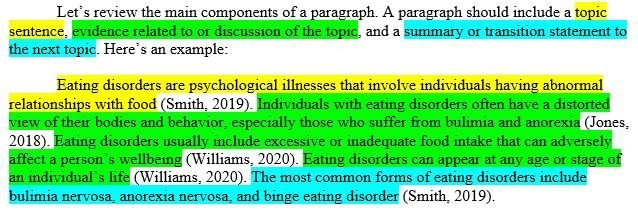

# Oren Bochman’s Blog

##### All the Good Prompts

6 min

A checklist for writing good prompts and evaluating them.

Wednesday, June 3, 2026

|          |                         |
|----------|-------------------------|
| Modified | Wednesday, June 3, 2026 |

##### Harnesses in AI

A Deep Dive

2 min

A deep dive into harnesses in AI, exploring how they can be used to improve the performance of AI agents, with a focus on a demo by Tejas Kumar that builds a browser agent…

Sunday, May 17, 2026

|          |                         |
|----------|-------------------------|
| Modified | Wednesday, June 3, 2026 |

##### ODSC - AI 2026 - Workshops

1 min

Thursday, April 30, 2026

|          |                         |
|----------|-------------------------|
| Modified | Wednesday, May 13, 2026 |

##### ODSC AI 2026

Day 3

1 min

A detailed recap of the ODSC AI 2026 Day 3 sessions, covering keynotes, lectures, and workshops on topics such as trustworthy LLMs, clustering, reinforcement learning for…

Thursday, April 30, 2026

|          |                      |
|----------|----------------------|
| Modified | Monday, May 18, 2026 |

##### ODSC AI 2026 - Day 2

46 min

Wednesday, April 29, 2026

|          |                       |
|----------|-----------------------|
| Modified | Tuesday, May 12, 2026 |

##### Agentic AI for Autonomous Root-Cause Analysis

in Large-Scale Enterprise Systems

5 min

A deep dive into multi-agent AI systems for autonomous root-cause analysis in large-scale enterprise IT environments.

Tuesday, April 28, 2026

|          |                       |
|----------|-----------------------|
| Modified | Tuesday, May 19, 2026 |

##### Agentic LLMs in Practice

2 min

A deep dive into Naman Goyal’s keynote on agentic large language models,  
exploring the challenges and strategies for building reliable and observable LLMs.

Tuesday, April 28, 2026

|          |                       |
|----------|-----------------------|
| Modified | Tuesday, May 19, 2026 |

##### Architectural Patterns

For Building and Governing Production-Grade Multi-Agent Systems

6 min

A deep dive into Dr. Ali Arsanjani’s talk at ODSC AI 2026  
on architectural patterns for building and governing production-grade multi-agent systems.

Tuesday, April 28, 2026

|          |                       |
|----------|-----------------------|
| Modified | Tuesday, May 19, 2026 |

##### Beyond the black box -

Interpretability of LLMs in Finance

4 min

A deep dive into Hariom Tatsat’s keynote on interpretability of large language models in finance, exploring the challenges and strategies for ensuring reliability and safety.

Tuesday, April 28, 2026

|          |                       |
|----------|-----------------------|
| Modified | Tuesday, May 19, 2026 |

##### Building Effective Agents

6 min

A deep dive into Sushant Mehta’s keynote on building effective large language model agents,  
exploring the challenges and strategies for ensuring reliability and safety.

Tuesday, April 28, 2026

|          |                       |
|----------|-----------------------|
| Modified | Tuesday, May 19, 2026 |

##### Building FSI Agents with Claude

7 min

A deep dive into Mikaela Grace and April Guo’s talk at ODSC  
AI 2026 on building Claude-based agents for financial-services industry workflows,  
exploring best…

Tuesday, April 28, 2026

|          |                       |
|----------|-----------------------|
| Modified | Tuesday, May 19, 2026 |

##### Deploying Multimodal AI at the Edge

Engineering Patterns for Real-World Performance

5 min

A deep dive into Achyut Sarma Boggaram’s ODSC  
AI 2026 talk on deploying multimodal AI at the edge,  
focusing on engineering patterns for real-world performance.

Tuesday, April 28, 2026

|          |                         |
|----------|-------------------------|
| Modified | Wednesday, May 20, 2026 |

##### From Intelligent to Agentic Applications

Using Model Context Protocol to Support Agentic Behaviors in Your Application

4 min

A deep dive into Kyle Stratis’s talk on using the Model Context Protocol to support agentic behaviors in applications.

Tuesday, April 28, 2026

|          |                       |
|----------|-----------------------|
| Modified | Tuesday, May 19, 2026 |

##### Governing Agentic AI

A Blueprint for Safe & Compliant Healthcare Agents in Production

5 min

A deep dive into the challenges and best practices for governing agentic AI systems in healthcare, including risk assessment, continuous testing, and production monitoring.

Tuesday, April 28, 2026

|          |                       |
|----------|-----------------------|
| Modified | Tuesday, May 19, 2026 |

##### GraphRAG in Healthcare

Enhancing Clinical Reasoning with Knowledge Graphs, GNNs, and Agents

4 min

A deep dive into Giuseppe Futia’s keynote on GraphRAG in healthcare,  
exploring the integration of knowledge graphs, GNNs, and agents for clinical reasoning.

Tuesday, April 28, 2026

|          |                       |
|----------|-----------------------|
| Modified | Tuesday, May 19, 2026 |

##### Harness Engineering

Practical Patterns for Agent-First Software Development

7 min

A deep dive into Ryan Lopopolo’s talk at ODSC AI 2026  
on Harness Engineering, exploring practical patterns for agent-first software development.

Tuesday, April 28, 2026

|          |                       |
|----------|-----------------------|
| Modified | Tuesday, May 19, 2026 |

##### Kyle Stratis

AI Agents with MCP

4 min

A deep dive into Kyle Stratis’s talk at ODSC AI 2026  
on AI Agents with MCP, exploring the practical implementation and best practices for building AI agents using the…

Tuesday, April 28, 2026

|          |                       |
|----------|-----------------------|
| Modified | Tuesday, May 19, 2026 |

##### Meaningful Data Visualization

In the Age of AI

4 min

A deep dive into Janet Six’s talk at ODSC  
AI 2026 on meaningful data visualization in the age of AI,  
exploring how to make visualizations that truly support…

Tuesday, April 28, 2026

|          |                       |
|----------|-----------------------|
| Modified | Tuesday, May 19, 2026 |

##### ODSC AI 2026

1 min

Tuesday, April 28, 2026

|          |                         |
|----------|-------------------------|
| Modified | Wednesday, May 13, 2026 |

##### Outclassing Frontier LLMs at Extracting Information

6 min

A deep dive into NewMind CEO Etienne Bernard’s talk on building specialized small language models for document information extraction, exploring the advantages and…

Tuesday, April 28, 2026

|          |                       |
|----------|-----------------------|
| Modified | Tuesday, May 19, 2026 |

##### Practical Foundations for Organization-Wide AI Adoption

6 min

A deep dive into Ivan Lourenço Gomes’s talk on practical strategies for organization-wide AI adoption, exploring how to implement AI effectively across teams and workflows.

Tuesday, April 28, 2026

|          |                       |
|----------|-----------------------|
| Modified | Tuesday, May 19, 2026 |

##### Real-Time Event-Time Consistent Analytics Pipelines

using Kafka, Flink, and Apache Pinot

5 min

A deep dive into Deep Patel’s talk at ODSC AI 2026  
on real-time event-time consistent analytics pipelines,  
exploring the use of Kafka, Flink, and Apache Pinot for…

Tuesday, April 28, 2026

|          |                       |
|----------|-----------------------|
| Modified | Tuesday, May 19, 2026 |

##### Reinforcement Learning for LLM

Talk recap

6 min

A recap of the talk “Reinforcement Learning for LLM” by Datta Nimmaturi at ODSC AI 2026 Day 3.

Tuesday, April 28, 2026

|          |                       |
|----------|-----------------------|
| Modified | Tuesday, May 19, 2026 |

##### Tensor Logic

The Language of AI

5 min

A deep dive into Pedro Domingos’s talk on Tensor Logic, exploring the unification of symbolic reasoning and neural computation in a single language for AI.

Tuesday, April 28, 2026

|          |                       |
|----------|-----------------------|
| Modified | Tuesday, May 19, 2026 |

##### The AI Agent Memory Landscape

6 min

A deep dive into William Lyon’s talk on the AI agent memory landscape, exploring the challenges and solutions for structured, shared, and evolving memory in production AI…

Tuesday, April 28, 2026

|          |                       |
|----------|-----------------------|
| Modified | Tuesday, May 19, 2026 |

##### The Art of Clustering

The Good, The Bad and The Beautiful

4 min

A deep dive into Seth Levine’s talk on clustering, exploring the techniques, challenges, and insights for effective data analysis.

Tuesday, April 28, 2026

|          |                       |
|----------|-----------------------|
| Modified | Tuesday, May 19, 2026 |

##### The Changing Shape of AI Systems

From Monolithic Training to Continuous Adaptation

4 min

A deep dive into Cohere Labs’ Nouha Dziri’s  
keynote on building trustworthy large language models,  
exploring the challenges and strategies for ensuring reliability…

Tuesday, April 28, 2026

|          |                       |
|----------|-----------------------|
| Modified | Tuesday, May 19, 2026 |

##### The Operational Transformation of Data Architecture

The Language of AI

1 min

A deep dive into Andy Petrella’s talk on  
the operational transformation of data architecture,  
exploring the unification of symbolic reasoning and neural…

Tuesday, April 28, 2026

|          |                       |
|----------|-----------------------|
| Modified | Tuesday, May 19, 2026 |

##### The Verifier–Compiler Loop

Turning Human Preferences into Production Agent Judgment

1 min

A deep dive into Ruslan Belkin’s talk on the Verifier–Compiler Loop, exploring the unification of human preferences and production agent judgment in AI.

Tuesday, April 28, 2026

|          |                       |
|----------|-----------------------|
| Modified | Tuesday, May 19, 2026 |

##### Towards Trustworthy LLMs

Understanding Limits, Advancing Capabilities, Ensuring Safety

5 min

A deep dive into Cohere Labs’ Nouha Dziri’s  
keynote on building trustworthy large language models,  
exploring the challenges and strategies for ensuring reliability…

Tuesday, April 28, 2026

|          |                       |
|----------|-----------------------|
| Modified | Tuesday, May 19, 2026 |

##### Towards Trustworthy LLMs

Understanding Limits, Advancing Capabilities, Ensuring Safety

6 min

A deep dive into Cohere Labs’ Nouha Dziri’s  
keynote on building trustworthy large language models,  
exploring the challenges and strategies for ensuring reliability…

Tuesday, April 28, 2026

|          |                       |
|----------|-----------------------|
| Modified | Tuesday, May 19, 2026 |

##### Towards Trustworthy LLMs

Understanding Limits, Advancing Capabilities, Ensuring Safety

5 min

A deep dive into Cohere Labs’ Nouha Dziri’s  
keynote on building trustworthy large language models,  
exploring the challenges and strategies for ensuring reliability…

Tuesday, April 28, 2026

|          |                       |
|----------|-----------------------|
| Modified | Tuesday, May 19, 2026 |

##### Using Model Context Protocol with Python

A Getting Started Guide for Data Scientists

6 min

A deep dive into Ryan Day’s talk at ODSC  
AI 2026 on Model Context Protocol (MCP), exploring how to provide data and functionality to AI agents using Python.

Tuesday, April 28, 2026

|          |                       |
|----------|-----------------------|
| Modified | Tuesday, May 19, 2026 |

##### vLLM with the Transformers Modelling Backend

2 min

A deep dive into Harry Mellor’s talk on vLLM with the Transformers Modelling Backend, exploring the integration of vLLM with HuggingFace Transformers for efficient model…

Tuesday, April 28, 2026

|          |                       |
|----------|-----------------------|
| Modified | Tuesday, May 19, 2026 |

##### A Practical Introduction to Agentic AI

4 min

A workshop on building agentic AI applications from scratch, covering tool use, task decomposition, self-correction, conditional routing, and human-in-the-loop review.

Monday, April 27, 2026

|          |                       |
|----------|-----------------------|
| Modified | Tuesday, May 19, 2026 |

##### Building Responsible AI Agents

with Open Source

6 min

A workshop on building responsible AI agents using open source tools, with a focus on healthcare applications and privacy-preserving design.

Monday, April 27, 2026

|          |                       |
|----------|-----------------------|
| Modified | Tuesday, May 19, 2026 |

##### Engineering the Harness

A Practical Workshop on Context Engineering for Generative AI

2 min

In this funky workshop, Rajiv Shah dives into the rabbit hole of harness engineering for AI agents. He covers the importance of coding harnesses, the key levers of harness…

Monday, April 27, 2026

|          |                       |
|----------|-----------------------|
| Modified | Tuesday, May 19, 2026 |

##### Introduction to Machine Learning

From Theory to Application

7 min

An introduction to machine learning concepts and practical application using scikit-learn, covering topics such as regression, classification, decision trees, random…

Monday, April 27, 2026

|          |                       |
|----------|-----------------------|
| Modified | Tuesday, May 19, 2026 |

##### Introduction to the Agent2Agent (A2A) Protocol

6 min

A workshop introducing the Agent-to-Agent (A2A) protocol, which enables interoperability and communication between independent AI agents across different frameworks and…

Monday, April 27, 2026

|          |                       |
|----------|-----------------------|
| Modified | Tuesday, May 19, 2026 |

##### Introduction to the Math Behind Transformers and LLMs

A Workshop on the Mathematics of Transformers and Large Language Models

7 min

An accessible introduction to the mathematics behind transformers and large language models, covering key concepts such as attention mechanisms, self-attention, multi-headed…

Monday, April 27, 2026

|          |                        |
|----------|------------------------|
| Modified | Thursday, May 14, 2026 |

##### ODSC AI 2026

Day 0

1 min

These are workshops and sessions that took place before the start of the main track.

Monday, April 27, 2026

|          |                      |
|----------|----------------------|
| Modified | Friday, May 15, 2026 |

##### Mixture problems

Why most Bayesians avoid Mixture Models

4 min

An exploration of the challenges associated with mixture models in Bayesian statistics, including identifiability, label switching, and computational complexity, along with…

Saturday, March 7, 2026

|          |                      |
|----------|----------------------|
| Modified | Friday, May 15, 2026 |

##### Smoothing problems

The challenges of filtering and smoothing for switching models

6 min

Saturday, March 7, 2026

|          |                        |
|----------|------------------------|
| Modified | Thursday, May 14, 2026 |

##### CI - Libs for Python

2 min

Sunday, February 15, 2026

|          |                           |
|----------|---------------------------|
| Modified | Monday, February 16, 2026 |

##### Robert Ness on LLMs & CI

11 min

Saturday, February 14, 2026

|          |                        |
|----------|------------------------|
| Modified | Thursday, May 14, 2026 |

##### The Art of Discipline: Mastering Self-Control for a Fulfilling Life

9 min

Wednesday, January 21, 2026

|          |                        |
|----------|------------------------|
| Modified | Thursday, May 14, 2026 |

##### KV Cache Efficiency & Context Platform Engineering

AI Performance Engineering Meetup

2 min

In this talk, Valentin Vercovici and Callan Fox discuss the challenges of maintaining high KV cache hit rates in large-scale AI inference workloads and introduce the concept…

Monday, January 19, 2026

|          |                        |
|----------|------------------------|
| Modified | Thursday, May 14, 2026 |

##### nvidia Nsight GPU profiling

AI Performance Engineering Meetup

7 min

In this talk, Chaim Rand revisits the NVIDIA Nsight profiling tools to augment the PyTorch Profiler, addressing critical issues in data transfer and batching for AI/ML…

Monday, January 19, 2026

|          |                        |
|----------|------------------------|
| Modified | Thursday, May 14, 2026 |

##### RL Agents Last All Summer Long

Integrating Reinforcement Learning with Large Language Models for Advanced Reasoning and Planning

4 min

Exploring how Reinforcement Learning (RL) can enhance the reasoning and planning capabilities of Large Language Models (LLMs) by creating a hierarchical agent structure and…

Wednesday, January 14, 2026

|          |                      |
|----------|----------------------|
| Modified | Friday, May 15, 2026 |

##### Rise of the agents

Integrating Reinforcement Learning with Large Language Models for Advanced Reasoning and Planning

3 min

Exploring how Reinforcement Learning (RL) can enhance the reasoning and planning capabilities of Large Language Models (LLMs) by creating a hierarchical agent structure and…

Wednesday, January 14, 2026

|          |                      |
|----------|----------------------|
| Modified | Friday, May 15, 2026 |

##### Three modes of convergence of random variables

A deep dive into the three modes of convergence for random variables: convergence in probability, almost sure convergence, and convergence in distribution. We explore their definitions, interpretations, geometric sketches, hierarchy, counterexamples, and applications in probability theory and statistics.

12 min

A deep dive into the three modes of convergence for random variables: convergence in probability, almost sure convergence, and convergence in distribution. We explore their…

Friday, January 9, 2026

|          |                      |
|----------|----------------------|
| Modified | Friday, May 15, 2026 |

##### Agentic Buzz

Making sense of the buzzwords around AI agents

11 min

This is my guide for sorting out the fluff from the substance around AI agents. I want to track what people are most excited about so I can join in the fun.

Saturday, January 3, 2026

|          |                         |
|----------|-------------------------|
| Modified | Wednesday, June 3, 2026 |

##### Convoluted Intuitions

Convolutions, Fourier transforms, and the Fast Fourier Transform (FFT)

2 min

Convolutions are a fundamental mathematical operation that arises in many areas of mathematics, physics, and engineering. In this post, we will explore the concept of…

Saturday, January 3, 2026

|          |                      |
|----------|----------------------|
| Modified | Friday, May 15, 2026 |

##### Sick

4 min

I’ve been sick for about a week with the sniffles and a mild fever. It’s been a bit of a rough patch, but I’m starting to feel better now. I’ve been resting a lot and…

Thursday, January 1, 2026

|          |                        |
|----------|------------------------|
| Modified | Thursday, May 14, 2026 |

##### Anthropic’s Claude: Advancing AI with Safety and Scalability

PyData Global 2025 Recap

1 min

A detailed recap of the PyData Global 2025 talk on Anthropic’s Claude, covering its architecture, safety features, and applications in AI.

Sunday, December 14, 2025

|          |                        |
|----------|------------------------|
| Modified | Saturday, May 16, 2026 |

##### Beyond Just Prediction

Causal Thinking in Machine Learning

3 min

A comprehensive recap of the PyData Global 2025 talk on integrating causal thinking into machine learning, focusing on uplift modeling to enhance decision-making processes…

Friday, December 12, 2025

|          |                        |
|----------|------------------------|
| Modified | Saturday, May 16, 2026 |

##### Bodo DataFrames

a fast and scalable HPC-based drop-in replacement for Pandas

9 min

A detailed recap of Scott Routledge talk at the PyData Global 2025 conference. In which he discusses Bodo DataFrames, a high-performance computing-based drop-in replacement…

Friday, December 12, 2025

|          |                      |
|----------|----------------------|
| Modified | Monday, May 18, 2026 |

##### Building a Lightweight Feature Store for Electricity Grid Forecasts with Polars

PyData Global 2025 Recap

7 min

Friday, December 12, 2025

|          |                        |
|----------|------------------------|
| Modified | Saturday, May 16, 2026 |

##### Combining Zarr, HDF5, and TIFF into a single data format

PyData Global 2025 Recap

4 min

A detailed recap of the PyData Global 2025 talk on combining Zarr, HDF5, and TIFF into a single data format, covering key components, performance considerations, and…

Friday, December 12, 2025

|          |                        |
|----------|------------------------|
| Modified | Saturday, May 16, 2026 |

##### GPU Accelerated Zarr

PyData Global 2025 Recap

5 min

A detailed recap of the PyData Global 2025 talk on GPU-accelerated Zarr, covering key components, performance considerations, and practical implementation tips.

Friday, December 12, 2025

|          |                        |
|----------|------------------------|
| Modified | Saturday, May 16, 2026 |

##### GPU Python for the Real World: Practical Steps to GPU-Accelerated Python with RAPIDS

PyData Global 2025 Recap

8 min

A detailed recap of the PyData Global 2025 talk on GPU-accelerated Python using RAPIDS, covering key components, common pitfalls, and practical implementation tips.

Friday, December 12, 2025

|          |                        |
|----------|------------------------|
| Modified | Saturday, May 16, 2026 |

##### Garbage In: Lawsuit Out

Building Compliant and Reproducible ML Pipelines

9 min

A recap of Itai Gilo’s PyData Global 2025 talk on defensible, reproducible, and auditable machine learning pipelines, with a focus on data versioning and compliance controls.

Friday, December 12, 2025

|          |                        |
|----------|------------------------|
| Modified | Saturday, May 16, 2026 |

##### How to Effectively use text embeddings in tree based models

PyData Global 2025 Recap

3 min

A detailed recap of the PyData Global 2025 talk by Claudio Salvatore Arcidiacono on effectively using text embeddings in tree-based models, covering key concepts…

Friday, December 12, 2025

|          |                        |
|----------|------------------------|
| Modified | Saturday, May 16, 2026 |

##### Scaling Data Processing for LLMs with NeMo Curator

PyData Global 2025 Recap

3 min

A detailed recap of the PyData Global 2025 talk on building a transformer model from scratch using PyTorch, covering key components, common pitfalls, and practical…

Friday, December 12, 2025

|          |                        |
|----------|------------------------|
| Modified | Saturday, May 16, 2026 |

##### Sparse & Finch

Extending sparse computing in the Python ecosystem

8 min

A detailed recap of the PyData Global 2025 talk by Mateusz Sokół and Willow Marie Ahrens  
on implementing sparse computing in the Python ecosystem  
using…

Friday, December 12, 2025

|          |                         |
|----------|-------------------------|
| Modified | Wednesday, May 20, 2026 |

##### TinyTroupe: Enhancing Marketing Insights through LLM-Powered Multiagent Persona Simulation

PyData Global 2025 Recap

7 min

A detailed recap of the PyData Global 2025 talk on building a transformer model from scratch using PyTorch, covering key components, common pitfalls, and practical…

Friday, December 12, 2025

|          |                        |
|----------|------------------------|
| Modified | Saturday, May 16, 2026 |

##### When the Meter Maxes Out

Chernobyl Disaster Lessons for ML Systems in Production

4 min

A detailed recap of the PyData Global 2025 talk on lessons from the Chernobyl disaster applied to machine learning systems in production, highlighting common failure modes…

Friday, December 12, 2025

|          |                        |
|----------|------------------------|
| Modified | Saturday, May 16, 2026 |

##### Automating ML with PyCaret: Train & Compare Multiple Models to Find the Best Performer

PyData Global 2025 Recap

4 min

A live demonstration of how PyCaret simplifies machine learning workflows by enabling users to train and compare multiple models with minimal code.

Thursday, December 11, 2025

|          |                        |
|----------|------------------------|
| Modified | Saturday, May 16, 2026 |

##### Enhancing Marketplace Competitiveness

A Bayesian Approach to modelling the cold start problem

10 min

An exploration of how Bayesian statistical modeling can be applied to the cold start problem in recommendation systems, enabling efficient decision-making and risk…

Thursday, December 11, 2025

|          |                      |
|----------|----------------------|
| Modified | Sunday, May 17, 2026 |

##### How Big are SLMs

PyData Global 2025 Recap

4 min

A recap of Jayita Bhattacharyya’s talk at PyData Global 2025 on Small Language Models (SLMs), exploring their capabilities, training techniques, and implications for AI…

Thursday, December 11, 2025

|          |                        |
|----------|------------------------|
| Modified | Saturday, May 16, 2026 |

##### Decisions Under Uncertainty: A Hands‑On Guide to Bayesian Decision Theory

PyData Global 2025 Recap

5 min

A practical introduction to Bayesian decision theory, illustrating how to make optimal decisions under uncertainty with hands-on Python examples.

Wednesday, December 10, 2025

|          |                        |
|----------|------------------------|
| Modified | Saturday, May 16, 2026 |

##### From Ideas to APIs: Delivering Fast with Modern Python

PyData Global 2025 Recap

3 min

Wednesday, December 10, 2025

|          |                             |
|----------|-----------------------------|
| Modified | Thursday, December 11, 2025 |

##### Hands-on with Blosc2: Accelerating Your Python Data Workflows

PyData Global 2025 Recap

5 min

A practical tutorial on using Blosc2 to optimize data workflows in Python, focusing on out-of-core computations and efficient handling of large datasets.

Wednesday, December 10, 2025

|          |                        |
|----------|------------------------|
| Modified | Saturday, May 16, 2026 |

##### Lessons in Decision Making from the Monty Hall Problem

PyData Global 2025 Recap

8 min

Wednesday, December 10, 2025

|          |                        |
|----------|------------------------|
| Modified | Thursday, May 14, 2026 |

##### Optimal Variable Binning in Logistic Regression

PyData Global 2025 Recap

3 min

A practical guide to optimal variable binning techniques for enhancing logistic regression models in regulated industries.

Wednesday, December 10, 2025

|          |                        |
|----------|------------------------|
| Modified | Saturday, May 16, 2026 |

##### Optimizing AI/ML Workloads: Resource Management and Cost Attribution

PyData Global 2025 Recap

4 min

A comprehensive framework for monitoring, analyzing, and optimizing AI/ML workloads to enhance resource utilization and cost attribution using Metaflow.

Wednesday, December 10, 2025

|          |                        |
|----------|------------------------|
| Modified | Saturday, May 16, 2026 |

##### Realtime Financial Fraud Detection with Modern Python

PyData Global 2025 Recap

3 min

A recap of the PyData Global 2025 talk on real-time financial fraud detection using modern Python tools and techniques.

Wednesday, December 10, 2025

|          |                        |
|----------|------------------------|
| Modified | Saturday, May 16, 2026 |

##### Reviving Survival Analysis: Timeless, Yet Overlooked?

PyData Global 2025 Recap

4 min

A practical introduction to survival analysis, its core concepts, and applications using Python and R.

Wednesday, December 10, 2025

|          |                        |
|----------|------------------------|
| Modified | Saturday, May 16, 2026 |

##### Time series analysis for coupled neurons.

PyData Global 2025 Recap

9 min

A hands-on tutorial on time series analysis of coupled neuron models using Python.

Wednesday, December 10, 2025

|          |                        |
|----------|------------------------|
| Modified | Saturday, May 16, 2026 |

##### Using MCP to turn Claude into a Football Opposition Analyst

PyData Global 2025 Recap

2 min

A recap of Adam Cowley’s PyData Global 2025 talk on using Model Context Protocol (MCP) to transform Anthropic’s Claude into a football opposition analyst.

Wednesday, December 10, 2025

|          |                      |
|----------|----------------------|
| Modified | Sunday, May 17, 2026 |

##### Building LLM-Powered Applications for Data Scientists and Software Engineers

PyData Global 2025 Recap

6 min

A detailed recap of the PyData Global 2025 workshop on building LLM-powered applications, focusing on software engineering principles, prompt engineering, monitoring, and…

Tuesday, December 9, 2025

|          |                        |
|----------|------------------------|
| Modified | Saturday, May 16, 2026 |

##### Designing a Fast, Offline-Capable Reverse Geocoder in Python: An Open Source Alternative to Big Geo APIs

PyData Global 2025 Recap

4 min

A hands-on walkthrough of building a fast, offline-capable reverse geocoder in Python using open-source tools like cKDTree, shapely, and geopandas.

Tuesday, December 9, 2025

|          |                        |
|----------|------------------------|
| Modified | Saturday, May 16, 2026 |

##### From Feature Engineering to Context Engineering for Agents

PyData Global 2025 Recap

2 min

Exploring the transition from traditional feature engineering techniques to context engineering for large language model agents.

Tuesday, December 9, 2025

|          |                        |
|----------|------------------------|
| Modified | Saturday, May 16, 2026 |

##### Harnessing Generative Models for Synthetic Non-Life Insurance Data

PyData Global 2025 Recap

6 min

An in-depth exploration of using various generative models to create synthetic non-life insurance premium data, including validation techniques and model comparisons.

Tuesday, December 9, 2025

|          |                        |
|----------|------------------------|
| Modified | Saturday, May 16, 2026 |

##### I Built a Transformer from Scratch So You Don’t Have To

PyData Global 2025 Recap

3 min

A hands-on walkthrough of building the original Transformer architecture from scratch in PyTorch, demystifying attention mechanisms, positional encoding, and the…

Tuesday, December 9, 2025

|          |                      |
|----------|----------------------|
| Modified | Friday, May 15, 2026 |

##### LLMs, Chatbots, and Dashboards: Visualize Your Data with Natural Language

PyData Global 2025 Recap

3 min

A recap of the PyData Global 2025 talk by Daniel Chen on integrating LLMs into data science workflows, using the Chatlas package and Shiny dashboards to create AI-powered…

Tuesday, December 9, 2025

|          |                        |
|----------|------------------------|
| Modified | Saturday, May 16, 2026 |

##### Lessons learnt in optimizing a large-scale pandas application using Polars, FireDucks and cuDF: Go Smart and Save More!

PyData Global 2025 Recap

3 min

A detailed exploration of optimizing large-scale pandas applications using high-performance alternatives like Polars, FireDucks, and cuDF, highlighting best practices and…

Tuesday, December 9, 2025

|          |                        |
|----------|------------------------|
| Modified | Saturday, May 16, 2026 |

##### Python Meets Excel

Smarter Workflows for Analysts and Data Teams

6 min

A comprehensive overview of how Python can be effectively integrated with Excel to automate and enhance data workflows, focusing on practical tools and techniques for…

Tuesday, December 9, 2025

|          |                        |
|----------|------------------------|
| Modified | Saturday, May 16, 2026 |

##### Python Worst Practices - Learn from the Expert

PyData Global 2025 Recap

2 min

A humorous look at the worst practices in Python programming, presented by data and analytics comedian Evan Wimpey.

Tuesday, December 9, 2025

|          |                        |
|----------|------------------------|
| Modified | Saturday, May 16, 2026 |

##### Scaling Fuzzy Product Matching with BM25: A Comparative Study of Python and Database Solutions

PyData Global 2025 Recap

5 min

A practical guide to implementing BM25 for fuzzy product matching at scale using Python and DuckDB, complete with performance benchmarks and optimization tips.

Tuesday, December 9, 2025

|          |                        |
|----------|------------------------|
| Modified | Saturday, May 16, 2026 |

##### The Lifecycle of a Jupyter Environment - From Exploration to Production-Grade Pipelines

PyData Global 2025 Recap

9 min

A comprehensive overview of transitioning Jupyter notebooks from exploratory tools to production-grade pipelines, covering best practices, tools, and real-world challenges.

Tuesday, December 9, 2025

|          |                        |
|----------|------------------------|
| Modified | Saturday, May 16, 2026 |

##### Using Traditional AI and LLMs to Automate Complex and Critical Documents in Healthcare

PyData Global 2025 Recap

6 min

A comprehensive overview of how traditional AI and large language models can be leveraged to automate the creation of complex and critical documents in healthcare, such as…

Tuesday, December 9, 2025

|          |                        |
|----------|------------------------|
| Modified | Thursday, May 14, 2026 |

##### When AI Makes Things Up

Understanding and Tackling Hallucinations

3 min

In this talk, Aarti Jha presents a practical guide to understanding, detecting, and mitigating hallucinations in AI systems for building trustworthy applications.

Tuesday, December 9, 2025

|          |                      |
|----------|----------------------|
| Modified | Sunday, May 17, 2026 |

##### Where Have All the Metrics Gone?

PyData Global 2025 Recap

2 min

Exploring the challenges and strategies for defining and measuring metrics in modern AI systems, especially when traditional metrics are unavailable or inadequate.

Tuesday, December 9, 2025

|          |                        |
|----------|------------------------|
| Modified | Saturday, May 16, 2026 |

##### Why Julia’s GPU-Accelerated ODE Solvers are 20x-100x Faster than Jax and PyTorch

PyData Global 2025 Recap

6 min

An in-depth look at the architectural differences that make Julia’s GPU-accelerated ODE solvers significantly faster than their Python counterparts, based on the 2024…

Tuesday, December 9, 2025

|          |                        |
|----------|------------------------|
| Modified | Saturday, May 16, 2026 |

##### projspec: what’s this project anyway?

PyData Global 2025 Recap

4 min

A detailed recap of the PyData Global 2025 talk on projspec, a tool for introspecting and managing Python data projects.

Tuesday, December 9, 2025

|          |                        |
|----------|------------------------|
| Modified | Saturday, May 16, 2026 |

##### torchTextClassifiers : Modernizing Text classification for French National Statistics

PyData Global 2025 Recap

3 min

An in-depth look at how Insee modernized text classification by transitioning from fastText to a PyTorch-based model using the open-source torchTextClassifiers package…

Tuesday, December 9, 2025

|          |                        |
|----------|------------------------|
| Modified | Saturday, May 16, 2026 |

##### Stochastic gradient Descent – a Deep Dive

8 min

Thursday, October 9, 2025

|          |                            |
|----------|----------------------------|
| Modified | Saturday, October 11, 2025 |

##### Updates to the github action

4 min

Wednesday, October 1, 2025

|          |                             |
|----------|-----------------------------|
| Modified | Thursday, September 4, 2025 |

##### Vibe coding GPT5 Edition

A Wikipedian considers prompting strategies in the age of GPT 5

8 min

A few thoughts on how to get the most out of GPT-5 for coding and tough problems

Thursday, September 25, 2025

|          |                        |
|----------|------------------------|
| Modified | Thursday, May 14, 2026 |

##### FlexAttention: A Flexible Approach to Attention Mechanisms

6 min

Saturday, September 20, 2025

|          |                        |
|----------|------------------------|
| Modified | Thursday, May 14, 2026 |

##### FlexAttention: A Flexible Approach to Attention Mechanisms

6 min

Saturday, September 20, 2025

|          |                        |
|----------|------------------------|
| Modified | Thursday, May 14, 2026 |

##### FlexAttention: A Flexible Approach to Attention Mechanisms

6 min

Saturday, September 20, 2025

|          |                        |
|----------|------------------------|
| Modified | Thursday, May 14, 2026 |

##### Probabilitic Modeling with Language Models

4 min

Sunday, September 14, 2025

|          |                            |
|----------|----------------------------|
| Modified | Sunday, September 14, 2025 |

##### Marketing Mix Model

4 min

A model for marketing mix

Wednesday, September 10, 2025

|          |                               |
|----------|-------------------------------|
| Modified | Wednesday, September 10, 2025 |

##### Allegations of War Crimes and the Palestinian Genocide

A Critical Look and Analysis

14 min

A critical analysis of the allegations of war crimes and genocide in the context of the Israeli-Palestinian conflict, examining the evidence, legal standards, and the…

Sunday, September 7, 2025

|          |                      |
|----------|----------------------|
| Modified | Friday, May 15, 2026 |

##### AI a bag of tricks

My bag of tricks for the AI age

10 min

A collection of tools and techniques I use in the AI age.

Thursday, September 4, 2025

|          |                        |
|----------|------------------------|
| Modified | Thursday, May 14, 2026 |

##### ShinyLive ❤️ Mesa Tutorial

POC of a Mesa tutorial running in the browser with ShinyLive for Python

27 min

This is my vibe coding guide on how I built a POC of concept for running Mesa app (their tutorial) in ShinyLive app so it can run in the browser without a front end.

Tuesday, September 2, 2025

|          |                      |
|----------|----------------------|
| Modified | Friday, May 15, 2026 |

##### Langtalks Resources \# 43

Exploring GenAI-powered tools

3 min

Exploring GenAI-powered tools

Thursday, April 3, 2025

|          |                        |
|----------|------------------------|
| Modified | Thursday, May 14, 2026 |

##### Base line Morphology Model

A baseline morphology and syntax for emergent languages

23 min

Some thoughts and code for a baseline morphology and syntax for emergent languages

Wednesday, April 2, 2025

|          |                        |
|----------|------------------------|
| Modified | Thursday, May 14, 2026 |

##### Complex Lewis Signaling - The Research Questions

Clarifying my research questions

12 min

A list of clarified research questions regarding emergent languages, planning, and grounding in multi-agent systems.

Wednesday, April 2, 2025

|          |                            |
|----------|----------------------------|
| Modified | Monday, September 22, 2025 |

##### The roles of Partial pooling and mixed strategies in the Lewis signaling game

a game theoretic perspective

14 min

An exploration of partial pooling equilibria and mixed strategies in the Lewis signaling game, shedding light on their implications for emergent languages and communication…

Tuesday, March 11, 2025

|          |                           |
|----------|---------------------------|
| Modified | Thursday, August 28, 2025 |

##### Emergent Languages

A Desiderata

14 min

A working paper on emergent languages

Tuesday, January 14, 2025

|          |                         |
|----------|-------------------------|
| Modified | Wednesday, June 3, 2026 |

##### Planning in the Complex Lewis Game

15 min

Tuesday, January 14, 2025

|          |                      |
|----------|----------------------|
| Modified | Friday, May 15, 2026 |

##### The Referential Lewis Signaling Game

Back of the napkin complexity calculations

5 min

Tuesday, January 14, 2025

|          |                           |
|----------|---------------------------|
| Modified | Wednesday, March 12, 2025 |

##### A garden of forking paths

10 min

Saturday, January 11, 2025

|          |                           |
|----------|---------------------------|
| Modified | Wednesday, March 12, 2025 |

##### Complex Signals Questions

Research Notes

1 min

Some questions about planning in the Lewis Signaling Game and the stability of equilibria.

Monday, January 6, 2025

|          |                           |
|----------|---------------------------|
| Modified | Thursday, August 28, 2025 |

##### The Many Path To A Signaling System

11 min

Sunday, January 5, 2025

|          |                         |
|----------|-------------------------|
| Modified | Wednesday, June 3, 2026 |

##### Off-Policy Learning

For Dummies

2 min

Saturday, January 4, 2025

|          |                           |
|----------|---------------------------|
| Modified | Wednesday, March 12, 2025 |

##### Rethinking Signaling systems via the lens of compositionality

7 min

Thursday, January 2, 2025

|          |                           |
|----------|---------------------------|
| Modified | Wednesday, March 12, 2025 |

##### Books, Courses Tools

1 min

Wednesday, January 1, 2025

|          |                        |
|----------|------------------------|
| Modified | Thursday, May 14, 2026 |

##### Lewis Signaling Game for PettingZoo

Paper Review

11 min

Wednesday, January 1, 2025

|          |                        |
|----------|------------------------|
| Modified | Thursday, May 14, 2026 |

##### Villeny pure and simple

Scar face Capone in the valentine’s day massacre

6 min

Thursday, December 12, 2024

|          |                        |
|----------|------------------------|
| Modified | Thursday, May 14, 2026 |

##### Misbehavior of Markets and Scaling in financial prices 1-4

Four papers and a book

6 min

Review of Mandelbrot’s papers on scaling in financial prices and his popular science book The (Mis)behaviour of Markets.

Monday, December 2, 2024

|          |                        |
|----------|------------------------|
| Modified | Thursday, May 14, 2026 |

##### Scaling in financial prices 4

Multifractal Concentration

13 min

Sunday, December 1, 2024

|          |                         |
|----------|-------------------------|
| Modified | Wednesday, June 3, 2026 |

##### Scaling in financial prices 3

Cartoon Brownian Motions in Multifractal Time

14 min

Saturday, November 30, 2024

|          |                         |
|----------|-------------------------|
| Modified | Wednesday, June 3, 2026 |

##### Scaling in financial prices 2

Multi-fractals and the star equation

12 min

Friday, November 29, 2024

|          |                         |
|----------|-------------------------|
| Modified | Wednesday, June 3, 2026 |

##### Scaling in financial prices 1

Tails and dependence

13 min

Thursday, November 28, 2024

|          |                         |
|----------|-------------------------|
| Modified | Wednesday, June 3, 2026 |

##### Vitter’s Algorithm

Adaptive Huffman coding for online learning of compositional languages

18 min

This article explores Vitter’s Algorithm and its application in online learning and communication within multi-agent systems.

Friday, October 11, 2024

|          |                        |
|----------|------------------------|
| Modified | Thursday, May 14, 2026 |

##### TL-DR rethinking 💭 topological alignment

12 min

Tuesday, October 1, 2024

|          |                         |
|----------|-------------------------|
| Modified | Wednesday, June 3, 2026 |

##### LLM the good the bad and the ugly

An essay on the limitations of language models

7 min

Monday, September 30, 2024

|          |                        |
|----------|------------------------|
| Modified | Thursday, May 14, 2026 |

##### LLM and the missing link

2 min

Saturday, September 28, 2024

|          |                        |
|----------|------------------------|
| Modified | Thursday, May 14, 2026 |

##### NLP with RL

3 min

Friday, September 27, 2024

|          |                           |
|----------|---------------------------|
| Modified | Wednesday, March 12, 2025 |

##### Deduction Evaluation

2 min

Thursday, September 26, 2024

|          |                           |
|----------|---------------------------|
| Modified | Wednesday, March 12, 2025 |

##### Fine-tune llm for Style and Grammar advice.

Can we fine tune a state of the art LLM to improve the readability of text?

5 min

Can we fine tune a state of the art LLM to improve the readability of text?

Wednesday, September 25, 2024

|          |                        |
|----------|------------------------|
| Modified | Thursday, May 14, 2026 |

##### Is compositionality overrated? The view from language emergence

29 min

A review of Marco Baroni’s talk on the emergence of languages and the role of compositionality in language evolution.

Sunday, September 1, 2024

|          |                         |
|----------|-------------------------|
| Modified | Wednesday, June 3, 2026 |

##### Six quick tips to improve modeling

3 min

Monday, August 26, 2024

|          |                           |
|----------|---------------------------|
| Modified | Wednesday, March 12, 2025 |

##### Stumpy

Times Series Analysis

6 min

Thursday, August 8, 2024

|          |                         |
|----------|-------------------------|
| Modified | Friday, August 29, 2025 |

##### replay buffer questions

3 min

Tuesday, July 2, 2024

|          |                           |
|----------|---------------------------|
| Modified | Wednesday, March 12, 2025 |

##### two ideas on generalization

6 min

Monday, July 1, 2024

|          |                           |
|----------|---------------------------|
| Modified | Wednesday, March 12, 2025 |

##### Mesa & RL

3 min

Tuesday, June 25, 2024

|          |                           |
|----------|---------------------------|
| Modified | Wednesday, March 12, 2025 |

##### zero inflated data

6 min

Sunday, June 23, 2024

|          |                       |
|----------|-----------------------|
| Modified | Sunday, June 23, 2024 |

##### readings in rl

9 min

Tuesday, June 18, 2024

|          |                      |
|----------|----------------------|
| Modified | Friday, May 15, 2026 |

##### Hyperparameter Optimization

2 min

Thursday, June 13, 2024

|          |                         |
|----------|-------------------------|
| Modified | Thursday, June 13, 2024 |

##### More Sugar please

Extending Sugarscape for Curriculum Learning

25 min

In this post, I explore ideas for extending the Sugarscape environment to create a richer curriculum learning environment for multi-agent reinforcement learning, with a…

Tuesday, June 11, 2024

|          |                      |
|----------|----------------------|
| Modified | Friday, May 15, 2026 |

##### Risk-constrained Markov decision processes

paper review

5 min

Tuesday, June 11, 2024

|          |                        |
|----------|------------------------|
| Modified | Thursday, May 14, 2026 |

##### Evolutionary Games and Population Dynamics Summary

3 min

Sunday, May 12, 2024

|          |                        |
|----------|------------------------|
| Modified | Thursday, May 14, 2026 |

##### Roth Erev learning in Lewis signaling games

44 min

Thursday, May 9, 2024

|          |                        |
|----------|------------------------|
| Modified | Thursday, May 14, 2026 |

##### Signals Experiment

Leaning language games

16 min

Tuesday, May 7, 2024

|          |                           |
|----------|---------------------------|
| Modified | Wednesday, March 12, 2025 |

##### ad hoc complex signaling systems

a review and proposal

4 min

A deep dive into the complex signaling systems

Sunday, May 5, 2024

|          |                         |
|----------|-------------------------|
| Modified | Wednesday, June 3, 2026 |

##### Shannon Game

emergent complex communications protocols

12 min

Thursday, May 2, 2024

|          |                           |
|----------|---------------------------|
| Modified | Wednesday, March 12, 2025 |

##### Urn models using Numpy

19 min

Thursday, May 2, 2024

|          |                         |
|----------|-------------------------|
| Modified | Wednesday, June 3, 2026 |

##### RAD REPL

5 min

Wednesday, May 1, 2024

|          |                           |
|----------|---------------------------|
| Modified | Wednesday, March 12, 2025 |

##### Mesa

Lessons from implementing Sugarscape in Mesa

23 min

In this post I share some of the lessons I learned from implementing Sugarscape in Mesa. I cover the design decisions I made and how they helped me to overcome some of the…

Sunday, March 31, 2024

|          |                        |
|----------|------------------------|
| Modified | Thursday, May 14, 2026 |

##### Sugar Scapes

3 min

Sunday, March 31, 2024

|          |                           |
|----------|---------------------------|
| Modified | Wednesday, March 12, 2025 |

##### OCR building blocks

3 min

Thursday, March 28, 2024

|          |                        |
|----------|------------------------|
| Modified | Thursday, May 14, 2026 |

##### Bayesian Agent

Agent Based Modeling With MESA

6 min

A quick note about Bayesian Agents and how to implement them using the MESA framework in Python.

Thursday, March 21, 2024

|          |                        |
|----------|------------------------|
| Modified | Thursday, May 14, 2026 |

##### A definition by Patrick Henry Winston

For Artificial Intelligence

2 min

Patrick Henry Winston provides a definition of AI. How he keeps expanding his definition as he goes along is thing of beauty. It expands organicaly to incorporate new ideas…

Sunday, March 3, 2024

|          |                        |
|----------|------------------------|
| Modified | Thursday, May 14, 2026 |

##### OCR - Brain Dump

2 min

Sunday, February 25, 2024

|          |                        |
|----------|------------------------|
| Modified | Thursday, May 14, 2026 |

##### Rhetoric NLP Tasks

3 min

Saturday, February 17, 2024

|          |                      |
|----------|----------------------|
| Modified | Friday, June 7, 2024 |

##### Lewis Game from a Bayesian Perspective

Some thoughts on the Lewis signaling game

8 min

Some thoughts on the Lewis signaling game

Monday, February 12, 2024

|          |                        |
|----------|------------------------|
| Modified | Thursday, May 14, 2026 |

##### 😁 Quarto 💖 Mermaid🧜 Mindmaps 🧠

2 min

Quarto at last supports Mindmap charts using Mermaid charts.

Monday, February 12, 2024

|          |                        |
|----------|------------------------|
| Modified | Thursday, June 6, 2024 |

##### The Great Migration

From Blogger to Jekyl and finaly to Quarto.

2 min

some migration notes from Blooger to Jekyl to Quarto blog.

Tuesday, January 30, 2024

|          |                              |
|----------|------------------------------|
| Modified | Wednesday, February 14, 2024 |

##### Post With Code

4 min

Sunday, January 28, 2024

|          |                              |
|----------|------------------------------|
| Modified | Wednesday, February 14, 2024 |

##### Engineering Reinforcement Learning Algorithms

3 min

Wednesday, January 10, 2024

|          |                           |
|----------|---------------------------|
| Modified | Thursday, August 28, 2025 |

##### SuperLearner

18 min

SuperLearner is an ensambeleing library.

Wednesday, January 10, 2024

|          |                        |
|----------|------------------------|
| Modified | Thursday, May 14, 2026 |

##### Understanding Emergent Languages

90 min

Thursday, January 4, 2024

|          |                         |
|----------|-------------------------|
| Modified | Wednesday, June 3, 2026 |

##### D3.js in in Quarto Observable

4 min

Tuesday, January 2, 2024

|          |                        |
|----------|------------------------|
| Modified | Thursday, May 14, 2026 |

##### AutoGluon Cheetsheets

Beacuase auto-ml is a Superpower

1 min

Autogluon is a auto-ml framework, here are three cheetsheet for accellerating data science workloads

Wednesday, December 20, 2023

|          |                           |
|----------|---------------------------|
| Modified | Monday, February 26, 2024 |

##### Bayesian Marketing Science - Solving Marketing’s 3 Biggest Problems

Dr. Thomas Wiecki’s PyData Global 2023 Recap

11 min

A recap of Dr. Thomas Wiecki’s talk at PyData Berlin 2023 on how Bayesian statistical modeling can help solve marketing’s biggest problems, enabling efficient…

Tuesday, June 20, 2023

|          |                      |
|----------|----------------------|
| Modified | Sunday, May 17, 2026 |

##### Spark Tips: Understanding the Progress Bar

1 min

Thursday, June 1, 2023

|          |                        |
|----------|------------------------|
| Modified | Saturday, May 16, 2026 |

##### MCMC algorithms

Pseudocode for common MCMC algorithms

6 min

Pseudocode for common MCMC algorithms

Saturday, April 22, 2023

|          |                        |
|----------|------------------------|
| Modified | Thursday, May 14, 2026 |

##### Quarto loves pseudocode

1 min

Tuesday, April 11, 2023

|          |                            |
|----------|----------------------------|
| Modified | Wednesday, August 27, 2025 |

##### Responsible AI Mitigations and Tracker

New open-source tools for guiding mitigations in Responsible AI

2 min

A recap of the Microsoft Responsible AI Toolbox webinar, which introduced two new open-source tools Responsible AI Mitigations, a Python library for implementing…

Wednesday, March 8, 2023

|          |                      |
|----------|----------------------|
| Modified | Friday, May 15, 2026 |

##### Text2topic - Leverage reviews data for multi-label topics classification in Booking.com

NLP.IL

2 min

A recap of the NLP.IL talk by Moran Beladev and Elina Frayerman on building a multilingual multi-label topic classification model for reviews data in Booking.com, using…

Tuesday, February 28, 2023

|          |                      |
|----------|----------------------|
| Modified | Friday, May 15, 2026 |

##### Validating NLP data and models with deepchecks

NLP.IL

2 min

A recap of the NLP.IL talk by Nir Hutnik on validating NLP data and models, discussing common issues such as data and prediction drift, sample outliers, and error analysis…

Tuesday, February 28, 2023

|          |                      |
|----------|----------------------|
| Modified | Friday, May 15, 2026 |

##### Transformations in Linguistic Representation

4 min

Wednesday, February 22, 2023

|          |                             |
|----------|-----------------------------|
| Modified | Thursday, February 22, 2024 |

##### event generator

6 min

fake data

Thursday, February 16, 2023

|          |                        |
|----------|------------------------|
| Modified | Thursday, May 14, 2026 |

##### entropy for uncertainty quantification

Entropy to quantify uncertainty in probabilistic models

7 min

using entropy to quantify uncertainty in probabilistic models

Thursday, September 22, 2022

|          |                           |
|----------|---------------------------|
| Modified | Thursday, August 28, 2025 |

##### Loss engineering and uncertainty for multi-task learning

Robust Regression

3 min

Understanding the challenges and strategies in multi-task learning

Monday, September 12, 2022

|          |                           |
|----------|---------------------------|
| Modified | Thursday, August 28, 2025 |

##### Robust Regression

Robust Regression

8 min

Robust Regression Techniques

Monday, September 12, 2022

|          |                         |
|----------|-------------------------|
| Modified | Wednesday, June 3, 2026 |

##### Wikisym 2012

Conference Report

8 min

Tuesday, July 26, 2022

|          |                           |
|----------|---------------------------|
| Modified | Tuesday, January 30, 2024 |

##### Set Up M1 MacBooks for DS & ML

1 min

Set Up M1 MacBooks for DS & ML

Thursday, May 5, 2022

|          |                          |
|----------|--------------------------|
| Modified | Thursday, March 23, 2023 |

##### command line

command line cheat sheet macos + zsh + git

21 min

command line cheat sheet macos + zsh + git

Thursday, May 5, 2022

|          |                           |
|----------|---------------------------|
| Modified | Thursday, August 28, 2025 |

##### PDF extraction hacks

PDF extraction hacks

1 min

A collection of hacks and tips for extracting content from PDF files, including converting PDFs to images using the pdf2image library in Python, and other techniques for…

Sunday, April 10, 2022

|          |                      |
|----------|----------------------|
| Modified | Friday, May 15, 2026 |

##### Meme bank

memes a problem-solving approach

5 min

A meme is an idea, behavior, style, or usage that spreads from person to person within a culture. A meme bank would be a zoo for cataloging and breeding memes.

Thursday, December 30, 2021

|          |                         |
|----------|-------------------------|
| Modified | Wednesday, June 3, 2026 |

##### Getting more from your agency ?

digital marketing agencies.

8 min

Getting more from your digital marketing agency, my five cents on picking your agency.

Monday, September 27, 2021

|          |                     |
|----------|---------------------|
| Modified | Sunday, May 1, 2022 |

##### Attention for sensor fusion

5 min

Attention for sensor fusion

Friday, September 24, 2021

|          |                     |
|----------|---------------------|
| Modified | Sunday, May 1, 2022 |

##### Excel 2019 for Marketing Statistics in pandas

2 min

Excel 2019 for Marketing Statistics in pandas

Friday, September 24, 2021

|          |                     |
|----------|---------------------|
| Modified | Sunday, May 1, 2022 |

##### Language models and explainability

17 min

Language models and explainability

Friday, September 24, 2021

|          |                     |
|----------|---------------------|
| Modified | Sunday, May 1, 2022 |

##### Advertising Models

5 min

Marketing Research Models

Tuesday, September 14, 2021

|          |                        |
|----------|------------------------|
| Modified | Thursday, May 14, 2026 |

##### Customer Lifetime Value - Pareto/NBD (BTYD) Model

CLV and Buy Till You Drop Models

12 min

Customer Lifetime Value (CLV) models and Buy Till You Drop (BTYD) models are used to estimate the total value a customer brings to a business over their entire relationship.…

Tuesday, September 14, 2021

|          |                         |
|----------|-------------------------|
| Modified | Wednesday, June 3, 2026 |

##### Storytelling and other essentials

4 min

Storytelling and other essentials,

Thursday, September 2, 2021

|          |                     |
|----------|---------------------|
| Modified | Sunday, May 1, 2022 |

##### Python Graphs

3 min

Python Graph Cookbook

Sunday, August 29, 2021

|          |                     |
|----------|---------------------|
| Modified | Sunday, May 1, 2022 |

##### WaveNet

paper review

4 min

The WaveNet paper is kind of old. Yet it seems to come up in various contexts. Some thoughts on this.

Sunday, August 29, 2021

|          |                        |
|----------|------------------------|
| Modified | Thursday, May 14, 2026 |

##### What is in a citation?

4 min

Creating Citation Web Components

Sunday, August 29, 2021

|          |                     |
|----------|---------------------|
| Modified | Sunday, May 1, 2022 |

##### Hackathon session link dumps & notes

Wikimania 2021 Hackathon

2 min

Wikipedia Hackathon notes

Friday, August 13, 2021

|          |                         |
|----------|-------------------------|
| Modified | Sunday, August 31, 2025 |

##### Inlining Citations for Wikipedia articles

11 min

An algorithm for Inlining Citations for Wikipedia articles.

Friday, August 13, 2021

|          |                        |
|----------|------------------------|
| Modified | Thursday, May 14, 2026 |

##### Transfer learning in NLP

3 min

Transfer learning in NLP

Friday, August 13, 2021

|          |                        |
|----------|------------------------|
| Modified | Thursday, May 14, 2026 |

##### A type of Witness and an evolving Idiom

2 min

writing better code = writing more readable code.

Wednesday, July 14, 2021

|          |                             |
|----------|-----------------------------|
| Modified | Saturday, February 10, 2024 |

##### json-ld

metadata format for linked data

4 min

I’ve been excited about JSON-LD, when it came out as it offered a much cleaner way to do SEO. Only later did I realize that it is also a great format to worked with linked…

Thursday, July 1, 2021

|          |                         |
|----------|-------------------------|
| Modified | Sunday, August 31, 2025 |

##### TensorFlow probability

1 min

Tuesday, June 1, 2021

|          |                        |
|----------|------------------------|
| Modified | Thursday, May 14, 2026 |

##### Ebook Hacks

2 min

Saturday, May 29, 2021

|          |                           |
|----------|---------------------------|
| Modified | Monday, February 12, 2024 |

##### Multilevel Models

9 min

Different Multilevel Models Types

Sunday, May 16, 2021

|          |                        |
|----------|------------------------|
| Modified | Sunday, April 24, 2022 |

##### Q&A and the Winograd schemas

4 min

Tuesday, April 27, 2021

|          |                        |
|----------|------------------------|
| Modified | Thursday, May 14, 2026 |

##### Automatic Summarization Task

17 min

Concepts, slide commentaries and Lecture notes on Automatic text Summarization by Masa Nekic

Saturday, April 24, 2021

|          |                          |
|----------|--------------------------|
| Modified | Saturday, April 24, 2021 |

##### Bayesian agents

6 min

Wednesday, April 14, 2021

|          |                           |
|----------|---------------------------|
| Modified | Monday, February 12, 2024 |

##### Modeling Events

8 min

Modeling Events.

Friday, April 9, 2021

|          |                        |
|----------|------------------------|
| Modified | Thursday, May 14, 2026 |

##### 10 Tips To Improve Your Workflow

3 min

How to blog like a life-hacker.

Wednesday, April 7, 2021

|          |                        |
|----------|------------------------|
| Modified | Thursday, June 6, 2024 |

##### numpy meltdown

numpy and scipy break on macos

1 min

Just a rant at `numpy` and `scipy` breaking when I really needed them.

Sunday, November 29, 2020

|          |                      |
|----------|----------------------|
| Modified | Friday, May 15, 2026 |

##### Deep Learning Intuitions

2 min

A collection of intuitions and insights about deep learning, including the functional form of feedforward neural networks with RELU activation, and how they can be…

Sunday, October 25, 2020

|          |                      |
|----------|----------------------|
| Modified | Friday, May 15, 2026 |

##### brace expansion

1 min

A quick introduction to bash brace expansion, a powerful feature that allows you to generate multiple strings from a single pattern, making it easier to create lists of…

Friday, June 12, 2020

|          |                      |
|----------|----------------------|
| Modified | Friday, May 15, 2026 |

##### Pandas Productivity Challenge?

7 min

Just a little rant on Pandas various contexts

Wednesday, March 4, 2020

|          |                        |
|----------|------------------------|
| Modified | Thursday, May 14, 2026 |

##### How to avoid cross site scripting (XSS) errors

with the Jupyter local runtime for Colab

1 min

A quick tip on how to avoid cross site scripting (XSS) errors when using the Jupyter local runtime with Google Colab, by configuring the Jupyter notebook server to allow…

Thursday, February 20, 2020

|          |                      |
|----------|----------------------|
| Modified | Friday, May 15, 2026 |

##### Docker for data science

1 min

Post description

Sunday, November 24, 2019

|          |                        |
|----------|------------------------|
| Modified | Thursday, May 14, 2026 |

##### Exploding and vanishing nodes.

2 min

Wednesday, July 31, 2019

|          |                        |
|----------|------------------------|
| Modified | Thursday, May 14, 2026 |

##### Lobeformation: A New Architecture for Deep Learning

Mitigating Overfitting via Topological Signal Partitioning

4 min

Inspired by Mixture of Experts (MoE), Lobeformation proposes boosting the Signal-to-Noise Ratio (SNR) by partitioning models into specialized sub-topologies (‘lobes’) that…

Friday, July 19, 2019

|          |                        |
|----------|------------------------|
| Modified | Thursday, May 14, 2026 |

##### text annotation with BRAT

1 min

Tuesday, January 16, 2018

|          |                         |
|----------|-------------------------|
| Modified | Friday, August 29, 2025 |

##### A/B testing cost and risks?

12 min

A/B testing cost and risks and some recommendation.

Sunday, July 30, 2017

|          |                       |
|----------|-----------------------|
| Modified | Sunday, July 30, 2017 |

##### Travel checklist

life hacks for travel

1 min

Wednesday, December 14, 2016

|          |                         |
|----------|-------------------------|
| Modified | Friday, August 29, 2025 |

##### An Overview of Modern Speech Recognition

NLP IL F2F Meetup at Intuit

2 min

A recap of the talk on modern speech recognition, which covered the key principles of automatic speech recognition, the impact of self-supervised learning on the field, and…

Tuesday, November 1, 2016

|          |                      |
|----------|----------------------|
| Modified | Friday, May 15, 2026 |

##### HotJar Heat Map Analysis - Dr. David Darmanin

All things data 2015

2 min

Wednesday, April 20, 2016

|          |                        |
|----------|------------------------|
| Modified | Thursday, May 14, 2026 |

##### Efficient Long-Text Understanding with Short-Text Models

NLP IL F2F Meetup at Intuit

4 min

A recap of the talk on efficient long-text understanding with short-text models, which covered the challenges of processing long sequences with transformer-based language…

Sunday, November 1, 2015

|          |                      |
|----------|----------------------|
| Modified | Friday, May 15, 2026 |

##### Using Competitive Analysis to Benchmark Your Marketing Efforts Ariel Rosenstein - Similar Web

All things data 2015

2 min

Monday, April 20, 2015

|          |                        |
|----------|------------------------|
| Modified | Thursday, May 14, 2026 |

##### Using Competitive Analysis to Benchmark Your Marketing Efforts - Ariel Rosenstein - Similar Web

All things data 2015

1 min

Monday, April 20, 2015

|          |                        |
|----------|------------------------|
| Modified | Thursday, May 14, 2026 |

##### Analytics Checklist

2 min

Saturday, February 7, 2015

|          |                        |
|----------|------------------------|
| Modified | Thursday, May 14, 2026 |

##### SCROLLS - Standardized CompaRison Over Long Language Sequences

NLP IL F2F Meetup at Intuit

8 min

A recap of the talk on SCROLLS, which covered the challenges of evaluating long-range reasoning in language models, the introduction of the SCROLLS benchmark for…

Saturday, November 1, 2014

|          |                      |
|----------|----------------------|
| Modified | Friday, May 15, 2026 |

##### NLP IL F2F Meetup at Intuit

A recap of the NLP IL meetup at Intuit, featuring talks on long-range reasoning in language models, efficient long-text understanding, and modern speech recognition.

1 min

The introduction talk of the NLP IL meetup at Intuit, which provided an overview of the meetup’s goals, the speakers, and the topics that would be covered in the subsequent…

Friday, November 1, 2013

|          |                      |
|----------|----------------------|
| Modified | Friday, May 15, 2026 |

##### life hacks

9 min

Friday, June 7, 2013

|          |                          |
|----------|--------------------------|
| Modified | Thursday, March 13, 2025 |

##### NLP IL F2F Meetup at Intuit

A recap of the NLP IL meetup at Intuit, featuring talks on long-range reasoning in language models, efficient long-text understanding, and modern speech recognition.

1 min

A detailed recap of the NLP IL meetup at Intuit, which included talks on long-range reasoning in language models, efficient long-text understanding with short-text models…

Thursday, November 1, 2012

|          |                      |
|----------|----------------------|
| Modified | Friday, May 15, 2026 |

##### Text Mining With Python

a number of NLP tasks in Python

6 min

Tuesday, November 29, 2011

|          |                        |
|----------|------------------------|
| Modified | Thursday, May 14, 2026 |

##### Text Mining With R

a number of NLP tasks in R

3 min

Tuesday, November 29, 2011

|          |                        |
|----------|------------------------|
| Modified | Thursday, May 14, 2026 |

##### Tidy Text Mining With R

an update on NLP with R

9 min

Tuesday, November 29, 2011

|          |                        |
|----------|------------------------|
| Modified | Thursday, May 14, 2026 |

##### Time management Tips

We could all use a productivity boost

3 min

Effective time management is crucial for success in both personal and professional life. With the right approach, you can achieve more in less time while maintaining a…

Thursday, August 11, 2011

|          |                        |
|----------|------------------------|
| Modified | Thursday, May 14, 2026 |

##### Q\*: Improving Multi-step Reasoning for LLMs with Deliberative Planning

paper review

4 min

Friday, May 9, 2025

|          |              |
|----------|--------------|
| Modified | Invalid Date |

##### 🏒 Hockey Helmets, Concealed Weapons, and Daylight Saving

Binary Choices with Externalities

4 min

Thomas Schelling’s 1973 article  
explores binary choices where one person’s decision  
affects others, called by economists as externalities

Tuesday, April 1, 2025

|          |              |
|----------|--------------|
| Modified | Invalid Date |

##### Goal Inference as Inverse Planning

paper review

5 min

How do could RL agents infer the goals of other agents?

Monday, March 31, 2025

|          |              |
|----------|--------------|
| Modified | Invalid Date |

##### Simulation as an engine of physical scene understanding

paper review

15 min

Model for a cognitive mechanism similar to computer engines that simulate rich physics in video games and graphics, but that uses approximate, probabilistic simulations to…

Monday, March 31, 2025

|          |              |
|----------|--------------|
| Modified | Invalid Date |

##### Learning Shape Priors for Single-View 3D Completion and Reconstruction

paper review

6 min

Learning priors for Shapes

Saturday, March 29, 2025

|          |              |
|----------|--------------|
| Modified | Invalid Date |

##### 🤝 Costly Signaling and Cooperation

paper review

9 min

teaser for reading this paper

Monday, March 24, 2025

|          |              |
|----------|--------------|
| Modified | Invalid Date |

##### Smaller, Weaker, Yet Better: Training LLM Reasoners via Compute-Optimal Sampling

paper review

2 min

Thursday, March 20, 2025

|          |              |
|----------|--------------|
| Modified | Invalid Date |

##### 🗣️ Talking to Neighbors: Evolution of Regional Meaning in Communication Games

paper review

12 min

Zollman’s paper on how adding spatial structure affects the evolutionary outcomes of games with emergent communication and social cooperation

Thursday, March 13, 2025

|          |              |
|----------|--------------|
| Modified | Invalid Date |

##### TheoremLlama An End-To-End Framework to Train a General-Purpose Large Language Model to Become a Lean4 Expert

paper review

4 min

Monday, March 10, 2025

|          |              |
|----------|--------------|
| Modified | Invalid Date |

##### LLM2Vec: Large Language Models Are Secretly Powerful Text Encoders

paper review

2 min

Saturday, February 15, 2025

|          |              |
|----------|--------------|
| Modified | Invalid Date |

##### MambaVision A Hybrid Mamba-Transformer Vision Backbone

paper review

5 min

Saturday, February 15, 2025

|          |              |
|----------|--------------|
| Modified | Invalid Date |

##### On Learning To Become a Successful Loser

paper review

9 min

A review and study guide of the paper ‘On Learning To Become a Successful Loser: A Comparison of Alternative Abstractions of Learning Processes in the Loss Domain’ by…

Thursday, January 2, 2025

|          |              |
|----------|--------------|
| Modified | Invalid Date |

##### Compositionality and Generalization in Emergent Languages

Paper Review

11 min

Wednesday, January 1, 2025

|          |              |
|----------|--------------|
| Modified | Invalid Date |

##### Emergence of Linguistic Communication from Referential Games with Symbolic and Pixel Input

Paper Review

10 min

Review of ‘Emergence of Linguistic Communication from Referential Games with Symbolic and Pixel Input’ by Angeliki Lazaridou et al.

Wednesday, January 1, 2025

|          |              |
|----------|--------------|
| Modified | Invalid Date |

##### Linguistic generalization and compositionality in modern artificial neural networks

Paper Review

5 min

A review of the paper ‘Linguistic generalization and compositionality in modern artificial neural networks’ by Marco Baroni.

Wednesday, January 1, 2025

|          |              |
|----------|--------------|
| Modified | Invalid Date |

##### Emergent Communication of Generalizations

paper review

4 min

Wednesday, October 9, 2024

|          |              |
|----------|--------------|
| Modified | Invalid Date |

##### Evolutionary dynamics of Lewis signaling games: signaling systems vs. partial pooling

paper review

2 min

Tuesday, October 8, 2024

|          |              |
|----------|--------------|
| Modified | Invalid Date |

##### Why Overfitting Isn’t Always Bad: Retrofitting Cross-Lingual Word Embeddings to Dictionaries

summary

6 min

Tuesday, June 11, 2024

|          |              |
|----------|--------------|
| Modified | Invalid Date |

##### Generally Capable Agents Emerge from Open-Ended Play

paper review

27 min

Monday, June 10, 2024

|          |              |
|----------|--------------|
| Modified | Invalid Date |

##### The Evolution of Coding in signaling games

paper review

13 min

Monday, June 10, 2024

|          |              |
|----------|--------------|
| Modified | Invalid Date |

##### ️👮 Multi-agent Reinforcement Learning in Sequential Social Dilemmas

paper review

5 min

In this post, I review the paper ‘Multi-agent Reinforcement Learning in Sequential Social Dilemmas’ by Leibo et al. (2017), which introduces a new class of social dilemmas…

Monday, June 10, 2024

|          |              |
|----------|--------------|
| Modified | Invalid Date |

##### Signals: Signals: Evolution, Learning, and Information

learning language games

65 min

Wednesday, May 1, 2024

|          |              |
|----------|--------------|
| Modified | Invalid Date |

##### 🦚 Honest Signalling Made Simple

paper review

10 min

How can we ensure signals are honest in a world where deception is rewarded? This paper delves into the theory of honest signalling in animal behavior, specifically…

Thursday, March 14, 2024

|          |              |
|----------|--------------|
| Modified | Invalid Date |

##### Temporal Abstraction in Reinforcement Learning with the Successor Representation

paper review

23 min

Saturday, February 10, 2024

|          |              |
|----------|--------------|
| Modified | Invalid Date |

##### 🤝 Diversity Bonuses: How Diverse Teams Achieve Superior Results

book review

19 min

teaser for reading this paper

Sunday, October 1, 2023

|          |              |
|----------|--------------|
| Modified | Invalid Date |

##### Variational Inference with Normalizing Flows

paper review

1 min

Sunday, June 26, 2022

|          |              |
|----------|--------------|
| Modified | Invalid Date |

##### sense2vec - A Fast and Accurate Method for Word Sense Disambiguation In Neural Word Embeddings

paper review

6 min

Sunday, June 26, 2022

|          |              |
|----------|--------------|
| Modified | Invalid Date |

##### Simplifying Neural Networks by Soft Weight Sharing

paper review

7 min

A review and study guide of the paper ‘Simplifying Neural Networks by Soft Weight Sharing’ by Nowlan and Hinton, which introduces a method for reducing the complexity of…

Wednesday, June 22, 2022

|          |              |
|----------|--------------|
| Modified | Invalid Date |

##### Skeletonization: A Technique for Trimming the Fat from a Network via Relevance Assessment

paper review

4 min

Wednesday, June 22, 2022

|          |              |
|----------|--------------|
| Modified | Invalid Date |

##### 🧠 Theory-Based Bayesian Models of Inductive Learning and Reasoning

paper review

2 min

How do humans make powerful generalizations from sparse data when learning about word meanings, unobserved properties, causal relationships, and many other aspects of the…

Thursday, March 10, 2022

|          |              |
|----------|--------------|
| Modified | Invalid Date |

##### ViT — An Image is worth 16x16 words: Transformers for Image Recognition at scale

paper review

1 min

Friday, October 22, 2021

|          |              |
|----------|--------------|
| Modified | Invalid Date |

##### Stochastic Gradient Descent - The good parts

14 min

Stochastic Gradient Descent - The good parts

Sunday, August 29, 2021

|          |              |
|----------|--------------|
| Modified | Invalid Date |

##### Language Models Are Open Knowledge Graphs

paper review

7 min

A review of the arXiv:2010.11967 paper by Chenguang Wang, Xiao Liu, Dawn Song

Wednesday, April 7, 2021

|          |              |
|----------|--------------|
| Modified | Invalid Date |

##### Effective Approaches to Attention-based NMT

Paper review for the deeplearning.ai NLP specialization

6 min

Review of the paper on dot product attention for the deeplearning.ai NLP specialization.

Sunday, March 21, 2021

|          |                          |
|----------|--------------------------|
| Modified | Wednesday, April 7, 2021 |

##### NIN — Network in Network

paper review

6 min

Monday, December 31, 2018

|          |              |
|----------|--------------|
| Modified | Invalid Date |

##### Dropout: A Simple Way to Prevent Neural Networks from Overfitting

paper review

5 min

This paper introduces a simple yet effective regularization technique called dropout, which helps prevent overfitting in deep neural networks by randomly dropping units…

Wednesday, June 15, 2016

|          |              |
|----------|--------------|
| Modified | Invalid Date |

##### Multi-column Deep Neural Networks for Image Classification

paper review

5 min

Sunday, June 12, 2016

|          |              |
|----------|--------------|
| Modified | Invalid Date |

##### VGGNet: Very Deep Convolutional Networks for Large-Scale Image Recognition

paper review

6 min

In this paper the authors, investigated the effect of increasing the convolutional network depth on the accuracy in the large-scale image recognition setting. The authors…

Thursday, December 10, 2015

|          |              |
|----------|--------------|
| Modified | Invalid Date |

##### ImageNet Classification with Deep Convolutional Neural Networks

paper review

3 min

Thursday, December 3, 2015

|          |              |
|----------|--------------|
| Modified | Invalid Date |

##### 🧠 Technical Introduction: A primer on probabilistic inference

paper review

2 min

How to model human cognition using probabilistic inference

Friday, March 20, 2015

|          |              |
|----------|--------------|
| Modified | Invalid Date |

##### Handwriting beautification using token means

paper review

4 min

Friday, December 20, 2013

|          |              |
|----------|--------------|
| Modified | Invalid Date |

##### Improving Neural Networks by Preventing Co-Adaptation of Feature Detectors

paper review

5 min

Thursday, March 7, 2013

|          |              |
|----------|--------------|
| Modified | Invalid Date |

##### Algebraic Models for Social Networks

Review and Study Guide

12 min

A comprehensive review, study guide, and deep-dive into the SNA classic ‘Algebraic Models for Social Networks’ by Philippa Pattison, covering key concepts such as algebraic…

Monday, January 4, 1993

|          |              |
|----------|--------------|
| Modified | Invalid Date |

##### CMU - 36-705 - Intermediate Statistics - Lesson 01

Larry Wasserman’s course

2 min

Material from Larry Wasserman’s course on Intermediate Statistics at CMU. This course covers a wide range of topics in statistical inference, including estimation…

Tuesday, June 10, 2025

|          |              |
|----------|--------------|
| Modified | Invalid Date |

##### CMU - 36-705 - Intermediate Statistics - Lesson 01

Larry Wasserman’s course

5 min

Material from Larry Wasserman’s course on Intermediate Statistics at CMU. This course covers a wide range of topics in statistical inference, including estimation…

Tuesday, June 10, 2025

|          |              |
|----------|--------------|
| Modified | Invalid Date |

##### Statistical Methods for Machine Learning

Larry Wasserman’s course

4 min

A review of Larry Wasserman’s course on Statistical Methods for Machine Learning, covering key concepts and lectures on various topics in machine learning and statistics.

Tuesday, June 10, 2025

|          |              |
|----------|--------------|
| Modified | Invalid Date |

##### All of nonparametric statistics

book review

46 min

A brief review of nonparametric statistical methods.

Saturday, June 10, 2006

|          |              |
|----------|--------------|
| Modified | Invalid Date |
