# Automatic Text Summarization Task

The material provided in the fast.ai course did not go into depth on the summarization. This is perhaps due to also covering Q&A which is rather similar. I had some ideas when working on the assignment building an abstractive summerier based on GMT2. many ideas came from my background in information retrieval. I had noticed that the issues like coverage and repetition were anathema to summarization from its inception. When I looked for more information I found the following video which together with a review paper can provide a good intro to this subject. I also found links to the papers mentioned and extracted some of their abstracts. I have to admit that looking at all the algorithms critically I found some new ideas for tackling problems, beyond what I had come up with on my own.

# An error occurred.

Unable to execute JavaScript.

Notes from the following lecture by [Masa Nekic](https://www.crunchbase.com/person/masa-nekic) given at [NDC Conferences](https://ndcoslo.com/).

The talk provides:

- a starter ontology.
- a review of algorithms.
- some evaluation methods
- some tools.

Given time, I may add data set and review of more modern literature since seq2seq RNN model.

------------------------------------------------------------------------

# Concepts

[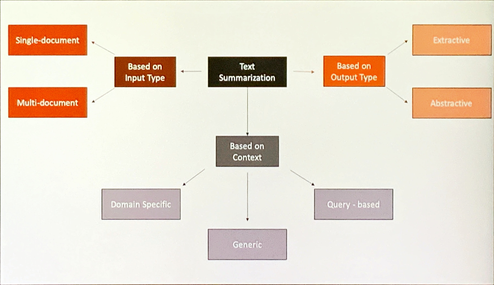](s1-mindmap.png "mindmap")

mindmap

## Ontological Mindmap

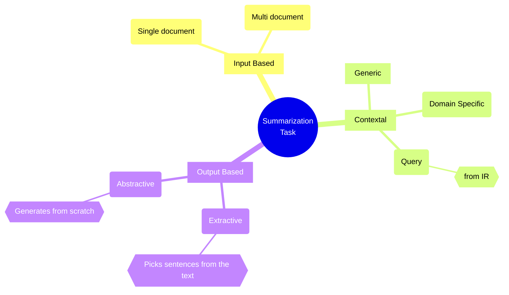

Note: the Query based approach intersects with the NLP QA task.

------------------------------------------------------------------------

[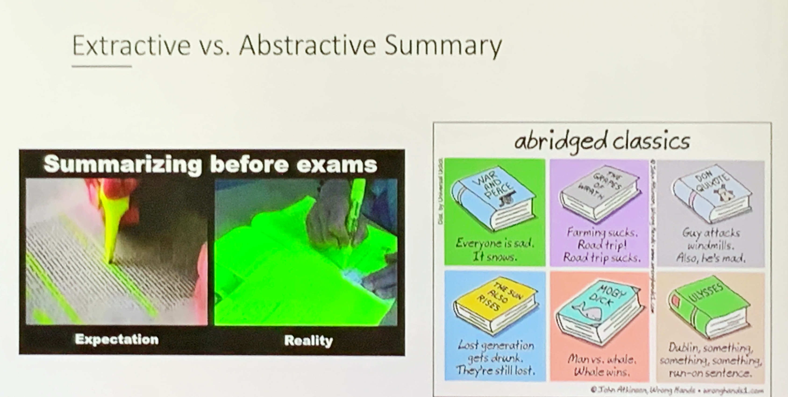](s2-extractive-abstractive.png)

## Extractive vs. Abstractive

The “Summarizing before exams” meme demonstrates the extractive approach. The “abridged classics” meme demonstrates the abstractive approach.

------------------------------------------------------------------------

## Extractive Summaries Illustrated

Extractive algorithms locate and rank the content of a document.

> Game of Thrones is an American fantasy drama television series created by David Benioff and D. B. Weiss for HBO. It is an adaptation of A Song of Ice and Fire, George R. R. Martin’s series of fantasy novels, the first of which is A Game of Thrones. The show was both produced and filmed in Belfast and elsewhere in the United Kingdom. Filming locations also included Canada, Croatia, Iceland, Malta, Morocco, and Spain. The series premiered on HBO in the United States on April 17, 2011, and concluded on May 19, 2019, with 73 episodes broadcast over eight seasons.
>
> Set on the fictional continents of Westeros and Essos, Game of Thrones has several plots and a large ensemble cast and follows several story arcs. One arc is about the Iron Throne of the Seven Kingdoms and follows a web of alliances and conflicts among the noble dynasties either vying to claim the throne or fighting for independence from it. Another focuses on the last descendant of the realm’s deposed ruling dynasty, who has been exiled and is plotting a return to the throne, while another story arc follows the Night’s Watch, a brotherhood defending the realm against the fierce peoples and legendary creatures of the North.

Summary (Extractive):

> `Game of Thrones is an American fantasy drama television series created by David Benioff and D. B. Weiss for HBO. It is an adaptation of A Song of Ice and Fire, George R. R. Martin's series of fantasy novels` `Set on the fictional continents of Westeros and Essos, Game of Thrones has several plots and a large ensemble cast and follows several story arcs`

Extractive Summaries draw text verbatim from the source.

1.  This was the more common approach in NLP
2.  it is closely related to IR and Q&A task.
3.  Their main challenges of this approach are: a *lack balance*, when some parts over represented while others under represented. a *lack of cohesion*, as extracted text retains dangling pronouns etc.

------------------------------------------------------------------------

## Abstractive Summaries Illustrated

Abstractive algorithms add generation of the extracted content.

> Game of Thrones is an American fantasy drama television series created by David Benioff and D. B. Weiss for HBO. It is an adaptation of A Song of Ice and fire, George R. R. Martin’s series of fantasy novels, the first of which is A Game of Thrones. The show was both produced and filmed in Belfast and elsewhere in the United Kingdom. Filming locations also included Canada, Croatia, Iceland, Malta, Morocco, and Spain, The series premiered on HBO in the United States on April 17, 2011, and concluded on May 19, 2019, with 73 episodes broadcast over eight seasons.
>
> Set on the fictional continents of Westeros and Essos, Game of Thrones has several plots and a large ensemble cast and follows several story arcs. One arc is about the Iron Throne of the Seven Kingdoms and follows a web of alliances and conflicts among the noble dynasties either vying to claim the throne or fighting for independence from it. Another focuses on the last descendant of the realm’s deposed ruling dynasty, who has been exiled and is plotting a return to the throne, while another story arc follows the Night’s Watch, a brotherhood defending the realm against the fierce peoples and legendary creatures of the North. Summary (Abstractive): `Game of Thrones is a TV show based on book series A Song of Ice and Fire, written by G. R. R. Martin. All eight seasons were filmed in many beautiful countries across **three different continents**. Game of Thrones has a very complex story with several plots and story arcs — from conflicts between Westeros nobility to claim the Iron Throne and rule over Seven Kingdoms to fight between brotherhood called Night's watch and enemies from the North.`

1.  **Abstractive** Summaries are not constrained to using text drawn the source. They can draw on `common-sense` and `domain knowledge` external to the document.
2.  This is the more challenging approach in NLP
3.  Their main issues are:
    - good coverage.
    - avoiding repetition.
    - can provide better *compression*.

------------------------------------------------------------------------

# Algorithms & Methods

## Positional method

- Introduced in ([Baxendale 1958](#ref-Baxendale1958Machine))
- 200 paragraphs
- First and last sentence of a paragraph are topic sentences (85% vs 7%)

e.g.

> `Game of Thrones is an American fantasy drama television series created by David Benioff and D. B. Weiss for HBO`. It is an adaptation of A Song of Ice and Fire, George R. R. Martinis series of fantasy novels, the first of which is A Game of Thrones. The show was both produced and filmed in Belfast and elsewhere in the United Kingdom. Filming locations also included Canada, Croatia, Iceland, Malta, Morocco, and Spain. `The series premiered on HBO in the United States on April 17, 2011, and concluded on May 19, 2019, with 73 episodes broadcast over eight seasons`.

------------------------------------------------------------------------

[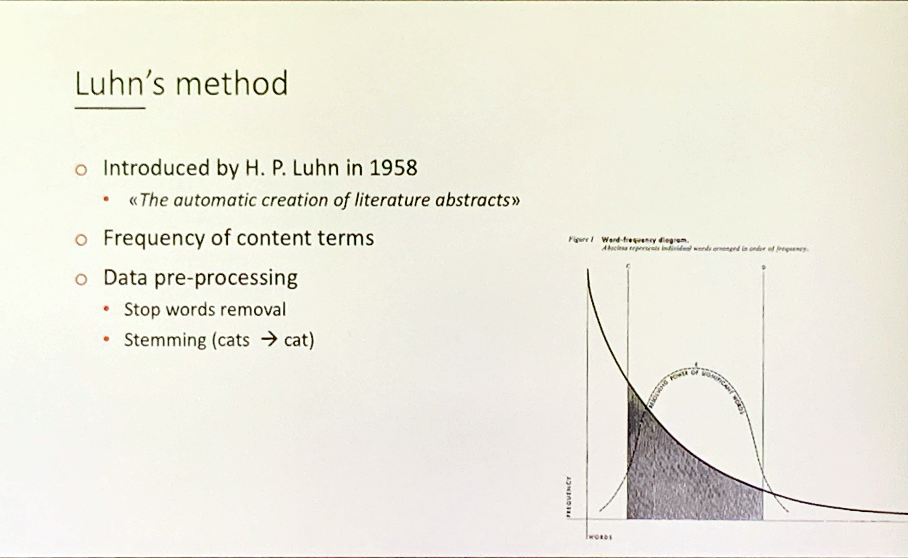](s8-luhn-method-1958.png "s8-luhn-method-1958")

s8-luhn-method-1958

## Luhn’s method

- Introduced in ([Luhn 1958](#ref-luhn-58))
- Frequency of content terms
- Data pre-processing
  - Stop words removal
  - Stemming (cats cat)

[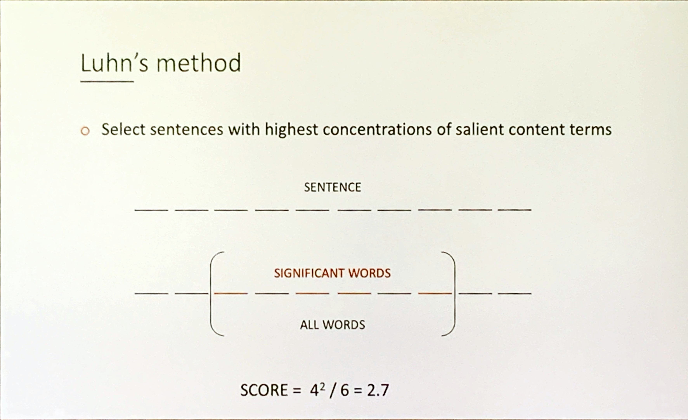](s9-luhn-method-formula.png "s9-luhn-method-formula")

s9-luhn-method-formula

Select sentences with highest concentrations of salient content terms

Score = \frac{\text{Salient Words}^2}{ \text{Terms in chunk} }

------------------------------------------------------------------------

[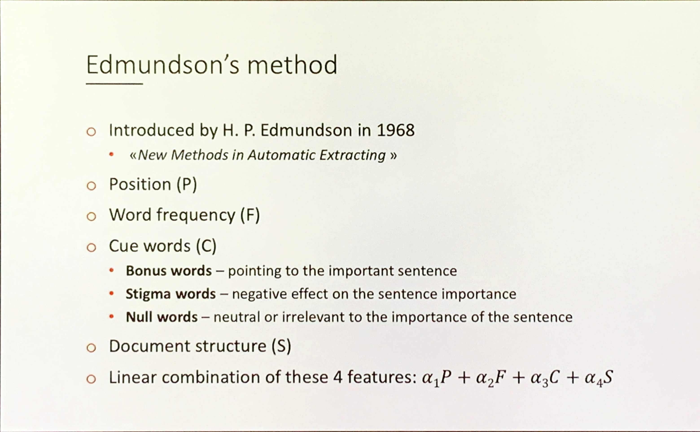](s10-edmundson-method.png "s10-edmundson-method")

s10-edmundson-method

## Edmundson’s method

Introduced in ([Edmundson 1969](#ref-edmundson-1969))

- Position (P)
- Word frequency (F)
- Cue words (C)
- Bonus words — pointing to the important sentence
- Stigma words — negative effect on the sentence importance
- Null words — neutral or irrelevant to the importance of the sentence
- Document structure (S)

Linear combination of these 4 features:

score = \alpha_1 P + \alpha_2 F + \alpha_3 C + \alpha_4 S

> This paper describes new methods of automatically extracting documents for screening purposes, i.e. the computer selection of sentences having the greatest potential for conveying to the reader the substance of the document. While previous work has focused on one component of sentence significance, namely, the presence of high-frequency content words (key words), the methods described here also treat three additional components: pragmatic words (cue words); title and heading words; and structural indicators (sentence location). The research has resulted in an operating system and a research methodology. The extracting system is parameterized to control and vary the influence of the above four components. The research methodology includes procedures for the compilation of the required dictionaries, the setting of the control parameters, and the comparative evaluation of the automatic extracts with manually produced extracts. The results indicate that the three newly proposed components dominate the frequency component in the production of better extracts.

------------------------------------------------------------------------

## FRUMP - Fast Reading Understanding and Memory Program

[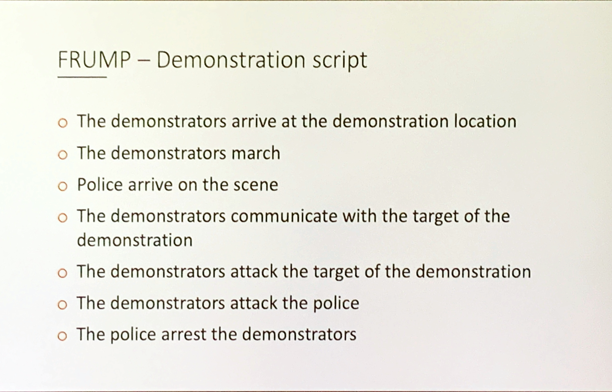](s12-FRUMP-demo.png "s12-FRUMP-demo")

s12-FRUMP-demo

- Introduced in ([DeJong 1979](#ref-DeJong1979PredictionAS))
- knowledge-based summarization system.
- Template filling approach based on UPI news stories.
- First abstractive method.
- 50 sketchy scripts
  - Contain important events that are expected to occur in a specific situation
  - Summarizer looks for instances of salient events, filling in as many as possible.
- Issues - 50 scripts were not enough.

> This paper describes a new approach to natural language processing which results in a very robust and efficient system. The approach taken is to integrate the parser with the rest of the system. This enables the parser to benefit from predictions that the rest of the system makes in the course of its processing. These predictions can be invaluable as guides to the parser in such difficult problem areas as resolving referents and selecting meanings of ambiguous words. A program, called FRUMP for Fast Reading Understanding and Memory Program, employs this approach to parsing. FRUMP skims articles rather than reading them for detail. The program works on the relatively unconstrained domain of news articles. It routinely understands stories it has never before seen. The program’s success is largely due to its radically different approach to parsing.

### My insights:

This approach has two interesting ideas.

- KR using templates or frames.
- KR using scripts is even more powerful method.

1.  A modern take on this might involve using a classifier to identify sentences as
    - Facts
      - general knowledge (simple)
      - domain knowledge (complex or technical)
    - Opinions
      - general knowledge (similar to many documents)
      - domain expert. (similar to a few)
    - Events (narrative structure)
    - Deductive (logic, inference, statistical, syllogism)
    - Others
2.  Using a generative approach would allow a deep model to generate its own KR features and templates. An adversarial approach might split this into two nets one to generate and another to test.
3.  Analyzing existing summaries and clustering them might allow one to begin summarize using a preferred template rather than starting from scratch. Clustering, deleting and generalizing from existing summaries may be a means for improving abstractive work.
4.  Putting a focus on the added value of
    - out of document facts and vocabulary
    - how humans/abstractive summaries differ from extractive ones.

------------------------------------------------------------------------

## Naive Bayes Classification

- Introduced in ([Kupiec et al. 1995](#ref-Kupiec1995ATD))
- First trainable method
- Training set: original documents and manually created extracts
- Used **Naive Bayes** classifier:

P (s \in S \vert F_1 ... F_k) = \frac{P (F_1 ... F_k \vert s \in S ) P(s \in S )} {P (F_1 ... F_k)}

- By assuming statistical independence of the features it reduces to:

P (s \in S \vert F_1 ... F_k) = \frac{ \displaystyle \prod\_{j \in J} P (F_j \vert s \in S ) P(s \in S )} { \displaystyle \prod\_{j \in J} P (F_i)}

### Performance:

- For 25% extracts - 84% precision
- For smaller summaries - 74% improvement over *lead summaries*

------------------------------------------------------------------------

## Maximum Entropy Classification

- Introduced in ([Osborne 2002](#ref-Osborne2002UsingME))  
- Maximum entropy models are performing better than Naive Bayes approach

------------------------------------------------------------------------

## MMR

- Introduced in ([Carbonell and Goldstein-Stewart 1998](#ref-Carbonell1998TheUO))
- Maximal Marginal Relevance
- Query based summaries.

\text{MMR} = \arg \max\[\lambda Sim_1(s_i,Q)-(1-\lambda) \max Sim_2(s_i, s_j)\]

Where:

- Q - user query
- R - ranked list of sentences
- S - already retrieved sentences
- Sim - similarity metrics
- \lambda - hyper-parameter controlling importance of query or other sentence.

> This paper presents a method for combining *query-relevance* with *information-novelty* in the context of text retrieval and summarization. **The Maximal Marginal Relevance** (MMR) criterion strives to reduce redundancy while maintaining query relevance in re-ranking retrieved documents and in selecting appropriate passages for text summarization. Preliminary results indicate some benefits for MMR diversity ranking in document retrieval and in single document summarization… the clearest advantage is demonstrated in constructing non-redundant multi-document summaries, where MMR results are clearly superior to non-MMR passage selection. - The Use of MMR (abstract)

------------------------------------------------------------------------

### My insights:

- MMR seems to have a binomial formulation.
- By avoiding to pin down the metric it is possible to use embedding similarity with this formulation.
- MMR offers a formal metric for measuring added value (utility) For Sentences in a summary.
- It can work with or without a query.
- It could be adapted as a regularization term in a summarizer loss function.
- It could be used on a summary to weigh each sentence’s utility.
- If one were able to generate multiple candidates for a factum MMR could be used to easily rank them.

[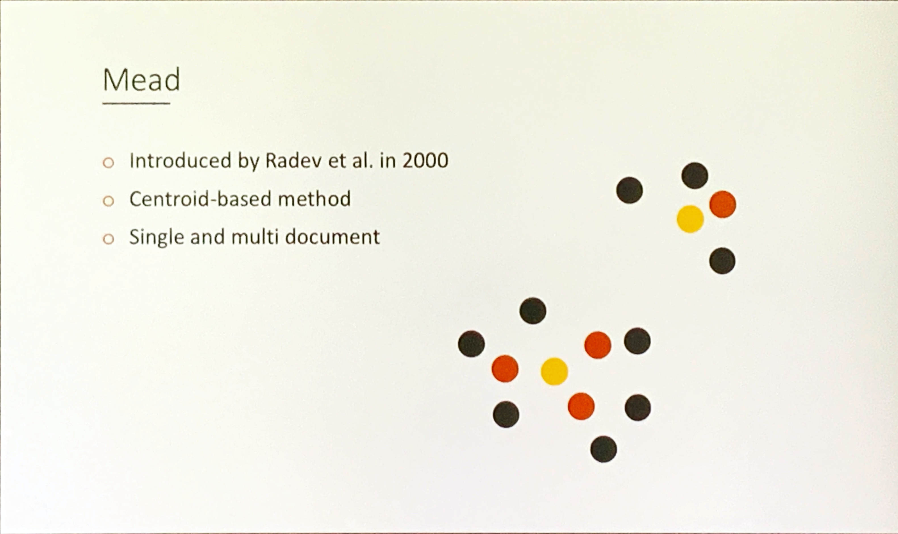](s16-Mead-Centroid.png "s16-Mead-Centroid")

s16-Mead-Centroid

## Mead

- Introduced in ([Radev et al. 2000](#ref-Radev2000CentroidbasedSO))
- Centroid-based method
- Single and multi document

> We present a multi-document summarizer, called MEAD, which generates summaries using cluster centroids produced by a topic detection and tracking system. We also describe two new techniques, based on sentence utility and subsumption, which we have applied to the evaluation of both single and multiple document summaries. Finally, we describe two user studies that test our models of multi-document summarization. - Centroid-based summarization of multiple documents (abstract)

### My insights:

Clustering has its benefits:

- Each centroid corresponds a candidate topic.
- Cluster size establishes a natural hierarchy for ranking topics.
- Cluster centrality provides the a hierarchy for ranking sentence within topics.
- The centroids may be used in a generative context, to bootstrap attention to each topic !?
- A query similarity can used with the centroids to rank in response to a query (for Q&A)

------------------------------------------------------------------------

[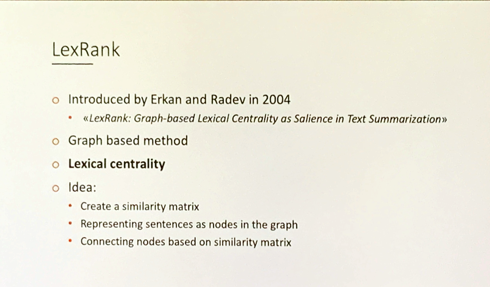](s17-lexrank.png "Lexrank")

Lexrank

## LexRank

- Introduced in ([Erkan and Radev 2004](#ref-Erkan2004LexRankGL)) ^[page](https://www.cs.cmu.edu/afs/cs/project/jair/pub/volume22/erkan04a-html/erkan04a.html)
- Graph based method.
- Lexical centrality.

------------------------------------------------------------------------

[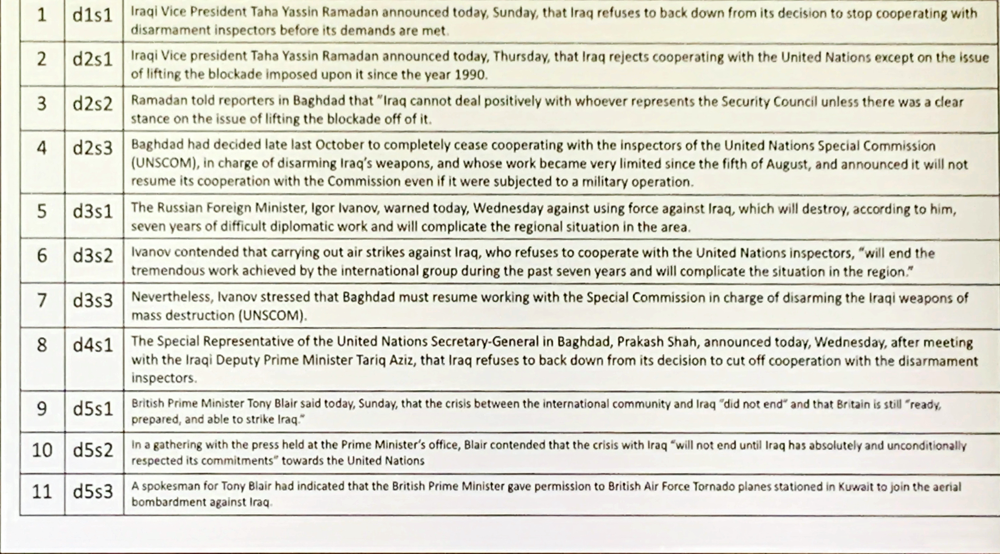](s18-lexrank-rank.png "lexrank rank")

lexrank rank

> We introduce a stochastic graph-based method for computing relative importance of textual units for Natural Language Processing. We test the technique on the problem of Text Summarization (TS). Extractive TS relies on the concept of sentence salience to identify the most important sentences in a document or set of documents. Salience is typically defined in terms of the presence of particular important words or in terms of similarity to a centroid pseudo-sentence. We consider a new approach, LexRank, for computing sentence importance based on the concept of eigenvector centrality in a graph representation of sentences. In this model, a connectivity matrix based on intra-sentence cosine similarity is used as the adjacency matrix of the graph representation of sentences. Our system, based on LexRank ranked in first place in more than one task in the recent DUC 2004 evaluation. In this paper we present a detailed analysis of our approach and apply it to a larger data set including data from earlier DUC evaluations. We discuss several methods to compute centrality using the similarity graph. The results show that degree-based methods (including LexRank) outperform both centroid-based methods and other systems participating in DUC in most of the cases. Furthermore, the LexRank with threshold method outperforms the other degree-based techniques including continuous LexRank. We also show that our approach is quite insensitive to the noise in the data that may result from an imperfect topical clustering of documents.

------------------------------------------------------------------------

[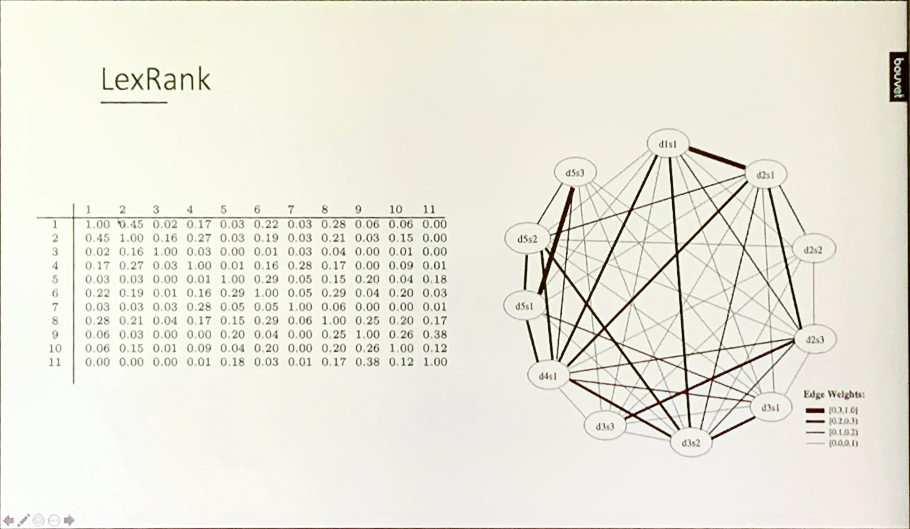](s19-lexrank-graph.png "lexrank graph")

lexrank graph

Idea:

similar to page rank where pages vote for each other:

- Create an adjacency matrix using cosine similarity.
- Representing sentences as nodes in the graph
- Connecting nodes based on inter-sentence cosine similarity matrix
- uses [eigenvector centrality](https://en.wikipedia.org/wiki/Eigenvector_centrality) from this matrix.
- the sentence with the highest rank would be linked to many other important sentences. Are they very similar or not ?
- a threshold is used to determine how many connected components should are used.

### my insights:

1.  Algorithmically lexrank is a more sophisticated way of clustering like the MEAD algorithm. According to the paper, lexrank performed better.
2.  Graph algorithms are computationally expensive for large graphs. This could mean that the approach would not scale.
3.  To build the matrix they used a cosine similarity - but on using words. Replacing words with their embeddings should yield even better results with lower costs.
4.  There are a number of centrality measures on graphs. A high eigenvector score means that a node is connected to many nodes who themselves have high scores. The paper looked at Degree, LexRank with threshold, and continuous LexRank. This is clearly a place where one may be able to do better.
5.  TfiDf is another way to rank concepts.
6.  a problem is that the underlying assumptions for creating the graphical models are difficult to justify. Building a graph from web pages using links seems natural while constructing a graph using similarity between sentences perhaps in different documents seems contrived. Sentences may capture several concepts and arguments may span several sentences. Similar sentences may have very different meaning and different sentences may have the same meaning.

------------------------------------------------------------------------

## 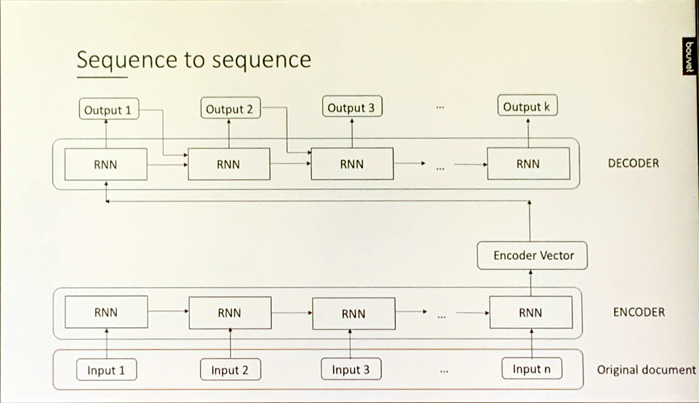

# Evaluation

[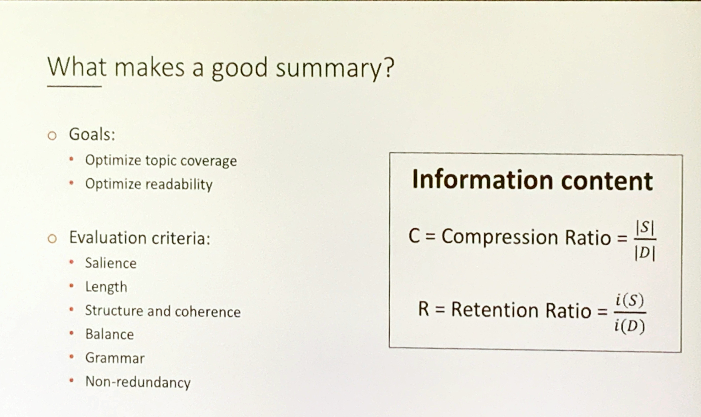](s22-information-content.png "Information Content")

Information Content

## What makes a good summary?

- Goals:
  - Optimize topic coverage
  - Optimize readability
- Evaluation criteria:
  - Salience
  - Length
  - Structure and coherence
  - Balance
  - Grammar
  - Non-redundancy
- Types of evaluation methods
  - Extrinsic techniques
    - Task based
    - Can a person make the same decision with summary as with the entire document?
  - Intrinsic techniques
    - Comparing summaries against gold standards

[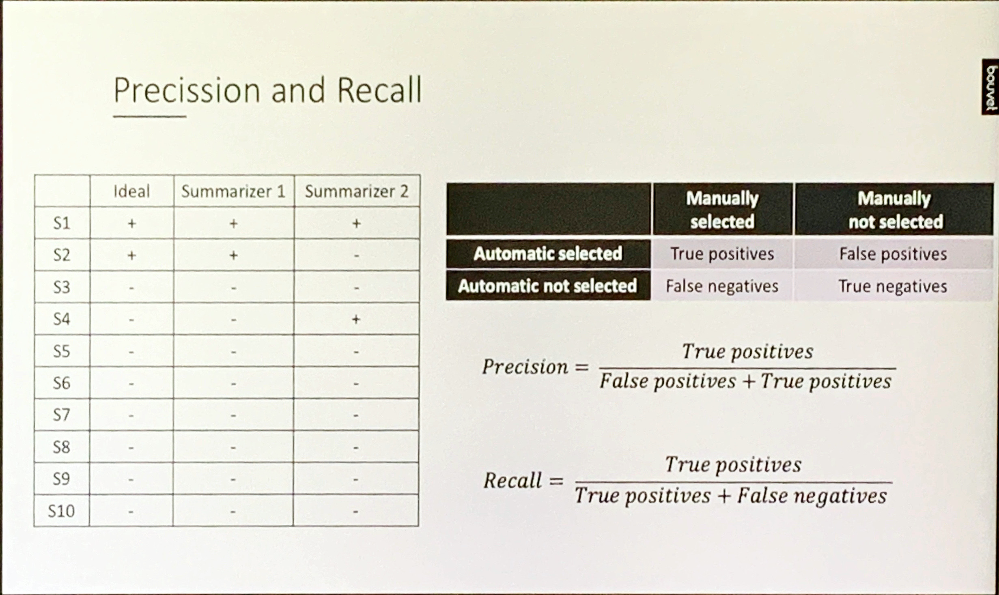](s24-precision-recall.png "Precision & Recall")

Precision & Recall

## Precision and Recall

starting with a contingency matrix we can get to:

Precision =\frac{True\_+}{ False\_+ + True\_+}

Recall = \frac{True\_+}{True\_+ + False\_-}

these can also be combined into an f-score is a harmonic mean of precision and recall.

### My insights

Precision and Recall make more sense for IR settings, i.e. when we have a query.

------------------------------------------------------------------------

[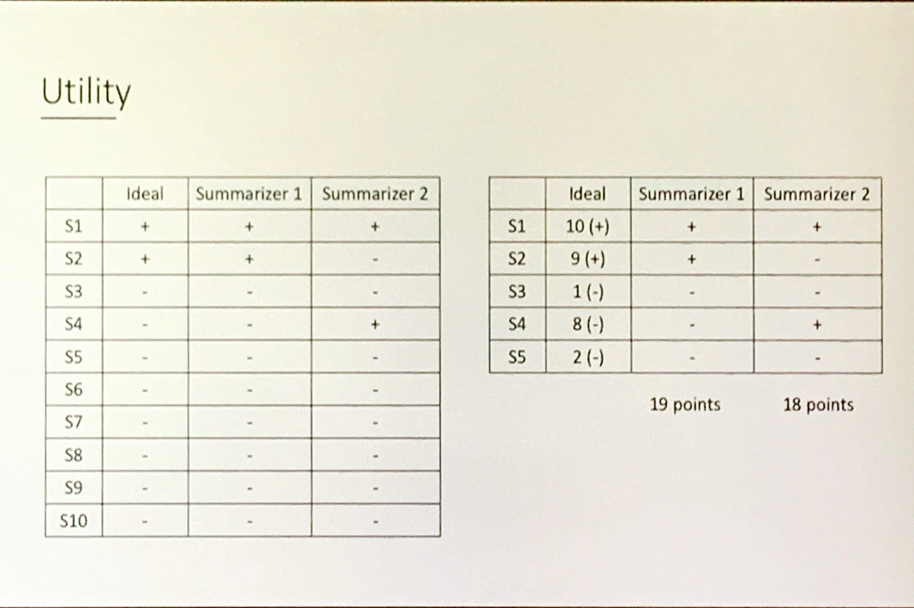](s24-utiliity.png "s24-utility")

s24-utility

## Utility

- Utility is interesting from economic or game theoretic perspective. It indicates an option of applying RL
- Utility is usually translated as a **loss function** in ML!

------------------------------------------------------------------------

[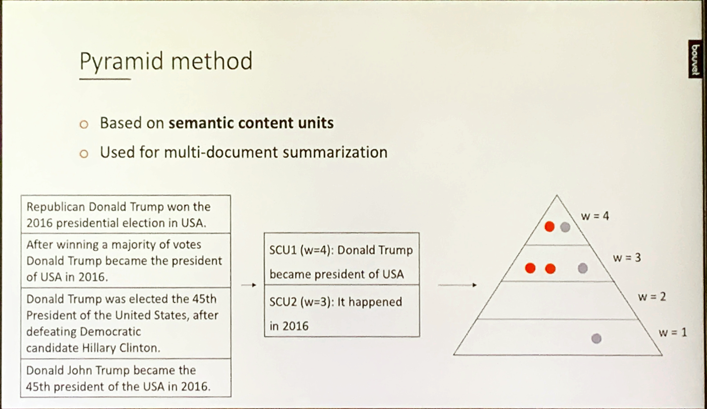](s25-pyramid.png "s25-pyramid")

s25-pyramid

## Pyramid method

- Based on semantic content units
- Used for multi-document summarization

------------------------------------------------------------------------

[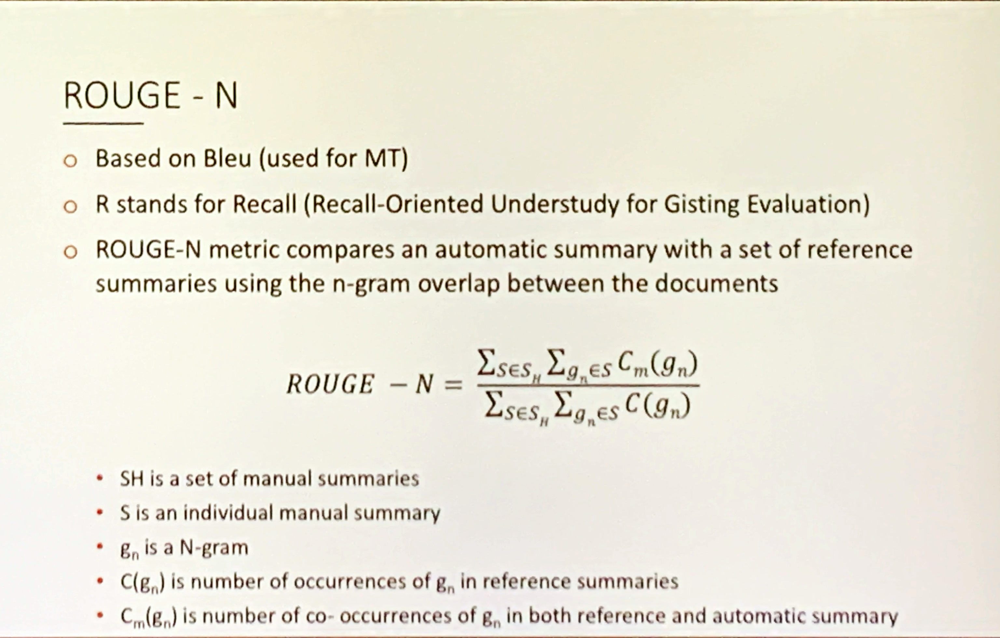](s25-rougue.png "s25-rougue")

s25-rougue

## ROUGE-N

- Based on Bleu (used for MT)
- R stands for Recall (Recall-Oriented Understudy for Gisting Evaluation)
- ROUGE-N metric compares an automatic summary with a set of reference summaries using the n-gram overlap between the documents

ROUGE_N - = \frac{\sum\_{s\in S_H} \sum\_{g_n \in S}C_m(g_n)} {\sum\_{s\in S_H} \sum\_{g_n \in S}C(g_n) }

- S_H is a set of manual summaries
- S is an individual manual summary
- g_n is a N-gram
- C(g_n) is number of occurrences of gn in reference summaries
- C_m(g_n) is number of co-occurrences of g_n in both reference and automatic summary

# Tools

- the [sumy](https://github.com/miso-belica/sumy) python library
- [nltk summeriser](https://www.nltk.org/book/ch01.html)
- [spacy summeriser](https://spacy.io/universe/project/spacy-pytextrank/)

# Data Sets

- [GIGAWORD dataset](https://catalog.ldc.upenn.edu/LDC2012T21)
- [CNN Daily](https://github.com/abisee/cnn-dailymail)
- [Opinions dataset](http://kavita-ganesan.com/opinosis-opinion-dataset/#.XIgkSihKg2w)

Baxendale, P. B. 1958. “Machine-Made Index for Technical Literature—an Experiment.” *IBM Journal of Research and Development* 2 (4): 354–61. <https://doi.org/10.1147/rd.24.0354>.

Carbonell, Jaime G., and Jade Goldstein-Stewart. 1998. “The Use of MMR, Diversity-Based Reranking for Reordering Documents and Producing Summaries.” *Annual International ACM SIGIR Conference on Research and Development in Information Retrieval*. <https://www.cs.cmu.edu/~jgc/publication/The_Use_MMR_Diversity_Based_LTMIR_1998.pdf>.

DeJong, Gerald. 1979. “Prediction and Substantiation: A New Approach to Natural Language Processing.” *Cogn. Sci.* 3: 251–73. <https://api.semanticscholar.org/CorpusID:28841837>.

Edmundson, H. P. 1969. “New Methods in Automatic Extracting.” *Journal of theACM* 16 (2): 264–85. <https://courses.ischool.berkeley.edu/i256/f06/papers/edmonson69.pdf>.

Erkan, Günes, and Dragomir R. Radev. 2004. “LexRank: Graph-Based Lexical Centrality as Salience in Text Summarization.” *ArXiv* abs/1109.2128. <https://api.semanticscholar.org/CorpusID:506350>.

Kupiec, Julian, Jan O. Pedersen, and Francine R. Chen. 1995. “A Trainable Document Summarizer.” *Annual International ACM SIGIR Conference on Research and Development in Information Retrieval*. <https://courses.ischool.berkeley.edu/i256/f06/papers/kupiec95.pdf>.

Luhn, H. P. 1958. “The Automatic Creation of Literature Abstracts.” *IBM Journal of Research and Development* 2 (2): 159–65. <https://doi.org/10.1147/rd.22.0159>.

Osborne, Miles. 2002. “Using Maximum Entropy for Sentence Extraction.” *Annual Meeting of the Association for Computational Linguistics*. <https://aclanthology.org/W02-0401.pdf>.

Radev, Dragomir R., Hongyan Jing, and Malgorzata Budzikowska. 2000. “Centroid-Based Summarization of Multiple Documents: Sentence Extraction, Utility-Based Evaluation, and User Studies.” *ArXiv* cs.CL/0005020. <https://arxiv.org/pdf/cs/0005020.pdf>.

## Citation

BibTeX citation:

``` quarto-appendix-bibtex
@online{bochman2021,
  author = {Bochman, Oren},
  title = {Automatic {Summarization} {Task}},
  date = {2021-04-24},
  url = {https://orenbochman.github.io/posts/2021/2021-04-24-summerization/},
  langid = {en}
}
```

For attribution, please cite this work as:

Bochman, Oren. 2021. “Automatic Summarization Task.” April 24. <https://orenbochman.github.io/posts/2021/2021-04-24-summerization/>.
