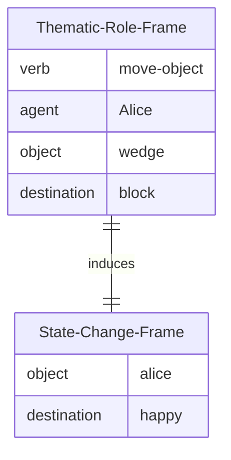
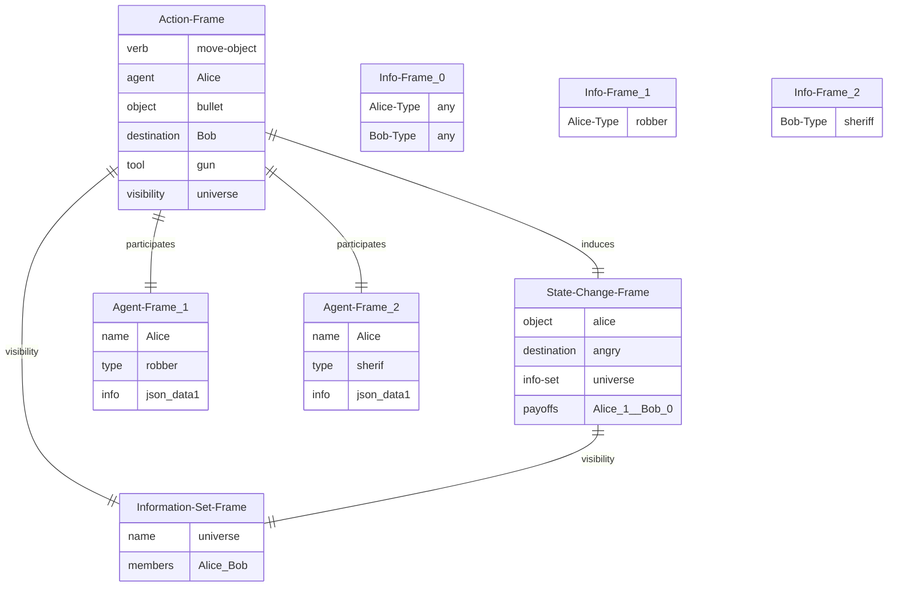

Let’s try to define a KR framework for a Bayesian agent.

A starting point is that instead of using large monolithic context frames which are difficult to handle, and inefficient to process we use a notion of *context splitting* to put together smaller, more flexible units. Embeddings that are good representation would be easier to easier to acquire on short context. And hopefully if with a little luck we could put them together into a package that feeds different attention heads allowing few-shot learning to proceed.



So this is splits cause action from its outcome.

Bayesian Games and Sub

In a Bayesian game there are a number of constructs, lets put them into a pro-ontology

- state of the world:
  - information
    - what moves have been made.
    - what types each player is.
    - other information.
  - information sets:
    - set of agent who are privy to a bit of info.
  - contrafactuals:
    - competing hypothesis regarding the state of the world.
  - incomplete information:
    - players may be unaware of other player’s type,moves and strategy.
  - uncertainty knowledge is modeled using distribution.
- agents:
  - type which determines a strategy
  - information
- a strategy profile:
  - for each type their full strategy
  - simple strategy
  - complex strategy
  - utility (payoffs driving an agent’s preference)
- population dynamics
  - the number of a agent at a given type (based on their score at the previous round)



How many information sets for k players?

There are 2^k and they form the power set of \\a \space ... \space k\\.

A Bayesian game usually start with a move by nature which assigns types to players m_n: p \to \tau.

## Extensive form game

> The most important TikZ command used to draw game trees is:

`...node(coordinate label)[drawing/style options] at(coordinate) {node texts}...;`

> The command `child{}` is used to specify a successor of a (parent) node. Note that if the style of a particular branch needs to be modified, such as adding texts to the branch or changing its color, edge from parent must be put after node{} and all of its children.

[](index_files/figure-html/complete-pooling-1.svg "Complete pooling")

Complete pooling

## info sets

[](index_files/figure-html/info-sets-1.svg "info-sets")

info-sets

[](index_files/figure-html/info-sets-extended-1.svg "info-sets-extended")

info-sets-extended

## Citation

BibTeX citation:

``` quarto-appendix-bibtex
@online{bochman2021,
  author = {Bochman, Oren},
  title = {Bayesian Agents},
  date = {2021-04-14},
  url = {https://orenbochman.github.io/posts/2021/2021-04-25-bayesian-agent/},
  langid = {en}
}
```

For attribution, please cite this work as:

Bochman, Oren. 2021. “Bayesian Agents.” April 14. <https://orenbochman.github.io/posts/2021/2021-04-25-bayesian-agent/>.
