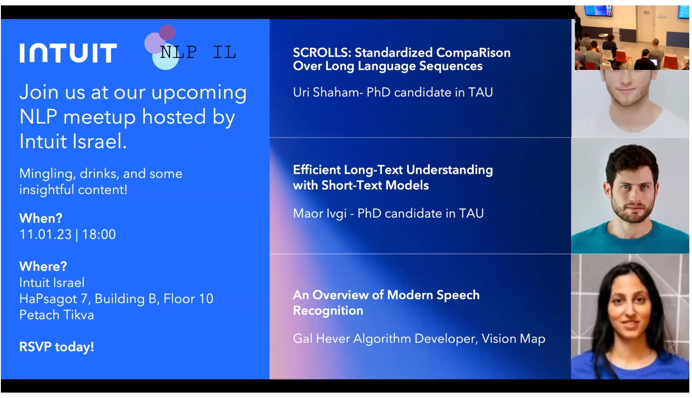
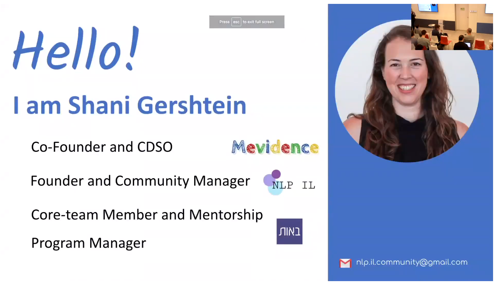
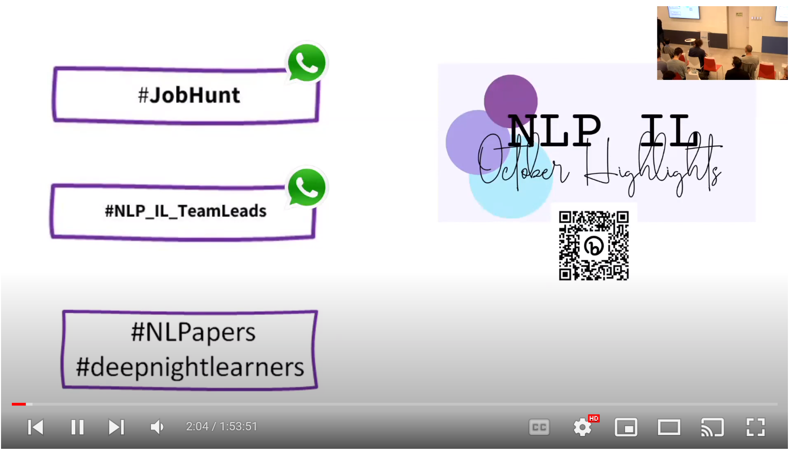
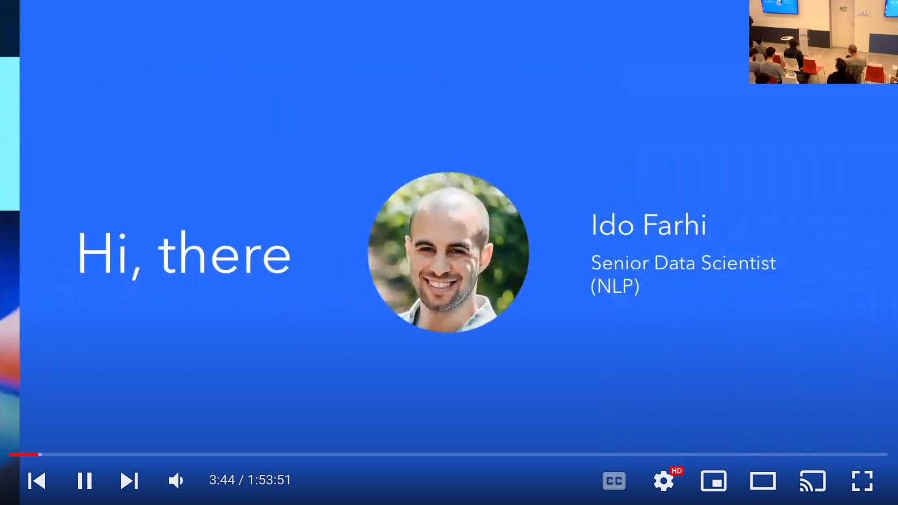
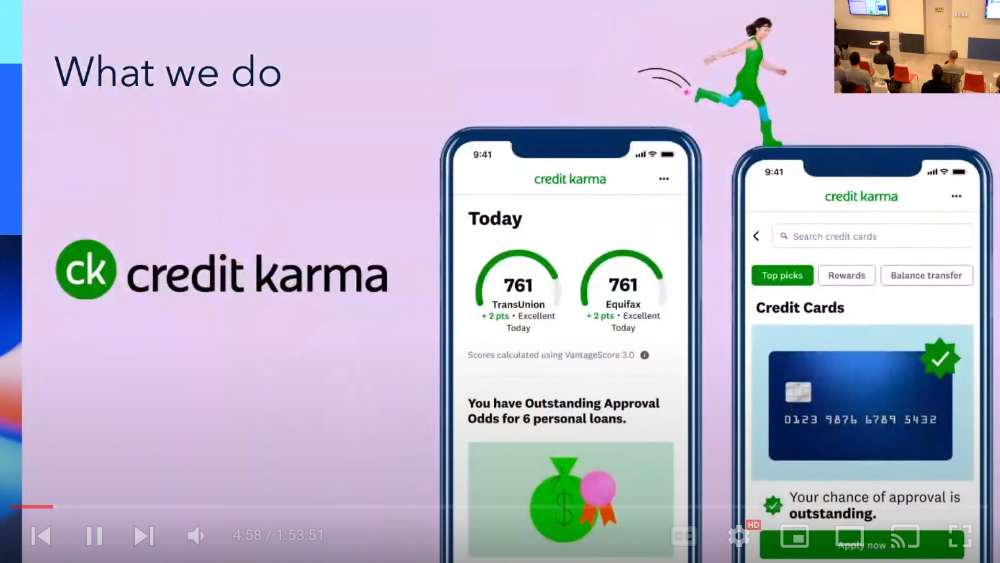
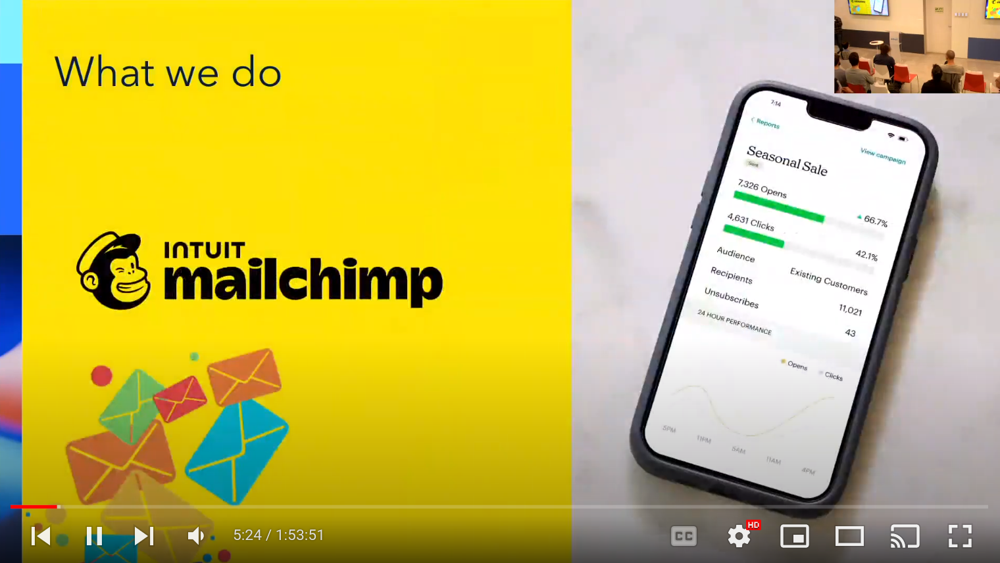
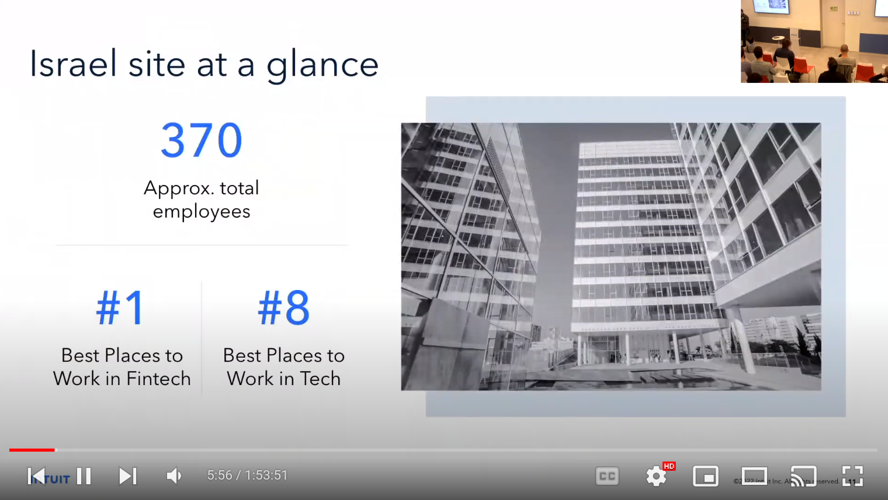

# An error occurred.

Unable to execute JavaScript.

Session Video

## Introductions

      

     

## Citation

BibTeX citation:

``` quarto-appendix-bibtex
@online{bochman2013,
  author = {Bochman, Oren},
  title = {NLP {IL} {F2F} {Meetup} at {Intuit}},
  date = {2013-11-01},
  url = {https://orenbochman.github.io/posts/2023/01-11-nlp-il-meetup-intuit/talk0.html},
  langid = {en}
}
```

For attribution, please cite this work as:

Bochman, Oren. 2013. “NLP IL F2F Meetup at Intuit.” November 1. <https://orenbochman.github.io/posts/2023/01-11-nlp-il-meetup-intuit/talk0.html>.
