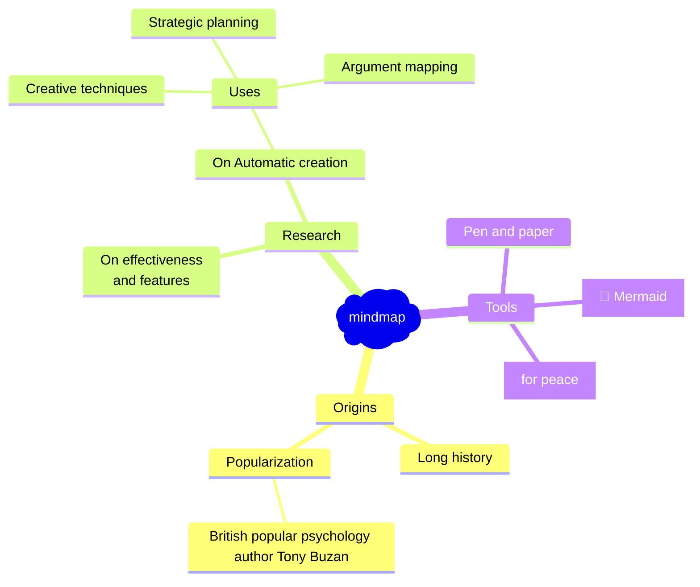

> **TIP:**
>
> Quarto at last supports Mind Maps using Mermaid charts.

Mindmaps are a visual way to organize your thoughts and ideas and can be a great way to brainstorm new ideas. The can also be a powerful format for to present hierarchical information.

Mindmaps were popularized by British popular psychology author [Tony Buzan](https://en.wikipedia.org/wiki/Tony_Buzan) and have a long history going back to Leonardo da Vinci and as far back as the 3rd century philosopher Porphyry.

[](mermaid.png "mermaid logo")

mermaid logo

So if Quarto at last supports 🧠 Mind Map charts using Mermaid 🧜‍♀️ charts. here is the obligatory example:



For details on creating mind maps [c.f.](https://mermaid.js.org/syntax/mindmap.html)

Also note: that the icon features for including fontawesome and material icons is not working!?

A a workaround adding the following to the page frontmatter

    format: 
      html:
        include-in-header:
          - text: |
              <link rel="stylesheet" href="https://cdnjs.cloudflare.com/ajax/libs/font-awesome/6.5.1/css/all.min.css"> 
              <link href="https://cdnjs.cloudflare.com/ajax/libs/MaterialDesign-Webfont/7.4.47/css/materialdesignicons.min.css" rel="stylesheet">

## Citation

BibTeX citation:

``` quarto-appendix-bibtex
@online{bochman2024,
  author = {Bochman, Oren},
  title = {😁 {Quarto} 💖 {Mermaid🧜} {Mindmaps} 🧠},
  date = {2024-02-12},
  url = {https://orenbochman.github.io/posts/2024/2024-02-12-mermaid-mindmap/},
  langid = {en}
}
```

For attribution, please cite this work as:

Bochman, Oren. 2024. “😁 Quarto 💖 Mermaid🧜 Mindmaps 🧠.” February 12. <https://orenbochman.github.io/posts/2024/2024-02-12-mermaid-mindmap/>.
