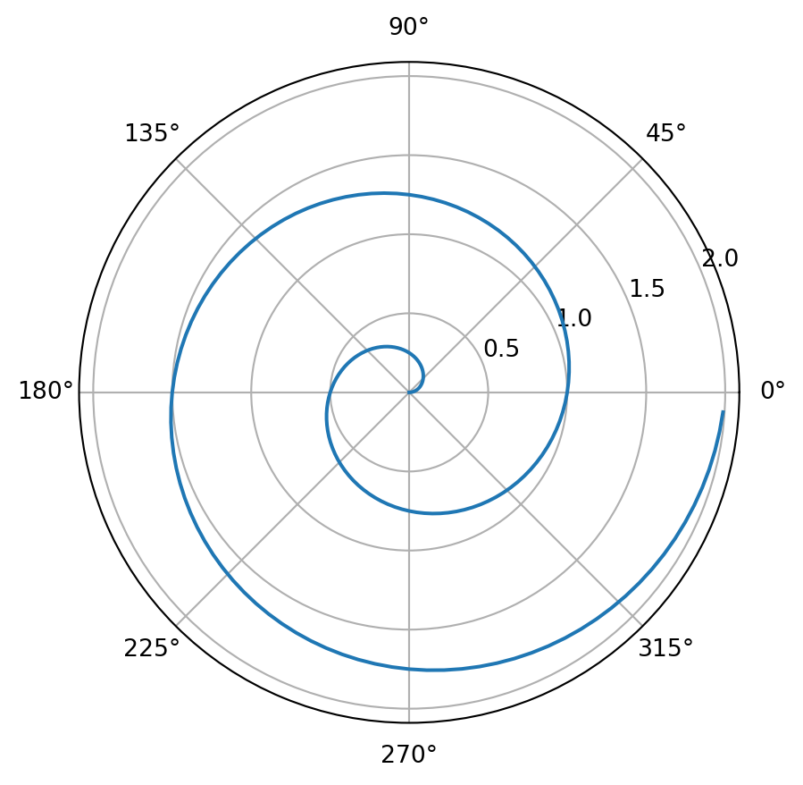

This is an obligatory post with executable code.

``` python
1 + 1 # <1>
```

1.  this is an annotation

    2

and this is a figure with a caption

``` python
import numpy as np
import matplotlib.pyplot as plt

r = np.arange(0, 2, 0.01)
theta = 2 * np.pi * r
fig, ax = plt.subplots(
  subplot_kw = {'projection': 'polar'} 
)
ax.plot(theta, r)
ax.set_rticks([0.5, 1, 1.5, 2])
ax.grid(True)
plt.show()
```

[](index_files/figure-html/fig-polar-output-1.png "Figure 1: A line plot on a polar axis")

Figure 1: A line plot on a polar axis

It’s also useful to have a small sample of printing a table from a pandas data frame and a quick access to Pandas a fluent wrangling block

``` python
import numpy as np                                          # <1>
import pandas as pd                                         # <1>
from itables import show
import matplotlib.pyplot as plt                             # <1>
import seaborn as sns                                       # <1>
from sklearn.model_selection import train_test_split        # <1>
import xgboost as xgb                                       # <1>

df = (    pd.read_csv('./data/Salary Data.csv')             # <2> 
          .dropna()                   # <3>
          .drop_duplicates()          # <4>
          .assign(is_male=lambda x: x['Gender'].apply(lambda y: 1 if y == 'Male' else 0),               # <5>
                  is_PhD=lambda x: x['Education Level'].apply(lambda y: 1 if y == 'PhD' else 0),        # <6>
                  is_BA=lambda x: x['Education Level'].apply(lambda y: 1 if y == 'Bachelor\'s' else 0), # <6>
                  is_MA=lambda x: x['Education Level'].apply(lambda y: 1 if y == 'Master\'s' else 0),   # <6>
                 
          )
          .rename(columns={'Years of Experience':'xp'}) #<7>
          .drop(['Gender','Education Level','Job Title'],axis=1) #<8>

    )

#df['Education Level'] = edu_label_encoder.fit_transform(df['Education Level'])
#job_title_encoder = LabelEncoder()
#df['Job Title']=job_title_encoder.fit_transform(df['Job Title'])
show(df)                                                    # <9>
```

1.  import the usual suspects
2.  load the salary dataset
3.  remove rows with missing values
4.  remove duplicate entries
5.  recode gender to is_male
6.  recode categorical education level to dummies
7.  rename columns
8.  drop columns
9.  peek at the data

|  | Age | xp | Salary | is_male | is_PhD | is_BA | is_MA |
|:---|----|----|----|----|----|----|----|
| [![](data:image/svg+xml;base64,PHN2ZyBjbGFzcz0ibWFpbi1zdmciIHhtbG5zPSJodHRwOi8vd3d3LnczLm9yZy8yMDAwL3N2ZyIgeGxpbms9Imh0dHA6Ly93d3cudzMub3JnLzE5OTkveGxpbmsiIHdpZHRoPSI2NCIgdmlld2JveD0iMCAwIDUwMCA0MDAiIHN0eWxlPSJmb250LWZhbWlseTogJiMzOTtEcm9pZCBTYW5zJiMzOTssIHNhbnMtc2VyaWY7Ij4KICAgIDxnIHN0eWxlPSJmaWxsOiNkOWQ3ZmMiPgogICAgICAgIDxwYXRoIGQ9Ik0xMDAsNDAwSDUwMFYzNTdIMTAwWiIgLz4KICAgICAgICA8cGF0aCBkPSJNMTAwLDMwMEg0MDBWMjU3SDEwMFoiIC8+CiAgICAgICAgPHBhdGggZD0iTTAsMjAwSDQwMFYxNTdIMFoiIC8+CiAgICAgICAgPHBhdGggZD0iTTEwMCwxMDBINTAwVjU3SDEwMFoiIC8+CiAgICAgICAgPHBhdGggZD0iTTEwMCwzNTBINTAwVjMwN0gxMDBaIiAvPgogICAgICAgIDxwYXRoIGQ9Ik0xMDAsMjUwSDQwMFYyMDdIMTAwWiIgLz4KICAgICAgICA8cGF0aCBkPSJNMCwxNTBINDAwVjEwN0gwWiIgLz4KICAgICAgICA8cGF0aCBkPSJNMTAwLDUwSDUwMFY3SDEwMFoiIC8+CiAgICA8L2c+CiAgICA8ZyBzdHlsZT0iZmlsbDojMWExMzY2O3N0cm9rZTojMWExMzY2OyI+CiAgIDxyZWN0IHg9IjEwMCIgeT0iNyIgd2lkdGg9IjQwMCIgaGVpZ2h0PSI0MyI+CiAgICA8YW5pbWF0ZSBhdHRyaWJ1dGVuYW1lPSJ3aWR0aCIgdmFsdWVzPSIwOzQwMDswIiBkdXI9IjVzIiByZXBlYXRjb3VudD0iaW5kZWZpbml0ZSI+PC9hbmltYXRlPgogICAgICA8YW5pbWF0ZSBhdHRyaWJ1dGVuYW1lPSJ4IiB2YWx1ZXM9IjEwMDsxMDA7NTAwIiBkdXI9IjVzIiByZXBlYXRjb3VudD0iaW5kZWZpbml0ZSI+PC9hbmltYXRlPgogIDwvcmVjdD4KICAgICAgICA8cmVjdCB4PSIwIiB5PSIxMDciIHdpZHRoPSI0MDAiIGhlaWdodD0iNDMiPgogICAgPGFuaW1hdGUgYXR0cmlidXRlbmFtZT0id2lkdGgiIHZhbHVlcz0iMDs0MDA7MCIgZHVyPSIzLjVzIiByZXBlYXRjb3VudD0iaW5kZWZpbml0ZSI+PC9hbmltYXRlPgogICAgPGFuaW1hdGUgYXR0cmlidXRlbmFtZT0ieCIgdmFsdWVzPSIwOzA7NDAwIiBkdXI9IjMuNXMiIHJlcGVhdGNvdW50PSJpbmRlZmluaXRlIj48L2FuaW1hdGU+CiAgPC9yZWN0PgogICAgICAgIDxyZWN0IHg9IjEwMCIgeT0iMjA3IiB3aWR0aD0iMzAwIiBoZWlnaHQ9IjQzIj4KICAgIDxhbmltYXRlIGF0dHJpYnV0ZW5hbWU9IndpZHRoIiB2YWx1ZXM9IjA7MzAwOzAiIGR1cj0iM3MiIHJlcGVhdGNvdW50PSJpbmRlZmluaXRlIj48L2FuaW1hdGU+CiAgICA8YW5pbWF0ZSBhdHRyaWJ1dGVuYW1lPSJ4IiB2YWx1ZXM9IjEwMDsxMDA7NDAwIiBkdXI9IjNzIiByZXBlYXRjb3VudD0iaW5kZWZpbml0ZSI+PC9hbmltYXRlPgogIDwvcmVjdD4KICAgICAgICA8cmVjdCB4PSIxMDAiIHk9IjMwNyIgd2lkdGg9IjQwMCIgaGVpZ2h0PSI0MyI+CiAgICA8YW5pbWF0ZSBhdHRyaWJ1dGVuYW1lPSJ3aWR0aCIgdmFsdWVzPSIwOzQwMDswIiBkdXI9IjRzIiByZXBlYXRjb3VudD0iaW5kZWZpbml0ZSI+PC9hbmltYXRlPgogICAgICA8YW5pbWF0ZSBhdHRyaWJ1dGVuYW1lPSJ4IiB2YWx1ZXM9IjEwMDsxMDA7NTAwIiBkdXI9IjRzIiByZXBlYXRjb3VudD0iaW5kZWZpbml0ZSI+PC9hbmltYXRlPgogIDwvcmVjdD4KICAgICAgICA8ZyBzdHlsZT0iZmlsbDp0cmFuc3BhcmVudDtzdHJva2Utd2lkdGg6ODsgc3Ryb2tlLWxpbmVqb2luOnJvdW5kIiByeD0iNSI+CiAgICAgICAgICAgIDxnIHRyYW5zZm9ybT0idHJhbnNsYXRlKDQ1IDUwKSByb3RhdGUoLTQ1KSI+CiAgICAgICAgICAgICAgICA8Y2lyY2xlIHI9IjMzIiBjeD0iMCIgY3k9IjAiPjwvY2lyY2xlPgogICAgICAgICAgICAgICAgPHJlY3QgeD0iLTgiIHk9IjMyIiB3aWR0aD0iMTYiIGhlaWdodD0iMzAiIC8+CiAgICAgICAgICAgIDwvZz4KCiAgICAgICAgICAgIDxnIHRyYW5zZm9ybT0idHJhbnNsYXRlKDQ1MCAxNTIpIj4KICAgICAgICAgICAgICAgIDxwb2x5bGluZSBwb2ludHM9Ii0xNSwtMjAgLTM1LC0yMCAtMzUsNDAgMjUsNDAgMjUsMjAiPjwvcG9seWxpbmU+CiAgICAgICAgICAgICAgICA8cmVjdCB4PSItMTUiIHk9Ii00MCIgd2lkdGg9IjYwIiBoZWlnaHQ9IjYwIiAvPgogICAgICAgICAgICA8L2c+CgogICAgICAgICAgICA8ZyB0cmFuc2Zvcm09InRyYW5zbGF0ZSg1MCAzNTIpIj4KICAgICAgICAgICAgICAgIDxwb2x5Z29uIHBvaW50cz0iLTM1LC01IDAsLTQwIDM1LC01Ij48L3BvbHlnb24+CiAgICAgICAgICAgICAgICA8cG9seWdvbiBwb2ludHM9Ii0zNSwxMCAwLDQ1IDM1LDEwIj48L3BvbHlnb24+CiAgICAgICAgICAgIDwvZz4KCiAgICAgICAgICAgIDxnIHRyYW5zZm9ybT0idHJhbnNsYXRlKDc1IDI1MCkiPgogICAgICAgICAgICAgICAgPHBvbHlsaW5lIHBvaW50cz0iLTMwLDMwIC02MCwwIC0zMCwtMzAiPjwvcG9seWxpbmU+CiAgICAgICAgICAgICAgICA8cG9seWxpbmUgcG9pbnRzPSIwLDMwIC0zMCwwIDAsLTMwIj48L3BvbHlsaW5lPgogICAgICAgICAgICA8L2c+CgogICAgICAgICAgICA8ZyB0cmFuc2Zvcm09InRyYW5zbGF0ZSg0MjUgMjUwKSByb3RhdGUoMTgwKSI+CiAgICAgICAgICAgICAgICA8cG9seWxpbmUgcG9pbnRzPSItMzAsMzAgLTYwLDAgLTMwLC0zMCI+PC9wb2x5bGluZT4KICAgICAgICAgICAgICAgIDxwb2x5bGluZSBwb2ludHM9IjAsMzAgLTMwLDAgMCwtMzAiPjwvcG9seWxpbmU+CiAgICAgICAgICAgIDwvZz4KICAgICAgICA8L2c+CiAgICA8L2c+Cjwvc3ZnPg==)](https://mwouts.github.io/itables/) Loading ITables v2.2.5 from the internet... (need [help](https://mwouts.github.io/itables/troubleshooting.html)?) |  |  |  |  |  |  |  |

raw Salary DataSet

Table 1

## Citation

BibTeX citation:

``` quarto-appendix-bibtex
@online{bochman2024,
  author = {Bochman, Oren},
  title = {Post {With} {Code}},
  date = {2024-01-28},
  url = {https://orenbochman.github.io/posts/2024/2024-02-12-post-with-code/},
  langid = {en}
}
```

For attribution, please cite this work as:

Bochman, Oren. 2024. “Post With Code.” January 28. <https://orenbochman.github.io/posts/2024/2024-02-12-post-with-code/>.
