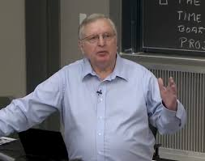

[](patric-winston.jpg "Patric Winston")

Patric Winston

# An error occurred.

Unable to execute JavaScript.

In [this](https://ocw.mit.edu/courses/6-034-artificial-intelligence-fall-2010/resources/lecture-1-introduction-and-scope/) lecture **Patrick Henry Winston (**February 5, 1943 – July 19, 2019) provides a definition of AI. How he keeps expanding his definition as he goes along is thing of beauty. It expands organicaly to incorporate new ideas, accommodate example problems and aspects of their solutions. This is a powerful example of using inductive thinking to create definition using a philosophical approach.

While his presentation is not perfect, he has no qualms to presents himself as an old foggy at the start and his shirt soon finds it way out of his pants — yet he certainly makes a good attempt at leading young minds on a mind blowing journey into AI. He is demonstrating to his students that this disarmingly “goofy looking” proffessor is brilliant and that they should stick by him for the rest of the semester.

I raised an eyebrow when he says “No Laptops” - he clearly wanted all eyes on him! **Winston** clearly put some thought into making his lessons more effective. Luckily for us he recorded these in ([Winston 2020](#ref-Winston2020Clear)). He also shared these with us for posterity in another online course available [here](https://ocw.mit.edu/courses/res-tll-005-how-to-speak-january-iap-2018/).

He has a number of tricks an shticks[^1] up his sleeve. Just when the lecture seems to be an ossified discussion of Generate and Test he comes up with the “Rumpelstiltskin principle” an rather absurd if not memorable name for the idea.

> “**to give or know the true name of a being is to have power over it”**

And he makes use of a number of unconventional speaking aids in his talk, a bicycle wheel, duct tape, a sycamore leaf!

Winston, Patrick Henry. 2020. *Make It Clear: Speak and Write to Persuade and Inform*. The MIT Press. <https://doi.org/10.7551/mitpress/12406.001.0001>.

## Citation

BibTeX citation:

``` quarto-appendix-bibtex
@online{bochman2024,
  author = {Bochman, Oren},
  title = {A Definition by {Patrick} {Henry} {Winston}},
  date = {2024-03-03},
  url = {https://orenbochman.github.io/posts/2024/2024-03-03-a-definition-by-p-winston/},
  langid = {en}
}
```

For attribution, please cite this work as:

Bochman, Oren. 2024. “A Definition by Patrick Henry Winston.” March 3. <https://orenbochman.github.io/posts/2024/2024-03-03-a-definition-by-p-winston/>.

[^1]: a gimmick, comic routine, style of performance, etc. associated with a particular person.
