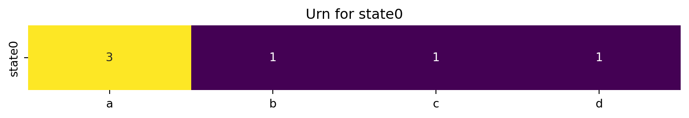
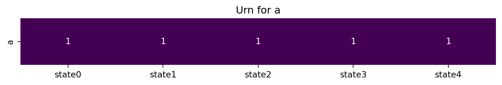
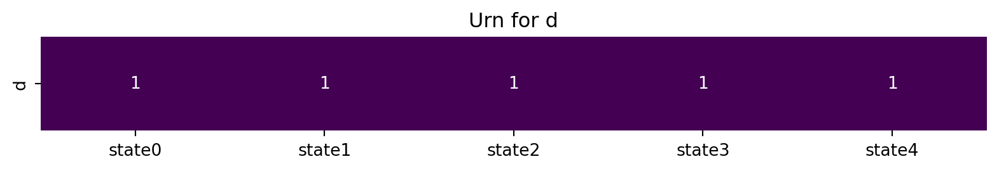
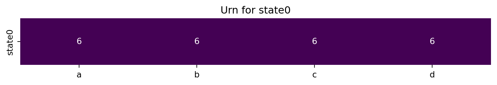
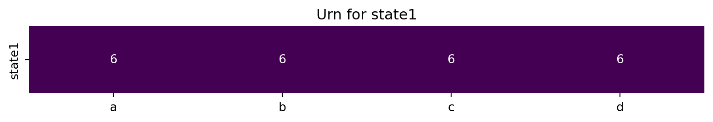

> “There is a tendency in our planning to confuse the unfamiliar with the improbable. The contingency we have not considered seriously looks strange; what looks strange is thought improbable; what is improbable need not be considered seriously.” – Thomas Schelling in his forward to “Pearl Harbor: Warning and Decision” by Roberta Wohlstetter

> “Models tend to be useful when they are simultaneously simple enough to fit a variety of behaviors and complex enough to fit behaviors that need the help of an explanatory model.” ― Thomas C. Schelling, in Micromotives and Macrobehavior

Let’s create one of the most fundamental models in probability theory - the urn model. It’s worth noting that urn models are both very simple and very powerful thus as Schelling intimates they can be very useful.

> **NOTE:**
>
> [](../../../images/in_the_nut_shell_coach_retouched.jpg "Urn Models In a Nutshell")
>
> Urn Models In a Nutshell
>
> The urn model is a simple model that describes the process of drawing balls from an urn.

> **NOTE:**
>
> I have also written some notes on using urn models to understand probability distribution. Though the focus came not from modeling with code but the ‘story’ of the process and or distribution.

> **NOTE:**
>
> So I said they are useful
>
> - here are a couple of RL algorithms for the lewis signaling game with a multi-urn model.
> - elsewhere I worked out details of additional RL algorithms using the urn model.
> - and they also crop up in at least on paper in the review section!

> **IMPORTANT:**
>
> add Schelling’s quotes on models and uncertainty
>
> fix bugs in the code for binomial urn.
>
> add links to relevant lesson and appendix from notes on Bayesian statistics.
>
> add link citation and list results from skyms paper with urn models!

## History of Urn Models

Urn models go back to the 17th century and were first introduced in ([**bernoulli1713ars?**](#ref-bernoulli1713ars)) by [Jacob Bernoulli](https://en.wikipedia.org/wiki/Jacob_Bernoulli)

The urn model is a simple model that describes the process of drawing balls from an urn. The urn contains balls of different colors, and the goal is to study the probabilities of drawing balls of different colors.

Two useful texts on urns models are ([**johnson1977urn?**](#ref-johnson1977urn)) and ([**mahmoud2008polya?**](#ref-mahmoud2008polya))

The urn contains balls of different colors, and the goal is to study the probabilities of drawing balls of different colors.

Although basic urn models can be represented with draws from well known distributions an the urn model is useful concrete form for thinking about probability particularly when implementing simple reinforcement learning algorithms or model with Bayesian updating.

Some more complex processes in probability theory can be set up as urn model making this a useful model to understand.

When it comes to implementing agents, we can quickly set them up for reinforcement or Bayesian learning by equipping the agnet with such an urn model.

In python we can implement the urn model using a numpy array to represent the balls in the urn and their counts.

The basic operations of the urn model is to draw a ball from the urn and update the urn with the new ball counts.

basic operations:

- draw() draw a ball from the urn

operations:

- we might want to draw n balls then observe how many were of a certain color
- we might want to draw n balls then update the urn with the new ball counts
- we might want to draw n balls without updating the urn with new balls to capture the current distribution of balls.
- convert balls/weights to probabilities
- estimate probability of drawing a certain sequence of balls with or without updating the urn.
- given n observations of balls estimate the ball proportions and thier confidence intervals.

## Urn Models and distributions

The Bernoulli urn model - sampling with replacement from an urn with two balls of different colors yields a binomial distribution.

The Multinomial urn model - sampling with replacement from an urn with more than two balls of different colors yields a multinomial distribution.

hypergeometric urn - sampling without replacement…

urn with sampling with replacement and adding a new ball of the same color

polya urn - when a ball is observed the urn is updated with the same color ball and a new ball of the same color

beta-binomial when ever a ball is observed the urn is updated with the number of balls of the same color

dirichlet

hoppe urn - the urn has a mutator ball that generates new ball color (a new column) and a mutator state that generates new states (a new row)

- derichlet process
- chinee restaurant process

\[\] moran urn - like a polya urn but we also remove a ball so that the total number of balls remains constant.

\[\] ehrenfest urn - two urns with balls that are moved between them from physics

## The Basic Urn model

``` python
import numpy as np
import matplotlib.pyplot as plt
import seaborn as sns
import altair as alt
import pandas as pd

class Urn():
  ''' classic urn model using np array of ball counts
      for two balls this is a model for the  Binomial distribution
      for more balls this is a model of the multinomial distribution
  '''
  def __init__(self, ball_names=np.array(['white','black']), init='ones', weights=None):
    '''initialize the urn with ball names and weights'''
    self.ball_names = ball_names
    
    if weights is not None:
      assert type(weights) == np.ndarray, "Weights must be a numpy array."
      assert weights.shape[0] == (len(self.ball_names)), f"Weight shape {weights.shape} not the same as the number of balls. {len(self.ball_names)}"
      self.weights = weights
    else:
      if init == 'ones':
        self._weights = np.ones((self.ball_colors))
      elif init == 'zeros':
        self._weights = np.zeros((self.ball_colors))
      elif init == 'random':
        self._weights = np.random.rand(self.ball_colors)
      else:
        raise ValueError("Initialization parameter must be 'ones', 'zeros', or 'random'.")

  @property
  def ball_names(self):
    return self._ball_names
  
  @ball_names.setter
  def ball_names(self, ball_names):
    
    #assert type(ball_names) ==  np.ndarray , "Ball names must be numpy array."
    self._ball_names = ball_names
    self._num_balls = len(ball_names)

  @property
  def ball_colors(self):
    return len(self.ball_names)

  @property
  def weights(self):
    return self._weights
  
  @weights.setter
  def weights(self, weights):
    assert type(weights) == np.ndarray, f"Weights must be a numpy array. not {type(weights)}"
    print(weights.shape, self.ball_colors)
    assert weights.shape == self.ball_names.shape, f"Weights must have the same shape as the number of balls and columns. but we get {weights.shape} and not{self.ball_names.shape}"
    #not nan
    assert np.isnan(weights).sum() == 0, "Weights must not be nan."
    assert weights.sum() > 0, "Weights must sum to a positive number."
    self._weights = weights

  def draw(self,n=1):
    ''' draw a ball from the urn with replacement'''
    row_idx = np.random.choice(self.ball_colors, p=self.weights/self.weights.sum(), size=n)
    result = []
    for i in range(n):
      result.append(self.ball_names[row_idx[i]])
    return list(map(str,result))
```

### Bernoulli Urn Model

``` python
#some examples
benulli_urn = Urn()
print(benulli_urn.draw(10))
print(benulli_urn.draw(10))
print(benulli_urn.draw(10))
```

    ['white', 'black', 'black', 'black', 'white', 'black', 'black', 'white', 'black', 'black']
    ['white', 'black', 'white', 'black', 'black', 'white', 'white', 'black', 'white', 'black']
    ['white', 'white', 'black', 'black', 'black', 'white', 'white', 'white', 'white', 'black']

``` python
weights = np.array([1., 9.])
print(weights.shape)
print(benulli_urn.ball_colors)


#benulli_urn.weights = np.array([1., 9.])
print(benulli_urn.draw(10))
```

    (2,)
    2
    ['white', 'black', 'white', 'black', 'white', 'black', 'black', 'white', 'white', 'black']

``` python
bern_df = pd.DataFrame({'balls': benulli_urn.draw(100)})
bern_df.head()
```

|     | balls |
|-----|-------|
| 0   | black |
| 1   | white |
| 2   | black |
| 3   | black |
| 4   | black |

``` python
fig=alt.Chart(bern_df).mark_bar().encode(
    x='balls',
    y='count()'
).properties(width=200, height=200)
fig.show()
```

Figure 1: Bernoulli urn model

### Multinomial Urn Model

``` python
multinomial_urn = Urn(ball_names=np.array(['red','blue','green']),
                      weights   =np.array([3., 9., 1.]))
multi_df = pd.DataFrame({'balls': multinomial_urn.draw(100)})
multi_df.head()
```

    (3,) 3

|     | balls |
|-----|-------|
| 0   | blue  |
| 1   | blue  |
| 2   | blue  |
| 3   | blue  |
| 4   | blue  |

``` python
#alt.renderers.enable("html")
alt.Chart(multi_df).mark_bar().encode(
    x='balls',
    y='count()'
).properties(width=200, height=200)
```

Figure 2: Multinomial urn model

``` python
print(multinomial_urn.draw(10))
```

    ['blue', 'blue', 'blue', 'blue', 'blue', 'red', 'blue', 'blue', 'blue', 'green']

## The Polya Urn model

``` python
class Polya(Urn):
  ''' 
    The polya urn model is a generalization of the urn model where c is the number of balls of the same color added to the urn
    for c=0 the polya urn model we get drawing with replacement reulting in binomial and multinomial distributions.
    for c=1 the polya urn model we get drawing with replacement and adding a new ball of the same color resulting in a  BetaBinomial and Dirichlet distributions.
    for c=-1 the polya urn model we get drawing withot replacement resulting in a  the hypergeometric distribution.
  '''
  
  def __init__(self,ball_names=['white','black'], init='ones', weights=None, c=1):
    '''initialize the urn with ball names and weights'''
    super().__init__(ball_names, init, weights)
    self.c = c

  def draw(self,n=1,update=True):
    ''' 
    draw a ball from the urn with replacement and add a new ball of the same color

    Parameters:
    n: int, number of balls to draw
    update: bool, update the urn with the new ball counts or keep it frozen    
    '''
    result = []
    for i in range(n):
      row_idx = np.random.choice(self.ball_colors, p=self.weights/self.weights.sum(), size=n)
      result.append(self.ball_names[row_idx[i]])
      if update:
        self.weights[row_idx[i]] += self.c
    return result
```

### BetaBinomial Urn Model - Polya Urn Model with c=1

this is not correct - we need to add an operation to return the number white balls from n draws.

``` python
betabinomial_urn = Polya(ball_names=['white','black'], c=1)
print(betabinomial_urn.draw(10))
```

    ['white', 'white', 'white', 'white', 'white', 'black', 'white', 'white', 'white', 'white']

``` python
betabinomial_df = pd.DataFrame({'balls': betabinomial_urn.draw(100)})
alt.Chart(betabinomial_df).mark_bar().encode(
    x='balls',
    y='count()'
).properties(width=200, height=200)
```

BetaBinomial urn model

### Beta Negative Binomial Distribution - Polya Urn Model with c=1

this time

### Dirichlet Urn Model - Polya Urn Model with c=1

### Hypergeometric Urn Model - Polya Urn Model with c=-1

``` python
hypergeometric_urn = Polya(ball_names=['white','black'], c=-1)
print(hypergeometric_urn.draw(10))
```

    /tmp/ipykernel_4068635/451444112.py:24: RuntimeWarning:

    invalid value encountered in divide

    ---------------------------------------------------------------------------
    ValueError                                Traceback (most recent call last)
    Cell In[12], line 2
          1 hypergeometric_urn = Polya(ball_names=['white','black'], c=-1)
    ----> 2 print(hypergeometric_urn.draw(10))

    Cell In[9], line 24, in Polya.draw(self, n, update)
         22 result = []
         23 for i in range(n):
    ---> 24   row_idx = np.random.choice(self.ball_colors, p=self.weights/self.weights.sum(), size=n)
         25   result.append(self.ball_names[row_idx[i]])
         26   if update:

    File numpy/random/mtrand.pyx:994, in numpy.random.mtrand.RandomState.choice()

    ValueError: probabilities contain NaN

``` python
hypergeometric_df = pd.DataFrame({'balls': hypergeometric_urn.draw(100)})
alt.Chart(hypergeometric_df).mark_bar().encode(
    x='balls',
    y='count()'
).properties(width=200, height=200)
```

    /tmp/ipykernel_4068635/451444112.py:24: RuntimeWarning:

    invalid value encountered in divide

    ---------------------------------------------------------------------------
    ValueError                                Traceback (most recent call last)
    Cell In[13], line 1
    ----> 1 hypergeometric_df = pd.DataFrame({'balls': hypergeometric_urn.draw(100)})
          2 alt.Chart(hypergeometric_df).mark_bar().encode(
          3     x='balls',
          4     y='count()'
          5 ).properties(width=200, height=200)

    Cell In[9], line 24, in Polya.draw(self, n, update)
         22 result = []
         23 for i in range(n):
    ---> 24   row_idx = np.random.choice(self.ball_colors, p=self.weights/self.weights.sum(), size=n)
         25   result.append(self.ball_names[row_idx[i]])
         26   if update:

    File numpy/random/mtrand.pyx:994, in numpy.random.mtrand.RandomState.choice()

    ValueError: probabilities contain NaN

## The Hoppe Urn models

``` python
class Hoppe(Polya):
  ''' Hoppe urn model'''
  
  def __init__(self,ball_names=['0'], init='ones', weights=None, c=1, mutator_mass=1.0):
    '''initialize the urn with ball names and weights'''
    super().__init__(ball_names, init, weights, c)
    self.mutator_mass = mutator_mass
    if weights is not None:
      assert type(weights) == np.ndarray, "Weights must be a numpy array."
      assert weights.shape[0] == (len(self.ball_names)), f"Weight shape {weights.shape} not the same as the number of balls. {len(self.ball_names)}"
      self.weights = weights
    else:
      if init == 'ones':
        self._weights = np.ones((self.ball_colors))
      elif init == 'zeros':
        self._weights = np.zeros((self.ball_colors))
      elif init == 'random':
        self._weights = np.random.rand(self.ball_colors)
      else:
        raise ValueError("Initialization parameter must be 'ones', 'zeros', or 'random'.")
      #set the weight of the mutator ball to the mutator mass
      self.weights[0] = self.mutator_mass
    
  def draw(self,n=1):
    ''' draw a ball from the urn with replacement and add a new ball of the same color'''
    result = []
    for i in range(n):
      row_idx = np.random.choice(self.ball_colors, p=self.weights/self.weights.sum(), size=1)
      if row_idx[i] == 0:
        #add a new ball color
        self.ball_names.append(str(len(self.ball_names)))
        self.weights = np.append(self.weights, c)
        result.append(self.ball_names[-1])
      else:
        result.append(self.ball_names[row_idx[0]])
        self.weights[row_idx[i]] += c
        
    return result
```

## The Moran Urn model

``` python
class Moran(Polya):
  ''' Moran urn model'''
  
  def draw(self,n=1):
    ''' draw a ball from the urn with replacement and add a new ball of the same color'''
    result = []
    for i in range(n):
      row_idx = np.random.choice(self.ball_colors, p=self.weights/self.weights.sum(), size=2)
      self.weights[row_idx[0]] += c
      self.weights[row_idx[1]] -= c
      
      result.append(self.ball_names[row_idx[0]])
        
    return result
```

### Ehrenfest Urn Model

The Ehrenfest urn model is a simple model that describes the process of moving balls between two urns. I view this as a precursor to compartmental models in epidemiology and other fields and it demostrates how one can extend the urn model can be used to model more complex systems. The more general model is the multiurn model where we have multiple urns and we can move balls between them which is a Markov chain model.

The model consists of two urns, each containing a fixed number of balls. At each time step, a ball is randomly selected from one of the urns and moved to the other urn.

## The MultiUrn model

> “any problem of probability appears comparable to a suitable problem about bags containing balls, and any random mass phenomenon appears as similar in certain essential respects to successive drawings of balls from a system of suitibly combined bags.” - ([**polya1954patterns?**](#ref-polya1954patterns))

So I actualy implemented this model first to do some basic RL algorithms for the Lewis Signalling model.

The MultiUrn model is an extension of the basic Urn model that allows for multiple urns to be used together.

We may for example need to learn an urn model per state in our system extending a bandit algorithm to a contextual bandit algorithm.

We can represent these using rows of a matrix where each row represents an urn and each column represents a ball color.

In cases where we have hierarchical models we may be able to use additional constraints - for example on both rows and columns to speed up learning.

``` python
class MultiUrn:
    def __init__(self, row_names, col_names, init='ones'):
        self.row_names = row_names
        self.col_names = col_names
        self.num_rows = len(row_names)
        self.num_cols = len(col_names)
        
        if init == 'ones':
            self.weights = np.ones((self.num_rows, self.num_cols))
        elif init == 'zeros':
            self.weights = np.zeros((self.num_rows, self.num_cols))
        elif init == 'random':
            self.weights = np.random.rand(self.num_rows, self.num_cols)
        else:
            raise ValueError("Initialization parameter must be 'ones', 'zeros', or 'random'.")
    
    def _convert_to_numeric(self, row_name, col_name):
        try:
            row_idx = self.row_names.index(row_name)
            col_idx = self.col_names.index(col_name)
            return row_idx, col_idx
        except ValueError:
            raise ValueError("Invalid row or column name.")
    
    def get_weight(self, row_name, col_name):
        row_idx, col_idx = self._convert_to_numeric(row_name, col_name)
        return self.weights[row_idx, col_idx]
    
    def set_weight(self, row_name, col_name, value):
        row_idx, col_idx = self._convert_to_numeric(row_name, col_name)
        self.weights[row_idx, col_idx] = value
    
    def add_weights(self, other_urn):
        if self.weights.shape != other_urn.weights.shape:
            raise ValueError("Urns must have the same dimensions to add weights.")
        return Urn(self.row_names, self.col_names, init=None, weights=self.weights + other_urn.weights)
    
    def get_conditional_probabilities(self):
        row_sums = self.weights.sum(axis=1, keepdims=True)
        conditional_probs = self.weights / row_sums
        return conditional_probs
    
    def get_conditional_probability(self, row_name, col_name):
        row_idx, col_idx = self._convert_to_numeric(row_name, col_name)
        row_sum = self.weights[row_idx, :].sum()
        conditional_prob = self.weights[row_idx, col_idx] / row_sum
        return conditional_prob

    def choose_option(self, row_name):
        row_idx = self.row_names.index(row_name)
        row_weights = self.weights[row_idx, :]
        col_idx = np.random.choice(self.num_cols, p=row_weights/row_weights.sum())
        return self.col_names[col_idx]
    
    def update_weights(self, row_name, col_name, reward):
        row_idx, col_idx = self._convert_to_numeric(row_name, col_name)
        self.weights[row_idx, col_idx] += reward

    def plot_heatmap(self):
        for idx, row_name in enumerate(self.row_names):
            plt.figure(figsize=(10, 1))
            sns.heatmap(self.weights[idx, :].reshape(1, -1), annot=True, cmap="viridis", cbar=False, xticklabels=self.col_names, yticklabels=[row_name])
            plt.title(f"Urn for {row_name}")
            plt.show()
            

    def calculate_expected_reward(self, receiver_urn):
        result = 0.0
        sender_probs = self.get_conditional_probabilities()
        receiver_probs = receiver_urn.get_conditional_probabilities()
        
        for sender_state in self.row_names:
            for sender_signal in self.col_names:
                p_sender = self.get_conditional_probability(sender_state, sender_signal)
                for receiver_signal in receiver_urn.row_names:
                    for receiver_state in receiver_urn.col_names:
                        p_receiver = receiver_urn.get_conditional_probability(receiver_signal, receiver_state)
                        if receiver_signal == sender_signal:
                            result += p_sender * p_receiver
        return result
    
    def add_expected_reward(self, receiver_urn):
        expected_reward = self.calculate_expected_reward(receiver_urn)
        for row_name in self.row_names:
            for col_name in self.col_names:
                self.update_weights(row_name, col_name, expected_reward)    

    def __str__(self):
        return str(self.weights)
```

``` python
# Example usage
row_names = ['state0', 'state1', 'state2', 'state3', 'state4']
col_names = ['a', 'b', 'c', 'd']

urn = MultiUrn(row_names, col_names, init='ones')

print("Initial weights:")
print(urn)

weight_0_a = urn.get_weight('state0', 'a')
print(f"Weight for state0 and signal 'a': {weight_0_a}")

urn.set_weight('state0', 'a', 2.0)
print("Weights after setting weight for state0 and signal 'a' to 0.5:")
print(urn)

conditional_probs = urn.get_conditional_probabilities()
print("Conditional probabilities:")
print(conditional_probs)

state = 'state0'
signal = 'a'
conditional_prob = urn.get_conditional_probability(state, signal)
print(f"Conditional probability of signal {signal} given {state}: {conditional_prob}")

state = 'state1'
signal = 'a'
conditional_prob = urn.get_conditional_probability(state, signal)
print(f"Conditional probability of signal {signal} given {state}: {conditional_prob}")

chosen_signal = urn.choose_option('state0')
print(f"Chosen signal for state0: {chosen_signal}")

urn.update_weights('state0', 'a', 1.0)
print("Weights after updating weight for state0 and signal 'a' with a reward of 0.1:")
print(urn)


# Plot heatmaps
urn.plot_heatmap()
```

    Initial weights:
    [[1. 1. 1. 1.]
     [1. 1. 1. 1.]
     [1. 1. 1. 1.]
     [1. 1. 1. 1.]
     [1. 1. 1. 1.]]
    Weight for state0 and signal 'a': 1.0
    Weights after setting weight for state0 and signal 'a' to 0.5:
    [[2. 1. 1. 1.]
     [1. 1. 1. 1.]
     [1. 1. 1. 1.]
     [1. 1. 1. 1.]
     [1. 1. 1. 1.]]
    Conditional probabilities:
    [[0.4  0.2  0.2  0.2 ]
     [0.25 0.25 0.25 0.25]
     [0.25 0.25 0.25 0.25]
     [0.25 0.25 0.25 0.25]
     [0.25 0.25 0.25 0.25]]
    Conditional probability of signal a given state0: 0.4
    Conditional probability of signal a given state1: 0.25
    Chosen signal for state0: c
    Weights after updating weight for state0 and signal 'a' with a reward of 0.1:
    [[3. 1. 1. 1.]
     [1. 1. 1. 1.]
     [1. 1. 1. 1.]
     [1. 1. 1. 1.]
     [1. 1. 1. 1.]]

[](urn_files/figure-html/multi-urn-model-examples-output-2.png)

[](urn_files/figure-html/multi-urn-model-examples-output-3.png)

[](urn_files/figure-html/multi-urn-model-examples-output-4.png)

[](urn_files/figure-html/multi-urn-model-examples-output-5.png)

[](urn_files/figure-html/multi-urn-model-examples-output-6.png)

``` python
s_row_names = ['state0', 'state1', 'state2', 'state3', 'state4']
s_col_names = ['a', 'b', 'c', 'd']
s_urn = MultiUrn(s_row_names, s_col_names, init='ones')
s_urn.plot_heatmap()
```

[](urn_files/figure-html/cell-19-output-1.png)

[](urn_files/figure-html/cell-19-output-2.png)

[](urn_files/figure-html/cell-19-output-3.png)

[](urn_files/figure-html/cell-19-output-4.png)

[](urn_files/figure-html/cell-19-output-5.png)

``` python
r_row_names = ['a', 'b', 'c', 'd']
r_col_names = ['state0', 'state1', 'state2', 'state3', 'state4']
r_urn = MultiUrn(r_row_names, r_col_names, init='ones')
r_urn.plot_heatmap()
```

[](urn_files/figure-html/cell-20-output-1.png)

[](urn_files/figure-html/cell-20-output-2.png)

[](urn_files/figure-html/cell-20-output-3.png)

[](urn_files/figure-html/cell-20-output-4.png)

lets add a method to calculate the expected reward of two urns

result = 0.0 for each sender state sender_state for each sender signal sender_signal p_sender = the conditional probability of the sender_signal given the sender_state for each reciever signal reciever_signal for each reciever state reciever_state p_reciever = the conditional probability of the reciever_state given the reciever_signal if the reciever_signal is the same as the sender_signal result += p_sender \* p_reciever return result

# note I think the expected reward could be less then one - since the expected reward is the probability of the reciever signal given the sender signal

and sum of probabilities of the reciever signal given the sender signal is less then one.

        calculate the expected reward
        add the expected reward to the urn

where we start with a reciever, chose

``` python
expected_reward = s_urn.calculate_expected_reward(r_urn)/(s_urn.num_rows*r_urn.num_cols*s_urn.num_rows*r_urn.num_cols)
print(f"Expected reward: {expected_reward}")

s_urn.add_expected_reward(r_urn)
print("Sender Urn weights after adding expected reward:")
print(s_urn)
s_urn.plot_heatmap()
```

    Expected reward: 0.007999999999999985
    Sender Urn weights after adding expected reward:
    [[6. 6. 6. 6.]
     [6. 6. 6. 6.]
     [6. 6. 6. 6.]
     [6. 6. 6. 6.]
     [6. 6. 6. 6.]]

[](urn_files/figure-html/cell-21-output-2.png)

[](urn_files/figure-html/cell-21-output-3.png)

[](urn_files/figure-html/cell-21-output-4.png)

[](urn_files/figure-html/cell-21-output-5.png)

[](urn_files/figure-html/cell-21-output-6.png)

## Citation

BibTeX citation:

``` quarto-appendix-bibtex
@online{bochman2024,
  author = {Bochman, Oren},
  title = {Urn Models Using {Numpy}},
  date = {2024-05-02},
  url = {https://orenbochman.github.io/posts/2024/2024-05-03-urn-models/urn.html},
  langid = {en}
}
```

For attribution, please cite this work as:

Bochman, Oren. 2024. “Urn Models Using Numpy.” May 2. <https://orenbochman.github.io/posts/2024/2024-05-03-urn-models/urn.html>.
