# An error occurred.

Unable to execute JavaScript.

You may have seen the benchmark results and thought, “how the heck are the Julia ODE solvers on GPUs orders of magnitude faster than the GPU-accelerated Python libraries, that can’t be true?” In this talk I will go into detail about the architectural differences between the Julia approaches to generating GPU-accelerated solvers vs the standard ML library approach to GPU usage. By the end of the talk you’ll have a good enough understanding of models of GPU acceleration to understand why this performance difference exists, and the many applications that can take advantage of this performance improvement.

> **TIP:**
>
> You may have seen the benchmark results and thought, “how the heck are the Julia ODE solvers on GPUs orders of magnitude faster than the GPU-accelerated Python libraries, that can’t be true?” In this talk I will go into detail about the architectural differences between the Julia approaches to generating GPU-accelerated solvers vs the standard ML library approach to GPU usage. By the end of the talk you’ll have a good enough understanding of models of GPU acceleration to understand why this performance difference exists, and the many applications that can take advantage of this performance improvement.

This talk is about the results of the publication titled “Automated translation and accelerated solving of differential equations on multiple GPU platforms” which was published in 2024 demonstrating that the Julia GPU-based ODE solvers, specifically DiffEqGPU.jl, are 20x-100x faster than Jax (diffrax) and PyTorch (torchdiffeq). The publication goes into detail as to the architectural reasons for the performance difference, even going as far as recreating the ML style of GPU acceleration in Julia in order to demonstrate that such an approach loses the performance advantage, along with testing against alternative CUDA C++ implementations of a similar form to showcase exactly the effects of the architectural decisions on the resulting performance. However, as a highly technical article it can many times not be as easy to understand as it should. In this talk we’re going to give a barebones “no HPC background required” explanation of how the Julia GPU stack enables a completely different approach from the “standard” ML libraries form of GPU acceleration, and how for some applications this can be majorly beneficial. We will note that the GPU design of the ML libraries is actually optimal for ML applications, but certain properties of some applications of ODE solvers make it require a completely different formulation.

We will additionally talk about other projects which have seen similar results, such as solving nonlinear systems in Julia (with NonlinearSolve.jl), GPU-accelerated optimization with Optimization.jl, and new global optimizer methods in ParallelParticleSwarms.jl which all rely on this technique and the special aspects of the Julia GPU infrastructure.

[Paper](https://www.sciencedirect.com/science/article/abs/pii/S0045782523007156)

> **TIP:**

## Outline

[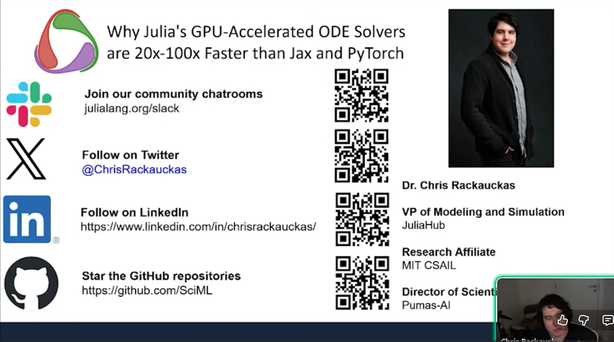](slide01.png "Introduction")

Introduction

[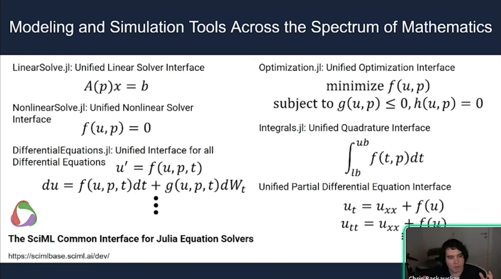](slide02.png "Modeling and Simulation Tools Across the Spectrum of Mathematics")

Modeling and Simulation Tools Across the Spectrum of Mathematics

[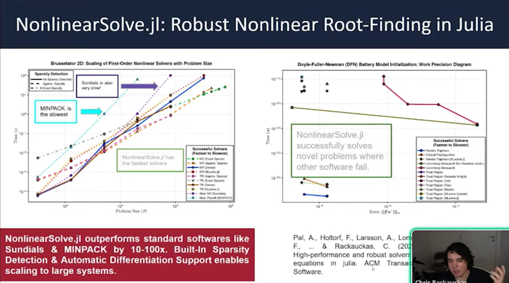](slide03.png "NonlinearSolve.jl Robust Nonlinear Root-Finding in Julia")

NonlinearSolve.jl Robust Nonlinear Root-Finding in Julia

[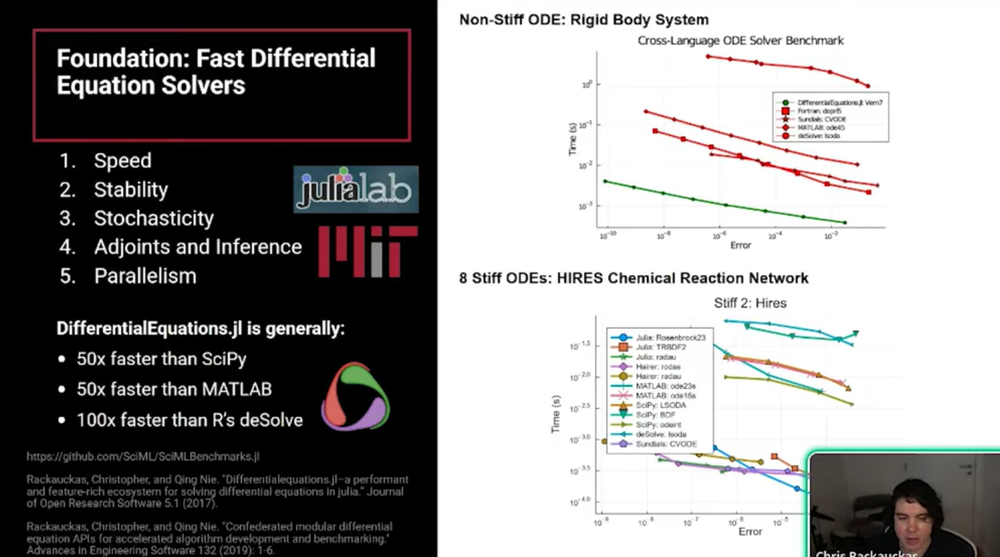](slide04.png "Foundations: Fast Differential Equation Solvers")

Foundations: Fast Differential Equation Solvers

[](slide05.png "Reasons for Performance in these ODEs")

Reasons for Performance in these ODEs

[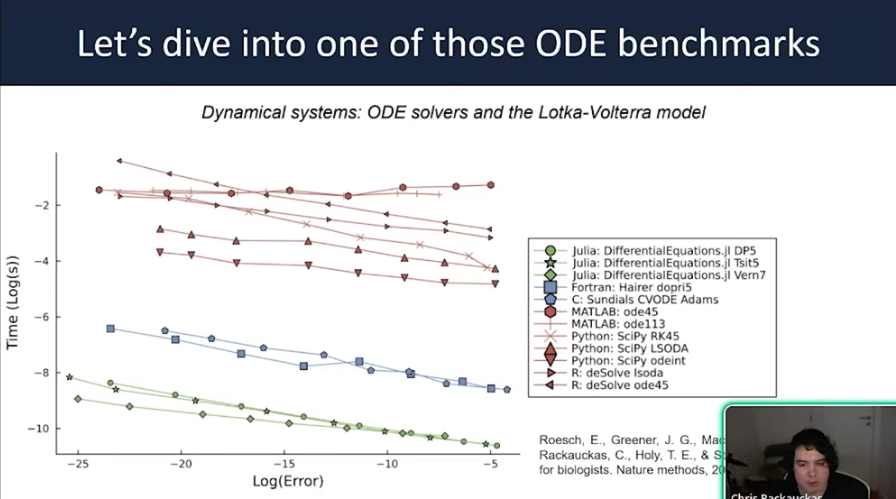](slide06.png "Let’s dive into one of those ODE benchmarks Lotka-Volterra")

Let’s dive into one of those ODE benchmarks Lotka-Volterra

[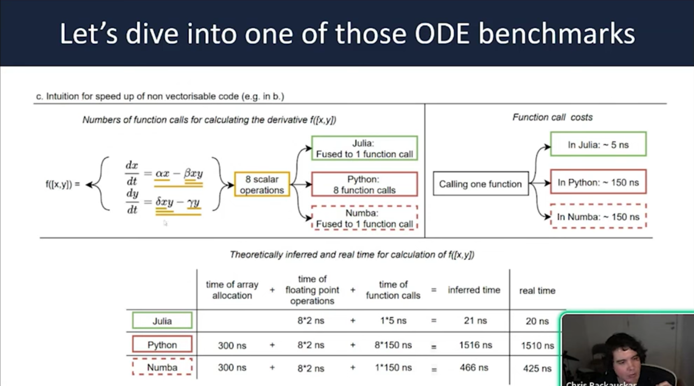](slide07.png "Let’s dive into one of those ODE benchmarks")

Let’s dive into one of those ODE benchmarks

[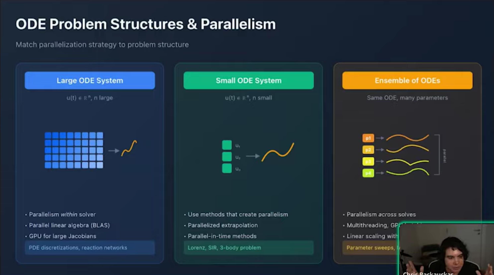](slide08.png "ODE Problem Structures & Parallelism")

ODE Problem Structures & Parallelism

[](slide09.png "Large ODEs")

Large ODEs

[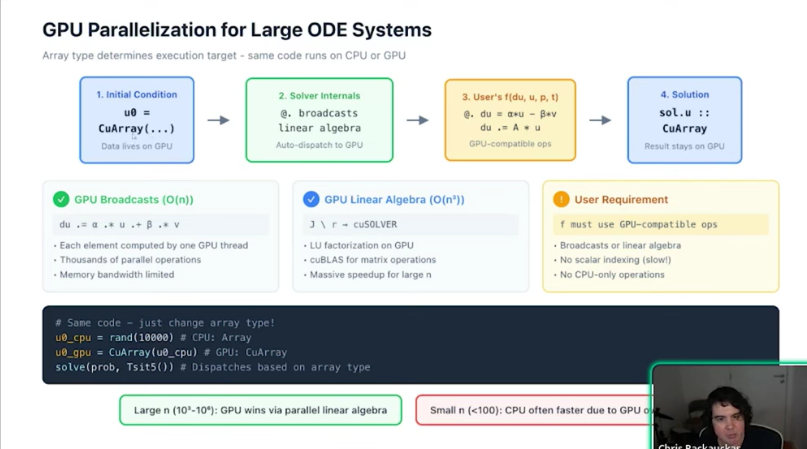](slide10.png "GPU Parallelism for Large ODE Systems")

GPU Parallelism for Large ODE Systems

[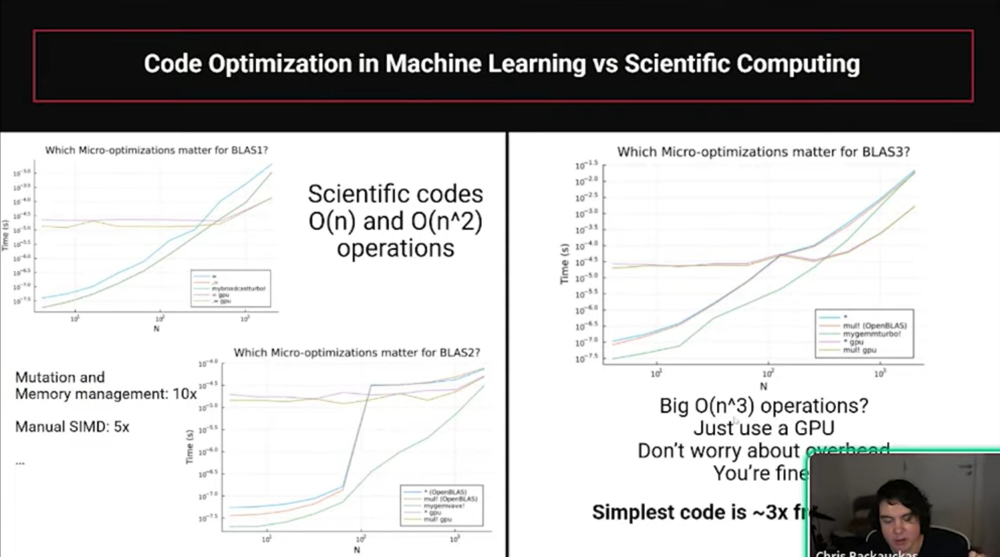](slide11.png "Code Optimization in Machine Learning vs Scientific Computing")

Code Optimization in Machine Learning vs Scientific Computing

[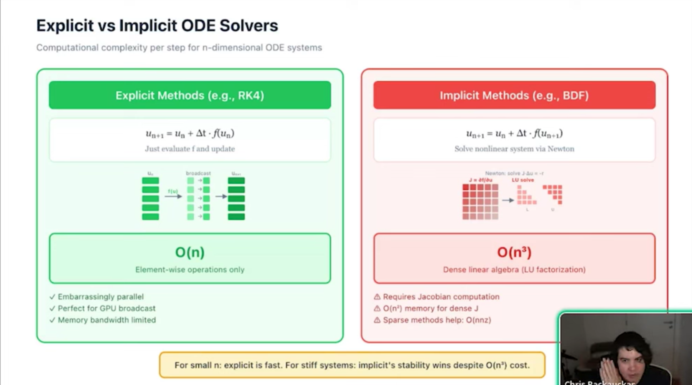](slide12.png "Explicit vs Implicit ODE Solvers")

Explicit vs Implicit ODE Solvers

[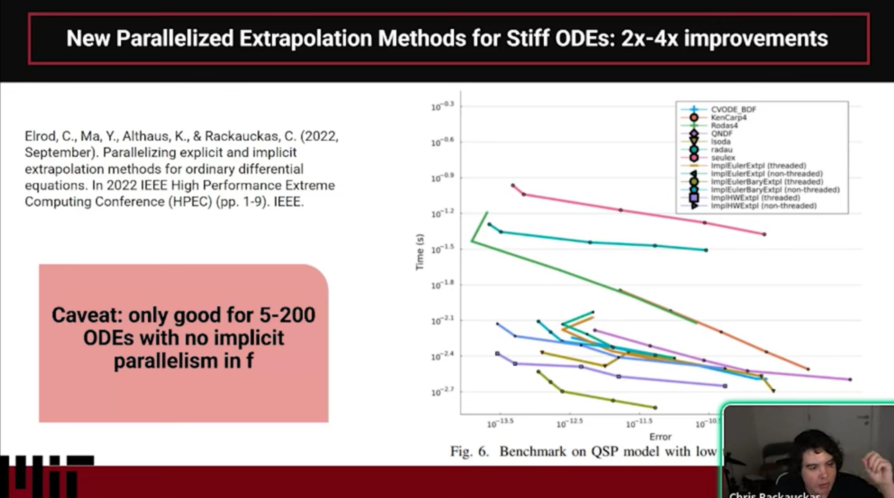](slide13.png "New Parallelized Extrapolation Methods for Stiff ODEs")

New Parallelized Extrapolation Methods for Stiff ODEs

[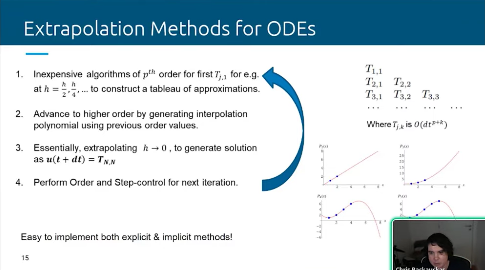](slide14.png "Extrapolation Methods for ODEs")

Extrapolation Methods for ODEs

[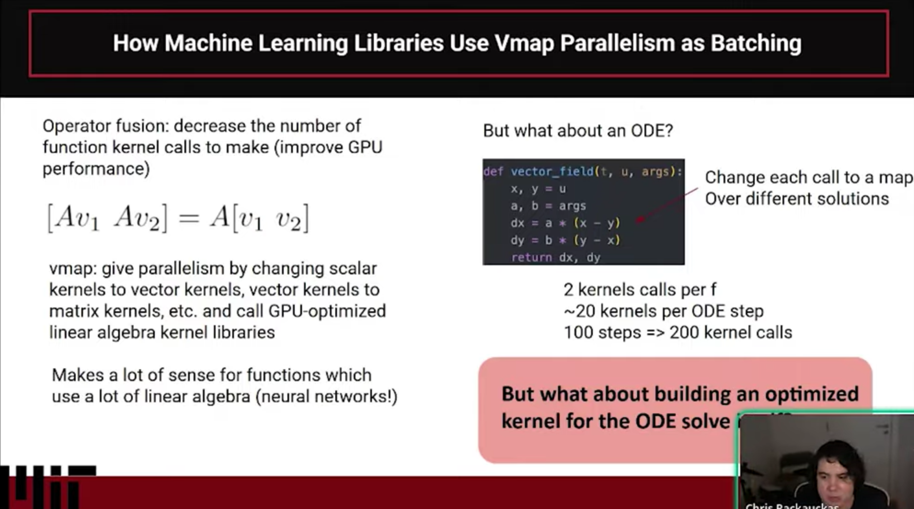](slide15.png "How machine learning libraries use Vmap Parallelism as Batching")

How machine learning libraries use Vmap Parallelism as Batching

[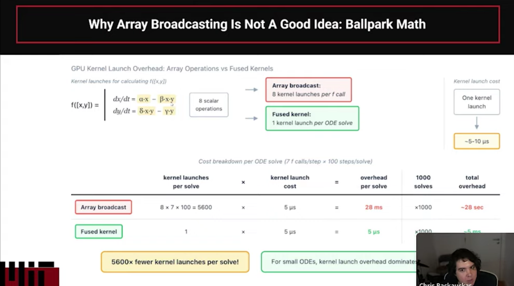](slide16.png "Why array Broadcasting is Not a Good idea: Ballpark Math")

Why array Broadcasting is Not a Good idea: Ballpark Math

[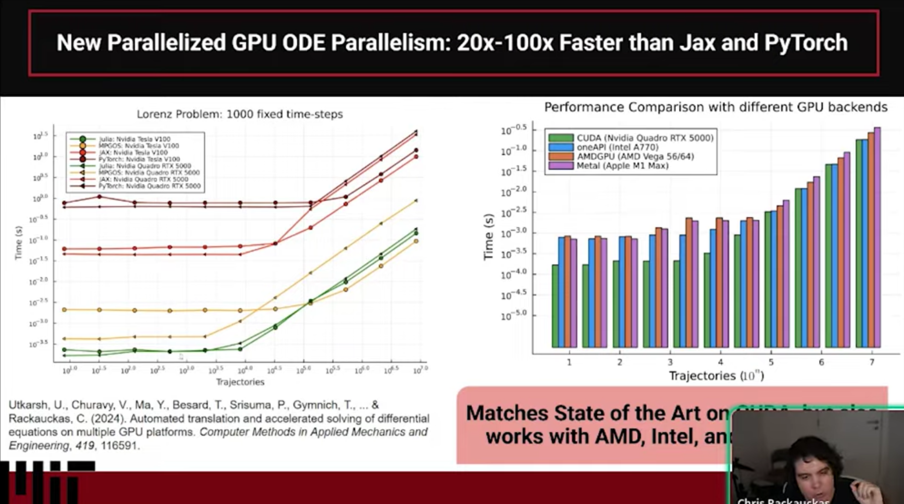](slide17.png "New Parallelized GPU ODE Parallelism")

New Parallelized GPU ODE Parallelism

[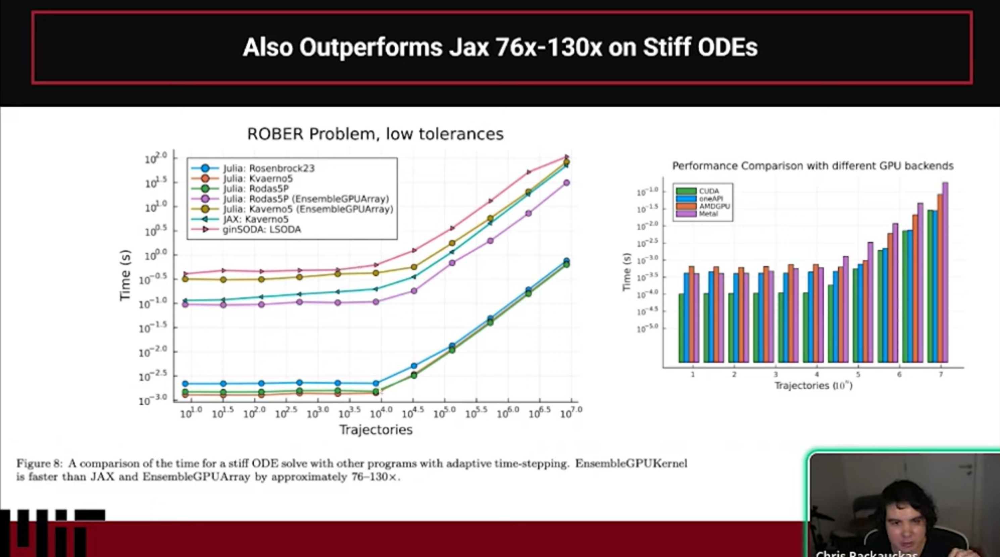](slide18.png "Also Outperforms Jax")

Also Outperforms Jax

[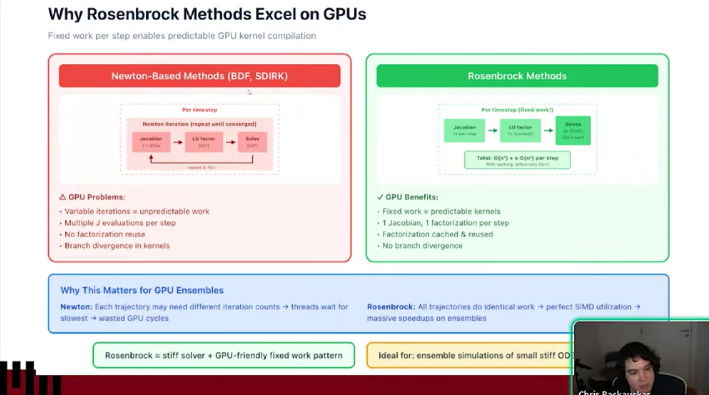](slide19.png "Why Rosenbrock Method Excel on GPUs")

Why Rosenbrock Method Excel on GPUs

[](slide20.png "Apply this to other domains")

Apply this to other domains

[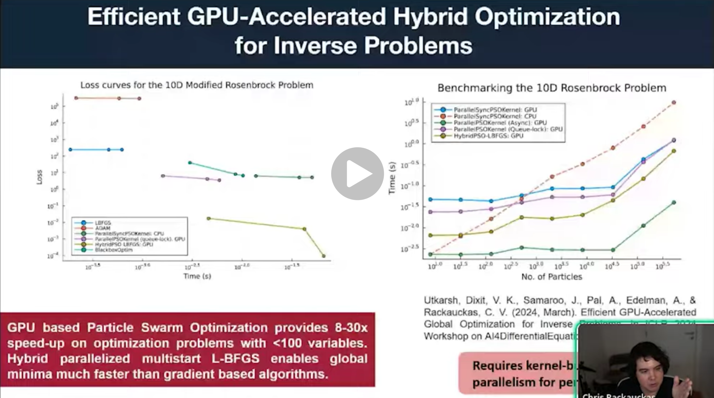](slide21.png "Efficient GPU Accelerated Hybrid Optimization for Inverse Problems")

Efficient GPU Accelerated Hybrid Optimization for Inverse Problems

[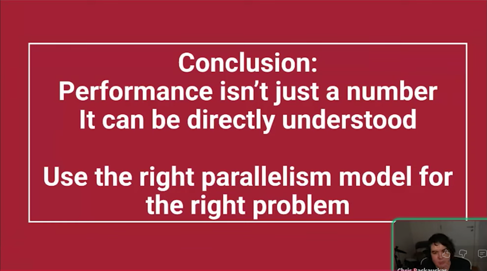](slide22.png "Conclusion")

Conclusion

This presentation by Dr. Chris Rackauckas explains the architectural factors that allow Julia’s SciML differential equation solvers to outperform traditional Python/ML libraries like Jax and PyTorch by 20x to 100x.

1.  Performance Context Julia’s SciML ecosystem integrates numerical solvers with machine learning and symbolic computing. Benchmarks show Julia achieving order-of-magnitude speedups over Python, MATLAB, and R by combining modernized implementation with new mathematical methods specifically designed for modern hardware.
2.  The CPU Performance Gap Julia avoids the overhead inherent in Python/SciPy interpreters by using two key principles: Mutating Arrays: Avoiding the allocation of new memory for every derivative computation. Inlining: Compiling user-defined functions directly into the solver to eliminate interpreter overhead.
3.  GPU Parallelism Models Efficient GPU usage depends on the problem structure: Large systems: Parallelization within the solver (e.g., for PDEs). Small systems: Parallelization in time. Ensembles: Parallelization over parameters (best for parameter sweeps). Machine learning libraries often struggle with ODEs because they treat operations as large kernels, which is efficient for dense matrix math but inefficient for the O(N) operations common in ODE solvers.
4.  Why Julia Outperforms on GPUs Standard ML libraries (like Jax/PyTorch) often use vmap or array-based approaches, which launch individual GPU kernels for every step of the integration, creating massive overhead. Julia generates a custom, specialized CUDA kernel for the entire ODE solve. This allows the GPU to execute the entire computation in one kernel launch, effectively eliminating the overhead that slows down other frameworks.
5.  Limitations and Conclusion Limitations: The kernel-generation approach is ideal for smaller systems (up to ~200 ODEs) due to GPU register space constraints. Key Takeaway: Achieving high performance is not just about using a GPU; it requires selecting the correct parallelism model and design architecture for the specific problem at hand.

## Citation

BibTeX citation:

``` quarto-appendix-bibtex
@online{bochman2025,
  author = {Bochman, Oren},
  title = {Why {Julia’s} {GPU-Accelerated} {ODE} {Solvers} Are 20x-100x
    {Faster} Than {Jax} and {PyTorch}},
  date = {2025-12-09},
  url = {https://orenbochman.github.io/posts/2025/2025-12-09-pydata-julia-ode-solvers/},
  langid = {en}
}
```

For attribution, please cite this work as:

Bochman, Oren. 2025. “Why Julia’s GPU-Accelerated ODE Solvers Are 20x-100x Faster Than Jax and PyTorch.” December 9. <https://orenbochman.github.io/posts/2025/2025-12-09-pydata-julia-ode-solvers/>.
