[](pydata_logo.png "pydata global")

pydata global

> **TIP:**
>
> Most data science projects start with a simple notebook—a spark of curiosity, some exploration, and a handful of promising results. But what happens when that experiment needs to grow up and go into production?
>
> This talk follows the story of a single machine learning exploration that matures into a full-fledged ETL pipeline. We’ll walk through the practical steps and real-world challenges that come up when moving from a Jupyter notebook to something robust enough for daily use.

> **TIP:**
>
> - **Set clear objectives** and document the process from the beginning
> - **Break messy notebook logic** into modular, reusable components
> - **Choose the right tools** (Papermill, nbconvert, shell scripts) based on your workflow—not just the hype
> - **Track environments and dependencies** to make sure your project runs tomorrow the way it did today
> - **Handle data integrity**, schema changes, and even evolving labels as your datasets shift over time
> - And as a bonus: **bring your results to life** with interactive visualizations using tools like [PyScript](https://pyscript.net/), [Voila](https://github.com/voila-dashboards/voila), and [Panel](https://panel.holoviz.org/) + [HoloViz](https://holoviz.org/)

> **TIP:**

## Outline

[slide deck](https://www.dawnwages.info/pydata-boston-2025/)

[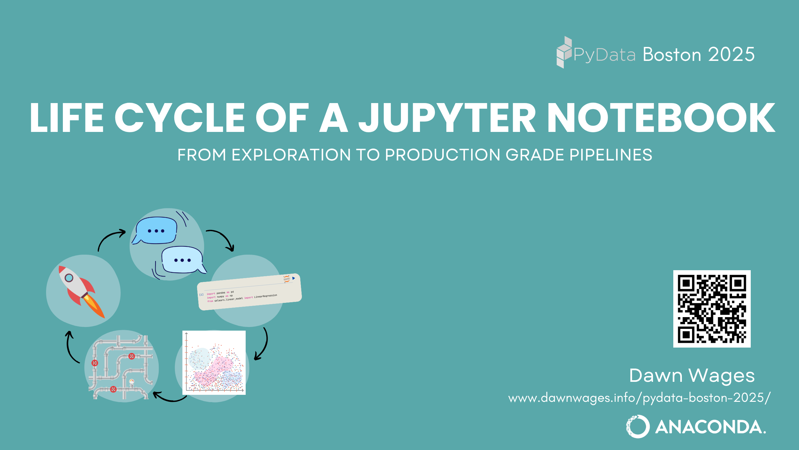](slide01.png "life cycle of a jupyter notebook")

life cycle of a jupyter notebook

### About Dawn Wages

[](slide02.png "Who is Dawn Wages?")

Who is Dawn Wages?

Bio!

[](slide03.png "Who is Dawn Wages?")

Who is Dawn Wages?

QR Ad for for Conda podcasts

[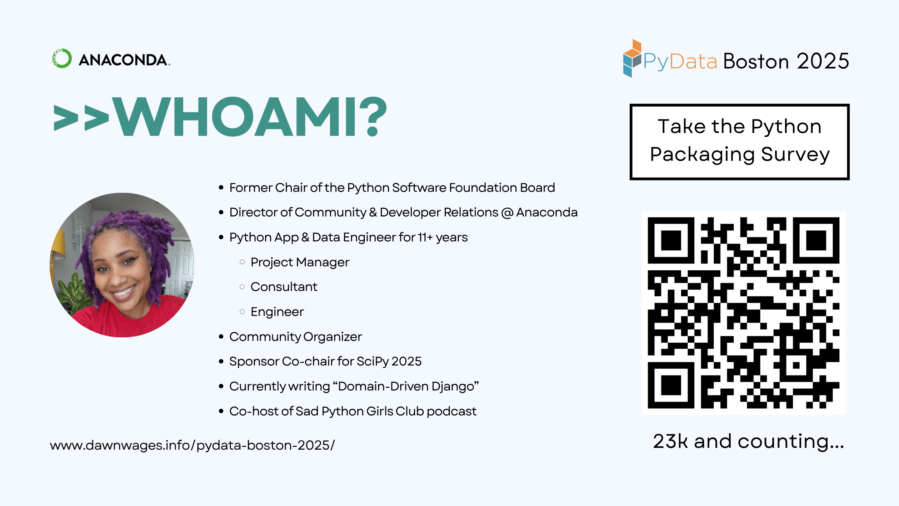](slide04.png "Who is Dawn Wages?")

Who is Dawn Wages?

QR Ad for for Python Packaging survey

[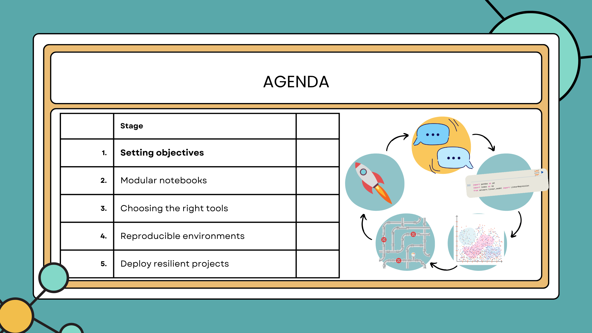](slide05.png "Agenda - Setting objectives")

Agenda - Setting objectives

- (3 mins) Intro
  - I’ve been supporting various groups in their developer experience since 2020 after being a freelance Python consultant. I’ve worked on many many dozens of projects, unblocking users picking the right tools for the task at hand.
  - It works on my machine
  - What we’re building today: ML pipeline ➰ with 🌊RAPIDS \to Snowflake ❄️
  - We’re going to watch a real project grow up

[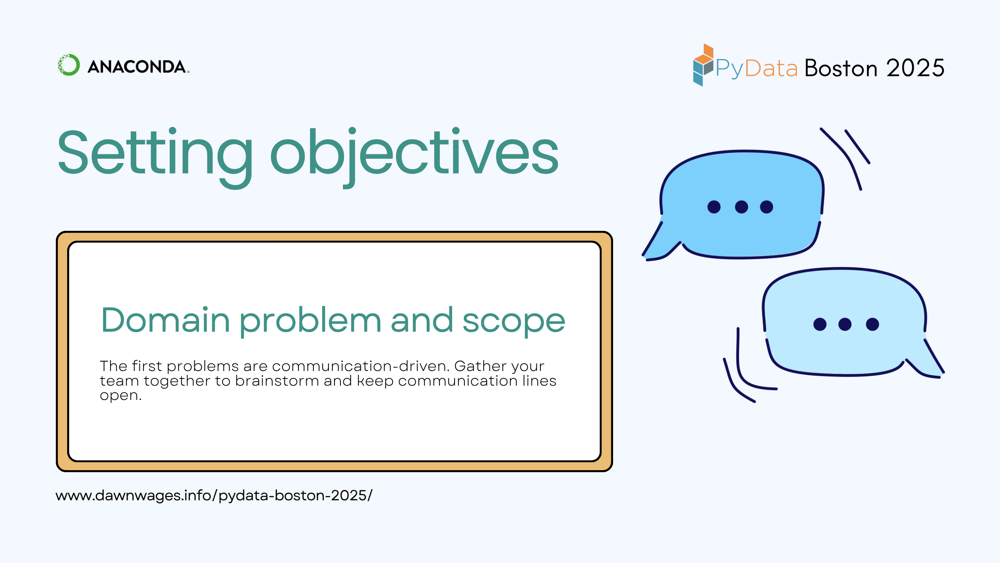](slide06.png "Setting objectives - Domain problems and scope")

Setting objectives - Domain problems and scope

- Before you start coding you should have a team discussion to set objectives.
- Specify the problem domain and the project’s scope
- Brainstorm before coding

[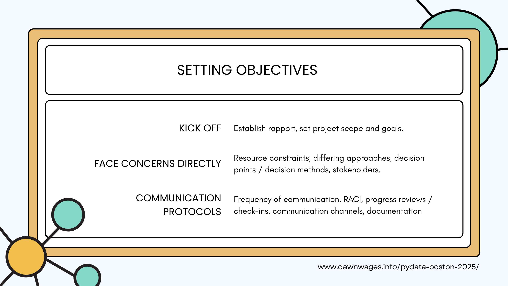](slide07.png "Setting objectives 1")

Setting objectives 1

- Kickoff meeting to discuss the above with stakeholders
- Dependency matrix
- [RACI](https://en.wikipedia.org/wiki/Responsibility_assignment_matrix) is **responsibility assignment matrix for cross departmental projects**
  - Responsible - stakeholders are involved in the planning, execution, and completion of the task.
  - Acountable - stakeholders are held to be individually and ultimately responsible for the success or failure of the task
  - Consulted - Consulted stakeholders are sought for their opinions on a task;
  - Informed - Informed stakeholders are updated as the project progresses.

[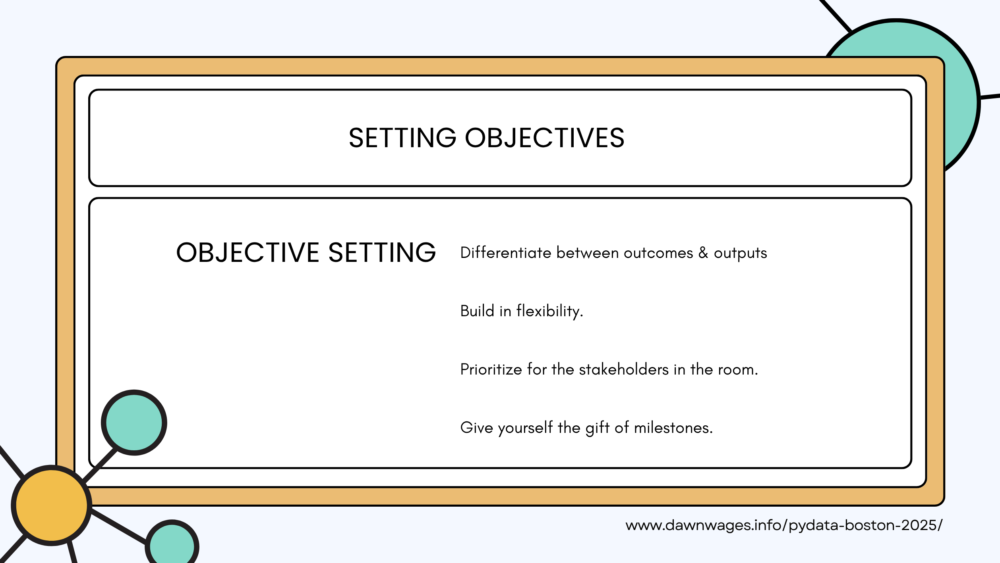](slide08.png "Setting objectives 2")

Setting objectives 2

- Dependency matrix
- RACI (Responsible Acountable Consulted &Informed)

[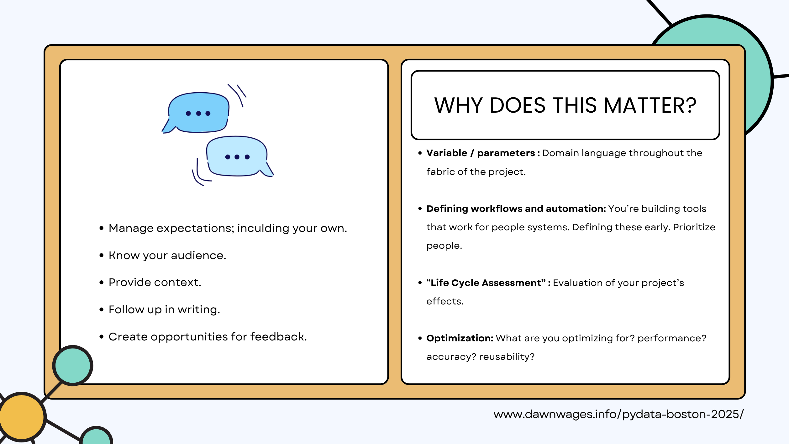](slide09.png "Why it matters?")

Why it matters?

> **CAUTION:**
>
> - [Softskills](https://en.wikipedia.org/wiki/Soft_skills)
>
> |                      |                        |                        |
> |----------------------|------------------------|------------------------|
> | Communication.       | Creative thinking      | Teamwork               |
> | Leadership           | Delegation             | Adaptability           |
> | Problem-solving      | Emotional intelligence | Conflict Resolution    |
> | Networking           | Time Management        | Emotional Intelligence |
> | Professional Writing | Critical Thinking      | Digital Literacy       |
> | Work Ethic           | Intercultural fluency  | Professional attitude  |
>
> > “Fail to plan = Plan to Fail” (my 5cnts)

- Speaker is Writing a domain driven design - Good luck!

[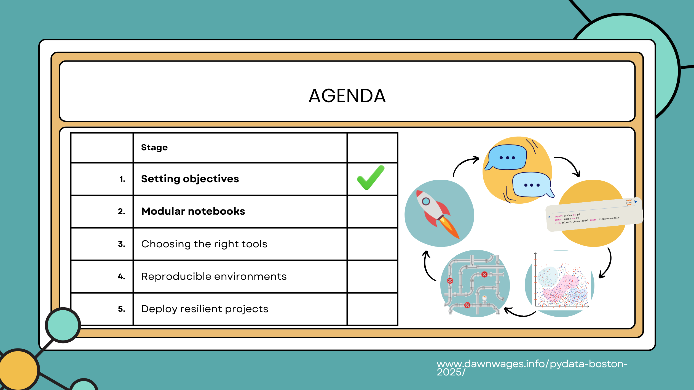](slide10.png "Agenda - Modular Notbooks")

Agenda - Modular Notbooks

Next we cover Modular Notebook use.

- (3 mins) Exploration - starting as a single messy notebook, sample data set.
  - Why RAPIDS? GPU
    - Large data sets
    - GPU availability - remote machine, local GPU
    - Workflows that work well with GPU
  - Load Data cuDF / pandas
  - Quick EDA and data visualization
  - Train cuML / scikit-learn model
  - No-code change philosophy

[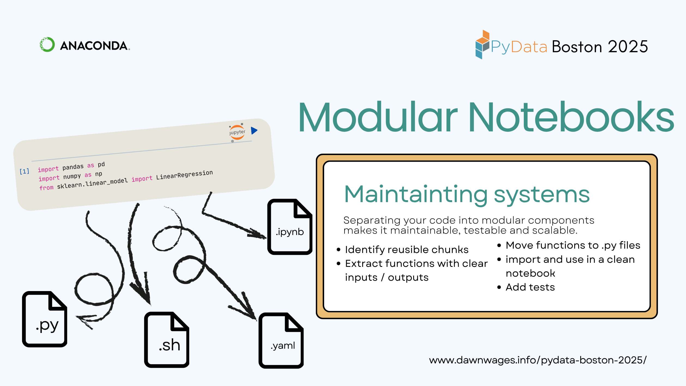](slide11.png "Modular Notebooks")

Modular Notebooks

``` python
import pandas as pd
import numpy as np
from sklearn.linear_model import LinearRegression
```

- [10 minutes to pandas](https://pandas.pydata.org/docs/user_guide/10min.html)
- [Pandas Cookbook](https://pandas.pydata.org/docs/user_guide/cookbook.html#cookbook)

> **TIP:**
>
> - [RAPIDS](https://rapids.ai/) is “GPU Accelerated Data Science”
> - Built on top of Nvidia CUDA and Apache Arrow
> - Uses familier APIs but powered by GPU libraries.
>   - Pandas api for CUDF
>   - SCIKIT-LEARN api for CUML
>   - Polars api for CUDF
>   - NetworkX api for CUGRAPH
> - Vector search with CUVS
> - Zero Code Changes (i.e. just change your imports) to get and 5x to 500x speedups.
> - FOSS [repo](https://github.com/rapidsai)
> - [Install guide](https://docs.rapids.ai/install/)
> - [Getting Started Guide](https://docs.rapids.ai/user-guide)

``` python
import cudf
import cupy as cp
import dask_cudf
import pandas as pd
from cuml.model_selection import train_test_split
from cuml.datasets.classification import make_classification
from cuml.datasets import make_blobs
from cuml.ensemble import RandomForestClassifier
from cuml.cluster.dbscan import DBSCAN
from cuml.manifold.umap import UMAP
from cuml.metrics import accuracy_score
from cuml.metrics import trustworthiness
from cuml.metrics.cluster import adjusted_rand_score
from cuml.datasets import make_regression
from cuml.linear_model import LinearRegression
```

[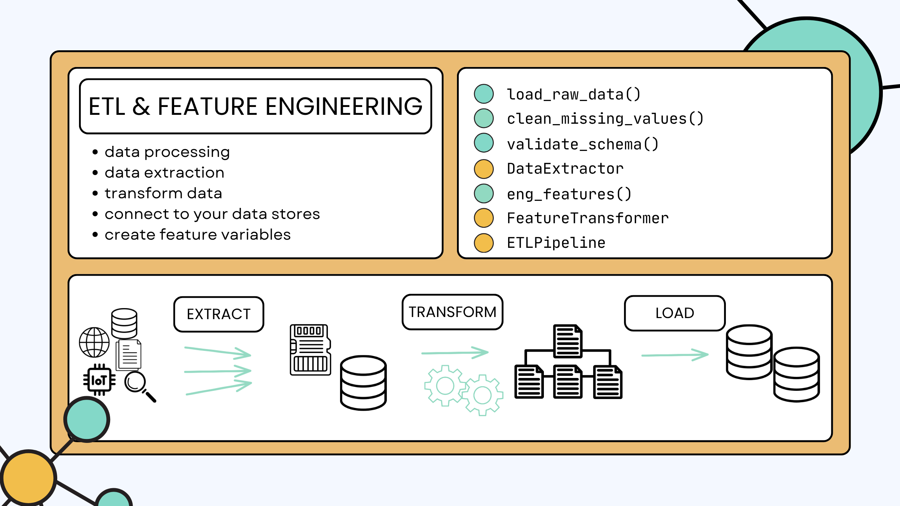](slide12.png "ETL & Feature Engineering")

ETL & Feature Engineering

- ML require Exctact Transform Load
- Takes raw data into the data store
- Feature Engineering

[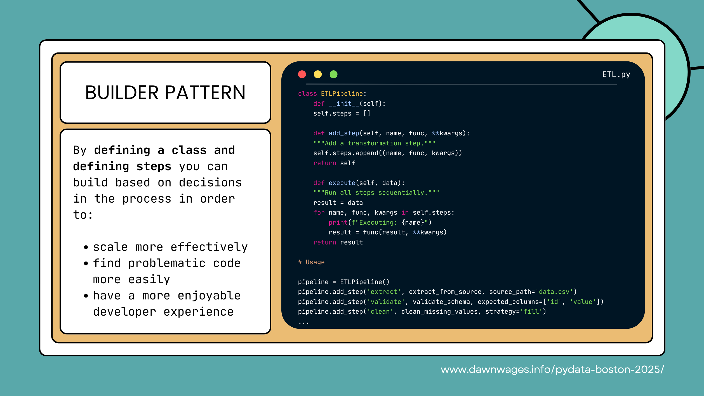](slide13.png "Builder Pattern")

Builder Pattern

- I like this slide and I like the builder pattern.
- It shows how to break down a complex process into manageable steps.

[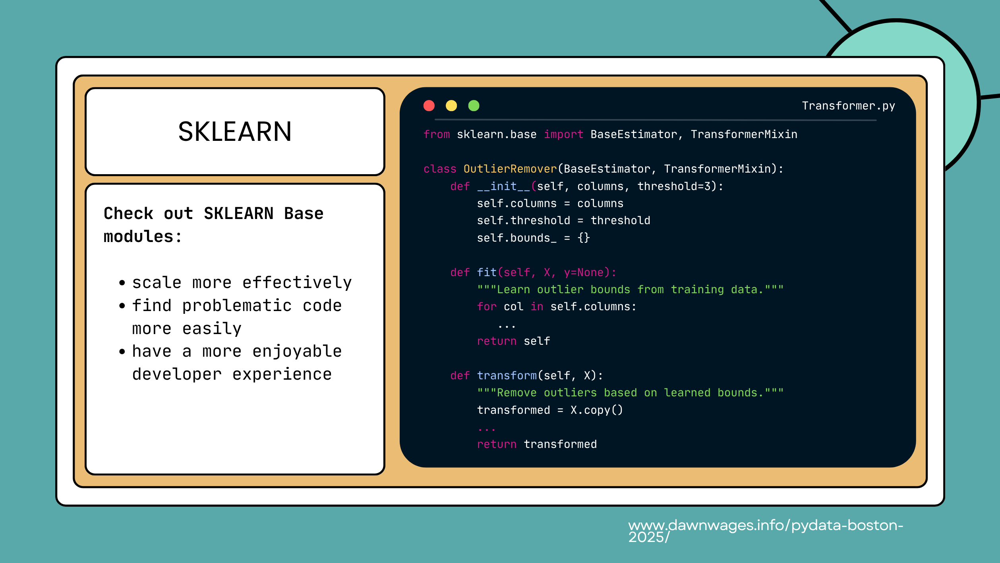](slide14.png "SKLEARN")

SKLEARN

- Sklearn Base modules
  - scale more effectively 🙏
  - find problematic code more easily 🤬😵‍💫🤦‍♂️
  - have a more enjoyable developer experience 🤕
    - 😟😞😫 work with apocrypha bugs🤒 that don’t get fixed and learn about them from the gravepine or the hardway
    - 😒😏🤨 read about undocumented parameters and algs by a bibtex reference name instead of a citation!
    - 🧗🧱🧊 import tons of external libs for algs that haven’t made the cut!
- We can use sklearn pipelines to chain together multiple steps in a machine learning workflow.
- This makes it easy to reuse and modify our code.
- c.f. the ML bibles by Aurélien Géron ([Géron 2019](#ref-geron2019hands)) or ([Géron 2025](#ref-geron2025hands))

[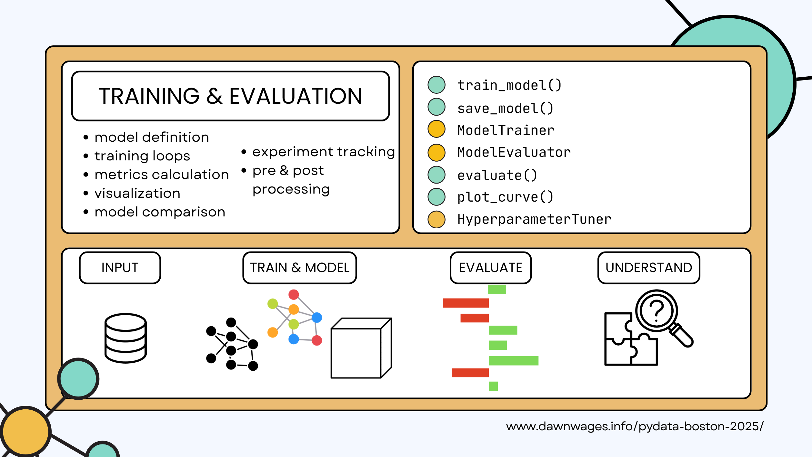](slide15.png "Training & Evaluation")

Training & Evaluation

- api
  - Methods:
    - `train_model()`
    - `save_model()`
    - `evaluate()`
    - `plot_curve()`
  - Objects:
    - `ModelTrainer` class
    - `ModelEvaluator` class
    - `HyperparameterTuner` class

[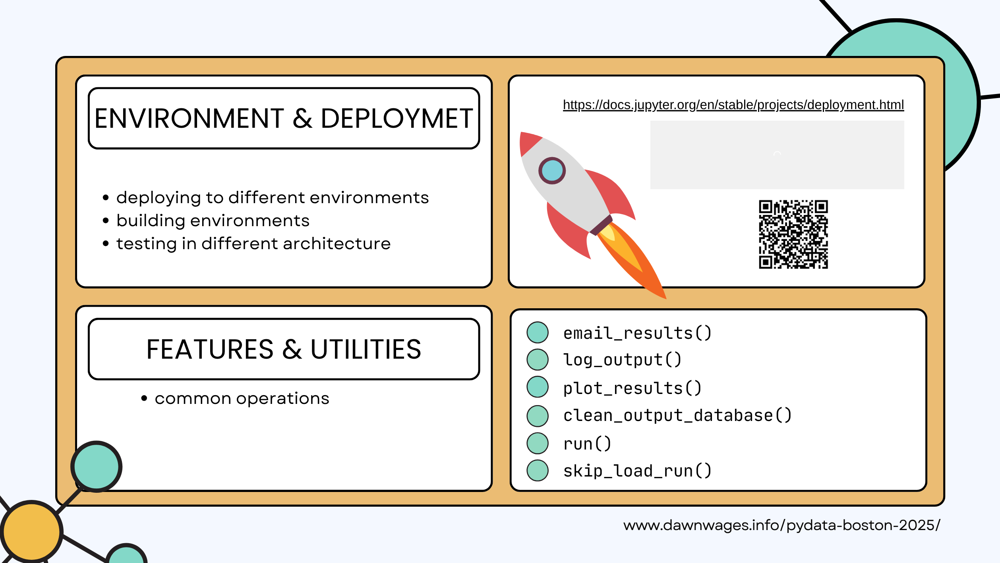](slide16.png "Train & Evaluate")

Train & Evaluate

[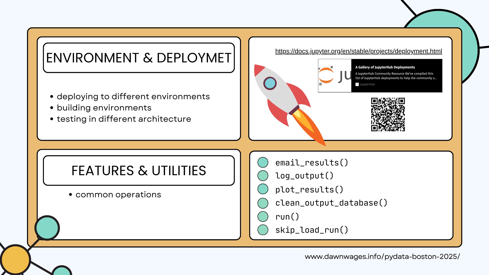](slide17.png "Environment Deployment")

Environment Deployment

- snowflake ❄️
- aws sagemaker
- azure

[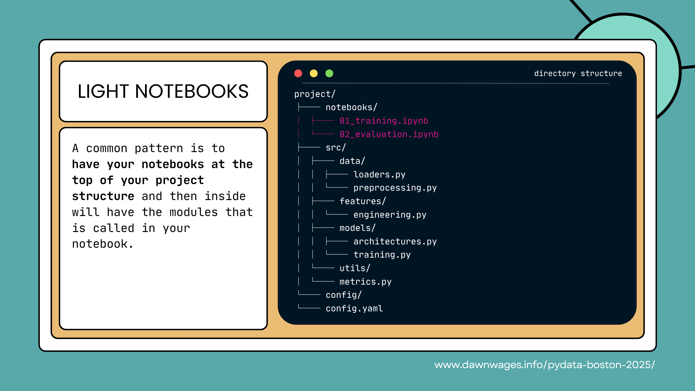](slide18.png "Light Notebooks")

Light Notebooks

- moving from the spagetti code to light notebook with a more sophisticated project structre:
- notebook for
  - ETL + feature engineering
  - train
  - validate
- migrate reusable code to .py scripts or modules.
- app or config
- yaml file (for what and how to access it?)

[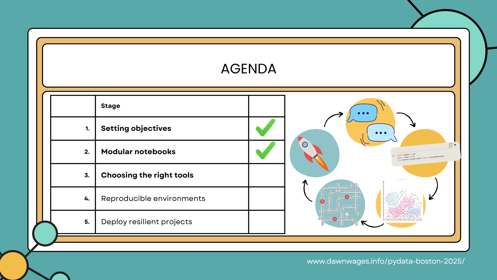](slide19.png "Agenda - Choosing the right tools")

Agenda - Choosing the right tools

[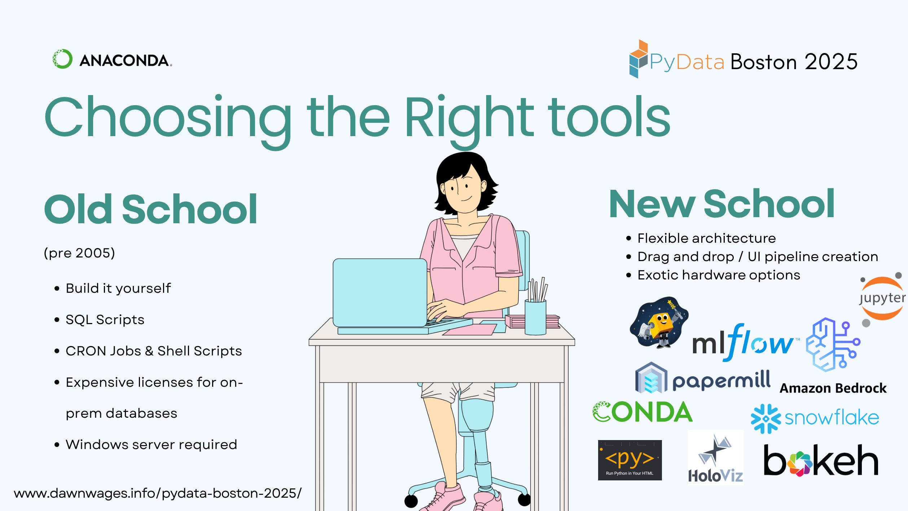](slide20.png "Choosing the right tools - Old school v.s. New School")

Choosing the right tools - Old school v.s. New School

- Env managemnt
  - conda
  - anaconda
  - [pixi](https://pixi.sh/latest/)
  - jupyter - “how do I explore data interactively”
- Lifecycle managent
  - mlflow - “how do I track my experiment” or
  - weight and biases
  - papermill - “how do I automate my Notebook”
- Viz
  - holoviz
  - bokeh
  - `<py>` pyscript (runs in the browser)
- Cloud & Compute
  - amazon bedrock (hyperscaler)
  - snowflake ❄️ “how do I store & query my big data?”
  - Rapids “how do I make ML go brrr… with a GPU”

> **TIP:**
>
> |  |  |
> |----|----|
> |  | [Pixi](https://pixi.sh/latest/) is a fast, modern, and reproducible package management tool for developers of all backgrounds. |

[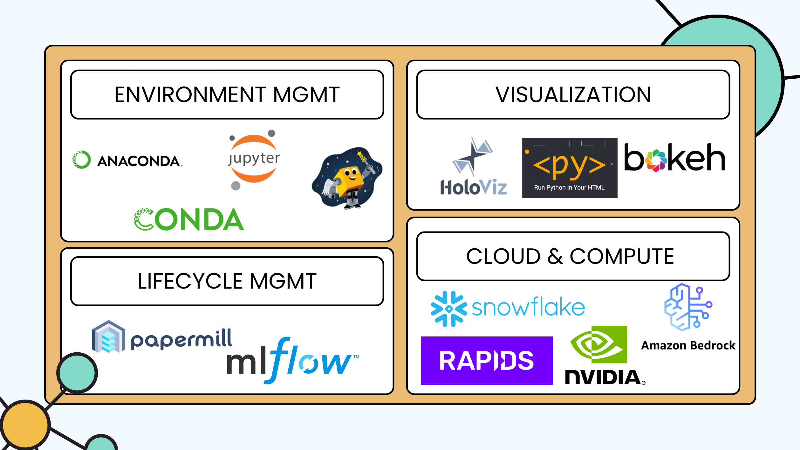](slide21.png "tools breakdown")

tools breakdown

[](slide22.png "papermill")

papermill

``` bash
pip install papermill
```

parametrise your notebook

[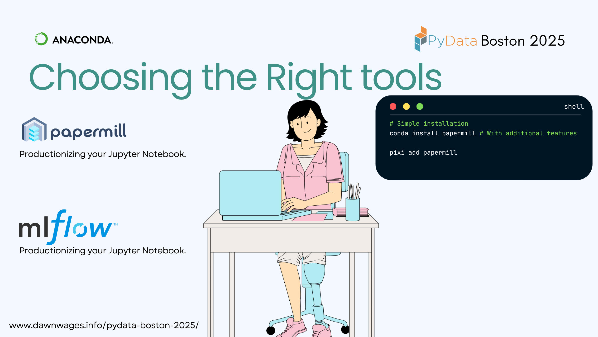](slide23.png "Papermill - install")

Papermill - install

[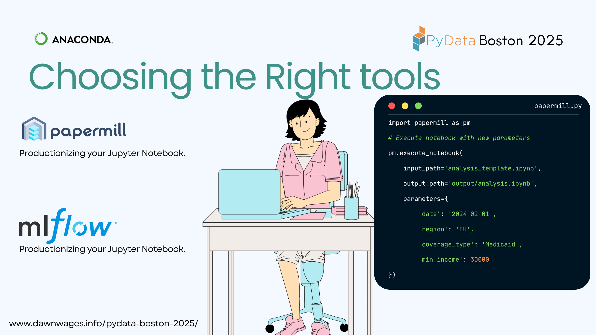](slide24.png "Papermill - usage")

Papermill - usage

``` python
import papermill as pm

pm.execute_notebook(
   'path/to/input.ipynb',
   'path/to/output.ipynb',
   parameters = dict(alpha=0.6, ratio=0.1)
)
```

[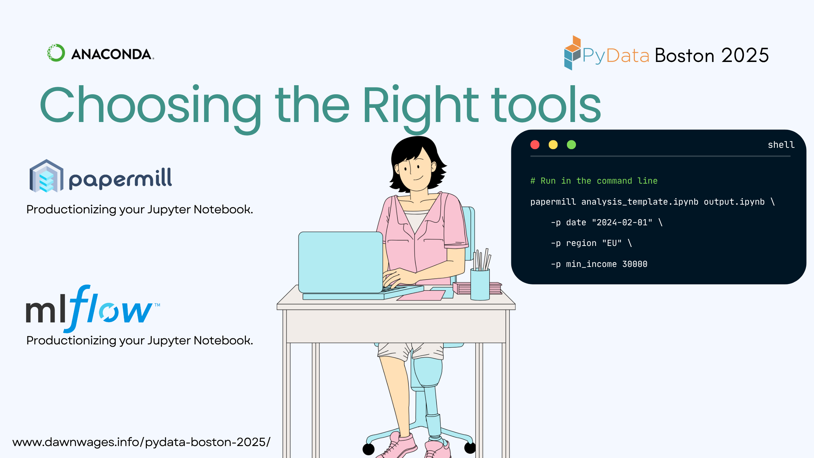](slide25.png "Papermill & mlflow")

Papermill & mlflow

[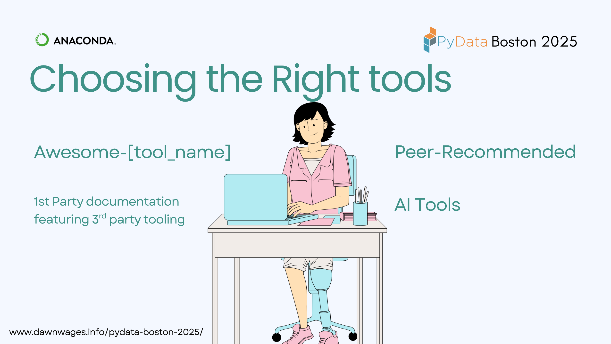](slide27.png "Choosing the right tools")

Choosing the right tools

[](slide27.png "Choosing the right tools")

Choosing the right tools

[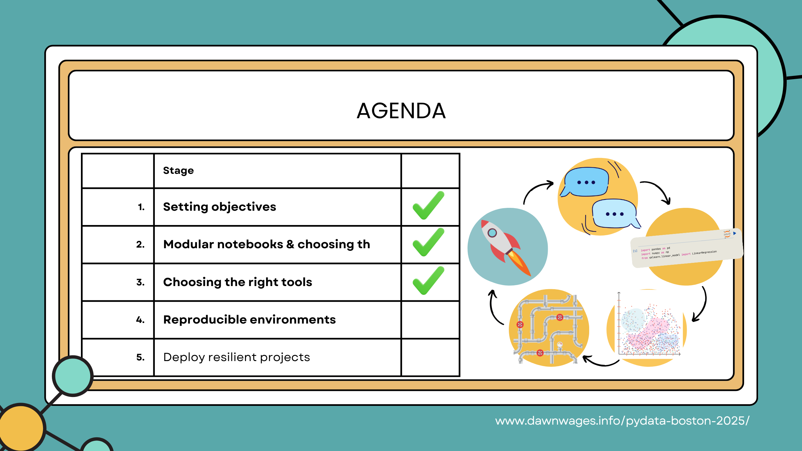](slide28.png "Agenda - Reproducible Environments")

Agenda - Reproducible Environments

- (7 mins) **Make it repeatable** - Start with simple tried and true tools, explore where tools like [Papermill](https://papermill.readthedocs.io/en/latest/) help with flexibility and reproducibility
  - common pain points: operating cadence, specialized scenarios, manual execution is error prone
  - [shell scripts](https://en.wikipedia.org/wiki/Shell_script) versus [papermill](https://papermill.readthedocs.io/en/latest/)
  - reproducible environments
  - generate HTML reports
  - pass through parameters in your notebook

[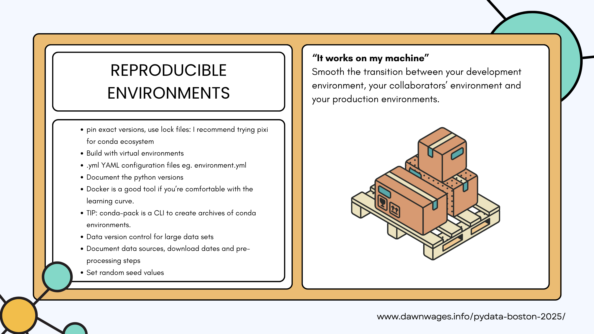](slide29.png "Reproducible Environments")

Reproducible Environments

[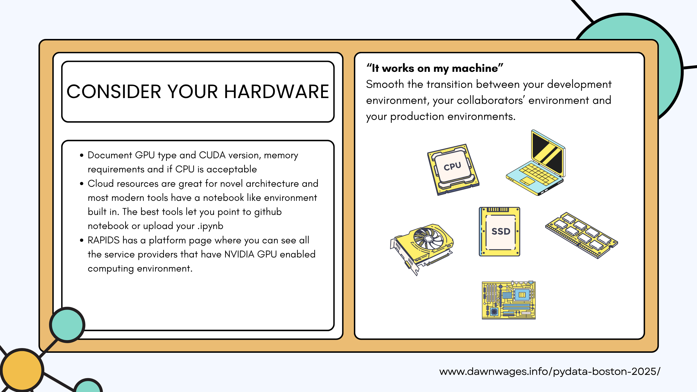](slide30.png "Consider your Hardware")

Consider your Hardware

[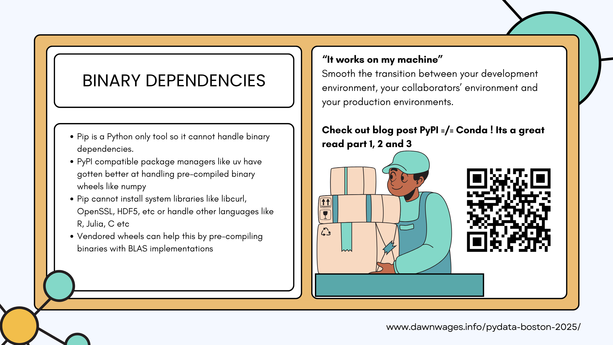](slide31.png "Binary Dependencies")

Binary Dependencies

[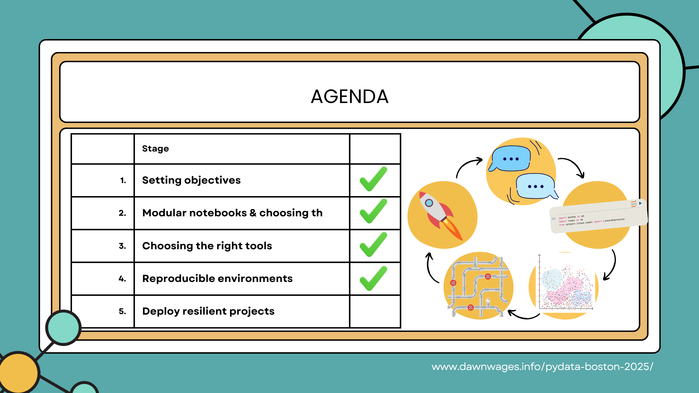](slide32.png "Agenda - Deploy Resilient Projects")

Agenda - Deploy Resilient Projects

- (8 mins) Make it reliable - Modular code & testing
  - common pain points: data schema changes, debugging issues, testing & modularity
  - [nbconvert](https://nbconvert.readthedocs.io/en/latest/) + Python: turn your notebook into a script
  - turn a function into a module
  - dashboard with HoloViz / Panel, discuss choosing tools like Voila and PyScript

[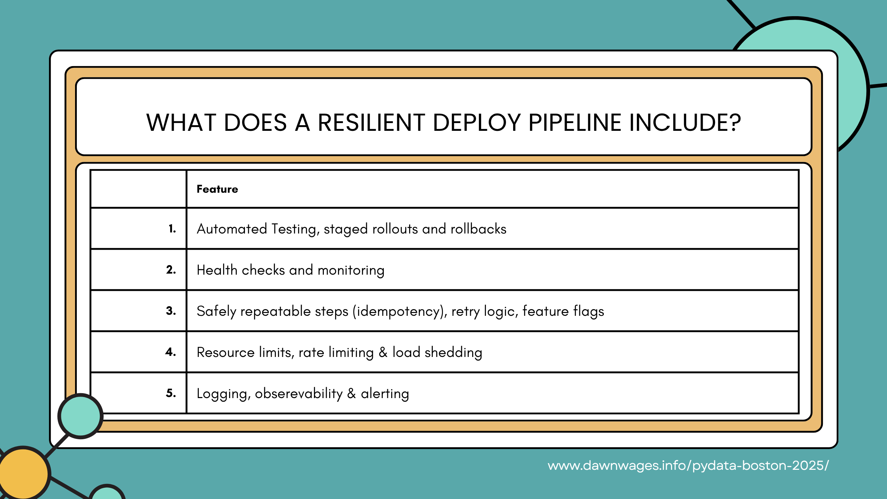](slide33.png "What does a resilient deploy pipeline include?")

What does a resilient deploy pipeline include?

[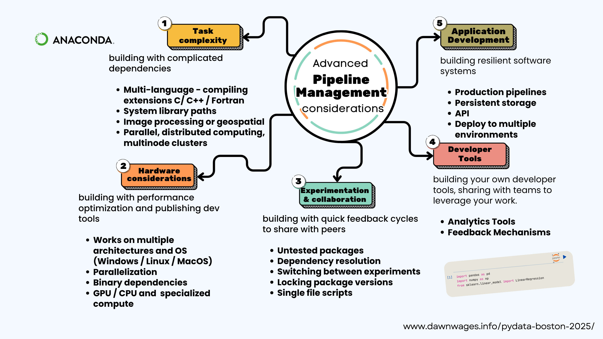](slide34.png "Advanced Pipeline Management")

Advanced Pipeline Management

- (5 mins) Snowflake integration
  - common pain points: data volume, coordinate with other data systems, audits
  - picking the right tools: cost complexity tradeoff
  - RAPIDS preprocessing to Snowflake storage
  - self-service access for stakeholders

[](slide35.png "Goodbye and The python survey")

Goodbye and The python survey

- (3 mins) Conclusion
  - Start simple
  - Add complexity when you feel specific pain

## Further Reading

- Speaker Recommends:

  - Design data-intensive applications by Martin Kleppmann
  - Softeware architecture design patterns in Python by Parth Detroja, Neel Mehta, Aditya Agashe
  - Data engineering with Python by Paul Crickard

## My Reflection

The speaker rubbed me the wrong way at first, however I soon realized that she was just stretching herself beyond her comfort zone and not only had a beautiful slide deck but also many valuable insights and tools to share.

- Main takeaways:
  - look at RAPIDS [^1]
  - Use builder patter in ETL! [^2]
  - PAPERMILL & MLflow can take notebooks to another level (think)
  - Think about converting NB to production

Géron, A. 2019. *Hands-on Machine Learning with Scikit-Learn, Keras, and TensorFlow: Concepts, Tools, and Techniques to Build Intelligent Systems*. O’Reilly Media. <https://books.google.co.il/books?id=HnetDwAAQBAJ>.

Géron, A. 2025. *Hands-on Machine Learning with Scikit-Learn and PyTorch: Concepts, Tools, and Techniques to Build Intelligent Systems*. O’Reilly Media. <https://books.google.co.il/books?id=2kiREQAAQBAJ>.

## Citation

BibTeX citation:

``` quarto-appendix-bibtex
@online{bochman2025,
  author = {Bochman, Oren},
  title = {The {Lifecycle} of a {Jupyter} {Environment} - {From}
    {Exploration} to {Production-Grade} {Pipelines}},
  date = {2025-12-09},
  url = {https://orenbochman.github.io/posts/2025/2025-12-09-pydata-jupyter-environment-lifecycle/},
  langid = {en}
}
```

For attribution, please cite this work as:

Bochman, Oren. 2025. “The Lifecycle of a Jupyter Environment - From Exploration to Production-Grade Pipelines.” December 9. <https://orenbochman.github.io/posts/2025/2025-12-09-pydata-jupyter-environment-lifecycle/>.

[^1]: it has many great tools!

[^2]: or don’t Matt Harrison shows us how to chain ETL code like a pro!
