# An error occurred.

Unable to execute JavaScript.

> **TIP:**
>
> This study is oriented to a synthetic non-life insurance premium dataset generated using several Generative Models.  
> As a benchmark, a Conditional Gaussian Mixture Model has been employed.  
> The validation of the generated data involved several steps: data visualization, comparison with univariate analysis, PCA and UMAP representations between the trained data and the generated samples.  
> In addition, check the consistency of data produced, the statistical Kolmogorov–Smirnov test and predictive modeling of frequency and severity with Generalized Linear Models (GLMs) exploited by [Tweedie distribution](https://en.wikipedia.org/wiki/Tweedie_distribution) as a measure of the generated data’s quality, followed by the evidence of features importance.  
> For further comparison, advanced Deep Learning architectures have been employed:
>
> - Conditional Variational Autoencoders (CVAEs),
> - CVAEs enhanced with a Transformer Decoder,
> - a Conditional Diffusion Model, and Large Language Models.
>
> The analysis assesses each model’s ability to capture the underlying distributions, preserve complex dependencies, and maintain relationships intrinsic to the premium data.  
> These findings provide insightful directions for enhancing synthetic data generation in insurance, with potential applications in risk modeling, pricing strategies with data scarcity, and regulatory compliance.
>
> In classification and regression tasks, generative models aim to learn the joint probability distribution of data.  
> These models focus on generating data points similar to the training data.  
> Open insurance datasets are rare because they encode proprietary risk structures of the Company, limiting researchers’ access to comprehensive data for analysis and assessing new approaches.  
> Generative models enable reproducible experimentation and innovation today. In the talk I explore several generative models used to produce synthetic data.

> **TIP:**
>
> In the talk I explore several generative models used to produce synthetic data.
>
> 1.  Conditional Gaussian Mixture Models used as a benchmark;
> 2.  Conditional Variational Autoencoders;
> 3.  Conditional Variational Autoencoders with a Transformer Decoder;
> 4.  Conditional Diffusion Model;
> 5.  Large Language Models.
>
> Finally, I gave the overall results, followed by different approaches.

> **TIP:**
>
> - Basic Python and PyTorch
> - Some familiarity with neural networks (e.g., feed-forward, softmax)
> - No need for prior experience in building models from scratch

## Tools and Frameworks:

We will introduce you to certain modern frameworks in the workshop but the emphasis be on first principles and using vanilla Python and LLM calls to build AI-powered systems.

[workshop repo](https://github.com/claudio1975/Generative_Modelling/)

> **TIP:**
>
> - Claudio Giorgio Giancaterino
>   - Statistics & Actuarial background
>   - Actuary during the day
>   - Data Scientist in the free time
>   - c.f [links](https://sites.google.com/view/claudio-links/home)

------------------------------------------------------------------------

## Outline

Welcome everyone! Please give a warm welcome to Claudio. Today, we’ll explore synthetic insurance data and how generative models can revolutionize this field.

[](slide01.png "About the Speaker")

About the Speaker

Our agenda is packed! We’ll start with the motivation behind this study, dive into the models, and conclude with the results. Let’s explore synthetic non-life insurance data.

[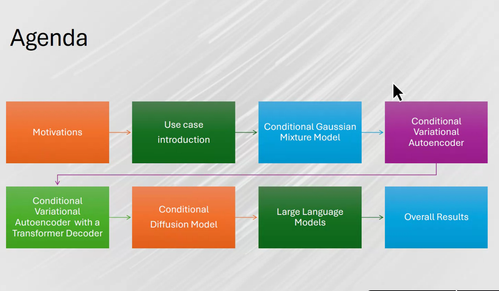](slide02.png "Agenda")

Agenda

Insurance data is scarce and often confidential. Open datasets lack the diversity and volume needed for robust modeling in areas like fraud detection and risk assessment.

[](slide03.png "Motivations")

Motivations

Most insurance data is proprietary and inaccessible for external research. Even when available, it’s often masked or filtered, complicating its usability.

[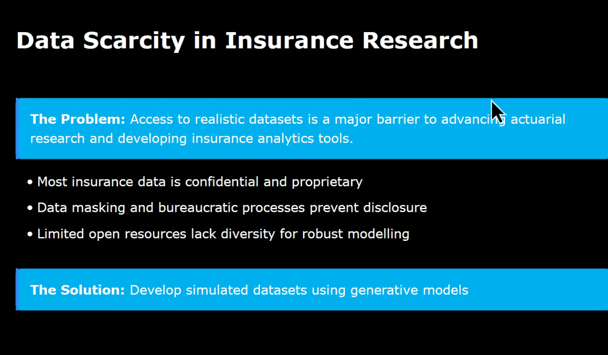](slide04.png "Data scarcity")

Data scarcity

At the core of every non-life insurance policy is the risk premium. It’s calculated by combining frequency (claims per year) and severity (average claim cost).

[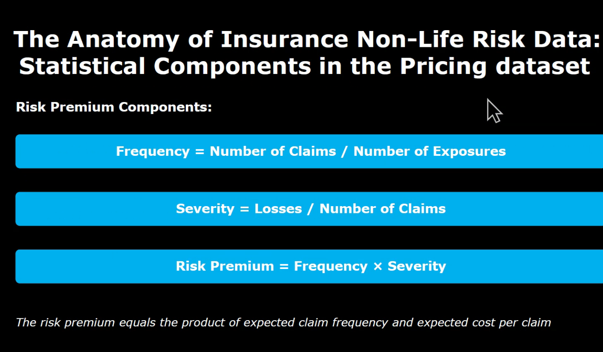](slide05.png "Anatomy of Insurance Non-Life Risk Data")

Anatomy of Insurance Non-Life Risk Data

### The Data

We used two datasets: Australian car insurance (67,000+ rows) and Swedish motorcycle insurance (64,000+ rows). Both include standard insurance variables.

[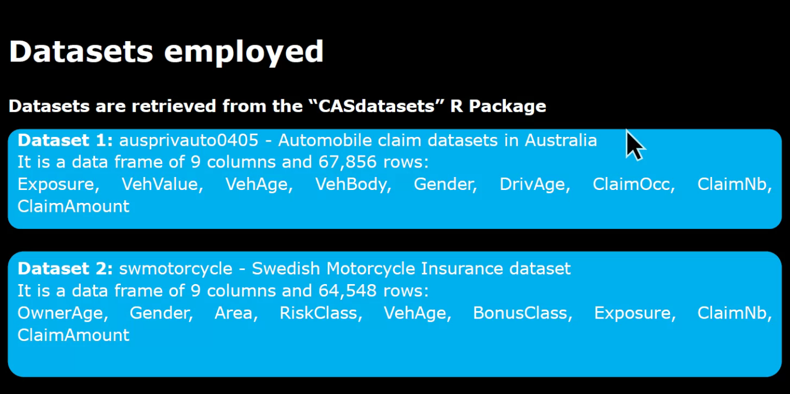](slide06.png "Datasets used")

Datasets used

Synthetic data generation offers the volume and diversity needed for robust modeling while preserving relationships between variables. It’s a game-changer for prototyping and validation.

[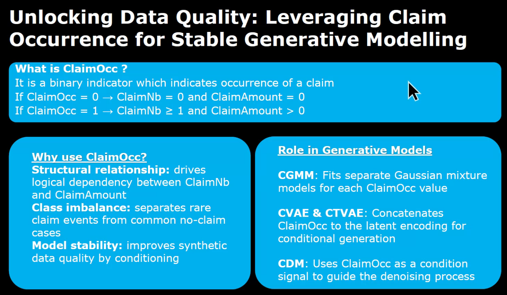](slide07.png "Unlocking data Quality")

Unlocking data Quality

Trials in synthetic data generation focus on creating realistic data while maintaining statistical fidelity and predictive performance.

[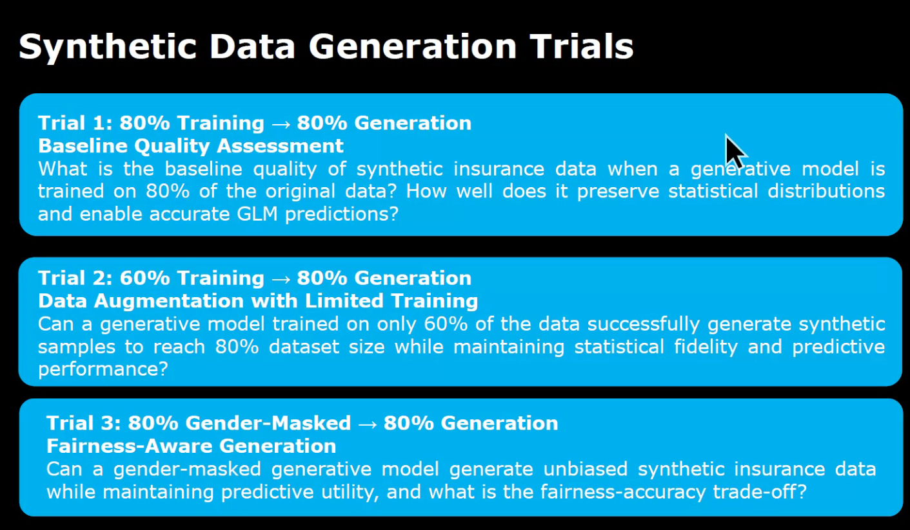](slide08.png "Synthetic Data Generation Trials")

Synthetic Data Generation Trials

### The Models

Gaussian Mixture Models are like a party where people chat in small groups. From afar, it sounds like one conversation, but up close, you hear distinct voices—each representing a Gaussian distribution.

[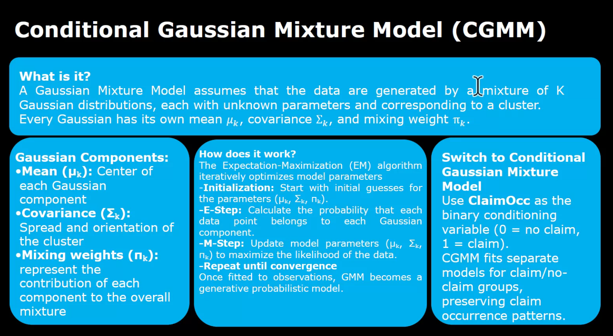](slide09.png "Conditional Gaussian Mixture Model (CGMM)")

Conditional Gaussian Mixture Model (CGMM)

Conditional Variational Autoencoders (CVAEs) are like forgers recreating masterpieces. They learn the artist’s style and generate new, realistic variations of the data.

[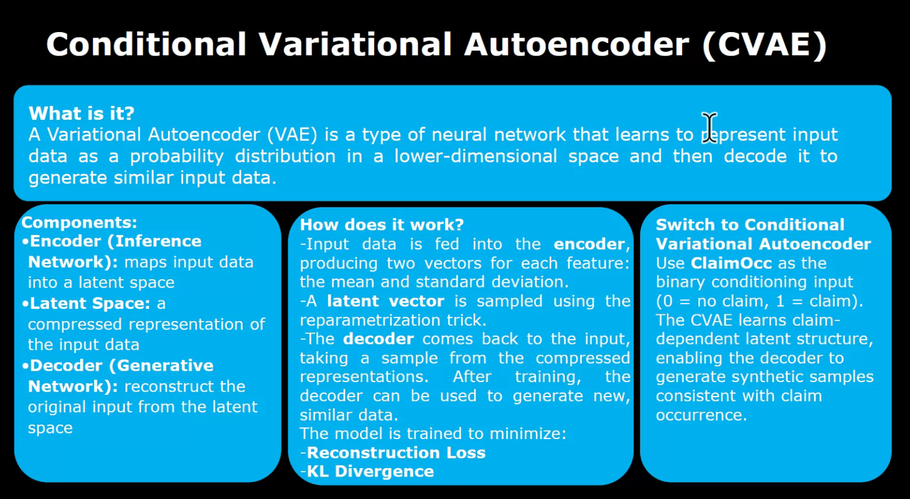](slide10.png "Conditional Variational Auto-Encoder (CVAE)")

Conditional Variational Auto-Encoder (CVAE)

CVAEs with Transformer Decoders are like storytellers. They start with an outline and build a richer, more detailed story, capturing complex patterns in the data.

[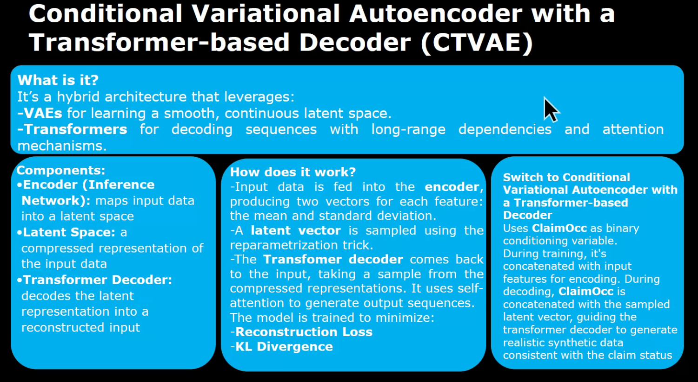](slide11.png "Conditional Variational Auto-Encoder with a Transformer based Decoder (CTVAE)")

Conditional Variational Auto-Encoder with a Transformer based Decoder (CTVAE)

Conditional Diffusion Models are like artists who add noise to an image and then learn to remove it, creating high-quality synthetic data.

[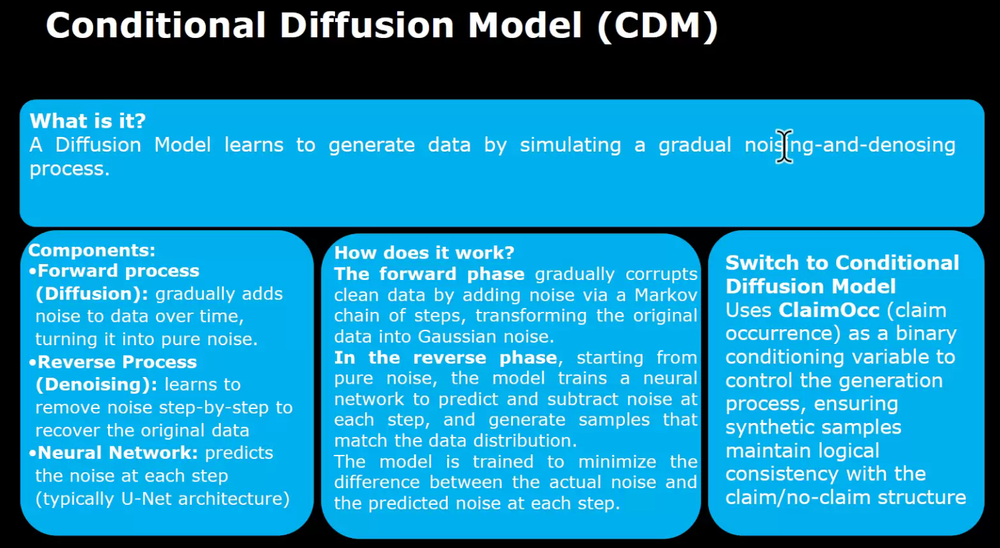](slide13.png "Conditional Difusion Model (CDM)")

Conditional Difusion Model (CDM)

Using LLMs for tabular datasets is like trying to write a novel without a clear plot. While challenging, they may work for regression tasks with proper context.

[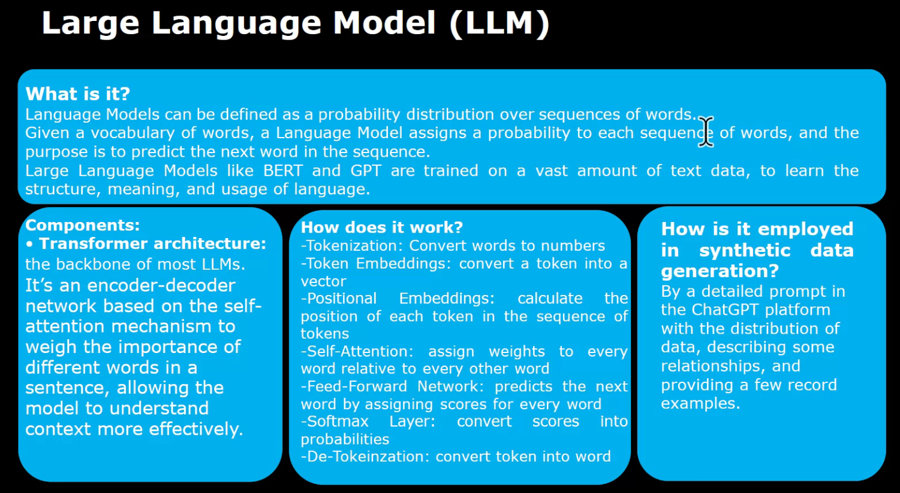](slide14.png "LLM")

LLM

### Validation

Validation involves consistency checks, [Kolmogorov–Smirnov tests](https://en.wikipedia.org/wiki/Kolmogorov%E2%80%93Smirnov_test), and predictive modeling to ensure the synthetic data is both realistic and useful.

[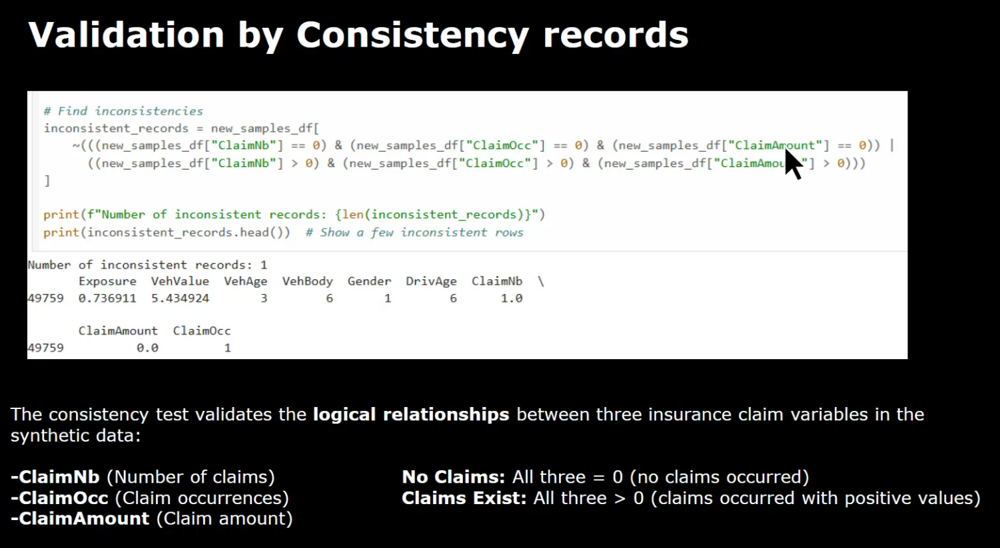](slide15.png "Validation by Consistency records")

Validation by Consistency records

Kolmogorov–Smirnov tests compare the distributions of synthetic and real data, ensuring statistical similarity and reliability.

[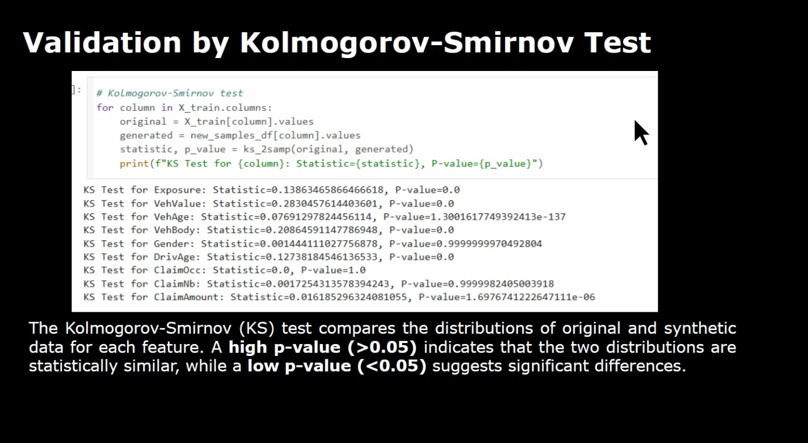](slide16.png "Validation by Kolmogorov-Smirnov Test")

Validation by Kolmogorov-Smirnov Test

Data visualization techniques like univariate analysis and PCA are essential for assessing the quality and structure of synthetic data.

[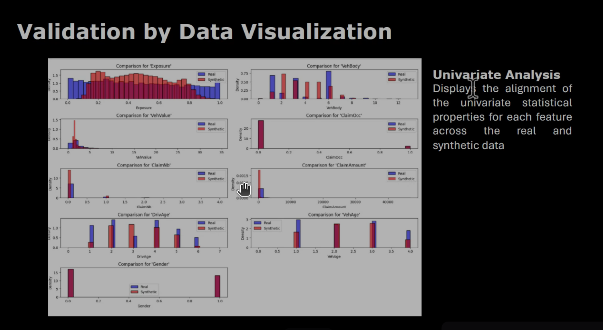](slide17.png "Validation by data Visualization - Univariate analysis")

Validation by data Visualization - Univariate analysis

3D PCA and UMAP visualizations help us compare the structure of real and synthetic data, ensuring fidelity to the original dataset.

[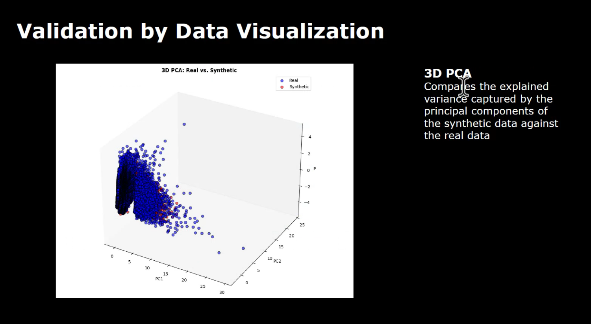](slide19.png "Validation by data Visualization - 3D PCA")

Validation by data Visualization - 3D PCA

Correlation matrices and predictive modeling validate the relationships and performance of synthetic data, ensuring it’s ready for real-world applications.

[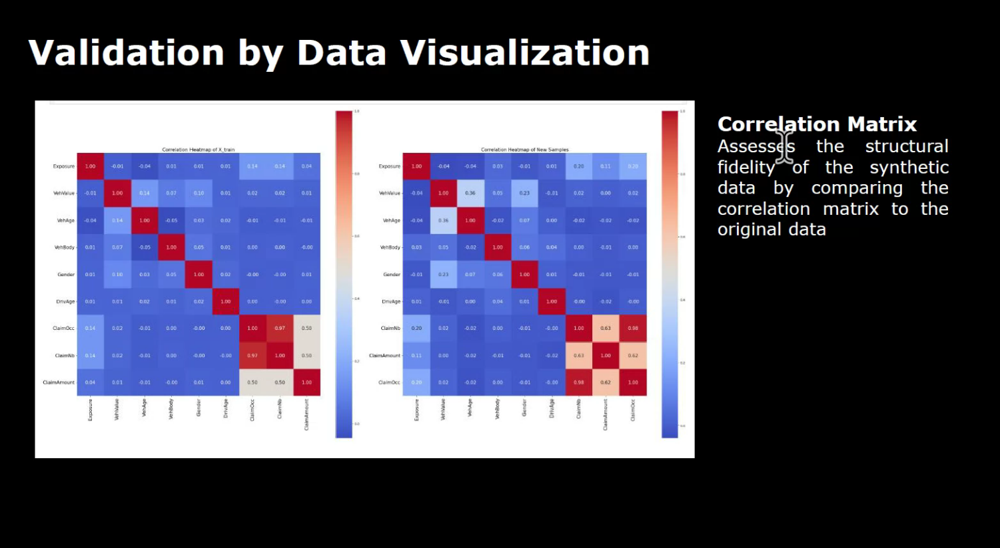](slide18.png "Validation by data Visualization - Correlation matrix")

Validation by data Visualization - Correlation matrix

SHAP feature importance highlights the key variables influencing predictions, providing insights into the quality of synthetic data.

[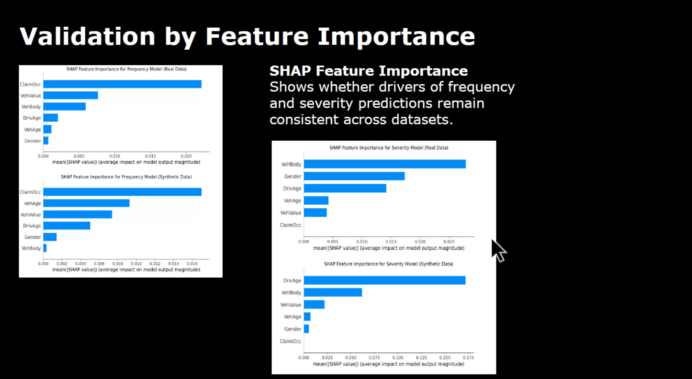](slide22.png "Validation by Feature Importance - SHAP Feature Importance")

Validation by Feature Importance - SHAP Feature Importance

### Results and Conclusions

The results demonstrate that generative models can produce high-quality synthetic data, enabling robust modeling and innovation in insurance.

[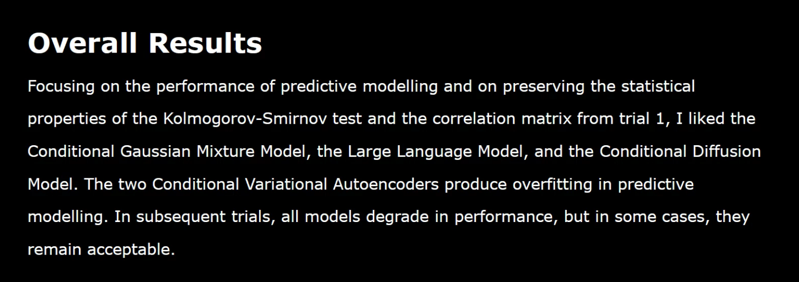](slide23.png "Overall Results")

Overall Results

Generative models address data scarcity in insurance, paving the way for reproducible experimentation and innovation in the field.

[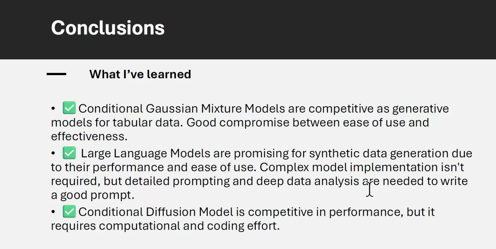](slide24.png "Conclusions")

Conclusions

## References

- Jan Goodfellow and Yoshua Bengio and Aaron Courville, 2016, [Deep Learning, MIT Press](https://www.deeplearningbook.org/) .
- Mario V. Wuthrich, Ronald Richman, Benjamin Avanzi, Mathias Lindholm, Michael Mayer, Jürg Schelldorfer, Salvatore Scognamiglio, 2025, [AI Tools for Actuaries, SSRN](https://www.ssrn.com/).
- David Foster, 2023, [Generative Deep Learning, 2nd Edition, O’Reilly](https://www.oreilly.com/library/view/generative-deep-learning/9781098107301/).
- Jake VanderPlas, 2016, [Python Data Science Handbook, O’Reilly](https://jakevdp.github.io/PythonDataScienceHandbook/).
- Jamotton, Charlotte; Hainaut, Donatien, 2023, [Variational autoencoder for synthetic insurance data, ISBA](https://www.isba.org/).
- Harshvardhan GM, Mahendra Kumar Gourisaria, Manjusha Pandey, Siddharth Swarup Rautaray, 2020, [A comprehensive survey and analysis of generative models in machine learning](https://www.sciencedirect.com/science/article/abs/pii/S1574013720303853) , ScienceDirect.
- [Generative Modelling GitHub Repository](https://github.com/claudio1975/Generative_Modelling)
- [Generative Models for Insurance Data on Hugging Face](https://huggingface.co/spaces/towardsinnovationlab/Generative_Models_4_Insurance_Data)
- [Stop Waiting for Data: How Generative Models are Reshaping Insurance Analytics](https://medium.com/@c.giancaterino/stop-waiting-for-data-how-generative-models-are-reshaping-insurance-analytics-ec102a2e5177)

## Reflection

- good storytelling about the models
- validation is a very important element in data science.
  - a salesperson shows their worth repetedly making value statements and keeping on trying to sell despite a client rejecting.
  - a data scientist on the other hand should keep on trying to validate their models and methods. And Claudio Giorgio Giancaterino has shown us how to do that in a very comprehensive way.

## Citation

BibTeX citation:

``` quarto-appendix-bibtex
@online{bochman2025,
  author = {Bochman, Oren},
  title = {Harnessing {Generative} {Models} for {Synthetic} {Non-Life}
    {Insurance} {Data}},
  date = {2025-12-09},
  url = {https://orenbochman.github.io/posts/2025/2025-12-09-pydata-synthetic-insurance-data/},
  langid = {en}
}
```

For attribution, please cite this work as:

Bochman, Oren. 2025. “Harnessing Generative Models for Synthetic Non-Life Insurance Data.” December 9. <https://orenbochman.github.io/posts/2025/2025-12-09-pydata-synthetic-insurance-data/>.
