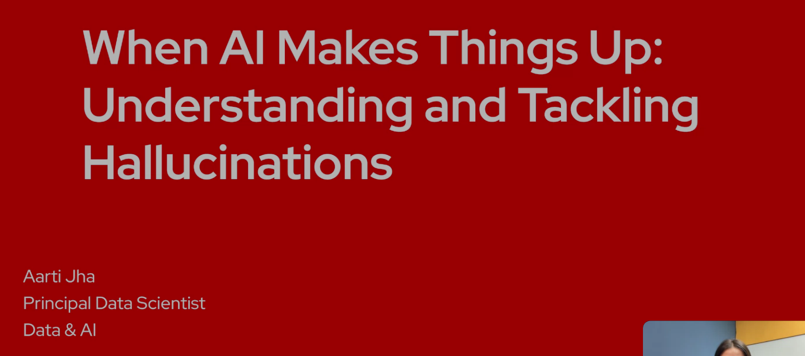
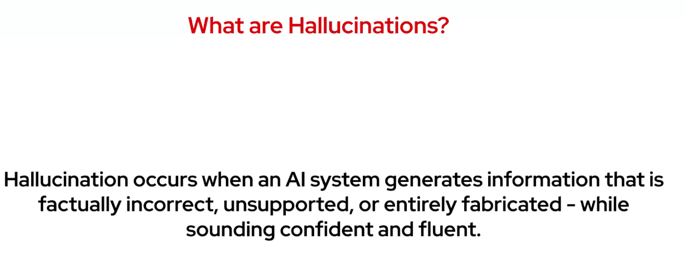
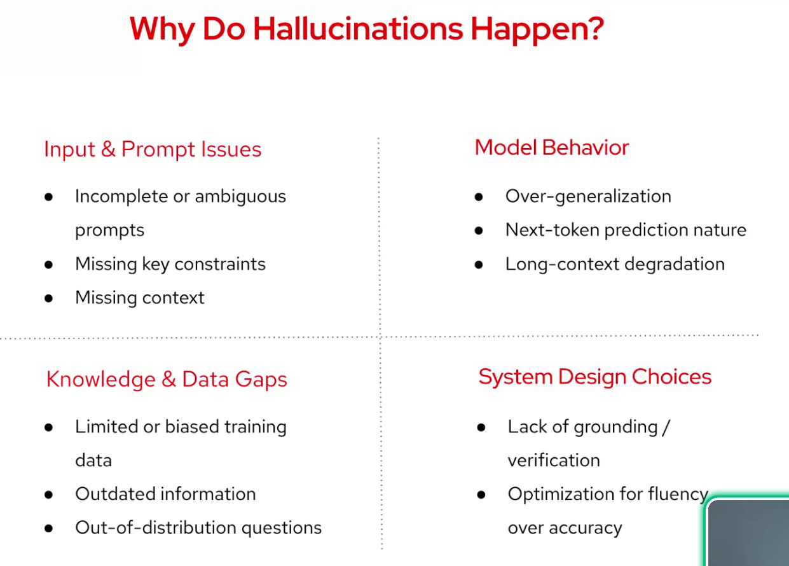
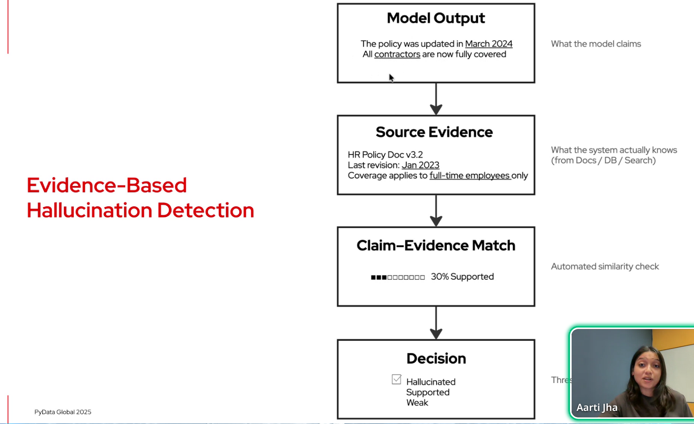
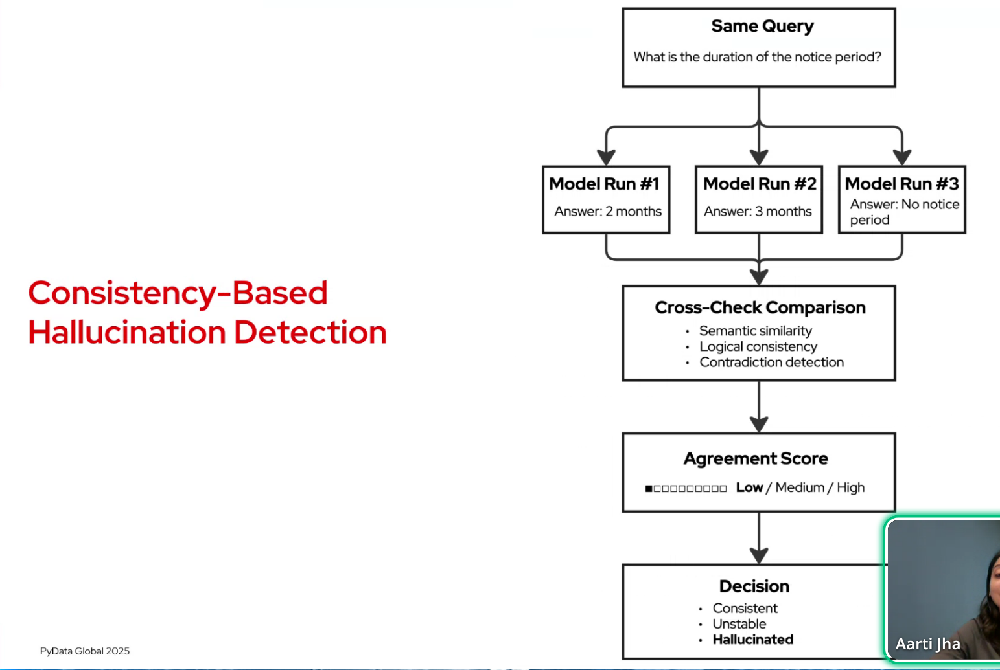

# An error occurred.

Unable to execute JavaScript.

> **TIP:**
>
> AI systems are increasingly being integrated into real-world products - from chatbots and search engines to summarization tools and coding assistants. Yet, despite their fluency, these models can produce confident but false or misleading information, a phenomenon known as hallucination. In production settings, such errors can erode user trust, misinform decisions, and introduce serious risks. This talk unpacks the root causes of hallucinations, explores their impact on various applications, and highlights emerging techniques to detect and mitigate them. With a focus on practical strategies, the session offers guidance for building more trustworthy AI systems fit for deployment..

This session will unpack the problem of AI hallucination - not just what it is, but how it surfaces in everyday use. We’ll look at the common causes, ranging from incomplete context to over-generalization, and walk through detection and prevention techniques such as grounding, prompt design and RAG. Whether you’re building AI products or evaluating outputs, this talk will give you the tools to recognise hallucinations and reduce their risk.

> **TIP:**
>
> - Aarti Jha
>   - LinkedIn: [Aarti Jha](https://www.linkedin.com/in/aartijha22/)
>   - Aarti Jha is a Principal Data Scientist at Red Hat, where she develops AI-driven solutions to streamline internal processes and reduce operational costs. She brings over 6.5 years of experience in building and deploying data science and machine learning solutions across industry domains. She is an active public speaker and frequently presents at developer and data-science conferences, focusing on practical approaches to applied AI and LLMs
>   - [repo](https://github.com/aartij22)
>   - [slidedeck](https://github.com/aartij22/PyData-Global-2025/blob/main/PyData_Global_2025.pptx)

## Outline:

- Introduction to hallucinations in LLMs
- Common causes behind hallucinated outputs
- Impact on production applications
- Techniques for detecting and evaluating hallucinations
- Strategies to reduce hallucinations
- Best practices for building trustworthy AI products
- Key takeaways

------------------------------------------------------------------------

Markdown text from transcript here .

[](slide01.png "Title")

Title

Markdown text from transcript here .

[](slide02.png "Motivation")

Motivation

Markdown text from transcript here .

[](slide03.png "What are Hallucinations")

What are Hallucinations

Markdown text from transcript here .

[](slide04.png "Evidence based")

Evidence based

Markdown text from transcript here .

[](slide05.png "Consistency")

Consistency

Markdown text from transcript here .

[](slide06.png "Model Confidence Detection")

Model Confidence Detection

Markdown text from transcript here .

[](slide07.png "From detection to prevention")

From detection to prevention

Markdown text from transcript here .

[](slide08.png "prevention")

prevention

Markdown text from transcript here .

[](slide09.png "from detection to prevention")

from detection to prevention

Markdown text from transcript here .

[](slide10.png "Prevention at the model & prompt level")

Prevention at the model & prompt level

Markdown text from transcript here .

[](slide11.png "Prevention at the system level")

Prevention at the system level

Markdown text from transcript here .

[](slide12.png "Production exposes")

Production exposes

Markdown text from transcript here .

[](slide13.png "Life Cycle")

Life Cycle

Markdown text from transcript here .

[](slide14.png "Thank You")

Thank You

------------------------------------------------------------------------

## Reflections

1.  this covers some interesting ground
2.  it does not cover the recent papers that trended on Twitter etc.

## Citation

BibTeX citation:

``` quarto-appendix-bibtex
@online{bochman2025,
  author = {Bochman, Oren},
  title = {When {AI} {Makes} {Things} {Up}},
  date = {2025-12-09},
  url = {https://orenbochman.github.io/posts/2025/2025-12-09-pydata-when-ai-makes-things-up/},
  langid = {en}
}
```

For attribution, please cite this work as:

Bochman, Oren. 2025. “When AI Makes Things Up.” December 9. <https://orenbochman.github.io/posts/2025/2025-12-09-pydata-when-ai-makes-things-up/>.
