# An error occurred.

Unable to execute JavaScript.

> **TIP:**
>
> This session shows how Bayesian statistical modeling helps determine when you have collected enough data about new products, so that they are ready for competition.
>
> We’ll explore: how this approach enables efficient decision-making with minimal data why we chose Bayesian over machine learning models how we covered for the required assumptions how this enables a risk-management approach while providing interpretable results that business stakeholders can understand and trust.
>
> You will learn how to identify a Bayesian problem at your company and how to navigate the modelling with real-world data!

In this session, we will explore the application of Bayesian methodology to address the cold start problem in a recommendation system: determining if there is enough data for a new product in a marketplace to be accurately ranked, or if the product should get further exposure to reach that stage.

The target audience of this talk is data analysts of all levels, data practitioners interested in modelling, and professionals working in recommendation systems.

Unlike traditional machine learning models, Bayesian statistical modelling offers a robust framework for updating probabilities with new evidence, making it particularly suited for dynamic environments like online marketplaces.

That way, one can update the learnings on the performance of a new product daily, allowing for efficient decision-making around “should I keep on exploring this new product or not?” while minimising the traffic investment and enabling a risk-management-based approach. We will also cover how we control for the assumptions that Bayesian requires.

> **TIP:**
>
> - Understanding Bayesian Methods: Learn how Bayesian statistics can be applied to real-world business problems, offering a flexible and interpretable approach to decision-making.
> - Benefits Over Machine Learning: Discover why statistical modelling can be more advantageous than machine learning in certain business contexts, particularly when managing risk, handling sparse data and providing interpretable results to the business.
> - Practical Application: Learn about the challenges of applying bayesian models in a real marketplace.

> **TIP:**
>
> - [Learn what the cold start problem in a recommender system is](https://en.wikipedia.org/wiki/Cold_start_(recommender_systems)).
> - [Get familiar with Bayesian thinking](https://www.countbayesie.com/blog/2022/2/19/how-to-read-the-news-like-a-bayesian).
> - [BAYESCNS: A Unified Bayesian Approach to Address Cold Start and Non-Stationarity in Search Systems at Scale](https://arxiv.org/pdf/2410.02126)
> - [The Cost of the Cold-Start Problem on Airbnb](https://reginaseibel.github.io/publication/ratings/ratings.pdf)

## Tools and Frameworks:

[workshop repo](https://github.com/...)

> **TIP:**
>
> - Agustin Figueroa Nazar
>   - He is a Senior Data Analyst at GetYourGuide, where he specializes in using data to identify customer and marketplace needs that could be solved at scale with data products.
>   - His work encompasses identifying customer problems, designing experimentation frameworks to measure progress, developing analytical solutions, and translating business requirements into data science projects.
>   - Beyond his core responsibilities, Agus is passionate about storytelling, teaching, singing, and almost anything on stage.

## Outline

- Welcome to PyData Global 2025!
- Today’s topic: Enhancing Marketplace Competitiveness
- A Bayesian approach to the cold start problem
- Speaker: Agustin Figueroa Nazar
- Senior Data Analyst at GetYourGuide

[](slide01.png "title")

title

## Introduction to the cold-start problem

- At GetYourGuide, we have a tradition of starting with a look back at our last vacation.
- This cooking class in Thailand was unforgettable.
- But at one point, it had no reviews, no bookings, and no history.
- How do we model the beginning of such activities?
- This is the cold-start problem.

[](slide02.png "cooking session")

cooking session

## How we rank incoming activities at GetYourGuide and how modelling could make us more efficient

- GetYourGuide hosts 35,000 suppliers offering 150,000 activities across 12,000 cities.
- Experiences are personal and hard to compare.
- For example, two cooking classes with the same chef can feel completely different.
- How do we rank new activities when we know nothing about them?

[](slide03.png "Agenda")

Agenda

GetYourGuide features 150,000 activities from 35,000 suppliers across 12,000 cities. The challenge? Experiences are personal and hard to compare. For instance, two cooking classes with the same chef can feel completely different. How do we rank these activities effectively?

[](slide04.png "Business Problems")

Business Problems

When an activity is new, ranking becomes even harder. Imagine choosing between a promising new speedboat tour with no data and an average tour with known performance. If we never explore new activities, we risk missing out on great experiences.

[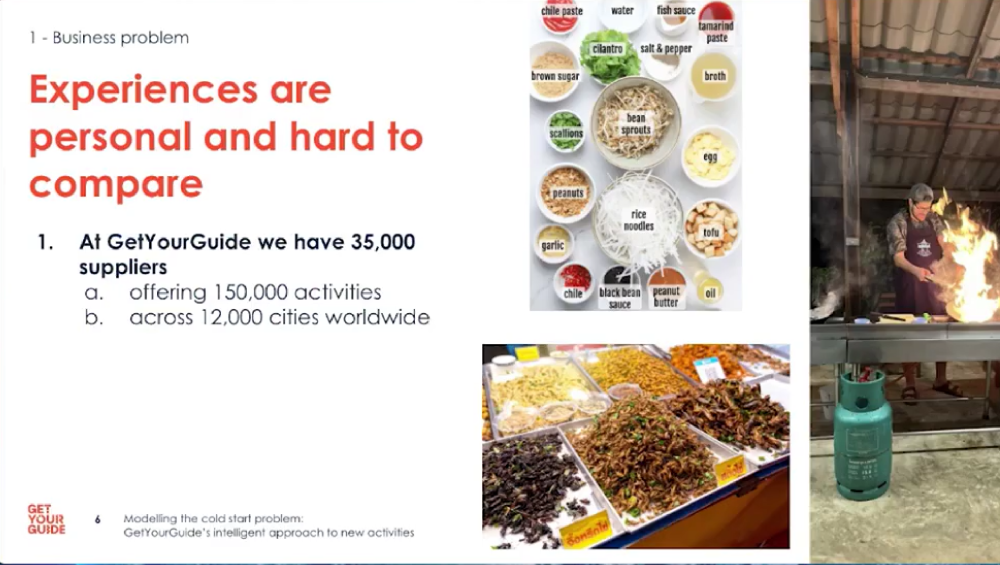](slide05.png "Experiences are personal and hard to compare")

Experiences are personal and hard to compare

- New activities compete with existing ones for limited slots; showing a new item means not showing a known one.
- This creates a trade-off between exploration (learning) and exploitation (serving known good experiences).

[](slide06.png "Experiences are personal and hard to compare")

Experiences are personal and hard to compare

- If we never explore new activities we risk missing great experiences.
- Exploration must be efficient in impressions while preserving a good user experience.

[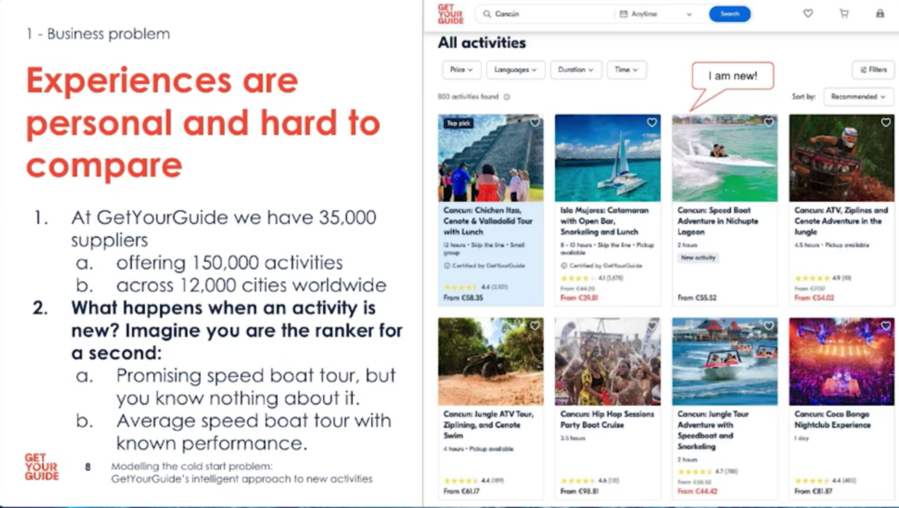](slide08.png "Experiences are personal and hard to compare")

Experiences are personal and hard to compare

- Each impression is a trial: clicks or bookings are successes we can observe and count.
- Defining trials and successes clearly is essential before modelling.

[](slide09.png "But if you don’t give new experiences a shot how do you learn")

But if you don’t give new experiences a shot how do you learn

- We should quantify uncertainty and update beliefs as data arrives, shrinking confidence intervals over time.
- The goal is to learn with as few impressions as possible while limiting bad user outcomes.

[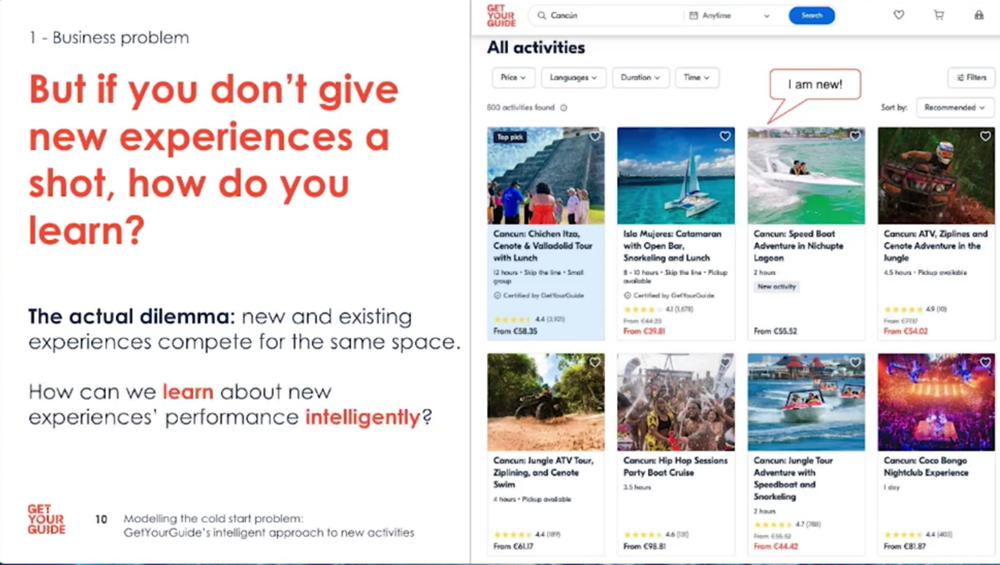](slide10.png "But if you don’t give new experiences a shot how do you learn")

But if you don’t give new experiences a shot how do you learn

- A model is a simplification of reality; if it doesn’t fit, revisit assumptions and redesign the approach.
- Be pragmatic: drop the ego and iterate if the model fails to represent what matters.

[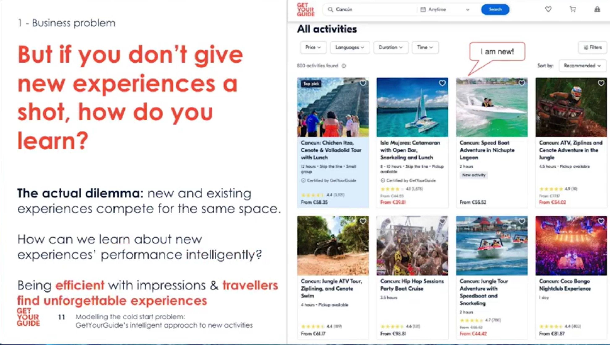](slide11.png "But if you don’t give new experiences a shot how do you learn?")

But if you don’t give new experiences a shot how do you learn?

- A model is a lens that lets us predict consequences of actions; choose the lens that matches your question.
- It simplifies reality to make decisions under uncertainty.
- Be prepared to revise the model if it fails to capture key behaviours.

[](slide12.png "What is a model?")

What is a model?

- Frame the problem first: decide whether you need prediction (ML) or uncertainty quantification (Bayesian).
- Clarify the decision metric and acceptable uncertainty upfront.
- The framing determines model choice, evaluation and stakeholder expectations.

[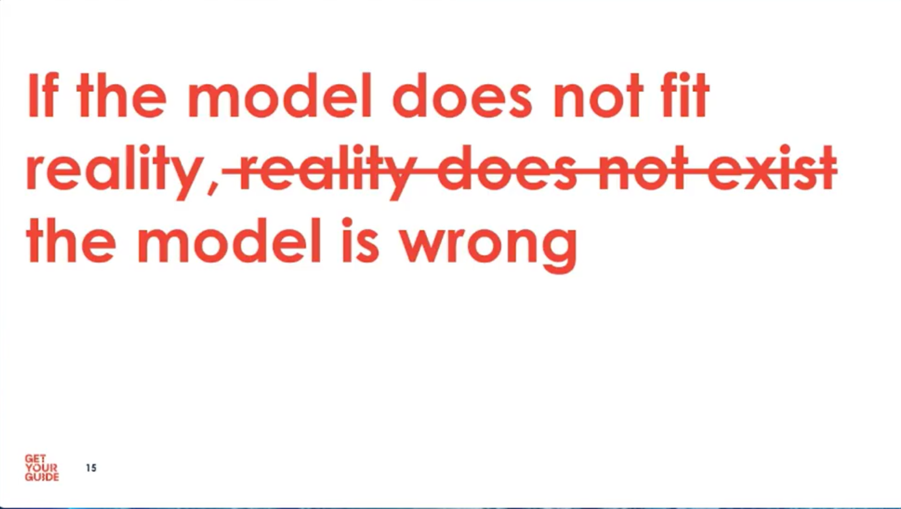](slide15.png)

## Explaining the model (15 min)

- Machine learning fits when outcomes depend on observable attributes; use features to predict performance.

- Bayesian statistics fits when you start from limited knowledge and want to update uncertainty as evidence arrives.

[](slide16.png "Modeling Choices ML vs Stats")

Modeling Choices ML vs Stats

- One thing more important than complex models: frame the question correctly and choose the right metric.
- Spend time defining the metric you will optimize; it shapes all subsequent work.
- A well-framed question prevents wasted effort building the wrong solution.

[](slide17.png "one thing more important")

one thing more important

- Many models are imperfect; prefer models that are useful and interpretable for the business problem.
- Prioritize interpretability and stakeholder trust over marginal accuracy gains.
- Simple models are often easier to maintain and act upon in production.

[](slide18.png "meme")

meme

- Check assumptions: independence of impressions and constant success probability may not always hold.
- When assumptions break (e.g., reviews appear), user behavior and click rates can change.

[](slide19.png "framing your problem properly")

framing your problem properly

- Be explicit about where model assumptions might fail and how you’ll detect and handle those cases.
- Instrument monitoring to detect assumption drift (e.g., CTR changes after reviews arrive).
- Define fallback rules or human-in-the-loop checks for when assumptions break.

[](slide21.png "ML and Bayesian stats have different goals")

ML and Bayesian stats have different goals

- Decide whether to treat different slots or swimlanes separately if click-through rates differ across positions.
- Account for position bias; consider slot-specific baselines or adjustments.
- Segment contexts where necessary to make fair, comparable estimates.

[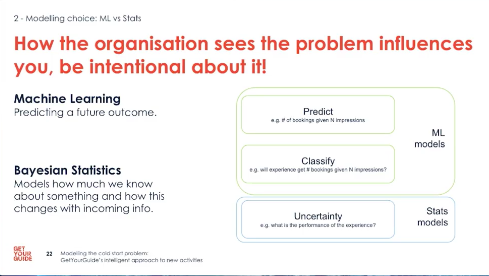](slide22.png "be explicit about assumptions")

be explicit about assumptions

- Define trials, successes, priors and stopping rules up front; these choices steer the whole solution.
- Use historical data to inform sensible priors or pick conservative defaults.
- Make stopping rules explicit: narrow posterior intervals or low information value justify stopping.

[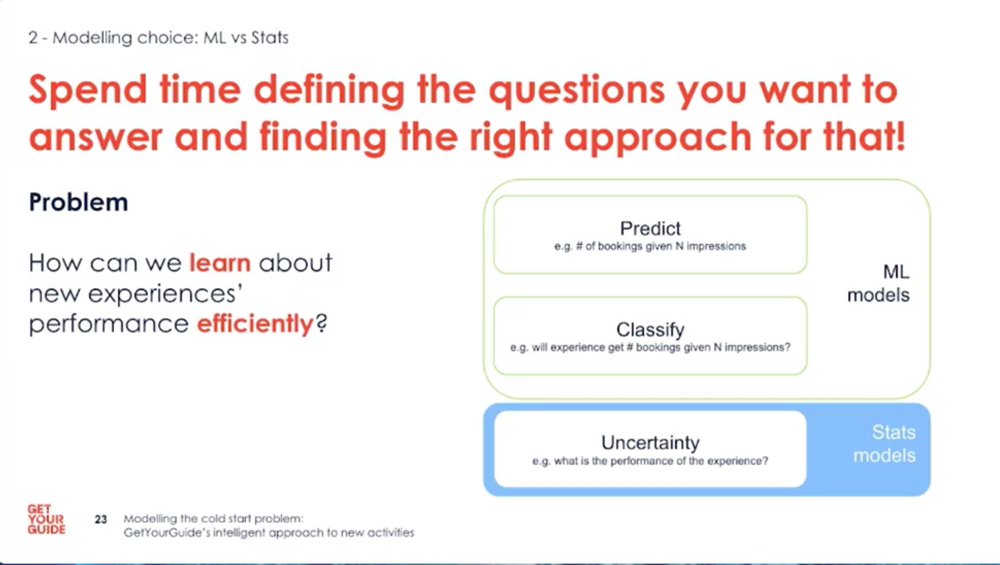](slide23.png "define the research questions")

define the research questions

## Intro to a Bayesian binomial model (3 min)

- Use a binomial model for binary outcomes (click/book) and update it with Bayesian inference as data arrives.

[](slide24.png "Bayesian binomial approach")

Bayesian binomial approach

- Remember the assumptions: independent impressions and roughly constant success probability within comparable contexts.

[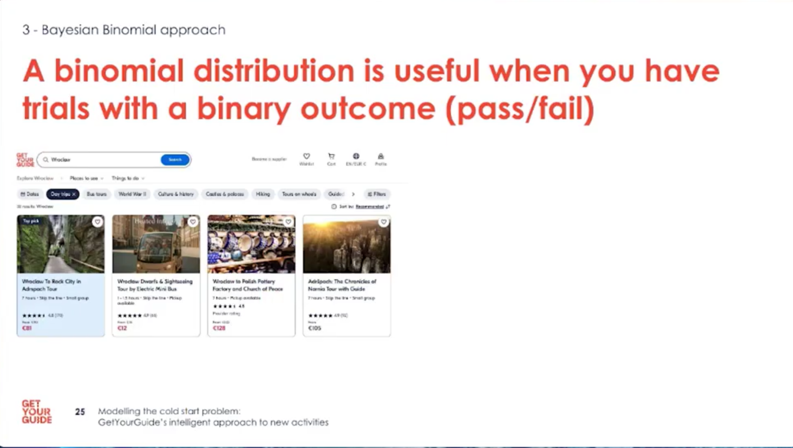](slide25.png "Bayesian binomial models binary outcomes")

Bayesian binomial models binary outcomes

- Example: treat each impression as a trial and each click/booking as success; update the posterior daily.

[](slide26.png "Bayesian binomial example")

Bayesian binomial example

- Aggregate daily stats per experience, apply Bayesian updates, and store posterior summaries for downstream use.

[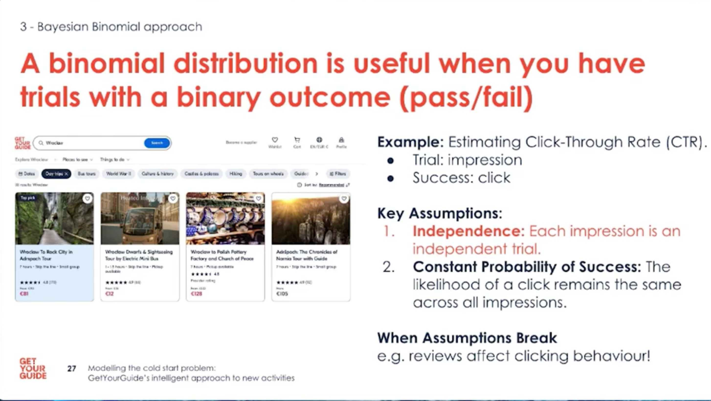](slide27.png "Bayesian binomial model example")

Bayesian binomial model example

- Choose stopping criteria: when the posterior interval is narrow enough, or when new data adds negligible information.

[](slide28.png)

- Implementation at scale: ingest events, compute daily aggregates, and run Bayesian updates in a distributed pipeline.
- Tools used: S3, Airflow, DBT for ETL; Databricks + PySpark and SciPy for computations.

[](slide29.png)

- Prefer simpler production designs: ask whether you need the full evolution or just the final state for decisions.
- Reducing intermediate steps saves runtime, credits, and complexity while improving clarity for colleagues.

[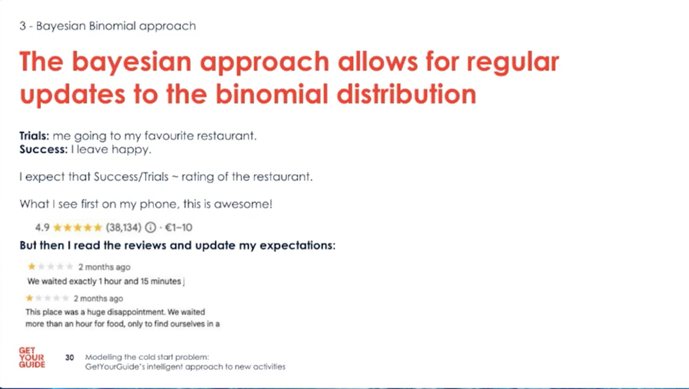](slide30.png)

- Practical tip: implement minimal required outputs for decision-making to speed up development and maintenance.

[](slide31.png)

- When assumptions break, make judgement calls and monitor the system; no model is perfect.

[](slide32.png)

- Store only what is necessary for the end-state decision; avoid saving every intermediate evolution unless required.

[](slide33.png)

- Keep the pipeline simple and readable; leveraging existing UDFs and distributed compute made scaling easier.

[](slide34.png)

- Three key takeaways: define the right problem, favour simpler production solutions, and watch assumption drift.

[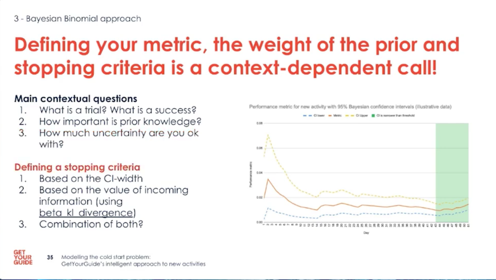](slide35.png)

- Getting the problem right is often harder than building the solution; simplicity often wins in production.

[](slide36.png)

- Decide if you need the day-by-day evolution or only the end state to determine stopping — this choice saves effort.

[](slide37.png)

- Monitor assumptions and communicate responsibility: modelling power requires careful stewardship.

[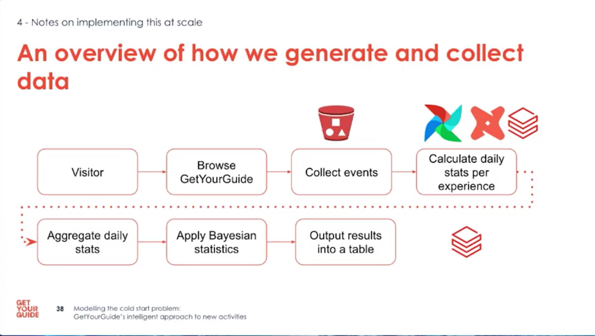](slide38.png)

- The output is a table of posterior estimates and confidence intervals; it informs decisions but is not a ranking algorithm.

[](slide39.png)

- Decide the stopping rule based on risk appetite and the width/value of the posterior intervals.

[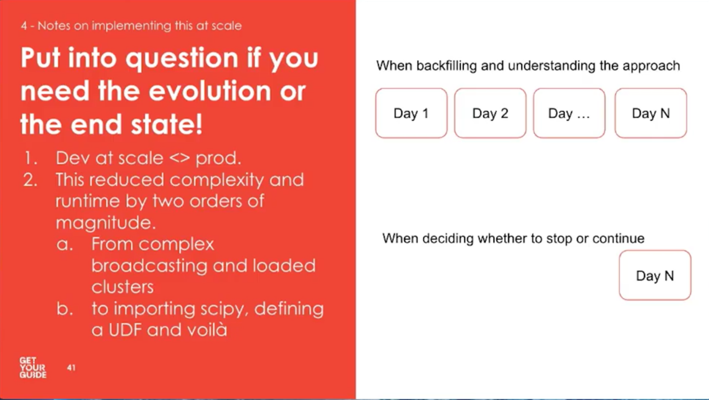](slide41.png "Do you need the evolution or the end State")

Do you need the evolution or the end State

- Key takeaways: 1) Define the right question; 2) Keep production simple; 3) Re-check assumptions regularly.

[](slide44.png "key takeaways")

key takeaways

## Questions

- Questions: decision-making depends on risk appetite; our system outputs confidence intervals per activity for downstream use.

[](slide45.png "Questions")

Questions

## Reflections

- The cold start problem is a common challenge in recommendation systems, and Bayesian modeling offers a powerful framework for addressing it.
- Framing the problem correctly and choosing the right metric is crucial for building effective models.
- Simpler, interpretable models often provide more value in production than complex, opaque ones.
- Regularly checking assumptions and monitoring for drift is essential to maintain model performance over time.

## Citation

BibTeX citation:

``` quarto-appendix-bibtex
@online{bochman2025,
  author = {Bochman, Oren},
  title = {Enhancing {Marketplace} {Competitiveness}},
  date = {2025-12-11},
  url = {https://orenbochman.github.io/posts/2025/2025-12-11-pydata-enhancing-marketplace-competitiveness/},
  langid = {en}
}
```

For attribution, please cite this work as:

Bochman, Oren. 2025. “Enhancing Marketplace Competitiveness.” December 11. <https://orenbochman.github.io/posts/2025/2025-12-11-pydata-enhancing-marketplace-competitiveness/>.
