# An error occurred.

Unable to execute JavaScript.

> **TIP:**
>
> This Live demonstration shows how PyCaret, an open-source low-code machine learning library, can dramatically simplify model training and comparison workflows. PyCaret is democratizing machine learning by empowering anyone to train multiple algorithms and compare their performance with minimal code. Attendees will witness live demonstrations of training various ML algorithms and using automated comparison techniques to select the best performer based on key metrics. Perfect for data scientists, developers, and ML enthusiasts looking to spend less time coding and more time on model analysis and selection.

Machine learning workflows often involve repetitive tasks, complex code, and time-consuming model comparisons. PyCaret changes this paradigm by democratizing machine learning - empowering anyone to train multiple algorithms and systematically compare their performance with low-code solutions. With PyCaret’s philosophy of “spend less time coding and more time on analysis,” this library transforms the model selection process by automating training and comparison across multiple algorithms.

> **TIP:**
>
> - Practical knowledge of automated model training and comparison
> - Experience with systematic algorithm evaluation using PyCaret
> - Understanding of performance metrics for model selection
> - Ready-to-use code examples for multi-algorithm comparison
> - Confidence to choose the best ML algorithm for your specific projects

> **TIP:**
>
> - Basic understanding of Python
> - Familiarity with machine learning concepts (helpful but not required)
> - No prior PyCaret experience needed

Join us for this fast-paced, demo-heavy session that will transform how you approach machine learning projects!

> **TIP:**

[demo + slide repo](https://github.com/hugobowne/AI-for-SWEs)

## Outline

- ML and PyCaret Fundamentals (13 mins)
  - What is Machine Learning, Machine Learning Algorithms and workflows
  - What is PyCaret
- Live Demo: Multi-Algorithm Training & Comparison (10 mins)
  - Hands-on demonstration using the Diabetes Dataset
  - Training multiple algorithms simultaneously with minimal code
  - Automated model comparison using various performance metrics
  - Real-time exploration of model performance visualizations
  - Selecting the best performer based on key evaluation metrics
- Wrap-up & Resources (2 mins)
  - Key takeaways and next steps
  - Access to GitHub repository with slides and demo notebooks
- Q&A (5 min)

[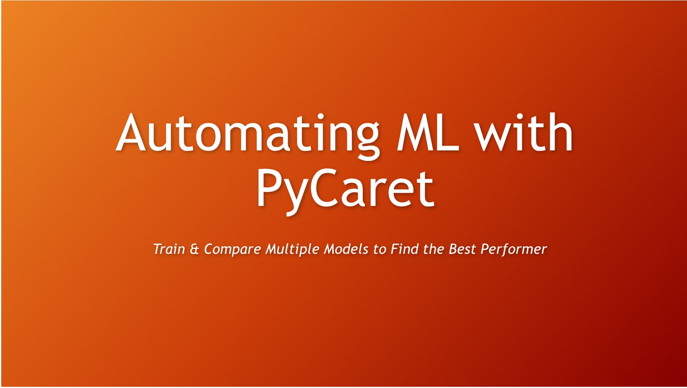](slide01.png "Title")

Title

[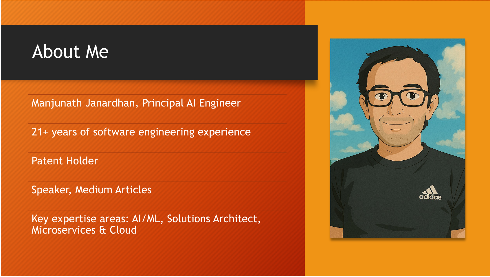](slide02.png "About me")

About me

[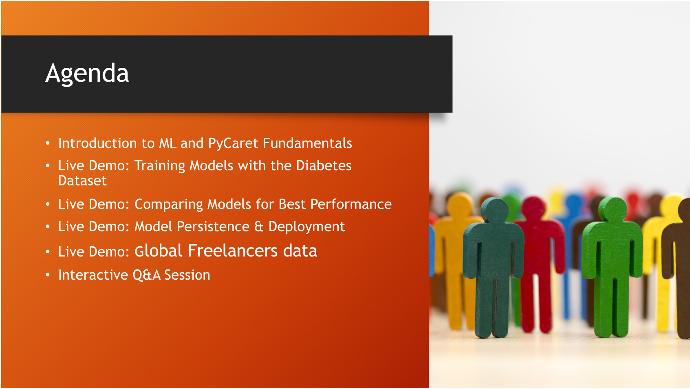](slide03.png "Agenda")

Agenda

[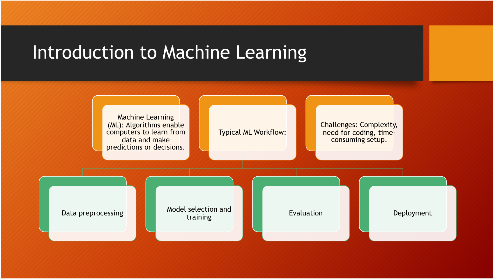](slide05.png "Introduction to Machine Learning")

Introduction to Machine Learning

[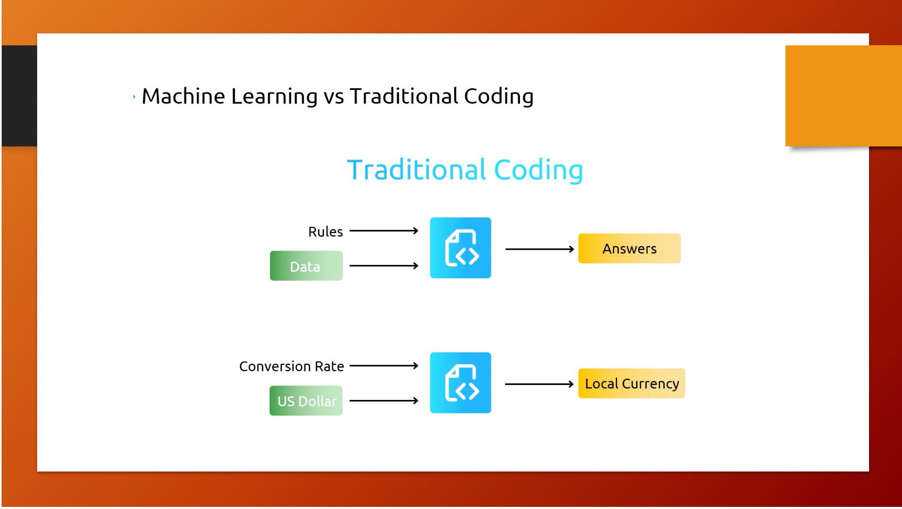](slide06.png "Machine Learning vs Traditional Coding")

Machine Learning vs Traditional Coding

[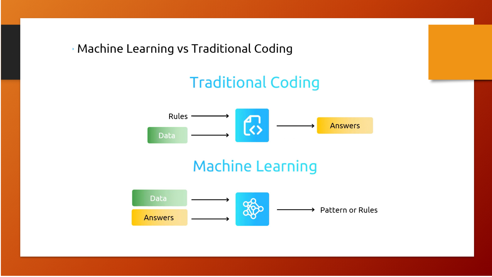](slide07.png "Machine Learning vs Traditional Coding")

Machine Learning vs Traditional Coding

[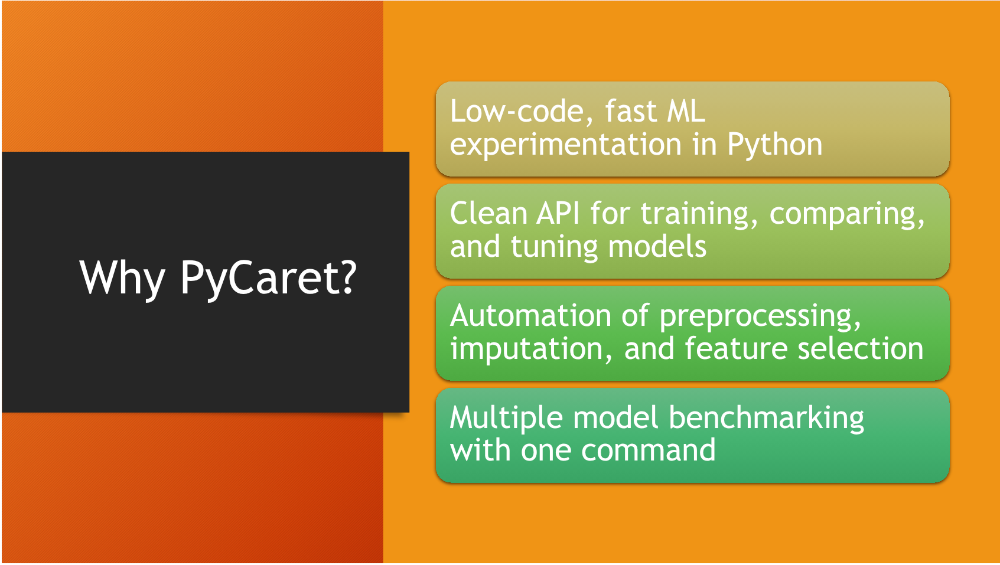](slide08.png "Why PyCaret?")

Why PyCaret?

- Low-code, fast MLexperimentation in Python
- Clean API for training, comparing,and tuning models
- Automation of preprocessing,imputation, and feature selection
- Multiple model benchmarking with one command

[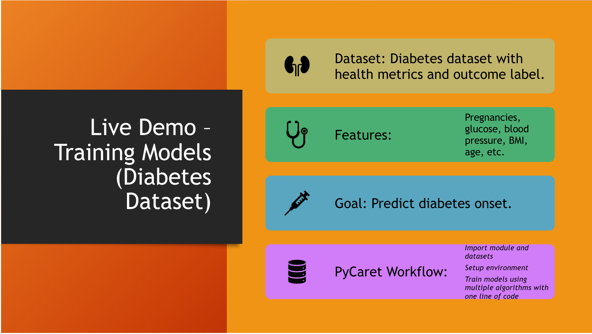](slide09.png "Live Demo")

Live Demo

[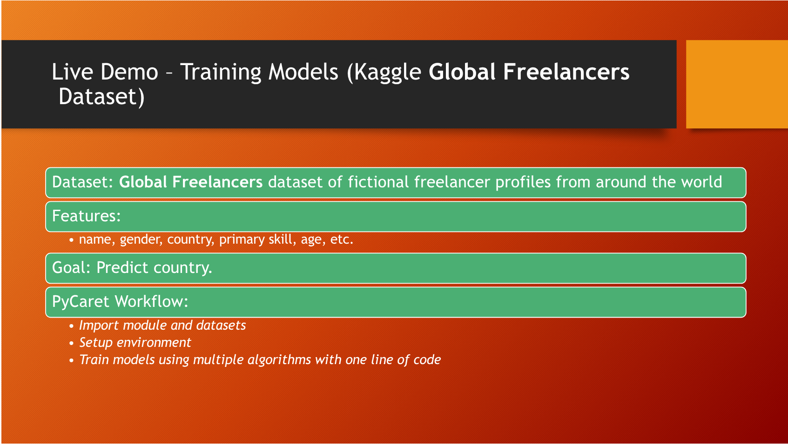](slide10.png "Live Demo – Training Models")

Live Demo – Training Models

[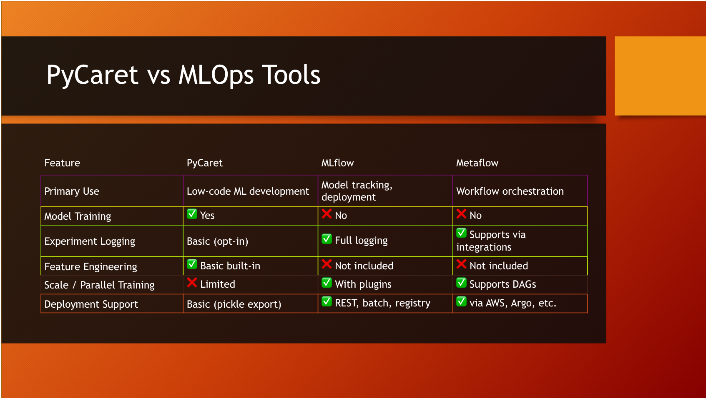](slide11.png "PyCaret vs MLOps Tools")

PyCaret vs MLOps Tools

[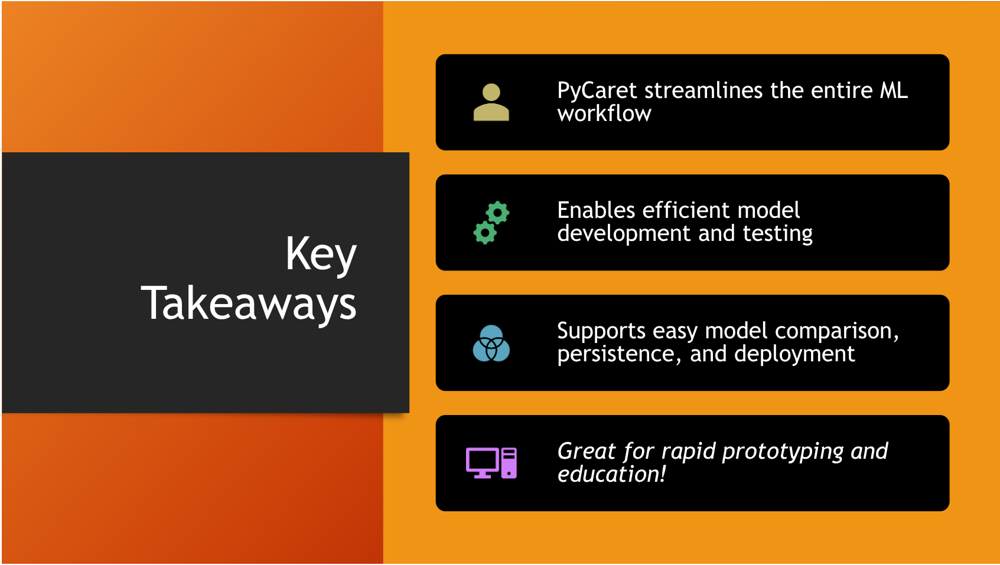](slide12.png "KeyTakeaways")

KeyTakeaways

- PyCaret streamlines the entire MLworkflow
- Enables efficient model development and testing
- Supports easy model comparison,persistence, and deployment
- Great for rapid prototyping and education!

[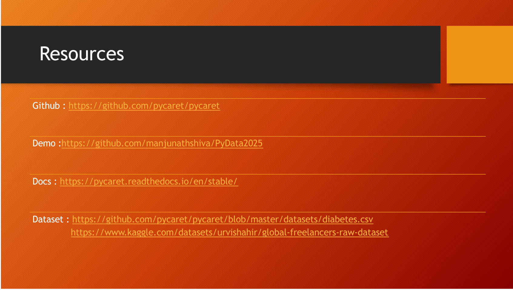](slide13.png "Resources")

Resources

- [Github](https://github.com/pycaret/pycaret)
- [Demo](https://github.com/manjunathshiva/PyData2025)
- [Docs](https://pycaret.readthedocs.io/en/stable/)
- [Dataset](https://github.com/pycaret/pycaret/blob/master/datasets/diabetes.csvhttps://www.kaggle.com/datasets/urvishahir/global-freelancers-raw-dataset)

[](slide14.png "Thanks")

Thanks

## Reflections

Pycaret looks like a better solution for rapid prototyping of machine learning models compared to building everything from scratch. This seems to be another option of moving towards productionizing machine learning models starting with a notebook.

## Citation

BibTeX citation:

``` quarto-appendix-bibtex
@online{bochman2025,
  author = {Bochman, Oren},
  title = {Automating {ML} with {PyCaret:} {Train} \& {Compare}
    {Multiple} {Models} to {Find} the {Best} {Performer}},
  date = {2025-12-11},
  url = {https://orenbochman.github.io/posts/2025/2025-12-11-pydata-pycaret/},
  langid = {en}
}
```

For attribution, please cite this work as:

Bochman, Oren. 2025. “Automating ML with PyCaret: Train & Compare Multiple Models to Find the Best Performer.” December 11. <https://orenbochman.github.io/posts/2025/2025-12-11-pydata-pycaret/>.
