# An error occurred.

Unable to execute JavaScript.

> **TIP:**
>
> **Small Language Models** (SLMs) are designed to deliver high performance with significantly fewer parameters compared to Large Language Models (LLMs). Typically, SLMs range from 100 million to 30 billion parameters, enabling them to operate efficiently on devices with limited computational resources, such as smartphones and embedded systems

The development of SLMs addresses the growing demand for AI solutions that are cost-effective, energy-efficient, and capable of running locally to ensure data privacy and reduce latency. Recent advancements have demonstrated that SLMs can rival or even surpass larger models in specific tasks, thanks to optimized architectures and training methodologies .​

A notable example is Google’s Gemma 3, a multimodal SLM family with models ranging from 1 to 27 billion parameters. Gemma 3 introduces vision understanding capabilities, supports longer context windows of at least 128K tokens, and employs architectural changes to reduce memory usage .

The 27B parameter version of Gemma 3 has achieved competitive performance, ranking among the top 10 models in the LMSys Chatbot Arena with an Elo score of 1339 .

The shift towards SLMs signifies a paradigm change in AI development, focusing on creating models that are not only powerful but also accessible and adaptable to a wide range of applications. As the field evolves, SLMs are poised to play a crucial role in democratizing AI technology.​

> **TIP:**
>
> - 🔍 Small Language Models: Understanding their scale, capabilities, and use cases

## Tools and Frameworks:

We will introduce you to certain modern frameworks in the workshop but the emphasis be on first principles and using vanilla Python and LLM calls to build AI-powered systems.

> **TIP:**
>
> - Jayita Bhattacharyya
>   - AI ML Nerd with a blend of technical speaking & hackathon wizardry!
>   - Applying tech to solve real-world problems. The work focus these days is on generative AI.
>   - Helping software teams incorporate AI into transforming software engineering.

- [workshop repo](https://github.com/hugobowne/AI-for-SWEs)
- [slides](https://docs.google.com/presentation/d/1UKBOQU5loXiknCRPGrUZyVDtsUZGVYC3fPvx6Vtsh6M/edit?slide=id.gc6f73a04f_0_0#slide=id.gc6f73a04f_0_0)

## Outline

[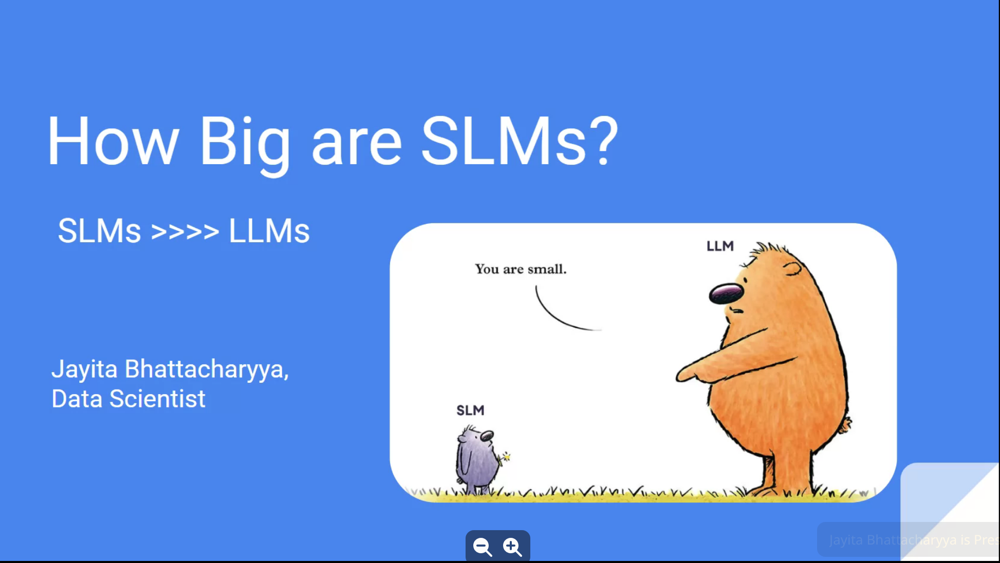](slide01.png)

[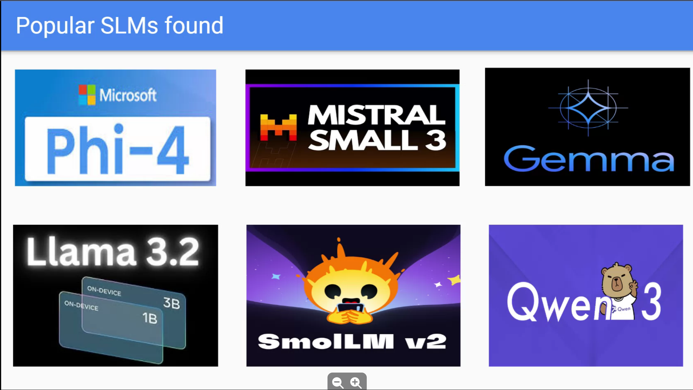](slide02.png "Popular SLMs found")

Popular SLMs found

[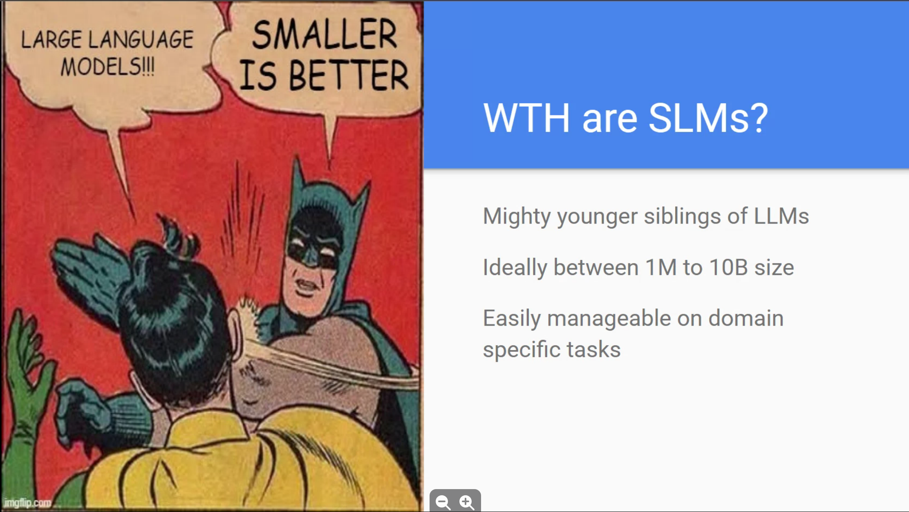](slide03.png "WTH are SLMs?")

WTH are SLMs?

[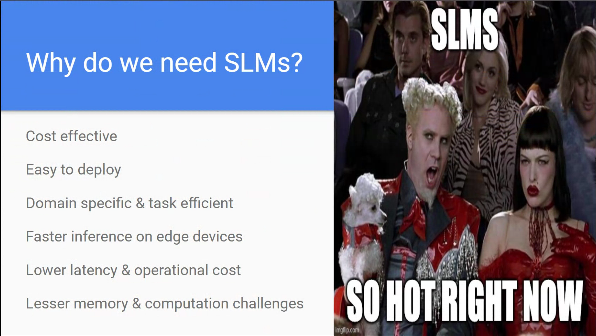](slide04.png "Why do we need SLMs?")

Why do we need SLMs?

[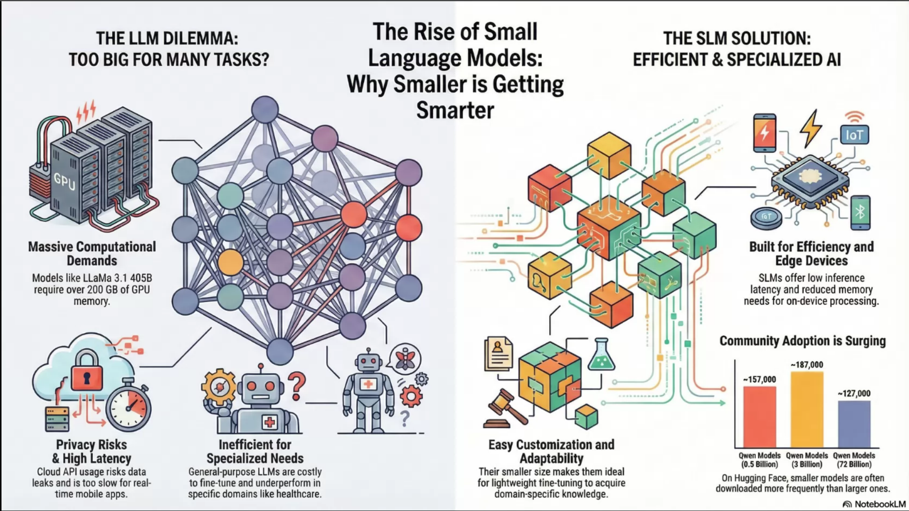](slide05.png "Infographic")

Infographic

[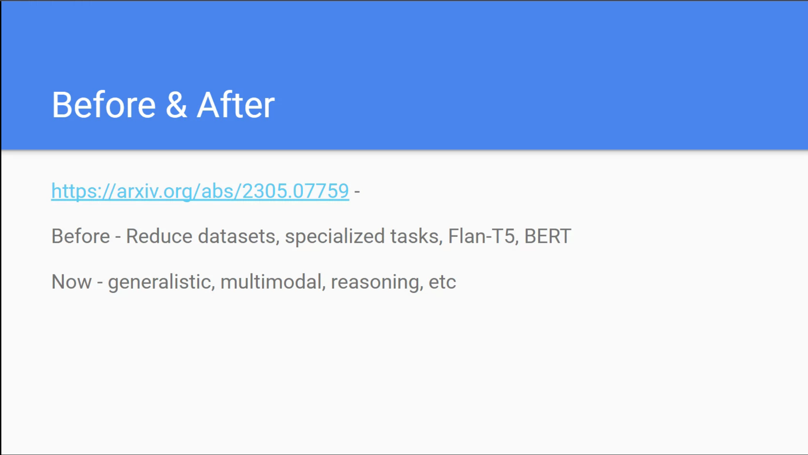](slide06.png "Before & After")

Before & After

[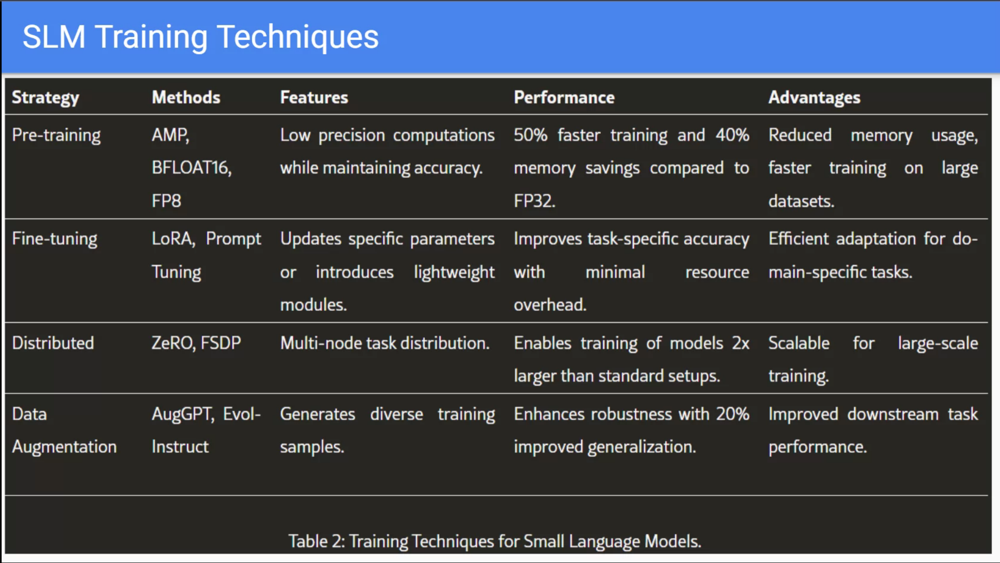](slide07.png "SLM Training Techniques")

SLM Training Techniques

[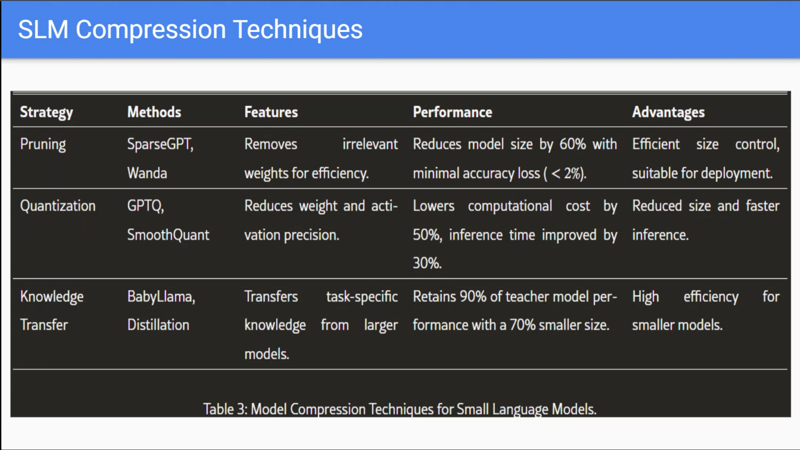](slide08.png "SLM Compression Techniques")

SLM Compression Techniques

[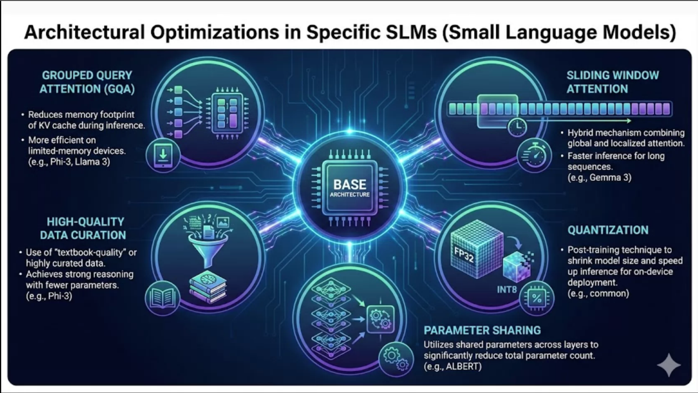](slide09.png "Infographic - Architectural Optimizations")

Infographic - Architectural Optimizations

[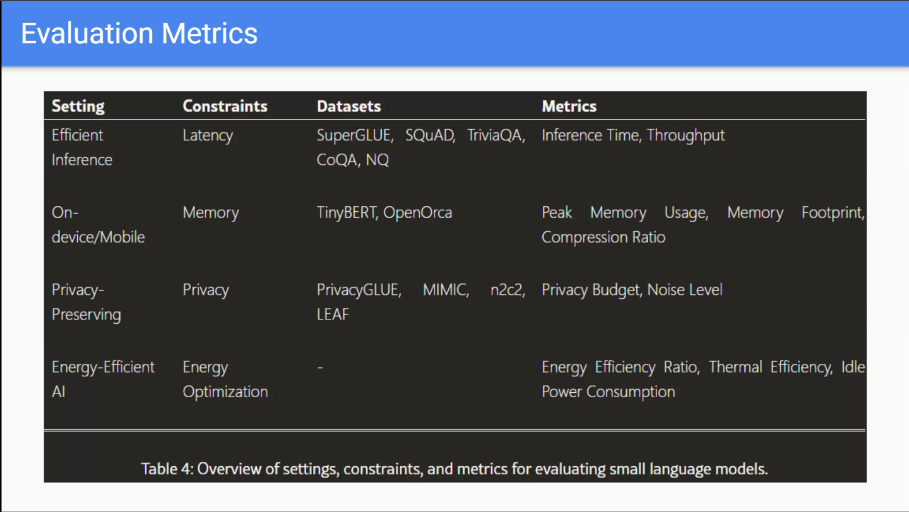](slide10.png "Evaluation Metrics")

Evaluation Metrics

[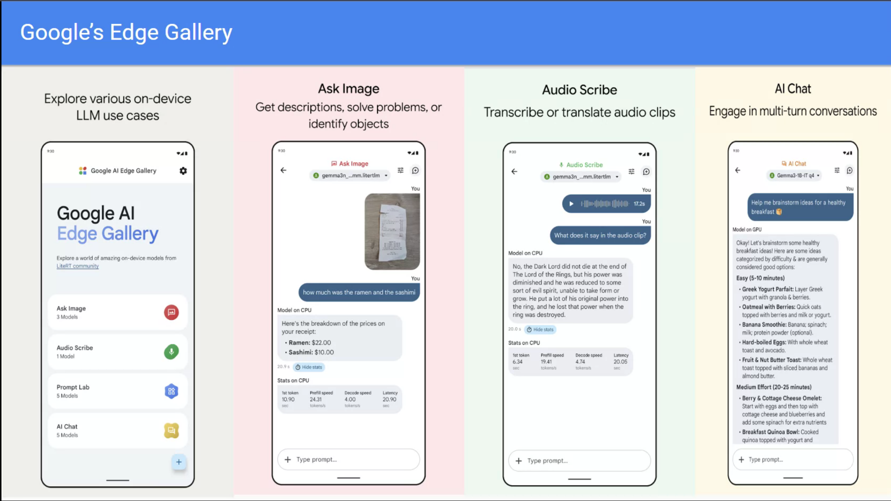](slide11.png "Google’s Edge Gallery")

Google’s Edge Gallery

[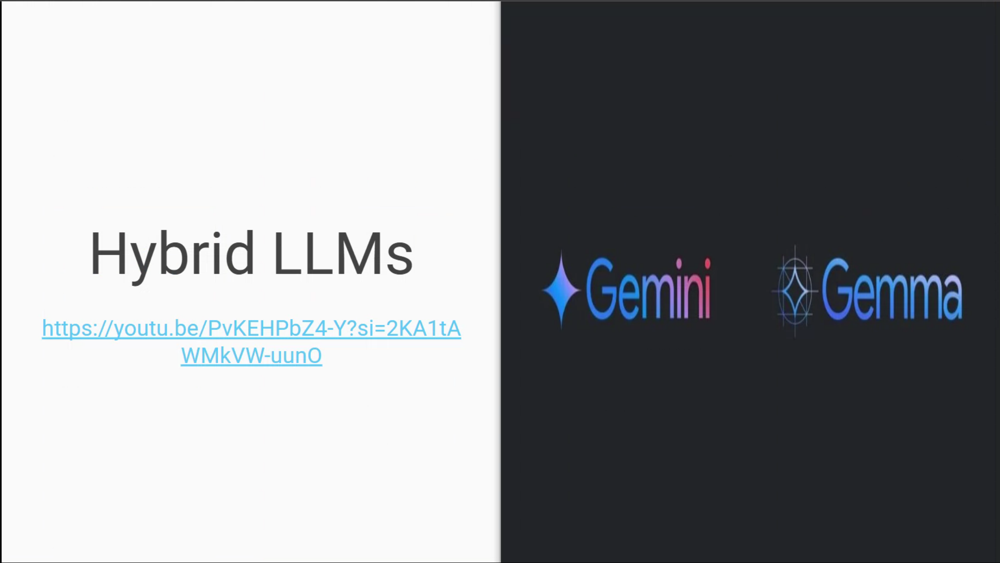](slide12.png "Hybrid LLMs")

Hybrid LLMs

[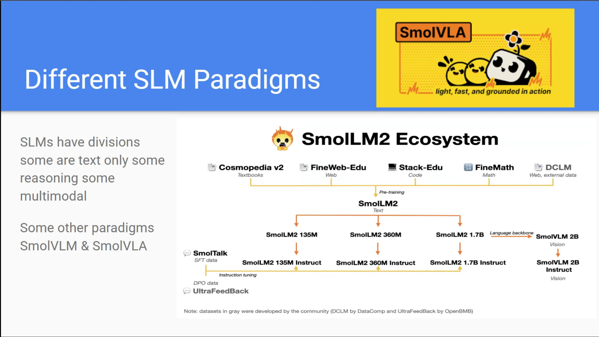](slide13.png "Different SLM Paradigms")

Different SLM Paradigms

[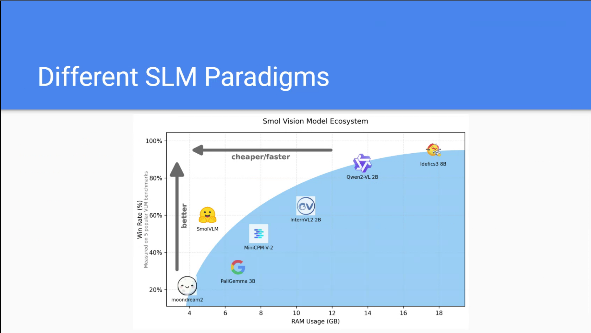](slide14.png "Different SLM Paradigms")

Different SLM Paradigms

[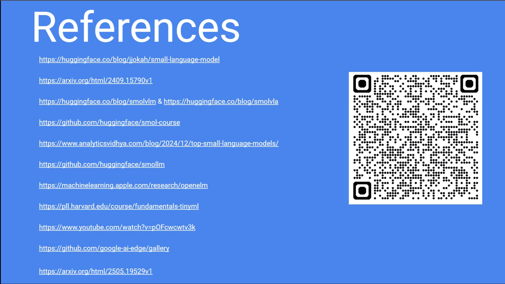](slide15.png "References")

References

- 
- 
- 
- 
- 
- 
- 
- 
- 
- 
- 
- 

[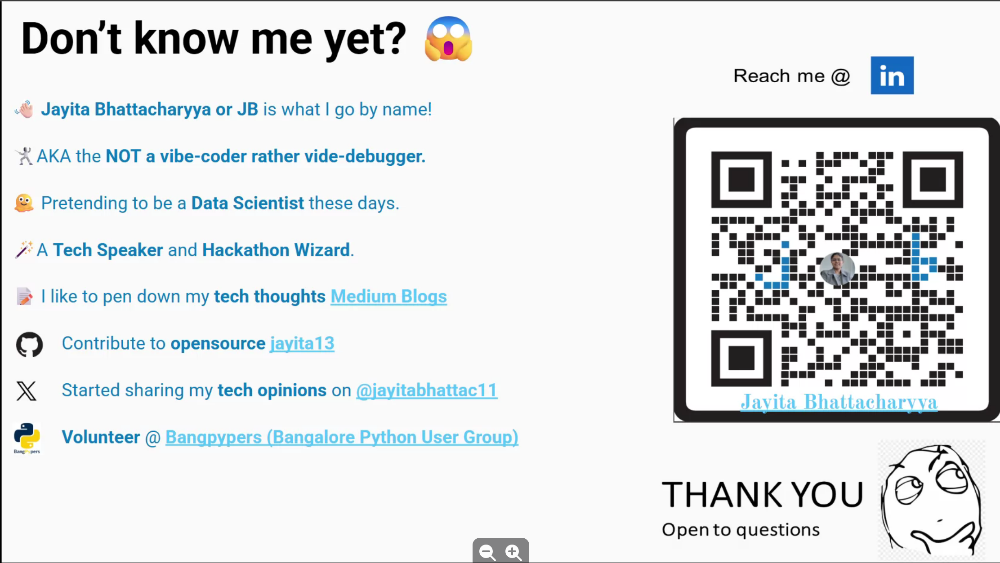](slide16.png "Dont know me yet")

Dont know me yet

### Reflections and Next Steps

I wonder if we can build **much smaller student models** that :

1.  uses a depth first search of a SLM with gating to pick branches that are either general purpose of within a wanted domain.
2.  pick the top probability branches from a large SLM (the leading word sense for the lexeme in the prompt)
3.  use a non parametric model to provide a whitebox model.
4.  further decomposition by domain data to allow for TLOP (total law of probability) to combine probability across decomposed models
5.  add slm models with training on private corpus

- the classic setup is not token prediction but bert lets us do masked word prediction so it may be better to think about language models with masked word prediction rather than next token prediction.
- so what seems to be missing perhaps is a representation of the context. this might require an additional modeling step.
- if the baisc lm is a nested crp than a context model might add a sparse feature representation via an indian buffet process to represent context via latent features such as orthogonal atoms of discourse!
- another thing that is missing and even more subtle then context is grammatical features that require thier own representation however we might be able to piggy back on the context representation to add grammatical features as additional latent features like deicated features for tense, aspect, mood, voice, person, number, gender, case, definiteness, etc as markov states in a state space of the context representation….

## Additional Resources

# An error occurred.

Unable to execute JavaScript.

Hybrid LLMs: Utilizing Gemini and Gemma for Edge AI applications

[Small Language Models (SLM): A Comprehensive Overview](https://huggingface.co/blog/jjokah/small-language-model) [SmolVLM - small yet mighty Vision Language Model](https://huggingface.co/blog/smolvlm) [Small Language Models: Survey, Measurements, and Insights](https://arxiv.org/abs/2409.15790) [A course on aligning smol models.](https://github.com/huggingface/smol-course)

## Citation

BibTeX citation:

``` quarto-appendix-bibtex
@online{bochman2025,
  author = {Bochman, Oren},
  title = {How {Big} Are {SLMs}},
  date = {2025-12-11},
  url = {https://orenbochman.github.io/posts/2025/2025-12-11-pydata-slm/},
  langid = {en}
}
```

For attribution, please cite this work as:

Bochman, Oren. 2025. “How Big Are SLMs.” December 11. <https://orenbochman.github.io/posts/2025/2025-12-11-pydata-slm/>.
