# An error occurred.

Unable to execute JavaScript.

> **TIP:**
>
> At 1:23 a.m. on 26 April 1986, the RBMK-4 graphite-moderated reactor at Chernobyl exploded. Every dosimeter still working inside flat-lined at 3.6 R/h, its maximum reading, while lethal radiation raged unseen.
>
> That single detail from Chernobyl is the perfect allegory for what can go wrong in modern machine-learning pipelines: clipped features, hidden distribution shifts, missing logs, runaway feedback loops, and more.
>
> This talk unpacks key incidents from the disaster and map each one to an equivalent failure mode in production ML, showing how silent risk creeps into data systems and how to engineer for resilience.
>
> Attendees will leave with a practical set of questions to ask, signals to track, and cultural habits that keep models (and the businesses that rely on them) well clear of their own meltdowns. No nuclear physics required.

Software engineers aren’t nuclear engineers, yet the patterns behind catastrophic failure are uncannily transferable.

In Chernobyl’s control room, a radiation gauge pinned at 3.6 R/h masked lethal reality; in production we truncate floats, or hide exploding metrics behind poorly chosen histogram bins. Operators overrode the reactor’s emergency cooling “just for this test”; we disable schema validation to hurry a back-fill. Steam-void reactivity formed a positive feedback loop; recommenders amplify popularity bias until user engagement collapses.

The session walks through several such parallels. Each mini-segment starts with the historical context, then immediately pivots into a modern use-case that demonstrates the ML analogue, for instance, an ad-ranking model whose session_depth feature is computed differently online than in training, yielding a negative CTR lift despite glowing offline metrics.

While the historical narrative keeps the material memorable, the engineering focus stays firmly on actionable prevention: tools like great expectations, out-of-distribution gates, reproducible datasets, and perhaps most importantly - a culture that treats “impossible” as a probability, not a certainty.

No specialized nuclear knowledge is assumed.

Code examples (when present) use familiar PyData stack - `NumPy`, `Pandas`, `scikit-learn`.

The use-cases, concepts and tools shown can appeal to both seasoned practitioners and those earlier in their ML journey.

> **TIP:**

- [talk repo]()
- [slide deck]()

## Outline

[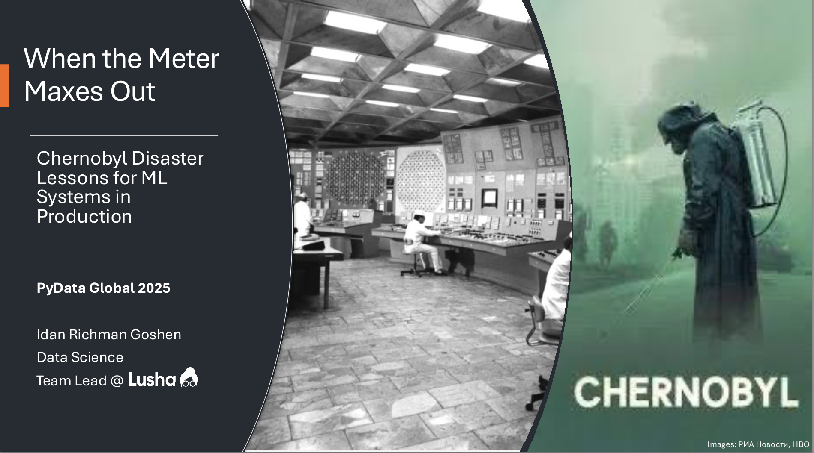](slide01.png "Title")

Title

[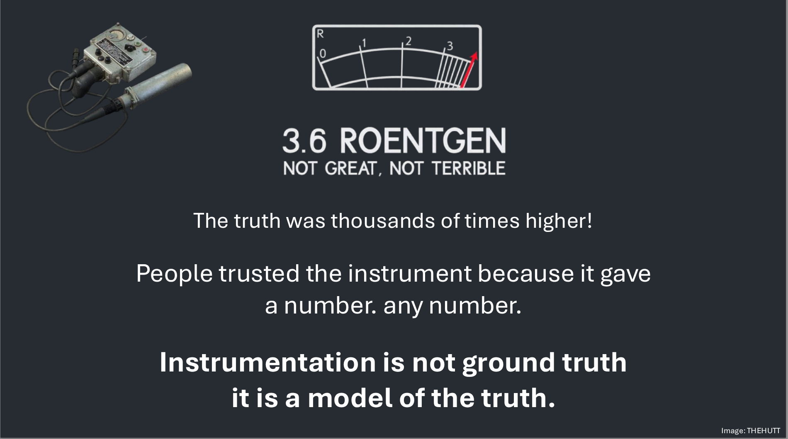](slide02.png "the inciting incident")

the inciting incident

[](slide03.png "About Me")

About Me

[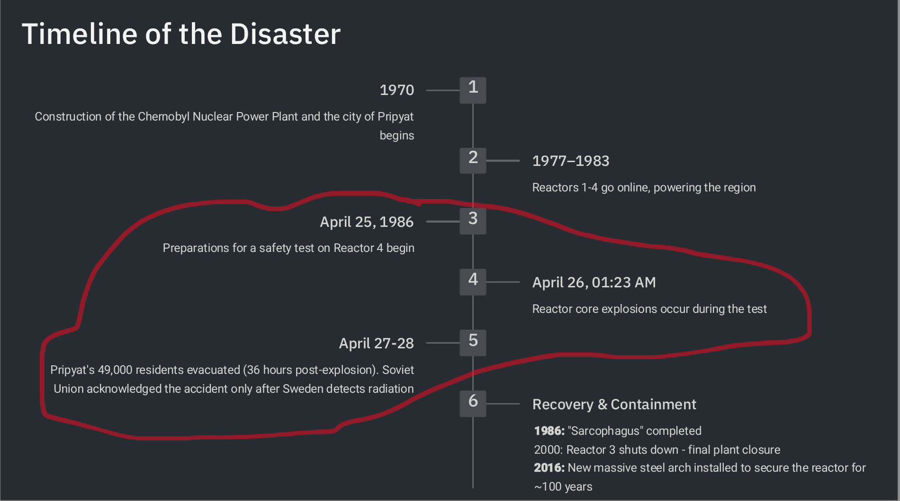](slide04.png "Timeline of the Disaster")

Timeline of the Disaster

[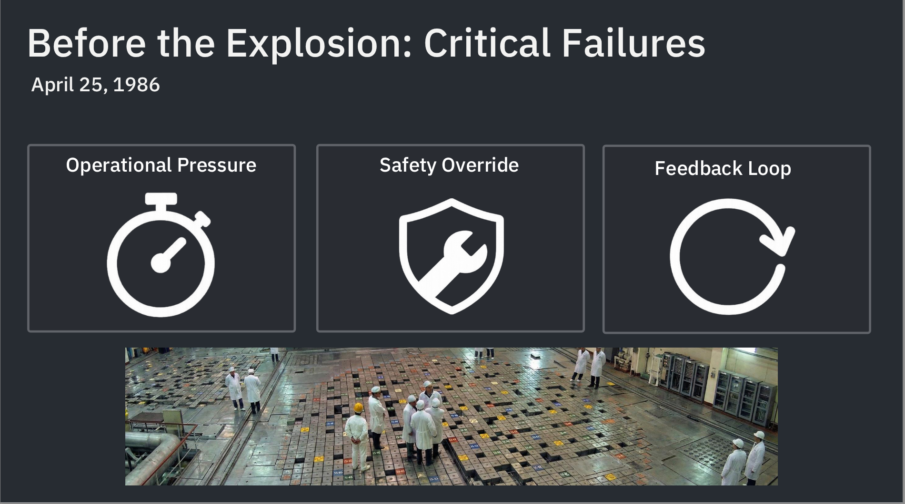](slide05.png "Before the Explosion: Critical Failures")

Before the Explosion: Critical Failures

[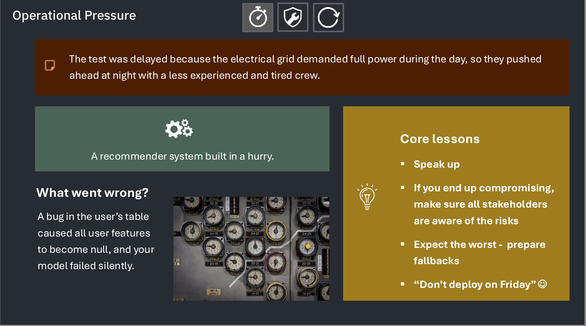](slide06.png "Operational Pressure")

Operational Pressure

> **TIP:**
>
> - Speak up
> - If you end up compromising, make sure all stakeholders are aware of the risks
> - Expect the worst - prepare fallbacks
> - Don’t deploy on Friday

[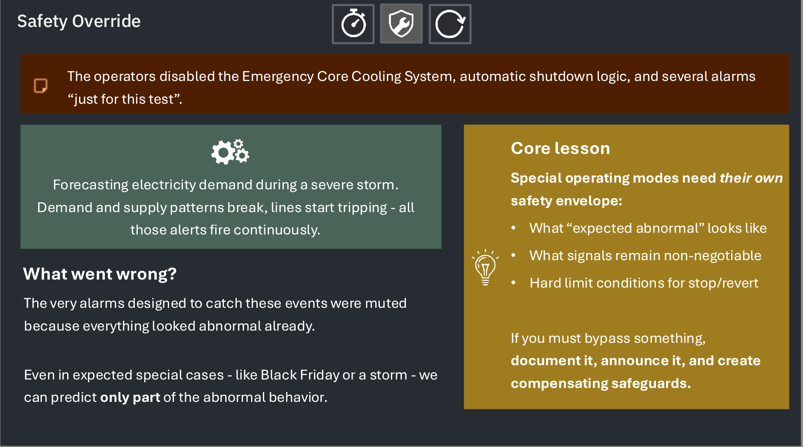](slide07.png "Safety Override")

Safety Override

> **TIP:**
>
> - Special operating modes need their own safety envelope:
>   - What “expected abnormal” looks like
>   - What signals remain non-negotiable
>   - Hard limit conditions for stop/revert
>
> If you must bypass something, document it, announce it, and create compensating safeguards.

[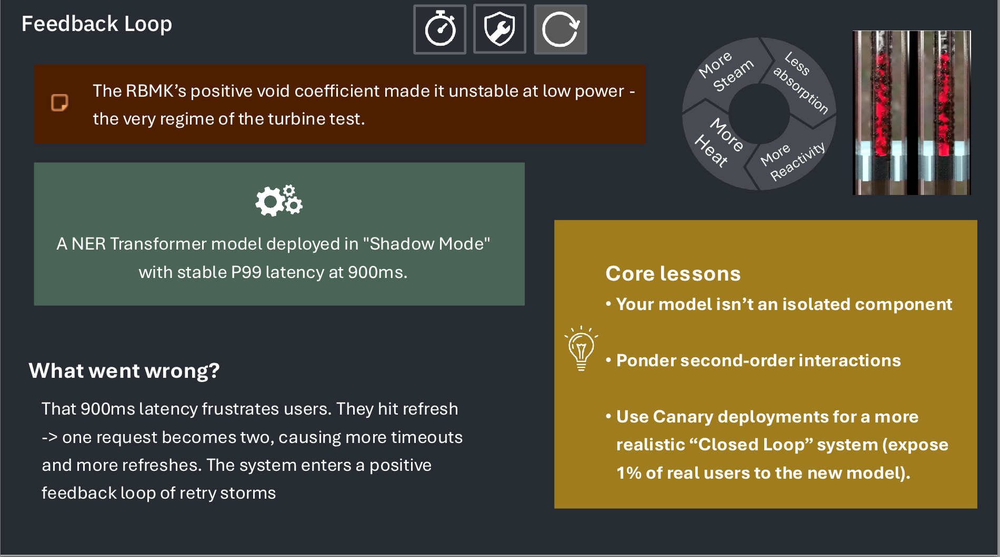](slide08.png "Feedback Loop")

Feedback Loop

> **TIP:**
>
> - Your model isn’t an isolated component
> - Ponder second-order interactions
> - Use Canary deployments for a more realistic “Closed Loop” system (expose 1% of real users to the new model).

[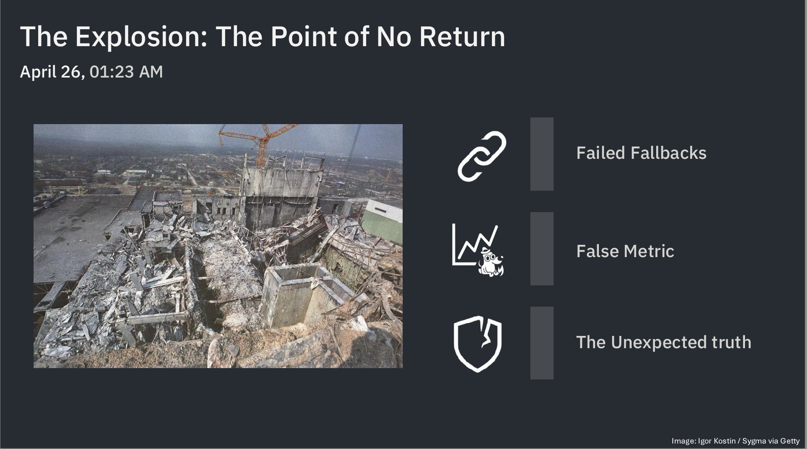](slide09.png "The Explosion: The Point of No Return")

The Explosion: The Point of No Return

[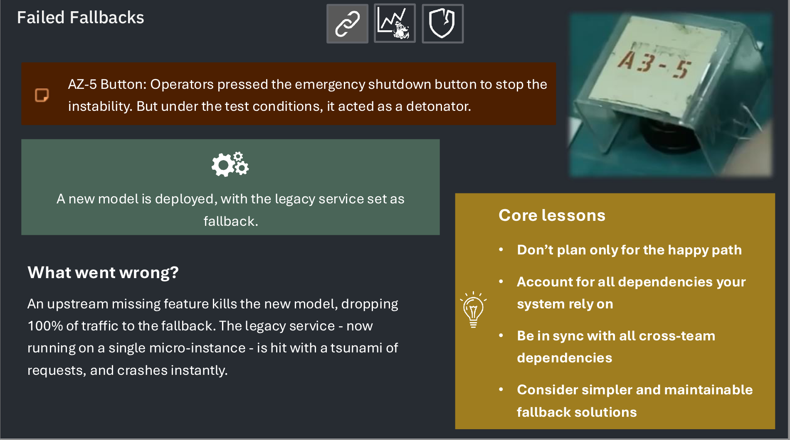](slide10.png "Failed Fallbacks")

Failed Fallbacks

> **TIP:**
>
> - Don’t plan only for the happy path
> - Account for all dependencies your system rely on
> - Be in sync with all cross-team dependencies
> - Consider simpler and maintainable fallback solutions

[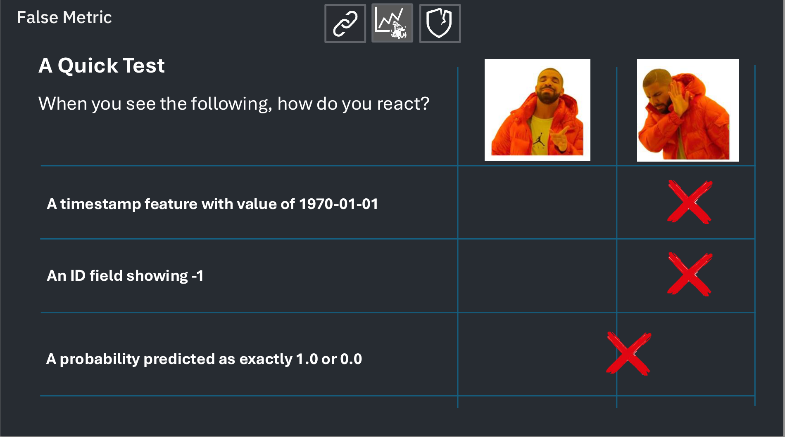](slide11.png "False Metric")

False Metric

[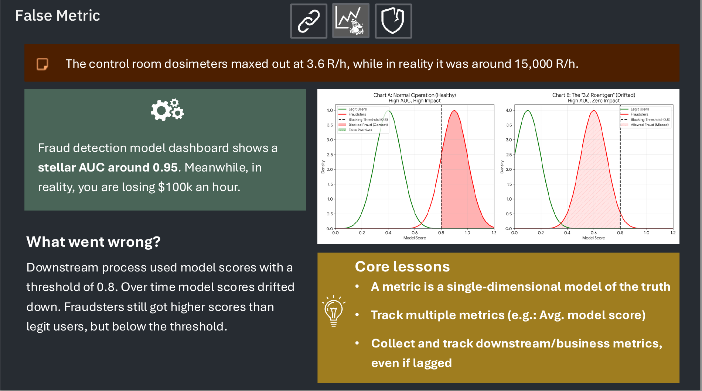](slide12.png "False Metric")

False Metric

> **TIP:**
>
> - A metric is a single-dimensional model of the truth
> - Track multiple metrics (e.g.: Avg. model score)
> - Collect and track downstream/business metrics, even if lagged

[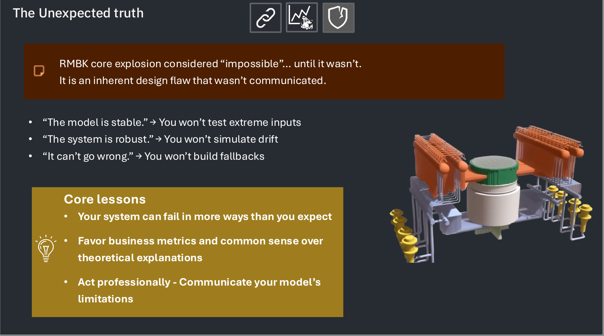](slide13.png "The Unexpected truth")

The Unexpected truth

> **TIP:**
>
> - Your system can fail in more ways than you expect
> - Favor business metrics and common sense over theoretical explanations
> - Act professionally - Communicate your model’s limitations

[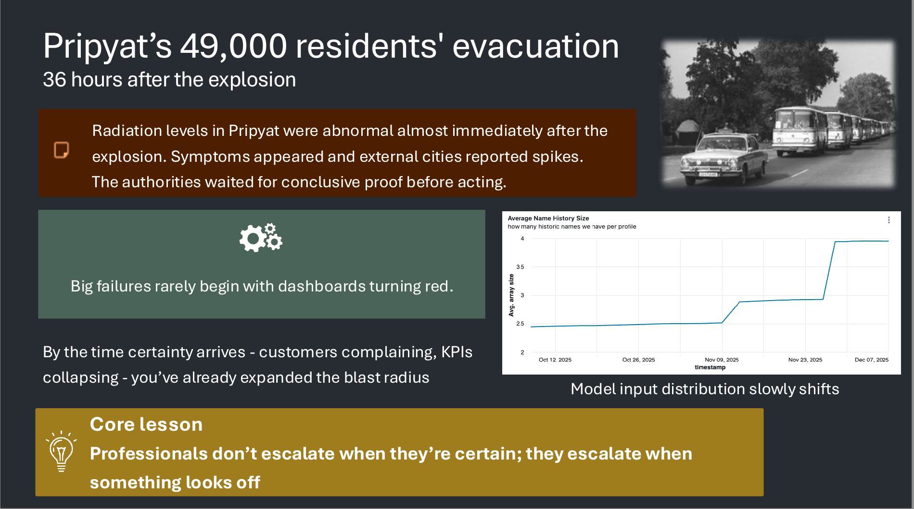](slide14.png "Pripyat’s 49,000 residents’ evacuation")

Pripyat’s 49,000 residents’ evacuation

> **TIP:**
>
> - Professionals don’t escalate when they’re certain; they escalate when something looks off

[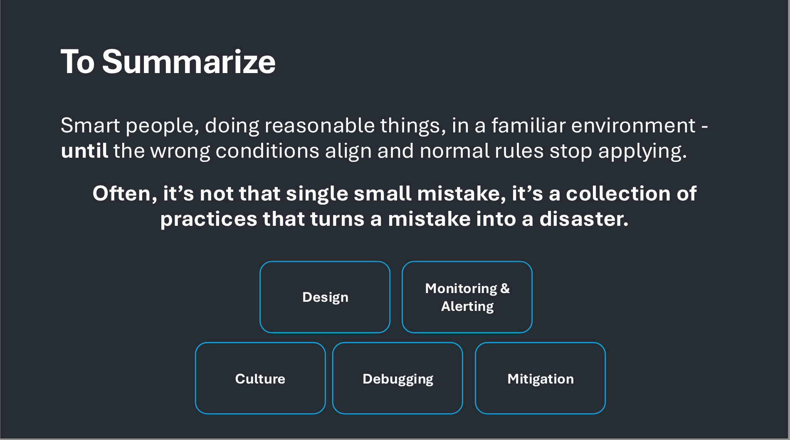](slide15.png "To Summarize")

To Summarize

[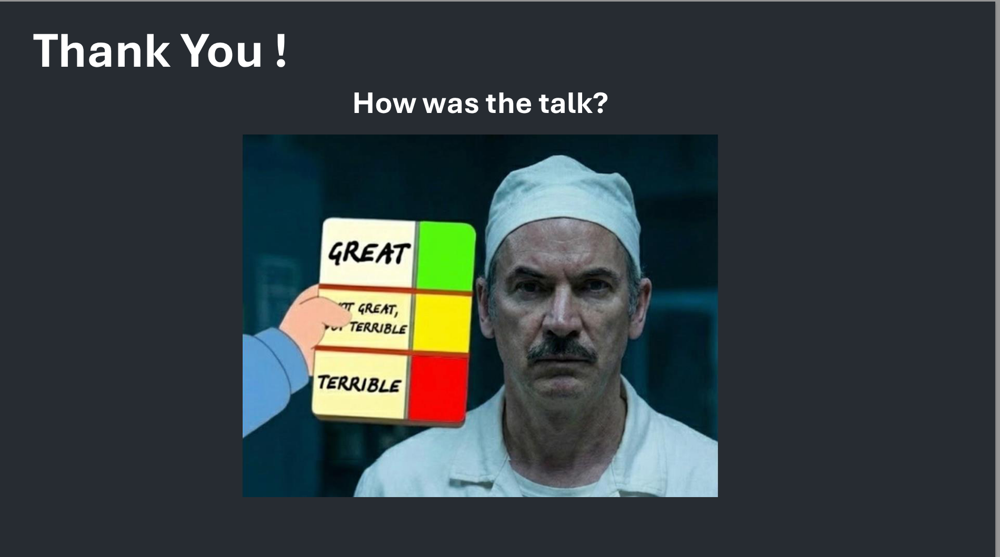](slide16.png "Thank You !")

Thank You !

## Reflections

Wow, that was a great talk!

## Citation

BibTeX citation:

``` quarto-appendix-bibtex
@online{bochman2025,
  author = {Bochman, Oren},
  title = {When the {Meter} {Maxes} {Out}},
  date = {2025-12-12},
  url = {https://orenbochman.github.io/posts/2025/2025-12-11-pydata-when-the-meter-maxes-out/},
  langid = {en}
}
```

For attribution, please cite this work as:

Bochman, Oren. 2025. “When the Meter Maxes Out.” December 12. <https://orenbochman.github.io/posts/2025/2025-12-11-pydata-when-the-meter-maxes-out/>.
