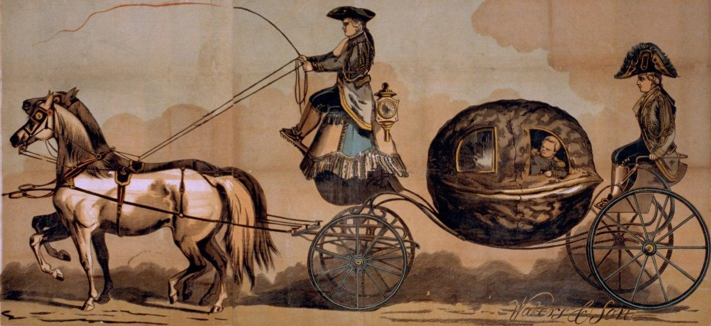

cover

I tried to make sense of costly signaling when I was writing up the relevant section of many paths to signaling.

This academic paper proposes that cooperation among unrelated individuals can evolve through costly signaling, where providing group benefits honestly signals an individual’s quality, leading to advantageous alliances. The authors present a game-theoretic model demonstrating that this signaling can be evolutionarily stable even without repeated interactions or group selection

> **NOTE:**
>
> [](../../../images/in_the_nut_shell_coach_retouched.jpg "Costly signaling in a nutshell")
>
> Costly signaling in a nutshell
>
> In this paper the authors ask how can cooperation among unrelated members of a social group evolve and be maintained, particularly in situations where traditional explanations like reciprocity are unlikely to apply
>
> In essence, the paper seeks to provide a game-theoretic model based on costly signaling theory to explain the evolution of cooperation among unrelated individuals, particularly in contexts resembling public goods games where defection would otherwise be the dominant strategy

Here is a lighthearted Deep Dive into the paper:

### Abstract

> We propose an explanation of cooperation among unrelated members of a social group, in which providing group benefits evolves because it constitutes an honest signal of the member’s quality as a mate, coalition partner or competitor, and therefore results in advantageous alliances for those signaling in this manner. Our model is framed as an n-player game that involves no repeated or assortative interactions, and assumes a payoff structure that would conform to an n-player public goods game in which non-cooperation would be a dominant strategy if there were no signaling benefits. We show that honest signaling of underlying quality by providing a public good to group members can be evolutionarily stable. We also show that this behavior is capable of proliferating in a population in which it is initially rare. Our model applies to a range of cooperative interactions, including providing individually consumable resources, participating in group raiding or defense, and punishing free-riding or other violations of social norms. Our signaling model is distinctive in applying to group rather than dyadic interactions and in determining endogenously the fraction of the group that signals high quality in equilibrium.
>
> — ([Smith et al. 2000](#ref-smith2000costly))

## Glossary

This book/paper uses lots of big terms so let’s break them down so we can understand them better

Costly Signaling  
A theoretical framework suggesting that individuals can reliably signal their underlying quality by engaging in behaviors that are more costly for lower-quality individuals to perform.

Cooperation  
Behavior by two or more individuals that leads to mutual benefit. In the context of the paper, it often refers to providing a benefit to the group.

Public Goods Game  
A type of game in which individuals can contribute to a common pool that benefits everyone, but individual contributions are costly, leading to the incentive to free-ride.

Signaler  
An individual who performs a costly action (the signal) to convey information about their quality.

Partner  
An individual who observes the signal and uses this information to make decisions about forming alliances or other social interactions with the signaler.

Quality  
An underlying attribute of an individual (e.g., health, strength, skill) that is difficult to observe directly but affects their value as a mate, ally, or competitor.

Honest Signal  
A signal that reliably indicates the signaler’s true quality because it is too costly for low-quality individuals to fake.

Free-riding  
Benefiting from a public good without contributing to its provision.

Evolutionarily Stable Strategy (ESS)  
A strategy that, if adopted by a population, cannot be invaded by any rare alternative strategy.

Nash Equilibrium  
A state in a game where no player can improve their payoff by unilaterally changing their strategy, given the strategies of the other players.

Replicator Dynamic  
A model of evolutionary change where the frequency of a strategy in a population increases if its payoff is higher than the average payoff of the population.

Basin of Attraction  
The set of initial conditions (e.g., frequencies of strategies) that will eventually lead to a particular stable equilibrium under a dynamic process.

Broadcast Efficiency  
The extent to which a signal is observable by a wide audience of potential partners.

Multilevel Selection  
A form of natural selection that operates on multiple levels of organization, such as genes, individuals, and groups.

Dominant Strategy  
A strategy that yields the highest payoff for a player regardless of the strategies chosen by other players.

Payoff Matrix  
A table that shows the payoffs to each player in a game for every possible combination of strategies.

## Outline

- Introduction
  - Describes how cooperation among unrelated individuals has generally been explained by some form of conditional reciprocity, but notes an increased interest in alternative mechanisms such as multi-level selection and mutualism.
  - Introduces a game-theoretic model of the evolution of cooperation based on costly signaling theory.
  - Notes the model applies to a range of social interactions including food sharing, group raiding/defense, and punishing free-riding.
  - Highlights how the model is distinctive in applying to group rather than dyadic interactions and in determining endogenously the fraction of the group that signals high quality in equilibrium.
- A Model of Costly Signaling
  - Presents a game in which group members can signal their quality by providing a benefit to the group.
  - Describes the conditions for an honest signaling equilibrium where high quality types signal and low quality types do not.
  - Discusses how the equilibrium conditions depend upon the frequency of high quality types in the group.
- Dynamics
  - Introduces a replicator dynamic to model how the fraction of honest signalers and partners who respond to the signal changes over time.
  - Describes how the replicator equations demonstrate that the honest signaling equilibrium is stable and how adding plausible assumptions increases the basin of attraction of the signaling equilibrium.
- Why Signal by Providing Benefits to Others?
  - Notes how, in the model, the existence of a costly signaling equilibrium does not depend on the character of the benefit provided to the group.
  - Highlights three reasons why prosocial signaling may be favored:
    - Prosocial traits may enhance the signaler’s value to a potential ally.
    - Prosocial signaling may increase broadcast efficiency.
    - Groups with a high level of prosocial costly signaling may have more fit members.
- The Evolution of Signaling
  - Describes two ways in which signaling could proliferate:
    - Stochastic events.
    - Periodic changes in the environment.
  - Discusses how intergroup competition may contribute to the evolutionary success of signaling.
  - Presents a dynamic model to explain how the frequency of high-quality types in the population can be maintained despite their higher fitness in the signaling equilibrium.
- Conclusion
  - Summarizes how the model shows that a class of signals that contribute to group benefits may proliferate in a population and be evolutionarily stable.
  - Notes how costly signaling may provide a mechanism for the evolution of cooperative and other group beneficial practices independent of other mechanisms.
  - Mentions other factors such as repeated interactions, positive assortment, and multilevel selection may reinforce this evolutionary process.

## Reflections

Costly signaling arises naturally in two well known contexts, [Zehavi’s](https://en.wikipedia.org/wiki/Amotz_Zahavi) [handicap principle](https://en.wikipedia.org/wiki/Handicap_principle) and [Michael_Spence](https://en.wikipedia.org/wiki/Michael%20Spence's) [Education game](https://en.wikipedia.org/wiki/Signaling_game#Education_game) signaling games.

In both of these games the cost of a signal is (apparently) prohibitive for imposters to fake. Good ideas in principle. But in the case of the infamous peacock tail, the individual is born with the capacity for a tail, that don’t have much of a choice in the matter except to die. In the case of the education game, the cost of education seems prohibitive until all good jobs require a degree and then having a degree is no longer is a signal of quality. In china recently, economic downturn have led to a glut of graduates and a shortage of jobs, and reportedly students are delaying their entry to the unemployment market by staying in school for another degree.

I quickly realized that costly signaling is a dubious mechanism for creating voracity. But it seems to create a type of run away arms race that can become a social dilemma. For the costs of signaling to be prohibitive the benefits accrued by deception must remain low.

One place where costly signaling makes sense is email-spam. If signaling has no cost this would lead any agent that can benefit by signals to do so. This drowns out the other signals. This suggests a social costs of cheap talk. If there is a penalty for sending spam, the spammer would only send spam where the expected benefits outweigh the costs. If the expected benefit is usd 1/1,000,000 we could charge 1 cent per email and the spammer would not send such an spam email. However if they could get sufficiently high payoffs they might choose to still send spam. They may even send these to a targeted group of people who are more likely to respond to the spam.

Using a sufficiently high cost will reduce spam, but it will make sending email costly for everyone. This is a problem.

A better solution is if you can sue someone for spamming. If there is a law and service for doing this spammers will be more likely to be caught and the cost of spamming will be higher, but the cost of sending email will not be higher for everyone.

So there main point is that costly signaling requires a mechanism for punishing spammers – this is conceptually simple but requires significant work to implement. I.e. there is a role for social punishment in the evolution of costly signaling and this role should be self-financing for the punisher.

The paper suggests that punishers get reputations for punishing and that this reputation is a signal of quality. This is a feedback mechanism.

## The paper

paper

Smith, Eric, Samuel Bowles, and Herbert Gintis. 2000. “Costly Signaling and Cooperation.” *Santa Fe WP*.

## Citation

BibTeX citation:

``` quarto-appendix-bibtex
@online{bochman2025,
  author = {Bochman, Oren},
  title = {🤝 {Costly} {Signaling} and {Cooperation}},
  date = {2025-03-24},
  url = {https://orenbochman.github.io/reviews/2000/costly-signaling-and-cooperation/},
  langid = {en}
}
```

For attribution, please cite this work as:

Bochman, Oren. 2025. “🤝 Costly Signaling and Cooperation.” March 24. <https://orenbochman.github.io/reviews/2000/costly-signaling-and-cooperation/>.
