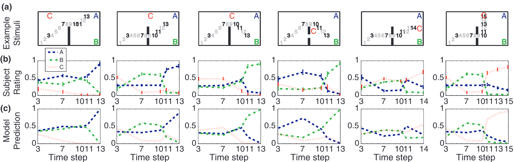
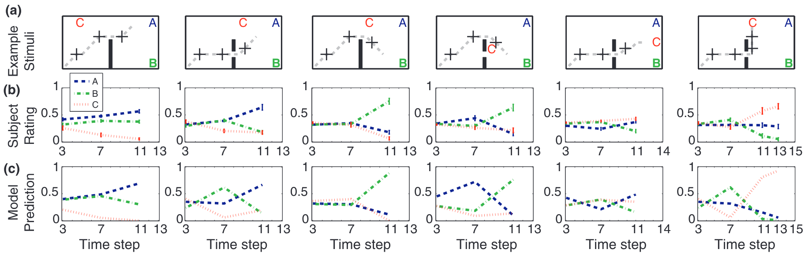
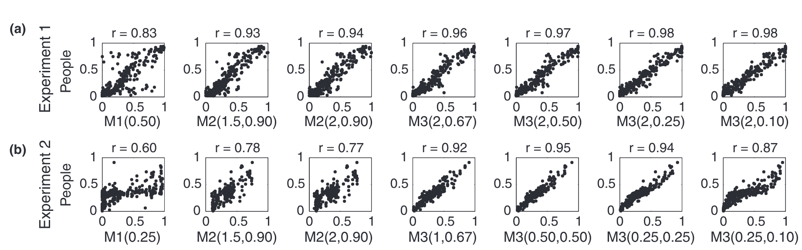

cover

[](mindmap.png "mindmap")

mindmap

# An error occurred.

Unable to execute JavaScript.

Josh Tenenbaum, MIT BMM Summer Course 2018 Computational Models of Cognition: Part 1

# An error occurred.

Unable to execute JavaScript.

Josh Tenenbaum, MIT BMM Summer Course 2018 Computational Models of Cognition: Part 2

# An error occurred.

Unable to execute JavaScript.

Josh Tenenbaum, MIT BMM Summer Course 2018 Computational Models of Cognition: Part 3

> “In preparing for battle I have always found that plans are useless, but planning is indispensable.”
>
> — Dwight D. Eisenhower

So I think that this idea has been handled better in ([Jaques et al. 2019](#ref-jaques2019social)), a paper by natasha jacques in

> **NOTE:**
>
> [](../../../images/in_the_nut_shell_gemeni.png "Goal Inference in a nutshell")
>
> Goal Inference in a nutshell
>
> 1.  **What are the research questions?**
>
> - The central research question is how humans, including infants and adults, infer the goals of agents from observed behavior, especially when the behavior is incomplete or ambiguous. The study specifically investigates the cognitive mechanisms underlying this ability and proposes a computational framework called “inverse planning”. Furthermore, the research aims to determine which representation of goal structure best explains human goal inferences, considering models that assume a single underlying goal, complex goals with subgoals, or goals that can change over time. The two experiments are designed to empirically differentiate between these competing models of goal representation.
>
> 2.  **What are the main findings?**
>
> - The primary finding is that the proposed **inverse planning framework provides a strong quantitative account of human goal inference**. Across two experiments, the **“changing goals model (M3)” consistently showed the highest correlation with participants’ judgments**, suggesting that people readily infer changes in an agent’s goals to explain behavior. While the “single underlying goal model (M1)” performed poorly, the “complex goals model (M2)” showed some predictive power in the first experiment but was less successful in the second, indicating that the relevance of subgoal inferences may depend on the specific context and stimuli. The study highlights that human goal inference involves a balance between attributing complex behavior to unlikely deviations from an optimal path and inferring a change in the agent’s goals.
>
> 3.  **In historical context why was this important?**
>
> - This research is important because it addresses the fundamental problem of “theory of mind” and action understanding, building upon philosophical and psychological ideas about the “principle of rationality” and intuitive theories of agency. Historically, these concepts were often described qualitatively, and this work makes a significant contribution by offering a **computational, Bayesian framework (“inverse planning”) that provides a formal and quantitative approach to modeling goal inference**. By drawing an analogy to computational vision, the authors frame goal inference as a process of inverting a model of the agent’s planning process. This approach allows for testable predictions and fine-grained comparisons with human judgments, moving beyond qualitative descriptions and providing a rational analysis of how people can successfully infer goals from limited observations. The research extends prior work on Bayesian models of action understanding by exploring a wider range of goal structure representations and providing novel experimental tests to distinguish between them.

Here is a lighthearted Deep Dive into the paper:

### Abstract

> Infants and adults are adept at inferring agents’ goals from incomplete or ambiguous sequences of behavior. We propose a framework for goal inference based on inverse planning, in which observers invert a probabilistic generative model of goal-dependent plans to infer agents’ goals. The inverse planning framework encompasses many specific models and representations; we present several specific models and test them in two behavioral experiments on online and retrospective goal inference.
>
> — ([Baker et al. 2007](#ref-baker2007goal))

## Glossary

This paper uses lots of big terms so let’s break them down so we can understand them better

Action Understanding  
The cognitive process by which individuals interpret and make sense of the actions performed by themselves and others.

Bayesian Model  
A statistical model that uses Bayes’ theorem to update the probability for a hypothesis as more evidence or information becomes available.

Bounded Rationality  
The idea that agents’ decision-making capabilities are limited by factors such as available information, cognitive constraints, and time, leading to choices that are “good enough” rather than perfectly optimal.

Computational Model  
A mathematical or algorithmic representation of a cognitive process or phenomenon, allowing for simulation and quantitative predictions.

Dynamic Bayes Network (DBN)  
A probabilistic graphical model used to represent the temporal dependencies between variables, often used to model systems that change over time.

Hypothesis Space  
The set of all possible explanations or interpretations that an observer might consider when trying to infer an agent’s goal.

Marginalization  
In probability, the process of summing or integrating over the values of one or more variables to obtain the probability distribution of the remaining variables.

Online Inference  
The process of drawing conclusions or making judgments in real-time as new information becomes available. Peer Reviewed: A process by which scholarly work is evaluated by other experts in the same field before publication to ensure quality and rigor.

Prior Knowledge  
Pre-existing beliefs, expectations, or information that an observer has about the world or the agent being observed, which is used to inform the process of inference.

Rational Analysis  
An approach in cognitive science that seeks to understand behavior by determining what would be the optimal strategy for an agent to achieve its goals given the constraints of the environment and the agent’s cognitive abilities.

Retrospective Inference  
The process of making judgments or drawing conclusions about past events or states based on information that became available after those events occurred.

State Transition Distribution  
A function that specifies the probability of moving from one state to another as a result of taking a particular action in a given environment.

Teleological Representation  
Understanding actions and events in terms of their purposes or goals.

## Outline

[](./fig_01.png "Figure 1: Experiment 1. (a) Example stimuli. Plots show all 4 goal conditions and both obstacle conditions. Both ‘A’ paths are shown, one of two ‘B’ paths is shown and 2 of 7 ‘C’ paths are shown. Dark colored numbers indicate displayed lengths. (b) Average subject ratings with standard error bars for above stimuli. (c) Model predictions. Model predictions closely match people’s ratings. Displayed model: M3(1.5,.5).")

Figure 1: Experiment 1. (a) Example stimuli. Plots show all 4 goal conditions and both obstacle conditions. Both ‘A’ paths are shown, one of two ‘B’ paths is shown and 2 of 7 ‘C’ paths are shown. Dark colored numbers indicate displayed lengths. (b) Average subject ratings with standard error bars for above stimuli. (c) Model predictions. Model predictions closely match people’s ratings. Displayed model: M3(1.5,.5).

[](./fig_02.png "Figure 2: Experiment 2. (a) Example stimuli. Dashed line corresponds to the movement subjects saw prior to rating the likelihood of each goal at the marked point. Black +’s correspond to test points in the stimuli. Compare to corresponding column of Fig. 1. (b) Subjects’ ratings: compare to Fig. 1. (c) Model predictions. Displayed model: M3(1.5, 0.5).")

Figure 2: Experiment 2. (a) Example stimuli. Dashed line corresponds to the movement subjects saw prior to rating the likelihood of each goal at the marked point. Black +’s correspond to test points in the stimuli. Compare to corresponding column of Fig. 1. (b) Subjects’ ratings: compare to Fig. 1. (c) Model predictions. Displayed model: M3(1.5, 0.5).

[](./fig_03.png "Figure 3: Example scatter plots of model predictions against subject ratings. Plots of model predictions use the parameter settings with the highest correlation from each model column of Tables 1 and 2. (a) Experiment 1 results. (b) Experiment 2 results.")

Figure 3: Example scatter plots of model predictions against subject ratings. Plots of model predictions use the parameter settings with the highest correlation from each model column of Tables 1 and 2. (a) Experiment 1 results. (b) Experiment 2 results.

- Introduction
  - Presents an example of goal inference from behavior and points out how common this activity is in daily life.
  - Highlights previous studies about infants performing goal inference.
  - Discusses the challenges in explaining goal inference and argues against prior qualitative explanations.
- Inverse Planning Framework
  - Describes the inverse planning framework in detail.
  - Explains the use of Markov Decision Processes (MDPs) to formalize rational planning and decision making.
  - Presents three candidate models for goal inference (M1, M2, and M3), differing in their assumptions about goal structure.
    - Model 1: Single Underlying Goal
      - Presents M1, a model that assumes a single invariant goal throughout a trajectory.
      - Describes how M1 accounts for deviations from optimal behavior as noise or bounded rationality.
      - Explains the use of Bayes’ rule to infer the agent’s goal based on observed state sequences.
    - Model 2: Complex Goals
      - Presents M2, a model that assumes agents can pursue complex goals with subgoals.
      - Discusses the prior probability of complex goals and how it is incorporated into the model.
      - Describes the inference process for end goals, involving marginalization over goal types and possible via-points.
    - Model 3: Changing Goals
      - Presents M3, a dynamic model that allows agents’ goals to change over time.
      - Explains how the probability of goal changes is controlled by a parameter and how it affects the model’s predictions.
      - Describes the use of a Dynamic Bayes net to represent goal changes and compute posterior distributions over goals.
      - Presents the use of a variant of the forward-backward algorithm to compute the marginal probability of a goal at a specific time.
- Experiments
  - Briefly explains that two experiments were designed to test and compare the three inverse planning models.
    - Experiment 1
      - Describes Experiment 1, which investigated people’s goal inferences from partial action sequences.
      - Presents the experimental design, including participants, stimuli, and procedure.
      - Explains the predictions of each model for Experiment 1 and how they differ.
      - Discusses the results of Experiment 1, summarizing the correlations between model predictions and human judgments.
    - Experiment 2
      - Describes Experiment 2, which focused on distinguishing the predictions of M2 and M3 using retrospective judgments.
      - Presents the experimental design, including participants, stimuli, and procedure.
      - Explains the contrasting predictions of M2 and M3 for Experiment 2.
      - Discusses the results of Experiment 2, highlighting the superior performance of M3 in predicting human judgments.
- Discussion
  - Discusses the implications of the experimental results, supporting the inverse planning framework and M3.
  - Acknowledges limitations of the study and suggests future directions, such as incorporating other goal structures.
  - Relates the inverse planning framework to theory-theory and simulation theory.
  - Emphasizes the importance of the rationality assumption and rich goal structure representations in explaining goal inference.
- Conclusion
  - Summarizes the main contributions of the paper, including the presentation and testing of an inverse planning framework for goal inference.
  - Highlights the empirical support for the framework and the importance of the changing goals model.
  - Briefly discusses the broader implications of the findings for understanding human reasoning about actions and goals.

## Reflections

### Bibliography

Lorem ipsum dolor sit amet, consectetur adipiscing elit. Duis sagittis posuere ligula sit amet lacinia. Duis dignissim pellentesque magna, rhoncus congue sapien finibus mollis. Ut eu sem laoreet, vehicula ipsum in, convallis erat. Vestibulum magna sem, blandit pulvinar augue sit amet, auctor malesuada sapien. Nullam faucibus leo eget eros hendrerit, non laoreet ipsum lacinia. Curabitur cursus diam elit, non tempus ante volutpat a. Quisque hendrerit blandit purus non fringilla. Integer sit amet elit viverra ante dapibus semper. Vestibulum viverra rutrum enim, at luctus enim posuere eu. Orci varius natoque penatibus et magnis dis parturient montes, nascetur ridiculus mus.

Nunc ac dignissim magna. Vestibulum vitae egestas elit. Proin feugiat leo quis ante condimentum, eu ornare mauris feugiat. Pellentesque habitant morbi tristique senectus et netus et malesuada fames ac turpis egestas. Mauris cursus laoreet ex, dignissim bibendum est posuere iaculis. Suspendisse et maximus elit. In fringilla gravida ornare. Aenean id lectus pulvinar, sagittis felis nec, rutrum risus. Nam vel neque eu arcu blandit fringilla et in quam. Aliquam luctus est sit amet vestibulum eleifend. Phasellus elementum sagittis molestie. Proin tempor lorem arcu, at condimentum purus volutpat eu. Fusce et pellentesque ligula. Pellentesque id tellus at erat luctus fringilla. Suspendisse potenti.

## The paper

paper

Baker, Chris L, Joshua B Tenenbaum, and Rebecca R Saxe. 2007. “Goal Inference as Inverse Planning.” *Proceedings of the Annual Meeting of the Cognitive Science Society* 29.

Jaques, N., A. Lazaridou, E. Hughes, et al. 2019. “Social Influence as Intrinsic Motivation for Multi-Agent Deep Reinforcement Learning.” *International Conference on Machine Learning (ICML)*.

## Citation

BibTeX citation:

``` quarto-appendix-bibtex
@online{bochman2025,
  author = {Bochman, Oren},
  title = {Goal {Inference} as {Inverse} {Planning}},
  date = {2025-03-31},
  url = {https://orenbochman.github.io/reviews/2007/goal-inference/},
  langid = {en}
}
```

For attribution, please cite this work as:

Bochman, Oren. 2025. “Goal Inference as Inverse Planning.” March 31. <https://orenbochman.github.io/reviews/2007/goal-inference/>.
