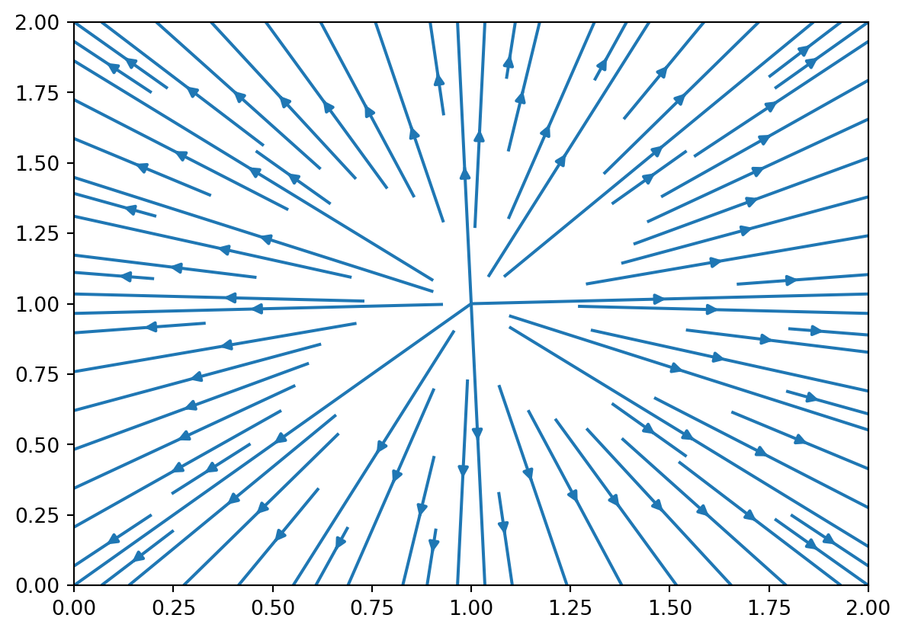
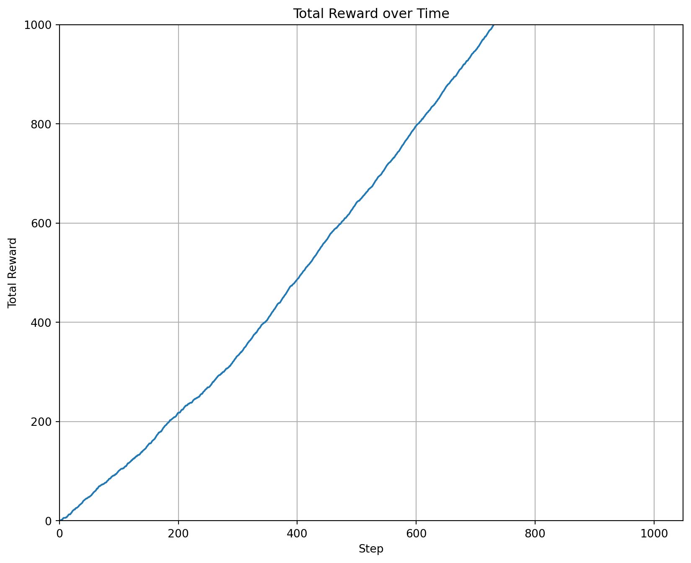

> **NOTE:**
>
> fix mesa related errors
>
> fix Roth-Erev learning
>
> move to reviews
>
> split models from review - but not yet!

In ([Skyrms 2010](#ref-Skyrms2010signals)) philosopher and mathematician Brian Skyrms discusses how one can extend the concept of a signaling games into a full-fledged signaling systems and to some extent a rudimentary language.

I found the book to be a fascinating book worth reading at least a couple of times. While Skyrms starts with a basic exposition motivated by Greek philosophers he eventually makes a deep dive into areas like reinforcement learning, replicator dynamics, mean field games and some other deep mathematical fields without much of introduction. In places the monographs seems incomplete and may require hunting the papers in the bibliography and possibly more recent work by the same authors.

I slowly noticed it being cited in more and more papers which I read. This sort of indicated that intellectually more people we on the same path of thinking how to equip their problem solving with a signaling system or better yet to evolve a more sophisticated language.

I went back several times to review the chapter on Complex signals, which I feel is the most interesting for real-world application. I began to think that the Lewis games are too rudimentary since signaling systems that evolve/learned from them are basically n-k maps of signals to meaning.

What I wanted was a recipe for quickly agent that need to evolve and teach/learn a language for efficient communication.

I wanted to go the relevant papers he covers on this area and then to see of there were newer results he did not cover. This turned out to be a bit of a challenge. In the mean time I also learned some courses on RL and even tried a couple of ideas from this book at work. I think I should summarize at least some of the more interesting results from the book.

Besides a summary I also want to try to implement some of the keystone models in the book to see if I can derive the reductionist simple language learning game.

## 1. Signals

### Big Research Questions

**Q1. How can interacting individuals spontaneously learn to signal?**

**Q2. How can species spontaneously evolve signaling systems?**

## Sender-Receiver

> There are two players, the sender and the receiver.  
> Nature chooses a state at random and the sender observes the state chosen.  
> The sender then sends a signal to the receiver, who cannot observe the state directly but does observe the signal.  
> The receiver then chooses an act, the outcome of which affects them both, with the payoff depending on the state.  
> Both have pure common interest—they get the same payoff—and there is exactly one “correct” act for each state.  
> In the correct act-state combination they both get positive payoff; otherwise payoff is zero.  
> The simplest case is one where there are the same number of states, acts, and signals.

A separating equilibrium is called a signaling system

> If we start with a pair of sender and receiver strategies, and switch the messages around the same way in both, we get the same payoffs. In particular, permutation of messages takes one signaling-system equilibrium into another.

We can understand a signaling system as a encoding look-up table by the sender and a decoding lookup table for the reciever which is the inverse of the first. The product of two permutations is the identity matrix. Each permutation of the identity matrix gives a valid signaling system

**Q3. Is there a most salient signaling system?**

Salience is a concept from Schelling’s Game theory that suggest that one solution to a coordination problem might be naturally better then others. (e.g. meeting a relative at the airport). This can be due to an externality to the pure coordination problem. Salience can also arise from non uniformity of the state distribution - by providing less frequent messages longer messages based on binary coding. The salience hierarchy might be grounded in risk - more urgent messages might be shorter and learned before the longer ones.

my thoughts on Salience:

- **Salience** would arise in nature through the non-uniform distribution of states which is ignored in most papers leading to equally salient signaling system. When the states are not uniformly distributed then the signals will not be uniformly distributed. The more common states should have more common signals. e.g. if snakes are more common than eagles then the signal for snake should be shorter/simpler/learned first than the signal for eagle. In another location the distributions could be reversed leading to a different salience hierarchy.
- Another way (of seeing this is that) salience would arise in nature to minimize risks for the sender, who could become a target for a predator by sending a signal.
- Two other source of salience are the risk of making mistakes and the cost of sending a signal.
- Finally there is nothing stopping the salience from being a function of all these factors through a product of their probabilities. Though this is more easily expressed in the language of fitness. Salience will select the language whose speakers gain the highest expected progeny (fitness) by avoiding risks, conserving energy and avoiding miscommunication for their habitat.
- If the speakers migrate they might benefit from a language that is salient in multiple habitats. This is a form of generalization.
- If there are different cost for encoding and decoding then the salience will be a function of the product of the encoding and decoding costs. This is a form of cost minimization. In this scenario there may be a competition between the sender and the receiver to minimize their costs. But the sender has the upper hand since the sender chooses the signal. The sender is the causal agent in the signaling system.

**Q4. How can two agents with different signaling find a SS that is midway between them (including systems with both shared and unique states)?**

- Its fairly clear that under the rules of the Lewis game all valid signaling systems are isomorphic and none are more salient.
- In nature salience might arise and a systems leading to greatest fitness in its users would be the most salient.
- To find a signaling system that is midway between two signaling systems we could use the Cayley distance between the two permutations. This is the minimum number of transpositions required to transform one permutation into another. The median permutation would be the one that has half the Cayley distance to each signaling systems.
- If the systems have salience we may want to also keep the most salient signals intact and now we have a more complex optimization problem. We could use the KL divergence between the two signaling systems to estimate the distance of the signaling distribution from a separating distribution.

the Cayley distance between two permutations is the minimum number of transpositions required to transform one permutation into another. it is a metric on the symmetric group.

**Information in signals**

**Q5. How can we minimally extend this framework to handle Errors and Deception**

> Signals carry information. The natural way to measure the information in a signal is to measure the extent that the use of that particular signal changes probabilities. Accordingly, there are two kinds of information in the signals in Lewis sender-receiver games: information about what state the sender has observed and information about what act the receiver will take. The first kind of infor- mation measures effectiveness of the sender’s use of signals to discriminate states; the second kind measures the effectiveness of the signal in changing the receiver’s probabilities of action.

TODO: estimate information content of each signal for sender and receiver for separating and partial pooling cases

TODO: use entropy for message level estimates of sender and receiver under separating signal, a synonym, a homonym.

TODO: use entropy KL divergence to estimate a the distance of the signaling distribution from a separating distribution.

Actually there are a number of extensions one would like to consider for the Lewis framework:

1.  bottlenecks
    1.  more state than signals - this is the interesting case and where complex signaling systems should arise
    2.  more signals than states - this is the case where synonyms can arise
2.  basic logical reasoning, conjunctions, disjunctions, negations
3.  multiple senders and or receivers
    1.  rewarding coordination (each state requires different actions from the agents - they are learning different receiver maps )
    2.  rewarding correlated equilibrium (sender lets the receivers pick from correlated states at random allowing the receivers avoid penalty of mis-coordination.)
    3.  networks of agents per the Goyal model in ch 11 and 13

complex signals

1.  conjunction of signals,
2.  ordered signals,
3.  recursive signals, group

### Evolution

We first see two competing Signaling systems being tested in a population

([Hofbauer and Sigmund 1998](#ref-hofbauer1998evolutionary)) Population dynamics - can be used to identify which dynamic equilibria are stable or unstable given an initial population of strategies

There is a figure showing the field dynamics with basins of attractions arising from the population dynamics equations

We also see symmetry breaking selecting a signaling system to a system

\frac{dp(A)}{dt}=p(A)\[U(A)-U\]

where

- U(A) is the average payoff to strategy A and
- U is the average payoff in the population.

``` python
from pylab import *

alpha, beta = 1, 1
xvalues, yvalues = meshgrid(arange(0, 2.1, 0.1), arange(0, 2.1, 0.1))
xdot = xvalues * alpha - beta
ydot = yvalues * alpha - beta
streamplot(xvalues, yvalues, xdot, ydot)
show()
```

[](index_files/figure-html/cell-2-output-1.png)

we have a discussion of how signals might arise.

## Evolution

``` python
import itertools
import functools
from mesa import Agent, Model
from mesa.time import StagedActivation, RandomActivation
from mesa.datacollection import DataCollector
import matplotlib.pyplot as plt

# agent_roles
r_nature = 'nature'
r_sender = 'sender'
r_receiver = 'receiver'
```

## Lewis Signaling Game Model

The Lewis signaling game is a model of communication between two agents, a sender and a receiver. Nature picks a state, the sender observes the state, chooses a signal, and sends the signal to the receiver who then takes an action based on the signal. If the action of the receiver is a match with the state observed by the sender, agents get a reward of 1, otherwise, they get a reward of 0. state, the sender and receiver get a reward of 1, otherwise, they get a reward of 0. is a match with the state, the sender and receiver get a reward of 1, otherwise, they get a reward of 0.

``` python
class HerrnsteinRL():
    '''
                                    The Urn model
     nature            sender                 reciever     reward
                       
    | (0) | --{0}-->  | (0_a)  | --{a}--> | (a_0) | --{0}-->   1   
    |     |           | (0_b)  | --{b}    | (a_1) | --{1}-->   0
    |     |           +--------+    | +-->+-------+
    |     |                         +-|-+  
    | (1) | --{1}-->  | (1_a)  | --{a}+ +>| (b_0) | --{1}-->   1
    |     |           | (1_b)  | --{b}--->| (b_1) | --{0}-->   0
    +-----+           +--------+          +-------+
    
    
    Herrnstein Urn algorithm
    ------------------------
    
    1. nature picks a state 
    2. sender gets the state, chooses a signal by picking a ball in choose_option() from the stat'es urn
    3. reciver gets the action, chooses an actuion by picking a ball in choose_option()
    4. the balls in the urns are incremented if action == state
    5. repeat
    
    '''
    def __init__(self, options, learning_rate=1.0,verbose=False,name='Herrnstein matching law', balls=None):
        
        # filter options in choose option by input
        self.verbose = verbose
        self.name=name
        self.learning_rate = learning_rate
        self.options = options
        if balls is not None:
          self.balls = balls
        else:
          self.balls = {option: 1.0 for option in self.options}
        if self.verbose:
          print(f'LearningRule.__init__(Options: {options})')
    
    def get_filtered_urn(self, filter):
      ''' filters urn's options by prefix and normalizes the weights
          usege:
          urn=urn.get_filtered_urn(1)
          choice = model.random.choice(list(urn.keys()), p=list(urn.values()))
      '''
      assert type(filter) == int, f"filter must be a int"
      filtered_options = [key for key in self.balls.keys() if key[0] == filter]
      if not filtered_options:
        raise ValueError(f"No options found with filter {filter}")
      if self.verbose:
        print(f"in get_filtered_urn({filter=}) --- filtered_options: {filtered_options=}")
      filtered_balls = {opt: self.balls[opt] for opt in filtered_options}
      if self.verbose:
        print(f"in get_filtered_urn({filter=}) --- filtered_balls: {filtered_balls=}")
      total = functools.reduce(lambda a,b: a+b, filtered_balls.values())
      #total = sum(filtered_balls.values())
      if self.verbose:
        print(f"in get_filtered_urn({filter=}) --- total: {total=}")
      assert total > 0.0, f"total weights is {total=} after {filter=} on {self.balls}"      
      normalized_balls = {option: weight / total for option, weight in filtered_balls.items()}
      if self.verbose:
        print(f"in get_filtered_urn({filter=}) --- returning : {normalized_balls=}")
      return normalized_balls
     
    def choose_option(self,filter,random):
        ''' chooses an option from the urn based on the filter and the random choice
            
            usage:
            urn.choose_option(filter=1,random=model.random)
        '''
       
        urn = self.get_filtered_urn(filter)
        if random:
          options = random.choices(list(urn.keys()), weights=list(urn.values()),k=1)
          option = options[0]
          
          if self.verbose:
            print(f'in HerrnsteinRL.choose_option({filter=}) --- chose {option=} from {urn=}')

          return option
        else:
          raise Exception(f"random must be a random number generator")
        
    def update_weights(self, option, reward):
        old_balls = self.balls[option]
        self.balls[option] += self.learning_rate * reward 
        if self.verbose:
          print(f"Updated weight for option {option}: {old_balls} -> {self.balls[option]}")
```

``` python
class LewisAgent(Agent):
  
    def __init__(self, unique_id, model, game, role, verbose=False):
        super().__init__(unique_id, model)
        self.role = role #( one of nature, sender, receiver)
        self.verbose = verbose
        self.game = game
        self.messages = []
        self.actions = []
        if role == "sender":
          self.urn = HerrnsteinRL(model.states_signals, learning_rate=1.0,verbose=verbose,name='state_signal_weights')
        elif role == "receiver":
          self.urn = HerrnsteinRL(model.signals_actions, learning_rate=1.0,verbose=verbose,name='signal_action_weights')
        else:
          self.urn = None
        
    def step(self):
      # reset agent state before step
      self.messages = []
      self.actions = []

    def gen_state(self)-> None:
        if self.role == r_nature:
          self.current_state = model.random.choice(self.model.states)
          if self.verbose:
                print(f"Nature {self.unique_id} set state {self.current_state}")
                
    @property
    def state(self):
        if self.role == r_nature:
          return self.current_state

    def choose_signal(self, filter):
        # sanity checks for filter
        assert type(filter) == int, f"filter must be a int"
        assert filter in model.states, f"filter must be a valid state"
        
        
        if self.role != r_sender:
          throw(f"Only sender can send signals")
        self.option = self.urn.choose_option(filter=filter,random=self.model.random)
        signal = self.option[1] # the prefix is the urn context we want the suffix
        assert type(signal) == int, f"signal {signal=} must be a int"
        self.signal = signal
        if self.verbose:
              print(f"Sender {self.unique_id} got filter {filter} choose option: {self.option} and signaled: {self.signal}")
        return self.signal
          

    def send_signal(self, filter, receiver):
        ''' 
            # Message sending logic:
            1. sender chooses a signal based on the state
            2. sender sends the signal to the receiver
        '''
        if self.role != r_sender:
          raise Exception(f"Only sender can send signals")
         
        assert type(filter) == int, f"filter must be a int"
        assert filter in model.states, f"filter must be a valid state"
        signal = self.choose_signal(filter=filter)
        assert signal is not None, f"signal must be a valid signal"
        if self.verbose:
          print(f"Sender {self.unique_id} chose signal: {signal}")
        receiver.messages.append(signal)
        if self.verbose:
          print(f"Sender {self.unique_id} sends signal: {signal} to receiver {receiver.unique_id}")

    def fuse_actions(self,actions):
        ''' 
            # Message fusion logic:
            1. single message:  if there is only one signal then the action is the action associated with the signal
            2. ordered messages: if there are multiple signals then the action is the number from the string associated with the concatenated signal
               if there are two signals possible per message we concat and covert binary string to number
            3. is the messages are sets we could perform a intersection and take the action associated with the intersection 
               currently this is not implemented
            4. support for recursive signals is currently under research .
        ''' 
        if self.role != r_receiver:
          raise Exception(f"Only receiver can set actions")
        
        if len(actions) == 1: # single action no need to fuse
          return actions[0]
        else:
          # fuse the actions into a binary number
          action = 0
          # if there are multiple signals
          for i in range(len(actions)):
            action += actions[i]*(2**i)
          if self.verbose:
              print(f"Receiver {self.unique_id} fused actions : {self.actions} into action: {action}")
          return action

    def decode_message(self,signal):
        ''' first we need to get the filtered urn for the signal
            and then choose the option based on the urn'''
        if self.role != r_receiver:
          raise Exception(f"Only receiver can decode messages")
        option = self.urn.choose_option(filter=signal,random=self.model.random)
        action = option[1]
        if self.verbose:
              print(f"in decode_message({signal=}) Receiver {self.unique_id} got option: {option} and decoded action: {action}")
        return action

    def set_action(self):
        ''' first we need to use the urn to decode the signals 
            then need to fuse them to get the action '''
        if self.role != r_receiver:
          raise Exception(f"Only receiver can set the action")
        self.actions = []
        for signal in self.messages:
          self.actions.append(self.decode_message(signal))          
        self.action = self.fuse_actions(self.actions)
        # which option to reinforce 
        self.option = (self.messages[0],self.action)
        if self.verbose:
              print(f"Receiver {self.unique_id} received signals: {self.messages} and action: {self.action}")
              
    def set_reward(self,reward):
        if self.role not in [r_receiver,r_sender]:
          raise Exception(f"Only sender and receiver can set rewards")
        self.reward = reward
        if self.verbose:
            print(f"Receiver {self.unique_id} received reward: {self.reward}")
                
    def calc_reward(self,correct_action):
        if self.role != r_receiver:
          raise Exception(f"Only receiver can calculate rewards")
        self.reward = 1 if self.action == correct_action else 0        

class SignalingGame(Model):
  
    # TODO: add support for 
    # 1. bottle necks
    # 2. rename k to state_count
    # 3. state_per_sender = state_count/sender_count 
    # 2. partitioning states by signals => state/sender_count

    def __init__(self, game_count=2, senders_count=1, recievers_count=1, state_count=3,signal_count=3,verbose=True):
        super().__init__()
        self.verbose = verbose
        self.step_counter = 0
        self.schedule = RandomActivation(self)
        
        
        # Define the states, signals, and actions
        self.states   = [i for i in range(state_count)]
        print(f'{self.states=}')
        self.signals  = [i for i in range(signal_count)]
        print(f'{self.signals=}')
        self.actions  = [i for i in range(state_count)]
        print(f'{self.actions=}')
        
        # e.g., 1 -> 1, 2 -> 2, ...
        self.states_signals =  [(state,signal) for state in self.states for signal in self.signals]
        print(f'{self.states_signals=}')
        self.signals_actions = [(signal,action) for signal in self.signals for action in self.actions] 
        print(f'{self.signals_actions=}')
        
        # Agents

        self.uid=0
        self.senders_count=senders_count
        self.recievers_count=recievers_count

        # Games each game has a nature, senders and receivers
        self.games = []
        # Create games        
        for i in range(game_count):
            game = {
              r_nature: None,
              r_sender: [],
              r_receiver: []
            }
            
            # create nature agent
            game[r_nature] = LewisAgent(self.uid, self, game=i,role = r_nature,verbose=self.verbose)
            self.schedule.add(game[r_nature])
            self.uid += 1
            
            # create sender agents
            for j in range(senders_count):
                sender = LewisAgent(self.uid, self, game=i,role = r_sender,verbose=self.verbose)
                game[r_sender].append(sender)
                self.schedule.add(sender)
                self.uid +=1
                
            # create receiver agents
            for k in range (recievers_count):
                reciever = LewisAgent(self.uid, self, game=i,role = r_receiver,verbose=self.verbose)
                game[r_receiver].append(reciever)
                self.schedule.add(reciever)
                self.uid +=1
                
            self.games.append(game)

            self.total_reward = 0
        

        # Define what data to collect
        self.datacollector = DataCollector(
            model_reporters={"TotalReward": lambda m: m.total_reward},  # A function to call 
            agent_reporters={"Reward": "reward"}  # An agent attribute
        )

    def compute_total_reward(self,model):
        return 
        
    def step(self):
      
        for agent in model.schedule.agents:
            # reset agent state before step
            agent.step()
            
        for game_counter, game in enumerate(self.games):
            if self.verbose:
                print(f"--- Step {model.step_counter} Game {game_counter} ---")
            nature = game[r_nature]
            nature.gen_state()
            state = nature.current_state
            assert type(state) == int, f"state must be a int"
            assert state in model.states, f"state must be a valid state"
            if self.verbose:
                print(f"in model.step() --- game {game_counter} --- Nature {agent.unique_id} set state {state} in game {game_counter}")
            for sender in game[r_sender]:
                for receiver in game[r_receiver]:                    
                    sender.send_signal(filter = state, receiver=receiver)
            for receiver in game[r_receiver]:
                assert receiver.role == r_receiver, f"receiver role must be receiver not {receiver.role}"
                receiver.set_action()
                if self.verbose:
                    print(f"in model.step() --- game {game_counter} --- Receiver {receiver.unique_id} action: {receiver.action}")
                receiver.calc_reward(correct_action=state)
                reward = receiver.reward
                assert type(reward) == int, f"reward must be a int"
                assert reward in [0,1], f"reward must be 0 or 1 not {reward}"
                print(f"in model.step() --- game {game_counter} --- Receiver {receiver.unique_id} received reward: {receiver.reward}")
            
            for agent in itertools.chain(game[r_sender],game[r_receiver]):
                agent.set_reward(reward)
                if self.verbose:
                    print(f"in model.step() --- game {game_counter} --- Sender {agent.unique_id} received reward: {reward}")
                agent.urn.update_weights(agent.option, reward)

            #print(f'in model.step() --- game {game_counter}, {self.expected_rewards(game)=}')
                    # Collect data
        
        self.total_reward += sum(agent.reward for agent in self.schedule.agents if agent.role == r_receiver)

        self.datacollector.collect(self)


    def expected_rewards(self,game):
      return 0.25

    def run_model(self, steps):

        """Run the model until the end condition is reached. Overload as
        needed.
        """
        while self.running:
            self.step()
            steps -= 1
            if steps == 0:
                self.running = False
```

``` python
# Running the model
state_count= 3  # Number of states, signals, and actions
signal_count= 3
steps = 1000

model = SignalingGame(senders_count=1,recievers_count=1,state_count=state_count,signal_count=signal_count,verbose=True,game_count=2)
model.run_model(steps)  # Run the model for the desired number of steps

# Get the reward data
reward_data = model.datacollector.get_model_vars_dataframe()

# Plot the data
plt.figure(figsize=(10, 8))
plt.plot(reward_data['TotalReward'])
plt.xlabel('Step')
plt.ylabel('Total Reward')
plt.title('Total Reward over Time')
plt.grid(True)  # Add gridlines
plt.xlim(left=0)  # Start x-axis from 0
plt.ylim(bottom=0,top=1000)  # Start y-axis from 0
plt.show()     
```

    self.states=[0, 1, 2]
    self.signals=[0, 1, 2]
    self.actions=[0, 1, 2]
    self.states_signals=[(0, 0), (0, 1), (0, 2), (1, 0), (1, 1), (1, 2), (2, 0), (2, 1), (2, 2)]
    self.signals_actions=[(0, 0), (0, 1), (0, 2), (1, 0), (1, 1), (1, 2), (2, 0), (2, 1), (2, 2)]
    LearningRule.__init__(Options: [(0, 0), (0, 1), (0, 2), (1, 0), (1, 1), (1, 2), (2, 0), (2, 1), (2, 2)])
    LearningRule.__init__(Options: [(0, 0), (0, 1), (0, 2), (1, 0), (1, 1), (1, 2), (2, 0), (2, 1), (2, 2)])
    LearningRule.__init__(Options: [(0, 0), (0, 1), (0, 2), (1, 0), (1, 1), (1, 2), (2, 0), (2, 1), (2, 2)])
    LearningRule.__init__(Options: [(0, 0), (0, 1), (0, 2), (1, 0), (1, 1), (1, 2), (2, 0), (2, 1), (2, 2)])
    --- Step 0 Game 0 ---
    Nature 0 set state 0
    in model.step() --- game 0 --- Nature 5 set state 0 in game 0
    in get_filtered_urn(filter=0) --- filtered_options: filtered_options=[(0, 0), (0, 1), (0, 2)]
    in get_filtered_urn(filter=0) --- filtered_balls: filtered_balls={(0, 0): 1.0, (0, 1): 1.0, (0, 2): 1.0}
    in get_filtered_urn(filter=0) --- total: total=3.0
    in get_filtered_urn(filter=0) --- returning : normalized_balls={(0, 0): 0.3333333333333333, (0, 1): 0.3333333333333333, (0, 2): 0.3333333333333333}
    in HerrnsteinRL.choose_option(filter=0) --- chose option=(0, 0) from urn={(0, 0): 0.3333333333333333, (0, 1): 0.3333333333333333, (0, 2): 0.3333333333333333}
    Sender 1 got filter 0 choose option: (0, 0) and signaled: 0
    Sender 1 chose signal: 0
    Sender 1 sends signal: 0 to receiver 2
    in get_filtered_urn(filter=0) --- filtered_options: filtered_options=[(0, 0), (0, 1), (0, 2)]
    in get_filtered_urn(filter=0) --- filtered_balls: filtered_balls={(0, 0): 1.0, (0, 1): 1.0, (0, 2): 1.0}
    in get_filtered_urn(filter=0) --- total: total=3.0
    in get_filtered_urn(filter=0) --- returning : normalized_balls={(0, 0): 0.3333333333333333, (0, 1): 0.3333333333333333, (0, 2): 0.3333333333333333}
    in HerrnsteinRL.choose_option(filter=0) --- chose option=(0, 2) from urn={(0, 0): 0.3333333333333333, (0, 1): 0.3333333333333333, (0, 2): 0.3333333333333333}
    in decode_message(signal=0) Receiver 2 got option: (0, 2) and decoded action: 2
    Receiver 2 received signals: [0] and action: 2
    in model.step() --- game 0 --- Receiver 2 action: 2
    in model.step() --- game 0 --- Receiver 2 received reward: 0
    Receiver 1 received reward: 0
    in model.step() --- game 0 --- Sender 1 received reward: 0
    Updated weight for option (0, 0): 1.0 -> 1.0
    Receiver 2 received reward: 0
    in model.step() --- game 0 --- Sender 2 received reward: 0
    Updated weight for option (0, 2): 1.0 -> 1.0
    --- Step 0 Game 1 ---
    Nature 3 set state 2
    in model.step() --- game 1 --- Nature 2 set state 2 in game 1
    in get_filtered_urn(filter=2) --- filtered_options: filtered_options=[(2, 0), (2, 1), (2, 2)]
    in get_filtered_urn(filter=2) --- filtered_balls: filtered_balls={(2, 0): 1.0, (2, 1): 1.0, (2, 2): 1.0}
    in get_filtered_urn(filter=2) --- total: total=3.0
    in get_filtered_urn(filter=2) --- returning : normalized_balls={(2, 0): 0.3333333333333333, (2, 1): 0.3333333333333333, (2, 2): 0.3333333333333333}
    in HerrnsteinRL.choose_option(filter=2) --- chose option=(2, 0) from urn={(2, 0): 0.3333333333333333, (2, 1): 0.3333333333333333, (2, 2): 0.3333333333333333}
    Sender 4 got filter 2 choose option: (2, 0) and signaled: 0
    Sender 4 chose signal: 0
    Sender 4 sends signal: 0 to receiver 5
    in get_filtered_urn(filter=0) --- filtered_options: filtered_options=[(0, 0), (0, 1), (0, 2)]
    in get_filtered_urn(filter=0) --- filtered_balls: filtered_balls={(0, 0): 1.0, (0, 1): 1.0, (0, 2): 1.0}
    in get_filtered_urn(filter=0) --- total: total=3.0
    in get_filtered_urn(filter=0) --- returning : normalized_balls={(0, 0): 0.3333333333333333, (0, 1): 0.3333333333333333, (0, 2): 0.3333333333333333}
    in HerrnsteinRL.choose_option(filter=0) --- chose option=(0, 0) from urn={(0, 0): 0.3333333333333333, (0, 1): 0.3333333333333333, (0, 2): 0.3333333333333333}
    in decode_message(signal=0) Receiver 5 got option: (0, 0) and decoded action: 0
    Receiver 5 received signals: [0] and action: 0
    in model.step() --- game 1 --- Receiver 5 action: 0
    in model.step() --- game 1 --- Receiver 5 received reward: 0
    Receiver 4 received reward: 0
    in model.step() --- game 1 --- Sender 4 received reward: 0
    Updated weight for option (2, 0): 1.0 -> 1.0
    Receiver 5 received reward: 0
    in model.step() --- game 1 --- Sender 5 received reward: 0
    Updated weight for option (0, 0): 1.0 -> 1.0
    --- Step 0 Game 0 ---
    Nature 0 set state 2
    in model.step() --- game 0 --- Nature 5 set state 2 in game 0
    in get_filtered_urn(filter=2) --- filtered_options: filtered_options=[(2, 0), (2, 1), (2, 2)]
    in get_filtered_urn(filter=2) --- filtered_balls: filtered_balls={(2, 0): 1.0, (2, 1): 1.0, (2, 2): 1.0}
    in get_filtered_urn(filter=2) --- total: total=3.0
    in get_filtered_urn(filter=2) --- returning : normalized_balls={(2, 0): 0.3333333333333333, (2, 1): 0.3333333333333333, (2, 2): 0.3333333333333333}
    in HerrnsteinRL.choose_option(filter=2) --- chose option=(2, 0) from urn={(2, 0): 0.3333333333333333, (2, 1): 0.3333333333333333, (2, 2): 0.3333333333333333}
    Sender 1 got filter 2 choose option: (2, 0) and signaled: 0
    Sender 1 chose signal: 0
    Sender 1 sends signal: 0 to receiver 2
    in get_filtered_urn(filter=0) --- filtered_options: filtered_options=[(0, 0), (0, 1), (0, 2)]
    in get_filtered_urn(filter=0) --- filtered_balls: filtered_balls={(0, 0): 1.0, (0, 1): 1.0, (0, 2): 1.0}
    in get_filtered_urn(filter=0) --- total: total=3.0
    in get_filtered_urn(filter=0) --- returning : normalized_balls={(0, 0): 0.3333333333333333, (0, 1): 0.3333333333333333, (0, 2): 0.3333333333333333}
    in HerrnsteinRL.choose_option(filter=0) --- chose option=(0, 2) from urn={(0, 0): 0.3333333333333333, (0, 1): 0.3333333333333333, (0, 2): 0.3333333333333333}
    in decode_message(signal=0) Receiver 2 got option: (0, 2) and decoded action: 2
    Receiver 2 received signals: [0] and action: 2
    in model.step() --- game 0 --- Receiver 2 action: 2
    in model.step() --- game 0 --- Receiver 2 received reward: 1
    Receiver 1 received reward: 1
    in model.step() --- game 0 --- Sender 1 received reward: 1
    Updated weight for option (2, 0): 1.0 -> 2.0
    Receiver 2 received reward: 1
    in model.step() --- game 0 --- Sender 2 received reward: 1
    Updated weight for option (0, 2): 1.0 -> 2.0
    --- Step 0 Game 1 ---
    Nature 3 set state 2
    in model.step() --- game 1 --- Nature 2 set state 2 in game 1
    in get_filtered_urn(filter=2) --- filtered_options: filtered_options=[(2, 0), (2, 1), (2, 2)]
    in get_filtered_urn(filter=2) --- filtered_balls: filtered_balls={(2, 0): 1.0, (2, 1): 1.0, (2, 2): 1.0}
    in get_filtered_urn(filter=2) --- total: total=3.0
    in get_filtered_urn(filter=2) --- returning : normalized_balls={(2, 0): 0.3333333333333333, (2, 1): 0.3333333333333333, (2, 2): 0.3333333333333333}
    in HerrnsteinRL.choose_option(filter=2) --- chose option=(2, 1) from urn={(2, 0): 0.3333333333333333, (2, 1): 0.3333333333333333, (2, 2): 0.3333333333333333}
    Sender 4 got filter 2 choose option: (2, 1) and signaled: 1
    Sender 4 chose signal: 1
    Sender 4 sends signal: 1 to receiver 5
    in get_filtered_urn(filter=1) --- filtered_options: filtered_options=[(1, 0), (1, 1), (1, 2)]
    in get_filtered_urn(filter=1) --- filtered_balls: filtered_balls={(1, 0): 1.0, (1, 1): 1.0, (1, 2): 1.0}
    in get_filtered_urn(filter=1) --- total: total=3.0
    in get_filtered_urn(filter=1) --- returning : normalized_balls={(1, 0): 0.3333333333333333, (1, 1): 0.3333333333333333, (1, 2): 0.3333333333333333}
    in HerrnsteinRL.choose_option(filter=1) --- chose option=(1, 2) from urn={(1, 0): 0.3333333333333333, (1, 1): 0.3333333333333333, (1, 2): 0.3333333333333333}
    in decode_message(signal=1) Receiver 5 got option: (1, 2) and decoded action: 2
    Receiver 5 received signals: [1] and action: 2
    in model.step() --- game 1 --- Receiver 5 action: 2
    in model.step() --- game 1 --- Receiver 5 received reward: 1
    Receiver 4 received reward: 1
    in model.step() --- game 1 --- Sender 4 received reward: 1
    Updated weight for option (2, 1): 1.0 -> 2.0
    Receiver 5 received reward: 1
    in model.step() --- game 1 --- Sender 5 received reward: 1
    Updated weight for option (1, 2): 1.0 -> 2.0
    --- Step 0 Game 0 ---
    Nature 0 set state 1
    in model.step() --- game 0 --- Nature 5 set state 1 in game 0
    in get_filtered_urn(filter=1) --- filtered_options: filtered_options=[(1, 0), (1, 1), (1, 2)]
    in get_filtered_urn(filter=1) --- filtered_balls: filtered_balls={(1, 0): 1.0, (1, 1): 1.0, (1, 2): 1.0}
    in get_filtered_urn(filter=1) --- total: total=3.0
    in get_filtered_urn(filter=1) --- returning : normalized_balls={(1, 0): 0.3333333333333333, (1, 1): 0.3333333333333333, (1, 2): 0.3333333333333333}
    in HerrnsteinRL.choose_option(filter=1) --- chose option=(1, 0) from urn={(1, 0): 0.3333333333333333, (1, 1): 0.3333333333333333, (1, 2): 0.3333333333333333}
    Sender 1 got filter 1 choose option: (1, 0) and signaled: 0
    Sender 1 chose signal: 0
    Sender 1 sends signal: 0 to receiver 2
    in get_filtered_urn(filter=0) --- filtered_options: filtered_options=[(0, 0), (0, 1), (0, 2)]
    in get_filtered_urn(filter=0) --- filtered_balls: filtered_balls={(0, 0): 1.0, (0, 1): 1.0, (0, 2): 2.0}
    in get_filtered_urn(filter=0) --- total: total=4.0
    in get_filtered_urn(filter=0) --- returning : normalized_balls={(0, 0): 0.25, (0, 1): 0.25, (0, 2): 0.5}
    in HerrnsteinRL.choose_option(filter=0) --- chose option=(0, 2) from urn={(0, 0): 0.25, (0, 1): 0.25, (0, 2): 0.5}
    in decode_message(signal=0) Receiver 2 got option: (0, 2) and decoded action: 2
    Receiver 2 received signals: [0] and action: 2
    in model.step() --- game 0 --- Receiver 2 action: 2
    in model.step() --- game 0 --- Receiver 2 received reward: 0
    Receiver 1 received reward: 0
    in model.step() --- game 0 --- Sender 1 received reward: 0
    Updated weight for option (1, 0): 1.0 -> 1.0
    Receiver 2 received reward: 0
    in model.step() --- game 0 --- Sender 2 received reward: 0
    Updated weight for option (0, 2): 2.0 -> 2.0
    --- Step 0 Game 1 ---
    Nature 3 set state 0
    in model.step() --- game 1 --- Nature 2 set state 0 in game 1
    in get_filtered_urn(filter=0) --- filtered_options: filtered_options=[(0, 0), (0, 1), (0, 2)]
    in get_filtered_urn(filter=0) --- filtered_balls: filtered_balls={(0, 0): 1.0, (0, 1): 1.0, (0, 2): 1.0}
    in get_filtered_urn(filter=0) --- total: total=3.0
    in get_filtered_urn(filter=0) --- returning : normalized_balls={(0, 0): 0.3333333333333333, (0, 1): 0.3333333333333333, (0, 2): 0.3333333333333333}
    in HerrnsteinRL.choose_option(filter=0) --- chose option=(0, 2) from urn={(0, 0): 0.3333333333333333, (0, 1): 0.3333333333333333, (0, 2): 0.3333333333333333}
    Sender 4 got filter 0 choose option: (0, 2) and signaled: 2
    Sender 4 chose signal: 2
    Sender 4 sends signal: 2 to receiver 5
    in get_filtered_urn(filter=2) --- filtered_options: filtered_options=[(2, 0), (2, 1), (2, 2)]
    in get_filtered_urn(filter=2) --- filtered_balls: filtered_balls={(2, 0): 1.0, (2, 1): 1.0, (2, 2): 1.0}
    in get_filtered_urn(filter=2) --- total: total=3.0
    in get_filtered_urn(filter=2) --- returning : normalized_balls={(2, 0): 0.3333333333333333, (2, 1): 0.3333333333333333, (2, 2): 0.3333333333333333}
    in HerrnsteinRL.choose_option(filter=2) --- chose option=(2, 0) from urn={(2, 0): 0.3333333333333333, (2, 1): 0.3333333333333333, (2, 2): 0.3333333333333333}
    in decode_message(signal=2) Receiver 5 got option: (2, 0) and decoded action: 0
    Receiver 5 received signals: [2] and action: 0
    in model.step() --- game 1 --- Receiver 5 action: 0
    in model.step() --- game 1 --- Receiver 5 received reward: 1
    Receiver 4 received reward: 1
    in model.step() --- game 1 --- Sender 4 received reward: 1
    Updated weight for option (0, 2): 1.0 -> 2.0
    Receiver 5 received reward: 1
    in model.step() --- game 1 --- Sender 5 received reward: 1
    Updated weight for option (2, 0): 1.0 -> 2.0
    --- Step 0 Game 0 ---
    Nature 0 set state 1
    in model.step() --- game 0 --- Nature 5 set state 1 in game 0
    in get_filtered_urn(filter=1) --- filtered_options: filtered_options=[(1, 0), (1, 1), (1, 2)]
    in get_filtered_urn(filter=1) --- filtered_balls: filtered_balls={(1, 0): 1.0, (1, 1): 1.0, (1, 2): 1.0}
    in get_filtered_urn(filter=1) --- total: total=3.0
    in get_filtered_urn(filter=1) --- returning : normalized_balls={(1, 0): 0.3333333333333333, (1, 1): 0.3333333333333333, (1, 2): 0.3333333333333333}
    in HerrnsteinRL.choose_option(filter=1) --- chose option=(1, 0) from urn={(1, 0): 0.3333333333333333, (1, 1): 0.3333333333333333, (1, 2): 0.3333333333333333}
    Sender 1 got filter 1 choose option: (1, 0) and signaled: 0
    Sender 1 chose signal: 0
    Sender 1 sends signal: 0 to receiver 2
    in get_filtered_urn(filter=0) --- filtered_options: filtered_options=[(0, 0), (0, 1), (0, 2)]
    in get_filtered_urn(filter=0) --- filtered_balls: filtered_balls={(0, 0): 1.0, (0, 1): 1.0, (0, 2): 2.0}
    in get_filtered_urn(filter=0) --- total: total=4.0
    in get_filtered_urn(filter=0) --- returning : normalized_balls={(0, 0): 0.25, (0, 1): 0.25, (0, 2): 0.5}
    in HerrnsteinRL.choose_option(filter=0) --- chose option=(0, 1) from urn={(0, 0): 0.25, (0, 1): 0.25, (0, 2): 0.5}
    in decode_message(signal=0) Receiver 2 got option: (0, 1) and decoded action: 1
    Receiver 2 received signals: [0] and action: 1
    in model.step() --- game 0 --- Receiver 2 action: 1
    in model.step() --- game 0 --- Receiver 2 received reward: 1
    Receiver 1 received reward: 1
    in model.step() --- game 0 --- Sender 1 received reward: 1
    Updated weight for option (1, 0): 1.0 -> 2.0
    Receiver 2 received reward: 1
    in model.step() --- game 0 --- Sender 2 received reward: 1
    Updated weight for option (0, 1): 1.0 -> 2.0
    --- Step 0 Game 1 ---
    Nature 3 set state 2
    in model.step() --- game 1 --- Nature 2 set state 2 in game 1
    in get_filtered_urn(filter=2) --- filtered_options: filtered_options=[(2, 0), (2, 1), (2, 2)]
    in get_filtered_urn(filter=2) --- filtered_balls: filtered_balls={(2, 0): 1.0, (2, 1): 2.0, (2, 2): 1.0}
    in get_filtered_urn(filter=2) --- total: total=4.0
    in get_filtered_urn(filter=2) --- returning : normalized_balls={(2, 0): 0.25, (2, 1): 0.5, (2, 2): 0.25}
    in HerrnsteinRL.choose_option(filter=2) --- chose option=(2, 2) from urn={(2, 0): 0.25, (2, 1): 0.5, (2, 2): 0.25}
    Sender 4 got filter 2 choose option: (2, 2) and signaled: 2
    Sender 4 chose signal: 2
    Sender 4 sends signal: 2 to receiver 5
    in get_filtered_urn(filter=2) --- filtered_options: filtered_options=[(2, 0), (2, 1), (2, 2)]
    in get_filtered_urn(filter=2) --- filtered_balls: filtered_balls={(2, 0): 2.0, (2, 1): 1.0, (2, 2): 1.0}
    in get_filtered_urn(filter=2) --- total: total=4.0
    in get_filtered_urn(filter=2) --- returning : normalized_balls={(2, 0): 0.5, (2, 1): 0.25, (2, 2): 0.25}
    in HerrnsteinRL.choose_option(filter=2) --- chose option=(2, 0) from urn={(2, 0): 0.5, (2, 1): 0.25, (2, 2): 0.25}
    in decode_message(signal=2) Receiver 5 got option: (2, 0) and decoded action: 0
    Receiver 5 received signals: [2] and action: 0
    in model.step() --- game 1 --- Receiver 5 action: 0
    in model.step() --- game 1 --- Receiver 5 received reward: 0
    Receiver 4 received reward: 0
    in model.step() --- game 1 --- Sender 4 received reward: 0
    Updated weight for option (2, 2): 1.0 -> 1.0
    Receiver 5 received reward: 0
    in model.step() --- game 1 --- Sender 5 received reward: 0
    Updated weight for option (2, 0): 2.0 -> 2.0
    --- Step 0 Game 0 ---
    Nature 0 set state 0
    in model.step() --- game 0 --- Nature 5 set state 0 in game 0
    in get_filtered_urn(filter=0) --- filtered_options: filtered_options=[(0, 0), (0, 1), (0, 2)]
    in get_filtered_urn(filter=0) --- filtered_balls: filtered_balls={(0, 0): 1.0, (0, 1): 1.0, (0, 2): 1.0}
    in get_filtered_urn(filter=0) --- total: total=3.0
    in get_filtered_urn(filter=0) --- returning : normalized_balls={(0, 0): 0.3333333333333333, (0, 1): 0.3333333333333333, (0, 2): 0.3333333333333333}
    in HerrnsteinRL.choose_option(filter=0) --- chose option=(0, 2) from urn={(0, 0): 0.3333333333333333, (0, 1): 0.3333333333333333, (0, 2): 0.3333333333333333}
    Sender 1 got filter 0 choose option: (0, 2) and signaled: 2
    Sender 1 chose signal: 2
    Sender 1 sends signal: 2 to receiver 2
    in get_filtered_urn(filter=2) --- filtered_options: filtered_options=[(2, 0), (2, 1), (2, 2)]
    in get_filtered_urn(filter=2) --- filtered_balls: filtered_balls={(2, 0): 1.0, (2, 1): 1.0, (2, 2): 1.0}
    in get_filtered_urn(filter=2) --- total: total=3.0
    in get_filtered_urn(filter=2) --- returning : normalized_balls={(2, 0): 0.3333333333333333, (2, 1): 0.3333333333333333, (2, 2): 0.3333333333333333}
    in HerrnsteinRL.choose_option(filter=2) --- chose option=(2, 1) from urn={(2, 0): 0.3333333333333333, (2, 1): 0.3333333333333333, (2, 2): 0.3333333333333333}
    in decode_message(signal=2) Receiver 2 got option: (2, 1) and decoded action: 1
    Receiver 2 received signals: [2] and action: 1
    in model.step() --- game 0 --- Receiver 2 action: 1
    in model.step() --- game 0 --- Receiver 2 received reward: 0
    Receiver 1 received reward: 0
    in model.step() --- game 0 --- Sender 1 received reward: 0
    Updated weight for option (0, 2): 1.0 -> 1.0
    Receiver 2 received reward: 0
    in model.step() --- game 0 --- Sender 2 received reward: 0
    Updated weight for option (2, 1): 1.0 -> 1.0
    --- Step 0 Game 1 ---
    Nature 3 set state 1
    in model.step() --- game 1 --- Nature 2 set state 1 in game 1
    in get_filtered_urn(filter=1) --- filtered_options: filtered_options=[(1, 0), (1, 1), (1, 2)]
    in get_filtered_urn(filter=1) --- filtered_balls: filtered_balls={(1, 0): 1.0, (1, 1): 1.0, (1, 2): 1.0}
    in get_filtered_urn(filter=1) --- total: total=3.0
    in get_filtered_urn(filter=1) --- returning : normalized_balls={(1, 0): 0.3333333333333333, (1, 1): 0.3333333333333333, (1, 2): 0.3333333333333333}
    in HerrnsteinRL.choose_option(filter=1) --- chose option=(1, 1) from urn={(1, 0): 0.3333333333333333, (1, 1): 0.3333333333333333, (1, 2): 0.3333333333333333}
    Sender 4 got filter 1 choose option: (1, 1) and signaled: 1
    Sender 4 chose signal: 1
    Sender 4 sends signal: 1 to receiver 5
    in get_filtered_urn(filter=1) --- filtered_options: filtered_options=[(1, 0), (1, 1), (1, 2)]
    in get_filtered_urn(filter=1) --- filtered_balls: filtered_balls={(1, 0): 1.0, (1, 1): 1.0, (1, 2): 2.0}
    in get_filtered_urn(filter=1) --- total: total=4.0
    in get_filtered_urn(filter=1) --- returning : normalized_balls={(1, 0): 0.25, (1, 1): 0.25, (1, 2): 0.5}
    in HerrnsteinRL.choose_option(filter=1) --- chose option=(1, 2) from urn={(1, 0): 0.25, (1, 1): 0.25, (1, 2): 0.5}
    in decode_message(signal=1) Receiver 5 got option: (1, 2) and decoded action: 2
    Receiver 5 received signals: [1] and action: 2
    in model.step() --- game 1 --- Receiver 5 action: 2
    in model.step() --- game 1 --- Receiver 5 received reward: 0
    Receiver 4 received reward: 0
    in model.step() --- game 1 --- Sender 4 received reward: 0
    Updated weight for option (1, 1): 1.0 -> 1.0
    Receiver 5 received reward: 0
    in model.step() --- game 1 --- Sender 5 received reward: 0
    Updated weight for option (1, 2): 2.0 -> 2.0
    --- Step 0 Game 0 ---
    Nature 0 set state 2
    in model.step() --- game 0 --- Nature 5 set state 2 in game 0
    in get_filtered_urn(filter=2) --- filtered_options: filtered_options=[(2, 0), (2, 1), (2, 2)]
    in get_filtered_urn(filter=2) --- filtered_balls: filtered_balls={(2, 0): 2.0, (2, 1): 1.0, (2, 2): 1.0}
    in get_filtered_urn(filter=2) --- total: total=4.0
    in get_filtered_urn(filter=2) --- returning : normalized_balls={(2, 0): 0.5, (2, 1): 0.25, (2, 2): 0.25}
    in HerrnsteinRL.choose_option(filter=2) --- chose option=(2, 1) from urn={(2, 0): 0.5, (2, 1): 0.25, (2, 2): 0.25}
    Sender 1 got filter 2 choose option: (2, 1) and signaled: 1
    Sender 1 chose signal: 1
    Sender 1 sends signal: 1 to receiver 2
    in get_filtered_urn(filter=1) --- filtered_options: filtered_options=[(1, 0), (1, 1), (1, 2)]
    in get_filtered_urn(filter=1) --- filtered_balls: filtered_balls={(1, 0): 1.0, (1, 1): 1.0, (1, 2): 1.0}
    in get_filtered_urn(filter=1) --- total: total=3.0
    in get_filtered_urn(filter=1) --- returning : normalized_balls={(1, 0): 0.3333333333333333, (1, 1): 0.3333333333333333, (1, 2): 0.3333333333333333}
    in HerrnsteinRL.choose_option(filter=1) --- chose option=(1, 2) from urn={(1, 0): 0.3333333333333333, (1, 1): 0.3333333333333333, (1, 2): 0.3333333333333333}
    in decode_message(signal=1) Receiver 2 got option: (1, 2) and decoded action: 2
    Receiver 2 received signals: [1] and action: 2
    in model.step() --- game 0 --- Receiver 2 action: 2
    in model.step() --- game 0 --- Receiver 2 received reward: 1
    Receiver 1 received reward: 1
    in model.step() --- game 0 --- Sender 1 received reward: 1
    Updated weight for option (2, 1): 1.0 -> 2.0
    Receiver 2 received reward: 1
    in model.step() --- game 0 --- Sender 2 received reward: 1
    Updated weight for option (1, 2): 1.0 -> 2.0
    --- Step 0 Game 1 ---
    Nature 3 set state 2
    in model.step() --- game 1 --- Nature 2 set state 2 in game 1
    in get_filtered_urn(filter=2) --- filtered_options: filtered_options=[(2, 0), (2, 1), (2, 2)]
    in get_filtered_urn(filter=2) --- filtered_balls: filtered_balls={(2, 0): 1.0, (2, 1): 2.0, (2, 2): 1.0}
    in get_filtered_urn(filter=2) --- total: total=4.0
    in get_filtered_urn(filter=2) --- returning : normalized_balls={(2, 0): 0.25, (2, 1): 0.5, (2, 2): 0.25}
    in HerrnsteinRL.choose_option(filter=2) --- chose option=(2, 1) from urn={(2, 0): 0.25, (2, 1): 0.5, (2, 2): 0.25}
    Sender 4 got filter 2 choose option: (2, 1) and signaled: 1
    Sender 4 chose signal: 1
    Sender 4 sends signal: 1 to receiver 5
    in get_filtered_urn(filter=1) --- filtered_options: filtered_options=[(1, 0), (1, 1), (1, 2)]
    in get_filtered_urn(filter=1) --- filtered_balls: filtered_balls={(1, 0): 1.0, (1, 1): 1.0, (1, 2): 2.0}
    in get_filtered_urn(filter=1) --- total: total=4.0
    in get_filtered_urn(filter=1) --- returning : normalized_balls={(1, 0): 0.25, (1, 1): 0.25, (1, 2): 0.5}
    in HerrnsteinRL.choose_option(filter=1) --- chose option=(1, 0) from urn={(1, 0): 0.25, (1, 1): 0.25, (1, 2): 0.5}
    in decode_message(signal=1) Receiver 5 got option: (1, 0) and decoded action: 0
    Receiver 5 received signals: [1] and action: 0
    in model.step() --- game 1 --- Receiver 5 action: 0
    in model.step() --- game 1 --- Receiver 5 received reward: 0
    Receiver 4 received reward: 0
    in model.step() --- game 1 --- Sender 4 received reward: 0
    Updated weight for option (2, 1): 2.0 -> 2.0
    Receiver 5 received reward: 0
    in model.step() --- game 1 --- Sender 5 received reward: 0
    Updated weight for option (1, 0): 1.0 -> 1.0
    --- Step 0 Game 0 ---
    Nature 0 set state 1
    in model.step() --- game 0 --- Nature 5 set state 1 in game 0
    in get_filtered_urn(filter=1) --- filtered_options: filtered_options=[(1, 0), (1, 1), (1, 2)]
    in get_filtered_urn(filter=1) --- filtered_balls: filtered_balls={(1, 0): 2.0, (1, 1): 1.0, (1, 2): 1.0}
    in get_filtered_urn(filter=1) --- total: total=4.0
    in get_filtered_urn(filter=1) --- returning : normalized_balls={(1, 0): 0.5, (1, 1): 0.25, (1, 2): 0.25}
    in HerrnsteinRL.choose_option(filter=1) --- chose option=(1, 1) from urn={(1, 0): 0.5, (1, 1): 0.25, (1, 2): 0.25}
    Sender 1 got filter 1 choose option: (1, 1) and signaled: 1
    Sender 1 chose signal: 1
    Sender 1 sends signal: 1 to receiver 2
    in get_filtered_urn(filter=1) --- filtered_options: filtered_options=[(1, 0), (1, 1), (1, 2)]
    in get_filtered_urn(filter=1) --- filtered_balls: filtered_balls={(1, 0): 1.0, (1, 1): 1.0, (1, 2): 2.0}
    in get_filtered_urn(filter=1) --- total: total=4.0
    in get_filtered_urn(filter=1) --- returning : normalized_balls={(1, 0): 0.25, (1, 1): 0.25, (1, 2): 0.5}
    in HerrnsteinRL.choose_option(filter=1) --- chose option=(1, 1) from urn={(1, 0): 0.25, (1, 1): 0.25, (1, 2): 0.5}
    in decode_message(signal=1) Receiver 2 got option: (1, 1) and decoded action: 1
    Receiver 2 received signals: [1] and action: 1
    in model.step() --- game 0 --- Receiver 2 action: 1
    in model.step() --- game 0 --- Receiver 2 received reward: 1
    Receiver 1 received reward: 1
    in model.step() --- game 0 --- Sender 1 received reward: 1
    Updated weight for option (1, 1): 1.0 -> 2.0
    Receiver 2 received reward: 1
    in model.step() --- game 0 --- Sender 2 received reward: 1
    Updated weight for option (1, 1): 1.0 -> 2.0
    --- Step 0 Game 1 ---
    Nature 3 set state 2
    in model.step() --- game 1 --- Nature 2 set state 2 in game 1
    in get_filtered_urn(filter=2) --- filtered_options: filtered_options=[(2, 0), (2, 1), (2, 2)]
    in get_filtered_urn(filter=2) --- filtered_balls: filtered_balls={(2, 0): 1.0, (2, 1): 2.0, (2, 2): 1.0}
    in get_filtered_urn(filter=2) --- total: total=4.0
    in get_filtered_urn(filter=2) --- returning : normalized_balls={(2, 0): 0.25, (2, 1): 0.5, (2, 2): 0.25}
    in HerrnsteinRL.choose_option(filter=2) --- chose option=(2, 1) from urn={(2, 0): 0.25, (2, 1): 0.5, (2, 2): 0.25}
    Sender 4 got filter 2 choose option: (2, 1) and signaled: 1
    Sender 4 chose signal: 1
    Sender 4 sends signal: 1 to receiver 5
    in get_filtered_urn(filter=1) --- filtered_options: filtered_options=[(1, 0), (1, 1), (1, 2)]
    in get_filtered_urn(filter=1) --- filtered_balls: filtered_balls={(1, 0): 1.0, (1, 1): 1.0, (1, 2): 2.0}
    in get_filtered_urn(filter=1) --- total: total=4.0
    in get_filtered_urn(filter=1) --- returning : normalized_balls={(1, 0): 0.25, (1, 1): 0.25, (1, 2): 0.5}
    in HerrnsteinRL.choose_option(filter=1) --- chose option=(1, 2) from urn={(1, 0): 0.25, (1, 1): 0.25, (1, 2): 0.5}
    in decode_message(signal=1) Receiver 5 got option: (1, 2) and decoded action: 2
    Receiver 5 received signals: [1] and action: 2
    in model.step() --- game 1 --- Receiver 5 action: 2
    in model.step() --- game 1 --- Receiver 5 received reward: 1
    Receiver 4 received reward: 1
    in model.step() --- game 1 --- Sender 4 received reward: 1
    Updated weight for option (2, 1): 2.0 -> 3.0
    Receiver 5 received reward: 1
    in model.step() --- game 1 --- Sender 5 received reward: 1
    Updated weight for option (1, 2): 2.0 -> 3.0
    --- Step 0 Game 0 ---
    Nature 0 set state 0
    in model.step() --- game 0 --- Nature 5 set state 0 in game 0
    in get_filtered_urn(filter=0) --- filtered_options: filtered_options=[(0, 0), (0, 1), (0, 2)]
    in get_filtered_urn(filter=0) --- filtered_balls: filtered_balls={(0, 0): 1.0, (0, 1): 1.0, (0, 2): 1.0}
    in get_filtered_urn(filter=0) --- total: total=3.0
    in get_filtered_urn(filter=0) --- returning : normalized_balls={(0, 0): 0.3333333333333333, (0, 1): 0.3333333333333333, (0, 2): 0.3333333333333333}
    in HerrnsteinRL.choose_option(filter=0) --- chose option=(0, 1) from urn={(0, 0): 0.3333333333333333, (0, 1): 0.3333333333333333, (0, 2): 0.3333333333333333}
    Sender 1 got filter 0 choose option: (0, 1) and signaled: 1
    Sender 1 chose signal: 1
    Sender 1 sends signal: 1 to receiver 2
    in get_filtered_urn(filter=1) --- filtered_options: filtered_options=[(1, 0), (1, 1), (1, 2)]
    in get_filtered_urn(filter=1) --- filtered_balls: filtered_balls={(1, 0): 1.0, (1, 1): 2.0, (1, 2): 2.0}
    in get_filtered_urn(filter=1) --- total: total=5.0
    in get_filtered_urn(filter=1) --- returning : normalized_balls={(1, 0): 0.2, (1, 1): 0.4, (1, 2): 0.4}
    in HerrnsteinRL.choose_option(filter=1) --- chose option=(1, 2) from urn={(1, 0): 0.2, (1, 1): 0.4, (1, 2): 0.4}
    in decode_message(signal=1) Receiver 2 got option: (1, 2) and decoded action: 2
    Receiver 2 received signals: [1] and action: 2
    in model.step() --- game 0 --- Receiver 2 action: 2
    in model.step() --- game 0 --- Receiver 2 received reward: 0
    Receiver 1 received reward: 0
    in model.step() --- game 0 --- Sender 1 received reward: 0
    Updated weight for option (0, 1): 1.0 -> 1.0
    Receiver 2 received reward: 0
    in model.step() --- game 0 --- Sender 2 received reward: 0
    Updated weight for option (1, 2): 2.0 -> 2.0
    --- Step 0 Game 1 ---
    Nature 3 set state 2
    in model.step() --- game 1 --- Nature 2 set state 2 in game 1
    in get_filtered_urn(filter=2) --- filtered_options: filtered_options=[(2, 0), (2, 1), (2, 2)]
    in get_filtered_urn(filter=2) --- filtered_balls: filtered_balls={(2, 0): 1.0, (2, 1): 3.0, (2, 2): 1.0}
    in get_filtered_urn(filter=2) --- total: total=5.0
    in get_filtered_urn(filter=2) --- returning : normalized_balls={(2, 0): 0.2, (2, 1): 0.6, (2, 2): 0.2}
    in HerrnsteinRL.choose_option(filter=2) --- chose option=(2, 2) from urn={(2, 0): 0.2, (2, 1): 0.6, (2, 2): 0.2}
    Sender 4 got filter 2 choose option: (2, 2) and signaled: 2
    Sender 4 chose signal: 2
    Sender 4 sends signal: 2 to receiver 5
    in get_filtered_urn(filter=2) --- filtered_options: filtered_options=[(2, 0), (2, 1), (2, 2)]
    in get_filtered_urn(filter=2) --- filtered_balls: filtered_balls={(2, 0): 2.0, (2, 1): 1.0, (2, 2): 1.0}
    in get_filtered_urn(filter=2) --- total: total=4.0
    in get_filtered_urn(filter=2) --- returning : normalized_balls={(2, 0): 0.5, (2, 1): 0.25, (2, 2): 0.25}
    in HerrnsteinRL.choose_option(filter=2) --- chose option=(2, 2) from urn={(2, 0): 0.5, (2, 1): 0.25, (2, 2): 0.25}
    in decode_message(signal=2) Receiver 5 got option: (2, 2) and decoded action: 2
    Receiver 5 received signals: [2] and action: 2
    in model.step() --- game 1 --- Receiver 5 action: 2
    in model.step() --- game 1 --- Receiver 5 received reward: 1
    Receiver 4 received reward: 1
    in model.step() --- game 1 --- Sender 4 received reward: 1
    Updated weight for option (2, 2): 1.0 -> 2.0
    Receiver 5 received reward: 1
    in model.step() --- game 1 --- Sender 5 received reward: 1
    Updated weight for option (2, 2): 1.0 -> 2.0
    --- Step 0 Game 0 ---
    Nature 0 set state 1
    in model.step() --- game 0 --- Nature 5 set state 1 in game 0
    in get_filtered_urn(filter=1) --- filtered_options: filtered_options=[(1, 0), (1, 1), (1, 2)]
    in get_filtered_urn(filter=1) --- filtered_balls: filtered_balls={(1, 0): 2.0, (1, 1): 2.0, (1, 2): 1.0}
    in get_filtered_urn(filter=1) --- total: total=5.0
    in get_filtered_urn(filter=1) --- returning : normalized_balls={(1, 0): 0.4, (1, 1): 0.4, (1, 2): 0.2}
    in HerrnsteinRL.choose_option(filter=1) --- chose option=(1, 1) from urn={(1, 0): 0.4, (1, 1): 0.4, (1, 2): 0.2}
    Sender 1 got filter 1 choose option: (1, 1) and signaled: 1
    Sender 1 chose signal: 1
    Sender 1 sends signal: 1 to receiver 2
    in get_filtered_urn(filter=1) --- filtered_options: filtered_options=[(1, 0), (1, 1), (1, 2)]
    in get_filtered_urn(filter=1) --- filtered_balls: filtered_balls={(1, 0): 1.0, (1, 1): 2.0, (1, 2): 2.0}
    in get_filtered_urn(filter=1) --- total: total=5.0
    in get_filtered_urn(filter=1) --- returning : normalized_balls={(1, 0): 0.2, (1, 1): 0.4, (1, 2): 0.4}
    in HerrnsteinRL.choose_option(filter=1) --- chose option=(1, 1) from urn={(1, 0): 0.2, (1, 1): 0.4, (1, 2): 0.4}
    in decode_message(signal=1) Receiver 2 got option: (1, 1) and decoded action: 1
    Receiver 2 received signals: [1] and action: 1
    in model.step() --- game 0 --- Receiver 2 action: 1
    in model.step() --- game 0 --- Receiver 2 received reward: 1
    Receiver 1 received reward: 1
    in model.step() --- game 0 --- Sender 1 received reward: 1
    Updated weight for option (1, 1): 2.0 -> 3.0
    Receiver 2 received reward: 1
    in model.step() --- game 0 --- Sender 2 received reward: 1
    Updated weight for option (1, 1): 2.0 -> 3.0
    --- Step 0 Game 1 ---
    Nature 3 set state 0
    in model.step() --- game 1 --- Nature 2 set state 0 in game 1
    in get_filtered_urn(filter=0) --- filtered_options: filtered_options=[(0, 0), (0, 1), (0, 2)]
    in get_filtered_urn(filter=0) --- filtered_balls: filtered_balls={(0, 0): 1.0, (0, 1): 1.0, (0, 2): 2.0}
    in get_filtered_urn(filter=0) --- total: total=4.0
    in get_filtered_urn(filter=0) --- returning : normalized_balls={(0, 0): 0.25, (0, 1): 0.25, (0, 2): 0.5}
    in HerrnsteinRL.choose_option(filter=0) --- chose option=(0, 2) from urn={(0, 0): 0.25, (0, 1): 0.25, (0, 2): 0.5}
    Sender 4 got filter 0 choose option: (0, 2) and signaled: 2
    Sender 4 chose signal: 2
    Sender 4 sends signal: 2 to receiver 5
    in get_filtered_urn(filter=2) --- filtered_options: filtered_options=[(2, 0), (2, 1), (2, 2)]
    in get_filtered_urn(filter=2) --- filtered_balls: filtered_balls={(2, 0): 2.0, (2, 1): 1.0, (2, 2): 2.0}
    in get_filtered_urn(filter=2) --- total: total=5.0
    in get_filtered_urn(filter=2) --- returning : normalized_balls={(2, 0): 0.4, (2, 1): 0.2, (2, 2): 0.4}
    in HerrnsteinRL.choose_option(filter=2) --- chose option=(2, 2) from urn={(2, 0): 0.4, (2, 1): 0.2, (2, 2): 0.4}
    in decode_message(signal=2) Receiver 5 got option: (2, 2) and decoded action: 2
    Receiver 5 received signals: [2] and action: 2
    in model.step() --- game 1 --- Receiver 5 action: 2
    in model.step() --- game 1 --- Receiver 5 received reward: 0
    Receiver 4 received reward: 0
    in model.step() --- game 1 --- Sender 4 received reward: 0
    Updated weight for option (0, 2): 2.0 -> 2.0
    Receiver 5 received reward: 0
    in model.step() --- game 1 --- Sender 5 received reward: 0
    Updated weight for option (2, 2): 2.0 -> 2.0
    --- Step 0 Game 0 ---
    Nature 0 set state 2
    in model.step() --- game 0 --- Nature 5 set state 2 in game 0
    in get_filtered_urn(filter=2) --- filtered_options: filtered_options=[(2, 0), (2, 1), (2, 2)]
    in get_filtered_urn(filter=2) --- filtered_balls: filtered_balls={(2, 0): 2.0, (2, 1): 2.0, (2, 2): 1.0}
    in get_filtered_urn(filter=2) --- total: total=5.0
    in get_filtered_urn(filter=2) --- returning : normalized_balls={(2, 0): 0.4, (2, 1): 0.4, (2, 2): 0.2}
    in HerrnsteinRL.choose_option(filter=2) --- chose option=(2, 1) from urn={(2, 0): 0.4, (2, 1): 0.4, (2, 2): 0.2}
    Sender 1 got filter 2 choose option: (2, 1) and signaled: 1
    Sender 1 chose signal: 1
    Sender 1 sends signal: 1 to receiver 2
    in get_filtered_urn(filter=1) --- filtered_options: filtered_options=[(1, 0), (1, 1), (1, 2)]
    in get_filtered_urn(filter=1) --- filtered_balls: filtered_balls={(1, 0): 1.0, (1, 1): 3.0, (1, 2): 2.0}
    in get_filtered_urn(filter=1) --- total: total=6.0
    in get_filtered_urn(filter=1) --- returning : normalized_balls={(1, 0): 0.16666666666666666, (1, 1): 0.5, (1, 2): 0.3333333333333333}
    in HerrnsteinRL.choose_option(filter=1) --- chose option=(1, 0) from urn={(1, 0): 0.16666666666666666, (1, 1): 0.5, (1, 2): 0.3333333333333333}
    in decode_message(signal=1) Receiver 2 got option: (1, 0) and decoded action: 0
    Receiver 2 received signals: [1] and action: 0
    in model.step() --- game 0 --- Receiver 2 action: 0
    in model.step() --- game 0 --- Receiver 2 received reward: 0
    Receiver 1 received reward: 0
    in model.step() --- game 0 --- Sender 1 received reward: 0
    Updated weight for option (2, 1): 2.0 -> 2.0
    Receiver 2 received reward: 0
    in model.step() --- game 0 --- Sender 2 received reward: 0
    Updated weight for option (1, 0): 1.0 -> 1.0
    --- Step 0 Game 1 ---
    Nature 3 set state 1
    in model.step() --- game 1 --- Nature 2 set state 1 in game 1
    in get_filtered_urn(filter=1) --- filtered_options: filtered_options=[(1, 0), (1, 1), (1, 2)]
    in get_filtered_urn(filter=1) --- filtered_balls: filtered_balls={(1, 0): 1.0, (1, 1): 1.0, (1, 2): 1.0}
    in get_filtered_urn(filter=1) --- total: total=3.0
    in get_filtered_urn(filter=1) --- returning : normalized_balls={(1, 0): 0.3333333333333333, (1, 1): 0.3333333333333333, (1, 2): 0.3333333333333333}
    in HerrnsteinRL.choose_option(filter=1) --- chose option=(1, 2) from urn={(1, 0): 0.3333333333333333, (1, 1): 0.3333333333333333, (1, 2): 0.3333333333333333}
    Sender 4 got filter 1 choose option: (1, 2) and signaled: 2
    Sender 4 chose signal: 2
    Sender 4 sends signal: 2 to receiver 5
    in get_filtered_urn(filter=2) --- filtered_options: filtered_options=[(2, 0), (2, 1), (2, 2)]
    in get_filtered_urn(filter=2) --- filtered_balls: filtered_balls={(2, 0): 2.0, (2, 1): 1.0, (2, 2): 2.0}
    in get_filtered_urn(filter=2) --- total: total=5.0
    in get_filtered_urn(filter=2) --- returning : normalized_balls={(2, 0): 0.4, (2, 1): 0.2, (2, 2): 0.4}
    in HerrnsteinRL.choose_option(filter=2) --- chose option=(2, 2) from urn={(2, 0): 0.4, (2, 1): 0.2, (2, 2): 0.4}
    in decode_message(signal=2) Receiver 5 got option: (2, 2) and decoded action: 2
    Receiver 5 received signals: [2] and action: 2
    in model.step() --- game 1 --- Receiver 5 action: 2
    in model.step() --- game 1 --- Receiver 5 received reward: 0
    Receiver 4 received reward: 0
    in model.step() --- game 1 --- Sender 4 received reward: 0
    Updated weight for option (1, 2): 1.0 -> 1.0
    Receiver 5 received reward: 0
    in model.step() --- game 1 --- Sender 5 received reward: 0
    Updated weight for option (2, 2): 2.0 -> 2.0
    --- Step 0 Game 0 ---
    Nature 0 set state 0
    in model.step() --- game 0 --- Nature 5 set state 0 in game 0
    in get_filtered_urn(filter=0) --- filtered_options: filtered_options=[(0, 0), (0, 1), (0, 2)]
    in get_filtered_urn(filter=0) --- filtered_balls: filtered_balls={(0, 0): 1.0, (0, 1): 1.0, (0, 2): 1.0}
    in get_filtered_urn(filter=0) --- total: total=3.0
    in get_filtered_urn(filter=0) --- returning : normalized_balls={(0, 0): 0.3333333333333333, (0, 1): 0.3333333333333333, (0, 2): 0.3333333333333333}
    in HerrnsteinRL.choose_option(filter=0) --- chose option=(0, 0) from urn={(0, 0): 0.3333333333333333, (0, 1): 0.3333333333333333, (0, 2): 0.3333333333333333}
    Sender 1 got filter 0 choose option: (0, 0) and signaled: 0
    Sender 1 chose signal: 0
    Sender 1 sends signal: 0 to receiver 2
    in get_filtered_urn(filter=0) --- filtered_options: filtered_options=[(0, 0), (0, 1), (0, 2)]
    in get_filtered_urn(filter=0) --- filtered_balls: filtered_balls={(0, 0): 1.0, (0, 1): 2.0, (0, 2): 2.0}
    in get_filtered_urn(filter=0) --- total: total=5.0
    in get_filtered_urn(filter=0) --- returning : normalized_balls={(0, 0): 0.2, (0, 1): 0.4, (0, 2): 0.4}
    in HerrnsteinRL.choose_option(filter=0) --- chose option=(0, 2) from urn={(0, 0): 0.2, (0, 1): 0.4, (0, 2): 0.4}
    in decode_message(signal=0) Receiver 2 got option: (0, 2) and decoded action: 2
    Receiver 2 received signals: [0] and action: 2
    in model.step() --- game 0 --- Receiver 2 action: 2
    in model.step() --- game 0 --- Receiver 2 received reward: 0
    Receiver 1 received reward: 0
    in model.step() --- game 0 --- Sender 1 received reward: 0
    Updated weight for option (0, 0): 1.0 -> 1.0
    Receiver 2 received reward: 0
    in model.step() --- game 0 --- Sender 2 received reward: 0
    Updated weight for option (0, 2): 2.0 -> 2.0
    --- Step 0 Game 1 ---
    Nature 3 set state 2
    in model.step() --- game 1 --- Nature 2 set state 2 in game 1
    in get_filtered_urn(filter=2) --- filtered_options: filtered_options=[(2, 0), (2, 1), (2, 2)]
    in get_filtered_urn(filter=2) --- filtered_balls: filtered_balls={(2, 0): 1.0, (2, 1): 3.0, (2, 2): 2.0}
    in get_filtered_urn(filter=2) --- total: total=6.0
    in get_filtered_urn(filter=2) --- returning : normalized_balls={(2, 0): 0.16666666666666666, (2, 1): 0.5, (2, 2): 0.3333333333333333}
    in HerrnsteinRL.choose_option(filter=2) --- chose option=(2, 0) from urn={(2, 0): 0.16666666666666666, (2, 1): 0.5, (2, 2): 0.3333333333333333}
    Sender 4 got filter 2 choose option: (2, 0) and signaled: 0
    Sender 4 chose signal: 0
    Sender 4 sends signal: 0 to receiver 5
    in get_filtered_urn(filter=0) --- filtered_options: filtered_options=[(0, 0), (0, 1), (0, 2)]
    in get_filtered_urn(filter=0) --- filtered_balls: filtered_balls={(0, 0): 1.0, (0, 1): 1.0, (0, 2): 1.0}
    in get_filtered_urn(filter=0) --- total: total=3.0
    in get_filtered_urn(filter=0) --- returning : normalized_balls={(0, 0): 0.3333333333333333, (0, 1): 0.3333333333333333, (0, 2): 0.3333333333333333}
    in HerrnsteinRL.choose_option(filter=0) --- chose option=(0, 2) from urn={(0, 0): 0.3333333333333333, (0, 1): 0.3333333333333333, (0, 2): 0.3333333333333333}
    in decode_message(signal=0) Receiver 5 got option: (0, 2) and decoded action: 2
    Receiver 5 received signals: [0] and action: 2
    in model.step() --- game 1 --- Receiver 5 action: 2
    in model.step() --- game 1 --- Receiver 5 received reward: 1
    Receiver 4 received reward: 1
    in model.step() --- game 1 --- Sender 4 received reward: 1
    Updated weight for option (2, 0): 1.0 -> 2.0
    Receiver 5 received reward: 1
    in model.step() --- game 1 --- Sender 5 received reward: 1
    Updated weight for option (0, 2): 1.0 -> 2.0
    --- Step 0 Game 0 ---
    Nature 0 set state 0
    in model.step() --- game 0 --- Nature 5 set state 0 in game 0
    in get_filtered_urn(filter=0) --- filtered_options: filtered_options=[(0, 0), (0, 1), (0, 2)]
    in get_filtered_urn(filter=0) --- filtered_balls: filtered_balls={(0, 0): 1.0, (0, 1): 1.0, (0, 2): 1.0}
    in get_filtered_urn(filter=0) --- total: total=3.0
    in get_filtered_urn(filter=0) --- returning : normalized_balls={(0, 0): 0.3333333333333333, (0, 1): 0.3333333333333333, (0, 2): 0.3333333333333333}
    in HerrnsteinRL.choose_option(filter=0) --- chose option=(0, 1) from urn={(0, 0): 0.3333333333333333, (0, 1): 0.3333333333333333, (0, 2): 0.3333333333333333}
    Sender 1 got filter 0 choose option: (0, 1) and signaled: 1
    Sender 1 chose signal: 1
    Sender 1 sends signal: 1 to receiver 2
    in get_filtered_urn(filter=1) --- filtered_options: filtered_options=[(1, 0), (1, 1), (1, 2)]
    in get_filtered_urn(filter=1) --- filtered_balls: filtered_balls={(1, 0): 1.0, (1, 1): 3.0, (1, 2): 2.0}
    in get_filtered_urn(filter=1) --- total: total=6.0
    in get_filtered_urn(filter=1) --- returning : normalized_balls={(1, 0): 0.16666666666666666, (1, 1): 0.5, (1, 2): 0.3333333333333333}
    in HerrnsteinRL.choose_option(filter=1) --- chose option=(1, 0) from urn={(1, 0): 0.16666666666666666, (1, 1): 0.5, (1, 2): 0.3333333333333333}
    in decode_message(signal=1) Receiver 2 got option: (1, 0) and decoded action: 0
    Receiver 2 received signals: [1] and action: 0
    in model.step() --- game 0 --- Receiver 2 action: 0
    in model.step() --- game 0 --- Receiver 2 received reward: 1
    Receiver 1 received reward: 1
    in model.step() --- game 0 --- Sender 1 received reward: 1
    Updated weight for option (0, 1): 1.0 -> 2.0
    Receiver 2 received reward: 1
    in model.step() --- game 0 --- Sender 2 received reward: 1
    Updated weight for option (1, 0): 1.0 -> 2.0
    --- Step 0 Game 1 ---
    Nature 3 set state 1
    in model.step() --- game 1 --- Nature 2 set state 1 in game 1
    in get_filtered_urn(filter=1) --- filtered_options: filtered_options=[(1, 0), (1, 1), (1, 2)]
    in get_filtered_urn(filter=1) --- filtered_balls: filtered_balls={(1, 0): 1.0, (1, 1): 1.0, (1, 2): 1.0}
    in get_filtered_urn(filter=1) --- total: total=3.0
    in get_filtered_urn(filter=1) --- returning : normalized_balls={(1, 0): 0.3333333333333333, (1, 1): 0.3333333333333333, (1, 2): 0.3333333333333333}
    in HerrnsteinRL.choose_option(filter=1) --- chose option=(1, 2) from urn={(1, 0): 0.3333333333333333, (1, 1): 0.3333333333333333, (1, 2): 0.3333333333333333}
    Sender 4 got filter 1 choose option: (1, 2) and signaled: 2
    Sender 4 chose signal: 2
    Sender 4 sends signal: 2 to receiver 5
    in get_filtered_urn(filter=2) --- filtered_options: filtered_options=[(2, 0), (2, 1), (2, 2)]
    in get_filtered_urn(filter=2) --- filtered_balls: filtered_balls={(2, 0): 2.0, (2, 1): 1.0, (2, 2): 2.0}
    in get_filtered_urn(filter=2) --- total: total=5.0
    in get_filtered_urn(filter=2) --- returning : normalized_balls={(2, 0): 0.4, (2, 1): 0.2, (2, 2): 0.4}
    in HerrnsteinRL.choose_option(filter=2) --- chose option=(2, 2) from urn={(2, 0): 0.4, (2, 1): 0.2, (2, 2): 0.4}
    in decode_message(signal=2) Receiver 5 got option: (2, 2) and decoded action: 2
    Receiver 5 received signals: [2] and action: 2
    in model.step() --- game 1 --- Receiver 5 action: 2
    in model.step() --- game 1 --- Receiver 5 received reward: 0
    Receiver 4 received reward: 0
    in model.step() --- game 1 --- Sender 4 received reward: 0
    Updated weight for option (1, 2): 1.0 -> 1.0
    Receiver 5 received reward: 0
    in model.step() --- game 1 --- Sender 5 received reward: 0
    Updated weight for option (2, 2): 2.0 -> 2.0
    --- Step 0 Game 0 ---
    Nature 0 set state 1
    in model.step() --- game 0 --- Nature 5 set state 1 in game 0
    in get_filtered_urn(filter=1) --- filtered_options: filtered_options=[(1, 0), (1, 1), (1, 2)]
    in get_filtered_urn(filter=1) --- filtered_balls: filtered_balls={(1, 0): 2.0, (1, 1): 3.0, (1, 2): 1.0}
    in get_filtered_urn(filter=1) --- total: total=6.0
    in get_filtered_urn(filter=1) --- returning : normalized_balls={(1, 0): 0.3333333333333333, (1, 1): 0.5, (1, 2): 0.16666666666666666}
    in HerrnsteinRL.choose_option(filter=1) --- chose option=(1, 1) from urn={(1, 0): 0.3333333333333333, (1, 1): 0.5, (1, 2): 0.16666666666666666}
    Sender 1 got filter 1 choose option: (1, 1) and signaled: 1
    Sender 1 chose signal: 1
    Sender 1 sends signal: 1 to receiver 2
    in get_filtered_urn(filter=1) --- filtered_options: filtered_options=[(1, 0), (1, 1), (1, 2)]
    in get_filtered_urn(filter=1) --- filtered_balls: filtered_balls={(1, 0): 2.0, (1, 1): 3.0, (1, 2): 2.0}
    in get_filtered_urn(filter=1) --- total: total=7.0
    in get_filtered_urn(filter=1) --- returning : normalized_balls={(1, 0): 0.2857142857142857, (1, 1): 0.42857142857142855, (1, 2): 0.2857142857142857}
    in HerrnsteinRL.choose_option(filter=1) --- chose option=(1, 2) from urn={(1, 0): 0.2857142857142857, (1, 1): 0.42857142857142855, (1, 2): 0.2857142857142857}
    in decode_message(signal=1) Receiver 2 got option: (1, 2) and decoded action: 2
    Receiver 2 received signals: [1] and action: 2
    in model.step() --- game 0 --- Receiver 2 action: 2
    in model.step() --- game 0 --- Receiver 2 received reward: 0
    Receiver 1 received reward: 0
    in model.step() --- game 0 --- Sender 1 received reward: 0
    Updated weight for option (1, 1): 3.0 -> 3.0
    Receiver 2 received reward: 0
    in model.step() --- game 0 --- Sender 2 received reward: 0
    Updated weight for option (1, 2): 2.0 -> 2.0
    --- Step 0 Game 1 ---
    Nature 3 set state 2
    in model.step() --- game 1 --- Nature 2 set state 2 in game 1
    in get_filtered_urn(filter=2) --- filtered_options: filtered_options=[(2, 0), (2, 1), (2, 2)]
    in get_filtered_urn(filter=2) --- filtered_balls: filtered_balls={(2, 0): 2.0, (2, 1): 3.0, (2, 2): 2.0}
    in get_filtered_urn(filter=2) --- total: total=7.0
    in get_filtered_urn(filter=2) --- returning : normalized_balls={(2, 0): 0.2857142857142857, (2, 1): 0.42857142857142855, (2, 2): 0.2857142857142857}
    in HerrnsteinRL.choose_option(filter=2) --- chose option=(2, 0) from urn={(2, 0): 0.2857142857142857, (2, 1): 0.42857142857142855, (2, 2): 0.2857142857142857}
    Sender 4 got filter 2 choose option: (2, 0) and signaled: 0
    Sender 4 chose signal: 0
    Sender 4 sends signal: 0 to receiver 5
    in get_filtered_urn(filter=0) --- filtered_options: filtered_options=[(0, 0), (0, 1), (0, 2)]
    in get_filtered_urn(filter=0) --- filtered_balls: filtered_balls={(0, 0): 1.0, (0, 1): 1.0, (0, 2): 2.0}
    in get_filtered_urn(filter=0) --- total: total=4.0
    in get_filtered_urn(filter=0) --- returning : normalized_balls={(0, 0): 0.25, (0, 1): 0.25, (0, 2): 0.5}
    in HerrnsteinRL.choose_option(filter=0) --- chose option=(0, 2) from urn={(0, 0): 0.25, (0, 1): 0.25, (0, 2): 0.5}
    in decode_message(signal=0) Receiver 5 got option: (0, 2) and decoded action: 2
    Receiver 5 received signals: [0] and action: 2
    in model.step() --- game 1 --- Receiver 5 action: 2
    in model.step() --- game 1 --- Receiver 5 received reward: 1
    Receiver 4 received reward: 1
    in model.step() --- game 1 --- Sender 4 received reward: 1
    Updated weight for option (2, 0): 2.0 -> 3.0
    Receiver 5 received reward: 1
    in model.step() --- game 1 --- Sender 5 received reward: 1
    Updated weight for option (0, 2): 2.0 -> 3.0
    --- Step 0 Game 0 ---
    Nature 0 set state 0
    in model.step() --- game 0 --- Nature 5 set state 0 in game 0
    in get_filtered_urn(filter=0) --- filtered_options: filtered_options=[(0, 0), (0, 1), (0, 2)]
    in get_filtered_urn(filter=0) --- filtered_balls: filtered_balls={(0, 0): 1.0, (0, 1): 2.0, (0, 2): 1.0}
    in get_filtered_urn(filter=0) --- total: total=4.0
    in get_filtered_urn(filter=0) --- returning : normalized_balls={(0, 0): 0.25, (0, 1): 0.5, (0, 2): 0.25}
    in HerrnsteinRL.choose_option(filter=0) --- chose option=(0, 2) from urn={(0, 0): 0.25, (0, 1): 0.5, (0, 2): 0.25}
    Sender 1 got filter 0 choose option: (0, 2) and signaled: 2
    Sender 1 chose signal: 2
    Sender 1 sends signal: 2 to receiver 2
    in get_filtered_urn(filter=2) --- filtered_options: filtered_options=[(2, 0), (2, 1), (2, 2)]
    in get_filtered_urn(filter=2) --- filtered_balls: filtered_balls={(2, 0): 1.0, (2, 1): 1.0, (2, 2): 1.0}
    in get_filtered_urn(filter=2) --- total: total=3.0
    in get_filtered_urn(filter=2) --- returning : normalized_balls={(2, 0): 0.3333333333333333, (2, 1): 0.3333333333333333, (2, 2): 0.3333333333333333}
    in HerrnsteinRL.choose_option(filter=2) --- chose option=(2, 1) from urn={(2, 0): 0.3333333333333333, (2, 1): 0.3333333333333333, (2, 2): 0.3333333333333333}
    in decode_message(signal=2) Receiver 2 got option: (2, 1) and decoded action: 1
    Receiver 2 received signals: [2] and action: 1
    in model.step() --- game 0 --- Receiver 2 action: 1
    in model.step() --- game 0 --- Receiver 2 received reward: 0
    Receiver 1 received reward: 0
    in model.step() --- game 0 --- Sender 1 received reward: 0
    Updated weight for option (0, 2): 1.0 -> 1.0
    Receiver 2 received reward: 0
    in model.step() --- game 0 --- Sender 2 received reward: 0
    Updated weight for option (2, 1): 1.0 -> 1.0
    --- Step 0 Game 1 ---
    Nature 3 set state 0
    in model.step() --- game 1 --- Nature 2 set state 0 in game 1
    in get_filtered_urn(filter=0) --- filtered_options: filtered_options=[(0, 0), (0, 1), (0, 2)]
    in get_filtered_urn(filter=0) --- filtered_balls: filtered_balls={(0, 0): 1.0, (0, 1): 1.0, (0, 2): 2.0}
    in get_filtered_urn(filter=0) --- total: total=4.0
    in get_filtered_urn(filter=0) --- returning : normalized_balls={(0, 0): 0.25, (0, 1): 0.25, (0, 2): 0.5}
    in HerrnsteinRL.choose_option(filter=0) --- chose option=(0, 1) from urn={(0, 0): 0.25, (0, 1): 0.25, (0, 2): 0.5}
    Sender 4 got filter 0 choose option: (0, 1) and signaled: 1
    Sender 4 chose signal: 1
    Sender 4 sends signal: 1 to receiver 5
    in get_filtered_urn(filter=1) --- filtered_options: filtered_options=[(1, 0), (1, 1), (1, 2)]
    in get_filtered_urn(filter=1) --- filtered_balls: filtered_balls={(1, 0): 1.0, (1, 1): 1.0, (1, 2): 3.0}
    in get_filtered_urn(filter=1) --- total: total=5.0
    in get_filtered_urn(filter=1) --- returning : normalized_balls={(1, 0): 0.2, (1, 1): 0.2, (1, 2): 0.6}
    in HerrnsteinRL.choose_option(filter=1) --- chose option=(1, 1) from urn={(1, 0): 0.2, (1, 1): 0.2, (1, 2): 0.6}
    in decode_message(signal=1) Receiver 5 got option: (1, 1) and decoded action: 1
    Receiver 5 received signals: [1] and action: 1
    in model.step() --- game 1 --- Receiver 5 action: 1
    in model.step() --- game 1 --- Receiver 5 received reward: 0
    Receiver 4 received reward: 0
    in model.step() --- game 1 --- Sender 4 received reward: 0
    Updated weight for option (0, 1): 1.0 -> 1.0
    Receiver 5 received reward: 0
    in model.step() --- game 1 --- Sender 5 received reward: 0
    Updated weight for option (1, 1): 1.0 -> 1.0
    --- Step 0 Game 0 ---
    Nature 0 set state 2
    in model.step() --- game 0 --- Nature 5 set state 2 in game 0
    in get_filtered_urn(filter=2) --- filtered_options: filtered_options=[(2, 0), (2, 1), (2, 2)]
    in get_filtered_urn(filter=2) --- filtered_balls: filtered_balls={(2, 0): 2.0, (2, 1): 2.0, (2, 2): 1.0}
    in get_filtered_urn(filter=2) --- total: total=5.0
    in get_filtered_urn(filter=2) --- returning : normalized_balls={(2, 0): 0.4, (2, 1): 0.4, (2, 2): 0.2}
    in HerrnsteinRL.choose_option(filter=2) --- chose option=(2, 1) from urn={(2, 0): 0.4, (2, 1): 0.4, (2, 2): 0.2}
    Sender 1 got filter 2 choose option: (2, 1) and signaled: 1
    Sender 1 chose signal: 1
    Sender 1 sends signal: 1 to receiver 2
    in get_filtered_urn(filter=1) --- filtered_options: filtered_options=[(1, 0), (1, 1), (1, 2)]
    in get_filtered_urn(filter=1) --- filtered_balls: filtered_balls={(1, 0): 2.0, (1, 1): 3.0, (1, 2): 2.0}
    in get_filtered_urn(filter=1) --- total: total=7.0
    in get_filtered_urn(filter=1) --- returning : normalized_balls={(1, 0): 0.2857142857142857, (1, 1): 0.42857142857142855, (1, 2): 0.2857142857142857}
    in HerrnsteinRL.choose_option(filter=1) --- chose option=(1, 0) from urn={(1, 0): 0.2857142857142857, (1, 1): 0.42857142857142855, (1, 2): 0.2857142857142857}
    in decode_message(signal=1) Receiver 2 got option: (1, 0) and decoded action: 0
    Receiver 2 received signals: [1] and action: 0
    in model.step() --- game 0 --- Receiver 2 action: 0
    in model.step() --- game 0 --- Receiver 2 received reward: 0
    Receiver 1 received reward: 0
    in model.step() --- game 0 --- Sender 1 received reward: 0
    Updated weight for option (2, 1): 2.0 -> 2.0
    Receiver 2 received reward: 0
    in model.step() --- game 0 --- Sender 2 received reward: 0
    Updated weight for option (1, 0): 2.0 -> 2.0
    --- Step 0 Game 1 ---
    Nature 3 set state 0
    in model.step() --- game 1 --- Nature 2 set state 0 in game 1
    in get_filtered_urn(filter=0) --- filtered_options: filtered_options=[(0, 0), (0, 1), (0, 2)]
    in get_filtered_urn(filter=0) --- filtered_balls: filtered_balls={(0, 0): 1.0, (0, 1): 1.0, (0, 2): 2.0}
    in get_filtered_urn(filter=0) --- total: total=4.0
    in get_filtered_urn(filter=0) --- returning : normalized_balls={(0, 0): 0.25, (0, 1): 0.25, (0, 2): 0.5}
    in HerrnsteinRL.choose_option(filter=0) --- chose option=(0, 0) from urn={(0, 0): 0.25, (0, 1): 0.25, (0, 2): 0.5}
    Sender 4 got filter 0 choose option: (0, 0) and signaled: 0
    Sender 4 chose signal: 0
    Sender 4 sends signal: 0 to receiver 5
    in get_filtered_urn(filter=0) --- filtered_options: filtered_options=[(0, 0), (0, 1), (0, 2)]
    in get_filtered_urn(filter=0) --- filtered_balls: filtered_balls={(0, 0): 1.0, (0, 1): 1.0, (0, 2): 3.0}
    in get_filtered_urn(filter=0) --- total: total=5.0
    in get_filtered_urn(filter=0) --- returning : normalized_balls={(0, 0): 0.2, (0, 1): 0.2, (0, 2): 0.6}
    in HerrnsteinRL.choose_option(filter=0) --- chose option=(0, 0) from urn={(0, 0): 0.2, (0, 1): 0.2, (0, 2): 0.6}
    in decode_message(signal=0) Receiver 5 got option: (0, 0) and decoded action: 0
    Receiver 5 received signals: [0] and action: 0
    in model.step() --- game 1 --- Receiver 5 action: 0
    in model.step() --- game 1 --- Receiver 5 received reward: 1
    Receiver 4 received reward: 1
    in model.step() --- game 1 --- Sender 4 received reward: 1
    Updated weight for option (0, 0): 1.0 -> 2.0
    Receiver 5 received reward: 1
    in model.step() --- game 1 --- Sender 5 received reward: 1
    Updated weight for option (0, 0): 1.0 -> 2.0
    --- Step 0 Game 0 ---
    Nature 0 set state 2
    in model.step() --- game 0 --- Nature 5 set state 2 in game 0
    in get_filtered_urn(filter=2) --- filtered_options: filtered_options=[(2, 0), (2, 1), (2, 2)]
    in get_filtered_urn(filter=2) --- filtered_balls: filtered_balls={(2, 0): 2.0, (2, 1): 2.0, (2, 2): 1.0}
    in get_filtered_urn(filter=2) --- total: total=5.0
    in get_filtered_urn(filter=2) --- returning : normalized_balls={(2, 0): 0.4, (2, 1): 0.4, (2, 2): 0.2}
    in HerrnsteinRL.choose_option(filter=2) --- chose option=(2, 2) from urn={(2, 0): 0.4, (2, 1): 0.4, (2, 2): 0.2}
    Sender 1 got filter 2 choose option: (2, 2) and signaled: 2
    Sender 1 chose signal: 2
    Sender 1 sends signal: 2 to receiver 2
    in get_filtered_urn(filter=2) --- filtered_options: filtered_options=[(2, 0), (2, 1), (2, 2)]
    in get_filtered_urn(filter=2) --- filtered_balls: filtered_balls={(2, 0): 1.0, (2, 1): 1.0, (2, 2): 1.0}
    in get_filtered_urn(filter=2) --- total: total=3.0
    in get_filtered_urn(filter=2) --- returning : normalized_balls={(2, 0): 0.3333333333333333, (2, 1): 0.3333333333333333, (2, 2): 0.3333333333333333}
    in HerrnsteinRL.choose_option(filter=2) --- chose option=(2, 1) from urn={(2, 0): 0.3333333333333333, (2, 1): 0.3333333333333333, (2, 2): 0.3333333333333333}
    in decode_message(signal=2) Receiver 2 got option: (2, 1) and decoded action: 1
    Receiver 2 received signals: [2] and action: 1
    in model.step() --- game 0 --- Receiver 2 action: 1
    in model.step() --- game 0 --- Receiver 2 received reward: 0
    Receiver 1 received reward: 0
    in model.step() --- game 0 --- Sender 1 received reward: 0
    Updated weight for option (2, 2): 1.0 -> 1.0
    Receiver 2 received reward: 0
    in model.step() --- game 0 --- Sender 2 received reward: 0
    Updated weight for option (2, 1): 1.0 -> 1.0
    --- Step 0 Game 1 ---
    Nature 3 set state 1
    in model.step() --- game 1 --- Nature 2 set state 1 in game 1
    in get_filtered_urn(filter=1) --- filtered_options: filtered_options=[(1, 0), (1, 1), (1, 2)]
    in get_filtered_urn(filter=1) --- filtered_balls: filtered_balls={(1, 0): 1.0, (1, 1): 1.0, (1, 2): 1.0}
    in get_filtered_urn(filter=1) --- total: total=3.0
    in get_filtered_urn(filter=1) --- returning : normalized_balls={(1, 0): 0.3333333333333333, (1, 1): 0.3333333333333333, (1, 2): 0.3333333333333333}
    in HerrnsteinRL.choose_option(filter=1) --- chose option=(1, 1) from urn={(1, 0): 0.3333333333333333, (1, 1): 0.3333333333333333, (1, 2): 0.3333333333333333}
    Sender 4 got filter 1 choose option: (1, 1) and signaled: 1
    Sender 4 chose signal: 1
    Sender 4 sends signal: 1 to receiver 5
    in get_filtered_urn(filter=1) --- filtered_options: filtered_options=[(1, 0), (1, 1), (1, 2)]
    in get_filtered_urn(filter=1) --- filtered_balls: filtered_balls={(1, 0): 1.0, (1, 1): 1.0, (1, 2): 3.0}
    in get_filtered_urn(filter=1) --- total: total=5.0
    in get_filtered_urn(filter=1) --- returning : normalized_balls={(1, 0): 0.2, (1, 1): 0.2, (1, 2): 0.6}
    in HerrnsteinRL.choose_option(filter=1) --- chose option=(1, 1) from urn={(1, 0): 0.2, (1, 1): 0.2, (1, 2): 0.6}
    in decode_message(signal=1) Receiver 5 got option: (1, 1) and decoded action: 1
    Receiver 5 received signals: [1] and action: 1
    in model.step() --- game 1 --- Receiver 5 action: 1
    in model.step() --- game 1 --- Receiver 5 received reward: 1
    Receiver 4 received reward: 1
    in model.step() --- game 1 --- Sender 4 received reward: 1
    Updated weight for option (1, 1): 1.0 -> 2.0
    Receiver 5 received reward: 1
    in model.step() --- game 1 --- Sender 5 received reward: 1
    Updated weight for option (1, 1): 1.0 -> 2.0
    --- Step 0 Game 0 ---
    Nature 0 set state 2
    in model.step() --- game 0 --- Nature 5 set state 2 in game 0
    in get_filtered_urn(filter=2) --- filtered_options: filtered_options=[(2, 0), (2, 1), (2, 2)]
    in get_filtered_urn(filter=2) --- filtered_balls: filtered_balls={(2, 0): 2.0, (2, 1): 2.0, (2, 2): 1.0}
    in get_filtered_urn(filter=2) --- total: total=5.0
    in get_filtered_urn(filter=2) --- returning : normalized_balls={(2, 0): 0.4, (2, 1): 0.4, (2, 2): 0.2}
    in HerrnsteinRL.choose_option(filter=2) --- chose option=(2, 0) from urn={(2, 0): 0.4, (2, 1): 0.4, (2, 2): 0.2}
    Sender 1 got filter 2 choose option: (2, 0) and signaled: 0
    Sender 1 chose signal: 0
    Sender 1 sends signal: 0 to receiver 2
    in get_filtered_urn(filter=0) --- filtered_options: filtered_options=[(0, 0), (0, 1), (0, 2)]
    in get_filtered_urn(filter=0) --- filtered_balls: filtered_balls={(0, 0): 1.0, (0, 1): 2.0, (0, 2): 2.0}
    in get_filtered_urn(filter=0) --- total: total=5.0
    in get_filtered_urn(filter=0) --- returning : normalized_balls={(0, 0): 0.2, (0, 1): 0.4, (0, 2): 0.4}
    in HerrnsteinRL.choose_option(filter=0) --- chose option=(0, 0) from urn={(0, 0): 0.2, (0, 1): 0.4, (0, 2): 0.4}
    in decode_message(signal=0) Receiver 2 got option: (0, 0) and decoded action: 0
    Receiver 2 received signals: [0] and action: 0
    in model.step() --- game 0 --- Receiver 2 action: 0
    in model.step() --- game 0 --- Receiver 2 received reward: 0
    Receiver 1 received reward: 0
    in model.step() --- game 0 --- Sender 1 received reward: 0
    Updated weight for option (2, 0): 2.0 -> 2.0
    Receiver 2 received reward: 0
    in model.step() --- game 0 --- Sender 2 received reward: 0
    Updated weight for option (0, 0): 1.0 -> 1.0
    --- Step 0 Game 1 ---
    Nature 3 set state 2
    in model.step() --- game 1 --- Nature 2 set state 2 in game 1
    in get_filtered_urn(filter=2) --- filtered_options: filtered_options=[(2, 0), (2, 1), (2, 2)]
    in get_filtered_urn(filter=2) --- filtered_balls: filtered_balls={(2, 0): 3.0, (2, 1): 3.0, (2, 2): 2.0}
    in get_filtered_urn(filter=2) --- total: total=8.0
    in get_filtered_urn(filter=2) --- returning : normalized_balls={(2, 0): 0.375, (2, 1): 0.375, (2, 2): 0.25}
    in HerrnsteinRL.choose_option(filter=2) --- chose option=(2, 0) from urn={(2, 0): 0.375, (2, 1): 0.375, (2, 2): 0.25}
    Sender 4 got filter 2 choose option: (2, 0) and signaled: 0
    Sender 4 chose signal: 0
    Sender 4 sends signal: 0 to receiver 5
    in get_filtered_urn(filter=0) --- filtered_options: filtered_options=[(0, 0), (0, 1), (0, 2)]
    in get_filtered_urn(filter=0) --- filtered_balls: filtered_balls={(0, 0): 2.0, (0, 1): 1.0, (0, 2): 3.0}
    in get_filtered_urn(filter=0) --- total: total=6.0
    in get_filtered_urn(filter=0) --- returning : normalized_balls={(0, 0): 0.3333333333333333, (0, 1): 0.16666666666666666, (0, 2): 0.5}
    in HerrnsteinRL.choose_option(filter=0) --- chose option=(0, 2) from urn={(0, 0): 0.3333333333333333, (0, 1): 0.16666666666666666, (0, 2): 0.5}
    in decode_message(signal=0) Receiver 5 got option: (0, 2) and decoded action: 2
    Receiver 5 received signals: [0] and action: 2
    in model.step() --- game 1 --- Receiver 5 action: 2
    in model.step() --- game 1 --- Receiver 5 received reward: 1
    Receiver 4 received reward: 1
    in model.step() --- game 1 --- Sender 4 received reward: 1
    Updated weight for option (2, 0): 3.0 -> 4.0
    Receiver 5 received reward: 1
    in model.step() --- game 1 --- Sender 5 received reward: 1
    Updated weight for option (0, 2): 3.0 -> 4.0
    --- Step 0 Game 0 ---
    Nature 0 set state 1
    in model.step() --- game 0 --- Nature 5 set state 1 in game 0
    in get_filtered_urn(filter=1) --- filtered_options: filtered_options=[(1, 0), (1, 1), (1, 2)]
    in get_filtered_urn(filter=1) --- filtered_balls: filtered_balls={(1, 0): 2.0, (1, 1): 3.0, (1, 2): 1.0}
    in get_filtered_urn(filter=1) --- total: total=6.0
    in get_filtered_urn(filter=1) --- returning : normalized_balls={(1, 0): 0.3333333333333333, (1, 1): 0.5, (1, 2): 0.16666666666666666}
    in HerrnsteinRL.choose_option(filter=1) --- chose option=(1, 1) from urn={(1, 0): 0.3333333333333333, (1, 1): 0.5, (1, 2): 0.16666666666666666}
    Sender 1 got filter 1 choose option: (1, 1) and signaled: 1
    Sender 1 chose signal: 1
    Sender 1 sends signal: 1 to receiver 2
    in get_filtered_urn(filter=1) --- filtered_options: filtered_options=[(1, 0), (1, 1), (1, 2)]
    in get_filtered_urn(filter=1) --- filtered_balls: filtered_balls={(1, 0): 2.0, (1, 1): 3.0, (1, 2): 2.0}
    in get_filtered_urn(filter=1) --- total: total=7.0
    in get_filtered_urn(filter=1) --- returning : normalized_balls={(1, 0): 0.2857142857142857, (1, 1): 0.42857142857142855, (1, 2): 0.2857142857142857}
    in HerrnsteinRL.choose_option(filter=1) --- chose option=(1, 2) from urn={(1, 0): 0.2857142857142857, (1, 1): 0.42857142857142855, (1, 2): 0.2857142857142857}
    in decode_message(signal=1) Receiver 2 got option: (1, 2) and decoded action: 2
    Receiver 2 received signals: [1] and action: 2
    in model.step() --- game 0 --- Receiver 2 action: 2
    in model.step() --- game 0 --- Receiver 2 received reward: 0
    Receiver 1 received reward: 0
    in model.step() --- game 0 --- Sender 1 received reward: 0
    Updated weight for option (1, 1): 3.0 -> 3.0
    Receiver 2 received reward: 0
    in model.step() --- game 0 --- Sender 2 received reward: 0
    Updated weight for option (1, 2): 2.0 -> 2.0
    --- Step 0 Game 1 ---
    Nature 3 set state 1
    in model.step() --- game 1 --- Nature 2 set state 1 in game 1
    in get_filtered_urn(filter=1) --- filtered_options: filtered_options=[(1, 0), (1, 1), (1, 2)]
    in get_filtered_urn(filter=1) --- filtered_balls: filtered_balls={(1, 0): 1.0, (1, 1): 2.0, (1, 2): 1.0}
    in get_filtered_urn(filter=1) --- total: total=4.0
    in get_filtered_urn(filter=1) --- returning : normalized_balls={(1, 0): 0.25, (1, 1): 0.5, (1, 2): 0.25}
    in HerrnsteinRL.choose_option(filter=1) --- chose option=(1, 2) from urn={(1, 0): 0.25, (1, 1): 0.5, (1, 2): 0.25}
    Sender 4 got filter 1 choose option: (1, 2) and signaled: 2
    Sender 4 chose signal: 2
    Sender 4 sends signal: 2 to receiver 5
    in get_filtered_urn(filter=2) --- filtered_options: filtered_options=[(2, 0), (2, 1), (2, 2)]
    in get_filtered_urn(filter=2) --- filtered_balls: filtered_balls={(2, 0): 2.0, (2, 1): 1.0, (2, 2): 2.0}
    in get_filtered_urn(filter=2) --- total: total=5.0
    in get_filtered_urn(filter=2) --- returning : normalized_balls={(2, 0): 0.4, (2, 1): 0.2, (2, 2): 0.4}
    in HerrnsteinRL.choose_option(filter=2) --- chose option=(2, 2) from urn={(2, 0): 0.4, (2, 1): 0.2, (2, 2): 0.4}
    in decode_message(signal=2) Receiver 5 got option: (2, 2) and decoded action: 2
    Receiver 5 received signals: [2] and action: 2
    in model.step() --- game 1 --- Receiver 5 action: 2
    in model.step() --- game 1 --- Receiver 5 received reward: 0
    Receiver 4 received reward: 0
    in model.step() --- game 1 --- Sender 4 received reward: 0
    Updated weight for option (1, 2): 1.0 -> 1.0
    Receiver 5 received reward: 0
    in model.step() --- game 1 --- Sender 5 received reward: 0
    Updated weight for option (2, 2): 2.0 -> 2.0
    --- Step 0 Game 0 ---
    Nature 0 set state 1
    in model.step() --- game 0 --- Nature 5 set state 1 in game 0
    in get_filtered_urn(filter=1) --- filtered_options: filtered_options=[(1, 0), (1, 1), (1, 2)]
    in get_filtered_urn(filter=1) --- filtered_balls: filtered_balls={(1, 0): 2.0, (1, 1): 3.0, (1, 2): 1.0}
    in get_filtered_urn(filter=1) --- total: total=6.0
    in get_filtered_urn(filter=1) --- returning : normalized_balls={(1, 0): 0.3333333333333333, (1, 1): 0.5, (1, 2): 0.16666666666666666}
    in HerrnsteinRL.choose_option(filter=1) --- chose option=(1, 2) from urn={(1, 0): 0.3333333333333333, (1, 1): 0.5, (1, 2): 0.16666666666666666}
    Sender 1 got filter 1 choose option: (1, 2) and signaled: 2
    Sender 1 chose signal: 2
    Sender 1 sends signal: 2 to receiver 2
    in get_filtered_urn(filter=2) --- filtered_options: filtered_options=[(2, 0), (2, 1), (2, 2)]
    in get_filtered_urn(filter=2) --- filtered_balls: filtered_balls={(2, 0): 1.0, (2, 1): 1.0, (2, 2): 1.0}
    in get_filtered_urn(filter=2) --- total: total=3.0
    in get_filtered_urn(filter=2) --- returning : normalized_balls={(2, 0): 0.3333333333333333, (2, 1): 0.3333333333333333, (2, 2): 0.3333333333333333}
    in HerrnsteinRL.choose_option(filter=2) --- chose option=(2, 2) from urn={(2, 0): 0.3333333333333333, (2, 1): 0.3333333333333333, (2, 2): 0.3333333333333333}
    in decode_message(signal=2) Receiver 2 got option: (2, 2) and decoded action: 2
    Receiver 2 received signals: [2] and action: 2
    in model.step() --- game 0 --- Receiver 2 action: 2
    in model.step() --- game 0 --- Receiver 2 received reward: 0
    Receiver 1 received reward: 0
    in model.step() --- game 0 --- Sender 1 received reward: 0
    Updated weight for option (1, 2): 1.0 -> 1.0
    Receiver 2 received reward: 0
    in model.step() --- game 0 --- Sender 2 received reward: 0
    Updated weight for option (2, 2): 1.0 -> 1.0
    --- Step 0 Game 1 ---
    Nature 3 set state 0
    in model.step() --- game 1 --- Nature 2 set state 0 in game 1
    in get_filtered_urn(filter=0) --- filtered_options: filtered_options=[(0, 0), (0, 1), (0, 2)]
    in get_filtered_urn(filter=0) --- filtered_balls: filtered_balls={(0, 0): 2.0, (0, 1): 1.0, (0, 2): 2.0}
    in get_filtered_urn(filter=0) --- total: total=5.0
    in get_filtered_urn(filter=0) --- returning : normalized_balls={(0, 0): 0.4, (0, 1): 0.2, (0, 2): 0.4}
    in HerrnsteinRL.choose_option(filter=0) --- chose option=(0, 0) from urn={(0, 0): 0.4, (0, 1): 0.2, (0, 2): 0.4}
    Sender 4 got filter 0 choose option: (0, 0) and signaled: 0
    Sender 4 chose signal: 0
    Sender 4 sends signal: 0 to receiver 5
    in get_filtered_urn(filter=0) --- filtered_options: filtered_options=[(0, 0), (0, 1), (0, 2)]
    in get_filtered_urn(filter=0) --- filtered_balls: filtered_balls={(0, 0): 2.0, (0, 1): 1.0, (0, 2): 4.0}
    in get_filtered_urn(filter=0) --- total: total=7.0
    in get_filtered_urn(filter=0) --- returning : normalized_balls={(0, 0): 0.2857142857142857, (0, 1): 0.14285714285714285, (0, 2): 0.5714285714285714}
    in HerrnsteinRL.choose_option(filter=0) --- chose option=(0, 2) from urn={(0, 0): 0.2857142857142857, (0, 1): 0.14285714285714285, (0, 2): 0.5714285714285714}
    in decode_message(signal=0) Receiver 5 got option: (0, 2) and decoded action: 2
    Receiver 5 received signals: [0] and action: 2
    in model.step() --- game 1 --- Receiver 5 action: 2
    in model.step() --- game 1 --- Receiver 5 received reward: 0
    Receiver 4 received reward: 0
    in model.step() --- game 1 --- Sender 4 received reward: 0
    Updated weight for option (0, 0): 2.0 -> 2.0
    Receiver 5 received reward: 0
    in model.step() --- game 1 --- Sender 5 received reward: 0
    Updated weight for option (0, 2): 4.0 -> 4.0
    --- Step 0 Game 0 ---
    Nature 0 set state 1
    in model.step() --- game 0 --- Nature 5 set state 1 in game 0
    in get_filtered_urn(filter=1) --- filtered_options: filtered_options=[(1, 0), (1, 1), (1, 2)]
    in get_filtered_urn(filter=1) --- filtered_balls: filtered_balls={(1, 0): 2.0, (1, 1): 3.0, (1, 2): 1.0}
    in get_filtered_urn(filter=1) --- total: total=6.0
    in get_filtered_urn(filter=1) --- returning : normalized_balls={(1, 0): 0.3333333333333333, (1, 1): 0.5, (1, 2): 0.16666666666666666}
    in HerrnsteinRL.choose_option(filter=1) --- chose option=(1, 1) from urn={(1, 0): 0.3333333333333333, (1, 1): 0.5, (1, 2): 0.16666666666666666}
    Sender 1 got filter 1 choose option: (1, 1) and signaled: 1
    Sender 1 chose signal: 1
    Sender 1 sends signal: 1 to receiver 2
    in get_filtered_urn(filter=1) --- filtered_options: filtered_options=[(1, 0), (1, 1), (1, 2)]
    in get_filtered_urn(filter=1) --- filtered_balls: filtered_balls={(1, 0): 2.0, (1, 1): 3.0, (1, 2): 2.0}
    in get_filtered_urn(filter=1) --- total: total=7.0
    in get_filtered_urn(filter=1) --- returning : normalized_balls={(1, 0): 0.2857142857142857, (1, 1): 0.42857142857142855, (1, 2): 0.2857142857142857}
    in HerrnsteinRL.choose_option(filter=1) --- chose option=(1, 1) from urn={(1, 0): 0.2857142857142857, (1, 1): 0.42857142857142855, (1, 2): 0.2857142857142857}
    in decode_message(signal=1) Receiver 2 got option: (1, 1) and decoded action: 1
    Receiver 2 received signals: [1] and action: 1
    in model.step() --- game 0 --- Receiver 2 action: 1
    in model.step() --- game 0 --- Receiver 2 received reward: 1
    Receiver 1 received reward: 1
    in model.step() --- game 0 --- Sender 1 received reward: 1
    Updated weight for option (1, 1): 3.0 -> 4.0
    Receiver 2 received reward: 1
    in model.step() --- game 0 --- Sender 2 received reward: 1
    Updated weight for option (1, 1): 3.0 -> 4.0
    --- Step 0 Game 1 ---
    Nature 3 set state 1
    in model.step() --- game 1 --- Nature 2 set state 1 in game 1
    in get_filtered_urn(filter=1) --- filtered_options: filtered_options=[(1, 0), (1, 1), (1, 2)]
    in get_filtered_urn(filter=1) --- filtered_balls: filtered_balls={(1, 0): 1.0, (1, 1): 2.0, (1, 2): 1.0}
    in get_filtered_urn(filter=1) --- total: total=4.0
    in get_filtered_urn(filter=1) --- returning : normalized_balls={(1, 0): 0.25, (1, 1): 0.5, (1, 2): 0.25}
    in HerrnsteinRL.choose_option(filter=1) --- chose option=(1, 0) from urn={(1, 0): 0.25, (1, 1): 0.5, (1, 2): 0.25}
    Sender 4 got filter 1 choose option: (1, 0) and signaled: 0
    Sender 4 chose signal: 0
    Sender 4 sends signal: 0 to receiver 5
    in get_filtered_urn(filter=0) --- filtered_options: filtered_options=[(0, 0), (0, 1), (0, 2)]
    in get_filtered_urn(filter=0) --- filtered_balls: filtered_balls={(0, 0): 2.0, (0, 1): 1.0, (0, 2): 4.0}
    in get_filtered_urn(filter=0) --- total: total=7.0
    in get_filtered_urn(filter=0) --- returning : normalized_balls={(0, 0): 0.2857142857142857, (0, 1): 0.14285714285714285, (0, 2): 0.5714285714285714}
    in HerrnsteinRL.choose_option(filter=0) --- chose option=(0, 2) from urn={(0, 0): 0.2857142857142857, (0, 1): 0.14285714285714285, (0, 2): 0.5714285714285714}
    in decode_message(signal=0) Receiver 5 got option: (0, 2) and decoded action: 2
    Receiver 5 received signals: [0] and action: 2
    in model.step() --- game 1 --- Receiver 5 action: 2
    in model.step() --- game 1 --- Receiver 5 received reward: 0
    Receiver 4 received reward: 0
    in model.step() --- game 1 --- Sender 4 received reward: 0
    Updated weight for option (1, 0): 1.0 -> 1.0
    Receiver 5 received reward: 0
    in model.step() --- game 1 --- Sender 5 received reward: 0
    Updated weight for option (0, 2): 4.0 -> 4.0
    --- Step 0 Game 0 ---
    Nature 0 set state 0
    in model.step() --- game 0 --- Nature 5 set state 0 in game 0
    in get_filtered_urn(filter=0) --- filtered_options: filtered_options=[(0, 0), (0, 1), (0, 2)]
    in get_filtered_urn(filter=0) --- filtered_balls: filtered_balls={(0, 0): 1.0, (0, 1): 2.0, (0, 2): 1.0}
    in get_filtered_urn(filter=0) --- total: total=4.0
    in get_filtered_urn(filter=0) --- returning : normalized_balls={(0, 0): 0.25, (0, 1): 0.5, (0, 2): 0.25}
    in HerrnsteinRL.choose_option(filter=0) --- chose option=(0, 1) from urn={(0, 0): 0.25, (0, 1): 0.5, (0, 2): 0.25}
    Sender 1 got filter 0 choose option: (0, 1) and signaled: 1
    Sender 1 chose signal: 1
    Sender 1 sends signal: 1 to receiver 2
    in get_filtered_urn(filter=1) --- filtered_options: filtered_options=[(1, 0), (1, 1), (1, 2)]
    in get_filtered_urn(filter=1) --- filtered_balls: filtered_balls={(1, 0): 2.0, (1, 1): 4.0, (1, 2): 2.0}
    in get_filtered_urn(filter=1) --- total: total=8.0
    in get_filtered_urn(filter=1) --- returning : normalized_balls={(1, 0): 0.25, (1, 1): 0.5, (1, 2): 0.25}
    in HerrnsteinRL.choose_option(filter=1) --- chose option=(1, 1) from urn={(1, 0): 0.25, (1, 1): 0.5, (1, 2): 0.25}
    in decode_message(signal=1) Receiver 2 got option: (1, 1) and decoded action: 1
    Receiver 2 received signals: [1] and action: 1
    in model.step() --- game 0 --- Receiver 2 action: 1
    in model.step() --- game 0 --- Receiver 2 received reward: 0
    Receiver 1 received reward: 0
    in model.step() --- game 0 --- Sender 1 received reward: 0
    Updated weight for option (0, 1): 2.0 -> 2.0
    Receiver 2 received reward: 0
    in model.step() --- game 0 --- Sender 2 received reward: 0
    Updated weight for option (1, 1): 4.0 -> 4.0
    --- Step 0 Game 1 ---
    Nature 3 set state 2
    in model.step() --- game 1 --- Nature 2 set state 2 in game 1
    in get_filtered_urn(filter=2) --- filtered_options: filtered_options=[(2, 0), (2, 1), (2, 2)]
    in get_filtered_urn(filter=2) --- filtered_balls: filtered_balls={(2, 0): 4.0, (2, 1): 3.0, (2, 2): 2.0}
    in get_filtered_urn(filter=2) --- total: total=9.0
    in get_filtered_urn(filter=2) --- returning : normalized_balls={(2, 0): 0.4444444444444444, (2, 1): 0.3333333333333333, (2, 2): 0.2222222222222222}
    in HerrnsteinRL.choose_option(filter=2) --- chose option=(2, 0) from urn={(2, 0): 0.4444444444444444, (2, 1): 0.3333333333333333, (2, 2): 0.2222222222222222}
    Sender 4 got filter 2 choose option: (2, 0) and signaled: 0
    Sender 4 chose signal: 0
    Sender 4 sends signal: 0 to receiver 5
    in get_filtered_urn(filter=0) --- filtered_options: filtered_options=[(0, 0), (0, 1), (0, 2)]
    in get_filtered_urn(filter=0) --- filtered_balls: filtered_balls={(0, 0): 2.0, (0, 1): 1.0, (0, 2): 4.0}
    in get_filtered_urn(filter=0) --- total: total=7.0
    in get_filtered_urn(filter=0) --- returning : normalized_balls={(0, 0): 0.2857142857142857, (0, 1): 0.14285714285714285, (0, 2): 0.5714285714285714}
    in HerrnsteinRL.choose_option(filter=0) --- chose option=(0, 2) from urn={(0, 0): 0.2857142857142857, (0, 1): 0.14285714285714285, (0, 2): 0.5714285714285714}
    in decode_message(signal=0) Receiver 5 got option: (0, 2) and decoded action: 2
    Receiver 5 received signals: [0] and action: 2
    in model.step() --- game 1 --- Receiver 5 action: 2
    in model.step() --- game 1 --- Receiver 5 received reward: 1
    Receiver 4 received reward: 1
    in model.step() --- game 1 --- Sender 4 received reward: 1
    Updated weight for option (2, 0): 4.0 -> 5.0
    Receiver 5 received reward: 1
    in model.step() --- game 1 --- Sender 5 received reward: 1
    Updated weight for option (0, 2): 4.0 -> 5.0
    --- Step 0 Game 0 ---
    Nature 0 set state 1
    in model.step() --- game 0 --- Nature 5 set state 1 in game 0
    in get_filtered_urn(filter=1) --- filtered_options: filtered_options=[(1, 0), (1, 1), (1, 2)]
    in get_filtered_urn(filter=1) --- filtered_balls: filtered_balls={(1, 0): 2.0, (1, 1): 4.0, (1, 2): 1.0}
    in get_filtered_urn(filter=1) --- total: total=7.0
    in get_filtered_urn(filter=1) --- returning : normalized_balls={(1, 0): 0.2857142857142857, (1, 1): 0.5714285714285714, (1, 2): 0.14285714285714285}
    in HerrnsteinRL.choose_option(filter=1) --- chose option=(1, 0) from urn={(1, 0): 0.2857142857142857, (1, 1): 0.5714285714285714, (1, 2): 0.14285714285714285}
    Sender 1 got filter 1 choose option: (1, 0) and signaled: 0
    Sender 1 chose signal: 0
    Sender 1 sends signal: 0 to receiver 2
    in get_filtered_urn(filter=0) --- filtered_options: filtered_options=[(0, 0), (0, 1), (0, 2)]
    in get_filtered_urn(filter=0) --- filtered_balls: filtered_balls={(0, 0): 1.0, (0, 1): 2.0, (0, 2): 2.0}
    in get_filtered_urn(filter=0) --- total: total=5.0
    in get_filtered_urn(filter=0) --- returning : normalized_balls={(0, 0): 0.2, (0, 1): 0.4, (0, 2): 0.4}
    in HerrnsteinRL.choose_option(filter=0) --- chose option=(0, 0) from urn={(0, 0): 0.2, (0, 1): 0.4, (0, 2): 0.4}
    in decode_message(signal=0) Receiver 2 got option: (0, 0) and decoded action: 0
    Receiver 2 received signals: [0] and action: 0
    in model.step() --- game 0 --- Receiver 2 action: 0
    in model.step() --- game 0 --- Receiver 2 received reward: 0
    Receiver 1 received reward: 0
    in model.step() --- game 0 --- Sender 1 received reward: 0
    Updated weight for option (1, 0): 2.0 -> 2.0
    Receiver 2 received reward: 0
    in model.step() --- game 0 --- Sender 2 received reward: 0
    Updated weight for option (0, 0): 1.0 -> 1.0
    --- Step 0 Game 1 ---
    Nature 3 set state 1
    in model.step() --- game 1 --- Nature 2 set state 1 in game 1
    in get_filtered_urn(filter=1) --- filtered_options: filtered_options=[(1, 0), (1, 1), (1, 2)]
    in get_filtered_urn(filter=1) --- filtered_balls: filtered_balls={(1, 0): 1.0, (1, 1): 2.0, (1, 2): 1.0}
    in get_filtered_urn(filter=1) --- total: total=4.0
    in get_filtered_urn(filter=1) --- returning : normalized_balls={(1, 0): 0.25, (1, 1): 0.5, (1, 2): 0.25}
    in HerrnsteinRL.choose_option(filter=1) --- chose option=(1, 1) from urn={(1, 0): 0.25, (1, 1): 0.5, (1, 2): 0.25}
    Sender 4 got filter 1 choose option: (1, 1) and signaled: 1
    Sender 4 chose signal: 1
    Sender 4 sends signal: 1 to receiver 5
    in get_filtered_urn(filter=1) --- filtered_options: filtered_options=[(1, 0), (1, 1), (1, 2)]
    in get_filtered_urn(filter=1) --- filtered_balls: filtered_balls={(1, 0): 1.0, (1, 1): 2.0, (1, 2): 3.0}
    in get_filtered_urn(filter=1) --- total: total=6.0
    in get_filtered_urn(filter=1) --- returning : normalized_balls={(1, 0): 0.16666666666666666, (1, 1): 0.3333333333333333, (1, 2): 0.5}
    in HerrnsteinRL.choose_option(filter=1) --- chose option=(1, 2) from urn={(1, 0): 0.16666666666666666, (1, 1): 0.3333333333333333, (1, 2): 0.5}
    in decode_message(signal=1) Receiver 5 got option: (1, 2) and decoded action: 2
    Receiver 5 received signals: [1] and action: 2
    in model.step() --- game 1 --- Receiver 5 action: 2
    in model.step() --- game 1 --- Receiver 5 received reward: 0
    Receiver 4 received reward: 0
    in model.step() --- game 1 --- Sender 4 received reward: 0
    Updated weight for option (1, 1): 2.0 -> 2.0
    Receiver 5 received reward: 0
    in model.step() --- game 1 --- Sender 5 received reward: 0
    Updated weight for option (1, 2): 3.0 -> 3.0
    --- Step 0 Game 0 ---
    Nature 0 set state 0
    in model.step() --- game 0 --- Nature 5 set state 0 in game 0
    in get_filtered_urn(filter=0) --- filtered_options: filtered_options=[(0, 0), (0, 1), (0, 2)]
    in get_filtered_urn(filter=0) --- filtered_balls: filtered_balls={(0, 0): 1.0, (0, 1): 2.0, (0, 2): 1.0}
    in get_filtered_urn(filter=0) --- total: total=4.0
    in get_filtered_urn(filter=0) --- returning : normalized_balls={(0, 0): 0.25, (0, 1): 0.5, (0, 2): 0.25}
    in HerrnsteinRL.choose_option(filter=0) --- chose option=(0, 0) from urn={(0, 0): 0.25, (0, 1): 0.5, (0, 2): 0.25}
    Sender 1 got filter 0 choose option: (0, 0) and signaled: 0
    Sender 1 chose signal: 0
    Sender 1 sends signal: 0 to receiver 2
    in get_filtered_urn(filter=0) --- filtered_options: filtered_options=[(0, 0), (0, 1), (0, 2)]
    in get_filtered_urn(filter=0) --- filtered_balls: filtered_balls={(0, 0): 1.0, (0, 1): 2.0, (0, 2): 2.0}
    in get_filtered_urn(filter=0) --- total: total=5.0
    in get_filtered_urn(filter=0) --- returning : normalized_balls={(0, 0): 0.2, (0, 1): 0.4, (0, 2): 0.4}
    in HerrnsteinRL.choose_option(filter=0) --- chose option=(0, 1) from urn={(0, 0): 0.2, (0, 1): 0.4, (0, 2): 0.4}
    in decode_message(signal=0) Receiver 2 got option: (0, 1) and decoded action: 1
    Receiver 2 received signals: [0] and action: 1
    in model.step() --- game 0 --- Receiver 2 action: 1
    in model.step() --- game 0 --- Receiver 2 received reward: 0
    Receiver 1 received reward: 0
    in model.step() --- game 0 --- Sender 1 received reward: 0
    Updated weight for option (0, 0): 1.0 -> 1.0
    Receiver 2 received reward: 0
    in model.step() --- game 0 --- Sender 2 received reward: 0
    Updated weight for option (0, 1): 2.0 -> 2.0
    --- Step 0 Game 1 ---
    Nature 3 set state 1
    in model.step() --- game 1 --- Nature 2 set state 1 in game 1
    in get_filtered_urn(filter=1) --- filtered_options: filtered_options=[(1, 0), (1, 1), (1, 2)]
    in get_filtered_urn(filter=1) --- filtered_balls: filtered_balls={(1, 0): 1.0, (1, 1): 2.0, (1, 2): 1.0}
    in get_filtered_urn(filter=1) --- total: total=4.0
    in get_filtered_urn(filter=1) --- returning : normalized_balls={(1, 0): 0.25, (1, 1): 0.5, (1, 2): 0.25}
    in HerrnsteinRL.choose_option(filter=1) --- chose option=(1, 1) from urn={(1, 0): 0.25, (1, 1): 0.5, (1, 2): 0.25}
    Sender 4 got filter 1 choose option: (1, 1) and signaled: 1
    Sender 4 chose signal: 1
    Sender 4 sends signal: 1 to receiver 5
    in get_filtered_urn(filter=1) --- filtered_options: filtered_options=[(1, 0), (1, 1), (1, 2)]
    in get_filtered_urn(filter=1) --- filtered_balls: filtered_balls={(1, 0): 1.0, (1, 1): 2.0, (1, 2): 3.0}
    in get_filtered_urn(filter=1) --- total: total=6.0
    in get_filtered_urn(filter=1) --- returning : normalized_balls={(1, 0): 0.16666666666666666, (1, 1): 0.3333333333333333, (1, 2): 0.5}
    in HerrnsteinRL.choose_option(filter=1) --- chose option=(1, 1) from urn={(1, 0): 0.16666666666666666, (1, 1): 0.3333333333333333, (1, 2): 0.5}
    in decode_message(signal=1) Receiver 5 got option: (1, 1) and decoded action: 1
    Receiver 5 received signals: [1] and action: 1
    in model.step() --- game 1 --- Receiver 5 action: 1
    in model.step() --- game 1 --- Receiver 5 received reward: 1
    Receiver 4 received reward: 1
    in model.step() --- game 1 --- Sender 4 received reward: 1
    Updated weight for option (1, 1): 2.0 -> 3.0
    Receiver 5 received reward: 1
    in model.step() --- game 1 --- Sender 5 received reward: 1
    Updated weight for option (1, 1): 2.0 -> 3.0
    --- Step 0 Game 0 ---
    Nature 0 set state 1
    in model.step() --- game 0 --- Nature 5 set state 1 in game 0
    in get_filtered_urn(filter=1) --- filtered_options: filtered_options=[(1, 0), (1, 1), (1, 2)]
    in get_filtered_urn(filter=1) --- filtered_balls: filtered_balls={(1, 0): 2.0, (1, 1): 4.0, (1, 2): 1.0}
    in get_filtered_urn(filter=1) --- total: total=7.0
    in get_filtered_urn(filter=1) --- returning : normalized_balls={(1, 0): 0.2857142857142857, (1, 1): 0.5714285714285714, (1, 2): 0.14285714285714285}
    in HerrnsteinRL.choose_option(filter=1) --- chose option=(1, 1) from urn={(1, 0): 0.2857142857142857, (1, 1): 0.5714285714285714, (1, 2): 0.14285714285714285}
    Sender 1 got filter 1 choose option: (1, 1) and signaled: 1
    Sender 1 chose signal: 1
    Sender 1 sends signal: 1 to receiver 2
    in get_filtered_urn(filter=1) --- filtered_options: filtered_options=[(1, 0), (1, 1), (1, 2)]
    in get_filtered_urn(filter=1) --- filtered_balls: filtered_balls={(1, 0): 2.0, (1, 1): 4.0, (1, 2): 2.0}
    in get_filtered_urn(filter=1) --- total: total=8.0
    in get_filtered_urn(filter=1) --- returning : normalized_balls={(1, 0): 0.25, (1, 1): 0.5, (1, 2): 0.25}
    in HerrnsteinRL.choose_option(filter=1) --- chose option=(1, 1) from urn={(1, 0): 0.25, (1, 1): 0.5, (1, 2): 0.25}
    in decode_message(signal=1) Receiver 2 got option: (1, 1) and decoded action: 1
    Receiver 2 received signals: [1] and action: 1
    in model.step() --- game 0 --- Receiver 2 action: 1
    in model.step() --- game 0 --- Receiver 2 received reward: 1
    Receiver 1 received reward: 1
    in model.step() --- game 0 --- Sender 1 received reward: 1
    Updated weight for option (1, 1): 4.0 -> 5.0
    Receiver 2 received reward: 1
    in model.step() --- game 0 --- Sender 2 received reward: 1
    Updated weight for option (1, 1): 4.0 -> 5.0
    --- Step 0 Game 1 ---
    Nature 3 set state 1
    in model.step() --- game 1 --- Nature 2 set state 1 in game 1
    in get_filtered_urn(filter=1) --- filtered_options: filtered_options=[(1, 0), (1, 1), (1, 2)]
    in get_filtered_urn(filter=1) --- filtered_balls: filtered_balls={(1, 0): 1.0, (1, 1): 3.0, (1, 2): 1.0}
    in get_filtered_urn(filter=1) --- total: total=5.0
    in get_filtered_urn(filter=1) --- returning : normalized_balls={(1, 0): 0.2, (1, 1): 0.6, (1, 2): 0.2}
    in HerrnsteinRL.choose_option(filter=1) --- chose option=(1, 1) from urn={(1, 0): 0.2, (1, 1): 0.6, (1, 2): 0.2}
    Sender 4 got filter 1 choose option: (1, 1) and signaled: 1
    Sender 4 chose signal: 1
    Sender 4 sends signal: 1 to receiver 5
    in get_filtered_urn(filter=1) --- filtered_options: filtered_options=[(1, 0), (1, 1), (1, 2)]
    in get_filtered_urn(filter=1) --- filtered_balls: filtered_balls={(1, 0): 1.0, (1, 1): 3.0, (1, 2): 3.0}
    in get_filtered_urn(filter=1) --- total: total=7.0
    in get_filtered_urn(filter=1) --- returning : normalized_balls={(1, 0): 0.14285714285714285, (1, 1): 0.42857142857142855, (1, 2): 0.42857142857142855}
    in HerrnsteinRL.choose_option(filter=1) --- chose option=(1, 2) from urn={(1, 0): 0.14285714285714285, (1, 1): 0.42857142857142855, (1, 2): 0.42857142857142855}
    in decode_message(signal=1) Receiver 5 got option: (1, 2) and decoded action: 2
    Receiver 5 received signals: [1] and action: 2
    in model.step() --- game 1 --- Receiver 5 action: 2
    in model.step() --- game 1 --- Receiver 5 received reward: 0
    Receiver 4 received reward: 0
    in model.step() --- game 1 --- Sender 4 received reward: 0
    Updated weight for option (1, 1): 3.0 -> 3.0
    Receiver 5 received reward: 0
    in model.step() --- game 1 --- Sender 5 received reward: 0
    Updated weight for option (1, 2): 3.0 -> 3.0
    --- Step 0 Game 0 ---
    Nature 0 set state 0
    in model.step() --- game 0 --- Nature 5 set state 0 in game 0
    in get_filtered_urn(filter=0) --- filtered_options: filtered_options=[(0, 0), (0, 1), (0, 2)]
    in get_filtered_urn(filter=0) --- filtered_balls: filtered_balls={(0, 0): 1.0, (0, 1): 2.0, (0, 2): 1.0}
    in get_filtered_urn(filter=0) --- total: total=4.0
    in get_filtered_urn(filter=0) --- returning : normalized_balls={(0, 0): 0.25, (0, 1): 0.5, (0, 2): 0.25}
    in HerrnsteinRL.choose_option(filter=0) --- chose option=(0, 1) from urn={(0, 0): 0.25, (0, 1): 0.5, (0, 2): 0.25}
    Sender 1 got filter 0 choose option: (0, 1) and signaled: 1
    Sender 1 chose signal: 1
    Sender 1 sends signal: 1 to receiver 2
    in get_filtered_urn(filter=1) --- filtered_options: filtered_options=[(1, 0), (1, 1), (1, 2)]
    in get_filtered_urn(filter=1) --- filtered_balls: filtered_balls={(1, 0): 2.0, (1, 1): 5.0, (1, 2): 2.0}
    in get_filtered_urn(filter=1) --- total: total=9.0
    in get_filtered_urn(filter=1) --- returning : normalized_balls={(1, 0): 0.2222222222222222, (1, 1): 0.5555555555555556, (1, 2): 0.2222222222222222}
    in HerrnsteinRL.choose_option(filter=1) --- chose option=(1, 2) from urn={(1, 0): 0.2222222222222222, (1, 1): 0.5555555555555556, (1, 2): 0.2222222222222222}
    in decode_message(signal=1) Receiver 2 got option: (1, 2) and decoded action: 2
    Receiver 2 received signals: [1] and action: 2
    in model.step() --- game 0 --- Receiver 2 action: 2
    in model.step() --- game 0 --- Receiver 2 received reward: 0
    Receiver 1 received reward: 0
    in model.step() --- game 0 --- Sender 1 received reward: 0
    Updated weight for option (0, 1): 2.0 -> 2.0
    Receiver 2 received reward: 0
    in model.step() --- game 0 --- Sender 2 received reward: 0
    Updated weight for option (1, 2): 2.0 -> 2.0
    --- Step 0 Game 1 ---
    Nature 3 set state 0
    in model.step() --- game 1 --- Nature 2 set state 0 in game 1
    in get_filtered_urn(filter=0) --- filtered_options: filtered_options=[(0, 0), (0, 1), (0, 2)]
    in get_filtered_urn(filter=0) --- filtered_balls: filtered_balls={(0, 0): 2.0, (0, 1): 1.0, (0, 2): 2.0}
    in get_filtered_urn(filter=0) --- total: total=5.0
    in get_filtered_urn(filter=0) --- returning : normalized_balls={(0, 0): 0.4, (0, 1): 0.2, (0, 2): 0.4}
    in HerrnsteinRL.choose_option(filter=0) --- chose option=(0, 1) from urn={(0, 0): 0.4, (0, 1): 0.2, (0, 2): 0.4}
    Sender 4 got filter 0 choose option: (0, 1) and signaled: 1
    Sender 4 chose signal: 1
    Sender 4 sends signal: 1 to receiver 5
    in get_filtered_urn(filter=1) --- filtered_options: filtered_options=[(1, 0), (1, 1), (1, 2)]
    in get_filtered_urn(filter=1) --- filtered_balls: filtered_balls={(1, 0): 1.0, (1, 1): 3.0, (1, 2): 3.0}
    in get_filtered_urn(filter=1) --- total: total=7.0
    in get_filtered_urn(filter=1) --- returning : normalized_balls={(1, 0): 0.14285714285714285, (1, 1): 0.42857142857142855, (1, 2): 0.42857142857142855}
    in HerrnsteinRL.choose_option(filter=1) --- chose option=(1, 2) from urn={(1, 0): 0.14285714285714285, (1, 1): 0.42857142857142855, (1, 2): 0.42857142857142855}
    in decode_message(signal=1) Receiver 5 got option: (1, 2) and decoded action: 2
    Receiver 5 received signals: [1] and action: 2
    in model.step() --- game 1 --- Receiver 5 action: 2
    in model.step() --- game 1 --- Receiver 5 received reward: 0
    Receiver 4 received reward: 0
    in model.step() --- game 1 --- Sender 4 received reward: 0
    Updated weight for option (0, 1): 1.0 -> 1.0
    Receiver 5 received reward: 0
    in model.step() --- game 1 --- Sender 5 received reward: 0
    Updated weight for option (1, 2): 3.0 -> 3.0
    --- Step 0 Game 0 ---
    Nature 0 set state 1
    in model.step() --- game 0 --- Nature 5 set state 1 in game 0
    in get_filtered_urn(filter=1) --- filtered_options: filtered_options=[(1, 0), (1, 1), (1, 2)]
    in get_filtered_urn(filter=1) --- filtered_balls: filtered_balls={(1, 0): 2.0, (1, 1): 5.0, (1, 2): 1.0}
    in get_filtered_urn(filter=1) --- total: total=8.0
    in get_filtered_urn(filter=1) --- returning : normalized_balls={(1, 0): 0.25, (1, 1): 0.625, (1, 2): 0.125}
    in HerrnsteinRL.choose_option(filter=1) --- chose option=(1, 0) from urn={(1, 0): 0.25, (1, 1): 0.625, (1, 2): 0.125}
    Sender 1 got filter 1 choose option: (1, 0) and signaled: 0
    Sender 1 chose signal: 0
    Sender 1 sends signal: 0 to receiver 2
    in get_filtered_urn(filter=0) --- filtered_options: filtered_options=[(0, 0), (0, 1), (0, 2)]
    in get_filtered_urn(filter=0) --- filtered_balls: filtered_balls={(0, 0): 1.0, (0, 1): 2.0, (0, 2): 2.0}
    in get_filtered_urn(filter=0) --- total: total=5.0
    in get_filtered_urn(filter=0) --- returning : normalized_balls={(0, 0): 0.2, (0, 1): 0.4, (0, 2): 0.4}
    in HerrnsteinRL.choose_option(filter=0) --- chose option=(0, 2) from urn={(0, 0): 0.2, (0, 1): 0.4, (0, 2): 0.4}
    in decode_message(signal=0) Receiver 2 got option: (0, 2) and decoded action: 2
    Receiver 2 received signals: [0] and action: 2
    in model.step() --- game 0 --- Receiver 2 action: 2
    in model.step() --- game 0 --- Receiver 2 received reward: 0
    Receiver 1 received reward: 0
    in model.step() --- game 0 --- Sender 1 received reward: 0
    Updated weight for option (1, 0): 2.0 -> 2.0
    Receiver 2 received reward: 0
    in model.step() --- game 0 --- Sender 2 received reward: 0
    Updated weight for option (0, 2): 2.0 -> 2.0
    --- Step 0 Game 1 ---
    Nature 3 set state 1
    in model.step() --- game 1 --- Nature 2 set state 1 in game 1
    in get_filtered_urn(filter=1) --- filtered_options: filtered_options=[(1, 0), (1, 1), (1, 2)]
    in get_filtered_urn(filter=1) --- filtered_balls: filtered_balls={(1, 0): 1.0, (1, 1): 3.0, (1, 2): 1.0}
    in get_filtered_urn(filter=1) --- total: total=5.0
    in get_filtered_urn(filter=1) --- returning : normalized_balls={(1, 0): 0.2, (1, 1): 0.6, (1, 2): 0.2}
    in HerrnsteinRL.choose_option(filter=1) --- chose option=(1, 1) from urn={(1, 0): 0.2, (1, 1): 0.6, (1, 2): 0.2}
    Sender 4 got filter 1 choose option: (1, 1) and signaled: 1
    Sender 4 chose signal: 1
    Sender 4 sends signal: 1 to receiver 5
    in get_filtered_urn(filter=1) --- filtered_options: filtered_options=[(1, 0), (1, 1), (1, 2)]
    in get_filtered_urn(filter=1) --- filtered_balls: filtered_balls={(1, 0): 1.0, (1, 1): 3.0, (1, 2): 3.0}
    in get_filtered_urn(filter=1) --- total: total=7.0
    in get_filtered_urn(filter=1) --- returning : normalized_balls={(1, 0): 0.14285714285714285, (1, 1): 0.42857142857142855, (1, 2): 0.42857142857142855}
    in HerrnsteinRL.choose_option(filter=1) --- chose option=(1, 2) from urn={(1, 0): 0.14285714285714285, (1, 1): 0.42857142857142855, (1, 2): 0.42857142857142855}
    in decode_message(signal=1) Receiver 5 got option: (1, 2) and decoded action: 2
    Receiver 5 received signals: [1] and action: 2
    in model.step() --- game 1 --- Receiver 5 action: 2
    in model.step() --- game 1 --- Receiver 5 received reward: 0
    Receiver 4 received reward: 0
    in model.step() --- game 1 --- Sender 4 received reward: 0
    Updated weight for option (1, 1): 3.0 -> 3.0
    Receiver 5 received reward: 0
    in model.step() --- game 1 --- Sender 5 received reward: 0
    Updated weight for option (1, 2): 3.0 -> 3.0
    --- Step 0 Game 0 ---
    Nature 0 set state 2
    in model.step() --- game 0 --- Nature 5 set state 2 in game 0
    in get_filtered_urn(filter=2) --- filtered_options: filtered_options=[(2, 0), (2, 1), (2, 2)]
    in get_filtered_urn(filter=2) --- filtered_balls: filtered_balls={(2, 0): 2.0, (2, 1): 2.0, (2, 2): 1.0}
    in get_filtered_urn(filter=2) --- total: total=5.0
    in get_filtered_urn(filter=2) --- returning : normalized_balls={(2, 0): 0.4, (2, 1): 0.4, (2, 2): 0.2}
    in HerrnsteinRL.choose_option(filter=2) --- chose option=(2, 0) from urn={(2, 0): 0.4, (2, 1): 0.4, (2, 2): 0.2}
    Sender 1 got filter 2 choose option: (2, 0) and signaled: 0
    Sender 1 chose signal: 0
    Sender 1 sends signal: 0 to receiver 2
    in get_filtered_urn(filter=0) --- filtered_options: filtered_options=[(0, 0), (0, 1), (0, 2)]
    in get_filtered_urn(filter=0) --- filtered_balls: filtered_balls={(0, 0): 1.0, (0, 1): 2.0, (0, 2): 2.0}
    in get_filtered_urn(filter=0) --- total: total=5.0
    in get_filtered_urn(filter=0) --- returning : normalized_balls={(0, 0): 0.2, (0, 1): 0.4, (0, 2): 0.4}
    in HerrnsteinRL.choose_option(filter=0) --- chose option=(0, 1) from urn={(0, 0): 0.2, (0, 1): 0.4, (0, 2): 0.4}
    in decode_message(signal=0) Receiver 2 got option: (0, 1) and decoded action: 1
    Receiver 2 received signals: [0] and action: 1
    in model.step() --- game 0 --- Receiver 2 action: 1
    in model.step() --- game 0 --- Receiver 2 received reward: 0
    Receiver 1 received reward: 0
    in model.step() --- game 0 --- Sender 1 received reward: 0
    Updated weight for option (2, 0): 2.0 -> 2.0
    Receiver 2 received reward: 0
    in model.step() --- game 0 --- Sender 2 received reward: 0
    Updated weight for option (0, 1): 2.0 -> 2.0
    --- Step 0 Game 1 ---
    Nature 3 set state 2
    in model.step() --- game 1 --- Nature 2 set state 2 in game 1
    in get_filtered_urn(filter=2) --- filtered_options: filtered_options=[(2, 0), (2, 1), (2, 2)]
    in get_filtered_urn(filter=2) --- filtered_balls: filtered_balls={(2, 0): 5.0, (2, 1): 3.0, (2, 2): 2.0}
    in get_filtered_urn(filter=2) --- total: total=10.0
    in get_filtered_urn(filter=2) --- returning : normalized_balls={(2, 0): 0.5, (2, 1): 0.3, (2, 2): 0.2}
    in HerrnsteinRL.choose_option(filter=2) --- chose option=(2, 0) from urn={(2, 0): 0.5, (2, 1): 0.3, (2, 2): 0.2}
    Sender 4 got filter 2 choose option: (2, 0) and signaled: 0
    Sender 4 chose signal: 0
    Sender 4 sends signal: 0 to receiver 5
    in get_filtered_urn(filter=0) --- filtered_options: filtered_options=[(0, 0), (0, 1), (0, 2)]
    in get_filtered_urn(filter=0) --- filtered_balls: filtered_balls={(0, 0): 2.0, (0, 1): 1.0, (0, 2): 5.0}
    in get_filtered_urn(filter=0) --- total: total=8.0
    in get_filtered_urn(filter=0) --- returning : normalized_balls={(0, 0): 0.25, (0, 1): 0.125, (0, 2): 0.625}
    in HerrnsteinRL.choose_option(filter=0) --- chose option=(0, 2) from urn={(0, 0): 0.25, (0, 1): 0.125, (0, 2): 0.625}
    in decode_message(signal=0) Receiver 5 got option: (0, 2) and decoded action: 2
    Receiver 5 received signals: [0] and action: 2
    in model.step() --- game 1 --- Receiver 5 action: 2
    in model.step() --- game 1 --- Receiver 5 received reward: 1
    Receiver 4 received reward: 1
    in model.step() --- game 1 --- Sender 4 received reward: 1
    Updated weight for option (2, 0): 5.0 -> 6.0
    Receiver 5 received reward: 1
    in model.step() --- game 1 --- Sender 5 received reward: 1
    Updated weight for option (0, 2): 5.0 -> 6.0
    --- Step 0 Game 0 ---
    Nature 0 set state 2
    in model.step() --- game 0 --- Nature 5 set state 2 in game 0
    in get_filtered_urn(filter=2) --- filtered_options: filtered_options=[(2, 0), (2, 1), (2, 2)]
    in get_filtered_urn(filter=2) --- filtered_balls: filtered_balls={(2, 0): 2.0, (2, 1): 2.0, (2, 2): 1.0}
    in get_filtered_urn(filter=2) --- total: total=5.0
    in get_filtered_urn(filter=2) --- returning : normalized_balls={(2, 0): 0.4, (2, 1): 0.4, (2, 2): 0.2}
    in HerrnsteinRL.choose_option(filter=2) --- chose option=(2, 1) from urn={(2, 0): 0.4, (2, 1): 0.4, (2, 2): 0.2}
    Sender 1 got filter 2 choose option: (2, 1) and signaled: 1
    Sender 1 chose signal: 1
    Sender 1 sends signal: 1 to receiver 2
    in get_filtered_urn(filter=1) --- filtered_options: filtered_options=[(1, 0), (1, 1), (1, 2)]
    in get_filtered_urn(filter=1) --- filtered_balls: filtered_balls={(1, 0): 2.0, (1, 1): 5.0, (1, 2): 2.0}
    in get_filtered_urn(filter=1) --- total: total=9.0
    in get_filtered_urn(filter=1) --- returning : normalized_balls={(1, 0): 0.2222222222222222, (1, 1): 0.5555555555555556, (1, 2): 0.2222222222222222}
    in HerrnsteinRL.choose_option(filter=1) --- chose option=(1, 1) from urn={(1, 0): 0.2222222222222222, (1, 1): 0.5555555555555556, (1, 2): 0.2222222222222222}
    in decode_message(signal=1) Receiver 2 got option: (1, 1) and decoded action: 1
    Receiver 2 received signals: [1] and action: 1
    in model.step() --- game 0 --- Receiver 2 action: 1
    in model.step() --- game 0 --- Receiver 2 received reward: 0
    Receiver 1 received reward: 0
    in model.step() --- game 0 --- Sender 1 received reward: 0
    Updated weight for option (2, 1): 2.0 -> 2.0
    Receiver 2 received reward: 0
    in model.step() --- game 0 --- Sender 2 received reward: 0
    Updated weight for option (1, 1): 5.0 -> 5.0
    --- Step 0 Game 1 ---
    Nature 3 set state 2
    in model.step() --- game 1 --- Nature 2 set state 2 in game 1
    in get_filtered_urn(filter=2) --- filtered_options: filtered_options=[(2, 0), (2, 1), (2, 2)]
    in get_filtered_urn(filter=2) --- filtered_balls: filtered_balls={(2, 0): 6.0, (2, 1): 3.0, (2, 2): 2.0}
    in get_filtered_urn(filter=2) --- total: total=11.0
    in get_filtered_urn(filter=2) --- returning : normalized_balls={(2, 0): 0.5454545454545454, (2, 1): 0.2727272727272727, (2, 2): 0.18181818181818182}
    in HerrnsteinRL.choose_option(filter=2) --- chose option=(2, 0) from urn={(2, 0): 0.5454545454545454, (2, 1): 0.2727272727272727, (2, 2): 0.18181818181818182}
    Sender 4 got filter 2 choose option: (2, 0) and signaled: 0
    Sender 4 chose signal: 0
    Sender 4 sends signal: 0 to receiver 5
    in get_filtered_urn(filter=0) --- filtered_options: filtered_options=[(0, 0), (0, 1), (0, 2)]
    in get_filtered_urn(filter=0) --- filtered_balls: filtered_balls={(0, 0): 2.0, (0, 1): 1.0, (0, 2): 6.0}
    in get_filtered_urn(filter=0) --- total: total=9.0
    in get_filtered_urn(filter=0) --- returning : normalized_balls={(0, 0): 0.2222222222222222, (0, 1): 0.1111111111111111, (0, 2): 0.6666666666666666}
    in HerrnsteinRL.choose_option(filter=0) --- chose option=(0, 2) from urn={(0, 0): 0.2222222222222222, (0, 1): 0.1111111111111111, (0, 2): 0.6666666666666666}
    in decode_message(signal=0) Receiver 5 got option: (0, 2) and decoded action: 2
    Receiver 5 received signals: [0] and action: 2
    in model.step() --- game 1 --- Receiver 5 action: 2
    in model.step() --- game 1 --- Receiver 5 received reward: 1
    Receiver 4 received reward: 1
    in model.step() --- game 1 --- Sender 4 received reward: 1
    Updated weight for option (2, 0): 6.0 -> 7.0
    Receiver 5 received reward: 1
    in model.step() --- game 1 --- Sender 5 received reward: 1
    Updated weight for option (0, 2): 6.0 -> 7.0
    --- Step 0 Game 0 ---
    Nature 0 set state 0
    in model.step() --- game 0 --- Nature 5 set state 0 in game 0
    in get_filtered_urn(filter=0) --- filtered_options: filtered_options=[(0, 0), (0, 1), (0, 2)]
    in get_filtered_urn(filter=0) --- filtered_balls: filtered_balls={(0, 0): 1.0, (0, 1): 2.0, (0, 2): 1.0}
    in get_filtered_urn(filter=0) --- total: total=4.0
    in get_filtered_urn(filter=0) --- returning : normalized_balls={(0, 0): 0.25, (0, 1): 0.5, (0, 2): 0.25}
    in HerrnsteinRL.choose_option(filter=0) --- chose option=(0, 1) from urn={(0, 0): 0.25, (0, 1): 0.5, (0, 2): 0.25}
    Sender 1 got filter 0 choose option: (0, 1) and signaled: 1
    Sender 1 chose signal: 1
    Sender 1 sends signal: 1 to receiver 2
    in get_filtered_urn(filter=1) --- filtered_options: filtered_options=[(1, 0), (1, 1), (1, 2)]
    in get_filtered_urn(filter=1) --- filtered_balls: filtered_balls={(1, 0): 2.0, (1, 1): 5.0, (1, 2): 2.0}
    in get_filtered_urn(filter=1) --- total: total=9.0
    in get_filtered_urn(filter=1) --- returning : normalized_balls={(1, 0): 0.2222222222222222, (1, 1): 0.5555555555555556, (1, 2): 0.2222222222222222}
    in HerrnsteinRL.choose_option(filter=1) --- chose option=(1, 1) from urn={(1, 0): 0.2222222222222222, (1, 1): 0.5555555555555556, (1, 2): 0.2222222222222222}
    in decode_message(signal=1) Receiver 2 got option: (1, 1) and decoded action: 1
    Receiver 2 received signals: [1] and action: 1
    in model.step() --- game 0 --- Receiver 2 action: 1
    in model.step() --- game 0 --- Receiver 2 received reward: 0
    Receiver 1 received reward: 0
    in model.step() --- game 0 --- Sender 1 received reward: 0
    Updated weight for option (0, 1): 2.0 -> 2.0
    Receiver 2 received reward: 0
    in model.step() --- game 0 --- Sender 2 received reward: 0
    Updated weight for option (1, 1): 5.0 -> 5.0
    --- Step 0 Game 1 ---
    Nature 3 set state 1
    in model.step() --- game 1 --- Nature 2 set state 1 in game 1
    in get_filtered_urn(filter=1) --- filtered_options: filtered_options=[(1, 0), (1, 1), (1, 2)]
    in get_filtered_urn(filter=1) --- filtered_balls: filtered_balls={(1, 0): 1.0, (1, 1): 3.0, (1, 2): 1.0}
    in get_filtered_urn(filter=1) --- total: total=5.0
    in get_filtered_urn(filter=1) --- returning : normalized_balls={(1, 0): 0.2, (1, 1): 0.6, (1, 2): 0.2}
    in HerrnsteinRL.choose_option(filter=1) --- chose option=(1, 1) from urn={(1, 0): 0.2, (1, 1): 0.6, (1, 2): 0.2}
    Sender 4 got filter 1 choose option: (1, 1) and signaled: 1
    Sender 4 chose signal: 1
    Sender 4 sends signal: 1 to receiver 5
    in get_filtered_urn(filter=1) --- filtered_options: filtered_options=[(1, 0), (1, 1), (1, 2)]
    in get_filtered_urn(filter=1) --- filtered_balls: filtered_balls={(1, 0): 1.0, (1, 1): 3.0, (1, 2): 3.0}
    in get_filtered_urn(filter=1) --- total: total=7.0
    in get_filtered_urn(filter=1) --- returning : normalized_balls={(1, 0): 0.14285714285714285, (1, 1): 0.42857142857142855, (1, 2): 0.42857142857142855}
    in HerrnsteinRL.choose_option(filter=1) --- chose option=(1, 2) from urn={(1, 0): 0.14285714285714285, (1, 1): 0.42857142857142855, (1, 2): 0.42857142857142855}
    in decode_message(signal=1) Receiver 5 got option: (1, 2) and decoded action: 2
    Receiver 5 received signals: [1] and action: 2
    in model.step() --- game 1 --- Receiver 5 action: 2
    in model.step() --- game 1 --- Receiver 5 received reward: 0
    Receiver 4 received reward: 0
    in model.step() --- game 1 --- Sender 4 received reward: 0
    Updated weight for option (1, 1): 3.0 -> 3.0
    Receiver 5 received reward: 0
    in model.step() --- game 1 --- Sender 5 received reward: 0
    Updated weight for option (1, 2): 3.0 -> 3.0
    --- Step 0 Game 0 ---
    Nature 0 set state 0
    in model.step() --- game 0 --- Nature 5 set state 0 in game 0
    in get_filtered_urn(filter=0) --- filtered_options: filtered_options=[(0, 0), (0, 1), (0, 2)]
    in get_filtered_urn(filter=0) --- filtered_balls: filtered_balls={(0, 0): 1.0, (0, 1): 2.0, (0, 2): 1.0}
    in get_filtered_urn(filter=0) --- total: total=4.0
    in get_filtered_urn(filter=0) --- returning : normalized_balls={(0, 0): 0.25, (0, 1): 0.5, (0, 2): 0.25}
    in HerrnsteinRL.choose_option(filter=0) --- chose option=(0, 0) from urn={(0, 0): 0.25, (0, 1): 0.5, (0, 2): 0.25}
    Sender 1 got filter 0 choose option: (0, 0) and signaled: 0
    Sender 1 chose signal: 0
    Sender 1 sends signal: 0 to receiver 2
    in get_filtered_urn(filter=0) --- filtered_options: filtered_options=[(0, 0), (0, 1), (0, 2)]
    in get_filtered_urn(filter=0) --- filtered_balls: filtered_balls={(0, 0): 1.0, (0, 1): 2.0, (0, 2): 2.0}
    in get_filtered_urn(filter=0) --- total: total=5.0
    in get_filtered_urn(filter=0) --- returning : normalized_balls={(0, 0): 0.2, (0, 1): 0.4, (0, 2): 0.4}
    in HerrnsteinRL.choose_option(filter=0) --- chose option=(0, 0) from urn={(0, 0): 0.2, (0, 1): 0.4, (0, 2): 0.4}
    in decode_message(signal=0) Receiver 2 got option: (0, 0) and decoded action: 0
    Receiver 2 received signals: [0] and action: 0
    in model.step() --- game 0 --- Receiver 2 action: 0
    in model.step() --- game 0 --- Receiver 2 received reward: 1
    Receiver 1 received reward: 1
    in model.step() --- game 0 --- Sender 1 received reward: 1
    Updated weight for option (0, 0): 1.0 -> 2.0
    Receiver 2 received reward: 1
    in model.step() --- game 0 --- Sender 2 received reward: 1
    Updated weight for option (0, 0): 1.0 -> 2.0
    --- Step 0 Game 1 ---
    Nature 3 set state 1
    in model.step() --- game 1 --- Nature 2 set state 1 in game 1
    in get_filtered_urn(filter=1) --- filtered_options: filtered_options=[(1, 0), (1, 1), (1, 2)]
    in get_filtered_urn(filter=1) --- filtered_balls: filtered_balls={(1, 0): 1.0, (1, 1): 3.0, (1, 2): 1.0}
    in get_filtered_urn(filter=1) --- total: total=5.0
    in get_filtered_urn(filter=1) --- returning : normalized_balls={(1, 0): 0.2, (1, 1): 0.6, (1, 2): 0.2}
    in HerrnsteinRL.choose_option(filter=1) --- chose option=(1, 1) from urn={(1, 0): 0.2, (1, 1): 0.6, (1, 2): 0.2}
    Sender 4 got filter 1 choose option: (1, 1) and signaled: 1
    Sender 4 chose signal: 1
    Sender 4 sends signal: 1 to receiver 5
    in get_filtered_urn(filter=1) --- filtered_options: filtered_options=[(1, 0), (1, 1), (1, 2)]
    in get_filtered_urn(filter=1) --- filtered_balls: filtered_balls={(1, 0): 1.0, (1, 1): 3.0, (1, 2): 3.0}
    in get_filtered_urn(filter=1) --- total: total=7.0
    in get_filtered_urn(filter=1) --- returning : normalized_balls={(1, 0): 0.14285714285714285, (1, 1): 0.42857142857142855, (1, 2): 0.42857142857142855}
    in HerrnsteinRL.choose_option(filter=1) --- chose option=(1, 2) from urn={(1, 0): 0.14285714285714285, (1, 1): 0.42857142857142855, (1, 2): 0.42857142857142855}
    in decode_message(signal=1) Receiver 5 got option: (1, 2) and decoded action: 2
    Receiver 5 received signals: [1] and action: 2
    in model.step() --- game 1 --- Receiver 5 action: 2
    in model.step() --- game 1 --- Receiver 5 received reward: 0
    Receiver 4 received reward: 0
    in model.step() --- game 1 --- Sender 4 received reward: 0
    Updated weight for option (1, 1): 3.0 -> 3.0
    Receiver 5 received reward: 0
    in model.step() --- game 1 --- Sender 5 received reward: 0
    Updated weight for option (1, 2): 3.0 -> 3.0
    --- Step 0 Game 0 ---
    Nature 0 set state 2
    in model.step() --- game 0 --- Nature 5 set state 2 in game 0
    in get_filtered_urn(filter=2) --- filtered_options: filtered_options=[(2, 0), (2, 1), (2, 2)]
    in get_filtered_urn(filter=2) --- filtered_balls: filtered_balls={(2, 0): 2.0, (2, 1): 2.0, (2, 2): 1.0}
    in get_filtered_urn(filter=2) --- total: total=5.0
    in get_filtered_urn(filter=2) --- returning : normalized_balls={(2, 0): 0.4, (2, 1): 0.4, (2, 2): 0.2}
    in HerrnsteinRL.choose_option(filter=2) --- chose option=(2, 2) from urn={(2, 0): 0.4, (2, 1): 0.4, (2, 2): 0.2}
    Sender 1 got filter 2 choose option: (2, 2) and signaled: 2
    Sender 1 chose signal: 2
    Sender 1 sends signal: 2 to receiver 2
    in get_filtered_urn(filter=2) --- filtered_options: filtered_options=[(2, 0), (2, 1), (2, 2)]
    in get_filtered_urn(filter=2) --- filtered_balls: filtered_balls={(2, 0): 1.0, (2, 1): 1.0, (2, 2): 1.0}
    in get_filtered_urn(filter=2) --- total: total=3.0
    in get_filtered_urn(filter=2) --- returning : normalized_balls={(2, 0): 0.3333333333333333, (2, 1): 0.3333333333333333, (2, 2): 0.3333333333333333}
    in HerrnsteinRL.choose_option(filter=2) --- chose option=(2, 1) from urn={(2, 0): 0.3333333333333333, (2, 1): 0.3333333333333333, (2, 2): 0.3333333333333333}
    in decode_message(signal=2) Receiver 2 got option: (2, 1) and decoded action: 1
    Receiver 2 received signals: [2] and action: 1
    in model.step() --- game 0 --- Receiver 2 action: 1
    in model.step() --- game 0 --- Receiver 2 received reward: 0
    Receiver 1 received reward: 0
    in model.step() --- game 0 --- Sender 1 received reward: 0
    Updated weight for option (2, 2): 1.0 -> 1.0
    Receiver 2 received reward: 0
    in model.step() --- game 0 --- Sender 2 received reward: 0
    Updated weight for option (2, 1): 1.0 -> 1.0
    --- Step 0 Game 1 ---
    Nature 3 set state 0
    in model.step() --- game 1 --- Nature 2 set state 0 in game 1
    in get_filtered_urn(filter=0) --- filtered_options: filtered_options=[(0, 0), (0, 1), (0, 2)]
    in get_filtered_urn(filter=0) --- filtered_balls: filtered_balls={(0, 0): 2.0, (0, 1): 1.0, (0, 2): 2.0}
    in get_filtered_urn(filter=0) --- total: total=5.0
    in get_filtered_urn(filter=0) --- returning : normalized_balls={(0, 0): 0.4, (0, 1): 0.2, (0, 2): 0.4}
    in HerrnsteinRL.choose_option(filter=0) --- chose option=(0, 2) from urn={(0, 0): 0.4, (0, 1): 0.2, (0, 2): 0.4}
    Sender 4 got filter 0 choose option: (0, 2) and signaled: 2
    Sender 4 chose signal: 2
    Sender 4 sends signal: 2 to receiver 5
    in get_filtered_urn(filter=2) --- filtered_options: filtered_options=[(2, 0), (2, 1), (2, 2)]
    in get_filtered_urn(filter=2) --- filtered_balls: filtered_balls={(2, 0): 2.0, (2, 1): 1.0, (2, 2): 2.0}
    in get_filtered_urn(filter=2) --- total: total=5.0
    in get_filtered_urn(filter=2) --- returning : normalized_balls={(2, 0): 0.4, (2, 1): 0.2, (2, 2): 0.4}
    in HerrnsteinRL.choose_option(filter=2) --- chose option=(2, 1) from urn={(2, 0): 0.4, (2, 1): 0.2, (2, 2): 0.4}
    in decode_message(signal=2) Receiver 5 got option: (2, 1) and decoded action: 1
    Receiver 5 received signals: [2] and action: 1
    in model.step() --- game 1 --- Receiver 5 action: 1
    in model.step() --- game 1 --- Receiver 5 received reward: 0
    Receiver 4 received reward: 0
    in model.step() --- game 1 --- Sender 4 received reward: 0
    Updated weight for option (0, 2): 2.0 -> 2.0
    Receiver 5 received reward: 0
    in model.step() --- game 1 --- Sender 5 received reward: 0
    Updated weight for option (2, 1): 1.0 -> 1.0
    --- Step 0 Game 0 ---
    Nature 0 set state 0
    in model.step() --- game 0 --- Nature 5 set state 0 in game 0
    in get_filtered_urn(filter=0) --- filtered_options: filtered_options=[(0, 0), (0, 1), (0, 2)]
    in get_filtered_urn(filter=0) --- filtered_balls: filtered_balls={(0, 0): 2.0, (0, 1): 2.0, (0, 2): 1.0}
    in get_filtered_urn(filter=0) --- total: total=5.0
    in get_filtered_urn(filter=0) --- returning : normalized_balls={(0, 0): 0.4, (0, 1): 0.4, (0, 2): 0.2}
    in HerrnsteinRL.choose_option(filter=0) --- chose option=(0, 0) from urn={(0, 0): 0.4, (0, 1): 0.4, (0, 2): 0.2}
    Sender 1 got filter 0 choose option: (0, 0) and signaled: 0
    Sender 1 chose signal: 0
    Sender 1 sends signal: 0 to receiver 2
    in get_filtered_urn(filter=0) --- filtered_options: filtered_options=[(0, 0), (0, 1), (0, 2)]
    in get_filtered_urn(filter=0) --- filtered_balls: filtered_balls={(0, 0): 2.0, (0, 1): 2.0, (0, 2): 2.0}
    in get_filtered_urn(filter=0) --- total: total=6.0
    in get_filtered_urn(filter=0) --- returning : normalized_balls={(0, 0): 0.3333333333333333, (0, 1): 0.3333333333333333, (0, 2): 0.3333333333333333}
    in HerrnsteinRL.choose_option(filter=0) --- chose option=(0, 0) from urn={(0, 0): 0.3333333333333333, (0, 1): 0.3333333333333333, (0, 2): 0.3333333333333333}
    in decode_message(signal=0) Receiver 2 got option: (0, 0) and decoded action: 0
    Receiver 2 received signals: [0] and action: 0
    in model.step() --- game 0 --- Receiver 2 action: 0
    in model.step() --- game 0 --- Receiver 2 received reward: 1
    Receiver 1 received reward: 1
    in model.step() --- game 0 --- Sender 1 received reward: 1
    Updated weight for option (0, 0): 2.0 -> 3.0
    Receiver 2 received reward: 1
    in model.step() --- game 0 --- Sender 2 received reward: 1
    Updated weight for option (0, 0): 2.0 -> 3.0
    --- Step 0 Game 1 ---
    Nature 3 set state 0
    in model.step() --- game 1 --- Nature 2 set state 0 in game 1
    in get_filtered_urn(filter=0) --- filtered_options: filtered_options=[(0, 0), (0, 1), (0, 2)]
    in get_filtered_urn(filter=0) --- filtered_balls: filtered_balls={(0, 0): 2.0, (0, 1): 1.0, (0, 2): 2.0}
    in get_filtered_urn(filter=0) --- total: total=5.0
    in get_filtered_urn(filter=0) --- returning : normalized_balls={(0, 0): 0.4, (0, 1): 0.2, (0, 2): 0.4}
    in HerrnsteinRL.choose_option(filter=0) --- chose option=(0, 2) from urn={(0, 0): 0.4, (0, 1): 0.2, (0, 2): 0.4}
    Sender 4 got filter 0 choose option: (0, 2) and signaled: 2
    Sender 4 chose signal: 2
    Sender 4 sends signal: 2 to receiver 5
    in get_filtered_urn(filter=2) --- filtered_options: filtered_options=[(2, 0), (2, 1), (2, 2)]
    in get_filtered_urn(filter=2) --- filtered_balls: filtered_balls={(2, 0): 2.0, (2, 1): 1.0, (2, 2): 2.0}
    in get_filtered_urn(filter=2) --- total: total=5.0
    in get_filtered_urn(filter=2) --- returning : normalized_balls={(2, 0): 0.4, (2, 1): 0.2, (2, 2): 0.4}
    in HerrnsteinRL.choose_option(filter=2) --- chose option=(2, 1) from urn={(2, 0): 0.4, (2, 1): 0.2, (2, 2): 0.4}
    in decode_message(signal=2) Receiver 5 got option: (2, 1) and decoded action: 1
    Receiver 5 received signals: [2] and action: 1
    in model.step() --- game 1 --- Receiver 5 action: 1
    in model.step() --- game 1 --- Receiver 5 received reward: 0
    Receiver 4 received reward: 0
    in model.step() --- game 1 --- Sender 4 received reward: 0
    Updated weight for option (0, 2): 2.0 -> 2.0
    Receiver 5 received reward: 0
    in model.step() --- game 1 --- Sender 5 received reward: 0
    Updated weight for option (2, 1): 1.0 -> 1.0
    --- Step 0 Game 0 ---
    Nature 0 set state 0
    in model.step() --- game 0 --- Nature 5 set state 0 in game 0
    in get_filtered_urn(filter=0) --- filtered_options: filtered_options=[(0, 0), (0, 1), (0, 2)]
    in get_filtered_urn(filter=0) --- filtered_balls: filtered_balls={(0, 0): 3.0, (0, 1): 2.0, (0, 2): 1.0}
    in get_filtered_urn(filter=0) --- total: total=6.0
    in get_filtered_urn(filter=0) --- returning : normalized_balls={(0, 0): 0.5, (0, 1): 0.3333333333333333, (0, 2): 0.16666666666666666}
    in HerrnsteinRL.choose_option(filter=0) --- chose option=(0, 0) from urn={(0, 0): 0.5, (0, 1): 0.3333333333333333, (0, 2): 0.16666666666666666}
    Sender 1 got filter 0 choose option: (0, 0) and signaled: 0
    Sender 1 chose signal: 0
    Sender 1 sends signal: 0 to receiver 2
    in get_filtered_urn(filter=0) --- filtered_options: filtered_options=[(0, 0), (0, 1), (0, 2)]
    in get_filtered_urn(filter=0) --- filtered_balls: filtered_balls={(0, 0): 3.0, (0, 1): 2.0, (0, 2): 2.0}
    in get_filtered_urn(filter=0) --- total: total=7.0
    in get_filtered_urn(filter=0) --- returning : normalized_balls={(0, 0): 0.42857142857142855, (0, 1): 0.2857142857142857, (0, 2): 0.2857142857142857}
    in HerrnsteinRL.choose_option(filter=0) --- chose option=(0, 2) from urn={(0, 0): 0.42857142857142855, (0, 1): 0.2857142857142857, (0, 2): 0.2857142857142857}
    in decode_message(signal=0) Receiver 2 got option: (0, 2) and decoded action: 2
    Receiver 2 received signals: [0] and action: 2
    in model.step() --- game 0 --- Receiver 2 action: 2
    in model.step() --- game 0 --- Receiver 2 received reward: 0
    Receiver 1 received reward: 0
    in model.step() --- game 0 --- Sender 1 received reward: 0
    Updated weight for option (0, 0): 3.0 -> 3.0
    Receiver 2 received reward: 0
    in model.step() --- game 0 --- Sender 2 received reward: 0
    Updated weight for option (0, 2): 2.0 -> 2.0
    --- Step 0 Game 1 ---
    Nature 3 set state 0
    in model.step() --- game 1 --- Nature 2 set state 0 in game 1
    in get_filtered_urn(filter=0) --- filtered_options: filtered_options=[(0, 0), (0, 1), (0, 2)]
    in get_filtered_urn(filter=0) --- filtered_balls: filtered_balls={(0, 0): 2.0, (0, 1): 1.0, (0, 2): 2.0}
    in get_filtered_urn(filter=0) --- total: total=5.0
    in get_filtered_urn(filter=0) --- returning : normalized_balls={(0, 0): 0.4, (0, 1): 0.2, (0, 2): 0.4}
    in HerrnsteinRL.choose_option(filter=0) --- chose option=(0, 2) from urn={(0, 0): 0.4, (0, 1): 0.2, (0, 2): 0.4}
    Sender 4 got filter 0 choose option: (0, 2) and signaled: 2
    Sender 4 chose signal: 2
    Sender 4 sends signal: 2 to receiver 5
    in get_filtered_urn(filter=2) --- filtered_options: filtered_options=[(2, 0), (2, 1), (2, 2)]
    in get_filtered_urn(filter=2) --- filtered_balls: filtered_balls={(2, 0): 2.0, (2, 1): 1.0, (2, 2): 2.0}
    in get_filtered_urn(filter=2) --- total: total=5.0
    in get_filtered_urn(filter=2) --- returning : normalized_balls={(2, 0): 0.4, (2, 1): 0.2, (2, 2): 0.4}
    in HerrnsteinRL.choose_option(filter=2) --- chose option=(2, 0) from urn={(2, 0): 0.4, (2, 1): 0.2, (2, 2): 0.4}
    in decode_message(signal=2) Receiver 5 got option: (2, 0) and decoded action: 0
    Receiver 5 received signals: [2] and action: 0
    in model.step() --- game 1 --- Receiver 5 action: 0
    in model.step() --- game 1 --- Receiver 5 received reward: 1
    Receiver 4 received reward: 1
    in model.step() --- game 1 --- Sender 4 received reward: 1
    Updated weight for option (0, 2): 2.0 -> 3.0
    Receiver 5 received reward: 1
    in model.step() --- game 1 --- Sender 5 received reward: 1
    Updated weight for option (2, 0): 2.0 -> 3.0
    --- Step 0 Game 0 ---
    Nature 0 set state 0
    in model.step() --- game 0 --- Nature 5 set state 0 in game 0
    in get_filtered_urn(filter=0) --- filtered_options: filtered_options=[(0, 0), (0, 1), (0, 2)]
    in get_filtered_urn(filter=0) --- filtered_balls: filtered_balls={(0, 0): 3.0, (0, 1): 2.0, (0, 2): 1.0}
    in get_filtered_urn(filter=0) --- total: total=6.0
    in get_filtered_urn(filter=0) --- returning : normalized_balls={(0, 0): 0.5, (0, 1): 0.3333333333333333, (0, 2): 0.16666666666666666}
    in HerrnsteinRL.choose_option(filter=0) --- chose option=(0, 1) from urn={(0, 0): 0.5, (0, 1): 0.3333333333333333, (0, 2): 0.16666666666666666}
    Sender 1 got filter 0 choose option: (0, 1) and signaled: 1
    Sender 1 chose signal: 1
    Sender 1 sends signal: 1 to receiver 2
    in get_filtered_urn(filter=1) --- filtered_options: filtered_options=[(1, 0), (1, 1), (1, 2)]
    in get_filtered_urn(filter=1) --- filtered_balls: filtered_balls={(1, 0): 2.0, (1, 1): 5.0, (1, 2): 2.0}
    in get_filtered_urn(filter=1) --- total: total=9.0
    in get_filtered_urn(filter=1) --- returning : normalized_balls={(1, 0): 0.2222222222222222, (1, 1): 0.5555555555555556, (1, 2): 0.2222222222222222}
    in HerrnsteinRL.choose_option(filter=1) --- chose option=(1, 0) from urn={(1, 0): 0.2222222222222222, (1, 1): 0.5555555555555556, (1, 2): 0.2222222222222222}
    in decode_message(signal=1) Receiver 2 got option: (1, 0) and decoded action: 0
    Receiver 2 received signals: [1] and action: 0
    in model.step() --- game 0 --- Receiver 2 action: 0
    in model.step() --- game 0 --- Receiver 2 received reward: 1
    Receiver 1 received reward: 1
    in model.step() --- game 0 --- Sender 1 received reward: 1
    Updated weight for option (0, 1): 2.0 -> 3.0
    Receiver 2 received reward: 1
    in model.step() --- game 0 --- Sender 2 received reward: 1
    Updated weight for option (1, 0): 2.0 -> 3.0
    --- Step 0 Game 1 ---
    Nature 3 set state 2
    in model.step() --- game 1 --- Nature 2 set state 2 in game 1
    in get_filtered_urn(filter=2) --- filtered_options: filtered_options=[(2, 0), (2, 1), (2, 2)]
    in get_filtered_urn(filter=2) --- filtered_balls: filtered_balls={(2, 0): 7.0, (2, 1): 3.0, (2, 2): 2.0}
    in get_filtered_urn(filter=2) --- total: total=12.0
    in get_filtered_urn(filter=2) --- returning : normalized_balls={(2, 0): 0.5833333333333334, (2, 1): 0.25, (2, 2): 0.16666666666666666}
    in HerrnsteinRL.choose_option(filter=2) --- chose option=(2, 0) from urn={(2, 0): 0.5833333333333334, (2, 1): 0.25, (2, 2): 0.16666666666666666}
    Sender 4 got filter 2 choose option: (2, 0) and signaled: 0
    Sender 4 chose signal: 0
    Sender 4 sends signal: 0 to receiver 5
    in get_filtered_urn(filter=0) --- filtered_options: filtered_options=[(0, 0), (0, 1), (0, 2)]
    in get_filtered_urn(filter=0) --- filtered_balls: filtered_balls={(0, 0): 2.0, (0, 1): 1.0, (0, 2): 7.0}
    in get_filtered_urn(filter=0) --- total: total=10.0
    in get_filtered_urn(filter=0) --- returning : normalized_balls={(0, 0): 0.2, (0, 1): 0.1, (0, 2): 0.7}
    in HerrnsteinRL.choose_option(filter=0) --- chose option=(0, 2) from urn={(0, 0): 0.2, (0, 1): 0.1, (0, 2): 0.7}
    in decode_message(signal=0) Receiver 5 got option: (0, 2) and decoded action: 2
    Receiver 5 received signals: [0] and action: 2
    in model.step() --- game 1 --- Receiver 5 action: 2
    in model.step() --- game 1 --- Receiver 5 received reward: 1
    Receiver 4 received reward: 1
    in model.step() --- game 1 --- Sender 4 received reward: 1
    Updated weight for option (2, 0): 7.0 -> 8.0
    Receiver 5 received reward: 1
    in model.step() --- game 1 --- Sender 5 received reward: 1
    Updated weight for option (0, 2): 7.0 -> 8.0
    --- Step 0 Game 0 ---
    Nature 0 set state 2
    in model.step() --- game 0 --- Nature 5 set state 2 in game 0
    in get_filtered_urn(filter=2) --- filtered_options: filtered_options=[(2, 0), (2, 1), (2, 2)]
    in get_filtered_urn(filter=2) --- filtered_balls: filtered_balls={(2, 0): 2.0, (2, 1): 2.0, (2, 2): 1.0}
    in get_filtered_urn(filter=2) --- total: total=5.0
    in get_filtered_urn(filter=2) --- returning : normalized_balls={(2, 0): 0.4, (2, 1): 0.4, (2, 2): 0.2}
    in HerrnsteinRL.choose_option(filter=2) --- chose option=(2, 2) from urn={(2, 0): 0.4, (2, 1): 0.4, (2, 2): 0.2}
    Sender 1 got filter 2 choose option: (2, 2) and signaled: 2
    Sender 1 chose signal: 2
    Sender 1 sends signal: 2 to receiver 2
    in get_filtered_urn(filter=2) --- filtered_options: filtered_options=[(2, 0), (2, 1), (2, 2)]
    in get_filtered_urn(filter=2) --- filtered_balls: filtered_balls={(2, 0): 1.0, (2, 1): 1.0, (2, 2): 1.0}
    in get_filtered_urn(filter=2) --- total: total=3.0
    in get_filtered_urn(filter=2) --- returning : normalized_balls={(2, 0): 0.3333333333333333, (2, 1): 0.3333333333333333, (2, 2): 0.3333333333333333}
    in HerrnsteinRL.choose_option(filter=2) --- chose option=(2, 0) from urn={(2, 0): 0.3333333333333333, (2, 1): 0.3333333333333333, (2, 2): 0.3333333333333333}
    in decode_message(signal=2) Receiver 2 got option: (2, 0) and decoded action: 0
    Receiver 2 received signals: [2] and action: 0
    in model.step() --- game 0 --- Receiver 2 action: 0
    in model.step() --- game 0 --- Receiver 2 received reward: 0
    Receiver 1 received reward: 0
    in model.step() --- game 0 --- Sender 1 received reward: 0
    Updated weight for option (2, 2): 1.0 -> 1.0
    Receiver 2 received reward: 0
    in model.step() --- game 0 --- Sender 2 received reward: 0
    Updated weight for option (2, 0): 1.0 -> 1.0
    --- Step 0 Game 1 ---
    Nature 3 set state 1
    in model.step() --- game 1 --- Nature 2 set state 1 in game 1
    in get_filtered_urn(filter=1) --- filtered_options: filtered_options=[(1, 0), (1, 1), (1, 2)]
    in get_filtered_urn(filter=1) --- filtered_balls: filtered_balls={(1, 0): 1.0, (1, 1): 3.0, (1, 2): 1.0}
    in get_filtered_urn(filter=1) --- total: total=5.0
    in get_filtered_urn(filter=1) --- returning : normalized_balls={(1, 0): 0.2, (1, 1): 0.6, (1, 2): 0.2}
    in HerrnsteinRL.choose_option(filter=1) --- chose option=(1, 2) from urn={(1, 0): 0.2, (1, 1): 0.6, (1, 2): 0.2}
    Sender 4 got filter 1 choose option: (1, 2) and signaled: 2
    Sender 4 chose signal: 2
    Sender 4 sends signal: 2 to receiver 5
    in get_filtered_urn(filter=2) --- filtered_options: filtered_options=[(2, 0), (2, 1), (2, 2)]
    in get_filtered_urn(filter=2) --- filtered_balls: filtered_balls={(2, 0): 3.0, (2, 1): 1.0, (2, 2): 2.0}
    in get_filtered_urn(filter=2) --- total: total=6.0
    in get_filtered_urn(filter=2) --- returning : normalized_balls={(2, 0): 0.5, (2, 1): 0.16666666666666666, (2, 2): 0.3333333333333333}
    in HerrnsteinRL.choose_option(filter=2) --- chose option=(2, 0) from urn={(2, 0): 0.5, (2, 1): 0.16666666666666666, (2, 2): 0.3333333333333333}
    in decode_message(signal=2) Receiver 5 got option: (2, 0) and decoded action: 0
    Receiver 5 received signals: [2] and action: 0
    in model.step() --- game 1 --- Receiver 5 action: 0
    in model.step() --- game 1 --- Receiver 5 received reward: 0
    Receiver 4 received reward: 0
    in model.step() --- game 1 --- Sender 4 received reward: 0
    Updated weight for option (1, 2): 1.0 -> 1.0
    Receiver 5 received reward: 0
    in model.step() --- game 1 --- Sender 5 received reward: 0
    Updated weight for option (2, 0): 3.0 -> 3.0
    --- Step 0 Game 0 ---
    Nature 0 set state 2
    in model.step() --- game 0 --- Nature 5 set state 2 in game 0
    in get_filtered_urn(filter=2) --- filtered_options: filtered_options=[(2, 0), (2, 1), (2, 2)]
    in get_filtered_urn(filter=2) --- filtered_balls: filtered_balls={(2, 0): 2.0, (2, 1): 2.0, (2, 2): 1.0}
    in get_filtered_urn(filter=2) --- total: total=5.0
    in get_filtered_urn(filter=2) --- returning : normalized_balls={(2, 0): 0.4, (2, 1): 0.4, (2, 2): 0.2}
    in HerrnsteinRL.choose_option(filter=2) --- chose option=(2, 2) from urn={(2, 0): 0.4, (2, 1): 0.4, (2, 2): 0.2}
    Sender 1 got filter 2 choose option: (2, 2) and signaled: 2
    Sender 1 chose signal: 2
    Sender 1 sends signal: 2 to receiver 2
    in get_filtered_urn(filter=2) --- filtered_options: filtered_options=[(2, 0), (2, 1), (2, 2)]
    in get_filtered_urn(filter=2) --- filtered_balls: filtered_balls={(2, 0): 1.0, (2, 1): 1.0, (2, 2): 1.0}
    in get_filtered_urn(filter=2) --- total: total=3.0
    in get_filtered_urn(filter=2) --- returning : normalized_balls={(2, 0): 0.3333333333333333, (2, 1): 0.3333333333333333, (2, 2): 0.3333333333333333}
    in HerrnsteinRL.choose_option(filter=2) --- chose option=(2, 0) from urn={(2, 0): 0.3333333333333333, (2, 1): 0.3333333333333333, (2, 2): 0.3333333333333333}
    in decode_message(signal=2) Receiver 2 got option: (2, 0) and decoded action: 0
    Receiver 2 received signals: [2] and action: 0
    in model.step() --- game 0 --- Receiver 2 action: 0
    in model.step() --- game 0 --- Receiver 2 received reward: 0
    Receiver 1 received reward: 0
    in model.step() --- game 0 --- Sender 1 received reward: 0
    Updated weight for option (2, 2): 1.0 -> 1.0
    Receiver 2 received reward: 0
    in model.step() --- game 0 --- Sender 2 received reward: 0
    Updated weight for option (2, 0): 1.0 -> 1.0
    --- Step 0 Game 1 ---
    Nature 3 set state 1
    in model.step() --- game 1 --- Nature 2 set state 1 in game 1
    in get_filtered_urn(filter=1) --- filtered_options: filtered_options=[(1, 0), (1, 1), (1, 2)]
    in get_filtered_urn(filter=1) --- filtered_balls: filtered_balls={(1, 0): 1.0, (1, 1): 3.0, (1, 2): 1.0}
    in get_filtered_urn(filter=1) --- total: total=5.0
    in get_filtered_urn(filter=1) --- returning : normalized_balls={(1, 0): 0.2, (1, 1): 0.6, (1, 2): 0.2}
    in HerrnsteinRL.choose_option(filter=1) --- chose option=(1, 1) from urn={(1, 0): 0.2, (1, 1): 0.6, (1, 2): 0.2}
    Sender 4 got filter 1 choose option: (1, 1) and signaled: 1
    Sender 4 chose signal: 1
    Sender 4 sends signal: 1 to receiver 5
    in get_filtered_urn(filter=1) --- filtered_options: filtered_options=[(1, 0), (1, 1), (1, 2)]
    in get_filtered_urn(filter=1) --- filtered_balls: filtered_balls={(1, 0): 1.0, (1, 1): 3.0, (1, 2): 3.0}
    in get_filtered_urn(filter=1) --- total: total=7.0
    in get_filtered_urn(filter=1) --- returning : normalized_balls={(1, 0): 0.14285714285714285, (1, 1): 0.42857142857142855, (1, 2): 0.42857142857142855}
    in HerrnsteinRL.choose_option(filter=1) --- chose option=(1, 2) from urn={(1, 0): 0.14285714285714285, (1, 1): 0.42857142857142855, (1, 2): 0.42857142857142855}
    in decode_message(signal=1) Receiver 5 got option: (1, 2) and decoded action: 2
    Receiver 5 received signals: [1] and action: 2
    in model.step() --- game 1 --- Receiver 5 action: 2
    in model.step() --- game 1 --- Receiver 5 received reward: 0
    Receiver 4 received reward: 0
    in model.step() --- game 1 --- Sender 4 received reward: 0
    Updated weight for option (1, 1): 3.0 -> 3.0
    Receiver 5 received reward: 0
    in model.step() --- game 1 --- Sender 5 received reward: 0
    Updated weight for option (1, 2): 3.0 -> 3.0
    --- Step 0 Game 0 ---
    Nature 0 set state 0
    in model.step() --- game 0 --- Nature 5 set state 0 in game 0
    in get_filtered_urn(filter=0) --- filtered_options: filtered_options=[(0, 0), (0, 1), (0, 2)]
    in get_filtered_urn(filter=0) --- filtered_balls: filtered_balls={(0, 0): 3.0, (0, 1): 3.0, (0, 2): 1.0}
    in get_filtered_urn(filter=0) --- total: total=7.0
    in get_filtered_urn(filter=0) --- returning : normalized_balls={(0, 0): 0.42857142857142855, (0, 1): 0.42857142857142855, (0, 2): 0.14285714285714285}
    in HerrnsteinRL.choose_option(filter=0) --- chose option=(0, 0) from urn={(0, 0): 0.42857142857142855, (0, 1): 0.42857142857142855, (0, 2): 0.14285714285714285}
    Sender 1 got filter 0 choose option: (0, 0) and signaled: 0
    Sender 1 chose signal: 0
    Sender 1 sends signal: 0 to receiver 2
    in get_filtered_urn(filter=0) --- filtered_options: filtered_options=[(0, 0), (0, 1), (0, 2)]
    in get_filtered_urn(filter=0) --- filtered_balls: filtered_balls={(0, 0): 3.0, (0, 1): 2.0, (0, 2): 2.0}
    in get_filtered_urn(filter=0) --- total: total=7.0
    in get_filtered_urn(filter=0) --- returning : normalized_balls={(0, 0): 0.42857142857142855, (0, 1): 0.2857142857142857, (0, 2): 0.2857142857142857}
    in HerrnsteinRL.choose_option(filter=0) --- chose option=(0, 1) from urn={(0, 0): 0.42857142857142855, (0, 1): 0.2857142857142857, (0, 2): 0.2857142857142857}
    in decode_message(signal=0) Receiver 2 got option: (0, 1) and decoded action: 1
    Receiver 2 received signals: [0] and action: 1
    in model.step() --- game 0 --- Receiver 2 action: 1
    in model.step() --- game 0 --- Receiver 2 received reward: 0
    Receiver 1 received reward: 0
    in model.step() --- game 0 --- Sender 1 received reward: 0
    Updated weight for option (0, 0): 3.0 -> 3.0
    Receiver 2 received reward: 0
    in model.step() --- game 0 --- Sender 2 received reward: 0
    Updated weight for option (0, 1): 2.0 -> 2.0
    --- Step 0 Game 1 ---
    Nature 3 set state 1
    in model.step() --- game 1 --- Nature 2 set state 1 in game 1
    in get_filtered_urn(filter=1) --- filtered_options: filtered_options=[(1, 0), (1, 1), (1, 2)]
    in get_filtered_urn(filter=1) --- filtered_balls: filtered_balls={(1, 0): 1.0, (1, 1): 3.0, (1, 2): 1.0}
    in get_filtered_urn(filter=1) --- total: total=5.0
    in get_filtered_urn(filter=1) --- returning : normalized_balls={(1, 0): 0.2, (1, 1): 0.6, (1, 2): 0.2}
    in HerrnsteinRL.choose_option(filter=1) --- chose option=(1, 0) from urn={(1, 0): 0.2, (1, 1): 0.6, (1, 2): 0.2}
    Sender 4 got filter 1 choose option: (1, 0) and signaled: 0
    Sender 4 chose signal: 0
    Sender 4 sends signal: 0 to receiver 5
    in get_filtered_urn(filter=0) --- filtered_options: filtered_options=[(0, 0), (0, 1), (0, 2)]
    in get_filtered_urn(filter=0) --- filtered_balls: filtered_balls={(0, 0): 2.0, (0, 1): 1.0, (0, 2): 8.0}
    in get_filtered_urn(filter=0) --- total: total=11.0
    in get_filtered_urn(filter=0) --- returning : normalized_balls={(0, 0): 0.18181818181818182, (0, 1): 0.09090909090909091, (0, 2): 0.7272727272727273}
    in HerrnsteinRL.choose_option(filter=0) --- chose option=(0, 0) from urn={(0, 0): 0.18181818181818182, (0, 1): 0.09090909090909091, (0, 2): 0.7272727272727273}
    in decode_message(signal=0) Receiver 5 got option: (0, 0) and decoded action: 0
    Receiver 5 received signals: [0] and action: 0
    in model.step() --- game 1 --- Receiver 5 action: 0
    in model.step() --- game 1 --- Receiver 5 received reward: 0
    Receiver 4 received reward: 0
    in model.step() --- game 1 --- Sender 4 received reward: 0
    Updated weight for option (1, 0): 1.0 -> 1.0
    Receiver 5 received reward: 0
    in model.step() --- game 1 --- Sender 5 received reward: 0
    Updated weight for option (0, 0): 2.0 -> 2.0
    --- Step 0 Game 0 ---
    Nature 0 set state 1
    in model.step() --- game 0 --- Nature 5 set state 1 in game 0
    in get_filtered_urn(filter=1) --- filtered_options: filtered_options=[(1, 0), (1, 1), (1, 2)]
    in get_filtered_urn(filter=1) --- filtered_balls: filtered_balls={(1, 0): 2.0, (1, 1): 5.0, (1, 2): 1.0}
    in get_filtered_urn(filter=1) --- total: total=8.0
    in get_filtered_urn(filter=1) --- returning : normalized_balls={(1, 0): 0.25, (1, 1): 0.625, (1, 2): 0.125}
    in HerrnsteinRL.choose_option(filter=1) --- chose option=(1, 1) from urn={(1, 0): 0.25, (1, 1): 0.625, (1, 2): 0.125}
    Sender 1 got filter 1 choose option: (1, 1) and signaled: 1
    Sender 1 chose signal: 1
    Sender 1 sends signal: 1 to receiver 2
    in get_filtered_urn(filter=1) --- filtered_options: filtered_options=[(1, 0), (1, 1), (1, 2)]
    in get_filtered_urn(filter=1) --- filtered_balls: filtered_balls={(1, 0): 3.0, (1, 1): 5.0, (1, 2): 2.0}
    in get_filtered_urn(filter=1) --- total: total=10.0
    in get_filtered_urn(filter=1) --- returning : normalized_balls={(1, 0): 0.3, (1, 1): 0.5, (1, 2): 0.2}
    in HerrnsteinRL.choose_option(filter=1) --- chose option=(1, 1) from urn={(1, 0): 0.3, (1, 1): 0.5, (1, 2): 0.2}
    in decode_message(signal=1) Receiver 2 got option: (1, 1) and decoded action: 1
    Receiver 2 received signals: [1] and action: 1
    in model.step() --- game 0 --- Receiver 2 action: 1
    in model.step() --- game 0 --- Receiver 2 received reward: 1
    Receiver 1 received reward: 1
    in model.step() --- game 0 --- Sender 1 received reward: 1
    Updated weight for option (1, 1): 5.0 -> 6.0
    Receiver 2 received reward: 1
    in model.step() --- game 0 --- Sender 2 received reward: 1
    Updated weight for option (1, 1): 5.0 -> 6.0
    --- Step 0 Game 1 ---
    Nature 3 set state 0
    in model.step() --- game 1 --- Nature 2 set state 0 in game 1
    in get_filtered_urn(filter=0) --- filtered_options: filtered_options=[(0, 0), (0, 1), (0, 2)]
    in get_filtered_urn(filter=0) --- filtered_balls: filtered_balls={(0, 0): 2.0, (0, 1): 1.0, (0, 2): 3.0}
    in get_filtered_urn(filter=0) --- total: total=6.0
    in get_filtered_urn(filter=0) --- returning : normalized_balls={(0, 0): 0.3333333333333333, (0, 1): 0.16666666666666666, (0, 2): 0.5}
    in HerrnsteinRL.choose_option(filter=0) --- chose option=(0, 0) from urn={(0, 0): 0.3333333333333333, (0, 1): 0.16666666666666666, (0, 2): 0.5}
    Sender 4 got filter 0 choose option: (0, 0) and signaled: 0
    Sender 4 chose signal: 0
    Sender 4 sends signal: 0 to receiver 5
    in get_filtered_urn(filter=0) --- filtered_options: filtered_options=[(0, 0), (0, 1), (0, 2)]
    in get_filtered_urn(filter=0) --- filtered_balls: filtered_balls={(0, 0): 2.0, (0, 1): 1.0, (0, 2): 8.0}
    in get_filtered_urn(filter=0) --- total: total=11.0
    in get_filtered_urn(filter=0) --- returning : normalized_balls={(0, 0): 0.18181818181818182, (0, 1): 0.09090909090909091, (0, 2): 0.7272727272727273}
    in HerrnsteinRL.choose_option(filter=0) --- chose option=(0, 2) from urn={(0, 0): 0.18181818181818182, (0, 1): 0.09090909090909091, (0, 2): 0.7272727272727273}
    in decode_message(signal=0) Receiver 5 got option: (0, 2) and decoded action: 2
    Receiver 5 received signals: [0] and action: 2
    in model.step() --- game 1 --- Receiver 5 action: 2
    in model.step() --- game 1 --- Receiver 5 received reward: 0
    Receiver 4 received reward: 0
    in model.step() --- game 1 --- Sender 4 received reward: 0
    Updated weight for option (0, 0): 2.0 -> 2.0
    Receiver 5 received reward: 0
    in model.step() --- game 1 --- Sender 5 received reward: 0
    Updated weight for option (0, 2): 8.0 -> 8.0
    --- Step 0 Game 0 ---
    Nature 0 set state 1
    in model.step() --- game 0 --- Nature 5 set state 1 in game 0
    in get_filtered_urn(filter=1) --- filtered_options: filtered_options=[(1, 0), (1, 1), (1, 2)]
    in get_filtered_urn(filter=1) --- filtered_balls: filtered_balls={(1, 0): 2.0, (1, 1): 6.0, (1, 2): 1.0}
    in get_filtered_urn(filter=1) --- total: total=9.0
    in get_filtered_urn(filter=1) --- returning : normalized_balls={(1, 0): 0.2222222222222222, (1, 1): 0.6666666666666666, (1, 2): 0.1111111111111111}
    in HerrnsteinRL.choose_option(filter=1) --- chose option=(1, 1) from urn={(1, 0): 0.2222222222222222, (1, 1): 0.6666666666666666, (1, 2): 0.1111111111111111}
    Sender 1 got filter 1 choose option: (1, 1) and signaled: 1
    Sender 1 chose signal: 1
    Sender 1 sends signal: 1 to receiver 2
    in get_filtered_urn(filter=1) --- filtered_options: filtered_options=[(1, 0), (1, 1), (1, 2)]
    in get_filtered_urn(filter=1) --- filtered_balls: filtered_balls={(1, 0): 3.0, (1, 1): 6.0, (1, 2): 2.0}
    in get_filtered_urn(filter=1) --- total: total=11.0
    in get_filtered_urn(filter=1) --- returning : normalized_balls={(1, 0): 0.2727272727272727, (1, 1): 0.5454545454545454, (1, 2): 0.18181818181818182}
    in HerrnsteinRL.choose_option(filter=1) --- chose option=(1, 0) from urn={(1, 0): 0.2727272727272727, (1, 1): 0.5454545454545454, (1, 2): 0.18181818181818182}
    in decode_message(signal=1) Receiver 2 got option: (1, 0) and decoded action: 0
    Receiver 2 received signals: [1] and action: 0
    in model.step() --- game 0 --- Receiver 2 action: 0
    in model.step() --- game 0 --- Receiver 2 received reward: 0
    Receiver 1 received reward: 0
    in model.step() --- game 0 --- Sender 1 received reward: 0
    Updated weight for option (1, 1): 6.0 -> 6.0
    Receiver 2 received reward: 0
    in model.step() --- game 0 --- Sender 2 received reward: 0
    Updated weight for option (1, 0): 3.0 -> 3.0
    --- Step 0 Game 1 ---
    Nature 3 set state 2
    in model.step() --- game 1 --- Nature 2 set state 2 in game 1
    in get_filtered_urn(filter=2) --- filtered_options: filtered_options=[(2, 0), (2, 1), (2, 2)]
    in get_filtered_urn(filter=2) --- filtered_balls: filtered_balls={(2, 0): 8.0, (2, 1): 3.0, (2, 2): 2.0}
    in get_filtered_urn(filter=2) --- total: total=13.0
    in get_filtered_urn(filter=2) --- returning : normalized_balls={(2, 0): 0.6153846153846154, (2, 1): 0.23076923076923078, (2, 2): 0.15384615384615385}
    in HerrnsteinRL.choose_option(filter=2) --- chose option=(2, 0) from urn={(2, 0): 0.6153846153846154, (2, 1): 0.23076923076923078, (2, 2): 0.15384615384615385}
    Sender 4 got filter 2 choose option: (2, 0) and signaled: 0
    Sender 4 chose signal: 0
    Sender 4 sends signal: 0 to receiver 5
    in get_filtered_urn(filter=0) --- filtered_options: filtered_options=[(0, 0), (0, 1), (0, 2)]
    in get_filtered_urn(filter=0) --- filtered_balls: filtered_balls={(0, 0): 2.0, (0, 1): 1.0, (0, 2): 8.0}
    in get_filtered_urn(filter=0) --- total: total=11.0
    in get_filtered_urn(filter=0) --- returning : normalized_balls={(0, 0): 0.18181818181818182, (0, 1): 0.09090909090909091, (0, 2): 0.7272727272727273}
    in HerrnsteinRL.choose_option(filter=0) --- chose option=(0, 2) from urn={(0, 0): 0.18181818181818182, (0, 1): 0.09090909090909091, (0, 2): 0.7272727272727273}
    in decode_message(signal=0) Receiver 5 got option: (0, 2) and decoded action: 2
    Receiver 5 received signals: [0] and action: 2
    in model.step() --- game 1 --- Receiver 5 action: 2
    in model.step() --- game 1 --- Receiver 5 received reward: 1
    Receiver 4 received reward: 1
    in model.step() --- game 1 --- Sender 4 received reward: 1
    Updated weight for option (2, 0): 8.0 -> 9.0
    Receiver 5 received reward: 1
    in model.step() --- game 1 --- Sender 5 received reward: 1
    Updated weight for option (0, 2): 8.0 -> 9.0
    --- Step 0 Game 0 ---
    Nature 0 set state 0
    in model.step() --- game 0 --- Nature 5 set state 0 in game 0
    in get_filtered_urn(filter=0) --- filtered_options: filtered_options=[(0, 0), (0, 1), (0, 2)]
    in get_filtered_urn(filter=0) --- filtered_balls: filtered_balls={(0, 0): 3.0, (0, 1): 3.0, (0, 2): 1.0}
    in get_filtered_urn(filter=0) --- total: total=7.0
    in get_filtered_urn(filter=0) --- returning : normalized_balls={(0, 0): 0.42857142857142855, (0, 1): 0.42857142857142855, (0, 2): 0.14285714285714285}
    in HerrnsteinRL.choose_option(filter=0) --- chose option=(0, 1) from urn={(0, 0): 0.42857142857142855, (0, 1): 0.42857142857142855, (0, 2): 0.14285714285714285}
    Sender 1 got filter 0 choose option: (0, 1) and signaled: 1
    Sender 1 chose signal: 1
    Sender 1 sends signal: 1 to receiver 2
    in get_filtered_urn(filter=1) --- filtered_options: filtered_options=[(1, 0), (1, 1), (1, 2)]
    in get_filtered_urn(filter=1) --- filtered_balls: filtered_balls={(1, 0): 3.0, (1, 1): 6.0, (1, 2): 2.0}
    in get_filtered_urn(filter=1) --- total: total=11.0
    in get_filtered_urn(filter=1) --- returning : normalized_balls={(1, 0): 0.2727272727272727, (1, 1): 0.5454545454545454, (1, 2): 0.18181818181818182}
    in HerrnsteinRL.choose_option(filter=1) --- chose option=(1, 2) from urn={(1, 0): 0.2727272727272727, (1, 1): 0.5454545454545454, (1, 2): 0.18181818181818182}
    in decode_message(signal=1) Receiver 2 got option: (1, 2) and decoded action: 2
    Receiver 2 received signals: [1] and action: 2
    in model.step() --- game 0 --- Receiver 2 action: 2
    in model.step() --- game 0 --- Receiver 2 received reward: 0
    Receiver 1 received reward: 0
    in model.step() --- game 0 --- Sender 1 received reward: 0
    Updated weight for option (0, 1): 3.0 -> 3.0
    Receiver 2 received reward: 0
    in model.step() --- game 0 --- Sender 2 received reward: 0
    Updated weight for option (1, 2): 2.0 -> 2.0
    --- Step 0 Game 1 ---
    Nature 3 set state 0
    in model.step() --- game 1 --- Nature 2 set state 0 in game 1
    in get_filtered_urn(filter=0) --- filtered_options: filtered_options=[(0, 0), (0, 1), (0, 2)]
    in get_filtered_urn(filter=0) --- filtered_balls: filtered_balls={(0, 0): 2.0, (0, 1): 1.0, (0, 2): 3.0}
    in get_filtered_urn(filter=0) --- total: total=6.0
    in get_filtered_urn(filter=0) --- returning : normalized_balls={(0, 0): 0.3333333333333333, (0, 1): 0.16666666666666666, (0, 2): 0.5}
    in HerrnsteinRL.choose_option(filter=0) --- chose option=(0, 1) from urn={(0, 0): 0.3333333333333333, (0, 1): 0.16666666666666666, (0, 2): 0.5}
    Sender 4 got filter 0 choose option: (0, 1) and signaled: 1
    Sender 4 chose signal: 1
    Sender 4 sends signal: 1 to receiver 5
    in get_filtered_urn(filter=1) --- filtered_options: filtered_options=[(1, 0), (1, 1), (1, 2)]
    in get_filtered_urn(filter=1) --- filtered_balls: filtered_balls={(1, 0): 1.0, (1, 1): 3.0, (1, 2): 3.0}
    in get_filtered_urn(filter=1) --- total: total=7.0
    in get_filtered_urn(filter=1) --- returning : normalized_balls={(1, 0): 0.14285714285714285, (1, 1): 0.42857142857142855, (1, 2): 0.42857142857142855}
    in HerrnsteinRL.choose_option(filter=1) --- chose option=(1, 2) from urn={(1, 0): 0.14285714285714285, (1, 1): 0.42857142857142855, (1, 2): 0.42857142857142855}
    in decode_message(signal=1) Receiver 5 got option: (1, 2) and decoded action: 2
    Receiver 5 received signals: [1] and action: 2
    in model.step() --- game 1 --- Receiver 5 action: 2
    in model.step() --- game 1 --- Receiver 5 received reward: 0
    Receiver 4 received reward: 0
    in model.step() --- game 1 --- Sender 4 received reward: 0
    Updated weight for option (0, 1): 1.0 -> 1.0
    Receiver 5 received reward: 0
    in model.step() --- game 1 --- Sender 5 received reward: 0
    Updated weight for option (1, 2): 3.0 -> 3.0
    --- Step 0 Game 0 ---
    Nature 0 set state 1
    in model.step() --- game 0 --- Nature 5 set state 1 in game 0
    in get_filtered_urn(filter=1) --- filtered_options: filtered_options=[(1, 0), (1, 1), (1, 2)]
    in get_filtered_urn(filter=1) --- filtered_balls: filtered_balls={(1, 0): 2.0, (1, 1): 6.0, (1, 2): 1.0}
    in get_filtered_urn(filter=1) --- total: total=9.0
    in get_filtered_urn(filter=1) --- returning : normalized_balls={(1, 0): 0.2222222222222222, (1, 1): 0.6666666666666666, (1, 2): 0.1111111111111111}
    in HerrnsteinRL.choose_option(filter=1) --- chose option=(1, 1) from urn={(1, 0): 0.2222222222222222, (1, 1): 0.6666666666666666, (1, 2): 0.1111111111111111}
    Sender 1 got filter 1 choose option: (1, 1) and signaled: 1
    Sender 1 chose signal: 1
    Sender 1 sends signal: 1 to receiver 2
    in get_filtered_urn(filter=1) --- filtered_options: filtered_options=[(1, 0), (1, 1), (1, 2)]
    in get_filtered_urn(filter=1) --- filtered_balls: filtered_balls={(1, 0): 3.0, (1, 1): 6.0, (1, 2): 2.0}
    in get_filtered_urn(filter=1) --- total: total=11.0
    in get_filtered_urn(filter=1) --- returning : normalized_balls={(1, 0): 0.2727272727272727, (1, 1): 0.5454545454545454, (1, 2): 0.18181818181818182}
    in HerrnsteinRL.choose_option(filter=1) --- chose option=(1, 2) from urn={(1, 0): 0.2727272727272727, (1, 1): 0.5454545454545454, (1, 2): 0.18181818181818182}
    in decode_message(signal=1) Receiver 2 got option: (1, 2) and decoded action: 2
    Receiver 2 received signals: [1] and action: 2
    in model.step() --- game 0 --- Receiver 2 action: 2
    in model.step() --- game 0 --- Receiver 2 received reward: 0
    Receiver 1 received reward: 0
    in model.step() --- game 0 --- Sender 1 received reward: 0
    Updated weight for option (1, 1): 6.0 -> 6.0
    Receiver 2 received reward: 0
    in model.step() --- game 0 --- Sender 2 received reward: 0
    Updated weight for option (1, 2): 2.0 -> 2.0
    --- Step 0 Game 1 ---
    Nature 3 set state 2
    in model.step() --- game 1 --- Nature 2 set state 2 in game 1
    in get_filtered_urn(filter=2) --- filtered_options: filtered_options=[(2, 0), (2, 1), (2, 2)]
    in get_filtered_urn(filter=2) --- filtered_balls: filtered_balls={(2, 0): 9.0, (2, 1): 3.0, (2, 2): 2.0}
    in get_filtered_urn(filter=2) --- total: total=14.0
    in get_filtered_urn(filter=2) --- returning : normalized_balls={(2, 0): 0.6428571428571429, (2, 1): 0.21428571428571427, (2, 2): 0.14285714285714285}
    in HerrnsteinRL.choose_option(filter=2) --- chose option=(2, 0) from urn={(2, 0): 0.6428571428571429, (2, 1): 0.21428571428571427, (2, 2): 0.14285714285714285}
    Sender 4 got filter 2 choose option: (2, 0) and signaled: 0
    Sender 4 chose signal: 0
    Sender 4 sends signal: 0 to receiver 5
    in get_filtered_urn(filter=0) --- filtered_options: filtered_options=[(0, 0), (0, 1), (0, 2)]
    in get_filtered_urn(filter=0) --- filtered_balls: filtered_balls={(0, 0): 2.0, (0, 1): 1.0, (0, 2): 9.0}
    in get_filtered_urn(filter=0) --- total: total=12.0
    in get_filtered_urn(filter=0) --- returning : normalized_balls={(0, 0): 0.16666666666666666, (0, 1): 0.08333333333333333, (0, 2): 0.75}
    in HerrnsteinRL.choose_option(filter=0) --- chose option=(0, 2) from urn={(0, 0): 0.16666666666666666, (0, 1): 0.08333333333333333, (0, 2): 0.75}
    in decode_message(signal=0) Receiver 5 got option: (0, 2) and decoded action: 2
    Receiver 5 received signals: [0] and action: 2
    in model.step() --- game 1 --- Receiver 5 action: 2
    in model.step() --- game 1 --- Receiver 5 received reward: 1
    Receiver 4 received reward: 1
    in model.step() --- game 1 --- Sender 4 received reward: 1
    Updated weight for option (2, 0): 9.0 -> 10.0
    Receiver 5 received reward: 1
    in model.step() --- game 1 --- Sender 5 received reward: 1
    Updated weight for option (0, 2): 9.0 -> 10.0
    --- Step 0 Game 0 ---
    Nature 0 set state 0
    in model.step() --- game 0 --- Nature 5 set state 0 in game 0
    in get_filtered_urn(filter=0) --- filtered_options: filtered_options=[(0, 0), (0, 1), (0, 2)]
    in get_filtered_urn(filter=0) --- filtered_balls: filtered_balls={(0, 0): 3.0, (0, 1): 3.0, (0, 2): 1.0}
    in get_filtered_urn(filter=0) --- total: total=7.0
    in get_filtered_urn(filter=0) --- returning : normalized_balls={(0, 0): 0.42857142857142855, (0, 1): 0.42857142857142855, (0, 2): 0.14285714285714285}
    in HerrnsteinRL.choose_option(filter=0) --- chose option=(0, 2) from urn={(0, 0): 0.42857142857142855, (0, 1): 0.42857142857142855, (0, 2): 0.14285714285714285}
    Sender 1 got filter 0 choose option: (0, 2) and signaled: 2
    Sender 1 chose signal: 2
    Sender 1 sends signal: 2 to receiver 2
    in get_filtered_urn(filter=2) --- filtered_options: filtered_options=[(2, 0), (2, 1), (2, 2)]
    in get_filtered_urn(filter=2) --- filtered_balls: filtered_balls={(2, 0): 1.0, (2, 1): 1.0, (2, 2): 1.0}
    in get_filtered_urn(filter=2) --- total: total=3.0
    in get_filtered_urn(filter=2) --- returning : normalized_balls={(2, 0): 0.3333333333333333, (2, 1): 0.3333333333333333, (2, 2): 0.3333333333333333}
    in HerrnsteinRL.choose_option(filter=2) --- chose option=(2, 2) from urn={(2, 0): 0.3333333333333333, (2, 1): 0.3333333333333333, (2, 2): 0.3333333333333333}
    in decode_message(signal=2) Receiver 2 got option: (2, 2) and decoded action: 2
    Receiver 2 received signals: [2] and action: 2
    in model.step() --- game 0 --- Receiver 2 action: 2
    in model.step() --- game 0 --- Receiver 2 received reward: 0
    Receiver 1 received reward: 0
    in model.step() --- game 0 --- Sender 1 received reward: 0
    Updated weight for option (0, 2): 1.0 -> 1.0
    Receiver 2 received reward: 0
    in model.step() --- game 0 --- Sender 2 received reward: 0
    Updated weight for option (2, 2): 1.0 -> 1.0
    --- Step 0 Game 1 ---
    Nature 3 set state 2
    in model.step() --- game 1 --- Nature 2 set state 2 in game 1
    in get_filtered_urn(filter=2) --- filtered_options: filtered_options=[(2, 0), (2, 1), (2, 2)]
    in get_filtered_urn(filter=2) --- filtered_balls: filtered_balls={(2, 0): 10.0, (2, 1): 3.0, (2, 2): 2.0}
    in get_filtered_urn(filter=2) --- total: total=15.0
    in get_filtered_urn(filter=2) --- returning : normalized_balls={(2, 0): 0.6666666666666666, (2, 1): 0.2, (2, 2): 0.13333333333333333}
    in HerrnsteinRL.choose_option(filter=2) --- chose option=(2, 0) from urn={(2, 0): 0.6666666666666666, (2, 1): 0.2, (2, 2): 0.13333333333333333}
    Sender 4 got filter 2 choose option: (2, 0) and signaled: 0
    Sender 4 chose signal: 0
    Sender 4 sends signal: 0 to receiver 5
    in get_filtered_urn(filter=0) --- filtered_options: filtered_options=[(0, 0), (0, 1), (0, 2)]
    in get_filtered_urn(filter=0) --- filtered_balls: filtered_balls={(0, 0): 2.0, (0, 1): 1.0, (0, 2): 10.0}
    in get_filtered_urn(filter=0) --- total: total=13.0
    in get_filtered_urn(filter=0) --- returning : normalized_balls={(0, 0): 0.15384615384615385, (0, 1): 0.07692307692307693, (0, 2): 0.7692307692307693}
    in HerrnsteinRL.choose_option(filter=0) --- chose option=(0, 2) from urn={(0, 0): 0.15384615384615385, (0, 1): 0.07692307692307693, (0, 2): 0.7692307692307693}
    in decode_message(signal=0) Receiver 5 got option: (0, 2) and decoded action: 2
    Receiver 5 received signals: [0] and action: 2
    in model.step() --- game 1 --- Receiver 5 action: 2
    in model.step() --- game 1 --- Receiver 5 received reward: 1
    Receiver 4 received reward: 1
    in model.step() --- game 1 --- Sender 4 received reward: 1
    Updated weight for option (2, 0): 10.0 -> 11.0
    Receiver 5 received reward: 1
    in model.step() --- game 1 --- Sender 5 received reward: 1
    Updated weight for option (0, 2): 10.0 -> 11.0
    --- Step 0 Game 0 ---
    Nature 0 set state 2
    in model.step() --- game 0 --- Nature 5 set state 2 in game 0
    in get_filtered_urn(filter=2) --- filtered_options: filtered_options=[(2, 0), (2, 1), (2, 2)]
    in get_filtered_urn(filter=2) --- filtered_balls: filtered_balls={(2, 0): 2.0, (2, 1): 2.0, (2, 2): 1.0}
    in get_filtered_urn(filter=2) --- total: total=5.0
    in get_filtered_urn(filter=2) --- returning : normalized_balls={(2, 0): 0.4, (2, 1): 0.4, (2, 2): 0.2}
    in HerrnsteinRL.choose_option(filter=2) --- chose option=(2, 0) from urn={(2, 0): 0.4, (2, 1): 0.4, (2, 2): 0.2}
    Sender 1 got filter 2 choose option: (2, 0) and signaled: 0
    Sender 1 chose signal: 0
    Sender 1 sends signal: 0 to receiver 2
    in get_filtered_urn(filter=0) --- filtered_options: filtered_options=[(0, 0), (0, 1), (0, 2)]
    in get_filtered_urn(filter=0) --- filtered_balls: filtered_balls={(0, 0): 3.0, (0, 1): 2.0, (0, 2): 2.0}
    in get_filtered_urn(filter=0) --- total: total=7.0
    in get_filtered_urn(filter=0) --- returning : normalized_balls={(0, 0): 0.42857142857142855, (0, 1): 0.2857142857142857, (0, 2): 0.2857142857142857}
    in HerrnsteinRL.choose_option(filter=0) --- chose option=(0, 1) from urn={(0, 0): 0.42857142857142855, (0, 1): 0.2857142857142857, (0, 2): 0.2857142857142857}
    in decode_message(signal=0) Receiver 2 got option: (0, 1) and decoded action: 1
    Receiver 2 received signals: [0] and action: 1
    in model.step() --- game 0 --- Receiver 2 action: 1
    in model.step() --- game 0 --- Receiver 2 received reward: 0
    Receiver 1 received reward: 0
    in model.step() --- game 0 --- Sender 1 received reward: 0
    Updated weight for option (2, 0): 2.0 -> 2.0
    Receiver 2 received reward: 0
    in model.step() --- game 0 --- Sender 2 received reward: 0
    Updated weight for option (0, 1): 2.0 -> 2.0
    --- Step 0 Game 1 ---
    Nature 3 set state 0
    in model.step() --- game 1 --- Nature 2 set state 0 in game 1
    in get_filtered_urn(filter=0) --- filtered_options: filtered_options=[(0, 0), (0, 1), (0, 2)]
    in get_filtered_urn(filter=0) --- filtered_balls: filtered_balls={(0, 0): 2.0, (0, 1): 1.0, (0, 2): 3.0}
    in get_filtered_urn(filter=0) --- total: total=6.0
    in get_filtered_urn(filter=0) --- returning : normalized_balls={(0, 0): 0.3333333333333333, (0, 1): 0.16666666666666666, (0, 2): 0.5}
    in HerrnsteinRL.choose_option(filter=0) --- chose option=(0, 2) from urn={(0, 0): 0.3333333333333333, (0, 1): 0.16666666666666666, (0, 2): 0.5}
    Sender 4 got filter 0 choose option: (0, 2) and signaled: 2
    Sender 4 chose signal: 2
    Sender 4 sends signal: 2 to receiver 5
    in get_filtered_urn(filter=2) --- filtered_options: filtered_options=[(2, 0), (2, 1), (2, 2)]
    in get_filtered_urn(filter=2) --- filtered_balls: filtered_balls={(2, 0): 3.0, (2, 1): 1.0, (2, 2): 2.0}
    in get_filtered_urn(filter=2) --- total: total=6.0
    in get_filtered_urn(filter=2) --- returning : normalized_balls={(2, 0): 0.5, (2, 1): 0.16666666666666666, (2, 2): 0.3333333333333333}
    in HerrnsteinRL.choose_option(filter=2) --- chose option=(2, 2) from urn={(2, 0): 0.5, (2, 1): 0.16666666666666666, (2, 2): 0.3333333333333333}
    in decode_message(signal=2) Receiver 5 got option: (2, 2) and decoded action: 2
    Receiver 5 received signals: [2] and action: 2
    in model.step() --- game 1 --- Receiver 5 action: 2
    in model.step() --- game 1 --- Receiver 5 received reward: 0
    Receiver 4 received reward: 0
    in model.step() --- game 1 --- Sender 4 received reward: 0
    Updated weight for option (0, 2): 3.0 -> 3.0
    Receiver 5 received reward: 0
    in model.step() --- game 1 --- Sender 5 received reward: 0
    Updated weight for option (2, 2): 2.0 -> 2.0
    --- Step 0 Game 0 ---
    Nature 0 set state 0
    in model.step() --- game 0 --- Nature 5 set state 0 in game 0
    in get_filtered_urn(filter=0) --- filtered_options: filtered_options=[(0, 0), (0, 1), (0, 2)]
    in get_filtered_urn(filter=0) --- filtered_balls: filtered_balls={(0, 0): 3.0, (0, 1): 3.0, (0, 2): 1.0}
    in get_filtered_urn(filter=0) --- total: total=7.0
    in get_filtered_urn(filter=0) --- returning : normalized_balls={(0, 0): 0.42857142857142855, (0, 1): 0.42857142857142855, (0, 2): 0.14285714285714285}
    in HerrnsteinRL.choose_option(filter=0) --- chose option=(0, 1) from urn={(0, 0): 0.42857142857142855, (0, 1): 0.42857142857142855, (0, 2): 0.14285714285714285}
    Sender 1 got filter 0 choose option: (0, 1) and signaled: 1
    Sender 1 chose signal: 1
    Sender 1 sends signal: 1 to receiver 2
    in get_filtered_urn(filter=1) --- filtered_options: filtered_options=[(1, 0), (1, 1), (1, 2)]
    in get_filtered_urn(filter=1) --- filtered_balls: filtered_balls={(1, 0): 3.0, (1, 1): 6.0, (1, 2): 2.0}
    in get_filtered_urn(filter=1) --- total: total=11.0
    in get_filtered_urn(filter=1) --- returning : normalized_balls={(1, 0): 0.2727272727272727, (1, 1): 0.5454545454545454, (1, 2): 0.18181818181818182}
    in HerrnsteinRL.choose_option(filter=1) --- chose option=(1, 0) from urn={(1, 0): 0.2727272727272727, (1, 1): 0.5454545454545454, (1, 2): 0.18181818181818182}
    in decode_message(signal=1) Receiver 2 got option: (1, 0) and decoded action: 0
    Receiver 2 received signals: [1] and action: 0
    in model.step() --- game 0 --- Receiver 2 action: 0
    in model.step() --- game 0 --- Receiver 2 received reward: 1
    Receiver 1 received reward: 1
    in model.step() --- game 0 --- Sender 1 received reward: 1
    Updated weight for option (0, 1): 3.0 -> 4.0
    Receiver 2 received reward: 1
    in model.step() --- game 0 --- Sender 2 received reward: 1
    Updated weight for option (1, 0): 3.0 -> 4.0
    --- Step 0 Game 1 ---
    Nature 3 set state 1
    in model.step() --- game 1 --- Nature 2 set state 1 in game 1
    in get_filtered_urn(filter=1) --- filtered_options: filtered_options=[(1, 0), (1, 1), (1, 2)]
    in get_filtered_urn(filter=1) --- filtered_balls: filtered_balls={(1, 0): 1.0, (1, 1): 3.0, (1, 2): 1.0}
    in get_filtered_urn(filter=1) --- total: total=5.0
    in get_filtered_urn(filter=1) --- returning : normalized_balls={(1, 0): 0.2, (1, 1): 0.6, (1, 2): 0.2}
    in HerrnsteinRL.choose_option(filter=1) --- chose option=(1, 1) from urn={(1, 0): 0.2, (1, 1): 0.6, (1, 2): 0.2}
    Sender 4 got filter 1 choose option: (1, 1) and signaled: 1
    Sender 4 chose signal: 1
    Sender 4 sends signal: 1 to receiver 5
    in get_filtered_urn(filter=1) --- filtered_options: filtered_options=[(1, 0), (1, 1), (1, 2)]
    in get_filtered_urn(filter=1) --- filtered_balls: filtered_balls={(1, 0): 1.0, (1, 1): 3.0, (1, 2): 3.0}
    in get_filtered_urn(filter=1) --- total: total=7.0
    in get_filtered_urn(filter=1) --- returning : normalized_balls={(1, 0): 0.14285714285714285, (1, 1): 0.42857142857142855, (1, 2): 0.42857142857142855}
    in HerrnsteinRL.choose_option(filter=1) --- chose option=(1, 0) from urn={(1, 0): 0.14285714285714285, (1, 1): 0.42857142857142855, (1, 2): 0.42857142857142855}
    in decode_message(signal=1) Receiver 5 got option: (1, 0) and decoded action: 0
    Receiver 5 received signals: [1] and action: 0
    in model.step() --- game 1 --- Receiver 5 action: 0
    in model.step() --- game 1 --- Receiver 5 received reward: 0
    Receiver 4 received reward: 0
    in model.step() --- game 1 --- Sender 4 received reward: 0
    Updated weight for option (1, 1): 3.0 -> 3.0
    Receiver 5 received reward: 0
    in model.step() --- game 1 --- Sender 5 received reward: 0
    Updated weight for option (1, 0): 1.0 -> 1.0
    --- Step 0 Game 0 ---
    Nature 0 set state 0
    in model.step() --- game 0 --- Nature 5 set state 0 in game 0
    in get_filtered_urn(filter=0) --- filtered_options: filtered_options=[(0, 0), (0, 1), (0, 2)]
    in get_filtered_urn(filter=0) --- filtered_balls: filtered_balls={(0, 0): 3.0, (0, 1): 4.0, (0, 2): 1.0}
    in get_filtered_urn(filter=0) --- total: total=8.0
    in get_filtered_urn(filter=0) --- returning : normalized_balls={(0, 0): 0.375, (0, 1): 0.5, (0, 2): 0.125}
    in HerrnsteinRL.choose_option(filter=0) --- chose option=(0, 1) from urn={(0, 0): 0.375, (0, 1): 0.5, (0, 2): 0.125}
    Sender 1 got filter 0 choose option: (0, 1) and signaled: 1
    Sender 1 chose signal: 1
    Sender 1 sends signal: 1 to receiver 2
    in get_filtered_urn(filter=1) --- filtered_options: filtered_options=[(1, 0), (1, 1), (1, 2)]
    in get_filtered_urn(filter=1) --- filtered_balls: filtered_balls={(1, 0): 4.0, (1, 1): 6.0, (1, 2): 2.0}
    in get_filtered_urn(filter=1) --- total: total=12.0
    in get_filtered_urn(filter=1) --- returning : normalized_balls={(1, 0): 0.3333333333333333, (1, 1): 0.5, (1, 2): 0.16666666666666666}
    in HerrnsteinRL.choose_option(filter=1) --- chose option=(1, 2) from urn={(1, 0): 0.3333333333333333, (1, 1): 0.5, (1, 2): 0.16666666666666666}
    in decode_message(signal=1) Receiver 2 got option: (1, 2) and decoded action: 2
    Receiver 2 received signals: [1] and action: 2
    in model.step() --- game 0 --- Receiver 2 action: 2
    in model.step() --- game 0 --- Receiver 2 received reward: 0
    Receiver 1 received reward: 0
    in model.step() --- game 0 --- Sender 1 received reward: 0
    Updated weight for option (0, 1): 4.0 -> 4.0
    Receiver 2 received reward: 0
    in model.step() --- game 0 --- Sender 2 received reward: 0
    Updated weight for option (1, 2): 2.0 -> 2.0
    --- Step 0 Game 1 ---
    Nature 3 set state 2
    in model.step() --- game 1 --- Nature 2 set state 2 in game 1
    in get_filtered_urn(filter=2) --- filtered_options: filtered_options=[(2, 0), (2, 1), (2, 2)]
    in get_filtered_urn(filter=2) --- filtered_balls: filtered_balls={(2, 0): 11.0, (2, 1): 3.0, (2, 2): 2.0}
    in get_filtered_urn(filter=2) --- total: total=16.0
    in get_filtered_urn(filter=2) --- returning : normalized_balls={(2, 0): 0.6875, (2, 1): 0.1875, (2, 2): 0.125}
    in HerrnsteinRL.choose_option(filter=2) --- chose option=(2, 0) from urn={(2, 0): 0.6875, (2, 1): 0.1875, (2, 2): 0.125}
    Sender 4 got filter 2 choose option: (2, 0) and signaled: 0
    Sender 4 chose signal: 0
    Sender 4 sends signal: 0 to receiver 5
    in get_filtered_urn(filter=0) --- filtered_options: filtered_options=[(0, 0), (0, 1), (0, 2)]
    in get_filtered_urn(filter=0) --- filtered_balls: filtered_balls={(0, 0): 2.0, (0, 1): 1.0, (0, 2): 11.0}
    in get_filtered_urn(filter=0) --- total: total=14.0
    in get_filtered_urn(filter=0) --- returning : normalized_balls={(0, 0): 0.14285714285714285, (0, 1): 0.07142857142857142, (0, 2): 0.7857142857142857}
    in HerrnsteinRL.choose_option(filter=0) --- chose option=(0, 2) from urn={(0, 0): 0.14285714285714285, (0, 1): 0.07142857142857142, (0, 2): 0.7857142857142857}
    in decode_message(signal=0) Receiver 5 got option: (0, 2) and decoded action: 2
    Receiver 5 received signals: [0] and action: 2
    in model.step() --- game 1 --- Receiver 5 action: 2
    in model.step() --- game 1 --- Receiver 5 received reward: 1
    Receiver 4 received reward: 1
    in model.step() --- game 1 --- Sender 4 received reward: 1
    Updated weight for option (2, 0): 11.0 -> 12.0
    Receiver 5 received reward: 1
    in model.step() --- game 1 --- Sender 5 received reward: 1
    Updated weight for option (0, 2): 11.0 -> 12.0
    --- Step 0 Game 0 ---
    Nature 0 set state 2
    in model.step() --- game 0 --- Nature 5 set state 2 in game 0
    in get_filtered_urn(filter=2) --- filtered_options: filtered_options=[(2, 0), (2, 1), (2, 2)]
    in get_filtered_urn(filter=2) --- filtered_balls: filtered_balls={(2, 0): 2.0, (2, 1): 2.0, (2, 2): 1.0}
    in get_filtered_urn(filter=2) --- total: total=5.0
    in get_filtered_urn(filter=2) --- returning : normalized_balls={(2, 0): 0.4, (2, 1): 0.4, (2, 2): 0.2}
    in HerrnsteinRL.choose_option(filter=2) --- chose option=(2, 1) from urn={(2, 0): 0.4, (2, 1): 0.4, (2, 2): 0.2}
    Sender 1 got filter 2 choose option: (2, 1) and signaled: 1
    Sender 1 chose signal: 1
    Sender 1 sends signal: 1 to receiver 2
    in get_filtered_urn(filter=1) --- filtered_options: filtered_options=[(1, 0), (1, 1), (1, 2)]
    in get_filtered_urn(filter=1) --- filtered_balls: filtered_balls={(1, 0): 4.0, (1, 1): 6.0, (1, 2): 2.0}
    in get_filtered_urn(filter=1) --- total: total=12.0
    in get_filtered_urn(filter=1) --- returning : normalized_balls={(1, 0): 0.3333333333333333, (1, 1): 0.5, (1, 2): 0.16666666666666666}
    in HerrnsteinRL.choose_option(filter=1) --- chose option=(1, 0) from urn={(1, 0): 0.3333333333333333, (1, 1): 0.5, (1, 2): 0.16666666666666666}
    in decode_message(signal=1) Receiver 2 got option: (1, 0) and decoded action: 0
    Receiver 2 received signals: [1] and action: 0
    in model.step() --- game 0 --- Receiver 2 action: 0
    in model.step() --- game 0 --- Receiver 2 received reward: 0
    Receiver 1 received reward: 0
    in model.step() --- game 0 --- Sender 1 received reward: 0
    Updated weight for option (2, 1): 2.0 -> 2.0
    Receiver 2 received reward: 0
    in model.step() --- game 0 --- Sender 2 received reward: 0
    Updated weight for option (1, 0): 4.0 -> 4.0
    --- Step 0 Game 1 ---
    Nature 3 set state 1
    in model.step() --- game 1 --- Nature 2 set state 1 in game 1
    in get_filtered_urn(filter=1) --- filtered_options: filtered_options=[(1, 0), (1, 1), (1, 2)]
    in get_filtered_urn(filter=1) --- filtered_balls: filtered_balls={(1, 0): 1.0, (1, 1): 3.0, (1, 2): 1.0}
    in get_filtered_urn(filter=1) --- total: total=5.0
    in get_filtered_urn(filter=1) --- returning : normalized_balls={(1, 0): 0.2, (1, 1): 0.6, (1, 2): 0.2}
    in HerrnsteinRL.choose_option(filter=1) --- chose option=(1, 0) from urn={(1, 0): 0.2, (1, 1): 0.6, (1, 2): 0.2}
    Sender 4 got filter 1 choose option: (1, 0) and signaled: 0
    Sender 4 chose signal: 0
    Sender 4 sends signal: 0 to receiver 5
    in get_filtered_urn(filter=0) --- filtered_options: filtered_options=[(0, 0), (0, 1), (0, 2)]
    in get_filtered_urn(filter=0) --- filtered_balls: filtered_balls={(0, 0): 2.0, (0, 1): 1.0, (0, 2): 12.0}
    in get_filtered_urn(filter=0) --- total: total=15.0
    in get_filtered_urn(filter=0) --- returning : normalized_balls={(0, 0): 0.13333333333333333, (0, 1): 0.06666666666666667, (0, 2): 0.8}
    in HerrnsteinRL.choose_option(filter=0) --- chose option=(0, 2) from urn={(0, 0): 0.13333333333333333, (0, 1): 0.06666666666666667, (0, 2): 0.8}
    in decode_message(signal=0) Receiver 5 got option: (0, 2) and decoded action: 2
    Receiver 5 received signals: [0] and action: 2
    in model.step() --- game 1 --- Receiver 5 action: 2
    in model.step() --- game 1 --- Receiver 5 received reward: 0
    Receiver 4 received reward: 0
    in model.step() --- game 1 --- Sender 4 received reward: 0
    Updated weight for option (1, 0): 1.0 -> 1.0
    Receiver 5 received reward: 0
    in model.step() --- game 1 --- Sender 5 received reward: 0
    Updated weight for option (0, 2): 12.0 -> 12.0
    --- Step 0 Game 0 ---
    Nature 0 set state 2
    in model.step() --- game 0 --- Nature 5 set state 2 in game 0
    in get_filtered_urn(filter=2) --- filtered_options: filtered_options=[(2, 0), (2, 1), (2, 2)]
    in get_filtered_urn(filter=2) --- filtered_balls: filtered_balls={(2, 0): 2.0, (2, 1): 2.0, (2, 2): 1.0}
    in get_filtered_urn(filter=2) --- total: total=5.0
    in get_filtered_urn(filter=2) --- returning : normalized_balls={(2, 0): 0.4, (2, 1): 0.4, (2, 2): 0.2}
    in HerrnsteinRL.choose_option(filter=2) --- chose option=(2, 0) from urn={(2, 0): 0.4, (2, 1): 0.4, (2, 2): 0.2}
    Sender 1 got filter 2 choose option: (2, 0) and signaled: 0
    Sender 1 chose signal: 0
    Sender 1 sends signal: 0 to receiver 2
    in get_filtered_urn(filter=0) --- filtered_options: filtered_options=[(0, 0), (0, 1), (0, 2)]
    in get_filtered_urn(filter=0) --- filtered_balls: filtered_balls={(0, 0): 3.0, (0, 1): 2.0, (0, 2): 2.0}
    in get_filtered_urn(filter=0) --- total: total=7.0
    in get_filtered_urn(filter=0) --- returning : normalized_balls={(0, 0): 0.42857142857142855, (0, 1): 0.2857142857142857, (0, 2): 0.2857142857142857}
    in HerrnsteinRL.choose_option(filter=0) --- chose option=(0, 0) from urn={(0, 0): 0.42857142857142855, (0, 1): 0.2857142857142857, (0, 2): 0.2857142857142857}
    in decode_message(signal=0) Receiver 2 got option: (0, 0) and decoded action: 0
    Receiver 2 received signals: [0] and action: 0
    in model.step() --- game 0 --- Receiver 2 action: 0
    in model.step() --- game 0 --- Receiver 2 received reward: 0
    Receiver 1 received reward: 0
    in model.step() --- game 0 --- Sender 1 received reward: 0
    Updated weight for option (2, 0): 2.0 -> 2.0
    Receiver 2 received reward: 0
    in model.step() --- game 0 --- Sender 2 received reward: 0
    Updated weight for option (0, 0): 3.0 -> 3.0
    --- Step 0 Game 1 ---
    Nature 3 set state 2
    in model.step() --- game 1 --- Nature 2 set state 2 in game 1
    in get_filtered_urn(filter=2) --- filtered_options: filtered_options=[(2, 0), (2, 1), (2, 2)]
    in get_filtered_urn(filter=2) --- filtered_balls: filtered_balls={(2, 0): 12.0, (2, 1): 3.0, (2, 2): 2.0}
    in get_filtered_urn(filter=2) --- total: total=17.0
    in get_filtered_urn(filter=2) --- returning : normalized_balls={(2, 0): 0.7058823529411765, (2, 1): 0.17647058823529413, (2, 2): 0.11764705882352941}
    in HerrnsteinRL.choose_option(filter=2) --- chose option=(2, 0) from urn={(2, 0): 0.7058823529411765, (2, 1): 0.17647058823529413, (2, 2): 0.11764705882352941}
    Sender 4 got filter 2 choose option: (2, 0) and signaled: 0
    Sender 4 chose signal: 0
    Sender 4 sends signal: 0 to receiver 5
    in get_filtered_urn(filter=0) --- filtered_options: filtered_options=[(0, 0), (0, 1), (0, 2)]
    in get_filtered_urn(filter=0) --- filtered_balls: filtered_balls={(0, 0): 2.0, (0, 1): 1.0, (0, 2): 12.0}
    in get_filtered_urn(filter=0) --- total: total=15.0
    in get_filtered_urn(filter=0) --- returning : normalized_balls={(0, 0): 0.13333333333333333, (0, 1): 0.06666666666666667, (0, 2): 0.8}
    in HerrnsteinRL.choose_option(filter=0) --- chose option=(0, 2) from urn={(0, 0): 0.13333333333333333, (0, 1): 0.06666666666666667, (0, 2): 0.8}
    in decode_message(signal=0) Receiver 5 got option: (0, 2) and decoded action: 2
    Receiver 5 received signals: [0] and action: 2
    in model.step() --- game 1 --- Receiver 5 action: 2
    in model.step() --- game 1 --- Receiver 5 received reward: 1
    Receiver 4 received reward: 1
    in model.step() --- game 1 --- Sender 4 received reward: 1
    Updated weight for option (2, 0): 12.0 -> 13.0
    Receiver 5 received reward: 1
    in model.step() --- game 1 --- Sender 5 received reward: 1
    Updated weight for option (0, 2): 12.0 -> 13.0
    --- Step 0 Game 0 ---
    Nature 0 set state 2
    in model.step() --- game 0 --- Nature 5 set state 2 in game 0
    in get_filtered_urn(filter=2) --- filtered_options: filtered_options=[(2, 0), (2, 1), (2, 2)]
    in get_filtered_urn(filter=2) --- filtered_balls: filtered_balls={(2, 0): 2.0, (2, 1): 2.0, (2, 2): 1.0}
    in get_filtered_urn(filter=2) --- total: total=5.0
    in get_filtered_urn(filter=2) --- returning : normalized_balls={(2, 0): 0.4, (2, 1): 0.4, (2, 2): 0.2}
    in HerrnsteinRL.choose_option(filter=2) --- chose option=(2, 1) from urn={(2, 0): 0.4, (2, 1): 0.4, (2, 2): 0.2}
    Sender 1 got filter 2 choose option: (2, 1) and signaled: 1
    Sender 1 chose signal: 1
    Sender 1 sends signal: 1 to receiver 2
    in get_filtered_urn(filter=1) --- filtered_options: filtered_options=[(1, 0), (1, 1), (1, 2)]
    in get_filtered_urn(filter=1) --- filtered_balls: filtered_balls={(1, 0): 4.0, (1, 1): 6.0, (1, 2): 2.0}
    in get_filtered_urn(filter=1) --- total: total=12.0
    in get_filtered_urn(filter=1) --- returning : normalized_balls={(1, 0): 0.3333333333333333, (1, 1): 0.5, (1, 2): 0.16666666666666666}
    in HerrnsteinRL.choose_option(filter=1) --- chose option=(1, 1) from urn={(1, 0): 0.3333333333333333, (1, 1): 0.5, (1, 2): 0.16666666666666666}
    in decode_message(signal=1) Receiver 2 got option: (1, 1) and decoded action: 1
    Receiver 2 received signals: [1] and action: 1
    in model.step() --- game 0 --- Receiver 2 action: 1
    in model.step() --- game 0 --- Receiver 2 received reward: 0
    Receiver 1 received reward: 0
    in model.step() --- game 0 --- Sender 1 received reward: 0
    Updated weight for option (2, 1): 2.0 -> 2.0
    Receiver 2 received reward: 0
    in model.step() --- game 0 --- Sender 2 received reward: 0
    Updated weight for option (1, 1): 6.0 -> 6.0
    --- Step 0 Game 1 ---
    Nature 3 set state 2
    in model.step() --- game 1 --- Nature 2 set state 2 in game 1
    in get_filtered_urn(filter=2) --- filtered_options: filtered_options=[(2, 0), (2, 1), (2, 2)]
    in get_filtered_urn(filter=2) --- filtered_balls: filtered_balls={(2, 0): 13.0, (2, 1): 3.0, (2, 2): 2.0}
    in get_filtered_urn(filter=2) --- total: total=18.0
    in get_filtered_urn(filter=2) --- returning : normalized_balls={(2, 0): 0.7222222222222222, (2, 1): 0.16666666666666666, (2, 2): 0.1111111111111111}
    in HerrnsteinRL.choose_option(filter=2) --- chose option=(2, 0) from urn={(2, 0): 0.7222222222222222, (2, 1): 0.16666666666666666, (2, 2): 0.1111111111111111}
    Sender 4 got filter 2 choose option: (2, 0) and signaled: 0
    Sender 4 chose signal: 0
    Sender 4 sends signal: 0 to receiver 5
    in get_filtered_urn(filter=0) --- filtered_options: filtered_options=[(0, 0), (0, 1), (0, 2)]
    in get_filtered_urn(filter=0) --- filtered_balls: filtered_balls={(0, 0): 2.0, (0, 1): 1.0, (0, 2): 13.0}
    in get_filtered_urn(filter=0) --- total: total=16.0
    in get_filtered_urn(filter=0) --- returning : normalized_balls={(0, 0): 0.125, (0, 1): 0.0625, (0, 2): 0.8125}
    in HerrnsteinRL.choose_option(filter=0) --- chose option=(0, 2) from urn={(0, 0): 0.125, (0, 1): 0.0625, (0, 2): 0.8125}
    in decode_message(signal=0) Receiver 5 got option: (0, 2) and decoded action: 2
    Receiver 5 received signals: [0] and action: 2
    in model.step() --- game 1 --- Receiver 5 action: 2
    in model.step() --- game 1 --- Receiver 5 received reward: 1
    Receiver 4 received reward: 1
    in model.step() --- game 1 --- Sender 4 received reward: 1
    Updated weight for option (2, 0): 13.0 -> 14.0
    Receiver 5 received reward: 1
    in model.step() --- game 1 --- Sender 5 received reward: 1
    Updated weight for option (0, 2): 13.0 -> 14.0
    --- Step 0 Game 0 ---
    Nature 0 set state 1
    in model.step() --- game 0 --- Nature 5 set state 1 in game 0
    in get_filtered_urn(filter=1) --- filtered_options: filtered_options=[(1, 0), (1, 1), (1, 2)]
    in get_filtered_urn(filter=1) --- filtered_balls: filtered_balls={(1, 0): 2.0, (1, 1): 6.0, (1, 2): 1.0}
    in get_filtered_urn(filter=1) --- total: total=9.0
    in get_filtered_urn(filter=1) --- returning : normalized_balls={(1, 0): 0.2222222222222222, (1, 1): 0.6666666666666666, (1, 2): 0.1111111111111111}
    in HerrnsteinRL.choose_option(filter=1) --- chose option=(1, 1) from urn={(1, 0): 0.2222222222222222, (1, 1): 0.6666666666666666, (1, 2): 0.1111111111111111}
    Sender 1 got filter 1 choose option: (1, 1) and signaled: 1
    Sender 1 chose signal: 1
    Sender 1 sends signal: 1 to receiver 2
    in get_filtered_urn(filter=1) --- filtered_options: filtered_options=[(1, 0), (1, 1), (1, 2)]
    in get_filtered_urn(filter=1) --- filtered_balls: filtered_balls={(1, 0): 4.0, (1, 1): 6.0, (1, 2): 2.0}
    in get_filtered_urn(filter=1) --- total: total=12.0
    in get_filtered_urn(filter=1) --- returning : normalized_balls={(1, 0): 0.3333333333333333, (1, 1): 0.5, (1, 2): 0.16666666666666666}
    in HerrnsteinRL.choose_option(filter=1) --- chose option=(1, 0) from urn={(1, 0): 0.3333333333333333, (1, 1): 0.5, (1, 2): 0.16666666666666666}
    in decode_message(signal=1) Receiver 2 got option: (1, 0) and decoded action: 0
    Receiver 2 received signals: [1] and action: 0
    in model.step() --- game 0 --- Receiver 2 action: 0
    in model.step() --- game 0 --- Receiver 2 received reward: 0
    Receiver 1 received reward: 0
    in model.step() --- game 0 --- Sender 1 received reward: 0
    Updated weight for option (1, 1): 6.0 -> 6.0
    Receiver 2 received reward: 0
    in model.step() --- game 0 --- Sender 2 received reward: 0
    Updated weight for option (1, 0): 4.0 -> 4.0
    --- Step 0 Game 1 ---
    Nature 3 set state 0
    in model.step() --- game 1 --- Nature 2 set state 0 in game 1
    in get_filtered_urn(filter=0) --- filtered_options: filtered_options=[(0, 0), (0, 1), (0, 2)]
    in get_filtered_urn(filter=0) --- filtered_balls: filtered_balls={(0, 0): 2.0, (0, 1): 1.0, (0, 2): 3.0}
    in get_filtered_urn(filter=0) --- total: total=6.0
    in get_filtered_urn(filter=0) --- returning : normalized_balls={(0, 0): 0.3333333333333333, (0, 1): 0.16666666666666666, (0, 2): 0.5}
    in HerrnsteinRL.choose_option(filter=0) --- chose option=(0, 2) from urn={(0, 0): 0.3333333333333333, (0, 1): 0.16666666666666666, (0, 2): 0.5}
    Sender 4 got filter 0 choose option: (0, 2) and signaled: 2
    Sender 4 chose signal: 2
    Sender 4 sends signal: 2 to receiver 5
    in get_filtered_urn(filter=2) --- filtered_options: filtered_options=[(2, 0), (2, 1), (2, 2)]
    in get_filtered_urn(filter=2) --- filtered_balls: filtered_balls={(2, 0): 3.0, (2, 1): 1.0, (2, 2): 2.0}
    in get_filtered_urn(filter=2) --- total: total=6.0
    in get_filtered_urn(filter=2) --- returning : normalized_balls={(2, 0): 0.5, (2, 1): 0.16666666666666666, (2, 2): 0.3333333333333333}
    in HerrnsteinRL.choose_option(filter=2) --- chose option=(2, 0) from urn={(2, 0): 0.5, (2, 1): 0.16666666666666666, (2, 2): 0.3333333333333333}
    in decode_message(signal=2) Receiver 5 got option: (2, 0) and decoded action: 0
    Receiver 5 received signals: [2] and action: 0
    in model.step() --- game 1 --- Receiver 5 action: 0
    in model.step() --- game 1 --- Receiver 5 received reward: 1
    Receiver 4 received reward: 1
    in model.step() --- game 1 --- Sender 4 received reward: 1
    Updated weight for option (0, 2): 3.0 -> 4.0
    Receiver 5 received reward: 1
    in model.step() --- game 1 --- Sender 5 received reward: 1
    Updated weight for option (2, 0): 3.0 -> 4.0
    --- Step 0 Game 0 ---
    Nature 0 set state 1
    in model.step() --- game 0 --- Nature 5 set state 1 in game 0
    in get_filtered_urn(filter=1) --- filtered_options: filtered_options=[(1, 0), (1, 1), (1, 2)]
    in get_filtered_urn(filter=1) --- filtered_balls: filtered_balls={(1, 0): 2.0, (1, 1): 6.0, (1, 2): 1.0}
    in get_filtered_urn(filter=1) --- total: total=9.0
    in get_filtered_urn(filter=1) --- returning : normalized_balls={(1, 0): 0.2222222222222222, (1, 1): 0.6666666666666666, (1, 2): 0.1111111111111111}
    in HerrnsteinRL.choose_option(filter=1) --- chose option=(1, 0) from urn={(1, 0): 0.2222222222222222, (1, 1): 0.6666666666666666, (1, 2): 0.1111111111111111}
    Sender 1 got filter 1 choose option: (1, 0) and signaled: 0
    Sender 1 chose signal: 0
    Sender 1 sends signal: 0 to receiver 2
    in get_filtered_urn(filter=0) --- filtered_options: filtered_options=[(0, 0), (0, 1), (0, 2)]
    in get_filtered_urn(filter=0) --- filtered_balls: filtered_balls={(0, 0): 3.0, (0, 1): 2.0, (0, 2): 2.0}
    in get_filtered_urn(filter=0) --- total: total=7.0
    in get_filtered_urn(filter=0) --- returning : normalized_balls={(0, 0): 0.42857142857142855, (0, 1): 0.2857142857142857, (0, 2): 0.2857142857142857}
    in HerrnsteinRL.choose_option(filter=0) --- chose option=(0, 1) from urn={(0, 0): 0.42857142857142855, (0, 1): 0.2857142857142857, (0, 2): 0.2857142857142857}
    in decode_message(signal=0) Receiver 2 got option: (0, 1) and decoded action: 1
    Receiver 2 received signals: [0] and action: 1
    in model.step() --- game 0 --- Receiver 2 action: 1
    in model.step() --- game 0 --- Receiver 2 received reward: 1
    Receiver 1 received reward: 1
    in model.step() --- game 0 --- Sender 1 received reward: 1
    Updated weight for option (1, 0): 2.0 -> 3.0
    Receiver 2 received reward: 1
    in model.step() --- game 0 --- Sender 2 received reward: 1
    Updated weight for option (0, 1): 2.0 -> 3.0
    --- Step 0 Game 1 ---
    Nature 3 set state 2
    in model.step() --- game 1 --- Nature 2 set state 2 in game 1
    in get_filtered_urn(filter=2) --- filtered_options: filtered_options=[(2, 0), (2, 1), (2, 2)]
    in get_filtered_urn(filter=2) --- filtered_balls: filtered_balls={(2, 0): 14.0, (2, 1): 3.0, (2, 2): 2.0}
    in get_filtered_urn(filter=2) --- total: total=19.0
    in get_filtered_urn(filter=2) --- returning : normalized_balls={(2, 0): 0.7368421052631579, (2, 1): 0.15789473684210525, (2, 2): 0.10526315789473684}
    in HerrnsteinRL.choose_option(filter=2) --- chose option=(2, 0) from urn={(2, 0): 0.7368421052631579, (2, 1): 0.15789473684210525, (2, 2): 0.10526315789473684}
    Sender 4 got filter 2 choose option: (2, 0) and signaled: 0
    Sender 4 chose signal: 0
    Sender 4 sends signal: 0 to receiver 5
    in get_filtered_urn(filter=0) --- filtered_options: filtered_options=[(0, 0), (0, 1), (0, 2)]
    in get_filtered_urn(filter=0) --- filtered_balls: filtered_balls={(0, 0): 2.0, (0, 1): 1.0, (0, 2): 14.0}
    in get_filtered_urn(filter=0) --- total: total=17.0
    in get_filtered_urn(filter=0) --- returning : normalized_balls={(0, 0): 0.11764705882352941, (0, 1): 0.058823529411764705, (0, 2): 0.8235294117647058}
    in HerrnsteinRL.choose_option(filter=0) --- chose option=(0, 2) from urn={(0, 0): 0.11764705882352941, (0, 1): 0.058823529411764705, (0, 2): 0.8235294117647058}
    in decode_message(signal=0) Receiver 5 got option: (0, 2) and decoded action: 2
    Receiver 5 received signals: [0] and action: 2
    in model.step() --- game 1 --- Receiver 5 action: 2
    in model.step() --- game 1 --- Receiver 5 received reward: 1
    Receiver 4 received reward: 1
    in model.step() --- game 1 --- Sender 4 received reward: 1
    Updated weight for option (2, 0): 14.0 -> 15.0
    Receiver 5 received reward: 1
    in model.step() --- game 1 --- Sender 5 received reward: 1
    Updated weight for option (0, 2): 14.0 -> 15.0
    --- Step 0 Game 0 ---
    Nature 0 set state 2
    in model.step() --- game 0 --- Nature 5 set state 2 in game 0
    in get_filtered_urn(filter=2) --- filtered_options: filtered_options=[(2, 0), (2, 1), (2, 2)]
    in get_filtered_urn(filter=2) --- filtered_balls: filtered_balls={(2, 0): 2.0, (2, 1): 2.0, (2, 2): 1.0}
    in get_filtered_urn(filter=2) --- total: total=5.0
    in get_filtered_urn(filter=2) --- returning : normalized_balls={(2, 0): 0.4, (2, 1): 0.4, (2, 2): 0.2}
    in HerrnsteinRL.choose_option(filter=2) --- chose option=(2, 1) from urn={(2, 0): 0.4, (2, 1): 0.4, (2, 2): 0.2}
    Sender 1 got filter 2 choose option: (2, 1) and signaled: 1
    Sender 1 chose signal: 1
    Sender 1 sends signal: 1 to receiver 2
    in get_filtered_urn(filter=1) --- filtered_options: filtered_options=[(1, 0), (1, 1), (1, 2)]
    in get_filtered_urn(filter=1) --- filtered_balls: filtered_balls={(1, 0): 4.0, (1, 1): 6.0, (1, 2): 2.0}
    in get_filtered_urn(filter=1) --- total: total=12.0
    in get_filtered_urn(filter=1) --- returning : normalized_balls={(1, 0): 0.3333333333333333, (1, 1): 0.5, (1, 2): 0.16666666666666666}
    in HerrnsteinRL.choose_option(filter=1) --- chose option=(1, 2) from urn={(1, 0): 0.3333333333333333, (1, 1): 0.5, (1, 2): 0.16666666666666666}
    in decode_message(signal=1) Receiver 2 got option: (1, 2) and decoded action: 2
    Receiver 2 received signals: [1] and action: 2
    in model.step() --- game 0 --- Receiver 2 action: 2
    in model.step() --- game 0 --- Receiver 2 received reward: 1
    Receiver 1 received reward: 1
    in model.step() --- game 0 --- Sender 1 received reward: 1
    Updated weight for option (2, 1): 2.0 -> 3.0
    Receiver 2 received reward: 1
    in model.step() --- game 0 --- Sender 2 received reward: 1
    Updated weight for option (1, 2): 2.0 -> 3.0
    --- Step 0 Game 1 ---
    Nature 3 set state 1
    in model.step() --- game 1 --- Nature 2 set state 1 in game 1
    in get_filtered_urn(filter=1) --- filtered_options: filtered_options=[(1, 0), (1, 1), (1, 2)]
    in get_filtered_urn(filter=1) --- filtered_balls: filtered_balls={(1, 0): 1.0, (1, 1): 3.0, (1, 2): 1.0}
    in get_filtered_urn(filter=1) --- total: total=5.0
    in get_filtered_urn(filter=1) --- returning : normalized_balls={(1, 0): 0.2, (1, 1): 0.6, (1, 2): 0.2}
    in HerrnsteinRL.choose_option(filter=1) --- chose option=(1, 1) from urn={(1, 0): 0.2, (1, 1): 0.6, (1, 2): 0.2}
    Sender 4 got filter 1 choose option: (1, 1) and signaled: 1
    Sender 4 chose signal: 1
    Sender 4 sends signal: 1 to receiver 5
    in get_filtered_urn(filter=1) --- filtered_options: filtered_options=[(1, 0), (1, 1), (1, 2)]
    in get_filtered_urn(filter=1) --- filtered_balls: filtered_balls={(1, 0): 1.0, (1, 1): 3.0, (1, 2): 3.0}
    in get_filtered_urn(filter=1) --- total: total=7.0
    in get_filtered_urn(filter=1) --- returning : normalized_balls={(1, 0): 0.14285714285714285, (1, 1): 0.42857142857142855, (1, 2): 0.42857142857142855}
    in HerrnsteinRL.choose_option(filter=1) --- chose option=(1, 0) from urn={(1, 0): 0.14285714285714285, (1, 1): 0.42857142857142855, (1, 2): 0.42857142857142855}
    in decode_message(signal=1) Receiver 5 got option: (1, 0) and decoded action: 0
    Receiver 5 received signals: [1] and action: 0
    in model.step() --- game 1 --- Receiver 5 action: 0
    in model.step() --- game 1 --- Receiver 5 received reward: 0
    Receiver 4 received reward: 0
    in model.step() --- game 1 --- Sender 4 received reward: 0
    Updated weight for option (1, 1): 3.0 -> 3.0
    Receiver 5 received reward: 0
    in model.step() --- game 1 --- Sender 5 received reward: 0
    Updated weight for option (1, 0): 1.0 -> 1.0
    --- Step 0 Game 0 ---
    Nature 0 set state 0
    in model.step() --- game 0 --- Nature 5 set state 0 in game 0
    in get_filtered_urn(filter=0) --- filtered_options: filtered_options=[(0, 0), (0, 1), (0, 2)]
    in get_filtered_urn(filter=0) --- filtered_balls: filtered_balls={(0, 0): 3.0, (0, 1): 4.0, (0, 2): 1.0}
    in get_filtered_urn(filter=0) --- total: total=8.0
    in get_filtered_urn(filter=0) --- returning : normalized_balls={(0, 0): 0.375, (0, 1): 0.5, (0, 2): 0.125}
    in HerrnsteinRL.choose_option(filter=0) --- chose option=(0, 1) from urn={(0, 0): 0.375, (0, 1): 0.5, (0, 2): 0.125}
    Sender 1 got filter 0 choose option: (0, 1) and signaled: 1
    Sender 1 chose signal: 1
    Sender 1 sends signal: 1 to receiver 2
    in get_filtered_urn(filter=1) --- filtered_options: filtered_options=[(1, 0), (1, 1), (1, 2)]
    in get_filtered_urn(filter=1) --- filtered_balls: filtered_balls={(1, 0): 4.0, (1, 1): 6.0, (1, 2): 3.0}
    in get_filtered_urn(filter=1) --- total: total=13.0
    in get_filtered_urn(filter=1) --- returning : normalized_balls={(1, 0): 0.3076923076923077, (1, 1): 0.46153846153846156, (1, 2): 0.23076923076923078}
    in HerrnsteinRL.choose_option(filter=1) --- chose option=(1, 0) from urn={(1, 0): 0.3076923076923077, (1, 1): 0.46153846153846156, (1, 2): 0.23076923076923078}
    in decode_message(signal=1) Receiver 2 got option: (1, 0) and decoded action: 0
    Receiver 2 received signals: [1] and action: 0
    in model.step() --- game 0 --- Receiver 2 action: 0
    in model.step() --- game 0 --- Receiver 2 received reward: 1
    Receiver 1 received reward: 1
    in model.step() --- game 0 --- Sender 1 received reward: 1
    Updated weight for option (0, 1): 4.0 -> 5.0
    Receiver 2 received reward: 1
    in model.step() --- game 0 --- Sender 2 received reward: 1
    Updated weight for option (1, 0): 4.0 -> 5.0
    --- Step 0 Game 1 ---
    Nature 3 set state 1
    in model.step() --- game 1 --- Nature 2 set state 1 in game 1
    in get_filtered_urn(filter=1) --- filtered_options: filtered_options=[(1, 0), (1, 1), (1, 2)]
    in get_filtered_urn(filter=1) --- filtered_balls: filtered_balls={(1, 0): 1.0, (1, 1): 3.0, (1, 2): 1.0}
    in get_filtered_urn(filter=1) --- total: total=5.0
    in get_filtered_urn(filter=1) --- returning : normalized_balls={(1, 0): 0.2, (1, 1): 0.6, (1, 2): 0.2}
    in HerrnsteinRL.choose_option(filter=1) --- chose option=(1, 0) from urn={(1, 0): 0.2, (1, 1): 0.6, (1, 2): 0.2}
    Sender 4 got filter 1 choose option: (1, 0) and signaled: 0
    Sender 4 chose signal: 0
    Sender 4 sends signal: 0 to receiver 5
    in get_filtered_urn(filter=0) --- filtered_options: filtered_options=[(0, 0), (0, 1), (0, 2)]
    in get_filtered_urn(filter=0) --- filtered_balls: filtered_balls={(0, 0): 2.0, (0, 1): 1.0, (0, 2): 15.0}
    in get_filtered_urn(filter=0) --- total: total=18.0
    in get_filtered_urn(filter=0) --- returning : normalized_balls={(0, 0): 0.1111111111111111, (0, 1): 0.05555555555555555, (0, 2): 0.8333333333333334}
    in HerrnsteinRL.choose_option(filter=0) --- chose option=(0, 2) from urn={(0, 0): 0.1111111111111111, (0, 1): 0.05555555555555555, (0, 2): 0.8333333333333334}
    in decode_message(signal=0) Receiver 5 got option: (0, 2) and decoded action: 2
    Receiver 5 received signals: [0] and action: 2
    in model.step() --- game 1 --- Receiver 5 action: 2
    in model.step() --- game 1 --- Receiver 5 received reward: 0
    Receiver 4 received reward: 0
    in model.step() --- game 1 --- Sender 4 received reward: 0
    Updated weight for option (1, 0): 1.0 -> 1.0
    Receiver 5 received reward: 0
    in model.step() --- game 1 --- Sender 5 received reward: 0
    Updated weight for option (0, 2): 15.0 -> 15.0
    --- Step 0 Game 0 ---
    Nature 0 set state 2
    in model.step() --- game 0 --- Nature 5 set state 2 in game 0
    in get_filtered_urn(filter=2) --- filtered_options: filtered_options=[(2, 0), (2, 1), (2, 2)]
    in get_filtered_urn(filter=2) --- filtered_balls: filtered_balls={(2, 0): 2.0, (2, 1): 3.0, (2, 2): 1.0}
    in get_filtered_urn(filter=2) --- total: total=6.0
    in get_filtered_urn(filter=2) --- returning : normalized_balls={(2, 0): 0.3333333333333333, (2, 1): 0.5, (2, 2): 0.16666666666666666}
    in HerrnsteinRL.choose_option(filter=2) --- chose option=(2, 0) from urn={(2, 0): 0.3333333333333333, (2, 1): 0.5, (2, 2): 0.16666666666666666}
    Sender 1 got filter 2 choose option: (2, 0) and signaled: 0
    Sender 1 chose signal: 0
    Sender 1 sends signal: 0 to receiver 2
    in get_filtered_urn(filter=0) --- filtered_options: filtered_options=[(0, 0), (0, 1), (0, 2)]
    in get_filtered_urn(filter=0) --- filtered_balls: filtered_balls={(0, 0): 3.0, (0, 1): 3.0, (0, 2): 2.0}
    in get_filtered_urn(filter=0) --- total: total=8.0
    in get_filtered_urn(filter=0) --- returning : normalized_balls={(0, 0): 0.375, (0, 1): 0.375, (0, 2): 0.25}
    in HerrnsteinRL.choose_option(filter=0) --- chose option=(0, 0) from urn={(0, 0): 0.375, (0, 1): 0.375, (0, 2): 0.25}
    in decode_message(signal=0) Receiver 2 got option: (0, 0) and decoded action: 0
    Receiver 2 received signals: [0] and action: 0
    in model.step() --- game 0 --- Receiver 2 action: 0
    in model.step() --- game 0 --- Receiver 2 received reward: 0
    Receiver 1 received reward: 0
    in model.step() --- game 0 --- Sender 1 received reward: 0
    Updated weight for option (2, 0): 2.0 -> 2.0
    Receiver 2 received reward: 0
    in model.step() --- game 0 --- Sender 2 received reward: 0
    Updated weight for option (0, 0): 3.0 -> 3.0
    --- Step 0 Game 1 ---
    Nature 3 set state 2
    in model.step() --- game 1 --- Nature 2 set state 2 in game 1
    in get_filtered_urn(filter=2) --- filtered_options: filtered_options=[(2, 0), (2, 1), (2, 2)]
    in get_filtered_urn(filter=2) --- filtered_balls: filtered_balls={(2, 0): 15.0, (2, 1): 3.0, (2, 2): 2.0}
    in get_filtered_urn(filter=2) --- total: total=20.0
    in get_filtered_urn(filter=2) --- returning : normalized_balls={(2, 0): 0.75, (2, 1): 0.15, (2, 2): 0.1}
    in HerrnsteinRL.choose_option(filter=2) --- chose option=(2, 0) from urn={(2, 0): 0.75, (2, 1): 0.15, (2, 2): 0.1}
    Sender 4 got filter 2 choose option: (2, 0) and signaled: 0
    Sender 4 chose signal: 0
    Sender 4 sends signal: 0 to receiver 5
    in get_filtered_urn(filter=0) --- filtered_options: filtered_options=[(0, 0), (0, 1), (0, 2)]
    in get_filtered_urn(filter=0) --- filtered_balls: filtered_balls={(0, 0): 2.0, (0, 1): 1.0, (0, 2): 15.0}
    in get_filtered_urn(filter=0) --- total: total=18.0
    in get_filtered_urn(filter=0) --- returning : normalized_balls={(0, 0): 0.1111111111111111, (0, 1): 0.05555555555555555, (0, 2): 0.8333333333333334}
    in HerrnsteinRL.choose_option(filter=0) --- chose option=(0, 2) from urn={(0, 0): 0.1111111111111111, (0, 1): 0.05555555555555555, (0, 2): 0.8333333333333334}
    in decode_message(signal=0) Receiver 5 got option: (0, 2) and decoded action: 2
    Receiver 5 received signals: [0] and action: 2
    in model.step() --- game 1 --- Receiver 5 action: 2
    in model.step() --- game 1 --- Receiver 5 received reward: 1
    Receiver 4 received reward: 1
    in model.step() --- game 1 --- Sender 4 received reward: 1
    Updated weight for option (2, 0): 15.0 -> 16.0
    Receiver 5 received reward: 1
    in model.step() --- game 1 --- Sender 5 received reward: 1
    Updated weight for option (0, 2): 15.0 -> 16.0
    --- Step 0 Game 0 ---
    Nature 0 set state 0
    in model.step() --- game 0 --- Nature 5 set state 0 in game 0
    in get_filtered_urn(filter=0) --- filtered_options: filtered_options=[(0, 0), (0, 1), (0, 2)]
    in get_filtered_urn(filter=0) --- filtered_balls: filtered_balls={(0, 0): 3.0, (0, 1): 5.0, (0, 2): 1.0}
    in get_filtered_urn(filter=0) --- total: total=9.0
    in get_filtered_urn(filter=0) --- returning : normalized_balls={(0, 0): 0.3333333333333333, (0, 1): 0.5555555555555556, (0, 2): 0.1111111111111111}
    in HerrnsteinRL.choose_option(filter=0) --- chose option=(0, 2) from urn={(0, 0): 0.3333333333333333, (0, 1): 0.5555555555555556, (0, 2): 0.1111111111111111}
    Sender 1 got filter 0 choose option: (0, 2) and signaled: 2
    Sender 1 chose signal: 2
    Sender 1 sends signal: 2 to receiver 2
    in get_filtered_urn(filter=2) --- filtered_options: filtered_options=[(2, 0), (2, 1), (2, 2)]
    in get_filtered_urn(filter=2) --- filtered_balls: filtered_balls={(2, 0): 1.0, (2, 1): 1.0, (2, 2): 1.0}
    in get_filtered_urn(filter=2) --- total: total=3.0
    in get_filtered_urn(filter=2) --- returning : normalized_balls={(2, 0): 0.3333333333333333, (2, 1): 0.3333333333333333, (2, 2): 0.3333333333333333}
    in HerrnsteinRL.choose_option(filter=2) --- chose option=(2, 0) from urn={(2, 0): 0.3333333333333333, (2, 1): 0.3333333333333333, (2, 2): 0.3333333333333333}
    in decode_message(signal=2) Receiver 2 got option: (2, 0) and decoded action: 0
    Receiver 2 received signals: [2] and action: 0
    in model.step() --- game 0 --- Receiver 2 action: 0
    in model.step() --- game 0 --- Receiver 2 received reward: 1
    Receiver 1 received reward: 1
    in model.step() --- game 0 --- Sender 1 received reward: 1
    Updated weight for option (0, 2): 1.0 -> 2.0
    Receiver 2 received reward: 1
    in model.step() --- game 0 --- Sender 2 received reward: 1
    Updated weight for option (2, 0): 1.0 -> 2.0
    --- Step 0 Game 1 ---
    Nature 3 set state 0
    in model.step() --- game 1 --- Nature 2 set state 0 in game 1
    in get_filtered_urn(filter=0) --- filtered_options: filtered_options=[(0, 0), (0, 1), (0, 2)]
    in get_filtered_urn(filter=0) --- filtered_balls: filtered_balls={(0, 0): 2.0, (0, 1): 1.0, (0, 2): 4.0}
    in get_filtered_urn(filter=0) --- total: total=7.0
    in get_filtered_urn(filter=0) --- returning : normalized_balls={(0, 0): 0.2857142857142857, (0, 1): 0.14285714285714285, (0, 2): 0.5714285714285714}
    in HerrnsteinRL.choose_option(filter=0) --- chose option=(0, 0) from urn={(0, 0): 0.2857142857142857, (0, 1): 0.14285714285714285, (0, 2): 0.5714285714285714}
    Sender 4 got filter 0 choose option: (0, 0) and signaled: 0
    Sender 4 chose signal: 0
    Sender 4 sends signal: 0 to receiver 5
    in get_filtered_urn(filter=0) --- filtered_options: filtered_options=[(0, 0), (0, 1), (0, 2)]
    in get_filtered_urn(filter=0) --- filtered_balls: filtered_balls={(0, 0): 2.0, (0, 1): 1.0, (0, 2): 16.0}
    in get_filtered_urn(filter=0) --- total: total=19.0
    in get_filtered_urn(filter=0) --- returning : normalized_balls={(0, 0): 0.10526315789473684, (0, 1): 0.05263157894736842, (0, 2): 0.8421052631578947}
    in HerrnsteinRL.choose_option(filter=0) --- chose option=(0, 2) from urn={(0, 0): 0.10526315789473684, (0, 1): 0.05263157894736842, (0, 2): 0.8421052631578947}
    in decode_message(signal=0) Receiver 5 got option: (0, 2) and decoded action: 2
    Receiver 5 received signals: [0] and action: 2
    in model.step() --- game 1 --- Receiver 5 action: 2
    in model.step() --- game 1 --- Receiver 5 received reward: 0
    Receiver 4 received reward: 0
    in model.step() --- game 1 --- Sender 4 received reward: 0
    Updated weight for option (0, 0): 2.0 -> 2.0
    Receiver 5 received reward: 0
    in model.step() --- game 1 --- Sender 5 received reward: 0
    Updated weight for option (0, 2): 16.0 -> 16.0
    --- Step 0 Game 0 ---
    Nature 0 set state 1
    in model.step() --- game 0 --- Nature 5 set state 1 in game 0
    in get_filtered_urn(filter=1) --- filtered_options: filtered_options=[(1, 0), (1, 1), (1, 2)]
    in get_filtered_urn(filter=1) --- filtered_balls: filtered_balls={(1, 0): 3.0, (1, 1): 6.0, (1, 2): 1.0}
    in get_filtered_urn(filter=1) --- total: total=10.0
    in get_filtered_urn(filter=1) --- returning : normalized_balls={(1, 0): 0.3, (1, 1): 0.6, (1, 2): 0.1}
    in HerrnsteinRL.choose_option(filter=1) --- chose option=(1, 1) from urn={(1, 0): 0.3, (1, 1): 0.6, (1, 2): 0.1}
    Sender 1 got filter 1 choose option: (1, 1) and signaled: 1
    Sender 1 chose signal: 1
    Sender 1 sends signal: 1 to receiver 2
    in get_filtered_urn(filter=1) --- filtered_options: filtered_options=[(1, 0), (1, 1), (1, 2)]
    in get_filtered_urn(filter=1) --- filtered_balls: filtered_balls={(1, 0): 5.0, (1, 1): 6.0, (1, 2): 3.0}
    in get_filtered_urn(filter=1) --- total: total=14.0
    in get_filtered_urn(filter=1) --- returning : normalized_balls={(1, 0): 0.35714285714285715, (1, 1): 0.42857142857142855, (1, 2): 0.21428571428571427}
    in HerrnsteinRL.choose_option(filter=1) --- chose option=(1, 1) from urn={(1, 0): 0.35714285714285715, (1, 1): 0.42857142857142855, (1, 2): 0.21428571428571427}
    in decode_message(signal=1) Receiver 2 got option: (1, 1) and decoded action: 1
    Receiver 2 received signals: [1] and action: 1
    in model.step() --- game 0 --- Receiver 2 action: 1
    in model.step() --- game 0 --- Receiver 2 received reward: 1
    Receiver 1 received reward: 1
    in model.step() --- game 0 --- Sender 1 received reward: 1
    Updated weight for option (1, 1): 6.0 -> 7.0
    Receiver 2 received reward: 1
    in model.step() --- game 0 --- Sender 2 received reward: 1
    Updated weight for option (1, 1): 6.0 -> 7.0
    --- Step 0 Game 1 ---
    Nature 3 set state 0
    in model.step() --- game 1 --- Nature 2 set state 0 in game 1
    in get_filtered_urn(filter=0) --- filtered_options: filtered_options=[(0, 0), (0, 1), (0, 2)]
    in get_filtered_urn(filter=0) --- filtered_balls: filtered_balls={(0, 0): 2.0, (0, 1): 1.0, (0, 2): 4.0}
    in get_filtered_urn(filter=0) --- total: total=7.0
    in get_filtered_urn(filter=0) --- returning : normalized_balls={(0, 0): 0.2857142857142857, (0, 1): 0.14285714285714285, (0, 2): 0.5714285714285714}
    in HerrnsteinRL.choose_option(filter=0) --- chose option=(0, 0) from urn={(0, 0): 0.2857142857142857, (0, 1): 0.14285714285714285, (0, 2): 0.5714285714285714}
    Sender 4 got filter 0 choose option: (0, 0) and signaled: 0
    Sender 4 chose signal: 0
    Sender 4 sends signal: 0 to receiver 5
    in get_filtered_urn(filter=0) --- filtered_options: filtered_options=[(0, 0), (0, 1), (0, 2)]
    in get_filtered_urn(filter=0) --- filtered_balls: filtered_balls={(0, 0): 2.0, (0, 1): 1.0, (0, 2): 16.0}
    in get_filtered_urn(filter=0) --- total: total=19.0
    in get_filtered_urn(filter=0) --- returning : normalized_balls={(0, 0): 0.10526315789473684, (0, 1): 0.05263157894736842, (0, 2): 0.8421052631578947}
    in HerrnsteinRL.choose_option(filter=0) --- chose option=(0, 2) from urn={(0, 0): 0.10526315789473684, (0, 1): 0.05263157894736842, (0, 2): 0.8421052631578947}
    in decode_message(signal=0) Receiver 5 got option: (0, 2) and decoded action: 2
    Receiver 5 received signals: [0] and action: 2
    in model.step() --- game 1 --- Receiver 5 action: 2
    in model.step() --- game 1 --- Receiver 5 received reward: 0
    Receiver 4 received reward: 0
    in model.step() --- game 1 --- Sender 4 received reward: 0
    Updated weight for option (0, 0): 2.0 -> 2.0
    Receiver 5 received reward: 0
    in model.step() --- game 1 --- Sender 5 received reward: 0
    Updated weight for option (0, 2): 16.0 -> 16.0
    --- Step 0 Game 0 ---
    Nature 0 set state 1
    in model.step() --- game 0 --- Nature 5 set state 1 in game 0
    in get_filtered_urn(filter=1) --- filtered_options: filtered_options=[(1, 0), (1, 1), (1, 2)]
    in get_filtered_urn(filter=1) --- filtered_balls: filtered_balls={(1, 0): 3.0, (1, 1): 7.0, (1, 2): 1.0}
    in get_filtered_urn(filter=1) --- total: total=11.0
    in get_filtered_urn(filter=1) --- returning : normalized_balls={(1, 0): 0.2727272727272727, (1, 1): 0.6363636363636364, (1, 2): 0.09090909090909091}
    in HerrnsteinRL.choose_option(filter=1) --- chose option=(1, 1) from urn={(1, 0): 0.2727272727272727, (1, 1): 0.6363636363636364, (1, 2): 0.09090909090909091}
    Sender 1 got filter 1 choose option: (1, 1) and signaled: 1
    Sender 1 chose signal: 1
    Sender 1 sends signal: 1 to receiver 2
    in get_filtered_urn(filter=1) --- filtered_options: filtered_options=[(1, 0), (1, 1), (1, 2)]
    in get_filtered_urn(filter=1) --- filtered_balls: filtered_balls={(1, 0): 5.0, (1, 1): 7.0, (1, 2): 3.0}
    in get_filtered_urn(filter=1) --- total: total=15.0
    in get_filtered_urn(filter=1) --- returning : normalized_balls={(1, 0): 0.3333333333333333, (1, 1): 0.4666666666666667, (1, 2): 0.2}
    in HerrnsteinRL.choose_option(filter=1) --- chose option=(1, 0) from urn={(1, 0): 0.3333333333333333, (1, 1): 0.4666666666666667, (1, 2): 0.2}
    in decode_message(signal=1) Receiver 2 got option: (1, 0) and decoded action: 0
    Receiver 2 received signals: [1] and action: 0
    in model.step() --- game 0 --- Receiver 2 action: 0
    in model.step() --- game 0 --- Receiver 2 received reward: 0
    Receiver 1 received reward: 0
    in model.step() --- game 0 --- Sender 1 received reward: 0
    Updated weight for option (1, 1): 7.0 -> 7.0
    Receiver 2 received reward: 0
    in model.step() --- game 0 --- Sender 2 received reward: 0
    Updated weight for option (1, 0): 5.0 -> 5.0
    --- Step 0 Game 1 ---
    Nature 3 set state 0
    in model.step() --- game 1 --- Nature 2 set state 0 in game 1
    in get_filtered_urn(filter=0) --- filtered_options: filtered_options=[(0, 0), (0, 1), (0, 2)]
    in get_filtered_urn(filter=0) --- filtered_balls: filtered_balls={(0, 0): 2.0, (0, 1): 1.0, (0, 2): 4.0}
    in get_filtered_urn(filter=0) --- total: total=7.0
    in get_filtered_urn(filter=0) --- returning : normalized_balls={(0, 0): 0.2857142857142857, (0, 1): 0.14285714285714285, (0, 2): 0.5714285714285714}
    in HerrnsteinRL.choose_option(filter=0) --- chose option=(0, 0) from urn={(0, 0): 0.2857142857142857, (0, 1): 0.14285714285714285, (0, 2): 0.5714285714285714}
    Sender 4 got filter 0 choose option: (0, 0) and signaled: 0
    Sender 4 chose signal: 0
    Sender 4 sends signal: 0 to receiver 5
    in get_filtered_urn(filter=0) --- filtered_options: filtered_options=[(0, 0), (0, 1), (0, 2)]
    in get_filtered_urn(filter=0) --- filtered_balls: filtered_balls={(0, 0): 2.0, (0, 1): 1.0, (0, 2): 16.0}
    in get_filtered_urn(filter=0) --- total: total=19.0
    in get_filtered_urn(filter=0) --- returning : normalized_balls={(0, 0): 0.10526315789473684, (0, 1): 0.05263157894736842, (0, 2): 0.8421052631578947}
    in HerrnsteinRL.choose_option(filter=0) --- chose option=(0, 2) from urn={(0, 0): 0.10526315789473684, (0, 1): 0.05263157894736842, (0, 2): 0.8421052631578947}
    in decode_message(signal=0) Receiver 5 got option: (0, 2) and decoded action: 2
    Receiver 5 received signals: [0] and action: 2
    in model.step() --- game 1 --- Receiver 5 action: 2
    in model.step() --- game 1 --- Receiver 5 received reward: 0
    Receiver 4 received reward: 0
    in model.step() --- game 1 --- Sender 4 received reward: 0
    Updated weight for option (0, 0): 2.0 -> 2.0
    Receiver 5 received reward: 0
    in model.step() --- game 1 --- Sender 5 received reward: 0
    Updated weight for option (0, 2): 16.0 -> 16.0
    --- Step 0 Game 0 ---
    Nature 0 set state 1
    in model.step() --- game 0 --- Nature 5 set state 1 in game 0
    in get_filtered_urn(filter=1) --- filtered_options: filtered_options=[(1, 0), (1, 1), (1, 2)]
    in get_filtered_urn(filter=1) --- filtered_balls: filtered_balls={(1, 0): 3.0, (1, 1): 7.0, (1, 2): 1.0}
    in get_filtered_urn(filter=1) --- total: total=11.0
    in get_filtered_urn(filter=1) --- returning : normalized_balls={(1, 0): 0.2727272727272727, (1, 1): 0.6363636363636364, (1, 2): 0.09090909090909091}
    in HerrnsteinRL.choose_option(filter=1) --- chose option=(1, 0) from urn={(1, 0): 0.2727272727272727, (1, 1): 0.6363636363636364, (1, 2): 0.09090909090909091}
    Sender 1 got filter 1 choose option: (1, 0) and signaled: 0
    Sender 1 chose signal: 0
    Sender 1 sends signal: 0 to receiver 2
    in get_filtered_urn(filter=0) --- filtered_options: filtered_options=[(0, 0), (0, 1), (0, 2)]
    in get_filtered_urn(filter=0) --- filtered_balls: filtered_balls={(0, 0): 3.0, (0, 1): 3.0, (0, 2): 2.0}
    in get_filtered_urn(filter=0) --- total: total=8.0
    in get_filtered_urn(filter=0) --- returning : normalized_balls={(0, 0): 0.375, (0, 1): 0.375, (0, 2): 0.25}
    in HerrnsteinRL.choose_option(filter=0) --- chose option=(0, 1) from urn={(0, 0): 0.375, (0, 1): 0.375, (0, 2): 0.25}
    in decode_message(signal=0) Receiver 2 got option: (0, 1) and decoded action: 1
    Receiver 2 received signals: [0] and action: 1
    in model.step() --- game 0 --- Receiver 2 action: 1
    in model.step() --- game 0 --- Receiver 2 received reward: 1
    Receiver 1 received reward: 1
    in model.step() --- game 0 --- Sender 1 received reward: 1
    Updated weight for option (1, 0): 3.0 -> 4.0
    Receiver 2 received reward: 1
    in model.step() --- game 0 --- Sender 2 received reward: 1
    Updated weight for option (0, 1): 3.0 -> 4.0
    --- Step 0 Game 1 ---
    Nature 3 set state 1
    in model.step() --- game 1 --- Nature 2 set state 1 in game 1
    in get_filtered_urn(filter=1) --- filtered_options: filtered_options=[(1, 0), (1, 1), (1, 2)]
    in get_filtered_urn(filter=1) --- filtered_balls: filtered_balls={(1, 0): 1.0, (1, 1): 3.0, (1, 2): 1.0}
    in get_filtered_urn(filter=1) --- total: total=5.0
    in get_filtered_urn(filter=1) --- returning : normalized_balls={(1, 0): 0.2, (1, 1): 0.6, (1, 2): 0.2}
    in HerrnsteinRL.choose_option(filter=1) --- chose option=(1, 2) from urn={(1, 0): 0.2, (1, 1): 0.6, (1, 2): 0.2}
    Sender 4 got filter 1 choose option: (1, 2) and signaled: 2
    Sender 4 chose signal: 2
    Sender 4 sends signal: 2 to receiver 5
    in get_filtered_urn(filter=2) --- filtered_options: filtered_options=[(2, 0), (2, 1), (2, 2)]
    in get_filtered_urn(filter=2) --- filtered_balls: filtered_balls={(2, 0): 4.0, (2, 1): 1.0, (2, 2): 2.0}
    in get_filtered_urn(filter=2) --- total: total=7.0
    in get_filtered_urn(filter=2) --- returning : normalized_balls={(2, 0): 0.5714285714285714, (2, 1): 0.14285714285714285, (2, 2): 0.2857142857142857}
    in HerrnsteinRL.choose_option(filter=2) --- chose option=(2, 0) from urn={(2, 0): 0.5714285714285714, (2, 1): 0.14285714285714285, (2, 2): 0.2857142857142857}
    in decode_message(signal=2) Receiver 5 got option: (2, 0) and decoded action: 0
    Receiver 5 received signals: [2] and action: 0
    in model.step() --- game 1 --- Receiver 5 action: 0
    in model.step() --- game 1 --- Receiver 5 received reward: 0
    Receiver 4 received reward: 0
    in model.step() --- game 1 --- Sender 4 received reward: 0
    Updated weight for option (1, 2): 1.0 -> 1.0
    Receiver 5 received reward: 0
    in model.step() --- game 1 --- Sender 5 received reward: 0
    Updated weight for option (2, 0): 4.0 -> 4.0
    --- Step 0 Game 0 ---
    Nature 0 set state 0
    in model.step() --- game 0 --- Nature 5 set state 0 in game 0
    in get_filtered_urn(filter=0) --- filtered_options: filtered_options=[(0, 0), (0, 1), (0, 2)]
    in get_filtered_urn(filter=0) --- filtered_balls: filtered_balls={(0, 0): 3.0, (0, 1): 5.0, (0, 2): 2.0}
    in get_filtered_urn(filter=0) --- total: total=10.0
    in get_filtered_urn(filter=0) --- returning : normalized_balls={(0, 0): 0.3, (0, 1): 0.5, (0, 2): 0.2}
    in HerrnsteinRL.choose_option(filter=0) --- chose option=(0, 1) from urn={(0, 0): 0.3, (0, 1): 0.5, (0, 2): 0.2}
    Sender 1 got filter 0 choose option: (0, 1) and signaled: 1
    Sender 1 chose signal: 1
    Sender 1 sends signal: 1 to receiver 2
    in get_filtered_urn(filter=1) --- filtered_options: filtered_options=[(1, 0), (1, 1), (1, 2)]
    in get_filtered_urn(filter=1) --- filtered_balls: filtered_balls={(1, 0): 5.0, (1, 1): 7.0, (1, 2): 3.0}
    in get_filtered_urn(filter=1) --- total: total=15.0
    in get_filtered_urn(filter=1) --- returning : normalized_balls={(1, 0): 0.3333333333333333, (1, 1): 0.4666666666666667, (1, 2): 0.2}
    in HerrnsteinRL.choose_option(filter=1) --- chose option=(1, 1) from urn={(1, 0): 0.3333333333333333, (1, 1): 0.4666666666666667, (1, 2): 0.2}
    in decode_message(signal=1) Receiver 2 got option: (1, 1) and decoded action: 1
    Receiver 2 received signals: [1] and action: 1
    in model.step() --- game 0 --- Receiver 2 action: 1
    in model.step() --- game 0 --- Receiver 2 received reward: 0
    Receiver 1 received reward: 0
    in model.step() --- game 0 --- Sender 1 received reward: 0
    Updated weight for option (0, 1): 5.0 -> 5.0
    Receiver 2 received reward: 0
    in model.step() --- game 0 --- Sender 2 received reward: 0
    Updated weight for option (1, 1): 7.0 -> 7.0
    --- Step 0 Game 1 ---
    Nature 3 set state 0
    in model.step() --- game 1 --- Nature 2 set state 0 in game 1
    in get_filtered_urn(filter=0) --- filtered_options: filtered_options=[(0, 0), (0, 1), (0, 2)]
    in get_filtered_urn(filter=0) --- filtered_balls: filtered_balls={(0, 0): 2.0, (0, 1): 1.0, (0, 2): 4.0}
    in get_filtered_urn(filter=0) --- total: total=7.0
    in get_filtered_urn(filter=0) --- returning : normalized_balls={(0, 0): 0.2857142857142857, (0, 1): 0.14285714285714285, (0, 2): 0.5714285714285714}
    in HerrnsteinRL.choose_option(filter=0) --- chose option=(0, 2) from urn={(0, 0): 0.2857142857142857, (0, 1): 0.14285714285714285, (0, 2): 0.5714285714285714}
    Sender 4 got filter 0 choose option: (0, 2) and signaled: 2
    Sender 4 chose signal: 2
    Sender 4 sends signal: 2 to receiver 5
    in get_filtered_urn(filter=2) --- filtered_options: filtered_options=[(2, 0), (2, 1), (2, 2)]
    in get_filtered_urn(filter=2) --- filtered_balls: filtered_balls={(2, 0): 4.0, (2, 1): 1.0, (2, 2): 2.0}
    in get_filtered_urn(filter=2) --- total: total=7.0
    in get_filtered_urn(filter=2) --- returning : normalized_balls={(2, 0): 0.5714285714285714, (2, 1): 0.14285714285714285, (2, 2): 0.2857142857142857}
    in HerrnsteinRL.choose_option(filter=2) --- chose option=(2, 0) from urn={(2, 0): 0.5714285714285714, (2, 1): 0.14285714285714285, (2, 2): 0.2857142857142857}
    in decode_message(signal=2) Receiver 5 got option: (2, 0) and decoded action: 0
    Receiver 5 received signals: [2] and action: 0
    in model.step() --- game 1 --- Receiver 5 action: 0
    in model.step() --- game 1 --- Receiver 5 received reward: 1
    Receiver 4 received reward: 1
    in model.step() --- game 1 --- Sender 4 received reward: 1
    Updated weight for option (0, 2): 4.0 -> 5.0
    Receiver 5 received reward: 1
    in model.step() --- game 1 --- Sender 5 received reward: 1
    Updated weight for option (2, 0): 4.0 -> 5.0
    --- Step 0 Game 0 ---
    Nature 0 set state 1
    in model.step() --- game 0 --- Nature 5 set state 1 in game 0
    in get_filtered_urn(filter=1) --- filtered_options: filtered_options=[(1, 0), (1, 1), (1, 2)]
    in get_filtered_urn(filter=1) --- filtered_balls: filtered_balls={(1, 0): 4.0, (1, 1): 7.0, (1, 2): 1.0}
    in get_filtered_urn(filter=1) --- total: total=12.0
    in get_filtered_urn(filter=1) --- returning : normalized_balls={(1, 0): 0.3333333333333333, (1, 1): 0.5833333333333334, (1, 2): 0.08333333333333333}
    in HerrnsteinRL.choose_option(filter=1) --- chose option=(1, 1) from urn={(1, 0): 0.3333333333333333, (1, 1): 0.5833333333333334, (1, 2): 0.08333333333333333}
    Sender 1 got filter 1 choose option: (1, 1) and signaled: 1
    Sender 1 chose signal: 1
    Sender 1 sends signal: 1 to receiver 2
    in get_filtered_urn(filter=1) --- filtered_options: filtered_options=[(1, 0), (1, 1), (1, 2)]
    in get_filtered_urn(filter=1) --- filtered_balls: filtered_balls={(1, 0): 5.0, (1, 1): 7.0, (1, 2): 3.0}
    in get_filtered_urn(filter=1) --- total: total=15.0
    in get_filtered_urn(filter=1) --- returning : normalized_balls={(1, 0): 0.3333333333333333, (1, 1): 0.4666666666666667, (1, 2): 0.2}
    in HerrnsteinRL.choose_option(filter=1) --- chose option=(1, 0) from urn={(1, 0): 0.3333333333333333, (1, 1): 0.4666666666666667, (1, 2): 0.2}
    in decode_message(signal=1) Receiver 2 got option: (1, 0) and decoded action: 0
    Receiver 2 received signals: [1] and action: 0
    in model.step() --- game 0 --- Receiver 2 action: 0
    in model.step() --- game 0 --- Receiver 2 received reward: 0
    Receiver 1 received reward: 0
    in model.step() --- game 0 --- Sender 1 received reward: 0
    Updated weight for option (1, 1): 7.0 -> 7.0
    Receiver 2 received reward: 0
    in model.step() --- game 0 --- Sender 2 received reward: 0
    Updated weight for option (1, 0): 5.0 -> 5.0
    --- Step 0 Game 1 ---
    Nature 3 set state 1
    in model.step() --- game 1 --- Nature 2 set state 1 in game 1
    in get_filtered_urn(filter=1) --- filtered_options: filtered_options=[(1, 0), (1, 1), (1, 2)]
    in get_filtered_urn(filter=1) --- filtered_balls: filtered_balls={(1, 0): 1.0, (1, 1): 3.0, (1, 2): 1.0}
    in get_filtered_urn(filter=1) --- total: total=5.0
    in get_filtered_urn(filter=1) --- returning : normalized_balls={(1, 0): 0.2, (1, 1): 0.6, (1, 2): 0.2}
    in HerrnsteinRL.choose_option(filter=1) --- chose option=(1, 2) from urn={(1, 0): 0.2, (1, 1): 0.6, (1, 2): 0.2}
    Sender 4 got filter 1 choose option: (1, 2) and signaled: 2
    Sender 4 chose signal: 2
    Sender 4 sends signal: 2 to receiver 5
    in get_filtered_urn(filter=2) --- filtered_options: filtered_options=[(2, 0), (2, 1), (2, 2)]
    in get_filtered_urn(filter=2) --- filtered_balls: filtered_balls={(2, 0): 5.0, (2, 1): 1.0, (2, 2): 2.0}
    in get_filtered_urn(filter=2) --- total: total=8.0
    in get_filtered_urn(filter=2) --- returning : normalized_balls={(2, 0): 0.625, (2, 1): 0.125, (2, 2): 0.25}
    in HerrnsteinRL.choose_option(filter=2) --- chose option=(2, 0) from urn={(2, 0): 0.625, (2, 1): 0.125, (2, 2): 0.25}
    in decode_message(signal=2) Receiver 5 got option: (2, 0) and decoded action: 0
    Receiver 5 received signals: [2] and action: 0
    in model.step() --- game 1 --- Receiver 5 action: 0
    in model.step() --- game 1 --- Receiver 5 received reward: 0
    Receiver 4 received reward: 0
    in model.step() --- game 1 --- Sender 4 received reward: 0
    Updated weight for option (1, 2): 1.0 -> 1.0
    Receiver 5 received reward: 0
    in model.step() --- game 1 --- Sender 5 received reward: 0
    Updated weight for option (2, 0): 5.0 -> 5.0
    --- Step 0 Game 0 ---
    Nature 0 set state 1
    in model.step() --- game 0 --- Nature 5 set state 1 in game 0
    in get_filtered_urn(filter=1) --- filtered_options: filtered_options=[(1, 0), (1, 1), (1, 2)]
    in get_filtered_urn(filter=1) --- filtered_balls: filtered_balls={(1, 0): 4.0, (1, 1): 7.0, (1, 2): 1.0}
    in get_filtered_urn(filter=1) --- total: total=12.0
    in get_filtered_urn(filter=1) --- returning : normalized_balls={(1, 0): 0.3333333333333333, (1, 1): 0.5833333333333334, (1, 2): 0.08333333333333333}
    in HerrnsteinRL.choose_option(filter=1) --- chose option=(1, 1) from urn={(1, 0): 0.3333333333333333, (1, 1): 0.5833333333333334, (1, 2): 0.08333333333333333}
    Sender 1 got filter 1 choose option: (1, 1) and signaled: 1
    Sender 1 chose signal: 1
    Sender 1 sends signal: 1 to receiver 2
    in get_filtered_urn(filter=1) --- filtered_options: filtered_options=[(1, 0), (1, 1), (1, 2)]
    in get_filtered_urn(filter=1) --- filtered_balls: filtered_balls={(1, 0): 5.0, (1, 1): 7.0, (1, 2): 3.0}
    in get_filtered_urn(filter=1) --- total: total=15.0
    in get_filtered_urn(filter=1) --- returning : normalized_balls={(1, 0): 0.3333333333333333, (1, 1): 0.4666666666666667, (1, 2): 0.2}
    in HerrnsteinRL.choose_option(filter=1) --- chose option=(1, 1) from urn={(1, 0): 0.3333333333333333, (1, 1): 0.4666666666666667, (1, 2): 0.2}
    in decode_message(signal=1) Receiver 2 got option: (1, 1) and decoded action: 1
    Receiver 2 received signals: [1] and action: 1
    in model.step() --- game 0 --- Receiver 2 action: 1
    in model.step() --- game 0 --- Receiver 2 received reward: 1
    Receiver 1 received reward: 1
    in model.step() --- game 0 --- Sender 1 received reward: 1
    Updated weight for option (1, 1): 7.0 -> 8.0
    Receiver 2 received reward: 1
    in model.step() --- game 0 --- Sender 2 received reward: 1
    Updated weight for option (1, 1): 7.0 -> 8.0
    --- Step 0 Game 1 ---
    Nature 3 set state 1
    in model.step() --- game 1 --- Nature 2 set state 1 in game 1
    in get_filtered_urn(filter=1) --- filtered_options: filtered_options=[(1, 0), (1, 1), (1, 2)]
    in get_filtered_urn(filter=1) --- filtered_balls: filtered_balls={(1, 0): 1.0, (1, 1): 3.0, (1, 2): 1.0}
    in get_filtered_urn(filter=1) --- total: total=5.0
    in get_filtered_urn(filter=1) --- returning : normalized_balls={(1, 0): 0.2, (1, 1): 0.6, (1, 2): 0.2}
    in HerrnsteinRL.choose_option(filter=1) --- chose option=(1, 2) from urn={(1, 0): 0.2, (1, 1): 0.6, (1, 2): 0.2}
    Sender 4 got filter 1 choose option: (1, 2) and signaled: 2
    Sender 4 chose signal: 2
    Sender 4 sends signal: 2 to receiver 5
    in get_filtered_urn(filter=2) --- filtered_options: filtered_options=[(2, 0), (2, 1), (2, 2)]
    in get_filtered_urn(filter=2) --- filtered_balls: filtered_balls={(2, 0): 5.0, (2, 1): 1.0, (2, 2): 2.0}
    in get_filtered_urn(filter=2) --- total: total=8.0
    in get_filtered_urn(filter=2) --- returning : normalized_balls={(2, 0): 0.625, (2, 1): 0.125, (2, 2): 0.25}
    in HerrnsteinRL.choose_option(filter=2) --- chose option=(2, 2) from urn={(2, 0): 0.625, (2, 1): 0.125, (2, 2): 0.25}
    in decode_message(signal=2) Receiver 5 got option: (2, 2) and decoded action: 2
    Receiver 5 received signals: [2] and action: 2
    in model.step() --- game 1 --- Receiver 5 action: 2
    in model.step() --- game 1 --- Receiver 5 received reward: 0
    Receiver 4 received reward: 0
    in model.step() --- game 1 --- Sender 4 received reward: 0
    Updated weight for option (1, 2): 1.0 -> 1.0
    Receiver 5 received reward: 0
    in model.step() --- game 1 --- Sender 5 received reward: 0
    Updated weight for option (2, 2): 2.0 -> 2.0
    --- Step 0 Game 0 ---
    Nature 0 set state 2
    in model.step() --- game 0 --- Nature 5 set state 2 in game 0
    in get_filtered_urn(filter=2) --- filtered_options: filtered_options=[(2, 0), (2, 1), (2, 2)]
    in get_filtered_urn(filter=2) --- filtered_balls: filtered_balls={(2, 0): 2.0, (2, 1): 3.0, (2, 2): 1.0}
    in get_filtered_urn(filter=2) --- total: total=6.0
    in get_filtered_urn(filter=2) --- returning : normalized_balls={(2, 0): 0.3333333333333333, (2, 1): 0.5, (2, 2): 0.16666666666666666}
    in HerrnsteinRL.choose_option(filter=2) --- chose option=(2, 0) from urn={(2, 0): 0.3333333333333333, (2, 1): 0.5, (2, 2): 0.16666666666666666}
    Sender 1 got filter 2 choose option: (2, 0) and signaled: 0
    Sender 1 chose signal: 0
    Sender 1 sends signal: 0 to receiver 2
    in get_filtered_urn(filter=0) --- filtered_options: filtered_options=[(0, 0), (0, 1), (0, 2)]
    in get_filtered_urn(filter=0) --- filtered_balls: filtered_balls={(0, 0): 3.0, (0, 1): 4.0, (0, 2): 2.0}
    in get_filtered_urn(filter=0) --- total: total=9.0
    in get_filtered_urn(filter=0) --- returning : normalized_balls={(0, 0): 0.3333333333333333, (0, 1): 0.4444444444444444, (0, 2): 0.2222222222222222}
    in HerrnsteinRL.choose_option(filter=0) --- chose option=(0, 1) from urn={(0, 0): 0.3333333333333333, (0, 1): 0.4444444444444444, (0, 2): 0.2222222222222222}
    in decode_message(signal=0) Receiver 2 got option: (0, 1) and decoded action: 1
    Receiver 2 received signals: [0] and action: 1
    in model.step() --- game 0 --- Receiver 2 action: 1
    in model.step() --- game 0 --- Receiver 2 received reward: 0
    Receiver 1 received reward: 0
    in model.step() --- game 0 --- Sender 1 received reward: 0
    Updated weight for option (2, 0): 2.0 -> 2.0
    Receiver 2 received reward: 0
    in model.step() --- game 0 --- Sender 2 received reward: 0
    Updated weight for option (0, 1): 4.0 -> 4.0
    --- Step 0 Game 1 ---
    Nature 3 set state 2
    in model.step() --- game 1 --- Nature 2 set state 2 in game 1
    in get_filtered_urn(filter=2) --- filtered_options: filtered_options=[(2, 0), (2, 1), (2, 2)]
    in get_filtered_urn(filter=2) --- filtered_balls: filtered_balls={(2, 0): 16.0, (2, 1): 3.0, (2, 2): 2.0}
    in get_filtered_urn(filter=2) --- total: total=21.0
    in get_filtered_urn(filter=2) --- returning : normalized_balls={(2, 0): 0.7619047619047619, (2, 1): 0.14285714285714285, (2, 2): 0.09523809523809523}
    in HerrnsteinRL.choose_option(filter=2) --- chose option=(2, 0) from urn={(2, 0): 0.7619047619047619, (2, 1): 0.14285714285714285, (2, 2): 0.09523809523809523}
    Sender 4 got filter 2 choose option: (2, 0) and signaled: 0
    Sender 4 chose signal: 0
    Sender 4 sends signal: 0 to receiver 5
    in get_filtered_urn(filter=0) --- filtered_options: filtered_options=[(0, 0), (0, 1), (0, 2)]
    in get_filtered_urn(filter=0) --- filtered_balls: filtered_balls={(0, 0): 2.0, (0, 1): 1.0, (0, 2): 16.0}
    in get_filtered_urn(filter=0) --- total: total=19.0
    in get_filtered_urn(filter=0) --- returning : normalized_balls={(0, 0): 0.10526315789473684, (0, 1): 0.05263157894736842, (0, 2): 0.8421052631578947}
    in HerrnsteinRL.choose_option(filter=0) --- chose option=(0, 2) from urn={(0, 0): 0.10526315789473684, (0, 1): 0.05263157894736842, (0, 2): 0.8421052631578947}
    in decode_message(signal=0) Receiver 5 got option: (0, 2) and decoded action: 2
    Receiver 5 received signals: [0] and action: 2
    in model.step() --- game 1 --- Receiver 5 action: 2
    in model.step() --- game 1 --- Receiver 5 received reward: 1
    Receiver 4 received reward: 1
    in model.step() --- game 1 --- Sender 4 received reward: 1
    Updated weight for option (2, 0): 16.0 -> 17.0
    Receiver 5 received reward: 1
    in model.step() --- game 1 --- Sender 5 received reward: 1
    Updated weight for option (0, 2): 16.0 -> 17.0
    --- Step 0 Game 0 ---
    Nature 0 set state 0
    in model.step() --- game 0 --- Nature 5 set state 0 in game 0
    in get_filtered_urn(filter=0) --- filtered_options: filtered_options=[(0, 0), (0, 1), (0, 2)]
    in get_filtered_urn(filter=0) --- filtered_balls: filtered_balls={(0, 0): 3.0, (0, 1): 5.0, (0, 2): 2.0}
    in get_filtered_urn(filter=0) --- total: total=10.0
    in get_filtered_urn(filter=0) --- returning : normalized_balls={(0, 0): 0.3, (0, 1): 0.5, (0, 2): 0.2}
    in HerrnsteinRL.choose_option(filter=0) --- chose option=(0, 0) from urn={(0, 0): 0.3, (0, 1): 0.5, (0, 2): 0.2}
    Sender 1 got filter 0 choose option: (0, 0) and signaled: 0
    Sender 1 chose signal: 0
    Sender 1 sends signal: 0 to receiver 2
    in get_filtered_urn(filter=0) --- filtered_options: filtered_options=[(0, 0), (0, 1), (0, 2)]
    in get_filtered_urn(filter=0) --- filtered_balls: filtered_balls={(0, 0): 3.0, (0, 1): 4.0, (0, 2): 2.0}
    in get_filtered_urn(filter=0) --- total: total=9.0
    in get_filtered_urn(filter=0) --- returning : normalized_balls={(0, 0): 0.3333333333333333, (0, 1): 0.4444444444444444, (0, 2): 0.2222222222222222}
    in HerrnsteinRL.choose_option(filter=0) --- chose option=(0, 2) from urn={(0, 0): 0.3333333333333333, (0, 1): 0.4444444444444444, (0, 2): 0.2222222222222222}
    in decode_message(signal=0) Receiver 2 got option: (0, 2) and decoded action: 2
    Receiver 2 received signals: [0] and action: 2
    in model.step() --- game 0 --- Receiver 2 action: 2
    in model.step() --- game 0 --- Receiver 2 received reward: 0
    Receiver 1 received reward: 0
    in model.step() --- game 0 --- Sender 1 received reward: 0
    Updated weight for option (0, 0): 3.0 -> 3.0
    Receiver 2 received reward: 0
    in model.step() --- game 0 --- Sender 2 received reward: 0
    Updated weight for option (0, 2): 2.0 -> 2.0
    --- Step 0 Game 1 ---
    Nature 3 set state 1
    in model.step() --- game 1 --- Nature 2 set state 1 in game 1
    in get_filtered_urn(filter=1) --- filtered_options: filtered_options=[(1, 0), (1, 1), (1, 2)]
    in get_filtered_urn(filter=1) --- filtered_balls: filtered_balls={(1, 0): 1.0, (1, 1): 3.0, (1, 2): 1.0}
    in get_filtered_urn(filter=1) --- total: total=5.0
    in get_filtered_urn(filter=1) --- returning : normalized_balls={(1, 0): 0.2, (1, 1): 0.6, (1, 2): 0.2}
    in HerrnsteinRL.choose_option(filter=1) --- chose option=(1, 0) from urn={(1, 0): 0.2, (1, 1): 0.6, (1, 2): 0.2}
    Sender 4 got filter 1 choose option: (1, 0) and signaled: 0
    Sender 4 chose signal: 0
    Sender 4 sends signal: 0 to receiver 5
    in get_filtered_urn(filter=0) --- filtered_options: filtered_options=[(0, 0), (0, 1), (0, 2)]
    in get_filtered_urn(filter=0) --- filtered_balls: filtered_balls={(0, 0): 2.0, (0, 1): 1.0, (0, 2): 17.0}
    in get_filtered_urn(filter=0) --- total: total=20.0
    in get_filtered_urn(filter=0) --- returning : normalized_balls={(0, 0): 0.1, (0, 1): 0.05, (0, 2): 0.85}
    in HerrnsteinRL.choose_option(filter=0) --- chose option=(0, 0) from urn={(0, 0): 0.1, (0, 1): 0.05, (0, 2): 0.85}
    in decode_message(signal=0) Receiver 5 got option: (0, 0) and decoded action: 0
    Receiver 5 received signals: [0] and action: 0
    in model.step() --- game 1 --- Receiver 5 action: 0
    in model.step() --- game 1 --- Receiver 5 received reward: 0
    Receiver 4 received reward: 0
    in model.step() --- game 1 --- Sender 4 received reward: 0
    Updated weight for option (1, 0): 1.0 -> 1.0
    Receiver 5 received reward: 0
    in model.step() --- game 1 --- Sender 5 received reward: 0
    Updated weight for option (0, 0): 2.0 -> 2.0
    --- Step 0 Game 0 ---
    Nature 0 set state 1
    in model.step() --- game 0 --- Nature 5 set state 1 in game 0
    in get_filtered_urn(filter=1) --- filtered_options: filtered_options=[(1, 0), (1, 1), (1, 2)]
    in get_filtered_urn(filter=1) --- filtered_balls: filtered_balls={(1, 0): 4.0, (1, 1): 8.0, (1, 2): 1.0}
    in get_filtered_urn(filter=1) --- total: total=13.0
    in get_filtered_urn(filter=1) --- returning : normalized_balls={(1, 0): 0.3076923076923077, (1, 1): 0.6153846153846154, (1, 2): 0.07692307692307693}
    in HerrnsteinRL.choose_option(filter=1) --- chose option=(1, 0) from urn={(1, 0): 0.3076923076923077, (1, 1): 0.6153846153846154, (1, 2): 0.07692307692307693}
    Sender 1 got filter 1 choose option: (1, 0) and signaled: 0
    Sender 1 chose signal: 0
    Sender 1 sends signal: 0 to receiver 2
    in get_filtered_urn(filter=0) --- filtered_options: filtered_options=[(0, 0), (0, 1), (0, 2)]
    in get_filtered_urn(filter=0) --- filtered_balls: filtered_balls={(0, 0): 3.0, (0, 1): 4.0, (0, 2): 2.0}
    in get_filtered_urn(filter=0) --- total: total=9.0
    in get_filtered_urn(filter=0) --- returning : normalized_balls={(0, 0): 0.3333333333333333, (0, 1): 0.4444444444444444, (0, 2): 0.2222222222222222}
    in HerrnsteinRL.choose_option(filter=0) --- chose option=(0, 1) from urn={(0, 0): 0.3333333333333333, (0, 1): 0.4444444444444444, (0, 2): 0.2222222222222222}
    in decode_message(signal=0) Receiver 2 got option: (0, 1) and decoded action: 1
    Receiver 2 received signals: [0] and action: 1
    in model.step() --- game 0 --- Receiver 2 action: 1
    in model.step() --- game 0 --- Receiver 2 received reward: 1
    Receiver 1 received reward: 1
    in model.step() --- game 0 --- Sender 1 received reward: 1
    Updated weight for option (1, 0): 4.0 -> 5.0
    Receiver 2 received reward: 1
    in model.step() --- game 0 --- Sender 2 received reward: 1
    Updated weight for option (0, 1): 4.0 -> 5.0
    --- Step 0 Game 1 ---
    Nature 3 set state 1
    in model.step() --- game 1 --- Nature 2 set state 1 in game 1
    in get_filtered_urn(filter=1) --- filtered_options: filtered_options=[(1, 0), (1, 1), (1, 2)]
    in get_filtered_urn(filter=1) --- filtered_balls: filtered_balls={(1, 0): 1.0, (1, 1): 3.0, (1, 2): 1.0}
    in get_filtered_urn(filter=1) --- total: total=5.0
    in get_filtered_urn(filter=1) --- returning : normalized_balls={(1, 0): 0.2, (1, 1): 0.6, (1, 2): 0.2}
    in HerrnsteinRL.choose_option(filter=1) --- chose option=(1, 2) from urn={(1, 0): 0.2, (1, 1): 0.6, (1, 2): 0.2}
    Sender 4 got filter 1 choose option: (1, 2) and signaled: 2
    Sender 4 chose signal: 2
    Sender 4 sends signal: 2 to receiver 5
    in get_filtered_urn(filter=2) --- filtered_options: filtered_options=[(2, 0), (2, 1), (2, 2)]
    in get_filtered_urn(filter=2) --- filtered_balls: filtered_balls={(2, 0): 5.0, (2, 1): 1.0, (2, 2): 2.0}
    in get_filtered_urn(filter=2) --- total: total=8.0
    in get_filtered_urn(filter=2) --- returning : normalized_balls={(2, 0): 0.625, (2, 1): 0.125, (2, 2): 0.25}
    in HerrnsteinRL.choose_option(filter=2) --- chose option=(2, 2) from urn={(2, 0): 0.625, (2, 1): 0.125, (2, 2): 0.25}
    in decode_message(signal=2) Receiver 5 got option: (2, 2) and decoded action: 2
    Receiver 5 received signals: [2] and action: 2
    in model.step() --- game 1 --- Receiver 5 action: 2
    in model.step() --- game 1 --- Receiver 5 received reward: 0
    Receiver 4 received reward: 0
    in model.step() --- game 1 --- Sender 4 received reward: 0
    Updated weight for option (1, 2): 1.0 -> 1.0
    Receiver 5 received reward: 0
    in model.step() --- game 1 --- Sender 5 received reward: 0
    Updated weight for option (2, 2): 2.0 -> 2.0
    --- Step 0 Game 0 ---
    Nature 0 set state 2
    in model.step() --- game 0 --- Nature 5 set state 2 in game 0
    in get_filtered_urn(filter=2) --- filtered_options: filtered_options=[(2, 0), (2, 1), (2, 2)]
    in get_filtered_urn(filter=2) --- filtered_balls: filtered_balls={(2, 0): 2.0, (2, 1): 3.0, (2, 2): 1.0}
    in get_filtered_urn(filter=2) --- total: total=6.0
    in get_filtered_urn(filter=2) --- returning : normalized_balls={(2, 0): 0.3333333333333333, (2, 1): 0.5, (2, 2): 0.16666666666666666}
    in HerrnsteinRL.choose_option(filter=2) --- chose option=(2, 2) from urn={(2, 0): 0.3333333333333333, (2, 1): 0.5, (2, 2): 0.16666666666666666}
    Sender 1 got filter 2 choose option: (2, 2) and signaled: 2
    Sender 1 chose signal: 2
    Sender 1 sends signal: 2 to receiver 2
    in get_filtered_urn(filter=2) --- filtered_options: filtered_options=[(2, 0), (2, 1), (2, 2)]
    in get_filtered_urn(filter=2) --- filtered_balls: filtered_balls={(2, 0): 2.0, (2, 1): 1.0, (2, 2): 1.0}
    in get_filtered_urn(filter=2) --- total: total=4.0
    in get_filtered_urn(filter=2) --- returning : normalized_balls={(2, 0): 0.5, (2, 1): 0.25, (2, 2): 0.25}
    in HerrnsteinRL.choose_option(filter=2) --- chose option=(2, 0) from urn={(2, 0): 0.5, (2, 1): 0.25, (2, 2): 0.25}
    in decode_message(signal=2) Receiver 2 got option: (2, 0) and decoded action: 0
    Receiver 2 received signals: [2] and action: 0
    in model.step() --- game 0 --- Receiver 2 action: 0
    in model.step() --- game 0 --- Receiver 2 received reward: 0
    Receiver 1 received reward: 0
    in model.step() --- game 0 --- Sender 1 received reward: 0
    Updated weight for option (2, 2): 1.0 -> 1.0
    Receiver 2 received reward: 0
    in model.step() --- game 0 --- Sender 2 received reward: 0
    Updated weight for option (2, 0): 2.0 -> 2.0
    --- Step 0 Game 1 ---
    Nature 3 set state 1
    in model.step() --- game 1 --- Nature 2 set state 1 in game 1
    in get_filtered_urn(filter=1) --- filtered_options: filtered_options=[(1, 0), (1, 1), (1, 2)]
    in get_filtered_urn(filter=1) --- filtered_balls: filtered_balls={(1, 0): 1.0, (1, 1): 3.0, (1, 2): 1.0}
    in get_filtered_urn(filter=1) --- total: total=5.0
    in get_filtered_urn(filter=1) --- returning : normalized_balls={(1, 0): 0.2, (1, 1): 0.6, (1, 2): 0.2}
    in HerrnsteinRL.choose_option(filter=1) --- chose option=(1, 0) from urn={(1, 0): 0.2, (1, 1): 0.6, (1, 2): 0.2}
    Sender 4 got filter 1 choose option: (1, 0) and signaled: 0
    Sender 4 chose signal: 0
    Sender 4 sends signal: 0 to receiver 5
    in get_filtered_urn(filter=0) --- filtered_options: filtered_options=[(0, 0), (0, 1), (0, 2)]
    in get_filtered_urn(filter=0) --- filtered_balls: filtered_balls={(0, 0): 2.0, (0, 1): 1.0, (0, 2): 17.0}
    in get_filtered_urn(filter=0) --- total: total=20.0
    in get_filtered_urn(filter=0) --- returning : normalized_balls={(0, 0): 0.1, (0, 1): 0.05, (0, 2): 0.85}
    in HerrnsteinRL.choose_option(filter=0) --- chose option=(0, 0) from urn={(0, 0): 0.1, (0, 1): 0.05, (0, 2): 0.85}
    in decode_message(signal=0) Receiver 5 got option: (0, 0) and decoded action: 0
    Receiver 5 received signals: [0] and action: 0
    in model.step() --- game 1 --- Receiver 5 action: 0
    in model.step() --- game 1 --- Receiver 5 received reward: 0
    Receiver 4 received reward: 0
    in model.step() --- game 1 --- Sender 4 received reward: 0
    Updated weight for option (1, 0): 1.0 -> 1.0
    Receiver 5 received reward: 0
    in model.step() --- game 1 --- Sender 5 received reward: 0
    Updated weight for option (0, 0): 2.0 -> 2.0
    --- Step 0 Game 0 ---
    Nature 0 set state 2
    in model.step() --- game 0 --- Nature 5 set state 2 in game 0
    in get_filtered_urn(filter=2) --- filtered_options: filtered_options=[(2, 0), (2, 1), (2, 2)]
    in get_filtered_urn(filter=2) --- filtered_balls: filtered_balls={(2, 0): 2.0, (2, 1): 3.0, (2, 2): 1.0}
    in get_filtered_urn(filter=2) --- total: total=6.0
    in get_filtered_urn(filter=2) --- returning : normalized_balls={(2, 0): 0.3333333333333333, (2, 1): 0.5, (2, 2): 0.16666666666666666}
    in HerrnsteinRL.choose_option(filter=2) --- chose option=(2, 0) from urn={(2, 0): 0.3333333333333333, (2, 1): 0.5, (2, 2): 0.16666666666666666}
    Sender 1 got filter 2 choose option: (2, 0) and signaled: 0
    Sender 1 chose signal: 0
    Sender 1 sends signal: 0 to receiver 2
    in get_filtered_urn(filter=0) --- filtered_options: filtered_options=[(0, 0), (0, 1), (0, 2)]
    in get_filtered_urn(filter=0) --- filtered_balls: filtered_balls={(0, 0): 3.0, (0, 1): 5.0, (0, 2): 2.0}
    in get_filtered_urn(filter=0) --- total: total=10.0
    in get_filtered_urn(filter=0) --- returning : normalized_balls={(0, 0): 0.3, (0, 1): 0.5, (0, 2): 0.2}
    in HerrnsteinRL.choose_option(filter=0) --- chose option=(0, 0) from urn={(0, 0): 0.3, (0, 1): 0.5, (0, 2): 0.2}
    in decode_message(signal=0) Receiver 2 got option: (0, 0) and decoded action: 0
    Receiver 2 received signals: [0] and action: 0
    in model.step() --- game 0 --- Receiver 2 action: 0
    in model.step() --- game 0 --- Receiver 2 received reward: 0
    Receiver 1 received reward: 0
    in model.step() --- game 0 --- Sender 1 received reward: 0
    Updated weight for option (2, 0): 2.0 -> 2.0
    Receiver 2 received reward: 0
    in model.step() --- game 0 --- Sender 2 received reward: 0
    Updated weight for option (0, 0): 3.0 -> 3.0
    --- Step 0 Game 1 ---
    Nature 3 set state 1
    in model.step() --- game 1 --- Nature 2 set state 1 in game 1
    in get_filtered_urn(filter=1) --- filtered_options: filtered_options=[(1, 0), (1, 1), (1, 2)]
    in get_filtered_urn(filter=1) --- filtered_balls: filtered_balls={(1, 0): 1.0, (1, 1): 3.0, (1, 2): 1.0}
    in get_filtered_urn(filter=1) --- total: total=5.0
    in get_filtered_urn(filter=1) --- returning : normalized_balls={(1, 0): 0.2, (1, 1): 0.6, (1, 2): 0.2}
    in HerrnsteinRL.choose_option(filter=1) --- chose option=(1, 1) from urn={(1, 0): 0.2, (1, 1): 0.6, (1, 2): 0.2}
    Sender 4 got filter 1 choose option: (1, 1) and signaled: 1
    Sender 4 chose signal: 1
    Sender 4 sends signal: 1 to receiver 5
    in get_filtered_urn(filter=1) --- filtered_options: filtered_options=[(1, 0), (1, 1), (1, 2)]
    in get_filtered_urn(filter=1) --- filtered_balls: filtered_balls={(1, 0): 1.0, (1, 1): 3.0, (1, 2): 3.0}
    in get_filtered_urn(filter=1) --- total: total=7.0
    in get_filtered_urn(filter=1) --- returning : normalized_balls={(1, 0): 0.14285714285714285, (1, 1): 0.42857142857142855, (1, 2): 0.42857142857142855}
    in HerrnsteinRL.choose_option(filter=1) --- chose option=(1, 0) from urn={(1, 0): 0.14285714285714285, (1, 1): 0.42857142857142855, (1, 2): 0.42857142857142855}
    in decode_message(signal=1) Receiver 5 got option: (1, 0) and decoded action: 0
    Receiver 5 received signals: [1] and action: 0
    in model.step() --- game 1 --- Receiver 5 action: 0
    in model.step() --- game 1 --- Receiver 5 received reward: 0
    Receiver 4 received reward: 0
    in model.step() --- game 1 --- Sender 4 received reward: 0
    Updated weight for option (1, 1): 3.0 -> 3.0
    Receiver 5 received reward: 0
    in model.step() --- game 1 --- Sender 5 received reward: 0
    Updated weight for option (1, 0): 1.0 -> 1.0
    --- Step 0 Game 0 ---
    Nature 0 set state 0
    in model.step() --- game 0 --- Nature 5 set state 0 in game 0
    in get_filtered_urn(filter=0) --- filtered_options: filtered_options=[(0, 0), (0, 1), (0, 2)]
    in get_filtered_urn(filter=0) --- filtered_balls: filtered_balls={(0, 0): 3.0, (0, 1): 5.0, (0, 2): 2.0}
    in get_filtered_urn(filter=0) --- total: total=10.0
    in get_filtered_urn(filter=0) --- returning : normalized_balls={(0, 0): 0.3, (0, 1): 0.5, (0, 2): 0.2}
    in HerrnsteinRL.choose_option(filter=0) --- chose option=(0, 0) from urn={(0, 0): 0.3, (0, 1): 0.5, (0, 2): 0.2}
    Sender 1 got filter 0 choose option: (0, 0) and signaled: 0
    Sender 1 chose signal: 0
    Sender 1 sends signal: 0 to receiver 2
    in get_filtered_urn(filter=0) --- filtered_options: filtered_options=[(0, 0), (0, 1), (0, 2)]
    in get_filtered_urn(filter=0) --- filtered_balls: filtered_balls={(0, 0): 3.0, (0, 1): 5.0, (0, 2): 2.0}
    in get_filtered_urn(filter=0) --- total: total=10.0
    in get_filtered_urn(filter=0) --- returning : normalized_balls={(0, 0): 0.3, (0, 1): 0.5, (0, 2): 0.2}
    in HerrnsteinRL.choose_option(filter=0) --- chose option=(0, 1) from urn={(0, 0): 0.3, (0, 1): 0.5, (0, 2): 0.2}
    in decode_message(signal=0) Receiver 2 got option: (0, 1) and decoded action: 1
    Receiver 2 received signals: [0] and action: 1
    in model.step() --- game 0 --- Receiver 2 action: 1
    in model.step() --- game 0 --- Receiver 2 received reward: 0
    Receiver 1 received reward: 0
    in model.step() --- game 0 --- Sender 1 received reward: 0
    Updated weight for option (0, 0): 3.0 -> 3.0
    Receiver 2 received reward: 0
    in model.step() --- game 0 --- Sender 2 received reward: 0
    Updated weight for option (0, 1): 5.0 -> 5.0
    --- Step 0 Game 1 ---
    Nature 3 set state 0
    in model.step() --- game 1 --- Nature 2 set state 0 in game 1
    in get_filtered_urn(filter=0) --- filtered_options: filtered_options=[(0, 0), (0, 1), (0, 2)]
    in get_filtered_urn(filter=0) --- filtered_balls: filtered_balls={(0, 0): 2.0, (0, 1): 1.0, (0, 2): 5.0}
    in get_filtered_urn(filter=0) --- total: total=8.0
    in get_filtered_urn(filter=0) --- returning : normalized_balls={(0, 0): 0.25, (0, 1): 0.125, (0, 2): 0.625}
    in HerrnsteinRL.choose_option(filter=0) --- chose option=(0, 1) from urn={(0, 0): 0.25, (0, 1): 0.125, (0, 2): 0.625}
    Sender 4 got filter 0 choose option: (0, 1) and signaled: 1
    Sender 4 chose signal: 1
    Sender 4 sends signal: 1 to receiver 5
    in get_filtered_urn(filter=1) --- filtered_options: filtered_options=[(1, 0), (1, 1), (1, 2)]
    in get_filtered_urn(filter=1) --- filtered_balls: filtered_balls={(1, 0): 1.0, (1, 1): 3.0, (1, 2): 3.0}
    in get_filtered_urn(filter=1) --- total: total=7.0
    in get_filtered_urn(filter=1) --- returning : normalized_balls={(1, 0): 0.14285714285714285, (1, 1): 0.42857142857142855, (1, 2): 0.42857142857142855}
    in HerrnsteinRL.choose_option(filter=1) --- chose option=(1, 1) from urn={(1, 0): 0.14285714285714285, (1, 1): 0.42857142857142855, (1, 2): 0.42857142857142855}
    in decode_message(signal=1) Receiver 5 got option: (1, 1) and decoded action: 1
    Receiver 5 received signals: [1] and action: 1
    in model.step() --- game 1 --- Receiver 5 action: 1
    in model.step() --- game 1 --- Receiver 5 received reward: 0
    Receiver 4 received reward: 0
    in model.step() --- game 1 --- Sender 4 received reward: 0
    Updated weight for option (0, 1): 1.0 -> 1.0
    Receiver 5 received reward: 0
    in model.step() --- game 1 --- Sender 5 received reward: 0
    Updated weight for option (1, 1): 3.0 -> 3.0
    --- Step 0 Game 0 ---
    Nature 0 set state 0
    in model.step() --- game 0 --- Nature 5 set state 0 in game 0
    in get_filtered_urn(filter=0) --- filtered_options: filtered_options=[(0, 0), (0, 1), (0, 2)]
    in get_filtered_urn(filter=0) --- filtered_balls: filtered_balls={(0, 0): 3.0, (0, 1): 5.0, (0, 2): 2.0}
    in get_filtered_urn(filter=0) --- total: total=10.0
    in get_filtered_urn(filter=0) --- returning : normalized_balls={(0, 0): 0.3, (0, 1): 0.5, (0, 2): 0.2}
    in HerrnsteinRL.choose_option(filter=0) --- chose option=(0, 1) from urn={(0, 0): 0.3, (0, 1): 0.5, (0, 2): 0.2}
    Sender 1 got filter 0 choose option: (0, 1) and signaled: 1
    Sender 1 chose signal: 1
    Sender 1 sends signal: 1 to receiver 2
    in get_filtered_urn(filter=1) --- filtered_options: filtered_options=[(1, 0), (1, 1), (1, 2)]
    in get_filtered_urn(filter=1) --- filtered_balls: filtered_balls={(1, 0): 5.0, (1, 1): 8.0, (1, 2): 3.0}
    in get_filtered_urn(filter=1) --- total: total=16.0
    in get_filtered_urn(filter=1) --- returning : normalized_balls={(1, 0): 0.3125, (1, 1): 0.5, (1, 2): 0.1875}
    in HerrnsteinRL.choose_option(filter=1) --- chose option=(1, 0) from urn={(1, 0): 0.3125, (1, 1): 0.5, (1, 2): 0.1875}
    in decode_message(signal=1) Receiver 2 got option: (1, 0) and decoded action: 0
    Receiver 2 received signals: [1] and action: 0
    in model.step() --- game 0 --- Receiver 2 action: 0
    in model.step() --- game 0 --- Receiver 2 received reward: 1
    Receiver 1 received reward: 1
    in model.step() --- game 0 --- Sender 1 received reward: 1
    Updated weight for option (0, 1): 5.0 -> 6.0
    Receiver 2 received reward: 1
    in model.step() --- game 0 --- Sender 2 received reward: 1
    Updated weight for option (1, 0): 5.0 -> 6.0
    --- Step 0 Game 1 ---
    Nature 3 set state 1
    in model.step() --- game 1 --- Nature 2 set state 1 in game 1
    in get_filtered_urn(filter=1) --- filtered_options: filtered_options=[(1, 0), (1, 1), (1, 2)]
    in get_filtered_urn(filter=1) --- filtered_balls: filtered_balls={(1, 0): 1.0, (1, 1): 3.0, (1, 2): 1.0}
    in get_filtered_urn(filter=1) --- total: total=5.0
    in get_filtered_urn(filter=1) --- returning : normalized_balls={(1, 0): 0.2, (1, 1): 0.6, (1, 2): 0.2}
    in HerrnsteinRL.choose_option(filter=1) --- chose option=(1, 1) from urn={(1, 0): 0.2, (1, 1): 0.6, (1, 2): 0.2}
    Sender 4 got filter 1 choose option: (1, 1) and signaled: 1
    Sender 4 chose signal: 1
    Sender 4 sends signal: 1 to receiver 5
    in get_filtered_urn(filter=1) --- filtered_options: filtered_options=[(1, 0), (1, 1), (1, 2)]
    in get_filtered_urn(filter=1) --- filtered_balls: filtered_balls={(1, 0): 1.0, (1, 1): 3.0, (1, 2): 3.0}
    in get_filtered_urn(filter=1) --- total: total=7.0
    in get_filtered_urn(filter=1) --- returning : normalized_balls={(1, 0): 0.14285714285714285, (1, 1): 0.42857142857142855, (1, 2): 0.42857142857142855}
    in HerrnsteinRL.choose_option(filter=1) --- chose option=(1, 0) from urn={(1, 0): 0.14285714285714285, (1, 1): 0.42857142857142855, (1, 2): 0.42857142857142855}
    in decode_message(signal=1) Receiver 5 got option: (1, 0) and decoded action: 0
    Receiver 5 received signals: [1] and action: 0
    in model.step() --- game 1 --- Receiver 5 action: 0
    in model.step() --- game 1 --- Receiver 5 received reward: 0
    Receiver 4 received reward: 0
    in model.step() --- game 1 --- Sender 4 received reward: 0
    Updated weight for option (1, 1): 3.0 -> 3.0
    Receiver 5 received reward: 0
    in model.step() --- game 1 --- Sender 5 received reward: 0
    Updated weight for option (1, 0): 1.0 -> 1.0
    --- Step 0 Game 0 ---
    Nature 0 set state 2
    in model.step() --- game 0 --- Nature 5 set state 2 in game 0
    in get_filtered_urn(filter=2) --- filtered_options: filtered_options=[(2, 0), (2, 1), (2, 2)]
    in get_filtered_urn(filter=2) --- filtered_balls: filtered_balls={(2, 0): 2.0, (2, 1): 3.0, (2, 2): 1.0}
    in get_filtered_urn(filter=2) --- total: total=6.0
    in get_filtered_urn(filter=2) --- returning : normalized_balls={(2, 0): 0.3333333333333333, (2, 1): 0.5, (2, 2): 0.16666666666666666}
    in HerrnsteinRL.choose_option(filter=2) --- chose option=(2, 0) from urn={(2, 0): 0.3333333333333333, (2, 1): 0.5, (2, 2): 0.16666666666666666}
    Sender 1 got filter 2 choose option: (2, 0) and signaled: 0
    Sender 1 chose signal: 0
    Sender 1 sends signal: 0 to receiver 2
    in get_filtered_urn(filter=0) --- filtered_options: filtered_options=[(0, 0), (0, 1), (0, 2)]
    in get_filtered_urn(filter=0) --- filtered_balls: filtered_balls={(0, 0): 3.0, (0, 1): 5.0, (0, 2): 2.0}
    in get_filtered_urn(filter=0) --- total: total=10.0
    in get_filtered_urn(filter=0) --- returning : normalized_balls={(0, 0): 0.3, (0, 1): 0.5, (0, 2): 0.2}
    in HerrnsteinRL.choose_option(filter=0) --- chose option=(0, 1) from urn={(0, 0): 0.3, (0, 1): 0.5, (0, 2): 0.2}
    in decode_message(signal=0) Receiver 2 got option: (0, 1) and decoded action: 1
    Receiver 2 received signals: [0] and action: 1
    in model.step() --- game 0 --- Receiver 2 action: 1
    in model.step() --- game 0 --- Receiver 2 received reward: 0
    Receiver 1 received reward: 0
    in model.step() --- game 0 --- Sender 1 received reward: 0
    Updated weight for option (2, 0): 2.0 -> 2.0
    Receiver 2 received reward: 0
    in model.step() --- game 0 --- Sender 2 received reward: 0
    Updated weight for option (0, 1): 5.0 -> 5.0
    --- Step 0 Game 1 ---
    Nature 3 set state 0
    in model.step() --- game 1 --- Nature 2 set state 0 in game 1
    in get_filtered_urn(filter=0) --- filtered_options: filtered_options=[(0, 0), (0, 1), (0, 2)]
    in get_filtered_urn(filter=0) --- filtered_balls: filtered_balls={(0, 0): 2.0, (0, 1): 1.0, (0, 2): 5.0}
    in get_filtered_urn(filter=0) --- total: total=8.0
    in get_filtered_urn(filter=0) --- returning : normalized_balls={(0, 0): 0.25, (0, 1): 0.125, (0, 2): 0.625}
    in HerrnsteinRL.choose_option(filter=0) --- chose option=(0, 1) from urn={(0, 0): 0.25, (0, 1): 0.125, (0, 2): 0.625}
    Sender 4 got filter 0 choose option: (0, 1) and signaled: 1
    Sender 4 chose signal: 1
    Sender 4 sends signal: 1 to receiver 5
    in get_filtered_urn(filter=1) --- filtered_options: filtered_options=[(1, 0), (1, 1), (1, 2)]
    in get_filtered_urn(filter=1) --- filtered_balls: filtered_balls={(1, 0): 1.0, (1, 1): 3.0, (1, 2): 3.0}
    in get_filtered_urn(filter=1) --- total: total=7.0
    in get_filtered_urn(filter=1) --- returning : normalized_balls={(1, 0): 0.14285714285714285, (1, 1): 0.42857142857142855, (1, 2): 0.42857142857142855}
    in HerrnsteinRL.choose_option(filter=1) --- chose option=(1, 1) from urn={(1, 0): 0.14285714285714285, (1, 1): 0.42857142857142855, (1, 2): 0.42857142857142855}
    in decode_message(signal=1) Receiver 5 got option: (1, 1) and decoded action: 1
    Receiver 5 received signals: [1] and action: 1
    in model.step() --- game 1 --- Receiver 5 action: 1
    in model.step() --- game 1 --- Receiver 5 received reward: 0
    Receiver 4 received reward: 0
    in model.step() --- game 1 --- Sender 4 received reward: 0
    Updated weight for option (0, 1): 1.0 -> 1.0
    Receiver 5 received reward: 0
    in model.step() --- game 1 --- Sender 5 received reward: 0
    Updated weight for option (1, 1): 3.0 -> 3.0
    --- Step 0 Game 0 ---
    Nature 0 set state 0
    in model.step() --- game 0 --- Nature 5 set state 0 in game 0
    in get_filtered_urn(filter=0) --- filtered_options: filtered_options=[(0, 0), (0, 1), (0, 2)]
    in get_filtered_urn(filter=0) --- filtered_balls: filtered_balls={(0, 0): 3.0, (0, 1): 6.0, (0, 2): 2.0}
    in get_filtered_urn(filter=0) --- total: total=11.0
    in get_filtered_urn(filter=0) --- returning : normalized_balls={(0, 0): 0.2727272727272727, (0, 1): 0.5454545454545454, (0, 2): 0.18181818181818182}
    in HerrnsteinRL.choose_option(filter=0) --- chose option=(0, 1) from urn={(0, 0): 0.2727272727272727, (0, 1): 0.5454545454545454, (0, 2): 0.18181818181818182}
    Sender 1 got filter 0 choose option: (0, 1) and signaled: 1
    Sender 1 chose signal: 1
    Sender 1 sends signal: 1 to receiver 2
    in get_filtered_urn(filter=1) --- filtered_options: filtered_options=[(1, 0), (1, 1), (1, 2)]
    in get_filtered_urn(filter=1) --- filtered_balls: filtered_balls={(1, 0): 6.0, (1, 1): 8.0, (1, 2): 3.0}
    in get_filtered_urn(filter=1) --- total: total=17.0
    in get_filtered_urn(filter=1) --- returning : normalized_balls={(1, 0): 0.35294117647058826, (1, 1): 0.47058823529411764, (1, 2): 0.17647058823529413}
    in HerrnsteinRL.choose_option(filter=1) --- chose option=(1, 1) from urn={(1, 0): 0.35294117647058826, (1, 1): 0.47058823529411764, (1, 2): 0.17647058823529413}
    in decode_message(signal=1) Receiver 2 got option: (1, 1) and decoded action: 1
    Receiver 2 received signals: [1] and action: 1
    in model.step() --- game 0 --- Receiver 2 action: 1
    in model.step() --- game 0 --- Receiver 2 received reward: 0
    Receiver 1 received reward: 0
    in model.step() --- game 0 --- Sender 1 received reward: 0
    Updated weight for option (0, 1): 6.0 -> 6.0
    Receiver 2 received reward: 0
    in model.step() --- game 0 --- Sender 2 received reward: 0
    Updated weight for option (1, 1): 8.0 -> 8.0
    --- Step 0 Game 1 ---
    Nature 3 set state 2
    in model.step() --- game 1 --- Nature 2 set state 2 in game 1
    in get_filtered_urn(filter=2) --- filtered_options: filtered_options=[(2, 0), (2, 1), (2, 2)]
    in get_filtered_urn(filter=2) --- filtered_balls: filtered_balls={(2, 0): 17.0, (2, 1): 3.0, (2, 2): 2.0}
    in get_filtered_urn(filter=2) --- total: total=22.0
    in get_filtered_urn(filter=2) --- returning : normalized_balls={(2, 0): 0.7727272727272727, (2, 1): 0.13636363636363635, (2, 2): 0.09090909090909091}
    in HerrnsteinRL.choose_option(filter=2) --- chose option=(2, 2) from urn={(2, 0): 0.7727272727272727, (2, 1): 0.13636363636363635, (2, 2): 0.09090909090909091}
    Sender 4 got filter 2 choose option: (2, 2) and signaled: 2
    Sender 4 chose signal: 2
    Sender 4 sends signal: 2 to receiver 5
    in get_filtered_urn(filter=2) --- filtered_options: filtered_options=[(2, 0), (2, 1), (2, 2)]
    in get_filtered_urn(filter=2) --- filtered_balls: filtered_balls={(2, 0): 5.0, (2, 1): 1.0, (2, 2): 2.0}
    in get_filtered_urn(filter=2) --- total: total=8.0
    in get_filtered_urn(filter=2) --- returning : normalized_balls={(2, 0): 0.625, (2, 1): 0.125, (2, 2): 0.25}
    in HerrnsteinRL.choose_option(filter=2) --- chose option=(2, 2) from urn={(2, 0): 0.625, (2, 1): 0.125, (2, 2): 0.25}
    in decode_message(signal=2) Receiver 5 got option: (2, 2) and decoded action: 2
    Receiver 5 received signals: [2] and action: 2
    in model.step() --- game 1 --- Receiver 5 action: 2
    in model.step() --- game 1 --- Receiver 5 received reward: 1
    Receiver 4 received reward: 1
    in model.step() --- game 1 --- Sender 4 received reward: 1
    Updated weight for option (2, 2): 2.0 -> 3.0
    Receiver 5 received reward: 1
    in model.step() --- game 1 --- Sender 5 received reward: 1
    Updated weight for option (2, 2): 2.0 -> 3.0
    --- Step 0 Game 0 ---
    Nature 0 set state 1
    in model.step() --- game 0 --- Nature 5 set state 1 in game 0
    in get_filtered_urn(filter=1) --- filtered_options: filtered_options=[(1, 0), (1, 1), (1, 2)]
    in get_filtered_urn(filter=1) --- filtered_balls: filtered_balls={(1, 0): 5.0, (1, 1): 8.0, (1, 2): 1.0}
    in get_filtered_urn(filter=1) --- total: total=14.0
    in get_filtered_urn(filter=1) --- returning : normalized_balls={(1, 0): 0.35714285714285715, (1, 1): 0.5714285714285714, (1, 2): 0.07142857142857142}
    in HerrnsteinRL.choose_option(filter=1) --- chose option=(1, 1) from urn={(1, 0): 0.35714285714285715, (1, 1): 0.5714285714285714, (1, 2): 0.07142857142857142}
    Sender 1 got filter 1 choose option: (1, 1) and signaled: 1
    Sender 1 chose signal: 1
    Sender 1 sends signal: 1 to receiver 2
    in get_filtered_urn(filter=1) --- filtered_options: filtered_options=[(1, 0), (1, 1), (1, 2)]
    in get_filtered_urn(filter=1) --- filtered_balls: filtered_balls={(1, 0): 6.0, (1, 1): 8.0, (1, 2): 3.0}
    in get_filtered_urn(filter=1) --- total: total=17.0
    in get_filtered_urn(filter=1) --- returning : normalized_balls={(1, 0): 0.35294117647058826, (1, 1): 0.47058823529411764, (1, 2): 0.17647058823529413}
    in HerrnsteinRL.choose_option(filter=1) --- chose option=(1, 0) from urn={(1, 0): 0.35294117647058826, (1, 1): 0.47058823529411764, (1, 2): 0.17647058823529413}
    in decode_message(signal=1) Receiver 2 got option: (1, 0) and decoded action: 0
    Receiver 2 received signals: [1] and action: 0
    in model.step() --- game 0 --- Receiver 2 action: 0
    in model.step() --- game 0 --- Receiver 2 received reward: 0
    Receiver 1 received reward: 0
    in model.step() --- game 0 --- Sender 1 received reward: 0
    Updated weight for option (1, 1): 8.0 -> 8.0
    Receiver 2 received reward: 0
    in model.step() --- game 0 --- Sender 2 received reward: 0
    Updated weight for option (1, 0): 6.0 -> 6.0
    --- Step 0 Game 1 ---
    Nature 3 set state 2
    in model.step() --- game 1 --- Nature 2 set state 2 in game 1
    in get_filtered_urn(filter=2) --- filtered_options: filtered_options=[(2, 0), (2, 1), (2, 2)]
    in get_filtered_urn(filter=2) --- filtered_balls: filtered_balls={(2, 0): 17.0, (2, 1): 3.0, (2, 2): 3.0}
    in get_filtered_urn(filter=2) --- total: total=23.0
    in get_filtered_urn(filter=2) --- returning : normalized_balls={(2, 0): 0.7391304347826086, (2, 1): 0.13043478260869565, (2, 2): 0.13043478260869565}
    in HerrnsteinRL.choose_option(filter=2) --- chose option=(2, 1) from urn={(2, 0): 0.7391304347826086, (2, 1): 0.13043478260869565, (2, 2): 0.13043478260869565}
    Sender 4 got filter 2 choose option: (2, 1) and signaled: 1
    Sender 4 chose signal: 1
    Sender 4 sends signal: 1 to receiver 5
    in get_filtered_urn(filter=1) --- filtered_options: filtered_options=[(1, 0), (1, 1), (1, 2)]
    in get_filtered_urn(filter=1) --- filtered_balls: filtered_balls={(1, 0): 1.0, (1, 1): 3.0, (1, 2): 3.0}
    in get_filtered_urn(filter=1) --- total: total=7.0
    in get_filtered_urn(filter=1) --- returning : normalized_balls={(1, 0): 0.14285714285714285, (1, 1): 0.42857142857142855, (1, 2): 0.42857142857142855}
    in HerrnsteinRL.choose_option(filter=1) --- chose option=(1, 1) from urn={(1, 0): 0.14285714285714285, (1, 1): 0.42857142857142855, (1, 2): 0.42857142857142855}
    in decode_message(signal=1) Receiver 5 got option: (1, 1) and decoded action: 1
    Receiver 5 received signals: [1] and action: 1
    in model.step() --- game 1 --- Receiver 5 action: 1
    in model.step() --- game 1 --- Receiver 5 received reward: 0
    Receiver 4 received reward: 0
    in model.step() --- game 1 --- Sender 4 received reward: 0
    Updated weight for option (2, 1): 3.0 -> 3.0
    Receiver 5 received reward: 0
    in model.step() --- game 1 --- Sender 5 received reward: 0
    Updated weight for option (1, 1): 3.0 -> 3.0
    --- Step 0 Game 0 ---
    Nature 0 set state 0
    in model.step() --- game 0 --- Nature 5 set state 0 in game 0
    in get_filtered_urn(filter=0) --- filtered_options: filtered_options=[(0, 0), (0, 1), (0, 2)]
    in get_filtered_urn(filter=0) --- filtered_balls: filtered_balls={(0, 0): 3.0, (0, 1): 6.0, (0, 2): 2.0}
    in get_filtered_urn(filter=0) --- total: total=11.0
    in get_filtered_urn(filter=0) --- returning : normalized_balls={(0, 0): 0.2727272727272727, (0, 1): 0.5454545454545454, (0, 2): 0.18181818181818182}
    in HerrnsteinRL.choose_option(filter=0) --- chose option=(0, 0) from urn={(0, 0): 0.2727272727272727, (0, 1): 0.5454545454545454, (0, 2): 0.18181818181818182}
    Sender 1 got filter 0 choose option: (0, 0) and signaled: 0
    Sender 1 chose signal: 0
    Sender 1 sends signal: 0 to receiver 2
    in get_filtered_urn(filter=0) --- filtered_options: filtered_options=[(0, 0), (0, 1), (0, 2)]
    in get_filtered_urn(filter=0) --- filtered_balls: filtered_balls={(0, 0): 3.0, (0, 1): 5.0, (0, 2): 2.0}
    in get_filtered_urn(filter=0) --- total: total=10.0
    in get_filtered_urn(filter=0) --- returning : normalized_balls={(0, 0): 0.3, (0, 1): 0.5, (0, 2): 0.2}
    in HerrnsteinRL.choose_option(filter=0) --- chose option=(0, 2) from urn={(0, 0): 0.3, (0, 1): 0.5, (0, 2): 0.2}
    in decode_message(signal=0) Receiver 2 got option: (0, 2) and decoded action: 2
    Receiver 2 received signals: [0] and action: 2
    in model.step() --- game 0 --- Receiver 2 action: 2
    in model.step() --- game 0 --- Receiver 2 received reward: 0
    Receiver 1 received reward: 0
    in model.step() --- game 0 --- Sender 1 received reward: 0
    Updated weight for option (0, 0): 3.0 -> 3.0
    Receiver 2 received reward: 0
    in model.step() --- game 0 --- Sender 2 received reward: 0
    Updated weight for option (0, 2): 2.0 -> 2.0
    --- Step 0 Game 1 ---
    Nature 3 set state 2
    in model.step() --- game 1 --- Nature 2 set state 2 in game 1
    in get_filtered_urn(filter=2) --- filtered_options: filtered_options=[(2, 0), (2, 1), (2, 2)]
    in get_filtered_urn(filter=2) --- filtered_balls: filtered_balls={(2, 0): 17.0, (2, 1): 3.0, (2, 2): 3.0}
    in get_filtered_urn(filter=2) --- total: total=23.0
    in get_filtered_urn(filter=2) --- returning : normalized_balls={(2, 0): 0.7391304347826086, (2, 1): 0.13043478260869565, (2, 2): 0.13043478260869565}
    in HerrnsteinRL.choose_option(filter=2) --- chose option=(2, 0) from urn={(2, 0): 0.7391304347826086, (2, 1): 0.13043478260869565, (2, 2): 0.13043478260869565}
    Sender 4 got filter 2 choose option: (2, 0) and signaled: 0
    Sender 4 chose signal: 0
    Sender 4 sends signal: 0 to receiver 5
    in get_filtered_urn(filter=0) --- filtered_options: filtered_options=[(0, 0), (0, 1), (0, 2)]
    in get_filtered_urn(filter=0) --- filtered_balls: filtered_balls={(0, 0): 2.0, (0, 1): 1.0, (0, 2): 17.0}
    in get_filtered_urn(filter=0) --- total: total=20.0
    in get_filtered_urn(filter=0) --- returning : normalized_balls={(0, 0): 0.1, (0, 1): 0.05, (0, 2): 0.85}
    in HerrnsteinRL.choose_option(filter=0) --- chose option=(0, 2) from urn={(0, 0): 0.1, (0, 1): 0.05, (0, 2): 0.85}
    in decode_message(signal=0) Receiver 5 got option: (0, 2) and decoded action: 2
    Receiver 5 received signals: [0] and action: 2
    in model.step() --- game 1 --- Receiver 5 action: 2
    in model.step() --- game 1 --- Receiver 5 received reward: 1
    Receiver 4 received reward: 1
    in model.step() --- game 1 --- Sender 4 received reward: 1
    Updated weight for option (2, 0): 17.0 -> 18.0
    Receiver 5 received reward: 1
    in model.step() --- game 1 --- Sender 5 received reward: 1
    Updated weight for option (0, 2): 17.0 -> 18.0
    --- Step 0 Game 0 ---
    Nature 0 set state 0
    in model.step() --- game 0 --- Nature 5 set state 0 in game 0
    in get_filtered_urn(filter=0) --- filtered_options: filtered_options=[(0, 0), (0, 1), (0, 2)]
    in get_filtered_urn(filter=0) --- filtered_balls: filtered_balls={(0, 0): 3.0, (0, 1): 6.0, (0, 2): 2.0}
    in get_filtered_urn(filter=0) --- total: total=11.0
    in get_filtered_urn(filter=0) --- returning : normalized_balls={(0, 0): 0.2727272727272727, (0, 1): 0.5454545454545454, (0, 2): 0.18181818181818182}
    in HerrnsteinRL.choose_option(filter=0) --- chose option=(0, 1) from urn={(0, 0): 0.2727272727272727, (0, 1): 0.5454545454545454, (0, 2): 0.18181818181818182}
    Sender 1 got filter 0 choose option: (0, 1) and signaled: 1
    Sender 1 chose signal: 1
    Sender 1 sends signal: 1 to receiver 2
    in get_filtered_urn(filter=1) --- filtered_options: filtered_options=[(1, 0), (1, 1), (1, 2)]
    in get_filtered_urn(filter=1) --- filtered_balls: filtered_balls={(1, 0): 6.0, (1, 1): 8.0, (1, 2): 3.0}
    in get_filtered_urn(filter=1) --- total: total=17.0
    in get_filtered_urn(filter=1) --- returning : normalized_balls={(1, 0): 0.35294117647058826, (1, 1): 0.47058823529411764, (1, 2): 0.17647058823529413}
    in HerrnsteinRL.choose_option(filter=1) --- chose option=(1, 1) from urn={(1, 0): 0.35294117647058826, (1, 1): 0.47058823529411764, (1, 2): 0.17647058823529413}
    in decode_message(signal=1) Receiver 2 got option: (1, 1) and decoded action: 1
    Receiver 2 received signals: [1] and action: 1
    in model.step() --- game 0 --- Receiver 2 action: 1
    in model.step() --- game 0 --- Receiver 2 received reward: 0
    Receiver 1 received reward: 0
    in model.step() --- game 0 --- Sender 1 received reward: 0
    Updated weight for option (0, 1): 6.0 -> 6.0
    Receiver 2 received reward: 0
    in model.step() --- game 0 --- Sender 2 received reward: 0
    Updated weight for option (1, 1): 8.0 -> 8.0
    --- Step 0 Game 1 ---
    Nature 3 set state 1
    in model.step() --- game 1 --- Nature 2 set state 1 in game 1
    in get_filtered_urn(filter=1) --- filtered_options: filtered_options=[(1, 0), (1, 1), (1, 2)]
    in get_filtered_urn(filter=1) --- filtered_balls: filtered_balls={(1, 0): 1.0, (1, 1): 3.0, (1, 2): 1.0}
    in get_filtered_urn(filter=1) --- total: total=5.0
    in get_filtered_urn(filter=1) --- returning : normalized_balls={(1, 0): 0.2, (1, 1): 0.6, (1, 2): 0.2}
    in HerrnsteinRL.choose_option(filter=1) --- chose option=(1, 2) from urn={(1, 0): 0.2, (1, 1): 0.6, (1, 2): 0.2}
    Sender 4 got filter 1 choose option: (1, 2) and signaled: 2
    Sender 4 chose signal: 2
    Sender 4 sends signal: 2 to receiver 5
    in get_filtered_urn(filter=2) --- filtered_options: filtered_options=[(2, 0), (2, 1), (2, 2)]
    in get_filtered_urn(filter=2) --- filtered_balls: filtered_balls={(2, 0): 5.0, (2, 1): 1.0, (2, 2): 3.0}
    in get_filtered_urn(filter=2) --- total: total=9.0
    in get_filtered_urn(filter=2) --- returning : normalized_balls={(2, 0): 0.5555555555555556, (2, 1): 0.1111111111111111, (2, 2): 0.3333333333333333}
    in HerrnsteinRL.choose_option(filter=2) --- chose option=(2, 0) from urn={(2, 0): 0.5555555555555556, (2, 1): 0.1111111111111111, (2, 2): 0.3333333333333333}
    in decode_message(signal=2) Receiver 5 got option: (2, 0) and decoded action: 0
    Receiver 5 received signals: [2] and action: 0
    in model.step() --- game 1 --- Receiver 5 action: 0
    in model.step() --- game 1 --- Receiver 5 received reward: 0
    Receiver 4 received reward: 0
    in model.step() --- game 1 --- Sender 4 received reward: 0
    Updated weight for option (1, 2): 1.0 -> 1.0
    Receiver 5 received reward: 0
    in model.step() --- game 1 --- Sender 5 received reward: 0
    Updated weight for option (2, 0): 5.0 -> 5.0
    --- Step 0 Game 0 ---
    Nature 0 set state 2
    in model.step() --- game 0 --- Nature 5 set state 2 in game 0
    in get_filtered_urn(filter=2) --- filtered_options: filtered_options=[(2, 0), (2, 1), (2, 2)]
    in get_filtered_urn(filter=2) --- filtered_balls: filtered_balls={(2, 0): 2.0, (2, 1): 3.0, (2, 2): 1.0}
    in get_filtered_urn(filter=2) --- total: total=6.0
    in get_filtered_urn(filter=2) --- returning : normalized_balls={(2, 0): 0.3333333333333333, (2, 1): 0.5, (2, 2): 0.16666666666666666}
    in HerrnsteinRL.choose_option(filter=2) --- chose option=(2, 1) from urn={(2, 0): 0.3333333333333333, (2, 1): 0.5, (2, 2): 0.16666666666666666}
    Sender 1 got filter 2 choose option: (2, 1) and signaled: 1
    Sender 1 chose signal: 1
    Sender 1 sends signal: 1 to receiver 2
    in get_filtered_urn(filter=1) --- filtered_options: filtered_options=[(1, 0), (1, 1), (1, 2)]
    in get_filtered_urn(filter=1) --- filtered_balls: filtered_balls={(1, 0): 6.0, (1, 1): 8.0, (1, 2): 3.0}
    in get_filtered_urn(filter=1) --- total: total=17.0
    in get_filtered_urn(filter=1) --- returning : normalized_balls={(1, 0): 0.35294117647058826, (1, 1): 0.47058823529411764, (1, 2): 0.17647058823529413}
    in HerrnsteinRL.choose_option(filter=1) --- chose option=(1, 0) from urn={(1, 0): 0.35294117647058826, (1, 1): 0.47058823529411764, (1, 2): 0.17647058823529413}
    in decode_message(signal=1) Receiver 2 got option: (1, 0) and decoded action: 0
    Receiver 2 received signals: [1] and action: 0
    in model.step() --- game 0 --- Receiver 2 action: 0
    in model.step() --- game 0 --- Receiver 2 received reward: 0
    Receiver 1 received reward: 0
    in model.step() --- game 0 --- Sender 1 received reward: 0
    Updated weight for option (2, 1): 3.0 -> 3.0
    Receiver 2 received reward: 0
    in model.step() --- game 0 --- Sender 2 received reward: 0
    Updated weight for option (1, 0): 6.0 -> 6.0
    --- Step 0 Game 1 ---
    Nature 3 set state 2
    in model.step() --- game 1 --- Nature 2 set state 2 in game 1
    in get_filtered_urn(filter=2) --- filtered_options: filtered_options=[(2, 0), (2, 1), (2, 2)]
    in get_filtered_urn(filter=2) --- filtered_balls: filtered_balls={(2, 0): 18.0, (2, 1): 3.0, (2, 2): 3.0}
    in get_filtered_urn(filter=2) --- total: total=24.0
    in get_filtered_urn(filter=2) --- returning : normalized_balls={(2, 0): 0.75, (2, 1): 0.125, (2, 2): 0.125}
    in HerrnsteinRL.choose_option(filter=2) --- chose option=(2, 0) from urn={(2, 0): 0.75, (2, 1): 0.125, (2, 2): 0.125}
    Sender 4 got filter 2 choose option: (2, 0) and signaled: 0
    Sender 4 chose signal: 0
    Sender 4 sends signal: 0 to receiver 5
    in get_filtered_urn(filter=0) --- filtered_options: filtered_options=[(0, 0), (0, 1), (0, 2)]
    in get_filtered_urn(filter=0) --- filtered_balls: filtered_balls={(0, 0): 2.0, (0, 1): 1.0, (0, 2): 18.0}
    in get_filtered_urn(filter=0) --- total: total=21.0
    in get_filtered_urn(filter=0) --- returning : normalized_balls={(0, 0): 0.09523809523809523, (0, 1): 0.047619047619047616, (0, 2): 0.8571428571428571}
    in HerrnsteinRL.choose_option(filter=0) --- chose option=(0, 2) from urn={(0, 0): 0.09523809523809523, (0, 1): 0.047619047619047616, (0, 2): 0.8571428571428571}
    in decode_message(signal=0) Receiver 5 got option: (0, 2) and decoded action: 2
    Receiver 5 received signals: [0] and action: 2
    in model.step() --- game 1 --- Receiver 5 action: 2
    in model.step() --- game 1 --- Receiver 5 received reward: 1
    Receiver 4 received reward: 1
    in model.step() --- game 1 --- Sender 4 received reward: 1
    Updated weight for option (2, 0): 18.0 -> 19.0
    Receiver 5 received reward: 1
    in model.step() --- game 1 --- Sender 5 received reward: 1
    Updated weight for option (0, 2): 18.0 -> 19.0
    --- Step 0 Game 0 ---
    Nature 0 set state 1
    in model.step() --- game 0 --- Nature 5 set state 1 in game 0
    in get_filtered_urn(filter=1) --- filtered_options: filtered_options=[(1, 0), (1, 1), (1, 2)]
    in get_filtered_urn(filter=1) --- filtered_balls: filtered_balls={(1, 0): 5.0, (1, 1): 8.0, (1, 2): 1.0}
    in get_filtered_urn(filter=1) --- total: total=14.0
    in get_filtered_urn(filter=1) --- returning : normalized_balls={(1, 0): 0.35714285714285715, (1, 1): 0.5714285714285714, (1, 2): 0.07142857142857142}
    in HerrnsteinRL.choose_option(filter=1) --- chose option=(1, 0) from urn={(1, 0): 0.35714285714285715, (1, 1): 0.5714285714285714, (1, 2): 0.07142857142857142}
    Sender 1 got filter 1 choose option: (1, 0) and signaled: 0
    Sender 1 chose signal: 0
    Sender 1 sends signal: 0 to receiver 2
    in get_filtered_urn(filter=0) --- filtered_options: filtered_options=[(0, 0), (0, 1), (0, 2)]
    in get_filtered_urn(filter=0) --- filtered_balls: filtered_balls={(0, 0): 3.0, (0, 1): 5.0, (0, 2): 2.0}
    in get_filtered_urn(filter=0) --- total: total=10.0
    in get_filtered_urn(filter=0) --- returning : normalized_balls={(0, 0): 0.3, (0, 1): 0.5, (0, 2): 0.2}
    in HerrnsteinRL.choose_option(filter=0) --- chose option=(0, 0) from urn={(0, 0): 0.3, (0, 1): 0.5, (0, 2): 0.2}
    in decode_message(signal=0) Receiver 2 got option: (0, 0) and decoded action: 0
    Receiver 2 received signals: [0] and action: 0
    in model.step() --- game 0 --- Receiver 2 action: 0
    in model.step() --- game 0 --- Receiver 2 received reward: 0
    Receiver 1 received reward: 0
    in model.step() --- game 0 --- Sender 1 received reward: 0
    Updated weight for option (1, 0): 5.0 -> 5.0
    Receiver 2 received reward: 0
    in model.step() --- game 0 --- Sender 2 received reward: 0
    Updated weight for option (0, 0): 3.0 -> 3.0
    --- Step 0 Game 1 ---
    Nature 3 set state 1
    in model.step() --- game 1 --- Nature 2 set state 1 in game 1
    in get_filtered_urn(filter=1) --- filtered_options: filtered_options=[(1, 0), (1, 1), (1, 2)]
    in get_filtered_urn(filter=1) --- filtered_balls: filtered_balls={(1, 0): 1.0, (1, 1): 3.0, (1, 2): 1.0}
    in get_filtered_urn(filter=1) --- total: total=5.0
    in get_filtered_urn(filter=1) --- returning : normalized_balls={(1, 0): 0.2, (1, 1): 0.6, (1, 2): 0.2}
    in HerrnsteinRL.choose_option(filter=1) --- chose option=(1, 2) from urn={(1, 0): 0.2, (1, 1): 0.6, (1, 2): 0.2}
    Sender 4 got filter 1 choose option: (1, 2) and signaled: 2
    Sender 4 chose signal: 2
    Sender 4 sends signal: 2 to receiver 5
    in get_filtered_urn(filter=2) --- filtered_options: filtered_options=[(2, 0), (2, 1), (2, 2)]
    in get_filtered_urn(filter=2) --- filtered_balls: filtered_balls={(2, 0): 5.0, (2, 1): 1.0, (2, 2): 3.0}
    in get_filtered_urn(filter=2) --- total: total=9.0
    in get_filtered_urn(filter=2) --- returning : normalized_balls={(2, 0): 0.5555555555555556, (2, 1): 0.1111111111111111, (2, 2): 0.3333333333333333}
    in HerrnsteinRL.choose_option(filter=2) --- chose option=(2, 0) from urn={(2, 0): 0.5555555555555556, (2, 1): 0.1111111111111111, (2, 2): 0.3333333333333333}
    in decode_message(signal=2) Receiver 5 got option: (2, 0) and decoded action: 0
    Receiver 5 received signals: [2] and action: 0
    in model.step() --- game 1 --- Receiver 5 action: 0
    in model.step() --- game 1 --- Receiver 5 received reward: 0
    Receiver 4 received reward: 0
    in model.step() --- game 1 --- Sender 4 received reward: 0
    Updated weight for option (1, 2): 1.0 -> 1.0
    Receiver 5 received reward: 0
    in model.step() --- game 1 --- Sender 5 received reward: 0
    Updated weight for option (2, 0): 5.0 -> 5.0
    --- Step 0 Game 0 ---
    Nature 0 set state 1
    in model.step() --- game 0 --- Nature 5 set state 1 in game 0
    in get_filtered_urn(filter=1) --- filtered_options: filtered_options=[(1, 0), (1, 1), (1, 2)]
    in get_filtered_urn(filter=1) --- filtered_balls: filtered_balls={(1, 0): 5.0, (1, 1): 8.0, (1, 2): 1.0}
    in get_filtered_urn(filter=1) --- total: total=14.0
    in get_filtered_urn(filter=1) --- returning : normalized_balls={(1, 0): 0.35714285714285715, (1, 1): 0.5714285714285714, (1, 2): 0.07142857142857142}
    in HerrnsteinRL.choose_option(filter=1) --- chose option=(1, 1) from urn={(1, 0): 0.35714285714285715, (1, 1): 0.5714285714285714, (1, 2): 0.07142857142857142}
    Sender 1 got filter 1 choose option: (1, 1) and signaled: 1
    Sender 1 chose signal: 1
    Sender 1 sends signal: 1 to receiver 2
    in get_filtered_urn(filter=1) --- filtered_options: filtered_options=[(1, 0), (1, 1), (1, 2)]
    in get_filtered_urn(filter=1) --- filtered_balls: filtered_balls={(1, 0): 6.0, (1, 1): 8.0, (1, 2): 3.0}
    in get_filtered_urn(filter=1) --- total: total=17.0
    in get_filtered_urn(filter=1) --- returning : normalized_balls={(1, 0): 0.35294117647058826, (1, 1): 0.47058823529411764, (1, 2): 0.17647058823529413}
    in HerrnsteinRL.choose_option(filter=1) --- chose option=(1, 1) from urn={(1, 0): 0.35294117647058826, (1, 1): 0.47058823529411764, (1, 2): 0.17647058823529413}
    in decode_message(signal=1) Receiver 2 got option: (1, 1) and decoded action: 1
    Receiver 2 received signals: [1] and action: 1
    in model.step() --- game 0 --- Receiver 2 action: 1
    in model.step() --- game 0 --- Receiver 2 received reward: 1
    Receiver 1 received reward: 1
    in model.step() --- game 0 --- Sender 1 received reward: 1
    Updated weight for option (1, 1): 8.0 -> 9.0
    Receiver 2 received reward: 1
    in model.step() --- game 0 --- Sender 2 received reward: 1
    Updated weight for option (1, 1): 8.0 -> 9.0
    --- Step 0 Game 1 ---
    Nature 3 set state 1
    in model.step() --- game 1 --- Nature 2 set state 1 in game 1
    in get_filtered_urn(filter=1) --- filtered_options: filtered_options=[(1, 0), (1, 1), (1, 2)]
    in get_filtered_urn(filter=1) --- filtered_balls: filtered_balls={(1, 0): 1.0, (1, 1): 3.0, (1, 2): 1.0}
    in get_filtered_urn(filter=1) --- total: total=5.0
    in get_filtered_urn(filter=1) --- returning : normalized_balls={(1, 0): 0.2, (1, 1): 0.6, (1, 2): 0.2}
    in HerrnsteinRL.choose_option(filter=1) --- chose option=(1, 2) from urn={(1, 0): 0.2, (1, 1): 0.6, (1, 2): 0.2}
    Sender 4 got filter 1 choose option: (1, 2) and signaled: 2
    Sender 4 chose signal: 2
    Sender 4 sends signal: 2 to receiver 5
    in get_filtered_urn(filter=2) --- filtered_options: filtered_options=[(2, 0), (2, 1), (2, 2)]
    in get_filtered_urn(filter=2) --- filtered_balls: filtered_balls={(2, 0): 5.0, (2, 1): 1.0, (2, 2): 3.0}
    in get_filtered_urn(filter=2) --- total: total=9.0
    in get_filtered_urn(filter=2) --- returning : normalized_balls={(2, 0): 0.5555555555555556, (2, 1): 0.1111111111111111, (2, 2): 0.3333333333333333}
    in HerrnsteinRL.choose_option(filter=2) --- chose option=(2, 0) from urn={(2, 0): 0.5555555555555556, (2, 1): 0.1111111111111111, (2, 2): 0.3333333333333333}
    in decode_message(signal=2) Receiver 5 got option: (2, 0) and decoded action: 0
    Receiver 5 received signals: [2] and action: 0
    in model.step() --- game 1 --- Receiver 5 action: 0
    in model.step() --- game 1 --- Receiver 5 received reward: 0
    Receiver 4 received reward: 0
    in model.step() --- game 1 --- Sender 4 received reward: 0
    Updated weight for option (1, 2): 1.0 -> 1.0
    Receiver 5 received reward: 0
    in model.step() --- game 1 --- Sender 5 received reward: 0
    Updated weight for option (2, 0): 5.0 -> 5.0
    --- Step 0 Game 0 ---
    Nature 0 set state 0
    in model.step() --- game 0 --- Nature 5 set state 0 in game 0
    in get_filtered_urn(filter=0) --- filtered_options: filtered_options=[(0, 0), (0, 1), (0, 2)]
    in get_filtered_urn(filter=0) --- filtered_balls: filtered_balls={(0, 0): 3.0, (0, 1): 6.0, (0, 2): 2.0}
    in get_filtered_urn(filter=0) --- total: total=11.0
    in get_filtered_urn(filter=0) --- returning : normalized_balls={(0, 0): 0.2727272727272727, (0, 1): 0.5454545454545454, (0, 2): 0.18181818181818182}
    in HerrnsteinRL.choose_option(filter=0) --- chose option=(0, 0) from urn={(0, 0): 0.2727272727272727, (0, 1): 0.5454545454545454, (0, 2): 0.18181818181818182}
    Sender 1 got filter 0 choose option: (0, 0) and signaled: 0
    Sender 1 chose signal: 0
    Sender 1 sends signal: 0 to receiver 2
    in get_filtered_urn(filter=0) --- filtered_options: filtered_options=[(0, 0), (0, 1), (0, 2)]
    in get_filtered_urn(filter=0) --- filtered_balls: filtered_balls={(0, 0): 3.0, (0, 1): 5.0, (0, 2): 2.0}
    in get_filtered_urn(filter=0) --- total: total=10.0
    in get_filtered_urn(filter=0) --- returning : normalized_balls={(0, 0): 0.3, (0, 1): 0.5, (0, 2): 0.2}
    in HerrnsteinRL.choose_option(filter=0) --- chose option=(0, 1) from urn={(0, 0): 0.3, (0, 1): 0.5, (0, 2): 0.2}
    in decode_message(signal=0) Receiver 2 got option: (0, 1) and decoded action: 1
    Receiver 2 received signals: [0] and action: 1
    in model.step() --- game 0 --- Receiver 2 action: 1
    in model.step() --- game 0 --- Receiver 2 received reward: 0
    Receiver 1 received reward: 0
    in model.step() --- game 0 --- Sender 1 received reward: 0
    Updated weight for option (0, 0): 3.0 -> 3.0
    Receiver 2 received reward: 0
    in model.step() --- game 0 --- Sender 2 received reward: 0
    Updated weight for option (0, 1): 5.0 -> 5.0
    --- Step 0 Game 1 ---
    Nature 3 set state 2
    in model.step() --- game 1 --- Nature 2 set state 2 in game 1
    in get_filtered_urn(filter=2) --- filtered_options: filtered_options=[(2, 0), (2, 1), (2, 2)]
    in get_filtered_urn(filter=2) --- filtered_balls: filtered_balls={(2, 0): 19.0, (2, 1): 3.0, (2, 2): 3.0}
    in get_filtered_urn(filter=2) --- total: total=25.0
    in get_filtered_urn(filter=2) --- returning : normalized_balls={(2, 0): 0.76, (2, 1): 0.12, (2, 2): 0.12}
    in HerrnsteinRL.choose_option(filter=2) --- chose option=(2, 0) from urn={(2, 0): 0.76, (2, 1): 0.12, (2, 2): 0.12}
    Sender 4 got filter 2 choose option: (2, 0) and signaled: 0
    Sender 4 chose signal: 0
    Sender 4 sends signal: 0 to receiver 5
    in get_filtered_urn(filter=0) --- filtered_options: filtered_options=[(0, 0), (0, 1), (0, 2)]
    in get_filtered_urn(filter=0) --- filtered_balls: filtered_balls={(0, 0): 2.0, (0, 1): 1.0, (0, 2): 19.0}
    in get_filtered_urn(filter=0) --- total: total=22.0
    in get_filtered_urn(filter=0) --- returning : normalized_balls={(0, 0): 0.09090909090909091, (0, 1): 0.045454545454545456, (0, 2): 0.8636363636363636}
    in HerrnsteinRL.choose_option(filter=0) --- chose option=(0, 2) from urn={(0, 0): 0.09090909090909091, (0, 1): 0.045454545454545456, (0, 2): 0.8636363636363636}
    in decode_message(signal=0) Receiver 5 got option: (0, 2) and decoded action: 2
    Receiver 5 received signals: [0] and action: 2
    in model.step() --- game 1 --- Receiver 5 action: 2
    in model.step() --- game 1 --- Receiver 5 received reward: 1
    Receiver 4 received reward: 1
    in model.step() --- game 1 --- Sender 4 received reward: 1
    Updated weight for option (2, 0): 19.0 -> 20.0
    Receiver 5 received reward: 1
    in model.step() --- game 1 --- Sender 5 received reward: 1
    Updated weight for option (0, 2): 19.0 -> 20.0
    --- Step 0 Game 0 ---
    Nature 0 set state 2
    in model.step() --- game 0 --- Nature 5 set state 2 in game 0
    in get_filtered_urn(filter=2) --- filtered_options: filtered_options=[(2, 0), (2, 1), (2, 2)]
    in get_filtered_urn(filter=2) --- filtered_balls: filtered_balls={(2, 0): 2.0, (2, 1): 3.0, (2, 2): 1.0}
    in get_filtered_urn(filter=2) --- total: total=6.0
    in get_filtered_urn(filter=2) --- returning : normalized_balls={(2, 0): 0.3333333333333333, (2, 1): 0.5, (2, 2): 0.16666666666666666}
    in HerrnsteinRL.choose_option(filter=2) --- chose option=(2, 0) from urn={(2, 0): 0.3333333333333333, (2, 1): 0.5, (2, 2): 0.16666666666666666}
    Sender 1 got filter 2 choose option: (2, 0) and signaled: 0
    Sender 1 chose signal: 0
    Sender 1 sends signal: 0 to receiver 2
    in get_filtered_urn(filter=0) --- filtered_options: filtered_options=[(0, 0), (0, 1), (0, 2)]
    in get_filtered_urn(filter=0) --- filtered_balls: filtered_balls={(0, 0): 3.0, (0, 1): 5.0, (0, 2): 2.0}
    in get_filtered_urn(filter=0) --- total: total=10.0
    in get_filtered_urn(filter=0) --- returning : normalized_balls={(0, 0): 0.3, (0, 1): 0.5, (0, 2): 0.2}
    in HerrnsteinRL.choose_option(filter=0) --- chose option=(0, 1) from urn={(0, 0): 0.3, (0, 1): 0.5, (0, 2): 0.2}
    in decode_message(signal=0) Receiver 2 got option: (0, 1) and decoded action: 1
    Receiver 2 received signals: [0] and action: 1
    in model.step() --- game 0 --- Receiver 2 action: 1
    in model.step() --- game 0 --- Receiver 2 received reward: 0
    Receiver 1 received reward: 0
    in model.step() --- game 0 --- Sender 1 received reward: 0
    Updated weight for option (2, 0): 2.0 -> 2.0
    Receiver 2 received reward: 0
    in model.step() --- game 0 --- Sender 2 received reward: 0
    Updated weight for option (0, 1): 5.0 -> 5.0
    --- Step 0 Game 1 ---
    Nature 3 set state 2
    in model.step() --- game 1 --- Nature 2 set state 2 in game 1
    in get_filtered_urn(filter=2) --- filtered_options: filtered_options=[(2, 0), (2, 1), (2, 2)]
    in get_filtered_urn(filter=2) --- filtered_balls: filtered_balls={(2, 0): 20.0, (2, 1): 3.0, (2, 2): 3.0}
    in get_filtered_urn(filter=2) --- total: total=26.0
    in get_filtered_urn(filter=2) --- returning : normalized_balls={(2, 0): 0.7692307692307693, (2, 1): 0.11538461538461539, (2, 2): 0.11538461538461539}
    in HerrnsteinRL.choose_option(filter=2) --- chose option=(2, 1) from urn={(2, 0): 0.7692307692307693, (2, 1): 0.11538461538461539, (2, 2): 0.11538461538461539}
    Sender 4 got filter 2 choose option: (2, 1) and signaled: 1
    Sender 4 chose signal: 1
    Sender 4 sends signal: 1 to receiver 5
    in get_filtered_urn(filter=1) --- filtered_options: filtered_options=[(1, 0), (1, 1), (1, 2)]
    in get_filtered_urn(filter=1) --- filtered_balls: filtered_balls={(1, 0): 1.0, (1, 1): 3.0, (1, 2): 3.0}
    in get_filtered_urn(filter=1) --- total: total=7.0
    in get_filtered_urn(filter=1) --- returning : normalized_balls={(1, 0): 0.14285714285714285, (1, 1): 0.42857142857142855, (1, 2): 0.42857142857142855}
    in HerrnsteinRL.choose_option(filter=1) --- chose option=(1, 1) from urn={(1, 0): 0.14285714285714285, (1, 1): 0.42857142857142855, (1, 2): 0.42857142857142855}
    in decode_message(signal=1) Receiver 5 got option: (1, 1) and decoded action: 1
    Receiver 5 received signals: [1] and action: 1
    in model.step() --- game 1 --- Receiver 5 action: 1
    in model.step() --- game 1 --- Receiver 5 received reward: 0
    Receiver 4 received reward: 0
    in model.step() --- game 1 --- Sender 4 received reward: 0
    Updated weight for option (2, 1): 3.0 -> 3.0
    Receiver 5 received reward: 0
    in model.step() --- game 1 --- Sender 5 received reward: 0
    Updated weight for option (1, 1): 3.0 -> 3.0
    --- Step 0 Game 0 ---
    Nature 0 set state 1
    in model.step() --- game 0 --- Nature 5 set state 1 in game 0
    in get_filtered_urn(filter=1) --- filtered_options: filtered_options=[(1, 0), (1, 1), (1, 2)]
    in get_filtered_urn(filter=1) --- filtered_balls: filtered_balls={(1, 0): 5.0, (1, 1): 9.0, (1, 2): 1.0}
    in get_filtered_urn(filter=1) --- total: total=15.0
    in get_filtered_urn(filter=1) --- returning : normalized_balls={(1, 0): 0.3333333333333333, (1, 1): 0.6, (1, 2): 0.06666666666666667}
    in HerrnsteinRL.choose_option(filter=1) --- chose option=(1, 0) from urn={(1, 0): 0.3333333333333333, (1, 1): 0.6, (1, 2): 0.06666666666666667}
    Sender 1 got filter 1 choose option: (1, 0) and signaled: 0
    Sender 1 chose signal: 0
    Sender 1 sends signal: 0 to receiver 2
    in get_filtered_urn(filter=0) --- filtered_options: filtered_options=[(0, 0), (0, 1), (0, 2)]
    in get_filtered_urn(filter=0) --- filtered_balls: filtered_balls={(0, 0): 3.0, (0, 1): 5.0, (0, 2): 2.0}
    in get_filtered_urn(filter=0) --- total: total=10.0
    in get_filtered_urn(filter=0) --- returning : normalized_balls={(0, 0): 0.3, (0, 1): 0.5, (0, 2): 0.2}
    in HerrnsteinRL.choose_option(filter=0) --- chose option=(0, 0) from urn={(0, 0): 0.3, (0, 1): 0.5, (0, 2): 0.2}
    in decode_message(signal=0) Receiver 2 got option: (0, 0) and decoded action: 0
    Receiver 2 received signals: [0] and action: 0
    in model.step() --- game 0 --- Receiver 2 action: 0
    in model.step() --- game 0 --- Receiver 2 received reward: 0
    Receiver 1 received reward: 0
    in model.step() --- game 0 --- Sender 1 received reward: 0
    Updated weight for option (1, 0): 5.0 -> 5.0
    Receiver 2 received reward: 0
    in model.step() --- game 0 --- Sender 2 received reward: 0
    Updated weight for option (0, 0): 3.0 -> 3.0
    --- Step 0 Game 1 ---
    Nature 3 set state 1
    in model.step() --- game 1 --- Nature 2 set state 1 in game 1
    in get_filtered_urn(filter=1) --- filtered_options: filtered_options=[(1, 0), (1, 1), (1, 2)]
    in get_filtered_urn(filter=1) --- filtered_balls: filtered_balls={(1, 0): 1.0, (1, 1): 3.0, (1, 2): 1.0}
    in get_filtered_urn(filter=1) --- total: total=5.0
    in get_filtered_urn(filter=1) --- returning : normalized_balls={(1, 0): 0.2, (1, 1): 0.6, (1, 2): 0.2}
    in HerrnsteinRL.choose_option(filter=1) --- chose option=(1, 1) from urn={(1, 0): 0.2, (1, 1): 0.6, (1, 2): 0.2}
    Sender 4 got filter 1 choose option: (1, 1) and signaled: 1
    Sender 4 chose signal: 1
    Sender 4 sends signal: 1 to receiver 5
    in get_filtered_urn(filter=1) --- filtered_options: filtered_options=[(1, 0), (1, 1), (1, 2)]
    in get_filtered_urn(filter=1) --- filtered_balls: filtered_balls={(1, 0): 1.0, (1, 1): 3.0, (1, 2): 3.0}
    in get_filtered_urn(filter=1) --- total: total=7.0
    in get_filtered_urn(filter=1) --- returning : normalized_balls={(1, 0): 0.14285714285714285, (1, 1): 0.42857142857142855, (1, 2): 0.42857142857142855}
    in HerrnsteinRL.choose_option(filter=1) --- chose option=(1, 1) from urn={(1, 0): 0.14285714285714285, (1, 1): 0.42857142857142855, (1, 2): 0.42857142857142855}
    in decode_message(signal=1) Receiver 5 got option: (1, 1) and decoded action: 1
    Receiver 5 received signals: [1] and action: 1
    in model.step() --- game 1 --- Receiver 5 action: 1
    in model.step() --- game 1 --- Receiver 5 received reward: 1
    Receiver 4 received reward: 1
    in model.step() --- game 1 --- Sender 4 received reward: 1
    Updated weight for option (1, 1): 3.0 -> 4.0
    Receiver 5 received reward: 1
    in model.step() --- game 1 --- Sender 5 received reward: 1
    Updated weight for option (1, 1): 3.0 -> 4.0
    --- Step 0 Game 0 ---
    Nature 0 set state 2
    in model.step() --- game 0 --- Nature 5 set state 2 in game 0
    in get_filtered_urn(filter=2) --- filtered_options: filtered_options=[(2, 0), (2, 1), (2, 2)]
    in get_filtered_urn(filter=2) --- filtered_balls: filtered_balls={(2, 0): 2.0, (2, 1): 3.0, (2, 2): 1.0}
    in get_filtered_urn(filter=2) --- total: total=6.0
    in get_filtered_urn(filter=2) --- returning : normalized_balls={(2, 0): 0.3333333333333333, (2, 1): 0.5, (2, 2): 0.16666666666666666}
    in HerrnsteinRL.choose_option(filter=2) --- chose option=(2, 1) from urn={(2, 0): 0.3333333333333333, (2, 1): 0.5, (2, 2): 0.16666666666666666}
    Sender 1 got filter 2 choose option: (2, 1) and signaled: 1
    Sender 1 chose signal: 1
    Sender 1 sends signal: 1 to receiver 2
    in get_filtered_urn(filter=1) --- filtered_options: filtered_options=[(1, 0), (1, 1), (1, 2)]
    in get_filtered_urn(filter=1) --- filtered_balls: filtered_balls={(1, 0): 6.0, (1, 1): 9.0, (1, 2): 3.0}
    in get_filtered_urn(filter=1) --- total: total=18.0
    in get_filtered_urn(filter=1) --- returning : normalized_balls={(1, 0): 0.3333333333333333, (1, 1): 0.5, (1, 2): 0.16666666666666666}
    in HerrnsteinRL.choose_option(filter=1) --- chose option=(1, 1) from urn={(1, 0): 0.3333333333333333, (1, 1): 0.5, (1, 2): 0.16666666666666666}
    in decode_message(signal=1) Receiver 2 got option: (1, 1) and decoded action: 1
    Receiver 2 received signals: [1] and action: 1
    in model.step() --- game 0 --- Receiver 2 action: 1
    in model.step() --- game 0 --- Receiver 2 received reward: 0
    Receiver 1 received reward: 0
    in model.step() --- game 0 --- Sender 1 received reward: 0
    Updated weight for option (2, 1): 3.0 -> 3.0
    Receiver 2 received reward: 0
    in model.step() --- game 0 --- Sender 2 received reward: 0
    Updated weight for option (1, 1): 9.0 -> 9.0
    --- Step 0 Game 1 ---
    Nature 3 set state 0
    in model.step() --- game 1 --- Nature 2 set state 0 in game 1
    in get_filtered_urn(filter=0) --- filtered_options: filtered_options=[(0, 0), (0, 1), (0, 2)]
    in get_filtered_urn(filter=0) --- filtered_balls: filtered_balls={(0, 0): 2.0, (0, 1): 1.0, (0, 2): 5.0}
    in get_filtered_urn(filter=0) --- total: total=8.0
    in get_filtered_urn(filter=0) --- returning : normalized_balls={(0, 0): 0.25, (0, 1): 0.125, (0, 2): 0.625}
    in HerrnsteinRL.choose_option(filter=0) --- chose option=(0, 2) from urn={(0, 0): 0.25, (0, 1): 0.125, (0, 2): 0.625}
    Sender 4 got filter 0 choose option: (0, 2) and signaled: 2
    Sender 4 chose signal: 2
    Sender 4 sends signal: 2 to receiver 5
    in get_filtered_urn(filter=2) --- filtered_options: filtered_options=[(2, 0), (2, 1), (2, 2)]
    in get_filtered_urn(filter=2) --- filtered_balls: filtered_balls={(2, 0): 5.0, (2, 1): 1.0, (2, 2): 3.0}
    in get_filtered_urn(filter=2) --- total: total=9.0
    in get_filtered_urn(filter=2) --- returning : normalized_balls={(2, 0): 0.5555555555555556, (2, 1): 0.1111111111111111, (2, 2): 0.3333333333333333}
    in HerrnsteinRL.choose_option(filter=2) --- chose option=(2, 0) from urn={(2, 0): 0.5555555555555556, (2, 1): 0.1111111111111111, (2, 2): 0.3333333333333333}
    in decode_message(signal=2) Receiver 5 got option: (2, 0) and decoded action: 0
    Receiver 5 received signals: [2] and action: 0
    in model.step() --- game 1 --- Receiver 5 action: 0
    in model.step() --- game 1 --- Receiver 5 received reward: 1
    Receiver 4 received reward: 1
    in model.step() --- game 1 --- Sender 4 received reward: 1
    Updated weight for option (0, 2): 5.0 -> 6.0
    Receiver 5 received reward: 1
    in model.step() --- game 1 --- Sender 5 received reward: 1
    Updated weight for option (2, 0): 5.0 -> 6.0
    --- Step 0 Game 0 ---
    Nature 0 set state 1
    in model.step() --- game 0 --- Nature 5 set state 1 in game 0
    in get_filtered_urn(filter=1) --- filtered_options: filtered_options=[(1, 0), (1, 1), (1, 2)]
    in get_filtered_urn(filter=1) --- filtered_balls: filtered_balls={(1, 0): 5.0, (1, 1): 9.0, (1, 2): 1.0}
    in get_filtered_urn(filter=1) --- total: total=15.0
    in get_filtered_urn(filter=1) --- returning : normalized_balls={(1, 0): 0.3333333333333333, (1, 1): 0.6, (1, 2): 0.06666666666666667}
    in HerrnsteinRL.choose_option(filter=1) --- chose option=(1, 0) from urn={(1, 0): 0.3333333333333333, (1, 1): 0.6, (1, 2): 0.06666666666666667}
    Sender 1 got filter 1 choose option: (1, 0) and signaled: 0
    Sender 1 chose signal: 0
    Sender 1 sends signal: 0 to receiver 2
    in get_filtered_urn(filter=0) --- filtered_options: filtered_options=[(0, 0), (0, 1), (0, 2)]
    in get_filtered_urn(filter=0) --- filtered_balls: filtered_balls={(0, 0): 3.0, (0, 1): 5.0, (0, 2): 2.0}
    in get_filtered_urn(filter=0) --- total: total=10.0
    in get_filtered_urn(filter=0) --- returning : normalized_balls={(0, 0): 0.3, (0, 1): 0.5, (0, 2): 0.2}
    in HerrnsteinRL.choose_option(filter=0) --- chose option=(0, 1) from urn={(0, 0): 0.3, (0, 1): 0.5, (0, 2): 0.2}
    in decode_message(signal=0) Receiver 2 got option: (0, 1) and decoded action: 1
    Receiver 2 received signals: [0] and action: 1
    in model.step() --- game 0 --- Receiver 2 action: 1
    in model.step() --- game 0 --- Receiver 2 received reward: 1
    Receiver 1 received reward: 1
    in model.step() --- game 0 --- Sender 1 received reward: 1
    Updated weight for option (1, 0): 5.0 -> 6.0
    Receiver 2 received reward: 1
    in model.step() --- game 0 --- Sender 2 received reward: 1
    Updated weight for option (0, 1): 5.0 -> 6.0
    --- Step 0 Game 1 ---
    Nature 3 set state 0
    in model.step() --- game 1 --- Nature 2 set state 0 in game 1
    in get_filtered_urn(filter=0) --- filtered_options: filtered_options=[(0, 0), (0, 1), (0, 2)]
    in get_filtered_urn(filter=0) --- filtered_balls: filtered_balls={(0, 0): 2.0, (0, 1): 1.0, (0, 2): 6.0}
    in get_filtered_urn(filter=0) --- total: total=9.0
    in get_filtered_urn(filter=0) --- returning : normalized_balls={(0, 0): 0.2222222222222222, (0, 1): 0.1111111111111111, (0, 2): 0.6666666666666666}
    in HerrnsteinRL.choose_option(filter=0) --- chose option=(0, 0) from urn={(0, 0): 0.2222222222222222, (0, 1): 0.1111111111111111, (0, 2): 0.6666666666666666}
    Sender 4 got filter 0 choose option: (0, 0) and signaled: 0
    Sender 4 chose signal: 0
    Sender 4 sends signal: 0 to receiver 5
    in get_filtered_urn(filter=0) --- filtered_options: filtered_options=[(0, 0), (0, 1), (0, 2)]
    in get_filtered_urn(filter=0) --- filtered_balls: filtered_balls={(0, 0): 2.0, (0, 1): 1.0, (0, 2): 20.0}
    in get_filtered_urn(filter=0) --- total: total=23.0
    in get_filtered_urn(filter=0) --- returning : normalized_balls={(0, 0): 0.08695652173913043, (0, 1): 0.043478260869565216, (0, 2): 0.8695652173913043}
    in HerrnsteinRL.choose_option(filter=0) --- chose option=(0, 2) from urn={(0, 0): 0.08695652173913043, (0, 1): 0.043478260869565216, (0, 2): 0.8695652173913043}
    in decode_message(signal=0) Receiver 5 got option: (0, 2) and decoded action: 2
    Receiver 5 received signals: [0] and action: 2
    in model.step() --- game 1 --- Receiver 5 action: 2
    in model.step() --- game 1 --- Receiver 5 received reward: 0
    Receiver 4 received reward: 0
    in model.step() --- game 1 --- Sender 4 received reward: 0
    Updated weight for option (0, 0): 2.0 -> 2.0
    Receiver 5 received reward: 0
    in model.step() --- game 1 --- Sender 5 received reward: 0
    Updated weight for option (0, 2): 20.0 -> 20.0
    --- Step 0 Game 0 ---
    Nature 0 set state 0
    in model.step() --- game 0 --- Nature 5 set state 0 in game 0
    in get_filtered_urn(filter=0) --- filtered_options: filtered_options=[(0, 0), (0, 1), (0, 2)]
    in get_filtered_urn(filter=0) --- filtered_balls: filtered_balls={(0, 0): 3.0, (0, 1): 6.0, (0, 2): 2.0}
    in get_filtered_urn(filter=0) --- total: total=11.0
    in get_filtered_urn(filter=0) --- returning : normalized_balls={(0, 0): 0.2727272727272727, (0, 1): 0.5454545454545454, (0, 2): 0.18181818181818182}
    in HerrnsteinRL.choose_option(filter=0) --- chose option=(0, 0) from urn={(0, 0): 0.2727272727272727, (0, 1): 0.5454545454545454, (0, 2): 0.18181818181818182}
    Sender 1 got filter 0 choose option: (0, 0) and signaled: 0
    Sender 1 chose signal: 0
    Sender 1 sends signal: 0 to receiver 2
    in get_filtered_urn(filter=0) --- filtered_options: filtered_options=[(0, 0), (0, 1), (0, 2)]
    in get_filtered_urn(filter=0) --- filtered_balls: filtered_balls={(0, 0): 3.0, (0, 1): 6.0, (0, 2): 2.0}
    in get_filtered_urn(filter=0) --- total: total=11.0
    in get_filtered_urn(filter=0) --- returning : normalized_balls={(0, 0): 0.2727272727272727, (0, 1): 0.5454545454545454, (0, 2): 0.18181818181818182}
    in HerrnsteinRL.choose_option(filter=0) --- chose option=(0, 1) from urn={(0, 0): 0.2727272727272727, (0, 1): 0.5454545454545454, (0, 2): 0.18181818181818182}
    in decode_message(signal=0) Receiver 2 got option: (0, 1) and decoded action: 1
    Receiver 2 received signals: [0] and action: 1
    in model.step() --- game 0 --- Receiver 2 action: 1
    in model.step() --- game 0 --- Receiver 2 received reward: 0
    Receiver 1 received reward: 0
    in model.step() --- game 0 --- Sender 1 received reward: 0
    Updated weight for option (0, 0): 3.0 -> 3.0
    Receiver 2 received reward: 0
    in model.step() --- game 0 --- Sender 2 received reward: 0
    Updated weight for option (0, 1): 6.0 -> 6.0
    --- Step 0 Game 1 ---
    Nature 3 set state 2
    in model.step() --- game 1 --- Nature 2 set state 2 in game 1
    in get_filtered_urn(filter=2) --- filtered_options: filtered_options=[(2, 0), (2, 1), (2, 2)]
    in get_filtered_urn(filter=2) --- filtered_balls: filtered_balls={(2, 0): 20.0, (2, 1): 3.0, (2, 2): 3.0}
    in get_filtered_urn(filter=2) --- total: total=26.0
    in get_filtered_urn(filter=2) --- returning : normalized_balls={(2, 0): 0.7692307692307693, (2, 1): 0.11538461538461539, (2, 2): 0.11538461538461539}
    in HerrnsteinRL.choose_option(filter=2) --- chose option=(2, 0) from urn={(2, 0): 0.7692307692307693, (2, 1): 0.11538461538461539, (2, 2): 0.11538461538461539}
    Sender 4 got filter 2 choose option: (2, 0) and signaled: 0
    Sender 4 chose signal: 0
    Sender 4 sends signal: 0 to receiver 5
    in get_filtered_urn(filter=0) --- filtered_options: filtered_options=[(0, 0), (0, 1), (0, 2)]
    in get_filtered_urn(filter=0) --- filtered_balls: filtered_balls={(0, 0): 2.0, (0, 1): 1.0, (0, 2): 20.0}
    in get_filtered_urn(filter=0) --- total: total=23.0
    in get_filtered_urn(filter=0) --- returning : normalized_balls={(0, 0): 0.08695652173913043, (0, 1): 0.043478260869565216, (0, 2): 0.8695652173913043}
    in HerrnsteinRL.choose_option(filter=0) --- chose option=(0, 2) from urn={(0, 0): 0.08695652173913043, (0, 1): 0.043478260869565216, (0, 2): 0.8695652173913043}
    in decode_message(signal=0) Receiver 5 got option: (0, 2) and decoded action: 2
    Receiver 5 received signals: [0] and action: 2
    in model.step() --- game 1 --- Receiver 5 action: 2
    in model.step() --- game 1 --- Receiver 5 received reward: 1
    Receiver 4 received reward: 1
    in model.step() --- game 1 --- Sender 4 received reward: 1
    Updated weight for option (2, 0): 20.0 -> 21.0
    Receiver 5 received reward: 1
    in model.step() --- game 1 --- Sender 5 received reward: 1
    Updated weight for option (0, 2): 20.0 -> 21.0
    --- Step 0 Game 0 ---
    Nature 0 set state 0
    in model.step() --- game 0 --- Nature 5 set state 0 in game 0
    in get_filtered_urn(filter=0) --- filtered_options: filtered_options=[(0, 0), (0, 1), (0, 2)]
    in get_filtered_urn(filter=0) --- filtered_balls: filtered_balls={(0, 0): 3.0, (0, 1): 6.0, (0, 2): 2.0}
    in get_filtered_urn(filter=0) --- total: total=11.0
    in get_filtered_urn(filter=0) --- returning : normalized_balls={(0, 0): 0.2727272727272727, (0, 1): 0.5454545454545454, (0, 2): 0.18181818181818182}
    in HerrnsteinRL.choose_option(filter=0) --- chose option=(0, 1) from urn={(0, 0): 0.2727272727272727, (0, 1): 0.5454545454545454, (0, 2): 0.18181818181818182}
    Sender 1 got filter 0 choose option: (0, 1) and signaled: 1
    Sender 1 chose signal: 1
    Sender 1 sends signal: 1 to receiver 2
    in get_filtered_urn(filter=1) --- filtered_options: filtered_options=[(1, 0), (1, 1), (1, 2)]
    in get_filtered_urn(filter=1) --- filtered_balls: filtered_balls={(1, 0): 6.0, (1, 1): 9.0, (1, 2): 3.0}
    in get_filtered_urn(filter=1) --- total: total=18.0
    in get_filtered_urn(filter=1) --- returning : normalized_balls={(1, 0): 0.3333333333333333, (1, 1): 0.5, (1, 2): 0.16666666666666666}
    in HerrnsteinRL.choose_option(filter=1) --- chose option=(1, 1) from urn={(1, 0): 0.3333333333333333, (1, 1): 0.5, (1, 2): 0.16666666666666666}
    in decode_message(signal=1) Receiver 2 got option: (1, 1) and decoded action: 1
    Receiver 2 received signals: [1] and action: 1
    in model.step() --- game 0 --- Receiver 2 action: 1
    in model.step() --- game 0 --- Receiver 2 received reward: 0
    Receiver 1 received reward: 0
    in model.step() --- game 0 --- Sender 1 received reward: 0
    Updated weight for option (0, 1): 6.0 -> 6.0
    Receiver 2 received reward: 0
    in model.step() --- game 0 --- Sender 2 received reward: 0
    Updated weight for option (1, 1): 9.0 -> 9.0
    --- Step 0 Game 1 ---
    Nature 3 set state 1
    in model.step() --- game 1 --- Nature 2 set state 1 in game 1
    in get_filtered_urn(filter=1) --- filtered_options: filtered_options=[(1, 0), (1, 1), (1, 2)]
    in get_filtered_urn(filter=1) --- filtered_balls: filtered_balls={(1, 0): 1.0, (1, 1): 4.0, (1, 2): 1.0}
    in get_filtered_urn(filter=1) --- total: total=6.0
    in get_filtered_urn(filter=1) --- returning : normalized_balls={(1, 0): 0.16666666666666666, (1, 1): 0.6666666666666666, (1, 2): 0.16666666666666666}
    in HerrnsteinRL.choose_option(filter=1) --- chose option=(1, 0) from urn={(1, 0): 0.16666666666666666, (1, 1): 0.6666666666666666, (1, 2): 0.16666666666666666}
    Sender 4 got filter 1 choose option: (1, 0) and signaled: 0
    Sender 4 chose signal: 0
    Sender 4 sends signal: 0 to receiver 5
    in get_filtered_urn(filter=0) --- filtered_options: filtered_options=[(0, 0), (0, 1), (0, 2)]
    in get_filtered_urn(filter=0) --- filtered_balls: filtered_balls={(0, 0): 2.0, (0, 1): 1.0, (0, 2): 21.0}
    in get_filtered_urn(filter=0) --- total: total=24.0
    in get_filtered_urn(filter=0) --- returning : normalized_balls={(0, 0): 0.08333333333333333, (0, 1): 0.041666666666666664, (0, 2): 0.875}
    in HerrnsteinRL.choose_option(filter=0) --- chose option=(0, 2) from urn={(0, 0): 0.08333333333333333, (0, 1): 0.041666666666666664, (0, 2): 0.875}
    in decode_message(signal=0) Receiver 5 got option: (0, 2) and decoded action: 2
    Receiver 5 received signals: [0] and action: 2
    in model.step() --- game 1 --- Receiver 5 action: 2
    in model.step() --- game 1 --- Receiver 5 received reward: 0
    Receiver 4 received reward: 0
    in model.step() --- game 1 --- Sender 4 received reward: 0
    Updated weight for option (1, 0): 1.0 -> 1.0
    Receiver 5 received reward: 0
    in model.step() --- game 1 --- Sender 5 received reward: 0
    Updated weight for option (0, 2): 21.0 -> 21.0
    --- Step 0 Game 0 ---
    Nature 0 set state 0
    in model.step() --- game 0 --- Nature 5 set state 0 in game 0
    in get_filtered_urn(filter=0) --- filtered_options: filtered_options=[(0, 0), (0, 1), (0, 2)]
    in get_filtered_urn(filter=0) --- filtered_balls: filtered_balls={(0, 0): 3.0, (0, 1): 6.0, (0, 2): 2.0}
    in get_filtered_urn(filter=0) --- total: total=11.0
    in get_filtered_urn(filter=0) --- returning : normalized_balls={(0, 0): 0.2727272727272727, (0, 1): 0.5454545454545454, (0, 2): 0.18181818181818182}
    in HerrnsteinRL.choose_option(filter=0) --- chose option=(0, 2) from urn={(0, 0): 0.2727272727272727, (0, 1): 0.5454545454545454, (0, 2): 0.18181818181818182}
    Sender 1 got filter 0 choose option: (0, 2) and signaled: 2
    Sender 1 chose signal: 2
    Sender 1 sends signal: 2 to receiver 2
    in get_filtered_urn(filter=2) --- filtered_options: filtered_options=[(2, 0), (2, 1), (2, 2)]
    in get_filtered_urn(filter=2) --- filtered_balls: filtered_balls={(2, 0): 2.0, (2, 1): 1.0, (2, 2): 1.0}
    in get_filtered_urn(filter=2) --- total: total=4.0
    in get_filtered_urn(filter=2) --- returning : normalized_balls={(2, 0): 0.5, (2, 1): 0.25, (2, 2): 0.25}
    in HerrnsteinRL.choose_option(filter=2) --- chose option=(2, 2) from urn={(2, 0): 0.5, (2, 1): 0.25, (2, 2): 0.25}
    in decode_message(signal=2) Receiver 2 got option: (2, 2) and decoded action: 2
    Receiver 2 received signals: [2] and action: 2
    in model.step() --- game 0 --- Receiver 2 action: 2
    in model.step() --- game 0 --- Receiver 2 received reward: 0
    Receiver 1 received reward: 0
    in model.step() --- game 0 --- Sender 1 received reward: 0
    Updated weight for option (0, 2): 2.0 -> 2.0
    Receiver 2 received reward: 0
    in model.step() --- game 0 --- Sender 2 received reward: 0
    Updated weight for option (2, 2): 1.0 -> 1.0
    --- Step 0 Game 1 ---
    Nature 3 set state 0
    in model.step() --- game 1 --- Nature 2 set state 0 in game 1
    in get_filtered_urn(filter=0) --- filtered_options: filtered_options=[(0, 0), (0, 1), (0, 2)]
    in get_filtered_urn(filter=0) --- filtered_balls: filtered_balls={(0, 0): 2.0, (0, 1): 1.0, (0, 2): 6.0}
    in get_filtered_urn(filter=0) --- total: total=9.0
    in get_filtered_urn(filter=0) --- returning : normalized_balls={(0, 0): 0.2222222222222222, (0, 1): 0.1111111111111111, (0, 2): 0.6666666666666666}
    in HerrnsteinRL.choose_option(filter=0) --- chose option=(0, 2) from urn={(0, 0): 0.2222222222222222, (0, 1): 0.1111111111111111, (0, 2): 0.6666666666666666}
    Sender 4 got filter 0 choose option: (0, 2) and signaled: 2
    Sender 4 chose signal: 2
    Sender 4 sends signal: 2 to receiver 5
    in get_filtered_urn(filter=2) --- filtered_options: filtered_options=[(2, 0), (2, 1), (2, 2)]
    in get_filtered_urn(filter=2) --- filtered_balls: filtered_balls={(2, 0): 6.0, (2, 1): 1.0, (2, 2): 3.0}
    in get_filtered_urn(filter=2) --- total: total=10.0
    in get_filtered_urn(filter=2) --- returning : normalized_balls={(2, 0): 0.6, (2, 1): 0.1, (2, 2): 0.3}
    in HerrnsteinRL.choose_option(filter=2) --- chose option=(2, 1) from urn={(2, 0): 0.6, (2, 1): 0.1, (2, 2): 0.3}
    in decode_message(signal=2) Receiver 5 got option: (2, 1) and decoded action: 1
    Receiver 5 received signals: [2] and action: 1
    in model.step() --- game 1 --- Receiver 5 action: 1
    in model.step() --- game 1 --- Receiver 5 received reward: 0
    Receiver 4 received reward: 0
    in model.step() --- game 1 --- Sender 4 received reward: 0
    Updated weight for option (0, 2): 6.0 -> 6.0
    Receiver 5 received reward: 0
    in model.step() --- game 1 --- Sender 5 received reward: 0
    Updated weight for option (2, 1): 1.0 -> 1.0
    --- Step 0 Game 0 ---
    Nature 0 set state 0
    in model.step() --- game 0 --- Nature 5 set state 0 in game 0
    in get_filtered_urn(filter=0) --- filtered_options: filtered_options=[(0, 0), (0, 1), (0, 2)]
    in get_filtered_urn(filter=0) --- filtered_balls: filtered_balls={(0, 0): 3.0, (0, 1): 6.0, (0, 2): 2.0}
    in get_filtered_urn(filter=0) --- total: total=11.0
    in get_filtered_urn(filter=0) --- returning : normalized_balls={(0, 0): 0.2727272727272727, (0, 1): 0.5454545454545454, (0, 2): 0.18181818181818182}
    in HerrnsteinRL.choose_option(filter=0) --- chose option=(0, 0) from urn={(0, 0): 0.2727272727272727, (0, 1): 0.5454545454545454, (0, 2): 0.18181818181818182}
    Sender 1 got filter 0 choose option: (0, 0) and signaled: 0
    Sender 1 chose signal: 0
    Sender 1 sends signal: 0 to receiver 2
    in get_filtered_urn(filter=0) --- filtered_options: filtered_options=[(0, 0), (0, 1), (0, 2)]
    in get_filtered_urn(filter=0) --- filtered_balls: filtered_balls={(0, 0): 3.0, (0, 1): 6.0, (0, 2): 2.0}
    in get_filtered_urn(filter=0) --- total: total=11.0
    in get_filtered_urn(filter=0) --- returning : normalized_balls={(0, 0): 0.2727272727272727, (0, 1): 0.5454545454545454, (0, 2): 0.18181818181818182}
    in HerrnsteinRL.choose_option(filter=0) --- chose option=(0, 1) from urn={(0, 0): 0.2727272727272727, (0, 1): 0.5454545454545454, (0, 2): 0.18181818181818182}
    in decode_message(signal=0) Receiver 2 got option: (0, 1) and decoded action: 1
    Receiver 2 received signals: [0] and action: 1
    in model.step() --- game 0 --- Receiver 2 action: 1
    in model.step() --- game 0 --- Receiver 2 received reward: 0
    Receiver 1 received reward: 0
    in model.step() --- game 0 --- Sender 1 received reward: 0
    Updated weight for option (0, 0): 3.0 -> 3.0
    Receiver 2 received reward: 0
    in model.step() --- game 0 --- Sender 2 received reward: 0
    Updated weight for option (0, 1): 6.0 -> 6.0
    --- Step 0 Game 1 ---
    Nature 3 set state 0
    in model.step() --- game 1 --- Nature 2 set state 0 in game 1
    in get_filtered_urn(filter=0) --- filtered_options: filtered_options=[(0, 0), (0, 1), (0, 2)]
    in get_filtered_urn(filter=0) --- filtered_balls: filtered_balls={(0, 0): 2.0, (0, 1): 1.0, (0, 2): 6.0}
    in get_filtered_urn(filter=0) --- total: total=9.0
    in get_filtered_urn(filter=0) --- returning : normalized_balls={(0, 0): 0.2222222222222222, (0, 1): 0.1111111111111111, (0, 2): 0.6666666666666666}
    in HerrnsteinRL.choose_option(filter=0) --- chose option=(0, 2) from urn={(0, 0): 0.2222222222222222, (0, 1): 0.1111111111111111, (0, 2): 0.6666666666666666}
    Sender 4 got filter 0 choose option: (0, 2) and signaled: 2
    Sender 4 chose signal: 2
    Sender 4 sends signal: 2 to receiver 5
    in get_filtered_urn(filter=2) --- filtered_options: filtered_options=[(2, 0), (2, 1), (2, 2)]
    in get_filtered_urn(filter=2) --- filtered_balls: filtered_balls={(2, 0): 6.0, (2, 1): 1.0, (2, 2): 3.0}
    in get_filtered_urn(filter=2) --- total: total=10.0
    in get_filtered_urn(filter=2) --- returning : normalized_balls={(2, 0): 0.6, (2, 1): 0.1, (2, 2): 0.3}
    in HerrnsteinRL.choose_option(filter=2) --- chose option=(2, 2) from urn={(2, 0): 0.6, (2, 1): 0.1, (2, 2): 0.3}
    in decode_message(signal=2) Receiver 5 got option: (2, 2) and decoded action: 2
    Receiver 5 received signals: [2] and action: 2
    in model.step() --- game 1 --- Receiver 5 action: 2
    in model.step() --- game 1 --- Receiver 5 received reward: 0
    Receiver 4 received reward: 0
    in model.step() --- game 1 --- Sender 4 received reward: 0
    Updated weight for option (0, 2): 6.0 -> 6.0
    Receiver 5 received reward: 0
    in model.step() --- game 1 --- Sender 5 received reward: 0
    Updated weight for option (2, 2): 3.0 -> 3.0
    --- Step 0 Game 0 ---
    Nature 0 set state 2
    in model.step() --- game 0 --- Nature 5 set state 2 in game 0
    in get_filtered_urn(filter=2) --- filtered_options: filtered_options=[(2, 0), (2, 1), (2, 2)]
    in get_filtered_urn(filter=2) --- filtered_balls: filtered_balls={(2, 0): 2.0, (2, 1): 3.0, (2, 2): 1.0}
    in get_filtered_urn(filter=2) --- total: total=6.0
    in get_filtered_urn(filter=2) --- returning : normalized_balls={(2, 0): 0.3333333333333333, (2, 1): 0.5, (2, 2): 0.16666666666666666}
    in HerrnsteinRL.choose_option(filter=2) --- chose option=(2, 0) from urn={(2, 0): 0.3333333333333333, (2, 1): 0.5, (2, 2): 0.16666666666666666}
    Sender 1 got filter 2 choose option: (2, 0) and signaled: 0
    Sender 1 chose signal: 0
    Sender 1 sends signal: 0 to receiver 2
    in get_filtered_urn(filter=0) --- filtered_options: filtered_options=[(0, 0), (0, 1), (0, 2)]
    in get_filtered_urn(filter=0) --- filtered_balls: filtered_balls={(0, 0): 3.0, (0, 1): 6.0, (0, 2): 2.0}
    in get_filtered_urn(filter=0) --- total: total=11.0
    in get_filtered_urn(filter=0) --- returning : normalized_balls={(0, 0): 0.2727272727272727, (0, 1): 0.5454545454545454, (0, 2): 0.18181818181818182}
    in HerrnsteinRL.choose_option(filter=0) --- chose option=(0, 1) from urn={(0, 0): 0.2727272727272727, (0, 1): 0.5454545454545454, (0, 2): 0.18181818181818182}
    in decode_message(signal=0) Receiver 2 got option: (0, 1) and decoded action: 1
    Receiver 2 received signals: [0] and action: 1
    in model.step() --- game 0 --- Receiver 2 action: 1
    in model.step() --- game 0 --- Receiver 2 received reward: 0
    Receiver 1 received reward: 0
    in model.step() --- game 0 --- Sender 1 received reward: 0
    Updated weight for option (2, 0): 2.0 -> 2.0
    Receiver 2 received reward: 0
    in model.step() --- game 0 --- Sender 2 received reward: 0
    Updated weight for option (0, 1): 6.0 -> 6.0
    --- Step 0 Game 1 ---
    Nature 3 set state 2
    in model.step() --- game 1 --- Nature 2 set state 2 in game 1
    in get_filtered_urn(filter=2) --- filtered_options: filtered_options=[(2, 0), (2, 1), (2, 2)]
    in get_filtered_urn(filter=2) --- filtered_balls: filtered_balls={(2, 0): 21.0, (2, 1): 3.0, (2, 2): 3.0}
    in get_filtered_urn(filter=2) --- total: total=27.0
    in get_filtered_urn(filter=2) --- returning : normalized_balls={(2, 0): 0.7777777777777778, (2, 1): 0.1111111111111111, (2, 2): 0.1111111111111111}
    in HerrnsteinRL.choose_option(filter=2) --- chose option=(2, 0) from urn={(2, 0): 0.7777777777777778, (2, 1): 0.1111111111111111, (2, 2): 0.1111111111111111}
    Sender 4 got filter 2 choose option: (2, 0) and signaled: 0
    Sender 4 chose signal: 0
    Sender 4 sends signal: 0 to receiver 5
    in get_filtered_urn(filter=0) --- filtered_options: filtered_options=[(0, 0), (0, 1), (0, 2)]
    in get_filtered_urn(filter=0) --- filtered_balls: filtered_balls={(0, 0): 2.0, (0, 1): 1.0, (0, 2): 21.0}
    in get_filtered_urn(filter=0) --- total: total=24.0
    in get_filtered_urn(filter=0) --- returning : normalized_balls={(0, 0): 0.08333333333333333, (0, 1): 0.041666666666666664, (0, 2): 0.875}
    in HerrnsteinRL.choose_option(filter=0) --- chose option=(0, 2) from urn={(0, 0): 0.08333333333333333, (0, 1): 0.041666666666666664, (0, 2): 0.875}
    in decode_message(signal=0) Receiver 5 got option: (0, 2) and decoded action: 2
    Receiver 5 received signals: [0] and action: 2
    in model.step() --- game 1 --- Receiver 5 action: 2
    in model.step() --- game 1 --- Receiver 5 received reward: 1
    Receiver 4 received reward: 1
    in model.step() --- game 1 --- Sender 4 received reward: 1
    Updated weight for option (2, 0): 21.0 -> 22.0
    Receiver 5 received reward: 1
    in model.step() --- game 1 --- Sender 5 received reward: 1
    Updated weight for option (0, 2): 21.0 -> 22.0
    --- Step 0 Game 0 ---
    Nature 0 set state 1
    in model.step() --- game 0 --- Nature 5 set state 1 in game 0
    in get_filtered_urn(filter=1) --- filtered_options: filtered_options=[(1, 0), (1, 1), (1, 2)]
    in get_filtered_urn(filter=1) --- filtered_balls: filtered_balls={(1, 0): 6.0, (1, 1): 9.0, (1, 2): 1.0}
    in get_filtered_urn(filter=1) --- total: total=16.0
    in get_filtered_urn(filter=1) --- returning : normalized_balls={(1, 0): 0.375, (1, 1): 0.5625, (1, 2): 0.0625}
    in HerrnsteinRL.choose_option(filter=1) --- chose option=(1, 0) from urn={(1, 0): 0.375, (1, 1): 0.5625, (1, 2): 0.0625}
    Sender 1 got filter 1 choose option: (1, 0) and signaled: 0
    Sender 1 chose signal: 0
    Sender 1 sends signal: 0 to receiver 2
    in get_filtered_urn(filter=0) --- filtered_options: filtered_options=[(0, 0), (0, 1), (0, 2)]
    in get_filtered_urn(filter=0) --- filtered_balls: filtered_balls={(0, 0): 3.0, (0, 1): 6.0, (0, 2): 2.0}
    in get_filtered_urn(filter=0) --- total: total=11.0
    in get_filtered_urn(filter=0) --- returning : normalized_balls={(0, 0): 0.2727272727272727, (0, 1): 0.5454545454545454, (0, 2): 0.18181818181818182}
    in HerrnsteinRL.choose_option(filter=0) --- chose option=(0, 2) from urn={(0, 0): 0.2727272727272727, (0, 1): 0.5454545454545454, (0, 2): 0.18181818181818182}
    in decode_message(signal=0) Receiver 2 got option: (0, 2) and decoded action: 2
    Receiver 2 received signals: [0] and action: 2
    in model.step() --- game 0 --- Receiver 2 action: 2
    in model.step() --- game 0 --- Receiver 2 received reward: 0
    Receiver 1 received reward: 0
    in model.step() --- game 0 --- Sender 1 received reward: 0
    Updated weight for option (1, 0): 6.0 -> 6.0
    Receiver 2 received reward: 0
    in model.step() --- game 0 --- Sender 2 received reward: 0
    Updated weight for option (0, 2): 2.0 -> 2.0
    --- Step 0 Game 1 ---
    Nature 3 set state 0
    in model.step() --- game 1 --- Nature 2 set state 0 in game 1
    in get_filtered_urn(filter=0) --- filtered_options: filtered_options=[(0, 0), (0, 1), (0, 2)]
    in get_filtered_urn(filter=0) --- filtered_balls: filtered_balls={(0, 0): 2.0, (0, 1): 1.0, (0, 2): 6.0}
    in get_filtered_urn(filter=0) --- total: total=9.0
    in get_filtered_urn(filter=0) --- returning : normalized_balls={(0, 0): 0.2222222222222222, (0, 1): 0.1111111111111111, (0, 2): 0.6666666666666666}
    in HerrnsteinRL.choose_option(filter=0) --- chose option=(0, 2) from urn={(0, 0): 0.2222222222222222, (0, 1): 0.1111111111111111, (0, 2): 0.6666666666666666}
    Sender 4 got filter 0 choose option: (0, 2) and signaled: 2
    Sender 4 chose signal: 2
    Sender 4 sends signal: 2 to receiver 5
    in get_filtered_urn(filter=2) --- filtered_options: filtered_options=[(2, 0), (2, 1), (2, 2)]
    in get_filtered_urn(filter=2) --- filtered_balls: filtered_balls={(2, 0): 6.0, (2, 1): 1.0, (2, 2): 3.0}
    in get_filtered_urn(filter=2) --- total: total=10.0
    in get_filtered_urn(filter=2) --- returning : normalized_balls={(2, 0): 0.6, (2, 1): 0.1, (2, 2): 0.3}
    in HerrnsteinRL.choose_option(filter=2) --- chose option=(2, 0) from urn={(2, 0): 0.6, (2, 1): 0.1, (2, 2): 0.3}
    in decode_message(signal=2) Receiver 5 got option: (2, 0) and decoded action: 0
    Receiver 5 received signals: [2] and action: 0
    in model.step() --- game 1 --- Receiver 5 action: 0
    in model.step() --- game 1 --- Receiver 5 received reward: 1
    Receiver 4 received reward: 1
    in model.step() --- game 1 --- Sender 4 received reward: 1
    Updated weight for option (0, 2): 6.0 -> 7.0
    Receiver 5 received reward: 1
    in model.step() --- game 1 --- Sender 5 received reward: 1
    Updated weight for option (2, 0): 6.0 -> 7.0
    --- Step 0 Game 0 ---
    Nature 0 set state 2
    in model.step() --- game 0 --- Nature 5 set state 2 in game 0
    in get_filtered_urn(filter=2) --- filtered_options: filtered_options=[(2, 0), (2, 1), (2, 2)]
    in get_filtered_urn(filter=2) --- filtered_balls: filtered_balls={(2, 0): 2.0, (2, 1): 3.0, (2, 2): 1.0}
    in get_filtered_urn(filter=2) --- total: total=6.0
    in get_filtered_urn(filter=2) --- returning : normalized_balls={(2, 0): 0.3333333333333333, (2, 1): 0.5, (2, 2): 0.16666666666666666}
    in HerrnsteinRL.choose_option(filter=2) --- chose option=(2, 0) from urn={(2, 0): 0.3333333333333333, (2, 1): 0.5, (2, 2): 0.16666666666666666}
    Sender 1 got filter 2 choose option: (2, 0) and signaled: 0
    Sender 1 chose signal: 0
    Sender 1 sends signal: 0 to receiver 2
    in get_filtered_urn(filter=0) --- filtered_options: filtered_options=[(0, 0), (0, 1), (0, 2)]
    in get_filtered_urn(filter=0) --- filtered_balls: filtered_balls={(0, 0): 3.0, (0, 1): 6.0, (0, 2): 2.0}
    in get_filtered_urn(filter=0) --- total: total=11.0
    in get_filtered_urn(filter=0) --- returning : normalized_balls={(0, 0): 0.2727272727272727, (0, 1): 0.5454545454545454, (0, 2): 0.18181818181818182}
    in HerrnsteinRL.choose_option(filter=0) --- chose option=(0, 1) from urn={(0, 0): 0.2727272727272727, (0, 1): 0.5454545454545454, (0, 2): 0.18181818181818182}
    in decode_message(signal=0) Receiver 2 got option: (0, 1) and decoded action: 1
    Receiver 2 received signals: [0] and action: 1
    in model.step() --- game 0 --- Receiver 2 action: 1
    in model.step() --- game 0 --- Receiver 2 received reward: 0
    Receiver 1 received reward: 0
    in model.step() --- game 0 --- Sender 1 received reward: 0
    Updated weight for option (2, 0): 2.0 -> 2.0
    Receiver 2 received reward: 0
    in model.step() --- game 0 --- Sender 2 received reward: 0
    Updated weight for option (0, 1): 6.0 -> 6.0
    --- Step 0 Game 1 ---
    Nature 3 set state 2
    in model.step() --- game 1 --- Nature 2 set state 2 in game 1
    in get_filtered_urn(filter=2) --- filtered_options: filtered_options=[(2, 0), (2, 1), (2, 2)]
    in get_filtered_urn(filter=2) --- filtered_balls: filtered_balls={(2, 0): 22.0, (2, 1): 3.0, (2, 2): 3.0}
    in get_filtered_urn(filter=2) --- total: total=28.0
    in get_filtered_urn(filter=2) --- returning : normalized_balls={(2, 0): 0.7857142857142857, (2, 1): 0.10714285714285714, (2, 2): 0.10714285714285714}
    in HerrnsteinRL.choose_option(filter=2) --- chose option=(2, 0) from urn={(2, 0): 0.7857142857142857, (2, 1): 0.10714285714285714, (2, 2): 0.10714285714285714}
    Sender 4 got filter 2 choose option: (2, 0) and signaled: 0
    Sender 4 chose signal: 0
    Sender 4 sends signal: 0 to receiver 5
    in get_filtered_urn(filter=0) --- filtered_options: filtered_options=[(0, 0), (0, 1), (0, 2)]
    in get_filtered_urn(filter=0) --- filtered_balls: filtered_balls={(0, 0): 2.0, (0, 1): 1.0, (0, 2): 22.0}
    in get_filtered_urn(filter=0) --- total: total=25.0
    in get_filtered_urn(filter=0) --- returning : normalized_balls={(0, 0): 0.08, (0, 1): 0.04, (0, 2): 0.88}
    in HerrnsteinRL.choose_option(filter=0) --- chose option=(0, 2) from urn={(0, 0): 0.08, (0, 1): 0.04, (0, 2): 0.88}
    in decode_message(signal=0) Receiver 5 got option: (0, 2) and decoded action: 2
    Receiver 5 received signals: [0] and action: 2
    in model.step() --- game 1 --- Receiver 5 action: 2
    in model.step() --- game 1 --- Receiver 5 received reward: 1
    Receiver 4 received reward: 1
    in model.step() --- game 1 --- Sender 4 received reward: 1
    Updated weight for option (2, 0): 22.0 -> 23.0
    Receiver 5 received reward: 1
    in model.step() --- game 1 --- Sender 5 received reward: 1
    Updated weight for option (0, 2): 22.0 -> 23.0
    --- Step 0 Game 0 ---
    Nature 0 set state 2
    in model.step() --- game 0 --- Nature 5 set state 2 in game 0
    in get_filtered_urn(filter=2) --- filtered_options: filtered_options=[(2, 0), (2, 1), (2, 2)]
    in get_filtered_urn(filter=2) --- filtered_balls: filtered_balls={(2, 0): 2.0, (2, 1): 3.0, (2, 2): 1.0}
    in get_filtered_urn(filter=2) --- total: total=6.0
    in get_filtered_urn(filter=2) --- returning : normalized_balls={(2, 0): 0.3333333333333333, (2, 1): 0.5, (2, 2): 0.16666666666666666}
    in HerrnsteinRL.choose_option(filter=2) --- chose option=(2, 1) from urn={(2, 0): 0.3333333333333333, (2, 1): 0.5, (2, 2): 0.16666666666666666}
    Sender 1 got filter 2 choose option: (2, 1) and signaled: 1
    Sender 1 chose signal: 1
    Sender 1 sends signal: 1 to receiver 2
    in get_filtered_urn(filter=1) --- filtered_options: filtered_options=[(1, 0), (1, 1), (1, 2)]
    in get_filtered_urn(filter=1) --- filtered_balls: filtered_balls={(1, 0): 6.0, (1, 1): 9.0, (1, 2): 3.0}
    in get_filtered_urn(filter=1) --- total: total=18.0
    in get_filtered_urn(filter=1) --- returning : normalized_balls={(1, 0): 0.3333333333333333, (1, 1): 0.5, (1, 2): 0.16666666666666666}
    in HerrnsteinRL.choose_option(filter=1) --- chose option=(1, 1) from urn={(1, 0): 0.3333333333333333, (1, 1): 0.5, (1, 2): 0.16666666666666666}
    in decode_message(signal=1) Receiver 2 got option: (1, 1) and decoded action: 1
    Receiver 2 received signals: [1] and action: 1
    in model.step() --- game 0 --- Receiver 2 action: 1
    in model.step() --- game 0 --- Receiver 2 received reward: 0
    Receiver 1 received reward: 0
    in model.step() --- game 0 --- Sender 1 received reward: 0
    Updated weight for option (2, 1): 3.0 -> 3.0
    Receiver 2 received reward: 0
    in model.step() --- game 0 --- Sender 2 received reward: 0
    Updated weight for option (1, 1): 9.0 -> 9.0
    --- Step 0 Game 1 ---
    Nature 3 set state 0
    in model.step() --- game 1 --- Nature 2 set state 0 in game 1
    in get_filtered_urn(filter=0) --- filtered_options: filtered_options=[(0, 0), (0, 1), (0, 2)]
    in get_filtered_urn(filter=0) --- filtered_balls: filtered_balls={(0, 0): 2.0, (0, 1): 1.0, (0, 2): 7.0}
    in get_filtered_urn(filter=0) --- total: total=10.0
    in get_filtered_urn(filter=0) --- returning : normalized_balls={(0, 0): 0.2, (0, 1): 0.1, (0, 2): 0.7}
    in HerrnsteinRL.choose_option(filter=0) --- chose option=(0, 2) from urn={(0, 0): 0.2, (0, 1): 0.1, (0, 2): 0.7}
    Sender 4 got filter 0 choose option: (0, 2) and signaled: 2
    Sender 4 chose signal: 2
    Sender 4 sends signal: 2 to receiver 5
    in get_filtered_urn(filter=2) --- filtered_options: filtered_options=[(2, 0), (2, 1), (2, 2)]
    in get_filtered_urn(filter=2) --- filtered_balls: filtered_balls={(2, 0): 7.0, (2, 1): 1.0, (2, 2): 3.0}
    in get_filtered_urn(filter=2) --- total: total=11.0
    in get_filtered_urn(filter=2) --- returning : normalized_balls={(2, 0): 0.6363636363636364, (2, 1): 0.09090909090909091, (2, 2): 0.2727272727272727}
    in HerrnsteinRL.choose_option(filter=2) --- chose option=(2, 0) from urn={(2, 0): 0.6363636363636364, (2, 1): 0.09090909090909091, (2, 2): 0.2727272727272727}
    in decode_message(signal=2) Receiver 5 got option: (2, 0) and decoded action: 0
    Receiver 5 received signals: [2] and action: 0
    in model.step() --- game 1 --- Receiver 5 action: 0
    in model.step() --- game 1 --- Receiver 5 received reward: 1
    Receiver 4 received reward: 1
    in model.step() --- game 1 --- Sender 4 received reward: 1
    Updated weight for option (0, 2): 7.0 -> 8.0
    Receiver 5 received reward: 1
    in model.step() --- game 1 --- Sender 5 received reward: 1
    Updated weight for option (2, 0): 7.0 -> 8.0
    --- Step 0 Game 0 ---
    Nature 0 set state 2
    in model.step() --- game 0 --- Nature 5 set state 2 in game 0
    in get_filtered_urn(filter=2) --- filtered_options: filtered_options=[(2, 0), (2, 1), (2, 2)]
    in get_filtered_urn(filter=2) --- filtered_balls: filtered_balls={(2, 0): 2.0, (2, 1): 3.0, (2, 2): 1.0}
    in get_filtered_urn(filter=2) --- total: total=6.0
    in get_filtered_urn(filter=2) --- returning : normalized_balls={(2, 0): 0.3333333333333333, (2, 1): 0.5, (2, 2): 0.16666666666666666}
    in HerrnsteinRL.choose_option(filter=2) --- chose option=(2, 0) from urn={(2, 0): 0.3333333333333333, (2, 1): 0.5, (2, 2): 0.16666666666666666}
    Sender 1 got filter 2 choose option: (2, 0) and signaled: 0
    Sender 1 chose signal: 0
    Sender 1 sends signal: 0 to receiver 2
    in get_filtered_urn(filter=0) --- filtered_options: filtered_options=[(0, 0), (0, 1), (0, 2)]
    in get_filtered_urn(filter=0) --- filtered_balls: filtered_balls={(0, 0): 3.0, (0, 1): 6.0, (0, 2): 2.0}
    in get_filtered_urn(filter=0) --- total: total=11.0
    in get_filtered_urn(filter=0) --- returning : normalized_balls={(0, 0): 0.2727272727272727, (0, 1): 0.5454545454545454, (0, 2): 0.18181818181818182}
    in HerrnsteinRL.choose_option(filter=0) --- chose option=(0, 0) from urn={(0, 0): 0.2727272727272727, (0, 1): 0.5454545454545454, (0, 2): 0.18181818181818182}
    in decode_message(signal=0) Receiver 2 got option: (0, 0) and decoded action: 0
    Receiver 2 received signals: [0] and action: 0
    in model.step() --- game 0 --- Receiver 2 action: 0
    in model.step() --- game 0 --- Receiver 2 received reward: 0
    Receiver 1 received reward: 0
    in model.step() --- game 0 --- Sender 1 received reward: 0
    Updated weight for option (2, 0): 2.0 -> 2.0
    Receiver 2 received reward: 0
    in model.step() --- game 0 --- Sender 2 received reward: 0
    Updated weight for option (0, 0): 3.0 -> 3.0
    --- Step 0 Game 1 ---
    Nature 3 set state 0
    in model.step() --- game 1 --- Nature 2 set state 0 in game 1
    in get_filtered_urn(filter=0) --- filtered_options: filtered_options=[(0, 0), (0, 1), (0, 2)]
    in get_filtered_urn(filter=0) --- filtered_balls: filtered_balls={(0, 0): 2.0, (0, 1): 1.0, (0, 2): 8.0}
    in get_filtered_urn(filter=0) --- total: total=11.0
    in get_filtered_urn(filter=0) --- returning : normalized_balls={(0, 0): 0.18181818181818182, (0, 1): 0.09090909090909091, (0, 2): 0.7272727272727273}
    in HerrnsteinRL.choose_option(filter=0) --- chose option=(0, 2) from urn={(0, 0): 0.18181818181818182, (0, 1): 0.09090909090909091, (0, 2): 0.7272727272727273}
    Sender 4 got filter 0 choose option: (0, 2) and signaled: 2
    Sender 4 chose signal: 2
    Sender 4 sends signal: 2 to receiver 5
    in get_filtered_urn(filter=2) --- filtered_options: filtered_options=[(2, 0), (2, 1), (2, 2)]
    in get_filtered_urn(filter=2) --- filtered_balls: filtered_balls={(2, 0): 8.0, (2, 1): 1.0, (2, 2): 3.0}
    in get_filtered_urn(filter=2) --- total: total=12.0
    in get_filtered_urn(filter=2) --- returning : normalized_balls={(2, 0): 0.6666666666666666, (2, 1): 0.08333333333333333, (2, 2): 0.25}
    in HerrnsteinRL.choose_option(filter=2) --- chose option=(2, 0) from urn={(2, 0): 0.6666666666666666, (2, 1): 0.08333333333333333, (2, 2): 0.25}
    in decode_message(signal=2) Receiver 5 got option: (2, 0) and decoded action: 0
    Receiver 5 received signals: [2] and action: 0
    in model.step() --- game 1 --- Receiver 5 action: 0
    in model.step() --- game 1 --- Receiver 5 received reward: 1
    Receiver 4 received reward: 1
    in model.step() --- game 1 --- Sender 4 received reward: 1
    Updated weight for option (0, 2): 8.0 -> 9.0
    Receiver 5 received reward: 1
    in model.step() --- game 1 --- Sender 5 received reward: 1
    Updated weight for option (2, 0): 8.0 -> 9.0
    --- Step 0 Game 0 ---
    Nature 0 set state 1
    in model.step() --- game 0 --- Nature 5 set state 1 in game 0
    in get_filtered_urn(filter=1) --- filtered_options: filtered_options=[(1, 0), (1, 1), (1, 2)]
    in get_filtered_urn(filter=1) --- filtered_balls: filtered_balls={(1, 0): 6.0, (1, 1): 9.0, (1, 2): 1.0}
    in get_filtered_urn(filter=1) --- total: total=16.0
    in get_filtered_urn(filter=1) --- returning : normalized_balls={(1, 0): 0.375, (1, 1): 0.5625, (1, 2): 0.0625}
    in HerrnsteinRL.choose_option(filter=1) --- chose option=(1, 2) from urn={(1, 0): 0.375, (1, 1): 0.5625, (1, 2): 0.0625}
    Sender 1 got filter 1 choose option: (1, 2) and signaled: 2
    Sender 1 chose signal: 2
    Sender 1 sends signal: 2 to receiver 2
    in get_filtered_urn(filter=2) --- filtered_options: filtered_options=[(2, 0), (2, 1), (2, 2)]
    in get_filtered_urn(filter=2) --- filtered_balls: filtered_balls={(2, 0): 2.0, (2, 1): 1.0, (2, 2): 1.0}
    in get_filtered_urn(filter=2) --- total: total=4.0
    in get_filtered_urn(filter=2) --- returning : normalized_balls={(2, 0): 0.5, (2, 1): 0.25, (2, 2): 0.25}
    in HerrnsteinRL.choose_option(filter=2) --- chose option=(2, 1) from urn={(2, 0): 0.5, (2, 1): 0.25, (2, 2): 0.25}
    in decode_message(signal=2) Receiver 2 got option: (2, 1) and decoded action: 1
    Receiver 2 received signals: [2] and action: 1
    in model.step() --- game 0 --- Receiver 2 action: 1
    in model.step() --- game 0 --- Receiver 2 received reward: 1
    Receiver 1 received reward: 1
    in model.step() --- game 0 --- Sender 1 received reward: 1
    Updated weight for option (1, 2): 1.0 -> 2.0
    Receiver 2 received reward: 1
    in model.step() --- game 0 --- Sender 2 received reward: 1
    Updated weight for option (2, 1): 1.0 -> 2.0
    --- Step 0 Game 1 ---
    Nature 3 set state 1
    in model.step() --- game 1 --- Nature 2 set state 1 in game 1
    in get_filtered_urn(filter=1) --- filtered_options: filtered_options=[(1, 0), (1, 1), (1, 2)]
    in get_filtered_urn(filter=1) --- filtered_balls: filtered_balls={(1, 0): 1.0, (1, 1): 4.0, (1, 2): 1.0}
    in get_filtered_urn(filter=1) --- total: total=6.0
    in get_filtered_urn(filter=1) --- returning : normalized_balls={(1, 0): 0.16666666666666666, (1, 1): 0.6666666666666666, (1, 2): 0.16666666666666666}
    in HerrnsteinRL.choose_option(filter=1) --- chose option=(1, 1) from urn={(1, 0): 0.16666666666666666, (1, 1): 0.6666666666666666, (1, 2): 0.16666666666666666}
    Sender 4 got filter 1 choose option: (1, 1) and signaled: 1
    Sender 4 chose signal: 1
    Sender 4 sends signal: 1 to receiver 5
    in get_filtered_urn(filter=1) --- filtered_options: filtered_options=[(1, 0), (1, 1), (1, 2)]
    in get_filtered_urn(filter=1) --- filtered_balls: filtered_balls={(1, 0): 1.0, (1, 1): 4.0, (1, 2): 3.0}
    in get_filtered_urn(filter=1) --- total: total=8.0
    in get_filtered_urn(filter=1) --- returning : normalized_balls={(1, 0): 0.125, (1, 1): 0.5, (1, 2): 0.375}
    in HerrnsteinRL.choose_option(filter=1) --- chose option=(1, 2) from urn={(1, 0): 0.125, (1, 1): 0.5, (1, 2): 0.375}
    in decode_message(signal=1) Receiver 5 got option: (1, 2) and decoded action: 2
    Receiver 5 received signals: [1] and action: 2
    in model.step() --- game 1 --- Receiver 5 action: 2
    in model.step() --- game 1 --- Receiver 5 received reward: 0
    Receiver 4 received reward: 0
    in model.step() --- game 1 --- Sender 4 received reward: 0
    Updated weight for option (1, 1): 4.0 -> 4.0
    Receiver 5 received reward: 0
    in model.step() --- game 1 --- Sender 5 received reward: 0
    Updated weight for option (1, 2): 3.0 -> 3.0
    --- Step 0 Game 0 ---
    Nature 0 set state 1
    in model.step() --- game 0 --- Nature 5 set state 1 in game 0
    in get_filtered_urn(filter=1) --- filtered_options: filtered_options=[(1, 0), (1, 1), (1, 2)]
    in get_filtered_urn(filter=1) --- filtered_balls: filtered_balls={(1, 0): 6.0, (1, 1): 9.0, (1, 2): 2.0}
    in get_filtered_urn(filter=1) --- total: total=17.0
    in get_filtered_urn(filter=1) --- returning : normalized_balls={(1, 0): 0.35294117647058826, (1, 1): 0.5294117647058824, (1, 2): 0.11764705882352941}
    in HerrnsteinRL.choose_option(filter=1) --- chose option=(1, 1) from urn={(1, 0): 0.35294117647058826, (1, 1): 0.5294117647058824, (1, 2): 0.11764705882352941}
    Sender 1 got filter 1 choose option: (1, 1) and signaled: 1
    Sender 1 chose signal: 1
    Sender 1 sends signal: 1 to receiver 2
    in get_filtered_urn(filter=1) --- filtered_options: filtered_options=[(1, 0), (1, 1), (1, 2)]
    in get_filtered_urn(filter=1) --- filtered_balls: filtered_balls={(1, 0): 6.0, (1, 1): 9.0, (1, 2): 3.0}
    in get_filtered_urn(filter=1) --- total: total=18.0
    in get_filtered_urn(filter=1) --- returning : normalized_balls={(1, 0): 0.3333333333333333, (1, 1): 0.5, (1, 2): 0.16666666666666666}
    in HerrnsteinRL.choose_option(filter=1) --- chose option=(1, 1) from urn={(1, 0): 0.3333333333333333, (1, 1): 0.5, (1, 2): 0.16666666666666666}
    in decode_message(signal=1) Receiver 2 got option: (1, 1) and decoded action: 1
    Receiver 2 received signals: [1] and action: 1
    in model.step() --- game 0 --- Receiver 2 action: 1
    in model.step() --- game 0 --- Receiver 2 received reward: 1
    Receiver 1 received reward: 1
    in model.step() --- game 0 --- Sender 1 received reward: 1
    Updated weight for option (1, 1): 9.0 -> 10.0
    Receiver 2 received reward: 1
    in model.step() --- game 0 --- Sender 2 received reward: 1
    Updated weight for option (1, 1): 9.0 -> 10.0
    --- Step 0 Game 1 ---
    Nature 3 set state 0
    in model.step() --- game 1 --- Nature 2 set state 0 in game 1
    in get_filtered_urn(filter=0) --- filtered_options: filtered_options=[(0, 0), (0, 1), (0, 2)]
    in get_filtered_urn(filter=0) --- filtered_balls: filtered_balls={(0, 0): 2.0, (0, 1): 1.0, (0, 2): 9.0}
    in get_filtered_urn(filter=0) --- total: total=12.0
    in get_filtered_urn(filter=0) --- returning : normalized_balls={(0, 0): 0.16666666666666666, (0, 1): 0.08333333333333333, (0, 2): 0.75}
    in HerrnsteinRL.choose_option(filter=0) --- chose option=(0, 2) from urn={(0, 0): 0.16666666666666666, (0, 1): 0.08333333333333333, (0, 2): 0.75}
    Sender 4 got filter 0 choose option: (0, 2) and signaled: 2
    Sender 4 chose signal: 2
    Sender 4 sends signal: 2 to receiver 5
    in get_filtered_urn(filter=2) --- filtered_options: filtered_options=[(2, 0), (2, 1), (2, 2)]
    in get_filtered_urn(filter=2) --- filtered_balls: filtered_balls={(2, 0): 9.0, (2, 1): 1.0, (2, 2): 3.0}
    in get_filtered_urn(filter=2) --- total: total=13.0
    in get_filtered_urn(filter=2) --- returning : normalized_balls={(2, 0): 0.6923076923076923, (2, 1): 0.07692307692307693, (2, 2): 0.23076923076923078}
    in HerrnsteinRL.choose_option(filter=2) --- chose option=(2, 2) from urn={(2, 0): 0.6923076923076923, (2, 1): 0.07692307692307693, (2, 2): 0.23076923076923078}
    in decode_message(signal=2) Receiver 5 got option: (2, 2) and decoded action: 2
    Receiver 5 received signals: [2] and action: 2
    in model.step() --- game 1 --- Receiver 5 action: 2
    in model.step() --- game 1 --- Receiver 5 received reward: 0
    Receiver 4 received reward: 0
    in model.step() --- game 1 --- Sender 4 received reward: 0
    Updated weight for option (0, 2): 9.0 -> 9.0
    Receiver 5 received reward: 0
    in model.step() --- game 1 --- Sender 5 received reward: 0
    Updated weight for option (2, 2): 3.0 -> 3.0
    --- Step 0 Game 0 ---
    Nature 0 set state 0
    in model.step() --- game 0 --- Nature 5 set state 0 in game 0
    in get_filtered_urn(filter=0) --- filtered_options: filtered_options=[(0, 0), (0, 1), (0, 2)]
    in get_filtered_urn(filter=0) --- filtered_balls: filtered_balls={(0, 0): 3.0, (0, 1): 6.0, (0, 2): 2.0}
    in get_filtered_urn(filter=0) --- total: total=11.0
    in get_filtered_urn(filter=0) --- returning : normalized_balls={(0, 0): 0.2727272727272727, (0, 1): 0.5454545454545454, (0, 2): 0.18181818181818182}
    in HerrnsteinRL.choose_option(filter=0) --- chose option=(0, 1) from urn={(0, 0): 0.2727272727272727, (0, 1): 0.5454545454545454, (0, 2): 0.18181818181818182}
    Sender 1 got filter 0 choose option: (0, 1) and signaled: 1
    Sender 1 chose signal: 1
    Sender 1 sends signal: 1 to receiver 2
    in get_filtered_urn(filter=1) --- filtered_options: filtered_options=[(1, 0), (1, 1), (1, 2)]
    in get_filtered_urn(filter=1) --- filtered_balls: filtered_balls={(1, 0): 6.0, (1, 1): 10.0, (1, 2): 3.0}
    in get_filtered_urn(filter=1) --- total: total=19.0
    in get_filtered_urn(filter=1) --- returning : normalized_balls={(1, 0): 0.3157894736842105, (1, 1): 0.5263157894736842, (1, 2): 0.15789473684210525}
    in HerrnsteinRL.choose_option(filter=1) --- chose option=(1, 1) from urn={(1, 0): 0.3157894736842105, (1, 1): 0.5263157894736842, (1, 2): 0.15789473684210525}
    in decode_message(signal=1) Receiver 2 got option: (1, 1) and decoded action: 1
    Receiver 2 received signals: [1] and action: 1
    in model.step() --- game 0 --- Receiver 2 action: 1
    in model.step() --- game 0 --- Receiver 2 received reward: 0
    Receiver 1 received reward: 0
    in model.step() --- game 0 --- Sender 1 received reward: 0
    Updated weight for option (0, 1): 6.0 -> 6.0
    Receiver 2 received reward: 0
    in model.step() --- game 0 --- Sender 2 received reward: 0
    Updated weight for option (1, 1): 10.0 -> 10.0
    --- Step 0 Game 1 ---
    Nature 3 set state 0
    in model.step() --- game 1 --- Nature 2 set state 0 in game 1
    in get_filtered_urn(filter=0) --- filtered_options: filtered_options=[(0, 0), (0, 1), (0, 2)]
    in get_filtered_urn(filter=0) --- filtered_balls: filtered_balls={(0, 0): 2.0, (0, 1): 1.0, (0, 2): 9.0}
    in get_filtered_urn(filter=0) --- total: total=12.0
    in get_filtered_urn(filter=0) --- returning : normalized_balls={(0, 0): 0.16666666666666666, (0, 1): 0.08333333333333333, (0, 2): 0.75}
    in HerrnsteinRL.choose_option(filter=0) --- chose option=(0, 2) from urn={(0, 0): 0.16666666666666666, (0, 1): 0.08333333333333333, (0, 2): 0.75}
    Sender 4 got filter 0 choose option: (0, 2) and signaled: 2
    Sender 4 chose signal: 2
    Sender 4 sends signal: 2 to receiver 5
    in get_filtered_urn(filter=2) --- filtered_options: filtered_options=[(2, 0), (2, 1), (2, 2)]
    in get_filtered_urn(filter=2) --- filtered_balls: filtered_balls={(2, 0): 9.0, (2, 1): 1.0, (2, 2): 3.0}
    in get_filtered_urn(filter=2) --- total: total=13.0
    in get_filtered_urn(filter=2) --- returning : normalized_balls={(2, 0): 0.6923076923076923, (2, 1): 0.07692307692307693, (2, 2): 0.23076923076923078}
    in HerrnsteinRL.choose_option(filter=2) --- chose option=(2, 0) from urn={(2, 0): 0.6923076923076923, (2, 1): 0.07692307692307693, (2, 2): 0.23076923076923078}
    in decode_message(signal=2) Receiver 5 got option: (2, 0) and decoded action: 0
    Receiver 5 received signals: [2] and action: 0
    in model.step() --- game 1 --- Receiver 5 action: 0
    in model.step() --- game 1 --- Receiver 5 received reward: 1
    Receiver 4 received reward: 1
    in model.step() --- game 1 --- Sender 4 received reward: 1
    Updated weight for option (0, 2): 9.0 -> 10.0
    Receiver 5 received reward: 1
    in model.step() --- game 1 --- Sender 5 received reward: 1
    Updated weight for option (2, 0): 9.0 -> 10.0
    --- Step 0 Game 0 ---
    Nature 0 set state 0
    in model.step() --- game 0 --- Nature 5 set state 0 in game 0
    in get_filtered_urn(filter=0) --- filtered_options: filtered_options=[(0, 0), (0, 1), (0, 2)]
    in get_filtered_urn(filter=0) --- filtered_balls: filtered_balls={(0, 0): 3.0, (0, 1): 6.0, (0, 2): 2.0}
    in get_filtered_urn(filter=0) --- total: total=11.0
    in get_filtered_urn(filter=0) --- returning : normalized_balls={(0, 0): 0.2727272727272727, (0, 1): 0.5454545454545454, (0, 2): 0.18181818181818182}
    in HerrnsteinRL.choose_option(filter=0) --- chose option=(0, 1) from urn={(0, 0): 0.2727272727272727, (0, 1): 0.5454545454545454, (0, 2): 0.18181818181818182}
    Sender 1 got filter 0 choose option: (0, 1) and signaled: 1
    Sender 1 chose signal: 1
    Sender 1 sends signal: 1 to receiver 2
    in get_filtered_urn(filter=1) --- filtered_options: filtered_options=[(1, 0), (1, 1), (1, 2)]
    in get_filtered_urn(filter=1) --- filtered_balls: filtered_balls={(1, 0): 6.0, (1, 1): 10.0, (1, 2): 3.0}
    in get_filtered_urn(filter=1) --- total: total=19.0
    in get_filtered_urn(filter=1) --- returning : normalized_balls={(1, 0): 0.3157894736842105, (1, 1): 0.5263157894736842, (1, 2): 0.15789473684210525}
    in HerrnsteinRL.choose_option(filter=1) --- chose option=(1, 0) from urn={(1, 0): 0.3157894736842105, (1, 1): 0.5263157894736842, (1, 2): 0.15789473684210525}
    in decode_message(signal=1) Receiver 2 got option: (1, 0) and decoded action: 0
    Receiver 2 received signals: [1] and action: 0
    in model.step() --- game 0 --- Receiver 2 action: 0
    in model.step() --- game 0 --- Receiver 2 received reward: 1
    Receiver 1 received reward: 1
    in model.step() --- game 0 --- Sender 1 received reward: 1
    Updated weight for option (0, 1): 6.0 -> 7.0
    Receiver 2 received reward: 1
    in model.step() --- game 0 --- Sender 2 received reward: 1
    Updated weight for option (1, 0): 6.0 -> 7.0
    --- Step 0 Game 1 ---
    Nature 3 set state 0
    in model.step() --- game 1 --- Nature 2 set state 0 in game 1
    in get_filtered_urn(filter=0) --- filtered_options: filtered_options=[(0, 0), (0, 1), (0, 2)]
    in get_filtered_urn(filter=0) --- filtered_balls: filtered_balls={(0, 0): 2.0, (0, 1): 1.0, (0, 2): 10.0}
    in get_filtered_urn(filter=0) --- total: total=13.0
    in get_filtered_urn(filter=0) --- returning : normalized_balls={(0, 0): 0.15384615384615385, (0, 1): 0.07692307692307693, (0, 2): 0.7692307692307693}
    in HerrnsteinRL.choose_option(filter=0) --- chose option=(0, 2) from urn={(0, 0): 0.15384615384615385, (0, 1): 0.07692307692307693, (0, 2): 0.7692307692307693}
    Sender 4 got filter 0 choose option: (0, 2) and signaled: 2
    Sender 4 chose signal: 2
    Sender 4 sends signal: 2 to receiver 5
    in get_filtered_urn(filter=2) --- filtered_options: filtered_options=[(2, 0), (2, 1), (2, 2)]
    in get_filtered_urn(filter=2) --- filtered_balls: filtered_balls={(2, 0): 10.0, (2, 1): 1.0, (2, 2): 3.0}
    in get_filtered_urn(filter=2) --- total: total=14.0
    in get_filtered_urn(filter=2) --- returning : normalized_balls={(2, 0): 0.7142857142857143, (2, 1): 0.07142857142857142, (2, 2): 0.21428571428571427}
    in HerrnsteinRL.choose_option(filter=2) --- chose option=(2, 0) from urn={(2, 0): 0.7142857142857143, (2, 1): 0.07142857142857142, (2, 2): 0.21428571428571427}
    in decode_message(signal=2) Receiver 5 got option: (2, 0) and decoded action: 0
    Receiver 5 received signals: [2] and action: 0
    in model.step() --- game 1 --- Receiver 5 action: 0
    in model.step() --- game 1 --- Receiver 5 received reward: 1
    Receiver 4 received reward: 1
    in model.step() --- game 1 --- Sender 4 received reward: 1
    Updated weight for option (0, 2): 10.0 -> 11.0
    Receiver 5 received reward: 1
    in model.step() --- game 1 --- Sender 5 received reward: 1
    Updated weight for option (2, 0): 10.0 -> 11.0
    --- Step 0 Game 0 ---
    Nature 0 set state 1
    in model.step() --- game 0 --- Nature 5 set state 1 in game 0
    in get_filtered_urn(filter=1) --- filtered_options: filtered_options=[(1, 0), (1, 1), (1, 2)]
    in get_filtered_urn(filter=1) --- filtered_balls: filtered_balls={(1, 0): 6.0, (1, 1): 10.0, (1, 2): 2.0}
    in get_filtered_urn(filter=1) --- total: total=18.0
    in get_filtered_urn(filter=1) --- returning : normalized_balls={(1, 0): 0.3333333333333333, (1, 1): 0.5555555555555556, (1, 2): 0.1111111111111111}
    in HerrnsteinRL.choose_option(filter=1) --- chose option=(1, 0) from urn={(1, 0): 0.3333333333333333, (1, 1): 0.5555555555555556, (1, 2): 0.1111111111111111}
    Sender 1 got filter 1 choose option: (1, 0) and signaled: 0
    Sender 1 chose signal: 0
    Sender 1 sends signal: 0 to receiver 2
    in get_filtered_urn(filter=0) --- filtered_options: filtered_options=[(0, 0), (0, 1), (0, 2)]
    in get_filtered_urn(filter=0) --- filtered_balls: filtered_balls={(0, 0): 3.0, (0, 1): 6.0, (0, 2): 2.0}
    in get_filtered_urn(filter=0) --- total: total=11.0
    in get_filtered_urn(filter=0) --- returning : normalized_balls={(0, 0): 0.2727272727272727, (0, 1): 0.5454545454545454, (0, 2): 0.18181818181818182}
    in HerrnsteinRL.choose_option(filter=0) --- chose option=(0, 2) from urn={(0, 0): 0.2727272727272727, (0, 1): 0.5454545454545454, (0, 2): 0.18181818181818182}
    in decode_message(signal=0) Receiver 2 got option: (0, 2) and decoded action: 2
    Receiver 2 received signals: [0] and action: 2
    in model.step() --- game 0 --- Receiver 2 action: 2
    in model.step() --- game 0 --- Receiver 2 received reward: 0
    Receiver 1 received reward: 0
    in model.step() --- game 0 --- Sender 1 received reward: 0
    Updated weight for option (1, 0): 6.0 -> 6.0
    Receiver 2 received reward: 0
    in model.step() --- game 0 --- Sender 2 received reward: 0
    Updated weight for option (0, 2): 2.0 -> 2.0
    --- Step 0 Game 1 ---
    Nature 3 set state 0
    in model.step() --- game 1 --- Nature 2 set state 0 in game 1
    in get_filtered_urn(filter=0) --- filtered_options: filtered_options=[(0, 0), (0, 1), (0, 2)]
    in get_filtered_urn(filter=0) --- filtered_balls: filtered_balls={(0, 0): 2.0, (0, 1): 1.0, (0, 2): 11.0}
    in get_filtered_urn(filter=0) --- total: total=14.0
    in get_filtered_urn(filter=0) --- returning : normalized_balls={(0, 0): 0.14285714285714285, (0, 1): 0.07142857142857142, (0, 2): 0.7857142857142857}
    in HerrnsteinRL.choose_option(filter=0) --- chose option=(0, 2) from urn={(0, 0): 0.14285714285714285, (0, 1): 0.07142857142857142, (0, 2): 0.7857142857142857}
    Sender 4 got filter 0 choose option: (0, 2) and signaled: 2
    Sender 4 chose signal: 2
    Sender 4 sends signal: 2 to receiver 5
    in get_filtered_urn(filter=2) --- filtered_options: filtered_options=[(2, 0), (2, 1), (2, 2)]
    in get_filtered_urn(filter=2) --- filtered_balls: filtered_balls={(2, 0): 11.0, (2, 1): 1.0, (2, 2): 3.0}
    in get_filtered_urn(filter=2) --- total: total=15.0
    in get_filtered_urn(filter=2) --- returning : normalized_balls={(2, 0): 0.7333333333333333, (2, 1): 0.06666666666666667, (2, 2): 0.2}
    in HerrnsteinRL.choose_option(filter=2) --- chose option=(2, 0) from urn={(2, 0): 0.7333333333333333, (2, 1): 0.06666666666666667, (2, 2): 0.2}
    in decode_message(signal=2) Receiver 5 got option: (2, 0) and decoded action: 0
    Receiver 5 received signals: [2] and action: 0
    in model.step() --- game 1 --- Receiver 5 action: 0
    in model.step() --- game 1 --- Receiver 5 received reward: 1
    Receiver 4 received reward: 1
    in model.step() --- game 1 --- Sender 4 received reward: 1
    Updated weight for option (0, 2): 11.0 -> 12.0
    Receiver 5 received reward: 1
    in model.step() --- game 1 --- Sender 5 received reward: 1
    Updated weight for option (2, 0): 11.0 -> 12.0
    --- Step 0 Game 0 ---
    Nature 0 set state 2
    in model.step() --- game 0 --- Nature 5 set state 2 in game 0
    in get_filtered_urn(filter=2) --- filtered_options: filtered_options=[(2, 0), (2, 1), (2, 2)]
    in get_filtered_urn(filter=2) --- filtered_balls: filtered_balls={(2, 0): 2.0, (2, 1): 3.0, (2, 2): 1.0}
    in get_filtered_urn(filter=2) --- total: total=6.0
    in get_filtered_urn(filter=2) --- returning : normalized_balls={(2, 0): 0.3333333333333333, (2, 1): 0.5, (2, 2): 0.16666666666666666}
    in HerrnsteinRL.choose_option(filter=2) --- chose option=(2, 0) from urn={(2, 0): 0.3333333333333333, (2, 1): 0.5, (2, 2): 0.16666666666666666}
    Sender 1 got filter 2 choose option: (2, 0) and signaled: 0
    Sender 1 chose signal: 0
    Sender 1 sends signal: 0 to receiver 2
    in get_filtered_urn(filter=0) --- filtered_options: filtered_options=[(0, 0), (0, 1), (0, 2)]
    in get_filtered_urn(filter=0) --- filtered_balls: filtered_balls={(0, 0): 3.0, (0, 1): 6.0, (0, 2): 2.0}
    in get_filtered_urn(filter=0) --- total: total=11.0
    in get_filtered_urn(filter=0) --- returning : normalized_balls={(0, 0): 0.2727272727272727, (0, 1): 0.5454545454545454, (0, 2): 0.18181818181818182}
    in HerrnsteinRL.choose_option(filter=0) --- chose option=(0, 2) from urn={(0, 0): 0.2727272727272727, (0, 1): 0.5454545454545454, (0, 2): 0.18181818181818182}
    in decode_message(signal=0) Receiver 2 got option: (0, 2) and decoded action: 2
    Receiver 2 received signals: [0] and action: 2
    in model.step() --- game 0 --- Receiver 2 action: 2
    in model.step() --- game 0 --- Receiver 2 received reward: 1
    Receiver 1 received reward: 1
    in model.step() --- game 0 --- Sender 1 received reward: 1
    Updated weight for option (2, 0): 2.0 -> 3.0
    Receiver 2 received reward: 1
    in model.step() --- game 0 --- Sender 2 received reward: 1
    Updated weight for option (0, 2): 2.0 -> 3.0
    --- Step 0 Game 1 ---
    Nature 3 set state 1
    in model.step() --- game 1 --- Nature 2 set state 1 in game 1
    in get_filtered_urn(filter=1) --- filtered_options: filtered_options=[(1, 0), (1, 1), (1, 2)]
    in get_filtered_urn(filter=1) --- filtered_balls: filtered_balls={(1, 0): 1.0, (1, 1): 4.0, (1, 2): 1.0}
    in get_filtered_urn(filter=1) --- total: total=6.0
    in get_filtered_urn(filter=1) --- returning : normalized_balls={(1, 0): 0.16666666666666666, (1, 1): 0.6666666666666666, (1, 2): 0.16666666666666666}
    in HerrnsteinRL.choose_option(filter=1) --- chose option=(1, 1) from urn={(1, 0): 0.16666666666666666, (1, 1): 0.6666666666666666, (1, 2): 0.16666666666666666}
    Sender 4 got filter 1 choose option: (1, 1) and signaled: 1
    Sender 4 chose signal: 1
    Sender 4 sends signal: 1 to receiver 5
    in get_filtered_urn(filter=1) --- filtered_options: filtered_options=[(1, 0), (1, 1), (1, 2)]
    in get_filtered_urn(filter=1) --- filtered_balls: filtered_balls={(1, 0): 1.0, (1, 1): 4.0, (1, 2): 3.0}
    in get_filtered_urn(filter=1) --- total: total=8.0
    in get_filtered_urn(filter=1) --- returning : normalized_balls={(1, 0): 0.125, (1, 1): 0.5, (1, 2): 0.375}
    in HerrnsteinRL.choose_option(filter=1) --- chose option=(1, 2) from urn={(1, 0): 0.125, (1, 1): 0.5, (1, 2): 0.375}
    in decode_message(signal=1) Receiver 5 got option: (1, 2) and decoded action: 2
    Receiver 5 received signals: [1] and action: 2
    in model.step() --- game 1 --- Receiver 5 action: 2
    in model.step() --- game 1 --- Receiver 5 received reward: 0
    Receiver 4 received reward: 0
    in model.step() --- game 1 --- Sender 4 received reward: 0
    Updated weight for option (1, 1): 4.0 -> 4.0
    Receiver 5 received reward: 0
    in model.step() --- game 1 --- Sender 5 received reward: 0
    Updated weight for option (1, 2): 3.0 -> 3.0
    --- Step 0 Game 0 ---
    Nature 0 set state 2
    in model.step() --- game 0 --- Nature 5 set state 2 in game 0
    in get_filtered_urn(filter=2) --- filtered_options: filtered_options=[(2, 0), (2, 1), (2, 2)]
    in get_filtered_urn(filter=2) --- filtered_balls: filtered_balls={(2, 0): 3.0, (2, 1): 3.0, (2, 2): 1.0}
    in get_filtered_urn(filter=2) --- total: total=7.0
    in get_filtered_urn(filter=2) --- returning : normalized_balls={(2, 0): 0.42857142857142855, (2, 1): 0.42857142857142855, (2, 2): 0.14285714285714285}
    in HerrnsteinRL.choose_option(filter=2) --- chose option=(2, 0) from urn={(2, 0): 0.42857142857142855, (2, 1): 0.42857142857142855, (2, 2): 0.14285714285714285}
    Sender 1 got filter 2 choose option: (2, 0) and signaled: 0
    Sender 1 chose signal: 0
    Sender 1 sends signal: 0 to receiver 2
    in get_filtered_urn(filter=0) --- filtered_options: filtered_options=[(0, 0), (0, 1), (0, 2)]
    in get_filtered_urn(filter=0) --- filtered_balls: filtered_balls={(0, 0): 3.0, (0, 1): 6.0, (0, 2): 3.0}
    in get_filtered_urn(filter=0) --- total: total=12.0
    in get_filtered_urn(filter=0) --- returning : normalized_balls={(0, 0): 0.25, (0, 1): 0.5, (0, 2): 0.25}
    in HerrnsteinRL.choose_option(filter=0) --- chose option=(0, 1) from urn={(0, 0): 0.25, (0, 1): 0.5, (0, 2): 0.25}
    in decode_message(signal=0) Receiver 2 got option: (0, 1) and decoded action: 1
    Receiver 2 received signals: [0] and action: 1
    in model.step() --- game 0 --- Receiver 2 action: 1
    in model.step() --- game 0 --- Receiver 2 received reward: 0
    Receiver 1 received reward: 0
    in model.step() --- game 0 --- Sender 1 received reward: 0
    Updated weight for option (2, 0): 3.0 -> 3.0
    Receiver 2 received reward: 0
    in model.step() --- game 0 --- Sender 2 received reward: 0
    Updated weight for option (0, 1): 6.0 -> 6.0
    --- Step 0 Game 1 ---
    Nature 3 set state 2
    in model.step() --- game 1 --- Nature 2 set state 2 in game 1
    in get_filtered_urn(filter=2) --- filtered_options: filtered_options=[(2, 0), (2, 1), (2, 2)]
    in get_filtered_urn(filter=2) --- filtered_balls: filtered_balls={(2, 0): 23.0, (2, 1): 3.0, (2, 2): 3.0}
    in get_filtered_urn(filter=2) --- total: total=29.0
    in get_filtered_urn(filter=2) --- returning : normalized_balls={(2, 0): 0.7931034482758621, (2, 1): 0.10344827586206896, (2, 2): 0.10344827586206896}
    in HerrnsteinRL.choose_option(filter=2) --- chose option=(2, 0) from urn={(2, 0): 0.7931034482758621, (2, 1): 0.10344827586206896, (2, 2): 0.10344827586206896}
    Sender 4 got filter 2 choose option: (2, 0) and signaled: 0
    Sender 4 chose signal: 0
    Sender 4 sends signal: 0 to receiver 5
    in get_filtered_urn(filter=0) --- filtered_options: filtered_options=[(0, 0), (0, 1), (0, 2)]
    in get_filtered_urn(filter=0) --- filtered_balls: filtered_balls={(0, 0): 2.0, (0, 1): 1.0, (0, 2): 23.0}
    in get_filtered_urn(filter=0) --- total: total=26.0
    in get_filtered_urn(filter=0) --- returning : normalized_balls={(0, 0): 0.07692307692307693, (0, 1): 0.038461538461538464, (0, 2): 0.8846153846153846}
    in HerrnsteinRL.choose_option(filter=0) --- chose option=(0, 2) from urn={(0, 0): 0.07692307692307693, (0, 1): 0.038461538461538464, (0, 2): 0.8846153846153846}
    in decode_message(signal=0) Receiver 5 got option: (0, 2) and decoded action: 2
    Receiver 5 received signals: [0] and action: 2
    in model.step() --- game 1 --- Receiver 5 action: 2
    in model.step() --- game 1 --- Receiver 5 received reward: 1
    Receiver 4 received reward: 1
    in model.step() --- game 1 --- Sender 4 received reward: 1
    Updated weight for option (2, 0): 23.0 -> 24.0
    Receiver 5 received reward: 1
    in model.step() --- game 1 --- Sender 5 received reward: 1
    Updated weight for option (0, 2): 23.0 -> 24.0
    --- Step 0 Game 0 ---
    Nature 0 set state 1
    in model.step() --- game 0 --- Nature 5 set state 1 in game 0
    in get_filtered_urn(filter=1) --- filtered_options: filtered_options=[(1, 0), (1, 1), (1, 2)]
    in get_filtered_urn(filter=1) --- filtered_balls: filtered_balls={(1, 0): 6.0, (1, 1): 10.0, (1, 2): 2.0}
    in get_filtered_urn(filter=1) --- total: total=18.0
    in get_filtered_urn(filter=1) --- returning : normalized_balls={(1, 0): 0.3333333333333333, (1, 1): 0.5555555555555556, (1, 2): 0.1111111111111111}
    in HerrnsteinRL.choose_option(filter=1) --- chose option=(1, 1) from urn={(1, 0): 0.3333333333333333, (1, 1): 0.5555555555555556, (1, 2): 0.1111111111111111}
    Sender 1 got filter 1 choose option: (1, 1) and signaled: 1
    Sender 1 chose signal: 1
    Sender 1 sends signal: 1 to receiver 2
    in get_filtered_urn(filter=1) --- filtered_options: filtered_options=[(1, 0), (1, 1), (1, 2)]
    in get_filtered_urn(filter=1) --- filtered_balls: filtered_balls={(1, 0): 7.0, (1, 1): 10.0, (1, 2): 3.0}
    in get_filtered_urn(filter=1) --- total: total=20.0
    in get_filtered_urn(filter=1) --- returning : normalized_balls={(1, 0): 0.35, (1, 1): 0.5, (1, 2): 0.15}
    in HerrnsteinRL.choose_option(filter=1) --- chose option=(1, 1) from urn={(1, 0): 0.35, (1, 1): 0.5, (1, 2): 0.15}
    in decode_message(signal=1) Receiver 2 got option: (1, 1) and decoded action: 1
    Receiver 2 received signals: [1] and action: 1
    in model.step() --- game 0 --- Receiver 2 action: 1
    in model.step() --- game 0 --- Receiver 2 received reward: 1
    Receiver 1 received reward: 1
    in model.step() --- game 0 --- Sender 1 received reward: 1
    Updated weight for option (1, 1): 10.0 -> 11.0
    Receiver 2 received reward: 1
    in model.step() --- game 0 --- Sender 2 received reward: 1
    Updated weight for option (1, 1): 10.0 -> 11.0
    --- Step 0 Game 1 ---
    Nature 3 set state 2
    in model.step() --- game 1 --- Nature 2 set state 2 in game 1
    in get_filtered_urn(filter=2) --- filtered_options: filtered_options=[(2, 0), (2, 1), (2, 2)]
    in get_filtered_urn(filter=2) --- filtered_balls: filtered_balls={(2, 0): 24.0, (2, 1): 3.0, (2, 2): 3.0}
    in get_filtered_urn(filter=2) --- total: total=30.0
    in get_filtered_urn(filter=2) --- returning : normalized_balls={(2, 0): 0.8, (2, 1): 0.1, (2, 2): 0.1}
    in HerrnsteinRL.choose_option(filter=2) --- chose option=(2, 0) from urn={(2, 0): 0.8, (2, 1): 0.1, (2, 2): 0.1}
    Sender 4 got filter 2 choose option: (2, 0) and signaled: 0
    Sender 4 chose signal: 0
    Sender 4 sends signal: 0 to receiver 5
    in get_filtered_urn(filter=0) --- filtered_options: filtered_options=[(0, 0), (0, 1), (0, 2)]
    in get_filtered_urn(filter=0) --- filtered_balls: filtered_balls={(0, 0): 2.0, (0, 1): 1.0, (0, 2): 24.0}
    in get_filtered_urn(filter=0) --- total: total=27.0
    in get_filtered_urn(filter=0) --- returning : normalized_balls={(0, 0): 0.07407407407407407, (0, 1): 0.037037037037037035, (0, 2): 0.8888888888888888}
    in HerrnsteinRL.choose_option(filter=0) --- chose option=(0, 2) from urn={(0, 0): 0.07407407407407407, (0, 1): 0.037037037037037035, (0, 2): 0.8888888888888888}
    in decode_message(signal=0) Receiver 5 got option: (0, 2) and decoded action: 2
    Receiver 5 received signals: [0] and action: 2
    in model.step() --- game 1 --- Receiver 5 action: 2
    in model.step() --- game 1 --- Receiver 5 received reward: 1
    Receiver 4 received reward: 1
    in model.step() --- game 1 --- Sender 4 received reward: 1
    Updated weight for option (2, 0): 24.0 -> 25.0
    Receiver 5 received reward: 1
    in model.step() --- game 1 --- Sender 5 received reward: 1
    Updated weight for option (0, 2): 24.0 -> 25.0
    --- Step 0 Game 0 ---
    Nature 0 set state 1
    in model.step() --- game 0 --- Nature 5 set state 1 in game 0
    in get_filtered_urn(filter=1) --- filtered_options: filtered_options=[(1, 0), (1, 1), (1, 2)]
    in get_filtered_urn(filter=1) --- filtered_balls: filtered_balls={(1, 0): 6.0, (1, 1): 11.0, (1, 2): 2.0}
    in get_filtered_urn(filter=1) --- total: total=19.0
    in get_filtered_urn(filter=1) --- returning : normalized_balls={(1, 0): 0.3157894736842105, (1, 1): 0.5789473684210527, (1, 2): 0.10526315789473684}
    in HerrnsteinRL.choose_option(filter=1) --- chose option=(1, 1) from urn={(1, 0): 0.3157894736842105, (1, 1): 0.5789473684210527, (1, 2): 0.10526315789473684}
    Sender 1 got filter 1 choose option: (1, 1) and signaled: 1
    Sender 1 chose signal: 1
    Sender 1 sends signal: 1 to receiver 2
    in get_filtered_urn(filter=1) --- filtered_options: filtered_options=[(1, 0), (1, 1), (1, 2)]
    in get_filtered_urn(filter=1) --- filtered_balls: filtered_balls={(1, 0): 7.0, (1, 1): 11.0, (1, 2): 3.0}
    in get_filtered_urn(filter=1) --- total: total=21.0
    in get_filtered_urn(filter=1) --- returning : normalized_balls={(1, 0): 0.3333333333333333, (1, 1): 0.5238095238095238, (1, 2): 0.14285714285714285}
    in HerrnsteinRL.choose_option(filter=1) --- chose option=(1, 1) from urn={(1, 0): 0.3333333333333333, (1, 1): 0.5238095238095238, (1, 2): 0.14285714285714285}
    in decode_message(signal=1) Receiver 2 got option: (1, 1) and decoded action: 1
    Receiver 2 received signals: [1] and action: 1
    in model.step() --- game 0 --- Receiver 2 action: 1
    in model.step() --- game 0 --- Receiver 2 received reward: 1
    Receiver 1 received reward: 1
    in model.step() --- game 0 --- Sender 1 received reward: 1
    Updated weight for option (1, 1): 11.0 -> 12.0
    Receiver 2 received reward: 1
    in model.step() --- game 0 --- Sender 2 received reward: 1
    Updated weight for option (1, 1): 11.0 -> 12.0
    --- Step 0 Game 1 ---
    Nature 3 set state 2
    in model.step() --- game 1 --- Nature 2 set state 2 in game 1
    in get_filtered_urn(filter=2) --- filtered_options: filtered_options=[(2, 0), (2, 1), (2, 2)]
    in get_filtered_urn(filter=2) --- filtered_balls: filtered_balls={(2, 0): 25.0, (2, 1): 3.0, (2, 2): 3.0}
    in get_filtered_urn(filter=2) --- total: total=31.0
    in get_filtered_urn(filter=2) --- returning : normalized_balls={(2, 0): 0.8064516129032258, (2, 1): 0.0967741935483871, (2, 2): 0.0967741935483871}
    in HerrnsteinRL.choose_option(filter=2) --- chose option=(2, 0) from urn={(2, 0): 0.8064516129032258, (2, 1): 0.0967741935483871, (2, 2): 0.0967741935483871}
    Sender 4 got filter 2 choose option: (2, 0) and signaled: 0
    Sender 4 chose signal: 0
    Sender 4 sends signal: 0 to receiver 5
    in get_filtered_urn(filter=0) --- filtered_options: filtered_options=[(0, 0), (0, 1), (0, 2)]
    in get_filtered_urn(filter=0) --- filtered_balls: filtered_balls={(0, 0): 2.0, (0, 1): 1.0, (0, 2): 25.0}
    in get_filtered_urn(filter=0) --- total: total=28.0
    in get_filtered_urn(filter=0) --- returning : normalized_balls={(0, 0): 0.07142857142857142, (0, 1): 0.03571428571428571, (0, 2): 0.8928571428571429}
    in HerrnsteinRL.choose_option(filter=0) --- chose option=(0, 2) from urn={(0, 0): 0.07142857142857142, (0, 1): 0.03571428571428571, (0, 2): 0.8928571428571429}
    in decode_message(signal=0) Receiver 5 got option: (0, 2) and decoded action: 2
    Receiver 5 received signals: [0] and action: 2
    in model.step() --- game 1 --- Receiver 5 action: 2
    in model.step() --- game 1 --- Receiver 5 received reward: 1
    Receiver 4 received reward: 1
    in model.step() --- game 1 --- Sender 4 received reward: 1
    Updated weight for option (2, 0): 25.0 -> 26.0
    Receiver 5 received reward: 1
    in model.step() --- game 1 --- Sender 5 received reward: 1
    Updated weight for option (0, 2): 25.0 -> 26.0
    --- Step 0 Game 0 ---
    Nature 0 set state 0
    in model.step() --- game 0 --- Nature 5 set state 0 in game 0
    in get_filtered_urn(filter=0) --- filtered_options: filtered_options=[(0, 0), (0, 1), (0, 2)]
    in get_filtered_urn(filter=0) --- filtered_balls: filtered_balls={(0, 0): 3.0, (0, 1): 7.0, (0, 2): 2.0}
    in get_filtered_urn(filter=0) --- total: total=12.0
    in get_filtered_urn(filter=0) --- returning : normalized_balls={(0, 0): 0.25, (0, 1): 0.5833333333333334, (0, 2): 0.16666666666666666}
    in HerrnsteinRL.choose_option(filter=0) --- chose option=(0, 2) from urn={(0, 0): 0.25, (0, 1): 0.5833333333333334, (0, 2): 0.16666666666666666}
    Sender 1 got filter 0 choose option: (0, 2) and signaled: 2
    Sender 1 chose signal: 2
    Sender 1 sends signal: 2 to receiver 2
    in get_filtered_urn(filter=2) --- filtered_options: filtered_options=[(2, 0), (2, 1), (2, 2)]
    in get_filtered_urn(filter=2) --- filtered_balls: filtered_balls={(2, 0): 2.0, (2, 1): 2.0, (2, 2): 1.0}
    in get_filtered_urn(filter=2) --- total: total=5.0
    in get_filtered_urn(filter=2) --- returning : normalized_balls={(2, 0): 0.4, (2, 1): 0.4, (2, 2): 0.2}
    in HerrnsteinRL.choose_option(filter=2) --- chose option=(2, 1) from urn={(2, 0): 0.4, (2, 1): 0.4, (2, 2): 0.2}
    in decode_message(signal=2) Receiver 2 got option: (2, 1) and decoded action: 1
    Receiver 2 received signals: [2] and action: 1
    in model.step() --- game 0 --- Receiver 2 action: 1
    in model.step() --- game 0 --- Receiver 2 received reward: 0
    Receiver 1 received reward: 0
    in model.step() --- game 0 --- Sender 1 received reward: 0
    Updated weight for option (0, 2): 2.0 -> 2.0
    Receiver 2 received reward: 0
    in model.step() --- game 0 --- Sender 2 received reward: 0
    Updated weight for option (2, 1): 2.0 -> 2.0
    --- Step 0 Game 1 ---
    Nature 3 set state 2
    in model.step() --- game 1 --- Nature 2 set state 2 in game 1
    in get_filtered_urn(filter=2) --- filtered_options: filtered_options=[(2, 0), (2, 1), (2, 2)]
    in get_filtered_urn(filter=2) --- filtered_balls: filtered_balls={(2, 0): 26.0, (2, 1): 3.0, (2, 2): 3.0}
    in get_filtered_urn(filter=2) --- total: total=32.0
    in get_filtered_urn(filter=2) --- returning : normalized_balls={(2, 0): 0.8125, (2, 1): 0.09375, (2, 2): 0.09375}
    in HerrnsteinRL.choose_option(filter=2) --- chose option=(2, 0) from urn={(2, 0): 0.8125, (2, 1): 0.09375, (2, 2): 0.09375}
    Sender 4 got filter 2 choose option: (2, 0) and signaled: 0
    Sender 4 chose signal: 0
    Sender 4 sends signal: 0 to receiver 5
    in get_filtered_urn(filter=0) --- filtered_options: filtered_options=[(0, 0), (0, 1), (0, 2)]
    in get_filtered_urn(filter=0) --- filtered_balls: filtered_balls={(0, 0): 2.0, (0, 1): 1.0, (0, 2): 26.0}
    in get_filtered_urn(filter=0) --- total: total=29.0
    in get_filtered_urn(filter=0) --- returning : normalized_balls={(0, 0): 0.06896551724137931, (0, 1): 0.034482758620689655, (0, 2): 0.896551724137931}
    in HerrnsteinRL.choose_option(filter=0) --- chose option=(0, 2) from urn={(0, 0): 0.06896551724137931, (0, 1): 0.034482758620689655, (0, 2): 0.896551724137931}
    in decode_message(signal=0) Receiver 5 got option: (0, 2) and decoded action: 2
    Receiver 5 received signals: [0] and action: 2
    in model.step() --- game 1 --- Receiver 5 action: 2
    in model.step() --- game 1 --- Receiver 5 received reward: 1
    Receiver 4 received reward: 1
    in model.step() --- game 1 --- Sender 4 received reward: 1
    Updated weight for option (2, 0): 26.0 -> 27.0
    Receiver 5 received reward: 1
    in model.step() --- game 1 --- Sender 5 received reward: 1
    Updated weight for option (0, 2): 26.0 -> 27.0
    --- Step 0 Game 0 ---
    Nature 0 set state 1
    in model.step() --- game 0 --- Nature 5 set state 1 in game 0
    in get_filtered_urn(filter=1) --- filtered_options: filtered_options=[(1, 0), (1, 1), (1, 2)]
    in get_filtered_urn(filter=1) --- filtered_balls: filtered_balls={(1, 0): 6.0, (1, 1): 12.0, (1, 2): 2.0}
    in get_filtered_urn(filter=1) --- total: total=20.0
    in get_filtered_urn(filter=1) --- returning : normalized_balls={(1, 0): 0.3, (1, 1): 0.6, (1, 2): 0.1}
    in HerrnsteinRL.choose_option(filter=1) --- chose option=(1, 0) from urn={(1, 0): 0.3, (1, 1): 0.6, (1, 2): 0.1}
    Sender 1 got filter 1 choose option: (1, 0) and signaled: 0
    Sender 1 chose signal: 0
    Sender 1 sends signal: 0 to receiver 2
    in get_filtered_urn(filter=0) --- filtered_options: filtered_options=[(0, 0), (0, 1), (0, 2)]
    in get_filtered_urn(filter=0) --- filtered_balls: filtered_balls={(0, 0): 3.0, (0, 1): 6.0, (0, 2): 3.0}
    in get_filtered_urn(filter=0) --- total: total=12.0
    in get_filtered_urn(filter=0) --- returning : normalized_balls={(0, 0): 0.25, (0, 1): 0.5, (0, 2): 0.25}
    in HerrnsteinRL.choose_option(filter=0) --- chose option=(0, 0) from urn={(0, 0): 0.25, (0, 1): 0.5, (0, 2): 0.25}
    in decode_message(signal=0) Receiver 2 got option: (0, 0) and decoded action: 0
    Receiver 2 received signals: [0] and action: 0
    in model.step() --- game 0 --- Receiver 2 action: 0
    in model.step() --- game 0 --- Receiver 2 received reward: 0
    Receiver 1 received reward: 0
    in model.step() --- game 0 --- Sender 1 received reward: 0
    Updated weight for option (1, 0): 6.0 -> 6.0
    Receiver 2 received reward: 0
    in model.step() --- game 0 --- Sender 2 received reward: 0
    Updated weight for option (0, 0): 3.0 -> 3.0
    --- Step 0 Game 1 ---
    Nature 3 set state 0
    in model.step() --- game 1 --- Nature 2 set state 0 in game 1
    in get_filtered_urn(filter=0) --- filtered_options: filtered_options=[(0, 0), (0, 1), (0, 2)]
    in get_filtered_urn(filter=0) --- filtered_balls: filtered_balls={(0, 0): 2.0, (0, 1): 1.0, (0, 2): 12.0}
    in get_filtered_urn(filter=0) --- total: total=15.0
    in get_filtered_urn(filter=0) --- returning : normalized_balls={(0, 0): 0.13333333333333333, (0, 1): 0.06666666666666667, (0, 2): 0.8}
    in HerrnsteinRL.choose_option(filter=0) --- chose option=(0, 2) from urn={(0, 0): 0.13333333333333333, (0, 1): 0.06666666666666667, (0, 2): 0.8}
    Sender 4 got filter 0 choose option: (0, 2) and signaled: 2
    Sender 4 chose signal: 2
    Sender 4 sends signal: 2 to receiver 5
    in get_filtered_urn(filter=2) --- filtered_options: filtered_options=[(2, 0), (2, 1), (2, 2)]
    in get_filtered_urn(filter=2) --- filtered_balls: filtered_balls={(2, 0): 12.0, (2, 1): 1.0, (2, 2): 3.0}
    in get_filtered_urn(filter=2) --- total: total=16.0
    in get_filtered_urn(filter=2) --- returning : normalized_balls={(2, 0): 0.75, (2, 1): 0.0625, (2, 2): 0.1875}
    in HerrnsteinRL.choose_option(filter=2) --- chose option=(2, 0) from urn={(2, 0): 0.75, (2, 1): 0.0625, (2, 2): 0.1875}
    in decode_message(signal=2) Receiver 5 got option: (2, 0) and decoded action: 0
    Receiver 5 received signals: [2] and action: 0
    in model.step() --- game 1 --- Receiver 5 action: 0
    in model.step() --- game 1 --- Receiver 5 received reward: 1
    Receiver 4 received reward: 1
    in model.step() --- game 1 --- Sender 4 received reward: 1
    Updated weight for option (0, 2): 12.0 -> 13.0
    Receiver 5 received reward: 1
    in model.step() --- game 1 --- Sender 5 received reward: 1
    Updated weight for option (2, 0): 12.0 -> 13.0
    --- Step 0 Game 0 ---
    Nature 0 set state 0
    in model.step() --- game 0 --- Nature 5 set state 0 in game 0
    in get_filtered_urn(filter=0) --- filtered_options: filtered_options=[(0, 0), (0, 1), (0, 2)]
    in get_filtered_urn(filter=0) --- filtered_balls: filtered_balls={(0, 0): 3.0, (0, 1): 7.0, (0, 2): 2.0}
    in get_filtered_urn(filter=0) --- total: total=12.0
    in get_filtered_urn(filter=0) --- returning : normalized_balls={(0, 0): 0.25, (0, 1): 0.5833333333333334, (0, 2): 0.16666666666666666}
    in HerrnsteinRL.choose_option(filter=0) --- chose option=(0, 1) from urn={(0, 0): 0.25, (0, 1): 0.5833333333333334, (0, 2): 0.16666666666666666}
    Sender 1 got filter 0 choose option: (0, 1) and signaled: 1
    Sender 1 chose signal: 1
    Sender 1 sends signal: 1 to receiver 2
    in get_filtered_urn(filter=1) --- filtered_options: filtered_options=[(1, 0), (1, 1), (1, 2)]
    in get_filtered_urn(filter=1) --- filtered_balls: filtered_balls={(1, 0): 7.0, (1, 1): 12.0, (1, 2): 3.0}
    in get_filtered_urn(filter=1) --- total: total=22.0
    in get_filtered_urn(filter=1) --- returning : normalized_balls={(1, 0): 0.3181818181818182, (1, 1): 0.5454545454545454, (1, 2): 0.13636363636363635}
    in HerrnsteinRL.choose_option(filter=1) --- chose option=(1, 1) from urn={(1, 0): 0.3181818181818182, (1, 1): 0.5454545454545454, (1, 2): 0.13636363636363635}
    in decode_message(signal=1) Receiver 2 got option: (1, 1) and decoded action: 1
    Receiver 2 received signals: [1] and action: 1
    in model.step() --- game 0 --- Receiver 2 action: 1
    in model.step() --- game 0 --- Receiver 2 received reward: 0
    Receiver 1 received reward: 0
    in model.step() --- game 0 --- Sender 1 received reward: 0
    Updated weight for option (0, 1): 7.0 -> 7.0
    Receiver 2 received reward: 0
    in model.step() --- game 0 --- Sender 2 received reward: 0
    Updated weight for option (1, 1): 12.0 -> 12.0
    --- Step 0 Game 1 ---
    Nature 3 set state 1
    in model.step() --- game 1 --- Nature 2 set state 1 in game 1
    in get_filtered_urn(filter=1) --- filtered_options: filtered_options=[(1, 0), (1, 1), (1, 2)]
    in get_filtered_urn(filter=1) --- filtered_balls: filtered_balls={(1, 0): 1.0, (1, 1): 4.0, (1, 2): 1.0}
    in get_filtered_urn(filter=1) --- total: total=6.0
    in get_filtered_urn(filter=1) --- returning : normalized_balls={(1, 0): 0.16666666666666666, (1, 1): 0.6666666666666666, (1, 2): 0.16666666666666666}
    in HerrnsteinRL.choose_option(filter=1) --- chose option=(1, 1) from urn={(1, 0): 0.16666666666666666, (1, 1): 0.6666666666666666, (1, 2): 0.16666666666666666}
    Sender 4 got filter 1 choose option: (1, 1) and signaled: 1
    Sender 4 chose signal: 1
    Sender 4 sends signal: 1 to receiver 5
    in get_filtered_urn(filter=1) --- filtered_options: filtered_options=[(1, 0), (1, 1), (1, 2)]
    in get_filtered_urn(filter=1) --- filtered_balls: filtered_balls={(1, 0): 1.0, (1, 1): 4.0, (1, 2): 3.0}
    in get_filtered_urn(filter=1) --- total: total=8.0
    in get_filtered_urn(filter=1) --- returning : normalized_balls={(1, 0): 0.125, (1, 1): 0.5, (1, 2): 0.375}
    in HerrnsteinRL.choose_option(filter=1) --- chose option=(1, 0) from urn={(1, 0): 0.125, (1, 1): 0.5, (1, 2): 0.375}
    in decode_message(signal=1) Receiver 5 got option: (1, 0) and decoded action: 0
    Receiver 5 received signals: [1] and action: 0
    in model.step() --- game 1 --- Receiver 5 action: 0
    in model.step() --- game 1 --- Receiver 5 received reward: 0
    Receiver 4 received reward: 0
    in model.step() --- game 1 --- Sender 4 received reward: 0
    Updated weight for option (1, 1): 4.0 -> 4.0
    Receiver 5 received reward: 0
    in model.step() --- game 1 --- Sender 5 received reward: 0
    Updated weight for option (1, 0): 1.0 -> 1.0
    --- Step 0 Game 0 ---
    Nature 0 set state 0
    in model.step() --- game 0 --- Nature 5 set state 0 in game 0
    in get_filtered_urn(filter=0) --- filtered_options: filtered_options=[(0, 0), (0, 1), (0, 2)]
    in get_filtered_urn(filter=0) --- filtered_balls: filtered_balls={(0, 0): 3.0, (0, 1): 7.0, (0, 2): 2.0}
    in get_filtered_urn(filter=0) --- total: total=12.0
    in get_filtered_urn(filter=0) --- returning : normalized_balls={(0, 0): 0.25, (0, 1): 0.5833333333333334, (0, 2): 0.16666666666666666}
    in HerrnsteinRL.choose_option(filter=0) --- chose option=(0, 0) from urn={(0, 0): 0.25, (0, 1): 0.5833333333333334, (0, 2): 0.16666666666666666}
    Sender 1 got filter 0 choose option: (0, 0) and signaled: 0
    Sender 1 chose signal: 0
    Sender 1 sends signal: 0 to receiver 2
    in get_filtered_urn(filter=0) --- filtered_options: filtered_options=[(0, 0), (0, 1), (0, 2)]
    in get_filtered_urn(filter=0) --- filtered_balls: filtered_balls={(0, 0): 3.0, (0, 1): 6.0, (0, 2): 3.0}
    in get_filtered_urn(filter=0) --- total: total=12.0
    in get_filtered_urn(filter=0) --- returning : normalized_balls={(0, 0): 0.25, (0, 1): 0.5, (0, 2): 0.25}
    in HerrnsteinRL.choose_option(filter=0) --- chose option=(0, 1) from urn={(0, 0): 0.25, (0, 1): 0.5, (0, 2): 0.25}
    in decode_message(signal=0) Receiver 2 got option: (0, 1) and decoded action: 1
    Receiver 2 received signals: [0] and action: 1
    in model.step() --- game 0 --- Receiver 2 action: 1
    in model.step() --- game 0 --- Receiver 2 received reward: 0
    Receiver 1 received reward: 0
    in model.step() --- game 0 --- Sender 1 received reward: 0
    Updated weight for option (0, 0): 3.0 -> 3.0
    Receiver 2 received reward: 0
    in model.step() --- game 0 --- Sender 2 received reward: 0
    Updated weight for option (0, 1): 6.0 -> 6.0
    --- Step 0 Game 1 ---
    Nature 3 set state 0
    in model.step() --- game 1 --- Nature 2 set state 0 in game 1
    in get_filtered_urn(filter=0) --- filtered_options: filtered_options=[(0, 0), (0, 1), (0, 2)]
    in get_filtered_urn(filter=0) --- filtered_balls: filtered_balls={(0, 0): 2.0, (0, 1): 1.0, (0, 2): 13.0}
    in get_filtered_urn(filter=0) --- total: total=16.0
    in get_filtered_urn(filter=0) --- returning : normalized_balls={(0, 0): 0.125, (0, 1): 0.0625, (0, 2): 0.8125}
    in HerrnsteinRL.choose_option(filter=0) --- chose option=(0, 2) from urn={(0, 0): 0.125, (0, 1): 0.0625, (0, 2): 0.8125}
    Sender 4 got filter 0 choose option: (0, 2) and signaled: 2
    Sender 4 chose signal: 2
    Sender 4 sends signal: 2 to receiver 5
    in get_filtered_urn(filter=2) --- filtered_options: filtered_options=[(2, 0), (2, 1), (2, 2)]
    in get_filtered_urn(filter=2) --- filtered_balls: filtered_balls={(2, 0): 13.0, (2, 1): 1.0, (2, 2): 3.0}
    in get_filtered_urn(filter=2) --- total: total=17.0
    in get_filtered_urn(filter=2) --- returning : normalized_balls={(2, 0): 0.7647058823529411, (2, 1): 0.058823529411764705, (2, 2): 0.17647058823529413}
    in HerrnsteinRL.choose_option(filter=2) --- chose option=(2, 2) from urn={(2, 0): 0.7647058823529411, (2, 1): 0.058823529411764705, (2, 2): 0.17647058823529413}
    in decode_message(signal=2) Receiver 5 got option: (2, 2) and decoded action: 2
    Receiver 5 received signals: [2] and action: 2
    in model.step() --- game 1 --- Receiver 5 action: 2
    in model.step() --- game 1 --- Receiver 5 received reward: 0
    Receiver 4 received reward: 0
    in model.step() --- game 1 --- Sender 4 received reward: 0
    Updated weight for option (0, 2): 13.0 -> 13.0
    Receiver 5 received reward: 0
    in model.step() --- game 1 --- Sender 5 received reward: 0
    Updated weight for option (2, 2): 3.0 -> 3.0
    --- Step 0 Game 0 ---
    Nature 0 set state 0
    in model.step() --- game 0 --- Nature 5 set state 0 in game 0
    in get_filtered_urn(filter=0) --- filtered_options: filtered_options=[(0, 0), (0, 1), (0, 2)]
    in get_filtered_urn(filter=0) --- filtered_balls: filtered_balls={(0, 0): 3.0, (0, 1): 7.0, (0, 2): 2.0}
    in get_filtered_urn(filter=0) --- total: total=12.0
    in get_filtered_urn(filter=0) --- returning : normalized_balls={(0, 0): 0.25, (0, 1): 0.5833333333333334, (0, 2): 0.16666666666666666}
    in HerrnsteinRL.choose_option(filter=0) --- chose option=(0, 1) from urn={(0, 0): 0.25, (0, 1): 0.5833333333333334, (0, 2): 0.16666666666666666}
    Sender 1 got filter 0 choose option: (0, 1) and signaled: 1
    Sender 1 chose signal: 1
    Sender 1 sends signal: 1 to receiver 2
    in get_filtered_urn(filter=1) --- filtered_options: filtered_options=[(1, 0), (1, 1), (1, 2)]
    in get_filtered_urn(filter=1) --- filtered_balls: filtered_balls={(1, 0): 7.0, (1, 1): 12.0, (1, 2): 3.0}
    in get_filtered_urn(filter=1) --- total: total=22.0
    in get_filtered_urn(filter=1) --- returning : normalized_balls={(1, 0): 0.3181818181818182, (1, 1): 0.5454545454545454, (1, 2): 0.13636363636363635}
    in HerrnsteinRL.choose_option(filter=1) --- chose option=(1, 0) from urn={(1, 0): 0.3181818181818182, (1, 1): 0.5454545454545454, (1, 2): 0.13636363636363635}
    in decode_message(signal=1) Receiver 2 got option: (1, 0) and decoded action: 0
    Receiver 2 received signals: [1] and action: 0
    in model.step() --- game 0 --- Receiver 2 action: 0
    in model.step() --- game 0 --- Receiver 2 received reward: 1
    Receiver 1 received reward: 1
    in model.step() --- game 0 --- Sender 1 received reward: 1
    Updated weight for option (0, 1): 7.0 -> 8.0
    Receiver 2 received reward: 1
    in model.step() --- game 0 --- Sender 2 received reward: 1
    Updated weight for option (1, 0): 7.0 -> 8.0
    --- Step 0 Game 1 ---
    Nature 3 set state 0
    in model.step() --- game 1 --- Nature 2 set state 0 in game 1
    in get_filtered_urn(filter=0) --- filtered_options: filtered_options=[(0, 0), (0, 1), (0, 2)]
    in get_filtered_urn(filter=0) --- filtered_balls: filtered_balls={(0, 0): 2.0, (0, 1): 1.0, (0, 2): 13.0}
    in get_filtered_urn(filter=0) --- total: total=16.0
    in get_filtered_urn(filter=0) --- returning : normalized_balls={(0, 0): 0.125, (0, 1): 0.0625, (0, 2): 0.8125}
    in HerrnsteinRL.choose_option(filter=0) --- chose option=(0, 2) from urn={(0, 0): 0.125, (0, 1): 0.0625, (0, 2): 0.8125}
    Sender 4 got filter 0 choose option: (0, 2) and signaled: 2
    Sender 4 chose signal: 2
    Sender 4 sends signal: 2 to receiver 5
    in get_filtered_urn(filter=2) --- filtered_options: filtered_options=[(2, 0), (2, 1), (2, 2)]
    in get_filtered_urn(filter=2) --- filtered_balls: filtered_balls={(2, 0): 13.0, (2, 1): 1.0, (2, 2): 3.0}
    in get_filtered_urn(filter=2) --- total: total=17.0
    in get_filtered_urn(filter=2) --- returning : normalized_balls={(2, 0): 0.7647058823529411, (2, 1): 0.058823529411764705, (2, 2): 0.17647058823529413}
    in HerrnsteinRL.choose_option(filter=2) --- chose option=(2, 0) from urn={(2, 0): 0.7647058823529411, (2, 1): 0.058823529411764705, (2, 2): 0.17647058823529413}
    in decode_message(signal=2) Receiver 5 got option: (2, 0) and decoded action: 0
    Receiver 5 received signals: [2] and action: 0
    in model.step() --- game 1 --- Receiver 5 action: 0
    in model.step() --- game 1 --- Receiver 5 received reward: 1
    Receiver 4 received reward: 1
    in model.step() --- game 1 --- Sender 4 received reward: 1
    Updated weight for option (0, 2): 13.0 -> 14.0
    Receiver 5 received reward: 1
    in model.step() --- game 1 --- Sender 5 received reward: 1
    Updated weight for option (2, 0): 13.0 -> 14.0
    --- Step 0 Game 0 ---
    Nature 0 set state 1
    in model.step() --- game 0 --- Nature 5 set state 1 in game 0
    in get_filtered_urn(filter=1) --- filtered_options: filtered_options=[(1, 0), (1, 1), (1, 2)]
    in get_filtered_urn(filter=1) --- filtered_balls: filtered_balls={(1, 0): 6.0, (1, 1): 12.0, (1, 2): 2.0}
    in get_filtered_urn(filter=1) --- total: total=20.0
    in get_filtered_urn(filter=1) --- returning : normalized_balls={(1, 0): 0.3, (1, 1): 0.6, (1, 2): 0.1}
    in HerrnsteinRL.choose_option(filter=1) --- chose option=(1, 0) from urn={(1, 0): 0.3, (1, 1): 0.6, (1, 2): 0.1}
    Sender 1 got filter 1 choose option: (1, 0) and signaled: 0
    Sender 1 chose signal: 0
    Sender 1 sends signal: 0 to receiver 2
    in get_filtered_urn(filter=0) --- filtered_options: filtered_options=[(0, 0), (0, 1), (0, 2)]
    in get_filtered_urn(filter=0) --- filtered_balls: filtered_balls={(0, 0): 3.0, (0, 1): 6.0, (0, 2): 3.0}
    in get_filtered_urn(filter=0) --- total: total=12.0
    in get_filtered_urn(filter=0) --- returning : normalized_balls={(0, 0): 0.25, (0, 1): 0.5, (0, 2): 0.25}
    in HerrnsteinRL.choose_option(filter=0) --- chose option=(0, 0) from urn={(0, 0): 0.25, (0, 1): 0.5, (0, 2): 0.25}
    in decode_message(signal=0) Receiver 2 got option: (0, 0) and decoded action: 0
    Receiver 2 received signals: [0] and action: 0
    in model.step() --- game 0 --- Receiver 2 action: 0
    in model.step() --- game 0 --- Receiver 2 received reward: 0
    Receiver 1 received reward: 0
    in model.step() --- game 0 --- Sender 1 received reward: 0
    Updated weight for option (1, 0): 6.0 -> 6.0
    Receiver 2 received reward: 0
    in model.step() --- game 0 --- Sender 2 received reward: 0
    Updated weight for option (0, 0): 3.0 -> 3.0
    --- Step 0 Game 1 ---
    Nature 3 set state 0
    in model.step() --- game 1 --- Nature 2 set state 0 in game 1
    in get_filtered_urn(filter=0) --- filtered_options: filtered_options=[(0, 0), (0, 1), (0, 2)]
    in get_filtered_urn(filter=0) --- filtered_balls: filtered_balls={(0, 0): 2.0, (0, 1): 1.0, (0, 2): 14.0}
    in get_filtered_urn(filter=0) --- total: total=17.0
    in get_filtered_urn(filter=0) --- returning : normalized_balls={(0, 0): 0.11764705882352941, (0, 1): 0.058823529411764705, (0, 2): 0.8235294117647058}
    in HerrnsteinRL.choose_option(filter=0) --- chose option=(0, 2) from urn={(0, 0): 0.11764705882352941, (0, 1): 0.058823529411764705, (0, 2): 0.8235294117647058}
    Sender 4 got filter 0 choose option: (0, 2) and signaled: 2
    Sender 4 chose signal: 2
    Sender 4 sends signal: 2 to receiver 5
    in get_filtered_urn(filter=2) --- filtered_options: filtered_options=[(2, 0), (2, 1), (2, 2)]
    in get_filtered_urn(filter=2) --- filtered_balls: filtered_balls={(2, 0): 14.0, (2, 1): 1.0, (2, 2): 3.0}
    in get_filtered_urn(filter=2) --- total: total=18.0
    in get_filtered_urn(filter=2) --- returning : normalized_balls={(2, 0): 0.7777777777777778, (2, 1): 0.05555555555555555, (2, 2): 0.16666666666666666}
    in HerrnsteinRL.choose_option(filter=2) --- chose option=(2, 0) from urn={(2, 0): 0.7777777777777778, (2, 1): 0.05555555555555555, (2, 2): 0.16666666666666666}
    in decode_message(signal=2) Receiver 5 got option: (2, 0) and decoded action: 0
    Receiver 5 received signals: [2] and action: 0
    in model.step() --- game 1 --- Receiver 5 action: 0
    in model.step() --- game 1 --- Receiver 5 received reward: 1
    Receiver 4 received reward: 1
    in model.step() --- game 1 --- Sender 4 received reward: 1
    Updated weight for option (0, 2): 14.0 -> 15.0
    Receiver 5 received reward: 1
    in model.step() --- game 1 --- Sender 5 received reward: 1
    Updated weight for option (2, 0): 14.0 -> 15.0
    --- Step 0 Game 0 ---
    Nature 0 set state 1
    in model.step() --- game 0 --- Nature 5 set state 1 in game 0
    in get_filtered_urn(filter=1) --- filtered_options: filtered_options=[(1, 0), (1, 1), (1, 2)]
    in get_filtered_urn(filter=1) --- filtered_balls: filtered_balls={(1, 0): 6.0, (1, 1): 12.0, (1, 2): 2.0}
    in get_filtered_urn(filter=1) --- total: total=20.0
    in get_filtered_urn(filter=1) --- returning : normalized_balls={(1, 0): 0.3, (1, 1): 0.6, (1, 2): 0.1}
    in HerrnsteinRL.choose_option(filter=1) --- chose option=(1, 0) from urn={(1, 0): 0.3, (1, 1): 0.6, (1, 2): 0.1}
    Sender 1 got filter 1 choose option: (1, 0) and signaled: 0
    Sender 1 chose signal: 0
    Sender 1 sends signal: 0 to receiver 2
    in get_filtered_urn(filter=0) --- filtered_options: filtered_options=[(0, 0), (0, 1), (0, 2)]
    in get_filtered_urn(filter=0) --- filtered_balls: filtered_balls={(0, 0): 3.0, (0, 1): 6.0, (0, 2): 3.0}
    in get_filtered_urn(filter=0) --- total: total=12.0
    in get_filtered_urn(filter=0) --- returning : normalized_balls={(0, 0): 0.25, (0, 1): 0.5, (0, 2): 0.25}
    in HerrnsteinRL.choose_option(filter=0) --- chose option=(0, 0) from urn={(0, 0): 0.25, (0, 1): 0.5, (0, 2): 0.25}
    in decode_message(signal=0) Receiver 2 got option: (0, 0) and decoded action: 0
    Receiver 2 received signals: [0] and action: 0
    in model.step() --- game 0 --- Receiver 2 action: 0
    in model.step() --- game 0 --- Receiver 2 received reward: 0
    Receiver 1 received reward: 0
    in model.step() --- game 0 --- Sender 1 received reward: 0
    Updated weight for option (1, 0): 6.0 -> 6.0
    Receiver 2 received reward: 0
    in model.step() --- game 0 --- Sender 2 received reward: 0
    Updated weight for option (0, 0): 3.0 -> 3.0
    --- Step 0 Game 1 ---
    Nature 3 set state 2
    in model.step() --- game 1 --- Nature 2 set state 2 in game 1
    in get_filtered_urn(filter=2) --- filtered_options: filtered_options=[(2, 0), (2, 1), (2, 2)]
    in get_filtered_urn(filter=2) --- filtered_balls: filtered_balls={(2, 0): 27.0, (2, 1): 3.0, (2, 2): 3.0}
    in get_filtered_urn(filter=2) --- total: total=33.0
    in get_filtered_urn(filter=2) --- returning : normalized_balls={(2, 0): 0.8181818181818182, (2, 1): 0.09090909090909091, (2, 2): 0.09090909090909091}
    in HerrnsteinRL.choose_option(filter=2) --- chose option=(2, 0) from urn={(2, 0): 0.8181818181818182, (2, 1): 0.09090909090909091, (2, 2): 0.09090909090909091}
    Sender 4 got filter 2 choose option: (2, 0) and signaled: 0
    Sender 4 chose signal: 0
    Sender 4 sends signal: 0 to receiver 5
    in get_filtered_urn(filter=0) --- filtered_options: filtered_options=[(0, 0), (0, 1), (0, 2)]
    in get_filtered_urn(filter=0) --- filtered_balls: filtered_balls={(0, 0): 2.0, (0, 1): 1.0, (0, 2): 27.0}
    in get_filtered_urn(filter=0) --- total: total=30.0
    in get_filtered_urn(filter=0) --- returning : normalized_balls={(0, 0): 0.06666666666666667, (0, 1): 0.03333333333333333, (0, 2): 0.9}
    in HerrnsteinRL.choose_option(filter=0) --- chose option=(0, 0) from urn={(0, 0): 0.06666666666666667, (0, 1): 0.03333333333333333, (0, 2): 0.9}
    in decode_message(signal=0) Receiver 5 got option: (0, 0) and decoded action: 0
    Receiver 5 received signals: [0] and action: 0
    in model.step() --- game 1 --- Receiver 5 action: 0
    in model.step() --- game 1 --- Receiver 5 received reward: 0
    Receiver 4 received reward: 0
    in model.step() --- game 1 --- Sender 4 received reward: 0
    Updated weight for option (2, 0): 27.0 -> 27.0
    Receiver 5 received reward: 0
    in model.step() --- game 1 --- Sender 5 received reward: 0
    Updated weight for option (0, 0): 2.0 -> 2.0
    --- Step 0 Game 0 ---
    Nature 0 set state 2
    in model.step() --- game 0 --- Nature 5 set state 2 in game 0
    in get_filtered_urn(filter=2) --- filtered_options: filtered_options=[(2, 0), (2, 1), (2, 2)]
    in get_filtered_urn(filter=2) --- filtered_balls: filtered_balls={(2, 0): 3.0, (2, 1): 3.0, (2, 2): 1.0}
    in get_filtered_urn(filter=2) --- total: total=7.0
    in get_filtered_urn(filter=2) --- returning : normalized_balls={(2, 0): 0.42857142857142855, (2, 1): 0.42857142857142855, (2, 2): 0.14285714285714285}
    in HerrnsteinRL.choose_option(filter=2) --- chose option=(2, 0) from urn={(2, 0): 0.42857142857142855, (2, 1): 0.42857142857142855, (2, 2): 0.14285714285714285}
    Sender 1 got filter 2 choose option: (2, 0) and signaled: 0
    Sender 1 chose signal: 0
    Sender 1 sends signal: 0 to receiver 2
    in get_filtered_urn(filter=0) --- filtered_options: filtered_options=[(0, 0), (0, 1), (0, 2)]
    in get_filtered_urn(filter=0) --- filtered_balls: filtered_balls={(0, 0): 3.0, (0, 1): 6.0, (0, 2): 3.0}
    in get_filtered_urn(filter=0) --- total: total=12.0
    in get_filtered_urn(filter=0) --- returning : normalized_balls={(0, 0): 0.25, (0, 1): 0.5, (0, 2): 0.25}
    in HerrnsteinRL.choose_option(filter=0) --- chose option=(0, 0) from urn={(0, 0): 0.25, (0, 1): 0.5, (0, 2): 0.25}
    in decode_message(signal=0) Receiver 2 got option: (0, 0) and decoded action: 0
    Receiver 2 received signals: [0] and action: 0
    in model.step() --- game 0 --- Receiver 2 action: 0
    in model.step() --- game 0 --- Receiver 2 received reward: 0
    Receiver 1 received reward: 0
    in model.step() --- game 0 --- Sender 1 received reward: 0
    Updated weight for option (2, 0): 3.0 -> 3.0
    Receiver 2 received reward: 0
    in model.step() --- game 0 --- Sender 2 received reward: 0
    Updated weight for option (0, 0): 3.0 -> 3.0
    --- Step 0 Game 1 ---
    Nature 3 set state 2
    in model.step() --- game 1 --- Nature 2 set state 2 in game 1
    in get_filtered_urn(filter=2) --- filtered_options: filtered_options=[(2, 0), (2, 1), (2, 2)]
    in get_filtered_urn(filter=2) --- filtered_balls: filtered_balls={(2, 0): 27.0, (2, 1): 3.0, (2, 2): 3.0}
    in get_filtered_urn(filter=2) --- total: total=33.0
    in get_filtered_urn(filter=2) --- returning : normalized_balls={(2, 0): 0.8181818181818182, (2, 1): 0.09090909090909091, (2, 2): 0.09090909090909091}
    in HerrnsteinRL.choose_option(filter=2) --- chose option=(2, 0) from urn={(2, 0): 0.8181818181818182, (2, 1): 0.09090909090909091, (2, 2): 0.09090909090909091}
    Sender 4 got filter 2 choose option: (2, 0) and signaled: 0
    Sender 4 chose signal: 0
    Sender 4 sends signal: 0 to receiver 5
    in get_filtered_urn(filter=0) --- filtered_options: filtered_options=[(0, 0), (0, 1), (0, 2)]
    in get_filtered_urn(filter=0) --- filtered_balls: filtered_balls={(0, 0): 2.0, (0, 1): 1.0, (0, 2): 27.0}
    in get_filtered_urn(filter=0) --- total: total=30.0
    in get_filtered_urn(filter=0) --- returning : normalized_balls={(0, 0): 0.06666666666666667, (0, 1): 0.03333333333333333, (0, 2): 0.9}
    in HerrnsteinRL.choose_option(filter=0) --- chose option=(0, 2) from urn={(0, 0): 0.06666666666666667, (0, 1): 0.03333333333333333, (0, 2): 0.9}
    in decode_message(signal=0) Receiver 5 got option: (0, 2) and decoded action: 2
    Receiver 5 received signals: [0] and action: 2
    in model.step() --- game 1 --- Receiver 5 action: 2
    in model.step() --- game 1 --- Receiver 5 received reward: 1
    Receiver 4 received reward: 1
    in model.step() --- game 1 --- Sender 4 received reward: 1
    Updated weight for option (2, 0): 27.0 -> 28.0
    Receiver 5 received reward: 1
    in model.step() --- game 1 --- Sender 5 received reward: 1
    Updated weight for option (0, 2): 27.0 -> 28.0
    --- Step 0 Game 0 ---
    Nature 0 set state 2
    in model.step() --- game 0 --- Nature 5 set state 2 in game 0
    in get_filtered_urn(filter=2) --- filtered_options: filtered_options=[(2, 0), (2, 1), (2, 2)]
    in get_filtered_urn(filter=2) --- filtered_balls: filtered_balls={(2, 0): 3.0, (2, 1): 3.0, (2, 2): 1.0}
    in get_filtered_urn(filter=2) --- total: total=7.0
    in get_filtered_urn(filter=2) --- returning : normalized_balls={(2, 0): 0.42857142857142855, (2, 1): 0.42857142857142855, (2, 2): 0.14285714285714285}
    in HerrnsteinRL.choose_option(filter=2) --- chose option=(2, 0) from urn={(2, 0): 0.42857142857142855, (2, 1): 0.42857142857142855, (2, 2): 0.14285714285714285}
    Sender 1 got filter 2 choose option: (2, 0) and signaled: 0
    Sender 1 chose signal: 0
    Sender 1 sends signal: 0 to receiver 2
    in get_filtered_urn(filter=0) --- filtered_options: filtered_options=[(0, 0), (0, 1), (0, 2)]
    in get_filtered_urn(filter=0) --- filtered_balls: filtered_balls={(0, 0): 3.0, (0, 1): 6.0, (0, 2): 3.0}
    in get_filtered_urn(filter=0) --- total: total=12.0
    in get_filtered_urn(filter=0) --- returning : normalized_balls={(0, 0): 0.25, (0, 1): 0.5, (0, 2): 0.25}
    in HerrnsteinRL.choose_option(filter=0) --- chose option=(0, 1) from urn={(0, 0): 0.25, (0, 1): 0.5, (0, 2): 0.25}
    in decode_message(signal=0) Receiver 2 got option: (0, 1) and decoded action: 1
    Receiver 2 received signals: [0] and action: 1
    in model.step() --- game 0 --- Receiver 2 action: 1
    in model.step() --- game 0 --- Receiver 2 received reward: 0
    Receiver 1 received reward: 0
    in model.step() --- game 0 --- Sender 1 received reward: 0
    Updated weight for option (2, 0): 3.0 -> 3.0
    Receiver 2 received reward: 0
    in model.step() --- game 0 --- Sender 2 received reward: 0
    Updated weight for option (0, 1): 6.0 -> 6.0
    --- Step 0 Game 1 ---
    Nature 3 set state 2
    in model.step() --- game 1 --- Nature 2 set state 2 in game 1
    in get_filtered_urn(filter=2) --- filtered_options: filtered_options=[(2, 0), (2, 1), (2, 2)]
    in get_filtered_urn(filter=2) --- filtered_balls: filtered_balls={(2, 0): 28.0, (2, 1): 3.0, (2, 2): 3.0}
    in get_filtered_urn(filter=2) --- total: total=34.0
    in get_filtered_urn(filter=2) --- returning : normalized_balls={(2, 0): 0.8235294117647058, (2, 1): 0.08823529411764706, (2, 2): 0.08823529411764706}
    in HerrnsteinRL.choose_option(filter=2) --- chose option=(2, 0) from urn={(2, 0): 0.8235294117647058, (2, 1): 0.08823529411764706, (2, 2): 0.08823529411764706}
    Sender 4 got filter 2 choose option: (2, 0) and signaled: 0
    Sender 4 chose signal: 0
    Sender 4 sends signal: 0 to receiver 5
    in get_filtered_urn(filter=0) --- filtered_options: filtered_options=[(0, 0), (0, 1), (0, 2)]
    in get_filtered_urn(filter=0) --- filtered_balls: filtered_balls={(0, 0): 2.0, (0, 1): 1.0, (0, 2): 28.0}
    in get_filtered_urn(filter=0) --- total: total=31.0
    in get_filtered_urn(filter=0) --- returning : normalized_balls={(0, 0): 0.06451612903225806, (0, 1): 0.03225806451612903, (0, 2): 0.9032258064516129}
    in HerrnsteinRL.choose_option(filter=0) --- chose option=(0, 2) from urn={(0, 0): 0.06451612903225806, (0, 1): 0.03225806451612903, (0, 2): 0.9032258064516129}
    in decode_message(signal=0) Receiver 5 got option: (0, 2) and decoded action: 2
    Receiver 5 received signals: [0] and action: 2
    in model.step() --- game 1 --- Receiver 5 action: 2
    in model.step() --- game 1 --- Receiver 5 received reward: 1
    Receiver 4 received reward: 1
    in model.step() --- game 1 --- Sender 4 received reward: 1
    Updated weight for option (2, 0): 28.0 -> 29.0
    Receiver 5 received reward: 1
    in model.step() --- game 1 --- Sender 5 received reward: 1
    Updated weight for option (0, 2): 28.0 -> 29.0
    --- Step 0 Game 0 ---
    Nature 0 set state 2
    in model.step() --- game 0 --- Nature 5 set state 2 in game 0
    in get_filtered_urn(filter=2) --- filtered_options: filtered_options=[(2, 0), (2, 1), (2, 2)]
    in get_filtered_urn(filter=2) --- filtered_balls: filtered_balls={(2, 0): 3.0, (2, 1): 3.0, (2, 2): 1.0}
    in get_filtered_urn(filter=2) --- total: total=7.0
    in get_filtered_urn(filter=2) --- returning : normalized_balls={(2, 0): 0.42857142857142855, (2, 1): 0.42857142857142855, (2, 2): 0.14285714285714285}
    in HerrnsteinRL.choose_option(filter=2) --- chose option=(2, 0) from urn={(2, 0): 0.42857142857142855, (2, 1): 0.42857142857142855, (2, 2): 0.14285714285714285}
    Sender 1 got filter 2 choose option: (2, 0) and signaled: 0
    Sender 1 chose signal: 0
    Sender 1 sends signal: 0 to receiver 2
    in get_filtered_urn(filter=0) --- filtered_options: filtered_options=[(0, 0), (0, 1), (0, 2)]
    in get_filtered_urn(filter=0) --- filtered_balls: filtered_balls={(0, 0): 3.0, (0, 1): 6.0, (0, 2): 3.0}
    in get_filtered_urn(filter=0) --- total: total=12.0
    in get_filtered_urn(filter=0) --- returning : normalized_balls={(0, 0): 0.25, (0, 1): 0.5, (0, 2): 0.25}
    in HerrnsteinRL.choose_option(filter=0) --- chose option=(0, 1) from urn={(0, 0): 0.25, (0, 1): 0.5, (0, 2): 0.25}
    in decode_message(signal=0) Receiver 2 got option: (0, 1) and decoded action: 1
    Receiver 2 received signals: [0] and action: 1
    in model.step() --- game 0 --- Receiver 2 action: 1
    in model.step() --- game 0 --- Receiver 2 received reward: 0
    Receiver 1 received reward: 0
    in model.step() --- game 0 --- Sender 1 received reward: 0
    Updated weight for option (2, 0): 3.0 -> 3.0
    Receiver 2 received reward: 0
    in model.step() --- game 0 --- Sender 2 received reward: 0
    Updated weight for option (0, 1): 6.0 -> 6.0
    --- Step 0 Game 1 ---
    Nature 3 set state 1
    in model.step() --- game 1 --- Nature 2 set state 1 in game 1
    in get_filtered_urn(filter=1) --- filtered_options: filtered_options=[(1, 0), (1, 1), (1, 2)]
    in get_filtered_urn(filter=1) --- filtered_balls: filtered_balls={(1, 0): 1.0, (1, 1): 4.0, (1, 2): 1.0}
    in get_filtered_urn(filter=1) --- total: total=6.0
    in get_filtered_urn(filter=1) --- returning : normalized_balls={(1, 0): 0.16666666666666666, (1, 1): 0.6666666666666666, (1, 2): 0.16666666666666666}
    in HerrnsteinRL.choose_option(filter=1) --- chose option=(1, 1) from urn={(1, 0): 0.16666666666666666, (1, 1): 0.6666666666666666, (1, 2): 0.16666666666666666}
    Sender 4 got filter 1 choose option: (1, 1) and signaled: 1
    Sender 4 chose signal: 1
    Sender 4 sends signal: 1 to receiver 5
    in get_filtered_urn(filter=1) --- filtered_options: filtered_options=[(1, 0), (1, 1), (1, 2)]
    in get_filtered_urn(filter=1) --- filtered_balls: filtered_balls={(1, 0): 1.0, (1, 1): 4.0, (1, 2): 3.0}
    in get_filtered_urn(filter=1) --- total: total=8.0
    in get_filtered_urn(filter=1) --- returning : normalized_balls={(1, 0): 0.125, (1, 1): 0.5, (1, 2): 0.375}
    in HerrnsteinRL.choose_option(filter=1) --- chose option=(1, 1) from urn={(1, 0): 0.125, (1, 1): 0.5, (1, 2): 0.375}
    in decode_message(signal=1) Receiver 5 got option: (1, 1) and decoded action: 1
    Receiver 5 received signals: [1] and action: 1
    in model.step() --- game 1 --- Receiver 5 action: 1
    in model.step() --- game 1 --- Receiver 5 received reward: 1
    Receiver 4 received reward: 1
    in model.step() --- game 1 --- Sender 4 received reward: 1
    Updated weight for option (1, 1): 4.0 -> 5.0
    Receiver 5 received reward: 1
    in model.step() --- game 1 --- Sender 5 received reward: 1
    Updated weight for option (1, 1): 4.0 -> 5.0
    --- Step 0 Game 0 ---
    Nature 0 set state 1
    in model.step() --- game 0 --- Nature 5 set state 1 in game 0
    in get_filtered_urn(filter=1) --- filtered_options: filtered_options=[(1, 0), (1, 1), (1, 2)]
    in get_filtered_urn(filter=1) --- filtered_balls: filtered_balls={(1, 0): 6.0, (1, 1): 12.0, (1, 2): 2.0}
    in get_filtered_urn(filter=1) --- total: total=20.0
    in get_filtered_urn(filter=1) --- returning : normalized_balls={(1, 0): 0.3, (1, 1): 0.6, (1, 2): 0.1}
    in HerrnsteinRL.choose_option(filter=1) --- chose option=(1, 2) from urn={(1, 0): 0.3, (1, 1): 0.6, (1, 2): 0.1}
    Sender 1 got filter 1 choose option: (1, 2) and signaled: 2
    Sender 1 chose signal: 2
    Sender 1 sends signal: 2 to receiver 2
    in get_filtered_urn(filter=2) --- filtered_options: filtered_options=[(2, 0), (2, 1), (2, 2)]
    in get_filtered_urn(filter=2) --- filtered_balls: filtered_balls={(2, 0): 2.0, (2, 1): 2.0, (2, 2): 1.0}
    in get_filtered_urn(filter=2) --- total: total=5.0
    in get_filtered_urn(filter=2) --- returning : normalized_balls={(2, 0): 0.4, (2, 1): 0.4, (2, 2): 0.2}
    in HerrnsteinRL.choose_option(filter=2) --- chose option=(2, 2) from urn={(2, 0): 0.4, (2, 1): 0.4, (2, 2): 0.2}
    in decode_message(signal=2) Receiver 2 got option: (2, 2) and decoded action: 2
    Receiver 2 received signals: [2] and action: 2
    in model.step() --- game 0 --- Receiver 2 action: 2
    in model.step() --- game 0 --- Receiver 2 received reward: 0
    Receiver 1 received reward: 0
    in model.step() --- game 0 --- Sender 1 received reward: 0
    Updated weight for option (1, 2): 2.0 -> 2.0
    Receiver 2 received reward: 0
    in model.step() --- game 0 --- Sender 2 received reward: 0
    Updated weight for option (2, 2): 1.0 -> 1.0
    --- Step 0 Game 1 ---
    Nature 3 set state 0
    in model.step() --- game 1 --- Nature 2 set state 0 in game 1
    in get_filtered_urn(filter=0) --- filtered_options: filtered_options=[(0, 0), (0, 1), (0, 2)]
    in get_filtered_urn(filter=0) --- filtered_balls: filtered_balls={(0, 0): 2.0, (0, 1): 1.0, (0, 2): 15.0}
    in get_filtered_urn(filter=0) --- total: total=18.0
    in get_filtered_urn(filter=0) --- returning : normalized_balls={(0, 0): 0.1111111111111111, (0, 1): 0.05555555555555555, (0, 2): 0.8333333333333334}
    in HerrnsteinRL.choose_option(filter=0) --- chose option=(0, 2) from urn={(0, 0): 0.1111111111111111, (0, 1): 0.05555555555555555, (0, 2): 0.8333333333333334}
    Sender 4 got filter 0 choose option: (0, 2) and signaled: 2
    Sender 4 chose signal: 2
    Sender 4 sends signal: 2 to receiver 5
    in get_filtered_urn(filter=2) --- filtered_options: filtered_options=[(2, 0), (2, 1), (2, 2)]
    in get_filtered_urn(filter=2) --- filtered_balls: filtered_balls={(2, 0): 15.0, (2, 1): 1.0, (2, 2): 3.0}
    in get_filtered_urn(filter=2) --- total: total=19.0
    in get_filtered_urn(filter=2) --- returning : normalized_balls={(2, 0): 0.7894736842105263, (2, 1): 0.05263157894736842, (2, 2): 0.15789473684210525}
    in HerrnsteinRL.choose_option(filter=2) --- chose option=(2, 0) from urn={(2, 0): 0.7894736842105263, (2, 1): 0.05263157894736842, (2, 2): 0.15789473684210525}
    in decode_message(signal=2) Receiver 5 got option: (2, 0) and decoded action: 0
    Receiver 5 received signals: [2] and action: 0
    in model.step() --- game 1 --- Receiver 5 action: 0
    in model.step() --- game 1 --- Receiver 5 received reward: 1
    Receiver 4 received reward: 1
    in model.step() --- game 1 --- Sender 4 received reward: 1
    Updated weight for option (0, 2): 15.0 -> 16.0
    Receiver 5 received reward: 1
    in model.step() --- game 1 --- Sender 5 received reward: 1
    Updated weight for option (2, 0): 15.0 -> 16.0
    --- Step 0 Game 0 ---
    Nature 0 set state 0
    in model.step() --- game 0 --- Nature 5 set state 0 in game 0
    in get_filtered_urn(filter=0) --- filtered_options: filtered_options=[(0, 0), (0, 1), (0, 2)]
    in get_filtered_urn(filter=0) --- filtered_balls: filtered_balls={(0, 0): 3.0, (0, 1): 8.0, (0, 2): 2.0}
    in get_filtered_urn(filter=0) --- total: total=13.0
    in get_filtered_urn(filter=0) --- returning : normalized_balls={(0, 0): 0.23076923076923078, (0, 1): 0.6153846153846154, (0, 2): 0.15384615384615385}
    in HerrnsteinRL.choose_option(filter=0) --- chose option=(0, 2) from urn={(0, 0): 0.23076923076923078, (0, 1): 0.6153846153846154, (0, 2): 0.15384615384615385}
    Sender 1 got filter 0 choose option: (0, 2) and signaled: 2
    Sender 1 chose signal: 2
    Sender 1 sends signal: 2 to receiver 2
    in get_filtered_urn(filter=2) --- filtered_options: filtered_options=[(2, 0), (2, 1), (2, 2)]
    in get_filtered_urn(filter=2) --- filtered_balls: filtered_balls={(2, 0): 2.0, (2, 1): 2.0, (2, 2): 1.0}
    in get_filtered_urn(filter=2) --- total: total=5.0
    in get_filtered_urn(filter=2) --- returning : normalized_balls={(2, 0): 0.4, (2, 1): 0.4, (2, 2): 0.2}
    in HerrnsteinRL.choose_option(filter=2) --- chose option=(2, 0) from urn={(2, 0): 0.4, (2, 1): 0.4, (2, 2): 0.2}
    in decode_message(signal=2) Receiver 2 got option: (2, 0) and decoded action: 0
    Receiver 2 received signals: [2] and action: 0
    in model.step() --- game 0 --- Receiver 2 action: 0
    in model.step() --- game 0 --- Receiver 2 received reward: 1
    Receiver 1 received reward: 1
    in model.step() --- game 0 --- Sender 1 received reward: 1
    Updated weight for option (0, 2): 2.0 -> 3.0
    Receiver 2 received reward: 1
    in model.step() --- game 0 --- Sender 2 received reward: 1
    Updated weight for option (2, 0): 2.0 -> 3.0
    --- Step 0 Game 1 ---
    Nature 3 set state 1
    in model.step() --- game 1 --- Nature 2 set state 1 in game 1
    in get_filtered_urn(filter=1) --- filtered_options: filtered_options=[(1, 0), (1, 1), (1, 2)]
    in get_filtered_urn(filter=1) --- filtered_balls: filtered_balls={(1, 0): 1.0, (1, 1): 5.0, (1, 2): 1.0}
    in get_filtered_urn(filter=1) --- total: total=7.0
    in get_filtered_urn(filter=1) --- returning : normalized_balls={(1, 0): 0.14285714285714285, (1, 1): 0.7142857142857143, (1, 2): 0.14285714285714285}
    in HerrnsteinRL.choose_option(filter=1) --- chose option=(1, 0) from urn={(1, 0): 0.14285714285714285, (1, 1): 0.7142857142857143, (1, 2): 0.14285714285714285}
    Sender 4 got filter 1 choose option: (1, 0) and signaled: 0
    Sender 4 chose signal: 0
    Sender 4 sends signal: 0 to receiver 5
    in get_filtered_urn(filter=0) --- filtered_options: filtered_options=[(0, 0), (0, 1), (0, 2)]
    in get_filtered_urn(filter=0) --- filtered_balls: filtered_balls={(0, 0): 2.0, (0, 1): 1.0, (0, 2): 29.0}
    in get_filtered_urn(filter=0) --- total: total=32.0
    in get_filtered_urn(filter=0) --- returning : normalized_balls={(0, 0): 0.0625, (0, 1): 0.03125, (0, 2): 0.90625}
    in HerrnsteinRL.choose_option(filter=0) --- chose option=(0, 2) from urn={(0, 0): 0.0625, (0, 1): 0.03125, (0, 2): 0.90625}
    in decode_message(signal=0) Receiver 5 got option: (0, 2) and decoded action: 2
    Receiver 5 received signals: [0] and action: 2
    in model.step() --- game 1 --- Receiver 5 action: 2
    in model.step() --- game 1 --- Receiver 5 received reward: 0
    Receiver 4 received reward: 0
    in model.step() --- game 1 --- Sender 4 received reward: 0
    Updated weight for option (1, 0): 1.0 -> 1.0
    Receiver 5 received reward: 0
    in model.step() --- game 1 --- Sender 5 received reward: 0
    Updated weight for option (0, 2): 29.0 -> 29.0
    --- Step 0 Game 0 ---
    Nature 0 set state 1
    in model.step() --- game 0 --- Nature 5 set state 1 in game 0
    in get_filtered_urn(filter=1) --- filtered_options: filtered_options=[(1, 0), (1, 1), (1, 2)]
    in get_filtered_urn(filter=1) --- filtered_balls: filtered_balls={(1, 0): 6.0, (1, 1): 12.0, (1, 2): 2.0}
    in get_filtered_urn(filter=1) --- total: total=20.0
    in get_filtered_urn(filter=1) --- returning : normalized_balls={(1, 0): 0.3, (1, 1): 0.6, (1, 2): 0.1}
    in HerrnsteinRL.choose_option(filter=1) --- chose option=(1, 0) from urn={(1, 0): 0.3, (1, 1): 0.6, (1, 2): 0.1}
    Sender 1 got filter 1 choose option: (1, 0) and signaled: 0
    Sender 1 chose signal: 0
    Sender 1 sends signal: 0 to receiver 2
    in get_filtered_urn(filter=0) --- filtered_options: filtered_options=[(0, 0), (0, 1), (0, 2)]
    in get_filtered_urn(filter=0) --- filtered_balls: filtered_balls={(0, 0): 3.0, (0, 1): 6.0, (0, 2): 3.0}
    in get_filtered_urn(filter=0) --- total: total=12.0
    in get_filtered_urn(filter=0) --- returning : normalized_balls={(0, 0): 0.25, (0, 1): 0.5, (0, 2): 0.25}
    in HerrnsteinRL.choose_option(filter=0) --- chose option=(0, 1) from urn={(0, 0): 0.25, (0, 1): 0.5, (0, 2): 0.25}
    in decode_message(signal=0) Receiver 2 got option: (0, 1) and decoded action: 1
    Receiver 2 received signals: [0] and action: 1
    in model.step() --- game 0 --- Receiver 2 action: 1
    in model.step() --- game 0 --- Receiver 2 received reward: 1
    Receiver 1 received reward: 1
    in model.step() --- game 0 --- Sender 1 received reward: 1
    Updated weight for option (1, 0): 6.0 -> 7.0
    Receiver 2 received reward: 1
    in model.step() --- game 0 --- Sender 2 received reward: 1
    Updated weight for option (0, 1): 6.0 -> 7.0
    --- Step 0 Game 1 ---
    Nature 3 set state 0
    in model.step() --- game 1 --- Nature 2 set state 0 in game 1
    in get_filtered_urn(filter=0) --- filtered_options: filtered_options=[(0, 0), (0, 1), (0, 2)]
    in get_filtered_urn(filter=0) --- filtered_balls: filtered_balls={(0, 0): 2.0, (0, 1): 1.0, (0, 2): 16.0}
    in get_filtered_urn(filter=0) --- total: total=19.0
    in get_filtered_urn(filter=0) --- returning : normalized_balls={(0, 0): 0.10526315789473684, (0, 1): 0.05263157894736842, (0, 2): 0.8421052631578947}
    in HerrnsteinRL.choose_option(filter=0) --- chose option=(0, 2) from urn={(0, 0): 0.10526315789473684, (0, 1): 0.05263157894736842, (0, 2): 0.8421052631578947}
    Sender 4 got filter 0 choose option: (0, 2) and signaled: 2
    Sender 4 chose signal: 2
    Sender 4 sends signal: 2 to receiver 5
    in get_filtered_urn(filter=2) --- filtered_options: filtered_options=[(2, 0), (2, 1), (2, 2)]
    in get_filtered_urn(filter=2) --- filtered_balls: filtered_balls={(2, 0): 16.0, (2, 1): 1.0, (2, 2): 3.0}
    in get_filtered_urn(filter=2) --- total: total=20.0
    in get_filtered_urn(filter=2) --- returning : normalized_balls={(2, 0): 0.8, (2, 1): 0.05, (2, 2): 0.15}
    in HerrnsteinRL.choose_option(filter=2) --- chose option=(2, 0) from urn={(2, 0): 0.8, (2, 1): 0.05, (2, 2): 0.15}
    in decode_message(signal=2) Receiver 5 got option: (2, 0) and decoded action: 0
    Receiver 5 received signals: [2] and action: 0
    in model.step() --- game 1 --- Receiver 5 action: 0
    in model.step() --- game 1 --- Receiver 5 received reward: 1
    Receiver 4 received reward: 1
    in model.step() --- game 1 --- Sender 4 received reward: 1
    Updated weight for option (0, 2): 16.0 -> 17.0
    Receiver 5 received reward: 1
    in model.step() --- game 1 --- Sender 5 received reward: 1
    Updated weight for option (2, 0): 16.0 -> 17.0
    --- Step 0 Game 0 ---
    Nature 0 set state 2
    in model.step() --- game 0 --- Nature 5 set state 2 in game 0
    in get_filtered_urn(filter=2) --- filtered_options: filtered_options=[(2, 0), (2, 1), (2, 2)]
    in get_filtered_urn(filter=2) --- filtered_balls: filtered_balls={(2, 0): 3.0, (2, 1): 3.0, (2, 2): 1.0}
    in get_filtered_urn(filter=2) --- total: total=7.0
    in get_filtered_urn(filter=2) --- returning : normalized_balls={(2, 0): 0.42857142857142855, (2, 1): 0.42857142857142855, (2, 2): 0.14285714285714285}
    in HerrnsteinRL.choose_option(filter=2) --- chose option=(2, 1) from urn={(2, 0): 0.42857142857142855, (2, 1): 0.42857142857142855, (2, 2): 0.14285714285714285}
    Sender 1 got filter 2 choose option: (2, 1) and signaled: 1
    Sender 1 chose signal: 1
    Sender 1 sends signal: 1 to receiver 2
    in get_filtered_urn(filter=1) --- filtered_options: filtered_options=[(1, 0), (1, 1), (1, 2)]
    in get_filtered_urn(filter=1) --- filtered_balls: filtered_balls={(1, 0): 8.0, (1, 1): 12.0, (1, 2): 3.0}
    in get_filtered_urn(filter=1) --- total: total=23.0
    in get_filtered_urn(filter=1) --- returning : normalized_balls={(1, 0): 0.34782608695652173, (1, 1): 0.5217391304347826, (1, 2): 0.13043478260869565}
    in HerrnsteinRL.choose_option(filter=1) --- chose option=(1, 2) from urn={(1, 0): 0.34782608695652173, (1, 1): 0.5217391304347826, (1, 2): 0.13043478260869565}
    in decode_message(signal=1) Receiver 2 got option: (1, 2) and decoded action: 2
    Receiver 2 received signals: [1] and action: 2
    in model.step() --- game 0 --- Receiver 2 action: 2
    in model.step() --- game 0 --- Receiver 2 received reward: 1
    Receiver 1 received reward: 1
    in model.step() --- game 0 --- Sender 1 received reward: 1
    Updated weight for option (2, 1): 3.0 -> 4.0
    Receiver 2 received reward: 1
    in model.step() --- game 0 --- Sender 2 received reward: 1
    Updated weight for option (1, 2): 3.0 -> 4.0
    --- Step 0 Game 1 ---
    Nature 3 set state 2
    in model.step() --- game 1 --- Nature 2 set state 2 in game 1
    in get_filtered_urn(filter=2) --- filtered_options: filtered_options=[(2, 0), (2, 1), (2, 2)]
    in get_filtered_urn(filter=2) --- filtered_balls: filtered_balls={(2, 0): 29.0, (2, 1): 3.0, (2, 2): 3.0}
    in get_filtered_urn(filter=2) --- total: total=35.0
    in get_filtered_urn(filter=2) --- returning : normalized_balls={(2, 0): 0.8285714285714286, (2, 1): 0.08571428571428572, (2, 2): 0.08571428571428572}
    in HerrnsteinRL.choose_option(filter=2) --- chose option=(2, 0) from urn={(2, 0): 0.8285714285714286, (2, 1): 0.08571428571428572, (2, 2): 0.08571428571428572}
    Sender 4 got filter 2 choose option: (2, 0) and signaled: 0
    Sender 4 chose signal: 0
    Sender 4 sends signal: 0 to receiver 5
    in get_filtered_urn(filter=0) --- filtered_options: filtered_options=[(0, 0), (0, 1), (0, 2)]
    in get_filtered_urn(filter=0) --- filtered_balls: filtered_balls={(0, 0): 2.0, (0, 1): 1.0, (0, 2): 29.0}
    in get_filtered_urn(filter=0) --- total: total=32.0
    in get_filtered_urn(filter=0) --- returning : normalized_balls={(0, 0): 0.0625, (0, 1): 0.03125, (0, 2): 0.90625}
    in HerrnsteinRL.choose_option(filter=0) --- chose option=(0, 2) from urn={(0, 0): 0.0625, (0, 1): 0.03125, (0, 2): 0.90625}
    in decode_message(signal=0) Receiver 5 got option: (0, 2) and decoded action: 2
    Receiver 5 received signals: [0] and action: 2
    in model.step() --- game 1 --- Receiver 5 action: 2
    in model.step() --- game 1 --- Receiver 5 received reward: 1
    Receiver 4 received reward: 1
    in model.step() --- game 1 --- Sender 4 received reward: 1
    Updated weight for option (2, 0): 29.0 -> 30.0
    Receiver 5 received reward: 1
    in model.step() --- game 1 --- Sender 5 received reward: 1
    Updated weight for option (0, 2): 29.0 -> 30.0
    --- Step 0 Game 0 ---
    Nature 0 set state 2
    in model.step() --- game 0 --- Nature 5 set state 2 in game 0
    in get_filtered_urn(filter=2) --- filtered_options: filtered_options=[(2, 0), (2, 1), (2, 2)]
    in get_filtered_urn(filter=2) --- filtered_balls: filtered_balls={(2, 0): 3.0, (2, 1): 4.0, (2, 2): 1.0}
    in get_filtered_urn(filter=2) --- total: total=8.0
    in get_filtered_urn(filter=2) --- returning : normalized_balls={(2, 0): 0.375, (2, 1): 0.5, (2, 2): 0.125}
    in HerrnsteinRL.choose_option(filter=2) --- chose option=(2, 1) from urn={(2, 0): 0.375, (2, 1): 0.5, (2, 2): 0.125}
    Sender 1 got filter 2 choose option: (2, 1) and signaled: 1
    Sender 1 chose signal: 1
    Sender 1 sends signal: 1 to receiver 2
    in get_filtered_urn(filter=1) --- filtered_options: filtered_options=[(1, 0), (1, 1), (1, 2)]
    in get_filtered_urn(filter=1) --- filtered_balls: filtered_balls={(1, 0): 8.0, (1, 1): 12.0, (1, 2): 4.0}
    in get_filtered_urn(filter=1) --- total: total=24.0
    in get_filtered_urn(filter=1) --- returning : normalized_balls={(1, 0): 0.3333333333333333, (1, 1): 0.5, (1, 2): 0.16666666666666666}
    in HerrnsteinRL.choose_option(filter=1) --- chose option=(1, 1) from urn={(1, 0): 0.3333333333333333, (1, 1): 0.5, (1, 2): 0.16666666666666666}
    in decode_message(signal=1) Receiver 2 got option: (1, 1) and decoded action: 1
    Receiver 2 received signals: [1] and action: 1
    in model.step() --- game 0 --- Receiver 2 action: 1
    in model.step() --- game 0 --- Receiver 2 received reward: 0
    Receiver 1 received reward: 0
    in model.step() --- game 0 --- Sender 1 received reward: 0
    Updated weight for option (2, 1): 4.0 -> 4.0
    Receiver 2 received reward: 0
    in model.step() --- game 0 --- Sender 2 received reward: 0
    Updated weight for option (1, 1): 12.0 -> 12.0
    --- Step 0 Game 1 ---
    Nature 3 set state 1
    in model.step() --- game 1 --- Nature 2 set state 1 in game 1
    in get_filtered_urn(filter=1) --- filtered_options: filtered_options=[(1, 0), (1, 1), (1, 2)]
    in get_filtered_urn(filter=1) --- filtered_balls: filtered_balls={(1, 0): 1.0, (1, 1): 5.0, (1, 2): 1.0}
    in get_filtered_urn(filter=1) --- total: total=7.0
    in get_filtered_urn(filter=1) --- returning : normalized_balls={(1, 0): 0.14285714285714285, (1, 1): 0.7142857142857143, (1, 2): 0.14285714285714285}
    in HerrnsteinRL.choose_option(filter=1) --- chose option=(1, 1) from urn={(1, 0): 0.14285714285714285, (1, 1): 0.7142857142857143, (1, 2): 0.14285714285714285}
    Sender 4 got filter 1 choose option: (1, 1) and signaled: 1
    Sender 4 chose signal: 1
    Sender 4 sends signal: 1 to receiver 5
    in get_filtered_urn(filter=1) --- filtered_options: filtered_options=[(1, 0), (1, 1), (1, 2)]
    in get_filtered_urn(filter=1) --- filtered_balls: filtered_balls={(1, 0): 1.0, (1, 1): 5.0, (1, 2): 3.0}
    in get_filtered_urn(filter=1) --- total: total=9.0
    in get_filtered_urn(filter=1) --- returning : normalized_balls={(1, 0): 0.1111111111111111, (1, 1): 0.5555555555555556, (1, 2): 0.3333333333333333}
    in HerrnsteinRL.choose_option(filter=1) --- chose option=(1, 1) from urn={(1, 0): 0.1111111111111111, (1, 1): 0.5555555555555556, (1, 2): 0.3333333333333333}
    in decode_message(signal=1) Receiver 5 got option: (1, 1) and decoded action: 1
    Receiver 5 received signals: [1] and action: 1
    in model.step() --- game 1 --- Receiver 5 action: 1
    in model.step() --- game 1 --- Receiver 5 received reward: 1
    Receiver 4 received reward: 1
    in model.step() --- game 1 --- Sender 4 received reward: 1
    Updated weight for option (1, 1): 5.0 -> 6.0
    Receiver 5 received reward: 1
    in model.step() --- game 1 --- Sender 5 received reward: 1
    Updated weight for option (1, 1): 5.0 -> 6.0
    --- Step 0 Game 0 ---
    Nature 0 set state 1
    in model.step() --- game 0 --- Nature 5 set state 1 in game 0
    in get_filtered_urn(filter=1) --- filtered_options: filtered_options=[(1, 0), (1, 1), (1, 2)]
    in get_filtered_urn(filter=1) --- filtered_balls: filtered_balls={(1, 0): 7.0, (1, 1): 12.0, (1, 2): 2.0}
    in get_filtered_urn(filter=1) --- total: total=21.0
    in get_filtered_urn(filter=1) --- returning : normalized_balls={(1, 0): 0.3333333333333333, (1, 1): 0.5714285714285714, (1, 2): 0.09523809523809523}
    in HerrnsteinRL.choose_option(filter=1) --- chose option=(1, 2) from urn={(1, 0): 0.3333333333333333, (1, 1): 0.5714285714285714, (1, 2): 0.09523809523809523}
    Sender 1 got filter 1 choose option: (1, 2) and signaled: 2
    Sender 1 chose signal: 2
    Sender 1 sends signal: 2 to receiver 2
    in get_filtered_urn(filter=2) --- filtered_options: filtered_options=[(2, 0), (2, 1), (2, 2)]
    in get_filtered_urn(filter=2) --- filtered_balls: filtered_balls={(2, 0): 3.0, (2, 1): 2.0, (2, 2): 1.0}
    in get_filtered_urn(filter=2) --- total: total=6.0
    in get_filtered_urn(filter=2) --- returning : normalized_balls={(2, 0): 0.5, (2, 1): 0.3333333333333333, (2, 2): 0.16666666666666666}
    in HerrnsteinRL.choose_option(filter=2) --- chose option=(2, 2) from urn={(2, 0): 0.5, (2, 1): 0.3333333333333333, (2, 2): 0.16666666666666666}
    in decode_message(signal=2) Receiver 2 got option: (2, 2) and decoded action: 2
    Receiver 2 received signals: [2] and action: 2
    in model.step() --- game 0 --- Receiver 2 action: 2
    in model.step() --- game 0 --- Receiver 2 received reward: 0
    Receiver 1 received reward: 0
    in model.step() --- game 0 --- Sender 1 received reward: 0
    Updated weight for option (1, 2): 2.0 -> 2.0
    Receiver 2 received reward: 0
    in model.step() --- game 0 --- Sender 2 received reward: 0
    Updated weight for option (2, 2): 1.0 -> 1.0
    --- Step 0 Game 1 ---
    Nature 3 set state 1
    in model.step() --- game 1 --- Nature 2 set state 1 in game 1
    in get_filtered_urn(filter=1) --- filtered_options: filtered_options=[(1, 0), (1, 1), (1, 2)]
    in get_filtered_urn(filter=1) --- filtered_balls: filtered_balls={(1, 0): 1.0, (1, 1): 6.0, (1, 2): 1.0}
    in get_filtered_urn(filter=1) --- total: total=8.0
    in get_filtered_urn(filter=1) --- returning : normalized_balls={(1, 0): 0.125, (1, 1): 0.75, (1, 2): 0.125}
    in HerrnsteinRL.choose_option(filter=1) --- chose option=(1, 1) from urn={(1, 0): 0.125, (1, 1): 0.75, (1, 2): 0.125}
    Sender 4 got filter 1 choose option: (1, 1) and signaled: 1
    Sender 4 chose signal: 1
    Sender 4 sends signal: 1 to receiver 5
    in get_filtered_urn(filter=1) --- filtered_options: filtered_options=[(1, 0), (1, 1), (1, 2)]
    in get_filtered_urn(filter=1) --- filtered_balls: filtered_balls={(1, 0): 1.0, (1, 1): 6.0, (1, 2): 3.0}
    in get_filtered_urn(filter=1) --- total: total=10.0
    in get_filtered_urn(filter=1) --- returning : normalized_balls={(1, 0): 0.1, (1, 1): 0.6, (1, 2): 0.3}
    in HerrnsteinRL.choose_option(filter=1) --- chose option=(1, 1) from urn={(1, 0): 0.1, (1, 1): 0.6, (1, 2): 0.3}
    in decode_message(signal=1) Receiver 5 got option: (1, 1) and decoded action: 1
    Receiver 5 received signals: [1] and action: 1
    in model.step() --- game 1 --- Receiver 5 action: 1
    in model.step() --- game 1 --- Receiver 5 received reward: 1
    Receiver 4 received reward: 1
    in model.step() --- game 1 --- Sender 4 received reward: 1
    Updated weight for option (1, 1): 6.0 -> 7.0
    Receiver 5 received reward: 1
    in model.step() --- game 1 --- Sender 5 received reward: 1
    Updated weight for option (1, 1): 6.0 -> 7.0
    --- Step 0 Game 0 ---
    Nature 0 set state 0
    in model.step() --- game 0 --- Nature 5 set state 0 in game 0
    in get_filtered_urn(filter=0) --- filtered_options: filtered_options=[(0, 0), (0, 1), (0, 2)]
    in get_filtered_urn(filter=0) --- filtered_balls: filtered_balls={(0, 0): 3.0, (0, 1): 8.0, (0, 2): 3.0}
    in get_filtered_urn(filter=0) --- total: total=14.0
    in get_filtered_urn(filter=0) --- returning : normalized_balls={(0, 0): 0.21428571428571427, (0, 1): 0.5714285714285714, (0, 2): 0.21428571428571427}
    in HerrnsteinRL.choose_option(filter=0) --- chose option=(0, 2) from urn={(0, 0): 0.21428571428571427, (0, 1): 0.5714285714285714, (0, 2): 0.21428571428571427}
    Sender 1 got filter 0 choose option: (0, 2) and signaled: 2
    Sender 1 chose signal: 2
    Sender 1 sends signal: 2 to receiver 2
    in get_filtered_urn(filter=2) --- filtered_options: filtered_options=[(2, 0), (2, 1), (2, 2)]
    in get_filtered_urn(filter=2) --- filtered_balls: filtered_balls={(2, 0): 3.0, (2, 1): 2.0, (2, 2): 1.0}
    in get_filtered_urn(filter=2) --- total: total=6.0
    in get_filtered_urn(filter=2) --- returning : normalized_balls={(2, 0): 0.5, (2, 1): 0.3333333333333333, (2, 2): 0.16666666666666666}
    in HerrnsteinRL.choose_option(filter=2) --- chose option=(2, 1) from urn={(2, 0): 0.5, (2, 1): 0.3333333333333333, (2, 2): 0.16666666666666666}
    in decode_message(signal=2) Receiver 2 got option: (2, 1) and decoded action: 1
    Receiver 2 received signals: [2] and action: 1
    in model.step() --- game 0 --- Receiver 2 action: 1
    in model.step() --- game 0 --- Receiver 2 received reward: 0
    Receiver 1 received reward: 0
    in model.step() --- game 0 --- Sender 1 received reward: 0
    Updated weight for option (0, 2): 3.0 -> 3.0
    Receiver 2 received reward: 0
    in model.step() --- game 0 --- Sender 2 received reward: 0
    Updated weight for option (2, 1): 2.0 -> 2.0
    --- Step 0 Game 1 ---
    Nature 3 set state 2
    in model.step() --- game 1 --- Nature 2 set state 2 in game 1
    in get_filtered_urn(filter=2) --- filtered_options: filtered_options=[(2, 0), (2, 1), (2, 2)]
    in get_filtered_urn(filter=2) --- filtered_balls: filtered_balls={(2, 0): 30.0, (2, 1): 3.0, (2, 2): 3.0}
    in get_filtered_urn(filter=2) --- total: total=36.0
    in get_filtered_urn(filter=2) --- returning : normalized_balls={(2, 0): 0.8333333333333334, (2, 1): 0.08333333333333333, (2, 2): 0.08333333333333333}
    in HerrnsteinRL.choose_option(filter=2) --- chose option=(2, 0) from urn={(2, 0): 0.8333333333333334, (2, 1): 0.08333333333333333, (2, 2): 0.08333333333333333}
    Sender 4 got filter 2 choose option: (2, 0) and signaled: 0
    Sender 4 chose signal: 0
    Sender 4 sends signal: 0 to receiver 5
    in get_filtered_urn(filter=0) --- filtered_options: filtered_options=[(0, 0), (0, 1), (0, 2)]
    in get_filtered_urn(filter=0) --- filtered_balls: filtered_balls={(0, 0): 2.0, (0, 1): 1.0, (0, 2): 30.0}
    in get_filtered_urn(filter=0) --- total: total=33.0
    in get_filtered_urn(filter=0) --- returning : normalized_balls={(0, 0): 0.06060606060606061, (0, 1): 0.030303030303030304, (0, 2): 0.9090909090909091}
    in HerrnsteinRL.choose_option(filter=0) --- chose option=(0, 2) from urn={(0, 0): 0.06060606060606061, (0, 1): 0.030303030303030304, (0, 2): 0.9090909090909091}
    in decode_message(signal=0) Receiver 5 got option: (0, 2) and decoded action: 2
    Receiver 5 received signals: [0] and action: 2
    in model.step() --- game 1 --- Receiver 5 action: 2
    in model.step() --- game 1 --- Receiver 5 received reward: 1
    Receiver 4 received reward: 1
    in model.step() --- game 1 --- Sender 4 received reward: 1
    Updated weight for option (2, 0): 30.0 -> 31.0
    Receiver 5 received reward: 1
    in model.step() --- game 1 --- Sender 5 received reward: 1
    Updated weight for option (0, 2): 30.0 -> 31.0
    --- Step 0 Game 0 ---
    Nature 0 set state 1
    in model.step() --- game 0 --- Nature 5 set state 1 in game 0
    in get_filtered_urn(filter=1) --- filtered_options: filtered_options=[(1, 0), (1, 1), (1, 2)]
    in get_filtered_urn(filter=1) --- filtered_balls: filtered_balls={(1, 0): 7.0, (1, 1): 12.0, (1, 2): 2.0}
    in get_filtered_urn(filter=1) --- total: total=21.0
    in get_filtered_urn(filter=1) --- returning : normalized_balls={(1, 0): 0.3333333333333333, (1, 1): 0.5714285714285714, (1, 2): 0.09523809523809523}
    in HerrnsteinRL.choose_option(filter=1) --- chose option=(1, 1) from urn={(1, 0): 0.3333333333333333, (1, 1): 0.5714285714285714, (1, 2): 0.09523809523809523}
    Sender 1 got filter 1 choose option: (1, 1) and signaled: 1
    Sender 1 chose signal: 1
    Sender 1 sends signal: 1 to receiver 2
    in get_filtered_urn(filter=1) --- filtered_options: filtered_options=[(1, 0), (1, 1), (1, 2)]
    in get_filtered_urn(filter=1) --- filtered_balls: filtered_balls={(1, 0): 8.0, (1, 1): 12.0, (1, 2): 4.0}
    in get_filtered_urn(filter=1) --- total: total=24.0
    in get_filtered_urn(filter=1) --- returning : normalized_balls={(1, 0): 0.3333333333333333, (1, 1): 0.5, (1, 2): 0.16666666666666666}
    in HerrnsteinRL.choose_option(filter=1) --- chose option=(1, 2) from urn={(1, 0): 0.3333333333333333, (1, 1): 0.5, (1, 2): 0.16666666666666666}
    in decode_message(signal=1) Receiver 2 got option: (1, 2) and decoded action: 2
    Receiver 2 received signals: [1] and action: 2
    in model.step() --- game 0 --- Receiver 2 action: 2
    in model.step() --- game 0 --- Receiver 2 received reward: 0
    Receiver 1 received reward: 0
    in model.step() --- game 0 --- Sender 1 received reward: 0
    Updated weight for option (1, 1): 12.0 -> 12.0
    Receiver 2 received reward: 0
    in model.step() --- game 0 --- Sender 2 received reward: 0
    Updated weight for option (1, 2): 4.0 -> 4.0
    --- Step 0 Game 1 ---
    Nature 3 set state 1
    in model.step() --- game 1 --- Nature 2 set state 1 in game 1
    in get_filtered_urn(filter=1) --- filtered_options: filtered_options=[(1, 0), (1, 1), (1, 2)]
    in get_filtered_urn(filter=1) --- filtered_balls: filtered_balls={(1, 0): 1.0, (1, 1): 7.0, (1, 2): 1.0}
    in get_filtered_urn(filter=1) --- total: total=9.0
    in get_filtered_urn(filter=1) --- returning : normalized_balls={(1, 0): 0.1111111111111111, (1, 1): 0.7777777777777778, (1, 2): 0.1111111111111111}
    in HerrnsteinRL.choose_option(filter=1) --- chose option=(1, 1) from urn={(1, 0): 0.1111111111111111, (1, 1): 0.7777777777777778, (1, 2): 0.1111111111111111}
    Sender 4 got filter 1 choose option: (1, 1) and signaled: 1
    Sender 4 chose signal: 1
    Sender 4 sends signal: 1 to receiver 5
    in get_filtered_urn(filter=1) --- filtered_options: filtered_options=[(1, 0), (1, 1), (1, 2)]
    in get_filtered_urn(filter=1) --- filtered_balls: filtered_balls={(1, 0): 1.0, (1, 1): 7.0, (1, 2): 3.0}
    in get_filtered_urn(filter=1) --- total: total=11.0
    in get_filtered_urn(filter=1) --- returning : normalized_balls={(1, 0): 0.09090909090909091, (1, 1): 0.6363636363636364, (1, 2): 0.2727272727272727}
    in HerrnsteinRL.choose_option(filter=1) --- chose option=(1, 1) from urn={(1, 0): 0.09090909090909091, (1, 1): 0.6363636363636364, (1, 2): 0.2727272727272727}
    in decode_message(signal=1) Receiver 5 got option: (1, 1) and decoded action: 1
    Receiver 5 received signals: [1] and action: 1
    in model.step() --- game 1 --- Receiver 5 action: 1
    in model.step() --- game 1 --- Receiver 5 received reward: 1
    Receiver 4 received reward: 1
    in model.step() --- game 1 --- Sender 4 received reward: 1
    Updated weight for option (1, 1): 7.0 -> 8.0
    Receiver 5 received reward: 1
    in model.step() --- game 1 --- Sender 5 received reward: 1
    Updated weight for option (1, 1): 7.0 -> 8.0
    --- Step 0 Game 0 ---
    Nature 0 set state 1
    in model.step() --- game 0 --- Nature 5 set state 1 in game 0
    in get_filtered_urn(filter=1) --- filtered_options: filtered_options=[(1, 0), (1, 1), (1, 2)]
    in get_filtered_urn(filter=1) --- filtered_balls: filtered_balls={(1, 0): 7.0, (1, 1): 12.0, (1, 2): 2.0}
    in get_filtered_urn(filter=1) --- total: total=21.0
    in get_filtered_urn(filter=1) --- returning : normalized_balls={(1, 0): 0.3333333333333333, (1, 1): 0.5714285714285714, (1, 2): 0.09523809523809523}
    in HerrnsteinRL.choose_option(filter=1) --- chose option=(1, 1) from urn={(1, 0): 0.3333333333333333, (1, 1): 0.5714285714285714, (1, 2): 0.09523809523809523}
    Sender 1 got filter 1 choose option: (1, 1) and signaled: 1
    Sender 1 chose signal: 1
    Sender 1 sends signal: 1 to receiver 2
    in get_filtered_urn(filter=1) --- filtered_options: filtered_options=[(1, 0), (1, 1), (1, 2)]
    in get_filtered_urn(filter=1) --- filtered_balls: filtered_balls={(1, 0): 8.0, (1, 1): 12.0, (1, 2): 4.0}
    in get_filtered_urn(filter=1) --- total: total=24.0
    in get_filtered_urn(filter=1) --- returning : normalized_balls={(1, 0): 0.3333333333333333, (1, 1): 0.5, (1, 2): 0.16666666666666666}
    in HerrnsteinRL.choose_option(filter=1) --- chose option=(1, 1) from urn={(1, 0): 0.3333333333333333, (1, 1): 0.5, (1, 2): 0.16666666666666666}
    in decode_message(signal=1) Receiver 2 got option: (1, 1) and decoded action: 1
    Receiver 2 received signals: [1] and action: 1
    in model.step() --- game 0 --- Receiver 2 action: 1
    in model.step() --- game 0 --- Receiver 2 received reward: 1
    Receiver 1 received reward: 1
    in model.step() --- game 0 --- Sender 1 received reward: 1
    Updated weight for option (1, 1): 12.0 -> 13.0
    Receiver 2 received reward: 1
    in model.step() --- game 0 --- Sender 2 received reward: 1
    Updated weight for option (1, 1): 12.0 -> 13.0
    --- Step 0 Game 1 ---
    Nature 3 set state 0
    in model.step() --- game 1 --- Nature 2 set state 0 in game 1
    in get_filtered_urn(filter=0) --- filtered_options: filtered_options=[(0, 0), (0, 1), (0, 2)]
    in get_filtered_urn(filter=0) --- filtered_balls: filtered_balls={(0, 0): 2.0, (0, 1): 1.0, (0, 2): 17.0}
    in get_filtered_urn(filter=0) --- total: total=20.0
    in get_filtered_urn(filter=0) --- returning : normalized_balls={(0, 0): 0.1, (0, 1): 0.05, (0, 2): 0.85}
    in HerrnsteinRL.choose_option(filter=0) --- chose option=(0, 2) from urn={(0, 0): 0.1, (0, 1): 0.05, (0, 2): 0.85}
    Sender 4 got filter 0 choose option: (0, 2) and signaled: 2
    Sender 4 chose signal: 2
    Sender 4 sends signal: 2 to receiver 5
    in get_filtered_urn(filter=2) --- filtered_options: filtered_options=[(2, 0), (2, 1), (2, 2)]
    in get_filtered_urn(filter=2) --- filtered_balls: filtered_balls={(2, 0): 17.0, (2, 1): 1.0, (2, 2): 3.0}
    in get_filtered_urn(filter=2) --- total: total=21.0
    in get_filtered_urn(filter=2) --- returning : normalized_balls={(2, 0): 0.8095238095238095, (2, 1): 0.047619047619047616, (2, 2): 0.14285714285714285}
    in HerrnsteinRL.choose_option(filter=2) --- chose option=(2, 0) from urn={(2, 0): 0.8095238095238095, (2, 1): 0.047619047619047616, (2, 2): 0.14285714285714285}
    in decode_message(signal=2) Receiver 5 got option: (2, 0) and decoded action: 0
    Receiver 5 received signals: [2] and action: 0
    in model.step() --- game 1 --- Receiver 5 action: 0
    in model.step() --- game 1 --- Receiver 5 received reward: 1
    Receiver 4 received reward: 1
    in model.step() --- game 1 --- Sender 4 received reward: 1
    Updated weight for option (0, 2): 17.0 -> 18.0
    Receiver 5 received reward: 1
    in model.step() --- game 1 --- Sender 5 received reward: 1
    Updated weight for option (2, 0): 17.0 -> 18.0
    --- Step 0 Game 0 ---
    Nature 0 set state 2
    in model.step() --- game 0 --- Nature 5 set state 2 in game 0
    in get_filtered_urn(filter=2) --- filtered_options: filtered_options=[(2, 0), (2, 1), (2, 2)]
    in get_filtered_urn(filter=2) --- filtered_balls: filtered_balls={(2, 0): 3.0, (2, 1): 4.0, (2, 2): 1.0}
    in get_filtered_urn(filter=2) --- total: total=8.0
    in get_filtered_urn(filter=2) --- returning : normalized_balls={(2, 0): 0.375, (2, 1): 0.5, (2, 2): 0.125}
    in HerrnsteinRL.choose_option(filter=2) --- chose option=(2, 0) from urn={(2, 0): 0.375, (2, 1): 0.5, (2, 2): 0.125}
    Sender 1 got filter 2 choose option: (2, 0) and signaled: 0
    Sender 1 chose signal: 0
    Sender 1 sends signal: 0 to receiver 2
    in get_filtered_urn(filter=0) --- filtered_options: filtered_options=[(0, 0), (0, 1), (0, 2)]
    in get_filtered_urn(filter=0) --- filtered_balls: filtered_balls={(0, 0): 3.0, (0, 1): 7.0, (0, 2): 3.0}
    in get_filtered_urn(filter=0) --- total: total=13.0
    in get_filtered_urn(filter=0) --- returning : normalized_balls={(0, 0): 0.23076923076923078, (0, 1): 0.5384615384615384, (0, 2): 0.23076923076923078}
    in HerrnsteinRL.choose_option(filter=0) --- chose option=(0, 2) from urn={(0, 0): 0.23076923076923078, (0, 1): 0.5384615384615384, (0, 2): 0.23076923076923078}
    in decode_message(signal=0) Receiver 2 got option: (0, 2) and decoded action: 2
    Receiver 2 received signals: [0] and action: 2
    in model.step() --- game 0 --- Receiver 2 action: 2
    in model.step() --- game 0 --- Receiver 2 received reward: 1
    Receiver 1 received reward: 1
    in model.step() --- game 0 --- Sender 1 received reward: 1
    Updated weight for option (2, 0): 3.0 -> 4.0
    Receiver 2 received reward: 1
    in model.step() --- game 0 --- Sender 2 received reward: 1
    Updated weight for option (0, 2): 3.0 -> 4.0
    --- Step 0 Game 1 ---
    Nature 3 set state 0
    in model.step() --- game 1 --- Nature 2 set state 0 in game 1
    in get_filtered_urn(filter=0) --- filtered_options: filtered_options=[(0, 0), (0, 1), (0, 2)]
    in get_filtered_urn(filter=0) --- filtered_balls: filtered_balls={(0, 0): 2.0, (0, 1): 1.0, (0, 2): 18.0}
    in get_filtered_urn(filter=0) --- total: total=21.0
    in get_filtered_urn(filter=0) --- returning : normalized_balls={(0, 0): 0.09523809523809523, (0, 1): 0.047619047619047616, (0, 2): 0.8571428571428571}
    in HerrnsteinRL.choose_option(filter=0) --- chose option=(0, 2) from urn={(0, 0): 0.09523809523809523, (0, 1): 0.047619047619047616, (0, 2): 0.8571428571428571}
    Sender 4 got filter 0 choose option: (0, 2) and signaled: 2
    Sender 4 chose signal: 2
    Sender 4 sends signal: 2 to receiver 5
    in get_filtered_urn(filter=2) --- filtered_options: filtered_options=[(2, 0), (2, 1), (2, 2)]
    in get_filtered_urn(filter=2) --- filtered_balls: filtered_balls={(2, 0): 18.0, (2, 1): 1.0, (2, 2): 3.0}
    in get_filtered_urn(filter=2) --- total: total=22.0
    in get_filtered_urn(filter=2) --- returning : normalized_balls={(2, 0): 0.8181818181818182, (2, 1): 0.045454545454545456, (2, 2): 0.13636363636363635}
    in HerrnsteinRL.choose_option(filter=2) --- chose option=(2, 0) from urn={(2, 0): 0.8181818181818182, (2, 1): 0.045454545454545456, (2, 2): 0.13636363636363635}
    in decode_message(signal=2) Receiver 5 got option: (2, 0) and decoded action: 0
    Receiver 5 received signals: [2] and action: 0
    in model.step() --- game 1 --- Receiver 5 action: 0
    in model.step() --- game 1 --- Receiver 5 received reward: 1
    Receiver 4 received reward: 1
    in model.step() --- game 1 --- Sender 4 received reward: 1
    Updated weight for option (0, 2): 18.0 -> 19.0
    Receiver 5 received reward: 1
    in model.step() --- game 1 --- Sender 5 received reward: 1
    Updated weight for option (2, 0): 18.0 -> 19.0
    --- Step 0 Game 0 ---
    Nature 0 set state 2
    in model.step() --- game 0 --- Nature 5 set state 2 in game 0
    in get_filtered_urn(filter=2) --- filtered_options: filtered_options=[(2, 0), (2, 1), (2, 2)]
    in get_filtered_urn(filter=2) --- filtered_balls: filtered_balls={(2, 0): 4.0, (2, 1): 4.0, (2, 2): 1.0}
    in get_filtered_urn(filter=2) --- total: total=9.0
    in get_filtered_urn(filter=2) --- returning : normalized_balls={(2, 0): 0.4444444444444444, (2, 1): 0.4444444444444444, (2, 2): 0.1111111111111111}
    in HerrnsteinRL.choose_option(filter=2) --- chose option=(2, 0) from urn={(2, 0): 0.4444444444444444, (2, 1): 0.4444444444444444, (2, 2): 0.1111111111111111}
    Sender 1 got filter 2 choose option: (2, 0) and signaled: 0
    Sender 1 chose signal: 0
    Sender 1 sends signal: 0 to receiver 2
    in get_filtered_urn(filter=0) --- filtered_options: filtered_options=[(0, 0), (0, 1), (0, 2)]
    in get_filtered_urn(filter=0) --- filtered_balls: filtered_balls={(0, 0): 3.0, (0, 1): 7.0, (0, 2): 4.0}
    in get_filtered_urn(filter=0) --- total: total=14.0
    in get_filtered_urn(filter=0) --- returning : normalized_balls={(0, 0): 0.21428571428571427, (0, 1): 0.5, (0, 2): 0.2857142857142857}
    in HerrnsteinRL.choose_option(filter=0) --- chose option=(0, 1) from urn={(0, 0): 0.21428571428571427, (0, 1): 0.5, (0, 2): 0.2857142857142857}
    in decode_message(signal=0) Receiver 2 got option: (0, 1) and decoded action: 1
    Receiver 2 received signals: [0] and action: 1
    in model.step() --- game 0 --- Receiver 2 action: 1
    in model.step() --- game 0 --- Receiver 2 received reward: 0
    Receiver 1 received reward: 0
    in model.step() --- game 0 --- Sender 1 received reward: 0
    Updated weight for option (2, 0): 4.0 -> 4.0
    Receiver 2 received reward: 0
    in model.step() --- game 0 --- Sender 2 received reward: 0
    Updated weight for option (0, 1): 7.0 -> 7.0
    --- Step 0 Game 1 ---
    Nature 3 set state 0
    in model.step() --- game 1 --- Nature 2 set state 0 in game 1
    in get_filtered_urn(filter=0) --- filtered_options: filtered_options=[(0, 0), (0, 1), (0, 2)]
    in get_filtered_urn(filter=0) --- filtered_balls: filtered_balls={(0, 0): 2.0, (0, 1): 1.0, (0, 2): 19.0}
    in get_filtered_urn(filter=0) --- total: total=22.0
    in get_filtered_urn(filter=0) --- returning : normalized_balls={(0, 0): 0.09090909090909091, (0, 1): 0.045454545454545456, (0, 2): 0.8636363636363636}
    in HerrnsteinRL.choose_option(filter=0) --- chose option=(0, 2) from urn={(0, 0): 0.09090909090909091, (0, 1): 0.045454545454545456, (0, 2): 0.8636363636363636}
    Sender 4 got filter 0 choose option: (0, 2) and signaled: 2
    Sender 4 chose signal: 2
    Sender 4 sends signal: 2 to receiver 5
    in get_filtered_urn(filter=2) --- filtered_options: filtered_options=[(2, 0), (2, 1), (2, 2)]
    in get_filtered_urn(filter=2) --- filtered_balls: filtered_balls={(2, 0): 19.0, (2, 1): 1.0, (2, 2): 3.0}
    in get_filtered_urn(filter=2) --- total: total=23.0
    in get_filtered_urn(filter=2) --- returning : normalized_balls={(2, 0): 0.8260869565217391, (2, 1): 0.043478260869565216, (2, 2): 0.13043478260869565}
    in HerrnsteinRL.choose_option(filter=2) --- chose option=(2, 0) from urn={(2, 0): 0.8260869565217391, (2, 1): 0.043478260869565216, (2, 2): 0.13043478260869565}
    in decode_message(signal=2) Receiver 5 got option: (2, 0) and decoded action: 0
    Receiver 5 received signals: [2] and action: 0
    in model.step() --- game 1 --- Receiver 5 action: 0
    in model.step() --- game 1 --- Receiver 5 received reward: 1
    Receiver 4 received reward: 1
    in model.step() --- game 1 --- Sender 4 received reward: 1
    Updated weight for option (0, 2): 19.0 -> 20.0
    Receiver 5 received reward: 1
    in model.step() --- game 1 --- Sender 5 received reward: 1
    Updated weight for option (2, 0): 19.0 -> 20.0
    --- Step 0 Game 0 ---
    Nature 0 set state 0
    in model.step() --- game 0 --- Nature 5 set state 0 in game 0
    in get_filtered_urn(filter=0) --- filtered_options: filtered_options=[(0, 0), (0, 1), (0, 2)]
    in get_filtered_urn(filter=0) --- filtered_balls: filtered_balls={(0, 0): 3.0, (0, 1): 8.0, (0, 2): 3.0}
    in get_filtered_urn(filter=0) --- total: total=14.0
    in get_filtered_urn(filter=0) --- returning : normalized_balls={(0, 0): 0.21428571428571427, (0, 1): 0.5714285714285714, (0, 2): 0.21428571428571427}
    in HerrnsteinRL.choose_option(filter=0) --- chose option=(0, 1) from urn={(0, 0): 0.21428571428571427, (0, 1): 0.5714285714285714, (0, 2): 0.21428571428571427}
    Sender 1 got filter 0 choose option: (0, 1) and signaled: 1
    Sender 1 chose signal: 1
    Sender 1 sends signal: 1 to receiver 2
    in get_filtered_urn(filter=1) --- filtered_options: filtered_options=[(1, 0), (1, 1), (1, 2)]
    in get_filtered_urn(filter=1) --- filtered_balls: filtered_balls={(1, 0): 8.0, (1, 1): 13.0, (1, 2): 4.0}
    in get_filtered_urn(filter=1) --- total: total=25.0
    in get_filtered_urn(filter=1) --- returning : normalized_balls={(1, 0): 0.32, (1, 1): 0.52, (1, 2): 0.16}
    in HerrnsteinRL.choose_option(filter=1) --- chose option=(1, 0) from urn={(1, 0): 0.32, (1, 1): 0.52, (1, 2): 0.16}
    in decode_message(signal=1) Receiver 2 got option: (1, 0) and decoded action: 0
    Receiver 2 received signals: [1] and action: 0
    in model.step() --- game 0 --- Receiver 2 action: 0
    in model.step() --- game 0 --- Receiver 2 received reward: 1
    Receiver 1 received reward: 1
    in model.step() --- game 0 --- Sender 1 received reward: 1
    Updated weight for option (0, 1): 8.0 -> 9.0
    Receiver 2 received reward: 1
    in model.step() --- game 0 --- Sender 2 received reward: 1
    Updated weight for option (1, 0): 8.0 -> 9.0
    --- Step 0 Game 1 ---
    Nature 3 set state 2
    in model.step() --- game 1 --- Nature 2 set state 2 in game 1
    in get_filtered_urn(filter=2) --- filtered_options: filtered_options=[(2, 0), (2, 1), (2, 2)]
    in get_filtered_urn(filter=2) --- filtered_balls: filtered_balls={(2, 0): 31.0, (2, 1): 3.0, (2, 2): 3.0}
    in get_filtered_urn(filter=2) --- total: total=37.0
    in get_filtered_urn(filter=2) --- returning : normalized_balls={(2, 0): 0.8378378378378378, (2, 1): 0.08108108108108109, (2, 2): 0.08108108108108109}
    in HerrnsteinRL.choose_option(filter=2) --- chose option=(2, 0) from urn={(2, 0): 0.8378378378378378, (2, 1): 0.08108108108108109, (2, 2): 0.08108108108108109}
    Sender 4 got filter 2 choose option: (2, 0) and signaled: 0
    Sender 4 chose signal: 0
    Sender 4 sends signal: 0 to receiver 5
    in get_filtered_urn(filter=0) --- filtered_options: filtered_options=[(0, 0), (0, 1), (0, 2)]
    in get_filtered_urn(filter=0) --- filtered_balls: filtered_balls={(0, 0): 2.0, (0, 1): 1.0, (0, 2): 31.0}
    in get_filtered_urn(filter=0) --- total: total=34.0
    in get_filtered_urn(filter=0) --- returning : normalized_balls={(0, 0): 0.058823529411764705, (0, 1): 0.029411764705882353, (0, 2): 0.9117647058823529}
    in HerrnsteinRL.choose_option(filter=0) --- chose option=(0, 2) from urn={(0, 0): 0.058823529411764705, (0, 1): 0.029411764705882353, (0, 2): 0.9117647058823529}
    in decode_message(signal=0) Receiver 5 got option: (0, 2) and decoded action: 2
    Receiver 5 received signals: [0] and action: 2
    in model.step() --- game 1 --- Receiver 5 action: 2
    in model.step() --- game 1 --- Receiver 5 received reward: 1
    Receiver 4 received reward: 1
    in model.step() --- game 1 --- Sender 4 received reward: 1
    Updated weight for option (2, 0): 31.0 -> 32.0
    Receiver 5 received reward: 1
    in model.step() --- game 1 --- Sender 5 received reward: 1
    Updated weight for option (0, 2): 31.0 -> 32.0
    --- Step 0 Game 0 ---
    Nature 0 set state 1
    in model.step() --- game 0 --- Nature 5 set state 1 in game 0
    in get_filtered_urn(filter=1) --- filtered_options: filtered_options=[(1, 0), (1, 1), (1, 2)]
    in get_filtered_urn(filter=1) --- filtered_balls: filtered_balls={(1, 0): 7.0, (1, 1): 13.0, (1, 2): 2.0}
    in get_filtered_urn(filter=1) --- total: total=22.0
    in get_filtered_urn(filter=1) --- returning : normalized_balls={(1, 0): 0.3181818181818182, (1, 1): 0.5909090909090909, (1, 2): 0.09090909090909091}
    in HerrnsteinRL.choose_option(filter=1) --- chose option=(1, 1) from urn={(1, 0): 0.3181818181818182, (1, 1): 0.5909090909090909, (1, 2): 0.09090909090909091}
    Sender 1 got filter 1 choose option: (1, 1) and signaled: 1
    Sender 1 chose signal: 1
    Sender 1 sends signal: 1 to receiver 2
    in get_filtered_urn(filter=1) --- filtered_options: filtered_options=[(1, 0), (1, 1), (1, 2)]
    in get_filtered_urn(filter=1) --- filtered_balls: filtered_balls={(1, 0): 9.0, (1, 1): 13.0, (1, 2): 4.0}
    in get_filtered_urn(filter=1) --- total: total=26.0
    in get_filtered_urn(filter=1) --- returning : normalized_balls={(1, 0): 0.34615384615384615, (1, 1): 0.5, (1, 2): 0.15384615384615385}
    in HerrnsteinRL.choose_option(filter=1) --- chose option=(1, 2) from urn={(1, 0): 0.34615384615384615, (1, 1): 0.5, (1, 2): 0.15384615384615385}
    in decode_message(signal=1) Receiver 2 got option: (1, 2) and decoded action: 2
    Receiver 2 received signals: [1] and action: 2
    in model.step() --- game 0 --- Receiver 2 action: 2
    in model.step() --- game 0 --- Receiver 2 received reward: 0
    Receiver 1 received reward: 0
    in model.step() --- game 0 --- Sender 1 received reward: 0
    Updated weight for option (1, 1): 13.0 -> 13.0
    Receiver 2 received reward: 0
    in model.step() --- game 0 --- Sender 2 received reward: 0
    Updated weight for option (1, 2): 4.0 -> 4.0
    --- Step 0 Game 1 ---
    Nature 3 set state 1
    in model.step() --- game 1 --- Nature 2 set state 1 in game 1
    in get_filtered_urn(filter=1) --- filtered_options: filtered_options=[(1, 0), (1, 1), (1, 2)]
    in get_filtered_urn(filter=1) --- filtered_balls: filtered_balls={(1, 0): 1.0, (1, 1): 8.0, (1, 2): 1.0}
    in get_filtered_urn(filter=1) --- total: total=10.0
    in get_filtered_urn(filter=1) --- returning : normalized_balls={(1, 0): 0.1, (1, 1): 0.8, (1, 2): 0.1}
    in HerrnsteinRL.choose_option(filter=1) --- chose option=(1, 1) from urn={(1, 0): 0.1, (1, 1): 0.8, (1, 2): 0.1}
    Sender 4 got filter 1 choose option: (1, 1) and signaled: 1
    Sender 4 chose signal: 1
    Sender 4 sends signal: 1 to receiver 5
    in get_filtered_urn(filter=1) --- filtered_options: filtered_options=[(1, 0), (1, 1), (1, 2)]
    in get_filtered_urn(filter=1) --- filtered_balls: filtered_balls={(1, 0): 1.0, (1, 1): 8.0, (1, 2): 3.0}
    in get_filtered_urn(filter=1) --- total: total=12.0
    in get_filtered_urn(filter=1) --- returning : normalized_balls={(1, 0): 0.08333333333333333, (1, 1): 0.6666666666666666, (1, 2): 0.25}
    in HerrnsteinRL.choose_option(filter=1) --- chose option=(1, 1) from urn={(1, 0): 0.08333333333333333, (1, 1): 0.6666666666666666, (1, 2): 0.25}
    in decode_message(signal=1) Receiver 5 got option: (1, 1) and decoded action: 1
    Receiver 5 received signals: [1] and action: 1
    in model.step() --- game 1 --- Receiver 5 action: 1
    in model.step() --- game 1 --- Receiver 5 received reward: 1
    Receiver 4 received reward: 1
    in model.step() --- game 1 --- Sender 4 received reward: 1
    Updated weight for option (1, 1): 8.0 -> 9.0
    Receiver 5 received reward: 1
    in model.step() --- game 1 --- Sender 5 received reward: 1
    Updated weight for option (1, 1): 8.0 -> 9.0
    --- Step 0 Game 0 ---
    Nature 0 set state 0
    in model.step() --- game 0 --- Nature 5 set state 0 in game 0
    in get_filtered_urn(filter=0) --- filtered_options: filtered_options=[(0, 0), (0, 1), (0, 2)]
    in get_filtered_urn(filter=0) --- filtered_balls: filtered_balls={(0, 0): 3.0, (0, 1): 9.0, (0, 2): 3.0}
    in get_filtered_urn(filter=0) --- total: total=15.0
    in get_filtered_urn(filter=0) --- returning : normalized_balls={(0, 0): 0.2, (0, 1): 0.6, (0, 2): 0.2}
    in HerrnsteinRL.choose_option(filter=0) --- chose option=(0, 2) from urn={(0, 0): 0.2, (0, 1): 0.6, (0, 2): 0.2}
    Sender 1 got filter 0 choose option: (0, 2) and signaled: 2
    Sender 1 chose signal: 2
    Sender 1 sends signal: 2 to receiver 2
    in get_filtered_urn(filter=2) --- filtered_options: filtered_options=[(2, 0), (2, 1), (2, 2)]
    in get_filtered_urn(filter=2) --- filtered_balls: filtered_balls={(2, 0): 3.0, (2, 1): 2.0, (2, 2): 1.0}
    in get_filtered_urn(filter=2) --- total: total=6.0
    in get_filtered_urn(filter=2) --- returning : normalized_balls={(2, 0): 0.5, (2, 1): 0.3333333333333333, (2, 2): 0.16666666666666666}
    in HerrnsteinRL.choose_option(filter=2) --- chose option=(2, 1) from urn={(2, 0): 0.5, (2, 1): 0.3333333333333333, (2, 2): 0.16666666666666666}
    in decode_message(signal=2) Receiver 2 got option: (2, 1) and decoded action: 1
    Receiver 2 received signals: [2] and action: 1
    in model.step() --- game 0 --- Receiver 2 action: 1
    in model.step() --- game 0 --- Receiver 2 received reward: 0
    Receiver 1 received reward: 0
    in model.step() --- game 0 --- Sender 1 received reward: 0
    Updated weight for option (0, 2): 3.0 -> 3.0
    Receiver 2 received reward: 0
    in model.step() --- game 0 --- Sender 2 received reward: 0
    Updated weight for option (2, 1): 2.0 -> 2.0
    --- Step 0 Game 1 ---
    Nature 3 set state 1
    in model.step() --- game 1 --- Nature 2 set state 1 in game 1
    in get_filtered_urn(filter=1) --- filtered_options: filtered_options=[(1, 0), (1, 1), (1, 2)]
    in get_filtered_urn(filter=1) --- filtered_balls: filtered_balls={(1, 0): 1.0, (1, 1): 9.0, (1, 2): 1.0}
    in get_filtered_urn(filter=1) --- total: total=11.0
    in get_filtered_urn(filter=1) --- returning : normalized_balls={(1, 0): 0.09090909090909091, (1, 1): 0.8181818181818182, (1, 2): 0.09090909090909091}
    in HerrnsteinRL.choose_option(filter=1) --- chose option=(1, 1) from urn={(1, 0): 0.09090909090909091, (1, 1): 0.8181818181818182, (1, 2): 0.09090909090909091}
    Sender 4 got filter 1 choose option: (1, 1) and signaled: 1
    Sender 4 chose signal: 1
    Sender 4 sends signal: 1 to receiver 5
    in get_filtered_urn(filter=1) --- filtered_options: filtered_options=[(1, 0), (1, 1), (1, 2)]
    in get_filtered_urn(filter=1) --- filtered_balls: filtered_balls={(1, 0): 1.0, (1, 1): 9.0, (1, 2): 3.0}
    in get_filtered_urn(filter=1) --- total: total=13.0
    in get_filtered_urn(filter=1) --- returning : normalized_balls={(1, 0): 0.07692307692307693, (1, 1): 0.6923076923076923, (1, 2): 0.23076923076923078}
    in HerrnsteinRL.choose_option(filter=1) --- chose option=(1, 1) from urn={(1, 0): 0.07692307692307693, (1, 1): 0.6923076923076923, (1, 2): 0.23076923076923078}
    in decode_message(signal=1) Receiver 5 got option: (1, 1) and decoded action: 1
    Receiver 5 received signals: [1] and action: 1
    in model.step() --- game 1 --- Receiver 5 action: 1
    in model.step() --- game 1 --- Receiver 5 received reward: 1
    Receiver 4 received reward: 1
    in model.step() --- game 1 --- Sender 4 received reward: 1
    Updated weight for option (1, 1): 9.0 -> 10.0
    Receiver 5 received reward: 1
    in model.step() --- game 1 --- Sender 5 received reward: 1
    Updated weight for option (1, 1): 9.0 -> 10.0
    --- Step 0 Game 0 ---
    Nature 0 set state 2
    in model.step() --- game 0 --- Nature 5 set state 2 in game 0
    in get_filtered_urn(filter=2) --- filtered_options: filtered_options=[(2, 0), (2, 1), (2, 2)]
    in get_filtered_urn(filter=2) --- filtered_balls: filtered_balls={(2, 0): 4.0, (2, 1): 4.0, (2, 2): 1.0}
    in get_filtered_urn(filter=2) --- total: total=9.0
    in get_filtered_urn(filter=2) --- returning : normalized_balls={(2, 0): 0.4444444444444444, (2, 1): 0.4444444444444444, (2, 2): 0.1111111111111111}
    in HerrnsteinRL.choose_option(filter=2) --- chose option=(2, 1) from urn={(2, 0): 0.4444444444444444, (2, 1): 0.4444444444444444, (2, 2): 0.1111111111111111}
    Sender 1 got filter 2 choose option: (2, 1) and signaled: 1
    Sender 1 chose signal: 1
    Sender 1 sends signal: 1 to receiver 2
    in get_filtered_urn(filter=1) --- filtered_options: filtered_options=[(1, 0), (1, 1), (1, 2)]
    in get_filtered_urn(filter=1) --- filtered_balls: filtered_balls={(1, 0): 9.0, (1, 1): 13.0, (1, 2): 4.0}
    in get_filtered_urn(filter=1) --- total: total=26.0
    in get_filtered_urn(filter=1) --- returning : normalized_balls={(1, 0): 0.34615384615384615, (1, 1): 0.5, (1, 2): 0.15384615384615385}
    in HerrnsteinRL.choose_option(filter=1) --- chose option=(1, 1) from urn={(1, 0): 0.34615384615384615, (1, 1): 0.5, (1, 2): 0.15384615384615385}
    in decode_message(signal=1) Receiver 2 got option: (1, 1) and decoded action: 1
    Receiver 2 received signals: [1] and action: 1
    in model.step() --- game 0 --- Receiver 2 action: 1
    in model.step() --- game 0 --- Receiver 2 received reward: 0
    Receiver 1 received reward: 0
    in model.step() --- game 0 --- Sender 1 received reward: 0
    Updated weight for option (2, 1): 4.0 -> 4.0
    Receiver 2 received reward: 0
    in model.step() --- game 0 --- Sender 2 received reward: 0
    Updated weight for option (1, 1): 13.0 -> 13.0
    --- Step 0 Game 1 ---
    Nature 3 set state 1
    in model.step() --- game 1 --- Nature 2 set state 1 in game 1
    in get_filtered_urn(filter=1) --- filtered_options: filtered_options=[(1, 0), (1, 1), (1, 2)]
    in get_filtered_urn(filter=1) --- filtered_balls: filtered_balls={(1, 0): 1.0, (1, 1): 10.0, (1, 2): 1.0}
    in get_filtered_urn(filter=1) --- total: total=12.0
    in get_filtered_urn(filter=1) --- returning : normalized_balls={(1, 0): 0.08333333333333333, (1, 1): 0.8333333333333334, (1, 2): 0.08333333333333333}
    in HerrnsteinRL.choose_option(filter=1) --- chose option=(1, 1) from urn={(1, 0): 0.08333333333333333, (1, 1): 0.8333333333333334, (1, 2): 0.08333333333333333}
    Sender 4 got filter 1 choose option: (1, 1) and signaled: 1
    Sender 4 chose signal: 1
    Sender 4 sends signal: 1 to receiver 5
    in get_filtered_urn(filter=1) --- filtered_options: filtered_options=[(1, 0), (1, 1), (1, 2)]
    in get_filtered_urn(filter=1) --- filtered_balls: filtered_balls={(1, 0): 1.0, (1, 1): 10.0, (1, 2): 3.0}
    in get_filtered_urn(filter=1) --- total: total=14.0
    in get_filtered_urn(filter=1) --- returning : normalized_balls={(1, 0): 0.07142857142857142, (1, 1): 0.7142857142857143, (1, 2): 0.21428571428571427}
    in HerrnsteinRL.choose_option(filter=1) --- chose option=(1, 1) from urn={(1, 0): 0.07142857142857142, (1, 1): 0.7142857142857143, (1, 2): 0.21428571428571427}
    in decode_message(signal=1) Receiver 5 got option: (1, 1) and decoded action: 1
    Receiver 5 received signals: [1] and action: 1
    in model.step() --- game 1 --- Receiver 5 action: 1
    in model.step() --- game 1 --- Receiver 5 received reward: 1
    Receiver 4 received reward: 1
    in model.step() --- game 1 --- Sender 4 received reward: 1
    Updated weight for option (1, 1): 10.0 -> 11.0
    Receiver 5 received reward: 1
    in model.step() --- game 1 --- Sender 5 received reward: 1
    Updated weight for option (1, 1): 10.0 -> 11.0
    --- Step 0 Game 0 ---
    Nature 0 set state 2
    in model.step() --- game 0 --- Nature 5 set state 2 in game 0
    in get_filtered_urn(filter=2) --- filtered_options: filtered_options=[(2, 0), (2, 1), (2, 2)]
    in get_filtered_urn(filter=2) --- filtered_balls: filtered_balls={(2, 0): 4.0, (2, 1): 4.0, (2, 2): 1.0}
    in get_filtered_urn(filter=2) --- total: total=9.0
    in get_filtered_urn(filter=2) --- returning : normalized_balls={(2, 0): 0.4444444444444444, (2, 1): 0.4444444444444444, (2, 2): 0.1111111111111111}
    in HerrnsteinRL.choose_option(filter=2) --- chose option=(2, 1) from urn={(2, 0): 0.4444444444444444, (2, 1): 0.4444444444444444, (2, 2): 0.1111111111111111}
    Sender 1 got filter 2 choose option: (2, 1) and signaled: 1
    Sender 1 chose signal: 1
    Sender 1 sends signal: 1 to receiver 2
    in get_filtered_urn(filter=1) --- filtered_options: filtered_options=[(1, 0), (1, 1), (1, 2)]
    in get_filtered_urn(filter=1) --- filtered_balls: filtered_balls={(1, 0): 9.0, (1, 1): 13.0, (1, 2): 4.0}
    in get_filtered_urn(filter=1) --- total: total=26.0
    in get_filtered_urn(filter=1) --- returning : normalized_balls={(1, 0): 0.34615384615384615, (1, 1): 0.5, (1, 2): 0.15384615384615385}
    in HerrnsteinRL.choose_option(filter=1) --- chose option=(1, 1) from urn={(1, 0): 0.34615384615384615, (1, 1): 0.5, (1, 2): 0.15384615384615385}
    in decode_message(signal=1) Receiver 2 got option: (1, 1) and decoded action: 1
    Receiver 2 received signals: [1] and action: 1
    in model.step() --- game 0 --- Receiver 2 action: 1
    in model.step() --- game 0 --- Receiver 2 received reward: 0
    Receiver 1 received reward: 0
    in model.step() --- game 0 --- Sender 1 received reward: 0
    Updated weight for option (2, 1): 4.0 -> 4.0
    Receiver 2 received reward: 0
    in model.step() --- game 0 --- Sender 2 received reward: 0
    Updated weight for option (1, 1): 13.0 -> 13.0
    --- Step 0 Game 1 ---
    Nature 3 set state 0
    in model.step() --- game 1 --- Nature 2 set state 0 in game 1
    in get_filtered_urn(filter=0) --- filtered_options: filtered_options=[(0, 0), (0, 1), (0, 2)]
    in get_filtered_urn(filter=0) --- filtered_balls: filtered_balls={(0, 0): 2.0, (0, 1): 1.0, (0, 2): 20.0}
    in get_filtered_urn(filter=0) --- total: total=23.0
    in get_filtered_urn(filter=0) --- returning : normalized_balls={(0, 0): 0.08695652173913043, (0, 1): 0.043478260869565216, (0, 2): 0.8695652173913043}
    in HerrnsteinRL.choose_option(filter=0) --- chose option=(0, 2) from urn={(0, 0): 0.08695652173913043, (0, 1): 0.043478260869565216, (0, 2): 0.8695652173913043}
    Sender 4 got filter 0 choose option: (0, 2) and signaled: 2
    Sender 4 chose signal: 2
    Sender 4 sends signal: 2 to receiver 5
    in get_filtered_urn(filter=2) --- filtered_options: filtered_options=[(2, 0), (2, 1), (2, 2)]
    in get_filtered_urn(filter=2) --- filtered_balls: filtered_balls={(2, 0): 20.0, (2, 1): 1.0, (2, 2): 3.0}
    in get_filtered_urn(filter=2) --- total: total=24.0
    in get_filtered_urn(filter=2) --- returning : normalized_balls={(2, 0): 0.8333333333333334, (2, 1): 0.041666666666666664, (2, 2): 0.125}
    in HerrnsteinRL.choose_option(filter=2) --- chose option=(2, 0) from urn={(2, 0): 0.8333333333333334, (2, 1): 0.041666666666666664, (2, 2): 0.125}
    in decode_message(signal=2) Receiver 5 got option: (2, 0) and decoded action: 0
    Receiver 5 received signals: [2] and action: 0
    in model.step() --- game 1 --- Receiver 5 action: 0
    in model.step() --- game 1 --- Receiver 5 received reward: 1
    Receiver 4 received reward: 1
    in model.step() --- game 1 --- Sender 4 received reward: 1
    Updated weight for option (0, 2): 20.0 -> 21.0
    Receiver 5 received reward: 1
    in model.step() --- game 1 --- Sender 5 received reward: 1
    Updated weight for option (2, 0): 20.0 -> 21.0
    --- Step 0 Game 0 ---
    Nature 0 set state 1
    in model.step() --- game 0 --- Nature 5 set state 1 in game 0
    in get_filtered_urn(filter=1) --- filtered_options: filtered_options=[(1, 0), (1, 1), (1, 2)]
    in get_filtered_urn(filter=1) --- filtered_balls: filtered_balls={(1, 0): 7.0, (1, 1): 13.0, (1, 2): 2.0}
    in get_filtered_urn(filter=1) --- total: total=22.0
    in get_filtered_urn(filter=1) --- returning : normalized_balls={(1, 0): 0.3181818181818182, (1, 1): 0.5909090909090909, (1, 2): 0.09090909090909091}
    in HerrnsteinRL.choose_option(filter=1) --- chose option=(1, 1) from urn={(1, 0): 0.3181818181818182, (1, 1): 0.5909090909090909, (1, 2): 0.09090909090909091}
    Sender 1 got filter 1 choose option: (1, 1) and signaled: 1
    Sender 1 chose signal: 1
    Sender 1 sends signal: 1 to receiver 2
    in get_filtered_urn(filter=1) --- filtered_options: filtered_options=[(1, 0), (1, 1), (1, 2)]
    in get_filtered_urn(filter=1) --- filtered_balls: filtered_balls={(1, 0): 9.0, (1, 1): 13.0, (1, 2): 4.0}
    in get_filtered_urn(filter=1) --- total: total=26.0
    in get_filtered_urn(filter=1) --- returning : normalized_balls={(1, 0): 0.34615384615384615, (1, 1): 0.5, (1, 2): 0.15384615384615385}
    in HerrnsteinRL.choose_option(filter=1) --- chose option=(1, 0) from urn={(1, 0): 0.34615384615384615, (1, 1): 0.5, (1, 2): 0.15384615384615385}
    in decode_message(signal=1) Receiver 2 got option: (1, 0) and decoded action: 0
    Receiver 2 received signals: [1] and action: 0
    in model.step() --- game 0 --- Receiver 2 action: 0
    in model.step() --- game 0 --- Receiver 2 received reward: 0
    Receiver 1 received reward: 0
    in model.step() --- game 0 --- Sender 1 received reward: 0
    Updated weight for option (1, 1): 13.0 -> 13.0
    Receiver 2 received reward: 0
    in model.step() --- game 0 --- Sender 2 received reward: 0
    Updated weight for option (1, 0): 9.0 -> 9.0
    --- Step 0 Game 1 ---
    Nature 3 set state 0
    in model.step() --- game 1 --- Nature 2 set state 0 in game 1
    in get_filtered_urn(filter=0) --- filtered_options: filtered_options=[(0, 0), (0, 1), (0, 2)]
    in get_filtered_urn(filter=0) --- filtered_balls: filtered_balls={(0, 0): 2.0, (0, 1): 1.0, (0, 2): 21.0}
    in get_filtered_urn(filter=0) --- total: total=24.0
    in get_filtered_urn(filter=0) --- returning : normalized_balls={(0, 0): 0.08333333333333333, (0, 1): 0.041666666666666664, (0, 2): 0.875}
    in HerrnsteinRL.choose_option(filter=0) --- chose option=(0, 2) from urn={(0, 0): 0.08333333333333333, (0, 1): 0.041666666666666664, (0, 2): 0.875}
    Sender 4 got filter 0 choose option: (0, 2) and signaled: 2
    Sender 4 chose signal: 2
    Sender 4 sends signal: 2 to receiver 5
    in get_filtered_urn(filter=2) --- filtered_options: filtered_options=[(2, 0), (2, 1), (2, 2)]
    in get_filtered_urn(filter=2) --- filtered_balls: filtered_balls={(2, 0): 21.0, (2, 1): 1.0, (2, 2): 3.0}
    in get_filtered_urn(filter=2) --- total: total=25.0
    in get_filtered_urn(filter=2) --- returning : normalized_balls={(2, 0): 0.84, (2, 1): 0.04, (2, 2): 0.12}
    in HerrnsteinRL.choose_option(filter=2) --- chose option=(2, 0) from urn={(2, 0): 0.84, (2, 1): 0.04, (2, 2): 0.12}
    in decode_message(signal=2) Receiver 5 got option: (2, 0) and decoded action: 0
    Receiver 5 received signals: [2] and action: 0
    in model.step() --- game 1 --- Receiver 5 action: 0
    in model.step() --- game 1 --- Receiver 5 received reward: 1
    Receiver 4 received reward: 1
    in model.step() --- game 1 --- Sender 4 received reward: 1
    Updated weight for option (0, 2): 21.0 -> 22.0
    Receiver 5 received reward: 1
    in model.step() --- game 1 --- Sender 5 received reward: 1
    Updated weight for option (2, 0): 21.0 -> 22.0
    --- Step 0 Game 0 ---
    Nature 0 set state 2
    in model.step() --- game 0 --- Nature 5 set state 2 in game 0
    in get_filtered_urn(filter=2) --- filtered_options: filtered_options=[(2, 0), (2, 1), (2, 2)]
    in get_filtered_urn(filter=2) --- filtered_balls: filtered_balls={(2, 0): 4.0, (2, 1): 4.0, (2, 2): 1.0}
    in get_filtered_urn(filter=2) --- total: total=9.0
    in get_filtered_urn(filter=2) --- returning : normalized_balls={(2, 0): 0.4444444444444444, (2, 1): 0.4444444444444444, (2, 2): 0.1111111111111111}
    in HerrnsteinRL.choose_option(filter=2) --- chose option=(2, 1) from urn={(2, 0): 0.4444444444444444, (2, 1): 0.4444444444444444, (2, 2): 0.1111111111111111}
    Sender 1 got filter 2 choose option: (2, 1) and signaled: 1
    Sender 1 chose signal: 1
    Sender 1 sends signal: 1 to receiver 2
    in get_filtered_urn(filter=1) --- filtered_options: filtered_options=[(1, 0), (1, 1), (1, 2)]
    in get_filtered_urn(filter=1) --- filtered_balls: filtered_balls={(1, 0): 9.0, (1, 1): 13.0, (1, 2): 4.0}
    in get_filtered_urn(filter=1) --- total: total=26.0
    in get_filtered_urn(filter=1) --- returning : normalized_balls={(1, 0): 0.34615384615384615, (1, 1): 0.5, (1, 2): 0.15384615384615385}
    in HerrnsteinRL.choose_option(filter=1) --- chose option=(1, 0) from urn={(1, 0): 0.34615384615384615, (1, 1): 0.5, (1, 2): 0.15384615384615385}
    in decode_message(signal=1) Receiver 2 got option: (1, 0) and decoded action: 0
    Receiver 2 received signals: [1] and action: 0
    in model.step() --- game 0 --- Receiver 2 action: 0
    in model.step() --- game 0 --- Receiver 2 received reward: 0
    Receiver 1 received reward: 0
    in model.step() --- game 0 --- Sender 1 received reward: 0
    Updated weight for option (2, 1): 4.0 -> 4.0
    Receiver 2 received reward: 0
    in model.step() --- game 0 --- Sender 2 received reward: 0
    Updated weight for option (1, 0): 9.0 -> 9.0
    --- Step 0 Game 1 ---
    Nature 3 set state 2
    in model.step() --- game 1 --- Nature 2 set state 2 in game 1
    in get_filtered_urn(filter=2) --- filtered_options: filtered_options=[(2, 0), (2, 1), (2, 2)]
    in get_filtered_urn(filter=2) --- filtered_balls: filtered_balls={(2, 0): 32.0, (2, 1): 3.0, (2, 2): 3.0}
    in get_filtered_urn(filter=2) --- total: total=38.0
    in get_filtered_urn(filter=2) --- returning : normalized_balls={(2, 0): 0.8421052631578947, (2, 1): 0.07894736842105263, (2, 2): 0.07894736842105263}
    in HerrnsteinRL.choose_option(filter=2) --- chose option=(2, 0) from urn={(2, 0): 0.8421052631578947, (2, 1): 0.07894736842105263, (2, 2): 0.07894736842105263}
    Sender 4 got filter 2 choose option: (2, 0) and signaled: 0
    Sender 4 chose signal: 0
    Sender 4 sends signal: 0 to receiver 5
    in get_filtered_urn(filter=0) --- filtered_options: filtered_options=[(0, 0), (0, 1), (0, 2)]
    in get_filtered_urn(filter=0) --- filtered_balls: filtered_balls={(0, 0): 2.0, (0, 1): 1.0, (0, 2): 32.0}
    in get_filtered_urn(filter=0) --- total: total=35.0
    in get_filtered_urn(filter=0) --- returning : normalized_balls={(0, 0): 0.05714285714285714, (0, 1): 0.02857142857142857, (0, 2): 0.9142857142857143}
    in HerrnsteinRL.choose_option(filter=0) --- chose option=(0, 2) from urn={(0, 0): 0.05714285714285714, (0, 1): 0.02857142857142857, (0, 2): 0.9142857142857143}
    in decode_message(signal=0) Receiver 5 got option: (0, 2) and decoded action: 2
    Receiver 5 received signals: [0] and action: 2
    in model.step() --- game 1 --- Receiver 5 action: 2
    in model.step() --- game 1 --- Receiver 5 received reward: 1
    Receiver 4 received reward: 1
    in model.step() --- game 1 --- Sender 4 received reward: 1
    Updated weight for option (2, 0): 32.0 -> 33.0
    Receiver 5 received reward: 1
    in model.step() --- game 1 --- Sender 5 received reward: 1
    Updated weight for option (0, 2): 32.0 -> 33.0
    --- Step 0 Game 0 ---
    Nature 0 set state 2
    in model.step() --- game 0 --- Nature 5 set state 2 in game 0
    in get_filtered_urn(filter=2) --- filtered_options: filtered_options=[(2, 0), (2, 1), (2, 2)]
    in get_filtered_urn(filter=2) --- filtered_balls: filtered_balls={(2, 0): 4.0, (2, 1): 4.0, (2, 2): 1.0}
    in get_filtered_urn(filter=2) --- total: total=9.0
    in get_filtered_urn(filter=2) --- returning : normalized_balls={(2, 0): 0.4444444444444444, (2, 1): 0.4444444444444444, (2, 2): 0.1111111111111111}
    in HerrnsteinRL.choose_option(filter=2) --- chose option=(2, 1) from urn={(2, 0): 0.4444444444444444, (2, 1): 0.4444444444444444, (2, 2): 0.1111111111111111}
    Sender 1 got filter 2 choose option: (2, 1) and signaled: 1
    Sender 1 chose signal: 1
    Sender 1 sends signal: 1 to receiver 2
    in get_filtered_urn(filter=1) --- filtered_options: filtered_options=[(1, 0), (1, 1), (1, 2)]
    in get_filtered_urn(filter=1) --- filtered_balls: filtered_balls={(1, 0): 9.0, (1, 1): 13.0, (1, 2): 4.0}
    in get_filtered_urn(filter=1) --- total: total=26.0
    in get_filtered_urn(filter=1) --- returning : normalized_balls={(1, 0): 0.34615384615384615, (1, 1): 0.5, (1, 2): 0.15384615384615385}
    in HerrnsteinRL.choose_option(filter=1) --- chose option=(1, 0) from urn={(1, 0): 0.34615384615384615, (1, 1): 0.5, (1, 2): 0.15384615384615385}
    in decode_message(signal=1) Receiver 2 got option: (1, 0) and decoded action: 0
    Receiver 2 received signals: [1] and action: 0
    in model.step() --- game 0 --- Receiver 2 action: 0
    in model.step() --- game 0 --- Receiver 2 received reward: 0
    Receiver 1 received reward: 0
    in model.step() --- game 0 --- Sender 1 received reward: 0
    Updated weight for option (2, 1): 4.0 -> 4.0
    Receiver 2 received reward: 0
    in model.step() --- game 0 --- Sender 2 received reward: 0
    Updated weight for option (1, 0): 9.0 -> 9.0
    --- Step 0 Game 1 ---
    Nature 3 set state 0
    in model.step() --- game 1 --- Nature 2 set state 0 in game 1
    in get_filtered_urn(filter=0) --- filtered_options: filtered_options=[(0, 0), (0, 1), (0, 2)]
    in get_filtered_urn(filter=0) --- filtered_balls: filtered_balls={(0, 0): 2.0, (0, 1): 1.0, (0, 2): 22.0}
    in get_filtered_urn(filter=0) --- total: total=25.0
    in get_filtered_urn(filter=0) --- returning : normalized_balls={(0, 0): 0.08, (0, 1): 0.04, (0, 2): 0.88}
    in HerrnsteinRL.choose_option(filter=0) --- chose option=(0, 2) from urn={(0, 0): 0.08, (0, 1): 0.04, (0, 2): 0.88}
    Sender 4 got filter 0 choose option: (0, 2) and signaled: 2
    Sender 4 chose signal: 2
    Sender 4 sends signal: 2 to receiver 5
    in get_filtered_urn(filter=2) --- filtered_options: filtered_options=[(2, 0), (2, 1), (2, 2)]
    in get_filtered_urn(filter=2) --- filtered_balls: filtered_balls={(2, 0): 22.0, (2, 1): 1.0, (2, 2): 3.0}
    in get_filtered_urn(filter=2) --- total: total=26.0
    in get_filtered_urn(filter=2) --- returning : normalized_balls={(2, 0): 0.8461538461538461, (2, 1): 0.038461538461538464, (2, 2): 0.11538461538461539}
    in HerrnsteinRL.choose_option(filter=2) --- chose option=(2, 0) from urn={(2, 0): 0.8461538461538461, (2, 1): 0.038461538461538464, (2, 2): 0.11538461538461539}
    in decode_message(signal=2) Receiver 5 got option: (2, 0) and decoded action: 0
    Receiver 5 received signals: [2] and action: 0
    in model.step() --- game 1 --- Receiver 5 action: 0
    in model.step() --- game 1 --- Receiver 5 received reward: 1
    Receiver 4 received reward: 1
    in model.step() --- game 1 --- Sender 4 received reward: 1
    Updated weight for option (0, 2): 22.0 -> 23.0
    Receiver 5 received reward: 1
    in model.step() --- game 1 --- Sender 5 received reward: 1
    Updated weight for option (2, 0): 22.0 -> 23.0
    --- Step 0 Game 0 ---
    Nature 0 set state 0
    in model.step() --- game 0 --- Nature 5 set state 0 in game 0
    in get_filtered_urn(filter=0) --- filtered_options: filtered_options=[(0, 0), (0, 1), (0, 2)]
    in get_filtered_urn(filter=0) --- filtered_balls: filtered_balls={(0, 0): 3.0, (0, 1): 9.0, (0, 2): 3.0}
    in get_filtered_urn(filter=0) --- total: total=15.0
    in get_filtered_urn(filter=0) --- returning : normalized_balls={(0, 0): 0.2, (0, 1): 0.6, (0, 2): 0.2}
    in HerrnsteinRL.choose_option(filter=0) --- chose option=(0, 0) from urn={(0, 0): 0.2, (0, 1): 0.6, (0, 2): 0.2}
    Sender 1 got filter 0 choose option: (0, 0) and signaled: 0
    Sender 1 chose signal: 0
    Sender 1 sends signal: 0 to receiver 2
    in get_filtered_urn(filter=0) --- filtered_options: filtered_options=[(0, 0), (0, 1), (0, 2)]
    in get_filtered_urn(filter=0) --- filtered_balls: filtered_balls={(0, 0): 3.0, (0, 1): 7.0, (0, 2): 4.0}
    in get_filtered_urn(filter=0) --- total: total=14.0
    in get_filtered_urn(filter=0) --- returning : normalized_balls={(0, 0): 0.21428571428571427, (0, 1): 0.5, (0, 2): 0.2857142857142857}
    in HerrnsteinRL.choose_option(filter=0) --- chose option=(0, 1) from urn={(0, 0): 0.21428571428571427, (0, 1): 0.5, (0, 2): 0.2857142857142857}
    in decode_message(signal=0) Receiver 2 got option: (0, 1) and decoded action: 1
    Receiver 2 received signals: [0] and action: 1
    in model.step() --- game 0 --- Receiver 2 action: 1
    in model.step() --- game 0 --- Receiver 2 received reward: 0
    Receiver 1 received reward: 0
    in model.step() --- game 0 --- Sender 1 received reward: 0
    Updated weight for option (0, 0): 3.0 -> 3.0
    Receiver 2 received reward: 0
    in model.step() --- game 0 --- Sender 2 received reward: 0
    Updated weight for option (0, 1): 7.0 -> 7.0
    --- Step 0 Game 1 ---
    Nature 3 set state 0
    in model.step() --- game 1 --- Nature 2 set state 0 in game 1
    in get_filtered_urn(filter=0) --- filtered_options: filtered_options=[(0, 0), (0, 1), (0, 2)]
    in get_filtered_urn(filter=0) --- filtered_balls: filtered_balls={(0, 0): 2.0, (0, 1): 1.0, (0, 2): 23.0}
    in get_filtered_urn(filter=0) --- total: total=26.0
    in get_filtered_urn(filter=0) --- returning : normalized_balls={(0, 0): 0.07692307692307693, (0, 1): 0.038461538461538464, (0, 2): 0.8846153846153846}
    in HerrnsteinRL.choose_option(filter=0) --- chose option=(0, 2) from urn={(0, 0): 0.07692307692307693, (0, 1): 0.038461538461538464, (0, 2): 0.8846153846153846}
    Sender 4 got filter 0 choose option: (0, 2) and signaled: 2
    Sender 4 chose signal: 2
    Sender 4 sends signal: 2 to receiver 5
    in get_filtered_urn(filter=2) --- filtered_options: filtered_options=[(2, 0), (2, 1), (2, 2)]
    in get_filtered_urn(filter=2) --- filtered_balls: filtered_balls={(2, 0): 23.0, (2, 1): 1.0, (2, 2): 3.0}
    in get_filtered_urn(filter=2) --- total: total=27.0
    in get_filtered_urn(filter=2) --- returning : normalized_balls={(2, 0): 0.8518518518518519, (2, 1): 0.037037037037037035, (2, 2): 0.1111111111111111}
    in HerrnsteinRL.choose_option(filter=2) --- chose option=(2, 0) from urn={(2, 0): 0.8518518518518519, (2, 1): 0.037037037037037035, (2, 2): 0.1111111111111111}
    in decode_message(signal=2) Receiver 5 got option: (2, 0) and decoded action: 0
    Receiver 5 received signals: [2] and action: 0
    in model.step() --- game 1 --- Receiver 5 action: 0
    in model.step() --- game 1 --- Receiver 5 received reward: 1
    Receiver 4 received reward: 1
    in model.step() --- game 1 --- Sender 4 received reward: 1
    Updated weight for option (0, 2): 23.0 -> 24.0
    Receiver 5 received reward: 1
    in model.step() --- game 1 --- Sender 5 received reward: 1
    Updated weight for option (2, 0): 23.0 -> 24.0
    --- Step 0 Game 0 ---
    Nature 0 set state 0
    in model.step() --- game 0 --- Nature 5 set state 0 in game 0
    in get_filtered_urn(filter=0) --- filtered_options: filtered_options=[(0, 0), (0, 1), (0, 2)]
    in get_filtered_urn(filter=0) --- filtered_balls: filtered_balls={(0, 0): 3.0, (0, 1): 9.0, (0, 2): 3.0}
    in get_filtered_urn(filter=0) --- total: total=15.0
    in get_filtered_urn(filter=0) --- returning : normalized_balls={(0, 0): 0.2, (0, 1): 0.6, (0, 2): 0.2}
    in HerrnsteinRL.choose_option(filter=0) --- chose option=(0, 2) from urn={(0, 0): 0.2, (0, 1): 0.6, (0, 2): 0.2}
    Sender 1 got filter 0 choose option: (0, 2) and signaled: 2
    Sender 1 chose signal: 2
    Sender 1 sends signal: 2 to receiver 2
    in get_filtered_urn(filter=2) --- filtered_options: filtered_options=[(2, 0), (2, 1), (2, 2)]
    in get_filtered_urn(filter=2) --- filtered_balls: filtered_balls={(2, 0): 3.0, (2, 1): 2.0, (2, 2): 1.0}
    in get_filtered_urn(filter=2) --- total: total=6.0
    in get_filtered_urn(filter=2) --- returning : normalized_balls={(2, 0): 0.5, (2, 1): 0.3333333333333333, (2, 2): 0.16666666666666666}
    in HerrnsteinRL.choose_option(filter=2) --- chose option=(2, 1) from urn={(2, 0): 0.5, (2, 1): 0.3333333333333333, (2, 2): 0.16666666666666666}
    in decode_message(signal=2) Receiver 2 got option: (2, 1) and decoded action: 1
    Receiver 2 received signals: [2] and action: 1
    in model.step() --- game 0 --- Receiver 2 action: 1
    in model.step() --- game 0 --- Receiver 2 received reward: 0
    Receiver 1 received reward: 0
    in model.step() --- game 0 --- Sender 1 received reward: 0
    Updated weight for option (0, 2): 3.0 -> 3.0
    Receiver 2 received reward: 0
    in model.step() --- game 0 --- Sender 2 received reward: 0
    Updated weight for option (2, 1): 2.0 -> 2.0
    --- Step 0 Game 1 ---
    Nature 3 set state 1
    in model.step() --- game 1 --- Nature 2 set state 1 in game 1
    in get_filtered_urn(filter=1) --- filtered_options: filtered_options=[(1, 0), (1, 1), (1, 2)]
    in get_filtered_urn(filter=1) --- filtered_balls: filtered_balls={(1, 0): 1.0, (1, 1): 11.0, (1, 2): 1.0}
    in get_filtered_urn(filter=1) --- total: total=13.0
    in get_filtered_urn(filter=1) --- returning : normalized_balls={(1, 0): 0.07692307692307693, (1, 1): 0.8461538461538461, (1, 2): 0.07692307692307693}
    in HerrnsteinRL.choose_option(filter=1) --- chose option=(1, 1) from urn={(1, 0): 0.07692307692307693, (1, 1): 0.8461538461538461, (1, 2): 0.07692307692307693}
    Sender 4 got filter 1 choose option: (1, 1) and signaled: 1
    Sender 4 chose signal: 1
    Sender 4 sends signal: 1 to receiver 5
    in get_filtered_urn(filter=1) --- filtered_options: filtered_options=[(1, 0), (1, 1), (1, 2)]
    in get_filtered_urn(filter=1) --- filtered_balls: filtered_balls={(1, 0): 1.0, (1, 1): 11.0, (1, 2): 3.0}
    in get_filtered_urn(filter=1) --- total: total=15.0
    in get_filtered_urn(filter=1) --- returning : normalized_balls={(1, 0): 0.06666666666666667, (1, 1): 0.7333333333333333, (1, 2): 0.2}
    in HerrnsteinRL.choose_option(filter=1) --- chose option=(1, 1) from urn={(1, 0): 0.06666666666666667, (1, 1): 0.7333333333333333, (1, 2): 0.2}
    in decode_message(signal=1) Receiver 5 got option: (1, 1) and decoded action: 1
    Receiver 5 received signals: [1] and action: 1
    in model.step() --- game 1 --- Receiver 5 action: 1
    in model.step() --- game 1 --- Receiver 5 received reward: 1
    Receiver 4 received reward: 1
    in model.step() --- game 1 --- Sender 4 received reward: 1
    Updated weight for option (1, 1): 11.0 -> 12.0
    Receiver 5 received reward: 1
    in model.step() --- game 1 --- Sender 5 received reward: 1
    Updated weight for option (1, 1): 11.0 -> 12.0
    --- Step 0 Game 0 ---
    Nature 0 set state 2
    in model.step() --- game 0 --- Nature 5 set state 2 in game 0
    in get_filtered_urn(filter=2) --- filtered_options: filtered_options=[(2, 0), (2, 1), (2, 2)]
    in get_filtered_urn(filter=2) --- filtered_balls: filtered_balls={(2, 0): 4.0, (2, 1): 4.0, (2, 2): 1.0}
    in get_filtered_urn(filter=2) --- total: total=9.0
    in get_filtered_urn(filter=2) --- returning : normalized_balls={(2, 0): 0.4444444444444444, (2, 1): 0.4444444444444444, (2, 2): 0.1111111111111111}
    in HerrnsteinRL.choose_option(filter=2) --- chose option=(2, 0) from urn={(2, 0): 0.4444444444444444, (2, 1): 0.4444444444444444, (2, 2): 0.1111111111111111}
    Sender 1 got filter 2 choose option: (2, 0) and signaled: 0
    Sender 1 chose signal: 0
    Sender 1 sends signal: 0 to receiver 2
    in get_filtered_urn(filter=0) --- filtered_options: filtered_options=[(0, 0), (0, 1), (0, 2)]
    in get_filtered_urn(filter=0) --- filtered_balls: filtered_balls={(0, 0): 3.0, (0, 1): 7.0, (0, 2): 4.0}
    in get_filtered_urn(filter=0) --- total: total=14.0
    in get_filtered_urn(filter=0) --- returning : normalized_balls={(0, 0): 0.21428571428571427, (0, 1): 0.5, (0, 2): 0.2857142857142857}
    in HerrnsteinRL.choose_option(filter=0) --- chose option=(0, 2) from urn={(0, 0): 0.21428571428571427, (0, 1): 0.5, (0, 2): 0.2857142857142857}
    in decode_message(signal=0) Receiver 2 got option: (0, 2) and decoded action: 2
    Receiver 2 received signals: [0] and action: 2
    in model.step() --- game 0 --- Receiver 2 action: 2
    in model.step() --- game 0 --- Receiver 2 received reward: 1
    Receiver 1 received reward: 1
    in model.step() --- game 0 --- Sender 1 received reward: 1
    Updated weight for option (2, 0): 4.0 -> 5.0
    Receiver 2 received reward: 1
    in model.step() --- game 0 --- Sender 2 received reward: 1
    Updated weight for option (0, 2): 4.0 -> 5.0
    --- Step 0 Game 1 ---
    Nature 3 set state 2
    in model.step() --- game 1 --- Nature 2 set state 2 in game 1
    in get_filtered_urn(filter=2) --- filtered_options: filtered_options=[(2, 0), (2, 1), (2, 2)]
    in get_filtered_urn(filter=2) --- filtered_balls: filtered_balls={(2, 0): 33.0, (2, 1): 3.0, (2, 2): 3.0}
    in get_filtered_urn(filter=2) --- total: total=39.0
    in get_filtered_urn(filter=2) --- returning : normalized_balls={(2, 0): 0.8461538461538461, (2, 1): 0.07692307692307693, (2, 2): 0.07692307692307693}
    in HerrnsteinRL.choose_option(filter=2) --- chose option=(2, 0) from urn={(2, 0): 0.8461538461538461, (2, 1): 0.07692307692307693, (2, 2): 0.07692307692307693}
    Sender 4 got filter 2 choose option: (2, 0) and signaled: 0
    Sender 4 chose signal: 0
    Sender 4 sends signal: 0 to receiver 5
    in get_filtered_urn(filter=0) --- filtered_options: filtered_options=[(0, 0), (0, 1), (0, 2)]
    in get_filtered_urn(filter=0) --- filtered_balls: filtered_balls={(0, 0): 2.0, (0, 1): 1.0, (0, 2): 33.0}
    in get_filtered_urn(filter=0) --- total: total=36.0
    in get_filtered_urn(filter=0) --- returning : normalized_balls={(0, 0): 0.05555555555555555, (0, 1): 0.027777777777777776, (0, 2): 0.9166666666666666}
    in HerrnsteinRL.choose_option(filter=0) --- chose option=(0, 2) from urn={(0, 0): 0.05555555555555555, (0, 1): 0.027777777777777776, (0, 2): 0.9166666666666666}
    in decode_message(signal=0) Receiver 5 got option: (0, 2) and decoded action: 2
    Receiver 5 received signals: [0] and action: 2
    in model.step() --- game 1 --- Receiver 5 action: 2
    in model.step() --- game 1 --- Receiver 5 received reward: 1
    Receiver 4 received reward: 1
    in model.step() --- game 1 --- Sender 4 received reward: 1
    Updated weight for option (2, 0): 33.0 -> 34.0
    Receiver 5 received reward: 1
    in model.step() --- game 1 --- Sender 5 received reward: 1
    Updated weight for option (0, 2): 33.0 -> 34.0
    --- Step 0 Game 0 ---
    Nature 0 set state 1
    in model.step() --- game 0 --- Nature 5 set state 1 in game 0
    in get_filtered_urn(filter=1) --- filtered_options: filtered_options=[(1, 0), (1, 1), (1, 2)]
    in get_filtered_urn(filter=1) --- filtered_balls: filtered_balls={(1, 0): 7.0, (1, 1): 13.0, (1, 2): 2.0}
    in get_filtered_urn(filter=1) --- total: total=22.0
    in get_filtered_urn(filter=1) --- returning : normalized_balls={(1, 0): 0.3181818181818182, (1, 1): 0.5909090909090909, (1, 2): 0.09090909090909091}
    in HerrnsteinRL.choose_option(filter=1) --- chose option=(1, 1) from urn={(1, 0): 0.3181818181818182, (1, 1): 0.5909090909090909, (1, 2): 0.09090909090909091}
    Sender 1 got filter 1 choose option: (1, 1) and signaled: 1
    Sender 1 chose signal: 1
    Sender 1 sends signal: 1 to receiver 2
    in get_filtered_urn(filter=1) --- filtered_options: filtered_options=[(1, 0), (1, 1), (1, 2)]
    in get_filtered_urn(filter=1) --- filtered_balls: filtered_balls={(1, 0): 9.0, (1, 1): 13.0, (1, 2): 4.0}
    in get_filtered_urn(filter=1) --- total: total=26.0
    in get_filtered_urn(filter=1) --- returning : normalized_balls={(1, 0): 0.34615384615384615, (1, 1): 0.5, (1, 2): 0.15384615384615385}
    in HerrnsteinRL.choose_option(filter=1) --- chose option=(1, 1) from urn={(1, 0): 0.34615384615384615, (1, 1): 0.5, (1, 2): 0.15384615384615385}
    in decode_message(signal=1) Receiver 2 got option: (1, 1) and decoded action: 1
    Receiver 2 received signals: [1] and action: 1
    in model.step() --- game 0 --- Receiver 2 action: 1
    in model.step() --- game 0 --- Receiver 2 received reward: 1
    Receiver 1 received reward: 1
    in model.step() --- game 0 --- Sender 1 received reward: 1
    Updated weight for option (1, 1): 13.0 -> 14.0
    Receiver 2 received reward: 1
    in model.step() --- game 0 --- Sender 2 received reward: 1
    Updated weight for option (1, 1): 13.0 -> 14.0
    --- Step 0 Game 1 ---
    Nature 3 set state 1
    in model.step() --- game 1 --- Nature 2 set state 1 in game 1
    in get_filtered_urn(filter=1) --- filtered_options: filtered_options=[(1, 0), (1, 1), (1, 2)]
    in get_filtered_urn(filter=1) --- filtered_balls: filtered_balls={(1, 0): 1.0, (1, 1): 12.0, (1, 2): 1.0}
    in get_filtered_urn(filter=1) --- total: total=14.0
    in get_filtered_urn(filter=1) --- returning : normalized_balls={(1, 0): 0.07142857142857142, (1, 1): 0.8571428571428571, (1, 2): 0.07142857142857142}
    in HerrnsteinRL.choose_option(filter=1) --- chose option=(1, 2) from urn={(1, 0): 0.07142857142857142, (1, 1): 0.8571428571428571, (1, 2): 0.07142857142857142}
    Sender 4 got filter 1 choose option: (1, 2) and signaled: 2
    Sender 4 chose signal: 2
    Sender 4 sends signal: 2 to receiver 5
    in get_filtered_urn(filter=2) --- filtered_options: filtered_options=[(2, 0), (2, 1), (2, 2)]
    in get_filtered_urn(filter=2) --- filtered_balls: filtered_balls={(2, 0): 24.0, (2, 1): 1.0, (2, 2): 3.0}
    in get_filtered_urn(filter=2) --- total: total=28.0
    in get_filtered_urn(filter=2) --- returning : normalized_balls={(2, 0): 0.8571428571428571, (2, 1): 0.03571428571428571, (2, 2): 0.10714285714285714}
    in HerrnsteinRL.choose_option(filter=2) --- chose option=(2, 0) from urn={(2, 0): 0.8571428571428571, (2, 1): 0.03571428571428571, (2, 2): 0.10714285714285714}
    in decode_message(signal=2) Receiver 5 got option: (2, 0) and decoded action: 0
    Receiver 5 received signals: [2] and action: 0
    in model.step() --- game 1 --- Receiver 5 action: 0
    in model.step() --- game 1 --- Receiver 5 received reward: 0
    Receiver 4 received reward: 0
    in model.step() --- game 1 --- Sender 4 received reward: 0
    Updated weight for option (1, 2): 1.0 -> 1.0
    Receiver 5 received reward: 0
    in model.step() --- game 1 --- Sender 5 received reward: 0
    Updated weight for option (2, 0): 24.0 -> 24.0
    --- Step 0 Game 0 ---
    Nature 0 set state 0
    in model.step() --- game 0 --- Nature 5 set state 0 in game 0
    in get_filtered_urn(filter=0) --- filtered_options: filtered_options=[(0, 0), (0, 1), (0, 2)]
    in get_filtered_urn(filter=0) --- filtered_balls: filtered_balls={(0, 0): 3.0, (0, 1): 9.0, (0, 2): 3.0}
    in get_filtered_urn(filter=0) --- total: total=15.0
    in get_filtered_urn(filter=0) --- returning : normalized_balls={(0, 0): 0.2, (0, 1): 0.6, (0, 2): 0.2}
    in HerrnsteinRL.choose_option(filter=0) --- chose option=(0, 1) from urn={(0, 0): 0.2, (0, 1): 0.6, (0, 2): 0.2}
    Sender 1 got filter 0 choose option: (0, 1) and signaled: 1
    Sender 1 chose signal: 1
    Sender 1 sends signal: 1 to receiver 2
    in get_filtered_urn(filter=1) --- filtered_options: filtered_options=[(1, 0), (1, 1), (1, 2)]
    in get_filtered_urn(filter=1) --- filtered_balls: filtered_balls={(1, 0): 9.0, (1, 1): 14.0, (1, 2): 4.0}
    in get_filtered_urn(filter=1) --- total: total=27.0
    in get_filtered_urn(filter=1) --- returning : normalized_balls={(1, 0): 0.3333333333333333, (1, 1): 0.5185185185185185, (1, 2): 0.14814814814814814}
    in HerrnsteinRL.choose_option(filter=1) --- chose option=(1, 0) from urn={(1, 0): 0.3333333333333333, (1, 1): 0.5185185185185185, (1, 2): 0.14814814814814814}
    in decode_message(signal=1) Receiver 2 got option: (1, 0) and decoded action: 0
    Receiver 2 received signals: [1] and action: 0
    in model.step() --- game 0 --- Receiver 2 action: 0
    in model.step() --- game 0 --- Receiver 2 received reward: 1
    Receiver 1 received reward: 1
    in model.step() --- game 0 --- Sender 1 received reward: 1
    Updated weight for option (0, 1): 9.0 -> 10.0
    Receiver 2 received reward: 1
    in model.step() --- game 0 --- Sender 2 received reward: 1
    Updated weight for option (1, 0): 9.0 -> 10.0
    --- Step 0 Game 1 ---
    Nature 3 set state 1
    in model.step() --- game 1 --- Nature 2 set state 1 in game 1
    in get_filtered_urn(filter=1) --- filtered_options: filtered_options=[(1, 0), (1, 1), (1, 2)]
    in get_filtered_urn(filter=1) --- filtered_balls: filtered_balls={(1, 0): 1.0, (1, 1): 12.0, (1, 2): 1.0}
    in get_filtered_urn(filter=1) --- total: total=14.0
    in get_filtered_urn(filter=1) --- returning : normalized_balls={(1, 0): 0.07142857142857142, (1, 1): 0.8571428571428571, (1, 2): 0.07142857142857142}
    in HerrnsteinRL.choose_option(filter=1) --- chose option=(1, 1) from urn={(1, 0): 0.07142857142857142, (1, 1): 0.8571428571428571, (1, 2): 0.07142857142857142}
    Sender 4 got filter 1 choose option: (1, 1) and signaled: 1
    Sender 4 chose signal: 1
    Sender 4 sends signal: 1 to receiver 5
    in get_filtered_urn(filter=1) --- filtered_options: filtered_options=[(1, 0), (1, 1), (1, 2)]
    in get_filtered_urn(filter=1) --- filtered_balls: filtered_balls={(1, 0): 1.0, (1, 1): 12.0, (1, 2): 3.0}
    in get_filtered_urn(filter=1) --- total: total=16.0
    in get_filtered_urn(filter=1) --- returning : normalized_balls={(1, 0): 0.0625, (1, 1): 0.75, (1, 2): 0.1875}
    in HerrnsteinRL.choose_option(filter=1) --- chose option=(1, 1) from urn={(1, 0): 0.0625, (1, 1): 0.75, (1, 2): 0.1875}
    in decode_message(signal=1) Receiver 5 got option: (1, 1) and decoded action: 1
    Receiver 5 received signals: [1] and action: 1
    in model.step() --- game 1 --- Receiver 5 action: 1
    in model.step() --- game 1 --- Receiver 5 received reward: 1
    Receiver 4 received reward: 1
    in model.step() --- game 1 --- Sender 4 received reward: 1
    Updated weight for option (1, 1): 12.0 -> 13.0
    Receiver 5 received reward: 1
    in model.step() --- game 1 --- Sender 5 received reward: 1
    Updated weight for option (1, 1): 12.0 -> 13.0
    --- Step 0 Game 0 ---
    Nature 0 set state 2
    in model.step() --- game 0 --- Nature 5 set state 2 in game 0
    in get_filtered_urn(filter=2) --- filtered_options: filtered_options=[(2, 0), (2, 1), (2, 2)]
    in get_filtered_urn(filter=2) --- filtered_balls: filtered_balls={(2, 0): 5.0, (2, 1): 4.0, (2, 2): 1.0}
    in get_filtered_urn(filter=2) --- total: total=10.0
    in get_filtered_urn(filter=2) --- returning : normalized_balls={(2, 0): 0.5, (2, 1): 0.4, (2, 2): 0.1}
    in HerrnsteinRL.choose_option(filter=2) --- chose option=(2, 1) from urn={(2, 0): 0.5, (2, 1): 0.4, (2, 2): 0.1}
    Sender 1 got filter 2 choose option: (2, 1) and signaled: 1
    Sender 1 chose signal: 1
    Sender 1 sends signal: 1 to receiver 2
    in get_filtered_urn(filter=1) --- filtered_options: filtered_options=[(1, 0), (1, 1), (1, 2)]
    in get_filtered_urn(filter=1) --- filtered_balls: filtered_balls={(1, 0): 10.0, (1, 1): 14.0, (1, 2): 4.0}
    in get_filtered_urn(filter=1) --- total: total=28.0
    in get_filtered_urn(filter=1) --- returning : normalized_balls={(1, 0): 0.35714285714285715, (1, 1): 0.5, (1, 2): 0.14285714285714285}
    in HerrnsteinRL.choose_option(filter=1) --- chose option=(1, 2) from urn={(1, 0): 0.35714285714285715, (1, 1): 0.5, (1, 2): 0.14285714285714285}
    in decode_message(signal=1) Receiver 2 got option: (1, 2) and decoded action: 2
    Receiver 2 received signals: [1] and action: 2
    in model.step() --- game 0 --- Receiver 2 action: 2
    in model.step() --- game 0 --- Receiver 2 received reward: 1
    Receiver 1 received reward: 1
    in model.step() --- game 0 --- Sender 1 received reward: 1
    Updated weight for option (2, 1): 4.0 -> 5.0
    Receiver 2 received reward: 1
    in model.step() --- game 0 --- Sender 2 received reward: 1
    Updated weight for option (1, 2): 4.0 -> 5.0
    --- Step 0 Game 1 ---
    Nature 3 set state 1
    in model.step() --- game 1 --- Nature 2 set state 1 in game 1
    in get_filtered_urn(filter=1) --- filtered_options: filtered_options=[(1, 0), (1, 1), (1, 2)]
    in get_filtered_urn(filter=1) --- filtered_balls: filtered_balls={(1, 0): 1.0, (1, 1): 13.0, (1, 2): 1.0}
    in get_filtered_urn(filter=1) --- total: total=15.0
    in get_filtered_urn(filter=1) --- returning : normalized_balls={(1, 0): 0.06666666666666667, (1, 1): 0.8666666666666667, (1, 2): 0.06666666666666667}
    in HerrnsteinRL.choose_option(filter=1) --- chose option=(1, 0) from urn={(1, 0): 0.06666666666666667, (1, 1): 0.8666666666666667, (1, 2): 0.06666666666666667}
    Sender 4 got filter 1 choose option: (1, 0) and signaled: 0
    Sender 4 chose signal: 0
    Sender 4 sends signal: 0 to receiver 5
    in get_filtered_urn(filter=0) --- filtered_options: filtered_options=[(0, 0), (0, 1), (0, 2)]
    in get_filtered_urn(filter=0) --- filtered_balls: filtered_balls={(0, 0): 2.0, (0, 1): 1.0, (0, 2): 34.0}
    in get_filtered_urn(filter=0) --- total: total=37.0
    in get_filtered_urn(filter=0) --- returning : normalized_balls={(0, 0): 0.05405405405405406, (0, 1): 0.02702702702702703, (0, 2): 0.918918918918919}
    in HerrnsteinRL.choose_option(filter=0) --- chose option=(0, 2) from urn={(0, 0): 0.05405405405405406, (0, 1): 0.02702702702702703, (0, 2): 0.918918918918919}
    in decode_message(signal=0) Receiver 5 got option: (0, 2) and decoded action: 2
    Receiver 5 received signals: [0] and action: 2
    in model.step() --- game 1 --- Receiver 5 action: 2
    in model.step() --- game 1 --- Receiver 5 received reward: 0
    Receiver 4 received reward: 0
    in model.step() --- game 1 --- Sender 4 received reward: 0
    Updated weight for option (1, 0): 1.0 -> 1.0
    Receiver 5 received reward: 0
    in model.step() --- game 1 --- Sender 5 received reward: 0
    Updated weight for option (0, 2): 34.0 -> 34.0
    --- Step 0 Game 0 ---
    Nature 0 set state 2
    in model.step() --- game 0 --- Nature 5 set state 2 in game 0
    in get_filtered_urn(filter=2) --- filtered_options: filtered_options=[(2, 0), (2, 1), (2, 2)]
    in get_filtered_urn(filter=2) --- filtered_balls: filtered_balls={(2, 0): 5.0, (2, 1): 5.0, (2, 2): 1.0}
    in get_filtered_urn(filter=2) --- total: total=11.0
    in get_filtered_urn(filter=2) --- returning : normalized_balls={(2, 0): 0.45454545454545453, (2, 1): 0.45454545454545453, (2, 2): 0.09090909090909091}
    in HerrnsteinRL.choose_option(filter=2) --- chose option=(2, 0) from urn={(2, 0): 0.45454545454545453, (2, 1): 0.45454545454545453, (2, 2): 0.09090909090909091}
    Sender 1 got filter 2 choose option: (2, 0) and signaled: 0
    Sender 1 chose signal: 0
    Sender 1 sends signal: 0 to receiver 2
    in get_filtered_urn(filter=0) --- filtered_options: filtered_options=[(0, 0), (0, 1), (0, 2)]
    in get_filtered_urn(filter=0) --- filtered_balls: filtered_balls={(0, 0): 3.0, (0, 1): 7.0, (0, 2): 5.0}
    in get_filtered_urn(filter=0) --- total: total=15.0
    in get_filtered_urn(filter=0) --- returning : normalized_balls={(0, 0): 0.2, (0, 1): 0.4666666666666667, (0, 2): 0.3333333333333333}
    in HerrnsteinRL.choose_option(filter=0) --- chose option=(0, 1) from urn={(0, 0): 0.2, (0, 1): 0.4666666666666667, (0, 2): 0.3333333333333333}
    in decode_message(signal=0) Receiver 2 got option: (0, 1) and decoded action: 1
    Receiver 2 received signals: [0] and action: 1
    in model.step() --- game 0 --- Receiver 2 action: 1
    in model.step() --- game 0 --- Receiver 2 received reward: 0
    Receiver 1 received reward: 0
    in model.step() --- game 0 --- Sender 1 received reward: 0
    Updated weight for option (2, 0): 5.0 -> 5.0
    Receiver 2 received reward: 0
    in model.step() --- game 0 --- Sender 2 received reward: 0
    Updated weight for option (0, 1): 7.0 -> 7.0
    --- Step 0 Game 1 ---
    Nature 3 set state 0
    in model.step() --- game 1 --- Nature 2 set state 0 in game 1
    in get_filtered_urn(filter=0) --- filtered_options: filtered_options=[(0, 0), (0, 1), (0, 2)]
    in get_filtered_urn(filter=0) --- filtered_balls: filtered_balls={(0, 0): 2.0, (0, 1): 1.0, (0, 2): 24.0}
    in get_filtered_urn(filter=0) --- total: total=27.0
    in get_filtered_urn(filter=0) --- returning : normalized_balls={(0, 0): 0.07407407407407407, (0, 1): 0.037037037037037035, (0, 2): 0.8888888888888888}
    in HerrnsteinRL.choose_option(filter=0) --- chose option=(0, 2) from urn={(0, 0): 0.07407407407407407, (0, 1): 0.037037037037037035, (0, 2): 0.8888888888888888}
    Sender 4 got filter 0 choose option: (0, 2) and signaled: 2
    Sender 4 chose signal: 2
    Sender 4 sends signal: 2 to receiver 5
    in get_filtered_urn(filter=2) --- filtered_options: filtered_options=[(2, 0), (2, 1), (2, 2)]
    in get_filtered_urn(filter=2) --- filtered_balls: filtered_balls={(2, 0): 24.0, (2, 1): 1.0, (2, 2): 3.0}
    in get_filtered_urn(filter=2) --- total: total=28.0
    in get_filtered_urn(filter=2) --- returning : normalized_balls={(2, 0): 0.8571428571428571, (2, 1): 0.03571428571428571, (2, 2): 0.10714285714285714}
    in HerrnsteinRL.choose_option(filter=2) --- chose option=(2, 0) from urn={(2, 0): 0.8571428571428571, (2, 1): 0.03571428571428571, (2, 2): 0.10714285714285714}
    in decode_message(signal=2) Receiver 5 got option: (2, 0) and decoded action: 0
    Receiver 5 received signals: [2] and action: 0
    in model.step() --- game 1 --- Receiver 5 action: 0
    in model.step() --- game 1 --- Receiver 5 received reward: 1
    Receiver 4 received reward: 1
    in model.step() --- game 1 --- Sender 4 received reward: 1
    Updated weight for option (0, 2): 24.0 -> 25.0
    Receiver 5 received reward: 1
    in model.step() --- game 1 --- Sender 5 received reward: 1
    Updated weight for option (2, 0): 24.0 -> 25.0
    --- Step 0 Game 0 ---
    Nature 0 set state 2
    in model.step() --- game 0 --- Nature 5 set state 2 in game 0
    in get_filtered_urn(filter=2) --- filtered_options: filtered_options=[(2, 0), (2, 1), (2, 2)]
    in get_filtered_urn(filter=2) --- filtered_balls: filtered_balls={(2, 0): 5.0, (2, 1): 5.0, (2, 2): 1.0}
    in get_filtered_urn(filter=2) --- total: total=11.0
    in get_filtered_urn(filter=2) --- returning : normalized_balls={(2, 0): 0.45454545454545453, (2, 1): 0.45454545454545453, (2, 2): 0.09090909090909091}
    in HerrnsteinRL.choose_option(filter=2) --- chose option=(2, 1) from urn={(2, 0): 0.45454545454545453, (2, 1): 0.45454545454545453, (2, 2): 0.09090909090909091}
    Sender 1 got filter 2 choose option: (2, 1) and signaled: 1
    Sender 1 chose signal: 1
    Sender 1 sends signal: 1 to receiver 2
    in get_filtered_urn(filter=1) --- filtered_options: filtered_options=[(1, 0), (1, 1), (1, 2)]
    in get_filtered_urn(filter=1) --- filtered_balls: filtered_balls={(1, 0): 10.0, (1, 1): 14.0, (1, 2): 5.0}
    in get_filtered_urn(filter=1) --- total: total=29.0
    in get_filtered_urn(filter=1) --- returning : normalized_balls={(1, 0): 0.3448275862068966, (1, 1): 0.4827586206896552, (1, 2): 0.1724137931034483}
    in HerrnsteinRL.choose_option(filter=1) --- chose option=(1, 1) from urn={(1, 0): 0.3448275862068966, (1, 1): 0.4827586206896552, (1, 2): 0.1724137931034483}
    in decode_message(signal=1) Receiver 2 got option: (1, 1) and decoded action: 1
    Receiver 2 received signals: [1] and action: 1
    in model.step() --- game 0 --- Receiver 2 action: 1
    in model.step() --- game 0 --- Receiver 2 received reward: 0
    Receiver 1 received reward: 0
    in model.step() --- game 0 --- Sender 1 received reward: 0
    Updated weight for option (2, 1): 5.0 -> 5.0
    Receiver 2 received reward: 0
    in model.step() --- game 0 --- Sender 2 received reward: 0
    Updated weight for option (1, 1): 14.0 -> 14.0
    --- Step 0 Game 1 ---
    Nature 3 set state 1
    in model.step() --- game 1 --- Nature 2 set state 1 in game 1
    in get_filtered_urn(filter=1) --- filtered_options: filtered_options=[(1, 0), (1, 1), (1, 2)]
    in get_filtered_urn(filter=1) --- filtered_balls: filtered_balls={(1, 0): 1.0, (1, 1): 13.0, (1, 2): 1.0}
    in get_filtered_urn(filter=1) --- total: total=15.0
    in get_filtered_urn(filter=1) --- returning : normalized_balls={(1, 0): 0.06666666666666667, (1, 1): 0.8666666666666667, (1, 2): 0.06666666666666667}
    in HerrnsteinRL.choose_option(filter=1) --- chose option=(1, 1) from urn={(1, 0): 0.06666666666666667, (1, 1): 0.8666666666666667, (1, 2): 0.06666666666666667}
    Sender 4 got filter 1 choose option: (1, 1) and signaled: 1
    Sender 4 chose signal: 1
    Sender 4 sends signal: 1 to receiver 5
    in get_filtered_urn(filter=1) --- filtered_options: filtered_options=[(1, 0), (1, 1), (1, 2)]
    in get_filtered_urn(filter=1) --- filtered_balls: filtered_balls={(1, 0): 1.0, (1, 1): 13.0, (1, 2): 3.0}
    in get_filtered_urn(filter=1) --- total: total=17.0
    in get_filtered_urn(filter=1) --- returning : normalized_balls={(1, 0): 0.058823529411764705, (1, 1): 0.7647058823529411, (1, 2): 0.17647058823529413}
    in HerrnsteinRL.choose_option(filter=1) --- chose option=(1, 1) from urn={(1, 0): 0.058823529411764705, (1, 1): 0.7647058823529411, (1, 2): 0.17647058823529413}
    in decode_message(signal=1) Receiver 5 got option: (1, 1) and decoded action: 1
    Receiver 5 received signals: [1] and action: 1
    in model.step() --- game 1 --- Receiver 5 action: 1
    in model.step() --- game 1 --- Receiver 5 received reward: 1
    Receiver 4 received reward: 1
    in model.step() --- game 1 --- Sender 4 received reward: 1
    Updated weight for option (1, 1): 13.0 -> 14.0
    Receiver 5 received reward: 1
    in model.step() --- game 1 --- Sender 5 received reward: 1
    Updated weight for option (1, 1): 13.0 -> 14.0
    --- Step 0 Game 0 ---
    Nature 0 set state 0
    in model.step() --- game 0 --- Nature 5 set state 0 in game 0
    in get_filtered_urn(filter=0) --- filtered_options: filtered_options=[(0, 0), (0, 1), (0, 2)]
    in get_filtered_urn(filter=0) --- filtered_balls: filtered_balls={(0, 0): 3.0, (0, 1): 10.0, (0, 2): 3.0}
    in get_filtered_urn(filter=0) --- total: total=16.0
    in get_filtered_urn(filter=0) --- returning : normalized_balls={(0, 0): 0.1875, (0, 1): 0.625, (0, 2): 0.1875}
    in HerrnsteinRL.choose_option(filter=0) --- chose option=(0, 2) from urn={(0, 0): 0.1875, (0, 1): 0.625, (0, 2): 0.1875}
    Sender 1 got filter 0 choose option: (0, 2) and signaled: 2
    Sender 1 chose signal: 2
    Sender 1 sends signal: 2 to receiver 2
    in get_filtered_urn(filter=2) --- filtered_options: filtered_options=[(2, 0), (2, 1), (2, 2)]
    in get_filtered_urn(filter=2) --- filtered_balls: filtered_balls={(2, 0): 3.0, (2, 1): 2.0, (2, 2): 1.0}
    in get_filtered_urn(filter=2) --- total: total=6.0
    in get_filtered_urn(filter=2) --- returning : normalized_balls={(2, 0): 0.5, (2, 1): 0.3333333333333333, (2, 2): 0.16666666666666666}
    in HerrnsteinRL.choose_option(filter=2) --- chose option=(2, 0) from urn={(2, 0): 0.5, (2, 1): 0.3333333333333333, (2, 2): 0.16666666666666666}
    in decode_message(signal=2) Receiver 2 got option: (2, 0) and decoded action: 0
    Receiver 2 received signals: [2] and action: 0
    in model.step() --- game 0 --- Receiver 2 action: 0
    in model.step() --- game 0 --- Receiver 2 received reward: 1
    Receiver 1 received reward: 1
    in model.step() --- game 0 --- Sender 1 received reward: 1
    Updated weight for option (0, 2): 3.0 -> 4.0
    Receiver 2 received reward: 1
    in model.step() --- game 0 --- Sender 2 received reward: 1
    Updated weight for option (2, 0): 3.0 -> 4.0
    --- Step 0 Game 1 ---
    Nature 3 set state 1
    in model.step() --- game 1 --- Nature 2 set state 1 in game 1
    in get_filtered_urn(filter=1) --- filtered_options: filtered_options=[(1, 0), (1, 1), (1, 2)]
    in get_filtered_urn(filter=1) --- filtered_balls: filtered_balls={(1, 0): 1.0, (1, 1): 14.0, (1, 2): 1.0}
    in get_filtered_urn(filter=1) --- total: total=16.0
    in get_filtered_urn(filter=1) --- returning : normalized_balls={(1, 0): 0.0625, (1, 1): 0.875, (1, 2): 0.0625}
    in HerrnsteinRL.choose_option(filter=1) --- chose option=(1, 1) from urn={(1, 0): 0.0625, (1, 1): 0.875, (1, 2): 0.0625}
    Sender 4 got filter 1 choose option: (1, 1) and signaled: 1
    Sender 4 chose signal: 1
    Sender 4 sends signal: 1 to receiver 5
    in get_filtered_urn(filter=1) --- filtered_options: filtered_options=[(1, 0), (1, 1), (1, 2)]
    in get_filtered_urn(filter=1) --- filtered_balls: filtered_balls={(1, 0): 1.0, (1, 1): 14.0, (1, 2): 3.0}
    in get_filtered_urn(filter=1) --- total: total=18.0
    in get_filtered_urn(filter=1) --- returning : normalized_balls={(1, 0): 0.05555555555555555, (1, 1): 0.7777777777777778, (1, 2): 0.16666666666666666}
    in HerrnsteinRL.choose_option(filter=1) --- chose option=(1, 0) from urn={(1, 0): 0.05555555555555555, (1, 1): 0.7777777777777778, (1, 2): 0.16666666666666666}
    in decode_message(signal=1) Receiver 5 got option: (1, 0) and decoded action: 0
    Receiver 5 received signals: [1] and action: 0
    in model.step() --- game 1 --- Receiver 5 action: 0
    in model.step() --- game 1 --- Receiver 5 received reward: 0
    Receiver 4 received reward: 0
    in model.step() --- game 1 --- Sender 4 received reward: 0
    Updated weight for option (1, 1): 14.0 -> 14.0
    Receiver 5 received reward: 0
    in model.step() --- game 1 --- Sender 5 received reward: 0
    Updated weight for option (1, 0): 1.0 -> 1.0
    --- Step 0 Game 0 ---
    Nature 0 set state 0
    in model.step() --- game 0 --- Nature 5 set state 0 in game 0
    in get_filtered_urn(filter=0) --- filtered_options: filtered_options=[(0, 0), (0, 1), (0, 2)]
    in get_filtered_urn(filter=0) --- filtered_balls: filtered_balls={(0, 0): 3.0, (0, 1): 10.0, (0, 2): 4.0}
    in get_filtered_urn(filter=0) --- total: total=17.0
    in get_filtered_urn(filter=0) --- returning : normalized_balls={(0, 0): 0.17647058823529413, (0, 1): 0.5882352941176471, (0, 2): 0.23529411764705882}
    in HerrnsteinRL.choose_option(filter=0) --- chose option=(0, 1) from urn={(0, 0): 0.17647058823529413, (0, 1): 0.5882352941176471, (0, 2): 0.23529411764705882}
    Sender 1 got filter 0 choose option: (0, 1) and signaled: 1
    Sender 1 chose signal: 1
    Sender 1 sends signal: 1 to receiver 2
    in get_filtered_urn(filter=1) --- filtered_options: filtered_options=[(1, 0), (1, 1), (1, 2)]
    in get_filtered_urn(filter=1) --- filtered_balls: filtered_balls={(1, 0): 10.0, (1, 1): 14.0, (1, 2): 5.0}
    in get_filtered_urn(filter=1) --- total: total=29.0
    in get_filtered_urn(filter=1) --- returning : normalized_balls={(1, 0): 0.3448275862068966, (1, 1): 0.4827586206896552, (1, 2): 0.1724137931034483}
    in HerrnsteinRL.choose_option(filter=1) --- chose option=(1, 0) from urn={(1, 0): 0.3448275862068966, (1, 1): 0.4827586206896552, (1, 2): 0.1724137931034483}
    in decode_message(signal=1) Receiver 2 got option: (1, 0) and decoded action: 0
    Receiver 2 received signals: [1] and action: 0
    in model.step() --- game 0 --- Receiver 2 action: 0
    in model.step() --- game 0 --- Receiver 2 received reward: 1
    Receiver 1 received reward: 1
    in model.step() --- game 0 --- Sender 1 received reward: 1
    Updated weight for option (0, 1): 10.0 -> 11.0
    Receiver 2 received reward: 1
    in model.step() --- game 0 --- Sender 2 received reward: 1
    Updated weight for option (1, 0): 10.0 -> 11.0
    --- Step 0 Game 1 ---
    Nature 3 set state 2
    in model.step() --- game 1 --- Nature 2 set state 2 in game 1
    in get_filtered_urn(filter=2) --- filtered_options: filtered_options=[(2, 0), (2, 1), (2, 2)]
    in get_filtered_urn(filter=2) --- filtered_balls: filtered_balls={(2, 0): 34.0, (2, 1): 3.0, (2, 2): 3.0}
    in get_filtered_urn(filter=2) --- total: total=40.0
    in get_filtered_urn(filter=2) --- returning : normalized_balls={(2, 0): 0.85, (2, 1): 0.075, (2, 2): 0.075}
    in HerrnsteinRL.choose_option(filter=2) --- chose option=(2, 0) from urn={(2, 0): 0.85, (2, 1): 0.075, (2, 2): 0.075}
    Sender 4 got filter 2 choose option: (2, 0) and signaled: 0
    Sender 4 chose signal: 0
    Sender 4 sends signal: 0 to receiver 5
    in get_filtered_urn(filter=0) --- filtered_options: filtered_options=[(0, 0), (0, 1), (0, 2)]
    in get_filtered_urn(filter=0) --- filtered_balls: filtered_balls={(0, 0): 2.0, (0, 1): 1.0, (0, 2): 34.0}
    in get_filtered_urn(filter=0) --- total: total=37.0
    in get_filtered_urn(filter=0) --- returning : normalized_balls={(0, 0): 0.05405405405405406, (0, 1): 0.02702702702702703, (0, 2): 0.918918918918919}
    in HerrnsteinRL.choose_option(filter=0) --- chose option=(0, 2) from urn={(0, 0): 0.05405405405405406, (0, 1): 0.02702702702702703, (0, 2): 0.918918918918919}
    in decode_message(signal=0) Receiver 5 got option: (0, 2) and decoded action: 2
    Receiver 5 received signals: [0] and action: 2
    in model.step() --- game 1 --- Receiver 5 action: 2
    in model.step() --- game 1 --- Receiver 5 received reward: 1
    Receiver 4 received reward: 1
    in model.step() --- game 1 --- Sender 4 received reward: 1
    Updated weight for option (2, 0): 34.0 -> 35.0
    Receiver 5 received reward: 1
    in model.step() --- game 1 --- Sender 5 received reward: 1
    Updated weight for option (0, 2): 34.0 -> 35.0
    --- Step 0 Game 0 ---
    Nature 0 set state 2
    in model.step() --- game 0 --- Nature 5 set state 2 in game 0
    in get_filtered_urn(filter=2) --- filtered_options: filtered_options=[(2, 0), (2, 1), (2, 2)]
    in get_filtered_urn(filter=2) --- filtered_balls: filtered_balls={(2, 0): 5.0, (2, 1): 5.0, (2, 2): 1.0}
    in get_filtered_urn(filter=2) --- total: total=11.0
    in get_filtered_urn(filter=2) --- returning : normalized_balls={(2, 0): 0.45454545454545453, (2, 1): 0.45454545454545453, (2, 2): 0.09090909090909091}
    in HerrnsteinRL.choose_option(filter=2) --- chose option=(2, 0) from urn={(2, 0): 0.45454545454545453, (2, 1): 0.45454545454545453, (2, 2): 0.09090909090909091}
    Sender 1 got filter 2 choose option: (2, 0) and signaled: 0
    Sender 1 chose signal: 0
    Sender 1 sends signal: 0 to receiver 2
    in get_filtered_urn(filter=0) --- filtered_options: filtered_options=[(0, 0), (0, 1), (0, 2)]
    in get_filtered_urn(filter=0) --- filtered_balls: filtered_balls={(0, 0): 3.0, (0, 1): 7.0, (0, 2): 5.0}
    in get_filtered_urn(filter=0) --- total: total=15.0
    in get_filtered_urn(filter=0) --- returning : normalized_balls={(0, 0): 0.2, (0, 1): 0.4666666666666667, (0, 2): 0.3333333333333333}
    in HerrnsteinRL.choose_option(filter=0) --- chose option=(0, 1) from urn={(0, 0): 0.2, (0, 1): 0.4666666666666667, (0, 2): 0.3333333333333333}
    in decode_message(signal=0) Receiver 2 got option: (0, 1) and decoded action: 1
    Receiver 2 received signals: [0] and action: 1
    in model.step() --- game 0 --- Receiver 2 action: 1
    in model.step() --- game 0 --- Receiver 2 received reward: 0
    Receiver 1 received reward: 0
    in model.step() --- game 0 --- Sender 1 received reward: 0
    Updated weight for option (2, 0): 5.0 -> 5.0
    Receiver 2 received reward: 0
    in model.step() --- game 0 --- Sender 2 received reward: 0
    Updated weight for option (0, 1): 7.0 -> 7.0
    --- Step 0 Game 1 ---
    Nature 3 set state 2
    in model.step() --- game 1 --- Nature 2 set state 2 in game 1
    in get_filtered_urn(filter=2) --- filtered_options: filtered_options=[(2, 0), (2, 1), (2, 2)]
    in get_filtered_urn(filter=2) --- filtered_balls: filtered_balls={(2, 0): 35.0, (2, 1): 3.0, (2, 2): 3.0}
    in get_filtered_urn(filter=2) --- total: total=41.0
    in get_filtered_urn(filter=2) --- returning : normalized_balls={(2, 0): 0.8536585365853658, (2, 1): 0.07317073170731707, (2, 2): 0.07317073170731707}
    in HerrnsteinRL.choose_option(filter=2) --- chose option=(2, 0) from urn={(2, 0): 0.8536585365853658, (2, 1): 0.07317073170731707, (2, 2): 0.07317073170731707}
    Sender 4 got filter 2 choose option: (2, 0) and signaled: 0
    Sender 4 chose signal: 0
    Sender 4 sends signal: 0 to receiver 5
    in get_filtered_urn(filter=0) --- filtered_options: filtered_options=[(0, 0), (0, 1), (0, 2)]
    in get_filtered_urn(filter=0) --- filtered_balls: filtered_balls={(0, 0): 2.0, (0, 1): 1.0, (0, 2): 35.0}
    in get_filtered_urn(filter=0) --- total: total=38.0
    in get_filtered_urn(filter=0) --- returning : normalized_balls={(0, 0): 0.05263157894736842, (0, 1): 0.02631578947368421, (0, 2): 0.9210526315789473}
    in HerrnsteinRL.choose_option(filter=0) --- chose option=(0, 2) from urn={(0, 0): 0.05263157894736842, (0, 1): 0.02631578947368421, (0, 2): 0.9210526315789473}
    in decode_message(signal=0) Receiver 5 got option: (0, 2) and decoded action: 2
    Receiver 5 received signals: [0] and action: 2
    in model.step() --- game 1 --- Receiver 5 action: 2
    in model.step() --- game 1 --- Receiver 5 received reward: 1
    Receiver 4 received reward: 1
    in model.step() --- game 1 --- Sender 4 received reward: 1
    Updated weight for option (2, 0): 35.0 -> 36.0
    Receiver 5 received reward: 1
    in model.step() --- game 1 --- Sender 5 received reward: 1
    Updated weight for option (0, 2): 35.0 -> 36.0
    --- Step 0 Game 0 ---
    Nature 0 set state 2
    in model.step() --- game 0 --- Nature 5 set state 2 in game 0
    in get_filtered_urn(filter=2) --- filtered_options: filtered_options=[(2, 0), (2, 1), (2, 2)]
    in get_filtered_urn(filter=2) --- filtered_balls: filtered_balls={(2, 0): 5.0, (2, 1): 5.0, (2, 2): 1.0}
    in get_filtered_urn(filter=2) --- total: total=11.0
    in get_filtered_urn(filter=2) --- returning : normalized_balls={(2, 0): 0.45454545454545453, (2, 1): 0.45454545454545453, (2, 2): 0.09090909090909091}
    in HerrnsteinRL.choose_option(filter=2) --- chose option=(2, 1) from urn={(2, 0): 0.45454545454545453, (2, 1): 0.45454545454545453, (2, 2): 0.09090909090909091}
    Sender 1 got filter 2 choose option: (2, 1) and signaled: 1
    Sender 1 chose signal: 1
    Sender 1 sends signal: 1 to receiver 2
    in get_filtered_urn(filter=1) --- filtered_options: filtered_options=[(1, 0), (1, 1), (1, 2)]
    in get_filtered_urn(filter=1) --- filtered_balls: filtered_balls={(1, 0): 11.0, (1, 1): 14.0, (1, 2): 5.0}
    in get_filtered_urn(filter=1) --- total: total=30.0
    in get_filtered_urn(filter=1) --- returning : normalized_balls={(1, 0): 0.36666666666666664, (1, 1): 0.4666666666666667, (1, 2): 0.16666666666666666}
    in HerrnsteinRL.choose_option(filter=1) --- chose option=(1, 0) from urn={(1, 0): 0.36666666666666664, (1, 1): 0.4666666666666667, (1, 2): 0.16666666666666666}
    in decode_message(signal=1) Receiver 2 got option: (1, 0) and decoded action: 0
    Receiver 2 received signals: [1] and action: 0
    in model.step() --- game 0 --- Receiver 2 action: 0
    in model.step() --- game 0 --- Receiver 2 received reward: 0
    Receiver 1 received reward: 0
    in model.step() --- game 0 --- Sender 1 received reward: 0
    Updated weight for option (2, 1): 5.0 -> 5.0
    Receiver 2 received reward: 0
    in model.step() --- game 0 --- Sender 2 received reward: 0
    Updated weight for option (1, 0): 11.0 -> 11.0
    --- Step 0 Game 1 ---
    Nature 3 set state 1
    in model.step() --- game 1 --- Nature 2 set state 1 in game 1
    in get_filtered_urn(filter=1) --- filtered_options: filtered_options=[(1, 0), (1, 1), (1, 2)]
    in get_filtered_urn(filter=1) --- filtered_balls: filtered_balls={(1, 0): 1.0, (1, 1): 14.0, (1, 2): 1.0}
    in get_filtered_urn(filter=1) --- total: total=16.0
    in get_filtered_urn(filter=1) --- returning : normalized_balls={(1, 0): 0.0625, (1, 1): 0.875, (1, 2): 0.0625}
    in HerrnsteinRL.choose_option(filter=1) --- chose option=(1, 1) from urn={(1, 0): 0.0625, (1, 1): 0.875, (1, 2): 0.0625}
    Sender 4 got filter 1 choose option: (1, 1) and signaled: 1
    Sender 4 chose signal: 1
    Sender 4 sends signal: 1 to receiver 5
    in get_filtered_urn(filter=1) --- filtered_options: filtered_options=[(1, 0), (1, 1), (1, 2)]
    in get_filtered_urn(filter=1) --- filtered_balls: filtered_balls={(1, 0): 1.0, (1, 1): 14.0, (1, 2): 3.0}
    in get_filtered_urn(filter=1) --- total: total=18.0
    in get_filtered_urn(filter=1) --- returning : normalized_balls={(1, 0): 0.05555555555555555, (1, 1): 0.7777777777777778, (1, 2): 0.16666666666666666}
    in HerrnsteinRL.choose_option(filter=1) --- chose option=(1, 1) from urn={(1, 0): 0.05555555555555555, (1, 1): 0.7777777777777778, (1, 2): 0.16666666666666666}
    in decode_message(signal=1) Receiver 5 got option: (1, 1) and decoded action: 1
    Receiver 5 received signals: [1] and action: 1
    in model.step() --- game 1 --- Receiver 5 action: 1
    in model.step() --- game 1 --- Receiver 5 received reward: 1
    Receiver 4 received reward: 1
    in model.step() --- game 1 --- Sender 4 received reward: 1
    Updated weight for option (1, 1): 14.0 -> 15.0
    Receiver 5 received reward: 1
    in model.step() --- game 1 --- Sender 5 received reward: 1
    Updated weight for option (1, 1): 14.0 -> 15.0
    --- Step 0 Game 0 ---
    Nature 0 set state 0
    in model.step() --- game 0 --- Nature 5 set state 0 in game 0
    in get_filtered_urn(filter=0) --- filtered_options: filtered_options=[(0, 0), (0, 1), (0, 2)]
    in get_filtered_urn(filter=0) --- filtered_balls: filtered_balls={(0, 0): 3.0, (0, 1): 11.0, (0, 2): 4.0}
    in get_filtered_urn(filter=0) --- total: total=18.0
    in get_filtered_urn(filter=0) --- returning : normalized_balls={(0, 0): 0.16666666666666666, (0, 1): 0.6111111111111112, (0, 2): 0.2222222222222222}
    in HerrnsteinRL.choose_option(filter=0) --- chose option=(0, 1) from urn={(0, 0): 0.16666666666666666, (0, 1): 0.6111111111111112, (0, 2): 0.2222222222222222}
    Sender 1 got filter 0 choose option: (0, 1) and signaled: 1
    Sender 1 chose signal: 1
    Sender 1 sends signal: 1 to receiver 2
    in get_filtered_urn(filter=1) --- filtered_options: filtered_options=[(1, 0), (1, 1), (1, 2)]
    in get_filtered_urn(filter=1) --- filtered_balls: filtered_balls={(1, 0): 11.0, (1, 1): 14.0, (1, 2): 5.0}
    in get_filtered_urn(filter=1) --- total: total=30.0
    in get_filtered_urn(filter=1) --- returning : normalized_balls={(1, 0): 0.36666666666666664, (1, 1): 0.4666666666666667, (1, 2): 0.16666666666666666}
    in HerrnsteinRL.choose_option(filter=1) --- chose option=(1, 2) from urn={(1, 0): 0.36666666666666664, (1, 1): 0.4666666666666667, (1, 2): 0.16666666666666666}
    in decode_message(signal=1) Receiver 2 got option: (1, 2) and decoded action: 2
    Receiver 2 received signals: [1] and action: 2
    in model.step() --- game 0 --- Receiver 2 action: 2
    in model.step() --- game 0 --- Receiver 2 received reward: 0
    Receiver 1 received reward: 0
    in model.step() --- game 0 --- Sender 1 received reward: 0
    Updated weight for option (0, 1): 11.0 -> 11.0
    Receiver 2 received reward: 0
    in model.step() --- game 0 --- Sender 2 received reward: 0
    Updated weight for option (1, 2): 5.0 -> 5.0
    --- Step 0 Game 1 ---
    Nature 3 set state 0
    in model.step() --- game 1 --- Nature 2 set state 0 in game 1
    in get_filtered_urn(filter=0) --- filtered_options: filtered_options=[(0, 0), (0, 1), (0, 2)]
    in get_filtered_urn(filter=0) --- filtered_balls: filtered_balls={(0, 0): 2.0, (0, 1): 1.0, (0, 2): 25.0}
    in get_filtered_urn(filter=0) --- total: total=28.0
    in get_filtered_urn(filter=0) --- returning : normalized_balls={(0, 0): 0.07142857142857142, (0, 1): 0.03571428571428571, (0, 2): 0.8928571428571429}
    in HerrnsteinRL.choose_option(filter=0) --- chose option=(0, 2) from urn={(0, 0): 0.07142857142857142, (0, 1): 0.03571428571428571, (0, 2): 0.8928571428571429}
    Sender 4 got filter 0 choose option: (0, 2) and signaled: 2
    Sender 4 chose signal: 2
    Sender 4 sends signal: 2 to receiver 5
    in get_filtered_urn(filter=2) --- filtered_options: filtered_options=[(2, 0), (2, 1), (2, 2)]
    in get_filtered_urn(filter=2) --- filtered_balls: filtered_balls={(2, 0): 25.0, (2, 1): 1.0, (2, 2): 3.0}
    in get_filtered_urn(filter=2) --- total: total=29.0
    in get_filtered_urn(filter=2) --- returning : normalized_balls={(2, 0): 0.8620689655172413, (2, 1): 0.034482758620689655, (2, 2): 0.10344827586206896}
    in HerrnsteinRL.choose_option(filter=2) --- chose option=(2, 0) from urn={(2, 0): 0.8620689655172413, (2, 1): 0.034482758620689655, (2, 2): 0.10344827586206896}
    in decode_message(signal=2) Receiver 5 got option: (2, 0) and decoded action: 0
    Receiver 5 received signals: [2] and action: 0
    in model.step() --- game 1 --- Receiver 5 action: 0
    in model.step() --- game 1 --- Receiver 5 received reward: 1
    Receiver 4 received reward: 1
    in model.step() --- game 1 --- Sender 4 received reward: 1
    Updated weight for option (0, 2): 25.0 -> 26.0
    Receiver 5 received reward: 1
    in model.step() --- game 1 --- Sender 5 received reward: 1
    Updated weight for option (2, 0): 25.0 -> 26.0
    --- Step 0 Game 0 ---
    Nature 0 set state 2
    in model.step() --- game 0 --- Nature 5 set state 2 in game 0
    in get_filtered_urn(filter=2) --- filtered_options: filtered_options=[(2, 0), (2, 1), (2, 2)]
    in get_filtered_urn(filter=2) --- filtered_balls: filtered_balls={(2, 0): 5.0, (2, 1): 5.0, (2, 2): 1.0}
    in get_filtered_urn(filter=2) --- total: total=11.0
    in get_filtered_urn(filter=2) --- returning : normalized_balls={(2, 0): 0.45454545454545453, (2, 1): 0.45454545454545453, (2, 2): 0.09090909090909091}
    in HerrnsteinRL.choose_option(filter=2) --- chose option=(2, 0) from urn={(2, 0): 0.45454545454545453, (2, 1): 0.45454545454545453, (2, 2): 0.09090909090909091}
    Sender 1 got filter 2 choose option: (2, 0) and signaled: 0
    Sender 1 chose signal: 0
    Sender 1 sends signal: 0 to receiver 2
    in get_filtered_urn(filter=0) --- filtered_options: filtered_options=[(0, 0), (0, 1), (0, 2)]
    in get_filtered_urn(filter=0) --- filtered_balls: filtered_balls={(0, 0): 3.0, (0, 1): 7.0, (0, 2): 5.0}
    in get_filtered_urn(filter=0) --- total: total=15.0
    in get_filtered_urn(filter=0) --- returning : normalized_balls={(0, 0): 0.2, (0, 1): 0.4666666666666667, (0, 2): 0.3333333333333333}
    in HerrnsteinRL.choose_option(filter=0) --- chose option=(0, 1) from urn={(0, 0): 0.2, (0, 1): 0.4666666666666667, (0, 2): 0.3333333333333333}
    in decode_message(signal=0) Receiver 2 got option: (0, 1) and decoded action: 1
    Receiver 2 received signals: [0] and action: 1
    in model.step() --- game 0 --- Receiver 2 action: 1
    in model.step() --- game 0 --- Receiver 2 received reward: 0
    Receiver 1 received reward: 0
    in model.step() --- game 0 --- Sender 1 received reward: 0
    Updated weight for option (2, 0): 5.0 -> 5.0
    Receiver 2 received reward: 0
    in model.step() --- game 0 --- Sender 2 received reward: 0
    Updated weight for option (0, 1): 7.0 -> 7.0
    --- Step 0 Game 1 ---
    Nature 3 set state 0
    in model.step() --- game 1 --- Nature 2 set state 0 in game 1
    in get_filtered_urn(filter=0) --- filtered_options: filtered_options=[(0, 0), (0, 1), (0, 2)]
    in get_filtered_urn(filter=0) --- filtered_balls: filtered_balls={(0, 0): 2.0, (0, 1): 1.0, (0, 2): 26.0}
    in get_filtered_urn(filter=0) --- total: total=29.0
    in get_filtered_urn(filter=0) --- returning : normalized_balls={(0, 0): 0.06896551724137931, (0, 1): 0.034482758620689655, (0, 2): 0.896551724137931}
    in HerrnsteinRL.choose_option(filter=0) --- chose option=(0, 2) from urn={(0, 0): 0.06896551724137931, (0, 1): 0.034482758620689655, (0, 2): 0.896551724137931}
    Sender 4 got filter 0 choose option: (0, 2) and signaled: 2
    Sender 4 chose signal: 2
    Sender 4 sends signal: 2 to receiver 5
    in get_filtered_urn(filter=2) --- filtered_options: filtered_options=[(2, 0), (2, 1), (2, 2)]
    in get_filtered_urn(filter=2) --- filtered_balls: filtered_balls={(2, 0): 26.0, (2, 1): 1.0, (2, 2): 3.0}
    in get_filtered_urn(filter=2) --- total: total=30.0
    in get_filtered_urn(filter=2) --- returning : normalized_balls={(2, 0): 0.8666666666666667, (2, 1): 0.03333333333333333, (2, 2): 0.1}
    in HerrnsteinRL.choose_option(filter=2) --- chose option=(2, 0) from urn={(2, 0): 0.8666666666666667, (2, 1): 0.03333333333333333, (2, 2): 0.1}
    in decode_message(signal=2) Receiver 5 got option: (2, 0) and decoded action: 0
    Receiver 5 received signals: [2] and action: 0
    in model.step() --- game 1 --- Receiver 5 action: 0
    in model.step() --- game 1 --- Receiver 5 received reward: 1
    Receiver 4 received reward: 1
    in model.step() --- game 1 --- Sender 4 received reward: 1
    Updated weight for option (0, 2): 26.0 -> 27.0
    Receiver 5 received reward: 1
    in model.step() --- game 1 --- Sender 5 received reward: 1
    Updated weight for option (2, 0): 26.0 -> 27.0
    --- Step 0 Game 0 ---
    Nature 0 set state 0
    in model.step() --- game 0 --- Nature 5 set state 0 in game 0
    in get_filtered_urn(filter=0) --- filtered_options: filtered_options=[(0, 0), (0, 1), (0, 2)]
    in get_filtered_urn(filter=0) --- filtered_balls: filtered_balls={(0, 0): 3.0, (0, 1): 11.0, (0, 2): 4.0}
    in get_filtered_urn(filter=0) --- total: total=18.0
    in get_filtered_urn(filter=0) --- returning : normalized_balls={(0, 0): 0.16666666666666666, (0, 1): 0.6111111111111112, (0, 2): 0.2222222222222222}
    in HerrnsteinRL.choose_option(filter=0) --- chose option=(0, 0) from urn={(0, 0): 0.16666666666666666, (0, 1): 0.6111111111111112, (0, 2): 0.2222222222222222}
    Sender 1 got filter 0 choose option: (0, 0) and signaled: 0
    Sender 1 chose signal: 0
    Sender 1 sends signal: 0 to receiver 2
    in get_filtered_urn(filter=0) --- filtered_options: filtered_options=[(0, 0), (0, 1), (0, 2)]
    in get_filtered_urn(filter=0) --- filtered_balls: filtered_balls={(0, 0): 3.0, (0, 1): 7.0, (0, 2): 5.0}
    in get_filtered_urn(filter=0) --- total: total=15.0
    in get_filtered_urn(filter=0) --- returning : normalized_balls={(0, 0): 0.2, (0, 1): 0.4666666666666667, (0, 2): 0.3333333333333333}
    in HerrnsteinRL.choose_option(filter=0) --- chose option=(0, 1) from urn={(0, 0): 0.2, (0, 1): 0.4666666666666667, (0, 2): 0.3333333333333333}
    in decode_message(signal=0) Receiver 2 got option: (0, 1) and decoded action: 1
    Receiver 2 received signals: [0] and action: 1
    in model.step() --- game 0 --- Receiver 2 action: 1
    in model.step() --- game 0 --- Receiver 2 received reward: 0
    Receiver 1 received reward: 0
    in model.step() --- game 0 --- Sender 1 received reward: 0
    Updated weight for option (0, 0): 3.0 -> 3.0
    Receiver 2 received reward: 0
    in model.step() --- game 0 --- Sender 2 received reward: 0
    Updated weight for option (0, 1): 7.0 -> 7.0
    --- Step 0 Game 1 ---
    Nature 3 set state 2
    in model.step() --- game 1 --- Nature 2 set state 2 in game 1
    in get_filtered_urn(filter=2) --- filtered_options: filtered_options=[(2, 0), (2, 1), (2, 2)]
    in get_filtered_urn(filter=2) --- filtered_balls: filtered_balls={(2, 0): 36.0, (2, 1): 3.0, (2, 2): 3.0}
    in get_filtered_urn(filter=2) --- total: total=42.0
    in get_filtered_urn(filter=2) --- returning : normalized_balls={(2, 0): 0.8571428571428571, (2, 1): 0.07142857142857142, (2, 2): 0.07142857142857142}
    in HerrnsteinRL.choose_option(filter=2) --- chose option=(2, 0) from urn={(2, 0): 0.8571428571428571, (2, 1): 0.07142857142857142, (2, 2): 0.07142857142857142}
    Sender 4 got filter 2 choose option: (2, 0) and signaled: 0
    Sender 4 chose signal: 0
    Sender 4 sends signal: 0 to receiver 5
    in get_filtered_urn(filter=0) --- filtered_options: filtered_options=[(0, 0), (0, 1), (0, 2)]
    in get_filtered_urn(filter=0) --- filtered_balls: filtered_balls={(0, 0): 2.0, (0, 1): 1.0, (0, 2): 36.0}
    in get_filtered_urn(filter=0) --- total: total=39.0
    in get_filtered_urn(filter=0) --- returning : normalized_balls={(0, 0): 0.05128205128205128, (0, 1): 0.02564102564102564, (0, 2): 0.9230769230769231}
    in HerrnsteinRL.choose_option(filter=0) --- chose option=(0, 2) from urn={(0, 0): 0.05128205128205128, (0, 1): 0.02564102564102564, (0, 2): 0.9230769230769231}
    in decode_message(signal=0) Receiver 5 got option: (0, 2) and decoded action: 2
    Receiver 5 received signals: [0] and action: 2
    in model.step() --- game 1 --- Receiver 5 action: 2
    in model.step() --- game 1 --- Receiver 5 received reward: 1
    Receiver 4 received reward: 1
    in model.step() --- game 1 --- Sender 4 received reward: 1
    Updated weight for option (2, 0): 36.0 -> 37.0
    Receiver 5 received reward: 1
    in model.step() --- game 1 --- Sender 5 received reward: 1
    Updated weight for option (0, 2): 36.0 -> 37.0
    --- Step 0 Game 0 ---
    Nature 0 set state 2
    in model.step() --- game 0 --- Nature 5 set state 2 in game 0
    in get_filtered_urn(filter=2) --- filtered_options: filtered_options=[(2, 0), (2, 1), (2, 2)]
    in get_filtered_urn(filter=2) --- filtered_balls: filtered_balls={(2, 0): 5.0, (2, 1): 5.0, (2, 2): 1.0}
    in get_filtered_urn(filter=2) --- total: total=11.0
    in get_filtered_urn(filter=2) --- returning : normalized_balls={(2, 0): 0.45454545454545453, (2, 1): 0.45454545454545453, (2, 2): 0.09090909090909091}
    in HerrnsteinRL.choose_option(filter=2) --- chose option=(2, 1) from urn={(2, 0): 0.45454545454545453, (2, 1): 0.45454545454545453, (2, 2): 0.09090909090909091}
    Sender 1 got filter 2 choose option: (2, 1) and signaled: 1
    Sender 1 chose signal: 1
    Sender 1 sends signal: 1 to receiver 2
    in get_filtered_urn(filter=1) --- filtered_options: filtered_options=[(1, 0), (1, 1), (1, 2)]
    in get_filtered_urn(filter=1) --- filtered_balls: filtered_balls={(1, 0): 11.0, (1, 1): 14.0, (1, 2): 5.0}
    in get_filtered_urn(filter=1) --- total: total=30.0
    in get_filtered_urn(filter=1) --- returning : normalized_balls={(1, 0): 0.36666666666666664, (1, 1): 0.4666666666666667, (1, 2): 0.16666666666666666}
    in HerrnsteinRL.choose_option(filter=1) --- chose option=(1, 1) from urn={(1, 0): 0.36666666666666664, (1, 1): 0.4666666666666667, (1, 2): 0.16666666666666666}
    in decode_message(signal=1) Receiver 2 got option: (1, 1) and decoded action: 1
    Receiver 2 received signals: [1] and action: 1
    in model.step() --- game 0 --- Receiver 2 action: 1
    in model.step() --- game 0 --- Receiver 2 received reward: 0
    Receiver 1 received reward: 0
    in model.step() --- game 0 --- Sender 1 received reward: 0
    Updated weight for option (2, 1): 5.0 -> 5.0
    Receiver 2 received reward: 0
    in model.step() --- game 0 --- Sender 2 received reward: 0
    Updated weight for option (1, 1): 14.0 -> 14.0
    --- Step 0 Game 1 ---
    Nature 3 set state 2
    in model.step() --- game 1 --- Nature 2 set state 2 in game 1
    in get_filtered_urn(filter=2) --- filtered_options: filtered_options=[(2, 0), (2, 1), (2, 2)]
    in get_filtered_urn(filter=2) --- filtered_balls: filtered_balls={(2, 0): 37.0, (2, 1): 3.0, (2, 2): 3.0}
    in get_filtered_urn(filter=2) --- total: total=43.0
    in get_filtered_urn(filter=2) --- returning : normalized_balls={(2, 0): 0.8604651162790697, (2, 1): 0.06976744186046512, (2, 2): 0.06976744186046512}
    in HerrnsteinRL.choose_option(filter=2) --- chose option=(2, 2) from urn={(2, 0): 0.8604651162790697, (2, 1): 0.06976744186046512, (2, 2): 0.06976744186046512}
    Sender 4 got filter 2 choose option: (2, 2) and signaled: 2
    Sender 4 chose signal: 2
    Sender 4 sends signal: 2 to receiver 5
    in get_filtered_urn(filter=2) --- filtered_options: filtered_options=[(2, 0), (2, 1), (2, 2)]
    in get_filtered_urn(filter=2) --- filtered_balls: filtered_balls={(2, 0): 27.0, (2, 1): 1.0, (2, 2): 3.0}
    in get_filtered_urn(filter=2) --- total: total=31.0
    in get_filtered_urn(filter=2) --- returning : normalized_balls={(2, 0): 0.8709677419354839, (2, 1): 0.03225806451612903, (2, 2): 0.0967741935483871}
    in HerrnsteinRL.choose_option(filter=2) --- chose option=(2, 0) from urn={(2, 0): 0.8709677419354839, (2, 1): 0.03225806451612903, (2, 2): 0.0967741935483871}
    in decode_message(signal=2) Receiver 5 got option: (2, 0) and decoded action: 0
    Receiver 5 received signals: [2] and action: 0
    in model.step() --- game 1 --- Receiver 5 action: 0
    in model.step() --- game 1 --- Receiver 5 received reward: 0
    Receiver 4 received reward: 0
    in model.step() --- game 1 --- Sender 4 received reward: 0
    Updated weight for option (2, 2): 3.0 -> 3.0
    Receiver 5 received reward: 0
    in model.step() --- game 1 --- Sender 5 received reward: 0
    Updated weight for option (2, 0): 27.0 -> 27.0
    --- Step 0 Game 0 ---
    Nature 0 set state 0
    in model.step() --- game 0 --- Nature 5 set state 0 in game 0
    in get_filtered_urn(filter=0) --- filtered_options: filtered_options=[(0, 0), (0, 1), (0, 2)]
    in get_filtered_urn(filter=0) --- filtered_balls: filtered_balls={(0, 0): 3.0, (0, 1): 11.0, (0, 2): 4.0}
    in get_filtered_urn(filter=0) --- total: total=18.0
    in get_filtered_urn(filter=0) --- returning : normalized_balls={(0, 0): 0.16666666666666666, (0, 1): 0.6111111111111112, (0, 2): 0.2222222222222222}
    in HerrnsteinRL.choose_option(filter=0) --- chose option=(0, 2) from urn={(0, 0): 0.16666666666666666, (0, 1): 0.6111111111111112, (0, 2): 0.2222222222222222}
    Sender 1 got filter 0 choose option: (0, 2) and signaled: 2
    Sender 1 chose signal: 2
    Sender 1 sends signal: 2 to receiver 2
    in get_filtered_urn(filter=2) --- filtered_options: filtered_options=[(2, 0), (2, 1), (2, 2)]
    in get_filtered_urn(filter=2) --- filtered_balls: filtered_balls={(2, 0): 4.0, (2, 1): 2.0, (2, 2): 1.0}
    in get_filtered_urn(filter=2) --- total: total=7.0
    in get_filtered_urn(filter=2) --- returning : normalized_balls={(2, 0): 0.5714285714285714, (2, 1): 0.2857142857142857, (2, 2): 0.14285714285714285}
    in HerrnsteinRL.choose_option(filter=2) --- chose option=(2, 2) from urn={(2, 0): 0.5714285714285714, (2, 1): 0.2857142857142857, (2, 2): 0.14285714285714285}
    in decode_message(signal=2) Receiver 2 got option: (2, 2) and decoded action: 2
    Receiver 2 received signals: [2] and action: 2
    in model.step() --- game 0 --- Receiver 2 action: 2
    in model.step() --- game 0 --- Receiver 2 received reward: 0
    Receiver 1 received reward: 0
    in model.step() --- game 0 --- Sender 1 received reward: 0
    Updated weight for option (0, 2): 4.0 -> 4.0
    Receiver 2 received reward: 0
    in model.step() --- game 0 --- Sender 2 received reward: 0
    Updated weight for option (2, 2): 1.0 -> 1.0
    --- Step 0 Game 1 ---
    Nature 3 set state 1
    in model.step() --- game 1 --- Nature 2 set state 1 in game 1
    in get_filtered_urn(filter=1) --- filtered_options: filtered_options=[(1, 0), (1, 1), (1, 2)]
    in get_filtered_urn(filter=1) --- filtered_balls: filtered_balls={(1, 0): 1.0, (1, 1): 15.0, (1, 2): 1.0}
    in get_filtered_urn(filter=1) --- total: total=17.0
    in get_filtered_urn(filter=1) --- returning : normalized_balls={(1, 0): 0.058823529411764705, (1, 1): 0.8823529411764706, (1, 2): 0.058823529411764705}
    in HerrnsteinRL.choose_option(filter=1) --- chose option=(1, 1) from urn={(1, 0): 0.058823529411764705, (1, 1): 0.8823529411764706, (1, 2): 0.058823529411764705}
    Sender 4 got filter 1 choose option: (1, 1) and signaled: 1
    Sender 4 chose signal: 1
    Sender 4 sends signal: 1 to receiver 5
    in get_filtered_urn(filter=1) --- filtered_options: filtered_options=[(1, 0), (1, 1), (1, 2)]
    in get_filtered_urn(filter=1) --- filtered_balls: filtered_balls={(1, 0): 1.0, (1, 1): 15.0, (1, 2): 3.0}
    in get_filtered_urn(filter=1) --- total: total=19.0
    in get_filtered_urn(filter=1) --- returning : normalized_balls={(1, 0): 0.05263157894736842, (1, 1): 0.7894736842105263, (1, 2): 0.15789473684210525}
    in HerrnsteinRL.choose_option(filter=1) --- chose option=(1, 1) from urn={(1, 0): 0.05263157894736842, (1, 1): 0.7894736842105263, (1, 2): 0.15789473684210525}
    in decode_message(signal=1) Receiver 5 got option: (1, 1) and decoded action: 1
    Receiver 5 received signals: [1] and action: 1
    in model.step() --- game 1 --- Receiver 5 action: 1
    in model.step() --- game 1 --- Receiver 5 received reward: 1
    Receiver 4 received reward: 1
    in model.step() --- game 1 --- Sender 4 received reward: 1
    Updated weight for option (1, 1): 15.0 -> 16.0
    Receiver 5 received reward: 1
    in model.step() --- game 1 --- Sender 5 received reward: 1
    Updated weight for option (1, 1): 15.0 -> 16.0
    --- Step 0 Game 0 ---
    Nature 0 set state 1
    in model.step() --- game 0 --- Nature 5 set state 1 in game 0
    in get_filtered_urn(filter=1) --- filtered_options: filtered_options=[(1, 0), (1, 1), (1, 2)]
    in get_filtered_urn(filter=1) --- filtered_balls: filtered_balls={(1, 0): 7.0, (1, 1): 14.0, (1, 2): 2.0}
    in get_filtered_urn(filter=1) --- total: total=23.0
    in get_filtered_urn(filter=1) --- returning : normalized_balls={(1, 0): 0.30434782608695654, (1, 1): 0.6086956521739131, (1, 2): 0.08695652173913043}
    in HerrnsteinRL.choose_option(filter=1) --- chose option=(1, 1) from urn={(1, 0): 0.30434782608695654, (1, 1): 0.6086956521739131, (1, 2): 0.08695652173913043}
    Sender 1 got filter 1 choose option: (1, 1) and signaled: 1
    Sender 1 chose signal: 1
    Sender 1 sends signal: 1 to receiver 2
    in get_filtered_urn(filter=1) --- filtered_options: filtered_options=[(1, 0), (1, 1), (1, 2)]
    in get_filtered_urn(filter=1) --- filtered_balls: filtered_balls={(1, 0): 11.0, (1, 1): 14.0, (1, 2): 5.0}
    in get_filtered_urn(filter=1) --- total: total=30.0
    in get_filtered_urn(filter=1) --- returning : normalized_balls={(1, 0): 0.36666666666666664, (1, 1): 0.4666666666666667, (1, 2): 0.16666666666666666}
    in HerrnsteinRL.choose_option(filter=1) --- chose option=(1, 1) from urn={(1, 0): 0.36666666666666664, (1, 1): 0.4666666666666667, (1, 2): 0.16666666666666666}
    in decode_message(signal=1) Receiver 2 got option: (1, 1) and decoded action: 1
    Receiver 2 received signals: [1] and action: 1
    in model.step() --- game 0 --- Receiver 2 action: 1
    in model.step() --- game 0 --- Receiver 2 received reward: 1
    Receiver 1 received reward: 1
    in model.step() --- game 0 --- Sender 1 received reward: 1
    Updated weight for option (1, 1): 14.0 -> 15.0
    Receiver 2 received reward: 1
    in model.step() --- game 0 --- Sender 2 received reward: 1
    Updated weight for option (1, 1): 14.0 -> 15.0
    --- Step 0 Game 1 ---
    Nature 3 set state 1
    in model.step() --- game 1 --- Nature 2 set state 1 in game 1
    in get_filtered_urn(filter=1) --- filtered_options: filtered_options=[(1, 0), (1, 1), (1, 2)]
    in get_filtered_urn(filter=1) --- filtered_balls: filtered_balls={(1, 0): 1.0, (1, 1): 16.0, (1, 2): 1.0}
    in get_filtered_urn(filter=1) --- total: total=18.0
    in get_filtered_urn(filter=1) --- returning : normalized_balls={(1, 0): 0.05555555555555555, (1, 1): 0.8888888888888888, (1, 2): 0.05555555555555555}
    in HerrnsteinRL.choose_option(filter=1) --- chose option=(1, 1) from urn={(1, 0): 0.05555555555555555, (1, 1): 0.8888888888888888, (1, 2): 0.05555555555555555}
    Sender 4 got filter 1 choose option: (1, 1) and signaled: 1
    Sender 4 chose signal: 1
    Sender 4 sends signal: 1 to receiver 5
    in get_filtered_urn(filter=1) --- filtered_options: filtered_options=[(1, 0), (1, 1), (1, 2)]
    in get_filtered_urn(filter=1) --- filtered_balls: filtered_balls={(1, 0): 1.0, (1, 1): 16.0, (1, 2): 3.0}
    in get_filtered_urn(filter=1) --- total: total=20.0
    in get_filtered_urn(filter=1) --- returning : normalized_balls={(1, 0): 0.05, (1, 1): 0.8, (1, 2): 0.15}
    in HerrnsteinRL.choose_option(filter=1) --- chose option=(1, 1) from urn={(1, 0): 0.05, (1, 1): 0.8, (1, 2): 0.15}
    in decode_message(signal=1) Receiver 5 got option: (1, 1) and decoded action: 1
    Receiver 5 received signals: [1] and action: 1
    in model.step() --- game 1 --- Receiver 5 action: 1
    in model.step() --- game 1 --- Receiver 5 received reward: 1
    Receiver 4 received reward: 1
    in model.step() --- game 1 --- Sender 4 received reward: 1
    Updated weight for option (1, 1): 16.0 -> 17.0
    Receiver 5 received reward: 1
    in model.step() --- game 1 --- Sender 5 received reward: 1
    Updated weight for option (1, 1): 16.0 -> 17.0
    --- Step 0 Game 0 ---
    Nature 0 set state 2
    in model.step() --- game 0 --- Nature 5 set state 2 in game 0
    in get_filtered_urn(filter=2) --- filtered_options: filtered_options=[(2, 0), (2, 1), (2, 2)]
    in get_filtered_urn(filter=2) --- filtered_balls: filtered_balls={(2, 0): 5.0, (2, 1): 5.0, (2, 2): 1.0}
    in get_filtered_urn(filter=2) --- total: total=11.0
    in get_filtered_urn(filter=2) --- returning : normalized_balls={(2, 0): 0.45454545454545453, (2, 1): 0.45454545454545453, (2, 2): 0.09090909090909091}
    in HerrnsteinRL.choose_option(filter=2) --- chose option=(2, 0) from urn={(2, 0): 0.45454545454545453, (2, 1): 0.45454545454545453, (2, 2): 0.09090909090909091}
    Sender 1 got filter 2 choose option: (2, 0) and signaled: 0
    Sender 1 chose signal: 0
    Sender 1 sends signal: 0 to receiver 2
    in get_filtered_urn(filter=0) --- filtered_options: filtered_options=[(0, 0), (0, 1), (0, 2)]
    in get_filtered_urn(filter=0) --- filtered_balls: filtered_balls={(0, 0): 3.0, (0, 1): 7.0, (0, 2): 5.0}
    in get_filtered_urn(filter=0) --- total: total=15.0
    in get_filtered_urn(filter=0) --- returning : normalized_balls={(0, 0): 0.2, (0, 1): 0.4666666666666667, (0, 2): 0.3333333333333333}
    in HerrnsteinRL.choose_option(filter=0) --- chose option=(0, 2) from urn={(0, 0): 0.2, (0, 1): 0.4666666666666667, (0, 2): 0.3333333333333333}
    in decode_message(signal=0) Receiver 2 got option: (0, 2) and decoded action: 2
    Receiver 2 received signals: [0] and action: 2
    in model.step() --- game 0 --- Receiver 2 action: 2
    in model.step() --- game 0 --- Receiver 2 received reward: 1
    Receiver 1 received reward: 1
    in model.step() --- game 0 --- Sender 1 received reward: 1
    Updated weight for option (2, 0): 5.0 -> 6.0
    Receiver 2 received reward: 1
    in model.step() --- game 0 --- Sender 2 received reward: 1
    Updated weight for option (0, 2): 5.0 -> 6.0
    --- Step 0 Game 1 ---
    Nature 3 set state 2
    in model.step() --- game 1 --- Nature 2 set state 2 in game 1
    in get_filtered_urn(filter=2) --- filtered_options: filtered_options=[(2, 0), (2, 1), (2, 2)]
    in get_filtered_urn(filter=2) --- filtered_balls: filtered_balls={(2, 0): 37.0, (2, 1): 3.0, (2, 2): 3.0}
    in get_filtered_urn(filter=2) --- total: total=43.0
    in get_filtered_urn(filter=2) --- returning : normalized_balls={(2, 0): 0.8604651162790697, (2, 1): 0.06976744186046512, (2, 2): 0.06976744186046512}
    in HerrnsteinRL.choose_option(filter=2) --- chose option=(2, 0) from urn={(2, 0): 0.8604651162790697, (2, 1): 0.06976744186046512, (2, 2): 0.06976744186046512}
    Sender 4 got filter 2 choose option: (2, 0) and signaled: 0
    Sender 4 chose signal: 0
    Sender 4 sends signal: 0 to receiver 5
    in get_filtered_urn(filter=0) --- filtered_options: filtered_options=[(0, 0), (0, 1), (0, 2)]
    in get_filtered_urn(filter=0) --- filtered_balls: filtered_balls={(0, 0): 2.0, (0, 1): 1.0, (0, 2): 37.0}
    in get_filtered_urn(filter=0) --- total: total=40.0
    in get_filtered_urn(filter=0) --- returning : normalized_balls={(0, 0): 0.05, (0, 1): 0.025, (0, 2): 0.925}
    in HerrnsteinRL.choose_option(filter=0) --- chose option=(0, 2) from urn={(0, 0): 0.05, (0, 1): 0.025, (0, 2): 0.925}
    in decode_message(signal=0) Receiver 5 got option: (0, 2) and decoded action: 2
    Receiver 5 received signals: [0] and action: 2
    in model.step() --- game 1 --- Receiver 5 action: 2
    in model.step() --- game 1 --- Receiver 5 received reward: 1
    Receiver 4 received reward: 1
    in model.step() --- game 1 --- Sender 4 received reward: 1
    Updated weight for option (2, 0): 37.0 -> 38.0
    Receiver 5 received reward: 1
    in model.step() --- game 1 --- Sender 5 received reward: 1
    Updated weight for option (0, 2): 37.0 -> 38.0
    --- Step 0 Game 0 ---
    Nature 0 set state 1
    in model.step() --- game 0 --- Nature 5 set state 1 in game 0
    in get_filtered_urn(filter=1) --- filtered_options: filtered_options=[(1, 0), (1, 1), (1, 2)]
    in get_filtered_urn(filter=1) --- filtered_balls: filtered_balls={(1, 0): 7.0, (1, 1): 15.0, (1, 2): 2.0}
    in get_filtered_urn(filter=1) --- total: total=24.0
    in get_filtered_urn(filter=1) --- returning : normalized_balls={(1, 0): 0.2916666666666667, (1, 1): 0.625, (1, 2): 0.08333333333333333}
    in HerrnsteinRL.choose_option(filter=1) --- chose option=(1, 0) from urn={(1, 0): 0.2916666666666667, (1, 1): 0.625, (1, 2): 0.08333333333333333}
    Sender 1 got filter 1 choose option: (1, 0) and signaled: 0
    Sender 1 chose signal: 0
    Sender 1 sends signal: 0 to receiver 2
    in get_filtered_urn(filter=0) --- filtered_options: filtered_options=[(0, 0), (0, 1), (0, 2)]
    in get_filtered_urn(filter=0) --- filtered_balls: filtered_balls={(0, 0): 3.0, (0, 1): 7.0, (0, 2): 6.0}
    in get_filtered_urn(filter=0) --- total: total=16.0
    in get_filtered_urn(filter=0) --- returning : normalized_balls={(0, 0): 0.1875, (0, 1): 0.4375, (0, 2): 0.375}
    in HerrnsteinRL.choose_option(filter=0) --- chose option=(0, 2) from urn={(0, 0): 0.1875, (0, 1): 0.4375, (0, 2): 0.375}
    in decode_message(signal=0) Receiver 2 got option: (0, 2) and decoded action: 2
    Receiver 2 received signals: [0] and action: 2
    in model.step() --- game 0 --- Receiver 2 action: 2
    in model.step() --- game 0 --- Receiver 2 received reward: 0
    Receiver 1 received reward: 0
    in model.step() --- game 0 --- Sender 1 received reward: 0
    Updated weight for option (1, 0): 7.0 -> 7.0
    Receiver 2 received reward: 0
    in model.step() --- game 0 --- Sender 2 received reward: 0
    Updated weight for option (0, 2): 6.0 -> 6.0
    --- Step 0 Game 1 ---
    Nature 3 set state 2
    in model.step() --- game 1 --- Nature 2 set state 2 in game 1
    in get_filtered_urn(filter=2) --- filtered_options: filtered_options=[(2, 0), (2, 1), (2, 2)]
    in get_filtered_urn(filter=2) --- filtered_balls: filtered_balls={(2, 0): 38.0, (2, 1): 3.0, (2, 2): 3.0}
    in get_filtered_urn(filter=2) --- total: total=44.0
    in get_filtered_urn(filter=2) --- returning : normalized_balls={(2, 0): 0.8636363636363636, (2, 1): 0.06818181818181818, (2, 2): 0.06818181818181818}
    in HerrnsteinRL.choose_option(filter=2) --- chose option=(2, 0) from urn={(2, 0): 0.8636363636363636, (2, 1): 0.06818181818181818, (2, 2): 0.06818181818181818}
    Sender 4 got filter 2 choose option: (2, 0) and signaled: 0
    Sender 4 chose signal: 0
    Sender 4 sends signal: 0 to receiver 5
    in get_filtered_urn(filter=0) --- filtered_options: filtered_options=[(0, 0), (0, 1), (0, 2)]
    in get_filtered_urn(filter=0) --- filtered_balls: filtered_balls={(0, 0): 2.0, (0, 1): 1.0, (0, 2): 38.0}
    in get_filtered_urn(filter=0) --- total: total=41.0
    in get_filtered_urn(filter=0) --- returning : normalized_balls={(0, 0): 0.04878048780487805, (0, 1): 0.024390243902439025, (0, 2): 0.926829268292683}
    in HerrnsteinRL.choose_option(filter=0) --- chose option=(0, 2) from urn={(0, 0): 0.04878048780487805, (0, 1): 0.024390243902439025, (0, 2): 0.926829268292683}
    in decode_message(signal=0) Receiver 5 got option: (0, 2) and decoded action: 2
    Receiver 5 received signals: [0] and action: 2
    in model.step() --- game 1 --- Receiver 5 action: 2
    in model.step() --- game 1 --- Receiver 5 received reward: 1
    Receiver 4 received reward: 1
    in model.step() --- game 1 --- Sender 4 received reward: 1
    Updated weight for option (2, 0): 38.0 -> 39.0
    Receiver 5 received reward: 1
    in model.step() --- game 1 --- Sender 5 received reward: 1
    Updated weight for option (0, 2): 38.0 -> 39.0
    --- Step 0 Game 0 ---
    Nature 0 set state 0
    in model.step() --- game 0 --- Nature 5 set state 0 in game 0
    in get_filtered_urn(filter=0) --- filtered_options: filtered_options=[(0, 0), (0, 1), (0, 2)]
    in get_filtered_urn(filter=0) --- filtered_balls: filtered_balls={(0, 0): 3.0, (0, 1): 11.0, (0, 2): 4.0}
    in get_filtered_urn(filter=0) --- total: total=18.0
    in get_filtered_urn(filter=0) --- returning : normalized_balls={(0, 0): 0.16666666666666666, (0, 1): 0.6111111111111112, (0, 2): 0.2222222222222222}
    in HerrnsteinRL.choose_option(filter=0) --- chose option=(0, 1) from urn={(0, 0): 0.16666666666666666, (0, 1): 0.6111111111111112, (0, 2): 0.2222222222222222}
    Sender 1 got filter 0 choose option: (0, 1) and signaled: 1
    Sender 1 chose signal: 1
    Sender 1 sends signal: 1 to receiver 2
    in get_filtered_urn(filter=1) --- filtered_options: filtered_options=[(1, 0), (1, 1), (1, 2)]
    in get_filtered_urn(filter=1) --- filtered_balls: filtered_balls={(1, 0): 11.0, (1, 1): 15.0, (1, 2): 5.0}
    in get_filtered_urn(filter=1) --- total: total=31.0
    in get_filtered_urn(filter=1) --- returning : normalized_balls={(1, 0): 0.3548387096774194, (1, 1): 0.4838709677419355, (1, 2): 0.16129032258064516}
    in HerrnsteinRL.choose_option(filter=1) --- chose option=(1, 1) from urn={(1, 0): 0.3548387096774194, (1, 1): 0.4838709677419355, (1, 2): 0.16129032258064516}
    in decode_message(signal=1) Receiver 2 got option: (1, 1) and decoded action: 1
    Receiver 2 received signals: [1] and action: 1
    in model.step() --- game 0 --- Receiver 2 action: 1
    in model.step() --- game 0 --- Receiver 2 received reward: 0
    Receiver 1 received reward: 0
    in model.step() --- game 0 --- Sender 1 received reward: 0
    Updated weight for option (0, 1): 11.0 -> 11.0
    Receiver 2 received reward: 0
    in model.step() --- game 0 --- Sender 2 received reward: 0
    Updated weight for option (1, 1): 15.0 -> 15.0
    --- Step 0 Game 1 ---
    Nature 3 set state 1
    in model.step() --- game 1 --- Nature 2 set state 1 in game 1
    in get_filtered_urn(filter=1) --- filtered_options: filtered_options=[(1, 0), (1, 1), (1, 2)]
    in get_filtered_urn(filter=1) --- filtered_balls: filtered_balls={(1, 0): 1.0, (1, 1): 17.0, (1, 2): 1.0}
    in get_filtered_urn(filter=1) --- total: total=19.0
    in get_filtered_urn(filter=1) --- returning : normalized_balls={(1, 0): 0.05263157894736842, (1, 1): 0.8947368421052632, (1, 2): 0.05263157894736842}
    in HerrnsteinRL.choose_option(filter=1) --- chose option=(1, 1) from urn={(1, 0): 0.05263157894736842, (1, 1): 0.8947368421052632, (1, 2): 0.05263157894736842}
    Sender 4 got filter 1 choose option: (1, 1) and signaled: 1
    Sender 4 chose signal: 1
    Sender 4 sends signal: 1 to receiver 5
    in get_filtered_urn(filter=1) --- filtered_options: filtered_options=[(1, 0), (1, 1), (1, 2)]
    in get_filtered_urn(filter=1) --- filtered_balls: filtered_balls={(1, 0): 1.0, (1, 1): 17.0, (1, 2): 3.0}
    in get_filtered_urn(filter=1) --- total: total=21.0
    in get_filtered_urn(filter=1) --- returning : normalized_balls={(1, 0): 0.047619047619047616, (1, 1): 0.8095238095238095, (1, 2): 0.14285714285714285}
    in HerrnsteinRL.choose_option(filter=1) --- chose option=(1, 1) from urn={(1, 0): 0.047619047619047616, (1, 1): 0.8095238095238095, (1, 2): 0.14285714285714285}
    in decode_message(signal=1) Receiver 5 got option: (1, 1) and decoded action: 1
    Receiver 5 received signals: [1] and action: 1
    in model.step() --- game 1 --- Receiver 5 action: 1
    in model.step() --- game 1 --- Receiver 5 received reward: 1
    Receiver 4 received reward: 1
    in model.step() --- game 1 --- Sender 4 received reward: 1
    Updated weight for option (1, 1): 17.0 -> 18.0
    Receiver 5 received reward: 1
    in model.step() --- game 1 --- Sender 5 received reward: 1
    Updated weight for option (1, 1): 17.0 -> 18.0
    --- Step 0 Game 0 ---
    Nature 0 set state 0
    in model.step() --- game 0 --- Nature 5 set state 0 in game 0
    in get_filtered_urn(filter=0) --- filtered_options: filtered_options=[(0, 0), (0, 1), (0, 2)]
    in get_filtered_urn(filter=0) --- filtered_balls: filtered_balls={(0, 0): 3.0, (0, 1): 11.0, (0, 2): 4.0}
    in get_filtered_urn(filter=0) --- total: total=18.0
    in get_filtered_urn(filter=0) --- returning : normalized_balls={(0, 0): 0.16666666666666666, (0, 1): 0.6111111111111112, (0, 2): 0.2222222222222222}
    in HerrnsteinRL.choose_option(filter=0) --- chose option=(0, 1) from urn={(0, 0): 0.16666666666666666, (0, 1): 0.6111111111111112, (0, 2): 0.2222222222222222}
    Sender 1 got filter 0 choose option: (0, 1) and signaled: 1
    Sender 1 chose signal: 1
    Sender 1 sends signal: 1 to receiver 2
    in get_filtered_urn(filter=1) --- filtered_options: filtered_options=[(1, 0), (1, 1), (1, 2)]
    in get_filtered_urn(filter=1) --- filtered_balls: filtered_balls={(1, 0): 11.0, (1, 1): 15.0, (1, 2): 5.0}
    in get_filtered_urn(filter=1) --- total: total=31.0
    in get_filtered_urn(filter=1) --- returning : normalized_balls={(1, 0): 0.3548387096774194, (1, 1): 0.4838709677419355, (1, 2): 0.16129032258064516}
    in HerrnsteinRL.choose_option(filter=1) --- chose option=(1, 1) from urn={(1, 0): 0.3548387096774194, (1, 1): 0.4838709677419355, (1, 2): 0.16129032258064516}
    in decode_message(signal=1) Receiver 2 got option: (1, 1) and decoded action: 1
    Receiver 2 received signals: [1] and action: 1
    in model.step() --- game 0 --- Receiver 2 action: 1
    in model.step() --- game 0 --- Receiver 2 received reward: 0
    Receiver 1 received reward: 0
    in model.step() --- game 0 --- Sender 1 received reward: 0
    Updated weight for option (0, 1): 11.0 -> 11.0
    Receiver 2 received reward: 0
    in model.step() --- game 0 --- Sender 2 received reward: 0
    Updated weight for option (1, 1): 15.0 -> 15.0
    --- Step 0 Game 1 ---
    Nature 3 set state 2
    in model.step() --- game 1 --- Nature 2 set state 2 in game 1
    in get_filtered_urn(filter=2) --- filtered_options: filtered_options=[(2, 0), (2, 1), (2, 2)]
    in get_filtered_urn(filter=2) --- filtered_balls: filtered_balls={(2, 0): 39.0, (2, 1): 3.0, (2, 2): 3.0}
    in get_filtered_urn(filter=2) --- total: total=45.0
    in get_filtered_urn(filter=2) --- returning : normalized_balls={(2, 0): 0.8666666666666667, (2, 1): 0.06666666666666667, (2, 2): 0.06666666666666667}
    in HerrnsteinRL.choose_option(filter=2) --- chose option=(2, 1) from urn={(2, 0): 0.8666666666666667, (2, 1): 0.06666666666666667, (2, 2): 0.06666666666666667}
    Sender 4 got filter 2 choose option: (2, 1) and signaled: 1
    Sender 4 chose signal: 1
    Sender 4 sends signal: 1 to receiver 5
    in get_filtered_urn(filter=1) --- filtered_options: filtered_options=[(1, 0), (1, 1), (1, 2)]
    in get_filtered_urn(filter=1) --- filtered_balls: filtered_balls={(1, 0): 1.0, (1, 1): 18.0, (1, 2): 3.0}
    in get_filtered_urn(filter=1) --- total: total=22.0
    in get_filtered_urn(filter=1) --- returning : normalized_balls={(1, 0): 0.045454545454545456, (1, 1): 0.8181818181818182, (1, 2): 0.13636363636363635}
    in HerrnsteinRL.choose_option(filter=1) --- chose option=(1, 2) from urn={(1, 0): 0.045454545454545456, (1, 1): 0.8181818181818182, (1, 2): 0.13636363636363635}
    in decode_message(signal=1) Receiver 5 got option: (1, 2) and decoded action: 2
    Receiver 5 received signals: [1] and action: 2
    in model.step() --- game 1 --- Receiver 5 action: 2
    in model.step() --- game 1 --- Receiver 5 received reward: 1
    Receiver 4 received reward: 1
    in model.step() --- game 1 --- Sender 4 received reward: 1
    Updated weight for option (2, 1): 3.0 -> 4.0
    Receiver 5 received reward: 1
    in model.step() --- game 1 --- Sender 5 received reward: 1
    Updated weight for option (1, 2): 3.0 -> 4.0
    --- Step 0 Game 0 ---
    Nature 0 set state 1
    in model.step() --- game 0 --- Nature 5 set state 1 in game 0
    in get_filtered_urn(filter=1) --- filtered_options: filtered_options=[(1, 0), (1, 1), (1, 2)]
    in get_filtered_urn(filter=1) --- filtered_balls: filtered_balls={(1, 0): 7.0, (1, 1): 15.0, (1, 2): 2.0}
    in get_filtered_urn(filter=1) --- total: total=24.0
    in get_filtered_urn(filter=1) --- returning : normalized_balls={(1, 0): 0.2916666666666667, (1, 1): 0.625, (1, 2): 0.08333333333333333}
    in HerrnsteinRL.choose_option(filter=1) --- chose option=(1, 0) from urn={(1, 0): 0.2916666666666667, (1, 1): 0.625, (1, 2): 0.08333333333333333}
    Sender 1 got filter 1 choose option: (1, 0) and signaled: 0
    Sender 1 chose signal: 0
    Sender 1 sends signal: 0 to receiver 2
    in get_filtered_urn(filter=0) --- filtered_options: filtered_options=[(0, 0), (0, 1), (0, 2)]
    in get_filtered_urn(filter=0) --- filtered_balls: filtered_balls={(0, 0): 3.0, (0, 1): 7.0, (0, 2): 6.0}
    in get_filtered_urn(filter=0) --- total: total=16.0
    in get_filtered_urn(filter=0) --- returning : normalized_balls={(0, 0): 0.1875, (0, 1): 0.4375, (0, 2): 0.375}
    in HerrnsteinRL.choose_option(filter=0) --- chose option=(0, 2) from urn={(0, 0): 0.1875, (0, 1): 0.4375, (0, 2): 0.375}
    in decode_message(signal=0) Receiver 2 got option: (0, 2) and decoded action: 2
    Receiver 2 received signals: [0] and action: 2
    in model.step() --- game 0 --- Receiver 2 action: 2
    in model.step() --- game 0 --- Receiver 2 received reward: 0
    Receiver 1 received reward: 0
    in model.step() --- game 0 --- Sender 1 received reward: 0
    Updated weight for option (1, 0): 7.0 -> 7.0
    Receiver 2 received reward: 0
    in model.step() --- game 0 --- Sender 2 received reward: 0
    Updated weight for option (0, 2): 6.0 -> 6.0
    --- Step 0 Game 1 ---
    Nature 3 set state 1
    in model.step() --- game 1 --- Nature 2 set state 1 in game 1
    in get_filtered_urn(filter=1) --- filtered_options: filtered_options=[(1, 0), (1, 1), (1, 2)]
    in get_filtered_urn(filter=1) --- filtered_balls: filtered_balls={(1, 0): 1.0, (1, 1): 18.0, (1, 2): 1.0}
    in get_filtered_urn(filter=1) --- total: total=20.0
    in get_filtered_urn(filter=1) --- returning : normalized_balls={(1, 0): 0.05, (1, 1): 0.9, (1, 2): 0.05}
    in HerrnsteinRL.choose_option(filter=1) --- chose option=(1, 0) from urn={(1, 0): 0.05, (1, 1): 0.9, (1, 2): 0.05}
    Sender 4 got filter 1 choose option: (1, 0) and signaled: 0
    Sender 4 chose signal: 0
    Sender 4 sends signal: 0 to receiver 5
    in get_filtered_urn(filter=0) --- filtered_options: filtered_options=[(0, 0), (0, 1), (0, 2)]
    in get_filtered_urn(filter=0) --- filtered_balls: filtered_balls={(0, 0): 2.0, (0, 1): 1.0, (0, 2): 39.0}
    in get_filtered_urn(filter=0) --- total: total=42.0
    in get_filtered_urn(filter=0) --- returning : normalized_balls={(0, 0): 0.047619047619047616, (0, 1): 0.023809523809523808, (0, 2): 0.9285714285714286}
    in HerrnsteinRL.choose_option(filter=0) --- chose option=(0, 2) from urn={(0, 0): 0.047619047619047616, (0, 1): 0.023809523809523808, (0, 2): 0.9285714285714286}
    in decode_message(signal=0) Receiver 5 got option: (0, 2) and decoded action: 2
    Receiver 5 received signals: [0] and action: 2
    in model.step() --- game 1 --- Receiver 5 action: 2
    in model.step() --- game 1 --- Receiver 5 received reward: 0
    Receiver 4 received reward: 0
    in model.step() --- game 1 --- Sender 4 received reward: 0
    Updated weight for option (1, 0): 1.0 -> 1.0
    Receiver 5 received reward: 0
    in model.step() --- game 1 --- Sender 5 received reward: 0
    Updated weight for option (0, 2): 39.0 -> 39.0
    --- Step 0 Game 0 ---
    Nature 0 set state 0
    in model.step() --- game 0 --- Nature 5 set state 0 in game 0
    in get_filtered_urn(filter=0) --- filtered_options: filtered_options=[(0, 0), (0, 1), (0, 2)]
    in get_filtered_urn(filter=0) --- filtered_balls: filtered_balls={(0, 0): 3.0, (0, 1): 11.0, (0, 2): 4.0}
    in get_filtered_urn(filter=0) --- total: total=18.0
    in get_filtered_urn(filter=0) --- returning : normalized_balls={(0, 0): 0.16666666666666666, (0, 1): 0.6111111111111112, (0, 2): 0.2222222222222222}
    in HerrnsteinRL.choose_option(filter=0) --- chose option=(0, 1) from urn={(0, 0): 0.16666666666666666, (0, 1): 0.6111111111111112, (0, 2): 0.2222222222222222}
    Sender 1 got filter 0 choose option: (0, 1) and signaled: 1
    Sender 1 chose signal: 1
    Sender 1 sends signal: 1 to receiver 2
    in get_filtered_urn(filter=1) --- filtered_options: filtered_options=[(1, 0), (1, 1), (1, 2)]
    in get_filtered_urn(filter=1) --- filtered_balls: filtered_balls={(1, 0): 11.0, (1, 1): 15.0, (1, 2): 5.0}
    in get_filtered_urn(filter=1) --- total: total=31.0
    in get_filtered_urn(filter=1) --- returning : normalized_balls={(1, 0): 0.3548387096774194, (1, 1): 0.4838709677419355, (1, 2): 0.16129032258064516}
    in HerrnsteinRL.choose_option(filter=1) --- chose option=(1, 1) from urn={(1, 0): 0.3548387096774194, (1, 1): 0.4838709677419355, (1, 2): 0.16129032258064516}
    in decode_message(signal=1) Receiver 2 got option: (1, 1) and decoded action: 1
    Receiver 2 received signals: [1] and action: 1
    in model.step() --- game 0 --- Receiver 2 action: 1
    in model.step() --- game 0 --- Receiver 2 received reward: 0
    Receiver 1 received reward: 0
    in model.step() --- game 0 --- Sender 1 received reward: 0
    Updated weight for option (0, 1): 11.0 -> 11.0
    Receiver 2 received reward: 0
    in model.step() --- game 0 --- Sender 2 received reward: 0
    Updated weight for option (1, 1): 15.0 -> 15.0
    --- Step 0 Game 1 ---
    Nature 3 set state 0
    in model.step() --- game 1 --- Nature 2 set state 0 in game 1
    in get_filtered_urn(filter=0) --- filtered_options: filtered_options=[(0, 0), (0, 1), (0, 2)]
    in get_filtered_urn(filter=0) --- filtered_balls: filtered_balls={(0, 0): 2.0, (0, 1): 1.0, (0, 2): 27.0}
    in get_filtered_urn(filter=0) --- total: total=30.0
    in get_filtered_urn(filter=0) --- returning : normalized_balls={(0, 0): 0.06666666666666667, (0, 1): 0.03333333333333333, (0, 2): 0.9}
    in HerrnsteinRL.choose_option(filter=0) --- chose option=(0, 2) from urn={(0, 0): 0.06666666666666667, (0, 1): 0.03333333333333333, (0, 2): 0.9}
    Sender 4 got filter 0 choose option: (0, 2) and signaled: 2
    Sender 4 chose signal: 2
    Sender 4 sends signal: 2 to receiver 5
    in get_filtered_urn(filter=2) --- filtered_options: filtered_options=[(2, 0), (2, 1), (2, 2)]
    in get_filtered_urn(filter=2) --- filtered_balls: filtered_balls={(2, 0): 27.0, (2, 1): 1.0, (2, 2): 3.0}
    in get_filtered_urn(filter=2) --- total: total=31.0
    in get_filtered_urn(filter=2) --- returning : normalized_balls={(2, 0): 0.8709677419354839, (2, 1): 0.03225806451612903, (2, 2): 0.0967741935483871}
    in HerrnsteinRL.choose_option(filter=2) --- chose option=(2, 0) from urn={(2, 0): 0.8709677419354839, (2, 1): 0.03225806451612903, (2, 2): 0.0967741935483871}
    in decode_message(signal=2) Receiver 5 got option: (2, 0) and decoded action: 0
    Receiver 5 received signals: [2] and action: 0
    in model.step() --- game 1 --- Receiver 5 action: 0
    in model.step() --- game 1 --- Receiver 5 received reward: 1
    Receiver 4 received reward: 1
    in model.step() --- game 1 --- Sender 4 received reward: 1
    Updated weight for option (0, 2): 27.0 -> 28.0
    Receiver 5 received reward: 1
    in model.step() --- game 1 --- Sender 5 received reward: 1
    Updated weight for option (2, 0): 27.0 -> 28.0
    --- Step 0 Game 0 ---
    Nature 0 set state 1
    in model.step() --- game 0 --- Nature 5 set state 1 in game 0
    in get_filtered_urn(filter=1) --- filtered_options: filtered_options=[(1, 0), (1, 1), (1, 2)]
    in get_filtered_urn(filter=1) --- filtered_balls: filtered_balls={(1, 0): 7.0, (1, 1): 15.0, (1, 2): 2.0}
    in get_filtered_urn(filter=1) --- total: total=24.0
    in get_filtered_urn(filter=1) --- returning : normalized_balls={(1, 0): 0.2916666666666667, (1, 1): 0.625, (1, 2): 0.08333333333333333}
    in HerrnsteinRL.choose_option(filter=1) --- chose option=(1, 0) from urn={(1, 0): 0.2916666666666667, (1, 1): 0.625, (1, 2): 0.08333333333333333}
    Sender 1 got filter 1 choose option: (1, 0) and signaled: 0
    Sender 1 chose signal: 0
    Sender 1 sends signal: 0 to receiver 2
    in get_filtered_urn(filter=0) --- filtered_options: filtered_options=[(0, 0), (0, 1), (0, 2)]
    in get_filtered_urn(filter=0) --- filtered_balls: filtered_balls={(0, 0): 3.0, (0, 1): 7.0, (0, 2): 6.0}
    in get_filtered_urn(filter=0) --- total: total=16.0
    in get_filtered_urn(filter=0) --- returning : normalized_balls={(0, 0): 0.1875, (0, 1): 0.4375, (0, 2): 0.375}
    in HerrnsteinRL.choose_option(filter=0) --- chose option=(0, 2) from urn={(0, 0): 0.1875, (0, 1): 0.4375, (0, 2): 0.375}
    in decode_message(signal=0) Receiver 2 got option: (0, 2) and decoded action: 2
    Receiver 2 received signals: [0] and action: 2
    in model.step() --- game 0 --- Receiver 2 action: 2
    in model.step() --- game 0 --- Receiver 2 received reward: 0
    Receiver 1 received reward: 0
    in model.step() --- game 0 --- Sender 1 received reward: 0
    Updated weight for option (1, 0): 7.0 -> 7.0
    Receiver 2 received reward: 0
    in model.step() --- game 0 --- Sender 2 received reward: 0
    Updated weight for option (0, 2): 6.0 -> 6.0
    --- Step 0 Game 1 ---
    Nature 3 set state 0
    in model.step() --- game 1 --- Nature 2 set state 0 in game 1
    in get_filtered_urn(filter=0) --- filtered_options: filtered_options=[(0, 0), (0, 1), (0, 2)]
    in get_filtered_urn(filter=0) --- filtered_balls: filtered_balls={(0, 0): 2.0, (0, 1): 1.0, (0, 2): 28.0}
    in get_filtered_urn(filter=0) --- total: total=31.0
    in get_filtered_urn(filter=0) --- returning : normalized_balls={(0, 0): 0.06451612903225806, (0, 1): 0.03225806451612903, (0, 2): 0.9032258064516129}
    in HerrnsteinRL.choose_option(filter=0) --- chose option=(0, 2) from urn={(0, 0): 0.06451612903225806, (0, 1): 0.03225806451612903, (0, 2): 0.9032258064516129}
    Sender 4 got filter 0 choose option: (0, 2) and signaled: 2
    Sender 4 chose signal: 2
    Sender 4 sends signal: 2 to receiver 5
    in get_filtered_urn(filter=2) --- filtered_options: filtered_options=[(2, 0), (2, 1), (2, 2)]
    in get_filtered_urn(filter=2) --- filtered_balls: filtered_balls={(2, 0): 28.0, (2, 1): 1.0, (2, 2): 3.0}
    in get_filtered_urn(filter=2) --- total: total=32.0
    in get_filtered_urn(filter=2) --- returning : normalized_balls={(2, 0): 0.875, (2, 1): 0.03125, (2, 2): 0.09375}
    in HerrnsteinRL.choose_option(filter=2) --- chose option=(2, 1) from urn={(2, 0): 0.875, (2, 1): 0.03125, (2, 2): 0.09375}
    in decode_message(signal=2) Receiver 5 got option: (2, 1) and decoded action: 1
    Receiver 5 received signals: [2] and action: 1
    in model.step() --- game 1 --- Receiver 5 action: 1
    in model.step() --- game 1 --- Receiver 5 received reward: 0
    Receiver 4 received reward: 0
    in model.step() --- game 1 --- Sender 4 received reward: 0
    Updated weight for option (0, 2): 28.0 -> 28.0
    Receiver 5 received reward: 0
    in model.step() --- game 1 --- Sender 5 received reward: 0
    Updated weight for option (2, 1): 1.0 -> 1.0
    --- Step 0 Game 0 ---
    Nature 0 set state 0
    in model.step() --- game 0 --- Nature 5 set state 0 in game 0
    in get_filtered_urn(filter=0) --- filtered_options: filtered_options=[(0, 0), (0, 1), (0, 2)]
    in get_filtered_urn(filter=0) --- filtered_balls: filtered_balls={(0, 0): 3.0, (0, 1): 11.0, (0, 2): 4.0}
    in get_filtered_urn(filter=0) --- total: total=18.0
    in get_filtered_urn(filter=0) --- returning : normalized_balls={(0, 0): 0.16666666666666666, (0, 1): 0.6111111111111112, (0, 2): 0.2222222222222222}
    in HerrnsteinRL.choose_option(filter=0) --- chose option=(0, 1) from urn={(0, 0): 0.16666666666666666, (0, 1): 0.6111111111111112, (0, 2): 0.2222222222222222}
    Sender 1 got filter 0 choose option: (0, 1) and signaled: 1
    Sender 1 chose signal: 1
    Sender 1 sends signal: 1 to receiver 2
    in get_filtered_urn(filter=1) --- filtered_options: filtered_options=[(1, 0), (1, 1), (1, 2)]
    in get_filtered_urn(filter=1) --- filtered_balls: filtered_balls={(1, 0): 11.0, (1, 1): 15.0, (1, 2): 5.0}
    in get_filtered_urn(filter=1) --- total: total=31.0
    in get_filtered_urn(filter=1) --- returning : normalized_balls={(1, 0): 0.3548387096774194, (1, 1): 0.4838709677419355, (1, 2): 0.16129032258064516}
    in HerrnsteinRL.choose_option(filter=1) --- chose option=(1, 0) from urn={(1, 0): 0.3548387096774194, (1, 1): 0.4838709677419355, (1, 2): 0.16129032258064516}
    in decode_message(signal=1) Receiver 2 got option: (1, 0) and decoded action: 0
    Receiver 2 received signals: [1] and action: 0
    in model.step() --- game 0 --- Receiver 2 action: 0
    in model.step() --- game 0 --- Receiver 2 received reward: 1
    Receiver 1 received reward: 1
    in model.step() --- game 0 --- Sender 1 received reward: 1
    Updated weight for option (0, 1): 11.0 -> 12.0
    Receiver 2 received reward: 1
    in model.step() --- game 0 --- Sender 2 received reward: 1
    Updated weight for option (1, 0): 11.0 -> 12.0
    --- Step 0 Game 1 ---
    Nature 3 set state 0
    in model.step() --- game 1 --- Nature 2 set state 0 in game 1
    in get_filtered_urn(filter=0) --- filtered_options: filtered_options=[(0, 0), (0, 1), (0, 2)]
    in get_filtered_urn(filter=0) --- filtered_balls: filtered_balls={(0, 0): 2.0, (0, 1): 1.0, (0, 2): 28.0}
    in get_filtered_urn(filter=0) --- total: total=31.0
    in get_filtered_urn(filter=0) --- returning : normalized_balls={(0, 0): 0.06451612903225806, (0, 1): 0.03225806451612903, (0, 2): 0.9032258064516129}
    in HerrnsteinRL.choose_option(filter=0) --- chose option=(0, 2) from urn={(0, 0): 0.06451612903225806, (0, 1): 0.03225806451612903, (0, 2): 0.9032258064516129}
    Sender 4 got filter 0 choose option: (0, 2) and signaled: 2
    Sender 4 chose signal: 2
    Sender 4 sends signal: 2 to receiver 5
    in get_filtered_urn(filter=2) --- filtered_options: filtered_options=[(2, 0), (2, 1), (2, 2)]
    in get_filtered_urn(filter=2) --- filtered_balls: filtered_balls={(2, 0): 28.0, (2, 1): 1.0, (2, 2): 3.0}
    in get_filtered_urn(filter=2) --- total: total=32.0
    in get_filtered_urn(filter=2) --- returning : normalized_balls={(2, 0): 0.875, (2, 1): 0.03125, (2, 2): 0.09375}
    in HerrnsteinRL.choose_option(filter=2) --- chose option=(2, 2) from urn={(2, 0): 0.875, (2, 1): 0.03125, (2, 2): 0.09375}
    in decode_message(signal=2) Receiver 5 got option: (2, 2) and decoded action: 2
    Receiver 5 received signals: [2] and action: 2
    in model.step() --- game 1 --- Receiver 5 action: 2
    in model.step() --- game 1 --- Receiver 5 received reward: 0
    Receiver 4 received reward: 0
    in model.step() --- game 1 --- Sender 4 received reward: 0
    Updated weight for option (0, 2): 28.0 -> 28.0
    Receiver 5 received reward: 0
    in model.step() --- game 1 --- Sender 5 received reward: 0
    Updated weight for option (2, 2): 3.0 -> 3.0
    --- Step 0 Game 0 ---
    Nature 0 set state 0
    in model.step() --- game 0 --- Nature 5 set state 0 in game 0
    in get_filtered_urn(filter=0) --- filtered_options: filtered_options=[(0, 0), (0, 1), (0, 2)]
    in get_filtered_urn(filter=0) --- filtered_balls: filtered_balls={(0, 0): 3.0, (0, 1): 12.0, (0, 2): 4.0}
    in get_filtered_urn(filter=0) --- total: total=19.0
    in get_filtered_urn(filter=0) --- returning : normalized_balls={(0, 0): 0.15789473684210525, (0, 1): 0.631578947368421, (0, 2): 0.21052631578947367}
    in HerrnsteinRL.choose_option(filter=0) --- chose option=(0, 1) from urn={(0, 0): 0.15789473684210525, (0, 1): 0.631578947368421, (0, 2): 0.21052631578947367}
    Sender 1 got filter 0 choose option: (0, 1) and signaled: 1
    Sender 1 chose signal: 1
    Sender 1 sends signal: 1 to receiver 2
    in get_filtered_urn(filter=1) --- filtered_options: filtered_options=[(1, 0), (1, 1), (1, 2)]
    in get_filtered_urn(filter=1) --- filtered_balls: filtered_balls={(1, 0): 12.0, (1, 1): 15.0, (1, 2): 5.0}
    in get_filtered_urn(filter=1) --- total: total=32.0
    in get_filtered_urn(filter=1) --- returning : normalized_balls={(1, 0): 0.375, (1, 1): 0.46875, (1, 2): 0.15625}
    in HerrnsteinRL.choose_option(filter=1) --- chose option=(1, 1) from urn={(1, 0): 0.375, (1, 1): 0.46875, (1, 2): 0.15625}
    in decode_message(signal=1) Receiver 2 got option: (1, 1) and decoded action: 1
    Receiver 2 received signals: [1] and action: 1
    in model.step() --- game 0 --- Receiver 2 action: 1
    in model.step() --- game 0 --- Receiver 2 received reward: 0
    Receiver 1 received reward: 0
    in model.step() --- game 0 --- Sender 1 received reward: 0
    Updated weight for option (0, 1): 12.0 -> 12.0
    Receiver 2 received reward: 0
    in model.step() --- game 0 --- Sender 2 received reward: 0
    Updated weight for option (1, 1): 15.0 -> 15.0
    --- Step 0 Game 1 ---
    Nature 3 set state 1
    in model.step() --- game 1 --- Nature 2 set state 1 in game 1
    in get_filtered_urn(filter=1) --- filtered_options: filtered_options=[(1, 0), (1, 1), (1, 2)]
    in get_filtered_urn(filter=1) --- filtered_balls: filtered_balls={(1, 0): 1.0, (1, 1): 18.0, (1, 2): 1.0}
    in get_filtered_urn(filter=1) --- total: total=20.0
    in get_filtered_urn(filter=1) --- returning : normalized_balls={(1, 0): 0.05, (1, 1): 0.9, (1, 2): 0.05}
    in HerrnsteinRL.choose_option(filter=1) --- chose option=(1, 2) from urn={(1, 0): 0.05, (1, 1): 0.9, (1, 2): 0.05}
    Sender 4 got filter 1 choose option: (1, 2) and signaled: 2
    Sender 4 chose signal: 2
    Sender 4 sends signal: 2 to receiver 5
    in get_filtered_urn(filter=2) --- filtered_options: filtered_options=[(2, 0), (2, 1), (2, 2)]
    in get_filtered_urn(filter=2) --- filtered_balls: filtered_balls={(2, 0): 28.0, (2, 1): 1.0, (2, 2): 3.0}
    in get_filtered_urn(filter=2) --- total: total=32.0
    in get_filtered_urn(filter=2) --- returning : normalized_balls={(2, 0): 0.875, (2, 1): 0.03125, (2, 2): 0.09375}
    in HerrnsteinRL.choose_option(filter=2) --- chose option=(2, 0) from urn={(2, 0): 0.875, (2, 1): 0.03125, (2, 2): 0.09375}
    in decode_message(signal=2) Receiver 5 got option: (2, 0) and decoded action: 0
    Receiver 5 received signals: [2] and action: 0
    in model.step() --- game 1 --- Receiver 5 action: 0
    in model.step() --- game 1 --- Receiver 5 received reward: 0
    Receiver 4 received reward: 0
    in model.step() --- game 1 --- Sender 4 received reward: 0
    Updated weight for option (1, 2): 1.0 -> 1.0
    Receiver 5 received reward: 0
    in model.step() --- game 1 --- Sender 5 received reward: 0
    Updated weight for option (2, 0): 28.0 -> 28.0
    --- Step 0 Game 0 ---
    Nature 0 set state 2
    in model.step() --- game 0 --- Nature 5 set state 2 in game 0
    in get_filtered_urn(filter=2) --- filtered_options: filtered_options=[(2, 0), (2, 1), (2, 2)]
    in get_filtered_urn(filter=2) --- filtered_balls: filtered_balls={(2, 0): 6.0, (2, 1): 5.0, (2, 2): 1.0}
    in get_filtered_urn(filter=2) --- total: total=12.0
    in get_filtered_urn(filter=2) --- returning : normalized_balls={(2, 0): 0.5, (2, 1): 0.4166666666666667, (2, 2): 0.08333333333333333}
    in HerrnsteinRL.choose_option(filter=2) --- chose option=(2, 2) from urn={(2, 0): 0.5, (2, 1): 0.4166666666666667, (2, 2): 0.08333333333333333}
    Sender 1 got filter 2 choose option: (2, 2) and signaled: 2
    Sender 1 chose signal: 2
    Sender 1 sends signal: 2 to receiver 2
    in get_filtered_urn(filter=2) --- filtered_options: filtered_options=[(2, 0), (2, 1), (2, 2)]
    in get_filtered_urn(filter=2) --- filtered_balls: filtered_balls={(2, 0): 4.0, (2, 1): 2.0, (2, 2): 1.0}
    in get_filtered_urn(filter=2) --- total: total=7.0
    in get_filtered_urn(filter=2) --- returning : normalized_balls={(2, 0): 0.5714285714285714, (2, 1): 0.2857142857142857, (2, 2): 0.14285714285714285}
    in HerrnsteinRL.choose_option(filter=2) --- chose option=(2, 0) from urn={(2, 0): 0.5714285714285714, (2, 1): 0.2857142857142857, (2, 2): 0.14285714285714285}
    in decode_message(signal=2) Receiver 2 got option: (2, 0) and decoded action: 0
    Receiver 2 received signals: [2] and action: 0
    in model.step() --- game 0 --- Receiver 2 action: 0
    in model.step() --- game 0 --- Receiver 2 received reward: 0
    Receiver 1 received reward: 0
    in model.step() --- game 0 --- Sender 1 received reward: 0
    Updated weight for option (2, 2): 1.0 -> 1.0
    Receiver 2 received reward: 0
    in model.step() --- game 0 --- Sender 2 received reward: 0
    Updated weight for option (2, 0): 4.0 -> 4.0
    --- Step 0 Game 1 ---
    Nature 3 set state 2
    in model.step() --- game 1 --- Nature 2 set state 2 in game 1
    in get_filtered_urn(filter=2) --- filtered_options: filtered_options=[(2, 0), (2, 1), (2, 2)]
    in get_filtered_urn(filter=2) --- filtered_balls: filtered_balls={(2, 0): 39.0, (2, 1): 4.0, (2, 2): 3.0}
    in get_filtered_urn(filter=2) --- total: total=46.0
    in get_filtered_urn(filter=2) --- returning : normalized_balls={(2, 0): 0.8478260869565217, (2, 1): 0.08695652173913043, (2, 2): 0.06521739130434782}
    in HerrnsteinRL.choose_option(filter=2) --- chose option=(2, 0) from urn={(2, 0): 0.8478260869565217, (2, 1): 0.08695652173913043, (2, 2): 0.06521739130434782}
    Sender 4 got filter 2 choose option: (2, 0) and signaled: 0
    Sender 4 chose signal: 0
    Sender 4 sends signal: 0 to receiver 5
    in get_filtered_urn(filter=0) --- filtered_options: filtered_options=[(0, 0), (0, 1), (0, 2)]
    in get_filtered_urn(filter=0) --- filtered_balls: filtered_balls={(0, 0): 2.0, (0, 1): 1.0, (0, 2): 39.0}
    in get_filtered_urn(filter=0) --- total: total=42.0
    in get_filtered_urn(filter=0) --- returning : normalized_balls={(0, 0): 0.047619047619047616, (0, 1): 0.023809523809523808, (0, 2): 0.9285714285714286}
    in HerrnsteinRL.choose_option(filter=0) --- chose option=(0, 2) from urn={(0, 0): 0.047619047619047616, (0, 1): 0.023809523809523808, (0, 2): 0.9285714285714286}
    in decode_message(signal=0) Receiver 5 got option: (0, 2) and decoded action: 2
    Receiver 5 received signals: [0] and action: 2
    in model.step() --- game 1 --- Receiver 5 action: 2
    in model.step() --- game 1 --- Receiver 5 received reward: 1
    Receiver 4 received reward: 1
    in model.step() --- game 1 --- Sender 4 received reward: 1
    Updated weight for option (2, 0): 39.0 -> 40.0
    Receiver 5 received reward: 1
    in model.step() --- game 1 --- Sender 5 received reward: 1
    Updated weight for option (0, 2): 39.0 -> 40.0
    --- Step 0 Game 0 ---
    Nature 0 set state 1
    in model.step() --- game 0 --- Nature 5 set state 1 in game 0
    in get_filtered_urn(filter=1) --- filtered_options: filtered_options=[(1, 0), (1, 1), (1, 2)]
    in get_filtered_urn(filter=1) --- filtered_balls: filtered_balls={(1, 0): 7.0, (1, 1): 15.0, (1, 2): 2.0}
    in get_filtered_urn(filter=1) --- total: total=24.0
    in get_filtered_urn(filter=1) --- returning : normalized_balls={(1, 0): 0.2916666666666667, (1, 1): 0.625, (1, 2): 0.08333333333333333}
    in HerrnsteinRL.choose_option(filter=1) --- chose option=(1, 1) from urn={(1, 0): 0.2916666666666667, (1, 1): 0.625, (1, 2): 0.08333333333333333}
    Sender 1 got filter 1 choose option: (1, 1) and signaled: 1
    Sender 1 chose signal: 1
    Sender 1 sends signal: 1 to receiver 2
    in get_filtered_urn(filter=1) --- filtered_options: filtered_options=[(1, 0), (1, 1), (1, 2)]
    in get_filtered_urn(filter=1) --- filtered_balls: filtered_balls={(1, 0): 12.0, (1, 1): 15.0, (1, 2): 5.0}
    in get_filtered_urn(filter=1) --- total: total=32.0
    in get_filtered_urn(filter=1) --- returning : normalized_balls={(1, 0): 0.375, (1, 1): 0.46875, (1, 2): 0.15625}
    in HerrnsteinRL.choose_option(filter=1) --- chose option=(1, 1) from urn={(1, 0): 0.375, (1, 1): 0.46875, (1, 2): 0.15625}
    in decode_message(signal=1) Receiver 2 got option: (1, 1) and decoded action: 1
    Receiver 2 received signals: [1] and action: 1
    in model.step() --- game 0 --- Receiver 2 action: 1
    in model.step() --- game 0 --- Receiver 2 received reward: 1
    Receiver 1 received reward: 1
    in model.step() --- game 0 --- Sender 1 received reward: 1
    Updated weight for option (1, 1): 15.0 -> 16.0
    Receiver 2 received reward: 1
    in model.step() --- game 0 --- Sender 2 received reward: 1
    Updated weight for option (1, 1): 15.0 -> 16.0
    --- Step 0 Game 1 ---
    Nature 3 set state 0
    in model.step() --- game 1 --- Nature 2 set state 0 in game 1
    in get_filtered_urn(filter=0) --- filtered_options: filtered_options=[(0, 0), (0, 1), (0, 2)]
    in get_filtered_urn(filter=0) --- filtered_balls: filtered_balls={(0, 0): 2.0, (0, 1): 1.0, (0, 2): 28.0}
    in get_filtered_urn(filter=0) --- total: total=31.0
    in get_filtered_urn(filter=0) --- returning : normalized_balls={(0, 0): 0.06451612903225806, (0, 1): 0.03225806451612903, (0, 2): 0.9032258064516129}
    in HerrnsteinRL.choose_option(filter=0) --- chose option=(0, 2) from urn={(0, 0): 0.06451612903225806, (0, 1): 0.03225806451612903, (0, 2): 0.9032258064516129}
    Sender 4 got filter 0 choose option: (0, 2) and signaled: 2
    Sender 4 chose signal: 2
    Sender 4 sends signal: 2 to receiver 5
    in get_filtered_urn(filter=2) --- filtered_options: filtered_options=[(2, 0), (2, 1), (2, 2)]
    in get_filtered_urn(filter=2) --- filtered_balls: filtered_balls={(2, 0): 28.0, (2, 1): 1.0, (2, 2): 3.0}
    in get_filtered_urn(filter=2) --- total: total=32.0
    in get_filtered_urn(filter=2) --- returning : normalized_balls={(2, 0): 0.875, (2, 1): 0.03125, (2, 2): 0.09375}
    in HerrnsteinRL.choose_option(filter=2) --- chose option=(2, 0) from urn={(2, 0): 0.875, (2, 1): 0.03125, (2, 2): 0.09375}
    in decode_message(signal=2) Receiver 5 got option: (2, 0) and decoded action: 0
    Receiver 5 received signals: [2] and action: 0
    in model.step() --- game 1 --- Receiver 5 action: 0
    in model.step() --- game 1 --- Receiver 5 received reward: 1
    Receiver 4 received reward: 1
    in model.step() --- game 1 --- Sender 4 received reward: 1
    Updated weight for option (0, 2): 28.0 -> 29.0
    Receiver 5 received reward: 1
    in model.step() --- game 1 --- Sender 5 received reward: 1
    Updated weight for option (2, 0): 28.0 -> 29.0
    --- Step 0 Game 0 ---
    Nature 0 set state 2
    in model.step() --- game 0 --- Nature 5 set state 2 in game 0
    in get_filtered_urn(filter=2) --- filtered_options: filtered_options=[(2, 0), (2, 1), (2, 2)]
    in get_filtered_urn(filter=2) --- filtered_balls: filtered_balls={(2, 0): 6.0, (2, 1): 5.0, (2, 2): 1.0}
    in get_filtered_urn(filter=2) --- total: total=12.0
    in get_filtered_urn(filter=2) --- returning : normalized_balls={(2, 0): 0.5, (2, 1): 0.4166666666666667, (2, 2): 0.08333333333333333}
    in HerrnsteinRL.choose_option(filter=2) --- chose option=(2, 0) from urn={(2, 0): 0.5, (2, 1): 0.4166666666666667, (2, 2): 0.08333333333333333}
    Sender 1 got filter 2 choose option: (2, 0) and signaled: 0
    Sender 1 chose signal: 0
    Sender 1 sends signal: 0 to receiver 2
    in get_filtered_urn(filter=0) --- filtered_options: filtered_options=[(0, 0), (0, 1), (0, 2)]
    in get_filtered_urn(filter=0) --- filtered_balls: filtered_balls={(0, 0): 3.0, (0, 1): 7.0, (0, 2): 6.0}
    in get_filtered_urn(filter=0) --- total: total=16.0
    in get_filtered_urn(filter=0) --- returning : normalized_balls={(0, 0): 0.1875, (0, 1): 0.4375, (0, 2): 0.375}
    in HerrnsteinRL.choose_option(filter=0) --- chose option=(0, 0) from urn={(0, 0): 0.1875, (0, 1): 0.4375, (0, 2): 0.375}
    in decode_message(signal=0) Receiver 2 got option: (0, 0) and decoded action: 0
    Receiver 2 received signals: [0] and action: 0
    in model.step() --- game 0 --- Receiver 2 action: 0
    in model.step() --- game 0 --- Receiver 2 received reward: 0
    Receiver 1 received reward: 0
    in model.step() --- game 0 --- Sender 1 received reward: 0
    Updated weight for option (2, 0): 6.0 -> 6.0
    Receiver 2 received reward: 0
    in model.step() --- game 0 --- Sender 2 received reward: 0
    Updated weight for option (0, 0): 3.0 -> 3.0
    --- Step 0 Game 1 ---
    Nature 3 set state 1
    in model.step() --- game 1 --- Nature 2 set state 1 in game 1
    in get_filtered_urn(filter=1) --- filtered_options: filtered_options=[(1, 0), (1, 1), (1, 2)]
    in get_filtered_urn(filter=1) --- filtered_balls: filtered_balls={(1, 0): 1.0, (1, 1): 18.0, (1, 2): 1.0}
    in get_filtered_urn(filter=1) --- total: total=20.0
    in get_filtered_urn(filter=1) --- returning : normalized_balls={(1, 0): 0.05, (1, 1): 0.9, (1, 2): 0.05}
    in HerrnsteinRL.choose_option(filter=1) --- chose option=(1, 1) from urn={(1, 0): 0.05, (1, 1): 0.9, (1, 2): 0.05}
    Sender 4 got filter 1 choose option: (1, 1) and signaled: 1
    Sender 4 chose signal: 1
    Sender 4 sends signal: 1 to receiver 5
    in get_filtered_urn(filter=1) --- filtered_options: filtered_options=[(1, 0), (1, 1), (1, 2)]
    in get_filtered_urn(filter=1) --- filtered_balls: filtered_balls={(1, 0): 1.0, (1, 1): 18.0, (1, 2): 4.0}
    in get_filtered_urn(filter=1) --- total: total=23.0
    in get_filtered_urn(filter=1) --- returning : normalized_balls={(1, 0): 0.043478260869565216, (1, 1): 0.782608695652174, (1, 2): 0.17391304347826086}
    in HerrnsteinRL.choose_option(filter=1) --- chose option=(1, 2) from urn={(1, 0): 0.043478260869565216, (1, 1): 0.782608695652174, (1, 2): 0.17391304347826086}
    in decode_message(signal=1) Receiver 5 got option: (1, 2) and decoded action: 2
    Receiver 5 received signals: [1] and action: 2
    in model.step() --- game 1 --- Receiver 5 action: 2
    in model.step() --- game 1 --- Receiver 5 received reward: 0
    Receiver 4 received reward: 0
    in model.step() --- game 1 --- Sender 4 received reward: 0
    Updated weight for option (1, 1): 18.0 -> 18.0
    Receiver 5 received reward: 0
    in model.step() --- game 1 --- Sender 5 received reward: 0
    Updated weight for option (1, 2): 4.0 -> 4.0
    --- Step 0 Game 0 ---
    Nature 0 set state 0
    in model.step() --- game 0 --- Nature 5 set state 0 in game 0
    in get_filtered_urn(filter=0) --- filtered_options: filtered_options=[(0, 0), (0, 1), (0, 2)]
    in get_filtered_urn(filter=0) --- filtered_balls: filtered_balls={(0, 0): 3.0, (0, 1): 12.0, (0, 2): 4.0}
    in get_filtered_urn(filter=0) --- total: total=19.0
    in get_filtered_urn(filter=0) --- returning : normalized_balls={(0, 0): 0.15789473684210525, (0, 1): 0.631578947368421, (0, 2): 0.21052631578947367}
    in HerrnsteinRL.choose_option(filter=0) --- chose option=(0, 0) from urn={(0, 0): 0.15789473684210525, (0, 1): 0.631578947368421, (0, 2): 0.21052631578947367}
    Sender 1 got filter 0 choose option: (0, 0) and signaled: 0
    Sender 1 chose signal: 0
    Sender 1 sends signal: 0 to receiver 2
    in get_filtered_urn(filter=0) --- filtered_options: filtered_options=[(0, 0), (0, 1), (0, 2)]
    in get_filtered_urn(filter=0) --- filtered_balls: filtered_balls={(0, 0): 3.0, (0, 1): 7.0, (0, 2): 6.0}
    in get_filtered_urn(filter=0) --- total: total=16.0
    in get_filtered_urn(filter=0) --- returning : normalized_balls={(0, 0): 0.1875, (0, 1): 0.4375, (0, 2): 0.375}
    in HerrnsteinRL.choose_option(filter=0) --- chose option=(0, 2) from urn={(0, 0): 0.1875, (0, 1): 0.4375, (0, 2): 0.375}
    in decode_message(signal=0) Receiver 2 got option: (0, 2) and decoded action: 2
    Receiver 2 received signals: [0] and action: 2
    in model.step() --- game 0 --- Receiver 2 action: 2
    in model.step() --- game 0 --- Receiver 2 received reward: 0
    Receiver 1 received reward: 0
    in model.step() --- game 0 --- Sender 1 received reward: 0
    Updated weight for option (0, 0): 3.0 -> 3.0
    Receiver 2 received reward: 0
    in model.step() --- game 0 --- Sender 2 received reward: 0
    Updated weight for option (0, 2): 6.0 -> 6.0
    --- Step 0 Game 1 ---
    Nature 3 set state 1
    in model.step() --- game 1 --- Nature 2 set state 1 in game 1
    in get_filtered_urn(filter=1) --- filtered_options: filtered_options=[(1, 0), (1, 1), (1, 2)]
    in get_filtered_urn(filter=1) --- filtered_balls: filtered_balls={(1, 0): 1.0, (1, 1): 18.0, (1, 2): 1.0}
    in get_filtered_urn(filter=1) --- total: total=20.0
    in get_filtered_urn(filter=1) --- returning : normalized_balls={(1, 0): 0.05, (1, 1): 0.9, (1, 2): 0.05}
    in HerrnsteinRL.choose_option(filter=1) --- chose option=(1, 1) from urn={(1, 0): 0.05, (1, 1): 0.9, (1, 2): 0.05}
    Sender 4 got filter 1 choose option: (1, 1) and signaled: 1
    Sender 4 chose signal: 1
    Sender 4 sends signal: 1 to receiver 5
    in get_filtered_urn(filter=1) --- filtered_options: filtered_options=[(1, 0), (1, 1), (1, 2)]
    in get_filtered_urn(filter=1) --- filtered_balls: filtered_balls={(1, 0): 1.0, (1, 1): 18.0, (1, 2): 4.0}
    in get_filtered_urn(filter=1) --- total: total=23.0
    in get_filtered_urn(filter=1) --- returning : normalized_balls={(1, 0): 0.043478260869565216, (1, 1): 0.782608695652174, (1, 2): 0.17391304347826086}
    in HerrnsteinRL.choose_option(filter=1) --- chose option=(1, 1) from urn={(1, 0): 0.043478260869565216, (1, 1): 0.782608695652174, (1, 2): 0.17391304347826086}
    in decode_message(signal=1) Receiver 5 got option: (1, 1) and decoded action: 1
    Receiver 5 received signals: [1] and action: 1
    in model.step() --- game 1 --- Receiver 5 action: 1
    in model.step() --- game 1 --- Receiver 5 received reward: 1
    Receiver 4 received reward: 1
    in model.step() --- game 1 --- Sender 4 received reward: 1
    Updated weight for option (1, 1): 18.0 -> 19.0
    Receiver 5 received reward: 1
    in model.step() --- game 1 --- Sender 5 received reward: 1
    Updated weight for option (1, 1): 18.0 -> 19.0
    --- Step 0 Game 0 ---
    Nature 0 set state 1
    in model.step() --- game 0 --- Nature 5 set state 1 in game 0
    in get_filtered_urn(filter=1) --- filtered_options: filtered_options=[(1, 0), (1, 1), (1, 2)]
    in get_filtered_urn(filter=1) --- filtered_balls: filtered_balls={(1, 0): 7.0, (1, 1): 16.0, (1, 2): 2.0}
    in get_filtered_urn(filter=1) --- total: total=25.0
    in get_filtered_urn(filter=1) --- returning : normalized_balls={(1, 0): 0.28, (1, 1): 0.64, (1, 2): 0.08}
    in HerrnsteinRL.choose_option(filter=1) --- chose option=(1, 1) from urn={(1, 0): 0.28, (1, 1): 0.64, (1, 2): 0.08}
    Sender 1 got filter 1 choose option: (1, 1) and signaled: 1
    Sender 1 chose signal: 1
    Sender 1 sends signal: 1 to receiver 2
    in get_filtered_urn(filter=1) --- filtered_options: filtered_options=[(1, 0), (1, 1), (1, 2)]
    in get_filtered_urn(filter=1) --- filtered_balls: filtered_balls={(1, 0): 12.0, (1, 1): 16.0, (1, 2): 5.0}
    in get_filtered_urn(filter=1) --- total: total=33.0
    in get_filtered_urn(filter=1) --- returning : normalized_balls={(1, 0): 0.36363636363636365, (1, 1): 0.48484848484848486, (1, 2): 0.15151515151515152}
    in HerrnsteinRL.choose_option(filter=1) --- chose option=(1, 0) from urn={(1, 0): 0.36363636363636365, (1, 1): 0.48484848484848486, (1, 2): 0.15151515151515152}
    in decode_message(signal=1) Receiver 2 got option: (1, 0) and decoded action: 0
    Receiver 2 received signals: [1] and action: 0
    in model.step() --- game 0 --- Receiver 2 action: 0
    in model.step() --- game 0 --- Receiver 2 received reward: 0
    Receiver 1 received reward: 0
    in model.step() --- game 0 --- Sender 1 received reward: 0
    Updated weight for option (1, 1): 16.0 -> 16.0
    Receiver 2 received reward: 0
    in model.step() --- game 0 --- Sender 2 received reward: 0
    Updated weight for option (1, 0): 12.0 -> 12.0
    --- Step 0 Game 1 ---
    Nature 3 set state 2
    in model.step() --- game 1 --- Nature 2 set state 2 in game 1
    in get_filtered_urn(filter=2) --- filtered_options: filtered_options=[(2, 0), (2, 1), (2, 2)]
    in get_filtered_urn(filter=2) --- filtered_balls: filtered_balls={(2, 0): 40.0, (2, 1): 4.0, (2, 2): 3.0}
    in get_filtered_urn(filter=2) --- total: total=47.0
    in get_filtered_urn(filter=2) --- returning : normalized_balls={(2, 0): 0.851063829787234, (2, 1): 0.0851063829787234, (2, 2): 0.06382978723404255}
    in HerrnsteinRL.choose_option(filter=2) --- chose option=(2, 0) from urn={(2, 0): 0.851063829787234, (2, 1): 0.0851063829787234, (2, 2): 0.06382978723404255}
    Sender 4 got filter 2 choose option: (2, 0) and signaled: 0
    Sender 4 chose signal: 0
    Sender 4 sends signal: 0 to receiver 5
    in get_filtered_urn(filter=0) --- filtered_options: filtered_options=[(0, 0), (0, 1), (0, 2)]
    in get_filtered_urn(filter=0) --- filtered_balls: filtered_balls={(0, 0): 2.0, (0, 1): 1.0, (0, 2): 40.0}
    in get_filtered_urn(filter=0) --- total: total=43.0
    in get_filtered_urn(filter=0) --- returning : normalized_balls={(0, 0): 0.046511627906976744, (0, 1): 0.023255813953488372, (0, 2): 0.9302325581395349}
    in HerrnsteinRL.choose_option(filter=0) --- chose option=(0, 2) from urn={(0, 0): 0.046511627906976744, (0, 1): 0.023255813953488372, (0, 2): 0.9302325581395349}
    in decode_message(signal=0) Receiver 5 got option: (0, 2) and decoded action: 2
    Receiver 5 received signals: [0] and action: 2
    in model.step() --- game 1 --- Receiver 5 action: 2
    in model.step() --- game 1 --- Receiver 5 received reward: 1
    Receiver 4 received reward: 1
    in model.step() --- game 1 --- Sender 4 received reward: 1
    Updated weight for option (2, 0): 40.0 -> 41.0
    Receiver 5 received reward: 1
    in model.step() --- game 1 --- Sender 5 received reward: 1
    Updated weight for option (0, 2): 40.0 -> 41.0
    --- Step 0 Game 0 ---
    Nature 0 set state 2
    in model.step() --- game 0 --- Nature 5 set state 2 in game 0
    in get_filtered_urn(filter=2) --- filtered_options: filtered_options=[(2, 0), (2, 1), (2, 2)]
    in get_filtered_urn(filter=2) --- filtered_balls: filtered_balls={(2, 0): 6.0, (2, 1): 5.0, (2, 2): 1.0}
    in get_filtered_urn(filter=2) --- total: total=12.0
    in get_filtered_urn(filter=2) --- returning : normalized_balls={(2, 0): 0.5, (2, 1): 0.4166666666666667, (2, 2): 0.08333333333333333}
    in HerrnsteinRL.choose_option(filter=2) --- chose option=(2, 1) from urn={(2, 0): 0.5, (2, 1): 0.4166666666666667, (2, 2): 0.08333333333333333}
    Sender 1 got filter 2 choose option: (2, 1) and signaled: 1
    Sender 1 chose signal: 1
    Sender 1 sends signal: 1 to receiver 2
    in get_filtered_urn(filter=1) --- filtered_options: filtered_options=[(1, 0), (1, 1), (1, 2)]
    in get_filtered_urn(filter=1) --- filtered_balls: filtered_balls={(1, 0): 12.0, (1, 1): 16.0, (1, 2): 5.0}
    in get_filtered_urn(filter=1) --- total: total=33.0
    in get_filtered_urn(filter=1) --- returning : normalized_balls={(1, 0): 0.36363636363636365, (1, 1): 0.48484848484848486, (1, 2): 0.15151515151515152}
    in HerrnsteinRL.choose_option(filter=1) --- chose option=(1, 0) from urn={(1, 0): 0.36363636363636365, (1, 1): 0.48484848484848486, (1, 2): 0.15151515151515152}
    in decode_message(signal=1) Receiver 2 got option: (1, 0) and decoded action: 0
    Receiver 2 received signals: [1] and action: 0
    in model.step() --- game 0 --- Receiver 2 action: 0
    in model.step() --- game 0 --- Receiver 2 received reward: 0
    Receiver 1 received reward: 0
    in model.step() --- game 0 --- Sender 1 received reward: 0
    Updated weight for option (2, 1): 5.0 -> 5.0
    Receiver 2 received reward: 0
    in model.step() --- game 0 --- Sender 2 received reward: 0
    Updated weight for option (1, 0): 12.0 -> 12.0
    --- Step 0 Game 1 ---
    Nature 3 set state 1
    in model.step() --- game 1 --- Nature 2 set state 1 in game 1
    in get_filtered_urn(filter=1) --- filtered_options: filtered_options=[(1, 0), (1, 1), (1, 2)]
    in get_filtered_urn(filter=1) --- filtered_balls: filtered_balls={(1, 0): 1.0, (1, 1): 19.0, (1, 2): 1.0}
    in get_filtered_urn(filter=1) --- total: total=21.0
    in get_filtered_urn(filter=1) --- returning : normalized_balls={(1, 0): 0.047619047619047616, (1, 1): 0.9047619047619048, (1, 2): 0.047619047619047616}
    in HerrnsteinRL.choose_option(filter=1) --- chose option=(1, 1) from urn={(1, 0): 0.047619047619047616, (1, 1): 0.9047619047619048, (1, 2): 0.047619047619047616}
    Sender 4 got filter 1 choose option: (1, 1) and signaled: 1
    Sender 4 chose signal: 1
    Sender 4 sends signal: 1 to receiver 5
    in get_filtered_urn(filter=1) --- filtered_options: filtered_options=[(1, 0), (1, 1), (1, 2)]
    in get_filtered_urn(filter=1) --- filtered_balls: filtered_balls={(1, 0): 1.0, (1, 1): 19.0, (1, 2): 4.0}
    in get_filtered_urn(filter=1) --- total: total=24.0
    in get_filtered_urn(filter=1) --- returning : normalized_balls={(1, 0): 0.041666666666666664, (1, 1): 0.7916666666666666, (1, 2): 0.16666666666666666}
    in HerrnsteinRL.choose_option(filter=1) --- chose option=(1, 1) from urn={(1, 0): 0.041666666666666664, (1, 1): 0.7916666666666666, (1, 2): 0.16666666666666666}
    in decode_message(signal=1) Receiver 5 got option: (1, 1) and decoded action: 1
    Receiver 5 received signals: [1] and action: 1
    in model.step() --- game 1 --- Receiver 5 action: 1
    in model.step() --- game 1 --- Receiver 5 received reward: 1
    Receiver 4 received reward: 1
    in model.step() --- game 1 --- Sender 4 received reward: 1
    Updated weight for option (1, 1): 19.0 -> 20.0
    Receiver 5 received reward: 1
    in model.step() --- game 1 --- Sender 5 received reward: 1
    Updated weight for option (1, 1): 19.0 -> 20.0
    --- Step 0 Game 0 ---
    Nature 0 set state 1
    in model.step() --- game 0 --- Nature 5 set state 1 in game 0
    in get_filtered_urn(filter=1) --- filtered_options: filtered_options=[(1, 0), (1, 1), (1, 2)]
    in get_filtered_urn(filter=1) --- filtered_balls: filtered_balls={(1, 0): 7.0, (1, 1): 16.0, (1, 2): 2.0}
    in get_filtered_urn(filter=1) --- total: total=25.0
    in get_filtered_urn(filter=1) --- returning : normalized_balls={(1, 0): 0.28, (1, 1): 0.64, (1, 2): 0.08}
    in HerrnsteinRL.choose_option(filter=1) --- chose option=(1, 1) from urn={(1, 0): 0.28, (1, 1): 0.64, (1, 2): 0.08}
    Sender 1 got filter 1 choose option: (1, 1) and signaled: 1
    Sender 1 chose signal: 1
    Sender 1 sends signal: 1 to receiver 2
    in get_filtered_urn(filter=1) --- filtered_options: filtered_options=[(1, 0), (1, 1), (1, 2)]
    in get_filtered_urn(filter=1) --- filtered_balls: filtered_balls={(1, 0): 12.0, (1, 1): 16.0, (1, 2): 5.0}
    in get_filtered_urn(filter=1) --- total: total=33.0
    in get_filtered_urn(filter=1) --- returning : normalized_balls={(1, 0): 0.36363636363636365, (1, 1): 0.48484848484848486, (1, 2): 0.15151515151515152}
    in HerrnsteinRL.choose_option(filter=1) --- chose option=(1, 1) from urn={(1, 0): 0.36363636363636365, (1, 1): 0.48484848484848486, (1, 2): 0.15151515151515152}
    in decode_message(signal=1) Receiver 2 got option: (1, 1) and decoded action: 1
    Receiver 2 received signals: [1] and action: 1
    in model.step() --- game 0 --- Receiver 2 action: 1
    in model.step() --- game 0 --- Receiver 2 received reward: 1
    Receiver 1 received reward: 1
    in model.step() --- game 0 --- Sender 1 received reward: 1
    Updated weight for option (1, 1): 16.0 -> 17.0
    Receiver 2 received reward: 1
    in model.step() --- game 0 --- Sender 2 received reward: 1
    Updated weight for option (1, 1): 16.0 -> 17.0
    --- Step 0 Game 1 ---
    Nature 3 set state 0
    in model.step() --- game 1 --- Nature 2 set state 0 in game 1
    in get_filtered_urn(filter=0) --- filtered_options: filtered_options=[(0, 0), (0, 1), (0, 2)]
    in get_filtered_urn(filter=0) --- filtered_balls: filtered_balls={(0, 0): 2.0, (0, 1): 1.0, (0, 2): 29.0}
    in get_filtered_urn(filter=0) --- total: total=32.0
    in get_filtered_urn(filter=0) --- returning : normalized_balls={(0, 0): 0.0625, (0, 1): 0.03125, (0, 2): 0.90625}
    in HerrnsteinRL.choose_option(filter=0) --- chose option=(0, 1) from urn={(0, 0): 0.0625, (0, 1): 0.03125, (0, 2): 0.90625}
    Sender 4 got filter 0 choose option: (0, 1) and signaled: 1
    Sender 4 chose signal: 1
    Sender 4 sends signal: 1 to receiver 5
    in get_filtered_urn(filter=1) --- filtered_options: filtered_options=[(1, 0), (1, 1), (1, 2)]
    in get_filtered_urn(filter=1) --- filtered_balls: filtered_balls={(1, 0): 1.0, (1, 1): 20.0, (1, 2): 4.0}
    in get_filtered_urn(filter=1) --- total: total=25.0
    in get_filtered_urn(filter=1) --- returning : normalized_balls={(1, 0): 0.04, (1, 1): 0.8, (1, 2): 0.16}
    in HerrnsteinRL.choose_option(filter=1) --- chose option=(1, 2) from urn={(1, 0): 0.04, (1, 1): 0.8, (1, 2): 0.16}
    in decode_message(signal=1) Receiver 5 got option: (1, 2) and decoded action: 2
    Receiver 5 received signals: [1] and action: 2
    in model.step() --- game 1 --- Receiver 5 action: 2
    in model.step() --- game 1 --- Receiver 5 received reward: 0
    Receiver 4 received reward: 0
    in model.step() --- game 1 --- Sender 4 received reward: 0
    Updated weight for option (0, 1): 1.0 -> 1.0
    Receiver 5 received reward: 0
    in model.step() --- game 1 --- Sender 5 received reward: 0
    Updated weight for option (1, 2): 4.0 -> 4.0
    --- Step 0 Game 0 ---
    Nature 0 set state 1
    in model.step() --- game 0 --- Nature 5 set state 1 in game 0
    in get_filtered_urn(filter=1) --- filtered_options: filtered_options=[(1, 0), (1, 1), (1, 2)]
    in get_filtered_urn(filter=1) --- filtered_balls: filtered_balls={(1, 0): 7.0, (1, 1): 17.0, (1, 2): 2.0}
    in get_filtered_urn(filter=1) --- total: total=26.0
    in get_filtered_urn(filter=1) --- returning : normalized_balls={(1, 0): 0.2692307692307692, (1, 1): 0.6538461538461539, (1, 2): 0.07692307692307693}
    in HerrnsteinRL.choose_option(filter=1) --- chose option=(1, 0) from urn={(1, 0): 0.2692307692307692, (1, 1): 0.6538461538461539, (1, 2): 0.07692307692307693}
    Sender 1 got filter 1 choose option: (1, 0) and signaled: 0
    Sender 1 chose signal: 0
    Sender 1 sends signal: 0 to receiver 2
    in get_filtered_urn(filter=0) --- filtered_options: filtered_options=[(0, 0), (0, 1), (0, 2)]
    in get_filtered_urn(filter=0) --- filtered_balls: filtered_balls={(0, 0): 3.0, (0, 1): 7.0, (0, 2): 6.0}
    in get_filtered_urn(filter=0) --- total: total=16.0
    in get_filtered_urn(filter=0) --- returning : normalized_balls={(0, 0): 0.1875, (0, 1): 0.4375, (0, 2): 0.375}
    in HerrnsteinRL.choose_option(filter=0) --- chose option=(0, 0) from urn={(0, 0): 0.1875, (0, 1): 0.4375, (0, 2): 0.375}
    in decode_message(signal=0) Receiver 2 got option: (0, 0) and decoded action: 0
    Receiver 2 received signals: [0] and action: 0
    in model.step() --- game 0 --- Receiver 2 action: 0
    in model.step() --- game 0 --- Receiver 2 received reward: 0
    Receiver 1 received reward: 0
    in model.step() --- game 0 --- Sender 1 received reward: 0
    Updated weight for option (1, 0): 7.0 -> 7.0
    Receiver 2 received reward: 0
    in model.step() --- game 0 --- Sender 2 received reward: 0
    Updated weight for option (0, 0): 3.0 -> 3.0
    --- Step 0 Game 1 ---
    Nature 3 set state 2
    in model.step() --- game 1 --- Nature 2 set state 2 in game 1
    in get_filtered_urn(filter=2) --- filtered_options: filtered_options=[(2, 0), (2, 1), (2, 2)]
    in get_filtered_urn(filter=2) --- filtered_balls: filtered_balls={(2, 0): 41.0, (2, 1): 4.0, (2, 2): 3.0}
    in get_filtered_urn(filter=2) --- total: total=48.0
    in get_filtered_urn(filter=2) --- returning : normalized_balls={(2, 0): 0.8541666666666666, (2, 1): 0.08333333333333333, (2, 2): 0.0625}
    in HerrnsteinRL.choose_option(filter=2) --- chose option=(2, 0) from urn={(2, 0): 0.8541666666666666, (2, 1): 0.08333333333333333, (2, 2): 0.0625}
    Sender 4 got filter 2 choose option: (2, 0) and signaled: 0
    Sender 4 chose signal: 0
    Sender 4 sends signal: 0 to receiver 5
    in get_filtered_urn(filter=0) --- filtered_options: filtered_options=[(0, 0), (0, 1), (0, 2)]
    in get_filtered_urn(filter=0) --- filtered_balls: filtered_balls={(0, 0): 2.0, (0, 1): 1.0, (0, 2): 41.0}
    in get_filtered_urn(filter=0) --- total: total=44.0
    in get_filtered_urn(filter=0) --- returning : normalized_balls={(0, 0): 0.045454545454545456, (0, 1): 0.022727272727272728, (0, 2): 0.9318181818181818}
    in HerrnsteinRL.choose_option(filter=0) --- chose option=(0, 2) from urn={(0, 0): 0.045454545454545456, (0, 1): 0.022727272727272728, (0, 2): 0.9318181818181818}
    in decode_message(signal=0) Receiver 5 got option: (0, 2) and decoded action: 2
    Receiver 5 received signals: [0] and action: 2
    in model.step() --- game 1 --- Receiver 5 action: 2
    in model.step() --- game 1 --- Receiver 5 received reward: 1
    Receiver 4 received reward: 1
    in model.step() --- game 1 --- Sender 4 received reward: 1
    Updated weight for option (2, 0): 41.0 -> 42.0
    Receiver 5 received reward: 1
    in model.step() --- game 1 --- Sender 5 received reward: 1
    Updated weight for option (0, 2): 41.0 -> 42.0
    --- Step 0 Game 0 ---
    Nature 0 set state 2
    in model.step() --- game 0 --- Nature 5 set state 2 in game 0
    in get_filtered_urn(filter=2) --- filtered_options: filtered_options=[(2, 0), (2, 1), (2, 2)]
    in get_filtered_urn(filter=2) --- filtered_balls: filtered_balls={(2, 0): 6.0, (2, 1): 5.0, (2, 2): 1.0}
    in get_filtered_urn(filter=2) --- total: total=12.0
    in get_filtered_urn(filter=2) --- returning : normalized_balls={(2, 0): 0.5, (2, 1): 0.4166666666666667, (2, 2): 0.08333333333333333}
    in HerrnsteinRL.choose_option(filter=2) --- chose option=(2, 0) from urn={(2, 0): 0.5, (2, 1): 0.4166666666666667, (2, 2): 0.08333333333333333}
    Sender 1 got filter 2 choose option: (2, 0) and signaled: 0
    Sender 1 chose signal: 0
    Sender 1 sends signal: 0 to receiver 2
    in get_filtered_urn(filter=0) --- filtered_options: filtered_options=[(0, 0), (0, 1), (0, 2)]
    in get_filtered_urn(filter=0) --- filtered_balls: filtered_balls={(0, 0): 3.0, (0, 1): 7.0, (0, 2): 6.0}
    in get_filtered_urn(filter=0) --- total: total=16.0
    in get_filtered_urn(filter=0) --- returning : normalized_balls={(0, 0): 0.1875, (0, 1): 0.4375, (0, 2): 0.375}
    in HerrnsteinRL.choose_option(filter=0) --- chose option=(0, 1) from urn={(0, 0): 0.1875, (0, 1): 0.4375, (0, 2): 0.375}
    in decode_message(signal=0) Receiver 2 got option: (0, 1) and decoded action: 1
    Receiver 2 received signals: [0] and action: 1
    in model.step() --- game 0 --- Receiver 2 action: 1
    in model.step() --- game 0 --- Receiver 2 received reward: 0
    Receiver 1 received reward: 0
    in model.step() --- game 0 --- Sender 1 received reward: 0
    Updated weight for option (2, 0): 6.0 -> 6.0
    Receiver 2 received reward: 0
    in model.step() --- game 0 --- Sender 2 received reward: 0
    Updated weight for option (0, 1): 7.0 -> 7.0
    --- Step 0 Game 1 ---
    Nature 3 set state 2
    in model.step() --- game 1 --- Nature 2 set state 2 in game 1
    in get_filtered_urn(filter=2) --- filtered_options: filtered_options=[(2, 0), (2, 1), (2, 2)]
    in get_filtered_urn(filter=2) --- filtered_balls: filtered_balls={(2, 0): 42.0, (2, 1): 4.0, (2, 2): 3.0}
    in get_filtered_urn(filter=2) --- total: total=49.0
    in get_filtered_urn(filter=2) --- returning : normalized_balls={(2, 0): 0.8571428571428571, (2, 1): 0.08163265306122448, (2, 2): 0.061224489795918366}
    in HerrnsteinRL.choose_option(filter=2) --- chose option=(2, 2) from urn={(2, 0): 0.8571428571428571, (2, 1): 0.08163265306122448, (2, 2): 0.061224489795918366}
    Sender 4 got filter 2 choose option: (2, 2) and signaled: 2
    Sender 4 chose signal: 2
    Sender 4 sends signal: 2 to receiver 5
    in get_filtered_urn(filter=2) --- filtered_options: filtered_options=[(2, 0), (2, 1), (2, 2)]
    in get_filtered_urn(filter=2) --- filtered_balls: filtered_balls={(2, 0): 29.0, (2, 1): 1.0, (2, 2): 3.0}
    in get_filtered_urn(filter=2) --- total: total=33.0
    in get_filtered_urn(filter=2) --- returning : normalized_balls={(2, 0): 0.8787878787878788, (2, 1): 0.030303030303030304, (2, 2): 0.09090909090909091}
    in HerrnsteinRL.choose_option(filter=2) --- chose option=(2, 0) from urn={(2, 0): 0.8787878787878788, (2, 1): 0.030303030303030304, (2, 2): 0.09090909090909091}
    in decode_message(signal=2) Receiver 5 got option: (2, 0) and decoded action: 0
    Receiver 5 received signals: [2] and action: 0
    in model.step() --- game 1 --- Receiver 5 action: 0
    in model.step() --- game 1 --- Receiver 5 received reward: 0
    Receiver 4 received reward: 0
    in model.step() --- game 1 --- Sender 4 received reward: 0
    Updated weight for option (2, 2): 3.0 -> 3.0
    Receiver 5 received reward: 0
    in model.step() --- game 1 --- Sender 5 received reward: 0
    Updated weight for option (2, 0): 29.0 -> 29.0
    --- Step 0 Game 0 ---
    Nature 0 set state 1
    in model.step() --- game 0 --- Nature 5 set state 1 in game 0
    in get_filtered_urn(filter=1) --- filtered_options: filtered_options=[(1, 0), (1, 1), (1, 2)]
    in get_filtered_urn(filter=1) --- filtered_balls: filtered_balls={(1, 0): 7.0, (1, 1): 17.0, (1, 2): 2.0}
    in get_filtered_urn(filter=1) --- total: total=26.0
    in get_filtered_urn(filter=1) --- returning : normalized_balls={(1, 0): 0.2692307692307692, (1, 1): 0.6538461538461539, (1, 2): 0.07692307692307693}
    in HerrnsteinRL.choose_option(filter=1) --- chose option=(1, 1) from urn={(1, 0): 0.2692307692307692, (1, 1): 0.6538461538461539, (1, 2): 0.07692307692307693}
    Sender 1 got filter 1 choose option: (1, 1) and signaled: 1
    Sender 1 chose signal: 1
    Sender 1 sends signal: 1 to receiver 2
    in get_filtered_urn(filter=1) --- filtered_options: filtered_options=[(1, 0), (1, 1), (1, 2)]
    in get_filtered_urn(filter=1) --- filtered_balls: filtered_balls={(1, 0): 12.0, (1, 1): 17.0, (1, 2): 5.0}
    in get_filtered_urn(filter=1) --- total: total=34.0
    in get_filtered_urn(filter=1) --- returning : normalized_balls={(1, 0): 0.35294117647058826, (1, 1): 0.5, (1, 2): 0.14705882352941177}
    in HerrnsteinRL.choose_option(filter=1) --- chose option=(1, 0) from urn={(1, 0): 0.35294117647058826, (1, 1): 0.5, (1, 2): 0.14705882352941177}
    in decode_message(signal=1) Receiver 2 got option: (1, 0) and decoded action: 0
    Receiver 2 received signals: [1] and action: 0
    in model.step() --- game 0 --- Receiver 2 action: 0
    in model.step() --- game 0 --- Receiver 2 received reward: 0
    Receiver 1 received reward: 0
    in model.step() --- game 0 --- Sender 1 received reward: 0
    Updated weight for option (1, 1): 17.0 -> 17.0
    Receiver 2 received reward: 0
    in model.step() --- game 0 --- Sender 2 received reward: 0
    Updated weight for option (1, 0): 12.0 -> 12.0
    --- Step 0 Game 1 ---
    Nature 3 set state 2
    in model.step() --- game 1 --- Nature 2 set state 2 in game 1
    in get_filtered_urn(filter=2) --- filtered_options: filtered_options=[(2, 0), (2, 1), (2, 2)]
    in get_filtered_urn(filter=2) --- filtered_balls: filtered_balls={(2, 0): 42.0, (2, 1): 4.0, (2, 2): 3.0}
    in get_filtered_urn(filter=2) --- total: total=49.0
    in get_filtered_urn(filter=2) --- returning : normalized_balls={(2, 0): 0.8571428571428571, (2, 1): 0.08163265306122448, (2, 2): 0.061224489795918366}
    in HerrnsteinRL.choose_option(filter=2) --- chose option=(2, 0) from urn={(2, 0): 0.8571428571428571, (2, 1): 0.08163265306122448, (2, 2): 0.061224489795918366}
    Sender 4 got filter 2 choose option: (2, 0) and signaled: 0
    Sender 4 chose signal: 0
    Sender 4 sends signal: 0 to receiver 5
    in get_filtered_urn(filter=0) --- filtered_options: filtered_options=[(0, 0), (0, 1), (0, 2)]
    in get_filtered_urn(filter=0) --- filtered_balls: filtered_balls={(0, 0): 2.0, (0, 1): 1.0, (0, 2): 42.0}
    in get_filtered_urn(filter=0) --- total: total=45.0
    in get_filtered_urn(filter=0) --- returning : normalized_balls={(0, 0): 0.044444444444444446, (0, 1): 0.022222222222222223, (0, 2): 0.9333333333333333}
    in HerrnsteinRL.choose_option(filter=0) --- chose option=(0, 2) from urn={(0, 0): 0.044444444444444446, (0, 1): 0.022222222222222223, (0, 2): 0.9333333333333333}
    in decode_message(signal=0) Receiver 5 got option: (0, 2) and decoded action: 2
    Receiver 5 received signals: [0] and action: 2
    in model.step() --- game 1 --- Receiver 5 action: 2
    in model.step() --- game 1 --- Receiver 5 received reward: 1
    Receiver 4 received reward: 1
    in model.step() --- game 1 --- Sender 4 received reward: 1
    Updated weight for option (2, 0): 42.0 -> 43.0
    Receiver 5 received reward: 1
    in model.step() --- game 1 --- Sender 5 received reward: 1
    Updated weight for option (0, 2): 42.0 -> 43.0
    --- Step 0 Game 0 ---
    Nature 0 set state 0
    in model.step() --- game 0 --- Nature 5 set state 0 in game 0
    in get_filtered_urn(filter=0) --- filtered_options: filtered_options=[(0, 0), (0, 1), (0, 2)]
    in get_filtered_urn(filter=0) --- filtered_balls: filtered_balls={(0, 0): 3.0, (0, 1): 12.0, (0, 2): 4.0}
    in get_filtered_urn(filter=0) --- total: total=19.0
    in get_filtered_urn(filter=0) --- returning : normalized_balls={(0, 0): 0.15789473684210525, (0, 1): 0.631578947368421, (0, 2): 0.21052631578947367}
    in HerrnsteinRL.choose_option(filter=0) --- chose option=(0, 1) from urn={(0, 0): 0.15789473684210525, (0, 1): 0.631578947368421, (0, 2): 0.21052631578947367}
    Sender 1 got filter 0 choose option: (0, 1) and signaled: 1
    Sender 1 chose signal: 1
    Sender 1 sends signal: 1 to receiver 2
    in get_filtered_urn(filter=1) --- filtered_options: filtered_options=[(1, 0), (1, 1), (1, 2)]
    in get_filtered_urn(filter=1) --- filtered_balls: filtered_balls={(1, 0): 12.0, (1, 1): 17.0, (1, 2): 5.0}
    in get_filtered_urn(filter=1) --- total: total=34.0
    in get_filtered_urn(filter=1) --- returning : normalized_balls={(1, 0): 0.35294117647058826, (1, 1): 0.5, (1, 2): 0.14705882352941177}
    in HerrnsteinRL.choose_option(filter=1) --- chose option=(1, 1) from urn={(1, 0): 0.35294117647058826, (1, 1): 0.5, (1, 2): 0.14705882352941177}
    in decode_message(signal=1) Receiver 2 got option: (1, 1) and decoded action: 1
    Receiver 2 received signals: [1] and action: 1
    in model.step() --- game 0 --- Receiver 2 action: 1
    in model.step() --- game 0 --- Receiver 2 received reward: 0
    Receiver 1 received reward: 0
    in model.step() --- game 0 --- Sender 1 received reward: 0
    Updated weight for option (0, 1): 12.0 -> 12.0
    Receiver 2 received reward: 0
    in model.step() --- game 0 --- Sender 2 received reward: 0
    Updated weight for option (1, 1): 17.0 -> 17.0
    --- Step 0 Game 1 ---
    Nature 3 set state 1
    in model.step() --- game 1 --- Nature 2 set state 1 in game 1
    in get_filtered_urn(filter=1) --- filtered_options: filtered_options=[(1, 0), (1, 1), (1, 2)]
    in get_filtered_urn(filter=1) --- filtered_balls: filtered_balls={(1, 0): 1.0, (1, 1): 20.0, (1, 2): 1.0}
    in get_filtered_urn(filter=1) --- total: total=22.0
    in get_filtered_urn(filter=1) --- returning : normalized_balls={(1, 0): 0.045454545454545456, (1, 1): 0.9090909090909091, (1, 2): 0.045454545454545456}
    in HerrnsteinRL.choose_option(filter=1) --- chose option=(1, 1) from urn={(1, 0): 0.045454545454545456, (1, 1): 0.9090909090909091, (1, 2): 0.045454545454545456}
    Sender 4 got filter 1 choose option: (1, 1) and signaled: 1
    Sender 4 chose signal: 1
    Sender 4 sends signal: 1 to receiver 5
    in get_filtered_urn(filter=1) --- filtered_options: filtered_options=[(1, 0), (1, 1), (1, 2)]
    in get_filtered_urn(filter=1) --- filtered_balls: filtered_balls={(1, 0): 1.0, (1, 1): 20.0, (1, 2): 4.0}
    in get_filtered_urn(filter=1) --- total: total=25.0
    in get_filtered_urn(filter=1) --- returning : normalized_balls={(1, 0): 0.04, (1, 1): 0.8, (1, 2): 0.16}
    in HerrnsteinRL.choose_option(filter=1) --- chose option=(1, 0) from urn={(1, 0): 0.04, (1, 1): 0.8, (1, 2): 0.16}
    in decode_message(signal=1) Receiver 5 got option: (1, 0) and decoded action: 0
    Receiver 5 received signals: [1] and action: 0
    in model.step() --- game 1 --- Receiver 5 action: 0
    in model.step() --- game 1 --- Receiver 5 received reward: 0
    Receiver 4 received reward: 0
    in model.step() --- game 1 --- Sender 4 received reward: 0
    Updated weight for option (1, 1): 20.0 -> 20.0
    Receiver 5 received reward: 0
    in model.step() --- game 1 --- Sender 5 received reward: 0
    Updated weight for option (1, 0): 1.0 -> 1.0
    --- Step 0 Game 0 ---
    Nature 0 set state 1
    in model.step() --- game 0 --- Nature 5 set state 1 in game 0
    in get_filtered_urn(filter=1) --- filtered_options: filtered_options=[(1, 0), (1, 1), (1, 2)]
    in get_filtered_urn(filter=1) --- filtered_balls: filtered_balls={(1, 0): 7.0, (1, 1): 17.0, (1, 2): 2.0}
    in get_filtered_urn(filter=1) --- total: total=26.0
    in get_filtered_urn(filter=1) --- returning : normalized_balls={(1, 0): 0.2692307692307692, (1, 1): 0.6538461538461539, (1, 2): 0.07692307692307693}
    in HerrnsteinRL.choose_option(filter=1) --- chose option=(1, 0) from urn={(1, 0): 0.2692307692307692, (1, 1): 0.6538461538461539, (1, 2): 0.07692307692307693}
    Sender 1 got filter 1 choose option: (1, 0) and signaled: 0
    Sender 1 chose signal: 0
    Sender 1 sends signal: 0 to receiver 2
    in get_filtered_urn(filter=0) --- filtered_options: filtered_options=[(0, 0), (0, 1), (0, 2)]
    in get_filtered_urn(filter=0) --- filtered_balls: filtered_balls={(0, 0): 3.0, (0, 1): 7.0, (0, 2): 6.0}
    in get_filtered_urn(filter=0) --- total: total=16.0
    in get_filtered_urn(filter=0) --- returning : normalized_balls={(0, 0): 0.1875, (0, 1): 0.4375, (0, 2): 0.375}
    in HerrnsteinRL.choose_option(filter=0) --- chose option=(0, 1) from urn={(0, 0): 0.1875, (0, 1): 0.4375, (0, 2): 0.375}
    in decode_message(signal=0) Receiver 2 got option: (0, 1) and decoded action: 1
    Receiver 2 received signals: [0] and action: 1
    in model.step() --- game 0 --- Receiver 2 action: 1
    in model.step() --- game 0 --- Receiver 2 received reward: 1
    Receiver 1 received reward: 1
    in model.step() --- game 0 --- Sender 1 received reward: 1
    Updated weight for option (1, 0): 7.0 -> 8.0
    Receiver 2 received reward: 1
    in model.step() --- game 0 --- Sender 2 received reward: 1
    Updated weight for option (0, 1): 7.0 -> 8.0
    --- Step 0 Game 1 ---
    Nature 3 set state 2
    in model.step() --- game 1 --- Nature 2 set state 2 in game 1
    in get_filtered_urn(filter=2) --- filtered_options: filtered_options=[(2, 0), (2, 1), (2, 2)]
    in get_filtered_urn(filter=2) --- filtered_balls: filtered_balls={(2, 0): 43.0, (2, 1): 4.0, (2, 2): 3.0}
    in get_filtered_urn(filter=2) --- total: total=50.0
    in get_filtered_urn(filter=2) --- returning : normalized_balls={(2, 0): 0.86, (2, 1): 0.08, (2, 2): 0.06}
    in HerrnsteinRL.choose_option(filter=2) --- chose option=(2, 1) from urn={(2, 0): 0.86, (2, 1): 0.08, (2, 2): 0.06}
    Sender 4 got filter 2 choose option: (2, 1) and signaled: 1
    Sender 4 chose signal: 1
    Sender 4 sends signal: 1 to receiver 5
    in get_filtered_urn(filter=1) --- filtered_options: filtered_options=[(1, 0), (1, 1), (1, 2)]
    in get_filtered_urn(filter=1) --- filtered_balls: filtered_balls={(1, 0): 1.0, (1, 1): 20.0, (1, 2): 4.0}
    in get_filtered_urn(filter=1) --- total: total=25.0
    in get_filtered_urn(filter=1) --- returning : normalized_balls={(1, 0): 0.04, (1, 1): 0.8, (1, 2): 0.16}
    in HerrnsteinRL.choose_option(filter=1) --- chose option=(1, 1) from urn={(1, 0): 0.04, (1, 1): 0.8, (1, 2): 0.16}
    in decode_message(signal=1) Receiver 5 got option: (1, 1) and decoded action: 1
    Receiver 5 received signals: [1] and action: 1
    in model.step() --- game 1 --- Receiver 5 action: 1
    in model.step() --- game 1 --- Receiver 5 received reward: 0
    Receiver 4 received reward: 0
    in model.step() --- game 1 --- Sender 4 received reward: 0
    Updated weight for option (2, 1): 4.0 -> 4.0
    Receiver 5 received reward: 0
    in model.step() --- game 1 --- Sender 5 received reward: 0
    Updated weight for option (1, 1): 20.0 -> 20.0
    --- Step 0 Game 0 ---
    Nature 0 set state 2
    in model.step() --- game 0 --- Nature 5 set state 2 in game 0
    in get_filtered_urn(filter=2) --- filtered_options: filtered_options=[(2, 0), (2, 1), (2, 2)]
    in get_filtered_urn(filter=2) --- filtered_balls: filtered_balls={(2, 0): 6.0, (2, 1): 5.0, (2, 2): 1.0}
    in get_filtered_urn(filter=2) --- total: total=12.0
    in get_filtered_urn(filter=2) --- returning : normalized_balls={(2, 0): 0.5, (2, 1): 0.4166666666666667, (2, 2): 0.08333333333333333}
    in HerrnsteinRL.choose_option(filter=2) --- chose option=(2, 0) from urn={(2, 0): 0.5, (2, 1): 0.4166666666666667, (2, 2): 0.08333333333333333}
    Sender 1 got filter 2 choose option: (2, 0) and signaled: 0
    Sender 1 chose signal: 0
    Sender 1 sends signal: 0 to receiver 2
    in get_filtered_urn(filter=0) --- filtered_options: filtered_options=[(0, 0), (0, 1), (0, 2)]
    in get_filtered_urn(filter=0) --- filtered_balls: filtered_balls={(0, 0): 3.0, (0, 1): 8.0, (0, 2): 6.0}
    in get_filtered_urn(filter=0) --- total: total=17.0
    in get_filtered_urn(filter=0) --- returning : normalized_balls={(0, 0): 0.17647058823529413, (0, 1): 0.47058823529411764, (0, 2): 0.35294117647058826}
    in HerrnsteinRL.choose_option(filter=0) --- chose option=(0, 2) from urn={(0, 0): 0.17647058823529413, (0, 1): 0.47058823529411764, (0, 2): 0.35294117647058826}
    in decode_message(signal=0) Receiver 2 got option: (0, 2) and decoded action: 2
    Receiver 2 received signals: [0] and action: 2
    in model.step() --- game 0 --- Receiver 2 action: 2
    in model.step() --- game 0 --- Receiver 2 received reward: 1
    Receiver 1 received reward: 1
    in model.step() --- game 0 --- Sender 1 received reward: 1
    Updated weight for option (2, 0): 6.0 -> 7.0
    Receiver 2 received reward: 1
    in model.step() --- game 0 --- Sender 2 received reward: 1
    Updated weight for option (0, 2): 6.0 -> 7.0
    --- Step 0 Game 1 ---
    Nature 3 set state 1
    in model.step() --- game 1 --- Nature 2 set state 1 in game 1
    in get_filtered_urn(filter=1) --- filtered_options: filtered_options=[(1, 0), (1, 1), (1, 2)]
    in get_filtered_urn(filter=1) --- filtered_balls: filtered_balls={(1, 0): 1.0, (1, 1): 20.0, (1, 2): 1.0}
    in get_filtered_urn(filter=1) --- total: total=22.0
    in get_filtered_urn(filter=1) --- returning : normalized_balls={(1, 0): 0.045454545454545456, (1, 1): 0.9090909090909091, (1, 2): 0.045454545454545456}
    in HerrnsteinRL.choose_option(filter=1) --- chose option=(1, 2) from urn={(1, 0): 0.045454545454545456, (1, 1): 0.9090909090909091, (1, 2): 0.045454545454545456}
    Sender 4 got filter 1 choose option: (1, 2) and signaled: 2
    Sender 4 chose signal: 2
    Sender 4 sends signal: 2 to receiver 5
    in get_filtered_urn(filter=2) --- filtered_options: filtered_options=[(2, 0), (2, 1), (2, 2)]
    in get_filtered_urn(filter=2) --- filtered_balls: filtered_balls={(2, 0): 29.0, (2, 1): 1.0, (2, 2): 3.0}
    in get_filtered_urn(filter=2) --- total: total=33.0
    in get_filtered_urn(filter=2) --- returning : normalized_balls={(2, 0): 0.8787878787878788, (2, 1): 0.030303030303030304, (2, 2): 0.09090909090909091}
    in HerrnsteinRL.choose_option(filter=2) --- chose option=(2, 0) from urn={(2, 0): 0.8787878787878788, (2, 1): 0.030303030303030304, (2, 2): 0.09090909090909091}
    in decode_message(signal=2) Receiver 5 got option: (2, 0) and decoded action: 0
    Receiver 5 received signals: [2] and action: 0
    in model.step() --- game 1 --- Receiver 5 action: 0
    in model.step() --- game 1 --- Receiver 5 received reward: 0
    Receiver 4 received reward: 0
    in model.step() --- game 1 --- Sender 4 received reward: 0
    Updated weight for option (1, 2): 1.0 -> 1.0
    Receiver 5 received reward: 0
    in model.step() --- game 1 --- Sender 5 received reward: 0
    Updated weight for option (2, 0): 29.0 -> 29.0
    --- Step 0 Game 0 ---
    Nature 0 set state 1
    in model.step() --- game 0 --- Nature 5 set state 1 in game 0
    in get_filtered_urn(filter=1) --- filtered_options: filtered_options=[(1, 0), (1, 1), (1, 2)]
    in get_filtered_urn(filter=1) --- filtered_balls: filtered_balls={(1, 0): 8.0, (1, 1): 17.0, (1, 2): 2.0}
    in get_filtered_urn(filter=1) --- total: total=27.0
    in get_filtered_urn(filter=1) --- returning : normalized_balls={(1, 0): 0.2962962962962963, (1, 1): 0.6296296296296297, (1, 2): 0.07407407407407407}
    in HerrnsteinRL.choose_option(filter=1) --- chose option=(1, 0) from urn={(1, 0): 0.2962962962962963, (1, 1): 0.6296296296296297, (1, 2): 0.07407407407407407}
    Sender 1 got filter 1 choose option: (1, 0) and signaled: 0
    Sender 1 chose signal: 0
    Sender 1 sends signal: 0 to receiver 2
    in get_filtered_urn(filter=0) --- filtered_options: filtered_options=[(0, 0), (0, 1), (0, 2)]
    in get_filtered_urn(filter=0) --- filtered_balls: filtered_balls={(0, 0): 3.0, (0, 1): 8.0, (0, 2): 7.0}
    in get_filtered_urn(filter=0) --- total: total=18.0
    in get_filtered_urn(filter=0) --- returning : normalized_balls={(0, 0): 0.16666666666666666, (0, 1): 0.4444444444444444, (0, 2): 0.3888888888888889}
    in HerrnsteinRL.choose_option(filter=0) --- chose option=(0, 1) from urn={(0, 0): 0.16666666666666666, (0, 1): 0.4444444444444444, (0, 2): 0.3888888888888889}
    in decode_message(signal=0) Receiver 2 got option: (0, 1) and decoded action: 1
    Receiver 2 received signals: [0] and action: 1
    in model.step() --- game 0 --- Receiver 2 action: 1
    in model.step() --- game 0 --- Receiver 2 received reward: 1
    Receiver 1 received reward: 1
    in model.step() --- game 0 --- Sender 1 received reward: 1
    Updated weight for option (1, 0): 8.0 -> 9.0
    Receiver 2 received reward: 1
    in model.step() --- game 0 --- Sender 2 received reward: 1
    Updated weight for option (0, 1): 8.0 -> 9.0
    --- Step 0 Game 1 ---
    Nature 3 set state 2
    in model.step() --- game 1 --- Nature 2 set state 2 in game 1
    in get_filtered_urn(filter=2) --- filtered_options: filtered_options=[(2, 0), (2, 1), (2, 2)]
    in get_filtered_urn(filter=2) --- filtered_balls: filtered_balls={(2, 0): 43.0, (2, 1): 4.0, (2, 2): 3.0}
    in get_filtered_urn(filter=2) --- total: total=50.0
    in get_filtered_urn(filter=2) --- returning : normalized_balls={(2, 0): 0.86, (2, 1): 0.08, (2, 2): 0.06}
    in HerrnsteinRL.choose_option(filter=2) --- chose option=(2, 0) from urn={(2, 0): 0.86, (2, 1): 0.08, (2, 2): 0.06}
    Sender 4 got filter 2 choose option: (2, 0) and signaled: 0
    Sender 4 chose signal: 0
    Sender 4 sends signal: 0 to receiver 5
    in get_filtered_urn(filter=0) --- filtered_options: filtered_options=[(0, 0), (0, 1), (0, 2)]
    in get_filtered_urn(filter=0) --- filtered_balls: filtered_balls={(0, 0): 2.0, (0, 1): 1.0, (0, 2): 43.0}
    in get_filtered_urn(filter=0) --- total: total=46.0
    in get_filtered_urn(filter=0) --- returning : normalized_balls={(0, 0): 0.043478260869565216, (0, 1): 0.021739130434782608, (0, 2): 0.9347826086956522}
    in HerrnsteinRL.choose_option(filter=0) --- chose option=(0, 2) from urn={(0, 0): 0.043478260869565216, (0, 1): 0.021739130434782608, (0, 2): 0.9347826086956522}
    in decode_message(signal=0) Receiver 5 got option: (0, 2) and decoded action: 2
    Receiver 5 received signals: [0] and action: 2
    in model.step() --- game 1 --- Receiver 5 action: 2
    in model.step() --- game 1 --- Receiver 5 received reward: 1
    Receiver 4 received reward: 1
    in model.step() --- game 1 --- Sender 4 received reward: 1
    Updated weight for option (2, 0): 43.0 -> 44.0
    Receiver 5 received reward: 1
    in model.step() --- game 1 --- Sender 5 received reward: 1
    Updated weight for option (0, 2): 43.0 -> 44.0
    --- Step 0 Game 0 ---
    Nature 0 set state 1
    in model.step() --- game 0 --- Nature 5 set state 1 in game 0
    in get_filtered_urn(filter=1) --- filtered_options: filtered_options=[(1, 0), (1, 1), (1, 2)]
    in get_filtered_urn(filter=1) --- filtered_balls: filtered_balls={(1, 0): 9.0, (1, 1): 17.0, (1, 2): 2.0}
    in get_filtered_urn(filter=1) --- total: total=28.0
    in get_filtered_urn(filter=1) --- returning : normalized_balls={(1, 0): 0.32142857142857145, (1, 1): 0.6071428571428571, (1, 2): 0.07142857142857142}
    in HerrnsteinRL.choose_option(filter=1) --- chose option=(1, 0) from urn={(1, 0): 0.32142857142857145, (1, 1): 0.6071428571428571, (1, 2): 0.07142857142857142}
    Sender 1 got filter 1 choose option: (1, 0) and signaled: 0
    Sender 1 chose signal: 0
    Sender 1 sends signal: 0 to receiver 2
    in get_filtered_urn(filter=0) --- filtered_options: filtered_options=[(0, 0), (0, 1), (0, 2)]
    in get_filtered_urn(filter=0) --- filtered_balls: filtered_balls={(0, 0): 3.0, (0, 1): 9.0, (0, 2): 7.0}
    in get_filtered_urn(filter=0) --- total: total=19.0
    in get_filtered_urn(filter=0) --- returning : normalized_balls={(0, 0): 0.15789473684210525, (0, 1): 0.47368421052631576, (0, 2): 0.3684210526315789}
    in HerrnsteinRL.choose_option(filter=0) --- chose option=(0, 1) from urn={(0, 0): 0.15789473684210525, (0, 1): 0.47368421052631576, (0, 2): 0.3684210526315789}
    in decode_message(signal=0) Receiver 2 got option: (0, 1) and decoded action: 1
    Receiver 2 received signals: [0] and action: 1
    in model.step() --- game 0 --- Receiver 2 action: 1
    in model.step() --- game 0 --- Receiver 2 received reward: 1
    Receiver 1 received reward: 1
    in model.step() --- game 0 --- Sender 1 received reward: 1
    Updated weight for option (1, 0): 9.0 -> 10.0
    Receiver 2 received reward: 1
    in model.step() --- game 0 --- Sender 2 received reward: 1
    Updated weight for option (0, 1): 9.0 -> 10.0
    --- Step 0 Game 1 ---
    Nature 3 set state 1
    in model.step() --- game 1 --- Nature 2 set state 1 in game 1
    in get_filtered_urn(filter=1) --- filtered_options: filtered_options=[(1, 0), (1, 1), (1, 2)]
    in get_filtered_urn(filter=1) --- filtered_balls: filtered_balls={(1, 0): 1.0, (1, 1): 20.0, (1, 2): 1.0}
    in get_filtered_urn(filter=1) --- total: total=22.0
    in get_filtered_urn(filter=1) --- returning : normalized_balls={(1, 0): 0.045454545454545456, (1, 1): 0.9090909090909091, (1, 2): 0.045454545454545456}
    in HerrnsteinRL.choose_option(filter=1) --- chose option=(1, 1) from urn={(1, 0): 0.045454545454545456, (1, 1): 0.9090909090909091, (1, 2): 0.045454545454545456}
    Sender 4 got filter 1 choose option: (1, 1) and signaled: 1
    Sender 4 chose signal: 1
    Sender 4 sends signal: 1 to receiver 5
    in get_filtered_urn(filter=1) --- filtered_options: filtered_options=[(1, 0), (1, 1), (1, 2)]
    in get_filtered_urn(filter=1) --- filtered_balls: filtered_balls={(1, 0): 1.0, (1, 1): 20.0, (1, 2): 4.0}
    in get_filtered_urn(filter=1) --- total: total=25.0
    in get_filtered_urn(filter=1) --- returning : normalized_balls={(1, 0): 0.04, (1, 1): 0.8, (1, 2): 0.16}
    in HerrnsteinRL.choose_option(filter=1) --- chose option=(1, 1) from urn={(1, 0): 0.04, (1, 1): 0.8, (1, 2): 0.16}
    in decode_message(signal=1) Receiver 5 got option: (1, 1) and decoded action: 1
    Receiver 5 received signals: [1] and action: 1
    in model.step() --- game 1 --- Receiver 5 action: 1
    in model.step() --- game 1 --- Receiver 5 received reward: 1
    Receiver 4 received reward: 1
    in model.step() --- game 1 --- Sender 4 received reward: 1
    Updated weight for option (1, 1): 20.0 -> 21.0
    Receiver 5 received reward: 1
    in model.step() --- game 1 --- Sender 5 received reward: 1
    Updated weight for option (1, 1): 20.0 -> 21.0
    --- Step 0 Game 0 ---
    Nature 0 set state 1
    in model.step() --- game 0 --- Nature 5 set state 1 in game 0
    in get_filtered_urn(filter=1) --- filtered_options: filtered_options=[(1, 0), (1, 1), (1, 2)]
    in get_filtered_urn(filter=1) --- filtered_balls: filtered_balls={(1, 0): 10.0, (1, 1): 17.0, (1, 2): 2.0}
    in get_filtered_urn(filter=1) --- total: total=29.0
    in get_filtered_urn(filter=1) --- returning : normalized_balls={(1, 0): 0.3448275862068966, (1, 1): 0.5862068965517241, (1, 2): 0.06896551724137931}
    in HerrnsteinRL.choose_option(filter=1) --- chose option=(1, 0) from urn={(1, 0): 0.3448275862068966, (1, 1): 0.5862068965517241, (1, 2): 0.06896551724137931}
    Sender 1 got filter 1 choose option: (1, 0) and signaled: 0
    Sender 1 chose signal: 0
    Sender 1 sends signal: 0 to receiver 2
    in get_filtered_urn(filter=0) --- filtered_options: filtered_options=[(0, 0), (0, 1), (0, 2)]
    in get_filtered_urn(filter=0) --- filtered_balls: filtered_balls={(0, 0): 3.0, (0, 1): 10.0, (0, 2): 7.0}
    in get_filtered_urn(filter=0) --- total: total=20.0
    in get_filtered_urn(filter=0) --- returning : normalized_balls={(0, 0): 0.15, (0, 1): 0.5, (0, 2): 0.35}
    in HerrnsteinRL.choose_option(filter=0) --- chose option=(0, 0) from urn={(0, 0): 0.15, (0, 1): 0.5, (0, 2): 0.35}
    in decode_message(signal=0) Receiver 2 got option: (0, 0) and decoded action: 0
    Receiver 2 received signals: [0] and action: 0
    in model.step() --- game 0 --- Receiver 2 action: 0
    in model.step() --- game 0 --- Receiver 2 received reward: 0
    Receiver 1 received reward: 0
    in model.step() --- game 0 --- Sender 1 received reward: 0
    Updated weight for option (1, 0): 10.0 -> 10.0
    Receiver 2 received reward: 0
    in model.step() --- game 0 --- Sender 2 received reward: 0
    Updated weight for option (0, 0): 3.0 -> 3.0
    --- Step 0 Game 1 ---
    Nature 3 set state 2
    in model.step() --- game 1 --- Nature 2 set state 2 in game 1
    in get_filtered_urn(filter=2) --- filtered_options: filtered_options=[(2, 0), (2, 1), (2, 2)]
    in get_filtered_urn(filter=2) --- filtered_balls: filtered_balls={(2, 0): 44.0, (2, 1): 4.0, (2, 2): 3.0}
    in get_filtered_urn(filter=2) --- total: total=51.0
    in get_filtered_urn(filter=2) --- returning : normalized_balls={(2, 0): 0.8627450980392157, (2, 1): 0.0784313725490196, (2, 2): 0.058823529411764705}
    in HerrnsteinRL.choose_option(filter=2) --- chose option=(2, 0) from urn={(2, 0): 0.8627450980392157, (2, 1): 0.0784313725490196, (2, 2): 0.058823529411764705}
    Sender 4 got filter 2 choose option: (2, 0) and signaled: 0
    Sender 4 chose signal: 0
    Sender 4 sends signal: 0 to receiver 5
    in get_filtered_urn(filter=0) --- filtered_options: filtered_options=[(0, 0), (0, 1), (0, 2)]
    in get_filtered_urn(filter=0) --- filtered_balls: filtered_balls={(0, 0): 2.0, (0, 1): 1.0, (0, 2): 44.0}
    in get_filtered_urn(filter=0) --- total: total=47.0
    in get_filtered_urn(filter=0) --- returning : normalized_balls={(0, 0): 0.0425531914893617, (0, 1): 0.02127659574468085, (0, 2): 0.9361702127659575}
    in HerrnsteinRL.choose_option(filter=0) --- chose option=(0, 2) from urn={(0, 0): 0.0425531914893617, (0, 1): 0.02127659574468085, (0, 2): 0.9361702127659575}
    in decode_message(signal=0) Receiver 5 got option: (0, 2) and decoded action: 2
    Receiver 5 received signals: [0] and action: 2
    in model.step() --- game 1 --- Receiver 5 action: 2
    in model.step() --- game 1 --- Receiver 5 received reward: 1
    Receiver 4 received reward: 1
    in model.step() --- game 1 --- Sender 4 received reward: 1
    Updated weight for option (2, 0): 44.0 -> 45.0
    Receiver 5 received reward: 1
    in model.step() --- game 1 --- Sender 5 received reward: 1
    Updated weight for option (0, 2): 44.0 -> 45.0
    --- Step 0 Game 0 ---
    Nature 0 set state 0
    in model.step() --- game 0 --- Nature 5 set state 0 in game 0
    in get_filtered_urn(filter=0) --- filtered_options: filtered_options=[(0, 0), (0, 1), (0, 2)]
    in get_filtered_urn(filter=0) --- filtered_balls: filtered_balls={(0, 0): 3.0, (0, 1): 12.0, (0, 2): 4.0}
    in get_filtered_urn(filter=0) --- total: total=19.0
    in get_filtered_urn(filter=0) --- returning : normalized_balls={(0, 0): 0.15789473684210525, (0, 1): 0.631578947368421, (0, 2): 0.21052631578947367}
    in HerrnsteinRL.choose_option(filter=0) --- chose option=(0, 1) from urn={(0, 0): 0.15789473684210525, (0, 1): 0.631578947368421, (0, 2): 0.21052631578947367}
    Sender 1 got filter 0 choose option: (0, 1) and signaled: 1
    Sender 1 chose signal: 1
    Sender 1 sends signal: 1 to receiver 2
    in get_filtered_urn(filter=1) --- filtered_options: filtered_options=[(1, 0), (1, 1), (1, 2)]
    in get_filtered_urn(filter=1) --- filtered_balls: filtered_balls={(1, 0): 12.0, (1, 1): 17.0, (1, 2): 5.0}
    in get_filtered_urn(filter=1) --- total: total=34.0
    in get_filtered_urn(filter=1) --- returning : normalized_balls={(1, 0): 0.35294117647058826, (1, 1): 0.5, (1, 2): 0.14705882352941177}
    in HerrnsteinRL.choose_option(filter=1) --- chose option=(1, 1) from urn={(1, 0): 0.35294117647058826, (1, 1): 0.5, (1, 2): 0.14705882352941177}
    in decode_message(signal=1) Receiver 2 got option: (1, 1) and decoded action: 1
    Receiver 2 received signals: [1] and action: 1
    in model.step() --- game 0 --- Receiver 2 action: 1
    in model.step() --- game 0 --- Receiver 2 received reward: 0
    Receiver 1 received reward: 0
    in model.step() --- game 0 --- Sender 1 received reward: 0
    Updated weight for option (0, 1): 12.0 -> 12.0
    Receiver 2 received reward: 0
    in model.step() --- game 0 --- Sender 2 received reward: 0
    Updated weight for option (1, 1): 17.0 -> 17.0
    --- Step 0 Game 1 ---
    Nature 3 set state 2
    in model.step() --- game 1 --- Nature 2 set state 2 in game 1
    in get_filtered_urn(filter=2) --- filtered_options: filtered_options=[(2, 0), (2, 1), (2, 2)]
    in get_filtered_urn(filter=2) --- filtered_balls: filtered_balls={(2, 0): 45.0, (2, 1): 4.0, (2, 2): 3.0}
    in get_filtered_urn(filter=2) --- total: total=52.0
    in get_filtered_urn(filter=2) --- returning : normalized_balls={(2, 0): 0.8653846153846154, (2, 1): 0.07692307692307693, (2, 2): 0.057692307692307696}
    in HerrnsteinRL.choose_option(filter=2) --- chose option=(2, 0) from urn={(2, 0): 0.8653846153846154, (2, 1): 0.07692307692307693, (2, 2): 0.057692307692307696}
    Sender 4 got filter 2 choose option: (2, 0) and signaled: 0
    Sender 4 chose signal: 0
    Sender 4 sends signal: 0 to receiver 5
    in get_filtered_urn(filter=0) --- filtered_options: filtered_options=[(0, 0), (0, 1), (0, 2)]
    in get_filtered_urn(filter=0) --- filtered_balls: filtered_balls={(0, 0): 2.0, (0, 1): 1.0, (0, 2): 45.0}
    in get_filtered_urn(filter=0) --- total: total=48.0
    in get_filtered_urn(filter=0) --- returning : normalized_balls={(0, 0): 0.041666666666666664, (0, 1): 0.020833333333333332, (0, 2): 0.9375}
    in HerrnsteinRL.choose_option(filter=0) --- chose option=(0, 2) from urn={(0, 0): 0.041666666666666664, (0, 1): 0.020833333333333332, (0, 2): 0.9375}
    in decode_message(signal=0) Receiver 5 got option: (0, 2) and decoded action: 2
    Receiver 5 received signals: [0] and action: 2
    in model.step() --- game 1 --- Receiver 5 action: 2
    in model.step() --- game 1 --- Receiver 5 received reward: 1
    Receiver 4 received reward: 1
    in model.step() --- game 1 --- Sender 4 received reward: 1
    Updated weight for option (2, 0): 45.0 -> 46.0
    Receiver 5 received reward: 1
    in model.step() --- game 1 --- Sender 5 received reward: 1
    Updated weight for option (0, 2): 45.0 -> 46.0
    --- Step 0 Game 0 ---
    Nature 0 set state 1
    in model.step() --- game 0 --- Nature 5 set state 1 in game 0
    in get_filtered_urn(filter=1) --- filtered_options: filtered_options=[(1, 0), (1, 1), (1, 2)]
    in get_filtered_urn(filter=1) --- filtered_balls: filtered_balls={(1, 0): 10.0, (1, 1): 17.0, (1, 2): 2.0}
    in get_filtered_urn(filter=1) --- total: total=29.0
    in get_filtered_urn(filter=1) --- returning : normalized_balls={(1, 0): 0.3448275862068966, (1, 1): 0.5862068965517241, (1, 2): 0.06896551724137931}
    in HerrnsteinRL.choose_option(filter=1) --- chose option=(1, 1) from urn={(1, 0): 0.3448275862068966, (1, 1): 0.5862068965517241, (1, 2): 0.06896551724137931}
    Sender 1 got filter 1 choose option: (1, 1) and signaled: 1
    Sender 1 chose signal: 1
    Sender 1 sends signal: 1 to receiver 2
    in get_filtered_urn(filter=1) --- filtered_options: filtered_options=[(1, 0), (1, 1), (1, 2)]
    in get_filtered_urn(filter=1) --- filtered_balls: filtered_balls={(1, 0): 12.0, (1, 1): 17.0, (1, 2): 5.0}
    in get_filtered_urn(filter=1) --- total: total=34.0
    in get_filtered_urn(filter=1) --- returning : normalized_balls={(1, 0): 0.35294117647058826, (1, 1): 0.5, (1, 2): 0.14705882352941177}
    in HerrnsteinRL.choose_option(filter=1) --- chose option=(1, 1) from urn={(1, 0): 0.35294117647058826, (1, 1): 0.5, (1, 2): 0.14705882352941177}
    in decode_message(signal=1) Receiver 2 got option: (1, 1) and decoded action: 1
    Receiver 2 received signals: [1] and action: 1
    in model.step() --- game 0 --- Receiver 2 action: 1
    in model.step() --- game 0 --- Receiver 2 received reward: 1
    Receiver 1 received reward: 1
    in model.step() --- game 0 --- Sender 1 received reward: 1
    Updated weight for option (1, 1): 17.0 -> 18.0
    Receiver 2 received reward: 1
    in model.step() --- game 0 --- Sender 2 received reward: 1
    Updated weight for option (1, 1): 17.0 -> 18.0
    --- Step 0 Game 1 ---
    Nature 3 set state 2
    in model.step() --- game 1 --- Nature 2 set state 2 in game 1
    in get_filtered_urn(filter=2) --- filtered_options: filtered_options=[(2, 0), (2, 1), (2, 2)]
    in get_filtered_urn(filter=2) --- filtered_balls: filtered_balls={(2, 0): 46.0, (2, 1): 4.0, (2, 2): 3.0}
    in get_filtered_urn(filter=2) --- total: total=53.0
    in get_filtered_urn(filter=2) --- returning : normalized_balls={(2, 0): 0.8679245283018868, (2, 1): 0.07547169811320754, (2, 2): 0.05660377358490566}
    in HerrnsteinRL.choose_option(filter=2) --- chose option=(2, 0) from urn={(2, 0): 0.8679245283018868, (2, 1): 0.07547169811320754, (2, 2): 0.05660377358490566}
    Sender 4 got filter 2 choose option: (2, 0) and signaled: 0
    Sender 4 chose signal: 0
    Sender 4 sends signal: 0 to receiver 5
    in get_filtered_urn(filter=0) --- filtered_options: filtered_options=[(0, 0), (0, 1), (0, 2)]
    in get_filtered_urn(filter=0) --- filtered_balls: filtered_balls={(0, 0): 2.0, (0, 1): 1.0, (0, 2): 46.0}
    in get_filtered_urn(filter=0) --- total: total=49.0
    in get_filtered_urn(filter=0) --- returning : normalized_balls={(0, 0): 0.04081632653061224, (0, 1): 0.02040816326530612, (0, 2): 0.9387755102040817}
    in HerrnsteinRL.choose_option(filter=0) --- chose option=(0, 2) from urn={(0, 0): 0.04081632653061224, (0, 1): 0.02040816326530612, (0, 2): 0.9387755102040817}
    in decode_message(signal=0) Receiver 5 got option: (0, 2) and decoded action: 2
    Receiver 5 received signals: [0] and action: 2
    in model.step() --- game 1 --- Receiver 5 action: 2
    in model.step() --- game 1 --- Receiver 5 received reward: 1
    Receiver 4 received reward: 1
    in model.step() --- game 1 --- Sender 4 received reward: 1
    Updated weight for option (2, 0): 46.0 -> 47.0
    Receiver 5 received reward: 1
    in model.step() --- game 1 --- Sender 5 received reward: 1
    Updated weight for option (0, 2): 46.0 -> 47.0
    --- Step 0 Game 0 ---
    Nature 0 set state 2
    in model.step() --- game 0 --- Nature 5 set state 2 in game 0
    in get_filtered_urn(filter=2) --- filtered_options: filtered_options=[(2, 0), (2, 1), (2, 2)]
    in get_filtered_urn(filter=2) --- filtered_balls: filtered_balls={(2, 0): 7.0, (2, 1): 5.0, (2, 2): 1.0}
    in get_filtered_urn(filter=2) --- total: total=13.0
    in get_filtered_urn(filter=2) --- returning : normalized_balls={(2, 0): 0.5384615384615384, (2, 1): 0.38461538461538464, (2, 2): 0.07692307692307693}
    in HerrnsteinRL.choose_option(filter=2) --- chose option=(2, 1) from urn={(2, 0): 0.5384615384615384, (2, 1): 0.38461538461538464, (2, 2): 0.07692307692307693}
    Sender 1 got filter 2 choose option: (2, 1) and signaled: 1
    Sender 1 chose signal: 1
    Sender 1 sends signal: 1 to receiver 2
    in get_filtered_urn(filter=1) --- filtered_options: filtered_options=[(1, 0), (1, 1), (1, 2)]
    in get_filtered_urn(filter=1) --- filtered_balls: filtered_balls={(1, 0): 12.0, (1, 1): 18.0, (1, 2): 5.0}
    in get_filtered_urn(filter=1) --- total: total=35.0
    in get_filtered_urn(filter=1) --- returning : normalized_balls={(1, 0): 0.34285714285714286, (1, 1): 0.5142857142857142, (1, 2): 0.14285714285714285}
    in HerrnsteinRL.choose_option(filter=1) --- chose option=(1, 1) from urn={(1, 0): 0.34285714285714286, (1, 1): 0.5142857142857142, (1, 2): 0.14285714285714285}
    in decode_message(signal=1) Receiver 2 got option: (1, 1) and decoded action: 1
    Receiver 2 received signals: [1] and action: 1
    in model.step() --- game 0 --- Receiver 2 action: 1
    in model.step() --- game 0 --- Receiver 2 received reward: 0
    Receiver 1 received reward: 0
    in model.step() --- game 0 --- Sender 1 received reward: 0
    Updated weight for option (2, 1): 5.0 -> 5.0
    Receiver 2 received reward: 0
    in model.step() --- game 0 --- Sender 2 received reward: 0
    Updated weight for option (1, 1): 18.0 -> 18.0
    --- Step 0 Game 1 ---
    Nature 3 set state 0
    in model.step() --- game 1 --- Nature 2 set state 0 in game 1
    in get_filtered_urn(filter=0) --- filtered_options: filtered_options=[(0, 0), (0, 1), (0, 2)]
    in get_filtered_urn(filter=0) --- filtered_balls: filtered_balls={(0, 0): 2.0, (0, 1): 1.0, (0, 2): 29.0}
    in get_filtered_urn(filter=0) --- total: total=32.0
    in get_filtered_urn(filter=0) --- returning : normalized_balls={(0, 0): 0.0625, (0, 1): 0.03125, (0, 2): 0.90625}
    in HerrnsteinRL.choose_option(filter=0) --- chose option=(0, 2) from urn={(0, 0): 0.0625, (0, 1): 0.03125, (0, 2): 0.90625}
    Sender 4 got filter 0 choose option: (0, 2) and signaled: 2
    Sender 4 chose signal: 2
    Sender 4 sends signal: 2 to receiver 5
    in get_filtered_urn(filter=2) --- filtered_options: filtered_options=[(2, 0), (2, 1), (2, 2)]
    in get_filtered_urn(filter=2) --- filtered_balls: filtered_balls={(2, 0): 29.0, (2, 1): 1.0, (2, 2): 3.0}
    in get_filtered_urn(filter=2) --- total: total=33.0
    in get_filtered_urn(filter=2) --- returning : normalized_balls={(2, 0): 0.8787878787878788, (2, 1): 0.030303030303030304, (2, 2): 0.09090909090909091}
    in HerrnsteinRL.choose_option(filter=2) --- chose option=(2, 0) from urn={(2, 0): 0.8787878787878788, (2, 1): 0.030303030303030304, (2, 2): 0.09090909090909091}
    in decode_message(signal=2) Receiver 5 got option: (2, 0) and decoded action: 0
    Receiver 5 received signals: [2] and action: 0
    in model.step() --- game 1 --- Receiver 5 action: 0
    in model.step() --- game 1 --- Receiver 5 received reward: 1
    Receiver 4 received reward: 1
    in model.step() --- game 1 --- Sender 4 received reward: 1
    Updated weight for option (0, 2): 29.0 -> 30.0
    Receiver 5 received reward: 1
    in model.step() --- game 1 --- Sender 5 received reward: 1
    Updated weight for option (2, 0): 29.0 -> 30.0
    --- Step 0 Game 0 ---
    Nature 0 set state 2
    in model.step() --- game 0 --- Nature 5 set state 2 in game 0
    in get_filtered_urn(filter=2) --- filtered_options: filtered_options=[(2, 0), (2, 1), (2, 2)]
    in get_filtered_urn(filter=2) --- filtered_balls: filtered_balls={(2, 0): 7.0, (2, 1): 5.0, (2, 2): 1.0}
    in get_filtered_urn(filter=2) --- total: total=13.0
    in get_filtered_urn(filter=2) --- returning : normalized_balls={(2, 0): 0.5384615384615384, (2, 1): 0.38461538461538464, (2, 2): 0.07692307692307693}
    in HerrnsteinRL.choose_option(filter=2) --- chose option=(2, 0) from urn={(2, 0): 0.5384615384615384, (2, 1): 0.38461538461538464, (2, 2): 0.07692307692307693}
    Sender 1 got filter 2 choose option: (2, 0) and signaled: 0
    Sender 1 chose signal: 0
    Sender 1 sends signal: 0 to receiver 2
    in get_filtered_urn(filter=0) --- filtered_options: filtered_options=[(0, 0), (0, 1), (0, 2)]
    in get_filtered_urn(filter=0) --- filtered_balls: filtered_balls={(0, 0): 3.0, (0, 1): 10.0, (0, 2): 7.0}
    in get_filtered_urn(filter=0) --- total: total=20.0
    in get_filtered_urn(filter=0) --- returning : normalized_balls={(0, 0): 0.15, (0, 1): 0.5, (0, 2): 0.35}
    in HerrnsteinRL.choose_option(filter=0) --- chose option=(0, 1) from urn={(0, 0): 0.15, (0, 1): 0.5, (0, 2): 0.35}
    in decode_message(signal=0) Receiver 2 got option: (0, 1) and decoded action: 1
    Receiver 2 received signals: [0] and action: 1
    in model.step() --- game 0 --- Receiver 2 action: 1
    in model.step() --- game 0 --- Receiver 2 received reward: 0
    Receiver 1 received reward: 0
    in model.step() --- game 0 --- Sender 1 received reward: 0
    Updated weight for option (2, 0): 7.0 -> 7.0
    Receiver 2 received reward: 0
    in model.step() --- game 0 --- Sender 2 received reward: 0
    Updated weight for option (0, 1): 10.0 -> 10.0
    --- Step 0 Game 1 ---
    Nature 3 set state 0
    in model.step() --- game 1 --- Nature 2 set state 0 in game 1
    in get_filtered_urn(filter=0) --- filtered_options: filtered_options=[(0, 0), (0, 1), (0, 2)]
    in get_filtered_urn(filter=0) --- filtered_balls: filtered_balls={(0, 0): 2.0, (0, 1): 1.0, (0, 2): 30.0}
    in get_filtered_urn(filter=0) --- total: total=33.0
    in get_filtered_urn(filter=0) --- returning : normalized_balls={(0, 0): 0.06060606060606061, (0, 1): 0.030303030303030304, (0, 2): 0.9090909090909091}
    in HerrnsteinRL.choose_option(filter=0) --- chose option=(0, 1) from urn={(0, 0): 0.06060606060606061, (0, 1): 0.030303030303030304, (0, 2): 0.9090909090909091}
    Sender 4 got filter 0 choose option: (0, 1) and signaled: 1
    Sender 4 chose signal: 1
    Sender 4 sends signal: 1 to receiver 5
    in get_filtered_urn(filter=1) --- filtered_options: filtered_options=[(1, 0), (1, 1), (1, 2)]
    in get_filtered_urn(filter=1) --- filtered_balls: filtered_balls={(1, 0): 1.0, (1, 1): 21.0, (1, 2): 4.0}
    in get_filtered_urn(filter=1) --- total: total=26.0
    in get_filtered_urn(filter=1) --- returning : normalized_balls={(1, 0): 0.038461538461538464, (1, 1): 0.8076923076923077, (1, 2): 0.15384615384615385}
    in HerrnsteinRL.choose_option(filter=1) --- chose option=(1, 1) from urn={(1, 0): 0.038461538461538464, (1, 1): 0.8076923076923077, (1, 2): 0.15384615384615385}
    in decode_message(signal=1) Receiver 5 got option: (1, 1) and decoded action: 1
    Receiver 5 received signals: [1] and action: 1
    in model.step() --- game 1 --- Receiver 5 action: 1
    in model.step() --- game 1 --- Receiver 5 received reward: 0
    Receiver 4 received reward: 0
    in model.step() --- game 1 --- Sender 4 received reward: 0
    Updated weight for option (0, 1): 1.0 -> 1.0
    Receiver 5 received reward: 0
    in model.step() --- game 1 --- Sender 5 received reward: 0
    Updated weight for option (1, 1): 21.0 -> 21.0
    --- Step 0 Game 0 ---
    Nature 0 set state 2
    in model.step() --- game 0 --- Nature 5 set state 2 in game 0
    in get_filtered_urn(filter=2) --- filtered_options: filtered_options=[(2, 0), (2, 1), (2, 2)]
    in get_filtered_urn(filter=2) --- filtered_balls: filtered_balls={(2, 0): 7.0, (2, 1): 5.0, (2, 2): 1.0}
    in get_filtered_urn(filter=2) --- total: total=13.0
    in get_filtered_urn(filter=2) --- returning : normalized_balls={(2, 0): 0.5384615384615384, (2, 1): 0.38461538461538464, (2, 2): 0.07692307692307693}
    in HerrnsteinRL.choose_option(filter=2) --- chose option=(2, 0) from urn={(2, 0): 0.5384615384615384, (2, 1): 0.38461538461538464, (2, 2): 0.07692307692307693}
    Sender 1 got filter 2 choose option: (2, 0) and signaled: 0
    Sender 1 chose signal: 0
    Sender 1 sends signal: 0 to receiver 2
    in get_filtered_urn(filter=0) --- filtered_options: filtered_options=[(0, 0), (0, 1), (0, 2)]
    in get_filtered_urn(filter=0) --- filtered_balls: filtered_balls={(0, 0): 3.0, (0, 1): 10.0, (0, 2): 7.0}
    in get_filtered_urn(filter=0) --- total: total=20.0
    in get_filtered_urn(filter=0) --- returning : normalized_balls={(0, 0): 0.15, (0, 1): 0.5, (0, 2): 0.35}
    in HerrnsteinRL.choose_option(filter=0) --- chose option=(0, 2) from urn={(0, 0): 0.15, (0, 1): 0.5, (0, 2): 0.35}
    in decode_message(signal=0) Receiver 2 got option: (0, 2) and decoded action: 2
    Receiver 2 received signals: [0] and action: 2
    in model.step() --- game 0 --- Receiver 2 action: 2
    in model.step() --- game 0 --- Receiver 2 received reward: 1
    Receiver 1 received reward: 1
    in model.step() --- game 0 --- Sender 1 received reward: 1
    Updated weight for option (2, 0): 7.0 -> 8.0
    Receiver 2 received reward: 1
    in model.step() --- game 0 --- Sender 2 received reward: 1
    Updated weight for option (0, 2): 7.0 -> 8.0
    --- Step 0 Game 1 ---
    Nature 3 set state 2
    in model.step() --- game 1 --- Nature 2 set state 2 in game 1
    in get_filtered_urn(filter=2) --- filtered_options: filtered_options=[(2, 0), (2, 1), (2, 2)]
    in get_filtered_urn(filter=2) --- filtered_balls: filtered_balls={(2, 0): 47.0, (2, 1): 4.0, (2, 2): 3.0}
    in get_filtered_urn(filter=2) --- total: total=54.0
    in get_filtered_urn(filter=2) --- returning : normalized_balls={(2, 0): 0.8703703703703703, (2, 1): 0.07407407407407407, (2, 2): 0.05555555555555555}
    in HerrnsteinRL.choose_option(filter=2) --- chose option=(2, 0) from urn={(2, 0): 0.8703703703703703, (2, 1): 0.07407407407407407, (2, 2): 0.05555555555555555}
    Sender 4 got filter 2 choose option: (2, 0) and signaled: 0
    Sender 4 chose signal: 0
    Sender 4 sends signal: 0 to receiver 5
    in get_filtered_urn(filter=0) --- filtered_options: filtered_options=[(0, 0), (0, 1), (0, 2)]
    in get_filtered_urn(filter=0) --- filtered_balls: filtered_balls={(0, 0): 2.0, (0, 1): 1.0, (0, 2): 47.0}
    in get_filtered_urn(filter=0) --- total: total=50.0
    in get_filtered_urn(filter=0) --- returning : normalized_balls={(0, 0): 0.04, (0, 1): 0.02, (0, 2): 0.94}
    in HerrnsteinRL.choose_option(filter=0) --- chose option=(0, 2) from urn={(0, 0): 0.04, (0, 1): 0.02, (0, 2): 0.94}
    in decode_message(signal=0) Receiver 5 got option: (0, 2) and decoded action: 2
    Receiver 5 received signals: [0] and action: 2
    in model.step() --- game 1 --- Receiver 5 action: 2
    in model.step() --- game 1 --- Receiver 5 received reward: 1
    Receiver 4 received reward: 1
    in model.step() --- game 1 --- Sender 4 received reward: 1
    Updated weight for option (2, 0): 47.0 -> 48.0
    Receiver 5 received reward: 1
    in model.step() --- game 1 --- Sender 5 received reward: 1
    Updated weight for option (0, 2): 47.0 -> 48.0
    --- Step 0 Game 0 ---
    Nature 0 set state 0
    in model.step() --- game 0 --- Nature 5 set state 0 in game 0
    in get_filtered_urn(filter=0) --- filtered_options: filtered_options=[(0, 0), (0, 1), (0, 2)]
    in get_filtered_urn(filter=0) --- filtered_balls: filtered_balls={(0, 0): 3.0, (0, 1): 12.0, (0, 2): 4.0}
    in get_filtered_urn(filter=0) --- total: total=19.0
    in get_filtered_urn(filter=0) --- returning : normalized_balls={(0, 0): 0.15789473684210525, (0, 1): 0.631578947368421, (0, 2): 0.21052631578947367}
    in HerrnsteinRL.choose_option(filter=0) --- chose option=(0, 2) from urn={(0, 0): 0.15789473684210525, (0, 1): 0.631578947368421, (0, 2): 0.21052631578947367}
    Sender 1 got filter 0 choose option: (0, 2) and signaled: 2
    Sender 1 chose signal: 2
    Sender 1 sends signal: 2 to receiver 2
    in get_filtered_urn(filter=2) --- filtered_options: filtered_options=[(2, 0), (2, 1), (2, 2)]
    in get_filtered_urn(filter=2) --- filtered_balls: filtered_balls={(2, 0): 4.0, (2, 1): 2.0, (2, 2): 1.0}
    in get_filtered_urn(filter=2) --- total: total=7.0
    in get_filtered_urn(filter=2) --- returning : normalized_balls={(2, 0): 0.5714285714285714, (2, 1): 0.2857142857142857, (2, 2): 0.14285714285714285}
    in HerrnsteinRL.choose_option(filter=2) --- chose option=(2, 1) from urn={(2, 0): 0.5714285714285714, (2, 1): 0.2857142857142857, (2, 2): 0.14285714285714285}
    in decode_message(signal=2) Receiver 2 got option: (2, 1) and decoded action: 1
    Receiver 2 received signals: [2] and action: 1
    in model.step() --- game 0 --- Receiver 2 action: 1
    in model.step() --- game 0 --- Receiver 2 received reward: 0
    Receiver 1 received reward: 0
    in model.step() --- game 0 --- Sender 1 received reward: 0
    Updated weight for option (0, 2): 4.0 -> 4.0
    Receiver 2 received reward: 0
    in model.step() --- game 0 --- Sender 2 received reward: 0
    Updated weight for option (2, 1): 2.0 -> 2.0
    --- Step 0 Game 1 ---
    Nature 3 set state 0
    in model.step() --- game 1 --- Nature 2 set state 0 in game 1
    in get_filtered_urn(filter=0) --- filtered_options: filtered_options=[(0, 0), (0, 1), (0, 2)]
    in get_filtered_urn(filter=0) --- filtered_balls: filtered_balls={(0, 0): 2.0, (0, 1): 1.0, (0, 2): 30.0}
    in get_filtered_urn(filter=0) --- total: total=33.0
    in get_filtered_urn(filter=0) --- returning : normalized_balls={(0, 0): 0.06060606060606061, (0, 1): 0.030303030303030304, (0, 2): 0.9090909090909091}
    in HerrnsteinRL.choose_option(filter=0) --- chose option=(0, 2) from urn={(0, 0): 0.06060606060606061, (0, 1): 0.030303030303030304, (0, 2): 0.9090909090909091}
    Sender 4 got filter 0 choose option: (0, 2) and signaled: 2
    Sender 4 chose signal: 2
    Sender 4 sends signal: 2 to receiver 5
    in get_filtered_urn(filter=2) --- filtered_options: filtered_options=[(2, 0), (2, 1), (2, 2)]
    in get_filtered_urn(filter=2) --- filtered_balls: filtered_balls={(2, 0): 30.0, (2, 1): 1.0, (2, 2): 3.0}
    in get_filtered_urn(filter=2) --- total: total=34.0
    in get_filtered_urn(filter=2) --- returning : normalized_balls={(2, 0): 0.8823529411764706, (2, 1): 0.029411764705882353, (2, 2): 0.08823529411764706}
    in HerrnsteinRL.choose_option(filter=2) --- chose option=(2, 0) from urn={(2, 0): 0.8823529411764706, (2, 1): 0.029411764705882353, (2, 2): 0.08823529411764706}
    in decode_message(signal=2) Receiver 5 got option: (2, 0) and decoded action: 0
    Receiver 5 received signals: [2] and action: 0
    in model.step() --- game 1 --- Receiver 5 action: 0
    in model.step() --- game 1 --- Receiver 5 received reward: 1
    Receiver 4 received reward: 1
    in model.step() --- game 1 --- Sender 4 received reward: 1
    Updated weight for option (0, 2): 30.0 -> 31.0
    Receiver 5 received reward: 1
    in model.step() --- game 1 --- Sender 5 received reward: 1
    Updated weight for option (2, 0): 30.0 -> 31.0
    --- Step 0 Game 0 ---
    Nature 0 set state 2
    in model.step() --- game 0 --- Nature 5 set state 2 in game 0
    in get_filtered_urn(filter=2) --- filtered_options: filtered_options=[(2, 0), (2, 1), (2, 2)]
    in get_filtered_urn(filter=2) --- filtered_balls: filtered_balls={(2, 0): 8.0, (2, 1): 5.0, (2, 2): 1.0}
    in get_filtered_urn(filter=2) --- total: total=14.0
    in get_filtered_urn(filter=2) --- returning : normalized_balls={(2, 0): 0.5714285714285714, (2, 1): 0.35714285714285715, (2, 2): 0.07142857142857142}
    in HerrnsteinRL.choose_option(filter=2) --- chose option=(2, 1) from urn={(2, 0): 0.5714285714285714, (2, 1): 0.35714285714285715, (2, 2): 0.07142857142857142}
    Sender 1 got filter 2 choose option: (2, 1) and signaled: 1
    Sender 1 chose signal: 1
    Sender 1 sends signal: 1 to receiver 2
    in get_filtered_urn(filter=1) --- filtered_options: filtered_options=[(1, 0), (1, 1), (1, 2)]
    in get_filtered_urn(filter=1) --- filtered_balls: filtered_balls={(1, 0): 12.0, (1, 1): 18.0, (1, 2): 5.0}
    in get_filtered_urn(filter=1) --- total: total=35.0
    in get_filtered_urn(filter=1) --- returning : normalized_balls={(1, 0): 0.34285714285714286, (1, 1): 0.5142857142857142, (1, 2): 0.14285714285714285}
    in HerrnsteinRL.choose_option(filter=1) --- chose option=(1, 1) from urn={(1, 0): 0.34285714285714286, (1, 1): 0.5142857142857142, (1, 2): 0.14285714285714285}
    in decode_message(signal=1) Receiver 2 got option: (1, 1) and decoded action: 1
    Receiver 2 received signals: [1] and action: 1
    in model.step() --- game 0 --- Receiver 2 action: 1
    in model.step() --- game 0 --- Receiver 2 received reward: 0
    Receiver 1 received reward: 0
    in model.step() --- game 0 --- Sender 1 received reward: 0
    Updated weight for option (2, 1): 5.0 -> 5.0
    Receiver 2 received reward: 0
    in model.step() --- game 0 --- Sender 2 received reward: 0
    Updated weight for option (1, 1): 18.0 -> 18.0
    --- Step 0 Game 1 ---
    Nature 3 set state 2
    in model.step() --- game 1 --- Nature 2 set state 2 in game 1
    in get_filtered_urn(filter=2) --- filtered_options: filtered_options=[(2, 0), (2, 1), (2, 2)]
    in get_filtered_urn(filter=2) --- filtered_balls: filtered_balls={(2, 0): 48.0, (2, 1): 4.0, (2, 2): 3.0}
    in get_filtered_urn(filter=2) --- total: total=55.0
    in get_filtered_urn(filter=2) --- returning : normalized_balls={(2, 0): 0.8727272727272727, (2, 1): 0.07272727272727272, (2, 2): 0.05454545454545454}
    in HerrnsteinRL.choose_option(filter=2) --- chose option=(2, 0) from urn={(2, 0): 0.8727272727272727, (2, 1): 0.07272727272727272, (2, 2): 0.05454545454545454}
    Sender 4 got filter 2 choose option: (2, 0) and signaled: 0
    Sender 4 chose signal: 0
    Sender 4 sends signal: 0 to receiver 5
    in get_filtered_urn(filter=0) --- filtered_options: filtered_options=[(0, 0), (0, 1), (0, 2)]
    in get_filtered_urn(filter=0) --- filtered_balls: filtered_balls={(0, 0): 2.0, (0, 1): 1.0, (0, 2): 48.0}
    in get_filtered_urn(filter=0) --- total: total=51.0
    in get_filtered_urn(filter=0) --- returning : normalized_balls={(0, 0): 0.0392156862745098, (0, 1): 0.0196078431372549, (0, 2): 0.9411764705882353}
    in HerrnsteinRL.choose_option(filter=0) --- chose option=(0, 2) from urn={(0, 0): 0.0392156862745098, (0, 1): 0.0196078431372549, (0, 2): 0.9411764705882353}
    in decode_message(signal=0) Receiver 5 got option: (0, 2) and decoded action: 2
    Receiver 5 received signals: [0] and action: 2
    in model.step() --- game 1 --- Receiver 5 action: 2
    in model.step() --- game 1 --- Receiver 5 received reward: 1
    Receiver 4 received reward: 1
    in model.step() --- game 1 --- Sender 4 received reward: 1
    Updated weight for option (2, 0): 48.0 -> 49.0
    Receiver 5 received reward: 1
    in model.step() --- game 1 --- Sender 5 received reward: 1
    Updated weight for option (0, 2): 48.0 -> 49.0
    --- Step 0 Game 0 ---
    Nature 0 set state 2
    in model.step() --- game 0 --- Nature 5 set state 2 in game 0
    in get_filtered_urn(filter=2) --- filtered_options: filtered_options=[(2, 0), (2, 1), (2, 2)]
    in get_filtered_urn(filter=2) --- filtered_balls: filtered_balls={(2, 0): 8.0, (2, 1): 5.0, (2, 2): 1.0}
    in get_filtered_urn(filter=2) --- total: total=14.0
    in get_filtered_urn(filter=2) --- returning : normalized_balls={(2, 0): 0.5714285714285714, (2, 1): 0.35714285714285715, (2, 2): 0.07142857142857142}
    in HerrnsteinRL.choose_option(filter=2) --- chose option=(2, 0) from urn={(2, 0): 0.5714285714285714, (2, 1): 0.35714285714285715, (2, 2): 0.07142857142857142}
    Sender 1 got filter 2 choose option: (2, 0) and signaled: 0
    Sender 1 chose signal: 0
    Sender 1 sends signal: 0 to receiver 2
    in get_filtered_urn(filter=0) --- filtered_options: filtered_options=[(0, 0), (0, 1), (0, 2)]
    in get_filtered_urn(filter=0) --- filtered_balls: filtered_balls={(0, 0): 3.0, (0, 1): 10.0, (0, 2): 8.0}
    in get_filtered_urn(filter=0) --- total: total=21.0
    in get_filtered_urn(filter=0) --- returning : normalized_balls={(0, 0): 0.14285714285714285, (0, 1): 0.47619047619047616, (0, 2): 0.38095238095238093}
    in HerrnsteinRL.choose_option(filter=0) --- chose option=(0, 2) from urn={(0, 0): 0.14285714285714285, (0, 1): 0.47619047619047616, (0, 2): 0.38095238095238093}
    in decode_message(signal=0) Receiver 2 got option: (0, 2) and decoded action: 2
    Receiver 2 received signals: [0] and action: 2
    in model.step() --- game 0 --- Receiver 2 action: 2
    in model.step() --- game 0 --- Receiver 2 received reward: 1
    Receiver 1 received reward: 1
    in model.step() --- game 0 --- Sender 1 received reward: 1
    Updated weight for option (2, 0): 8.0 -> 9.0
    Receiver 2 received reward: 1
    in model.step() --- game 0 --- Sender 2 received reward: 1
    Updated weight for option (0, 2): 8.0 -> 9.0
    --- Step 0 Game 1 ---
    Nature 3 set state 1
    in model.step() --- game 1 --- Nature 2 set state 1 in game 1
    in get_filtered_urn(filter=1) --- filtered_options: filtered_options=[(1, 0), (1, 1), (1, 2)]
    in get_filtered_urn(filter=1) --- filtered_balls: filtered_balls={(1, 0): 1.0, (1, 1): 21.0, (1, 2): 1.0}
    in get_filtered_urn(filter=1) --- total: total=23.0
    in get_filtered_urn(filter=1) --- returning : normalized_balls={(1, 0): 0.043478260869565216, (1, 1): 0.9130434782608695, (1, 2): 0.043478260869565216}
    in HerrnsteinRL.choose_option(filter=1) --- chose option=(1, 1) from urn={(1, 0): 0.043478260869565216, (1, 1): 0.9130434782608695, (1, 2): 0.043478260869565216}
    Sender 4 got filter 1 choose option: (1, 1) and signaled: 1
    Sender 4 chose signal: 1
    Sender 4 sends signal: 1 to receiver 5
    in get_filtered_urn(filter=1) --- filtered_options: filtered_options=[(1, 0), (1, 1), (1, 2)]
    in get_filtered_urn(filter=1) --- filtered_balls: filtered_balls={(1, 0): 1.0, (1, 1): 21.0, (1, 2): 4.0}
    in get_filtered_urn(filter=1) --- total: total=26.0
    in get_filtered_urn(filter=1) --- returning : normalized_balls={(1, 0): 0.038461538461538464, (1, 1): 0.8076923076923077, (1, 2): 0.15384615384615385}
    in HerrnsteinRL.choose_option(filter=1) --- chose option=(1, 1) from urn={(1, 0): 0.038461538461538464, (1, 1): 0.8076923076923077, (1, 2): 0.15384615384615385}
    in decode_message(signal=1) Receiver 5 got option: (1, 1) and decoded action: 1
    Receiver 5 received signals: [1] and action: 1
    in model.step() --- game 1 --- Receiver 5 action: 1
    in model.step() --- game 1 --- Receiver 5 received reward: 1
    Receiver 4 received reward: 1
    in model.step() --- game 1 --- Sender 4 received reward: 1
    Updated weight for option (1, 1): 21.0 -> 22.0
    Receiver 5 received reward: 1
    in model.step() --- game 1 --- Sender 5 received reward: 1
    Updated weight for option (1, 1): 21.0 -> 22.0
    --- Step 0 Game 0 ---
    Nature 0 set state 2
    in model.step() --- game 0 --- Nature 5 set state 2 in game 0
    in get_filtered_urn(filter=2) --- filtered_options: filtered_options=[(2, 0), (2, 1), (2, 2)]
    in get_filtered_urn(filter=2) --- filtered_balls: filtered_balls={(2, 0): 9.0, (2, 1): 5.0, (2, 2): 1.0}
    in get_filtered_urn(filter=2) --- total: total=15.0
    in get_filtered_urn(filter=2) --- returning : normalized_balls={(2, 0): 0.6, (2, 1): 0.3333333333333333, (2, 2): 0.06666666666666667}
    in HerrnsteinRL.choose_option(filter=2) --- chose option=(2, 0) from urn={(2, 0): 0.6, (2, 1): 0.3333333333333333, (2, 2): 0.06666666666666667}
    Sender 1 got filter 2 choose option: (2, 0) and signaled: 0
    Sender 1 chose signal: 0
    Sender 1 sends signal: 0 to receiver 2
    in get_filtered_urn(filter=0) --- filtered_options: filtered_options=[(0, 0), (0, 1), (0, 2)]
    in get_filtered_urn(filter=0) --- filtered_balls: filtered_balls={(0, 0): 3.0, (0, 1): 10.0, (0, 2): 9.0}
    in get_filtered_urn(filter=0) --- total: total=22.0
    in get_filtered_urn(filter=0) --- returning : normalized_balls={(0, 0): 0.13636363636363635, (0, 1): 0.45454545454545453, (0, 2): 0.4090909090909091}
    in HerrnsteinRL.choose_option(filter=0) --- chose option=(0, 0) from urn={(0, 0): 0.13636363636363635, (0, 1): 0.45454545454545453, (0, 2): 0.4090909090909091}
    in decode_message(signal=0) Receiver 2 got option: (0, 0) and decoded action: 0
    Receiver 2 received signals: [0] and action: 0
    in model.step() --- game 0 --- Receiver 2 action: 0
    in model.step() --- game 0 --- Receiver 2 received reward: 0
    Receiver 1 received reward: 0
    in model.step() --- game 0 --- Sender 1 received reward: 0
    Updated weight for option (2, 0): 9.0 -> 9.0
    Receiver 2 received reward: 0
    in model.step() --- game 0 --- Sender 2 received reward: 0
    Updated weight for option (0, 0): 3.0 -> 3.0
    --- Step 0 Game 1 ---
    Nature 3 set state 1
    in model.step() --- game 1 --- Nature 2 set state 1 in game 1
    in get_filtered_urn(filter=1) --- filtered_options: filtered_options=[(1, 0), (1, 1), (1, 2)]
    in get_filtered_urn(filter=1) --- filtered_balls: filtered_balls={(1, 0): 1.0, (1, 1): 22.0, (1, 2): 1.0}
    in get_filtered_urn(filter=1) --- total: total=24.0
    in get_filtered_urn(filter=1) --- returning : normalized_balls={(1, 0): 0.041666666666666664, (1, 1): 0.9166666666666666, (1, 2): 0.041666666666666664}
    in HerrnsteinRL.choose_option(filter=1) --- chose option=(1, 1) from urn={(1, 0): 0.041666666666666664, (1, 1): 0.9166666666666666, (1, 2): 0.041666666666666664}
    Sender 4 got filter 1 choose option: (1, 1) and signaled: 1
    Sender 4 chose signal: 1
    Sender 4 sends signal: 1 to receiver 5
    in get_filtered_urn(filter=1) --- filtered_options: filtered_options=[(1, 0), (1, 1), (1, 2)]
    in get_filtered_urn(filter=1) --- filtered_balls: filtered_balls={(1, 0): 1.0, (1, 1): 22.0, (1, 2): 4.0}
    in get_filtered_urn(filter=1) --- total: total=27.0
    in get_filtered_urn(filter=1) --- returning : normalized_balls={(1, 0): 0.037037037037037035, (1, 1): 0.8148148148148148, (1, 2): 0.14814814814814814}
    in HerrnsteinRL.choose_option(filter=1) --- chose option=(1, 2) from urn={(1, 0): 0.037037037037037035, (1, 1): 0.8148148148148148, (1, 2): 0.14814814814814814}
    in decode_message(signal=1) Receiver 5 got option: (1, 2) and decoded action: 2
    Receiver 5 received signals: [1] and action: 2
    in model.step() --- game 1 --- Receiver 5 action: 2
    in model.step() --- game 1 --- Receiver 5 received reward: 0
    Receiver 4 received reward: 0
    in model.step() --- game 1 --- Sender 4 received reward: 0
    Updated weight for option (1, 1): 22.0 -> 22.0
    Receiver 5 received reward: 0
    in model.step() --- game 1 --- Sender 5 received reward: 0
    Updated weight for option (1, 2): 4.0 -> 4.0
    --- Step 0 Game 0 ---
    Nature 0 set state 0
    in model.step() --- game 0 --- Nature 5 set state 0 in game 0
    in get_filtered_urn(filter=0) --- filtered_options: filtered_options=[(0, 0), (0, 1), (0, 2)]
    in get_filtered_urn(filter=0) --- filtered_balls: filtered_balls={(0, 0): 3.0, (0, 1): 12.0, (0, 2): 4.0}
    in get_filtered_urn(filter=0) --- total: total=19.0
    in get_filtered_urn(filter=0) --- returning : normalized_balls={(0, 0): 0.15789473684210525, (0, 1): 0.631578947368421, (0, 2): 0.21052631578947367}
    in HerrnsteinRL.choose_option(filter=0) --- chose option=(0, 2) from urn={(0, 0): 0.15789473684210525, (0, 1): 0.631578947368421, (0, 2): 0.21052631578947367}
    Sender 1 got filter 0 choose option: (0, 2) and signaled: 2
    Sender 1 chose signal: 2
    Sender 1 sends signal: 2 to receiver 2
    in get_filtered_urn(filter=2) --- filtered_options: filtered_options=[(2, 0), (2, 1), (2, 2)]
    in get_filtered_urn(filter=2) --- filtered_balls: filtered_balls={(2, 0): 4.0, (2, 1): 2.0, (2, 2): 1.0}
    in get_filtered_urn(filter=2) --- total: total=7.0
    in get_filtered_urn(filter=2) --- returning : normalized_balls={(2, 0): 0.5714285714285714, (2, 1): 0.2857142857142857, (2, 2): 0.14285714285714285}
    in HerrnsteinRL.choose_option(filter=2) --- chose option=(2, 1) from urn={(2, 0): 0.5714285714285714, (2, 1): 0.2857142857142857, (2, 2): 0.14285714285714285}
    in decode_message(signal=2) Receiver 2 got option: (2, 1) and decoded action: 1
    Receiver 2 received signals: [2] and action: 1
    in model.step() --- game 0 --- Receiver 2 action: 1
    in model.step() --- game 0 --- Receiver 2 received reward: 0
    Receiver 1 received reward: 0
    in model.step() --- game 0 --- Sender 1 received reward: 0
    Updated weight for option (0, 2): 4.0 -> 4.0
    Receiver 2 received reward: 0
    in model.step() --- game 0 --- Sender 2 received reward: 0
    Updated weight for option (2, 1): 2.0 -> 2.0
    --- Step 0 Game 1 ---
    Nature 3 set state 1
    in model.step() --- game 1 --- Nature 2 set state 1 in game 1
    in get_filtered_urn(filter=1) --- filtered_options: filtered_options=[(1, 0), (1, 1), (1, 2)]
    in get_filtered_urn(filter=1) --- filtered_balls: filtered_balls={(1, 0): 1.0, (1, 1): 22.0, (1, 2): 1.0}
    in get_filtered_urn(filter=1) --- total: total=24.0
    in get_filtered_urn(filter=1) --- returning : normalized_balls={(1, 0): 0.041666666666666664, (1, 1): 0.9166666666666666, (1, 2): 0.041666666666666664}
    in HerrnsteinRL.choose_option(filter=1) --- chose option=(1, 1) from urn={(1, 0): 0.041666666666666664, (1, 1): 0.9166666666666666, (1, 2): 0.041666666666666664}
    Sender 4 got filter 1 choose option: (1, 1) and signaled: 1
    Sender 4 chose signal: 1
    Sender 4 sends signal: 1 to receiver 5
    in get_filtered_urn(filter=1) --- filtered_options: filtered_options=[(1, 0), (1, 1), (1, 2)]
    in get_filtered_urn(filter=1) --- filtered_balls: filtered_balls={(1, 0): 1.0, (1, 1): 22.0, (1, 2): 4.0}
    in get_filtered_urn(filter=1) --- total: total=27.0
    in get_filtered_urn(filter=1) --- returning : normalized_balls={(1, 0): 0.037037037037037035, (1, 1): 0.8148148148148148, (1, 2): 0.14814814814814814}
    in HerrnsteinRL.choose_option(filter=1) --- chose option=(1, 1) from urn={(1, 0): 0.037037037037037035, (1, 1): 0.8148148148148148, (1, 2): 0.14814814814814814}
    in decode_message(signal=1) Receiver 5 got option: (1, 1) and decoded action: 1
    Receiver 5 received signals: [1] and action: 1
    in model.step() --- game 1 --- Receiver 5 action: 1
    in model.step() --- game 1 --- Receiver 5 received reward: 1
    Receiver 4 received reward: 1
    in model.step() --- game 1 --- Sender 4 received reward: 1
    Updated weight for option (1, 1): 22.0 -> 23.0
    Receiver 5 received reward: 1
    in model.step() --- game 1 --- Sender 5 received reward: 1
    Updated weight for option (1, 1): 22.0 -> 23.0
    --- Step 0 Game 0 ---
    Nature 0 set state 0
    in model.step() --- game 0 --- Nature 5 set state 0 in game 0
    in get_filtered_urn(filter=0) --- filtered_options: filtered_options=[(0, 0), (0, 1), (0, 2)]
    in get_filtered_urn(filter=0) --- filtered_balls: filtered_balls={(0, 0): 3.0, (0, 1): 12.0, (0, 2): 4.0}
    in get_filtered_urn(filter=0) --- total: total=19.0
    in get_filtered_urn(filter=0) --- returning : normalized_balls={(0, 0): 0.15789473684210525, (0, 1): 0.631578947368421, (0, 2): 0.21052631578947367}
    in HerrnsteinRL.choose_option(filter=0) --- chose option=(0, 2) from urn={(0, 0): 0.15789473684210525, (0, 1): 0.631578947368421, (0, 2): 0.21052631578947367}
    Sender 1 got filter 0 choose option: (0, 2) and signaled: 2
    Sender 1 chose signal: 2
    Sender 1 sends signal: 2 to receiver 2
    in get_filtered_urn(filter=2) --- filtered_options: filtered_options=[(2, 0), (2, 1), (2, 2)]
    in get_filtered_urn(filter=2) --- filtered_balls: filtered_balls={(2, 0): 4.0, (2, 1): 2.0, (2, 2): 1.0}
    in get_filtered_urn(filter=2) --- total: total=7.0
    in get_filtered_urn(filter=2) --- returning : normalized_balls={(2, 0): 0.5714285714285714, (2, 1): 0.2857142857142857, (2, 2): 0.14285714285714285}
    in HerrnsteinRL.choose_option(filter=2) --- chose option=(2, 1) from urn={(2, 0): 0.5714285714285714, (2, 1): 0.2857142857142857, (2, 2): 0.14285714285714285}
    in decode_message(signal=2) Receiver 2 got option: (2, 1) and decoded action: 1
    Receiver 2 received signals: [2] and action: 1
    in model.step() --- game 0 --- Receiver 2 action: 1
    in model.step() --- game 0 --- Receiver 2 received reward: 0
    Receiver 1 received reward: 0
    in model.step() --- game 0 --- Sender 1 received reward: 0
    Updated weight for option (0, 2): 4.0 -> 4.0
    Receiver 2 received reward: 0
    in model.step() --- game 0 --- Sender 2 received reward: 0
    Updated weight for option (2, 1): 2.0 -> 2.0
    --- Step 0 Game 1 ---
    Nature 3 set state 0
    in model.step() --- game 1 --- Nature 2 set state 0 in game 1
    in get_filtered_urn(filter=0) --- filtered_options: filtered_options=[(0, 0), (0, 1), (0, 2)]
    in get_filtered_urn(filter=0) --- filtered_balls: filtered_balls={(0, 0): 2.0, (0, 1): 1.0, (0, 2): 31.0}
    in get_filtered_urn(filter=0) --- total: total=34.0
    in get_filtered_urn(filter=0) --- returning : normalized_balls={(0, 0): 0.058823529411764705, (0, 1): 0.029411764705882353, (0, 2): 0.9117647058823529}
    in HerrnsteinRL.choose_option(filter=0) --- chose option=(0, 2) from urn={(0, 0): 0.058823529411764705, (0, 1): 0.029411764705882353, (0, 2): 0.9117647058823529}
    Sender 4 got filter 0 choose option: (0, 2) and signaled: 2
    Sender 4 chose signal: 2
    Sender 4 sends signal: 2 to receiver 5
    in get_filtered_urn(filter=2) --- filtered_options: filtered_options=[(2, 0), (2, 1), (2, 2)]
    in get_filtered_urn(filter=2) --- filtered_balls: filtered_balls={(2, 0): 31.0, (2, 1): 1.0, (2, 2): 3.0}
    in get_filtered_urn(filter=2) --- total: total=35.0
    in get_filtered_urn(filter=2) --- returning : normalized_balls={(2, 0): 0.8857142857142857, (2, 1): 0.02857142857142857, (2, 2): 0.08571428571428572}
    in HerrnsteinRL.choose_option(filter=2) --- chose option=(2, 0) from urn={(2, 0): 0.8857142857142857, (2, 1): 0.02857142857142857, (2, 2): 0.08571428571428572}
    in decode_message(signal=2) Receiver 5 got option: (2, 0) and decoded action: 0
    Receiver 5 received signals: [2] and action: 0
    in model.step() --- game 1 --- Receiver 5 action: 0
    in model.step() --- game 1 --- Receiver 5 received reward: 1
    Receiver 4 received reward: 1
    in model.step() --- game 1 --- Sender 4 received reward: 1
    Updated weight for option (0, 2): 31.0 -> 32.0
    Receiver 5 received reward: 1
    in model.step() --- game 1 --- Sender 5 received reward: 1
    Updated weight for option (2, 0): 31.0 -> 32.0
    --- Step 0 Game 0 ---
    Nature 0 set state 0
    in model.step() --- game 0 --- Nature 5 set state 0 in game 0
    in get_filtered_urn(filter=0) --- filtered_options: filtered_options=[(0, 0), (0, 1), (0, 2)]
    in get_filtered_urn(filter=0) --- filtered_balls: filtered_balls={(0, 0): 3.0, (0, 1): 12.0, (0, 2): 4.0}
    in get_filtered_urn(filter=0) --- total: total=19.0
    in get_filtered_urn(filter=0) --- returning : normalized_balls={(0, 0): 0.15789473684210525, (0, 1): 0.631578947368421, (0, 2): 0.21052631578947367}
    in HerrnsteinRL.choose_option(filter=0) --- chose option=(0, 1) from urn={(0, 0): 0.15789473684210525, (0, 1): 0.631578947368421, (0, 2): 0.21052631578947367}
    Sender 1 got filter 0 choose option: (0, 1) and signaled: 1
    Sender 1 chose signal: 1
    Sender 1 sends signal: 1 to receiver 2
    in get_filtered_urn(filter=1) --- filtered_options: filtered_options=[(1, 0), (1, 1), (1, 2)]
    in get_filtered_urn(filter=1) --- filtered_balls: filtered_balls={(1, 0): 12.0, (1, 1): 18.0, (1, 2): 5.0}
    in get_filtered_urn(filter=1) --- total: total=35.0
    in get_filtered_urn(filter=1) --- returning : normalized_balls={(1, 0): 0.34285714285714286, (1, 1): 0.5142857142857142, (1, 2): 0.14285714285714285}
    in HerrnsteinRL.choose_option(filter=1) --- chose option=(1, 0) from urn={(1, 0): 0.34285714285714286, (1, 1): 0.5142857142857142, (1, 2): 0.14285714285714285}
    in decode_message(signal=1) Receiver 2 got option: (1, 0) and decoded action: 0
    Receiver 2 received signals: [1] and action: 0
    in model.step() --- game 0 --- Receiver 2 action: 0
    in model.step() --- game 0 --- Receiver 2 received reward: 1
    Receiver 1 received reward: 1
    in model.step() --- game 0 --- Sender 1 received reward: 1
    Updated weight for option (0, 1): 12.0 -> 13.0
    Receiver 2 received reward: 1
    in model.step() --- game 0 --- Sender 2 received reward: 1
    Updated weight for option (1, 0): 12.0 -> 13.0
    --- Step 0 Game 1 ---
    Nature 3 set state 2
    in model.step() --- game 1 --- Nature 2 set state 2 in game 1
    in get_filtered_urn(filter=2) --- filtered_options: filtered_options=[(2, 0), (2, 1), (2, 2)]
    in get_filtered_urn(filter=2) --- filtered_balls: filtered_balls={(2, 0): 49.0, (2, 1): 4.0, (2, 2): 3.0}
    in get_filtered_urn(filter=2) --- total: total=56.0
    in get_filtered_urn(filter=2) --- returning : normalized_balls={(2, 0): 0.875, (2, 1): 0.07142857142857142, (2, 2): 0.05357142857142857}
    in HerrnsteinRL.choose_option(filter=2) --- chose option=(2, 0) from urn={(2, 0): 0.875, (2, 1): 0.07142857142857142, (2, 2): 0.05357142857142857}
    Sender 4 got filter 2 choose option: (2, 0) and signaled: 0
    Sender 4 chose signal: 0
    Sender 4 sends signal: 0 to receiver 5
    in get_filtered_urn(filter=0) --- filtered_options: filtered_options=[(0, 0), (0, 1), (0, 2)]
    in get_filtered_urn(filter=0) --- filtered_balls: filtered_balls={(0, 0): 2.0, (0, 1): 1.0, (0, 2): 49.0}
    in get_filtered_urn(filter=0) --- total: total=52.0
    in get_filtered_urn(filter=0) --- returning : normalized_balls={(0, 0): 0.038461538461538464, (0, 1): 0.019230769230769232, (0, 2): 0.9423076923076923}
    in HerrnsteinRL.choose_option(filter=0) --- chose option=(0, 2) from urn={(0, 0): 0.038461538461538464, (0, 1): 0.019230769230769232, (0, 2): 0.9423076923076923}
    in decode_message(signal=0) Receiver 5 got option: (0, 2) and decoded action: 2
    Receiver 5 received signals: [0] and action: 2
    in model.step() --- game 1 --- Receiver 5 action: 2
    in model.step() --- game 1 --- Receiver 5 received reward: 1
    Receiver 4 received reward: 1
    in model.step() --- game 1 --- Sender 4 received reward: 1
    Updated weight for option (2, 0): 49.0 -> 50.0
    Receiver 5 received reward: 1
    in model.step() --- game 1 --- Sender 5 received reward: 1
    Updated weight for option (0, 2): 49.0 -> 50.0
    --- Step 0 Game 0 ---
    Nature 0 set state 2
    in model.step() --- game 0 --- Nature 5 set state 2 in game 0
    in get_filtered_urn(filter=2) --- filtered_options: filtered_options=[(2, 0), (2, 1), (2, 2)]
    in get_filtered_urn(filter=2) --- filtered_balls: filtered_balls={(2, 0): 9.0, (2, 1): 5.0, (2, 2): 1.0}
    in get_filtered_urn(filter=2) --- total: total=15.0
    in get_filtered_urn(filter=2) --- returning : normalized_balls={(2, 0): 0.6, (2, 1): 0.3333333333333333, (2, 2): 0.06666666666666667}
    in HerrnsteinRL.choose_option(filter=2) --- chose option=(2, 1) from urn={(2, 0): 0.6, (2, 1): 0.3333333333333333, (2, 2): 0.06666666666666667}
    Sender 1 got filter 2 choose option: (2, 1) and signaled: 1
    Sender 1 chose signal: 1
    Sender 1 sends signal: 1 to receiver 2
    in get_filtered_urn(filter=1) --- filtered_options: filtered_options=[(1, 0), (1, 1), (1, 2)]
    in get_filtered_urn(filter=1) --- filtered_balls: filtered_balls={(1, 0): 13.0, (1, 1): 18.0, (1, 2): 5.0}
    in get_filtered_urn(filter=1) --- total: total=36.0
    in get_filtered_urn(filter=1) --- returning : normalized_balls={(1, 0): 0.3611111111111111, (1, 1): 0.5, (1, 2): 0.1388888888888889}
    in HerrnsteinRL.choose_option(filter=1) --- chose option=(1, 0) from urn={(1, 0): 0.3611111111111111, (1, 1): 0.5, (1, 2): 0.1388888888888889}
    in decode_message(signal=1) Receiver 2 got option: (1, 0) and decoded action: 0
    Receiver 2 received signals: [1] and action: 0
    in model.step() --- game 0 --- Receiver 2 action: 0
    in model.step() --- game 0 --- Receiver 2 received reward: 0
    Receiver 1 received reward: 0
    in model.step() --- game 0 --- Sender 1 received reward: 0
    Updated weight for option (2, 1): 5.0 -> 5.0
    Receiver 2 received reward: 0
    in model.step() --- game 0 --- Sender 2 received reward: 0
    Updated weight for option (1, 0): 13.0 -> 13.0
    --- Step 0 Game 1 ---
    Nature 3 set state 1
    in model.step() --- game 1 --- Nature 2 set state 1 in game 1
    in get_filtered_urn(filter=1) --- filtered_options: filtered_options=[(1, 0), (1, 1), (1, 2)]
    in get_filtered_urn(filter=1) --- filtered_balls: filtered_balls={(1, 0): 1.0, (1, 1): 23.0, (1, 2): 1.0}
    in get_filtered_urn(filter=1) --- total: total=25.0
    in get_filtered_urn(filter=1) --- returning : normalized_balls={(1, 0): 0.04, (1, 1): 0.92, (1, 2): 0.04}
    in HerrnsteinRL.choose_option(filter=1) --- chose option=(1, 0) from urn={(1, 0): 0.04, (1, 1): 0.92, (1, 2): 0.04}
    Sender 4 got filter 1 choose option: (1, 0) and signaled: 0
    Sender 4 chose signal: 0
    Sender 4 sends signal: 0 to receiver 5
    in get_filtered_urn(filter=0) --- filtered_options: filtered_options=[(0, 0), (0, 1), (0, 2)]
    in get_filtered_urn(filter=0) --- filtered_balls: filtered_balls={(0, 0): 2.0, (0, 1): 1.0, (0, 2): 50.0}
    in get_filtered_urn(filter=0) --- total: total=53.0
    in get_filtered_urn(filter=0) --- returning : normalized_balls={(0, 0): 0.03773584905660377, (0, 1): 0.018867924528301886, (0, 2): 0.9433962264150944}
    in HerrnsteinRL.choose_option(filter=0) --- chose option=(0, 2) from urn={(0, 0): 0.03773584905660377, (0, 1): 0.018867924528301886, (0, 2): 0.9433962264150944}
    in decode_message(signal=0) Receiver 5 got option: (0, 2) and decoded action: 2
    Receiver 5 received signals: [0] and action: 2
    in model.step() --- game 1 --- Receiver 5 action: 2
    in model.step() --- game 1 --- Receiver 5 received reward: 0
    Receiver 4 received reward: 0
    in model.step() --- game 1 --- Sender 4 received reward: 0
    Updated weight for option (1, 0): 1.0 -> 1.0
    Receiver 5 received reward: 0
    in model.step() --- game 1 --- Sender 5 received reward: 0
    Updated weight for option (0, 2): 50.0 -> 50.0
    --- Step 0 Game 0 ---
    Nature 0 set state 0
    in model.step() --- game 0 --- Nature 5 set state 0 in game 0
    in get_filtered_urn(filter=0) --- filtered_options: filtered_options=[(0, 0), (0, 1), (0, 2)]
    in get_filtered_urn(filter=0) --- filtered_balls: filtered_balls={(0, 0): 3.0, (0, 1): 13.0, (0, 2): 4.0}
    in get_filtered_urn(filter=0) --- total: total=20.0
    in get_filtered_urn(filter=0) --- returning : normalized_balls={(0, 0): 0.15, (0, 1): 0.65, (0, 2): 0.2}
    in HerrnsteinRL.choose_option(filter=0) --- chose option=(0, 1) from urn={(0, 0): 0.15, (0, 1): 0.65, (0, 2): 0.2}
    Sender 1 got filter 0 choose option: (0, 1) and signaled: 1
    Sender 1 chose signal: 1
    Sender 1 sends signal: 1 to receiver 2
    in get_filtered_urn(filter=1) --- filtered_options: filtered_options=[(1, 0), (1, 1), (1, 2)]
    in get_filtered_urn(filter=1) --- filtered_balls: filtered_balls={(1, 0): 13.0, (1, 1): 18.0, (1, 2): 5.0}
    in get_filtered_urn(filter=1) --- total: total=36.0
    in get_filtered_urn(filter=1) --- returning : normalized_balls={(1, 0): 0.3611111111111111, (1, 1): 0.5, (1, 2): 0.1388888888888889}
    in HerrnsteinRL.choose_option(filter=1) --- chose option=(1, 0) from urn={(1, 0): 0.3611111111111111, (1, 1): 0.5, (1, 2): 0.1388888888888889}
    in decode_message(signal=1) Receiver 2 got option: (1, 0) and decoded action: 0
    Receiver 2 received signals: [1] and action: 0
    in model.step() --- game 0 --- Receiver 2 action: 0
    in model.step() --- game 0 --- Receiver 2 received reward: 1
    Receiver 1 received reward: 1
    in model.step() --- game 0 --- Sender 1 received reward: 1
    Updated weight for option (0, 1): 13.0 -> 14.0
    Receiver 2 received reward: 1
    in model.step() --- game 0 --- Sender 2 received reward: 1
    Updated weight for option (1, 0): 13.0 -> 14.0
    --- Step 0 Game 1 ---
    Nature 3 set state 0
    in model.step() --- game 1 --- Nature 2 set state 0 in game 1
    in get_filtered_urn(filter=0) --- filtered_options: filtered_options=[(0, 0), (0, 1), (0, 2)]
    in get_filtered_urn(filter=0) --- filtered_balls: filtered_balls={(0, 0): 2.0, (0, 1): 1.0, (0, 2): 32.0}
    in get_filtered_urn(filter=0) --- total: total=35.0
    in get_filtered_urn(filter=0) --- returning : normalized_balls={(0, 0): 0.05714285714285714, (0, 1): 0.02857142857142857, (0, 2): 0.9142857142857143}
    in HerrnsteinRL.choose_option(filter=0) --- chose option=(0, 2) from urn={(0, 0): 0.05714285714285714, (0, 1): 0.02857142857142857, (0, 2): 0.9142857142857143}
    Sender 4 got filter 0 choose option: (0, 2) and signaled: 2
    Sender 4 chose signal: 2
    Sender 4 sends signal: 2 to receiver 5
    in get_filtered_urn(filter=2) --- filtered_options: filtered_options=[(2, 0), (2, 1), (2, 2)]
    in get_filtered_urn(filter=2) --- filtered_balls: filtered_balls={(2, 0): 32.0, (2, 1): 1.0, (2, 2): 3.0}
    in get_filtered_urn(filter=2) --- total: total=36.0
    in get_filtered_urn(filter=2) --- returning : normalized_balls={(2, 0): 0.8888888888888888, (2, 1): 0.027777777777777776, (2, 2): 0.08333333333333333}
    in HerrnsteinRL.choose_option(filter=2) --- chose option=(2, 0) from urn={(2, 0): 0.8888888888888888, (2, 1): 0.027777777777777776, (2, 2): 0.08333333333333333}
    in decode_message(signal=2) Receiver 5 got option: (2, 0) and decoded action: 0
    Receiver 5 received signals: [2] and action: 0
    in model.step() --- game 1 --- Receiver 5 action: 0
    in model.step() --- game 1 --- Receiver 5 received reward: 1
    Receiver 4 received reward: 1
    in model.step() --- game 1 --- Sender 4 received reward: 1
    Updated weight for option (0, 2): 32.0 -> 33.0
    Receiver 5 received reward: 1
    in model.step() --- game 1 --- Sender 5 received reward: 1
    Updated weight for option (2, 0): 32.0 -> 33.0
    --- Step 0 Game 0 ---
    Nature 0 set state 1
    in model.step() --- game 0 --- Nature 5 set state 1 in game 0
    in get_filtered_urn(filter=1) --- filtered_options: filtered_options=[(1, 0), (1, 1), (1, 2)]
    in get_filtered_urn(filter=1) --- filtered_balls: filtered_balls={(1, 0): 10.0, (1, 1): 18.0, (1, 2): 2.0}
    in get_filtered_urn(filter=1) --- total: total=30.0
    in get_filtered_urn(filter=1) --- returning : normalized_balls={(1, 0): 0.3333333333333333, (1, 1): 0.6, (1, 2): 0.06666666666666667}
    in HerrnsteinRL.choose_option(filter=1) --- chose option=(1, 1) from urn={(1, 0): 0.3333333333333333, (1, 1): 0.6, (1, 2): 0.06666666666666667}
    Sender 1 got filter 1 choose option: (1, 1) and signaled: 1
    Sender 1 chose signal: 1
    Sender 1 sends signal: 1 to receiver 2
    in get_filtered_urn(filter=1) --- filtered_options: filtered_options=[(1, 0), (1, 1), (1, 2)]
    in get_filtered_urn(filter=1) --- filtered_balls: filtered_balls={(1, 0): 14.0, (1, 1): 18.0, (1, 2): 5.0}
    in get_filtered_urn(filter=1) --- total: total=37.0
    in get_filtered_urn(filter=1) --- returning : normalized_balls={(1, 0): 0.3783783783783784, (1, 1): 0.4864864864864865, (1, 2): 0.13513513513513514}
    in HerrnsteinRL.choose_option(filter=1) --- chose option=(1, 1) from urn={(1, 0): 0.3783783783783784, (1, 1): 0.4864864864864865, (1, 2): 0.13513513513513514}
    in decode_message(signal=1) Receiver 2 got option: (1, 1) and decoded action: 1
    Receiver 2 received signals: [1] and action: 1
    in model.step() --- game 0 --- Receiver 2 action: 1
    in model.step() --- game 0 --- Receiver 2 received reward: 1
    Receiver 1 received reward: 1
    in model.step() --- game 0 --- Sender 1 received reward: 1
    Updated weight for option (1, 1): 18.0 -> 19.0
    Receiver 2 received reward: 1
    in model.step() --- game 0 --- Sender 2 received reward: 1
    Updated weight for option (1, 1): 18.0 -> 19.0
    --- Step 0 Game 1 ---
    Nature 3 set state 1
    in model.step() --- game 1 --- Nature 2 set state 1 in game 1
    in get_filtered_urn(filter=1) --- filtered_options: filtered_options=[(1, 0), (1, 1), (1, 2)]
    in get_filtered_urn(filter=1) --- filtered_balls: filtered_balls={(1, 0): 1.0, (1, 1): 23.0, (1, 2): 1.0}
    in get_filtered_urn(filter=1) --- total: total=25.0
    in get_filtered_urn(filter=1) --- returning : normalized_balls={(1, 0): 0.04, (1, 1): 0.92, (1, 2): 0.04}
    in HerrnsteinRL.choose_option(filter=1) --- chose option=(1, 1) from urn={(1, 0): 0.04, (1, 1): 0.92, (1, 2): 0.04}
    Sender 4 got filter 1 choose option: (1, 1) and signaled: 1
    Sender 4 chose signal: 1
    Sender 4 sends signal: 1 to receiver 5
    in get_filtered_urn(filter=1) --- filtered_options: filtered_options=[(1, 0), (1, 1), (1, 2)]
    in get_filtered_urn(filter=1) --- filtered_balls: filtered_balls={(1, 0): 1.0, (1, 1): 23.0, (1, 2): 4.0}
    in get_filtered_urn(filter=1) --- total: total=28.0
    in get_filtered_urn(filter=1) --- returning : normalized_balls={(1, 0): 0.03571428571428571, (1, 1): 0.8214285714285714, (1, 2): 0.14285714285714285}
    in HerrnsteinRL.choose_option(filter=1) --- chose option=(1, 1) from urn={(1, 0): 0.03571428571428571, (1, 1): 0.8214285714285714, (1, 2): 0.14285714285714285}
    in decode_message(signal=1) Receiver 5 got option: (1, 1) and decoded action: 1
    Receiver 5 received signals: [1] and action: 1
    in model.step() --- game 1 --- Receiver 5 action: 1
    in model.step() --- game 1 --- Receiver 5 received reward: 1
    Receiver 4 received reward: 1
    in model.step() --- game 1 --- Sender 4 received reward: 1
    Updated weight for option (1, 1): 23.0 -> 24.0
    Receiver 5 received reward: 1
    in model.step() --- game 1 --- Sender 5 received reward: 1
    Updated weight for option (1, 1): 23.0 -> 24.0
    --- Step 0 Game 0 ---
    Nature 0 set state 1
    in model.step() --- game 0 --- Nature 5 set state 1 in game 0
    in get_filtered_urn(filter=1) --- filtered_options: filtered_options=[(1, 0), (1, 1), (1, 2)]
    in get_filtered_urn(filter=1) --- filtered_balls: filtered_balls={(1, 0): 10.0, (1, 1): 19.0, (1, 2): 2.0}
    in get_filtered_urn(filter=1) --- total: total=31.0
    in get_filtered_urn(filter=1) --- returning : normalized_balls={(1, 0): 0.3225806451612903, (1, 1): 0.6129032258064516, (1, 2): 0.06451612903225806}
    in HerrnsteinRL.choose_option(filter=1) --- chose option=(1, 0) from urn={(1, 0): 0.3225806451612903, (1, 1): 0.6129032258064516, (1, 2): 0.06451612903225806}
    Sender 1 got filter 1 choose option: (1, 0) and signaled: 0
    Sender 1 chose signal: 0
    Sender 1 sends signal: 0 to receiver 2
    in get_filtered_urn(filter=0) --- filtered_options: filtered_options=[(0, 0), (0, 1), (0, 2)]
    in get_filtered_urn(filter=0) --- filtered_balls: filtered_balls={(0, 0): 3.0, (0, 1): 10.0, (0, 2): 9.0}
    in get_filtered_urn(filter=0) --- total: total=22.0
    in get_filtered_urn(filter=0) --- returning : normalized_balls={(0, 0): 0.13636363636363635, (0, 1): 0.45454545454545453, (0, 2): 0.4090909090909091}
    in HerrnsteinRL.choose_option(filter=0) --- chose option=(0, 0) from urn={(0, 0): 0.13636363636363635, (0, 1): 0.45454545454545453, (0, 2): 0.4090909090909091}
    in decode_message(signal=0) Receiver 2 got option: (0, 0) and decoded action: 0
    Receiver 2 received signals: [0] and action: 0
    in model.step() --- game 0 --- Receiver 2 action: 0
    in model.step() --- game 0 --- Receiver 2 received reward: 0
    Receiver 1 received reward: 0
    in model.step() --- game 0 --- Sender 1 received reward: 0
    Updated weight for option (1, 0): 10.0 -> 10.0
    Receiver 2 received reward: 0
    in model.step() --- game 0 --- Sender 2 received reward: 0
    Updated weight for option (0, 0): 3.0 -> 3.0
    --- Step 0 Game 1 ---
    Nature 3 set state 2
    in model.step() --- game 1 --- Nature 2 set state 2 in game 1
    in get_filtered_urn(filter=2) --- filtered_options: filtered_options=[(2, 0), (2, 1), (2, 2)]
    in get_filtered_urn(filter=2) --- filtered_balls: filtered_balls={(2, 0): 50.0, (2, 1): 4.0, (2, 2): 3.0}
    in get_filtered_urn(filter=2) --- total: total=57.0
    in get_filtered_urn(filter=2) --- returning : normalized_balls={(2, 0): 0.8771929824561403, (2, 1): 0.07017543859649122, (2, 2): 0.05263157894736842}
    in HerrnsteinRL.choose_option(filter=2) --- chose option=(2, 1) from urn={(2, 0): 0.8771929824561403, (2, 1): 0.07017543859649122, (2, 2): 0.05263157894736842}
    Sender 4 got filter 2 choose option: (2, 1) and signaled: 1
    Sender 4 chose signal: 1
    Sender 4 sends signal: 1 to receiver 5
    in get_filtered_urn(filter=1) --- filtered_options: filtered_options=[(1, 0), (1, 1), (1, 2)]
    in get_filtered_urn(filter=1) --- filtered_balls: filtered_balls={(1, 0): 1.0, (1, 1): 24.0, (1, 2): 4.0}
    in get_filtered_urn(filter=1) --- total: total=29.0
    in get_filtered_urn(filter=1) --- returning : normalized_balls={(1, 0): 0.034482758620689655, (1, 1): 0.8275862068965517, (1, 2): 0.13793103448275862}
    in HerrnsteinRL.choose_option(filter=1) --- chose option=(1, 1) from urn={(1, 0): 0.034482758620689655, (1, 1): 0.8275862068965517, (1, 2): 0.13793103448275862}
    in decode_message(signal=1) Receiver 5 got option: (1, 1) and decoded action: 1
    Receiver 5 received signals: [1] and action: 1
    in model.step() --- game 1 --- Receiver 5 action: 1
    in model.step() --- game 1 --- Receiver 5 received reward: 0
    Receiver 4 received reward: 0
    in model.step() --- game 1 --- Sender 4 received reward: 0
    Updated weight for option (2, 1): 4.0 -> 4.0
    Receiver 5 received reward: 0
    in model.step() --- game 1 --- Sender 5 received reward: 0
    Updated weight for option (1, 1): 24.0 -> 24.0
    --- Step 0 Game 0 ---
    Nature 0 set state 2
    in model.step() --- game 0 --- Nature 5 set state 2 in game 0
    in get_filtered_urn(filter=2) --- filtered_options: filtered_options=[(2, 0), (2, 1), (2, 2)]
    in get_filtered_urn(filter=2) --- filtered_balls: filtered_balls={(2, 0): 9.0, (2, 1): 5.0, (2, 2): 1.0}
    in get_filtered_urn(filter=2) --- total: total=15.0
    in get_filtered_urn(filter=2) --- returning : normalized_balls={(2, 0): 0.6, (2, 1): 0.3333333333333333, (2, 2): 0.06666666666666667}
    in HerrnsteinRL.choose_option(filter=2) --- chose option=(2, 0) from urn={(2, 0): 0.6, (2, 1): 0.3333333333333333, (2, 2): 0.06666666666666667}
    Sender 1 got filter 2 choose option: (2, 0) and signaled: 0
    Sender 1 chose signal: 0
    Sender 1 sends signal: 0 to receiver 2
    in get_filtered_urn(filter=0) --- filtered_options: filtered_options=[(0, 0), (0, 1), (0, 2)]
    in get_filtered_urn(filter=0) --- filtered_balls: filtered_balls={(0, 0): 3.0, (0, 1): 10.0, (0, 2): 9.0}
    in get_filtered_urn(filter=0) --- total: total=22.0
    in get_filtered_urn(filter=0) --- returning : normalized_balls={(0, 0): 0.13636363636363635, (0, 1): 0.45454545454545453, (0, 2): 0.4090909090909091}
    in HerrnsteinRL.choose_option(filter=0) --- chose option=(0, 0) from urn={(0, 0): 0.13636363636363635, (0, 1): 0.45454545454545453, (0, 2): 0.4090909090909091}
    in decode_message(signal=0) Receiver 2 got option: (0, 0) and decoded action: 0
    Receiver 2 received signals: [0] and action: 0
    in model.step() --- game 0 --- Receiver 2 action: 0
    in model.step() --- game 0 --- Receiver 2 received reward: 0
    Receiver 1 received reward: 0
    in model.step() --- game 0 --- Sender 1 received reward: 0
    Updated weight for option (2, 0): 9.0 -> 9.0
    Receiver 2 received reward: 0
    in model.step() --- game 0 --- Sender 2 received reward: 0
    Updated weight for option (0, 0): 3.0 -> 3.0
    --- Step 0 Game 1 ---
    Nature 3 set state 2
    in model.step() --- game 1 --- Nature 2 set state 2 in game 1
    in get_filtered_urn(filter=2) --- filtered_options: filtered_options=[(2, 0), (2, 1), (2, 2)]
    in get_filtered_urn(filter=2) --- filtered_balls: filtered_balls={(2, 0): 50.0, (2, 1): 4.0, (2, 2): 3.0}
    in get_filtered_urn(filter=2) --- total: total=57.0
    in get_filtered_urn(filter=2) --- returning : normalized_balls={(2, 0): 0.8771929824561403, (2, 1): 0.07017543859649122, (2, 2): 0.05263157894736842}
    in HerrnsteinRL.choose_option(filter=2) --- chose option=(2, 0) from urn={(2, 0): 0.8771929824561403, (2, 1): 0.07017543859649122, (2, 2): 0.05263157894736842}
    Sender 4 got filter 2 choose option: (2, 0) and signaled: 0
    Sender 4 chose signal: 0
    Sender 4 sends signal: 0 to receiver 5
    in get_filtered_urn(filter=0) --- filtered_options: filtered_options=[(0, 0), (0, 1), (0, 2)]
    in get_filtered_urn(filter=0) --- filtered_balls: filtered_balls={(0, 0): 2.0, (0, 1): 1.0, (0, 2): 50.0}
    in get_filtered_urn(filter=0) --- total: total=53.0
    in get_filtered_urn(filter=0) --- returning : normalized_balls={(0, 0): 0.03773584905660377, (0, 1): 0.018867924528301886, (0, 2): 0.9433962264150944}
    in HerrnsteinRL.choose_option(filter=0) --- chose option=(0, 2) from urn={(0, 0): 0.03773584905660377, (0, 1): 0.018867924528301886, (0, 2): 0.9433962264150944}
    in decode_message(signal=0) Receiver 5 got option: (0, 2) and decoded action: 2
    Receiver 5 received signals: [0] and action: 2
    in model.step() --- game 1 --- Receiver 5 action: 2
    in model.step() --- game 1 --- Receiver 5 received reward: 1
    Receiver 4 received reward: 1
    in model.step() --- game 1 --- Sender 4 received reward: 1
    Updated weight for option (2, 0): 50.0 -> 51.0
    Receiver 5 received reward: 1
    in model.step() --- game 1 --- Sender 5 received reward: 1
    Updated weight for option (0, 2): 50.0 -> 51.0
    --- Step 0 Game 0 ---
    Nature 0 set state 0
    in model.step() --- game 0 --- Nature 5 set state 0 in game 0
    in get_filtered_urn(filter=0) --- filtered_options: filtered_options=[(0, 0), (0, 1), (0, 2)]
    in get_filtered_urn(filter=0) --- filtered_balls: filtered_balls={(0, 0): 3.0, (0, 1): 14.0, (0, 2): 4.0}
    in get_filtered_urn(filter=0) --- total: total=21.0
    in get_filtered_urn(filter=0) --- returning : normalized_balls={(0, 0): 0.14285714285714285, (0, 1): 0.6666666666666666, (0, 2): 0.19047619047619047}
    in HerrnsteinRL.choose_option(filter=0) --- chose option=(0, 1) from urn={(0, 0): 0.14285714285714285, (0, 1): 0.6666666666666666, (0, 2): 0.19047619047619047}
    Sender 1 got filter 0 choose option: (0, 1) and signaled: 1
    Sender 1 chose signal: 1
    Sender 1 sends signal: 1 to receiver 2
    in get_filtered_urn(filter=1) --- filtered_options: filtered_options=[(1, 0), (1, 1), (1, 2)]
    in get_filtered_urn(filter=1) --- filtered_balls: filtered_balls={(1, 0): 14.0, (1, 1): 19.0, (1, 2): 5.0}
    in get_filtered_urn(filter=1) --- total: total=38.0
    in get_filtered_urn(filter=1) --- returning : normalized_balls={(1, 0): 0.3684210526315789, (1, 1): 0.5, (1, 2): 0.13157894736842105}
    in HerrnsteinRL.choose_option(filter=1) --- chose option=(1, 1) from urn={(1, 0): 0.3684210526315789, (1, 1): 0.5, (1, 2): 0.13157894736842105}
    in decode_message(signal=1) Receiver 2 got option: (1, 1) and decoded action: 1
    Receiver 2 received signals: [1] and action: 1
    in model.step() --- game 0 --- Receiver 2 action: 1
    in model.step() --- game 0 --- Receiver 2 received reward: 0
    Receiver 1 received reward: 0
    in model.step() --- game 0 --- Sender 1 received reward: 0
    Updated weight for option (0, 1): 14.0 -> 14.0
    Receiver 2 received reward: 0
    in model.step() --- game 0 --- Sender 2 received reward: 0
    Updated weight for option (1, 1): 19.0 -> 19.0
    --- Step 0 Game 1 ---
    Nature 3 set state 0
    in model.step() --- game 1 --- Nature 2 set state 0 in game 1
    in get_filtered_urn(filter=0) --- filtered_options: filtered_options=[(0, 0), (0, 1), (0, 2)]
    in get_filtered_urn(filter=0) --- filtered_balls: filtered_balls={(0, 0): 2.0, (0, 1): 1.0, (0, 2): 33.0}
    in get_filtered_urn(filter=0) --- total: total=36.0
    in get_filtered_urn(filter=0) --- returning : normalized_balls={(0, 0): 0.05555555555555555, (0, 1): 0.027777777777777776, (0, 2): 0.9166666666666666}
    in HerrnsteinRL.choose_option(filter=0) --- chose option=(0, 2) from urn={(0, 0): 0.05555555555555555, (0, 1): 0.027777777777777776, (0, 2): 0.9166666666666666}
    Sender 4 got filter 0 choose option: (0, 2) and signaled: 2
    Sender 4 chose signal: 2
    Sender 4 sends signal: 2 to receiver 5
    in get_filtered_urn(filter=2) --- filtered_options: filtered_options=[(2, 0), (2, 1), (2, 2)]
    in get_filtered_urn(filter=2) --- filtered_balls: filtered_balls={(2, 0): 33.0, (2, 1): 1.0, (2, 2): 3.0}
    in get_filtered_urn(filter=2) --- total: total=37.0
    in get_filtered_urn(filter=2) --- returning : normalized_balls={(2, 0): 0.8918918918918919, (2, 1): 0.02702702702702703, (2, 2): 0.08108108108108109}
    in HerrnsteinRL.choose_option(filter=2) --- chose option=(2, 0) from urn={(2, 0): 0.8918918918918919, (2, 1): 0.02702702702702703, (2, 2): 0.08108108108108109}
    in decode_message(signal=2) Receiver 5 got option: (2, 0) and decoded action: 0
    Receiver 5 received signals: [2] and action: 0
    in model.step() --- game 1 --- Receiver 5 action: 0
    in model.step() --- game 1 --- Receiver 5 received reward: 1
    Receiver 4 received reward: 1
    in model.step() --- game 1 --- Sender 4 received reward: 1
    Updated weight for option (0, 2): 33.0 -> 34.0
    Receiver 5 received reward: 1
    in model.step() --- game 1 --- Sender 5 received reward: 1
    Updated weight for option (2, 0): 33.0 -> 34.0
    --- Step 0 Game 0 ---
    Nature 0 set state 1
    in model.step() --- game 0 --- Nature 5 set state 1 in game 0
    in get_filtered_urn(filter=1) --- filtered_options: filtered_options=[(1, 0), (1, 1), (1, 2)]
    in get_filtered_urn(filter=1) --- filtered_balls: filtered_balls={(1, 0): 10.0, (1, 1): 19.0, (1, 2): 2.0}
    in get_filtered_urn(filter=1) --- total: total=31.0
    in get_filtered_urn(filter=1) --- returning : normalized_balls={(1, 0): 0.3225806451612903, (1, 1): 0.6129032258064516, (1, 2): 0.06451612903225806}
    in HerrnsteinRL.choose_option(filter=1) --- chose option=(1, 0) from urn={(1, 0): 0.3225806451612903, (1, 1): 0.6129032258064516, (1, 2): 0.06451612903225806}
    Sender 1 got filter 1 choose option: (1, 0) and signaled: 0
    Sender 1 chose signal: 0
    Sender 1 sends signal: 0 to receiver 2
    in get_filtered_urn(filter=0) --- filtered_options: filtered_options=[(0, 0), (0, 1), (0, 2)]
    in get_filtered_urn(filter=0) --- filtered_balls: filtered_balls={(0, 0): 3.0, (0, 1): 10.0, (0, 2): 9.0}
    in get_filtered_urn(filter=0) --- total: total=22.0
    in get_filtered_urn(filter=0) --- returning : normalized_balls={(0, 0): 0.13636363636363635, (0, 1): 0.45454545454545453, (0, 2): 0.4090909090909091}
    in HerrnsteinRL.choose_option(filter=0) --- chose option=(0, 1) from urn={(0, 0): 0.13636363636363635, (0, 1): 0.45454545454545453, (0, 2): 0.4090909090909091}
    in decode_message(signal=0) Receiver 2 got option: (0, 1) and decoded action: 1
    Receiver 2 received signals: [0] and action: 1
    in model.step() --- game 0 --- Receiver 2 action: 1
    in model.step() --- game 0 --- Receiver 2 received reward: 1
    Receiver 1 received reward: 1
    in model.step() --- game 0 --- Sender 1 received reward: 1
    Updated weight for option (1, 0): 10.0 -> 11.0
    Receiver 2 received reward: 1
    in model.step() --- game 0 --- Sender 2 received reward: 1
    Updated weight for option (0, 1): 10.0 -> 11.0
    --- Step 0 Game 1 ---
    Nature 3 set state 1
    in model.step() --- game 1 --- Nature 2 set state 1 in game 1
    in get_filtered_urn(filter=1) --- filtered_options: filtered_options=[(1, 0), (1, 1), (1, 2)]
    in get_filtered_urn(filter=1) --- filtered_balls: filtered_balls={(1, 0): 1.0, (1, 1): 24.0, (1, 2): 1.0}
    in get_filtered_urn(filter=1) --- total: total=26.0
    in get_filtered_urn(filter=1) --- returning : normalized_balls={(1, 0): 0.038461538461538464, (1, 1): 0.9230769230769231, (1, 2): 0.038461538461538464}
    in HerrnsteinRL.choose_option(filter=1) --- chose option=(1, 1) from urn={(1, 0): 0.038461538461538464, (1, 1): 0.9230769230769231, (1, 2): 0.038461538461538464}
    Sender 4 got filter 1 choose option: (1, 1) and signaled: 1
    Sender 4 chose signal: 1
    Sender 4 sends signal: 1 to receiver 5
    in get_filtered_urn(filter=1) --- filtered_options: filtered_options=[(1, 0), (1, 1), (1, 2)]
    in get_filtered_urn(filter=1) --- filtered_balls: filtered_balls={(1, 0): 1.0, (1, 1): 24.0, (1, 2): 4.0}
    in get_filtered_urn(filter=1) --- total: total=29.0
    in get_filtered_urn(filter=1) --- returning : normalized_balls={(1, 0): 0.034482758620689655, (1, 1): 0.8275862068965517, (1, 2): 0.13793103448275862}
    in HerrnsteinRL.choose_option(filter=1) --- chose option=(1, 1) from urn={(1, 0): 0.034482758620689655, (1, 1): 0.8275862068965517, (1, 2): 0.13793103448275862}
    in decode_message(signal=1) Receiver 5 got option: (1, 1) and decoded action: 1
    Receiver 5 received signals: [1] and action: 1
    in model.step() --- game 1 --- Receiver 5 action: 1
    in model.step() --- game 1 --- Receiver 5 received reward: 1
    Receiver 4 received reward: 1
    in model.step() --- game 1 --- Sender 4 received reward: 1
    Updated weight for option (1, 1): 24.0 -> 25.0
    Receiver 5 received reward: 1
    in model.step() --- game 1 --- Sender 5 received reward: 1
    Updated weight for option (1, 1): 24.0 -> 25.0
    --- Step 0 Game 0 ---
    Nature 0 set state 0
    in model.step() --- game 0 --- Nature 5 set state 0 in game 0
    in get_filtered_urn(filter=0) --- filtered_options: filtered_options=[(0, 0), (0, 1), (0, 2)]
    in get_filtered_urn(filter=0) --- filtered_balls: filtered_balls={(0, 0): 3.0, (0, 1): 14.0, (0, 2): 4.0}
    in get_filtered_urn(filter=0) --- total: total=21.0
    in get_filtered_urn(filter=0) --- returning : normalized_balls={(0, 0): 0.14285714285714285, (0, 1): 0.6666666666666666, (0, 2): 0.19047619047619047}
    in HerrnsteinRL.choose_option(filter=0) --- chose option=(0, 1) from urn={(0, 0): 0.14285714285714285, (0, 1): 0.6666666666666666, (0, 2): 0.19047619047619047}
    Sender 1 got filter 0 choose option: (0, 1) and signaled: 1
    Sender 1 chose signal: 1
    Sender 1 sends signal: 1 to receiver 2
    in get_filtered_urn(filter=1) --- filtered_options: filtered_options=[(1, 0), (1, 1), (1, 2)]
    in get_filtered_urn(filter=1) --- filtered_balls: filtered_balls={(1, 0): 14.0, (1, 1): 19.0, (1, 2): 5.0}
    in get_filtered_urn(filter=1) --- total: total=38.0
    in get_filtered_urn(filter=1) --- returning : normalized_balls={(1, 0): 0.3684210526315789, (1, 1): 0.5, (1, 2): 0.13157894736842105}
    in HerrnsteinRL.choose_option(filter=1) --- chose option=(1, 0) from urn={(1, 0): 0.3684210526315789, (1, 1): 0.5, (1, 2): 0.13157894736842105}
    in decode_message(signal=1) Receiver 2 got option: (1, 0) and decoded action: 0
    Receiver 2 received signals: [1] and action: 0
    in model.step() --- game 0 --- Receiver 2 action: 0
    in model.step() --- game 0 --- Receiver 2 received reward: 1
    Receiver 1 received reward: 1
    in model.step() --- game 0 --- Sender 1 received reward: 1
    Updated weight for option (0, 1): 14.0 -> 15.0
    Receiver 2 received reward: 1
    in model.step() --- game 0 --- Sender 2 received reward: 1
    Updated weight for option (1, 0): 14.0 -> 15.0
    --- Step 0 Game 1 ---
    Nature 3 set state 1
    in model.step() --- game 1 --- Nature 2 set state 1 in game 1
    in get_filtered_urn(filter=1) --- filtered_options: filtered_options=[(1, 0), (1, 1), (1, 2)]
    in get_filtered_urn(filter=1) --- filtered_balls: filtered_balls={(1, 0): 1.0, (1, 1): 25.0, (1, 2): 1.0}
    in get_filtered_urn(filter=1) --- total: total=27.0
    in get_filtered_urn(filter=1) --- returning : normalized_balls={(1, 0): 0.037037037037037035, (1, 1): 0.9259259259259259, (1, 2): 0.037037037037037035}
    in HerrnsteinRL.choose_option(filter=1) --- chose option=(1, 1) from urn={(1, 0): 0.037037037037037035, (1, 1): 0.9259259259259259, (1, 2): 0.037037037037037035}
    Sender 4 got filter 1 choose option: (1, 1) and signaled: 1
    Sender 4 chose signal: 1
    Sender 4 sends signal: 1 to receiver 5
    in get_filtered_urn(filter=1) --- filtered_options: filtered_options=[(1, 0), (1, 1), (1, 2)]
    in get_filtered_urn(filter=1) --- filtered_balls: filtered_balls={(1, 0): 1.0, (1, 1): 25.0, (1, 2): 4.0}
    in get_filtered_urn(filter=1) --- total: total=30.0
    in get_filtered_urn(filter=1) --- returning : normalized_balls={(1, 0): 0.03333333333333333, (1, 1): 0.8333333333333334, (1, 2): 0.13333333333333333}
    in HerrnsteinRL.choose_option(filter=1) --- chose option=(1, 1) from urn={(1, 0): 0.03333333333333333, (1, 1): 0.8333333333333334, (1, 2): 0.13333333333333333}
    in decode_message(signal=1) Receiver 5 got option: (1, 1) and decoded action: 1
    Receiver 5 received signals: [1] and action: 1
    in model.step() --- game 1 --- Receiver 5 action: 1
    in model.step() --- game 1 --- Receiver 5 received reward: 1
    Receiver 4 received reward: 1
    in model.step() --- game 1 --- Sender 4 received reward: 1
    Updated weight for option (1, 1): 25.0 -> 26.0
    Receiver 5 received reward: 1
    in model.step() --- game 1 --- Sender 5 received reward: 1
    Updated weight for option (1, 1): 25.0 -> 26.0
    --- Step 0 Game 0 ---
    Nature 0 set state 1
    in model.step() --- game 0 --- Nature 5 set state 1 in game 0
    in get_filtered_urn(filter=1) --- filtered_options: filtered_options=[(1, 0), (1, 1), (1, 2)]
    in get_filtered_urn(filter=1) --- filtered_balls: filtered_balls={(1, 0): 11.0, (1, 1): 19.0, (1, 2): 2.0}
    in get_filtered_urn(filter=1) --- total: total=32.0
    in get_filtered_urn(filter=1) --- returning : normalized_balls={(1, 0): 0.34375, (1, 1): 0.59375, (1, 2): 0.0625}
    in HerrnsteinRL.choose_option(filter=1) --- chose option=(1, 1) from urn={(1, 0): 0.34375, (1, 1): 0.59375, (1, 2): 0.0625}
    Sender 1 got filter 1 choose option: (1, 1) and signaled: 1
    Sender 1 chose signal: 1
    Sender 1 sends signal: 1 to receiver 2
    in get_filtered_urn(filter=1) --- filtered_options: filtered_options=[(1, 0), (1, 1), (1, 2)]
    in get_filtered_urn(filter=1) --- filtered_balls: filtered_balls={(1, 0): 15.0, (1, 1): 19.0, (1, 2): 5.0}
    in get_filtered_urn(filter=1) --- total: total=39.0
    in get_filtered_urn(filter=1) --- returning : normalized_balls={(1, 0): 0.38461538461538464, (1, 1): 0.48717948717948717, (1, 2): 0.1282051282051282}
    in HerrnsteinRL.choose_option(filter=1) --- chose option=(1, 2) from urn={(1, 0): 0.38461538461538464, (1, 1): 0.48717948717948717, (1, 2): 0.1282051282051282}
    in decode_message(signal=1) Receiver 2 got option: (1, 2) and decoded action: 2
    Receiver 2 received signals: [1] and action: 2
    in model.step() --- game 0 --- Receiver 2 action: 2
    in model.step() --- game 0 --- Receiver 2 received reward: 0
    Receiver 1 received reward: 0
    in model.step() --- game 0 --- Sender 1 received reward: 0
    Updated weight for option (1, 1): 19.0 -> 19.0
    Receiver 2 received reward: 0
    in model.step() --- game 0 --- Sender 2 received reward: 0
    Updated weight for option (1, 2): 5.0 -> 5.0
    --- Step 0 Game 1 ---
    Nature 3 set state 1
    in model.step() --- game 1 --- Nature 2 set state 1 in game 1
    in get_filtered_urn(filter=1) --- filtered_options: filtered_options=[(1, 0), (1, 1), (1, 2)]
    in get_filtered_urn(filter=1) --- filtered_balls: filtered_balls={(1, 0): 1.0, (1, 1): 26.0, (1, 2): 1.0}
    in get_filtered_urn(filter=1) --- total: total=28.0
    in get_filtered_urn(filter=1) --- returning : normalized_balls={(1, 0): 0.03571428571428571, (1, 1): 0.9285714285714286, (1, 2): 0.03571428571428571}
    in HerrnsteinRL.choose_option(filter=1) --- chose option=(1, 0) from urn={(1, 0): 0.03571428571428571, (1, 1): 0.9285714285714286, (1, 2): 0.03571428571428571}
    Sender 4 got filter 1 choose option: (1, 0) and signaled: 0
    Sender 4 chose signal: 0
    Sender 4 sends signal: 0 to receiver 5
    in get_filtered_urn(filter=0) --- filtered_options: filtered_options=[(0, 0), (0, 1), (0, 2)]
    in get_filtered_urn(filter=0) --- filtered_balls: filtered_balls={(0, 0): 2.0, (0, 1): 1.0, (0, 2): 51.0}
    in get_filtered_urn(filter=0) --- total: total=54.0
    in get_filtered_urn(filter=0) --- returning : normalized_balls={(0, 0): 0.037037037037037035, (0, 1): 0.018518518518518517, (0, 2): 0.9444444444444444}
    in HerrnsteinRL.choose_option(filter=0) --- chose option=(0, 2) from urn={(0, 0): 0.037037037037037035, (0, 1): 0.018518518518518517, (0, 2): 0.9444444444444444}
    in decode_message(signal=0) Receiver 5 got option: (0, 2) and decoded action: 2
    Receiver 5 received signals: [0] and action: 2
    in model.step() --- game 1 --- Receiver 5 action: 2
    in model.step() --- game 1 --- Receiver 5 received reward: 0
    Receiver 4 received reward: 0
    in model.step() --- game 1 --- Sender 4 received reward: 0
    Updated weight for option (1, 0): 1.0 -> 1.0
    Receiver 5 received reward: 0
    in model.step() --- game 1 --- Sender 5 received reward: 0
    Updated weight for option (0, 2): 51.0 -> 51.0
    --- Step 0 Game 0 ---
    Nature 0 set state 1
    in model.step() --- game 0 --- Nature 5 set state 1 in game 0
    in get_filtered_urn(filter=1) --- filtered_options: filtered_options=[(1, 0), (1, 1), (1, 2)]
    in get_filtered_urn(filter=1) --- filtered_balls: filtered_balls={(1, 0): 11.0, (1, 1): 19.0, (1, 2): 2.0}
    in get_filtered_urn(filter=1) --- total: total=32.0
    in get_filtered_urn(filter=1) --- returning : normalized_balls={(1, 0): 0.34375, (1, 1): 0.59375, (1, 2): 0.0625}
    in HerrnsteinRL.choose_option(filter=1) --- chose option=(1, 0) from urn={(1, 0): 0.34375, (1, 1): 0.59375, (1, 2): 0.0625}
    Sender 1 got filter 1 choose option: (1, 0) and signaled: 0
    Sender 1 chose signal: 0
    Sender 1 sends signal: 0 to receiver 2
    in get_filtered_urn(filter=0) --- filtered_options: filtered_options=[(0, 0), (0, 1), (0, 2)]
    in get_filtered_urn(filter=0) --- filtered_balls: filtered_balls={(0, 0): 3.0, (0, 1): 11.0, (0, 2): 9.0}
    in get_filtered_urn(filter=0) --- total: total=23.0
    in get_filtered_urn(filter=0) --- returning : normalized_balls={(0, 0): 0.13043478260869565, (0, 1): 0.4782608695652174, (0, 2): 0.391304347826087}
    in HerrnsteinRL.choose_option(filter=0) --- chose option=(0, 1) from urn={(0, 0): 0.13043478260869565, (0, 1): 0.4782608695652174, (0, 2): 0.391304347826087}
    in decode_message(signal=0) Receiver 2 got option: (0, 1) and decoded action: 1
    Receiver 2 received signals: [0] and action: 1
    in model.step() --- game 0 --- Receiver 2 action: 1
    in model.step() --- game 0 --- Receiver 2 received reward: 1
    Receiver 1 received reward: 1
    in model.step() --- game 0 --- Sender 1 received reward: 1
    Updated weight for option (1, 0): 11.0 -> 12.0
    Receiver 2 received reward: 1
    in model.step() --- game 0 --- Sender 2 received reward: 1
    Updated weight for option (0, 1): 11.0 -> 12.0
    --- Step 0 Game 1 ---
    Nature 3 set state 1
    in model.step() --- game 1 --- Nature 2 set state 1 in game 1
    in get_filtered_urn(filter=1) --- filtered_options: filtered_options=[(1, 0), (1, 1), (1, 2)]
    in get_filtered_urn(filter=1) --- filtered_balls: filtered_balls={(1, 0): 1.0, (1, 1): 26.0, (1, 2): 1.0}
    in get_filtered_urn(filter=1) --- total: total=28.0
    in get_filtered_urn(filter=1) --- returning : normalized_balls={(1, 0): 0.03571428571428571, (1, 1): 0.9285714285714286, (1, 2): 0.03571428571428571}
    in HerrnsteinRL.choose_option(filter=1) --- chose option=(1, 1) from urn={(1, 0): 0.03571428571428571, (1, 1): 0.9285714285714286, (1, 2): 0.03571428571428571}
    Sender 4 got filter 1 choose option: (1, 1) and signaled: 1
    Sender 4 chose signal: 1
    Sender 4 sends signal: 1 to receiver 5
    in get_filtered_urn(filter=1) --- filtered_options: filtered_options=[(1, 0), (1, 1), (1, 2)]
    in get_filtered_urn(filter=1) --- filtered_balls: filtered_balls={(1, 0): 1.0, (1, 1): 26.0, (1, 2): 4.0}
    in get_filtered_urn(filter=1) --- total: total=31.0
    in get_filtered_urn(filter=1) --- returning : normalized_balls={(1, 0): 0.03225806451612903, (1, 1): 0.8387096774193549, (1, 2): 0.12903225806451613}
    in HerrnsteinRL.choose_option(filter=1) --- chose option=(1, 1) from urn={(1, 0): 0.03225806451612903, (1, 1): 0.8387096774193549, (1, 2): 0.12903225806451613}
    in decode_message(signal=1) Receiver 5 got option: (1, 1) and decoded action: 1
    Receiver 5 received signals: [1] and action: 1
    in model.step() --- game 1 --- Receiver 5 action: 1
    in model.step() --- game 1 --- Receiver 5 received reward: 1
    Receiver 4 received reward: 1
    in model.step() --- game 1 --- Sender 4 received reward: 1
    Updated weight for option (1, 1): 26.0 -> 27.0
    Receiver 5 received reward: 1
    in model.step() --- game 1 --- Sender 5 received reward: 1
    Updated weight for option (1, 1): 26.0 -> 27.0
    --- Step 0 Game 0 ---
    Nature 0 set state 0
    in model.step() --- game 0 --- Nature 5 set state 0 in game 0
    in get_filtered_urn(filter=0) --- filtered_options: filtered_options=[(0, 0), (0, 1), (0, 2)]
    in get_filtered_urn(filter=0) --- filtered_balls: filtered_balls={(0, 0): 3.0, (0, 1): 15.0, (0, 2): 4.0}
    in get_filtered_urn(filter=0) --- total: total=22.0
    in get_filtered_urn(filter=0) --- returning : normalized_balls={(0, 0): 0.13636363636363635, (0, 1): 0.6818181818181818, (0, 2): 0.18181818181818182}
    in HerrnsteinRL.choose_option(filter=0) --- chose option=(0, 1) from urn={(0, 0): 0.13636363636363635, (0, 1): 0.6818181818181818, (0, 2): 0.18181818181818182}
    Sender 1 got filter 0 choose option: (0, 1) and signaled: 1
    Sender 1 chose signal: 1
    Sender 1 sends signal: 1 to receiver 2
    in get_filtered_urn(filter=1) --- filtered_options: filtered_options=[(1, 0), (1, 1), (1, 2)]
    in get_filtered_urn(filter=1) --- filtered_balls: filtered_balls={(1, 0): 15.0, (1, 1): 19.0, (1, 2): 5.0}
    in get_filtered_urn(filter=1) --- total: total=39.0
    in get_filtered_urn(filter=1) --- returning : normalized_balls={(1, 0): 0.38461538461538464, (1, 1): 0.48717948717948717, (1, 2): 0.1282051282051282}
    in HerrnsteinRL.choose_option(filter=1) --- chose option=(1, 1) from urn={(1, 0): 0.38461538461538464, (1, 1): 0.48717948717948717, (1, 2): 0.1282051282051282}
    in decode_message(signal=1) Receiver 2 got option: (1, 1) and decoded action: 1
    Receiver 2 received signals: [1] and action: 1
    in model.step() --- game 0 --- Receiver 2 action: 1
    in model.step() --- game 0 --- Receiver 2 received reward: 0
    Receiver 1 received reward: 0
    in model.step() --- game 0 --- Sender 1 received reward: 0
    Updated weight for option (0, 1): 15.0 -> 15.0
    Receiver 2 received reward: 0
    in model.step() --- game 0 --- Sender 2 received reward: 0
    Updated weight for option (1, 1): 19.0 -> 19.0
    --- Step 0 Game 1 ---
    Nature 3 set state 2
    in model.step() --- game 1 --- Nature 2 set state 2 in game 1
    in get_filtered_urn(filter=2) --- filtered_options: filtered_options=[(2, 0), (2, 1), (2, 2)]
    in get_filtered_urn(filter=2) --- filtered_balls: filtered_balls={(2, 0): 51.0, (2, 1): 4.0, (2, 2): 3.0}
    in get_filtered_urn(filter=2) --- total: total=58.0
    in get_filtered_urn(filter=2) --- returning : normalized_balls={(2, 0): 0.8793103448275862, (2, 1): 0.06896551724137931, (2, 2): 0.05172413793103448}
    in HerrnsteinRL.choose_option(filter=2) --- chose option=(2, 0) from urn={(2, 0): 0.8793103448275862, (2, 1): 0.06896551724137931, (2, 2): 0.05172413793103448}
    Sender 4 got filter 2 choose option: (2, 0) and signaled: 0
    Sender 4 chose signal: 0
    Sender 4 sends signal: 0 to receiver 5
    in get_filtered_urn(filter=0) --- filtered_options: filtered_options=[(0, 0), (0, 1), (0, 2)]
    in get_filtered_urn(filter=0) --- filtered_balls: filtered_balls={(0, 0): 2.0, (0, 1): 1.0, (0, 2): 51.0}
    in get_filtered_urn(filter=0) --- total: total=54.0
    in get_filtered_urn(filter=0) --- returning : normalized_balls={(0, 0): 0.037037037037037035, (0, 1): 0.018518518518518517, (0, 2): 0.9444444444444444}
    in HerrnsteinRL.choose_option(filter=0) --- chose option=(0, 2) from urn={(0, 0): 0.037037037037037035, (0, 1): 0.018518518518518517, (0, 2): 0.9444444444444444}
    in decode_message(signal=0) Receiver 5 got option: (0, 2) and decoded action: 2
    Receiver 5 received signals: [0] and action: 2
    in model.step() --- game 1 --- Receiver 5 action: 2
    in model.step() --- game 1 --- Receiver 5 received reward: 1
    Receiver 4 received reward: 1
    in model.step() --- game 1 --- Sender 4 received reward: 1
    Updated weight for option (2, 0): 51.0 -> 52.0
    Receiver 5 received reward: 1
    in model.step() --- game 1 --- Sender 5 received reward: 1
    Updated weight for option (0, 2): 51.0 -> 52.0
    --- Step 0 Game 0 ---
    Nature 0 set state 0
    in model.step() --- game 0 --- Nature 5 set state 0 in game 0
    in get_filtered_urn(filter=0) --- filtered_options: filtered_options=[(0, 0), (0, 1), (0, 2)]
    in get_filtered_urn(filter=0) --- filtered_balls: filtered_balls={(0, 0): 3.0, (0, 1): 15.0, (0, 2): 4.0}
    in get_filtered_urn(filter=0) --- total: total=22.0
    in get_filtered_urn(filter=0) --- returning : normalized_balls={(0, 0): 0.13636363636363635, (0, 1): 0.6818181818181818, (0, 2): 0.18181818181818182}
    in HerrnsteinRL.choose_option(filter=0) --- chose option=(0, 2) from urn={(0, 0): 0.13636363636363635, (0, 1): 0.6818181818181818, (0, 2): 0.18181818181818182}
    Sender 1 got filter 0 choose option: (0, 2) and signaled: 2
    Sender 1 chose signal: 2
    Sender 1 sends signal: 2 to receiver 2
    in get_filtered_urn(filter=2) --- filtered_options: filtered_options=[(2, 0), (2, 1), (2, 2)]
    in get_filtered_urn(filter=2) --- filtered_balls: filtered_balls={(2, 0): 4.0, (2, 1): 2.0, (2, 2): 1.0}
    in get_filtered_urn(filter=2) --- total: total=7.0
    in get_filtered_urn(filter=2) --- returning : normalized_balls={(2, 0): 0.5714285714285714, (2, 1): 0.2857142857142857, (2, 2): 0.14285714285714285}
    in HerrnsteinRL.choose_option(filter=2) --- chose option=(2, 1) from urn={(2, 0): 0.5714285714285714, (2, 1): 0.2857142857142857, (2, 2): 0.14285714285714285}
    in decode_message(signal=2) Receiver 2 got option: (2, 1) and decoded action: 1
    Receiver 2 received signals: [2] and action: 1
    in model.step() --- game 0 --- Receiver 2 action: 1
    in model.step() --- game 0 --- Receiver 2 received reward: 0
    Receiver 1 received reward: 0
    in model.step() --- game 0 --- Sender 1 received reward: 0
    Updated weight for option (0, 2): 4.0 -> 4.0
    Receiver 2 received reward: 0
    in model.step() --- game 0 --- Sender 2 received reward: 0
    Updated weight for option (2, 1): 2.0 -> 2.0
    --- Step 0 Game 1 ---
    Nature 3 set state 2
    in model.step() --- game 1 --- Nature 2 set state 2 in game 1
    in get_filtered_urn(filter=2) --- filtered_options: filtered_options=[(2, 0), (2, 1), (2, 2)]
    in get_filtered_urn(filter=2) --- filtered_balls: filtered_balls={(2, 0): 52.0, (2, 1): 4.0, (2, 2): 3.0}
    in get_filtered_urn(filter=2) --- total: total=59.0
    in get_filtered_urn(filter=2) --- returning : normalized_balls={(2, 0): 0.8813559322033898, (2, 1): 0.06779661016949153, (2, 2): 0.05084745762711865}
    in HerrnsteinRL.choose_option(filter=2) --- chose option=(2, 0) from urn={(2, 0): 0.8813559322033898, (2, 1): 0.06779661016949153, (2, 2): 0.05084745762711865}
    Sender 4 got filter 2 choose option: (2, 0) and signaled: 0
    Sender 4 chose signal: 0
    Sender 4 sends signal: 0 to receiver 5
    in get_filtered_urn(filter=0) --- filtered_options: filtered_options=[(0, 0), (0, 1), (0, 2)]
    in get_filtered_urn(filter=0) --- filtered_balls: filtered_balls={(0, 0): 2.0, (0, 1): 1.0, (0, 2): 52.0}
    in get_filtered_urn(filter=0) --- total: total=55.0
    in get_filtered_urn(filter=0) --- returning : normalized_balls={(0, 0): 0.03636363636363636, (0, 1): 0.01818181818181818, (0, 2): 0.9454545454545454}
    in HerrnsteinRL.choose_option(filter=0) --- chose option=(0, 0) from urn={(0, 0): 0.03636363636363636, (0, 1): 0.01818181818181818, (0, 2): 0.9454545454545454}
    in decode_message(signal=0) Receiver 5 got option: (0, 0) and decoded action: 0
    Receiver 5 received signals: [0] and action: 0
    in model.step() --- game 1 --- Receiver 5 action: 0
    in model.step() --- game 1 --- Receiver 5 received reward: 0
    Receiver 4 received reward: 0
    in model.step() --- game 1 --- Sender 4 received reward: 0
    Updated weight for option (2, 0): 52.0 -> 52.0
    Receiver 5 received reward: 0
    in model.step() --- game 1 --- Sender 5 received reward: 0
    Updated weight for option (0, 0): 2.0 -> 2.0
    --- Step 0 Game 0 ---
    Nature 0 set state 1
    in model.step() --- game 0 --- Nature 5 set state 1 in game 0
    in get_filtered_urn(filter=1) --- filtered_options: filtered_options=[(1, 0), (1, 1), (1, 2)]
    in get_filtered_urn(filter=1) --- filtered_balls: filtered_balls={(1, 0): 12.0, (1, 1): 19.0, (1, 2): 2.0}
    in get_filtered_urn(filter=1) --- total: total=33.0
    in get_filtered_urn(filter=1) --- returning : normalized_balls={(1, 0): 0.36363636363636365, (1, 1): 0.5757575757575758, (1, 2): 0.06060606060606061}
    in HerrnsteinRL.choose_option(filter=1) --- chose option=(1, 2) from urn={(1, 0): 0.36363636363636365, (1, 1): 0.5757575757575758, (1, 2): 0.06060606060606061}
    Sender 1 got filter 1 choose option: (1, 2) and signaled: 2
    Sender 1 chose signal: 2
    Sender 1 sends signal: 2 to receiver 2
    in get_filtered_urn(filter=2) --- filtered_options: filtered_options=[(2, 0), (2, 1), (2, 2)]
    in get_filtered_urn(filter=2) --- filtered_balls: filtered_balls={(2, 0): 4.0, (2, 1): 2.0, (2, 2): 1.0}
    in get_filtered_urn(filter=2) --- total: total=7.0
    in get_filtered_urn(filter=2) --- returning : normalized_balls={(2, 0): 0.5714285714285714, (2, 1): 0.2857142857142857, (2, 2): 0.14285714285714285}
    in HerrnsteinRL.choose_option(filter=2) --- chose option=(2, 0) from urn={(2, 0): 0.5714285714285714, (2, 1): 0.2857142857142857, (2, 2): 0.14285714285714285}
    in decode_message(signal=2) Receiver 2 got option: (2, 0) and decoded action: 0
    Receiver 2 received signals: [2] and action: 0
    in model.step() --- game 0 --- Receiver 2 action: 0
    in model.step() --- game 0 --- Receiver 2 received reward: 0
    Receiver 1 received reward: 0
    in model.step() --- game 0 --- Sender 1 received reward: 0
    Updated weight for option (1, 2): 2.0 -> 2.0
    Receiver 2 received reward: 0
    in model.step() --- game 0 --- Sender 2 received reward: 0
    Updated weight for option (2, 0): 4.0 -> 4.0
    --- Step 0 Game 1 ---
    Nature 3 set state 1
    in model.step() --- game 1 --- Nature 2 set state 1 in game 1
    in get_filtered_urn(filter=1) --- filtered_options: filtered_options=[(1, 0), (1, 1), (1, 2)]
    in get_filtered_urn(filter=1) --- filtered_balls: filtered_balls={(1, 0): 1.0, (1, 1): 27.0, (1, 2): 1.0}
    in get_filtered_urn(filter=1) --- total: total=29.0
    in get_filtered_urn(filter=1) --- returning : normalized_balls={(1, 0): 0.034482758620689655, (1, 1): 0.9310344827586207, (1, 2): 0.034482758620689655}
    in HerrnsteinRL.choose_option(filter=1) --- chose option=(1, 1) from urn={(1, 0): 0.034482758620689655, (1, 1): 0.9310344827586207, (1, 2): 0.034482758620689655}
    Sender 4 got filter 1 choose option: (1, 1) and signaled: 1
    Sender 4 chose signal: 1
    Sender 4 sends signal: 1 to receiver 5
    in get_filtered_urn(filter=1) --- filtered_options: filtered_options=[(1, 0), (1, 1), (1, 2)]
    in get_filtered_urn(filter=1) --- filtered_balls: filtered_balls={(1, 0): 1.0, (1, 1): 27.0, (1, 2): 4.0}
    in get_filtered_urn(filter=1) --- total: total=32.0
    in get_filtered_urn(filter=1) --- returning : normalized_balls={(1, 0): 0.03125, (1, 1): 0.84375, (1, 2): 0.125}
    in HerrnsteinRL.choose_option(filter=1) --- chose option=(1, 1) from urn={(1, 0): 0.03125, (1, 1): 0.84375, (1, 2): 0.125}
    in decode_message(signal=1) Receiver 5 got option: (1, 1) and decoded action: 1
    Receiver 5 received signals: [1] and action: 1
    in model.step() --- game 1 --- Receiver 5 action: 1
    in model.step() --- game 1 --- Receiver 5 received reward: 1
    Receiver 4 received reward: 1
    in model.step() --- game 1 --- Sender 4 received reward: 1
    Updated weight for option (1, 1): 27.0 -> 28.0
    Receiver 5 received reward: 1
    in model.step() --- game 1 --- Sender 5 received reward: 1
    Updated weight for option (1, 1): 27.0 -> 28.0
    --- Step 0 Game 0 ---
    Nature 0 set state 1
    in model.step() --- game 0 --- Nature 5 set state 1 in game 0
    in get_filtered_urn(filter=1) --- filtered_options: filtered_options=[(1, 0), (1, 1), (1, 2)]
    in get_filtered_urn(filter=1) --- filtered_balls: filtered_balls={(1, 0): 12.0, (1, 1): 19.0, (1, 2): 2.0}
    in get_filtered_urn(filter=1) --- total: total=33.0
    in get_filtered_urn(filter=1) --- returning : normalized_balls={(1, 0): 0.36363636363636365, (1, 1): 0.5757575757575758, (1, 2): 0.06060606060606061}
    in HerrnsteinRL.choose_option(filter=1) --- chose option=(1, 1) from urn={(1, 0): 0.36363636363636365, (1, 1): 0.5757575757575758, (1, 2): 0.06060606060606061}
    Sender 1 got filter 1 choose option: (1, 1) and signaled: 1
    Sender 1 chose signal: 1
    Sender 1 sends signal: 1 to receiver 2
    in get_filtered_urn(filter=1) --- filtered_options: filtered_options=[(1, 0), (1, 1), (1, 2)]
    in get_filtered_urn(filter=1) --- filtered_balls: filtered_balls={(1, 0): 15.0, (1, 1): 19.0, (1, 2): 5.0}
    in get_filtered_urn(filter=1) --- total: total=39.0
    in get_filtered_urn(filter=1) --- returning : normalized_balls={(1, 0): 0.38461538461538464, (1, 1): 0.48717948717948717, (1, 2): 0.1282051282051282}
    in HerrnsteinRL.choose_option(filter=1) --- chose option=(1, 1) from urn={(1, 0): 0.38461538461538464, (1, 1): 0.48717948717948717, (1, 2): 0.1282051282051282}
    in decode_message(signal=1) Receiver 2 got option: (1, 1) and decoded action: 1
    Receiver 2 received signals: [1] and action: 1
    in model.step() --- game 0 --- Receiver 2 action: 1
    in model.step() --- game 0 --- Receiver 2 received reward: 1
    Receiver 1 received reward: 1
    in model.step() --- game 0 --- Sender 1 received reward: 1
    Updated weight for option (1, 1): 19.0 -> 20.0
    Receiver 2 received reward: 1
    in model.step() --- game 0 --- Sender 2 received reward: 1
    Updated weight for option (1, 1): 19.0 -> 20.0
    --- Step 0 Game 1 ---
    Nature 3 set state 0
    in model.step() --- game 1 --- Nature 2 set state 0 in game 1
    in get_filtered_urn(filter=0) --- filtered_options: filtered_options=[(0, 0), (0, 1), (0, 2)]
    in get_filtered_urn(filter=0) --- filtered_balls: filtered_balls={(0, 0): 2.0, (0, 1): 1.0, (0, 2): 34.0}
    in get_filtered_urn(filter=0) --- total: total=37.0
    in get_filtered_urn(filter=0) --- returning : normalized_balls={(0, 0): 0.05405405405405406, (0, 1): 0.02702702702702703, (0, 2): 0.918918918918919}
    in HerrnsteinRL.choose_option(filter=0) --- chose option=(0, 2) from urn={(0, 0): 0.05405405405405406, (0, 1): 0.02702702702702703, (0, 2): 0.918918918918919}
    Sender 4 got filter 0 choose option: (0, 2) and signaled: 2
    Sender 4 chose signal: 2
    Sender 4 sends signal: 2 to receiver 5
    in get_filtered_urn(filter=2) --- filtered_options: filtered_options=[(2, 0), (2, 1), (2, 2)]
    in get_filtered_urn(filter=2) --- filtered_balls: filtered_balls={(2, 0): 34.0, (2, 1): 1.0, (2, 2): 3.0}
    in get_filtered_urn(filter=2) --- total: total=38.0
    in get_filtered_urn(filter=2) --- returning : normalized_balls={(2, 0): 0.8947368421052632, (2, 1): 0.02631578947368421, (2, 2): 0.07894736842105263}
    in HerrnsteinRL.choose_option(filter=2) --- chose option=(2, 0) from urn={(2, 0): 0.8947368421052632, (2, 1): 0.02631578947368421, (2, 2): 0.07894736842105263}
    in decode_message(signal=2) Receiver 5 got option: (2, 0) and decoded action: 0
    Receiver 5 received signals: [2] and action: 0
    in model.step() --- game 1 --- Receiver 5 action: 0
    in model.step() --- game 1 --- Receiver 5 received reward: 1
    Receiver 4 received reward: 1
    in model.step() --- game 1 --- Sender 4 received reward: 1
    Updated weight for option (0, 2): 34.0 -> 35.0
    Receiver 5 received reward: 1
    in model.step() --- game 1 --- Sender 5 received reward: 1
    Updated weight for option (2, 0): 34.0 -> 35.0
    --- Step 0 Game 0 ---
    Nature 0 set state 0
    in model.step() --- game 0 --- Nature 5 set state 0 in game 0
    in get_filtered_urn(filter=0) --- filtered_options: filtered_options=[(0, 0), (0, 1), (0, 2)]
    in get_filtered_urn(filter=0) --- filtered_balls: filtered_balls={(0, 0): 3.0, (0, 1): 15.0, (0, 2): 4.0}
    in get_filtered_urn(filter=0) --- total: total=22.0
    in get_filtered_urn(filter=0) --- returning : normalized_balls={(0, 0): 0.13636363636363635, (0, 1): 0.6818181818181818, (0, 2): 0.18181818181818182}
    in HerrnsteinRL.choose_option(filter=0) --- chose option=(0, 0) from urn={(0, 0): 0.13636363636363635, (0, 1): 0.6818181818181818, (0, 2): 0.18181818181818182}
    Sender 1 got filter 0 choose option: (0, 0) and signaled: 0
    Sender 1 chose signal: 0
    Sender 1 sends signal: 0 to receiver 2
    in get_filtered_urn(filter=0) --- filtered_options: filtered_options=[(0, 0), (0, 1), (0, 2)]
    in get_filtered_urn(filter=0) --- filtered_balls: filtered_balls={(0, 0): 3.0, (0, 1): 12.0, (0, 2): 9.0}
    in get_filtered_urn(filter=0) --- total: total=24.0
    in get_filtered_urn(filter=0) --- returning : normalized_balls={(0, 0): 0.125, (0, 1): 0.5, (0, 2): 0.375}
    in HerrnsteinRL.choose_option(filter=0) --- chose option=(0, 2) from urn={(0, 0): 0.125, (0, 1): 0.5, (0, 2): 0.375}
    in decode_message(signal=0) Receiver 2 got option: (0, 2) and decoded action: 2
    Receiver 2 received signals: [0] and action: 2
    in model.step() --- game 0 --- Receiver 2 action: 2
    in model.step() --- game 0 --- Receiver 2 received reward: 0
    Receiver 1 received reward: 0
    in model.step() --- game 0 --- Sender 1 received reward: 0
    Updated weight for option (0, 0): 3.0 -> 3.0
    Receiver 2 received reward: 0
    in model.step() --- game 0 --- Sender 2 received reward: 0
    Updated weight for option (0, 2): 9.0 -> 9.0
    --- Step 0 Game 1 ---
    Nature 3 set state 0
    in model.step() --- game 1 --- Nature 2 set state 0 in game 1
    in get_filtered_urn(filter=0) --- filtered_options: filtered_options=[(0, 0), (0, 1), (0, 2)]
    in get_filtered_urn(filter=0) --- filtered_balls: filtered_balls={(0, 0): 2.0, (0, 1): 1.0, (0, 2): 35.0}
    in get_filtered_urn(filter=0) --- total: total=38.0
    in get_filtered_urn(filter=0) --- returning : normalized_balls={(0, 0): 0.05263157894736842, (0, 1): 0.02631578947368421, (0, 2): 0.9210526315789473}
    in HerrnsteinRL.choose_option(filter=0) --- chose option=(0, 2) from urn={(0, 0): 0.05263157894736842, (0, 1): 0.02631578947368421, (0, 2): 0.9210526315789473}
    Sender 4 got filter 0 choose option: (0, 2) and signaled: 2
    Sender 4 chose signal: 2
    Sender 4 sends signal: 2 to receiver 5
    in get_filtered_urn(filter=2) --- filtered_options: filtered_options=[(2, 0), (2, 1), (2, 2)]
    in get_filtered_urn(filter=2) --- filtered_balls: filtered_balls={(2, 0): 35.0, (2, 1): 1.0, (2, 2): 3.0}
    in get_filtered_urn(filter=2) --- total: total=39.0
    in get_filtered_urn(filter=2) --- returning : normalized_balls={(2, 0): 0.8974358974358975, (2, 1): 0.02564102564102564, (2, 2): 0.07692307692307693}
    in HerrnsteinRL.choose_option(filter=2) --- chose option=(2, 0) from urn={(2, 0): 0.8974358974358975, (2, 1): 0.02564102564102564, (2, 2): 0.07692307692307693}
    in decode_message(signal=2) Receiver 5 got option: (2, 0) and decoded action: 0
    Receiver 5 received signals: [2] and action: 0
    in model.step() --- game 1 --- Receiver 5 action: 0
    in model.step() --- game 1 --- Receiver 5 received reward: 1
    Receiver 4 received reward: 1
    in model.step() --- game 1 --- Sender 4 received reward: 1
    Updated weight for option (0, 2): 35.0 -> 36.0
    Receiver 5 received reward: 1
    in model.step() --- game 1 --- Sender 5 received reward: 1
    Updated weight for option (2, 0): 35.0 -> 36.0
    --- Step 0 Game 0 ---
    Nature 0 set state 2
    in model.step() --- game 0 --- Nature 5 set state 2 in game 0
    in get_filtered_urn(filter=2) --- filtered_options: filtered_options=[(2, 0), (2, 1), (2, 2)]
    in get_filtered_urn(filter=2) --- filtered_balls: filtered_balls={(2, 0): 9.0, (2, 1): 5.0, (2, 2): 1.0}
    in get_filtered_urn(filter=2) --- total: total=15.0
    in get_filtered_urn(filter=2) --- returning : normalized_balls={(2, 0): 0.6, (2, 1): 0.3333333333333333, (2, 2): 0.06666666666666667}
    in HerrnsteinRL.choose_option(filter=2) --- chose option=(2, 0) from urn={(2, 0): 0.6, (2, 1): 0.3333333333333333, (2, 2): 0.06666666666666667}
    Sender 1 got filter 2 choose option: (2, 0) and signaled: 0
    Sender 1 chose signal: 0
    Sender 1 sends signal: 0 to receiver 2
    in get_filtered_urn(filter=0) --- filtered_options: filtered_options=[(0, 0), (0, 1), (0, 2)]
    in get_filtered_urn(filter=0) --- filtered_balls: filtered_balls={(0, 0): 3.0, (0, 1): 12.0, (0, 2): 9.0}
    in get_filtered_urn(filter=0) --- total: total=24.0
    in get_filtered_urn(filter=0) --- returning : normalized_balls={(0, 0): 0.125, (0, 1): 0.5, (0, 2): 0.375}
    in HerrnsteinRL.choose_option(filter=0) --- chose option=(0, 1) from urn={(0, 0): 0.125, (0, 1): 0.5, (0, 2): 0.375}
    in decode_message(signal=0) Receiver 2 got option: (0, 1) and decoded action: 1
    Receiver 2 received signals: [0] and action: 1
    in model.step() --- game 0 --- Receiver 2 action: 1
    in model.step() --- game 0 --- Receiver 2 received reward: 0
    Receiver 1 received reward: 0
    in model.step() --- game 0 --- Sender 1 received reward: 0
    Updated weight for option (2, 0): 9.0 -> 9.0
    Receiver 2 received reward: 0
    in model.step() --- game 0 --- Sender 2 received reward: 0
    Updated weight for option (0, 1): 12.0 -> 12.0
    --- Step 0 Game 1 ---
    Nature 3 set state 2
    in model.step() --- game 1 --- Nature 2 set state 2 in game 1
    in get_filtered_urn(filter=2) --- filtered_options: filtered_options=[(2, 0), (2, 1), (2, 2)]
    in get_filtered_urn(filter=2) --- filtered_balls: filtered_balls={(2, 0): 52.0, (2, 1): 4.0, (2, 2): 3.0}
    in get_filtered_urn(filter=2) --- total: total=59.0
    in get_filtered_urn(filter=2) --- returning : normalized_balls={(2, 0): 0.8813559322033898, (2, 1): 0.06779661016949153, (2, 2): 0.05084745762711865}
    in HerrnsteinRL.choose_option(filter=2) --- chose option=(2, 0) from urn={(2, 0): 0.8813559322033898, (2, 1): 0.06779661016949153, (2, 2): 0.05084745762711865}
    Sender 4 got filter 2 choose option: (2, 0) and signaled: 0
    Sender 4 chose signal: 0
    Sender 4 sends signal: 0 to receiver 5
    in get_filtered_urn(filter=0) --- filtered_options: filtered_options=[(0, 0), (0, 1), (0, 2)]
    in get_filtered_urn(filter=0) --- filtered_balls: filtered_balls={(0, 0): 2.0, (0, 1): 1.0, (0, 2): 52.0}
    in get_filtered_urn(filter=0) --- total: total=55.0
    in get_filtered_urn(filter=0) --- returning : normalized_balls={(0, 0): 0.03636363636363636, (0, 1): 0.01818181818181818, (0, 2): 0.9454545454545454}
    in HerrnsteinRL.choose_option(filter=0) --- chose option=(0, 2) from urn={(0, 0): 0.03636363636363636, (0, 1): 0.01818181818181818, (0, 2): 0.9454545454545454}
    in decode_message(signal=0) Receiver 5 got option: (0, 2) and decoded action: 2
    Receiver 5 received signals: [0] and action: 2
    in model.step() --- game 1 --- Receiver 5 action: 2
    in model.step() --- game 1 --- Receiver 5 received reward: 1
    Receiver 4 received reward: 1
    in model.step() --- game 1 --- Sender 4 received reward: 1
    Updated weight for option (2, 0): 52.0 -> 53.0
    Receiver 5 received reward: 1
    in model.step() --- game 1 --- Sender 5 received reward: 1
    Updated weight for option (0, 2): 52.0 -> 53.0
    --- Step 0 Game 0 ---
    Nature 0 set state 0
    in model.step() --- game 0 --- Nature 5 set state 0 in game 0
    in get_filtered_urn(filter=0) --- filtered_options: filtered_options=[(0, 0), (0, 1), (0, 2)]
    in get_filtered_urn(filter=0) --- filtered_balls: filtered_balls={(0, 0): 3.0, (0, 1): 15.0, (0, 2): 4.0}
    in get_filtered_urn(filter=0) --- total: total=22.0
    in get_filtered_urn(filter=0) --- returning : normalized_balls={(0, 0): 0.13636363636363635, (0, 1): 0.6818181818181818, (0, 2): 0.18181818181818182}
    in HerrnsteinRL.choose_option(filter=0) --- chose option=(0, 1) from urn={(0, 0): 0.13636363636363635, (0, 1): 0.6818181818181818, (0, 2): 0.18181818181818182}
    Sender 1 got filter 0 choose option: (0, 1) and signaled: 1
    Sender 1 chose signal: 1
    Sender 1 sends signal: 1 to receiver 2
    in get_filtered_urn(filter=1) --- filtered_options: filtered_options=[(1, 0), (1, 1), (1, 2)]
    in get_filtered_urn(filter=1) --- filtered_balls: filtered_balls={(1, 0): 15.0, (1, 1): 20.0, (1, 2): 5.0}
    in get_filtered_urn(filter=1) --- total: total=40.0
    in get_filtered_urn(filter=1) --- returning : normalized_balls={(1, 0): 0.375, (1, 1): 0.5, (1, 2): 0.125}
    in HerrnsteinRL.choose_option(filter=1) --- chose option=(1, 0) from urn={(1, 0): 0.375, (1, 1): 0.5, (1, 2): 0.125}
    in decode_message(signal=1) Receiver 2 got option: (1, 0) and decoded action: 0
    Receiver 2 received signals: [1] and action: 0
    in model.step() --- game 0 --- Receiver 2 action: 0
    in model.step() --- game 0 --- Receiver 2 received reward: 1
    Receiver 1 received reward: 1
    in model.step() --- game 0 --- Sender 1 received reward: 1
    Updated weight for option (0, 1): 15.0 -> 16.0
    Receiver 2 received reward: 1
    in model.step() --- game 0 --- Sender 2 received reward: 1
    Updated weight for option (1, 0): 15.0 -> 16.0
    --- Step 0 Game 1 ---
    Nature 3 set state 1
    in model.step() --- game 1 --- Nature 2 set state 1 in game 1
    in get_filtered_urn(filter=1) --- filtered_options: filtered_options=[(1, 0), (1, 1), (1, 2)]
    in get_filtered_urn(filter=1) --- filtered_balls: filtered_balls={(1, 0): 1.0, (1, 1): 28.0, (1, 2): 1.0}
    in get_filtered_urn(filter=1) --- total: total=30.0
    in get_filtered_urn(filter=1) --- returning : normalized_balls={(1, 0): 0.03333333333333333, (1, 1): 0.9333333333333333, (1, 2): 0.03333333333333333}
    in HerrnsteinRL.choose_option(filter=1) --- chose option=(1, 1) from urn={(1, 0): 0.03333333333333333, (1, 1): 0.9333333333333333, (1, 2): 0.03333333333333333}
    Sender 4 got filter 1 choose option: (1, 1) and signaled: 1
    Sender 4 chose signal: 1
    Sender 4 sends signal: 1 to receiver 5
    in get_filtered_urn(filter=1) --- filtered_options: filtered_options=[(1, 0), (1, 1), (1, 2)]
    in get_filtered_urn(filter=1) --- filtered_balls: filtered_balls={(1, 0): 1.0, (1, 1): 28.0, (1, 2): 4.0}
    in get_filtered_urn(filter=1) --- total: total=33.0
    in get_filtered_urn(filter=1) --- returning : normalized_balls={(1, 0): 0.030303030303030304, (1, 1): 0.8484848484848485, (1, 2): 0.12121212121212122}
    in HerrnsteinRL.choose_option(filter=1) --- chose option=(1, 1) from urn={(1, 0): 0.030303030303030304, (1, 1): 0.8484848484848485, (1, 2): 0.12121212121212122}
    in decode_message(signal=1) Receiver 5 got option: (1, 1) and decoded action: 1
    Receiver 5 received signals: [1] and action: 1
    in model.step() --- game 1 --- Receiver 5 action: 1
    in model.step() --- game 1 --- Receiver 5 received reward: 1
    Receiver 4 received reward: 1
    in model.step() --- game 1 --- Sender 4 received reward: 1
    Updated weight for option (1, 1): 28.0 -> 29.0
    Receiver 5 received reward: 1
    in model.step() --- game 1 --- Sender 5 received reward: 1
    Updated weight for option (1, 1): 28.0 -> 29.0
    --- Step 0 Game 0 ---
    Nature 0 set state 1
    in model.step() --- game 0 --- Nature 5 set state 1 in game 0
    in get_filtered_urn(filter=1) --- filtered_options: filtered_options=[(1, 0), (1, 1), (1, 2)]
    in get_filtered_urn(filter=1) --- filtered_balls: filtered_balls={(1, 0): 12.0, (1, 1): 20.0, (1, 2): 2.0}
    in get_filtered_urn(filter=1) --- total: total=34.0
    in get_filtered_urn(filter=1) --- returning : normalized_balls={(1, 0): 0.35294117647058826, (1, 1): 0.5882352941176471, (1, 2): 0.058823529411764705}
    in HerrnsteinRL.choose_option(filter=1) --- chose option=(1, 1) from urn={(1, 0): 0.35294117647058826, (1, 1): 0.5882352941176471, (1, 2): 0.058823529411764705}
    Sender 1 got filter 1 choose option: (1, 1) and signaled: 1
    Sender 1 chose signal: 1
    Sender 1 sends signal: 1 to receiver 2
    in get_filtered_urn(filter=1) --- filtered_options: filtered_options=[(1, 0), (1, 1), (1, 2)]
    in get_filtered_urn(filter=1) --- filtered_balls: filtered_balls={(1, 0): 16.0, (1, 1): 20.0, (1, 2): 5.0}
    in get_filtered_urn(filter=1) --- total: total=41.0
    in get_filtered_urn(filter=1) --- returning : normalized_balls={(1, 0): 0.3902439024390244, (1, 1): 0.4878048780487805, (1, 2): 0.12195121951219512}
    in HerrnsteinRL.choose_option(filter=1) --- chose option=(1, 1) from urn={(1, 0): 0.3902439024390244, (1, 1): 0.4878048780487805, (1, 2): 0.12195121951219512}
    in decode_message(signal=1) Receiver 2 got option: (1, 1) and decoded action: 1
    Receiver 2 received signals: [1] and action: 1
    in model.step() --- game 0 --- Receiver 2 action: 1
    in model.step() --- game 0 --- Receiver 2 received reward: 1
    Receiver 1 received reward: 1
    in model.step() --- game 0 --- Sender 1 received reward: 1
    Updated weight for option (1, 1): 20.0 -> 21.0
    Receiver 2 received reward: 1
    in model.step() --- game 0 --- Sender 2 received reward: 1
    Updated weight for option (1, 1): 20.0 -> 21.0
    --- Step 0 Game 1 ---
    Nature 3 set state 0
    in model.step() --- game 1 --- Nature 2 set state 0 in game 1
    in get_filtered_urn(filter=0) --- filtered_options: filtered_options=[(0, 0), (0, 1), (0, 2)]
    in get_filtered_urn(filter=0) --- filtered_balls: filtered_balls={(0, 0): 2.0, (0, 1): 1.0, (0, 2): 36.0}
    in get_filtered_urn(filter=0) --- total: total=39.0
    in get_filtered_urn(filter=0) --- returning : normalized_balls={(0, 0): 0.05128205128205128, (0, 1): 0.02564102564102564, (0, 2): 0.9230769230769231}
    in HerrnsteinRL.choose_option(filter=0) --- chose option=(0, 0) from urn={(0, 0): 0.05128205128205128, (0, 1): 0.02564102564102564, (0, 2): 0.9230769230769231}
    Sender 4 got filter 0 choose option: (0, 0) and signaled: 0
    Sender 4 chose signal: 0
    Sender 4 sends signal: 0 to receiver 5
    in get_filtered_urn(filter=0) --- filtered_options: filtered_options=[(0, 0), (0, 1), (0, 2)]
    in get_filtered_urn(filter=0) --- filtered_balls: filtered_balls={(0, 0): 2.0, (0, 1): 1.0, (0, 2): 53.0}
    in get_filtered_urn(filter=0) --- total: total=56.0
    in get_filtered_urn(filter=0) --- returning : normalized_balls={(0, 0): 0.03571428571428571, (0, 1): 0.017857142857142856, (0, 2): 0.9464285714285714}
    in HerrnsteinRL.choose_option(filter=0) --- chose option=(0, 0) from urn={(0, 0): 0.03571428571428571, (0, 1): 0.017857142857142856, (0, 2): 0.9464285714285714}
    in decode_message(signal=0) Receiver 5 got option: (0, 0) and decoded action: 0
    Receiver 5 received signals: [0] and action: 0
    in model.step() --- game 1 --- Receiver 5 action: 0
    in model.step() --- game 1 --- Receiver 5 received reward: 1
    Receiver 4 received reward: 1
    in model.step() --- game 1 --- Sender 4 received reward: 1
    Updated weight for option (0, 0): 2.0 -> 3.0
    Receiver 5 received reward: 1
    in model.step() --- game 1 --- Sender 5 received reward: 1
    Updated weight for option (0, 0): 2.0 -> 3.0
    --- Step 0 Game 0 ---
    Nature 0 set state 1
    in model.step() --- game 0 --- Nature 5 set state 1 in game 0
    in get_filtered_urn(filter=1) --- filtered_options: filtered_options=[(1, 0), (1, 1), (1, 2)]
    in get_filtered_urn(filter=1) --- filtered_balls: filtered_balls={(1, 0): 12.0, (1, 1): 21.0, (1, 2): 2.0}
    in get_filtered_urn(filter=1) --- total: total=35.0
    in get_filtered_urn(filter=1) --- returning : normalized_balls={(1, 0): 0.34285714285714286, (1, 1): 0.6, (1, 2): 0.05714285714285714}
    in HerrnsteinRL.choose_option(filter=1) --- chose option=(1, 0) from urn={(1, 0): 0.34285714285714286, (1, 1): 0.6, (1, 2): 0.05714285714285714}
    Sender 1 got filter 1 choose option: (1, 0) and signaled: 0
    Sender 1 chose signal: 0
    Sender 1 sends signal: 0 to receiver 2
    in get_filtered_urn(filter=0) --- filtered_options: filtered_options=[(0, 0), (0, 1), (0, 2)]
    in get_filtered_urn(filter=0) --- filtered_balls: filtered_balls={(0, 0): 3.0, (0, 1): 12.0, (0, 2): 9.0}
    in get_filtered_urn(filter=0) --- total: total=24.0
    in get_filtered_urn(filter=0) --- returning : normalized_balls={(0, 0): 0.125, (0, 1): 0.5, (0, 2): 0.375}
    in HerrnsteinRL.choose_option(filter=0) --- chose option=(0, 1) from urn={(0, 0): 0.125, (0, 1): 0.5, (0, 2): 0.375}
    in decode_message(signal=0) Receiver 2 got option: (0, 1) and decoded action: 1
    Receiver 2 received signals: [0] and action: 1
    in model.step() --- game 0 --- Receiver 2 action: 1
    in model.step() --- game 0 --- Receiver 2 received reward: 1
    Receiver 1 received reward: 1
    in model.step() --- game 0 --- Sender 1 received reward: 1
    Updated weight for option (1, 0): 12.0 -> 13.0
    Receiver 2 received reward: 1
    in model.step() --- game 0 --- Sender 2 received reward: 1
    Updated weight for option (0, 1): 12.0 -> 13.0
    --- Step 0 Game 1 ---
    Nature 3 set state 2
    in model.step() --- game 1 --- Nature 2 set state 2 in game 1
    in get_filtered_urn(filter=2) --- filtered_options: filtered_options=[(2, 0), (2, 1), (2, 2)]
    in get_filtered_urn(filter=2) --- filtered_balls: filtered_balls={(2, 0): 53.0, (2, 1): 4.0, (2, 2): 3.0}
    in get_filtered_urn(filter=2) --- total: total=60.0
    in get_filtered_urn(filter=2) --- returning : normalized_balls={(2, 0): 0.8833333333333333, (2, 1): 0.06666666666666667, (2, 2): 0.05}
    in HerrnsteinRL.choose_option(filter=2) --- chose option=(2, 0) from urn={(2, 0): 0.8833333333333333, (2, 1): 0.06666666666666667, (2, 2): 0.05}
    Sender 4 got filter 2 choose option: (2, 0) and signaled: 0
    Sender 4 chose signal: 0
    Sender 4 sends signal: 0 to receiver 5
    in get_filtered_urn(filter=0) --- filtered_options: filtered_options=[(0, 0), (0, 1), (0, 2)]
    in get_filtered_urn(filter=0) --- filtered_balls: filtered_balls={(0, 0): 3.0, (0, 1): 1.0, (0, 2): 53.0}
    in get_filtered_urn(filter=0) --- total: total=57.0
    in get_filtered_urn(filter=0) --- returning : normalized_balls={(0, 0): 0.05263157894736842, (0, 1): 0.017543859649122806, (0, 2): 0.9298245614035088}
    in HerrnsteinRL.choose_option(filter=0) --- chose option=(0, 2) from urn={(0, 0): 0.05263157894736842, (0, 1): 0.017543859649122806, (0, 2): 0.9298245614035088}
    in decode_message(signal=0) Receiver 5 got option: (0, 2) and decoded action: 2
    Receiver 5 received signals: [0] and action: 2
    in model.step() --- game 1 --- Receiver 5 action: 2
    in model.step() --- game 1 --- Receiver 5 received reward: 1
    Receiver 4 received reward: 1
    in model.step() --- game 1 --- Sender 4 received reward: 1
    Updated weight for option (2, 0): 53.0 -> 54.0
    Receiver 5 received reward: 1
    in model.step() --- game 1 --- Sender 5 received reward: 1
    Updated weight for option (0, 2): 53.0 -> 54.0
    --- Step 0 Game 0 ---
    Nature 0 set state 0
    in model.step() --- game 0 --- Nature 5 set state 0 in game 0
    in get_filtered_urn(filter=0) --- filtered_options: filtered_options=[(0, 0), (0, 1), (0, 2)]
    in get_filtered_urn(filter=0) --- filtered_balls: filtered_balls={(0, 0): 3.0, (0, 1): 16.0, (0, 2): 4.0}
    in get_filtered_urn(filter=0) --- total: total=23.0
    in get_filtered_urn(filter=0) --- returning : normalized_balls={(0, 0): 0.13043478260869565, (0, 1): 0.6956521739130435, (0, 2): 0.17391304347826086}
    in HerrnsteinRL.choose_option(filter=0) --- chose option=(0, 0) from urn={(0, 0): 0.13043478260869565, (0, 1): 0.6956521739130435, (0, 2): 0.17391304347826086}
    Sender 1 got filter 0 choose option: (0, 0) and signaled: 0
    Sender 1 chose signal: 0
    Sender 1 sends signal: 0 to receiver 2
    in get_filtered_urn(filter=0) --- filtered_options: filtered_options=[(0, 0), (0, 1), (0, 2)]
    in get_filtered_urn(filter=0) --- filtered_balls: filtered_balls={(0, 0): 3.0, (0, 1): 13.0, (0, 2): 9.0}
    in get_filtered_urn(filter=0) --- total: total=25.0
    in get_filtered_urn(filter=0) --- returning : normalized_balls={(0, 0): 0.12, (0, 1): 0.52, (0, 2): 0.36}
    in HerrnsteinRL.choose_option(filter=0) --- chose option=(0, 1) from urn={(0, 0): 0.12, (0, 1): 0.52, (0, 2): 0.36}
    in decode_message(signal=0) Receiver 2 got option: (0, 1) and decoded action: 1
    Receiver 2 received signals: [0] and action: 1
    in model.step() --- game 0 --- Receiver 2 action: 1
    in model.step() --- game 0 --- Receiver 2 received reward: 0
    Receiver 1 received reward: 0
    in model.step() --- game 0 --- Sender 1 received reward: 0
    Updated weight for option (0, 0): 3.0 -> 3.0
    Receiver 2 received reward: 0
    in model.step() --- game 0 --- Sender 2 received reward: 0
    Updated weight for option (0, 1): 13.0 -> 13.0
    --- Step 0 Game 1 ---
    Nature 3 set state 0
    in model.step() --- game 1 --- Nature 2 set state 0 in game 1
    in get_filtered_urn(filter=0) --- filtered_options: filtered_options=[(0, 0), (0, 1), (0, 2)]
    in get_filtered_urn(filter=0) --- filtered_balls: filtered_balls={(0, 0): 3.0, (0, 1): 1.0, (0, 2): 36.0}
    in get_filtered_urn(filter=0) --- total: total=40.0
    in get_filtered_urn(filter=0) --- returning : normalized_balls={(0, 0): 0.075, (0, 1): 0.025, (0, 2): 0.9}
    in HerrnsteinRL.choose_option(filter=0) --- chose option=(0, 2) from urn={(0, 0): 0.075, (0, 1): 0.025, (0, 2): 0.9}
    Sender 4 got filter 0 choose option: (0, 2) and signaled: 2
    Sender 4 chose signal: 2
    Sender 4 sends signal: 2 to receiver 5
    in get_filtered_urn(filter=2) --- filtered_options: filtered_options=[(2, 0), (2, 1), (2, 2)]
    in get_filtered_urn(filter=2) --- filtered_balls: filtered_balls={(2, 0): 36.0, (2, 1): 1.0, (2, 2): 3.0}
    in get_filtered_urn(filter=2) --- total: total=40.0
    in get_filtered_urn(filter=2) --- returning : normalized_balls={(2, 0): 0.9, (2, 1): 0.025, (2, 2): 0.075}
    in HerrnsteinRL.choose_option(filter=2) --- chose option=(2, 0) from urn={(2, 0): 0.9, (2, 1): 0.025, (2, 2): 0.075}
    in decode_message(signal=2) Receiver 5 got option: (2, 0) and decoded action: 0
    Receiver 5 received signals: [2] and action: 0
    in model.step() --- game 1 --- Receiver 5 action: 0
    in model.step() --- game 1 --- Receiver 5 received reward: 1
    Receiver 4 received reward: 1
    in model.step() --- game 1 --- Sender 4 received reward: 1
    Updated weight for option (0, 2): 36.0 -> 37.0
    Receiver 5 received reward: 1
    in model.step() --- game 1 --- Sender 5 received reward: 1
    Updated weight for option (2, 0): 36.0 -> 37.0
    --- Step 0 Game 0 ---
    Nature 0 set state 1
    in model.step() --- game 0 --- Nature 5 set state 1 in game 0
    in get_filtered_urn(filter=1) --- filtered_options: filtered_options=[(1, 0), (1, 1), (1, 2)]
    in get_filtered_urn(filter=1) --- filtered_balls: filtered_balls={(1, 0): 13.0, (1, 1): 21.0, (1, 2): 2.0}
    in get_filtered_urn(filter=1) --- total: total=36.0
    in get_filtered_urn(filter=1) --- returning : normalized_balls={(1, 0): 0.3611111111111111, (1, 1): 0.5833333333333334, (1, 2): 0.05555555555555555}
    in HerrnsteinRL.choose_option(filter=1) --- chose option=(1, 1) from urn={(1, 0): 0.3611111111111111, (1, 1): 0.5833333333333334, (1, 2): 0.05555555555555555}
    Sender 1 got filter 1 choose option: (1, 1) and signaled: 1
    Sender 1 chose signal: 1
    Sender 1 sends signal: 1 to receiver 2
    in get_filtered_urn(filter=1) --- filtered_options: filtered_options=[(1, 0), (1, 1), (1, 2)]
    in get_filtered_urn(filter=1) --- filtered_balls: filtered_balls={(1, 0): 16.0, (1, 1): 21.0, (1, 2): 5.0}
    in get_filtered_urn(filter=1) --- total: total=42.0
    in get_filtered_urn(filter=1) --- returning : normalized_balls={(1, 0): 0.38095238095238093, (1, 1): 0.5, (1, 2): 0.11904761904761904}
    in HerrnsteinRL.choose_option(filter=1) --- chose option=(1, 1) from urn={(1, 0): 0.38095238095238093, (1, 1): 0.5, (1, 2): 0.11904761904761904}
    in decode_message(signal=1) Receiver 2 got option: (1, 1) and decoded action: 1
    Receiver 2 received signals: [1] and action: 1
    in model.step() --- game 0 --- Receiver 2 action: 1
    in model.step() --- game 0 --- Receiver 2 received reward: 1
    Receiver 1 received reward: 1
    in model.step() --- game 0 --- Sender 1 received reward: 1
    Updated weight for option (1, 1): 21.0 -> 22.0
    Receiver 2 received reward: 1
    in model.step() --- game 0 --- Sender 2 received reward: 1
    Updated weight for option (1, 1): 21.0 -> 22.0
    --- Step 0 Game 1 ---
    Nature 3 set state 0
    in model.step() --- game 1 --- Nature 2 set state 0 in game 1
    in get_filtered_urn(filter=0) --- filtered_options: filtered_options=[(0, 0), (0, 1), (0, 2)]
    in get_filtered_urn(filter=0) --- filtered_balls: filtered_balls={(0, 0): 3.0, (0, 1): 1.0, (0, 2): 37.0}
    in get_filtered_urn(filter=0) --- total: total=41.0
    in get_filtered_urn(filter=0) --- returning : normalized_balls={(0, 0): 0.07317073170731707, (0, 1): 0.024390243902439025, (0, 2): 0.9024390243902439}
    in HerrnsteinRL.choose_option(filter=0) --- chose option=(0, 2) from urn={(0, 0): 0.07317073170731707, (0, 1): 0.024390243902439025, (0, 2): 0.9024390243902439}
    Sender 4 got filter 0 choose option: (0, 2) and signaled: 2
    Sender 4 chose signal: 2
    Sender 4 sends signal: 2 to receiver 5
    in get_filtered_urn(filter=2) --- filtered_options: filtered_options=[(2, 0), (2, 1), (2, 2)]
    in get_filtered_urn(filter=2) --- filtered_balls: filtered_balls={(2, 0): 37.0, (2, 1): 1.0, (2, 2): 3.0}
    in get_filtered_urn(filter=2) --- total: total=41.0
    in get_filtered_urn(filter=2) --- returning : normalized_balls={(2, 0): 0.9024390243902439, (2, 1): 0.024390243902439025, (2, 2): 0.07317073170731707}
    in HerrnsteinRL.choose_option(filter=2) --- chose option=(2, 2) from urn={(2, 0): 0.9024390243902439, (2, 1): 0.024390243902439025, (2, 2): 0.07317073170731707}
    in decode_message(signal=2) Receiver 5 got option: (2, 2) and decoded action: 2
    Receiver 5 received signals: [2] and action: 2
    in model.step() --- game 1 --- Receiver 5 action: 2
    in model.step() --- game 1 --- Receiver 5 received reward: 0
    Receiver 4 received reward: 0
    in model.step() --- game 1 --- Sender 4 received reward: 0
    Updated weight for option (0, 2): 37.0 -> 37.0
    Receiver 5 received reward: 0
    in model.step() --- game 1 --- Sender 5 received reward: 0
    Updated weight for option (2, 2): 3.0 -> 3.0
    --- Step 0 Game 0 ---
    Nature 0 set state 1
    in model.step() --- game 0 --- Nature 5 set state 1 in game 0
    in get_filtered_urn(filter=1) --- filtered_options: filtered_options=[(1, 0), (1, 1), (1, 2)]
    in get_filtered_urn(filter=1) --- filtered_balls: filtered_balls={(1, 0): 13.0, (1, 1): 22.0, (1, 2): 2.0}
    in get_filtered_urn(filter=1) --- total: total=37.0
    in get_filtered_urn(filter=1) --- returning : normalized_balls={(1, 0): 0.35135135135135137, (1, 1): 0.5945945945945946, (1, 2): 0.05405405405405406}
    in HerrnsteinRL.choose_option(filter=1) --- chose option=(1, 0) from urn={(1, 0): 0.35135135135135137, (1, 1): 0.5945945945945946, (1, 2): 0.05405405405405406}
    Sender 1 got filter 1 choose option: (1, 0) and signaled: 0
    Sender 1 chose signal: 0
    Sender 1 sends signal: 0 to receiver 2
    in get_filtered_urn(filter=0) --- filtered_options: filtered_options=[(0, 0), (0, 1), (0, 2)]
    in get_filtered_urn(filter=0) --- filtered_balls: filtered_balls={(0, 0): 3.0, (0, 1): 13.0, (0, 2): 9.0}
    in get_filtered_urn(filter=0) --- total: total=25.0
    in get_filtered_urn(filter=0) --- returning : normalized_balls={(0, 0): 0.12, (0, 1): 0.52, (0, 2): 0.36}
    in HerrnsteinRL.choose_option(filter=0) --- chose option=(0, 1) from urn={(0, 0): 0.12, (0, 1): 0.52, (0, 2): 0.36}
    in decode_message(signal=0) Receiver 2 got option: (0, 1) and decoded action: 1
    Receiver 2 received signals: [0] and action: 1
    in model.step() --- game 0 --- Receiver 2 action: 1
    in model.step() --- game 0 --- Receiver 2 received reward: 1
    Receiver 1 received reward: 1
    in model.step() --- game 0 --- Sender 1 received reward: 1
    Updated weight for option (1, 0): 13.0 -> 14.0
    Receiver 2 received reward: 1
    in model.step() --- game 0 --- Sender 2 received reward: 1
    Updated weight for option (0, 1): 13.0 -> 14.0
    --- Step 0 Game 1 ---
    Nature 3 set state 1
    in model.step() --- game 1 --- Nature 2 set state 1 in game 1
    in get_filtered_urn(filter=1) --- filtered_options: filtered_options=[(1, 0), (1, 1), (1, 2)]
    in get_filtered_urn(filter=1) --- filtered_balls: filtered_balls={(1, 0): 1.0, (1, 1): 29.0, (1, 2): 1.0}
    in get_filtered_urn(filter=1) --- total: total=31.0
    in get_filtered_urn(filter=1) --- returning : normalized_balls={(1, 0): 0.03225806451612903, (1, 1): 0.9354838709677419, (1, 2): 0.03225806451612903}
    in HerrnsteinRL.choose_option(filter=1) --- chose option=(1, 1) from urn={(1, 0): 0.03225806451612903, (1, 1): 0.9354838709677419, (1, 2): 0.03225806451612903}
    Sender 4 got filter 1 choose option: (1, 1) and signaled: 1
    Sender 4 chose signal: 1
    Sender 4 sends signal: 1 to receiver 5
    in get_filtered_urn(filter=1) --- filtered_options: filtered_options=[(1, 0), (1, 1), (1, 2)]
    in get_filtered_urn(filter=1) --- filtered_balls: filtered_balls={(1, 0): 1.0, (1, 1): 29.0, (1, 2): 4.0}
    in get_filtered_urn(filter=1) --- total: total=34.0
    in get_filtered_urn(filter=1) --- returning : normalized_balls={(1, 0): 0.029411764705882353, (1, 1): 0.8529411764705882, (1, 2): 0.11764705882352941}
    in HerrnsteinRL.choose_option(filter=1) --- chose option=(1, 1) from urn={(1, 0): 0.029411764705882353, (1, 1): 0.8529411764705882, (1, 2): 0.11764705882352941}
    in decode_message(signal=1) Receiver 5 got option: (1, 1) and decoded action: 1
    Receiver 5 received signals: [1] and action: 1
    in model.step() --- game 1 --- Receiver 5 action: 1
    in model.step() --- game 1 --- Receiver 5 received reward: 1
    Receiver 4 received reward: 1
    in model.step() --- game 1 --- Sender 4 received reward: 1
    Updated weight for option (1, 1): 29.0 -> 30.0
    Receiver 5 received reward: 1
    in model.step() --- game 1 --- Sender 5 received reward: 1
    Updated weight for option (1, 1): 29.0 -> 30.0
    --- Step 0 Game 0 ---
    Nature 0 set state 1
    in model.step() --- game 0 --- Nature 5 set state 1 in game 0
    in get_filtered_urn(filter=1) --- filtered_options: filtered_options=[(1, 0), (1, 1), (1, 2)]
    in get_filtered_urn(filter=1) --- filtered_balls: filtered_balls={(1, 0): 14.0, (1, 1): 22.0, (1, 2): 2.0}
    in get_filtered_urn(filter=1) --- total: total=38.0
    in get_filtered_urn(filter=1) --- returning : normalized_balls={(1, 0): 0.3684210526315789, (1, 1): 0.5789473684210527, (1, 2): 0.05263157894736842}
    in HerrnsteinRL.choose_option(filter=1) --- chose option=(1, 1) from urn={(1, 0): 0.3684210526315789, (1, 1): 0.5789473684210527, (1, 2): 0.05263157894736842}
    Sender 1 got filter 1 choose option: (1, 1) and signaled: 1
    Sender 1 chose signal: 1
    Sender 1 sends signal: 1 to receiver 2
    in get_filtered_urn(filter=1) --- filtered_options: filtered_options=[(1, 0), (1, 1), (1, 2)]
    in get_filtered_urn(filter=1) --- filtered_balls: filtered_balls={(1, 0): 16.0, (1, 1): 22.0, (1, 2): 5.0}
    in get_filtered_urn(filter=1) --- total: total=43.0
    in get_filtered_urn(filter=1) --- returning : normalized_balls={(1, 0): 0.37209302325581395, (1, 1): 0.5116279069767442, (1, 2): 0.11627906976744186}
    in HerrnsteinRL.choose_option(filter=1) --- chose option=(1, 2) from urn={(1, 0): 0.37209302325581395, (1, 1): 0.5116279069767442, (1, 2): 0.11627906976744186}
    in decode_message(signal=1) Receiver 2 got option: (1, 2) and decoded action: 2
    Receiver 2 received signals: [1] and action: 2
    in model.step() --- game 0 --- Receiver 2 action: 2
    in model.step() --- game 0 --- Receiver 2 received reward: 0
    Receiver 1 received reward: 0
    in model.step() --- game 0 --- Sender 1 received reward: 0
    Updated weight for option (1, 1): 22.0 -> 22.0
    Receiver 2 received reward: 0
    in model.step() --- game 0 --- Sender 2 received reward: 0
    Updated weight for option (1, 2): 5.0 -> 5.0
    --- Step 0 Game 1 ---
    Nature 3 set state 0
    in model.step() --- game 1 --- Nature 2 set state 0 in game 1
    in get_filtered_urn(filter=0) --- filtered_options: filtered_options=[(0, 0), (0, 1), (0, 2)]
    in get_filtered_urn(filter=0) --- filtered_balls: filtered_balls={(0, 0): 3.0, (0, 1): 1.0, (0, 2): 37.0}
    in get_filtered_urn(filter=0) --- total: total=41.0
    in get_filtered_urn(filter=0) --- returning : normalized_balls={(0, 0): 0.07317073170731707, (0, 1): 0.024390243902439025, (0, 2): 0.9024390243902439}
    in HerrnsteinRL.choose_option(filter=0) --- chose option=(0, 0) from urn={(0, 0): 0.07317073170731707, (0, 1): 0.024390243902439025, (0, 2): 0.9024390243902439}
    Sender 4 got filter 0 choose option: (0, 0) and signaled: 0
    Sender 4 chose signal: 0
    Sender 4 sends signal: 0 to receiver 5
    in get_filtered_urn(filter=0) --- filtered_options: filtered_options=[(0, 0), (0, 1), (0, 2)]
    in get_filtered_urn(filter=0) --- filtered_balls: filtered_balls={(0, 0): 3.0, (0, 1): 1.0, (0, 2): 54.0}
    in get_filtered_urn(filter=0) --- total: total=58.0
    in get_filtered_urn(filter=0) --- returning : normalized_balls={(0, 0): 0.05172413793103448, (0, 1): 0.017241379310344827, (0, 2): 0.9310344827586207}
    in HerrnsteinRL.choose_option(filter=0) --- chose option=(0, 2) from urn={(0, 0): 0.05172413793103448, (0, 1): 0.017241379310344827, (0, 2): 0.9310344827586207}
    in decode_message(signal=0) Receiver 5 got option: (0, 2) and decoded action: 2
    Receiver 5 received signals: [0] and action: 2
    in model.step() --- game 1 --- Receiver 5 action: 2
    in model.step() --- game 1 --- Receiver 5 received reward: 0
    Receiver 4 received reward: 0
    in model.step() --- game 1 --- Sender 4 received reward: 0
    Updated weight for option (0, 0): 3.0 -> 3.0
    Receiver 5 received reward: 0
    in model.step() --- game 1 --- Sender 5 received reward: 0
    Updated weight for option (0, 2): 54.0 -> 54.0
    --- Step 0 Game 0 ---
    Nature 0 set state 1
    in model.step() --- game 0 --- Nature 5 set state 1 in game 0
    in get_filtered_urn(filter=1) --- filtered_options: filtered_options=[(1, 0), (1, 1), (1, 2)]
    in get_filtered_urn(filter=1) --- filtered_balls: filtered_balls={(1, 0): 14.0, (1, 1): 22.0, (1, 2): 2.0}
    in get_filtered_urn(filter=1) --- total: total=38.0
    in get_filtered_urn(filter=1) --- returning : normalized_balls={(1, 0): 0.3684210526315789, (1, 1): 0.5789473684210527, (1, 2): 0.05263157894736842}
    in HerrnsteinRL.choose_option(filter=1) --- chose option=(1, 0) from urn={(1, 0): 0.3684210526315789, (1, 1): 0.5789473684210527, (1, 2): 0.05263157894736842}
    Sender 1 got filter 1 choose option: (1, 0) and signaled: 0
    Sender 1 chose signal: 0
    Sender 1 sends signal: 0 to receiver 2
    in get_filtered_urn(filter=0) --- filtered_options: filtered_options=[(0, 0), (0, 1), (0, 2)]
    in get_filtered_urn(filter=0) --- filtered_balls: filtered_balls={(0, 0): 3.0, (0, 1): 14.0, (0, 2): 9.0}
    in get_filtered_urn(filter=0) --- total: total=26.0
    in get_filtered_urn(filter=0) --- returning : normalized_balls={(0, 0): 0.11538461538461539, (0, 1): 0.5384615384615384, (0, 2): 0.34615384615384615}
    in HerrnsteinRL.choose_option(filter=0) --- chose option=(0, 1) from urn={(0, 0): 0.11538461538461539, (0, 1): 0.5384615384615384, (0, 2): 0.34615384615384615}
    in decode_message(signal=0) Receiver 2 got option: (0, 1) and decoded action: 1
    Receiver 2 received signals: [0] and action: 1
    in model.step() --- game 0 --- Receiver 2 action: 1
    in model.step() --- game 0 --- Receiver 2 received reward: 1
    Receiver 1 received reward: 1
    in model.step() --- game 0 --- Sender 1 received reward: 1
    Updated weight for option (1, 0): 14.0 -> 15.0
    Receiver 2 received reward: 1
    in model.step() --- game 0 --- Sender 2 received reward: 1
    Updated weight for option (0, 1): 14.0 -> 15.0
    --- Step 0 Game 1 ---
    Nature 3 set state 0
    in model.step() --- game 1 --- Nature 2 set state 0 in game 1
    in get_filtered_urn(filter=0) --- filtered_options: filtered_options=[(0, 0), (0, 1), (0, 2)]
    in get_filtered_urn(filter=0) --- filtered_balls: filtered_balls={(0, 0): 3.0, (0, 1): 1.0, (0, 2): 37.0}
    in get_filtered_urn(filter=0) --- total: total=41.0
    in get_filtered_urn(filter=0) --- returning : normalized_balls={(0, 0): 0.07317073170731707, (0, 1): 0.024390243902439025, (0, 2): 0.9024390243902439}
    in HerrnsteinRL.choose_option(filter=0) --- chose option=(0, 2) from urn={(0, 0): 0.07317073170731707, (0, 1): 0.024390243902439025, (0, 2): 0.9024390243902439}
    Sender 4 got filter 0 choose option: (0, 2) and signaled: 2
    Sender 4 chose signal: 2
    Sender 4 sends signal: 2 to receiver 5
    in get_filtered_urn(filter=2) --- filtered_options: filtered_options=[(2, 0), (2, 1), (2, 2)]
    in get_filtered_urn(filter=2) --- filtered_balls: filtered_balls={(2, 0): 37.0, (2, 1): 1.0, (2, 2): 3.0}
    in get_filtered_urn(filter=2) --- total: total=41.0
    in get_filtered_urn(filter=2) --- returning : normalized_balls={(2, 0): 0.9024390243902439, (2, 1): 0.024390243902439025, (2, 2): 0.07317073170731707}
    in HerrnsteinRL.choose_option(filter=2) --- chose option=(2, 0) from urn={(2, 0): 0.9024390243902439, (2, 1): 0.024390243902439025, (2, 2): 0.07317073170731707}
    in decode_message(signal=2) Receiver 5 got option: (2, 0) and decoded action: 0
    Receiver 5 received signals: [2] and action: 0
    in model.step() --- game 1 --- Receiver 5 action: 0
    in model.step() --- game 1 --- Receiver 5 received reward: 1
    Receiver 4 received reward: 1
    in model.step() --- game 1 --- Sender 4 received reward: 1
    Updated weight for option (0, 2): 37.0 -> 38.0
    Receiver 5 received reward: 1
    in model.step() --- game 1 --- Sender 5 received reward: 1
    Updated weight for option (2, 0): 37.0 -> 38.0
    --- Step 0 Game 0 ---
    Nature 0 set state 0
    in model.step() --- game 0 --- Nature 5 set state 0 in game 0
    in get_filtered_urn(filter=0) --- filtered_options: filtered_options=[(0, 0), (0, 1), (0, 2)]
    in get_filtered_urn(filter=0) --- filtered_balls: filtered_balls={(0, 0): 3.0, (0, 1): 16.0, (0, 2): 4.0}
    in get_filtered_urn(filter=0) --- total: total=23.0
    in get_filtered_urn(filter=0) --- returning : normalized_balls={(0, 0): 0.13043478260869565, (0, 1): 0.6956521739130435, (0, 2): 0.17391304347826086}
    in HerrnsteinRL.choose_option(filter=0) --- chose option=(0, 1) from urn={(0, 0): 0.13043478260869565, (0, 1): 0.6956521739130435, (0, 2): 0.17391304347826086}
    Sender 1 got filter 0 choose option: (0, 1) and signaled: 1
    Sender 1 chose signal: 1
    Sender 1 sends signal: 1 to receiver 2
    in get_filtered_urn(filter=1) --- filtered_options: filtered_options=[(1, 0), (1, 1), (1, 2)]
    in get_filtered_urn(filter=1) --- filtered_balls: filtered_balls={(1, 0): 16.0, (1, 1): 22.0, (1, 2): 5.0}
    in get_filtered_urn(filter=1) --- total: total=43.0
    in get_filtered_urn(filter=1) --- returning : normalized_balls={(1, 0): 0.37209302325581395, (1, 1): 0.5116279069767442, (1, 2): 0.11627906976744186}
    in HerrnsteinRL.choose_option(filter=1) --- chose option=(1, 0) from urn={(1, 0): 0.37209302325581395, (1, 1): 0.5116279069767442, (1, 2): 0.11627906976744186}
    in decode_message(signal=1) Receiver 2 got option: (1, 0) and decoded action: 0
    Receiver 2 received signals: [1] and action: 0
    in model.step() --- game 0 --- Receiver 2 action: 0
    in model.step() --- game 0 --- Receiver 2 received reward: 1
    Receiver 1 received reward: 1
    in model.step() --- game 0 --- Sender 1 received reward: 1
    Updated weight for option (0, 1): 16.0 -> 17.0
    Receiver 2 received reward: 1
    in model.step() --- game 0 --- Sender 2 received reward: 1
    Updated weight for option (1, 0): 16.0 -> 17.0
    --- Step 0 Game 1 ---
    Nature 3 set state 2
    in model.step() --- game 1 --- Nature 2 set state 2 in game 1
    in get_filtered_urn(filter=2) --- filtered_options: filtered_options=[(2, 0), (2, 1), (2, 2)]
    in get_filtered_urn(filter=2) --- filtered_balls: filtered_balls={(2, 0): 54.0, (2, 1): 4.0, (2, 2): 3.0}
    in get_filtered_urn(filter=2) --- total: total=61.0
    in get_filtered_urn(filter=2) --- returning : normalized_balls={(2, 0): 0.8852459016393442, (2, 1): 0.06557377049180328, (2, 2): 0.04918032786885246}
    in HerrnsteinRL.choose_option(filter=2) --- chose option=(2, 0) from urn={(2, 0): 0.8852459016393442, (2, 1): 0.06557377049180328, (2, 2): 0.04918032786885246}
    Sender 4 got filter 2 choose option: (2, 0) and signaled: 0
    Sender 4 chose signal: 0
    Sender 4 sends signal: 0 to receiver 5
    in get_filtered_urn(filter=0) --- filtered_options: filtered_options=[(0, 0), (0, 1), (0, 2)]
    in get_filtered_urn(filter=0) --- filtered_balls: filtered_balls={(0, 0): 3.0, (0, 1): 1.0, (0, 2): 54.0}
    in get_filtered_urn(filter=0) --- total: total=58.0
    in get_filtered_urn(filter=0) --- returning : normalized_balls={(0, 0): 0.05172413793103448, (0, 1): 0.017241379310344827, (0, 2): 0.9310344827586207}
    in HerrnsteinRL.choose_option(filter=0) --- chose option=(0, 2) from urn={(0, 0): 0.05172413793103448, (0, 1): 0.017241379310344827, (0, 2): 0.9310344827586207}
    in decode_message(signal=0) Receiver 5 got option: (0, 2) and decoded action: 2
    Receiver 5 received signals: [0] and action: 2
    in model.step() --- game 1 --- Receiver 5 action: 2
    in model.step() --- game 1 --- Receiver 5 received reward: 1
    Receiver 4 received reward: 1
    in model.step() --- game 1 --- Sender 4 received reward: 1
    Updated weight for option (2, 0): 54.0 -> 55.0
    Receiver 5 received reward: 1
    in model.step() --- game 1 --- Sender 5 received reward: 1
    Updated weight for option (0, 2): 54.0 -> 55.0
    --- Step 0 Game 0 ---
    Nature 0 set state 1
    in model.step() --- game 0 --- Nature 5 set state 1 in game 0
    in get_filtered_urn(filter=1) --- filtered_options: filtered_options=[(1, 0), (1, 1), (1, 2)]
    in get_filtered_urn(filter=1) --- filtered_balls: filtered_balls={(1, 0): 15.0, (1, 1): 22.0, (1, 2): 2.0}
    in get_filtered_urn(filter=1) --- total: total=39.0
    in get_filtered_urn(filter=1) --- returning : normalized_balls={(1, 0): 0.38461538461538464, (1, 1): 0.5641025641025641, (1, 2): 0.05128205128205128}
    in HerrnsteinRL.choose_option(filter=1) --- chose option=(1, 0) from urn={(1, 0): 0.38461538461538464, (1, 1): 0.5641025641025641, (1, 2): 0.05128205128205128}
    Sender 1 got filter 1 choose option: (1, 0) and signaled: 0
    Sender 1 chose signal: 0
    Sender 1 sends signal: 0 to receiver 2
    in get_filtered_urn(filter=0) --- filtered_options: filtered_options=[(0, 0), (0, 1), (0, 2)]
    in get_filtered_urn(filter=0) --- filtered_balls: filtered_balls={(0, 0): 3.0, (0, 1): 15.0, (0, 2): 9.0}
    in get_filtered_urn(filter=0) --- total: total=27.0
    in get_filtered_urn(filter=0) --- returning : normalized_balls={(0, 0): 0.1111111111111111, (0, 1): 0.5555555555555556, (0, 2): 0.3333333333333333}
    in HerrnsteinRL.choose_option(filter=0) --- chose option=(0, 1) from urn={(0, 0): 0.1111111111111111, (0, 1): 0.5555555555555556, (0, 2): 0.3333333333333333}
    in decode_message(signal=0) Receiver 2 got option: (0, 1) and decoded action: 1
    Receiver 2 received signals: [0] and action: 1
    in model.step() --- game 0 --- Receiver 2 action: 1
    in model.step() --- game 0 --- Receiver 2 received reward: 1
    Receiver 1 received reward: 1
    in model.step() --- game 0 --- Sender 1 received reward: 1
    Updated weight for option (1, 0): 15.0 -> 16.0
    Receiver 2 received reward: 1
    in model.step() --- game 0 --- Sender 2 received reward: 1
    Updated weight for option (0, 1): 15.0 -> 16.0
    --- Step 0 Game 1 ---
    Nature 3 set state 2
    in model.step() --- game 1 --- Nature 2 set state 2 in game 1
    in get_filtered_urn(filter=2) --- filtered_options: filtered_options=[(2, 0), (2, 1), (2, 2)]
    in get_filtered_urn(filter=2) --- filtered_balls: filtered_balls={(2, 0): 55.0, (2, 1): 4.0, (2, 2): 3.0}
    in get_filtered_urn(filter=2) --- total: total=62.0
    in get_filtered_urn(filter=2) --- returning : normalized_balls={(2, 0): 0.8870967741935484, (2, 1): 0.06451612903225806, (2, 2): 0.04838709677419355}
    in HerrnsteinRL.choose_option(filter=2) --- chose option=(2, 0) from urn={(2, 0): 0.8870967741935484, (2, 1): 0.06451612903225806, (2, 2): 0.04838709677419355}
    Sender 4 got filter 2 choose option: (2, 0) and signaled: 0
    Sender 4 chose signal: 0
    Sender 4 sends signal: 0 to receiver 5
    in get_filtered_urn(filter=0) --- filtered_options: filtered_options=[(0, 0), (0, 1), (0, 2)]
    in get_filtered_urn(filter=0) --- filtered_balls: filtered_balls={(0, 0): 3.0, (0, 1): 1.0, (0, 2): 55.0}
    in get_filtered_urn(filter=0) --- total: total=59.0
    in get_filtered_urn(filter=0) --- returning : normalized_balls={(0, 0): 0.05084745762711865, (0, 1): 0.01694915254237288, (0, 2): 0.9322033898305084}
    in HerrnsteinRL.choose_option(filter=0) --- chose option=(0, 2) from urn={(0, 0): 0.05084745762711865, (0, 1): 0.01694915254237288, (0, 2): 0.9322033898305084}
    in decode_message(signal=0) Receiver 5 got option: (0, 2) and decoded action: 2
    Receiver 5 received signals: [0] and action: 2
    in model.step() --- game 1 --- Receiver 5 action: 2
    in model.step() --- game 1 --- Receiver 5 received reward: 1
    Receiver 4 received reward: 1
    in model.step() --- game 1 --- Sender 4 received reward: 1
    Updated weight for option (2, 0): 55.0 -> 56.0
    Receiver 5 received reward: 1
    in model.step() --- game 1 --- Sender 5 received reward: 1
    Updated weight for option (0, 2): 55.0 -> 56.0
    --- Step 0 Game 0 ---
    Nature 0 set state 1
    in model.step() --- game 0 --- Nature 5 set state 1 in game 0
    in get_filtered_urn(filter=1) --- filtered_options: filtered_options=[(1, 0), (1, 1), (1, 2)]
    in get_filtered_urn(filter=1) --- filtered_balls: filtered_balls={(1, 0): 16.0, (1, 1): 22.0, (1, 2): 2.0}
    in get_filtered_urn(filter=1) --- total: total=40.0
    in get_filtered_urn(filter=1) --- returning : normalized_balls={(1, 0): 0.4, (1, 1): 0.55, (1, 2): 0.05}
    in HerrnsteinRL.choose_option(filter=1) --- chose option=(1, 1) from urn={(1, 0): 0.4, (1, 1): 0.55, (1, 2): 0.05}
    Sender 1 got filter 1 choose option: (1, 1) and signaled: 1
    Sender 1 chose signal: 1
    Sender 1 sends signal: 1 to receiver 2
    in get_filtered_urn(filter=1) --- filtered_options: filtered_options=[(1, 0), (1, 1), (1, 2)]
    in get_filtered_urn(filter=1) --- filtered_balls: filtered_balls={(1, 0): 17.0, (1, 1): 22.0, (1, 2): 5.0}
    in get_filtered_urn(filter=1) --- total: total=44.0
    in get_filtered_urn(filter=1) --- returning : normalized_balls={(1, 0): 0.38636363636363635, (1, 1): 0.5, (1, 2): 0.11363636363636363}
    in HerrnsteinRL.choose_option(filter=1) --- chose option=(1, 0) from urn={(1, 0): 0.38636363636363635, (1, 1): 0.5, (1, 2): 0.11363636363636363}
    in decode_message(signal=1) Receiver 2 got option: (1, 0) and decoded action: 0
    Receiver 2 received signals: [1] and action: 0
    in model.step() --- game 0 --- Receiver 2 action: 0
    in model.step() --- game 0 --- Receiver 2 received reward: 0
    Receiver 1 received reward: 0
    in model.step() --- game 0 --- Sender 1 received reward: 0
    Updated weight for option (1, 1): 22.0 -> 22.0
    Receiver 2 received reward: 0
    in model.step() --- game 0 --- Sender 2 received reward: 0
    Updated weight for option (1, 0): 17.0 -> 17.0
    --- Step 0 Game 1 ---
    Nature 3 set state 0
    in model.step() --- game 1 --- Nature 2 set state 0 in game 1
    in get_filtered_urn(filter=0) --- filtered_options: filtered_options=[(0, 0), (0, 1), (0, 2)]
    in get_filtered_urn(filter=0) --- filtered_balls: filtered_balls={(0, 0): 3.0, (0, 1): 1.0, (0, 2): 38.0}
    in get_filtered_urn(filter=0) --- total: total=42.0
    in get_filtered_urn(filter=0) --- returning : normalized_balls={(0, 0): 0.07142857142857142, (0, 1): 0.023809523809523808, (0, 2): 0.9047619047619048}
    in HerrnsteinRL.choose_option(filter=0) --- chose option=(0, 2) from urn={(0, 0): 0.07142857142857142, (0, 1): 0.023809523809523808, (0, 2): 0.9047619047619048}
    Sender 4 got filter 0 choose option: (0, 2) and signaled: 2
    Sender 4 chose signal: 2
    Sender 4 sends signal: 2 to receiver 5
    in get_filtered_urn(filter=2) --- filtered_options: filtered_options=[(2, 0), (2, 1), (2, 2)]
    in get_filtered_urn(filter=2) --- filtered_balls: filtered_balls={(2, 0): 38.0, (2, 1): 1.0, (2, 2): 3.0}
    in get_filtered_urn(filter=2) --- total: total=42.0
    in get_filtered_urn(filter=2) --- returning : normalized_balls={(2, 0): 0.9047619047619048, (2, 1): 0.023809523809523808, (2, 2): 0.07142857142857142}
    in HerrnsteinRL.choose_option(filter=2) --- chose option=(2, 0) from urn={(2, 0): 0.9047619047619048, (2, 1): 0.023809523809523808, (2, 2): 0.07142857142857142}
    in decode_message(signal=2) Receiver 5 got option: (2, 0) and decoded action: 0
    Receiver 5 received signals: [2] and action: 0
    in model.step() --- game 1 --- Receiver 5 action: 0
    in model.step() --- game 1 --- Receiver 5 received reward: 1
    Receiver 4 received reward: 1
    in model.step() --- game 1 --- Sender 4 received reward: 1
    Updated weight for option (0, 2): 38.0 -> 39.0
    Receiver 5 received reward: 1
    in model.step() --- game 1 --- Sender 5 received reward: 1
    Updated weight for option (2, 0): 38.0 -> 39.0
    --- Step 0 Game 0 ---
    Nature 0 set state 0
    in model.step() --- game 0 --- Nature 5 set state 0 in game 0
    in get_filtered_urn(filter=0) --- filtered_options: filtered_options=[(0, 0), (0, 1), (0, 2)]
    in get_filtered_urn(filter=0) --- filtered_balls: filtered_balls={(0, 0): 3.0, (0, 1): 17.0, (0, 2): 4.0}
    in get_filtered_urn(filter=0) --- total: total=24.0
    in get_filtered_urn(filter=0) --- returning : normalized_balls={(0, 0): 0.125, (0, 1): 0.7083333333333334, (0, 2): 0.16666666666666666}
    in HerrnsteinRL.choose_option(filter=0) --- chose option=(0, 1) from urn={(0, 0): 0.125, (0, 1): 0.7083333333333334, (0, 2): 0.16666666666666666}
    Sender 1 got filter 0 choose option: (0, 1) and signaled: 1
    Sender 1 chose signal: 1
    Sender 1 sends signal: 1 to receiver 2
    in get_filtered_urn(filter=1) --- filtered_options: filtered_options=[(1, 0), (1, 1), (1, 2)]
    in get_filtered_urn(filter=1) --- filtered_balls: filtered_balls={(1, 0): 17.0, (1, 1): 22.0, (1, 2): 5.0}
    in get_filtered_urn(filter=1) --- total: total=44.0
    in get_filtered_urn(filter=1) --- returning : normalized_balls={(1, 0): 0.38636363636363635, (1, 1): 0.5, (1, 2): 0.11363636363636363}
    in HerrnsteinRL.choose_option(filter=1) --- chose option=(1, 0) from urn={(1, 0): 0.38636363636363635, (1, 1): 0.5, (1, 2): 0.11363636363636363}
    in decode_message(signal=1) Receiver 2 got option: (1, 0) and decoded action: 0
    Receiver 2 received signals: [1] and action: 0
    in model.step() --- game 0 --- Receiver 2 action: 0
    in model.step() --- game 0 --- Receiver 2 received reward: 1
    Receiver 1 received reward: 1
    in model.step() --- game 0 --- Sender 1 received reward: 1
    Updated weight for option (0, 1): 17.0 -> 18.0
    Receiver 2 received reward: 1
    in model.step() --- game 0 --- Sender 2 received reward: 1
    Updated weight for option (1, 0): 17.0 -> 18.0
    --- Step 0 Game 1 ---
    Nature 3 set state 1
    in model.step() --- game 1 --- Nature 2 set state 1 in game 1
    in get_filtered_urn(filter=1) --- filtered_options: filtered_options=[(1, 0), (1, 1), (1, 2)]
    in get_filtered_urn(filter=1) --- filtered_balls: filtered_balls={(1, 0): 1.0, (1, 1): 30.0, (1, 2): 1.0}
    in get_filtered_urn(filter=1) --- total: total=32.0
    in get_filtered_urn(filter=1) --- returning : normalized_balls={(1, 0): 0.03125, (1, 1): 0.9375, (1, 2): 0.03125}
    in HerrnsteinRL.choose_option(filter=1) --- chose option=(1, 1) from urn={(1, 0): 0.03125, (1, 1): 0.9375, (1, 2): 0.03125}
    Sender 4 got filter 1 choose option: (1, 1) and signaled: 1
    Sender 4 chose signal: 1
    Sender 4 sends signal: 1 to receiver 5
    in get_filtered_urn(filter=1) --- filtered_options: filtered_options=[(1, 0), (1, 1), (1, 2)]
    in get_filtered_urn(filter=1) --- filtered_balls: filtered_balls={(1, 0): 1.0, (1, 1): 30.0, (1, 2): 4.0}
    in get_filtered_urn(filter=1) --- total: total=35.0
    in get_filtered_urn(filter=1) --- returning : normalized_balls={(1, 0): 0.02857142857142857, (1, 1): 0.8571428571428571, (1, 2): 0.11428571428571428}
    in HerrnsteinRL.choose_option(filter=1) --- chose option=(1, 1) from urn={(1, 0): 0.02857142857142857, (1, 1): 0.8571428571428571, (1, 2): 0.11428571428571428}
    in decode_message(signal=1) Receiver 5 got option: (1, 1) and decoded action: 1
    Receiver 5 received signals: [1] and action: 1
    in model.step() --- game 1 --- Receiver 5 action: 1
    in model.step() --- game 1 --- Receiver 5 received reward: 1
    Receiver 4 received reward: 1
    in model.step() --- game 1 --- Sender 4 received reward: 1
    Updated weight for option (1, 1): 30.0 -> 31.0
    Receiver 5 received reward: 1
    in model.step() --- game 1 --- Sender 5 received reward: 1
    Updated weight for option (1, 1): 30.0 -> 31.0
    --- Step 0 Game 0 ---
    Nature 0 set state 0
    in model.step() --- game 0 --- Nature 5 set state 0 in game 0
    in get_filtered_urn(filter=0) --- filtered_options: filtered_options=[(0, 0), (0, 1), (0, 2)]
    in get_filtered_urn(filter=0) --- filtered_balls: filtered_balls={(0, 0): 3.0, (0, 1): 18.0, (0, 2): 4.0}
    in get_filtered_urn(filter=0) --- total: total=25.0
    in get_filtered_urn(filter=0) --- returning : normalized_balls={(0, 0): 0.12, (0, 1): 0.72, (0, 2): 0.16}
    in HerrnsteinRL.choose_option(filter=0) --- chose option=(0, 0) from urn={(0, 0): 0.12, (0, 1): 0.72, (0, 2): 0.16}
    Sender 1 got filter 0 choose option: (0, 0) and signaled: 0
    Sender 1 chose signal: 0
    Sender 1 sends signal: 0 to receiver 2
    in get_filtered_urn(filter=0) --- filtered_options: filtered_options=[(0, 0), (0, 1), (0, 2)]
    in get_filtered_urn(filter=0) --- filtered_balls: filtered_balls={(0, 0): 3.0, (0, 1): 16.0, (0, 2): 9.0}
    in get_filtered_urn(filter=0) --- total: total=28.0
    in get_filtered_urn(filter=0) --- returning : normalized_balls={(0, 0): 0.10714285714285714, (0, 1): 0.5714285714285714, (0, 2): 0.32142857142857145}
    in HerrnsteinRL.choose_option(filter=0) --- chose option=(0, 2) from urn={(0, 0): 0.10714285714285714, (0, 1): 0.5714285714285714, (0, 2): 0.32142857142857145}
    in decode_message(signal=0) Receiver 2 got option: (0, 2) and decoded action: 2
    Receiver 2 received signals: [0] and action: 2
    in model.step() --- game 0 --- Receiver 2 action: 2
    in model.step() --- game 0 --- Receiver 2 received reward: 0
    Receiver 1 received reward: 0
    in model.step() --- game 0 --- Sender 1 received reward: 0
    Updated weight for option (0, 0): 3.0 -> 3.0
    Receiver 2 received reward: 0
    in model.step() --- game 0 --- Sender 2 received reward: 0
    Updated weight for option (0, 2): 9.0 -> 9.0
    --- Step 0 Game 1 ---
    Nature 3 set state 1
    in model.step() --- game 1 --- Nature 2 set state 1 in game 1
    in get_filtered_urn(filter=1) --- filtered_options: filtered_options=[(1, 0), (1, 1), (1, 2)]
    in get_filtered_urn(filter=1) --- filtered_balls: filtered_balls={(1, 0): 1.0, (1, 1): 31.0, (1, 2): 1.0}
    in get_filtered_urn(filter=1) --- total: total=33.0
    in get_filtered_urn(filter=1) --- returning : normalized_balls={(1, 0): 0.030303030303030304, (1, 1): 0.9393939393939394, (1, 2): 0.030303030303030304}
    in HerrnsteinRL.choose_option(filter=1) --- chose option=(1, 1) from urn={(1, 0): 0.030303030303030304, (1, 1): 0.9393939393939394, (1, 2): 0.030303030303030304}
    Sender 4 got filter 1 choose option: (1, 1) and signaled: 1
    Sender 4 chose signal: 1
    Sender 4 sends signal: 1 to receiver 5
    in get_filtered_urn(filter=1) --- filtered_options: filtered_options=[(1, 0), (1, 1), (1, 2)]
    in get_filtered_urn(filter=1) --- filtered_balls: filtered_balls={(1, 0): 1.0, (1, 1): 31.0, (1, 2): 4.0}
    in get_filtered_urn(filter=1) --- total: total=36.0
    in get_filtered_urn(filter=1) --- returning : normalized_balls={(1, 0): 0.027777777777777776, (1, 1): 0.8611111111111112, (1, 2): 0.1111111111111111}
    in HerrnsteinRL.choose_option(filter=1) --- chose option=(1, 1) from urn={(1, 0): 0.027777777777777776, (1, 1): 0.8611111111111112, (1, 2): 0.1111111111111111}
    in decode_message(signal=1) Receiver 5 got option: (1, 1) and decoded action: 1
    Receiver 5 received signals: [1] and action: 1
    in model.step() --- game 1 --- Receiver 5 action: 1
    in model.step() --- game 1 --- Receiver 5 received reward: 1
    Receiver 4 received reward: 1
    in model.step() --- game 1 --- Sender 4 received reward: 1
    Updated weight for option (1, 1): 31.0 -> 32.0
    Receiver 5 received reward: 1
    in model.step() --- game 1 --- Sender 5 received reward: 1
    Updated weight for option (1, 1): 31.0 -> 32.0
    --- Step 0 Game 0 ---
    Nature 0 set state 1
    in model.step() --- game 0 --- Nature 5 set state 1 in game 0
    in get_filtered_urn(filter=1) --- filtered_options: filtered_options=[(1, 0), (1, 1), (1, 2)]
    in get_filtered_urn(filter=1) --- filtered_balls: filtered_balls={(1, 0): 16.0, (1, 1): 22.0, (1, 2): 2.0}
    in get_filtered_urn(filter=1) --- total: total=40.0
    in get_filtered_urn(filter=1) --- returning : normalized_balls={(1, 0): 0.4, (1, 1): 0.55, (1, 2): 0.05}
    in HerrnsteinRL.choose_option(filter=1) --- chose option=(1, 0) from urn={(1, 0): 0.4, (1, 1): 0.55, (1, 2): 0.05}
    Sender 1 got filter 1 choose option: (1, 0) and signaled: 0
    Sender 1 chose signal: 0
    Sender 1 sends signal: 0 to receiver 2
    in get_filtered_urn(filter=0) --- filtered_options: filtered_options=[(0, 0), (0, 1), (0, 2)]
    in get_filtered_urn(filter=0) --- filtered_balls: filtered_balls={(0, 0): 3.0, (0, 1): 16.0, (0, 2): 9.0}
    in get_filtered_urn(filter=0) --- total: total=28.0
    in get_filtered_urn(filter=0) --- returning : normalized_balls={(0, 0): 0.10714285714285714, (0, 1): 0.5714285714285714, (0, 2): 0.32142857142857145}
    in HerrnsteinRL.choose_option(filter=0) --- chose option=(0, 2) from urn={(0, 0): 0.10714285714285714, (0, 1): 0.5714285714285714, (0, 2): 0.32142857142857145}
    in decode_message(signal=0) Receiver 2 got option: (0, 2) and decoded action: 2
    Receiver 2 received signals: [0] and action: 2
    in model.step() --- game 0 --- Receiver 2 action: 2
    in model.step() --- game 0 --- Receiver 2 received reward: 0
    Receiver 1 received reward: 0
    in model.step() --- game 0 --- Sender 1 received reward: 0
    Updated weight for option (1, 0): 16.0 -> 16.0
    Receiver 2 received reward: 0
    in model.step() --- game 0 --- Sender 2 received reward: 0
    Updated weight for option (0, 2): 9.0 -> 9.0
    --- Step 0 Game 1 ---
    Nature 3 set state 1
    in model.step() --- game 1 --- Nature 2 set state 1 in game 1
    in get_filtered_urn(filter=1) --- filtered_options: filtered_options=[(1, 0), (1, 1), (1, 2)]
    in get_filtered_urn(filter=1) --- filtered_balls: filtered_balls={(1, 0): 1.0, (1, 1): 32.0, (1, 2): 1.0}
    in get_filtered_urn(filter=1) --- total: total=34.0
    in get_filtered_urn(filter=1) --- returning : normalized_balls={(1, 0): 0.029411764705882353, (1, 1): 0.9411764705882353, (1, 2): 0.029411764705882353}
    in HerrnsteinRL.choose_option(filter=1) --- chose option=(1, 1) from urn={(1, 0): 0.029411764705882353, (1, 1): 0.9411764705882353, (1, 2): 0.029411764705882353}
    Sender 4 got filter 1 choose option: (1, 1) and signaled: 1
    Sender 4 chose signal: 1
    Sender 4 sends signal: 1 to receiver 5
    in get_filtered_urn(filter=1) --- filtered_options: filtered_options=[(1, 0), (1, 1), (1, 2)]
    in get_filtered_urn(filter=1) --- filtered_balls: filtered_balls={(1, 0): 1.0, (1, 1): 32.0, (1, 2): 4.0}
    in get_filtered_urn(filter=1) --- total: total=37.0
    in get_filtered_urn(filter=1) --- returning : normalized_balls={(1, 0): 0.02702702702702703, (1, 1): 0.8648648648648649, (1, 2): 0.10810810810810811}
    in HerrnsteinRL.choose_option(filter=1) --- chose option=(1, 1) from urn={(1, 0): 0.02702702702702703, (1, 1): 0.8648648648648649, (1, 2): 0.10810810810810811}
    in decode_message(signal=1) Receiver 5 got option: (1, 1) and decoded action: 1
    Receiver 5 received signals: [1] and action: 1
    in model.step() --- game 1 --- Receiver 5 action: 1
    in model.step() --- game 1 --- Receiver 5 received reward: 1
    Receiver 4 received reward: 1
    in model.step() --- game 1 --- Sender 4 received reward: 1
    Updated weight for option (1, 1): 32.0 -> 33.0
    Receiver 5 received reward: 1
    in model.step() --- game 1 --- Sender 5 received reward: 1
    Updated weight for option (1, 1): 32.0 -> 33.0
    --- Step 0 Game 0 ---
    Nature 0 set state 2
    in model.step() --- game 0 --- Nature 5 set state 2 in game 0
    in get_filtered_urn(filter=2) --- filtered_options: filtered_options=[(2, 0), (2, 1), (2, 2)]
    in get_filtered_urn(filter=2) --- filtered_balls: filtered_balls={(2, 0): 9.0, (2, 1): 5.0, (2, 2): 1.0}
    in get_filtered_urn(filter=2) --- total: total=15.0
    in get_filtered_urn(filter=2) --- returning : normalized_balls={(2, 0): 0.6, (2, 1): 0.3333333333333333, (2, 2): 0.06666666666666667}
    in HerrnsteinRL.choose_option(filter=2) --- chose option=(2, 1) from urn={(2, 0): 0.6, (2, 1): 0.3333333333333333, (2, 2): 0.06666666666666667}
    Sender 1 got filter 2 choose option: (2, 1) and signaled: 1
    Sender 1 chose signal: 1
    Sender 1 sends signal: 1 to receiver 2
    in get_filtered_urn(filter=1) --- filtered_options: filtered_options=[(1, 0), (1, 1), (1, 2)]
    in get_filtered_urn(filter=1) --- filtered_balls: filtered_balls={(1, 0): 18.0, (1, 1): 22.0, (1, 2): 5.0}
    in get_filtered_urn(filter=1) --- total: total=45.0
    in get_filtered_urn(filter=1) --- returning : normalized_balls={(1, 0): 0.4, (1, 1): 0.4888888888888889, (1, 2): 0.1111111111111111}
    in HerrnsteinRL.choose_option(filter=1) --- chose option=(1, 0) from urn={(1, 0): 0.4, (1, 1): 0.4888888888888889, (1, 2): 0.1111111111111111}
    in decode_message(signal=1) Receiver 2 got option: (1, 0) and decoded action: 0
    Receiver 2 received signals: [1] and action: 0
    in model.step() --- game 0 --- Receiver 2 action: 0
    in model.step() --- game 0 --- Receiver 2 received reward: 0
    Receiver 1 received reward: 0
    in model.step() --- game 0 --- Sender 1 received reward: 0
    Updated weight for option (2, 1): 5.0 -> 5.0
    Receiver 2 received reward: 0
    in model.step() --- game 0 --- Sender 2 received reward: 0
    Updated weight for option (1, 0): 18.0 -> 18.0
    --- Step 0 Game 1 ---
    Nature 3 set state 1
    in model.step() --- game 1 --- Nature 2 set state 1 in game 1
    in get_filtered_urn(filter=1) --- filtered_options: filtered_options=[(1, 0), (1, 1), (1, 2)]
    in get_filtered_urn(filter=1) --- filtered_balls: filtered_balls={(1, 0): 1.0, (1, 1): 33.0, (1, 2): 1.0}
    in get_filtered_urn(filter=1) --- total: total=35.0
    in get_filtered_urn(filter=1) --- returning : normalized_balls={(1, 0): 0.02857142857142857, (1, 1): 0.9428571428571428, (1, 2): 0.02857142857142857}
    in HerrnsteinRL.choose_option(filter=1) --- chose option=(1, 1) from urn={(1, 0): 0.02857142857142857, (1, 1): 0.9428571428571428, (1, 2): 0.02857142857142857}
    Sender 4 got filter 1 choose option: (1, 1) and signaled: 1
    Sender 4 chose signal: 1
    Sender 4 sends signal: 1 to receiver 5
    in get_filtered_urn(filter=1) --- filtered_options: filtered_options=[(1, 0), (1, 1), (1, 2)]
    in get_filtered_urn(filter=1) --- filtered_balls: filtered_balls={(1, 0): 1.0, (1, 1): 33.0, (1, 2): 4.0}
    in get_filtered_urn(filter=1) --- total: total=38.0
    in get_filtered_urn(filter=1) --- returning : normalized_balls={(1, 0): 0.02631578947368421, (1, 1): 0.868421052631579, (1, 2): 0.10526315789473684}
    in HerrnsteinRL.choose_option(filter=1) --- chose option=(1, 2) from urn={(1, 0): 0.02631578947368421, (1, 1): 0.868421052631579, (1, 2): 0.10526315789473684}
    in decode_message(signal=1) Receiver 5 got option: (1, 2) and decoded action: 2
    Receiver 5 received signals: [1] and action: 2
    in model.step() --- game 1 --- Receiver 5 action: 2
    in model.step() --- game 1 --- Receiver 5 received reward: 0
    Receiver 4 received reward: 0
    in model.step() --- game 1 --- Sender 4 received reward: 0
    Updated weight for option (1, 1): 33.0 -> 33.0
    Receiver 5 received reward: 0
    in model.step() --- game 1 --- Sender 5 received reward: 0
    Updated weight for option (1, 2): 4.0 -> 4.0
    --- Step 0 Game 0 ---
    Nature 0 set state 2
    in model.step() --- game 0 --- Nature 5 set state 2 in game 0
    in get_filtered_urn(filter=2) --- filtered_options: filtered_options=[(2, 0), (2, 1), (2, 2)]
    in get_filtered_urn(filter=2) --- filtered_balls: filtered_balls={(2, 0): 9.0, (2, 1): 5.0, (2, 2): 1.0}
    in get_filtered_urn(filter=2) --- total: total=15.0
    in get_filtered_urn(filter=2) --- returning : normalized_balls={(2, 0): 0.6, (2, 1): 0.3333333333333333, (2, 2): 0.06666666666666667}
    in HerrnsteinRL.choose_option(filter=2) --- chose option=(2, 1) from urn={(2, 0): 0.6, (2, 1): 0.3333333333333333, (2, 2): 0.06666666666666667}
    Sender 1 got filter 2 choose option: (2, 1) and signaled: 1
    Sender 1 chose signal: 1
    Sender 1 sends signal: 1 to receiver 2
    in get_filtered_urn(filter=1) --- filtered_options: filtered_options=[(1, 0), (1, 1), (1, 2)]
    in get_filtered_urn(filter=1) --- filtered_balls: filtered_balls={(1, 0): 18.0, (1, 1): 22.0, (1, 2): 5.0}
    in get_filtered_urn(filter=1) --- total: total=45.0
    in get_filtered_urn(filter=1) --- returning : normalized_balls={(1, 0): 0.4, (1, 1): 0.4888888888888889, (1, 2): 0.1111111111111111}
    in HerrnsteinRL.choose_option(filter=1) --- chose option=(1, 1) from urn={(1, 0): 0.4, (1, 1): 0.4888888888888889, (1, 2): 0.1111111111111111}
    in decode_message(signal=1) Receiver 2 got option: (1, 1) and decoded action: 1
    Receiver 2 received signals: [1] and action: 1
    in model.step() --- game 0 --- Receiver 2 action: 1
    in model.step() --- game 0 --- Receiver 2 received reward: 0
    Receiver 1 received reward: 0
    in model.step() --- game 0 --- Sender 1 received reward: 0
    Updated weight for option (2, 1): 5.0 -> 5.0
    Receiver 2 received reward: 0
    in model.step() --- game 0 --- Sender 2 received reward: 0
    Updated weight for option (1, 1): 22.0 -> 22.0
    --- Step 0 Game 1 ---
    Nature 3 set state 0
    in model.step() --- game 1 --- Nature 2 set state 0 in game 1
    in get_filtered_urn(filter=0) --- filtered_options: filtered_options=[(0, 0), (0, 1), (0, 2)]
    in get_filtered_urn(filter=0) --- filtered_balls: filtered_balls={(0, 0): 3.0, (0, 1): 1.0, (0, 2): 39.0}
    in get_filtered_urn(filter=0) --- total: total=43.0
    in get_filtered_urn(filter=0) --- returning : normalized_balls={(0, 0): 0.06976744186046512, (0, 1): 0.023255813953488372, (0, 2): 0.9069767441860465}
    in HerrnsteinRL.choose_option(filter=0) --- chose option=(0, 2) from urn={(0, 0): 0.06976744186046512, (0, 1): 0.023255813953488372, (0, 2): 0.9069767441860465}
    Sender 4 got filter 0 choose option: (0, 2) and signaled: 2
    Sender 4 chose signal: 2
    Sender 4 sends signal: 2 to receiver 5
    in get_filtered_urn(filter=2) --- filtered_options: filtered_options=[(2, 0), (2, 1), (2, 2)]
    in get_filtered_urn(filter=2) --- filtered_balls: filtered_balls={(2, 0): 39.0, (2, 1): 1.0, (2, 2): 3.0}
    in get_filtered_urn(filter=2) --- total: total=43.0
    in get_filtered_urn(filter=2) --- returning : normalized_balls={(2, 0): 0.9069767441860465, (2, 1): 0.023255813953488372, (2, 2): 0.06976744186046512}
    in HerrnsteinRL.choose_option(filter=2) --- chose option=(2, 0) from urn={(2, 0): 0.9069767441860465, (2, 1): 0.023255813953488372, (2, 2): 0.06976744186046512}
    in decode_message(signal=2) Receiver 5 got option: (2, 0) and decoded action: 0
    Receiver 5 received signals: [2] and action: 0
    in model.step() --- game 1 --- Receiver 5 action: 0
    in model.step() --- game 1 --- Receiver 5 received reward: 1
    Receiver 4 received reward: 1
    in model.step() --- game 1 --- Sender 4 received reward: 1
    Updated weight for option (0, 2): 39.0 -> 40.0
    Receiver 5 received reward: 1
    in model.step() --- game 1 --- Sender 5 received reward: 1
    Updated weight for option (2, 0): 39.0 -> 40.0
    --- Step 0 Game 0 ---
    Nature 0 set state 0
    in model.step() --- game 0 --- Nature 5 set state 0 in game 0
    in get_filtered_urn(filter=0) --- filtered_options: filtered_options=[(0, 0), (0, 1), (0, 2)]
    in get_filtered_urn(filter=0) --- filtered_balls: filtered_balls={(0, 0): 3.0, (0, 1): 18.0, (0, 2): 4.0}
    in get_filtered_urn(filter=0) --- total: total=25.0
    in get_filtered_urn(filter=0) --- returning : normalized_balls={(0, 0): 0.12, (0, 1): 0.72, (0, 2): 0.16}
    in HerrnsteinRL.choose_option(filter=0) --- chose option=(0, 2) from urn={(0, 0): 0.12, (0, 1): 0.72, (0, 2): 0.16}
    Sender 1 got filter 0 choose option: (0, 2) and signaled: 2
    Sender 1 chose signal: 2
    Sender 1 sends signal: 2 to receiver 2
    in get_filtered_urn(filter=2) --- filtered_options: filtered_options=[(2, 0), (2, 1), (2, 2)]
    in get_filtered_urn(filter=2) --- filtered_balls: filtered_balls={(2, 0): 4.0, (2, 1): 2.0, (2, 2): 1.0}
    in get_filtered_urn(filter=2) --- total: total=7.0
    in get_filtered_urn(filter=2) --- returning : normalized_balls={(2, 0): 0.5714285714285714, (2, 1): 0.2857142857142857, (2, 2): 0.14285714285714285}
    in HerrnsteinRL.choose_option(filter=2) --- chose option=(2, 2) from urn={(2, 0): 0.5714285714285714, (2, 1): 0.2857142857142857, (2, 2): 0.14285714285714285}
    in decode_message(signal=2) Receiver 2 got option: (2, 2) and decoded action: 2
    Receiver 2 received signals: [2] and action: 2
    in model.step() --- game 0 --- Receiver 2 action: 2
    in model.step() --- game 0 --- Receiver 2 received reward: 0
    Receiver 1 received reward: 0
    in model.step() --- game 0 --- Sender 1 received reward: 0
    Updated weight for option (0, 2): 4.0 -> 4.0
    Receiver 2 received reward: 0
    in model.step() --- game 0 --- Sender 2 received reward: 0
    Updated weight for option (2, 2): 1.0 -> 1.0
    --- Step 0 Game 1 ---
    Nature 3 set state 1
    in model.step() --- game 1 --- Nature 2 set state 1 in game 1
    in get_filtered_urn(filter=1) --- filtered_options: filtered_options=[(1, 0), (1, 1), (1, 2)]
    in get_filtered_urn(filter=1) --- filtered_balls: filtered_balls={(1, 0): 1.0, (1, 1): 33.0, (1, 2): 1.0}
    in get_filtered_urn(filter=1) --- total: total=35.0
    in get_filtered_urn(filter=1) --- returning : normalized_balls={(1, 0): 0.02857142857142857, (1, 1): 0.9428571428571428, (1, 2): 0.02857142857142857}
    in HerrnsteinRL.choose_option(filter=1) --- chose option=(1, 1) from urn={(1, 0): 0.02857142857142857, (1, 1): 0.9428571428571428, (1, 2): 0.02857142857142857}
    Sender 4 got filter 1 choose option: (1, 1) and signaled: 1
    Sender 4 chose signal: 1
    Sender 4 sends signal: 1 to receiver 5
    in get_filtered_urn(filter=1) --- filtered_options: filtered_options=[(1, 0), (1, 1), (1, 2)]
    in get_filtered_urn(filter=1) --- filtered_balls: filtered_balls={(1, 0): 1.0, (1, 1): 33.0, (1, 2): 4.0}
    in get_filtered_urn(filter=1) --- total: total=38.0
    in get_filtered_urn(filter=1) --- returning : normalized_balls={(1, 0): 0.02631578947368421, (1, 1): 0.868421052631579, (1, 2): 0.10526315789473684}
    in HerrnsteinRL.choose_option(filter=1) --- chose option=(1, 1) from urn={(1, 0): 0.02631578947368421, (1, 1): 0.868421052631579, (1, 2): 0.10526315789473684}
    in decode_message(signal=1) Receiver 5 got option: (1, 1) and decoded action: 1
    Receiver 5 received signals: [1] and action: 1
    in model.step() --- game 1 --- Receiver 5 action: 1
    in model.step() --- game 1 --- Receiver 5 received reward: 1
    Receiver 4 received reward: 1
    in model.step() --- game 1 --- Sender 4 received reward: 1
    Updated weight for option (1, 1): 33.0 -> 34.0
    Receiver 5 received reward: 1
    in model.step() --- game 1 --- Sender 5 received reward: 1
    Updated weight for option (1, 1): 33.0 -> 34.0
    --- Step 0 Game 0 ---
    Nature 0 set state 0
    in model.step() --- game 0 --- Nature 5 set state 0 in game 0
    in get_filtered_urn(filter=0) --- filtered_options: filtered_options=[(0, 0), (0, 1), (0, 2)]
    in get_filtered_urn(filter=0) --- filtered_balls: filtered_balls={(0, 0): 3.0, (0, 1): 18.0, (0, 2): 4.0}
    in get_filtered_urn(filter=0) --- total: total=25.0
    in get_filtered_urn(filter=0) --- returning : normalized_balls={(0, 0): 0.12, (0, 1): 0.72, (0, 2): 0.16}
    in HerrnsteinRL.choose_option(filter=0) --- chose option=(0, 1) from urn={(0, 0): 0.12, (0, 1): 0.72, (0, 2): 0.16}
    Sender 1 got filter 0 choose option: (0, 1) and signaled: 1
    Sender 1 chose signal: 1
    Sender 1 sends signal: 1 to receiver 2
    in get_filtered_urn(filter=1) --- filtered_options: filtered_options=[(1, 0), (1, 1), (1, 2)]
    in get_filtered_urn(filter=1) --- filtered_balls: filtered_balls={(1, 0): 18.0, (1, 1): 22.0, (1, 2): 5.0}
    in get_filtered_urn(filter=1) --- total: total=45.0
    in get_filtered_urn(filter=1) --- returning : normalized_balls={(1, 0): 0.4, (1, 1): 0.4888888888888889, (1, 2): 0.1111111111111111}
    in HerrnsteinRL.choose_option(filter=1) --- chose option=(1, 1) from urn={(1, 0): 0.4, (1, 1): 0.4888888888888889, (1, 2): 0.1111111111111111}
    in decode_message(signal=1) Receiver 2 got option: (1, 1) and decoded action: 1
    Receiver 2 received signals: [1] and action: 1
    in model.step() --- game 0 --- Receiver 2 action: 1
    in model.step() --- game 0 --- Receiver 2 received reward: 0
    Receiver 1 received reward: 0
    in model.step() --- game 0 --- Sender 1 received reward: 0
    Updated weight for option (0, 1): 18.0 -> 18.0
    Receiver 2 received reward: 0
    in model.step() --- game 0 --- Sender 2 received reward: 0
    Updated weight for option (1, 1): 22.0 -> 22.0
    --- Step 0 Game 1 ---
    Nature 3 set state 0
    in model.step() --- game 1 --- Nature 2 set state 0 in game 1
    in get_filtered_urn(filter=0) --- filtered_options: filtered_options=[(0, 0), (0, 1), (0, 2)]
    in get_filtered_urn(filter=0) --- filtered_balls: filtered_balls={(0, 0): 3.0, (0, 1): 1.0, (0, 2): 40.0}
    in get_filtered_urn(filter=0) --- total: total=44.0
    in get_filtered_urn(filter=0) --- returning : normalized_balls={(0, 0): 0.06818181818181818, (0, 1): 0.022727272727272728, (0, 2): 0.9090909090909091}
    in HerrnsteinRL.choose_option(filter=0) --- chose option=(0, 2) from urn={(0, 0): 0.06818181818181818, (0, 1): 0.022727272727272728, (0, 2): 0.9090909090909091}
    Sender 4 got filter 0 choose option: (0, 2) and signaled: 2
    Sender 4 chose signal: 2
    Sender 4 sends signal: 2 to receiver 5
    in get_filtered_urn(filter=2) --- filtered_options: filtered_options=[(2, 0), (2, 1), (2, 2)]
    in get_filtered_urn(filter=2) --- filtered_balls: filtered_balls={(2, 0): 40.0, (2, 1): 1.0, (2, 2): 3.0}
    in get_filtered_urn(filter=2) --- total: total=44.0
    in get_filtered_urn(filter=2) --- returning : normalized_balls={(2, 0): 0.9090909090909091, (2, 1): 0.022727272727272728, (2, 2): 0.06818181818181818}
    in HerrnsteinRL.choose_option(filter=2) --- chose option=(2, 0) from urn={(2, 0): 0.9090909090909091, (2, 1): 0.022727272727272728, (2, 2): 0.06818181818181818}
    in decode_message(signal=2) Receiver 5 got option: (2, 0) and decoded action: 0
    Receiver 5 received signals: [2] and action: 0
    in model.step() --- game 1 --- Receiver 5 action: 0
    in model.step() --- game 1 --- Receiver 5 received reward: 1
    Receiver 4 received reward: 1
    in model.step() --- game 1 --- Sender 4 received reward: 1
    Updated weight for option (0, 2): 40.0 -> 41.0
    Receiver 5 received reward: 1
    in model.step() --- game 1 --- Sender 5 received reward: 1
    Updated weight for option (2, 0): 40.0 -> 41.0
    --- Step 0 Game 0 ---
    Nature 0 set state 0
    in model.step() --- game 0 --- Nature 5 set state 0 in game 0
    in get_filtered_urn(filter=0) --- filtered_options: filtered_options=[(0, 0), (0, 1), (0, 2)]
    in get_filtered_urn(filter=0) --- filtered_balls: filtered_balls={(0, 0): 3.0, (0, 1): 18.0, (0, 2): 4.0}
    in get_filtered_urn(filter=0) --- total: total=25.0
    in get_filtered_urn(filter=0) --- returning : normalized_balls={(0, 0): 0.12, (0, 1): 0.72, (0, 2): 0.16}
    in HerrnsteinRL.choose_option(filter=0) --- chose option=(0, 0) from urn={(0, 0): 0.12, (0, 1): 0.72, (0, 2): 0.16}
    Sender 1 got filter 0 choose option: (0, 0) and signaled: 0
    Sender 1 chose signal: 0
    Sender 1 sends signal: 0 to receiver 2
    in get_filtered_urn(filter=0) --- filtered_options: filtered_options=[(0, 0), (0, 1), (0, 2)]
    in get_filtered_urn(filter=0) --- filtered_balls: filtered_balls={(0, 0): 3.0, (0, 1): 16.0, (0, 2): 9.0}
    in get_filtered_urn(filter=0) --- total: total=28.0
    in get_filtered_urn(filter=0) --- returning : normalized_balls={(0, 0): 0.10714285714285714, (0, 1): 0.5714285714285714, (0, 2): 0.32142857142857145}
    in HerrnsteinRL.choose_option(filter=0) --- chose option=(0, 1) from urn={(0, 0): 0.10714285714285714, (0, 1): 0.5714285714285714, (0, 2): 0.32142857142857145}
    in decode_message(signal=0) Receiver 2 got option: (0, 1) and decoded action: 1
    Receiver 2 received signals: [0] and action: 1
    in model.step() --- game 0 --- Receiver 2 action: 1
    in model.step() --- game 0 --- Receiver 2 received reward: 0
    Receiver 1 received reward: 0
    in model.step() --- game 0 --- Sender 1 received reward: 0
    Updated weight for option (0, 0): 3.0 -> 3.0
    Receiver 2 received reward: 0
    in model.step() --- game 0 --- Sender 2 received reward: 0
    Updated weight for option (0, 1): 16.0 -> 16.0
    --- Step 0 Game 1 ---
    Nature 3 set state 1
    in model.step() --- game 1 --- Nature 2 set state 1 in game 1
    in get_filtered_urn(filter=1) --- filtered_options: filtered_options=[(1, 0), (1, 1), (1, 2)]
    in get_filtered_urn(filter=1) --- filtered_balls: filtered_balls={(1, 0): 1.0, (1, 1): 34.0, (1, 2): 1.0}
    in get_filtered_urn(filter=1) --- total: total=36.0
    in get_filtered_urn(filter=1) --- returning : normalized_balls={(1, 0): 0.027777777777777776, (1, 1): 0.9444444444444444, (1, 2): 0.027777777777777776}
    in HerrnsteinRL.choose_option(filter=1) --- chose option=(1, 1) from urn={(1, 0): 0.027777777777777776, (1, 1): 0.9444444444444444, (1, 2): 0.027777777777777776}
    Sender 4 got filter 1 choose option: (1, 1) and signaled: 1
    Sender 4 chose signal: 1
    Sender 4 sends signal: 1 to receiver 5
    in get_filtered_urn(filter=1) --- filtered_options: filtered_options=[(1, 0), (1, 1), (1, 2)]
    in get_filtered_urn(filter=1) --- filtered_balls: filtered_balls={(1, 0): 1.0, (1, 1): 34.0, (1, 2): 4.0}
    in get_filtered_urn(filter=1) --- total: total=39.0
    in get_filtered_urn(filter=1) --- returning : normalized_balls={(1, 0): 0.02564102564102564, (1, 1): 0.8717948717948718, (1, 2): 0.10256410256410256}
    in HerrnsteinRL.choose_option(filter=1) --- chose option=(1, 1) from urn={(1, 0): 0.02564102564102564, (1, 1): 0.8717948717948718, (1, 2): 0.10256410256410256}
    in decode_message(signal=1) Receiver 5 got option: (1, 1) and decoded action: 1
    Receiver 5 received signals: [1] and action: 1
    in model.step() --- game 1 --- Receiver 5 action: 1
    in model.step() --- game 1 --- Receiver 5 received reward: 1
    Receiver 4 received reward: 1
    in model.step() --- game 1 --- Sender 4 received reward: 1
    Updated weight for option (1, 1): 34.0 -> 35.0
    Receiver 5 received reward: 1
    in model.step() --- game 1 --- Sender 5 received reward: 1
    Updated weight for option (1, 1): 34.0 -> 35.0
    --- Step 0 Game 0 ---
    Nature 0 set state 1
    in model.step() --- game 0 --- Nature 5 set state 1 in game 0
    in get_filtered_urn(filter=1) --- filtered_options: filtered_options=[(1, 0), (1, 1), (1, 2)]
    in get_filtered_urn(filter=1) --- filtered_balls: filtered_balls={(1, 0): 16.0, (1, 1): 22.0, (1, 2): 2.0}
    in get_filtered_urn(filter=1) --- total: total=40.0
    in get_filtered_urn(filter=1) --- returning : normalized_balls={(1, 0): 0.4, (1, 1): 0.55, (1, 2): 0.05}
    in HerrnsteinRL.choose_option(filter=1) --- chose option=(1, 1) from urn={(1, 0): 0.4, (1, 1): 0.55, (1, 2): 0.05}
    Sender 1 got filter 1 choose option: (1, 1) and signaled: 1
    Sender 1 chose signal: 1
    Sender 1 sends signal: 1 to receiver 2
    in get_filtered_urn(filter=1) --- filtered_options: filtered_options=[(1, 0), (1, 1), (1, 2)]
    in get_filtered_urn(filter=1) --- filtered_balls: filtered_balls={(1, 0): 18.0, (1, 1): 22.0, (1, 2): 5.0}
    in get_filtered_urn(filter=1) --- total: total=45.0
    in get_filtered_urn(filter=1) --- returning : normalized_balls={(1, 0): 0.4, (1, 1): 0.4888888888888889, (1, 2): 0.1111111111111111}
    in HerrnsteinRL.choose_option(filter=1) --- chose option=(1, 2) from urn={(1, 0): 0.4, (1, 1): 0.4888888888888889, (1, 2): 0.1111111111111111}
    in decode_message(signal=1) Receiver 2 got option: (1, 2) and decoded action: 2
    Receiver 2 received signals: [1] and action: 2
    in model.step() --- game 0 --- Receiver 2 action: 2
    in model.step() --- game 0 --- Receiver 2 received reward: 0
    Receiver 1 received reward: 0
    in model.step() --- game 0 --- Sender 1 received reward: 0
    Updated weight for option (1, 1): 22.0 -> 22.0
    Receiver 2 received reward: 0
    in model.step() --- game 0 --- Sender 2 received reward: 0
    Updated weight for option (1, 2): 5.0 -> 5.0
    --- Step 0 Game 1 ---
    Nature 3 set state 2
    in model.step() --- game 1 --- Nature 2 set state 2 in game 1
    in get_filtered_urn(filter=2) --- filtered_options: filtered_options=[(2, 0), (2, 1), (2, 2)]
    in get_filtered_urn(filter=2) --- filtered_balls: filtered_balls={(2, 0): 56.0, (2, 1): 4.0, (2, 2): 3.0}
    in get_filtered_urn(filter=2) --- total: total=63.0
    in get_filtered_urn(filter=2) --- returning : normalized_balls={(2, 0): 0.8888888888888888, (2, 1): 0.06349206349206349, (2, 2): 0.047619047619047616}
    in HerrnsteinRL.choose_option(filter=2) --- chose option=(2, 0) from urn={(2, 0): 0.8888888888888888, (2, 1): 0.06349206349206349, (2, 2): 0.047619047619047616}
    Sender 4 got filter 2 choose option: (2, 0) and signaled: 0
    Sender 4 chose signal: 0
    Sender 4 sends signal: 0 to receiver 5
    in get_filtered_urn(filter=0) --- filtered_options: filtered_options=[(0, 0), (0, 1), (0, 2)]
    in get_filtered_urn(filter=0) --- filtered_balls: filtered_balls={(0, 0): 3.0, (0, 1): 1.0, (0, 2): 56.0}
    in get_filtered_urn(filter=0) --- total: total=60.0
    in get_filtered_urn(filter=0) --- returning : normalized_balls={(0, 0): 0.05, (0, 1): 0.016666666666666666, (0, 2): 0.9333333333333333}
    in HerrnsteinRL.choose_option(filter=0) --- chose option=(0, 2) from urn={(0, 0): 0.05, (0, 1): 0.016666666666666666, (0, 2): 0.9333333333333333}
    in decode_message(signal=0) Receiver 5 got option: (0, 2) and decoded action: 2
    Receiver 5 received signals: [0] and action: 2
    in model.step() --- game 1 --- Receiver 5 action: 2
    in model.step() --- game 1 --- Receiver 5 received reward: 1
    Receiver 4 received reward: 1
    in model.step() --- game 1 --- Sender 4 received reward: 1
    Updated weight for option (2, 0): 56.0 -> 57.0
    Receiver 5 received reward: 1
    in model.step() --- game 1 --- Sender 5 received reward: 1
    Updated weight for option (0, 2): 56.0 -> 57.0
    --- Step 0 Game 0 ---
    Nature 0 set state 2
    in model.step() --- game 0 --- Nature 5 set state 2 in game 0
    in get_filtered_urn(filter=2) --- filtered_options: filtered_options=[(2, 0), (2, 1), (2, 2)]
    in get_filtered_urn(filter=2) --- filtered_balls: filtered_balls={(2, 0): 9.0, (2, 1): 5.0, (2, 2): 1.0}
    in get_filtered_urn(filter=2) --- total: total=15.0
    in get_filtered_urn(filter=2) --- returning : normalized_balls={(2, 0): 0.6, (2, 1): 0.3333333333333333, (2, 2): 0.06666666666666667}
    in HerrnsteinRL.choose_option(filter=2) --- chose option=(2, 0) from urn={(2, 0): 0.6, (2, 1): 0.3333333333333333, (2, 2): 0.06666666666666667}
    Sender 1 got filter 2 choose option: (2, 0) and signaled: 0
    Sender 1 chose signal: 0
    Sender 1 sends signal: 0 to receiver 2
    in get_filtered_urn(filter=0) --- filtered_options: filtered_options=[(0, 0), (0, 1), (0, 2)]
    in get_filtered_urn(filter=0) --- filtered_balls: filtered_balls={(0, 0): 3.0, (0, 1): 16.0, (0, 2): 9.0}
    in get_filtered_urn(filter=0) --- total: total=28.0
    in get_filtered_urn(filter=0) --- returning : normalized_balls={(0, 0): 0.10714285714285714, (0, 1): 0.5714285714285714, (0, 2): 0.32142857142857145}
    in HerrnsteinRL.choose_option(filter=0) --- chose option=(0, 0) from urn={(0, 0): 0.10714285714285714, (0, 1): 0.5714285714285714, (0, 2): 0.32142857142857145}
    in decode_message(signal=0) Receiver 2 got option: (0, 0) and decoded action: 0
    Receiver 2 received signals: [0] and action: 0
    in model.step() --- game 0 --- Receiver 2 action: 0
    in model.step() --- game 0 --- Receiver 2 received reward: 0
    Receiver 1 received reward: 0
    in model.step() --- game 0 --- Sender 1 received reward: 0
    Updated weight for option (2, 0): 9.0 -> 9.0
    Receiver 2 received reward: 0
    in model.step() --- game 0 --- Sender 2 received reward: 0
    Updated weight for option (0, 0): 3.0 -> 3.0
    --- Step 0 Game 1 ---
    Nature 3 set state 2
    in model.step() --- game 1 --- Nature 2 set state 2 in game 1
    in get_filtered_urn(filter=2) --- filtered_options: filtered_options=[(2, 0), (2, 1), (2, 2)]
    in get_filtered_urn(filter=2) --- filtered_balls: filtered_balls={(2, 0): 57.0, (2, 1): 4.0, (2, 2): 3.0}
    in get_filtered_urn(filter=2) --- total: total=64.0
    in get_filtered_urn(filter=2) --- returning : normalized_balls={(2, 0): 0.890625, (2, 1): 0.0625, (2, 2): 0.046875}
    in HerrnsteinRL.choose_option(filter=2) --- chose option=(2, 0) from urn={(2, 0): 0.890625, (2, 1): 0.0625, (2, 2): 0.046875}
    Sender 4 got filter 2 choose option: (2, 0) and signaled: 0
    Sender 4 chose signal: 0
    Sender 4 sends signal: 0 to receiver 5
    in get_filtered_urn(filter=0) --- filtered_options: filtered_options=[(0, 0), (0, 1), (0, 2)]
    in get_filtered_urn(filter=0) --- filtered_balls: filtered_balls={(0, 0): 3.0, (0, 1): 1.0, (0, 2): 57.0}
    in get_filtered_urn(filter=0) --- total: total=61.0
    in get_filtered_urn(filter=0) --- returning : normalized_balls={(0, 0): 0.04918032786885246, (0, 1): 0.01639344262295082, (0, 2): 0.9344262295081968}
    in HerrnsteinRL.choose_option(filter=0) --- chose option=(0, 2) from urn={(0, 0): 0.04918032786885246, (0, 1): 0.01639344262295082, (0, 2): 0.9344262295081968}
    in decode_message(signal=0) Receiver 5 got option: (0, 2) and decoded action: 2
    Receiver 5 received signals: [0] and action: 2
    in model.step() --- game 1 --- Receiver 5 action: 2
    in model.step() --- game 1 --- Receiver 5 received reward: 1
    Receiver 4 received reward: 1
    in model.step() --- game 1 --- Sender 4 received reward: 1
    Updated weight for option (2, 0): 57.0 -> 58.0
    Receiver 5 received reward: 1
    in model.step() --- game 1 --- Sender 5 received reward: 1
    Updated weight for option (0, 2): 57.0 -> 58.0
    --- Step 0 Game 0 ---
    Nature 0 set state 0
    in model.step() --- game 0 --- Nature 5 set state 0 in game 0
    in get_filtered_urn(filter=0) --- filtered_options: filtered_options=[(0, 0), (0, 1), (0, 2)]
    in get_filtered_urn(filter=0) --- filtered_balls: filtered_balls={(0, 0): 3.0, (0, 1): 18.0, (0, 2): 4.0}
    in get_filtered_urn(filter=0) --- total: total=25.0
    in get_filtered_urn(filter=0) --- returning : normalized_balls={(0, 0): 0.12, (0, 1): 0.72, (0, 2): 0.16}
    in HerrnsteinRL.choose_option(filter=0) --- chose option=(0, 0) from urn={(0, 0): 0.12, (0, 1): 0.72, (0, 2): 0.16}
    Sender 1 got filter 0 choose option: (0, 0) and signaled: 0
    Sender 1 chose signal: 0
    Sender 1 sends signal: 0 to receiver 2
    in get_filtered_urn(filter=0) --- filtered_options: filtered_options=[(0, 0), (0, 1), (0, 2)]
    in get_filtered_urn(filter=0) --- filtered_balls: filtered_balls={(0, 0): 3.0, (0, 1): 16.0, (0, 2): 9.0}
    in get_filtered_urn(filter=0) --- total: total=28.0
    in get_filtered_urn(filter=0) --- returning : normalized_balls={(0, 0): 0.10714285714285714, (0, 1): 0.5714285714285714, (0, 2): 0.32142857142857145}
    in HerrnsteinRL.choose_option(filter=0) --- chose option=(0, 1) from urn={(0, 0): 0.10714285714285714, (0, 1): 0.5714285714285714, (0, 2): 0.32142857142857145}
    in decode_message(signal=0) Receiver 2 got option: (0, 1) and decoded action: 1
    Receiver 2 received signals: [0] and action: 1
    in model.step() --- game 0 --- Receiver 2 action: 1
    in model.step() --- game 0 --- Receiver 2 received reward: 0
    Receiver 1 received reward: 0
    in model.step() --- game 0 --- Sender 1 received reward: 0
    Updated weight for option (0, 0): 3.0 -> 3.0
    Receiver 2 received reward: 0
    in model.step() --- game 0 --- Sender 2 received reward: 0
    Updated weight for option (0, 1): 16.0 -> 16.0
    --- Step 0 Game 1 ---
    Nature 3 set state 2
    in model.step() --- game 1 --- Nature 2 set state 2 in game 1
    in get_filtered_urn(filter=2) --- filtered_options: filtered_options=[(2, 0), (2, 1), (2, 2)]
    in get_filtered_urn(filter=2) --- filtered_balls: filtered_balls={(2, 0): 58.0, (2, 1): 4.0, (2, 2): 3.0}
    in get_filtered_urn(filter=2) --- total: total=65.0
    in get_filtered_urn(filter=2) --- returning : normalized_balls={(2, 0): 0.8923076923076924, (2, 1): 0.06153846153846154, (2, 2): 0.046153846153846156}
    in HerrnsteinRL.choose_option(filter=2) --- chose option=(2, 0) from urn={(2, 0): 0.8923076923076924, (2, 1): 0.06153846153846154, (2, 2): 0.046153846153846156}
    Sender 4 got filter 2 choose option: (2, 0) and signaled: 0
    Sender 4 chose signal: 0
    Sender 4 sends signal: 0 to receiver 5
    in get_filtered_urn(filter=0) --- filtered_options: filtered_options=[(0, 0), (0, 1), (0, 2)]
    in get_filtered_urn(filter=0) --- filtered_balls: filtered_balls={(0, 0): 3.0, (0, 1): 1.0, (0, 2): 58.0}
    in get_filtered_urn(filter=0) --- total: total=62.0
    in get_filtered_urn(filter=0) --- returning : normalized_balls={(0, 0): 0.04838709677419355, (0, 1): 0.016129032258064516, (0, 2): 0.9354838709677419}
    in HerrnsteinRL.choose_option(filter=0) --- chose option=(0, 2) from urn={(0, 0): 0.04838709677419355, (0, 1): 0.016129032258064516, (0, 2): 0.9354838709677419}
    in decode_message(signal=0) Receiver 5 got option: (0, 2) and decoded action: 2
    Receiver 5 received signals: [0] and action: 2
    in model.step() --- game 1 --- Receiver 5 action: 2
    in model.step() --- game 1 --- Receiver 5 received reward: 1
    Receiver 4 received reward: 1
    in model.step() --- game 1 --- Sender 4 received reward: 1
    Updated weight for option (2, 0): 58.0 -> 59.0
    Receiver 5 received reward: 1
    in model.step() --- game 1 --- Sender 5 received reward: 1
    Updated weight for option (0, 2): 58.0 -> 59.0
    --- Step 0 Game 0 ---
    Nature 0 set state 2
    in model.step() --- game 0 --- Nature 5 set state 2 in game 0
    in get_filtered_urn(filter=2) --- filtered_options: filtered_options=[(2, 0), (2, 1), (2, 2)]
    in get_filtered_urn(filter=2) --- filtered_balls: filtered_balls={(2, 0): 9.0, (2, 1): 5.0, (2, 2): 1.0}
    in get_filtered_urn(filter=2) --- total: total=15.0
    in get_filtered_urn(filter=2) --- returning : normalized_balls={(2, 0): 0.6, (2, 1): 0.3333333333333333, (2, 2): 0.06666666666666667}
    in HerrnsteinRL.choose_option(filter=2) --- chose option=(2, 0) from urn={(2, 0): 0.6, (2, 1): 0.3333333333333333, (2, 2): 0.06666666666666667}
    Sender 1 got filter 2 choose option: (2, 0) and signaled: 0
    Sender 1 chose signal: 0
    Sender 1 sends signal: 0 to receiver 2
    in get_filtered_urn(filter=0) --- filtered_options: filtered_options=[(0, 0), (0, 1), (0, 2)]
    in get_filtered_urn(filter=0) --- filtered_balls: filtered_balls={(0, 0): 3.0, (0, 1): 16.0, (0, 2): 9.0}
    in get_filtered_urn(filter=0) --- total: total=28.0
    in get_filtered_urn(filter=0) --- returning : normalized_balls={(0, 0): 0.10714285714285714, (0, 1): 0.5714285714285714, (0, 2): 0.32142857142857145}
    in HerrnsteinRL.choose_option(filter=0) --- chose option=(0, 1) from urn={(0, 0): 0.10714285714285714, (0, 1): 0.5714285714285714, (0, 2): 0.32142857142857145}
    in decode_message(signal=0) Receiver 2 got option: (0, 1) and decoded action: 1
    Receiver 2 received signals: [0] and action: 1
    in model.step() --- game 0 --- Receiver 2 action: 1
    in model.step() --- game 0 --- Receiver 2 received reward: 0
    Receiver 1 received reward: 0
    in model.step() --- game 0 --- Sender 1 received reward: 0
    Updated weight for option (2, 0): 9.0 -> 9.0
    Receiver 2 received reward: 0
    in model.step() --- game 0 --- Sender 2 received reward: 0
    Updated weight for option (0, 1): 16.0 -> 16.0
    --- Step 0 Game 1 ---
    Nature 3 set state 0
    in model.step() --- game 1 --- Nature 2 set state 0 in game 1
    in get_filtered_urn(filter=0) --- filtered_options: filtered_options=[(0, 0), (0, 1), (0, 2)]
    in get_filtered_urn(filter=0) --- filtered_balls: filtered_balls={(0, 0): 3.0, (0, 1): 1.0, (0, 2): 41.0}
    in get_filtered_urn(filter=0) --- total: total=45.0
    in get_filtered_urn(filter=0) --- returning : normalized_balls={(0, 0): 0.06666666666666667, (0, 1): 0.022222222222222223, (0, 2): 0.9111111111111111}
    in HerrnsteinRL.choose_option(filter=0) --- chose option=(0, 2) from urn={(0, 0): 0.06666666666666667, (0, 1): 0.022222222222222223, (0, 2): 0.9111111111111111}
    Sender 4 got filter 0 choose option: (0, 2) and signaled: 2
    Sender 4 chose signal: 2
    Sender 4 sends signal: 2 to receiver 5
    in get_filtered_urn(filter=2) --- filtered_options: filtered_options=[(2, 0), (2, 1), (2, 2)]
    in get_filtered_urn(filter=2) --- filtered_balls: filtered_balls={(2, 0): 41.0, (2, 1): 1.0, (2, 2): 3.0}
    in get_filtered_urn(filter=2) --- total: total=45.0
    in get_filtered_urn(filter=2) --- returning : normalized_balls={(2, 0): 0.9111111111111111, (2, 1): 0.022222222222222223, (2, 2): 0.06666666666666667}
    in HerrnsteinRL.choose_option(filter=2) --- chose option=(2, 0) from urn={(2, 0): 0.9111111111111111, (2, 1): 0.022222222222222223, (2, 2): 0.06666666666666667}
    in decode_message(signal=2) Receiver 5 got option: (2, 0) and decoded action: 0
    Receiver 5 received signals: [2] and action: 0
    in model.step() --- game 1 --- Receiver 5 action: 0
    in model.step() --- game 1 --- Receiver 5 received reward: 1
    Receiver 4 received reward: 1
    in model.step() --- game 1 --- Sender 4 received reward: 1
    Updated weight for option (0, 2): 41.0 -> 42.0
    Receiver 5 received reward: 1
    in model.step() --- game 1 --- Sender 5 received reward: 1
    Updated weight for option (2, 0): 41.0 -> 42.0
    --- Step 0 Game 0 ---
    Nature 0 set state 1
    in model.step() --- game 0 --- Nature 5 set state 1 in game 0
    in get_filtered_urn(filter=1) --- filtered_options: filtered_options=[(1, 0), (1, 1), (1, 2)]
    in get_filtered_urn(filter=1) --- filtered_balls: filtered_balls={(1, 0): 16.0, (1, 1): 22.0, (1, 2): 2.0}
    in get_filtered_urn(filter=1) --- total: total=40.0
    in get_filtered_urn(filter=1) --- returning : normalized_balls={(1, 0): 0.4, (1, 1): 0.55, (1, 2): 0.05}
    in HerrnsteinRL.choose_option(filter=1) --- chose option=(1, 0) from urn={(1, 0): 0.4, (1, 1): 0.55, (1, 2): 0.05}
    Sender 1 got filter 1 choose option: (1, 0) and signaled: 0
    Sender 1 chose signal: 0
    Sender 1 sends signal: 0 to receiver 2
    in get_filtered_urn(filter=0) --- filtered_options: filtered_options=[(0, 0), (0, 1), (0, 2)]
    in get_filtered_urn(filter=0) --- filtered_balls: filtered_balls={(0, 0): 3.0, (0, 1): 16.0, (0, 2): 9.0}
    in get_filtered_urn(filter=0) --- total: total=28.0
    in get_filtered_urn(filter=0) --- returning : normalized_balls={(0, 0): 0.10714285714285714, (0, 1): 0.5714285714285714, (0, 2): 0.32142857142857145}
    in HerrnsteinRL.choose_option(filter=0) --- chose option=(0, 1) from urn={(0, 0): 0.10714285714285714, (0, 1): 0.5714285714285714, (0, 2): 0.32142857142857145}
    in decode_message(signal=0) Receiver 2 got option: (0, 1) and decoded action: 1
    Receiver 2 received signals: [0] and action: 1
    in model.step() --- game 0 --- Receiver 2 action: 1
    in model.step() --- game 0 --- Receiver 2 received reward: 1
    Receiver 1 received reward: 1
    in model.step() --- game 0 --- Sender 1 received reward: 1
    Updated weight for option (1, 0): 16.0 -> 17.0
    Receiver 2 received reward: 1
    in model.step() --- game 0 --- Sender 2 received reward: 1
    Updated weight for option (0, 1): 16.0 -> 17.0
    --- Step 0 Game 1 ---
    Nature 3 set state 0
    in model.step() --- game 1 --- Nature 2 set state 0 in game 1
    in get_filtered_urn(filter=0) --- filtered_options: filtered_options=[(0, 0), (0, 1), (0, 2)]
    in get_filtered_urn(filter=0) --- filtered_balls: filtered_balls={(0, 0): 3.0, (0, 1): 1.0, (0, 2): 42.0}
    in get_filtered_urn(filter=0) --- total: total=46.0
    in get_filtered_urn(filter=0) --- returning : normalized_balls={(0, 0): 0.06521739130434782, (0, 1): 0.021739130434782608, (0, 2): 0.9130434782608695}
    in HerrnsteinRL.choose_option(filter=0) --- chose option=(0, 2) from urn={(0, 0): 0.06521739130434782, (0, 1): 0.021739130434782608, (0, 2): 0.9130434782608695}
    Sender 4 got filter 0 choose option: (0, 2) and signaled: 2
    Sender 4 chose signal: 2
    Sender 4 sends signal: 2 to receiver 5
    in get_filtered_urn(filter=2) --- filtered_options: filtered_options=[(2, 0), (2, 1), (2, 2)]
    in get_filtered_urn(filter=2) --- filtered_balls: filtered_balls={(2, 0): 42.0, (2, 1): 1.0, (2, 2): 3.0}
    in get_filtered_urn(filter=2) --- total: total=46.0
    in get_filtered_urn(filter=2) --- returning : normalized_balls={(2, 0): 0.9130434782608695, (2, 1): 0.021739130434782608, (2, 2): 0.06521739130434782}
    in HerrnsteinRL.choose_option(filter=2) --- chose option=(2, 0) from urn={(2, 0): 0.9130434782608695, (2, 1): 0.021739130434782608, (2, 2): 0.06521739130434782}
    in decode_message(signal=2) Receiver 5 got option: (2, 0) and decoded action: 0
    Receiver 5 received signals: [2] and action: 0
    in model.step() --- game 1 --- Receiver 5 action: 0
    in model.step() --- game 1 --- Receiver 5 received reward: 1
    Receiver 4 received reward: 1
    in model.step() --- game 1 --- Sender 4 received reward: 1
    Updated weight for option (0, 2): 42.0 -> 43.0
    Receiver 5 received reward: 1
    in model.step() --- game 1 --- Sender 5 received reward: 1
    Updated weight for option (2, 0): 42.0 -> 43.0
    --- Step 0 Game 0 ---
    Nature 0 set state 1
    in model.step() --- game 0 --- Nature 5 set state 1 in game 0
    in get_filtered_urn(filter=1) --- filtered_options: filtered_options=[(1, 0), (1, 1), (1, 2)]
    in get_filtered_urn(filter=1) --- filtered_balls: filtered_balls={(1, 0): 17.0, (1, 1): 22.0, (1, 2): 2.0}
    in get_filtered_urn(filter=1) --- total: total=41.0
    in get_filtered_urn(filter=1) --- returning : normalized_balls={(1, 0): 0.4146341463414634, (1, 1): 0.5365853658536586, (1, 2): 0.04878048780487805}
    in HerrnsteinRL.choose_option(filter=1) --- chose option=(1, 0) from urn={(1, 0): 0.4146341463414634, (1, 1): 0.5365853658536586, (1, 2): 0.04878048780487805}
    Sender 1 got filter 1 choose option: (1, 0) and signaled: 0
    Sender 1 chose signal: 0
    Sender 1 sends signal: 0 to receiver 2
    in get_filtered_urn(filter=0) --- filtered_options: filtered_options=[(0, 0), (0, 1), (0, 2)]
    in get_filtered_urn(filter=0) --- filtered_balls: filtered_balls={(0, 0): 3.0, (0, 1): 17.0, (0, 2): 9.0}
    in get_filtered_urn(filter=0) --- total: total=29.0
    in get_filtered_urn(filter=0) --- returning : normalized_balls={(0, 0): 0.10344827586206896, (0, 1): 0.5862068965517241, (0, 2): 0.3103448275862069}
    in HerrnsteinRL.choose_option(filter=0) --- chose option=(0, 2) from urn={(0, 0): 0.10344827586206896, (0, 1): 0.5862068965517241, (0, 2): 0.3103448275862069}
    in decode_message(signal=0) Receiver 2 got option: (0, 2) and decoded action: 2
    Receiver 2 received signals: [0] and action: 2
    in model.step() --- game 0 --- Receiver 2 action: 2
    in model.step() --- game 0 --- Receiver 2 received reward: 0
    Receiver 1 received reward: 0
    in model.step() --- game 0 --- Sender 1 received reward: 0
    Updated weight for option (1, 0): 17.0 -> 17.0
    Receiver 2 received reward: 0
    in model.step() --- game 0 --- Sender 2 received reward: 0
    Updated weight for option (0, 2): 9.0 -> 9.0
    --- Step 0 Game 1 ---
    Nature 3 set state 0
    in model.step() --- game 1 --- Nature 2 set state 0 in game 1
    in get_filtered_urn(filter=0) --- filtered_options: filtered_options=[(0, 0), (0, 1), (0, 2)]
    in get_filtered_urn(filter=0) --- filtered_balls: filtered_balls={(0, 0): 3.0, (0, 1): 1.0, (0, 2): 43.0}
    in get_filtered_urn(filter=0) --- total: total=47.0
    in get_filtered_urn(filter=0) --- returning : normalized_balls={(0, 0): 0.06382978723404255, (0, 1): 0.02127659574468085, (0, 2): 0.9148936170212766}
    in HerrnsteinRL.choose_option(filter=0) --- chose option=(0, 2) from urn={(0, 0): 0.06382978723404255, (0, 1): 0.02127659574468085, (0, 2): 0.9148936170212766}
    Sender 4 got filter 0 choose option: (0, 2) and signaled: 2
    Sender 4 chose signal: 2
    Sender 4 sends signal: 2 to receiver 5
    in get_filtered_urn(filter=2) --- filtered_options: filtered_options=[(2, 0), (2, 1), (2, 2)]
    in get_filtered_urn(filter=2) --- filtered_balls: filtered_balls={(2, 0): 43.0, (2, 1): 1.0, (2, 2): 3.0}
    in get_filtered_urn(filter=2) --- total: total=47.0
    in get_filtered_urn(filter=2) --- returning : normalized_balls={(2, 0): 0.9148936170212766, (2, 1): 0.02127659574468085, (2, 2): 0.06382978723404255}
    in HerrnsteinRL.choose_option(filter=2) --- chose option=(2, 0) from urn={(2, 0): 0.9148936170212766, (2, 1): 0.02127659574468085, (2, 2): 0.06382978723404255}
    in decode_message(signal=2) Receiver 5 got option: (2, 0) and decoded action: 0
    Receiver 5 received signals: [2] and action: 0
    in model.step() --- game 1 --- Receiver 5 action: 0
    in model.step() --- game 1 --- Receiver 5 received reward: 1
    Receiver 4 received reward: 1
    in model.step() --- game 1 --- Sender 4 received reward: 1
    Updated weight for option (0, 2): 43.0 -> 44.0
    Receiver 5 received reward: 1
    in model.step() --- game 1 --- Sender 5 received reward: 1
    Updated weight for option (2, 0): 43.0 -> 44.0
    --- Step 0 Game 0 ---
    Nature 0 set state 2
    in model.step() --- game 0 --- Nature 5 set state 2 in game 0
    in get_filtered_urn(filter=2) --- filtered_options: filtered_options=[(2, 0), (2, 1), (2, 2)]
    in get_filtered_urn(filter=2) --- filtered_balls: filtered_balls={(2, 0): 9.0, (2, 1): 5.0, (2, 2): 1.0}
    in get_filtered_urn(filter=2) --- total: total=15.0
    in get_filtered_urn(filter=2) --- returning : normalized_balls={(2, 0): 0.6, (2, 1): 0.3333333333333333, (2, 2): 0.06666666666666667}
    in HerrnsteinRL.choose_option(filter=2) --- chose option=(2, 0) from urn={(2, 0): 0.6, (2, 1): 0.3333333333333333, (2, 2): 0.06666666666666667}
    Sender 1 got filter 2 choose option: (2, 0) and signaled: 0
    Sender 1 chose signal: 0
    Sender 1 sends signal: 0 to receiver 2
    in get_filtered_urn(filter=0) --- filtered_options: filtered_options=[(0, 0), (0, 1), (0, 2)]
    in get_filtered_urn(filter=0) --- filtered_balls: filtered_balls={(0, 0): 3.0, (0, 1): 17.0, (0, 2): 9.0}
    in get_filtered_urn(filter=0) --- total: total=29.0
    in get_filtered_urn(filter=0) --- returning : normalized_balls={(0, 0): 0.10344827586206896, (0, 1): 0.5862068965517241, (0, 2): 0.3103448275862069}
    in HerrnsteinRL.choose_option(filter=0) --- chose option=(0, 1) from urn={(0, 0): 0.10344827586206896, (0, 1): 0.5862068965517241, (0, 2): 0.3103448275862069}
    in decode_message(signal=0) Receiver 2 got option: (0, 1) and decoded action: 1
    Receiver 2 received signals: [0] and action: 1
    in model.step() --- game 0 --- Receiver 2 action: 1
    in model.step() --- game 0 --- Receiver 2 received reward: 0
    Receiver 1 received reward: 0
    in model.step() --- game 0 --- Sender 1 received reward: 0
    Updated weight for option (2, 0): 9.0 -> 9.0
    Receiver 2 received reward: 0
    in model.step() --- game 0 --- Sender 2 received reward: 0
    Updated weight for option (0, 1): 17.0 -> 17.0
    --- Step 0 Game 1 ---
    Nature 3 set state 1
    in model.step() --- game 1 --- Nature 2 set state 1 in game 1
    in get_filtered_urn(filter=1) --- filtered_options: filtered_options=[(1, 0), (1, 1), (1, 2)]
    in get_filtered_urn(filter=1) --- filtered_balls: filtered_balls={(1, 0): 1.0, (1, 1): 35.0, (1, 2): 1.0}
    in get_filtered_urn(filter=1) --- total: total=37.0
    in get_filtered_urn(filter=1) --- returning : normalized_balls={(1, 0): 0.02702702702702703, (1, 1): 0.9459459459459459, (1, 2): 0.02702702702702703}
    in HerrnsteinRL.choose_option(filter=1) --- chose option=(1, 1) from urn={(1, 0): 0.02702702702702703, (1, 1): 0.9459459459459459, (1, 2): 0.02702702702702703}
    Sender 4 got filter 1 choose option: (1, 1) and signaled: 1
    Sender 4 chose signal: 1
    Sender 4 sends signal: 1 to receiver 5
    in get_filtered_urn(filter=1) --- filtered_options: filtered_options=[(1, 0), (1, 1), (1, 2)]
    in get_filtered_urn(filter=1) --- filtered_balls: filtered_balls={(1, 0): 1.0, (1, 1): 35.0, (1, 2): 4.0}
    in get_filtered_urn(filter=1) --- total: total=40.0
    in get_filtered_urn(filter=1) --- returning : normalized_balls={(1, 0): 0.025, (1, 1): 0.875, (1, 2): 0.1}
    in HerrnsteinRL.choose_option(filter=1) --- chose option=(1, 1) from urn={(1, 0): 0.025, (1, 1): 0.875, (1, 2): 0.1}
    in decode_message(signal=1) Receiver 5 got option: (1, 1) and decoded action: 1
    Receiver 5 received signals: [1] and action: 1
    in model.step() --- game 1 --- Receiver 5 action: 1
    in model.step() --- game 1 --- Receiver 5 received reward: 1
    Receiver 4 received reward: 1
    in model.step() --- game 1 --- Sender 4 received reward: 1
    Updated weight for option (1, 1): 35.0 -> 36.0
    Receiver 5 received reward: 1
    in model.step() --- game 1 --- Sender 5 received reward: 1
    Updated weight for option (1, 1): 35.0 -> 36.0
    --- Step 0 Game 0 ---
    Nature 0 set state 2
    in model.step() --- game 0 --- Nature 5 set state 2 in game 0
    in get_filtered_urn(filter=2) --- filtered_options: filtered_options=[(2, 0), (2, 1), (2, 2)]
    in get_filtered_urn(filter=2) --- filtered_balls: filtered_balls={(2, 0): 9.0, (2, 1): 5.0, (2, 2): 1.0}
    in get_filtered_urn(filter=2) --- total: total=15.0
    in get_filtered_urn(filter=2) --- returning : normalized_balls={(2, 0): 0.6, (2, 1): 0.3333333333333333, (2, 2): 0.06666666666666667}
    in HerrnsteinRL.choose_option(filter=2) --- chose option=(2, 0) from urn={(2, 0): 0.6, (2, 1): 0.3333333333333333, (2, 2): 0.06666666666666667}
    Sender 1 got filter 2 choose option: (2, 0) and signaled: 0
    Sender 1 chose signal: 0
    Sender 1 sends signal: 0 to receiver 2
    in get_filtered_urn(filter=0) --- filtered_options: filtered_options=[(0, 0), (0, 1), (0, 2)]
    in get_filtered_urn(filter=0) --- filtered_balls: filtered_balls={(0, 0): 3.0, (0, 1): 17.0, (0, 2): 9.0}
    in get_filtered_urn(filter=0) --- total: total=29.0
    in get_filtered_urn(filter=0) --- returning : normalized_balls={(0, 0): 0.10344827586206896, (0, 1): 0.5862068965517241, (0, 2): 0.3103448275862069}
    in HerrnsteinRL.choose_option(filter=0) --- chose option=(0, 2) from urn={(0, 0): 0.10344827586206896, (0, 1): 0.5862068965517241, (0, 2): 0.3103448275862069}
    in decode_message(signal=0) Receiver 2 got option: (0, 2) and decoded action: 2
    Receiver 2 received signals: [0] and action: 2
    in model.step() --- game 0 --- Receiver 2 action: 2
    in model.step() --- game 0 --- Receiver 2 received reward: 1
    Receiver 1 received reward: 1
    in model.step() --- game 0 --- Sender 1 received reward: 1
    Updated weight for option (2, 0): 9.0 -> 10.0
    Receiver 2 received reward: 1
    in model.step() --- game 0 --- Sender 2 received reward: 1
    Updated weight for option (0, 2): 9.0 -> 10.0
    --- Step 0 Game 1 ---
    Nature 3 set state 2
    in model.step() --- game 1 --- Nature 2 set state 2 in game 1
    in get_filtered_urn(filter=2) --- filtered_options: filtered_options=[(2, 0), (2, 1), (2, 2)]
    in get_filtered_urn(filter=2) --- filtered_balls: filtered_balls={(2, 0): 59.0, (2, 1): 4.0, (2, 2): 3.0}
    in get_filtered_urn(filter=2) --- total: total=66.0
    in get_filtered_urn(filter=2) --- returning : normalized_balls={(2, 0): 0.8939393939393939, (2, 1): 0.06060606060606061, (2, 2): 0.045454545454545456}
    in HerrnsteinRL.choose_option(filter=2) --- chose option=(2, 0) from urn={(2, 0): 0.8939393939393939, (2, 1): 0.06060606060606061, (2, 2): 0.045454545454545456}
    Sender 4 got filter 2 choose option: (2, 0) and signaled: 0
    Sender 4 chose signal: 0
    Sender 4 sends signal: 0 to receiver 5
    in get_filtered_urn(filter=0) --- filtered_options: filtered_options=[(0, 0), (0, 1), (0, 2)]
    in get_filtered_urn(filter=0) --- filtered_balls: filtered_balls={(0, 0): 3.0, (0, 1): 1.0, (0, 2): 59.0}
    in get_filtered_urn(filter=0) --- total: total=63.0
    in get_filtered_urn(filter=0) --- returning : normalized_balls={(0, 0): 0.047619047619047616, (0, 1): 0.015873015873015872, (0, 2): 0.9365079365079365}
    in HerrnsteinRL.choose_option(filter=0) --- chose option=(0, 2) from urn={(0, 0): 0.047619047619047616, (0, 1): 0.015873015873015872, (0, 2): 0.9365079365079365}
    in decode_message(signal=0) Receiver 5 got option: (0, 2) and decoded action: 2
    Receiver 5 received signals: [0] and action: 2
    in model.step() --- game 1 --- Receiver 5 action: 2
    in model.step() --- game 1 --- Receiver 5 received reward: 1
    Receiver 4 received reward: 1
    in model.step() --- game 1 --- Sender 4 received reward: 1
    Updated weight for option (2, 0): 59.0 -> 60.0
    Receiver 5 received reward: 1
    in model.step() --- game 1 --- Sender 5 received reward: 1
    Updated weight for option (0, 2): 59.0 -> 60.0
    --- Step 0 Game 0 ---
    Nature 0 set state 0
    in model.step() --- game 0 --- Nature 5 set state 0 in game 0
    in get_filtered_urn(filter=0) --- filtered_options: filtered_options=[(0, 0), (0, 1), (0, 2)]
    in get_filtered_urn(filter=0) --- filtered_balls: filtered_balls={(0, 0): 3.0, (0, 1): 18.0, (0, 2): 4.0}
    in get_filtered_urn(filter=0) --- total: total=25.0
    in get_filtered_urn(filter=0) --- returning : normalized_balls={(0, 0): 0.12, (0, 1): 0.72, (0, 2): 0.16}
    in HerrnsteinRL.choose_option(filter=0) --- chose option=(0, 1) from urn={(0, 0): 0.12, (0, 1): 0.72, (0, 2): 0.16}
    Sender 1 got filter 0 choose option: (0, 1) and signaled: 1
    Sender 1 chose signal: 1
    Sender 1 sends signal: 1 to receiver 2
    in get_filtered_urn(filter=1) --- filtered_options: filtered_options=[(1, 0), (1, 1), (1, 2)]
    in get_filtered_urn(filter=1) --- filtered_balls: filtered_balls={(1, 0): 18.0, (1, 1): 22.0, (1, 2): 5.0}
    in get_filtered_urn(filter=1) --- total: total=45.0
    in get_filtered_urn(filter=1) --- returning : normalized_balls={(1, 0): 0.4, (1, 1): 0.4888888888888889, (1, 2): 0.1111111111111111}
    in HerrnsteinRL.choose_option(filter=1) --- chose option=(1, 1) from urn={(1, 0): 0.4, (1, 1): 0.4888888888888889, (1, 2): 0.1111111111111111}
    in decode_message(signal=1) Receiver 2 got option: (1, 1) and decoded action: 1
    Receiver 2 received signals: [1] and action: 1
    in model.step() --- game 0 --- Receiver 2 action: 1
    in model.step() --- game 0 --- Receiver 2 received reward: 0
    Receiver 1 received reward: 0
    in model.step() --- game 0 --- Sender 1 received reward: 0
    Updated weight for option (0, 1): 18.0 -> 18.0
    Receiver 2 received reward: 0
    in model.step() --- game 0 --- Sender 2 received reward: 0
    Updated weight for option (1, 1): 22.0 -> 22.0
    --- Step 0 Game 1 ---
    Nature 3 set state 2
    in model.step() --- game 1 --- Nature 2 set state 2 in game 1
    in get_filtered_urn(filter=2) --- filtered_options: filtered_options=[(2, 0), (2, 1), (2, 2)]
    in get_filtered_urn(filter=2) --- filtered_balls: filtered_balls={(2, 0): 60.0, (2, 1): 4.0, (2, 2): 3.0}
    in get_filtered_urn(filter=2) --- total: total=67.0
    in get_filtered_urn(filter=2) --- returning : normalized_balls={(2, 0): 0.8955223880597015, (2, 1): 0.05970149253731343, (2, 2): 0.04477611940298507}
    in HerrnsteinRL.choose_option(filter=2) --- chose option=(2, 0) from urn={(2, 0): 0.8955223880597015, (2, 1): 0.05970149253731343, (2, 2): 0.04477611940298507}
    Sender 4 got filter 2 choose option: (2, 0) and signaled: 0
    Sender 4 chose signal: 0
    Sender 4 sends signal: 0 to receiver 5
    in get_filtered_urn(filter=0) --- filtered_options: filtered_options=[(0, 0), (0, 1), (0, 2)]
    in get_filtered_urn(filter=0) --- filtered_balls: filtered_balls={(0, 0): 3.0, (0, 1): 1.0, (0, 2): 60.0}
    in get_filtered_urn(filter=0) --- total: total=64.0
    in get_filtered_urn(filter=0) --- returning : normalized_balls={(0, 0): 0.046875, (0, 1): 0.015625, (0, 2): 0.9375}
    in HerrnsteinRL.choose_option(filter=0) --- chose option=(0, 2) from urn={(0, 0): 0.046875, (0, 1): 0.015625, (0, 2): 0.9375}
    in decode_message(signal=0) Receiver 5 got option: (0, 2) and decoded action: 2
    Receiver 5 received signals: [0] and action: 2
    in model.step() --- game 1 --- Receiver 5 action: 2
    in model.step() --- game 1 --- Receiver 5 received reward: 1
    Receiver 4 received reward: 1
    in model.step() --- game 1 --- Sender 4 received reward: 1
    Updated weight for option (2, 0): 60.0 -> 61.0
    Receiver 5 received reward: 1
    in model.step() --- game 1 --- Sender 5 received reward: 1
    Updated weight for option (0, 2): 60.0 -> 61.0
    --- Step 0 Game 0 ---
    Nature 0 set state 1
    in model.step() --- game 0 --- Nature 5 set state 1 in game 0
    in get_filtered_urn(filter=1) --- filtered_options: filtered_options=[(1, 0), (1, 1), (1, 2)]
    in get_filtered_urn(filter=1) --- filtered_balls: filtered_balls={(1, 0): 17.0, (1, 1): 22.0, (1, 2): 2.0}
    in get_filtered_urn(filter=1) --- total: total=41.0
    in get_filtered_urn(filter=1) --- returning : normalized_balls={(1, 0): 0.4146341463414634, (1, 1): 0.5365853658536586, (1, 2): 0.04878048780487805}
    in HerrnsteinRL.choose_option(filter=1) --- chose option=(1, 1) from urn={(1, 0): 0.4146341463414634, (1, 1): 0.5365853658536586, (1, 2): 0.04878048780487805}
    Sender 1 got filter 1 choose option: (1, 1) and signaled: 1
    Sender 1 chose signal: 1
    Sender 1 sends signal: 1 to receiver 2
    in get_filtered_urn(filter=1) --- filtered_options: filtered_options=[(1, 0), (1, 1), (1, 2)]
    in get_filtered_urn(filter=1) --- filtered_balls: filtered_balls={(1, 0): 18.0, (1, 1): 22.0, (1, 2): 5.0}
    in get_filtered_urn(filter=1) --- total: total=45.0
    in get_filtered_urn(filter=1) --- returning : normalized_balls={(1, 0): 0.4, (1, 1): 0.4888888888888889, (1, 2): 0.1111111111111111}
    in HerrnsteinRL.choose_option(filter=1) --- chose option=(1, 0) from urn={(1, 0): 0.4, (1, 1): 0.4888888888888889, (1, 2): 0.1111111111111111}
    in decode_message(signal=1) Receiver 2 got option: (1, 0) and decoded action: 0
    Receiver 2 received signals: [1] and action: 0
    in model.step() --- game 0 --- Receiver 2 action: 0
    in model.step() --- game 0 --- Receiver 2 received reward: 0
    Receiver 1 received reward: 0
    in model.step() --- game 0 --- Sender 1 received reward: 0
    Updated weight for option (1, 1): 22.0 -> 22.0
    Receiver 2 received reward: 0
    in model.step() --- game 0 --- Sender 2 received reward: 0
    Updated weight for option (1, 0): 18.0 -> 18.0
    --- Step 0 Game 1 ---
    Nature 3 set state 1
    in model.step() --- game 1 --- Nature 2 set state 1 in game 1
    in get_filtered_urn(filter=1) --- filtered_options: filtered_options=[(1, 0), (1, 1), (1, 2)]
    in get_filtered_urn(filter=1) --- filtered_balls: filtered_balls={(1, 0): 1.0, (1, 1): 36.0, (1, 2): 1.0}
    in get_filtered_urn(filter=1) --- total: total=38.0
    in get_filtered_urn(filter=1) --- returning : normalized_balls={(1, 0): 0.02631578947368421, (1, 1): 0.9473684210526315, (1, 2): 0.02631578947368421}
    in HerrnsteinRL.choose_option(filter=1) --- chose option=(1, 1) from urn={(1, 0): 0.02631578947368421, (1, 1): 0.9473684210526315, (1, 2): 0.02631578947368421}
    Sender 4 got filter 1 choose option: (1, 1) and signaled: 1
    Sender 4 chose signal: 1
    Sender 4 sends signal: 1 to receiver 5
    in get_filtered_urn(filter=1) --- filtered_options: filtered_options=[(1, 0), (1, 1), (1, 2)]
    in get_filtered_urn(filter=1) --- filtered_balls: filtered_balls={(1, 0): 1.0, (1, 1): 36.0, (1, 2): 4.0}
    in get_filtered_urn(filter=1) --- total: total=41.0
    in get_filtered_urn(filter=1) --- returning : normalized_balls={(1, 0): 0.024390243902439025, (1, 1): 0.8780487804878049, (1, 2): 0.0975609756097561}
    in HerrnsteinRL.choose_option(filter=1) --- chose option=(1, 1) from urn={(1, 0): 0.024390243902439025, (1, 1): 0.8780487804878049, (1, 2): 0.0975609756097561}
    in decode_message(signal=1) Receiver 5 got option: (1, 1) and decoded action: 1
    Receiver 5 received signals: [1] and action: 1
    in model.step() --- game 1 --- Receiver 5 action: 1
    in model.step() --- game 1 --- Receiver 5 received reward: 1
    Receiver 4 received reward: 1
    in model.step() --- game 1 --- Sender 4 received reward: 1
    Updated weight for option (1, 1): 36.0 -> 37.0
    Receiver 5 received reward: 1
    in model.step() --- game 1 --- Sender 5 received reward: 1
    Updated weight for option (1, 1): 36.0 -> 37.0
    --- Step 0 Game 0 ---
    Nature 0 set state 1
    in model.step() --- game 0 --- Nature 5 set state 1 in game 0
    in get_filtered_urn(filter=1) --- filtered_options: filtered_options=[(1, 0), (1, 1), (1, 2)]
    in get_filtered_urn(filter=1) --- filtered_balls: filtered_balls={(1, 0): 17.0, (1, 1): 22.0, (1, 2): 2.0}
    in get_filtered_urn(filter=1) --- total: total=41.0
    in get_filtered_urn(filter=1) --- returning : normalized_balls={(1, 0): 0.4146341463414634, (1, 1): 0.5365853658536586, (1, 2): 0.04878048780487805}
    in HerrnsteinRL.choose_option(filter=1) --- chose option=(1, 1) from urn={(1, 0): 0.4146341463414634, (1, 1): 0.5365853658536586, (1, 2): 0.04878048780487805}
    Sender 1 got filter 1 choose option: (1, 1) and signaled: 1
    Sender 1 chose signal: 1
    Sender 1 sends signal: 1 to receiver 2
    in get_filtered_urn(filter=1) --- filtered_options: filtered_options=[(1, 0), (1, 1), (1, 2)]
    in get_filtered_urn(filter=1) --- filtered_balls: filtered_balls={(1, 0): 18.0, (1, 1): 22.0, (1, 2): 5.0}
    in get_filtered_urn(filter=1) --- total: total=45.0
    in get_filtered_urn(filter=1) --- returning : normalized_balls={(1, 0): 0.4, (1, 1): 0.4888888888888889, (1, 2): 0.1111111111111111}
    in HerrnsteinRL.choose_option(filter=1) --- chose option=(1, 1) from urn={(1, 0): 0.4, (1, 1): 0.4888888888888889, (1, 2): 0.1111111111111111}
    in decode_message(signal=1) Receiver 2 got option: (1, 1) and decoded action: 1
    Receiver 2 received signals: [1] and action: 1
    in model.step() --- game 0 --- Receiver 2 action: 1
    in model.step() --- game 0 --- Receiver 2 received reward: 1
    Receiver 1 received reward: 1
    in model.step() --- game 0 --- Sender 1 received reward: 1
    Updated weight for option (1, 1): 22.0 -> 23.0
    Receiver 2 received reward: 1
    in model.step() --- game 0 --- Sender 2 received reward: 1
    Updated weight for option (1, 1): 22.0 -> 23.0
    --- Step 0 Game 1 ---
    Nature 3 set state 1
    in model.step() --- game 1 --- Nature 2 set state 1 in game 1
    in get_filtered_urn(filter=1) --- filtered_options: filtered_options=[(1, 0), (1, 1), (1, 2)]
    in get_filtered_urn(filter=1) --- filtered_balls: filtered_balls={(1, 0): 1.0, (1, 1): 37.0, (1, 2): 1.0}
    in get_filtered_urn(filter=1) --- total: total=39.0
    in get_filtered_urn(filter=1) --- returning : normalized_balls={(1, 0): 0.02564102564102564, (1, 1): 0.9487179487179487, (1, 2): 0.02564102564102564}
    in HerrnsteinRL.choose_option(filter=1) --- chose option=(1, 2) from urn={(1, 0): 0.02564102564102564, (1, 1): 0.9487179487179487, (1, 2): 0.02564102564102564}
    Sender 4 got filter 1 choose option: (1, 2) and signaled: 2
    Sender 4 chose signal: 2
    Sender 4 sends signal: 2 to receiver 5
    in get_filtered_urn(filter=2) --- filtered_options: filtered_options=[(2, 0), (2, 1), (2, 2)]
    in get_filtered_urn(filter=2) --- filtered_balls: filtered_balls={(2, 0): 44.0, (2, 1): 1.0, (2, 2): 3.0}
    in get_filtered_urn(filter=2) --- total: total=48.0
    in get_filtered_urn(filter=2) --- returning : normalized_balls={(2, 0): 0.9166666666666666, (2, 1): 0.020833333333333332, (2, 2): 0.0625}
    in HerrnsteinRL.choose_option(filter=2) --- chose option=(2, 0) from urn={(2, 0): 0.9166666666666666, (2, 1): 0.020833333333333332, (2, 2): 0.0625}
    in decode_message(signal=2) Receiver 5 got option: (2, 0) and decoded action: 0
    Receiver 5 received signals: [2] and action: 0
    in model.step() --- game 1 --- Receiver 5 action: 0
    in model.step() --- game 1 --- Receiver 5 received reward: 0
    Receiver 4 received reward: 0
    in model.step() --- game 1 --- Sender 4 received reward: 0
    Updated weight for option (1, 2): 1.0 -> 1.0
    Receiver 5 received reward: 0
    in model.step() --- game 1 --- Sender 5 received reward: 0
    Updated weight for option (2, 0): 44.0 -> 44.0
    --- Step 0 Game 0 ---
    Nature 0 set state 0
    in model.step() --- game 0 --- Nature 5 set state 0 in game 0
    in get_filtered_urn(filter=0) --- filtered_options: filtered_options=[(0, 0), (0, 1), (0, 2)]
    in get_filtered_urn(filter=0) --- filtered_balls: filtered_balls={(0, 0): 3.0, (0, 1): 18.0, (0, 2): 4.0}
    in get_filtered_urn(filter=0) --- total: total=25.0
    in get_filtered_urn(filter=0) --- returning : normalized_balls={(0, 0): 0.12, (0, 1): 0.72, (0, 2): 0.16}
    in HerrnsteinRL.choose_option(filter=0) --- chose option=(0, 1) from urn={(0, 0): 0.12, (0, 1): 0.72, (0, 2): 0.16}
    Sender 1 got filter 0 choose option: (0, 1) and signaled: 1
    Sender 1 chose signal: 1
    Sender 1 sends signal: 1 to receiver 2
    in get_filtered_urn(filter=1) --- filtered_options: filtered_options=[(1, 0), (1, 1), (1, 2)]
    in get_filtered_urn(filter=1) --- filtered_balls: filtered_balls={(1, 0): 18.0, (1, 1): 23.0, (1, 2): 5.0}
    in get_filtered_urn(filter=1) --- total: total=46.0
    in get_filtered_urn(filter=1) --- returning : normalized_balls={(1, 0): 0.391304347826087, (1, 1): 0.5, (1, 2): 0.10869565217391304}
    in HerrnsteinRL.choose_option(filter=1) --- chose option=(1, 1) from urn={(1, 0): 0.391304347826087, (1, 1): 0.5, (1, 2): 0.10869565217391304}
    in decode_message(signal=1) Receiver 2 got option: (1, 1) and decoded action: 1
    Receiver 2 received signals: [1] and action: 1
    in model.step() --- game 0 --- Receiver 2 action: 1
    in model.step() --- game 0 --- Receiver 2 received reward: 0
    Receiver 1 received reward: 0
    in model.step() --- game 0 --- Sender 1 received reward: 0
    Updated weight for option (0, 1): 18.0 -> 18.0
    Receiver 2 received reward: 0
    in model.step() --- game 0 --- Sender 2 received reward: 0
    Updated weight for option (1, 1): 23.0 -> 23.0
    --- Step 0 Game 1 ---
    Nature 3 set state 1
    in model.step() --- game 1 --- Nature 2 set state 1 in game 1
    in get_filtered_urn(filter=1) --- filtered_options: filtered_options=[(1, 0), (1, 1), (1, 2)]
    in get_filtered_urn(filter=1) --- filtered_balls: filtered_balls={(1, 0): 1.0, (1, 1): 37.0, (1, 2): 1.0}
    in get_filtered_urn(filter=1) --- total: total=39.0
    in get_filtered_urn(filter=1) --- returning : normalized_balls={(1, 0): 0.02564102564102564, (1, 1): 0.9487179487179487, (1, 2): 0.02564102564102564}
    in HerrnsteinRL.choose_option(filter=1) --- chose option=(1, 1) from urn={(1, 0): 0.02564102564102564, (1, 1): 0.9487179487179487, (1, 2): 0.02564102564102564}
    Sender 4 got filter 1 choose option: (1, 1) and signaled: 1
    Sender 4 chose signal: 1
    Sender 4 sends signal: 1 to receiver 5
    in get_filtered_urn(filter=1) --- filtered_options: filtered_options=[(1, 0), (1, 1), (1, 2)]
    in get_filtered_urn(filter=1) --- filtered_balls: filtered_balls={(1, 0): 1.0, (1, 1): 37.0, (1, 2): 4.0}
    in get_filtered_urn(filter=1) --- total: total=42.0
    in get_filtered_urn(filter=1) --- returning : normalized_balls={(1, 0): 0.023809523809523808, (1, 1): 0.8809523809523809, (1, 2): 0.09523809523809523}
    in HerrnsteinRL.choose_option(filter=1) --- chose option=(1, 1) from urn={(1, 0): 0.023809523809523808, (1, 1): 0.8809523809523809, (1, 2): 0.09523809523809523}
    in decode_message(signal=1) Receiver 5 got option: (1, 1) and decoded action: 1
    Receiver 5 received signals: [1] and action: 1
    in model.step() --- game 1 --- Receiver 5 action: 1
    in model.step() --- game 1 --- Receiver 5 received reward: 1
    Receiver 4 received reward: 1
    in model.step() --- game 1 --- Sender 4 received reward: 1
    Updated weight for option (1, 1): 37.0 -> 38.0
    Receiver 5 received reward: 1
    in model.step() --- game 1 --- Sender 5 received reward: 1
    Updated weight for option (1, 1): 37.0 -> 38.0
    --- Step 0 Game 0 ---
    Nature 0 set state 1
    in model.step() --- game 0 --- Nature 5 set state 1 in game 0
    in get_filtered_urn(filter=1) --- filtered_options: filtered_options=[(1, 0), (1, 1), (1, 2)]
    in get_filtered_urn(filter=1) --- filtered_balls: filtered_balls={(1, 0): 17.0, (1, 1): 23.0, (1, 2): 2.0}
    in get_filtered_urn(filter=1) --- total: total=42.0
    in get_filtered_urn(filter=1) --- returning : normalized_balls={(1, 0): 0.40476190476190477, (1, 1): 0.5476190476190477, (1, 2): 0.047619047619047616}
    in HerrnsteinRL.choose_option(filter=1) --- chose option=(1, 1) from urn={(1, 0): 0.40476190476190477, (1, 1): 0.5476190476190477, (1, 2): 0.047619047619047616}
    Sender 1 got filter 1 choose option: (1, 1) and signaled: 1
    Sender 1 chose signal: 1
    Sender 1 sends signal: 1 to receiver 2
    in get_filtered_urn(filter=1) --- filtered_options: filtered_options=[(1, 0), (1, 1), (1, 2)]
    in get_filtered_urn(filter=1) --- filtered_balls: filtered_balls={(1, 0): 18.0, (1, 1): 23.0, (1, 2): 5.0}
    in get_filtered_urn(filter=1) --- total: total=46.0
    in get_filtered_urn(filter=1) --- returning : normalized_balls={(1, 0): 0.391304347826087, (1, 1): 0.5, (1, 2): 0.10869565217391304}
    in HerrnsteinRL.choose_option(filter=1) --- chose option=(1, 1) from urn={(1, 0): 0.391304347826087, (1, 1): 0.5, (1, 2): 0.10869565217391304}
    in decode_message(signal=1) Receiver 2 got option: (1, 1) and decoded action: 1
    Receiver 2 received signals: [1] and action: 1
    in model.step() --- game 0 --- Receiver 2 action: 1
    in model.step() --- game 0 --- Receiver 2 received reward: 1
    Receiver 1 received reward: 1
    in model.step() --- game 0 --- Sender 1 received reward: 1
    Updated weight for option (1, 1): 23.0 -> 24.0
    Receiver 2 received reward: 1
    in model.step() --- game 0 --- Sender 2 received reward: 1
    Updated weight for option (1, 1): 23.0 -> 24.0
    --- Step 0 Game 1 ---
    Nature 3 set state 2
    in model.step() --- game 1 --- Nature 2 set state 2 in game 1
    in get_filtered_urn(filter=2) --- filtered_options: filtered_options=[(2, 0), (2, 1), (2, 2)]
    in get_filtered_urn(filter=2) --- filtered_balls: filtered_balls={(2, 0): 61.0, (2, 1): 4.0, (2, 2): 3.0}
    in get_filtered_urn(filter=2) --- total: total=68.0
    in get_filtered_urn(filter=2) --- returning : normalized_balls={(2, 0): 0.8970588235294118, (2, 1): 0.058823529411764705, (2, 2): 0.04411764705882353}
    in HerrnsteinRL.choose_option(filter=2) --- chose option=(2, 0) from urn={(2, 0): 0.8970588235294118, (2, 1): 0.058823529411764705, (2, 2): 0.04411764705882353}
    Sender 4 got filter 2 choose option: (2, 0) and signaled: 0
    Sender 4 chose signal: 0
    Sender 4 sends signal: 0 to receiver 5
    in get_filtered_urn(filter=0) --- filtered_options: filtered_options=[(0, 0), (0, 1), (0, 2)]
    in get_filtered_urn(filter=0) --- filtered_balls: filtered_balls={(0, 0): 3.0, (0, 1): 1.0, (0, 2): 61.0}
    in get_filtered_urn(filter=0) --- total: total=65.0
    in get_filtered_urn(filter=0) --- returning : normalized_balls={(0, 0): 0.046153846153846156, (0, 1): 0.015384615384615385, (0, 2): 0.9384615384615385}
    in HerrnsteinRL.choose_option(filter=0) --- chose option=(0, 2) from urn={(0, 0): 0.046153846153846156, (0, 1): 0.015384615384615385, (0, 2): 0.9384615384615385}
    in decode_message(signal=0) Receiver 5 got option: (0, 2) and decoded action: 2
    Receiver 5 received signals: [0] and action: 2
    in model.step() --- game 1 --- Receiver 5 action: 2
    in model.step() --- game 1 --- Receiver 5 received reward: 1
    Receiver 4 received reward: 1
    in model.step() --- game 1 --- Sender 4 received reward: 1
    Updated weight for option (2, 0): 61.0 -> 62.0
    Receiver 5 received reward: 1
    in model.step() --- game 1 --- Sender 5 received reward: 1
    Updated weight for option (0, 2): 61.0 -> 62.0
    --- Step 0 Game 0 ---
    Nature 0 set state 1
    in model.step() --- game 0 --- Nature 5 set state 1 in game 0
    in get_filtered_urn(filter=1) --- filtered_options: filtered_options=[(1, 0), (1, 1), (1, 2)]
    in get_filtered_urn(filter=1) --- filtered_balls: filtered_balls={(1, 0): 17.0, (1, 1): 24.0, (1, 2): 2.0}
    in get_filtered_urn(filter=1) --- total: total=43.0
    in get_filtered_urn(filter=1) --- returning : normalized_balls={(1, 0): 0.3953488372093023, (1, 1): 0.5581395348837209, (1, 2): 0.046511627906976744}
    in HerrnsteinRL.choose_option(filter=1) --- chose option=(1, 0) from urn={(1, 0): 0.3953488372093023, (1, 1): 0.5581395348837209, (1, 2): 0.046511627906976744}
    Sender 1 got filter 1 choose option: (1, 0) and signaled: 0
    Sender 1 chose signal: 0
    Sender 1 sends signal: 0 to receiver 2
    in get_filtered_urn(filter=0) --- filtered_options: filtered_options=[(0, 0), (0, 1), (0, 2)]
    in get_filtered_urn(filter=0) --- filtered_balls: filtered_balls={(0, 0): 3.0, (0, 1): 17.0, (0, 2): 10.0}
    in get_filtered_urn(filter=0) --- total: total=30.0
    in get_filtered_urn(filter=0) --- returning : normalized_balls={(0, 0): 0.1, (0, 1): 0.5666666666666667, (0, 2): 0.3333333333333333}
    in HerrnsteinRL.choose_option(filter=0) --- chose option=(0, 1) from urn={(0, 0): 0.1, (0, 1): 0.5666666666666667, (0, 2): 0.3333333333333333}
    in decode_message(signal=0) Receiver 2 got option: (0, 1) and decoded action: 1
    Receiver 2 received signals: [0] and action: 1
    in model.step() --- game 0 --- Receiver 2 action: 1
    in model.step() --- game 0 --- Receiver 2 received reward: 1
    Receiver 1 received reward: 1
    in model.step() --- game 0 --- Sender 1 received reward: 1
    Updated weight for option (1, 0): 17.0 -> 18.0
    Receiver 2 received reward: 1
    in model.step() --- game 0 --- Sender 2 received reward: 1
    Updated weight for option (0, 1): 17.0 -> 18.0
    --- Step 0 Game 1 ---
    Nature 3 set state 1
    in model.step() --- game 1 --- Nature 2 set state 1 in game 1
    in get_filtered_urn(filter=1) --- filtered_options: filtered_options=[(1, 0), (1, 1), (1, 2)]
    in get_filtered_urn(filter=1) --- filtered_balls: filtered_balls={(1, 0): 1.0, (1, 1): 38.0, (1, 2): 1.0}
    in get_filtered_urn(filter=1) --- total: total=40.0
    in get_filtered_urn(filter=1) --- returning : normalized_balls={(1, 0): 0.025, (1, 1): 0.95, (1, 2): 0.025}
    in HerrnsteinRL.choose_option(filter=1) --- chose option=(1, 1) from urn={(1, 0): 0.025, (1, 1): 0.95, (1, 2): 0.025}
    Sender 4 got filter 1 choose option: (1, 1) and signaled: 1
    Sender 4 chose signal: 1
    Sender 4 sends signal: 1 to receiver 5
    in get_filtered_urn(filter=1) --- filtered_options: filtered_options=[(1, 0), (1, 1), (1, 2)]
    in get_filtered_urn(filter=1) --- filtered_balls: filtered_balls={(1, 0): 1.0, (1, 1): 38.0, (1, 2): 4.0}
    in get_filtered_urn(filter=1) --- total: total=43.0
    in get_filtered_urn(filter=1) --- returning : normalized_balls={(1, 0): 0.023255813953488372, (1, 1): 0.8837209302325582, (1, 2): 0.09302325581395349}
    in HerrnsteinRL.choose_option(filter=1) --- chose option=(1, 1) from urn={(1, 0): 0.023255813953488372, (1, 1): 0.8837209302325582, (1, 2): 0.09302325581395349}
    in decode_message(signal=1) Receiver 5 got option: (1, 1) and decoded action: 1
    Receiver 5 received signals: [1] and action: 1
    in model.step() --- game 1 --- Receiver 5 action: 1
    in model.step() --- game 1 --- Receiver 5 received reward: 1
    Receiver 4 received reward: 1
    in model.step() --- game 1 --- Sender 4 received reward: 1
    Updated weight for option (1, 1): 38.0 -> 39.0
    Receiver 5 received reward: 1
    in model.step() --- game 1 --- Sender 5 received reward: 1
    Updated weight for option (1, 1): 38.0 -> 39.0
    --- Step 0 Game 0 ---
    Nature 0 set state 2
    in model.step() --- game 0 --- Nature 5 set state 2 in game 0
    in get_filtered_urn(filter=2) --- filtered_options: filtered_options=[(2, 0), (2, 1), (2, 2)]
    in get_filtered_urn(filter=2) --- filtered_balls: filtered_balls={(2, 0): 10.0, (2, 1): 5.0, (2, 2): 1.0}
    in get_filtered_urn(filter=2) --- total: total=16.0
    in get_filtered_urn(filter=2) --- returning : normalized_balls={(2, 0): 0.625, (2, 1): 0.3125, (2, 2): 0.0625}
    in HerrnsteinRL.choose_option(filter=2) --- chose option=(2, 0) from urn={(2, 0): 0.625, (2, 1): 0.3125, (2, 2): 0.0625}
    Sender 1 got filter 2 choose option: (2, 0) and signaled: 0
    Sender 1 chose signal: 0
    Sender 1 sends signal: 0 to receiver 2
    in get_filtered_urn(filter=0) --- filtered_options: filtered_options=[(0, 0), (0, 1), (0, 2)]
    in get_filtered_urn(filter=0) --- filtered_balls: filtered_balls={(0, 0): 3.0, (0, 1): 18.0, (0, 2): 10.0}
    in get_filtered_urn(filter=0) --- total: total=31.0
    in get_filtered_urn(filter=0) --- returning : normalized_balls={(0, 0): 0.0967741935483871, (0, 1): 0.5806451612903226, (0, 2): 0.3225806451612903}
    in HerrnsteinRL.choose_option(filter=0) --- chose option=(0, 1) from urn={(0, 0): 0.0967741935483871, (0, 1): 0.5806451612903226, (0, 2): 0.3225806451612903}
    in decode_message(signal=0) Receiver 2 got option: (0, 1) and decoded action: 1
    Receiver 2 received signals: [0] and action: 1
    in model.step() --- game 0 --- Receiver 2 action: 1
    in model.step() --- game 0 --- Receiver 2 received reward: 0
    Receiver 1 received reward: 0
    in model.step() --- game 0 --- Sender 1 received reward: 0
    Updated weight for option (2, 0): 10.0 -> 10.0
    Receiver 2 received reward: 0
    in model.step() --- game 0 --- Sender 2 received reward: 0
    Updated weight for option (0, 1): 18.0 -> 18.0
    --- Step 0 Game 1 ---
    Nature 3 set state 0
    in model.step() --- game 1 --- Nature 2 set state 0 in game 1
    in get_filtered_urn(filter=0) --- filtered_options: filtered_options=[(0, 0), (0, 1), (0, 2)]
    in get_filtered_urn(filter=0) --- filtered_balls: filtered_balls={(0, 0): 3.0, (0, 1): 1.0, (0, 2): 44.0}
    in get_filtered_urn(filter=0) --- total: total=48.0
    in get_filtered_urn(filter=0) --- returning : normalized_balls={(0, 0): 0.0625, (0, 1): 0.020833333333333332, (0, 2): 0.9166666666666666}
    in HerrnsteinRL.choose_option(filter=0) --- chose option=(0, 2) from urn={(0, 0): 0.0625, (0, 1): 0.020833333333333332, (0, 2): 0.9166666666666666}
    Sender 4 got filter 0 choose option: (0, 2) and signaled: 2
    Sender 4 chose signal: 2
    Sender 4 sends signal: 2 to receiver 5
    in get_filtered_urn(filter=2) --- filtered_options: filtered_options=[(2, 0), (2, 1), (2, 2)]
    in get_filtered_urn(filter=2) --- filtered_balls: filtered_balls={(2, 0): 44.0, (2, 1): 1.0, (2, 2): 3.0}
    in get_filtered_urn(filter=2) --- total: total=48.0
    in get_filtered_urn(filter=2) --- returning : normalized_balls={(2, 0): 0.9166666666666666, (2, 1): 0.020833333333333332, (2, 2): 0.0625}
    in HerrnsteinRL.choose_option(filter=2) --- chose option=(2, 0) from urn={(2, 0): 0.9166666666666666, (2, 1): 0.020833333333333332, (2, 2): 0.0625}
    in decode_message(signal=2) Receiver 5 got option: (2, 0) and decoded action: 0
    Receiver 5 received signals: [2] and action: 0
    in model.step() --- game 1 --- Receiver 5 action: 0
    in model.step() --- game 1 --- Receiver 5 received reward: 1
    Receiver 4 received reward: 1
    in model.step() --- game 1 --- Sender 4 received reward: 1
    Updated weight for option (0, 2): 44.0 -> 45.0
    Receiver 5 received reward: 1
    in model.step() --- game 1 --- Sender 5 received reward: 1
    Updated weight for option (2, 0): 44.0 -> 45.0
    --- Step 0 Game 0 ---
    Nature 0 set state 2
    in model.step() --- game 0 --- Nature 5 set state 2 in game 0
    in get_filtered_urn(filter=2) --- filtered_options: filtered_options=[(2, 0), (2, 1), (2, 2)]
    in get_filtered_urn(filter=2) --- filtered_balls: filtered_balls={(2, 0): 10.0, (2, 1): 5.0, (2, 2): 1.0}
    in get_filtered_urn(filter=2) --- total: total=16.0
    in get_filtered_urn(filter=2) --- returning : normalized_balls={(2, 0): 0.625, (2, 1): 0.3125, (2, 2): 0.0625}
    in HerrnsteinRL.choose_option(filter=2) --- chose option=(2, 1) from urn={(2, 0): 0.625, (2, 1): 0.3125, (2, 2): 0.0625}
    Sender 1 got filter 2 choose option: (2, 1) and signaled: 1
    Sender 1 chose signal: 1
    Sender 1 sends signal: 1 to receiver 2
    in get_filtered_urn(filter=1) --- filtered_options: filtered_options=[(1, 0), (1, 1), (1, 2)]
    in get_filtered_urn(filter=1) --- filtered_balls: filtered_balls={(1, 0): 18.0, (1, 1): 24.0, (1, 2): 5.0}
    in get_filtered_urn(filter=1) --- total: total=47.0
    in get_filtered_urn(filter=1) --- returning : normalized_balls={(1, 0): 0.3829787234042553, (1, 1): 0.5106382978723404, (1, 2): 0.10638297872340426}
    in HerrnsteinRL.choose_option(filter=1) --- chose option=(1, 0) from urn={(1, 0): 0.3829787234042553, (1, 1): 0.5106382978723404, (1, 2): 0.10638297872340426}
    in decode_message(signal=1) Receiver 2 got option: (1, 0) and decoded action: 0
    Receiver 2 received signals: [1] and action: 0
    in model.step() --- game 0 --- Receiver 2 action: 0
    in model.step() --- game 0 --- Receiver 2 received reward: 0
    Receiver 1 received reward: 0
    in model.step() --- game 0 --- Sender 1 received reward: 0
    Updated weight for option (2, 1): 5.0 -> 5.0
    Receiver 2 received reward: 0
    in model.step() --- game 0 --- Sender 2 received reward: 0
    Updated weight for option (1, 0): 18.0 -> 18.0
    --- Step 0 Game 1 ---
    Nature 3 set state 1
    in model.step() --- game 1 --- Nature 2 set state 1 in game 1
    in get_filtered_urn(filter=1) --- filtered_options: filtered_options=[(1, 0), (1, 1), (1, 2)]
    in get_filtered_urn(filter=1) --- filtered_balls: filtered_balls={(1, 0): 1.0, (1, 1): 39.0, (1, 2): 1.0}
    in get_filtered_urn(filter=1) --- total: total=41.0
    in get_filtered_urn(filter=1) --- returning : normalized_balls={(1, 0): 0.024390243902439025, (1, 1): 0.9512195121951219, (1, 2): 0.024390243902439025}
    in HerrnsteinRL.choose_option(filter=1) --- chose option=(1, 1) from urn={(1, 0): 0.024390243902439025, (1, 1): 0.9512195121951219, (1, 2): 0.024390243902439025}
    Sender 4 got filter 1 choose option: (1, 1) and signaled: 1
    Sender 4 chose signal: 1
    Sender 4 sends signal: 1 to receiver 5
    in get_filtered_urn(filter=1) --- filtered_options: filtered_options=[(1, 0), (1, 1), (1, 2)]
    in get_filtered_urn(filter=1) --- filtered_balls: filtered_balls={(1, 0): 1.0, (1, 1): 39.0, (1, 2): 4.0}
    in get_filtered_urn(filter=1) --- total: total=44.0
    in get_filtered_urn(filter=1) --- returning : normalized_balls={(1, 0): 0.022727272727272728, (1, 1): 0.8863636363636364, (1, 2): 0.09090909090909091}
    in HerrnsteinRL.choose_option(filter=1) --- chose option=(1, 1) from urn={(1, 0): 0.022727272727272728, (1, 1): 0.8863636363636364, (1, 2): 0.09090909090909091}
    in decode_message(signal=1) Receiver 5 got option: (1, 1) and decoded action: 1
    Receiver 5 received signals: [1] and action: 1
    in model.step() --- game 1 --- Receiver 5 action: 1
    in model.step() --- game 1 --- Receiver 5 received reward: 1
    Receiver 4 received reward: 1
    in model.step() --- game 1 --- Sender 4 received reward: 1
    Updated weight for option (1, 1): 39.0 -> 40.0
    Receiver 5 received reward: 1
    in model.step() --- game 1 --- Sender 5 received reward: 1
    Updated weight for option (1, 1): 39.0 -> 40.0
    --- Step 0 Game 0 ---
    Nature 0 set state 1
    in model.step() --- game 0 --- Nature 5 set state 1 in game 0
    in get_filtered_urn(filter=1) --- filtered_options: filtered_options=[(1, 0), (1, 1), (1, 2)]
    in get_filtered_urn(filter=1) --- filtered_balls: filtered_balls={(1, 0): 18.0, (1, 1): 24.0, (1, 2): 2.0}
    in get_filtered_urn(filter=1) --- total: total=44.0
    in get_filtered_urn(filter=1) --- returning : normalized_balls={(1, 0): 0.4090909090909091, (1, 1): 0.5454545454545454, (1, 2): 0.045454545454545456}
    in HerrnsteinRL.choose_option(filter=1) --- chose option=(1, 1) from urn={(1, 0): 0.4090909090909091, (1, 1): 0.5454545454545454, (1, 2): 0.045454545454545456}
    Sender 1 got filter 1 choose option: (1, 1) and signaled: 1
    Sender 1 chose signal: 1
    Sender 1 sends signal: 1 to receiver 2
    in get_filtered_urn(filter=1) --- filtered_options: filtered_options=[(1, 0), (1, 1), (1, 2)]
    in get_filtered_urn(filter=1) --- filtered_balls: filtered_balls={(1, 0): 18.0, (1, 1): 24.0, (1, 2): 5.0}
    in get_filtered_urn(filter=1) --- total: total=47.0
    in get_filtered_urn(filter=1) --- returning : normalized_balls={(1, 0): 0.3829787234042553, (1, 1): 0.5106382978723404, (1, 2): 0.10638297872340426}
    in HerrnsteinRL.choose_option(filter=1) --- chose option=(1, 0) from urn={(1, 0): 0.3829787234042553, (1, 1): 0.5106382978723404, (1, 2): 0.10638297872340426}
    in decode_message(signal=1) Receiver 2 got option: (1, 0) and decoded action: 0
    Receiver 2 received signals: [1] and action: 0
    in model.step() --- game 0 --- Receiver 2 action: 0
    in model.step() --- game 0 --- Receiver 2 received reward: 0
    Receiver 1 received reward: 0
    in model.step() --- game 0 --- Sender 1 received reward: 0
    Updated weight for option (1, 1): 24.0 -> 24.0
    Receiver 2 received reward: 0
    in model.step() --- game 0 --- Sender 2 received reward: 0
    Updated weight for option (1, 0): 18.0 -> 18.0
    --- Step 0 Game 1 ---
    Nature 3 set state 2
    in model.step() --- game 1 --- Nature 2 set state 2 in game 1
    in get_filtered_urn(filter=2) --- filtered_options: filtered_options=[(2, 0), (2, 1), (2, 2)]
    in get_filtered_urn(filter=2) --- filtered_balls: filtered_balls={(2, 0): 62.0, (2, 1): 4.0, (2, 2): 3.0}
    in get_filtered_urn(filter=2) --- total: total=69.0
    in get_filtered_urn(filter=2) --- returning : normalized_balls={(2, 0): 0.8985507246376812, (2, 1): 0.057971014492753624, (2, 2): 0.043478260869565216}
    in HerrnsteinRL.choose_option(filter=2) --- chose option=(2, 0) from urn={(2, 0): 0.8985507246376812, (2, 1): 0.057971014492753624, (2, 2): 0.043478260869565216}
    Sender 4 got filter 2 choose option: (2, 0) and signaled: 0
    Sender 4 chose signal: 0
    Sender 4 sends signal: 0 to receiver 5
    in get_filtered_urn(filter=0) --- filtered_options: filtered_options=[(0, 0), (0, 1), (0, 2)]
    in get_filtered_urn(filter=0) --- filtered_balls: filtered_balls={(0, 0): 3.0, (0, 1): 1.0, (0, 2): 62.0}
    in get_filtered_urn(filter=0) --- total: total=66.0
    in get_filtered_urn(filter=0) --- returning : normalized_balls={(0, 0): 0.045454545454545456, (0, 1): 0.015151515151515152, (0, 2): 0.9393939393939394}
    in HerrnsteinRL.choose_option(filter=0) --- chose option=(0, 2) from urn={(0, 0): 0.045454545454545456, (0, 1): 0.015151515151515152, (0, 2): 0.9393939393939394}
    in decode_message(signal=0) Receiver 5 got option: (0, 2) and decoded action: 2
    Receiver 5 received signals: [0] and action: 2
    in model.step() --- game 1 --- Receiver 5 action: 2
    in model.step() --- game 1 --- Receiver 5 received reward: 1
    Receiver 4 received reward: 1
    in model.step() --- game 1 --- Sender 4 received reward: 1
    Updated weight for option (2, 0): 62.0 -> 63.0
    Receiver 5 received reward: 1
    in model.step() --- game 1 --- Sender 5 received reward: 1
    Updated weight for option (0, 2): 62.0 -> 63.0
    --- Step 0 Game 0 ---
    Nature 0 set state 0
    in model.step() --- game 0 --- Nature 5 set state 0 in game 0
    in get_filtered_urn(filter=0) --- filtered_options: filtered_options=[(0, 0), (0, 1), (0, 2)]
    in get_filtered_urn(filter=0) --- filtered_balls: filtered_balls={(0, 0): 3.0, (0, 1): 18.0, (0, 2): 4.0}
    in get_filtered_urn(filter=0) --- total: total=25.0
    in get_filtered_urn(filter=0) --- returning : normalized_balls={(0, 0): 0.12, (0, 1): 0.72, (0, 2): 0.16}
    in HerrnsteinRL.choose_option(filter=0) --- chose option=(0, 1) from urn={(0, 0): 0.12, (0, 1): 0.72, (0, 2): 0.16}
    Sender 1 got filter 0 choose option: (0, 1) and signaled: 1
    Sender 1 chose signal: 1
    Sender 1 sends signal: 1 to receiver 2
    in get_filtered_urn(filter=1) --- filtered_options: filtered_options=[(1, 0), (1, 1), (1, 2)]
    in get_filtered_urn(filter=1) --- filtered_balls: filtered_balls={(1, 0): 18.0, (1, 1): 24.0, (1, 2): 5.0}
    in get_filtered_urn(filter=1) --- total: total=47.0
    in get_filtered_urn(filter=1) --- returning : normalized_balls={(1, 0): 0.3829787234042553, (1, 1): 0.5106382978723404, (1, 2): 0.10638297872340426}
    in HerrnsteinRL.choose_option(filter=1) --- chose option=(1, 1) from urn={(1, 0): 0.3829787234042553, (1, 1): 0.5106382978723404, (1, 2): 0.10638297872340426}
    in decode_message(signal=1) Receiver 2 got option: (1, 1) and decoded action: 1
    Receiver 2 received signals: [1] and action: 1
    in model.step() --- game 0 --- Receiver 2 action: 1
    in model.step() --- game 0 --- Receiver 2 received reward: 0
    Receiver 1 received reward: 0
    in model.step() --- game 0 --- Sender 1 received reward: 0
    Updated weight for option (0, 1): 18.0 -> 18.0
    Receiver 2 received reward: 0
    in model.step() --- game 0 --- Sender 2 received reward: 0
    Updated weight for option (1, 1): 24.0 -> 24.0
    --- Step 0 Game 1 ---
    Nature 3 set state 1
    in model.step() --- game 1 --- Nature 2 set state 1 in game 1
    in get_filtered_urn(filter=1) --- filtered_options: filtered_options=[(1, 0), (1, 1), (1, 2)]
    in get_filtered_urn(filter=1) --- filtered_balls: filtered_balls={(1, 0): 1.0, (1, 1): 40.0, (1, 2): 1.0}
    in get_filtered_urn(filter=1) --- total: total=42.0
    in get_filtered_urn(filter=1) --- returning : normalized_balls={(1, 0): 0.023809523809523808, (1, 1): 0.9523809523809523, (1, 2): 0.023809523809523808}
    in HerrnsteinRL.choose_option(filter=1) --- chose option=(1, 0) from urn={(1, 0): 0.023809523809523808, (1, 1): 0.9523809523809523, (1, 2): 0.023809523809523808}
    Sender 4 got filter 1 choose option: (1, 0) and signaled: 0
    Sender 4 chose signal: 0
    Sender 4 sends signal: 0 to receiver 5
    in get_filtered_urn(filter=0) --- filtered_options: filtered_options=[(0, 0), (0, 1), (0, 2)]
    in get_filtered_urn(filter=0) --- filtered_balls: filtered_balls={(0, 0): 3.0, (0, 1): 1.0, (0, 2): 63.0}
    in get_filtered_urn(filter=0) --- total: total=67.0
    in get_filtered_urn(filter=0) --- returning : normalized_balls={(0, 0): 0.04477611940298507, (0, 1): 0.014925373134328358, (0, 2): 0.9402985074626866}
    in HerrnsteinRL.choose_option(filter=0) --- chose option=(0, 2) from urn={(0, 0): 0.04477611940298507, (0, 1): 0.014925373134328358, (0, 2): 0.9402985074626866}
    in decode_message(signal=0) Receiver 5 got option: (0, 2) and decoded action: 2
    Receiver 5 received signals: [0] and action: 2
    in model.step() --- game 1 --- Receiver 5 action: 2
    in model.step() --- game 1 --- Receiver 5 received reward: 0
    Receiver 4 received reward: 0
    in model.step() --- game 1 --- Sender 4 received reward: 0
    Updated weight for option (1, 0): 1.0 -> 1.0
    Receiver 5 received reward: 0
    in model.step() --- game 1 --- Sender 5 received reward: 0
    Updated weight for option (0, 2): 63.0 -> 63.0
    --- Step 0 Game 0 ---
    Nature 0 set state 2
    in model.step() --- game 0 --- Nature 5 set state 2 in game 0
    in get_filtered_urn(filter=2) --- filtered_options: filtered_options=[(2, 0), (2, 1), (2, 2)]
    in get_filtered_urn(filter=2) --- filtered_balls: filtered_balls={(2, 0): 10.0, (2, 1): 5.0, (2, 2): 1.0}
    in get_filtered_urn(filter=2) --- total: total=16.0
    in get_filtered_urn(filter=2) --- returning : normalized_balls={(2, 0): 0.625, (2, 1): 0.3125, (2, 2): 0.0625}
    in HerrnsteinRL.choose_option(filter=2) --- chose option=(2, 0) from urn={(2, 0): 0.625, (2, 1): 0.3125, (2, 2): 0.0625}
    Sender 1 got filter 2 choose option: (2, 0) and signaled: 0
    Sender 1 chose signal: 0
    Sender 1 sends signal: 0 to receiver 2
    in get_filtered_urn(filter=0) --- filtered_options: filtered_options=[(0, 0), (0, 1), (0, 2)]
    in get_filtered_urn(filter=0) --- filtered_balls: filtered_balls={(0, 0): 3.0, (0, 1): 18.0, (0, 2): 10.0}
    in get_filtered_urn(filter=0) --- total: total=31.0
    in get_filtered_urn(filter=0) --- returning : normalized_balls={(0, 0): 0.0967741935483871, (0, 1): 0.5806451612903226, (0, 2): 0.3225806451612903}
    in HerrnsteinRL.choose_option(filter=0) --- chose option=(0, 1) from urn={(0, 0): 0.0967741935483871, (0, 1): 0.5806451612903226, (0, 2): 0.3225806451612903}
    in decode_message(signal=0) Receiver 2 got option: (0, 1) and decoded action: 1
    Receiver 2 received signals: [0] and action: 1
    in model.step() --- game 0 --- Receiver 2 action: 1
    in model.step() --- game 0 --- Receiver 2 received reward: 0
    Receiver 1 received reward: 0
    in model.step() --- game 0 --- Sender 1 received reward: 0
    Updated weight for option (2, 0): 10.0 -> 10.0
    Receiver 2 received reward: 0
    in model.step() --- game 0 --- Sender 2 received reward: 0
    Updated weight for option (0, 1): 18.0 -> 18.0
    --- Step 0 Game 1 ---
    Nature 3 set state 0
    in model.step() --- game 1 --- Nature 2 set state 0 in game 1
    in get_filtered_urn(filter=0) --- filtered_options: filtered_options=[(0, 0), (0, 1), (0, 2)]
    in get_filtered_urn(filter=0) --- filtered_balls: filtered_balls={(0, 0): 3.0, (0, 1): 1.0, (0, 2): 45.0}
    in get_filtered_urn(filter=0) --- total: total=49.0
    in get_filtered_urn(filter=0) --- returning : normalized_balls={(0, 0): 0.061224489795918366, (0, 1): 0.02040816326530612, (0, 2): 0.9183673469387755}
    in HerrnsteinRL.choose_option(filter=0) --- chose option=(0, 2) from urn={(0, 0): 0.061224489795918366, (0, 1): 0.02040816326530612, (0, 2): 0.9183673469387755}
    Sender 4 got filter 0 choose option: (0, 2) and signaled: 2
    Sender 4 chose signal: 2
    Sender 4 sends signal: 2 to receiver 5
    in get_filtered_urn(filter=2) --- filtered_options: filtered_options=[(2, 0), (2, 1), (2, 2)]
    in get_filtered_urn(filter=2) --- filtered_balls: filtered_balls={(2, 0): 45.0, (2, 1): 1.0, (2, 2): 3.0}
    in get_filtered_urn(filter=2) --- total: total=49.0
    in get_filtered_urn(filter=2) --- returning : normalized_balls={(2, 0): 0.9183673469387755, (2, 1): 0.02040816326530612, (2, 2): 0.061224489795918366}
    in HerrnsteinRL.choose_option(filter=2) --- chose option=(2, 0) from urn={(2, 0): 0.9183673469387755, (2, 1): 0.02040816326530612, (2, 2): 0.061224489795918366}
    in decode_message(signal=2) Receiver 5 got option: (2, 0) and decoded action: 0
    Receiver 5 received signals: [2] and action: 0
    in model.step() --- game 1 --- Receiver 5 action: 0
    in model.step() --- game 1 --- Receiver 5 received reward: 1
    Receiver 4 received reward: 1
    in model.step() --- game 1 --- Sender 4 received reward: 1
    Updated weight for option (0, 2): 45.0 -> 46.0
    Receiver 5 received reward: 1
    in model.step() --- game 1 --- Sender 5 received reward: 1
    Updated weight for option (2, 0): 45.0 -> 46.0
    --- Step 0 Game 0 ---
    Nature 0 set state 2
    in model.step() --- game 0 --- Nature 5 set state 2 in game 0
    in get_filtered_urn(filter=2) --- filtered_options: filtered_options=[(2, 0), (2, 1), (2, 2)]
    in get_filtered_urn(filter=2) --- filtered_balls: filtered_balls={(2, 0): 10.0, (2, 1): 5.0, (2, 2): 1.0}
    in get_filtered_urn(filter=2) --- total: total=16.0
    in get_filtered_urn(filter=2) --- returning : normalized_balls={(2, 0): 0.625, (2, 1): 0.3125, (2, 2): 0.0625}
    in HerrnsteinRL.choose_option(filter=2) --- chose option=(2, 1) from urn={(2, 0): 0.625, (2, 1): 0.3125, (2, 2): 0.0625}
    Sender 1 got filter 2 choose option: (2, 1) and signaled: 1
    Sender 1 chose signal: 1
    Sender 1 sends signal: 1 to receiver 2
    in get_filtered_urn(filter=1) --- filtered_options: filtered_options=[(1, 0), (1, 1), (1, 2)]
    in get_filtered_urn(filter=1) --- filtered_balls: filtered_balls={(1, 0): 18.0, (1, 1): 24.0, (1, 2): 5.0}
    in get_filtered_urn(filter=1) --- total: total=47.0
    in get_filtered_urn(filter=1) --- returning : normalized_balls={(1, 0): 0.3829787234042553, (1, 1): 0.5106382978723404, (1, 2): 0.10638297872340426}
    in HerrnsteinRL.choose_option(filter=1) --- chose option=(1, 0) from urn={(1, 0): 0.3829787234042553, (1, 1): 0.5106382978723404, (1, 2): 0.10638297872340426}
    in decode_message(signal=1) Receiver 2 got option: (1, 0) and decoded action: 0
    Receiver 2 received signals: [1] and action: 0
    in model.step() --- game 0 --- Receiver 2 action: 0
    in model.step() --- game 0 --- Receiver 2 received reward: 0
    Receiver 1 received reward: 0
    in model.step() --- game 0 --- Sender 1 received reward: 0
    Updated weight for option (2, 1): 5.0 -> 5.0
    Receiver 2 received reward: 0
    in model.step() --- game 0 --- Sender 2 received reward: 0
    Updated weight for option (1, 0): 18.0 -> 18.0
    --- Step 0 Game 1 ---
    Nature 3 set state 0
    in model.step() --- game 1 --- Nature 2 set state 0 in game 1
    in get_filtered_urn(filter=0) --- filtered_options: filtered_options=[(0, 0), (0, 1), (0, 2)]
    in get_filtered_urn(filter=0) --- filtered_balls: filtered_balls={(0, 0): 3.0, (0, 1): 1.0, (0, 2): 46.0}
    in get_filtered_urn(filter=0) --- total: total=50.0
    in get_filtered_urn(filter=0) --- returning : normalized_balls={(0, 0): 0.06, (0, 1): 0.02, (0, 2): 0.92}
    in HerrnsteinRL.choose_option(filter=0) --- chose option=(0, 2) from urn={(0, 0): 0.06, (0, 1): 0.02, (0, 2): 0.92}
    Sender 4 got filter 0 choose option: (0, 2) and signaled: 2
    Sender 4 chose signal: 2
    Sender 4 sends signal: 2 to receiver 5
    in get_filtered_urn(filter=2) --- filtered_options: filtered_options=[(2, 0), (2, 1), (2, 2)]
    in get_filtered_urn(filter=2) --- filtered_balls: filtered_balls={(2, 0): 46.0, (2, 1): 1.0, (2, 2): 3.0}
    in get_filtered_urn(filter=2) --- total: total=50.0
    in get_filtered_urn(filter=2) --- returning : normalized_balls={(2, 0): 0.92, (2, 1): 0.02, (2, 2): 0.06}
    in HerrnsteinRL.choose_option(filter=2) --- chose option=(2, 0) from urn={(2, 0): 0.92, (2, 1): 0.02, (2, 2): 0.06}
    in decode_message(signal=2) Receiver 5 got option: (2, 0) and decoded action: 0
    Receiver 5 received signals: [2] and action: 0
    in model.step() --- game 1 --- Receiver 5 action: 0
    in model.step() --- game 1 --- Receiver 5 received reward: 1
    Receiver 4 received reward: 1
    in model.step() --- game 1 --- Sender 4 received reward: 1
    Updated weight for option (0, 2): 46.0 -> 47.0
    Receiver 5 received reward: 1
    in model.step() --- game 1 --- Sender 5 received reward: 1
    Updated weight for option (2, 0): 46.0 -> 47.0
    --- Step 0 Game 0 ---
    Nature 0 set state 2
    in model.step() --- game 0 --- Nature 5 set state 2 in game 0
    in get_filtered_urn(filter=2) --- filtered_options: filtered_options=[(2, 0), (2, 1), (2, 2)]
    in get_filtered_urn(filter=2) --- filtered_balls: filtered_balls={(2, 0): 10.0, (2, 1): 5.0, (2, 2): 1.0}
    in get_filtered_urn(filter=2) --- total: total=16.0
    in get_filtered_urn(filter=2) --- returning : normalized_balls={(2, 0): 0.625, (2, 1): 0.3125, (2, 2): 0.0625}
    in HerrnsteinRL.choose_option(filter=2) --- chose option=(2, 0) from urn={(2, 0): 0.625, (2, 1): 0.3125, (2, 2): 0.0625}
    Sender 1 got filter 2 choose option: (2, 0) and signaled: 0
    Sender 1 chose signal: 0
    Sender 1 sends signal: 0 to receiver 2
    in get_filtered_urn(filter=0) --- filtered_options: filtered_options=[(0, 0), (0, 1), (0, 2)]
    in get_filtered_urn(filter=0) --- filtered_balls: filtered_balls={(0, 0): 3.0, (0, 1): 18.0, (0, 2): 10.0}
    in get_filtered_urn(filter=0) --- total: total=31.0
    in get_filtered_urn(filter=0) --- returning : normalized_balls={(0, 0): 0.0967741935483871, (0, 1): 0.5806451612903226, (0, 2): 0.3225806451612903}
    in HerrnsteinRL.choose_option(filter=0) --- chose option=(0, 1) from urn={(0, 0): 0.0967741935483871, (0, 1): 0.5806451612903226, (0, 2): 0.3225806451612903}
    in decode_message(signal=0) Receiver 2 got option: (0, 1) and decoded action: 1
    Receiver 2 received signals: [0] and action: 1
    in model.step() --- game 0 --- Receiver 2 action: 1
    in model.step() --- game 0 --- Receiver 2 received reward: 0
    Receiver 1 received reward: 0
    in model.step() --- game 0 --- Sender 1 received reward: 0
    Updated weight for option (2, 0): 10.0 -> 10.0
    Receiver 2 received reward: 0
    in model.step() --- game 0 --- Sender 2 received reward: 0
    Updated weight for option (0, 1): 18.0 -> 18.0
    --- Step 0 Game 1 ---
    Nature 3 set state 2
    in model.step() --- game 1 --- Nature 2 set state 2 in game 1
    in get_filtered_urn(filter=2) --- filtered_options: filtered_options=[(2, 0), (2, 1), (2, 2)]
    in get_filtered_urn(filter=2) --- filtered_balls: filtered_balls={(2, 0): 63.0, (2, 1): 4.0, (2, 2): 3.0}
    in get_filtered_urn(filter=2) --- total: total=70.0
    in get_filtered_urn(filter=2) --- returning : normalized_balls={(2, 0): 0.9, (2, 1): 0.05714285714285714, (2, 2): 0.04285714285714286}
    in HerrnsteinRL.choose_option(filter=2) --- chose option=(2, 0) from urn={(2, 0): 0.9, (2, 1): 0.05714285714285714, (2, 2): 0.04285714285714286}
    Sender 4 got filter 2 choose option: (2, 0) and signaled: 0
    Sender 4 chose signal: 0
    Sender 4 sends signal: 0 to receiver 5
    in get_filtered_urn(filter=0) --- filtered_options: filtered_options=[(0, 0), (0, 1), (0, 2)]
    in get_filtered_urn(filter=0) --- filtered_balls: filtered_balls={(0, 0): 3.0, (0, 1): 1.0, (0, 2): 63.0}
    in get_filtered_urn(filter=0) --- total: total=67.0
    in get_filtered_urn(filter=0) --- returning : normalized_balls={(0, 0): 0.04477611940298507, (0, 1): 0.014925373134328358, (0, 2): 0.9402985074626866}
    in HerrnsteinRL.choose_option(filter=0) --- chose option=(0, 2) from urn={(0, 0): 0.04477611940298507, (0, 1): 0.014925373134328358, (0, 2): 0.9402985074626866}
    in decode_message(signal=0) Receiver 5 got option: (0, 2) and decoded action: 2
    Receiver 5 received signals: [0] and action: 2
    in model.step() --- game 1 --- Receiver 5 action: 2
    in model.step() --- game 1 --- Receiver 5 received reward: 1
    Receiver 4 received reward: 1
    in model.step() --- game 1 --- Sender 4 received reward: 1
    Updated weight for option (2, 0): 63.0 -> 64.0
    Receiver 5 received reward: 1
    in model.step() --- game 1 --- Sender 5 received reward: 1
    Updated weight for option (0, 2): 63.0 -> 64.0
    --- Step 0 Game 0 ---
    Nature 0 set state 2
    in model.step() --- game 0 --- Nature 5 set state 2 in game 0
    in get_filtered_urn(filter=2) --- filtered_options: filtered_options=[(2, 0), (2, 1), (2, 2)]
    in get_filtered_urn(filter=2) --- filtered_balls: filtered_balls={(2, 0): 10.0, (2, 1): 5.0, (2, 2): 1.0}
    in get_filtered_urn(filter=2) --- total: total=16.0
    in get_filtered_urn(filter=2) --- returning : normalized_balls={(2, 0): 0.625, (2, 1): 0.3125, (2, 2): 0.0625}
    in HerrnsteinRL.choose_option(filter=2) --- chose option=(2, 1) from urn={(2, 0): 0.625, (2, 1): 0.3125, (2, 2): 0.0625}
    Sender 1 got filter 2 choose option: (2, 1) and signaled: 1
    Sender 1 chose signal: 1
    Sender 1 sends signal: 1 to receiver 2
    in get_filtered_urn(filter=1) --- filtered_options: filtered_options=[(1, 0), (1, 1), (1, 2)]
    in get_filtered_urn(filter=1) --- filtered_balls: filtered_balls={(1, 0): 18.0, (1, 1): 24.0, (1, 2): 5.0}
    in get_filtered_urn(filter=1) --- total: total=47.0
    in get_filtered_urn(filter=1) --- returning : normalized_balls={(1, 0): 0.3829787234042553, (1, 1): 0.5106382978723404, (1, 2): 0.10638297872340426}
    in HerrnsteinRL.choose_option(filter=1) --- chose option=(1, 0) from urn={(1, 0): 0.3829787234042553, (1, 1): 0.5106382978723404, (1, 2): 0.10638297872340426}
    in decode_message(signal=1) Receiver 2 got option: (1, 0) and decoded action: 0
    Receiver 2 received signals: [1] and action: 0
    in model.step() --- game 0 --- Receiver 2 action: 0
    in model.step() --- game 0 --- Receiver 2 received reward: 0
    Receiver 1 received reward: 0
    in model.step() --- game 0 --- Sender 1 received reward: 0
    Updated weight for option (2, 1): 5.0 -> 5.0
    Receiver 2 received reward: 0
    in model.step() --- game 0 --- Sender 2 received reward: 0
    Updated weight for option (1, 0): 18.0 -> 18.0
    --- Step 0 Game 1 ---
    Nature 3 set state 2
    in model.step() --- game 1 --- Nature 2 set state 2 in game 1
    in get_filtered_urn(filter=2) --- filtered_options: filtered_options=[(2, 0), (2, 1), (2, 2)]
    in get_filtered_urn(filter=2) --- filtered_balls: filtered_balls={(2, 0): 64.0, (2, 1): 4.0, (2, 2): 3.0}
    in get_filtered_urn(filter=2) --- total: total=71.0
    in get_filtered_urn(filter=2) --- returning : normalized_balls={(2, 0): 0.9014084507042254, (2, 1): 0.056338028169014086, (2, 2): 0.04225352112676056}
    in HerrnsteinRL.choose_option(filter=2) --- chose option=(2, 0) from urn={(2, 0): 0.9014084507042254, (2, 1): 0.056338028169014086, (2, 2): 0.04225352112676056}
    Sender 4 got filter 2 choose option: (2, 0) and signaled: 0
    Sender 4 chose signal: 0
    Sender 4 sends signal: 0 to receiver 5
    in get_filtered_urn(filter=0) --- filtered_options: filtered_options=[(0, 0), (0, 1), (0, 2)]
    in get_filtered_urn(filter=0) --- filtered_balls: filtered_balls={(0, 0): 3.0, (0, 1): 1.0, (0, 2): 64.0}
    in get_filtered_urn(filter=0) --- total: total=68.0
    in get_filtered_urn(filter=0) --- returning : normalized_balls={(0, 0): 0.04411764705882353, (0, 1): 0.014705882352941176, (0, 2): 0.9411764705882353}
    in HerrnsteinRL.choose_option(filter=0) --- chose option=(0, 2) from urn={(0, 0): 0.04411764705882353, (0, 1): 0.014705882352941176, (0, 2): 0.9411764705882353}
    in decode_message(signal=0) Receiver 5 got option: (0, 2) and decoded action: 2
    Receiver 5 received signals: [0] and action: 2
    in model.step() --- game 1 --- Receiver 5 action: 2
    in model.step() --- game 1 --- Receiver 5 received reward: 1
    Receiver 4 received reward: 1
    in model.step() --- game 1 --- Sender 4 received reward: 1
    Updated weight for option (2, 0): 64.0 -> 65.0
    Receiver 5 received reward: 1
    in model.step() --- game 1 --- Sender 5 received reward: 1
    Updated weight for option (0, 2): 64.0 -> 65.0
    --- Step 0 Game 0 ---
    Nature 0 set state 0
    in model.step() --- game 0 --- Nature 5 set state 0 in game 0
    in get_filtered_urn(filter=0) --- filtered_options: filtered_options=[(0, 0), (0, 1), (0, 2)]
    in get_filtered_urn(filter=0) --- filtered_balls: filtered_balls={(0, 0): 3.0, (0, 1): 18.0, (0, 2): 4.0}
    in get_filtered_urn(filter=0) --- total: total=25.0
    in get_filtered_urn(filter=0) --- returning : normalized_balls={(0, 0): 0.12, (0, 1): 0.72, (0, 2): 0.16}
    in HerrnsteinRL.choose_option(filter=0) --- chose option=(0, 1) from urn={(0, 0): 0.12, (0, 1): 0.72, (0, 2): 0.16}
    Sender 1 got filter 0 choose option: (0, 1) and signaled: 1
    Sender 1 chose signal: 1
    Sender 1 sends signal: 1 to receiver 2
    in get_filtered_urn(filter=1) --- filtered_options: filtered_options=[(1, 0), (1, 1), (1, 2)]
    in get_filtered_urn(filter=1) --- filtered_balls: filtered_balls={(1, 0): 18.0, (1, 1): 24.0, (1, 2): 5.0}
    in get_filtered_urn(filter=1) --- total: total=47.0
    in get_filtered_urn(filter=1) --- returning : normalized_balls={(1, 0): 0.3829787234042553, (1, 1): 0.5106382978723404, (1, 2): 0.10638297872340426}
    in HerrnsteinRL.choose_option(filter=1) --- chose option=(1, 0) from urn={(1, 0): 0.3829787234042553, (1, 1): 0.5106382978723404, (1, 2): 0.10638297872340426}
    in decode_message(signal=1) Receiver 2 got option: (1, 0) and decoded action: 0
    Receiver 2 received signals: [1] and action: 0
    in model.step() --- game 0 --- Receiver 2 action: 0
    in model.step() --- game 0 --- Receiver 2 received reward: 1
    Receiver 1 received reward: 1
    in model.step() --- game 0 --- Sender 1 received reward: 1
    Updated weight for option (0, 1): 18.0 -> 19.0
    Receiver 2 received reward: 1
    in model.step() --- game 0 --- Sender 2 received reward: 1
    Updated weight for option (1, 0): 18.0 -> 19.0
    --- Step 0 Game 1 ---
    Nature 3 set state 2
    in model.step() --- game 1 --- Nature 2 set state 2 in game 1
    in get_filtered_urn(filter=2) --- filtered_options: filtered_options=[(2, 0), (2, 1), (2, 2)]
    in get_filtered_urn(filter=2) --- filtered_balls: filtered_balls={(2, 0): 65.0, (2, 1): 4.0, (2, 2): 3.0}
    in get_filtered_urn(filter=2) --- total: total=72.0
    in get_filtered_urn(filter=2) --- returning : normalized_balls={(2, 0): 0.9027777777777778, (2, 1): 0.05555555555555555, (2, 2): 0.041666666666666664}
    in HerrnsteinRL.choose_option(filter=2) --- chose option=(2, 0) from urn={(2, 0): 0.9027777777777778, (2, 1): 0.05555555555555555, (2, 2): 0.041666666666666664}
    Sender 4 got filter 2 choose option: (2, 0) and signaled: 0
    Sender 4 chose signal: 0
    Sender 4 sends signal: 0 to receiver 5
    in get_filtered_urn(filter=0) --- filtered_options: filtered_options=[(0, 0), (0, 1), (0, 2)]
    in get_filtered_urn(filter=0) --- filtered_balls: filtered_balls={(0, 0): 3.0, (0, 1): 1.0, (0, 2): 65.0}
    in get_filtered_urn(filter=0) --- total: total=69.0
    in get_filtered_urn(filter=0) --- returning : normalized_balls={(0, 0): 0.043478260869565216, (0, 1): 0.014492753623188406, (0, 2): 0.9420289855072463}
    in HerrnsteinRL.choose_option(filter=0) --- chose option=(0, 2) from urn={(0, 0): 0.043478260869565216, (0, 1): 0.014492753623188406, (0, 2): 0.9420289855072463}
    in decode_message(signal=0) Receiver 5 got option: (0, 2) and decoded action: 2
    Receiver 5 received signals: [0] and action: 2
    in model.step() --- game 1 --- Receiver 5 action: 2
    in model.step() --- game 1 --- Receiver 5 received reward: 1
    Receiver 4 received reward: 1
    in model.step() --- game 1 --- Sender 4 received reward: 1
    Updated weight for option (2, 0): 65.0 -> 66.0
    Receiver 5 received reward: 1
    in model.step() --- game 1 --- Sender 5 received reward: 1
    Updated weight for option (0, 2): 65.0 -> 66.0
    --- Step 0 Game 0 ---
    Nature 0 set state 1
    in model.step() --- game 0 --- Nature 5 set state 1 in game 0
    in get_filtered_urn(filter=1) --- filtered_options: filtered_options=[(1, 0), (1, 1), (1, 2)]
    in get_filtered_urn(filter=1) --- filtered_balls: filtered_balls={(1, 0): 18.0, (1, 1): 24.0, (1, 2): 2.0}
    in get_filtered_urn(filter=1) --- total: total=44.0
    in get_filtered_urn(filter=1) --- returning : normalized_balls={(1, 0): 0.4090909090909091, (1, 1): 0.5454545454545454, (1, 2): 0.045454545454545456}
    in HerrnsteinRL.choose_option(filter=1) --- chose option=(1, 1) from urn={(1, 0): 0.4090909090909091, (1, 1): 0.5454545454545454, (1, 2): 0.045454545454545456}
    Sender 1 got filter 1 choose option: (1, 1) and signaled: 1
    Sender 1 chose signal: 1
    Sender 1 sends signal: 1 to receiver 2
    in get_filtered_urn(filter=1) --- filtered_options: filtered_options=[(1, 0), (1, 1), (1, 2)]
    in get_filtered_urn(filter=1) --- filtered_balls: filtered_balls={(1, 0): 19.0, (1, 1): 24.0, (1, 2): 5.0}
    in get_filtered_urn(filter=1) --- total: total=48.0
    in get_filtered_urn(filter=1) --- returning : normalized_balls={(1, 0): 0.3958333333333333, (1, 1): 0.5, (1, 2): 0.10416666666666667}
    in HerrnsteinRL.choose_option(filter=1) --- chose option=(1, 0) from urn={(1, 0): 0.3958333333333333, (1, 1): 0.5, (1, 2): 0.10416666666666667}
    in decode_message(signal=1) Receiver 2 got option: (1, 0) and decoded action: 0
    Receiver 2 received signals: [1] and action: 0
    in model.step() --- game 0 --- Receiver 2 action: 0
    in model.step() --- game 0 --- Receiver 2 received reward: 0
    Receiver 1 received reward: 0
    in model.step() --- game 0 --- Sender 1 received reward: 0
    Updated weight for option (1, 1): 24.0 -> 24.0
    Receiver 2 received reward: 0
    in model.step() --- game 0 --- Sender 2 received reward: 0
    Updated weight for option (1, 0): 19.0 -> 19.0
    --- Step 0 Game 1 ---
    Nature 3 set state 1
    in model.step() --- game 1 --- Nature 2 set state 1 in game 1
    in get_filtered_urn(filter=1) --- filtered_options: filtered_options=[(1, 0), (1, 1), (1, 2)]
    in get_filtered_urn(filter=1) --- filtered_balls: filtered_balls={(1, 0): 1.0, (1, 1): 40.0, (1, 2): 1.0}
    in get_filtered_urn(filter=1) --- total: total=42.0
    in get_filtered_urn(filter=1) --- returning : normalized_balls={(1, 0): 0.023809523809523808, (1, 1): 0.9523809523809523, (1, 2): 0.023809523809523808}
    in HerrnsteinRL.choose_option(filter=1) --- chose option=(1, 1) from urn={(1, 0): 0.023809523809523808, (1, 1): 0.9523809523809523, (1, 2): 0.023809523809523808}
    Sender 4 got filter 1 choose option: (1, 1) and signaled: 1
    Sender 4 chose signal: 1
    Sender 4 sends signal: 1 to receiver 5
    in get_filtered_urn(filter=1) --- filtered_options: filtered_options=[(1, 0), (1, 1), (1, 2)]
    in get_filtered_urn(filter=1) --- filtered_balls: filtered_balls={(1, 0): 1.0, (1, 1): 40.0, (1, 2): 4.0}
    in get_filtered_urn(filter=1) --- total: total=45.0
    in get_filtered_urn(filter=1) --- returning : normalized_balls={(1, 0): 0.022222222222222223, (1, 1): 0.8888888888888888, (1, 2): 0.08888888888888889}
    in HerrnsteinRL.choose_option(filter=1) --- chose option=(1, 1) from urn={(1, 0): 0.022222222222222223, (1, 1): 0.8888888888888888, (1, 2): 0.08888888888888889}
    in decode_message(signal=1) Receiver 5 got option: (1, 1) and decoded action: 1
    Receiver 5 received signals: [1] and action: 1
    in model.step() --- game 1 --- Receiver 5 action: 1
    in model.step() --- game 1 --- Receiver 5 received reward: 1
    Receiver 4 received reward: 1
    in model.step() --- game 1 --- Sender 4 received reward: 1
    Updated weight for option (1, 1): 40.0 -> 41.0
    Receiver 5 received reward: 1
    in model.step() --- game 1 --- Sender 5 received reward: 1
    Updated weight for option (1, 1): 40.0 -> 41.0
    --- Step 0 Game 0 ---
    Nature 0 set state 0
    in model.step() --- game 0 --- Nature 5 set state 0 in game 0
    in get_filtered_urn(filter=0) --- filtered_options: filtered_options=[(0, 0), (0, 1), (0, 2)]
    in get_filtered_urn(filter=0) --- filtered_balls: filtered_balls={(0, 0): 3.0, (0, 1): 19.0, (0, 2): 4.0}
    in get_filtered_urn(filter=0) --- total: total=26.0
    in get_filtered_urn(filter=0) --- returning : normalized_balls={(0, 0): 0.11538461538461539, (0, 1): 0.7307692307692307, (0, 2): 0.15384615384615385}
    in HerrnsteinRL.choose_option(filter=0) --- chose option=(0, 1) from urn={(0, 0): 0.11538461538461539, (0, 1): 0.7307692307692307, (0, 2): 0.15384615384615385}
    Sender 1 got filter 0 choose option: (0, 1) and signaled: 1
    Sender 1 chose signal: 1
    Sender 1 sends signal: 1 to receiver 2
    in get_filtered_urn(filter=1) --- filtered_options: filtered_options=[(1, 0), (1, 1), (1, 2)]
    in get_filtered_urn(filter=1) --- filtered_balls: filtered_balls={(1, 0): 19.0, (1, 1): 24.0, (1, 2): 5.0}
    in get_filtered_urn(filter=1) --- total: total=48.0
    in get_filtered_urn(filter=1) --- returning : normalized_balls={(1, 0): 0.3958333333333333, (1, 1): 0.5, (1, 2): 0.10416666666666667}
    in HerrnsteinRL.choose_option(filter=1) --- chose option=(1, 0) from urn={(1, 0): 0.3958333333333333, (1, 1): 0.5, (1, 2): 0.10416666666666667}
    in decode_message(signal=1) Receiver 2 got option: (1, 0) and decoded action: 0
    Receiver 2 received signals: [1] and action: 0
    in model.step() --- game 0 --- Receiver 2 action: 0
    in model.step() --- game 0 --- Receiver 2 received reward: 1
    Receiver 1 received reward: 1
    in model.step() --- game 0 --- Sender 1 received reward: 1
    Updated weight for option (0, 1): 19.0 -> 20.0
    Receiver 2 received reward: 1
    in model.step() --- game 0 --- Sender 2 received reward: 1
    Updated weight for option (1, 0): 19.0 -> 20.0
    --- Step 0 Game 1 ---
    Nature 3 set state 1
    in model.step() --- game 1 --- Nature 2 set state 1 in game 1
    in get_filtered_urn(filter=1) --- filtered_options: filtered_options=[(1, 0), (1, 1), (1, 2)]
    in get_filtered_urn(filter=1) --- filtered_balls: filtered_balls={(1, 0): 1.0, (1, 1): 41.0, (1, 2): 1.0}
    in get_filtered_urn(filter=1) --- total: total=43.0
    in get_filtered_urn(filter=1) --- returning : normalized_balls={(1, 0): 0.023255813953488372, (1, 1): 0.9534883720930233, (1, 2): 0.023255813953488372}
    in HerrnsteinRL.choose_option(filter=1) --- chose option=(1, 1) from urn={(1, 0): 0.023255813953488372, (1, 1): 0.9534883720930233, (1, 2): 0.023255813953488372}
    Sender 4 got filter 1 choose option: (1, 1) and signaled: 1
    Sender 4 chose signal: 1
    Sender 4 sends signal: 1 to receiver 5
    in get_filtered_urn(filter=1) --- filtered_options: filtered_options=[(1, 0), (1, 1), (1, 2)]
    in get_filtered_urn(filter=1) --- filtered_balls: filtered_balls={(1, 0): 1.0, (1, 1): 41.0, (1, 2): 4.0}
    in get_filtered_urn(filter=1) --- total: total=46.0
    in get_filtered_urn(filter=1) --- returning : normalized_balls={(1, 0): 0.021739130434782608, (1, 1): 0.8913043478260869, (1, 2): 0.08695652173913043}
    in HerrnsteinRL.choose_option(filter=1) --- chose option=(1, 1) from urn={(1, 0): 0.021739130434782608, (1, 1): 0.8913043478260869, (1, 2): 0.08695652173913043}
    in decode_message(signal=1) Receiver 5 got option: (1, 1) and decoded action: 1
    Receiver 5 received signals: [1] and action: 1
    in model.step() --- game 1 --- Receiver 5 action: 1
    in model.step() --- game 1 --- Receiver 5 received reward: 1
    Receiver 4 received reward: 1
    in model.step() --- game 1 --- Sender 4 received reward: 1
    Updated weight for option (1, 1): 41.0 -> 42.0
    Receiver 5 received reward: 1
    in model.step() --- game 1 --- Sender 5 received reward: 1
    Updated weight for option (1, 1): 41.0 -> 42.0
    --- Step 0 Game 0 ---
    Nature 0 set state 0
    in model.step() --- game 0 --- Nature 5 set state 0 in game 0
    in get_filtered_urn(filter=0) --- filtered_options: filtered_options=[(0, 0), (0, 1), (0, 2)]
    in get_filtered_urn(filter=0) --- filtered_balls: filtered_balls={(0, 0): 3.0, (0, 1): 20.0, (0, 2): 4.0}
    in get_filtered_urn(filter=0) --- total: total=27.0
    in get_filtered_urn(filter=0) --- returning : normalized_balls={(0, 0): 0.1111111111111111, (0, 1): 0.7407407407407407, (0, 2): 0.14814814814814814}
    in HerrnsteinRL.choose_option(filter=0) --- chose option=(0, 1) from urn={(0, 0): 0.1111111111111111, (0, 1): 0.7407407407407407, (0, 2): 0.14814814814814814}
    Sender 1 got filter 0 choose option: (0, 1) and signaled: 1
    Sender 1 chose signal: 1
    Sender 1 sends signal: 1 to receiver 2
    in get_filtered_urn(filter=1) --- filtered_options: filtered_options=[(1, 0), (1, 1), (1, 2)]
    in get_filtered_urn(filter=1) --- filtered_balls: filtered_balls={(1, 0): 20.0, (1, 1): 24.0, (1, 2): 5.0}
    in get_filtered_urn(filter=1) --- total: total=49.0
    in get_filtered_urn(filter=1) --- returning : normalized_balls={(1, 0): 0.40816326530612246, (1, 1): 0.4897959183673469, (1, 2): 0.10204081632653061}
    in HerrnsteinRL.choose_option(filter=1) --- chose option=(1, 0) from urn={(1, 0): 0.40816326530612246, (1, 1): 0.4897959183673469, (1, 2): 0.10204081632653061}
    in decode_message(signal=1) Receiver 2 got option: (1, 0) and decoded action: 0
    Receiver 2 received signals: [1] and action: 0
    in model.step() --- game 0 --- Receiver 2 action: 0
    in model.step() --- game 0 --- Receiver 2 received reward: 1
    Receiver 1 received reward: 1
    in model.step() --- game 0 --- Sender 1 received reward: 1
    Updated weight for option (0, 1): 20.0 -> 21.0
    Receiver 2 received reward: 1
    in model.step() --- game 0 --- Sender 2 received reward: 1
    Updated weight for option (1, 0): 20.0 -> 21.0
    --- Step 0 Game 1 ---
    Nature 3 set state 2
    in model.step() --- game 1 --- Nature 2 set state 2 in game 1
    in get_filtered_urn(filter=2) --- filtered_options: filtered_options=[(2, 0), (2, 1), (2, 2)]
    in get_filtered_urn(filter=2) --- filtered_balls: filtered_balls={(2, 0): 66.0, (2, 1): 4.0, (2, 2): 3.0}
    in get_filtered_urn(filter=2) --- total: total=73.0
    in get_filtered_urn(filter=2) --- returning : normalized_balls={(2, 0): 0.9041095890410958, (2, 1): 0.0547945205479452, (2, 2): 0.0410958904109589}
    in HerrnsteinRL.choose_option(filter=2) --- chose option=(2, 0) from urn={(2, 0): 0.9041095890410958, (2, 1): 0.0547945205479452, (2, 2): 0.0410958904109589}
    Sender 4 got filter 2 choose option: (2, 0) and signaled: 0
    Sender 4 chose signal: 0
    Sender 4 sends signal: 0 to receiver 5
    in get_filtered_urn(filter=0) --- filtered_options: filtered_options=[(0, 0), (0, 1), (0, 2)]
    in get_filtered_urn(filter=0) --- filtered_balls: filtered_balls={(0, 0): 3.0, (0, 1): 1.0, (0, 2): 66.0}
    in get_filtered_urn(filter=0) --- total: total=70.0
    in get_filtered_urn(filter=0) --- returning : normalized_balls={(0, 0): 0.04285714285714286, (0, 1): 0.014285714285714285, (0, 2): 0.9428571428571428}
    in HerrnsteinRL.choose_option(filter=0) --- chose option=(0, 2) from urn={(0, 0): 0.04285714285714286, (0, 1): 0.014285714285714285, (0, 2): 0.9428571428571428}
    in decode_message(signal=0) Receiver 5 got option: (0, 2) and decoded action: 2
    Receiver 5 received signals: [0] and action: 2
    in model.step() --- game 1 --- Receiver 5 action: 2
    in model.step() --- game 1 --- Receiver 5 received reward: 1
    Receiver 4 received reward: 1
    in model.step() --- game 1 --- Sender 4 received reward: 1
    Updated weight for option (2, 0): 66.0 -> 67.0
    Receiver 5 received reward: 1
    in model.step() --- game 1 --- Sender 5 received reward: 1
    Updated weight for option (0, 2): 66.0 -> 67.0
    --- Step 0 Game 0 ---
    Nature 0 set state 0
    in model.step() --- game 0 --- Nature 5 set state 0 in game 0
    in get_filtered_urn(filter=0) --- filtered_options: filtered_options=[(0, 0), (0, 1), (0, 2)]
    in get_filtered_urn(filter=0) --- filtered_balls: filtered_balls={(0, 0): 3.0, (0, 1): 21.0, (0, 2): 4.0}
    in get_filtered_urn(filter=0) --- total: total=28.0
    in get_filtered_urn(filter=0) --- returning : normalized_balls={(0, 0): 0.10714285714285714, (0, 1): 0.75, (0, 2): 0.14285714285714285}
    in HerrnsteinRL.choose_option(filter=0) --- chose option=(0, 1) from urn={(0, 0): 0.10714285714285714, (0, 1): 0.75, (0, 2): 0.14285714285714285}
    Sender 1 got filter 0 choose option: (0, 1) and signaled: 1
    Sender 1 chose signal: 1
    Sender 1 sends signal: 1 to receiver 2
    in get_filtered_urn(filter=1) --- filtered_options: filtered_options=[(1, 0), (1, 1), (1, 2)]
    in get_filtered_urn(filter=1) --- filtered_balls: filtered_balls={(1, 0): 21.0, (1, 1): 24.0, (1, 2): 5.0}
    in get_filtered_urn(filter=1) --- total: total=50.0
    in get_filtered_urn(filter=1) --- returning : normalized_balls={(1, 0): 0.42, (1, 1): 0.48, (1, 2): 0.1}
    in HerrnsteinRL.choose_option(filter=1) --- chose option=(1, 0) from urn={(1, 0): 0.42, (1, 1): 0.48, (1, 2): 0.1}
    in decode_message(signal=1) Receiver 2 got option: (1, 0) and decoded action: 0
    Receiver 2 received signals: [1] and action: 0
    in model.step() --- game 0 --- Receiver 2 action: 0
    in model.step() --- game 0 --- Receiver 2 received reward: 1
    Receiver 1 received reward: 1
    in model.step() --- game 0 --- Sender 1 received reward: 1
    Updated weight for option (0, 1): 21.0 -> 22.0
    Receiver 2 received reward: 1
    in model.step() --- game 0 --- Sender 2 received reward: 1
    Updated weight for option (1, 0): 21.0 -> 22.0
    --- Step 0 Game 1 ---
    Nature 3 set state 2
    in model.step() --- game 1 --- Nature 2 set state 2 in game 1
    in get_filtered_urn(filter=2) --- filtered_options: filtered_options=[(2, 0), (2, 1), (2, 2)]
    in get_filtered_urn(filter=2) --- filtered_balls: filtered_balls={(2, 0): 67.0, (2, 1): 4.0, (2, 2): 3.0}
    in get_filtered_urn(filter=2) --- total: total=74.0
    in get_filtered_urn(filter=2) --- returning : normalized_balls={(2, 0): 0.9054054054054054, (2, 1): 0.05405405405405406, (2, 2): 0.04054054054054054}
    in HerrnsteinRL.choose_option(filter=2) --- chose option=(2, 0) from urn={(2, 0): 0.9054054054054054, (2, 1): 0.05405405405405406, (2, 2): 0.04054054054054054}
    Sender 4 got filter 2 choose option: (2, 0) and signaled: 0
    Sender 4 chose signal: 0
    Sender 4 sends signal: 0 to receiver 5
    in get_filtered_urn(filter=0) --- filtered_options: filtered_options=[(0, 0), (0, 1), (0, 2)]
    in get_filtered_urn(filter=0) --- filtered_balls: filtered_balls={(0, 0): 3.0, (0, 1): 1.0, (0, 2): 67.0}
    in get_filtered_urn(filter=0) --- total: total=71.0
    in get_filtered_urn(filter=0) --- returning : normalized_balls={(0, 0): 0.04225352112676056, (0, 1): 0.014084507042253521, (0, 2): 0.9436619718309859}
    in HerrnsteinRL.choose_option(filter=0) --- chose option=(0, 2) from urn={(0, 0): 0.04225352112676056, (0, 1): 0.014084507042253521, (0, 2): 0.9436619718309859}
    in decode_message(signal=0) Receiver 5 got option: (0, 2) and decoded action: 2
    Receiver 5 received signals: [0] and action: 2
    in model.step() --- game 1 --- Receiver 5 action: 2
    in model.step() --- game 1 --- Receiver 5 received reward: 1
    Receiver 4 received reward: 1
    in model.step() --- game 1 --- Sender 4 received reward: 1
    Updated weight for option (2, 0): 67.0 -> 68.0
    Receiver 5 received reward: 1
    in model.step() --- game 1 --- Sender 5 received reward: 1
    Updated weight for option (0, 2): 67.0 -> 68.0
    --- Step 0 Game 0 ---
    Nature 0 set state 1
    in model.step() --- game 0 --- Nature 5 set state 1 in game 0
    in get_filtered_urn(filter=1) --- filtered_options: filtered_options=[(1, 0), (1, 1), (1, 2)]
    in get_filtered_urn(filter=1) --- filtered_balls: filtered_balls={(1, 0): 18.0, (1, 1): 24.0, (1, 2): 2.0}
    in get_filtered_urn(filter=1) --- total: total=44.0
    in get_filtered_urn(filter=1) --- returning : normalized_balls={(1, 0): 0.4090909090909091, (1, 1): 0.5454545454545454, (1, 2): 0.045454545454545456}
    in HerrnsteinRL.choose_option(filter=1) --- chose option=(1, 1) from urn={(1, 0): 0.4090909090909091, (1, 1): 0.5454545454545454, (1, 2): 0.045454545454545456}
    Sender 1 got filter 1 choose option: (1, 1) and signaled: 1
    Sender 1 chose signal: 1
    Sender 1 sends signal: 1 to receiver 2
    in get_filtered_urn(filter=1) --- filtered_options: filtered_options=[(1, 0), (1, 1), (1, 2)]
    in get_filtered_urn(filter=1) --- filtered_balls: filtered_balls={(1, 0): 22.0, (1, 1): 24.0, (1, 2): 5.0}
    in get_filtered_urn(filter=1) --- total: total=51.0
    in get_filtered_urn(filter=1) --- returning : normalized_balls={(1, 0): 0.43137254901960786, (1, 1): 0.47058823529411764, (1, 2): 0.09803921568627451}
    in HerrnsteinRL.choose_option(filter=1) --- chose option=(1, 1) from urn={(1, 0): 0.43137254901960786, (1, 1): 0.47058823529411764, (1, 2): 0.09803921568627451}
    in decode_message(signal=1) Receiver 2 got option: (1, 1) and decoded action: 1
    Receiver 2 received signals: [1] and action: 1
    in model.step() --- game 0 --- Receiver 2 action: 1
    in model.step() --- game 0 --- Receiver 2 received reward: 1
    Receiver 1 received reward: 1
    in model.step() --- game 0 --- Sender 1 received reward: 1
    Updated weight for option (1, 1): 24.0 -> 25.0
    Receiver 2 received reward: 1
    in model.step() --- game 0 --- Sender 2 received reward: 1
    Updated weight for option (1, 1): 24.0 -> 25.0
    --- Step 0 Game 1 ---
    Nature 3 set state 0
    in model.step() --- game 1 --- Nature 2 set state 0 in game 1
    in get_filtered_urn(filter=0) --- filtered_options: filtered_options=[(0, 0), (0, 1), (0, 2)]
    in get_filtered_urn(filter=0) --- filtered_balls: filtered_balls={(0, 0): 3.0, (0, 1): 1.0, (0, 2): 47.0}
    in get_filtered_urn(filter=0) --- total: total=51.0
    in get_filtered_urn(filter=0) --- returning : normalized_balls={(0, 0): 0.058823529411764705, (0, 1): 0.0196078431372549, (0, 2): 0.9215686274509803}
    in HerrnsteinRL.choose_option(filter=0) --- chose option=(0, 2) from urn={(0, 0): 0.058823529411764705, (0, 1): 0.0196078431372549, (0, 2): 0.9215686274509803}
    Sender 4 got filter 0 choose option: (0, 2) and signaled: 2
    Sender 4 chose signal: 2
    Sender 4 sends signal: 2 to receiver 5
    in get_filtered_urn(filter=2) --- filtered_options: filtered_options=[(2, 0), (2, 1), (2, 2)]
    in get_filtered_urn(filter=2) --- filtered_balls: filtered_balls={(2, 0): 47.0, (2, 1): 1.0, (2, 2): 3.0}
    in get_filtered_urn(filter=2) --- total: total=51.0
    in get_filtered_urn(filter=2) --- returning : normalized_balls={(2, 0): 0.9215686274509803, (2, 1): 0.0196078431372549, (2, 2): 0.058823529411764705}
    in HerrnsteinRL.choose_option(filter=2) --- chose option=(2, 2) from urn={(2, 0): 0.9215686274509803, (2, 1): 0.0196078431372549, (2, 2): 0.058823529411764705}
    in decode_message(signal=2) Receiver 5 got option: (2, 2) and decoded action: 2
    Receiver 5 received signals: [2] and action: 2
    in model.step() --- game 1 --- Receiver 5 action: 2
    in model.step() --- game 1 --- Receiver 5 received reward: 0
    Receiver 4 received reward: 0
    in model.step() --- game 1 --- Sender 4 received reward: 0
    Updated weight for option (0, 2): 47.0 -> 47.0
    Receiver 5 received reward: 0
    in model.step() --- game 1 --- Sender 5 received reward: 0
    Updated weight for option (2, 2): 3.0 -> 3.0
    --- Step 0 Game 0 ---
    Nature 0 set state 1
    in model.step() --- game 0 --- Nature 5 set state 1 in game 0
    in get_filtered_urn(filter=1) --- filtered_options: filtered_options=[(1, 0), (1, 1), (1, 2)]
    in get_filtered_urn(filter=1) --- filtered_balls: filtered_balls={(1, 0): 18.0, (1, 1): 25.0, (1, 2): 2.0}
    in get_filtered_urn(filter=1) --- total: total=45.0
    in get_filtered_urn(filter=1) --- returning : normalized_balls={(1, 0): 0.4, (1, 1): 0.5555555555555556, (1, 2): 0.044444444444444446}
    in HerrnsteinRL.choose_option(filter=1) --- chose option=(1, 0) from urn={(1, 0): 0.4, (1, 1): 0.5555555555555556, (1, 2): 0.044444444444444446}
    Sender 1 got filter 1 choose option: (1, 0) and signaled: 0
    Sender 1 chose signal: 0
    Sender 1 sends signal: 0 to receiver 2
    in get_filtered_urn(filter=0) --- filtered_options: filtered_options=[(0, 0), (0, 1), (0, 2)]
    in get_filtered_urn(filter=0) --- filtered_balls: filtered_balls={(0, 0): 3.0, (0, 1): 18.0, (0, 2): 10.0}
    in get_filtered_urn(filter=0) --- total: total=31.0
    in get_filtered_urn(filter=0) --- returning : normalized_balls={(0, 0): 0.0967741935483871, (0, 1): 0.5806451612903226, (0, 2): 0.3225806451612903}
    in HerrnsteinRL.choose_option(filter=0) --- chose option=(0, 1) from urn={(0, 0): 0.0967741935483871, (0, 1): 0.5806451612903226, (0, 2): 0.3225806451612903}
    in decode_message(signal=0) Receiver 2 got option: (0, 1) and decoded action: 1
    Receiver 2 received signals: [0] and action: 1
    in model.step() --- game 0 --- Receiver 2 action: 1
    in model.step() --- game 0 --- Receiver 2 received reward: 1
    Receiver 1 received reward: 1
    in model.step() --- game 0 --- Sender 1 received reward: 1
    Updated weight for option (1, 0): 18.0 -> 19.0
    Receiver 2 received reward: 1
    in model.step() --- game 0 --- Sender 2 received reward: 1
    Updated weight for option (0, 1): 18.0 -> 19.0
    --- Step 0 Game 1 ---
    Nature 3 set state 2
    in model.step() --- game 1 --- Nature 2 set state 2 in game 1
    in get_filtered_urn(filter=2) --- filtered_options: filtered_options=[(2, 0), (2, 1), (2, 2)]
    in get_filtered_urn(filter=2) --- filtered_balls: filtered_balls={(2, 0): 68.0, (2, 1): 4.0, (2, 2): 3.0}
    in get_filtered_urn(filter=2) --- total: total=75.0
    in get_filtered_urn(filter=2) --- returning : normalized_balls={(2, 0): 0.9066666666666666, (2, 1): 0.05333333333333334, (2, 2): 0.04}
    in HerrnsteinRL.choose_option(filter=2) --- chose option=(2, 0) from urn={(2, 0): 0.9066666666666666, (2, 1): 0.05333333333333334, (2, 2): 0.04}
    Sender 4 got filter 2 choose option: (2, 0) and signaled: 0
    Sender 4 chose signal: 0
    Sender 4 sends signal: 0 to receiver 5
    in get_filtered_urn(filter=0) --- filtered_options: filtered_options=[(0, 0), (0, 1), (0, 2)]
    in get_filtered_urn(filter=0) --- filtered_balls: filtered_balls={(0, 0): 3.0, (0, 1): 1.0, (0, 2): 68.0}
    in get_filtered_urn(filter=0) --- total: total=72.0
    in get_filtered_urn(filter=0) --- returning : normalized_balls={(0, 0): 0.041666666666666664, (0, 1): 0.013888888888888888, (0, 2): 0.9444444444444444}
    in HerrnsteinRL.choose_option(filter=0) --- chose option=(0, 2) from urn={(0, 0): 0.041666666666666664, (0, 1): 0.013888888888888888, (0, 2): 0.9444444444444444}
    in decode_message(signal=0) Receiver 5 got option: (0, 2) and decoded action: 2
    Receiver 5 received signals: [0] and action: 2
    in model.step() --- game 1 --- Receiver 5 action: 2
    in model.step() --- game 1 --- Receiver 5 received reward: 1
    Receiver 4 received reward: 1
    in model.step() --- game 1 --- Sender 4 received reward: 1
    Updated weight for option (2, 0): 68.0 -> 69.0
    Receiver 5 received reward: 1
    in model.step() --- game 1 --- Sender 5 received reward: 1
    Updated weight for option (0, 2): 68.0 -> 69.0
    --- Step 0 Game 0 ---
    Nature 0 set state 2
    in model.step() --- game 0 --- Nature 5 set state 2 in game 0
    in get_filtered_urn(filter=2) --- filtered_options: filtered_options=[(2, 0), (2, 1), (2, 2)]
    in get_filtered_urn(filter=2) --- filtered_balls: filtered_balls={(2, 0): 10.0, (2, 1): 5.0, (2, 2): 1.0}
    in get_filtered_urn(filter=2) --- total: total=16.0
    in get_filtered_urn(filter=2) --- returning : normalized_balls={(2, 0): 0.625, (2, 1): 0.3125, (2, 2): 0.0625}
    in HerrnsteinRL.choose_option(filter=2) --- chose option=(2, 0) from urn={(2, 0): 0.625, (2, 1): 0.3125, (2, 2): 0.0625}
    Sender 1 got filter 2 choose option: (2, 0) and signaled: 0
    Sender 1 chose signal: 0
    Sender 1 sends signal: 0 to receiver 2
    in get_filtered_urn(filter=0) --- filtered_options: filtered_options=[(0, 0), (0, 1), (0, 2)]
    in get_filtered_urn(filter=0) --- filtered_balls: filtered_balls={(0, 0): 3.0, (0, 1): 19.0, (0, 2): 10.0}
    in get_filtered_urn(filter=0) --- total: total=32.0
    in get_filtered_urn(filter=0) --- returning : normalized_balls={(0, 0): 0.09375, (0, 1): 0.59375, (0, 2): 0.3125}
    in HerrnsteinRL.choose_option(filter=0) --- chose option=(0, 1) from urn={(0, 0): 0.09375, (0, 1): 0.59375, (0, 2): 0.3125}
    in decode_message(signal=0) Receiver 2 got option: (0, 1) and decoded action: 1
    Receiver 2 received signals: [0] and action: 1
    in model.step() --- game 0 --- Receiver 2 action: 1
    in model.step() --- game 0 --- Receiver 2 received reward: 0
    Receiver 1 received reward: 0
    in model.step() --- game 0 --- Sender 1 received reward: 0
    Updated weight for option (2, 0): 10.0 -> 10.0
    Receiver 2 received reward: 0
    in model.step() --- game 0 --- Sender 2 received reward: 0
    Updated weight for option (0, 1): 19.0 -> 19.0
    --- Step 0 Game 1 ---
    Nature 3 set state 2
    in model.step() --- game 1 --- Nature 2 set state 2 in game 1
    in get_filtered_urn(filter=2) --- filtered_options: filtered_options=[(2, 0), (2, 1), (2, 2)]
    in get_filtered_urn(filter=2) --- filtered_balls: filtered_balls={(2, 0): 69.0, (2, 1): 4.0, (2, 2): 3.0}
    in get_filtered_urn(filter=2) --- total: total=76.0
    in get_filtered_urn(filter=2) --- returning : normalized_balls={(2, 0): 0.9078947368421053, (2, 1): 0.05263157894736842, (2, 2): 0.039473684210526314}
    in HerrnsteinRL.choose_option(filter=2) --- chose option=(2, 0) from urn={(2, 0): 0.9078947368421053, (2, 1): 0.05263157894736842, (2, 2): 0.039473684210526314}
    Sender 4 got filter 2 choose option: (2, 0) and signaled: 0
    Sender 4 chose signal: 0
    Sender 4 sends signal: 0 to receiver 5
    in get_filtered_urn(filter=0) --- filtered_options: filtered_options=[(0, 0), (0, 1), (0, 2)]
    in get_filtered_urn(filter=0) --- filtered_balls: filtered_balls={(0, 0): 3.0, (0, 1): 1.0, (0, 2): 69.0}
    in get_filtered_urn(filter=0) --- total: total=73.0
    in get_filtered_urn(filter=0) --- returning : normalized_balls={(0, 0): 0.0410958904109589, (0, 1): 0.0136986301369863, (0, 2): 0.9452054794520548}
    in HerrnsteinRL.choose_option(filter=0) --- chose option=(0, 2) from urn={(0, 0): 0.0410958904109589, (0, 1): 0.0136986301369863, (0, 2): 0.9452054794520548}
    in decode_message(signal=0) Receiver 5 got option: (0, 2) and decoded action: 2
    Receiver 5 received signals: [0] and action: 2
    in model.step() --- game 1 --- Receiver 5 action: 2
    in model.step() --- game 1 --- Receiver 5 received reward: 1
    Receiver 4 received reward: 1
    in model.step() --- game 1 --- Sender 4 received reward: 1
    Updated weight for option (2, 0): 69.0 -> 70.0
    Receiver 5 received reward: 1
    in model.step() --- game 1 --- Sender 5 received reward: 1
    Updated weight for option (0, 2): 69.0 -> 70.0
    --- Step 0 Game 0 ---
    Nature 0 set state 1
    in model.step() --- game 0 --- Nature 5 set state 1 in game 0
    in get_filtered_urn(filter=1) --- filtered_options: filtered_options=[(1, 0), (1, 1), (1, 2)]
    in get_filtered_urn(filter=1) --- filtered_balls: filtered_balls={(1, 0): 19.0, (1, 1): 25.0, (1, 2): 2.0}
    in get_filtered_urn(filter=1) --- total: total=46.0
    in get_filtered_urn(filter=1) --- returning : normalized_balls={(1, 0): 0.41304347826086957, (1, 1): 0.5434782608695652, (1, 2): 0.043478260869565216}
    in HerrnsteinRL.choose_option(filter=1) --- chose option=(1, 1) from urn={(1, 0): 0.41304347826086957, (1, 1): 0.5434782608695652, (1, 2): 0.043478260869565216}
    Sender 1 got filter 1 choose option: (1, 1) and signaled: 1
    Sender 1 chose signal: 1
    Sender 1 sends signal: 1 to receiver 2
    in get_filtered_urn(filter=1) --- filtered_options: filtered_options=[(1, 0), (1, 1), (1, 2)]
    in get_filtered_urn(filter=1) --- filtered_balls: filtered_balls={(1, 0): 22.0, (1, 1): 25.0, (1, 2): 5.0}
    in get_filtered_urn(filter=1) --- total: total=52.0
    in get_filtered_urn(filter=1) --- returning : normalized_balls={(1, 0): 0.4230769230769231, (1, 1): 0.4807692307692308, (1, 2): 0.09615384615384616}
    in HerrnsteinRL.choose_option(filter=1) --- chose option=(1, 1) from urn={(1, 0): 0.4230769230769231, (1, 1): 0.4807692307692308, (1, 2): 0.09615384615384616}
    in decode_message(signal=1) Receiver 2 got option: (1, 1) and decoded action: 1
    Receiver 2 received signals: [1] and action: 1
    in model.step() --- game 0 --- Receiver 2 action: 1
    in model.step() --- game 0 --- Receiver 2 received reward: 1
    Receiver 1 received reward: 1
    in model.step() --- game 0 --- Sender 1 received reward: 1
    Updated weight for option (1, 1): 25.0 -> 26.0
    Receiver 2 received reward: 1
    in model.step() --- game 0 --- Sender 2 received reward: 1
    Updated weight for option (1, 1): 25.0 -> 26.0
    --- Step 0 Game 1 ---
    Nature 3 set state 1
    in model.step() --- game 1 --- Nature 2 set state 1 in game 1
    in get_filtered_urn(filter=1) --- filtered_options: filtered_options=[(1, 0), (1, 1), (1, 2)]
    in get_filtered_urn(filter=1) --- filtered_balls: filtered_balls={(1, 0): 1.0, (1, 1): 42.0, (1, 2): 1.0}
    in get_filtered_urn(filter=1) --- total: total=44.0
    in get_filtered_urn(filter=1) --- returning : normalized_balls={(1, 0): 0.022727272727272728, (1, 1): 0.9545454545454546, (1, 2): 0.022727272727272728}
    in HerrnsteinRL.choose_option(filter=1) --- chose option=(1, 2) from urn={(1, 0): 0.022727272727272728, (1, 1): 0.9545454545454546, (1, 2): 0.022727272727272728}
    Sender 4 got filter 1 choose option: (1, 2) and signaled: 2
    Sender 4 chose signal: 2
    Sender 4 sends signal: 2 to receiver 5
    in get_filtered_urn(filter=2) --- filtered_options: filtered_options=[(2, 0), (2, 1), (2, 2)]
    in get_filtered_urn(filter=2) --- filtered_balls: filtered_balls={(2, 0): 47.0, (2, 1): 1.0, (2, 2): 3.0}
    in get_filtered_urn(filter=2) --- total: total=51.0
    in get_filtered_urn(filter=2) --- returning : normalized_balls={(2, 0): 0.9215686274509803, (2, 1): 0.0196078431372549, (2, 2): 0.058823529411764705}
    in HerrnsteinRL.choose_option(filter=2) --- chose option=(2, 0) from urn={(2, 0): 0.9215686274509803, (2, 1): 0.0196078431372549, (2, 2): 0.058823529411764705}
    in decode_message(signal=2) Receiver 5 got option: (2, 0) and decoded action: 0
    Receiver 5 received signals: [2] and action: 0
    in model.step() --- game 1 --- Receiver 5 action: 0
    in model.step() --- game 1 --- Receiver 5 received reward: 0
    Receiver 4 received reward: 0
    in model.step() --- game 1 --- Sender 4 received reward: 0
    Updated weight for option (1, 2): 1.0 -> 1.0
    Receiver 5 received reward: 0
    in model.step() --- game 1 --- Sender 5 received reward: 0
    Updated weight for option (2, 0): 47.0 -> 47.0
    --- Step 0 Game 0 ---
    Nature 0 set state 0
    in model.step() --- game 0 --- Nature 5 set state 0 in game 0
    in get_filtered_urn(filter=0) --- filtered_options: filtered_options=[(0, 0), (0, 1), (0, 2)]
    in get_filtered_urn(filter=0) --- filtered_balls: filtered_balls={(0, 0): 3.0, (0, 1): 22.0, (0, 2): 4.0}
    in get_filtered_urn(filter=0) --- total: total=29.0
    in get_filtered_urn(filter=0) --- returning : normalized_balls={(0, 0): 0.10344827586206896, (0, 1): 0.7586206896551724, (0, 2): 0.13793103448275862}
    in HerrnsteinRL.choose_option(filter=0) --- chose option=(0, 0) from urn={(0, 0): 0.10344827586206896, (0, 1): 0.7586206896551724, (0, 2): 0.13793103448275862}
    Sender 1 got filter 0 choose option: (0, 0) and signaled: 0
    Sender 1 chose signal: 0
    Sender 1 sends signal: 0 to receiver 2
    in get_filtered_urn(filter=0) --- filtered_options: filtered_options=[(0, 0), (0, 1), (0, 2)]
    in get_filtered_urn(filter=0) --- filtered_balls: filtered_balls={(0, 0): 3.0, (0, 1): 19.0, (0, 2): 10.0}
    in get_filtered_urn(filter=0) --- total: total=32.0
    in get_filtered_urn(filter=0) --- returning : normalized_balls={(0, 0): 0.09375, (0, 1): 0.59375, (0, 2): 0.3125}
    in HerrnsteinRL.choose_option(filter=0) --- chose option=(0, 0) from urn={(0, 0): 0.09375, (0, 1): 0.59375, (0, 2): 0.3125}
    in decode_message(signal=0) Receiver 2 got option: (0, 0) and decoded action: 0
    Receiver 2 received signals: [0] and action: 0
    in model.step() --- game 0 --- Receiver 2 action: 0
    in model.step() --- game 0 --- Receiver 2 received reward: 1
    Receiver 1 received reward: 1
    in model.step() --- game 0 --- Sender 1 received reward: 1
    Updated weight for option (0, 0): 3.0 -> 4.0
    Receiver 2 received reward: 1
    in model.step() --- game 0 --- Sender 2 received reward: 1
    Updated weight for option (0, 0): 3.0 -> 4.0
    --- Step 0 Game 1 ---
    Nature 3 set state 2
    in model.step() --- game 1 --- Nature 2 set state 2 in game 1
    in get_filtered_urn(filter=2) --- filtered_options: filtered_options=[(2, 0), (2, 1), (2, 2)]
    in get_filtered_urn(filter=2) --- filtered_balls: filtered_balls={(2, 0): 70.0, (2, 1): 4.0, (2, 2): 3.0}
    in get_filtered_urn(filter=2) --- total: total=77.0
    in get_filtered_urn(filter=2) --- returning : normalized_balls={(2, 0): 0.9090909090909091, (2, 1): 0.05194805194805195, (2, 2): 0.03896103896103896}
    in HerrnsteinRL.choose_option(filter=2) --- chose option=(2, 0) from urn={(2, 0): 0.9090909090909091, (2, 1): 0.05194805194805195, (2, 2): 0.03896103896103896}
    Sender 4 got filter 2 choose option: (2, 0) and signaled: 0
    Sender 4 chose signal: 0
    Sender 4 sends signal: 0 to receiver 5
    in get_filtered_urn(filter=0) --- filtered_options: filtered_options=[(0, 0), (0, 1), (0, 2)]
    in get_filtered_urn(filter=0) --- filtered_balls: filtered_balls={(0, 0): 3.0, (0, 1): 1.0, (0, 2): 70.0}
    in get_filtered_urn(filter=0) --- total: total=74.0
    in get_filtered_urn(filter=0) --- returning : normalized_balls={(0, 0): 0.04054054054054054, (0, 1): 0.013513513513513514, (0, 2): 0.9459459459459459}
    in HerrnsteinRL.choose_option(filter=0) --- chose option=(0, 2) from urn={(0, 0): 0.04054054054054054, (0, 1): 0.013513513513513514, (0, 2): 0.9459459459459459}
    in decode_message(signal=0) Receiver 5 got option: (0, 2) and decoded action: 2
    Receiver 5 received signals: [0] and action: 2
    in model.step() --- game 1 --- Receiver 5 action: 2
    in model.step() --- game 1 --- Receiver 5 received reward: 1
    Receiver 4 received reward: 1
    in model.step() --- game 1 --- Sender 4 received reward: 1
    Updated weight for option (2, 0): 70.0 -> 71.0
    Receiver 5 received reward: 1
    in model.step() --- game 1 --- Sender 5 received reward: 1
    Updated weight for option (0, 2): 70.0 -> 71.0
    --- Step 0 Game 0 ---
    Nature 0 set state 0
    in model.step() --- game 0 --- Nature 5 set state 0 in game 0
    in get_filtered_urn(filter=0) --- filtered_options: filtered_options=[(0, 0), (0, 1), (0, 2)]
    in get_filtered_urn(filter=0) --- filtered_balls: filtered_balls={(0, 0): 4.0, (0, 1): 22.0, (0, 2): 4.0}
    in get_filtered_urn(filter=0) --- total: total=30.0
    in get_filtered_urn(filter=0) --- returning : normalized_balls={(0, 0): 0.13333333333333333, (0, 1): 0.7333333333333333, (0, 2): 0.13333333333333333}
    in HerrnsteinRL.choose_option(filter=0) --- chose option=(0, 1) from urn={(0, 0): 0.13333333333333333, (0, 1): 0.7333333333333333, (0, 2): 0.13333333333333333}
    Sender 1 got filter 0 choose option: (0, 1) and signaled: 1
    Sender 1 chose signal: 1
    Sender 1 sends signal: 1 to receiver 2
    in get_filtered_urn(filter=1) --- filtered_options: filtered_options=[(1, 0), (1, 1), (1, 2)]
    in get_filtered_urn(filter=1) --- filtered_balls: filtered_balls={(1, 0): 22.0, (1, 1): 26.0, (1, 2): 5.0}
    in get_filtered_urn(filter=1) --- total: total=53.0
    in get_filtered_urn(filter=1) --- returning : normalized_balls={(1, 0): 0.41509433962264153, (1, 1): 0.49056603773584906, (1, 2): 0.09433962264150944}
    in HerrnsteinRL.choose_option(filter=1) --- chose option=(1, 1) from urn={(1, 0): 0.41509433962264153, (1, 1): 0.49056603773584906, (1, 2): 0.09433962264150944}
    in decode_message(signal=1) Receiver 2 got option: (1, 1) and decoded action: 1
    Receiver 2 received signals: [1] and action: 1
    in model.step() --- game 0 --- Receiver 2 action: 1
    in model.step() --- game 0 --- Receiver 2 received reward: 0
    Receiver 1 received reward: 0
    in model.step() --- game 0 --- Sender 1 received reward: 0
    Updated weight for option (0, 1): 22.0 -> 22.0
    Receiver 2 received reward: 0
    in model.step() --- game 0 --- Sender 2 received reward: 0
    Updated weight for option (1, 1): 26.0 -> 26.0
    --- Step 0 Game 1 ---
    Nature 3 set state 2
    in model.step() --- game 1 --- Nature 2 set state 2 in game 1
    in get_filtered_urn(filter=2) --- filtered_options: filtered_options=[(2, 0), (2, 1), (2, 2)]
    in get_filtered_urn(filter=2) --- filtered_balls: filtered_balls={(2, 0): 71.0, (2, 1): 4.0, (2, 2): 3.0}
    in get_filtered_urn(filter=2) --- total: total=78.0
    in get_filtered_urn(filter=2) --- returning : normalized_balls={(2, 0): 0.9102564102564102, (2, 1): 0.05128205128205128, (2, 2): 0.038461538461538464}
    in HerrnsteinRL.choose_option(filter=2) --- chose option=(2, 0) from urn={(2, 0): 0.9102564102564102, (2, 1): 0.05128205128205128, (2, 2): 0.038461538461538464}
    Sender 4 got filter 2 choose option: (2, 0) and signaled: 0
    Sender 4 chose signal: 0
    Sender 4 sends signal: 0 to receiver 5
    in get_filtered_urn(filter=0) --- filtered_options: filtered_options=[(0, 0), (0, 1), (0, 2)]
    in get_filtered_urn(filter=0) --- filtered_balls: filtered_balls={(0, 0): 3.0, (0, 1): 1.0, (0, 2): 71.0}
    in get_filtered_urn(filter=0) --- total: total=75.0
    in get_filtered_urn(filter=0) --- returning : normalized_balls={(0, 0): 0.04, (0, 1): 0.013333333333333334, (0, 2): 0.9466666666666667}
    in HerrnsteinRL.choose_option(filter=0) --- chose option=(0, 2) from urn={(0, 0): 0.04, (0, 1): 0.013333333333333334, (0, 2): 0.9466666666666667}
    in decode_message(signal=0) Receiver 5 got option: (0, 2) and decoded action: 2
    Receiver 5 received signals: [0] and action: 2
    in model.step() --- game 1 --- Receiver 5 action: 2
    in model.step() --- game 1 --- Receiver 5 received reward: 1
    Receiver 4 received reward: 1
    in model.step() --- game 1 --- Sender 4 received reward: 1
    Updated weight for option (2, 0): 71.0 -> 72.0
    Receiver 5 received reward: 1
    in model.step() --- game 1 --- Sender 5 received reward: 1
    Updated weight for option (0, 2): 71.0 -> 72.0
    --- Step 0 Game 0 ---
    Nature 0 set state 0
    in model.step() --- game 0 --- Nature 5 set state 0 in game 0
    in get_filtered_urn(filter=0) --- filtered_options: filtered_options=[(0, 0), (0, 1), (0, 2)]
    in get_filtered_urn(filter=0) --- filtered_balls: filtered_balls={(0, 0): 4.0, (0, 1): 22.0, (0, 2): 4.0}
    in get_filtered_urn(filter=0) --- total: total=30.0
    in get_filtered_urn(filter=0) --- returning : normalized_balls={(0, 0): 0.13333333333333333, (0, 1): 0.7333333333333333, (0, 2): 0.13333333333333333}
    in HerrnsteinRL.choose_option(filter=0) --- chose option=(0, 1) from urn={(0, 0): 0.13333333333333333, (0, 1): 0.7333333333333333, (0, 2): 0.13333333333333333}
    Sender 1 got filter 0 choose option: (0, 1) and signaled: 1
    Sender 1 chose signal: 1
    Sender 1 sends signal: 1 to receiver 2
    in get_filtered_urn(filter=1) --- filtered_options: filtered_options=[(1, 0), (1, 1), (1, 2)]
    in get_filtered_urn(filter=1) --- filtered_balls: filtered_balls={(1, 0): 22.0, (1, 1): 26.0, (1, 2): 5.0}
    in get_filtered_urn(filter=1) --- total: total=53.0
    in get_filtered_urn(filter=1) --- returning : normalized_balls={(1, 0): 0.41509433962264153, (1, 1): 0.49056603773584906, (1, 2): 0.09433962264150944}
    in HerrnsteinRL.choose_option(filter=1) --- chose option=(1, 0) from urn={(1, 0): 0.41509433962264153, (1, 1): 0.49056603773584906, (1, 2): 0.09433962264150944}
    in decode_message(signal=1) Receiver 2 got option: (1, 0) and decoded action: 0
    Receiver 2 received signals: [1] and action: 0
    in model.step() --- game 0 --- Receiver 2 action: 0
    in model.step() --- game 0 --- Receiver 2 received reward: 1
    Receiver 1 received reward: 1
    in model.step() --- game 0 --- Sender 1 received reward: 1
    Updated weight for option (0, 1): 22.0 -> 23.0
    Receiver 2 received reward: 1
    in model.step() --- game 0 --- Sender 2 received reward: 1
    Updated weight for option (1, 0): 22.0 -> 23.0
    --- Step 0 Game 1 ---
    Nature 3 set state 0
    in model.step() --- game 1 --- Nature 2 set state 0 in game 1
    in get_filtered_urn(filter=0) --- filtered_options: filtered_options=[(0, 0), (0, 1), (0, 2)]
    in get_filtered_urn(filter=0) --- filtered_balls: filtered_balls={(0, 0): 3.0, (0, 1): 1.0, (0, 2): 47.0}
    in get_filtered_urn(filter=0) --- total: total=51.0
    in get_filtered_urn(filter=0) --- returning : normalized_balls={(0, 0): 0.058823529411764705, (0, 1): 0.0196078431372549, (0, 2): 0.9215686274509803}
    in HerrnsteinRL.choose_option(filter=0) --- chose option=(0, 2) from urn={(0, 0): 0.058823529411764705, (0, 1): 0.0196078431372549, (0, 2): 0.9215686274509803}
    Sender 4 got filter 0 choose option: (0, 2) and signaled: 2
    Sender 4 chose signal: 2
    Sender 4 sends signal: 2 to receiver 5
    in get_filtered_urn(filter=2) --- filtered_options: filtered_options=[(2, 0), (2, 1), (2, 2)]
    in get_filtered_urn(filter=2) --- filtered_balls: filtered_balls={(2, 0): 47.0, (2, 1): 1.0, (2, 2): 3.0}
    in get_filtered_urn(filter=2) --- total: total=51.0
    in get_filtered_urn(filter=2) --- returning : normalized_balls={(2, 0): 0.9215686274509803, (2, 1): 0.0196078431372549, (2, 2): 0.058823529411764705}
    in HerrnsteinRL.choose_option(filter=2) --- chose option=(2, 0) from urn={(2, 0): 0.9215686274509803, (2, 1): 0.0196078431372549, (2, 2): 0.058823529411764705}
    in decode_message(signal=2) Receiver 5 got option: (2, 0) and decoded action: 0
    Receiver 5 received signals: [2] and action: 0
    in model.step() --- game 1 --- Receiver 5 action: 0
    in model.step() --- game 1 --- Receiver 5 received reward: 1
    Receiver 4 received reward: 1
    in model.step() --- game 1 --- Sender 4 received reward: 1
    Updated weight for option (0, 2): 47.0 -> 48.0
    Receiver 5 received reward: 1
    in model.step() --- game 1 --- Sender 5 received reward: 1
    Updated weight for option (2, 0): 47.0 -> 48.0
    --- Step 0 Game 0 ---
    Nature 0 set state 2
    in model.step() --- game 0 --- Nature 5 set state 2 in game 0
    in get_filtered_urn(filter=2) --- filtered_options: filtered_options=[(2, 0), (2, 1), (2, 2)]
    in get_filtered_urn(filter=2) --- filtered_balls: filtered_balls={(2, 0): 10.0, (2, 1): 5.0, (2, 2): 1.0}
    in get_filtered_urn(filter=2) --- total: total=16.0
    in get_filtered_urn(filter=2) --- returning : normalized_balls={(2, 0): 0.625, (2, 1): 0.3125, (2, 2): 0.0625}
    in HerrnsteinRL.choose_option(filter=2) --- chose option=(2, 0) from urn={(2, 0): 0.625, (2, 1): 0.3125, (2, 2): 0.0625}
    Sender 1 got filter 2 choose option: (2, 0) and signaled: 0
    Sender 1 chose signal: 0
    Sender 1 sends signal: 0 to receiver 2
    in get_filtered_urn(filter=0) --- filtered_options: filtered_options=[(0, 0), (0, 1), (0, 2)]
    in get_filtered_urn(filter=0) --- filtered_balls: filtered_balls={(0, 0): 4.0, (0, 1): 19.0, (0, 2): 10.0}
    in get_filtered_urn(filter=0) --- total: total=33.0
    in get_filtered_urn(filter=0) --- returning : normalized_balls={(0, 0): 0.12121212121212122, (0, 1): 0.5757575757575758, (0, 2): 0.30303030303030304}
    in HerrnsteinRL.choose_option(filter=0) --- chose option=(0, 1) from urn={(0, 0): 0.12121212121212122, (0, 1): 0.5757575757575758, (0, 2): 0.30303030303030304}
    in decode_message(signal=0) Receiver 2 got option: (0, 1) and decoded action: 1
    Receiver 2 received signals: [0] and action: 1
    in model.step() --- game 0 --- Receiver 2 action: 1
    in model.step() --- game 0 --- Receiver 2 received reward: 0
    Receiver 1 received reward: 0
    in model.step() --- game 0 --- Sender 1 received reward: 0
    Updated weight for option (2, 0): 10.0 -> 10.0
    Receiver 2 received reward: 0
    in model.step() --- game 0 --- Sender 2 received reward: 0
    Updated weight for option (0, 1): 19.0 -> 19.0
    --- Step 0 Game 1 ---
    Nature 3 set state 1
    in model.step() --- game 1 --- Nature 2 set state 1 in game 1
    in get_filtered_urn(filter=1) --- filtered_options: filtered_options=[(1, 0), (1, 1), (1, 2)]
    in get_filtered_urn(filter=1) --- filtered_balls: filtered_balls={(1, 0): 1.0, (1, 1): 42.0, (1, 2): 1.0}
    in get_filtered_urn(filter=1) --- total: total=44.0
    in get_filtered_urn(filter=1) --- returning : normalized_balls={(1, 0): 0.022727272727272728, (1, 1): 0.9545454545454546, (1, 2): 0.022727272727272728}
    in HerrnsteinRL.choose_option(filter=1) --- chose option=(1, 1) from urn={(1, 0): 0.022727272727272728, (1, 1): 0.9545454545454546, (1, 2): 0.022727272727272728}
    Sender 4 got filter 1 choose option: (1, 1) and signaled: 1
    Sender 4 chose signal: 1
    Sender 4 sends signal: 1 to receiver 5
    in get_filtered_urn(filter=1) --- filtered_options: filtered_options=[(1, 0), (1, 1), (1, 2)]
    in get_filtered_urn(filter=1) --- filtered_balls: filtered_balls={(1, 0): 1.0, (1, 1): 42.0, (1, 2): 4.0}
    in get_filtered_urn(filter=1) --- total: total=47.0
    in get_filtered_urn(filter=1) --- returning : normalized_balls={(1, 0): 0.02127659574468085, (1, 1): 0.8936170212765957, (1, 2): 0.0851063829787234}
    in HerrnsteinRL.choose_option(filter=1) --- chose option=(1, 1) from urn={(1, 0): 0.02127659574468085, (1, 1): 0.8936170212765957, (1, 2): 0.0851063829787234}
    in decode_message(signal=1) Receiver 5 got option: (1, 1) and decoded action: 1
    Receiver 5 received signals: [1] and action: 1
    in model.step() --- game 1 --- Receiver 5 action: 1
    in model.step() --- game 1 --- Receiver 5 received reward: 1
    Receiver 4 received reward: 1
    in model.step() --- game 1 --- Sender 4 received reward: 1
    Updated weight for option (1, 1): 42.0 -> 43.0
    Receiver 5 received reward: 1
    in model.step() --- game 1 --- Sender 5 received reward: 1
    Updated weight for option (1, 1): 42.0 -> 43.0
    --- Step 0 Game 0 ---
    Nature 0 set state 2
    in model.step() --- game 0 --- Nature 5 set state 2 in game 0
    in get_filtered_urn(filter=2) --- filtered_options: filtered_options=[(2, 0), (2, 1), (2, 2)]
    in get_filtered_urn(filter=2) --- filtered_balls: filtered_balls={(2, 0): 10.0, (2, 1): 5.0, (2, 2): 1.0}
    in get_filtered_urn(filter=2) --- total: total=16.0
    in get_filtered_urn(filter=2) --- returning : normalized_balls={(2, 0): 0.625, (2, 1): 0.3125, (2, 2): 0.0625}
    in HerrnsteinRL.choose_option(filter=2) --- chose option=(2, 0) from urn={(2, 0): 0.625, (2, 1): 0.3125, (2, 2): 0.0625}
    Sender 1 got filter 2 choose option: (2, 0) and signaled: 0
    Sender 1 chose signal: 0
    Sender 1 sends signal: 0 to receiver 2
    in get_filtered_urn(filter=0) --- filtered_options: filtered_options=[(0, 0), (0, 1), (0, 2)]
    in get_filtered_urn(filter=0) --- filtered_balls: filtered_balls={(0, 0): 4.0, (0, 1): 19.0, (0, 2): 10.0}
    in get_filtered_urn(filter=0) --- total: total=33.0
    in get_filtered_urn(filter=0) --- returning : normalized_balls={(0, 0): 0.12121212121212122, (0, 1): 0.5757575757575758, (0, 2): 0.30303030303030304}
    in HerrnsteinRL.choose_option(filter=0) --- chose option=(0, 1) from urn={(0, 0): 0.12121212121212122, (0, 1): 0.5757575757575758, (0, 2): 0.30303030303030304}
    in decode_message(signal=0) Receiver 2 got option: (0, 1) and decoded action: 1
    Receiver 2 received signals: [0] and action: 1
    in model.step() --- game 0 --- Receiver 2 action: 1
    in model.step() --- game 0 --- Receiver 2 received reward: 0
    Receiver 1 received reward: 0
    in model.step() --- game 0 --- Sender 1 received reward: 0
    Updated weight for option (2, 0): 10.0 -> 10.0
    Receiver 2 received reward: 0
    in model.step() --- game 0 --- Sender 2 received reward: 0
    Updated weight for option (0, 1): 19.0 -> 19.0
    --- Step 0 Game 1 ---
    Nature 3 set state 0
    in model.step() --- game 1 --- Nature 2 set state 0 in game 1
    in get_filtered_urn(filter=0) --- filtered_options: filtered_options=[(0, 0), (0, 1), (0, 2)]
    in get_filtered_urn(filter=0) --- filtered_balls: filtered_balls={(0, 0): 3.0, (0, 1): 1.0, (0, 2): 48.0}
    in get_filtered_urn(filter=0) --- total: total=52.0
    in get_filtered_urn(filter=0) --- returning : normalized_balls={(0, 0): 0.057692307692307696, (0, 1): 0.019230769230769232, (0, 2): 0.9230769230769231}
    in HerrnsteinRL.choose_option(filter=0) --- chose option=(0, 2) from urn={(0, 0): 0.057692307692307696, (0, 1): 0.019230769230769232, (0, 2): 0.9230769230769231}
    Sender 4 got filter 0 choose option: (0, 2) and signaled: 2
    Sender 4 chose signal: 2
    Sender 4 sends signal: 2 to receiver 5
    in get_filtered_urn(filter=2) --- filtered_options: filtered_options=[(2, 0), (2, 1), (2, 2)]
    in get_filtered_urn(filter=2) --- filtered_balls: filtered_balls={(2, 0): 48.0, (2, 1): 1.0, (2, 2): 3.0}
    in get_filtered_urn(filter=2) --- total: total=52.0
    in get_filtered_urn(filter=2) --- returning : normalized_balls={(2, 0): 0.9230769230769231, (2, 1): 0.019230769230769232, (2, 2): 0.057692307692307696}
    in HerrnsteinRL.choose_option(filter=2) --- chose option=(2, 0) from urn={(2, 0): 0.9230769230769231, (2, 1): 0.019230769230769232, (2, 2): 0.057692307692307696}
    in decode_message(signal=2) Receiver 5 got option: (2, 0) and decoded action: 0
    Receiver 5 received signals: [2] and action: 0
    in model.step() --- game 1 --- Receiver 5 action: 0
    in model.step() --- game 1 --- Receiver 5 received reward: 1
    Receiver 4 received reward: 1
    in model.step() --- game 1 --- Sender 4 received reward: 1
    Updated weight for option (0, 2): 48.0 -> 49.0
    Receiver 5 received reward: 1
    in model.step() --- game 1 --- Sender 5 received reward: 1
    Updated weight for option (2, 0): 48.0 -> 49.0
    --- Step 0 Game 0 ---
    Nature 0 set state 1
    in model.step() --- game 0 --- Nature 5 set state 1 in game 0
    in get_filtered_urn(filter=1) --- filtered_options: filtered_options=[(1, 0), (1, 1), (1, 2)]
    in get_filtered_urn(filter=1) --- filtered_balls: filtered_balls={(1, 0): 19.0, (1, 1): 26.0, (1, 2): 2.0}
    in get_filtered_urn(filter=1) --- total: total=47.0
    in get_filtered_urn(filter=1) --- returning : normalized_balls={(1, 0): 0.40425531914893614, (1, 1): 0.5531914893617021, (1, 2): 0.0425531914893617}
    in HerrnsteinRL.choose_option(filter=1) --- chose option=(1, 1) from urn={(1, 0): 0.40425531914893614, (1, 1): 0.5531914893617021, (1, 2): 0.0425531914893617}
    Sender 1 got filter 1 choose option: (1, 1) and signaled: 1
    Sender 1 chose signal: 1
    Sender 1 sends signal: 1 to receiver 2
    in get_filtered_urn(filter=1) --- filtered_options: filtered_options=[(1, 0), (1, 1), (1, 2)]
    in get_filtered_urn(filter=1) --- filtered_balls: filtered_balls={(1, 0): 23.0, (1, 1): 26.0, (1, 2): 5.0}
    in get_filtered_urn(filter=1) --- total: total=54.0
    in get_filtered_urn(filter=1) --- returning : normalized_balls={(1, 0): 0.42592592592592593, (1, 1): 0.48148148148148145, (1, 2): 0.09259259259259259}
    in HerrnsteinRL.choose_option(filter=1) --- chose option=(1, 1) from urn={(1, 0): 0.42592592592592593, (1, 1): 0.48148148148148145, (1, 2): 0.09259259259259259}
    in decode_message(signal=1) Receiver 2 got option: (1, 1) and decoded action: 1
    Receiver 2 received signals: [1] and action: 1
    in model.step() --- game 0 --- Receiver 2 action: 1
    in model.step() --- game 0 --- Receiver 2 received reward: 1
    Receiver 1 received reward: 1
    in model.step() --- game 0 --- Sender 1 received reward: 1
    Updated weight for option (1, 1): 26.0 -> 27.0
    Receiver 2 received reward: 1
    in model.step() --- game 0 --- Sender 2 received reward: 1
    Updated weight for option (1, 1): 26.0 -> 27.0
    --- Step 0 Game 1 ---
    Nature 3 set state 1
    in model.step() --- game 1 --- Nature 2 set state 1 in game 1
    in get_filtered_urn(filter=1) --- filtered_options: filtered_options=[(1, 0), (1, 1), (1, 2)]
    in get_filtered_urn(filter=1) --- filtered_balls: filtered_balls={(1, 0): 1.0, (1, 1): 43.0, (1, 2): 1.0}
    in get_filtered_urn(filter=1) --- total: total=45.0
    in get_filtered_urn(filter=1) --- returning : normalized_balls={(1, 0): 0.022222222222222223, (1, 1): 0.9555555555555556, (1, 2): 0.022222222222222223}
    in HerrnsteinRL.choose_option(filter=1) --- chose option=(1, 1) from urn={(1, 0): 0.022222222222222223, (1, 1): 0.9555555555555556, (1, 2): 0.022222222222222223}
    Sender 4 got filter 1 choose option: (1, 1) and signaled: 1
    Sender 4 chose signal: 1
    Sender 4 sends signal: 1 to receiver 5
    in get_filtered_urn(filter=1) --- filtered_options: filtered_options=[(1, 0), (1, 1), (1, 2)]
    in get_filtered_urn(filter=1) --- filtered_balls: filtered_balls={(1, 0): 1.0, (1, 1): 43.0, (1, 2): 4.0}
    in get_filtered_urn(filter=1) --- total: total=48.0
    in get_filtered_urn(filter=1) --- returning : normalized_balls={(1, 0): 0.020833333333333332, (1, 1): 0.8958333333333334, (1, 2): 0.08333333333333333}
    in HerrnsteinRL.choose_option(filter=1) --- chose option=(1, 1) from urn={(1, 0): 0.020833333333333332, (1, 1): 0.8958333333333334, (1, 2): 0.08333333333333333}
    in decode_message(signal=1) Receiver 5 got option: (1, 1) and decoded action: 1
    Receiver 5 received signals: [1] and action: 1
    in model.step() --- game 1 --- Receiver 5 action: 1
    in model.step() --- game 1 --- Receiver 5 received reward: 1
    Receiver 4 received reward: 1
    in model.step() --- game 1 --- Sender 4 received reward: 1
    Updated weight for option (1, 1): 43.0 -> 44.0
    Receiver 5 received reward: 1
    in model.step() --- game 1 --- Sender 5 received reward: 1
    Updated weight for option (1, 1): 43.0 -> 44.0
    --- Step 0 Game 0 ---
    Nature 0 set state 2
    in model.step() --- game 0 --- Nature 5 set state 2 in game 0
    in get_filtered_urn(filter=2) --- filtered_options: filtered_options=[(2, 0), (2, 1), (2, 2)]
    in get_filtered_urn(filter=2) --- filtered_balls: filtered_balls={(2, 0): 10.0, (2, 1): 5.0, (2, 2): 1.0}
    in get_filtered_urn(filter=2) --- total: total=16.0
    in get_filtered_urn(filter=2) --- returning : normalized_balls={(2, 0): 0.625, (2, 1): 0.3125, (2, 2): 0.0625}
    in HerrnsteinRL.choose_option(filter=2) --- chose option=(2, 0) from urn={(2, 0): 0.625, (2, 1): 0.3125, (2, 2): 0.0625}
    Sender 1 got filter 2 choose option: (2, 0) and signaled: 0
    Sender 1 chose signal: 0
    Sender 1 sends signal: 0 to receiver 2
    in get_filtered_urn(filter=0) --- filtered_options: filtered_options=[(0, 0), (0, 1), (0, 2)]
    in get_filtered_urn(filter=0) --- filtered_balls: filtered_balls={(0, 0): 4.0, (0, 1): 19.0, (0, 2): 10.0}
    in get_filtered_urn(filter=0) --- total: total=33.0
    in get_filtered_urn(filter=0) --- returning : normalized_balls={(0, 0): 0.12121212121212122, (0, 1): 0.5757575757575758, (0, 2): 0.30303030303030304}
    in HerrnsteinRL.choose_option(filter=0) --- chose option=(0, 1) from urn={(0, 0): 0.12121212121212122, (0, 1): 0.5757575757575758, (0, 2): 0.30303030303030304}
    in decode_message(signal=0) Receiver 2 got option: (0, 1) and decoded action: 1
    Receiver 2 received signals: [0] and action: 1
    in model.step() --- game 0 --- Receiver 2 action: 1
    in model.step() --- game 0 --- Receiver 2 received reward: 0
    Receiver 1 received reward: 0
    in model.step() --- game 0 --- Sender 1 received reward: 0
    Updated weight for option (2, 0): 10.0 -> 10.0
    Receiver 2 received reward: 0
    in model.step() --- game 0 --- Sender 2 received reward: 0
    Updated weight for option (0, 1): 19.0 -> 19.0
    --- Step 0 Game 1 ---
    Nature 3 set state 1
    in model.step() --- game 1 --- Nature 2 set state 1 in game 1
    in get_filtered_urn(filter=1) --- filtered_options: filtered_options=[(1, 0), (1, 1), (1, 2)]
    in get_filtered_urn(filter=1) --- filtered_balls: filtered_balls={(1, 0): 1.0, (1, 1): 44.0, (1, 2): 1.0}
    in get_filtered_urn(filter=1) --- total: total=46.0
    in get_filtered_urn(filter=1) --- returning : normalized_balls={(1, 0): 0.021739130434782608, (1, 1): 0.9565217391304348, (1, 2): 0.021739130434782608}
    in HerrnsteinRL.choose_option(filter=1) --- chose option=(1, 1) from urn={(1, 0): 0.021739130434782608, (1, 1): 0.9565217391304348, (1, 2): 0.021739130434782608}
    Sender 4 got filter 1 choose option: (1, 1) and signaled: 1
    Sender 4 chose signal: 1
    Sender 4 sends signal: 1 to receiver 5
    in get_filtered_urn(filter=1) --- filtered_options: filtered_options=[(1, 0), (1, 1), (1, 2)]
    in get_filtered_urn(filter=1) --- filtered_balls: filtered_balls={(1, 0): 1.0, (1, 1): 44.0, (1, 2): 4.0}
    in get_filtered_urn(filter=1) --- total: total=49.0
    in get_filtered_urn(filter=1) --- returning : normalized_balls={(1, 0): 0.02040816326530612, (1, 1): 0.8979591836734694, (1, 2): 0.08163265306122448}
    in HerrnsteinRL.choose_option(filter=1) --- chose option=(1, 2) from urn={(1, 0): 0.02040816326530612, (1, 1): 0.8979591836734694, (1, 2): 0.08163265306122448}
    in decode_message(signal=1) Receiver 5 got option: (1, 2) and decoded action: 2
    Receiver 5 received signals: [1] and action: 2
    in model.step() --- game 1 --- Receiver 5 action: 2
    in model.step() --- game 1 --- Receiver 5 received reward: 0
    Receiver 4 received reward: 0
    in model.step() --- game 1 --- Sender 4 received reward: 0
    Updated weight for option (1, 1): 44.0 -> 44.0
    Receiver 5 received reward: 0
    in model.step() --- game 1 --- Sender 5 received reward: 0
    Updated weight for option (1, 2): 4.0 -> 4.0
    --- Step 0 Game 0 ---
    Nature 0 set state 0
    in model.step() --- game 0 --- Nature 5 set state 0 in game 0
    in get_filtered_urn(filter=0) --- filtered_options: filtered_options=[(0, 0), (0, 1), (0, 2)]
    in get_filtered_urn(filter=0) --- filtered_balls: filtered_balls={(0, 0): 4.0, (0, 1): 23.0, (0, 2): 4.0}
    in get_filtered_urn(filter=0) --- total: total=31.0
    in get_filtered_urn(filter=0) --- returning : normalized_balls={(0, 0): 0.12903225806451613, (0, 1): 0.7419354838709677, (0, 2): 0.12903225806451613}
    in HerrnsteinRL.choose_option(filter=0) --- chose option=(0, 1) from urn={(0, 0): 0.12903225806451613, (0, 1): 0.7419354838709677, (0, 2): 0.12903225806451613}
    Sender 1 got filter 0 choose option: (0, 1) and signaled: 1
    Sender 1 chose signal: 1
    Sender 1 sends signal: 1 to receiver 2
    in get_filtered_urn(filter=1) --- filtered_options: filtered_options=[(1, 0), (1, 1), (1, 2)]
    in get_filtered_urn(filter=1) --- filtered_balls: filtered_balls={(1, 0): 23.0, (1, 1): 27.0, (1, 2): 5.0}
    in get_filtered_urn(filter=1) --- total: total=55.0
    in get_filtered_urn(filter=1) --- returning : normalized_balls={(1, 0): 0.41818181818181815, (1, 1): 0.4909090909090909, (1, 2): 0.09090909090909091}
    in HerrnsteinRL.choose_option(filter=1) --- chose option=(1, 1) from urn={(1, 0): 0.41818181818181815, (1, 1): 0.4909090909090909, (1, 2): 0.09090909090909091}
    in decode_message(signal=1) Receiver 2 got option: (1, 1) and decoded action: 1
    Receiver 2 received signals: [1] and action: 1
    in model.step() --- game 0 --- Receiver 2 action: 1
    in model.step() --- game 0 --- Receiver 2 received reward: 0
    Receiver 1 received reward: 0
    in model.step() --- game 0 --- Sender 1 received reward: 0
    Updated weight for option (0, 1): 23.0 -> 23.0
    Receiver 2 received reward: 0
    in model.step() --- game 0 --- Sender 2 received reward: 0
    Updated weight for option (1, 1): 27.0 -> 27.0
    --- Step 0 Game 1 ---
    Nature 3 set state 2
    in model.step() --- game 1 --- Nature 2 set state 2 in game 1
    in get_filtered_urn(filter=2) --- filtered_options: filtered_options=[(2, 0), (2, 1), (2, 2)]
    in get_filtered_urn(filter=2) --- filtered_balls: filtered_balls={(2, 0): 72.0, (2, 1): 4.0, (2, 2): 3.0}
    in get_filtered_urn(filter=2) --- total: total=79.0
    in get_filtered_urn(filter=2) --- returning : normalized_balls={(2, 0): 0.9113924050632911, (2, 1): 0.05063291139240506, (2, 2): 0.0379746835443038}
    in HerrnsteinRL.choose_option(filter=2) --- chose option=(2, 0) from urn={(2, 0): 0.9113924050632911, (2, 1): 0.05063291139240506, (2, 2): 0.0379746835443038}
    Sender 4 got filter 2 choose option: (2, 0) and signaled: 0
    Sender 4 chose signal: 0
    Sender 4 sends signal: 0 to receiver 5
    in get_filtered_urn(filter=0) --- filtered_options: filtered_options=[(0, 0), (0, 1), (0, 2)]
    in get_filtered_urn(filter=0) --- filtered_balls: filtered_balls={(0, 0): 3.0, (0, 1): 1.0, (0, 2): 72.0}
    in get_filtered_urn(filter=0) --- total: total=76.0
    in get_filtered_urn(filter=0) --- returning : normalized_balls={(0, 0): 0.039473684210526314, (0, 1): 0.013157894736842105, (0, 2): 0.9473684210526315}
    in HerrnsteinRL.choose_option(filter=0) --- chose option=(0, 2) from urn={(0, 0): 0.039473684210526314, (0, 1): 0.013157894736842105, (0, 2): 0.9473684210526315}
    in decode_message(signal=0) Receiver 5 got option: (0, 2) and decoded action: 2
    Receiver 5 received signals: [0] and action: 2
    in model.step() --- game 1 --- Receiver 5 action: 2
    in model.step() --- game 1 --- Receiver 5 received reward: 1
    Receiver 4 received reward: 1
    in model.step() --- game 1 --- Sender 4 received reward: 1
    Updated weight for option (2, 0): 72.0 -> 73.0
    Receiver 5 received reward: 1
    in model.step() --- game 1 --- Sender 5 received reward: 1
    Updated weight for option (0, 2): 72.0 -> 73.0
    --- Step 0 Game 0 ---
    Nature 0 set state 2
    in model.step() --- game 0 --- Nature 5 set state 2 in game 0
    in get_filtered_urn(filter=2) --- filtered_options: filtered_options=[(2, 0), (2, 1), (2, 2)]
    in get_filtered_urn(filter=2) --- filtered_balls: filtered_balls={(2, 0): 10.0, (2, 1): 5.0, (2, 2): 1.0}
    in get_filtered_urn(filter=2) --- total: total=16.0
    in get_filtered_urn(filter=2) --- returning : normalized_balls={(2, 0): 0.625, (2, 1): 0.3125, (2, 2): 0.0625}
    in HerrnsteinRL.choose_option(filter=2) --- chose option=(2, 0) from urn={(2, 0): 0.625, (2, 1): 0.3125, (2, 2): 0.0625}
    Sender 1 got filter 2 choose option: (2, 0) and signaled: 0
    Sender 1 chose signal: 0
    Sender 1 sends signal: 0 to receiver 2
    in get_filtered_urn(filter=0) --- filtered_options: filtered_options=[(0, 0), (0, 1), (0, 2)]
    in get_filtered_urn(filter=0) --- filtered_balls: filtered_balls={(0, 0): 4.0, (0, 1): 19.0, (0, 2): 10.0}
    in get_filtered_urn(filter=0) --- total: total=33.0
    in get_filtered_urn(filter=0) --- returning : normalized_balls={(0, 0): 0.12121212121212122, (0, 1): 0.5757575757575758, (0, 2): 0.30303030303030304}
    in HerrnsteinRL.choose_option(filter=0) --- chose option=(0, 1) from urn={(0, 0): 0.12121212121212122, (0, 1): 0.5757575757575758, (0, 2): 0.30303030303030304}
    in decode_message(signal=0) Receiver 2 got option: (0, 1) and decoded action: 1
    Receiver 2 received signals: [0] and action: 1
    in model.step() --- game 0 --- Receiver 2 action: 1
    in model.step() --- game 0 --- Receiver 2 received reward: 0
    Receiver 1 received reward: 0
    in model.step() --- game 0 --- Sender 1 received reward: 0
    Updated weight for option (2, 0): 10.0 -> 10.0
    Receiver 2 received reward: 0
    in model.step() --- game 0 --- Sender 2 received reward: 0
    Updated weight for option (0, 1): 19.0 -> 19.0
    --- Step 0 Game 1 ---
    Nature 3 set state 0
    in model.step() --- game 1 --- Nature 2 set state 0 in game 1
    in get_filtered_urn(filter=0) --- filtered_options: filtered_options=[(0, 0), (0, 1), (0, 2)]
    in get_filtered_urn(filter=0) --- filtered_balls: filtered_balls={(0, 0): 3.0, (0, 1): 1.0, (0, 2): 49.0}
    in get_filtered_urn(filter=0) --- total: total=53.0
    in get_filtered_urn(filter=0) --- returning : normalized_balls={(0, 0): 0.05660377358490566, (0, 1): 0.018867924528301886, (0, 2): 0.9245283018867925}
    in HerrnsteinRL.choose_option(filter=0) --- chose option=(0, 2) from urn={(0, 0): 0.05660377358490566, (0, 1): 0.018867924528301886, (0, 2): 0.9245283018867925}
    Sender 4 got filter 0 choose option: (0, 2) and signaled: 2
    Sender 4 chose signal: 2
    Sender 4 sends signal: 2 to receiver 5
    in get_filtered_urn(filter=2) --- filtered_options: filtered_options=[(2, 0), (2, 1), (2, 2)]
    in get_filtered_urn(filter=2) --- filtered_balls: filtered_balls={(2, 0): 49.0, (2, 1): 1.0, (2, 2): 3.0}
    in get_filtered_urn(filter=2) --- total: total=53.0
    in get_filtered_urn(filter=2) --- returning : normalized_balls={(2, 0): 0.9245283018867925, (2, 1): 0.018867924528301886, (2, 2): 0.05660377358490566}
    in HerrnsteinRL.choose_option(filter=2) --- chose option=(2, 0) from urn={(2, 0): 0.9245283018867925, (2, 1): 0.018867924528301886, (2, 2): 0.05660377358490566}
    in decode_message(signal=2) Receiver 5 got option: (2, 0) and decoded action: 0
    Receiver 5 received signals: [2] and action: 0
    in model.step() --- game 1 --- Receiver 5 action: 0
    in model.step() --- game 1 --- Receiver 5 received reward: 1
    Receiver 4 received reward: 1
    in model.step() --- game 1 --- Sender 4 received reward: 1
    Updated weight for option (0, 2): 49.0 -> 50.0
    Receiver 5 received reward: 1
    in model.step() --- game 1 --- Sender 5 received reward: 1
    Updated weight for option (2, 0): 49.0 -> 50.0
    --- Step 0 Game 0 ---
    Nature 0 set state 1
    in model.step() --- game 0 --- Nature 5 set state 1 in game 0
    in get_filtered_urn(filter=1) --- filtered_options: filtered_options=[(1, 0), (1, 1), (1, 2)]
    in get_filtered_urn(filter=1) --- filtered_balls: filtered_balls={(1, 0): 19.0, (1, 1): 27.0, (1, 2): 2.0}
    in get_filtered_urn(filter=1) --- total: total=48.0
    in get_filtered_urn(filter=1) --- returning : normalized_balls={(1, 0): 0.3958333333333333, (1, 1): 0.5625, (1, 2): 0.041666666666666664}
    in HerrnsteinRL.choose_option(filter=1) --- chose option=(1, 1) from urn={(1, 0): 0.3958333333333333, (1, 1): 0.5625, (1, 2): 0.041666666666666664}
    Sender 1 got filter 1 choose option: (1, 1) and signaled: 1
    Sender 1 chose signal: 1
    Sender 1 sends signal: 1 to receiver 2
    in get_filtered_urn(filter=1) --- filtered_options: filtered_options=[(1, 0), (1, 1), (1, 2)]
    in get_filtered_urn(filter=1) --- filtered_balls: filtered_balls={(1, 0): 23.0, (1, 1): 27.0, (1, 2): 5.0}
    in get_filtered_urn(filter=1) --- total: total=55.0
    in get_filtered_urn(filter=1) --- returning : normalized_balls={(1, 0): 0.41818181818181815, (1, 1): 0.4909090909090909, (1, 2): 0.09090909090909091}
    in HerrnsteinRL.choose_option(filter=1) --- chose option=(1, 0) from urn={(1, 0): 0.41818181818181815, (1, 1): 0.4909090909090909, (1, 2): 0.09090909090909091}
    in decode_message(signal=1) Receiver 2 got option: (1, 0) and decoded action: 0
    Receiver 2 received signals: [1] and action: 0
    in model.step() --- game 0 --- Receiver 2 action: 0
    in model.step() --- game 0 --- Receiver 2 received reward: 0
    Receiver 1 received reward: 0
    in model.step() --- game 0 --- Sender 1 received reward: 0
    Updated weight for option (1, 1): 27.0 -> 27.0
    Receiver 2 received reward: 0
    in model.step() --- game 0 --- Sender 2 received reward: 0
    Updated weight for option (1, 0): 23.0 -> 23.0
    --- Step 0 Game 1 ---
    Nature 3 set state 1
    in model.step() --- game 1 --- Nature 2 set state 1 in game 1
    in get_filtered_urn(filter=1) --- filtered_options: filtered_options=[(1, 0), (1, 1), (1, 2)]
    in get_filtered_urn(filter=1) --- filtered_balls: filtered_balls={(1, 0): 1.0, (1, 1): 44.0, (1, 2): 1.0}
    in get_filtered_urn(filter=1) --- total: total=46.0
    in get_filtered_urn(filter=1) --- returning : normalized_balls={(1, 0): 0.021739130434782608, (1, 1): 0.9565217391304348, (1, 2): 0.021739130434782608}
    in HerrnsteinRL.choose_option(filter=1) --- chose option=(1, 1) from urn={(1, 0): 0.021739130434782608, (1, 1): 0.9565217391304348, (1, 2): 0.021739130434782608}
    Sender 4 got filter 1 choose option: (1, 1) and signaled: 1
    Sender 4 chose signal: 1
    Sender 4 sends signal: 1 to receiver 5
    in get_filtered_urn(filter=1) --- filtered_options: filtered_options=[(1, 0), (1, 1), (1, 2)]
    in get_filtered_urn(filter=1) --- filtered_balls: filtered_balls={(1, 0): 1.0, (1, 1): 44.0, (1, 2): 4.0}
    in get_filtered_urn(filter=1) --- total: total=49.0
    in get_filtered_urn(filter=1) --- returning : normalized_balls={(1, 0): 0.02040816326530612, (1, 1): 0.8979591836734694, (1, 2): 0.08163265306122448}
    in HerrnsteinRL.choose_option(filter=1) --- chose option=(1, 1) from urn={(1, 0): 0.02040816326530612, (1, 1): 0.8979591836734694, (1, 2): 0.08163265306122448}
    in decode_message(signal=1) Receiver 5 got option: (1, 1) and decoded action: 1
    Receiver 5 received signals: [1] and action: 1
    in model.step() --- game 1 --- Receiver 5 action: 1
    in model.step() --- game 1 --- Receiver 5 received reward: 1
    Receiver 4 received reward: 1
    in model.step() --- game 1 --- Sender 4 received reward: 1
    Updated weight for option (1, 1): 44.0 -> 45.0
    Receiver 5 received reward: 1
    in model.step() --- game 1 --- Sender 5 received reward: 1
    Updated weight for option (1, 1): 44.0 -> 45.0
    --- Step 0 Game 0 ---
    Nature 0 set state 2
    in model.step() --- game 0 --- Nature 5 set state 2 in game 0
    in get_filtered_urn(filter=2) --- filtered_options: filtered_options=[(2, 0), (2, 1), (2, 2)]
    in get_filtered_urn(filter=2) --- filtered_balls: filtered_balls={(2, 0): 10.0, (2, 1): 5.0, (2, 2): 1.0}
    in get_filtered_urn(filter=2) --- total: total=16.0
    in get_filtered_urn(filter=2) --- returning : normalized_balls={(2, 0): 0.625, (2, 1): 0.3125, (2, 2): 0.0625}
    in HerrnsteinRL.choose_option(filter=2) --- chose option=(2, 0) from urn={(2, 0): 0.625, (2, 1): 0.3125, (2, 2): 0.0625}
    Sender 1 got filter 2 choose option: (2, 0) and signaled: 0
    Sender 1 chose signal: 0
    Sender 1 sends signal: 0 to receiver 2
    in get_filtered_urn(filter=0) --- filtered_options: filtered_options=[(0, 0), (0, 1), (0, 2)]
    in get_filtered_urn(filter=0) --- filtered_balls: filtered_balls={(0, 0): 4.0, (0, 1): 19.0, (0, 2): 10.0}
    in get_filtered_urn(filter=0) --- total: total=33.0
    in get_filtered_urn(filter=0) --- returning : normalized_balls={(0, 0): 0.12121212121212122, (0, 1): 0.5757575757575758, (0, 2): 0.30303030303030304}
    in HerrnsteinRL.choose_option(filter=0) --- chose option=(0, 1) from urn={(0, 0): 0.12121212121212122, (0, 1): 0.5757575757575758, (0, 2): 0.30303030303030304}
    in decode_message(signal=0) Receiver 2 got option: (0, 1) and decoded action: 1
    Receiver 2 received signals: [0] and action: 1
    in model.step() --- game 0 --- Receiver 2 action: 1
    in model.step() --- game 0 --- Receiver 2 received reward: 0
    Receiver 1 received reward: 0
    in model.step() --- game 0 --- Sender 1 received reward: 0
    Updated weight for option (2, 0): 10.0 -> 10.0
    Receiver 2 received reward: 0
    in model.step() --- game 0 --- Sender 2 received reward: 0
    Updated weight for option (0, 1): 19.0 -> 19.0
    --- Step 0 Game 1 ---
    Nature 3 set state 1
    in model.step() --- game 1 --- Nature 2 set state 1 in game 1
    in get_filtered_urn(filter=1) --- filtered_options: filtered_options=[(1, 0), (1, 1), (1, 2)]
    in get_filtered_urn(filter=1) --- filtered_balls: filtered_balls={(1, 0): 1.0, (1, 1): 45.0, (1, 2): 1.0}
    in get_filtered_urn(filter=1) --- total: total=47.0
    in get_filtered_urn(filter=1) --- returning : normalized_balls={(1, 0): 0.02127659574468085, (1, 1): 0.9574468085106383, (1, 2): 0.02127659574468085}
    in HerrnsteinRL.choose_option(filter=1) --- chose option=(1, 1) from urn={(1, 0): 0.02127659574468085, (1, 1): 0.9574468085106383, (1, 2): 0.02127659574468085}
    Sender 4 got filter 1 choose option: (1, 1) and signaled: 1
    Sender 4 chose signal: 1
    Sender 4 sends signal: 1 to receiver 5
    in get_filtered_urn(filter=1) --- filtered_options: filtered_options=[(1, 0), (1, 1), (1, 2)]
    in get_filtered_urn(filter=1) --- filtered_balls: filtered_balls={(1, 0): 1.0, (1, 1): 45.0, (1, 2): 4.0}
    in get_filtered_urn(filter=1) --- total: total=50.0
    in get_filtered_urn(filter=1) --- returning : normalized_balls={(1, 0): 0.02, (1, 1): 0.9, (1, 2): 0.08}
    in HerrnsteinRL.choose_option(filter=1) --- chose option=(1, 1) from urn={(1, 0): 0.02, (1, 1): 0.9, (1, 2): 0.08}
    in decode_message(signal=1) Receiver 5 got option: (1, 1) and decoded action: 1
    Receiver 5 received signals: [1] and action: 1
    in model.step() --- game 1 --- Receiver 5 action: 1
    in model.step() --- game 1 --- Receiver 5 received reward: 1
    Receiver 4 received reward: 1
    in model.step() --- game 1 --- Sender 4 received reward: 1
    Updated weight for option (1, 1): 45.0 -> 46.0
    Receiver 5 received reward: 1
    in model.step() --- game 1 --- Sender 5 received reward: 1
    Updated weight for option (1, 1): 45.0 -> 46.0
    --- Step 0 Game 0 ---
    Nature 0 set state 1
    in model.step() --- game 0 --- Nature 5 set state 1 in game 0
    in get_filtered_urn(filter=1) --- filtered_options: filtered_options=[(1, 0), (1, 1), (1, 2)]
    in get_filtered_urn(filter=1) --- filtered_balls: filtered_balls={(1, 0): 19.0, (1, 1): 27.0, (1, 2): 2.0}
    in get_filtered_urn(filter=1) --- total: total=48.0
    in get_filtered_urn(filter=1) --- returning : normalized_balls={(1, 0): 0.3958333333333333, (1, 1): 0.5625, (1, 2): 0.041666666666666664}
    in HerrnsteinRL.choose_option(filter=1) --- chose option=(1, 1) from urn={(1, 0): 0.3958333333333333, (1, 1): 0.5625, (1, 2): 0.041666666666666664}
    Sender 1 got filter 1 choose option: (1, 1) and signaled: 1
    Sender 1 chose signal: 1
    Sender 1 sends signal: 1 to receiver 2
    in get_filtered_urn(filter=1) --- filtered_options: filtered_options=[(1, 0), (1, 1), (1, 2)]
    in get_filtered_urn(filter=1) --- filtered_balls: filtered_balls={(1, 0): 23.0, (1, 1): 27.0, (1, 2): 5.0}
    in get_filtered_urn(filter=1) --- total: total=55.0
    in get_filtered_urn(filter=1) --- returning : normalized_balls={(1, 0): 0.41818181818181815, (1, 1): 0.4909090909090909, (1, 2): 0.09090909090909091}
    in HerrnsteinRL.choose_option(filter=1) --- chose option=(1, 1) from urn={(1, 0): 0.41818181818181815, (1, 1): 0.4909090909090909, (1, 2): 0.09090909090909091}
    in decode_message(signal=1) Receiver 2 got option: (1, 1) and decoded action: 1
    Receiver 2 received signals: [1] and action: 1
    in model.step() --- game 0 --- Receiver 2 action: 1
    in model.step() --- game 0 --- Receiver 2 received reward: 1
    Receiver 1 received reward: 1
    in model.step() --- game 0 --- Sender 1 received reward: 1
    Updated weight for option (1, 1): 27.0 -> 28.0
    Receiver 2 received reward: 1
    in model.step() --- game 0 --- Sender 2 received reward: 1
    Updated weight for option (1, 1): 27.0 -> 28.0
    --- Step 0 Game 1 ---
    Nature 3 set state 2
    in model.step() --- game 1 --- Nature 2 set state 2 in game 1
    in get_filtered_urn(filter=2) --- filtered_options: filtered_options=[(2, 0), (2, 1), (2, 2)]
    in get_filtered_urn(filter=2) --- filtered_balls: filtered_balls={(2, 0): 73.0, (2, 1): 4.0, (2, 2): 3.0}
    in get_filtered_urn(filter=2) --- total: total=80.0
    in get_filtered_urn(filter=2) --- returning : normalized_balls={(2, 0): 0.9125, (2, 1): 0.05, (2, 2): 0.0375}
    in HerrnsteinRL.choose_option(filter=2) --- chose option=(2, 0) from urn={(2, 0): 0.9125, (2, 1): 0.05, (2, 2): 0.0375}
    Sender 4 got filter 2 choose option: (2, 0) and signaled: 0
    Sender 4 chose signal: 0
    Sender 4 sends signal: 0 to receiver 5
    in get_filtered_urn(filter=0) --- filtered_options: filtered_options=[(0, 0), (0, 1), (0, 2)]
    in get_filtered_urn(filter=0) --- filtered_balls: filtered_balls={(0, 0): 3.0, (0, 1): 1.0, (0, 2): 73.0}
    in get_filtered_urn(filter=0) --- total: total=77.0
    in get_filtered_urn(filter=0) --- returning : normalized_balls={(0, 0): 0.03896103896103896, (0, 1): 0.012987012987012988, (0, 2): 0.948051948051948}
    in HerrnsteinRL.choose_option(filter=0) --- chose option=(0, 2) from urn={(0, 0): 0.03896103896103896, (0, 1): 0.012987012987012988, (0, 2): 0.948051948051948}
    in decode_message(signal=0) Receiver 5 got option: (0, 2) and decoded action: 2
    Receiver 5 received signals: [0] and action: 2
    in model.step() --- game 1 --- Receiver 5 action: 2
    in model.step() --- game 1 --- Receiver 5 received reward: 1
    Receiver 4 received reward: 1
    in model.step() --- game 1 --- Sender 4 received reward: 1
    Updated weight for option (2, 0): 73.0 -> 74.0
    Receiver 5 received reward: 1
    in model.step() --- game 1 --- Sender 5 received reward: 1
    Updated weight for option (0, 2): 73.0 -> 74.0
    --- Step 0 Game 0 ---
    Nature 0 set state 1
    in model.step() --- game 0 --- Nature 5 set state 1 in game 0
    in get_filtered_urn(filter=1) --- filtered_options: filtered_options=[(1, 0), (1, 1), (1, 2)]
    in get_filtered_urn(filter=1) --- filtered_balls: filtered_balls={(1, 0): 19.0, (1, 1): 28.0, (1, 2): 2.0}
    in get_filtered_urn(filter=1) --- total: total=49.0
    in get_filtered_urn(filter=1) --- returning : normalized_balls={(1, 0): 0.3877551020408163, (1, 1): 0.5714285714285714, (1, 2): 0.04081632653061224}
    in HerrnsteinRL.choose_option(filter=1) --- chose option=(1, 0) from urn={(1, 0): 0.3877551020408163, (1, 1): 0.5714285714285714, (1, 2): 0.04081632653061224}
    Sender 1 got filter 1 choose option: (1, 0) and signaled: 0
    Sender 1 chose signal: 0
    Sender 1 sends signal: 0 to receiver 2
    in get_filtered_urn(filter=0) --- filtered_options: filtered_options=[(0, 0), (0, 1), (0, 2)]
    in get_filtered_urn(filter=0) --- filtered_balls: filtered_balls={(0, 0): 4.0, (0, 1): 19.0, (0, 2): 10.0}
    in get_filtered_urn(filter=0) --- total: total=33.0
    in get_filtered_urn(filter=0) --- returning : normalized_balls={(0, 0): 0.12121212121212122, (0, 1): 0.5757575757575758, (0, 2): 0.30303030303030304}
    in HerrnsteinRL.choose_option(filter=0) --- chose option=(0, 0) from urn={(0, 0): 0.12121212121212122, (0, 1): 0.5757575757575758, (0, 2): 0.30303030303030304}
    in decode_message(signal=0) Receiver 2 got option: (0, 0) and decoded action: 0
    Receiver 2 received signals: [0] and action: 0
    in model.step() --- game 0 --- Receiver 2 action: 0
    in model.step() --- game 0 --- Receiver 2 received reward: 0
    Receiver 1 received reward: 0
    in model.step() --- game 0 --- Sender 1 received reward: 0
    Updated weight for option (1, 0): 19.0 -> 19.0
    Receiver 2 received reward: 0
    in model.step() --- game 0 --- Sender 2 received reward: 0
    Updated weight for option (0, 0): 4.0 -> 4.0
    --- Step 0 Game 1 ---
    Nature 3 set state 0
    in model.step() --- game 1 --- Nature 2 set state 0 in game 1
    in get_filtered_urn(filter=0) --- filtered_options: filtered_options=[(0, 0), (0, 1), (0, 2)]
    in get_filtered_urn(filter=0) --- filtered_balls: filtered_balls={(0, 0): 3.0, (0, 1): 1.0, (0, 2): 50.0}
    in get_filtered_urn(filter=0) --- total: total=54.0
    in get_filtered_urn(filter=0) --- returning : normalized_balls={(0, 0): 0.05555555555555555, (0, 1): 0.018518518518518517, (0, 2): 0.9259259259259259}
    in HerrnsteinRL.choose_option(filter=0) --- chose option=(0, 2) from urn={(0, 0): 0.05555555555555555, (0, 1): 0.018518518518518517, (0, 2): 0.9259259259259259}
    Sender 4 got filter 0 choose option: (0, 2) and signaled: 2
    Sender 4 chose signal: 2
    Sender 4 sends signal: 2 to receiver 5
    in get_filtered_urn(filter=2) --- filtered_options: filtered_options=[(2, 0), (2, 1), (2, 2)]
    in get_filtered_urn(filter=2) --- filtered_balls: filtered_balls={(2, 0): 50.0, (2, 1): 1.0, (2, 2): 3.0}
    in get_filtered_urn(filter=2) --- total: total=54.0
    in get_filtered_urn(filter=2) --- returning : normalized_balls={(2, 0): 0.9259259259259259, (2, 1): 0.018518518518518517, (2, 2): 0.05555555555555555}
    in HerrnsteinRL.choose_option(filter=2) --- chose option=(2, 0) from urn={(2, 0): 0.9259259259259259, (2, 1): 0.018518518518518517, (2, 2): 0.05555555555555555}
    in decode_message(signal=2) Receiver 5 got option: (2, 0) and decoded action: 0
    Receiver 5 received signals: [2] and action: 0
    in model.step() --- game 1 --- Receiver 5 action: 0
    in model.step() --- game 1 --- Receiver 5 received reward: 1
    Receiver 4 received reward: 1
    in model.step() --- game 1 --- Sender 4 received reward: 1
    Updated weight for option (0, 2): 50.0 -> 51.0
    Receiver 5 received reward: 1
    in model.step() --- game 1 --- Sender 5 received reward: 1
    Updated weight for option (2, 0): 50.0 -> 51.0
    --- Step 0 Game 0 ---
    Nature 0 set state 2
    in model.step() --- game 0 --- Nature 5 set state 2 in game 0
    in get_filtered_urn(filter=2) --- filtered_options: filtered_options=[(2, 0), (2, 1), (2, 2)]
    in get_filtered_urn(filter=2) --- filtered_balls: filtered_balls={(2, 0): 10.0, (2, 1): 5.0, (2, 2): 1.0}
    in get_filtered_urn(filter=2) --- total: total=16.0
    in get_filtered_urn(filter=2) --- returning : normalized_balls={(2, 0): 0.625, (2, 1): 0.3125, (2, 2): 0.0625}
    in HerrnsteinRL.choose_option(filter=2) --- chose option=(2, 1) from urn={(2, 0): 0.625, (2, 1): 0.3125, (2, 2): 0.0625}
    Sender 1 got filter 2 choose option: (2, 1) and signaled: 1
    Sender 1 chose signal: 1
    Sender 1 sends signal: 1 to receiver 2
    in get_filtered_urn(filter=1) --- filtered_options: filtered_options=[(1, 0), (1, 1), (1, 2)]
    in get_filtered_urn(filter=1) --- filtered_balls: filtered_balls={(1, 0): 23.0, (1, 1): 28.0, (1, 2): 5.0}
    in get_filtered_urn(filter=1) --- total: total=56.0
    in get_filtered_urn(filter=1) --- returning : normalized_balls={(1, 0): 0.4107142857142857, (1, 1): 0.5, (1, 2): 0.08928571428571429}
    in HerrnsteinRL.choose_option(filter=1) --- chose option=(1, 1) from urn={(1, 0): 0.4107142857142857, (1, 1): 0.5, (1, 2): 0.08928571428571429}
    in decode_message(signal=1) Receiver 2 got option: (1, 1) and decoded action: 1
    Receiver 2 received signals: [1] and action: 1
    in model.step() --- game 0 --- Receiver 2 action: 1
    in model.step() --- game 0 --- Receiver 2 received reward: 0
    Receiver 1 received reward: 0
    in model.step() --- game 0 --- Sender 1 received reward: 0
    Updated weight for option (2, 1): 5.0 -> 5.0
    Receiver 2 received reward: 0
    in model.step() --- game 0 --- Sender 2 received reward: 0
    Updated weight for option (1, 1): 28.0 -> 28.0
    --- Step 0 Game 1 ---
    Nature 3 set state 2
    in model.step() --- game 1 --- Nature 2 set state 2 in game 1
    in get_filtered_urn(filter=2) --- filtered_options: filtered_options=[(2, 0), (2, 1), (2, 2)]
    in get_filtered_urn(filter=2) --- filtered_balls: filtered_balls={(2, 0): 74.0, (2, 1): 4.0, (2, 2): 3.0}
    in get_filtered_urn(filter=2) --- total: total=81.0
    in get_filtered_urn(filter=2) --- returning : normalized_balls={(2, 0): 0.9135802469135802, (2, 1): 0.04938271604938271, (2, 2): 0.037037037037037035}
    in HerrnsteinRL.choose_option(filter=2) --- chose option=(2, 0) from urn={(2, 0): 0.9135802469135802, (2, 1): 0.04938271604938271, (2, 2): 0.037037037037037035}
    Sender 4 got filter 2 choose option: (2, 0) and signaled: 0
    Sender 4 chose signal: 0
    Sender 4 sends signal: 0 to receiver 5
    in get_filtered_urn(filter=0) --- filtered_options: filtered_options=[(0, 0), (0, 1), (0, 2)]
    in get_filtered_urn(filter=0) --- filtered_balls: filtered_balls={(0, 0): 3.0, (0, 1): 1.0, (0, 2): 74.0}
    in get_filtered_urn(filter=0) --- total: total=78.0
    in get_filtered_urn(filter=0) --- returning : normalized_balls={(0, 0): 0.038461538461538464, (0, 1): 0.01282051282051282, (0, 2): 0.9487179487179487}
    in HerrnsteinRL.choose_option(filter=0) --- chose option=(0, 2) from urn={(0, 0): 0.038461538461538464, (0, 1): 0.01282051282051282, (0, 2): 0.9487179487179487}
    in decode_message(signal=0) Receiver 5 got option: (0, 2) and decoded action: 2
    Receiver 5 received signals: [0] and action: 2
    in model.step() --- game 1 --- Receiver 5 action: 2
    in model.step() --- game 1 --- Receiver 5 received reward: 1
    Receiver 4 received reward: 1
    in model.step() --- game 1 --- Sender 4 received reward: 1
    Updated weight for option (2, 0): 74.0 -> 75.0
    Receiver 5 received reward: 1
    in model.step() --- game 1 --- Sender 5 received reward: 1
    Updated weight for option (0, 2): 74.0 -> 75.0
    --- Step 0 Game 0 ---
    Nature 0 set state 2
    in model.step() --- game 0 --- Nature 5 set state 2 in game 0
    in get_filtered_urn(filter=2) --- filtered_options: filtered_options=[(2, 0), (2, 1), (2, 2)]
    in get_filtered_urn(filter=2) --- filtered_balls: filtered_balls={(2, 0): 10.0, (2, 1): 5.0, (2, 2): 1.0}
    in get_filtered_urn(filter=2) --- total: total=16.0
    in get_filtered_urn(filter=2) --- returning : normalized_balls={(2, 0): 0.625, (2, 1): 0.3125, (2, 2): 0.0625}
    in HerrnsteinRL.choose_option(filter=2) --- chose option=(2, 0) from urn={(2, 0): 0.625, (2, 1): 0.3125, (2, 2): 0.0625}
    Sender 1 got filter 2 choose option: (2, 0) and signaled: 0
    Sender 1 chose signal: 0
    Sender 1 sends signal: 0 to receiver 2
    in get_filtered_urn(filter=0) --- filtered_options: filtered_options=[(0, 0), (0, 1), (0, 2)]
    in get_filtered_urn(filter=0) --- filtered_balls: filtered_balls={(0, 0): 4.0, (0, 1): 19.0, (0, 2): 10.0}
    in get_filtered_urn(filter=0) --- total: total=33.0
    in get_filtered_urn(filter=0) --- returning : normalized_balls={(0, 0): 0.12121212121212122, (0, 1): 0.5757575757575758, (0, 2): 0.30303030303030304}
    in HerrnsteinRL.choose_option(filter=0) --- chose option=(0, 1) from urn={(0, 0): 0.12121212121212122, (0, 1): 0.5757575757575758, (0, 2): 0.30303030303030304}
    in decode_message(signal=0) Receiver 2 got option: (0, 1) and decoded action: 1
    Receiver 2 received signals: [0] and action: 1
    in model.step() --- game 0 --- Receiver 2 action: 1
    in model.step() --- game 0 --- Receiver 2 received reward: 0
    Receiver 1 received reward: 0
    in model.step() --- game 0 --- Sender 1 received reward: 0
    Updated weight for option (2, 0): 10.0 -> 10.0
    Receiver 2 received reward: 0
    in model.step() --- game 0 --- Sender 2 received reward: 0
    Updated weight for option (0, 1): 19.0 -> 19.0
    --- Step 0 Game 1 ---
    Nature 3 set state 0
    in model.step() --- game 1 --- Nature 2 set state 0 in game 1
    in get_filtered_urn(filter=0) --- filtered_options: filtered_options=[(0, 0), (0, 1), (0, 2)]
    in get_filtered_urn(filter=0) --- filtered_balls: filtered_balls={(0, 0): 3.0, (0, 1): 1.0, (0, 2): 51.0}
    in get_filtered_urn(filter=0) --- total: total=55.0
    in get_filtered_urn(filter=0) --- returning : normalized_balls={(0, 0): 0.05454545454545454, (0, 1): 0.01818181818181818, (0, 2): 0.9272727272727272}
    in HerrnsteinRL.choose_option(filter=0) --- chose option=(0, 0) from urn={(0, 0): 0.05454545454545454, (0, 1): 0.01818181818181818, (0, 2): 0.9272727272727272}
    Sender 4 got filter 0 choose option: (0, 0) and signaled: 0
    Sender 4 chose signal: 0
    Sender 4 sends signal: 0 to receiver 5
    in get_filtered_urn(filter=0) --- filtered_options: filtered_options=[(0, 0), (0, 1), (0, 2)]
    in get_filtered_urn(filter=0) --- filtered_balls: filtered_balls={(0, 0): 3.0, (0, 1): 1.0, (0, 2): 75.0}
    in get_filtered_urn(filter=0) --- total: total=79.0
    in get_filtered_urn(filter=0) --- returning : normalized_balls={(0, 0): 0.0379746835443038, (0, 1): 0.012658227848101266, (0, 2): 0.9493670886075949}
    in HerrnsteinRL.choose_option(filter=0) --- chose option=(0, 2) from urn={(0, 0): 0.0379746835443038, (0, 1): 0.012658227848101266, (0, 2): 0.9493670886075949}
    in decode_message(signal=0) Receiver 5 got option: (0, 2) and decoded action: 2
    Receiver 5 received signals: [0] and action: 2
    in model.step() --- game 1 --- Receiver 5 action: 2
    in model.step() --- game 1 --- Receiver 5 received reward: 0
    Receiver 4 received reward: 0
    in model.step() --- game 1 --- Sender 4 received reward: 0
    Updated weight for option (0, 0): 3.0 -> 3.0
    Receiver 5 received reward: 0
    in model.step() --- game 1 --- Sender 5 received reward: 0
    Updated weight for option (0, 2): 75.0 -> 75.0
    --- Step 0 Game 0 ---
    Nature 0 set state 0
    in model.step() --- game 0 --- Nature 5 set state 0 in game 0
    in get_filtered_urn(filter=0) --- filtered_options: filtered_options=[(0, 0), (0, 1), (0, 2)]
    in get_filtered_urn(filter=0) --- filtered_balls: filtered_balls={(0, 0): 4.0, (0, 1): 23.0, (0, 2): 4.0}
    in get_filtered_urn(filter=0) --- total: total=31.0
    in get_filtered_urn(filter=0) --- returning : normalized_balls={(0, 0): 0.12903225806451613, (0, 1): 0.7419354838709677, (0, 2): 0.12903225806451613}
    in HerrnsteinRL.choose_option(filter=0) --- chose option=(0, 1) from urn={(0, 0): 0.12903225806451613, (0, 1): 0.7419354838709677, (0, 2): 0.12903225806451613}
    Sender 1 got filter 0 choose option: (0, 1) and signaled: 1
    Sender 1 chose signal: 1
    Sender 1 sends signal: 1 to receiver 2
    in get_filtered_urn(filter=1) --- filtered_options: filtered_options=[(1, 0), (1, 1), (1, 2)]
    in get_filtered_urn(filter=1) --- filtered_balls: filtered_balls={(1, 0): 23.0, (1, 1): 28.0, (1, 2): 5.0}
    in get_filtered_urn(filter=1) --- total: total=56.0
    in get_filtered_urn(filter=1) --- returning : normalized_balls={(1, 0): 0.4107142857142857, (1, 1): 0.5, (1, 2): 0.08928571428571429}
    in HerrnsteinRL.choose_option(filter=1) --- chose option=(1, 1) from urn={(1, 0): 0.4107142857142857, (1, 1): 0.5, (1, 2): 0.08928571428571429}
    in decode_message(signal=1) Receiver 2 got option: (1, 1) and decoded action: 1
    Receiver 2 received signals: [1] and action: 1
    in model.step() --- game 0 --- Receiver 2 action: 1
    in model.step() --- game 0 --- Receiver 2 received reward: 0
    Receiver 1 received reward: 0
    in model.step() --- game 0 --- Sender 1 received reward: 0
    Updated weight for option (0, 1): 23.0 -> 23.0
    Receiver 2 received reward: 0
    in model.step() --- game 0 --- Sender 2 received reward: 0
    Updated weight for option (1, 1): 28.0 -> 28.0
    --- Step 0 Game 1 ---
    Nature 3 set state 2
    in model.step() --- game 1 --- Nature 2 set state 2 in game 1
    in get_filtered_urn(filter=2) --- filtered_options: filtered_options=[(2, 0), (2, 1), (2, 2)]
    in get_filtered_urn(filter=2) --- filtered_balls: filtered_balls={(2, 0): 75.0, (2, 1): 4.0, (2, 2): 3.0}
    in get_filtered_urn(filter=2) --- total: total=82.0
    in get_filtered_urn(filter=2) --- returning : normalized_balls={(2, 0): 0.9146341463414634, (2, 1): 0.04878048780487805, (2, 2): 0.036585365853658534}
    in HerrnsteinRL.choose_option(filter=2) --- chose option=(2, 2) from urn={(2, 0): 0.9146341463414634, (2, 1): 0.04878048780487805, (2, 2): 0.036585365853658534}
    Sender 4 got filter 2 choose option: (2, 2) and signaled: 2
    Sender 4 chose signal: 2
    Sender 4 sends signal: 2 to receiver 5
    in get_filtered_urn(filter=2) --- filtered_options: filtered_options=[(2, 0), (2, 1), (2, 2)]
    in get_filtered_urn(filter=2) --- filtered_balls: filtered_balls={(2, 0): 51.0, (2, 1): 1.0, (2, 2): 3.0}
    in get_filtered_urn(filter=2) --- total: total=55.0
    in get_filtered_urn(filter=2) --- returning : normalized_balls={(2, 0): 0.9272727272727272, (2, 1): 0.01818181818181818, (2, 2): 0.05454545454545454}
    in HerrnsteinRL.choose_option(filter=2) --- chose option=(2, 0) from urn={(2, 0): 0.9272727272727272, (2, 1): 0.01818181818181818, (2, 2): 0.05454545454545454}
    in decode_message(signal=2) Receiver 5 got option: (2, 0) and decoded action: 0
    Receiver 5 received signals: [2] and action: 0
    in model.step() --- game 1 --- Receiver 5 action: 0
    in model.step() --- game 1 --- Receiver 5 received reward: 0
    Receiver 4 received reward: 0
    in model.step() --- game 1 --- Sender 4 received reward: 0
    Updated weight for option (2, 2): 3.0 -> 3.0
    Receiver 5 received reward: 0
    in model.step() --- game 1 --- Sender 5 received reward: 0
    Updated weight for option (2, 0): 51.0 -> 51.0
    --- Step 0 Game 0 ---
    Nature 0 set state 1
    in model.step() --- game 0 --- Nature 5 set state 1 in game 0
    in get_filtered_urn(filter=1) --- filtered_options: filtered_options=[(1, 0), (1, 1), (1, 2)]
    in get_filtered_urn(filter=1) --- filtered_balls: filtered_balls={(1, 0): 19.0, (1, 1): 28.0, (1, 2): 2.0}
    in get_filtered_urn(filter=1) --- total: total=49.0
    in get_filtered_urn(filter=1) --- returning : normalized_balls={(1, 0): 0.3877551020408163, (1, 1): 0.5714285714285714, (1, 2): 0.04081632653061224}
    in HerrnsteinRL.choose_option(filter=1) --- chose option=(1, 0) from urn={(1, 0): 0.3877551020408163, (1, 1): 0.5714285714285714, (1, 2): 0.04081632653061224}
    Sender 1 got filter 1 choose option: (1, 0) and signaled: 0
    Sender 1 chose signal: 0
    Sender 1 sends signal: 0 to receiver 2
    in get_filtered_urn(filter=0) --- filtered_options: filtered_options=[(0, 0), (0, 1), (0, 2)]
    in get_filtered_urn(filter=0) --- filtered_balls: filtered_balls={(0, 0): 4.0, (0, 1): 19.0, (0, 2): 10.0}
    in get_filtered_urn(filter=0) --- total: total=33.0
    in get_filtered_urn(filter=0) --- returning : normalized_balls={(0, 0): 0.12121212121212122, (0, 1): 0.5757575757575758, (0, 2): 0.30303030303030304}
    in HerrnsteinRL.choose_option(filter=0) --- chose option=(0, 1) from urn={(0, 0): 0.12121212121212122, (0, 1): 0.5757575757575758, (0, 2): 0.30303030303030304}
    in decode_message(signal=0) Receiver 2 got option: (0, 1) and decoded action: 1
    Receiver 2 received signals: [0] and action: 1
    in model.step() --- game 0 --- Receiver 2 action: 1
    in model.step() --- game 0 --- Receiver 2 received reward: 1
    Receiver 1 received reward: 1
    in model.step() --- game 0 --- Sender 1 received reward: 1
    Updated weight for option (1, 0): 19.0 -> 20.0
    Receiver 2 received reward: 1
    in model.step() --- game 0 --- Sender 2 received reward: 1
    Updated weight for option (0, 1): 19.0 -> 20.0
    --- Step 0 Game 1 ---
    Nature 3 set state 2
    in model.step() --- game 1 --- Nature 2 set state 2 in game 1
    in get_filtered_urn(filter=2) --- filtered_options: filtered_options=[(2, 0), (2, 1), (2, 2)]
    in get_filtered_urn(filter=2) --- filtered_balls: filtered_balls={(2, 0): 75.0, (2, 1): 4.0, (2, 2): 3.0}
    in get_filtered_urn(filter=2) --- total: total=82.0
    in get_filtered_urn(filter=2) --- returning : normalized_balls={(2, 0): 0.9146341463414634, (2, 1): 0.04878048780487805, (2, 2): 0.036585365853658534}
    in HerrnsteinRL.choose_option(filter=2) --- chose option=(2, 0) from urn={(2, 0): 0.9146341463414634, (2, 1): 0.04878048780487805, (2, 2): 0.036585365853658534}
    Sender 4 got filter 2 choose option: (2, 0) and signaled: 0
    Sender 4 chose signal: 0
    Sender 4 sends signal: 0 to receiver 5
    in get_filtered_urn(filter=0) --- filtered_options: filtered_options=[(0, 0), (0, 1), (0, 2)]
    in get_filtered_urn(filter=0) --- filtered_balls: filtered_balls={(0, 0): 3.0, (0, 1): 1.0, (0, 2): 75.0}
    in get_filtered_urn(filter=0) --- total: total=79.0
    in get_filtered_urn(filter=0) --- returning : normalized_balls={(0, 0): 0.0379746835443038, (0, 1): 0.012658227848101266, (0, 2): 0.9493670886075949}
    in HerrnsteinRL.choose_option(filter=0) --- chose option=(0, 2) from urn={(0, 0): 0.0379746835443038, (0, 1): 0.012658227848101266, (0, 2): 0.9493670886075949}
    in decode_message(signal=0) Receiver 5 got option: (0, 2) and decoded action: 2
    Receiver 5 received signals: [0] and action: 2
    in model.step() --- game 1 --- Receiver 5 action: 2
    in model.step() --- game 1 --- Receiver 5 received reward: 1
    Receiver 4 received reward: 1
    in model.step() --- game 1 --- Sender 4 received reward: 1
    Updated weight for option (2, 0): 75.0 -> 76.0
    Receiver 5 received reward: 1
    in model.step() --- game 1 --- Sender 5 received reward: 1
    Updated weight for option (0, 2): 75.0 -> 76.0
    --- Step 0 Game 0 ---
    Nature 0 set state 2
    in model.step() --- game 0 --- Nature 5 set state 2 in game 0
    in get_filtered_urn(filter=2) --- filtered_options: filtered_options=[(2, 0), (2, 1), (2, 2)]
    in get_filtered_urn(filter=2) --- filtered_balls: filtered_balls={(2, 0): 10.0, (2, 1): 5.0, (2, 2): 1.0}
    in get_filtered_urn(filter=2) --- total: total=16.0
    in get_filtered_urn(filter=2) --- returning : normalized_balls={(2, 0): 0.625, (2, 1): 0.3125, (2, 2): 0.0625}
    in HerrnsteinRL.choose_option(filter=2) --- chose option=(2, 0) from urn={(2, 0): 0.625, (2, 1): 0.3125, (2, 2): 0.0625}
    Sender 1 got filter 2 choose option: (2, 0) and signaled: 0
    Sender 1 chose signal: 0
    Sender 1 sends signal: 0 to receiver 2
    in get_filtered_urn(filter=0) --- filtered_options: filtered_options=[(0, 0), (0, 1), (0, 2)]
    in get_filtered_urn(filter=0) --- filtered_balls: filtered_balls={(0, 0): 4.0, (0, 1): 20.0, (0, 2): 10.0}
    in get_filtered_urn(filter=0) --- total: total=34.0
    in get_filtered_urn(filter=0) --- returning : normalized_balls={(0, 0): 0.11764705882352941, (0, 1): 0.5882352941176471, (0, 2): 0.29411764705882354}
    in HerrnsteinRL.choose_option(filter=0) --- chose option=(0, 1) from urn={(0, 0): 0.11764705882352941, (0, 1): 0.5882352941176471, (0, 2): 0.29411764705882354}
    in decode_message(signal=0) Receiver 2 got option: (0, 1) and decoded action: 1
    Receiver 2 received signals: [0] and action: 1
    in model.step() --- game 0 --- Receiver 2 action: 1
    in model.step() --- game 0 --- Receiver 2 received reward: 0
    Receiver 1 received reward: 0
    in model.step() --- game 0 --- Sender 1 received reward: 0
    Updated weight for option (2, 0): 10.0 -> 10.0
    Receiver 2 received reward: 0
    in model.step() --- game 0 --- Sender 2 received reward: 0
    Updated weight for option (0, 1): 20.0 -> 20.0
    --- Step 0 Game 1 ---
    Nature 3 set state 1
    in model.step() --- game 1 --- Nature 2 set state 1 in game 1
    in get_filtered_urn(filter=1) --- filtered_options: filtered_options=[(1, 0), (1, 1), (1, 2)]
    in get_filtered_urn(filter=1) --- filtered_balls: filtered_balls={(1, 0): 1.0, (1, 1): 46.0, (1, 2): 1.0}
    in get_filtered_urn(filter=1) --- total: total=48.0
    in get_filtered_urn(filter=1) --- returning : normalized_balls={(1, 0): 0.020833333333333332, (1, 1): 0.9583333333333334, (1, 2): 0.020833333333333332}
    in HerrnsteinRL.choose_option(filter=1) --- chose option=(1, 1) from urn={(1, 0): 0.020833333333333332, (1, 1): 0.9583333333333334, (1, 2): 0.020833333333333332}
    Sender 4 got filter 1 choose option: (1, 1) and signaled: 1
    Sender 4 chose signal: 1
    Sender 4 sends signal: 1 to receiver 5
    in get_filtered_urn(filter=1) --- filtered_options: filtered_options=[(1, 0), (1, 1), (1, 2)]
    in get_filtered_urn(filter=1) --- filtered_balls: filtered_balls={(1, 0): 1.0, (1, 1): 46.0, (1, 2): 4.0}
    in get_filtered_urn(filter=1) --- total: total=51.0
    in get_filtered_urn(filter=1) --- returning : normalized_balls={(1, 0): 0.0196078431372549, (1, 1): 0.9019607843137255, (1, 2): 0.0784313725490196}
    in HerrnsteinRL.choose_option(filter=1) --- chose option=(1, 2) from urn={(1, 0): 0.0196078431372549, (1, 1): 0.9019607843137255, (1, 2): 0.0784313725490196}
    in decode_message(signal=1) Receiver 5 got option: (1, 2) and decoded action: 2
    Receiver 5 received signals: [1] and action: 2
    in model.step() --- game 1 --- Receiver 5 action: 2
    in model.step() --- game 1 --- Receiver 5 received reward: 0
    Receiver 4 received reward: 0
    in model.step() --- game 1 --- Sender 4 received reward: 0
    Updated weight for option (1, 1): 46.0 -> 46.0
    Receiver 5 received reward: 0
    in model.step() --- game 1 --- Sender 5 received reward: 0
    Updated weight for option (1, 2): 4.0 -> 4.0
    --- Step 0 Game 0 ---
    Nature 0 set state 0
    in model.step() --- game 0 --- Nature 5 set state 0 in game 0
    in get_filtered_urn(filter=0) --- filtered_options: filtered_options=[(0, 0), (0, 1), (0, 2)]
    in get_filtered_urn(filter=0) --- filtered_balls: filtered_balls={(0, 0): 4.0, (0, 1): 23.0, (0, 2): 4.0}
    in get_filtered_urn(filter=0) --- total: total=31.0
    in get_filtered_urn(filter=0) --- returning : normalized_balls={(0, 0): 0.12903225806451613, (0, 1): 0.7419354838709677, (0, 2): 0.12903225806451613}
    in HerrnsteinRL.choose_option(filter=0) --- chose option=(0, 0) from urn={(0, 0): 0.12903225806451613, (0, 1): 0.7419354838709677, (0, 2): 0.12903225806451613}
    Sender 1 got filter 0 choose option: (0, 0) and signaled: 0
    Sender 1 chose signal: 0
    Sender 1 sends signal: 0 to receiver 2
    in get_filtered_urn(filter=0) --- filtered_options: filtered_options=[(0, 0), (0, 1), (0, 2)]
    in get_filtered_urn(filter=0) --- filtered_balls: filtered_balls={(0, 0): 4.0, (0, 1): 20.0, (0, 2): 10.0}
    in get_filtered_urn(filter=0) --- total: total=34.0
    in get_filtered_urn(filter=0) --- returning : normalized_balls={(0, 0): 0.11764705882352941, (0, 1): 0.5882352941176471, (0, 2): 0.29411764705882354}
    in HerrnsteinRL.choose_option(filter=0) --- chose option=(0, 1) from urn={(0, 0): 0.11764705882352941, (0, 1): 0.5882352941176471, (0, 2): 0.29411764705882354}
    in decode_message(signal=0) Receiver 2 got option: (0, 1) and decoded action: 1
    Receiver 2 received signals: [0] and action: 1
    in model.step() --- game 0 --- Receiver 2 action: 1
    in model.step() --- game 0 --- Receiver 2 received reward: 0
    Receiver 1 received reward: 0
    in model.step() --- game 0 --- Sender 1 received reward: 0
    Updated weight for option (0, 0): 4.0 -> 4.0
    Receiver 2 received reward: 0
    in model.step() --- game 0 --- Sender 2 received reward: 0
    Updated weight for option (0, 1): 20.0 -> 20.0
    --- Step 0 Game 1 ---
    Nature 3 set state 2
    in model.step() --- game 1 --- Nature 2 set state 2 in game 1
    in get_filtered_urn(filter=2) --- filtered_options: filtered_options=[(2, 0), (2, 1), (2, 2)]
    in get_filtered_urn(filter=2) --- filtered_balls: filtered_balls={(2, 0): 76.0, (2, 1): 4.0, (2, 2): 3.0}
    in get_filtered_urn(filter=2) --- total: total=83.0
    in get_filtered_urn(filter=2) --- returning : normalized_balls={(2, 0): 0.9156626506024096, (2, 1): 0.04819277108433735, (2, 2): 0.03614457831325301}
    in HerrnsteinRL.choose_option(filter=2) --- chose option=(2, 1) from urn={(2, 0): 0.9156626506024096, (2, 1): 0.04819277108433735, (2, 2): 0.03614457831325301}
    Sender 4 got filter 2 choose option: (2, 1) and signaled: 1
    Sender 4 chose signal: 1
    Sender 4 sends signal: 1 to receiver 5
    in get_filtered_urn(filter=1) --- filtered_options: filtered_options=[(1, 0), (1, 1), (1, 2)]
    in get_filtered_urn(filter=1) --- filtered_balls: filtered_balls={(1, 0): 1.0, (1, 1): 46.0, (1, 2): 4.0}
    in get_filtered_urn(filter=1) --- total: total=51.0
    in get_filtered_urn(filter=1) --- returning : normalized_balls={(1, 0): 0.0196078431372549, (1, 1): 0.9019607843137255, (1, 2): 0.0784313725490196}
    in HerrnsteinRL.choose_option(filter=1) --- chose option=(1, 1) from urn={(1, 0): 0.0196078431372549, (1, 1): 0.9019607843137255, (1, 2): 0.0784313725490196}
    in decode_message(signal=1) Receiver 5 got option: (1, 1) and decoded action: 1
    Receiver 5 received signals: [1] and action: 1
    in model.step() --- game 1 --- Receiver 5 action: 1
    in model.step() --- game 1 --- Receiver 5 received reward: 0
    Receiver 4 received reward: 0
    in model.step() --- game 1 --- Sender 4 received reward: 0
    Updated weight for option (2, 1): 4.0 -> 4.0
    Receiver 5 received reward: 0
    in model.step() --- game 1 --- Sender 5 received reward: 0
    Updated weight for option (1, 1): 46.0 -> 46.0
    --- Step 0 Game 0 ---
    Nature 0 set state 0
    in model.step() --- game 0 --- Nature 5 set state 0 in game 0
    in get_filtered_urn(filter=0) --- filtered_options: filtered_options=[(0, 0), (0, 1), (0, 2)]
    in get_filtered_urn(filter=0) --- filtered_balls: filtered_balls={(0, 0): 4.0, (0, 1): 23.0, (0, 2): 4.0}
    in get_filtered_urn(filter=0) --- total: total=31.0
    in get_filtered_urn(filter=0) --- returning : normalized_balls={(0, 0): 0.12903225806451613, (0, 1): 0.7419354838709677, (0, 2): 0.12903225806451613}
    in HerrnsteinRL.choose_option(filter=0) --- chose option=(0, 1) from urn={(0, 0): 0.12903225806451613, (0, 1): 0.7419354838709677, (0, 2): 0.12903225806451613}
    Sender 1 got filter 0 choose option: (0, 1) and signaled: 1
    Sender 1 chose signal: 1
    Sender 1 sends signal: 1 to receiver 2
    in get_filtered_urn(filter=1) --- filtered_options: filtered_options=[(1, 0), (1, 1), (1, 2)]
    in get_filtered_urn(filter=1) --- filtered_balls: filtered_balls={(1, 0): 23.0, (1, 1): 28.0, (1, 2): 5.0}
    in get_filtered_urn(filter=1) --- total: total=56.0
    in get_filtered_urn(filter=1) --- returning : normalized_balls={(1, 0): 0.4107142857142857, (1, 1): 0.5, (1, 2): 0.08928571428571429}
    in HerrnsteinRL.choose_option(filter=1) --- chose option=(1, 1) from urn={(1, 0): 0.4107142857142857, (1, 1): 0.5, (1, 2): 0.08928571428571429}
    in decode_message(signal=1) Receiver 2 got option: (1, 1) and decoded action: 1
    Receiver 2 received signals: [1] and action: 1
    in model.step() --- game 0 --- Receiver 2 action: 1
    in model.step() --- game 0 --- Receiver 2 received reward: 0
    Receiver 1 received reward: 0
    in model.step() --- game 0 --- Sender 1 received reward: 0
    Updated weight for option (0, 1): 23.0 -> 23.0
    Receiver 2 received reward: 0
    in model.step() --- game 0 --- Sender 2 received reward: 0
    Updated weight for option (1, 1): 28.0 -> 28.0
    --- Step 0 Game 1 ---
    Nature 3 set state 1
    in model.step() --- game 1 --- Nature 2 set state 1 in game 1
    in get_filtered_urn(filter=1) --- filtered_options: filtered_options=[(1, 0), (1, 1), (1, 2)]
    in get_filtered_urn(filter=1) --- filtered_balls: filtered_balls={(1, 0): 1.0, (1, 1): 46.0, (1, 2): 1.0}
    in get_filtered_urn(filter=1) --- total: total=48.0
    in get_filtered_urn(filter=1) --- returning : normalized_balls={(1, 0): 0.020833333333333332, (1, 1): 0.9583333333333334, (1, 2): 0.020833333333333332}
    in HerrnsteinRL.choose_option(filter=1) --- chose option=(1, 1) from urn={(1, 0): 0.020833333333333332, (1, 1): 0.9583333333333334, (1, 2): 0.020833333333333332}
    Sender 4 got filter 1 choose option: (1, 1) and signaled: 1
    Sender 4 chose signal: 1
    Sender 4 sends signal: 1 to receiver 5
    in get_filtered_urn(filter=1) --- filtered_options: filtered_options=[(1, 0), (1, 1), (1, 2)]
    in get_filtered_urn(filter=1) --- filtered_balls: filtered_balls={(1, 0): 1.0, (1, 1): 46.0, (1, 2): 4.0}
    in get_filtered_urn(filter=1) --- total: total=51.0
    in get_filtered_urn(filter=1) --- returning : normalized_balls={(1, 0): 0.0196078431372549, (1, 1): 0.9019607843137255, (1, 2): 0.0784313725490196}
    in HerrnsteinRL.choose_option(filter=1) --- chose option=(1, 1) from urn={(1, 0): 0.0196078431372549, (1, 1): 0.9019607843137255, (1, 2): 0.0784313725490196}
    in decode_message(signal=1) Receiver 5 got option: (1, 1) and decoded action: 1
    Receiver 5 received signals: [1] and action: 1
    in model.step() --- game 1 --- Receiver 5 action: 1
    in model.step() --- game 1 --- Receiver 5 received reward: 1
    Receiver 4 received reward: 1
    in model.step() --- game 1 --- Sender 4 received reward: 1
    Updated weight for option (1, 1): 46.0 -> 47.0
    Receiver 5 received reward: 1
    in model.step() --- game 1 --- Sender 5 received reward: 1
    Updated weight for option (1, 1): 46.0 -> 47.0
    --- Step 0 Game 0 ---
    Nature 0 set state 1
    in model.step() --- game 0 --- Nature 5 set state 1 in game 0
    in get_filtered_urn(filter=1) --- filtered_options: filtered_options=[(1, 0), (1, 1), (1, 2)]
    in get_filtered_urn(filter=1) --- filtered_balls: filtered_balls={(1, 0): 20.0, (1, 1): 28.0, (1, 2): 2.0}
    in get_filtered_urn(filter=1) --- total: total=50.0
    in get_filtered_urn(filter=1) --- returning : normalized_balls={(1, 0): 0.4, (1, 1): 0.56, (1, 2): 0.04}
    in HerrnsteinRL.choose_option(filter=1) --- chose option=(1, 0) from urn={(1, 0): 0.4, (1, 1): 0.56, (1, 2): 0.04}
    Sender 1 got filter 1 choose option: (1, 0) and signaled: 0
    Sender 1 chose signal: 0
    Sender 1 sends signal: 0 to receiver 2
    in get_filtered_urn(filter=0) --- filtered_options: filtered_options=[(0, 0), (0, 1), (0, 2)]
    in get_filtered_urn(filter=0) --- filtered_balls: filtered_balls={(0, 0): 4.0, (0, 1): 20.0, (0, 2): 10.0}
    in get_filtered_urn(filter=0) --- total: total=34.0
    in get_filtered_urn(filter=0) --- returning : normalized_balls={(0, 0): 0.11764705882352941, (0, 1): 0.5882352941176471, (0, 2): 0.29411764705882354}
    in HerrnsteinRL.choose_option(filter=0) --- chose option=(0, 1) from urn={(0, 0): 0.11764705882352941, (0, 1): 0.5882352941176471, (0, 2): 0.29411764705882354}
    in decode_message(signal=0) Receiver 2 got option: (0, 1) and decoded action: 1
    Receiver 2 received signals: [0] and action: 1
    in model.step() --- game 0 --- Receiver 2 action: 1
    in model.step() --- game 0 --- Receiver 2 received reward: 1
    Receiver 1 received reward: 1
    in model.step() --- game 0 --- Sender 1 received reward: 1
    Updated weight for option (1, 0): 20.0 -> 21.0
    Receiver 2 received reward: 1
    in model.step() --- game 0 --- Sender 2 received reward: 1
    Updated weight for option (0, 1): 20.0 -> 21.0
    --- Step 0 Game 1 ---
    Nature 3 set state 1
    in model.step() --- game 1 --- Nature 2 set state 1 in game 1
    in get_filtered_urn(filter=1) --- filtered_options: filtered_options=[(1, 0), (1, 1), (1, 2)]
    in get_filtered_urn(filter=1) --- filtered_balls: filtered_balls={(1, 0): 1.0, (1, 1): 47.0, (1, 2): 1.0}
    in get_filtered_urn(filter=1) --- total: total=49.0
    in get_filtered_urn(filter=1) --- returning : normalized_balls={(1, 0): 0.02040816326530612, (1, 1): 0.9591836734693877, (1, 2): 0.02040816326530612}
    in HerrnsteinRL.choose_option(filter=1) --- chose option=(1, 1) from urn={(1, 0): 0.02040816326530612, (1, 1): 0.9591836734693877, (1, 2): 0.02040816326530612}
    Sender 4 got filter 1 choose option: (1, 1) and signaled: 1
    Sender 4 chose signal: 1
    Sender 4 sends signal: 1 to receiver 5
    in get_filtered_urn(filter=1) --- filtered_options: filtered_options=[(1, 0), (1, 1), (1, 2)]
    in get_filtered_urn(filter=1) --- filtered_balls: filtered_balls={(1, 0): 1.0, (1, 1): 47.0, (1, 2): 4.0}
    in get_filtered_urn(filter=1) --- total: total=52.0
    in get_filtered_urn(filter=1) --- returning : normalized_balls={(1, 0): 0.019230769230769232, (1, 1): 0.9038461538461539, (1, 2): 0.07692307692307693}
    in HerrnsteinRL.choose_option(filter=1) --- chose option=(1, 2) from urn={(1, 0): 0.019230769230769232, (1, 1): 0.9038461538461539, (1, 2): 0.07692307692307693}
    in decode_message(signal=1) Receiver 5 got option: (1, 2) and decoded action: 2
    Receiver 5 received signals: [1] and action: 2
    in model.step() --- game 1 --- Receiver 5 action: 2
    in model.step() --- game 1 --- Receiver 5 received reward: 0
    Receiver 4 received reward: 0
    in model.step() --- game 1 --- Sender 4 received reward: 0
    Updated weight for option (1, 1): 47.0 -> 47.0
    Receiver 5 received reward: 0
    in model.step() --- game 1 --- Sender 5 received reward: 0
    Updated weight for option (1, 2): 4.0 -> 4.0
    --- Step 0 Game 0 ---
    Nature 0 set state 0
    in model.step() --- game 0 --- Nature 5 set state 0 in game 0
    in get_filtered_urn(filter=0) --- filtered_options: filtered_options=[(0, 0), (0, 1), (0, 2)]
    in get_filtered_urn(filter=0) --- filtered_balls: filtered_balls={(0, 0): 4.0, (0, 1): 23.0, (0, 2): 4.0}
    in get_filtered_urn(filter=0) --- total: total=31.0
    in get_filtered_urn(filter=0) --- returning : normalized_balls={(0, 0): 0.12903225806451613, (0, 1): 0.7419354838709677, (0, 2): 0.12903225806451613}
    in HerrnsteinRL.choose_option(filter=0) --- chose option=(0, 1) from urn={(0, 0): 0.12903225806451613, (0, 1): 0.7419354838709677, (0, 2): 0.12903225806451613}
    Sender 1 got filter 0 choose option: (0, 1) and signaled: 1
    Sender 1 chose signal: 1
    Sender 1 sends signal: 1 to receiver 2
    in get_filtered_urn(filter=1) --- filtered_options: filtered_options=[(1, 0), (1, 1), (1, 2)]
    in get_filtered_urn(filter=1) --- filtered_balls: filtered_balls={(1, 0): 23.0, (1, 1): 28.0, (1, 2): 5.0}
    in get_filtered_urn(filter=1) --- total: total=56.0
    in get_filtered_urn(filter=1) --- returning : normalized_balls={(1, 0): 0.4107142857142857, (1, 1): 0.5, (1, 2): 0.08928571428571429}
    in HerrnsteinRL.choose_option(filter=1) --- chose option=(1, 0) from urn={(1, 0): 0.4107142857142857, (1, 1): 0.5, (1, 2): 0.08928571428571429}
    in decode_message(signal=1) Receiver 2 got option: (1, 0) and decoded action: 0
    Receiver 2 received signals: [1] and action: 0
    in model.step() --- game 0 --- Receiver 2 action: 0
    in model.step() --- game 0 --- Receiver 2 received reward: 1
    Receiver 1 received reward: 1
    in model.step() --- game 0 --- Sender 1 received reward: 1
    Updated weight for option (0, 1): 23.0 -> 24.0
    Receiver 2 received reward: 1
    in model.step() --- game 0 --- Sender 2 received reward: 1
    Updated weight for option (1, 0): 23.0 -> 24.0
    --- Step 0 Game 1 ---
    Nature 3 set state 1
    in model.step() --- game 1 --- Nature 2 set state 1 in game 1
    in get_filtered_urn(filter=1) --- filtered_options: filtered_options=[(1, 0), (1, 1), (1, 2)]
    in get_filtered_urn(filter=1) --- filtered_balls: filtered_balls={(1, 0): 1.0, (1, 1): 47.0, (1, 2): 1.0}
    in get_filtered_urn(filter=1) --- total: total=49.0
    in get_filtered_urn(filter=1) --- returning : normalized_balls={(1, 0): 0.02040816326530612, (1, 1): 0.9591836734693877, (1, 2): 0.02040816326530612}
    in HerrnsteinRL.choose_option(filter=1) --- chose option=(1, 1) from urn={(1, 0): 0.02040816326530612, (1, 1): 0.9591836734693877, (1, 2): 0.02040816326530612}
    Sender 4 got filter 1 choose option: (1, 1) and signaled: 1
    Sender 4 chose signal: 1
    Sender 4 sends signal: 1 to receiver 5
    in get_filtered_urn(filter=1) --- filtered_options: filtered_options=[(1, 0), (1, 1), (1, 2)]
    in get_filtered_urn(filter=1) --- filtered_balls: filtered_balls={(1, 0): 1.0, (1, 1): 47.0, (1, 2): 4.0}
    in get_filtered_urn(filter=1) --- total: total=52.0
    in get_filtered_urn(filter=1) --- returning : normalized_balls={(1, 0): 0.019230769230769232, (1, 1): 0.9038461538461539, (1, 2): 0.07692307692307693}
    in HerrnsteinRL.choose_option(filter=1) --- chose option=(1, 1) from urn={(1, 0): 0.019230769230769232, (1, 1): 0.9038461538461539, (1, 2): 0.07692307692307693}
    in decode_message(signal=1) Receiver 5 got option: (1, 1) and decoded action: 1
    Receiver 5 received signals: [1] and action: 1
    in model.step() --- game 1 --- Receiver 5 action: 1
    in model.step() --- game 1 --- Receiver 5 received reward: 1
    Receiver 4 received reward: 1
    in model.step() --- game 1 --- Sender 4 received reward: 1
    Updated weight for option (1, 1): 47.0 -> 48.0
    Receiver 5 received reward: 1
    in model.step() --- game 1 --- Sender 5 received reward: 1
    Updated weight for option (1, 1): 47.0 -> 48.0
    --- Step 0 Game 0 ---
    Nature 0 set state 2
    in model.step() --- game 0 --- Nature 5 set state 2 in game 0
    in get_filtered_urn(filter=2) --- filtered_options: filtered_options=[(2, 0), (2, 1), (2, 2)]
    in get_filtered_urn(filter=2) --- filtered_balls: filtered_balls={(2, 0): 10.0, (2, 1): 5.0, (2, 2): 1.0}
    in get_filtered_urn(filter=2) --- total: total=16.0
    in get_filtered_urn(filter=2) --- returning : normalized_balls={(2, 0): 0.625, (2, 1): 0.3125, (2, 2): 0.0625}
    in HerrnsteinRL.choose_option(filter=2) --- chose option=(2, 1) from urn={(2, 0): 0.625, (2, 1): 0.3125, (2, 2): 0.0625}
    Sender 1 got filter 2 choose option: (2, 1) and signaled: 1
    Sender 1 chose signal: 1
    Sender 1 sends signal: 1 to receiver 2
    in get_filtered_urn(filter=1) --- filtered_options: filtered_options=[(1, 0), (1, 1), (1, 2)]
    in get_filtered_urn(filter=1) --- filtered_balls: filtered_balls={(1, 0): 24.0, (1, 1): 28.0, (1, 2): 5.0}
    in get_filtered_urn(filter=1) --- total: total=57.0
    in get_filtered_urn(filter=1) --- returning : normalized_balls={(1, 0): 0.42105263157894735, (1, 1): 0.49122807017543857, (1, 2): 0.08771929824561403}
    in HerrnsteinRL.choose_option(filter=1) --- chose option=(1, 0) from urn={(1, 0): 0.42105263157894735, (1, 1): 0.49122807017543857, (1, 2): 0.08771929824561403}
    in decode_message(signal=1) Receiver 2 got option: (1, 0) and decoded action: 0
    Receiver 2 received signals: [1] and action: 0
    in model.step() --- game 0 --- Receiver 2 action: 0
    in model.step() --- game 0 --- Receiver 2 received reward: 0
    Receiver 1 received reward: 0
    in model.step() --- game 0 --- Sender 1 received reward: 0
    Updated weight for option (2, 1): 5.0 -> 5.0
    Receiver 2 received reward: 0
    in model.step() --- game 0 --- Sender 2 received reward: 0
    Updated weight for option (1, 0): 24.0 -> 24.0
    --- Step 0 Game 1 ---
    Nature 3 set state 0
    in model.step() --- game 1 --- Nature 2 set state 0 in game 1
    in get_filtered_urn(filter=0) --- filtered_options: filtered_options=[(0, 0), (0, 1), (0, 2)]
    in get_filtered_urn(filter=0) --- filtered_balls: filtered_balls={(0, 0): 3.0, (0, 1): 1.0, (0, 2): 51.0}
    in get_filtered_urn(filter=0) --- total: total=55.0
    in get_filtered_urn(filter=0) --- returning : normalized_balls={(0, 0): 0.05454545454545454, (0, 1): 0.01818181818181818, (0, 2): 0.9272727272727272}
    in HerrnsteinRL.choose_option(filter=0) --- chose option=(0, 2) from urn={(0, 0): 0.05454545454545454, (0, 1): 0.01818181818181818, (0, 2): 0.9272727272727272}
    Sender 4 got filter 0 choose option: (0, 2) and signaled: 2
    Sender 4 chose signal: 2
    Sender 4 sends signal: 2 to receiver 5
    in get_filtered_urn(filter=2) --- filtered_options: filtered_options=[(2, 0), (2, 1), (2, 2)]
    in get_filtered_urn(filter=2) --- filtered_balls: filtered_balls={(2, 0): 51.0, (2, 1): 1.0, (2, 2): 3.0}
    in get_filtered_urn(filter=2) --- total: total=55.0
    in get_filtered_urn(filter=2) --- returning : normalized_balls={(2, 0): 0.9272727272727272, (2, 1): 0.01818181818181818, (2, 2): 0.05454545454545454}
    in HerrnsteinRL.choose_option(filter=2) --- chose option=(2, 0) from urn={(2, 0): 0.9272727272727272, (2, 1): 0.01818181818181818, (2, 2): 0.05454545454545454}
    in decode_message(signal=2) Receiver 5 got option: (2, 0) and decoded action: 0
    Receiver 5 received signals: [2] and action: 0
    in model.step() --- game 1 --- Receiver 5 action: 0
    in model.step() --- game 1 --- Receiver 5 received reward: 1
    Receiver 4 received reward: 1
    in model.step() --- game 1 --- Sender 4 received reward: 1
    Updated weight for option (0, 2): 51.0 -> 52.0
    Receiver 5 received reward: 1
    in model.step() --- game 1 --- Sender 5 received reward: 1
    Updated weight for option (2, 0): 51.0 -> 52.0
    --- Step 0 Game 0 ---
    Nature 0 set state 0
    in model.step() --- game 0 --- Nature 5 set state 0 in game 0
    in get_filtered_urn(filter=0) --- filtered_options: filtered_options=[(0, 0), (0, 1), (0, 2)]
    in get_filtered_urn(filter=0) --- filtered_balls: filtered_balls={(0, 0): 4.0, (0, 1): 24.0, (0, 2): 4.0}
    in get_filtered_urn(filter=0) --- total: total=32.0
    in get_filtered_urn(filter=0) --- returning : normalized_balls={(0, 0): 0.125, (0, 1): 0.75, (0, 2): 0.125}
    in HerrnsteinRL.choose_option(filter=0) --- chose option=(0, 2) from urn={(0, 0): 0.125, (0, 1): 0.75, (0, 2): 0.125}
    Sender 1 got filter 0 choose option: (0, 2) and signaled: 2
    Sender 1 chose signal: 2
    Sender 1 sends signal: 2 to receiver 2
    in get_filtered_urn(filter=2) --- filtered_options: filtered_options=[(2, 0), (2, 1), (2, 2)]
    in get_filtered_urn(filter=2) --- filtered_balls: filtered_balls={(2, 0): 4.0, (2, 1): 2.0, (2, 2): 1.0}
    in get_filtered_urn(filter=2) --- total: total=7.0
    in get_filtered_urn(filter=2) --- returning : normalized_balls={(2, 0): 0.5714285714285714, (2, 1): 0.2857142857142857, (2, 2): 0.14285714285714285}
    in HerrnsteinRL.choose_option(filter=2) --- chose option=(2, 0) from urn={(2, 0): 0.5714285714285714, (2, 1): 0.2857142857142857, (2, 2): 0.14285714285714285}
    in decode_message(signal=2) Receiver 2 got option: (2, 0) and decoded action: 0
    Receiver 2 received signals: [2] and action: 0
    in model.step() --- game 0 --- Receiver 2 action: 0
    in model.step() --- game 0 --- Receiver 2 received reward: 1
    Receiver 1 received reward: 1
    in model.step() --- game 0 --- Sender 1 received reward: 1
    Updated weight for option (0, 2): 4.0 -> 5.0
    Receiver 2 received reward: 1
    in model.step() --- game 0 --- Sender 2 received reward: 1
    Updated weight for option (2, 0): 4.0 -> 5.0
    --- Step 0 Game 1 ---
    Nature 3 set state 2
    in model.step() --- game 1 --- Nature 2 set state 2 in game 1
    in get_filtered_urn(filter=2) --- filtered_options: filtered_options=[(2, 0), (2, 1), (2, 2)]
    in get_filtered_urn(filter=2) --- filtered_balls: filtered_balls={(2, 0): 76.0, (2, 1): 4.0, (2, 2): 3.0}
    in get_filtered_urn(filter=2) --- total: total=83.0
    in get_filtered_urn(filter=2) --- returning : normalized_balls={(2, 0): 0.9156626506024096, (2, 1): 0.04819277108433735, (2, 2): 0.03614457831325301}
    in HerrnsteinRL.choose_option(filter=2) --- chose option=(2, 0) from urn={(2, 0): 0.9156626506024096, (2, 1): 0.04819277108433735, (2, 2): 0.03614457831325301}
    Sender 4 got filter 2 choose option: (2, 0) and signaled: 0
    Sender 4 chose signal: 0
    Sender 4 sends signal: 0 to receiver 5
    in get_filtered_urn(filter=0) --- filtered_options: filtered_options=[(0, 0), (0, 1), (0, 2)]
    in get_filtered_urn(filter=0) --- filtered_balls: filtered_balls={(0, 0): 3.0, (0, 1): 1.0, (0, 2): 76.0}
    in get_filtered_urn(filter=0) --- total: total=80.0
    in get_filtered_urn(filter=0) --- returning : normalized_balls={(0, 0): 0.0375, (0, 1): 0.0125, (0, 2): 0.95}
    in HerrnsteinRL.choose_option(filter=0) --- chose option=(0, 2) from urn={(0, 0): 0.0375, (0, 1): 0.0125, (0, 2): 0.95}
    in decode_message(signal=0) Receiver 5 got option: (0, 2) and decoded action: 2
    Receiver 5 received signals: [0] and action: 2
    in model.step() --- game 1 --- Receiver 5 action: 2
    in model.step() --- game 1 --- Receiver 5 received reward: 1
    Receiver 4 received reward: 1
    in model.step() --- game 1 --- Sender 4 received reward: 1
    Updated weight for option (2, 0): 76.0 -> 77.0
    Receiver 5 received reward: 1
    in model.step() --- game 1 --- Sender 5 received reward: 1
    Updated weight for option (0, 2): 76.0 -> 77.0
    --- Step 0 Game 0 ---
    Nature 0 set state 2
    in model.step() --- game 0 --- Nature 5 set state 2 in game 0
    in get_filtered_urn(filter=2) --- filtered_options: filtered_options=[(2, 0), (2, 1), (2, 2)]
    in get_filtered_urn(filter=2) --- filtered_balls: filtered_balls={(2, 0): 10.0, (2, 1): 5.0, (2, 2): 1.0}
    in get_filtered_urn(filter=2) --- total: total=16.0
    in get_filtered_urn(filter=2) --- returning : normalized_balls={(2, 0): 0.625, (2, 1): 0.3125, (2, 2): 0.0625}
    in HerrnsteinRL.choose_option(filter=2) --- chose option=(2, 0) from urn={(2, 0): 0.625, (2, 1): 0.3125, (2, 2): 0.0625}
    Sender 1 got filter 2 choose option: (2, 0) and signaled: 0
    Sender 1 chose signal: 0
    Sender 1 sends signal: 0 to receiver 2
    in get_filtered_urn(filter=0) --- filtered_options: filtered_options=[(0, 0), (0, 1), (0, 2)]
    in get_filtered_urn(filter=0) --- filtered_balls: filtered_balls={(0, 0): 4.0, (0, 1): 21.0, (0, 2): 10.0}
    in get_filtered_urn(filter=0) --- total: total=35.0
    in get_filtered_urn(filter=0) --- returning : normalized_balls={(0, 0): 0.11428571428571428, (0, 1): 0.6, (0, 2): 0.2857142857142857}
    in HerrnsteinRL.choose_option(filter=0) --- chose option=(0, 1) from urn={(0, 0): 0.11428571428571428, (0, 1): 0.6, (0, 2): 0.2857142857142857}
    in decode_message(signal=0) Receiver 2 got option: (0, 1) and decoded action: 1
    Receiver 2 received signals: [0] and action: 1
    in model.step() --- game 0 --- Receiver 2 action: 1
    in model.step() --- game 0 --- Receiver 2 received reward: 0
    Receiver 1 received reward: 0
    in model.step() --- game 0 --- Sender 1 received reward: 0
    Updated weight for option (2, 0): 10.0 -> 10.0
    Receiver 2 received reward: 0
    in model.step() --- game 0 --- Sender 2 received reward: 0
    Updated weight for option (0, 1): 21.0 -> 21.0
    --- Step 0 Game 1 ---
    Nature 3 set state 1
    in model.step() --- game 1 --- Nature 2 set state 1 in game 1
    in get_filtered_urn(filter=1) --- filtered_options: filtered_options=[(1, 0), (1, 1), (1, 2)]
    in get_filtered_urn(filter=1) --- filtered_balls: filtered_balls={(1, 0): 1.0, (1, 1): 48.0, (1, 2): 1.0}
    in get_filtered_urn(filter=1) --- total: total=50.0
    in get_filtered_urn(filter=1) --- returning : normalized_balls={(1, 0): 0.02, (1, 1): 0.96, (1, 2): 0.02}
    in HerrnsteinRL.choose_option(filter=1) --- chose option=(1, 1) from urn={(1, 0): 0.02, (1, 1): 0.96, (1, 2): 0.02}
    Sender 4 got filter 1 choose option: (1, 1) and signaled: 1
    Sender 4 chose signal: 1
    Sender 4 sends signal: 1 to receiver 5
    in get_filtered_urn(filter=1) --- filtered_options: filtered_options=[(1, 0), (1, 1), (1, 2)]
    in get_filtered_urn(filter=1) --- filtered_balls: filtered_balls={(1, 0): 1.0, (1, 1): 48.0, (1, 2): 4.0}
    in get_filtered_urn(filter=1) --- total: total=53.0
    in get_filtered_urn(filter=1) --- returning : normalized_balls={(1, 0): 0.018867924528301886, (1, 1): 0.9056603773584906, (1, 2): 0.07547169811320754}
    in HerrnsteinRL.choose_option(filter=1) --- chose option=(1, 1) from urn={(1, 0): 0.018867924528301886, (1, 1): 0.9056603773584906, (1, 2): 0.07547169811320754}
    in decode_message(signal=1) Receiver 5 got option: (1, 1) and decoded action: 1
    Receiver 5 received signals: [1] and action: 1
    in model.step() --- game 1 --- Receiver 5 action: 1
    in model.step() --- game 1 --- Receiver 5 received reward: 1
    Receiver 4 received reward: 1
    in model.step() --- game 1 --- Sender 4 received reward: 1
    Updated weight for option (1, 1): 48.0 -> 49.0
    Receiver 5 received reward: 1
    in model.step() --- game 1 --- Sender 5 received reward: 1
    Updated weight for option (1, 1): 48.0 -> 49.0
    --- Step 0 Game 0 ---
    Nature 0 set state 1
    in model.step() --- game 0 --- Nature 5 set state 1 in game 0
    in get_filtered_urn(filter=1) --- filtered_options: filtered_options=[(1, 0), (1, 1), (1, 2)]
    in get_filtered_urn(filter=1) --- filtered_balls: filtered_balls={(1, 0): 21.0, (1, 1): 28.0, (1, 2): 2.0}
    in get_filtered_urn(filter=1) --- total: total=51.0
    in get_filtered_urn(filter=1) --- returning : normalized_balls={(1, 0): 0.4117647058823529, (1, 1): 0.5490196078431373, (1, 2): 0.0392156862745098}
    in HerrnsteinRL.choose_option(filter=1) --- chose option=(1, 0) from urn={(1, 0): 0.4117647058823529, (1, 1): 0.5490196078431373, (1, 2): 0.0392156862745098}
    Sender 1 got filter 1 choose option: (1, 0) and signaled: 0
    Sender 1 chose signal: 0
    Sender 1 sends signal: 0 to receiver 2
    in get_filtered_urn(filter=0) --- filtered_options: filtered_options=[(0, 0), (0, 1), (0, 2)]
    in get_filtered_urn(filter=0) --- filtered_balls: filtered_balls={(0, 0): 4.0, (0, 1): 21.0, (0, 2): 10.0}
    in get_filtered_urn(filter=0) --- total: total=35.0
    in get_filtered_urn(filter=0) --- returning : normalized_balls={(0, 0): 0.11428571428571428, (0, 1): 0.6, (0, 2): 0.2857142857142857}
    in HerrnsteinRL.choose_option(filter=0) --- chose option=(0, 1) from urn={(0, 0): 0.11428571428571428, (0, 1): 0.6, (0, 2): 0.2857142857142857}
    in decode_message(signal=0) Receiver 2 got option: (0, 1) and decoded action: 1
    Receiver 2 received signals: [0] and action: 1
    in model.step() --- game 0 --- Receiver 2 action: 1
    in model.step() --- game 0 --- Receiver 2 received reward: 1
    Receiver 1 received reward: 1
    in model.step() --- game 0 --- Sender 1 received reward: 1
    Updated weight for option (1, 0): 21.0 -> 22.0
    Receiver 2 received reward: 1
    in model.step() --- game 0 --- Sender 2 received reward: 1
    Updated weight for option (0, 1): 21.0 -> 22.0
    --- Step 0 Game 1 ---
    Nature 3 set state 1
    in model.step() --- game 1 --- Nature 2 set state 1 in game 1
    in get_filtered_urn(filter=1) --- filtered_options: filtered_options=[(1, 0), (1, 1), (1, 2)]
    in get_filtered_urn(filter=1) --- filtered_balls: filtered_balls={(1, 0): 1.0, (1, 1): 49.0, (1, 2): 1.0}
    in get_filtered_urn(filter=1) --- total: total=51.0
    in get_filtered_urn(filter=1) --- returning : normalized_balls={(1, 0): 0.0196078431372549, (1, 1): 0.9607843137254902, (1, 2): 0.0196078431372549}
    in HerrnsteinRL.choose_option(filter=1) --- chose option=(1, 1) from urn={(1, 0): 0.0196078431372549, (1, 1): 0.9607843137254902, (1, 2): 0.0196078431372549}
    Sender 4 got filter 1 choose option: (1, 1) and signaled: 1
    Sender 4 chose signal: 1
    Sender 4 sends signal: 1 to receiver 5
    in get_filtered_urn(filter=1) --- filtered_options: filtered_options=[(1, 0), (1, 1), (1, 2)]
    in get_filtered_urn(filter=1) --- filtered_balls: filtered_balls={(1, 0): 1.0, (1, 1): 49.0, (1, 2): 4.0}
    in get_filtered_urn(filter=1) --- total: total=54.0
    in get_filtered_urn(filter=1) --- returning : normalized_balls={(1, 0): 0.018518518518518517, (1, 1): 0.9074074074074074, (1, 2): 0.07407407407407407}
    in HerrnsteinRL.choose_option(filter=1) --- chose option=(1, 1) from urn={(1, 0): 0.018518518518518517, (1, 1): 0.9074074074074074, (1, 2): 0.07407407407407407}
    in decode_message(signal=1) Receiver 5 got option: (1, 1) and decoded action: 1
    Receiver 5 received signals: [1] and action: 1
    in model.step() --- game 1 --- Receiver 5 action: 1
    in model.step() --- game 1 --- Receiver 5 received reward: 1
    Receiver 4 received reward: 1
    in model.step() --- game 1 --- Sender 4 received reward: 1
    Updated weight for option (1, 1): 49.0 -> 50.0
    Receiver 5 received reward: 1
    in model.step() --- game 1 --- Sender 5 received reward: 1
    Updated weight for option (1, 1): 49.0 -> 50.0
    --- Step 0 Game 0 ---
    Nature 0 set state 2
    in model.step() --- game 0 --- Nature 5 set state 2 in game 0
    in get_filtered_urn(filter=2) --- filtered_options: filtered_options=[(2, 0), (2, 1), (2, 2)]
    in get_filtered_urn(filter=2) --- filtered_balls: filtered_balls={(2, 0): 10.0, (2, 1): 5.0, (2, 2): 1.0}
    in get_filtered_urn(filter=2) --- total: total=16.0
    in get_filtered_urn(filter=2) --- returning : normalized_balls={(2, 0): 0.625, (2, 1): 0.3125, (2, 2): 0.0625}
    in HerrnsteinRL.choose_option(filter=2) --- chose option=(2, 0) from urn={(2, 0): 0.625, (2, 1): 0.3125, (2, 2): 0.0625}
    Sender 1 got filter 2 choose option: (2, 0) and signaled: 0
    Sender 1 chose signal: 0
    Sender 1 sends signal: 0 to receiver 2
    in get_filtered_urn(filter=0) --- filtered_options: filtered_options=[(0, 0), (0, 1), (0, 2)]
    in get_filtered_urn(filter=0) --- filtered_balls: filtered_balls={(0, 0): 4.0, (0, 1): 22.0, (0, 2): 10.0}
    in get_filtered_urn(filter=0) --- total: total=36.0
    in get_filtered_urn(filter=0) --- returning : normalized_balls={(0, 0): 0.1111111111111111, (0, 1): 0.6111111111111112, (0, 2): 0.2777777777777778}
    in HerrnsteinRL.choose_option(filter=0) --- chose option=(0, 1) from urn={(0, 0): 0.1111111111111111, (0, 1): 0.6111111111111112, (0, 2): 0.2777777777777778}
    in decode_message(signal=0) Receiver 2 got option: (0, 1) and decoded action: 1
    Receiver 2 received signals: [0] and action: 1
    in model.step() --- game 0 --- Receiver 2 action: 1
    in model.step() --- game 0 --- Receiver 2 received reward: 0
    Receiver 1 received reward: 0
    in model.step() --- game 0 --- Sender 1 received reward: 0
    Updated weight for option (2, 0): 10.0 -> 10.0
    Receiver 2 received reward: 0
    in model.step() --- game 0 --- Sender 2 received reward: 0
    Updated weight for option (0, 1): 22.0 -> 22.0
    --- Step 0 Game 1 ---
    Nature 3 set state 1
    in model.step() --- game 1 --- Nature 2 set state 1 in game 1
    in get_filtered_urn(filter=1) --- filtered_options: filtered_options=[(1, 0), (1, 1), (1, 2)]
    in get_filtered_urn(filter=1) --- filtered_balls: filtered_balls={(1, 0): 1.0, (1, 1): 50.0, (1, 2): 1.0}
    in get_filtered_urn(filter=1) --- total: total=52.0
    in get_filtered_urn(filter=1) --- returning : normalized_balls={(1, 0): 0.019230769230769232, (1, 1): 0.9615384615384616, (1, 2): 0.019230769230769232}
    in HerrnsteinRL.choose_option(filter=1) --- chose option=(1, 1) from urn={(1, 0): 0.019230769230769232, (1, 1): 0.9615384615384616, (1, 2): 0.019230769230769232}
    Sender 4 got filter 1 choose option: (1, 1) and signaled: 1
    Sender 4 chose signal: 1
    Sender 4 sends signal: 1 to receiver 5
    in get_filtered_urn(filter=1) --- filtered_options: filtered_options=[(1, 0), (1, 1), (1, 2)]
    in get_filtered_urn(filter=1) --- filtered_balls: filtered_balls={(1, 0): 1.0, (1, 1): 50.0, (1, 2): 4.0}
    in get_filtered_urn(filter=1) --- total: total=55.0
    in get_filtered_urn(filter=1) --- returning : normalized_balls={(1, 0): 0.01818181818181818, (1, 1): 0.9090909090909091, (1, 2): 0.07272727272727272}
    in HerrnsteinRL.choose_option(filter=1) --- chose option=(1, 1) from urn={(1, 0): 0.01818181818181818, (1, 1): 0.9090909090909091, (1, 2): 0.07272727272727272}
    in decode_message(signal=1) Receiver 5 got option: (1, 1) and decoded action: 1
    Receiver 5 received signals: [1] and action: 1
    in model.step() --- game 1 --- Receiver 5 action: 1
    in model.step() --- game 1 --- Receiver 5 received reward: 1
    Receiver 4 received reward: 1
    in model.step() --- game 1 --- Sender 4 received reward: 1
    Updated weight for option (1, 1): 50.0 -> 51.0
    Receiver 5 received reward: 1
    in model.step() --- game 1 --- Sender 5 received reward: 1
    Updated weight for option (1, 1): 50.0 -> 51.0
    --- Step 0 Game 0 ---
    Nature 0 set state 1
    in model.step() --- game 0 --- Nature 5 set state 1 in game 0
    in get_filtered_urn(filter=1) --- filtered_options: filtered_options=[(1, 0), (1, 1), (1, 2)]
    in get_filtered_urn(filter=1) --- filtered_balls: filtered_balls={(1, 0): 22.0, (1, 1): 28.0, (1, 2): 2.0}
    in get_filtered_urn(filter=1) --- total: total=52.0
    in get_filtered_urn(filter=1) --- returning : normalized_balls={(1, 0): 0.4230769230769231, (1, 1): 0.5384615384615384, (1, 2): 0.038461538461538464}
    in HerrnsteinRL.choose_option(filter=1) --- chose option=(1, 0) from urn={(1, 0): 0.4230769230769231, (1, 1): 0.5384615384615384, (1, 2): 0.038461538461538464}
    Sender 1 got filter 1 choose option: (1, 0) and signaled: 0
    Sender 1 chose signal: 0
    Sender 1 sends signal: 0 to receiver 2
    in get_filtered_urn(filter=0) --- filtered_options: filtered_options=[(0, 0), (0, 1), (0, 2)]
    in get_filtered_urn(filter=0) --- filtered_balls: filtered_balls={(0, 0): 4.0, (0, 1): 22.0, (0, 2): 10.0}
    in get_filtered_urn(filter=0) --- total: total=36.0
    in get_filtered_urn(filter=0) --- returning : normalized_balls={(0, 0): 0.1111111111111111, (0, 1): 0.6111111111111112, (0, 2): 0.2777777777777778}
    in HerrnsteinRL.choose_option(filter=0) --- chose option=(0, 2) from urn={(0, 0): 0.1111111111111111, (0, 1): 0.6111111111111112, (0, 2): 0.2777777777777778}
    in decode_message(signal=0) Receiver 2 got option: (0, 2) and decoded action: 2
    Receiver 2 received signals: [0] and action: 2
    in model.step() --- game 0 --- Receiver 2 action: 2
    in model.step() --- game 0 --- Receiver 2 received reward: 0
    Receiver 1 received reward: 0
    in model.step() --- game 0 --- Sender 1 received reward: 0
    Updated weight for option (1, 0): 22.0 -> 22.0
    Receiver 2 received reward: 0
    in model.step() --- game 0 --- Sender 2 received reward: 0
    Updated weight for option (0, 2): 10.0 -> 10.0
    --- Step 0 Game 1 ---
    Nature 3 set state 2
    in model.step() --- game 1 --- Nature 2 set state 2 in game 1
    in get_filtered_urn(filter=2) --- filtered_options: filtered_options=[(2, 0), (2, 1), (2, 2)]
    in get_filtered_urn(filter=2) --- filtered_balls: filtered_balls={(2, 0): 77.0, (2, 1): 4.0, (2, 2): 3.0}
    in get_filtered_urn(filter=2) --- total: total=84.0
    in get_filtered_urn(filter=2) --- returning : normalized_balls={(2, 0): 0.9166666666666666, (2, 1): 0.047619047619047616, (2, 2): 0.03571428571428571}
    in HerrnsteinRL.choose_option(filter=2) --- chose option=(2, 0) from urn={(2, 0): 0.9166666666666666, (2, 1): 0.047619047619047616, (2, 2): 0.03571428571428571}
    Sender 4 got filter 2 choose option: (2, 0) and signaled: 0
    Sender 4 chose signal: 0
    Sender 4 sends signal: 0 to receiver 5
    in get_filtered_urn(filter=0) --- filtered_options: filtered_options=[(0, 0), (0, 1), (0, 2)]
    in get_filtered_urn(filter=0) --- filtered_balls: filtered_balls={(0, 0): 3.0, (0, 1): 1.0, (0, 2): 77.0}
    in get_filtered_urn(filter=0) --- total: total=81.0
    in get_filtered_urn(filter=0) --- returning : normalized_balls={(0, 0): 0.037037037037037035, (0, 1): 0.012345679012345678, (0, 2): 0.9506172839506173}
    in HerrnsteinRL.choose_option(filter=0) --- chose option=(0, 0) from urn={(0, 0): 0.037037037037037035, (0, 1): 0.012345679012345678, (0, 2): 0.9506172839506173}
    in decode_message(signal=0) Receiver 5 got option: (0, 0) and decoded action: 0
    Receiver 5 received signals: [0] and action: 0
    in model.step() --- game 1 --- Receiver 5 action: 0
    in model.step() --- game 1 --- Receiver 5 received reward: 0
    Receiver 4 received reward: 0
    in model.step() --- game 1 --- Sender 4 received reward: 0
    Updated weight for option (2, 0): 77.0 -> 77.0
    Receiver 5 received reward: 0
    in model.step() --- game 1 --- Sender 5 received reward: 0
    Updated weight for option (0, 0): 3.0 -> 3.0
    --- Step 0 Game 0 ---
    Nature 0 set state 2
    in model.step() --- game 0 --- Nature 5 set state 2 in game 0
    in get_filtered_urn(filter=2) --- filtered_options: filtered_options=[(2, 0), (2, 1), (2, 2)]
    in get_filtered_urn(filter=2) --- filtered_balls: filtered_balls={(2, 0): 10.0, (2, 1): 5.0, (2, 2): 1.0}
    in get_filtered_urn(filter=2) --- total: total=16.0
    in get_filtered_urn(filter=2) --- returning : normalized_balls={(2, 0): 0.625, (2, 1): 0.3125, (2, 2): 0.0625}
    in HerrnsteinRL.choose_option(filter=2) --- chose option=(2, 0) from urn={(2, 0): 0.625, (2, 1): 0.3125, (2, 2): 0.0625}
    Sender 1 got filter 2 choose option: (2, 0) and signaled: 0
    Sender 1 chose signal: 0
    Sender 1 sends signal: 0 to receiver 2
    in get_filtered_urn(filter=0) --- filtered_options: filtered_options=[(0, 0), (0, 1), (0, 2)]
    in get_filtered_urn(filter=0) --- filtered_balls: filtered_balls={(0, 0): 4.0, (0, 1): 22.0, (0, 2): 10.0}
    in get_filtered_urn(filter=0) --- total: total=36.0
    in get_filtered_urn(filter=0) --- returning : normalized_balls={(0, 0): 0.1111111111111111, (0, 1): 0.6111111111111112, (0, 2): 0.2777777777777778}
    in HerrnsteinRL.choose_option(filter=0) --- chose option=(0, 2) from urn={(0, 0): 0.1111111111111111, (0, 1): 0.6111111111111112, (0, 2): 0.2777777777777778}
    in decode_message(signal=0) Receiver 2 got option: (0, 2) and decoded action: 2
    Receiver 2 received signals: [0] and action: 2
    in model.step() --- game 0 --- Receiver 2 action: 2
    in model.step() --- game 0 --- Receiver 2 received reward: 1
    Receiver 1 received reward: 1
    in model.step() --- game 0 --- Sender 1 received reward: 1
    Updated weight for option (2, 0): 10.0 -> 11.0
    Receiver 2 received reward: 1
    in model.step() --- game 0 --- Sender 2 received reward: 1
    Updated weight for option (0, 2): 10.0 -> 11.0
    --- Step 0 Game 1 ---
    Nature 3 set state 0
    in model.step() --- game 1 --- Nature 2 set state 0 in game 1
    in get_filtered_urn(filter=0) --- filtered_options: filtered_options=[(0, 0), (0, 1), (0, 2)]
    in get_filtered_urn(filter=0) --- filtered_balls: filtered_balls={(0, 0): 3.0, (0, 1): 1.0, (0, 2): 52.0}
    in get_filtered_urn(filter=0) --- total: total=56.0
    in get_filtered_urn(filter=0) --- returning : normalized_balls={(0, 0): 0.05357142857142857, (0, 1): 0.017857142857142856, (0, 2): 0.9285714285714286}
    in HerrnsteinRL.choose_option(filter=0) --- chose option=(0, 2) from urn={(0, 0): 0.05357142857142857, (0, 1): 0.017857142857142856, (0, 2): 0.9285714285714286}
    Sender 4 got filter 0 choose option: (0, 2) and signaled: 2
    Sender 4 chose signal: 2
    Sender 4 sends signal: 2 to receiver 5
    in get_filtered_urn(filter=2) --- filtered_options: filtered_options=[(2, 0), (2, 1), (2, 2)]
    in get_filtered_urn(filter=2) --- filtered_balls: filtered_balls={(2, 0): 52.0, (2, 1): 1.0, (2, 2): 3.0}
    in get_filtered_urn(filter=2) --- total: total=56.0
    in get_filtered_urn(filter=2) --- returning : normalized_balls={(2, 0): 0.9285714285714286, (2, 1): 0.017857142857142856, (2, 2): 0.05357142857142857}
    in HerrnsteinRL.choose_option(filter=2) --- chose option=(2, 0) from urn={(2, 0): 0.9285714285714286, (2, 1): 0.017857142857142856, (2, 2): 0.05357142857142857}
    in decode_message(signal=2) Receiver 5 got option: (2, 0) and decoded action: 0
    Receiver 5 received signals: [2] and action: 0
    in model.step() --- game 1 --- Receiver 5 action: 0
    in model.step() --- game 1 --- Receiver 5 received reward: 1
    Receiver 4 received reward: 1
    in model.step() --- game 1 --- Sender 4 received reward: 1
    Updated weight for option (0, 2): 52.0 -> 53.0
    Receiver 5 received reward: 1
    in model.step() --- game 1 --- Sender 5 received reward: 1
    Updated weight for option (2, 0): 52.0 -> 53.0
    --- Step 0 Game 0 ---
    Nature 0 set state 0
    in model.step() --- game 0 --- Nature 5 set state 0 in game 0
    in get_filtered_urn(filter=0) --- filtered_options: filtered_options=[(0, 0), (0, 1), (0, 2)]
    in get_filtered_urn(filter=0) --- filtered_balls: filtered_balls={(0, 0): 4.0, (0, 1): 24.0, (0, 2): 5.0}
    in get_filtered_urn(filter=0) --- total: total=33.0
    in get_filtered_urn(filter=0) --- returning : normalized_balls={(0, 0): 0.12121212121212122, (0, 1): 0.7272727272727273, (0, 2): 0.15151515151515152}
    in HerrnsteinRL.choose_option(filter=0) --- chose option=(0, 1) from urn={(0, 0): 0.12121212121212122, (0, 1): 0.7272727272727273, (0, 2): 0.15151515151515152}
    Sender 1 got filter 0 choose option: (0, 1) and signaled: 1
    Sender 1 chose signal: 1
    Sender 1 sends signal: 1 to receiver 2
    in get_filtered_urn(filter=1) --- filtered_options: filtered_options=[(1, 0), (1, 1), (1, 2)]
    in get_filtered_urn(filter=1) --- filtered_balls: filtered_balls={(1, 0): 24.0, (1, 1): 28.0, (1, 2): 5.0}
    in get_filtered_urn(filter=1) --- total: total=57.0
    in get_filtered_urn(filter=1) --- returning : normalized_balls={(1, 0): 0.42105263157894735, (1, 1): 0.49122807017543857, (1, 2): 0.08771929824561403}
    in HerrnsteinRL.choose_option(filter=1) --- chose option=(1, 1) from urn={(1, 0): 0.42105263157894735, (1, 1): 0.49122807017543857, (1, 2): 0.08771929824561403}
    in decode_message(signal=1) Receiver 2 got option: (1, 1) and decoded action: 1
    Receiver 2 received signals: [1] and action: 1
    in model.step() --- game 0 --- Receiver 2 action: 1
    in model.step() --- game 0 --- Receiver 2 received reward: 0
    Receiver 1 received reward: 0
    in model.step() --- game 0 --- Sender 1 received reward: 0
    Updated weight for option (0, 1): 24.0 -> 24.0
    Receiver 2 received reward: 0
    in model.step() --- game 0 --- Sender 2 received reward: 0
    Updated weight for option (1, 1): 28.0 -> 28.0
    --- Step 0 Game 1 ---
    Nature 3 set state 1
    in model.step() --- game 1 --- Nature 2 set state 1 in game 1
    in get_filtered_urn(filter=1) --- filtered_options: filtered_options=[(1, 0), (1, 1), (1, 2)]
    in get_filtered_urn(filter=1) --- filtered_balls: filtered_balls={(1, 0): 1.0, (1, 1): 51.0, (1, 2): 1.0}
    in get_filtered_urn(filter=1) --- total: total=53.0
    in get_filtered_urn(filter=1) --- returning : normalized_balls={(1, 0): 0.018867924528301886, (1, 1): 0.9622641509433962, (1, 2): 0.018867924528301886}
    in HerrnsteinRL.choose_option(filter=1) --- chose option=(1, 1) from urn={(1, 0): 0.018867924528301886, (1, 1): 0.9622641509433962, (1, 2): 0.018867924528301886}
    Sender 4 got filter 1 choose option: (1, 1) and signaled: 1
    Sender 4 chose signal: 1
    Sender 4 sends signal: 1 to receiver 5
    in get_filtered_urn(filter=1) --- filtered_options: filtered_options=[(1, 0), (1, 1), (1, 2)]
    in get_filtered_urn(filter=1) --- filtered_balls: filtered_balls={(1, 0): 1.0, (1, 1): 51.0, (1, 2): 4.0}
    in get_filtered_urn(filter=1) --- total: total=56.0
    in get_filtered_urn(filter=1) --- returning : normalized_balls={(1, 0): 0.017857142857142856, (1, 1): 0.9107142857142857, (1, 2): 0.07142857142857142}
    in HerrnsteinRL.choose_option(filter=1) --- chose option=(1, 1) from urn={(1, 0): 0.017857142857142856, (1, 1): 0.9107142857142857, (1, 2): 0.07142857142857142}
    in decode_message(signal=1) Receiver 5 got option: (1, 1) and decoded action: 1
    Receiver 5 received signals: [1] and action: 1
    in model.step() --- game 1 --- Receiver 5 action: 1
    in model.step() --- game 1 --- Receiver 5 received reward: 1
    Receiver 4 received reward: 1
    in model.step() --- game 1 --- Sender 4 received reward: 1
    Updated weight for option (1, 1): 51.0 -> 52.0
    Receiver 5 received reward: 1
    in model.step() --- game 1 --- Sender 5 received reward: 1
    Updated weight for option (1, 1): 51.0 -> 52.0
    --- Step 0 Game 0 ---
    Nature 0 set state 0
    in model.step() --- game 0 --- Nature 5 set state 0 in game 0
    in get_filtered_urn(filter=0) --- filtered_options: filtered_options=[(0, 0), (0, 1), (0, 2)]
    in get_filtered_urn(filter=0) --- filtered_balls: filtered_balls={(0, 0): 4.0, (0, 1): 24.0, (0, 2): 5.0}
    in get_filtered_urn(filter=0) --- total: total=33.0
    in get_filtered_urn(filter=0) --- returning : normalized_balls={(0, 0): 0.12121212121212122, (0, 1): 0.7272727272727273, (0, 2): 0.15151515151515152}
    in HerrnsteinRL.choose_option(filter=0) --- chose option=(0, 1) from urn={(0, 0): 0.12121212121212122, (0, 1): 0.7272727272727273, (0, 2): 0.15151515151515152}
    Sender 1 got filter 0 choose option: (0, 1) and signaled: 1
    Sender 1 chose signal: 1
    Sender 1 sends signal: 1 to receiver 2
    in get_filtered_urn(filter=1) --- filtered_options: filtered_options=[(1, 0), (1, 1), (1, 2)]
    in get_filtered_urn(filter=1) --- filtered_balls: filtered_balls={(1, 0): 24.0, (1, 1): 28.0, (1, 2): 5.0}
    in get_filtered_urn(filter=1) --- total: total=57.0
    in get_filtered_urn(filter=1) --- returning : normalized_balls={(1, 0): 0.42105263157894735, (1, 1): 0.49122807017543857, (1, 2): 0.08771929824561403}
    in HerrnsteinRL.choose_option(filter=1) --- chose option=(1, 0) from urn={(1, 0): 0.42105263157894735, (1, 1): 0.49122807017543857, (1, 2): 0.08771929824561403}
    in decode_message(signal=1) Receiver 2 got option: (1, 0) and decoded action: 0
    Receiver 2 received signals: [1] and action: 0
    in model.step() --- game 0 --- Receiver 2 action: 0
    in model.step() --- game 0 --- Receiver 2 received reward: 1
    Receiver 1 received reward: 1
    in model.step() --- game 0 --- Sender 1 received reward: 1
    Updated weight for option (0, 1): 24.0 -> 25.0
    Receiver 2 received reward: 1
    in model.step() --- game 0 --- Sender 2 received reward: 1
    Updated weight for option (1, 0): 24.0 -> 25.0
    --- Step 0 Game 1 ---
    Nature 3 set state 1
    in model.step() --- game 1 --- Nature 2 set state 1 in game 1
    in get_filtered_urn(filter=1) --- filtered_options: filtered_options=[(1, 0), (1, 1), (1, 2)]
    in get_filtered_urn(filter=1) --- filtered_balls: filtered_balls={(1, 0): 1.0, (1, 1): 52.0, (1, 2): 1.0}
    in get_filtered_urn(filter=1) --- total: total=54.0
    in get_filtered_urn(filter=1) --- returning : normalized_balls={(1, 0): 0.018518518518518517, (1, 1): 0.9629629629629629, (1, 2): 0.018518518518518517}
    in HerrnsteinRL.choose_option(filter=1) --- chose option=(1, 1) from urn={(1, 0): 0.018518518518518517, (1, 1): 0.9629629629629629, (1, 2): 0.018518518518518517}
    Sender 4 got filter 1 choose option: (1, 1) and signaled: 1
    Sender 4 chose signal: 1
    Sender 4 sends signal: 1 to receiver 5
    in get_filtered_urn(filter=1) --- filtered_options: filtered_options=[(1, 0), (1, 1), (1, 2)]
    in get_filtered_urn(filter=1) --- filtered_balls: filtered_balls={(1, 0): 1.0, (1, 1): 52.0, (1, 2): 4.0}
    in get_filtered_urn(filter=1) --- total: total=57.0
    in get_filtered_urn(filter=1) --- returning : normalized_balls={(1, 0): 0.017543859649122806, (1, 1): 0.9122807017543859, (1, 2): 0.07017543859649122}
    in HerrnsteinRL.choose_option(filter=1) --- chose option=(1, 2) from urn={(1, 0): 0.017543859649122806, (1, 1): 0.9122807017543859, (1, 2): 0.07017543859649122}
    in decode_message(signal=1) Receiver 5 got option: (1, 2) and decoded action: 2
    Receiver 5 received signals: [1] and action: 2
    in model.step() --- game 1 --- Receiver 5 action: 2
    in model.step() --- game 1 --- Receiver 5 received reward: 0
    Receiver 4 received reward: 0
    in model.step() --- game 1 --- Sender 4 received reward: 0
    Updated weight for option (1, 1): 52.0 -> 52.0
    Receiver 5 received reward: 0
    in model.step() --- game 1 --- Sender 5 received reward: 0
    Updated weight for option (1, 2): 4.0 -> 4.0
    --- Step 0 Game 0 ---
    Nature 0 set state 1
    in model.step() --- game 0 --- Nature 5 set state 1 in game 0
    in get_filtered_urn(filter=1) --- filtered_options: filtered_options=[(1, 0), (1, 1), (1, 2)]
    in get_filtered_urn(filter=1) --- filtered_balls: filtered_balls={(1, 0): 22.0, (1, 1): 28.0, (1, 2): 2.0}
    in get_filtered_urn(filter=1) --- total: total=52.0
    in get_filtered_urn(filter=1) --- returning : normalized_balls={(1, 0): 0.4230769230769231, (1, 1): 0.5384615384615384, (1, 2): 0.038461538461538464}
    in HerrnsteinRL.choose_option(filter=1) --- chose option=(1, 1) from urn={(1, 0): 0.4230769230769231, (1, 1): 0.5384615384615384, (1, 2): 0.038461538461538464}
    Sender 1 got filter 1 choose option: (1, 1) and signaled: 1
    Sender 1 chose signal: 1
    Sender 1 sends signal: 1 to receiver 2
    in get_filtered_urn(filter=1) --- filtered_options: filtered_options=[(1, 0), (1, 1), (1, 2)]
    in get_filtered_urn(filter=1) --- filtered_balls: filtered_balls={(1, 0): 25.0, (1, 1): 28.0, (1, 2): 5.0}
    in get_filtered_urn(filter=1) --- total: total=58.0
    in get_filtered_urn(filter=1) --- returning : normalized_balls={(1, 0): 0.43103448275862066, (1, 1): 0.4827586206896552, (1, 2): 0.08620689655172414}
    in HerrnsteinRL.choose_option(filter=1) --- chose option=(1, 0) from urn={(1, 0): 0.43103448275862066, (1, 1): 0.4827586206896552, (1, 2): 0.08620689655172414}
    in decode_message(signal=1) Receiver 2 got option: (1, 0) and decoded action: 0
    Receiver 2 received signals: [1] and action: 0
    in model.step() --- game 0 --- Receiver 2 action: 0
    in model.step() --- game 0 --- Receiver 2 received reward: 0
    Receiver 1 received reward: 0
    in model.step() --- game 0 --- Sender 1 received reward: 0
    Updated weight for option (1, 1): 28.0 -> 28.0
    Receiver 2 received reward: 0
    in model.step() --- game 0 --- Sender 2 received reward: 0
    Updated weight for option (1, 0): 25.0 -> 25.0
    --- Step 0 Game 1 ---
    Nature 3 set state 0
    in model.step() --- game 1 --- Nature 2 set state 0 in game 1
    in get_filtered_urn(filter=0) --- filtered_options: filtered_options=[(0, 0), (0, 1), (0, 2)]
    in get_filtered_urn(filter=0) --- filtered_balls: filtered_balls={(0, 0): 3.0, (0, 1): 1.0, (0, 2): 53.0}
    in get_filtered_urn(filter=0) --- total: total=57.0
    in get_filtered_urn(filter=0) --- returning : normalized_balls={(0, 0): 0.05263157894736842, (0, 1): 0.017543859649122806, (0, 2): 0.9298245614035088}
    in HerrnsteinRL.choose_option(filter=0) --- chose option=(0, 2) from urn={(0, 0): 0.05263157894736842, (0, 1): 0.017543859649122806, (0, 2): 0.9298245614035088}
    Sender 4 got filter 0 choose option: (0, 2) and signaled: 2
    Sender 4 chose signal: 2
    Sender 4 sends signal: 2 to receiver 5
    in get_filtered_urn(filter=2) --- filtered_options: filtered_options=[(2, 0), (2, 1), (2, 2)]
    in get_filtered_urn(filter=2) --- filtered_balls: filtered_balls={(2, 0): 53.0, (2, 1): 1.0, (2, 2): 3.0}
    in get_filtered_urn(filter=2) --- total: total=57.0
    in get_filtered_urn(filter=2) --- returning : normalized_balls={(2, 0): 0.9298245614035088, (2, 1): 0.017543859649122806, (2, 2): 0.05263157894736842}
    in HerrnsteinRL.choose_option(filter=2) --- chose option=(2, 0) from urn={(2, 0): 0.9298245614035088, (2, 1): 0.017543859649122806, (2, 2): 0.05263157894736842}
    in decode_message(signal=2) Receiver 5 got option: (2, 0) and decoded action: 0
    Receiver 5 received signals: [2] and action: 0
    in model.step() --- game 1 --- Receiver 5 action: 0
    in model.step() --- game 1 --- Receiver 5 received reward: 1
    Receiver 4 received reward: 1
    in model.step() --- game 1 --- Sender 4 received reward: 1
    Updated weight for option (0, 2): 53.0 -> 54.0
    Receiver 5 received reward: 1
    in model.step() --- game 1 --- Sender 5 received reward: 1
    Updated weight for option (2, 0): 53.0 -> 54.0
    --- Step 0 Game 0 ---
    Nature 0 set state 1
    in model.step() --- game 0 --- Nature 5 set state 1 in game 0
    in get_filtered_urn(filter=1) --- filtered_options: filtered_options=[(1, 0), (1, 1), (1, 2)]
    in get_filtered_urn(filter=1) --- filtered_balls: filtered_balls={(1, 0): 22.0, (1, 1): 28.0, (1, 2): 2.0}
    in get_filtered_urn(filter=1) --- total: total=52.0
    in get_filtered_urn(filter=1) --- returning : normalized_balls={(1, 0): 0.4230769230769231, (1, 1): 0.5384615384615384, (1, 2): 0.038461538461538464}
    in HerrnsteinRL.choose_option(filter=1) --- chose option=(1, 0) from urn={(1, 0): 0.4230769230769231, (1, 1): 0.5384615384615384, (1, 2): 0.038461538461538464}
    Sender 1 got filter 1 choose option: (1, 0) and signaled: 0
    Sender 1 chose signal: 0
    Sender 1 sends signal: 0 to receiver 2
    in get_filtered_urn(filter=0) --- filtered_options: filtered_options=[(0, 0), (0, 1), (0, 2)]
    in get_filtered_urn(filter=0) --- filtered_balls: filtered_balls={(0, 0): 4.0, (0, 1): 22.0, (0, 2): 11.0}
    in get_filtered_urn(filter=0) --- total: total=37.0
    in get_filtered_urn(filter=0) --- returning : normalized_balls={(0, 0): 0.10810810810810811, (0, 1): 0.5945945945945946, (0, 2): 0.2972972972972973}
    in HerrnsteinRL.choose_option(filter=0) --- chose option=(0, 1) from urn={(0, 0): 0.10810810810810811, (0, 1): 0.5945945945945946, (0, 2): 0.2972972972972973}
    in decode_message(signal=0) Receiver 2 got option: (0, 1) and decoded action: 1
    Receiver 2 received signals: [0] and action: 1
    in model.step() --- game 0 --- Receiver 2 action: 1
    in model.step() --- game 0 --- Receiver 2 received reward: 1
    Receiver 1 received reward: 1
    in model.step() --- game 0 --- Sender 1 received reward: 1
    Updated weight for option (1, 0): 22.0 -> 23.0
    Receiver 2 received reward: 1
    in model.step() --- game 0 --- Sender 2 received reward: 1
    Updated weight for option (0, 1): 22.0 -> 23.0
    --- Step 0 Game 1 ---
    Nature 3 set state 1
    in model.step() --- game 1 --- Nature 2 set state 1 in game 1
    in get_filtered_urn(filter=1) --- filtered_options: filtered_options=[(1, 0), (1, 1), (1, 2)]
    in get_filtered_urn(filter=1) --- filtered_balls: filtered_balls={(1, 0): 1.0, (1, 1): 52.0, (1, 2): 1.0}
    in get_filtered_urn(filter=1) --- total: total=54.0
    in get_filtered_urn(filter=1) --- returning : normalized_balls={(1, 0): 0.018518518518518517, (1, 1): 0.9629629629629629, (1, 2): 0.018518518518518517}
    in HerrnsteinRL.choose_option(filter=1) --- chose option=(1, 1) from urn={(1, 0): 0.018518518518518517, (1, 1): 0.9629629629629629, (1, 2): 0.018518518518518517}
    Sender 4 got filter 1 choose option: (1, 1) and signaled: 1
    Sender 4 chose signal: 1
    Sender 4 sends signal: 1 to receiver 5
    in get_filtered_urn(filter=1) --- filtered_options: filtered_options=[(1, 0), (1, 1), (1, 2)]
    in get_filtered_urn(filter=1) --- filtered_balls: filtered_balls={(1, 0): 1.0, (1, 1): 52.0, (1, 2): 4.0}
    in get_filtered_urn(filter=1) --- total: total=57.0
    in get_filtered_urn(filter=1) --- returning : normalized_balls={(1, 0): 0.017543859649122806, (1, 1): 0.9122807017543859, (1, 2): 0.07017543859649122}
    in HerrnsteinRL.choose_option(filter=1) --- chose option=(1, 1) from urn={(1, 0): 0.017543859649122806, (1, 1): 0.9122807017543859, (1, 2): 0.07017543859649122}
    in decode_message(signal=1) Receiver 5 got option: (1, 1) and decoded action: 1
    Receiver 5 received signals: [1] and action: 1
    in model.step() --- game 1 --- Receiver 5 action: 1
    in model.step() --- game 1 --- Receiver 5 received reward: 1
    Receiver 4 received reward: 1
    in model.step() --- game 1 --- Sender 4 received reward: 1
    Updated weight for option (1, 1): 52.0 -> 53.0
    Receiver 5 received reward: 1
    in model.step() --- game 1 --- Sender 5 received reward: 1
    Updated weight for option (1, 1): 52.0 -> 53.0
    --- Step 0 Game 0 ---
    Nature 0 set state 0
    in model.step() --- game 0 --- Nature 5 set state 0 in game 0
    in get_filtered_urn(filter=0) --- filtered_options: filtered_options=[(0, 0), (0, 1), (0, 2)]
    in get_filtered_urn(filter=0) --- filtered_balls: filtered_balls={(0, 0): 4.0, (0, 1): 25.0, (0, 2): 5.0}
    in get_filtered_urn(filter=0) --- total: total=34.0
    in get_filtered_urn(filter=0) --- returning : normalized_balls={(0, 0): 0.11764705882352941, (0, 1): 0.7352941176470589, (0, 2): 0.14705882352941177}
    in HerrnsteinRL.choose_option(filter=0) --- chose option=(0, 1) from urn={(0, 0): 0.11764705882352941, (0, 1): 0.7352941176470589, (0, 2): 0.14705882352941177}
    Sender 1 got filter 0 choose option: (0, 1) and signaled: 1
    Sender 1 chose signal: 1
    Sender 1 sends signal: 1 to receiver 2
    in get_filtered_urn(filter=1) --- filtered_options: filtered_options=[(1, 0), (1, 1), (1, 2)]
    in get_filtered_urn(filter=1) --- filtered_balls: filtered_balls={(1, 0): 25.0, (1, 1): 28.0, (1, 2): 5.0}
    in get_filtered_urn(filter=1) --- total: total=58.0
    in get_filtered_urn(filter=1) --- returning : normalized_balls={(1, 0): 0.43103448275862066, (1, 1): 0.4827586206896552, (1, 2): 0.08620689655172414}
    in HerrnsteinRL.choose_option(filter=1) --- chose option=(1, 2) from urn={(1, 0): 0.43103448275862066, (1, 1): 0.4827586206896552, (1, 2): 0.08620689655172414}
    in decode_message(signal=1) Receiver 2 got option: (1, 2) and decoded action: 2
    Receiver 2 received signals: [1] and action: 2
    in model.step() --- game 0 --- Receiver 2 action: 2
    in model.step() --- game 0 --- Receiver 2 received reward: 0
    Receiver 1 received reward: 0
    in model.step() --- game 0 --- Sender 1 received reward: 0
    Updated weight for option (0, 1): 25.0 -> 25.0
    Receiver 2 received reward: 0
    in model.step() --- game 0 --- Sender 2 received reward: 0
    Updated weight for option (1, 2): 5.0 -> 5.0
    --- Step 0 Game 1 ---
    Nature 3 set state 2
    in model.step() --- game 1 --- Nature 2 set state 2 in game 1
    in get_filtered_urn(filter=2) --- filtered_options: filtered_options=[(2, 0), (2, 1), (2, 2)]
    in get_filtered_urn(filter=2) --- filtered_balls: filtered_balls={(2, 0): 77.0, (2, 1): 4.0, (2, 2): 3.0}
    in get_filtered_urn(filter=2) --- total: total=84.0
    in get_filtered_urn(filter=2) --- returning : normalized_balls={(2, 0): 0.9166666666666666, (2, 1): 0.047619047619047616, (2, 2): 0.03571428571428571}
    in HerrnsteinRL.choose_option(filter=2) --- chose option=(2, 0) from urn={(2, 0): 0.9166666666666666, (2, 1): 0.047619047619047616, (2, 2): 0.03571428571428571}
    Sender 4 got filter 2 choose option: (2, 0) and signaled: 0
    Sender 4 chose signal: 0
    Sender 4 sends signal: 0 to receiver 5
    in get_filtered_urn(filter=0) --- filtered_options: filtered_options=[(0, 0), (0, 1), (0, 2)]
    in get_filtered_urn(filter=0) --- filtered_balls: filtered_balls={(0, 0): 3.0, (0, 1): 1.0, (0, 2): 77.0}
    in get_filtered_urn(filter=0) --- total: total=81.0
    in get_filtered_urn(filter=0) --- returning : normalized_balls={(0, 0): 0.037037037037037035, (0, 1): 0.012345679012345678, (0, 2): 0.9506172839506173}
    in HerrnsteinRL.choose_option(filter=0) --- chose option=(0, 2) from urn={(0, 0): 0.037037037037037035, (0, 1): 0.012345679012345678, (0, 2): 0.9506172839506173}
    in decode_message(signal=0) Receiver 5 got option: (0, 2) and decoded action: 2
    Receiver 5 received signals: [0] and action: 2
    in model.step() --- game 1 --- Receiver 5 action: 2
    in model.step() --- game 1 --- Receiver 5 received reward: 1
    Receiver 4 received reward: 1
    in model.step() --- game 1 --- Sender 4 received reward: 1
    Updated weight for option (2, 0): 77.0 -> 78.0
    Receiver 5 received reward: 1
    in model.step() --- game 1 --- Sender 5 received reward: 1
    Updated weight for option (0, 2): 77.0 -> 78.0
    --- Step 0 Game 0 ---
    Nature 0 set state 0
    in model.step() --- game 0 --- Nature 5 set state 0 in game 0
    in get_filtered_urn(filter=0) --- filtered_options: filtered_options=[(0, 0), (0, 1), (0, 2)]
    in get_filtered_urn(filter=0) --- filtered_balls: filtered_balls={(0, 0): 4.0, (0, 1): 25.0, (0, 2): 5.0}
    in get_filtered_urn(filter=0) --- total: total=34.0
    in get_filtered_urn(filter=0) --- returning : normalized_balls={(0, 0): 0.11764705882352941, (0, 1): 0.7352941176470589, (0, 2): 0.14705882352941177}
    in HerrnsteinRL.choose_option(filter=0) --- chose option=(0, 1) from urn={(0, 0): 0.11764705882352941, (0, 1): 0.7352941176470589, (0, 2): 0.14705882352941177}
    Sender 1 got filter 0 choose option: (0, 1) and signaled: 1
    Sender 1 chose signal: 1
    Sender 1 sends signal: 1 to receiver 2
    in get_filtered_urn(filter=1) --- filtered_options: filtered_options=[(1, 0), (1, 1), (1, 2)]
    in get_filtered_urn(filter=1) --- filtered_balls: filtered_balls={(1, 0): 25.0, (1, 1): 28.0, (1, 2): 5.0}
    in get_filtered_urn(filter=1) --- total: total=58.0
    in get_filtered_urn(filter=1) --- returning : normalized_balls={(1, 0): 0.43103448275862066, (1, 1): 0.4827586206896552, (1, 2): 0.08620689655172414}
    in HerrnsteinRL.choose_option(filter=1) --- chose option=(1, 0) from urn={(1, 0): 0.43103448275862066, (1, 1): 0.4827586206896552, (1, 2): 0.08620689655172414}
    in decode_message(signal=1) Receiver 2 got option: (1, 0) and decoded action: 0
    Receiver 2 received signals: [1] and action: 0
    in model.step() --- game 0 --- Receiver 2 action: 0
    in model.step() --- game 0 --- Receiver 2 received reward: 1
    Receiver 1 received reward: 1
    in model.step() --- game 0 --- Sender 1 received reward: 1
    Updated weight for option (0, 1): 25.0 -> 26.0
    Receiver 2 received reward: 1
    in model.step() --- game 0 --- Sender 2 received reward: 1
    Updated weight for option (1, 0): 25.0 -> 26.0
    --- Step 0 Game 1 ---
    Nature 3 set state 2
    in model.step() --- game 1 --- Nature 2 set state 2 in game 1
    in get_filtered_urn(filter=2) --- filtered_options: filtered_options=[(2, 0), (2, 1), (2, 2)]
    in get_filtered_urn(filter=2) --- filtered_balls: filtered_balls={(2, 0): 78.0, (2, 1): 4.0, (2, 2): 3.0}
    in get_filtered_urn(filter=2) --- total: total=85.0
    in get_filtered_urn(filter=2) --- returning : normalized_balls={(2, 0): 0.9176470588235294, (2, 1): 0.047058823529411764, (2, 2): 0.03529411764705882}
    in HerrnsteinRL.choose_option(filter=2) --- chose option=(2, 0) from urn={(2, 0): 0.9176470588235294, (2, 1): 0.047058823529411764, (2, 2): 0.03529411764705882}
    Sender 4 got filter 2 choose option: (2, 0) and signaled: 0
    Sender 4 chose signal: 0
    Sender 4 sends signal: 0 to receiver 5
    in get_filtered_urn(filter=0) --- filtered_options: filtered_options=[(0, 0), (0, 1), (0, 2)]
    in get_filtered_urn(filter=0) --- filtered_balls: filtered_balls={(0, 0): 3.0, (0, 1): 1.0, (0, 2): 78.0}
    in get_filtered_urn(filter=0) --- total: total=82.0
    in get_filtered_urn(filter=0) --- returning : normalized_balls={(0, 0): 0.036585365853658534, (0, 1): 0.012195121951219513, (0, 2): 0.9512195121951219}
    in HerrnsteinRL.choose_option(filter=0) --- chose option=(0, 2) from urn={(0, 0): 0.036585365853658534, (0, 1): 0.012195121951219513, (0, 2): 0.9512195121951219}
    in decode_message(signal=0) Receiver 5 got option: (0, 2) and decoded action: 2
    Receiver 5 received signals: [0] and action: 2
    in model.step() --- game 1 --- Receiver 5 action: 2
    in model.step() --- game 1 --- Receiver 5 received reward: 1
    Receiver 4 received reward: 1
    in model.step() --- game 1 --- Sender 4 received reward: 1
    Updated weight for option (2, 0): 78.0 -> 79.0
    Receiver 5 received reward: 1
    in model.step() --- game 1 --- Sender 5 received reward: 1
    Updated weight for option (0, 2): 78.0 -> 79.0
    --- Step 0 Game 0 ---
    Nature 0 set state 2
    in model.step() --- game 0 --- Nature 5 set state 2 in game 0
    in get_filtered_urn(filter=2) --- filtered_options: filtered_options=[(2, 0), (2, 1), (2, 2)]
    in get_filtered_urn(filter=2) --- filtered_balls: filtered_balls={(2, 0): 11.0, (2, 1): 5.0, (2, 2): 1.0}
    in get_filtered_urn(filter=2) --- total: total=17.0
    in get_filtered_urn(filter=2) --- returning : normalized_balls={(2, 0): 0.6470588235294118, (2, 1): 0.29411764705882354, (2, 2): 0.058823529411764705}
    in HerrnsteinRL.choose_option(filter=2) --- chose option=(2, 0) from urn={(2, 0): 0.6470588235294118, (2, 1): 0.29411764705882354, (2, 2): 0.058823529411764705}
    Sender 1 got filter 2 choose option: (2, 0) and signaled: 0
    Sender 1 chose signal: 0
    Sender 1 sends signal: 0 to receiver 2
    in get_filtered_urn(filter=0) --- filtered_options: filtered_options=[(0, 0), (0, 1), (0, 2)]
    in get_filtered_urn(filter=0) --- filtered_balls: filtered_balls={(0, 0): 4.0, (0, 1): 23.0, (0, 2): 11.0}
    in get_filtered_urn(filter=0) --- total: total=38.0
    in get_filtered_urn(filter=0) --- returning : normalized_balls={(0, 0): 0.10526315789473684, (0, 1): 0.6052631578947368, (0, 2): 0.2894736842105263}
    in HerrnsteinRL.choose_option(filter=0) --- chose option=(0, 1) from urn={(0, 0): 0.10526315789473684, (0, 1): 0.6052631578947368, (0, 2): 0.2894736842105263}
    in decode_message(signal=0) Receiver 2 got option: (0, 1) and decoded action: 1
    Receiver 2 received signals: [0] and action: 1
    in model.step() --- game 0 --- Receiver 2 action: 1
    in model.step() --- game 0 --- Receiver 2 received reward: 0
    Receiver 1 received reward: 0
    in model.step() --- game 0 --- Sender 1 received reward: 0
    Updated weight for option (2, 0): 11.0 -> 11.0
    Receiver 2 received reward: 0
    in model.step() --- game 0 --- Sender 2 received reward: 0
    Updated weight for option (0, 1): 23.0 -> 23.0
    --- Step 0 Game 1 ---
    Nature 3 set state 0
    in model.step() --- game 1 --- Nature 2 set state 0 in game 1
    in get_filtered_urn(filter=0) --- filtered_options: filtered_options=[(0, 0), (0, 1), (0, 2)]
    in get_filtered_urn(filter=0) --- filtered_balls: filtered_balls={(0, 0): 3.0, (0, 1): 1.0, (0, 2): 54.0}
    in get_filtered_urn(filter=0) --- total: total=58.0
    in get_filtered_urn(filter=0) --- returning : normalized_balls={(0, 0): 0.05172413793103448, (0, 1): 0.017241379310344827, (0, 2): 0.9310344827586207}
    in HerrnsteinRL.choose_option(filter=0) --- chose option=(0, 2) from urn={(0, 0): 0.05172413793103448, (0, 1): 0.017241379310344827, (0, 2): 0.9310344827586207}
    Sender 4 got filter 0 choose option: (0, 2) and signaled: 2
    Sender 4 chose signal: 2
    Sender 4 sends signal: 2 to receiver 5
    in get_filtered_urn(filter=2) --- filtered_options: filtered_options=[(2, 0), (2, 1), (2, 2)]
    in get_filtered_urn(filter=2) --- filtered_balls: filtered_balls={(2, 0): 54.0, (2, 1): 1.0, (2, 2): 3.0}
    in get_filtered_urn(filter=2) --- total: total=58.0
    in get_filtered_urn(filter=2) --- returning : normalized_balls={(2, 0): 0.9310344827586207, (2, 1): 0.017241379310344827, (2, 2): 0.05172413793103448}
    in HerrnsteinRL.choose_option(filter=2) --- chose option=(2, 0) from urn={(2, 0): 0.9310344827586207, (2, 1): 0.017241379310344827, (2, 2): 0.05172413793103448}
    in decode_message(signal=2) Receiver 5 got option: (2, 0) and decoded action: 0
    Receiver 5 received signals: [2] and action: 0
    in model.step() --- game 1 --- Receiver 5 action: 0
    in model.step() --- game 1 --- Receiver 5 received reward: 1
    Receiver 4 received reward: 1
    in model.step() --- game 1 --- Sender 4 received reward: 1
    Updated weight for option (0, 2): 54.0 -> 55.0
    Receiver 5 received reward: 1
    in model.step() --- game 1 --- Sender 5 received reward: 1
    Updated weight for option (2, 0): 54.0 -> 55.0
    --- Step 0 Game 0 ---
    Nature 0 set state 0
    in model.step() --- game 0 --- Nature 5 set state 0 in game 0
    in get_filtered_urn(filter=0) --- filtered_options: filtered_options=[(0, 0), (0, 1), (0, 2)]
    in get_filtered_urn(filter=0) --- filtered_balls: filtered_balls={(0, 0): 4.0, (0, 1): 26.0, (0, 2): 5.0}
    in get_filtered_urn(filter=0) --- total: total=35.0
    in get_filtered_urn(filter=0) --- returning : normalized_balls={(0, 0): 0.11428571428571428, (0, 1): 0.7428571428571429, (0, 2): 0.14285714285714285}
    in HerrnsteinRL.choose_option(filter=0) --- chose option=(0, 1) from urn={(0, 0): 0.11428571428571428, (0, 1): 0.7428571428571429, (0, 2): 0.14285714285714285}
    Sender 1 got filter 0 choose option: (0, 1) and signaled: 1
    Sender 1 chose signal: 1
    Sender 1 sends signal: 1 to receiver 2
    in get_filtered_urn(filter=1) --- filtered_options: filtered_options=[(1, 0), (1, 1), (1, 2)]
    in get_filtered_urn(filter=1) --- filtered_balls: filtered_balls={(1, 0): 26.0, (1, 1): 28.0, (1, 2): 5.0}
    in get_filtered_urn(filter=1) --- total: total=59.0
    in get_filtered_urn(filter=1) --- returning : normalized_balls={(1, 0): 0.4406779661016949, (1, 1): 0.4745762711864407, (1, 2): 0.0847457627118644}
    in HerrnsteinRL.choose_option(filter=1) --- chose option=(1, 0) from urn={(1, 0): 0.4406779661016949, (1, 1): 0.4745762711864407, (1, 2): 0.0847457627118644}
    in decode_message(signal=1) Receiver 2 got option: (1, 0) and decoded action: 0
    Receiver 2 received signals: [1] and action: 0
    in model.step() --- game 0 --- Receiver 2 action: 0
    in model.step() --- game 0 --- Receiver 2 received reward: 1
    Receiver 1 received reward: 1
    in model.step() --- game 0 --- Sender 1 received reward: 1
    Updated weight for option (0, 1): 26.0 -> 27.0
    Receiver 2 received reward: 1
    in model.step() --- game 0 --- Sender 2 received reward: 1
    Updated weight for option (1, 0): 26.0 -> 27.0
    --- Step 0 Game 1 ---
    Nature 3 set state 1
    in model.step() --- game 1 --- Nature 2 set state 1 in game 1
    in get_filtered_urn(filter=1) --- filtered_options: filtered_options=[(1, 0), (1, 1), (1, 2)]
    in get_filtered_urn(filter=1) --- filtered_balls: filtered_balls={(1, 0): 1.0, (1, 1): 53.0, (1, 2): 1.0}
    in get_filtered_urn(filter=1) --- total: total=55.0
    in get_filtered_urn(filter=1) --- returning : normalized_balls={(1, 0): 0.01818181818181818, (1, 1): 0.9636363636363636, (1, 2): 0.01818181818181818}
    in HerrnsteinRL.choose_option(filter=1) --- chose option=(1, 1) from urn={(1, 0): 0.01818181818181818, (1, 1): 0.9636363636363636, (1, 2): 0.01818181818181818}
    Sender 4 got filter 1 choose option: (1, 1) and signaled: 1
    Sender 4 chose signal: 1
    Sender 4 sends signal: 1 to receiver 5
    in get_filtered_urn(filter=1) --- filtered_options: filtered_options=[(1, 0), (1, 1), (1, 2)]
    in get_filtered_urn(filter=1) --- filtered_balls: filtered_balls={(1, 0): 1.0, (1, 1): 53.0, (1, 2): 4.0}
    in get_filtered_urn(filter=1) --- total: total=58.0
    in get_filtered_urn(filter=1) --- returning : normalized_balls={(1, 0): 0.017241379310344827, (1, 1): 0.9137931034482759, (1, 2): 0.06896551724137931}
    in HerrnsteinRL.choose_option(filter=1) --- chose option=(1, 1) from urn={(1, 0): 0.017241379310344827, (1, 1): 0.9137931034482759, (1, 2): 0.06896551724137931}
    in decode_message(signal=1) Receiver 5 got option: (1, 1) and decoded action: 1
    Receiver 5 received signals: [1] and action: 1
    in model.step() --- game 1 --- Receiver 5 action: 1
    in model.step() --- game 1 --- Receiver 5 received reward: 1
    Receiver 4 received reward: 1
    in model.step() --- game 1 --- Sender 4 received reward: 1
    Updated weight for option (1, 1): 53.0 -> 54.0
    Receiver 5 received reward: 1
    in model.step() --- game 1 --- Sender 5 received reward: 1
    Updated weight for option (1, 1): 53.0 -> 54.0
    --- Step 0 Game 0 ---
    Nature 0 set state 2
    in model.step() --- game 0 --- Nature 5 set state 2 in game 0
    in get_filtered_urn(filter=2) --- filtered_options: filtered_options=[(2, 0), (2, 1), (2, 2)]
    in get_filtered_urn(filter=2) --- filtered_balls: filtered_balls={(2, 0): 11.0, (2, 1): 5.0, (2, 2): 1.0}
    in get_filtered_urn(filter=2) --- total: total=17.0
    in get_filtered_urn(filter=2) --- returning : normalized_balls={(2, 0): 0.6470588235294118, (2, 1): 0.29411764705882354, (2, 2): 0.058823529411764705}
    in HerrnsteinRL.choose_option(filter=2) --- chose option=(2, 1) from urn={(2, 0): 0.6470588235294118, (2, 1): 0.29411764705882354, (2, 2): 0.058823529411764705}
    Sender 1 got filter 2 choose option: (2, 1) and signaled: 1
    Sender 1 chose signal: 1
    Sender 1 sends signal: 1 to receiver 2
    in get_filtered_urn(filter=1) --- filtered_options: filtered_options=[(1, 0), (1, 1), (1, 2)]
    in get_filtered_urn(filter=1) --- filtered_balls: filtered_balls={(1, 0): 27.0, (1, 1): 28.0, (1, 2): 5.0}
    in get_filtered_urn(filter=1) --- total: total=60.0
    in get_filtered_urn(filter=1) --- returning : normalized_balls={(1, 0): 0.45, (1, 1): 0.4666666666666667, (1, 2): 0.08333333333333333}
    in HerrnsteinRL.choose_option(filter=1) --- chose option=(1, 0) from urn={(1, 0): 0.45, (1, 1): 0.4666666666666667, (1, 2): 0.08333333333333333}
    in decode_message(signal=1) Receiver 2 got option: (1, 0) and decoded action: 0
    Receiver 2 received signals: [1] and action: 0
    in model.step() --- game 0 --- Receiver 2 action: 0
    in model.step() --- game 0 --- Receiver 2 received reward: 0
    Receiver 1 received reward: 0
    in model.step() --- game 0 --- Sender 1 received reward: 0
    Updated weight for option (2, 1): 5.0 -> 5.0
    Receiver 2 received reward: 0
    in model.step() --- game 0 --- Sender 2 received reward: 0
    Updated weight for option (1, 0): 27.0 -> 27.0
    --- Step 0 Game 1 ---
    Nature 3 set state 0
    in model.step() --- game 1 --- Nature 2 set state 0 in game 1
    in get_filtered_urn(filter=0) --- filtered_options: filtered_options=[(0, 0), (0, 1), (0, 2)]
    in get_filtered_urn(filter=0) --- filtered_balls: filtered_balls={(0, 0): 3.0, (0, 1): 1.0, (0, 2): 55.0}
    in get_filtered_urn(filter=0) --- total: total=59.0
    in get_filtered_urn(filter=0) --- returning : normalized_balls={(0, 0): 0.05084745762711865, (0, 1): 0.01694915254237288, (0, 2): 0.9322033898305084}
    in HerrnsteinRL.choose_option(filter=0) --- chose option=(0, 2) from urn={(0, 0): 0.05084745762711865, (0, 1): 0.01694915254237288, (0, 2): 0.9322033898305084}
    Sender 4 got filter 0 choose option: (0, 2) and signaled: 2
    Sender 4 chose signal: 2
    Sender 4 sends signal: 2 to receiver 5
    in get_filtered_urn(filter=2) --- filtered_options: filtered_options=[(2, 0), (2, 1), (2, 2)]
    in get_filtered_urn(filter=2) --- filtered_balls: filtered_balls={(2, 0): 55.0, (2, 1): 1.0, (2, 2): 3.0}
    in get_filtered_urn(filter=2) --- total: total=59.0
    in get_filtered_urn(filter=2) --- returning : normalized_balls={(2, 0): 0.9322033898305084, (2, 1): 0.01694915254237288, (2, 2): 0.05084745762711865}
    in HerrnsteinRL.choose_option(filter=2) --- chose option=(2, 0) from urn={(2, 0): 0.9322033898305084, (2, 1): 0.01694915254237288, (2, 2): 0.05084745762711865}
    in decode_message(signal=2) Receiver 5 got option: (2, 0) and decoded action: 0
    Receiver 5 received signals: [2] and action: 0
    in model.step() --- game 1 --- Receiver 5 action: 0
    in model.step() --- game 1 --- Receiver 5 received reward: 1
    Receiver 4 received reward: 1
    in model.step() --- game 1 --- Sender 4 received reward: 1
    Updated weight for option (0, 2): 55.0 -> 56.0
    Receiver 5 received reward: 1
    in model.step() --- game 1 --- Sender 5 received reward: 1
    Updated weight for option (2, 0): 55.0 -> 56.0
    --- Step 0 Game 0 ---
    Nature 0 set state 1
    in model.step() --- game 0 --- Nature 5 set state 1 in game 0
    in get_filtered_urn(filter=1) --- filtered_options: filtered_options=[(1, 0), (1, 1), (1, 2)]
    in get_filtered_urn(filter=1) --- filtered_balls: filtered_balls={(1, 0): 23.0, (1, 1): 28.0, (1, 2): 2.0}
    in get_filtered_urn(filter=1) --- total: total=53.0
    in get_filtered_urn(filter=1) --- returning : normalized_balls={(1, 0): 0.4339622641509434, (1, 1): 0.5283018867924528, (1, 2): 0.03773584905660377}
    in HerrnsteinRL.choose_option(filter=1) --- chose option=(1, 1) from urn={(1, 0): 0.4339622641509434, (1, 1): 0.5283018867924528, (1, 2): 0.03773584905660377}
    Sender 1 got filter 1 choose option: (1, 1) and signaled: 1
    Sender 1 chose signal: 1
    Sender 1 sends signal: 1 to receiver 2
    in get_filtered_urn(filter=1) --- filtered_options: filtered_options=[(1, 0), (1, 1), (1, 2)]
    in get_filtered_urn(filter=1) --- filtered_balls: filtered_balls={(1, 0): 27.0, (1, 1): 28.0, (1, 2): 5.0}
    in get_filtered_urn(filter=1) --- total: total=60.0
    in get_filtered_urn(filter=1) --- returning : normalized_balls={(1, 0): 0.45, (1, 1): 0.4666666666666667, (1, 2): 0.08333333333333333}
    in HerrnsteinRL.choose_option(filter=1) --- chose option=(1, 1) from urn={(1, 0): 0.45, (1, 1): 0.4666666666666667, (1, 2): 0.08333333333333333}
    in decode_message(signal=1) Receiver 2 got option: (1, 1) and decoded action: 1
    Receiver 2 received signals: [1] and action: 1
    in model.step() --- game 0 --- Receiver 2 action: 1
    in model.step() --- game 0 --- Receiver 2 received reward: 1
    Receiver 1 received reward: 1
    in model.step() --- game 0 --- Sender 1 received reward: 1
    Updated weight for option (1, 1): 28.0 -> 29.0
    Receiver 2 received reward: 1
    in model.step() --- game 0 --- Sender 2 received reward: 1
    Updated weight for option (1, 1): 28.0 -> 29.0
    --- Step 0 Game 1 ---
    Nature 3 set state 1
    in model.step() --- game 1 --- Nature 2 set state 1 in game 1
    in get_filtered_urn(filter=1) --- filtered_options: filtered_options=[(1, 0), (1, 1), (1, 2)]
    in get_filtered_urn(filter=1) --- filtered_balls: filtered_balls={(1, 0): 1.0, (1, 1): 54.0, (1, 2): 1.0}
    in get_filtered_urn(filter=1) --- total: total=56.0
    in get_filtered_urn(filter=1) --- returning : normalized_balls={(1, 0): 0.017857142857142856, (1, 1): 0.9642857142857143, (1, 2): 0.017857142857142856}
    in HerrnsteinRL.choose_option(filter=1) --- chose option=(1, 0) from urn={(1, 0): 0.017857142857142856, (1, 1): 0.9642857142857143, (1, 2): 0.017857142857142856}
    Sender 4 got filter 1 choose option: (1, 0) and signaled: 0
    Sender 4 chose signal: 0
    Sender 4 sends signal: 0 to receiver 5
    in get_filtered_urn(filter=0) --- filtered_options: filtered_options=[(0, 0), (0, 1), (0, 2)]
    in get_filtered_urn(filter=0) --- filtered_balls: filtered_balls={(0, 0): 3.0, (0, 1): 1.0, (0, 2): 79.0}
    in get_filtered_urn(filter=0) --- total: total=83.0
    in get_filtered_urn(filter=0) --- returning : normalized_balls={(0, 0): 0.03614457831325301, (0, 1): 0.012048192771084338, (0, 2): 0.9518072289156626}
    in HerrnsteinRL.choose_option(filter=0) --- chose option=(0, 2) from urn={(0, 0): 0.03614457831325301, (0, 1): 0.012048192771084338, (0, 2): 0.9518072289156626}
    in decode_message(signal=0) Receiver 5 got option: (0, 2) and decoded action: 2
    Receiver 5 received signals: [0] and action: 2
    in model.step() --- game 1 --- Receiver 5 action: 2
    in model.step() --- game 1 --- Receiver 5 received reward: 0
    Receiver 4 received reward: 0
    in model.step() --- game 1 --- Sender 4 received reward: 0
    Updated weight for option (1, 0): 1.0 -> 1.0
    Receiver 5 received reward: 0
    in model.step() --- game 1 --- Sender 5 received reward: 0
    Updated weight for option (0, 2): 79.0 -> 79.0
    --- Step 0 Game 0 ---
    Nature 0 set state 0
    in model.step() --- game 0 --- Nature 5 set state 0 in game 0
    in get_filtered_urn(filter=0) --- filtered_options: filtered_options=[(0, 0), (0, 1), (0, 2)]
    in get_filtered_urn(filter=0) --- filtered_balls: filtered_balls={(0, 0): 4.0, (0, 1): 27.0, (0, 2): 5.0}
    in get_filtered_urn(filter=0) --- total: total=36.0
    in get_filtered_urn(filter=0) --- returning : normalized_balls={(0, 0): 0.1111111111111111, (0, 1): 0.75, (0, 2): 0.1388888888888889}
    in HerrnsteinRL.choose_option(filter=0) --- chose option=(0, 1) from urn={(0, 0): 0.1111111111111111, (0, 1): 0.75, (0, 2): 0.1388888888888889}
    Sender 1 got filter 0 choose option: (0, 1) and signaled: 1
    Sender 1 chose signal: 1
    Sender 1 sends signal: 1 to receiver 2
    in get_filtered_urn(filter=1) --- filtered_options: filtered_options=[(1, 0), (1, 1), (1, 2)]
    in get_filtered_urn(filter=1) --- filtered_balls: filtered_balls={(1, 0): 27.0, (1, 1): 29.0, (1, 2): 5.0}
    in get_filtered_urn(filter=1) --- total: total=61.0
    in get_filtered_urn(filter=1) --- returning : normalized_balls={(1, 0): 0.4426229508196721, (1, 1): 0.47540983606557374, (1, 2): 0.08196721311475409}
    in HerrnsteinRL.choose_option(filter=1) --- chose option=(1, 1) from urn={(1, 0): 0.4426229508196721, (1, 1): 0.47540983606557374, (1, 2): 0.08196721311475409}
    in decode_message(signal=1) Receiver 2 got option: (1, 1) and decoded action: 1
    Receiver 2 received signals: [1] and action: 1
    in model.step() --- game 0 --- Receiver 2 action: 1
    in model.step() --- game 0 --- Receiver 2 received reward: 0
    Receiver 1 received reward: 0
    in model.step() --- game 0 --- Sender 1 received reward: 0
    Updated weight for option (0, 1): 27.0 -> 27.0
    Receiver 2 received reward: 0
    in model.step() --- game 0 --- Sender 2 received reward: 0
    Updated weight for option (1, 1): 29.0 -> 29.0
    --- Step 0 Game 1 ---
    Nature 3 set state 2
    in model.step() --- game 1 --- Nature 2 set state 2 in game 1
    in get_filtered_urn(filter=2) --- filtered_options: filtered_options=[(2, 0), (2, 1), (2, 2)]
    in get_filtered_urn(filter=2) --- filtered_balls: filtered_balls={(2, 0): 79.0, (2, 1): 4.0, (2, 2): 3.0}
    in get_filtered_urn(filter=2) --- total: total=86.0
    in get_filtered_urn(filter=2) --- returning : normalized_balls={(2, 0): 0.9186046511627907, (2, 1): 0.046511627906976744, (2, 2): 0.03488372093023256}
    in HerrnsteinRL.choose_option(filter=2) --- chose option=(2, 0) from urn={(2, 0): 0.9186046511627907, (2, 1): 0.046511627906976744, (2, 2): 0.03488372093023256}
    Sender 4 got filter 2 choose option: (2, 0) and signaled: 0
    Sender 4 chose signal: 0
    Sender 4 sends signal: 0 to receiver 5
    in get_filtered_urn(filter=0) --- filtered_options: filtered_options=[(0, 0), (0, 1), (0, 2)]
    in get_filtered_urn(filter=0) --- filtered_balls: filtered_balls={(0, 0): 3.0, (0, 1): 1.0, (0, 2): 79.0}
    in get_filtered_urn(filter=0) --- total: total=83.0
    in get_filtered_urn(filter=0) --- returning : normalized_balls={(0, 0): 0.03614457831325301, (0, 1): 0.012048192771084338, (0, 2): 0.9518072289156626}
    in HerrnsteinRL.choose_option(filter=0) --- chose option=(0, 2) from urn={(0, 0): 0.03614457831325301, (0, 1): 0.012048192771084338, (0, 2): 0.9518072289156626}
    in decode_message(signal=0) Receiver 5 got option: (0, 2) and decoded action: 2
    Receiver 5 received signals: [0] and action: 2
    in model.step() --- game 1 --- Receiver 5 action: 2
    in model.step() --- game 1 --- Receiver 5 received reward: 1
    Receiver 4 received reward: 1
    in model.step() --- game 1 --- Sender 4 received reward: 1
    Updated weight for option (2, 0): 79.0 -> 80.0
    Receiver 5 received reward: 1
    in model.step() --- game 1 --- Sender 5 received reward: 1
    Updated weight for option (0, 2): 79.0 -> 80.0
    --- Step 0 Game 0 ---
    Nature 0 set state 1
    in model.step() --- game 0 --- Nature 5 set state 1 in game 0
    in get_filtered_urn(filter=1) --- filtered_options: filtered_options=[(1, 0), (1, 1), (1, 2)]
    in get_filtered_urn(filter=1) --- filtered_balls: filtered_balls={(1, 0): 23.0, (1, 1): 29.0, (1, 2): 2.0}
    in get_filtered_urn(filter=1) --- total: total=54.0
    in get_filtered_urn(filter=1) --- returning : normalized_balls={(1, 0): 0.42592592592592593, (1, 1): 0.5370370370370371, (1, 2): 0.037037037037037035}
    in HerrnsteinRL.choose_option(filter=1) --- chose option=(1, 1) from urn={(1, 0): 0.42592592592592593, (1, 1): 0.5370370370370371, (1, 2): 0.037037037037037035}
    Sender 1 got filter 1 choose option: (1, 1) and signaled: 1
    Sender 1 chose signal: 1
    Sender 1 sends signal: 1 to receiver 2
    in get_filtered_urn(filter=1) --- filtered_options: filtered_options=[(1, 0), (1, 1), (1, 2)]
    in get_filtered_urn(filter=1) --- filtered_balls: filtered_balls={(1, 0): 27.0, (1, 1): 29.0, (1, 2): 5.0}
    in get_filtered_urn(filter=1) --- total: total=61.0
    in get_filtered_urn(filter=1) --- returning : normalized_balls={(1, 0): 0.4426229508196721, (1, 1): 0.47540983606557374, (1, 2): 0.08196721311475409}
    in HerrnsteinRL.choose_option(filter=1) --- chose option=(1, 1) from urn={(1, 0): 0.4426229508196721, (1, 1): 0.47540983606557374, (1, 2): 0.08196721311475409}
    in decode_message(signal=1) Receiver 2 got option: (1, 1) and decoded action: 1
    Receiver 2 received signals: [1] and action: 1
    in model.step() --- game 0 --- Receiver 2 action: 1
    in model.step() --- game 0 --- Receiver 2 received reward: 1
    Receiver 1 received reward: 1
    in model.step() --- game 0 --- Sender 1 received reward: 1
    Updated weight for option (1, 1): 29.0 -> 30.0
    Receiver 2 received reward: 1
    in model.step() --- game 0 --- Sender 2 received reward: 1
    Updated weight for option (1, 1): 29.0 -> 30.0
    --- Step 0 Game 1 ---
    Nature 3 set state 1
    in model.step() --- game 1 --- Nature 2 set state 1 in game 1
    in get_filtered_urn(filter=1) --- filtered_options: filtered_options=[(1, 0), (1, 1), (1, 2)]
    in get_filtered_urn(filter=1) --- filtered_balls: filtered_balls={(1, 0): 1.0, (1, 1): 54.0, (1, 2): 1.0}
    in get_filtered_urn(filter=1) --- total: total=56.0
    in get_filtered_urn(filter=1) --- returning : normalized_balls={(1, 0): 0.017857142857142856, (1, 1): 0.9642857142857143, (1, 2): 0.017857142857142856}
    in HerrnsteinRL.choose_option(filter=1) --- chose option=(1, 2) from urn={(1, 0): 0.017857142857142856, (1, 1): 0.9642857142857143, (1, 2): 0.017857142857142856}
    Sender 4 got filter 1 choose option: (1, 2) and signaled: 2
    Sender 4 chose signal: 2
    Sender 4 sends signal: 2 to receiver 5
    in get_filtered_urn(filter=2) --- filtered_options: filtered_options=[(2, 0), (2, 1), (2, 2)]
    in get_filtered_urn(filter=2) --- filtered_balls: filtered_balls={(2, 0): 56.0, (2, 1): 1.0, (2, 2): 3.0}
    in get_filtered_urn(filter=2) --- total: total=60.0
    in get_filtered_urn(filter=2) --- returning : normalized_balls={(2, 0): 0.9333333333333333, (2, 1): 0.016666666666666666, (2, 2): 0.05}
    in HerrnsteinRL.choose_option(filter=2) --- chose option=(2, 0) from urn={(2, 0): 0.9333333333333333, (2, 1): 0.016666666666666666, (2, 2): 0.05}
    in decode_message(signal=2) Receiver 5 got option: (2, 0) and decoded action: 0
    Receiver 5 received signals: [2] and action: 0
    in model.step() --- game 1 --- Receiver 5 action: 0
    in model.step() --- game 1 --- Receiver 5 received reward: 0
    Receiver 4 received reward: 0
    in model.step() --- game 1 --- Sender 4 received reward: 0
    Updated weight for option (1, 2): 1.0 -> 1.0
    Receiver 5 received reward: 0
    in model.step() --- game 1 --- Sender 5 received reward: 0
    Updated weight for option (2, 0): 56.0 -> 56.0
    --- Step 0 Game 0 ---
    Nature 0 set state 1
    in model.step() --- game 0 --- Nature 5 set state 1 in game 0
    in get_filtered_urn(filter=1) --- filtered_options: filtered_options=[(1, 0), (1, 1), (1, 2)]
    in get_filtered_urn(filter=1) --- filtered_balls: filtered_balls={(1, 0): 23.0, (1, 1): 30.0, (1, 2): 2.0}
    in get_filtered_urn(filter=1) --- total: total=55.0
    in get_filtered_urn(filter=1) --- returning : normalized_balls={(1, 0): 0.41818181818181815, (1, 1): 0.5454545454545454, (1, 2): 0.03636363636363636}
    in HerrnsteinRL.choose_option(filter=1) --- chose option=(1, 0) from urn={(1, 0): 0.41818181818181815, (1, 1): 0.5454545454545454, (1, 2): 0.03636363636363636}
    Sender 1 got filter 1 choose option: (1, 0) and signaled: 0
    Sender 1 chose signal: 0
    Sender 1 sends signal: 0 to receiver 2
    in get_filtered_urn(filter=0) --- filtered_options: filtered_options=[(0, 0), (0, 1), (0, 2)]
    in get_filtered_urn(filter=0) --- filtered_balls: filtered_balls={(0, 0): 4.0, (0, 1): 23.0, (0, 2): 11.0}
    in get_filtered_urn(filter=0) --- total: total=38.0
    in get_filtered_urn(filter=0) --- returning : normalized_balls={(0, 0): 0.10526315789473684, (0, 1): 0.6052631578947368, (0, 2): 0.2894736842105263}
    in HerrnsteinRL.choose_option(filter=0) --- chose option=(0, 0) from urn={(0, 0): 0.10526315789473684, (0, 1): 0.6052631578947368, (0, 2): 0.2894736842105263}
    in decode_message(signal=0) Receiver 2 got option: (0, 0) and decoded action: 0
    Receiver 2 received signals: [0] and action: 0
    in model.step() --- game 0 --- Receiver 2 action: 0
    in model.step() --- game 0 --- Receiver 2 received reward: 0
    Receiver 1 received reward: 0
    in model.step() --- game 0 --- Sender 1 received reward: 0
    Updated weight for option (1, 0): 23.0 -> 23.0
    Receiver 2 received reward: 0
    in model.step() --- game 0 --- Sender 2 received reward: 0
    Updated weight for option (0, 0): 4.0 -> 4.0
    --- Step 0 Game 1 ---
    Nature 3 set state 0
    in model.step() --- game 1 --- Nature 2 set state 0 in game 1
    in get_filtered_urn(filter=0) --- filtered_options: filtered_options=[(0, 0), (0, 1), (0, 2)]
    in get_filtered_urn(filter=0) --- filtered_balls: filtered_balls={(0, 0): 3.0, (0, 1): 1.0, (0, 2): 56.0}
    in get_filtered_urn(filter=0) --- total: total=60.0
    in get_filtered_urn(filter=0) --- returning : normalized_balls={(0, 0): 0.05, (0, 1): 0.016666666666666666, (0, 2): 0.9333333333333333}
    in HerrnsteinRL.choose_option(filter=0) --- chose option=(0, 2) from urn={(0, 0): 0.05, (0, 1): 0.016666666666666666, (0, 2): 0.9333333333333333}
    Sender 4 got filter 0 choose option: (0, 2) and signaled: 2
    Sender 4 chose signal: 2
    Sender 4 sends signal: 2 to receiver 5
    in get_filtered_urn(filter=2) --- filtered_options: filtered_options=[(2, 0), (2, 1), (2, 2)]
    in get_filtered_urn(filter=2) --- filtered_balls: filtered_balls={(2, 0): 56.0, (2, 1): 1.0, (2, 2): 3.0}
    in get_filtered_urn(filter=2) --- total: total=60.0
    in get_filtered_urn(filter=2) --- returning : normalized_balls={(2, 0): 0.9333333333333333, (2, 1): 0.016666666666666666, (2, 2): 0.05}
    in HerrnsteinRL.choose_option(filter=2) --- chose option=(2, 0) from urn={(2, 0): 0.9333333333333333, (2, 1): 0.016666666666666666, (2, 2): 0.05}
    in decode_message(signal=2) Receiver 5 got option: (2, 0) and decoded action: 0
    Receiver 5 received signals: [2] and action: 0
    in model.step() --- game 1 --- Receiver 5 action: 0
    in model.step() --- game 1 --- Receiver 5 received reward: 1
    Receiver 4 received reward: 1
    in model.step() --- game 1 --- Sender 4 received reward: 1
    Updated weight for option (0, 2): 56.0 -> 57.0
    Receiver 5 received reward: 1
    in model.step() --- game 1 --- Sender 5 received reward: 1
    Updated weight for option (2, 0): 56.0 -> 57.0
    --- Step 0 Game 0 ---
    Nature 0 set state 2
    in model.step() --- game 0 --- Nature 5 set state 2 in game 0
    in get_filtered_urn(filter=2) --- filtered_options: filtered_options=[(2, 0), (2, 1), (2, 2)]
    in get_filtered_urn(filter=2) --- filtered_balls: filtered_balls={(2, 0): 11.0, (2, 1): 5.0, (2, 2): 1.0}
    in get_filtered_urn(filter=2) --- total: total=17.0
    in get_filtered_urn(filter=2) --- returning : normalized_balls={(2, 0): 0.6470588235294118, (2, 1): 0.29411764705882354, (2, 2): 0.058823529411764705}
    in HerrnsteinRL.choose_option(filter=2) --- chose option=(2, 0) from urn={(2, 0): 0.6470588235294118, (2, 1): 0.29411764705882354, (2, 2): 0.058823529411764705}
    Sender 1 got filter 2 choose option: (2, 0) and signaled: 0
    Sender 1 chose signal: 0
    Sender 1 sends signal: 0 to receiver 2
    in get_filtered_urn(filter=0) --- filtered_options: filtered_options=[(0, 0), (0, 1), (0, 2)]
    in get_filtered_urn(filter=0) --- filtered_balls: filtered_balls={(0, 0): 4.0, (0, 1): 23.0, (0, 2): 11.0}
    in get_filtered_urn(filter=0) --- total: total=38.0
    in get_filtered_urn(filter=0) --- returning : normalized_balls={(0, 0): 0.10526315789473684, (0, 1): 0.6052631578947368, (0, 2): 0.2894736842105263}
    in HerrnsteinRL.choose_option(filter=0) --- chose option=(0, 1) from urn={(0, 0): 0.10526315789473684, (0, 1): 0.6052631578947368, (0, 2): 0.2894736842105263}
    in decode_message(signal=0) Receiver 2 got option: (0, 1) and decoded action: 1
    Receiver 2 received signals: [0] and action: 1
    in model.step() --- game 0 --- Receiver 2 action: 1
    in model.step() --- game 0 --- Receiver 2 received reward: 0
    Receiver 1 received reward: 0
    in model.step() --- game 0 --- Sender 1 received reward: 0
    Updated weight for option (2, 0): 11.0 -> 11.0
    Receiver 2 received reward: 0
    in model.step() --- game 0 --- Sender 2 received reward: 0
    Updated weight for option (0, 1): 23.0 -> 23.0
    --- Step 0 Game 1 ---
    Nature 3 set state 1
    in model.step() --- game 1 --- Nature 2 set state 1 in game 1
    in get_filtered_urn(filter=1) --- filtered_options: filtered_options=[(1, 0), (1, 1), (1, 2)]
    in get_filtered_urn(filter=1) --- filtered_balls: filtered_balls={(1, 0): 1.0, (1, 1): 54.0, (1, 2): 1.0}
    in get_filtered_urn(filter=1) --- total: total=56.0
    in get_filtered_urn(filter=1) --- returning : normalized_balls={(1, 0): 0.017857142857142856, (1, 1): 0.9642857142857143, (1, 2): 0.017857142857142856}
    in HerrnsteinRL.choose_option(filter=1) --- chose option=(1, 1) from urn={(1, 0): 0.017857142857142856, (1, 1): 0.9642857142857143, (1, 2): 0.017857142857142856}
    Sender 4 got filter 1 choose option: (1, 1) and signaled: 1
    Sender 4 chose signal: 1
    Sender 4 sends signal: 1 to receiver 5
    in get_filtered_urn(filter=1) --- filtered_options: filtered_options=[(1, 0), (1, 1), (1, 2)]
    in get_filtered_urn(filter=1) --- filtered_balls: filtered_balls={(1, 0): 1.0, (1, 1): 54.0, (1, 2): 4.0}
    in get_filtered_urn(filter=1) --- total: total=59.0
    in get_filtered_urn(filter=1) --- returning : normalized_balls={(1, 0): 0.01694915254237288, (1, 1): 0.9152542372881356, (1, 2): 0.06779661016949153}
    in HerrnsteinRL.choose_option(filter=1) --- chose option=(1, 1) from urn={(1, 0): 0.01694915254237288, (1, 1): 0.9152542372881356, (1, 2): 0.06779661016949153}
    in decode_message(signal=1) Receiver 5 got option: (1, 1) and decoded action: 1
    Receiver 5 received signals: [1] and action: 1
    in model.step() --- game 1 --- Receiver 5 action: 1
    in model.step() --- game 1 --- Receiver 5 received reward: 1
    Receiver 4 received reward: 1
    in model.step() --- game 1 --- Sender 4 received reward: 1
    Updated weight for option (1, 1): 54.0 -> 55.0
    Receiver 5 received reward: 1
    in model.step() --- game 1 --- Sender 5 received reward: 1
    Updated weight for option (1, 1): 54.0 -> 55.0
    --- Step 0 Game 0 ---
    Nature 0 set state 1
    in model.step() --- game 0 --- Nature 5 set state 1 in game 0
    in get_filtered_urn(filter=1) --- filtered_options: filtered_options=[(1, 0), (1, 1), (1, 2)]
    in get_filtered_urn(filter=1) --- filtered_balls: filtered_balls={(1, 0): 23.0, (1, 1): 30.0, (1, 2): 2.0}
    in get_filtered_urn(filter=1) --- total: total=55.0
    in get_filtered_urn(filter=1) --- returning : normalized_balls={(1, 0): 0.41818181818181815, (1, 1): 0.5454545454545454, (1, 2): 0.03636363636363636}
    in HerrnsteinRL.choose_option(filter=1) --- chose option=(1, 1) from urn={(1, 0): 0.41818181818181815, (1, 1): 0.5454545454545454, (1, 2): 0.03636363636363636}
    Sender 1 got filter 1 choose option: (1, 1) and signaled: 1
    Sender 1 chose signal: 1
    Sender 1 sends signal: 1 to receiver 2
    in get_filtered_urn(filter=1) --- filtered_options: filtered_options=[(1, 0), (1, 1), (1, 2)]
    in get_filtered_urn(filter=1) --- filtered_balls: filtered_balls={(1, 0): 27.0, (1, 1): 30.0, (1, 2): 5.0}
    in get_filtered_urn(filter=1) --- total: total=62.0
    in get_filtered_urn(filter=1) --- returning : normalized_balls={(1, 0): 0.43548387096774194, (1, 1): 0.4838709677419355, (1, 2): 0.08064516129032258}
    in HerrnsteinRL.choose_option(filter=1) --- chose option=(1, 0) from urn={(1, 0): 0.43548387096774194, (1, 1): 0.4838709677419355, (1, 2): 0.08064516129032258}
    in decode_message(signal=1) Receiver 2 got option: (1, 0) and decoded action: 0
    Receiver 2 received signals: [1] and action: 0
    in model.step() --- game 0 --- Receiver 2 action: 0
    in model.step() --- game 0 --- Receiver 2 received reward: 0
    Receiver 1 received reward: 0
    in model.step() --- game 0 --- Sender 1 received reward: 0
    Updated weight for option (1, 1): 30.0 -> 30.0
    Receiver 2 received reward: 0
    in model.step() --- game 0 --- Sender 2 received reward: 0
    Updated weight for option (1, 0): 27.0 -> 27.0
    --- Step 0 Game 1 ---
    Nature 3 set state 0
    in model.step() --- game 1 --- Nature 2 set state 0 in game 1
    in get_filtered_urn(filter=0) --- filtered_options: filtered_options=[(0, 0), (0, 1), (0, 2)]
    in get_filtered_urn(filter=0) --- filtered_balls: filtered_balls={(0, 0): 3.0, (0, 1): 1.0, (0, 2): 57.0}
    in get_filtered_urn(filter=0) --- total: total=61.0
    in get_filtered_urn(filter=0) --- returning : normalized_balls={(0, 0): 0.04918032786885246, (0, 1): 0.01639344262295082, (0, 2): 0.9344262295081968}
    in HerrnsteinRL.choose_option(filter=0) --- chose option=(0, 2) from urn={(0, 0): 0.04918032786885246, (0, 1): 0.01639344262295082, (0, 2): 0.9344262295081968}
    Sender 4 got filter 0 choose option: (0, 2) and signaled: 2
    Sender 4 chose signal: 2
    Sender 4 sends signal: 2 to receiver 5
    in get_filtered_urn(filter=2) --- filtered_options: filtered_options=[(2, 0), (2, 1), (2, 2)]
    in get_filtered_urn(filter=2) --- filtered_balls: filtered_balls={(2, 0): 57.0, (2, 1): 1.0, (2, 2): 3.0}
    in get_filtered_urn(filter=2) --- total: total=61.0
    in get_filtered_urn(filter=2) --- returning : normalized_balls={(2, 0): 0.9344262295081968, (2, 1): 0.01639344262295082, (2, 2): 0.04918032786885246}
    in HerrnsteinRL.choose_option(filter=2) --- chose option=(2, 0) from urn={(2, 0): 0.9344262295081968, (2, 1): 0.01639344262295082, (2, 2): 0.04918032786885246}
    in decode_message(signal=2) Receiver 5 got option: (2, 0) and decoded action: 0
    Receiver 5 received signals: [2] and action: 0
    in model.step() --- game 1 --- Receiver 5 action: 0
    in model.step() --- game 1 --- Receiver 5 received reward: 1
    Receiver 4 received reward: 1
    in model.step() --- game 1 --- Sender 4 received reward: 1
    Updated weight for option (0, 2): 57.0 -> 58.0
    Receiver 5 received reward: 1
    in model.step() --- game 1 --- Sender 5 received reward: 1
    Updated weight for option (2, 0): 57.0 -> 58.0
    --- Step 0 Game 0 ---
    Nature 0 set state 1
    in model.step() --- game 0 --- Nature 5 set state 1 in game 0
    in get_filtered_urn(filter=1) --- filtered_options: filtered_options=[(1, 0), (1, 1), (1, 2)]
    in get_filtered_urn(filter=1) --- filtered_balls: filtered_balls={(1, 0): 23.0, (1, 1): 30.0, (1, 2): 2.0}
    in get_filtered_urn(filter=1) --- total: total=55.0
    in get_filtered_urn(filter=1) --- returning : normalized_balls={(1, 0): 0.41818181818181815, (1, 1): 0.5454545454545454, (1, 2): 0.03636363636363636}
    in HerrnsteinRL.choose_option(filter=1) --- chose option=(1, 1) from urn={(1, 0): 0.41818181818181815, (1, 1): 0.5454545454545454, (1, 2): 0.03636363636363636}
    Sender 1 got filter 1 choose option: (1, 1) and signaled: 1
    Sender 1 chose signal: 1
    Sender 1 sends signal: 1 to receiver 2
    in get_filtered_urn(filter=1) --- filtered_options: filtered_options=[(1, 0), (1, 1), (1, 2)]
    in get_filtered_urn(filter=1) --- filtered_balls: filtered_balls={(1, 0): 27.0, (1, 1): 30.0, (1, 2): 5.0}
    in get_filtered_urn(filter=1) --- total: total=62.0
    in get_filtered_urn(filter=1) --- returning : normalized_balls={(1, 0): 0.43548387096774194, (1, 1): 0.4838709677419355, (1, 2): 0.08064516129032258}
    in HerrnsteinRL.choose_option(filter=1) --- chose option=(1, 0) from urn={(1, 0): 0.43548387096774194, (1, 1): 0.4838709677419355, (1, 2): 0.08064516129032258}
    in decode_message(signal=1) Receiver 2 got option: (1, 0) and decoded action: 0
    Receiver 2 received signals: [1] and action: 0
    in model.step() --- game 0 --- Receiver 2 action: 0
    in model.step() --- game 0 --- Receiver 2 received reward: 0
    Receiver 1 received reward: 0
    in model.step() --- game 0 --- Sender 1 received reward: 0
    Updated weight for option (1, 1): 30.0 -> 30.0
    Receiver 2 received reward: 0
    in model.step() --- game 0 --- Sender 2 received reward: 0
    Updated weight for option (1, 0): 27.0 -> 27.0
    --- Step 0 Game 1 ---
    Nature 3 set state 0
    in model.step() --- game 1 --- Nature 2 set state 0 in game 1
    in get_filtered_urn(filter=0) --- filtered_options: filtered_options=[(0, 0), (0, 1), (0, 2)]
    in get_filtered_urn(filter=0) --- filtered_balls: filtered_balls={(0, 0): 3.0, (0, 1): 1.0, (0, 2): 58.0}
    in get_filtered_urn(filter=0) --- total: total=62.0
    in get_filtered_urn(filter=0) --- returning : normalized_balls={(0, 0): 0.04838709677419355, (0, 1): 0.016129032258064516, (0, 2): 0.9354838709677419}
    in HerrnsteinRL.choose_option(filter=0) --- chose option=(0, 2) from urn={(0, 0): 0.04838709677419355, (0, 1): 0.016129032258064516, (0, 2): 0.9354838709677419}
    Sender 4 got filter 0 choose option: (0, 2) and signaled: 2
    Sender 4 chose signal: 2
    Sender 4 sends signal: 2 to receiver 5
    in get_filtered_urn(filter=2) --- filtered_options: filtered_options=[(2, 0), (2, 1), (2, 2)]
    in get_filtered_urn(filter=2) --- filtered_balls: filtered_balls={(2, 0): 58.0, (2, 1): 1.0, (2, 2): 3.0}
    in get_filtered_urn(filter=2) --- total: total=62.0
    in get_filtered_urn(filter=2) --- returning : normalized_balls={(2, 0): 0.9354838709677419, (2, 1): 0.016129032258064516, (2, 2): 0.04838709677419355}
    in HerrnsteinRL.choose_option(filter=2) --- chose option=(2, 0) from urn={(2, 0): 0.9354838709677419, (2, 1): 0.016129032258064516, (2, 2): 0.04838709677419355}
    in decode_message(signal=2) Receiver 5 got option: (2, 0) and decoded action: 0
    Receiver 5 received signals: [2] and action: 0
    in model.step() --- game 1 --- Receiver 5 action: 0
    in model.step() --- game 1 --- Receiver 5 received reward: 1
    Receiver 4 received reward: 1
    in model.step() --- game 1 --- Sender 4 received reward: 1
    Updated weight for option (0, 2): 58.0 -> 59.0
    Receiver 5 received reward: 1
    in model.step() --- game 1 --- Sender 5 received reward: 1
    Updated weight for option (2, 0): 58.0 -> 59.0
    --- Step 0 Game 0 ---
    Nature 0 set state 1
    in model.step() --- game 0 --- Nature 5 set state 1 in game 0
    in get_filtered_urn(filter=1) --- filtered_options: filtered_options=[(1, 0), (1, 1), (1, 2)]
    in get_filtered_urn(filter=1) --- filtered_balls: filtered_balls={(1, 0): 23.0, (1, 1): 30.0, (1, 2): 2.0}
    in get_filtered_urn(filter=1) --- total: total=55.0
    in get_filtered_urn(filter=1) --- returning : normalized_balls={(1, 0): 0.41818181818181815, (1, 1): 0.5454545454545454, (1, 2): 0.03636363636363636}
    in HerrnsteinRL.choose_option(filter=1) --- chose option=(1, 1) from urn={(1, 0): 0.41818181818181815, (1, 1): 0.5454545454545454, (1, 2): 0.03636363636363636}
    Sender 1 got filter 1 choose option: (1, 1) and signaled: 1
    Sender 1 chose signal: 1
    Sender 1 sends signal: 1 to receiver 2
    in get_filtered_urn(filter=1) --- filtered_options: filtered_options=[(1, 0), (1, 1), (1, 2)]
    in get_filtered_urn(filter=1) --- filtered_balls: filtered_balls={(1, 0): 27.0, (1, 1): 30.0, (1, 2): 5.0}
    in get_filtered_urn(filter=1) --- total: total=62.0
    in get_filtered_urn(filter=1) --- returning : normalized_balls={(1, 0): 0.43548387096774194, (1, 1): 0.4838709677419355, (1, 2): 0.08064516129032258}
    in HerrnsteinRL.choose_option(filter=1) --- chose option=(1, 0) from urn={(1, 0): 0.43548387096774194, (1, 1): 0.4838709677419355, (1, 2): 0.08064516129032258}
    in decode_message(signal=1) Receiver 2 got option: (1, 0) and decoded action: 0
    Receiver 2 received signals: [1] and action: 0
    in model.step() --- game 0 --- Receiver 2 action: 0
    in model.step() --- game 0 --- Receiver 2 received reward: 0
    Receiver 1 received reward: 0
    in model.step() --- game 0 --- Sender 1 received reward: 0
    Updated weight for option (1, 1): 30.0 -> 30.0
    Receiver 2 received reward: 0
    in model.step() --- game 0 --- Sender 2 received reward: 0
    Updated weight for option (1, 0): 27.0 -> 27.0
    --- Step 0 Game 1 ---
    Nature 3 set state 2
    in model.step() --- game 1 --- Nature 2 set state 2 in game 1
    in get_filtered_urn(filter=2) --- filtered_options: filtered_options=[(2, 0), (2, 1), (2, 2)]
    in get_filtered_urn(filter=2) --- filtered_balls: filtered_balls={(2, 0): 80.0, (2, 1): 4.0, (2, 2): 3.0}
    in get_filtered_urn(filter=2) --- total: total=87.0
    in get_filtered_urn(filter=2) --- returning : normalized_balls={(2, 0): 0.9195402298850575, (2, 1): 0.04597701149425287, (2, 2): 0.034482758620689655}
    in HerrnsteinRL.choose_option(filter=2) --- chose option=(2, 0) from urn={(2, 0): 0.9195402298850575, (2, 1): 0.04597701149425287, (2, 2): 0.034482758620689655}
    Sender 4 got filter 2 choose option: (2, 0) and signaled: 0
    Sender 4 chose signal: 0
    Sender 4 sends signal: 0 to receiver 5
    in get_filtered_urn(filter=0) --- filtered_options: filtered_options=[(0, 0), (0, 1), (0, 2)]
    in get_filtered_urn(filter=0) --- filtered_balls: filtered_balls={(0, 0): 3.0, (0, 1): 1.0, (0, 2): 80.0}
    in get_filtered_urn(filter=0) --- total: total=84.0
    in get_filtered_urn(filter=0) --- returning : normalized_balls={(0, 0): 0.03571428571428571, (0, 1): 0.011904761904761904, (0, 2): 0.9523809523809523}
    in HerrnsteinRL.choose_option(filter=0) --- chose option=(0, 2) from urn={(0, 0): 0.03571428571428571, (0, 1): 0.011904761904761904, (0, 2): 0.9523809523809523}
    in decode_message(signal=0) Receiver 5 got option: (0, 2) and decoded action: 2
    Receiver 5 received signals: [0] and action: 2
    in model.step() --- game 1 --- Receiver 5 action: 2
    in model.step() --- game 1 --- Receiver 5 received reward: 1
    Receiver 4 received reward: 1
    in model.step() --- game 1 --- Sender 4 received reward: 1
    Updated weight for option (2, 0): 80.0 -> 81.0
    Receiver 5 received reward: 1
    in model.step() --- game 1 --- Sender 5 received reward: 1
    Updated weight for option (0, 2): 80.0 -> 81.0
    --- Step 0 Game 0 ---
    Nature 0 set state 0
    in model.step() --- game 0 --- Nature 5 set state 0 in game 0
    in get_filtered_urn(filter=0) --- filtered_options: filtered_options=[(0, 0), (0, 1), (0, 2)]
    in get_filtered_urn(filter=0) --- filtered_balls: filtered_balls={(0, 0): 4.0, (0, 1): 27.0, (0, 2): 5.0}
    in get_filtered_urn(filter=0) --- total: total=36.0
    in get_filtered_urn(filter=0) --- returning : normalized_balls={(0, 0): 0.1111111111111111, (0, 1): 0.75, (0, 2): 0.1388888888888889}
    in HerrnsteinRL.choose_option(filter=0) --- chose option=(0, 1) from urn={(0, 0): 0.1111111111111111, (0, 1): 0.75, (0, 2): 0.1388888888888889}
    Sender 1 got filter 0 choose option: (0, 1) and signaled: 1
    Sender 1 chose signal: 1
    Sender 1 sends signal: 1 to receiver 2
    in get_filtered_urn(filter=1) --- filtered_options: filtered_options=[(1, 0), (1, 1), (1, 2)]
    in get_filtered_urn(filter=1) --- filtered_balls: filtered_balls={(1, 0): 27.0, (1, 1): 30.0, (1, 2): 5.0}
    in get_filtered_urn(filter=1) --- total: total=62.0
    in get_filtered_urn(filter=1) --- returning : normalized_balls={(1, 0): 0.43548387096774194, (1, 1): 0.4838709677419355, (1, 2): 0.08064516129032258}
    in HerrnsteinRL.choose_option(filter=1) --- chose option=(1, 0) from urn={(1, 0): 0.43548387096774194, (1, 1): 0.4838709677419355, (1, 2): 0.08064516129032258}
    in decode_message(signal=1) Receiver 2 got option: (1, 0) and decoded action: 0
    Receiver 2 received signals: [1] and action: 0
    in model.step() --- game 0 --- Receiver 2 action: 0
    in model.step() --- game 0 --- Receiver 2 received reward: 1
    Receiver 1 received reward: 1
    in model.step() --- game 0 --- Sender 1 received reward: 1
    Updated weight for option (0, 1): 27.0 -> 28.0
    Receiver 2 received reward: 1
    in model.step() --- game 0 --- Sender 2 received reward: 1
    Updated weight for option (1, 0): 27.0 -> 28.0
    --- Step 0 Game 1 ---
    Nature 3 set state 1
    in model.step() --- game 1 --- Nature 2 set state 1 in game 1
    in get_filtered_urn(filter=1) --- filtered_options: filtered_options=[(1, 0), (1, 1), (1, 2)]
    in get_filtered_urn(filter=1) --- filtered_balls: filtered_balls={(1, 0): 1.0, (1, 1): 55.0, (1, 2): 1.0}
    in get_filtered_urn(filter=1) --- total: total=57.0
    in get_filtered_urn(filter=1) --- returning : normalized_balls={(1, 0): 0.017543859649122806, (1, 1): 0.9649122807017544, (1, 2): 0.017543859649122806}
    in HerrnsteinRL.choose_option(filter=1) --- chose option=(1, 1) from urn={(1, 0): 0.017543859649122806, (1, 1): 0.9649122807017544, (1, 2): 0.017543859649122806}
    Sender 4 got filter 1 choose option: (1, 1) and signaled: 1
    Sender 4 chose signal: 1
    Sender 4 sends signal: 1 to receiver 5
    in get_filtered_urn(filter=1) --- filtered_options: filtered_options=[(1, 0), (1, 1), (1, 2)]
    in get_filtered_urn(filter=1) --- filtered_balls: filtered_balls={(1, 0): 1.0, (1, 1): 55.0, (1, 2): 4.0}
    in get_filtered_urn(filter=1) --- total: total=60.0
    in get_filtered_urn(filter=1) --- returning : normalized_balls={(1, 0): 0.016666666666666666, (1, 1): 0.9166666666666666, (1, 2): 0.06666666666666667}
    in HerrnsteinRL.choose_option(filter=1) --- chose option=(1, 1) from urn={(1, 0): 0.016666666666666666, (1, 1): 0.9166666666666666, (1, 2): 0.06666666666666667}
    in decode_message(signal=1) Receiver 5 got option: (1, 1) and decoded action: 1
    Receiver 5 received signals: [1] and action: 1
    in model.step() --- game 1 --- Receiver 5 action: 1
    in model.step() --- game 1 --- Receiver 5 received reward: 1
    Receiver 4 received reward: 1
    in model.step() --- game 1 --- Sender 4 received reward: 1
    Updated weight for option (1, 1): 55.0 -> 56.0
    Receiver 5 received reward: 1
    in model.step() --- game 1 --- Sender 5 received reward: 1
    Updated weight for option (1, 1): 55.0 -> 56.0
    --- Step 0 Game 0 ---
    Nature 0 set state 0
    in model.step() --- game 0 --- Nature 5 set state 0 in game 0
    in get_filtered_urn(filter=0) --- filtered_options: filtered_options=[(0, 0), (0, 1), (0, 2)]
    in get_filtered_urn(filter=0) --- filtered_balls: filtered_balls={(0, 0): 4.0, (0, 1): 28.0, (0, 2): 5.0}
    in get_filtered_urn(filter=0) --- total: total=37.0
    in get_filtered_urn(filter=0) --- returning : normalized_balls={(0, 0): 0.10810810810810811, (0, 1): 0.7567567567567568, (0, 2): 0.13513513513513514}
    in HerrnsteinRL.choose_option(filter=0) --- chose option=(0, 1) from urn={(0, 0): 0.10810810810810811, (0, 1): 0.7567567567567568, (0, 2): 0.13513513513513514}
    Sender 1 got filter 0 choose option: (0, 1) and signaled: 1
    Sender 1 chose signal: 1
    Sender 1 sends signal: 1 to receiver 2
    in get_filtered_urn(filter=1) --- filtered_options: filtered_options=[(1, 0), (1, 1), (1, 2)]
    in get_filtered_urn(filter=1) --- filtered_balls: filtered_balls={(1, 0): 28.0, (1, 1): 30.0, (1, 2): 5.0}
    in get_filtered_urn(filter=1) --- total: total=63.0
    in get_filtered_urn(filter=1) --- returning : normalized_balls={(1, 0): 0.4444444444444444, (1, 1): 0.47619047619047616, (1, 2): 0.07936507936507936}
    in HerrnsteinRL.choose_option(filter=1) --- chose option=(1, 1) from urn={(1, 0): 0.4444444444444444, (1, 1): 0.47619047619047616, (1, 2): 0.07936507936507936}
    in decode_message(signal=1) Receiver 2 got option: (1, 1) and decoded action: 1
    Receiver 2 received signals: [1] and action: 1
    in model.step() --- game 0 --- Receiver 2 action: 1
    in model.step() --- game 0 --- Receiver 2 received reward: 0
    Receiver 1 received reward: 0
    in model.step() --- game 0 --- Sender 1 received reward: 0
    Updated weight for option (0, 1): 28.0 -> 28.0
    Receiver 2 received reward: 0
    in model.step() --- game 0 --- Sender 2 received reward: 0
    Updated weight for option (1, 1): 30.0 -> 30.0
    --- Step 0 Game 1 ---
    Nature 3 set state 2
    in model.step() --- game 1 --- Nature 2 set state 2 in game 1
    in get_filtered_urn(filter=2) --- filtered_options: filtered_options=[(2, 0), (2, 1), (2, 2)]
    in get_filtered_urn(filter=2) --- filtered_balls: filtered_balls={(2, 0): 81.0, (2, 1): 4.0, (2, 2): 3.0}
    in get_filtered_urn(filter=2) --- total: total=88.0
    in get_filtered_urn(filter=2) --- returning : normalized_balls={(2, 0): 0.9204545454545454, (2, 1): 0.045454545454545456, (2, 2): 0.03409090909090909}
    in HerrnsteinRL.choose_option(filter=2) --- chose option=(2, 0) from urn={(2, 0): 0.9204545454545454, (2, 1): 0.045454545454545456, (2, 2): 0.03409090909090909}
    Sender 4 got filter 2 choose option: (2, 0) and signaled: 0
    Sender 4 chose signal: 0
    Sender 4 sends signal: 0 to receiver 5
    in get_filtered_urn(filter=0) --- filtered_options: filtered_options=[(0, 0), (0, 1), (0, 2)]
    in get_filtered_urn(filter=0) --- filtered_balls: filtered_balls={(0, 0): 3.0, (0, 1): 1.0, (0, 2): 81.0}
    in get_filtered_urn(filter=0) --- total: total=85.0
    in get_filtered_urn(filter=0) --- returning : normalized_balls={(0, 0): 0.03529411764705882, (0, 1): 0.011764705882352941, (0, 2): 0.9529411764705882}
    in HerrnsteinRL.choose_option(filter=0) --- chose option=(0, 2) from urn={(0, 0): 0.03529411764705882, (0, 1): 0.011764705882352941, (0, 2): 0.9529411764705882}
    in decode_message(signal=0) Receiver 5 got option: (0, 2) and decoded action: 2
    Receiver 5 received signals: [0] and action: 2
    in model.step() --- game 1 --- Receiver 5 action: 2
    in model.step() --- game 1 --- Receiver 5 received reward: 1
    Receiver 4 received reward: 1
    in model.step() --- game 1 --- Sender 4 received reward: 1
    Updated weight for option (2, 0): 81.0 -> 82.0
    Receiver 5 received reward: 1
    in model.step() --- game 1 --- Sender 5 received reward: 1
    Updated weight for option (0, 2): 81.0 -> 82.0
    --- Step 0 Game 0 ---
    Nature 0 set state 1
    in model.step() --- game 0 --- Nature 5 set state 1 in game 0
    in get_filtered_urn(filter=1) --- filtered_options: filtered_options=[(1, 0), (1, 1), (1, 2)]
    in get_filtered_urn(filter=1) --- filtered_balls: filtered_balls={(1, 0): 23.0, (1, 1): 30.0, (1, 2): 2.0}
    in get_filtered_urn(filter=1) --- total: total=55.0
    in get_filtered_urn(filter=1) --- returning : normalized_balls={(1, 0): 0.41818181818181815, (1, 1): 0.5454545454545454, (1, 2): 0.03636363636363636}
    in HerrnsteinRL.choose_option(filter=1) --- chose option=(1, 0) from urn={(1, 0): 0.41818181818181815, (1, 1): 0.5454545454545454, (1, 2): 0.03636363636363636}
    Sender 1 got filter 1 choose option: (1, 0) and signaled: 0
    Sender 1 chose signal: 0
    Sender 1 sends signal: 0 to receiver 2
    in get_filtered_urn(filter=0) --- filtered_options: filtered_options=[(0, 0), (0, 1), (0, 2)]
    in get_filtered_urn(filter=0) --- filtered_balls: filtered_balls={(0, 0): 4.0, (0, 1): 23.0, (0, 2): 11.0}
    in get_filtered_urn(filter=0) --- total: total=38.0
    in get_filtered_urn(filter=0) --- returning : normalized_balls={(0, 0): 0.10526315789473684, (0, 1): 0.6052631578947368, (0, 2): 0.2894736842105263}
    in HerrnsteinRL.choose_option(filter=0) --- chose option=(0, 1) from urn={(0, 0): 0.10526315789473684, (0, 1): 0.6052631578947368, (0, 2): 0.2894736842105263}
    in decode_message(signal=0) Receiver 2 got option: (0, 1) and decoded action: 1
    Receiver 2 received signals: [0] and action: 1
    in model.step() --- game 0 --- Receiver 2 action: 1
    in model.step() --- game 0 --- Receiver 2 received reward: 1
    Receiver 1 received reward: 1
    in model.step() --- game 0 --- Sender 1 received reward: 1
    Updated weight for option (1, 0): 23.0 -> 24.0
    Receiver 2 received reward: 1
    in model.step() --- game 0 --- Sender 2 received reward: 1
    Updated weight for option (0, 1): 23.0 -> 24.0
    --- Step 0 Game 1 ---
    Nature 3 set state 1
    in model.step() --- game 1 --- Nature 2 set state 1 in game 1
    in get_filtered_urn(filter=1) --- filtered_options: filtered_options=[(1, 0), (1, 1), (1, 2)]
    in get_filtered_urn(filter=1) --- filtered_balls: filtered_balls={(1, 0): 1.0, (1, 1): 56.0, (1, 2): 1.0}
    in get_filtered_urn(filter=1) --- total: total=58.0
    in get_filtered_urn(filter=1) --- returning : normalized_balls={(1, 0): 0.017241379310344827, (1, 1): 0.9655172413793104, (1, 2): 0.017241379310344827}
    in HerrnsteinRL.choose_option(filter=1) --- chose option=(1, 1) from urn={(1, 0): 0.017241379310344827, (1, 1): 0.9655172413793104, (1, 2): 0.017241379310344827}
    Sender 4 got filter 1 choose option: (1, 1) and signaled: 1
    Sender 4 chose signal: 1
    Sender 4 sends signal: 1 to receiver 5
    in get_filtered_urn(filter=1) --- filtered_options: filtered_options=[(1, 0), (1, 1), (1, 2)]
    in get_filtered_urn(filter=1) --- filtered_balls: filtered_balls={(1, 0): 1.0, (1, 1): 56.0, (1, 2): 4.0}
    in get_filtered_urn(filter=1) --- total: total=61.0
    in get_filtered_urn(filter=1) --- returning : normalized_balls={(1, 0): 0.01639344262295082, (1, 1): 0.9180327868852459, (1, 2): 0.06557377049180328}
    in HerrnsteinRL.choose_option(filter=1) --- chose option=(1, 1) from urn={(1, 0): 0.01639344262295082, (1, 1): 0.9180327868852459, (1, 2): 0.06557377049180328}
    in decode_message(signal=1) Receiver 5 got option: (1, 1) and decoded action: 1
    Receiver 5 received signals: [1] and action: 1
    in model.step() --- game 1 --- Receiver 5 action: 1
    in model.step() --- game 1 --- Receiver 5 received reward: 1
    Receiver 4 received reward: 1
    in model.step() --- game 1 --- Sender 4 received reward: 1
    Updated weight for option (1, 1): 56.0 -> 57.0
    Receiver 5 received reward: 1
    in model.step() --- game 1 --- Sender 5 received reward: 1
    Updated weight for option (1, 1): 56.0 -> 57.0
    --- Step 0 Game 0 ---
    Nature 0 set state 2
    in model.step() --- game 0 --- Nature 5 set state 2 in game 0
    in get_filtered_urn(filter=2) --- filtered_options: filtered_options=[(2, 0), (2, 1), (2, 2)]
    in get_filtered_urn(filter=2) --- filtered_balls: filtered_balls={(2, 0): 11.0, (2, 1): 5.0, (2, 2): 1.0}
    in get_filtered_urn(filter=2) --- total: total=17.0
    in get_filtered_urn(filter=2) --- returning : normalized_balls={(2, 0): 0.6470588235294118, (2, 1): 0.29411764705882354, (2, 2): 0.058823529411764705}
    in HerrnsteinRL.choose_option(filter=2) --- chose option=(2, 0) from urn={(2, 0): 0.6470588235294118, (2, 1): 0.29411764705882354, (2, 2): 0.058823529411764705}
    Sender 1 got filter 2 choose option: (2, 0) and signaled: 0
    Sender 1 chose signal: 0
    Sender 1 sends signal: 0 to receiver 2
    in get_filtered_urn(filter=0) --- filtered_options: filtered_options=[(0, 0), (0, 1), (0, 2)]
    in get_filtered_urn(filter=0) --- filtered_balls: filtered_balls={(0, 0): 4.0, (0, 1): 24.0, (0, 2): 11.0}
    in get_filtered_urn(filter=0) --- total: total=39.0
    in get_filtered_urn(filter=0) --- returning : normalized_balls={(0, 0): 0.10256410256410256, (0, 1): 0.6153846153846154, (0, 2): 0.28205128205128205}
    in HerrnsteinRL.choose_option(filter=0) --- chose option=(0, 0) from urn={(0, 0): 0.10256410256410256, (0, 1): 0.6153846153846154, (0, 2): 0.28205128205128205}
    in decode_message(signal=0) Receiver 2 got option: (0, 0) and decoded action: 0
    Receiver 2 received signals: [0] and action: 0
    in model.step() --- game 0 --- Receiver 2 action: 0
    in model.step() --- game 0 --- Receiver 2 received reward: 0
    Receiver 1 received reward: 0
    in model.step() --- game 0 --- Sender 1 received reward: 0
    Updated weight for option (2, 0): 11.0 -> 11.0
    Receiver 2 received reward: 0
    in model.step() --- game 0 --- Sender 2 received reward: 0
    Updated weight for option (0, 0): 4.0 -> 4.0
    --- Step 0 Game 1 ---
    Nature 3 set state 0
    in model.step() --- game 1 --- Nature 2 set state 0 in game 1
    in get_filtered_urn(filter=0) --- filtered_options: filtered_options=[(0, 0), (0, 1), (0, 2)]
    in get_filtered_urn(filter=0) --- filtered_balls: filtered_balls={(0, 0): 3.0, (0, 1): 1.0, (0, 2): 59.0}
    in get_filtered_urn(filter=0) --- total: total=63.0
    in get_filtered_urn(filter=0) --- returning : normalized_balls={(0, 0): 0.047619047619047616, (0, 1): 0.015873015873015872, (0, 2): 0.9365079365079365}
    in HerrnsteinRL.choose_option(filter=0) --- chose option=(0, 2) from urn={(0, 0): 0.047619047619047616, (0, 1): 0.015873015873015872, (0, 2): 0.9365079365079365}
    Sender 4 got filter 0 choose option: (0, 2) and signaled: 2
    Sender 4 chose signal: 2
    Sender 4 sends signal: 2 to receiver 5
    in get_filtered_urn(filter=2) --- filtered_options: filtered_options=[(2, 0), (2, 1), (2, 2)]
    in get_filtered_urn(filter=2) --- filtered_balls: filtered_balls={(2, 0): 59.0, (2, 1): 1.0, (2, 2): 3.0}
    in get_filtered_urn(filter=2) --- total: total=63.0
    in get_filtered_urn(filter=2) --- returning : normalized_balls={(2, 0): 0.9365079365079365, (2, 1): 0.015873015873015872, (2, 2): 0.047619047619047616}
    in HerrnsteinRL.choose_option(filter=2) --- chose option=(2, 0) from urn={(2, 0): 0.9365079365079365, (2, 1): 0.015873015873015872, (2, 2): 0.047619047619047616}
    in decode_message(signal=2) Receiver 5 got option: (2, 0) and decoded action: 0
    Receiver 5 received signals: [2] and action: 0
    in model.step() --- game 1 --- Receiver 5 action: 0
    in model.step() --- game 1 --- Receiver 5 received reward: 1
    Receiver 4 received reward: 1
    in model.step() --- game 1 --- Sender 4 received reward: 1
    Updated weight for option (0, 2): 59.0 -> 60.0
    Receiver 5 received reward: 1
    in model.step() --- game 1 --- Sender 5 received reward: 1
    Updated weight for option (2, 0): 59.0 -> 60.0
    --- Step 0 Game 0 ---
    Nature 0 set state 2
    in model.step() --- game 0 --- Nature 5 set state 2 in game 0
    in get_filtered_urn(filter=2) --- filtered_options: filtered_options=[(2, 0), (2, 1), (2, 2)]
    in get_filtered_urn(filter=2) --- filtered_balls: filtered_balls={(2, 0): 11.0, (2, 1): 5.0, (2, 2): 1.0}
    in get_filtered_urn(filter=2) --- total: total=17.0
    in get_filtered_urn(filter=2) --- returning : normalized_balls={(2, 0): 0.6470588235294118, (2, 1): 0.29411764705882354, (2, 2): 0.058823529411764705}
    in HerrnsteinRL.choose_option(filter=2) --- chose option=(2, 0) from urn={(2, 0): 0.6470588235294118, (2, 1): 0.29411764705882354, (2, 2): 0.058823529411764705}
    Sender 1 got filter 2 choose option: (2, 0) and signaled: 0
    Sender 1 chose signal: 0
    Sender 1 sends signal: 0 to receiver 2
    in get_filtered_urn(filter=0) --- filtered_options: filtered_options=[(0, 0), (0, 1), (0, 2)]
    in get_filtered_urn(filter=0) --- filtered_balls: filtered_balls={(0, 0): 4.0, (0, 1): 24.0, (0, 2): 11.0}
    in get_filtered_urn(filter=0) --- total: total=39.0
    in get_filtered_urn(filter=0) --- returning : normalized_balls={(0, 0): 0.10256410256410256, (0, 1): 0.6153846153846154, (0, 2): 0.28205128205128205}
    in HerrnsteinRL.choose_option(filter=0) --- chose option=(0, 1) from urn={(0, 0): 0.10256410256410256, (0, 1): 0.6153846153846154, (0, 2): 0.28205128205128205}
    in decode_message(signal=0) Receiver 2 got option: (0, 1) and decoded action: 1
    Receiver 2 received signals: [0] and action: 1
    in model.step() --- game 0 --- Receiver 2 action: 1
    in model.step() --- game 0 --- Receiver 2 received reward: 0
    Receiver 1 received reward: 0
    in model.step() --- game 0 --- Sender 1 received reward: 0
    Updated weight for option (2, 0): 11.0 -> 11.0
    Receiver 2 received reward: 0
    in model.step() --- game 0 --- Sender 2 received reward: 0
    Updated weight for option (0, 1): 24.0 -> 24.0
    --- Step 0 Game 1 ---
    Nature 3 set state 0
    in model.step() --- game 1 --- Nature 2 set state 0 in game 1
    in get_filtered_urn(filter=0) --- filtered_options: filtered_options=[(0, 0), (0, 1), (0, 2)]
    in get_filtered_urn(filter=0) --- filtered_balls: filtered_balls={(0, 0): 3.0, (0, 1): 1.0, (0, 2): 60.0}
    in get_filtered_urn(filter=0) --- total: total=64.0
    in get_filtered_urn(filter=0) --- returning : normalized_balls={(0, 0): 0.046875, (0, 1): 0.015625, (0, 2): 0.9375}
    in HerrnsteinRL.choose_option(filter=0) --- chose option=(0, 2) from urn={(0, 0): 0.046875, (0, 1): 0.015625, (0, 2): 0.9375}
    Sender 4 got filter 0 choose option: (0, 2) and signaled: 2
    Sender 4 chose signal: 2
    Sender 4 sends signal: 2 to receiver 5
    in get_filtered_urn(filter=2) --- filtered_options: filtered_options=[(2, 0), (2, 1), (2, 2)]
    in get_filtered_urn(filter=2) --- filtered_balls: filtered_balls={(2, 0): 60.0, (2, 1): 1.0, (2, 2): 3.0}
    in get_filtered_urn(filter=2) --- total: total=64.0
    in get_filtered_urn(filter=2) --- returning : normalized_balls={(2, 0): 0.9375, (2, 1): 0.015625, (2, 2): 0.046875}
    in HerrnsteinRL.choose_option(filter=2) --- chose option=(2, 0) from urn={(2, 0): 0.9375, (2, 1): 0.015625, (2, 2): 0.046875}
    in decode_message(signal=2) Receiver 5 got option: (2, 0) and decoded action: 0
    Receiver 5 received signals: [2] and action: 0
    in model.step() --- game 1 --- Receiver 5 action: 0
    in model.step() --- game 1 --- Receiver 5 received reward: 1
    Receiver 4 received reward: 1
    in model.step() --- game 1 --- Sender 4 received reward: 1
    Updated weight for option (0, 2): 60.0 -> 61.0
    Receiver 5 received reward: 1
    in model.step() --- game 1 --- Sender 5 received reward: 1
    Updated weight for option (2, 0): 60.0 -> 61.0
    --- Step 0 Game 0 ---
    Nature 0 set state 2
    in model.step() --- game 0 --- Nature 5 set state 2 in game 0
    in get_filtered_urn(filter=2) --- filtered_options: filtered_options=[(2, 0), (2, 1), (2, 2)]
    in get_filtered_urn(filter=2) --- filtered_balls: filtered_balls={(2, 0): 11.0, (2, 1): 5.0, (2, 2): 1.0}
    in get_filtered_urn(filter=2) --- total: total=17.0
    in get_filtered_urn(filter=2) --- returning : normalized_balls={(2, 0): 0.6470588235294118, (2, 1): 0.29411764705882354, (2, 2): 0.058823529411764705}
    in HerrnsteinRL.choose_option(filter=2) --- chose option=(2, 1) from urn={(2, 0): 0.6470588235294118, (2, 1): 0.29411764705882354, (2, 2): 0.058823529411764705}
    Sender 1 got filter 2 choose option: (2, 1) and signaled: 1
    Sender 1 chose signal: 1
    Sender 1 sends signal: 1 to receiver 2
    in get_filtered_urn(filter=1) --- filtered_options: filtered_options=[(1, 0), (1, 1), (1, 2)]
    in get_filtered_urn(filter=1) --- filtered_balls: filtered_balls={(1, 0): 28.0, (1, 1): 30.0, (1, 2): 5.0}
    in get_filtered_urn(filter=1) --- total: total=63.0
    in get_filtered_urn(filter=1) --- returning : normalized_balls={(1, 0): 0.4444444444444444, (1, 1): 0.47619047619047616, (1, 2): 0.07936507936507936}
    in HerrnsteinRL.choose_option(filter=1) --- chose option=(1, 0) from urn={(1, 0): 0.4444444444444444, (1, 1): 0.47619047619047616, (1, 2): 0.07936507936507936}
    in decode_message(signal=1) Receiver 2 got option: (1, 0) and decoded action: 0
    Receiver 2 received signals: [1] and action: 0
    in model.step() --- game 0 --- Receiver 2 action: 0
    in model.step() --- game 0 --- Receiver 2 received reward: 0
    Receiver 1 received reward: 0
    in model.step() --- game 0 --- Sender 1 received reward: 0
    Updated weight for option (2, 1): 5.0 -> 5.0
    Receiver 2 received reward: 0
    in model.step() --- game 0 --- Sender 2 received reward: 0
    Updated weight for option (1, 0): 28.0 -> 28.0
    --- Step 0 Game 1 ---
    Nature 3 set state 1
    in model.step() --- game 1 --- Nature 2 set state 1 in game 1
    in get_filtered_urn(filter=1) --- filtered_options: filtered_options=[(1, 0), (1, 1), (1, 2)]
    in get_filtered_urn(filter=1) --- filtered_balls: filtered_balls={(1, 0): 1.0, (1, 1): 57.0, (1, 2): 1.0}
    in get_filtered_urn(filter=1) --- total: total=59.0
    in get_filtered_urn(filter=1) --- returning : normalized_balls={(1, 0): 0.01694915254237288, (1, 1): 0.9661016949152542, (1, 2): 0.01694915254237288}
    in HerrnsteinRL.choose_option(filter=1) --- chose option=(1, 1) from urn={(1, 0): 0.01694915254237288, (1, 1): 0.9661016949152542, (1, 2): 0.01694915254237288}
    Sender 4 got filter 1 choose option: (1, 1) and signaled: 1
    Sender 4 chose signal: 1
    Sender 4 sends signal: 1 to receiver 5
    in get_filtered_urn(filter=1) --- filtered_options: filtered_options=[(1, 0), (1, 1), (1, 2)]
    in get_filtered_urn(filter=1) --- filtered_balls: filtered_balls={(1, 0): 1.0, (1, 1): 57.0, (1, 2): 4.0}
    in get_filtered_urn(filter=1) --- total: total=62.0
    in get_filtered_urn(filter=1) --- returning : normalized_balls={(1, 0): 0.016129032258064516, (1, 1): 0.9193548387096774, (1, 2): 0.06451612903225806}
    in HerrnsteinRL.choose_option(filter=1) --- chose option=(1, 1) from urn={(1, 0): 0.016129032258064516, (1, 1): 0.9193548387096774, (1, 2): 0.06451612903225806}
    in decode_message(signal=1) Receiver 5 got option: (1, 1) and decoded action: 1
    Receiver 5 received signals: [1] and action: 1
    in model.step() --- game 1 --- Receiver 5 action: 1
    in model.step() --- game 1 --- Receiver 5 received reward: 1
    Receiver 4 received reward: 1
    in model.step() --- game 1 --- Sender 4 received reward: 1
    Updated weight for option (1, 1): 57.0 -> 58.0
    Receiver 5 received reward: 1
    in model.step() --- game 1 --- Sender 5 received reward: 1
    Updated weight for option (1, 1): 57.0 -> 58.0
    --- Step 0 Game 0 ---
    Nature 0 set state 1
    in model.step() --- game 0 --- Nature 5 set state 1 in game 0
    in get_filtered_urn(filter=1) --- filtered_options: filtered_options=[(1, 0), (1, 1), (1, 2)]
    in get_filtered_urn(filter=1) --- filtered_balls: filtered_balls={(1, 0): 24.0, (1, 1): 30.0, (1, 2): 2.0}
    in get_filtered_urn(filter=1) --- total: total=56.0
    in get_filtered_urn(filter=1) --- returning : normalized_balls={(1, 0): 0.42857142857142855, (1, 1): 0.5357142857142857, (1, 2): 0.03571428571428571}
    in HerrnsteinRL.choose_option(filter=1) --- chose option=(1, 0) from urn={(1, 0): 0.42857142857142855, (1, 1): 0.5357142857142857, (1, 2): 0.03571428571428571}
    Sender 1 got filter 1 choose option: (1, 0) and signaled: 0
    Sender 1 chose signal: 0
    Sender 1 sends signal: 0 to receiver 2
    in get_filtered_urn(filter=0) --- filtered_options: filtered_options=[(0, 0), (0, 1), (0, 2)]
    in get_filtered_urn(filter=0) --- filtered_balls: filtered_balls={(0, 0): 4.0, (0, 1): 24.0, (0, 2): 11.0}
    in get_filtered_urn(filter=0) --- total: total=39.0
    in get_filtered_urn(filter=0) --- returning : normalized_balls={(0, 0): 0.10256410256410256, (0, 1): 0.6153846153846154, (0, 2): 0.28205128205128205}
    in HerrnsteinRL.choose_option(filter=0) --- chose option=(0, 1) from urn={(0, 0): 0.10256410256410256, (0, 1): 0.6153846153846154, (0, 2): 0.28205128205128205}
    in decode_message(signal=0) Receiver 2 got option: (0, 1) and decoded action: 1
    Receiver 2 received signals: [0] and action: 1
    in model.step() --- game 0 --- Receiver 2 action: 1
    in model.step() --- game 0 --- Receiver 2 received reward: 1
    Receiver 1 received reward: 1
    in model.step() --- game 0 --- Sender 1 received reward: 1
    Updated weight for option (1, 0): 24.0 -> 25.0
    Receiver 2 received reward: 1
    in model.step() --- game 0 --- Sender 2 received reward: 1
    Updated weight for option (0, 1): 24.0 -> 25.0
    --- Step 0 Game 1 ---
    Nature 3 set state 1
    in model.step() --- game 1 --- Nature 2 set state 1 in game 1
    in get_filtered_urn(filter=1) --- filtered_options: filtered_options=[(1, 0), (1, 1), (1, 2)]
    in get_filtered_urn(filter=1) --- filtered_balls: filtered_balls={(1, 0): 1.0, (1, 1): 58.0, (1, 2): 1.0}
    in get_filtered_urn(filter=1) --- total: total=60.0
    in get_filtered_urn(filter=1) --- returning : normalized_balls={(1, 0): 0.016666666666666666, (1, 1): 0.9666666666666667, (1, 2): 0.016666666666666666}
    in HerrnsteinRL.choose_option(filter=1) --- chose option=(1, 1) from urn={(1, 0): 0.016666666666666666, (1, 1): 0.9666666666666667, (1, 2): 0.016666666666666666}
    Sender 4 got filter 1 choose option: (1, 1) and signaled: 1
    Sender 4 chose signal: 1
    Sender 4 sends signal: 1 to receiver 5
    in get_filtered_urn(filter=1) --- filtered_options: filtered_options=[(1, 0), (1, 1), (1, 2)]
    in get_filtered_urn(filter=1) --- filtered_balls: filtered_balls={(1, 0): 1.0, (1, 1): 58.0, (1, 2): 4.0}
    in get_filtered_urn(filter=1) --- total: total=63.0
    in get_filtered_urn(filter=1) --- returning : normalized_balls={(1, 0): 0.015873015873015872, (1, 1): 0.9206349206349206, (1, 2): 0.06349206349206349}
    in HerrnsteinRL.choose_option(filter=1) --- chose option=(1, 1) from urn={(1, 0): 0.015873015873015872, (1, 1): 0.9206349206349206, (1, 2): 0.06349206349206349}
    in decode_message(signal=1) Receiver 5 got option: (1, 1) and decoded action: 1
    Receiver 5 received signals: [1] and action: 1
    in model.step() --- game 1 --- Receiver 5 action: 1
    in model.step() --- game 1 --- Receiver 5 received reward: 1
    Receiver 4 received reward: 1
    in model.step() --- game 1 --- Sender 4 received reward: 1
    Updated weight for option (1, 1): 58.0 -> 59.0
    Receiver 5 received reward: 1
    in model.step() --- game 1 --- Sender 5 received reward: 1
    Updated weight for option (1, 1): 58.0 -> 59.0
    --- Step 0 Game 0 ---
    Nature 0 set state 1
    in model.step() --- game 0 --- Nature 5 set state 1 in game 0
    in get_filtered_urn(filter=1) --- filtered_options: filtered_options=[(1, 0), (1, 1), (1, 2)]
    in get_filtered_urn(filter=1) --- filtered_balls: filtered_balls={(1, 0): 25.0, (1, 1): 30.0, (1, 2): 2.0}
    in get_filtered_urn(filter=1) --- total: total=57.0
    in get_filtered_urn(filter=1) --- returning : normalized_balls={(1, 0): 0.43859649122807015, (1, 1): 0.5263157894736842, (1, 2): 0.03508771929824561}
    in HerrnsteinRL.choose_option(filter=1) --- chose option=(1, 0) from urn={(1, 0): 0.43859649122807015, (1, 1): 0.5263157894736842, (1, 2): 0.03508771929824561}
    Sender 1 got filter 1 choose option: (1, 0) and signaled: 0
    Sender 1 chose signal: 0
    Sender 1 sends signal: 0 to receiver 2
    in get_filtered_urn(filter=0) --- filtered_options: filtered_options=[(0, 0), (0, 1), (0, 2)]
    in get_filtered_urn(filter=0) --- filtered_balls: filtered_balls={(0, 0): 4.0, (0, 1): 25.0, (0, 2): 11.0}
    in get_filtered_urn(filter=0) --- total: total=40.0
    in get_filtered_urn(filter=0) --- returning : normalized_balls={(0, 0): 0.1, (0, 1): 0.625, (0, 2): 0.275}
    in HerrnsteinRL.choose_option(filter=0) --- chose option=(0, 1) from urn={(0, 0): 0.1, (0, 1): 0.625, (0, 2): 0.275}
    in decode_message(signal=0) Receiver 2 got option: (0, 1) and decoded action: 1
    Receiver 2 received signals: [0] and action: 1
    in model.step() --- game 0 --- Receiver 2 action: 1
    in model.step() --- game 0 --- Receiver 2 received reward: 1
    Receiver 1 received reward: 1
    in model.step() --- game 0 --- Sender 1 received reward: 1
    Updated weight for option (1, 0): 25.0 -> 26.0
    Receiver 2 received reward: 1
    in model.step() --- game 0 --- Sender 2 received reward: 1
    Updated weight for option (0, 1): 25.0 -> 26.0
    --- Step 0 Game 1 ---
    Nature 3 set state 1
    in model.step() --- game 1 --- Nature 2 set state 1 in game 1
    in get_filtered_urn(filter=1) --- filtered_options: filtered_options=[(1, 0), (1, 1), (1, 2)]
    in get_filtered_urn(filter=1) --- filtered_balls: filtered_balls={(1, 0): 1.0, (1, 1): 59.0, (1, 2): 1.0}
    in get_filtered_urn(filter=1) --- total: total=61.0
    in get_filtered_urn(filter=1) --- returning : normalized_balls={(1, 0): 0.01639344262295082, (1, 1): 0.9672131147540983, (1, 2): 0.01639344262295082}
    in HerrnsteinRL.choose_option(filter=1) --- chose option=(1, 1) from urn={(1, 0): 0.01639344262295082, (1, 1): 0.9672131147540983, (1, 2): 0.01639344262295082}
    Sender 4 got filter 1 choose option: (1, 1) and signaled: 1
    Sender 4 chose signal: 1
    Sender 4 sends signal: 1 to receiver 5
    in get_filtered_urn(filter=1) --- filtered_options: filtered_options=[(1, 0), (1, 1), (1, 2)]
    in get_filtered_urn(filter=1) --- filtered_balls: filtered_balls={(1, 0): 1.0, (1, 1): 59.0, (1, 2): 4.0}
    in get_filtered_urn(filter=1) --- total: total=64.0
    in get_filtered_urn(filter=1) --- returning : normalized_balls={(1, 0): 0.015625, (1, 1): 0.921875, (1, 2): 0.0625}
    in HerrnsteinRL.choose_option(filter=1) --- chose option=(1, 1) from urn={(1, 0): 0.015625, (1, 1): 0.921875, (1, 2): 0.0625}
    in decode_message(signal=1) Receiver 5 got option: (1, 1) and decoded action: 1
    Receiver 5 received signals: [1] and action: 1
    in model.step() --- game 1 --- Receiver 5 action: 1
    in model.step() --- game 1 --- Receiver 5 received reward: 1
    Receiver 4 received reward: 1
    in model.step() --- game 1 --- Sender 4 received reward: 1
    Updated weight for option (1, 1): 59.0 -> 60.0
    Receiver 5 received reward: 1
    in model.step() --- game 1 --- Sender 5 received reward: 1
    Updated weight for option (1, 1): 59.0 -> 60.0
    --- Step 0 Game 0 ---
    Nature 0 set state 2
    in model.step() --- game 0 --- Nature 5 set state 2 in game 0
    in get_filtered_urn(filter=2) --- filtered_options: filtered_options=[(2, 0), (2, 1), (2, 2)]
    in get_filtered_urn(filter=2) --- filtered_balls: filtered_balls={(2, 0): 11.0, (2, 1): 5.0, (2, 2): 1.0}
    in get_filtered_urn(filter=2) --- total: total=17.0
    in get_filtered_urn(filter=2) --- returning : normalized_balls={(2, 0): 0.6470588235294118, (2, 1): 0.29411764705882354, (2, 2): 0.058823529411764705}
    in HerrnsteinRL.choose_option(filter=2) --- chose option=(2, 2) from urn={(2, 0): 0.6470588235294118, (2, 1): 0.29411764705882354, (2, 2): 0.058823529411764705}
    Sender 1 got filter 2 choose option: (2, 2) and signaled: 2
    Sender 1 chose signal: 2
    Sender 1 sends signal: 2 to receiver 2
    in get_filtered_urn(filter=2) --- filtered_options: filtered_options=[(2, 0), (2, 1), (2, 2)]
    in get_filtered_urn(filter=2) --- filtered_balls: filtered_balls={(2, 0): 5.0, (2, 1): 2.0, (2, 2): 1.0}
    in get_filtered_urn(filter=2) --- total: total=8.0
    in get_filtered_urn(filter=2) --- returning : normalized_balls={(2, 0): 0.625, (2, 1): 0.25, (2, 2): 0.125}
    in HerrnsteinRL.choose_option(filter=2) --- chose option=(2, 0) from urn={(2, 0): 0.625, (2, 1): 0.25, (2, 2): 0.125}
    in decode_message(signal=2) Receiver 2 got option: (2, 0) and decoded action: 0
    Receiver 2 received signals: [2] and action: 0
    in model.step() --- game 0 --- Receiver 2 action: 0
    in model.step() --- game 0 --- Receiver 2 received reward: 0
    Receiver 1 received reward: 0
    in model.step() --- game 0 --- Sender 1 received reward: 0
    Updated weight for option (2, 2): 1.0 -> 1.0
    Receiver 2 received reward: 0
    in model.step() --- game 0 --- Sender 2 received reward: 0
    Updated weight for option (2, 0): 5.0 -> 5.0
    --- Step 0 Game 1 ---
    Nature 3 set state 0
    in model.step() --- game 1 --- Nature 2 set state 0 in game 1
    in get_filtered_urn(filter=0) --- filtered_options: filtered_options=[(0, 0), (0, 1), (0, 2)]
    in get_filtered_urn(filter=0) --- filtered_balls: filtered_balls={(0, 0): 3.0, (0, 1): 1.0, (0, 2): 61.0}
    in get_filtered_urn(filter=0) --- total: total=65.0
    in get_filtered_urn(filter=0) --- returning : normalized_balls={(0, 0): 0.046153846153846156, (0, 1): 0.015384615384615385, (0, 2): 0.9384615384615385}
    in HerrnsteinRL.choose_option(filter=0) --- chose option=(0, 2) from urn={(0, 0): 0.046153846153846156, (0, 1): 0.015384615384615385, (0, 2): 0.9384615384615385}
    Sender 4 got filter 0 choose option: (0, 2) and signaled: 2
    Sender 4 chose signal: 2
    Sender 4 sends signal: 2 to receiver 5
    in get_filtered_urn(filter=2) --- filtered_options: filtered_options=[(2, 0), (2, 1), (2, 2)]
    in get_filtered_urn(filter=2) --- filtered_balls: filtered_balls={(2, 0): 61.0, (2, 1): 1.0, (2, 2): 3.0}
    in get_filtered_urn(filter=2) --- total: total=65.0
    in get_filtered_urn(filter=2) --- returning : normalized_balls={(2, 0): 0.9384615384615385, (2, 1): 0.015384615384615385, (2, 2): 0.046153846153846156}
    in HerrnsteinRL.choose_option(filter=2) --- chose option=(2, 2) from urn={(2, 0): 0.9384615384615385, (2, 1): 0.015384615384615385, (2, 2): 0.046153846153846156}
    in decode_message(signal=2) Receiver 5 got option: (2, 2) and decoded action: 2
    Receiver 5 received signals: [2] and action: 2
    in model.step() --- game 1 --- Receiver 5 action: 2
    in model.step() --- game 1 --- Receiver 5 received reward: 0
    Receiver 4 received reward: 0
    in model.step() --- game 1 --- Sender 4 received reward: 0
    Updated weight for option (0, 2): 61.0 -> 61.0
    Receiver 5 received reward: 0
    in model.step() --- game 1 --- Sender 5 received reward: 0
    Updated weight for option (2, 2): 3.0 -> 3.0
    --- Step 0 Game 0 ---
    Nature 0 set state 2
    in model.step() --- game 0 --- Nature 5 set state 2 in game 0
    in get_filtered_urn(filter=2) --- filtered_options: filtered_options=[(2, 0), (2, 1), (2, 2)]
    in get_filtered_urn(filter=2) --- filtered_balls: filtered_balls={(2, 0): 11.0, (2, 1): 5.0, (2, 2): 1.0}
    in get_filtered_urn(filter=2) --- total: total=17.0
    in get_filtered_urn(filter=2) --- returning : normalized_balls={(2, 0): 0.6470588235294118, (2, 1): 0.29411764705882354, (2, 2): 0.058823529411764705}
    in HerrnsteinRL.choose_option(filter=2) --- chose option=(2, 1) from urn={(2, 0): 0.6470588235294118, (2, 1): 0.29411764705882354, (2, 2): 0.058823529411764705}
    Sender 1 got filter 2 choose option: (2, 1) and signaled: 1
    Sender 1 chose signal: 1
    Sender 1 sends signal: 1 to receiver 2
    in get_filtered_urn(filter=1) --- filtered_options: filtered_options=[(1, 0), (1, 1), (1, 2)]
    in get_filtered_urn(filter=1) --- filtered_balls: filtered_balls={(1, 0): 28.0, (1, 1): 30.0, (1, 2): 5.0}
    in get_filtered_urn(filter=1) --- total: total=63.0
    in get_filtered_urn(filter=1) --- returning : normalized_balls={(1, 0): 0.4444444444444444, (1, 1): 0.47619047619047616, (1, 2): 0.07936507936507936}
    in HerrnsteinRL.choose_option(filter=1) --- chose option=(1, 2) from urn={(1, 0): 0.4444444444444444, (1, 1): 0.47619047619047616, (1, 2): 0.07936507936507936}
    in decode_message(signal=1) Receiver 2 got option: (1, 2) and decoded action: 2
    Receiver 2 received signals: [1] and action: 2
    in model.step() --- game 0 --- Receiver 2 action: 2
    in model.step() --- game 0 --- Receiver 2 received reward: 1
    Receiver 1 received reward: 1
    in model.step() --- game 0 --- Sender 1 received reward: 1
    Updated weight for option (2, 1): 5.0 -> 6.0
    Receiver 2 received reward: 1
    in model.step() --- game 0 --- Sender 2 received reward: 1
    Updated weight for option (1, 2): 5.0 -> 6.0
    --- Step 0 Game 1 ---
    Nature 3 set state 2
    in model.step() --- game 1 --- Nature 2 set state 2 in game 1
    in get_filtered_urn(filter=2) --- filtered_options: filtered_options=[(2, 0), (2, 1), (2, 2)]
    in get_filtered_urn(filter=2) --- filtered_balls: filtered_balls={(2, 0): 82.0, (2, 1): 4.0, (2, 2): 3.0}
    in get_filtered_urn(filter=2) --- total: total=89.0
    in get_filtered_urn(filter=2) --- returning : normalized_balls={(2, 0): 0.9213483146067416, (2, 1): 0.0449438202247191, (2, 2): 0.033707865168539325}
    in HerrnsteinRL.choose_option(filter=2) --- chose option=(2, 0) from urn={(2, 0): 0.9213483146067416, (2, 1): 0.0449438202247191, (2, 2): 0.033707865168539325}
    Sender 4 got filter 2 choose option: (2, 0) and signaled: 0
    Sender 4 chose signal: 0
    Sender 4 sends signal: 0 to receiver 5
    in get_filtered_urn(filter=0) --- filtered_options: filtered_options=[(0, 0), (0, 1), (0, 2)]
    in get_filtered_urn(filter=0) --- filtered_balls: filtered_balls={(0, 0): 3.0, (0, 1): 1.0, (0, 2): 82.0}
    in get_filtered_urn(filter=0) --- total: total=86.0
    in get_filtered_urn(filter=0) --- returning : normalized_balls={(0, 0): 0.03488372093023256, (0, 1): 0.011627906976744186, (0, 2): 0.9534883720930233}
    in HerrnsteinRL.choose_option(filter=0) --- chose option=(0, 2) from urn={(0, 0): 0.03488372093023256, (0, 1): 0.011627906976744186, (0, 2): 0.9534883720930233}
    in decode_message(signal=0) Receiver 5 got option: (0, 2) and decoded action: 2
    Receiver 5 received signals: [0] and action: 2
    in model.step() --- game 1 --- Receiver 5 action: 2
    in model.step() --- game 1 --- Receiver 5 received reward: 1
    Receiver 4 received reward: 1
    in model.step() --- game 1 --- Sender 4 received reward: 1
    Updated weight for option (2, 0): 82.0 -> 83.0
    Receiver 5 received reward: 1
    in model.step() --- game 1 --- Sender 5 received reward: 1
    Updated weight for option (0, 2): 82.0 -> 83.0
    --- Step 0 Game 0 ---
    Nature 0 set state 1
    in model.step() --- game 0 --- Nature 5 set state 1 in game 0
    in get_filtered_urn(filter=1) --- filtered_options: filtered_options=[(1, 0), (1, 1), (1, 2)]
    in get_filtered_urn(filter=1) --- filtered_balls: filtered_balls={(1, 0): 26.0, (1, 1): 30.0, (1, 2): 2.0}
    in get_filtered_urn(filter=1) --- total: total=58.0
    in get_filtered_urn(filter=1) --- returning : normalized_balls={(1, 0): 0.4482758620689655, (1, 1): 0.5172413793103449, (1, 2): 0.034482758620689655}
    in HerrnsteinRL.choose_option(filter=1) --- chose option=(1, 1) from urn={(1, 0): 0.4482758620689655, (1, 1): 0.5172413793103449, (1, 2): 0.034482758620689655}
    Sender 1 got filter 1 choose option: (1, 1) and signaled: 1
    Sender 1 chose signal: 1
    Sender 1 sends signal: 1 to receiver 2
    in get_filtered_urn(filter=1) --- filtered_options: filtered_options=[(1, 0), (1, 1), (1, 2)]
    in get_filtered_urn(filter=1) --- filtered_balls: filtered_balls={(1, 0): 28.0, (1, 1): 30.0, (1, 2): 6.0}
    in get_filtered_urn(filter=1) --- total: total=64.0
    in get_filtered_urn(filter=1) --- returning : normalized_balls={(1, 0): 0.4375, (1, 1): 0.46875, (1, 2): 0.09375}
    in HerrnsteinRL.choose_option(filter=1) --- chose option=(1, 1) from urn={(1, 0): 0.4375, (1, 1): 0.46875, (1, 2): 0.09375}
    in decode_message(signal=1) Receiver 2 got option: (1, 1) and decoded action: 1
    Receiver 2 received signals: [1] and action: 1
    in model.step() --- game 0 --- Receiver 2 action: 1
    in model.step() --- game 0 --- Receiver 2 received reward: 1
    Receiver 1 received reward: 1
    in model.step() --- game 0 --- Sender 1 received reward: 1
    Updated weight for option (1, 1): 30.0 -> 31.0
    Receiver 2 received reward: 1
    in model.step() --- game 0 --- Sender 2 received reward: 1
    Updated weight for option (1, 1): 30.0 -> 31.0
    --- Step 0 Game 1 ---
    Nature 3 set state 2
    in model.step() --- game 1 --- Nature 2 set state 2 in game 1
    in get_filtered_urn(filter=2) --- filtered_options: filtered_options=[(2, 0), (2, 1), (2, 2)]
    in get_filtered_urn(filter=2) --- filtered_balls: filtered_balls={(2, 0): 83.0, (2, 1): 4.0, (2, 2): 3.0}
    in get_filtered_urn(filter=2) --- total: total=90.0
    in get_filtered_urn(filter=2) --- returning : normalized_balls={(2, 0): 0.9222222222222223, (2, 1): 0.044444444444444446, (2, 2): 0.03333333333333333}
    in HerrnsteinRL.choose_option(filter=2) --- chose option=(2, 0) from urn={(2, 0): 0.9222222222222223, (2, 1): 0.044444444444444446, (2, 2): 0.03333333333333333}
    Sender 4 got filter 2 choose option: (2, 0) and signaled: 0
    Sender 4 chose signal: 0
    Sender 4 sends signal: 0 to receiver 5
    in get_filtered_urn(filter=0) --- filtered_options: filtered_options=[(0, 0), (0, 1), (0, 2)]
    in get_filtered_urn(filter=0) --- filtered_balls: filtered_balls={(0, 0): 3.0, (0, 1): 1.0, (0, 2): 83.0}
    in get_filtered_urn(filter=0) --- total: total=87.0
    in get_filtered_urn(filter=0) --- returning : normalized_balls={(0, 0): 0.034482758620689655, (0, 1): 0.011494252873563218, (0, 2): 0.9540229885057471}
    in HerrnsteinRL.choose_option(filter=0) --- chose option=(0, 2) from urn={(0, 0): 0.034482758620689655, (0, 1): 0.011494252873563218, (0, 2): 0.9540229885057471}
    in decode_message(signal=0) Receiver 5 got option: (0, 2) and decoded action: 2
    Receiver 5 received signals: [0] and action: 2
    in model.step() --- game 1 --- Receiver 5 action: 2
    in model.step() --- game 1 --- Receiver 5 received reward: 1
    Receiver 4 received reward: 1
    in model.step() --- game 1 --- Sender 4 received reward: 1
    Updated weight for option (2, 0): 83.0 -> 84.0
    Receiver 5 received reward: 1
    in model.step() --- game 1 --- Sender 5 received reward: 1
    Updated weight for option (0, 2): 83.0 -> 84.0
    --- Step 0 Game 0 ---
    Nature 0 set state 1
    in model.step() --- game 0 --- Nature 5 set state 1 in game 0
    in get_filtered_urn(filter=1) --- filtered_options: filtered_options=[(1, 0), (1, 1), (1, 2)]
    in get_filtered_urn(filter=1) --- filtered_balls: filtered_balls={(1, 0): 26.0, (1, 1): 31.0, (1, 2): 2.0}
    in get_filtered_urn(filter=1) --- total: total=59.0
    in get_filtered_urn(filter=1) --- returning : normalized_balls={(1, 0): 0.4406779661016949, (1, 1): 0.5254237288135594, (1, 2): 0.03389830508474576}
    in HerrnsteinRL.choose_option(filter=1) --- chose option=(1, 1) from urn={(1, 0): 0.4406779661016949, (1, 1): 0.5254237288135594, (1, 2): 0.03389830508474576}
    Sender 1 got filter 1 choose option: (1, 1) and signaled: 1
    Sender 1 chose signal: 1
    Sender 1 sends signal: 1 to receiver 2
    in get_filtered_urn(filter=1) --- filtered_options: filtered_options=[(1, 0), (1, 1), (1, 2)]
    in get_filtered_urn(filter=1) --- filtered_balls: filtered_balls={(1, 0): 28.0, (1, 1): 31.0, (1, 2): 6.0}
    in get_filtered_urn(filter=1) --- total: total=65.0
    in get_filtered_urn(filter=1) --- returning : normalized_balls={(1, 0): 0.4307692307692308, (1, 1): 0.47692307692307695, (1, 2): 0.09230769230769231}
    in HerrnsteinRL.choose_option(filter=1) --- chose option=(1, 1) from urn={(1, 0): 0.4307692307692308, (1, 1): 0.47692307692307695, (1, 2): 0.09230769230769231}
    in decode_message(signal=1) Receiver 2 got option: (1, 1) and decoded action: 1
    Receiver 2 received signals: [1] and action: 1
    in model.step() --- game 0 --- Receiver 2 action: 1
    in model.step() --- game 0 --- Receiver 2 received reward: 1
    Receiver 1 received reward: 1
    in model.step() --- game 0 --- Sender 1 received reward: 1
    Updated weight for option (1, 1): 31.0 -> 32.0
    Receiver 2 received reward: 1
    in model.step() --- game 0 --- Sender 2 received reward: 1
    Updated weight for option (1, 1): 31.0 -> 32.0
    --- Step 0 Game 1 ---
    Nature 3 set state 2
    in model.step() --- game 1 --- Nature 2 set state 2 in game 1
    in get_filtered_urn(filter=2) --- filtered_options: filtered_options=[(2, 0), (2, 1), (2, 2)]
    in get_filtered_urn(filter=2) --- filtered_balls: filtered_balls={(2, 0): 84.0, (2, 1): 4.0, (2, 2): 3.0}
    in get_filtered_urn(filter=2) --- total: total=91.0
    in get_filtered_urn(filter=2) --- returning : normalized_balls={(2, 0): 0.9230769230769231, (2, 1): 0.04395604395604396, (2, 2): 0.03296703296703297}
    in HerrnsteinRL.choose_option(filter=2) --- chose option=(2, 0) from urn={(2, 0): 0.9230769230769231, (2, 1): 0.04395604395604396, (2, 2): 0.03296703296703297}
    Sender 4 got filter 2 choose option: (2, 0) and signaled: 0
    Sender 4 chose signal: 0
    Sender 4 sends signal: 0 to receiver 5
    in get_filtered_urn(filter=0) --- filtered_options: filtered_options=[(0, 0), (0, 1), (0, 2)]
    in get_filtered_urn(filter=0) --- filtered_balls: filtered_balls={(0, 0): 3.0, (0, 1): 1.0, (0, 2): 84.0}
    in get_filtered_urn(filter=0) --- total: total=88.0
    in get_filtered_urn(filter=0) --- returning : normalized_balls={(0, 0): 0.03409090909090909, (0, 1): 0.011363636363636364, (0, 2): 0.9545454545454546}
    in HerrnsteinRL.choose_option(filter=0) --- chose option=(0, 2) from urn={(0, 0): 0.03409090909090909, (0, 1): 0.011363636363636364, (0, 2): 0.9545454545454546}
    in decode_message(signal=0) Receiver 5 got option: (0, 2) and decoded action: 2
    Receiver 5 received signals: [0] and action: 2
    in model.step() --- game 1 --- Receiver 5 action: 2
    in model.step() --- game 1 --- Receiver 5 received reward: 1
    Receiver 4 received reward: 1
    in model.step() --- game 1 --- Sender 4 received reward: 1
    Updated weight for option (2, 0): 84.0 -> 85.0
    Receiver 5 received reward: 1
    in model.step() --- game 1 --- Sender 5 received reward: 1
    Updated weight for option (0, 2): 84.0 -> 85.0
    --- Step 0 Game 0 ---
    Nature 0 set state 2
    in model.step() --- game 0 --- Nature 5 set state 2 in game 0
    in get_filtered_urn(filter=2) --- filtered_options: filtered_options=[(2, 0), (2, 1), (2, 2)]
    in get_filtered_urn(filter=2) --- filtered_balls: filtered_balls={(2, 0): 11.0, (2, 1): 6.0, (2, 2): 1.0}
    in get_filtered_urn(filter=2) --- total: total=18.0
    in get_filtered_urn(filter=2) --- returning : normalized_balls={(2, 0): 0.6111111111111112, (2, 1): 0.3333333333333333, (2, 2): 0.05555555555555555}
    in HerrnsteinRL.choose_option(filter=2) --- chose option=(2, 0) from urn={(2, 0): 0.6111111111111112, (2, 1): 0.3333333333333333, (2, 2): 0.05555555555555555}
    Sender 1 got filter 2 choose option: (2, 0) and signaled: 0
    Sender 1 chose signal: 0
    Sender 1 sends signal: 0 to receiver 2
    in get_filtered_urn(filter=0) --- filtered_options: filtered_options=[(0, 0), (0, 1), (0, 2)]
    in get_filtered_urn(filter=0) --- filtered_balls: filtered_balls={(0, 0): 4.0, (0, 1): 26.0, (0, 2): 11.0}
    in get_filtered_urn(filter=0) --- total: total=41.0
    in get_filtered_urn(filter=0) --- returning : normalized_balls={(0, 0): 0.0975609756097561, (0, 1): 0.6341463414634146, (0, 2): 0.2682926829268293}
    in HerrnsteinRL.choose_option(filter=0) --- chose option=(0, 2) from urn={(0, 0): 0.0975609756097561, (0, 1): 0.6341463414634146, (0, 2): 0.2682926829268293}
    in decode_message(signal=0) Receiver 2 got option: (0, 2) and decoded action: 2
    Receiver 2 received signals: [0] and action: 2
    in model.step() --- game 0 --- Receiver 2 action: 2
    in model.step() --- game 0 --- Receiver 2 received reward: 1
    Receiver 1 received reward: 1
    in model.step() --- game 0 --- Sender 1 received reward: 1
    Updated weight for option (2, 0): 11.0 -> 12.0
    Receiver 2 received reward: 1
    in model.step() --- game 0 --- Sender 2 received reward: 1
    Updated weight for option (0, 2): 11.0 -> 12.0
    --- Step 0 Game 1 ---
    Nature 3 set state 2
    in model.step() --- game 1 --- Nature 2 set state 2 in game 1
    in get_filtered_urn(filter=2) --- filtered_options: filtered_options=[(2, 0), (2, 1), (2, 2)]
    in get_filtered_urn(filter=2) --- filtered_balls: filtered_balls={(2, 0): 85.0, (2, 1): 4.0, (2, 2): 3.0}
    in get_filtered_urn(filter=2) --- total: total=92.0
    in get_filtered_urn(filter=2) --- returning : normalized_balls={(2, 0): 0.9239130434782609, (2, 1): 0.043478260869565216, (2, 2): 0.03260869565217391}
    in HerrnsteinRL.choose_option(filter=2) --- chose option=(2, 0) from urn={(2, 0): 0.9239130434782609, (2, 1): 0.043478260869565216, (2, 2): 0.03260869565217391}
    Sender 4 got filter 2 choose option: (2, 0) and signaled: 0
    Sender 4 chose signal: 0
    Sender 4 sends signal: 0 to receiver 5
    in get_filtered_urn(filter=0) --- filtered_options: filtered_options=[(0, 0), (0, 1), (0, 2)]
    in get_filtered_urn(filter=0) --- filtered_balls: filtered_balls={(0, 0): 3.0, (0, 1): 1.0, (0, 2): 85.0}
    in get_filtered_urn(filter=0) --- total: total=89.0
    in get_filtered_urn(filter=0) --- returning : normalized_balls={(0, 0): 0.033707865168539325, (0, 1): 0.011235955056179775, (0, 2): 0.9550561797752809}
    in HerrnsteinRL.choose_option(filter=0) --- chose option=(0, 2) from urn={(0, 0): 0.033707865168539325, (0, 1): 0.011235955056179775, (0, 2): 0.9550561797752809}
    in decode_message(signal=0) Receiver 5 got option: (0, 2) and decoded action: 2
    Receiver 5 received signals: [0] and action: 2
    in model.step() --- game 1 --- Receiver 5 action: 2
    in model.step() --- game 1 --- Receiver 5 received reward: 1
    Receiver 4 received reward: 1
    in model.step() --- game 1 --- Sender 4 received reward: 1
    Updated weight for option (2, 0): 85.0 -> 86.0
    Receiver 5 received reward: 1
    in model.step() --- game 1 --- Sender 5 received reward: 1
    Updated weight for option (0, 2): 85.0 -> 86.0
    --- Step 0 Game 0 ---
    Nature 0 set state 1
    in model.step() --- game 0 --- Nature 5 set state 1 in game 0
    in get_filtered_urn(filter=1) --- filtered_options: filtered_options=[(1, 0), (1, 1), (1, 2)]
    in get_filtered_urn(filter=1) --- filtered_balls: filtered_balls={(1, 0): 26.0, (1, 1): 32.0, (1, 2): 2.0}
    in get_filtered_urn(filter=1) --- total: total=60.0
    in get_filtered_urn(filter=1) --- returning : normalized_balls={(1, 0): 0.43333333333333335, (1, 1): 0.5333333333333333, (1, 2): 0.03333333333333333}
    in HerrnsteinRL.choose_option(filter=1) --- chose option=(1, 0) from urn={(1, 0): 0.43333333333333335, (1, 1): 0.5333333333333333, (1, 2): 0.03333333333333333}
    Sender 1 got filter 1 choose option: (1, 0) and signaled: 0
    Sender 1 chose signal: 0
    Sender 1 sends signal: 0 to receiver 2
    in get_filtered_urn(filter=0) --- filtered_options: filtered_options=[(0, 0), (0, 1), (0, 2)]
    in get_filtered_urn(filter=0) --- filtered_balls: filtered_balls={(0, 0): 4.0, (0, 1): 26.0, (0, 2): 12.0}
    in get_filtered_urn(filter=0) --- total: total=42.0
    in get_filtered_urn(filter=0) --- returning : normalized_balls={(0, 0): 0.09523809523809523, (0, 1): 0.6190476190476191, (0, 2): 0.2857142857142857}
    in HerrnsteinRL.choose_option(filter=0) --- chose option=(0, 2) from urn={(0, 0): 0.09523809523809523, (0, 1): 0.6190476190476191, (0, 2): 0.2857142857142857}
    in decode_message(signal=0) Receiver 2 got option: (0, 2) and decoded action: 2
    Receiver 2 received signals: [0] and action: 2
    in model.step() --- game 0 --- Receiver 2 action: 2
    in model.step() --- game 0 --- Receiver 2 received reward: 0
    Receiver 1 received reward: 0
    in model.step() --- game 0 --- Sender 1 received reward: 0
    Updated weight for option (1, 0): 26.0 -> 26.0
    Receiver 2 received reward: 0
    in model.step() --- game 0 --- Sender 2 received reward: 0
    Updated weight for option (0, 2): 12.0 -> 12.0
    --- Step 0 Game 1 ---
    Nature 3 set state 2
    in model.step() --- game 1 --- Nature 2 set state 2 in game 1
    in get_filtered_urn(filter=2) --- filtered_options: filtered_options=[(2, 0), (2, 1), (2, 2)]
    in get_filtered_urn(filter=2) --- filtered_balls: filtered_balls={(2, 0): 86.0, (2, 1): 4.0, (2, 2): 3.0}
    in get_filtered_urn(filter=2) --- total: total=93.0
    in get_filtered_urn(filter=2) --- returning : normalized_balls={(2, 0): 0.9247311827956989, (2, 1): 0.043010752688172046, (2, 2): 0.03225806451612903}
    in HerrnsteinRL.choose_option(filter=2) --- chose option=(2, 0) from urn={(2, 0): 0.9247311827956989, (2, 1): 0.043010752688172046, (2, 2): 0.03225806451612903}
    Sender 4 got filter 2 choose option: (2, 0) and signaled: 0
    Sender 4 chose signal: 0
    Sender 4 sends signal: 0 to receiver 5
    in get_filtered_urn(filter=0) --- filtered_options: filtered_options=[(0, 0), (0, 1), (0, 2)]
    in get_filtered_urn(filter=0) --- filtered_balls: filtered_balls={(0, 0): 3.0, (0, 1): 1.0, (0, 2): 86.0}
    in get_filtered_urn(filter=0) --- total: total=90.0
    in get_filtered_urn(filter=0) --- returning : normalized_balls={(0, 0): 0.03333333333333333, (0, 1): 0.011111111111111112, (0, 2): 0.9555555555555556}
    in HerrnsteinRL.choose_option(filter=0) --- chose option=(0, 2) from urn={(0, 0): 0.03333333333333333, (0, 1): 0.011111111111111112, (0, 2): 0.9555555555555556}
    in decode_message(signal=0) Receiver 5 got option: (0, 2) and decoded action: 2
    Receiver 5 received signals: [0] and action: 2
    in model.step() --- game 1 --- Receiver 5 action: 2
    in model.step() --- game 1 --- Receiver 5 received reward: 1
    Receiver 4 received reward: 1
    in model.step() --- game 1 --- Sender 4 received reward: 1
    Updated weight for option (2, 0): 86.0 -> 87.0
    Receiver 5 received reward: 1
    in model.step() --- game 1 --- Sender 5 received reward: 1
    Updated weight for option (0, 2): 86.0 -> 87.0
    --- Step 0 Game 0 ---
    Nature 0 set state 2
    in model.step() --- game 0 --- Nature 5 set state 2 in game 0
    in get_filtered_urn(filter=2) --- filtered_options: filtered_options=[(2, 0), (2, 1), (2, 2)]
    in get_filtered_urn(filter=2) --- filtered_balls: filtered_balls={(2, 0): 12.0, (2, 1): 6.0, (2, 2): 1.0}
    in get_filtered_urn(filter=2) --- total: total=19.0
    in get_filtered_urn(filter=2) --- returning : normalized_balls={(2, 0): 0.631578947368421, (2, 1): 0.3157894736842105, (2, 2): 0.05263157894736842}
    in HerrnsteinRL.choose_option(filter=2) --- chose option=(2, 0) from urn={(2, 0): 0.631578947368421, (2, 1): 0.3157894736842105, (2, 2): 0.05263157894736842}
    Sender 1 got filter 2 choose option: (2, 0) and signaled: 0
    Sender 1 chose signal: 0
    Sender 1 sends signal: 0 to receiver 2
    in get_filtered_urn(filter=0) --- filtered_options: filtered_options=[(0, 0), (0, 1), (0, 2)]
    in get_filtered_urn(filter=0) --- filtered_balls: filtered_balls={(0, 0): 4.0, (0, 1): 26.0, (0, 2): 12.0}
    in get_filtered_urn(filter=0) --- total: total=42.0
    in get_filtered_urn(filter=0) --- returning : normalized_balls={(0, 0): 0.09523809523809523, (0, 1): 0.6190476190476191, (0, 2): 0.2857142857142857}
    in HerrnsteinRL.choose_option(filter=0) --- chose option=(0, 1) from urn={(0, 0): 0.09523809523809523, (0, 1): 0.6190476190476191, (0, 2): 0.2857142857142857}
    in decode_message(signal=0) Receiver 2 got option: (0, 1) and decoded action: 1
    Receiver 2 received signals: [0] and action: 1
    in model.step() --- game 0 --- Receiver 2 action: 1
    in model.step() --- game 0 --- Receiver 2 received reward: 0
    Receiver 1 received reward: 0
    in model.step() --- game 0 --- Sender 1 received reward: 0
    Updated weight for option (2, 0): 12.0 -> 12.0
    Receiver 2 received reward: 0
    in model.step() --- game 0 --- Sender 2 received reward: 0
    Updated weight for option (0, 1): 26.0 -> 26.0
    --- Step 0 Game 1 ---
    Nature 3 set state 2
    in model.step() --- game 1 --- Nature 2 set state 2 in game 1
    in get_filtered_urn(filter=2) --- filtered_options: filtered_options=[(2, 0), (2, 1), (2, 2)]
    in get_filtered_urn(filter=2) --- filtered_balls: filtered_balls={(2, 0): 87.0, (2, 1): 4.0, (2, 2): 3.0}
    in get_filtered_urn(filter=2) --- total: total=94.0
    in get_filtered_urn(filter=2) --- returning : normalized_balls={(2, 0): 0.925531914893617, (2, 1): 0.0425531914893617, (2, 2): 0.031914893617021274}
    in HerrnsteinRL.choose_option(filter=2) --- chose option=(2, 0) from urn={(2, 0): 0.925531914893617, (2, 1): 0.0425531914893617, (2, 2): 0.031914893617021274}
    Sender 4 got filter 2 choose option: (2, 0) and signaled: 0
    Sender 4 chose signal: 0
    Sender 4 sends signal: 0 to receiver 5
    in get_filtered_urn(filter=0) --- filtered_options: filtered_options=[(0, 0), (0, 1), (0, 2)]
    in get_filtered_urn(filter=0) --- filtered_balls: filtered_balls={(0, 0): 3.0, (0, 1): 1.0, (0, 2): 87.0}
    in get_filtered_urn(filter=0) --- total: total=91.0
    in get_filtered_urn(filter=0) --- returning : normalized_balls={(0, 0): 0.03296703296703297, (0, 1): 0.01098901098901099, (0, 2): 0.9560439560439561}
    in HerrnsteinRL.choose_option(filter=0) --- chose option=(0, 2) from urn={(0, 0): 0.03296703296703297, (0, 1): 0.01098901098901099, (0, 2): 0.9560439560439561}
    in decode_message(signal=0) Receiver 5 got option: (0, 2) and decoded action: 2
    Receiver 5 received signals: [0] and action: 2
    in model.step() --- game 1 --- Receiver 5 action: 2
    in model.step() --- game 1 --- Receiver 5 received reward: 1
    Receiver 4 received reward: 1
    in model.step() --- game 1 --- Sender 4 received reward: 1
    Updated weight for option (2, 0): 87.0 -> 88.0
    Receiver 5 received reward: 1
    in model.step() --- game 1 --- Sender 5 received reward: 1
    Updated weight for option (0, 2): 87.0 -> 88.0
    --- Step 0 Game 0 ---
    Nature 0 set state 1
    in model.step() --- game 0 --- Nature 5 set state 1 in game 0
    in get_filtered_urn(filter=1) --- filtered_options: filtered_options=[(1, 0), (1, 1), (1, 2)]
    in get_filtered_urn(filter=1) --- filtered_balls: filtered_balls={(1, 0): 26.0, (1, 1): 32.0, (1, 2): 2.0}
    in get_filtered_urn(filter=1) --- total: total=60.0
    in get_filtered_urn(filter=1) --- returning : normalized_balls={(1, 0): 0.43333333333333335, (1, 1): 0.5333333333333333, (1, 2): 0.03333333333333333}
    in HerrnsteinRL.choose_option(filter=1) --- chose option=(1, 1) from urn={(1, 0): 0.43333333333333335, (1, 1): 0.5333333333333333, (1, 2): 0.03333333333333333}
    Sender 1 got filter 1 choose option: (1, 1) and signaled: 1
    Sender 1 chose signal: 1
    Sender 1 sends signal: 1 to receiver 2
    in get_filtered_urn(filter=1) --- filtered_options: filtered_options=[(1, 0), (1, 1), (1, 2)]
    in get_filtered_urn(filter=1) --- filtered_balls: filtered_balls={(1, 0): 28.0, (1, 1): 32.0, (1, 2): 6.0}
    in get_filtered_urn(filter=1) --- total: total=66.0
    in get_filtered_urn(filter=1) --- returning : normalized_balls={(1, 0): 0.42424242424242425, (1, 1): 0.48484848484848486, (1, 2): 0.09090909090909091}
    in HerrnsteinRL.choose_option(filter=1) --- chose option=(1, 0) from urn={(1, 0): 0.42424242424242425, (1, 1): 0.48484848484848486, (1, 2): 0.09090909090909091}
    in decode_message(signal=1) Receiver 2 got option: (1, 0) and decoded action: 0
    Receiver 2 received signals: [1] and action: 0
    in model.step() --- game 0 --- Receiver 2 action: 0
    in model.step() --- game 0 --- Receiver 2 received reward: 0
    Receiver 1 received reward: 0
    in model.step() --- game 0 --- Sender 1 received reward: 0
    Updated weight for option (1, 1): 32.0 -> 32.0
    Receiver 2 received reward: 0
    in model.step() --- game 0 --- Sender 2 received reward: 0
    Updated weight for option (1, 0): 28.0 -> 28.0
    --- Step 0 Game 1 ---
    Nature 3 set state 2
    in model.step() --- game 1 --- Nature 2 set state 2 in game 1
    in get_filtered_urn(filter=2) --- filtered_options: filtered_options=[(2, 0), (2, 1), (2, 2)]
    in get_filtered_urn(filter=2) --- filtered_balls: filtered_balls={(2, 0): 88.0, (2, 1): 4.0, (2, 2): 3.0}
    in get_filtered_urn(filter=2) --- total: total=95.0
    in get_filtered_urn(filter=2) --- returning : normalized_balls={(2, 0): 0.9263157894736842, (2, 1): 0.042105263157894736, (2, 2): 0.031578947368421054}
    in HerrnsteinRL.choose_option(filter=2) --- chose option=(2, 0) from urn={(2, 0): 0.9263157894736842, (2, 1): 0.042105263157894736, (2, 2): 0.031578947368421054}
    Sender 4 got filter 2 choose option: (2, 0) and signaled: 0
    Sender 4 chose signal: 0
    Sender 4 sends signal: 0 to receiver 5
    in get_filtered_urn(filter=0) --- filtered_options: filtered_options=[(0, 0), (0, 1), (0, 2)]
    in get_filtered_urn(filter=0) --- filtered_balls: filtered_balls={(0, 0): 3.0, (0, 1): 1.0, (0, 2): 88.0}
    in get_filtered_urn(filter=0) --- total: total=92.0
    in get_filtered_urn(filter=0) --- returning : normalized_balls={(0, 0): 0.03260869565217391, (0, 1): 0.010869565217391304, (0, 2): 0.9565217391304348}
    in HerrnsteinRL.choose_option(filter=0) --- chose option=(0, 2) from urn={(0, 0): 0.03260869565217391, (0, 1): 0.010869565217391304, (0, 2): 0.9565217391304348}
    in decode_message(signal=0) Receiver 5 got option: (0, 2) and decoded action: 2
    Receiver 5 received signals: [0] and action: 2
    in model.step() --- game 1 --- Receiver 5 action: 2
    in model.step() --- game 1 --- Receiver 5 received reward: 1
    Receiver 4 received reward: 1
    in model.step() --- game 1 --- Sender 4 received reward: 1
    Updated weight for option (2, 0): 88.0 -> 89.0
    Receiver 5 received reward: 1
    in model.step() --- game 1 --- Sender 5 received reward: 1
    Updated weight for option (0, 2): 88.0 -> 89.0
    --- Step 0 Game 0 ---
    Nature 0 set state 2
    in model.step() --- game 0 --- Nature 5 set state 2 in game 0
    in get_filtered_urn(filter=2) --- filtered_options: filtered_options=[(2, 0), (2, 1), (2, 2)]
    in get_filtered_urn(filter=2) --- filtered_balls: filtered_balls={(2, 0): 12.0, (2, 1): 6.0, (2, 2): 1.0}
    in get_filtered_urn(filter=2) --- total: total=19.0
    in get_filtered_urn(filter=2) --- returning : normalized_balls={(2, 0): 0.631578947368421, (2, 1): 0.3157894736842105, (2, 2): 0.05263157894736842}
    in HerrnsteinRL.choose_option(filter=2) --- chose option=(2, 0) from urn={(2, 0): 0.631578947368421, (2, 1): 0.3157894736842105, (2, 2): 0.05263157894736842}
    Sender 1 got filter 2 choose option: (2, 0) and signaled: 0
    Sender 1 chose signal: 0
    Sender 1 sends signal: 0 to receiver 2
    in get_filtered_urn(filter=0) --- filtered_options: filtered_options=[(0, 0), (0, 1), (0, 2)]
    in get_filtered_urn(filter=0) --- filtered_balls: filtered_balls={(0, 0): 4.0, (0, 1): 26.0, (0, 2): 12.0}
    in get_filtered_urn(filter=0) --- total: total=42.0
    in get_filtered_urn(filter=0) --- returning : normalized_balls={(0, 0): 0.09523809523809523, (0, 1): 0.6190476190476191, (0, 2): 0.2857142857142857}
    in HerrnsteinRL.choose_option(filter=0) --- chose option=(0, 1) from urn={(0, 0): 0.09523809523809523, (0, 1): 0.6190476190476191, (0, 2): 0.2857142857142857}
    in decode_message(signal=0) Receiver 2 got option: (0, 1) and decoded action: 1
    Receiver 2 received signals: [0] and action: 1
    in model.step() --- game 0 --- Receiver 2 action: 1
    in model.step() --- game 0 --- Receiver 2 received reward: 0
    Receiver 1 received reward: 0
    in model.step() --- game 0 --- Sender 1 received reward: 0
    Updated weight for option (2, 0): 12.0 -> 12.0
    Receiver 2 received reward: 0
    in model.step() --- game 0 --- Sender 2 received reward: 0
    Updated weight for option (0, 1): 26.0 -> 26.0
    --- Step 0 Game 1 ---
    Nature 3 set state 1
    in model.step() --- game 1 --- Nature 2 set state 1 in game 1
    in get_filtered_urn(filter=1) --- filtered_options: filtered_options=[(1, 0), (1, 1), (1, 2)]
    in get_filtered_urn(filter=1) --- filtered_balls: filtered_balls={(1, 0): 1.0, (1, 1): 60.0, (1, 2): 1.0}
    in get_filtered_urn(filter=1) --- total: total=62.0
    in get_filtered_urn(filter=1) --- returning : normalized_balls={(1, 0): 0.016129032258064516, (1, 1): 0.967741935483871, (1, 2): 0.016129032258064516}
    in HerrnsteinRL.choose_option(filter=1) --- chose option=(1, 1) from urn={(1, 0): 0.016129032258064516, (1, 1): 0.967741935483871, (1, 2): 0.016129032258064516}
    Sender 4 got filter 1 choose option: (1, 1) and signaled: 1
    Sender 4 chose signal: 1
    Sender 4 sends signal: 1 to receiver 5
    in get_filtered_urn(filter=1) --- filtered_options: filtered_options=[(1, 0), (1, 1), (1, 2)]
    in get_filtered_urn(filter=1) --- filtered_balls: filtered_balls={(1, 0): 1.0, (1, 1): 60.0, (1, 2): 4.0}
    in get_filtered_urn(filter=1) --- total: total=65.0
    in get_filtered_urn(filter=1) --- returning : normalized_balls={(1, 0): 0.015384615384615385, (1, 1): 0.9230769230769231, (1, 2): 0.06153846153846154}
    in HerrnsteinRL.choose_option(filter=1) --- chose option=(1, 1) from urn={(1, 0): 0.015384615384615385, (1, 1): 0.9230769230769231, (1, 2): 0.06153846153846154}
    in decode_message(signal=1) Receiver 5 got option: (1, 1) and decoded action: 1
    Receiver 5 received signals: [1] and action: 1
    in model.step() --- game 1 --- Receiver 5 action: 1
    in model.step() --- game 1 --- Receiver 5 received reward: 1
    Receiver 4 received reward: 1
    in model.step() --- game 1 --- Sender 4 received reward: 1
    Updated weight for option (1, 1): 60.0 -> 61.0
    Receiver 5 received reward: 1
    in model.step() --- game 1 --- Sender 5 received reward: 1
    Updated weight for option (1, 1): 60.0 -> 61.0
    --- Step 0 Game 0 ---
    Nature 0 set state 0
    in model.step() --- game 0 --- Nature 5 set state 0 in game 0
    in get_filtered_urn(filter=0) --- filtered_options: filtered_options=[(0, 0), (0, 1), (0, 2)]
    in get_filtered_urn(filter=0) --- filtered_balls: filtered_balls={(0, 0): 4.0, (0, 1): 28.0, (0, 2): 5.0}
    in get_filtered_urn(filter=0) --- total: total=37.0
    in get_filtered_urn(filter=0) --- returning : normalized_balls={(0, 0): 0.10810810810810811, (0, 1): 0.7567567567567568, (0, 2): 0.13513513513513514}
    in HerrnsteinRL.choose_option(filter=0) --- chose option=(0, 1) from urn={(0, 0): 0.10810810810810811, (0, 1): 0.7567567567567568, (0, 2): 0.13513513513513514}
    Sender 1 got filter 0 choose option: (0, 1) and signaled: 1
    Sender 1 chose signal: 1
    Sender 1 sends signal: 1 to receiver 2
    in get_filtered_urn(filter=1) --- filtered_options: filtered_options=[(1, 0), (1, 1), (1, 2)]
    in get_filtered_urn(filter=1) --- filtered_balls: filtered_balls={(1, 0): 28.0, (1, 1): 32.0, (1, 2): 6.0}
    in get_filtered_urn(filter=1) --- total: total=66.0
    in get_filtered_urn(filter=1) --- returning : normalized_balls={(1, 0): 0.42424242424242425, (1, 1): 0.48484848484848486, (1, 2): 0.09090909090909091}
    in HerrnsteinRL.choose_option(filter=1) --- chose option=(1, 0) from urn={(1, 0): 0.42424242424242425, (1, 1): 0.48484848484848486, (1, 2): 0.09090909090909091}
    in decode_message(signal=1) Receiver 2 got option: (1, 0) and decoded action: 0
    Receiver 2 received signals: [1] and action: 0
    in model.step() --- game 0 --- Receiver 2 action: 0
    in model.step() --- game 0 --- Receiver 2 received reward: 1
    Receiver 1 received reward: 1
    in model.step() --- game 0 --- Sender 1 received reward: 1
    Updated weight for option (0, 1): 28.0 -> 29.0
    Receiver 2 received reward: 1
    in model.step() --- game 0 --- Sender 2 received reward: 1
    Updated weight for option (1, 0): 28.0 -> 29.0
    --- Step 0 Game 1 ---
    Nature 3 set state 0
    in model.step() --- game 1 --- Nature 2 set state 0 in game 1
    in get_filtered_urn(filter=0) --- filtered_options: filtered_options=[(0, 0), (0, 1), (0, 2)]
    in get_filtered_urn(filter=0) --- filtered_balls: filtered_balls={(0, 0): 3.0, (0, 1): 1.0, (0, 2): 61.0}
    in get_filtered_urn(filter=0) --- total: total=65.0
    in get_filtered_urn(filter=0) --- returning : normalized_balls={(0, 0): 0.046153846153846156, (0, 1): 0.015384615384615385, (0, 2): 0.9384615384615385}
    in HerrnsteinRL.choose_option(filter=0) --- chose option=(0, 2) from urn={(0, 0): 0.046153846153846156, (0, 1): 0.015384615384615385, (0, 2): 0.9384615384615385}
    Sender 4 got filter 0 choose option: (0, 2) and signaled: 2
    Sender 4 chose signal: 2
    Sender 4 sends signal: 2 to receiver 5
    in get_filtered_urn(filter=2) --- filtered_options: filtered_options=[(2, 0), (2, 1), (2, 2)]
    in get_filtered_urn(filter=2) --- filtered_balls: filtered_balls={(2, 0): 61.0, (2, 1): 1.0, (2, 2): 3.0}
    in get_filtered_urn(filter=2) --- total: total=65.0
    in get_filtered_urn(filter=2) --- returning : normalized_balls={(2, 0): 0.9384615384615385, (2, 1): 0.015384615384615385, (2, 2): 0.046153846153846156}
    in HerrnsteinRL.choose_option(filter=2) --- chose option=(2, 0) from urn={(2, 0): 0.9384615384615385, (2, 1): 0.015384615384615385, (2, 2): 0.046153846153846156}
    in decode_message(signal=2) Receiver 5 got option: (2, 0) and decoded action: 0
    Receiver 5 received signals: [2] and action: 0
    in model.step() --- game 1 --- Receiver 5 action: 0
    in model.step() --- game 1 --- Receiver 5 received reward: 1
    Receiver 4 received reward: 1
    in model.step() --- game 1 --- Sender 4 received reward: 1
    Updated weight for option (0, 2): 61.0 -> 62.0
    Receiver 5 received reward: 1
    in model.step() --- game 1 --- Sender 5 received reward: 1
    Updated weight for option (2, 0): 61.0 -> 62.0
    --- Step 0 Game 0 ---
    Nature 0 set state 1
    in model.step() --- game 0 --- Nature 5 set state 1 in game 0
    in get_filtered_urn(filter=1) --- filtered_options: filtered_options=[(1, 0), (1, 1), (1, 2)]
    in get_filtered_urn(filter=1) --- filtered_balls: filtered_balls={(1, 0): 26.0, (1, 1): 32.0, (1, 2): 2.0}
    in get_filtered_urn(filter=1) --- total: total=60.0
    in get_filtered_urn(filter=1) --- returning : normalized_balls={(1, 0): 0.43333333333333335, (1, 1): 0.5333333333333333, (1, 2): 0.03333333333333333}
    in HerrnsteinRL.choose_option(filter=1) --- chose option=(1, 0) from urn={(1, 0): 0.43333333333333335, (1, 1): 0.5333333333333333, (1, 2): 0.03333333333333333}
    Sender 1 got filter 1 choose option: (1, 0) and signaled: 0
    Sender 1 chose signal: 0
    Sender 1 sends signal: 0 to receiver 2
    in get_filtered_urn(filter=0) --- filtered_options: filtered_options=[(0, 0), (0, 1), (0, 2)]
    in get_filtered_urn(filter=0) --- filtered_balls: filtered_balls={(0, 0): 4.0, (0, 1): 26.0, (0, 2): 12.0}
    in get_filtered_urn(filter=0) --- total: total=42.0
    in get_filtered_urn(filter=0) --- returning : normalized_balls={(0, 0): 0.09523809523809523, (0, 1): 0.6190476190476191, (0, 2): 0.2857142857142857}
    in HerrnsteinRL.choose_option(filter=0) --- chose option=(0, 1) from urn={(0, 0): 0.09523809523809523, (0, 1): 0.6190476190476191, (0, 2): 0.2857142857142857}
    in decode_message(signal=0) Receiver 2 got option: (0, 1) and decoded action: 1
    Receiver 2 received signals: [0] and action: 1
    in model.step() --- game 0 --- Receiver 2 action: 1
    in model.step() --- game 0 --- Receiver 2 received reward: 1
    Receiver 1 received reward: 1
    in model.step() --- game 0 --- Sender 1 received reward: 1
    Updated weight for option (1, 0): 26.0 -> 27.0
    Receiver 2 received reward: 1
    in model.step() --- game 0 --- Sender 2 received reward: 1
    Updated weight for option (0, 1): 26.0 -> 27.0
    --- Step 0 Game 1 ---
    Nature 3 set state 2
    in model.step() --- game 1 --- Nature 2 set state 2 in game 1
    in get_filtered_urn(filter=2) --- filtered_options: filtered_options=[(2, 0), (2, 1), (2, 2)]
    in get_filtered_urn(filter=2) --- filtered_balls: filtered_balls={(2, 0): 89.0, (2, 1): 4.0, (2, 2): 3.0}
    in get_filtered_urn(filter=2) --- total: total=96.0
    in get_filtered_urn(filter=2) --- returning : normalized_balls={(2, 0): 0.9270833333333334, (2, 1): 0.041666666666666664, (2, 2): 0.03125}
    in HerrnsteinRL.choose_option(filter=2) --- chose option=(2, 0) from urn={(2, 0): 0.9270833333333334, (2, 1): 0.041666666666666664, (2, 2): 0.03125}
    Sender 4 got filter 2 choose option: (2, 0) and signaled: 0
    Sender 4 chose signal: 0
    Sender 4 sends signal: 0 to receiver 5
    in get_filtered_urn(filter=0) --- filtered_options: filtered_options=[(0, 0), (0, 1), (0, 2)]
    in get_filtered_urn(filter=0) --- filtered_balls: filtered_balls={(0, 0): 3.0, (0, 1): 1.0, (0, 2): 89.0}
    in get_filtered_urn(filter=0) --- total: total=93.0
    in get_filtered_urn(filter=0) --- returning : normalized_balls={(0, 0): 0.03225806451612903, (0, 1): 0.010752688172043012, (0, 2): 0.956989247311828}
    in HerrnsteinRL.choose_option(filter=0) --- chose option=(0, 2) from urn={(0, 0): 0.03225806451612903, (0, 1): 0.010752688172043012, (0, 2): 0.956989247311828}
    in decode_message(signal=0) Receiver 5 got option: (0, 2) and decoded action: 2
    Receiver 5 received signals: [0] and action: 2
    in model.step() --- game 1 --- Receiver 5 action: 2
    in model.step() --- game 1 --- Receiver 5 received reward: 1
    Receiver 4 received reward: 1
    in model.step() --- game 1 --- Sender 4 received reward: 1
    Updated weight for option (2, 0): 89.0 -> 90.0
    Receiver 5 received reward: 1
    in model.step() --- game 1 --- Sender 5 received reward: 1
    Updated weight for option (0, 2): 89.0 -> 90.0
    --- Step 0 Game 0 ---
    Nature 0 set state 1
    in model.step() --- game 0 --- Nature 5 set state 1 in game 0
    in get_filtered_urn(filter=1) --- filtered_options: filtered_options=[(1, 0), (1, 1), (1, 2)]
    in get_filtered_urn(filter=1) --- filtered_balls: filtered_balls={(1, 0): 27.0, (1, 1): 32.0, (1, 2): 2.0}
    in get_filtered_urn(filter=1) --- total: total=61.0
    in get_filtered_urn(filter=1) --- returning : normalized_balls={(1, 0): 0.4426229508196721, (1, 1): 0.5245901639344263, (1, 2): 0.03278688524590164}
    in HerrnsteinRL.choose_option(filter=1) --- chose option=(1, 1) from urn={(1, 0): 0.4426229508196721, (1, 1): 0.5245901639344263, (1, 2): 0.03278688524590164}
    Sender 1 got filter 1 choose option: (1, 1) and signaled: 1
    Sender 1 chose signal: 1
    Sender 1 sends signal: 1 to receiver 2
    in get_filtered_urn(filter=1) --- filtered_options: filtered_options=[(1, 0), (1, 1), (1, 2)]
    in get_filtered_urn(filter=1) --- filtered_balls: filtered_balls={(1, 0): 29.0, (1, 1): 32.0, (1, 2): 6.0}
    in get_filtered_urn(filter=1) --- total: total=67.0
    in get_filtered_urn(filter=1) --- returning : normalized_balls={(1, 0): 0.43283582089552236, (1, 1): 0.47761194029850745, (1, 2): 0.08955223880597014}
    in HerrnsteinRL.choose_option(filter=1) --- chose option=(1, 1) from urn={(1, 0): 0.43283582089552236, (1, 1): 0.47761194029850745, (1, 2): 0.08955223880597014}
    in decode_message(signal=1) Receiver 2 got option: (1, 1) and decoded action: 1
    Receiver 2 received signals: [1] and action: 1
    in model.step() --- game 0 --- Receiver 2 action: 1
    in model.step() --- game 0 --- Receiver 2 received reward: 1
    Receiver 1 received reward: 1
    in model.step() --- game 0 --- Sender 1 received reward: 1
    Updated weight for option (1, 1): 32.0 -> 33.0
    Receiver 2 received reward: 1
    in model.step() --- game 0 --- Sender 2 received reward: 1
    Updated weight for option (1, 1): 32.0 -> 33.0
    --- Step 0 Game 1 ---
    Nature 3 set state 0
    in model.step() --- game 1 --- Nature 2 set state 0 in game 1
    in get_filtered_urn(filter=0) --- filtered_options: filtered_options=[(0, 0), (0, 1), (0, 2)]
    in get_filtered_urn(filter=0) --- filtered_balls: filtered_balls={(0, 0): 3.0, (0, 1): 1.0, (0, 2): 62.0}
    in get_filtered_urn(filter=0) --- total: total=66.0
    in get_filtered_urn(filter=0) --- returning : normalized_balls={(0, 0): 0.045454545454545456, (0, 1): 0.015151515151515152, (0, 2): 0.9393939393939394}
    in HerrnsteinRL.choose_option(filter=0) --- chose option=(0, 2) from urn={(0, 0): 0.045454545454545456, (0, 1): 0.015151515151515152, (0, 2): 0.9393939393939394}
    Sender 4 got filter 0 choose option: (0, 2) and signaled: 2
    Sender 4 chose signal: 2
    Sender 4 sends signal: 2 to receiver 5
    in get_filtered_urn(filter=2) --- filtered_options: filtered_options=[(2, 0), (2, 1), (2, 2)]
    in get_filtered_urn(filter=2) --- filtered_balls: filtered_balls={(2, 0): 62.0, (2, 1): 1.0, (2, 2): 3.0}
    in get_filtered_urn(filter=2) --- total: total=66.0
    in get_filtered_urn(filter=2) --- returning : normalized_balls={(2, 0): 0.9393939393939394, (2, 1): 0.015151515151515152, (2, 2): 0.045454545454545456}
    in HerrnsteinRL.choose_option(filter=2) --- chose option=(2, 0) from urn={(2, 0): 0.9393939393939394, (2, 1): 0.015151515151515152, (2, 2): 0.045454545454545456}
    in decode_message(signal=2) Receiver 5 got option: (2, 0) and decoded action: 0
    Receiver 5 received signals: [2] and action: 0
    in model.step() --- game 1 --- Receiver 5 action: 0
    in model.step() --- game 1 --- Receiver 5 received reward: 1
    Receiver 4 received reward: 1
    in model.step() --- game 1 --- Sender 4 received reward: 1
    Updated weight for option (0, 2): 62.0 -> 63.0
    Receiver 5 received reward: 1
    in model.step() --- game 1 --- Sender 5 received reward: 1
    Updated weight for option (2, 0): 62.0 -> 63.0
    --- Step 0 Game 0 ---
    Nature 0 set state 2
    in model.step() --- game 0 --- Nature 5 set state 2 in game 0
    in get_filtered_urn(filter=2) --- filtered_options: filtered_options=[(2, 0), (2, 1), (2, 2)]
    in get_filtered_urn(filter=2) --- filtered_balls: filtered_balls={(2, 0): 12.0, (2, 1): 6.0, (2, 2): 1.0}
    in get_filtered_urn(filter=2) --- total: total=19.0
    in get_filtered_urn(filter=2) --- returning : normalized_balls={(2, 0): 0.631578947368421, (2, 1): 0.3157894736842105, (2, 2): 0.05263157894736842}
    in HerrnsteinRL.choose_option(filter=2) --- chose option=(2, 0) from urn={(2, 0): 0.631578947368421, (2, 1): 0.3157894736842105, (2, 2): 0.05263157894736842}
    Sender 1 got filter 2 choose option: (2, 0) and signaled: 0
    Sender 1 chose signal: 0
    Sender 1 sends signal: 0 to receiver 2
    in get_filtered_urn(filter=0) --- filtered_options: filtered_options=[(0, 0), (0, 1), (0, 2)]
    in get_filtered_urn(filter=0) --- filtered_balls: filtered_balls={(0, 0): 4.0, (0, 1): 27.0, (0, 2): 12.0}
    in get_filtered_urn(filter=0) --- total: total=43.0
    in get_filtered_urn(filter=0) --- returning : normalized_balls={(0, 0): 0.09302325581395349, (0, 1): 0.627906976744186, (0, 2): 0.27906976744186046}
    in HerrnsteinRL.choose_option(filter=0) --- chose option=(0, 2) from urn={(0, 0): 0.09302325581395349, (0, 1): 0.627906976744186, (0, 2): 0.27906976744186046}
    in decode_message(signal=0) Receiver 2 got option: (0, 2) and decoded action: 2
    Receiver 2 received signals: [0] and action: 2
    in model.step() --- game 0 --- Receiver 2 action: 2
    in model.step() --- game 0 --- Receiver 2 received reward: 1
    Receiver 1 received reward: 1
    in model.step() --- game 0 --- Sender 1 received reward: 1
    Updated weight for option (2, 0): 12.0 -> 13.0
    Receiver 2 received reward: 1
    in model.step() --- game 0 --- Sender 2 received reward: 1
    Updated weight for option (0, 2): 12.0 -> 13.0
    --- Step 0 Game 1 ---
    Nature 3 set state 2
    in model.step() --- game 1 --- Nature 2 set state 2 in game 1
    in get_filtered_urn(filter=2) --- filtered_options: filtered_options=[(2, 0), (2, 1), (2, 2)]
    in get_filtered_urn(filter=2) --- filtered_balls: filtered_balls={(2, 0): 90.0, (2, 1): 4.0, (2, 2): 3.0}
    in get_filtered_urn(filter=2) --- total: total=97.0
    in get_filtered_urn(filter=2) --- returning : normalized_balls={(2, 0): 0.9278350515463918, (2, 1): 0.041237113402061855, (2, 2): 0.030927835051546393}
    in HerrnsteinRL.choose_option(filter=2) --- chose option=(2, 0) from urn={(2, 0): 0.9278350515463918, (2, 1): 0.041237113402061855, (2, 2): 0.030927835051546393}
    Sender 4 got filter 2 choose option: (2, 0) and signaled: 0
    Sender 4 chose signal: 0
    Sender 4 sends signal: 0 to receiver 5
    in get_filtered_urn(filter=0) --- filtered_options: filtered_options=[(0, 0), (0, 1), (0, 2)]
    in get_filtered_urn(filter=0) --- filtered_balls: filtered_balls={(0, 0): 3.0, (0, 1): 1.0, (0, 2): 90.0}
    in get_filtered_urn(filter=0) --- total: total=94.0
    in get_filtered_urn(filter=0) --- returning : normalized_balls={(0, 0): 0.031914893617021274, (0, 1): 0.010638297872340425, (0, 2): 0.9574468085106383}
    in HerrnsteinRL.choose_option(filter=0) --- chose option=(0, 2) from urn={(0, 0): 0.031914893617021274, (0, 1): 0.010638297872340425, (0, 2): 0.9574468085106383}
    in decode_message(signal=0) Receiver 5 got option: (0, 2) and decoded action: 2
    Receiver 5 received signals: [0] and action: 2
    in model.step() --- game 1 --- Receiver 5 action: 2
    in model.step() --- game 1 --- Receiver 5 received reward: 1
    Receiver 4 received reward: 1
    in model.step() --- game 1 --- Sender 4 received reward: 1
    Updated weight for option (2, 0): 90.0 -> 91.0
    Receiver 5 received reward: 1
    in model.step() --- game 1 --- Sender 5 received reward: 1
    Updated weight for option (0, 2): 90.0 -> 91.0
    --- Step 0 Game 0 ---
    Nature 0 set state 1
    in model.step() --- game 0 --- Nature 5 set state 1 in game 0
    in get_filtered_urn(filter=1) --- filtered_options: filtered_options=[(1, 0), (1, 1), (1, 2)]
    in get_filtered_urn(filter=1) --- filtered_balls: filtered_balls={(1, 0): 27.0, (1, 1): 33.0, (1, 2): 2.0}
    in get_filtered_urn(filter=1) --- total: total=62.0
    in get_filtered_urn(filter=1) --- returning : normalized_balls={(1, 0): 0.43548387096774194, (1, 1): 0.532258064516129, (1, 2): 0.03225806451612903}
    in HerrnsteinRL.choose_option(filter=1) --- chose option=(1, 0) from urn={(1, 0): 0.43548387096774194, (1, 1): 0.532258064516129, (1, 2): 0.03225806451612903}
    Sender 1 got filter 1 choose option: (1, 0) and signaled: 0
    Sender 1 chose signal: 0
    Sender 1 sends signal: 0 to receiver 2
    in get_filtered_urn(filter=0) --- filtered_options: filtered_options=[(0, 0), (0, 1), (0, 2)]
    in get_filtered_urn(filter=0) --- filtered_balls: filtered_balls={(0, 0): 4.0, (0, 1): 27.0, (0, 2): 13.0}
    in get_filtered_urn(filter=0) --- total: total=44.0
    in get_filtered_urn(filter=0) --- returning : normalized_balls={(0, 0): 0.09090909090909091, (0, 1): 0.6136363636363636, (0, 2): 0.29545454545454547}
    in HerrnsteinRL.choose_option(filter=0) --- chose option=(0, 1) from urn={(0, 0): 0.09090909090909091, (0, 1): 0.6136363636363636, (0, 2): 0.29545454545454547}
    in decode_message(signal=0) Receiver 2 got option: (0, 1) and decoded action: 1
    Receiver 2 received signals: [0] and action: 1
    in model.step() --- game 0 --- Receiver 2 action: 1
    in model.step() --- game 0 --- Receiver 2 received reward: 1
    Receiver 1 received reward: 1
    in model.step() --- game 0 --- Sender 1 received reward: 1
    Updated weight for option (1, 0): 27.0 -> 28.0
    Receiver 2 received reward: 1
    in model.step() --- game 0 --- Sender 2 received reward: 1
    Updated weight for option (0, 1): 27.0 -> 28.0
    --- Step 0 Game 1 ---
    Nature 3 set state 1
    in model.step() --- game 1 --- Nature 2 set state 1 in game 1
    in get_filtered_urn(filter=1) --- filtered_options: filtered_options=[(1, 0), (1, 1), (1, 2)]
    in get_filtered_urn(filter=1) --- filtered_balls: filtered_balls={(1, 0): 1.0, (1, 1): 61.0, (1, 2): 1.0}
    in get_filtered_urn(filter=1) --- total: total=63.0
    in get_filtered_urn(filter=1) --- returning : normalized_balls={(1, 0): 0.015873015873015872, (1, 1): 0.9682539682539683, (1, 2): 0.015873015873015872}
    in HerrnsteinRL.choose_option(filter=1) --- chose option=(1, 1) from urn={(1, 0): 0.015873015873015872, (1, 1): 0.9682539682539683, (1, 2): 0.015873015873015872}
    Sender 4 got filter 1 choose option: (1, 1) and signaled: 1
    Sender 4 chose signal: 1
    Sender 4 sends signal: 1 to receiver 5
    in get_filtered_urn(filter=1) --- filtered_options: filtered_options=[(1, 0), (1, 1), (1, 2)]
    in get_filtered_urn(filter=1) --- filtered_balls: filtered_balls={(1, 0): 1.0, (1, 1): 61.0, (1, 2): 4.0}
    in get_filtered_urn(filter=1) --- total: total=66.0
    in get_filtered_urn(filter=1) --- returning : normalized_balls={(1, 0): 0.015151515151515152, (1, 1): 0.9242424242424242, (1, 2): 0.06060606060606061}
    in HerrnsteinRL.choose_option(filter=1) --- chose option=(1, 1) from urn={(1, 0): 0.015151515151515152, (1, 1): 0.9242424242424242, (1, 2): 0.06060606060606061}
    in decode_message(signal=1) Receiver 5 got option: (1, 1) and decoded action: 1
    Receiver 5 received signals: [1] and action: 1
    in model.step() --- game 1 --- Receiver 5 action: 1
    in model.step() --- game 1 --- Receiver 5 received reward: 1
    Receiver 4 received reward: 1
    in model.step() --- game 1 --- Sender 4 received reward: 1
    Updated weight for option (1, 1): 61.0 -> 62.0
    Receiver 5 received reward: 1
    in model.step() --- game 1 --- Sender 5 received reward: 1
    Updated weight for option (1, 1): 61.0 -> 62.0
    --- Step 0 Game 0 ---
    Nature 0 set state 0
    in model.step() --- game 0 --- Nature 5 set state 0 in game 0
    in get_filtered_urn(filter=0) --- filtered_options: filtered_options=[(0, 0), (0, 1), (0, 2)]
    in get_filtered_urn(filter=0) --- filtered_balls: filtered_balls={(0, 0): 4.0, (0, 1): 29.0, (0, 2): 5.0}
    in get_filtered_urn(filter=0) --- total: total=38.0
    in get_filtered_urn(filter=0) --- returning : normalized_balls={(0, 0): 0.10526315789473684, (0, 1): 0.7631578947368421, (0, 2): 0.13157894736842105}
    in HerrnsteinRL.choose_option(filter=0) --- chose option=(0, 0) from urn={(0, 0): 0.10526315789473684, (0, 1): 0.7631578947368421, (0, 2): 0.13157894736842105}
    Sender 1 got filter 0 choose option: (0, 0) and signaled: 0
    Sender 1 chose signal: 0
    Sender 1 sends signal: 0 to receiver 2
    in get_filtered_urn(filter=0) --- filtered_options: filtered_options=[(0, 0), (0, 1), (0, 2)]
    in get_filtered_urn(filter=0) --- filtered_balls: filtered_balls={(0, 0): 4.0, (0, 1): 28.0, (0, 2): 13.0}
    in get_filtered_urn(filter=0) --- total: total=45.0
    in get_filtered_urn(filter=0) --- returning : normalized_balls={(0, 0): 0.08888888888888889, (0, 1): 0.6222222222222222, (0, 2): 0.28888888888888886}
    in HerrnsteinRL.choose_option(filter=0) --- chose option=(0, 2) from urn={(0, 0): 0.08888888888888889, (0, 1): 0.6222222222222222, (0, 2): 0.28888888888888886}
    in decode_message(signal=0) Receiver 2 got option: (0, 2) and decoded action: 2
    Receiver 2 received signals: [0] and action: 2
    in model.step() --- game 0 --- Receiver 2 action: 2
    in model.step() --- game 0 --- Receiver 2 received reward: 0
    Receiver 1 received reward: 0
    in model.step() --- game 0 --- Sender 1 received reward: 0
    Updated weight for option (0, 0): 4.0 -> 4.0
    Receiver 2 received reward: 0
    in model.step() --- game 0 --- Sender 2 received reward: 0
    Updated weight for option (0, 2): 13.0 -> 13.0
    --- Step 0 Game 1 ---
    Nature 3 set state 1
    in model.step() --- game 1 --- Nature 2 set state 1 in game 1
    in get_filtered_urn(filter=1) --- filtered_options: filtered_options=[(1, 0), (1, 1), (1, 2)]
    in get_filtered_urn(filter=1) --- filtered_balls: filtered_balls={(1, 0): 1.0, (1, 1): 62.0, (1, 2): 1.0}
    in get_filtered_urn(filter=1) --- total: total=64.0
    in get_filtered_urn(filter=1) --- returning : normalized_balls={(1, 0): 0.015625, (1, 1): 0.96875, (1, 2): 0.015625}
    in HerrnsteinRL.choose_option(filter=1) --- chose option=(1, 1) from urn={(1, 0): 0.015625, (1, 1): 0.96875, (1, 2): 0.015625}
    Sender 4 got filter 1 choose option: (1, 1) and signaled: 1
    Sender 4 chose signal: 1
    Sender 4 sends signal: 1 to receiver 5
    in get_filtered_urn(filter=1) --- filtered_options: filtered_options=[(1, 0), (1, 1), (1, 2)]
    in get_filtered_urn(filter=1) --- filtered_balls: filtered_balls={(1, 0): 1.0, (1, 1): 62.0, (1, 2): 4.0}
    in get_filtered_urn(filter=1) --- total: total=67.0
    in get_filtered_urn(filter=1) --- returning : normalized_balls={(1, 0): 0.014925373134328358, (1, 1): 0.9253731343283582, (1, 2): 0.05970149253731343}
    in HerrnsteinRL.choose_option(filter=1) --- chose option=(1, 1) from urn={(1, 0): 0.014925373134328358, (1, 1): 0.9253731343283582, (1, 2): 0.05970149253731343}
    in decode_message(signal=1) Receiver 5 got option: (1, 1) and decoded action: 1
    Receiver 5 received signals: [1] and action: 1
    in model.step() --- game 1 --- Receiver 5 action: 1
    in model.step() --- game 1 --- Receiver 5 received reward: 1
    Receiver 4 received reward: 1
    in model.step() --- game 1 --- Sender 4 received reward: 1
    Updated weight for option (1, 1): 62.0 -> 63.0
    Receiver 5 received reward: 1
    in model.step() --- game 1 --- Sender 5 received reward: 1
    Updated weight for option (1, 1): 62.0 -> 63.0
    --- Step 0 Game 0 ---
    Nature 0 set state 1
    in model.step() --- game 0 --- Nature 5 set state 1 in game 0
    in get_filtered_urn(filter=1) --- filtered_options: filtered_options=[(1, 0), (1, 1), (1, 2)]
    in get_filtered_urn(filter=1) --- filtered_balls: filtered_balls={(1, 0): 28.0, (1, 1): 33.0, (1, 2): 2.0}
    in get_filtered_urn(filter=1) --- total: total=63.0
    in get_filtered_urn(filter=1) --- returning : normalized_balls={(1, 0): 0.4444444444444444, (1, 1): 0.5238095238095238, (1, 2): 0.031746031746031744}
    in HerrnsteinRL.choose_option(filter=1) --- chose option=(1, 0) from urn={(1, 0): 0.4444444444444444, (1, 1): 0.5238095238095238, (1, 2): 0.031746031746031744}
    Sender 1 got filter 1 choose option: (1, 0) and signaled: 0
    Sender 1 chose signal: 0
    Sender 1 sends signal: 0 to receiver 2
    in get_filtered_urn(filter=0) --- filtered_options: filtered_options=[(0, 0), (0, 1), (0, 2)]
    in get_filtered_urn(filter=0) --- filtered_balls: filtered_balls={(0, 0): 4.0, (0, 1): 28.0, (0, 2): 13.0}
    in get_filtered_urn(filter=0) --- total: total=45.0
    in get_filtered_urn(filter=0) --- returning : normalized_balls={(0, 0): 0.08888888888888889, (0, 1): 0.6222222222222222, (0, 2): 0.28888888888888886}
    in HerrnsteinRL.choose_option(filter=0) --- chose option=(0, 2) from urn={(0, 0): 0.08888888888888889, (0, 1): 0.6222222222222222, (0, 2): 0.28888888888888886}
    in decode_message(signal=0) Receiver 2 got option: (0, 2) and decoded action: 2
    Receiver 2 received signals: [0] and action: 2
    in model.step() --- game 0 --- Receiver 2 action: 2
    in model.step() --- game 0 --- Receiver 2 received reward: 0
    Receiver 1 received reward: 0
    in model.step() --- game 0 --- Sender 1 received reward: 0
    Updated weight for option (1, 0): 28.0 -> 28.0
    Receiver 2 received reward: 0
    in model.step() --- game 0 --- Sender 2 received reward: 0
    Updated weight for option (0, 2): 13.0 -> 13.0
    --- Step 0 Game 1 ---
    Nature 3 set state 1
    in model.step() --- game 1 --- Nature 2 set state 1 in game 1
    in get_filtered_urn(filter=1) --- filtered_options: filtered_options=[(1, 0), (1, 1), (1, 2)]
    in get_filtered_urn(filter=1) --- filtered_balls: filtered_balls={(1, 0): 1.0, (1, 1): 63.0, (1, 2): 1.0}
    in get_filtered_urn(filter=1) --- total: total=65.0
    in get_filtered_urn(filter=1) --- returning : normalized_balls={(1, 0): 0.015384615384615385, (1, 1): 0.9692307692307692, (1, 2): 0.015384615384615385}
    in HerrnsteinRL.choose_option(filter=1) --- chose option=(1, 1) from urn={(1, 0): 0.015384615384615385, (1, 1): 0.9692307692307692, (1, 2): 0.015384615384615385}
    Sender 4 got filter 1 choose option: (1, 1) and signaled: 1
    Sender 4 chose signal: 1
    Sender 4 sends signal: 1 to receiver 5
    in get_filtered_urn(filter=1) --- filtered_options: filtered_options=[(1, 0), (1, 1), (1, 2)]
    in get_filtered_urn(filter=1) --- filtered_balls: filtered_balls={(1, 0): 1.0, (1, 1): 63.0, (1, 2): 4.0}
    in get_filtered_urn(filter=1) --- total: total=68.0
    in get_filtered_urn(filter=1) --- returning : normalized_balls={(1, 0): 0.014705882352941176, (1, 1): 0.9264705882352942, (1, 2): 0.058823529411764705}
    in HerrnsteinRL.choose_option(filter=1) --- chose option=(1, 1) from urn={(1, 0): 0.014705882352941176, (1, 1): 0.9264705882352942, (1, 2): 0.058823529411764705}
    in decode_message(signal=1) Receiver 5 got option: (1, 1) and decoded action: 1
    Receiver 5 received signals: [1] and action: 1
    in model.step() --- game 1 --- Receiver 5 action: 1
    in model.step() --- game 1 --- Receiver 5 received reward: 1
    Receiver 4 received reward: 1
    in model.step() --- game 1 --- Sender 4 received reward: 1
    Updated weight for option (1, 1): 63.0 -> 64.0
    Receiver 5 received reward: 1
    in model.step() --- game 1 --- Sender 5 received reward: 1
    Updated weight for option (1, 1): 63.0 -> 64.0
    --- Step 0 Game 0 ---
    Nature 0 set state 1
    in model.step() --- game 0 --- Nature 5 set state 1 in game 0
    in get_filtered_urn(filter=1) --- filtered_options: filtered_options=[(1, 0), (1, 1), (1, 2)]
    in get_filtered_urn(filter=1) --- filtered_balls: filtered_balls={(1, 0): 28.0, (1, 1): 33.0, (1, 2): 2.0}
    in get_filtered_urn(filter=1) --- total: total=63.0
    in get_filtered_urn(filter=1) --- returning : normalized_balls={(1, 0): 0.4444444444444444, (1, 1): 0.5238095238095238, (1, 2): 0.031746031746031744}
    in HerrnsteinRL.choose_option(filter=1) --- chose option=(1, 1) from urn={(1, 0): 0.4444444444444444, (1, 1): 0.5238095238095238, (1, 2): 0.031746031746031744}
    Sender 1 got filter 1 choose option: (1, 1) and signaled: 1
    Sender 1 chose signal: 1
    Sender 1 sends signal: 1 to receiver 2
    in get_filtered_urn(filter=1) --- filtered_options: filtered_options=[(1, 0), (1, 1), (1, 2)]
    in get_filtered_urn(filter=1) --- filtered_balls: filtered_balls={(1, 0): 29.0, (1, 1): 33.0, (1, 2): 6.0}
    in get_filtered_urn(filter=1) --- total: total=68.0
    in get_filtered_urn(filter=1) --- returning : normalized_balls={(1, 0): 0.4264705882352941, (1, 1): 0.4852941176470588, (1, 2): 0.08823529411764706}
    in HerrnsteinRL.choose_option(filter=1) --- chose option=(1, 1) from urn={(1, 0): 0.4264705882352941, (1, 1): 0.4852941176470588, (1, 2): 0.08823529411764706}
    in decode_message(signal=1) Receiver 2 got option: (1, 1) and decoded action: 1
    Receiver 2 received signals: [1] and action: 1
    in model.step() --- game 0 --- Receiver 2 action: 1
    in model.step() --- game 0 --- Receiver 2 received reward: 1
    Receiver 1 received reward: 1
    in model.step() --- game 0 --- Sender 1 received reward: 1
    Updated weight for option (1, 1): 33.0 -> 34.0
    Receiver 2 received reward: 1
    in model.step() --- game 0 --- Sender 2 received reward: 1
    Updated weight for option (1, 1): 33.0 -> 34.0
    --- Step 0 Game 1 ---
    Nature 3 set state 2
    in model.step() --- game 1 --- Nature 2 set state 2 in game 1
    in get_filtered_urn(filter=2) --- filtered_options: filtered_options=[(2, 0), (2, 1), (2, 2)]
    in get_filtered_urn(filter=2) --- filtered_balls: filtered_balls={(2, 0): 91.0, (2, 1): 4.0, (2, 2): 3.0}
    in get_filtered_urn(filter=2) --- total: total=98.0
    in get_filtered_urn(filter=2) --- returning : normalized_balls={(2, 0): 0.9285714285714286, (2, 1): 0.04081632653061224, (2, 2): 0.030612244897959183}
    in HerrnsteinRL.choose_option(filter=2) --- chose option=(2, 0) from urn={(2, 0): 0.9285714285714286, (2, 1): 0.04081632653061224, (2, 2): 0.030612244897959183}
    Sender 4 got filter 2 choose option: (2, 0) and signaled: 0
    Sender 4 chose signal: 0
    Sender 4 sends signal: 0 to receiver 5
    in get_filtered_urn(filter=0) --- filtered_options: filtered_options=[(0, 0), (0, 1), (0, 2)]
    in get_filtered_urn(filter=0) --- filtered_balls: filtered_balls={(0, 0): 3.0, (0, 1): 1.0, (0, 2): 91.0}
    in get_filtered_urn(filter=0) --- total: total=95.0
    in get_filtered_urn(filter=0) --- returning : normalized_balls={(0, 0): 0.031578947368421054, (0, 1): 0.010526315789473684, (0, 2): 0.9578947368421052}
    in HerrnsteinRL.choose_option(filter=0) --- chose option=(0, 2) from urn={(0, 0): 0.031578947368421054, (0, 1): 0.010526315789473684, (0, 2): 0.9578947368421052}
    in decode_message(signal=0) Receiver 5 got option: (0, 2) and decoded action: 2
    Receiver 5 received signals: [0] and action: 2
    in model.step() --- game 1 --- Receiver 5 action: 2
    in model.step() --- game 1 --- Receiver 5 received reward: 1
    Receiver 4 received reward: 1
    in model.step() --- game 1 --- Sender 4 received reward: 1
    Updated weight for option (2, 0): 91.0 -> 92.0
    Receiver 5 received reward: 1
    in model.step() --- game 1 --- Sender 5 received reward: 1
    Updated weight for option (0, 2): 91.0 -> 92.0
    --- Step 0 Game 0 ---
    Nature 0 set state 0
    in model.step() --- game 0 --- Nature 5 set state 0 in game 0
    in get_filtered_urn(filter=0) --- filtered_options: filtered_options=[(0, 0), (0, 1), (0, 2)]
    in get_filtered_urn(filter=0) --- filtered_balls: filtered_balls={(0, 0): 4.0, (0, 1): 29.0, (0, 2): 5.0}
    in get_filtered_urn(filter=0) --- total: total=38.0
    in get_filtered_urn(filter=0) --- returning : normalized_balls={(0, 0): 0.10526315789473684, (0, 1): 0.7631578947368421, (0, 2): 0.13157894736842105}
    in HerrnsteinRL.choose_option(filter=0) --- chose option=(0, 1) from urn={(0, 0): 0.10526315789473684, (0, 1): 0.7631578947368421, (0, 2): 0.13157894736842105}
    Sender 1 got filter 0 choose option: (0, 1) and signaled: 1
    Sender 1 chose signal: 1
    Sender 1 sends signal: 1 to receiver 2
    in get_filtered_urn(filter=1) --- filtered_options: filtered_options=[(1, 0), (1, 1), (1, 2)]
    in get_filtered_urn(filter=1) --- filtered_balls: filtered_balls={(1, 0): 29.0, (1, 1): 34.0, (1, 2): 6.0}
    in get_filtered_urn(filter=1) --- total: total=69.0
    in get_filtered_urn(filter=1) --- returning : normalized_balls={(1, 0): 0.42028985507246375, (1, 1): 0.4927536231884058, (1, 2): 0.08695652173913043}
    in HerrnsteinRL.choose_option(filter=1) --- chose option=(1, 1) from urn={(1, 0): 0.42028985507246375, (1, 1): 0.4927536231884058, (1, 2): 0.08695652173913043}
    in decode_message(signal=1) Receiver 2 got option: (1, 1) and decoded action: 1
    Receiver 2 received signals: [1] and action: 1
    in model.step() --- game 0 --- Receiver 2 action: 1
    in model.step() --- game 0 --- Receiver 2 received reward: 0
    Receiver 1 received reward: 0
    in model.step() --- game 0 --- Sender 1 received reward: 0
    Updated weight for option (0, 1): 29.0 -> 29.0
    Receiver 2 received reward: 0
    in model.step() --- game 0 --- Sender 2 received reward: 0
    Updated weight for option (1, 1): 34.0 -> 34.0
    --- Step 0 Game 1 ---
    Nature 3 set state 0
    in model.step() --- game 1 --- Nature 2 set state 0 in game 1
    in get_filtered_urn(filter=0) --- filtered_options: filtered_options=[(0, 0), (0, 1), (0, 2)]
    in get_filtered_urn(filter=0) --- filtered_balls: filtered_balls={(0, 0): 3.0, (0, 1): 1.0, (0, 2): 63.0}
    in get_filtered_urn(filter=0) --- total: total=67.0
    in get_filtered_urn(filter=0) --- returning : normalized_balls={(0, 0): 0.04477611940298507, (0, 1): 0.014925373134328358, (0, 2): 0.9402985074626866}
    in HerrnsteinRL.choose_option(filter=0) --- chose option=(0, 2) from urn={(0, 0): 0.04477611940298507, (0, 1): 0.014925373134328358, (0, 2): 0.9402985074626866}
    Sender 4 got filter 0 choose option: (0, 2) and signaled: 2
    Sender 4 chose signal: 2
    Sender 4 sends signal: 2 to receiver 5
    in get_filtered_urn(filter=2) --- filtered_options: filtered_options=[(2, 0), (2, 1), (2, 2)]
    in get_filtered_urn(filter=2) --- filtered_balls: filtered_balls={(2, 0): 63.0, (2, 1): 1.0, (2, 2): 3.0}
    in get_filtered_urn(filter=2) --- total: total=67.0
    in get_filtered_urn(filter=2) --- returning : normalized_balls={(2, 0): 0.9402985074626866, (2, 1): 0.014925373134328358, (2, 2): 0.04477611940298507}
    in HerrnsteinRL.choose_option(filter=2) --- chose option=(2, 0) from urn={(2, 0): 0.9402985074626866, (2, 1): 0.014925373134328358, (2, 2): 0.04477611940298507}
    in decode_message(signal=2) Receiver 5 got option: (2, 0) and decoded action: 0
    Receiver 5 received signals: [2] and action: 0
    in model.step() --- game 1 --- Receiver 5 action: 0
    in model.step() --- game 1 --- Receiver 5 received reward: 1
    Receiver 4 received reward: 1
    in model.step() --- game 1 --- Sender 4 received reward: 1
    Updated weight for option (0, 2): 63.0 -> 64.0
    Receiver 5 received reward: 1
    in model.step() --- game 1 --- Sender 5 received reward: 1
    Updated weight for option (2, 0): 63.0 -> 64.0
    --- Step 0 Game 0 ---
    Nature 0 set state 0
    in model.step() --- game 0 --- Nature 5 set state 0 in game 0
    in get_filtered_urn(filter=0) --- filtered_options: filtered_options=[(0, 0), (0, 1), (0, 2)]
    in get_filtered_urn(filter=0) --- filtered_balls: filtered_balls={(0, 0): 4.0, (0, 1): 29.0, (0, 2): 5.0}
    in get_filtered_urn(filter=0) --- total: total=38.0
    in get_filtered_urn(filter=0) --- returning : normalized_balls={(0, 0): 0.10526315789473684, (0, 1): 0.7631578947368421, (0, 2): 0.13157894736842105}
    in HerrnsteinRL.choose_option(filter=0) --- chose option=(0, 1) from urn={(0, 0): 0.10526315789473684, (0, 1): 0.7631578947368421, (0, 2): 0.13157894736842105}
    Sender 1 got filter 0 choose option: (0, 1) and signaled: 1
    Sender 1 chose signal: 1
    Sender 1 sends signal: 1 to receiver 2
    in get_filtered_urn(filter=1) --- filtered_options: filtered_options=[(1, 0), (1, 1), (1, 2)]
    in get_filtered_urn(filter=1) --- filtered_balls: filtered_balls={(1, 0): 29.0, (1, 1): 34.0, (1, 2): 6.0}
    in get_filtered_urn(filter=1) --- total: total=69.0
    in get_filtered_urn(filter=1) --- returning : normalized_balls={(1, 0): 0.42028985507246375, (1, 1): 0.4927536231884058, (1, 2): 0.08695652173913043}
    in HerrnsteinRL.choose_option(filter=1) --- chose option=(1, 1) from urn={(1, 0): 0.42028985507246375, (1, 1): 0.4927536231884058, (1, 2): 0.08695652173913043}
    in decode_message(signal=1) Receiver 2 got option: (1, 1) and decoded action: 1
    Receiver 2 received signals: [1] and action: 1
    in model.step() --- game 0 --- Receiver 2 action: 1
    in model.step() --- game 0 --- Receiver 2 received reward: 0
    Receiver 1 received reward: 0
    in model.step() --- game 0 --- Sender 1 received reward: 0
    Updated weight for option (0, 1): 29.0 -> 29.0
    Receiver 2 received reward: 0
    in model.step() --- game 0 --- Sender 2 received reward: 0
    Updated weight for option (1, 1): 34.0 -> 34.0
    --- Step 0 Game 1 ---
    Nature 3 set state 0
    in model.step() --- game 1 --- Nature 2 set state 0 in game 1
    in get_filtered_urn(filter=0) --- filtered_options: filtered_options=[(0, 0), (0, 1), (0, 2)]
    in get_filtered_urn(filter=0) --- filtered_balls: filtered_balls={(0, 0): 3.0, (0, 1): 1.0, (0, 2): 64.0}
    in get_filtered_urn(filter=0) --- total: total=68.0
    in get_filtered_urn(filter=0) --- returning : normalized_balls={(0, 0): 0.04411764705882353, (0, 1): 0.014705882352941176, (0, 2): 0.9411764705882353}
    in HerrnsteinRL.choose_option(filter=0) --- chose option=(0, 2) from urn={(0, 0): 0.04411764705882353, (0, 1): 0.014705882352941176, (0, 2): 0.9411764705882353}
    Sender 4 got filter 0 choose option: (0, 2) and signaled: 2
    Sender 4 chose signal: 2
    Sender 4 sends signal: 2 to receiver 5
    in get_filtered_urn(filter=2) --- filtered_options: filtered_options=[(2, 0), (2, 1), (2, 2)]
    in get_filtered_urn(filter=2) --- filtered_balls: filtered_balls={(2, 0): 64.0, (2, 1): 1.0, (2, 2): 3.0}
    in get_filtered_urn(filter=2) --- total: total=68.0
    in get_filtered_urn(filter=2) --- returning : normalized_balls={(2, 0): 0.9411764705882353, (2, 1): 0.014705882352941176, (2, 2): 0.04411764705882353}
    in HerrnsteinRL.choose_option(filter=2) --- chose option=(2, 0) from urn={(2, 0): 0.9411764705882353, (2, 1): 0.014705882352941176, (2, 2): 0.04411764705882353}
    in decode_message(signal=2) Receiver 5 got option: (2, 0) and decoded action: 0
    Receiver 5 received signals: [2] and action: 0
    in model.step() --- game 1 --- Receiver 5 action: 0
    in model.step() --- game 1 --- Receiver 5 received reward: 1
    Receiver 4 received reward: 1
    in model.step() --- game 1 --- Sender 4 received reward: 1
    Updated weight for option (0, 2): 64.0 -> 65.0
    Receiver 5 received reward: 1
    in model.step() --- game 1 --- Sender 5 received reward: 1
    Updated weight for option (2, 0): 64.0 -> 65.0
    --- Step 0 Game 0 ---
    Nature 0 set state 1
    in model.step() --- game 0 --- Nature 5 set state 1 in game 0
    in get_filtered_urn(filter=1) --- filtered_options: filtered_options=[(1, 0), (1, 1), (1, 2)]
    in get_filtered_urn(filter=1) --- filtered_balls: filtered_balls={(1, 0): 28.0, (1, 1): 34.0, (1, 2): 2.0}
    in get_filtered_urn(filter=1) --- total: total=64.0
    in get_filtered_urn(filter=1) --- returning : normalized_balls={(1, 0): 0.4375, (1, 1): 0.53125, (1, 2): 0.03125}
    in HerrnsteinRL.choose_option(filter=1) --- chose option=(1, 0) from urn={(1, 0): 0.4375, (1, 1): 0.53125, (1, 2): 0.03125}
    Sender 1 got filter 1 choose option: (1, 0) and signaled: 0
    Sender 1 chose signal: 0
    Sender 1 sends signal: 0 to receiver 2
    in get_filtered_urn(filter=0) --- filtered_options: filtered_options=[(0, 0), (0, 1), (0, 2)]
    in get_filtered_urn(filter=0) --- filtered_balls: filtered_balls={(0, 0): 4.0, (0, 1): 28.0, (0, 2): 13.0}
    in get_filtered_urn(filter=0) --- total: total=45.0
    in get_filtered_urn(filter=0) --- returning : normalized_balls={(0, 0): 0.08888888888888889, (0, 1): 0.6222222222222222, (0, 2): 0.28888888888888886}
    in HerrnsteinRL.choose_option(filter=0) --- chose option=(0, 1) from urn={(0, 0): 0.08888888888888889, (0, 1): 0.6222222222222222, (0, 2): 0.28888888888888886}
    in decode_message(signal=0) Receiver 2 got option: (0, 1) and decoded action: 1
    Receiver 2 received signals: [0] and action: 1
    in model.step() --- game 0 --- Receiver 2 action: 1
    in model.step() --- game 0 --- Receiver 2 received reward: 1
    Receiver 1 received reward: 1
    in model.step() --- game 0 --- Sender 1 received reward: 1
    Updated weight for option (1, 0): 28.0 -> 29.0
    Receiver 2 received reward: 1
    in model.step() --- game 0 --- Sender 2 received reward: 1
    Updated weight for option (0, 1): 28.0 -> 29.0
    --- Step 0 Game 1 ---
    Nature 3 set state 2
    in model.step() --- game 1 --- Nature 2 set state 2 in game 1
    in get_filtered_urn(filter=2) --- filtered_options: filtered_options=[(2, 0), (2, 1), (2, 2)]
    in get_filtered_urn(filter=2) --- filtered_balls: filtered_balls={(2, 0): 92.0, (2, 1): 4.0, (2, 2): 3.0}
    in get_filtered_urn(filter=2) --- total: total=99.0
    in get_filtered_urn(filter=2) --- returning : normalized_balls={(2, 0): 0.9292929292929293, (2, 1): 0.04040404040404041, (2, 2): 0.030303030303030304}
    in HerrnsteinRL.choose_option(filter=2) --- chose option=(2, 0) from urn={(2, 0): 0.9292929292929293, (2, 1): 0.04040404040404041, (2, 2): 0.030303030303030304}
    Sender 4 got filter 2 choose option: (2, 0) and signaled: 0
    Sender 4 chose signal: 0
    Sender 4 sends signal: 0 to receiver 5
    in get_filtered_urn(filter=0) --- filtered_options: filtered_options=[(0, 0), (0, 1), (0, 2)]
    in get_filtered_urn(filter=0) --- filtered_balls: filtered_balls={(0, 0): 3.0, (0, 1): 1.0, (0, 2): 92.0}
    in get_filtered_urn(filter=0) --- total: total=96.0
    in get_filtered_urn(filter=0) --- returning : normalized_balls={(0, 0): 0.03125, (0, 1): 0.010416666666666666, (0, 2): 0.9583333333333334}
    in HerrnsteinRL.choose_option(filter=0) --- chose option=(0, 2) from urn={(0, 0): 0.03125, (0, 1): 0.010416666666666666, (0, 2): 0.9583333333333334}
    in decode_message(signal=0) Receiver 5 got option: (0, 2) and decoded action: 2
    Receiver 5 received signals: [0] and action: 2
    in model.step() --- game 1 --- Receiver 5 action: 2
    in model.step() --- game 1 --- Receiver 5 received reward: 1
    Receiver 4 received reward: 1
    in model.step() --- game 1 --- Sender 4 received reward: 1
    Updated weight for option (2, 0): 92.0 -> 93.0
    Receiver 5 received reward: 1
    in model.step() --- game 1 --- Sender 5 received reward: 1
    Updated weight for option (0, 2): 92.0 -> 93.0
    --- Step 0 Game 0 ---
    Nature 0 set state 0
    in model.step() --- game 0 --- Nature 5 set state 0 in game 0
    in get_filtered_urn(filter=0) --- filtered_options: filtered_options=[(0, 0), (0, 1), (0, 2)]
    in get_filtered_urn(filter=0) --- filtered_balls: filtered_balls={(0, 0): 4.0, (0, 1): 29.0, (0, 2): 5.0}
    in get_filtered_urn(filter=0) --- total: total=38.0
    in get_filtered_urn(filter=0) --- returning : normalized_balls={(0, 0): 0.10526315789473684, (0, 1): 0.7631578947368421, (0, 2): 0.13157894736842105}
    in HerrnsteinRL.choose_option(filter=0) --- chose option=(0, 1) from urn={(0, 0): 0.10526315789473684, (0, 1): 0.7631578947368421, (0, 2): 0.13157894736842105}
    Sender 1 got filter 0 choose option: (0, 1) and signaled: 1
    Sender 1 chose signal: 1
    Sender 1 sends signal: 1 to receiver 2
    in get_filtered_urn(filter=1) --- filtered_options: filtered_options=[(1, 0), (1, 1), (1, 2)]
    in get_filtered_urn(filter=1) --- filtered_balls: filtered_balls={(1, 0): 29.0, (1, 1): 34.0, (1, 2): 6.0}
    in get_filtered_urn(filter=1) --- total: total=69.0
    in get_filtered_urn(filter=1) --- returning : normalized_balls={(1, 0): 0.42028985507246375, (1, 1): 0.4927536231884058, (1, 2): 0.08695652173913043}
    in HerrnsteinRL.choose_option(filter=1) --- chose option=(1, 1) from urn={(1, 0): 0.42028985507246375, (1, 1): 0.4927536231884058, (1, 2): 0.08695652173913043}
    in decode_message(signal=1) Receiver 2 got option: (1, 1) and decoded action: 1
    Receiver 2 received signals: [1] and action: 1
    in model.step() --- game 0 --- Receiver 2 action: 1
    in model.step() --- game 0 --- Receiver 2 received reward: 0
    Receiver 1 received reward: 0
    in model.step() --- game 0 --- Sender 1 received reward: 0
    Updated weight for option (0, 1): 29.0 -> 29.0
    Receiver 2 received reward: 0
    in model.step() --- game 0 --- Sender 2 received reward: 0
    Updated weight for option (1, 1): 34.0 -> 34.0
    --- Step 0 Game 1 ---
    Nature 3 set state 1
    in model.step() --- game 1 --- Nature 2 set state 1 in game 1
    in get_filtered_urn(filter=1) --- filtered_options: filtered_options=[(1, 0), (1, 1), (1, 2)]
    in get_filtered_urn(filter=1) --- filtered_balls: filtered_balls={(1, 0): 1.0, (1, 1): 64.0, (1, 2): 1.0}
    in get_filtered_urn(filter=1) --- total: total=66.0
    in get_filtered_urn(filter=1) --- returning : normalized_balls={(1, 0): 0.015151515151515152, (1, 1): 0.9696969696969697, (1, 2): 0.015151515151515152}
    in HerrnsteinRL.choose_option(filter=1) --- chose option=(1, 1) from urn={(1, 0): 0.015151515151515152, (1, 1): 0.9696969696969697, (1, 2): 0.015151515151515152}
    Sender 4 got filter 1 choose option: (1, 1) and signaled: 1
    Sender 4 chose signal: 1
    Sender 4 sends signal: 1 to receiver 5
    in get_filtered_urn(filter=1) --- filtered_options: filtered_options=[(1, 0), (1, 1), (1, 2)]
    in get_filtered_urn(filter=1) --- filtered_balls: filtered_balls={(1, 0): 1.0, (1, 1): 64.0, (1, 2): 4.0}
    in get_filtered_urn(filter=1) --- total: total=69.0
    in get_filtered_urn(filter=1) --- returning : normalized_balls={(1, 0): 0.014492753623188406, (1, 1): 0.927536231884058, (1, 2): 0.057971014492753624}
    in HerrnsteinRL.choose_option(filter=1) --- chose option=(1, 1) from urn={(1, 0): 0.014492753623188406, (1, 1): 0.927536231884058, (1, 2): 0.057971014492753624}
    in decode_message(signal=1) Receiver 5 got option: (1, 1) and decoded action: 1
    Receiver 5 received signals: [1] and action: 1
    in model.step() --- game 1 --- Receiver 5 action: 1
    in model.step() --- game 1 --- Receiver 5 received reward: 1
    Receiver 4 received reward: 1
    in model.step() --- game 1 --- Sender 4 received reward: 1
    Updated weight for option (1, 1): 64.0 -> 65.0
    Receiver 5 received reward: 1
    in model.step() --- game 1 --- Sender 5 received reward: 1
    Updated weight for option (1, 1): 64.0 -> 65.0
    --- Step 0 Game 0 ---
    Nature 0 set state 0
    in model.step() --- game 0 --- Nature 5 set state 0 in game 0
    in get_filtered_urn(filter=0) --- filtered_options: filtered_options=[(0, 0), (0, 1), (0, 2)]
    in get_filtered_urn(filter=0) --- filtered_balls: filtered_balls={(0, 0): 4.0, (0, 1): 29.0, (0, 2): 5.0}
    in get_filtered_urn(filter=0) --- total: total=38.0
    in get_filtered_urn(filter=0) --- returning : normalized_balls={(0, 0): 0.10526315789473684, (0, 1): 0.7631578947368421, (0, 2): 0.13157894736842105}
    in HerrnsteinRL.choose_option(filter=0) --- chose option=(0, 1) from urn={(0, 0): 0.10526315789473684, (0, 1): 0.7631578947368421, (0, 2): 0.13157894736842105}
    Sender 1 got filter 0 choose option: (0, 1) and signaled: 1
    Sender 1 chose signal: 1
    Sender 1 sends signal: 1 to receiver 2
    in get_filtered_urn(filter=1) --- filtered_options: filtered_options=[(1, 0), (1, 1), (1, 2)]
    in get_filtered_urn(filter=1) --- filtered_balls: filtered_balls={(1, 0): 29.0, (1, 1): 34.0, (1, 2): 6.0}
    in get_filtered_urn(filter=1) --- total: total=69.0
    in get_filtered_urn(filter=1) --- returning : normalized_balls={(1, 0): 0.42028985507246375, (1, 1): 0.4927536231884058, (1, 2): 0.08695652173913043}
    in HerrnsteinRL.choose_option(filter=1) --- chose option=(1, 1) from urn={(1, 0): 0.42028985507246375, (1, 1): 0.4927536231884058, (1, 2): 0.08695652173913043}
    in decode_message(signal=1) Receiver 2 got option: (1, 1) and decoded action: 1
    Receiver 2 received signals: [1] and action: 1
    in model.step() --- game 0 --- Receiver 2 action: 1
    in model.step() --- game 0 --- Receiver 2 received reward: 0
    Receiver 1 received reward: 0
    in model.step() --- game 0 --- Sender 1 received reward: 0
    Updated weight for option (0, 1): 29.0 -> 29.0
    Receiver 2 received reward: 0
    in model.step() --- game 0 --- Sender 2 received reward: 0
    Updated weight for option (1, 1): 34.0 -> 34.0
    --- Step 0 Game 1 ---
    Nature 3 set state 0
    in model.step() --- game 1 --- Nature 2 set state 0 in game 1
    in get_filtered_urn(filter=0) --- filtered_options: filtered_options=[(0, 0), (0, 1), (0, 2)]
    in get_filtered_urn(filter=0) --- filtered_balls: filtered_balls={(0, 0): 3.0, (0, 1): 1.0, (0, 2): 65.0}
    in get_filtered_urn(filter=0) --- total: total=69.0
    in get_filtered_urn(filter=0) --- returning : normalized_balls={(0, 0): 0.043478260869565216, (0, 1): 0.014492753623188406, (0, 2): 0.9420289855072463}
    in HerrnsteinRL.choose_option(filter=0) --- chose option=(0, 2) from urn={(0, 0): 0.043478260869565216, (0, 1): 0.014492753623188406, (0, 2): 0.9420289855072463}
    Sender 4 got filter 0 choose option: (0, 2) and signaled: 2
    Sender 4 chose signal: 2
    Sender 4 sends signal: 2 to receiver 5
    in get_filtered_urn(filter=2) --- filtered_options: filtered_options=[(2, 0), (2, 1), (2, 2)]
    in get_filtered_urn(filter=2) --- filtered_balls: filtered_balls={(2, 0): 65.0, (2, 1): 1.0, (2, 2): 3.0}
    in get_filtered_urn(filter=2) --- total: total=69.0
    in get_filtered_urn(filter=2) --- returning : normalized_balls={(2, 0): 0.9420289855072463, (2, 1): 0.014492753623188406, (2, 2): 0.043478260869565216}
    in HerrnsteinRL.choose_option(filter=2) --- chose option=(2, 0) from urn={(2, 0): 0.9420289855072463, (2, 1): 0.014492753623188406, (2, 2): 0.043478260869565216}
    in decode_message(signal=2) Receiver 5 got option: (2, 0) and decoded action: 0
    Receiver 5 received signals: [2] and action: 0
    in model.step() --- game 1 --- Receiver 5 action: 0
    in model.step() --- game 1 --- Receiver 5 received reward: 1
    Receiver 4 received reward: 1
    in model.step() --- game 1 --- Sender 4 received reward: 1
    Updated weight for option (0, 2): 65.0 -> 66.0
    Receiver 5 received reward: 1
    in model.step() --- game 1 --- Sender 5 received reward: 1
    Updated weight for option (2, 0): 65.0 -> 66.0
    --- Step 0 Game 0 ---
    Nature 0 set state 1
    in model.step() --- game 0 --- Nature 5 set state 1 in game 0
    in get_filtered_urn(filter=1) --- filtered_options: filtered_options=[(1, 0), (1, 1), (1, 2)]
    in get_filtered_urn(filter=1) --- filtered_balls: filtered_balls={(1, 0): 29.0, (1, 1): 34.0, (1, 2): 2.0}
    in get_filtered_urn(filter=1) --- total: total=65.0
    in get_filtered_urn(filter=1) --- returning : normalized_balls={(1, 0): 0.4461538461538462, (1, 1): 0.5230769230769231, (1, 2): 0.03076923076923077}
    in HerrnsteinRL.choose_option(filter=1) --- chose option=(1, 0) from urn={(1, 0): 0.4461538461538462, (1, 1): 0.5230769230769231, (1, 2): 0.03076923076923077}
    Sender 1 got filter 1 choose option: (1, 0) and signaled: 0
    Sender 1 chose signal: 0
    Sender 1 sends signal: 0 to receiver 2
    in get_filtered_urn(filter=0) --- filtered_options: filtered_options=[(0, 0), (0, 1), (0, 2)]
    in get_filtered_urn(filter=0) --- filtered_balls: filtered_balls={(0, 0): 4.0, (0, 1): 29.0, (0, 2): 13.0}
    in get_filtered_urn(filter=0) --- total: total=46.0
    in get_filtered_urn(filter=0) --- returning : normalized_balls={(0, 0): 0.08695652173913043, (0, 1): 0.6304347826086957, (0, 2): 0.2826086956521739}
    in HerrnsteinRL.choose_option(filter=0) --- chose option=(0, 1) from urn={(0, 0): 0.08695652173913043, (0, 1): 0.6304347826086957, (0, 2): 0.2826086956521739}
    in decode_message(signal=0) Receiver 2 got option: (0, 1) and decoded action: 1
    Receiver 2 received signals: [0] and action: 1
    in model.step() --- game 0 --- Receiver 2 action: 1
    in model.step() --- game 0 --- Receiver 2 received reward: 1
    Receiver 1 received reward: 1
    in model.step() --- game 0 --- Sender 1 received reward: 1
    Updated weight for option (1, 0): 29.0 -> 30.0
    Receiver 2 received reward: 1
    in model.step() --- game 0 --- Sender 2 received reward: 1
    Updated weight for option (0, 1): 29.0 -> 30.0
    --- Step 0 Game 1 ---
    Nature 3 set state 1
    in model.step() --- game 1 --- Nature 2 set state 1 in game 1
    in get_filtered_urn(filter=1) --- filtered_options: filtered_options=[(1, 0), (1, 1), (1, 2)]
    in get_filtered_urn(filter=1) --- filtered_balls: filtered_balls={(1, 0): 1.0, (1, 1): 65.0, (1, 2): 1.0}
    in get_filtered_urn(filter=1) --- total: total=67.0
    in get_filtered_urn(filter=1) --- returning : normalized_balls={(1, 0): 0.014925373134328358, (1, 1): 0.9701492537313433, (1, 2): 0.014925373134328358}
    in HerrnsteinRL.choose_option(filter=1) --- chose option=(1, 1) from urn={(1, 0): 0.014925373134328358, (1, 1): 0.9701492537313433, (1, 2): 0.014925373134328358}
    Sender 4 got filter 1 choose option: (1, 1) and signaled: 1
    Sender 4 chose signal: 1
    Sender 4 sends signal: 1 to receiver 5
    in get_filtered_urn(filter=1) --- filtered_options: filtered_options=[(1, 0), (1, 1), (1, 2)]
    in get_filtered_urn(filter=1) --- filtered_balls: filtered_balls={(1, 0): 1.0, (1, 1): 65.0, (1, 2): 4.0}
    in get_filtered_urn(filter=1) --- total: total=70.0
    in get_filtered_urn(filter=1) --- returning : normalized_balls={(1, 0): 0.014285714285714285, (1, 1): 0.9285714285714286, (1, 2): 0.05714285714285714}
    in HerrnsteinRL.choose_option(filter=1) --- chose option=(1, 1) from urn={(1, 0): 0.014285714285714285, (1, 1): 0.9285714285714286, (1, 2): 0.05714285714285714}
    in decode_message(signal=1) Receiver 5 got option: (1, 1) and decoded action: 1
    Receiver 5 received signals: [1] and action: 1
    in model.step() --- game 1 --- Receiver 5 action: 1
    in model.step() --- game 1 --- Receiver 5 received reward: 1
    Receiver 4 received reward: 1
    in model.step() --- game 1 --- Sender 4 received reward: 1
    Updated weight for option (1, 1): 65.0 -> 66.0
    Receiver 5 received reward: 1
    in model.step() --- game 1 --- Sender 5 received reward: 1
    Updated weight for option (1, 1): 65.0 -> 66.0
    --- Step 0 Game 0 ---
    Nature 0 set state 1
    in model.step() --- game 0 --- Nature 5 set state 1 in game 0
    in get_filtered_urn(filter=1) --- filtered_options: filtered_options=[(1, 0), (1, 1), (1, 2)]
    in get_filtered_urn(filter=1) --- filtered_balls: filtered_balls={(1, 0): 30.0, (1, 1): 34.0, (1, 2): 2.0}
    in get_filtered_urn(filter=1) --- total: total=66.0
    in get_filtered_urn(filter=1) --- returning : normalized_balls={(1, 0): 0.45454545454545453, (1, 1): 0.5151515151515151, (1, 2): 0.030303030303030304}
    in HerrnsteinRL.choose_option(filter=1) --- chose option=(1, 1) from urn={(1, 0): 0.45454545454545453, (1, 1): 0.5151515151515151, (1, 2): 0.030303030303030304}
    Sender 1 got filter 1 choose option: (1, 1) and signaled: 1
    Sender 1 chose signal: 1
    Sender 1 sends signal: 1 to receiver 2
    in get_filtered_urn(filter=1) --- filtered_options: filtered_options=[(1, 0), (1, 1), (1, 2)]
    in get_filtered_urn(filter=1) --- filtered_balls: filtered_balls={(1, 0): 29.0, (1, 1): 34.0, (1, 2): 6.0}
    in get_filtered_urn(filter=1) --- total: total=69.0
    in get_filtered_urn(filter=1) --- returning : normalized_balls={(1, 0): 0.42028985507246375, (1, 1): 0.4927536231884058, (1, 2): 0.08695652173913043}
    in HerrnsteinRL.choose_option(filter=1) --- chose option=(1, 1) from urn={(1, 0): 0.42028985507246375, (1, 1): 0.4927536231884058, (1, 2): 0.08695652173913043}
    in decode_message(signal=1) Receiver 2 got option: (1, 1) and decoded action: 1
    Receiver 2 received signals: [1] and action: 1
    in model.step() --- game 0 --- Receiver 2 action: 1
    in model.step() --- game 0 --- Receiver 2 received reward: 1
    Receiver 1 received reward: 1
    in model.step() --- game 0 --- Sender 1 received reward: 1
    Updated weight for option (1, 1): 34.0 -> 35.0
    Receiver 2 received reward: 1
    in model.step() --- game 0 --- Sender 2 received reward: 1
    Updated weight for option (1, 1): 34.0 -> 35.0
    --- Step 0 Game 1 ---
    Nature 3 set state 0
    in model.step() --- game 1 --- Nature 2 set state 0 in game 1
    in get_filtered_urn(filter=0) --- filtered_options: filtered_options=[(0, 0), (0, 1), (0, 2)]
    in get_filtered_urn(filter=0) --- filtered_balls: filtered_balls={(0, 0): 3.0, (0, 1): 1.0, (0, 2): 66.0}
    in get_filtered_urn(filter=0) --- total: total=70.0
    in get_filtered_urn(filter=0) --- returning : normalized_balls={(0, 0): 0.04285714285714286, (0, 1): 0.014285714285714285, (0, 2): 0.9428571428571428}
    in HerrnsteinRL.choose_option(filter=0) --- chose option=(0, 2) from urn={(0, 0): 0.04285714285714286, (0, 1): 0.014285714285714285, (0, 2): 0.9428571428571428}
    Sender 4 got filter 0 choose option: (0, 2) and signaled: 2
    Sender 4 chose signal: 2
    Sender 4 sends signal: 2 to receiver 5
    in get_filtered_urn(filter=2) --- filtered_options: filtered_options=[(2, 0), (2, 1), (2, 2)]
    in get_filtered_urn(filter=2) --- filtered_balls: filtered_balls={(2, 0): 66.0, (2, 1): 1.0, (2, 2): 3.0}
    in get_filtered_urn(filter=2) --- total: total=70.0
    in get_filtered_urn(filter=2) --- returning : normalized_balls={(2, 0): 0.9428571428571428, (2, 1): 0.014285714285714285, (2, 2): 0.04285714285714286}
    in HerrnsteinRL.choose_option(filter=2) --- chose option=(2, 0) from urn={(2, 0): 0.9428571428571428, (2, 1): 0.014285714285714285, (2, 2): 0.04285714285714286}
    in decode_message(signal=2) Receiver 5 got option: (2, 0) and decoded action: 0
    Receiver 5 received signals: [2] and action: 0
    in model.step() --- game 1 --- Receiver 5 action: 0
    in model.step() --- game 1 --- Receiver 5 received reward: 1
    Receiver 4 received reward: 1
    in model.step() --- game 1 --- Sender 4 received reward: 1
    Updated weight for option (0, 2): 66.0 -> 67.0
    Receiver 5 received reward: 1
    in model.step() --- game 1 --- Sender 5 received reward: 1
    Updated weight for option (2, 0): 66.0 -> 67.0
    --- Step 0 Game 0 ---
    Nature 0 set state 0
    in model.step() --- game 0 --- Nature 5 set state 0 in game 0
    in get_filtered_urn(filter=0) --- filtered_options: filtered_options=[(0, 0), (0, 1), (0, 2)]
    in get_filtered_urn(filter=0) --- filtered_balls: filtered_balls={(0, 0): 4.0, (0, 1): 29.0, (0, 2): 5.0}
    in get_filtered_urn(filter=0) --- total: total=38.0
    in get_filtered_urn(filter=0) --- returning : normalized_balls={(0, 0): 0.10526315789473684, (0, 1): 0.7631578947368421, (0, 2): 0.13157894736842105}
    in HerrnsteinRL.choose_option(filter=0) --- chose option=(0, 1) from urn={(0, 0): 0.10526315789473684, (0, 1): 0.7631578947368421, (0, 2): 0.13157894736842105}
    Sender 1 got filter 0 choose option: (0, 1) and signaled: 1
    Sender 1 chose signal: 1
    Sender 1 sends signal: 1 to receiver 2
    in get_filtered_urn(filter=1) --- filtered_options: filtered_options=[(1, 0), (1, 1), (1, 2)]
    in get_filtered_urn(filter=1) --- filtered_balls: filtered_balls={(1, 0): 29.0, (1, 1): 35.0, (1, 2): 6.0}
    in get_filtered_urn(filter=1) --- total: total=70.0
    in get_filtered_urn(filter=1) --- returning : normalized_balls={(1, 0): 0.4142857142857143, (1, 1): 0.5, (1, 2): 0.08571428571428572}
    in HerrnsteinRL.choose_option(filter=1) --- chose option=(1, 1) from urn={(1, 0): 0.4142857142857143, (1, 1): 0.5, (1, 2): 0.08571428571428572}
    in decode_message(signal=1) Receiver 2 got option: (1, 1) and decoded action: 1
    Receiver 2 received signals: [1] and action: 1
    in model.step() --- game 0 --- Receiver 2 action: 1
    in model.step() --- game 0 --- Receiver 2 received reward: 0
    Receiver 1 received reward: 0
    in model.step() --- game 0 --- Sender 1 received reward: 0
    Updated weight for option (0, 1): 29.0 -> 29.0
    Receiver 2 received reward: 0
    in model.step() --- game 0 --- Sender 2 received reward: 0
    Updated weight for option (1, 1): 35.0 -> 35.0
    --- Step 0 Game 1 ---
    Nature 3 set state 1
    in model.step() --- game 1 --- Nature 2 set state 1 in game 1
    in get_filtered_urn(filter=1) --- filtered_options: filtered_options=[(1, 0), (1, 1), (1, 2)]
    in get_filtered_urn(filter=1) --- filtered_balls: filtered_balls={(1, 0): 1.0, (1, 1): 66.0, (1, 2): 1.0}
    in get_filtered_urn(filter=1) --- total: total=68.0
    in get_filtered_urn(filter=1) --- returning : normalized_balls={(1, 0): 0.014705882352941176, (1, 1): 0.9705882352941176, (1, 2): 0.014705882352941176}
    in HerrnsteinRL.choose_option(filter=1) --- chose option=(1, 1) from urn={(1, 0): 0.014705882352941176, (1, 1): 0.9705882352941176, (1, 2): 0.014705882352941176}
    Sender 4 got filter 1 choose option: (1, 1) and signaled: 1
    Sender 4 chose signal: 1
    Sender 4 sends signal: 1 to receiver 5
    in get_filtered_urn(filter=1) --- filtered_options: filtered_options=[(1, 0), (1, 1), (1, 2)]
    in get_filtered_urn(filter=1) --- filtered_balls: filtered_balls={(1, 0): 1.0, (1, 1): 66.0, (1, 2): 4.0}
    in get_filtered_urn(filter=1) --- total: total=71.0
    in get_filtered_urn(filter=1) --- returning : normalized_balls={(1, 0): 0.014084507042253521, (1, 1): 0.9295774647887324, (1, 2): 0.056338028169014086}
    in HerrnsteinRL.choose_option(filter=1) --- chose option=(1, 1) from urn={(1, 0): 0.014084507042253521, (1, 1): 0.9295774647887324, (1, 2): 0.056338028169014086}
    in decode_message(signal=1) Receiver 5 got option: (1, 1) and decoded action: 1
    Receiver 5 received signals: [1] and action: 1
    in model.step() --- game 1 --- Receiver 5 action: 1
    in model.step() --- game 1 --- Receiver 5 received reward: 1
    Receiver 4 received reward: 1
    in model.step() --- game 1 --- Sender 4 received reward: 1
    Updated weight for option (1, 1): 66.0 -> 67.0
    Receiver 5 received reward: 1
    in model.step() --- game 1 --- Sender 5 received reward: 1
    Updated weight for option (1, 1): 66.0 -> 67.0
    --- Step 0 Game 0 ---
    Nature 0 set state 0
    in model.step() --- game 0 --- Nature 5 set state 0 in game 0
    in get_filtered_urn(filter=0) --- filtered_options: filtered_options=[(0, 0), (0, 1), (0, 2)]
    in get_filtered_urn(filter=0) --- filtered_balls: filtered_balls={(0, 0): 4.0, (0, 1): 29.0, (0, 2): 5.0}
    in get_filtered_urn(filter=0) --- total: total=38.0
    in get_filtered_urn(filter=0) --- returning : normalized_balls={(0, 0): 0.10526315789473684, (0, 1): 0.7631578947368421, (0, 2): 0.13157894736842105}
    in HerrnsteinRL.choose_option(filter=0) --- chose option=(0, 2) from urn={(0, 0): 0.10526315789473684, (0, 1): 0.7631578947368421, (0, 2): 0.13157894736842105}
    Sender 1 got filter 0 choose option: (0, 2) and signaled: 2
    Sender 1 chose signal: 2
    Sender 1 sends signal: 2 to receiver 2
    in get_filtered_urn(filter=2) --- filtered_options: filtered_options=[(2, 0), (2, 1), (2, 2)]
    in get_filtered_urn(filter=2) --- filtered_balls: filtered_balls={(2, 0): 5.0, (2, 1): 2.0, (2, 2): 1.0}
    in get_filtered_urn(filter=2) --- total: total=8.0
    in get_filtered_urn(filter=2) --- returning : normalized_balls={(2, 0): 0.625, (2, 1): 0.25, (2, 2): 0.125}
    in HerrnsteinRL.choose_option(filter=2) --- chose option=(2, 2) from urn={(2, 0): 0.625, (2, 1): 0.25, (2, 2): 0.125}
    in decode_message(signal=2) Receiver 2 got option: (2, 2) and decoded action: 2
    Receiver 2 received signals: [2] and action: 2
    in model.step() --- game 0 --- Receiver 2 action: 2
    in model.step() --- game 0 --- Receiver 2 received reward: 0
    Receiver 1 received reward: 0
    in model.step() --- game 0 --- Sender 1 received reward: 0
    Updated weight for option (0, 2): 5.0 -> 5.0
    Receiver 2 received reward: 0
    in model.step() --- game 0 --- Sender 2 received reward: 0
    Updated weight for option (2, 2): 1.0 -> 1.0
    --- Step 0 Game 1 ---
    Nature 3 set state 0
    in model.step() --- game 1 --- Nature 2 set state 0 in game 1
    in get_filtered_urn(filter=0) --- filtered_options: filtered_options=[(0, 0), (0, 1), (0, 2)]
    in get_filtered_urn(filter=0) --- filtered_balls: filtered_balls={(0, 0): 3.0, (0, 1): 1.0, (0, 2): 67.0}
    in get_filtered_urn(filter=0) --- total: total=71.0
    in get_filtered_urn(filter=0) --- returning : normalized_balls={(0, 0): 0.04225352112676056, (0, 1): 0.014084507042253521, (0, 2): 0.9436619718309859}
    in HerrnsteinRL.choose_option(filter=0) --- chose option=(0, 2) from urn={(0, 0): 0.04225352112676056, (0, 1): 0.014084507042253521, (0, 2): 0.9436619718309859}
    Sender 4 got filter 0 choose option: (0, 2) and signaled: 2
    Sender 4 chose signal: 2
    Sender 4 sends signal: 2 to receiver 5
    in get_filtered_urn(filter=2) --- filtered_options: filtered_options=[(2, 0), (2, 1), (2, 2)]
    in get_filtered_urn(filter=2) --- filtered_balls: filtered_balls={(2, 0): 67.0, (2, 1): 1.0, (2, 2): 3.0}
    in get_filtered_urn(filter=2) --- total: total=71.0
    in get_filtered_urn(filter=2) --- returning : normalized_balls={(2, 0): 0.9436619718309859, (2, 1): 0.014084507042253521, (2, 2): 0.04225352112676056}
    in HerrnsteinRL.choose_option(filter=2) --- chose option=(2, 0) from urn={(2, 0): 0.9436619718309859, (2, 1): 0.014084507042253521, (2, 2): 0.04225352112676056}
    in decode_message(signal=2) Receiver 5 got option: (2, 0) and decoded action: 0
    Receiver 5 received signals: [2] and action: 0
    in model.step() --- game 1 --- Receiver 5 action: 0
    in model.step() --- game 1 --- Receiver 5 received reward: 1
    Receiver 4 received reward: 1
    in model.step() --- game 1 --- Sender 4 received reward: 1
    Updated weight for option (0, 2): 67.0 -> 68.0
    Receiver 5 received reward: 1
    in model.step() --- game 1 --- Sender 5 received reward: 1
    Updated weight for option (2, 0): 67.0 -> 68.0
    --- Step 0 Game 0 ---
    Nature 0 set state 2
    in model.step() --- game 0 --- Nature 5 set state 2 in game 0
    in get_filtered_urn(filter=2) --- filtered_options: filtered_options=[(2, 0), (2, 1), (2, 2)]
    in get_filtered_urn(filter=2) --- filtered_balls: filtered_balls={(2, 0): 13.0, (2, 1): 6.0, (2, 2): 1.0}
    in get_filtered_urn(filter=2) --- total: total=20.0
    in get_filtered_urn(filter=2) --- returning : normalized_balls={(2, 0): 0.65, (2, 1): 0.3, (2, 2): 0.05}
    in HerrnsteinRL.choose_option(filter=2) --- chose option=(2, 0) from urn={(2, 0): 0.65, (2, 1): 0.3, (2, 2): 0.05}
    Sender 1 got filter 2 choose option: (2, 0) and signaled: 0
    Sender 1 chose signal: 0
    Sender 1 sends signal: 0 to receiver 2
    in get_filtered_urn(filter=0) --- filtered_options: filtered_options=[(0, 0), (0, 1), (0, 2)]
    in get_filtered_urn(filter=0) --- filtered_balls: filtered_balls={(0, 0): 4.0, (0, 1): 30.0, (0, 2): 13.0}
    in get_filtered_urn(filter=0) --- total: total=47.0
    in get_filtered_urn(filter=0) --- returning : normalized_balls={(0, 0): 0.0851063829787234, (0, 1): 0.6382978723404256, (0, 2): 0.2765957446808511}
    in HerrnsteinRL.choose_option(filter=0) --- chose option=(0, 1) from urn={(0, 0): 0.0851063829787234, (0, 1): 0.6382978723404256, (0, 2): 0.2765957446808511}
    in decode_message(signal=0) Receiver 2 got option: (0, 1) and decoded action: 1
    Receiver 2 received signals: [0] and action: 1
    in model.step() --- game 0 --- Receiver 2 action: 1
    in model.step() --- game 0 --- Receiver 2 received reward: 0
    Receiver 1 received reward: 0
    in model.step() --- game 0 --- Sender 1 received reward: 0
    Updated weight for option (2, 0): 13.0 -> 13.0
    Receiver 2 received reward: 0
    in model.step() --- game 0 --- Sender 2 received reward: 0
    Updated weight for option (0, 1): 30.0 -> 30.0
    --- Step 0 Game 1 ---
    Nature 3 set state 2
    in model.step() --- game 1 --- Nature 2 set state 2 in game 1
    in get_filtered_urn(filter=2) --- filtered_options: filtered_options=[(2, 0), (2, 1), (2, 2)]
    in get_filtered_urn(filter=2) --- filtered_balls: filtered_balls={(2, 0): 93.0, (2, 1): 4.0, (2, 2): 3.0}
    in get_filtered_urn(filter=2) --- total: total=100.0
    in get_filtered_urn(filter=2) --- returning : normalized_balls={(2, 0): 0.93, (2, 1): 0.04, (2, 2): 0.03}
    in HerrnsteinRL.choose_option(filter=2) --- chose option=(2, 0) from urn={(2, 0): 0.93, (2, 1): 0.04, (2, 2): 0.03}
    Sender 4 got filter 2 choose option: (2, 0) and signaled: 0
    Sender 4 chose signal: 0
    Sender 4 sends signal: 0 to receiver 5
    in get_filtered_urn(filter=0) --- filtered_options: filtered_options=[(0, 0), (0, 1), (0, 2)]
    in get_filtered_urn(filter=0) --- filtered_balls: filtered_balls={(0, 0): 3.0, (0, 1): 1.0, (0, 2): 93.0}
    in get_filtered_urn(filter=0) --- total: total=97.0
    in get_filtered_urn(filter=0) --- returning : normalized_balls={(0, 0): 0.030927835051546393, (0, 1): 0.010309278350515464, (0, 2): 0.9587628865979382}
    in HerrnsteinRL.choose_option(filter=0) --- chose option=(0, 2) from urn={(0, 0): 0.030927835051546393, (0, 1): 0.010309278350515464, (0, 2): 0.9587628865979382}
    in decode_message(signal=0) Receiver 5 got option: (0, 2) and decoded action: 2
    Receiver 5 received signals: [0] and action: 2
    in model.step() --- game 1 --- Receiver 5 action: 2
    in model.step() --- game 1 --- Receiver 5 received reward: 1
    Receiver 4 received reward: 1
    in model.step() --- game 1 --- Sender 4 received reward: 1
    Updated weight for option (2, 0): 93.0 -> 94.0
    Receiver 5 received reward: 1
    in model.step() --- game 1 --- Sender 5 received reward: 1
    Updated weight for option (0, 2): 93.0 -> 94.0
    --- Step 0 Game 0 ---
    Nature 0 set state 1
    in model.step() --- game 0 --- Nature 5 set state 1 in game 0
    in get_filtered_urn(filter=1) --- filtered_options: filtered_options=[(1, 0), (1, 1), (1, 2)]
    in get_filtered_urn(filter=1) --- filtered_balls: filtered_balls={(1, 0): 30.0, (1, 1): 35.0, (1, 2): 2.0}
    in get_filtered_urn(filter=1) --- total: total=67.0
    in get_filtered_urn(filter=1) --- returning : normalized_balls={(1, 0): 0.44776119402985076, (1, 1): 0.5223880597014925, (1, 2): 0.029850746268656716}
    in HerrnsteinRL.choose_option(filter=1) --- chose option=(1, 1) from urn={(1, 0): 0.44776119402985076, (1, 1): 0.5223880597014925, (1, 2): 0.029850746268656716}
    Sender 1 got filter 1 choose option: (1, 1) and signaled: 1
    Sender 1 chose signal: 1
    Sender 1 sends signal: 1 to receiver 2
    in get_filtered_urn(filter=1) --- filtered_options: filtered_options=[(1, 0), (1, 1), (1, 2)]
    in get_filtered_urn(filter=1) --- filtered_balls: filtered_balls={(1, 0): 29.0, (1, 1): 35.0, (1, 2): 6.0}
    in get_filtered_urn(filter=1) --- total: total=70.0
    in get_filtered_urn(filter=1) --- returning : normalized_balls={(1, 0): 0.4142857142857143, (1, 1): 0.5, (1, 2): 0.08571428571428572}
    in HerrnsteinRL.choose_option(filter=1) --- chose option=(1, 0) from urn={(1, 0): 0.4142857142857143, (1, 1): 0.5, (1, 2): 0.08571428571428572}
    in decode_message(signal=1) Receiver 2 got option: (1, 0) and decoded action: 0
    Receiver 2 received signals: [1] and action: 0
    in model.step() --- game 0 --- Receiver 2 action: 0
    in model.step() --- game 0 --- Receiver 2 received reward: 0
    Receiver 1 received reward: 0
    in model.step() --- game 0 --- Sender 1 received reward: 0
    Updated weight for option (1, 1): 35.0 -> 35.0
    Receiver 2 received reward: 0
    in model.step() --- game 0 --- Sender 2 received reward: 0
    Updated weight for option (1, 0): 29.0 -> 29.0
    --- Step 0 Game 1 ---
    Nature 3 set state 2
    in model.step() --- game 1 --- Nature 2 set state 2 in game 1
    in get_filtered_urn(filter=2) --- filtered_options: filtered_options=[(2, 0), (2, 1), (2, 2)]
    in get_filtered_urn(filter=2) --- filtered_balls: filtered_balls={(2, 0): 94.0, (2, 1): 4.0, (2, 2): 3.0}
    in get_filtered_urn(filter=2) --- total: total=101.0
    in get_filtered_urn(filter=2) --- returning : normalized_balls={(2, 0): 0.9306930693069307, (2, 1): 0.039603960396039604, (2, 2): 0.0297029702970297}
    in HerrnsteinRL.choose_option(filter=2) --- chose option=(2, 0) from urn={(2, 0): 0.9306930693069307, (2, 1): 0.039603960396039604, (2, 2): 0.0297029702970297}
    Sender 4 got filter 2 choose option: (2, 0) and signaled: 0
    Sender 4 chose signal: 0
    Sender 4 sends signal: 0 to receiver 5
    in get_filtered_urn(filter=0) --- filtered_options: filtered_options=[(0, 0), (0, 1), (0, 2)]
    in get_filtered_urn(filter=0) --- filtered_balls: filtered_balls={(0, 0): 3.0, (0, 1): 1.0, (0, 2): 94.0}
    in get_filtered_urn(filter=0) --- total: total=98.0
    in get_filtered_urn(filter=0) --- returning : normalized_balls={(0, 0): 0.030612244897959183, (0, 1): 0.01020408163265306, (0, 2): 0.9591836734693877}
    in HerrnsteinRL.choose_option(filter=0) --- chose option=(0, 2) from urn={(0, 0): 0.030612244897959183, (0, 1): 0.01020408163265306, (0, 2): 0.9591836734693877}
    in decode_message(signal=0) Receiver 5 got option: (0, 2) and decoded action: 2
    Receiver 5 received signals: [0] and action: 2
    in model.step() --- game 1 --- Receiver 5 action: 2
    in model.step() --- game 1 --- Receiver 5 received reward: 1
    Receiver 4 received reward: 1
    in model.step() --- game 1 --- Sender 4 received reward: 1
    Updated weight for option (2, 0): 94.0 -> 95.0
    Receiver 5 received reward: 1
    in model.step() --- game 1 --- Sender 5 received reward: 1
    Updated weight for option (0, 2): 94.0 -> 95.0
    --- Step 0 Game 0 ---
    Nature 0 set state 2
    in model.step() --- game 0 --- Nature 5 set state 2 in game 0
    in get_filtered_urn(filter=2) --- filtered_options: filtered_options=[(2, 0), (2, 1), (2, 2)]
    in get_filtered_urn(filter=2) --- filtered_balls: filtered_balls={(2, 0): 13.0, (2, 1): 6.0, (2, 2): 1.0}
    in get_filtered_urn(filter=2) --- total: total=20.0
    in get_filtered_urn(filter=2) --- returning : normalized_balls={(2, 0): 0.65, (2, 1): 0.3, (2, 2): 0.05}
    in HerrnsteinRL.choose_option(filter=2) --- chose option=(2, 0) from urn={(2, 0): 0.65, (2, 1): 0.3, (2, 2): 0.05}
    Sender 1 got filter 2 choose option: (2, 0) and signaled: 0
    Sender 1 chose signal: 0
    Sender 1 sends signal: 0 to receiver 2
    in get_filtered_urn(filter=0) --- filtered_options: filtered_options=[(0, 0), (0, 1), (0, 2)]
    in get_filtered_urn(filter=0) --- filtered_balls: filtered_balls={(0, 0): 4.0, (0, 1): 30.0, (0, 2): 13.0}
    in get_filtered_urn(filter=0) --- total: total=47.0
    in get_filtered_urn(filter=0) --- returning : normalized_balls={(0, 0): 0.0851063829787234, (0, 1): 0.6382978723404256, (0, 2): 0.2765957446808511}
    in HerrnsteinRL.choose_option(filter=0) --- chose option=(0, 2) from urn={(0, 0): 0.0851063829787234, (0, 1): 0.6382978723404256, (0, 2): 0.2765957446808511}
    in decode_message(signal=0) Receiver 2 got option: (0, 2) and decoded action: 2
    Receiver 2 received signals: [0] and action: 2
    in model.step() --- game 0 --- Receiver 2 action: 2
    in model.step() --- game 0 --- Receiver 2 received reward: 1
    Receiver 1 received reward: 1
    in model.step() --- game 0 --- Sender 1 received reward: 1
    Updated weight for option (2, 0): 13.0 -> 14.0
    Receiver 2 received reward: 1
    in model.step() --- game 0 --- Sender 2 received reward: 1
    Updated weight for option (0, 2): 13.0 -> 14.0
    --- Step 0 Game 1 ---
    Nature 3 set state 2
    in model.step() --- game 1 --- Nature 2 set state 2 in game 1
    in get_filtered_urn(filter=2) --- filtered_options: filtered_options=[(2, 0), (2, 1), (2, 2)]
    in get_filtered_urn(filter=2) --- filtered_balls: filtered_balls={(2, 0): 95.0, (2, 1): 4.0, (2, 2): 3.0}
    in get_filtered_urn(filter=2) --- total: total=102.0
    in get_filtered_urn(filter=2) --- returning : normalized_balls={(2, 0): 0.9313725490196079, (2, 1): 0.0392156862745098, (2, 2): 0.029411764705882353}
    in HerrnsteinRL.choose_option(filter=2) --- chose option=(2, 0) from urn={(2, 0): 0.9313725490196079, (2, 1): 0.0392156862745098, (2, 2): 0.029411764705882353}
    Sender 4 got filter 2 choose option: (2, 0) and signaled: 0
    Sender 4 chose signal: 0
    Sender 4 sends signal: 0 to receiver 5
    in get_filtered_urn(filter=0) --- filtered_options: filtered_options=[(0, 0), (0, 1), (0, 2)]
    in get_filtered_urn(filter=0) --- filtered_balls: filtered_balls={(0, 0): 3.0, (0, 1): 1.0, (0, 2): 95.0}
    in get_filtered_urn(filter=0) --- total: total=99.0
    in get_filtered_urn(filter=0) --- returning : normalized_balls={(0, 0): 0.030303030303030304, (0, 1): 0.010101010101010102, (0, 2): 0.9595959595959596}
    in HerrnsteinRL.choose_option(filter=0) --- chose option=(0, 2) from urn={(0, 0): 0.030303030303030304, (0, 1): 0.010101010101010102, (0, 2): 0.9595959595959596}
    in decode_message(signal=0) Receiver 5 got option: (0, 2) and decoded action: 2
    Receiver 5 received signals: [0] and action: 2
    in model.step() --- game 1 --- Receiver 5 action: 2
    in model.step() --- game 1 --- Receiver 5 received reward: 1
    Receiver 4 received reward: 1
    in model.step() --- game 1 --- Sender 4 received reward: 1
    Updated weight for option (2, 0): 95.0 -> 96.0
    Receiver 5 received reward: 1
    in model.step() --- game 1 --- Sender 5 received reward: 1
    Updated weight for option (0, 2): 95.0 -> 96.0
    --- Step 0 Game 0 ---
    Nature 0 set state 1
    in model.step() --- game 0 --- Nature 5 set state 1 in game 0
    in get_filtered_urn(filter=1) --- filtered_options: filtered_options=[(1, 0), (1, 1), (1, 2)]
    in get_filtered_urn(filter=1) --- filtered_balls: filtered_balls={(1, 0): 30.0, (1, 1): 35.0, (1, 2): 2.0}
    in get_filtered_urn(filter=1) --- total: total=67.0
    in get_filtered_urn(filter=1) --- returning : normalized_balls={(1, 0): 0.44776119402985076, (1, 1): 0.5223880597014925, (1, 2): 0.029850746268656716}
    in HerrnsteinRL.choose_option(filter=1) --- chose option=(1, 1) from urn={(1, 0): 0.44776119402985076, (1, 1): 0.5223880597014925, (1, 2): 0.029850746268656716}
    Sender 1 got filter 1 choose option: (1, 1) and signaled: 1
    Sender 1 chose signal: 1
    Sender 1 sends signal: 1 to receiver 2
    in get_filtered_urn(filter=1) --- filtered_options: filtered_options=[(1, 0), (1, 1), (1, 2)]
    in get_filtered_urn(filter=1) --- filtered_balls: filtered_balls={(1, 0): 29.0, (1, 1): 35.0, (1, 2): 6.0}
    in get_filtered_urn(filter=1) --- total: total=70.0
    in get_filtered_urn(filter=1) --- returning : normalized_balls={(1, 0): 0.4142857142857143, (1, 1): 0.5, (1, 2): 0.08571428571428572}
    in HerrnsteinRL.choose_option(filter=1) --- chose option=(1, 0) from urn={(1, 0): 0.4142857142857143, (1, 1): 0.5, (1, 2): 0.08571428571428572}
    in decode_message(signal=1) Receiver 2 got option: (1, 0) and decoded action: 0
    Receiver 2 received signals: [1] and action: 0
    in model.step() --- game 0 --- Receiver 2 action: 0
    in model.step() --- game 0 --- Receiver 2 received reward: 0
    Receiver 1 received reward: 0
    in model.step() --- game 0 --- Sender 1 received reward: 0
    Updated weight for option (1, 1): 35.0 -> 35.0
    Receiver 2 received reward: 0
    in model.step() --- game 0 --- Sender 2 received reward: 0
    Updated weight for option (1, 0): 29.0 -> 29.0
    --- Step 0 Game 1 ---
    Nature 3 set state 1
    in model.step() --- game 1 --- Nature 2 set state 1 in game 1
    in get_filtered_urn(filter=1) --- filtered_options: filtered_options=[(1, 0), (1, 1), (1, 2)]
    in get_filtered_urn(filter=1) --- filtered_balls: filtered_balls={(1, 0): 1.0, (1, 1): 67.0, (1, 2): 1.0}
    in get_filtered_urn(filter=1) --- total: total=69.0
    in get_filtered_urn(filter=1) --- returning : normalized_balls={(1, 0): 0.014492753623188406, (1, 1): 0.9710144927536232, (1, 2): 0.014492753623188406}
    in HerrnsteinRL.choose_option(filter=1) --- chose option=(1, 1) from urn={(1, 0): 0.014492753623188406, (1, 1): 0.9710144927536232, (1, 2): 0.014492753623188406}
    Sender 4 got filter 1 choose option: (1, 1) and signaled: 1
    Sender 4 chose signal: 1
    Sender 4 sends signal: 1 to receiver 5
    in get_filtered_urn(filter=1) --- filtered_options: filtered_options=[(1, 0), (1, 1), (1, 2)]
    in get_filtered_urn(filter=1) --- filtered_balls: filtered_balls={(1, 0): 1.0, (1, 1): 67.0, (1, 2): 4.0}
    in get_filtered_urn(filter=1) --- total: total=72.0
    in get_filtered_urn(filter=1) --- returning : normalized_balls={(1, 0): 0.013888888888888888, (1, 1): 0.9305555555555556, (1, 2): 0.05555555555555555}
    in HerrnsteinRL.choose_option(filter=1) --- chose option=(1, 1) from urn={(1, 0): 0.013888888888888888, (1, 1): 0.9305555555555556, (1, 2): 0.05555555555555555}
    in decode_message(signal=1) Receiver 5 got option: (1, 1) and decoded action: 1
    Receiver 5 received signals: [1] and action: 1
    in model.step() --- game 1 --- Receiver 5 action: 1
    in model.step() --- game 1 --- Receiver 5 received reward: 1
    Receiver 4 received reward: 1
    in model.step() --- game 1 --- Sender 4 received reward: 1
    Updated weight for option (1, 1): 67.0 -> 68.0
    Receiver 5 received reward: 1
    in model.step() --- game 1 --- Sender 5 received reward: 1
    Updated weight for option (1, 1): 67.0 -> 68.0
    --- Step 0 Game 0 ---
    Nature 0 set state 0
    in model.step() --- game 0 --- Nature 5 set state 0 in game 0
    in get_filtered_urn(filter=0) --- filtered_options: filtered_options=[(0, 0), (0, 1), (0, 2)]
    in get_filtered_urn(filter=0) --- filtered_balls: filtered_balls={(0, 0): 4.0, (0, 1): 29.0, (0, 2): 5.0}
    in get_filtered_urn(filter=0) --- total: total=38.0
    in get_filtered_urn(filter=0) --- returning : normalized_balls={(0, 0): 0.10526315789473684, (0, 1): 0.7631578947368421, (0, 2): 0.13157894736842105}
    in HerrnsteinRL.choose_option(filter=0) --- chose option=(0, 1) from urn={(0, 0): 0.10526315789473684, (0, 1): 0.7631578947368421, (0, 2): 0.13157894736842105}
    Sender 1 got filter 0 choose option: (0, 1) and signaled: 1
    Sender 1 chose signal: 1
    Sender 1 sends signal: 1 to receiver 2
    in get_filtered_urn(filter=1) --- filtered_options: filtered_options=[(1, 0), (1, 1), (1, 2)]
    in get_filtered_urn(filter=1) --- filtered_balls: filtered_balls={(1, 0): 29.0, (1, 1): 35.0, (1, 2): 6.0}
    in get_filtered_urn(filter=1) --- total: total=70.0
    in get_filtered_urn(filter=1) --- returning : normalized_balls={(1, 0): 0.4142857142857143, (1, 1): 0.5, (1, 2): 0.08571428571428572}
    in HerrnsteinRL.choose_option(filter=1) --- chose option=(1, 1) from urn={(1, 0): 0.4142857142857143, (1, 1): 0.5, (1, 2): 0.08571428571428572}
    in decode_message(signal=1) Receiver 2 got option: (1, 1) and decoded action: 1
    Receiver 2 received signals: [1] and action: 1
    in model.step() --- game 0 --- Receiver 2 action: 1
    in model.step() --- game 0 --- Receiver 2 received reward: 0
    Receiver 1 received reward: 0
    in model.step() --- game 0 --- Sender 1 received reward: 0
    Updated weight for option (0, 1): 29.0 -> 29.0
    Receiver 2 received reward: 0
    in model.step() --- game 0 --- Sender 2 received reward: 0
    Updated weight for option (1, 1): 35.0 -> 35.0
    --- Step 0 Game 1 ---
    Nature 3 set state 2
    in model.step() --- game 1 --- Nature 2 set state 2 in game 1
    in get_filtered_urn(filter=2) --- filtered_options: filtered_options=[(2, 0), (2, 1), (2, 2)]
    in get_filtered_urn(filter=2) --- filtered_balls: filtered_balls={(2, 0): 96.0, (2, 1): 4.0, (2, 2): 3.0}
    in get_filtered_urn(filter=2) --- total: total=103.0
    in get_filtered_urn(filter=2) --- returning : normalized_balls={(2, 0): 0.9320388349514563, (2, 1): 0.038834951456310676, (2, 2): 0.02912621359223301}
    in HerrnsteinRL.choose_option(filter=2) --- chose option=(2, 0) from urn={(2, 0): 0.9320388349514563, (2, 1): 0.038834951456310676, (2, 2): 0.02912621359223301}
    Sender 4 got filter 2 choose option: (2, 0) and signaled: 0
    Sender 4 chose signal: 0
    Sender 4 sends signal: 0 to receiver 5
    in get_filtered_urn(filter=0) --- filtered_options: filtered_options=[(0, 0), (0, 1), (0, 2)]
    in get_filtered_urn(filter=0) --- filtered_balls: filtered_balls={(0, 0): 3.0, (0, 1): 1.0, (0, 2): 96.0}
    in get_filtered_urn(filter=0) --- total: total=100.0
    in get_filtered_urn(filter=0) --- returning : normalized_balls={(0, 0): 0.03, (0, 1): 0.01, (0, 2): 0.96}
    in HerrnsteinRL.choose_option(filter=0) --- chose option=(0, 2) from urn={(0, 0): 0.03, (0, 1): 0.01, (0, 2): 0.96}
    in decode_message(signal=0) Receiver 5 got option: (0, 2) and decoded action: 2
    Receiver 5 received signals: [0] and action: 2
    in model.step() --- game 1 --- Receiver 5 action: 2
    in model.step() --- game 1 --- Receiver 5 received reward: 1
    Receiver 4 received reward: 1
    in model.step() --- game 1 --- Sender 4 received reward: 1
    Updated weight for option (2, 0): 96.0 -> 97.0
    Receiver 5 received reward: 1
    in model.step() --- game 1 --- Sender 5 received reward: 1
    Updated weight for option (0, 2): 96.0 -> 97.0
    --- Step 0 Game 0 ---
    Nature 0 set state 1
    in model.step() --- game 0 --- Nature 5 set state 1 in game 0
    in get_filtered_urn(filter=1) --- filtered_options: filtered_options=[(1, 0), (1, 1), (1, 2)]
    in get_filtered_urn(filter=1) --- filtered_balls: filtered_balls={(1, 0): 30.0, (1, 1): 35.0, (1, 2): 2.0}
    in get_filtered_urn(filter=1) --- total: total=67.0
    in get_filtered_urn(filter=1) --- returning : normalized_balls={(1, 0): 0.44776119402985076, (1, 1): 0.5223880597014925, (1, 2): 0.029850746268656716}
    in HerrnsteinRL.choose_option(filter=1) --- chose option=(1, 1) from urn={(1, 0): 0.44776119402985076, (1, 1): 0.5223880597014925, (1, 2): 0.029850746268656716}
    Sender 1 got filter 1 choose option: (1, 1) and signaled: 1
    Sender 1 chose signal: 1
    Sender 1 sends signal: 1 to receiver 2
    in get_filtered_urn(filter=1) --- filtered_options: filtered_options=[(1, 0), (1, 1), (1, 2)]
    in get_filtered_urn(filter=1) --- filtered_balls: filtered_balls={(1, 0): 29.0, (1, 1): 35.0, (1, 2): 6.0}
    in get_filtered_urn(filter=1) --- total: total=70.0
    in get_filtered_urn(filter=1) --- returning : normalized_balls={(1, 0): 0.4142857142857143, (1, 1): 0.5, (1, 2): 0.08571428571428572}
    in HerrnsteinRL.choose_option(filter=1) --- chose option=(1, 1) from urn={(1, 0): 0.4142857142857143, (1, 1): 0.5, (1, 2): 0.08571428571428572}
    in decode_message(signal=1) Receiver 2 got option: (1, 1) and decoded action: 1
    Receiver 2 received signals: [1] and action: 1
    in model.step() --- game 0 --- Receiver 2 action: 1
    in model.step() --- game 0 --- Receiver 2 received reward: 1
    Receiver 1 received reward: 1
    in model.step() --- game 0 --- Sender 1 received reward: 1
    Updated weight for option (1, 1): 35.0 -> 36.0
    Receiver 2 received reward: 1
    in model.step() --- game 0 --- Sender 2 received reward: 1
    Updated weight for option (1, 1): 35.0 -> 36.0
    --- Step 0 Game 1 ---
    Nature 3 set state 2
    in model.step() --- game 1 --- Nature 2 set state 2 in game 1
    in get_filtered_urn(filter=2) --- filtered_options: filtered_options=[(2, 0), (2, 1), (2, 2)]
    in get_filtered_urn(filter=2) --- filtered_balls: filtered_balls={(2, 0): 97.0, (2, 1): 4.0, (2, 2): 3.0}
    in get_filtered_urn(filter=2) --- total: total=104.0
    in get_filtered_urn(filter=2) --- returning : normalized_balls={(2, 0): 0.9326923076923077, (2, 1): 0.038461538461538464, (2, 2): 0.028846153846153848}
    in HerrnsteinRL.choose_option(filter=2) --- chose option=(2, 0) from urn={(2, 0): 0.9326923076923077, (2, 1): 0.038461538461538464, (2, 2): 0.028846153846153848}
    Sender 4 got filter 2 choose option: (2, 0) and signaled: 0
    Sender 4 chose signal: 0
    Sender 4 sends signal: 0 to receiver 5
    in get_filtered_urn(filter=0) --- filtered_options: filtered_options=[(0, 0), (0, 1), (0, 2)]
    in get_filtered_urn(filter=0) --- filtered_balls: filtered_balls={(0, 0): 3.0, (0, 1): 1.0, (0, 2): 97.0}
    in get_filtered_urn(filter=0) --- total: total=101.0
    in get_filtered_urn(filter=0) --- returning : normalized_balls={(0, 0): 0.0297029702970297, (0, 1): 0.009900990099009901, (0, 2): 0.9603960396039604}
    in HerrnsteinRL.choose_option(filter=0) --- chose option=(0, 0) from urn={(0, 0): 0.0297029702970297, (0, 1): 0.009900990099009901, (0, 2): 0.9603960396039604}
    in decode_message(signal=0) Receiver 5 got option: (0, 0) and decoded action: 0
    Receiver 5 received signals: [0] and action: 0
    in model.step() --- game 1 --- Receiver 5 action: 0
    in model.step() --- game 1 --- Receiver 5 received reward: 0
    Receiver 4 received reward: 0
    in model.step() --- game 1 --- Sender 4 received reward: 0
    Updated weight for option (2, 0): 97.0 -> 97.0
    Receiver 5 received reward: 0
    in model.step() --- game 1 --- Sender 5 received reward: 0
    Updated weight for option (0, 0): 3.0 -> 3.0
    --- Step 0 Game 0 ---
    Nature 0 set state 1
    in model.step() --- game 0 --- Nature 5 set state 1 in game 0
    in get_filtered_urn(filter=1) --- filtered_options: filtered_options=[(1, 0), (1, 1), (1, 2)]
    in get_filtered_urn(filter=1) --- filtered_balls: filtered_balls={(1, 0): 30.0, (1, 1): 36.0, (1, 2): 2.0}
    in get_filtered_urn(filter=1) --- total: total=68.0
    in get_filtered_urn(filter=1) --- returning : normalized_balls={(1, 0): 0.4411764705882353, (1, 1): 0.5294117647058824, (1, 2): 0.029411764705882353}
    in HerrnsteinRL.choose_option(filter=1) --- chose option=(1, 1) from urn={(1, 0): 0.4411764705882353, (1, 1): 0.5294117647058824, (1, 2): 0.029411764705882353}
    Sender 1 got filter 1 choose option: (1, 1) and signaled: 1
    Sender 1 chose signal: 1
    Sender 1 sends signal: 1 to receiver 2
    in get_filtered_urn(filter=1) --- filtered_options: filtered_options=[(1, 0), (1, 1), (1, 2)]
    in get_filtered_urn(filter=1) --- filtered_balls: filtered_balls={(1, 0): 29.0, (1, 1): 36.0, (1, 2): 6.0}
    in get_filtered_urn(filter=1) --- total: total=71.0
    in get_filtered_urn(filter=1) --- returning : normalized_balls={(1, 0): 0.4084507042253521, (1, 1): 0.5070422535211268, (1, 2): 0.08450704225352113}
    in HerrnsteinRL.choose_option(filter=1) --- chose option=(1, 0) from urn={(1, 0): 0.4084507042253521, (1, 1): 0.5070422535211268, (1, 2): 0.08450704225352113}
    in decode_message(signal=1) Receiver 2 got option: (1, 0) and decoded action: 0
    Receiver 2 received signals: [1] and action: 0
    in model.step() --- game 0 --- Receiver 2 action: 0
    in model.step() --- game 0 --- Receiver 2 received reward: 0
    Receiver 1 received reward: 0
    in model.step() --- game 0 --- Sender 1 received reward: 0
    Updated weight for option (1, 1): 36.0 -> 36.0
    Receiver 2 received reward: 0
    in model.step() --- game 0 --- Sender 2 received reward: 0
    Updated weight for option (1, 0): 29.0 -> 29.0
    --- Step 0 Game 1 ---
    Nature 3 set state 0
    in model.step() --- game 1 --- Nature 2 set state 0 in game 1
    in get_filtered_urn(filter=0) --- filtered_options: filtered_options=[(0, 0), (0, 1), (0, 2)]
    in get_filtered_urn(filter=0) --- filtered_balls: filtered_balls={(0, 0): 3.0, (0, 1): 1.0, (0, 2): 68.0}
    in get_filtered_urn(filter=0) --- total: total=72.0
    in get_filtered_urn(filter=0) --- returning : normalized_balls={(0, 0): 0.041666666666666664, (0, 1): 0.013888888888888888, (0, 2): 0.9444444444444444}
    in HerrnsteinRL.choose_option(filter=0) --- chose option=(0, 2) from urn={(0, 0): 0.041666666666666664, (0, 1): 0.013888888888888888, (0, 2): 0.9444444444444444}
    Sender 4 got filter 0 choose option: (0, 2) and signaled: 2
    Sender 4 chose signal: 2
    Sender 4 sends signal: 2 to receiver 5
    in get_filtered_urn(filter=2) --- filtered_options: filtered_options=[(2, 0), (2, 1), (2, 2)]
    in get_filtered_urn(filter=2) --- filtered_balls: filtered_balls={(2, 0): 68.0, (2, 1): 1.0, (2, 2): 3.0}
    in get_filtered_urn(filter=2) --- total: total=72.0
    in get_filtered_urn(filter=2) --- returning : normalized_balls={(2, 0): 0.9444444444444444, (2, 1): 0.013888888888888888, (2, 2): 0.041666666666666664}
    in HerrnsteinRL.choose_option(filter=2) --- chose option=(2, 0) from urn={(2, 0): 0.9444444444444444, (2, 1): 0.013888888888888888, (2, 2): 0.041666666666666664}
    in decode_message(signal=2) Receiver 5 got option: (2, 0) and decoded action: 0
    Receiver 5 received signals: [2] and action: 0
    in model.step() --- game 1 --- Receiver 5 action: 0
    in model.step() --- game 1 --- Receiver 5 received reward: 1
    Receiver 4 received reward: 1
    in model.step() --- game 1 --- Sender 4 received reward: 1
    Updated weight for option (0, 2): 68.0 -> 69.0
    Receiver 5 received reward: 1
    in model.step() --- game 1 --- Sender 5 received reward: 1
    Updated weight for option (2, 0): 68.0 -> 69.0
    --- Step 0 Game 0 ---
    Nature 0 set state 1
    in model.step() --- game 0 --- Nature 5 set state 1 in game 0
    in get_filtered_urn(filter=1) --- filtered_options: filtered_options=[(1, 0), (1, 1), (1, 2)]
    in get_filtered_urn(filter=1) --- filtered_balls: filtered_balls={(1, 0): 30.0, (1, 1): 36.0, (1, 2): 2.0}
    in get_filtered_urn(filter=1) --- total: total=68.0
    in get_filtered_urn(filter=1) --- returning : normalized_balls={(1, 0): 0.4411764705882353, (1, 1): 0.5294117647058824, (1, 2): 0.029411764705882353}
    in HerrnsteinRL.choose_option(filter=1) --- chose option=(1, 0) from urn={(1, 0): 0.4411764705882353, (1, 1): 0.5294117647058824, (1, 2): 0.029411764705882353}
    Sender 1 got filter 1 choose option: (1, 0) and signaled: 0
    Sender 1 chose signal: 0
    Sender 1 sends signal: 0 to receiver 2
    in get_filtered_urn(filter=0) --- filtered_options: filtered_options=[(0, 0), (0, 1), (0, 2)]
    in get_filtered_urn(filter=0) --- filtered_balls: filtered_balls={(0, 0): 4.0, (0, 1): 30.0, (0, 2): 14.0}
    in get_filtered_urn(filter=0) --- total: total=48.0
    in get_filtered_urn(filter=0) --- returning : normalized_balls={(0, 0): 0.08333333333333333, (0, 1): 0.625, (0, 2): 0.2916666666666667}
    in HerrnsteinRL.choose_option(filter=0) --- chose option=(0, 1) from urn={(0, 0): 0.08333333333333333, (0, 1): 0.625, (0, 2): 0.2916666666666667}
    in decode_message(signal=0) Receiver 2 got option: (0, 1) and decoded action: 1
    Receiver 2 received signals: [0] and action: 1
    in model.step() --- game 0 --- Receiver 2 action: 1
    in model.step() --- game 0 --- Receiver 2 received reward: 1
    Receiver 1 received reward: 1
    in model.step() --- game 0 --- Sender 1 received reward: 1
    Updated weight for option (1, 0): 30.0 -> 31.0
    Receiver 2 received reward: 1
    in model.step() --- game 0 --- Sender 2 received reward: 1
    Updated weight for option (0, 1): 30.0 -> 31.0
    --- Step 0 Game 1 ---
    Nature 3 set state 0
    in model.step() --- game 1 --- Nature 2 set state 0 in game 1
    in get_filtered_urn(filter=0) --- filtered_options: filtered_options=[(0, 0), (0, 1), (0, 2)]
    in get_filtered_urn(filter=0) --- filtered_balls: filtered_balls={(0, 0): 3.0, (0, 1): 1.0, (0, 2): 69.0}
    in get_filtered_urn(filter=0) --- total: total=73.0
    in get_filtered_urn(filter=0) --- returning : normalized_balls={(0, 0): 0.0410958904109589, (0, 1): 0.0136986301369863, (0, 2): 0.9452054794520548}
    in HerrnsteinRL.choose_option(filter=0) --- chose option=(0, 2) from urn={(0, 0): 0.0410958904109589, (0, 1): 0.0136986301369863, (0, 2): 0.9452054794520548}
    Sender 4 got filter 0 choose option: (0, 2) and signaled: 2
    Sender 4 chose signal: 2
    Sender 4 sends signal: 2 to receiver 5
    in get_filtered_urn(filter=2) --- filtered_options: filtered_options=[(2, 0), (2, 1), (2, 2)]
    in get_filtered_urn(filter=2) --- filtered_balls: filtered_balls={(2, 0): 69.0, (2, 1): 1.0, (2, 2): 3.0}
    in get_filtered_urn(filter=2) --- total: total=73.0
    in get_filtered_urn(filter=2) --- returning : normalized_balls={(2, 0): 0.9452054794520548, (2, 1): 0.0136986301369863, (2, 2): 0.0410958904109589}
    in HerrnsteinRL.choose_option(filter=2) --- chose option=(2, 0) from urn={(2, 0): 0.9452054794520548, (2, 1): 0.0136986301369863, (2, 2): 0.0410958904109589}
    in decode_message(signal=2) Receiver 5 got option: (2, 0) and decoded action: 0
    Receiver 5 received signals: [2] and action: 0
    in model.step() --- game 1 --- Receiver 5 action: 0
    in model.step() --- game 1 --- Receiver 5 received reward: 1
    Receiver 4 received reward: 1
    in model.step() --- game 1 --- Sender 4 received reward: 1
    Updated weight for option (0, 2): 69.0 -> 70.0
    Receiver 5 received reward: 1
    in model.step() --- game 1 --- Sender 5 received reward: 1
    Updated weight for option (2, 0): 69.0 -> 70.0
    --- Step 0 Game 0 ---
    Nature 0 set state 0
    in model.step() --- game 0 --- Nature 5 set state 0 in game 0
    in get_filtered_urn(filter=0) --- filtered_options: filtered_options=[(0, 0), (0, 1), (0, 2)]
    in get_filtered_urn(filter=0) --- filtered_balls: filtered_balls={(0, 0): 4.0, (0, 1): 29.0, (0, 2): 5.0}
    in get_filtered_urn(filter=0) --- total: total=38.0
    in get_filtered_urn(filter=0) --- returning : normalized_balls={(0, 0): 0.10526315789473684, (0, 1): 0.7631578947368421, (0, 2): 0.13157894736842105}
    in HerrnsteinRL.choose_option(filter=0) --- chose option=(0, 1) from urn={(0, 0): 0.10526315789473684, (0, 1): 0.7631578947368421, (0, 2): 0.13157894736842105}
    Sender 1 got filter 0 choose option: (0, 1) and signaled: 1
    Sender 1 chose signal: 1
    Sender 1 sends signal: 1 to receiver 2
    in get_filtered_urn(filter=1) --- filtered_options: filtered_options=[(1, 0), (1, 1), (1, 2)]
    in get_filtered_urn(filter=1) --- filtered_balls: filtered_balls={(1, 0): 29.0, (1, 1): 36.0, (1, 2): 6.0}
    in get_filtered_urn(filter=1) --- total: total=71.0
    in get_filtered_urn(filter=1) --- returning : normalized_balls={(1, 0): 0.4084507042253521, (1, 1): 0.5070422535211268, (1, 2): 0.08450704225352113}
    in HerrnsteinRL.choose_option(filter=1) --- chose option=(1, 1) from urn={(1, 0): 0.4084507042253521, (1, 1): 0.5070422535211268, (1, 2): 0.08450704225352113}
    in decode_message(signal=1) Receiver 2 got option: (1, 1) and decoded action: 1
    Receiver 2 received signals: [1] and action: 1
    in model.step() --- game 0 --- Receiver 2 action: 1
    in model.step() --- game 0 --- Receiver 2 received reward: 0
    Receiver 1 received reward: 0
    in model.step() --- game 0 --- Sender 1 received reward: 0
    Updated weight for option (0, 1): 29.0 -> 29.0
    Receiver 2 received reward: 0
    in model.step() --- game 0 --- Sender 2 received reward: 0
    Updated weight for option (1, 1): 36.0 -> 36.0
    --- Step 0 Game 1 ---
    Nature 3 set state 0
    in model.step() --- game 1 --- Nature 2 set state 0 in game 1
    in get_filtered_urn(filter=0) --- filtered_options: filtered_options=[(0, 0), (0, 1), (0, 2)]
    in get_filtered_urn(filter=0) --- filtered_balls: filtered_balls={(0, 0): 3.0, (0, 1): 1.0, (0, 2): 70.0}
    in get_filtered_urn(filter=0) --- total: total=74.0
    in get_filtered_urn(filter=0) --- returning : normalized_balls={(0, 0): 0.04054054054054054, (0, 1): 0.013513513513513514, (0, 2): 0.9459459459459459}
    in HerrnsteinRL.choose_option(filter=0) --- chose option=(0, 2) from urn={(0, 0): 0.04054054054054054, (0, 1): 0.013513513513513514, (0, 2): 0.9459459459459459}
    Sender 4 got filter 0 choose option: (0, 2) and signaled: 2
    Sender 4 chose signal: 2
    Sender 4 sends signal: 2 to receiver 5
    in get_filtered_urn(filter=2) --- filtered_options: filtered_options=[(2, 0), (2, 1), (2, 2)]
    in get_filtered_urn(filter=2) --- filtered_balls: filtered_balls={(2, 0): 70.0, (2, 1): 1.0, (2, 2): 3.0}
    in get_filtered_urn(filter=2) --- total: total=74.0
    in get_filtered_urn(filter=2) --- returning : normalized_balls={(2, 0): 0.9459459459459459, (2, 1): 0.013513513513513514, (2, 2): 0.04054054054054054}
    in HerrnsteinRL.choose_option(filter=2) --- chose option=(2, 0) from urn={(2, 0): 0.9459459459459459, (2, 1): 0.013513513513513514, (2, 2): 0.04054054054054054}
    in decode_message(signal=2) Receiver 5 got option: (2, 0) and decoded action: 0
    Receiver 5 received signals: [2] and action: 0
    in model.step() --- game 1 --- Receiver 5 action: 0
    in model.step() --- game 1 --- Receiver 5 received reward: 1
    Receiver 4 received reward: 1
    in model.step() --- game 1 --- Sender 4 received reward: 1
    Updated weight for option (0, 2): 70.0 -> 71.0
    Receiver 5 received reward: 1
    in model.step() --- game 1 --- Sender 5 received reward: 1
    Updated weight for option (2, 0): 70.0 -> 71.0
    --- Step 0 Game 0 ---
    Nature 0 set state 0
    in model.step() --- game 0 --- Nature 5 set state 0 in game 0
    in get_filtered_urn(filter=0) --- filtered_options: filtered_options=[(0, 0), (0, 1), (0, 2)]
    in get_filtered_urn(filter=0) --- filtered_balls: filtered_balls={(0, 0): 4.0, (0, 1): 29.0, (0, 2): 5.0}
    in get_filtered_urn(filter=0) --- total: total=38.0
    in get_filtered_urn(filter=0) --- returning : normalized_balls={(0, 0): 0.10526315789473684, (0, 1): 0.7631578947368421, (0, 2): 0.13157894736842105}
    in HerrnsteinRL.choose_option(filter=0) --- chose option=(0, 1) from urn={(0, 0): 0.10526315789473684, (0, 1): 0.7631578947368421, (0, 2): 0.13157894736842105}
    Sender 1 got filter 0 choose option: (0, 1) and signaled: 1
    Sender 1 chose signal: 1
    Sender 1 sends signal: 1 to receiver 2
    in get_filtered_urn(filter=1) --- filtered_options: filtered_options=[(1, 0), (1, 1), (1, 2)]
    in get_filtered_urn(filter=1) --- filtered_balls: filtered_balls={(1, 0): 29.0, (1, 1): 36.0, (1, 2): 6.0}
    in get_filtered_urn(filter=1) --- total: total=71.0
    in get_filtered_urn(filter=1) --- returning : normalized_balls={(1, 0): 0.4084507042253521, (1, 1): 0.5070422535211268, (1, 2): 0.08450704225352113}
    in HerrnsteinRL.choose_option(filter=1) --- chose option=(1, 0) from urn={(1, 0): 0.4084507042253521, (1, 1): 0.5070422535211268, (1, 2): 0.08450704225352113}
    in decode_message(signal=1) Receiver 2 got option: (1, 0) and decoded action: 0
    Receiver 2 received signals: [1] and action: 0
    in model.step() --- game 0 --- Receiver 2 action: 0
    in model.step() --- game 0 --- Receiver 2 received reward: 1
    Receiver 1 received reward: 1
    in model.step() --- game 0 --- Sender 1 received reward: 1
    Updated weight for option (0, 1): 29.0 -> 30.0
    Receiver 2 received reward: 1
    in model.step() --- game 0 --- Sender 2 received reward: 1
    Updated weight for option (1, 0): 29.0 -> 30.0
    --- Step 0 Game 1 ---
    Nature 3 set state 1
    in model.step() --- game 1 --- Nature 2 set state 1 in game 1
    in get_filtered_urn(filter=1) --- filtered_options: filtered_options=[(1, 0), (1, 1), (1, 2)]
    in get_filtered_urn(filter=1) --- filtered_balls: filtered_balls={(1, 0): 1.0, (1, 1): 68.0, (1, 2): 1.0}
    in get_filtered_urn(filter=1) --- total: total=70.0
    in get_filtered_urn(filter=1) --- returning : normalized_balls={(1, 0): 0.014285714285714285, (1, 1): 0.9714285714285714, (1, 2): 0.014285714285714285}
    in HerrnsteinRL.choose_option(filter=1) --- chose option=(1, 1) from urn={(1, 0): 0.014285714285714285, (1, 1): 0.9714285714285714, (1, 2): 0.014285714285714285}
    Sender 4 got filter 1 choose option: (1, 1) and signaled: 1
    Sender 4 chose signal: 1
    Sender 4 sends signal: 1 to receiver 5
    in get_filtered_urn(filter=1) --- filtered_options: filtered_options=[(1, 0), (1, 1), (1, 2)]
    in get_filtered_urn(filter=1) --- filtered_balls: filtered_balls={(1, 0): 1.0, (1, 1): 68.0, (1, 2): 4.0}
    in get_filtered_urn(filter=1) --- total: total=73.0
    in get_filtered_urn(filter=1) --- returning : normalized_balls={(1, 0): 0.0136986301369863, (1, 1): 0.9315068493150684, (1, 2): 0.0547945205479452}
    in HerrnsteinRL.choose_option(filter=1) --- chose option=(1, 1) from urn={(1, 0): 0.0136986301369863, (1, 1): 0.9315068493150684, (1, 2): 0.0547945205479452}
    in decode_message(signal=1) Receiver 5 got option: (1, 1) and decoded action: 1
    Receiver 5 received signals: [1] and action: 1
    in model.step() --- game 1 --- Receiver 5 action: 1
    in model.step() --- game 1 --- Receiver 5 received reward: 1
    Receiver 4 received reward: 1
    in model.step() --- game 1 --- Sender 4 received reward: 1
    Updated weight for option (1, 1): 68.0 -> 69.0
    Receiver 5 received reward: 1
    in model.step() --- game 1 --- Sender 5 received reward: 1
    Updated weight for option (1, 1): 68.0 -> 69.0
    --- Step 0 Game 0 ---
    Nature 0 set state 1
    in model.step() --- game 0 --- Nature 5 set state 1 in game 0
    in get_filtered_urn(filter=1) --- filtered_options: filtered_options=[(1, 0), (1, 1), (1, 2)]
    in get_filtered_urn(filter=1) --- filtered_balls: filtered_balls={(1, 0): 31.0, (1, 1): 36.0, (1, 2): 2.0}
    in get_filtered_urn(filter=1) --- total: total=69.0
    in get_filtered_urn(filter=1) --- returning : normalized_balls={(1, 0): 0.4492753623188406, (1, 1): 0.5217391304347826, (1, 2): 0.028985507246376812}
    in HerrnsteinRL.choose_option(filter=1) --- chose option=(1, 0) from urn={(1, 0): 0.4492753623188406, (1, 1): 0.5217391304347826, (1, 2): 0.028985507246376812}
    Sender 1 got filter 1 choose option: (1, 0) and signaled: 0
    Sender 1 chose signal: 0
    Sender 1 sends signal: 0 to receiver 2
    in get_filtered_urn(filter=0) --- filtered_options: filtered_options=[(0, 0), (0, 1), (0, 2)]
    in get_filtered_urn(filter=0) --- filtered_balls: filtered_balls={(0, 0): 4.0, (0, 1): 31.0, (0, 2): 14.0}
    in get_filtered_urn(filter=0) --- total: total=49.0
    in get_filtered_urn(filter=0) --- returning : normalized_balls={(0, 0): 0.08163265306122448, (0, 1): 0.6326530612244898, (0, 2): 0.2857142857142857}
    in HerrnsteinRL.choose_option(filter=0) --- chose option=(0, 1) from urn={(0, 0): 0.08163265306122448, (0, 1): 0.6326530612244898, (0, 2): 0.2857142857142857}
    in decode_message(signal=0) Receiver 2 got option: (0, 1) and decoded action: 1
    Receiver 2 received signals: [0] and action: 1
    in model.step() --- game 0 --- Receiver 2 action: 1
    in model.step() --- game 0 --- Receiver 2 received reward: 1
    Receiver 1 received reward: 1
    in model.step() --- game 0 --- Sender 1 received reward: 1
    Updated weight for option (1, 0): 31.0 -> 32.0
    Receiver 2 received reward: 1
    in model.step() --- game 0 --- Sender 2 received reward: 1
    Updated weight for option (0, 1): 31.0 -> 32.0
    --- Step 0 Game 1 ---
    Nature 3 set state 0
    in model.step() --- game 1 --- Nature 2 set state 0 in game 1
    in get_filtered_urn(filter=0) --- filtered_options: filtered_options=[(0, 0), (0, 1), (0, 2)]
    in get_filtered_urn(filter=0) --- filtered_balls: filtered_balls={(0, 0): 3.0, (0, 1): 1.0, (0, 2): 71.0}
    in get_filtered_urn(filter=0) --- total: total=75.0
    in get_filtered_urn(filter=0) --- returning : normalized_balls={(0, 0): 0.04, (0, 1): 0.013333333333333334, (0, 2): 0.9466666666666667}
    in HerrnsteinRL.choose_option(filter=0) --- chose option=(0, 2) from urn={(0, 0): 0.04, (0, 1): 0.013333333333333334, (0, 2): 0.9466666666666667}
    Sender 4 got filter 0 choose option: (0, 2) and signaled: 2
    Sender 4 chose signal: 2
    Sender 4 sends signal: 2 to receiver 5
    in get_filtered_urn(filter=2) --- filtered_options: filtered_options=[(2, 0), (2, 1), (2, 2)]
    in get_filtered_urn(filter=2) --- filtered_balls: filtered_balls={(2, 0): 71.0, (2, 1): 1.0, (2, 2): 3.0}
    in get_filtered_urn(filter=2) --- total: total=75.0
    in get_filtered_urn(filter=2) --- returning : normalized_balls={(2, 0): 0.9466666666666667, (2, 1): 0.013333333333333334, (2, 2): 0.04}
    in HerrnsteinRL.choose_option(filter=2) --- chose option=(2, 0) from urn={(2, 0): 0.9466666666666667, (2, 1): 0.013333333333333334, (2, 2): 0.04}
    in decode_message(signal=2) Receiver 5 got option: (2, 0) and decoded action: 0
    Receiver 5 received signals: [2] and action: 0
    in model.step() --- game 1 --- Receiver 5 action: 0
    in model.step() --- game 1 --- Receiver 5 received reward: 1
    Receiver 4 received reward: 1
    in model.step() --- game 1 --- Sender 4 received reward: 1
    Updated weight for option (0, 2): 71.0 -> 72.0
    Receiver 5 received reward: 1
    in model.step() --- game 1 --- Sender 5 received reward: 1
    Updated weight for option (2, 0): 71.0 -> 72.0
    --- Step 0 Game 0 ---
    Nature 0 set state 2
    in model.step() --- game 0 --- Nature 5 set state 2 in game 0
    in get_filtered_urn(filter=2) --- filtered_options: filtered_options=[(2, 0), (2, 1), (2, 2)]
    in get_filtered_urn(filter=2) --- filtered_balls: filtered_balls={(2, 0): 14.0, (2, 1): 6.0, (2, 2): 1.0}
    in get_filtered_urn(filter=2) --- total: total=21.0
    in get_filtered_urn(filter=2) --- returning : normalized_balls={(2, 0): 0.6666666666666666, (2, 1): 0.2857142857142857, (2, 2): 0.047619047619047616}
    in HerrnsteinRL.choose_option(filter=2) --- chose option=(2, 0) from urn={(2, 0): 0.6666666666666666, (2, 1): 0.2857142857142857, (2, 2): 0.047619047619047616}
    Sender 1 got filter 2 choose option: (2, 0) and signaled: 0
    Sender 1 chose signal: 0
    Sender 1 sends signal: 0 to receiver 2
    in get_filtered_urn(filter=0) --- filtered_options: filtered_options=[(0, 0), (0, 1), (0, 2)]
    in get_filtered_urn(filter=0) --- filtered_balls: filtered_balls={(0, 0): 4.0, (0, 1): 32.0, (0, 2): 14.0}
    in get_filtered_urn(filter=0) --- total: total=50.0
    in get_filtered_urn(filter=0) --- returning : normalized_balls={(0, 0): 0.08, (0, 1): 0.64, (0, 2): 0.28}
    in HerrnsteinRL.choose_option(filter=0) --- chose option=(0, 1) from urn={(0, 0): 0.08, (0, 1): 0.64, (0, 2): 0.28}
    in decode_message(signal=0) Receiver 2 got option: (0, 1) and decoded action: 1
    Receiver 2 received signals: [0] and action: 1
    in model.step() --- game 0 --- Receiver 2 action: 1
    in model.step() --- game 0 --- Receiver 2 received reward: 0
    Receiver 1 received reward: 0
    in model.step() --- game 0 --- Sender 1 received reward: 0
    Updated weight for option (2, 0): 14.0 -> 14.0
    Receiver 2 received reward: 0
    in model.step() --- game 0 --- Sender 2 received reward: 0
    Updated weight for option (0, 1): 32.0 -> 32.0
    --- Step 0 Game 1 ---
    Nature 3 set state 1
    in model.step() --- game 1 --- Nature 2 set state 1 in game 1
    in get_filtered_urn(filter=1) --- filtered_options: filtered_options=[(1, 0), (1, 1), (1, 2)]
    in get_filtered_urn(filter=1) --- filtered_balls: filtered_balls={(1, 0): 1.0, (1, 1): 69.0, (1, 2): 1.0}
    in get_filtered_urn(filter=1) --- total: total=71.0
    in get_filtered_urn(filter=1) --- returning : normalized_balls={(1, 0): 0.014084507042253521, (1, 1): 0.971830985915493, (1, 2): 0.014084507042253521}
    in HerrnsteinRL.choose_option(filter=1) --- chose option=(1, 1) from urn={(1, 0): 0.014084507042253521, (1, 1): 0.971830985915493, (1, 2): 0.014084507042253521}
    Sender 4 got filter 1 choose option: (1, 1) and signaled: 1
    Sender 4 chose signal: 1
    Sender 4 sends signal: 1 to receiver 5
    in get_filtered_urn(filter=1) --- filtered_options: filtered_options=[(1, 0), (1, 1), (1, 2)]
    in get_filtered_urn(filter=1) --- filtered_balls: filtered_balls={(1, 0): 1.0, (1, 1): 69.0, (1, 2): 4.0}
    in get_filtered_urn(filter=1) --- total: total=74.0
    in get_filtered_urn(filter=1) --- returning : normalized_balls={(1, 0): 0.013513513513513514, (1, 1): 0.9324324324324325, (1, 2): 0.05405405405405406}
    in HerrnsteinRL.choose_option(filter=1) --- chose option=(1, 1) from urn={(1, 0): 0.013513513513513514, (1, 1): 0.9324324324324325, (1, 2): 0.05405405405405406}
    in decode_message(signal=1) Receiver 5 got option: (1, 1) and decoded action: 1
    Receiver 5 received signals: [1] and action: 1
    in model.step() --- game 1 --- Receiver 5 action: 1
    in model.step() --- game 1 --- Receiver 5 received reward: 1
    Receiver 4 received reward: 1
    in model.step() --- game 1 --- Sender 4 received reward: 1
    Updated weight for option (1, 1): 69.0 -> 70.0
    Receiver 5 received reward: 1
    in model.step() --- game 1 --- Sender 5 received reward: 1
    Updated weight for option (1, 1): 69.0 -> 70.0
    --- Step 0 Game 0 ---
    Nature 0 set state 1
    in model.step() --- game 0 --- Nature 5 set state 1 in game 0
    in get_filtered_urn(filter=1) --- filtered_options: filtered_options=[(1, 0), (1, 1), (1, 2)]
    in get_filtered_urn(filter=1) --- filtered_balls: filtered_balls={(1, 0): 32.0, (1, 1): 36.0, (1, 2): 2.0}
    in get_filtered_urn(filter=1) --- total: total=70.0
    in get_filtered_urn(filter=1) --- returning : normalized_balls={(1, 0): 0.45714285714285713, (1, 1): 0.5142857142857142, (1, 2): 0.02857142857142857}
    in HerrnsteinRL.choose_option(filter=1) --- chose option=(1, 1) from urn={(1, 0): 0.45714285714285713, (1, 1): 0.5142857142857142, (1, 2): 0.02857142857142857}
    Sender 1 got filter 1 choose option: (1, 1) and signaled: 1
    Sender 1 chose signal: 1
    Sender 1 sends signal: 1 to receiver 2
    in get_filtered_urn(filter=1) --- filtered_options: filtered_options=[(1, 0), (1, 1), (1, 2)]
    in get_filtered_urn(filter=1) --- filtered_balls: filtered_balls={(1, 0): 30.0, (1, 1): 36.0, (1, 2): 6.0}
    in get_filtered_urn(filter=1) --- total: total=72.0
    in get_filtered_urn(filter=1) --- returning : normalized_balls={(1, 0): 0.4166666666666667, (1, 1): 0.5, (1, 2): 0.08333333333333333}
    in HerrnsteinRL.choose_option(filter=1) --- chose option=(1, 0) from urn={(1, 0): 0.4166666666666667, (1, 1): 0.5, (1, 2): 0.08333333333333333}
    in decode_message(signal=1) Receiver 2 got option: (1, 0) and decoded action: 0
    Receiver 2 received signals: [1] and action: 0
    in model.step() --- game 0 --- Receiver 2 action: 0
    in model.step() --- game 0 --- Receiver 2 received reward: 0
    Receiver 1 received reward: 0
    in model.step() --- game 0 --- Sender 1 received reward: 0
    Updated weight for option (1, 1): 36.0 -> 36.0
    Receiver 2 received reward: 0
    in model.step() --- game 0 --- Sender 2 received reward: 0
    Updated weight for option (1, 0): 30.0 -> 30.0
    --- Step 0 Game 1 ---
    Nature 3 set state 1
    in model.step() --- game 1 --- Nature 2 set state 1 in game 1
    in get_filtered_urn(filter=1) --- filtered_options: filtered_options=[(1, 0), (1, 1), (1, 2)]
    in get_filtered_urn(filter=1) --- filtered_balls: filtered_balls={(1, 0): 1.0, (1, 1): 70.0, (1, 2): 1.0}
    in get_filtered_urn(filter=1) --- total: total=72.0
    in get_filtered_urn(filter=1) --- returning : normalized_balls={(1, 0): 0.013888888888888888, (1, 1): 0.9722222222222222, (1, 2): 0.013888888888888888}
    in HerrnsteinRL.choose_option(filter=1) --- chose option=(1, 1) from urn={(1, 0): 0.013888888888888888, (1, 1): 0.9722222222222222, (1, 2): 0.013888888888888888}
    Sender 4 got filter 1 choose option: (1, 1) and signaled: 1
    Sender 4 chose signal: 1
    Sender 4 sends signal: 1 to receiver 5
    in get_filtered_urn(filter=1) --- filtered_options: filtered_options=[(1, 0), (1, 1), (1, 2)]
    in get_filtered_urn(filter=1) --- filtered_balls: filtered_balls={(1, 0): 1.0, (1, 1): 70.0, (1, 2): 4.0}
    in get_filtered_urn(filter=1) --- total: total=75.0
    in get_filtered_urn(filter=1) --- returning : normalized_balls={(1, 0): 0.013333333333333334, (1, 1): 0.9333333333333333, (1, 2): 0.05333333333333334}
    in HerrnsteinRL.choose_option(filter=1) --- chose option=(1, 1) from urn={(1, 0): 0.013333333333333334, (1, 1): 0.9333333333333333, (1, 2): 0.05333333333333334}
    in decode_message(signal=1) Receiver 5 got option: (1, 1) and decoded action: 1
    Receiver 5 received signals: [1] and action: 1
    in model.step() --- game 1 --- Receiver 5 action: 1
    in model.step() --- game 1 --- Receiver 5 received reward: 1
    Receiver 4 received reward: 1
    in model.step() --- game 1 --- Sender 4 received reward: 1
    Updated weight for option (1, 1): 70.0 -> 71.0
    Receiver 5 received reward: 1
    in model.step() --- game 1 --- Sender 5 received reward: 1
    Updated weight for option (1, 1): 70.0 -> 71.0
    --- Step 0 Game 0 ---
    Nature 0 set state 2
    in model.step() --- game 0 --- Nature 5 set state 2 in game 0
    in get_filtered_urn(filter=2) --- filtered_options: filtered_options=[(2, 0), (2, 1), (2, 2)]
    in get_filtered_urn(filter=2) --- filtered_balls: filtered_balls={(2, 0): 14.0, (2, 1): 6.0, (2, 2): 1.0}
    in get_filtered_urn(filter=2) --- total: total=21.0
    in get_filtered_urn(filter=2) --- returning : normalized_balls={(2, 0): 0.6666666666666666, (2, 1): 0.2857142857142857, (2, 2): 0.047619047619047616}
    in HerrnsteinRL.choose_option(filter=2) --- chose option=(2, 0) from urn={(2, 0): 0.6666666666666666, (2, 1): 0.2857142857142857, (2, 2): 0.047619047619047616}
    Sender 1 got filter 2 choose option: (2, 0) and signaled: 0
    Sender 1 chose signal: 0
    Sender 1 sends signal: 0 to receiver 2
    in get_filtered_urn(filter=0) --- filtered_options: filtered_options=[(0, 0), (0, 1), (0, 2)]
    in get_filtered_urn(filter=0) --- filtered_balls: filtered_balls={(0, 0): 4.0, (0, 1): 32.0, (0, 2): 14.0}
    in get_filtered_urn(filter=0) --- total: total=50.0
    in get_filtered_urn(filter=0) --- returning : normalized_balls={(0, 0): 0.08, (0, 1): 0.64, (0, 2): 0.28}
    in HerrnsteinRL.choose_option(filter=0) --- chose option=(0, 2) from urn={(0, 0): 0.08, (0, 1): 0.64, (0, 2): 0.28}
    in decode_message(signal=0) Receiver 2 got option: (0, 2) and decoded action: 2
    Receiver 2 received signals: [0] and action: 2
    in model.step() --- game 0 --- Receiver 2 action: 2
    in model.step() --- game 0 --- Receiver 2 received reward: 1
    Receiver 1 received reward: 1
    in model.step() --- game 0 --- Sender 1 received reward: 1
    Updated weight for option (2, 0): 14.0 -> 15.0
    Receiver 2 received reward: 1
    in model.step() --- game 0 --- Sender 2 received reward: 1
    Updated weight for option (0, 2): 14.0 -> 15.0
    --- Step 0 Game 1 ---
    Nature 3 set state 2
    in model.step() --- game 1 --- Nature 2 set state 2 in game 1
    in get_filtered_urn(filter=2) --- filtered_options: filtered_options=[(2, 0), (2, 1), (2, 2)]
    in get_filtered_urn(filter=2) --- filtered_balls: filtered_balls={(2, 0): 97.0, (2, 1): 4.0, (2, 2): 3.0}
    in get_filtered_urn(filter=2) --- total: total=104.0
    in get_filtered_urn(filter=2) --- returning : normalized_balls={(2, 0): 0.9326923076923077, (2, 1): 0.038461538461538464, (2, 2): 0.028846153846153848}
    in HerrnsteinRL.choose_option(filter=2) --- chose option=(2, 0) from urn={(2, 0): 0.9326923076923077, (2, 1): 0.038461538461538464, (2, 2): 0.028846153846153848}
    Sender 4 got filter 2 choose option: (2, 0) and signaled: 0
    Sender 4 chose signal: 0
    Sender 4 sends signal: 0 to receiver 5
    in get_filtered_urn(filter=0) --- filtered_options: filtered_options=[(0, 0), (0, 1), (0, 2)]
    in get_filtered_urn(filter=0) --- filtered_balls: filtered_balls={(0, 0): 3.0, (0, 1): 1.0, (0, 2): 97.0}
    in get_filtered_urn(filter=0) --- total: total=101.0
    in get_filtered_urn(filter=0) --- returning : normalized_balls={(0, 0): 0.0297029702970297, (0, 1): 0.009900990099009901, (0, 2): 0.9603960396039604}
    in HerrnsteinRL.choose_option(filter=0) --- chose option=(0, 2) from urn={(0, 0): 0.0297029702970297, (0, 1): 0.009900990099009901, (0, 2): 0.9603960396039604}
    in decode_message(signal=0) Receiver 5 got option: (0, 2) and decoded action: 2
    Receiver 5 received signals: [0] and action: 2
    in model.step() --- game 1 --- Receiver 5 action: 2
    in model.step() --- game 1 --- Receiver 5 received reward: 1
    Receiver 4 received reward: 1
    in model.step() --- game 1 --- Sender 4 received reward: 1
    Updated weight for option (2, 0): 97.0 -> 98.0
    Receiver 5 received reward: 1
    in model.step() --- game 1 --- Sender 5 received reward: 1
    Updated weight for option (0, 2): 97.0 -> 98.0
    --- Step 0 Game 0 ---
    Nature 0 set state 1
    in model.step() --- game 0 --- Nature 5 set state 1 in game 0
    in get_filtered_urn(filter=1) --- filtered_options: filtered_options=[(1, 0), (1, 1), (1, 2)]
    in get_filtered_urn(filter=1) --- filtered_balls: filtered_balls={(1, 0): 32.0, (1, 1): 36.0, (1, 2): 2.0}
    in get_filtered_urn(filter=1) --- total: total=70.0
    in get_filtered_urn(filter=1) --- returning : normalized_balls={(1, 0): 0.45714285714285713, (1, 1): 0.5142857142857142, (1, 2): 0.02857142857142857}
    in HerrnsteinRL.choose_option(filter=1) --- chose option=(1, 1) from urn={(1, 0): 0.45714285714285713, (1, 1): 0.5142857142857142, (1, 2): 0.02857142857142857}
    Sender 1 got filter 1 choose option: (1, 1) and signaled: 1
    Sender 1 chose signal: 1
    Sender 1 sends signal: 1 to receiver 2
    in get_filtered_urn(filter=1) --- filtered_options: filtered_options=[(1, 0), (1, 1), (1, 2)]
    in get_filtered_urn(filter=1) --- filtered_balls: filtered_balls={(1, 0): 30.0, (1, 1): 36.0, (1, 2): 6.0}
    in get_filtered_urn(filter=1) --- total: total=72.0
    in get_filtered_urn(filter=1) --- returning : normalized_balls={(1, 0): 0.4166666666666667, (1, 1): 0.5, (1, 2): 0.08333333333333333}
    in HerrnsteinRL.choose_option(filter=1) --- chose option=(1, 1) from urn={(1, 0): 0.4166666666666667, (1, 1): 0.5, (1, 2): 0.08333333333333333}
    in decode_message(signal=1) Receiver 2 got option: (1, 1) and decoded action: 1
    Receiver 2 received signals: [1] and action: 1
    in model.step() --- game 0 --- Receiver 2 action: 1
    in model.step() --- game 0 --- Receiver 2 received reward: 1
    Receiver 1 received reward: 1
    in model.step() --- game 0 --- Sender 1 received reward: 1
    Updated weight for option (1, 1): 36.0 -> 37.0
    Receiver 2 received reward: 1
    in model.step() --- game 0 --- Sender 2 received reward: 1
    Updated weight for option (1, 1): 36.0 -> 37.0
    --- Step 0 Game 1 ---
    Nature 3 set state 1
    in model.step() --- game 1 --- Nature 2 set state 1 in game 1
    in get_filtered_urn(filter=1) --- filtered_options: filtered_options=[(1, 0), (1, 1), (1, 2)]
    in get_filtered_urn(filter=1) --- filtered_balls: filtered_balls={(1, 0): 1.0, (1, 1): 71.0, (1, 2): 1.0}
    in get_filtered_urn(filter=1) --- total: total=73.0
    in get_filtered_urn(filter=1) --- returning : normalized_balls={(1, 0): 0.0136986301369863, (1, 1): 0.9726027397260274, (1, 2): 0.0136986301369863}
    in HerrnsteinRL.choose_option(filter=1) --- chose option=(1, 1) from urn={(1, 0): 0.0136986301369863, (1, 1): 0.9726027397260274, (1, 2): 0.0136986301369863}
    Sender 4 got filter 1 choose option: (1, 1) and signaled: 1
    Sender 4 chose signal: 1
    Sender 4 sends signal: 1 to receiver 5
    in get_filtered_urn(filter=1) --- filtered_options: filtered_options=[(1, 0), (1, 1), (1, 2)]
    in get_filtered_urn(filter=1) --- filtered_balls: filtered_balls={(1, 0): 1.0, (1, 1): 71.0, (1, 2): 4.0}
    in get_filtered_urn(filter=1) --- total: total=76.0
    in get_filtered_urn(filter=1) --- returning : normalized_balls={(1, 0): 0.013157894736842105, (1, 1): 0.9342105263157895, (1, 2): 0.05263157894736842}
    in HerrnsteinRL.choose_option(filter=1) --- chose option=(1, 1) from urn={(1, 0): 0.013157894736842105, (1, 1): 0.9342105263157895, (1, 2): 0.05263157894736842}
    in decode_message(signal=1) Receiver 5 got option: (1, 1) and decoded action: 1
    Receiver 5 received signals: [1] and action: 1
    in model.step() --- game 1 --- Receiver 5 action: 1
    in model.step() --- game 1 --- Receiver 5 received reward: 1
    Receiver 4 received reward: 1
    in model.step() --- game 1 --- Sender 4 received reward: 1
    Updated weight for option (1, 1): 71.0 -> 72.0
    Receiver 5 received reward: 1
    in model.step() --- game 1 --- Sender 5 received reward: 1
    Updated weight for option (1, 1): 71.0 -> 72.0
    --- Step 0 Game 0 ---
    Nature 0 set state 2
    in model.step() --- game 0 --- Nature 5 set state 2 in game 0
    in get_filtered_urn(filter=2) --- filtered_options: filtered_options=[(2, 0), (2, 1), (2, 2)]
    in get_filtered_urn(filter=2) --- filtered_balls: filtered_balls={(2, 0): 15.0, (2, 1): 6.0, (2, 2): 1.0}
    in get_filtered_urn(filter=2) --- total: total=22.0
    in get_filtered_urn(filter=2) --- returning : normalized_balls={(2, 0): 0.6818181818181818, (2, 1): 0.2727272727272727, (2, 2): 0.045454545454545456}
    in HerrnsteinRL.choose_option(filter=2) --- chose option=(2, 0) from urn={(2, 0): 0.6818181818181818, (2, 1): 0.2727272727272727, (2, 2): 0.045454545454545456}
    Sender 1 got filter 2 choose option: (2, 0) and signaled: 0
    Sender 1 chose signal: 0
    Sender 1 sends signal: 0 to receiver 2
    in get_filtered_urn(filter=0) --- filtered_options: filtered_options=[(0, 0), (0, 1), (0, 2)]
    in get_filtered_urn(filter=0) --- filtered_balls: filtered_balls={(0, 0): 4.0, (0, 1): 32.0, (0, 2): 15.0}
    in get_filtered_urn(filter=0) --- total: total=51.0
    in get_filtered_urn(filter=0) --- returning : normalized_balls={(0, 0): 0.0784313725490196, (0, 1): 0.6274509803921569, (0, 2): 0.29411764705882354}
    in HerrnsteinRL.choose_option(filter=0) --- chose option=(0, 1) from urn={(0, 0): 0.0784313725490196, (0, 1): 0.6274509803921569, (0, 2): 0.29411764705882354}
    in decode_message(signal=0) Receiver 2 got option: (0, 1) and decoded action: 1
    Receiver 2 received signals: [0] and action: 1
    in model.step() --- game 0 --- Receiver 2 action: 1
    in model.step() --- game 0 --- Receiver 2 received reward: 0
    Receiver 1 received reward: 0
    in model.step() --- game 0 --- Sender 1 received reward: 0
    Updated weight for option (2, 0): 15.0 -> 15.0
    Receiver 2 received reward: 0
    in model.step() --- game 0 --- Sender 2 received reward: 0
    Updated weight for option (0, 1): 32.0 -> 32.0
    --- Step 0 Game 1 ---
    Nature 3 set state 0
    in model.step() --- game 1 --- Nature 2 set state 0 in game 1
    in get_filtered_urn(filter=0) --- filtered_options: filtered_options=[(0, 0), (0, 1), (0, 2)]
    in get_filtered_urn(filter=0) --- filtered_balls: filtered_balls={(0, 0): 3.0, (0, 1): 1.0, (0, 2): 72.0}
    in get_filtered_urn(filter=0) --- total: total=76.0
    in get_filtered_urn(filter=0) --- returning : normalized_balls={(0, 0): 0.039473684210526314, (0, 1): 0.013157894736842105, (0, 2): 0.9473684210526315}
    in HerrnsteinRL.choose_option(filter=0) --- chose option=(0, 2) from urn={(0, 0): 0.039473684210526314, (0, 1): 0.013157894736842105, (0, 2): 0.9473684210526315}
    Sender 4 got filter 0 choose option: (0, 2) and signaled: 2
    Sender 4 chose signal: 2
    Sender 4 sends signal: 2 to receiver 5
    in get_filtered_urn(filter=2) --- filtered_options: filtered_options=[(2, 0), (2, 1), (2, 2)]
    in get_filtered_urn(filter=2) --- filtered_balls: filtered_balls={(2, 0): 72.0, (2, 1): 1.0, (2, 2): 3.0}
    in get_filtered_urn(filter=2) --- total: total=76.0
    in get_filtered_urn(filter=2) --- returning : normalized_balls={(2, 0): 0.9473684210526315, (2, 1): 0.013157894736842105, (2, 2): 0.039473684210526314}
    in HerrnsteinRL.choose_option(filter=2) --- chose option=(2, 0) from urn={(2, 0): 0.9473684210526315, (2, 1): 0.013157894736842105, (2, 2): 0.039473684210526314}
    in decode_message(signal=2) Receiver 5 got option: (2, 0) and decoded action: 0
    Receiver 5 received signals: [2] and action: 0
    in model.step() --- game 1 --- Receiver 5 action: 0
    in model.step() --- game 1 --- Receiver 5 received reward: 1
    Receiver 4 received reward: 1
    in model.step() --- game 1 --- Sender 4 received reward: 1
    Updated weight for option (0, 2): 72.0 -> 73.0
    Receiver 5 received reward: 1
    in model.step() --- game 1 --- Sender 5 received reward: 1
    Updated weight for option (2, 0): 72.0 -> 73.0
    --- Step 0 Game 0 ---
    Nature 0 set state 0
    in model.step() --- game 0 --- Nature 5 set state 0 in game 0
    in get_filtered_urn(filter=0) --- filtered_options: filtered_options=[(0, 0), (0, 1), (0, 2)]
    in get_filtered_urn(filter=0) --- filtered_balls: filtered_balls={(0, 0): 4.0, (0, 1): 30.0, (0, 2): 5.0}
    in get_filtered_urn(filter=0) --- total: total=39.0
    in get_filtered_urn(filter=0) --- returning : normalized_balls={(0, 0): 0.10256410256410256, (0, 1): 0.7692307692307693, (0, 2): 0.1282051282051282}
    in HerrnsteinRL.choose_option(filter=0) --- chose option=(0, 1) from urn={(0, 0): 0.10256410256410256, (0, 1): 0.7692307692307693, (0, 2): 0.1282051282051282}
    Sender 1 got filter 0 choose option: (0, 1) and signaled: 1
    Sender 1 chose signal: 1
    Sender 1 sends signal: 1 to receiver 2
    in get_filtered_urn(filter=1) --- filtered_options: filtered_options=[(1, 0), (1, 1), (1, 2)]
    in get_filtered_urn(filter=1) --- filtered_balls: filtered_balls={(1, 0): 30.0, (1, 1): 37.0, (1, 2): 6.0}
    in get_filtered_urn(filter=1) --- total: total=73.0
    in get_filtered_urn(filter=1) --- returning : normalized_balls={(1, 0): 0.410958904109589, (1, 1): 0.5068493150684932, (1, 2): 0.0821917808219178}
    in HerrnsteinRL.choose_option(filter=1) --- chose option=(1, 0) from urn={(1, 0): 0.410958904109589, (1, 1): 0.5068493150684932, (1, 2): 0.0821917808219178}
    in decode_message(signal=1) Receiver 2 got option: (1, 0) and decoded action: 0
    Receiver 2 received signals: [1] and action: 0
    in model.step() --- game 0 --- Receiver 2 action: 0
    in model.step() --- game 0 --- Receiver 2 received reward: 1
    Receiver 1 received reward: 1
    in model.step() --- game 0 --- Sender 1 received reward: 1
    Updated weight for option (0, 1): 30.0 -> 31.0
    Receiver 2 received reward: 1
    in model.step() --- game 0 --- Sender 2 received reward: 1
    Updated weight for option (1, 0): 30.0 -> 31.0
    --- Step 0 Game 1 ---
    Nature 3 set state 2
    in model.step() --- game 1 --- Nature 2 set state 2 in game 1
    in get_filtered_urn(filter=2) --- filtered_options: filtered_options=[(2, 0), (2, 1), (2, 2)]
    in get_filtered_urn(filter=2) --- filtered_balls: filtered_balls={(2, 0): 98.0, (2, 1): 4.0, (2, 2): 3.0}
    in get_filtered_urn(filter=2) --- total: total=105.0
    in get_filtered_urn(filter=2) --- returning : normalized_balls={(2, 0): 0.9333333333333333, (2, 1): 0.0380952380952381, (2, 2): 0.02857142857142857}
    in HerrnsteinRL.choose_option(filter=2) --- chose option=(2, 0) from urn={(2, 0): 0.9333333333333333, (2, 1): 0.0380952380952381, (2, 2): 0.02857142857142857}
    Sender 4 got filter 2 choose option: (2, 0) and signaled: 0
    Sender 4 chose signal: 0
    Sender 4 sends signal: 0 to receiver 5
    in get_filtered_urn(filter=0) --- filtered_options: filtered_options=[(0, 0), (0, 1), (0, 2)]
    in get_filtered_urn(filter=0) --- filtered_balls: filtered_balls={(0, 0): 3.0, (0, 1): 1.0, (0, 2): 98.0}
    in get_filtered_urn(filter=0) --- total: total=102.0
    in get_filtered_urn(filter=0) --- returning : normalized_balls={(0, 0): 0.029411764705882353, (0, 1): 0.00980392156862745, (0, 2): 0.9607843137254902}
    in HerrnsteinRL.choose_option(filter=0) --- chose option=(0, 2) from urn={(0, 0): 0.029411764705882353, (0, 1): 0.00980392156862745, (0, 2): 0.9607843137254902}
    in decode_message(signal=0) Receiver 5 got option: (0, 2) and decoded action: 2
    Receiver 5 received signals: [0] and action: 2
    in model.step() --- game 1 --- Receiver 5 action: 2
    in model.step() --- game 1 --- Receiver 5 received reward: 1
    Receiver 4 received reward: 1
    in model.step() --- game 1 --- Sender 4 received reward: 1
    Updated weight for option (2, 0): 98.0 -> 99.0
    Receiver 5 received reward: 1
    in model.step() --- game 1 --- Sender 5 received reward: 1
    Updated weight for option (0, 2): 98.0 -> 99.0
    --- Step 0 Game 0 ---
    Nature 0 set state 1
    in model.step() --- game 0 --- Nature 5 set state 1 in game 0
    in get_filtered_urn(filter=1) --- filtered_options: filtered_options=[(1, 0), (1, 1), (1, 2)]
    in get_filtered_urn(filter=1) --- filtered_balls: filtered_balls={(1, 0): 32.0, (1, 1): 37.0, (1, 2): 2.0}
    in get_filtered_urn(filter=1) --- total: total=71.0
    in get_filtered_urn(filter=1) --- returning : normalized_balls={(1, 0): 0.4507042253521127, (1, 1): 0.5211267605633803, (1, 2): 0.028169014084507043}
    in HerrnsteinRL.choose_option(filter=1) --- chose option=(1, 1) from urn={(1, 0): 0.4507042253521127, (1, 1): 0.5211267605633803, (1, 2): 0.028169014084507043}
    Sender 1 got filter 1 choose option: (1, 1) and signaled: 1
    Sender 1 chose signal: 1
    Sender 1 sends signal: 1 to receiver 2
    in get_filtered_urn(filter=1) --- filtered_options: filtered_options=[(1, 0), (1, 1), (1, 2)]
    in get_filtered_urn(filter=1) --- filtered_balls: filtered_balls={(1, 0): 31.0, (1, 1): 37.0, (1, 2): 6.0}
    in get_filtered_urn(filter=1) --- total: total=74.0
    in get_filtered_urn(filter=1) --- returning : normalized_balls={(1, 0): 0.4189189189189189, (1, 1): 0.5, (1, 2): 0.08108108108108109}
    in HerrnsteinRL.choose_option(filter=1) --- chose option=(1, 1) from urn={(1, 0): 0.4189189189189189, (1, 1): 0.5, (1, 2): 0.08108108108108109}
    in decode_message(signal=1) Receiver 2 got option: (1, 1) and decoded action: 1
    Receiver 2 received signals: [1] and action: 1
    in model.step() --- game 0 --- Receiver 2 action: 1
    in model.step() --- game 0 --- Receiver 2 received reward: 1
    Receiver 1 received reward: 1
    in model.step() --- game 0 --- Sender 1 received reward: 1
    Updated weight for option (1, 1): 37.0 -> 38.0
    Receiver 2 received reward: 1
    in model.step() --- game 0 --- Sender 2 received reward: 1
    Updated weight for option (1, 1): 37.0 -> 38.0
    --- Step 0 Game 1 ---
    Nature 3 set state 0
    in model.step() --- game 1 --- Nature 2 set state 0 in game 1
    in get_filtered_urn(filter=0) --- filtered_options: filtered_options=[(0, 0), (0, 1), (0, 2)]
    in get_filtered_urn(filter=0) --- filtered_balls: filtered_balls={(0, 0): 3.0, (0, 1): 1.0, (0, 2): 73.0}
    in get_filtered_urn(filter=0) --- total: total=77.0
    in get_filtered_urn(filter=0) --- returning : normalized_balls={(0, 0): 0.03896103896103896, (0, 1): 0.012987012987012988, (0, 2): 0.948051948051948}
    in HerrnsteinRL.choose_option(filter=0) --- chose option=(0, 2) from urn={(0, 0): 0.03896103896103896, (0, 1): 0.012987012987012988, (0, 2): 0.948051948051948}
    Sender 4 got filter 0 choose option: (0, 2) and signaled: 2
    Sender 4 chose signal: 2
    Sender 4 sends signal: 2 to receiver 5
    in get_filtered_urn(filter=2) --- filtered_options: filtered_options=[(2, 0), (2, 1), (2, 2)]
    in get_filtered_urn(filter=2) --- filtered_balls: filtered_balls={(2, 0): 73.0, (2, 1): 1.0, (2, 2): 3.0}
    in get_filtered_urn(filter=2) --- total: total=77.0
    in get_filtered_urn(filter=2) --- returning : normalized_balls={(2, 0): 0.948051948051948, (2, 1): 0.012987012987012988, (2, 2): 0.03896103896103896}
    in HerrnsteinRL.choose_option(filter=2) --- chose option=(2, 0) from urn={(2, 0): 0.948051948051948, (2, 1): 0.012987012987012988, (2, 2): 0.03896103896103896}
    in decode_message(signal=2) Receiver 5 got option: (2, 0) and decoded action: 0
    Receiver 5 received signals: [2] and action: 0
    in model.step() --- game 1 --- Receiver 5 action: 0
    in model.step() --- game 1 --- Receiver 5 received reward: 1
    Receiver 4 received reward: 1
    in model.step() --- game 1 --- Sender 4 received reward: 1
    Updated weight for option (0, 2): 73.0 -> 74.0
    Receiver 5 received reward: 1
    in model.step() --- game 1 --- Sender 5 received reward: 1
    Updated weight for option (2, 0): 73.0 -> 74.0
    --- Step 0 Game 0 ---
    Nature 0 set state 2
    in model.step() --- game 0 --- Nature 5 set state 2 in game 0
    in get_filtered_urn(filter=2) --- filtered_options: filtered_options=[(2, 0), (2, 1), (2, 2)]
    in get_filtered_urn(filter=2) --- filtered_balls: filtered_balls={(2, 0): 15.0, (2, 1): 6.0, (2, 2): 1.0}
    in get_filtered_urn(filter=2) --- total: total=22.0
    in get_filtered_urn(filter=2) --- returning : normalized_balls={(2, 0): 0.6818181818181818, (2, 1): 0.2727272727272727, (2, 2): 0.045454545454545456}
    in HerrnsteinRL.choose_option(filter=2) --- chose option=(2, 0) from urn={(2, 0): 0.6818181818181818, (2, 1): 0.2727272727272727, (2, 2): 0.045454545454545456}
    Sender 1 got filter 2 choose option: (2, 0) and signaled: 0
    Sender 1 chose signal: 0
    Sender 1 sends signal: 0 to receiver 2
    in get_filtered_urn(filter=0) --- filtered_options: filtered_options=[(0, 0), (0, 1), (0, 2)]
    in get_filtered_urn(filter=0) --- filtered_balls: filtered_balls={(0, 0): 4.0, (0, 1): 32.0, (0, 2): 15.0}
    in get_filtered_urn(filter=0) --- total: total=51.0
    in get_filtered_urn(filter=0) --- returning : normalized_balls={(0, 0): 0.0784313725490196, (0, 1): 0.6274509803921569, (0, 2): 0.29411764705882354}
    in HerrnsteinRL.choose_option(filter=0) --- chose option=(0, 2) from urn={(0, 0): 0.0784313725490196, (0, 1): 0.6274509803921569, (0, 2): 0.29411764705882354}
    in decode_message(signal=0) Receiver 2 got option: (0, 2) and decoded action: 2
    Receiver 2 received signals: [0] and action: 2
    in model.step() --- game 0 --- Receiver 2 action: 2
    in model.step() --- game 0 --- Receiver 2 received reward: 1
    Receiver 1 received reward: 1
    in model.step() --- game 0 --- Sender 1 received reward: 1
    Updated weight for option (2, 0): 15.0 -> 16.0
    Receiver 2 received reward: 1
    in model.step() --- game 0 --- Sender 2 received reward: 1
    Updated weight for option (0, 2): 15.0 -> 16.0
    --- Step 0 Game 1 ---
    Nature 3 set state 2
    in model.step() --- game 1 --- Nature 2 set state 2 in game 1
    in get_filtered_urn(filter=2) --- filtered_options: filtered_options=[(2, 0), (2, 1), (2, 2)]
    in get_filtered_urn(filter=2) --- filtered_balls: filtered_balls={(2, 0): 99.0, (2, 1): 4.0, (2, 2): 3.0}
    in get_filtered_urn(filter=2) --- total: total=106.0
    in get_filtered_urn(filter=2) --- returning : normalized_balls={(2, 0): 0.9339622641509434, (2, 1): 0.03773584905660377, (2, 2): 0.02830188679245283}
    in HerrnsteinRL.choose_option(filter=2) --- chose option=(2, 1) from urn={(2, 0): 0.9339622641509434, (2, 1): 0.03773584905660377, (2, 2): 0.02830188679245283}
    Sender 4 got filter 2 choose option: (2, 1) and signaled: 1
    Sender 4 chose signal: 1
    Sender 4 sends signal: 1 to receiver 5
    in get_filtered_urn(filter=1) --- filtered_options: filtered_options=[(1, 0), (1, 1), (1, 2)]
    in get_filtered_urn(filter=1) --- filtered_balls: filtered_balls={(1, 0): 1.0, (1, 1): 72.0, (1, 2): 4.0}
    in get_filtered_urn(filter=1) --- total: total=77.0
    in get_filtered_urn(filter=1) --- returning : normalized_balls={(1, 0): 0.012987012987012988, (1, 1): 0.935064935064935, (1, 2): 0.05194805194805195}
    in HerrnsteinRL.choose_option(filter=1) --- chose option=(1, 1) from urn={(1, 0): 0.012987012987012988, (1, 1): 0.935064935064935, (1, 2): 0.05194805194805195}
    in decode_message(signal=1) Receiver 5 got option: (1, 1) and decoded action: 1
    Receiver 5 received signals: [1] and action: 1
    in model.step() --- game 1 --- Receiver 5 action: 1
    in model.step() --- game 1 --- Receiver 5 received reward: 0
    Receiver 4 received reward: 0
    in model.step() --- game 1 --- Sender 4 received reward: 0
    Updated weight for option (2, 1): 4.0 -> 4.0
    Receiver 5 received reward: 0
    in model.step() --- game 1 --- Sender 5 received reward: 0
    Updated weight for option (1, 1): 72.0 -> 72.0
    --- Step 0 Game 0 ---
    Nature 0 set state 0
    in model.step() --- game 0 --- Nature 5 set state 0 in game 0
    in get_filtered_urn(filter=0) --- filtered_options: filtered_options=[(0, 0), (0, 1), (0, 2)]
    in get_filtered_urn(filter=0) --- filtered_balls: filtered_balls={(0, 0): 4.0, (0, 1): 31.0, (0, 2): 5.0}
    in get_filtered_urn(filter=0) --- total: total=40.0
    in get_filtered_urn(filter=0) --- returning : normalized_balls={(0, 0): 0.1, (0, 1): 0.775, (0, 2): 0.125}
    in HerrnsteinRL.choose_option(filter=0) --- chose option=(0, 2) from urn={(0, 0): 0.1, (0, 1): 0.775, (0, 2): 0.125}
    Sender 1 got filter 0 choose option: (0, 2) and signaled: 2
    Sender 1 chose signal: 2
    Sender 1 sends signal: 2 to receiver 2
    in get_filtered_urn(filter=2) --- filtered_options: filtered_options=[(2, 0), (2, 1), (2, 2)]
    in get_filtered_urn(filter=2) --- filtered_balls: filtered_balls={(2, 0): 5.0, (2, 1): 2.0, (2, 2): 1.0}
    in get_filtered_urn(filter=2) --- total: total=8.0
    in get_filtered_urn(filter=2) --- returning : normalized_balls={(2, 0): 0.625, (2, 1): 0.25, (2, 2): 0.125}
    in HerrnsteinRL.choose_option(filter=2) --- chose option=(2, 0) from urn={(2, 0): 0.625, (2, 1): 0.25, (2, 2): 0.125}
    in decode_message(signal=2) Receiver 2 got option: (2, 0) and decoded action: 0
    Receiver 2 received signals: [2] and action: 0
    in model.step() --- game 0 --- Receiver 2 action: 0
    in model.step() --- game 0 --- Receiver 2 received reward: 1
    Receiver 1 received reward: 1
    in model.step() --- game 0 --- Sender 1 received reward: 1
    Updated weight for option (0, 2): 5.0 -> 6.0
    Receiver 2 received reward: 1
    in model.step() --- game 0 --- Sender 2 received reward: 1
    Updated weight for option (2, 0): 5.0 -> 6.0
    --- Step 0 Game 1 ---
    Nature 3 set state 1
    in model.step() --- game 1 --- Nature 2 set state 1 in game 1
    in get_filtered_urn(filter=1) --- filtered_options: filtered_options=[(1, 0), (1, 1), (1, 2)]
    in get_filtered_urn(filter=1) --- filtered_balls: filtered_balls={(1, 0): 1.0, (1, 1): 72.0, (1, 2): 1.0}
    in get_filtered_urn(filter=1) --- total: total=74.0
    in get_filtered_urn(filter=1) --- returning : normalized_balls={(1, 0): 0.013513513513513514, (1, 1): 0.972972972972973, (1, 2): 0.013513513513513514}
    in HerrnsteinRL.choose_option(filter=1) --- chose option=(1, 1) from urn={(1, 0): 0.013513513513513514, (1, 1): 0.972972972972973, (1, 2): 0.013513513513513514}
    Sender 4 got filter 1 choose option: (1, 1) and signaled: 1
    Sender 4 chose signal: 1
    Sender 4 sends signal: 1 to receiver 5
    in get_filtered_urn(filter=1) --- filtered_options: filtered_options=[(1, 0), (1, 1), (1, 2)]
    in get_filtered_urn(filter=1) --- filtered_balls: filtered_balls={(1, 0): 1.0, (1, 1): 72.0, (1, 2): 4.0}
    in get_filtered_urn(filter=1) --- total: total=77.0
    in get_filtered_urn(filter=1) --- returning : normalized_balls={(1, 0): 0.012987012987012988, (1, 1): 0.935064935064935, (1, 2): 0.05194805194805195}
    in HerrnsteinRL.choose_option(filter=1) --- chose option=(1, 1) from urn={(1, 0): 0.012987012987012988, (1, 1): 0.935064935064935, (1, 2): 0.05194805194805195}
    in decode_message(signal=1) Receiver 5 got option: (1, 1) and decoded action: 1
    Receiver 5 received signals: [1] and action: 1
    in model.step() --- game 1 --- Receiver 5 action: 1
    in model.step() --- game 1 --- Receiver 5 received reward: 1
    Receiver 4 received reward: 1
    in model.step() --- game 1 --- Sender 4 received reward: 1
    Updated weight for option (1, 1): 72.0 -> 73.0
    Receiver 5 received reward: 1
    in model.step() --- game 1 --- Sender 5 received reward: 1
    Updated weight for option (1, 1): 72.0 -> 73.0
    --- Step 0 Game 0 ---
    Nature 0 set state 0
    in model.step() --- game 0 --- Nature 5 set state 0 in game 0
    in get_filtered_urn(filter=0) --- filtered_options: filtered_options=[(0, 0), (0, 1), (0, 2)]
    in get_filtered_urn(filter=0) --- filtered_balls: filtered_balls={(0, 0): 4.0, (0, 1): 31.0, (0, 2): 6.0}
    in get_filtered_urn(filter=0) --- total: total=41.0
    in get_filtered_urn(filter=0) --- returning : normalized_balls={(0, 0): 0.0975609756097561, (0, 1): 0.7560975609756098, (0, 2): 0.14634146341463414}
    in HerrnsteinRL.choose_option(filter=0) --- chose option=(0, 2) from urn={(0, 0): 0.0975609756097561, (0, 1): 0.7560975609756098, (0, 2): 0.14634146341463414}
    Sender 1 got filter 0 choose option: (0, 2) and signaled: 2
    Sender 1 chose signal: 2
    Sender 1 sends signal: 2 to receiver 2
    in get_filtered_urn(filter=2) --- filtered_options: filtered_options=[(2, 0), (2, 1), (2, 2)]
    in get_filtered_urn(filter=2) --- filtered_balls: filtered_balls={(2, 0): 6.0, (2, 1): 2.0, (2, 2): 1.0}
    in get_filtered_urn(filter=2) --- total: total=9.0
    in get_filtered_urn(filter=2) --- returning : normalized_balls={(2, 0): 0.6666666666666666, (2, 1): 0.2222222222222222, (2, 2): 0.1111111111111111}
    in HerrnsteinRL.choose_option(filter=2) --- chose option=(2, 0) from urn={(2, 0): 0.6666666666666666, (2, 1): 0.2222222222222222, (2, 2): 0.1111111111111111}
    in decode_message(signal=2) Receiver 2 got option: (2, 0) and decoded action: 0
    Receiver 2 received signals: [2] and action: 0
    in model.step() --- game 0 --- Receiver 2 action: 0
    in model.step() --- game 0 --- Receiver 2 received reward: 1
    Receiver 1 received reward: 1
    in model.step() --- game 0 --- Sender 1 received reward: 1
    Updated weight for option (0, 2): 6.0 -> 7.0
    Receiver 2 received reward: 1
    in model.step() --- game 0 --- Sender 2 received reward: 1
    Updated weight for option (2, 0): 6.0 -> 7.0
    --- Step 0 Game 1 ---
    Nature 3 set state 2
    in model.step() --- game 1 --- Nature 2 set state 2 in game 1
    in get_filtered_urn(filter=2) --- filtered_options: filtered_options=[(2, 0), (2, 1), (2, 2)]
    in get_filtered_urn(filter=2) --- filtered_balls: filtered_balls={(2, 0): 99.0, (2, 1): 4.0, (2, 2): 3.0}
    in get_filtered_urn(filter=2) --- total: total=106.0
    in get_filtered_urn(filter=2) --- returning : normalized_balls={(2, 0): 0.9339622641509434, (2, 1): 0.03773584905660377, (2, 2): 0.02830188679245283}
    in HerrnsteinRL.choose_option(filter=2) --- chose option=(2, 0) from urn={(2, 0): 0.9339622641509434, (2, 1): 0.03773584905660377, (2, 2): 0.02830188679245283}
    Sender 4 got filter 2 choose option: (2, 0) and signaled: 0
    Sender 4 chose signal: 0
    Sender 4 sends signal: 0 to receiver 5
    in get_filtered_urn(filter=0) --- filtered_options: filtered_options=[(0, 0), (0, 1), (0, 2)]
    in get_filtered_urn(filter=0) --- filtered_balls: filtered_balls={(0, 0): 3.0, (0, 1): 1.0, (0, 2): 99.0}
    in get_filtered_urn(filter=0) --- total: total=103.0
    in get_filtered_urn(filter=0) --- returning : normalized_balls={(0, 0): 0.02912621359223301, (0, 1): 0.009708737864077669, (0, 2): 0.9611650485436893}
    in HerrnsteinRL.choose_option(filter=0) --- chose option=(0, 2) from urn={(0, 0): 0.02912621359223301, (0, 1): 0.009708737864077669, (0, 2): 0.9611650485436893}
    in decode_message(signal=0) Receiver 5 got option: (0, 2) and decoded action: 2
    Receiver 5 received signals: [0] and action: 2
    in model.step() --- game 1 --- Receiver 5 action: 2
    in model.step() --- game 1 --- Receiver 5 received reward: 1
    Receiver 4 received reward: 1
    in model.step() --- game 1 --- Sender 4 received reward: 1
    Updated weight for option (2, 0): 99.0 -> 100.0
    Receiver 5 received reward: 1
    in model.step() --- game 1 --- Sender 5 received reward: 1
    Updated weight for option (0, 2): 99.0 -> 100.0
    --- Step 0 Game 0 ---
    Nature 0 set state 1
    in model.step() --- game 0 --- Nature 5 set state 1 in game 0
    in get_filtered_urn(filter=1) --- filtered_options: filtered_options=[(1, 0), (1, 1), (1, 2)]
    in get_filtered_urn(filter=1) --- filtered_balls: filtered_balls={(1, 0): 32.0, (1, 1): 38.0, (1, 2): 2.0}
    in get_filtered_urn(filter=1) --- total: total=72.0
    in get_filtered_urn(filter=1) --- returning : normalized_balls={(1, 0): 0.4444444444444444, (1, 1): 0.5277777777777778, (1, 2): 0.027777777777777776}
    in HerrnsteinRL.choose_option(filter=1) --- chose option=(1, 0) from urn={(1, 0): 0.4444444444444444, (1, 1): 0.5277777777777778, (1, 2): 0.027777777777777776}
    Sender 1 got filter 1 choose option: (1, 0) and signaled: 0
    Sender 1 chose signal: 0
    Sender 1 sends signal: 0 to receiver 2
    in get_filtered_urn(filter=0) --- filtered_options: filtered_options=[(0, 0), (0, 1), (0, 2)]
    in get_filtered_urn(filter=0) --- filtered_balls: filtered_balls={(0, 0): 4.0, (0, 1): 32.0, (0, 2): 16.0}
    in get_filtered_urn(filter=0) --- total: total=52.0
    in get_filtered_urn(filter=0) --- returning : normalized_balls={(0, 0): 0.07692307692307693, (0, 1): 0.6153846153846154, (0, 2): 0.3076923076923077}
    in HerrnsteinRL.choose_option(filter=0) --- chose option=(0, 2) from urn={(0, 0): 0.07692307692307693, (0, 1): 0.6153846153846154, (0, 2): 0.3076923076923077}
    in decode_message(signal=0) Receiver 2 got option: (0, 2) and decoded action: 2
    Receiver 2 received signals: [0] and action: 2
    in model.step() --- game 0 --- Receiver 2 action: 2
    in model.step() --- game 0 --- Receiver 2 received reward: 0
    Receiver 1 received reward: 0
    in model.step() --- game 0 --- Sender 1 received reward: 0
    Updated weight for option (1, 0): 32.0 -> 32.0
    Receiver 2 received reward: 0
    in model.step() --- game 0 --- Sender 2 received reward: 0
    Updated weight for option (0, 2): 16.0 -> 16.0
    --- Step 0 Game 1 ---
    Nature 3 set state 2
    in model.step() --- game 1 --- Nature 2 set state 2 in game 1
    in get_filtered_urn(filter=2) --- filtered_options: filtered_options=[(2, 0), (2, 1), (2, 2)]
    in get_filtered_urn(filter=2) --- filtered_balls: filtered_balls={(2, 0): 100.0, (2, 1): 4.0, (2, 2): 3.0}
    in get_filtered_urn(filter=2) --- total: total=107.0
    in get_filtered_urn(filter=2) --- returning : normalized_balls={(2, 0): 0.9345794392523364, (2, 1): 0.037383177570093455, (2, 2): 0.028037383177570093}
    in HerrnsteinRL.choose_option(filter=2) --- chose option=(2, 0) from urn={(2, 0): 0.9345794392523364, (2, 1): 0.037383177570093455, (2, 2): 0.028037383177570093}
    Sender 4 got filter 2 choose option: (2, 0) and signaled: 0
    Sender 4 chose signal: 0
    Sender 4 sends signal: 0 to receiver 5
    in get_filtered_urn(filter=0) --- filtered_options: filtered_options=[(0, 0), (0, 1), (0, 2)]
    in get_filtered_urn(filter=0) --- filtered_balls: filtered_balls={(0, 0): 3.0, (0, 1): 1.0, (0, 2): 100.0}
    in get_filtered_urn(filter=0) --- total: total=104.0
    in get_filtered_urn(filter=0) --- returning : normalized_balls={(0, 0): 0.028846153846153848, (0, 1): 0.009615384615384616, (0, 2): 0.9615384615384616}
    in HerrnsteinRL.choose_option(filter=0) --- chose option=(0, 2) from urn={(0, 0): 0.028846153846153848, (0, 1): 0.009615384615384616, (0, 2): 0.9615384615384616}
    in decode_message(signal=0) Receiver 5 got option: (0, 2) and decoded action: 2
    Receiver 5 received signals: [0] and action: 2
    in model.step() --- game 1 --- Receiver 5 action: 2
    in model.step() --- game 1 --- Receiver 5 received reward: 1
    Receiver 4 received reward: 1
    in model.step() --- game 1 --- Sender 4 received reward: 1
    Updated weight for option (2, 0): 100.0 -> 101.0
    Receiver 5 received reward: 1
    in model.step() --- game 1 --- Sender 5 received reward: 1
    Updated weight for option (0, 2): 100.0 -> 101.0
    --- Step 0 Game 0 ---
    Nature 0 set state 0
    in model.step() --- game 0 --- Nature 5 set state 0 in game 0
    in get_filtered_urn(filter=0) --- filtered_options: filtered_options=[(0, 0), (0, 1), (0, 2)]
    in get_filtered_urn(filter=0) --- filtered_balls: filtered_balls={(0, 0): 4.0, (0, 1): 31.0, (0, 2): 7.0}
    in get_filtered_urn(filter=0) --- total: total=42.0
    in get_filtered_urn(filter=0) --- returning : normalized_balls={(0, 0): 0.09523809523809523, (0, 1): 0.7380952380952381, (0, 2): 0.16666666666666666}
    in HerrnsteinRL.choose_option(filter=0) --- chose option=(0, 1) from urn={(0, 0): 0.09523809523809523, (0, 1): 0.7380952380952381, (0, 2): 0.16666666666666666}
    Sender 1 got filter 0 choose option: (0, 1) and signaled: 1
    Sender 1 chose signal: 1
    Sender 1 sends signal: 1 to receiver 2
    in get_filtered_urn(filter=1) --- filtered_options: filtered_options=[(1, 0), (1, 1), (1, 2)]
    in get_filtered_urn(filter=1) --- filtered_balls: filtered_balls={(1, 0): 31.0, (1, 1): 38.0, (1, 2): 6.0}
    in get_filtered_urn(filter=1) --- total: total=75.0
    in get_filtered_urn(filter=1) --- returning : normalized_balls={(1, 0): 0.41333333333333333, (1, 1): 0.5066666666666667, (1, 2): 0.08}
    in HerrnsteinRL.choose_option(filter=1) --- chose option=(1, 1) from urn={(1, 0): 0.41333333333333333, (1, 1): 0.5066666666666667, (1, 2): 0.08}
    in decode_message(signal=1) Receiver 2 got option: (1, 1) and decoded action: 1
    Receiver 2 received signals: [1] and action: 1
    in model.step() --- game 0 --- Receiver 2 action: 1
    in model.step() --- game 0 --- Receiver 2 received reward: 0
    Receiver 1 received reward: 0
    in model.step() --- game 0 --- Sender 1 received reward: 0
    Updated weight for option (0, 1): 31.0 -> 31.0
    Receiver 2 received reward: 0
    in model.step() --- game 0 --- Sender 2 received reward: 0
    Updated weight for option (1, 1): 38.0 -> 38.0
    --- Step 0 Game 1 ---
    Nature 3 set state 2
    in model.step() --- game 1 --- Nature 2 set state 2 in game 1
    in get_filtered_urn(filter=2) --- filtered_options: filtered_options=[(2, 0), (2, 1), (2, 2)]
    in get_filtered_urn(filter=2) --- filtered_balls: filtered_balls={(2, 0): 101.0, (2, 1): 4.0, (2, 2): 3.0}
    in get_filtered_urn(filter=2) --- total: total=108.0
    in get_filtered_urn(filter=2) --- returning : normalized_balls={(2, 0): 0.9351851851851852, (2, 1): 0.037037037037037035, (2, 2): 0.027777777777777776}
    in HerrnsteinRL.choose_option(filter=2) --- chose option=(2, 0) from urn={(2, 0): 0.9351851851851852, (2, 1): 0.037037037037037035, (2, 2): 0.027777777777777776}
    Sender 4 got filter 2 choose option: (2, 0) and signaled: 0
    Sender 4 chose signal: 0
    Sender 4 sends signal: 0 to receiver 5
    in get_filtered_urn(filter=0) --- filtered_options: filtered_options=[(0, 0), (0, 1), (0, 2)]
    in get_filtered_urn(filter=0) --- filtered_balls: filtered_balls={(0, 0): 3.0, (0, 1): 1.0, (0, 2): 101.0}
    in get_filtered_urn(filter=0) --- total: total=105.0
    in get_filtered_urn(filter=0) --- returning : normalized_balls={(0, 0): 0.02857142857142857, (0, 1): 0.009523809523809525, (0, 2): 0.9619047619047619}
    in HerrnsteinRL.choose_option(filter=0) --- chose option=(0, 2) from urn={(0, 0): 0.02857142857142857, (0, 1): 0.009523809523809525, (0, 2): 0.9619047619047619}
    in decode_message(signal=0) Receiver 5 got option: (0, 2) and decoded action: 2
    Receiver 5 received signals: [0] and action: 2
    in model.step() --- game 1 --- Receiver 5 action: 2
    in model.step() --- game 1 --- Receiver 5 received reward: 1
    Receiver 4 received reward: 1
    in model.step() --- game 1 --- Sender 4 received reward: 1
    Updated weight for option (2, 0): 101.0 -> 102.0
    Receiver 5 received reward: 1
    in model.step() --- game 1 --- Sender 5 received reward: 1
    Updated weight for option (0, 2): 101.0 -> 102.0
    --- Step 0 Game 0 ---
    Nature 0 set state 1
    in model.step() --- game 0 --- Nature 5 set state 1 in game 0
    in get_filtered_urn(filter=1) --- filtered_options: filtered_options=[(1, 0), (1, 1), (1, 2)]
    in get_filtered_urn(filter=1) --- filtered_balls: filtered_balls={(1, 0): 32.0, (1, 1): 38.0, (1, 2): 2.0}
    in get_filtered_urn(filter=1) --- total: total=72.0
    in get_filtered_urn(filter=1) --- returning : normalized_balls={(1, 0): 0.4444444444444444, (1, 1): 0.5277777777777778, (1, 2): 0.027777777777777776}
    in HerrnsteinRL.choose_option(filter=1) --- chose option=(1, 0) from urn={(1, 0): 0.4444444444444444, (1, 1): 0.5277777777777778, (1, 2): 0.027777777777777776}
    Sender 1 got filter 1 choose option: (1, 0) and signaled: 0
    Sender 1 chose signal: 0
    Sender 1 sends signal: 0 to receiver 2
    in get_filtered_urn(filter=0) --- filtered_options: filtered_options=[(0, 0), (0, 1), (0, 2)]
    in get_filtered_urn(filter=0) --- filtered_balls: filtered_balls={(0, 0): 4.0, (0, 1): 32.0, (0, 2): 16.0}
    in get_filtered_urn(filter=0) --- total: total=52.0
    in get_filtered_urn(filter=0) --- returning : normalized_balls={(0, 0): 0.07692307692307693, (0, 1): 0.6153846153846154, (0, 2): 0.3076923076923077}
    in HerrnsteinRL.choose_option(filter=0) --- chose option=(0, 0) from urn={(0, 0): 0.07692307692307693, (0, 1): 0.6153846153846154, (0, 2): 0.3076923076923077}
    in decode_message(signal=0) Receiver 2 got option: (0, 0) and decoded action: 0
    Receiver 2 received signals: [0] and action: 0
    in model.step() --- game 0 --- Receiver 2 action: 0
    in model.step() --- game 0 --- Receiver 2 received reward: 0
    Receiver 1 received reward: 0
    in model.step() --- game 0 --- Sender 1 received reward: 0
    Updated weight for option (1, 0): 32.0 -> 32.0
    Receiver 2 received reward: 0
    in model.step() --- game 0 --- Sender 2 received reward: 0
    Updated weight for option (0, 0): 4.0 -> 4.0
    --- Step 0 Game 1 ---
    Nature 3 set state 0
    in model.step() --- game 1 --- Nature 2 set state 0 in game 1
    in get_filtered_urn(filter=0) --- filtered_options: filtered_options=[(0, 0), (0, 1), (0, 2)]
    in get_filtered_urn(filter=0) --- filtered_balls: filtered_balls={(0, 0): 3.0, (0, 1): 1.0, (0, 2): 74.0}
    in get_filtered_urn(filter=0) --- total: total=78.0
    in get_filtered_urn(filter=0) --- returning : normalized_balls={(0, 0): 0.038461538461538464, (0, 1): 0.01282051282051282, (0, 2): 0.9487179487179487}
    in HerrnsteinRL.choose_option(filter=0) --- chose option=(0, 2) from urn={(0, 0): 0.038461538461538464, (0, 1): 0.01282051282051282, (0, 2): 0.9487179487179487}
    Sender 4 got filter 0 choose option: (0, 2) and signaled: 2
    Sender 4 chose signal: 2
    Sender 4 sends signal: 2 to receiver 5
    in get_filtered_urn(filter=2) --- filtered_options: filtered_options=[(2, 0), (2, 1), (2, 2)]
    in get_filtered_urn(filter=2) --- filtered_balls: filtered_balls={(2, 0): 74.0, (2, 1): 1.0, (2, 2): 3.0}
    in get_filtered_urn(filter=2) --- total: total=78.0
    in get_filtered_urn(filter=2) --- returning : normalized_balls={(2, 0): 0.9487179487179487, (2, 1): 0.01282051282051282, (2, 2): 0.038461538461538464}
    in HerrnsteinRL.choose_option(filter=2) --- chose option=(2, 0) from urn={(2, 0): 0.9487179487179487, (2, 1): 0.01282051282051282, (2, 2): 0.038461538461538464}
    in decode_message(signal=2) Receiver 5 got option: (2, 0) and decoded action: 0
    Receiver 5 received signals: [2] and action: 0
    in model.step() --- game 1 --- Receiver 5 action: 0
    in model.step() --- game 1 --- Receiver 5 received reward: 1
    Receiver 4 received reward: 1
    in model.step() --- game 1 --- Sender 4 received reward: 1
    Updated weight for option (0, 2): 74.0 -> 75.0
    Receiver 5 received reward: 1
    in model.step() --- game 1 --- Sender 5 received reward: 1
    Updated weight for option (2, 0): 74.0 -> 75.0
    --- Step 0 Game 0 ---
    Nature 0 set state 2
    in model.step() --- game 0 --- Nature 5 set state 2 in game 0
    in get_filtered_urn(filter=2) --- filtered_options: filtered_options=[(2, 0), (2, 1), (2, 2)]
    in get_filtered_urn(filter=2) --- filtered_balls: filtered_balls={(2, 0): 16.0, (2, 1): 6.0, (2, 2): 1.0}
    in get_filtered_urn(filter=2) --- total: total=23.0
    in get_filtered_urn(filter=2) --- returning : normalized_balls={(2, 0): 0.6956521739130435, (2, 1): 0.2608695652173913, (2, 2): 0.043478260869565216}
    in HerrnsteinRL.choose_option(filter=2) --- chose option=(2, 0) from urn={(2, 0): 0.6956521739130435, (2, 1): 0.2608695652173913, (2, 2): 0.043478260869565216}
    Sender 1 got filter 2 choose option: (2, 0) and signaled: 0
    Sender 1 chose signal: 0
    Sender 1 sends signal: 0 to receiver 2
    in get_filtered_urn(filter=0) --- filtered_options: filtered_options=[(0, 0), (0, 1), (0, 2)]
    in get_filtered_urn(filter=0) --- filtered_balls: filtered_balls={(0, 0): 4.0, (0, 1): 32.0, (0, 2): 16.0}
    in get_filtered_urn(filter=0) --- total: total=52.0
    in get_filtered_urn(filter=0) --- returning : normalized_balls={(0, 0): 0.07692307692307693, (0, 1): 0.6153846153846154, (0, 2): 0.3076923076923077}
    in HerrnsteinRL.choose_option(filter=0) --- chose option=(0, 1) from urn={(0, 0): 0.07692307692307693, (0, 1): 0.6153846153846154, (0, 2): 0.3076923076923077}
    in decode_message(signal=0) Receiver 2 got option: (0, 1) and decoded action: 1
    Receiver 2 received signals: [0] and action: 1
    in model.step() --- game 0 --- Receiver 2 action: 1
    in model.step() --- game 0 --- Receiver 2 received reward: 0
    Receiver 1 received reward: 0
    in model.step() --- game 0 --- Sender 1 received reward: 0
    Updated weight for option (2, 0): 16.0 -> 16.0
    Receiver 2 received reward: 0
    in model.step() --- game 0 --- Sender 2 received reward: 0
    Updated weight for option (0, 1): 32.0 -> 32.0
    --- Step 0 Game 1 ---
    Nature 3 set state 0
    in model.step() --- game 1 --- Nature 2 set state 0 in game 1
    in get_filtered_urn(filter=0) --- filtered_options: filtered_options=[(0, 0), (0, 1), (0, 2)]
    in get_filtered_urn(filter=0) --- filtered_balls: filtered_balls={(0, 0): 3.0, (0, 1): 1.0, (0, 2): 75.0}
    in get_filtered_urn(filter=0) --- total: total=79.0
    in get_filtered_urn(filter=0) --- returning : normalized_balls={(0, 0): 0.0379746835443038, (0, 1): 0.012658227848101266, (0, 2): 0.9493670886075949}
    in HerrnsteinRL.choose_option(filter=0) --- chose option=(0, 2) from urn={(0, 0): 0.0379746835443038, (0, 1): 0.012658227848101266, (0, 2): 0.9493670886075949}
    Sender 4 got filter 0 choose option: (0, 2) and signaled: 2
    Sender 4 chose signal: 2
    Sender 4 sends signal: 2 to receiver 5
    in get_filtered_urn(filter=2) --- filtered_options: filtered_options=[(2, 0), (2, 1), (2, 2)]
    in get_filtered_urn(filter=2) --- filtered_balls: filtered_balls={(2, 0): 75.0, (2, 1): 1.0, (2, 2): 3.0}
    in get_filtered_urn(filter=2) --- total: total=79.0
    in get_filtered_urn(filter=2) --- returning : normalized_balls={(2, 0): 0.9493670886075949, (2, 1): 0.012658227848101266, (2, 2): 0.0379746835443038}
    in HerrnsteinRL.choose_option(filter=2) --- chose option=(2, 0) from urn={(2, 0): 0.9493670886075949, (2, 1): 0.012658227848101266, (2, 2): 0.0379746835443038}
    in decode_message(signal=2) Receiver 5 got option: (2, 0) and decoded action: 0
    Receiver 5 received signals: [2] and action: 0
    in model.step() --- game 1 --- Receiver 5 action: 0
    in model.step() --- game 1 --- Receiver 5 received reward: 1
    Receiver 4 received reward: 1
    in model.step() --- game 1 --- Sender 4 received reward: 1
    Updated weight for option (0, 2): 75.0 -> 76.0
    Receiver 5 received reward: 1
    in model.step() --- game 1 --- Sender 5 received reward: 1
    Updated weight for option (2, 0): 75.0 -> 76.0
    --- Step 0 Game 0 ---
    Nature 0 set state 2
    in model.step() --- game 0 --- Nature 5 set state 2 in game 0
    in get_filtered_urn(filter=2) --- filtered_options: filtered_options=[(2, 0), (2, 1), (2, 2)]
    in get_filtered_urn(filter=2) --- filtered_balls: filtered_balls={(2, 0): 16.0, (2, 1): 6.0, (2, 2): 1.0}
    in get_filtered_urn(filter=2) --- total: total=23.0
    in get_filtered_urn(filter=2) --- returning : normalized_balls={(2, 0): 0.6956521739130435, (2, 1): 0.2608695652173913, (2, 2): 0.043478260869565216}
    in HerrnsteinRL.choose_option(filter=2) --- chose option=(2, 1) from urn={(2, 0): 0.6956521739130435, (2, 1): 0.2608695652173913, (2, 2): 0.043478260869565216}
    Sender 1 got filter 2 choose option: (2, 1) and signaled: 1
    Sender 1 chose signal: 1
    Sender 1 sends signal: 1 to receiver 2
    in get_filtered_urn(filter=1) --- filtered_options: filtered_options=[(1, 0), (1, 1), (1, 2)]
    in get_filtered_urn(filter=1) --- filtered_balls: filtered_balls={(1, 0): 31.0, (1, 1): 38.0, (1, 2): 6.0}
    in get_filtered_urn(filter=1) --- total: total=75.0
    in get_filtered_urn(filter=1) --- returning : normalized_balls={(1, 0): 0.41333333333333333, (1, 1): 0.5066666666666667, (1, 2): 0.08}
    in HerrnsteinRL.choose_option(filter=1) --- chose option=(1, 0) from urn={(1, 0): 0.41333333333333333, (1, 1): 0.5066666666666667, (1, 2): 0.08}
    in decode_message(signal=1) Receiver 2 got option: (1, 0) and decoded action: 0
    Receiver 2 received signals: [1] and action: 0
    in model.step() --- game 0 --- Receiver 2 action: 0
    in model.step() --- game 0 --- Receiver 2 received reward: 0
    Receiver 1 received reward: 0
    in model.step() --- game 0 --- Sender 1 received reward: 0
    Updated weight for option (2, 1): 6.0 -> 6.0
    Receiver 2 received reward: 0
    in model.step() --- game 0 --- Sender 2 received reward: 0
    Updated weight for option (1, 0): 31.0 -> 31.0
    --- Step 0 Game 1 ---
    Nature 3 set state 2
    in model.step() --- game 1 --- Nature 2 set state 2 in game 1
    in get_filtered_urn(filter=2) --- filtered_options: filtered_options=[(2, 0), (2, 1), (2, 2)]
    in get_filtered_urn(filter=2) --- filtered_balls: filtered_balls={(2, 0): 102.0, (2, 1): 4.0, (2, 2): 3.0}
    in get_filtered_urn(filter=2) --- total: total=109.0
    in get_filtered_urn(filter=2) --- returning : normalized_balls={(2, 0): 0.9357798165137615, (2, 1): 0.03669724770642202, (2, 2): 0.027522935779816515}
    in HerrnsteinRL.choose_option(filter=2) --- chose option=(2, 0) from urn={(2, 0): 0.9357798165137615, (2, 1): 0.03669724770642202, (2, 2): 0.027522935779816515}
    Sender 4 got filter 2 choose option: (2, 0) and signaled: 0
    Sender 4 chose signal: 0
    Sender 4 sends signal: 0 to receiver 5
    in get_filtered_urn(filter=0) --- filtered_options: filtered_options=[(0, 0), (0, 1), (0, 2)]
    in get_filtered_urn(filter=0) --- filtered_balls: filtered_balls={(0, 0): 3.0, (0, 1): 1.0, (0, 2): 102.0}
    in get_filtered_urn(filter=0) --- total: total=106.0
    in get_filtered_urn(filter=0) --- returning : normalized_balls={(0, 0): 0.02830188679245283, (0, 1): 0.009433962264150943, (0, 2): 0.9622641509433962}
    in HerrnsteinRL.choose_option(filter=0) --- chose option=(0, 2) from urn={(0, 0): 0.02830188679245283, (0, 1): 0.009433962264150943, (0, 2): 0.9622641509433962}
    in decode_message(signal=0) Receiver 5 got option: (0, 2) and decoded action: 2
    Receiver 5 received signals: [0] and action: 2
    in model.step() --- game 1 --- Receiver 5 action: 2
    in model.step() --- game 1 --- Receiver 5 received reward: 1
    Receiver 4 received reward: 1
    in model.step() --- game 1 --- Sender 4 received reward: 1
    Updated weight for option (2, 0): 102.0 -> 103.0
    Receiver 5 received reward: 1
    in model.step() --- game 1 --- Sender 5 received reward: 1
    Updated weight for option (0, 2): 102.0 -> 103.0
    --- Step 0 Game 0 ---
    Nature 0 set state 2
    in model.step() --- game 0 --- Nature 5 set state 2 in game 0
    in get_filtered_urn(filter=2) --- filtered_options: filtered_options=[(2, 0), (2, 1), (2, 2)]
    in get_filtered_urn(filter=2) --- filtered_balls: filtered_balls={(2, 0): 16.0, (2, 1): 6.0, (2, 2): 1.0}
    in get_filtered_urn(filter=2) --- total: total=23.0
    in get_filtered_urn(filter=2) --- returning : normalized_balls={(2, 0): 0.6956521739130435, (2, 1): 0.2608695652173913, (2, 2): 0.043478260869565216}
    in HerrnsteinRL.choose_option(filter=2) --- chose option=(2, 1) from urn={(2, 0): 0.6956521739130435, (2, 1): 0.2608695652173913, (2, 2): 0.043478260869565216}
    Sender 1 got filter 2 choose option: (2, 1) and signaled: 1
    Sender 1 chose signal: 1
    Sender 1 sends signal: 1 to receiver 2
    in get_filtered_urn(filter=1) --- filtered_options: filtered_options=[(1, 0), (1, 1), (1, 2)]
    in get_filtered_urn(filter=1) --- filtered_balls: filtered_balls={(1, 0): 31.0, (1, 1): 38.0, (1, 2): 6.0}
    in get_filtered_urn(filter=1) --- total: total=75.0
    in get_filtered_urn(filter=1) --- returning : normalized_balls={(1, 0): 0.41333333333333333, (1, 1): 0.5066666666666667, (1, 2): 0.08}
    in HerrnsteinRL.choose_option(filter=1) --- chose option=(1, 1) from urn={(1, 0): 0.41333333333333333, (1, 1): 0.5066666666666667, (1, 2): 0.08}
    in decode_message(signal=1) Receiver 2 got option: (1, 1) and decoded action: 1
    Receiver 2 received signals: [1] and action: 1
    in model.step() --- game 0 --- Receiver 2 action: 1
    in model.step() --- game 0 --- Receiver 2 received reward: 0
    Receiver 1 received reward: 0
    in model.step() --- game 0 --- Sender 1 received reward: 0
    Updated weight for option (2, 1): 6.0 -> 6.0
    Receiver 2 received reward: 0
    in model.step() --- game 0 --- Sender 2 received reward: 0
    Updated weight for option (1, 1): 38.0 -> 38.0
    --- Step 0 Game 1 ---
    Nature 3 set state 1
    in model.step() --- game 1 --- Nature 2 set state 1 in game 1
    in get_filtered_urn(filter=1) --- filtered_options: filtered_options=[(1, 0), (1, 1), (1, 2)]
    in get_filtered_urn(filter=1) --- filtered_balls: filtered_balls={(1, 0): 1.0, (1, 1): 73.0, (1, 2): 1.0}
    in get_filtered_urn(filter=1) --- total: total=75.0
    in get_filtered_urn(filter=1) --- returning : normalized_balls={(1, 0): 0.013333333333333334, (1, 1): 0.9733333333333334, (1, 2): 0.013333333333333334}
    in HerrnsteinRL.choose_option(filter=1) --- chose option=(1, 1) from urn={(1, 0): 0.013333333333333334, (1, 1): 0.9733333333333334, (1, 2): 0.013333333333333334}
    Sender 4 got filter 1 choose option: (1, 1) and signaled: 1
    Sender 4 chose signal: 1
    Sender 4 sends signal: 1 to receiver 5
    in get_filtered_urn(filter=1) --- filtered_options: filtered_options=[(1, 0), (1, 1), (1, 2)]
    in get_filtered_urn(filter=1) --- filtered_balls: filtered_balls={(1, 0): 1.0, (1, 1): 73.0, (1, 2): 4.0}
    in get_filtered_urn(filter=1) --- total: total=78.0
    in get_filtered_urn(filter=1) --- returning : normalized_balls={(1, 0): 0.01282051282051282, (1, 1): 0.9358974358974359, (1, 2): 0.05128205128205128}
    in HerrnsteinRL.choose_option(filter=1) --- chose option=(1, 1) from urn={(1, 0): 0.01282051282051282, (1, 1): 0.9358974358974359, (1, 2): 0.05128205128205128}
    in decode_message(signal=1) Receiver 5 got option: (1, 1) and decoded action: 1
    Receiver 5 received signals: [1] and action: 1
    in model.step() --- game 1 --- Receiver 5 action: 1
    in model.step() --- game 1 --- Receiver 5 received reward: 1
    Receiver 4 received reward: 1
    in model.step() --- game 1 --- Sender 4 received reward: 1
    Updated weight for option (1, 1): 73.0 -> 74.0
    Receiver 5 received reward: 1
    in model.step() --- game 1 --- Sender 5 received reward: 1
    Updated weight for option (1, 1): 73.0 -> 74.0
    --- Step 0 Game 0 ---
    Nature 0 set state 1
    in model.step() --- game 0 --- Nature 5 set state 1 in game 0
    in get_filtered_urn(filter=1) --- filtered_options: filtered_options=[(1, 0), (1, 1), (1, 2)]
    in get_filtered_urn(filter=1) --- filtered_balls: filtered_balls={(1, 0): 32.0, (1, 1): 38.0, (1, 2): 2.0}
    in get_filtered_urn(filter=1) --- total: total=72.0
    in get_filtered_urn(filter=1) --- returning : normalized_balls={(1, 0): 0.4444444444444444, (1, 1): 0.5277777777777778, (1, 2): 0.027777777777777776}
    in HerrnsteinRL.choose_option(filter=1) --- chose option=(1, 0) from urn={(1, 0): 0.4444444444444444, (1, 1): 0.5277777777777778, (1, 2): 0.027777777777777776}
    Sender 1 got filter 1 choose option: (1, 0) and signaled: 0
    Sender 1 chose signal: 0
    Sender 1 sends signal: 0 to receiver 2
    in get_filtered_urn(filter=0) --- filtered_options: filtered_options=[(0, 0), (0, 1), (0, 2)]
    in get_filtered_urn(filter=0) --- filtered_balls: filtered_balls={(0, 0): 4.0, (0, 1): 32.0, (0, 2): 16.0}
    in get_filtered_urn(filter=0) --- total: total=52.0
    in get_filtered_urn(filter=0) --- returning : normalized_balls={(0, 0): 0.07692307692307693, (0, 1): 0.6153846153846154, (0, 2): 0.3076923076923077}
    in HerrnsteinRL.choose_option(filter=0) --- chose option=(0, 1) from urn={(0, 0): 0.07692307692307693, (0, 1): 0.6153846153846154, (0, 2): 0.3076923076923077}
    in decode_message(signal=0) Receiver 2 got option: (0, 1) and decoded action: 1
    Receiver 2 received signals: [0] and action: 1
    in model.step() --- game 0 --- Receiver 2 action: 1
    in model.step() --- game 0 --- Receiver 2 received reward: 1
    Receiver 1 received reward: 1
    in model.step() --- game 0 --- Sender 1 received reward: 1
    Updated weight for option (1, 0): 32.0 -> 33.0
    Receiver 2 received reward: 1
    in model.step() --- game 0 --- Sender 2 received reward: 1
    Updated weight for option (0, 1): 32.0 -> 33.0
    --- Step 0 Game 1 ---
    Nature 3 set state 0
    in model.step() --- game 1 --- Nature 2 set state 0 in game 1
    in get_filtered_urn(filter=0) --- filtered_options: filtered_options=[(0, 0), (0, 1), (0, 2)]
    in get_filtered_urn(filter=0) --- filtered_balls: filtered_balls={(0, 0): 3.0, (0, 1): 1.0, (0, 2): 76.0}
    in get_filtered_urn(filter=0) --- total: total=80.0
    in get_filtered_urn(filter=0) --- returning : normalized_balls={(0, 0): 0.0375, (0, 1): 0.0125, (0, 2): 0.95}
    in HerrnsteinRL.choose_option(filter=0) --- chose option=(0, 2) from urn={(0, 0): 0.0375, (0, 1): 0.0125, (0, 2): 0.95}
    Sender 4 got filter 0 choose option: (0, 2) and signaled: 2
    Sender 4 chose signal: 2
    Sender 4 sends signal: 2 to receiver 5
    in get_filtered_urn(filter=2) --- filtered_options: filtered_options=[(2, 0), (2, 1), (2, 2)]
    in get_filtered_urn(filter=2) --- filtered_balls: filtered_balls={(2, 0): 76.0, (2, 1): 1.0, (2, 2): 3.0}
    in get_filtered_urn(filter=2) --- total: total=80.0
    in get_filtered_urn(filter=2) --- returning : normalized_balls={(2, 0): 0.95, (2, 1): 0.0125, (2, 2): 0.0375}
    in HerrnsteinRL.choose_option(filter=2) --- chose option=(2, 1) from urn={(2, 0): 0.95, (2, 1): 0.0125, (2, 2): 0.0375}
    in decode_message(signal=2) Receiver 5 got option: (2, 1) and decoded action: 1
    Receiver 5 received signals: [2] and action: 1
    in model.step() --- game 1 --- Receiver 5 action: 1
    in model.step() --- game 1 --- Receiver 5 received reward: 0
    Receiver 4 received reward: 0
    in model.step() --- game 1 --- Sender 4 received reward: 0
    Updated weight for option (0, 2): 76.0 -> 76.0
    Receiver 5 received reward: 0
    in model.step() --- game 1 --- Sender 5 received reward: 0
    Updated weight for option (2, 1): 1.0 -> 1.0
    --- Step 0 Game 0 ---
    Nature 0 set state 0
    in model.step() --- game 0 --- Nature 5 set state 0 in game 0
    in get_filtered_urn(filter=0) --- filtered_options: filtered_options=[(0, 0), (0, 1), (0, 2)]
    in get_filtered_urn(filter=0) --- filtered_balls: filtered_balls={(0, 0): 4.0, (0, 1): 31.0, (0, 2): 7.0}
    in get_filtered_urn(filter=0) --- total: total=42.0
    in get_filtered_urn(filter=0) --- returning : normalized_balls={(0, 0): 0.09523809523809523, (0, 1): 0.7380952380952381, (0, 2): 0.16666666666666666}
    in HerrnsteinRL.choose_option(filter=0) --- chose option=(0, 2) from urn={(0, 0): 0.09523809523809523, (0, 1): 0.7380952380952381, (0, 2): 0.16666666666666666}
    Sender 1 got filter 0 choose option: (0, 2) and signaled: 2
    Sender 1 chose signal: 2
    Sender 1 sends signal: 2 to receiver 2
    in get_filtered_urn(filter=2) --- filtered_options: filtered_options=[(2, 0), (2, 1), (2, 2)]
    in get_filtered_urn(filter=2) --- filtered_balls: filtered_balls={(2, 0): 7.0, (2, 1): 2.0, (2, 2): 1.0}
    in get_filtered_urn(filter=2) --- total: total=10.0
    in get_filtered_urn(filter=2) --- returning : normalized_balls={(2, 0): 0.7, (2, 1): 0.2, (2, 2): 0.1}
    in HerrnsteinRL.choose_option(filter=2) --- chose option=(2, 0) from urn={(2, 0): 0.7, (2, 1): 0.2, (2, 2): 0.1}
    in decode_message(signal=2) Receiver 2 got option: (2, 0) and decoded action: 0
    Receiver 2 received signals: [2] and action: 0
    in model.step() --- game 0 --- Receiver 2 action: 0
    in model.step() --- game 0 --- Receiver 2 received reward: 1
    Receiver 1 received reward: 1
    in model.step() --- game 0 --- Sender 1 received reward: 1
    Updated weight for option (0, 2): 7.0 -> 8.0
    Receiver 2 received reward: 1
    in model.step() --- game 0 --- Sender 2 received reward: 1
    Updated weight for option (2, 0): 7.0 -> 8.0
    --- Step 0 Game 1 ---
    Nature 3 set state 2
    in model.step() --- game 1 --- Nature 2 set state 2 in game 1
    in get_filtered_urn(filter=2) --- filtered_options: filtered_options=[(2, 0), (2, 1), (2, 2)]
    in get_filtered_urn(filter=2) --- filtered_balls: filtered_balls={(2, 0): 103.0, (2, 1): 4.0, (2, 2): 3.0}
    in get_filtered_urn(filter=2) --- total: total=110.0
    in get_filtered_urn(filter=2) --- returning : normalized_balls={(2, 0): 0.9363636363636364, (2, 1): 0.03636363636363636, (2, 2): 0.02727272727272727}
    in HerrnsteinRL.choose_option(filter=2) --- chose option=(2, 0) from urn={(2, 0): 0.9363636363636364, (2, 1): 0.03636363636363636, (2, 2): 0.02727272727272727}
    Sender 4 got filter 2 choose option: (2, 0) and signaled: 0
    Sender 4 chose signal: 0
    Sender 4 sends signal: 0 to receiver 5
    in get_filtered_urn(filter=0) --- filtered_options: filtered_options=[(0, 0), (0, 1), (0, 2)]
    in get_filtered_urn(filter=0) --- filtered_balls: filtered_balls={(0, 0): 3.0, (0, 1): 1.0, (0, 2): 103.0}
    in get_filtered_urn(filter=0) --- total: total=107.0
    in get_filtered_urn(filter=0) --- returning : normalized_balls={(0, 0): 0.028037383177570093, (0, 1): 0.009345794392523364, (0, 2): 0.9626168224299065}
    in HerrnsteinRL.choose_option(filter=0) --- chose option=(0, 2) from urn={(0, 0): 0.028037383177570093, (0, 1): 0.009345794392523364, (0, 2): 0.9626168224299065}
    in decode_message(signal=0) Receiver 5 got option: (0, 2) and decoded action: 2
    Receiver 5 received signals: [0] and action: 2
    in model.step() --- game 1 --- Receiver 5 action: 2
    in model.step() --- game 1 --- Receiver 5 received reward: 1
    Receiver 4 received reward: 1
    in model.step() --- game 1 --- Sender 4 received reward: 1
    Updated weight for option (2, 0): 103.0 -> 104.0
    Receiver 5 received reward: 1
    in model.step() --- game 1 --- Sender 5 received reward: 1
    Updated weight for option (0, 2): 103.0 -> 104.0
    --- Step 0 Game 0 ---
    Nature 0 set state 1
    in model.step() --- game 0 --- Nature 5 set state 1 in game 0
    in get_filtered_urn(filter=1) --- filtered_options: filtered_options=[(1, 0), (1, 1), (1, 2)]
    in get_filtered_urn(filter=1) --- filtered_balls: filtered_balls={(1, 0): 33.0, (1, 1): 38.0, (1, 2): 2.0}
    in get_filtered_urn(filter=1) --- total: total=73.0
    in get_filtered_urn(filter=1) --- returning : normalized_balls={(1, 0): 0.4520547945205479, (1, 1): 0.5205479452054794, (1, 2): 0.0273972602739726}
    in HerrnsteinRL.choose_option(filter=1) --- chose option=(1, 0) from urn={(1, 0): 0.4520547945205479, (1, 1): 0.5205479452054794, (1, 2): 0.0273972602739726}
    Sender 1 got filter 1 choose option: (1, 0) and signaled: 0
    Sender 1 chose signal: 0
    Sender 1 sends signal: 0 to receiver 2
    in get_filtered_urn(filter=0) --- filtered_options: filtered_options=[(0, 0), (0, 1), (0, 2)]
    in get_filtered_urn(filter=0) --- filtered_balls: filtered_balls={(0, 0): 4.0, (0, 1): 33.0, (0, 2): 16.0}
    in get_filtered_urn(filter=0) --- total: total=53.0
    in get_filtered_urn(filter=0) --- returning : normalized_balls={(0, 0): 0.07547169811320754, (0, 1): 0.6226415094339622, (0, 2): 0.3018867924528302}
    in HerrnsteinRL.choose_option(filter=0) --- chose option=(0, 2) from urn={(0, 0): 0.07547169811320754, (0, 1): 0.6226415094339622, (0, 2): 0.3018867924528302}
    in decode_message(signal=0) Receiver 2 got option: (0, 2) and decoded action: 2
    Receiver 2 received signals: [0] and action: 2
    in model.step() --- game 0 --- Receiver 2 action: 2
    in model.step() --- game 0 --- Receiver 2 received reward: 0
    Receiver 1 received reward: 0
    in model.step() --- game 0 --- Sender 1 received reward: 0
    Updated weight for option (1, 0): 33.0 -> 33.0
    Receiver 2 received reward: 0
    in model.step() --- game 0 --- Sender 2 received reward: 0
    Updated weight for option (0, 2): 16.0 -> 16.0
    --- Step 0 Game 1 ---
    Nature 3 set state 2
    in model.step() --- game 1 --- Nature 2 set state 2 in game 1
    in get_filtered_urn(filter=2) --- filtered_options: filtered_options=[(2, 0), (2, 1), (2, 2)]
    in get_filtered_urn(filter=2) --- filtered_balls: filtered_balls={(2, 0): 104.0, (2, 1): 4.0, (2, 2): 3.0}
    in get_filtered_urn(filter=2) --- total: total=111.0
    in get_filtered_urn(filter=2) --- returning : normalized_balls={(2, 0): 0.9369369369369369, (2, 1): 0.036036036036036036, (2, 2): 0.02702702702702703}
    in HerrnsteinRL.choose_option(filter=2) --- chose option=(2, 0) from urn={(2, 0): 0.9369369369369369, (2, 1): 0.036036036036036036, (2, 2): 0.02702702702702703}
    Sender 4 got filter 2 choose option: (2, 0) and signaled: 0
    Sender 4 chose signal: 0
    Sender 4 sends signal: 0 to receiver 5
    in get_filtered_urn(filter=0) --- filtered_options: filtered_options=[(0, 0), (0, 1), (0, 2)]
    in get_filtered_urn(filter=0) --- filtered_balls: filtered_balls={(0, 0): 3.0, (0, 1): 1.0, (0, 2): 104.0}
    in get_filtered_urn(filter=0) --- total: total=108.0
    in get_filtered_urn(filter=0) --- returning : normalized_balls={(0, 0): 0.027777777777777776, (0, 1): 0.009259259259259259, (0, 2): 0.9629629629629629}
    in HerrnsteinRL.choose_option(filter=0) --- chose option=(0, 2) from urn={(0, 0): 0.027777777777777776, (0, 1): 0.009259259259259259, (0, 2): 0.9629629629629629}
    in decode_message(signal=0) Receiver 5 got option: (0, 2) and decoded action: 2
    Receiver 5 received signals: [0] and action: 2
    in model.step() --- game 1 --- Receiver 5 action: 2
    in model.step() --- game 1 --- Receiver 5 received reward: 1
    Receiver 4 received reward: 1
    in model.step() --- game 1 --- Sender 4 received reward: 1
    Updated weight for option (2, 0): 104.0 -> 105.0
    Receiver 5 received reward: 1
    in model.step() --- game 1 --- Sender 5 received reward: 1
    Updated weight for option (0, 2): 104.0 -> 105.0
    --- Step 0 Game 0 ---
    Nature 0 set state 2
    in model.step() --- game 0 --- Nature 5 set state 2 in game 0
    in get_filtered_urn(filter=2) --- filtered_options: filtered_options=[(2, 0), (2, 1), (2, 2)]
    in get_filtered_urn(filter=2) --- filtered_balls: filtered_balls={(2, 0): 16.0, (2, 1): 6.0, (2, 2): 1.0}
    in get_filtered_urn(filter=2) --- total: total=23.0
    in get_filtered_urn(filter=2) --- returning : normalized_balls={(2, 0): 0.6956521739130435, (2, 1): 0.2608695652173913, (2, 2): 0.043478260869565216}
    in HerrnsteinRL.choose_option(filter=2) --- chose option=(2, 0) from urn={(2, 0): 0.6956521739130435, (2, 1): 0.2608695652173913, (2, 2): 0.043478260869565216}
    Sender 1 got filter 2 choose option: (2, 0) and signaled: 0
    Sender 1 chose signal: 0
    Sender 1 sends signal: 0 to receiver 2
    in get_filtered_urn(filter=0) --- filtered_options: filtered_options=[(0, 0), (0, 1), (0, 2)]
    in get_filtered_urn(filter=0) --- filtered_balls: filtered_balls={(0, 0): 4.0, (0, 1): 33.0, (0, 2): 16.0}
    in get_filtered_urn(filter=0) --- total: total=53.0
    in get_filtered_urn(filter=0) --- returning : normalized_balls={(0, 0): 0.07547169811320754, (0, 1): 0.6226415094339622, (0, 2): 0.3018867924528302}
    in HerrnsteinRL.choose_option(filter=0) --- chose option=(0, 1) from urn={(0, 0): 0.07547169811320754, (0, 1): 0.6226415094339622, (0, 2): 0.3018867924528302}
    in decode_message(signal=0) Receiver 2 got option: (0, 1) and decoded action: 1
    Receiver 2 received signals: [0] and action: 1
    in model.step() --- game 0 --- Receiver 2 action: 1
    in model.step() --- game 0 --- Receiver 2 received reward: 0
    Receiver 1 received reward: 0
    in model.step() --- game 0 --- Sender 1 received reward: 0
    Updated weight for option (2, 0): 16.0 -> 16.0
    Receiver 2 received reward: 0
    in model.step() --- game 0 --- Sender 2 received reward: 0
    Updated weight for option (0, 1): 33.0 -> 33.0
    --- Step 0 Game 1 ---
    Nature 3 set state 0
    in model.step() --- game 1 --- Nature 2 set state 0 in game 1
    in get_filtered_urn(filter=0) --- filtered_options: filtered_options=[(0, 0), (0, 1), (0, 2)]
    in get_filtered_urn(filter=0) --- filtered_balls: filtered_balls={(0, 0): 3.0, (0, 1): 1.0, (0, 2): 76.0}
    in get_filtered_urn(filter=0) --- total: total=80.0
    in get_filtered_urn(filter=0) --- returning : normalized_balls={(0, 0): 0.0375, (0, 1): 0.0125, (0, 2): 0.95}
    in HerrnsteinRL.choose_option(filter=0) --- chose option=(0, 2) from urn={(0, 0): 0.0375, (0, 1): 0.0125, (0, 2): 0.95}
    Sender 4 got filter 0 choose option: (0, 2) and signaled: 2
    Sender 4 chose signal: 2
    Sender 4 sends signal: 2 to receiver 5
    in get_filtered_urn(filter=2) --- filtered_options: filtered_options=[(2, 0), (2, 1), (2, 2)]
    in get_filtered_urn(filter=2) --- filtered_balls: filtered_balls={(2, 0): 76.0, (2, 1): 1.0, (2, 2): 3.0}
    in get_filtered_urn(filter=2) --- total: total=80.0
    in get_filtered_urn(filter=2) --- returning : normalized_balls={(2, 0): 0.95, (2, 1): 0.0125, (2, 2): 0.0375}
    in HerrnsteinRL.choose_option(filter=2) --- chose option=(2, 0) from urn={(2, 0): 0.95, (2, 1): 0.0125, (2, 2): 0.0375}
    in decode_message(signal=2) Receiver 5 got option: (2, 0) and decoded action: 0
    Receiver 5 received signals: [2] and action: 0
    in model.step() --- game 1 --- Receiver 5 action: 0
    in model.step() --- game 1 --- Receiver 5 received reward: 1
    Receiver 4 received reward: 1
    in model.step() --- game 1 --- Sender 4 received reward: 1
    Updated weight for option (0, 2): 76.0 -> 77.0
    Receiver 5 received reward: 1
    in model.step() --- game 1 --- Sender 5 received reward: 1
    Updated weight for option (2, 0): 76.0 -> 77.0
    --- Step 0 Game 0 ---
    Nature 0 set state 2
    in model.step() --- game 0 --- Nature 5 set state 2 in game 0
    in get_filtered_urn(filter=2) --- filtered_options: filtered_options=[(2, 0), (2, 1), (2, 2)]
    in get_filtered_urn(filter=2) --- filtered_balls: filtered_balls={(2, 0): 16.0, (2, 1): 6.0, (2, 2): 1.0}
    in get_filtered_urn(filter=2) --- total: total=23.0
    in get_filtered_urn(filter=2) --- returning : normalized_balls={(2, 0): 0.6956521739130435, (2, 1): 0.2608695652173913, (2, 2): 0.043478260869565216}
    in HerrnsteinRL.choose_option(filter=2) --- chose option=(2, 0) from urn={(2, 0): 0.6956521739130435, (2, 1): 0.2608695652173913, (2, 2): 0.043478260869565216}
    Sender 1 got filter 2 choose option: (2, 0) and signaled: 0
    Sender 1 chose signal: 0
    Sender 1 sends signal: 0 to receiver 2
    in get_filtered_urn(filter=0) --- filtered_options: filtered_options=[(0, 0), (0, 1), (0, 2)]
    in get_filtered_urn(filter=0) --- filtered_balls: filtered_balls={(0, 0): 4.0, (0, 1): 33.0, (0, 2): 16.0}
    in get_filtered_urn(filter=0) --- total: total=53.0
    in get_filtered_urn(filter=0) --- returning : normalized_balls={(0, 0): 0.07547169811320754, (0, 1): 0.6226415094339622, (0, 2): 0.3018867924528302}
    in HerrnsteinRL.choose_option(filter=0) --- chose option=(0, 0) from urn={(0, 0): 0.07547169811320754, (0, 1): 0.6226415094339622, (0, 2): 0.3018867924528302}
    in decode_message(signal=0) Receiver 2 got option: (0, 0) and decoded action: 0
    Receiver 2 received signals: [0] and action: 0
    in model.step() --- game 0 --- Receiver 2 action: 0
    in model.step() --- game 0 --- Receiver 2 received reward: 0
    Receiver 1 received reward: 0
    in model.step() --- game 0 --- Sender 1 received reward: 0
    Updated weight for option (2, 0): 16.0 -> 16.0
    Receiver 2 received reward: 0
    in model.step() --- game 0 --- Sender 2 received reward: 0
    Updated weight for option (0, 0): 4.0 -> 4.0
    --- Step 0 Game 1 ---
    Nature 3 set state 0
    in model.step() --- game 1 --- Nature 2 set state 0 in game 1
    in get_filtered_urn(filter=0) --- filtered_options: filtered_options=[(0, 0), (0, 1), (0, 2)]
    in get_filtered_urn(filter=0) --- filtered_balls: filtered_balls={(0, 0): 3.0, (0, 1): 1.0, (0, 2): 77.0}
    in get_filtered_urn(filter=0) --- total: total=81.0
    in get_filtered_urn(filter=0) --- returning : normalized_balls={(0, 0): 0.037037037037037035, (0, 1): 0.012345679012345678, (0, 2): 0.9506172839506173}
    in HerrnsteinRL.choose_option(filter=0) --- chose option=(0, 2) from urn={(0, 0): 0.037037037037037035, (0, 1): 0.012345679012345678, (0, 2): 0.9506172839506173}
    Sender 4 got filter 0 choose option: (0, 2) and signaled: 2
    Sender 4 chose signal: 2
    Sender 4 sends signal: 2 to receiver 5
    in get_filtered_urn(filter=2) --- filtered_options: filtered_options=[(2, 0), (2, 1), (2, 2)]
    in get_filtered_urn(filter=2) --- filtered_balls: filtered_balls={(2, 0): 77.0, (2, 1): 1.0, (2, 2): 3.0}
    in get_filtered_urn(filter=2) --- total: total=81.0
    in get_filtered_urn(filter=2) --- returning : normalized_balls={(2, 0): 0.9506172839506173, (2, 1): 0.012345679012345678, (2, 2): 0.037037037037037035}
    in HerrnsteinRL.choose_option(filter=2) --- chose option=(2, 2) from urn={(2, 0): 0.9506172839506173, (2, 1): 0.012345679012345678, (2, 2): 0.037037037037037035}
    in decode_message(signal=2) Receiver 5 got option: (2, 2) and decoded action: 2
    Receiver 5 received signals: [2] and action: 2
    in model.step() --- game 1 --- Receiver 5 action: 2
    in model.step() --- game 1 --- Receiver 5 received reward: 0
    Receiver 4 received reward: 0
    in model.step() --- game 1 --- Sender 4 received reward: 0
    Updated weight for option (0, 2): 77.0 -> 77.0
    Receiver 5 received reward: 0
    in model.step() --- game 1 --- Sender 5 received reward: 0
    Updated weight for option (2, 2): 3.0 -> 3.0
    --- Step 0 Game 0 ---
    Nature 0 set state 2
    in model.step() --- game 0 --- Nature 5 set state 2 in game 0
    in get_filtered_urn(filter=2) --- filtered_options: filtered_options=[(2, 0), (2, 1), (2, 2)]
    in get_filtered_urn(filter=2) --- filtered_balls: filtered_balls={(2, 0): 16.0, (2, 1): 6.0, (2, 2): 1.0}
    in get_filtered_urn(filter=2) --- total: total=23.0
    in get_filtered_urn(filter=2) --- returning : normalized_balls={(2, 0): 0.6956521739130435, (2, 1): 0.2608695652173913, (2, 2): 0.043478260869565216}
    in HerrnsteinRL.choose_option(filter=2) --- chose option=(2, 1) from urn={(2, 0): 0.6956521739130435, (2, 1): 0.2608695652173913, (2, 2): 0.043478260869565216}
    Sender 1 got filter 2 choose option: (2, 1) and signaled: 1
    Sender 1 chose signal: 1
    Sender 1 sends signal: 1 to receiver 2
    in get_filtered_urn(filter=1) --- filtered_options: filtered_options=[(1, 0), (1, 1), (1, 2)]
    in get_filtered_urn(filter=1) --- filtered_balls: filtered_balls={(1, 0): 31.0, (1, 1): 38.0, (1, 2): 6.0}
    in get_filtered_urn(filter=1) --- total: total=75.0
    in get_filtered_urn(filter=1) --- returning : normalized_balls={(1, 0): 0.41333333333333333, (1, 1): 0.5066666666666667, (1, 2): 0.08}
    in HerrnsteinRL.choose_option(filter=1) --- chose option=(1, 0) from urn={(1, 0): 0.41333333333333333, (1, 1): 0.5066666666666667, (1, 2): 0.08}
    in decode_message(signal=1) Receiver 2 got option: (1, 0) and decoded action: 0
    Receiver 2 received signals: [1] and action: 0
    in model.step() --- game 0 --- Receiver 2 action: 0
    in model.step() --- game 0 --- Receiver 2 received reward: 0
    Receiver 1 received reward: 0
    in model.step() --- game 0 --- Sender 1 received reward: 0
    Updated weight for option (2, 1): 6.0 -> 6.0
    Receiver 2 received reward: 0
    in model.step() --- game 0 --- Sender 2 received reward: 0
    Updated weight for option (1, 0): 31.0 -> 31.0
    --- Step 0 Game 1 ---
    Nature 3 set state 0
    in model.step() --- game 1 --- Nature 2 set state 0 in game 1
    in get_filtered_urn(filter=0) --- filtered_options: filtered_options=[(0, 0), (0, 1), (0, 2)]
    in get_filtered_urn(filter=0) --- filtered_balls: filtered_balls={(0, 0): 3.0, (0, 1): 1.0, (0, 2): 77.0}
    in get_filtered_urn(filter=0) --- total: total=81.0
    in get_filtered_urn(filter=0) --- returning : normalized_balls={(0, 0): 0.037037037037037035, (0, 1): 0.012345679012345678, (0, 2): 0.9506172839506173}
    in HerrnsteinRL.choose_option(filter=0) --- chose option=(0, 2) from urn={(0, 0): 0.037037037037037035, (0, 1): 0.012345679012345678, (0, 2): 0.9506172839506173}
    Sender 4 got filter 0 choose option: (0, 2) and signaled: 2
    Sender 4 chose signal: 2
    Sender 4 sends signal: 2 to receiver 5
    in get_filtered_urn(filter=2) --- filtered_options: filtered_options=[(2, 0), (2, 1), (2, 2)]
    in get_filtered_urn(filter=2) --- filtered_balls: filtered_balls={(2, 0): 77.0, (2, 1): 1.0, (2, 2): 3.0}
    in get_filtered_urn(filter=2) --- total: total=81.0
    in get_filtered_urn(filter=2) --- returning : normalized_balls={(2, 0): 0.9506172839506173, (2, 1): 0.012345679012345678, (2, 2): 0.037037037037037035}
    in HerrnsteinRL.choose_option(filter=2) --- chose option=(2, 0) from urn={(2, 0): 0.9506172839506173, (2, 1): 0.012345679012345678, (2, 2): 0.037037037037037035}
    in decode_message(signal=2) Receiver 5 got option: (2, 0) and decoded action: 0
    Receiver 5 received signals: [2] and action: 0
    in model.step() --- game 1 --- Receiver 5 action: 0
    in model.step() --- game 1 --- Receiver 5 received reward: 1
    Receiver 4 received reward: 1
    in model.step() --- game 1 --- Sender 4 received reward: 1
    Updated weight for option (0, 2): 77.0 -> 78.0
    Receiver 5 received reward: 1
    in model.step() --- game 1 --- Sender 5 received reward: 1
    Updated weight for option (2, 0): 77.0 -> 78.0
    --- Step 0 Game 0 ---
    Nature 0 set state 2
    in model.step() --- game 0 --- Nature 5 set state 2 in game 0
    in get_filtered_urn(filter=2) --- filtered_options: filtered_options=[(2, 0), (2, 1), (2, 2)]
    in get_filtered_urn(filter=2) --- filtered_balls: filtered_balls={(2, 0): 16.0, (2, 1): 6.0, (2, 2): 1.0}
    in get_filtered_urn(filter=2) --- total: total=23.0
    in get_filtered_urn(filter=2) --- returning : normalized_balls={(2, 0): 0.6956521739130435, (2, 1): 0.2608695652173913, (2, 2): 0.043478260869565216}
    in HerrnsteinRL.choose_option(filter=2) --- chose option=(2, 1) from urn={(2, 0): 0.6956521739130435, (2, 1): 0.2608695652173913, (2, 2): 0.043478260869565216}
    Sender 1 got filter 2 choose option: (2, 1) and signaled: 1
    Sender 1 chose signal: 1
    Sender 1 sends signal: 1 to receiver 2
    in get_filtered_urn(filter=1) --- filtered_options: filtered_options=[(1, 0), (1, 1), (1, 2)]
    in get_filtered_urn(filter=1) --- filtered_balls: filtered_balls={(1, 0): 31.0, (1, 1): 38.0, (1, 2): 6.0}
    in get_filtered_urn(filter=1) --- total: total=75.0
    in get_filtered_urn(filter=1) --- returning : normalized_balls={(1, 0): 0.41333333333333333, (1, 1): 0.5066666666666667, (1, 2): 0.08}
    in HerrnsteinRL.choose_option(filter=1) --- chose option=(1, 0) from urn={(1, 0): 0.41333333333333333, (1, 1): 0.5066666666666667, (1, 2): 0.08}
    in decode_message(signal=1) Receiver 2 got option: (1, 0) and decoded action: 0
    Receiver 2 received signals: [1] and action: 0
    in model.step() --- game 0 --- Receiver 2 action: 0
    in model.step() --- game 0 --- Receiver 2 received reward: 0
    Receiver 1 received reward: 0
    in model.step() --- game 0 --- Sender 1 received reward: 0
    Updated weight for option (2, 1): 6.0 -> 6.0
    Receiver 2 received reward: 0
    in model.step() --- game 0 --- Sender 2 received reward: 0
    Updated weight for option (1, 0): 31.0 -> 31.0
    --- Step 0 Game 1 ---
    Nature 3 set state 1
    in model.step() --- game 1 --- Nature 2 set state 1 in game 1
    in get_filtered_urn(filter=1) --- filtered_options: filtered_options=[(1, 0), (1, 1), (1, 2)]
    in get_filtered_urn(filter=1) --- filtered_balls: filtered_balls={(1, 0): 1.0, (1, 1): 74.0, (1, 2): 1.0}
    in get_filtered_urn(filter=1) --- total: total=76.0
    in get_filtered_urn(filter=1) --- returning : normalized_balls={(1, 0): 0.013157894736842105, (1, 1): 0.9736842105263158, (1, 2): 0.013157894736842105}
    in HerrnsteinRL.choose_option(filter=1) --- chose option=(1, 1) from urn={(1, 0): 0.013157894736842105, (1, 1): 0.9736842105263158, (1, 2): 0.013157894736842105}
    Sender 4 got filter 1 choose option: (1, 1) and signaled: 1
    Sender 4 chose signal: 1
    Sender 4 sends signal: 1 to receiver 5
    in get_filtered_urn(filter=1) --- filtered_options: filtered_options=[(1, 0), (1, 1), (1, 2)]
    in get_filtered_urn(filter=1) --- filtered_balls: filtered_balls={(1, 0): 1.0, (1, 1): 74.0, (1, 2): 4.0}
    in get_filtered_urn(filter=1) --- total: total=79.0
    in get_filtered_urn(filter=1) --- returning : normalized_balls={(1, 0): 0.012658227848101266, (1, 1): 0.9367088607594937, (1, 2): 0.05063291139240506}
    in HerrnsteinRL.choose_option(filter=1) --- chose option=(1, 1) from urn={(1, 0): 0.012658227848101266, (1, 1): 0.9367088607594937, (1, 2): 0.05063291139240506}
    in decode_message(signal=1) Receiver 5 got option: (1, 1) and decoded action: 1
    Receiver 5 received signals: [1] and action: 1
    in model.step() --- game 1 --- Receiver 5 action: 1
    in model.step() --- game 1 --- Receiver 5 received reward: 1
    Receiver 4 received reward: 1
    in model.step() --- game 1 --- Sender 4 received reward: 1
    Updated weight for option (1, 1): 74.0 -> 75.0
    Receiver 5 received reward: 1
    in model.step() --- game 1 --- Sender 5 received reward: 1
    Updated weight for option (1, 1): 74.0 -> 75.0
    --- Step 0 Game 0 ---
    Nature 0 set state 0
    in model.step() --- game 0 --- Nature 5 set state 0 in game 0
    in get_filtered_urn(filter=0) --- filtered_options: filtered_options=[(0, 0), (0, 1), (0, 2)]
    in get_filtered_urn(filter=0) --- filtered_balls: filtered_balls={(0, 0): 4.0, (0, 1): 31.0, (0, 2): 8.0}
    in get_filtered_urn(filter=0) --- total: total=43.0
    in get_filtered_urn(filter=0) --- returning : normalized_balls={(0, 0): 0.09302325581395349, (0, 1): 0.7209302325581395, (0, 2): 0.18604651162790697}
    in HerrnsteinRL.choose_option(filter=0) --- chose option=(0, 1) from urn={(0, 0): 0.09302325581395349, (0, 1): 0.7209302325581395, (0, 2): 0.18604651162790697}
    Sender 1 got filter 0 choose option: (0, 1) and signaled: 1
    Sender 1 chose signal: 1
    Sender 1 sends signal: 1 to receiver 2
    in get_filtered_urn(filter=1) --- filtered_options: filtered_options=[(1, 0), (1, 1), (1, 2)]
    in get_filtered_urn(filter=1) --- filtered_balls: filtered_balls={(1, 0): 31.0, (1, 1): 38.0, (1, 2): 6.0}
    in get_filtered_urn(filter=1) --- total: total=75.0
    in get_filtered_urn(filter=1) --- returning : normalized_balls={(1, 0): 0.41333333333333333, (1, 1): 0.5066666666666667, (1, 2): 0.08}
    in HerrnsteinRL.choose_option(filter=1) --- chose option=(1, 0) from urn={(1, 0): 0.41333333333333333, (1, 1): 0.5066666666666667, (1, 2): 0.08}
    in decode_message(signal=1) Receiver 2 got option: (1, 0) and decoded action: 0
    Receiver 2 received signals: [1] and action: 0
    in model.step() --- game 0 --- Receiver 2 action: 0
    in model.step() --- game 0 --- Receiver 2 received reward: 1
    Receiver 1 received reward: 1
    in model.step() --- game 0 --- Sender 1 received reward: 1
    Updated weight for option (0, 1): 31.0 -> 32.0
    Receiver 2 received reward: 1
    in model.step() --- game 0 --- Sender 2 received reward: 1
    Updated weight for option (1, 0): 31.0 -> 32.0
    --- Step 0 Game 1 ---
    Nature 3 set state 1
    in model.step() --- game 1 --- Nature 2 set state 1 in game 1
    in get_filtered_urn(filter=1) --- filtered_options: filtered_options=[(1, 0), (1, 1), (1, 2)]
    in get_filtered_urn(filter=1) --- filtered_balls: filtered_balls={(1, 0): 1.0, (1, 1): 75.0, (1, 2): 1.0}
    in get_filtered_urn(filter=1) --- total: total=77.0
    in get_filtered_urn(filter=1) --- returning : normalized_balls={(1, 0): 0.012987012987012988, (1, 1): 0.974025974025974, (1, 2): 0.012987012987012988}
    in HerrnsteinRL.choose_option(filter=1) --- chose option=(1, 1) from urn={(1, 0): 0.012987012987012988, (1, 1): 0.974025974025974, (1, 2): 0.012987012987012988}
    Sender 4 got filter 1 choose option: (1, 1) and signaled: 1
    Sender 4 chose signal: 1
    Sender 4 sends signal: 1 to receiver 5
    in get_filtered_urn(filter=1) --- filtered_options: filtered_options=[(1, 0), (1, 1), (1, 2)]
    in get_filtered_urn(filter=1) --- filtered_balls: filtered_balls={(1, 0): 1.0, (1, 1): 75.0, (1, 2): 4.0}
    in get_filtered_urn(filter=1) --- total: total=80.0
    in get_filtered_urn(filter=1) --- returning : normalized_balls={(1, 0): 0.0125, (1, 1): 0.9375, (1, 2): 0.05}
    in HerrnsteinRL.choose_option(filter=1) --- chose option=(1, 1) from urn={(1, 0): 0.0125, (1, 1): 0.9375, (1, 2): 0.05}
    in decode_message(signal=1) Receiver 5 got option: (1, 1) and decoded action: 1
    Receiver 5 received signals: [1] and action: 1
    in model.step() --- game 1 --- Receiver 5 action: 1
    in model.step() --- game 1 --- Receiver 5 received reward: 1
    Receiver 4 received reward: 1
    in model.step() --- game 1 --- Sender 4 received reward: 1
    Updated weight for option (1, 1): 75.0 -> 76.0
    Receiver 5 received reward: 1
    in model.step() --- game 1 --- Sender 5 received reward: 1
    Updated weight for option (1, 1): 75.0 -> 76.0
    --- Step 0 Game 0 ---
    Nature 0 set state 1
    in model.step() --- game 0 --- Nature 5 set state 1 in game 0
    in get_filtered_urn(filter=1) --- filtered_options: filtered_options=[(1, 0), (1, 1), (1, 2)]
    in get_filtered_urn(filter=1) --- filtered_balls: filtered_balls={(1, 0): 33.0, (1, 1): 38.0, (1, 2): 2.0}
    in get_filtered_urn(filter=1) --- total: total=73.0
    in get_filtered_urn(filter=1) --- returning : normalized_balls={(1, 0): 0.4520547945205479, (1, 1): 0.5205479452054794, (1, 2): 0.0273972602739726}
    in HerrnsteinRL.choose_option(filter=1) --- chose option=(1, 1) from urn={(1, 0): 0.4520547945205479, (1, 1): 0.5205479452054794, (1, 2): 0.0273972602739726}
    Sender 1 got filter 1 choose option: (1, 1) and signaled: 1
    Sender 1 chose signal: 1
    Sender 1 sends signal: 1 to receiver 2
    in get_filtered_urn(filter=1) --- filtered_options: filtered_options=[(1, 0), (1, 1), (1, 2)]
    in get_filtered_urn(filter=1) --- filtered_balls: filtered_balls={(1, 0): 32.0, (1, 1): 38.0, (1, 2): 6.0}
    in get_filtered_urn(filter=1) --- total: total=76.0
    in get_filtered_urn(filter=1) --- returning : normalized_balls={(1, 0): 0.42105263157894735, (1, 1): 0.5, (1, 2): 0.07894736842105263}
    in HerrnsteinRL.choose_option(filter=1) --- chose option=(1, 1) from urn={(1, 0): 0.42105263157894735, (1, 1): 0.5, (1, 2): 0.07894736842105263}
    in decode_message(signal=1) Receiver 2 got option: (1, 1) and decoded action: 1
    Receiver 2 received signals: [1] and action: 1
    in model.step() --- game 0 --- Receiver 2 action: 1
    in model.step() --- game 0 --- Receiver 2 received reward: 1
    Receiver 1 received reward: 1
    in model.step() --- game 0 --- Sender 1 received reward: 1
    Updated weight for option (1, 1): 38.0 -> 39.0
    Receiver 2 received reward: 1
    in model.step() --- game 0 --- Sender 2 received reward: 1
    Updated weight for option (1, 1): 38.0 -> 39.0
    --- Step 0 Game 1 ---
    Nature 3 set state 2
    in model.step() --- game 1 --- Nature 2 set state 2 in game 1
    in get_filtered_urn(filter=2) --- filtered_options: filtered_options=[(2, 0), (2, 1), (2, 2)]
    in get_filtered_urn(filter=2) --- filtered_balls: filtered_balls={(2, 0): 105.0, (2, 1): 4.0, (2, 2): 3.0}
    in get_filtered_urn(filter=2) --- total: total=112.0
    in get_filtered_urn(filter=2) --- returning : normalized_balls={(2, 0): 0.9375, (2, 1): 0.03571428571428571, (2, 2): 0.026785714285714284}
    in HerrnsteinRL.choose_option(filter=2) --- chose option=(2, 0) from urn={(2, 0): 0.9375, (2, 1): 0.03571428571428571, (2, 2): 0.026785714285714284}
    Sender 4 got filter 2 choose option: (2, 0) and signaled: 0
    Sender 4 chose signal: 0
    Sender 4 sends signal: 0 to receiver 5
    in get_filtered_urn(filter=0) --- filtered_options: filtered_options=[(0, 0), (0, 1), (0, 2)]
    in get_filtered_urn(filter=0) --- filtered_balls: filtered_balls={(0, 0): 3.0, (0, 1): 1.0, (0, 2): 105.0}
    in get_filtered_urn(filter=0) --- total: total=109.0
    in get_filtered_urn(filter=0) --- returning : normalized_balls={(0, 0): 0.027522935779816515, (0, 1): 0.009174311926605505, (0, 2): 0.963302752293578}
    in HerrnsteinRL.choose_option(filter=0) --- chose option=(0, 2) from urn={(0, 0): 0.027522935779816515, (0, 1): 0.009174311926605505, (0, 2): 0.963302752293578}
    in decode_message(signal=0) Receiver 5 got option: (0, 2) and decoded action: 2
    Receiver 5 received signals: [0] and action: 2
    in model.step() --- game 1 --- Receiver 5 action: 2
    in model.step() --- game 1 --- Receiver 5 received reward: 1
    Receiver 4 received reward: 1
    in model.step() --- game 1 --- Sender 4 received reward: 1
    Updated weight for option (2, 0): 105.0 -> 106.0
    Receiver 5 received reward: 1
    in model.step() --- game 1 --- Sender 5 received reward: 1
    Updated weight for option (0, 2): 105.0 -> 106.0
    --- Step 0 Game 0 ---
    Nature 0 set state 0
    in model.step() --- game 0 --- Nature 5 set state 0 in game 0
    in get_filtered_urn(filter=0) --- filtered_options: filtered_options=[(0, 0), (0, 1), (0, 2)]
    in get_filtered_urn(filter=0) --- filtered_balls: filtered_balls={(0, 0): 4.0, (0, 1): 32.0, (0, 2): 8.0}
    in get_filtered_urn(filter=0) --- total: total=44.0
    in get_filtered_urn(filter=0) --- returning : normalized_balls={(0, 0): 0.09090909090909091, (0, 1): 0.7272727272727273, (0, 2): 0.18181818181818182}
    in HerrnsteinRL.choose_option(filter=0) --- chose option=(0, 2) from urn={(0, 0): 0.09090909090909091, (0, 1): 0.7272727272727273, (0, 2): 0.18181818181818182}
    Sender 1 got filter 0 choose option: (0, 2) and signaled: 2
    Sender 1 chose signal: 2
    Sender 1 sends signal: 2 to receiver 2
    in get_filtered_urn(filter=2) --- filtered_options: filtered_options=[(2, 0), (2, 1), (2, 2)]
    in get_filtered_urn(filter=2) --- filtered_balls: filtered_balls={(2, 0): 8.0, (2, 1): 2.0, (2, 2): 1.0}
    in get_filtered_urn(filter=2) --- total: total=11.0
    in get_filtered_urn(filter=2) --- returning : normalized_balls={(2, 0): 0.7272727272727273, (2, 1): 0.18181818181818182, (2, 2): 0.09090909090909091}
    in HerrnsteinRL.choose_option(filter=2) --- chose option=(2, 2) from urn={(2, 0): 0.7272727272727273, (2, 1): 0.18181818181818182, (2, 2): 0.09090909090909091}
    in decode_message(signal=2) Receiver 2 got option: (2, 2) and decoded action: 2
    Receiver 2 received signals: [2] and action: 2
    in model.step() --- game 0 --- Receiver 2 action: 2
    in model.step() --- game 0 --- Receiver 2 received reward: 0
    Receiver 1 received reward: 0
    in model.step() --- game 0 --- Sender 1 received reward: 0
    Updated weight for option (0, 2): 8.0 -> 8.0
    Receiver 2 received reward: 0
    in model.step() --- game 0 --- Sender 2 received reward: 0
    Updated weight for option (2, 2): 1.0 -> 1.0
    --- Step 0 Game 1 ---
    Nature 3 set state 2
    in model.step() --- game 1 --- Nature 2 set state 2 in game 1
    in get_filtered_urn(filter=2) --- filtered_options: filtered_options=[(2, 0), (2, 1), (2, 2)]
    in get_filtered_urn(filter=2) --- filtered_balls: filtered_balls={(2, 0): 106.0, (2, 1): 4.0, (2, 2): 3.0}
    in get_filtered_urn(filter=2) --- total: total=113.0
    in get_filtered_urn(filter=2) --- returning : normalized_balls={(2, 0): 0.9380530973451328, (2, 1): 0.035398230088495575, (2, 2): 0.02654867256637168}
    in HerrnsteinRL.choose_option(filter=2) --- chose option=(2, 0) from urn={(2, 0): 0.9380530973451328, (2, 1): 0.035398230088495575, (2, 2): 0.02654867256637168}
    Sender 4 got filter 2 choose option: (2, 0) and signaled: 0
    Sender 4 chose signal: 0
    Sender 4 sends signal: 0 to receiver 5
    in get_filtered_urn(filter=0) --- filtered_options: filtered_options=[(0, 0), (0, 1), (0, 2)]
    in get_filtered_urn(filter=0) --- filtered_balls: filtered_balls={(0, 0): 3.0, (0, 1): 1.0, (0, 2): 106.0}
    in get_filtered_urn(filter=0) --- total: total=110.0
    in get_filtered_urn(filter=0) --- returning : normalized_balls={(0, 0): 0.02727272727272727, (0, 1): 0.00909090909090909, (0, 2): 0.9636363636363636}
    in HerrnsteinRL.choose_option(filter=0) --- chose option=(0, 2) from urn={(0, 0): 0.02727272727272727, (0, 1): 0.00909090909090909, (0, 2): 0.9636363636363636}
    in decode_message(signal=0) Receiver 5 got option: (0, 2) and decoded action: 2
    Receiver 5 received signals: [0] and action: 2
    in model.step() --- game 1 --- Receiver 5 action: 2
    in model.step() --- game 1 --- Receiver 5 received reward: 1
    Receiver 4 received reward: 1
    in model.step() --- game 1 --- Sender 4 received reward: 1
    Updated weight for option (2, 0): 106.0 -> 107.0
    Receiver 5 received reward: 1
    in model.step() --- game 1 --- Sender 5 received reward: 1
    Updated weight for option (0, 2): 106.0 -> 107.0
    --- Step 0 Game 0 ---
    Nature 0 set state 1
    in model.step() --- game 0 --- Nature 5 set state 1 in game 0
    in get_filtered_urn(filter=1) --- filtered_options: filtered_options=[(1, 0), (1, 1), (1, 2)]
    in get_filtered_urn(filter=1) --- filtered_balls: filtered_balls={(1, 0): 33.0, (1, 1): 39.0, (1, 2): 2.0}
    in get_filtered_urn(filter=1) --- total: total=74.0
    in get_filtered_urn(filter=1) --- returning : normalized_balls={(1, 0): 0.44594594594594594, (1, 1): 0.527027027027027, (1, 2): 0.02702702702702703}
    in HerrnsteinRL.choose_option(filter=1) --- chose option=(1, 1) from urn={(1, 0): 0.44594594594594594, (1, 1): 0.527027027027027, (1, 2): 0.02702702702702703}
    Sender 1 got filter 1 choose option: (1, 1) and signaled: 1
    Sender 1 chose signal: 1
    Sender 1 sends signal: 1 to receiver 2
    in get_filtered_urn(filter=1) --- filtered_options: filtered_options=[(1, 0), (1, 1), (1, 2)]
    in get_filtered_urn(filter=1) --- filtered_balls: filtered_balls={(1, 0): 32.0, (1, 1): 39.0, (1, 2): 6.0}
    in get_filtered_urn(filter=1) --- total: total=77.0
    in get_filtered_urn(filter=1) --- returning : normalized_balls={(1, 0): 0.4155844155844156, (1, 1): 0.5064935064935064, (1, 2): 0.07792207792207792}
    in HerrnsteinRL.choose_option(filter=1) --- chose option=(1, 0) from urn={(1, 0): 0.4155844155844156, (1, 1): 0.5064935064935064, (1, 2): 0.07792207792207792}
    in decode_message(signal=1) Receiver 2 got option: (1, 0) and decoded action: 0
    Receiver 2 received signals: [1] and action: 0
    in model.step() --- game 0 --- Receiver 2 action: 0
    in model.step() --- game 0 --- Receiver 2 received reward: 0
    Receiver 1 received reward: 0
    in model.step() --- game 0 --- Sender 1 received reward: 0
    Updated weight for option (1, 1): 39.0 -> 39.0
    Receiver 2 received reward: 0
    in model.step() --- game 0 --- Sender 2 received reward: 0
    Updated weight for option (1, 0): 32.0 -> 32.0
    --- Step 0 Game 1 ---
    Nature 3 set state 2
    in model.step() --- game 1 --- Nature 2 set state 2 in game 1
    in get_filtered_urn(filter=2) --- filtered_options: filtered_options=[(2, 0), (2, 1), (2, 2)]
    in get_filtered_urn(filter=2) --- filtered_balls: filtered_balls={(2, 0): 107.0, (2, 1): 4.0, (2, 2): 3.0}
    in get_filtered_urn(filter=2) --- total: total=114.0
    in get_filtered_urn(filter=2) --- returning : normalized_balls={(2, 0): 0.9385964912280702, (2, 1): 0.03508771929824561, (2, 2): 0.02631578947368421}
    in HerrnsteinRL.choose_option(filter=2) --- chose option=(2, 0) from urn={(2, 0): 0.9385964912280702, (2, 1): 0.03508771929824561, (2, 2): 0.02631578947368421}
    Sender 4 got filter 2 choose option: (2, 0) and signaled: 0
    Sender 4 chose signal: 0
    Sender 4 sends signal: 0 to receiver 5
    in get_filtered_urn(filter=0) --- filtered_options: filtered_options=[(0, 0), (0, 1), (0, 2)]
    in get_filtered_urn(filter=0) --- filtered_balls: filtered_balls={(0, 0): 3.0, (0, 1): 1.0, (0, 2): 107.0}
    in get_filtered_urn(filter=0) --- total: total=111.0
    in get_filtered_urn(filter=0) --- returning : normalized_balls={(0, 0): 0.02702702702702703, (0, 1): 0.009009009009009009, (0, 2): 0.963963963963964}
    in HerrnsteinRL.choose_option(filter=0) --- chose option=(0, 2) from urn={(0, 0): 0.02702702702702703, (0, 1): 0.009009009009009009, (0, 2): 0.963963963963964}
    in decode_message(signal=0) Receiver 5 got option: (0, 2) and decoded action: 2
    Receiver 5 received signals: [0] and action: 2
    in model.step() --- game 1 --- Receiver 5 action: 2
    in model.step() --- game 1 --- Receiver 5 received reward: 1
    Receiver 4 received reward: 1
    in model.step() --- game 1 --- Sender 4 received reward: 1
    Updated weight for option (2, 0): 107.0 -> 108.0
    Receiver 5 received reward: 1
    in model.step() --- game 1 --- Sender 5 received reward: 1
    Updated weight for option (0, 2): 107.0 -> 108.0
    --- Step 0 Game 0 ---
    Nature 0 set state 1
    in model.step() --- game 0 --- Nature 5 set state 1 in game 0
    in get_filtered_urn(filter=1) --- filtered_options: filtered_options=[(1, 0), (1, 1), (1, 2)]
    in get_filtered_urn(filter=1) --- filtered_balls: filtered_balls={(1, 0): 33.0, (1, 1): 39.0, (1, 2): 2.0}
    in get_filtered_urn(filter=1) --- total: total=74.0
    in get_filtered_urn(filter=1) --- returning : normalized_balls={(1, 0): 0.44594594594594594, (1, 1): 0.527027027027027, (1, 2): 0.02702702702702703}
    in HerrnsteinRL.choose_option(filter=1) --- chose option=(1, 0) from urn={(1, 0): 0.44594594594594594, (1, 1): 0.527027027027027, (1, 2): 0.02702702702702703}
    Sender 1 got filter 1 choose option: (1, 0) and signaled: 0
    Sender 1 chose signal: 0
    Sender 1 sends signal: 0 to receiver 2
    in get_filtered_urn(filter=0) --- filtered_options: filtered_options=[(0, 0), (0, 1), (0, 2)]
    in get_filtered_urn(filter=0) --- filtered_balls: filtered_balls={(0, 0): 4.0, (0, 1): 33.0, (0, 2): 16.0}
    in get_filtered_urn(filter=0) --- total: total=53.0
    in get_filtered_urn(filter=0) --- returning : normalized_balls={(0, 0): 0.07547169811320754, (0, 1): 0.6226415094339622, (0, 2): 0.3018867924528302}
    in HerrnsteinRL.choose_option(filter=0) --- chose option=(0, 1) from urn={(0, 0): 0.07547169811320754, (0, 1): 0.6226415094339622, (0, 2): 0.3018867924528302}
    in decode_message(signal=0) Receiver 2 got option: (0, 1) and decoded action: 1
    Receiver 2 received signals: [0] and action: 1
    in model.step() --- game 0 --- Receiver 2 action: 1
    in model.step() --- game 0 --- Receiver 2 received reward: 1
    Receiver 1 received reward: 1
    in model.step() --- game 0 --- Sender 1 received reward: 1
    Updated weight for option (1, 0): 33.0 -> 34.0
    Receiver 2 received reward: 1
    in model.step() --- game 0 --- Sender 2 received reward: 1
    Updated weight for option (0, 1): 33.0 -> 34.0
    --- Step 0 Game 1 ---
    Nature 3 set state 1
    in model.step() --- game 1 --- Nature 2 set state 1 in game 1
    in get_filtered_urn(filter=1) --- filtered_options: filtered_options=[(1, 0), (1, 1), (1, 2)]
    in get_filtered_urn(filter=1) --- filtered_balls: filtered_balls={(1, 0): 1.0, (1, 1): 76.0, (1, 2): 1.0}
    in get_filtered_urn(filter=1) --- total: total=78.0
    in get_filtered_urn(filter=1) --- returning : normalized_balls={(1, 0): 0.01282051282051282, (1, 1): 0.9743589743589743, (1, 2): 0.01282051282051282}
    in HerrnsteinRL.choose_option(filter=1) --- chose option=(1, 1) from urn={(1, 0): 0.01282051282051282, (1, 1): 0.9743589743589743, (1, 2): 0.01282051282051282}
    Sender 4 got filter 1 choose option: (1, 1) and signaled: 1
    Sender 4 chose signal: 1
    Sender 4 sends signal: 1 to receiver 5
    in get_filtered_urn(filter=1) --- filtered_options: filtered_options=[(1, 0), (1, 1), (1, 2)]
    in get_filtered_urn(filter=1) --- filtered_balls: filtered_balls={(1, 0): 1.0, (1, 1): 76.0, (1, 2): 4.0}
    in get_filtered_urn(filter=1) --- total: total=81.0
    in get_filtered_urn(filter=1) --- returning : normalized_balls={(1, 0): 0.012345679012345678, (1, 1): 0.9382716049382716, (1, 2): 0.04938271604938271}
    in HerrnsteinRL.choose_option(filter=1) --- chose option=(1, 1) from urn={(1, 0): 0.012345679012345678, (1, 1): 0.9382716049382716, (1, 2): 0.04938271604938271}
    in decode_message(signal=1) Receiver 5 got option: (1, 1) and decoded action: 1
    Receiver 5 received signals: [1] and action: 1
    in model.step() --- game 1 --- Receiver 5 action: 1
    in model.step() --- game 1 --- Receiver 5 received reward: 1
    Receiver 4 received reward: 1
    in model.step() --- game 1 --- Sender 4 received reward: 1
    Updated weight for option (1, 1): 76.0 -> 77.0
    Receiver 5 received reward: 1
    in model.step() --- game 1 --- Sender 5 received reward: 1
    Updated weight for option (1, 1): 76.0 -> 77.0
    --- Step 0 Game 0 ---
    Nature 0 set state 1
    in model.step() --- game 0 --- Nature 5 set state 1 in game 0
    in get_filtered_urn(filter=1) --- filtered_options: filtered_options=[(1, 0), (1, 1), (1, 2)]
    in get_filtered_urn(filter=1) --- filtered_balls: filtered_balls={(1, 0): 34.0, (1, 1): 39.0, (1, 2): 2.0}
    in get_filtered_urn(filter=1) --- total: total=75.0
    in get_filtered_urn(filter=1) --- returning : normalized_balls={(1, 0): 0.4533333333333333, (1, 1): 0.52, (1, 2): 0.02666666666666667}
    in HerrnsteinRL.choose_option(filter=1) --- chose option=(1, 1) from urn={(1, 0): 0.4533333333333333, (1, 1): 0.52, (1, 2): 0.02666666666666667}
    Sender 1 got filter 1 choose option: (1, 1) and signaled: 1
    Sender 1 chose signal: 1
    Sender 1 sends signal: 1 to receiver 2
    in get_filtered_urn(filter=1) --- filtered_options: filtered_options=[(1, 0), (1, 1), (1, 2)]
    in get_filtered_urn(filter=1) --- filtered_balls: filtered_balls={(1, 0): 32.0, (1, 1): 39.0, (1, 2): 6.0}
    in get_filtered_urn(filter=1) --- total: total=77.0
    in get_filtered_urn(filter=1) --- returning : normalized_balls={(1, 0): 0.4155844155844156, (1, 1): 0.5064935064935064, (1, 2): 0.07792207792207792}
    in HerrnsteinRL.choose_option(filter=1) --- chose option=(1, 0) from urn={(1, 0): 0.4155844155844156, (1, 1): 0.5064935064935064, (1, 2): 0.07792207792207792}
    in decode_message(signal=1) Receiver 2 got option: (1, 0) and decoded action: 0
    Receiver 2 received signals: [1] and action: 0
    in model.step() --- game 0 --- Receiver 2 action: 0
    in model.step() --- game 0 --- Receiver 2 received reward: 0
    Receiver 1 received reward: 0
    in model.step() --- game 0 --- Sender 1 received reward: 0
    Updated weight for option (1, 1): 39.0 -> 39.0
    Receiver 2 received reward: 0
    in model.step() --- game 0 --- Sender 2 received reward: 0
    Updated weight for option (1, 0): 32.0 -> 32.0
    --- Step 0 Game 1 ---
    Nature 3 set state 0
    in model.step() --- game 1 --- Nature 2 set state 0 in game 1
    in get_filtered_urn(filter=0) --- filtered_options: filtered_options=[(0, 0), (0, 1), (0, 2)]
    in get_filtered_urn(filter=0) --- filtered_balls: filtered_balls={(0, 0): 3.0, (0, 1): 1.0, (0, 2): 78.0}
    in get_filtered_urn(filter=0) --- total: total=82.0
    in get_filtered_urn(filter=0) --- returning : normalized_balls={(0, 0): 0.036585365853658534, (0, 1): 0.012195121951219513, (0, 2): 0.9512195121951219}
    in HerrnsteinRL.choose_option(filter=0) --- chose option=(0, 2) from urn={(0, 0): 0.036585365853658534, (0, 1): 0.012195121951219513, (0, 2): 0.9512195121951219}
    Sender 4 got filter 0 choose option: (0, 2) and signaled: 2
    Sender 4 chose signal: 2
    Sender 4 sends signal: 2 to receiver 5
    in get_filtered_urn(filter=2) --- filtered_options: filtered_options=[(2, 0), (2, 1), (2, 2)]
    in get_filtered_urn(filter=2) --- filtered_balls: filtered_balls={(2, 0): 78.0, (2, 1): 1.0, (2, 2): 3.0}
    in get_filtered_urn(filter=2) --- total: total=82.0
    in get_filtered_urn(filter=2) --- returning : normalized_balls={(2, 0): 0.9512195121951219, (2, 1): 0.012195121951219513, (2, 2): 0.036585365853658534}
    in HerrnsteinRL.choose_option(filter=2) --- chose option=(2, 0) from urn={(2, 0): 0.9512195121951219, (2, 1): 0.012195121951219513, (2, 2): 0.036585365853658534}
    in decode_message(signal=2) Receiver 5 got option: (2, 0) and decoded action: 0
    Receiver 5 received signals: [2] and action: 0
    in model.step() --- game 1 --- Receiver 5 action: 0
    in model.step() --- game 1 --- Receiver 5 received reward: 1
    Receiver 4 received reward: 1
    in model.step() --- game 1 --- Sender 4 received reward: 1
    Updated weight for option (0, 2): 78.0 -> 79.0
    Receiver 5 received reward: 1
    in model.step() --- game 1 --- Sender 5 received reward: 1
    Updated weight for option (2, 0): 78.0 -> 79.0
    --- Step 0 Game 0 ---
    Nature 0 set state 0
    in model.step() --- game 0 --- Nature 5 set state 0 in game 0
    in get_filtered_urn(filter=0) --- filtered_options: filtered_options=[(0, 0), (0, 1), (0, 2)]
    in get_filtered_urn(filter=0) --- filtered_balls: filtered_balls={(0, 0): 4.0, (0, 1): 32.0, (0, 2): 8.0}
    in get_filtered_urn(filter=0) --- total: total=44.0
    in get_filtered_urn(filter=0) --- returning : normalized_balls={(0, 0): 0.09090909090909091, (0, 1): 0.7272727272727273, (0, 2): 0.18181818181818182}
    in HerrnsteinRL.choose_option(filter=0) --- chose option=(0, 2) from urn={(0, 0): 0.09090909090909091, (0, 1): 0.7272727272727273, (0, 2): 0.18181818181818182}
    Sender 1 got filter 0 choose option: (0, 2) and signaled: 2
    Sender 1 chose signal: 2
    Sender 1 sends signal: 2 to receiver 2
    in get_filtered_urn(filter=2) --- filtered_options: filtered_options=[(2, 0), (2, 1), (2, 2)]
    in get_filtered_urn(filter=2) --- filtered_balls: filtered_balls={(2, 0): 8.0, (2, 1): 2.0, (2, 2): 1.0}
    in get_filtered_urn(filter=2) --- total: total=11.0
    in get_filtered_urn(filter=2) --- returning : normalized_balls={(2, 0): 0.7272727272727273, (2, 1): 0.18181818181818182, (2, 2): 0.09090909090909091}
    in HerrnsteinRL.choose_option(filter=2) --- chose option=(2, 2) from urn={(2, 0): 0.7272727272727273, (2, 1): 0.18181818181818182, (2, 2): 0.09090909090909091}
    in decode_message(signal=2) Receiver 2 got option: (2, 2) and decoded action: 2
    Receiver 2 received signals: [2] and action: 2
    in model.step() --- game 0 --- Receiver 2 action: 2
    in model.step() --- game 0 --- Receiver 2 received reward: 0
    Receiver 1 received reward: 0
    in model.step() --- game 0 --- Sender 1 received reward: 0
    Updated weight for option (0, 2): 8.0 -> 8.0
    Receiver 2 received reward: 0
    in model.step() --- game 0 --- Sender 2 received reward: 0
    Updated weight for option (2, 2): 1.0 -> 1.0
    --- Step 0 Game 1 ---
    Nature 3 set state 1
    in model.step() --- game 1 --- Nature 2 set state 1 in game 1
    in get_filtered_urn(filter=1) --- filtered_options: filtered_options=[(1, 0), (1, 1), (1, 2)]
    in get_filtered_urn(filter=1) --- filtered_balls: filtered_balls={(1, 0): 1.0, (1, 1): 77.0, (1, 2): 1.0}
    in get_filtered_urn(filter=1) --- total: total=79.0
    in get_filtered_urn(filter=1) --- returning : normalized_balls={(1, 0): 0.012658227848101266, (1, 1): 0.9746835443037974, (1, 2): 0.012658227848101266}
    in HerrnsteinRL.choose_option(filter=1) --- chose option=(1, 2) from urn={(1, 0): 0.012658227848101266, (1, 1): 0.9746835443037974, (1, 2): 0.012658227848101266}
    Sender 4 got filter 1 choose option: (1, 2) and signaled: 2
    Sender 4 chose signal: 2
    Sender 4 sends signal: 2 to receiver 5
    in get_filtered_urn(filter=2) --- filtered_options: filtered_options=[(2, 0), (2, 1), (2, 2)]
    in get_filtered_urn(filter=2) --- filtered_balls: filtered_balls={(2, 0): 79.0, (2, 1): 1.0, (2, 2): 3.0}
    in get_filtered_urn(filter=2) --- total: total=83.0
    in get_filtered_urn(filter=2) --- returning : normalized_balls={(2, 0): 0.9518072289156626, (2, 1): 0.012048192771084338, (2, 2): 0.03614457831325301}
    in HerrnsteinRL.choose_option(filter=2) --- chose option=(2, 0) from urn={(2, 0): 0.9518072289156626, (2, 1): 0.012048192771084338, (2, 2): 0.03614457831325301}
    in decode_message(signal=2) Receiver 5 got option: (2, 0) and decoded action: 0
    Receiver 5 received signals: [2] and action: 0
    in model.step() --- game 1 --- Receiver 5 action: 0
    in model.step() --- game 1 --- Receiver 5 received reward: 0
    Receiver 4 received reward: 0
    in model.step() --- game 1 --- Sender 4 received reward: 0
    Updated weight for option (1, 2): 1.0 -> 1.0
    Receiver 5 received reward: 0
    in model.step() --- game 1 --- Sender 5 received reward: 0
    Updated weight for option (2, 0): 79.0 -> 79.0
    --- Step 0 Game 0 ---
    Nature 0 set state 2
    in model.step() --- game 0 --- Nature 5 set state 2 in game 0
    in get_filtered_urn(filter=2) --- filtered_options: filtered_options=[(2, 0), (2, 1), (2, 2)]
    in get_filtered_urn(filter=2) --- filtered_balls: filtered_balls={(2, 0): 16.0, (2, 1): 6.0, (2, 2): 1.0}
    in get_filtered_urn(filter=2) --- total: total=23.0
    in get_filtered_urn(filter=2) --- returning : normalized_balls={(2, 0): 0.6956521739130435, (2, 1): 0.2608695652173913, (2, 2): 0.043478260869565216}
    in HerrnsteinRL.choose_option(filter=2) --- chose option=(2, 1) from urn={(2, 0): 0.6956521739130435, (2, 1): 0.2608695652173913, (2, 2): 0.043478260869565216}
    Sender 1 got filter 2 choose option: (2, 1) and signaled: 1
    Sender 1 chose signal: 1
    Sender 1 sends signal: 1 to receiver 2
    in get_filtered_urn(filter=1) --- filtered_options: filtered_options=[(1, 0), (1, 1), (1, 2)]
    in get_filtered_urn(filter=1) --- filtered_balls: filtered_balls={(1, 0): 32.0, (1, 1): 39.0, (1, 2): 6.0}
    in get_filtered_urn(filter=1) --- total: total=77.0
    in get_filtered_urn(filter=1) --- returning : normalized_balls={(1, 0): 0.4155844155844156, (1, 1): 0.5064935064935064, (1, 2): 0.07792207792207792}
    in HerrnsteinRL.choose_option(filter=1) --- chose option=(1, 0) from urn={(1, 0): 0.4155844155844156, (1, 1): 0.5064935064935064, (1, 2): 0.07792207792207792}
    in decode_message(signal=1) Receiver 2 got option: (1, 0) and decoded action: 0
    Receiver 2 received signals: [1] and action: 0
    in model.step() --- game 0 --- Receiver 2 action: 0
    in model.step() --- game 0 --- Receiver 2 received reward: 0
    Receiver 1 received reward: 0
    in model.step() --- game 0 --- Sender 1 received reward: 0
    Updated weight for option (2, 1): 6.0 -> 6.0
    Receiver 2 received reward: 0
    in model.step() --- game 0 --- Sender 2 received reward: 0
    Updated weight for option (1, 0): 32.0 -> 32.0
    --- Step 0 Game 1 ---
    Nature 3 set state 2
    in model.step() --- game 1 --- Nature 2 set state 2 in game 1
    in get_filtered_urn(filter=2) --- filtered_options: filtered_options=[(2, 0), (2, 1), (2, 2)]
    in get_filtered_urn(filter=2) --- filtered_balls: filtered_balls={(2, 0): 108.0, (2, 1): 4.0, (2, 2): 3.0}
    in get_filtered_urn(filter=2) --- total: total=115.0
    in get_filtered_urn(filter=2) --- returning : normalized_balls={(2, 0): 0.9391304347826087, (2, 1): 0.034782608695652174, (2, 2): 0.02608695652173913}
    in HerrnsteinRL.choose_option(filter=2) --- chose option=(2, 0) from urn={(2, 0): 0.9391304347826087, (2, 1): 0.034782608695652174, (2, 2): 0.02608695652173913}
    Sender 4 got filter 2 choose option: (2, 0) and signaled: 0
    Sender 4 chose signal: 0
    Sender 4 sends signal: 0 to receiver 5
    in get_filtered_urn(filter=0) --- filtered_options: filtered_options=[(0, 0), (0, 1), (0, 2)]
    in get_filtered_urn(filter=0) --- filtered_balls: filtered_balls={(0, 0): 3.0, (0, 1): 1.0, (0, 2): 108.0}
    in get_filtered_urn(filter=0) --- total: total=112.0
    in get_filtered_urn(filter=0) --- returning : normalized_balls={(0, 0): 0.026785714285714284, (0, 1): 0.008928571428571428, (0, 2): 0.9642857142857143}
    in HerrnsteinRL.choose_option(filter=0) --- chose option=(0, 2) from urn={(0, 0): 0.026785714285714284, (0, 1): 0.008928571428571428, (0, 2): 0.9642857142857143}
    in decode_message(signal=0) Receiver 5 got option: (0, 2) and decoded action: 2
    Receiver 5 received signals: [0] and action: 2
    in model.step() --- game 1 --- Receiver 5 action: 2
    in model.step() --- game 1 --- Receiver 5 received reward: 1
    Receiver 4 received reward: 1
    in model.step() --- game 1 --- Sender 4 received reward: 1
    Updated weight for option (2, 0): 108.0 -> 109.0
    Receiver 5 received reward: 1
    in model.step() --- game 1 --- Sender 5 received reward: 1
    Updated weight for option (0, 2): 108.0 -> 109.0
    --- Step 0 Game 0 ---
    Nature 0 set state 1
    in model.step() --- game 0 --- Nature 5 set state 1 in game 0
    in get_filtered_urn(filter=1) --- filtered_options: filtered_options=[(1, 0), (1, 1), (1, 2)]
    in get_filtered_urn(filter=1) --- filtered_balls: filtered_balls={(1, 0): 34.0, (1, 1): 39.0, (1, 2): 2.0}
    in get_filtered_urn(filter=1) --- total: total=75.0
    in get_filtered_urn(filter=1) --- returning : normalized_balls={(1, 0): 0.4533333333333333, (1, 1): 0.52, (1, 2): 0.02666666666666667}
    in HerrnsteinRL.choose_option(filter=1) --- chose option=(1, 1) from urn={(1, 0): 0.4533333333333333, (1, 1): 0.52, (1, 2): 0.02666666666666667}
    Sender 1 got filter 1 choose option: (1, 1) and signaled: 1
    Sender 1 chose signal: 1
    Sender 1 sends signal: 1 to receiver 2
    in get_filtered_urn(filter=1) --- filtered_options: filtered_options=[(1, 0), (1, 1), (1, 2)]
    in get_filtered_urn(filter=1) --- filtered_balls: filtered_balls={(1, 0): 32.0, (1, 1): 39.0, (1, 2): 6.0}
    in get_filtered_urn(filter=1) --- total: total=77.0
    in get_filtered_urn(filter=1) --- returning : normalized_balls={(1, 0): 0.4155844155844156, (1, 1): 0.5064935064935064, (1, 2): 0.07792207792207792}
    in HerrnsteinRL.choose_option(filter=1) --- chose option=(1, 1) from urn={(1, 0): 0.4155844155844156, (1, 1): 0.5064935064935064, (1, 2): 0.07792207792207792}
    in decode_message(signal=1) Receiver 2 got option: (1, 1) and decoded action: 1
    Receiver 2 received signals: [1] and action: 1
    in model.step() --- game 0 --- Receiver 2 action: 1
    in model.step() --- game 0 --- Receiver 2 received reward: 1
    Receiver 1 received reward: 1
    in model.step() --- game 0 --- Sender 1 received reward: 1
    Updated weight for option (1, 1): 39.0 -> 40.0
    Receiver 2 received reward: 1
    in model.step() --- game 0 --- Sender 2 received reward: 1
    Updated weight for option (1, 1): 39.0 -> 40.0
    --- Step 0 Game 1 ---
    Nature 3 set state 2
    in model.step() --- game 1 --- Nature 2 set state 2 in game 1
    in get_filtered_urn(filter=2) --- filtered_options: filtered_options=[(2, 0), (2, 1), (2, 2)]
    in get_filtered_urn(filter=2) --- filtered_balls: filtered_balls={(2, 0): 109.0, (2, 1): 4.0, (2, 2): 3.0}
    in get_filtered_urn(filter=2) --- total: total=116.0
    in get_filtered_urn(filter=2) --- returning : normalized_balls={(2, 0): 0.9396551724137931, (2, 1): 0.034482758620689655, (2, 2): 0.02586206896551724}
    in HerrnsteinRL.choose_option(filter=2) --- chose option=(2, 0) from urn={(2, 0): 0.9396551724137931, (2, 1): 0.034482758620689655, (2, 2): 0.02586206896551724}
    Sender 4 got filter 2 choose option: (2, 0) and signaled: 0
    Sender 4 chose signal: 0
    Sender 4 sends signal: 0 to receiver 5
    in get_filtered_urn(filter=0) --- filtered_options: filtered_options=[(0, 0), (0, 1), (0, 2)]
    in get_filtered_urn(filter=0) --- filtered_balls: filtered_balls={(0, 0): 3.0, (0, 1): 1.0, (0, 2): 109.0}
    in get_filtered_urn(filter=0) --- total: total=113.0
    in get_filtered_urn(filter=0) --- returning : normalized_balls={(0, 0): 0.02654867256637168, (0, 1): 0.008849557522123894, (0, 2): 0.9646017699115044}
    in HerrnsteinRL.choose_option(filter=0) --- chose option=(0, 2) from urn={(0, 0): 0.02654867256637168, (0, 1): 0.008849557522123894, (0, 2): 0.9646017699115044}
    in decode_message(signal=0) Receiver 5 got option: (0, 2) and decoded action: 2
    Receiver 5 received signals: [0] and action: 2
    in model.step() --- game 1 --- Receiver 5 action: 2
    in model.step() --- game 1 --- Receiver 5 received reward: 1
    Receiver 4 received reward: 1
    in model.step() --- game 1 --- Sender 4 received reward: 1
    Updated weight for option (2, 0): 109.0 -> 110.0
    Receiver 5 received reward: 1
    in model.step() --- game 1 --- Sender 5 received reward: 1
    Updated weight for option (0, 2): 109.0 -> 110.0
    --- Step 0 Game 0 ---
    Nature 0 set state 0
    in model.step() --- game 0 --- Nature 5 set state 0 in game 0
    in get_filtered_urn(filter=0) --- filtered_options: filtered_options=[(0, 0), (0, 1), (0, 2)]
    in get_filtered_urn(filter=0) --- filtered_balls: filtered_balls={(0, 0): 4.0, (0, 1): 32.0, (0, 2): 8.0}
    in get_filtered_urn(filter=0) --- total: total=44.0
    in get_filtered_urn(filter=0) --- returning : normalized_balls={(0, 0): 0.09090909090909091, (0, 1): 0.7272727272727273, (0, 2): 0.18181818181818182}
    in HerrnsteinRL.choose_option(filter=0) --- chose option=(0, 1) from urn={(0, 0): 0.09090909090909091, (0, 1): 0.7272727272727273, (0, 2): 0.18181818181818182}
    Sender 1 got filter 0 choose option: (0, 1) and signaled: 1
    Sender 1 chose signal: 1
    Sender 1 sends signal: 1 to receiver 2
    in get_filtered_urn(filter=1) --- filtered_options: filtered_options=[(1, 0), (1, 1), (1, 2)]
    in get_filtered_urn(filter=1) --- filtered_balls: filtered_balls={(1, 0): 32.0, (1, 1): 40.0, (1, 2): 6.0}
    in get_filtered_urn(filter=1) --- total: total=78.0
    in get_filtered_urn(filter=1) --- returning : normalized_balls={(1, 0): 0.41025641025641024, (1, 1): 0.5128205128205128, (1, 2): 0.07692307692307693}
    in HerrnsteinRL.choose_option(filter=1) --- chose option=(1, 0) from urn={(1, 0): 0.41025641025641024, (1, 1): 0.5128205128205128, (1, 2): 0.07692307692307693}
    in decode_message(signal=1) Receiver 2 got option: (1, 0) and decoded action: 0
    Receiver 2 received signals: [1] and action: 0
    in model.step() --- game 0 --- Receiver 2 action: 0
    in model.step() --- game 0 --- Receiver 2 received reward: 1
    Receiver 1 received reward: 1
    in model.step() --- game 0 --- Sender 1 received reward: 1
    Updated weight for option (0, 1): 32.0 -> 33.0
    Receiver 2 received reward: 1
    in model.step() --- game 0 --- Sender 2 received reward: 1
    Updated weight for option (1, 0): 32.0 -> 33.0
    --- Step 0 Game 1 ---
    Nature 3 set state 0
    in model.step() --- game 1 --- Nature 2 set state 0 in game 1
    in get_filtered_urn(filter=0) --- filtered_options: filtered_options=[(0, 0), (0, 1), (0, 2)]
    in get_filtered_urn(filter=0) --- filtered_balls: filtered_balls={(0, 0): 3.0, (0, 1): 1.0, (0, 2): 79.0}
    in get_filtered_urn(filter=0) --- total: total=83.0
    in get_filtered_urn(filter=0) --- returning : normalized_balls={(0, 0): 0.03614457831325301, (0, 1): 0.012048192771084338, (0, 2): 0.9518072289156626}
    in HerrnsteinRL.choose_option(filter=0) --- chose option=(0, 2) from urn={(0, 0): 0.03614457831325301, (0, 1): 0.012048192771084338, (0, 2): 0.9518072289156626}
    Sender 4 got filter 0 choose option: (0, 2) and signaled: 2
    Sender 4 chose signal: 2
    Sender 4 sends signal: 2 to receiver 5
    in get_filtered_urn(filter=2) --- filtered_options: filtered_options=[(2, 0), (2, 1), (2, 2)]
    in get_filtered_urn(filter=2) --- filtered_balls: filtered_balls={(2, 0): 79.0, (2, 1): 1.0, (2, 2): 3.0}
    in get_filtered_urn(filter=2) --- total: total=83.0
    in get_filtered_urn(filter=2) --- returning : normalized_balls={(2, 0): 0.9518072289156626, (2, 1): 0.012048192771084338, (2, 2): 0.03614457831325301}
    in HerrnsteinRL.choose_option(filter=2) --- chose option=(2, 0) from urn={(2, 0): 0.9518072289156626, (2, 1): 0.012048192771084338, (2, 2): 0.03614457831325301}
    in decode_message(signal=2) Receiver 5 got option: (2, 0) and decoded action: 0
    Receiver 5 received signals: [2] and action: 0
    in model.step() --- game 1 --- Receiver 5 action: 0
    in model.step() --- game 1 --- Receiver 5 received reward: 1
    Receiver 4 received reward: 1
    in model.step() --- game 1 --- Sender 4 received reward: 1
    Updated weight for option (0, 2): 79.0 -> 80.0
    Receiver 5 received reward: 1
    in model.step() --- game 1 --- Sender 5 received reward: 1
    Updated weight for option (2, 0): 79.0 -> 80.0
    --- Step 0 Game 0 ---
    Nature 0 set state 2
    in model.step() --- game 0 --- Nature 5 set state 2 in game 0
    in get_filtered_urn(filter=2) --- filtered_options: filtered_options=[(2, 0), (2, 1), (2, 2)]
    in get_filtered_urn(filter=2) --- filtered_balls: filtered_balls={(2, 0): 16.0, (2, 1): 6.0, (2, 2): 1.0}
    in get_filtered_urn(filter=2) --- total: total=23.0
    in get_filtered_urn(filter=2) --- returning : normalized_balls={(2, 0): 0.6956521739130435, (2, 1): 0.2608695652173913, (2, 2): 0.043478260869565216}
    in HerrnsteinRL.choose_option(filter=2) --- chose option=(2, 1) from urn={(2, 0): 0.6956521739130435, (2, 1): 0.2608695652173913, (2, 2): 0.043478260869565216}
    Sender 1 got filter 2 choose option: (2, 1) and signaled: 1
    Sender 1 chose signal: 1
    Sender 1 sends signal: 1 to receiver 2
    in get_filtered_urn(filter=1) --- filtered_options: filtered_options=[(1, 0), (1, 1), (1, 2)]
    in get_filtered_urn(filter=1) --- filtered_balls: filtered_balls={(1, 0): 33.0, (1, 1): 40.0, (1, 2): 6.0}
    in get_filtered_urn(filter=1) --- total: total=79.0
    in get_filtered_urn(filter=1) --- returning : normalized_balls={(1, 0): 0.4177215189873418, (1, 1): 0.5063291139240507, (1, 2): 0.0759493670886076}
    in HerrnsteinRL.choose_option(filter=1) --- chose option=(1, 1) from urn={(1, 0): 0.4177215189873418, (1, 1): 0.5063291139240507, (1, 2): 0.0759493670886076}
    in decode_message(signal=1) Receiver 2 got option: (1, 1) and decoded action: 1
    Receiver 2 received signals: [1] and action: 1
    in model.step() --- game 0 --- Receiver 2 action: 1
    in model.step() --- game 0 --- Receiver 2 received reward: 0
    Receiver 1 received reward: 0
    in model.step() --- game 0 --- Sender 1 received reward: 0
    Updated weight for option (2, 1): 6.0 -> 6.0
    Receiver 2 received reward: 0
    in model.step() --- game 0 --- Sender 2 received reward: 0
    Updated weight for option (1, 1): 40.0 -> 40.0
    --- Step 0 Game 1 ---
    Nature 3 set state 0
    in model.step() --- game 1 --- Nature 2 set state 0 in game 1
    in get_filtered_urn(filter=0) --- filtered_options: filtered_options=[(0, 0), (0, 1), (0, 2)]
    in get_filtered_urn(filter=0) --- filtered_balls: filtered_balls={(0, 0): 3.0, (0, 1): 1.0, (0, 2): 80.0}
    in get_filtered_urn(filter=0) --- total: total=84.0
    in get_filtered_urn(filter=0) --- returning : normalized_balls={(0, 0): 0.03571428571428571, (0, 1): 0.011904761904761904, (0, 2): 0.9523809523809523}
    in HerrnsteinRL.choose_option(filter=0) --- chose option=(0, 2) from urn={(0, 0): 0.03571428571428571, (0, 1): 0.011904761904761904, (0, 2): 0.9523809523809523}
    Sender 4 got filter 0 choose option: (0, 2) and signaled: 2
    Sender 4 chose signal: 2
    Sender 4 sends signal: 2 to receiver 5
    in get_filtered_urn(filter=2) --- filtered_options: filtered_options=[(2, 0), (2, 1), (2, 2)]
    in get_filtered_urn(filter=2) --- filtered_balls: filtered_balls={(2, 0): 80.0, (2, 1): 1.0, (2, 2): 3.0}
    in get_filtered_urn(filter=2) --- total: total=84.0
    in get_filtered_urn(filter=2) --- returning : normalized_balls={(2, 0): 0.9523809523809523, (2, 1): 0.011904761904761904, (2, 2): 0.03571428571428571}
    in HerrnsteinRL.choose_option(filter=2) --- chose option=(2, 0) from urn={(2, 0): 0.9523809523809523, (2, 1): 0.011904761904761904, (2, 2): 0.03571428571428571}
    in decode_message(signal=2) Receiver 5 got option: (2, 0) and decoded action: 0
    Receiver 5 received signals: [2] and action: 0
    in model.step() --- game 1 --- Receiver 5 action: 0
    in model.step() --- game 1 --- Receiver 5 received reward: 1
    Receiver 4 received reward: 1
    in model.step() --- game 1 --- Sender 4 received reward: 1
    Updated weight for option (0, 2): 80.0 -> 81.0
    Receiver 5 received reward: 1
    in model.step() --- game 1 --- Sender 5 received reward: 1
    Updated weight for option (2, 0): 80.0 -> 81.0
    --- Step 0 Game 0 ---
    Nature 0 set state 2
    in model.step() --- game 0 --- Nature 5 set state 2 in game 0
    in get_filtered_urn(filter=2) --- filtered_options: filtered_options=[(2, 0), (2, 1), (2, 2)]
    in get_filtered_urn(filter=2) --- filtered_balls: filtered_balls={(2, 0): 16.0, (2, 1): 6.0, (2, 2): 1.0}
    in get_filtered_urn(filter=2) --- total: total=23.0
    in get_filtered_urn(filter=2) --- returning : normalized_balls={(2, 0): 0.6956521739130435, (2, 1): 0.2608695652173913, (2, 2): 0.043478260869565216}
    in HerrnsteinRL.choose_option(filter=2) --- chose option=(2, 1) from urn={(2, 0): 0.6956521739130435, (2, 1): 0.2608695652173913, (2, 2): 0.043478260869565216}
    Sender 1 got filter 2 choose option: (2, 1) and signaled: 1
    Sender 1 chose signal: 1
    Sender 1 sends signal: 1 to receiver 2
    in get_filtered_urn(filter=1) --- filtered_options: filtered_options=[(1, 0), (1, 1), (1, 2)]
    in get_filtered_urn(filter=1) --- filtered_balls: filtered_balls={(1, 0): 33.0, (1, 1): 40.0, (1, 2): 6.0}
    in get_filtered_urn(filter=1) --- total: total=79.0
    in get_filtered_urn(filter=1) --- returning : normalized_balls={(1, 0): 0.4177215189873418, (1, 1): 0.5063291139240507, (1, 2): 0.0759493670886076}
    in HerrnsteinRL.choose_option(filter=1) --- chose option=(1, 0) from urn={(1, 0): 0.4177215189873418, (1, 1): 0.5063291139240507, (1, 2): 0.0759493670886076}
    in decode_message(signal=1) Receiver 2 got option: (1, 0) and decoded action: 0
    Receiver 2 received signals: [1] and action: 0
    in model.step() --- game 0 --- Receiver 2 action: 0
    in model.step() --- game 0 --- Receiver 2 received reward: 0
    Receiver 1 received reward: 0
    in model.step() --- game 0 --- Sender 1 received reward: 0
    Updated weight for option (2, 1): 6.0 -> 6.0
    Receiver 2 received reward: 0
    in model.step() --- game 0 --- Sender 2 received reward: 0
    Updated weight for option (1, 0): 33.0 -> 33.0
    --- Step 0 Game 1 ---
    Nature 3 set state 2
    in model.step() --- game 1 --- Nature 2 set state 2 in game 1
    in get_filtered_urn(filter=2) --- filtered_options: filtered_options=[(2, 0), (2, 1), (2, 2)]
    in get_filtered_urn(filter=2) --- filtered_balls: filtered_balls={(2, 0): 110.0, (2, 1): 4.0, (2, 2): 3.0}
    in get_filtered_urn(filter=2) --- total: total=117.0
    in get_filtered_urn(filter=2) --- returning : normalized_balls={(2, 0): 0.9401709401709402, (2, 1): 0.03418803418803419, (2, 2): 0.02564102564102564}
    in HerrnsteinRL.choose_option(filter=2) --- chose option=(2, 0) from urn={(2, 0): 0.9401709401709402, (2, 1): 0.03418803418803419, (2, 2): 0.02564102564102564}
    Sender 4 got filter 2 choose option: (2, 0) and signaled: 0
    Sender 4 chose signal: 0
    Sender 4 sends signal: 0 to receiver 5
    in get_filtered_urn(filter=0) --- filtered_options: filtered_options=[(0, 0), (0, 1), (0, 2)]
    in get_filtered_urn(filter=0) --- filtered_balls: filtered_balls={(0, 0): 3.0, (0, 1): 1.0, (0, 2): 110.0}
    in get_filtered_urn(filter=0) --- total: total=114.0
    in get_filtered_urn(filter=0) --- returning : normalized_balls={(0, 0): 0.02631578947368421, (0, 1): 0.008771929824561403, (0, 2): 0.9649122807017544}
    in HerrnsteinRL.choose_option(filter=0) --- chose option=(0, 2) from urn={(0, 0): 0.02631578947368421, (0, 1): 0.008771929824561403, (0, 2): 0.9649122807017544}
    in decode_message(signal=0) Receiver 5 got option: (0, 2) and decoded action: 2
    Receiver 5 received signals: [0] and action: 2
    in model.step() --- game 1 --- Receiver 5 action: 2
    in model.step() --- game 1 --- Receiver 5 received reward: 1
    Receiver 4 received reward: 1
    in model.step() --- game 1 --- Sender 4 received reward: 1
    Updated weight for option (2, 0): 110.0 -> 111.0
    Receiver 5 received reward: 1
    in model.step() --- game 1 --- Sender 5 received reward: 1
    Updated weight for option (0, 2): 110.0 -> 111.0
    --- Step 0 Game 0 ---
    Nature 0 set state 2
    in model.step() --- game 0 --- Nature 5 set state 2 in game 0
    in get_filtered_urn(filter=2) --- filtered_options: filtered_options=[(2, 0), (2, 1), (2, 2)]
    in get_filtered_urn(filter=2) --- filtered_balls: filtered_balls={(2, 0): 16.0, (2, 1): 6.0, (2, 2): 1.0}
    in get_filtered_urn(filter=2) --- total: total=23.0
    in get_filtered_urn(filter=2) --- returning : normalized_balls={(2, 0): 0.6956521739130435, (2, 1): 0.2608695652173913, (2, 2): 0.043478260869565216}
    in HerrnsteinRL.choose_option(filter=2) --- chose option=(2, 0) from urn={(2, 0): 0.6956521739130435, (2, 1): 0.2608695652173913, (2, 2): 0.043478260869565216}
    Sender 1 got filter 2 choose option: (2, 0) and signaled: 0
    Sender 1 chose signal: 0
    Sender 1 sends signal: 0 to receiver 2
    in get_filtered_urn(filter=0) --- filtered_options: filtered_options=[(0, 0), (0, 1), (0, 2)]
    in get_filtered_urn(filter=0) --- filtered_balls: filtered_balls={(0, 0): 4.0, (0, 1): 34.0, (0, 2): 16.0}
    in get_filtered_urn(filter=0) --- total: total=54.0
    in get_filtered_urn(filter=0) --- returning : normalized_balls={(0, 0): 0.07407407407407407, (0, 1): 0.6296296296296297, (0, 2): 0.2962962962962963}
    in HerrnsteinRL.choose_option(filter=0) --- chose option=(0, 1) from urn={(0, 0): 0.07407407407407407, (0, 1): 0.6296296296296297, (0, 2): 0.2962962962962963}
    in decode_message(signal=0) Receiver 2 got option: (0, 1) and decoded action: 1
    Receiver 2 received signals: [0] and action: 1
    in model.step() --- game 0 --- Receiver 2 action: 1
    in model.step() --- game 0 --- Receiver 2 received reward: 0
    Receiver 1 received reward: 0
    in model.step() --- game 0 --- Sender 1 received reward: 0
    Updated weight for option (2, 0): 16.0 -> 16.0
    Receiver 2 received reward: 0
    in model.step() --- game 0 --- Sender 2 received reward: 0
    Updated weight for option (0, 1): 34.0 -> 34.0
    --- Step 0 Game 1 ---
    Nature 3 set state 2
    in model.step() --- game 1 --- Nature 2 set state 2 in game 1
    in get_filtered_urn(filter=2) --- filtered_options: filtered_options=[(2, 0), (2, 1), (2, 2)]
    in get_filtered_urn(filter=2) --- filtered_balls: filtered_balls={(2, 0): 111.0, (2, 1): 4.0, (2, 2): 3.0}
    in get_filtered_urn(filter=2) --- total: total=118.0
    in get_filtered_urn(filter=2) --- returning : normalized_balls={(2, 0): 0.940677966101695, (2, 1): 0.03389830508474576, (2, 2): 0.025423728813559324}
    in HerrnsteinRL.choose_option(filter=2) --- chose option=(2, 0) from urn={(2, 0): 0.940677966101695, (2, 1): 0.03389830508474576, (2, 2): 0.025423728813559324}
    Sender 4 got filter 2 choose option: (2, 0) and signaled: 0
    Sender 4 chose signal: 0
    Sender 4 sends signal: 0 to receiver 5
    in get_filtered_urn(filter=0) --- filtered_options: filtered_options=[(0, 0), (0, 1), (0, 2)]
    in get_filtered_urn(filter=0) --- filtered_balls: filtered_balls={(0, 0): 3.0, (0, 1): 1.0, (0, 2): 111.0}
    in get_filtered_urn(filter=0) --- total: total=115.0
    in get_filtered_urn(filter=0) --- returning : normalized_balls={(0, 0): 0.02608695652173913, (0, 1): 0.008695652173913044, (0, 2): 0.9652173913043478}
    in HerrnsteinRL.choose_option(filter=0) --- chose option=(0, 2) from urn={(0, 0): 0.02608695652173913, (0, 1): 0.008695652173913044, (0, 2): 0.9652173913043478}
    in decode_message(signal=0) Receiver 5 got option: (0, 2) and decoded action: 2
    Receiver 5 received signals: [0] and action: 2
    in model.step() --- game 1 --- Receiver 5 action: 2
    in model.step() --- game 1 --- Receiver 5 received reward: 1
    Receiver 4 received reward: 1
    in model.step() --- game 1 --- Sender 4 received reward: 1
    Updated weight for option (2, 0): 111.0 -> 112.0
    Receiver 5 received reward: 1
    in model.step() --- game 1 --- Sender 5 received reward: 1
    Updated weight for option (0, 2): 111.0 -> 112.0
    --- Step 0 Game 0 ---
    Nature 0 set state 2
    in model.step() --- game 0 --- Nature 5 set state 2 in game 0
    in get_filtered_urn(filter=2) --- filtered_options: filtered_options=[(2, 0), (2, 1), (2, 2)]
    in get_filtered_urn(filter=2) --- filtered_balls: filtered_balls={(2, 0): 16.0, (2, 1): 6.0, (2, 2): 1.0}
    in get_filtered_urn(filter=2) --- total: total=23.0
    in get_filtered_urn(filter=2) --- returning : normalized_balls={(2, 0): 0.6956521739130435, (2, 1): 0.2608695652173913, (2, 2): 0.043478260869565216}
    in HerrnsteinRL.choose_option(filter=2) --- chose option=(2, 1) from urn={(2, 0): 0.6956521739130435, (2, 1): 0.2608695652173913, (2, 2): 0.043478260869565216}
    Sender 1 got filter 2 choose option: (2, 1) and signaled: 1
    Sender 1 chose signal: 1
    Sender 1 sends signal: 1 to receiver 2
    in get_filtered_urn(filter=1) --- filtered_options: filtered_options=[(1, 0), (1, 1), (1, 2)]
    in get_filtered_urn(filter=1) --- filtered_balls: filtered_balls={(1, 0): 33.0, (1, 1): 40.0, (1, 2): 6.0}
    in get_filtered_urn(filter=1) --- total: total=79.0
    in get_filtered_urn(filter=1) --- returning : normalized_balls={(1, 0): 0.4177215189873418, (1, 1): 0.5063291139240507, (1, 2): 0.0759493670886076}
    in HerrnsteinRL.choose_option(filter=1) --- chose option=(1, 1) from urn={(1, 0): 0.4177215189873418, (1, 1): 0.5063291139240507, (1, 2): 0.0759493670886076}
    in decode_message(signal=1) Receiver 2 got option: (1, 1) and decoded action: 1
    Receiver 2 received signals: [1] and action: 1
    in model.step() --- game 0 --- Receiver 2 action: 1
    in model.step() --- game 0 --- Receiver 2 received reward: 0
    Receiver 1 received reward: 0
    in model.step() --- game 0 --- Sender 1 received reward: 0
    Updated weight for option (2, 1): 6.0 -> 6.0
    Receiver 2 received reward: 0
    in model.step() --- game 0 --- Sender 2 received reward: 0
    Updated weight for option (1, 1): 40.0 -> 40.0
    --- Step 0 Game 1 ---
    Nature 3 set state 1
    in model.step() --- game 1 --- Nature 2 set state 1 in game 1
    in get_filtered_urn(filter=1) --- filtered_options: filtered_options=[(1, 0), (1, 1), (1, 2)]
    in get_filtered_urn(filter=1) --- filtered_balls: filtered_balls={(1, 0): 1.0, (1, 1): 77.0, (1, 2): 1.0}
    in get_filtered_urn(filter=1) --- total: total=79.0
    in get_filtered_urn(filter=1) --- returning : normalized_balls={(1, 0): 0.012658227848101266, (1, 1): 0.9746835443037974, (1, 2): 0.012658227848101266}
    in HerrnsteinRL.choose_option(filter=1) --- chose option=(1, 1) from urn={(1, 0): 0.012658227848101266, (1, 1): 0.9746835443037974, (1, 2): 0.012658227848101266}
    Sender 4 got filter 1 choose option: (1, 1) and signaled: 1
    Sender 4 chose signal: 1
    Sender 4 sends signal: 1 to receiver 5
    in get_filtered_urn(filter=1) --- filtered_options: filtered_options=[(1, 0), (1, 1), (1, 2)]
    in get_filtered_urn(filter=1) --- filtered_balls: filtered_balls={(1, 0): 1.0, (1, 1): 77.0, (1, 2): 4.0}
    in get_filtered_urn(filter=1) --- total: total=82.0
    in get_filtered_urn(filter=1) --- returning : normalized_balls={(1, 0): 0.012195121951219513, (1, 1): 0.9390243902439024, (1, 2): 0.04878048780487805}
    in HerrnsteinRL.choose_option(filter=1) --- chose option=(1, 1) from urn={(1, 0): 0.012195121951219513, (1, 1): 0.9390243902439024, (1, 2): 0.04878048780487805}
    in decode_message(signal=1) Receiver 5 got option: (1, 1) and decoded action: 1
    Receiver 5 received signals: [1] and action: 1
    in model.step() --- game 1 --- Receiver 5 action: 1
    in model.step() --- game 1 --- Receiver 5 received reward: 1
    Receiver 4 received reward: 1
    in model.step() --- game 1 --- Sender 4 received reward: 1
    Updated weight for option (1, 1): 77.0 -> 78.0
    Receiver 5 received reward: 1
    in model.step() --- game 1 --- Sender 5 received reward: 1
    Updated weight for option (1, 1): 77.0 -> 78.0
    --- Step 0 Game 0 ---
    Nature 0 set state 1
    in model.step() --- game 0 --- Nature 5 set state 1 in game 0
    in get_filtered_urn(filter=1) --- filtered_options: filtered_options=[(1, 0), (1, 1), (1, 2)]
    in get_filtered_urn(filter=1) --- filtered_balls: filtered_balls={(1, 0): 34.0, (1, 1): 40.0, (1, 2): 2.0}
    in get_filtered_urn(filter=1) --- total: total=76.0
    in get_filtered_urn(filter=1) --- returning : normalized_balls={(1, 0): 0.4473684210526316, (1, 1): 0.5263157894736842, (1, 2): 0.02631578947368421}
    in HerrnsteinRL.choose_option(filter=1) --- chose option=(1, 1) from urn={(1, 0): 0.4473684210526316, (1, 1): 0.5263157894736842, (1, 2): 0.02631578947368421}
    Sender 1 got filter 1 choose option: (1, 1) and signaled: 1
    Sender 1 chose signal: 1
    Sender 1 sends signal: 1 to receiver 2
    in get_filtered_urn(filter=1) --- filtered_options: filtered_options=[(1, 0), (1, 1), (1, 2)]
    in get_filtered_urn(filter=1) --- filtered_balls: filtered_balls={(1, 0): 33.0, (1, 1): 40.0, (1, 2): 6.0}
    in get_filtered_urn(filter=1) --- total: total=79.0
    in get_filtered_urn(filter=1) --- returning : normalized_balls={(1, 0): 0.4177215189873418, (1, 1): 0.5063291139240507, (1, 2): 0.0759493670886076}
    in HerrnsteinRL.choose_option(filter=1) --- chose option=(1, 1) from urn={(1, 0): 0.4177215189873418, (1, 1): 0.5063291139240507, (1, 2): 0.0759493670886076}
    in decode_message(signal=1) Receiver 2 got option: (1, 1) and decoded action: 1
    Receiver 2 received signals: [1] and action: 1
    in model.step() --- game 0 --- Receiver 2 action: 1
    in model.step() --- game 0 --- Receiver 2 received reward: 1
    Receiver 1 received reward: 1
    in model.step() --- game 0 --- Sender 1 received reward: 1
    Updated weight for option (1, 1): 40.0 -> 41.0
    Receiver 2 received reward: 1
    in model.step() --- game 0 --- Sender 2 received reward: 1
    Updated weight for option (1, 1): 40.0 -> 41.0
    --- Step 0 Game 1 ---
    Nature 3 set state 2
    in model.step() --- game 1 --- Nature 2 set state 2 in game 1
    in get_filtered_urn(filter=2) --- filtered_options: filtered_options=[(2, 0), (2, 1), (2, 2)]
    in get_filtered_urn(filter=2) --- filtered_balls: filtered_balls={(2, 0): 112.0, (2, 1): 4.0, (2, 2): 3.0}
    in get_filtered_urn(filter=2) --- total: total=119.0
    in get_filtered_urn(filter=2) --- returning : normalized_balls={(2, 0): 0.9411764705882353, (2, 1): 0.03361344537815126, (2, 2): 0.025210084033613446}
    in HerrnsteinRL.choose_option(filter=2) --- chose option=(2, 0) from urn={(2, 0): 0.9411764705882353, (2, 1): 0.03361344537815126, (2, 2): 0.025210084033613446}
    Sender 4 got filter 2 choose option: (2, 0) and signaled: 0
    Sender 4 chose signal: 0
    Sender 4 sends signal: 0 to receiver 5
    in get_filtered_urn(filter=0) --- filtered_options: filtered_options=[(0, 0), (0, 1), (0, 2)]
    in get_filtered_urn(filter=0) --- filtered_balls: filtered_balls={(0, 0): 3.0, (0, 1): 1.0, (0, 2): 112.0}
    in get_filtered_urn(filter=0) --- total: total=116.0
    in get_filtered_urn(filter=0) --- returning : normalized_balls={(0, 0): 0.02586206896551724, (0, 1): 0.008620689655172414, (0, 2): 0.9655172413793104}
    in HerrnsteinRL.choose_option(filter=0) --- chose option=(0, 2) from urn={(0, 0): 0.02586206896551724, (0, 1): 0.008620689655172414, (0, 2): 0.9655172413793104}
    in decode_message(signal=0) Receiver 5 got option: (0, 2) and decoded action: 2
    Receiver 5 received signals: [0] and action: 2
    in model.step() --- game 1 --- Receiver 5 action: 2
    in model.step() --- game 1 --- Receiver 5 received reward: 1
    Receiver 4 received reward: 1
    in model.step() --- game 1 --- Sender 4 received reward: 1
    Updated weight for option (2, 0): 112.0 -> 113.0
    Receiver 5 received reward: 1
    in model.step() --- game 1 --- Sender 5 received reward: 1
    Updated weight for option (0, 2): 112.0 -> 113.0
    --- Step 0 Game 0 ---
    Nature 0 set state 1
    in model.step() --- game 0 --- Nature 5 set state 1 in game 0
    in get_filtered_urn(filter=1) --- filtered_options: filtered_options=[(1, 0), (1, 1), (1, 2)]
    in get_filtered_urn(filter=1) --- filtered_balls: filtered_balls={(1, 0): 34.0, (1, 1): 41.0, (1, 2): 2.0}
    in get_filtered_urn(filter=1) --- total: total=77.0
    in get_filtered_urn(filter=1) --- returning : normalized_balls={(1, 0): 0.44155844155844154, (1, 1): 0.5324675324675324, (1, 2): 0.025974025974025976}
    in HerrnsteinRL.choose_option(filter=1) --- chose option=(1, 0) from urn={(1, 0): 0.44155844155844154, (1, 1): 0.5324675324675324, (1, 2): 0.025974025974025976}
    Sender 1 got filter 1 choose option: (1, 0) and signaled: 0
    Sender 1 chose signal: 0
    Sender 1 sends signal: 0 to receiver 2
    in get_filtered_urn(filter=0) --- filtered_options: filtered_options=[(0, 0), (0, 1), (0, 2)]
    in get_filtered_urn(filter=0) --- filtered_balls: filtered_balls={(0, 0): 4.0, (0, 1): 34.0, (0, 2): 16.0}
    in get_filtered_urn(filter=0) --- total: total=54.0
    in get_filtered_urn(filter=0) --- returning : normalized_balls={(0, 0): 0.07407407407407407, (0, 1): 0.6296296296296297, (0, 2): 0.2962962962962963}
    in HerrnsteinRL.choose_option(filter=0) --- chose option=(0, 1) from urn={(0, 0): 0.07407407407407407, (0, 1): 0.6296296296296297, (0, 2): 0.2962962962962963}
    in decode_message(signal=0) Receiver 2 got option: (0, 1) and decoded action: 1
    Receiver 2 received signals: [0] and action: 1
    in model.step() --- game 0 --- Receiver 2 action: 1
    in model.step() --- game 0 --- Receiver 2 received reward: 1
    Receiver 1 received reward: 1
    in model.step() --- game 0 --- Sender 1 received reward: 1
    Updated weight for option (1, 0): 34.0 -> 35.0
    Receiver 2 received reward: 1
    in model.step() --- game 0 --- Sender 2 received reward: 1
    Updated weight for option (0, 1): 34.0 -> 35.0
    --- Step 0 Game 1 ---
    Nature 3 set state 1
    in model.step() --- game 1 --- Nature 2 set state 1 in game 1
    in get_filtered_urn(filter=1) --- filtered_options: filtered_options=[(1, 0), (1, 1), (1, 2)]
    in get_filtered_urn(filter=1) --- filtered_balls: filtered_balls={(1, 0): 1.0, (1, 1): 78.0, (1, 2): 1.0}
    in get_filtered_urn(filter=1) --- total: total=80.0
    in get_filtered_urn(filter=1) --- returning : normalized_balls={(1, 0): 0.0125, (1, 1): 0.975, (1, 2): 0.0125}
    in HerrnsteinRL.choose_option(filter=1) --- chose option=(1, 1) from urn={(1, 0): 0.0125, (1, 1): 0.975, (1, 2): 0.0125}
    Sender 4 got filter 1 choose option: (1, 1) and signaled: 1
    Sender 4 chose signal: 1
    Sender 4 sends signal: 1 to receiver 5
    in get_filtered_urn(filter=1) --- filtered_options: filtered_options=[(1, 0), (1, 1), (1, 2)]
    in get_filtered_urn(filter=1) --- filtered_balls: filtered_balls={(1, 0): 1.0, (1, 1): 78.0, (1, 2): 4.0}
    in get_filtered_urn(filter=1) --- total: total=83.0
    in get_filtered_urn(filter=1) --- returning : normalized_balls={(1, 0): 0.012048192771084338, (1, 1): 0.9397590361445783, (1, 2): 0.04819277108433735}
    in HerrnsteinRL.choose_option(filter=1) --- chose option=(1, 1) from urn={(1, 0): 0.012048192771084338, (1, 1): 0.9397590361445783, (1, 2): 0.04819277108433735}
    in decode_message(signal=1) Receiver 5 got option: (1, 1) and decoded action: 1
    Receiver 5 received signals: [1] and action: 1
    in model.step() --- game 1 --- Receiver 5 action: 1
    in model.step() --- game 1 --- Receiver 5 received reward: 1
    Receiver 4 received reward: 1
    in model.step() --- game 1 --- Sender 4 received reward: 1
    Updated weight for option (1, 1): 78.0 -> 79.0
    Receiver 5 received reward: 1
    in model.step() --- game 1 --- Sender 5 received reward: 1
    Updated weight for option (1, 1): 78.0 -> 79.0
    --- Step 0 Game 0 ---
    Nature 0 set state 1
    in model.step() --- game 0 --- Nature 5 set state 1 in game 0
    in get_filtered_urn(filter=1) --- filtered_options: filtered_options=[(1, 0), (1, 1), (1, 2)]
    in get_filtered_urn(filter=1) --- filtered_balls: filtered_balls={(1, 0): 35.0, (1, 1): 41.0, (1, 2): 2.0}
    in get_filtered_urn(filter=1) --- total: total=78.0
    in get_filtered_urn(filter=1) --- returning : normalized_balls={(1, 0): 0.44871794871794873, (1, 1): 0.5256410256410257, (1, 2): 0.02564102564102564}
    in HerrnsteinRL.choose_option(filter=1) --- chose option=(1, 0) from urn={(1, 0): 0.44871794871794873, (1, 1): 0.5256410256410257, (1, 2): 0.02564102564102564}
    Sender 1 got filter 1 choose option: (1, 0) and signaled: 0
    Sender 1 chose signal: 0
    Sender 1 sends signal: 0 to receiver 2
    in get_filtered_urn(filter=0) --- filtered_options: filtered_options=[(0, 0), (0, 1), (0, 2)]
    in get_filtered_urn(filter=0) --- filtered_balls: filtered_balls={(0, 0): 4.0, (0, 1): 35.0, (0, 2): 16.0}
    in get_filtered_urn(filter=0) --- total: total=55.0
    in get_filtered_urn(filter=0) --- returning : normalized_balls={(0, 0): 0.07272727272727272, (0, 1): 0.6363636363636364, (0, 2): 0.2909090909090909}
    in HerrnsteinRL.choose_option(filter=0) --- chose option=(0, 1) from urn={(0, 0): 0.07272727272727272, (0, 1): 0.6363636363636364, (0, 2): 0.2909090909090909}
    in decode_message(signal=0) Receiver 2 got option: (0, 1) and decoded action: 1
    Receiver 2 received signals: [0] and action: 1
    in model.step() --- game 0 --- Receiver 2 action: 1
    in model.step() --- game 0 --- Receiver 2 received reward: 1
    Receiver 1 received reward: 1
    in model.step() --- game 0 --- Sender 1 received reward: 1
    Updated weight for option (1, 0): 35.0 -> 36.0
    Receiver 2 received reward: 1
    in model.step() --- game 0 --- Sender 2 received reward: 1
    Updated weight for option (0, 1): 35.0 -> 36.0
    --- Step 0 Game 1 ---
    Nature 3 set state 2
    in model.step() --- game 1 --- Nature 2 set state 2 in game 1
    in get_filtered_urn(filter=2) --- filtered_options: filtered_options=[(2, 0), (2, 1), (2, 2)]
    in get_filtered_urn(filter=2) --- filtered_balls: filtered_balls={(2, 0): 113.0, (2, 1): 4.0, (2, 2): 3.0}
    in get_filtered_urn(filter=2) --- total: total=120.0
    in get_filtered_urn(filter=2) --- returning : normalized_balls={(2, 0): 0.9416666666666667, (2, 1): 0.03333333333333333, (2, 2): 0.025}
    in HerrnsteinRL.choose_option(filter=2) --- chose option=(2, 0) from urn={(2, 0): 0.9416666666666667, (2, 1): 0.03333333333333333, (2, 2): 0.025}
    Sender 4 got filter 2 choose option: (2, 0) and signaled: 0
    Sender 4 chose signal: 0
    Sender 4 sends signal: 0 to receiver 5
    in get_filtered_urn(filter=0) --- filtered_options: filtered_options=[(0, 0), (0, 1), (0, 2)]
    in get_filtered_urn(filter=0) --- filtered_balls: filtered_balls={(0, 0): 3.0, (0, 1): 1.0, (0, 2): 113.0}
    in get_filtered_urn(filter=0) --- total: total=117.0
    in get_filtered_urn(filter=0) --- returning : normalized_balls={(0, 0): 0.02564102564102564, (0, 1): 0.008547008547008548, (0, 2): 0.9658119658119658}
    in HerrnsteinRL.choose_option(filter=0) --- chose option=(0, 2) from urn={(0, 0): 0.02564102564102564, (0, 1): 0.008547008547008548, (0, 2): 0.9658119658119658}
    in decode_message(signal=0) Receiver 5 got option: (0, 2) and decoded action: 2
    Receiver 5 received signals: [0] and action: 2
    in model.step() --- game 1 --- Receiver 5 action: 2
    in model.step() --- game 1 --- Receiver 5 received reward: 1
    Receiver 4 received reward: 1
    in model.step() --- game 1 --- Sender 4 received reward: 1
    Updated weight for option (2, 0): 113.0 -> 114.0
    Receiver 5 received reward: 1
    in model.step() --- game 1 --- Sender 5 received reward: 1
    Updated weight for option (0, 2): 113.0 -> 114.0
    --- Step 0 Game 0 ---
    Nature 0 set state 0
    in model.step() --- game 0 --- Nature 5 set state 0 in game 0
    in get_filtered_urn(filter=0) --- filtered_options: filtered_options=[(0, 0), (0, 1), (0, 2)]
    in get_filtered_urn(filter=0) --- filtered_balls: filtered_balls={(0, 0): 4.0, (0, 1): 33.0, (0, 2): 8.0}
    in get_filtered_urn(filter=0) --- total: total=45.0
    in get_filtered_urn(filter=0) --- returning : normalized_balls={(0, 0): 0.08888888888888889, (0, 1): 0.7333333333333333, (0, 2): 0.17777777777777778}
    in HerrnsteinRL.choose_option(filter=0) --- chose option=(0, 1) from urn={(0, 0): 0.08888888888888889, (0, 1): 0.7333333333333333, (0, 2): 0.17777777777777778}
    Sender 1 got filter 0 choose option: (0, 1) and signaled: 1
    Sender 1 chose signal: 1
    Sender 1 sends signal: 1 to receiver 2
    in get_filtered_urn(filter=1) --- filtered_options: filtered_options=[(1, 0), (1, 1), (1, 2)]
    in get_filtered_urn(filter=1) --- filtered_balls: filtered_balls={(1, 0): 33.0, (1, 1): 41.0, (1, 2): 6.0}
    in get_filtered_urn(filter=1) --- total: total=80.0
    in get_filtered_urn(filter=1) --- returning : normalized_balls={(1, 0): 0.4125, (1, 1): 0.5125, (1, 2): 0.075}
    in HerrnsteinRL.choose_option(filter=1) --- chose option=(1, 0) from urn={(1, 0): 0.4125, (1, 1): 0.5125, (1, 2): 0.075}
    in decode_message(signal=1) Receiver 2 got option: (1, 0) and decoded action: 0
    Receiver 2 received signals: [1] and action: 0
    in model.step() --- game 0 --- Receiver 2 action: 0
    in model.step() --- game 0 --- Receiver 2 received reward: 1
    Receiver 1 received reward: 1
    in model.step() --- game 0 --- Sender 1 received reward: 1
    Updated weight for option (0, 1): 33.0 -> 34.0
    Receiver 2 received reward: 1
    in model.step() --- game 0 --- Sender 2 received reward: 1
    Updated weight for option (1, 0): 33.0 -> 34.0
    --- Step 0 Game 1 ---
    Nature 3 set state 1
    in model.step() --- game 1 --- Nature 2 set state 1 in game 1
    in get_filtered_urn(filter=1) --- filtered_options: filtered_options=[(1, 0), (1, 1), (1, 2)]
    in get_filtered_urn(filter=1) --- filtered_balls: filtered_balls={(1, 0): 1.0, (1, 1): 79.0, (1, 2): 1.0}
    in get_filtered_urn(filter=1) --- total: total=81.0
    in get_filtered_urn(filter=1) --- returning : normalized_balls={(1, 0): 0.012345679012345678, (1, 1): 0.9753086419753086, (1, 2): 0.012345679012345678}
    in HerrnsteinRL.choose_option(filter=1) --- chose option=(1, 1) from urn={(1, 0): 0.012345679012345678, (1, 1): 0.9753086419753086, (1, 2): 0.012345679012345678}
    Sender 4 got filter 1 choose option: (1, 1) and signaled: 1
    Sender 4 chose signal: 1
    Sender 4 sends signal: 1 to receiver 5
    in get_filtered_urn(filter=1) --- filtered_options: filtered_options=[(1, 0), (1, 1), (1, 2)]
    in get_filtered_urn(filter=1) --- filtered_balls: filtered_balls={(1, 0): 1.0, (1, 1): 79.0, (1, 2): 4.0}
    in get_filtered_urn(filter=1) --- total: total=84.0
    in get_filtered_urn(filter=1) --- returning : normalized_balls={(1, 0): 0.011904761904761904, (1, 1): 0.9404761904761905, (1, 2): 0.047619047619047616}
    in HerrnsteinRL.choose_option(filter=1) --- chose option=(1, 1) from urn={(1, 0): 0.011904761904761904, (1, 1): 0.9404761904761905, (1, 2): 0.047619047619047616}
    in decode_message(signal=1) Receiver 5 got option: (1, 1) and decoded action: 1
    Receiver 5 received signals: [1] and action: 1
    in model.step() --- game 1 --- Receiver 5 action: 1
    in model.step() --- game 1 --- Receiver 5 received reward: 1
    Receiver 4 received reward: 1
    in model.step() --- game 1 --- Sender 4 received reward: 1
    Updated weight for option (1, 1): 79.0 -> 80.0
    Receiver 5 received reward: 1
    in model.step() --- game 1 --- Sender 5 received reward: 1
    Updated weight for option (1, 1): 79.0 -> 80.0
    --- Step 0 Game 0 ---
    Nature 0 set state 1
    in model.step() --- game 0 --- Nature 5 set state 1 in game 0
    in get_filtered_urn(filter=1) --- filtered_options: filtered_options=[(1, 0), (1, 1), (1, 2)]
    in get_filtered_urn(filter=1) --- filtered_balls: filtered_balls={(1, 0): 36.0, (1, 1): 41.0, (1, 2): 2.0}
    in get_filtered_urn(filter=1) --- total: total=79.0
    in get_filtered_urn(filter=1) --- returning : normalized_balls={(1, 0): 0.45569620253164556, (1, 1): 0.5189873417721519, (1, 2): 0.02531645569620253}
    in HerrnsteinRL.choose_option(filter=1) --- chose option=(1, 1) from urn={(1, 0): 0.45569620253164556, (1, 1): 0.5189873417721519, (1, 2): 0.02531645569620253}
    Sender 1 got filter 1 choose option: (1, 1) and signaled: 1
    Sender 1 chose signal: 1
    Sender 1 sends signal: 1 to receiver 2
    in get_filtered_urn(filter=1) --- filtered_options: filtered_options=[(1, 0), (1, 1), (1, 2)]
    in get_filtered_urn(filter=1) --- filtered_balls: filtered_balls={(1, 0): 34.0, (1, 1): 41.0, (1, 2): 6.0}
    in get_filtered_urn(filter=1) --- total: total=81.0
    in get_filtered_urn(filter=1) --- returning : normalized_balls={(1, 0): 0.41975308641975306, (1, 1): 0.5061728395061729, (1, 2): 0.07407407407407407}
    in HerrnsteinRL.choose_option(filter=1) --- chose option=(1, 1) from urn={(1, 0): 0.41975308641975306, (1, 1): 0.5061728395061729, (1, 2): 0.07407407407407407}
    in decode_message(signal=1) Receiver 2 got option: (1, 1) and decoded action: 1
    Receiver 2 received signals: [1] and action: 1
    in model.step() --- game 0 --- Receiver 2 action: 1
    in model.step() --- game 0 --- Receiver 2 received reward: 1
    Receiver 1 received reward: 1
    in model.step() --- game 0 --- Sender 1 received reward: 1
    Updated weight for option (1, 1): 41.0 -> 42.0
    Receiver 2 received reward: 1
    in model.step() --- game 0 --- Sender 2 received reward: 1
    Updated weight for option (1, 1): 41.0 -> 42.0
    --- Step 0 Game 1 ---
    Nature 3 set state 2
    in model.step() --- game 1 --- Nature 2 set state 2 in game 1
    in get_filtered_urn(filter=2) --- filtered_options: filtered_options=[(2, 0), (2, 1), (2, 2)]
    in get_filtered_urn(filter=2) --- filtered_balls: filtered_balls={(2, 0): 114.0, (2, 1): 4.0, (2, 2): 3.0}
    in get_filtered_urn(filter=2) --- total: total=121.0
    in get_filtered_urn(filter=2) --- returning : normalized_balls={(2, 0): 0.9421487603305785, (2, 1): 0.03305785123966942, (2, 2): 0.024793388429752067}
    in HerrnsteinRL.choose_option(filter=2) --- chose option=(2, 0) from urn={(2, 0): 0.9421487603305785, (2, 1): 0.03305785123966942, (2, 2): 0.024793388429752067}
    Sender 4 got filter 2 choose option: (2, 0) and signaled: 0
    Sender 4 chose signal: 0
    Sender 4 sends signal: 0 to receiver 5
    in get_filtered_urn(filter=0) --- filtered_options: filtered_options=[(0, 0), (0, 1), (0, 2)]
    in get_filtered_urn(filter=0) --- filtered_balls: filtered_balls={(0, 0): 3.0, (0, 1): 1.0, (0, 2): 114.0}
    in get_filtered_urn(filter=0) --- total: total=118.0
    in get_filtered_urn(filter=0) --- returning : normalized_balls={(0, 0): 0.025423728813559324, (0, 1): 0.00847457627118644, (0, 2): 0.9661016949152542}
    in HerrnsteinRL.choose_option(filter=0) --- chose option=(0, 2) from urn={(0, 0): 0.025423728813559324, (0, 1): 0.00847457627118644, (0, 2): 0.9661016949152542}
    in decode_message(signal=0) Receiver 5 got option: (0, 2) and decoded action: 2
    Receiver 5 received signals: [0] and action: 2
    in model.step() --- game 1 --- Receiver 5 action: 2
    in model.step() --- game 1 --- Receiver 5 received reward: 1
    Receiver 4 received reward: 1
    in model.step() --- game 1 --- Sender 4 received reward: 1
    Updated weight for option (2, 0): 114.0 -> 115.0
    Receiver 5 received reward: 1
    in model.step() --- game 1 --- Sender 5 received reward: 1
    Updated weight for option (0, 2): 114.0 -> 115.0
    --- Step 0 Game 0 ---
    Nature 0 set state 0
    in model.step() --- game 0 --- Nature 5 set state 0 in game 0
    in get_filtered_urn(filter=0) --- filtered_options: filtered_options=[(0, 0), (0, 1), (0, 2)]
    in get_filtered_urn(filter=0) --- filtered_balls: filtered_balls={(0, 0): 4.0, (0, 1): 34.0, (0, 2): 8.0}
    in get_filtered_urn(filter=0) --- total: total=46.0
    in get_filtered_urn(filter=0) --- returning : normalized_balls={(0, 0): 0.08695652173913043, (0, 1): 0.7391304347826086, (0, 2): 0.17391304347826086}
    in HerrnsteinRL.choose_option(filter=0) --- chose option=(0, 2) from urn={(0, 0): 0.08695652173913043, (0, 1): 0.7391304347826086, (0, 2): 0.17391304347826086}
    Sender 1 got filter 0 choose option: (0, 2) and signaled: 2
    Sender 1 chose signal: 2
    Sender 1 sends signal: 2 to receiver 2
    in get_filtered_urn(filter=2) --- filtered_options: filtered_options=[(2, 0), (2, 1), (2, 2)]
    in get_filtered_urn(filter=2) --- filtered_balls: filtered_balls={(2, 0): 8.0, (2, 1): 2.0, (2, 2): 1.0}
    in get_filtered_urn(filter=2) --- total: total=11.0
    in get_filtered_urn(filter=2) --- returning : normalized_balls={(2, 0): 0.7272727272727273, (2, 1): 0.18181818181818182, (2, 2): 0.09090909090909091}
    in HerrnsteinRL.choose_option(filter=2) --- chose option=(2, 1) from urn={(2, 0): 0.7272727272727273, (2, 1): 0.18181818181818182, (2, 2): 0.09090909090909091}
    in decode_message(signal=2) Receiver 2 got option: (2, 1) and decoded action: 1
    Receiver 2 received signals: [2] and action: 1
    in model.step() --- game 0 --- Receiver 2 action: 1
    in model.step() --- game 0 --- Receiver 2 received reward: 0
    Receiver 1 received reward: 0
    in model.step() --- game 0 --- Sender 1 received reward: 0
    Updated weight for option (0, 2): 8.0 -> 8.0
    Receiver 2 received reward: 0
    in model.step() --- game 0 --- Sender 2 received reward: 0
    Updated weight for option (2, 1): 2.0 -> 2.0
    --- Step 0 Game 1 ---
    Nature 3 set state 2
    in model.step() --- game 1 --- Nature 2 set state 2 in game 1
    in get_filtered_urn(filter=2) --- filtered_options: filtered_options=[(2, 0), (2, 1), (2, 2)]
    in get_filtered_urn(filter=2) --- filtered_balls: filtered_balls={(2, 0): 115.0, (2, 1): 4.0, (2, 2): 3.0}
    in get_filtered_urn(filter=2) --- total: total=122.0
    in get_filtered_urn(filter=2) --- returning : normalized_balls={(2, 0): 0.9426229508196722, (2, 1): 0.03278688524590164, (2, 2): 0.02459016393442623}
    in HerrnsteinRL.choose_option(filter=2) --- chose option=(2, 0) from urn={(2, 0): 0.9426229508196722, (2, 1): 0.03278688524590164, (2, 2): 0.02459016393442623}
    Sender 4 got filter 2 choose option: (2, 0) and signaled: 0
    Sender 4 chose signal: 0
    Sender 4 sends signal: 0 to receiver 5
    in get_filtered_urn(filter=0) --- filtered_options: filtered_options=[(0, 0), (0, 1), (0, 2)]
    in get_filtered_urn(filter=0) --- filtered_balls: filtered_balls={(0, 0): 3.0, (0, 1): 1.0, (0, 2): 115.0}
    in get_filtered_urn(filter=0) --- total: total=119.0
    in get_filtered_urn(filter=0) --- returning : normalized_balls={(0, 0): 0.025210084033613446, (0, 1): 0.008403361344537815, (0, 2): 0.9663865546218487}
    in HerrnsteinRL.choose_option(filter=0) --- chose option=(0, 2) from urn={(0, 0): 0.025210084033613446, (0, 1): 0.008403361344537815, (0, 2): 0.9663865546218487}
    in decode_message(signal=0) Receiver 5 got option: (0, 2) and decoded action: 2
    Receiver 5 received signals: [0] and action: 2
    in model.step() --- game 1 --- Receiver 5 action: 2
    in model.step() --- game 1 --- Receiver 5 received reward: 1
    Receiver 4 received reward: 1
    in model.step() --- game 1 --- Sender 4 received reward: 1
    Updated weight for option (2, 0): 115.0 -> 116.0
    Receiver 5 received reward: 1
    in model.step() --- game 1 --- Sender 5 received reward: 1
    Updated weight for option (0, 2): 115.0 -> 116.0
    --- Step 0 Game 0 ---
    Nature 0 set state 1
    in model.step() --- game 0 --- Nature 5 set state 1 in game 0
    in get_filtered_urn(filter=1) --- filtered_options: filtered_options=[(1, 0), (1, 1), (1, 2)]
    in get_filtered_urn(filter=1) --- filtered_balls: filtered_balls={(1, 0): 36.0, (1, 1): 42.0, (1, 2): 2.0}
    in get_filtered_urn(filter=1) --- total: total=80.0
    in get_filtered_urn(filter=1) --- returning : normalized_balls={(1, 0): 0.45, (1, 1): 0.525, (1, 2): 0.025}
    in HerrnsteinRL.choose_option(filter=1) --- chose option=(1, 0) from urn={(1, 0): 0.45, (1, 1): 0.525, (1, 2): 0.025}
    Sender 1 got filter 1 choose option: (1, 0) and signaled: 0
    Sender 1 chose signal: 0
    Sender 1 sends signal: 0 to receiver 2
    in get_filtered_urn(filter=0) --- filtered_options: filtered_options=[(0, 0), (0, 1), (0, 2)]
    in get_filtered_urn(filter=0) --- filtered_balls: filtered_balls={(0, 0): 4.0, (0, 1): 36.0, (0, 2): 16.0}
    in get_filtered_urn(filter=0) --- total: total=56.0
    in get_filtered_urn(filter=0) --- returning : normalized_balls={(0, 0): 0.07142857142857142, (0, 1): 0.6428571428571429, (0, 2): 0.2857142857142857}
    in HerrnsteinRL.choose_option(filter=0) --- chose option=(0, 1) from urn={(0, 0): 0.07142857142857142, (0, 1): 0.6428571428571429, (0, 2): 0.2857142857142857}
    in decode_message(signal=0) Receiver 2 got option: (0, 1) and decoded action: 1
    Receiver 2 received signals: [0] and action: 1
    in model.step() --- game 0 --- Receiver 2 action: 1
    in model.step() --- game 0 --- Receiver 2 received reward: 1
    Receiver 1 received reward: 1
    in model.step() --- game 0 --- Sender 1 received reward: 1
    Updated weight for option (1, 0): 36.0 -> 37.0
    Receiver 2 received reward: 1
    in model.step() --- game 0 --- Sender 2 received reward: 1
    Updated weight for option (0, 1): 36.0 -> 37.0
    --- Step 0 Game 1 ---
    Nature 3 set state 1
    in model.step() --- game 1 --- Nature 2 set state 1 in game 1
    in get_filtered_urn(filter=1) --- filtered_options: filtered_options=[(1, 0), (1, 1), (1, 2)]
    in get_filtered_urn(filter=1) --- filtered_balls: filtered_balls={(1, 0): 1.0, (1, 1): 80.0, (1, 2): 1.0}
    in get_filtered_urn(filter=1) --- total: total=82.0
    in get_filtered_urn(filter=1) --- returning : normalized_balls={(1, 0): 0.012195121951219513, (1, 1): 0.975609756097561, (1, 2): 0.012195121951219513}
    in HerrnsteinRL.choose_option(filter=1) --- chose option=(1, 1) from urn={(1, 0): 0.012195121951219513, (1, 1): 0.975609756097561, (1, 2): 0.012195121951219513}
    Sender 4 got filter 1 choose option: (1, 1) and signaled: 1
    Sender 4 chose signal: 1
    Sender 4 sends signal: 1 to receiver 5
    in get_filtered_urn(filter=1) --- filtered_options: filtered_options=[(1, 0), (1, 1), (1, 2)]
    in get_filtered_urn(filter=1) --- filtered_balls: filtered_balls={(1, 0): 1.0, (1, 1): 80.0, (1, 2): 4.0}
    in get_filtered_urn(filter=1) --- total: total=85.0
    in get_filtered_urn(filter=1) --- returning : normalized_balls={(1, 0): 0.011764705882352941, (1, 1): 0.9411764705882353, (1, 2): 0.047058823529411764}
    in HerrnsteinRL.choose_option(filter=1) --- chose option=(1, 1) from urn={(1, 0): 0.011764705882352941, (1, 1): 0.9411764705882353, (1, 2): 0.047058823529411764}
    in decode_message(signal=1) Receiver 5 got option: (1, 1) and decoded action: 1
    Receiver 5 received signals: [1] and action: 1
    in model.step() --- game 1 --- Receiver 5 action: 1
    in model.step() --- game 1 --- Receiver 5 received reward: 1
    Receiver 4 received reward: 1
    in model.step() --- game 1 --- Sender 4 received reward: 1
    Updated weight for option (1, 1): 80.0 -> 81.0
    Receiver 5 received reward: 1
    in model.step() --- game 1 --- Sender 5 received reward: 1
    Updated weight for option (1, 1): 80.0 -> 81.0
    --- Step 0 Game 0 ---
    Nature 0 set state 1
    in model.step() --- game 0 --- Nature 5 set state 1 in game 0
    in get_filtered_urn(filter=1) --- filtered_options: filtered_options=[(1, 0), (1, 1), (1, 2)]
    in get_filtered_urn(filter=1) --- filtered_balls: filtered_balls={(1, 0): 37.0, (1, 1): 42.0, (1, 2): 2.0}
    in get_filtered_urn(filter=1) --- total: total=81.0
    in get_filtered_urn(filter=1) --- returning : normalized_balls={(1, 0): 0.4567901234567901, (1, 1): 0.5185185185185185, (1, 2): 0.024691358024691357}
    in HerrnsteinRL.choose_option(filter=1) --- chose option=(1, 0) from urn={(1, 0): 0.4567901234567901, (1, 1): 0.5185185185185185, (1, 2): 0.024691358024691357}
    Sender 1 got filter 1 choose option: (1, 0) and signaled: 0
    Sender 1 chose signal: 0
    Sender 1 sends signal: 0 to receiver 2
    in get_filtered_urn(filter=0) --- filtered_options: filtered_options=[(0, 0), (0, 1), (0, 2)]
    in get_filtered_urn(filter=0) --- filtered_balls: filtered_balls={(0, 0): 4.0, (0, 1): 37.0, (0, 2): 16.0}
    in get_filtered_urn(filter=0) --- total: total=57.0
    in get_filtered_urn(filter=0) --- returning : normalized_balls={(0, 0): 0.07017543859649122, (0, 1): 0.6491228070175439, (0, 2): 0.2807017543859649}
    in HerrnsteinRL.choose_option(filter=0) --- chose option=(0, 1) from urn={(0, 0): 0.07017543859649122, (0, 1): 0.6491228070175439, (0, 2): 0.2807017543859649}
    in decode_message(signal=0) Receiver 2 got option: (0, 1) and decoded action: 1
    Receiver 2 received signals: [0] and action: 1
    in model.step() --- game 0 --- Receiver 2 action: 1
    in model.step() --- game 0 --- Receiver 2 received reward: 1
    Receiver 1 received reward: 1
    in model.step() --- game 0 --- Sender 1 received reward: 1
    Updated weight for option (1, 0): 37.0 -> 38.0
    Receiver 2 received reward: 1
    in model.step() --- game 0 --- Sender 2 received reward: 1
    Updated weight for option (0, 1): 37.0 -> 38.0
    --- Step 0 Game 1 ---
    Nature 3 set state 2
    in model.step() --- game 1 --- Nature 2 set state 2 in game 1
    in get_filtered_urn(filter=2) --- filtered_options: filtered_options=[(2, 0), (2, 1), (2, 2)]
    in get_filtered_urn(filter=2) --- filtered_balls: filtered_balls={(2, 0): 116.0, (2, 1): 4.0, (2, 2): 3.0}
    in get_filtered_urn(filter=2) --- total: total=123.0
    in get_filtered_urn(filter=2) --- returning : normalized_balls={(2, 0): 0.943089430894309, (2, 1): 0.032520325203252036, (2, 2): 0.024390243902439025}
    in HerrnsteinRL.choose_option(filter=2) --- chose option=(2, 0) from urn={(2, 0): 0.943089430894309, (2, 1): 0.032520325203252036, (2, 2): 0.024390243902439025}
    Sender 4 got filter 2 choose option: (2, 0) and signaled: 0
    Sender 4 chose signal: 0
    Sender 4 sends signal: 0 to receiver 5
    in get_filtered_urn(filter=0) --- filtered_options: filtered_options=[(0, 0), (0, 1), (0, 2)]
    in get_filtered_urn(filter=0) --- filtered_balls: filtered_balls={(0, 0): 3.0, (0, 1): 1.0, (0, 2): 116.0}
    in get_filtered_urn(filter=0) --- total: total=120.0
    in get_filtered_urn(filter=0) --- returning : normalized_balls={(0, 0): 0.025, (0, 1): 0.008333333333333333, (0, 2): 0.9666666666666667}
    in HerrnsteinRL.choose_option(filter=0) --- chose option=(0, 2) from urn={(0, 0): 0.025, (0, 1): 0.008333333333333333, (0, 2): 0.9666666666666667}
    in decode_message(signal=0) Receiver 5 got option: (0, 2) and decoded action: 2
    Receiver 5 received signals: [0] and action: 2
    in model.step() --- game 1 --- Receiver 5 action: 2
    in model.step() --- game 1 --- Receiver 5 received reward: 1
    Receiver 4 received reward: 1
    in model.step() --- game 1 --- Sender 4 received reward: 1
    Updated weight for option (2, 0): 116.0 -> 117.0
    Receiver 5 received reward: 1
    in model.step() --- game 1 --- Sender 5 received reward: 1
    Updated weight for option (0, 2): 116.0 -> 117.0
    --- Step 0 Game 0 ---
    Nature 0 set state 2
    in model.step() --- game 0 --- Nature 5 set state 2 in game 0
    in get_filtered_urn(filter=2) --- filtered_options: filtered_options=[(2, 0), (2, 1), (2, 2)]
    in get_filtered_urn(filter=2) --- filtered_balls: filtered_balls={(2, 0): 16.0, (2, 1): 6.0, (2, 2): 1.0}
    in get_filtered_urn(filter=2) --- total: total=23.0
    in get_filtered_urn(filter=2) --- returning : normalized_balls={(2, 0): 0.6956521739130435, (2, 1): 0.2608695652173913, (2, 2): 0.043478260869565216}
    in HerrnsteinRL.choose_option(filter=2) --- chose option=(2, 0) from urn={(2, 0): 0.6956521739130435, (2, 1): 0.2608695652173913, (2, 2): 0.043478260869565216}
    Sender 1 got filter 2 choose option: (2, 0) and signaled: 0
    Sender 1 chose signal: 0
    Sender 1 sends signal: 0 to receiver 2
    in get_filtered_urn(filter=0) --- filtered_options: filtered_options=[(0, 0), (0, 1), (0, 2)]
    in get_filtered_urn(filter=0) --- filtered_balls: filtered_balls={(0, 0): 4.0, (0, 1): 38.0, (0, 2): 16.0}
    in get_filtered_urn(filter=0) --- total: total=58.0
    in get_filtered_urn(filter=0) --- returning : normalized_balls={(0, 0): 0.06896551724137931, (0, 1): 0.6551724137931034, (0, 2): 0.27586206896551724}
    in HerrnsteinRL.choose_option(filter=0) --- chose option=(0, 1) from urn={(0, 0): 0.06896551724137931, (0, 1): 0.6551724137931034, (0, 2): 0.27586206896551724}
    in decode_message(signal=0) Receiver 2 got option: (0, 1) and decoded action: 1
    Receiver 2 received signals: [0] and action: 1
    in model.step() --- game 0 --- Receiver 2 action: 1
    in model.step() --- game 0 --- Receiver 2 received reward: 0
    Receiver 1 received reward: 0
    in model.step() --- game 0 --- Sender 1 received reward: 0
    Updated weight for option (2, 0): 16.0 -> 16.0
    Receiver 2 received reward: 0
    in model.step() --- game 0 --- Sender 2 received reward: 0
    Updated weight for option (0, 1): 38.0 -> 38.0
    --- Step 0 Game 1 ---
    Nature 3 set state 1
    in model.step() --- game 1 --- Nature 2 set state 1 in game 1
    in get_filtered_urn(filter=1) --- filtered_options: filtered_options=[(1, 0), (1, 1), (1, 2)]
    in get_filtered_urn(filter=1) --- filtered_balls: filtered_balls={(1, 0): 1.0, (1, 1): 81.0, (1, 2): 1.0}
    in get_filtered_urn(filter=1) --- total: total=83.0
    in get_filtered_urn(filter=1) --- returning : normalized_balls={(1, 0): 0.012048192771084338, (1, 1): 0.9759036144578314, (1, 2): 0.012048192771084338}
    in HerrnsteinRL.choose_option(filter=1) --- chose option=(1, 1) from urn={(1, 0): 0.012048192771084338, (1, 1): 0.9759036144578314, (1, 2): 0.012048192771084338}
    Sender 4 got filter 1 choose option: (1, 1) and signaled: 1
    Sender 4 chose signal: 1
    Sender 4 sends signal: 1 to receiver 5
    in get_filtered_urn(filter=1) --- filtered_options: filtered_options=[(1, 0), (1, 1), (1, 2)]
    in get_filtered_urn(filter=1) --- filtered_balls: filtered_balls={(1, 0): 1.0, (1, 1): 81.0, (1, 2): 4.0}
    in get_filtered_urn(filter=1) --- total: total=86.0
    in get_filtered_urn(filter=1) --- returning : normalized_balls={(1, 0): 0.011627906976744186, (1, 1): 0.9418604651162791, (1, 2): 0.046511627906976744}
    in HerrnsteinRL.choose_option(filter=1) --- chose option=(1, 1) from urn={(1, 0): 0.011627906976744186, (1, 1): 0.9418604651162791, (1, 2): 0.046511627906976744}
    in decode_message(signal=1) Receiver 5 got option: (1, 1) and decoded action: 1
    Receiver 5 received signals: [1] and action: 1
    in model.step() --- game 1 --- Receiver 5 action: 1
    in model.step() --- game 1 --- Receiver 5 received reward: 1
    Receiver 4 received reward: 1
    in model.step() --- game 1 --- Sender 4 received reward: 1
    Updated weight for option (1, 1): 81.0 -> 82.0
    Receiver 5 received reward: 1
    in model.step() --- game 1 --- Sender 5 received reward: 1
    Updated weight for option (1, 1): 81.0 -> 82.0
    --- Step 0 Game 0 ---
    Nature 0 set state 0
    in model.step() --- game 0 --- Nature 5 set state 0 in game 0
    in get_filtered_urn(filter=0) --- filtered_options: filtered_options=[(0, 0), (0, 1), (0, 2)]
    in get_filtered_urn(filter=0) --- filtered_balls: filtered_balls={(0, 0): 4.0, (0, 1): 34.0, (0, 2): 8.0}
    in get_filtered_urn(filter=0) --- total: total=46.0
    in get_filtered_urn(filter=0) --- returning : normalized_balls={(0, 0): 0.08695652173913043, (0, 1): 0.7391304347826086, (0, 2): 0.17391304347826086}
    in HerrnsteinRL.choose_option(filter=0) --- chose option=(0, 1) from urn={(0, 0): 0.08695652173913043, (0, 1): 0.7391304347826086, (0, 2): 0.17391304347826086}
    Sender 1 got filter 0 choose option: (0, 1) and signaled: 1
    Sender 1 chose signal: 1
    Sender 1 sends signal: 1 to receiver 2
    in get_filtered_urn(filter=1) --- filtered_options: filtered_options=[(1, 0), (1, 1), (1, 2)]
    in get_filtered_urn(filter=1) --- filtered_balls: filtered_balls={(1, 0): 34.0, (1, 1): 42.0, (1, 2): 6.0}
    in get_filtered_urn(filter=1) --- total: total=82.0
    in get_filtered_urn(filter=1) --- returning : normalized_balls={(1, 0): 0.4146341463414634, (1, 1): 0.5121951219512195, (1, 2): 0.07317073170731707}
    in HerrnsteinRL.choose_option(filter=1) --- chose option=(1, 1) from urn={(1, 0): 0.4146341463414634, (1, 1): 0.5121951219512195, (1, 2): 0.07317073170731707}
    in decode_message(signal=1) Receiver 2 got option: (1, 1) and decoded action: 1
    Receiver 2 received signals: [1] and action: 1
    in model.step() --- game 0 --- Receiver 2 action: 1
    in model.step() --- game 0 --- Receiver 2 received reward: 0
    Receiver 1 received reward: 0
    in model.step() --- game 0 --- Sender 1 received reward: 0
    Updated weight for option (0, 1): 34.0 -> 34.0
    Receiver 2 received reward: 0
    in model.step() --- game 0 --- Sender 2 received reward: 0
    Updated weight for option (1, 1): 42.0 -> 42.0
    --- Step 0 Game 1 ---
    Nature 3 set state 1
    in model.step() --- game 1 --- Nature 2 set state 1 in game 1
    in get_filtered_urn(filter=1) --- filtered_options: filtered_options=[(1, 0), (1, 1), (1, 2)]
    in get_filtered_urn(filter=1) --- filtered_balls: filtered_balls={(1, 0): 1.0, (1, 1): 82.0, (1, 2): 1.0}
    in get_filtered_urn(filter=1) --- total: total=84.0
    in get_filtered_urn(filter=1) --- returning : normalized_balls={(1, 0): 0.011904761904761904, (1, 1): 0.9761904761904762, (1, 2): 0.011904761904761904}
    in HerrnsteinRL.choose_option(filter=1) --- chose option=(1, 1) from urn={(1, 0): 0.011904761904761904, (1, 1): 0.9761904761904762, (1, 2): 0.011904761904761904}
    Sender 4 got filter 1 choose option: (1, 1) and signaled: 1
    Sender 4 chose signal: 1
    Sender 4 sends signal: 1 to receiver 5
    in get_filtered_urn(filter=1) --- filtered_options: filtered_options=[(1, 0), (1, 1), (1, 2)]
    in get_filtered_urn(filter=1) --- filtered_balls: filtered_balls={(1, 0): 1.0, (1, 1): 82.0, (1, 2): 4.0}
    in get_filtered_urn(filter=1) --- total: total=87.0
    in get_filtered_urn(filter=1) --- returning : normalized_balls={(1, 0): 0.011494252873563218, (1, 1): 0.9425287356321839, (1, 2): 0.04597701149425287}
    in HerrnsteinRL.choose_option(filter=1) --- chose option=(1, 1) from urn={(1, 0): 0.011494252873563218, (1, 1): 0.9425287356321839, (1, 2): 0.04597701149425287}
    in decode_message(signal=1) Receiver 5 got option: (1, 1) and decoded action: 1
    Receiver 5 received signals: [1] and action: 1
    in model.step() --- game 1 --- Receiver 5 action: 1
    in model.step() --- game 1 --- Receiver 5 received reward: 1
    Receiver 4 received reward: 1
    in model.step() --- game 1 --- Sender 4 received reward: 1
    Updated weight for option (1, 1): 82.0 -> 83.0
    Receiver 5 received reward: 1
    in model.step() --- game 1 --- Sender 5 received reward: 1
    Updated weight for option (1, 1): 82.0 -> 83.0
    --- Step 0 Game 0 ---
    Nature 0 set state 2
    in model.step() --- game 0 --- Nature 5 set state 2 in game 0
    in get_filtered_urn(filter=2) --- filtered_options: filtered_options=[(2, 0), (2, 1), (2, 2)]
    in get_filtered_urn(filter=2) --- filtered_balls: filtered_balls={(2, 0): 16.0, (2, 1): 6.0, (2, 2): 1.0}
    in get_filtered_urn(filter=2) --- total: total=23.0
    in get_filtered_urn(filter=2) --- returning : normalized_balls={(2, 0): 0.6956521739130435, (2, 1): 0.2608695652173913, (2, 2): 0.043478260869565216}
    in HerrnsteinRL.choose_option(filter=2) --- chose option=(2, 0) from urn={(2, 0): 0.6956521739130435, (2, 1): 0.2608695652173913, (2, 2): 0.043478260869565216}
    Sender 1 got filter 2 choose option: (2, 0) and signaled: 0
    Sender 1 chose signal: 0
    Sender 1 sends signal: 0 to receiver 2
    in get_filtered_urn(filter=0) --- filtered_options: filtered_options=[(0, 0), (0, 1), (0, 2)]
    in get_filtered_urn(filter=0) --- filtered_balls: filtered_balls={(0, 0): 4.0, (0, 1): 38.0, (0, 2): 16.0}
    in get_filtered_urn(filter=0) --- total: total=58.0
    in get_filtered_urn(filter=0) --- returning : normalized_balls={(0, 0): 0.06896551724137931, (0, 1): 0.6551724137931034, (0, 2): 0.27586206896551724}
    in HerrnsteinRL.choose_option(filter=0) --- chose option=(0, 1) from urn={(0, 0): 0.06896551724137931, (0, 1): 0.6551724137931034, (0, 2): 0.27586206896551724}
    in decode_message(signal=0) Receiver 2 got option: (0, 1) and decoded action: 1
    Receiver 2 received signals: [0] and action: 1
    in model.step() --- game 0 --- Receiver 2 action: 1
    in model.step() --- game 0 --- Receiver 2 received reward: 0
    Receiver 1 received reward: 0
    in model.step() --- game 0 --- Sender 1 received reward: 0
    Updated weight for option (2, 0): 16.0 -> 16.0
    Receiver 2 received reward: 0
    in model.step() --- game 0 --- Sender 2 received reward: 0
    Updated weight for option (0, 1): 38.0 -> 38.0
    --- Step 0 Game 1 ---
    Nature 3 set state 2
    in model.step() --- game 1 --- Nature 2 set state 2 in game 1
    in get_filtered_urn(filter=2) --- filtered_options: filtered_options=[(2, 0), (2, 1), (2, 2)]
    in get_filtered_urn(filter=2) --- filtered_balls: filtered_balls={(2, 0): 117.0, (2, 1): 4.0, (2, 2): 3.0}
    in get_filtered_urn(filter=2) --- total: total=124.0
    in get_filtered_urn(filter=2) --- returning : normalized_balls={(2, 0): 0.9435483870967742, (2, 1): 0.03225806451612903, (2, 2): 0.024193548387096774}
    in HerrnsteinRL.choose_option(filter=2) --- chose option=(2, 0) from urn={(2, 0): 0.9435483870967742, (2, 1): 0.03225806451612903, (2, 2): 0.024193548387096774}
    Sender 4 got filter 2 choose option: (2, 0) and signaled: 0
    Sender 4 chose signal: 0
    Sender 4 sends signal: 0 to receiver 5
    in get_filtered_urn(filter=0) --- filtered_options: filtered_options=[(0, 0), (0, 1), (0, 2)]
    in get_filtered_urn(filter=0) --- filtered_balls: filtered_balls={(0, 0): 3.0, (0, 1): 1.0, (0, 2): 117.0}
    in get_filtered_urn(filter=0) --- total: total=121.0
    in get_filtered_urn(filter=0) --- returning : normalized_balls={(0, 0): 0.024793388429752067, (0, 1): 0.008264462809917356, (0, 2): 0.9669421487603306}
    in HerrnsteinRL.choose_option(filter=0) --- chose option=(0, 2) from urn={(0, 0): 0.024793388429752067, (0, 1): 0.008264462809917356, (0, 2): 0.9669421487603306}
    in decode_message(signal=0) Receiver 5 got option: (0, 2) and decoded action: 2
    Receiver 5 received signals: [0] and action: 2
    in model.step() --- game 1 --- Receiver 5 action: 2
    in model.step() --- game 1 --- Receiver 5 received reward: 1
    Receiver 4 received reward: 1
    in model.step() --- game 1 --- Sender 4 received reward: 1
    Updated weight for option (2, 0): 117.0 -> 118.0
    Receiver 5 received reward: 1
    in model.step() --- game 1 --- Sender 5 received reward: 1
    Updated weight for option (0, 2): 117.0 -> 118.0
    --- Step 0 Game 0 ---
    Nature 0 set state 0
    in model.step() --- game 0 --- Nature 5 set state 0 in game 0
    in get_filtered_urn(filter=0) --- filtered_options: filtered_options=[(0, 0), (0, 1), (0, 2)]
    in get_filtered_urn(filter=0) --- filtered_balls: filtered_balls={(0, 0): 4.0, (0, 1): 34.0, (0, 2): 8.0}
    in get_filtered_urn(filter=0) --- total: total=46.0
    in get_filtered_urn(filter=0) --- returning : normalized_balls={(0, 0): 0.08695652173913043, (0, 1): 0.7391304347826086, (0, 2): 0.17391304347826086}
    in HerrnsteinRL.choose_option(filter=0) --- chose option=(0, 1) from urn={(0, 0): 0.08695652173913043, (0, 1): 0.7391304347826086, (0, 2): 0.17391304347826086}
    Sender 1 got filter 0 choose option: (0, 1) and signaled: 1
    Sender 1 chose signal: 1
    Sender 1 sends signal: 1 to receiver 2
    in get_filtered_urn(filter=1) --- filtered_options: filtered_options=[(1, 0), (1, 1), (1, 2)]
    in get_filtered_urn(filter=1) --- filtered_balls: filtered_balls={(1, 0): 34.0, (1, 1): 42.0, (1, 2): 6.0}
    in get_filtered_urn(filter=1) --- total: total=82.0
    in get_filtered_urn(filter=1) --- returning : normalized_balls={(1, 0): 0.4146341463414634, (1, 1): 0.5121951219512195, (1, 2): 0.07317073170731707}
    in HerrnsteinRL.choose_option(filter=1) --- chose option=(1, 1) from urn={(1, 0): 0.4146341463414634, (1, 1): 0.5121951219512195, (1, 2): 0.07317073170731707}
    in decode_message(signal=1) Receiver 2 got option: (1, 1) and decoded action: 1
    Receiver 2 received signals: [1] and action: 1
    in model.step() --- game 0 --- Receiver 2 action: 1
    in model.step() --- game 0 --- Receiver 2 received reward: 0
    Receiver 1 received reward: 0
    in model.step() --- game 0 --- Sender 1 received reward: 0
    Updated weight for option (0, 1): 34.0 -> 34.0
    Receiver 2 received reward: 0
    in model.step() --- game 0 --- Sender 2 received reward: 0
    Updated weight for option (1, 1): 42.0 -> 42.0
    --- Step 0 Game 1 ---
    Nature 3 set state 0
    in model.step() --- game 1 --- Nature 2 set state 0 in game 1
    in get_filtered_urn(filter=0) --- filtered_options: filtered_options=[(0, 0), (0, 1), (0, 2)]
    in get_filtered_urn(filter=0) --- filtered_balls: filtered_balls={(0, 0): 3.0, (0, 1): 1.0, (0, 2): 81.0}
    in get_filtered_urn(filter=0) --- total: total=85.0
    in get_filtered_urn(filter=0) --- returning : normalized_balls={(0, 0): 0.03529411764705882, (0, 1): 0.011764705882352941, (0, 2): 0.9529411764705882}
    in HerrnsteinRL.choose_option(filter=0) --- chose option=(0, 2) from urn={(0, 0): 0.03529411764705882, (0, 1): 0.011764705882352941, (0, 2): 0.9529411764705882}
    Sender 4 got filter 0 choose option: (0, 2) and signaled: 2
    Sender 4 chose signal: 2
    Sender 4 sends signal: 2 to receiver 5
    in get_filtered_urn(filter=2) --- filtered_options: filtered_options=[(2, 0), (2, 1), (2, 2)]
    in get_filtered_urn(filter=2) --- filtered_balls: filtered_balls={(2, 0): 81.0, (2, 1): 1.0, (2, 2): 3.0}
    in get_filtered_urn(filter=2) --- total: total=85.0
    in get_filtered_urn(filter=2) --- returning : normalized_balls={(2, 0): 0.9529411764705882, (2, 1): 0.011764705882352941, (2, 2): 0.03529411764705882}
    in HerrnsteinRL.choose_option(filter=2) --- chose option=(2, 2) from urn={(2, 0): 0.9529411764705882, (2, 1): 0.011764705882352941, (2, 2): 0.03529411764705882}
    in decode_message(signal=2) Receiver 5 got option: (2, 2) and decoded action: 2
    Receiver 5 received signals: [2] and action: 2
    in model.step() --- game 1 --- Receiver 5 action: 2
    in model.step() --- game 1 --- Receiver 5 received reward: 0
    Receiver 4 received reward: 0
    in model.step() --- game 1 --- Sender 4 received reward: 0
    Updated weight for option (0, 2): 81.0 -> 81.0
    Receiver 5 received reward: 0
    in model.step() --- game 1 --- Sender 5 received reward: 0
    Updated weight for option (2, 2): 3.0 -> 3.0
    --- Step 0 Game 0 ---
    Nature 0 set state 0
    in model.step() --- game 0 --- Nature 5 set state 0 in game 0
    in get_filtered_urn(filter=0) --- filtered_options: filtered_options=[(0, 0), (0, 1), (0, 2)]
    in get_filtered_urn(filter=0) --- filtered_balls: filtered_balls={(0, 0): 4.0, (0, 1): 34.0, (0, 2): 8.0}
    in get_filtered_urn(filter=0) --- total: total=46.0
    in get_filtered_urn(filter=0) --- returning : normalized_balls={(0, 0): 0.08695652173913043, (0, 1): 0.7391304347826086, (0, 2): 0.17391304347826086}
    in HerrnsteinRL.choose_option(filter=0) --- chose option=(0, 1) from urn={(0, 0): 0.08695652173913043, (0, 1): 0.7391304347826086, (0, 2): 0.17391304347826086}
    Sender 1 got filter 0 choose option: (0, 1) and signaled: 1
    Sender 1 chose signal: 1
    Sender 1 sends signal: 1 to receiver 2
    in get_filtered_urn(filter=1) --- filtered_options: filtered_options=[(1, 0), (1, 1), (1, 2)]
    in get_filtered_urn(filter=1) --- filtered_balls: filtered_balls={(1, 0): 34.0, (1, 1): 42.0, (1, 2): 6.0}
    in get_filtered_urn(filter=1) --- total: total=82.0
    in get_filtered_urn(filter=1) --- returning : normalized_balls={(1, 0): 0.4146341463414634, (1, 1): 0.5121951219512195, (1, 2): 0.07317073170731707}
    in HerrnsteinRL.choose_option(filter=1) --- chose option=(1, 1) from urn={(1, 0): 0.4146341463414634, (1, 1): 0.5121951219512195, (1, 2): 0.07317073170731707}
    in decode_message(signal=1) Receiver 2 got option: (1, 1) and decoded action: 1
    Receiver 2 received signals: [1] and action: 1
    in model.step() --- game 0 --- Receiver 2 action: 1
    in model.step() --- game 0 --- Receiver 2 received reward: 0
    Receiver 1 received reward: 0
    in model.step() --- game 0 --- Sender 1 received reward: 0
    Updated weight for option (0, 1): 34.0 -> 34.0
    Receiver 2 received reward: 0
    in model.step() --- game 0 --- Sender 2 received reward: 0
    Updated weight for option (1, 1): 42.0 -> 42.0
    --- Step 0 Game 1 ---
    Nature 3 set state 1
    in model.step() --- game 1 --- Nature 2 set state 1 in game 1
    in get_filtered_urn(filter=1) --- filtered_options: filtered_options=[(1, 0), (1, 1), (1, 2)]
    in get_filtered_urn(filter=1) --- filtered_balls: filtered_balls={(1, 0): 1.0, (1, 1): 83.0, (1, 2): 1.0}
    in get_filtered_urn(filter=1) --- total: total=85.0
    in get_filtered_urn(filter=1) --- returning : normalized_balls={(1, 0): 0.011764705882352941, (1, 1): 0.9764705882352941, (1, 2): 0.011764705882352941}
    in HerrnsteinRL.choose_option(filter=1) --- chose option=(1, 1) from urn={(1, 0): 0.011764705882352941, (1, 1): 0.9764705882352941, (1, 2): 0.011764705882352941}
    Sender 4 got filter 1 choose option: (1, 1) and signaled: 1
    Sender 4 chose signal: 1
    Sender 4 sends signal: 1 to receiver 5
    in get_filtered_urn(filter=1) --- filtered_options: filtered_options=[(1, 0), (1, 1), (1, 2)]
    in get_filtered_urn(filter=1) --- filtered_balls: filtered_balls={(1, 0): 1.0, (1, 1): 83.0, (1, 2): 4.0}
    in get_filtered_urn(filter=1) --- total: total=88.0
    in get_filtered_urn(filter=1) --- returning : normalized_balls={(1, 0): 0.011363636363636364, (1, 1): 0.9431818181818182, (1, 2): 0.045454545454545456}
    in HerrnsteinRL.choose_option(filter=1) --- chose option=(1, 1) from urn={(1, 0): 0.011363636363636364, (1, 1): 0.9431818181818182, (1, 2): 0.045454545454545456}
    in decode_message(signal=1) Receiver 5 got option: (1, 1) and decoded action: 1
    Receiver 5 received signals: [1] and action: 1
    in model.step() --- game 1 --- Receiver 5 action: 1
    in model.step() --- game 1 --- Receiver 5 received reward: 1
    Receiver 4 received reward: 1
    in model.step() --- game 1 --- Sender 4 received reward: 1
    Updated weight for option (1, 1): 83.0 -> 84.0
    Receiver 5 received reward: 1
    in model.step() --- game 1 --- Sender 5 received reward: 1
    Updated weight for option (1, 1): 83.0 -> 84.0
    --- Step 0 Game 0 ---
    Nature 0 set state 2
    in model.step() --- game 0 --- Nature 5 set state 2 in game 0
    in get_filtered_urn(filter=2) --- filtered_options: filtered_options=[(2, 0), (2, 1), (2, 2)]
    in get_filtered_urn(filter=2) --- filtered_balls: filtered_balls={(2, 0): 16.0, (2, 1): 6.0, (2, 2): 1.0}
    in get_filtered_urn(filter=2) --- total: total=23.0
    in get_filtered_urn(filter=2) --- returning : normalized_balls={(2, 0): 0.6956521739130435, (2, 1): 0.2608695652173913, (2, 2): 0.043478260869565216}
    in HerrnsteinRL.choose_option(filter=2) --- chose option=(2, 1) from urn={(2, 0): 0.6956521739130435, (2, 1): 0.2608695652173913, (2, 2): 0.043478260869565216}
    Sender 1 got filter 2 choose option: (2, 1) and signaled: 1
    Sender 1 chose signal: 1
    Sender 1 sends signal: 1 to receiver 2
    in get_filtered_urn(filter=1) --- filtered_options: filtered_options=[(1, 0), (1, 1), (1, 2)]
    in get_filtered_urn(filter=1) --- filtered_balls: filtered_balls={(1, 0): 34.0, (1, 1): 42.0, (1, 2): 6.0}
    in get_filtered_urn(filter=1) --- total: total=82.0
    in get_filtered_urn(filter=1) --- returning : normalized_balls={(1, 0): 0.4146341463414634, (1, 1): 0.5121951219512195, (1, 2): 0.07317073170731707}
    in HerrnsteinRL.choose_option(filter=1) --- chose option=(1, 1) from urn={(1, 0): 0.4146341463414634, (1, 1): 0.5121951219512195, (1, 2): 0.07317073170731707}
    in decode_message(signal=1) Receiver 2 got option: (1, 1) and decoded action: 1
    Receiver 2 received signals: [1] and action: 1
    in model.step() --- game 0 --- Receiver 2 action: 1
    in model.step() --- game 0 --- Receiver 2 received reward: 0
    Receiver 1 received reward: 0
    in model.step() --- game 0 --- Sender 1 received reward: 0
    Updated weight for option (2, 1): 6.0 -> 6.0
    Receiver 2 received reward: 0
    in model.step() --- game 0 --- Sender 2 received reward: 0
    Updated weight for option (1, 1): 42.0 -> 42.0
    --- Step 0 Game 1 ---
    Nature 3 set state 2
    in model.step() --- game 1 --- Nature 2 set state 2 in game 1
    in get_filtered_urn(filter=2) --- filtered_options: filtered_options=[(2, 0), (2, 1), (2, 2)]
    in get_filtered_urn(filter=2) --- filtered_balls: filtered_balls={(2, 0): 118.0, (2, 1): 4.0, (2, 2): 3.0}
    in get_filtered_urn(filter=2) --- total: total=125.0
    in get_filtered_urn(filter=2) --- returning : normalized_balls={(2, 0): 0.944, (2, 1): 0.032, (2, 2): 0.024}
    in HerrnsteinRL.choose_option(filter=2) --- chose option=(2, 0) from urn={(2, 0): 0.944, (2, 1): 0.032, (2, 2): 0.024}
    Sender 4 got filter 2 choose option: (2, 0) and signaled: 0
    Sender 4 chose signal: 0
    Sender 4 sends signal: 0 to receiver 5
    in get_filtered_urn(filter=0) --- filtered_options: filtered_options=[(0, 0), (0, 1), (0, 2)]
    in get_filtered_urn(filter=0) --- filtered_balls: filtered_balls={(0, 0): 3.0, (0, 1): 1.0, (0, 2): 118.0}
    in get_filtered_urn(filter=0) --- total: total=122.0
    in get_filtered_urn(filter=0) --- returning : normalized_balls={(0, 0): 0.02459016393442623, (0, 1): 0.00819672131147541, (0, 2): 0.9672131147540983}
    in HerrnsteinRL.choose_option(filter=0) --- chose option=(0, 2) from urn={(0, 0): 0.02459016393442623, (0, 1): 0.00819672131147541, (0, 2): 0.9672131147540983}
    in decode_message(signal=0) Receiver 5 got option: (0, 2) and decoded action: 2
    Receiver 5 received signals: [0] and action: 2
    in model.step() --- game 1 --- Receiver 5 action: 2
    in model.step() --- game 1 --- Receiver 5 received reward: 1
    Receiver 4 received reward: 1
    in model.step() --- game 1 --- Sender 4 received reward: 1
    Updated weight for option (2, 0): 118.0 -> 119.0
    Receiver 5 received reward: 1
    in model.step() --- game 1 --- Sender 5 received reward: 1
    Updated weight for option (0, 2): 118.0 -> 119.0
    --- Step 0 Game 0 ---
    Nature 0 set state 0
    in model.step() --- game 0 --- Nature 5 set state 0 in game 0
    in get_filtered_urn(filter=0) --- filtered_options: filtered_options=[(0, 0), (0, 1), (0, 2)]
    in get_filtered_urn(filter=0) --- filtered_balls: filtered_balls={(0, 0): 4.0, (0, 1): 34.0, (0, 2): 8.0}
    in get_filtered_urn(filter=0) --- total: total=46.0
    in get_filtered_urn(filter=0) --- returning : normalized_balls={(0, 0): 0.08695652173913043, (0, 1): 0.7391304347826086, (0, 2): 0.17391304347826086}
    in HerrnsteinRL.choose_option(filter=0) --- chose option=(0, 1) from urn={(0, 0): 0.08695652173913043, (0, 1): 0.7391304347826086, (0, 2): 0.17391304347826086}
    Sender 1 got filter 0 choose option: (0, 1) and signaled: 1
    Sender 1 chose signal: 1
    Sender 1 sends signal: 1 to receiver 2
    in get_filtered_urn(filter=1) --- filtered_options: filtered_options=[(1, 0), (1, 1), (1, 2)]
    in get_filtered_urn(filter=1) --- filtered_balls: filtered_balls={(1, 0): 34.0, (1, 1): 42.0, (1, 2): 6.0}
    in get_filtered_urn(filter=1) --- total: total=82.0
    in get_filtered_urn(filter=1) --- returning : normalized_balls={(1, 0): 0.4146341463414634, (1, 1): 0.5121951219512195, (1, 2): 0.07317073170731707}
    in HerrnsteinRL.choose_option(filter=1) --- chose option=(1, 0) from urn={(1, 0): 0.4146341463414634, (1, 1): 0.5121951219512195, (1, 2): 0.07317073170731707}
    in decode_message(signal=1) Receiver 2 got option: (1, 0) and decoded action: 0
    Receiver 2 received signals: [1] and action: 0
    in model.step() --- game 0 --- Receiver 2 action: 0
    in model.step() --- game 0 --- Receiver 2 received reward: 1
    Receiver 1 received reward: 1
    in model.step() --- game 0 --- Sender 1 received reward: 1
    Updated weight for option (0, 1): 34.0 -> 35.0
    Receiver 2 received reward: 1
    in model.step() --- game 0 --- Sender 2 received reward: 1
    Updated weight for option (1, 0): 34.0 -> 35.0
    --- Step 0 Game 1 ---
    Nature 3 set state 1
    in model.step() --- game 1 --- Nature 2 set state 1 in game 1
    in get_filtered_urn(filter=1) --- filtered_options: filtered_options=[(1, 0), (1, 1), (1, 2)]
    in get_filtered_urn(filter=1) --- filtered_balls: filtered_balls={(1, 0): 1.0, (1, 1): 84.0, (1, 2): 1.0}
    in get_filtered_urn(filter=1) --- total: total=86.0
    in get_filtered_urn(filter=1) --- returning : normalized_balls={(1, 0): 0.011627906976744186, (1, 1): 0.9767441860465116, (1, 2): 0.011627906976744186}
    in HerrnsteinRL.choose_option(filter=1) --- chose option=(1, 1) from urn={(1, 0): 0.011627906976744186, (1, 1): 0.9767441860465116, (1, 2): 0.011627906976744186}
    Sender 4 got filter 1 choose option: (1, 1) and signaled: 1
    Sender 4 chose signal: 1
    Sender 4 sends signal: 1 to receiver 5
    in get_filtered_urn(filter=1) --- filtered_options: filtered_options=[(1, 0), (1, 1), (1, 2)]
    in get_filtered_urn(filter=1) --- filtered_balls: filtered_balls={(1, 0): 1.0, (1, 1): 84.0, (1, 2): 4.0}
    in get_filtered_urn(filter=1) --- total: total=89.0
    in get_filtered_urn(filter=1) --- returning : normalized_balls={(1, 0): 0.011235955056179775, (1, 1): 0.9438202247191011, (1, 2): 0.0449438202247191}
    in HerrnsteinRL.choose_option(filter=1) --- chose option=(1, 1) from urn={(1, 0): 0.011235955056179775, (1, 1): 0.9438202247191011, (1, 2): 0.0449438202247191}
    in decode_message(signal=1) Receiver 5 got option: (1, 1) and decoded action: 1
    Receiver 5 received signals: [1] and action: 1
    in model.step() --- game 1 --- Receiver 5 action: 1
    in model.step() --- game 1 --- Receiver 5 received reward: 1
    Receiver 4 received reward: 1
    in model.step() --- game 1 --- Sender 4 received reward: 1
    Updated weight for option (1, 1): 84.0 -> 85.0
    Receiver 5 received reward: 1
    in model.step() --- game 1 --- Sender 5 received reward: 1
    Updated weight for option (1, 1): 84.0 -> 85.0
    --- Step 0 Game 0 ---
    Nature 0 set state 2
    in model.step() --- game 0 --- Nature 5 set state 2 in game 0
    in get_filtered_urn(filter=2) --- filtered_options: filtered_options=[(2, 0), (2, 1), (2, 2)]
    in get_filtered_urn(filter=2) --- filtered_balls: filtered_balls={(2, 0): 16.0, (2, 1): 6.0, (2, 2): 1.0}
    in get_filtered_urn(filter=2) --- total: total=23.0
    in get_filtered_urn(filter=2) --- returning : normalized_balls={(2, 0): 0.6956521739130435, (2, 1): 0.2608695652173913, (2, 2): 0.043478260869565216}
    in HerrnsteinRL.choose_option(filter=2) --- chose option=(2, 2) from urn={(2, 0): 0.6956521739130435, (2, 1): 0.2608695652173913, (2, 2): 0.043478260869565216}
    Sender 1 got filter 2 choose option: (2, 2) and signaled: 2
    Sender 1 chose signal: 2
    Sender 1 sends signal: 2 to receiver 2
    in get_filtered_urn(filter=2) --- filtered_options: filtered_options=[(2, 0), (2, 1), (2, 2)]
    in get_filtered_urn(filter=2) --- filtered_balls: filtered_balls={(2, 0): 8.0, (2, 1): 2.0, (2, 2): 1.0}
    in get_filtered_urn(filter=2) --- total: total=11.0
    in get_filtered_urn(filter=2) --- returning : normalized_balls={(2, 0): 0.7272727272727273, (2, 1): 0.18181818181818182, (2, 2): 0.09090909090909091}
    in HerrnsteinRL.choose_option(filter=2) --- chose option=(2, 1) from urn={(2, 0): 0.7272727272727273, (2, 1): 0.18181818181818182, (2, 2): 0.09090909090909091}
    in decode_message(signal=2) Receiver 2 got option: (2, 1) and decoded action: 1
    Receiver 2 received signals: [2] and action: 1
    in model.step() --- game 0 --- Receiver 2 action: 1
    in model.step() --- game 0 --- Receiver 2 received reward: 0
    Receiver 1 received reward: 0
    in model.step() --- game 0 --- Sender 1 received reward: 0
    Updated weight for option (2, 2): 1.0 -> 1.0
    Receiver 2 received reward: 0
    in model.step() --- game 0 --- Sender 2 received reward: 0
    Updated weight for option (2, 1): 2.0 -> 2.0
    --- Step 0 Game 1 ---
    Nature 3 set state 0
    in model.step() --- game 1 --- Nature 2 set state 0 in game 1
    in get_filtered_urn(filter=0) --- filtered_options: filtered_options=[(0, 0), (0, 1), (0, 2)]
    in get_filtered_urn(filter=0) --- filtered_balls: filtered_balls={(0, 0): 3.0, (0, 1): 1.0, (0, 2): 81.0}
    in get_filtered_urn(filter=0) --- total: total=85.0
    in get_filtered_urn(filter=0) --- returning : normalized_balls={(0, 0): 0.03529411764705882, (0, 1): 0.011764705882352941, (0, 2): 0.9529411764705882}
    in HerrnsteinRL.choose_option(filter=0) --- chose option=(0, 0) from urn={(0, 0): 0.03529411764705882, (0, 1): 0.011764705882352941, (0, 2): 0.9529411764705882}
    Sender 4 got filter 0 choose option: (0, 0) and signaled: 0
    Sender 4 chose signal: 0
    Sender 4 sends signal: 0 to receiver 5
    in get_filtered_urn(filter=0) --- filtered_options: filtered_options=[(0, 0), (0, 1), (0, 2)]
    in get_filtered_urn(filter=0) --- filtered_balls: filtered_balls={(0, 0): 3.0, (0, 1): 1.0, (0, 2): 119.0}
    in get_filtered_urn(filter=0) --- total: total=123.0
    in get_filtered_urn(filter=0) --- returning : normalized_balls={(0, 0): 0.024390243902439025, (0, 1): 0.008130081300813009, (0, 2): 0.967479674796748}
    in HerrnsteinRL.choose_option(filter=0) --- chose option=(0, 2) from urn={(0, 0): 0.024390243902439025, (0, 1): 0.008130081300813009, (0, 2): 0.967479674796748}
    in decode_message(signal=0) Receiver 5 got option: (0, 2) and decoded action: 2
    Receiver 5 received signals: [0] and action: 2
    in model.step() --- game 1 --- Receiver 5 action: 2
    in model.step() --- game 1 --- Receiver 5 received reward: 0
    Receiver 4 received reward: 0
    in model.step() --- game 1 --- Sender 4 received reward: 0
    Updated weight for option (0, 0): 3.0 -> 3.0
    Receiver 5 received reward: 0
    in model.step() --- game 1 --- Sender 5 received reward: 0
    Updated weight for option (0, 2): 119.0 -> 119.0
    --- Step 0 Game 0 ---
    Nature 0 set state 0
    in model.step() --- game 0 --- Nature 5 set state 0 in game 0
    in get_filtered_urn(filter=0) --- filtered_options: filtered_options=[(0, 0), (0, 1), (0, 2)]
    in get_filtered_urn(filter=0) --- filtered_balls: filtered_balls={(0, 0): 4.0, (0, 1): 35.0, (0, 2): 8.0}
    in get_filtered_urn(filter=0) --- total: total=47.0
    in get_filtered_urn(filter=0) --- returning : normalized_balls={(0, 0): 0.0851063829787234, (0, 1): 0.7446808510638298, (0, 2): 0.1702127659574468}
    in HerrnsteinRL.choose_option(filter=0) --- chose option=(0, 1) from urn={(0, 0): 0.0851063829787234, (0, 1): 0.7446808510638298, (0, 2): 0.1702127659574468}
    Sender 1 got filter 0 choose option: (0, 1) and signaled: 1
    Sender 1 chose signal: 1
    Sender 1 sends signal: 1 to receiver 2
    in get_filtered_urn(filter=1) --- filtered_options: filtered_options=[(1, 0), (1, 1), (1, 2)]
    in get_filtered_urn(filter=1) --- filtered_balls: filtered_balls={(1, 0): 35.0, (1, 1): 42.0, (1, 2): 6.0}
    in get_filtered_urn(filter=1) --- total: total=83.0
    in get_filtered_urn(filter=1) --- returning : normalized_balls={(1, 0): 0.42168674698795183, (1, 1): 0.5060240963855421, (1, 2): 0.07228915662650602}
    in HerrnsteinRL.choose_option(filter=1) --- chose option=(1, 1) from urn={(1, 0): 0.42168674698795183, (1, 1): 0.5060240963855421, (1, 2): 0.07228915662650602}
    in decode_message(signal=1) Receiver 2 got option: (1, 1) and decoded action: 1
    Receiver 2 received signals: [1] and action: 1
    in model.step() --- game 0 --- Receiver 2 action: 1
    in model.step() --- game 0 --- Receiver 2 received reward: 0
    Receiver 1 received reward: 0
    in model.step() --- game 0 --- Sender 1 received reward: 0
    Updated weight for option (0, 1): 35.0 -> 35.0
    Receiver 2 received reward: 0
    in model.step() --- game 0 --- Sender 2 received reward: 0
    Updated weight for option (1, 1): 42.0 -> 42.0
    --- Step 0 Game 1 ---
    Nature 3 set state 1
    in model.step() --- game 1 --- Nature 2 set state 1 in game 1
    in get_filtered_urn(filter=1) --- filtered_options: filtered_options=[(1, 0), (1, 1), (1, 2)]
    in get_filtered_urn(filter=1) --- filtered_balls: filtered_balls={(1, 0): 1.0, (1, 1): 85.0, (1, 2): 1.0}
    in get_filtered_urn(filter=1) --- total: total=87.0
    in get_filtered_urn(filter=1) --- returning : normalized_balls={(1, 0): 0.011494252873563218, (1, 1): 0.9770114942528736, (1, 2): 0.011494252873563218}
    in HerrnsteinRL.choose_option(filter=1) --- chose option=(1, 1) from urn={(1, 0): 0.011494252873563218, (1, 1): 0.9770114942528736, (1, 2): 0.011494252873563218}
    Sender 4 got filter 1 choose option: (1, 1) and signaled: 1
    Sender 4 chose signal: 1
    Sender 4 sends signal: 1 to receiver 5
    in get_filtered_urn(filter=1) --- filtered_options: filtered_options=[(1, 0), (1, 1), (1, 2)]
    in get_filtered_urn(filter=1) --- filtered_balls: filtered_balls={(1, 0): 1.0, (1, 1): 85.0, (1, 2): 4.0}
    in get_filtered_urn(filter=1) --- total: total=90.0
    in get_filtered_urn(filter=1) --- returning : normalized_balls={(1, 0): 0.011111111111111112, (1, 1): 0.9444444444444444, (1, 2): 0.044444444444444446}
    in HerrnsteinRL.choose_option(filter=1) --- chose option=(1, 1) from urn={(1, 0): 0.011111111111111112, (1, 1): 0.9444444444444444, (1, 2): 0.044444444444444446}
    in decode_message(signal=1) Receiver 5 got option: (1, 1) and decoded action: 1
    Receiver 5 received signals: [1] and action: 1
    in model.step() --- game 1 --- Receiver 5 action: 1
    in model.step() --- game 1 --- Receiver 5 received reward: 1
    Receiver 4 received reward: 1
    in model.step() --- game 1 --- Sender 4 received reward: 1
    Updated weight for option (1, 1): 85.0 -> 86.0
    Receiver 5 received reward: 1
    in model.step() --- game 1 --- Sender 5 received reward: 1
    Updated weight for option (1, 1): 85.0 -> 86.0
    --- Step 0 Game 0 ---
    Nature 0 set state 2
    in model.step() --- game 0 --- Nature 5 set state 2 in game 0
    in get_filtered_urn(filter=2) --- filtered_options: filtered_options=[(2, 0), (2, 1), (2, 2)]
    in get_filtered_urn(filter=2) --- filtered_balls: filtered_balls={(2, 0): 16.0, (2, 1): 6.0, (2, 2): 1.0}
    in get_filtered_urn(filter=2) --- total: total=23.0
    in get_filtered_urn(filter=2) --- returning : normalized_balls={(2, 0): 0.6956521739130435, (2, 1): 0.2608695652173913, (2, 2): 0.043478260869565216}
    in HerrnsteinRL.choose_option(filter=2) --- chose option=(2, 0) from urn={(2, 0): 0.6956521739130435, (2, 1): 0.2608695652173913, (2, 2): 0.043478260869565216}
    Sender 1 got filter 2 choose option: (2, 0) and signaled: 0
    Sender 1 chose signal: 0
    Sender 1 sends signal: 0 to receiver 2
    in get_filtered_urn(filter=0) --- filtered_options: filtered_options=[(0, 0), (0, 1), (0, 2)]
    in get_filtered_urn(filter=0) --- filtered_balls: filtered_balls={(0, 0): 4.0, (0, 1): 38.0, (0, 2): 16.0}
    in get_filtered_urn(filter=0) --- total: total=58.0
    in get_filtered_urn(filter=0) --- returning : normalized_balls={(0, 0): 0.06896551724137931, (0, 1): 0.6551724137931034, (0, 2): 0.27586206896551724}
    in HerrnsteinRL.choose_option(filter=0) --- chose option=(0, 1) from urn={(0, 0): 0.06896551724137931, (0, 1): 0.6551724137931034, (0, 2): 0.27586206896551724}
    in decode_message(signal=0) Receiver 2 got option: (0, 1) and decoded action: 1
    Receiver 2 received signals: [0] and action: 1
    in model.step() --- game 0 --- Receiver 2 action: 1
    in model.step() --- game 0 --- Receiver 2 received reward: 0
    Receiver 1 received reward: 0
    in model.step() --- game 0 --- Sender 1 received reward: 0
    Updated weight for option (2, 0): 16.0 -> 16.0
    Receiver 2 received reward: 0
    in model.step() --- game 0 --- Sender 2 received reward: 0
    Updated weight for option (0, 1): 38.0 -> 38.0
    --- Step 0 Game 1 ---
    Nature 3 set state 1
    in model.step() --- game 1 --- Nature 2 set state 1 in game 1
    in get_filtered_urn(filter=1) --- filtered_options: filtered_options=[(1, 0), (1, 1), (1, 2)]
    in get_filtered_urn(filter=1) --- filtered_balls: filtered_balls={(1, 0): 1.0, (1, 1): 86.0, (1, 2): 1.0}
    in get_filtered_urn(filter=1) --- total: total=88.0
    in get_filtered_urn(filter=1) --- returning : normalized_balls={(1, 0): 0.011363636363636364, (1, 1): 0.9772727272727273, (1, 2): 0.011363636363636364}
    in HerrnsteinRL.choose_option(filter=1) --- chose option=(1, 1) from urn={(1, 0): 0.011363636363636364, (1, 1): 0.9772727272727273, (1, 2): 0.011363636363636364}
    Sender 4 got filter 1 choose option: (1, 1) and signaled: 1
    Sender 4 chose signal: 1
    Sender 4 sends signal: 1 to receiver 5
    in get_filtered_urn(filter=1) --- filtered_options: filtered_options=[(1, 0), (1, 1), (1, 2)]
    in get_filtered_urn(filter=1) --- filtered_balls: filtered_balls={(1, 0): 1.0, (1, 1): 86.0, (1, 2): 4.0}
    in get_filtered_urn(filter=1) --- total: total=91.0
    in get_filtered_urn(filter=1) --- returning : normalized_balls={(1, 0): 0.01098901098901099, (1, 1): 0.945054945054945, (1, 2): 0.04395604395604396}
    in HerrnsteinRL.choose_option(filter=1) --- chose option=(1, 1) from urn={(1, 0): 0.01098901098901099, (1, 1): 0.945054945054945, (1, 2): 0.04395604395604396}
    in decode_message(signal=1) Receiver 5 got option: (1, 1) and decoded action: 1
    Receiver 5 received signals: [1] and action: 1
    in model.step() --- game 1 --- Receiver 5 action: 1
    in model.step() --- game 1 --- Receiver 5 received reward: 1
    Receiver 4 received reward: 1
    in model.step() --- game 1 --- Sender 4 received reward: 1
    Updated weight for option (1, 1): 86.0 -> 87.0
    Receiver 5 received reward: 1
    in model.step() --- game 1 --- Sender 5 received reward: 1
    Updated weight for option (1, 1): 86.0 -> 87.0
    --- Step 0 Game 0 ---
    Nature 0 set state 1
    in model.step() --- game 0 --- Nature 5 set state 1 in game 0
    in get_filtered_urn(filter=1) --- filtered_options: filtered_options=[(1, 0), (1, 1), (1, 2)]
    in get_filtered_urn(filter=1) --- filtered_balls: filtered_balls={(1, 0): 38.0, (1, 1): 42.0, (1, 2): 2.0}
    in get_filtered_urn(filter=1) --- total: total=82.0
    in get_filtered_urn(filter=1) --- returning : normalized_balls={(1, 0): 0.4634146341463415, (1, 1): 0.5121951219512195, (1, 2): 0.024390243902439025}
    in HerrnsteinRL.choose_option(filter=1) --- chose option=(1, 0) from urn={(1, 0): 0.4634146341463415, (1, 1): 0.5121951219512195, (1, 2): 0.024390243902439025}
    Sender 1 got filter 1 choose option: (1, 0) and signaled: 0
    Sender 1 chose signal: 0
    Sender 1 sends signal: 0 to receiver 2
    in get_filtered_urn(filter=0) --- filtered_options: filtered_options=[(0, 0), (0, 1), (0, 2)]
    in get_filtered_urn(filter=0) --- filtered_balls: filtered_balls={(0, 0): 4.0, (0, 1): 38.0, (0, 2): 16.0}
    in get_filtered_urn(filter=0) --- total: total=58.0
    in get_filtered_urn(filter=0) --- returning : normalized_balls={(0, 0): 0.06896551724137931, (0, 1): 0.6551724137931034, (0, 2): 0.27586206896551724}
    in HerrnsteinRL.choose_option(filter=0) --- chose option=(0, 1) from urn={(0, 0): 0.06896551724137931, (0, 1): 0.6551724137931034, (0, 2): 0.27586206896551724}
    in decode_message(signal=0) Receiver 2 got option: (0, 1) and decoded action: 1
    Receiver 2 received signals: [0] and action: 1
    in model.step() --- game 0 --- Receiver 2 action: 1
    in model.step() --- game 0 --- Receiver 2 received reward: 1
    Receiver 1 received reward: 1
    in model.step() --- game 0 --- Sender 1 received reward: 1
    Updated weight for option (1, 0): 38.0 -> 39.0
    Receiver 2 received reward: 1
    in model.step() --- game 0 --- Sender 2 received reward: 1
    Updated weight for option (0, 1): 38.0 -> 39.0
    --- Step 0 Game 1 ---
    Nature 3 set state 1
    in model.step() --- game 1 --- Nature 2 set state 1 in game 1
    in get_filtered_urn(filter=1) --- filtered_options: filtered_options=[(1, 0), (1, 1), (1, 2)]
    in get_filtered_urn(filter=1) --- filtered_balls: filtered_balls={(1, 0): 1.0, (1, 1): 87.0, (1, 2): 1.0}
    in get_filtered_urn(filter=1) --- total: total=89.0
    in get_filtered_urn(filter=1) --- returning : normalized_balls={(1, 0): 0.011235955056179775, (1, 1): 0.9775280898876404, (1, 2): 0.011235955056179775}
    in HerrnsteinRL.choose_option(filter=1) --- chose option=(1, 1) from urn={(1, 0): 0.011235955056179775, (1, 1): 0.9775280898876404, (1, 2): 0.011235955056179775}
    Sender 4 got filter 1 choose option: (1, 1) and signaled: 1
    Sender 4 chose signal: 1
    Sender 4 sends signal: 1 to receiver 5
    in get_filtered_urn(filter=1) --- filtered_options: filtered_options=[(1, 0), (1, 1), (1, 2)]
    in get_filtered_urn(filter=1) --- filtered_balls: filtered_balls={(1, 0): 1.0, (1, 1): 87.0, (1, 2): 4.0}
    in get_filtered_urn(filter=1) --- total: total=92.0
    in get_filtered_urn(filter=1) --- returning : normalized_balls={(1, 0): 0.010869565217391304, (1, 1): 0.9456521739130435, (1, 2): 0.043478260869565216}
    in HerrnsteinRL.choose_option(filter=1) --- chose option=(1, 1) from urn={(1, 0): 0.010869565217391304, (1, 1): 0.9456521739130435, (1, 2): 0.043478260869565216}
    in decode_message(signal=1) Receiver 5 got option: (1, 1) and decoded action: 1
    Receiver 5 received signals: [1] and action: 1
    in model.step() --- game 1 --- Receiver 5 action: 1
    in model.step() --- game 1 --- Receiver 5 received reward: 1
    Receiver 4 received reward: 1
    in model.step() --- game 1 --- Sender 4 received reward: 1
    Updated weight for option (1, 1): 87.0 -> 88.0
    Receiver 5 received reward: 1
    in model.step() --- game 1 --- Sender 5 received reward: 1
    Updated weight for option (1, 1): 87.0 -> 88.0
    --- Step 0 Game 0 ---
    Nature 0 set state 0
    in model.step() --- game 0 --- Nature 5 set state 0 in game 0
    in get_filtered_urn(filter=0) --- filtered_options: filtered_options=[(0, 0), (0, 1), (0, 2)]
    in get_filtered_urn(filter=0) --- filtered_balls: filtered_balls={(0, 0): 4.0, (0, 1): 35.0, (0, 2): 8.0}
    in get_filtered_urn(filter=0) --- total: total=47.0
    in get_filtered_urn(filter=0) --- returning : normalized_balls={(0, 0): 0.0851063829787234, (0, 1): 0.7446808510638298, (0, 2): 0.1702127659574468}
    in HerrnsteinRL.choose_option(filter=0) --- chose option=(0, 1) from urn={(0, 0): 0.0851063829787234, (0, 1): 0.7446808510638298, (0, 2): 0.1702127659574468}
    Sender 1 got filter 0 choose option: (0, 1) and signaled: 1
    Sender 1 chose signal: 1
    Sender 1 sends signal: 1 to receiver 2
    in get_filtered_urn(filter=1) --- filtered_options: filtered_options=[(1, 0), (1, 1), (1, 2)]
    in get_filtered_urn(filter=1) --- filtered_balls: filtered_balls={(1, 0): 35.0, (1, 1): 42.0, (1, 2): 6.0}
    in get_filtered_urn(filter=1) --- total: total=83.0
    in get_filtered_urn(filter=1) --- returning : normalized_balls={(1, 0): 0.42168674698795183, (1, 1): 0.5060240963855421, (1, 2): 0.07228915662650602}
    in HerrnsteinRL.choose_option(filter=1) --- chose option=(1, 0) from urn={(1, 0): 0.42168674698795183, (1, 1): 0.5060240963855421, (1, 2): 0.07228915662650602}
    in decode_message(signal=1) Receiver 2 got option: (1, 0) and decoded action: 0
    Receiver 2 received signals: [1] and action: 0
    in model.step() --- game 0 --- Receiver 2 action: 0
    in model.step() --- game 0 --- Receiver 2 received reward: 1
    Receiver 1 received reward: 1
    in model.step() --- game 0 --- Sender 1 received reward: 1
    Updated weight for option (0, 1): 35.0 -> 36.0
    Receiver 2 received reward: 1
    in model.step() --- game 0 --- Sender 2 received reward: 1
    Updated weight for option (1, 0): 35.0 -> 36.0
    --- Step 0 Game 1 ---
    Nature 3 set state 0
    in model.step() --- game 1 --- Nature 2 set state 0 in game 1
    in get_filtered_urn(filter=0) --- filtered_options: filtered_options=[(0, 0), (0, 1), (0, 2)]
    in get_filtered_urn(filter=0) --- filtered_balls: filtered_balls={(0, 0): 3.0, (0, 1): 1.0, (0, 2): 81.0}
    in get_filtered_urn(filter=0) --- total: total=85.0
    in get_filtered_urn(filter=0) --- returning : normalized_balls={(0, 0): 0.03529411764705882, (0, 1): 0.011764705882352941, (0, 2): 0.9529411764705882}
    in HerrnsteinRL.choose_option(filter=0) --- chose option=(0, 2) from urn={(0, 0): 0.03529411764705882, (0, 1): 0.011764705882352941, (0, 2): 0.9529411764705882}
    Sender 4 got filter 0 choose option: (0, 2) and signaled: 2
    Sender 4 chose signal: 2
    Sender 4 sends signal: 2 to receiver 5
    in get_filtered_urn(filter=2) --- filtered_options: filtered_options=[(2, 0), (2, 1), (2, 2)]
    in get_filtered_urn(filter=2) --- filtered_balls: filtered_balls={(2, 0): 81.0, (2, 1): 1.0, (2, 2): 3.0}
    in get_filtered_urn(filter=2) --- total: total=85.0
    in get_filtered_urn(filter=2) --- returning : normalized_balls={(2, 0): 0.9529411764705882, (2, 1): 0.011764705882352941, (2, 2): 0.03529411764705882}
    in HerrnsteinRL.choose_option(filter=2) --- chose option=(2, 0) from urn={(2, 0): 0.9529411764705882, (2, 1): 0.011764705882352941, (2, 2): 0.03529411764705882}
    in decode_message(signal=2) Receiver 5 got option: (2, 0) and decoded action: 0
    Receiver 5 received signals: [2] and action: 0
    in model.step() --- game 1 --- Receiver 5 action: 0
    in model.step() --- game 1 --- Receiver 5 received reward: 1
    Receiver 4 received reward: 1
    in model.step() --- game 1 --- Sender 4 received reward: 1
    Updated weight for option (0, 2): 81.0 -> 82.0
    Receiver 5 received reward: 1
    in model.step() --- game 1 --- Sender 5 received reward: 1
    Updated weight for option (2, 0): 81.0 -> 82.0
    --- Step 0 Game 0 ---
    Nature 0 set state 1
    in model.step() --- game 0 --- Nature 5 set state 1 in game 0
    in get_filtered_urn(filter=1) --- filtered_options: filtered_options=[(1, 0), (1, 1), (1, 2)]
    in get_filtered_urn(filter=1) --- filtered_balls: filtered_balls={(1, 0): 39.0, (1, 1): 42.0, (1, 2): 2.0}
    in get_filtered_urn(filter=1) --- total: total=83.0
    in get_filtered_urn(filter=1) --- returning : normalized_balls={(1, 0): 0.46987951807228917, (1, 1): 0.5060240963855421, (1, 2): 0.024096385542168676}
    in HerrnsteinRL.choose_option(filter=1) --- chose option=(1, 1) from urn={(1, 0): 0.46987951807228917, (1, 1): 0.5060240963855421, (1, 2): 0.024096385542168676}
    Sender 1 got filter 1 choose option: (1, 1) and signaled: 1
    Sender 1 chose signal: 1
    Sender 1 sends signal: 1 to receiver 2
    in get_filtered_urn(filter=1) --- filtered_options: filtered_options=[(1, 0), (1, 1), (1, 2)]
    in get_filtered_urn(filter=1) --- filtered_balls: filtered_balls={(1, 0): 36.0, (1, 1): 42.0, (1, 2): 6.0}
    in get_filtered_urn(filter=1) --- total: total=84.0
    in get_filtered_urn(filter=1) --- returning : normalized_balls={(1, 0): 0.42857142857142855, (1, 1): 0.5, (1, 2): 0.07142857142857142}
    in HerrnsteinRL.choose_option(filter=1) --- chose option=(1, 0) from urn={(1, 0): 0.42857142857142855, (1, 1): 0.5, (1, 2): 0.07142857142857142}
    in decode_message(signal=1) Receiver 2 got option: (1, 0) and decoded action: 0
    Receiver 2 received signals: [1] and action: 0
    in model.step() --- game 0 --- Receiver 2 action: 0
    in model.step() --- game 0 --- Receiver 2 received reward: 0
    Receiver 1 received reward: 0
    in model.step() --- game 0 --- Sender 1 received reward: 0
    Updated weight for option (1, 1): 42.0 -> 42.0
    Receiver 2 received reward: 0
    in model.step() --- game 0 --- Sender 2 received reward: 0
    Updated weight for option (1, 0): 36.0 -> 36.0
    --- Step 0 Game 1 ---
    Nature 3 set state 0
    in model.step() --- game 1 --- Nature 2 set state 0 in game 1
    in get_filtered_urn(filter=0) --- filtered_options: filtered_options=[(0, 0), (0, 1), (0, 2)]
    in get_filtered_urn(filter=0) --- filtered_balls: filtered_balls={(0, 0): 3.0, (0, 1): 1.0, (0, 2): 82.0}
    in get_filtered_urn(filter=0) --- total: total=86.0
    in get_filtered_urn(filter=0) --- returning : normalized_balls={(0, 0): 0.03488372093023256, (0, 1): 0.011627906976744186, (0, 2): 0.9534883720930233}
    in HerrnsteinRL.choose_option(filter=0) --- chose option=(0, 2) from urn={(0, 0): 0.03488372093023256, (0, 1): 0.011627906976744186, (0, 2): 0.9534883720930233}
    Sender 4 got filter 0 choose option: (0, 2) and signaled: 2
    Sender 4 chose signal: 2
    Sender 4 sends signal: 2 to receiver 5
    in get_filtered_urn(filter=2) --- filtered_options: filtered_options=[(2, 0), (2, 1), (2, 2)]
    in get_filtered_urn(filter=2) --- filtered_balls: filtered_balls={(2, 0): 82.0, (2, 1): 1.0, (2, 2): 3.0}
    in get_filtered_urn(filter=2) --- total: total=86.0
    in get_filtered_urn(filter=2) --- returning : normalized_balls={(2, 0): 0.9534883720930233, (2, 1): 0.011627906976744186, (2, 2): 0.03488372093023256}
    in HerrnsteinRL.choose_option(filter=2) --- chose option=(2, 0) from urn={(2, 0): 0.9534883720930233, (2, 1): 0.011627906976744186, (2, 2): 0.03488372093023256}
    in decode_message(signal=2) Receiver 5 got option: (2, 0) and decoded action: 0
    Receiver 5 received signals: [2] and action: 0
    in model.step() --- game 1 --- Receiver 5 action: 0
    in model.step() --- game 1 --- Receiver 5 received reward: 1
    Receiver 4 received reward: 1
    in model.step() --- game 1 --- Sender 4 received reward: 1
    Updated weight for option (0, 2): 82.0 -> 83.0
    Receiver 5 received reward: 1
    in model.step() --- game 1 --- Sender 5 received reward: 1
    Updated weight for option (2, 0): 82.0 -> 83.0
    --- Step 0 Game 0 ---
    Nature 0 set state 1
    in model.step() --- game 0 --- Nature 5 set state 1 in game 0
    in get_filtered_urn(filter=1) --- filtered_options: filtered_options=[(1, 0), (1, 1), (1, 2)]
    in get_filtered_urn(filter=1) --- filtered_balls: filtered_balls={(1, 0): 39.0, (1, 1): 42.0, (1, 2): 2.0}
    in get_filtered_urn(filter=1) --- total: total=83.0
    in get_filtered_urn(filter=1) --- returning : normalized_balls={(1, 0): 0.46987951807228917, (1, 1): 0.5060240963855421, (1, 2): 0.024096385542168676}
    in HerrnsteinRL.choose_option(filter=1) --- chose option=(1, 0) from urn={(1, 0): 0.46987951807228917, (1, 1): 0.5060240963855421, (1, 2): 0.024096385542168676}
    Sender 1 got filter 1 choose option: (1, 0) and signaled: 0
    Sender 1 chose signal: 0
    Sender 1 sends signal: 0 to receiver 2
    in get_filtered_urn(filter=0) --- filtered_options: filtered_options=[(0, 0), (0, 1), (0, 2)]
    in get_filtered_urn(filter=0) --- filtered_balls: filtered_balls={(0, 0): 4.0, (0, 1): 39.0, (0, 2): 16.0}
    in get_filtered_urn(filter=0) --- total: total=59.0
    in get_filtered_urn(filter=0) --- returning : normalized_balls={(0, 0): 0.06779661016949153, (0, 1): 0.6610169491525424, (0, 2): 0.2711864406779661}
    in HerrnsteinRL.choose_option(filter=0) --- chose option=(0, 1) from urn={(0, 0): 0.06779661016949153, (0, 1): 0.6610169491525424, (0, 2): 0.2711864406779661}
    in decode_message(signal=0) Receiver 2 got option: (0, 1) and decoded action: 1
    Receiver 2 received signals: [0] and action: 1
    in model.step() --- game 0 --- Receiver 2 action: 1
    in model.step() --- game 0 --- Receiver 2 received reward: 1
    Receiver 1 received reward: 1
    in model.step() --- game 0 --- Sender 1 received reward: 1
    Updated weight for option (1, 0): 39.0 -> 40.0
    Receiver 2 received reward: 1
    in model.step() --- game 0 --- Sender 2 received reward: 1
    Updated weight for option (0, 1): 39.0 -> 40.0
    --- Step 0 Game 1 ---
    Nature 3 set state 0
    in model.step() --- game 1 --- Nature 2 set state 0 in game 1
    in get_filtered_urn(filter=0) --- filtered_options: filtered_options=[(0, 0), (0, 1), (0, 2)]
    in get_filtered_urn(filter=0) --- filtered_balls: filtered_balls={(0, 0): 3.0, (0, 1): 1.0, (0, 2): 83.0}
    in get_filtered_urn(filter=0) --- total: total=87.0
    in get_filtered_urn(filter=0) --- returning : normalized_balls={(0, 0): 0.034482758620689655, (0, 1): 0.011494252873563218, (0, 2): 0.9540229885057471}
    in HerrnsteinRL.choose_option(filter=0) --- chose option=(0, 2) from urn={(0, 0): 0.034482758620689655, (0, 1): 0.011494252873563218, (0, 2): 0.9540229885057471}
    Sender 4 got filter 0 choose option: (0, 2) and signaled: 2
    Sender 4 chose signal: 2
    Sender 4 sends signal: 2 to receiver 5
    in get_filtered_urn(filter=2) --- filtered_options: filtered_options=[(2, 0), (2, 1), (2, 2)]
    in get_filtered_urn(filter=2) --- filtered_balls: filtered_balls={(2, 0): 83.0, (2, 1): 1.0, (2, 2): 3.0}
    in get_filtered_urn(filter=2) --- total: total=87.0
    in get_filtered_urn(filter=2) --- returning : normalized_balls={(2, 0): 0.9540229885057471, (2, 1): 0.011494252873563218, (2, 2): 0.034482758620689655}
    in HerrnsteinRL.choose_option(filter=2) --- chose option=(2, 0) from urn={(2, 0): 0.9540229885057471, (2, 1): 0.011494252873563218, (2, 2): 0.034482758620689655}
    in decode_message(signal=2) Receiver 5 got option: (2, 0) and decoded action: 0
    Receiver 5 received signals: [2] and action: 0
    in model.step() --- game 1 --- Receiver 5 action: 0
    in model.step() --- game 1 --- Receiver 5 received reward: 1
    Receiver 4 received reward: 1
    in model.step() --- game 1 --- Sender 4 received reward: 1
    Updated weight for option (0, 2): 83.0 -> 84.0
    Receiver 5 received reward: 1
    in model.step() --- game 1 --- Sender 5 received reward: 1
    Updated weight for option (2, 0): 83.0 -> 84.0
    --- Step 0 Game 0 ---
    Nature 0 set state 1
    in model.step() --- game 0 --- Nature 5 set state 1 in game 0
    in get_filtered_urn(filter=1) --- filtered_options: filtered_options=[(1, 0), (1, 1), (1, 2)]
    in get_filtered_urn(filter=1) --- filtered_balls: filtered_balls={(1, 0): 40.0, (1, 1): 42.0, (1, 2): 2.0}
    in get_filtered_urn(filter=1) --- total: total=84.0
    in get_filtered_urn(filter=1) --- returning : normalized_balls={(1, 0): 0.47619047619047616, (1, 1): 0.5, (1, 2): 0.023809523809523808}
    in HerrnsteinRL.choose_option(filter=1) --- chose option=(1, 2) from urn={(1, 0): 0.47619047619047616, (1, 1): 0.5, (1, 2): 0.023809523809523808}
    Sender 1 got filter 1 choose option: (1, 2) and signaled: 2
    Sender 1 chose signal: 2
    Sender 1 sends signal: 2 to receiver 2
    in get_filtered_urn(filter=2) --- filtered_options: filtered_options=[(2, 0), (2, 1), (2, 2)]
    in get_filtered_urn(filter=2) --- filtered_balls: filtered_balls={(2, 0): 8.0, (2, 1): 2.0, (2, 2): 1.0}
    in get_filtered_urn(filter=2) --- total: total=11.0
    in get_filtered_urn(filter=2) --- returning : normalized_balls={(2, 0): 0.7272727272727273, (2, 1): 0.18181818181818182, (2, 2): 0.09090909090909091}
    in HerrnsteinRL.choose_option(filter=2) --- chose option=(2, 0) from urn={(2, 0): 0.7272727272727273, (2, 1): 0.18181818181818182, (2, 2): 0.09090909090909091}
    in decode_message(signal=2) Receiver 2 got option: (2, 0) and decoded action: 0
    Receiver 2 received signals: [2] and action: 0
    in model.step() --- game 0 --- Receiver 2 action: 0
    in model.step() --- game 0 --- Receiver 2 received reward: 0
    Receiver 1 received reward: 0
    in model.step() --- game 0 --- Sender 1 received reward: 0
    Updated weight for option (1, 2): 2.0 -> 2.0
    Receiver 2 received reward: 0
    in model.step() --- game 0 --- Sender 2 received reward: 0
    Updated weight for option (2, 0): 8.0 -> 8.0
    --- Step 0 Game 1 ---
    Nature 3 set state 1
    in model.step() --- game 1 --- Nature 2 set state 1 in game 1
    in get_filtered_urn(filter=1) --- filtered_options: filtered_options=[(1, 0), (1, 1), (1, 2)]
    in get_filtered_urn(filter=1) --- filtered_balls: filtered_balls={(1, 0): 1.0, (1, 1): 88.0, (1, 2): 1.0}
    in get_filtered_urn(filter=1) --- total: total=90.0
    in get_filtered_urn(filter=1) --- returning : normalized_balls={(1, 0): 0.011111111111111112, (1, 1): 0.9777777777777777, (1, 2): 0.011111111111111112}
    in HerrnsteinRL.choose_option(filter=1) --- chose option=(1, 1) from urn={(1, 0): 0.011111111111111112, (1, 1): 0.9777777777777777, (1, 2): 0.011111111111111112}
    Sender 4 got filter 1 choose option: (1, 1) and signaled: 1
    Sender 4 chose signal: 1
    Sender 4 sends signal: 1 to receiver 5
    in get_filtered_urn(filter=1) --- filtered_options: filtered_options=[(1, 0), (1, 1), (1, 2)]
    in get_filtered_urn(filter=1) --- filtered_balls: filtered_balls={(1, 0): 1.0, (1, 1): 88.0, (1, 2): 4.0}
    in get_filtered_urn(filter=1) --- total: total=93.0
    in get_filtered_urn(filter=1) --- returning : normalized_balls={(1, 0): 0.010752688172043012, (1, 1): 0.946236559139785, (1, 2): 0.043010752688172046}
    in HerrnsteinRL.choose_option(filter=1) --- chose option=(1, 1) from urn={(1, 0): 0.010752688172043012, (1, 1): 0.946236559139785, (1, 2): 0.043010752688172046}
    in decode_message(signal=1) Receiver 5 got option: (1, 1) and decoded action: 1
    Receiver 5 received signals: [1] and action: 1
    in model.step() --- game 1 --- Receiver 5 action: 1
    in model.step() --- game 1 --- Receiver 5 received reward: 1
    Receiver 4 received reward: 1
    in model.step() --- game 1 --- Sender 4 received reward: 1
    Updated weight for option (1, 1): 88.0 -> 89.0
    Receiver 5 received reward: 1
    in model.step() --- game 1 --- Sender 5 received reward: 1
    Updated weight for option (1, 1): 88.0 -> 89.0
    --- Step 0 Game 0 ---
    Nature 0 set state 2
    in model.step() --- game 0 --- Nature 5 set state 2 in game 0
    in get_filtered_urn(filter=2) --- filtered_options: filtered_options=[(2, 0), (2, 1), (2, 2)]
    in get_filtered_urn(filter=2) --- filtered_balls: filtered_balls={(2, 0): 16.0, (2, 1): 6.0, (2, 2): 1.0}
    in get_filtered_urn(filter=2) --- total: total=23.0
    in get_filtered_urn(filter=2) --- returning : normalized_balls={(2, 0): 0.6956521739130435, (2, 1): 0.2608695652173913, (2, 2): 0.043478260869565216}
    in HerrnsteinRL.choose_option(filter=2) --- chose option=(2, 0) from urn={(2, 0): 0.6956521739130435, (2, 1): 0.2608695652173913, (2, 2): 0.043478260869565216}
    Sender 1 got filter 2 choose option: (2, 0) and signaled: 0
    Sender 1 chose signal: 0
    Sender 1 sends signal: 0 to receiver 2
    in get_filtered_urn(filter=0) --- filtered_options: filtered_options=[(0, 0), (0, 1), (0, 2)]
    in get_filtered_urn(filter=0) --- filtered_balls: filtered_balls={(0, 0): 4.0, (0, 1): 40.0, (0, 2): 16.0}
    in get_filtered_urn(filter=0) --- total: total=60.0
    in get_filtered_urn(filter=0) --- returning : normalized_balls={(0, 0): 0.06666666666666667, (0, 1): 0.6666666666666666, (0, 2): 0.26666666666666666}
    in HerrnsteinRL.choose_option(filter=0) --- chose option=(0, 1) from urn={(0, 0): 0.06666666666666667, (0, 1): 0.6666666666666666, (0, 2): 0.26666666666666666}
    in decode_message(signal=0) Receiver 2 got option: (0, 1) and decoded action: 1
    Receiver 2 received signals: [0] and action: 1
    in model.step() --- game 0 --- Receiver 2 action: 1
    in model.step() --- game 0 --- Receiver 2 received reward: 0
    Receiver 1 received reward: 0
    in model.step() --- game 0 --- Sender 1 received reward: 0
    Updated weight for option (2, 0): 16.0 -> 16.0
    Receiver 2 received reward: 0
    in model.step() --- game 0 --- Sender 2 received reward: 0
    Updated weight for option (0, 1): 40.0 -> 40.0
    --- Step 0 Game 1 ---
    Nature 3 set state 1
    in model.step() --- game 1 --- Nature 2 set state 1 in game 1
    in get_filtered_urn(filter=1) --- filtered_options: filtered_options=[(1, 0), (1, 1), (1, 2)]
    in get_filtered_urn(filter=1) --- filtered_balls: filtered_balls={(1, 0): 1.0, (1, 1): 89.0, (1, 2): 1.0}
    in get_filtered_urn(filter=1) --- total: total=91.0
    in get_filtered_urn(filter=1) --- returning : normalized_balls={(1, 0): 0.01098901098901099, (1, 1): 0.978021978021978, (1, 2): 0.01098901098901099}
    in HerrnsteinRL.choose_option(filter=1) --- chose option=(1, 1) from urn={(1, 0): 0.01098901098901099, (1, 1): 0.978021978021978, (1, 2): 0.01098901098901099}
    Sender 4 got filter 1 choose option: (1, 1) and signaled: 1
    Sender 4 chose signal: 1
    Sender 4 sends signal: 1 to receiver 5
    in get_filtered_urn(filter=1) --- filtered_options: filtered_options=[(1, 0), (1, 1), (1, 2)]
    in get_filtered_urn(filter=1) --- filtered_balls: filtered_balls={(1, 0): 1.0, (1, 1): 89.0, (1, 2): 4.0}
    in get_filtered_urn(filter=1) --- total: total=94.0
    in get_filtered_urn(filter=1) --- returning : normalized_balls={(1, 0): 0.010638297872340425, (1, 1): 0.9468085106382979, (1, 2): 0.0425531914893617}
    in HerrnsteinRL.choose_option(filter=1) --- chose option=(1, 1) from urn={(1, 0): 0.010638297872340425, (1, 1): 0.9468085106382979, (1, 2): 0.0425531914893617}
    in decode_message(signal=1) Receiver 5 got option: (1, 1) and decoded action: 1
    Receiver 5 received signals: [1] and action: 1
    in model.step() --- game 1 --- Receiver 5 action: 1
    in model.step() --- game 1 --- Receiver 5 received reward: 1
    Receiver 4 received reward: 1
    in model.step() --- game 1 --- Sender 4 received reward: 1
    Updated weight for option (1, 1): 89.0 -> 90.0
    Receiver 5 received reward: 1
    in model.step() --- game 1 --- Sender 5 received reward: 1
    Updated weight for option (1, 1): 89.0 -> 90.0
    --- Step 0 Game 0 ---
    Nature 0 set state 1
    in model.step() --- game 0 --- Nature 5 set state 1 in game 0
    in get_filtered_urn(filter=1) --- filtered_options: filtered_options=[(1, 0), (1, 1), (1, 2)]
    in get_filtered_urn(filter=1) --- filtered_balls: filtered_balls={(1, 0): 40.0, (1, 1): 42.0, (1, 2): 2.0}
    in get_filtered_urn(filter=1) --- total: total=84.0
    in get_filtered_urn(filter=1) --- returning : normalized_balls={(1, 0): 0.47619047619047616, (1, 1): 0.5, (1, 2): 0.023809523809523808}
    in HerrnsteinRL.choose_option(filter=1) --- chose option=(1, 0) from urn={(1, 0): 0.47619047619047616, (1, 1): 0.5, (1, 2): 0.023809523809523808}
    Sender 1 got filter 1 choose option: (1, 0) and signaled: 0
    Sender 1 chose signal: 0
    Sender 1 sends signal: 0 to receiver 2
    in get_filtered_urn(filter=0) --- filtered_options: filtered_options=[(0, 0), (0, 1), (0, 2)]
    in get_filtered_urn(filter=0) --- filtered_balls: filtered_balls={(0, 0): 4.0, (0, 1): 40.0, (0, 2): 16.0}
    in get_filtered_urn(filter=0) --- total: total=60.0
    in get_filtered_urn(filter=0) --- returning : normalized_balls={(0, 0): 0.06666666666666667, (0, 1): 0.6666666666666666, (0, 2): 0.26666666666666666}
    in HerrnsteinRL.choose_option(filter=0) --- chose option=(0, 2) from urn={(0, 0): 0.06666666666666667, (0, 1): 0.6666666666666666, (0, 2): 0.26666666666666666}
    in decode_message(signal=0) Receiver 2 got option: (0, 2) and decoded action: 2
    Receiver 2 received signals: [0] and action: 2
    in model.step() --- game 0 --- Receiver 2 action: 2
    in model.step() --- game 0 --- Receiver 2 received reward: 0
    Receiver 1 received reward: 0
    in model.step() --- game 0 --- Sender 1 received reward: 0
    Updated weight for option (1, 0): 40.0 -> 40.0
    Receiver 2 received reward: 0
    in model.step() --- game 0 --- Sender 2 received reward: 0
    Updated weight for option (0, 2): 16.0 -> 16.0
    --- Step 0 Game 1 ---
    Nature 3 set state 1
    in model.step() --- game 1 --- Nature 2 set state 1 in game 1
    in get_filtered_urn(filter=1) --- filtered_options: filtered_options=[(1, 0), (1, 1), (1, 2)]
    in get_filtered_urn(filter=1) --- filtered_balls: filtered_balls={(1, 0): 1.0, (1, 1): 90.0, (1, 2): 1.0}
    in get_filtered_urn(filter=1) --- total: total=92.0
    in get_filtered_urn(filter=1) --- returning : normalized_balls={(1, 0): 0.010869565217391304, (1, 1): 0.9782608695652174, (1, 2): 0.010869565217391304}
    in HerrnsteinRL.choose_option(filter=1) --- chose option=(1, 1) from urn={(1, 0): 0.010869565217391304, (1, 1): 0.9782608695652174, (1, 2): 0.010869565217391304}
    Sender 4 got filter 1 choose option: (1, 1) and signaled: 1
    Sender 4 chose signal: 1
    Sender 4 sends signal: 1 to receiver 5
    in get_filtered_urn(filter=1) --- filtered_options: filtered_options=[(1, 0), (1, 1), (1, 2)]
    in get_filtered_urn(filter=1) --- filtered_balls: filtered_balls={(1, 0): 1.0, (1, 1): 90.0, (1, 2): 4.0}
    in get_filtered_urn(filter=1) --- total: total=95.0
    in get_filtered_urn(filter=1) --- returning : normalized_balls={(1, 0): 0.010526315789473684, (1, 1): 0.9473684210526315, (1, 2): 0.042105263157894736}
    in HerrnsteinRL.choose_option(filter=1) --- chose option=(1, 1) from urn={(1, 0): 0.010526315789473684, (1, 1): 0.9473684210526315, (1, 2): 0.042105263157894736}
    in decode_message(signal=1) Receiver 5 got option: (1, 1) and decoded action: 1
    Receiver 5 received signals: [1] and action: 1
    in model.step() --- game 1 --- Receiver 5 action: 1
    in model.step() --- game 1 --- Receiver 5 received reward: 1
    Receiver 4 received reward: 1
    in model.step() --- game 1 --- Sender 4 received reward: 1
    Updated weight for option (1, 1): 90.0 -> 91.0
    Receiver 5 received reward: 1
    in model.step() --- game 1 --- Sender 5 received reward: 1
    Updated weight for option (1, 1): 90.0 -> 91.0
    --- Step 0 Game 0 ---
    Nature 0 set state 0
    in model.step() --- game 0 --- Nature 5 set state 0 in game 0
    in get_filtered_urn(filter=0) --- filtered_options: filtered_options=[(0, 0), (0, 1), (0, 2)]
    in get_filtered_urn(filter=0) --- filtered_balls: filtered_balls={(0, 0): 4.0, (0, 1): 36.0, (0, 2): 8.0}
    in get_filtered_urn(filter=0) --- total: total=48.0
    in get_filtered_urn(filter=0) --- returning : normalized_balls={(0, 0): 0.08333333333333333, (0, 1): 0.75, (0, 2): 0.16666666666666666}
    in HerrnsteinRL.choose_option(filter=0) --- chose option=(0, 2) from urn={(0, 0): 0.08333333333333333, (0, 1): 0.75, (0, 2): 0.16666666666666666}
    Sender 1 got filter 0 choose option: (0, 2) and signaled: 2
    Sender 1 chose signal: 2
    Sender 1 sends signal: 2 to receiver 2
    in get_filtered_urn(filter=2) --- filtered_options: filtered_options=[(2, 0), (2, 1), (2, 2)]
    in get_filtered_urn(filter=2) --- filtered_balls: filtered_balls={(2, 0): 8.0, (2, 1): 2.0, (2, 2): 1.0}
    in get_filtered_urn(filter=2) --- total: total=11.0
    in get_filtered_urn(filter=2) --- returning : normalized_balls={(2, 0): 0.7272727272727273, (2, 1): 0.18181818181818182, (2, 2): 0.09090909090909091}
    in HerrnsteinRL.choose_option(filter=2) --- chose option=(2, 0) from urn={(2, 0): 0.7272727272727273, (2, 1): 0.18181818181818182, (2, 2): 0.09090909090909091}
    in decode_message(signal=2) Receiver 2 got option: (2, 0) and decoded action: 0
    Receiver 2 received signals: [2] and action: 0
    in model.step() --- game 0 --- Receiver 2 action: 0
    in model.step() --- game 0 --- Receiver 2 received reward: 1
    Receiver 1 received reward: 1
    in model.step() --- game 0 --- Sender 1 received reward: 1
    Updated weight for option (0, 2): 8.0 -> 9.0
    Receiver 2 received reward: 1
    in model.step() --- game 0 --- Sender 2 received reward: 1
    Updated weight for option (2, 0): 8.0 -> 9.0
    --- Step 0 Game 1 ---
    Nature 3 set state 2
    in model.step() --- game 1 --- Nature 2 set state 2 in game 1
    in get_filtered_urn(filter=2) --- filtered_options: filtered_options=[(2, 0), (2, 1), (2, 2)]
    in get_filtered_urn(filter=2) --- filtered_balls: filtered_balls={(2, 0): 119.0, (2, 1): 4.0, (2, 2): 3.0}
    in get_filtered_urn(filter=2) --- total: total=126.0
    in get_filtered_urn(filter=2) --- returning : normalized_balls={(2, 0): 0.9444444444444444, (2, 1): 0.031746031746031744, (2, 2): 0.023809523809523808}
    in HerrnsteinRL.choose_option(filter=2) --- chose option=(2, 0) from urn={(2, 0): 0.9444444444444444, (2, 1): 0.031746031746031744, (2, 2): 0.023809523809523808}
    Sender 4 got filter 2 choose option: (2, 0) and signaled: 0
    Sender 4 chose signal: 0
    Sender 4 sends signal: 0 to receiver 5
    in get_filtered_urn(filter=0) --- filtered_options: filtered_options=[(0, 0), (0, 1), (0, 2)]
    in get_filtered_urn(filter=0) --- filtered_balls: filtered_balls={(0, 0): 3.0, (0, 1): 1.0, (0, 2): 119.0}
    in get_filtered_urn(filter=0) --- total: total=123.0
    in get_filtered_urn(filter=0) --- returning : normalized_balls={(0, 0): 0.024390243902439025, (0, 1): 0.008130081300813009, (0, 2): 0.967479674796748}
    in HerrnsteinRL.choose_option(filter=0) --- chose option=(0, 2) from urn={(0, 0): 0.024390243902439025, (0, 1): 0.008130081300813009, (0, 2): 0.967479674796748}
    in decode_message(signal=0) Receiver 5 got option: (0, 2) and decoded action: 2
    Receiver 5 received signals: [0] and action: 2
    in model.step() --- game 1 --- Receiver 5 action: 2
    in model.step() --- game 1 --- Receiver 5 received reward: 1
    Receiver 4 received reward: 1
    in model.step() --- game 1 --- Sender 4 received reward: 1
    Updated weight for option (2, 0): 119.0 -> 120.0
    Receiver 5 received reward: 1
    in model.step() --- game 1 --- Sender 5 received reward: 1
    Updated weight for option (0, 2): 119.0 -> 120.0
    --- Step 0 Game 0 ---
    Nature 0 set state 2
    in model.step() --- game 0 --- Nature 5 set state 2 in game 0
    in get_filtered_urn(filter=2) --- filtered_options: filtered_options=[(2, 0), (2, 1), (2, 2)]
    in get_filtered_urn(filter=2) --- filtered_balls: filtered_balls={(2, 0): 16.0, (2, 1): 6.0, (2, 2): 1.0}
    in get_filtered_urn(filter=2) --- total: total=23.0
    in get_filtered_urn(filter=2) --- returning : normalized_balls={(2, 0): 0.6956521739130435, (2, 1): 0.2608695652173913, (2, 2): 0.043478260869565216}
    in HerrnsteinRL.choose_option(filter=2) --- chose option=(2, 0) from urn={(2, 0): 0.6956521739130435, (2, 1): 0.2608695652173913, (2, 2): 0.043478260869565216}
    Sender 1 got filter 2 choose option: (2, 0) and signaled: 0
    Sender 1 chose signal: 0
    Sender 1 sends signal: 0 to receiver 2
    in get_filtered_urn(filter=0) --- filtered_options: filtered_options=[(0, 0), (0, 1), (0, 2)]
    in get_filtered_urn(filter=0) --- filtered_balls: filtered_balls={(0, 0): 4.0, (0, 1): 40.0, (0, 2): 16.0}
    in get_filtered_urn(filter=0) --- total: total=60.0
    in get_filtered_urn(filter=0) --- returning : normalized_balls={(0, 0): 0.06666666666666667, (0, 1): 0.6666666666666666, (0, 2): 0.26666666666666666}
    in HerrnsteinRL.choose_option(filter=0) --- chose option=(0, 2) from urn={(0, 0): 0.06666666666666667, (0, 1): 0.6666666666666666, (0, 2): 0.26666666666666666}
    in decode_message(signal=0) Receiver 2 got option: (0, 2) and decoded action: 2
    Receiver 2 received signals: [0] and action: 2
    in model.step() --- game 0 --- Receiver 2 action: 2
    in model.step() --- game 0 --- Receiver 2 received reward: 1
    Receiver 1 received reward: 1
    in model.step() --- game 0 --- Sender 1 received reward: 1
    Updated weight for option (2, 0): 16.0 -> 17.0
    Receiver 2 received reward: 1
    in model.step() --- game 0 --- Sender 2 received reward: 1
    Updated weight for option (0, 2): 16.0 -> 17.0
    --- Step 0 Game 1 ---
    Nature 3 set state 1
    in model.step() --- game 1 --- Nature 2 set state 1 in game 1
    in get_filtered_urn(filter=1) --- filtered_options: filtered_options=[(1, 0), (1, 1), (1, 2)]
    in get_filtered_urn(filter=1) --- filtered_balls: filtered_balls={(1, 0): 1.0, (1, 1): 91.0, (1, 2): 1.0}
    in get_filtered_urn(filter=1) --- total: total=93.0
    in get_filtered_urn(filter=1) --- returning : normalized_balls={(1, 0): 0.010752688172043012, (1, 1): 0.978494623655914, (1, 2): 0.010752688172043012}
    in HerrnsteinRL.choose_option(filter=1) --- chose option=(1, 1) from urn={(1, 0): 0.010752688172043012, (1, 1): 0.978494623655914, (1, 2): 0.010752688172043012}
    Sender 4 got filter 1 choose option: (1, 1) and signaled: 1
    Sender 4 chose signal: 1
    Sender 4 sends signal: 1 to receiver 5
    in get_filtered_urn(filter=1) --- filtered_options: filtered_options=[(1, 0), (1, 1), (1, 2)]
    in get_filtered_urn(filter=1) --- filtered_balls: filtered_balls={(1, 0): 1.0, (1, 1): 91.0, (1, 2): 4.0}
    in get_filtered_urn(filter=1) --- total: total=96.0
    in get_filtered_urn(filter=1) --- returning : normalized_balls={(1, 0): 0.010416666666666666, (1, 1): 0.9479166666666666, (1, 2): 0.041666666666666664}
    in HerrnsteinRL.choose_option(filter=1) --- chose option=(1, 1) from urn={(1, 0): 0.010416666666666666, (1, 1): 0.9479166666666666, (1, 2): 0.041666666666666664}
    in decode_message(signal=1) Receiver 5 got option: (1, 1) and decoded action: 1
    Receiver 5 received signals: [1] and action: 1
    in model.step() --- game 1 --- Receiver 5 action: 1
    in model.step() --- game 1 --- Receiver 5 received reward: 1
    Receiver 4 received reward: 1
    in model.step() --- game 1 --- Sender 4 received reward: 1
    Updated weight for option (1, 1): 91.0 -> 92.0
    Receiver 5 received reward: 1
    in model.step() --- game 1 --- Sender 5 received reward: 1
    Updated weight for option (1, 1): 91.0 -> 92.0
    --- Step 0 Game 0 ---
    Nature 0 set state 2
    in model.step() --- game 0 --- Nature 5 set state 2 in game 0
    in get_filtered_urn(filter=2) --- filtered_options: filtered_options=[(2, 0), (2, 1), (2, 2)]
    in get_filtered_urn(filter=2) --- filtered_balls: filtered_balls={(2, 0): 17.0, (2, 1): 6.0, (2, 2): 1.0}
    in get_filtered_urn(filter=2) --- total: total=24.0
    in get_filtered_urn(filter=2) --- returning : normalized_balls={(2, 0): 0.7083333333333334, (2, 1): 0.25, (2, 2): 0.041666666666666664}
    in HerrnsteinRL.choose_option(filter=2) --- chose option=(2, 0) from urn={(2, 0): 0.7083333333333334, (2, 1): 0.25, (2, 2): 0.041666666666666664}
    Sender 1 got filter 2 choose option: (2, 0) and signaled: 0
    Sender 1 chose signal: 0
    Sender 1 sends signal: 0 to receiver 2
    in get_filtered_urn(filter=0) --- filtered_options: filtered_options=[(0, 0), (0, 1), (0, 2)]
    in get_filtered_urn(filter=0) --- filtered_balls: filtered_balls={(0, 0): 4.0, (0, 1): 40.0, (0, 2): 17.0}
    in get_filtered_urn(filter=0) --- total: total=61.0
    in get_filtered_urn(filter=0) --- returning : normalized_balls={(0, 0): 0.06557377049180328, (0, 1): 0.6557377049180327, (0, 2): 0.2786885245901639}
    in HerrnsteinRL.choose_option(filter=0) --- chose option=(0, 2) from urn={(0, 0): 0.06557377049180328, (0, 1): 0.6557377049180327, (0, 2): 0.2786885245901639}
    in decode_message(signal=0) Receiver 2 got option: (0, 2) and decoded action: 2
    Receiver 2 received signals: [0] and action: 2
    in model.step() --- game 0 --- Receiver 2 action: 2
    in model.step() --- game 0 --- Receiver 2 received reward: 1
    Receiver 1 received reward: 1
    in model.step() --- game 0 --- Sender 1 received reward: 1
    Updated weight for option (2, 0): 17.0 -> 18.0
    Receiver 2 received reward: 1
    in model.step() --- game 0 --- Sender 2 received reward: 1
    Updated weight for option (0, 2): 17.0 -> 18.0
    --- Step 0 Game 1 ---
    Nature 3 set state 1
    in model.step() --- game 1 --- Nature 2 set state 1 in game 1
    in get_filtered_urn(filter=1) --- filtered_options: filtered_options=[(1, 0), (1, 1), (1, 2)]
    in get_filtered_urn(filter=1) --- filtered_balls: filtered_balls={(1, 0): 1.0, (1, 1): 92.0, (1, 2): 1.0}
    in get_filtered_urn(filter=1) --- total: total=94.0
    in get_filtered_urn(filter=1) --- returning : normalized_balls={(1, 0): 0.010638297872340425, (1, 1): 0.9787234042553191, (1, 2): 0.010638297872340425}
    in HerrnsteinRL.choose_option(filter=1) --- chose option=(1, 1) from urn={(1, 0): 0.010638297872340425, (1, 1): 0.9787234042553191, (1, 2): 0.010638297872340425}
    Sender 4 got filter 1 choose option: (1, 1) and signaled: 1
    Sender 4 chose signal: 1
    Sender 4 sends signal: 1 to receiver 5
    in get_filtered_urn(filter=1) --- filtered_options: filtered_options=[(1, 0), (1, 1), (1, 2)]
    in get_filtered_urn(filter=1) --- filtered_balls: filtered_balls={(1, 0): 1.0, (1, 1): 92.0, (1, 2): 4.0}
    in get_filtered_urn(filter=1) --- total: total=97.0
    in get_filtered_urn(filter=1) --- returning : normalized_balls={(1, 0): 0.010309278350515464, (1, 1): 0.9484536082474226, (1, 2): 0.041237113402061855}
    in HerrnsteinRL.choose_option(filter=1) --- chose option=(1, 1) from urn={(1, 0): 0.010309278350515464, (1, 1): 0.9484536082474226, (1, 2): 0.041237113402061855}
    in decode_message(signal=1) Receiver 5 got option: (1, 1) and decoded action: 1
    Receiver 5 received signals: [1] and action: 1
    in model.step() --- game 1 --- Receiver 5 action: 1
    in model.step() --- game 1 --- Receiver 5 received reward: 1
    Receiver 4 received reward: 1
    in model.step() --- game 1 --- Sender 4 received reward: 1
    Updated weight for option (1, 1): 92.0 -> 93.0
    Receiver 5 received reward: 1
    in model.step() --- game 1 --- Sender 5 received reward: 1
    Updated weight for option (1, 1): 92.0 -> 93.0
    --- Step 0 Game 0 ---
    Nature 0 set state 0
    in model.step() --- game 0 --- Nature 5 set state 0 in game 0
    in get_filtered_urn(filter=0) --- filtered_options: filtered_options=[(0, 0), (0, 1), (0, 2)]
    in get_filtered_urn(filter=0) --- filtered_balls: filtered_balls={(0, 0): 4.0, (0, 1): 36.0, (0, 2): 9.0}
    in get_filtered_urn(filter=0) --- total: total=49.0
    in get_filtered_urn(filter=0) --- returning : normalized_balls={(0, 0): 0.08163265306122448, (0, 1): 0.7346938775510204, (0, 2): 0.1836734693877551}
    in HerrnsteinRL.choose_option(filter=0) --- chose option=(0, 1) from urn={(0, 0): 0.08163265306122448, (0, 1): 0.7346938775510204, (0, 2): 0.1836734693877551}
    Sender 1 got filter 0 choose option: (0, 1) and signaled: 1
    Sender 1 chose signal: 1
    Sender 1 sends signal: 1 to receiver 2
    in get_filtered_urn(filter=1) --- filtered_options: filtered_options=[(1, 0), (1, 1), (1, 2)]
    in get_filtered_urn(filter=1) --- filtered_balls: filtered_balls={(1, 0): 36.0, (1, 1): 42.0, (1, 2): 6.0}
    in get_filtered_urn(filter=1) --- total: total=84.0
    in get_filtered_urn(filter=1) --- returning : normalized_balls={(1, 0): 0.42857142857142855, (1, 1): 0.5, (1, 2): 0.07142857142857142}
    in HerrnsteinRL.choose_option(filter=1) --- chose option=(1, 0) from urn={(1, 0): 0.42857142857142855, (1, 1): 0.5, (1, 2): 0.07142857142857142}
    in decode_message(signal=1) Receiver 2 got option: (1, 0) and decoded action: 0
    Receiver 2 received signals: [1] and action: 0
    in model.step() --- game 0 --- Receiver 2 action: 0
    in model.step() --- game 0 --- Receiver 2 received reward: 1
    Receiver 1 received reward: 1
    in model.step() --- game 0 --- Sender 1 received reward: 1
    Updated weight for option (0, 1): 36.0 -> 37.0
    Receiver 2 received reward: 1
    in model.step() --- game 0 --- Sender 2 received reward: 1
    Updated weight for option (1, 0): 36.0 -> 37.0
    --- Step 0 Game 1 ---
    Nature 3 set state 1
    in model.step() --- game 1 --- Nature 2 set state 1 in game 1
    in get_filtered_urn(filter=1) --- filtered_options: filtered_options=[(1, 0), (1, 1), (1, 2)]
    in get_filtered_urn(filter=1) --- filtered_balls: filtered_balls={(1, 0): 1.0, (1, 1): 93.0, (1, 2): 1.0}
    in get_filtered_urn(filter=1) --- total: total=95.0
    in get_filtered_urn(filter=1) --- returning : normalized_balls={(1, 0): 0.010526315789473684, (1, 1): 0.9789473684210527, (1, 2): 0.010526315789473684}
    in HerrnsteinRL.choose_option(filter=1) --- chose option=(1, 1) from urn={(1, 0): 0.010526315789473684, (1, 1): 0.9789473684210527, (1, 2): 0.010526315789473684}
    Sender 4 got filter 1 choose option: (1, 1) and signaled: 1
    Sender 4 chose signal: 1
    Sender 4 sends signal: 1 to receiver 5
    in get_filtered_urn(filter=1) --- filtered_options: filtered_options=[(1, 0), (1, 1), (1, 2)]
    in get_filtered_urn(filter=1) --- filtered_balls: filtered_balls={(1, 0): 1.0, (1, 1): 93.0, (1, 2): 4.0}
    in get_filtered_urn(filter=1) --- total: total=98.0
    in get_filtered_urn(filter=1) --- returning : normalized_balls={(1, 0): 0.01020408163265306, (1, 1): 0.9489795918367347, (1, 2): 0.04081632653061224}
    in HerrnsteinRL.choose_option(filter=1) --- chose option=(1, 1) from urn={(1, 0): 0.01020408163265306, (1, 1): 0.9489795918367347, (1, 2): 0.04081632653061224}
    in decode_message(signal=1) Receiver 5 got option: (1, 1) and decoded action: 1
    Receiver 5 received signals: [1] and action: 1
    in model.step() --- game 1 --- Receiver 5 action: 1
    in model.step() --- game 1 --- Receiver 5 received reward: 1
    Receiver 4 received reward: 1
    in model.step() --- game 1 --- Sender 4 received reward: 1
    Updated weight for option (1, 1): 93.0 -> 94.0
    Receiver 5 received reward: 1
    in model.step() --- game 1 --- Sender 5 received reward: 1
    Updated weight for option (1, 1): 93.0 -> 94.0
    --- Step 0 Game 0 ---
    Nature 0 set state 0
    in model.step() --- game 0 --- Nature 5 set state 0 in game 0
    in get_filtered_urn(filter=0) --- filtered_options: filtered_options=[(0, 0), (0, 1), (0, 2)]
    in get_filtered_urn(filter=0) --- filtered_balls: filtered_balls={(0, 0): 4.0, (0, 1): 37.0, (0, 2): 9.0}
    in get_filtered_urn(filter=0) --- total: total=50.0
    in get_filtered_urn(filter=0) --- returning : normalized_balls={(0, 0): 0.08, (0, 1): 0.74, (0, 2): 0.18}
    in HerrnsteinRL.choose_option(filter=0) --- chose option=(0, 2) from urn={(0, 0): 0.08, (0, 1): 0.74, (0, 2): 0.18}
    Sender 1 got filter 0 choose option: (0, 2) and signaled: 2
    Sender 1 chose signal: 2
    Sender 1 sends signal: 2 to receiver 2
    in get_filtered_urn(filter=2) --- filtered_options: filtered_options=[(2, 0), (2, 1), (2, 2)]
    in get_filtered_urn(filter=2) --- filtered_balls: filtered_balls={(2, 0): 9.0, (2, 1): 2.0, (2, 2): 1.0}
    in get_filtered_urn(filter=2) --- total: total=12.0
    in get_filtered_urn(filter=2) --- returning : normalized_balls={(2, 0): 0.75, (2, 1): 0.16666666666666666, (2, 2): 0.08333333333333333}
    in HerrnsteinRL.choose_option(filter=2) --- chose option=(2, 0) from urn={(2, 0): 0.75, (2, 1): 0.16666666666666666, (2, 2): 0.08333333333333333}
    in decode_message(signal=2) Receiver 2 got option: (2, 0) and decoded action: 0
    Receiver 2 received signals: [2] and action: 0
    in model.step() --- game 0 --- Receiver 2 action: 0
    in model.step() --- game 0 --- Receiver 2 received reward: 1
    Receiver 1 received reward: 1
    in model.step() --- game 0 --- Sender 1 received reward: 1
    Updated weight for option (0, 2): 9.0 -> 10.0
    Receiver 2 received reward: 1
    in model.step() --- game 0 --- Sender 2 received reward: 1
    Updated weight for option (2, 0): 9.0 -> 10.0
    --- Step 0 Game 1 ---
    Nature 3 set state 2
    in model.step() --- game 1 --- Nature 2 set state 2 in game 1
    in get_filtered_urn(filter=2) --- filtered_options: filtered_options=[(2, 0), (2, 1), (2, 2)]
    in get_filtered_urn(filter=2) --- filtered_balls: filtered_balls={(2, 0): 120.0, (2, 1): 4.0, (2, 2): 3.0}
    in get_filtered_urn(filter=2) --- total: total=127.0
    in get_filtered_urn(filter=2) --- returning : normalized_balls={(2, 0): 0.9448818897637795, (2, 1): 0.031496062992125984, (2, 2): 0.023622047244094488}
    in HerrnsteinRL.choose_option(filter=2) --- chose option=(2, 0) from urn={(2, 0): 0.9448818897637795, (2, 1): 0.031496062992125984, (2, 2): 0.023622047244094488}
    Sender 4 got filter 2 choose option: (2, 0) and signaled: 0
    Sender 4 chose signal: 0
    Sender 4 sends signal: 0 to receiver 5
    in get_filtered_urn(filter=0) --- filtered_options: filtered_options=[(0, 0), (0, 1), (0, 2)]
    in get_filtered_urn(filter=0) --- filtered_balls: filtered_balls={(0, 0): 3.0, (0, 1): 1.0, (0, 2): 120.0}
    in get_filtered_urn(filter=0) --- total: total=124.0
    in get_filtered_urn(filter=0) --- returning : normalized_balls={(0, 0): 0.024193548387096774, (0, 1): 0.008064516129032258, (0, 2): 0.967741935483871}
    in HerrnsteinRL.choose_option(filter=0) --- chose option=(0, 2) from urn={(0, 0): 0.024193548387096774, (0, 1): 0.008064516129032258, (0, 2): 0.967741935483871}
    in decode_message(signal=0) Receiver 5 got option: (0, 2) and decoded action: 2
    Receiver 5 received signals: [0] and action: 2
    in model.step() --- game 1 --- Receiver 5 action: 2
    in model.step() --- game 1 --- Receiver 5 received reward: 1
    Receiver 4 received reward: 1
    in model.step() --- game 1 --- Sender 4 received reward: 1
    Updated weight for option (2, 0): 120.0 -> 121.0
    Receiver 5 received reward: 1
    in model.step() --- game 1 --- Sender 5 received reward: 1
    Updated weight for option (0, 2): 120.0 -> 121.0
    --- Step 0 Game 0 ---
    Nature 0 set state 1
    in model.step() --- game 0 --- Nature 5 set state 1 in game 0
    in get_filtered_urn(filter=1) --- filtered_options: filtered_options=[(1, 0), (1, 1), (1, 2)]
    in get_filtered_urn(filter=1) --- filtered_balls: filtered_balls={(1, 0): 40.0, (1, 1): 42.0, (1, 2): 2.0}
    in get_filtered_urn(filter=1) --- total: total=84.0
    in get_filtered_urn(filter=1) --- returning : normalized_balls={(1, 0): 0.47619047619047616, (1, 1): 0.5, (1, 2): 0.023809523809523808}
    in HerrnsteinRL.choose_option(filter=1) --- chose option=(1, 1) from urn={(1, 0): 0.47619047619047616, (1, 1): 0.5, (1, 2): 0.023809523809523808}
    Sender 1 got filter 1 choose option: (1, 1) and signaled: 1
    Sender 1 chose signal: 1
    Sender 1 sends signal: 1 to receiver 2
    in get_filtered_urn(filter=1) --- filtered_options: filtered_options=[(1, 0), (1, 1), (1, 2)]
    in get_filtered_urn(filter=1) --- filtered_balls: filtered_balls={(1, 0): 37.0, (1, 1): 42.0, (1, 2): 6.0}
    in get_filtered_urn(filter=1) --- total: total=85.0
    in get_filtered_urn(filter=1) --- returning : normalized_balls={(1, 0): 0.43529411764705883, (1, 1): 0.49411764705882355, (1, 2): 0.07058823529411765}
    in HerrnsteinRL.choose_option(filter=1) --- chose option=(1, 0) from urn={(1, 0): 0.43529411764705883, (1, 1): 0.49411764705882355, (1, 2): 0.07058823529411765}
    in decode_message(signal=1) Receiver 2 got option: (1, 0) and decoded action: 0
    Receiver 2 received signals: [1] and action: 0
    in model.step() --- game 0 --- Receiver 2 action: 0
    in model.step() --- game 0 --- Receiver 2 received reward: 0
    Receiver 1 received reward: 0
    in model.step() --- game 0 --- Sender 1 received reward: 0
    Updated weight for option (1, 1): 42.0 -> 42.0
    Receiver 2 received reward: 0
    in model.step() --- game 0 --- Sender 2 received reward: 0
    Updated weight for option (1, 0): 37.0 -> 37.0
    --- Step 0 Game 1 ---
    Nature 3 set state 2
    in model.step() --- game 1 --- Nature 2 set state 2 in game 1
    in get_filtered_urn(filter=2) --- filtered_options: filtered_options=[(2, 0), (2, 1), (2, 2)]
    in get_filtered_urn(filter=2) --- filtered_balls: filtered_balls={(2, 0): 121.0, (2, 1): 4.0, (2, 2): 3.0}
    in get_filtered_urn(filter=2) --- total: total=128.0
    in get_filtered_urn(filter=2) --- returning : normalized_balls={(2, 0): 0.9453125, (2, 1): 0.03125, (2, 2): 0.0234375}
    in HerrnsteinRL.choose_option(filter=2) --- chose option=(2, 0) from urn={(2, 0): 0.9453125, (2, 1): 0.03125, (2, 2): 0.0234375}
    Sender 4 got filter 2 choose option: (2, 0) and signaled: 0
    Sender 4 chose signal: 0
    Sender 4 sends signal: 0 to receiver 5
    in get_filtered_urn(filter=0) --- filtered_options: filtered_options=[(0, 0), (0, 1), (0, 2)]
    in get_filtered_urn(filter=0) --- filtered_balls: filtered_balls={(0, 0): 3.0, (0, 1): 1.0, (0, 2): 121.0}
    in get_filtered_urn(filter=0) --- total: total=125.0
    in get_filtered_urn(filter=0) --- returning : normalized_balls={(0, 0): 0.024, (0, 1): 0.008, (0, 2): 0.968}
    in HerrnsteinRL.choose_option(filter=0) --- chose option=(0, 2) from urn={(0, 0): 0.024, (0, 1): 0.008, (0, 2): 0.968}
    in decode_message(signal=0) Receiver 5 got option: (0, 2) and decoded action: 2
    Receiver 5 received signals: [0] and action: 2
    in model.step() --- game 1 --- Receiver 5 action: 2
    in model.step() --- game 1 --- Receiver 5 received reward: 1
    Receiver 4 received reward: 1
    in model.step() --- game 1 --- Sender 4 received reward: 1
    Updated weight for option (2, 0): 121.0 -> 122.0
    Receiver 5 received reward: 1
    in model.step() --- game 1 --- Sender 5 received reward: 1
    Updated weight for option (0, 2): 121.0 -> 122.0
    --- Step 0 Game 0 ---
    Nature 0 set state 0
    in model.step() --- game 0 --- Nature 5 set state 0 in game 0
    in get_filtered_urn(filter=0) --- filtered_options: filtered_options=[(0, 0), (0, 1), (0, 2)]
    in get_filtered_urn(filter=0) --- filtered_balls: filtered_balls={(0, 0): 4.0, (0, 1): 37.0, (0, 2): 10.0}
    in get_filtered_urn(filter=0) --- total: total=51.0
    in get_filtered_urn(filter=0) --- returning : normalized_balls={(0, 0): 0.0784313725490196, (0, 1): 0.7254901960784313, (0, 2): 0.19607843137254902}
    in HerrnsteinRL.choose_option(filter=0) --- chose option=(0, 2) from urn={(0, 0): 0.0784313725490196, (0, 1): 0.7254901960784313, (0, 2): 0.19607843137254902}
    Sender 1 got filter 0 choose option: (0, 2) and signaled: 2
    Sender 1 chose signal: 2
    Sender 1 sends signal: 2 to receiver 2
    in get_filtered_urn(filter=2) --- filtered_options: filtered_options=[(2, 0), (2, 1), (2, 2)]
    in get_filtered_urn(filter=2) --- filtered_balls: filtered_balls={(2, 0): 10.0, (2, 1): 2.0, (2, 2): 1.0}
    in get_filtered_urn(filter=2) --- total: total=13.0
    in get_filtered_urn(filter=2) --- returning : normalized_balls={(2, 0): 0.7692307692307693, (2, 1): 0.15384615384615385, (2, 2): 0.07692307692307693}
    in HerrnsteinRL.choose_option(filter=2) --- chose option=(2, 0) from urn={(2, 0): 0.7692307692307693, (2, 1): 0.15384615384615385, (2, 2): 0.07692307692307693}
    in decode_message(signal=2) Receiver 2 got option: (2, 0) and decoded action: 0
    Receiver 2 received signals: [2] and action: 0
    in model.step() --- game 0 --- Receiver 2 action: 0
    in model.step() --- game 0 --- Receiver 2 received reward: 1
    Receiver 1 received reward: 1
    in model.step() --- game 0 --- Sender 1 received reward: 1
    Updated weight for option (0, 2): 10.0 -> 11.0
    Receiver 2 received reward: 1
    in model.step() --- game 0 --- Sender 2 received reward: 1
    Updated weight for option (2, 0): 10.0 -> 11.0
    --- Step 0 Game 1 ---
    Nature 3 set state 0
    in model.step() --- game 1 --- Nature 2 set state 0 in game 1
    in get_filtered_urn(filter=0) --- filtered_options: filtered_options=[(0, 0), (0, 1), (0, 2)]
    in get_filtered_urn(filter=0) --- filtered_balls: filtered_balls={(0, 0): 3.0, (0, 1): 1.0, (0, 2): 84.0}
    in get_filtered_urn(filter=0) --- total: total=88.0
    in get_filtered_urn(filter=0) --- returning : normalized_balls={(0, 0): 0.03409090909090909, (0, 1): 0.011363636363636364, (0, 2): 0.9545454545454546}
    in HerrnsteinRL.choose_option(filter=0) --- chose option=(0, 0) from urn={(0, 0): 0.03409090909090909, (0, 1): 0.011363636363636364, (0, 2): 0.9545454545454546}
    Sender 4 got filter 0 choose option: (0, 0) and signaled: 0
    Sender 4 chose signal: 0
    Sender 4 sends signal: 0 to receiver 5
    in get_filtered_urn(filter=0) --- filtered_options: filtered_options=[(0, 0), (0, 1), (0, 2)]
    in get_filtered_urn(filter=0) --- filtered_balls: filtered_balls={(0, 0): 3.0, (0, 1): 1.0, (0, 2): 122.0}
    in get_filtered_urn(filter=0) --- total: total=126.0
    in get_filtered_urn(filter=0) --- returning : normalized_balls={(0, 0): 0.023809523809523808, (0, 1): 0.007936507936507936, (0, 2): 0.9682539682539683}
    in HerrnsteinRL.choose_option(filter=0) --- chose option=(0, 2) from urn={(0, 0): 0.023809523809523808, (0, 1): 0.007936507936507936, (0, 2): 0.9682539682539683}
    in decode_message(signal=0) Receiver 5 got option: (0, 2) and decoded action: 2
    Receiver 5 received signals: [0] and action: 2
    in model.step() --- game 1 --- Receiver 5 action: 2
    in model.step() --- game 1 --- Receiver 5 received reward: 0
    Receiver 4 received reward: 0
    in model.step() --- game 1 --- Sender 4 received reward: 0
    Updated weight for option (0, 0): 3.0 -> 3.0
    Receiver 5 received reward: 0
    in model.step() --- game 1 --- Sender 5 received reward: 0
    Updated weight for option (0, 2): 122.0 -> 122.0
    --- Step 0 Game 0 ---
    Nature 0 set state 0
    in model.step() --- game 0 --- Nature 5 set state 0 in game 0
    in get_filtered_urn(filter=0) --- filtered_options: filtered_options=[(0, 0), (0, 1), (0, 2)]
    in get_filtered_urn(filter=0) --- filtered_balls: filtered_balls={(0, 0): 4.0, (0, 1): 37.0, (0, 2): 11.0}
    in get_filtered_urn(filter=0) --- total: total=52.0
    in get_filtered_urn(filter=0) --- returning : normalized_balls={(0, 0): 0.07692307692307693, (0, 1): 0.7115384615384616, (0, 2): 0.21153846153846154}
    in HerrnsteinRL.choose_option(filter=0) --- chose option=(0, 1) from urn={(0, 0): 0.07692307692307693, (0, 1): 0.7115384615384616, (0, 2): 0.21153846153846154}
    Sender 1 got filter 0 choose option: (0, 1) and signaled: 1
    Sender 1 chose signal: 1
    Sender 1 sends signal: 1 to receiver 2
    in get_filtered_urn(filter=1) --- filtered_options: filtered_options=[(1, 0), (1, 1), (1, 2)]
    in get_filtered_urn(filter=1) --- filtered_balls: filtered_balls={(1, 0): 37.0, (1, 1): 42.0, (1, 2): 6.0}
    in get_filtered_urn(filter=1) --- total: total=85.0
    in get_filtered_urn(filter=1) --- returning : normalized_balls={(1, 0): 0.43529411764705883, (1, 1): 0.49411764705882355, (1, 2): 0.07058823529411765}
    in HerrnsteinRL.choose_option(filter=1) --- chose option=(1, 0) from urn={(1, 0): 0.43529411764705883, (1, 1): 0.49411764705882355, (1, 2): 0.07058823529411765}
    in decode_message(signal=1) Receiver 2 got option: (1, 0) and decoded action: 0
    Receiver 2 received signals: [1] and action: 0
    in model.step() --- game 0 --- Receiver 2 action: 0
    in model.step() --- game 0 --- Receiver 2 received reward: 1
    Receiver 1 received reward: 1
    in model.step() --- game 0 --- Sender 1 received reward: 1
    Updated weight for option (0, 1): 37.0 -> 38.0
    Receiver 2 received reward: 1
    in model.step() --- game 0 --- Sender 2 received reward: 1
    Updated weight for option (1, 0): 37.0 -> 38.0
    --- Step 0 Game 1 ---
    Nature 3 set state 0
    in model.step() --- game 1 --- Nature 2 set state 0 in game 1
    in get_filtered_urn(filter=0) --- filtered_options: filtered_options=[(0, 0), (0, 1), (0, 2)]
    in get_filtered_urn(filter=0) --- filtered_balls: filtered_balls={(0, 0): 3.0, (0, 1): 1.0, (0, 2): 84.0}
    in get_filtered_urn(filter=0) --- total: total=88.0
    in get_filtered_urn(filter=0) --- returning : normalized_balls={(0, 0): 0.03409090909090909, (0, 1): 0.011363636363636364, (0, 2): 0.9545454545454546}
    in HerrnsteinRL.choose_option(filter=0) --- chose option=(0, 2) from urn={(0, 0): 0.03409090909090909, (0, 1): 0.011363636363636364, (0, 2): 0.9545454545454546}
    Sender 4 got filter 0 choose option: (0, 2) and signaled: 2
    Sender 4 chose signal: 2
    Sender 4 sends signal: 2 to receiver 5
    in get_filtered_urn(filter=2) --- filtered_options: filtered_options=[(2, 0), (2, 1), (2, 2)]
    in get_filtered_urn(filter=2) --- filtered_balls: filtered_balls={(2, 0): 84.0, (2, 1): 1.0, (2, 2): 3.0}
    in get_filtered_urn(filter=2) --- total: total=88.0
    in get_filtered_urn(filter=2) --- returning : normalized_balls={(2, 0): 0.9545454545454546, (2, 1): 0.011363636363636364, (2, 2): 0.03409090909090909}
    in HerrnsteinRL.choose_option(filter=2) --- chose option=(2, 0) from urn={(2, 0): 0.9545454545454546, (2, 1): 0.011363636363636364, (2, 2): 0.03409090909090909}
    in decode_message(signal=2) Receiver 5 got option: (2, 0) and decoded action: 0
    Receiver 5 received signals: [2] and action: 0
    in model.step() --- game 1 --- Receiver 5 action: 0
    in model.step() --- game 1 --- Receiver 5 received reward: 1
    Receiver 4 received reward: 1
    in model.step() --- game 1 --- Sender 4 received reward: 1
    Updated weight for option (0, 2): 84.0 -> 85.0
    Receiver 5 received reward: 1
    in model.step() --- game 1 --- Sender 5 received reward: 1
    Updated weight for option (2, 0): 84.0 -> 85.0
    --- Step 0 Game 0 ---
    Nature 0 set state 1
    in model.step() --- game 0 --- Nature 5 set state 1 in game 0
    in get_filtered_urn(filter=1) --- filtered_options: filtered_options=[(1, 0), (1, 1), (1, 2)]
    in get_filtered_urn(filter=1) --- filtered_balls: filtered_balls={(1, 0): 40.0, (1, 1): 42.0, (1, 2): 2.0}
    in get_filtered_urn(filter=1) --- total: total=84.0
    in get_filtered_urn(filter=1) --- returning : normalized_balls={(1, 0): 0.47619047619047616, (1, 1): 0.5, (1, 2): 0.023809523809523808}
    in HerrnsteinRL.choose_option(filter=1) --- chose option=(1, 1) from urn={(1, 0): 0.47619047619047616, (1, 1): 0.5, (1, 2): 0.023809523809523808}
    Sender 1 got filter 1 choose option: (1, 1) and signaled: 1
    Sender 1 chose signal: 1
    Sender 1 sends signal: 1 to receiver 2
    in get_filtered_urn(filter=1) --- filtered_options: filtered_options=[(1, 0), (1, 1), (1, 2)]
    in get_filtered_urn(filter=1) --- filtered_balls: filtered_balls={(1, 0): 38.0, (1, 1): 42.0, (1, 2): 6.0}
    in get_filtered_urn(filter=1) --- total: total=86.0
    in get_filtered_urn(filter=1) --- returning : normalized_balls={(1, 0): 0.4418604651162791, (1, 1): 0.4883720930232558, (1, 2): 0.06976744186046512}
    in HerrnsteinRL.choose_option(filter=1) --- chose option=(1, 1) from urn={(1, 0): 0.4418604651162791, (1, 1): 0.4883720930232558, (1, 2): 0.06976744186046512}
    in decode_message(signal=1) Receiver 2 got option: (1, 1) and decoded action: 1
    Receiver 2 received signals: [1] and action: 1
    in model.step() --- game 0 --- Receiver 2 action: 1
    in model.step() --- game 0 --- Receiver 2 received reward: 1
    Receiver 1 received reward: 1
    in model.step() --- game 0 --- Sender 1 received reward: 1
    Updated weight for option (1, 1): 42.0 -> 43.0
    Receiver 2 received reward: 1
    in model.step() --- game 0 --- Sender 2 received reward: 1
    Updated weight for option (1, 1): 42.0 -> 43.0
    --- Step 0 Game 1 ---
    Nature 3 set state 2
    in model.step() --- game 1 --- Nature 2 set state 2 in game 1
    in get_filtered_urn(filter=2) --- filtered_options: filtered_options=[(2, 0), (2, 1), (2, 2)]
    in get_filtered_urn(filter=2) --- filtered_balls: filtered_balls={(2, 0): 122.0, (2, 1): 4.0, (2, 2): 3.0}
    in get_filtered_urn(filter=2) --- total: total=129.0
    in get_filtered_urn(filter=2) --- returning : normalized_balls={(2, 0): 0.9457364341085271, (2, 1): 0.031007751937984496, (2, 2): 0.023255813953488372}
    in HerrnsteinRL.choose_option(filter=2) --- chose option=(2, 0) from urn={(2, 0): 0.9457364341085271, (2, 1): 0.031007751937984496, (2, 2): 0.023255813953488372}
    Sender 4 got filter 2 choose option: (2, 0) and signaled: 0
    Sender 4 chose signal: 0
    Sender 4 sends signal: 0 to receiver 5
    in get_filtered_urn(filter=0) --- filtered_options: filtered_options=[(0, 0), (0, 1), (0, 2)]
    in get_filtered_urn(filter=0) --- filtered_balls: filtered_balls={(0, 0): 3.0, (0, 1): 1.0, (0, 2): 122.0}
    in get_filtered_urn(filter=0) --- total: total=126.0
    in get_filtered_urn(filter=0) --- returning : normalized_balls={(0, 0): 0.023809523809523808, (0, 1): 0.007936507936507936, (0, 2): 0.9682539682539683}
    in HerrnsteinRL.choose_option(filter=0) --- chose option=(0, 2) from urn={(0, 0): 0.023809523809523808, (0, 1): 0.007936507936507936, (0, 2): 0.9682539682539683}
    in decode_message(signal=0) Receiver 5 got option: (0, 2) and decoded action: 2
    Receiver 5 received signals: [0] and action: 2
    in model.step() --- game 1 --- Receiver 5 action: 2
    in model.step() --- game 1 --- Receiver 5 received reward: 1
    Receiver 4 received reward: 1
    in model.step() --- game 1 --- Sender 4 received reward: 1
    Updated weight for option (2, 0): 122.0 -> 123.0
    Receiver 5 received reward: 1
    in model.step() --- game 1 --- Sender 5 received reward: 1
    Updated weight for option (0, 2): 122.0 -> 123.0
    --- Step 0 Game 0 ---
    Nature 0 set state 2
    in model.step() --- game 0 --- Nature 5 set state 2 in game 0
    in get_filtered_urn(filter=2) --- filtered_options: filtered_options=[(2, 0), (2, 1), (2, 2)]
    in get_filtered_urn(filter=2) --- filtered_balls: filtered_balls={(2, 0): 18.0, (2, 1): 6.0, (2, 2): 1.0}
    in get_filtered_urn(filter=2) --- total: total=25.0
    in get_filtered_urn(filter=2) --- returning : normalized_balls={(2, 0): 0.72, (2, 1): 0.24, (2, 2): 0.04}
    in HerrnsteinRL.choose_option(filter=2) --- chose option=(2, 0) from urn={(2, 0): 0.72, (2, 1): 0.24, (2, 2): 0.04}
    Sender 1 got filter 2 choose option: (2, 0) and signaled: 0
    Sender 1 chose signal: 0
    Sender 1 sends signal: 0 to receiver 2
    in get_filtered_urn(filter=0) --- filtered_options: filtered_options=[(0, 0), (0, 1), (0, 2)]
    in get_filtered_urn(filter=0) --- filtered_balls: filtered_balls={(0, 0): 4.0, (0, 1): 40.0, (0, 2): 18.0}
    in get_filtered_urn(filter=0) --- total: total=62.0
    in get_filtered_urn(filter=0) --- returning : normalized_balls={(0, 0): 0.06451612903225806, (0, 1): 0.6451612903225806, (0, 2): 0.2903225806451613}
    in HerrnsteinRL.choose_option(filter=0) --- chose option=(0, 2) from urn={(0, 0): 0.06451612903225806, (0, 1): 0.6451612903225806, (0, 2): 0.2903225806451613}
    in decode_message(signal=0) Receiver 2 got option: (0, 2) and decoded action: 2
    Receiver 2 received signals: [0] and action: 2
    in model.step() --- game 0 --- Receiver 2 action: 2
    in model.step() --- game 0 --- Receiver 2 received reward: 1
    Receiver 1 received reward: 1
    in model.step() --- game 0 --- Sender 1 received reward: 1
    Updated weight for option (2, 0): 18.0 -> 19.0
    Receiver 2 received reward: 1
    in model.step() --- game 0 --- Sender 2 received reward: 1
    Updated weight for option (0, 2): 18.0 -> 19.0
    --- Step 0 Game 1 ---
    Nature 3 set state 2
    in model.step() --- game 1 --- Nature 2 set state 2 in game 1
    in get_filtered_urn(filter=2) --- filtered_options: filtered_options=[(2, 0), (2, 1), (2, 2)]
    in get_filtered_urn(filter=2) --- filtered_balls: filtered_balls={(2, 0): 123.0, (2, 1): 4.0, (2, 2): 3.0}
    in get_filtered_urn(filter=2) --- total: total=130.0
    in get_filtered_urn(filter=2) --- returning : normalized_balls={(2, 0): 0.9461538461538461, (2, 1): 0.03076923076923077, (2, 2): 0.023076923076923078}
    in HerrnsteinRL.choose_option(filter=2) --- chose option=(2, 0) from urn={(2, 0): 0.9461538461538461, (2, 1): 0.03076923076923077, (2, 2): 0.023076923076923078}
    Sender 4 got filter 2 choose option: (2, 0) and signaled: 0
    Sender 4 chose signal: 0
    Sender 4 sends signal: 0 to receiver 5
    in get_filtered_urn(filter=0) --- filtered_options: filtered_options=[(0, 0), (0, 1), (0, 2)]
    in get_filtered_urn(filter=0) --- filtered_balls: filtered_balls={(0, 0): 3.0, (0, 1): 1.0, (0, 2): 123.0}
    in get_filtered_urn(filter=0) --- total: total=127.0
    in get_filtered_urn(filter=0) --- returning : normalized_balls={(0, 0): 0.023622047244094488, (0, 1): 0.007874015748031496, (0, 2): 0.968503937007874}
    in HerrnsteinRL.choose_option(filter=0) --- chose option=(0, 2) from urn={(0, 0): 0.023622047244094488, (0, 1): 0.007874015748031496, (0, 2): 0.968503937007874}
    in decode_message(signal=0) Receiver 5 got option: (0, 2) and decoded action: 2
    Receiver 5 received signals: [0] and action: 2
    in model.step() --- game 1 --- Receiver 5 action: 2
    in model.step() --- game 1 --- Receiver 5 received reward: 1
    Receiver 4 received reward: 1
    in model.step() --- game 1 --- Sender 4 received reward: 1
    Updated weight for option (2, 0): 123.0 -> 124.0
    Receiver 5 received reward: 1
    in model.step() --- game 1 --- Sender 5 received reward: 1
    Updated weight for option (0, 2): 123.0 -> 124.0
    --- Step 0 Game 0 ---
    Nature 0 set state 1
    in model.step() --- game 0 --- Nature 5 set state 1 in game 0
    in get_filtered_urn(filter=1) --- filtered_options: filtered_options=[(1, 0), (1, 1), (1, 2)]
    in get_filtered_urn(filter=1) --- filtered_balls: filtered_balls={(1, 0): 40.0, (1, 1): 43.0, (1, 2): 2.0}
    in get_filtered_urn(filter=1) --- total: total=85.0
    in get_filtered_urn(filter=1) --- returning : normalized_balls={(1, 0): 0.47058823529411764, (1, 1): 0.5058823529411764, (1, 2): 0.023529411764705882}
    in HerrnsteinRL.choose_option(filter=1) --- chose option=(1, 0) from urn={(1, 0): 0.47058823529411764, (1, 1): 0.5058823529411764, (1, 2): 0.023529411764705882}
    Sender 1 got filter 1 choose option: (1, 0) and signaled: 0
    Sender 1 chose signal: 0
    Sender 1 sends signal: 0 to receiver 2
    in get_filtered_urn(filter=0) --- filtered_options: filtered_options=[(0, 0), (0, 1), (0, 2)]
    in get_filtered_urn(filter=0) --- filtered_balls: filtered_balls={(0, 0): 4.0, (0, 1): 40.0, (0, 2): 19.0}
    in get_filtered_urn(filter=0) --- total: total=63.0
    in get_filtered_urn(filter=0) --- returning : normalized_balls={(0, 0): 0.06349206349206349, (0, 1): 0.6349206349206349, (0, 2): 0.30158730158730157}
    in HerrnsteinRL.choose_option(filter=0) --- chose option=(0, 2) from urn={(0, 0): 0.06349206349206349, (0, 1): 0.6349206349206349, (0, 2): 0.30158730158730157}
    in decode_message(signal=0) Receiver 2 got option: (0, 2) and decoded action: 2
    Receiver 2 received signals: [0] and action: 2
    in model.step() --- game 0 --- Receiver 2 action: 2
    in model.step() --- game 0 --- Receiver 2 received reward: 0
    Receiver 1 received reward: 0
    in model.step() --- game 0 --- Sender 1 received reward: 0
    Updated weight for option (1, 0): 40.0 -> 40.0
    Receiver 2 received reward: 0
    in model.step() --- game 0 --- Sender 2 received reward: 0
    Updated weight for option (0, 2): 19.0 -> 19.0
    --- Step 0 Game 1 ---
    Nature 3 set state 2
    in model.step() --- game 1 --- Nature 2 set state 2 in game 1
    in get_filtered_urn(filter=2) --- filtered_options: filtered_options=[(2, 0), (2, 1), (2, 2)]
    in get_filtered_urn(filter=2) --- filtered_balls: filtered_balls={(2, 0): 124.0, (2, 1): 4.0, (2, 2): 3.0}
    in get_filtered_urn(filter=2) --- total: total=131.0
    in get_filtered_urn(filter=2) --- returning : normalized_balls={(2, 0): 0.9465648854961832, (2, 1): 0.030534351145038167, (2, 2): 0.022900763358778626}
    in HerrnsteinRL.choose_option(filter=2) --- chose option=(2, 0) from urn={(2, 0): 0.9465648854961832, (2, 1): 0.030534351145038167, (2, 2): 0.022900763358778626}
    Sender 4 got filter 2 choose option: (2, 0) and signaled: 0
    Sender 4 chose signal: 0
    Sender 4 sends signal: 0 to receiver 5
    in get_filtered_urn(filter=0) --- filtered_options: filtered_options=[(0, 0), (0, 1), (0, 2)]
    in get_filtered_urn(filter=0) --- filtered_balls: filtered_balls={(0, 0): 3.0, (0, 1): 1.0, (0, 2): 124.0}
    in get_filtered_urn(filter=0) --- total: total=128.0
    in get_filtered_urn(filter=0) --- returning : normalized_balls={(0, 0): 0.0234375, (0, 1): 0.0078125, (0, 2): 0.96875}
    in HerrnsteinRL.choose_option(filter=0) --- chose option=(0, 2) from urn={(0, 0): 0.0234375, (0, 1): 0.0078125, (0, 2): 0.96875}
    in decode_message(signal=0) Receiver 5 got option: (0, 2) and decoded action: 2
    Receiver 5 received signals: [0] and action: 2
    in model.step() --- game 1 --- Receiver 5 action: 2
    in model.step() --- game 1 --- Receiver 5 received reward: 1
    Receiver 4 received reward: 1
    in model.step() --- game 1 --- Sender 4 received reward: 1
    Updated weight for option (2, 0): 124.0 -> 125.0
    Receiver 5 received reward: 1
    in model.step() --- game 1 --- Sender 5 received reward: 1
    Updated weight for option (0, 2): 124.0 -> 125.0
    --- Step 0 Game 0 ---
    Nature 0 set state 0
    in model.step() --- game 0 --- Nature 5 set state 0 in game 0
    in get_filtered_urn(filter=0) --- filtered_options: filtered_options=[(0, 0), (0, 1), (0, 2)]
    in get_filtered_urn(filter=0) --- filtered_balls: filtered_balls={(0, 0): 4.0, (0, 1): 38.0, (0, 2): 11.0}
    in get_filtered_urn(filter=0) --- total: total=53.0
    in get_filtered_urn(filter=0) --- returning : normalized_balls={(0, 0): 0.07547169811320754, (0, 1): 0.7169811320754716, (0, 2): 0.20754716981132076}
    in HerrnsteinRL.choose_option(filter=0) --- chose option=(0, 2) from urn={(0, 0): 0.07547169811320754, (0, 1): 0.7169811320754716, (0, 2): 0.20754716981132076}
    Sender 1 got filter 0 choose option: (0, 2) and signaled: 2
    Sender 1 chose signal: 2
    Sender 1 sends signal: 2 to receiver 2
    in get_filtered_urn(filter=2) --- filtered_options: filtered_options=[(2, 0), (2, 1), (2, 2)]
    in get_filtered_urn(filter=2) --- filtered_balls: filtered_balls={(2, 0): 11.0, (2, 1): 2.0, (2, 2): 1.0}
    in get_filtered_urn(filter=2) --- total: total=14.0
    in get_filtered_urn(filter=2) --- returning : normalized_balls={(2, 0): 0.7857142857142857, (2, 1): 0.14285714285714285, (2, 2): 0.07142857142857142}
    in HerrnsteinRL.choose_option(filter=2) --- chose option=(2, 0) from urn={(2, 0): 0.7857142857142857, (2, 1): 0.14285714285714285, (2, 2): 0.07142857142857142}
    in decode_message(signal=2) Receiver 2 got option: (2, 0) and decoded action: 0
    Receiver 2 received signals: [2] and action: 0
    in model.step() --- game 0 --- Receiver 2 action: 0
    in model.step() --- game 0 --- Receiver 2 received reward: 1
    Receiver 1 received reward: 1
    in model.step() --- game 0 --- Sender 1 received reward: 1
    Updated weight for option (0, 2): 11.0 -> 12.0
    Receiver 2 received reward: 1
    in model.step() --- game 0 --- Sender 2 received reward: 1
    Updated weight for option (2, 0): 11.0 -> 12.0
    --- Step 0 Game 1 ---
    Nature 3 set state 0
    in model.step() --- game 1 --- Nature 2 set state 0 in game 1
    in get_filtered_urn(filter=0) --- filtered_options: filtered_options=[(0, 0), (0, 1), (0, 2)]
    in get_filtered_urn(filter=0) --- filtered_balls: filtered_balls={(0, 0): 3.0, (0, 1): 1.0, (0, 2): 85.0}
    in get_filtered_urn(filter=0) --- total: total=89.0
    in get_filtered_urn(filter=0) --- returning : normalized_balls={(0, 0): 0.033707865168539325, (0, 1): 0.011235955056179775, (0, 2): 0.9550561797752809}
    in HerrnsteinRL.choose_option(filter=0) --- chose option=(0, 2) from urn={(0, 0): 0.033707865168539325, (0, 1): 0.011235955056179775, (0, 2): 0.9550561797752809}
    Sender 4 got filter 0 choose option: (0, 2) and signaled: 2
    Sender 4 chose signal: 2
    Sender 4 sends signal: 2 to receiver 5
    in get_filtered_urn(filter=2) --- filtered_options: filtered_options=[(2, 0), (2, 1), (2, 2)]
    in get_filtered_urn(filter=2) --- filtered_balls: filtered_balls={(2, 0): 85.0, (2, 1): 1.0, (2, 2): 3.0}
    in get_filtered_urn(filter=2) --- total: total=89.0
    in get_filtered_urn(filter=2) --- returning : normalized_balls={(2, 0): 0.9550561797752809, (2, 1): 0.011235955056179775, (2, 2): 0.033707865168539325}
    in HerrnsteinRL.choose_option(filter=2) --- chose option=(2, 0) from urn={(2, 0): 0.9550561797752809, (2, 1): 0.011235955056179775, (2, 2): 0.033707865168539325}
    in decode_message(signal=2) Receiver 5 got option: (2, 0) and decoded action: 0
    Receiver 5 received signals: [2] and action: 0
    in model.step() --- game 1 --- Receiver 5 action: 0
    in model.step() --- game 1 --- Receiver 5 received reward: 1
    Receiver 4 received reward: 1
    in model.step() --- game 1 --- Sender 4 received reward: 1
    Updated weight for option (0, 2): 85.0 -> 86.0
    Receiver 5 received reward: 1
    in model.step() --- game 1 --- Sender 5 received reward: 1
    Updated weight for option (2, 0): 85.0 -> 86.0
    --- Step 0 Game 0 ---
    Nature 0 set state 1
    in model.step() --- game 0 --- Nature 5 set state 1 in game 0
    in get_filtered_urn(filter=1) --- filtered_options: filtered_options=[(1, 0), (1, 1), (1, 2)]
    in get_filtered_urn(filter=1) --- filtered_balls: filtered_balls={(1, 0): 40.0, (1, 1): 43.0, (1, 2): 2.0}
    in get_filtered_urn(filter=1) --- total: total=85.0
    in get_filtered_urn(filter=1) --- returning : normalized_balls={(1, 0): 0.47058823529411764, (1, 1): 0.5058823529411764, (1, 2): 0.023529411764705882}
    in HerrnsteinRL.choose_option(filter=1) --- chose option=(1, 1) from urn={(1, 0): 0.47058823529411764, (1, 1): 0.5058823529411764, (1, 2): 0.023529411764705882}
    Sender 1 got filter 1 choose option: (1, 1) and signaled: 1
    Sender 1 chose signal: 1
    Sender 1 sends signal: 1 to receiver 2
    in get_filtered_urn(filter=1) --- filtered_options: filtered_options=[(1, 0), (1, 1), (1, 2)]
    in get_filtered_urn(filter=1) --- filtered_balls: filtered_balls={(1, 0): 38.0, (1, 1): 43.0, (1, 2): 6.0}
    in get_filtered_urn(filter=1) --- total: total=87.0
    in get_filtered_urn(filter=1) --- returning : normalized_balls={(1, 0): 0.4367816091954023, (1, 1): 0.4942528735632184, (1, 2): 0.06896551724137931}
    in HerrnsteinRL.choose_option(filter=1) --- chose option=(1, 1) from urn={(1, 0): 0.4367816091954023, (1, 1): 0.4942528735632184, (1, 2): 0.06896551724137931}
    in decode_message(signal=1) Receiver 2 got option: (1, 1) and decoded action: 1
    Receiver 2 received signals: [1] and action: 1
    in model.step() --- game 0 --- Receiver 2 action: 1
    in model.step() --- game 0 --- Receiver 2 received reward: 1
    Receiver 1 received reward: 1
    in model.step() --- game 0 --- Sender 1 received reward: 1
    Updated weight for option (1, 1): 43.0 -> 44.0
    Receiver 2 received reward: 1
    in model.step() --- game 0 --- Sender 2 received reward: 1
    Updated weight for option (1, 1): 43.0 -> 44.0
    --- Step 0 Game 1 ---
    Nature 3 set state 2
    in model.step() --- game 1 --- Nature 2 set state 2 in game 1
    in get_filtered_urn(filter=2) --- filtered_options: filtered_options=[(2, 0), (2, 1), (2, 2)]
    in get_filtered_urn(filter=2) --- filtered_balls: filtered_balls={(2, 0): 125.0, (2, 1): 4.0, (2, 2): 3.0}
    in get_filtered_urn(filter=2) --- total: total=132.0
    in get_filtered_urn(filter=2) --- returning : normalized_balls={(2, 0): 0.946969696969697, (2, 1): 0.030303030303030304, (2, 2): 0.022727272727272728}
    in HerrnsteinRL.choose_option(filter=2) --- chose option=(2, 1) from urn={(2, 0): 0.946969696969697, (2, 1): 0.030303030303030304, (2, 2): 0.022727272727272728}
    Sender 4 got filter 2 choose option: (2, 1) and signaled: 1
    Sender 4 chose signal: 1
    Sender 4 sends signal: 1 to receiver 5
    in get_filtered_urn(filter=1) --- filtered_options: filtered_options=[(1, 0), (1, 1), (1, 2)]
    in get_filtered_urn(filter=1) --- filtered_balls: filtered_balls={(1, 0): 1.0, (1, 1): 94.0, (1, 2): 4.0}
    in get_filtered_urn(filter=1) --- total: total=99.0
    in get_filtered_urn(filter=1) --- returning : normalized_balls={(1, 0): 0.010101010101010102, (1, 1): 0.9494949494949495, (1, 2): 0.04040404040404041}
    in HerrnsteinRL.choose_option(filter=1) --- chose option=(1, 1) from urn={(1, 0): 0.010101010101010102, (1, 1): 0.9494949494949495, (1, 2): 0.04040404040404041}
    in decode_message(signal=1) Receiver 5 got option: (1, 1) and decoded action: 1
    Receiver 5 received signals: [1] and action: 1
    in model.step() --- game 1 --- Receiver 5 action: 1
    in model.step() --- game 1 --- Receiver 5 received reward: 0
    Receiver 4 received reward: 0
    in model.step() --- game 1 --- Sender 4 received reward: 0
    Updated weight for option (2, 1): 4.0 -> 4.0
    Receiver 5 received reward: 0
    in model.step() --- game 1 --- Sender 5 received reward: 0
    Updated weight for option (1, 1): 94.0 -> 94.0
    --- Step 0 Game 0 ---
    Nature 0 set state 0
    in model.step() --- game 0 --- Nature 5 set state 0 in game 0
    in get_filtered_urn(filter=0) --- filtered_options: filtered_options=[(0, 0), (0, 1), (0, 2)]
    in get_filtered_urn(filter=0) --- filtered_balls: filtered_balls={(0, 0): 4.0, (0, 1): 38.0, (0, 2): 12.0}
    in get_filtered_urn(filter=0) --- total: total=54.0
    in get_filtered_urn(filter=0) --- returning : normalized_balls={(0, 0): 0.07407407407407407, (0, 1): 0.7037037037037037, (0, 2): 0.2222222222222222}
    in HerrnsteinRL.choose_option(filter=0) --- chose option=(0, 1) from urn={(0, 0): 0.07407407407407407, (0, 1): 0.7037037037037037, (0, 2): 0.2222222222222222}
    Sender 1 got filter 0 choose option: (0, 1) and signaled: 1
    Sender 1 chose signal: 1
    Sender 1 sends signal: 1 to receiver 2
    in get_filtered_urn(filter=1) --- filtered_options: filtered_options=[(1, 0), (1, 1), (1, 2)]
    in get_filtered_urn(filter=1) --- filtered_balls: filtered_balls={(1, 0): 38.0, (1, 1): 44.0, (1, 2): 6.0}
    in get_filtered_urn(filter=1) --- total: total=88.0
    in get_filtered_urn(filter=1) --- returning : normalized_balls={(1, 0): 0.4318181818181818, (1, 1): 0.5, (1, 2): 0.06818181818181818}
    in HerrnsteinRL.choose_option(filter=1) --- chose option=(1, 1) from urn={(1, 0): 0.4318181818181818, (1, 1): 0.5, (1, 2): 0.06818181818181818}
    in decode_message(signal=1) Receiver 2 got option: (1, 1) and decoded action: 1
    Receiver 2 received signals: [1] and action: 1
    in model.step() --- game 0 --- Receiver 2 action: 1
    in model.step() --- game 0 --- Receiver 2 received reward: 0
    Receiver 1 received reward: 0
    in model.step() --- game 0 --- Sender 1 received reward: 0
    Updated weight for option (0, 1): 38.0 -> 38.0
    Receiver 2 received reward: 0
    in model.step() --- game 0 --- Sender 2 received reward: 0
    Updated weight for option (1, 1): 44.0 -> 44.0
    --- Step 0 Game 1 ---
    Nature 3 set state 2
    in model.step() --- game 1 --- Nature 2 set state 2 in game 1
    in get_filtered_urn(filter=2) --- filtered_options: filtered_options=[(2, 0), (2, 1), (2, 2)]
    in get_filtered_urn(filter=2) --- filtered_balls: filtered_balls={(2, 0): 125.0, (2, 1): 4.0, (2, 2): 3.0}
    in get_filtered_urn(filter=2) --- total: total=132.0
    in get_filtered_urn(filter=2) --- returning : normalized_balls={(2, 0): 0.946969696969697, (2, 1): 0.030303030303030304, (2, 2): 0.022727272727272728}
    in HerrnsteinRL.choose_option(filter=2) --- chose option=(2, 0) from urn={(2, 0): 0.946969696969697, (2, 1): 0.030303030303030304, (2, 2): 0.022727272727272728}
    Sender 4 got filter 2 choose option: (2, 0) and signaled: 0
    Sender 4 chose signal: 0
    Sender 4 sends signal: 0 to receiver 5
    in get_filtered_urn(filter=0) --- filtered_options: filtered_options=[(0, 0), (0, 1), (0, 2)]
    in get_filtered_urn(filter=0) --- filtered_balls: filtered_balls={(0, 0): 3.0, (0, 1): 1.0, (0, 2): 125.0}
    in get_filtered_urn(filter=0) --- total: total=129.0
    in get_filtered_urn(filter=0) --- returning : normalized_balls={(0, 0): 0.023255813953488372, (0, 1): 0.007751937984496124, (0, 2): 0.9689922480620154}
    in HerrnsteinRL.choose_option(filter=0) --- chose option=(0, 2) from urn={(0, 0): 0.023255813953488372, (0, 1): 0.007751937984496124, (0, 2): 0.9689922480620154}
    in decode_message(signal=0) Receiver 5 got option: (0, 2) and decoded action: 2
    Receiver 5 received signals: [0] and action: 2
    in model.step() --- game 1 --- Receiver 5 action: 2
    in model.step() --- game 1 --- Receiver 5 received reward: 1
    Receiver 4 received reward: 1
    in model.step() --- game 1 --- Sender 4 received reward: 1
    Updated weight for option (2, 0): 125.0 -> 126.0
    Receiver 5 received reward: 1
    in model.step() --- game 1 --- Sender 5 received reward: 1
    Updated weight for option (0, 2): 125.0 -> 126.0
    --- Step 0 Game 0 ---
    Nature 0 set state 0
    in model.step() --- game 0 --- Nature 5 set state 0 in game 0
    in get_filtered_urn(filter=0) --- filtered_options: filtered_options=[(0, 0), (0, 1), (0, 2)]
    in get_filtered_urn(filter=0) --- filtered_balls: filtered_balls={(0, 0): 4.0, (0, 1): 38.0, (0, 2): 12.0}
    in get_filtered_urn(filter=0) --- total: total=54.0
    in get_filtered_urn(filter=0) --- returning : normalized_balls={(0, 0): 0.07407407407407407, (0, 1): 0.7037037037037037, (0, 2): 0.2222222222222222}
    in HerrnsteinRL.choose_option(filter=0) --- chose option=(0, 1) from urn={(0, 0): 0.07407407407407407, (0, 1): 0.7037037037037037, (0, 2): 0.2222222222222222}
    Sender 1 got filter 0 choose option: (0, 1) and signaled: 1
    Sender 1 chose signal: 1
    Sender 1 sends signal: 1 to receiver 2
    in get_filtered_urn(filter=1) --- filtered_options: filtered_options=[(1, 0), (1, 1), (1, 2)]
    in get_filtered_urn(filter=1) --- filtered_balls: filtered_balls={(1, 0): 38.0, (1, 1): 44.0, (1, 2): 6.0}
    in get_filtered_urn(filter=1) --- total: total=88.0
    in get_filtered_urn(filter=1) --- returning : normalized_balls={(1, 0): 0.4318181818181818, (1, 1): 0.5, (1, 2): 0.06818181818181818}
    in HerrnsteinRL.choose_option(filter=1) --- chose option=(1, 0) from urn={(1, 0): 0.4318181818181818, (1, 1): 0.5, (1, 2): 0.06818181818181818}
    in decode_message(signal=1) Receiver 2 got option: (1, 0) and decoded action: 0
    Receiver 2 received signals: [1] and action: 0
    in model.step() --- game 0 --- Receiver 2 action: 0
    in model.step() --- game 0 --- Receiver 2 received reward: 1
    Receiver 1 received reward: 1
    in model.step() --- game 0 --- Sender 1 received reward: 1
    Updated weight for option (0, 1): 38.0 -> 39.0
    Receiver 2 received reward: 1
    in model.step() --- game 0 --- Sender 2 received reward: 1
    Updated weight for option (1, 0): 38.0 -> 39.0
    --- Step 0 Game 1 ---
    Nature 3 set state 1
    in model.step() --- game 1 --- Nature 2 set state 1 in game 1
    in get_filtered_urn(filter=1) --- filtered_options: filtered_options=[(1, 0), (1, 1), (1, 2)]
    in get_filtered_urn(filter=1) --- filtered_balls: filtered_balls={(1, 0): 1.0, (1, 1): 94.0, (1, 2): 1.0}
    in get_filtered_urn(filter=1) --- total: total=96.0
    in get_filtered_urn(filter=1) --- returning : normalized_balls={(1, 0): 0.010416666666666666, (1, 1): 0.9791666666666666, (1, 2): 0.010416666666666666}
    in HerrnsteinRL.choose_option(filter=1) --- chose option=(1, 1) from urn={(1, 0): 0.010416666666666666, (1, 1): 0.9791666666666666, (1, 2): 0.010416666666666666}
    Sender 4 got filter 1 choose option: (1, 1) and signaled: 1
    Sender 4 chose signal: 1
    Sender 4 sends signal: 1 to receiver 5
    in get_filtered_urn(filter=1) --- filtered_options: filtered_options=[(1, 0), (1, 1), (1, 2)]
    in get_filtered_urn(filter=1) --- filtered_balls: filtered_balls={(1, 0): 1.0, (1, 1): 94.0, (1, 2): 4.0}
    in get_filtered_urn(filter=1) --- total: total=99.0
    in get_filtered_urn(filter=1) --- returning : normalized_balls={(1, 0): 0.010101010101010102, (1, 1): 0.9494949494949495, (1, 2): 0.04040404040404041}
    in HerrnsteinRL.choose_option(filter=1) --- chose option=(1, 1) from urn={(1, 0): 0.010101010101010102, (1, 1): 0.9494949494949495, (1, 2): 0.04040404040404041}
    in decode_message(signal=1) Receiver 5 got option: (1, 1) and decoded action: 1
    Receiver 5 received signals: [1] and action: 1
    in model.step() --- game 1 --- Receiver 5 action: 1
    in model.step() --- game 1 --- Receiver 5 received reward: 1
    Receiver 4 received reward: 1
    in model.step() --- game 1 --- Sender 4 received reward: 1
    Updated weight for option (1, 1): 94.0 -> 95.0
    Receiver 5 received reward: 1
    in model.step() --- game 1 --- Sender 5 received reward: 1
    Updated weight for option (1, 1): 94.0 -> 95.0
    --- Step 0 Game 0 ---
    Nature 0 set state 0
    in model.step() --- game 0 --- Nature 5 set state 0 in game 0
    in get_filtered_urn(filter=0) --- filtered_options: filtered_options=[(0, 0), (0, 1), (0, 2)]
    in get_filtered_urn(filter=0) --- filtered_balls: filtered_balls={(0, 0): 4.0, (0, 1): 39.0, (0, 2): 12.0}
    in get_filtered_urn(filter=0) --- total: total=55.0
    in get_filtered_urn(filter=0) --- returning : normalized_balls={(0, 0): 0.07272727272727272, (0, 1): 0.7090909090909091, (0, 2): 0.21818181818181817}
    in HerrnsteinRL.choose_option(filter=0) --- chose option=(0, 1) from urn={(0, 0): 0.07272727272727272, (0, 1): 0.7090909090909091, (0, 2): 0.21818181818181817}
    Sender 1 got filter 0 choose option: (0, 1) and signaled: 1
    Sender 1 chose signal: 1
    Sender 1 sends signal: 1 to receiver 2
    in get_filtered_urn(filter=1) --- filtered_options: filtered_options=[(1, 0), (1, 1), (1, 2)]
    in get_filtered_urn(filter=1) --- filtered_balls: filtered_balls={(1, 0): 39.0, (1, 1): 44.0, (1, 2): 6.0}
    in get_filtered_urn(filter=1) --- total: total=89.0
    in get_filtered_urn(filter=1) --- returning : normalized_balls={(1, 0): 0.43820224719101125, (1, 1): 0.4943820224719101, (1, 2): 0.06741573033707865}
    in HerrnsteinRL.choose_option(filter=1) --- chose option=(1, 0) from urn={(1, 0): 0.43820224719101125, (1, 1): 0.4943820224719101, (1, 2): 0.06741573033707865}
    in decode_message(signal=1) Receiver 2 got option: (1, 0) and decoded action: 0
    Receiver 2 received signals: [1] and action: 0
    in model.step() --- game 0 --- Receiver 2 action: 0
    in model.step() --- game 0 --- Receiver 2 received reward: 1
    Receiver 1 received reward: 1
    in model.step() --- game 0 --- Sender 1 received reward: 1
    Updated weight for option (0, 1): 39.0 -> 40.0
    Receiver 2 received reward: 1
    in model.step() --- game 0 --- Sender 2 received reward: 1
    Updated weight for option (1, 0): 39.0 -> 40.0
    --- Step 0 Game 1 ---
    Nature 3 set state 2
    in model.step() --- game 1 --- Nature 2 set state 2 in game 1
    in get_filtered_urn(filter=2) --- filtered_options: filtered_options=[(2, 0), (2, 1), (2, 2)]
    in get_filtered_urn(filter=2) --- filtered_balls: filtered_balls={(2, 0): 126.0, (2, 1): 4.0, (2, 2): 3.0}
    in get_filtered_urn(filter=2) --- total: total=133.0
    in get_filtered_urn(filter=2) --- returning : normalized_balls={(2, 0): 0.9473684210526315, (2, 1): 0.03007518796992481, (2, 2): 0.022556390977443608}
    in HerrnsteinRL.choose_option(filter=2) --- chose option=(2, 0) from urn={(2, 0): 0.9473684210526315, (2, 1): 0.03007518796992481, (2, 2): 0.022556390977443608}
    Sender 4 got filter 2 choose option: (2, 0) and signaled: 0
    Sender 4 chose signal: 0
    Sender 4 sends signal: 0 to receiver 5
    in get_filtered_urn(filter=0) --- filtered_options: filtered_options=[(0, 0), (0, 1), (0, 2)]
    in get_filtered_urn(filter=0) --- filtered_balls: filtered_balls={(0, 0): 3.0, (0, 1): 1.0, (0, 2): 126.0}
    in get_filtered_urn(filter=0) --- total: total=130.0
    in get_filtered_urn(filter=0) --- returning : normalized_balls={(0, 0): 0.023076923076923078, (0, 1): 0.007692307692307693, (0, 2): 0.9692307692307692}
    in HerrnsteinRL.choose_option(filter=0) --- chose option=(0, 2) from urn={(0, 0): 0.023076923076923078, (0, 1): 0.007692307692307693, (0, 2): 0.9692307692307692}
    in decode_message(signal=0) Receiver 5 got option: (0, 2) and decoded action: 2
    Receiver 5 received signals: [0] and action: 2
    in model.step() --- game 1 --- Receiver 5 action: 2
    in model.step() --- game 1 --- Receiver 5 received reward: 1
    Receiver 4 received reward: 1
    in model.step() --- game 1 --- Sender 4 received reward: 1
    Updated weight for option (2, 0): 126.0 -> 127.0
    Receiver 5 received reward: 1
    in model.step() --- game 1 --- Sender 5 received reward: 1
    Updated weight for option (0, 2): 126.0 -> 127.0
    --- Step 0 Game 0 ---
    Nature 0 set state 1
    in model.step() --- game 0 --- Nature 5 set state 1 in game 0
    in get_filtered_urn(filter=1) --- filtered_options: filtered_options=[(1, 0), (1, 1), (1, 2)]
    in get_filtered_urn(filter=1) --- filtered_balls: filtered_balls={(1, 0): 40.0, (1, 1): 44.0, (1, 2): 2.0}
    in get_filtered_urn(filter=1) --- total: total=86.0
    in get_filtered_urn(filter=1) --- returning : normalized_balls={(1, 0): 0.46511627906976744, (1, 1): 0.5116279069767442, (1, 2): 0.023255813953488372}
    in HerrnsteinRL.choose_option(filter=1) --- chose option=(1, 0) from urn={(1, 0): 0.46511627906976744, (1, 1): 0.5116279069767442, (1, 2): 0.023255813953488372}
    Sender 1 got filter 1 choose option: (1, 0) and signaled: 0
    Sender 1 chose signal: 0
    Sender 1 sends signal: 0 to receiver 2
    in get_filtered_urn(filter=0) --- filtered_options: filtered_options=[(0, 0), (0, 1), (0, 2)]
    in get_filtered_urn(filter=0) --- filtered_balls: filtered_balls={(0, 0): 4.0, (0, 1): 40.0, (0, 2): 19.0}
    in get_filtered_urn(filter=0) --- total: total=63.0
    in get_filtered_urn(filter=0) --- returning : normalized_balls={(0, 0): 0.06349206349206349, (0, 1): 0.6349206349206349, (0, 2): 0.30158730158730157}
    in HerrnsteinRL.choose_option(filter=0) --- chose option=(0, 1) from urn={(0, 0): 0.06349206349206349, (0, 1): 0.6349206349206349, (0, 2): 0.30158730158730157}
    in decode_message(signal=0) Receiver 2 got option: (0, 1) and decoded action: 1
    Receiver 2 received signals: [0] and action: 1
    in model.step() --- game 0 --- Receiver 2 action: 1
    in model.step() --- game 0 --- Receiver 2 received reward: 1
    Receiver 1 received reward: 1
    in model.step() --- game 0 --- Sender 1 received reward: 1
    Updated weight for option (1, 0): 40.0 -> 41.0
    Receiver 2 received reward: 1
    in model.step() --- game 0 --- Sender 2 received reward: 1
    Updated weight for option (0, 1): 40.0 -> 41.0
    --- Step 0 Game 1 ---
    Nature 3 set state 2
    in model.step() --- game 1 --- Nature 2 set state 2 in game 1
    in get_filtered_urn(filter=2) --- filtered_options: filtered_options=[(2, 0), (2, 1), (2, 2)]
    in get_filtered_urn(filter=2) --- filtered_balls: filtered_balls={(2, 0): 127.0, (2, 1): 4.0, (2, 2): 3.0}
    in get_filtered_urn(filter=2) --- total: total=134.0
    in get_filtered_urn(filter=2) --- returning : normalized_balls={(2, 0): 0.9477611940298507, (2, 1): 0.029850746268656716, (2, 2): 0.022388059701492536}
    in HerrnsteinRL.choose_option(filter=2) --- chose option=(2, 0) from urn={(2, 0): 0.9477611940298507, (2, 1): 0.029850746268656716, (2, 2): 0.022388059701492536}
    Sender 4 got filter 2 choose option: (2, 0) and signaled: 0
    Sender 4 chose signal: 0
    Sender 4 sends signal: 0 to receiver 5
    in get_filtered_urn(filter=0) --- filtered_options: filtered_options=[(0, 0), (0, 1), (0, 2)]
    in get_filtered_urn(filter=0) --- filtered_balls: filtered_balls={(0, 0): 3.0, (0, 1): 1.0, (0, 2): 127.0}
    in get_filtered_urn(filter=0) --- total: total=131.0
    in get_filtered_urn(filter=0) --- returning : normalized_balls={(0, 0): 0.022900763358778626, (0, 1): 0.007633587786259542, (0, 2): 0.9694656488549618}
    in HerrnsteinRL.choose_option(filter=0) --- chose option=(0, 2) from urn={(0, 0): 0.022900763358778626, (0, 1): 0.007633587786259542, (0, 2): 0.9694656488549618}
    in decode_message(signal=0) Receiver 5 got option: (0, 2) and decoded action: 2
    Receiver 5 received signals: [0] and action: 2
    in model.step() --- game 1 --- Receiver 5 action: 2
    in model.step() --- game 1 --- Receiver 5 received reward: 1
    Receiver 4 received reward: 1
    in model.step() --- game 1 --- Sender 4 received reward: 1
    Updated weight for option (2, 0): 127.0 -> 128.0
    Receiver 5 received reward: 1
    in model.step() --- game 1 --- Sender 5 received reward: 1
    Updated weight for option (0, 2): 127.0 -> 128.0
    --- Step 0 Game 0 ---
    Nature 0 set state 1
    in model.step() --- game 0 --- Nature 5 set state 1 in game 0
    in get_filtered_urn(filter=1) --- filtered_options: filtered_options=[(1, 0), (1, 1), (1, 2)]
    in get_filtered_urn(filter=1) --- filtered_balls: filtered_balls={(1, 0): 41.0, (1, 1): 44.0, (1, 2): 2.0}
    in get_filtered_urn(filter=1) --- total: total=87.0
    in get_filtered_urn(filter=1) --- returning : normalized_balls={(1, 0): 0.47126436781609193, (1, 1): 0.5057471264367817, (1, 2): 0.022988505747126436}
    in HerrnsteinRL.choose_option(filter=1) --- chose option=(1, 0) from urn={(1, 0): 0.47126436781609193, (1, 1): 0.5057471264367817, (1, 2): 0.022988505747126436}
    Sender 1 got filter 1 choose option: (1, 0) and signaled: 0
    Sender 1 chose signal: 0
    Sender 1 sends signal: 0 to receiver 2
    in get_filtered_urn(filter=0) --- filtered_options: filtered_options=[(0, 0), (0, 1), (0, 2)]
    in get_filtered_urn(filter=0) --- filtered_balls: filtered_balls={(0, 0): 4.0, (0, 1): 41.0, (0, 2): 19.0}
    in get_filtered_urn(filter=0) --- total: total=64.0
    in get_filtered_urn(filter=0) --- returning : normalized_balls={(0, 0): 0.0625, (0, 1): 0.640625, (0, 2): 0.296875}
    in HerrnsteinRL.choose_option(filter=0) --- chose option=(0, 2) from urn={(0, 0): 0.0625, (0, 1): 0.640625, (0, 2): 0.296875}
    in decode_message(signal=0) Receiver 2 got option: (0, 2) and decoded action: 2
    Receiver 2 received signals: [0] and action: 2
    in model.step() --- game 0 --- Receiver 2 action: 2
    in model.step() --- game 0 --- Receiver 2 received reward: 0
    Receiver 1 received reward: 0
    in model.step() --- game 0 --- Sender 1 received reward: 0
    Updated weight for option (1, 0): 41.0 -> 41.0
    Receiver 2 received reward: 0
    in model.step() --- game 0 --- Sender 2 received reward: 0
    Updated weight for option (0, 2): 19.0 -> 19.0
    --- Step 0 Game 1 ---
    Nature 3 set state 2
    in model.step() --- game 1 --- Nature 2 set state 2 in game 1
    in get_filtered_urn(filter=2) --- filtered_options: filtered_options=[(2, 0), (2, 1), (2, 2)]
    in get_filtered_urn(filter=2) --- filtered_balls: filtered_balls={(2, 0): 128.0, (2, 1): 4.0, (2, 2): 3.0}
    in get_filtered_urn(filter=2) --- total: total=135.0
    in get_filtered_urn(filter=2) --- returning : normalized_balls={(2, 0): 0.9481481481481482, (2, 1): 0.02962962962962963, (2, 2): 0.022222222222222223}
    in HerrnsteinRL.choose_option(filter=2) --- chose option=(2, 0) from urn={(2, 0): 0.9481481481481482, (2, 1): 0.02962962962962963, (2, 2): 0.022222222222222223}
    Sender 4 got filter 2 choose option: (2, 0) and signaled: 0
    Sender 4 chose signal: 0
    Sender 4 sends signal: 0 to receiver 5
    in get_filtered_urn(filter=0) --- filtered_options: filtered_options=[(0, 0), (0, 1), (0, 2)]
    in get_filtered_urn(filter=0) --- filtered_balls: filtered_balls={(0, 0): 3.0, (0, 1): 1.0, (0, 2): 128.0}
    in get_filtered_urn(filter=0) --- total: total=132.0
    in get_filtered_urn(filter=0) --- returning : normalized_balls={(0, 0): 0.022727272727272728, (0, 1): 0.007575757575757576, (0, 2): 0.9696969696969697}
    in HerrnsteinRL.choose_option(filter=0) --- chose option=(0, 2) from urn={(0, 0): 0.022727272727272728, (0, 1): 0.007575757575757576, (0, 2): 0.9696969696969697}
    in decode_message(signal=0) Receiver 5 got option: (0, 2) and decoded action: 2
    Receiver 5 received signals: [0] and action: 2
    in model.step() --- game 1 --- Receiver 5 action: 2
    in model.step() --- game 1 --- Receiver 5 received reward: 1
    Receiver 4 received reward: 1
    in model.step() --- game 1 --- Sender 4 received reward: 1
    Updated weight for option (2, 0): 128.0 -> 129.0
    Receiver 5 received reward: 1
    in model.step() --- game 1 --- Sender 5 received reward: 1
    Updated weight for option (0, 2): 128.0 -> 129.0
    --- Step 0 Game 0 ---
    Nature 0 set state 2
    in model.step() --- game 0 --- Nature 5 set state 2 in game 0
    in get_filtered_urn(filter=2) --- filtered_options: filtered_options=[(2, 0), (2, 1), (2, 2)]
    in get_filtered_urn(filter=2) --- filtered_balls: filtered_balls={(2, 0): 19.0, (2, 1): 6.0, (2, 2): 1.0}
    in get_filtered_urn(filter=2) --- total: total=26.0
    in get_filtered_urn(filter=2) --- returning : normalized_balls={(2, 0): 0.7307692307692307, (2, 1): 0.23076923076923078, (2, 2): 0.038461538461538464}
    in HerrnsteinRL.choose_option(filter=2) --- chose option=(2, 1) from urn={(2, 0): 0.7307692307692307, (2, 1): 0.23076923076923078, (2, 2): 0.038461538461538464}
    Sender 1 got filter 2 choose option: (2, 1) and signaled: 1
    Sender 1 chose signal: 1
    Sender 1 sends signal: 1 to receiver 2
    in get_filtered_urn(filter=1) --- filtered_options: filtered_options=[(1, 0), (1, 1), (1, 2)]
    in get_filtered_urn(filter=1) --- filtered_balls: filtered_balls={(1, 0): 40.0, (1, 1): 44.0, (1, 2): 6.0}
    in get_filtered_urn(filter=1) --- total: total=90.0
    in get_filtered_urn(filter=1) --- returning : normalized_balls={(1, 0): 0.4444444444444444, (1, 1): 0.4888888888888889, (1, 2): 0.06666666666666667}
    in HerrnsteinRL.choose_option(filter=1) --- chose option=(1, 1) from urn={(1, 0): 0.4444444444444444, (1, 1): 0.4888888888888889, (1, 2): 0.06666666666666667}
    in decode_message(signal=1) Receiver 2 got option: (1, 1) and decoded action: 1
    Receiver 2 received signals: [1] and action: 1
    in model.step() --- game 0 --- Receiver 2 action: 1
    in model.step() --- game 0 --- Receiver 2 received reward: 0
    Receiver 1 received reward: 0
    in model.step() --- game 0 --- Sender 1 received reward: 0
    Updated weight for option (2, 1): 6.0 -> 6.0
    Receiver 2 received reward: 0
    in model.step() --- game 0 --- Sender 2 received reward: 0
    Updated weight for option (1, 1): 44.0 -> 44.0
    --- Step 0 Game 1 ---
    Nature 3 set state 0
    in model.step() --- game 1 --- Nature 2 set state 0 in game 1
    in get_filtered_urn(filter=0) --- filtered_options: filtered_options=[(0, 0), (0, 1), (0, 2)]
    in get_filtered_urn(filter=0) --- filtered_balls: filtered_balls={(0, 0): 3.0, (0, 1): 1.0, (0, 2): 86.0}
    in get_filtered_urn(filter=0) --- total: total=90.0
    in get_filtered_urn(filter=0) --- returning : normalized_balls={(0, 0): 0.03333333333333333, (0, 1): 0.011111111111111112, (0, 2): 0.9555555555555556}
    in HerrnsteinRL.choose_option(filter=0) --- chose option=(0, 2) from urn={(0, 0): 0.03333333333333333, (0, 1): 0.011111111111111112, (0, 2): 0.9555555555555556}
    Sender 4 got filter 0 choose option: (0, 2) and signaled: 2
    Sender 4 chose signal: 2
    Sender 4 sends signal: 2 to receiver 5
    in get_filtered_urn(filter=2) --- filtered_options: filtered_options=[(2, 0), (2, 1), (2, 2)]
    in get_filtered_urn(filter=2) --- filtered_balls: filtered_balls={(2, 0): 86.0, (2, 1): 1.0, (2, 2): 3.0}
    in get_filtered_urn(filter=2) --- total: total=90.0
    in get_filtered_urn(filter=2) --- returning : normalized_balls={(2, 0): 0.9555555555555556, (2, 1): 0.011111111111111112, (2, 2): 0.03333333333333333}
    in HerrnsteinRL.choose_option(filter=2) --- chose option=(2, 0) from urn={(2, 0): 0.9555555555555556, (2, 1): 0.011111111111111112, (2, 2): 0.03333333333333333}
    in decode_message(signal=2) Receiver 5 got option: (2, 0) and decoded action: 0
    Receiver 5 received signals: [2] and action: 0
    in model.step() --- game 1 --- Receiver 5 action: 0
    in model.step() --- game 1 --- Receiver 5 received reward: 1
    Receiver 4 received reward: 1
    in model.step() --- game 1 --- Sender 4 received reward: 1
    Updated weight for option (0, 2): 86.0 -> 87.0
    Receiver 5 received reward: 1
    in model.step() --- game 1 --- Sender 5 received reward: 1
    Updated weight for option (2, 0): 86.0 -> 87.0
    --- Step 0 Game 0 ---
    Nature 0 set state 0
    in model.step() --- game 0 --- Nature 5 set state 0 in game 0
    in get_filtered_urn(filter=0) --- filtered_options: filtered_options=[(0, 0), (0, 1), (0, 2)]
    in get_filtered_urn(filter=0) --- filtered_balls: filtered_balls={(0, 0): 4.0, (0, 1): 40.0, (0, 2): 12.0}
    in get_filtered_urn(filter=0) --- total: total=56.0
    in get_filtered_urn(filter=0) --- returning : normalized_balls={(0, 0): 0.07142857142857142, (0, 1): 0.7142857142857143, (0, 2): 0.21428571428571427}
    in HerrnsteinRL.choose_option(filter=0) --- chose option=(0, 1) from urn={(0, 0): 0.07142857142857142, (0, 1): 0.7142857142857143, (0, 2): 0.21428571428571427}
    Sender 1 got filter 0 choose option: (0, 1) and signaled: 1
    Sender 1 chose signal: 1
    Sender 1 sends signal: 1 to receiver 2
    in get_filtered_urn(filter=1) --- filtered_options: filtered_options=[(1, 0), (1, 1), (1, 2)]
    in get_filtered_urn(filter=1) --- filtered_balls: filtered_balls={(1, 0): 40.0, (1, 1): 44.0, (1, 2): 6.0}
    in get_filtered_urn(filter=1) --- total: total=90.0
    in get_filtered_urn(filter=1) --- returning : normalized_balls={(1, 0): 0.4444444444444444, (1, 1): 0.4888888888888889, (1, 2): 0.06666666666666667}
    in HerrnsteinRL.choose_option(filter=1) --- chose option=(1, 0) from urn={(1, 0): 0.4444444444444444, (1, 1): 0.4888888888888889, (1, 2): 0.06666666666666667}
    in decode_message(signal=1) Receiver 2 got option: (1, 0) and decoded action: 0
    Receiver 2 received signals: [1] and action: 0
    in model.step() --- game 0 --- Receiver 2 action: 0
    in model.step() --- game 0 --- Receiver 2 received reward: 1
    Receiver 1 received reward: 1
    in model.step() --- game 0 --- Sender 1 received reward: 1
    Updated weight for option (0, 1): 40.0 -> 41.0
    Receiver 2 received reward: 1
    in model.step() --- game 0 --- Sender 2 received reward: 1
    Updated weight for option (1, 0): 40.0 -> 41.0
    --- Step 0 Game 1 ---
    Nature 3 set state 1
    in model.step() --- game 1 --- Nature 2 set state 1 in game 1
    in get_filtered_urn(filter=1) --- filtered_options: filtered_options=[(1, 0), (1, 1), (1, 2)]
    in get_filtered_urn(filter=1) --- filtered_balls: filtered_balls={(1, 0): 1.0, (1, 1): 95.0, (1, 2): 1.0}
    in get_filtered_urn(filter=1) --- total: total=97.0
    in get_filtered_urn(filter=1) --- returning : normalized_balls={(1, 0): 0.010309278350515464, (1, 1): 0.979381443298969, (1, 2): 0.010309278350515464}
    in HerrnsteinRL.choose_option(filter=1) --- chose option=(1, 1) from urn={(1, 0): 0.010309278350515464, (1, 1): 0.979381443298969, (1, 2): 0.010309278350515464}
    Sender 4 got filter 1 choose option: (1, 1) and signaled: 1
    Sender 4 chose signal: 1
    Sender 4 sends signal: 1 to receiver 5
    in get_filtered_urn(filter=1) --- filtered_options: filtered_options=[(1, 0), (1, 1), (1, 2)]
    in get_filtered_urn(filter=1) --- filtered_balls: filtered_balls={(1, 0): 1.0, (1, 1): 95.0, (1, 2): 4.0}
    in get_filtered_urn(filter=1) --- total: total=100.0
    in get_filtered_urn(filter=1) --- returning : normalized_balls={(1, 0): 0.01, (1, 1): 0.95, (1, 2): 0.04}
    in HerrnsteinRL.choose_option(filter=1) --- chose option=(1, 1) from urn={(1, 0): 0.01, (1, 1): 0.95, (1, 2): 0.04}
    in decode_message(signal=1) Receiver 5 got option: (1, 1) and decoded action: 1
    Receiver 5 received signals: [1] and action: 1
    in model.step() --- game 1 --- Receiver 5 action: 1
    in model.step() --- game 1 --- Receiver 5 received reward: 1
    Receiver 4 received reward: 1
    in model.step() --- game 1 --- Sender 4 received reward: 1
    Updated weight for option (1, 1): 95.0 -> 96.0
    Receiver 5 received reward: 1
    in model.step() --- game 1 --- Sender 5 received reward: 1
    Updated weight for option (1, 1): 95.0 -> 96.0
    --- Step 0 Game 0 ---
    Nature 0 set state 0
    in model.step() --- game 0 --- Nature 5 set state 0 in game 0
    in get_filtered_urn(filter=0) --- filtered_options: filtered_options=[(0, 0), (0, 1), (0, 2)]
    in get_filtered_urn(filter=0) --- filtered_balls: filtered_balls={(0, 0): 4.0, (0, 1): 41.0, (0, 2): 12.0}
    in get_filtered_urn(filter=0) --- total: total=57.0
    in get_filtered_urn(filter=0) --- returning : normalized_balls={(0, 0): 0.07017543859649122, (0, 1): 0.7192982456140351, (0, 2): 0.21052631578947367}
    in HerrnsteinRL.choose_option(filter=0) --- chose option=(0, 1) from urn={(0, 0): 0.07017543859649122, (0, 1): 0.7192982456140351, (0, 2): 0.21052631578947367}
    Sender 1 got filter 0 choose option: (0, 1) and signaled: 1
    Sender 1 chose signal: 1
    Sender 1 sends signal: 1 to receiver 2
    in get_filtered_urn(filter=1) --- filtered_options: filtered_options=[(1, 0), (1, 1), (1, 2)]
    in get_filtered_urn(filter=1) --- filtered_balls: filtered_balls={(1, 0): 41.0, (1, 1): 44.0, (1, 2): 6.0}
    in get_filtered_urn(filter=1) --- total: total=91.0
    in get_filtered_urn(filter=1) --- returning : normalized_balls={(1, 0): 0.45054945054945056, (1, 1): 0.4835164835164835, (1, 2): 0.06593406593406594}
    in HerrnsteinRL.choose_option(filter=1) --- chose option=(1, 1) from urn={(1, 0): 0.45054945054945056, (1, 1): 0.4835164835164835, (1, 2): 0.06593406593406594}
    in decode_message(signal=1) Receiver 2 got option: (1, 1) and decoded action: 1
    Receiver 2 received signals: [1] and action: 1
    in model.step() --- game 0 --- Receiver 2 action: 1
    in model.step() --- game 0 --- Receiver 2 received reward: 0
    Receiver 1 received reward: 0
    in model.step() --- game 0 --- Sender 1 received reward: 0
    Updated weight for option (0, 1): 41.0 -> 41.0
    Receiver 2 received reward: 0
    in model.step() --- game 0 --- Sender 2 received reward: 0
    Updated weight for option (1, 1): 44.0 -> 44.0
    --- Step 0 Game 1 ---
    Nature 3 set state 0
    in model.step() --- game 1 --- Nature 2 set state 0 in game 1
    in get_filtered_urn(filter=0) --- filtered_options: filtered_options=[(0, 0), (0, 1), (0, 2)]
    in get_filtered_urn(filter=0) --- filtered_balls: filtered_balls={(0, 0): 3.0, (0, 1): 1.0, (0, 2): 87.0}
    in get_filtered_urn(filter=0) --- total: total=91.0
    in get_filtered_urn(filter=0) --- returning : normalized_balls={(0, 0): 0.03296703296703297, (0, 1): 0.01098901098901099, (0, 2): 0.9560439560439561}
    in HerrnsteinRL.choose_option(filter=0) --- chose option=(0, 2) from urn={(0, 0): 0.03296703296703297, (0, 1): 0.01098901098901099, (0, 2): 0.9560439560439561}
    Sender 4 got filter 0 choose option: (0, 2) and signaled: 2
    Sender 4 chose signal: 2
    Sender 4 sends signal: 2 to receiver 5
    in get_filtered_urn(filter=2) --- filtered_options: filtered_options=[(2, 0), (2, 1), (2, 2)]
    in get_filtered_urn(filter=2) --- filtered_balls: filtered_balls={(2, 0): 87.0, (2, 1): 1.0, (2, 2): 3.0}
    in get_filtered_urn(filter=2) --- total: total=91.0
    in get_filtered_urn(filter=2) --- returning : normalized_balls={(2, 0): 0.9560439560439561, (2, 1): 0.01098901098901099, (2, 2): 0.03296703296703297}
    in HerrnsteinRL.choose_option(filter=2) --- chose option=(2, 0) from urn={(2, 0): 0.9560439560439561, (2, 1): 0.01098901098901099, (2, 2): 0.03296703296703297}
    in decode_message(signal=2) Receiver 5 got option: (2, 0) and decoded action: 0
    Receiver 5 received signals: [2] and action: 0
    in model.step() --- game 1 --- Receiver 5 action: 0
    in model.step() --- game 1 --- Receiver 5 received reward: 1
    Receiver 4 received reward: 1
    in model.step() --- game 1 --- Sender 4 received reward: 1
    Updated weight for option (0, 2): 87.0 -> 88.0
    Receiver 5 received reward: 1
    in model.step() --- game 1 --- Sender 5 received reward: 1
    Updated weight for option (2, 0): 87.0 -> 88.0
    --- Step 0 Game 0 ---
    Nature 0 set state 0
    in model.step() --- game 0 --- Nature 5 set state 0 in game 0
    in get_filtered_urn(filter=0) --- filtered_options: filtered_options=[(0, 0), (0, 1), (0, 2)]
    in get_filtered_urn(filter=0) --- filtered_balls: filtered_balls={(0, 0): 4.0, (0, 1): 41.0, (0, 2): 12.0}
    in get_filtered_urn(filter=0) --- total: total=57.0
    in get_filtered_urn(filter=0) --- returning : normalized_balls={(0, 0): 0.07017543859649122, (0, 1): 0.7192982456140351, (0, 2): 0.21052631578947367}
    in HerrnsteinRL.choose_option(filter=0) --- chose option=(0, 1) from urn={(0, 0): 0.07017543859649122, (0, 1): 0.7192982456140351, (0, 2): 0.21052631578947367}
    Sender 1 got filter 0 choose option: (0, 1) and signaled: 1
    Sender 1 chose signal: 1
    Sender 1 sends signal: 1 to receiver 2
    in get_filtered_urn(filter=1) --- filtered_options: filtered_options=[(1, 0), (1, 1), (1, 2)]
    in get_filtered_urn(filter=1) --- filtered_balls: filtered_balls={(1, 0): 41.0, (1, 1): 44.0, (1, 2): 6.0}
    in get_filtered_urn(filter=1) --- total: total=91.0
    in get_filtered_urn(filter=1) --- returning : normalized_balls={(1, 0): 0.45054945054945056, (1, 1): 0.4835164835164835, (1, 2): 0.06593406593406594}
    in HerrnsteinRL.choose_option(filter=1) --- chose option=(1, 1) from urn={(1, 0): 0.45054945054945056, (1, 1): 0.4835164835164835, (1, 2): 0.06593406593406594}
    in decode_message(signal=1) Receiver 2 got option: (1, 1) and decoded action: 1
    Receiver 2 received signals: [1] and action: 1
    in model.step() --- game 0 --- Receiver 2 action: 1
    in model.step() --- game 0 --- Receiver 2 received reward: 0
    Receiver 1 received reward: 0
    in model.step() --- game 0 --- Sender 1 received reward: 0
    Updated weight for option (0, 1): 41.0 -> 41.0
    Receiver 2 received reward: 0
    in model.step() --- game 0 --- Sender 2 received reward: 0
    Updated weight for option (1, 1): 44.0 -> 44.0
    --- Step 0 Game 1 ---
    Nature 3 set state 1
    in model.step() --- game 1 --- Nature 2 set state 1 in game 1
    in get_filtered_urn(filter=1) --- filtered_options: filtered_options=[(1, 0), (1, 1), (1, 2)]
    in get_filtered_urn(filter=1) --- filtered_balls: filtered_balls={(1, 0): 1.0, (1, 1): 96.0, (1, 2): 1.0}
    in get_filtered_urn(filter=1) --- total: total=98.0
    in get_filtered_urn(filter=1) --- returning : normalized_balls={(1, 0): 0.01020408163265306, (1, 1): 0.9795918367346939, (1, 2): 0.01020408163265306}
    in HerrnsteinRL.choose_option(filter=1) --- chose option=(1, 1) from urn={(1, 0): 0.01020408163265306, (1, 1): 0.9795918367346939, (1, 2): 0.01020408163265306}
    Sender 4 got filter 1 choose option: (1, 1) and signaled: 1
    Sender 4 chose signal: 1
    Sender 4 sends signal: 1 to receiver 5
    in get_filtered_urn(filter=1) --- filtered_options: filtered_options=[(1, 0), (1, 1), (1, 2)]
    in get_filtered_urn(filter=1) --- filtered_balls: filtered_balls={(1, 0): 1.0, (1, 1): 96.0, (1, 2): 4.0}
    in get_filtered_urn(filter=1) --- total: total=101.0
    in get_filtered_urn(filter=1) --- returning : normalized_balls={(1, 0): 0.009900990099009901, (1, 1): 0.9504950495049505, (1, 2): 0.039603960396039604}
    in HerrnsteinRL.choose_option(filter=1) --- chose option=(1, 1) from urn={(1, 0): 0.009900990099009901, (1, 1): 0.9504950495049505, (1, 2): 0.039603960396039604}
    in decode_message(signal=1) Receiver 5 got option: (1, 1) and decoded action: 1
    Receiver 5 received signals: [1] and action: 1
    in model.step() --- game 1 --- Receiver 5 action: 1
    in model.step() --- game 1 --- Receiver 5 received reward: 1
    Receiver 4 received reward: 1
    in model.step() --- game 1 --- Sender 4 received reward: 1
    Updated weight for option (1, 1): 96.0 -> 97.0
    Receiver 5 received reward: 1
    in model.step() --- game 1 --- Sender 5 received reward: 1
    Updated weight for option (1, 1): 96.0 -> 97.0
    --- Step 0 Game 0 ---
    Nature 0 set state 1
    in model.step() --- game 0 --- Nature 5 set state 1 in game 0
    in get_filtered_urn(filter=1) --- filtered_options: filtered_options=[(1, 0), (1, 1), (1, 2)]
    in get_filtered_urn(filter=1) --- filtered_balls: filtered_balls={(1, 0): 41.0, (1, 1): 44.0, (1, 2): 2.0}
    in get_filtered_urn(filter=1) --- total: total=87.0
    in get_filtered_urn(filter=1) --- returning : normalized_balls={(1, 0): 0.47126436781609193, (1, 1): 0.5057471264367817, (1, 2): 0.022988505747126436}
    in HerrnsteinRL.choose_option(filter=1) --- chose option=(1, 0) from urn={(1, 0): 0.47126436781609193, (1, 1): 0.5057471264367817, (1, 2): 0.022988505747126436}
    Sender 1 got filter 1 choose option: (1, 0) and signaled: 0
    Sender 1 chose signal: 0
    Sender 1 sends signal: 0 to receiver 2
    in get_filtered_urn(filter=0) --- filtered_options: filtered_options=[(0, 0), (0, 1), (0, 2)]
    in get_filtered_urn(filter=0) --- filtered_balls: filtered_balls={(0, 0): 4.0, (0, 1): 41.0, (0, 2): 19.0}
    in get_filtered_urn(filter=0) --- total: total=64.0
    in get_filtered_urn(filter=0) --- returning : normalized_balls={(0, 0): 0.0625, (0, 1): 0.640625, (0, 2): 0.296875}
    in HerrnsteinRL.choose_option(filter=0) --- chose option=(0, 1) from urn={(0, 0): 0.0625, (0, 1): 0.640625, (0, 2): 0.296875}
    in decode_message(signal=0) Receiver 2 got option: (0, 1) and decoded action: 1
    Receiver 2 received signals: [0] and action: 1
    in model.step() --- game 0 --- Receiver 2 action: 1
    in model.step() --- game 0 --- Receiver 2 received reward: 1
    Receiver 1 received reward: 1
    in model.step() --- game 0 --- Sender 1 received reward: 1
    Updated weight for option (1, 0): 41.0 -> 42.0
    Receiver 2 received reward: 1
    in model.step() --- game 0 --- Sender 2 received reward: 1
    Updated weight for option (0, 1): 41.0 -> 42.0
    --- Step 0 Game 1 ---
    Nature 3 set state 2
    in model.step() --- game 1 --- Nature 2 set state 2 in game 1
    in get_filtered_urn(filter=2) --- filtered_options: filtered_options=[(2, 0), (2, 1), (2, 2)]
    in get_filtered_urn(filter=2) --- filtered_balls: filtered_balls={(2, 0): 129.0, (2, 1): 4.0, (2, 2): 3.0}
    in get_filtered_urn(filter=2) --- total: total=136.0
    in get_filtered_urn(filter=2) --- returning : normalized_balls={(2, 0): 0.9485294117647058, (2, 1): 0.029411764705882353, (2, 2): 0.022058823529411766}
    in HerrnsteinRL.choose_option(filter=2) --- chose option=(2, 0) from urn={(2, 0): 0.9485294117647058, (2, 1): 0.029411764705882353, (2, 2): 0.022058823529411766}
    Sender 4 got filter 2 choose option: (2, 0) and signaled: 0
    Sender 4 chose signal: 0
    Sender 4 sends signal: 0 to receiver 5
    in get_filtered_urn(filter=0) --- filtered_options: filtered_options=[(0, 0), (0, 1), (0, 2)]
    in get_filtered_urn(filter=0) --- filtered_balls: filtered_balls={(0, 0): 3.0, (0, 1): 1.0, (0, 2): 129.0}
    in get_filtered_urn(filter=0) --- total: total=133.0
    in get_filtered_urn(filter=0) --- returning : normalized_balls={(0, 0): 0.022556390977443608, (0, 1): 0.007518796992481203, (0, 2): 0.9699248120300752}
    in HerrnsteinRL.choose_option(filter=0) --- chose option=(0, 2) from urn={(0, 0): 0.022556390977443608, (0, 1): 0.007518796992481203, (0, 2): 0.9699248120300752}
    in decode_message(signal=0) Receiver 5 got option: (0, 2) and decoded action: 2
    Receiver 5 received signals: [0] and action: 2
    in model.step() --- game 1 --- Receiver 5 action: 2
    in model.step() --- game 1 --- Receiver 5 received reward: 1
    Receiver 4 received reward: 1
    in model.step() --- game 1 --- Sender 4 received reward: 1
    Updated weight for option (2, 0): 129.0 -> 130.0
    Receiver 5 received reward: 1
    in model.step() --- game 1 --- Sender 5 received reward: 1
    Updated weight for option (0, 2): 129.0 -> 130.0
    --- Step 0 Game 0 ---
    Nature 0 set state 1
    in model.step() --- game 0 --- Nature 5 set state 1 in game 0
    in get_filtered_urn(filter=1) --- filtered_options: filtered_options=[(1, 0), (1, 1), (1, 2)]
    in get_filtered_urn(filter=1) --- filtered_balls: filtered_balls={(1, 0): 42.0, (1, 1): 44.0, (1, 2): 2.0}
    in get_filtered_urn(filter=1) --- total: total=88.0
    in get_filtered_urn(filter=1) --- returning : normalized_balls={(1, 0): 0.4772727272727273, (1, 1): 0.5, (1, 2): 0.022727272727272728}
    in HerrnsteinRL.choose_option(filter=1) --- chose option=(1, 1) from urn={(1, 0): 0.4772727272727273, (1, 1): 0.5, (1, 2): 0.022727272727272728}
    Sender 1 got filter 1 choose option: (1, 1) and signaled: 1
    Sender 1 chose signal: 1
    Sender 1 sends signal: 1 to receiver 2
    in get_filtered_urn(filter=1) --- filtered_options: filtered_options=[(1, 0), (1, 1), (1, 2)]
    in get_filtered_urn(filter=1) --- filtered_balls: filtered_balls={(1, 0): 41.0, (1, 1): 44.0, (1, 2): 6.0}
    in get_filtered_urn(filter=1) --- total: total=91.0
    in get_filtered_urn(filter=1) --- returning : normalized_balls={(1, 0): 0.45054945054945056, (1, 1): 0.4835164835164835, (1, 2): 0.06593406593406594}
    in HerrnsteinRL.choose_option(filter=1) --- chose option=(1, 1) from urn={(1, 0): 0.45054945054945056, (1, 1): 0.4835164835164835, (1, 2): 0.06593406593406594}
    in decode_message(signal=1) Receiver 2 got option: (1, 1) and decoded action: 1
    Receiver 2 received signals: [1] and action: 1
    in model.step() --- game 0 --- Receiver 2 action: 1
    in model.step() --- game 0 --- Receiver 2 received reward: 1
    Receiver 1 received reward: 1
    in model.step() --- game 0 --- Sender 1 received reward: 1
    Updated weight for option (1, 1): 44.0 -> 45.0
    Receiver 2 received reward: 1
    in model.step() --- game 0 --- Sender 2 received reward: 1
    Updated weight for option (1, 1): 44.0 -> 45.0
    --- Step 0 Game 1 ---
    Nature 3 set state 0
    in model.step() --- game 1 --- Nature 2 set state 0 in game 1
    in get_filtered_urn(filter=0) --- filtered_options: filtered_options=[(0, 0), (0, 1), (0, 2)]
    in get_filtered_urn(filter=0) --- filtered_balls: filtered_balls={(0, 0): 3.0, (0, 1): 1.0, (0, 2): 88.0}
    in get_filtered_urn(filter=0) --- total: total=92.0
    in get_filtered_urn(filter=0) --- returning : normalized_balls={(0, 0): 0.03260869565217391, (0, 1): 0.010869565217391304, (0, 2): 0.9565217391304348}
    in HerrnsteinRL.choose_option(filter=0) --- chose option=(0, 2) from urn={(0, 0): 0.03260869565217391, (0, 1): 0.010869565217391304, (0, 2): 0.9565217391304348}
    Sender 4 got filter 0 choose option: (0, 2) and signaled: 2
    Sender 4 chose signal: 2
    Sender 4 sends signal: 2 to receiver 5
    in get_filtered_urn(filter=2) --- filtered_options: filtered_options=[(2, 0), (2, 1), (2, 2)]
    in get_filtered_urn(filter=2) --- filtered_balls: filtered_balls={(2, 0): 88.0, (2, 1): 1.0, (2, 2): 3.0}
    in get_filtered_urn(filter=2) --- total: total=92.0
    in get_filtered_urn(filter=2) --- returning : normalized_balls={(2, 0): 0.9565217391304348, (2, 1): 0.010869565217391304, (2, 2): 0.03260869565217391}
    in HerrnsteinRL.choose_option(filter=2) --- chose option=(2, 0) from urn={(2, 0): 0.9565217391304348, (2, 1): 0.010869565217391304, (2, 2): 0.03260869565217391}
    in decode_message(signal=2) Receiver 5 got option: (2, 0) and decoded action: 0
    Receiver 5 received signals: [2] and action: 0
    in model.step() --- game 1 --- Receiver 5 action: 0
    in model.step() --- game 1 --- Receiver 5 received reward: 1
    Receiver 4 received reward: 1
    in model.step() --- game 1 --- Sender 4 received reward: 1
    Updated weight for option (0, 2): 88.0 -> 89.0
    Receiver 5 received reward: 1
    in model.step() --- game 1 --- Sender 5 received reward: 1
    Updated weight for option (2, 0): 88.0 -> 89.0
    --- Step 0 Game 0 ---
    Nature 0 set state 1
    in model.step() --- game 0 --- Nature 5 set state 1 in game 0
    in get_filtered_urn(filter=1) --- filtered_options: filtered_options=[(1, 0), (1, 1), (1, 2)]
    in get_filtered_urn(filter=1) --- filtered_balls: filtered_balls={(1, 0): 42.0, (1, 1): 45.0, (1, 2): 2.0}
    in get_filtered_urn(filter=1) --- total: total=89.0
    in get_filtered_urn(filter=1) --- returning : normalized_balls={(1, 0): 0.47191011235955055, (1, 1): 0.5056179775280899, (1, 2): 0.02247191011235955}
    in HerrnsteinRL.choose_option(filter=1) --- chose option=(1, 1) from urn={(1, 0): 0.47191011235955055, (1, 1): 0.5056179775280899, (1, 2): 0.02247191011235955}
    Sender 1 got filter 1 choose option: (1, 1) and signaled: 1
    Sender 1 chose signal: 1
    Sender 1 sends signal: 1 to receiver 2
    in get_filtered_urn(filter=1) --- filtered_options: filtered_options=[(1, 0), (1, 1), (1, 2)]
    in get_filtered_urn(filter=1) --- filtered_balls: filtered_balls={(1, 0): 41.0, (1, 1): 45.0, (1, 2): 6.0}
    in get_filtered_urn(filter=1) --- total: total=92.0
    in get_filtered_urn(filter=1) --- returning : normalized_balls={(1, 0): 0.44565217391304346, (1, 1): 0.4891304347826087, (1, 2): 0.06521739130434782}
    in HerrnsteinRL.choose_option(filter=1) --- chose option=(1, 1) from urn={(1, 0): 0.44565217391304346, (1, 1): 0.4891304347826087, (1, 2): 0.06521739130434782}
    in decode_message(signal=1) Receiver 2 got option: (1, 1) and decoded action: 1
    Receiver 2 received signals: [1] and action: 1
    in model.step() --- game 0 --- Receiver 2 action: 1
    in model.step() --- game 0 --- Receiver 2 received reward: 1
    Receiver 1 received reward: 1
    in model.step() --- game 0 --- Sender 1 received reward: 1
    Updated weight for option (1, 1): 45.0 -> 46.0
    Receiver 2 received reward: 1
    in model.step() --- game 0 --- Sender 2 received reward: 1
    Updated weight for option (1, 1): 45.0 -> 46.0
    --- Step 0 Game 1 ---
    Nature 3 set state 0
    in model.step() --- game 1 --- Nature 2 set state 0 in game 1
    in get_filtered_urn(filter=0) --- filtered_options: filtered_options=[(0, 0), (0, 1), (0, 2)]
    in get_filtered_urn(filter=0) --- filtered_balls: filtered_balls={(0, 0): 3.0, (0, 1): 1.0, (0, 2): 89.0}
    in get_filtered_urn(filter=0) --- total: total=93.0
    in get_filtered_urn(filter=0) --- returning : normalized_balls={(0, 0): 0.03225806451612903, (0, 1): 0.010752688172043012, (0, 2): 0.956989247311828}
    in HerrnsteinRL.choose_option(filter=0) --- chose option=(0, 2) from urn={(0, 0): 0.03225806451612903, (0, 1): 0.010752688172043012, (0, 2): 0.956989247311828}
    Sender 4 got filter 0 choose option: (0, 2) and signaled: 2
    Sender 4 chose signal: 2
    Sender 4 sends signal: 2 to receiver 5
    in get_filtered_urn(filter=2) --- filtered_options: filtered_options=[(2, 0), (2, 1), (2, 2)]
    in get_filtered_urn(filter=2) --- filtered_balls: filtered_balls={(2, 0): 89.0, (2, 1): 1.0, (2, 2): 3.0}
    in get_filtered_urn(filter=2) --- total: total=93.0
    in get_filtered_urn(filter=2) --- returning : normalized_balls={(2, 0): 0.956989247311828, (2, 1): 0.010752688172043012, (2, 2): 0.03225806451612903}
    in HerrnsteinRL.choose_option(filter=2) --- chose option=(2, 0) from urn={(2, 0): 0.956989247311828, (2, 1): 0.010752688172043012, (2, 2): 0.03225806451612903}
    in decode_message(signal=2) Receiver 5 got option: (2, 0) and decoded action: 0
    Receiver 5 received signals: [2] and action: 0
    in model.step() --- game 1 --- Receiver 5 action: 0
    in model.step() --- game 1 --- Receiver 5 received reward: 1
    Receiver 4 received reward: 1
    in model.step() --- game 1 --- Sender 4 received reward: 1
    Updated weight for option (0, 2): 89.0 -> 90.0
    Receiver 5 received reward: 1
    in model.step() --- game 1 --- Sender 5 received reward: 1
    Updated weight for option (2, 0): 89.0 -> 90.0
    --- Step 0 Game 0 ---
    Nature 0 set state 0
    in model.step() --- game 0 --- Nature 5 set state 0 in game 0
    in get_filtered_urn(filter=0) --- filtered_options: filtered_options=[(0, 0), (0, 1), (0, 2)]
    in get_filtered_urn(filter=0) --- filtered_balls: filtered_balls={(0, 0): 4.0, (0, 1): 41.0, (0, 2): 12.0}
    in get_filtered_urn(filter=0) --- total: total=57.0
    in get_filtered_urn(filter=0) --- returning : normalized_balls={(0, 0): 0.07017543859649122, (0, 1): 0.7192982456140351, (0, 2): 0.21052631578947367}
    in HerrnsteinRL.choose_option(filter=0) --- chose option=(0, 1) from urn={(0, 0): 0.07017543859649122, (0, 1): 0.7192982456140351, (0, 2): 0.21052631578947367}
    Sender 1 got filter 0 choose option: (0, 1) and signaled: 1
    Sender 1 chose signal: 1
    Sender 1 sends signal: 1 to receiver 2
    in get_filtered_urn(filter=1) --- filtered_options: filtered_options=[(1, 0), (1, 1), (1, 2)]
    in get_filtered_urn(filter=1) --- filtered_balls: filtered_balls={(1, 0): 41.0, (1, 1): 46.0, (1, 2): 6.0}
    in get_filtered_urn(filter=1) --- total: total=93.0
    in get_filtered_urn(filter=1) --- returning : normalized_balls={(1, 0): 0.44086021505376344, (1, 1): 0.4946236559139785, (1, 2): 0.06451612903225806}
    in HerrnsteinRL.choose_option(filter=1) --- chose option=(1, 1) from urn={(1, 0): 0.44086021505376344, (1, 1): 0.4946236559139785, (1, 2): 0.06451612903225806}
    in decode_message(signal=1) Receiver 2 got option: (1, 1) and decoded action: 1
    Receiver 2 received signals: [1] and action: 1
    in model.step() --- game 0 --- Receiver 2 action: 1
    in model.step() --- game 0 --- Receiver 2 received reward: 0
    Receiver 1 received reward: 0
    in model.step() --- game 0 --- Sender 1 received reward: 0
    Updated weight for option (0, 1): 41.0 -> 41.0
    Receiver 2 received reward: 0
    in model.step() --- game 0 --- Sender 2 received reward: 0
    Updated weight for option (1, 1): 46.0 -> 46.0
    --- Step 0 Game 1 ---
    Nature 3 set state 1
    in model.step() --- game 1 --- Nature 2 set state 1 in game 1
    in get_filtered_urn(filter=1) --- filtered_options: filtered_options=[(1, 0), (1, 1), (1, 2)]
    in get_filtered_urn(filter=1) --- filtered_balls: filtered_balls={(1, 0): 1.0, (1, 1): 97.0, (1, 2): 1.0}
    in get_filtered_urn(filter=1) --- total: total=99.0
    in get_filtered_urn(filter=1) --- returning : normalized_balls={(1, 0): 0.010101010101010102, (1, 1): 0.9797979797979798, (1, 2): 0.010101010101010102}
    in HerrnsteinRL.choose_option(filter=1) --- chose option=(1, 1) from urn={(1, 0): 0.010101010101010102, (1, 1): 0.9797979797979798, (1, 2): 0.010101010101010102}
    Sender 4 got filter 1 choose option: (1, 1) and signaled: 1
    Sender 4 chose signal: 1
    Sender 4 sends signal: 1 to receiver 5
    in get_filtered_urn(filter=1) --- filtered_options: filtered_options=[(1, 0), (1, 1), (1, 2)]
    in get_filtered_urn(filter=1) --- filtered_balls: filtered_balls={(1, 0): 1.0, (1, 1): 97.0, (1, 2): 4.0}
    in get_filtered_urn(filter=1) --- total: total=102.0
    in get_filtered_urn(filter=1) --- returning : normalized_balls={(1, 0): 0.00980392156862745, (1, 1): 0.9509803921568627, (1, 2): 0.0392156862745098}
    in HerrnsteinRL.choose_option(filter=1) --- chose option=(1, 1) from urn={(1, 0): 0.00980392156862745, (1, 1): 0.9509803921568627, (1, 2): 0.0392156862745098}
    in decode_message(signal=1) Receiver 5 got option: (1, 1) and decoded action: 1
    Receiver 5 received signals: [1] and action: 1
    in model.step() --- game 1 --- Receiver 5 action: 1
    in model.step() --- game 1 --- Receiver 5 received reward: 1
    Receiver 4 received reward: 1
    in model.step() --- game 1 --- Sender 4 received reward: 1
    Updated weight for option (1, 1): 97.0 -> 98.0
    Receiver 5 received reward: 1
    in model.step() --- game 1 --- Sender 5 received reward: 1
    Updated weight for option (1, 1): 97.0 -> 98.0
    --- Step 0 Game 0 ---
    Nature 0 set state 2
    in model.step() --- game 0 --- Nature 5 set state 2 in game 0
    in get_filtered_urn(filter=2) --- filtered_options: filtered_options=[(2, 0), (2, 1), (2, 2)]
    in get_filtered_urn(filter=2) --- filtered_balls: filtered_balls={(2, 0): 19.0, (2, 1): 6.0, (2, 2): 1.0}
    in get_filtered_urn(filter=2) --- total: total=26.0
    in get_filtered_urn(filter=2) --- returning : normalized_balls={(2, 0): 0.7307692307692307, (2, 1): 0.23076923076923078, (2, 2): 0.038461538461538464}
    in HerrnsteinRL.choose_option(filter=2) --- chose option=(2, 0) from urn={(2, 0): 0.7307692307692307, (2, 1): 0.23076923076923078, (2, 2): 0.038461538461538464}
    Sender 1 got filter 2 choose option: (2, 0) and signaled: 0
    Sender 1 chose signal: 0
    Sender 1 sends signal: 0 to receiver 2
    in get_filtered_urn(filter=0) --- filtered_options: filtered_options=[(0, 0), (0, 1), (0, 2)]
    in get_filtered_urn(filter=0) --- filtered_balls: filtered_balls={(0, 0): 4.0, (0, 1): 42.0, (0, 2): 19.0}
    in get_filtered_urn(filter=0) --- total: total=65.0
    in get_filtered_urn(filter=0) --- returning : normalized_balls={(0, 0): 0.06153846153846154, (0, 1): 0.6461538461538462, (0, 2): 0.2923076923076923}
    in HerrnsteinRL.choose_option(filter=0) --- chose option=(0, 2) from urn={(0, 0): 0.06153846153846154, (0, 1): 0.6461538461538462, (0, 2): 0.2923076923076923}
    in decode_message(signal=0) Receiver 2 got option: (0, 2) and decoded action: 2
    Receiver 2 received signals: [0] and action: 2
    in model.step() --- game 0 --- Receiver 2 action: 2
    in model.step() --- game 0 --- Receiver 2 received reward: 1
    Receiver 1 received reward: 1
    in model.step() --- game 0 --- Sender 1 received reward: 1
    Updated weight for option (2, 0): 19.0 -> 20.0
    Receiver 2 received reward: 1
    in model.step() --- game 0 --- Sender 2 received reward: 1
    Updated weight for option (0, 2): 19.0 -> 20.0
    --- Step 0 Game 1 ---
    Nature 3 set state 0
    in model.step() --- game 1 --- Nature 2 set state 0 in game 1
    in get_filtered_urn(filter=0) --- filtered_options: filtered_options=[(0, 0), (0, 1), (0, 2)]
    in get_filtered_urn(filter=0) --- filtered_balls: filtered_balls={(0, 0): 3.0, (0, 1): 1.0, (0, 2): 90.0}
    in get_filtered_urn(filter=0) --- total: total=94.0
    in get_filtered_urn(filter=0) --- returning : normalized_balls={(0, 0): 0.031914893617021274, (0, 1): 0.010638297872340425, (0, 2): 0.9574468085106383}
    in HerrnsteinRL.choose_option(filter=0) --- chose option=(0, 2) from urn={(0, 0): 0.031914893617021274, (0, 1): 0.010638297872340425, (0, 2): 0.9574468085106383}
    Sender 4 got filter 0 choose option: (0, 2) and signaled: 2
    Sender 4 chose signal: 2
    Sender 4 sends signal: 2 to receiver 5
    in get_filtered_urn(filter=2) --- filtered_options: filtered_options=[(2, 0), (2, 1), (2, 2)]
    in get_filtered_urn(filter=2) --- filtered_balls: filtered_balls={(2, 0): 90.0, (2, 1): 1.0, (2, 2): 3.0}
    in get_filtered_urn(filter=2) --- total: total=94.0
    in get_filtered_urn(filter=2) --- returning : normalized_balls={(2, 0): 0.9574468085106383, (2, 1): 0.010638297872340425, (2, 2): 0.031914893617021274}
    in HerrnsteinRL.choose_option(filter=2) --- chose option=(2, 2) from urn={(2, 0): 0.9574468085106383, (2, 1): 0.010638297872340425, (2, 2): 0.031914893617021274}
    in decode_message(signal=2) Receiver 5 got option: (2, 2) and decoded action: 2
    Receiver 5 received signals: [2] and action: 2
    in model.step() --- game 1 --- Receiver 5 action: 2
    in model.step() --- game 1 --- Receiver 5 received reward: 0
    Receiver 4 received reward: 0
    in model.step() --- game 1 --- Sender 4 received reward: 0
    Updated weight for option (0, 2): 90.0 -> 90.0
    Receiver 5 received reward: 0
    in model.step() --- game 1 --- Sender 5 received reward: 0
    Updated weight for option (2, 2): 3.0 -> 3.0
    --- Step 0 Game 0 ---
    Nature 0 set state 0
    in model.step() --- game 0 --- Nature 5 set state 0 in game 0
    in get_filtered_urn(filter=0) --- filtered_options: filtered_options=[(0, 0), (0, 1), (0, 2)]
    in get_filtered_urn(filter=0) --- filtered_balls: filtered_balls={(0, 0): 4.0, (0, 1): 41.0, (0, 2): 12.0}
    in get_filtered_urn(filter=0) --- total: total=57.0
    in get_filtered_urn(filter=0) --- returning : normalized_balls={(0, 0): 0.07017543859649122, (0, 1): 0.7192982456140351, (0, 2): 0.21052631578947367}
    in HerrnsteinRL.choose_option(filter=0) --- chose option=(0, 1) from urn={(0, 0): 0.07017543859649122, (0, 1): 0.7192982456140351, (0, 2): 0.21052631578947367}
    Sender 1 got filter 0 choose option: (0, 1) and signaled: 1
    Sender 1 chose signal: 1
    Sender 1 sends signal: 1 to receiver 2
    in get_filtered_urn(filter=1) --- filtered_options: filtered_options=[(1, 0), (1, 1), (1, 2)]
    in get_filtered_urn(filter=1) --- filtered_balls: filtered_balls={(1, 0): 41.0, (1, 1): 46.0, (1, 2): 6.0}
    in get_filtered_urn(filter=1) --- total: total=93.0
    in get_filtered_urn(filter=1) --- returning : normalized_balls={(1, 0): 0.44086021505376344, (1, 1): 0.4946236559139785, (1, 2): 0.06451612903225806}
    in HerrnsteinRL.choose_option(filter=1) --- chose option=(1, 2) from urn={(1, 0): 0.44086021505376344, (1, 1): 0.4946236559139785, (1, 2): 0.06451612903225806}
    in decode_message(signal=1) Receiver 2 got option: (1, 2) and decoded action: 2
    Receiver 2 received signals: [1] and action: 2
    in model.step() --- game 0 --- Receiver 2 action: 2
    in model.step() --- game 0 --- Receiver 2 received reward: 0
    Receiver 1 received reward: 0
    in model.step() --- game 0 --- Sender 1 received reward: 0
    Updated weight for option (0, 1): 41.0 -> 41.0
    Receiver 2 received reward: 0
    in model.step() --- game 0 --- Sender 2 received reward: 0
    Updated weight for option (1, 2): 6.0 -> 6.0
    --- Step 0 Game 1 ---
    Nature 3 set state 0
    in model.step() --- game 1 --- Nature 2 set state 0 in game 1
    in get_filtered_urn(filter=0) --- filtered_options: filtered_options=[(0, 0), (0, 1), (0, 2)]
    in get_filtered_urn(filter=0) --- filtered_balls: filtered_balls={(0, 0): 3.0, (0, 1): 1.0, (0, 2): 90.0}
    in get_filtered_urn(filter=0) --- total: total=94.0
    in get_filtered_urn(filter=0) --- returning : normalized_balls={(0, 0): 0.031914893617021274, (0, 1): 0.010638297872340425, (0, 2): 0.9574468085106383}
    in HerrnsteinRL.choose_option(filter=0) --- chose option=(0, 2) from urn={(0, 0): 0.031914893617021274, (0, 1): 0.010638297872340425, (0, 2): 0.9574468085106383}
    Sender 4 got filter 0 choose option: (0, 2) and signaled: 2
    Sender 4 chose signal: 2
    Sender 4 sends signal: 2 to receiver 5
    in get_filtered_urn(filter=2) --- filtered_options: filtered_options=[(2, 0), (2, 1), (2, 2)]
    in get_filtered_urn(filter=2) --- filtered_balls: filtered_balls={(2, 0): 90.0, (2, 1): 1.0, (2, 2): 3.0}
    in get_filtered_urn(filter=2) --- total: total=94.0
    in get_filtered_urn(filter=2) --- returning : normalized_balls={(2, 0): 0.9574468085106383, (2, 1): 0.010638297872340425, (2, 2): 0.031914893617021274}
    in HerrnsteinRL.choose_option(filter=2) --- chose option=(2, 0) from urn={(2, 0): 0.9574468085106383, (2, 1): 0.010638297872340425, (2, 2): 0.031914893617021274}
    in decode_message(signal=2) Receiver 5 got option: (2, 0) and decoded action: 0
    Receiver 5 received signals: [2] and action: 0
    in model.step() --- game 1 --- Receiver 5 action: 0
    in model.step() --- game 1 --- Receiver 5 received reward: 1
    Receiver 4 received reward: 1
    in model.step() --- game 1 --- Sender 4 received reward: 1
    Updated weight for option (0, 2): 90.0 -> 91.0
    Receiver 5 received reward: 1
    in model.step() --- game 1 --- Sender 5 received reward: 1
    Updated weight for option (2, 0): 90.0 -> 91.0
    --- Step 0 Game 0 ---
    Nature 0 set state 2
    in model.step() --- game 0 --- Nature 5 set state 2 in game 0
    in get_filtered_urn(filter=2) --- filtered_options: filtered_options=[(2, 0), (2, 1), (2, 2)]
    in get_filtered_urn(filter=2) --- filtered_balls: filtered_balls={(2, 0): 20.0, (2, 1): 6.0, (2, 2): 1.0}
    in get_filtered_urn(filter=2) --- total: total=27.0
    in get_filtered_urn(filter=2) --- returning : normalized_balls={(2, 0): 0.7407407407407407, (2, 1): 0.2222222222222222, (2, 2): 0.037037037037037035}
    in HerrnsteinRL.choose_option(filter=2) --- chose option=(2, 1) from urn={(2, 0): 0.7407407407407407, (2, 1): 0.2222222222222222, (2, 2): 0.037037037037037035}
    Sender 1 got filter 2 choose option: (2, 1) and signaled: 1
    Sender 1 chose signal: 1
    Sender 1 sends signal: 1 to receiver 2
    in get_filtered_urn(filter=1) --- filtered_options: filtered_options=[(1, 0), (1, 1), (1, 2)]
    in get_filtered_urn(filter=1) --- filtered_balls: filtered_balls={(1, 0): 41.0, (1, 1): 46.0, (1, 2): 6.0}
    in get_filtered_urn(filter=1) --- total: total=93.0
    in get_filtered_urn(filter=1) --- returning : normalized_balls={(1, 0): 0.44086021505376344, (1, 1): 0.4946236559139785, (1, 2): 0.06451612903225806}
    in HerrnsteinRL.choose_option(filter=1) --- chose option=(1, 0) from urn={(1, 0): 0.44086021505376344, (1, 1): 0.4946236559139785, (1, 2): 0.06451612903225806}
    in decode_message(signal=1) Receiver 2 got option: (1, 0) and decoded action: 0
    Receiver 2 received signals: [1] and action: 0
    in model.step() --- game 0 --- Receiver 2 action: 0
    in model.step() --- game 0 --- Receiver 2 received reward: 0
    Receiver 1 received reward: 0
    in model.step() --- game 0 --- Sender 1 received reward: 0
    Updated weight for option (2, 1): 6.0 -> 6.0
    Receiver 2 received reward: 0
    in model.step() --- game 0 --- Sender 2 received reward: 0
    Updated weight for option (1, 0): 41.0 -> 41.0
    --- Step 0 Game 1 ---
    Nature 3 set state 1
    in model.step() --- game 1 --- Nature 2 set state 1 in game 1
    in get_filtered_urn(filter=1) --- filtered_options: filtered_options=[(1, 0), (1, 1), (1, 2)]
    in get_filtered_urn(filter=1) --- filtered_balls: filtered_balls={(1, 0): 1.0, (1, 1): 98.0, (1, 2): 1.0}
    in get_filtered_urn(filter=1) --- total: total=100.0
    in get_filtered_urn(filter=1) --- returning : normalized_balls={(1, 0): 0.01, (1, 1): 0.98, (1, 2): 0.01}
    in HerrnsteinRL.choose_option(filter=1) --- chose option=(1, 1) from urn={(1, 0): 0.01, (1, 1): 0.98, (1, 2): 0.01}
    Sender 4 got filter 1 choose option: (1, 1) and signaled: 1
    Sender 4 chose signal: 1
    Sender 4 sends signal: 1 to receiver 5
    in get_filtered_urn(filter=1) --- filtered_options: filtered_options=[(1, 0), (1, 1), (1, 2)]
    in get_filtered_urn(filter=1) --- filtered_balls: filtered_balls={(1, 0): 1.0, (1, 1): 98.0, (1, 2): 4.0}
    in get_filtered_urn(filter=1) --- total: total=103.0
    in get_filtered_urn(filter=1) --- returning : normalized_balls={(1, 0): 0.009708737864077669, (1, 1): 0.9514563106796117, (1, 2): 0.038834951456310676}
    in HerrnsteinRL.choose_option(filter=1) --- chose option=(1, 1) from urn={(1, 0): 0.009708737864077669, (1, 1): 0.9514563106796117, (1, 2): 0.038834951456310676}
    in decode_message(signal=1) Receiver 5 got option: (1, 1) and decoded action: 1
    Receiver 5 received signals: [1] and action: 1
    in model.step() --- game 1 --- Receiver 5 action: 1
    in model.step() --- game 1 --- Receiver 5 received reward: 1
    Receiver 4 received reward: 1
    in model.step() --- game 1 --- Sender 4 received reward: 1
    Updated weight for option (1, 1): 98.0 -> 99.0
    Receiver 5 received reward: 1
    in model.step() --- game 1 --- Sender 5 received reward: 1
    Updated weight for option (1, 1): 98.0 -> 99.0
    --- Step 0 Game 0 ---
    Nature 0 set state 1
    in model.step() --- game 0 --- Nature 5 set state 1 in game 0
    in get_filtered_urn(filter=1) --- filtered_options: filtered_options=[(1, 0), (1, 1), (1, 2)]
    in get_filtered_urn(filter=1) --- filtered_balls: filtered_balls={(1, 0): 42.0, (1, 1): 46.0, (1, 2): 2.0}
    in get_filtered_urn(filter=1) --- total: total=90.0
    in get_filtered_urn(filter=1) --- returning : normalized_balls={(1, 0): 0.4666666666666667, (1, 1): 0.5111111111111111, (1, 2): 0.022222222222222223}
    in HerrnsteinRL.choose_option(filter=1) --- chose option=(1, 0) from urn={(1, 0): 0.4666666666666667, (1, 1): 0.5111111111111111, (1, 2): 0.022222222222222223}
    Sender 1 got filter 1 choose option: (1, 0) and signaled: 0
    Sender 1 chose signal: 0
    Sender 1 sends signal: 0 to receiver 2
    in get_filtered_urn(filter=0) --- filtered_options: filtered_options=[(0, 0), (0, 1), (0, 2)]
    in get_filtered_urn(filter=0) --- filtered_balls: filtered_balls={(0, 0): 4.0, (0, 1): 42.0, (0, 2): 20.0}
    in get_filtered_urn(filter=0) --- total: total=66.0
    in get_filtered_urn(filter=0) --- returning : normalized_balls={(0, 0): 0.06060606060606061, (0, 1): 0.6363636363636364, (0, 2): 0.30303030303030304}
    in HerrnsteinRL.choose_option(filter=0) --- chose option=(0, 2) from urn={(0, 0): 0.06060606060606061, (0, 1): 0.6363636363636364, (0, 2): 0.30303030303030304}
    in decode_message(signal=0) Receiver 2 got option: (0, 2) and decoded action: 2
    Receiver 2 received signals: [0] and action: 2
    in model.step() --- game 0 --- Receiver 2 action: 2
    in model.step() --- game 0 --- Receiver 2 received reward: 0
    Receiver 1 received reward: 0
    in model.step() --- game 0 --- Sender 1 received reward: 0
    Updated weight for option (1, 0): 42.0 -> 42.0
    Receiver 2 received reward: 0
    in model.step() --- game 0 --- Sender 2 received reward: 0
    Updated weight for option (0, 2): 20.0 -> 20.0
    --- Step 0 Game 1 ---
    Nature 3 set state 0
    in model.step() --- game 1 --- Nature 2 set state 0 in game 1
    in get_filtered_urn(filter=0) --- filtered_options: filtered_options=[(0, 0), (0, 1), (0, 2)]
    in get_filtered_urn(filter=0) --- filtered_balls: filtered_balls={(0, 0): 3.0, (0, 1): 1.0, (0, 2): 91.0}
    in get_filtered_urn(filter=0) --- total: total=95.0
    in get_filtered_urn(filter=0) --- returning : normalized_balls={(0, 0): 0.031578947368421054, (0, 1): 0.010526315789473684, (0, 2): 0.9578947368421052}
    in HerrnsteinRL.choose_option(filter=0) --- chose option=(0, 2) from urn={(0, 0): 0.031578947368421054, (0, 1): 0.010526315789473684, (0, 2): 0.9578947368421052}
    Sender 4 got filter 0 choose option: (0, 2) and signaled: 2
    Sender 4 chose signal: 2
    Sender 4 sends signal: 2 to receiver 5
    in get_filtered_urn(filter=2) --- filtered_options: filtered_options=[(2, 0), (2, 1), (2, 2)]
    in get_filtered_urn(filter=2) --- filtered_balls: filtered_balls={(2, 0): 91.0, (2, 1): 1.0, (2, 2): 3.0}
    in get_filtered_urn(filter=2) --- total: total=95.0
    in get_filtered_urn(filter=2) --- returning : normalized_balls={(2, 0): 0.9578947368421052, (2, 1): 0.010526315789473684, (2, 2): 0.031578947368421054}
    in HerrnsteinRL.choose_option(filter=2) --- chose option=(2, 0) from urn={(2, 0): 0.9578947368421052, (2, 1): 0.010526315789473684, (2, 2): 0.031578947368421054}
    in decode_message(signal=2) Receiver 5 got option: (2, 0) and decoded action: 0
    Receiver 5 received signals: [2] and action: 0
    in model.step() --- game 1 --- Receiver 5 action: 0
    in model.step() --- game 1 --- Receiver 5 received reward: 1
    Receiver 4 received reward: 1
    in model.step() --- game 1 --- Sender 4 received reward: 1
    Updated weight for option (0, 2): 91.0 -> 92.0
    Receiver 5 received reward: 1
    in model.step() --- game 1 --- Sender 5 received reward: 1
    Updated weight for option (2, 0): 91.0 -> 92.0
    --- Step 0 Game 0 ---
    Nature 0 set state 2
    in model.step() --- game 0 --- Nature 5 set state 2 in game 0
    in get_filtered_urn(filter=2) --- filtered_options: filtered_options=[(2, 0), (2, 1), (2, 2)]
    in get_filtered_urn(filter=2) --- filtered_balls: filtered_balls={(2, 0): 20.0, (2, 1): 6.0, (2, 2): 1.0}
    in get_filtered_urn(filter=2) --- total: total=27.0
    in get_filtered_urn(filter=2) --- returning : normalized_balls={(2, 0): 0.7407407407407407, (2, 1): 0.2222222222222222, (2, 2): 0.037037037037037035}
    in HerrnsteinRL.choose_option(filter=2) --- chose option=(2, 0) from urn={(2, 0): 0.7407407407407407, (2, 1): 0.2222222222222222, (2, 2): 0.037037037037037035}
    Sender 1 got filter 2 choose option: (2, 0) and signaled: 0
    Sender 1 chose signal: 0
    Sender 1 sends signal: 0 to receiver 2
    in get_filtered_urn(filter=0) --- filtered_options: filtered_options=[(0, 0), (0, 1), (0, 2)]
    in get_filtered_urn(filter=0) --- filtered_balls: filtered_balls={(0, 0): 4.0, (0, 1): 42.0, (0, 2): 20.0}
    in get_filtered_urn(filter=0) --- total: total=66.0
    in get_filtered_urn(filter=0) --- returning : normalized_balls={(0, 0): 0.06060606060606061, (0, 1): 0.6363636363636364, (0, 2): 0.30303030303030304}
    in HerrnsteinRL.choose_option(filter=0) --- chose option=(0, 1) from urn={(0, 0): 0.06060606060606061, (0, 1): 0.6363636363636364, (0, 2): 0.30303030303030304}
    in decode_message(signal=0) Receiver 2 got option: (0, 1) and decoded action: 1
    Receiver 2 received signals: [0] and action: 1
    in model.step() --- game 0 --- Receiver 2 action: 1
    in model.step() --- game 0 --- Receiver 2 received reward: 0
    Receiver 1 received reward: 0
    in model.step() --- game 0 --- Sender 1 received reward: 0
    Updated weight for option (2, 0): 20.0 -> 20.0
    Receiver 2 received reward: 0
    in model.step() --- game 0 --- Sender 2 received reward: 0
    Updated weight for option (0, 1): 42.0 -> 42.0
    --- Step 0 Game 1 ---
    Nature 3 set state 2
    in model.step() --- game 1 --- Nature 2 set state 2 in game 1
    in get_filtered_urn(filter=2) --- filtered_options: filtered_options=[(2, 0), (2, 1), (2, 2)]
    in get_filtered_urn(filter=2) --- filtered_balls: filtered_balls={(2, 0): 130.0, (2, 1): 4.0, (2, 2): 3.0}
    in get_filtered_urn(filter=2) --- total: total=137.0
    in get_filtered_urn(filter=2) --- returning : normalized_balls={(2, 0): 0.948905109489051, (2, 1): 0.029197080291970802, (2, 2): 0.021897810218978103}
    in HerrnsteinRL.choose_option(filter=2) --- chose option=(2, 0) from urn={(2, 0): 0.948905109489051, (2, 1): 0.029197080291970802, (2, 2): 0.021897810218978103}
    Sender 4 got filter 2 choose option: (2, 0) and signaled: 0
    Sender 4 chose signal: 0
    Sender 4 sends signal: 0 to receiver 5
    in get_filtered_urn(filter=0) --- filtered_options: filtered_options=[(0, 0), (0, 1), (0, 2)]
    in get_filtered_urn(filter=0) --- filtered_balls: filtered_balls={(0, 0): 3.0, (0, 1): 1.0, (0, 2): 130.0}
    in get_filtered_urn(filter=0) --- total: total=134.0
    in get_filtered_urn(filter=0) --- returning : normalized_balls={(0, 0): 0.022388059701492536, (0, 1): 0.007462686567164179, (0, 2): 0.9701492537313433}
    in HerrnsteinRL.choose_option(filter=0) --- chose option=(0, 2) from urn={(0, 0): 0.022388059701492536, (0, 1): 0.007462686567164179, (0, 2): 0.9701492537313433}
    in decode_message(signal=0) Receiver 5 got option: (0, 2) and decoded action: 2
    Receiver 5 received signals: [0] and action: 2
    in model.step() --- game 1 --- Receiver 5 action: 2
    in model.step() --- game 1 --- Receiver 5 received reward: 1
    Receiver 4 received reward: 1
    in model.step() --- game 1 --- Sender 4 received reward: 1
    Updated weight for option (2, 0): 130.0 -> 131.0
    Receiver 5 received reward: 1
    in model.step() --- game 1 --- Sender 5 received reward: 1
    Updated weight for option (0, 2): 130.0 -> 131.0
    --- Step 0 Game 0 ---
    Nature 0 set state 1
    in model.step() --- game 0 --- Nature 5 set state 1 in game 0
    in get_filtered_urn(filter=1) --- filtered_options: filtered_options=[(1, 0), (1, 1), (1, 2)]
    in get_filtered_urn(filter=1) --- filtered_balls: filtered_balls={(1, 0): 42.0, (1, 1): 46.0, (1, 2): 2.0}
    in get_filtered_urn(filter=1) --- total: total=90.0
    in get_filtered_urn(filter=1) --- returning : normalized_balls={(1, 0): 0.4666666666666667, (1, 1): 0.5111111111111111, (1, 2): 0.022222222222222223}
    in HerrnsteinRL.choose_option(filter=1) --- chose option=(1, 1) from urn={(1, 0): 0.4666666666666667, (1, 1): 0.5111111111111111, (1, 2): 0.022222222222222223}
    Sender 1 got filter 1 choose option: (1, 1) and signaled: 1
    Sender 1 chose signal: 1
    Sender 1 sends signal: 1 to receiver 2
    in get_filtered_urn(filter=1) --- filtered_options: filtered_options=[(1, 0), (1, 1), (1, 2)]
    in get_filtered_urn(filter=1) --- filtered_balls: filtered_balls={(1, 0): 41.0, (1, 1): 46.0, (1, 2): 6.0}
    in get_filtered_urn(filter=1) --- total: total=93.0
    in get_filtered_urn(filter=1) --- returning : normalized_balls={(1, 0): 0.44086021505376344, (1, 1): 0.4946236559139785, (1, 2): 0.06451612903225806}
    in HerrnsteinRL.choose_option(filter=1) --- chose option=(1, 0) from urn={(1, 0): 0.44086021505376344, (1, 1): 0.4946236559139785, (1, 2): 0.06451612903225806}
    in decode_message(signal=1) Receiver 2 got option: (1, 0) and decoded action: 0
    Receiver 2 received signals: [1] and action: 0
    in model.step() --- game 0 --- Receiver 2 action: 0
    in model.step() --- game 0 --- Receiver 2 received reward: 0
    Receiver 1 received reward: 0
    in model.step() --- game 0 --- Sender 1 received reward: 0
    Updated weight for option (1, 1): 46.0 -> 46.0
    Receiver 2 received reward: 0
    in model.step() --- game 0 --- Sender 2 received reward: 0
    Updated weight for option (1, 0): 41.0 -> 41.0
    --- Step 0 Game 1 ---
    Nature 3 set state 2
    in model.step() --- game 1 --- Nature 2 set state 2 in game 1
    in get_filtered_urn(filter=2) --- filtered_options: filtered_options=[(2, 0), (2, 1), (2, 2)]
    in get_filtered_urn(filter=2) --- filtered_balls: filtered_balls={(2, 0): 131.0, (2, 1): 4.0, (2, 2): 3.0}
    in get_filtered_urn(filter=2) --- total: total=138.0
    in get_filtered_urn(filter=2) --- returning : normalized_balls={(2, 0): 0.9492753623188406, (2, 1): 0.028985507246376812, (2, 2): 0.021739130434782608}
    in HerrnsteinRL.choose_option(filter=2) --- chose option=(2, 0) from urn={(2, 0): 0.9492753623188406, (2, 1): 0.028985507246376812, (2, 2): 0.021739130434782608}
    Sender 4 got filter 2 choose option: (2, 0) and signaled: 0
    Sender 4 chose signal: 0
    Sender 4 sends signal: 0 to receiver 5
    in get_filtered_urn(filter=0) --- filtered_options: filtered_options=[(0, 0), (0, 1), (0, 2)]
    in get_filtered_urn(filter=0) --- filtered_balls: filtered_balls={(0, 0): 3.0, (0, 1): 1.0, (0, 2): 131.0}
    in get_filtered_urn(filter=0) --- total: total=135.0
    in get_filtered_urn(filter=0) --- returning : normalized_balls={(0, 0): 0.022222222222222223, (0, 1): 0.007407407407407408, (0, 2): 0.9703703703703703}
    in HerrnsteinRL.choose_option(filter=0) --- chose option=(0, 2) from urn={(0, 0): 0.022222222222222223, (0, 1): 0.007407407407407408, (0, 2): 0.9703703703703703}
    in decode_message(signal=0) Receiver 5 got option: (0, 2) and decoded action: 2
    Receiver 5 received signals: [0] and action: 2
    in model.step() --- game 1 --- Receiver 5 action: 2
    in model.step() --- game 1 --- Receiver 5 received reward: 1
    Receiver 4 received reward: 1
    in model.step() --- game 1 --- Sender 4 received reward: 1
    Updated weight for option (2, 0): 131.0 -> 132.0
    Receiver 5 received reward: 1
    in model.step() --- game 1 --- Sender 5 received reward: 1
    Updated weight for option (0, 2): 131.0 -> 132.0
    --- Step 0 Game 0 ---
    Nature 0 set state 0
    in model.step() --- game 0 --- Nature 5 set state 0 in game 0
    in get_filtered_urn(filter=0) --- filtered_options: filtered_options=[(0, 0), (0, 1), (0, 2)]
    in get_filtered_urn(filter=0) --- filtered_balls: filtered_balls={(0, 0): 4.0, (0, 1): 41.0, (0, 2): 12.0}
    in get_filtered_urn(filter=0) --- total: total=57.0
    in get_filtered_urn(filter=0) --- returning : normalized_balls={(0, 0): 0.07017543859649122, (0, 1): 0.7192982456140351, (0, 2): 0.21052631578947367}
    in HerrnsteinRL.choose_option(filter=0) --- chose option=(0, 2) from urn={(0, 0): 0.07017543859649122, (0, 1): 0.7192982456140351, (0, 2): 0.21052631578947367}
    Sender 1 got filter 0 choose option: (0, 2) and signaled: 2
    Sender 1 chose signal: 2
    Sender 1 sends signal: 2 to receiver 2
    in get_filtered_urn(filter=2) --- filtered_options: filtered_options=[(2, 0), (2, 1), (2, 2)]
    in get_filtered_urn(filter=2) --- filtered_balls: filtered_balls={(2, 0): 12.0, (2, 1): 2.0, (2, 2): 1.0}
    in get_filtered_urn(filter=2) --- total: total=15.0
    in get_filtered_urn(filter=2) --- returning : normalized_balls={(2, 0): 0.8, (2, 1): 0.13333333333333333, (2, 2): 0.06666666666666667}
    in HerrnsteinRL.choose_option(filter=2) --- chose option=(2, 0) from urn={(2, 0): 0.8, (2, 1): 0.13333333333333333, (2, 2): 0.06666666666666667}
    in decode_message(signal=2) Receiver 2 got option: (2, 0) and decoded action: 0
    Receiver 2 received signals: [2] and action: 0
    in model.step() --- game 0 --- Receiver 2 action: 0
    in model.step() --- game 0 --- Receiver 2 received reward: 1
    Receiver 1 received reward: 1
    in model.step() --- game 0 --- Sender 1 received reward: 1
    Updated weight for option (0, 2): 12.0 -> 13.0
    Receiver 2 received reward: 1
    in model.step() --- game 0 --- Sender 2 received reward: 1
    Updated weight for option (2, 0): 12.0 -> 13.0
    --- Step 0 Game 1 ---
    Nature 3 set state 0
    in model.step() --- game 1 --- Nature 2 set state 0 in game 1
    in get_filtered_urn(filter=0) --- filtered_options: filtered_options=[(0, 0), (0, 1), (0, 2)]
    in get_filtered_urn(filter=0) --- filtered_balls: filtered_balls={(0, 0): 3.0, (0, 1): 1.0, (0, 2): 92.0}
    in get_filtered_urn(filter=0) --- total: total=96.0
    in get_filtered_urn(filter=0) --- returning : normalized_balls={(0, 0): 0.03125, (0, 1): 0.010416666666666666, (0, 2): 0.9583333333333334}
    in HerrnsteinRL.choose_option(filter=0) --- chose option=(0, 2) from urn={(0, 0): 0.03125, (0, 1): 0.010416666666666666, (0, 2): 0.9583333333333334}
    Sender 4 got filter 0 choose option: (0, 2) and signaled: 2
    Sender 4 chose signal: 2
    Sender 4 sends signal: 2 to receiver 5
    in get_filtered_urn(filter=2) --- filtered_options: filtered_options=[(2, 0), (2, 1), (2, 2)]
    in get_filtered_urn(filter=2) --- filtered_balls: filtered_balls={(2, 0): 92.0, (2, 1): 1.0, (2, 2): 3.0}
    in get_filtered_urn(filter=2) --- total: total=96.0
    in get_filtered_urn(filter=2) --- returning : normalized_balls={(2, 0): 0.9583333333333334, (2, 1): 0.010416666666666666, (2, 2): 0.03125}
    in HerrnsteinRL.choose_option(filter=2) --- chose option=(2, 0) from urn={(2, 0): 0.9583333333333334, (2, 1): 0.010416666666666666, (2, 2): 0.03125}
    in decode_message(signal=2) Receiver 5 got option: (2, 0) and decoded action: 0
    Receiver 5 received signals: [2] and action: 0
    in model.step() --- game 1 --- Receiver 5 action: 0
    in model.step() --- game 1 --- Receiver 5 received reward: 1
    Receiver 4 received reward: 1
    in model.step() --- game 1 --- Sender 4 received reward: 1
    Updated weight for option (0, 2): 92.0 -> 93.0
    Receiver 5 received reward: 1
    in model.step() --- game 1 --- Sender 5 received reward: 1
    Updated weight for option (2, 0): 92.0 -> 93.0
    --- Step 0 Game 0 ---
    Nature 0 set state 0
    in model.step() --- game 0 --- Nature 5 set state 0 in game 0
    in get_filtered_urn(filter=0) --- filtered_options: filtered_options=[(0, 0), (0, 1), (0, 2)]
    in get_filtered_urn(filter=0) --- filtered_balls: filtered_balls={(0, 0): 4.0, (0, 1): 41.0, (0, 2): 13.0}
    in get_filtered_urn(filter=0) --- total: total=58.0
    in get_filtered_urn(filter=0) --- returning : normalized_balls={(0, 0): 0.06896551724137931, (0, 1): 0.7068965517241379, (0, 2): 0.22413793103448276}
    in HerrnsteinRL.choose_option(filter=0) --- chose option=(0, 1) from urn={(0, 0): 0.06896551724137931, (0, 1): 0.7068965517241379, (0, 2): 0.22413793103448276}
    Sender 1 got filter 0 choose option: (0, 1) and signaled: 1
    Sender 1 chose signal: 1
    Sender 1 sends signal: 1 to receiver 2
    in get_filtered_urn(filter=1) --- filtered_options: filtered_options=[(1, 0), (1, 1), (1, 2)]
    in get_filtered_urn(filter=1) --- filtered_balls: filtered_balls={(1, 0): 41.0, (1, 1): 46.0, (1, 2): 6.0}
    in get_filtered_urn(filter=1) --- total: total=93.0
    in get_filtered_urn(filter=1) --- returning : normalized_balls={(1, 0): 0.44086021505376344, (1, 1): 0.4946236559139785, (1, 2): 0.06451612903225806}
    in HerrnsteinRL.choose_option(filter=1) --- chose option=(1, 2) from urn={(1, 0): 0.44086021505376344, (1, 1): 0.4946236559139785, (1, 2): 0.06451612903225806}
    in decode_message(signal=1) Receiver 2 got option: (1, 2) and decoded action: 2
    Receiver 2 received signals: [1] and action: 2
    in model.step() --- game 0 --- Receiver 2 action: 2
    in model.step() --- game 0 --- Receiver 2 received reward: 0
    Receiver 1 received reward: 0
    in model.step() --- game 0 --- Sender 1 received reward: 0
    Updated weight for option (0, 1): 41.0 -> 41.0
    Receiver 2 received reward: 0
    in model.step() --- game 0 --- Sender 2 received reward: 0
    Updated weight for option (1, 2): 6.0 -> 6.0
    --- Step 0 Game 1 ---
    Nature 3 set state 1
    in model.step() --- game 1 --- Nature 2 set state 1 in game 1
    in get_filtered_urn(filter=1) --- filtered_options: filtered_options=[(1, 0), (1, 1), (1, 2)]
    in get_filtered_urn(filter=1) --- filtered_balls: filtered_balls={(1, 0): 1.0, (1, 1): 99.0, (1, 2): 1.0}
    in get_filtered_urn(filter=1) --- total: total=101.0
    in get_filtered_urn(filter=1) --- returning : normalized_balls={(1, 0): 0.009900990099009901, (1, 1): 0.9801980198019802, (1, 2): 0.009900990099009901}
    in HerrnsteinRL.choose_option(filter=1) --- chose option=(1, 1) from urn={(1, 0): 0.009900990099009901, (1, 1): 0.9801980198019802, (1, 2): 0.009900990099009901}
    Sender 4 got filter 1 choose option: (1, 1) and signaled: 1
    Sender 4 chose signal: 1
    Sender 4 sends signal: 1 to receiver 5
    in get_filtered_urn(filter=1) --- filtered_options: filtered_options=[(1, 0), (1, 1), (1, 2)]
    in get_filtered_urn(filter=1) --- filtered_balls: filtered_balls={(1, 0): 1.0, (1, 1): 99.0, (1, 2): 4.0}
    in get_filtered_urn(filter=1) --- total: total=104.0
    in get_filtered_urn(filter=1) --- returning : normalized_balls={(1, 0): 0.009615384615384616, (1, 1): 0.9519230769230769, (1, 2): 0.038461538461538464}
    in HerrnsteinRL.choose_option(filter=1) --- chose option=(1, 1) from urn={(1, 0): 0.009615384615384616, (1, 1): 0.9519230769230769, (1, 2): 0.038461538461538464}
    in decode_message(signal=1) Receiver 5 got option: (1, 1) and decoded action: 1
    Receiver 5 received signals: [1] and action: 1
    in model.step() --- game 1 --- Receiver 5 action: 1
    in model.step() --- game 1 --- Receiver 5 received reward: 1
    Receiver 4 received reward: 1
    in model.step() --- game 1 --- Sender 4 received reward: 1
    Updated weight for option (1, 1): 99.0 -> 100.0
    Receiver 5 received reward: 1
    in model.step() --- game 1 --- Sender 5 received reward: 1
    Updated weight for option (1, 1): 99.0 -> 100.0
    --- Step 0 Game 0 ---
    Nature 0 set state 1
    in model.step() --- game 0 --- Nature 5 set state 1 in game 0
    in get_filtered_urn(filter=1) --- filtered_options: filtered_options=[(1, 0), (1, 1), (1, 2)]
    in get_filtered_urn(filter=1) --- filtered_balls: filtered_balls={(1, 0): 42.0, (1, 1): 46.0, (1, 2): 2.0}
    in get_filtered_urn(filter=1) --- total: total=90.0
    in get_filtered_urn(filter=1) --- returning : normalized_balls={(1, 0): 0.4666666666666667, (1, 1): 0.5111111111111111, (1, 2): 0.022222222222222223}
    in HerrnsteinRL.choose_option(filter=1) --- chose option=(1, 0) from urn={(1, 0): 0.4666666666666667, (1, 1): 0.5111111111111111, (1, 2): 0.022222222222222223}
    Sender 1 got filter 1 choose option: (1, 0) and signaled: 0
    Sender 1 chose signal: 0
    Sender 1 sends signal: 0 to receiver 2
    in get_filtered_urn(filter=0) --- filtered_options: filtered_options=[(0, 0), (0, 1), (0, 2)]
    in get_filtered_urn(filter=0) --- filtered_balls: filtered_balls={(0, 0): 4.0, (0, 1): 42.0, (0, 2): 20.0}
    in get_filtered_urn(filter=0) --- total: total=66.0
    in get_filtered_urn(filter=0) --- returning : normalized_balls={(0, 0): 0.06060606060606061, (0, 1): 0.6363636363636364, (0, 2): 0.30303030303030304}
    in HerrnsteinRL.choose_option(filter=0) --- chose option=(0, 0) from urn={(0, 0): 0.06060606060606061, (0, 1): 0.6363636363636364, (0, 2): 0.30303030303030304}
    in decode_message(signal=0) Receiver 2 got option: (0, 0) and decoded action: 0
    Receiver 2 received signals: [0] and action: 0
    in model.step() --- game 0 --- Receiver 2 action: 0
    in model.step() --- game 0 --- Receiver 2 received reward: 0
    Receiver 1 received reward: 0
    in model.step() --- game 0 --- Sender 1 received reward: 0
    Updated weight for option (1, 0): 42.0 -> 42.0
    Receiver 2 received reward: 0
    in model.step() --- game 0 --- Sender 2 received reward: 0
    Updated weight for option (0, 0): 4.0 -> 4.0
    --- Step 0 Game 1 ---
    Nature 3 set state 2
    in model.step() --- game 1 --- Nature 2 set state 2 in game 1
    in get_filtered_urn(filter=2) --- filtered_options: filtered_options=[(2, 0), (2, 1), (2, 2)]
    in get_filtered_urn(filter=2) --- filtered_balls: filtered_balls={(2, 0): 132.0, (2, 1): 4.0, (2, 2): 3.0}
    in get_filtered_urn(filter=2) --- total: total=139.0
    in get_filtered_urn(filter=2) --- returning : normalized_balls={(2, 0): 0.9496402877697842, (2, 1): 0.02877697841726619, (2, 2): 0.02158273381294964}
    in HerrnsteinRL.choose_option(filter=2) --- chose option=(2, 0) from urn={(2, 0): 0.9496402877697842, (2, 1): 0.02877697841726619, (2, 2): 0.02158273381294964}
    Sender 4 got filter 2 choose option: (2, 0) and signaled: 0
    Sender 4 chose signal: 0
    Sender 4 sends signal: 0 to receiver 5
    in get_filtered_urn(filter=0) --- filtered_options: filtered_options=[(0, 0), (0, 1), (0, 2)]
    in get_filtered_urn(filter=0) --- filtered_balls: filtered_balls={(0, 0): 3.0, (0, 1): 1.0, (0, 2): 132.0}
    in get_filtered_urn(filter=0) --- total: total=136.0
    in get_filtered_urn(filter=0) --- returning : normalized_balls={(0, 0): 0.022058823529411766, (0, 1): 0.007352941176470588, (0, 2): 0.9705882352941176}
    in HerrnsteinRL.choose_option(filter=0) --- chose option=(0, 2) from urn={(0, 0): 0.022058823529411766, (0, 1): 0.007352941176470588, (0, 2): 0.9705882352941176}
    in decode_message(signal=0) Receiver 5 got option: (0, 2) and decoded action: 2
    Receiver 5 received signals: [0] and action: 2
    in model.step() --- game 1 --- Receiver 5 action: 2
    in model.step() --- game 1 --- Receiver 5 received reward: 1
    Receiver 4 received reward: 1
    in model.step() --- game 1 --- Sender 4 received reward: 1
    Updated weight for option (2, 0): 132.0 -> 133.0
    Receiver 5 received reward: 1
    in model.step() --- game 1 --- Sender 5 received reward: 1
    Updated weight for option (0, 2): 132.0 -> 133.0
    --- Step 0 Game 0 ---
    Nature 0 set state 0
    in model.step() --- game 0 --- Nature 5 set state 0 in game 0
    in get_filtered_urn(filter=0) --- filtered_options: filtered_options=[(0, 0), (0, 1), (0, 2)]
    in get_filtered_urn(filter=0) --- filtered_balls: filtered_balls={(0, 0): 4.0, (0, 1): 41.0, (0, 2): 13.0}
    in get_filtered_urn(filter=0) --- total: total=58.0
    in get_filtered_urn(filter=0) --- returning : normalized_balls={(0, 0): 0.06896551724137931, (0, 1): 0.7068965517241379, (0, 2): 0.22413793103448276}
    in HerrnsteinRL.choose_option(filter=0) --- chose option=(0, 2) from urn={(0, 0): 0.06896551724137931, (0, 1): 0.7068965517241379, (0, 2): 0.22413793103448276}
    Sender 1 got filter 0 choose option: (0, 2) and signaled: 2
    Sender 1 chose signal: 2
    Sender 1 sends signal: 2 to receiver 2
    in get_filtered_urn(filter=2) --- filtered_options: filtered_options=[(2, 0), (2, 1), (2, 2)]
    in get_filtered_urn(filter=2) --- filtered_balls: filtered_balls={(2, 0): 13.0, (2, 1): 2.0, (2, 2): 1.0}
    in get_filtered_urn(filter=2) --- total: total=16.0
    in get_filtered_urn(filter=2) --- returning : normalized_balls={(2, 0): 0.8125, (2, 1): 0.125, (2, 2): 0.0625}
    in HerrnsteinRL.choose_option(filter=2) --- chose option=(2, 0) from urn={(2, 0): 0.8125, (2, 1): 0.125, (2, 2): 0.0625}
    in decode_message(signal=2) Receiver 2 got option: (2, 0) and decoded action: 0
    Receiver 2 received signals: [2] and action: 0
    in model.step() --- game 0 --- Receiver 2 action: 0
    in model.step() --- game 0 --- Receiver 2 received reward: 1
    Receiver 1 received reward: 1
    in model.step() --- game 0 --- Sender 1 received reward: 1
    Updated weight for option (0, 2): 13.0 -> 14.0
    Receiver 2 received reward: 1
    in model.step() --- game 0 --- Sender 2 received reward: 1
    Updated weight for option (2, 0): 13.0 -> 14.0
    --- Step 0 Game 1 ---
    Nature 3 set state 1
    in model.step() --- game 1 --- Nature 2 set state 1 in game 1
    in get_filtered_urn(filter=1) --- filtered_options: filtered_options=[(1, 0), (1, 1), (1, 2)]
    in get_filtered_urn(filter=1) --- filtered_balls: filtered_balls={(1, 0): 1.0, (1, 1): 100.0, (1, 2): 1.0}
    in get_filtered_urn(filter=1) --- total: total=102.0
    in get_filtered_urn(filter=1) --- returning : normalized_balls={(1, 0): 0.00980392156862745, (1, 1): 0.9803921568627451, (1, 2): 0.00980392156862745}
    in HerrnsteinRL.choose_option(filter=1) --- chose option=(1, 1) from urn={(1, 0): 0.00980392156862745, (1, 1): 0.9803921568627451, (1, 2): 0.00980392156862745}
    Sender 4 got filter 1 choose option: (1, 1) and signaled: 1
    Sender 4 chose signal: 1
    Sender 4 sends signal: 1 to receiver 5
    in get_filtered_urn(filter=1) --- filtered_options: filtered_options=[(1, 0), (1, 1), (1, 2)]
    in get_filtered_urn(filter=1) --- filtered_balls: filtered_balls={(1, 0): 1.0, (1, 1): 100.0, (1, 2): 4.0}
    in get_filtered_urn(filter=1) --- total: total=105.0
    in get_filtered_urn(filter=1) --- returning : normalized_balls={(1, 0): 0.009523809523809525, (1, 1): 0.9523809523809523, (1, 2): 0.0380952380952381}
    in HerrnsteinRL.choose_option(filter=1) --- chose option=(1, 1) from urn={(1, 0): 0.009523809523809525, (1, 1): 0.9523809523809523, (1, 2): 0.0380952380952381}
    in decode_message(signal=1) Receiver 5 got option: (1, 1) and decoded action: 1
    Receiver 5 received signals: [1] and action: 1
    in model.step() --- game 1 --- Receiver 5 action: 1
    in model.step() --- game 1 --- Receiver 5 received reward: 1
    Receiver 4 received reward: 1
    in model.step() --- game 1 --- Sender 4 received reward: 1
    Updated weight for option (1, 1): 100.0 -> 101.0
    Receiver 5 received reward: 1
    in model.step() --- game 1 --- Sender 5 received reward: 1
    Updated weight for option (1, 1): 100.0 -> 101.0
    --- Step 0 Game 0 ---
    Nature 0 set state 0
    in model.step() --- game 0 --- Nature 5 set state 0 in game 0
    in get_filtered_urn(filter=0) --- filtered_options: filtered_options=[(0, 0), (0, 1), (0, 2)]
    in get_filtered_urn(filter=0) --- filtered_balls: filtered_balls={(0, 0): 4.0, (0, 1): 41.0, (0, 2): 14.0}
    in get_filtered_urn(filter=0) --- total: total=59.0
    in get_filtered_urn(filter=0) --- returning : normalized_balls={(0, 0): 0.06779661016949153, (0, 1): 0.6949152542372882, (0, 2): 0.23728813559322035}
    in HerrnsteinRL.choose_option(filter=0) --- chose option=(0, 1) from urn={(0, 0): 0.06779661016949153, (0, 1): 0.6949152542372882, (0, 2): 0.23728813559322035}
    Sender 1 got filter 0 choose option: (0, 1) and signaled: 1
    Sender 1 chose signal: 1
    Sender 1 sends signal: 1 to receiver 2
    in get_filtered_urn(filter=1) --- filtered_options: filtered_options=[(1, 0), (1, 1), (1, 2)]
    in get_filtered_urn(filter=1) --- filtered_balls: filtered_balls={(1, 0): 41.0, (1, 1): 46.0, (1, 2): 6.0}
    in get_filtered_urn(filter=1) --- total: total=93.0
    in get_filtered_urn(filter=1) --- returning : normalized_balls={(1, 0): 0.44086021505376344, (1, 1): 0.4946236559139785, (1, 2): 0.06451612903225806}
    in HerrnsteinRL.choose_option(filter=1) --- chose option=(1, 1) from urn={(1, 0): 0.44086021505376344, (1, 1): 0.4946236559139785, (1, 2): 0.06451612903225806}
    in decode_message(signal=1) Receiver 2 got option: (1, 1) and decoded action: 1
    Receiver 2 received signals: [1] and action: 1
    in model.step() --- game 0 --- Receiver 2 action: 1
    in model.step() --- game 0 --- Receiver 2 received reward: 0
    Receiver 1 received reward: 0
    in model.step() --- game 0 --- Sender 1 received reward: 0
    Updated weight for option (0, 1): 41.0 -> 41.0
    Receiver 2 received reward: 0
    in model.step() --- game 0 --- Sender 2 received reward: 0
    Updated weight for option (1, 1): 46.0 -> 46.0
    --- Step 0 Game 1 ---
    Nature 3 set state 0
    in model.step() --- game 1 --- Nature 2 set state 0 in game 1
    in get_filtered_urn(filter=0) --- filtered_options: filtered_options=[(0, 0), (0, 1), (0, 2)]
    in get_filtered_urn(filter=0) --- filtered_balls: filtered_balls={(0, 0): 3.0, (0, 1): 1.0, (0, 2): 93.0}
    in get_filtered_urn(filter=0) --- total: total=97.0
    in get_filtered_urn(filter=0) --- returning : normalized_balls={(0, 0): 0.030927835051546393, (0, 1): 0.010309278350515464, (0, 2): 0.9587628865979382}
    in HerrnsteinRL.choose_option(filter=0) --- chose option=(0, 2) from urn={(0, 0): 0.030927835051546393, (0, 1): 0.010309278350515464, (0, 2): 0.9587628865979382}
    Sender 4 got filter 0 choose option: (0, 2) and signaled: 2
    Sender 4 chose signal: 2
    Sender 4 sends signal: 2 to receiver 5
    in get_filtered_urn(filter=2) --- filtered_options: filtered_options=[(2, 0), (2, 1), (2, 2)]
    in get_filtered_urn(filter=2) --- filtered_balls: filtered_balls={(2, 0): 93.0, (2, 1): 1.0, (2, 2): 3.0}
    in get_filtered_urn(filter=2) --- total: total=97.0
    in get_filtered_urn(filter=2) --- returning : normalized_balls={(2, 0): 0.9587628865979382, (2, 1): 0.010309278350515464, (2, 2): 0.030927835051546393}
    in HerrnsteinRL.choose_option(filter=2) --- chose option=(2, 0) from urn={(2, 0): 0.9587628865979382, (2, 1): 0.010309278350515464, (2, 2): 0.030927835051546393}
    in decode_message(signal=2) Receiver 5 got option: (2, 0) and decoded action: 0
    Receiver 5 received signals: [2] and action: 0
    in model.step() --- game 1 --- Receiver 5 action: 0
    in model.step() --- game 1 --- Receiver 5 received reward: 1
    Receiver 4 received reward: 1
    in model.step() --- game 1 --- Sender 4 received reward: 1
    Updated weight for option (0, 2): 93.0 -> 94.0
    Receiver 5 received reward: 1
    in model.step() --- game 1 --- Sender 5 received reward: 1
    Updated weight for option (2, 0): 93.0 -> 94.0
    --- Step 0 Game 0 ---
    Nature 0 set state 2
    in model.step() --- game 0 --- Nature 5 set state 2 in game 0
    in get_filtered_urn(filter=2) --- filtered_options: filtered_options=[(2, 0), (2, 1), (2, 2)]
    in get_filtered_urn(filter=2) --- filtered_balls: filtered_balls={(2, 0): 20.0, (2, 1): 6.0, (2, 2): 1.0}
    in get_filtered_urn(filter=2) --- total: total=27.0
    in get_filtered_urn(filter=2) --- returning : normalized_balls={(2, 0): 0.7407407407407407, (2, 1): 0.2222222222222222, (2, 2): 0.037037037037037035}
    in HerrnsteinRL.choose_option(filter=2) --- chose option=(2, 0) from urn={(2, 0): 0.7407407407407407, (2, 1): 0.2222222222222222, (2, 2): 0.037037037037037035}
    Sender 1 got filter 2 choose option: (2, 0) and signaled: 0
    Sender 1 chose signal: 0
    Sender 1 sends signal: 0 to receiver 2
    in get_filtered_urn(filter=0) --- filtered_options: filtered_options=[(0, 0), (0, 1), (0, 2)]
    in get_filtered_urn(filter=0) --- filtered_balls: filtered_balls={(0, 0): 4.0, (0, 1): 42.0, (0, 2): 20.0}
    in get_filtered_urn(filter=0) --- total: total=66.0
    in get_filtered_urn(filter=0) --- returning : normalized_balls={(0, 0): 0.06060606060606061, (0, 1): 0.6363636363636364, (0, 2): 0.30303030303030304}
    in HerrnsteinRL.choose_option(filter=0) --- chose option=(0, 1) from urn={(0, 0): 0.06060606060606061, (0, 1): 0.6363636363636364, (0, 2): 0.30303030303030304}
    in decode_message(signal=0) Receiver 2 got option: (0, 1) and decoded action: 1
    Receiver 2 received signals: [0] and action: 1
    in model.step() --- game 0 --- Receiver 2 action: 1
    in model.step() --- game 0 --- Receiver 2 received reward: 0
    Receiver 1 received reward: 0
    in model.step() --- game 0 --- Sender 1 received reward: 0
    Updated weight for option (2, 0): 20.0 -> 20.0
    Receiver 2 received reward: 0
    in model.step() --- game 0 --- Sender 2 received reward: 0
    Updated weight for option (0, 1): 42.0 -> 42.0
    --- Step 0 Game 1 ---
    Nature 3 set state 0
    in model.step() --- game 1 --- Nature 2 set state 0 in game 1
    in get_filtered_urn(filter=0) --- filtered_options: filtered_options=[(0, 0), (0, 1), (0, 2)]
    in get_filtered_urn(filter=0) --- filtered_balls: filtered_balls={(0, 0): 3.0, (0, 1): 1.0, (0, 2): 94.0}
    in get_filtered_urn(filter=0) --- total: total=98.0
    in get_filtered_urn(filter=0) --- returning : normalized_balls={(0, 0): 0.030612244897959183, (0, 1): 0.01020408163265306, (0, 2): 0.9591836734693877}
    in HerrnsteinRL.choose_option(filter=0) --- chose option=(0, 2) from urn={(0, 0): 0.030612244897959183, (0, 1): 0.01020408163265306, (0, 2): 0.9591836734693877}
    Sender 4 got filter 0 choose option: (0, 2) and signaled: 2
    Sender 4 chose signal: 2
    Sender 4 sends signal: 2 to receiver 5
    in get_filtered_urn(filter=2) --- filtered_options: filtered_options=[(2, 0), (2, 1), (2, 2)]
    in get_filtered_urn(filter=2) --- filtered_balls: filtered_balls={(2, 0): 94.0, (2, 1): 1.0, (2, 2): 3.0}
    in get_filtered_urn(filter=2) --- total: total=98.0
    in get_filtered_urn(filter=2) --- returning : normalized_balls={(2, 0): 0.9591836734693877, (2, 1): 0.01020408163265306, (2, 2): 0.030612244897959183}
    in HerrnsteinRL.choose_option(filter=2) --- chose option=(2, 0) from urn={(2, 0): 0.9591836734693877, (2, 1): 0.01020408163265306, (2, 2): 0.030612244897959183}
    in decode_message(signal=2) Receiver 5 got option: (2, 0) and decoded action: 0
    Receiver 5 received signals: [2] and action: 0
    in model.step() --- game 1 --- Receiver 5 action: 0
    in model.step() --- game 1 --- Receiver 5 received reward: 1
    Receiver 4 received reward: 1
    in model.step() --- game 1 --- Sender 4 received reward: 1
    Updated weight for option (0, 2): 94.0 -> 95.0
    Receiver 5 received reward: 1
    in model.step() --- game 1 --- Sender 5 received reward: 1
    Updated weight for option (2, 0): 94.0 -> 95.0
    --- Step 0 Game 0 ---
    Nature 0 set state 0
    in model.step() --- game 0 --- Nature 5 set state 0 in game 0
    in get_filtered_urn(filter=0) --- filtered_options: filtered_options=[(0, 0), (0, 1), (0, 2)]
    in get_filtered_urn(filter=0) --- filtered_balls: filtered_balls={(0, 0): 4.0, (0, 1): 41.0, (0, 2): 14.0}
    in get_filtered_urn(filter=0) --- total: total=59.0
    in get_filtered_urn(filter=0) --- returning : normalized_balls={(0, 0): 0.06779661016949153, (0, 1): 0.6949152542372882, (0, 2): 0.23728813559322035}
    in HerrnsteinRL.choose_option(filter=0) --- chose option=(0, 2) from urn={(0, 0): 0.06779661016949153, (0, 1): 0.6949152542372882, (0, 2): 0.23728813559322035}
    Sender 1 got filter 0 choose option: (0, 2) and signaled: 2
    Sender 1 chose signal: 2
    Sender 1 sends signal: 2 to receiver 2
    in get_filtered_urn(filter=2) --- filtered_options: filtered_options=[(2, 0), (2, 1), (2, 2)]
    in get_filtered_urn(filter=2) --- filtered_balls: filtered_balls={(2, 0): 14.0, (2, 1): 2.0, (2, 2): 1.0}
    in get_filtered_urn(filter=2) --- total: total=17.0
    in get_filtered_urn(filter=2) --- returning : normalized_balls={(2, 0): 0.8235294117647058, (2, 1): 0.11764705882352941, (2, 2): 0.058823529411764705}
    in HerrnsteinRL.choose_option(filter=2) --- chose option=(2, 0) from urn={(2, 0): 0.8235294117647058, (2, 1): 0.11764705882352941, (2, 2): 0.058823529411764705}
    in decode_message(signal=2) Receiver 2 got option: (2, 0) and decoded action: 0
    Receiver 2 received signals: [2] and action: 0
    in model.step() --- game 0 --- Receiver 2 action: 0
    in model.step() --- game 0 --- Receiver 2 received reward: 1
    Receiver 1 received reward: 1
    in model.step() --- game 0 --- Sender 1 received reward: 1
    Updated weight for option (0, 2): 14.0 -> 15.0
    Receiver 2 received reward: 1
    in model.step() --- game 0 --- Sender 2 received reward: 1
    Updated weight for option (2, 0): 14.0 -> 15.0
    --- Step 0 Game 1 ---
    Nature 3 set state 1
    in model.step() --- game 1 --- Nature 2 set state 1 in game 1
    in get_filtered_urn(filter=1) --- filtered_options: filtered_options=[(1, 0), (1, 1), (1, 2)]
    in get_filtered_urn(filter=1) --- filtered_balls: filtered_balls={(1, 0): 1.0, (1, 1): 101.0, (1, 2): 1.0}
    in get_filtered_urn(filter=1) --- total: total=103.0
    in get_filtered_urn(filter=1) --- returning : normalized_balls={(1, 0): 0.009708737864077669, (1, 1): 0.9805825242718447, (1, 2): 0.009708737864077669}
    in HerrnsteinRL.choose_option(filter=1) --- chose option=(1, 1) from urn={(1, 0): 0.009708737864077669, (1, 1): 0.9805825242718447, (1, 2): 0.009708737864077669}
    Sender 4 got filter 1 choose option: (1, 1) and signaled: 1
    Sender 4 chose signal: 1
    Sender 4 sends signal: 1 to receiver 5
    in get_filtered_urn(filter=1) --- filtered_options: filtered_options=[(1, 0), (1, 1), (1, 2)]
    in get_filtered_urn(filter=1) --- filtered_balls: filtered_balls={(1, 0): 1.0, (1, 1): 101.0, (1, 2): 4.0}
    in get_filtered_urn(filter=1) --- total: total=106.0
    in get_filtered_urn(filter=1) --- returning : normalized_balls={(1, 0): 0.009433962264150943, (1, 1): 0.9528301886792453, (1, 2): 0.03773584905660377}
    in HerrnsteinRL.choose_option(filter=1) --- chose option=(1, 1) from urn={(1, 0): 0.009433962264150943, (1, 1): 0.9528301886792453, (1, 2): 0.03773584905660377}
    in decode_message(signal=1) Receiver 5 got option: (1, 1) and decoded action: 1
    Receiver 5 received signals: [1] and action: 1
    in model.step() --- game 1 --- Receiver 5 action: 1
    in model.step() --- game 1 --- Receiver 5 received reward: 1
    Receiver 4 received reward: 1
    in model.step() --- game 1 --- Sender 4 received reward: 1
    Updated weight for option (1, 1): 101.0 -> 102.0
    Receiver 5 received reward: 1
    in model.step() --- game 1 --- Sender 5 received reward: 1
    Updated weight for option (1, 1): 101.0 -> 102.0
    --- Step 0 Game 0 ---
    Nature 0 set state 2
    in model.step() --- game 0 --- Nature 5 set state 2 in game 0
    in get_filtered_urn(filter=2) --- filtered_options: filtered_options=[(2, 0), (2, 1), (2, 2)]
    in get_filtered_urn(filter=2) --- filtered_balls: filtered_balls={(2, 0): 20.0, (2, 1): 6.0, (2, 2): 1.0}
    in get_filtered_urn(filter=2) --- total: total=27.0
    in get_filtered_urn(filter=2) --- returning : normalized_balls={(2, 0): 0.7407407407407407, (2, 1): 0.2222222222222222, (2, 2): 0.037037037037037035}
    in HerrnsteinRL.choose_option(filter=2) --- chose option=(2, 0) from urn={(2, 0): 0.7407407407407407, (2, 1): 0.2222222222222222, (2, 2): 0.037037037037037035}
    Sender 1 got filter 2 choose option: (2, 0) and signaled: 0
    Sender 1 chose signal: 0
    Sender 1 sends signal: 0 to receiver 2
    in get_filtered_urn(filter=0) --- filtered_options: filtered_options=[(0, 0), (0, 1), (0, 2)]
    in get_filtered_urn(filter=0) --- filtered_balls: filtered_balls={(0, 0): 4.0, (0, 1): 42.0, (0, 2): 20.0}
    in get_filtered_urn(filter=0) --- total: total=66.0
    in get_filtered_urn(filter=0) --- returning : normalized_balls={(0, 0): 0.06060606060606061, (0, 1): 0.6363636363636364, (0, 2): 0.30303030303030304}
    in HerrnsteinRL.choose_option(filter=0) --- chose option=(0, 1) from urn={(0, 0): 0.06060606060606061, (0, 1): 0.6363636363636364, (0, 2): 0.30303030303030304}
    in decode_message(signal=0) Receiver 2 got option: (0, 1) and decoded action: 1
    Receiver 2 received signals: [0] and action: 1
    in model.step() --- game 0 --- Receiver 2 action: 1
    in model.step() --- game 0 --- Receiver 2 received reward: 0
    Receiver 1 received reward: 0
    in model.step() --- game 0 --- Sender 1 received reward: 0
    Updated weight for option (2, 0): 20.0 -> 20.0
    Receiver 2 received reward: 0
    in model.step() --- game 0 --- Sender 2 received reward: 0
    Updated weight for option (0, 1): 42.0 -> 42.0
    --- Step 0 Game 1 ---
    Nature 3 set state 1
    in model.step() --- game 1 --- Nature 2 set state 1 in game 1
    in get_filtered_urn(filter=1) --- filtered_options: filtered_options=[(1, 0), (1, 1), (1, 2)]
    in get_filtered_urn(filter=1) --- filtered_balls: filtered_balls={(1, 0): 1.0, (1, 1): 102.0, (1, 2): 1.0}
    in get_filtered_urn(filter=1) --- total: total=104.0
    in get_filtered_urn(filter=1) --- returning : normalized_balls={(1, 0): 0.009615384615384616, (1, 1): 0.9807692307692307, (1, 2): 0.009615384615384616}
    in HerrnsteinRL.choose_option(filter=1) --- chose option=(1, 1) from urn={(1, 0): 0.009615384615384616, (1, 1): 0.9807692307692307, (1, 2): 0.009615384615384616}
    Sender 4 got filter 1 choose option: (1, 1) and signaled: 1
    Sender 4 chose signal: 1
    Sender 4 sends signal: 1 to receiver 5
    in get_filtered_urn(filter=1) --- filtered_options: filtered_options=[(1, 0), (1, 1), (1, 2)]
    in get_filtered_urn(filter=1) --- filtered_balls: filtered_balls={(1, 0): 1.0, (1, 1): 102.0, (1, 2): 4.0}
    in get_filtered_urn(filter=1) --- total: total=107.0
    in get_filtered_urn(filter=1) --- returning : normalized_balls={(1, 0): 0.009345794392523364, (1, 1): 0.9532710280373832, (1, 2): 0.037383177570093455}
    in HerrnsteinRL.choose_option(filter=1) --- chose option=(1, 1) from urn={(1, 0): 0.009345794392523364, (1, 1): 0.9532710280373832, (1, 2): 0.037383177570093455}
    in decode_message(signal=1) Receiver 5 got option: (1, 1) and decoded action: 1
    Receiver 5 received signals: [1] and action: 1
    in model.step() --- game 1 --- Receiver 5 action: 1
    in model.step() --- game 1 --- Receiver 5 received reward: 1
    Receiver 4 received reward: 1
    in model.step() --- game 1 --- Sender 4 received reward: 1
    Updated weight for option (1, 1): 102.0 -> 103.0
    Receiver 5 received reward: 1
    in model.step() --- game 1 --- Sender 5 received reward: 1
    Updated weight for option (1, 1): 102.0 -> 103.0
    --- Step 0 Game 0 ---
    Nature 0 set state 0
    in model.step() --- game 0 --- Nature 5 set state 0 in game 0
    in get_filtered_urn(filter=0) --- filtered_options: filtered_options=[(0, 0), (0, 1), (0, 2)]
    in get_filtered_urn(filter=0) --- filtered_balls: filtered_balls={(0, 0): 4.0, (0, 1): 41.0, (0, 2): 15.0}
    in get_filtered_urn(filter=0) --- total: total=60.0
    in get_filtered_urn(filter=0) --- returning : normalized_balls={(0, 0): 0.06666666666666667, (0, 1): 0.6833333333333333, (0, 2): 0.25}
    in HerrnsteinRL.choose_option(filter=0) --- chose option=(0, 2) from urn={(0, 0): 0.06666666666666667, (0, 1): 0.6833333333333333, (0, 2): 0.25}
    Sender 1 got filter 0 choose option: (0, 2) and signaled: 2
    Sender 1 chose signal: 2
    Sender 1 sends signal: 2 to receiver 2
    in get_filtered_urn(filter=2) --- filtered_options: filtered_options=[(2, 0), (2, 1), (2, 2)]
    in get_filtered_urn(filter=2) --- filtered_balls: filtered_balls={(2, 0): 15.0, (2, 1): 2.0, (2, 2): 1.0}
    in get_filtered_urn(filter=2) --- total: total=18.0
    in get_filtered_urn(filter=2) --- returning : normalized_balls={(2, 0): 0.8333333333333334, (2, 1): 0.1111111111111111, (2, 2): 0.05555555555555555}
    in HerrnsteinRL.choose_option(filter=2) --- chose option=(2, 0) from urn={(2, 0): 0.8333333333333334, (2, 1): 0.1111111111111111, (2, 2): 0.05555555555555555}
    in decode_message(signal=2) Receiver 2 got option: (2, 0) and decoded action: 0
    Receiver 2 received signals: [2] and action: 0
    in model.step() --- game 0 --- Receiver 2 action: 0
    in model.step() --- game 0 --- Receiver 2 received reward: 1
    Receiver 1 received reward: 1
    in model.step() --- game 0 --- Sender 1 received reward: 1
    Updated weight for option (0, 2): 15.0 -> 16.0
    Receiver 2 received reward: 1
    in model.step() --- game 0 --- Sender 2 received reward: 1
    Updated weight for option (2, 0): 15.0 -> 16.0
    --- Step 0 Game 1 ---
    Nature 3 set state 2
    in model.step() --- game 1 --- Nature 2 set state 2 in game 1
    in get_filtered_urn(filter=2) --- filtered_options: filtered_options=[(2, 0), (2, 1), (2, 2)]
    in get_filtered_urn(filter=2) --- filtered_balls: filtered_balls={(2, 0): 133.0, (2, 1): 4.0, (2, 2): 3.0}
    in get_filtered_urn(filter=2) --- total: total=140.0
    in get_filtered_urn(filter=2) --- returning : normalized_balls={(2, 0): 0.95, (2, 1): 0.02857142857142857, (2, 2): 0.02142857142857143}
    in HerrnsteinRL.choose_option(filter=2) --- chose option=(2, 0) from urn={(2, 0): 0.95, (2, 1): 0.02857142857142857, (2, 2): 0.02142857142857143}
    Sender 4 got filter 2 choose option: (2, 0) and signaled: 0
    Sender 4 chose signal: 0
    Sender 4 sends signal: 0 to receiver 5
    in get_filtered_urn(filter=0) --- filtered_options: filtered_options=[(0, 0), (0, 1), (0, 2)]
    in get_filtered_urn(filter=0) --- filtered_balls: filtered_balls={(0, 0): 3.0, (0, 1): 1.0, (0, 2): 133.0}
    in get_filtered_urn(filter=0) --- total: total=137.0
    in get_filtered_urn(filter=0) --- returning : normalized_balls={(0, 0): 0.021897810218978103, (0, 1): 0.0072992700729927005, (0, 2): 0.9708029197080292}
    in HerrnsteinRL.choose_option(filter=0) --- chose option=(0, 2) from urn={(0, 0): 0.021897810218978103, (0, 1): 0.0072992700729927005, (0, 2): 0.9708029197080292}
    in decode_message(signal=0) Receiver 5 got option: (0, 2) and decoded action: 2
    Receiver 5 received signals: [0] and action: 2
    in model.step() --- game 1 --- Receiver 5 action: 2
    in model.step() --- game 1 --- Receiver 5 received reward: 1
    Receiver 4 received reward: 1
    in model.step() --- game 1 --- Sender 4 received reward: 1
    Updated weight for option (2, 0): 133.0 -> 134.0
    Receiver 5 received reward: 1
    in model.step() --- game 1 --- Sender 5 received reward: 1
    Updated weight for option (0, 2): 133.0 -> 134.0
    --- Step 0 Game 0 ---
    Nature 0 set state 1
    in model.step() --- game 0 --- Nature 5 set state 1 in game 0
    in get_filtered_urn(filter=1) --- filtered_options: filtered_options=[(1, 0), (1, 1), (1, 2)]
    in get_filtered_urn(filter=1) --- filtered_balls: filtered_balls={(1, 0): 42.0, (1, 1): 46.0, (1, 2): 2.0}
    in get_filtered_urn(filter=1) --- total: total=90.0
    in get_filtered_urn(filter=1) --- returning : normalized_balls={(1, 0): 0.4666666666666667, (1, 1): 0.5111111111111111, (1, 2): 0.022222222222222223}
    in HerrnsteinRL.choose_option(filter=1) --- chose option=(1, 1) from urn={(1, 0): 0.4666666666666667, (1, 1): 0.5111111111111111, (1, 2): 0.022222222222222223}
    Sender 1 got filter 1 choose option: (1, 1) and signaled: 1
    Sender 1 chose signal: 1
    Sender 1 sends signal: 1 to receiver 2
    in get_filtered_urn(filter=1) --- filtered_options: filtered_options=[(1, 0), (1, 1), (1, 2)]
    in get_filtered_urn(filter=1) --- filtered_balls: filtered_balls={(1, 0): 41.0, (1, 1): 46.0, (1, 2): 6.0}
    in get_filtered_urn(filter=1) --- total: total=93.0
    in get_filtered_urn(filter=1) --- returning : normalized_balls={(1, 0): 0.44086021505376344, (1, 1): 0.4946236559139785, (1, 2): 0.06451612903225806}
    in HerrnsteinRL.choose_option(filter=1) --- chose option=(1, 1) from urn={(1, 0): 0.44086021505376344, (1, 1): 0.4946236559139785, (1, 2): 0.06451612903225806}
    in decode_message(signal=1) Receiver 2 got option: (1, 1) and decoded action: 1
    Receiver 2 received signals: [1] and action: 1
    in model.step() --- game 0 --- Receiver 2 action: 1
    in model.step() --- game 0 --- Receiver 2 received reward: 1
    Receiver 1 received reward: 1
    in model.step() --- game 0 --- Sender 1 received reward: 1
    Updated weight for option (1, 1): 46.0 -> 47.0
    Receiver 2 received reward: 1
    in model.step() --- game 0 --- Sender 2 received reward: 1
    Updated weight for option (1, 1): 46.0 -> 47.0
    --- Step 0 Game 1 ---
    Nature 3 set state 0
    in model.step() --- game 1 --- Nature 2 set state 0 in game 1
    in get_filtered_urn(filter=0) --- filtered_options: filtered_options=[(0, 0), (0, 1), (0, 2)]
    in get_filtered_urn(filter=0) --- filtered_balls: filtered_balls={(0, 0): 3.0, (0, 1): 1.0, (0, 2): 95.0}
    in get_filtered_urn(filter=0) --- total: total=99.0
    in get_filtered_urn(filter=0) --- returning : normalized_balls={(0, 0): 0.030303030303030304, (0, 1): 0.010101010101010102, (0, 2): 0.9595959595959596}
    in HerrnsteinRL.choose_option(filter=0) --- chose option=(0, 2) from urn={(0, 0): 0.030303030303030304, (0, 1): 0.010101010101010102, (0, 2): 0.9595959595959596}
    Sender 4 got filter 0 choose option: (0, 2) and signaled: 2
    Sender 4 chose signal: 2
    Sender 4 sends signal: 2 to receiver 5
    in get_filtered_urn(filter=2) --- filtered_options: filtered_options=[(2, 0), (2, 1), (2, 2)]
    in get_filtered_urn(filter=2) --- filtered_balls: filtered_balls={(2, 0): 95.0, (2, 1): 1.0, (2, 2): 3.0}
    in get_filtered_urn(filter=2) --- total: total=99.0
    in get_filtered_urn(filter=2) --- returning : normalized_balls={(2, 0): 0.9595959595959596, (2, 1): 0.010101010101010102, (2, 2): 0.030303030303030304}
    in HerrnsteinRL.choose_option(filter=2) --- chose option=(2, 0) from urn={(2, 0): 0.9595959595959596, (2, 1): 0.010101010101010102, (2, 2): 0.030303030303030304}
    in decode_message(signal=2) Receiver 5 got option: (2, 0) and decoded action: 0
    Receiver 5 received signals: [2] and action: 0
    in model.step() --- game 1 --- Receiver 5 action: 0
    in model.step() --- game 1 --- Receiver 5 received reward: 1
    Receiver 4 received reward: 1
    in model.step() --- game 1 --- Sender 4 received reward: 1
    Updated weight for option (0, 2): 95.0 -> 96.0
    Receiver 5 received reward: 1
    in model.step() --- game 1 --- Sender 5 received reward: 1
    Updated weight for option (2, 0): 95.0 -> 96.0
    --- Step 0 Game 0 ---
    Nature 0 set state 0
    in model.step() --- game 0 --- Nature 5 set state 0 in game 0
    in get_filtered_urn(filter=0) --- filtered_options: filtered_options=[(0, 0), (0, 1), (0, 2)]
    in get_filtered_urn(filter=0) --- filtered_balls: filtered_balls={(0, 0): 4.0, (0, 1): 41.0, (0, 2): 16.0}
    in get_filtered_urn(filter=0) --- total: total=61.0
    in get_filtered_urn(filter=0) --- returning : normalized_balls={(0, 0): 0.06557377049180328, (0, 1): 0.6721311475409836, (0, 2): 0.26229508196721313}
    in HerrnsteinRL.choose_option(filter=0) --- chose option=(0, 1) from urn={(0, 0): 0.06557377049180328, (0, 1): 0.6721311475409836, (0, 2): 0.26229508196721313}
    Sender 1 got filter 0 choose option: (0, 1) and signaled: 1
    Sender 1 chose signal: 1
    Sender 1 sends signal: 1 to receiver 2
    in get_filtered_urn(filter=1) --- filtered_options: filtered_options=[(1, 0), (1, 1), (1, 2)]
    in get_filtered_urn(filter=1) --- filtered_balls: filtered_balls={(1, 0): 41.0, (1, 1): 47.0, (1, 2): 6.0}
    in get_filtered_urn(filter=1) --- total: total=94.0
    in get_filtered_urn(filter=1) --- returning : normalized_balls={(1, 0): 0.43617021276595747, (1, 1): 0.5, (1, 2): 0.06382978723404255}
    in HerrnsteinRL.choose_option(filter=1) --- chose option=(1, 1) from urn={(1, 0): 0.43617021276595747, (1, 1): 0.5, (1, 2): 0.06382978723404255}
    in decode_message(signal=1) Receiver 2 got option: (1, 1) and decoded action: 1
    Receiver 2 received signals: [1] and action: 1
    in model.step() --- game 0 --- Receiver 2 action: 1
    in model.step() --- game 0 --- Receiver 2 received reward: 0
    Receiver 1 received reward: 0
    in model.step() --- game 0 --- Sender 1 received reward: 0
    Updated weight for option (0, 1): 41.0 -> 41.0
    Receiver 2 received reward: 0
    in model.step() --- game 0 --- Sender 2 received reward: 0
    Updated weight for option (1, 1): 47.0 -> 47.0
    --- Step 0 Game 1 ---
    Nature 3 set state 2
    in model.step() --- game 1 --- Nature 2 set state 2 in game 1
    in get_filtered_urn(filter=2) --- filtered_options: filtered_options=[(2, 0), (2, 1), (2, 2)]
    in get_filtered_urn(filter=2) --- filtered_balls: filtered_balls={(2, 0): 134.0, (2, 1): 4.0, (2, 2): 3.0}
    in get_filtered_urn(filter=2) --- total: total=141.0
    in get_filtered_urn(filter=2) --- returning : normalized_balls={(2, 0): 0.950354609929078, (2, 1): 0.028368794326241134, (2, 2): 0.02127659574468085}
    in HerrnsteinRL.choose_option(filter=2) --- chose option=(2, 0) from urn={(2, 0): 0.950354609929078, (2, 1): 0.028368794326241134, (2, 2): 0.02127659574468085}
    Sender 4 got filter 2 choose option: (2, 0) and signaled: 0
    Sender 4 chose signal: 0
    Sender 4 sends signal: 0 to receiver 5
    in get_filtered_urn(filter=0) --- filtered_options: filtered_options=[(0, 0), (0, 1), (0, 2)]
    in get_filtered_urn(filter=0) --- filtered_balls: filtered_balls={(0, 0): 3.0, (0, 1): 1.0, (0, 2): 134.0}
    in get_filtered_urn(filter=0) --- total: total=138.0
    in get_filtered_urn(filter=0) --- returning : normalized_balls={(0, 0): 0.021739130434782608, (0, 1): 0.007246376811594203, (0, 2): 0.9710144927536232}
    in HerrnsteinRL.choose_option(filter=0) --- chose option=(0, 2) from urn={(0, 0): 0.021739130434782608, (0, 1): 0.007246376811594203, (0, 2): 0.9710144927536232}
    in decode_message(signal=0) Receiver 5 got option: (0, 2) and decoded action: 2
    Receiver 5 received signals: [0] and action: 2
    in model.step() --- game 1 --- Receiver 5 action: 2
    in model.step() --- game 1 --- Receiver 5 received reward: 1
    Receiver 4 received reward: 1
    in model.step() --- game 1 --- Sender 4 received reward: 1
    Updated weight for option (2, 0): 134.0 -> 135.0
    Receiver 5 received reward: 1
    in model.step() --- game 1 --- Sender 5 received reward: 1
    Updated weight for option (0, 2): 134.0 -> 135.0
    --- Step 0 Game 0 ---
    Nature 0 set state 2
    in model.step() --- game 0 --- Nature 5 set state 2 in game 0
    in get_filtered_urn(filter=2) --- filtered_options: filtered_options=[(2, 0), (2, 1), (2, 2)]
    in get_filtered_urn(filter=2) --- filtered_balls: filtered_balls={(2, 0): 20.0, (2, 1): 6.0, (2, 2): 1.0}
    in get_filtered_urn(filter=2) --- total: total=27.0
    in get_filtered_urn(filter=2) --- returning : normalized_balls={(2, 0): 0.7407407407407407, (2, 1): 0.2222222222222222, (2, 2): 0.037037037037037035}
    in HerrnsteinRL.choose_option(filter=2) --- chose option=(2, 0) from urn={(2, 0): 0.7407407407407407, (2, 1): 0.2222222222222222, (2, 2): 0.037037037037037035}
    Sender 1 got filter 2 choose option: (2, 0) and signaled: 0
    Sender 1 chose signal: 0
    Sender 1 sends signal: 0 to receiver 2
    in get_filtered_urn(filter=0) --- filtered_options: filtered_options=[(0, 0), (0, 1), (0, 2)]
    in get_filtered_urn(filter=0) --- filtered_balls: filtered_balls={(0, 0): 4.0, (0, 1): 42.0, (0, 2): 20.0}
    in get_filtered_urn(filter=0) --- total: total=66.0
    in get_filtered_urn(filter=0) --- returning : normalized_balls={(0, 0): 0.06060606060606061, (0, 1): 0.6363636363636364, (0, 2): 0.30303030303030304}
    in HerrnsteinRL.choose_option(filter=0) --- chose option=(0, 1) from urn={(0, 0): 0.06060606060606061, (0, 1): 0.6363636363636364, (0, 2): 0.30303030303030304}
    in decode_message(signal=0) Receiver 2 got option: (0, 1) and decoded action: 1
    Receiver 2 received signals: [0] and action: 1
    in model.step() --- game 0 --- Receiver 2 action: 1
    in model.step() --- game 0 --- Receiver 2 received reward: 0
    Receiver 1 received reward: 0
    in model.step() --- game 0 --- Sender 1 received reward: 0
    Updated weight for option (2, 0): 20.0 -> 20.0
    Receiver 2 received reward: 0
    in model.step() --- game 0 --- Sender 2 received reward: 0
    Updated weight for option (0, 1): 42.0 -> 42.0
    --- Step 0 Game 1 ---
    Nature 3 set state 2
    in model.step() --- game 1 --- Nature 2 set state 2 in game 1
    in get_filtered_urn(filter=2) --- filtered_options: filtered_options=[(2, 0), (2, 1), (2, 2)]
    in get_filtered_urn(filter=2) --- filtered_balls: filtered_balls={(2, 0): 135.0, (2, 1): 4.0, (2, 2): 3.0}
    in get_filtered_urn(filter=2) --- total: total=142.0
    in get_filtered_urn(filter=2) --- returning : normalized_balls={(2, 0): 0.9507042253521126, (2, 1): 0.028169014084507043, (2, 2): 0.02112676056338028}
    in HerrnsteinRL.choose_option(filter=2) --- chose option=(2, 0) from urn={(2, 0): 0.9507042253521126, (2, 1): 0.028169014084507043, (2, 2): 0.02112676056338028}
    Sender 4 got filter 2 choose option: (2, 0) and signaled: 0
    Sender 4 chose signal: 0
    Sender 4 sends signal: 0 to receiver 5
    in get_filtered_urn(filter=0) --- filtered_options: filtered_options=[(0, 0), (0, 1), (0, 2)]
    in get_filtered_urn(filter=0) --- filtered_balls: filtered_balls={(0, 0): 3.0, (0, 1): 1.0, (0, 2): 135.0}
    in get_filtered_urn(filter=0) --- total: total=139.0
    in get_filtered_urn(filter=0) --- returning : normalized_balls={(0, 0): 0.02158273381294964, (0, 1): 0.007194244604316547, (0, 2): 0.9712230215827338}
    in HerrnsteinRL.choose_option(filter=0) --- chose option=(0, 2) from urn={(0, 0): 0.02158273381294964, (0, 1): 0.007194244604316547, (0, 2): 0.9712230215827338}
    in decode_message(signal=0) Receiver 5 got option: (0, 2) and decoded action: 2
    Receiver 5 received signals: [0] and action: 2
    in model.step() --- game 1 --- Receiver 5 action: 2
    in model.step() --- game 1 --- Receiver 5 received reward: 1
    Receiver 4 received reward: 1
    in model.step() --- game 1 --- Sender 4 received reward: 1
    Updated weight for option (2, 0): 135.0 -> 136.0
    Receiver 5 received reward: 1
    in model.step() --- game 1 --- Sender 5 received reward: 1
    Updated weight for option (0, 2): 135.0 -> 136.0
    --- Step 0 Game 0 ---
    Nature 0 set state 0
    in model.step() --- game 0 --- Nature 5 set state 0 in game 0
    in get_filtered_urn(filter=0) --- filtered_options: filtered_options=[(0, 0), (0, 1), (0, 2)]
    in get_filtered_urn(filter=0) --- filtered_balls: filtered_balls={(0, 0): 4.0, (0, 1): 41.0, (0, 2): 16.0}
    in get_filtered_urn(filter=0) --- total: total=61.0
    in get_filtered_urn(filter=0) --- returning : normalized_balls={(0, 0): 0.06557377049180328, (0, 1): 0.6721311475409836, (0, 2): 0.26229508196721313}
    in HerrnsteinRL.choose_option(filter=0) --- chose option=(0, 2) from urn={(0, 0): 0.06557377049180328, (0, 1): 0.6721311475409836, (0, 2): 0.26229508196721313}
    Sender 1 got filter 0 choose option: (0, 2) and signaled: 2
    Sender 1 chose signal: 2
    Sender 1 sends signal: 2 to receiver 2
    in get_filtered_urn(filter=2) --- filtered_options: filtered_options=[(2, 0), (2, 1), (2, 2)]
    in get_filtered_urn(filter=2) --- filtered_balls: filtered_balls={(2, 0): 16.0, (2, 1): 2.0, (2, 2): 1.0}
    in get_filtered_urn(filter=2) --- total: total=19.0
    in get_filtered_urn(filter=2) --- returning : normalized_balls={(2, 0): 0.8421052631578947, (2, 1): 0.10526315789473684, (2, 2): 0.05263157894736842}
    in HerrnsteinRL.choose_option(filter=2) --- chose option=(2, 0) from urn={(2, 0): 0.8421052631578947, (2, 1): 0.10526315789473684, (2, 2): 0.05263157894736842}
    in decode_message(signal=2) Receiver 2 got option: (2, 0) and decoded action: 0
    Receiver 2 received signals: [2] and action: 0
    in model.step() --- game 0 --- Receiver 2 action: 0
    in model.step() --- game 0 --- Receiver 2 received reward: 1
    Receiver 1 received reward: 1
    in model.step() --- game 0 --- Sender 1 received reward: 1
    Updated weight for option (0, 2): 16.0 -> 17.0
    Receiver 2 received reward: 1
    in model.step() --- game 0 --- Sender 2 received reward: 1
    Updated weight for option (2, 0): 16.0 -> 17.0
    --- Step 0 Game 1 ---
    Nature 3 set state 2
    in model.step() --- game 1 --- Nature 2 set state 2 in game 1
    in get_filtered_urn(filter=2) --- filtered_options: filtered_options=[(2, 0), (2, 1), (2, 2)]
    in get_filtered_urn(filter=2) --- filtered_balls: filtered_balls={(2, 0): 136.0, (2, 1): 4.0, (2, 2): 3.0}
    in get_filtered_urn(filter=2) --- total: total=143.0
    in get_filtered_urn(filter=2) --- returning : normalized_balls={(2, 0): 0.951048951048951, (2, 1): 0.027972027972027972, (2, 2): 0.02097902097902098}
    in HerrnsteinRL.choose_option(filter=2) --- chose option=(2, 0) from urn={(2, 0): 0.951048951048951, (2, 1): 0.027972027972027972, (2, 2): 0.02097902097902098}
    Sender 4 got filter 2 choose option: (2, 0) and signaled: 0
    Sender 4 chose signal: 0
    Sender 4 sends signal: 0 to receiver 5
    in get_filtered_urn(filter=0) --- filtered_options: filtered_options=[(0, 0), (0, 1), (0, 2)]
    in get_filtered_urn(filter=0) --- filtered_balls: filtered_balls={(0, 0): 3.0, (0, 1): 1.0, (0, 2): 136.0}
    in get_filtered_urn(filter=0) --- total: total=140.0
    in get_filtered_urn(filter=0) --- returning : normalized_balls={(0, 0): 0.02142857142857143, (0, 1): 0.007142857142857143, (0, 2): 0.9714285714285714}
    in HerrnsteinRL.choose_option(filter=0) --- chose option=(0, 2) from urn={(0, 0): 0.02142857142857143, (0, 1): 0.007142857142857143, (0, 2): 0.9714285714285714}
    in decode_message(signal=0) Receiver 5 got option: (0, 2) and decoded action: 2
    Receiver 5 received signals: [0] and action: 2
    in model.step() --- game 1 --- Receiver 5 action: 2
    in model.step() --- game 1 --- Receiver 5 received reward: 1
    Receiver 4 received reward: 1
    in model.step() --- game 1 --- Sender 4 received reward: 1
    Updated weight for option (2, 0): 136.0 -> 137.0
    Receiver 5 received reward: 1
    in model.step() --- game 1 --- Sender 5 received reward: 1
    Updated weight for option (0, 2): 136.0 -> 137.0
    --- Step 0 Game 0 ---
    Nature 0 set state 0
    in model.step() --- game 0 --- Nature 5 set state 0 in game 0
    in get_filtered_urn(filter=0) --- filtered_options: filtered_options=[(0, 0), (0, 1), (0, 2)]
    in get_filtered_urn(filter=0) --- filtered_balls: filtered_balls={(0, 0): 4.0, (0, 1): 41.0, (0, 2): 17.0}
    in get_filtered_urn(filter=0) --- total: total=62.0
    in get_filtered_urn(filter=0) --- returning : normalized_balls={(0, 0): 0.06451612903225806, (0, 1): 0.6612903225806451, (0, 2): 0.27419354838709675}
    in HerrnsteinRL.choose_option(filter=0) --- chose option=(0, 1) from urn={(0, 0): 0.06451612903225806, (0, 1): 0.6612903225806451, (0, 2): 0.27419354838709675}
    Sender 1 got filter 0 choose option: (0, 1) and signaled: 1
    Sender 1 chose signal: 1
    Sender 1 sends signal: 1 to receiver 2
    in get_filtered_urn(filter=1) --- filtered_options: filtered_options=[(1, 0), (1, 1), (1, 2)]
    in get_filtered_urn(filter=1) --- filtered_balls: filtered_balls={(1, 0): 41.0, (1, 1): 47.0, (1, 2): 6.0}
    in get_filtered_urn(filter=1) --- total: total=94.0
    in get_filtered_urn(filter=1) --- returning : normalized_balls={(1, 0): 0.43617021276595747, (1, 1): 0.5, (1, 2): 0.06382978723404255}
    in HerrnsteinRL.choose_option(filter=1) --- chose option=(1, 0) from urn={(1, 0): 0.43617021276595747, (1, 1): 0.5, (1, 2): 0.06382978723404255}
    in decode_message(signal=1) Receiver 2 got option: (1, 0) and decoded action: 0
    Receiver 2 received signals: [1] and action: 0
    in model.step() --- game 0 --- Receiver 2 action: 0
    in model.step() --- game 0 --- Receiver 2 received reward: 1
    Receiver 1 received reward: 1
    in model.step() --- game 0 --- Sender 1 received reward: 1
    Updated weight for option (0, 1): 41.0 -> 42.0
    Receiver 2 received reward: 1
    in model.step() --- game 0 --- Sender 2 received reward: 1
    Updated weight for option (1, 0): 41.0 -> 42.0
    --- Step 0 Game 1 ---
    Nature 3 set state 1
    in model.step() --- game 1 --- Nature 2 set state 1 in game 1
    in get_filtered_urn(filter=1) --- filtered_options: filtered_options=[(1, 0), (1, 1), (1, 2)]
    in get_filtered_urn(filter=1) --- filtered_balls: filtered_balls={(1, 0): 1.0, (1, 1): 103.0, (1, 2): 1.0}
    in get_filtered_urn(filter=1) --- total: total=105.0
    in get_filtered_urn(filter=1) --- returning : normalized_balls={(1, 0): 0.009523809523809525, (1, 1): 0.9809523809523809, (1, 2): 0.009523809523809525}
    in HerrnsteinRL.choose_option(filter=1) --- chose option=(1, 1) from urn={(1, 0): 0.009523809523809525, (1, 1): 0.9809523809523809, (1, 2): 0.009523809523809525}
    Sender 4 got filter 1 choose option: (1, 1) and signaled: 1
    Sender 4 chose signal: 1
    Sender 4 sends signal: 1 to receiver 5
    in get_filtered_urn(filter=1) --- filtered_options: filtered_options=[(1, 0), (1, 1), (1, 2)]
    in get_filtered_urn(filter=1) --- filtered_balls: filtered_balls={(1, 0): 1.0, (1, 1): 103.0, (1, 2): 4.0}
    in get_filtered_urn(filter=1) --- total: total=108.0
    in get_filtered_urn(filter=1) --- returning : normalized_balls={(1, 0): 0.009259259259259259, (1, 1): 0.9537037037037037, (1, 2): 0.037037037037037035}
    in HerrnsteinRL.choose_option(filter=1) --- chose option=(1, 1) from urn={(1, 0): 0.009259259259259259, (1, 1): 0.9537037037037037, (1, 2): 0.037037037037037035}
    in decode_message(signal=1) Receiver 5 got option: (1, 1) and decoded action: 1
    Receiver 5 received signals: [1] and action: 1
    in model.step() --- game 1 --- Receiver 5 action: 1
    in model.step() --- game 1 --- Receiver 5 received reward: 1
    Receiver 4 received reward: 1
    in model.step() --- game 1 --- Sender 4 received reward: 1
    Updated weight for option (1, 1): 103.0 -> 104.0
    Receiver 5 received reward: 1
    in model.step() --- game 1 --- Sender 5 received reward: 1
    Updated weight for option (1, 1): 103.0 -> 104.0
    --- Step 0 Game 0 ---
    Nature 0 set state 0
    in model.step() --- game 0 --- Nature 5 set state 0 in game 0
    in get_filtered_urn(filter=0) --- filtered_options: filtered_options=[(0, 0), (0, 1), (0, 2)]
    in get_filtered_urn(filter=0) --- filtered_balls: filtered_balls={(0, 0): 4.0, (0, 1): 42.0, (0, 2): 17.0}
    in get_filtered_urn(filter=0) --- total: total=63.0
    in get_filtered_urn(filter=0) --- returning : normalized_balls={(0, 0): 0.06349206349206349, (0, 1): 0.6666666666666666, (0, 2): 0.2698412698412698}
    in HerrnsteinRL.choose_option(filter=0) --- chose option=(0, 1) from urn={(0, 0): 0.06349206349206349, (0, 1): 0.6666666666666666, (0, 2): 0.2698412698412698}
    Sender 1 got filter 0 choose option: (0, 1) and signaled: 1
    Sender 1 chose signal: 1
    Sender 1 sends signal: 1 to receiver 2
    in get_filtered_urn(filter=1) --- filtered_options: filtered_options=[(1, 0), (1, 1), (1, 2)]
    in get_filtered_urn(filter=1) --- filtered_balls: filtered_balls={(1, 0): 42.0, (1, 1): 47.0, (1, 2): 6.0}
    in get_filtered_urn(filter=1) --- total: total=95.0
    in get_filtered_urn(filter=1) --- returning : normalized_balls={(1, 0): 0.4421052631578947, (1, 1): 0.49473684210526314, (1, 2): 0.06315789473684211}
    in HerrnsteinRL.choose_option(filter=1) --- chose option=(1, 2) from urn={(1, 0): 0.4421052631578947, (1, 1): 0.49473684210526314, (1, 2): 0.06315789473684211}
    in decode_message(signal=1) Receiver 2 got option: (1, 2) and decoded action: 2
    Receiver 2 received signals: [1] and action: 2
    in model.step() --- game 0 --- Receiver 2 action: 2
    in model.step() --- game 0 --- Receiver 2 received reward: 0
    Receiver 1 received reward: 0
    in model.step() --- game 0 --- Sender 1 received reward: 0
    Updated weight for option (0, 1): 42.0 -> 42.0
    Receiver 2 received reward: 0
    in model.step() --- game 0 --- Sender 2 received reward: 0
    Updated weight for option (1, 2): 6.0 -> 6.0
    --- Step 0 Game 1 ---
    Nature 3 set state 0
    in model.step() --- game 1 --- Nature 2 set state 0 in game 1
    in get_filtered_urn(filter=0) --- filtered_options: filtered_options=[(0, 0), (0, 1), (0, 2)]
    in get_filtered_urn(filter=0) --- filtered_balls: filtered_balls={(0, 0): 3.0, (0, 1): 1.0, (0, 2): 96.0}
    in get_filtered_urn(filter=0) --- total: total=100.0
    in get_filtered_urn(filter=0) --- returning : normalized_balls={(0, 0): 0.03, (0, 1): 0.01, (0, 2): 0.96}
    in HerrnsteinRL.choose_option(filter=0) --- chose option=(0, 2) from urn={(0, 0): 0.03, (0, 1): 0.01, (0, 2): 0.96}
    Sender 4 got filter 0 choose option: (0, 2) and signaled: 2
    Sender 4 chose signal: 2
    Sender 4 sends signal: 2 to receiver 5
    in get_filtered_urn(filter=2) --- filtered_options: filtered_options=[(2, 0), (2, 1), (2, 2)]
    in get_filtered_urn(filter=2) --- filtered_balls: filtered_balls={(2, 0): 96.0, (2, 1): 1.0, (2, 2): 3.0}
    in get_filtered_urn(filter=2) --- total: total=100.0
    in get_filtered_urn(filter=2) --- returning : normalized_balls={(2, 0): 0.96, (2, 1): 0.01, (2, 2): 0.03}
    in HerrnsteinRL.choose_option(filter=2) --- chose option=(2, 0) from urn={(2, 0): 0.96, (2, 1): 0.01, (2, 2): 0.03}
    in decode_message(signal=2) Receiver 5 got option: (2, 0) and decoded action: 0
    Receiver 5 received signals: [2] and action: 0
    in model.step() --- game 1 --- Receiver 5 action: 0
    in model.step() --- game 1 --- Receiver 5 received reward: 1
    Receiver 4 received reward: 1
    in model.step() --- game 1 --- Sender 4 received reward: 1
    Updated weight for option (0, 2): 96.0 -> 97.0
    Receiver 5 received reward: 1
    in model.step() --- game 1 --- Sender 5 received reward: 1
    Updated weight for option (2, 0): 96.0 -> 97.0
    --- Step 0 Game 0 ---
    Nature 0 set state 0
    in model.step() --- game 0 --- Nature 5 set state 0 in game 0
    in get_filtered_urn(filter=0) --- filtered_options: filtered_options=[(0, 0), (0, 1), (0, 2)]
    in get_filtered_urn(filter=0) --- filtered_balls: filtered_balls={(0, 0): 4.0, (0, 1): 42.0, (0, 2): 17.0}
    in get_filtered_urn(filter=0) --- total: total=63.0
    in get_filtered_urn(filter=0) --- returning : normalized_balls={(0, 0): 0.06349206349206349, (0, 1): 0.6666666666666666, (0, 2): 0.2698412698412698}
    in HerrnsteinRL.choose_option(filter=0) --- chose option=(0, 2) from urn={(0, 0): 0.06349206349206349, (0, 1): 0.6666666666666666, (0, 2): 0.2698412698412698}
    Sender 1 got filter 0 choose option: (0, 2) and signaled: 2
    Sender 1 chose signal: 2
    Sender 1 sends signal: 2 to receiver 2
    in get_filtered_urn(filter=2) --- filtered_options: filtered_options=[(2, 0), (2, 1), (2, 2)]
    in get_filtered_urn(filter=2) --- filtered_balls: filtered_balls={(2, 0): 17.0, (2, 1): 2.0, (2, 2): 1.0}
    in get_filtered_urn(filter=2) --- total: total=20.0
    in get_filtered_urn(filter=2) --- returning : normalized_balls={(2, 0): 0.85, (2, 1): 0.1, (2, 2): 0.05}
    in HerrnsteinRL.choose_option(filter=2) --- chose option=(2, 0) from urn={(2, 0): 0.85, (2, 1): 0.1, (2, 2): 0.05}
    in decode_message(signal=2) Receiver 2 got option: (2, 0) and decoded action: 0
    Receiver 2 received signals: [2] and action: 0
    in model.step() --- game 0 --- Receiver 2 action: 0
    in model.step() --- game 0 --- Receiver 2 received reward: 1
    Receiver 1 received reward: 1
    in model.step() --- game 0 --- Sender 1 received reward: 1
    Updated weight for option (0, 2): 17.0 -> 18.0
    Receiver 2 received reward: 1
    in model.step() --- game 0 --- Sender 2 received reward: 1
    Updated weight for option (2, 0): 17.0 -> 18.0
    --- Step 0 Game 1 ---
    Nature 3 set state 0
    in model.step() --- game 1 --- Nature 2 set state 0 in game 1
    in get_filtered_urn(filter=0) --- filtered_options: filtered_options=[(0, 0), (0, 1), (0, 2)]
    in get_filtered_urn(filter=0) --- filtered_balls: filtered_balls={(0, 0): 3.0, (0, 1): 1.0, (0, 2): 97.0}
    in get_filtered_urn(filter=0) --- total: total=101.0
    in get_filtered_urn(filter=0) --- returning : normalized_balls={(0, 0): 0.0297029702970297, (0, 1): 0.009900990099009901, (0, 2): 0.9603960396039604}
    in HerrnsteinRL.choose_option(filter=0) --- chose option=(0, 2) from urn={(0, 0): 0.0297029702970297, (0, 1): 0.009900990099009901, (0, 2): 0.9603960396039604}
    Sender 4 got filter 0 choose option: (0, 2) and signaled: 2
    Sender 4 chose signal: 2
    Sender 4 sends signal: 2 to receiver 5
    in get_filtered_urn(filter=2) --- filtered_options: filtered_options=[(2, 0), (2, 1), (2, 2)]
    in get_filtered_urn(filter=2) --- filtered_balls: filtered_balls={(2, 0): 97.0, (2, 1): 1.0, (2, 2): 3.0}
    in get_filtered_urn(filter=2) --- total: total=101.0
    in get_filtered_urn(filter=2) --- returning : normalized_balls={(2, 0): 0.9603960396039604, (2, 1): 0.009900990099009901, (2, 2): 0.0297029702970297}
    in HerrnsteinRL.choose_option(filter=2) --- chose option=(2, 0) from urn={(2, 0): 0.9603960396039604, (2, 1): 0.009900990099009901, (2, 2): 0.0297029702970297}
    in decode_message(signal=2) Receiver 5 got option: (2, 0) and decoded action: 0
    Receiver 5 received signals: [2] and action: 0
    in model.step() --- game 1 --- Receiver 5 action: 0
    in model.step() --- game 1 --- Receiver 5 received reward: 1
    Receiver 4 received reward: 1
    in model.step() --- game 1 --- Sender 4 received reward: 1
    Updated weight for option (0, 2): 97.0 -> 98.0
    Receiver 5 received reward: 1
    in model.step() --- game 1 --- Sender 5 received reward: 1
    Updated weight for option (2, 0): 97.0 -> 98.0
    --- Step 0 Game 0 ---
    Nature 0 set state 2
    in model.step() --- game 0 --- Nature 5 set state 2 in game 0
    in get_filtered_urn(filter=2) --- filtered_options: filtered_options=[(2, 0), (2, 1), (2, 2)]
    in get_filtered_urn(filter=2) --- filtered_balls: filtered_balls={(2, 0): 20.0, (2, 1): 6.0, (2, 2): 1.0}
    in get_filtered_urn(filter=2) --- total: total=27.0
    in get_filtered_urn(filter=2) --- returning : normalized_balls={(2, 0): 0.7407407407407407, (2, 1): 0.2222222222222222, (2, 2): 0.037037037037037035}
    in HerrnsteinRL.choose_option(filter=2) --- chose option=(2, 0) from urn={(2, 0): 0.7407407407407407, (2, 1): 0.2222222222222222, (2, 2): 0.037037037037037035}
    Sender 1 got filter 2 choose option: (2, 0) and signaled: 0
    Sender 1 chose signal: 0
    Sender 1 sends signal: 0 to receiver 2
    in get_filtered_urn(filter=0) --- filtered_options: filtered_options=[(0, 0), (0, 1), (0, 2)]
    in get_filtered_urn(filter=0) --- filtered_balls: filtered_balls={(0, 0): 4.0, (0, 1): 42.0, (0, 2): 20.0}
    in get_filtered_urn(filter=0) --- total: total=66.0
    in get_filtered_urn(filter=0) --- returning : normalized_balls={(0, 0): 0.06060606060606061, (0, 1): 0.6363636363636364, (0, 2): 0.30303030303030304}
    in HerrnsteinRL.choose_option(filter=0) --- chose option=(0, 1) from urn={(0, 0): 0.06060606060606061, (0, 1): 0.6363636363636364, (0, 2): 0.30303030303030304}
    in decode_message(signal=0) Receiver 2 got option: (0, 1) and decoded action: 1
    Receiver 2 received signals: [0] and action: 1
    in model.step() --- game 0 --- Receiver 2 action: 1
    in model.step() --- game 0 --- Receiver 2 received reward: 0
    Receiver 1 received reward: 0
    in model.step() --- game 0 --- Sender 1 received reward: 0
    Updated weight for option (2, 0): 20.0 -> 20.0
    Receiver 2 received reward: 0
    in model.step() --- game 0 --- Sender 2 received reward: 0
    Updated weight for option (0, 1): 42.0 -> 42.0
    --- Step 0 Game 1 ---
    Nature 3 set state 0
    in model.step() --- game 1 --- Nature 2 set state 0 in game 1
    in get_filtered_urn(filter=0) --- filtered_options: filtered_options=[(0, 0), (0, 1), (0, 2)]
    in get_filtered_urn(filter=0) --- filtered_balls: filtered_balls={(0, 0): 3.0, (0, 1): 1.0, (0, 2): 98.0}
    in get_filtered_urn(filter=0) --- total: total=102.0
    in get_filtered_urn(filter=0) --- returning : normalized_balls={(0, 0): 0.029411764705882353, (0, 1): 0.00980392156862745, (0, 2): 0.9607843137254902}
    in HerrnsteinRL.choose_option(filter=0) --- chose option=(0, 0) from urn={(0, 0): 0.029411764705882353, (0, 1): 0.00980392156862745, (0, 2): 0.9607843137254902}
    Sender 4 got filter 0 choose option: (0, 0) and signaled: 0
    Sender 4 chose signal: 0
    Sender 4 sends signal: 0 to receiver 5
    in get_filtered_urn(filter=0) --- filtered_options: filtered_options=[(0, 0), (0, 1), (0, 2)]
    in get_filtered_urn(filter=0) --- filtered_balls: filtered_balls={(0, 0): 3.0, (0, 1): 1.0, (0, 2): 137.0}
    in get_filtered_urn(filter=0) --- total: total=141.0
    in get_filtered_urn(filter=0) --- returning : normalized_balls={(0, 0): 0.02127659574468085, (0, 1): 0.0070921985815602835, (0, 2): 0.9716312056737588}
    in HerrnsteinRL.choose_option(filter=0) --- chose option=(0, 0) from urn={(0, 0): 0.02127659574468085, (0, 1): 0.0070921985815602835, (0, 2): 0.9716312056737588}
    in decode_message(signal=0) Receiver 5 got option: (0, 0) and decoded action: 0
    Receiver 5 received signals: [0] and action: 0
    in model.step() --- game 1 --- Receiver 5 action: 0
    in model.step() --- game 1 --- Receiver 5 received reward: 1
    Receiver 4 received reward: 1
    in model.step() --- game 1 --- Sender 4 received reward: 1
    Updated weight for option (0, 0): 3.0 -> 4.0
    Receiver 5 received reward: 1
    in model.step() --- game 1 --- Sender 5 received reward: 1
    Updated weight for option (0, 0): 3.0 -> 4.0
    --- Step 0 Game 0 ---
    Nature 0 set state 0
    in model.step() --- game 0 --- Nature 5 set state 0 in game 0
    in get_filtered_urn(filter=0) --- filtered_options: filtered_options=[(0, 0), (0, 1), (0, 2)]
    in get_filtered_urn(filter=0) --- filtered_balls: filtered_balls={(0, 0): 4.0, (0, 1): 42.0, (0, 2): 18.0}
    in get_filtered_urn(filter=0) --- total: total=64.0
    in get_filtered_urn(filter=0) --- returning : normalized_balls={(0, 0): 0.0625, (0, 1): 0.65625, (0, 2): 0.28125}
    in HerrnsteinRL.choose_option(filter=0) --- chose option=(0, 2) from urn={(0, 0): 0.0625, (0, 1): 0.65625, (0, 2): 0.28125}
    Sender 1 got filter 0 choose option: (0, 2) and signaled: 2
    Sender 1 chose signal: 2
    Sender 1 sends signal: 2 to receiver 2
    in get_filtered_urn(filter=2) --- filtered_options: filtered_options=[(2, 0), (2, 1), (2, 2)]
    in get_filtered_urn(filter=2) --- filtered_balls: filtered_balls={(2, 0): 18.0, (2, 1): 2.0, (2, 2): 1.0}
    in get_filtered_urn(filter=2) --- total: total=21.0
    in get_filtered_urn(filter=2) --- returning : normalized_balls={(2, 0): 0.8571428571428571, (2, 1): 0.09523809523809523, (2, 2): 0.047619047619047616}
    in HerrnsteinRL.choose_option(filter=2) --- chose option=(2, 0) from urn={(2, 0): 0.8571428571428571, (2, 1): 0.09523809523809523, (2, 2): 0.047619047619047616}
    in decode_message(signal=2) Receiver 2 got option: (2, 0) and decoded action: 0
    Receiver 2 received signals: [2] and action: 0
    in model.step() --- game 0 --- Receiver 2 action: 0
    in model.step() --- game 0 --- Receiver 2 received reward: 1
    Receiver 1 received reward: 1
    in model.step() --- game 0 --- Sender 1 received reward: 1
    Updated weight for option (0, 2): 18.0 -> 19.0
    Receiver 2 received reward: 1
    in model.step() --- game 0 --- Sender 2 received reward: 1
    Updated weight for option (2, 0): 18.0 -> 19.0
    --- Step 0 Game 1 ---
    Nature 3 set state 1
    in model.step() --- game 1 --- Nature 2 set state 1 in game 1
    in get_filtered_urn(filter=1) --- filtered_options: filtered_options=[(1, 0), (1, 1), (1, 2)]
    in get_filtered_urn(filter=1) --- filtered_balls: filtered_balls={(1, 0): 1.0, (1, 1): 104.0, (1, 2): 1.0}
    in get_filtered_urn(filter=1) --- total: total=106.0
    in get_filtered_urn(filter=1) --- returning : normalized_balls={(1, 0): 0.009433962264150943, (1, 1): 0.9811320754716981, (1, 2): 0.009433962264150943}
    in HerrnsteinRL.choose_option(filter=1) --- chose option=(1, 1) from urn={(1, 0): 0.009433962264150943, (1, 1): 0.9811320754716981, (1, 2): 0.009433962264150943}
    Sender 4 got filter 1 choose option: (1, 1) and signaled: 1
    Sender 4 chose signal: 1
    Sender 4 sends signal: 1 to receiver 5
    in get_filtered_urn(filter=1) --- filtered_options: filtered_options=[(1, 0), (1, 1), (1, 2)]
    in get_filtered_urn(filter=1) --- filtered_balls: filtered_balls={(1, 0): 1.0, (1, 1): 104.0, (1, 2): 4.0}
    in get_filtered_urn(filter=1) --- total: total=109.0
    in get_filtered_urn(filter=1) --- returning : normalized_balls={(1, 0): 0.009174311926605505, (1, 1): 0.9541284403669725, (1, 2): 0.03669724770642202}
    in HerrnsteinRL.choose_option(filter=1) --- chose option=(1, 2) from urn={(1, 0): 0.009174311926605505, (1, 1): 0.9541284403669725, (1, 2): 0.03669724770642202}
    in decode_message(signal=1) Receiver 5 got option: (1, 2) and decoded action: 2
    Receiver 5 received signals: [1] and action: 2
    in model.step() --- game 1 --- Receiver 5 action: 2
    in model.step() --- game 1 --- Receiver 5 received reward: 0
    Receiver 4 received reward: 0
    in model.step() --- game 1 --- Sender 4 received reward: 0
    Updated weight for option (1, 1): 104.0 -> 104.0
    Receiver 5 received reward: 0
    in model.step() --- game 1 --- Sender 5 received reward: 0
    Updated weight for option (1, 2): 4.0 -> 4.0
    --- Step 0 Game 0 ---
    Nature 0 set state 1
    in model.step() --- game 0 --- Nature 5 set state 1 in game 0
    in get_filtered_urn(filter=1) --- filtered_options: filtered_options=[(1, 0), (1, 1), (1, 2)]
    in get_filtered_urn(filter=1) --- filtered_balls: filtered_balls={(1, 0): 42.0, (1, 1): 47.0, (1, 2): 2.0}
    in get_filtered_urn(filter=1) --- total: total=91.0
    in get_filtered_urn(filter=1) --- returning : normalized_balls={(1, 0): 0.46153846153846156, (1, 1): 0.5164835164835165, (1, 2): 0.02197802197802198}
    in HerrnsteinRL.choose_option(filter=1) --- chose option=(1, 1) from urn={(1, 0): 0.46153846153846156, (1, 1): 0.5164835164835165, (1, 2): 0.02197802197802198}
    Sender 1 got filter 1 choose option: (1, 1) and signaled: 1
    Sender 1 chose signal: 1
    Sender 1 sends signal: 1 to receiver 2
    in get_filtered_urn(filter=1) --- filtered_options: filtered_options=[(1, 0), (1, 1), (1, 2)]
    in get_filtered_urn(filter=1) --- filtered_balls: filtered_balls={(1, 0): 42.0, (1, 1): 47.0, (1, 2): 6.0}
    in get_filtered_urn(filter=1) --- total: total=95.0
    in get_filtered_urn(filter=1) --- returning : normalized_balls={(1, 0): 0.4421052631578947, (1, 1): 0.49473684210526314, (1, 2): 0.06315789473684211}
    in HerrnsteinRL.choose_option(filter=1) --- chose option=(1, 1) from urn={(1, 0): 0.4421052631578947, (1, 1): 0.49473684210526314, (1, 2): 0.06315789473684211}
    in decode_message(signal=1) Receiver 2 got option: (1, 1) and decoded action: 1
    Receiver 2 received signals: [1] and action: 1
    in model.step() --- game 0 --- Receiver 2 action: 1
    in model.step() --- game 0 --- Receiver 2 received reward: 1
    Receiver 1 received reward: 1
    in model.step() --- game 0 --- Sender 1 received reward: 1
    Updated weight for option (1, 1): 47.0 -> 48.0
    Receiver 2 received reward: 1
    in model.step() --- game 0 --- Sender 2 received reward: 1
    Updated weight for option (1, 1): 47.0 -> 48.0
    --- Step 0 Game 1 ---
    Nature 3 set state 1
    in model.step() --- game 1 --- Nature 2 set state 1 in game 1
    in get_filtered_urn(filter=1) --- filtered_options: filtered_options=[(1, 0), (1, 1), (1, 2)]
    in get_filtered_urn(filter=1) --- filtered_balls: filtered_balls={(1, 0): 1.0, (1, 1): 104.0, (1, 2): 1.0}
    in get_filtered_urn(filter=1) --- total: total=106.0
    in get_filtered_urn(filter=1) --- returning : normalized_balls={(1, 0): 0.009433962264150943, (1, 1): 0.9811320754716981, (1, 2): 0.009433962264150943}
    in HerrnsteinRL.choose_option(filter=1) --- chose option=(1, 1) from urn={(1, 0): 0.009433962264150943, (1, 1): 0.9811320754716981, (1, 2): 0.009433962264150943}
    Sender 4 got filter 1 choose option: (1, 1) and signaled: 1
    Sender 4 chose signal: 1
    Sender 4 sends signal: 1 to receiver 5
    in get_filtered_urn(filter=1) --- filtered_options: filtered_options=[(1, 0), (1, 1), (1, 2)]
    in get_filtered_urn(filter=1) --- filtered_balls: filtered_balls={(1, 0): 1.0, (1, 1): 104.0, (1, 2): 4.0}
    in get_filtered_urn(filter=1) --- total: total=109.0
    in get_filtered_urn(filter=1) --- returning : normalized_balls={(1, 0): 0.009174311926605505, (1, 1): 0.9541284403669725, (1, 2): 0.03669724770642202}
    in HerrnsteinRL.choose_option(filter=1) --- chose option=(1, 1) from urn={(1, 0): 0.009174311926605505, (1, 1): 0.9541284403669725, (1, 2): 0.03669724770642202}
    in decode_message(signal=1) Receiver 5 got option: (1, 1) and decoded action: 1
    Receiver 5 received signals: [1] and action: 1
    in model.step() --- game 1 --- Receiver 5 action: 1
    in model.step() --- game 1 --- Receiver 5 received reward: 1
    Receiver 4 received reward: 1
    in model.step() --- game 1 --- Sender 4 received reward: 1
    Updated weight for option (1, 1): 104.0 -> 105.0
    Receiver 5 received reward: 1
    in model.step() --- game 1 --- Sender 5 received reward: 1
    Updated weight for option (1, 1): 104.0 -> 105.0
    --- Step 0 Game 0 ---
    Nature 0 set state 1
    in model.step() --- game 0 --- Nature 5 set state 1 in game 0
    in get_filtered_urn(filter=1) --- filtered_options: filtered_options=[(1, 0), (1, 1), (1, 2)]
    in get_filtered_urn(filter=1) --- filtered_balls: filtered_balls={(1, 0): 42.0, (1, 1): 48.0, (1, 2): 2.0}
    in get_filtered_urn(filter=1) --- total: total=92.0
    in get_filtered_urn(filter=1) --- returning : normalized_balls={(1, 0): 0.45652173913043476, (1, 1): 0.5217391304347826, (1, 2): 0.021739130434782608}
    in HerrnsteinRL.choose_option(filter=1) --- chose option=(1, 0) from urn={(1, 0): 0.45652173913043476, (1, 1): 0.5217391304347826, (1, 2): 0.021739130434782608}
    Sender 1 got filter 1 choose option: (1, 0) and signaled: 0
    Sender 1 chose signal: 0
    Sender 1 sends signal: 0 to receiver 2
    in get_filtered_urn(filter=0) --- filtered_options: filtered_options=[(0, 0), (0, 1), (0, 2)]
    in get_filtered_urn(filter=0) --- filtered_balls: filtered_balls={(0, 0): 4.0, (0, 1): 42.0, (0, 2): 20.0}
    in get_filtered_urn(filter=0) --- total: total=66.0
    in get_filtered_urn(filter=0) --- returning : normalized_balls={(0, 0): 0.06060606060606061, (0, 1): 0.6363636363636364, (0, 2): 0.30303030303030304}
    in HerrnsteinRL.choose_option(filter=0) --- chose option=(0, 1) from urn={(0, 0): 0.06060606060606061, (0, 1): 0.6363636363636364, (0, 2): 0.30303030303030304}
    in decode_message(signal=0) Receiver 2 got option: (0, 1) and decoded action: 1
    Receiver 2 received signals: [0] and action: 1
    in model.step() --- game 0 --- Receiver 2 action: 1
    in model.step() --- game 0 --- Receiver 2 received reward: 1
    Receiver 1 received reward: 1
    in model.step() --- game 0 --- Sender 1 received reward: 1
    Updated weight for option (1, 0): 42.0 -> 43.0
    Receiver 2 received reward: 1
    in model.step() --- game 0 --- Sender 2 received reward: 1
    Updated weight for option (0, 1): 42.0 -> 43.0
    --- Step 0 Game 1 ---
    Nature 3 set state 0
    in model.step() --- game 1 --- Nature 2 set state 0 in game 1
    in get_filtered_urn(filter=0) --- filtered_options: filtered_options=[(0, 0), (0, 1), (0, 2)]
    in get_filtered_urn(filter=0) --- filtered_balls: filtered_balls={(0, 0): 4.0, (0, 1): 1.0, (0, 2): 98.0}
    in get_filtered_urn(filter=0) --- total: total=103.0
    in get_filtered_urn(filter=0) --- returning : normalized_balls={(0, 0): 0.038834951456310676, (0, 1): 0.009708737864077669, (0, 2): 0.9514563106796117}
    in HerrnsteinRL.choose_option(filter=0) --- chose option=(0, 2) from urn={(0, 0): 0.038834951456310676, (0, 1): 0.009708737864077669, (0, 2): 0.9514563106796117}
    Sender 4 got filter 0 choose option: (0, 2) and signaled: 2
    Sender 4 chose signal: 2
    Sender 4 sends signal: 2 to receiver 5
    in get_filtered_urn(filter=2) --- filtered_options: filtered_options=[(2, 0), (2, 1), (2, 2)]
    in get_filtered_urn(filter=2) --- filtered_balls: filtered_balls={(2, 0): 98.0, (2, 1): 1.0, (2, 2): 3.0}
    in get_filtered_urn(filter=2) --- total: total=102.0
    in get_filtered_urn(filter=2) --- returning : normalized_balls={(2, 0): 0.9607843137254902, (2, 1): 0.00980392156862745, (2, 2): 0.029411764705882353}
    in HerrnsteinRL.choose_option(filter=2) --- chose option=(2, 0) from urn={(2, 0): 0.9607843137254902, (2, 1): 0.00980392156862745, (2, 2): 0.029411764705882353}
    in decode_message(signal=2) Receiver 5 got option: (2, 0) and decoded action: 0
    Receiver 5 received signals: [2] and action: 0
    in model.step() --- game 1 --- Receiver 5 action: 0
    in model.step() --- game 1 --- Receiver 5 received reward: 1
    Receiver 4 received reward: 1
    in model.step() --- game 1 --- Sender 4 received reward: 1
    Updated weight for option (0, 2): 98.0 -> 99.0
    Receiver 5 received reward: 1
    in model.step() --- game 1 --- Sender 5 received reward: 1
    Updated weight for option (2, 0): 98.0 -> 99.0
    --- Step 0 Game 0 ---
    Nature 0 set state 0
    in model.step() --- game 0 --- Nature 5 set state 0 in game 0
    in get_filtered_urn(filter=0) --- filtered_options: filtered_options=[(0, 0), (0, 1), (0, 2)]
    in get_filtered_urn(filter=0) --- filtered_balls: filtered_balls={(0, 0): 4.0, (0, 1): 42.0, (0, 2): 19.0}
    in get_filtered_urn(filter=0) --- total: total=65.0
    in get_filtered_urn(filter=0) --- returning : normalized_balls={(0, 0): 0.06153846153846154, (0, 1): 0.6461538461538462, (0, 2): 0.2923076923076923}
    in HerrnsteinRL.choose_option(filter=0) --- chose option=(0, 2) from urn={(0, 0): 0.06153846153846154, (0, 1): 0.6461538461538462, (0, 2): 0.2923076923076923}
    Sender 1 got filter 0 choose option: (0, 2) and signaled: 2
    Sender 1 chose signal: 2
    Sender 1 sends signal: 2 to receiver 2
    in get_filtered_urn(filter=2) --- filtered_options: filtered_options=[(2, 0), (2, 1), (2, 2)]
    in get_filtered_urn(filter=2) --- filtered_balls: filtered_balls={(2, 0): 19.0, (2, 1): 2.0, (2, 2): 1.0}
    in get_filtered_urn(filter=2) --- total: total=22.0
    in get_filtered_urn(filter=2) --- returning : normalized_balls={(2, 0): 0.8636363636363636, (2, 1): 0.09090909090909091, (2, 2): 0.045454545454545456}
    in HerrnsteinRL.choose_option(filter=2) --- chose option=(2, 0) from urn={(2, 0): 0.8636363636363636, (2, 1): 0.09090909090909091, (2, 2): 0.045454545454545456}
    in decode_message(signal=2) Receiver 2 got option: (2, 0) and decoded action: 0
    Receiver 2 received signals: [2] and action: 0
    in model.step() --- game 0 --- Receiver 2 action: 0
    in model.step() --- game 0 --- Receiver 2 received reward: 1
    Receiver 1 received reward: 1
    in model.step() --- game 0 --- Sender 1 received reward: 1
    Updated weight for option (0, 2): 19.0 -> 20.0
    Receiver 2 received reward: 1
    in model.step() --- game 0 --- Sender 2 received reward: 1
    Updated weight for option (2, 0): 19.0 -> 20.0
    --- Step 0 Game 1 ---
    Nature 3 set state 0
    in model.step() --- game 1 --- Nature 2 set state 0 in game 1
    in get_filtered_urn(filter=0) --- filtered_options: filtered_options=[(0, 0), (0, 1), (0, 2)]
    in get_filtered_urn(filter=0) --- filtered_balls: filtered_balls={(0, 0): 4.0, (0, 1): 1.0, (0, 2): 99.0}
    in get_filtered_urn(filter=0) --- total: total=104.0
    in get_filtered_urn(filter=0) --- returning : normalized_balls={(0, 0): 0.038461538461538464, (0, 1): 0.009615384615384616, (0, 2): 0.9519230769230769}
    in HerrnsteinRL.choose_option(filter=0) --- chose option=(0, 2) from urn={(0, 0): 0.038461538461538464, (0, 1): 0.009615384615384616, (0, 2): 0.9519230769230769}
    Sender 4 got filter 0 choose option: (0, 2) and signaled: 2
    Sender 4 chose signal: 2
    Sender 4 sends signal: 2 to receiver 5
    in get_filtered_urn(filter=2) --- filtered_options: filtered_options=[(2, 0), (2, 1), (2, 2)]
    in get_filtered_urn(filter=2) --- filtered_balls: filtered_balls={(2, 0): 99.0, (2, 1): 1.0, (2, 2): 3.0}
    in get_filtered_urn(filter=2) --- total: total=103.0
    in get_filtered_urn(filter=2) --- returning : normalized_balls={(2, 0): 0.9611650485436893, (2, 1): 0.009708737864077669, (2, 2): 0.02912621359223301}
    in HerrnsteinRL.choose_option(filter=2) --- chose option=(2, 0) from urn={(2, 0): 0.9611650485436893, (2, 1): 0.009708737864077669, (2, 2): 0.02912621359223301}
    in decode_message(signal=2) Receiver 5 got option: (2, 0) and decoded action: 0
    Receiver 5 received signals: [2] and action: 0
    in model.step() --- game 1 --- Receiver 5 action: 0
    in model.step() --- game 1 --- Receiver 5 received reward: 1
    Receiver 4 received reward: 1
    in model.step() --- game 1 --- Sender 4 received reward: 1
    Updated weight for option (0, 2): 99.0 -> 100.0
    Receiver 5 received reward: 1
    in model.step() --- game 1 --- Sender 5 received reward: 1
    Updated weight for option (2, 0): 99.0 -> 100.0
    --- Step 0 Game 0 ---
    Nature 0 set state 0
    in model.step() --- game 0 --- Nature 5 set state 0 in game 0
    in get_filtered_urn(filter=0) --- filtered_options: filtered_options=[(0, 0), (0, 1), (0, 2)]
    in get_filtered_urn(filter=0) --- filtered_balls: filtered_balls={(0, 0): 4.0, (0, 1): 42.0, (0, 2): 20.0}
    in get_filtered_urn(filter=0) --- total: total=66.0
    in get_filtered_urn(filter=0) --- returning : normalized_balls={(0, 0): 0.06060606060606061, (0, 1): 0.6363636363636364, (0, 2): 0.30303030303030304}
    in HerrnsteinRL.choose_option(filter=0) --- chose option=(0, 1) from urn={(0, 0): 0.06060606060606061, (0, 1): 0.6363636363636364, (0, 2): 0.30303030303030304}
    Sender 1 got filter 0 choose option: (0, 1) and signaled: 1
    Sender 1 chose signal: 1
    Sender 1 sends signal: 1 to receiver 2
    in get_filtered_urn(filter=1) --- filtered_options: filtered_options=[(1, 0), (1, 1), (1, 2)]
    in get_filtered_urn(filter=1) --- filtered_balls: filtered_balls={(1, 0): 42.0, (1, 1): 48.0, (1, 2): 6.0}
    in get_filtered_urn(filter=1) --- total: total=96.0
    in get_filtered_urn(filter=1) --- returning : normalized_balls={(1, 0): 0.4375, (1, 1): 0.5, (1, 2): 0.0625}
    in HerrnsteinRL.choose_option(filter=1) --- chose option=(1, 0) from urn={(1, 0): 0.4375, (1, 1): 0.5, (1, 2): 0.0625}
    in decode_message(signal=1) Receiver 2 got option: (1, 0) and decoded action: 0
    Receiver 2 received signals: [1] and action: 0
    in model.step() --- game 0 --- Receiver 2 action: 0
    in model.step() --- game 0 --- Receiver 2 received reward: 1
    Receiver 1 received reward: 1
    in model.step() --- game 0 --- Sender 1 received reward: 1
    Updated weight for option (0, 1): 42.0 -> 43.0
    Receiver 2 received reward: 1
    in model.step() --- game 0 --- Sender 2 received reward: 1
    Updated weight for option (1, 0): 42.0 -> 43.0
    --- Step 0 Game 1 ---
    Nature 3 set state 1
    in model.step() --- game 1 --- Nature 2 set state 1 in game 1
    in get_filtered_urn(filter=1) --- filtered_options: filtered_options=[(1, 0), (1, 1), (1, 2)]
    in get_filtered_urn(filter=1) --- filtered_balls: filtered_balls={(1, 0): 1.0, (1, 1): 105.0, (1, 2): 1.0}
    in get_filtered_urn(filter=1) --- total: total=107.0
    in get_filtered_urn(filter=1) --- returning : normalized_balls={(1, 0): 0.009345794392523364, (1, 1): 0.9813084112149533, (1, 2): 0.009345794392523364}
    in HerrnsteinRL.choose_option(filter=1) --- chose option=(1, 1) from urn={(1, 0): 0.009345794392523364, (1, 1): 0.9813084112149533, (1, 2): 0.009345794392523364}
    Sender 4 got filter 1 choose option: (1, 1) and signaled: 1
    Sender 4 chose signal: 1
    Sender 4 sends signal: 1 to receiver 5
    in get_filtered_urn(filter=1) --- filtered_options: filtered_options=[(1, 0), (1, 1), (1, 2)]
    in get_filtered_urn(filter=1) --- filtered_balls: filtered_balls={(1, 0): 1.0, (1, 1): 105.0, (1, 2): 4.0}
    in get_filtered_urn(filter=1) --- total: total=110.0
    in get_filtered_urn(filter=1) --- returning : normalized_balls={(1, 0): 0.00909090909090909, (1, 1): 0.9545454545454546, (1, 2): 0.03636363636363636}
    in HerrnsteinRL.choose_option(filter=1) --- chose option=(1, 1) from urn={(1, 0): 0.00909090909090909, (1, 1): 0.9545454545454546, (1, 2): 0.03636363636363636}
    in decode_message(signal=1) Receiver 5 got option: (1, 1) and decoded action: 1
    Receiver 5 received signals: [1] and action: 1
    in model.step() --- game 1 --- Receiver 5 action: 1
    in model.step() --- game 1 --- Receiver 5 received reward: 1
    Receiver 4 received reward: 1
    in model.step() --- game 1 --- Sender 4 received reward: 1
    Updated weight for option (1, 1): 105.0 -> 106.0
    Receiver 5 received reward: 1
    in model.step() --- game 1 --- Sender 5 received reward: 1
    Updated weight for option (1, 1): 105.0 -> 106.0
    --- Step 0 Game 0 ---
    Nature 0 set state 1
    in model.step() --- game 0 --- Nature 5 set state 1 in game 0
    in get_filtered_urn(filter=1) --- filtered_options: filtered_options=[(1, 0), (1, 1), (1, 2)]
    in get_filtered_urn(filter=1) --- filtered_balls: filtered_balls={(1, 0): 43.0, (1, 1): 48.0, (1, 2): 2.0}
    in get_filtered_urn(filter=1) --- total: total=93.0
    in get_filtered_urn(filter=1) --- returning : normalized_balls={(1, 0): 0.46236559139784944, (1, 1): 0.5161290322580645, (1, 2): 0.021505376344086023}
    in HerrnsteinRL.choose_option(filter=1) --- chose option=(1, 0) from urn={(1, 0): 0.46236559139784944, (1, 1): 0.5161290322580645, (1, 2): 0.021505376344086023}
    Sender 1 got filter 1 choose option: (1, 0) and signaled: 0
    Sender 1 chose signal: 0
    Sender 1 sends signal: 0 to receiver 2
    in get_filtered_urn(filter=0) --- filtered_options: filtered_options=[(0, 0), (0, 1), (0, 2)]
    in get_filtered_urn(filter=0) --- filtered_balls: filtered_balls={(0, 0): 4.0, (0, 1): 43.0, (0, 2): 20.0}
    in get_filtered_urn(filter=0) --- total: total=67.0
    in get_filtered_urn(filter=0) --- returning : normalized_balls={(0, 0): 0.05970149253731343, (0, 1): 0.6417910447761194, (0, 2): 0.29850746268656714}
    in HerrnsteinRL.choose_option(filter=0) --- chose option=(0, 1) from urn={(0, 0): 0.05970149253731343, (0, 1): 0.6417910447761194, (0, 2): 0.29850746268656714}
    in decode_message(signal=0) Receiver 2 got option: (0, 1) and decoded action: 1
    Receiver 2 received signals: [0] and action: 1
    in model.step() --- game 0 --- Receiver 2 action: 1
    in model.step() --- game 0 --- Receiver 2 received reward: 1
    Receiver 1 received reward: 1
    in model.step() --- game 0 --- Sender 1 received reward: 1
    Updated weight for option (1, 0): 43.0 -> 44.0
    Receiver 2 received reward: 1
    in model.step() --- game 0 --- Sender 2 received reward: 1
    Updated weight for option (0, 1): 43.0 -> 44.0
    --- Step 0 Game 1 ---
    Nature 3 set state 2
    in model.step() --- game 1 --- Nature 2 set state 2 in game 1
    in get_filtered_urn(filter=2) --- filtered_options: filtered_options=[(2, 0), (2, 1), (2, 2)]
    in get_filtered_urn(filter=2) --- filtered_balls: filtered_balls={(2, 0): 137.0, (2, 1): 4.0, (2, 2): 3.0}
    in get_filtered_urn(filter=2) --- total: total=144.0
    in get_filtered_urn(filter=2) --- returning : normalized_balls={(2, 0): 0.9513888888888888, (2, 1): 0.027777777777777776, (2, 2): 0.020833333333333332}
    in HerrnsteinRL.choose_option(filter=2) --- chose option=(2, 0) from urn={(2, 0): 0.9513888888888888, (2, 1): 0.027777777777777776, (2, 2): 0.020833333333333332}
    Sender 4 got filter 2 choose option: (2, 0) and signaled: 0
    Sender 4 chose signal: 0
    Sender 4 sends signal: 0 to receiver 5
    in get_filtered_urn(filter=0) --- filtered_options: filtered_options=[(0, 0), (0, 1), (0, 2)]
    in get_filtered_urn(filter=0) --- filtered_balls: filtered_balls={(0, 0): 4.0, (0, 1): 1.0, (0, 2): 137.0}
    in get_filtered_urn(filter=0) --- total: total=142.0
    in get_filtered_urn(filter=0) --- returning : normalized_balls={(0, 0): 0.028169014084507043, (0, 1): 0.007042253521126761, (0, 2): 0.9647887323943662}
    in HerrnsteinRL.choose_option(filter=0) --- chose option=(0, 2) from urn={(0, 0): 0.028169014084507043, (0, 1): 0.007042253521126761, (0, 2): 0.9647887323943662}
    in decode_message(signal=0) Receiver 5 got option: (0, 2) and decoded action: 2
    Receiver 5 received signals: [0] and action: 2
    in model.step() --- game 1 --- Receiver 5 action: 2
    in model.step() --- game 1 --- Receiver 5 received reward: 1
    Receiver 4 received reward: 1
    in model.step() --- game 1 --- Sender 4 received reward: 1
    Updated weight for option (2, 0): 137.0 -> 138.0
    Receiver 5 received reward: 1
    in model.step() --- game 1 --- Sender 5 received reward: 1
    Updated weight for option (0, 2): 137.0 -> 138.0
    --- Step 0 Game 0 ---
    Nature 0 set state 2
    in model.step() --- game 0 --- Nature 5 set state 2 in game 0
    in get_filtered_urn(filter=2) --- filtered_options: filtered_options=[(2, 0), (2, 1), (2, 2)]
    in get_filtered_urn(filter=2) --- filtered_balls: filtered_balls={(2, 0): 20.0, (2, 1): 6.0, (2, 2): 1.0}
    in get_filtered_urn(filter=2) --- total: total=27.0
    in get_filtered_urn(filter=2) --- returning : normalized_balls={(2, 0): 0.7407407407407407, (2, 1): 0.2222222222222222, (2, 2): 0.037037037037037035}
    in HerrnsteinRL.choose_option(filter=2) --- chose option=(2, 0) from urn={(2, 0): 0.7407407407407407, (2, 1): 0.2222222222222222, (2, 2): 0.037037037037037035}
    Sender 1 got filter 2 choose option: (2, 0) and signaled: 0
    Sender 1 chose signal: 0
    Sender 1 sends signal: 0 to receiver 2
    in get_filtered_urn(filter=0) --- filtered_options: filtered_options=[(0, 0), (0, 1), (0, 2)]
    in get_filtered_urn(filter=0) --- filtered_balls: filtered_balls={(0, 0): 4.0, (0, 1): 44.0, (0, 2): 20.0}
    in get_filtered_urn(filter=0) --- total: total=68.0
    in get_filtered_urn(filter=0) --- returning : normalized_balls={(0, 0): 0.058823529411764705, (0, 1): 0.6470588235294118, (0, 2): 0.29411764705882354}
    in HerrnsteinRL.choose_option(filter=0) --- chose option=(0, 1) from urn={(0, 0): 0.058823529411764705, (0, 1): 0.6470588235294118, (0, 2): 0.29411764705882354}
    in decode_message(signal=0) Receiver 2 got option: (0, 1) and decoded action: 1
    Receiver 2 received signals: [0] and action: 1
    in model.step() --- game 0 --- Receiver 2 action: 1
    in model.step() --- game 0 --- Receiver 2 received reward: 0
    Receiver 1 received reward: 0
    in model.step() --- game 0 --- Sender 1 received reward: 0
    Updated weight for option (2, 0): 20.0 -> 20.0
    Receiver 2 received reward: 0
    in model.step() --- game 0 --- Sender 2 received reward: 0
    Updated weight for option (0, 1): 44.0 -> 44.0
    --- Step 0 Game 1 ---
    Nature 3 set state 2
    in model.step() --- game 1 --- Nature 2 set state 2 in game 1
    in get_filtered_urn(filter=2) --- filtered_options: filtered_options=[(2, 0), (2, 1), (2, 2)]
    in get_filtered_urn(filter=2) --- filtered_balls: filtered_balls={(2, 0): 138.0, (2, 1): 4.0, (2, 2): 3.0}
    in get_filtered_urn(filter=2) --- total: total=145.0
    in get_filtered_urn(filter=2) --- returning : normalized_balls={(2, 0): 0.9517241379310345, (2, 1): 0.027586206896551724, (2, 2): 0.020689655172413793}
    in HerrnsteinRL.choose_option(filter=2) --- chose option=(2, 1) from urn={(2, 0): 0.9517241379310345, (2, 1): 0.027586206896551724, (2, 2): 0.020689655172413793}
    Sender 4 got filter 2 choose option: (2, 1) and signaled: 1
    Sender 4 chose signal: 1
    Sender 4 sends signal: 1 to receiver 5
    in get_filtered_urn(filter=1) --- filtered_options: filtered_options=[(1, 0), (1, 1), (1, 2)]
    in get_filtered_urn(filter=1) --- filtered_balls: filtered_balls={(1, 0): 1.0, (1, 1): 106.0, (1, 2): 4.0}
    in get_filtered_urn(filter=1) --- total: total=111.0
    in get_filtered_urn(filter=1) --- returning : normalized_balls={(1, 0): 0.009009009009009009, (1, 1): 0.954954954954955, (1, 2): 0.036036036036036036}
    in HerrnsteinRL.choose_option(filter=1) --- chose option=(1, 1) from urn={(1, 0): 0.009009009009009009, (1, 1): 0.954954954954955, (1, 2): 0.036036036036036036}
    in decode_message(signal=1) Receiver 5 got option: (1, 1) and decoded action: 1
    Receiver 5 received signals: [1] and action: 1
    in model.step() --- game 1 --- Receiver 5 action: 1
    in model.step() --- game 1 --- Receiver 5 received reward: 0
    Receiver 4 received reward: 0
    in model.step() --- game 1 --- Sender 4 received reward: 0
    Updated weight for option (2, 1): 4.0 -> 4.0
    Receiver 5 received reward: 0
    in model.step() --- game 1 --- Sender 5 received reward: 0
    Updated weight for option (1, 1): 106.0 -> 106.0
    --- Step 0 Game 0 ---
    Nature 0 set state 1
    in model.step() --- game 0 --- Nature 5 set state 1 in game 0
    in get_filtered_urn(filter=1) --- filtered_options: filtered_options=[(1, 0), (1, 1), (1, 2)]
    in get_filtered_urn(filter=1) --- filtered_balls: filtered_balls={(1, 0): 44.0, (1, 1): 48.0, (1, 2): 2.0}
    in get_filtered_urn(filter=1) --- total: total=94.0
    in get_filtered_urn(filter=1) --- returning : normalized_balls={(1, 0): 0.46808510638297873, (1, 1): 0.5106382978723404, (1, 2): 0.02127659574468085}
    in HerrnsteinRL.choose_option(filter=1) --- chose option=(1, 0) from urn={(1, 0): 0.46808510638297873, (1, 1): 0.5106382978723404, (1, 2): 0.02127659574468085}
    Sender 1 got filter 1 choose option: (1, 0) and signaled: 0
    Sender 1 chose signal: 0
    Sender 1 sends signal: 0 to receiver 2
    in get_filtered_urn(filter=0) --- filtered_options: filtered_options=[(0, 0), (0, 1), (0, 2)]
    in get_filtered_urn(filter=0) --- filtered_balls: filtered_balls={(0, 0): 4.0, (0, 1): 44.0, (0, 2): 20.0}
    in get_filtered_urn(filter=0) --- total: total=68.0
    in get_filtered_urn(filter=0) --- returning : normalized_balls={(0, 0): 0.058823529411764705, (0, 1): 0.6470588235294118, (0, 2): 0.29411764705882354}
    in HerrnsteinRL.choose_option(filter=0) --- chose option=(0, 1) from urn={(0, 0): 0.058823529411764705, (0, 1): 0.6470588235294118, (0, 2): 0.29411764705882354}
    in decode_message(signal=0) Receiver 2 got option: (0, 1) and decoded action: 1
    Receiver 2 received signals: [0] and action: 1
    in model.step() --- game 0 --- Receiver 2 action: 1
    in model.step() --- game 0 --- Receiver 2 received reward: 1
    Receiver 1 received reward: 1
    in model.step() --- game 0 --- Sender 1 received reward: 1
    Updated weight for option (1, 0): 44.0 -> 45.0
    Receiver 2 received reward: 1
    in model.step() --- game 0 --- Sender 2 received reward: 1
    Updated weight for option (0, 1): 44.0 -> 45.0
    --- Step 0 Game 1 ---
    Nature 3 set state 2
    in model.step() --- game 1 --- Nature 2 set state 2 in game 1
    in get_filtered_urn(filter=2) --- filtered_options: filtered_options=[(2, 0), (2, 1), (2, 2)]
    in get_filtered_urn(filter=2) --- filtered_balls: filtered_balls={(2, 0): 138.0, (2, 1): 4.0, (2, 2): 3.0}
    in get_filtered_urn(filter=2) --- total: total=145.0
    in get_filtered_urn(filter=2) --- returning : normalized_balls={(2, 0): 0.9517241379310345, (2, 1): 0.027586206896551724, (2, 2): 0.020689655172413793}
    in HerrnsteinRL.choose_option(filter=2) --- chose option=(2, 0) from urn={(2, 0): 0.9517241379310345, (2, 1): 0.027586206896551724, (2, 2): 0.020689655172413793}
    Sender 4 got filter 2 choose option: (2, 0) and signaled: 0
    Sender 4 chose signal: 0
    Sender 4 sends signal: 0 to receiver 5
    in get_filtered_urn(filter=0) --- filtered_options: filtered_options=[(0, 0), (0, 1), (0, 2)]
    in get_filtered_urn(filter=0) --- filtered_balls: filtered_balls={(0, 0): 4.0, (0, 1): 1.0, (0, 2): 138.0}
    in get_filtered_urn(filter=0) --- total: total=143.0
    in get_filtered_urn(filter=0) --- returning : normalized_balls={(0, 0): 0.027972027972027972, (0, 1): 0.006993006993006993, (0, 2): 0.965034965034965}
    in HerrnsteinRL.choose_option(filter=0) --- chose option=(0, 2) from urn={(0, 0): 0.027972027972027972, (0, 1): 0.006993006993006993, (0, 2): 0.965034965034965}
    in decode_message(signal=0) Receiver 5 got option: (0, 2) and decoded action: 2
    Receiver 5 received signals: [0] and action: 2
    in model.step() --- game 1 --- Receiver 5 action: 2
    in model.step() --- game 1 --- Receiver 5 received reward: 1
    Receiver 4 received reward: 1
    in model.step() --- game 1 --- Sender 4 received reward: 1
    Updated weight for option (2, 0): 138.0 -> 139.0
    Receiver 5 received reward: 1
    in model.step() --- game 1 --- Sender 5 received reward: 1
    Updated weight for option (0, 2): 138.0 -> 139.0
    --- Step 0 Game 0 ---
    Nature 0 set state 1
    in model.step() --- game 0 --- Nature 5 set state 1 in game 0
    in get_filtered_urn(filter=1) --- filtered_options: filtered_options=[(1, 0), (1, 1), (1, 2)]
    in get_filtered_urn(filter=1) --- filtered_balls: filtered_balls={(1, 0): 45.0, (1, 1): 48.0, (1, 2): 2.0}
    in get_filtered_urn(filter=1) --- total: total=95.0
    in get_filtered_urn(filter=1) --- returning : normalized_balls={(1, 0): 0.47368421052631576, (1, 1): 0.5052631578947369, (1, 2): 0.021052631578947368}
    in HerrnsteinRL.choose_option(filter=1) --- chose option=(1, 1) from urn={(1, 0): 0.47368421052631576, (1, 1): 0.5052631578947369, (1, 2): 0.021052631578947368}
    Sender 1 got filter 1 choose option: (1, 1) and signaled: 1
    Sender 1 chose signal: 1
    Sender 1 sends signal: 1 to receiver 2
    in get_filtered_urn(filter=1) --- filtered_options: filtered_options=[(1, 0), (1, 1), (1, 2)]
    in get_filtered_urn(filter=1) --- filtered_balls: filtered_balls={(1, 0): 43.0, (1, 1): 48.0, (1, 2): 6.0}
    in get_filtered_urn(filter=1) --- total: total=97.0
    in get_filtered_urn(filter=1) --- returning : normalized_balls={(1, 0): 0.44329896907216493, (1, 1): 0.4948453608247423, (1, 2): 0.061855670103092786}
    in HerrnsteinRL.choose_option(filter=1) --- chose option=(1, 1) from urn={(1, 0): 0.44329896907216493, (1, 1): 0.4948453608247423, (1, 2): 0.061855670103092786}
    in decode_message(signal=1) Receiver 2 got option: (1, 1) and decoded action: 1
    Receiver 2 received signals: [1] and action: 1
    in model.step() --- game 0 --- Receiver 2 action: 1
    in model.step() --- game 0 --- Receiver 2 received reward: 1
    Receiver 1 received reward: 1
    in model.step() --- game 0 --- Sender 1 received reward: 1
    Updated weight for option (1, 1): 48.0 -> 49.0
    Receiver 2 received reward: 1
    in model.step() --- game 0 --- Sender 2 received reward: 1
    Updated weight for option (1, 1): 48.0 -> 49.0
    --- Step 0 Game 1 ---
    Nature 3 set state 0
    in model.step() --- game 1 --- Nature 2 set state 0 in game 1
    in get_filtered_urn(filter=0) --- filtered_options: filtered_options=[(0, 0), (0, 1), (0, 2)]
    in get_filtered_urn(filter=0) --- filtered_balls: filtered_balls={(0, 0): 4.0, (0, 1): 1.0, (0, 2): 100.0}
    in get_filtered_urn(filter=0) --- total: total=105.0
    in get_filtered_urn(filter=0) --- returning : normalized_balls={(0, 0): 0.0380952380952381, (0, 1): 0.009523809523809525, (0, 2): 0.9523809523809523}
    in HerrnsteinRL.choose_option(filter=0) --- chose option=(0, 2) from urn={(0, 0): 0.0380952380952381, (0, 1): 0.009523809523809525, (0, 2): 0.9523809523809523}
    Sender 4 got filter 0 choose option: (0, 2) and signaled: 2
    Sender 4 chose signal: 2
    Sender 4 sends signal: 2 to receiver 5
    in get_filtered_urn(filter=2) --- filtered_options: filtered_options=[(2, 0), (2, 1), (2, 2)]
    in get_filtered_urn(filter=2) --- filtered_balls: filtered_balls={(2, 0): 100.0, (2, 1): 1.0, (2, 2): 3.0}
    in get_filtered_urn(filter=2) --- total: total=104.0
    in get_filtered_urn(filter=2) --- returning : normalized_balls={(2, 0): 0.9615384615384616, (2, 1): 0.009615384615384616, (2, 2): 0.028846153846153848}
    in HerrnsteinRL.choose_option(filter=2) --- chose option=(2, 0) from urn={(2, 0): 0.9615384615384616, (2, 1): 0.009615384615384616, (2, 2): 0.028846153846153848}
    in decode_message(signal=2) Receiver 5 got option: (2, 0) and decoded action: 0
    Receiver 5 received signals: [2] and action: 0
    in model.step() --- game 1 --- Receiver 5 action: 0
    in model.step() --- game 1 --- Receiver 5 received reward: 1
    Receiver 4 received reward: 1
    in model.step() --- game 1 --- Sender 4 received reward: 1
    Updated weight for option (0, 2): 100.0 -> 101.0
    Receiver 5 received reward: 1
    in model.step() --- game 1 --- Sender 5 received reward: 1
    Updated weight for option (2, 0): 100.0 -> 101.0
    --- Step 0 Game 0 ---
    Nature 0 set state 1
    in model.step() --- game 0 --- Nature 5 set state 1 in game 0
    in get_filtered_urn(filter=1) --- filtered_options: filtered_options=[(1, 0), (1, 1), (1, 2)]
    in get_filtered_urn(filter=1) --- filtered_balls: filtered_balls={(1, 0): 45.0, (1, 1): 49.0, (1, 2): 2.0}
    in get_filtered_urn(filter=1) --- total: total=96.0
    in get_filtered_urn(filter=1) --- returning : normalized_balls={(1, 0): 0.46875, (1, 1): 0.5104166666666666, (1, 2): 0.020833333333333332}
    in HerrnsteinRL.choose_option(filter=1) --- chose option=(1, 0) from urn={(1, 0): 0.46875, (1, 1): 0.5104166666666666, (1, 2): 0.020833333333333332}
    Sender 1 got filter 1 choose option: (1, 0) and signaled: 0
    Sender 1 chose signal: 0
    Sender 1 sends signal: 0 to receiver 2
    in get_filtered_urn(filter=0) --- filtered_options: filtered_options=[(0, 0), (0, 1), (0, 2)]
    in get_filtered_urn(filter=0) --- filtered_balls: filtered_balls={(0, 0): 4.0, (0, 1): 45.0, (0, 2): 20.0}
    in get_filtered_urn(filter=0) --- total: total=69.0
    in get_filtered_urn(filter=0) --- returning : normalized_balls={(0, 0): 0.057971014492753624, (0, 1): 0.6521739130434783, (0, 2): 0.2898550724637681}
    in HerrnsteinRL.choose_option(filter=0) --- chose option=(0, 1) from urn={(0, 0): 0.057971014492753624, (0, 1): 0.6521739130434783, (0, 2): 0.2898550724637681}
    in decode_message(signal=0) Receiver 2 got option: (0, 1) and decoded action: 1
    Receiver 2 received signals: [0] and action: 1
    in model.step() --- game 0 --- Receiver 2 action: 1
    in model.step() --- game 0 --- Receiver 2 received reward: 1
    Receiver 1 received reward: 1
    in model.step() --- game 0 --- Sender 1 received reward: 1
    Updated weight for option (1, 0): 45.0 -> 46.0
    Receiver 2 received reward: 1
    in model.step() --- game 0 --- Sender 2 received reward: 1
    Updated weight for option (0, 1): 45.0 -> 46.0
    --- Step 0 Game 1 ---
    Nature 3 set state 1
    in model.step() --- game 1 --- Nature 2 set state 1 in game 1
    in get_filtered_urn(filter=1) --- filtered_options: filtered_options=[(1, 0), (1, 1), (1, 2)]
    in get_filtered_urn(filter=1) --- filtered_balls: filtered_balls={(1, 0): 1.0, (1, 1): 106.0, (1, 2): 1.0}
    in get_filtered_urn(filter=1) --- total: total=108.0
    in get_filtered_urn(filter=1) --- returning : normalized_balls={(1, 0): 0.009259259259259259, (1, 1): 0.9814814814814815, (1, 2): 0.009259259259259259}
    in HerrnsteinRL.choose_option(filter=1) --- chose option=(1, 1) from urn={(1, 0): 0.009259259259259259, (1, 1): 0.9814814814814815, (1, 2): 0.009259259259259259}
    Sender 4 got filter 1 choose option: (1, 1) and signaled: 1
    Sender 4 chose signal: 1
    Sender 4 sends signal: 1 to receiver 5
    in get_filtered_urn(filter=1) --- filtered_options: filtered_options=[(1, 0), (1, 1), (1, 2)]
    in get_filtered_urn(filter=1) --- filtered_balls: filtered_balls={(1, 0): 1.0, (1, 1): 106.0, (1, 2): 4.0}
    in get_filtered_urn(filter=1) --- total: total=111.0
    in get_filtered_urn(filter=1) --- returning : normalized_balls={(1, 0): 0.009009009009009009, (1, 1): 0.954954954954955, (1, 2): 0.036036036036036036}
    in HerrnsteinRL.choose_option(filter=1) --- chose option=(1, 1) from urn={(1, 0): 0.009009009009009009, (1, 1): 0.954954954954955, (1, 2): 0.036036036036036036}
    in decode_message(signal=1) Receiver 5 got option: (1, 1) and decoded action: 1
    Receiver 5 received signals: [1] and action: 1
    in model.step() --- game 1 --- Receiver 5 action: 1
    in model.step() --- game 1 --- Receiver 5 received reward: 1
    Receiver 4 received reward: 1
    in model.step() --- game 1 --- Sender 4 received reward: 1
    Updated weight for option (1, 1): 106.0 -> 107.0
    Receiver 5 received reward: 1
    in model.step() --- game 1 --- Sender 5 received reward: 1
    Updated weight for option (1, 1): 106.0 -> 107.0
    --- Step 0 Game 0 ---
    Nature 0 set state 0
    in model.step() --- game 0 --- Nature 5 set state 0 in game 0
    in get_filtered_urn(filter=0) --- filtered_options: filtered_options=[(0, 0), (0, 1), (0, 2)]
    in get_filtered_urn(filter=0) --- filtered_balls: filtered_balls={(0, 0): 4.0, (0, 1): 43.0, (0, 2): 20.0}
    in get_filtered_urn(filter=0) --- total: total=67.0
    in get_filtered_urn(filter=0) --- returning : normalized_balls={(0, 0): 0.05970149253731343, (0, 1): 0.6417910447761194, (0, 2): 0.29850746268656714}
    in HerrnsteinRL.choose_option(filter=0) --- chose option=(0, 1) from urn={(0, 0): 0.05970149253731343, (0, 1): 0.6417910447761194, (0, 2): 0.29850746268656714}
    Sender 1 got filter 0 choose option: (0, 1) and signaled: 1
    Sender 1 chose signal: 1
    Sender 1 sends signal: 1 to receiver 2
    in get_filtered_urn(filter=1) --- filtered_options: filtered_options=[(1, 0), (1, 1), (1, 2)]
    in get_filtered_urn(filter=1) --- filtered_balls: filtered_balls={(1, 0): 43.0, (1, 1): 49.0, (1, 2): 6.0}
    in get_filtered_urn(filter=1) --- total: total=98.0
    in get_filtered_urn(filter=1) --- returning : normalized_balls={(1, 0): 0.4387755102040816, (1, 1): 0.5, (1, 2): 0.061224489795918366}
    in HerrnsteinRL.choose_option(filter=1) --- chose option=(1, 1) from urn={(1, 0): 0.4387755102040816, (1, 1): 0.5, (1, 2): 0.061224489795918366}
    in decode_message(signal=1) Receiver 2 got option: (1, 1) and decoded action: 1
    Receiver 2 received signals: [1] and action: 1
    in model.step() --- game 0 --- Receiver 2 action: 1
    in model.step() --- game 0 --- Receiver 2 received reward: 0
    Receiver 1 received reward: 0
    in model.step() --- game 0 --- Sender 1 received reward: 0
    Updated weight for option (0, 1): 43.0 -> 43.0
    Receiver 2 received reward: 0
    in model.step() --- game 0 --- Sender 2 received reward: 0
    Updated weight for option (1, 1): 49.0 -> 49.0
    --- Step 0 Game 1 ---
    Nature 3 set state 1
    in model.step() --- game 1 --- Nature 2 set state 1 in game 1
    in get_filtered_urn(filter=1) --- filtered_options: filtered_options=[(1, 0), (1, 1), (1, 2)]
    in get_filtered_urn(filter=1) --- filtered_balls: filtered_balls={(1, 0): 1.0, (1, 1): 107.0, (1, 2): 1.0}
    in get_filtered_urn(filter=1) --- total: total=109.0
    in get_filtered_urn(filter=1) --- returning : normalized_balls={(1, 0): 0.009174311926605505, (1, 1): 0.981651376146789, (1, 2): 0.009174311926605505}
    in HerrnsteinRL.choose_option(filter=1) --- chose option=(1, 1) from urn={(1, 0): 0.009174311926605505, (1, 1): 0.981651376146789, (1, 2): 0.009174311926605505}
    Sender 4 got filter 1 choose option: (1, 1) and signaled: 1
    Sender 4 chose signal: 1
    Sender 4 sends signal: 1 to receiver 5
    in get_filtered_urn(filter=1) --- filtered_options: filtered_options=[(1, 0), (1, 1), (1, 2)]
    in get_filtered_urn(filter=1) --- filtered_balls: filtered_balls={(1, 0): 1.0, (1, 1): 107.0, (1, 2): 4.0}
    in get_filtered_urn(filter=1) --- total: total=112.0
    in get_filtered_urn(filter=1) --- returning : normalized_balls={(1, 0): 0.008928571428571428, (1, 1): 0.9553571428571429, (1, 2): 0.03571428571428571}
    in HerrnsteinRL.choose_option(filter=1) --- chose option=(1, 1) from urn={(1, 0): 0.008928571428571428, (1, 1): 0.9553571428571429, (1, 2): 0.03571428571428571}
    in decode_message(signal=1) Receiver 5 got option: (1, 1) and decoded action: 1
    Receiver 5 received signals: [1] and action: 1
    in model.step() --- game 1 --- Receiver 5 action: 1
    in model.step() --- game 1 --- Receiver 5 received reward: 1
    Receiver 4 received reward: 1
    in model.step() --- game 1 --- Sender 4 received reward: 1
    Updated weight for option (1, 1): 107.0 -> 108.0
    Receiver 5 received reward: 1
    in model.step() --- game 1 --- Sender 5 received reward: 1
    Updated weight for option (1, 1): 107.0 -> 108.0
    --- Step 0 Game 0 ---
    Nature 0 set state 0
    in model.step() --- game 0 --- Nature 5 set state 0 in game 0
    in get_filtered_urn(filter=0) --- filtered_options: filtered_options=[(0, 0), (0, 1), (0, 2)]
    in get_filtered_urn(filter=0) --- filtered_balls: filtered_balls={(0, 0): 4.0, (0, 1): 43.0, (0, 2): 20.0}
    in get_filtered_urn(filter=0) --- total: total=67.0
    in get_filtered_urn(filter=0) --- returning : normalized_balls={(0, 0): 0.05970149253731343, (0, 1): 0.6417910447761194, (0, 2): 0.29850746268656714}
    in HerrnsteinRL.choose_option(filter=0) --- chose option=(0, 1) from urn={(0, 0): 0.05970149253731343, (0, 1): 0.6417910447761194, (0, 2): 0.29850746268656714}
    Sender 1 got filter 0 choose option: (0, 1) and signaled: 1
    Sender 1 chose signal: 1
    Sender 1 sends signal: 1 to receiver 2
    in get_filtered_urn(filter=1) --- filtered_options: filtered_options=[(1, 0), (1, 1), (1, 2)]
    in get_filtered_urn(filter=1) --- filtered_balls: filtered_balls={(1, 0): 43.0, (1, 1): 49.0, (1, 2): 6.0}
    in get_filtered_urn(filter=1) --- total: total=98.0
    in get_filtered_urn(filter=1) --- returning : normalized_balls={(1, 0): 0.4387755102040816, (1, 1): 0.5, (1, 2): 0.061224489795918366}
    in HerrnsteinRL.choose_option(filter=1) --- chose option=(1, 1) from urn={(1, 0): 0.4387755102040816, (1, 1): 0.5, (1, 2): 0.061224489795918366}
    in decode_message(signal=1) Receiver 2 got option: (1, 1) and decoded action: 1
    Receiver 2 received signals: [1] and action: 1
    in model.step() --- game 0 --- Receiver 2 action: 1
    in model.step() --- game 0 --- Receiver 2 received reward: 0
    Receiver 1 received reward: 0
    in model.step() --- game 0 --- Sender 1 received reward: 0
    Updated weight for option (0, 1): 43.0 -> 43.0
    Receiver 2 received reward: 0
    in model.step() --- game 0 --- Sender 2 received reward: 0
    Updated weight for option (1, 1): 49.0 -> 49.0
    --- Step 0 Game 1 ---
    Nature 3 set state 0
    in model.step() --- game 1 --- Nature 2 set state 0 in game 1
    in get_filtered_urn(filter=0) --- filtered_options: filtered_options=[(0, 0), (0, 1), (0, 2)]
    in get_filtered_urn(filter=0) --- filtered_balls: filtered_balls={(0, 0): 4.0, (0, 1): 1.0, (0, 2): 101.0}
    in get_filtered_urn(filter=0) --- total: total=106.0
    in get_filtered_urn(filter=0) --- returning : normalized_balls={(0, 0): 0.03773584905660377, (0, 1): 0.009433962264150943, (0, 2): 0.9528301886792453}
    in HerrnsteinRL.choose_option(filter=0) --- chose option=(0, 2) from urn={(0, 0): 0.03773584905660377, (0, 1): 0.009433962264150943, (0, 2): 0.9528301886792453}
    Sender 4 got filter 0 choose option: (0, 2) and signaled: 2
    Sender 4 chose signal: 2
    Sender 4 sends signal: 2 to receiver 5
    in get_filtered_urn(filter=2) --- filtered_options: filtered_options=[(2, 0), (2, 1), (2, 2)]
    in get_filtered_urn(filter=2) --- filtered_balls: filtered_balls={(2, 0): 101.0, (2, 1): 1.0, (2, 2): 3.0}
    in get_filtered_urn(filter=2) --- total: total=105.0
    in get_filtered_urn(filter=2) --- returning : normalized_balls={(2, 0): 0.9619047619047619, (2, 1): 0.009523809523809525, (2, 2): 0.02857142857142857}
    in HerrnsteinRL.choose_option(filter=2) --- chose option=(2, 0) from urn={(2, 0): 0.9619047619047619, (2, 1): 0.009523809523809525, (2, 2): 0.02857142857142857}
    in decode_message(signal=2) Receiver 5 got option: (2, 0) and decoded action: 0
    Receiver 5 received signals: [2] and action: 0
    in model.step() --- game 1 --- Receiver 5 action: 0
    in model.step() --- game 1 --- Receiver 5 received reward: 1
    Receiver 4 received reward: 1
    in model.step() --- game 1 --- Sender 4 received reward: 1
    Updated weight for option (0, 2): 101.0 -> 102.0
    Receiver 5 received reward: 1
    in model.step() --- game 1 --- Sender 5 received reward: 1
    Updated weight for option (2, 0): 101.0 -> 102.0
    --- Step 0 Game 0 ---
    Nature 0 set state 2
    in model.step() --- game 0 --- Nature 5 set state 2 in game 0
    in get_filtered_urn(filter=2) --- filtered_options: filtered_options=[(2, 0), (2, 1), (2, 2)]
    in get_filtered_urn(filter=2) --- filtered_balls: filtered_balls={(2, 0): 20.0, (2, 1): 6.0, (2, 2): 1.0}
    in get_filtered_urn(filter=2) --- total: total=27.0
    in get_filtered_urn(filter=2) --- returning : normalized_balls={(2, 0): 0.7407407407407407, (2, 1): 0.2222222222222222, (2, 2): 0.037037037037037035}
    in HerrnsteinRL.choose_option(filter=2) --- chose option=(2, 1) from urn={(2, 0): 0.7407407407407407, (2, 1): 0.2222222222222222, (2, 2): 0.037037037037037035}
    Sender 1 got filter 2 choose option: (2, 1) and signaled: 1
    Sender 1 chose signal: 1
    Sender 1 sends signal: 1 to receiver 2
    in get_filtered_urn(filter=1) --- filtered_options: filtered_options=[(1, 0), (1, 1), (1, 2)]
    in get_filtered_urn(filter=1) --- filtered_balls: filtered_balls={(1, 0): 43.0, (1, 1): 49.0, (1, 2): 6.0}
    in get_filtered_urn(filter=1) --- total: total=98.0
    in get_filtered_urn(filter=1) --- returning : normalized_balls={(1, 0): 0.4387755102040816, (1, 1): 0.5, (1, 2): 0.061224489795918366}
    in HerrnsteinRL.choose_option(filter=1) --- chose option=(1, 0) from urn={(1, 0): 0.4387755102040816, (1, 1): 0.5, (1, 2): 0.061224489795918366}
    in decode_message(signal=1) Receiver 2 got option: (1, 0) and decoded action: 0
    Receiver 2 received signals: [1] and action: 0
    in model.step() --- game 0 --- Receiver 2 action: 0
    in model.step() --- game 0 --- Receiver 2 received reward: 0
    Receiver 1 received reward: 0
    in model.step() --- game 0 --- Sender 1 received reward: 0
    Updated weight for option (2, 1): 6.0 -> 6.0
    Receiver 2 received reward: 0
    in model.step() --- game 0 --- Sender 2 received reward: 0
    Updated weight for option (1, 0): 43.0 -> 43.0
    --- Step 0 Game 1 ---
    Nature 3 set state 2
    in model.step() --- game 1 --- Nature 2 set state 2 in game 1
    in get_filtered_urn(filter=2) --- filtered_options: filtered_options=[(2, 0), (2, 1), (2, 2)]
    in get_filtered_urn(filter=2) --- filtered_balls: filtered_balls={(2, 0): 139.0, (2, 1): 4.0, (2, 2): 3.0}
    in get_filtered_urn(filter=2) --- total: total=146.0
    in get_filtered_urn(filter=2) --- returning : normalized_balls={(2, 0): 0.952054794520548, (2, 1): 0.0273972602739726, (2, 2): 0.02054794520547945}
    in HerrnsteinRL.choose_option(filter=2) --- chose option=(2, 0) from urn={(2, 0): 0.952054794520548, (2, 1): 0.0273972602739726, (2, 2): 0.02054794520547945}
    Sender 4 got filter 2 choose option: (2, 0) and signaled: 0
    Sender 4 chose signal: 0
    Sender 4 sends signal: 0 to receiver 5
    in get_filtered_urn(filter=0) --- filtered_options: filtered_options=[(0, 0), (0, 1), (0, 2)]
    in get_filtered_urn(filter=0) --- filtered_balls: filtered_balls={(0, 0): 4.0, (0, 1): 1.0, (0, 2): 139.0}
    in get_filtered_urn(filter=0) --- total: total=144.0
    in get_filtered_urn(filter=0) --- returning : normalized_balls={(0, 0): 0.027777777777777776, (0, 1): 0.006944444444444444, (0, 2): 0.9652777777777778}
    in HerrnsteinRL.choose_option(filter=0) --- chose option=(0, 2) from urn={(0, 0): 0.027777777777777776, (0, 1): 0.006944444444444444, (0, 2): 0.9652777777777778}
    in decode_message(signal=0) Receiver 5 got option: (0, 2) and decoded action: 2
    Receiver 5 received signals: [0] and action: 2
    in model.step() --- game 1 --- Receiver 5 action: 2
    in model.step() --- game 1 --- Receiver 5 received reward: 1
    Receiver 4 received reward: 1
    in model.step() --- game 1 --- Sender 4 received reward: 1
    Updated weight for option (2, 0): 139.0 -> 140.0
    Receiver 5 received reward: 1
    in model.step() --- game 1 --- Sender 5 received reward: 1
    Updated weight for option (0, 2): 139.0 -> 140.0
    --- Step 0 Game 0 ---
    Nature 0 set state 0
    in model.step() --- game 0 --- Nature 5 set state 0 in game 0
    in get_filtered_urn(filter=0) --- filtered_options: filtered_options=[(0, 0), (0, 1), (0, 2)]
    in get_filtered_urn(filter=0) --- filtered_balls: filtered_balls={(0, 0): 4.0, (0, 1): 43.0, (0, 2): 20.0}
    in get_filtered_urn(filter=0) --- total: total=67.0
    in get_filtered_urn(filter=0) --- returning : normalized_balls={(0, 0): 0.05970149253731343, (0, 1): 0.6417910447761194, (0, 2): 0.29850746268656714}
    in HerrnsteinRL.choose_option(filter=0) --- chose option=(0, 0) from urn={(0, 0): 0.05970149253731343, (0, 1): 0.6417910447761194, (0, 2): 0.29850746268656714}
    Sender 1 got filter 0 choose option: (0, 0) and signaled: 0
    Sender 1 chose signal: 0
    Sender 1 sends signal: 0 to receiver 2
    in get_filtered_urn(filter=0) --- filtered_options: filtered_options=[(0, 0), (0, 1), (0, 2)]
    in get_filtered_urn(filter=0) --- filtered_balls: filtered_balls={(0, 0): 4.0, (0, 1): 46.0, (0, 2): 20.0}
    in get_filtered_urn(filter=0) --- total: total=70.0
    in get_filtered_urn(filter=0) --- returning : normalized_balls={(0, 0): 0.05714285714285714, (0, 1): 0.6571428571428571, (0, 2): 0.2857142857142857}
    in HerrnsteinRL.choose_option(filter=0) --- chose option=(0, 1) from urn={(0, 0): 0.05714285714285714, (0, 1): 0.6571428571428571, (0, 2): 0.2857142857142857}
    in decode_message(signal=0) Receiver 2 got option: (0, 1) and decoded action: 1
    Receiver 2 received signals: [0] and action: 1
    in model.step() --- game 0 --- Receiver 2 action: 1
    in model.step() --- game 0 --- Receiver 2 received reward: 0
    Receiver 1 received reward: 0
    in model.step() --- game 0 --- Sender 1 received reward: 0
    Updated weight for option (0, 0): 4.0 -> 4.0
    Receiver 2 received reward: 0
    in model.step() --- game 0 --- Sender 2 received reward: 0
    Updated weight for option (0, 1): 46.0 -> 46.0
    --- Step 0 Game 1 ---
    Nature 3 set state 0
    in model.step() --- game 1 --- Nature 2 set state 0 in game 1
    in get_filtered_urn(filter=0) --- filtered_options: filtered_options=[(0, 0), (0, 1), (0, 2)]
    in get_filtered_urn(filter=0) --- filtered_balls: filtered_balls={(0, 0): 4.0, (0, 1): 1.0, (0, 2): 102.0}
    in get_filtered_urn(filter=0) --- total: total=107.0
    in get_filtered_urn(filter=0) --- returning : normalized_balls={(0, 0): 0.037383177570093455, (0, 1): 0.009345794392523364, (0, 2): 0.9532710280373832}
    in HerrnsteinRL.choose_option(filter=0) --- chose option=(0, 2) from urn={(0, 0): 0.037383177570093455, (0, 1): 0.009345794392523364, (0, 2): 0.9532710280373832}
    Sender 4 got filter 0 choose option: (0, 2) and signaled: 2
    Sender 4 chose signal: 2
    Sender 4 sends signal: 2 to receiver 5
    in get_filtered_urn(filter=2) --- filtered_options: filtered_options=[(2, 0), (2, 1), (2, 2)]
    in get_filtered_urn(filter=2) --- filtered_balls: filtered_balls={(2, 0): 102.0, (2, 1): 1.0, (2, 2): 3.0}
    in get_filtered_urn(filter=2) --- total: total=106.0
    in get_filtered_urn(filter=2) --- returning : normalized_balls={(2, 0): 0.9622641509433962, (2, 1): 0.009433962264150943, (2, 2): 0.02830188679245283}
    in HerrnsteinRL.choose_option(filter=2) --- chose option=(2, 0) from urn={(2, 0): 0.9622641509433962, (2, 1): 0.009433962264150943, (2, 2): 0.02830188679245283}
    in decode_message(signal=2) Receiver 5 got option: (2, 0) and decoded action: 0
    Receiver 5 received signals: [2] and action: 0
    in model.step() --- game 1 --- Receiver 5 action: 0
    in model.step() --- game 1 --- Receiver 5 received reward: 1
    Receiver 4 received reward: 1
    in model.step() --- game 1 --- Sender 4 received reward: 1
    Updated weight for option (0, 2): 102.0 -> 103.0
    Receiver 5 received reward: 1
    in model.step() --- game 1 --- Sender 5 received reward: 1
    Updated weight for option (2, 0): 102.0 -> 103.0
    --- Step 0 Game 0 ---
    Nature 0 set state 2
    in model.step() --- game 0 --- Nature 5 set state 2 in game 0
    in get_filtered_urn(filter=2) --- filtered_options: filtered_options=[(2, 0), (2, 1), (2, 2)]
    in get_filtered_urn(filter=2) --- filtered_balls: filtered_balls={(2, 0): 20.0, (2, 1): 6.0, (2, 2): 1.0}
    in get_filtered_urn(filter=2) --- total: total=27.0
    in get_filtered_urn(filter=2) --- returning : normalized_balls={(2, 0): 0.7407407407407407, (2, 1): 0.2222222222222222, (2, 2): 0.037037037037037035}
    in HerrnsteinRL.choose_option(filter=2) --- chose option=(2, 1) from urn={(2, 0): 0.7407407407407407, (2, 1): 0.2222222222222222, (2, 2): 0.037037037037037035}
    Sender 1 got filter 2 choose option: (2, 1) and signaled: 1
    Sender 1 chose signal: 1
    Sender 1 sends signal: 1 to receiver 2
    in get_filtered_urn(filter=1) --- filtered_options: filtered_options=[(1, 0), (1, 1), (1, 2)]
    in get_filtered_urn(filter=1) --- filtered_balls: filtered_balls={(1, 0): 43.0, (1, 1): 49.0, (1, 2): 6.0}
    in get_filtered_urn(filter=1) --- total: total=98.0
    in get_filtered_urn(filter=1) --- returning : normalized_balls={(1, 0): 0.4387755102040816, (1, 1): 0.5, (1, 2): 0.061224489795918366}
    in HerrnsteinRL.choose_option(filter=1) --- chose option=(1, 1) from urn={(1, 0): 0.4387755102040816, (1, 1): 0.5, (1, 2): 0.061224489795918366}
    in decode_message(signal=1) Receiver 2 got option: (1, 1) and decoded action: 1
    Receiver 2 received signals: [1] and action: 1
    in model.step() --- game 0 --- Receiver 2 action: 1
    in model.step() --- game 0 --- Receiver 2 received reward: 0
    Receiver 1 received reward: 0
    in model.step() --- game 0 --- Sender 1 received reward: 0
    Updated weight for option (2, 1): 6.0 -> 6.0
    Receiver 2 received reward: 0
    in model.step() --- game 0 --- Sender 2 received reward: 0
    Updated weight for option (1, 1): 49.0 -> 49.0
    --- Step 0 Game 1 ---
    Nature 3 set state 2
    in model.step() --- game 1 --- Nature 2 set state 2 in game 1
    in get_filtered_urn(filter=2) --- filtered_options: filtered_options=[(2, 0), (2, 1), (2, 2)]
    in get_filtered_urn(filter=2) --- filtered_balls: filtered_balls={(2, 0): 140.0, (2, 1): 4.0, (2, 2): 3.0}
    in get_filtered_urn(filter=2) --- total: total=147.0
    in get_filtered_urn(filter=2) --- returning : normalized_balls={(2, 0): 0.9523809523809523, (2, 1): 0.027210884353741496, (2, 2): 0.02040816326530612}
    in HerrnsteinRL.choose_option(filter=2) --- chose option=(2, 0) from urn={(2, 0): 0.9523809523809523, (2, 1): 0.027210884353741496, (2, 2): 0.02040816326530612}
    Sender 4 got filter 2 choose option: (2, 0) and signaled: 0
    Sender 4 chose signal: 0
    Sender 4 sends signal: 0 to receiver 5
    in get_filtered_urn(filter=0) --- filtered_options: filtered_options=[(0, 0), (0, 1), (0, 2)]
    in get_filtered_urn(filter=0) --- filtered_balls: filtered_balls={(0, 0): 4.0, (0, 1): 1.0, (0, 2): 140.0}
    in get_filtered_urn(filter=0) --- total: total=145.0
    in get_filtered_urn(filter=0) --- returning : normalized_balls={(0, 0): 0.027586206896551724, (0, 1): 0.006896551724137931, (0, 2): 0.9655172413793104}
    in HerrnsteinRL.choose_option(filter=0) --- chose option=(0, 2) from urn={(0, 0): 0.027586206896551724, (0, 1): 0.006896551724137931, (0, 2): 0.9655172413793104}
    in decode_message(signal=0) Receiver 5 got option: (0, 2) and decoded action: 2
    Receiver 5 received signals: [0] and action: 2
    in model.step() --- game 1 --- Receiver 5 action: 2
    in model.step() --- game 1 --- Receiver 5 received reward: 1
    Receiver 4 received reward: 1
    in model.step() --- game 1 --- Sender 4 received reward: 1
    Updated weight for option (2, 0): 140.0 -> 141.0
    Receiver 5 received reward: 1
    in model.step() --- game 1 --- Sender 5 received reward: 1
    Updated weight for option (0, 2): 140.0 -> 141.0
    --- Step 0 Game 0 ---
    Nature 0 set state 1
    in model.step() --- game 0 --- Nature 5 set state 1 in game 0
    in get_filtered_urn(filter=1) --- filtered_options: filtered_options=[(1, 0), (1, 1), (1, 2)]
    in get_filtered_urn(filter=1) --- filtered_balls: filtered_balls={(1, 0): 46.0, (1, 1): 49.0, (1, 2): 2.0}
    in get_filtered_urn(filter=1) --- total: total=97.0
    in get_filtered_urn(filter=1) --- returning : normalized_balls={(1, 0): 0.4742268041237113, (1, 1): 0.5051546391752577, (1, 2): 0.020618556701030927}
    in HerrnsteinRL.choose_option(filter=1) --- chose option=(1, 1) from urn={(1, 0): 0.4742268041237113, (1, 1): 0.5051546391752577, (1, 2): 0.020618556701030927}
    Sender 1 got filter 1 choose option: (1, 1) and signaled: 1
    Sender 1 chose signal: 1
    Sender 1 sends signal: 1 to receiver 2
    in get_filtered_urn(filter=1) --- filtered_options: filtered_options=[(1, 0), (1, 1), (1, 2)]
    in get_filtered_urn(filter=1) --- filtered_balls: filtered_balls={(1, 0): 43.0, (1, 1): 49.0, (1, 2): 6.0}
    in get_filtered_urn(filter=1) --- total: total=98.0
    in get_filtered_urn(filter=1) --- returning : normalized_balls={(1, 0): 0.4387755102040816, (1, 1): 0.5, (1, 2): 0.061224489795918366}
    in HerrnsteinRL.choose_option(filter=1) --- chose option=(1, 1) from urn={(1, 0): 0.4387755102040816, (1, 1): 0.5, (1, 2): 0.061224489795918366}
    in decode_message(signal=1) Receiver 2 got option: (1, 1) and decoded action: 1
    Receiver 2 received signals: [1] and action: 1
    in model.step() --- game 0 --- Receiver 2 action: 1
    in model.step() --- game 0 --- Receiver 2 received reward: 1
    Receiver 1 received reward: 1
    in model.step() --- game 0 --- Sender 1 received reward: 1
    Updated weight for option (1, 1): 49.0 -> 50.0
    Receiver 2 received reward: 1
    in model.step() --- game 0 --- Sender 2 received reward: 1
    Updated weight for option (1, 1): 49.0 -> 50.0
    --- Step 0 Game 1 ---
    Nature 3 set state 0
    in model.step() --- game 1 --- Nature 2 set state 0 in game 1
    in get_filtered_urn(filter=0) --- filtered_options: filtered_options=[(0, 0), (0, 1), (0, 2)]
    in get_filtered_urn(filter=0) --- filtered_balls: filtered_balls={(0, 0): 4.0, (0, 1): 1.0, (0, 2): 103.0}
    in get_filtered_urn(filter=0) --- total: total=108.0
    in get_filtered_urn(filter=0) --- returning : normalized_balls={(0, 0): 0.037037037037037035, (0, 1): 0.009259259259259259, (0, 2): 0.9537037037037037}
    in HerrnsteinRL.choose_option(filter=0) --- chose option=(0, 1) from urn={(0, 0): 0.037037037037037035, (0, 1): 0.009259259259259259, (0, 2): 0.9537037037037037}
    Sender 4 got filter 0 choose option: (0, 1) and signaled: 1
    Sender 4 chose signal: 1
    Sender 4 sends signal: 1 to receiver 5
    in get_filtered_urn(filter=1) --- filtered_options: filtered_options=[(1, 0), (1, 1), (1, 2)]
    in get_filtered_urn(filter=1) --- filtered_balls: filtered_balls={(1, 0): 1.0, (1, 1): 108.0, (1, 2): 4.0}
    in get_filtered_urn(filter=1) --- total: total=113.0
    in get_filtered_urn(filter=1) --- returning : normalized_balls={(1, 0): 0.008849557522123894, (1, 1): 0.9557522123893806, (1, 2): 0.035398230088495575}
    in HerrnsteinRL.choose_option(filter=1) --- chose option=(1, 1) from urn={(1, 0): 0.008849557522123894, (1, 1): 0.9557522123893806, (1, 2): 0.035398230088495575}
    in decode_message(signal=1) Receiver 5 got option: (1, 1) and decoded action: 1
    Receiver 5 received signals: [1] and action: 1
    in model.step() --- game 1 --- Receiver 5 action: 1
    in model.step() --- game 1 --- Receiver 5 received reward: 0
    Receiver 4 received reward: 0
    in model.step() --- game 1 --- Sender 4 received reward: 0
    Updated weight for option (0, 1): 1.0 -> 1.0
    Receiver 5 received reward: 0
    in model.step() --- game 1 --- Sender 5 received reward: 0
    Updated weight for option (1, 1): 108.0 -> 108.0
    --- Step 0 Game 0 ---
    Nature 0 set state 0
    in model.step() --- game 0 --- Nature 5 set state 0 in game 0
    in get_filtered_urn(filter=0) --- filtered_options: filtered_options=[(0, 0), (0, 1), (0, 2)]
    in get_filtered_urn(filter=0) --- filtered_balls: filtered_balls={(0, 0): 4.0, (0, 1): 43.0, (0, 2): 20.0}
    in get_filtered_urn(filter=0) --- total: total=67.0
    in get_filtered_urn(filter=0) --- returning : normalized_balls={(0, 0): 0.05970149253731343, (0, 1): 0.6417910447761194, (0, 2): 0.29850746268656714}
    in HerrnsteinRL.choose_option(filter=0) --- chose option=(0, 1) from urn={(0, 0): 0.05970149253731343, (0, 1): 0.6417910447761194, (0, 2): 0.29850746268656714}
    Sender 1 got filter 0 choose option: (0, 1) and signaled: 1
    Sender 1 chose signal: 1
    Sender 1 sends signal: 1 to receiver 2
    in get_filtered_urn(filter=1) --- filtered_options: filtered_options=[(1, 0), (1, 1), (1, 2)]
    in get_filtered_urn(filter=1) --- filtered_balls: filtered_balls={(1, 0): 43.0, (1, 1): 50.0, (1, 2): 6.0}
    in get_filtered_urn(filter=1) --- total: total=99.0
    in get_filtered_urn(filter=1) --- returning : normalized_balls={(1, 0): 0.43434343434343436, (1, 1): 0.5050505050505051, (1, 2): 0.06060606060606061}
    in HerrnsteinRL.choose_option(filter=1) --- chose option=(1, 0) from urn={(1, 0): 0.43434343434343436, (1, 1): 0.5050505050505051, (1, 2): 0.06060606060606061}
    in decode_message(signal=1) Receiver 2 got option: (1, 0) and decoded action: 0
    Receiver 2 received signals: [1] and action: 0
    in model.step() --- game 0 --- Receiver 2 action: 0
    in model.step() --- game 0 --- Receiver 2 received reward: 1
    Receiver 1 received reward: 1
    in model.step() --- game 0 --- Sender 1 received reward: 1
    Updated weight for option (0, 1): 43.0 -> 44.0
    Receiver 2 received reward: 1
    in model.step() --- game 0 --- Sender 2 received reward: 1
    Updated weight for option (1, 0): 43.0 -> 44.0
    --- Step 0 Game 1 ---
    Nature 3 set state 0
    in model.step() --- game 1 --- Nature 2 set state 0 in game 1
    in get_filtered_urn(filter=0) --- filtered_options: filtered_options=[(0, 0), (0, 1), (0, 2)]
    in get_filtered_urn(filter=0) --- filtered_balls: filtered_balls={(0, 0): 4.0, (0, 1): 1.0, (0, 2): 103.0}
    in get_filtered_urn(filter=0) --- total: total=108.0
    in get_filtered_urn(filter=0) --- returning : normalized_balls={(0, 0): 0.037037037037037035, (0, 1): 0.009259259259259259, (0, 2): 0.9537037037037037}
    in HerrnsteinRL.choose_option(filter=0) --- chose option=(0, 2) from urn={(0, 0): 0.037037037037037035, (0, 1): 0.009259259259259259, (0, 2): 0.9537037037037037}
    Sender 4 got filter 0 choose option: (0, 2) and signaled: 2
    Sender 4 chose signal: 2
    Sender 4 sends signal: 2 to receiver 5
    in get_filtered_urn(filter=2) --- filtered_options: filtered_options=[(2, 0), (2, 1), (2, 2)]
    in get_filtered_urn(filter=2) --- filtered_balls: filtered_balls={(2, 0): 103.0, (2, 1): 1.0, (2, 2): 3.0}
    in get_filtered_urn(filter=2) --- total: total=107.0
    in get_filtered_urn(filter=2) --- returning : normalized_balls={(2, 0): 0.9626168224299065, (2, 1): 0.009345794392523364, (2, 2): 0.028037383177570093}
    in HerrnsteinRL.choose_option(filter=2) --- chose option=(2, 0) from urn={(2, 0): 0.9626168224299065, (2, 1): 0.009345794392523364, (2, 2): 0.028037383177570093}
    in decode_message(signal=2) Receiver 5 got option: (2, 0) and decoded action: 0
    Receiver 5 received signals: [2] and action: 0
    in model.step() --- game 1 --- Receiver 5 action: 0
    in model.step() --- game 1 --- Receiver 5 received reward: 1
    Receiver 4 received reward: 1
    in model.step() --- game 1 --- Sender 4 received reward: 1
    Updated weight for option (0, 2): 103.0 -> 104.0
    Receiver 5 received reward: 1
    in model.step() --- game 1 --- Sender 5 received reward: 1
    Updated weight for option (2, 0): 103.0 -> 104.0
    --- Step 0 Game 0 ---
    Nature 0 set state 2
    in model.step() --- game 0 --- Nature 5 set state 2 in game 0
    in get_filtered_urn(filter=2) --- filtered_options: filtered_options=[(2, 0), (2, 1), (2, 2)]
    in get_filtered_urn(filter=2) --- filtered_balls: filtered_balls={(2, 0): 20.0, (2, 1): 6.0, (2, 2): 1.0}
    in get_filtered_urn(filter=2) --- total: total=27.0
    in get_filtered_urn(filter=2) --- returning : normalized_balls={(2, 0): 0.7407407407407407, (2, 1): 0.2222222222222222, (2, 2): 0.037037037037037035}
    in HerrnsteinRL.choose_option(filter=2) --- chose option=(2, 0) from urn={(2, 0): 0.7407407407407407, (2, 1): 0.2222222222222222, (2, 2): 0.037037037037037035}
    Sender 1 got filter 2 choose option: (2, 0) and signaled: 0
    Sender 1 chose signal: 0
    Sender 1 sends signal: 0 to receiver 2
    in get_filtered_urn(filter=0) --- filtered_options: filtered_options=[(0, 0), (0, 1), (0, 2)]
    in get_filtered_urn(filter=0) --- filtered_balls: filtered_balls={(0, 0): 4.0, (0, 1): 46.0, (0, 2): 20.0}
    in get_filtered_urn(filter=0) --- total: total=70.0
    in get_filtered_urn(filter=0) --- returning : normalized_balls={(0, 0): 0.05714285714285714, (0, 1): 0.6571428571428571, (0, 2): 0.2857142857142857}
    in HerrnsteinRL.choose_option(filter=0) --- chose option=(0, 1) from urn={(0, 0): 0.05714285714285714, (0, 1): 0.6571428571428571, (0, 2): 0.2857142857142857}
    in decode_message(signal=0) Receiver 2 got option: (0, 1) and decoded action: 1
    Receiver 2 received signals: [0] and action: 1
    in model.step() --- game 0 --- Receiver 2 action: 1
    in model.step() --- game 0 --- Receiver 2 received reward: 0
    Receiver 1 received reward: 0
    in model.step() --- game 0 --- Sender 1 received reward: 0
    Updated weight for option (2, 0): 20.0 -> 20.0
    Receiver 2 received reward: 0
    in model.step() --- game 0 --- Sender 2 received reward: 0
    Updated weight for option (0, 1): 46.0 -> 46.0
    --- Step 0 Game 1 ---
    Nature 3 set state 0
    in model.step() --- game 1 --- Nature 2 set state 0 in game 1
    in get_filtered_urn(filter=0) --- filtered_options: filtered_options=[(0, 0), (0, 1), (0, 2)]
    in get_filtered_urn(filter=0) --- filtered_balls: filtered_balls={(0, 0): 4.0, (0, 1): 1.0, (0, 2): 104.0}
    in get_filtered_urn(filter=0) --- total: total=109.0
    in get_filtered_urn(filter=0) --- returning : normalized_balls={(0, 0): 0.03669724770642202, (0, 1): 0.009174311926605505, (0, 2): 0.9541284403669725}
    in HerrnsteinRL.choose_option(filter=0) --- chose option=(0, 2) from urn={(0, 0): 0.03669724770642202, (0, 1): 0.009174311926605505, (0, 2): 0.9541284403669725}
    Sender 4 got filter 0 choose option: (0, 2) and signaled: 2
    Sender 4 chose signal: 2
    Sender 4 sends signal: 2 to receiver 5
    in get_filtered_urn(filter=2) --- filtered_options: filtered_options=[(2, 0), (2, 1), (2, 2)]
    in get_filtered_urn(filter=2) --- filtered_balls: filtered_balls={(2, 0): 104.0, (2, 1): 1.0, (2, 2): 3.0}
    in get_filtered_urn(filter=2) --- total: total=108.0
    in get_filtered_urn(filter=2) --- returning : normalized_balls={(2, 0): 0.9629629629629629, (2, 1): 0.009259259259259259, (2, 2): 0.027777777777777776}
    in HerrnsteinRL.choose_option(filter=2) --- chose option=(2, 2) from urn={(2, 0): 0.9629629629629629, (2, 1): 0.009259259259259259, (2, 2): 0.027777777777777776}
    in decode_message(signal=2) Receiver 5 got option: (2, 2) and decoded action: 2
    Receiver 5 received signals: [2] and action: 2
    in model.step() --- game 1 --- Receiver 5 action: 2
    in model.step() --- game 1 --- Receiver 5 received reward: 0
    Receiver 4 received reward: 0
    in model.step() --- game 1 --- Sender 4 received reward: 0
    Updated weight for option (0, 2): 104.0 -> 104.0
    Receiver 5 received reward: 0
    in model.step() --- game 1 --- Sender 5 received reward: 0
    Updated weight for option (2, 2): 3.0 -> 3.0
    --- Step 0 Game 0 ---
    Nature 0 set state 1
    in model.step() --- game 0 --- Nature 5 set state 1 in game 0
    in get_filtered_urn(filter=1) --- filtered_options: filtered_options=[(1, 0), (1, 1), (1, 2)]
    in get_filtered_urn(filter=1) --- filtered_balls: filtered_balls={(1, 0): 46.0, (1, 1): 50.0, (1, 2): 2.0}
    in get_filtered_urn(filter=1) --- total: total=98.0
    in get_filtered_urn(filter=1) --- returning : normalized_balls={(1, 0): 0.46938775510204084, (1, 1): 0.5102040816326531, (1, 2): 0.02040816326530612}
    in HerrnsteinRL.choose_option(filter=1) --- chose option=(1, 1) from urn={(1, 0): 0.46938775510204084, (1, 1): 0.5102040816326531, (1, 2): 0.02040816326530612}
    Sender 1 got filter 1 choose option: (1, 1) and signaled: 1
    Sender 1 chose signal: 1
    Sender 1 sends signal: 1 to receiver 2
    in get_filtered_urn(filter=1) --- filtered_options: filtered_options=[(1, 0), (1, 1), (1, 2)]
    in get_filtered_urn(filter=1) --- filtered_balls: filtered_balls={(1, 0): 44.0, (1, 1): 50.0, (1, 2): 6.0}
    in get_filtered_urn(filter=1) --- total: total=100.0
    in get_filtered_urn(filter=1) --- returning : normalized_balls={(1, 0): 0.44, (1, 1): 0.5, (1, 2): 0.06}
    in HerrnsteinRL.choose_option(filter=1) --- chose option=(1, 1) from urn={(1, 0): 0.44, (1, 1): 0.5, (1, 2): 0.06}
    in decode_message(signal=1) Receiver 2 got option: (1, 1) and decoded action: 1
    Receiver 2 received signals: [1] and action: 1
    in model.step() --- game 0 --- Receiver 2 action: 1
    in model.step() --- game 0 --- Receiver 2 received reward: 1
    Receiver 1 received reward: 1
    in model.step() --- game 0 --- Sender 1 received reward: 1
    Updated weight for option (1, 1): 50.0 -> 51.0
    Receiver 2 received reward: 1
    in model.step() --- game 0 --- Sender 2 received reward: 1
    Updated weight for option (1, 1): 50.0 -> 51.0
    --- Step 0 Game 1 ---
    Nature 3 set state 1
    in model.step() --- game 1 --- Nature 2 set state 1 in game 1
    in get_filtered_urn(filter=1) --- filtered_options: filtered_options=[(1, 0), (1, 1), (1, 2)]
    in get_filtered_urn(filter=1) --- filtered_balls: filtered_balls={(1, 0): 1.0, (1, 1): 108.0, (1, 2): 1.0}
    in get_filtered_urn(filter=1) --- total: total=110.0
    in get_filtered_urn(filter=1) --- returning : normalized_balls={(1, 0): 0.00909090909090909, (1, 1): 0.9818181818181818, (1, 2): 0.00909090909090909}
    in HerrnsteinRL.choose_option(filter=1) --- chose option=(1, 1) from urn={(1, 0): 0.00909090909090909, (1, 1): 0.9818181818181818, (1, 2): 0.00909090909090909}
    Sender 4 got filter 1 choose option: (1, 1) and signaled: 1
    Sender 4 chose signal: 1
    Sender 4 sends signal: 1 to receiver 5
    in get_filtered_urn(filter=1) --- filtered_options: filtered_options=[(1, 0), (1, 1), (1, 2)]
    in get_filtered_urn(filter=1) --- filtered_balls: filtered_balls={(1, 0): 1.0, (1, 1): 108.0, (1, 2): 4.0}
    in get_filtered_urn(filter=1) --- total: total=113.0
    in get_filtered_urn(filter=1) --- returning : normalized_balls={(1, 0): 0.008849557522123894, (1, 1): 0.9557522123893806, (1, 2): 0.035398230088495575}
    in HerrnsteinRL.choose_option(filter=1) --- chose option=(1, 1) from urn={(1, 0): 0.008849557522123894, (1, 1): 0.9557522123893806, (1, 2): 0.035398230088495575}
    in decode_message(signal=1) Receiver 5 got option: (1, 1) and decoded action: 1
    Receiver 5 received signals: [1] and action: 1
    in model.step() --- game 1 --- Receiver 5 action: 1
    in model.step() --- game 1 --- Receiver 5 received reward: 1
    Receiver 4 received reward: 1
    in model.step() --- game 1 --- Sender 4 received reward: 1
    Updated weight for option (1, 1): 108.0 -> 109.0
    Receiver 5 received reward: 1
    in model.step() --- game 1 --- Sender 5 received reward: 1
    Updated weight for option (1, 1): 108.0 -> 109.0
    --- Step 0 Game 0 ---
    Nature 0 set state 0
    in model.step() --- game 0 --- Nature 5 set state 0 in game 0
    in get_filtered_urn(filter=0) --- filtered_options: filtered_options=[(0, 0), (0, 1), (0, 2)]
    in get_filtered_urn(filter=0) --- filtered_balls: filtered_balls={(0, 0): 4.0, (0, 1): 44.0, (0, 2): 20.0}
    in get_filtered_urn(filter=0) --- total: total=68.0
    in get_filtered_urn(filter=0) --- returning : normalized_balls={(0, 0): 0.058823529411764705, (0, 1): 0.6470588235294118, (0, 2): 0.29411764705882354}
    in HerrnsteinRL.choose_option(filter=0) --- chose option=(0, 1) from urn={(0, 0): 0.058823529411764705, (0, 1): 0.6470588235294118, (0, 2): 0.29411764705882354}
    Sender 1 got filter 0 choose option: (0, 1) and signaled: 1
    Sender 1 chose signal: 1
    Sender 1 sends signal: 1 to receiver 2
    in get_filtered_urn(filter=1) --- filtered_options: filtered_options=[(1, 0), (1, 1), (1, 2)]
    in get_filtered_urn(filter=1) --- filtered_balls: filtered_balls={(1, 0): 44.0, (1, 1): 51.0, (1, 2): 6.0}
    in get_filtered_urn(filter=1) --- total: total=101.0
    in get_filtered_urn(filter=1) --- returning : normalized_balls={(1, 0): 0.43564356435643564, (1, 1): 0.504950495049505, (1, 2): 0.0594059405940594}
    in HerrnsteinRL.choose_option(filter=1) --- chose option=(1, 0) from urn={(1, 0): 0.43564356435643564, (1, 1): 0.504950495049505, (1, 2): 0.0594059405940594}
    in decode_message(signal=1) Receiver 2 got option: (1, 0) and decoded action: 0
    Receiver 2 received signals: [1] and action: 0
    in model.step() --- game 0 --- Receiver 2 action: 0
    in model.step() --- game 0 --- Receiver 2 received reward: 1
    Receiver 1 received reward: 1
    in model.step() --- game 0 --- Sender 1 received reward: 1
    Updated weight for option (0, 1): 44.0 -> 45.0
    Receiver 2 received reward: 1
    in model.step() --- game 0 --- Sender 2 received reward: 1
    Updated weight for option (1, 0): 44.0 -> 45.0
    --- Step 0 Game 1 ---
    Nature 3 set state 1
    in model.step() --- game 1 --- Nature 2 set state 1 in game 1
    in get_filtered_urn(filter=1) --- filtered_options: filtered_options=[(1, 0), (1, 1), (1, 2)]
    in get_filtered_urn(filter=1) --- filtered_balls: filtered_balls={(1, 0): 1.0, (1, 1): 109.0, (1, 2): 1.0}
    in get_filtered_urn(filter=1) --- total: total=111.0
    in get_filtered_urn(filter=1) --- returning : normalized_balls={(1, 0): 0.009009009009009009, (1, 1): 0.9819819819819819, (1, 2): 0.009009009009009009}
    in HerrnsteinRL.choose_option(filter=1) --- chose option=(1, 1) from urn={(1, 0): 0.009009009009009009, (1, 1): 0.9819819819819819, (1, 2): 0.009009009009009009}
    Sender 4 got filter 1 choose option: (1, 1) and signaled: 1
    Sender 4 chose signal: 1
    Sender 4 sends signal: 1 to receiver 5
    in get_filtered_urn(filter=1) --- filtered_options: filtered_options=[(1, 0), (1, 1), (1, 2)]
    in get_filtered_urn(filter=1) --- filtered_balls: filtered_balls={(1, 0): 1.0, (1, 1): 109.0, (1, 2): 4.0}
    in get_filtered_urn(filter=1) --- total: total=114.0
    in get_filtered_urn(filter=1) --- returning : normalized_balls={(1, 0): 0.008771929824561403, (1, 1): 0.956140350877193, (1, 2): 0.03508771929824561}
    in HerrnsteinRL.choose_option(filter=1) --- chose option=(1, 1) from urn={(1, 0): 0.008771929824561403, (1, 1): 0.956140350877193, (1, 2): 0.03508771929824561}
    in decode_message(signal=1) Receiver 5 got option: (1, 1) and decoded action: 1
    Receiver 5 received signals: [1] and action: 1
    in model.step() --- game 1 --- Receiver 5 action: 1
    in model.step() --- game 1 --- Receiver 5 received reward: 1
    Receiver 4 received reward: 1
    in model.step() --- game 1 --- Sender 4 received reward: 1
    Updated weight for option (1, 1): 109.0 -> 110.0
    Receiver 5 received reward: 1
    in model.step() --- game 1 --- Sender 5 received reward: 1
    Updated weight for option (1, 1): 109.0 -> 110.0
    --- Step 0 Game 0 ---
    Nature 0 set state 2
    in model.step() --- game 0 --- Nature 5 set state 2 in game 0
    in get_filtered_urn(filter=2) --- filtered_options: filtered_options=[(2, 0), (2, 1), (2, 2)]
    in get_filtered_urn(filter=2) --- filtered_balls: filtered_balls={(2, 0): 20.0, (2, 1): 6.0, (2, 2): 1.0}
    in get_filtered_urn(filter=2) --- total: total=27.0
    in get_filtered_urn(filter=2) --- returning : normalized_balls={(2, 0): 0.7407407407407407, (2, 1): 0.2222222222222222, (2, 2): 0.037037037037037035}
    in HerrnsteinRL.choose_option(filter=2) --- chose option=(2, 0) from urn={(2, 0): 0.7407407407407407, (2, 1): 0.2222222222222222, (2, 2): 0.037037037037037035}
    Sender 1 got filter 2 choose option: (2, 0) and signaled: 0
    Sender 1 chose signal: 0
    Sender 1 sends signal: 0 to receiver 2
    in get_filtered_urn(filter=0) --- filtered_options: filtered_options=[(0, 0), (0, 1), (0, 2)]
    in get_filtered_urn(filter=0) --- filtered_balls: filtered_balls={(0, 0): 4.0, (0, 1): 46.0, (0, 2): 20.0}
    in get_filtered_urn(filter=0) --- total: total=70.0
    in get_filtered_urn(filter=0) --- returning : normalized_balls={(0, 0): 0.05714285714285714, (0, 1): 0.6571428571428571, (0, 2): 0.2857142857142857}
    in HerrnsteinRL.choose_option(filter=0) --- chose option=(0, 1) from urn={(0, 0): 0.05714285714285714, (0, 1): 0.6571428571428571, (0, 2): 0.2857142857142857}
    in decode_message(signal=0) Receiver 2 got option: (0, 1) and decoded action: 1
    Receiver 2 received signals: [0] and action: 1
    in model.step() --- game 0 --- Receiver 2 action: 1
    in model.step() --- game 0 --- Receiver 2 received reward: 0
    Receiver 1 received reward: 0
    in model.step() --- game 0 --- Sender 1 received reward: 0
    Updated weight for option (2, 0): 20.0 -> 20.0
    Receiver 2 received reward: 0
    in model.step() --- game 0 --- Sender 2 received reward: 0
    Updated weight for option (0, 1): 46.0 -> 46.0
    --- Step 0 Game 1 ---
    Nature 3 set state 1
    in model.step() --- game 1 --- Nature 2 set state 1 in game 1
    in get_filtered_urn(filter=1) --- filtered_options: filtered_options=[(1, 0), (1, 1), (1, 2)]
    in get_filtered_urn(filter=1) --- filtered_balls: filtered_balls={(1, 0): 1.0, (1, 1): 110.0, (1, 2): 1.0}
    in get_filtered_urn(filter=1) --- total: total=112.0
    in get_filtered_urn(filter=1) --- returning : normalized_balls={(1, 0): 0.008928571428571428, (1, 1): 0.9821428571428571, (1, 2): 0.008928571428571428}
    in HerrnsteinRL.choose_option(filter=1) --- chose option=(1, 1) from urn={(1, 0): 0.008928571428571428, (1, 1): 0.9821428571428571, (1, 2): 0.008928571428571428}
    Sender 4 got filter 1 choose option: (1, 1) and signaled: 1
    Sender 4 chose signal: 1
    Sender 4 sends signal: 1 to receiver 5
    in get_filtered_urn(filter=1) --- filtered_options: filtered_options=[(1, 0), (1, 1), (1, 2)]
    in get_filtered_urn(filter=1) --- filtered_balls: filtered_balls={(1, 0): 1.0, (1, 1): 110.0, (1, 2): 4.0}
    in get_filtered_urn(filter=1) --- total: total=115.0
    in get_filtered_urn(filter=1) --- returning : normalized_balls={(1, 0): 0.008695652173913044, (1, 1): 0.9565217391304348, (1, 2): 0.034782608695652174}
    in HerrnsteinRL.choose_option(filter=1) --- chose option=(1, 1) from urn={(1, 0): 0.008695652173913044, (1, 1): 0.9565217391304348, (1, 2): 0.034782608695652174}
    in decode_message(signal=1) Receiver 5 got option: (1, 1) and decoded action: 1
    Receiver 5 received signals: [1] and action: 1
    in model.step() --- game 1 --- Receiver 5 action: 1
    in model.step() --- game 1 --- Receiver 5 received reward: 1
    Receiver 4 received reward: 1
    in model.step() --- game 1 --- Sender 4 received reward: 1
    Updated weight for option (1, 1): 110.0 -> 111.0
    Receiver 5 received reward: 1
    in model.step() --- game 1 --- Sender 5 received reward: 1
    Updated weight for option (1, 1): 110.0 -> 111.0
    --- Step 0 Game 0 ---
    Nature 0 set state 2
    in model.step() --- game 0 --- Nature 5 set state 2 in game 0
    in get_filtered_urn(filter=2) --- filtered_options: filtered_options=[(2, 0), (2, 1), (2, 2)]
    in get_filtered_urn(filter=2) --- filtered_balls: filtered_balls={(2, 0): 20.0, (2, 1): 6.0, (2, 2): 1.0}
    in get_filtered_urn(filter=2) --- total: total=27.0
    in get_filtered_urn(filter=2) --- returning : normalized_balls={(2, 0): 0.7407407407407407, (2, 1): 0.2222222222222222, (2, 2): 0.037037037037037035}
    in HerrnsteinRL.choose_option(filter=2) --- chose option=(2, 1) from urn={(2, 0): 0.7407407407407407, (2, 1): 0.2222222222222222, (2, 2): 0.037037037037037035}
    Sender 1 got filter 2 choose option: (2, 1) and signaled: 1
    Sender 1 chose signal: 1
    Sender 1 sends signal: 1 to receiver 2
    in get_filtered_urn(filter=1) --- filtered_options: filtered_options=[(1, 0), (1, 1), (1, 2)]
    in get_filtered_urn(filter=1) --- filtered_balls: filtered_balls={(1, 0): 45.0, (1, 1): 51.0, (1, 2): 6.0}
    in get_filtered_urn(filter=1) --- total: total=102.0
    in get_filtered_urn(filter=1) --- returning : normalized_balls={(1, 0): 0.4411764705882353, (1, 1): 0.5, (1, 2): 0.058823529411764705}
    in HerrnsteinRL.choose_option(filter=1) --- chose option=(1, 1) from urn={(1, 0): 0.4411764705882353, (1, 1): 0.5, (1, 2): 0.058823529411764705}
    in decode_message(signal=1) Receiver 2 got option: (1, 1) and decoded action: 1
    Receiver 2 received signals: [1] and action: 1
    in model.step() --- game 0 --- Receiver 2 action: 1
    in model.step() --- game 0 --- Receiver 2 received reward: 0
    Receiver 1 received reward: 0
    in model.step() --- game 0 --- Sender 1 received reward: 0
    Updated weight for option (2, 1): 6.0 -> 6.0
    Receiver 2 received reward: 0
    in model.step() --- game 0 --- Sender 2 received reward: 0
    Updated weight for option (1, 1): 51.0 -> 51.0
    --- Step 0 Game 1 ---
    Nature 3 set state 1
    in model.step() --- game 1 --- Nature 2 set state 1 in game 1
    in get_filtered_urn(filter=1) --- filtered_options: filtered_options=[(1, 0), (1, 1), (1, 2)]
    in get_filtered_urn(filter=1) --- filtered_balls: filtered_balls={(1, 0): 1.0, (1, 1): 111.0, (1, 2): 1.0}
    in get_filtered_urn(filter=1) --- total: total=113.0
    in get_filtered_urn(filter=1) --- returning : normalized_balls={(1, 0): 0.008849557522123894, (1, 1): 0.9823008849557522, (1, 2): 0.008849557522123894}
    in HerrnsteinRL.choose_option(filter=1) --- chose option=(1, 1) from urn={(1, 0): 0.008849557522123894, (1, 1): 0.9823008849557522, (1, 2): 0.008849557522123894}
    Sender 4 got filter 1 choose option: (1, 1) and signaled: 1
    Sender 4 chose signal: 1
    Sender 4 sends signal: 1 to receiver 5
    in get_filtered_urn(filter=1) --- filtered_options: filtered_options=[(1, 0), (1, 1), (1, 2)]
    in get_filtered_urn(filter=1) --- filtered_balls: filtered_balls={(1, 0): 1.0, (1, 1): 111.0, (1, 2): 4.0}
    in get_filtered_urn(filter=1) --- total: total=116.0
    in get_filtered_urn(filter=1) --- returning : normalized_balls={(1, 0): 0.008620689655172414, (1, 1): 0.9568965517241379, (1, 2): 0.034482758620689655}
    in HerrnsteinRL.choose_option(filter=1) --- chose option=(1, 1) from urn={(1, 0): 0.008620689655172414, (1, 1): 0.9568965517241379, (1, 2): 0.034482758620689655}
    in decode_message(signal=1) Receiver 5 got option: (1, 1) and decoded action: 1
    Receiver 5 received signals: [1] and action: 1
    in model.step() --- game 1 --- Receiver 5 action: 1
    in model.step() --- game 1 --- Receiver 5 received reward: 1
    Receiver 4 received reward: 1
    in model.step() --- game 1 --- Sender 4 received reward: 1
    Updated weight for option (1, 1): 111.0 -> 112.0
    Receiver 5 received reward: 1
    in model.step() --- game 1 --- Sender 5 received reward: 1
    Updated weight for option (1, 1): 111.0 -> 112.0
    --- Step 0 Game 0 ---
    Nature 0 set state 2
    in model.step() --- game 0 --- Nature 5 set state 2 in game 0
    in get_filtered_urn(filter=2) --- filtered_options: filtered_options=[(2, 0), (2, 1), (2, 2)]
    in get_filtered_urn(filter=2) --- filtered_balls: filtered_balls={(2, 0): 20.0, (2, 1): 6.0, (2, 2): 1.0}
    in get_filtered_urn(filter=2) --- total: total=27.0
    in get_filtered_urn(filter=2) --- returning : normalized_balls={(2, 0): 0.7407407407407407, (2, 1): 0.2222222222222222, (2, 2): 0.037037037037037035}
    in HerrnsteinRL.choose_option(filter=2) --- chose option=(2, 1) from urn={(2, 0): 0.7407407407407407, (2, 1): 0.2222222222222222, (2, 2): 0.037037037037037035}
    Sender 1 got filter 2 choose option: (2, 1) and signaled: 1
    Sender 1 chose signal: 1
    Sender 1 sends signal: 1 to receiver 2
    in get_filtered_urn(filter=1) --- filtered_options: filtered_options=[(1, 0), (1, 1), (1, 2)]
    in get_filtered_urn(filter=1) --- filtered_balls: filtered_balls={(1, 0): 45.0, (1, 1): 51.0, (1, 2): 6.0}
    in get_filtered_urn(filter=1) --- total: total=102.0
    in get_filtered_urn(filter=1) --- returning : normalized_balls={(1, 0): 0.4411764705882353, (1, 1): 0.5, (1, 2): 0.058823529411764705}
    in HerrnsteinRL.choose_option(filter=1) --- chose option=(1, 1) from urn={(1, 0): 0.4411764705882353, (1, 1): 0.5, (1, 2): 0.058823529411764705}
    in decode_message(signal=1) Receiver 2 got option: (1, 1) and decoded action: 1
    Receiver 2 received signals: [1] and action: 1
    in model.step() --- game 0 --- Receiver 2 action: 1
    in model.step() --- game 0 --- Receiver 2 received reward: 0
    Receiver 1 received reward: 0
    in model.step() --- game 0 --- Sender 1 received reward: 0
    Updated weight for option (2, 1): 6.0 -> 6.0
    Receiver 2 received reward: 0
    in model.step() --- game 0 --- Sender 2 received reward: 0
    Updated weight for option (1, 1): 51.0 -> 51.0
    --- Step 0 Game 1 ---
    Nature 3 set state 1
    in model.step() --- game 1 --- Nature 2 set state 1 in game 1
    in get_filtered_urn(filter=1) --- filtered_options: filtered_options=[(1, 0), (1, 1), (1, 2)]
    in get_filtered_urn(filter=1) --- filtered_balls: filtered_balls={(1, 0): 1.0, (1, 1): 112.0, (1, 2): 1.0}
    in get_filtered_urn(filter=1) --- total: total=114.0
    in get_filtered_urn(filter=1) --- returning : normalized_balls={(1, 0): 0.008771929824561403, (1, 1): 0.9824561403508771, (1, 2): 0.008771929824561403}
    in HerrnsteinRL.choose_option(filter=1) --- chose option=(1, 1) from urn={(1, 0): 0.008771929824561403, (1, 1): 0.9824561403508771, (1, 2): 0.008771929824561403}
    Sender 4 got filter 1 choose option: (1, 1) and signaled: 1
    Sender 4 chose signal: 1
    Sender 4 sends signal: 1 to receiver 5
    in get_filtered_urn(filter=1) --- filtered_options: filtered_options=[(1, 0), (1, 1), (1, 2)]
    in get_filtered_urn(filter=1) --- filtered_balls: filtered_balls={(1, 0): 1.0, (1, 1): 112.0, (1, 2): 4.0}
    in get_filtered_urn(filter=1) --- total: total=117.0
    in get_filtered_urn(filter=1) --- returning : normalized_balls={(1, 0): 0.008547008547008548, (1, 1): 0.9572649572649573, (1, 2): 0.03418803418803419}
    in HerrnsteinRL.choose_option(filter=1) --- chose option=(1, 1) from urn={(1, 0): 0.008547008547008548, (1, 1): 0.9572649572649573, (1, 2): 0.03418803418803419}
    in decode_message(signal=1) Receiver 5 got option: (1, 1) and decoded action: 1
    Receiver 5 received signals: [1] and action: 1
    in model.step() --- game 1 --- Receiver 5 action: 1
    in model.step() --- game 1 --- Receiver 5 received reward: 1
    Receiver 4 received reward: 1
    in model.step() --- game 1 --- Sender 4 received reward: 1
    Updated weight for option (1, 1): 112.0 -> 113.0
    Receiver 5 received reward: 1
    in model.step() --- game 1 --- Sender 5 received reward: 1
    Updated weight for option (1, 1): 112.0 -> 113.0
    --- Step 0 Game 0 ---
    Nature 0 set state 1
    in model.step() --- game 0 --- Nature 5 set state 1 in game 0
    in get_filtered_urn(filter=1) --- filtered_options: filtered_options=[(1, 0), (1, 1), (1, 2)]
    in get_filtered_urn(filter=1) --- filtered_balls: filtered_balls={(1, 0): 46.0, (1, 1): 51.0, (1, 2): 2.0}
    in get_filtered_urn(filter=1) --- total: total=99.0
    in get_filtered_urn(filter=1) --- returning : normalized_balls={(1, 0): 0.46464646464646464, (1, 1): 0.5151515151515151, (1, 2): 0.020202020202020204}
    in HerrnsteinRL.choose_option(filter=1) --- chose option=(1, 1) from urn={(1, 0): 0.46464646464646464, (1, 1): 0.5151515151515151, (1, 2): 0.020202020202020204}
    Sender 1 got filter 1 choose option: (1, 1) and signaled: 1
    Sender 1 chose signal: 1
    Sender 1 sends signal: 1 to receiver 2
    in get_filtered_urn(filter=1) --- filtered_options: filtered_options=[(1, 0), (1, 1), (1, 2)]
    in get_filtered_urn(filter=1) --- filtered_balls: filtered_balls={(1, 0): 45.0, (1, 1): 51.0, (1, 2): 6.0}
    in get_filtered_urn(filter=1) --- total: total=102.0
    in get_filtered_urn(filter=1) --- returning : normalized_balls={(1, 0): 0.4411764705882353, (1, 1): 0.5, (1, 2): 0.058823529411764705}
    in HerrnsteinRL.choose_option(filter=1) --- chose option=(1, 1) from urn={(1, 0): 0.4411764705882353, (1, 1): 0.5, (1, 2): 0.058823529411764705}
    in decode_message(signal=1) Receiver 2 got option: (1, 1) and decoded action: 1
    Receiver 2 received signals: [1] and action: 1
    in model.step() --- game 0 --- Receiver 2 action: 1
    in model.step() --- game 0 --- Receiver 2 received reward: 1
    Receiver 1 received reward: 1
    in model.step() --- game 0 --- Sender 1 received reward: 1
    Updated weight for option (1, 1): 51.0 -> 52.0
    Receiver 2 received reward: 1
    in model.step() --- game 0 --- Sender 2 received reward: 1
    Updated weight for option (1, 1): 51.0 -> 52.0
    --- Step 0 Game 1 ---
    Nature 3 set state 2
    in model.step() --- game 1 --- Nature 2 set state 2 in game 1
    in get_filtered_urn(filter=2) --- filtered_options: filtered_options=[(2, 0), (2, 1), (2, 2)]
    in get_filtered_urn(filter=2) --- filtered_balls: filtered_balls={(2, 0): 141.0, (2, 1): 4.0, (2, 2): 3.0}
    in get_filtered_urn(filter=2) --- total: total=148.0
    in get_filtered_urn(filter=2) --- returning : normalized_balls={(2, 0): 0.9527027027027027, (2, 1): 0.02702702702702703, (2, 2): 0.02027027027027027}
    in HerrnsteinRL.choose_option(filter=2) --- chose option=(2, 0) from urn={(2, 0): 0.9527027027027027, (2, 1): 0.02702702702702703, (2, 2): 0.02027027027027027}
    Sender 4 got filter 2 choose option: (2, 0) and signaled: 0
    Sender 4 chose signal: 0
    Sender 4 sends signal: 0 to receiver 5
    in get_filtered_urn(filter=0) --- filtered_options: filtered_options=[(0, 0), (0, 1), (0, 2)]
    in get_filtered_urn(filter=0) --- filtered_balls: filtered_balls={(0, 0): 4.0, (0, 1): 1.0, (0, 2): 141.0}
    in get_filtered_urn(filter=0) --- total: total=146.0
    in get_filtered_urn(filter=0) --- returning : normalized_balls={(0, 0): 0.0273972602739726, (0, 1): 0.00684931506849315, (0, 2): 0.9657534246575342}
    in HerrnsteinRL.choose_option(filter=0) --- chose option=(0, 2) from urn={(0, 0): 0.0273972602739726, (0, 1): 0.00684931506849315, (0, 2): 0.9657534246575342}
    in decode_message(signal=0) Receiver 5 got option: (0, 2) and decoded action: 2
    Receiver 5 received signals: [0] and action: 2
    in model.step() --- game 1 --- Receiver 5 action: 2
    in model.step() --- game 1 --- Receiver 5 received reward: 1
    Receiver 4 received reward: 1
    in model.step() --- game 1 --- Sender 4 received reward: 1
    Updated weight for option (2, 0): 141.0 -> 142.0
    Receiver 5 received reward: 1
    in model.step() --- game 1 --- Sender 5 received reward: 1
    Updated weight for option (0, 2): 141.0 -> 142.0
    --- Step 0 Game 0 ---
    Nature 0 set state 0
    in model.step() --- game 0 --- Nature 5 set state 0 in game 0
    in get_filtered_urn(filter=0) --- filtered_options: filtered_options=[(0, 0), (0, 1), (0, 2)]
    in get_filtered_urn(filter=0) --- filtered_balls: filtered_balls={(0, 0): 4.0, (0, 1): 45.0, (0, 2): 20.0}
    in get_filtered_urn(filter=0) --- total: total=69.0
    in get_filtered_urn(filter=0) --- returning : normalized_balls={(0, 0): 0.057971014492753624, (0, 1): 0.6521739130434783, (0, 2): 0.2898550724637681}
    in HerrnsteinRL.choose_option(filter=0) --- chose option=(0, 0) from urn={(0, 0): 0.057971014492753624, (0, 1): 0.6521739130434783, (0, 2): 0.2898550724637681}
    Sender 1 got filter 0 choose option: (0, 0) and signaled: 0
    Sender 1 chose signal: 0
    Sender 1 sends signal: 0 to receiver 2
    in get_filtered_urn(filter=0) --- filtered_options: filtered_options=[(0, 0), (0, 1), (0, 2)]
    in get_filtered_urn(filter=0) --- filtered_balls: filtered_balls={(0, 0): 4.0, (0, 1): 46.0, (0, 2): 20.0}
    in get_filtered_urn(filter=0) --- total: total=70.0
    in get_filtered_urn(filter=0) --- returning : normalized_balls={(0, 0): 0.05714285714285714, (0, 1): 0.6571428571428571, (0, 2): 0.2857142857142857}
    in HerrnsteinRL.choose_option(filter=0) --- chose option=(0, 1) from urn={(0, 0): 0.05714285714285714, (0, 1): 0.6571428571428571, (0, 2): 0.2857142857142857}
    in decode_message(signal=0) Receiver 2 got option: (0, 1) and decoded action: 1
    Receiver 2 received signals: [0] and action: 1
    in model.step() --- game 0 --- Receiver 2 action: 1
    in model.step() --- game 0 --- Receiver 2 received reward: 0
    Receiver 1 received reward: 0
    in model.step() --- game 0 --- Sender 1 received reward: 0
    Updated weight for option (0, 0): 4.0 -> 4.0
    Receiver 2 received reward: 0
    in model.step() --- game 0 --- Sender 2 received reward: 0
    Updated weight for option (0, 1): 46.0 -> 46.0
    --- Step 0 Game 1 ---
    Nature 3 set state 0
    in model.step() --- game 1 --- Nature 2 set state 0 in game 1
    in get_filtered_urn(filter=0) --- filtered_options: filtered_options=[(0, 0), (0, 1), (0, 2)]
    in get_filtered_urn(filter=0) --- filtered_balls: filtered_balls={(0, 0): 4.0, (0, 1): 1.0, (0, 2): 104.0}
    in get_filtered_urn(filter=0) --- total: total=109.0
    in get_filtered_urn(filter=0) --- returning : normalized_balls={(0, 0): 0.03669724770642202, (0, 1): 0.009174311926605505, (0, 2): 0.9541284403669725}
    in HerrnsteinRL.choose_option(filter=0) --- chose option=(0, 2) from urn={(0, 0): 0.03669724770642202, (0, 1): 0.009174311926605505, (0, 2): 0.9541284403669725}
    Sender 4 got filter 0 choose option: (0, 2) and signaled: 2
    Sender 4 chose signal: 2
    Sender 4 sends signal: 2 to receiver 5
    in get_filtered_urn(filter=2) --- filtered_options: filtered_options=[(2, 0), (2, 1), (2, 2)]
    in get_filtered_urn(filter=2) --- filtered_balls: filtered_balls={(2, 0): 104.0, (2, 1): 1.0, (2, 2): 3.0}
    in get_filtered_urn(filter=2) --- total: total=108.0
    in get_filtered_urn(filter=2) --- returning : normalized_balls={(2, 0): 0.9629629629629629, (2, 1): 0.009259259259259259, (2, 2): 0.027777777777777776}
    in HerrnsteinRL.choose_option(filter=2) --- chose option=(2, 2) from urn={(2, 0): 0.9629629629629629, (2, 1): 0.009259259259259259, (2, 2): 0.027777777777777776}
    in decode_message(signal=2) Receiver 5 got option: (2, 2) and decoded action: 2
    Receiver 5 received signals: [2] and action: 2
    in model.step() --- game 1 --- Receiver 5 action: 2
    in model.step() --- game 1 --- Receiver 5 received reward: 0
    Receiver 4 received reward: 0
    in model.step() --- game 1 --- Sender 4 received reward: 0
    Updated weight for option (0, 2): 104.0 -> 104.0
    Receiver 5 received reward: 0
    in model.step() --- game 1 --- Sender 5 received reward: 0
    Updated weight for option (2, 2): 3.0 -> 3.0
    --- Step 0 Game 0 ---
    Nature 0 set state 0
    in model.step() --- game 0 --- Nature 5 set state 0 in game 0
    in get_filtered_urn(filter=0) --- filtered_options: filtered_options=[(0, 0), (0, 1), (0, 2)]
    in get_filtered_urn(filter=0) --- filtered_balls: filtered_balls={(0, 0): 4.0, (0, 1): 45.0, (0, 2): 20.0}
    in get_filtered_urn(filter=0) --- total: total=69.0
    in get_filtered_urn(filter=0) --- returning : normalized_balls={(0, 0): 0.057971014492753624, (0, 1): 0.6521739130434783, (0, 2): 0.2898550724637681}
    in HerrnsteinRL.choose_option(filter=0) --- chose option=(0, 1) from urn={(0, 0): 0.057971014492753624, (0, 1): 0.6521739130434783, (0, 2): 0.2898550724637681}
    Sender 1 got filter 0 choose option: (0, 1) and signaled: 1
    Sender 1 chose signal: 1
    Sender 1 sends signal: 1 to receiver 2
    in get_filtered_urn(filter=1) --- filtered_options: filtered_options=[(1, 0), (1, 1), (1, 2)]
    in get_filtered_urn(filter=1) --- filtered_balls: filtered_balls={(1, 0): 45.0, (1, 1): 52.0, (1, 2): 6.0}
    in get_filtered_urn(filter=1) --- total: total=103.0
    in get_filtered_urn(filter=1) --- returning : normalized_balls={(1, 0): 0.4368932038834951, (1, 1): 0.5048543689320388, (1, 2): 0.05825242718446602}
    in HerrnsteinRL.choose_option(filter=1) --- chose option=(1, 2) from urn={(1, 0): 0.4368932038834951, (1, 1): 0.5048543689320388, (1, 2): 0.05825242718446602}
    in decode_message(signal=1) Receiver 2 got option: (1, 2) and decoded action: 2
    Receiver 2 received signals: [1] and action: 2
    in model.step() --- game 0 --- Receiver 2 action: 2
    in model.step() --- game 0 --- Receiver 2 received reward: 0
    Receiver 1 received reward: 0
    in model.step() --- game 0 --- Sender 1 received reward: 0
    Updated weight for option (0, 1): 45.0 -> 45.0
    Receiver 2 received reward: 0
    in model.step() --- game 0 --- Sender 2 received reward: 0
    Updated weight for option (1, 2): 6.0 -> 6.0
    --- Step 0 Game 1 ---
    Nature 3 set state 1
    in model.step() --- game 1 --- Nature 2 set state 1 in game 1
    in get_filtered_urn(filter=1) --- filtered_options: filtered_options=[(1, 0), (1, 1), (1, 2)]
    in get_filtered_urn(filter=1) --- filtered_balls: filtered_balls={(1, 0): 1.0, (1, 1): 113.0, (1, 2): 1.0}
    in get_filtered_urn(filter=1) --- total: total=115.0
    in get_filtered_urn(filter=1) --- returning : normalized_balls={(1, 0): 0.008695652173913044, (1, 1): 0.9826086956521739, (1, 2): 0.008695652173913044}
    in HerrnsteinRL.choose_option(filter=1) --- chose option=(1, 1) from urn={(1, 0): 0.008695652173913044, (1, 1): 0.9826086956521739, (1, 2): 0.008695652173913044}
    Sender 4 got filter 1 choose option: (1, 1) and signaled: 1
    Sender 4 chose signal: 1
    Sender 4 sends signal: 1 to receiver 5
    in get_filtered_urn(filter=1) --- filtered_options: filtered_options=[(1, 0), (1, 1), (1, 2)]
    in get_filtered_urn(filter=1) --- filtered_balls: filtered_balls={(1, 0): 1.0, (1, 1): 113.0, (1, 2): 4.0}
    in get_filtered_urn(filter=1) --- total: total=118.0
    in get_filtered_urn(filter=1) --- returning : normalized_balls={(1, 0): 0.00847457627118644, (1, 1): 0.9576271186440678, (1, 2): 0.03389830508474576}
    in HerrnsteinRL.choose_option(filter=1) --- chose option=(1, 1) from urn={(1, 0): 0.00847457627118644, (1, 1): 0.9576271186440678, (1, 2): 0.03389830508474576}
    in decode_message(signal=1) Receiver 5 got option: (1, 1) and decoded action: 1
    Receiver 5 received signals: [1] and action: 1
    in model.step() --- game 1 --- Receiver 5 action: 1
    in model.step() --- game 1 --- Receiver 5 received reward: 1
    Receiver 4 received reward: 1
    in model.step() --- game 1 --- Sender 4 received reward: 1
    Updated weight for option (1, 1): 113.0 -> 114.0
    Receiver 5 received reward: 1
    in model.step() --- game 1 --- Sender 5 received reward: 1
    Updated weight for option (1, 1): 113.0 -> 114.0
    --- Step 0 Game 0 ---
    Nature 0 set state 0
    in model.step() --- game 0 --- Nature 5 set state 0 in game 0
    in get_filtered_urn(filter=0) --- filtered_options: filtered_options=[(0, 0), (0, 1), (0, 2)]
    in get_filtered_urn(filter=0) --- filtered_balls: filtered_balls={(0, 0): 4.0, (0, 1): 45.0, (0, 2): 20.0}
    in get_filtered_urn(filter=0) --- total: total=69.0
    in get_filtered_urn(filter=0) --- returning : normalized_balls={(0, 0): 0.057971014492753624, (0, 1): 0.6521739130434783, (0, 2): 0.2898550724637681}
    in HerrnsteinRL.choose_option(filter=0) --- chose option=(0, 2) from urn={(0, 0): 0.057971014492753624, (0, 1): 0.6521739130434783, (0, 2): 0.2898550724637681}
    Sender 1 got filter 0 choose option: (0, 2) and signaled: 2
    Sender 1 chose signal: 2
    Sender 1 sends signal: 2 to receiver 2
    in get_filtered_urn(filter=2) --- filtered_options: filtered_options=[(2, 0), (2, 1), (2, 2)]
    in get_filtered_urn(filter=2) --- filtered_balls: filtered_balls={(2, 0): 20.0, (2, 1): 2.0, (2, 2): 1.0}
    in get_filtered_urn(filter=2) --- total: total=23.0
    in get_filtered_urn(filter=2) --- returning : normalized_balls={(2, 0): 0.8695652173913043, (2, 1): 0.08695652173913043, (2, 2): 0.043478260869565216}
    in HerrnsteinRL.choose_option(filter=2) --- chose option=(2, 0) from urn={(2, 0): 0.8695652173913043, (2, 1): 0.08695652173913043, (2, 2): 0.043478260869565216}
    in decode_message(signal=2) Receiver 2 got option: (2, 0) and decoded action: 0
    Receiver 2 received signals: [2] and action: 0
    in model.step() --- game 0 --- Receiver 2 action: 0
    in model.step() --- game 0 --- Receiver 2 received reward: 1
    Receiver 1 received reward: 1
    in model.step() --- game 0 --- Sender 1 received reward: 1
    Updated weight for option (0, 2): 20.0 -> 21.0
    Receiver 2 received reward: 1
    in model.step() --- game 0 --- Sender 2 received reward: 1
    Updated weight for option (2, 0): 20.0 -> 21.0
    --- Step 0 Game 1 ---
    Nature 3 set state 0
    in model.step() --- game 1 --- Nature 2 set state 0 in game 1
    in get_filtered_urn(filter=0) --- filtered_options: filtered_options=[(0, 0), (0, 1), (0, 2)]
    in get_filtered_urn(filter=0) --- filtered_balls: filtered_balls={(0, 0): 4.0, (0, 1): 1.0, (0, 2): 104.0}
    in get_filtered_urn(filter=0) --- total: total=109.0
    in get_filtered_urn(filter=0) --- returning : normalized_balls={(0, 0): 0.03669724770642202, (0, 1): 0.009174311926605505, (0, 2): 0.9541284403669725}
    in HerrnsteinRL.choose_option(filter=0) --- chose option=(0, 2) from urn={(0, 0): 0.03669724770642202, (0, 1): 0.009174311926605505, (0, 2): 0.9541284403669725}
    Sender 4 got filter 0 choose option: (0, 2) and signaled: 2
    Sender 4 chose signal: 2
    Sender 4 sends signal: 2 to receiver 5
    in get_filtered_urn(filter=2) --- filtered_options: filtered_options=[(2, 0), (2, 1), (2, 2)]
    in get_filtered_urn(filter=2) --- filtered_balls: filtered_balls={(2, 0): 104.0, (2, 1): 1.0, (2, 2): 3.0}
    in get_filtered_urn(filter=2) --- total: total=108.0
    in get_filtered_urn(filter=2) --- returning : normalized_balls={(2, 0): 0.9629629629629629, (2, 1): 0.009259259259259259, (2, 2): 0.027777777777777776}
    in HerrnsteinRL.choose_option(filter=2) --- chose option=(2, 2) from urn={(2, 0): 0.9629629629629629, (2, 1): 0.009259259259259259, (2, 2): 0.027777777777777776}
    in decode_message(signal=2) Receiver 5 got option: (2, 2) and decoded action: 2
    Receiver 5 received signals: [2] and action: 2
    in model.step() --- game 1 --- Receiver 5 action: 2
    in model.step() --- game 1 --- Receiver 5 received reward: 0
    Receiver 4 received reward: 0
    in model.step() --- game 1 --- Sender 4 received reward: 0
    Updated weight for option (0, 2): 104.0 -> 104.0
    Receiver 5 received reward: 0
    in model.step() --- game 1 --- Sender 5 received reward: 0
    Updated weight for option (2, 2): 3.0 -> 3.0
    --- Step 0 Game 0 ---
    Nature 0 set state 0
    in model.step() --- game 0 --- Nature 5 set state 0 in game 0
    in get_filtered_urn(filter=0) --- filtered_options: filtered_options=[(0, 0), (0, 1), (0, 2)]
    in get_filtered_urn(filter=0) --- filtered_balls: filtered_balls={(0, 0): 4.0, (0, 1): 45.0, (0, 2): 21.0}
    in get_filtered_urn(filter=0) --- total: total=70.0
    in get_filtered_urn(filter=0) --- returning : normalized_balls={(0, 0): 0.05714285714285714, (0, 1): 0.6428571428571429, (0, 2): 0.3}
    in HerrnsteinRL.choose_option(filter=0) --- chose option=(0, 2) from urn={(0, 0): 0.05714285714285714, (0, 1): 0.6428571428571429, (0, 2): 0.3}
    Sender 1 got filter 0 choose option: (0, 2) and signaled: 2
    Sender 1 chose signal: 2
    Sender 1 sends signal: 2 to receiver 2
    in get_filtered_urn(filter=2) --- filtered_options: filtered_options=[(2, 0), (2, 1), (2, 2)]
    in get_filtered_urn(filter=2) --- filtered_balls: filtered_balls={(2, 0): 21.0, (2, 1): 2.0, (2, 2): 1.0}
    in get_filtered_urn(filter=2) --- total: total=24.0
    in get_filtered_urn(filter=2) --- returning : normalized_balls={(2, 0): 0.875, (2, 1): 0.08333333333333333, (2, 2): 0.041666666666666664}
    in HerrnsteinRL.choose_option(filter=2) --- chose option=(2, 0) from urn={(2, 0): 0.875, (2, 1): 0.08333333333333333, (2, 2): 0.041666666666666664}
    in decode_message(signal=2) Receiver 2 got option: (2, 0) and decoded action: 0
    Receiver 2 received signals: [2] and action: 0
    in model.step() --- game 0 --- Receiver 2 action: 0
    in model.step() --- game 0 --- Receiver 2 received reward: 1
    Receiver 1 received reward: 1
    in model.step() --- game 0 --- Sender 1 received reward: 1
    Updated weight for option (0, 2): 21.0 -> 22.0
    Receiver 2 received reward: 1
    in model.step() --- game 0 --- Sender 2 received reward: 1
    Updated weight for option (2, 0): 21.0 -> 22.0
    --- Step 0 Game 1 ---
    Nature 3 set state 1
    in model.step() --- game 1 --- Nature 2 set state 1 in game 1
    in get_filtered_urn(filter=1) --- filtered_options: filtered_options=[(1, 0), (1, 1), (1, 2)]
    in get_filtered_urn(filter=1) --- filtered_balls: filtered_balls={(1, 0): 1.0, (1, 1): 114.0, (1, 2): 1.0}
    in get_filtered_urn(filter=1) --- total: total=116.0
    in get_filtered_urn(filter=1) --- returning : normalized_balls={(1, 0): 0.008620689655172414, (1, 1): 0.9827586206896551, (1, 2): 0.008620689655172414}
    in HerrnsteinRL.choose_option(filter=1) --- chose option=(1, 1) from urn={(1, 0): 0.008620689655172414, (1, 1): 0.9827586206896551, (1, 2): 0.008620689655172414}
    Sender 4 got filter 1 choose option: (1, 1) and signaled: 1
    Sender 4 chose signal: 1
    Sender 4 sends signal: 1 to receiver 5
    in get_filtered_urn(filter=1) --- filtered_options: filtered_options=[(1, 0), (1, 1), (1, 2)]
    in get_filtered_urn(filter=1) --- filtered_balls: filtered_balls={(1, 0): 1.0, (1, 1): 114.0, (1, 2): 4.0}
    in get_filtered_urn(filter=1) --- total: total=119.0
    in get_filtered_urn(filter=1) --- returning : normalized_balls={(1, 0): 0.008403361344537815, (1, 1): 0.957983193277311, (1, 2): 0.03361344537815126}
    in HerrnsteinRL.choose_option(filter=1) --- chose option=(1, 1) from urn={(1, 0): 0.008403361344537815, (1, 1): 0.957983193277311, (1, 2): 0.03361344537815126}
    in decode_message(signal=1) Receiver 5 got option: (1, 1) and decoded action: 1
    Receiver 5 received signals: [1] and action: 1
    in model.step() --- game 1 --- Receiver 5 action: 1
    in model.step() --- game 1 --- Receiver 5 received reward: 1
    Receiver 4 received reward: 1
    in model.step() --- game 1 --- Sender 4 received reward: 1
    Updated weight for option (1, 1): 114.0 -> 115.0
    Receiver 5 received reward: 1
    in model.step() --- game 1 --- Sender 5 received reward: 1
    Updated weight for option (1, 1): 114.0 -> 115.0
    --- Step 0 Game 0 ---
    Nature 0 set state 2
    in model.step() --- game 0 --- Nature 5 set state 2 in game 0
    in get_filtered_urn(filter=2) --- filtered_options: filtered_options=[(2, 0), (2, 1), (2, 2)]
    in get_filtered_urn(filter=2) --- filtered_balls: filtered_balls={(2, 0): 20.0, (2, 1): 6.0, (2, 2): 1.0}
    in get_filtered_urn(filter=2) --- total: total=27.0
    in get_filtered_urn(filter=2) --- returning : normalized_balls={(2, 0): 0.7407407407407407, (2, 1): 0.2222222222222222, (2, 2): 0.037037037037037035}
    in HerrnsteinRL.choose_option(filter=2) --- chose option=(2, 0) from urn={(2, 0): 0.7407407407407407, (2, 1): 0.2222222222222222, (2, 2): 0.037037037037037035}
    Sender 1 got filter 2 choose option: (2, 0) and signaled: 0
    Sender 1 chose signal: 0
    Sender 1 sends signal: 0 to receiver 2
    in get_filtered_urn(filter=0) --- filtered_options: filtered_options=[(0, 0), (0, 1), (0, 2)]
    in get_filtered_urn(filter=0) --- filtered_balls: filtered_balls={(0, 0): 4.0, (0, 1): 46.0, (0, 2): 20.0}
    in get_filtered_urn(filter=0) --- total: total=70.0
    in get_filtered_urn(filter=0) --- returning : normalized_balls={(0, 0): 0.05714285714285714, (0, 1): 0.6571428571428571, (0, 2): 0.2857142857142857}
    in HerrnsteinRL.choose_option(filter=0) --- chose option=(0, 1) from urn={(0, 0): 0.05714285714285714, (0, 1): 0.6571428571428571, (0, 2): 0.2857142857142857}
    in decode_message(signal=0) Receiver 2 got option: (0, 1) and decoded action: 1
    Receiver 2 received signals: [0] and action: 1
    in model.step() --- game 0 --- Receiver 2 action: 1
    in model.step() --- game 0 --- Receiver 2 received reward: 0
    Receiver 1 received reward: 0
    in model.step() --- game 0 --- Sender 1 received reward: 0
    Updated weight for option (2, 0): 20.0 -> 20.0
    Receiver 2 received reward: 0
    in model.step() --- game 0 --- Sender 2 received reward: 0
    Updated weight for option (0, 1): 46.0 -> 46.0
    --- Step 0 Game 1 ---
    Nature 3 set state 2
    in model.step() --- game 1 --- Nature 2 set state 2 in game 1
    in get_filtered_urn(filter=2) --- filtered_options: filtered_options=[(2, 0), (2, 1), (2, 2)]
    in get_filtered_urn(filter=2) --- filtered_balls: filtered_balls={(2, 0): 142.0, (2, 1): 4.0, (2, 2): 3.0}
    in get_filtered_urn(filter=2) --- total: total=149.0
    in get_filtered_urn(filter=2) --- returning : normalized_balls={(2, 0): 0.9530201342281879, (2, 1): 0.026845637583892617, (2, 2): 0.020134228187919462}
    in HerrnsteinRL.choose_option(filter=2) --- chose option=(2, 0) from urn={(2, 0): 0.9530201342281879, (2, 1): 0.026845637583892617, (2, 2): 0.020134228187919462}
    Sender 4 got filter 2 choose option: (2, 0) and signaled: 0
    Sender 4 chose signal: 0
    Sender 4 sends signal: 0 to receiver 5
    in get_filtered_urn(filter=0) --- filtered_options: filtered_options=[(0, 0), (0, 1), (0, 2)]
    in get_filtered_urn(filter=0) --- filtered_balls: filtered_balls={(0, 0): 4.0, (0, 1): 1.0, (0, 2): 142.0}
    in get_filtered_urn(filter=0) --- total: total=147.0
    in get_filtered_urn(filter=0) --- returning : normalized_balls={(0, 0): 0.027210884353741496, (0, 1): 0.006802721088435374, (0, 2): 0.9659863945578231}
    in HerrnsteinRL.choose_option(filter=0) --- chose option=(0, 2) from urn={(0, 0): 0.027210884353741496, (0, 1): 0.006802721088435374, (0, 2): 0.9659863945578231}
    in decode_message(signal=0) Receiver 5 got option: (0, 2) and decoded action: 2
    Receiver 5 received signals: [0] and action: 2
    in model.step() --- game 1 --- Receiver 5 action: 2
    in model.step() --- game 1 --- Receiver 5 received reward: 1
    Receiver 4 received reward: 1
    in model.step() --- game 1 --- Sender 4 received reward: 1
    Updated weight for option (2, 0): 142.0 -> 143.0
    Receiver 5 received reward: 1
    in model.step() --- game 1 --- Sender 5 received reward: 1
    Updated weight for option (0, 2): 142.0 -> 143.0
    --- Step 0 Game 0 ---
    Nature 0 set state 2
    in model.step() --- game 0 --- Nature 5 set state 2 in game 0
    in get_filtered_urn(filter=2) --- filtered_options: filtered_options=[(2, 0), (2, 1), (2, 2)]
    in get_filtered_urn(filter=2) --- filtered_balls: filtered_balls={(2, 0): 20.0, (2, 1): 6.0, (2, 2): 1.0}
    in get_filtered_urn(filter=2) --- total: total=27.0
    in get_filtered_urn(filter=2) --- returning : normalized_balls={(2, 0): 0.7407407407407407, (2, 1): 0.2222222222222222, (2, 2): 0.037037037037037035}
    in HerrnsteinRL.choose_option(filter=2) --- chose option=(2, 2) from urn={(2, 0): 0.7407407407407407, (2, 1): 0.2222222222222222, (2, 2): 0.037037037037037035}
    Sender 1 got filter 2 choose option: (2, 2) and signaled: 2
    Sender 1 chose signal: 2
    Sender 1 sends signal: 2 to receiver 2
    in get_filtered_urn(filter=2) --- filtered_options: filtered_options=[(2, 0), (2, 1), (2, 2)]
    in get_filtered_urn(filter=2) --- filtered_balls: filtered_balls={(2, 0): 22.0, (2, 1): 2.0, (2, 2): 1.0}
    in get_filtered_urn(filter=2) --- total: total=25.0
    in get_filtered_urn(filter=2) --- returning : normalized_balls={(2, 0): 0.88, (2, 1): 0.08, (2, 2): 0.04}
    in HerrnsteinRL.choose_option(filter=2) --- chose option=(2, 0) from urn={(2, 0): 0.88, (2, 1): 0.08, (2, 2): 0.04}
    in decode_message(signal=2) Receiver 2 got option: (2, 0) and decoded action: 0
    Receiver 2 received signals: [2] and action: 0
    in model.step() --- game 0 --- Receiver 2 action: 0
    in model.step() --- game 0 --- Receiver 2 received reward: 0
    Receiver 1 received reward: 0
    in model.step() --- game 0 --- Sender 1 received reward: 0
    Updated weight for option (2, 2): 1.0 -> 1.0
    Receiver 2 received reward: 0
    in model.step() --- game 0 --- Sender 2 received reward: 0
    Updated weight for option (2, 0): 22.0 -> 22.0
    --- Step 0 Game 1 ---
    Nature 3 set state 1
    in model.step() --- game 1 --- Nature 2 set state 1 in game 1
    in get_filtered_urn(filter=1) --- filtered_options: filtered_options=[(1, 0), (1, 1), (1, 2)]
    in get_filtered_urn(filter=1) --- filtered_balls: filtered_balls={(1, 0): 1.0, (1, 1): 115.0, (1, 2): 1.0}
    in get_filtered_urn(filter=1) --- total: total=117.0
    in get_filtered_urn(filter=1) --- returning : normalized_balls={(1, 0): 0.008547008547008548, (1, 1): 0.9829059829059829, (1, 2): 0.008547008547008548}
    in HerrnsteinRL.choose_option(filter=1) --- chose option=(1, 1) from urn={(1, 0): 0.008547008547008548, (1, 1): 0.9829059829059829, (1, 2): 0.008547008547008548}
    Sender 4 got filter 1 choose option: (1, 1) and signaled: 1
    Sender 4 chose signal: 1
    Sender 4 sends signal: 1 to receiver 5
    in get_filtered_urn(filter=1) --- filtered_options: filtered_options=[(1, 0), (1, 1), (1, 2)]
    in get_filtered_urn(filter=1) --- filtered_balls: filtered_balls={(1, 0): 1.0, (1, 1): 115.0, (1, 2): 4.0}
    in get_filtered_urn(filter=1) --- total: total=120.0
    in get_filtered_urn(filter=1) --- returning : normalized_balls={(1, 0): 0.008333333333333333, (1, 1): 0.9583333333333334, (1, 2): 0.03333333333333333}
    in HerrnsteinRL.choose_option(filter=1) --- chose option=(1, 1) from urn={(1, 0): 0.008333333333333333, (1, 1): 0.9583333333333334, (1, 2): 0.03333333333333333}
    in decode_message(signal=1) Receiver 5 got option: (1, 1) and decoded action: 1
    Receiver 5 received signals: [1] and action: 1
    in model.step() --- game 1 --- Receiver 5 action: 1
    in model.step() --- game 1 --- Receiver 5 received reward: 1
    Receiver 4 received reward: 1
    in model.step() --- game 1 --- Sender 4 received reward: 1
    Updated weight for option (1, 1): 115.0 -> 116.0
    Receiver 5 received reward: 1
    in model.step() --- game 1 --- Sender 5 received reward: 1
    Updated weight for option (1, 1): 115.0 -> 116.0
    --- Step 0 Game 0 ---
    Nature 0 set state 1
    in model.step() --- game 0 --- Nature 5 set state 1 in game 0
    in get_filtered_urn(filter=1) --- filtered_options: filtered_options=[(1, 0), (1, 1), (1, 2)]
    in get_filtered_urn(filter=1) --- filtered_balls: filtered_balls={(1, 0): 46.0, (1, 1): 52.0, (1, 2): 2.0}
    in get_filtered_urn(filter=1) --- total: total=100.0
    in get_filtered_urn(filter=1) --- returning : normalized_balls={(1, 0): 0.46, (1, 1): 0.52, (1, 2): 0.02}
    in HerrnsteinRL.choose_option(filter=1) --- chose option=(1, 1) from urn={(1, 0): 0.46, (1, 1): 0.52, (1, 2): 0.02}
    Sender 1 got filter 1 choose option: (1, 1) and signaled: 1
    Sender 1 chose signal: 1
    Sender 1 sends signal: 1 to receiver 2
    in get_filtered_urn(filter=1) --- filtered_options: filtered_options=[(1, 0), (1, 1), (1, 2)]
    in get_filtered_urn(filter=1) --- filtered_balls: filtered_balls={(1, 0): 45.0, (1, 1): 52.0, (1, 2): 6.0}
    in get_filtered_urn(filter=1) --- total: total=103.0
    in get_filtered_urn(filter=1) --- returning : normalized_balls={(1, 0): 0.4368932038834951, (1, 1): 0.5048543689320388, (1, 2): 0.05825242718446602}
    in HerrnsteinRL.choose_option(filter=1) --- chose option=(1, 1) from urn={(1, 0): 0.4368932038834951, (1, 1): 0.5048543689320388, (1, 2): 0.05825242718446602}
    in decode_message(signal=1) Receiver 2 got option: (1, 1) and decoded action: 1
    Receiver 2 received signals: [1] and action: 1
    in model.step() --- game 0 --- Receiver 2 action: 1
    in model.step() --- game 0 --- Receiver 2 received reward: 1
    Receiver 1 received reward: 1
    in model.step() --- game 0 --- Sender 1 received reward: 1
    Updated weight for option (1, 1): 52.0 -> 53.0
    Receiver 2 received reward: 1
    in model.step() --- game 0 --- Sender 2 received reward: 1
    Updated weight for option (1, 1): 52.0 -> 53.0
    --- Step 0 Game 1 ---
    Nature 3 set state 1
    in model.step() --- game 1 --- Nature 2 set state 1 in game 1
    in get_filtered_urn(filter=1) --- filtered_options: filtered_options=[(1, 0), (1, 1), (1, 2)]
    in get_filtered_urn(filter=1) --- filtered_balls: filtered_balls={(1, 0): 1.0, (1, 1): 116.0, (1, 2): 1.0}
    in get_filtered_urn(filter=1) --- total: total=118.0
    in get_filtered_urn(filter=1) --- returning : normalized_balls={(1, 0): 0.00847457627118644, (1, 1): 0.9830508474576272, (1, 2): 0.00847457627118644}
    in HerrnsteinRL.choose_option(filter=1) --- chose option=(1, 1) from urn={(1, 0): 0.00847457627118644, (1, 1): 0.9830508474576272, (1, 2): 0.00847457627118644}
    Sender 4 got filter 1 choose option: (1, 1) and signaled: 1
    Sender 4 chose signal: 1
    Sender 4 sends signal: 1 to receiver 5
    in get_filtered_urn(filter=1) --- filtered_options: filtered_options=[(1, 0), (1, 1), (1, 2)]
    in get_filtered_urn(filter=1) --- filtered_balls: filtered_balls={(1, 0): 1.0, (1, 1): 116.0, (1, 2): 4.0}
    in get_filtered_urn(filter=1) --- total: total=121.0
    in get_filtered_urn(filter=1) --- returning : normalized_balls={(1, 0): 0.008264462809917356, (1, 1): 0.9586776859504132, (1, 2): 0.03305785123966942}
    in HerrnsteinRL.choose_option(filter=1) --- chose option=(1, 1) from urn={(1, 0): 0.008264462809917356, (1, 1): 0.9586776859504132, (1, 2): 0.03305785123966942}
    in decode_message(signal=1) Receiver 5 got option: (1, 1) and decoded action: 1
    Receiver 5 received signals: [1] and action: 1
    in model.step() --- game 1 --- Receiver 5 action: 1
    in model.step() --- game 1 --- Receiver 5 received reward: 1
    Receiver 4 received reward: 1
    in model.step() --- game 1 --- Sender 4 received reward: 1
    Updated weight for option (1, 1): 116.0 -> 117.0
    Receiver 5 received reward: 1
    in model.step() --- game 1 --- Sender 5 received reward: 1
    Updated weight for option (1, 1): 116.0 -> 117.0
    --- Step 0 Game 0 ---
    Nature 0 set state 1
    in model.step() --- game 0 --- Nature 5 set state 1 in game 0
    in get_filtered_urn(filter=1) --- filtered_options: filtered_options=[(1, 0), (1, 1), (1, 2)]
    in get_filtered_urn(filter=1) --- filtered_balls: filtered_balls={(1, 0): 46.0, (1, 1): 53.0, (1, 2): 2.0}
    in get_filtered_urn(filter=1) --- total: total=101.0
    in get_filtered_urn(filter=1) --- returning : normalized_balls={(1, 0): 0.45544554455445546, (1, 1): 0.5247524752475248, (1, 2): 0.019801980198019802}
    in HerrnsteinRL.choose_option(filter=1) --- chose option=(1, 1) from urn={(1, 0): 0.45544554455445546, (1, 1): 0.5247524752475248, (1, 2): 0.019801980198019802}
    Sender 1 got filter 1 choose option: (1, 1) and signaled: 1
    Sender 1 chose signal: 1
    Sender 1 sends signal: 1 to receiver 2
    in get_filtered_urn(filter=1) --- filtered_options: filtered_options=[(1, 0), (1, 1), (1, 2)]
    in get_filtered_urn(filter=1) --- filtered_balls: filtered_balls={(1, 0): 45.0, (1, 1): 53.0, (1, 2): 6.0}
    in get_filtered_urn(filter=1) --- total: total=104.0
    in get_filtered_urn(filter=1) --- returning : normalized_balls={(1, 0): 0.4326923076923077, (1, 1): 0.5096153846153846, (1, 2): 0.057692307692307696}
    in HerrnsteinRL.choose_option(filter=1) --- chose option=(1, 1) from urn={(1, 0): 0.4326923076923077, (1, 1): 0.5096153846153846, (1, 2): 0.057692307692307696}
    in decode_message(signal=1) Receiver 2 got option: (1, 1) and decoded action: 1
    Receiver 2 received signals: [1] and action: 1
    in model.step() --- game 0 --- Receiver 2 action: 1
    in model.step() --- game 0 --- Receiver 2 received reward: 1
    Receiver 1 received reward: 1
    in model.step() --- game 0 --- Sender 1 received reward: 1
    Updated weight for option (1, 1): 53.0 -> 54.0
    Receiver 2 received reward: 1
    in model.step() --- game 0 --- Sender 2 received reward: 1
    Updated weight for option (1, 1): 53.0 -> 54.0
    --- Step 0 Game 1 ---
    Nature 3 set state 0
    in model.step() --- game 1 --- Nature 2 set state 0 in game 1
    in get_filtered_urn(filter=0) --- filtered_options: filtered_options=[(0, 0), (0, 1), (0, 2)]
    in get_filtered_urn(filter=0) --- filtered_balls: filtered_balls={(0, 0): 4.0, (0, 1): 1.0, (0, 2): 104.0}
    in get_filtered_urn(filter=0) --- total: total=109.0
    in get_filtered_urn(filter=0) --- returning : normalized_balls={(0, 0): 0.03669724770642202, (0, 1): 0.009174311926605505, (0, 2): 0.9541284403669725}
    in HerrnsteinRL.choose_option(filter=0) --- chose option=(0, 2) from urn={(0, 0): 0.03669724770642202, (0, 1): 0.009174311926605505, (0, 2): 0.9541284403669725}
    Sender 4 got filter 0 choose option: (0, 2) and signaled: 2
    Sender 4 chose signal: 2
    Sender 4 sends signal: 2 to receiver 5
    in get_filtered_urn(filter=2) --- filtered_options: filtered_options=[(2, 0), (2, 1), (2, 2)]
    in get_filtered_urn(filter=2) --- filtered_balls: filtered_balls={(2, 0): 104.0, (2, 1): 1.0, (2, 2): 3.0}
    in get_filtered_urn(filter=2) --- total: total=108.0
    in get_filtered_urn(filter=2) --- returning : normalized_balls={(2, 0): 0.9629629629629629, (2, 1): 0.009259259259259259, (2, 2): 0.027777777777777776}
    in HerrnsteinRL.choose_option(filter=2) --- chose option=(2, 0) from urn={(2, 0): 0.9629629629629629, (2, 1): 0.009259259259259259, (2, 2): 0.027777777777777776}
    in decode_message(signal=2) Receiver 5 got option: (2, 0) and decoded action: 0
    Receiver 5 received signals: [2] and action: 0
    in model.step() --- game 1 --- Receiver 5 action: 0
    in model.step() --- game 1 --- Receiver 5 received reward: 1
    Receiver 4 received reward: 1
    in model.step() --- game 1 --- Sender 4 received reward: 1
    Updated weight for option (0, 2): 104.0 -> 105.0
    Receiver 5 received reward: 1
    in model.step() --- game 1 --- Sender 5 received reward: 1
    Updated weight for option (2, 0): 104.0 -> 105.0
    --- Step 0 Game 0 ---
    Nature 0 set state 2
    in model.step() --- game 0 --- Nature 5 set state 2 in game 0
    in get_filtered_urn(filter=2) --- filtered_options: filtered_options=[(2, 0), (2, 1), (2, 2)]
    in get_filtered_urn(filter=2) --- filtered_balls: filtered_balls={(2, 0): 20.0, (2, 1): 6.0, (2, 2): 1.0}
    in get_filtered_urn(filter=2) --- total: total=27.0
    in get_filtered_urn(filter=2) --- returning : normalized_balls={(2, 0): 0.7407407407407407, (2, 1): 0.2222222222222222, (2, 2): 0.037037037037037035}
    in HerrnsteinRL.choose_option(filter=2) --- chose option=(2, 1) from urn={(2, 0): 0.7407407407407407, (2, 1): 0.2222222222222222, (2, 2): 0.037037037037037035}
    Sender 1 got filter 2 choose option: (2, 1) and signaled: 1
    Sender 1 chose signal: 1
    Sender 1 sends signal: 1 to receiver 2
    in get_filtered_urn(filter=1) --- filtered_options: filtered_options=[(1, 0), (1, 1), (1, 2)]
    in get_filtered_urn(filter=1) --- filtered_balls: filtered_balls={(1, 0): 45.0, (1, 1): 54.0, (1, 2): 6.0}
    in get_filtered_urn(filter=1) --- total: total=105.0
    in get_filtered_urn(filter=1) --- returning : normalized_balls={(1, 0): 0.42857142857142855, (1, 1): 0.5142857142857142, (1, 2): 0.05714285714285714}
    in HerrnsteinRL.choose_option(filter=1) --- chose option=(1, 0) from urn={(1, 0): 0.42857142857142855, (1, 1): 0.5142857142857142, (1, 2): 0.05714285714285714}
    in decode_message(signal=1) Receiver 2 got option: (1, 0) and decoded action: 0
    Receiver 2 received signals: [1] and action: 0
    in model.step() --- game 0 --- Receiver 2 action: 0
    in model.step() --- game 0 --- Receiver 2 received reward: 0
    Receiver 1 received reward: 0
    in model.step() --- game 0 --- Sender 1 received reward: 0
    Updated weight for option (2, 1): 6.0 -> 6.0
    Receiver 2 received reward: 0
    in model.step() --- game 0 --- Sender 2 received reward: 0
    Updated weight for option (1, 0): 45.0 -> 45.0
    --- Step 0 Game 1 ---
    Nature 3 set state 0
    in model.step() --- game 1 --- Nature 2 set state 0 in game 1
    in get_filtered_urn(filter=0) --- filtered_options: filtered_options=[(0, 0), (0, 1), (0, 2)]
    in get_filtered_urn(filter=0) --- filtered_balls: filtered_balls={(0, 0): 4.0, (0, 1): 1.0, (0, 2): 105.0}
    in get_filtered_urn(filter=0) --- total: total=110.0
    in get_filtered_urn(filter=0) --- returning : normalized_balls={(0, 0): 0.03636363636363636, (0, 1): 0.00909090909090909, (0, 2): 0.9545454545454546}
    in HerrnsteinRL.choose_option(filter=0) --- chose option=(0, 2) from urn={(0, 0): 0.03636363636363636, (0, 1): 0.00909090909090909, (0, 2): 0.9545454545454546}
    Sender 4 got filter 0 choose option: (0, 2) and signaled: 2
    Sender 4 chose signal: 2
    Sender 4 sends signal: 2 to receiver 5
    in get_filtered_urn(filter=2) --- filtered_options: filtered_options=[(2, 0), (2, 1), (2, 2)]
    in get_filtered_urn(filter=2) --- filtered_balls: filtered_balls={(2, 0): 105.0, (2, 1): 1.0, (2, 2): 3.0}
    in get_filtered_urn(filter=2) --- total: total=109.0
    in get_filtered_urn(filter=2) --- returning : normalized_balls={(2, 0): 0.963302752293578, (2, 1): 0.009174311926605505, (2, 2): 0.027522935779816515}
    in HerrnsteinRL.choose_option(filter=2) --- chose option=(2, 0) from urn={(2, 0): 0.963302752293578, (2, 1): 0.009174311926605505, (2, 2): 0.027522935779816515}
    in decode_message(signal=2) Receiver 5 got option: (2, 0) and decoded action: 0
    Receiver 5 received signals: [2] and action: 0
    in model.step() --- game 1 --- Receiver 5 action: 0
    in model.step() --- game 1 --- Receiver 5 received reward: 1
    Receiver 4 received reward: 1
    in model.step() --- game 1 --- Sender 4 received reward: 1
    Updated weight for option (0, 2): 105.0 -> 106.0
    Receiver 5 received reward: 1
    in model.step() --- game 1 --- Sender 5 received reward: 1
    Updated weight for option (2, 0): 105.0 -> 106.0
    --- Step 0 Game 0 ---
    Nature 0 set state 2
    in model.step() --- game 0 --- Nature 5 set state 2 in game 0
    in get_filtered_urn(filter=2) --- filtered_options: filtered_options=[(2, 0), (2, 1), (2, 2)]
    in get_filtered_urn(filter=2) --- filtered_balls: filtered_balls={(2, 0): 20.0, (2, 1): 6.0, (2, 2): 1.0}
    in get_filtered_urn(filter=2) --- total: total=27.0
    in get_filtered_urn(filter=2) --- returning : normalized_balls={(2, 0): 0.7407407407407407, (2, 1): 0.2222222222222222, (2, 2): 0.037037037037037035}
    in HerrnsteinRL.choose_option(filter=2) --- chose option=(2, 1) from urn={(2, 0): 0.7407407407407407, (2, 1): 0.2222222222222222, (2, 2): 0.037037037037037035}
    Sender 1 got filter 2 choose option: (2, 1) and signaled: 1
    Sender 1 chose signal: 1
    Sender 1 sends signal: 1 to receiver 2
    in get_filtered_urn(filter=1) --- filtered_options: filtered_options=[(1, 0), (1, 1), (1, 2)]
    in get_filtered_urn(filter=1) --- filtered_balls: filtered_balls={(1, 0): 45.0, (1, 1): 54.0, (1, 2): 6.0}
    in get_filtered_urn(filter=1) --- total: total=105.0
    in get_filtered_urn(filter=1) --- returning : normalized_balls={(1, 0): 0.42857142857142855, (1, 1): 0.5142857142857142, (1, 2): 0.05714285714285714}
    in HerrnsteinRL.choose_option(filter=1) --- chose option=(1, 1) from urn={(1, 0): 0.42857142857142855, (1, 1): 0.5142857142857142, (1, 2): 0.05714285714285714}
    in decode_message(signal=1) Receiver 2 got option: (1, 1) and decoded action: 1
    Receiver 2 received signals: [1] and action: 1
    in model.step() --- game 0 --- Receiver 2 action: 1
    in model.step() --- game 0 --- Receiver 2 received reward: 0
    Receiver 1 received reward: 0
    in model.step() --- game 0 --- Sender 1 received reward: 0
    Updated weight for option (2, 1): 6.0 -> 6.0
    Receiver 2 received reward: 0
    in model.step() --- game 0 --- Sender 2 received reward: 0
    Updated weight for option (1, 1): 54.0 -> 54.0
    --- Step 0 Game 1 ---
    Nature 3 set state 2
    in model.step() --- game 1 --- Nature 2 set state 2 in game 1
    in get_filtered_urn(filter=2) --- filtered_options: filtered_options=[(2, 0), (2, 1), (2, 2)]
    in get_filtered_urn(filter=2) --- filtered_balls: filtered_balls={(2, 0): 143.0, (2, 1): 4.0, (2, 2): 3.0}
    in get_filtered_urn(filter=2) --- total: total=150.0
    in get_filtered_urn(filter=2) --- returning : normalized_balls={(2, 0): 0.9533333333333334, (2, 1): 0.02666666666666667, (2, 2): 0.02}
    in HerrnsteinRL.choose_option(filter=2) --- chose option=(2, 0) from urn={(2, 0): 0.9533333333333334, (2, 1): 0.02666666666666667, (2, 2): 0.02}
    Sender 4 got filter 2 choose option: (2, 0) and signaled: 0
    Sender 4 chose signal: 0
    Sender 4 sends signal: 0 to receiver 5
    in get_filtered_urn(filter=0) --- filtered_options: filtered_options=[(0, 0), (0, 1), (0, 2)]
    in get_filtered_urn(filter=0) --- filtered_balls: filtered_balls={(0, 0): 4.0, (0, 1): 1.0, (0, 2): 143.0}
    in get_filtered_urn(filter=0) --- total: total=148.0
    in get_filtered_urn(filter=0) --- returning : normalized_balls={(0, 0): 0.02702702702702703, (0, 1): 0.006756756756756757, (0, 2): 0.9662162162162162}
    in HerrnsteinRL.choose_option(filter=0) --- chose option=(0, 2) from urn={(0, 0): 0.02702702702702703, (0, 1): 0.006756756756756757, (0, 2): 0.9662162162162162}
    in decode_message(signal=0) Receiver 5 got option: (0, 2) and decoded action: 2
    Receiver 5 received signals: [0] and action: 2
    in model.step() --- game 1 --- Receiver 5 action: 2
    in model.step() --- game 1 --- Receiver 5 received reward: 1
    Receiver 4 received reward: 1
    in model.step() --- game 1 --- Sender 4 received reward: 1
    Updated weight for option (2, 0): 143.0 -> 144.0
    Receiver 5 received reward: 1
    in model.step() --- game 1 --- Sender 5 received reward: 1
    Updated weight for option (0, 2): 143.0 -> 144.0
    --- Step 0 Game 0 ---
    Nature 0 set state 2
    in model.step() --- game 0 --- Nature 5 set state 2 in game 0
    in get_filtered_urn(filter=2) --- filtered_options: filtered_options=[(2, 0), (2, 1), (2, 2)]
    in get_filtered_urn(filter=2) --- filtered_balls: filtered_balls={(2, 0): 20.0, (2, 1): 6.0, (2, 2): 1.0}
    in get_filtered_urn(filter=2) --- total: total=27.0
    in get_filtered_urn(filter=2) --- returning : normalized_balls={(2, 0): 0.7407407407407407, (2, 1): 0.2222222222222222, (2, 2): 0.037037037037037035}
    in HerrnsteinRL.choose_option(filter=2) --- chose option=(2, 0) from urn={(2, 0): 0.7407407407407407, (2, 1): 0.2222222222222222, (2, 2): 0.037037037037037035}
    Sender 1 got filter 2 choose option: (2, 0) and signaled: 0
    Sender 1 chose signal: 0
    Sender 1 sends signal: 0 to receiver 2
    in get_filtered_urn(filter=0) --- filtered_options: filtered_options=[(0, 0), (0, 1), (0, 2)]
    in get_filtered_urn(filter=0) --- filtered_balls: filtered_balls={(0, 0): 4.0, (0, 1): 46.0, (0, 2): 20.0}
    in get_filtered_urn(filter=0) --- total: total=70.0
    in get_filtered_urn(filter=0) --- returning : normalized_balls={(0, 0): 0.05714285714285714, (0, 1): 0.6571428571428571, (0, 2): 0.2857142857142857}
    in HerrnsteinRL.choose_option(filter=0) --- chose option=(0, 1) from urn={(0, 0): 0.05714285714285714, (0, 1): 0.6571428571428571, (0, 2): 0.2857142857142857}
    in decode_message(signal=0) Receiver 2 got option: (0, 1) and decoded action: 1
    Receiver 2 received signals: [0] and action: 1
    in model.step() --- game 0 --- Receiver 2 action: 1
    in model.step() --- game 0 --- Receiver 2 received reward: 0
    Receiver 1 received reward: 0
    in model.step() --- game 0 --- Sender 1 received reward: 0
    Updated weight for option (2, 0): 20.0 -> 20.0
    Receiver 2 received reward: 0
    in model.step() --- game 0 --- Sender 2 received reward: 0
    Updated weight for option (0, 1): 46.0 -> 46.0
    --- Step 0 Game 1 ---
    Nature 3 set state 0
    in model.step() --- game 1 --- Nature 2 set state 0 in game 1
    in get_filtered_urn(filter=0) --- filtered_options: filtered_options=[(0, 0), (0, 1), (0, 2)]
    in get_filtered_urn(filter=0) --- filtered_balls: filtered_balls={(0, 0): 4.0, (0, 1): 1.0, (0, 2): 106.0}
    in get_filtered_urn(filter=0) --- total: total=111.0
    in get_filtered_urn(filter=0) --- returning : normalized_balls={(0, 0): 0.036036036036036036, (0, 1): 0.009009009009009009, (0, 2): 0.954954954954955}
    in HerrnsteinRL.choose_option(filter=0) --- chose option=(0, 2) from urn={(0, 0): 0.036036036036036036, (0, 1): 0.009009009009009009, (0, 2): 0.954954954954955}
    Sender 4 got filter 0 choose option: (0, 2) and signaled: 2
    Sender 4 chose signal: 2
    Sender 4 sends signal: 2 to receiver 5
    in get_filtered_urn(filter=2) --- filtered_options: filtered_options=[(2, 0), (2, 1), (2, 2)]
    in get_filtered_urn(filter=2) --- filtered_balls: filtered_balls={(2, 0): 106.0, (2, 1): 1.0, (2, 2): 3.0}
    in get_filtered_urn(filter=2) --- total: total=110.0
    in get_filtered_urn(filter=2) --- returning : normalized_balls={(2, 0): 0.9636363636363636, (2, 1): 0.00909090909090909, (2, 2): 0.02727272727272727}
    in HerrnsteinRL.choose_option(filter=2) --- chose option=(2, 0) from urn={(2, 0): 0.9636363636363636, (2, 1): 0.00909090909090909, (2, 2): 0.02727272727272727}
    in decode_message(signal=2) Receiver 5 got option: (2, 0) and decoded action: 0
    Receiver 5 received signals: [2] and action: 0
    in model.step() --- game 1 --- Receiver 5 action: 0
    in model.step() --- game 1 --- Receiver 5 received reward: 1
    Receiver 4 received reward: 1
    in model.step() --- game 1 --- Sender 4 received reward: 1
    Updated weight for option (0, 2): 106.0 -> 107.0
    Receiver 5 received reward: 1
    in model.step() --- game 1 --- Sender 5 received reward: 1
    Updated weight for option (2, 0): 106.0 -> 107.0
    --- Step 0 Game 0 ---
    Nature 0 set state 0
    in model.step() --- game 0 --- Nature 5 set state 0 in game 0
    in get_filtered_urn(filter=0) --- filtered_options: filtered_options=[(0, 0), (0, 1), (0, 2)]
    in get_filtered_urn(filter=0) --- filtered_balls: filtered_balls={(0, 0): 4.0, (0, 1): 45.0, (0, 2): 22.0}
    in get_filtered_urn(filter=0) --- total: total=71.0
    in get_filtered_urn(filter=0) --- returning : normalized_balls={(0, 0): 0.056338028169014086, (0, 1): 0.6338028169014085, (0, 2): 0.30985915492957744}
    in HerrnsteinRL.choose_option(filter=0) --- chose option=(0, 1) from urn={(0, 0): 0.056338028169014086, (0, 1): 0.6338028169014085, (0, 2): 0.30985915492957744}
    Sender 1 got filter 0 choose option: (0, 1) and signaled: 1
    Sender 1 chose signal: 1
    Sender 1 sends signal: 1 to receiver 2
    in get_filtered_urn(filter=1) --- filtered_options: filtered_options=[(1, 0), (1, 1), (1, 2)]
    in get_filtered_urn(filter=1) --- filtered_balls: filtered_balls={(1, 0): 45.0, (1, 1): 54.0, (1, 2): 6.0}
    in get_filtered_urn(filter=1) --- total: total=105.0
    in get_filtered_urn(filter=1) --- returning : normalized_balls={(1, 0): 0.42857142857142855, (1, 1): 0.5142857142857142, (1, 2): 0.05714285714285714}
    in HerrnsteinRL.choose_option(filter=1) --- chose option=(1, 0) from urn={(1, 0): 0.42857142857142855, (1, 1): 0.5142857142857142, (1, 2): 0.05714285714285714}
    in decode_message(signal=1) Receiver 2 got option: (1, 0) and decoded action: 0
    Receiver 2 received signals: [1] and action: 0
    in model.step() --- game 0 --- Receiver 2 action: 0
    in model.step() --- game 0 --- Receiver 2 received reward: 1
    Receiver 1 received reward: 1
    in model.step() --- game 0 --- Sender 1 received reward: 1
    Updated weight for option (0, 1): 45.0 -> 46.0
    Receiver 2 received reward: 1
    in model.step() --- game 0 --- Sender 2 received reward: 1
    Updated weight for option (1, 0): 45.0 -> 46.0
    --- Step 0 Game 1 ---
    Nature 3 set state 0
    in model.step() --- game 1 --- Nature 2 set state 0 in game 1
    in get_filtered_urn(filter=0) --- filtered_options: filtered_options=[(0, 0), (0, 1), (0, 2)]
    in get_filtered_urn(filter=0) --- filtered_balls: filtered_balls={(0, 0): 4.0, (0, 1): 1.0, (0, 2): 107.0}
    in get_filtered_urn(filter=0) --- total: total=112.0
    in get_filtered_urn(filter=0) --- returning : normalized_balls={(0, 0): 0.03571428571428571, (0, 1): 0.008928571428571428, (0, 2): 0.9553571428571429}
    in HerrnsteinRL.choose_option(filter=0) --- chose option=(0, 2) from urn={(0, 0): 0.03571428571428571, (0, 1): 0.008928571428571428, (0, 2): 0.9553571428571429}
    Sender 4 got filter 0 choose option: (0, 2) and signaled: 2
    Sender 4 chose signal: 2
    Sender 4 sends signal: 2 to receiver 5
    in get_filtered_urn(filter=2) --- filtered_options: filtered_options=[(2, 0), (2, 1), (2, 2)]
    in get_filtered_urn(filter=2) --- filtered_balls: filtered_balls={(2, 0): 107.0, (2, 1): 1.0, (2, 2): 3.0}
    in get_filtered_urn(filter=2) --- total: total=111.0
    in get_filtered_urn(filter=2) --- returning : normalized_balls={(2, 0): 0.963963963963964, (2, 1): 0.009009009009009009, (2, 2): 0.02702702702702703}
    in HerrnsteinRL.choose_option(filter=2) --- chose option=(2, 0) from urn={(2, 0): 0.963963963963964, (2, 1): 0.009009009009009009, (2, 2): 0.02702702702702703}
    in decode_message(signal=2) Receiver 5 got option: (2, 0) and decoded action: 0
    Receiver 5 received signals: [2] and action: 0
    in model.step() --- game 1 --- Receiver 5 action: 0
    in model.step() --- game 1 --- Receiver 5 received reward: 1
    Receiver 4 received reward: 1
    in model.step() --- game 1 --- Sender 4 received reward: 1
    Updated weight for option (0, 2): 107.0 -> 108.0
    Receiver 5 received reward: 1
    in model.step() --- game 1 --- Sender 5 received reward: 1
    Updated weight for option (2, 0): 107.0 -> 108.0
    --- Step 0 Game 0 ---
    Nature 0 set state 0
    in model.step() --- game 0 --- Nature 5 set state 0 in game 0
    in get_filtered_urn(filter=0) --- filtered_options: filtered_options=[(0, 0), (0, 1), (0, 2)]
    in get_filtered_urn(filter=0) --- filtered_balls: filtered_balls={(0, 0): 4.0, (0, 1): 46.0, (0, 2): 22.0}
    in get_filtered_urn(filter=0) --- total: total=72.0
    in get_filtered_urn(filter=0) --- returning : normalized_balls={(0, 0): 0.05555555555555555, (0, 1): 0.6388888888888888, (0, 2): 0.3055555555555556}
    in HerrnsteinRL.choose_option(filter=0) --- chose option=(0, 1) from urn={(0, 0): 0.05555555555555555, (0, 1): 0.6388888888888888, (0, 2): 0.3055555555555556}
    Sender 1 got filter 0 choose option: (0, 1) and signaled: 1
    Sender 1 chose signal: 1
    Sender 1 sends signal: 1 to receiver 2
    in get_filtered_urn(filter=1) --- filtered_options: filtered_options=[(1, 0), (1, 1), (1, 2)]
    in get_filtered_urn(filter=1) --- filtered_balls: filtered_balls={(1, 0): 46.0, (1, 1): 54.0, (1, 2): 6.0}
    in get_filtered_urn(filter=1) --- total: total=106.0
    in get_filtered_urn(filter=1) --- returning : normalized_balls={(1, 0): 0.4339622641509434, (1, 1): 0.5094339622641509, (1, 2): 0.05660377358490566}
    in HerrnsteinRL.choose_option(filter=1) --- chose option=(1, 0) from urn={(1, 0): 0.4339622641509434, (1, 1): 0.5094339622641509, (1, 2): 0.05660377358490566}
    in decode_message(signal=1) Receiver 2 got option: (1, 0) and decoded action: 0
    Receiver 2 received signals: [1] and action: 0
    in model.step() --- game 0 --- Receiver 2 action: 0
    in model.step() --- game 0 --- Receiver 2 received reward: 1
    Receiver 1 received reward: 1
    in model.step() --- game 0 --- Sender 1 received reward: 1
    Updated weight for option (0, 1): 46.0 -> 47.0
    Receiver 2 received reward: 1
    in model.step() --- game 0 --- Sender 2 received reward: 1
    Updated weight for option (1, 0): 46.0 -> 47.0
    --- Step 0 Game 1 ---
    Nature 3 set state 2
    in model.step() --- game 1 --- Nature 2 set state 2 in game 1
    in get_filtered_urn(filter=2) --- filtered_options: filtered_options=[(2, 0), (2, 1), (2, 2)]
    in get_filtered_urn(filter=2) --- filtered_balls: filtered_balls={(2, 0): 144.0, (2, 1): 4.0, (2, 2): 3.0}
    in get_filtered_urn(filter=2) --- total: total=151.0
    in get_filtered_urn(filter=2) --- returning : normalized_balls={(2, 0): 0.9536423841059603, (2, 1): 0.026490066225165563, (2, 2): 0.019867549668874173}
    in HerrnsteinRL.choose_option(filter=2) --- chose option=(2, 2) from urn={(2, 0): 0.9536423841059603, (2, 1): 0.026490066225165563, (2, 2): 0.019867549668874173}
    Sender 4 got filter 2 choose option: (2, 2) and signaled: 2
    Sender 4 chose signal: 2
    Sender 4 sends signal: 2 to receiver 5
    in get_filtered_urn(filter=2) --- filtered_options: filtered_options=[(2, 0), (2, 1), (2, 2)]
    in get_filtered_urn(filter=2) --- filtered_balls: filtered_balls={(2, 0): 108.0, (2, 1): 1.0, (2, 2): 3.0}
    in get_filtered_urn(filter=2) --- total: total=112.0
    in get_filtered_urn(filter=2) --- returning : normalized_balls={(2, 0): 0.9642857142857143, (2, 1): 0.008928571428571428, (2, 2): 0.026785714285714284}
    in HerrnsteinRL.choose_option(filter=2) --- chose option=(2, 0) from urn={(2, 0): 0.9642857142857143, (2, 1): 0.008928571428571428, (2, 2): 0.026785714285714284}
    in decode_message(signal=2) Receiver 5 got option: (2, 0) and decoded action: 0
    Receiver 5 received signals: [2] and action: 0
    in model.step() --- game 1 --- Receiver 5 action: 0
    in model.step() --- game 1 --- Receiver 5 received reward: 0
    Receiver 4 received reward: 0
    in model.step() --- game 1 --- Sender 4 received reward: 0
    Updated weight for option (2, 2): 3.0 -> 3.0
    Receiver 5 received reward: 0
    in model.step() --- game 1 --- Sender 5 received reward: 0
    Updated weight for option (2, 0): 108.0 -> 108.0
    --- Step 0 Game 0 ---
    Nature 0 set state 1
    in model.step() --- game 0 --- Nature 5 set state 1 in game 0
    in get_filtered_urn(filter=1) --- filtered_options: filtered_options=[(1, 0), (1, 1), (1, 2)]
    in get_filtered_urn(filter=1) --- filtered_balls: filtered_balls={(1, 0): 46.0, (1, 1): 54.0, (1, 2): 2.0}
    in get_filtered_urn(filter=1) --- total: total=102.0
    in get_filtered_urn(filter=1) --- returning : normalized_balls={(1, 0): 0.45098039215686275, (1, 1): 0.5294117647058824, (1, 2): 0.0196078431372549}
    in HerrnsteinRL.choose_option(filter=1) --- chose option=(1, 1) from urn={(1, 0): 0.45098039215686275, (1, 1): 0.5294117647058824, (1, 2): 0.0196078431372549}
    Sender 1 got filter 1 choose option: (1, 1) and signaled: 1
    Sender 1 chose signal: 1
    Sender 1 sends signal: 1 to receiver 2
    in get_filtered_urn(filter=1) --- filtered_options: filtered_options=[(1, 0), (1, 1), (1, 2)]
    in get_filtered_urn(filter=1) --- filtered_balls: filtered_balls={(1, 0): 47.0, (1, 1): 54.0, (1, 2): 6.0}
    in get_filtered_urn(filter=1) --- total: total=107.0
    in get_filtered_urn(filter=1) --- returning : normalized_balls={(1, 0): 0.4392523364485981, (1, 1): 0.5046728971962616, (1, 2): 0.056074766355140186}
    in HerrnsteinRL.choose_option(filter=1) --- chose option=(1, 0) from urn={(1, 0): 0.4392523364485981, (1, 1): 0.5046728971962616, (1, 2): 0.056074766355140186}
    in decode_message(signal=1) Receiver 2 got option: (1, 0) and decoded action: 0
    Receiver 2 received signals: [1] and action: 0
    in model.step() --- game 0 --- Receiver 2 action: 0
    in model.step() --- game 0 --- Receiver 2 received reward: 0
    Receiver 1 received reward: 0
    in model.step() --- game 0 --- Sender 1 received reward: 0
    Updated weight for option (1, 1): 54.0 -> 54.0
    Receiver 2 received reward: 0
    in model.step() --- game 0 --- Sender 2 received reward: 0
    Updated weight for option (1, 0): 47.0 -> 47.0
    --- Step 0 Game 1 ---
    Nature 3 set state 1
    in model.step() --- game 1 --- Nature 2 set state 1 in game 1
    in get_filtered_urn(filter=1) --- filtered_options: filtered_options=[(1, 0), (1, 1), (1, 2)]
    in get_filtered_urn(filter=1) --- filtered_balls: filtered_balls={(1, 0): 1.0, (1, 1): 117.0, (1, 2): 1.0}
    in get_filtered_urn(filter=1) --- total: total=119.0
    in get_filtered_urn(filter=1) --- returning : normalized_balls={(1, 0): 0.008403361344537815, (1, 1): 0.9831932773109243, (1, 2): 0.008403361344537815}
    in HerrnsteinRL.choose_option(filter=1) --- chose option=(1, 1) from urn={(1, 0): 0.008403361344537815, (1, 1): 0.9831932773109243, (1, 2): 0.008403361344537815}
    Sender 4 got filter 1 choose option: (1, 1) and signaled: 1
    Sender 4 chose signal: 1
    Sender 4 sends signal: 1 to receiver 5
    in get_filtered_urn(filter=1) --- filtered_options: filtered_options=[(1, 0), (1, 1), (1, 2)]
    in get_filtered_urn(filter=1) --- filtered_balls: filtered_balls={(1, 0): 1.0, (1, 1): 117.0, (1, 2): 4.0}
    in get_filtered_urn(filter=1) --- total: total=122.0
    in get_filtered_urn(filter=1) --- returning : normalized_balls={(1, 0): 0.00819672131147541, (1, 1): 0.9590163934426229, (1, 2): 0.03278688524590164}
    in HerrnsteinRL.choose_option(filter=1) --- chose option=(1, 1) from urn={(1, 0): 0.00819672131147541, (1, 1): 0.9590163934426229, (1, 2): 0.03278688524590164}
    in decode_message(signal=1) Receiver 5 got option: (1, 1) and decoded action: 1
    Receiver 5 received signals: [1] and action: 1
    in model.step() --- game 1 --- Receiver 5 action: 1
    in model.step() --- game 1 --- Receiver 5 received reward: 1
    Receiver 4 received reward: 1
    in model.step() --- game 1 --- Sender 4 received reward: 1
    Updated weight for option (1, 1): 117.0 -> 118.0
    Receiver 5 received reward: 1
    in model.step() --- game 1 --- Sender 5 received reward: 1
    Updated weight for option (1, 1): 117.0 -> 118.0
    --- Step 0 Game 0 ---
    Nature 0 set state 2
    in model.step() --- game 0 --- Nature 5 set state 2 in game 0
    in get_filtered_urn(filter=2) --- filtered_options: filtered_options=[(2, 0), (2, 1), (2, 2)]
    in get_filtered_urn(filter=2) --- filtered_balls: filtered_balls={(2, 0): 20.0, (2, 1): 6.0, (2, 2): 1.0}
    in get_filtered_urn(filter=2) --- total: total=27.0
    in get_filtered_urn(filter=2) --- returning : normalized_balls={(2, 0): 0.7407407407407407, (2, 1): 0.2222222222222222, (2, 2): 0.037037037037037035}
    in HerrnsteinRL.choose_option(filter=2) --- chose option=(2, 0) from urn={(2, 0): 0.7407407407407407, (2, 1): 0.2222222222222222, (2, 2): 0.037037037037037035}
    Sender 1 got filter 2 choose option: (2, 0) and signaled: 0
    Sender 1 chose signal: 0
    Sender 1 sends signal: 0 to receiver 2
    in get_filtered_urn(filter=0) --- filtered_options: filtered_options=[(0, 0), (0, 1), (0, 2)]
    in get_filtered_urn(filter=0) --- filtered_balls: filtered_balls={(0, 0): 4.0, (0, 1): 46.0, (0, 2): 20.0}
    in get_filtered_urn(filter=0) --- total: total=70.0
    in get_filtered_urn(filter=0) --- returning : normalized_balls={(0, 0): 0.05714285714285714, (0, 1): 0.6571428571428571, (0, 2): 0.2857142857142857}
    in HerrnsteinRL.choose_option(filter=0) --- chose option=(0, 1) from urn={(0, 0): 0.05714285714285714, (0, 1): 0.6571428571428571, (0, 2): 0.2857142857142857}
    in decode_message(signal=0) Receiver 2 got option: (0, 1) and decoded action: 1
    Receiver 2 received signals: [0] and action: 1
    in model.step() --- game 0 --- Receiver 2 action: 1
    in model.step() --- game 0 --- Receiver 2 received reward: 0
    Receiver 1 received reward: 0
    in model.step() --- game 0 --- Sender 1 received reward: 0
    Updated weight for option (2, 0): 20.0 -> 20.0
    Receiver 2 received reward: 0
    in model.step() --- game 0 --- Sender 2 received reward: 0
    Updated weight for option (0, 1): 46.0 -> 46.0
    --- Step 0 Game 1 ---
    Nature 3 set state 2
    in model.step() --- game 1 --- Nature 2 set state 2 in game 1
    in get_filtered_urn(filter=2) --- filtered_options: filtered_options=[(2, 0), (2, 1), (2, 2)]
    in get_filtered_urn(filter=2) --- filtered_balls: filtered_balls={(2, 0): 144.0, (2, 1): 4.0, (2, 2): 3.0}
    in get_filtered_urn(filter=2) --- total: total=151.0
    in get_filtered_urn(filter=2) --- returning : normalized_balls={(2, 0): 0.9536423841059603, (2, 1): 0.026490066225165563, (2, 2): 0.019867549668874173}
    in HerrnsteinRL.choose_option(filter=2) --- chose option=(2, 0) from urn={(2, 0): 0.9536423841059603, (2, 1): 0.026490066225165563, (2, 2): 0.019867549668874173}
    Sender 4 got filter 2 choose option: (2, 0) and signaled: 0
    Sender 4 chose signal: 0
    Sender 4 sends signal: 0 to receiver 5
    in get_filtered_urn(filter=0) --- filtered_options: filtered_options=[(0, 0), (0, 1), (0, 2)]
    in get_filtered_urn(filter=0) --- filtered_balls: filtered_balls={(0, 0): 4.0, (0, 1): 1.0, (0, 2): 144.0}
    in get_filtered_urn(filter=0) --- total: total=149.0
    in get_filtered_urn(filter=0) --- returning : normalized_balls={(0, 0): 0.026845637583892617, (0, 1): 0.006711409395973154, (0, 2): 0.9664429530201343}
    in HerrnsteinRL.choose_option(filter=0) --- chose option=(0, 2) from urn={(0, 0): 0.026845637583892617, (0, 1): 0.006711409395973154, (0, 2): 0.9664429530201343}
    in decode_message(signal=0) Receiver 5 got option: (0, 2) and decoded action: 2
    Receiver 5 received signals: [0] and action: 2
    in model.step() --- game 1 --- Receiver 5 action: 2
    in model.step() --- game 1 --- Receiver 5 received reward: 1
    Receiver 4 received reward: 1
    in model.step() --- game 1 --- Sender 4 received reward: 1
    Updated weight for option (2, 0): 144.0 -> 145.0
    Receiver 5 received reward: 1
    in model.step() --- game 1 --- Sender 5 received reward: 1
    Updated weight for option (0, 2): 144.0 -> 145.0
    --- Step 0 Game 0 ---
    Nature 0 set state 2
    in model.step() --- game 0 --- Nature 5 set state 2 in game 0
    in get_filtered_urn(filter=2) --- filtered_options: filtered_options=[(2, 0), (2, 1), (2, 2)]
    in get_filtered_urn(filter=2) --- filtered_balls: filtered_balls={(2, 0): 20.0, (2, 1): 6.0, (2, 2): 1.0}
    in get_filtered_urn(filter=2) --- total: total=27.0
    in get_filtered_urn(filter=2) --- returning : normalized_balls={(2, 0): 0.7407407407407407, (2, 1): 0.2222222222222222, (2, 2): 0.037037037037037035}
    in HerrnsteinRL.choose_option(filter=2) --- chose option=(2, 0) from urn={(2, 0): 0.7407407407407407, (2, 1): 0.2222222222222222, (2, 2): 0.037037037037037035}
    Sender 1 got filter 2 choose option: (2, 0) and signaled: 0
    Sender 1 chose signal: 0
    Sender 1 sends signal: 0 to receiver 2
    in get_filtered_urn(filter=0) --- filtered_options: filtered_options=[(0, 0), (0, 1), (0, 2)]
    in get_filtered_urn(filter=0) --- filtered_balls: filtered_balls={(0, 0): 4.0, (0, 1): 46.0, (0, 2): 20.0}
    in get_filtered_urn(filter=0) --- total: total=70.0
    in get_filtered_urn(filter=0) --- returning : normalized_balls={(0, 0): 0.05714285714285714, (0, 1): 0.6571428571428571, (0, 2): 0.2857142857142857}
    in HerrnsteinRL.choose_option(filter=0) --- chose option=(0, 1) from urn={(0, 0): 0.05714285714285714, (0, 1): 0.6571428571428571, (0, 2): 0.2857142857142857}
    in decode_message(signal=0) Receiver 2 got option: (0, 1) and decoded action: 1
    Receiver 2 received signals: [0] and action: 1
    in model.step() --- game 0 --- Receiver 2 action: 1
    in model.step() --- game 0 --- Receiver 2 received reward: 0
    Receiver 1 received reward: 0
    in model.step() --- game 0 --- Sender 1 received reward: 0
    Updated weight for option (2, 0): 20.0 -> 20.0
    Receiver 2 received reward: 0
    in model.step() --- game 0 --- Sender 2 received reward: 0
    Updated weight for option (0, 1): 46.0 -> 46.0
    --- Step 0 Game 1 ---
    Nature 3 set state 2
    in model.step() --- game 1 --- Nature 2 set state 2 in game 1
    in get_filtered_urn(filter=2) --- filtered_options: filtered_options=[(2, 0), (2, 1), (2, 2)]
    in get_filtered_urn(filter=2) --- filtered_balls: filtered_balls={(2, 0): 145.0, (2, 1): 4.0, (2, 2): 3.0}
    in get_filtered_urn(filter=2) --- total: total=152.0
    in get_filtered_urn(filter=2) --- returning : normalized_balls={(2, 0): 0.9539473684210527, (2, 1): 0.02631578947368421, (2, 2): 0.019736842105263157}
    in HerrnsteinRL.choose_option(filter=2) --- chose option=(2, 0) from urn={(2, 0): 0.9539473684210527, (2, 1): 0.02631578947368421, (2, 2): 0.019736842105263157}
    Sender 4 got filter 2 choose option: (2, 0) and signaled: 0
    Sender 4 chose signal: 0
    Sender 4 sends signal: 0 to receiver 5
    in get_filtered_urn(filter=0) --- filtered_options: filtered_options=[(0, 0), (0, 1), (0, 2)]
    in get_filtered_urn(filter=0) --- filtered_balls: filtered_balls={(0, 0): 4.0, (0, 1): 1.0, (0, 2): 145.0}
    in get_filtered_urn(filter=0) --- total: total=150.0
    in get_filtered_urn(filter=0) --- returning : normalized_balls={(0, 0): 0.02666666666666667, (0, 1): 0.006666666666666667, (0, 2): 0.9666666666666667}
    in HerrnsteinRL.choose_option(filter=0) --- chose option=(0, 2) from urn={(0, 0): 0.02666666666666667, (0, 1): 0.006666666666666667, (0, 2): 0.9666666666666667}
    in decode_message(signal=0) Receiver 5 got option: (0, 2) and decoded action: 2
    Receiver 5 received signals: [0] and action: 2
    in model.step() --- game 1 --- Receiver 5 action: 2
    in model.step() --- game 1 --- Receiver 5 received reward: 1
    Receiver 4 received reward: 1
    in model.step() --- game 1 --- Sender 4 received reward: 1
    Updated weight for option (2, 0): 145.0 -> 146.0
    Receiver 5 received reward: 1
    in model.step() --- game 1 --- Sender 5 received reward: 1
    Updated weight for option (0, 2): 145.0 -> 146.0
    --- Step 0 Game 0 ---
    Nature 0 set state 0
    in model.step() --- game 0 --- Nature 5 set state 0 in game 0
    in get_filtered_urn(filter=0) --- filtered_options: filtered_options=[(0, 0), (0, 1), (0, 2)]
    in get_filtered_urn(filter=0) --- filtered_balls: filtered_balls={(0, 0): 4.0, (0, 1): 47.0, (0, 2): 22.0}
    in get_filtered_urn(filter=0) --- total: total=73.0
    in get_filtered_urn(filter=0) --- returning : normalized_balls={(0, 0): 0.0547945205479452, (0, 1): 0.6438356164383562, (0, 2): 0.3013698630136986}
    in HerrnsteinRL.choose_option(filter=0) --- chose option=(0, 1) from urn={(0, 0): 0.0547945205479452, (0, 1): 0.6438356164383562, (0, 2): 0.3013698630136986}
    Sender 1 got filter 0 choose option: (0, 1) and signaled: 1
    Sender 1 chose signal: 1
    Sender 1 sends signal: 1 to receiver 2
    in get_filtered_urn(filter=1) --- filtered_options: filtered_options=[(1, 0), (1, 1), (1, 2)]
    in get_filtered_urn(filter=1) --- filtered_balls: filtered_balls={(1, 0): 47.0, (1, 1): 54.0, (1, 2): 6.0}
    in get_filtered_urn(filter=1) --- total: total=107.0
    in get_filtered_urn(filter=1) --- returning : normalized_balls={(1, 0): 0.4392523364485981, (1, 1): 0.5046728971962616, (1, 2): 0.056074766355140186}
    in HerrnsteinRL.choose_option(filter=1) --- chose option=(1, 0) from urn={(1, 0): 0.4392523364485981, (1, 1): 0.5046728971962616, (1, 2): 0.056074766355140186}
    in decode_message(signal=1) Receiver 2 got option: (1, 0) and decoded action: 0
    Receiver 2 received signals: [1] and action: 0
    in model.step() --- game 0 --- Receiver 2 action: 0
    in model.step() --- game 0 --- Receiver 2 received reward: 1
    Receiver 1 received reward: 1
    in model.step() --- game 0 --- Sender 1 received reward: 1
    Updated weight for option (0, 1): 47.0 -> 48.0
    Receiver 2 received reward: 1
    in model.step() --- game 0 --- Sender 2 received reward: 1
    Updated weight for option (1, 0): 47.0 -> 48.0
    --- Step 0 Game 1 ---
    Nature 3 set state 2
    in model.step() --- game 1 --- Nature 2 set state 2 in game 1
    in get_filtered_urn(filter=2) --- filtered_options: filtered_options=[(2, 0), (2, 1), (2, 2)]
    in get_filtered_urn(filter=2) --- filtered_balls: filtered_balls={(2, 0): 146.0, (2, 1): 4.0, (2, 2): 3.0}
    in get_filtered_urn(filter=2) --- total: total=153.0
    in get_filtered_urn(filter=2) --- returning : normalized_balls={(2, 0): 0.954248366013072, (2, 1): 0.026143790849673203, (2, 2): 0.0196078431372549}
    in HerrnsteinRL.choose_option(filter=2) --- chose option=(2, 0) from urn={(2, 0): 0.954248366013072, (2, 1): 0.026143790849673203, (2, 2): 0.0196078431372549}
    Sender 4 got filter 2 choose option: (2, 0) and signaled: 0
    Sender 4 chose signal: 0
    Sender 4 sends signal: 0 to receiver 5
    in get_filtered_urn(filter=0) --- filtered_options: filtered_options=[(0, 0), (0, 1), (0, 2)]
    in get_filtered_urn(filter=0) --- filtered_balls: filtered_balls={(0, 0): 4.0, (0, 1): 1.0, (0, 2): 146.0}
    in get_filtered_urn(filter=0) --- total: total=151.0
    in get_filtered_urn(filter=0) --- returning : normalized_balls={(0, 0): 0.026490066225165563, (0, 1): 0.006622516556291391, (0, 2): 0.9668874172185431}
    in HerrnsteinRL.choose_option(filter=0) --- chose option=(0, 2) from urn={(0, 0): 0.026490066225165563, (0, 1): 0.006622516556291391, (0, 2): 0.9668874172185431}
    in decode_message(signal=0) Receiver 5 got option: (0, 2) and decoded action: 2
    Receiver 5 received signals: [0] and action: 2
    in model.step() --- game 1 --- Receiver 5 action: 2
    in model.step() --- game 1 --- Receiver 5 received reward: 1
    Receiver 4 received reward: 1
    in model.step() --- game 1 --- Sender 4 received reward: 1
    Updated weight for option (2, 0): 146.0 -> 147.0
    Receiver 5 received reward: 1
    in model.step() --- game 1 --- Sender 5 received reward: 1
    Updated weight for option (0, 2): 146.0 -> 147.0
    --- Step 0 Game 0 ---
    Nature 0 set state 1
    in model.step() --- game 0 --- Nature 5 set state 1 in game 0
    in get_filtered_urn(filter=1) --- filtered_options: filtered_options=[(1, 0), (1, 1), (1, 2)]
    in get_filtered_urn(filter=1) --- filtered_balls: filtered_balls={(1, 0): 46.0, (1, 1): 54.0, (1, 2): 2.0}
    in get_filtered_urn(filter=1) --- total: total=102.0
    in get_filtered_urn(filter=1) --- returning : normalized_balls={(1, 0): 0.45098039215686275, (1, 1): 0.5294117647058824, (1, 2): 0.0196078431372549}
    in HerrnsteinRL.choose_option(filter=1) --- chose option=(1, 1) from urn={(1, 0): 0.45098039215686275, (1, 1): 0.5294117647058824, (1, 2): 0.0196078431372549}
    Sender 1 got filter 1 choose option: (1, 1) and signaled: 1
    Sender 1 chose signal: 1
    Sender 1 sends signal: 1 to receiver 2
    in get_filtered_urn(filter=1) --- filtered_options: filtered_options=[(1, 0), (1, 1), (1, 2)]
    in get_filtered_urn(filter=1) --- filtered_balls: filtered_balls={(1, 0): 48.0, (1, 1): 54.0, (1, 2): 6.0}
    in get_filtered_urn(filter=1) --- total: total=108.0
    in get_filtered_urn(filter=1) --- returning : normalized_balls={(1, 0): 0.4444444444444444, (1, 1): 0.5, (1, 2): 0.05555555555555555}
    in HerrnsteinRL.choose_option(filter=1) --- chose option=(1, 1) from urn={(1, 0): 0.4444444444444444, (1, 1): 0.5, (1, 2): 0.05555555555555555}
    in decode_message(signal=1) Receiver 2 got option: (1, 1) and decoded action: 1
    Receiver 2 received signals: [1] and action: 1
    in model.step() --- game 0 --- Receiver 2 action: 1
    in model.step() --- game 0 --- Receiver 2 received reward: 1
    Receiver 1 received reward: 1
    in model.step() --- game 0 --- Sender 1 received reward: 1
    Updated weight for option (1, 1): 54.0 -> 55.0
    Receiver 2 received reward: 1
    in model.step() --- game 0 --- Sender 2 received reward: 1
    Updated weight for option (1, 1): 54.0 -> 55.0
    --- Step 0 Game 1 ---
    Nature 3 set state 0
    in model.step() --- game 1 --- Nature 2 set state 0 in game 1
    in get_filtered_urn(filter=0) --- filtered_options: filtered_options=[(0, 0), (0, 1), (0, 2)]
    in get_filtered_urn(filter=0) --- filtered_balls: filtered_balls={(0, 0): 4.0, (0, 1): 1.0, (0, 2): 108.0}
    in get_filtered_urn(filter=0) --- total: total=113.0
    in get_filtered_urn(filter=0) --- returning : normalized_balls={(0, 0): 0.035398230088495575, (0, 1): 0.008849557522123894, (0, 2): 0.9557522123893806}
    in HerrnsteinRL.choose_option(filter=0) --- chose option=(0, 2) from urn={(0, 0): 0.035398230088495575, (0, 1): 0.008849557522123894, (0, 2): 0.9557522123893806}
    Sender 4 got filter 0 choose option: (0, 2) and signaled: 2
    Sender 4 chose signal: 2
    Sender 4 sends signal: 2 to receiver 5
    in get_filtered_urn(filter=2) --- filtered_options: filtered_options=[(2, 0), (2, 1), (2, 2)]
    in get_filtered_urn(filter=2) --- filtered_balls: filtered_balls={(2, 0): 108.0, (2, 1): 1.0, (2, 2): 3.0}
    in get_filtered_urn(filter=2) --- total: total=112.0
    in get_filtered_urn(filter=2) --- returning : normalized_balls={(2, 0): 0.9642857142857143, (2, 1): 0.008928571428571428, (2, 2): 0.026785714285714284}
    in HerrnsteinRL.choose_option(filter=2) --- chose option=(2, 0) from urn={(2, 0): 0.9642857142857143, (2, 1): 0.008928571428571428, (2, 2): 0.026785714285714284}
    in decode_message(signal=2) Receiver 5 got option: (2, 0) and decoded action: 0
    Receiver 5 received signals: [2] and action: 0
    in model.step() --- game 1 --- Receiver 5 action: 0
    in model.step() --- game 1 --- Receiver 5 received reward: 1
    Receiver 4 received reward: 1
    in model.step() --- game 1 --- Sender 4 received reward: 1
    Updated weight for option (0, 2): 108.0 -> 109.0
    Receiver 5 received reward: 1
    in model.step() --- game 1 --- Sender 5 received reward: 1
    Updated weight for option (2, 0): 108.0 -> 109.0
    --- Step 0 Game 0 ---
    Nature 0 set state 2
    in model.step() --- game 0 --- Nature 5 set state 2 in game 0
    in get_filtered_urn(filter=2) --- filtered_options: filtered_options=[(2, 0), (2, 1), (2, 2)]
    in get_filtered_urn(filter=2) --- filtered_balls: filtered_balls={(2, 0): 20.0, (2, 1): 6.0, (2, 2): 1.0}
    in get_filtered_urn(filter=2) --- total: total=27.0
    in get_filtered_urn(filter=2) --- returning : normalized_balls={(2, 0): 0.7407407407407407, (2, 1): 0.2222222222222222, (2, 2): 0.037037037037037035}
    in HerrnsteinRL.choose_option(filter=2) --- chose option=(2, 1) from urn={(2, 0): 0.7407407407407407, (2, 1): 0.2222222222222222, (2, 2): 0.037037037037037035}
    Sender 1 got filter 2 choose option: (2, 1) and signaled: 1
    Sender 1 chose signal: 1
    Sender 1 sends signal: 1 to receiver 2
    in get_filtered_urn(filter=1) --- filtered_options: filtered_options=[(1, 0), (1, 1), (1, 2)]
    in get_filtered_urn(filter=1) --- filtered_balls: filtered_balls={(1, 0): 48.0, (1, 1): 55.0, (1, 2): 6.0}
    in get_filtered_urn(filter=1) --- total: total=109.0
    in get_filtered_urn(filter=1) --- returning : normalized_balls={(1, 0): 0.44036697247706424, (1, 1): 0.5045871559633027, (1, 2): 0.05504587155963303}
    in HerrnsteinRL.choose_option(filter=1) --- chose option=(1, 1) from urn={(1, 0): 0.44036697247706424, (1, 1): 0.5045871559633027, (1, 2): 0.05504587155963303}
    in decode_message(signal=1) Receiver 2 got option: (1, 1) and decoded action: 1
    Receiver 2 received signals: [1] and action: 1
    in model.step() --- game 0 --- Receiver 2 action: 1
    in model.step() --- game 0 --- Receiver 2 received reward: 0
    Receiver 1 received reward: 0
    in model.step() --- game 0 --- Sender 1 received reward: 0
    Updated weight for option (2, 1): 6.0 -> 6.0
    Receiver 2 received reward: 0
    in model.step() --- game 0 --- Sender 2 received reward: 0
    Updated weight for option (1, 1): 55.0 -> 55.0
    --- Step 0 Game 1 ---
    Nature 3 set state 0
    in model.step() --- game 1 --- Nature 2 set state 0 in game 1
    in get_filtered_urn(filter=0) --- filtered_options: filtered_options=[(0, 0), (0, 1), (0, 2)]
    in get_filtered_urn(filter=0) --- filtered_balls: filtered_balls={(0, 0): 4.0, (0, 1): 1.0, (0, 2): 109.0}
    in get_filtered_urn(filter=0) --- total: total=114.0
    in get_filtered_urn(filter=0) --- returning : normalized_balls={(0, 0): 0.03508771929824561, (0, 1): 0.008771929824561403, (0, 2): 0.956140350877193}
    in HerrnsteinRL.choose_option(filter=0) --- chose option=(0, 2) from urn={(0, 0): 0.03508771929824561, (0, 1): 0.008771929824561403, (0, 2): 0.956140350877193}
    Sender 4 got filter 0 choose option: (0, 2) and signaled: 2
    Sender 4 chose signal: 2
    Sender 4 sends signal: 2 to receiver 5
    in get_filtered_urn(filter=2) --- filtered_options: filtered_options=[(2, 0), (2, 1), (2, 2)]
    in get_filtered_urn(filter=2) --- filtered_balls: filtered_balls={(2, 0): 109.0, (2, 1): 1.0, (2, 2): 3.0}
    in get_filtered_urn(filter=2) --- total: total=113.0
    in get_filtered_urn(filter=2) --- returning : normalized_balls={(2, 0): 0.9646017699115044, (2, 1): 0.008849557522123894, (2, 2): 0.02654867256637168}
    in HerrnsteinRL.choose_option(filter=2) --- chose option=(2, 0) from urn={(2, 0): 0.9646017699115044, (2, 1): 0.008849557522123894, (2, 2): 0.02654867256637168}
    in decode_message(signal=2) Receiver 5 got option: (2, 0) and decoded action: 0
    Receiver 5 received signals: [2] and action: 0
    in model.step() --- game 1 --- Receiver 5 action: 0
    in model.step() --- game 1 --- Receiver 5 received reward: 1
    Receiver 4 received reward: 1
    in model.step() --- game 1 --- Sender 4 received reward: 1
    Updated weight for option (0, 2): 109.0 -> 110.0
    Receiver 5 received reward: 1
    in model.step() --- game 1 --- Sender 5 received reward: 1
    Updated weight for option (2, 0): 109.0 -> 110.0
    --- Step 0 Game 0 ---
    Nature 0 set state 1
    in model.step() --- game 0 --- Nature 5 set state 1 in game 0
    in get_filtered_urn(filter=1) --- filtered_options: filtered_options=[(1, 0), (1, 1), (1, 2)]
    in get_filtered_urn(filter=1) --- filtered_balls: filtered_balls={(1, 0): 46.0, (1, 1): 55.0, (1, 2): 2.0}
    in get_filtered_urn(filter=1) --- total: total=103.0
    in get_filtered_urn(filter=1) --- returning : normalized_balls={(1, 0): 0.44660194174757284, (1, 1): 0.5339805825242718, (1, 2): 0.019417475728155338}
    in HerrnsteinRL.choose_option(filter=1) --- chose option=(1, 1) from urn={(1, 0): 0.44660194174757284, (1, 1): 0.5339805825242718, (1, 2): 0.019417475728155338}
    Sender 1 got filter 1 choose option: (1, 1) and signaled: 1
    Sender 1 chose signal: 1
    Sender 1 sends signal: 1 to receiver 2
    in get_filtered_urn(filter=1) --- filtered_options: filtered_options=[(1, 0), (1, 1), (1, 2)]
    in get_filtered_urn(filter=1) --- filtered_balls: filtered_balls={(1, 0): 48.0, (1, 1): 55.0, (1, 2): 6.0}
    in get_filtered_urn(filter=1) --- total: total=109.0
    in get_filtered_urn(filter=1) --- returning : normalized_balls={(1, 0): 0.44036697247706424, (1, 1): 0.5045871559633027, (1, 2): 0.05504587155963303}
    in HerrnsteinRL.choose_option(filter=1) --- chose option=(1, 1) from urn={(1, 0): 0.44036697247706424, (1, 1): 0.5045871559633027, (1, 2): 0.05504587155963303}
    in decode_message(signal=1) Receiver 2 got option: (1, 1) and decoded action: 1
    Receiver 2 received signals: [1] and action: 1
    in model.step() --- game 0 --- Receiver 2 action: 1
    in model.step() --- game 0 --- Receiver 2 received reward: 1
    Receiver 1 received reward: 1
    in model.step() --- game 0 --- Sender 1 received reward: 1
    Updated weight for option (1, 1): 55.0 -> 56.0
    Receiver 2 received reward: 1
    in model.step() --- game 0 --- Sender 2 received reward: 1
    Updated weight for option (1, 1): 55.0 -> 56.0
    --- Step 0 Game 1 ---
    Nature 3 set state 0
    in model.step() --- game 1 --- Nature 2 set state 0 in game 1
    in get_filtered_urn(filter=0) --- filtered_options: filtered_options=[(0, 0), (0, 1), (0, 2)]
    in get_filtered_urn(filter=0) --- filtered_balls: filtered_balls={(0, 0): 4.0, (0, 1): 1.0, (0, 2): 110.0}
    in get_filtered_urn(filter=0) --- total: total=115.0
    in get_filtered_urn(filter=0) --- returning : normalized_balls={(0, 0): 0.034782608695652174, (0, 1): 0.008695652173913044, (0, 2): 0.9565217391304348}
    in HerrnsteinRL.choose_option(filter=0) --- chose option=(0, 0) from urn={(0, 0): 0.034782608695652174, (0, 1): 0.008695652173913044, (0, 2): 0.9565217391304348}
    Sender 4 got filter 0 choose option: (0, 0) and signaled: 0
    Sender 4 chose signal: 0
    Sender 4 sends signal: 0 to receiver 5
    in get_filtered_urn(filter=0) --- filtered_options: filtered_options=[(0, 0), (0, 1), (0, 2)]
    in get_filtered_urn(filter=0) --- filtered_balls: filtered_balls={(0, 0): 4.0, (0, 1): 1.0, (0, 2): 147.0}
    in get_filtered_urn(filter=0) --- total: total=152.0
    in get_filtered_urn(filter=0) --- returning : normalized_balls={(0, 0): 0.02631578947368421, (0, 1): 0.006578947368421052, (0, 2): 0.9671052631578947}
    in HerrnsteinRL.choose_option(filter=0) --- chose option=(0, 2) from urn={(0, 0): 0.02631578947368421, (0, 1): 0.006578947368421052, (0, 2): 0.9671052631578947}
    in decode_message(signal=0) Receiver 5 got option: (0, 2) and decoded action: 2
    Receiver 5 received signals: [0] and action: 2
    in model.step() --- game 1 --- Receiver 5 action: 2
    in model.step() --- game 1 --- Receiver 5 received reward: 0
    Receiver 4 received reward: 0
    in model.step() --- game 1 --- Sender 4 received reward: 0
    Updated weight for option (0, 0): 4.0 -> 4.0
    Receiver 5 received reward: 0
    in model.step() --- game 1 --- Sender 5 received reward: 0
    Updated weight for option (0, 2): 147.0 -> 147.0
    --- Step 0 Game 0 ---
    Nature 0 set state 2
    in model.step() --- game 0 --- Nature 5 set state 2 in game 0
    in get_filtered_urn(filter=2) --- filtered_options: filtered_options=[(2, 0), (2, 1), (2, 2)]
    in get_filtered_urn(filter=2) --- filtered_balls: filtered_balls={(2, 0): 20.0, (2, 1): 6.0, (2, 2): 1.0}
    in get_filtered_urn(filter=2) --- total: total=27.0
    in get_filtered_urn(filter=2) --- returning : normalized_balls={(2, 0): 0.7407407407407407, (2, 1): 0.2222222222222222, (2, 2): 0.037037037037037035}
    in HerrnsteinRL.choose_option(filter=2) --- chose option=(2, 1) from urn={(2, 0): 0.7407407407407407, (2, 1): 0.2222222222222222, (2, 2): 0.037037037037037035}
    Sender 1 got filter 2 choose option: (2, 1) and signaled: 1
    Sender 1 chose signal: 1
    Sender 1 sends signal: 1 to receiver 2
    in get_filtered_urn(filter=1) --- filtered_options: filtered_options=[(1, 0), (1, 1), (1, 2)]
    in get_filtered_urn(filter=1) --- filtered_balls: filtered_balls={(1, 0): 48.0, (1, 1): 56.0, (1, 2): 6.0}
    in get_filtered_urn(filter=1) --- total: total=110.0
    in get_filtered_urn(filter=1) --- returning : normalized_balls={(1, 0): 0.43636363636363634, (1, 1): 0.509090909090909, (1, 2): 0.05454545454545454}
    in HerrnsteinRL.choose_option(filter=1) --- chose option=(1, 1) from urn={(1, 0): 0.43636363636363634, (1, 1): 0.509090909090909, (1, 2): 0.05454545454545454}
    in decode_message(signal=1) Receiver 2 got option: (1, 1) and decoded action: 1
    Receiver 2 received signals: [1] and action: 1
    in model.step() --- game 0 --- Receiver 2 action: 1
    in model.step() --- game 0 --- Receiver 2 received reward: 0
    Receiver 1 received reward: 0
    in model.step() --- game 0 --- Sender 1 received reward: 0
    Updated weight for option (2, 1): 6.0 -> 6.0
    Receiver 2 received reward: 0
    in model.step() --- game 0 --- Sender 2 received reward: 0
    Updated weight for option (1, 1): 56.0 -> 56.0
    --- Step 0 Game 1 ---
    Nature 3 set state 2
    in model.step() --- game 1 --- Nature 2 set state 2 in game 1
    in get_filtered_urn(filter=2) --- filtered_options: filtered_options=[(2, 0), (2, 1), (2, 2)]
    in get_filtered_urn(filter=2) --- filtered_balls: filtered_balls={(2, 0): 147.0, (2, 1): 4.0, (2, 2): 3.0}
    in get_filtered_urn(filter=2) --- total: total=154.0
    in get_filtered_urn(filter=2) --- returning : normalized_balls={(2, 0): 0.9545454545454546, (2, 1): 0.025974025974025976, (2, 2): 0.01948051948051948}
    in HerrnsteinRL.choose_option(filter=2) --- chose option=(2, 0) from urn={(2, 0): 0.9545454545454546, (2, 1): 0.025974025974025976, (2, 2): 0.01948051948051948}
    Sender 4 got filter 2 choose option: (2, 0) and signaled: 0
    Sender 4 chose signal: 0
    Sender 4 sends signal: 0 to receiver 5
    in get_filtered_urn(filter=0) --- filtered_options: filtered_options=[(0, 0), (0, 1), (0, 2)]
    in get_filtered_urn(filter=0) --- filtered_balls: filtered_balls={(0, 0): 4.0, (0, 1): 1.0, (0, 2): 147.0}
    in get_filtered_urn(filter=0) --- total: total=152.0
    in get_filtered_urn(filter=0) --- returning : normalized_balls={(0, 0): 0.02631578947368421, (0, 1): 0.006578947368421052, (0, 2): 0.9671052631578947}
    in HerrnsteinRL.choose_option(filter=0) --- chose option=(0, 2) from urn={(0, 0): 0.02631578947368421, (0, 1): 0.006578947368421052, (0, 2): 0.9671052631578947}
    in decode_message(signal=0) Receiver 5 got option: (0, 2) and decoded action: 2
    Receiver 5 received signals: [0] and action: 2
    in model.step() --- game 1 --- Receiver 5 action: 2
    in model.step() --- game 1 --- Receiver 5 received reward: 1
    Receiver 4 received reward: 1
    in model.step() --- game 1 --- Sender 4 received reward: 1
    Updated weight for option (2, 0): 147.0 -> 148.0
    Receiver 5 received reward: 1
    in model.step() --- game 1 --- Sender 5 received reward: 1
    Updated weight for option (0, 2): 147.0 -> 148.0
    --- Step 0 Game 0 ---
    Nature 0 set state 1
    in model.step() --- game 0 --- Nature 5 set state 1 in game 0
    in get_filtered_urn(filter=1) --- filtered_options: filtered_options=[(1, 0), (1, 1), (1, 2)]
    in get_filtered_urn(filter=1) --- filtered_balls: filtered_balls={(1, 0): 46.0, (1, 1): 56.0, (1, 2): 2.0}
    in get_filtered_urn(filter=1) --- total: total=104.0
    in get_filtered_urn(filter=1) --- returning : normalized_balls={(1, 0): 0.4423076923076923, (1, 1): 0.5384615384615384, (1, 2): 0.019230769230769232}
    in HerrnsteinRL.choose_option(filter=1) --- chose option=(1, 1) from urn={(1, 0): 0.4423076923076923, (1, 1): 0.5384615384615384, (1, 2): 0.019230769230769232}
    Sender 1 got filter 1 choose option: (1, 1) and signaled: 1
    Sender 1 chose signal: 1
    Sender 1 sends signal: 1 to receiver 2
    in get_filtered_urn(filter=1) --- filtered_options: filtered_options=[(1, 0), (1, 1), (1, 2)]
    in get_filtered_urn(filter=1) --- filtered_balls: filtered_balls={(1, 0): 48.0, (1, 1): 56.0, (1, 2): 6.0}
    in get_filtered_urn(filter=1) --- total: total=110.0
    in get_filtered_urn(filter=1) --- returning : normalized_balls={(1, 0): 0.43636363636363634, (1, 1): 0.509090909090909, (1, 2): 0.05454545454545454}
    in HerrnsteinRL.choose_option(filter=1) --- chose option=(1, 1) from urn={(1, 0): 0.43636363636363634, (1, 1): 0.509090909090909, (1, 2): 0.05454545454545454}
    in decode_message(signal=1) Receiver 2 got option: (1, 1) and decoded action: 1
    Receiver 2 received signals: [1] and action: 1
    in model.step() --- game 0 --- Receiver 2 action: 1
    in model.step() --- game 0 --- Receiver 2 received reward: 1
    Receiver 1 received reward: 1
    in model.step() --- game 0 --- Sender 1 received reward: 1
    Updated weight for option (1, 1): 56.0 -> 57.0
    Receiver 2 received reward: 1
    in model.step() --- game 0 --- Sender 2 received reward: 1
    Updated weight for option (1, 1): 56.0 -> 57.0
    --- Step 0 Game 1 ---
    Nature 3 set state 1
    in model.step() --- game 1 --- Nature 2 set state 1 in game 1
    in get_filtered_urn(filter=1) --- filtered_options: filtered_options=[(1, 0), (1, 1), (1, 2)]
    in get_filtered_urn(filter=1) --- filtered_balls: filtered_balls={(1, 0): 1.0, (1, 1): 118.0, (1, 2): 1.0}
    in get_filtered_urn(filter=1) --- total: total=120.0
    in get_filtered_urn(filter=1) --- returning : normalized_balls={(1, 0): 0.008333333333333333, (1, 1): 0.9833333333333333, (1, 2): 0.008333333333333333}
    in HerrnsteinRL.choose_option(filter=1) --- chose option=(1, 1) from urn={(1, 0): 0.008333333333333333, (1, 1): 0.9833333333333333, (1, 2): 0.008333333333333333}
    Sender 4 got filter 1 choose option: (1, 1) and signaled: 1
    Sender 4 chose signal: 1
    Sender 4 sends signal: 1 to receiver 5
    in get_filtered_urn(filter=1) --- filtered_options: filtered_options=[(1, 0), (1, 1), (1, 2)]
    in get_filtered_urn(filter=1) --- filtered_balls: filtered_balls={(1, 0): 1.0, (1, 1): 118.0, (1, 2): 4.0}
    in get_filtered_urn(filter=1) --- total: total=123.0
    in get_filtered_urn(filter=1) --- returning : normalized_balls={(1, 0): 0.008130081300813009, (1, 1): 0.959349593495935, (1, 2): 0.032520325203252036}
    in HerrnsteinRL.choose_option(filter=1) --- chose option=(1, 1) from urn={(1, 0): 0.008130081300813009, (1, 1): 0.959349593495935, (1, 2): 0.032520325203252036}
    in decode_message(signal=1) Receiver 5 got option: (1, 1) and decoded action: 1
    Receiver 5 received signals: [1] and action: 1
    in model.step() --- game 1 --- Receiver 5 action: 1
    in model.step() --- game 1 --- Receiver 5 received reward: 1
    Receiver 4 received reward: 1
    in model.step() --- game 1 --- Sender 4 received reward: 1
    Updated weight for option (1, 1): 118.0 -> 119.0
    Receiver 5 received reward: 1
    in model.step() --- game 1 --- Sender 5 received reward: 1
    Updated weight for option (1, 1): 118.0 -> 119.0
    --- Step 0 Game 0 ---
    Nature 0 set state 2
    in model.step() --- game 0 --- Nature 5 set state 2 in game 0
    in get_filtered_urn(filter=2) --- filtered_options: filtered_options=[(2, 0), (2, 1), (2, 2)]
    in get_filtered_urn(filter=2) --- filtered_balls: filtered_balls={(2, 0): 20.0, (2, 1): 6.0, (2, 2): 1.0}
    in get_filtered_urn(filter=2) --- total: total=27.0
    in get_filtered_urn(filter=2) --- returning : normalized_balls={(2, 0): 0.7407407407407407, (2, 1): 0.2222222222222222, (2, 2): 0.037037037037037035}
    in HerrnsteinRL.choose_option(filter=2) --- chose option=(2, 0) from urn={(2, 0): 0.7407407407407407, (2, 1): 0.2222222222222222, (2, 2): 0.037037037037037035}
    Sender 1 got filter 2 choose option: (2, 0) and signaled: 0
    Sender 1 chose signal: 0
    Sender 1 sends signal: 0 to receiver 2
    in get_filtered_urn(filter=0) --- filtered_options: filtered_options=[(0, 0), (0, 1), (0, 2)]
    in get_filtered_urn(filter=0) --- filtered_balls: filtered_balls={(0, 0): 4.0, (0, 1): 46.0, (0, 2): 20.0}
    in get_filtered_urn(filter=0) --- total: total=70.0
    in get_filtered_urn(filter=0) --- returning : normalized_balls={(0, 0): 0.05714285714285714, (0, 1): 0.6571428571428571, (0, 2): 0.2857142857142857}
    in HerrnsteinRL.choose_option(filter=0) --- chose option=(0, 1) from urn={(0, 0): 0.05714285714285714, (0, 1): 0.6571428571428571, (0, 2): 0.2857142857142857}
    in decode_message(signal=0) Receiver 2 got option: (0, 1) and decoded action: 1
    Receiver 2 received signals: [0] and action: 1
    in model.step() --- game 0 --- Receiver 2 action: 1
    in model.step() --- game 0 --- Receiver 2 received reward: 0
    Receiver 1 received reward: 0
    in model.step() --- game 0 --- Sender 1 received reward: 0
    Updated weight for option (2, 0): 20.0 -> 20.0
    Receiver 2 received reward: 0
    in model.step() --- game 0 --- Sender 2 received reward: 0
    Updated weight for option (0, 1): 46.0 -> 46.0
    --- Step 0 Game 1 ---
    Nature 3 set state 0
    in model.step() --- game 1 --- Nature 2 set state 0 in game 1
    in get_filtered_urn(filter=0) --- filtered_options: filtered_options=[(0, 0), (0, 1), (0, 2)]
    in get_filtered_urn(filter=0) --- filtered_balls: filtered_balls={(0, 0): 4.0, (0, 1): 1.0, (0, 2): 110.0}
    in get_filtered_urn(filter=0) --- total: total=115.0
    in get_filtered_urn(filter=0) --- returning : normalized_balls={(0, 0): 0.034782608695652174, (0, 1): 0.008695652173913044, (0, 2): 0.9565217391304348}
    in HerrnsteinRL.choose_option(filter=0) --- chose option=(0, 2) from urn={(0, 0): 0.034782608695652174, (0, 1): 0.008695652173913044, (0, 2): 0.9565217391304348}
    Sender 4 got filter 0 choose option: (0, 2) and signaled: 2
    Sender 4 chose signal: 2
    Sender 4 sends signal: 2 to receiver 5
    in get_filtered_urn(filter=2) --- filtered_options: filtered_options=[(2, 0), (2, 1), (2, 2)]
    in get_filtered_urn(filter=2) --- filtered_balls: filtered_balls={(2, 0): 110.0, (2, 1): 1.0, (2, 2): 3.0}
    in get_filtered_urn(filter=2) --- total: total=114.0
    in get_filtered_urn(filter=2) --- returning : normalized_balls={(2, 0): 0.9649122807017544, (2, 1): 0.008771929824561403, (2, 2): 0.02631578947368421}
    in HerrnsteinRL.choose_option(filter=2) --- chose option=(2, 0) from urn={(2, 0): 0.9649122807017544, (2, 1): 0.008771929824561403, (2, 2): 0.02631578947368421}
    in decode_message(signal=2) Receiver 5 got option: (2, 0) and decoded action: 0
    Receiver 5 received signals: [2] and action: 0
    in model.step() --- game 1 --- Receiver 5 action: 0
    in model.step() --- game 1 --- Receiver 5 received reward: 1
    Receiver 4 received reward: 1
    in model.step() --- game 1 --- Sender 4 received reward: 1
    Updated weight for option (0, 2): 110.0 -> 111.0
    Receiver 5 received reward: 1
    in model.step() --- game 1 --- Sender 5 received reward: 1
    Updated weight for option (2, 0): 110.0 -> 111.0
    --- Step 0 Game 0 ---
    Nature 0 set state 1
    in model.step() --- game 0 --- Nature 5 set state 1 in game 0
    in get_filtered_urn(filter=1) --- filtered_options: filtered_options=[(1, 0), (1, 1), (1, 2)]
    in get_filtered_urn(filter=1) --- filtered_balls: filtered_balls={(1, 0): 46.0, (1, 1): 57.0, (1, 2): 2.0}
    in get_filtered_urn(filter=1) --- total: total=105.0
    in get_filtered_urn(filter=1) --- returning : normalized_balls={(1, 0): 0.4380952380952381, (1, 1): 0.5428571428571428, (1, 2): 0.01904761904761905}
    in HerrnsteinRL.choose_option(filter=1) --- chose option=(1, 0) from urn={(1, 0): 0.4380952380952381, (1, 1): 0.5428571428571428, (1, 2): 0.01904761904761905}
    Sender 1 got filter 1 choose option: (1, 0) and signaled: 0
    Sender 1 chose signal: 0
    Sender 1 sends signal: 0 to receiver 2
    in get_filtered_urn(filter=0) --- filtered_options: filtered_options=[(0, 0), (0, 1), (0, 2)]
    in get_filtered_urn(filter=0) --- filtered_balls: filtered_balls={(0, 0): 4.0, (0, 1): 46.0, (0, 2): 20.0}
    in get_filtered_urn(filter=0) --- total: total=70.0
    in get_filtered_urn(filter=0) --- returning : normalized_balls={(0, 0): 0.05714285714285714, (0, 1): 0.6571428571428571, (0, 2): 0.2857142857142857}
    in HerrnsteinRL.choose_option(filter=0) --- chose option=(0, 1) from urn={(0, 0): 0.05714285714285714, (0, 1): 0.6571428571428571, (0, 2): 0.2857142857142857}
    in decode_message(signal=0) Receiver 2 got option: (0, 1) and decoded action: 1
    Receiver 2 received signals: [0] and action: 1
    in model.step() --- game 0 --- Receiver 2 action: 1
    in model.step() --- game 0 --- Receiver 2 received reward: 1
    Receiver 1 received reward: 1
    in model.step() --- game 0 --- Sender 1 received reward: 1
    Updated weight for option (1, 0): 46.0 -> 47.0
    Receiver 2 received reward: 1
    in model.step() --- game 0 --- Sender 2 received reward: 1
    Updated weight for option (0, 1): 46.0 -> 47.0
    --- Step 0 Game 1 ---
    Nature 3 set state 2
    in model.step() --- game 1 --- Nature 2 set state 2 in game 1
    in get_filtered_urn(filter=2) --- filtered_options: filtered_options=[(2, 0), (2, 1), (2, 2)]
    in get_filtered_urn(filter=2) --- filtered_balls: filtered_balls={(2, 0): 148.0, (2, 1): 4.0, (2, 2): 3.0}
    in get_filtered_urn(filter=2) --- total: total=155.0
    in get_filtered_urn(filter=2) --- returning : normalized_balls={(2, 0): 0.9548387096774194, (2, 1): 0.025806451612903226, (2, 2): 0.01935483870967742}
    in HerrnsteinRL.choose_option(filter=2) --- chose option=(2, 0) from urn={(2, 0): 0.9548387096774194, (2, 1): 0.025806451612903226, (2, 2): 0.01935483870967742}
    Sender 4 got filter 2 choose option: (2, 0) and signaled: 0
    Sender 4 chose signal: 0
    Sender 4 sends signal: 0 to receiver 5
    in get_filtered_urn(filter=0) --- filtered_options: filtered_options=[(0, 0), (0, 1), (0, 2)]
    in get_filtered_urn(filter=0) --- filtered_balls: filtered_balls={(0, 0): 4.0, (0, 1): 1.0, (0, 2): 148.0}
    in get_filtered_urn(filter=0) --- total: total=153.0
    in get_filtered_urn(filter=0) --- returning : normalized_balls={(0, 0): 0.026143790849673203, (0, 1): 0.006535947712418301, (0, 2): 0.9673202614379085}
    in HerrnsteinRL.choose_option(filter=0) --- chose option=(0, 2) from urn={(0, 0): 0.026143790849673203, (0, 1): 0.006535947712418301, (0, 2): 0.9673202614379085}
    in decode_message(signal=0) Receiver 5 got option: (0, 2) and decoded action: 2
    Receiver 5 received signals: [0] and action: 2
    in model.step() --- game 1 --- Receiver 5 action: 2
    in model.step() --- game 1 --- Receiver 5 received reward: 1
    Receiver 4 received reward: 1
    in model.step() --- game 1 --- Sender 4 received reward: 1
    Updated weight for option (2, 0): 148.0 -> 149.0
    Receiver 5 received reward: 1
    in model.step() --- game 1 --- Sender 5 received reward: 1
    Updated weight for option (0, 2): 148.0 -> 149.0
    --- Step 0 Game 0 ---
    Nature 0 set state 2
    in model.step() --- game 0 --- Nature 5 set state 2 in game 0
    in get_filtered_urn(filter=2) --- filtered_options: filtered_options=[(2, 0), (2, 1), (2, 2)]
    in get_filtered_urn(filter=2) --- filtered_balls: filtered_balls={(2, 0): 20.0, (2, 1): 6.0, (2, 2): 1.0}
    in get_filtered_urn(filter=2) --- total: total=27.0
    in get_filtered_urn(filter=2) --- returning : normalized_balls={(2, 0): 0.7407407407407407, (2, 1): 0.2222222222222222, (2, 2): 0.037037037037037035}
    in HerrnsteinRL.choose_option(filter=2) --- chose option=(2, 0) from urn={(2, 0): 0.7407407407407407, (2, 1): 0.2222222222222222, (2, 2): 0.037037037037037035}
    Sender 1 got filter 2 choose option: (2, 0) and signaled: 0
    Sender 1 chose signal: 0
    Sender 1 sends signal: 0 to receiver 2
    in get_filtered_urn(filter=0) --- filtered_options: filtered_options=[(0, 0), (0, 1), (0, 2)]
    in get_filtered_urn(filter=0) --- filtered_balls: filtered_balls={(0, 0): 4.0, (0, 1): 47.0, (0, 2): 20.0}
    in get_filtered_urn(filter=0) --- total: total=71.0
    in get_filtered_urn(filter=0) --- returning : normalized_balls={(0, 0): 0.056338028169014086, (0, 1): 0.6619718309859155, (0, 2): 0.28169014084507044}
    in HerrnsteinRL.choose_option(filter=0) --- chose option=(0, 1) from urn={(0, 0): 0.056338028169014086, (0, 1): 0.6619718309859155, (0, 2): 0.28169014084507044}
    in decode_message(signal=0) Receiver 2 got option: (0, 1) and decoded action: 1
    Receiver 2 received signals: [0] and action: 1
    in model.step() --- game 0 --- Receiver 2 action: 1
    in model.step() --- game 0 --- Receiver 2 received reward: 0
    Receiver 1 received reward: 0
    in model.step() --- game 0 --- Sender 1 received reward: 0
    Updated weight for option (2, 0): 20.0 -> 20.0
    Receiver 2 received reward: 0
    in model.step() --- game 0 --- Sender 2 received reward: 0
    Updated weight for option (0, 1): 47.0 -> 47.0
    --- Step 0 Game 1 ---
    Nature 3 set state 2
    in model.step() --- game 1 --- Nature 2 set state 2 in game 1
    in get_filtered_urn(filter=2) --- filtered_options: filtered_options=[(2, 0), (2, 1), (2, 2)]
    in get_filtered_urn(filter=2) --- filtered_balls: filtered_balls={(2, 0): 149.0, (2, 1): 4.0, (2, 2): 3.0}
    in get_filtered_urn(filter=2) --- total: total=156.0
    in get_filtered_urn(filter=2) --- returning : normalized_balls={(2, 0): 0.9551282051282052, (2, 1): 0.02564102564102564, (2, 2): 0.019230769230769232}
    in HerrnsteinRL.choose_option(filter=2) --- chose option=(2, 0) from urn={(2, 0): 0.9551282051282052, (2, 1): 0.02564102564102564, (2, 2): 0.019230769230769232}
    Sender 4 got filter 2 choose option: (2, 0) and signaled: 0
    Sender 4 chose signal: 0
    Sender 4 sends signal: 0 to receiver 5
    in get_filtered_urn(filter=0) --- filtered_options: filtered_options=[(0, 0), (0, 1), (0, 2)]
    in get_filtered_urn(filter=0) --- filtered_balls: filtered_balls={(0, 0): 4.0, (0, 1): 1.0, (0, 2): 149.0}
    in get_filtered_urn(filter=0) --- total: total=154.0
    in get_filtered_urn(filter=0) --- returning : normalized_balls={(0, 0): 0.025974025974025976, (0, 1): 0.006493506493506494, (0, 2): 0.9675324675324676}
    in HerrnsteinRL.choose_option(filter=0) --- chose option=(0, 2) from urn={(0, 0): 0.025974025974025976, (0, 1): 0.006493506493506494, (0, 2): 0.9675324675324676}
    in decode_message(signal=0) Receiver 5 got option: (0, 2) and decoded action: 2
    Receiver 5 received signals: [0] and action: 2
    in model.step() --- game 1 --- Receiver 5 action: 2
    in model.step() --- game 1 --- Receiver 5 received reward: 1
    Receiver 4 received reward: 1
    in model.step() --- game 1 --- Sender 4 received reward: 1
    Updated weight for option (2, 0): 149.0 -> 150.0
    Receiver 5 received reward: 1
    in model.step() --- game 1 --- Sender 5 received reward: 1
    Updated weight for option (0, 2): 149.0 -> 150.0
    --- Step 0 Game 0 ---
    Nature 0 set state 1
    in model.step() --- game 0 --- Nature 5 set state 1 in game 0
    in get_filtered_urn(filter=1) --- filtered_options: filtered_options=[(1, 0), (1, 1), (1, 2)]
    in get_filtered_urn(filter=1) --- filtered_balls: filtered_balls={(1, 0): 47.0, (1, 1): 57.0, (1, 2): 2.0}
    in get_filtered_urn(filter=1) --- total: total=106.0
    in get_filtered_urn(filter=1) --- returning : normalized_balls={(1, 0): 0.44339622641509435, (1, 1): 0.5377358490566038, (1, 2): 0.018867924528301886}
    in HerrnsteinRL.choose_option(filter=1) --- chose option=(1, 1) from urn={(1, 0): 0.44339622641509435, (1, 1): 0.5377358490566038, (1, 2): 0.018867924528301886}
    Sender 1 got filter 1 choose option: (1, 1) and signaled: 1
    Sender 1 chose signal: 1
    Sender 1 sends signal: 1 to receiver 2
    in get_filtered_urn(filter=1) --- filtered_options: filtered_options=[(1, 0), (1, 1), (1, 2)]
    in get_filtered_urn(filter=1) --- filtered_balls: filtered_balls={(1, 0): 48.0, (1, 1): 57.0, (1, 2): 6.0}
    in get_filtered_urn(filter=1) --- total: total=111.0
    in get_filtered_urn(filter=1) --- returning : normalized_balls={(1, 0): 0.43243243243243246, (1, 1): 0.5135135135135135, (1, 2): 0.05405405405405406}
    in HerrnsteinRL.choose_option(filter=1) --- chose option=(1, 1) from urn={(1, 0): 0.43243243243243246, (1, 1): 0.5135135135135135, (1, 2): 0.05405405405405406}
    in decode_message(signal=1) Receiver 2 got option: (1, 1) and decoded action: 1
    Receiver 2 received signals: [1] and action: 1
    in model.step() --- game 0 --- Receiver 2 action: 1
    in model.step() --- game 0 --- Receiver 2 received reward: 1
    Receiver 1 received reward: 1
    in model.step() --- game 0 --- Sender 1 received reward: 1
    Updated weight for option (1, 1): 57.0 -> 58.0
    Receiver 2 received reward: 1
    in model.step() --- game 0 --- Sender 2 received reward: 1
    Updated weight for option (1, 1): 57.0 -> 58.0
    --- Step 0 Game 1 ---
    Nature 3 set state 2
    in model.step() --- game 1 --- Nature 2 set state 2 in game 1
    in get_filtered_urn(filter=2) --- filtered_options: filtered_options=[(2, 0), (2, 1), (2, 2)]
    in get_filtered_urn(filter=2) --- filtered_balls: filtered_balls={(2, 0): 150.0, (2, 1): 4.0, (2, 2): 3.0}
    in get_filtered_urn(filter=2) --- total: total=157.0
    in get_filtered_urn(filter=2) --- returning : normalized_balls={(2, 0): 0.9554140127388535, (2, 1): 0.025477707006369428, (2, 2): 0.01910828025477707}
    in HerrnsteinRL.choose_option(filter=2) --- chose option=(2, 0) from urn={(2, 0): 0.9554140127388535, (2, 1): 0.025477707006369428, (2, 2): 0.01910828025477707}
    Sender 4 got filter 2 choose option: (2, 0) and signaled: 0
    Sender 4 chose signal: 0
    Sender 4 sends signal: 0 to receiver 5
    in get_filtered_urn(filter=0) --- filtered_options: filtered_options=[(0, 0), (0, 1), (0, 2)]
    in get_filtered_urn(filter=0) --- filtered_balls: filtered_balls={(0, 0): 4.0, (0, 1): 1.0, (0, 2): 150.0}
    in get_filtered_urn(filter=0) --- total: total=155.0
    in get_filtered_urn(filter=0) --- returning : normalized_balls={(0, 0): 0.025806451612903226, (0, 1): 0.0064516129032258064, (0, 2): 0.967741935483871}
    in HerrnsteinRL.choose_option(filter=0) --- chose option=(0, 2) from urn={(0, 0): 0.025806451612903226, (0, 1): 0.0064516129032258064, (0, 2): 0.967741935483871}
    in decode_message(signal=0) Receiver 5 got option: (0, 2) and decoded action: 2
    Receiver 5 received signals: [0] and action: 2
    in model.step() --- game 1 --- Receiver 5 action: 2
    in model.step() --- game 1 --- Receiver 5 received reward: 1
    Receiver 4 received reward: 1
    in model.step() --- game 1 --- Sender 4 received reward: 1
    Updated weight for option (2, 0): 150.0 -> 151.0
    Receiver 5 received reward: 1
    in model.step() --- game 1 --- Sender 5 received reward: 1
    Updated weight for option (0, 2): 150.0 -> 151.0
    --- Step 0 Game 0 ---
    Nature 0 set state 2
    in model.step() --- game 0 --- Nature 5 set state 2 in game 0
    in get_filtered_urn(filter=2) --- filtered_options: filtered_options=[(2, 0), (2, 1), (2, 2)]
    in get_filtered_urn(filter=2) --- filtered_balls: filtered_balls={(2, 0): 20.0, (2, 1): 6.0, (2, 2): 1.0}
    in get_filtered_urn(filter=2) --- total: total=27.0
    in get_filtered_urn(filter=2) --- returning : normalized_balls={(2, 0): 0.7407407407407407, (2, 1): 0.2222222222222222, (2, 2): 0.037037037037037035}
    in HerrnsteinRL.choose_option(filter=2) --- chose option=(2, 0) from urn={(2, 0): 0.7407407407407407, (2, 1): 0.2222222222222222, (2, 2): 0.037037037037037035}
    Sender 1 got filter 2 choose option: (2, 0) and signaled: 0
    Sender 1 chose signal: 0
    Sender 1 sends signal: 0 to receiver 2
    in get_filtered_urn(filter=0) --- filtered_options: filtered_options=[(0, 0), (0, 1), (0, 2)]
    in get_filtered_urn(filter=0) --- filtered_balls: filtered_balls={(0, 0): 4.0, (0, 1): 47.0, (0, 2): 20.0}
    in get_filtered_urn(filter=0) --- total: total=71.0
    in get_filtered_urn(filter=0) --- returning : normalized_balls={(0, 0): 0.056338028169014086, (0, 1): 0.6619718309859155, (0, 2): 0.28169014084507044}
    in HerrnsteinRL.choose_option(filter=0) --- chose option=(0, 1) from urn={(0, 0): 0.056338028169014086, (0, 1): 0.6619718309859155, (0, 2): 0.28169014084507044}
    in decode_message(signal=0) Receiver 2 got option: (0, 1) and decoded action: 1
    Receiver 2 received signals: [0] and action: 1
    in model.step() --- game 0 --- Receiver 2 action: 1
    in model.step() --- game 0 --- Receiver 2 received reward: 0
    Receiver 1 received reward: 0
    in model.step() --- game 0 --- Sender 1 received reward: 0
    Updated weight for option (2, 0): 20.0 -> 20.0
    Receiver 2 received reward: 0
    in model.step() --- game 0 --- Sender 2 received reward: 0
    Updated weight for option (0, 1): 47.0 -> 47.0
    --- Step 0 Game 1 ---
    Nature 3 set state 2
    in model.step() --- game 1 --- Nature 2 set state 2 in game 1
    in get_filtered_urn(filter=2) --- filtered_options: filtered_options=[(2, 0), (2, 1), (2, 2)]
    in get_filtered_urn(filter=2) --- filtered_balls: filtered_balls={(2, 0): 151.0, (2, 1): 4.0, (2, 2): 3.0}
    in get_filtered_urn(filter=2) --- total: total=158.0
    in get_filtered_urn(filter=2) --- returning : normalized_balls={(2, 0): 0.9556962025316456, (2, 1): 0.02531645569620253, (2, 2): 0.0189873417721519}
    in HerrnsteinRL.choose_option(filter=2) --- chose option=(2, 0) from urn={(2, 0): 0.9556962025316456, (2, 1): 0.02531645569620253, (2, 2): 0.0189873417721519}
    Sender 4 got filter 2 choose option: (2, 0) and signaled: 0
    Sender 4 chose signal: 0
    Sender 4 sends signal: 0 to receiver 5
    in get_filtered_urn(filter=0) --- filtered_options: filtered_options=[(0, 0), (0, 1), (0, 2)]
    in get_filtered_urn(filter=0) --- filtered_balls: filtered_balls={(0, 0): 4.0, (0, 1): 1.0, (0, 2): 151.0}
    in get_filtered_urn(filter=0) --- total: total=156.0
    in get_filtered_urn(filter=0) --- returning : normalized_balls={(0, 0): 0.02564102564102564, (0, 1): 0.00641025641025641, (0, 2): 0.967948717948718}
    in HerrnsteinRL.choose_option(filter=0) --- chose option=(0, 2) from urn={(0, 0): 0.02564102564102564, (0, 1): 0.00641025641025641, (0, 2): 0.967948717948718}
    in decode_message(signal=0) Receiver 5 got option: (0, 2) and decoded action: 2
    Receiver 5 received signals: [0] and action: 2
    in model.step() --- game 1 --- Receiver 5 action: 2
    in model.step() --- game 1 --- Receiver 5 received reward: 1
    Receiver 4 received reward: 1
    in model.step() --- game 1 --- Sender 4 received reward: 1
    Updated weight for option (2, 0): 151.0 -> 152.0
    Receiver 5 received reward: 1
    in model.step() --- game 1 --- Sender 5 received reward: 1
    Updated weight for option (0, 2): 151.0 -> 152.0
    --- Step 0 Game 0 ---
    Nature 0 set state 2
    in model.step() --- game 0 --- Nature 5 set state 2 in game 0
    in get_filtered_urn(filter=2) --- filtered_options: filtered_options=[(2, 0), (2, 1), (2, 2)]
    in get_filtered_urn(filter=2) --- filtered_balls: filtered_balls={(2, 0): 20.0, (2, 1): 6.0, (2, 2): 1.0}
    in get_filtered_urn(filter=2) --- total: total=27.0
    in get_filtered_urn(filter=2) --- returning : normalized_balls={(2, 0): 0.7407407407407407, (2, 1): 0.2222222222222222, (2, 2): 0.037037037037037035}
    in HerrnsteinRL.choose_option(filter=2) --- chose option=(2, 1) from urn={(2, 0): 0.7407407407407407, (2, 1): 0.2222222222222222, (2, 2): 0.037037037037037035}
    Sender 1 got filter 2 choose option: (2, 1) and signaled: 1
    Sender 1 chose signal: 1
    Sender 1 sends signal: 1 to receiver 2
    in get_filtered_urn(filter=1) --- filtered_options: filtered_options=[(1, 0), (1, 1), (1, 2)]
    in get_filtered_urn(filter=1) --- filtered_balls: filtered_balls={(1, 0): 48.0, (1, 1): 58.0, (1, 2): 6.0}
    in get_filtered_urn(filter=1) --- total: total=112.0
    in get_filtered_urn(filter=1) --- returning : normalized_balls={(1, 0): 0.42857142857142855, (1, 1): 0.5178571428571429, (1, 2): 0.05357142857142857}
    in HerrnsteinRL.choose_option(filter=1) --- chose option=(1, 1) from urn={(1, 0): 0.42857142857142855, (1, 1): 0.5178571428571429, (1, 2): 0.05357142857142857}
    in decode_message(signal=1) Receiver 2 got option: (1, 1) and decoded action: 1
    Receiver 2 received signals: [1] and action: 1
    in model.step() --- game 0 --- Receiver 2 action: 1
    in model.step() --- game 0 --- Receiver 2 received reward: 0
    Receiver 1 received reward: 0
    in model.step() --- game 0 --- Sender 1 received reward: 0
    Updated weight for option (2, 1): 6.0 -> 6.0
    Receiver 2 received reward: 0
    in model.step() --- game 0 --- Sender 2 received reward: 0
    Updated weight for option (1, 1): 58.0 -> 58.0
    --- Step 0 Game 1 ---
    Nature 3 set state 1
    in model.step() --- game 1 --- Nature 2 set state 1 in game 1
    in get_filtered_urn(filter=1) --- filtered_options: filtered_options=[(1, 0), (1, 1), (1, 2)]
    in get_filtered_urn(filter=1) --- filtered_balls: filtered_balls={(1, 0): 1.0, (1, 1): 119.0, (1, 2): 1.0}
    in get_filtered_urn(filter=1) --- total: total=121.0
    in get_filtered_urn(filter=1) --- returning : normalized_balls={(1, 0): 0.008264462809917356, (1, 1): 0.9834710743801653, (1, 2): 0.008264462809917356}
    in HerrnsteinRL.choose_option(filter=1) --- chose option=(1, 1) from urn={(1, 0): 0.008264462809917356, (1, 1): 0.9834710743801653, (1, 2): 0.008264462809917356}
    Sender 4 got filter 1 choose option: (1, 1) and signaled: 1
    Sender 4 chose signal: 1
    Sender 4 sends signal: 1 to receiver 5
    in get_filtered_urn(filter=1) --- filtered_options: filtered_options=[(1, 0), (1, 1), (1, 2)]
    in get_filtered_urn(filter=1) --- filtered_balls: filtered_balls={(1, 0): 1.0, (1, 1): 119.0, (1, 2): 4.0}
    in get_filtered_urn(filter=1) --- total: total=124.0
    in get_filtered_urn(filter=1) --- returning : normalized_balls={(1, 0): 0.008064516129032258, (1, 1): 0.9596774193548387, (1, 2): 0.03225806451612903}
    in HerrnsteinRL.choose_option(filter=1) --- chose option=(1, 1) from urn={(1, 0): 0.008064516129032258, (1, 1): 0.9596774193548387, (1, 2): 0.03225806451612903}
    in decode_message(signal=1) Receiver 5 got option: (1, 1) and decoded action: 1
    Receiver 5 received signals: [1] and action: 1
    in model.step() --- game 1 --- Receiver 5 action: 1
    in model.step() --- game 1 --- Receiver 5 received reward: 1
    Receiver 4 received reward: 1
    in model.step() --- game 1 --- Sender 4 received reward: 1
    Updated weight for option (1, 1): 119.0 -> 120.0
    Receiver 5 received reward: 1
    in model.step() --- game 1 --- Sender 5 received reward: 1
    Updated weight for option (1, 1): 119.0 -> 120.0
    --- Step 0 Game 0 ---
    Nature 0 set state 0
    in model.step() --- game 0 --- Nature 5 set state 0 in game 0
    in get_filtered_urn(filter=0) --- filtered_options: filtered_options=[(0, 0), (0, 1), (0, 2)]
    in get_filtered_urn(filter=0) --- filtered_balls: filtered_balls={(0, 0): 4.0, (0, 1): 48.0, (0, 2): 22.0}
    in get_filtered_urn(filter=0) --- total: total=74.0
    in get_filtered_urn(filter=0) --- returning : normalized_balls={(0, 0): 0.05405405405405406, (0, 1): 0.6486486486486487, (0, 2): 0.2972972972972973}
    in HerrnsteinRL.choose_option(filter=0) --- chose option=(0, 1) from urn={(0, 0): 0.05405405405405406, (0, 1): 0.6486486486486487, (0, 2): 0.2972972972972973}
    Sender 1 got filter 0 choose option: (0, 1) and signaled: 1
    Sender 1 chose signal: 1
    Sender 1 sends signal: 1 to receiver 2
    in get_filtered_urn(filter=1) --- filtered_options: filtered_options=[(1, 0), (1, 1), (1, 2)]
    in get_filtered_urn(filter=1) --- filtered_balls: filtered_balls={(1, 0): 48.0, (1, 1): 58.0, (1, 2): 6.0}
    in get_filtered_urn(filter=1) --- total: total=112.0
    in get_filtered_urn(filter=1) --- returning : normalized_balls={(1, 0): 0.42857142857142855, (1, 1): 0.5178571428571429, (1, 2): 0.05357142857142857}
    in HerrnsteinRL.choose_option(filter=1) --- chose option=(1, 1) from urn={(1, 0): 0.42857142857142855, (1, 1): 0.5178571428571429, (1, 2): 0.05357142857142857}
    in decode_message(signal=1) Receiver 2 got option: (1, 1) and decoded action: 1
    Receiver 2 received signals: [1] and action: 1
    in model.step() --- game 0 --- Receiver 2 action: 1
    in model.step() --- game 0 --- Receiver 2 received reward: 0
    Receiver 1 received reward: 0
    in model.step() --- game 0 --- Sender 1 received reward: 0
    Updated weight for option (0, 1): 48.0 -> 48.0
    Receiver 2 received reward: 0
    in model.step() --- game 0 --- Sender 2 received reward: 0
    Updated weight for option (1, 1): 58.0 -> 58.0
    --- Step 0 Game 1 ---
    Nature 3 set state 0
    in model.step() --- game 1 --- Nature 2 set state 0 in game 1
    in get_filtered_urn(filter=0) --- filtered_options: filtered_options=[(0, 0), (0, 1), (0, 2)]
    in get_filtered_urn(filter=0) --- filtered_balls: filtered_balls={(0, 0): 4.0, (0, 1): 1.0, (0, 2): 111.0}
    in get_filtered_urn(filter=0) --- total: total=116.0
    in get_filtered_urn(filter=0) --- returning : normalized_balls={(0, 0): 0.034482758620689655, (0, 1): 0.008620689655172414, (0, 2): 0.9568965517241379}
    in HerrnsteinRL.choose_option(filter=0) --- chose option=(0, 2) from urn={(0, 0): 0.034482758620689655, (0, 1): 0.008620689655172414, (0, 2): 0.9568965517241379}
    Sender 4 got filter 0 choose option: (0, 2) and signaled: 2
    Sender 4 chose signal: 2
    Sender 4 sends signal: 2 to receiver 5
    in get_filtered_urn(filter=2) --- filtered_options: filtered_options=[(2, 0), (2, 1), (2, 2)]
    in get_filtered_urn(filter=2) --- filtered_balls: filtered_balls={(2, 0): 111.0, (2, 1): 1.0, (2, 2): 3.0}
    in get_filtered_urn(filter=2) --- total: total=115.0
    in get_filtered_urn(filter=2) --- returning : normalized_balls={(2, 0): 0.9652173913043478, (2, 1): 0.008695652173913044, (2, 2): 0.02608695652173913}
    in HerrnsteinRL.choose_option(filter=2) --- chose option=(2, 0) from urn={(2, 0): 0.9652173913043478, (2, 1): 0.008695652173913044, (2, 2): 0.02608695652173913}
    in decode_message(signal=2) Receiver 5 got option: (2, 0) and decoded action: 0
    Receiver 5 received signals: [2] and action: 0
    in model.step() --- game 1 --- Receiver 5 action: 0
    in model.step() --- game 1 --- Receiver 5 received reward: 1
    Receiver 4 received reward: 1
    in model.step() --- game 1 --- Sender 4 received reward: 1
    Updated weight for option (0, 2): 111.0 -> 112.0
    Receiver 5 received reward: 1
    in model.step() --- game 1 --- Sender 5 received reward: 1
    Updated weight for option (2, 0): 111.0 -> 112.0
    --- Step 0 Game 0 ---
    Nature 0 set state 1
    in model.step() --- game 0 --- Nature 5 set state 1 in game 0
    in get_filtered_urn(filter=1) --- filtered_options: filtered_options=[(1, 0), (1, 1), (1, 2)]
    in get_filtered_urn(filter=1) --- filtered_balls: filtered_balls={(1, 0): 47.0, (1, 1): 58.0, (1, 2): 2.0}
    in get_filtered_urn(filter=1) --- total: total=107.0
    in get_filtered_urn(filter=1) --- returning : normalized_balls={(1, 0): 0.4392523364485981, (1, 1): 0.5420560747663551, (1, 2): 0.018691588785046728}
    in HerrnsteinRL.choose_option(filter=1) --- chose option=(1, 0) from urn={(1, 0): 0.4392523364485981, (1, 1): 0.5420560747663551, (1, 2): 0.018691588785046728}
    Sender 1 got filter 1 choose option: (1, 0) and signaled: 0
    Sender 1 chose signal: 0
    Sender 1 sends signal: 0 to receiver 2
    in get_filtered_urn(filter=0) --- filtered_options: filtered_options=[(0, 0), (0, 1), (0, 2)]
    in get_filtered_urn(filter=0) --- filtered_balls: filtered_balls={(0, 0): 4.0, (0, 1): 47.0, (0, 2): 20.0}
    in get_filtered_urn(filter=0) --- total: total=71.0
    in get_filtered_urn(filter=0) --- returning : normalized_balls={(0, 0): 0.056338028169014086, (0, 1): 0.6619718309859155, (0, 2): 0.28169014084507044}
    in HerrnsteinRL.choose_option(filter=0) --- chose option=(0, 1) from urn={(0, 0): 0.056338028169014086, (0, 1): 0.6619718309859155, (0, 2): 0.28169014084507044}
    in decode_message(signal=0) Receiver 2 got option: (0, 1) and decoded action: 1
    Receiver 2 received signals: [0] and action: 1
    in model.step() --- game 0 --- Receiver 2 action: 1
    in model.step() --- game 0 --- Receiver 2 received reward: 1
    Receiver 1 received reward: 1
    in model.step() --- game 0 --- Sender 1 received reward: 1
    Updated weight for option (1, 0): 47.0 -> 48.0
    Receiver 2 received reward: 1
    in model.step() --- game 0 --- Sender 2 received reward: 1
    Updated weight for option (0, 1): 47.0 -> 48.0
    --- Step 0 Game 1 ---
    Nature 3 set state 1
    in model.step() --- game 1 --- Nature 2 set state 1 in game 1
    in get_filtered_urn(filter=1) --- filtered_options: filtered_options=[(1, 0), (1, 1), (1, 2)]
    in get_filtered_urn(filter=1) --- filtered_balls: filtered_balls={(1, 0): 1.0, (1, 1): 120.0, (1, 2): 1.0}
    in get_filtered_urn(filter=1) --- total: total=122.0
    in get_filtered_urn(filter=1) --- returning : normalized_balls={(1, 0): 0.00819672131147541, (1, 1): 0.9836065573770492, (1, 2): 0.00819672131147541}
    in HerrnsteinRL.choose_option(filter=1) --- chose option=(1, 1) from urn={(1, 0): 0.00819672131147541, (1, 1): 0.9836065573770492, (1, 2): 0.00819672131147541}
    Sender 4 got filter 1 choose option: (1, 1) and signaled: 1
    Sender 4 chose signal: 1
    Sender 4 sends signal: 1 to receiver 5
    in get_filtered_urn(filter=1) --- filtered_options: filtered_options=[(1, 0), (1, 1), (1, 2)]
    in get_filtered_urn(filter=1) --- filtered_balls: filtered_balls={(1, 0): 1.0, (1, 1): 120.0, (1, 2): 4.0}
    in get_filtered_urn(filter=1) --- total: total=125.0
    in get_filtered_urn(filter=1) --- returning : normalized_balls={(1, 0): 0.008, (1, 1): 0.96, (1, 2): 0.032}
    in HerrnsteinRL.choose_option(filter=1) --- chose option=(1, 1) from urn={(1, 0): 0.008, (1, 1): 0.96, (1, 2): 0.032}
    in decode_message(signal=1) Receiver 5 got option: (1, 1) and decoded action: 1
    Receiver 5 received signals: [1] and action: 1
    in model.step() --- game 1 --- Receiver 5 action: 1
    in model.step() --- game 1 --- Receiver 5 received reward: 1
    Receiver 4 received reward: 1
    in model.step() --- game 1 --- Sender 4 received reward: 1
    Updated weight for option (1, 1): 120.0 -> 121.0
    Receiver 5 received reward: 1
    in model.step() --- game 1 --- Sender 5 received reward: 1
    Updated weight for option (1, 1): 120.0 -> 121.0
    --- Step 0 Game 0 ---
    Nature 0 set state 1
    in model.step() --- game 0 --- Nature 5 set state 1 in game 0
    in get_filtered_urn(filter=1) --- filtered_options: filtered_options=[(1, 0), (1, 1), (1, 2)]
    in get_filtered_urn(filter=1) --- filtered_balls: filtered_balls={(1, 0): 48.0, (1, 1): 58.0, (1, 2): 2.0}
    in get_filtered_urn(filter=1) --- total: total=108.0
    in get_filtered_urn(filter=1) --- returning : normalized_balls={(1, 0): 0.4444444444444444, (1, 1): 0.5370370370370371, (1, 2): 0.018518518518518517}
    in HerrnsteinRL.choose_option(filter=1) --- chose option=(1, 1) from urn={(1, 0): 0.4444444444444444, (1, 1): 0.5370370370370371, (1, 2): 0.018518518518518517}
    Sender 1 got filter 1 choose option: (1, 1) and signaled: 1
    Sender 1 chose signal: 1
    Sender 1 sends signal: 1 to receiver 2
    in get_filtered_urn(filter=1) --- filtered_options: filtered_options=[(1, 0), (1, 1), (1, 2)]
    in get_filtered_urn(filter=1) --- filtered_balls: filtered_balls={(1, 0): 48.0, (1, 1): 58.0, (1, 2): 6.0}
    in get_filtered_urn(filter=1) --- total: total=112.0
    in get_filtered_urn(filter=1) --- returning : normalized_balls={(1, 0): 0.42857142857142855, (1, 1): 0.5178571428571429, (1, 2): 0.05357142857142857}
    in HerrnsteinRL.choose_option(filter=1) --- chose option=(1, 0) from urn={(1, 0): 0.42857142857142855, (1, 1): 0.5178571428571429, (1, 2): 0.05357142857142857}
    in decode_message(signal=1) Receiver 2 got option: (1, 0) and decoded action: 0
    Receiver 2 received signals: [1] and action: 0
    in model.step() --- game 0 --- Receiver 2 action: 0
    in model.step() --- game 0 --- Receiver 2 received reward: 0
    Receiver 1 received reward: 0
    in model.step() --- game 0 --- Sender 1 received reward: 0
    Updated weight for option (1, 1): 58.0 -> 58.0
    Receiver 2 received reward: 0
    in model.step() --- game 0 --- Sender 2 received reward: 0
    Updated weight for option (1, 0): 48.0 -> 48.0
    --- Step 0 Game 1 ---
    Nature 3 set state 1
    in model.step() --- game 1 --- Nature 2 set state 1 in game 1
    in get_filtered_urn(filter=1) --- filtered_options: filtered_options=[(1, 0), (1, 1), (1, 2)]
    in get_filtered_urn(filter=1) --- filtered_balls: filtered_balls={(1, 0): 1.0, (1, 1): 121.0, (1, 2): 1.0}
    in get_filtered_urn(filter=1) --- total: total=123.0
    in get_filtered_urn(filter=1) --- returning : normalized_balls={(1, 0): 0.008130081300813009, (1, 1): 0.983739837398374, (1, 2): 0.008130081300813009}
    in HerrnsteinRL.choose_option(filter=1) --- chose option=(1, 1) from urn={(1, 0): 0.008130081300813009, (1, 1): 0.983739837398374, (1, 2): 0.008130081300813009}
    Sender 4 got filter 1 choose option: (1, 1) and signaled: 1
    Sender 4 chose signal: 1
    Sender 4 sends signal: 1 to receiver 5
    in get_filtered_urn(filter=1) --- filtered_options: filtered_options=[(1, 0), (1, 1), (1, 2)]
    in get_filtered_urn(filter=1) --- filtered_balls: filtered_balls={(1, 0): 1.0, (1, 1): 121.0, (1, 2): 4.0}
    in get_filtered_urn(filter=1) --- total: total=126.0
    in get_filtered_urn(filter=1) --- returning : normalized_balls={(1, 0): 0.007936507936507936, (1, 1): 0.9603174603174603, (1, 2): 0.031746031746031744}
    in HerrnsteinRL.choose_option(filter=1) --- chose option=(1, 1) from urn={(1, 0): 0.007936507936507936, (1, 1): 0.9603174603174603, (1, 2): 0.031746031746031744}
    in decode_message(signal=1) Receiver 5 got option: (1, 1) and decoded action: 1
    Receiver 5 received signals: [1] and action: 1
    in model.step() --- game 1 --- Receiver 5 action: 1
    in model.step() --- game 1 --- Receiver 5 received reward: 1
    Receiver 4 received reward: 1
    in model.step() --- game 1 --- Sender 4 received reward: 1
    Updated weight for option (1, 1): 121.0 -> 122.0
    Receiver 5 received reward: 1
    in model.step() --- game 1 --- Sender 5 received reward: 1
    Updated weight for option (1, 1): 121.0 -> 122.0
    --- Step 0 Game 0 ---
    Nature 0 set state 2
    in model.step() --- game 0 --- Nature 5 set state 2 in game 0
    in get_filtered_urn(filter=2) --- filtered_options: filtered_options=[(2, 0), (2, 1), (2, 2)]
    in get_filtered_urn(filter=2) --- filtered_balls: filtered_balls={(2, 0): 20.0, (2, 1): 6.0, (2, 2): 1.0}
    in get_filtered_urn(filter=2) --- total: total=27.0
    in get_filtered_urn(filter=2) --- returning : normalized_balls={(2, 0): 0.7407407407407407, (2, 1): 0.2222222222222222, (2, 2): 0.037037037037037035}
    in HerrnsteinRL.choose_option(filter=2) --- chose option=(2, 0) from urn={(2, 0): 0.7407407407407407, (2, 1): 0.2222222222222222, (2, 2): 0.037037037037037035}
    Sender 1 got filter 2 choose option: (2, 0) and signaled: 0
    Sender 1 chose signal: 0
    Sender 1 sends signal: 0 to receiver 2
    in get_filtered_urn(filter=0) --- filtered_options: filtered_options=[(0, 0), (0, 1), (0, 2)]
    in get_filtered_urn(filter=0) --- filtered_balls: filtered_balls={(0, 0): 4.0, (0, 1): 48.0, (0, 2): 20.0}
    in get_filtered_urn(filter=0) --- total: total=72.0
    in get_filtered_urn(filter=0) --- returning : normalized_balls={(0, 0): 0.05555555555555555, (0, 1): 0.6666666666666666, (0, 2): 0.2777777777777778}
    in HerrnsteinRL.choose_option(filter=0) --- chose option=(0, 2) from urn={(0, 0): 0.05555555555555555, (0, 1): 0.6666666666666666, (0, 2): 0.2777777777777778}
    in decode_message(signal=0) Receiver 2 got option: (0, 2) and decoded action: 2
    Receiver 2 received signals: [0] and action: 2
    in model.step() --- game 0 --- Receiver 2 action: 2
    in model.step() --- game 0 --- Receiver 2 received reward: 1
    Receiver 1 received reward: 1
    in model.step() --- game 0 --- Sender 1 received reward: 1
    Updated weight for option (2, 0): 20.0 -> 21.0
    Receiver 2 received reward: 1
    in model.step() --- game 0 --- Sender 2 received reward: 1
    Updated weight for option (0, 2): 20.0 -> 21.0
    --- Step 0 Game 1 ---
    Nature 3 set state 2
    in model.step() --- game 1 --- Nature 2 set state 2 in game 1
    in get_filtered_urn(filter=2) --- filtered_options: filtered_options=[(2, 0), (2, 1), (2, 2)]
    in get_filtered_urn(filter=2) --- filtered_balls: filtered_balls={(2, 0): 152.0, (2, 1): 4.0, (2, 2): 3.0}
    in get_filtered_urn(filter=2) --- total: total=159.0
    in get_filtered_urn(filter=2) --- returning : normalized_balls={(2, 0): 0.9559748427672956, (2, 1): 0.025157232704402517, (2, 2): 0.018867924528301886}
    in HerrnsteinRL.choose_option(filter=2) --- chose option=(2, 0) from urn={(2, 0): 0.9559748427672956, (2, 1): 0.025157232704402517, (2, 2): 0.018867924528301886}
    Sender 4 got filter 2 choose option: (2, 0) and signaled: 0
    Sender 4 chose signal: 0
    Sender 4 sends signal: 0 to receiver 5
    in get_filtered_urn(filter=0) --- filtered_options: filtered_options=[(0, 0), (0, 1), (0, 2)]
    in get_filtered_urn(filter=0) --- filtered_balls: filtered_balls={(0, 0): 4.0, (0, 1): 1.0, (0, 2): 152.0}
    in get_filtered_urn(filter=0) --- total: total=157.0
    in get_filtered_urn(filter=0) --- returning : normalized_balls={(0, 0): 0.025477707006369428, (0, 1): 0.006369426751592357, (0, 2): 0.9681528662420382}
    in HerrnsteinRL.choose_option(filter=0) --- chose option=(0, 2) from urn={(0, 0): 0.025477707006369428, (0, 1): 0.006369426751592357, (0, 2): 0.9681528662420382}
    in decode_message(signal=0) Receiver 5 got option: (0, 2) and decoded action: 2
    Receiver 5 received signals: [0] and action: 2
    in model.step() --- game 1 --- Receiver 5 action: 2
    in model.step() --- game 1 --- Receiver 5 received reward: 1
    Receiver 4 received reward: 1
    in model.step() --- game 1 --- Sender 4 received reward: 1
    Updated weight for option (2, 0): 152.0 -> 153.0
    Receiver 5 received reward: 1
    in model.step() --- game 1 --- Sender 5 received reward: 1
    Updated weight for option (0, 2): 152.0 -> 153.0
    --- Step 0 Game 0 ---
    Nature 0 set state 2
    in model.step() --- game 0 --- Nature 5 set state 2 in game 0
    in get_filtered_urn(filter=2) --- filtered_options: filtered_options=[(2, 0), (2, 1), (2, 2)]
    in get_filtered_urn(filter=2) --- filtered_balls: filtered_balls={(2, 0): 21.0, (2, 1): 6.0, (2, 2): 1.0}
    in get_filtered_urn(filter=2) --- total: total=28.0
    in get_filtered_urn(filter=2) --- returning : normalized_balls={(2, 0): 0.75, (2, 1): 0.21428571428571427, (2, 2): 0.03571428571428571}
    in HerrnsteinRL.choose_option(filter=2) --- chose option=(2, 0) from urn={(2, 0): 0.75, (2, 1): 0.21428571428571427, (2, 2): 0.03571428571428571}
    Sender 1 got filter 2 choose option: (2, 0) and signaled: 0
    Sender 1 chose signal: 0
    Sender 1 sends signal: 0 to receiver 2
    in get_filtered_urn(filter=0) --- filtered_options: filtered_options=[(0, 0), (0, 1), (0, 2)]
    in get_filtered_urn(filter=0) --- filtered_balls: filtered_balls={(0, 0): 4.0, (0, 1): 48.0, (0, 2): 21.0}
    in get_filtered_urn(filter=0) --- total: total=73.0
    in get_filtered_urn(filter=0) --- returning : normalized_balls={(0, 0): 0.0547945205479452, (0, 1): 0.6575342465753424, (0, 2): 0.2876712328767123}
    in HerrnsteinRL.choose_option(filter=0) --- chose option=(0, 2) from urn={(0, 0): 0.0547945205479452, (0, 1): 0.6575342465753424, (0, 2): 0.2876712328767123}
    in decode_message(signal=0) Receiver 2 got option: (0, 2) and decoded action: 2
    Receiver 2 received signals: [0] and action: 2
    in model.step() --- game 0 --- Receiver 2 action: 2
    in model.step() --- game 0 --- Receiver 2 received reward: 1
    Receiver 1 received reward: 1
    in model.step() --- game 0 --- Sender 1 received reward: 1
    Updated weight for option (2, 0): 21.0 -> 22.0
    Receiver 2 received reward: 1
    in model.step() --- game 0 --- Sender 2 received reward: 1
    Updated weight for option (0, 2): 21.0 -> 22.0
    --- Step 0 Game 1 ---
    Nature 3 set state 0
    in model.step() --- game 1 --- Nature 2 set state 0 in game 1
    in get_filtered_urn(filter=0) --- filtered_options: filtered_options=[(0, 0), (0, 1), (0, 2)]
    in get_filtered_urn(filter=0) --- filtered_balls: filtered_balls={(0, 0): 4.0, (0, 1): 1.0, (0, 2): 112.0}
    in get_filtered_urn(filter=0) --- total: total=117.0
    in get_filtered_urn(filter=0) --- returning : normalized_balls={(0, 0): 0.03418803418803419, (0, 1): 0.008547008547008548, (0, 2): 0.9572649572649573}
    in HerrnsteinRL.choose_option(filter=0) --- chose option=(0, 2) from urn={(0, 0): 0.03418803418803419, (0, 1): 0.008547008547008548, (0, 2): 0.9572649572649573}
    Sender 4 got filter 0 choose option: (0, 2) and signaled: 2
    Sender 4 chose signal: 2
    Sender 4 sends signal: 2 to receiver 5
    in get_filtered_urn(filter=2) --- filtered_options: filtered_options=[(2, 0), (2, 1), (2, 2)]
    in get_filtered_urn(filter=2) --- filtered_balls: filtered_balls={(2, 0): 112.0, (2, 1): 1.0, (2, 2): 3.0}
    in get_filtered_urn(filter=2) --- total: total=116.0
    in get_filtered_urn(filter=2) --- returning : normalized_balls={(2, 0): 0.9655172413793104, (2, 1): 0.008620689655172414, (2, 2): 0.02586206896551724}
    in HerrnsteinRL.choose_option(filter=2) --- chose option=(2, 0) from urn={(2, 0): 0.9655172413793104, (2, 1): 0.008620689655172414, (2, 2): 0.02586206896551724}
    in decode_message(signal=2) Receiver 5 got option: (2, 0) and decoded action: 0
    Receiver 5 received signals: [2] and action: 0
    in model.step() --- game 1 --- Receiver 5 action: 0
    in model.step() --- game 1 --- Receiver 5 received reward: 1
    Receiver 4 received reward: 1
    in model.step() --- game 1 --- Sender 4 received reward: 1
    Updated weight for option (0, 2): 112.0 -> 113.0
    Receiver 5 received reward: 1
    in model.step() --- game 1 --- Sender 5 received reward: 1
    Updated weight for option (2, 0): 112.0 -> 113.0
    --- Step 0 Game 0 ---
    Nature 0 set state 1
    in model.step() --- game 0 --- Nature 5 set state 1 in game 0
    in get_filtered_urn(filter=1) --- filtered_options: filtered_options=[(1, 0), (1, 1), (1, 2)]
    in get_filtered_urn(filter=1) --- filtered_balls: filtered_balls={(1, 0): 48.0, (1, 1): 58.0, (1, 2): 2.0}
    in get_filtered_urn(filter=1) --- total: total=108.0
    in get_filtered_urn(filter=1) --- returning : normalized_balls={(1, 0): 0.4444444444444444, (1, 1): 0.5370370370370371, (1, 2): 0.018518518518518517}
    in HerrnsteinRL.choose_option(filter=1) --- chose option=(1, 0) from urn={(1, 0): 0.4444444444444444, (1, 1): 0.5370370370370371, (1, 2): 0.018518518518518517}
    Sender 1 got filter 1 choose option: (1, 0) and signaled: 0
    Sender 1 chose signal: 0
    Sender 1 sends signal: 0 to receiver 2
    in get_filtered_urn(filter=0) --- filtered_options: filtered_options=[(0, 0), (0, 1), (0, 2)]
    in get_filtered_urn(filter=0) --- filtered_balls: filtered_balls={(0, 0): 4.0, (0, 1): 48.0, (0, 2): 22.0}
    in get_filtered_urn(filter=0) --- total: total=74.0
    in get_filtered_urn(filter=0) --- returning : normalized_balls={(0, 0): 0.05405405405405406, (0, 1): 0.6486486486486487, (0, 2): 0.2972972972972973}
    in HerrnsteinRL.choose_option(filter=0) --- chose option=(0, 1) from urn={(0, 0): 0.05405405405405406, (0, 1): 0.6486486486486487, (0, 2): 0.2972972972972973}
    in decode_message(signal=0) Receiver 2 got option: (0, 1) and decoded action: 1
    Receiver 2 received signals: [0] and action: 1
    in model.step() --- game 0 --- Receiver 2 action: 1
    in model.step() --- game 0 --- Receiver 2 received reward: 1
    Receiver 1 received reward: 1
    in model.step() --- game 0 --- Sender 1 received reward: 1
    Updated weight for option (1, 0): 48.0 -> 49.0
    Receiver 2 received reward: 1
    in model.step() --- game 0 --- Sender 2 received reward: 1
    Updated weight for option (0, 1): 48.0 -> 49.0
    --- Step 0 Game 1 ---
    Nature 3 set state 1
    in model.step() --- game 1 --- Nature 2 set state 1 in game 1
    in get_filtered_urn(filter=1) --- filtered_options: filtered_options=[(1, 0), (1, 1), (1, 2)]
    in get_filtered_urn(filter=1) --- filtered_balls: filtered_balls={(1, 0): 1.0, (1, 1): 122.0, (1, 2): 1.0}
    in get_filtered_urn(filter=1) --- total: total=124.0
    in get_filtered_urn(filter=1) --- returning : normalized_balls={(1, 0): 0.008064516129032258, (1, 1): 0.9838709677419355, (1, 2): 0.008064516129032258}
    in HerrnsteinRL.choose_option(filter=1) --- chose option=(1, 1) from urn={(1, 0): 0.008064516129032258, (1, 1): 0.9838709677419355, (1, 2): 0.008064516129032258}
    Sender 4 got filter 1 choose option: (1, 1) and signaled: 1
    Sender 4 chose signal: 1
    Sender 4 sends signal: 1 to receiver 5
    in get_filtered_urn(filter=1) --- filtered_options: filtered_options=[(1, 0), (1, 1), (1, 2)]
    in get_filtered_urn(filter=1) --- filtered_balls: filtered_balls={(1, 0): 1.0, (1, 1): 122.0, (1, 2): 4.0}
    in get_filtered_urn(filter=1) --- total: total=127.0
    in get_filtered_urn(filter=1) --- returning : normalized_balls={(1, 0): 0.007874015748031496, (1, 1): 0.9606299212598425, (1, 2): 0.031496062992125984}
    in HerrnsteinRL.choose_option(filter=1) --- chose option=(1, 1) from urn={(1, 0): 0.007874015748031496, (1, 1): 0.9606299212598425, (1, 2): 0.031496062992125984}
    in decode_message(signal=1) Receiver 5 got option: (1, 1) and decoded action: 1
    Receiver 5 received signals: [1] and action: 1
    in model.step() --- game 1 --- Receiver 5 action: 1
    in model.step() --- game 1 --- Receiver 5 received reward: 1
    Receiver 4 received reward: 1
    in model.step() --- game 1 --- Sender 4 received reward: 1
    Updated weight for option (1, 1): 122.0 -> 123.0
    Receiver 5 received reward: 1
    in model.step() --- game 1 --- Sender 5 received reward: 1
    Updated weight for option (1, 1): 122.0 -> 123.0
    --- Step 0 Game 0 ---
    Nature 0 set state 0
    in model.step() --- game 0 --- Nature 5 set state 0 in game 0
    in get_filtered_urn(filter=0) --- filtered_options: filtered_options=[(0, 0), (0, 1), (0, 2)]
    in get_filtered_urn(filter=0) --- filtered_balls: filtered_balls={(0, 0): 4.0, (0, 1): 48.0, (0, 2): 22.0}
    in get_filtered_urn(filter=0) --- total: total=74.0
    in get_filtered_urn(filter=0) --- returning : normalized_balls={(0, 0): 0.05405405405405406, (0, 1): 0.6486486486486487, (0, 2): 0.2972972972972973}
    in HerrnsteinRL.choose_option(filter=0) --- chose option=(0, 1) from urn={(0, 0): 0.05405405405405406, (0, 1): 0.6486486486486487, (0, 2): 0.2972972972972973}
    Sender 1 got filter 0 choose option: (0, 1) and signaled: 1
    Sender 1 chose signal: 1
    Sender 1 sends signal: 1 to receiver 2
    in get_filtered_urn(filter=1) --- filtered_options: filtered_options=[(1, 0), (1, 1), (1, 2)]
    in get_filtered_urn(filter=1) --- filtered_balls: filtered_balls={(1, 0): 48.0, (1, 1): 58.0, (1, 2): 6.0}
    in get_filtered_urn(filter=1) --- total: total=112.0
    in get_filtered_urn(filter=1) --- returning : normalized_balls={(1, 0): 0.42857142857142855, (1, 1): 0.5178571428571429, (1, 2): 0.05357142857142857}
    in HerrnsteinRL.choose_option(filter=1) --- chose option=(1, 0) from urn={(1, 0): 0.42857142857142855, (1, 1): 0.5178571428571429, (1, 2): 0.05357142857142857}
    in decode_message(signal=1) Receiver 2 got option: (1, 0) and decoded action: 0
    Receiver 2 received signals: [1] and action: 0
    in model.step() --- game 0 --- Receiver 2 action: 0
    in model.step() --- game 0 --- Receiver 2 received reward: 1
    Receiver 1 received reward: 1
    in model.step() --- game 0 --- Sender 1 received reward: 1
    Updated weight for option (0, 1): 48.0 -> 49.0
    Receiver 2 received reward: 1
    in model.step() --- game 0 --- Sender 2 received reward: 1
    Updated weight for option (1, 0): 48.0 -> 49.0
    --- Step 0 Game 1 ---
    Nature 3 set state 1
    in model.step() --- game 1 --- Nature 2 set state 1 in game 1
    in get_filtered_urn(filter=1) --- filtered_options: filtered_options=[(1, 0), (1, 1), (1, 2)]
    in get_filtered_urn(filter=1) --- filtered_balls: filtered_balls={(1, 0): 1.0, (1, 1): 123.0, (1, 2): 1.0}
    in get_filtered_urn(filter=1) --- total: total=125.0
    in get_filtered_urn(filter=1) --- returning : normalized_balls={(1, 0): 0.008, (1, 1): 0.984, (1, 2): 0.008}
    in HerrnsteinRL.choose_option(filter=1) --- chose option=(1, 1) from urn={(1, 0): 0.008, (1, 1): 0.984, (1, 2): 0.008}
    Sender 4 got filter 1 choose option: (1, 1) and signaled: 1
    Sender 4 chose signal: 1
    Sender 4 sends signal: 1 to receiver 5
    in get_filtered_urn(filter=1) --- filtered_options: filtered_options=[(1, 0), (1, 1), (1, 2)]
    in get_filtered_urn(filter=1) --- filtered_balls: filtered_balls={(1, 0): 1.0, (1, 1): 123.0, (1, 2): 4.0}
    in get_filtered_urn(filter=1) --- total: total=128.0
    in get_filtered_urn(filter=1) --- returning : normalized_balls={(1, 0): 0.0078125, (1, 1): 0.9609375, (1, 2): 0.03125}
    in HerrnsteinRL.choose_option(filter=1) --- chose option=(1, 1) from urn={(1, 0): 0.0078125, (1, 1): 0.9609375, (1, 2): 0.03125}
    in decode_message(signal=1) Receiver 5 got option: (1, 1) and decoded action: 1
    Receiver 5 received signals: [1] and action: 1
    in model.step() --- game 1 --- Receiver 5 action: 1
    in model.step() --- game 1 --- Receiver 5 received reward: 1
    Receiver 4 received reward: 1
    in model.step() --- game 1 --- Sender 4 received reward: 1
    Updated weight for option (1, 1): 123.0 -> 124.0
    Receiver 5 received reward: 1
    in model.step() --- game 1 --- Sender 5 received reward: 1
    Updated weight for option (1, 1): 123.0 -> 124.0
    --- Step 0 Game 0 ---
    Nature 0 set state 1
    in model.step() --- game 0 --- Nature 5 set state 1 in game 0
    in get_filtered_urn(filter=1) --- filtered_options: filtered_options=[(1, 0), (1, 1), (1, 2)]
    in get_filtered_urn(filter=1) --- filtered_balls: filtered_balls={(1, 0): 49.0, (1, 1): 58.0, (1, 2): 2.0}
    in get_filtered_urn(filter=1) --- total: total=109.0
    in get_filtered_urn(filter=1) --- returning : normalized_balls={(1, 0): 0.44954128440366975, (1, 1): 0.5321100917431193, (1, 2): 0.01834862385321101}
    in HerrnsteinRL.choose_option(filter=1) --- chose option=(1, 0) from urn={(1, 0): 0.44954128440366975, (1, 1): 0.5321100917431193, (1, 2): 0.01834862385321101}
    Sender 1 got filter 1 choose option: (1, 0) and signaled: 0
    Sender 1 chose signal: 0
    Sender 1 sends signal: 0 to receiver 2
    in get_filtered_urn(filter=0) --- filtered_options: filtered_options=[(0, 0), (0, 1), (0, 2)]
    in get_filtered_urn(filter=0) --- filtered_balls: filtered_balls={(0, 0): 4.0, (0, 1): 49.0, (0, 2): 22.0}
    in get_filtered_urn(filter=0) --- total: total=75.0
    in get_filtered_urn(filter=0) --- returning : normalized_balls={(0, 0): 0.05333333333333334, (0, 1): 0.6533333333333333, (0, 2): 0.29333333333333333}
    in HerrnsteinRL.choose_option(filter=0) --- chose option=(0, 1) from urn={(0, 0): 0.05333333333333334, (0, 1): 0.6533333333333333, (0, 2): 0.29333333333333333}
    in decode_message(signal=0) Receiver 2 got option: (0, 1) and decoded action: 1
    Receiver 2 received signals: [0] and action: 1
    in model.step() --- game 0 --- Receiver 2 action: 1
    in model.step() --- game 0 --- Receiver 2 received reward: 1
    Receiver 1 received reward: 1
    in model.step() --- game 0 --- Sender 1 received reward: 1
    Updated weight for option (1, 0): 49.0 -> 50.0
    Receiver 2 received reward: 1
    in model.step() --- game 0 --- Sender 2 received reward: 1
    Updated weight for option (0, 1): 49.0 -> 50.0
    --- Step 0 Game 1 ---
    Nature 3 set state 1
    in model.step() --- game 1 --- Nature 2 set state 1 in game 1
    in get_filtered_urn(filter=1) --- filtered_options: filtered_options=[(1, 0), (1, 1), (1, 2)]
    in get_filtered_urn(filter=1) --- filtered_balls: filtered_balls={(1, 0): 1.0, (1, 1): 124.0, (1, 2): 1.0}
    in get_filtered_urn(filter=1) --- total: total=126.0
    in get_filtered_urn(filter=1) --- returning : normalized_balls={(1, 0): 0.007936507936507936, (1, 1): 0.9841269841269841, (1, 2): 0.007936507936507936}
    in HerrnsteinRL.choose_option(filter=1) --- chose option=(1, 1) from urn={(1, 0): 0.007936507936507936, (1, 1): 0.9841269841269841, (1, 2): 0.007936507936507936}
    Sender 4 got filter 1 choose option: (1, 1) and signaled: 1
    Sender 4 chose signal: 1
    Sender 4 sends signal: 1 to receiver 5
    in get_filtered_urn(filter=1) --- filtered_options: filtered_options=[(1, 0), (1, 1), (1, 2)]
    in get_filtered_urn(filter=1) --- filtered_balls: filtered_balls={(1, 0): 1.0, (1, 1): 124.0, (1, 2): 4.0}
    in get_filtered_urn(filter=1) --- total: total=129.0
    in get_filtered_urn(filter=1) --- returning : normalized_balls={(1, 0): 0.007751937984496124, (1, 1): 0.9612403100775194, (1, 2): 0.031007751937984496}
    in HerrnsteinRL.choose_option(filter=1) --- chose option=(1, 1) from urn={(1, 0): 0.007751937984496124, (1, 1): 0.9612403100775194, (1, 2): 0.031007751937984496}
    in decode_message(signal=1) Receiver 5 got option: (1, 1) and decoded action: 1
    Receiver 5 received signals: [1] and action: 1
    in model.step() --- game 1 --- Receiver 5 action: 1
    in model.step() --- game 1 --- Receiver 5 received reward: 1
    Receiver 4 received reward: 1
    in model.step() --- game 1 --- Sender 4 received reward: 1
    Updated weight for option (1, 1): 124.0 -> 125.0
    Receiver 5 received reward: 1
    in model.step() --- game 1 --- Sender 5 received reward: 1
    Updated weight for option (1, 1): 124.0 -> 125.0
    --- Step 0 Game 0 ---
    Nature 0 set state 1
    in model.step() --- game 0 --- Nature 5 set state 1 in game 0
    in get_filtered_urn(filter=1) --- filtered_options: filtered_options=[(1, 0), (1, 1), (1, 2)]
    in get_filtered_urn(filter=1) --- filtered_balls: filtered_balls={(1, 0): 50.0, (1, 1): 58.0, (1, 2): 2.0}
    in get_filtered_urn(filter=1) --- total: total=110.0
    in get_filtered_urn(filter=1) --- returning : normalized_balls={(1, 0): 0.45454545454545453, (1, 1): 0.5272727272727272, (1, 2): 0.01818181818181818}
    in HerrnsteinRL.choose_option(filter=1) --- chose option=(1, 0) from urn={(1, 0): 0.45454545454545453, (1, 1): 0.5272727272727272, (1, 2): 0.01818181818181818}
    Sender 1 got filter 1 choose option: (1, 0) and signaled: 0
    Sender 1 chose signal: 0
    Sender 1 sends signal: 0 to receiver 2
    in get_filtered_urn(filter=0) --- filtered_options: filtered_options=[(0, 0), (0, 1), (0, 2)]
    in get_filtered_urn(filter=0) --- filtered_balls: filtered_balls={(0, 0): 4.0, (0, 1): 50.0, (0, 2): 22.0}
    in get_filtered_urn(filter=0) --- total: total=76.0
    in get_filtered_urn(filter=0) --- returning : normalized_balls={(0, 0): 0.05263157894736842, (0, 1): 0.6578947368421053, (0, 2): 0.2894736842105263}
    in HerrnsteinRL.choose_option(filter=0) --- chose option=(0, 2) from urn={(0, 0): 0.05263157894736842, (0, 1): 0.6578947368421053, (0, 2): 0.2894736842105263}
    in decode_message(signal=0) Receiver 2 got option: (0, 2) and decoded action: 2
    Receiver 2 received signals: [0] and action: 2
    in model.step() --- game 0 --- Receiver 2 action: 2
    in model.step() --- game 0 --- Receiver 2 received reward: 0
    Receiver 1 received reward: 0
    in model.step() --- game 0 --- Sender 1 received reward: 0
    Updated weight for option (1, 0): 50.0 -> 50.0
    Receiver 2 received reward: 0
    in model.step() --- game 0 --- Sender 2 received reward: 0
    Updated weight for option (0, 2): 22.0 -> 22.0
    --- Step 0 Game 1 ---
    Nature 3 set state 0
    in model.step() --- game 1 --- Nature 2 set state 0 in game 1
    in get_filtered_urn(filter=0) --- filtered_options: filtered_options=[(0, 0), (0, 1), (0, 2)]
    in get_filtered_urn(filter=0) --- filtered_balls: filtered_balls={(0, 0): 4.0, (0, 1): 1.0, (0, 2): 113.0}
    in get_filtered_urn(filter=0) --- total: total=118.0
    in get_filtered_urn(filter=0) --- returning : normalized_balls={(0, 0): 0.03389830508474576, (0, 1): 0.00847457627118644, (0, 2): 0.9576271186440678}
    in HerrnsteinRL.choose_option(filter=0) --- chose option=(0, 2) from urn={(0, 0): 0.03389830508474576, (0, 1): 0.00847457627118644, (0, 2): 0.9576271186440678}
    Sender 4 got filter 0 choose option: (0, 2) and signaled: 2
    Sender 4 chose signal: 2
    Sender 4 sends signal: 2 to receiver 5
    in get_filtered_urn(filter=2) --- filtered_options: filtered_options=[(2, 0), (2, 1), (2, 2)]
    in get_filtered_urn(filter=2) --- filtered_balls: filtered_balls={(2, 0): 113.0, (2, 1): 1.0, (2, 2): 3.0}
    in get_filtered_urn(filter=2) --- total: total=117.0
    in get_filtered_urn(filter=2) --- returning : normalized_balls={(2, 0): 0.9658119658119658, (2, 1): 0.008547008547008548, (2, 2): 0.02564102564102564}
    in HerrnsteinRL.choose_option(filter=2) --- chose option=(2, 0) from urn={(2, 0): 0.9658119658119658, (2, 1): 0.008547008547008548, (2, 2): 0.02564102564102564}
    in decode_message(signal=2) Receiver 5 got option: (2, 0) and decoded action: 0
    Receiver 5 received signals: [2] and action: 0
    in model.step() --- game 1 --- Receiver 5 action: 0
    in model.step() --- game 1 --- Receiver 5 received reward: 1
    Receiver 4 received reward: 1
    in model.step() --- game 1 --- Sender 4 received reward: 1
    Updated weight for option (0, 2): 113.0 -> 114.0
    Receiver 5 received reward: 1
    in model.step() --- game 1 --- Sender 5 received reward: 1
    Updated weight for option (2, 0): 113.0 -> 114.0
    --- Step 0 Game 0 ---
    Nature 0 set state 2
    in model.step() --- game 0 --- Nature 5 set state 2 in game 0
    in get_filtered_urn(filter=2) --- filtered_options: filtered_options=[(2, 0), (2, 1), (2, 2)]
    in get_filtered_urn(filter=2) --- filtered_balls: filtered_balls={(2, 0): 22.0, (2, 1): 6.0, (2, 2): 1.0}
    in get_filtered_urn(filter=2) --- total: total=29.0
    in get_filtered_urn(filter=2) --- returning : normalized_balls={(2, 0): 0.7586206896551724, (2, 1): 0.20689655172413793, (2, 2): 0.034482758620689655}
    in HerrnsteinRL.choose_option(filter=2) --- chose option=(2, 0) from urn={(2, 0): 0.7586206896551724, (2, 1): 0.20689655172413793, (2, 2): 0.034482758620689655}
    Sender 1 got filter 2 choose option: (2, 0) and signaled: 0
    Sender 1 chose signal: 0
    Sender 1 sends signal: 0 to receiver 2
    in get_filtered_urn(filter=0) --- filtered_options: filtered_options=[(0, 0), (0, 1), (0, 2)]
    in get_filtered_urn(filter=0) --- filtered_balls: filtered_balls={(0, 0): 4.0, (0, 1): 50.0, (0, 2): 22.0}
    in get_filtered_urn(filter=0) --- total: total=76.0
    in get_filtered_urn(filter=0) --- returning : normalized_balls={(0, 0): 0.05263157894736842, (0, 1): 0.6578947368421053, (0, 2): 0.2894736842105263}
    in HerrnsteinRL.choose_option(filter=0) --- chose option=(0, 1) from urn={(0, 0): 0.05263157894736842, (0, 1): 0.6578947368421053, (0, 2): 0.2894736842105263}
    in decode_message(signal=0) Receiver 2 got option: (0, 1) and decoded action: 1
    Receiver 2 received signals: [0] and action: 1
    in model.step() --- game 0 --- Receiver 2 action: 1
    in model.step() --- game 0 --- Receiver 2 received reward: 0
    Receiver 1 received reward: 0
    in model.step() --- game 0 --- Sender 1 received reward: 0
    Updated weight for option (2, 0): 22.0 -> 22.0
    Receiver 2 received reward: 0
    in model.step() --- game 0 --- Sender 2 received reward: 0
    Updated weight for option (0, 1): 50.0 -> 50.0
    --- Step 0 Game 1 ---
    Nature 3 set state 2
    in model.step() --- game 1 --- Nature 2 set state 2 in game 1
    in get_filtered_urn(filter=2) --- filtered_options: filtered_options=[(2, 0), (2, 1), (2, 2)]
    in get_filtered_urn(filter=2) --- filtered_balls: filtered_balls={(2, 0): 153.0, (2, 1): 4.0, (2, 2): 3.0}
    in get_filtered_urn(filter=2) --- total: total=160.0
    in get_filtered_urn(filter=2) --- returning : normalized_balls={(2, 0): 0.95625, (2, 1): 0.025, (2, 2): 0.01875}
    in HerrnsteinRL.choose_option(filter=2) --- chose option=(2, 0) from urn={(2, 0): 0.95625, (2, 1): 0.025, (2, 2): 0.01875}
    Sender 4 got filter 2 choose option: (2, 0) and signaled: 0
    Sender 4 chose signal: 0
    Sender 4 sends signal: 0 to receiver 5
    in get_filtered_urn(filter=0) --- filtered_options: filtered_options=[(0, 0), (0, 1), (0, 2)]
    in get_filtered_urn(filter=0) --- filtered_balls: filtered_balls={(0, 0): 4.0, (0, 1): 1.0, (0, 2): 153.0}
    in get_filtered_urn(filter=0) --- total: total=158.0
    in get_filtered_urn(filter=0) --- returning : normalized_balls={(0, 0): 0.02531645569620253, (0, 1): 0.006329113924050633, (0, 2): 0.9683544303797469}
    in HerrnsteinRL.choose_option(filter=0) --- chose option=(0, 2) from urn={(0, 0): 0.02531645569620253, (0, 1): 0.006329113924050633, (0, 2): 0.9683544303797469}
    in decode_message(signal=0) Receiver 5 got option: (0, 2) and decoded action: 2
    Receiver 5 received signals: [0] and action: 2
    in model.step() --- game 1 --- Receiver 5 action: 2
    in model.step() --- game 1 --- Receiver 5 received reward: 1
    Receiver 4 received reward: 1
    in model.step() --- game 1 --- Sender 4 received reward: 1
    Updated weight for option (2, 0): 153.0 -> 154.0
    Receiver 5 received reward: 1
    in model.step() --- game 1 --- Sender 5 received reward: 1
    Updated weight for option (0, 2): 153.0 -> 154.0
    --- Step 0 Game 0 ---
    Nature 0 set state 1
    in model.step() --- game 0 --- Nature 5 set state 1 in game 0
    in get_filtered_urn(filter=1) --- filtered_options: filtered_options=[(1, 0), (1, 1), (1, 2)]
    in get_filtered_urn(filter=1) --- filtered_balls: filtered_balls={(1, 0): 50.0, (1, 1): 58.0, (1, 2): 2.0}
    in get_filtered_urn(filter=1) --- total: total=110.0
    in get_filtered_urn(filter=1) --- returning : normalized_balls={(1, 0): 0.45454545454545453, (1, 1): 0.5272727272727272, (1, 2): 0.01818181818181818}
    in HerrnsteinRL.choose_option(filter=1) --- chose option=(1, 0) from urn={(1, 0): 0.45454545454545453, (1, 1): 0.5272727272727272, (1, 2): 0.01818181818181818}
    Sender 1 got filter 1 choose option: (1, 0) and signaled: 0
    Sender 1 chose signal: 0
    Sender 1 sends signal: 0 to receiver 2
    in get_filtered_urn(filter=0) --- filtered_options: filtered_options=[(0, 0), (0, 1), (0, 2)]
    in get_filtered_urn(filter=0) --- filtered_balls: filtered_balls={(0, 0): 4.0, (0, 1): 50.0, (0, 2): 22.0}
    in get_filtered_urn(filter=0) --- total: total=76.0
    in get_filtered_urn(filter=0) --- returning : normalized_balls={(0, 0): 0.05263157894736842, (0, 1): 0.6578947368421053, (0, 2): 0.2894736842105263}
    in HerrnsteinRL.choose_option(filter=0) --- chose option=(0, 2) from urn={(0, 0): 0.05263157894736842, (0, 1): 0.6578947368421053, (0, 2): 0.2894736842105263}
    in decode_message(signal=0) Receiver 2 got option: (0, 2) and decoded action: 2
    Receiver 2 received signals: [0] and action: 2
    in model.step() --- game 0 --- Receiver 2 action: 2
    in model.step() --- game 0 --- Receiver 2 received reward: 0
    Receiver 1 received reward: 0
    in model.step() --- game 0 --- Sender 1 received reward: 0
    Updated weight for option (1, 0): 50.0 -> 50.0
    Receiver 2 received reward: 0
    in model.step() --- game 0 --- Sender 2 received reward: 0
    Updated weight for option (0, 2): 22.0 -> 22.0
    --- Step 0 Game 1 ---
    Nature 3 set state 0
    in model.step() --- game 1 --- Nature 2 set state 0 in game 1
    in get_filtered_urn(filter=0) --- filtered_options: filtered_options=[(0, 0), (0, 1), (0, 2)]
    in get_filtered_urn(filter=0) --- filtered_balls: filtered_balls={(0, 0): 4.0, (0, 1): 1.0, (0, 2): 114.0}
    in get_filtered_urn(filter=0) --- total: total=119.0
    in get_filtered_urn(filter=0) --- returning : normalized_balls={(0, 0): 0.03361344537815126, (0, 1): 0.008403361344537815, (0, 2): 0.957983193277311}
    in HerrnsteinRL.choose_option(filter=0) --- chose option=(0, 2) from urn={(0, 0): 0.03361344537815126, (0, 1): 0.008403361344537815, (0, 2): 0.957983193277311}
    Sender 4 got filter 0 choose option: (0, 2) and signaled: 2
    Sender 4 chose signal: 2
    Sender 4 sends signal: 2 to receiver 5
    in get_filtered_urn(filter=2) --- filtered_options: filtered_options=[(2, 0), (2, 1), (2, 2)]
    in get_filtered_urn(filter=2) --- filtered_balls: filtered_balls={(2, 0): 114.0, (2, 1): 1.0, (2, 2): 3.0}
    in get_filtered_urn(filter=2) --- total: total=118.0
    in get_filtered_urn(filter=2) --- returning : normalized_balls={(2, 0): 0.9661016949152542, (2, 1): 0.00847457627118644, (2, 2): 0.025423728813559324}
    in HerrnsteinRL.choose_option(filter=2) --- chose option=(2, 0) from urn={(2, 0): 0.9661016949152542, (2, 1): 0.00847457627118644, (2, 2): 0.025423728813559324}
    in decode_message(signal=2) Receiver 5 got option: (2, 0) and decoded action: 0
    Receiver 5 received signals: [2] and action: 0
    in model.step() --- game 1 --- Receiver 5 action: 0
    in model.step() --- game 1 --- Receiver 5 received reward: 1
    Receiver 4 received reward: 1
    in model.step() --- game 1 --- Sender 4 received reward: 1
    Updated weight for option (0, 2): 114.0 -> 115.0
    Receiver 5 received reward: 1
    in model.step() --- game 1 --- Sender 5 received reward: 1
    Updated weight for option (2, 0): 114.0 -> 115.0
    --- Step 0 Game 0 ---
    Nature 0 set state 0
    in model.step() --- game 0 --- Nature 5 set state 0 in game 0
    in get_filtered_urn(filter=0) --- filtered_options: filtered_options=[(0, 0), (0, 1), (0, 2)]
    in get_filtered_urn(filter=0) --- filtered_balls: filtered_balls={(0, 0): 4.0, (0, 1): 49.0, (0, 2): 22.0}
    in get_filtered_urn(filter=0) --- total: total=75.0
    in get_filtered_urn(filter=0) --- returning : normalized_balls={(0, 0): 0.05333333333333334, (0, 1): 0.6533333333333333, (0, 2): 0.29333333333333333}
    in HerrnsteinRL.choose_option(filter=0) --- chose option=(0, 2) from urn={(0, 0): 0.05333333333333334, (0, 1): 0.6533333333333333, (0, 2): 0.29333333333333333}
    Sender 1 got filter 0 choose option: (0, 2) and signaled: 2
    Sender 1 chose signal: 2
    Sender 1 sends signal: 2 to receiver 2
    in get_filtered_urn(filter=2) --- filtered_options: filtered_options=[(2, 0), (2, 1), (2, 2)]
    in get_filtered_urn(filter=2) --- filtered_balls: filtered_balls={(2, 0): 22.0, (2, 1): 2.0, (2, 2): 1.0}
    in get_filtered_urn(filter=2) --- total: total=25.0
    in get_filtered_urn(filter=2) --- returning : normalized_balls={(2, 0): 0.88, (2, 1): 0.08, (2, 2): 0.04}
    in HerrnsteinRL.choose_option(filter=2) --- chose option=(2, 0) from urn={(2, 0): 0.88, (2, 1): 0.08, (2, 2): 0.04}
    in decode_message(signal=2) Receiver 2 got option: (2, 0) and decoded action: 0
    Receiver 2 received signals: [2] and action: 0
    in model.step() --- game 0 --- Receiver 2 action: 0
    in model.step() --- game 0 --- Receiver 2 received reward: 1
    Receiver 1 received reward: 1
    in model.step() --- game 0 --- Sender 1 received reward: 1
    Updated weight for option (0, 2): 22.0 -> 23.0
    Receiver 2 received reward: 1
    in model.step() --- game 0 --- Sender 2 received reward: 1
    Updated weight for option (2, 0): 22.0 -> 23.0
    --- Step 0 Game 1 ---
    Nature 3 set state 1
    in model.step() --- game 1 --- Nature 2 set state 1 in game 1
    in get_filtered_urn(filter=1) --- filtered_options: filtered_options=[(1, 0), (1, 1), (1, 2)]
    in get_filtered_urn(filter=1) --- filtered_balls: filtered_balls={(1, 0): 1.0, (1, 1): 125.0, (1, 2): 1.0}
    in get_filtered_urn(filter=1) --- total: total=127.0
    in get_filtered_urn(filter=1) --- returning : normalized_balls={(1, 0): 0.007874015748031496, (1, 1): 0.984251968503937, (1, 2): 0.007874015748031496}
    in HerrnsteinRL.choose_option(filter=1) --- chose option=(1, 1) from urn={(1, 0): 0.007874015748031496, (1, 1): 0.984251968503937, (1, 2): 0.007874015748031496}
    Sender 4 got filter 1 choose option: (1, 1) and signaled: 1
    Sender 4 chose signal: 1
    Sender 4 sends signal: 1 to receiver 5
    in get_filtered_urn(filter=1) --- filtered_options: filtered_options=[(1, 0), (1, 1), (1, 2)]
    in get_filtered_urn(filter=1) --- filtered_balls: filtered_balls={(1, 0): 1.0, (1, 1): 125.0, (1, 2): 4.0}
    in get_filtered_urn(filter=1) --- total: total=130.0
    in get_filtered_urn(filter=1) --- returning : normalized_balls={(1, 0): 0.007692307692307693, (1, 1): 0.9615384615384616, (1, 2): 0.03076923076923077}
    in HerrnsteinRL.choose_option(filter=1) --- chose option=(1, 1) from urn={(1, 0): 0.007692307692307693, (1, 1): 0.9615384615384616, (1, 2): 0.03076923076923077}
    in decode_message(signal=1) Receiver 5 got option: (1, 1) and decoded action: 1
    Receiver 5 received signals: [1] and action: 1
    in model.step() --- game 1 --- Receiver 5 action: 1
    in model.step() --- game 1 --- Receiver 5 received reward: 1
    Receiver 4 received reward: 1
    in model.step() --- game 1 --- Sender 4 received reward: 1
    Updated weight for option (1, 1): 125.0 -> 126.0
    Receiver 5 received reward: 1
    in model.step() --- game 1 --- Sender 5 received reward: 1
    Updated weight for option (1, 1): 125.0 -> 126.0
    --- Step 0 Game 0 ---
    Nature 0 set state 1
    in model.step() --- game 0 --- Nature 5 set state 1 in game 0
    in get_filtered_urn(filter=1) --- filtered_options: filtered_options=[(1, 0), (1, 1), (1, 2)]
    in get_filtered_urn(filter=1) --- filtered_balls: filtered_balls={(1, 0): 50.0, (1, 1): 58.0, (1, 2): 2.0}
    in get_filtered_urn(filter=1) --- total: total=110.0
    in get_filtered_urn(filter=1) --- returning : normalized_balls={(1, 0): 0.45454545454545453, (1, 1): 0.5272727272727272, (1, 2): 0.01818181818181818}
    in HerrnsteinRL.choose_option(filter=1) --- chose option=(1, 0) from urn={(1, 0): 0.45454545454545453, (1, 1): 0.5272727272727272, (1, 2): 0.01818181818181818}
    Sender 1 got filter 1 choose option: (1, 0) and signaled: 0
    Sender 1 chose signal: 0
    Sender 1 sends signal: 0 to receiver 2
    in get_filtered_urn(filter=0) --- filtered_options: filtered_options=[(0, 0), (0, 1), (0, 2)]
    in get_filtered_urn(filter=0) --- filtered_balls: filtered_balls={(0, 0): 4.0, (0, 1): 50.0, (0, 2): 22.0}
    in get_filtered_urn(filter=0) --- total: total=76.0
    in get_filtered_urn(filter=0) --- returning : normalized_balls={(0, 0): 0.05263157894736842, (0, 1): 0.6578947368421053, (0, 2): 0.2894736842105263}
    in HerrnsteinRL.choose_option(filter=0) --- chose option=(0, 1) from urn={(0, 0): 0.05263157894736842, (0, 1): 0.6578947368421053, (0, 2): 0.2894736842105263}
    in decode_message(signal=0) Receiver 2 got option: (0, 1) and decoded action: 1
    Receiver 2 received signals: [0] and action: 1
    in model.step() --- game 0 --- Receiver 2 action: 1
    in model.step() --- game 0 --- Receiver 2 received reward: 1
    Receiver 1 received reward: 1
    in model.step() --- game 0 --- Sender 1 received reward: 1
    Updated weight for option (1, 0): 50.0 -> 51.0
    Receiver 2 received reward: 1
    in model.step() --- game 0 --- Sender 2 received reward: 1
    Updated weight for option (0, 1): 50.0 -> 51.0
    --- Step 0 Game 1 ---
    Nature 3 set state 2
    in model.step() --- game 1 --- Nature 2 set state 2 in game 1
    in get_filtered_urn(filter=2) --- filtered_options: filtered_options=[(2, 0), (2, 1), (2, 2)]
    in get_filtered_urn(filter=2) --- filtered_balls: filtered_balls={(2, 0): 154.0, (2, 1): 4.0, (2, 2): 3.0}
    in get_filtered_urn(filter=2) --- total: total=161.0
    in get_filtered_urn(filter=2) --- returning : normalized_balls={(2, 0): 0.9565217391304348, (2, 1): 0.024844720496894408, (2, 2): 0.018633540372670808}
    in HerrnsteinRL.choose_option(filter=2) --- chose option=(2, 0) from urn={(2, 0): 0.9565217391304348, (2, 1): 0.024844720496894408, (2, 2): 0.018633540372670808}
    Sender 4 got filter 2 choose option: (2, 0) and signaled: 0
    Sender 4 chose signal: 0
    Sender 4 sends signal: 0 to receiver 5
    in get_filtered_urn(filter=0) --- filtered_options: filtered_options=[(0, 0), (0, 1), (0, 2)]
    in get_filtered_urn(filter=0) --- filtered_balls: filtered_balls={(0, 0): 4.0, (0, 1): 1.0, (0, 2): 154.0}
    in get_filtered_urn(filter=0) --- total: total=159.0
    in get_filtered_urn(filter=0) --- returning : normalized_balls={(0, 0): 0.025157232704402517, (0, 1): 0.006289308176100629, (0, 2): 0.9685534591194969}
    in HerrnsteinRL.choose_option(filter=0) --- chose option=(0, 2) from urn={(0, 0): 0.025157232704402517, (0, 1): 0.006289308176100629, (0, 2): 0.9685534591194969}
    in decode_message(signal=0) Receiver 5 got option: (0, 2) and decoded action: 2
    Receiver 5 received signals: [0] and action: 2
    in model.step() --- game 1 --- Receiver 5 action: 2
    in model.step() --- game 1 --- Receiver 5 received reward: 1
    Receiver 4 received reward: 1
    in model.step() --- game 1 --- Sender 4 received reward: 1
    Updated weight for option (2, 0): 154.0 -> 155.0
    Receiver 5 received reward: 1
    in model.step() --- game 1 --- Sender 5 received reward: 1
    Updated weight for option (0, 2): 154.0 -> 155.0
    --- Step 0 Game 0 ---
    Nature 0 set state 2
    in model.step() --- game 0 --- Nature 5 set state 2 in game 0
    in get_filtered_urn(filter=2) --- filtered_options: filtered_options=[(2, 0), (2, 1), (2, 2)]
    in get_filtered_urn(filter=2) --- filtered_balls: filtered_balls={(2, 0): 22.0, (2, 1): 6.0, (2, 2): 1.0}
    in get_filtered_urn(filter=2) --- total: total=29.0
    in get_filtered_urn(filter=2) --- returning : normalized_balls={(2, 0): 0.7586206896551724, (2, 1): 0.20689655172413793, (2, 2): 0.034482758620689655}
    in HerrnsteinRL.choose_option(filter=2) --- chose option=(2, 0) from urn={(2, 0): 0.7586206896551724, (2, 1): 0.20689655172413793, (2, 2): 0.034482758620689655}
    Sender 1 got filter 2 choose option: (2, 0) and signaled: 0
    Sender 1 chose signal: 0
    Sender 1 sends signal: 0 to receiver 2
    in get_filtered_urn(filter=0) --- filtered_options: filtered_options=[(0, 0), (0, 1), (0, 2)]
    in get_filtered_urn(filter=0) --- filtered_balls: filtered_balls={(0, 0): 4.0, (0, 1): 51.0, (0, 2): 22.0}
    in get_filtered_urn(filter=0) --- total: total=77.0
    in get_filtered_urn(filter=0) --- returning : normalized_balls={(0, 0): 0.05194805194805195, (0, 1): 0.6623376623376623, (0, 2): 0.2857142857142857}
    in HerrnsteinRL.choose_option(filter=0) --- chose option=(0, 1) from urn={(0, 0): 0.05194805194805195, (0, 1): 0.6623376623376623, (0, 2): 0.2857142857142857}
    in decode_message(signal=0) Receiver 2 got option: (0, 1) and decoded action: 1
    Receiver 2 received signals: [0] and action: 1
    in model.step() --- game 0 --- Receiver 2 action: 1
    in model.step() --- game 0 --- Receiver 2 received reward: 0
    Receiver 1 received reward: 0
    in model.step() --- game 0 --- Sender 1 received reward: 0
    Updated weight for option (2, 0): 22.0 -> 22.0
    Receiver 2 received reward: 0
    in model.step() --- game 0 --- Sender 2 received reward: 0
    Updated weight for option (0, 1): 51.0 -> 51.0
    --- Step 0 Game 1 ---
    Nature 3 set state 2
    in model.step() --- game 1 --- Nature 2 set state 2 in game 1
    in get_filtered_urn(filter=2) --- filtered_options: filtered_options=[(2, 0), (2, 1), (2, 2)]
    in get_filtered_urn(filter=2) --- filtered_balls: filtered_balls={(2, 0): 155.0, (2, 1): 4.0, (2, 2): 3.0}
    in get_filtered_urn(filter=2) --- total: total=162.0
    in get_filtered_urn(filter=2) --- returning : normalized_balls={(2, 0): 0.9567901234567902, (2, 1): 0.024691358024691357, (2, 2): 0.018518518518518517}
    in HerrnsteinRL.choose_option(filter=2) --- chose option=(2, 0) from urn={(2, 0): 0.9567901234567902, (2, 1): 0.024691358024691357, (2, 2): 0.018518518518518517}
    Sender 4 got filter 2 choose option: (2, 0) and signaled: 0
    Sender 4 chose signal: 0
    Sender 4 sends signal: 0 to receiver 5
    in get_filtered_urn(filter=0) --- filtered_options: filtered_options=[(0, 0), (0, 1), (0, 2)]
    in get_filtered_urn(filter=0) --- filtered_balls: filtered_balls={(0, 0): 4.0, (0, 1): 1.0, (0, 2): 155.0}
    in get_filtered_urn(filter=0) --- total: total=160.0
    in get_filtered_urn(filter=0) --- returning : normalized_balls={(0, 0): 0.025, (0, 1): 0.00625, (0, 2): 0.96875}
    in HerrnsteinRL.choose_option(filter=0) --- chose option=(0, 2) from urn={(0, 0): 0.025, (0, 1): 0.00625, (0, 2): 0.96875}
    in decode_message(signal=0) Receiver 5 got option: (0, 2) and decoded action: 2
    Receiver 5 received signals: [0] and action: 2
    in model.step() --- game 1 --- Receiver 5 action: 2
    in model.step() --- game 1 --- Receiver 5 received reward: 1
    Receiver 4 received reward: 1
    in model.step() --- game 1 --- Sender 4 received reward: 1
    Updated weight for option (2, 0): 155.0 -> 156.0
    Receiver 5 received reward: 1
    in model.step() --- game 1 --- Sender 5 received reward: 1
    Updated weight for option (0, 2): 155.0 -> 156.0
    --- Step 0 Game 0 ---
    Nature 0 set state 0
    in model.step() --- game 0 --- Nature 5 set state 0 in game 0
    in get_filtered_urn(filter=0) --- filtered_options: filtered_options=[(0, 0), (0, 1), (0, 2)]
    in get_filtered_urn(filter=0) --- filtered_balls: filtered_balls={(0, 0): 4.0, (0, 1): 49.0, (0, 2): 23.0}
    in get_filtered_urn(filter=0) --- total: total=76.0
    in get_filtered_urn(filter=0) --- returning : normalized_balls={(0, 0): 0.05263157894736842, (0, 1): 0.6447368421052632, (0, 2): 0.3026315789473684}
    in HerrnsteinRL.choose_option(filter=0) --- chose option=(0, 1) from urn={(0, 0): 0.05263157894736842, (0, 1): 0.6447368421052632, (0, 2): 0.3026315789473684}
    Sender 1 got filter 0 choose option: (0, 1) and signaled: 1
    Sender 1 chose signal: 1
    Sender 1 sends signal: 1 to receiver 2
    in get_filtered_urn(filter=1) --- filtered_options: filtered_options=[(1, 0), (1, 1), (1, 2)]
    in get_filtered_urn(filter=1) --- filtered_balls: filtered_balls={(1, 0): 49.0, (1, 1): 58.0, (1, 2): 6.0}
    in get_filtered_urn(filter=1) --- total: total=113.0
    in get_filtered_urn(filter=1) --- returning : normalized_balls={(1, 0): 0.4336283185840708, (1, 1): 0.5132743362831859, (1, 2): 0.05309734513274336}
    in HerrnsteinRL.choose_option(filter=1) --- chose option=(1, 1) from urn={(1, 0): 0.4336283185840708, (1, 1): 0.5132743362831859, (1, 2): 0.05309734513274336}
    in decode_message(signal=1) Receiver 2 got option: (1, 1) and decoded action: 1
    Receiver 2 received signals: [1] and action: 1
    in model.step() --- game 0 --- Receiver 2 action: 1
    in model.step() --- game 0 --- Receiver 2 received reward: 0
    Receiver 1 received reward: 0
    in model.step() --- game 0 --- Sender 1 received reward: 0
    Updated weight for option (0, 1): 49.0 -> 49.0
    Receiver 2 received reward: 0
    in model.step() --- game 0 --- Sender 2 received reward: 0
    Updated weight for option (1, 1): 58.0 -> 58.0
    --- Step 0 Game 1 ---
    Nature 3 set state 0
    in model.step() --- game 1 --- Nature 2 set state 0 in game 1
    in get_filtered_urn(filter=0) --- filtered_options: filtered_options=[(0, 0), (0, 1), (0, 2)]
    in get_filtered_urn(filter=0) --- filtered_balls: filtered_balls={(0, 0): 4.0, (0, 1): 1.0, (0, 2): 115.0}
    in get_filtered_urn(filter=0) --- total: total=120.0
    in get_filtered_urn(filter=0) --- returning : normalized_balls={(0, 0): 0.03333333333333333, (0, 1): 0.008333333333333333, (0, 2): 0.9583333333333334}
    in HerrnsteinRL.choose_option(filter=0) --- chose option=(0, 2) from urn={(0, 0): 0.03333333333333333, (0, 1): 0.008333333333333333, (0, 2): 0.9583333333333334}
    Sender 4 got filter 0 choose option: (0, 2) and signaled: 2
    Sender 4 chose signal: 2
    Sender 4 sends signal: 2 to receiver 5
    in get_filtered_urn(filter=2) --- filtered_options: filtered_options=[(2, 0), (2, 1), (2, 2)]
    in get_filtered_urn(filter=2) --- filtered_balls: filtered_balls={(2, 0): 115.0, (2, 1): 1.0, (2, 2): 3.0}
    in get_filtered_urn(filter=2) --- total: total=119.0
    in get_filtered_urn(filter=2) --- returning : normalized_balls={(2, 0): 0.9663865546218487, (2, 1): 0.008403361344537815, (2, 2): 0.025210084033613446}
    in HerrnsteinRL.choose_option(filter=2) --- chose option=(2, 0) from urn={(2, 0): 0.9663865546218487, (2, 1): 0.008403361344537815, (2, 2): 0.025210084033613446}
    in decode_message(signal=2) Receiver 5 got option: (2, 0) and decoded action: 0
    Receiver 5 received signals: [2] and action: 0
    in model.step() --- game 1 --- Receiver 5 action: 0
    in model.step() --- game 1 --- Receiver 5 received reward: 1
    Receiver 4 received reward: 1
    in model.step() --- game 1 --- Sender 4 received reward: 1
    Updated weight for option (0, 2): 115.0 -> 116.0
    Receiver 5 received reward: 1
    in model.step() --- game 1 --- Sender 5 received reward: 1
    Updated weight for option (2, 0): 115.0 -> 116.0
    --- Step 0 Game 0 ---
    Nature 0 set state 2
    in model.step() --- game 0 --- Nature 5 set state 2 in game 0
    in get_filtered_urn(filter=2) --- filtered_options: filtered_options=[(2, 0), (2, 1), (2, 2)]
    in get_filtered_urn(filter=2) --- filtered_balls: filtered_balls={(2, 0): 22.0, (2, 1): 6.0, (2, 2): 1.0}
    in get_filtered_urn(filter=2) --- total: total=29.0
    in get_filtered_urn(filter=2) --- returning : normalized_balls={(2, 0): 0.7586206896551724, (2, 1): 0.20689655172413793, (2, 2): 0.034482758620689655}
    in HerrnsteinRL.choose_option(filter=2) --- chose option=(2, 0) from urn={(2, 0): 0.7586206896551724, (2, 1): 0.20689655172413793, (2, 2): 0.034482758620689655}
    Sender 1 got filter 2 choose option: (2, 0) and signaled: 0
    Sender 1 chose signal: 0
    Sender 1 sends signal: 0 to receiver 2
    in get_filtered_urn(filter=0) --- filtered_options: filtered_options=[(0, 0), (0, 1), (0, 2)]
    in get_filtered_urn(filter=0) --- filtered_balls: filtered_balls={(0, 0): 4.0, (0, 1): 51.0, (0, 2): 22.0}
    in get_filtered_urn(filter=0) --- total: total=77.0
    in get_filtered_urn(filter=0) --- returning : normalized_balls={(0, 0): 0.05194805194805195, (0, 1): 0.6623376623376623, (0, 2): 0.2857142857142857}
    in HerrnsteinRL.choose_option(filter=0) --- chose option=(0, 1) from urn={(0, 0): 0.05194805194805195, (0, 1): 0.6623376623376623, (0, 2): 0.2857142857142857}
    in decode_message(signal=0) Receiver 2 got option: (0, 1) and decoded action: 1
    Receiver 2 received signals: [0] and action: 1
    in model.step() --- game 0 --- Receiver 2 action: 1
    in model.step() --- game 0 --- Receiver 2 received reward: 0
    Receiver 1 received reward: 0
    in model.step() --- game 0 --- Sender 1 received reward: 0
    Updated weight for option (2, 0): 22.0 -> 22.0
    Receiver 2 received reward: 0
    in model.step() --- game 0 --- Sender 2 received reward: 0
    Updated weight for option (0, 1): 51.0 -> 51.0
    --- Step 0 Game 1 ---
    Nature 3 set state 0
    in model.step() --- game 1 --- Nature 2 set state 0 in game 1
    in get_filtered_urn(filter=0) --- filtered_options: filtered_options=[(0, 0), (0, 1), (0, 2)]
    in get_filtered_urn(filter=0) --- filtered_balls: filtered_balls={(0, 0): 4.0, (0, 1): 1.0, (0, 2): 116.0}
    in get_filtered_urn(filter=0) --- total: total=121.0
    in get_filtered_urn(filter=0) --- returning : normalized_balls={(0, 0): 0.03305785123966942, (0, 1): 0.008264462809917356, (0, 2): 0.9586776859504132}
    in HerrnsteinRL.choose_option(filter=0) --- chose option=(0, 2) from urn={(0, 0): 0.03305785123966942, (0, 1): 0.008264462809917356, (0, 2): 0.9586776859504132}
    Sender 4 got filter 0 choose option: (0, 2) and signaled: 2
    Sender 4 chose signal: 2
    Sender 4 sends signal: 2 to receiver 5
    in get_filtered_urn(filter=2) --- filtered_options: filtered_options=[(2, 0), (2, 1), (2, 2)]
    in get_filtered_urn(filter=2) --- filtered_balls: filtered_balls={(2, 0): 116.0, (2, 1): 1.0, (2, 2): 3.0}
    in get_filtered_urn(filter=2) --- total: total=120.0
    in get_filtered_urn(filter=2) --- returning : normalized_balls={(2, 0): 0.9666666666666667, (2, 1): 0.008333333333333333, (2, 2): 0.025}
    in HerrnsteinRL.choose_option(filter=2) --- chose option=(2, 0) from urn={(2, 0): 0.9666666666666667, (2, 1): 0.008333333333333333, (2, 2): 0.025}
    in decode_message(signal=2) Receiver 5 got option: (2, 0) and decoded action: 0
    Receiver 5 received signals: [2] and action: 0
    in model.step() --- game 1 --- Receiver 5 action: 0
    in model.step() --- game 1 --- Receiver 5 received reward: 1
    Receiver 4 received reward: 1
    in model.step() --- game 1 --- Sender 4 received reward: 1
    Updated weight for option (0, 2): 116.0 -> 117.0
    Receiver 5 received reward: 1
    in model.step() --- game 1 --- Sender 5 received reward: 1
    Updated weight for option (2, 0): 116.0 -> 117.0
    --- Step 0 Game 0 ---
    Nature 0 set state 1
    in model.step() --- game 0 --- Nature 5 set state 1 in game 0
    in get_filtered_urn(filter=1) --- filtered_options: filtered_options=[(1, 0), (1, 1), (1, 2)]
    in get_filtered_urn(filter=1) --- filtered_balls: filtered_balls={(1, 0): 51.0, (1, 1): 58.0, (1, 2): 2.0}
    in get_filtered_urn(filter=1) --- total: total=111.0
    in get_filtered_urn(filter=1) --- returning : normalized_balls={(1, 0): 0.4594594594594595, (1, 1): 0.5225225225225225, (1, 2): 0.018018018018018018}
    in HerrnsteinRL.choose_option(filter=1) --- chose option=(1, 1) from urn={(1, 0): 0.4594594594594595, (1, 1): 0.5225225225225225, (1, 2): 0.018018018018018018}
    Sender 1 got filter 1 choose option: (1, 1) and signaled: 1
    Sender 1 chose signal: 1
    Sender 1 sends signal: 1 to receiver 2
    in get_filtered_urn(filter=1) --- filtered_options: filtered_options=[(1, 0), (1, 1), (1, 2)]
    in get_filtered_urn(filter=1) --- filtered_balls: filtered_balls={(1, 0): 49.0, (1, 1): 58.0, (1, 2): 6.0}
    in get_filtered_urn(filter=1) --- total: total=113.0
    in get_filtered_urn(filter=1) --- returning : normalized_balls={(1, 0): 0.4336283185840708, (1, 1): 0.5132743362831859, (1, 2): 0.05309734513274336}
    in HerrnsteinRL.choose_option(filter=1) --- chose option=(1, 0) from urn={(1, 0): 0.4336283185840708, (1, 1): 0.5132743362831859, (1, 2): 0.05309734513274336}
    in decode_message(signal=1) Receiver 2 got option: (1, 0) and decoded action: 0
    Receiver 2 received signals: [1] and action: 0
    in model.step() --- game 0 --- Receiver 2 action: 0
    in model.step() --- game 0 --- Receiver 2 received reward: 0
    Receiver 1 received reward: 0
    in model.step() --- game 0 --- Sender 1 received reward: 0
    Updated weight for option (1, 1): 58.0 -> 58.0
    Receiver 2 received reward: 0
    in model.step() --- game 0 --- Sender 2 received reward: 0
    Updated weight for option (1, 0): 49.0 -> 49.0
    --- Step 0 Game 1 ---
    Nature 3 set state 0
    in model.step() --- game 1 --- Nature 2 set state 0 in game 1
    in get_filtered_urn(filter=0) --- filtered_options: filtered_options=[(0, 0), (0, 1), (0, 2)]
    in get_filtered_urn(filter=0) --- filtered_balls: filtered_balls={(0, 0): 4.0, (0, 1): 1.0, (0, 2): 117.0}
    in get_filtered_urn(filter=0) --- total: total=122.0
    in get_filtered_urn(filter=0) --- returning : normalized_balls={(0, 0): 0.03278688524590164, (0, 1): 0.00819672131147541, (0, 2): 0.9590163934426229}
    in HerrnsteinRL.choose_option(filter=0) --- chose option=(0, 2) from urn={(0, 0): 0.03278688524590164, (0, 1): 0.00819672131147541, (0, 2): 0.9590163934426229}
    Sender 4 got filter 0 choose option: (0, 2) and signaled: 2
    Sender 4 chose signal: 2
    Sender 4 sends signal: 2 to receiver 5
    in get_filtered_urn(filter=2) --- filtered_options: filtered_options=[(2, 0), (2, 1), (2, 2)]
    in get_filtered_urn(filter=2) --- filtered_balls: filtered_balls={(2, 0): 117.0, (2, 1): 1.0, (2, 2): 3.0}
    in get_filtered_urn(filter=2) --- total: total=121.0
    in get_filtered_urn(filter=2) --- returning : normalized_balls={(2, 0): 0.9669421487603306, (2, 1): 0.008264462809917356, (2, 2): 0.024793388429752067}
    in HerrnsteinRL.choose_option(filter=2) --- chose option=(2, 0) from urn={(2, 0): 0.9669421487603306, (2, 1): 0.008264462809917356, (2, 2): 0.024793388429752067}
    in decode_message(signal=2) Receiver 5 got option: (2, 0) and decoded action: 0
    Receiver 5 received signals: [2] and action: 0
    in model.step() --- game 1 --- Receiver 5 action: 0
    in model.step() --- game 1 --- Receiver 5 received reward: 1
    Receiver 4 received reward: 1
    in model.step() --- game 1 --- Sender 4 received reward: 1
    Updated weight for option (0, 2): 117.0 -> 118.0
    Receiver 5 received reward: 1
    in model.step() --- game 1 --- Sender 5 received reward: 1
    Updated weight for option (2, 0): 117.0 -> 118.0
    --- Step 0 Game 0 ---
    Nature 0 set state 1
    in model.step() --- game 0 --- Nature 5 set state 1 in game 0
    in get_filtered_urn(filter=1) --- filtered_options: filtered_options=[(1, 0), (1, 1), (1, 2)]
    in get_filtered_urn(filter=1) --- filtered_balls: filtered_balls={(1, 0): 51.0, (1, 1): 58.0, (1, 2): 2.0}
    in get_filtered_urn(filter=1) --- total: total=111.0
    in get_filtered_urn(filter=1) --- returning : normalized_balls={(1, 0): 0.4594594594594595, (1, 1): 0.5225225225225225, (1, 2): 0.018018018018018018}
    in HerrnsteinRL.choose_option(filter=1) --- chose option=(1, 0) from urn={(1, 0): 0.4594594594594595, (1, 1): 0.5225225225225225, (1, 2): 0.018018018018018018}
    Sender 1 got filter 1 choose option: (1, 0) and signaled: 0
    Sender 1 chose signal: 0
    Sender 1 sends signal: 0 to receiver 2
    in get_filtered_urn(filter=0) --- filtered_options: filtered_options=[(0, 0), (0, 1), (0, 2)]
    in get_filtered_urn(filter=0) --- filtered_balls: filtered_balls={(0, 0): 4.0, (0, 1): 51.0, (0, 2): 22.0}
    in get_filtered_urn(filter=0) --- total: total=77.0
    in get_filtered_urn(filter=0) --- returning : normalized_balls={(0, 0): 0.05194805194805195, (0, 1): 0.6623376623376623, (0, 2): 0.2857142857142857}
    in HerrnsteinRL.choose_option(filter=0) --- chose option=(0, 1) from urn={(0, 0): 0.05194805194805195, (0, 1): 0.6623376623376623, (0, 2): 0.2857142857142857}
    in decode_message(signal=0) Receiver 2 got option: (0, 1) and decoded action: 1
    Receiver 2 received signals: [0] and action: 1
    in model.step() --- game 0 --- Receiver 2 action: 1
    in model.step() --- game 0 --- Receiver 2 received reward: 1
    Receiver 1 received reward: 1
    in model.step() --- game 0 --- Sender 1 received reward: 1
    Updated weight for option (1, 0): 51.0 -> 52.0
    Receiver 2 received reward: 1
    in model.step() --- game 0 --- Sender 2 received reward: 1
    Updated weight for option (0, 1): 51.0 -> 52.0
    --- Step 0 Game 1 ---
    Nature 3 set state 0
    in model.step() --- game 1 --- Nature 2 set state 0 in game 1
    in get_filtered_urn(filter=0) --- filtered_options: filtered_options=[(0, 0), (0, 1), (0, 2)]
    in get_filtered_urn(filter=0) --- filtered_balls: filtered_balls={(0, 0): 4.0, (0, 1): 1.0, (0, 2): 118.0}
    in get_filtered_urn(filter=0) --- total: total=123.0
    in get_filtered_urn(filter=0) --- returning : normalized_balls={(0, 0): 0.032520325203252036, (0, 1): 0.008130081300813009, (0, 2): 0.959349593495935}
    in HerrnsteinRL.choose_option(filter=0) --- chose option=(0, 2) from urn={(0, 0): 0.032520325203252036, (0, 1): 0.008130081300813009, (0, 2): 0.959349593495935}
    Sender 4 got filter 0 choose option: (0, 2) and signaled: 2
    Sender 4 chose signal: 2
    Sender 4 sends signal: 2 to receiver 5
    in get_filtered_urn(filter=2) --- filtered_options: filtered_options=[(2, 0), (2, 1), (2, 2)]
    in get_filtered_urn(filter=2) --- filtered_balls: filtered_balls={(2, 0): 118.0, (2, 1): 1.0, (2, 2): 3.0}
    in get_filtered_urn(filter=2) --- total: total=122.0
    in get_filtered_urn(filter=2) --- returning : normalized_balls={(2, 0): 0.9672131147540983, (2, 1): 0.00819672131147541, (2, 2): 0.02459016393442623}
    in HerrnsteinRL.choose_option(filter=2) --- chose option=(2, 0) from urn={(2, 0): 0.9672131147540983, (2, 1): 0.00819672131147541, (2, 2): 0.02459016393442623}
    in decode_message(signal=2) Receiver 5 got option: (2, 0) and decoded action: 0
    Receiver 5 received signals: [2] and action: 0
    in model.step() --- game 1 --- Receiver 5 action: 0
    in model.step() --- game 1 --- Receiver 5 received reward: 1
    Receiver 4 received reward: 1
    in model.step() --- game 1 --- Sender 4 received reward: 1
    Updated weight for option (0, 2): 118.0 -> 119.0
    Receiver 5 received reward: 1
    in model.step() --- game 1 --- Sender 5 received reward: 1
    Updated weight for option (2, 0): 118.0 -> 119.0
    --- Step 0 Game 0 ---
    Nature 0 set state 1
    in model.step() --- game 0 --- Nature 5 set state 1 in game 0
    in get_filtered_urn(filter=1) --- filtered_options: filtered_options=[(1, 0), (1, 1), (1, 2)]
    in get_filtered_urn(filter=1) --- filtered_balls: filtered_balls={(1, 0): 52.0, (1, 1): 58.0, (1, 2): 2.0}
    in get_filtered_urn(filter=1) --- total: total=112.0
    in get_filtered_urn(filter=1) --- returning : normalized_balls={(1, 0): 0.4642857142857143, (1, 1): 0.5178571428571429, (1, 2): 0.017857142857142856}
    in HerrnsteinRL.choose_option(filter=1) --- chose option=(1, 0) from urn={(1, 0): 0.4642857142857143, (1, 1): 0.5178571428571429, (1, 2): 0.017857142857142856}
    Sender 1 got filter 1 choose option: (1, 0) and signaled: 0
    Sender 1 chose signal: 0
    Sender 1 sends signal: 0 to receiver 2
    in get_filtered_urn(filter=0) --- filtered_options: filtered_options=[(0, 0), (0, 1), (0, 2)]
    in get_filtered_urn(filter=0) --- filtered_balls: filtered_balls={(0, 0): 4.0, (0, 1): 52.0, (0, 2): 22.0}
    in get_filtered_urn(filter=0) --- total: total=78.0
    in get_filtered_urn(filter=0) --- returning : normalized_balls={(0, 0): 0.05128205128205128, (0, 1): 0.6666666666666666, (0, 2): 0.28205128205128205}
    in HerrnsteinRL.choose_option(filter=0) --- chose option=(0, 0) from urn={(0, 0): 0.05128205128205128, (0, 1): 0.6666666666666666, (0, 2): 0.28205128205128205}
    in decode_message(signal=0) Receiver 2 got option: (0, 0) and decoded action: 0
    Receiver 2 received signals: [0] and action: 0
    in model.step() --- game 0 --- Receiver 2 action: 0
    in model.step() --- game 0 --- Receiver 2 received reward: 0
    Receiver 1 received reward: 0
    in model.step() --- game 0 --- Sender 1 received reward: 0
    Updated weight for option (1, 0): 52.0 -> 52.0
    Receiver 2 received reward: 0
    in model.step() --- game 0 --- Sender 2 received reward: 0
    Updated weight for option (0, 0): 4.0 -> 4.0
    --- Step 0 Game 1 ---
    Nature 3 set state 2
    in model.step() --- game 1 --- Nature 2 set state 2 in game 1
    in get_filtered_urn(filter=2) --- filtered_options: filtered_options=[(2, 0), (2, 1), (2, 2)]
    in get_filtered_urn(filter=2) --- filtered_balls: filtered_balls={(2, 0): 156.0, (2, 1): 4.0, (2, 2): 3.0}
    in get_filtered_urn(filter=2) --- total: total=163.0
    in get_filtered_urn(filter=2) --- returning : normalized_balls={(2, 0): 0.9570552147239264, (2, 1): 0.024539877300613498, (2, 2): 0.018404907975460124}
    in HerrnsteinRL.choose_option(filter=2) --- chose option=(2, 0) from urn={(2, 0): 0.9570552147239264, (2, 1): 0.024539877300613498, (2, 2): 0.018404907975460124}
    Sender 4 got filter 2 choose option: (2, 0) and signaled: 0
    Sender 4 chose signal: 0
    Sender 4 sends signal: 0 to receiver 5
    in get_filtered_urn(filter=0) --- filtered_options: filtered_options=[(0, 0), (0, 1), (0, 2)]
    in get_filtered_urn(filter=0) --- filtered_balls: filtered_balls={(0, 0): 4.0, (0, 1): 1.0, (0, 2): 156.0}
    in get_filtered_urn(filter=0) --- total: total=161.0
    in get_filtered_urn(filter=0) --- returning : normalized_balls={(0, 0): 0.024844720496894408, (0, 1): 0.006211180124223602, (0, 2): 0.968944099378882}
    in HerrnsteinRL.choose_option(filter=0) --- chose option=(0, 2) from urn={(0, 0): 0.024844720496894408, (0, 1): 0.006211180124223602, (0, 2): 0.968944099378882}
    in decode_message(signal=0) Receiver 5 got option: (0, 2) and decoded action: 2
    Receiver 5 received signals: [0] and action: 2
    in model.step() --- game 1 --- Receiver 5 action: 2
    in model.step() --- game 1 --- Receiver 5 received reward: 1
    Receiver 4 received reward: 1
    in model.step() --- game 1 --- Sender 4 received reward: 1
    Updated weight for option (2, 0): 156.0 -> 157.0
    Receiver 5 received reward: 1
    in model.step() --- game 1 --- Sender 5 received reward: 1
    Updated weight for option (0, 2): 156.0 -> 157.0
    --- Step 0 Game 0 ---
    Nature 0 set state 0
    in model.step() --- game 0 --- Nature 5 set state 0 in game 0
    in get_filtered_urn(filter=0) --- filtered_options: filtered_options=[(0, 0), (0, 1), (0, 2)]
    in get_filtered_urn(filter=0) --- filtered_balls: filtered_balls={(0, 0): 4.0, (0, 1): 49.0, (0, 2): 23.0}
    in get_filtered_urn(filter=0) --- total: total=76.0
    in get_filtered_urn(filter=0) --- returning : normalized_balls={(0, 0): 0.05263157894736842, (0, 1): 0.6447368421052632, (0, 2): 0.3026315789473684}
    in HerrnsteinRL.choose_option(filter=0) --- chose option=(0, 1) from urn={(0, 0): 0.05263157894736842, (0, 1): 0.6447368421052632, (0, 2): 0.3026315789473684}
    Sender 1 got filter 0 choose option: (0, 1) and signaled: 1
    Sender 1 chose signal: 1
    Sender 1 sends signal: 1 to receiver 2
    in get_filtered_urn(filter=1) --- filtered_options: filtered_options=[(1, 0), (1, 1), (1, 2)]
    in get_filtered_urn(filter=1) --- filtered_balls: filtered_balls={(1, 0): 49.0, (1, 1): 58.0, (1, 2): 6.0}
    in get_filtered_urn(filter=1) --- total: total=113.0
    in get_filtered_urn(filter=1) --- returning : normalized_balls={(1, 0): 0.4336283185840708, (1, 1): 0.5132743362831859, (1, 2): 0.05309734513274336}
    in HerrnsteinRL.choose_option(filter=1) --- chose option=(1, 2) from urn={(1, 0): 0.4336283185840708, (1, 1): 0.5132743362831859, (1, 2): 0.05309734513274336}
    in decode_message(signal=1) Receiver 2 got option: (1, 2) and decoded action: 2
    Receiver 2 received signals: [1] and action: 2
    in model.step() --- game 0 --- Receiver 2 action: 2
    in model.step() --- game 0 --- Receiver 2 received reward: 0
    Receiver 1 received reward: 0
    in model.step() --- game 0 --- Sender 1 received reward: 0
    Updated weight for option (0, 1): 49.0 -> 49.0
    Receiver 2 received reward: 0
    in model.step() --- game 0 --- Sender 2 received reward: 0
    Updated weight for option (1, 2): 6.0 -> 6.0
    --- Step 0 Game 1 ---
    Nature 3 set state 2
    in model.step() --- game 1 --- Nature 2 set state 2 in game 1
    in get_filtered_urn(filter=2) --- filtered_options: filtered_options=[(2, 0), (2, 1), (2, 2)]
    in get_filtered_urn(filter=2) --- filtered_balls: filtered_balls={(2, 0): 157.0, (2, 1): 4.0, (2, 2): 3.0}
    in get_filtered_urn(filter=2) --- total: total=164.0
    in get_filtered_urn(filter=2) --- returning : normalized_balls={(2, 0): 0.9573170731707317, (2, 1): 0.024390243902439025, (2, 2): 0.018292682926829267}
    in HerrnsteinRL.choose_option(filter=2) --- chose option=(2, 0) from urn={(2, 0): 0.9573170731707317, (2, 1): 0.024390243902439025, (2, 2): 0.018292682926829267}
    Sender 4 got filter 2 choose option: (2, 0) and signaled: 0
    Sender 4 chose signal: 0
    Sender 4 sends signal: 0 to receiver 5
    in get_filtered_urn(filter=0) --- filtered_options: filtered_options=[(0, 0), (0, 1), (0, 2)]
    in get_filtered_urn(filter=0) --- filtered_balls: filtered_balls={(0, 0): 4.0, (0, 1): 1.0, (0, 2): 157.0}
    in get_filtered_urn(filter=0) --- total: total=162.0
    in get_filtered_urn(filter=0) --- returning : normalized_balls={(0, 0): 0.024691358024691357, (0, 1): 0.006172839506172839, (0, 2): 0.9691358024691358}
    in HerrnsteinRL.choose_option(filter=0) --- chose option=(0, 2) from urn={(0, 0): 0.024691358024691357, (0, 1): 0.006172839506172839, (0, 2): 0.9691358024691358}
    in decode_message(signal=0) Receiver 5 got option: (0, 2) and decoded action: 2
    Receiver 5 received signals: [0] and action: 2
    in model.step() --- game 1 --- Receiver 5 action: 2
    in model.step() --- game 1 --- Receiver 5 received reward: 1
    Receiver 4 received reward: 1
    in model.step() --- game 1 --- Sender 4 received reward: 1
    Updated weight for option (2, 0): 157.0 -> 158.0
    Receiver 5 received reward: 1
    in model.step() --- game 1 --- Sender 5 received reward: 1
    Updated weight for option (0, 2): 157.0 -> 158.0
    --- Step 0 Game 0 ---
    Nature 0 set state 1
    in model.step() --- game 0 --- Nature 5 set state 1 in game 0
    in get_filtered_urn(filter=1) --- filtered_options: filtered_options=[(1, 0), (1, 1), (1, 2)]
    in get_filtered_urn(filter=1) --- filtered_balls: filtered_balls={(1, 0): 52.0, (1, 1): 58.0, (1, 2): 2.0}
    in get_filtered_urn(filter=1) --- total: total=112.0
    in get_filtered_urn(filter=1) --- returning : normalized_balls={(1, 0): 0.4642857142857143, (1, 1): 0.5178571428571429, (1, 2): 0.017857142857142856}
    in HerrnsteinRL.choose_option(filter=1) --- chose option=(1, 0) from urn={(1, 0): 0.4642857142857143, (1, 1): 0.5178571428571429, (1, 2): 0.017857142857142856}
    Sender 1 got filter 1 choose option: (1, 0) and signaled: 0
    Sender 1 chose signal: 0
    Sender 1 sends signal: 0 to receiver 2
    in get_filtered_urn(filter=0) --- filtered_options: filtered_options=[(0, 0), (0, 1), (0, 2)]
    in get_filtered_urn(filter=0) --- filtered_balls: filtered_balls={(0, 0): 4.0, (0, 1): 52.0, (0, 2): 22.0}
    in get_filtered_urn(filter=0) --- total: total=78.0
    in get_filtered_urn(filter=0) --- returning : normalized_balls={(0, 0): 0.05128205128205128, (0, 1): 0.6666666666666666, (0, 2): 0.28205128205128205}
    in HerrnsteinRL.choose_option(filter=0) --- chose option=(0, 1) from urn={(0, 0): 0.05128205128205128, (0, 1): 0.6666666666666666, (0, 2): 0.28205128205128205}
    in decode_message(signal=0) Receiver 2 got option: (0, 1) and decoded action: 1
    Receiver 2 received signals: [0] and action: 1
    in model.step() --- game 0 --- Receiver 2 action: 1
    in model.step() --- game 0 --- Receiver 2 received reward: 1
    Receiver 1 received reward: 1
    in model.step() --- game 0 --- Sender 1 received reward: 1
    Updated weight for option (1, 0): 52.0 -> 53.0
    Receiver 2 received reward: 1
    in model.step() --- game 0 --- Sender 2 received reward: 1
    Updated weight for option (0, 1): 52.0 -> 53.0
    --- Step 0 Game 1 ---
    Nature 3 set state 1
    in model.step() --- game 1 --- Nature 2 set state 1 in game 1
    in get_filtered_urn(filter=1) --- filtered_options: filtered_options=[(1, 0), (1, 1), (1, 2)]
    in get_filtered_urn(filter=1) --- filtered_balls: filtered_balls={(1, 0): 1.0, (1, 1): 126.0, (1, 2): 1.0}
    in get_filtered_urn(filter=1) --- total: total=128.0
    in get_filtered_urn(filter=1) --- returning : normalized_balls={(1, 0): 0.0078125, (1, 1): 0.984375, (1, 2): 0.0078125}
    in HerrnsteinRL.choose_option(filter=1) --- chose option=(1, 1) from urn={(1, 0): 0.0078125, (1, 1): 0.984375, (1, 2): 0.0078125}
    Sender 4 got filter 1 choose option: (1, 1) and signaled: 1
    Sender 4 chose signal: 1
    Sender 4 sends signal: 1 to receiver 5
    in get_filtered_urn(filter=1) --- filtered_options: filtered_options=[(1, 0), (1, 1), (1, 2)]
    in get_filtered_urn(filter=1) --- filtered_balls: filtered_balls={(1, 0): 1.0, (1, 1): 126.0, (1, 2): 4.0}
    in get_filtered_urn(filter=1) --- total: total=131.0
    in get_filtered_urn(filter=1) --- returning : normalized_balls={(1, 0): 0.007633587786259542, (1, 1): 0.9618320610687023, (1, 2): 0.030534351145038167}
    in HerrnsteinRL.choose_option(filter=1) --- chose option=(1, 1) from urn={(1, 0): 0.007633587786259542, (1, 1): 0.9618320610687023, (1, 2): 0.030534351145038167}
    in decode_message(signal=1) Receiver 5 got option: (1, 1) and decoded action: 1
    Receiver 5 received signals: [1] and action: 1
    in model.step() --- game 1 --- Receiver 5 action: 1
    in model.step() --- game 1 --- Receiver 5 received reward: 1
    Receiver 4 received reward: 1
    in model.step() --- game 1 --- Sender 4 received reward: 1
    Updated weight for option (1, 1): 126.0 -> 127.0
    Receiver 5 received reward: 1
    in model.step() --- game 1 --- Sender 5 received reward: 1
    Updated weight for option (1, 1): 126.0 -> 127.0
    --- Step 0 Game 0 ---
    Nature 0 set state 0
    in model.step() --- game 0 --- Nature 5 set state 0 in game 0
    in get_filtered_urn(filter=0) --- filtered_options: filtered_options=[(0, 0), (0, 1), (0, 2)]
    in get_filtered_urn(filter=0) --- filtered_balls: filtered_balls={(0, 0): 4.0, (0, 1): 49.0, (0, 2): 23.0}
    in get_filtered_urn(filter=0) --- total: total=76.0
    in get_filtered_urn(filter=0) --- returning : normalized_balls={(0, 0): 0.05263157894736842, (0, 1): 0.6447368421052632, (0, 2): 0.3026315789473684}
    in HerrnsteinRL.choose_option(filter=0) --- chose option=(0, 1) from urn={(0, 0): 0.05263157894736842, (0, 1): 0.6447368421052632, (0, 2): 0.3026315789473684}
    Sender 1 got filter 0 choose option: (0, 1) and signaled: 1
    Sender 1 chose signal: 1
    Sender 1 sends signal: 1 to receiver 2
    in get_filtered_urn(filter=1) --- filtered_options: filtered_options=[(1, 0), (1, 1), (1, 2)]
    in get_filtered_urn(filter=1) --- filtered_balls: filtered_balls={(1, 0): 49.0, (1, 1): 58.0, (1, 2): 6.0}
    in get_filtered_urn(filter=1) --- total: total=113.0
    in get_filtered_urn(filter=1) --- returning : normalized_balls={(1, 0): 0.4336283185840708, (1, 1): 0.5132743362831859, (1, 2): 0.05309734513274336}
    in HerrnsteinRL.choose_option(filter=1) --- chose option=(1, 1) from urn={(1, 0): 0.4336283185840708, (1, 1): 0.5132743362831859, (1, 2): 0.05309734513274336}
    in decode_message(signal=1) Receiver 2 got option: (1, 1) and decoded action: 1
    Receiver 2 received signals: [1] and action: 1
    in model.step() --- game 0 --- Receiver 2 action: 1
    in model.step() --- game 0 --- Receiver 2 received reward: 0
    Receiver 1 received reward: 0
    in model.step() --- game 0 --- Sender 1 received reward: 0
    Updated weight for option (0, 1): 49.0 -> 49.0
    Receiver 2 received reward: 0
    in model.step() --- game 0 --- Sender 2 received reward: 0
    Updated weight for option (1, 1): 58.0 -> 58.0
    --- Step 0 Game 1 ---
    Nature 3 set state 1
    in model.step() --- game 1 --- Nature 2 set state 1 in game 1
    in get_filtered_urn(filter=1) --- filtered_options: filtered_options=[(1, 0), (1, 1), (1, 2)]
    in get_filtered_urn(filter=1) --- filtered_balls: filtered_balls={(1, 0): 1.0, (1, 1): 127.0, (1, 2): 1.0}
    in get_filtered_urn(filter=1) --- total: total=129.0
    in get_filtered_urn(filter=1) --- returning : normalized_balls={(1, 0): 0.007751937984496124, (1, 1): 0.9844961240310077, (1, 2): 0.007751937984496124}
    in HerrnsteinRL.choose_option(filter=1) --- chose option=(1, 1) from urn={(1, 0): 0.007751937984496124, (1, 1): 0.9844961240310077, (1, 2): 0.007751937984496124}
    Sender 4 got filter 1 choose option: (1, 1) and signaled: 1
    Sender 4 chose signal: 1
    Sender 4 sends signal: 1 to receiver 5
    in get_filtered_urn(filter=1) --- filtered_options: filtered_options=[(1, 0), (1, 1), (1, 2)]
    in get_filtered_urn(filter=1) --- filtered_balls: filtered_balls={(1, 0): 1.0, (1, 1): 127.0, (1, 2): 4.0}
    in get_filtered_urn(filter=1) --- total: total=132.0
    in get_filtered_urn(filter=1) --- returning : normalized_balls={(1, 0): 0.007575757575757576, (1, 1): 0.9621212121212122, (1, 2): 0.030303030303030304}
    in HerrnsteinRL.choose_option(filter=1) --- chose option=(1, 1) from urn={(1, 0): 0.007575757575757576, (1, 1): 0.9621212121212122, (1, 2): 0.030303030303030304}
    in decode_message(signal=1) Receiver 5 got option: (1, 1) and decoded action: 1
    Receiver 5 received signals: [1] and action: 1
    in model.step() --- game 1 --- Receiver 5 action: 1
    in model.step() --- game 1 --- Receiver 5 received reward: 1
    Receiver 4 received reward: 1
    in model.step() --- game 1 --- Sender 4 received reward: 1
    Updated weight for option (1, 1): 127.0 -> 128.0
    Receiver 5 received reward: 1
    in model.step() --- game 1 --- Sender 5 received reward: 1
    Updated weight for option (1, 1): 127.0 -> 128.0
    --- Step 0 Game 0 ---
    Nature 0 set state 1
    in model.step() --- game 0 --- Nature 5 set state 1 in game 0
    in get_filtered_urn(filter=1) --- filtered_options: filtered_options=[(1, 0), (1, 1), (1, 2)]
    in get_filtered_urn(filter=1) --- filtered_balls: filtered_balls={(1, 0): 53.0, (1, 1): 58.0, (1, 2): 2.0}
    in get_filtered_urn(filter=1) --- total: total=113.0
    in get_filtered_urn(filter=1) --- returning : normalized_balls={(1, 0): 0.4690265486725664, (1, 1): 0.5132743362831859, (1, 2): 0.017699115044247787}
    in HerrnsteinRL.choose_option(filter=1) --- chose option=(1, 1) from urn={(1, 0): 0.4690265486725664, (1, 1): 0.5132743362831859, (1, 2): 0.017699115044247787}
    Sender 1 got filter 1 choose option: (1, 1) and signaled: 1
    Sender 1 chose signal: 1
    Sender 1 sends signal: 1 to receiver 2
    in get_filtered_urn(filter=1) --- filtered_options: filtered_options=[(1, 0), (1, 1), (1, 2)]
    in get_filtered_urn(filter=1) --- filtered_balls: filtered_balls={(1, 0): 49.0, (1, 1): 58.0, (1, 2): 6.0}
    in get_filtered_urn(filter=1) --- total: total=113.0
    in get_filtered_urn(filter=1) --- returning : normalized_balls={(1, 0): 0.4336283185840708, (1, 1): 0.5132743362831859, (1, 2): 0.05309734513274336}
    in HerrnsteinRL.choose_option(filter=1) --- chose option=(1, 1) from urn={(1, 0): 0.4336283185840708, (1, 1): 0.5132743362831859, (1, 2): 0.05309734513274336}
    in decode_message(signal=1) Receiver 2 got option: (1, 1) and decoded action: 1
    Receiver 2 received signals: [1] and action: 1
    in model.step() --- game 0 --- Receiver 2 action: 1
    in model.step() --- game 0 --- Receiver 2 received reward: 1
    Receiver 1 received reward: 1
    in model.step() --- game 0 --- Sender 1 received reward: 1
    Updated weight for option (1, 1): 58.0 -> 59.0
    Receiver 2 received reward: 1
    in model.step() --- game 0 --- Sender 2 received reward: 1
    Updated weight for option (1, 1): 58.0 -> 59.0
    --- Step 0 Game 1 ---
    Nature 3 set state 2
    in model.step() --- game 1 --- Nature 2 set state 2 in game 1
    in get_filtered_urn(filter=2) --- filtered_options: filtered_options=[(2, 0), (2, 1), (2, 2)]
    in get_filtered_urn(filter=2) --- filtered_balls: filtered_balls={(2, 0): 158.0, (2, 1): 4.0, (2, 2): 3.0}
    in get_filtered_urn(filter=2) --- total: total=165.0
    in get_filtered_urn(filter=2) --- returning : normalized_balls={(2, 0): 0.9575757575757575, (2, 1): 0.024242424242424242, (2, 2): 0.01818181818181818}
    in HerrnsteinRL.choose_option(filter=2) --- chose option=(2, 0) from urn={(2, 0): 0.9575757575757575, (2, 1): 0.024242424242424242, (2, 2): 0.01818181818181818}
    Sender 4 got filter 2 choose option: (2, 0) and signaled: 0
    Sender 4 chose signal: 0
    Sender 4 sends signal: 0 to receiver 5
    in get_filtered_urn(filter=0) --- filtered_options: filtered_options=[(0, 0), (0, 1), (0, 2)]
    in get_filtered_urn(filter=0) --- filtered_balls: filtered_balls={(0, 0): 4.0, (0, 1): 1.0, (0, 2): 158.0}
    in get_filtered_urn(filter=0) --- total: total=163.0
    in get_filtered_urn(filter=0) --- returning : normalized_balls={(0, 0): 0.024539877300613498, (0, 1): 0.006134969325153374, (0, 2): 0.9693251533742331}
    in HerrnsteinRL.choose_option(filter=0) --- chose option=(0, 2) from urn={(0, 0): 0.024539877300613498, (0, 1): 0.006134969325153374, (0, 2): 0.9693251533742331}
    in decode_message(signal=0) Receiver 5 got option: (0, 2) and decoded action: 2
    Receiver 5 received signals: [0] and action: 2
    in model.step() --- game 1 --- Receiver 5 action: 2
    in model.step() --- game 1 --- Receiver 5 received reward: 1
    Receiver 4 received reward: 1
    in model.step() --- game 1 --- Sender 4 received reward: 1
    Updated weight for option (2, 0): 158.0 -> 159.0
    Receiver 5 received reward: 1
    in model.step() --- game 1 --- Sender 5 received reward: 1
    Updated weight for option (0, 2): 158.0 -> 159.0
    --- Step 0 Game 0 ---
    Nature 0 set state 2
    in model.step() --- game 0 --- Nature 5 set state 2 in game 0
    in get_filtered_urn(filter=2) --- filtered_options: filtered_options=[(2, 0), (2, 1), (2, 2)]
    in get_filtered_urn(filter=2) --- filtered_balls: filtered_balls={(2, 0): 22.0, (2, 1): 6.0, (2, 2): 1.0}
    in get_filtered_urn(filter=2) --- total: total=29.0
    in get_filtered_urn(filter=2) --- returning : normalized_balls={(2, 0): 0.7586206896551724, (2, 1): 0.20689655172413793, (2, 2): 0.034482758620689655}
    in HerrnsteinRL.choose_option(filter=2) --- chose option=(2, 0) from urn={(2, 0): 0.7586206896551724, (2, 1): 0.20689655172413793, (2, 2): 0.034482758620689655}
    Sender 1 got filter 2 choose option: (2, 0) and signaled: 0
    Sender 1 chose signal: 0
    Sender 1 sends signal: 0 to receiver 2
    in get_filtered_urn(filter=0) --- filtered_options: filtered_options=[(0, 0), (0, 1), (0, 2)]
    in get_filtered_urn(filter=0) --- filtered_balls: filtered_balls={(0, 0): 4.0, (0, 1): 53.0, (0, 2): 22.0}
    in get_filtered_urn(filter=0) --- total: total=79.0
    in get_filtered_urn(filter=0) --- returning : normalized_balls={(0, 0): 0.05063291139240506, (0, 1): 0.6708860759493671, (0, 2): 0.27848101265822783}
    in HerrnsteinRL.choose_option(filter=0) --- chose option=(0, 1) from urn={(0, 0): 0.05063291139240506, (0, 1): 0.6708860759493671, (0, 2): 0.27848101265822783}
    in decode_message(signal=0) Receiver 2 got option: (0, 1) and decoded action: 1
    Receiver 2 received signals: [0] and action: 1
    in model.step() --- game 0 --- Receiver 2 action: 1
    in model.step() --- game 0 --- Receiver 2 received reward: 0
    Receiver 1 received reward: 0
    in model.step() --- game 0 --- Sender 1 received reward: 0
    Updated weight for option (2, 0): 22.0 -> 22.0
    Receiver 2 received reward: 0
    in model.step() --- game 0 --- Sender 2 received reward: 0
    Updated weight for option (0, 1): 53.0 -> 53.0
    --- Step 0 Game 1 ---
    Nature 3 set state 2
    in model.step() --- game 1 --- Nature 2 set state 2 in game 1
    in get_filtered_urn(filter=2) --- filtered_options: filtered_options=[(2, 0), (2, 1), (2, 2)]
    in get_filtered_urn(filter=2) --- filtered_balls: filtered_balls={(2, 0): 159.0, (2, 1): 4.0, (2, 2): 3.0}
    in get_filtered_urn(filter=2) --- total: total=166.0
    in get_filtered_urn(filter=2) --- returning : normalized_balls={(2, 0): 0.9578313253012049, (2, 1): 0.024096385542168676, (2, 2): 0.018072289156626505}
    in HerrnsteinRL.choose_option(filter=2) --- chose option=(2, 0) from urn={(2, 0): 0.9578313253012049, (2, 1): 0.024096385542168676, (2, 2): 0.018072289156626505}
    Sender 4 got filter 2 choose option: (2, 0) and signaled: 0
    Sender 4 chose signal: 0
    Sender 4 sends signal: 0 to receiver 5
    in get_filtered_urn(filter=0) --- filtered_options: filtered_options=[(0, 0), (0, 1), (0, 2)]
    in get_filtered_urn(filter=0) --- filtered_balls: filtered_balls={(0, 0): 4.0, (0, 1): 1.0, (0, 2): 159.0}
    in get_filtered_urn(filter=0) --- total: total=164.0
    in get_filtered_urn(filter=0) --- returning : normalized_balls={(0, 0): 0.024390243902439025, (0, 1): 0.006097560975609756, (0, 2): 0.9695121951219512}
    in HerrnsteinRL.choose_option(filter=0) --- chose option=(0, 2) from urn={(0, 0): 0.024390243902439025, (0, 1): 0.006097560975609756, (0, 2): 0.9695121951219512}
    in decode_message(signal=0) Receiver 5 got option: (0, 2) and decoded action: 2
    Receiver 5 received signals: [0] and action: 2
    in model.step() --- game 1 --- Receiver 5 action: 2
    in model.step() --- game 1 --- Receiver 5 received reward: 1
    Receiver 4 received reward: 1
    in model.step() --- game 1 --- Sender 4 received reward: 1
    Updated weight for option (2, 0): 159.0 -> 160.0
    Receiver 5 received reward: 1
    in model.step() --- game 1 --- Sender 5 received reward: 1
    Updated weight for option (0, 2): 159.0 -> 160.0
    --- Step 0 Game 0 ---
    Nature 0 set state 2
    in model.step() --- game 0 --- Nature 5 set state 2 in game 0
    in get_filtered_urn(filter=2) --- filtered_options: filtered_options=[(2, 0), (2, 1), (2, 2)]
    in get_filtered_urn(filter=2) --- filtered_balls: filtered_balls={(2, 0): 22.0, (2, 1): 6.0, (2, 2): 1.0}
    in get_filtered_urn(filter=2) --- total: total=29.0
    in get_filtered_urn(filter=2) --- returning : normalized_balls={(2, 0): 0.7586206896551724, (2, 1): 0.20689655172413793, (2, 2): 0.034482758620689655}
    in HerrnsteinRL.choose_option(filter=2) --- chose option=(2, 0) from urn={(2, 0): 0.7586206896551724, (2, 1): 0.20689655172413793, (2, 2): 0.034482758620689655}
    Sender 1 got filter 2 choose option: (2, 0) and signaled: 0
    Sender 1 chose signal: 0
    Sender 1 sends signal: 0 to receiver 2
    in get_filtered_urn(filter=0) --- filtered_options: filtered_options=[(0, 0), (0, 1), (0, 2)]
    in get_filtered_urn(filter=0) --- filtered_balls: filtered_balls={(0, 0): 4.0, (0, 1): 53.0, (0, 2): 22.0}
    in get_filtered_urn(filter=0) --- total: total=79.0
    in get_filtered_urn(filter=0) --- returning : normalized_balls={(0, 0): 0.05063291139240506, (0, 1): 0.6708860759493671, (0, 2): 0.27848101265822783}
    in HerrnsteinRL.choose_option(filter=0) --- chose option=(0, 1) from urn={(0, 0): 0.05063291139240506, (0, 1): 0.6708860759493671, (0, 2): 0.27848101265822783}
    in decode_message(signal=0) Receiver 2 got option: (0, 1) and decoded action: 1
    Receiver 2 received signals: [0] and action: 1
    in model.step() --- game 0 --- Receiver 2 action: 1
    in model.step() --- game 0 --- Receiver 2 received reward: 0
    Receiver 1 received reward: 0
    in model.step() --- game 0 --- Sender 1 received reward: 0
    Updated weight for option (2, 0): 22.0 -> 22.0
    Receiver 2 received reward: 0
    in model.step() --- game 0 --- Sender 2 received reward: 0
    Updated weight for option (0, 1): 53.0 -> 53.0
    --- Step 0 Game 1 ---
    Nature 3 set state 1
    in model.step() --- game 1 --- Nature 2 set state 1 in game 1
    in get_filtered_urn(filter=1) --- filtered_options: filtered_options=[(1, 0), (1, 1), (1, 2)]
    in get_filtered_urn(filter=1) --- filtered_balls: filtered_balls={(1, 0): 1.0, (1, 1): 128.0, (1, 2): 1.0}
    in get_filtered_urn(filter=1) --- total: total=130.0
    in get_filtered_urn(filter=1) --- returning : normalized_balls={(1, 0): 0.007692307692307693, (1, 1): 0.9846153846153847, (1, 2): 0.007692307692307693}
    in HerrnsteinRL.choose_option(filter=1) --- chose option=(1, 1) from urn={(1, 0): 0.007692307692307693, (1, 1): 0.9846153846153847, (1, 2): 0.007692307692307693}
    Sender 4 got filter 1 choose option: (1, 1) and signaled: 1
    Sender 4 chose signal: 1
    Sender 4 sends signal: 1 to receiver 5
    in get_filtered_urn(filter=1) --- filtered_options: filtered_options=[(1, 0), (1, 1), (1, 2)]
    in get_filtered_urn(filter=1) --- filtered_balls: filtered_balls={(1, 0): 1.0, (1, 1): 128.0, (1, 2): 4.0}
    in get_filtered_urn(filter=1) --- total: total=133.0
    in get_filtered_urn(filter=1) --- returning : normalized_balls={(1, 0): 0.007518796992481203, (1, 1): 0.9624060150375939, (1, 2): 0.03007518796992481}
    in HerrnsteinRL.choose_option(filter=1) --- chose option=(1, 1) from urn={(1, 0): 0.007518796992481203, (1, 1): 0.9624060150375939, (1, 2): 0.03007518796992481}
    in decode_message(signal=1) Receiver 5 got option: (1, 1) and decoded action: 1
    Receiver 5 received signals: [1] and action: 1
    in model.step() --- game 1 --- Receiver 5 action: 1
    in model.step() --- game 1 --- Receiver 5 received reward: 1
    Receiver 4 received reward: 1
    in model.step() --- game 1 --- Sender 4 received reward: 1
    Updated weight for option (1, 1): 128.0 -> 129.0
    Receiver 5 received reward: 1
    in model.step() --- game 1 --- Sender 5 received reward: 1
    Updated weight for option (1, 1): 128.0 -> 129.0
    --- Step 0 Game 0 ---
    Nature 0 set state 0
    in model.step() --- game 0 --- Nature 5 set state 0 in game 0
    in get_filtered_urn(filter=0) --- filtered_options: filtered_options=[(0, 0), (0, 1), (0, 2)]
    in get_filtered_urn(filter=0) --- filtered_balls: filtered_balls={(0, 0): 4.0, (0, 1): 49.0, (0, 2): 23.0}
    in get_filtered_urn(filter=0) --- total: total=76.0
    in get_filtered_urn(filter=0) --- returning : normalized_balls={(0, 0): 0.05263157894736842, (0, 1): 0.6447368421052632, (0, 2): 0.3026315789473684}
    in HerrnsteinRL.choose_option(filter=0) --- chose option=(0, 1) from urn={(0, 0): 0.05263157894736842, (0, 1): 0.6447368421052632, (0, 2): 0.3026315789473684}
    Sender 1 got filter 0 choose option: (0, 1) and signaled: 1
    Sender 1 chose signal: 1
    Sender 1 sends signal: 1 to receiver 2
    in get_filtered_urn(filter=1) --- filtered_options: filtered_options=[(1, 0), (1, 1), (1, 2)]
    in get_filtered_urn(filter=1) --- filtered_balls: filtered_balls={(1, 0): 49.0, (1, 1): 59.0, (1, 2): 6.0}
    in get_filtered_urn(filter=1) --- total: total=114.0
    in get_filtered_urn(filter=1) --- returning : normalized_balls={(1, 0): 0.4298245614035088, (1, 1): 0.5175438596491229, (1, 2): 0.05263157894736842}
    in HerrnsteinRL.choose_option(filter=1) --- chose option=(1, 1) from urn={(1, 0): 0.4298245614035088, (1, 1): 0.5175438596491229, (1, 2): 0.05263157894736842}
    in decode_message(signal=1) Receiver 2 got option: (1, 1) and decoded action: 1
    Receiver 2 received signals: [1] and action: 1
    in model.step() --- game 0 --- Receiver 2 action: 1
    in model.step() --- game 0 --- Receiver 2 received reward: 0
    Receiver 1 received reward: 0
    in model.step() --- game 0 --- Sender 1 received reward: 0
    Updated weight for option (0, 1): 49.0 -> 49.0
    Receiver 2 received reward: 0
    in model.step() --- game 0 --- Sender 2 received reward: 0
    Updated weight for option (1, 1): 59.0 -> 59.0
    --- Step 0 Game 1 ---
    Nature 3 set state 1
    in model.step() --- game 1 --- Nature 2 set state 1 in game 1
    in get_filtered_urn(filter=1) --- filtered_options: filtered_options=[(1, 0), (1, 1), (1, 2)]
    in get_filtered_urn(filter=1) --- filtered_balls: filtered_balls={(1, 0): 1.0, (1, 1): 129.0, (1, 2): 1.0}
    in get_filtered_urn(filter=1) --- total: total=131.0
    in get_filtered_urn(filter=1) --- returning : normalized_balls={(1, 0): 0.007633587786259542, (1, 1): 0.9847328244274809, (1, 2): 0.007633587786259542}
    in HerrnsteinRL.choose_option(filter=1) --- chose option=(1, 1) from urn={(1, 0): 0.007633587786259542, (1, 1): 0.9847328244274809, (1, 2): 0.007633587786259542}
    Sender 4 got filter 1 choose option: (1, 1) and signaled: 1
    Sender 4 chose signal: 1
    Sender 4 sends signal: 1 to receiver 5
    in get_filtered_urn(filter=1) --- filtered_options: filtered_options=[(1, 0), (1, 1), (1, 2)]
    in get_filtered_urn(filter=1) --- filtered_balls: filtered_balls={(1, 0): 1.0, (1, 1): 129.0, (1, 2): 4.0}
    in get_filtered_urn(filter=1) --- total: total=134.0
    in get_filtered_urn(filter=1) --- returning : normalized_balls={(1, 0): 0.007462686567164179, (1, 1): 0.9626865671641791, (1, 2): 0.029850746268656716}
    in HerrnsteinRL.choose_option(filter=1) --- chose option=(1, 1) from urn={(1, 0): 0.007462686567164179, (1, 1): 0.9626865671641791, (1, 2): 0.029850746268656716}
    in decode_message(signal=1) Receiver 5 got option: (1, 1) and decoded action: 1
    Receiver 5 received signals: [1] and action: 1
    in model.step() --- game 1 --- Receiver 5 action: 1
    in model.step() --- game 1 --- Receiver 5 received reward: 1
    Receiver 4 received reward: 1
    in model.step() --- game 1 --- Sender 4 received reward: 1
    Updated weight for option (1, 1): 129.0 -> 130.0
    Receiver 5 received reward: 1
    in model.step() --- game 1 --- Sender 5 received reward: 1
    Updated weight for option (1, 1): 129.0 -> 130.0
    --- Step 0 Game 0 ---
    Nature 0 set state 1
    in model.step() --- game 0 --- Nature 5 set state 1 in game 0
    in get_filtered_urn(filter=1) --- filtered_options: filtered_options=[(1, 0), (1, 1), (1, 2)]
    in get_filtered_urn(filter=1) --- filtered_balls: filtered_balls={(1, 0): 53.0, (1, 1): 59.0, (1, 2): 2.0}
    in get_filtered_urn(filter=1) --- total: total=114.0
    in get_filtered_urn(filter=1) --- returning : normalized_balls={(1, 0): 0.4649122807017544, (1, 1): 0.5175438596491229, (1, 2): 0.017543859649122806}
    in HerrnsteinRL.choose_option(filter=1) --- chose option=(1, 0) from urn={(1, 0): 0.4649122807017544, (1, 1): 0.5175438596491229, (1, 2): 0.017543859649122806}
    Sender 1 got filter 1 choose option: (1, 0) and signaled: 0
    Sender 1 chose signal: 0
    Sender 1 sends signal: 0 to receiver 2
    in get_filtered_urn(filter=0) --- filtered_options: filtered_options=[(0, 0), (0, 1), (0, 2)]
    in get_filtered_urn(filter=0) --- filtered_balls: filtered_balls={(0, 0): 4.0, (0, 1): 53.0, (0, 2): 22.0}
    in get_filtered_urn(filter=0) --- total: total=79.0
    in get_filtered_urn(filter=0) --- returning : normalized_balls={(0, 0): 0.05063291139240506, (0, 1): 0.6708860759493671, (0, 2): 0.27848101265822783}
    in HerrnsteinRL.choose_option(filter=0) --- chose option=(0, 2) from urn={(0, 0): 0.05063291139240506, (0, 1): 0.6708860759493671, (0, 2): 0.27848101265822783}
    in decode_message(signal=0) Receiver 2 got option: (0, 2) and decoded action: 2
    Receiver 2 received signals: [0] and action: 2
    in model.step() --- game 0 --- Receiver 2 action: 2
    in model.step() --- game 0 --- Receiver 2 received reward: 0
    Receiver 1 received reward: 0
    in model.step() --- game 0 --- Sender 1 received reward: 0
    Updated weight for option (1, 0): 53.0 -> 53.0
    Receiver 2 received reward: 0
    in model.step() --- game 0 --- Sender 2 received reward: 0
    Updated weight for option (0, 2): 22.0 -> 22.0
    --- Step 0 Game 1 ---
    Nature 3 set state 2
    in model.step() --- game 1 --- Nature 2 set state 2 in game 1
    in get_filtered_urn(filter=2) --- filtered_options: filtered_options=[(2, 0), (2, 1), (2, 2)]
    in get_filtered_urn(filter=2) --- filtered_balls: filtered_balls={(2, 0): 160.0, (2, 1): 4.0, (2, 2): 3.0}
    in get_filtered_urn(filter=2) --- total: total=167.0
    in get_filtered_urn(filter=2) --- returning : normalized_balls={(2, 0): 0.9580838323353293, (2, 1): 0.023952095808383235, (2, 2): 0.017964071856287425}
    in HerrnsteinRL.choose_option(filter=2) --- chose option=(2, 0) from urn={(2, 0): 0.9580838323353293, (2, 1): 0.023952095808383235, (2, 2): 0.017964071856287425}
    Sender 4 got filter 2 choose option: (2, 0) and signaled: 0
    Sender 4 chose signal: 0
    Sender 4 sends signal: 0 to receiver 5
    in get_filtered_urn(filter=0) --- filtered_options: filtered_options=[(0, 0), (0, 1), (0, 2)]
    in get_filtered_urn(filter=0) --- filtered_balls: filtered_balls={(0, 0): 4.0, (0, 1): 1.0, (0, 2): 160.0}
    in get_filtered_urn(filter=0) --- total: total=165.0
    in get_filtered_urn(filter=0) --- returning : normalized_balls={(0, 0): 0.024242424242424242, (0, 1): 0.006060606060606061, (0, 2): 0.9696969696969697}
    in HerrnsteinRL.choose_option(filter=0) --- chose option=(0, 2) from urn={(0, 0): 0.024242424242424242, (0, 1): 0.006060606060606061, (0, 2): 0.9696969696969697}
    in decode_message(signal=0) Receiver 5 got option: (0, 2) and decoded action: 2
    Receiver 5 received signals: [0] and action: 2
    in model.step() --- game 1 --- Receiver 5 action: 2
    in model.step() --- game 1 --- Receiver 5 received reward: 1
    Receiver 4 received reward: 1
    in model.step() --- game 1 --- Sender 4 received reward: 1
    Updated weight for option (2, 0): 160.0 -> 161.0
    Receiver 5 received reward: 1
    in model.step() --- game 1 --- Sender 5 received reward: 1
    Updated weight for option (0, 2): 160.0 -> 161.0
    --- Step 0 Game 0 ---
    Nature 0 set state 1
    in model.step() --- game 0 --- Nature 5 set state 1 in game 0
    in get_filtered_urn(filter=1) --- filtered_options: filtered_options=[(1, 0), (1, 1), (1, 2)]
    in get_filtered_urn(filter=1) --- filtered_balls: filtered_balls={(1, 0): 53.0, (1, 1): 59.0, (1, 2): 2.0}
    in get_filtered_urn(filter=1) --- total: total=114.0
    in get_filtered_urn(filter=1) --- returning : normalized_balls={(1, 0): 0.4649122807017544, (1, 1): 0.5175438596491229, (1, 2): 0.017543859649122806}
    in HerrnsteinRL.choose_option(filter=1) --- chose option=(1, 0) from urn={(1, 0): 0.4649122807017544, (1, 1): 0.5175438596491229, (1, 2): 0.017543859649122806}
    Sender 1 got filter 1 choose option: (1, 0) and signaled: 0
    Sender 1 chose signal: 0
    Sender 1 sends signal: 0 to receiver 2
    in get_filtered_urn(filter=0) --- filtered_options: filtered_options=[(0, 0), (0, 1), (0, 2)]
    in get_filtered_urn(filter=0) --- filtered_balls: filtered_balls={(0, 0): 4.0, (0, 1): 53.0, (0, 2): 22.0}
    in get_filtered_urn(filter=0) --- total: total=79.0
    in get_filtered_urn(filter=0) --- returning : normalized_balls={(0, 0): 0.05063291139240506, (0, 1): 0.6708860759493671, (0, 2): 0.27848101265822783}
    in HerrnsteinRL.choose_option(filter=0) --- chose option=(0, 2) from urn={(0, 0): 0.05063291139240506, (0, 1): 0.6708860759493671, (0, 2): 0.27848101265822783}
    in decode_message(signal=0) Receiver 2 got option: (0, 2) and decoded action: 2
    Receiver 2 received signals: [0] and action: 2
    in model.step() --- game 0 --- Receiver 2 action: 2
    in model.step() --- game 0 --- Receiver 2 received reward: 0
    Receiver 1 received reward: 0
    in model.step() --- game 0 --- Sender 1 received reward: 0
    Updated weight for option (1, 0): 53.0 -> 53.0
    Receiver 2 received reward: 0
    in model.step() --- game 0 --- Sender 2 received reward: 0
    Updated weight for option (0, 2): 22.0 -> 22.0
    --- Step 0 Game 1 ---
    Nature 3 set state 2
    in model.step() --- game 1 --- Nature 2 set state 2 in game 1
    in get_filtered_urn(filter=2) --- filtered_options: filtered_options=[(2, 0), (2, 1), (2, 2)]
    in get_filtered_urn(filter=2) --- filtered_balls: filtered_balls={(2, 0): 161.0, (2, 1): 4.0, (2, 2): 3.0}
    in get_filtered_urn(filter=2) --- total: total=168.0
    in get_filtered_urn(filter=2) --- returning : normalized_balls={(2, 0): 0.9583333333333334, (2, 1): 0.023809523809523808, (2, 2): 0.017857142857142856}
    in HerrnsteinRL.choose_option(filter=2) --- chose option=(2, 0) from urn={(2, 0): 0.9583333333333334, (2, 1): 0.023809523809523808, (2, 2): 0.017857142857142856}
    Sender 4 got filter 2 choose option: (2, 0) and signaled: 0
    Sender 4 chose signal: 0
    Sender 4 sends signal: 0 to receiver 5
    in get_filtered_urn(filter=0) --- filtered_options: filtered_options=[(0, 0), (0, 1), (0, 2)]
    in get_filtered_urn(filter=0) --- filtered_balls: filtered_balls={(0, 0): 4.0, (0, 1): 1.0, (0, 2): 161.0}
    in get_filtered_urn(filter=0) --- total: total=166.0
    in get_filtered_urn(filter=0) --- returning : normalized_balls={(0, 0): 0.024096385542168676, (0, 1): 0.006024096385542169, (0, 2): 0.9698795180722891}
    in HerrnsteinRL.choose_option(filter=0) --- chose option=(0, 2) from urn={(0, 0): 0.024096385542168676, (0, 1): 0.006024096385542169, (0, 2): 0.9698795180722891}
    in decode_message(signal=0) Receiver 5 got option: (0, 2) and decoded action: 2
    Receiver 5 received signals: [0] and action: 2
    in model.step() --- game 1 --- Receiver 5 action: 2
    in model.step() --- game 1 --- Receiver 5 received reward: 1
    Receiver 4 received reward: 1
    in model.step() --- game 1 --- Sender 4 received reward: 1
    Updated weight for option (2, 0): 161.0 -> 162.0
    Receiver 5 received reward: 1
    in model.step() --- game 1 --- Sender 5 received reward: 1
    Updated weight for option (0, 2): 161.0 -> 162.0
    --- Step 0 Game 0 ---
    Nature 0 set state 0
    in model.step() --- game 0 --- Nature 5 set state 0 in game 0
    in get_filtered_urn(filter=0) --- filtered_options: filtered_options=[(0, 0), (0, 1), (0, 2)]
    in get_filtered_urn(filter=0) --- filtered_balls: filtered_balls={(0, 0): 4.0, (0, 1): 49.0, (0, 2): 23.0}
    in get_filtered_urn(filter=0) --- total: total=76.0
    in get_filtered_urn(filter=0) --- returning : normalized_balls={(0, 0): 0.05263157894736842, (0, 1): 0.6447368421052632, (0, 2): 0.3026315789473684}
    in HerrnsteinRL.choose_option(filter=0) --- chose option=(0, 1) from urn={(0, 0): 0.05263157894736842, (0, 1): 0.6447368421052632, (0, 2): 0.3026315789473684}
    Sender 1 got filter 0 choose option: (0, 1) and signaled: 1
    Sender 1 chose signal: 1
    Sender 1 sends signal: 1 to receiver 2
    in get_filtered_urn(filter=1) --- filtered_options: filtered_options=[(1, 0), (1, 1), (1, 2)]
    in get_filtered_urn(filter=1) --- filtered_balls: filtered_balls={(1, 0): 49.0, (1, 1): 59.0, (1, 2): 6.0}
    in get_filtered_urn(filter=1) --- total: total=114.0
    in get_filtered_urn(filter=1) --- returning : normalized_balls={(1, 0): 0.4298245614035088, (1, 1): 0.5175438596491229, (1, 2): 0.05263157894736842}
    in HerrnsteinRL.choose_option(filter=1) --- chose option=(1, 0) from urn={(1, 0): 0.4298245614035088, (1, 1): 0.5175438596491229, (1, 2): 0.05263157894736842}
    in decode_message(signal=1) Receiver 2 got option: (1, 0) and decoded action: 0
    Receiver 2 received signals: [1] and action: 0
    in model.step() --- game 0 --- Receiver 2 action: 0
    in model.step() --- game 0 --- Receiver 2 received reward: 1
    Receiver 1 received reward: 1
    in model.step() --- game 0 --- Sender 1 received reward: 1
    Updated weight for option (0, 1): 49.0 -> 50.0
    Receiver 2 received reward: 1
    in model.step() --- game 0 --- Sender 2 received reward: 1
    Updated weight for option (1, 0): 49.0 -> 50.0
    --- Step 0 Game 1 ---
    Nature 3 set state 2
    in model.step() --- game 1 --- Nature 2 set state 2 in game 1
    in get_filtered_urn(filter=2) --- filtered_options: filtered_options=[(2, 0), (2, 1), (2, 2)]
    in get_filtered_urn(filter=2) --- filtered_balls: filtered_balls={(2, 0): 162.0, (2, 1): 4.0, (2, 2): 3.0}
    in get_filtered_urn(filter=2) --- total: total=169.0
    in get_filtered_urn(filter=2) --- returning : normalized_balls={(2, 0): 0.9585798816568047, (2, 1): 0.023668639053254437, (2, 2): 0.01775147928994083}
    in HerrnsteinRL.choose_option(filter=2) --- chose option=(2, 0) from urn={(2, 0): 0.9585798816568047, (2, 1): 0.023668639053254437, (2, 2): 0.01775147928994083}
    Sender 4 got filter 2 choose option: (2, 0) and signaled: 0
    Sender 4 chose signal: 0
    Sender 4 sends signal: 0 to receiver 5
    in get_filtered_urn(filter=0) --- filtered_options: filtered_options=[(0, 0), (0, 1), (0, 2)]
    in get_filtered_urn(filter=0) --- filtered_balls: filtered_balls={(0, 0): 4.0, (0, 1): 1.0, (0, 2): 162.0}
    in get_filtered_urn(filter=0) --- total: total=167.0
    in get_filtered_urn(filter=0) --- returning : normalized_balls={(0, 0): 0.023952095808383235, (0, 1): 0.005988023952095809, (0, 2): 0.9700598802395209}
    in HerrnsteinRL.choose_option(filter=0) --- chose option=(0, 2) from urn={(0, 0): 0.023952095808383235, (0, 1): 0.005988023952095809, (0, 2): 0.9700598802395209}
    in decode_message(signal=0) Receiver 5 got option: (0, 2) and decoded action: 2
    Receiver 5 received signals: [0] and action: 2
    in model.step() --- game 1 --- Receiver 5 action: 2
    in model.step() --- game 1 --- Receiver 5 received reward: 1
    Receiver 4 received reward: 1
    in model.step() --- game 1 --- Sender 4 received reward: 1
    Updated weight for option (2, 0): 162.0 -> 163.0
    Receiver 5 received reward: 1
    in model.step() --- game 1 --- Sender 5 received reward: 1
    Updated weight for option (0, 2): 162.0 -> 163.0
    --- Step 0 Game 0 ---
    Nature 0 set state 1
    in model.step() --- game 0 --- Nature 5 set state 1 in game 0
    in get_filtered_urn(filter=1) --- filtered_options: filtered_options=[(1, 0), (1, 1), (1, 2)]
    in get_filtered_urn(filter=1) --- filtered_balls: filtered_balls={(1, 0): 53.0, (1, 1): 59.0, (1, 2): 2.0}
    in get_filtered_urn(filter=1) --- total: total=114.0
    in get_filtered_urn(filter=1) --- returning : normalized_balls={(1, 0): 0.4649122807017544, (1, 1): 0.5175438596491229, (1, 2): 0.017543859649122806}
    in HerrnsteinRL.choose_option(filter=1) --- chose option=(1, 0) from urn={(1, 0): 0.4649122807017544, (1, 1): 0.5175438596491229, (1, 2): 0.017543859649122806}
    Sender 1 got filter 1 choose option: (1, 0) and signaled: 0
    Sender 1 chose signal: 0
    Sender 1 sends signal: 0 to receiver 2
    in get_filtered_urn(filter=0) --- filtered_options: filtered_options=[(0, 0), (0, 1), (0, 2)]
    in get_filtered_urn(filter=0) --- filtered_balls: filtered_balls={(0, 0): 4.0, (0, 1): 53.0, (0, 2): 22.0}
    in get_filtered_urn(filter=0) --- total: total=79.0
    in get_filtered_urn(filter=0) --- returning : normalized_balls={(0, 0): 0.05063291139240506, (0, 1): 0.6708860759493671, (0, 2): 0.27848101265822783}
    in HerrnsteinRL.choose_option(filter=0) --- chose option=(0, 1) from urn={(0, 0): 0.05063291139240506, (0, 1): 0.6708860759493671, (0, 2): 0.27848101265822783}
    in decode_message(signal=0) Receiver 2 got option: (0, 1) and decoded action: 1
    Receiver 2 received signals: [0] and action: 1
    in model.step() --- game 0 --- Receiver 2 action: 1
    in model.step() --- game 0 --- Receiver 2 received reward: 1
    Receiver 1 received reward: 1
    in model.step() --- game 0 --- Sender 1 received reward: 1
    Updated weight for option (1, 0): 53.0 -> 54.0
    Receiver 2 received reward: 1
    in model.step() --- game 0 --- Sender 2 received reward: 1
    Updated weight for option (0, 1): 53.0 -> 54.0
    --- Step 0 Game 1 ---
    Nature 3 set state 0
    in model.step() --- game 1 --- Nature 2 set state 0 in game 1
    in get_filtered_urn(filter=0) --- filtered_options: filtered_options=[(0, 0), (0, 1), (0, 2)]
    in get_filtered_urn(filter=0) --- filtered_balls: filtered_balls={(0, 0): 4.0, (0, 1): 1.0, (0, 2): 119.0}
    in get_filtered_urn(filter=0) --- total: total=124.0
    in get_filtered_urn(filter=0) --- returning : normalized_balls={(0, 0): 0.03225806451612903, (0, 1): 0.008064516129032258, (0, 2): 0.9596774193548387}
    in HerrnsteinRL.choose_option(filter=0) --- chose option=(0, 2) from urn={(0, 0): 0.03225806451612903, (0, 1): 0.008064516129032258, (0, 2): 0.9596774193548387}
    Sender 4 got filter 0 choose option: (0, 2) and signaled: 2
    Sender 4 chose signal: 2
    Sender 4 sends signal: 2 to receiver 5
    in get_filtered_urn(filter=2) --- filtered_options: filtered_options=[(2, 0), (2, 1), (2, 2)]
    in get_filtered_urn(filter=2) --- filtered_balls: filtered_balls={(2, 0): 119.0, (2, 1): 1.0, (2, 2): 3.0}
    in get_filtered_urn(filter=2) --- total: total=123.0
    in get_filtered_urn(filter=2) --- returning : normalized_balls={(2, 0): 0.967479674796748, (2, 1): 0.008130081300813009, (2, 2): 0.024390243902439025}
    in HerrnsteinRL.choose_option(filter=2) --- chose option=(2, 0) from urn={(2, 0): 0.967479674796748, (2, 1): 0.008130081300813009, (2, 2): 0.024390243902439025}
    in decode_message(signal=2) Receiver 5 got option: (2, 0) and decoded action: 0
    Receiver 5 received signals: [2] and action: 0
    in model.step() --- game 1 --- Receiver 5 action: 0
    in model.step() --- game 1 --- Receiver 5 received reward: 1
    Receiver 4 received reward: 1
    in model.step() --- game 1 --- Sender 4 received reward: 1
    Updated weight for option (0, 2): 119.0 -> 120.0
    Receiver 5 received reward: 1
    in model.step() --- game 1 --- Sender 5 received reward: 1
    Updated weight for option (2, 0): 119.0 -> 120.0
    --- Step 0 Game 0 ---
    Nature 0 set state 2
    in model.step() --- game 0 --- Nature 5 set state 2 in game 0
    in get_filtered_urn(filter=2) --- filtered_options: filtered_options=[(2, 0), (2, 1), (2, 2)]
    in get_filtered_urn(filter=2) --- filtered_balls: filtered_balls={(2, 0): 22.0, (2, 1): 6.0, (2, 2): 1.0}
    in get_filtered_urn(filter=2) --- total: total=29.0
    in get_filtered_urn(filter=2) --- returning : normalized_balls={(2, 0): 0.7586206896551724, (2, 1): 0.20689655172413793, (2, 2): 0.034482758620689655}
    in HerrnsteinRL.choose_option(filter=2) --- chose option=(2, 0) from urn={(2, 0): 0.7586206896551724, (2, 1): 0.20689655172413793, (2, 2): 0.034482758620689655}
    Sender 1 got filter 2 choose option: (2, 0) and signaled: 0
    Sender 1 chose signal: 0
    Sender 1 sends signal: 0 to receiver 2
    in get_filtered_urn(filter=0) --- filtered_options: filtered_options=[(0, 0), (0, 1), (0, 2)]
    in get_filtered_urn(filter=0) --- filtered_balls: filtered_balls={(0, 0): 4.0, (0, 1): 54.0, (0, 2): 22.0}
    in get_filtered_urn(filter=0) --- total: total=80.0
    in get_filtered_urn(filter=0) --- returning : normalized_balls={(0, 0): 0.05, (0, 1): 0.675, (0, 2): 0.275}
    in HerrnsteinRL.choose_option(filter=0) --- chose option=(0, 1) from urn={(0, 0): 0.05, (0, 1): 0.675, (0, 2): 0.275}
    in decode_message(signal=0) Receiver 2 got option: (0, 1) and decoded action: 1
    Receiver 2 received signals: [0] and action: 1
    in model.step() --- game 0 --- Receiver 2 action: 1
    in model.step() --- game 0 --- Receiver 2 received reward: 0
    Receiver 1 received reward: 0
    in model.step() --- game 0 --- Sender 1 received reward: 0
    Updated weight for option (2, 0): 22.0 -> 22.0
    Receiver 2 received reward: 0
    in model.step() --- game 0 --- Sender 2 received reward: 0
    Updated weight for option (0, 1): 54.0 -> 54.0
    --- Step 0 Game 1 ---
    Nature 3 set state 1
    in model.step() --- game 1 --- Nature 2 set state 1 in game 1
    in get_filtered_urn(filter=1) --- filtered_options: filtered_options=[(1, 0), (1, 1), (1, 2)]
    in get_filtered_urn(filter=1) --- filtered_balls: filtered_balls={(1, 0): 1.0, (1, 1): 130.0, (1, 2): 1.0}
    in get_filtered_urn(filter=1) --- total: total=132.0
    in get_filtered_urn(filter=1) --- returning : normalized_balls={(1, 0): 0.007575757575757576, (1, 1): 0.9848484848484849, (1, 2): 0.007575757575757576}
    in HerrnsteinRL.choose_option(filter=1) --- chose option=(1, 1) from urn={(1, 0): 0.007575757575757576, (1, 1): 0.9848484848484849, (1, 2): 0.007575757575757576}
    Sender 4 got filter 1 choose option: (1, 1) and signaled: 1
    Sender 4 chose signal: 1
    Sender 4 sends signal: 1 to receiver 5
    in get_filtered_urn(filter=1) --- filtered_options: filtered_options=[(1, 0), (1, 1), (1, 2)]
    in get_filtered_urn(filter=1) --- filtered_balls: filtered_balls={(1, 0): 1.0, (1, 1): 130.0, (1, 2): 4.0}
    in get_filtered_urn(filter=1) --- total: total=135.0
    in get_filtered_urn(filter=1) --- returning : normalized_balls={(1, 0): 0.007407407407407408, (1, 1): 0.9629629629629629, (1, 2): 0.02962962962962963}
    in HerrnsteinRL.choose_option(filter=1) --- chose option=(1, 1) from urn={(1, 0): 0.007407407407407408, (1, 1): 0.9629629629629629, (1, 2): 0.02962962962962963}
    in decode_message(signal=1) Receiver 5 got option: (1, 1) and decoded action: 1
    Receiver 5 received signals: [1] and action: 1
    in model.step() --- game 1 --- Receiver 5 action: 1
    in model.step() --- game 1 --- Receiver 5 received reward: 1
    Receiver 4 received reward: 1
    in model.step() --- game 1 --- Sender 4 received reward: 1
    Updated weight for option (1, 1): 130.0 -> 131.0
    Receiver 5 received reward: 1
    in model.step() --- game 1 --- Sender 5 received reward: 1
    Updated weight for option (1, 1): 130.0 -> 131.0
    --- Step 0 Game 0 ---
    Nature 0 set state 1
    in model.step() --- game 0 --- Nature 5 set state 1 in game 0
    in get_filtered_urn(filter=1) --- filtered_options: filtered_options=[(1, 0), (1, 1), (1, 2)]
    in get_filtered_urn(filter=1) --- filtered_balls: filtered_balls={(1, 0): 54.0, (1, 1): 59.0, (1, 2): 2.0}
    in get_filtered_urn(filter=1) --- total: total=115.0
    in get_filtered_urn(filter=1) --- returning : normalized_balls={(1, 0): 0.46956521739130436, (1, 1): 0.5130434782608696, (1, 2): 0.017391304347826087}
    in HerrnsteinRL.choose_option(filter=1) --- chose option=(1, 0) from urn={(1, 0): 0.46956521739130436, (1, 1): 0.5130434782608696, (1, 2): 0.017391304347826087}
    Sender 1 got filter 1 choose option: (1, 0) and signaled: 0
    Sender 1 chose signal: 0
    Sender 1 sends signal: 0 to receiver 2
    in get_filtered_urn(filter=0) --- filtered_options: filtered_options=[(0, 0), (0, 1), (0, 2)]
    in get_filtered_urn(filter=0) --- filtered_balls: filtered_balls={(0, 0): 4.0, (0, 1): 54.0, (0, 2): 22.0}
    in get_filtered_urn(filter=0) --- total: total=80.0
    in get_filtered_urn(filter=0) --- returning : normalized_balls={(0, 0): 0.05, (0, 1): 0.675, (0, 2): 0.275}
    in HerrnsteinRL.choose_option(filter=0) --- chose option=(0, 1) from urn={(0, 0): 0.05, (0, 1): 0.675, (0, 2): 0.275}
    in decode_message(signal=0) Receiver 2 got option: (0, 1) and decoded action: 1
    Receiver 2 received signals: [0] and action: 1
    in model.step() --- game 0 --- Receiver 2 action: 1
    in model.step() --- game 0 --- Receiver 2 received reward: 1
    Receiver 1 received reward: 1
    in model.step() --- game 0 --- Sender 1 received reward: 1
    Updated weight for option (1, 0): 54.0 -> 55.0
    Receiver 2 received reward: 1
    in model.step() --- game 0 --- Sender 2 received reward: 1
    Updated weight for option (0, 1): 54.0 -> 55.0
    --- Step 0 Game 1 ---
    Nature 3 set state 1
    in model.step() --- game 1 --- Nature 2 set state 1 in game 1
    in get_filtered_urn(filter=1) --- filtered_options: filtered_options=[(1, 0), (1, 1), (1, 2)]
    in get_filtered_urn(filter=1) --- filtered_balls: filtered_balls={(1, 0): 1.0, (1, 1): 131.0, (1, 2): 1.0}
    in get_filtered_urn(filter=1) --- total: total=133.0
    in get_filtered_urn(filter=1) --- returning : normalized_balls={(1, 0): 0.007518796992481203, (1, 1): 0.9849624060150376, (1, 2): 0.007518796992481203}
    in HerrnsteinRL.choose_option(filter=1) --- chose option=(1, 1) from urn={(1, 0): 0.007518796992481203, (1, 1): 0.9849624060150376, (1, 2): 0.007518796992481203}
    Sender 4 got filter 1 choose option: (1, 1) and signaled: 1
    Sender 4 chose signal: 1
    Sender 4 sends signal: 1 to receiver 5
    in get_filtered_urn(filter=1) --- filtered_options: filtered_options=[(1, 0), (1, 1), (1, 2)]
    in get_filtered_urn(filter=1) --- filtered_balls: filtered_balls={(1, 0): 1.0, (1, 1): 131.0, (1, 2): 4.0}
    in get_filtered_urn(filter=1) --- total: total=136.0
    in get_filtered_urn(filter=1) --- returning : normalized_balls={(1, 0): 0.007352941176470588, (1, 1): 0.9632352941176471, (1, 2): 0.029411764705882353}
    in HerrnsteinRL.choose_option(filter=1) --- chose option=(1, 1) from urn={(1, 0): 0.007352941176470588, (1, 1): 0.9632352941176471, (1, 2): 0.029411764705882353}
    in decode_message(signal=1) Receiver 5 got option: (1, 1) and decoded action: 1
    Receiver 5 received signals: [1] and action: 1
    in model.step() --- game 1 --- Receiver 5 action: 1
    in model.step() --- game 1 --- Receiver 5 received reward: 1
    Receiver 4 received reward: 1
    in model.step() --- game 1 --- Sender 4 received reward: 1
    Updated weight for option (1, 1): 131.0 -> 132.0
    Receiver 5 received reward: 1
    in model.step() --- game 1 --- Sender 5 received reward: 1
    Updated weight for option (1, 1): 131.0 -> 132.0
    --- Step 0 Game 0 ---
    Nature 0 set state 0
    in model.step() --- game 0 --- Nature 5 set state 0 in game 0
    in get_filtered_urn(filter=0) --- filtered_options: filtered_options=[(0, 0), (0, 1), (0, 2)]
    in get_filtered_urn(filter=0) --- filtered_balls: filtered_balls={(0, 0): 4.0, (0, 1): 50.0, (0, 2): 23.0}
    in get_filtered_urn(filter=0) --- total: total=77.0
    in get_filtered_urn(filter=0) --- returning : normalized_balls={(0, 0): 0.05194805194805195, (0, 1): 0.6493506493506493, (0, 2): 0.2987012987012987}
    in HerrnsteinRL.choose_option(filter=0) --- chose option=(0, 1) from urn={(0, 0): 0.05194805194805195, (0, 1): 0.6493506493506493, (0, 2): 0.2987012987012987}
    Sender 1 got filter 0 choose option: (0, 1) and signaled: 1
    Sender 1 chose signal: 1
    Sender 1 sends signal: 1 to receiver 2
    in get_filtered_urn(filter=1) --- filtered_options: filtered_options=[(1, 0), (1, 1), (1, 2)]
    in get_filtered_urn(filter=1) --- filtered_balls: filtered_balls={(1, 0): 50.0, (1, 1): 59.0, (1, 2): 6.0}
    in get_filtered_urn(filter=1) --- total: total=115.0
    in get_filtered_urn(filter=1) --- returning : normalized_balls={(1, 0): 0.43478260869565216, (1, 1): 0.5130434782608696, (1, 2): 0.05217391304347826}
    in HerrnsteinRL.choose_option(filter=1) --- chose option=(1, 1) from urn={(1, 0): 0.43478260869565216, (1, 1): 0.5130434782608696, (1, 2): 0.05217391304347826}
    in decode_message(signal=1) Receiver 2 got option: (1, 1) and decoded action: 1
    Receiver 2 received signals: [1] and action: 1
    in model.step() --- game 0 --- Receiver 2 action: 1
    in model.step() --- game 0 --- Receiver 2 received reward: 0
    Receiver 1 received reward: 0
    in model.step() --- game 0 --- Sender 1 received reward: 0
    Updated weight for option (0, 1): 50.0 -> 50.0
    Receiver 2 received reward: 0
    in model.step() --- game 0 --- Sender 2 received reward: 0
    Updated weight for option (1, 1): 59.0 -> 59.0
    --- Step 0 Game 1 ---
    Nature 3 set state 0
    in model.step() --- game 1 --- Nature 2 set state 0 in game 1
    in get_filtered_urn(filter=0) --- filtered_options: filtered_options=[(0, 0), (0, 1), (0, 2)]
    in get_filtered_urn(filter=0) --- filtered_balls: filtered_balls={(0, 0): 4.0, (0, 1): 1.0, (0, 2): 120.0}
    in get_filtered_urn(filter=0) --- total: total=125.0
    in get_filtered_urn(filter=0) --- returning : normalized_balls={(0, 0): 0.032, (0, 1): 0.008, (0, 2): 0.96}
    in HerrnsteinRL.choose_option(filter=0) --- chose option=(0, 2) from urn={(0, 0): 0.032, (0, 1): 0.008, (0, 2): 0.96}
    Sender 4 got filter 0 choose option: (0, 2) and signaled: 2
    Sender 4 chose signal: 2
    Sender 4 sends signal: 2 to receiver 5
    in get_filtered_urn(filter=2) --- filtered_options: filtered_options=[(2, 0), (2, 1), (2, 2)]
    in get_filtered_urn(filter=2) --- filtered_balls: filtered_balls={(2, 0): 120.0, (2, 1): 1.0, (2, 2): 3.0}
    in get_filtered_urn(filter=2) --- total: total=124.0
    in get_filtered_urn(filter=2) --- returning : normalized_balls={(2, 0): 0.967741935483871, (2, 1): 0.008064516129032258, (2, 2): 0.024193548387096774}
    in HerrnsteinRL.choose_option(filter=2) --- chose option=(2, 0) from urn={(2, 0): 0.967741935483871, (2, 1): 0.008064516129032258, (2, 2): 0.024193548387096774}
    in decode_message(signal=2) Receiver 5 got option: (2, 0) and decoded action: 0
    Receiver 5 received signals: [2] and action: 0
    in model.step() --- game 1 --- Receiver 5 action: 0
    in model.step() --- game 1 --- Receiver 5 received reward: 1
    Receiver 4 received reward: 1
    in model.step() --- game 1 --- Sender 4 received reward: 1
    Updated weight for option (0, 2): 120.0 -> 121.0
    Receiver 5 received reward: 1
    in model.step() --- game 1 --- Sender 5 received reward: 1
    Updated weight for option (2, 0): 120.0 -> 121.0
    --- Step 0 Game 0 ---
    Nature 0 set state 2
    in model.step() --- game 0 --- Nature 5 set state 2 in game 0
    in get_filtered_urn(filter=2) --- filtered_options: filtered_options=[(2, 0), (2, 1), (2, 2)]
    in get_filtered_urn(filter=2) --- filtered_balls: filtered_balls={(2, 0): 22.0, (2, 1): 6.0, (2, 2): 1.0}
    in get_filtered_urn(filter=2) --- total: total=29.0
    in get_filtered_urn(filter=2) --- returning : normalized_balls={(2, 0): 0.7586206896551724, (2, 1): 0.20689655172413793, (2, 2): 0.034482758620689655}
    in HerrnsteinRL.choose_option(filter=2) --- chose option=(2, 0) from urn={(2, 0): 0.7586206896551724, (2, 1): 0.20689655172413793, (2, 2): 0.034482758620689655}
    Sender 1 got filter 2 choose option: (2, 0) and signaled: 0
    Sender 1 chose signal: 0
    Sender 1 sends signal: 0 to receiver 2
    in get_filtered_urn(filter=0) --- filtered_options: filtered_options=[(0, 0), (0, 1), (0, 2)]
    in get_filtered_urn(filter=0) --- filtered_balls: filtered_balls={(0, 0): 4.0, (0, 1): 55.0, (0, 2): 22.0}
    in get_filtered_urn(filter=0) --- total: total=81.0
    in get_filtered_urn(filter=0) --- returning : normalized_balls={(0, 0): 0.04938271604938271, (0, 1): 0.6790123456790124, (0, 2): 0.2716049382716049}
    in HerrnsteinRL.choose_option(filter=0) --- chose option=(0, 1) from urn={(0, 0): 0.04938271604938271, (0, 1): 0.6790123456790124, (0, 2): 0.2716049382716049}
    in decode_message(signal=0) Receiver 2 got option: (0, 1) and decoded action: 1
    Receiver 2 received signals: [0] and action: 1
    in model.step() --- game 0 --- Receiver 2 action: 1
    in model.step() --- game 0 --- Receiver 2 received reward: 0
    Receiver 1 received reward: 0
    in model.step() --- game 0 --- Sender 1 received reward: 0
    Updated weight for option (2, 0): 22.0 -> 22.0
    Receiver 2 received reward: 0
    in model.step() --- game 0 --- Sender 2 received reward: 0
    Updated weight for option (0, 1): 55.0 -> 55.0
    --- Step 0 Game 1 ---
    Nature 3 set state 2
    in model.step() --- game 1 --- Nature 2 set state 2 in game 1
    in get_filtered_urn(filter=2) --- filtered_options: filtered_options=[(2, 0), (2, 1), (2, 2)]
    in get_filtered_urn(filter=2) --- filtered_balls: filtered_balls={(2, 0): 163.0, (2, 1): 4.0, (2, 2): 3.0}
    in get_filtered_urn(filter=2) --- total: total=170.0
    in get_filtered_urn(filter=2) --- returning : normalized_balls={(2, 0): 0.9588235294117647, (2, 1): 0.023529411764705882, (2, 2): 0.01764705882352941}
    in HerrnsteinRL.choose_option(filter=2) --- chose option=(2, 0) from urn={(2, 0): 0.9588235294117647, (2, 1): 0.023529411764705882, (2, 2): 0.01764705882352941}
    Sender 4 got filter 2 choose option: (2, 0) and signaled: 0
    Sender 4 chose signal: 0
    Sender 4 sends signal: 0 to receiver 5
    in get_filtered_urn(filter=0) --- filtered_options: filtered_options=[(0, 0), (0, 1), (0, 2)]
    in get_filtered_urn(filter=0) --- filtered_balls: filtered_balls={(0, 0): 4.0, (0, 1): 1.0, (0, 2): 163.0}
    in get_filtered_urn(filter=0) --- total: total=168.0
    in get_filtered_urn(filter=0) --- returning : normalized_balls={(0, 0): 0.023809523809523808, (0, 1): 0.005952380952380952, (0, 2): 0.9702380952380952}
    in HerrnsteinRL.choose_option(filter=0) --- chose option=(0, 2) from urn={(0, 0): 0.023809523809523808, (0, 1): 0.005952380952380952, (0, 2): 0.9702380952380952}
    in decode_message(signal=0) Receiver 5 got option: (0, 2) and decoded action: 2
    Receiver 5 received signals: [0] and action: 2
    in model.step() --- game 1 --- Receiver 5 action: 2
    in model.step() --- game 1 --- Receiver 5 received reward: 1
    Receiver 4 received reward: 1
    in model.step() --- game 1 --- Sender 4 received reward: 1
    Updated weight for option (2, 0): 163.0 -> 164.0
    Receiver 5 received reward: 1
    in model.step() --- game 1 --- Sender 5 received reward: 1
    Updated weight for option (0, 2): 163.0 -> 164.0
    --- Step 0 Game 0 ---
    Nature 0 set state 2
    in model.step() --- game 0 --- Nature 5 set state 2 in game 0
    in get_filtered_urn(filter=2) --- filtered_options: filtered_options=[(2, 0), (2, 1), (2, 2)]
    in get_filtered_urn(filter=2) --- filtered_balls: filtered_balls={(2, 0): 22.0, (2, 1): 6.0, (2, 2): 1.0}
    in get_filtered_urn(filter=2) --- total: total=29.0
    in get_filtered_urn(filter=2) --- returning : normalized_balls={(2, 0): 0.7586206896551724, (2, 1): 0.20689655172413793, (2, 2): 0.034482758620689655}
    in HerrnsteinRL.choose_option(filter=2) --- chose option=(2, 0) from urn={(2, 0): 0.7586206896551724, (2, 1): 0.20689655172413793, (2, 2): 0.034482758620689655}
    Sender 1 got filter 2 choose option: (2, 0) and signaled: 0
    Sender 1 chose signal: 0
    Sender 1 sends signal: 0 to receiver 2
    in get_filtered_urn(filter=0) --- filtered_options: filtered_options=[(0, 0), (0, 1), (0, 2)]
    in get_filtered_urn(filter=0) --- filtered_balls: filtered_balls={(0, 0): 4.0, (0, 1): 55.0, (0, 2): 22.0}
    in get_filtered_urn(filter=0) --- total: total=81.0
    in get_filtered_urn(filter=0) --- returning : normalized_balls={(0, 0): 0.04938271604938271, (0, 1): 0.6790123456790124, (0, 2): 0.2716049382716049}
    in HerrnsteinRL.choose_option(filter=0) --- chose option=(0, 2) from urn={(0, 0): 0.04938271604938271, (0, 1): 0.6790123456790124, (0, 2): 0.2716049382716049}
    in decode_message(signal=0) Receiver 2 got option: (0, 2) and decoded action: 2
    Receiver 2 received signals: [0] and action: 2
    in model.step() --- game 0 --- Receiver 2 action: 2
    in model.step() --- game 0 --- Receiver 2 received reward: 1
    Receiver 1 received reward: 1
    in model.step() --- game 0 --- Sender 1 received reward: 1
    Updated weight for option (2, 0): 22.0 -> 23.0
    Receiver 2 received reward: 1
    in model.step() --- game 0 --- Sender 2 received reward: 1
    Updated weight for option (0, 2): 22.0 -> 23.0
    --- Step 0 Game 1 ---
    Nature 3 set state 2
    in model.step() --- game 1 --- Nature 2 set state 2 in game 1
    in get_filtered_urn(filter=2) --- filtered_options: filtered_options=[(2, 0), (2, 1), (2, 2)]
    in get_filtered_urn(filter=2) --- filtered_balls: filtered_balls={(2, 0): 164.0, (2, 1): 4.0, (2, 2): 3.0}
    in get_filtered_urn(filter=2) --- total: total=171.0
    in get_filtered_urn(filter=2) --- returning : normalized_balls={(2, 0): 0.9590643274853801, (2, 1): 0.023391812865497075, (2, 2): 0.017543859649122806}
    in HerrnsteinRL.choose_option(filter=2) --- chose option=(2, 0) from urn={(2, 0): 0.9590643274853801, (2, 1): 0.023391812865497075, (2, 2): 0.017543859649122806}
    Sender 4 got filter 2 choose option: (2, 0) and signaled: 0
    Sender 4 chose signal: 0
    Sender 4 sends signal: 0 to receiver 5
    in get_filtered_urn(filter=0) --- filtered_options: filtered_options=[(0, 0), (0, 1), (0, 2)]
    in get_filtered_urn(filter=0) --- filtered_balls: filtered_balls={(0, 0): 4.0, (0, 1): 1.0, (0, 2): 164.0}
    in get_filtered_urn(filter=0) --- total: total=169.0
    in get_filtered_urn(filter=0) --- returning : normalized_balls={(0, 0): 0.023668639053254437, (0, 1): 0.005917159763313609, (0, 2): 0.9704142011834319}
    in HerrnsteinRL.choose_option(filter=0) --- chose option=(0, 2) from urn={(0, 0): 0.023668639053254437, (0, 1): 0.005917159763313609, (0, 2): 0.9704142011834319}
    in decode_message(signal=0) Receiver 5 got option: (0, 2) and decoded action: 2
    Receiver 5 received signals: [0] and action: 2
    in model.step() --- game 1 --- Receiver 5 action: 2
    in model.step() --- game 1 --- Receiver 5 received reward: 1
    Receiver 4 received reward: 1
    in model.step() --- game 1 --- Sender 4 received reward: 1
    Updated weight for option (2, 0): 164.0 -> 165.0
    Receiver 5 received reward: 1
    in model.step() --- game 1 --- Sender 5 received reward: 1
    Updated weight for option (0, 2): 164.0 -> 165.0
    --- Step 0 Game 0 ---
    Nature 0 set state 2
    in model.step() --- game 0 --- Nature 5 set state 2 in game 0
    in get_filtered_urn(filter=2) --- filtered_options: filtered_options=[(2, 0), (2, 1), (2, 2)]
    in get_filtered_urn(filter=2) --- filtered_balls: filtered_balls={(2, 0): 23.0, (2, 1): 6.0, (2, 2): 1.0}
    in get_filtered_urn(filter=2) --- total: total=30.0
    in get_filtered_urn(filter=2) --- returning : normalized_balls={(2, 0): 0.7666666666666667, (2, 1): 0.2, (2, 2): 0.03333333333333333}
    in HerrnsteinRL.choose_option(filter=2) --- chose option=(2, 0) from urn={(2, 0): 0.7666666666666667, (2, 1): 0.2, (2, 2): 0.03333333333333333}
    Sender 1 got filter 2 choose option: (2, 0) and signaled: 0
    Sender 1 chose signal: 0
    Sender 1 sends signal: 0 to receiver 2
    in get_filtered_urn(filter=0) --- filtered_options: filtered_options=[(0, 0), (0, 1), (0, 2)]
    in get_filtered_urn(filter=0) --- filtered_balls: filtered_balls={(0, 0): 4.0, (0, 1): 55.0, (0, 2): 23.0}
    in get_filtered_urn(filter=0) --- total: total=82.0
    in get_filtered_urn(filter=0) --- returning : normalized_balls={(0, 0): 0.04878048780487805, (0, 1): 0.6707317073170732, (0, 2): 0.2804878048780488}
    in HerrnsteinRL.choose_option(filter=0) --- chose option=(0, 1) from urn={(0, 0): 0.04878048780487805, (0, 1): 0.6707317073170732, (0, 2): 0.2804878048780488}
    in decode_message(signal=0) Receiver 2 got option: (0, 1) and decoded action: 1
    Receiver 2 received signals: [0] and action: 1
    in model.step() --- game 0 --- Receiver 2 action: 1
    in model.step() --- game 0 --- Receiver 2 received reward: 0
    Receiver 1 received reward: 0
    in model.step() --- game 0 --- Sender 1 received reward: 0
    Updated weight for option (2, 0): 23.0 -> 23.0
    Receiver 2 received reward: 0
    in model.step() --- game 0 --- Sender 2 received reward: 0
    Updated weight for option (0, 1): 55.0 -> 55.0
    --- Step 0 Game 1 ---
    Nature 3 set state 2
    in model.step() --- game 1 --- Nature 2 set state 2 in game 1
    in get_filtered_urn(filter=2) --- filtered_options: filtered_options=[(2, 0), (2, 1), (2, 2)]
    in get_filtered_urn(filter=2) --- filtered_balls: filtered_balls={(2, 0): 165.0, (2, 1): 4.0, (2, 2): 3.0}
    in get_filtered_urn(filter=2) --- total: total=172.0
    in get_filtered_urn(filter=2) --- returning : normalized_balls={(2, 0): 0.9593023255813954, (2, 1): 0.023255813953488372, (2, 2): 0.01744186046511628}
    in HerrnsteinRL.choose_option(filter=2) --- chose option=(2, 0) from urn={(2, 0): 0.9593023255813954, (2, 1): 0.023255813953488372, (2, 2): 0.01744186046511628}
    Sender 4 got filter 2 choose option: (2, 0) and signaled: 0
    Sender 4 chose signal: 0
    Sender 4 sends signal: 0 to receiver 5
    in get_filtered_urn(filter=0) --- filtered_options: filtered_options=[(0, 0), (0, 1), (0, 2)]
    in get_filtered_urn(filter=0) --- filtered_balls: filtered_balls={(0, 0): 4.0, (0, 1): 1.0, (0, 2): 165.0}
    in get_filtered_urn(filter=0) --- total: total=170.0
    in get_filtered_urn(filter=0) --- returning : normalized_balls={(0, 0): 0.023529411764705882, (0, 1): 0.0058823529411764705, (0, 2): 0.9705882352941176}
    in HerrnsteinRL.choose_option(filter=0) --- chose option=(0, 2) from urn={(0, 0): 0.023529411764705882, (0, 1): 0.0058823529411764705, (0, 2): 0.9705882352941176}
    in decode_message(signal=0) Receiver 5 got option: (0, 2) and decoded action: 2
    Receiver 5 received signals: [0] and action: 2
    in model.step() --- game 1 --- Receiver 5 action: 2
    in model.step() --- game 1 --- Receiver 5 received reward: 1
    Receiver 4 received reward: 1
    in model.step() --- game 1 --- Sender 4 received reward: 1
    Updated weight for option (2, 0): 165.0 -> 166.0
    Receiver 5 received reward: 1
    in model.step() --- game 1 --- Sender 5 received reward: 1
    Updated weight for option (0, 2): 165.0 -> 166.0
    --- Step 0 Game 0 ---
    Nature 0 set state 2
    in model.step() --- game 0 --- Nature 5 set state 2 in game 0
    in get_filtered_urn(filter=2) --- filtered_options: filtered_options=[(2, 0), (2, 1), (2, 2)]
    in get_filtered_urn(filter=2) --- filtered_balls: filtered_balls={(2, 0): 23.0, (2, 1): 6.0, (2, 2): 1.0}
    in get_filtered_urn(filter=2) --- total: total=30.0
    in get_filtered_urn(filter=2) --- returning : normalized_balls={(2, 0): 0.7666666666666667, (2, 1): 0.2, (2, 2): 0.03333333333333333}
    in HerrnsteinRL.choose_option(filter=2) --- chose option=(2, 0) from urn={(2, 0): 0.7666666666666667, (2, 1): 0.2, (2, 2): 0.03333333333333333}
    Sender 1 got filter 2 choose option: (2, 0) and signaled: 0
    Sender 1 chose signal: 0
    Sender 1 sends signal: 0 to receiver 2
    in get_filtered_urn(filter=0) --- filtered_options: filtered_options=[(0, 0), (0, 1), (0, 2)]
    in get_filtered_urn(filter=0) --- filtered_balls: filtered_balls={(0, 0): 4.0, (0, 1): 55.0, (0, 2): 23.0}
    in get_filtered_urn(filter=0) --- total: total=82.0
    in get_filtered_urn(filter=0) --- returning : normalized_balls={(0, 0): 0.04878048780487805, (0, 1): 0.6707317073170732, (0, 2): 0.2804878048780488}
    in HerrnsteinRL.choose_option(filter=0) --- chose option=(0, 2) from urn={(0, 0): 0.04878048780487805, (0, 1): 0.6707317073170732, (0, 2): 0.2804878048780488}
    in decode_message(signal=0) Receiver 2 got option: (0, 2) and decoded action: 2
    Receiver 2 received signals: [0] and action: 2
    in model.step() --- game 0 --- Receiver 2 action: 2
    in model.step() --- game 0 --- Receiver 2 received reward: 1
    Receiver 1 received reward: 1
    in model.step() --- game 0 --- Sender 1 received reward: 1
    Updated weight for option (2, 0): 23.0 -> 24.0
    Receiver 2 received reward: 1
    in model.step() --- game 0 --- Sender 2 received reward: 1
    Updated weight for option (0, 2): 23.0 -> 24.0
    --- Step 0 Game 1 ---
    Nature 3 set state 0
    in model.step() --- game 1 --- Nature 2 set state 0 in game 1
    in get_filtered_urn(filter=0) --- filtered_options: filtered_options=[(0, 0), (0, 1), (0, 2)]
    in get_filtered_urn(filter=0) --- filtered_balls: filtered_balls={(0, 0): 4.0, (0, 1): 1.0, (0, 2): 121.0}
    in get_filtered_urn(filter=0) --- total: total=126.0
    in get_filtered_urn(filter=0) --- returning : normalized_balls={(0, 0): 0.031746031746031744, (0, 1): 0.007936507936507936, (0, 2): 0.9603174603174603}
    in HerrnsteinRL.choose_option(filter=0) --- chose option=(0, 2) from urn={(0, 0): 0.031746031746031744, (0, 1): 0.007936507936507936, (0, 2): 0.9603174603174603}
    Sender 4 got filter 0 choose option: (0, 2) and signaled: 2
    Sender 4 chose signal: 2
    Sender 4 sends signal: 2 to receiver 5
    in get_filtered_urn(filter=2) --- filtered_options: filtered_options=[(2, 0), (2, 1), (2, 2)]
    in get_filtered_urn(filter=2) --- filtered_balls: filtered_balls={(2, 0): 121.0, (2, 1): 1.0, (2, 2): 3.0}
    in get_filtered_urn(filter=2) --- total: total=125.0
    in get_filtered_urn(filter=2) --- returning : normalized_balls={(2, 0): 0.968, (2, 1): 0.008, (2, 2): 0.024}
    in HerrnsteinRL.choose_option(filter=2) --- chose option=(2, 0) from urn={(2, 0): 0.968, (2, 1): 0.008, (2, 2): 0.024}
    in decode_message(signal=2) Receiver 5 got option: (2, 0) and decoded action: 0
    Receiver 5 received signals: [2] and action: 0
    in model.step() --- game 1 --- Receiver 5 action: 0
    in model.step() --- game 1 --- Receiver 5 received reward: 1
    Receiver 4 received reward: 1
    in model.step() --- game 1 --- Sender 4 received reward: 1
    Updated weight for option (0, 2): 121.0 -> 122.0
    Receiver 5 received reward: 1
    in model.step() --- game 1 --- Sender 5 received reward: 1
    Updated weight for option (2, 0): 121.0 -> 122.0
    --- Step 0 Game 0 ---
    Nature 0 set state 2
    in model.step() --- game 0 --- Nature 5 set state 2 in game 0
    in get_filtered_urn(filter=2) --- filtered_options: filtered_options=[(2, 0), (2, 1), (2, 2)]
    in get_filtered_urn(filter=2) --- filtered_balls: filtered_balls={(2, 0): 24.0, (2, 1): 6.0, (2, 2): 1.0}
    in get_filtered_urn(filter=2) --- total: total=31.0
    in get_filtered_urn(filter=2) --- returning : normalized_balls={(2, 0): 0.7741935483870968, (2, 1): 0.1935483870967742, (2, 2): 0.03225806451612903}
    in HerrnsteinRL.choose_option(filter=2) --- chose option=(2, 0) from urn={(2, 0): 0.7741935483870968, (2, 1): 0.1935483870967742, (2, 2): 0.03225806451612903}
    Sender 1 got filter 2 choose option: (2, 0) and signaled: 0
    Sender 1 chose signal: 0
    Sender 1 sends signal: 0 to receiver 2
    in get_filtered_urn(filter=0) --- filtered_options: filtered_options=[(0, 0), (0, 1), (0, 2)]
    in get_filtered_urn(filter=0) --- filtered_balls: filtered_balls={(0, 0): 4.0, (0, 1): 55.0, (0, 2): 24.0}
    in get_filtered_urn(filter=0) --- total: total=83.0
    in get_filtered_urn(filter=0) --- returning : normalized_balls={(0, 0): 0.04819277108433735, (0, 1): 0.6626506024096386, (0, 2): 0.2891566265060241}
    in HerrnsteinRL.choose_option(filter=0) --- chose option=(0, 0) from urn={(0, 0): 0.04819277108433735, (0, 1): 0.6626506024096386, (0, 2): 0.2891566265060241}
    in decode_message(signal=0) Receiver 2 got option: (0, 0) and decoded action: 0
    Receiver 2 received signals: [0] and action: 0
    in model.step() --- game 0 --- Receiver 2 action: 0
    in model.step() --- game 0 --- Receiver 2 received reward: 0
    Receiver 1 received reward: 0
    in model.step() --- game 0 --- Sender 1 received reward: 0
    Updated weight for option (2, 0): 24.0 -> 24.0
    Receiver 2 received reward: 0
    in model.step() --- game 0 --- Sender 2 received reward: 0
    Updated weight for option (0, 0): 4.0 -> 4.0
    --- Step 0 Game 1 ---
    Nature 3 set state 2
    in model.step() --- game 1 --- Nature 2 set state 2 in game 1
    in get_filtered_urn(filter=2) --- filtered_options: filtered_options=[(2, 0), (2, 1), (2, 2)]
    in get_filtered_urn(filter=2) --- filtered_balls: filtered_balls={(2, 0): 166.0, (2, 1): 4.0, (2, 2): 3.0}
    in get_filtered_urn(filter=2) --- total: total=173.0
    in get_filtered_urn(filter=2) --- returning : normalized_balls={(2, 0): 0.9595375722543352, (2, 1): 0.023121387283236993, (2, 2): 0.017341040462427744}
    in HerrnsteinRL.choose_option(filter=2) --- chose option=(2, 0) from urn={(2, 0): 0.9595375722543352, (2, 1): 0.023121387283236993, (2, 2): 0.017341040462427744}
    Sender 4 got filter 2 choose option: (2, 0) and signaled: 0
    Sender 4 chose signal: 0
    Sender 4 sends signal: 0 to receiver 5
    in get_filtered_urn(filter=0) --- filtered_options: filtered_options=[(0, 0), (0, 1), (0, 2)]
    in get_filtered_urn(filter=0) --- filtered_balls: filtered_balls={(0, 0): 4.0, (0, 1): 1.0, (0, 2): 166.0}
    in get_filtered_urn(filter=0) --- total: total=171.0
    in get_filtered_urn(filter=0) --- returning : normalized_balls={(0, 0): 0.023391812865497075, (0, 1): 0.005847953216374269, (0, 2): 0.9707602339181286}
    in HerrnsteinRL.choose_option(filter=0) --- chose option=(0, 2) from urn={(0, 0): 0.023391812865497075, (0, 1): 0.005847953216374269, (0, 2): 0.9707602339181286}
    in decode_message(signal=0) Receiver 5 got option: (0, 2) and decoded action: 2
    Receiver 5 received signals: [0] and action: 2
    in model.step() --- game 1 --- Receiver 5 action: 2
    in model.step() --- game 1 --- Receiver 5 received reward: 1
    Receiver 4 received reward: 1
    in model.step() --- game 1 --- Sender 4 received reward: 1
    Updated weight for option (2, 0): 166.0 -> 167.0
    Receiver 5 received reward: 1
    in model.step() --- game 1 --- Sender 5 received reward: 1
    Updated weight for option (0, 2): 166.0 -> 167.0
    --- Step 0 Game 0 ---
    Nature 0 set state 1
    in model.step() --- game 0 --- Nature 5 set state 1 in game 0
    in get_filtered_urn(filter=1) --- filtered_options: filtered_options=[(1, 0), (1, 1), (1, 2)]
    in get_filtered_urn(filter=1) --- filtered_balls: filtered_balls={(1, 0): 55.0, (1, 1): 59.0, (1, 2): 2.0}
    in get_filtered_urn(filter=1) --- total: total=116.0
    in get_filtered_urn(filter=1) --- returning : normalized_balls={(1, 0): 0.47413793103448276, (1, 1): 0.5086206896551724, (1, 2): 0.017241379310344827}
    in HerrnsteinRL.choose_option(filter=1) --- chose option=(1, 1) from urn={(1, 0): 0.47413793103448276, (1, 1): 0.5086206896551724, (1, 2): 0.017241379310344827}
    Sender 1 got filter 1 choose option: (1, 1) and signaled: 1
    Sender 1 chose signal: 1
    Sender 1 sends signal: 1 to receiver 2
    in get_filtered_urn(filter=1) --- filtered_options: filtered_options=[(1, 0), (1, 1), (1, 2)]
    in get_filtered_urn(filter=1) --- filtered_balls: filtered_balls={(1, 0): 50.0, (1, 1): 59.0, (1, 2): 6.0}
    in get_filtered_urn(filter=1) --- total: total=115.0
    in get_filtered_urn(filter=1) --- returning : normalized_balls={(1, 0): 0.43478260869565216, (1, 1): 0.5130434782608696, (1, 2): 0.05217391304347826}
    in HerrnsteinRL.choose_option(filter=1) --- chose option=(1, 0) from urn={(1, 0): 0.43478260869565216, (1, 1): 0.5130434782608696, (1, 2): 0.05217391304347826}
    in decode_message(signal=1) Receiver 2 got option: (1, 0) and decoded action: 0
    Receiver 2 received signals: [1] and action: 0
    in model.step() --- game 0 --- Receiver 2 action: 0
    in model.step() --- game 0 --- Receiver 2 received reward: 0
    Receiver 1 received reward: 0
    in model.step() --- game 0 --- Sender 1 received reward: 0
    Updated weight for option (1, 1): 59.0 -> 59.0
    Receiver 2 received reward: 0
    in model.step() --- game 0 --- Sender 2 received reward: 0
    Updated weight for option (1, 0): 50.0 -> 50.0
    --- Step 0 Game 1 ---
    Nature 3 set state 1
    in model.step() --- game 1 --- Nature 2 set state 1 in game 1
    in get_filtered_urn(filter=1) --- filtered_options: filtered_options=[(1, 0), (1, 1), (1, 2)]
    in get_filtered_urn(filter=1) --- filtered_balls: filtered_balls={(1, 0): 1.0, (1, 1): 132.0, (1, 2): 1.0}
    in get_filtered_urn(filter=1) --- total: total=134.0
    in get_filtered_urn(filter=1) --- returning : normalized_balls={(1, 0): 0.007462686567164179, (1, 1): 0.9850746268656716, (1, 2): 0.007462686567164179}
    in HerrnsteinRL.choose_option(filter=1) --- chose option=(1, 1) from urn={(1, 0): 0.007462686567164179, (1, 1): 0.9850746268656716, (1, 2): 0.007462686567164179}
    Sender 4 got filter 1 choose option: (1, 1) and signaled: 1
    Sender 4 chose signal: 1
    Sender 4 sends signal: 1 to receiver 5
    in get_filtered_urn(filter=1) --- filtered_options: filtered_options=[(1, 0), (1, 1), (1, 2)]
    in get_filtered_urn(filter=1) --- filtered_balls: filtered_balls={(1, 0): 1.0, (1, 1): 132.0, (1, 2): 4.0}
    in get_filtered_urn(filter=1) --- total: total=137.0
    in get_filtered_urn(filter=1) --- returning : normalized_balls={(1, 0): 0.0072992700729927005, (1, 1): 0.9635036496350365, (1, 2): 0.029197080291970802}
    in HerrnsteinRL.choose_option(filter=1) --- chose option=(1, 1) from urn={(1, 0): 0.0072992700729927005, (1, 1): 0.9635036496350365, (1, 2): 0.029197080291970802}
    in decode_message(signal=1) Receiver 5 got option: (1, 1) and decoded action: 1
    Receiver 5 received signals: [1] and action: 1
    in model.step() --- game 1 --- Receiver 5 action: 1
    in model.step() --- game 1 --- Receiver 5 received reward: 1
    Receiver 4 received reward: 1
    in model.step() --- game 1 --- Sender 4 received reward: 1
    Updated weight for option (1, 1): 132.0 -> 133.0
    Receiver 5 received reward: 1
    in model.step() --- game 1 --- Sender 5 received reward: 1
    Updated weight for option (1, 1): 132.0 -> 133.0
    --- Step 0 Game 0 ---
    Nature 0 set state 0
    in model.step() --- game 0 --- Nature 5 set state 0 in game 0
    in get_filtered_urn(filter=0) --- filtered_options: filtered_options=[(0, 0), (0, 1), (0, 2)]
    in get_filtered_urn(filter=0) --- filtered_balls: filtered_balls={(0, 0): 4.0, (0, 1): 50.0, (0, 2): 23.0}
    in get_filtered_urn(filter=0) --- total: total=77.0
    in get_filtered_urn(filter=0) --- returning : normalized_balls={(0, 0): 0.05194805194805195, (0, 1): 0.6493506493506493, (0, 2): 0.2987012987012987}
    in HerrnsteinRL.choose_option(filter=0) --- chose option=(0, 2) from urn={(0, 0): 0.05194805194805195, (0, 1): 0.6493506493506493, (0, 2): 0.2987012987012987}
    Sender 1 got filter 0 choose option: (0, 2) and signaled: 2
    Sender 1 chose signal: 2
    Sender 1 sends signal: 2 to receiver 2
    in get_filtered_urn(filter=2) --- filtered_options: filtered_options=[(2, 0), (2, 1), (2, 2)]
    in get_filtered_urn(filter=2) --- filtered_balls: filtered_balls={(2, 0): 23.0, (2, 1): 2.0, (2, 2): 1.0}
    in get_filtered_urn(filter=2) --- total: total=26.0
    in get_filtered_urn(filter=2) --- returning : normalized_balls={(2, 0): 0.8846153846153846, (2, 1): 0.07692307692307693, (2, 2): 0.038461538461538464}
    in HerrnsteinRL.choose_option(filter=2) --- chose option=(2, 0) from urn={(2, 0): 0.8846153846153846, (2, 1): 0.07692307692307693, (2, 2): 0.038461538461538464}
    in decode_message(signal=2) Receiver 2 got option: (2, 0) and decoded action: 0
    Receiver 2 received signals: [2] and action: 0
    in model.step() --- game 0 --- Receiver 2 action: 0
    in model.step() --- game 0 --- Receiver 2 received reward: 1
    Receiver 1 received reward: 1
    in model.step() --- game 0 --- Sender 1 received reward: 1
    Updated weight for option (0, 2): 23.0 -> 24.0
    Receiver 2 received reward: 1
    in model.step() --- game 0 --- Sender 2 received reward: 1
    Updated weight for option (2, 0): 23.0 -> 24.0
    --- Step 0 Game 1 ---
    Nature 3 set state 2
    in model.step() --- game 1 --- Nature 2 set state 2 in game 1
    in get_filtered_urn(filter=2) --- filtered_options: filtered_options=[(2, 0), (2, 1), (2, 2)]
    in get_filtered_urn(filter=2) --- filtered_balls: filtered_balls={(2, 0): 167.0, (2, 1): 4.0, (2, 2): 3.0}
    in get_filtered_urn(filter=2) --- total: total=174.0
    in get_filtered_urn(filter=2) --- returning : normalized_balls={(2, 0): 0.9597701149425287, (2, 1): 0.022988505747126436, (2, 2): 0.017241379310344827}
    in HerrnsteinRL.choose_option(filter=2) --- chose option=(2, 0) from urn={(2, 0): 0.9597701149425287, (2, 1): 0.022988505747126436, (2, 2): 0.017241379310344827}
    Sender 4 got filter 2 choose option: (2, 0) and signaled: 0
    Sender 4 chose signal: 0
    Sender 4 sends signal: 0 to receiver 5
    in get_filtered_urn(filter=0) --- filtered_options: filtered_options=[(0, 0), (0, 1), (0, 2)]
    in get_filtered_urn(filter=0) --- filtered_balls: filtered_balls={(0, 0): 4.0, (0, 1): 1.0, (0, 2): 167.0}
    in get_filtered_urn(filter=0) --- total: total=172.0
    in get_filtered_urn(filter=0) --- returning : normalized_balls={(0, 0): 0.023255813953488372, (0, 1): 0.005813953488372093, (0, 2): 0.9709302325581395}
    in HerrnsteinRL.choose_option(filter=0) --- chose option=(0, 2) from urn={(0, 0): 0.023255813953488372, (0, 1): 0.005813953488372093, (0, 2): 0.9709302325581395}
    in decode_message(signal=0) Receiver 5 got option: (0, 2) and decoded action: 2
    Receiver 5 received signals: [0] and action: 2
    in model.step() --- game 1 --- Receiver 5 action: 2
    in model.step() --- game 1 --- Receiver 5 received reward: 1
    Receiver 4 received reward: 1
    in model.step() --- game 1 --- Sender 4 received reward: 1
    Updated weight for option (2, 0): 167.0 -> 168.0
    Receiver 5 received reward: 1
    in model.step() --- game 1 --- Sender 5 received reward: 1
    Updated weight for option (0, 2): 167.0 -> 168.0
    --- Step 0 Game 0 ---
    Nature 0 set state 1
    in model.step() --- game 0 --- Nature 5 set state 1 in game 0
    in get_filtered_urn(filter=1) --- filtered_options: filtered_options=[(1, 0), (1, 1), (1, 2)]
    in get_filtered_urn(filter=1) --- filtered_balls: filtered_balls={(1, 0): 55.0, (1, 1): 59.0, (1, 2): 2.0}
    in get_filtered_urn(filter=1) --- total: total=116.0
    in get_filtered_urn(filter=1) --- returning : normalized_balls={(1, 0): 0.47413793103448276, (1, 1): 0.5086206896551724, (1, 2): 0.017241379310344827}
    in HerrnsteinRL.choose_option(filter=1) --- chose option=(1, 0) from urn={(1, 0): 0.47413793103448276, (1, 1): 0.5086206896551724, (1, 2): 0.017241379310344827}
    Sender 1 got filter 1 choose option: (1, 0) and signaled: 0
    Sender 1 chose signal: 0
    Sender 1 sends signal: 0 to receiver 2
    in get_filtered_urn(filter=0) --- filtered_options: filtered_options=[(0, 0), (0, 1), (0, 2)]
    in get_filtered_urn(filter=0) --- filtered_balls: filtered_balls={(0, 0): 4.0, (0, 1): 55.0, (0, 2): 24.0}
    in get_filtered_urn(filter=0) --- total: total=83.0
    in get_filtered_urn(filter=0) --- returning : normalized_balls={(0, 0): 0.04819277108433735, (0, 1): 0.6626506024096386, (0, 2): 0.2891566265060241}
    in HerrnsteinRL.choose_option(filter=0) --- chose option=(0, 1) from urn={(0, 0): 0.04819277108433735, (0, 1): 0.6626506024096386, (0, 2): 0.2891566265060241}
    in decode_message(signal=0) Receiver 2 got option: (0, 1) and decoded action: 1
    Receiver 2 received signals: [0] and action: 1
    in model.step() --- game 0 --- Receiver 2 action: 1
    in model.step() --- game 0 --- Receiver 2 received reward: 1
    Receiver 1 received reward: 1
    in model.step() --- game 0 --- Sender 1 received reward: 1
    Updated weight for option (1, 0): 55.0 -> 56.0
    Receiver 2 received reward: 1
    in model.step() --- game 0 --- Sender 2 received reward: 1
    Updated weight for option (0, 1): 55.0 -> 56.0
    --- Step 0 Game 1 ---
    Nature 3 set state 0
    in model.step() --- game 1 --- Nature 2 set state 0 in game 1
    in get_filtered_urn(filter=0) --- filtered_options: filtered_options=[(0, 0), (0, 1), (0, 2)]
    in get_filtered_urn(filter=0) --- filtered_balls: filtered_balls={(0, 0): 4.0, (0, 1): 1.0, (0, 2): 122.0}
    in get_filtered_urn(filter=0) --- total: total=127.0
    in get_filtered_urn(filter=0) --- returning : normalized_balls={(0, 0): 0.031496062992125984, (0, 1): 0.007874015748031496, (0, 2): 0.9606299212598425}
    in HerrnsteinRL.choose_option(filter=0) --- chose option=(0, 2) from urn={(0, 0): 0.031496062992125984, (0, 1): 0.007874015748031496, (0, 2): 0.9606299212598425}
    Sender 4 got filter 0 choose option: (0, 2) and signaled: 2
    Sender 4 chose signal: 2
    Sender 4 sends signal: 2 to receiver 5
    in get_filtered_urn(filter=2) --- filtered_options: filtered_options=[(2, 0), (2, 1), (2, 2)]
    in get_filtered_urn(filter=2) --- filtered_balls: filtered_balls={(2, 0): 122.0, (2, 1): 1.0, (2, 2): 3.0}
    in get_filtered_urn(filter=2) --- total: total=126.0
    in get_filtered_urn(filter=2) --- returning : normalized_balls={(2, 0): 0.9682539682539683, (2, 1): 0.007936507936507936, (2, 2): 0.023809523809523808}
    in HerrnsteinRL.choose_option(filter=2) --- chose option=(2, 0) from urn={(2, 0): 0.9682539682539683, (2, 1): 0.007936507936507936, (2, 2): 0.023809523809523808}
    in decode_message(signal=2) Receiver 5 got option: (2, 0) and decoded action: 0
    Receiver 5 received signals: [2] and action: 0
    in model.step() --- game 1 --- Receiver 5 action: 0
    in model.step() --- game 1 --- Receiver 5 received reward: 1
    Receiver 4 received reward: 1
    in model.step() --- game 1 --- Sender 4 received reward: 1
    Updated weight for option (0, 2): 122.0 -> 123.0
    Receiver 5 received reward: 1
    in model.step() --- game 1 --- Sender 5 received reward: 1
    Updated weight for option (2, 0): 122.0 -> 123.0
    --- Step 0 Game 0 ---
    Nature 0 set state 2
    in model.step() --- game 0 --- Nature 5 set state 2 in game 0
    in get_filtered_urn(filter=2) --- filtered_options: filtered_options=[(2, 0), (2, 1), (2, 2)]
    in get_filtered_urn(filter=2) --- filtered_balls: filtered_balls={(2, 0): 24.0, (2, 1): 6.0, (2, 2): 1.0}
    in get_filtered_urn(filter=2) --- total: total=31.0
    in get_filtered_urn(filter=2) --- returning : normalized_balls={(2, 0): 0.7741935483870968, (2, 1): 0.1935483870967742, (2, 2): 0.03225806451612903}
    in HerrnsteinRL.choose_option(filter=2) --- chose option=(2, 0) from urn={(2, 0): 0.7741935483870968, (2, 1): 0.1935483870967742, (2, 2): 0.03225806451612903}
    Sender 1 got filter 2 choose option: (2, 0) and signaled: 0
    Sender 1 chose signal: 0
    Sender 1 sends signal: 0 to receiver 2
    in get_filtered_urn(filter=0) --- filtered_options: filtered_options=[(0, 0), (0, 1), (0, 2)]
    in get_filtered_urn(filter=0) --- filtered_balls: filtered_balls={(0, 0): 4.0, (0, 1): 56.0, (0, 2): 24.0}
    in get_filtered_urn(filter=0) --- total: total=84.0
    in get_filtered_urn(filter=0) --- returning : normalized_balls={(0, 0): 0.047619047619047616, (0, 1): 0.6666666666666666, (0, 2): 0.2857142857142857}
    in HerrnsteinRL.choose_option(filter=0) --- chose option=(0, 1) from urn={(0, 0): 0.047619047619047616, (0, 1): 0.6666666666666666, (0, 2): 0.2857142857142857}
    in decode_message(signal=0) Receiver 2 got option: (0, 1) and decoded action: 1
    Receiver 2 received signals: [0] and action: 1
    in model.step() --- game 0 --- Receiver 2 action: 1
    in model.step() --- game 0 --- Receiver 2 received reward: 0
    Receiver 1 received reward: 0
    in model.step() --- game 0 --- Sender 1 received reward: 0
    Updated weight for option (2, 0): 24.0 -> 24.0
    Receiver 2 received reward: 0
    in model.step() --- game 0 --- Sender 2 received reward: 0
    Updated weight for option (0, 1): 56.0 -> 56.0
    --- Step 0 Game 1 ---
    Nature 3 set state 2
    in model.step() --- game 1 --- Nature 2 set state 2 in game 1
    in get_filtered_urn(filter=2) --- filtered_options: filtered_options=[(2, 0), (2, 1), (2, 2)]
    in get_filtered_urn(filter=2) --- filtered_balls: filtered_balls={(2, 0): 168.0, (2, 1): 4.0, (2, 2): 3.0}
    in get_filtered_urn(filter=2) --- total: total=175.0
    in get_filtered_urn(filter=2) --- returning : normalized_balls={(2, 0): 0.96, (2, 1): 0.022857142857142857, (2, 2): 0.017142857142857144}
    in HerrnsteinRL.choose_option(filter=2) --- chose option=(2, 0) from urn={(2, 0): 0.96, (2, 1): 0.022857142857142857, (2, 2): 0.017142857142857144}
    Sender 4 got filter 2 choose option: (2, 0) and signaled: 0
    Sender 4 chose signal: 0
    Sender 4 sends signal: 0 to receiver 5
    in get_filtered_urn(filter=0) --- filtered_options: filtered_options=[(0, 0), (0, 1), (0, 2)]
    in get_filtered_urn(filter=0) --- filtered_balls: filtered_balls={(0, 0): 4.0, (0, 1): 1.0, (0, 2): 168.0}
    in get_filtered_urn(filter=0) --- total: total=173.0
    in get_filtered_urn(filter=0) --- returning : normalized_balls={(0, 0): 0.023121387283236993, (0, 1): 0.005780346820809248, (0, 2): 0.9710982658959537}
    in HerrnsteinRL.choose_option(filter=0) --- chose option=(0, 2) from urn={(0, 0): 0.023121387283236993, (0, 1): 0.005780346820809248, (0, 2): 0.9710982658959537}
    in decode_message(signal=0) Receiver 5 got option: (0, 2) and decoded action: 2
    Receiver 5 received signals: [0] and action: 2
    in model.step() --- game 1 --- Receiver 5 action: 2
    in model.step() --- game 1 --- Receiver 5 received reward: 1
    Receiver 4 received reward: 1
    in model.step() --- game 1 --- Sender 4 received reward: 1
    Updated weight for option (2, 0): 168.0 -> 169.0
    Receiver 5 received reward: 1
    in model.step() --- game 1 --- Sender 5 received reward: 1
    Updated weight for option (0, 2): 168.0 -> 169.0
    --- Step 0 Game 0 ---
    Nature 0 set state 2
    in model.step() --- game 0 --- Nature 5 set state 2 in game 0
    in get_filtered_urn(filter=2) --- filtered_options: filtered_options=[(2, 0), (2, 1), (2, 2)]
    in get_filtered_urn(filter=2) --- filtered_balls: filtered_balls={(2, 0): 24.0, (2, 1): 6.0, (2, 2): 1.0}
    in get_filtered_urn(filter=2) --- total: total=31.0
    in get_filtered_urn(filter=2) --- returning : normalized_balls={(2, 0): 0.7741935483870968, (2, 1): 0.1935483870967742, (2, 2): 0.03225806451612903}
    in HerrnsteinRL.choose_option(filter=2) --- chose option=(2, 0) from urn={(2, 0): 0.7741935483870968, (2, 1): 0.1935483870967742, (2, 2): 0.03225806451612903}
    Sender 1 got filter 2 choose option: (2, 0) and signaled: 0
    Sender 1 chose signal: 0
    Sender 1 sends signal: 0 to receiver 2
    in get_filtered_urn(filter=0) --- filtered_options: filtered_options=[(0, 0), (0, 1), (0, 2)]
    in get_filtered_urn(filter=0) --- filtered_balls: filtered_balls={(0, 0): 4.0, (0, 1): 56.0, (0, 2): 24.0}
    in get_filtered_urn(filter=0) --- total: total=84.0
    in get_filtered_urn(filter=0) --- returning : normalized_balls={(0, 0): 0.047619047619047616, (0, 1): 0.6666666666666666, (0, 2): 0.2857142857142857}
    in HerrnsteinRL.choose_option(filter=0) --- chose option=(0, 2) from urn={(0, 0): 0.047619047619047616, (0, 1): 0.6666666666666666, (0, 2): 0.2857142857142857}
    in decode_message(signal=0) Receiver 2 got option: (0, 2) and decoded action: 2
    Receiver 2 received signals: [0] and action: 2
    in model.step() --- game 0 --- Receiver 2 action: 2
    in model.step() --- game 0 --- Receiver 2 received reward: 1
    Receiver 1 received reward: 1
    in model.step() --- game 0 --- Sender 1 received reward: 1
    Updated weight for option (2, 0): 24.0 -> 25.0
    Receiver 2 received reward: 1
    in model.step() --- game 0 --- Sender 2 received reward: 1
    Updated weight for option (0, 2): 24.0 -> 25.0
    --- Step 0 Game 1 ---
    Nature 3 set state 2
    in model.step() --- game 1 --- Nature 2 set state 2 in game 1
    in get_filtered_urn(filter=2) --- filtered_options: filtered_options=[(2, 0), (2, 1), (2, 2)]
    in get_filtered_urn(filter=2) --- filtered_balls: filtered_balls={(2, 0): 169.0, (2, 1): 4.0, (2, 2): 3.0}
    in get_filtered_urn(filter=2) --- total: total=176.0
    in get_filtered_urn(filter=2) --- returning : normalized_balls={(2, 0): 0.9602272727272727, (2, 1): 0.022727272727272728, (2, 2): 0.017045454545454544}
    in HerrnsteinRL.choose_option(filter=2) --- chose option=(2, 0) from urn={(2, 0): 0.9602272727272727, (2, 1): 0.022727272727272728, (2, 2): 0.017045454545454544}
    Sender 4 got filter 2 choose option: (2, 0) and signaled: 0
    Sender 4 chose signal: 0
    Sender 4 sends signal: 0 to receiver 5
    in get_filtered_urn(filter=0) --- filtered_options: filtered_options=[(0, 0), (0, 1), (0, 2)]
    in get_filtered_urn(filter=0) --- filtered_balls: filtered_balls={(0, 0): 4.0, (0, 1): 1.0, (0, 2): 169.0}
    in get_filtered_urn(filter=0) --- total: total=174.0
    in get_filtered_urn(filter=0) --- returning : normalized_balls={(0, 0): 0.022988505747126436, (0, 1): 0.005747126436781609, (0, 2): 0.9712643678160919}
    in HerrnsteinRL.choose_option(filter=0) --- chose option=(0, 2) from urn={(0, 0): 0.022988505747126436, (0, 1): 0.005747126436781609, (0, 2): 0.9712643678160919}
    in decode_message(signal=0) Receiver 5 got option: (0, 2) and decoded action: 2
    Receiver 5 received signals: [0] and action: 2
    in model.step() --- game 1 --- Receiver 5 action: 2
    in model.step() --- game 1 --- Receiver 5 received reward: 1
    Receiver 4 received reward: 1
    in model.step() --- game 1 --- Sender 4 received reward: 1
    Updated weight for option (2, 0): 169.0 -> 170.0
    Receiver 5 received reward: 1
    in model.step() --- game 1 --- Sender 5 received reward: 1
    Updated weight for option (0, 2): 169.0 -> 170.0
    --- Step 0 Game 0 ---
    Nature 0 set state 2
    in model.step() --- game 0 --- Nature 5 set state 2 in game 0
    in get_filtered_urn(filter=2) --- filtered_options: filtered_options=[(2, 0), (2, 1), (2, 2)]
    in get_filtered_urn(filter=2) --- filtered_balls: filtered_balls={(2, 0): 25.0, (2, 1): 6.0, (2, 2): 1.0}
    in get_filtered_urn(filter=2) --- total: total=32.0
    in get_filtered_urn(filter=2) --- returning : normalized_balls={(2, 0): 0.78125, (2, 1): 0.1875, (2, 2): 0.03125}
    in HerrnsteinRL.choose_option(filter=2) --- chose option=(2, 0) from urn={(2, 0): 0.78125, (2, 1): 0.1875, (2, 2): 0.03125}
    Sender 1 got filter 2 choose option: (2, 0) and signaled: 0
    Sender 1 chose signal: 0
    Sender 1 sends signal: 0 to receiver 2
    in get_filtered_urn(filter=0) --- filtered_options: filtered_options=[(0, 0), (0, 1), (0, 2)]
    in get_filtered_urn(filter=0) --- filtered_balls: filtered_balls={(0, 0): 4.0, (0, 1): 56.0, (0, 2): 25.0}
    in get_filtered_urn(filter=0) --- total: total=85.0
    in get_filtered_urn(filter=0) --- returning : normalized_balls={(0, 0): 0.047058823529411764, (0, 1): 0.6588235294117647, (0, 2): 0.29411764705882354}
    in HerrnsteinRL.choose_option(filter=0) --- chose option=(0, 2) from urn={(0, 0): 0.047058823529411764, (0, 1): 0.6588235294117647, (0, 2): 0.29411764705882354}
    in decode_message(signal=0) Receiver 2 got option: (0, 2) and decoded action: 2
    Receiver 2 received signals: [0] and action: 2
    in model.step() --- game 0 --- Receiver 2 action: 2
    in model.step() --- game 0 --- Receiver 2 received reward: 1
    Receiver 1 received reward: 1
    in model.step() --- game 0 --- Sender 1 received reward: 1
    Updated weight for option (2, 0): 25.0 -> 26.0
    Receiver 2 received reward: 1
    in model.step() --- game 0 --- Sender 2 received reward: 1
    Updated weight for option (0, 2): 25.0 -> 26.0
    --- Step 0 Game 1 ---
    Nature 3 set state 2
    in model.step() --- game 1 --- Nature 2 set state 2 in game 1
    in get_filtered_urn(filter=2) --- filtered_options: filtered_options=[(2, 0), (2, 1), (2, 2)]
    in get_filtered_urn(filter=2) --- filtered_balls: filtered_balls={(2, 0): 170.0, (2, 1): 4.0, (2, 2): 3.0}
    in get_filtered_urn(filter=2) --- total: total=177.0
    in get_filtered_urn(filter=2) --- returning : normalized_balls={(2, 0): 0.96045197740113, (2, 1): 0.022598870056497175, (2, 2): 0.01694915254237288}
    in HerrnsteinRL.choose_option(filter=2) --- chose option=(2, 0) from urn={(2, 0): 0.96045197740113, (2, 1): 0.022598870056497175, (2, 2): 0.01694915254237288}
    Sender 4 got filter 2 choose option: (2, 0) and signaled: 0
    Sender 4 chose signal: 0
    Sender 4 sends signal: 0 to receiver 5
    in get_filtered_urn(filter=0) --- filtered_options: filtered_options=[(0, 0), (0, 1), (0, 2)]
    in get_filtered_urn(filter=0) --- filtered_balls: filtered_balls={(0, 0): 4.0, (0, 1): 1.0, (0, 2): 170.0}
    in get_filtered_urn(filter=0) --- total: total=175.0
    in get_filtered_urn(filter=0) --- returning : normalized_balls={(0, 0): 0.022857142857142857, (0, 1): 0.005714285714285714, (0, 2): 0.9714285714285714}
    in HerrnsteinRL.choose_option(filter=0) --- chose option=(0, 2) from urn={(0, 0): 0.022857142857142857, (0, 1): 0.005714285714285714, (0, 2): 0.9714285714285714}
    in decode_message(signal=0) Receiver 5 got option: (0, 2) and decoded action: 2
    Receiver 5 received signals: [0] and action: 2
    in model.step() --- game 1 --- Receiver 5 action: 2
    in model.step() --- game 1 --- Receiver 5 received reward: 1
    Receiver 4 received reward: 1
    in model.step() --- game 1 --- Sender 4 received reward: 1
    Updated weight for option (2, 0): 170.0 -> 171.0
    Receiver 5 received reward: 1
    in model.step() --- game 1 --- Sender 5 received reward: 1
    Updated weight for option (0, 2): 170.0 -> 171.0
    --- Step 0 Game 0 ---
    Nature 0 set state 0
    in model.step() --- game 0 --- Nature 5 set state 0 in game 0
    in get_filtered_urn(filter=0) --- filtered_options: filtered_options=[(0, 0), (0, 1), (0, 2)]
    in get_filtered_urn(filter=0) --- filtered_balls: filtered_balls={(0, 0): 4.0, (0, 1): 50.0, (0, 2): 24.0}
    in get_filtered_urn(filter=0) --- total: total=78.0
    in get_filtered_urn(filter=0) --- returning : normalized_balls={(0, 0): 0.05128205128205128, (0, 1): 0.6410256410256411, (0, 2): 0.3076923076923077}
    in HerrnsteinRL.choose_option(filter=0) --- chose option=(0, 2) from urn={(0, 0): 0.05128205128205128, (0, 1): 0.6410256410256411, (0, 2): 0.3076923076923077}
    Sender 1 got filter 0 choose option: (0, 2) and signaled: 2
    Sender 1 chose signal: 2
    Sender 1 sends signal: 2 to receiver 2
    in get_filtered_urn(filter=2) --- filtered_options: filtered_options=[(2, 0), (2, 1), (2, 2)]
    in get_filtered_urn(filter=2) --- filtered_balls: filtered_balls={(2, 0): 24.0, (2, 1): 2.0, (2, 2): 1.0}
    in get_filtered_urn(filter=2) --- total: total=27.0
    in get_filtered_urn(filter=2) --- returning : normalized_balls={(2, 0): 0.8888888888888888, (2, 1): 0.07407407407407407, (2, 2): 0.037037037037037035}
    in HerrnsteinRL.choose_option(filter=2) --- chose option=(2, 0) from urn={(2, 0): 0.8888888888888888, (2, 1): 0.07407407407407407, (2, 2): 0.037037037037037035}
    in decode_message(signal=2) Receiver 2 got option: (2, 0) and decoded action: 0
    Receiver 2 received signals: [2] and action: 0
    in model.step() --- game 0 --- Receiver 2 action: 0
    in model.step() --- game 0 --- Receiver 2 received reward: 1
    Receiver 1 received reward: 1
    in model.step() --- game 0 --- Sender 1 received reward: 1
    Updated weight for option (0, 2): 24.0 -> 25.0
    Receiver 2 received reward: 1
    in model.step() --- game 0 --- Sender 2 received reward: 1
    Updated weight for option (2, 0): 24.0 -> 25.0
    --- Step 0 Game 1 ---
    Nature 3 set state 2
    in model.step() --- game 1 --- Nature 2 set state 2 in game 1
    in get_filtered_urn(filter=2) --- filtered_options: filtered_options=[(2, 0), (2, 1), (2, 2)]
    in get_filtered_urn(filter=2) --- filtered_balls: filtered_balls={(2, 0): 171.0, (2, 1): 4.0, (2, 2): 3.0}
    in get_filtered_urn(filter=2) --- total: total=178.0
    in get_filtered_urn(filter=2) --- returning : normalized_balls={(2, 0): 0.9606741573033708, (2, 1): 0.02247191011235955, (2, 2): 0.016853932584269662}
    in HerrnsteinRL.choose_option(filter=2) --- chose option=(2, 0) from urn={(2, 0): 0.9606741573033708, (2, 1): 0.02247191011235955, (2, 2): 0.016853932584269662}
    Sender 4 got filter 2 choose option: (2, 0) and signaled: 0
    Sender 4 chose signal: 0
    Sender 4 sends signal: 0 to receiver 5
    in get_filtered_urn(filter=0) --- filtered_options: filtered_options=[(0, 0), (0, 1), (0, 2)]
    in get_filtered_urn(filter=0) --- filtered_balls: filtered_balls={(0, 0): 4.0, (0, 1): 1.0, (0, 2): 171.0}
    in get_filtered_urn(filter=0) --- total: total=176.0
    in get_filtered_urn(filter=0) --- returning : normalized_balls={(0, 0): 0.022727272727272728, (0, 1): 0.005681818181818182, (0, 2): 0.9715909090909091}
    in HerrnsteinRL.choose_option(filter=0) --- chose option=(0, 2) from urn={(0, 0): 0.022727272727272728, (0, 1): 0.005681818181818182, (0, 2): 0.9715909090909091}
    in decode_message(signal=0) Receiver 5 got option: (0, 2) and decoded action: 2
    Receiver 5 received signals: [0] and action: 2
    in model.step() --- game 1 --- Receiver 5 action: 2
    in model.step() --- game 1 --- Receiver 5 received reward: 1
    Receiver 4 received reward: 1
    in model.step() --- game 1 --- Sender 4 received reward: 1
    Updated weight for option (2, 0): 171.0 -> 172.0
    Receiver 5 received reward: 1
    in model.step() --- game 1 --- Sender 5 received reward: 1
    Updated weight for option (0, 2): 171.0 -> 172.0
    --- Step 0 Game 0 ---
    Nature 0 set state 1
    in model.step() --- game 0 --- Nature 5 set state 1 in game 0
    in get_filtered_urn(filter=1) --- filtered_options: filtered_options=[(1, 0), (1, 1), (1, 2)]
    in get_filtered_urn(filter=1) --- filtered_balls: filtered_balls={(1, 0): 56.0, (1, 1): 59.0, (1, 2): 2.0}
    in get_filtered_urn(filter=1) --- total: total=117.0
    in get_filtered_urn(filter=1) --- returning : normalized_balls={(1, 0): 0.47863247863247865, (1, 1): 0.5042735042735043, (1, 2): 0.017094017094017096}
    in HerrnsteinRL.choose_option(filter=1) --- chose option=(1, 1) from urn={(1, 0): 0.47863247863247865, (1, 1): 0.5042735042735043, (1, 2): 0.017094017094017096}
    Sender 1 got filter 1 choose option: (1, 1) and signaled: 1
    Sender 1 chose signal: 1
    Sender 1 sends signal: 1 to receiver 2
    in get_filtered_urn(filter=1) --- filtered_options: filtered_options=[(1, 0), (1, 1), (1, 2)]
    in get_filtered_urn(filter=1) --- filtered_balls: filtered_balls={(1, 0): 50.0, (1, 1): 59.0, (1, 2): 6.0}
    in get_filtered_urn(filter=1) --- total: total=115.0
    in get_filtered_urn(filter=1) --- returning : normalized_balls={(1, 0): 0.43478260869565216, (1, 1): 0.5130434782608696, (1, 2): 0.05217391304347826}
    in HerrnsteinRL.choose_option(filter=1) --- chose option=(1, 1) from urn={(1, 0): 0.43478260869565216, (1, 1): 0.5130434782608696, (1, 2): 0.05217391304347826}
    in decode_message(signal=1) Receiver 2 got option: (1, 1) and decoded action: 1
    Receiver 2 received signals: [1] and action: 1
    in model.step() --- game 0 --- Receiver 2 action: 1
    in model.step() --- game 0 --- Receiver 2 received reward: 1
    Receiver 1 received reward: 1
    in model.step() --- game 0 --- Sender 1 received reward: 1
    Updated weight for option (1, 1): 59.0 -> 60.0
    Receiver 2 received reward: 1
    in model.step() --- game 0 --- Sender 2 received reward: 1
    Updated weight for option (1, 1): 59.0 -> 60.0
    --- Step 0 Game 1 ---
    Nature 3 set state 1
    in model.step() --- game 1 --- Nature 2 set state 1 in game 1
    in get_filtered_urn(filter=1) --- filtered_options: filtered_options=[(1, 0), (1, 1), (1, 2)]
    in get_filtered_urn(filter=1) --- filtered_balls: filtered_balls={(1, 0): 1.0, (1, 1): 133.0, (1, 2): 1.0}
    in get_filtered_urn(filter=1) --- total: total=135.0
    in get_filtered_urn(filter=1) --- returning : normalized_balls={(1, 0): 0.007407407407407408, (1, 1): 0.9851851851851852, (1, 2): 0.007407407407407408}
    in HerrnsteinRL.choose_option(filter=1) --- chose option=(1, 1) from urn={(1, 0): 0.007407407407407408, (1, 1): 0.9851851851851852, (1, 2): 0.007407407407407408}
    Sender 4 got filter 1 choose option: (1, 1) and signaled: 1
    Sender 4 chose signal: 1
    Sender 4 sends signal: 1 to receiver 5
    in get_filtered_urn(filter=1) --- filtered_options: filtered_options=[(1, 0), (1, 1), (1, 2)]
    in get_filtered_urn(filter=1) --- filtered_balls: filtered_balls={(1, 0): 1.0, (1, 1): 133.0, (1, 2): 4.0}
    in get_filtered_urn(filter=1) --- total: total=138.0
    in get_filtered_urn(filter=1) --- returning : normalized_balls={(1, 0): 0.007246376811594203, (1, 1): 0.9637681159420289, (1, 2): 0.028985507246376812}
    in HerrnsteinRL.choose_option(filter=1) --- chose option=(1, 1) from urn={(1, 0): 0.007246376811594203, (1, 1): 0.9637681159420289, (1, 2): 0.028985507246376812}
    in decode_message(signal=1) Receiver 5 got option: (1, 1) and decoded action: 1
    Receiver 5 received signals: [1] and action: 1
    in model.step() --- game 1 --- Receiver 5 action: 1
    in model.step() --- game 1 --- Receiver 5 received reward: 1
    Receiver 4 received reward: 1
    in model.step() --- game 1 --- Sender 4 received reward: 1
    Updated weight for option (1, 1): 133.0 -> 134.0
    Receiver 5 received reward: 1
    in model.step() --- game 1 --- Sender 5 received reward: 1
    Updated weight for option (1, 1): 133.0 -> 134.0
    --- Step 0 Game 0 ---
    Nature 0 set state 1
    in model.step() --- game 0 --- Nature 5 set state 1 in game 0
    in get_filtered_urn(filter=1) --- filtered_options: filtered_options=[(1, 0), (1, 1), (1, 2)]
    in get_filtered_urn(filter=1) --- filtered_balls: filtered_balls={(1, 0): 56.0, (1, 1): 60.0, (1, 2): 2.0}
    in get_filtered_urn(filter=1) --- total: total=118.0
    in get_filtered_urn(filter=1) --- returning : normalized_balls={(1, 0): 0.4745762711864407, (1, 1): 0.5084745762711864, (1, 2): 0.01694915254237288}
    in HerrnsteinRL.choose_option(filter=1) --- chose option=(1, 0) from urn={(1, 0): 0.4745762711864407, (1, 1): 0.5084745762711864, (1, 2): 0.01694915254237288}
    Sender 1 got filter 1 choose option: (1, 0) and signaled: 0
    Sender 1 chose signal: 0
    Sender 1 sends signal: 0 to receiver 2
    in get_filtered_urn(filter=0) --- filtered_options: filtered_options=[(0, 0), (0, 1), (0, 2)]
    in get_filtered_urn(filter=0) --- filtered_balls: filtered_balls={(0, 0): 4.0, (0, 1): 56.0, (0, 2): 26.0}
    in get_filtered_urn(filter=0) --- total: total=86.0
    in get_filtered_urn(filter=0) --- returning : normalized_balls={(0, 0): 0.046511627906976744, (0, 1): 0.6511627906976745, (0, 2): 0.3023255813953488}
    in HerrnsteinRL.choose_option(filter=0) --- chose option=(0, 1) from urn={(0, 0): 0.046511627906976744, (0, 1): 0.6511627906976745, (0, 2): 0.3023255813953488}
    in decode_message(signal=0) Receiver 2 got option: (0, 1) and decoded action: 1
    Receiver 2 received signals: [0] and action: 1
    in model.step() --- game 0 --- Receiver 2 action: 1
    in model.step() --- game 0 --- Receiver 2 received reward: 1
    Receiver 1 received reward: 1
    in model.step() --- game 0 --- Sender 1 received reward: 1
    Updated weight for option (1, 0): 56.0 -> 57.0
    Receiver 2 received reward: 1
    in model.step() --- game 0 --- Sender 2 received reward: 1
    Updated weight for option (0, 1): 56.0 -> 57.0
    --- Step 0 Game 1 ---
    Nature 3 set state 2
    in model.step() --- game 1 --- Nature 2 set state 2 in game 1
    in get_filtered_urn(filter=2) --- filtered_options: filtered_options=[(2, 0), (2, 1), (2, 2)]
    in get_filtered_urn(filter=2) --- filtered_balls: filtered_balls={(2, 0): 172.0, (2, 1): 4.0, (2, 2): 3.0}
    in get_filtered_urn(filter=2) --- total: total=179.0
    in get_filtered_urn(filter=2) --- returning : normalized_balls={(2, 0): 0.9608938547486033, (2, 1): 0.0223463687150838, (2, 2): 0.01675977653631285}
    in HerrnsteinRL.choose_option(filter=2) --- chose option=(2, 0) from urn={(2, 0): 0.9608938547486033, (2, 1): 0.0223463687150838, (2, 2): 0.01675977653631285}
    Sender 4 got filter 2 choose option: (2, 0) and signaled: 0
    Sender 4 chose signal: 0
    Sender 4 sends signal: 0 to receiver 5
    in get_filtered_urn(filter=0) --- filtered_options: filtered_options=[(0, 0), (0, 1), (0, 2)]
    in get_filtered_urn(filter=0) --- filtered_balls: filtered_balls={(0, 0): 4.0, (0, 1): 1.0, (0, 2): 172.0}
    in get_filtered_urn(filter=0) --- total: total=177.0
    in get_filtered_urn(filter=0) --- returning : normalized_balls={(0, 0): 0.022598870056497175, (0, 1): 0.005649717514124294, (0, 2): 0.9717514124293786}
    in HerrnsteinRL.choose_option(filter=0) --- chose option=(0, 2) from urn={(0, 0): 0.022598870056497175, (0, 1): 0.005649717514124294, (0, 2): 0.9717514124293786}
    in decode_message(signal=0) Receiver 5 got option: (0, 2) and decoded action: 2
    Receiver 5 received signals: [0] and action: 2
    in model.step() --- game 1 --- Receiver 5 action: 2
    in model.step() --- game 1 --- Receiver 5 received reward: 1
    Receiver 4 received reward: 1
    in model.step() --- game 1 --- Sender 4 received reward: 1
    Updated weight for option (2, 0): 172.0 -> 173.0
    Receiver 5 received reward: 1
    in model.step() --- game 1 --- Sender 5 received reward: 1
    Updated weight for option (0, 2): 172.0 -> 173.0
    --- Step 0 Game 0 ---
    Nature 0 set state 2
    in model.step() --- game 0 --- Nature 5 set state 2 in game 0
    in get_filtered_urn(filter=2) --- filtered_options: filtered_options=[(2, 0), (2, 1), (2, 2)]
    in get_filtered_urn(filter=2) --- filtered_balls: filtered_balls={(2, 0): 26.0, (2, 1): 6.0, (2, 2): 1.0}
    in get_filtered_urn(filter=2) --- total: total=33.0
    in get_filtered_urn(filter=2) --- returning : normalized_balls={(2, 0): 0.7878787878787878, (2, 1): 0.18181818181818182, (2, 2): 0.030303030303030304}
    in HerrnsteinRL.choose_option(filter=2) --- chose option=(2, 0) from urn={(2, 0): 0.7878787878787878, (2, 1): 0.18181818181818182, (2, 2): 0.030303030303030304}
    Sender 1 got filter 2 choose option: (2, 0) and signaled: 0
    Sender 1 chose signal: 0
    Sender 1 sends signal: 0 to receiver 2
    in get_filtered_urn(filter=0) --- filtered_options: filtered_options=[(0, 0), (0, 1), (0, 2)]
    in get_filtered_urn(filter=0) --- filtered_balls: filtered_balls={(0, 0): 4.0, (0, 1): 57.0, (0, 2): 26.0}
    in get_filtered_urn(filter=0) --- total: total=87.0
    in get_filtered_urn(filter=0) --- returning : normalized_balls={(0, 0): 0.04597701149425287, (0, 1): 0.6551724137931034, (0, 2): 0.2988505747126437}
    in HerrnsteinRL.choose_option(filter=0) --- chose option=(0, 2) from urn={(0, 0): 0.04597701149425287, (0, 1): 0.6551724137931034, (0, 2): 0.2988505747126437}
    in decode_message(signal=0) Receiver 2 got option: (0, 2) and decoded action: 2
    Receiver 2 received signals: [0] and action: 2
    in model.step() --- game 0 --- Receiver 2 action: 2
    in model.step() --- game 0 --- Receiver 2 received reward: 1
    Receiver 1 received reward: 1
    in model.step() --- game 0 --- Sender 1 received reward: 1
    Updated weight for option (2, 0): 26.0 -> 27.0
    Receiver 2 received reward: 1
    in model.step() --- game 0 --- Sender 2 received reward: 1
    Updated weight for option (0, 2): 26.0 -> 27.0
    --- Step 0 Game 1 ---
    Nature 3 set state 0
    in model.step() --- game 1 --- Nature 2 set state 0 in game 1
    in get_filtered_urn(filter=0) --- filtered_options: filtered_options=[(0, 0), (0, 1), (0, 2)]
    in get_filtered_urn(filter=0) --- filtered_balls: filtered_balls={(0, 0): 4.0, (0, 1): 1.0, (0, 2): 123.0}
    in get_filtered_urn(filter=0) --- total: total=128.0
    in get_filtered_urn(filter=0) --- returning : normalized_balls={(0, 0): 0.03125, (0, 1): 0.0078125, (0, 2): 0.9609375}
    in HerrnsteinRL.choose_option(filter=0) --- chose option=(0, 2) from urn={(0, 0): 0.03125, (0, 1): 0.0078125, (0, 2): 0.9609375}
    Sender 4 got filter 0 choose option: (0, 2) and signaled: 2
    Sender 4 chose signal: 2
    Sender 4 sends signal: 2 to receiver 5
    in get_filtered_urn(filter=2) --- filtered_options: filtered_options=[(2, 0), (2, 1), (2, 2)]
    in get_filtered_urn(filter=2) --- filtered_balls: filtered_balls={(2, 0): 123.0, (2, 1): 1.0, (2, 2): 3.0}
    in get_filtered_urn(filter=2) --- total: total=127.0
    in get_filtered_urn(filter=2) --- returning : normalized_balls={(2, 0): 0.968503937007874, (2, 1): 0.007874015748031496, (2, 2): 0.023622047244094488}
    in HerrnsteinRL.choose_option(filter=2) --- chose option=(2, 0) from urn={(2, 0): 0.968503937007874, (2, 1): 0.007874015748031496, (2, 2): 0.023622047244094488}
    in decode_message(signal=2) Receiver 5 got option: (2, 0) and decoded action: 0
    Receiver 5 received signals: [2] and action: 0
    in model.step() --- game 1 --- Receiver 5 action: 0
    in model.step() --- game 1 --- Receiver 5 received reward: 1
    Receiver 4 received reward: 1
    in model.step() --- game 1 --- Sender 4 received reward: 1
    Updated weight for option (0, 2): 123.0 -> 124.0
    Receiver 5 received reward: 1
    in model.step() --- game 1 --- Sender 5 received reward: 1
    Updated weight for option (2, 0): 123.0 -> 124.0
    --- Step 0 Game 0 ---
    Nature 0 set state 0
    in model.step() --- game 0 --- Nature 5 set state 0 in game 0
    in get_filtered_urn(filter=0) --- filtered_options: filtered_options=[(0, 0), (0, 1), (0, 2)]
    in get_filtered_urn(filter=0) --- filtered_balls: filtered_balls={(0, 0): 4.0, (0, 1): 50.0, (0, 2): 25.0}
    in get_filtered_urn(filter=0) --- total: total=79.0
    in get_filtered_urn(filter=0) --- returning : normalized_balls={(0, 0): 0.05063291139240506, (0, 1): 0.6329113924050633, (0, 2): 0.31645569620253167}
    in HerrnsteinRL.choose_option(filter=0) --- chose option=(0, 2) from urn={(0, 0): 0.05063291139240506, (0, 1): 0.6329113924050633, (0, 2): 0.31645569620253167}
    Sender 1 got filter 0 choose option: (0, 2) and signaled: 2
    Sender 1 chose signal: 2
    Sender 1 sends signal: 2 to receiver 2
    in get_filtered_urn(filter=2) --- filtered_options: filtered_options=[(2, 0), (2, 1), (2, 2)]
    in get_filtered_urn(filter=2) --- filtered_balls: filtered_balls={(2, 0): 25.0, (2, 1): 2.0, (2, 2): 1.0}
    in get_filtered_urn(filter=2) --- total: total=28.0
    in get_filtered_urn(filter=2) --- returning : normalized_balls={(2, 0): 0.8928571428571429, (2, 1): 0.07142857142857142, (2, 2): 0.03571428571428571}
    in HerrnsteinRL.choose_option(filter=2) --- chose option=(2, 0) from urn={(2, 0): 0.8928571428571429, (2, 1): 0.07142857142857142, (2, 2): 0.03571428571428571}
    in decode_message(signal=2) Receiver 2 got option: (2, 0) and decoded action: 0
    Receiver 2 received signals: [2] and action: 0
    in model.step() --- game 0 --- Receiver 2 action: 0
    in model.step() --- game 0 --- Receiver 2 received reward: 1
    Receiver 1 received reward: 1
    in model.step() --- game 0 --- Sender 1 received reward: 1
    Updated weight for option (0, 2): 25.0 -> 26.0
    Receiver 2 received reward: 1
    in model.step() --- game 0 --- Sender 2 received reward: 1
    Updated weight for option (2, 0): 25.0 -> 26.0
    --- Step 0 Game 1 ---
    Nature 3 set state 0
    in model.step() --- game 1 --- Nature 2 set state 0 in game 1
    in get_filtered_urn(filter=0) --- filtered_options: filtered_options=[(0, 0), (0, 1), (0, 2)]
    in get_filtered_urn(filter=0) --- filtered_balls: filtered_balls={(0, 0): 4.0, (0, 1): 1.0, (0, 2): 124.0}
    in get_filtered_urn(filter=0) --- total: total=129.0
    in get_filtered_urn(filter=0) --- returning : normalized_balls={(0, 0): 0.031007751937984496, (0, 1): 0.007751937984496124, (0, 2): 0.9612403100775194}
    in HerrnsteinRL.choose_option(filter=0) --- chose option=(0, 2) from urn={(0, 0): 0.031007751937984496, (0, 1): 0.007751937984496124, (0, 2): 0.9612403100775194}
    Sender 4 got filter 0 choose option: (0, 2) and signaled: 2
    Sender 4 chose signal: 2
    Sender 4 sends signal: 2 to receiver 5
    in get_filtered_urn(filter=2) --- filtered_options: filtered_options=[(2, 0), (2, 1), (2, 2)]
    in get_filtered_urn(filter=2) --- filtered_balls: filtered_balls={(2, 0): 124.0, (2, 1): 1.0, (2, 2): 3.0}
    in get_filtered_urn(filter=2) --- total: total=128.0
    in get_filtered_urn(filter=2) --- returning : normalized_balls={(2, 0): 0.96875, (2, 1): 0.0078125, (2, 2): 0.0234375}
    in HerrnsteinRL.choose_option(filter=2) --- chose option=(2, 0) from urn={(2, 0): 0.96875, (2, 1): 0.0078125, (2, 2): 0.0234375}
    in decode_message(signal=2) Receiver 5 got option: (2, 0) and decoded action: 0
    Receiver 5 received signals: [2] and action: 0
    in model.step() --- game 1 --- Receiver 5 action: 0
    in model.step() --- game 1 --- Receiver 5 received reward: 1
    Receiver 4 received reward: 1
    in model.step() --- game 1 --- Sender 4 received reward: 1
    Updated weight for option (0, 2): 124.0 -> 125.0
    Receiver 5 received reward: 1
    in model.step() --- game 1 --- Sender 5 received reward: 1
    Updated weight for option (2, 0): 124.0 -> 125.0
    --- Step 0 Game 0 ---
    Nature 0 set state 0
    in model.step() --- game 0 --- Nature 5 set state 0 in game 0
    in get_filtered_urn(filter=0) --- filtered_options: filtered_options=[(0, 0), (0, 1), (0, 2)]
    in get_filtered_urn(filter=0) --- filtered_balls: filtered_balls={(0, 0): 4.0, (0, 1): 50.0, (0, 2): 26.0}
    in get_filtered_urn(filter=0) --- total: total=80.0
    in get_filtered_urn(filter=0) --- returning : normalized_balls={(0, 0): 0.05, (0, 1): 0.625, (0, 2): 0.325}
    in HerrnsteinRL.choose_option(filter=0) --- chose option=(0, 1) from urn={(0, 0): 0.05, (0, 1): 0.625, (0, 2): 0.325}
    Sender 1 got filter 0 choose option: (0, 1) and signaled: 1
    Sender 1 chose signal: 1
    Sender 1 sends signal: 1 to receiver 2
    in get_filtered_urn(filter=1) --- filtered_options: filtered_options=[(1, 0), (1, 1), (1, 2)]
    in get_filtered_urn(filter=1) --- filtered_balls: filtered_balls={(1, 0): 50.0, (1, 1): 60.0, (1, 2): 6.0}
    in get_filtered_urn(filter=1) --- total: total=116.0
    in get_filtered_urn(filter=1) --- returning : normalized_balls={(1, 0): 0.43103448275862066, (1, 1): 0.5172413793103449, (1, 2): 0.05172413793103448}
    in HerrnsteinRL.choose_option(filter=1) --- chose option=(1, 0) from urn={(1, 0): 0.43103448275862066, (1, 1): 0.5172413793103449, (1, 2): 0.05172413793103448}
    in decode_message(signal=1) Receiver 2 got option: (1, 0) and decoded action: 0
    Receiver 2 received signals: [1] and action: 0
    in model.step() --- game 0 --- Receiver 2 action: 0
    in model.step() --- game 0 --- Receiver 2 received reward: 1
    Receiver 1 received reward: 1
    in model.step() --- game 0 --- Sender 1 received reward: 1
    Updated weight for option (0, 1): 50.0 -> 51.0
    Receiver 2 received reward: 1
    in model.step() --- game 0 --- Sender 2 received reward: 1
    Updated weight for option (1, 0): 50.0 -> 51.0
    --- Step 0 Game 1 ---
    Nature 3 set state 2
    in model.step() --- game 1 --- Nature 2 set state 2 in game 1
    in get_filtered_urn(filter=2) --- filtered_options: filtered_options=[(2, 0), (2, 1), (2, 2)]
    in get_filtered_urn(filter=2) --- filtered_balls: filtered_balls={(2, 0): 173.0, (2, 1): 4.0, (2, 2): 3.0}
    in get_filtered_urn(filter=2) --- total: total=180.0
    in get_filtered_urn(filter=2) --- returning : normalized_balls={(2, 0): 0.9611111111111111, (2, 1): 0.022222222222222223, (2, 2): 0.016666666666666666}
    in HerrnsteinRL.choose_option(filter=2) --- chose option=(2, 0) from urn={(2, 0): 0.9611111111111111, (2, 1): 0.022222222222222223, (2, 2): 0.016666666666666666}
    Sender 4 got filter 2 choose option: (2, 0) and signaled: 0
    Sender 4 chose signal: 0
    Sender 4 sends signal: 0 to receiver 5
    in get_filtered_urn(filter=0) --- filtered_options: filtered_options=[(0, 0), (0, 1), (0, 2)]
    in get_filtered_urn(filter=0) --- filtered_balls: filtered_balls={(0, 0): 4.0, (0, 1): 1.0, (0, 2): 173.0}
    in get_filtered_urn(filter=0) --- total: total=178.0
    in get_filtered_urn(filter=0) --- returning : normalized_balls={(0, 0): 0.02247191011235955, (0, 1): 0.0056179775280898875, (0, 2): 0.9719101123595506}
    in HerrnsteinRL.choose_option(filter=0) --- chose option=(0, 2) from urn={(0, 0): 0.02247191011235955, (0, 1): 0.0056179775280898875, (0, 2): 0.9719101123595506}
    in decode_message(signal=0) Receiver 5 got option: (0, 2) and decoded action: 2
    Receiver 5 received signals: [0] and action: 2
    in model.step() --- game 1 --- Receiver 5 action: 2
    in model.step() --- game 1 --- Receiver 5 received reward: 1
    Receiver 4 received reward: 1
    in model.step() --- game 1 --- Sender 4 received reward: 1
    Updated weight for option (2, 0): 173.0 -> 174.0
    Receiver 5 received reward: 1
    in model.step() --- game 1 --- Sender 5 received reward: 1
    Updated weight for option (0, 2): 173.0 -> 174.0
    --- Step 0 Game 0 ---
    Nature 0 set state 0
    in model.step() --- game 0 --- Nature 5 set state 0 in game 0
    in get_filtered_urn(filter=0) --- filtered_options: filtered_options=[(0, 0), (0, 1), (0, 2)]
    in get_filtered_urn(filter=0) --- filtered_balls: filtered_balls={(0, 0): 4.0, (0, 1): 51.0, (0, 2): 26.0}
    in get_filtered_urn(filter=0) --- total: total=81.0
    in get_filtered_urn(filter=0) --- returning : normalized_balls={(0, 0): 0.04938271604938271, (0, 1): 0.6296296296296297, (0, 2): 0.32098765432098764}
    in HerrnsteinRL.choose_option(filter=0) --- chose option=(0, 1) from urn={(0, 0): 0.04938271604938271, (0, 1): 0.6296296296296297, (0, 2): 0.32098765432098764}
    Sender 1 got filter 0 choose option: (0, 1) and signaled: 1
    Sender 1 chose signal: 1
    Sender 1 sends signal: 1 to receiver 2
    in get_filtered_urn(filter=1) --- filtered_options: filtered_options=[(1, 0), (1, 1), (1, 2)]
    in get_filtered_urn(filter=1) --- filtered_balls: filtered_balls={(1, 0): 51.0, (1, 1): 60.0, (1, 2): 6.0}
    in get_filtered_urn(filter=1) --- total: total=117.0
    in get_filtered_urn(filter=1) --- returning : normalized_balls={(1, 0): 0.4358974358974359, (1, 1): 0.5128205128205128, (1, 2): 0.05128205128205128}
    in HerrnsteinRL.choose_option(filter=1) --- chose option=(1, 0) from urn={(1, 0): 0.4358974358974359, (1, 1): 0.5128205128205128, (1, 2): 0.05128205128205128}
    in decode_message(signal=1) Receiver 2 got option: (1, 0) and decoded action: 0
    Receiver 2 received signals: [1] and action: 0
    in model.step() --- game 0 --- Receiver 2 action: 0
    in model.step() --- game 0 --- Receiver 2 received reward: 1
    Receiver 1 received reward: 1
    in model.step() --- game 0 --- Sender 1 received reward: 1
    Updated weight for option (0, 1): 51.0 -> 52.0
    Receiver 2 received reward: 1
    in model.step() --- game 0 --- Sender 2 received reward: 1
    Updated weight for option (1, 0): 51.0 -> 52.0
    --- Step 0 Game 1 ---
    Nature 3 set state 0
    in model.step() --- game 1 --- Nature 2 set state 0 in game 1
    in get_filtered_urn(filter=0) --- filtered_options: filtered_options=[(0, 0), (0, 1), (0, 2)]
    in get_filtered_urn(filter=0) --- filtered_balls: filtered_balls={(0, 0): 4.0, (0, 1): 1.0, (0, 2): 125.0}
    in get_filtered_urn(filter=0) --- total: total=130.0
    in get_filtered_urn(filter=0) --- returning : normalized_balls={(0, 0): 0.03076923076923077, (0, 1): 0.007692307692307693, (0, 2): 0.9615384615384616}
    in HerrnsteinRL.choose_option(filter=0) --- chose option=(0, 2) from urn={(0, 0): 0.03076923076923077, (0, 1): 0.007692307692307693, (0, 2): 0.9615384615384616}
    Sender 4 got filter 0 choose option: (0, 2) and signaled: 2
    Sender 4 chose signal: 2
    Sender 4 sends signal: 2 to receiver 5
    in get_filtered_urn(filter=2) --- filtered_options: filtered_options=[(2, 0), (2, 1), (2, 2)]
    in get_filtered_urn(filter=2) --- filtered_balls: filtered_balls={(2, 0): 125.0, (2, 1): 1.0, (2, 2): 3.0}
    in get_filtered_urn(filter=2) --- total: total=129.0
    in get_filtered_urn(filter=2) --- returning : normalized_balls={(2, 0): 0.9689922480620154, (2, 1): 0.007751937984496124, (2, 2): 0.023255813953488372}
    in HerrnsteinRL.choose_option(filter=2) --- chose option=(2, 0) from urn={(2, 0): 0.9689922480620154, (2, 1): 0.007751937984496124, (2, 2): 0.023255813953488372}
    in decode_message(signal=2) Receiver 5 got option: (2, 0) and decoded action: 0
    Receiver 5 received signals: [2] and action: 0
    in model.step() --- game 1 --- Receiver 5 action: 0
    in model.step() --- game 1 --- Receiver 5 received reward: 1
    Receiver 4 received reward: 1
    in model.step() --- game 1 --- Sender 4 received reward: 1
    Updated weight for option (0, 2): 125.0 -> 126.0
    Receiver 5 received reward: 1
    in model.step() --- game 1 --- Sender 5 received reward: 1
    Updated weight for option (2, 0): 125.0 -> 126.0
    --- Step 0 Game 0 ---
    Nature 0 set state 0
    in model.step() --- game 0 --- Nature 5 set state 0 in game 0
    in get_filtered_urn(filter=0) --- filtered_options: filtered_options=[(0, 0), (0, 1), (0, 2)]
    in get_filtered_urn(filter=0) --- filtered_balls: filtered_balls={(0, 0): 4.0, (0, 1): 52.0, (0, 2): 26.0}
    in get_filtered_urn(filter=0) --- total: total=82.0
    in get_filtered_urn(filter=0) --- returning : normalized_balls={(0, 0): 0.04878048780487805, (0, 1): 0.6341463414634146, (0, 2): 0.3170731707317073}
    in HerrnsteinRL.choose_option(filter=0) --- chose option=(0, 2) from urn={(0, 0): 0.04878048780487805, (0, 1): 0.6341463414634146, (0, 2): 0.3170731707317073}
    Sender 1 got filter 0 choose option: (0, 2) and signaled: 2
    Sender 1 chose signal: 2
    Sender 1 sends signal: 2 to receiver 2
    in get_filtered_urn(filter=2) --- filtered_options: filtered_options=[(2, 0), (2, 1), (2, 2)]
    in get_filtered_urn(filter=2) --- filtered_balls: filtered_balls={(2, 0): 26.0, (2, 1): 2.0, (2, 2): 1.0}
    in get_filtered_urn(filter=2) --- total: total=29.0
    in get_filtered_urn(filter=2) --- returning : normalized_balls={(2, 0): 0.896551724137931, (2, 1): 0.06896551724137931, (2, 2): 0.034482758620689655}
    in HerrnsteinRL.choose_option(filter=2) --- chose option=(2, 0) from urn={(2, 0): 0.896551724137931, (2, 1): 0.06896551724137931, (2, 2): 0.034482758620689655}
    in decode_message(signal=2) Receiver 2 got option: (2, 0) and decoded action: 0
    Receiver 2 received signals: [2] and action: 0
    in model.step() --- game 0 --- Receiver 2 action: 0
    in model.step() --- game 0 --- Receiver 2 received reward: 1
    Receiver 1 received reward: 1
    in model.step() --- game 0 --- Sender 1 received reward: 1
    Updated weight for option (0, 2): 26.0 -> 27.0
    Receiver 2 received reward: 1
    in model.step() --- game 0 --- Sender 2 received reward: 1
    Updated weight for option (2, 0): 26.0 -> 27.0
    --- Step 0 Game 1 ---
    Nature 3 set state 2
    in model.step() --- game 1 --- Nature 2 set state 2 in game 1
    in get_filtered_urn(filter=2) --- filtered_options: filtered_options=[(2, 0), (2, 1), (2, 2)]
    in get_filtered_urn(filter=2) --- filtered_balls: filtered_balls={(2, 0): 174.0, (2, 1): 4.0, (2, 2): 3.0}
    in get_filtered_urn(filter=2) --- total: total=181.0
    in get_filtered_urn(filter=2) --- returning : normalized_balls={(2, 0): 0.9613259668508287, (2, 1): 0.022099447513812154, (2, 2): 0.016574585635359115}
    in HerrnsteinRL.choose_option(filter=2) --- chose option=(2, 0) from urn={(2, 0): 0.9613259668508287, (2, 1): 0.022099447513812154, (2, 2): 0.016574585635359115}
    Sender 4 got filter 2 choose option: (2, 0) and signaled: 0
    Sender 4 chose signal: 0
    Sender 4 sends signal: 0 to receiver 5
    in get_filtered_urn(filter=0) --- filtered_options: filtered_options=[(0, 0), (0, 1), (0, 2)]
    in get_filtered_urn(filter=0) --- filtered_balls: filtered_balls={(0, 0): 4.0, (0, 1): 1.0, (0, 2): 174.0}
    in get_filtered_urn(filter=0) --- total: total=179.0
    in get_filtered_urn(filter=0) --- returning : normalized_balls={(0, 0): 0.0223463687150838, (0, 1): 0.00558659217877095, (0, 2): 0.9720670391061452}
    in HerrnsteinRL.choose_option(filter=0) --- chose option=(0, 2) from urn={(0, 0): 0.0223463687150838, (0, 1): 0.00558659217877095, (0, 2): 0.9720670391061452}
    in decode_message(signal=0) Receiver 5 got option: (0, 2) and decoded action: 2
    Receiver 5 received signals: [0] and action: 2
    in model.step() --- game 1 --- Receiver 5 action: 2
    in model.step() --- game 1 --- Receiver 5 received reward: 1
    Receiver 4 received reward: 1
    in model.step() --- game 1 --- Sender 4 received reward: 1
    Updated weight for option (2, 0): 174.0 -> 175.0
    Receiver 5 received reward: 1
    in model.step() --- game 1 --- Sender 5 received reward: 1
    Updated weight for option (0, 2): 174.0 -> 175.0
    --- Step 0 Game 0 ---
    Nature 0 set state 0
    in model.step() --- game 0 --- Nature 5 set state 0 in game 0
    in get_filtered_urn(filter=0) --- filtered_options: filtered_options=[(0, 0), (0, 1), (0, 2)]
    in get_filtered_urn(filter=0) --- filtered_balls: filtered_balls={(0, 0): 4.0, (0, 1): 52.0, (0, 2): 27.0}
    in get_filtered_urn(filter=0) --- total: total=83.0
    in get_filtered_urn(filter=0) --- returning : normalized_balls={(0, 0): 0.04819277108433735, (0, 1): 0.6265060240963856, (0, 2): 0.3253012048192771}
    in HerrnsteinRL.choose_option(filter=0) --- chose option=(0, 1) from urn={(0, 0): 0.04819277108433735, (0, 1): 0.6265060240963856, (0, 2): 0.3253012048192771}
    Sender 1 got filter 0 choose option: (0, 1) and signaled: 1
    Sender 1 chose signal: 1
    Sender 1 sends signal: 1 to receiver 2
    in get_filtered_urn(filter=1) --- filtered_options: filtered_options=[(1, 0), (1, 1), (1, 2)]
    in get_filtered_urn(filter=1) --- filtered_balls: filtered_balls={(1, 0): 52.0, (1, 1): 60.0, (1, 2): 6.0}
    in get_filtered_urn(filter=1) --- total: total=118.0
    in get_filtered_urn(filter=1) --- returning : normalized_balls={(1, 0): 0.4406779661016949, (1, 1): 0.5084745762711864, (1, 2): 0.05084745762711865}
    in HerrnsteinRL.choose_option(filter=1) --- chose option=(1, 0) from urn={(1, 0): 0.4406779661016949, (1, 1): 0.5084745762711864, (1, 2): 0.05084745762711865}
    in decode_message(signal=1) Receiver 2 got option: (1, 0) and decoded action: 0
    Receiver 2 received signals: [1] and action: 0
    in model.step() --- game 0 --- Receiver 2 action: 0
    in model.step() --- game 0 --- Receiver 2 received reward: 1
    Receiver 1 received reward: 1
    in model.step() --- game 0 --- Sender 1 received reward: 1
    Updated weight for option (0, 1): 52.0 -> 53.0
    Receiver 2 received reward: 1
    in model.step() --- game 0 --- Sender 2 received reward: 1
    Updated weight for option (1, 0): 52.0 -> 53.0
    --- Step 0 Game 1 ---
    Nature 3 set state 1
    in model.step() --- game 1 --- Nature 2 set state 1 in game 1
    in get_filtered_urn(filter=1) --- filtered_options: filtered_options=[(1, 0), (1, 1), (1, 2)]
    in get_filtered_urn(filter=1) --- filtered_balls: filtered_balls={(1, 0): 1.0, (1, 1): 134.0, (1, 2): 1.0}
    in get_filtered_urn(filter=1) --- total: total=136.0
    in get_filtered_urn(filter=1) --- returning : normalized_balls={(1, 0): 0.007352941176470588, (1, 1): 0.9852941176470589, (1, 2): 0.007352941176470588}
    in HerrnsteinRL.choose_option(filter=1) --- chose option=(1, 1) from urn={(1, 0): 0.007352941176470588, (1, 1): 0.9852941176470589, (1, 2): 0.007352941176470588}
    Sender 4 got filter 1 choose option: (1, 1) and signaled: 1
    Sender 4 chose signal: 1
    Sender 4 sends signal: 1 to receiver 5
    in get_filtered_urn(filter=1) --- filtered_options: filtered_options=[(1, 0), (1, 1), (1, 2)]
    in get_filtered_urn(filter=1) --- filtered_balls: filtered_balls={(1, 0): 1.0, (1, 1): 134.0, (1, 2): 4.0}
    in get_filtered_urn(filter=1) --- total: total=139.0
    in get_filtered_urn(filter=1) --- returning : normalized_balls={(1, 0): 0.007194244604316547, (1, 1): 0.9640287769784173, (1, 2): 0.02877697841726619}
    in HerrnsteinRL.choose_option(filter=1) --- chose option=(1, 1) from urn={(1, 0): 0.007194244604316547, (1, 1): 0.9640287769784173, (1, 2): 0.02877697841726619}
    in decode_message(signal=1) Receiver 5 got option: (1, 1) and decoded action: 1
    Receiver 5 received signals: [1] and action: 1
    in model.step() --- game 1 --- Receiver 5 action: 1
    in model.step() --- game 1 --- Receiver 5 received reward: 1
    Receiver 4 received reward: 1
    in model.step() --- game 1 --- Sender 4 received reward: 1
    Updated weight for option (1, 1): 134.0 -> 135.0
    Receiver 5 received reward: 1
    in model.step() --- game 1 --- Sender 5 received reward: 1
    Updated weight for option (1, 1): 134.0 -> 135.0
    --- Step 0 Game 0 ---
    Nature 0 set state 1
    in model.step() --- game 0 --- Nature 5 set state 1 in game 0
    in get_filtered_urn(filter=1) --- filtered_options: filtered_options=[(1, 0), (1, 1), (1, 2)]
    in get_filtered_urn(filter=1) --- filtered_balls: filtered_balls={(1, 0): 57.0, (1, 1): 60.0, (1, 2): 2.0}
    in get_filtered_urn(filter=1) --- total: total=119.0
    in get_filtered_urn(filter=1) --- returning : normalized_balls={(1, 0): 0.4789915966386555, (1, 1): 0.5042016806722689, (1, 2): 0.01680672268907563}
    in HerrnsteinRL.choose_option(filter=1) --- chose option=(1, 0) from urn={(1, 0): 0.4789915966386555, (1, 1): 0.5042016806722689, (1, 2): 0.01680672268907563}
    Sender 1 got filter 1 choose option: (1, 0) and signaled: 0
    Sender 1 chose signal: 0
    Sender 1 sends signal: 0 to receiver 2
    in get_filtered_urn(filter=0) --- filtered_options: filtered_options=[(0, 0), (0, 1), (0, 2)]
    in get_filtered_urn(filter=0) --- filtered_balls: filtered_balls={(0, 0): 4.0, (0, 1): 57.0, (0, 2): 27.0}
    in get_filtered_urn(filter=0) --- total: total=88.0
    in get_filtered_urn(filter=0) --- returning : normalized_balls={(0, 0): 0.045454545454545456, (0, 1): 0.6477272727272727, (0, 2): 0.3068181818181818}
    in HerrnsteinRL.choose_option(filter=0) --- chose option=(0, 1) from urn={(0, 0): 0.045454545454545456, (0, 1): 0.6477272727272727, (0, 2): 0.3068181818181818}
    in decode_message(signal=0) Receiver 2 got option: (0, 1) and decoded action: 1
    Receiver 2 received signals: [0] and action: 1
    in model.step() --- game 0 --- Receiver 2 action: 1
    in model.step() --- game 0 --- Receiver 2 received reward: 1
    Receiver 1 received reward: 1
    in model.step() --- game 0 --- Sender 1 received reward: 1
    Updated weight for option (1, 0): 57.0 -> 58.0
    Receiver 2 received reward: 1
    in model.step() --- game 0 --- Sender 2 received reward: 1
    Updated weight for option (0, 1): 57.0 -> 58.0
    --- Step 0 Game 1 ---
    Nature 3 set state 1
    in model.step() --- game 1 --- Nature 2 set state 1 in game 1
    in get_filtered_urn(filter=1) --- filtered_options: filtered_options=[(1, 0), (1, 1), (1, 2)]
    in get_filtered_urn(filter=1) --- filtered_balls: filtered_balls={(1, 0): 1.0, (1, 1): 135.0, (1, 2): 1.0}
    in get_filtered_urn(filter=1) --- total: total=137.0
    in get_filtered_urn(filter=1) --- returning : normalized_balls={(1, 0): 0.0072992700729927005, (1, 1): 0.9854014598540146, (1, 2): 0.0072992700729927005}
    in HerrnsteinRL.choose_option(filter=1) --- chose option=(1, 1) from urn={(1, 0): 0.0072992700729927005, (1, 1): 0.9854014598540146, (1, 2): 0.0072992700729927005}
    Sender 4 got filter 1 choose option: (1, 1) and signaled: 1
    Sender 4 chose signal: 1
    Sender 4 sends signal: 1 to receiver 5
    in get_filtered_urn(filter=1) --- filtered_options: filtered_options=[(1, 0), (1, 1), (1, 2)]
    in get_filtered_urn(filter=1) --- filtered_balls: filtered_balls={(1, 0): 1.0, (1, 1): 135.0, (1, 2): 4.0}
    in get_filtered_urn(filter=1) --- total: total=140.0
    in get_filtered_urn(filter=1) --- returning : normalized_balls={(1, 0): 0.007142857142857143, (1, 1): 0.9642857142857143, (1, 2): 0.02857142857142857}
    in HerrnsteinRL.choose_option(filter=1) --- chose option=(1, 1) from urn={(1, 0): 0.007142857142857143, (1, 1): 0.9642857142857143, (1, 2): 0.02857142857142857}
    in decode_message(signal=1) Receiver 5 got option: (1, 1) and decoded action: 1
    Receiver 5 received signals: [1] and action: 1
    in model.step() --- game 1 --- Receiver 5 action: 1
    in model.step() --- game 1 --- Receiver 5 received reward: 1
    Receiver 4 received reward: 1
    in model.step() --- game 1 --- Sender 4 received reward: 1
    Updated weight for option (1, 1): 135.0 -> 136.0
    Receiver 5 received reward: 1
    in model.step() --- game 1 --- Sender 5 received reward: 1
    Updated weight for option (1, 1): 135.0 -> 136.0
    --- Step 0 Game 0 ---
    Nature 0 set state 1
    in model.step() --- game 0 --- Nature 5 set state 1 in game 0
    in get_filtered_urn(filter=1) --- filtered_options: filtered_options=[(1, 0), (1, 1), (1, 2)]
    in get_filtered_urn(filter=1) --- filtered_balls: filtered_balls={(1, 0): 58.0, (1, 1): 60.0, (1, 2): 2.0}
    in get_filtered_urn(filter=1) --- total: total=120.0
    in get_filtered_urn(filter=1) --- returning : normalized_balls={(1, 0): 0.48333333333333334, (1, 1): 0.5, (1, 2): 0.016666666666666666}
    in HerrnsteinRL.choose_option(filter=1) --- chose option=(1, 0) from urn={(1, 0): 0.48333333333333334, (1, 1): 0.5, (1, 2): 0.016666666666666666}
    Sender 1 got filter 1 choose option: (1, 0) and signaled: 0
    Sender 1 chose signal: 0
    Sender 1 sends signal: 0 to receiver 2
    in get_filtered_urn(filter=0) --- filtered_options: filtered_options=[(0, 0), (0, 1), (0, 2)]
    in get_filtered_urn(filter=0) --- filtered_balls: filtered_balls={(0, 0): 4.0, (0, 1): 58.0, (0, 2): 27.0}
    in get_filtered_urn(filter=0) --- total: total=89.0
    in get_filtered_urn(filter=0) --- returning : normalized_balls={(0, 0): 0.0449438202247191, (0, 1): 0.651685393258427, (0, 2): 0.30337078651685395}
    in HerrnsteinRL.choose_option(filter=0) --- chose option=(0, 1) from urn={(0, 0): 0.0449438202247191, (0, 1): 0.651685393258427, (0, 2): 0.30337078651685395}
    in decode_message(signal=0) Receiver 2 got option: (0, 1) and decoded action: 1
    Receiver 2 received signals: [0] and action: 1
    in model.step() --- game 0 --- Receiver 2 action: 1
    in model.step() --- game 0 --- Receiver 2 received reward: 1
    Receiver 1 received reward: 1
    in model.step() --- game 0 --- Sender 1 received reward: 1
    Updated weight for option (1, 0): 58.0 -> 59.0
    Receiver 2 received reward: 1
    in model.step() --- game 0 --- Sender 2 received reward: 1
    Updated weight for option (0, 1): 58.0 -> 59.0
    --- Step 0 Game 1 ---
    Nature 3 set state 2
    in model.step() --- game 1 --- Nature 2 set state 2 in game 1
    in get_filtered_urn(filter=2) --- filtered_options: filtered_options=[(2, 0), (2, 1), (2, 2)]
    in get_filtered_urn(filter=2) --- filtered_balls: filtered_balls={(2, 0): 175.0, (2, 1): 4.0, (2, 2): 3.0}
    in get_filtered_urn(filter=2) --- total: total=182.0
    in get_filtered_urn(filter=2) --- returning : normalized_balls={(2, 0): 0.9615384615384616, (2, 1): 0.02197802197802198, (2, 2): 0.016483516483516484}
    in HerrnsteinRL.choose_option(filter=2) --- chose option=(2, 0) from urn={(2, 0): 0.9615384615384616, (2, 1): 0.02197802197802198, (2, 2): 0.016483516483516484}
    Sender 4 got filter 2 choose option: (2, 0) and signaled: 0
    Sender 4 chose signal: 0
    Sender 4 sends signal: 0 to receiver 5
    in get_filtered_urn(filter=0) --- filtered_options: filtered_options=[(0, 0), (0, 1), (0, 2)]
    in get_filtered_urn(filter=0) --- filtered_balls: filtered_balls={(0, 0): 4.0, (0, 1): 1.0, (0, 2): 175.0}
    in get_filtered_urn(filter=0) --- total: total=180.0
    in get_filtered_urn(filter=0) --- returning : normalized_balls={(0, 0): 0.022222222222222223, (0, 1): 0.005555555555555556, (0, 2): 0.9722222222222222}
    in HerrnsteinRL.choose_option(filter=0) --- chose option=(0, 2) from urn={(0, 0): 0.022222222222222223, (0, 1): 0.005555555555555556, (0, 2): 0.9722222222222222}
    in decode_message(signal=0) Receiver 5 got option: (0, 2) and decoded action: 2
    Receiver 5 received signals: [0] and action: 2
    in model.step() --- game 1 --- Receiver 5 action: 2
    in model.step() --- game 1 --- Receiver 5 received reward: 1
    Receiver 4 received reward: 1
    in model.step() --- game 1 --- Sender 4 received reward: 1
    Updated weight for option (2, 0): 175.0 -> 176.0
    Receiver 5 received reward: 1
    in model.step() --- game 1 --- Sender 5 received reward: 1
    Updated weight for option (0, 2): 175.0 -> 176.0
    --- Step 0 Game 0 ---
    Nature 0 set state 2
    in model.step() --- game 0 --- Nature 5 set state 2 in game 0
    in get_filtered_urn(filter=2) --- filtered_options: filtered_options=[(2, 0), (2, 1), (2, 2)]
    in get_filtered_urn(filter=2) --- filtered_balls: filtered_balls={(2, 0): 27.0, (2, 1): 6.0, (2, 2): 1.0}
    in get_filtered_urn(filter=2) --- total: total=34.0
    in get_filtered_urn(filter=2) --- returning : normalized_balls={(2, 0): 0.7941176470588235, (2, 1): 0.17647058823529413, (2, 2): 0.029411764705882353}
    in HerrnsteinRL.choose_option(filter=2) --- chose option=(2, 0) from urn={(2, 0): 0.7941176470588235, (2, 1): 0.17647058823529413, (2, 2): 0.029411764705882353}
    Sender 1 got filter 2 choose option: (2, 0) and signaled: 0
    Sender 1 chose signal: 0
    Sender 1 sends signal: 0 to receiver 2
    in get_filtered_urn(filter=0) --- filtered_options: filtered_options=[(0, 0), (0, 1), (0, 2)]
    in get_filtered_urn(filter=0) --- filtered_balls: filtered_balls={(0, 0): 4.0, (0, 1): 59.0, (0, 2): 27.0}
    in get_filtered_urn(filter=0) --- total: total=90.0
    in get_filtered_urn(filter=0) --- returning : normalized_balls={(0, 0): 0.044444444444444446, (0, 1): 0.6555555555555556, (0, 2): 0.3}
    in HerrnsteinRL.choose_option(filter=0) --- chose option=(0, 2) from urn={(0, 0): 0.044444444444444446, (0, 1): 0.6555555555555556, (0, 2): 0.3}
    in decode_message(signal=0) Receiver 2 got option: (0, 2) and decoded action: 2
    Receiver 2 received signals: [0] and action: 2
    in model.step() --- game 0 --- Receiver 2 action: 2
    in model.step() --- game 0 --- Receiver 2 received reward: 1
    Receiver 1 received reward: 1
    in model.step() --- game 0 --- Sender 1 received reward: 1
    Updated weight for option (2, 0): 27.0 -> 28.0
    Receiver 2 received reward: 1
    in model.step() --- game 0 --- Sender 2 received reward: 1
    Updated weight for option (0, 2): 27.0 -> 28.0
    --- Step 0 Game 1 ---
    Nature 3 set state 2
    in model.step() --- game 1 --- Nature 2 set state 2 in game 1
    in get_filtered_urn(filter=2) --- filtered_options: filtered_options=[(2, 0), (2, 1), (2, 2)]
    in get_filtered_urn(filter=2) --- filtered_balls: filtered_balls={(2, 0): 176.0, (2, 1): 4.0, (2, 2): 3.0}
    in get_filtered_urn(filter=2) --- total: total=183.0
    in get_filtered_urn(filter=2) --- returning : normalized_balls={(2, 0): 0.9617486338797814, (2, 1): 0.02185792349726776, (2, 2): 0.01639344262295082}
    in HerrnsteinRL.choose_option(filter=2) --- chose option=(2, 0) from urn={(2, 0): 0.9617486338797814, (2, 1): 0.02185792349726776, (2, 2): 0.01639344262295082}
    Sender 4 got filter 2 choose option: (2, 0) and signaled: 0
    Sender 4 chose signal: 0
    Sender 4 sends signal: 0 to receiver 5
    in get_filtered_urn(filter=0) --- filtered_options: filtered_options=[(0, 0), (0, 1), (0, 2)]
    in get_filtered_urn(filter=0) --- filtered_balls: filtered_balls={(0, 0): 4.0, (0, 1): 1.0, (0, 2): 176.0}
    in get_filtered_urn(filter=0) --- total: total=181.0
    in get_filtered_urn(filter=0) --- returning : normalized_balls={(0, 0): 0.022099447513812154, (0, 1): 0.0055248618784530384, (0, 2): 0.9723756906077348}
    in HerrnsteinRL.choose_option(filter=0) --- chose option=(0, 2) from urn={(0, 0): 0.022099447513812154, (0, 1): 0.0055248618784530384, (0, 2): 0.9723756906077348}
    in decode_message(signal=0) Receiver 5 got option: (0, 2) and decoded action: 2
    Receiver 5 received signals: [0] and action: 2
    in model.step() --- game 1 --- Receiver 5 action: 2
    in model.step() --- game 1 --- Receiver 5 received reward: 1
    Receiver 4 received reward: 1
    in model.step() --- game 1 --- Sender 4 received reward: 1
    Updated weight for option (2, 0): 176.0 -> 177.0
    Receiver 5 received reward: 1
    in model.step() --- game 1 --- Sender 5 received reward: 1
    Updated weight for option (0, 2): 176.0 -> 177.0
    --- Step 0 Game 0 ---
    Nature 0 set state 1
    in model.step() --- game 0 --- Nature 5 set state 1 in game 0
    in get_filtered_urn(filter=1) --- filtered_options: filtered_options=[(1, 0), (1, 1), (1, 2)]
    in get_filtered_urn(filter=1) --- filtered_balls: filtered_balls={(1, 0): 59.0, (1, 1): 60.0, (1, 2): 2.0}
    in get_filtered_urn(filter=1) --- total: total=121.0
    in get_filtered_urn(filter=1) --- returning : normalized_balls={(1, 0): 0.48760330578512395, (1, 1): 0.49586776859504134, (1, 2): 0.01652892561983471}
    in HerrnsteinRL.choose_option(filter=1) --- chose option=(1, 1) from urn={(1, 0): 0.48760330578512395, (1, 1): 0.49586776859504134, (1, 2): 0.01652892561983471}
    Sender 1 got filter 1 choose option: (1, 1) and signaled: 1
    Sender 1 chose signal: 1
    Sender 1 sends signal: 1 to receiver 2
    in get_filtered_urn(filter=1) --- filtered_options: filtered_options=[(1, 0), (1, 1), (1, 2)]
    in get_filtered_urn(filter=1) --- filtered_balls: filtered_balls={(1, 0): 53.0, (1, 1): 60.0, (1, 2): 6.0}
    in get_filtered_urn(filter=1) --- total: total=119.0
    in get_filtered_urn(filter=1) --- returning : normalized_balls={(1, 0): 0.44537815126050423, (1, 1): 0.5042016806722689, (1, 2): 0.05042016806722689}
    in HerrnsteinRL.choose_option(filter=1) --- chose option=(1, 0) from urn={(1, 0): 0.44537815126050423, (1, 1): 0.5042016806722689, (1, 2): 0.05042016806722689}
    in decode_message(signal=1) Receiver 2 got option: (1, 0) and decoded action: 0
    Receiver 2 received signals: [1] and action: 0
    in model.step() --- game 0 --- Receiver 2 action: 0
    in model.step() --- game 0 --- Receiver 2 received reward: 0
    Receiver 1 received reward: 0
    in model.step() --- game 0 --- Sender 1 received reward: 0
    Updated weight for option (1, 1): 60.0 -> 60.0
    Receiver 2 received reward: 0
    in model.step() --- game 0 --- Sender 2 received reward: 0
    Updated weight for option (1, 0): 53.0 -> 53.0
    --- Step 0 Game 1 ---
    Nature 3 set state 0
    in model.step() --- game 1 --- Nature 2 set state 0 in game 1
    in get_filtered_urn(filter=0) --- filtered_options: filtered_options=[(0, 0), (0, 1), (0, 2)]
    in get_filtered_urn(filter=0) --- filtered_balls: filtered_balls={(0, 0): 4.0, (0, 1): 1.0, (0, 2): 126.0}
    in get_filtered_urn(filter=0) --- total: total=131.0
    in get_filtered_urn(filter=0) --- returning : normalized_balls={(0, 0): 0.030534351145038167, (0, 1): 0.007633587786259542, (0, 2): 0.9618320610687023}
    in HerrnsteinRL.choose_option(filter=0) --- chose option=(0, 2) from urn={(0, 0): 0.030534351145038167, (0, 1): 0.007633587786259542, (0, 2): 0.9618320610687023}
    Sender 4 got filter 0 choose option: (0, 2) and signaled: 2
    Sender 4 chose signal: 2
    Sender 4 sends signal: 2 to receiver 5
    in get_filtered_urn(filter=2) --- filtered_options: filtered_options=[(2, 0), (2, 1), (2, 2)]
    in get_filtered_urn(filter=2) --- filtered_balls: filtered_balls={(2, 0): 126.0, (2, 1): 1.0, (2, 2): 3.0}
    in get_filtered_urn(filter=2) --- total: total=130.0
    in get_filtered_urn(filter=2) --- returning : normalized_balls={(2, 0): 0.9692307692307692, (2, 1): 0.007692307692307693, (2, 2): 0.023076923076923078}
    in HerrnsteinRL.choose_option(filter=2) --- chose option=(2, 0) from urn={(2, 0): 0.9692307692307692, (2, 1): 0.007692307692307693, (2, 2): 0.023076923076923078}
    in decode_message(signal=2) Receiver 5 got option: (2, 0) and decoded action: 0
    Receiver 5 received signals: [2] and action: 0
    in model.step() --- game 1 --- Receiver 5 action: 0
    in model.step() --- game 1 --- Receiver 5 received reward: 1
    Receiver 4 received reward: 1
    in model.step() --- game 1 --- Sender 4 received reward: 1
    Updated weight for option (0, 2): 126.0 -> 127.0
    Receiver 5 received reward: 1
    in model.step() --- game 1 --- Sender 5 received reward: 1
    Updated weight for option (2, 0): 126.0 -> 127.0
    --- Step 0 Game 0 ---
    Nature 0 set state 2
    in model.step() --- game 0 --- Nature 5 set state 2 in game 0
    in get_filtered_urn(filter=2) --- filtered_options: filtered_options=[(2, 0), (2, 1), (2, 2)]
    in get_filtered_urn(filter=2) --- filtered_balls: filtered_balls={(2, 0): 28.0, (2, 1): 6.0, (2, 2): 1.0}
    in get_filtered_urn(filter=2) --- total: total=35.0
    in get_filtered_urn(filter=2) --- returning : normalized_balls={(2, 0): 0.8, (2, 1): 0.17142857142857143, (2, 2): 0.02857142857142857}
    in HerrnsteinRL.choose_option(filter=2) --- chose option=(2, 0) from urn={(2, 0): 0.8, (2, 1): 0.17142857142857143, (2, 2): 0.02857142857142857}
    Sender 1 got filter 2 choose option: (2, 0) and signaled: 0
    Sender 1 chose signal: 0
    Sender 1 sends signal: 0 to receiver 2
    in get_filtered_urn(filter=0) --- filtered_options: filtered_options=[(0, 0), (0, 1), (0, 2)]
    in get_filtered_urn(filter=0) --- filtered_balls: filtered_balls={(0, 0): 4.0, (0, 1): 59.0, (0, 2): 28.0}
    in get_filtered_urn(filter=0) --- total: total=91.0
    in get_filtered_urn(filter=0) --- returning : normalized_balls={(0, 0): 0.04395604395604396, (0, 1): 0.6483516483516484, (0, 2): 0.3076923076923077}
    in HerrnsteinRL.choose_option(filter=0) --- chose option=(0, 1) from urn={(0, 0): 0.04395604395604396, (0, 1): 0.6483516483516484, (0, 2): 0.3076923076923077}
    in decode_message(signal=0) Receiver 2 got option: (0, 1) and decoded action: 1
    Receiver 2 received signals: [0] and action: 1
    in model.step() --- game 0 --- Receiver 2 action: 1
    in model.step() --- game 0 --- Receiver 2 received reward: 0
    Receiver 1 received reward: 0
    in model.step() --- game 0 --- Sender 1 received reward: 0
    Updated weight for option (2, 0): 28.0 -> 28.0
    Receiver 2 received reward: 0
    in model.step() --- game 0 --- Sender 2 received reward: 0
    Updated weight for option (0, 1): 59.0 -> 59.0
    --- Step 0 Game 1 ---
    Nature 3 set state 0
    in model.step() --- game 1 --- Nature 2 set state 0 in game 1
    in get_filtered_urn(filter=0) --- filtered_options: filtered_options=[(0, 0), (0, 1), (0, 2)]
    in get_filtered_urn(filter=0) --- filtered_balls: filtered_balls={(0, 0): 4.0, (0, 1): 1.0, (0, 2): 127.0}
    in get_filtered_urn(filter=0) --- total: total=132.0
    in get_filtered_urn(filter=0) --- returning : normalized_balls={(0, 0): 0.030303030303030304, (0, 1): 0.007575757575757576, (0, 2): 0.9621212121212122}
    in HerrnsteinRL.choose_option(filter=0) --- chose option=(0, 2) from urn={(0, 0): 0.030303030303030304, (0, 1): 0.007575757575757576, (0, 2): 0.9621212121212122}
    Sender 4 got filter 0 choose option: (0, 2) and signaled: 2
    Sender 4 chose signal: 2
    Sender 4 sends signal: 2 to receiver 5
    in get_filtered_urn(filter=2) --- filtered_options: filtered_options=[(2, 0), (2, 1), (2, 2)]
    in get_filtered_urn(filter=2) --- filtered_balls: filtered_balls={(2, 0): 127.0, (2, 1): 1.0, (2, 2): 3.0}
    in get_filtered_urn(filter=2) --- total: total=131.0
    in get_filtered_urn(filter=2) --- returning : normalized_balls={(2, 0): 0.9694656488549618, (2, 1): 0.007633587786259542, (2, 2): 0.022900763358778626}
    in HerrnsteinRL.choose_option(filter=2) --- chose option=(2, 0) from urn={(2, 0): 0.9694656488549618, (2, 1): 0.007633587786259542, (2, 2): 0.022900763358778626}
    in decode_message(signal=2) Receiver 5 got option: (2, 0) and decoded action: 0
    Receiver 5 received signals: [2] and action: 0
    in model.step() --- game 1 --- Receiver 5 action: 0
    in model.step() --- game 1 --- Receiver 5 received reward: 1
    Receiver 4 received reward: 1
    in model.step() --- game 1 --- Sender 4 received reward: 1
    Updated weight for option (0, 2): 127.0 -> 128.0
    Receiver 5 received reward: 1
    in model.step() --- game 1 --- Sender 5 received reward: 1
    Updated weight for option (2, 0): 127.0 -> 128.0
    --- Step 0 Game 0 ---
    Nature 0 set state 1
    in model.step() --- game 0 --- Nature 5 set state 1 in game 0
    in get_filtered_urn(filter=1) --- filtered_options: filtered_options=[(1, 0), (1, 1), (1, 2)]
    in get_filtered_urn(filter=1) --- filtered_balls: filtered_balls={(1, 0): 59.0, (1, 1): 60.0, (1, 2): 2.0}
    in get_filtered_urn(filter=1) --- total: total=121.0
    in get_filtered_urn(filter=1) --- returning : normalized_balls={(1, 0): 0.48760330578512395, (1, 1): 0.49586776859504134, (1, 2): 0.01652892561983471}
    in HerrnsteinRL.choose_option(filter=1) --- chose option=(1, 0) from urn={(1, 0): 0.48760330578512395, (1, 1): 0.49586776859504134, (1, 2): 0.01652892561983471}
    Sender 1 got filter 1 choose option: (1, 0) and signaled: 0
    Sender 1 chose signal: 0
    Sender 1 sends signal: 0 to receiver 2
    in get_filtered_urn(filter=0) --- filtered_options: filtered_options=[(0, 0), (0, 1), (0, 2)]
    in get_filtered_urn(filter=0) --- filtered_balls: filtered_balls={(0, 0): 4.0, (0, 1): 59.0, (0, 2): 28.0}
    in get_filtered_urn(filter=0) --- total: total=91.0
    in get_filtered_urn(filter=0) --- returning : normalized_balls={(0, 0): 0.04395604395604396, (0, 1): 0.6483516483516484, (0, 2): 0.3076923076923077}
    in HerrnsteinRL.choose_option(filter=0) --- chose option=(0, 1) from urn={(0, 0): 0.04395604395604396, (0, 1): 0.6483516483516484, (0, 2): 0.3076923076923077}
    in decode_message(signal=0) Receiver 2 got option: (0, 1) and decoded action: 1
    Receiver 2 received signals: [0] and action: 1
    in model.step() --- game 0 --- Receiver 2 action: 1
    in model.step() --- game 0 --- Receiver 2 received reward: 1
    Receiver 1 received reward: 1
    in model.step() --- game 0 --- Sender 1 received reward: 1
    Updated weight for option (1, 0): 59.0 -> 60.0
    Receiver 2 received reward: 1
    in model.step() --- game 0 --- Sender 2 received reward: 1
    Updated weight for option (0, 1): 59.0 -> 60.0
    --- Step 0 Game 1 ---
    Nature 3 set state 0
    in model.step() --- game 1 --- Nature 2 set state 0 in game 1
    in get_filtered_urn(filter=0) --- filtered_options: filtered_options=[(0, 0), (0, 1), (0, 2)]
    in get_filtered_urn(filter=0) --- filtered_balls: filtered_balls={(0, 0): 4.0, (0, 1): 1.0, (0, 2): 128.0}
    in get_filtered_urn(filter=0) --- total: total=133.0
    in get_filtered_urn(filter=0) --- returning : normalized_balls={(0, 0): 0.03007518796992481, (0, 1): 0.007518796992481203, (0, 2): 0.9624060150375939}
    in HerrnsteinRL.choose_option(filter=0) --- chose option=(0, 0) from urn={(0, 0): 0.03007518796992481, (0, 1): 0.007518796992481203, (0, 2): 0.9624060150375939}
    Sender 4 got filter 0 choose option: (0, 0) and signaled: 0
    Sender 4 chose signal: 0
    Sender 4 sends signal: 0 to receiver 5
    in get_filtered_urn(filter=0) --- filtered_options: filtered_options=[(0, 0), (0, 1), (0, 2)]
    in get_filtered_urn(filter=0) --- filtered_balls: filtered_balls={(0, 0): 4.0, (0, 1): 1.0, (0, 2): 177.0}
    in get_filtered_urn(filter=0) --- total: total=182.0
    in get_filtered_urn(filter=0) --- returning : normalized_balls={(0, 0): 0.02197802197802198, (0, 1): 0.005494505494505495, (0, 2): 0.9725274725274725}
    in HerrnsteinRL.choose_option(filter=0) --- chose option=(0, 2) from urn={(0, 0): 0.02197802197802198, (0, 1): 0.005494505494505495, (0, 2): 0.9725274725274725}
    in decode_message(signal=0) Receiver 5 got option: (0, 2) and decoded action: 2
    Receiver 5 received signals: [0] and action: 2
    in model.step() --- game 1 --- Receiver 5 action: 2
    in model.step() --- game 1 --- Receiver 5 received reward: 0
    Receiver 4 received reward: 0
    in model.step() --- game 1 --- Sender 4 received reward: 0
    Updated weight for option (0, 0): 4.0 -> 4.0
    Receiver 5 received reward: 0
    in model.step() --- game 1 --- Sender 5 received reward: 0
    Updated weight for option (0, 2): 177.0 -> 177.0
    --- Step 0 Game 0 ---
    Nature 0 set state 2
    in model.step() --- game 0 --- Nature 5 set state 2 in game 0
    in get_filtered_urn(filter=2) --- filtered_options: filtered_options=[(2, 0), (2, 1), (2, 2)]
    in get_filtered_urn(filter=2) --- filtered_balls: filtered_balls={(2, 0): 28.0, (2, 1): 6.0, (2, 2): 1.0}
    in get_filtered_urn(filter=2) --- total: total=35.0
    in get_filtered_urn(filter=2) --- returning : normalized_balls={(2, 0): 0.8, (2, 1): 0.17142857142857143, (2, 2): 0.02857142857142857}
    in HerrnsteinRL.choose_option(filter=2) --- chose option=(2, 1) from urn={(2, 0): 0.8, (2, 1): 0.17142857142857143, (2, 2): 0.02857142857142857}
    Sender 1 got filter 2 choose option: (2, 1) and signaled: 1
    Sender 1 chose signal: 1
    Sender 1 sends signal: 1 to receiver 2
    in get_filtered_urn(filter=1) --- filtered_options: filtered_options=[(1, 0), (1, 1), (1, 2)]
    in get_filtered_urn(filter=1) --- filtered_balls: filtered_balls={(1, 0): 53.0, (1, 1): 60.0, (1, 2): 6.0}
    in get_filtered_urn(filter=1) --- total: total=119.0
    in get_filtered_urn(filter=1) --- returning : normalized_balls={(1, 0): 0.44537815126050423, (1, 1): 0.5042016806722689, (1, 2): 0.05042016806722689}
    in HerrnsteinRL.choose_option(filter=1) --- chose option=(1, 0) from urn={(1, 0): 0.44537815126050423, (1, 1): 0.5042016806722689, (1, 2): 0.05042016806722689}
    in decode_message(signal=1) Receiver 2 got option: (1, 0) and decoded action: 0
    Receiver 2 received signals: [1] and action: 0
    in model.step() --- game 0 --- Receiver 2 action: 0
    in model.step() --- game 0 --- Receiver 2 received reward: 0
    Receiver 1 received reward: 0
    in model.step() --- game 0 --- Sender 1 received reward: 0
    Updated weight for option (2, 1): 6.0 -> 6.0
    Receiver 2 received reward: 0
    in model.step() --- game 0 --- Sender 2 received reward: 0
    Updated weight for option (1, 0): 53.0 -> 53.0
    --- Step 0 Game 1 ---
    Nature 3 set state 0
    in model.step() --- game 1 --- Nature 2 set state 0 in game 1
    in get_filtered_urn(filter=0) --- filtered_options: filtered_options=[(0, 0), (0, 1), (0, 2)]
    in get_filtered_urn(filter=0) --- filtered_balls: filtered_balls={(0, 0): 4.0, (0, 1): 1.0, (0, 2): 128.0}
    in get_filtered_urn(filter=0) --- total: total=133.0
    in get_filtered_urn(filter=0) --- returning : normalized_balls={(0, 0): 0.03007518796992481, (0, 1): 0.007518796992481203, (0, 2): 0.9624060150375939}
    in HerrnsteinRL.choose_option(filter=0) --- chose option=(0, 2) from urn={(0, 0): 0.03007518796992481, (0, 1): 0.007518796992481203, (0, 2): 0.9624060150375939}
    Sender 4 got filter 0 choose option: (0, 2) and signaled: 2
    Sender 4 chose signal: 2
    Sender 4 sends signal: 2 to receiver 5
    in get_filtered_urn(filter=2) --- filtered_options: filtered_options=[(2, 0), (2, 1), (2, 2)]
    in get_filtered_urn(filter=2) --- filtered_balls: filtered_balls={(2, 0): 128.0, (2, 1): 1.0, (2, 2): 3.0}
    in get_filtered_urn(filter=2) --- total: total=132.0
    in get_filtered_urn(filter=2) --- returning : normalized_balls={(2, 0): 0.9696969696969697, (2, 1): 0.007575757575757576, (2, 2): 0.022727272727272728}
    in HerrnsteinRL.choose_option(filter=2) --- chose option=(2, 0) from urn={(2, 0): 0.9696969696969697, (2, 1): 0.007575757575757576, (2, 2): 0.022727272727272728}
    in decode_message(signal=2) Receiver 5 got option: (2, 0) and decoded action: 0
    Receiver 5 received signals: [2] and action: 0
    in model.step() --- game 1 --- Receiver 5 action: 0
    in model.step() --- game 1 --- Receiver 5 received reward: 1
    Receiver 4 received reward: 1
    in model.step() --- game 1 --- Sender 4 received reward: 1
    Updated weight for option (0, 2): 128.0 -> 129.0
    Receiver 5 received reward: 1
    in model.step() --- game 1 --- Sender 5 received reward: 1
    Updated weight for option (2, 0): 128.0 -> 129.0
    --- Step 0 Game 0 ---
    Nature 0 set state 2
    in model.step() --- game 0 --- Nature 5 set state 2 in game 0
    in get_filtered_urn(filter=2) --- filtered_options: filtered_options=[(2, 0), (2, 1), (2, 2)]
    in get_filtered_urn(filter=2) --- filtered_balls: filtered_balls={(2, 0): 28.0, (2, 1): 6.0, (2, 2): 1.0}
    in get_filtered_urn(filter=2) --- total: total=35.0
    in get_filtered_urn(filter=2) --- returning : normalized_balls={(2, 0): 0.8, (2, 1): 0.17142857142857143, (2, 2): 0.02857142857142857}
    in HerrnsteinRL.choose_option(filter=2) --- chose option=(2, 0) from urn={(2, 0): 0.8, (2, 1): 0.17142857142857143, (2, 2): 0.02857142857142857}
    Sender 1 got filter 2 choose option: (2, 0) and signaled: 0
    Sender 1 chose signal: 0
    Sender 1 sends signal: 0 to receiver 2
    in get_filtered_urn(filter=0) --- filtered_options: filtered_options=[(0, 0), (0, 1), (0, 2)]
    in get_filtered_urn(filter=0) --- filtered_balls: filtered_balls={(0, 0): 4.0, (0, 1): 60.0, (0, 2): 28.0}
    in get_filtered_urn(filter=0) --- total: total=92.0
    in get_filtered_urn(filter=0) --- returning : normalized_balls={(0, 0): 0.043478260869565216, (0, 1): 0.6521739130434783, (0, 2): 0.30434782608695654}
    in HerrnsteinRL.choose_option(filter=0) --- chose option=(0, 1) from urn={(0, 0): 0.043478260869565216, (0, 1): 0.6521739130434783, (0, 2): 0.30434782608695654}
    in decode_message(signal=0) Receiver 2 got option: (0, 1) and decoded action: 1
    Receiver 2 received signals: [0] and action: 1
    in model.step() --- game 0 --- Receiver 2 action: 1
    in model.step() --- game 0 --- Receiver 2 received reward: 0
    Receiver 1 received reward: 0
    in model.step() --- game 0 --- Sender 1 received reward: 0
    Updated weight for option (2, 0): 28.0 -> 28.0
    Receiver 2 received reward: 0
    in model.step() --- game 0 --- Sender 2 received reward: 0
    Updated weight for option (0, 1): 60.0 -> 60.0
    --- Step 0 Game 1 ---
    Nature 3 set state 1
    in model.step() --- game 1 --- Nature 2 set state 1 in game 1
    in get_filtered_urn(filter=1) --- filtered_options: filtered_options=[(1, 0), (1, 1), (1, 2)]
    in get_filtered_urn(filter=1) --- filtered_balls: filtered_balls={(1, 0): 1.0, (1, 1): 136.0, (1, 2): 1.0}
    in get_filtered_urn(filter=1) --- total: total=138.0
    in get_filtered_urn(filter=1) --- returning : normalized_balls={(1, 0): 0.007246376811594203, (1, 1): 0.9855072463768116, (1, 2): 0.007246376811594203}
    in HerrnsteinRL.choose_option(filter=1) --- chose option=(1, 1) from urn={(1, 0): 0.007246376811594203, (1, 1): 0.9855072463768116, (1, 2): 0.007246376811594203}
    Sender 4 got filter 1 choose option: (1, 1) and signaled: 1
    Sender 4 chose signal: 1
    Sender 4 sends signal: 1 to receiver 5
    in get_filtered_urn(filter=1) --- filtered_options: filtered_options=[(1, 0), (1, 1), (1, 2)]
    in get_filtered_urn(filter=1) --- filtered_balls: filtered_balls={(1, 0): 1.0, (1, 1): 136.0, (1, 2): 4.0}
    in get_filtered_urn(filter=1) --- total: total=141.0
    in get_filtered_urn(filter=1) --- returning : normalized_balls={(1, 0): 0.0070921985815602835, (1, 1): 0.9645390070921985, (1, 2): 0.028368794326241134}
    in HerrnsteinRL.choose_option(filter=1) --- chose option=(1, 1) from urn={(1, 0): 0.0070921985815602835, (1, 1): 0.9645390070921985, (1, 2): 0.028368794326241134}
    in decode_message(signal=1) Receiver 5 got option: (1, 1) and decoded action: 1
    Receiver 5 received signals: [1] and action: 1
    in model.step() --- game 1 --- Receiver 5 action: 1
    in model.step() --- game 1 --- Receiver 5 received reward: 1
    Receiver 4 received reward: 1
    in model.step() --- game 1 --- Sender 4 received reward: 1
    Updated weight for option (1, 1): 136.0 -> 137.0
    Receiver 5 received reward: 1
    in model.step() --- game 1 --- Sender 5 received reward: 1
    Updated weight for option (1, 1): 136.0 -> 137.0
    --- Step 0 Game 0 ---
    Nature 0 set state 0
    in model.step() --- game 0 --- Nature 5 set state 0 in game 0
    in get_filtered_urn(filter=0) --- filtered_options: filtered_options=[(0, 0), (0, 1), (0, 2)]
    in get_filtered_urn(filter=0) --- filtered_balls: filtered_balls={(0, 0): 4.0, (0, 1): 53.0, (0, 2): 27.0}
    in get_filtered_urn(filter=0) --- total: total=84.0
    in get_filtered_urn(filter=0) --- returning : normalized_balls={(0, 0): 0.047619047619047616, (0, 1): 0.6309523809523809, (0, 2): 0.32142857142857145}
    in HerrnsteinRL.choose_option(filter=0) --- chose option=(0, 1) from urn={(0, 0): 0.047619047619047616, (0, 1): 0.6309523809523809, (0, 2): 0.32142857142857145}
    Sender 1 got filter 0 choose option: (0, 1) and signaled: 1
    Sender 1 chose signal: 1
    Sender 1 sends signal: 1 to receiver 2
    in get_filtered_urn(filter=1) --- filtered_options: filtered_options=[(1, 0), (1, 1), (1, 2)]
    in get_filtered_urn(filter=1) --- filtered_balls: filtered_balls={(1, 0): 53.0, (1, 1): 60.0, (1, 2): 6.0}
    in get_filtered_urn(filter=1) --- total: total=119.0
    in get_filtered_urn(filter=1) --- returning : normalized_balls={(1, 0): 0.44537815126050423, (1, 1): 0.5042016806722689, (1, 2): 0.05042016806722689}
    in HerrnsteinRL.choose_option(filter=1) --- chose option=(1, 1) from urn={(1, 0): 0.44537815126050423, (1, 1): 0.5042016806722689, (1, 2): 0.05042016806722689}
    in decode_message(signal=1) Receiver 2 got option: (1, 1) and decoded action: 1
    Receiver 2 received signals: [1] and action: 1
    in model.step() --- game 0 --- Receiver 2 action: 1
    in model.step() --- game 0 --- Receiver 2 received reward: 0
    Receiver 1 received reward: 0
    in model.step() --- game 0 --- Sender 1 received reward: 0
    Updated weight for option (0, 1): 53.0 -> 53.0
    Receiver 2 received reward: 0
    in model.step() --- game 0 --- Sender 2 received reward: 0
    Updated weight for option (1, 1): 60.0 -> 60.0
    --- Step 0 Game 1 ---
    Nature 3 set state 0
    in model.step() --- game 1 --- Nature 2 set state 0 in game 1
    in get_filtered_urn(filter=0) --- filtered_options: filtered_options=[(0, 0), (0, 1), (0, 2)]
    in get_filtered_urn(filter=0) --- filtered_balls: filtered_balls={(0, 0): 4.0, (0, 1): 1.0, (0, 2): 129.0}
    in get_filtered_urn(filter=0) --- total: total=134.0
    in get_filtered_urn(filter=0) --- returning : normalized_balls={(0, 0): 0.029850746268656716, (0, 1): 0.007462686567164179, (0, 2): 0.9626865671641791}
    in HerrnsteinRL.choose_option(filter=0) --- chose option=(0, 2) from urn={(0, 0): 0.029850746268656716, (0, 1): 0.007462686567164179, (0, 2): 0.9626865671641791}
    Sender 4 got filter 0 choose option: (0, 2) and signaled: 2
    Sender 4 chose signal: 2
    Sender 4 sends signal: 2 to receiver 5
    in get_filtered_urn(filter=2) --- filtered_options: filtered_options=[(2, 0), (2, 1), (2, 2)]
    in get_filtered_urn(filter=2) --- filtered_balls: filtered_balls={(2, 0): 129.0, (2, 1): 1.0, (2, 2): 3.0}
    in get_filtered_urn(filter=2) --- total: total=133.0
    in get_filtered_urn(filter=2) --- returning : normalized_balls={(2, 0): 0.9699248120300752, (2, 1): 0.007518796992481203, (2, 2): 0.022556390977443608}
    in HerrnsteinRL.choose_option(filter=2) --- chose option=(2, 2) from urn={(2, 0): 0.9699248120300752, (2, 1): 0.007518796992481203, (2, 2): 0.022556390977443608}
    in decode_message(signal=2) Receiver 5 got option: (2, 2) and decoded action: 2
    Receiver 5 received signals: [2] and action: 2
    in model.step() --- game 1 --- Receiver 5 action: 2
    in model.step() --- game 1 --- Receiver 5 received reward: 0
    Receiver 4 received reward: 0
    in model.step() --- game 1 --- Sender 4 received reward: 0
    Updated weight for option (0, 2): 129.0 -> 129.0
    Receiver 5 received reward: 0
    in model.step() --- game 1 --- Sender 5 received reward: 0
    Updated weight for option (2, 2): 3.0 -> 3.0
    --- Step 0 Game 0 ---
    Nature 0 set state 1
    in model.step() --- game 0 --- Nature 5 set state 1 in game 0
    in get_filtered_urn(filter=1) --- filtered_options: filtered_options=[(1, 0), (1, 1), (1, 2)]
    in get_filtered_urn(filter=1) --- filtered_balls: filtered_balls={(1, 0): 60.0, (1, 1): 60.0, (1, 2): 2.0}
    in get_filtered_urn(filter=1) --- total: total=122.0
    in get_filtered_urn(filter=1) --- returning : normalized_balls={(1, 0): 0.4918032786885246, (1, 1): 0.4918032786885246, (1, 2): 0.01639344262295082}
    in HerrnsteinRL.choose_option(filter=1) --- chose option=(1, 1) from urn={(1, 0): 0.4918032786885246, (1, 1): 0.4918032786885246, (1, 2): 0.01639344262295082}
    Sender 1 got filter 1 choose option: (1, 1) and signaled: 1
    Sender 1 chose signal: 1
    Sender 1 sends signal: 1 to receiver 2
    in get_filtered_urn(filter=1) --- filtered_options: filtered_options=[(1, 0), (1, 1), (1, 2)]
    in get_filtered_urn(filter=1) --- filtered_balls: filtered_balls={(1, 0): 53.0, (1, 1): 60.0, (1, 2): 6.0}
    in get_filtered_urn(filter=1) --- total: total=119.0
    in get_filtered_urn(filter=1) --- returning : normalized_balls={(1, 0): 0.44537815126050423, (1, 1): 0.5042016806722689, (1, 2): 0.05042016806722689}
    in HerrnsteinRL.choose_option(filter=1) --- chose option=(1, 1) from urn={(1, 0): 0.44537815126050423, (1, 1): 0.5042016806722689, (1, 2): 0.05042016806722689}
    in decode_message(signal=1) Receiver 2 got option: (1, 1) and decoded action: 1
    Receiver 2 received signals: [1] and action: 1
    in model.step() --- game 0 --- Receiver 2 action: 1
    in model.step() --- game 0 --- Receiver 2 received reward: 1
    Receiver 1 received reward: 1
    in model.step() --- game 0 --- Sender 1 received reward: 1
    Updated weight for option (1, 1): 60.0 -> 61.0
    Receiver 2 received reward: 1
    in model.step() --- game 0 --- Sender 2 received reward: 1
    Updated weight for option (1, 1): 60.0 -> 61.0
    --- Step 0 Game 1 ---
    Nature 3 set state 2
    in model.step() --- game 1 --- Nature 2 set state 2 in game 1
    in get_filtered_urn(filter=2) --- filtered_options: filtered_options=[(2, 0), (2, 1), (2, 2)]
    in get_filtered_urn(filter=2) --- filtered_balls: filtered_balls={(2, 0): 177.0, (2, 1): 4.0, (2, 2): 3.0}
    in get_filtered_urn(filter=2) --- total: total=184.0
    in get_filtered_urn(filter=2) --- returning : normalized_balls={(2, 0): 0.9619565217391305, (2, 1): 0.021739130434782608, (2, 2): 0.016304347826086956}
    in HerrnsteinRL.choose_option(filter=2) --- chose option=(2, 0) from urn={(2, 0): 0.9619565217391305, (2, 1): 0.021739130434782608, (2, 2): 0.016304347826086956}
    Sender 4 got filter 2 choose option: (2, 0) and signaled: 0
    Sender 4 chose signal: 0
    Sender 4 sends signal: 0 to receiver 5
    in get_filtered_urn(filter=0) --- filtered_options: filtered_options=[(0, 0), (0, 1), (0, 2)]
    in get_filtered_urn(filter=0) --- filtered_balls: filtered_balls={(0, 0): 4.0, (0, 1): 1.0, (0, 2): 177.0}
    in get_filtered_urn(filter=0) --- total: total=182.0
    in get_filtered_urn(filter=0) --- returning : normalized_balls={(0, 0): 0.02197802197802198, (0, 1): 0.005494505494505495, (0, 2): 0.9725274725274725}
    in HerrnsteinRL.choose_option(filter=0) --- chose option=(0, 2) from urn={(0, 0): 0.02197802197802198, (0, 1): 0.005494505494505495, (0, 2): 0.9725274725274725}
    in decode_message(signal=0) Receiver 5 got option: (0, 2) and decoded action: 2
    Receiver 5 received signals: [0] and action: 2
    in model.step() --- game 1 --- Receiver 5 action: 2
    in model.step() --- game 1 --- Receiver 5 received reward: 1
    Receiver 4 received reward: 1
    in model.step() --- game 1 --- Sender 4 received reward: 1
    Updated weight for option (2, 0): 177.0 -> 178.0
    Receiver 5 received reward: 1
    in model.step() --- game 1 --- Sender 5 received reward: 1
    Updated weight for option (0, 2): 177.0 -> 178.0
    --- Step 0 Game 0 ---
    Nature 0 set state 0
    in model.step() --- game 0 --- Nature 5 set state 0 in game 0
    in get_filtered_urn(filter=0) --- filtered_options: filtered_options=[(0, 0), (0, 1), (0, 2)]
    in get_filtered_urn(filter=0) --- filtered_balls: filtered_balls={(0, 0): 4.0, (0, 1): 53.0, (0, 2): 27.0}
    in get_filtered_urn(filter=0) --- total: total=84.0
    in get_filtered_urn(filter=0) --- returning : normalized_balls={(0, 0): 0.047619047619047616, (0, 1): 0.6309523809523809, (0, 2): 0.32142857142857145}
    in HerrnsteinRL.choose_option(filter=0) --- chose option=(0, 2) from urn={(0, 0): 0.047619047619047616, (0, 1): 0.6309523809523809, (0, 2): 0.32142857142857145}
    Sender 1 got filter 0 choose option: (0, 2) and signaled: 2
    Sender 1 chose signal: 2
    Sender 1 sends signal: 2 to receiver 2
    in get_filtered_urn(filter=2) --- filtered_options: filtered_options=[(2, 0), (2, 1), (2, 2)]
    in get_filtered_urn(filter=2) --- filtered_balls: filtered_balls={(2, 0): 27.0, (2, 1): 2.0, (2, 2): 1.0}
    in get_filtered_urn(filter=2) --- total: total=30.0
    in get_filtered_urn(filter=2) --- returning : normalized_balls={(2, 0): 0.9, (2, 1): 0.06666666666666667, (2, 2): 0.03333333333333333}
    in HerrnsteinRL.choose_option(filter=2) --- chose option=(2, 0) from urn={(2, 0): 0.9, (2, 1): 0.06666666666666667, (2, 2): 0.03333333333333333}
    in decode_message(signal=2) Receiver 2 got option: (2, 0) and decoded action: 0
    Receiver 2 received signals: [2] and action: 0
    in model.step() --- game 0 --- Receiver 2 action: 0
    in model.step() --- game 0 --- Receiver 2 received reward: 1
    Receiver 1 received reward: 1
    in model.step() --- game 0 --- Sender 1 received reward: 1
    Updated weight for option (0, 2): 27.0 -> 28.0
    Receiver 2 received reward: 1
    in model.step() --- game 0 --- Sender 2 received reward: 1
    Updated weight for option (2, 0): 27.0 -> 28.0
    --- Step 0 Game 1 ---
    Nature 3 set state 0
    in model.step() --- game 1 --- Nature 2 set state 0 in game 1
    in get_filtered_urn(filter=0) --- filtered_options: filtered_options=[(0, 0), (0, 1), (0, 2)]
    in get_filtered_urn(filter=0) --- filtered_balls: filtered_balls={(0, 0): 4.0, (0, 1): 1.0, (0, 2): 129.0}
    in get_filtered_urn(filter=0) --- total: total=134.0
    in get_filtered_urn(filter=0) --- returning : normalized_balls={(0, 0): 0.029850746268656716, (0, 1): 0.007462686567164179, (0, 2): 0.9626865671641791}
    in HerrnsteinRL.choose_option(filter=0) --- chose option=(0, 2) from urn={(0, 0): 0.029850746268656716, (0, 1): 0.007462686567164179, (0, 2): 0.9626865671641791}
    Sender 4 got filter 0 choose option: (0, 2) and signaled: 2
    Sender 4 chose signal: 2
    Sender 4 sends signal: 2 to receiver 5
    in get_filtered_urn(filter=2) --- filtered_options: filtered_options=[(2, 0), (2, 1), (2, 2)]
    in get_filtered_urn(filter=2) --- filtered_balls: filtered_balls={(2, 0): 129.0, (2, 1): 1.0, (2, 2): 3.0}
    in get_filtered_urn(filter=2) --- total: total=133.0
    in get_filtered_urn(filter=2) --- returning : normalized_balls={(2, 0): 0.9699248120300752, (2, 1): 0.007518796992481203, (2, 2): 0.022556390977443608}
    in HerrnsteinRL.choose_option(filter=2) --- chose option=(2, 0) from urn={(2, 0): 0.9699248120300752, (2, 1): 0.007518796992481203, (2, 2): 0.022556390977443608}
    in decode_message(signal=2) Receiver 5 got option: (2, 0) and decoded action: 0
    Receiver 5 received signals: [2] and action: 0
    in model.step() --- game 1 --- Receiver 5 action: 0
    in model.step() --- game 1 --- Receiver 5 received reward: 1
    Receiver 4 received reward: 1
    in model.step() --- game 1 --- Sender 4 received reward: 1
    Updated weight for option (0, 2): 129.0 -> 130.0
    Receiver 5 received reward: 1
    in model.step() --- game 1 --- Sender 5 received reward: 1
    Updated weight for option (2, 0): 129.0 -> 130.0
    --- Step 0 Game 0 ---
    Nature 0 set state 0
    in model.step() --- game 0 --- Nature 5 set state 0 in game 0
    in get_filtered_urn(filter=0) --- filtered_options: filtered_options=[(0, 0), (0, 1), (0, 2)]
    in get_filtered_urn(filter=0) --- filtered_balls: filtered_balls={(0, 0): 4.0, (0, 1): 53.0, (0, 2): 28.0}
    in get_filtered_urn(filter=0) --- total: total=85.0
    in get_filtered_urn(filter=0) --- returning : normalized_balls={(0, 0): 0.047058823529411764, (0, 1): 0.6235294117647059, (0, 2): 0.32941176470588235}
    in HerrnsteinRL.choose_option(filter=0) --- chose option=(0, 2) from urn={(0, 0): 0.047058823529411764, (0, 1): 0.6235294117647059, (0, 2): 0.32941176470588235}
    Sender 1 got filter 0 choose option: (0, 2) and signaled: 2
    Sender 1 chose signal: 2
    Sender 1 sends signal: 2 to receiver 2
    in get_filtered_urn(filter=2) --- filtered_options: filtered_options=[(2, 0), (2, 1), (2, 2)]
    in get_filtered_urn(filter=2) --- filtered_balls: filtered_balls={(2, 0): 28.0, (2, 1): 2.0, (2, 2): 1.0}
    in get_filtered_urn(filter=2) --- total: total=31.0
    in get_filtered_urn(filter=2) --- returning : normalized_balls={(2, 0): 0.9032258064516129, (2, 1): 0.06451612903225806, (2, 2): 0.03225806451612903}
    in HerrnsteinRL.choose_option(filter=2) --- chose option=(2, 0) from urn={(2, 0): 0.9032258064516129, (2, 1): 0.06451612903225806, (2, 2): 0.03225806451612903}
    in decode_message(signal=2) Receiver 2 got option: (2, 0) and decoded action: 0
    Receiver 2 received signals: [2] and action: 0
    in model.step() --- game 0 --- Receiver 2 action: 0
    in model.step() --- game 0 --- Receiver 2 received reward: 1
    Receiver 1 received reward: 1
    in model.step() --- game 0 --- Sender 1 received reward: 1
    Updated weight for option (0, 2): 28.0 -> 29.0
    Receiver 2 received reward: 1
    in model.step() --- game 0 --- Sender 2 received reward: 1
    Updated weight for option (2, 0): 28.0 -> 29.0
    --- Step 0 Game 1 ---
    Nature 3 set state 2
    in model.step() --- game 1 --- Nature 2 set state 2 in game 1
    in get_filtered_urn(filter=2) --- filtered_options: filtered_options=[(2, 0), (2, 1), (2, 2)]
    in get_filtered_urn(filter=2) --- filtered_balls: filtered_balls={(2, 0): 178.0, (2, 1): 4.0, (2, 2): 3.0}
    in get_filtered_urn(filter=2) --- total: total=185.0
    in get_filtered_urn(filter=2) --- returning : normalized_balls={(2, 0): 0.9621621621621622, (2, 1): 0.021621621621621623, (2, 2): 0.016216216216216217}
    in HerrnsteinRL.choose_option(filter=2) --- chose option=(2, 0) from urn={(2, 0): 0.9621621621621622, (2, 1): 0.021621621621621623, (2, 2): 0.016216216216216217}
    Sender 4 got filter 2 choose option: (2, 0) and signaled: 0
    Sender 4 chose signal: 0
    Sender 4 sends signal: 0 to receiver 5
    in get_filtered_urn(filter=0) --- filtered_options: filtered_options=[(0, 0), (0, 1), (0, 2)]
    in get_filtered_urn(filter=0) --- filtered_balls: filtered_balls={(0, 0): 4.0, (0, 1): 1.0, (0, 2): 178.0}
    in get_filtered_urn(filter=0) --- total: total=183.0
    in get_filtered_urn(filter=0) --- returning : normalized_balls={(0, 0): 0.02185792349726776, (0, 1): 0.00546448087431694, (0, 2): 0.9726775956284153}
    in HerrnsteinRL.choose_option(filter=0) --- chose option=(0, 2) from urn={(0, 0): 0.02185792349726776, (0, 1): 0.00546448087431694, (0, 2): 0.9726775956284153}
    in decode_message(signal=0) Receiver 5 got option: (0, 2) and decoded action: 2
    Receiver 5 received signals: [0] and action: 2
    in model.step() --- game 1 --- Receiver 5 action: 2
    in model.step() --- game 1 --- Receiver 5 received reward: 1
    Receiver 4 received reward: 1
    in model.step() --- game 1 --- Sender 4 received reward: 1
    Updated weight for option (2, 0): 178.0 -> 179.0
    Receiver 5 received reward: 1
    in model.step() --- game 1 --- Sender 5 received reward: 1
    Updated weight for option (0, 2): 178.0 -> 179.0
    --- Step 0 Game 0 ---
    Nature 0 set state 2
    in model.step() --- game 0 --- Nature 5 set state 2 in game 0
    in get_filtered_urn(filter=2) --- filtered_options: filtered_options=[(2, 0), (2, 1), (2, 2)]
    in get_filtered_urn(filter=2) --- filtered_balls: filtered_balls={(2, 0): 28.0, (2, 1): 6.0, (2, 2): 1.0}
    in get_filtered_urn(filter=2) --- total: total=35.0
    in get_filtered_urn(filter=2) --- returning : normalized_balls={(2, 0): 0.8, (2, 1): 0.17142857142857143, (2, 2): 0.02857142857142857}
    in HerrnsteinRL.choose_option(filter=2) --- chose option=(2, 0) from urn={(2, 0): 0.8, (2, 1): 0.17142857142857143, (2, 2): 0.02857142857142857}
    Sender 1 got filter 2 choose option: (2, 0) and signaled: 0
    Sender 1 chose signal: 0
    Sender 1 sends signal: 0 to receiver 2
    in get_filtered_urn(filter=0) --- filtered_options: filtered_options=[(0, 0), (0, 1), (0, 2)]
    in get_filtered_urn(filter=0) --- filtered_balls: filtered_balls={(0, 0): 4.0, (0, 1): 60.0, (0, 2): 28.0}
    in get_filtered_urn(filter=0) --- total: total=92.0
    in get_filtered_urn(filter=0) --- returning : normalized_balls={(0, 0): 0.043478260869565216, (0, 1): 0.6521739130434783, (0, 2): 0.30434782608695654}
    in HerrnsteinRL.choose_option(filter=0) --- chose option=(0, 2) from urn={(0, 0): 0.043478260869565216, (0, 1): 0.6521739130434783, (0, 2): 0.30434782608695654}
    in decode_message(signal=0) Receiver 2 got option: (0, 2) and decoded action: 2
    Receiver 2 received signals: [0] and action: 2
    in model.step() --- game 0 --- Receiver 2 action: 2
    in model.step() --- game 0 --- Receiver 2 received reward: 1
    Receiver 1 received reward: 1
    in model.step() --- game 0 --- Sender 1 received reward: 1
    Updated weight for option (2, 0): 28.0 -> 29.0
    Receiver 2 received reward: 1
    in model.step() --- game 0 --- Sender 2 received reward: 1
    Updated weight for option (0, 2): 28.0 -> 29.0
    --- Step 0 Game 1 ---
    Nature 3 set state 2
    in model.step() --- game 1 --- Nature 2 set state 2 in game 1
    in get_filtered_urn(filter=2) --- filtered_options: filtered_options=[(2, 0), (2, 1), (2, 2)]
    in get_filtered_urn(filter=2) --- filtered_balls: filtered_balls={(2, 0): 179.0, (2, 1): 4.0, (2, 2): 3.0}
    in get_filtered_urn(filter=2) --- total: total=186.0
    in get_filtered_urn(filter=2) --- returning : normalized_balls={(2, 0): 0.9623655913978495, (2, 1): 0.021505376344086023, (2, 2): 0.016129032258064516}
    in HerrnsteinRL.choose_option(filter=2) --- chose option=(2, 0) from urn={(2, 0): 0.9623655913978495, (2, 1): 0.021505376344086023, (2, 2): 0.016129032258064516}
    Sender 4 got filter 2 choose option: (2, 0) and signaled: 0
    Sender 4 chose signal: 0
    Sender 4 sends signal: 0 to receiver 5
    in get_filtered_urn(filter=0) --- filtered_options: filtered_options=[(0, 0), (0, 1), (0, 2)]
    in get_filtered_urn(filter=0) --- filtered_balls: filtered_balls={(0, 0): 4.0, (0, 1): 1.0, (0, 2): 179.0}
    in get_filtered_urn(filter=0) --- total: total=184.0
    in get_filtered_urn(filter=0) --- returning : normalized_balls={(0, 0): 0.021739130434782608, (0, 1): 0.005434782608695652, (0, 2): 0.9728260869565217}
    in HerrnsteinRL.choose_option(filter=0) --- chose option=(0, 2) from urn={(0, 0): 0.021739130434782608, (0, 1): 0.005434782608695652, (0, 2): 0.9728260869565217}
    in decode_message(signal=0) Receiver 5 got option: (0, 2) and decoded action: 2
    Receiver 5 received signals: [0] and action: 2
    in model.step() --- game 1 --- Receiver 5 action: 2
    in model.step() --- game 1 --- Receiver 5 received reward: 1
    Receiver 4 received reward: 1
    in model.step() --- game 1 --- Sender 4 received reward: 1
    Updated weight for option (2, 0): 179.0 -> 180.0
    Receiver 5 received reward: 1
    in model.step() --- game 1 --- Sender 5 received reward: 1
    Updated weight for option (0, 2): 179.0 -> 180.0
    --- Step 0 Game 0 ---
    Nature 0 set state 2
    in model.step() --- game 0 --- Nature 5 set state 2 in game 0
    in get_filtered_urn(filter=2) --- filtered_options: filtered_options=[(2, 0), (2, 1), (2, 2)]
    in get_filtered_urn(filter=2) --- filtered_balls: filtered_balls={(2, 0): 29.0, (2, 1): 6.0, (2, 2): 1.0}
    in get_filtered_urn(filter=2) --- total: total=36.0
    in get_filtered_urn(filter=2) --- returning : normalized_balls={(2, 0): 0.8055555555555556, (2, 1): 0.16666666666666666, (2, 2): 0.027777777777777776}
    in HerrnsteinRL.choose_option(filter=2) --- chose option=(2, 1) from urn={(2, 0): 0.8055555555555556, (2, 1): 0.16666666666666666, (2, 2): 0.027777777777777776}
    Sender 1 got filter 2 choose option: (2, 1) and signaled: 1
    Sender 1 chose signal: 1
    Sender 1 sends signal: 1 to receiver 2
    in get_filtered_urn(filter=1) --- filtered_options: filtered_options=[(1, 0), (1, 1), (1, 2)]
    in get_filtered_urn(filter=1) --- filtered_balls: filtered_balls={(1, 0): 53.0, (1, 1): 61.0, (1, 2): 6.0}
    in get_filtered_urn(filter=1) --- total: total=120.0
    in get_filtered_urn(filter=1) --- returning : normalized_balls={(1, 0): 0.44166666666666665, (1, 1): 0.5083333333333333, (1, 2): 0.05}
    in HerrnsteinRL.choose_option(filter=1) --- chose option=(1, 1) from urn={(1, 0): 0.44166666666666665, (1, 1): 0.5083333333333333, (1, 2): 0.05}
    in decode_message(signal=1) Receiver 2 got option: (1, 1) and decoded action: 1
    Receiver 2 received signals: [1] and action: 1
    in model.step() --- game 0 --- Receiver 2 action: 1
    in model.step() --- game 0 --- Receiver 2 received reward: 0
    Receiver 1 received reward: 0
    in model.step() --- game 0 --- Sender 1 received reward: 0
    Updated weight for option (2, 1): 6.0 -> 6.0
    Receiver 2 received reward: 0
    in model.step() --- game 0 --- Sender 2 received reward: 0
    Updated weight for option (1, 1): 61.0 -> 61.0
    --- Step 0 Game 1 ---
    Nature 3 set state 0
    in model.step() --- game 1 --- Nature 2 set state 0 in game 1
    in get_filtered_urn(filter=0) --- filtered_options: filtered_options=[(0, 0), (0, 1), (0, 2)]
    in get_filtered_urn(filter=0) --- filtered_balls: filtered_balls={(0, 0): 4.0, (0, 1): 1.0, (0, 2): 130.0}
    in get_filtered_urn(filter=0) --- total: total=135.0
    in get_filtered_urn(filter=0) --- returning : normalized_balls={(0, 0): 0.02962962962962963, (0, 1): 0.007407407407407408, (0, 2): 0.9629629629629629}
    in HerrnsteinRL.choose_option(filter=0) --- chose option=(0, 2) from urn={(0, 0): 0.02962962962962963, (0, 1): 0.007407407407407408, (0, 2): 0.9629629629629629}
    Sender 4 got filter 0 choose option: (0, 2) and signaled: 2
    Sender 4 chose signal: 2
    Sender 4 sends signal: 2 to receiver 5
    in get_filtered_urn(filter=2) --- filtered_options: filtered_options=[(2, 0), (2, 1), (2, 2)]
    in get_filtered_urn(filter=2) --- filtered_balls: filtered_balls={(2, 0): 130.0, (2, 1): 1.0, (2, 2): 3.0}
    in get_filtered_urn(filter=2) --- total: total=134.0
    in get_filtered_urn(filter=2) --- returning : normalized_balls={(2, 0): 0.9701492537313433, (2, 1): 0.007462686567164179, (2, 2): 0.022388059701492536}
    in HerrnsteinRL.choose_option(filter=2) --- chose option=(2, 0) from urn={(2, 0): 0.9701492537313433, (2, 1): 0.007462686567164179, (2, 2): 0.022388059701492536}
    in decode_message(signal=2) Receiver 5 got option: (2, 0) and decoded action: 0
    Receiver 5 received signals: [2] and action: 0
    in model.step() --- game 1 --- Receiver 5 action: 0
    in model.step() --- game 1 --- Receiver 5 received reward: 1
    Receiver 4 received reward: 1
    in model.step() --- game 1 --- Sender 4 received reward: 1
    Updated weight for option (0, 2): 130.0 -> 131.0
    Receiver 5 received reward: 1
    in model.step() --- game 1 --- Sender 5 received reward: 1
    Updated weight for option (2, 0): 130.0 -> 131.0
    --- Step 0 Game 0 ---
    Nature 0 set state 1
    in model.step() --- game 0 --- Nature 5 set state 1 in game 0
    in get_filtered_urn(filter=1) --- filtered_options: filtered_options=[(1, 0), (1, 1), (1, 2)]
    in get_filtered_urn(filter=1) --- filtered_balls: filtered_balls={(1, 0): 60.0, (1, 1): 61.0, (1, 2): 2.0}
    in get_filtered_urn(filter=1) --- total: total=123.0
    in get_filtered_urn(filter=1) --- returning : normalized_balls={(1, 0): 0.4878048780487805, (1, 1): 0.4959349593495935, (1, 2): 0.016260162601626018}
    in HerrnsteinRL.choose_option(filter=1) --- chose option=(1, 1) from urn={(1, 0): 0.4878048780487805, (1, 1): 0.4959349593495935, (1, 2): 0.016260162601626018}
    Sender 1 got filter 1 choose option: (1, 1) and signaled: 1
    Sender 1 chose signal: 1
    Sender 1 sends signal: 1 to receiver 2
    in get_filtered_urn(filter=1) --- filtered_options: filtered_options=[(1, 0), (1, 1), (1, 2)]
    in get_filtered_urn(filter=1) --- filtered_balls: filtered_balls={(1, 0): 53.0, (1, 1): 61.0, (1, 2): 6.0}
    in get_filtered_urn(filter=1) --- total: total=120.0
    in get_filtered_urn(filter=1) --- returning : normalized_balls={(1, 0): 0.44166666666666665, (1, 1): 0.5083333333333333, (1, 2): 0.05}
    in HerrnsteinRL.choose_option(filter=1) --- chose option=(1, 1) from urn={(1, 0): 0.44166666666666665, (1, 1): 0.5083333333333333, (1, 2): 0.05}
    in decode_message(signal=1) Receiver 2 got option: (1, 1) and decoded action: 1
    Receiver 2 received signals: [1] and action: 1
    in model.step() --- game 0 --- Receiver 2 action: 1
    in model.step() --- game 0 --- Receiver 2 received reward: 1
    Receiver 1 received reward: 1
    in model.step() --- game 0 --- Sender 1 received reward: 1
    Updated weight for option (1, 1): 61.0 -> 62.0
    Receiver 2 received reward: 1
    in model.step() --- game 0 --- Sender 2 received reward: 1
    Updated weight for option (1, 1): 61.0 -> 62.0
    --- Step 0 Game 1 ---
    Nature 3 set state 2
    in model.step() --- game 1 --- Nature 2 set state 2 in game 1
    in get_filtered_urn(filter=2) --- filtered_options: filtered_options=[(2, 0), (2, 1), (2, 2)]
    in get_filtered_urn(filter=2) --- filtered_balls: filtered_balls={(2, 0): 180.0, (2, 1): 4.0, (2, 2): 3.0}
    in get_filtered_urn(filter=2) --- total: total=187.0
    in get_filtered_urn(filter=2) --- returning : normalized_balls={(2, 0): 0.9625668449197861, (2, 1): 0.0213903743315508, (2, 2): 0.016042780748663103}
    in HerrnsteinRL.choose_option(filter=2) --- chose option=(2, 0) from urn={(2, 0): 0.9625668449197861, (2, 1): 0.0213903743315508, (2, 2): 0.016042780748663103}
    Sender 4 got filter 2 choose option: (2, 0) and signaled: 0
    Sender 4 chose signal: 0
    Sender 4 sends signal: 0 to receiver 5
    in get_filtered_urn(filter=0) --- filtered_options: filtered_options=[(0, 0), (0, 1), (0, 2)]
    in get_filtered_urn(filter=0) --- filtered_balls: filtered_balls={(0, 0): 4.0, (0, 1): 1.0, (0, 2): 180.0}
    in get_filtered_urn(filter=0) --- total: total=185.0
    in get_filtered_urn(filter=0) --- returning : normalized_balls={(0, 0): 0.021621621621621623, (0, 1): 0.005405405405405406, (0, 2): 0.972972972972973}
    in HerrnsteinRL.choose_option(filter=0) --- chose option=(0, 2) from urn={(0, 0): 0.021621621621621623, (0, 1): 0.005405405405405406, (0, 2): 0.972972972972973}
    in decode_message(signal=0) Receiver 5 got option: (0, 2) and decoded action: 2
    Receiver 5 received signals: [0] and action: 2
    in model.step() --- game 1 --- Receiver 5 action: 2
    in model.step() --- game 1 --- Receiver 5 received reward: 1
    Receiver 4 received reward: 1
    in model.step() --- game 1 --- Sender 4 received reward: 1
    Updated weight for option (2, 0): 180.0 -> 181.0
    Receiver 5 received reward: 1
    in model.step() --- game 1 --- Sender 5 received reward: 1
    Updated weight for option (0, 2): 180.0 -> 181.0
    --- Step 0 Game 0 ---
    Nature 0 set state 2
    in model.step() --- game 0 --- Nature 5 set state 2 in game 0
    in get_filtered_urn(filter=2) --- filtered_options: filtered_options=[(2, 0), (2, 1), (2, 2)]
    in get_filtered_urn(filter=2) --- filtered_balls: filtered_balls={(2, 0): 29.0, (2, 1): 6.0, (2, 2): 1.0}
    in get_filtered_urn(filter=2) --- total: total=36.0
    in get_filtered_urn(filter=2) --- returning : normalized_balls={(2, 0): 0.8055555555555556, (2, 1): 0.16666666666666666, (2, 2): 0.027777777777777776}
    in HerrnsteinRL.choose_option(filter=2) --- chose option=(2, 0) from urn={(2, 0): 0.8055555555555556, (2, 1): 0.16666666666666666, (2, 2): 0.027777777777777776}
    Sender 1 got filter 2 choose option: (2, 0) and signaled: 0
    Sender 1 chose signal: 0
    Sender 1 sends signal: 0 to receiver 2
    in get_filtered_urn(filter=0) --- filtered_options: filtered_options=[(0, 0), (0, 1), (0, 2)]
    in get_filtered_urn(filter=0) --- filtered_balls: filtered_balls={(0, 0): 4.0, (0, 1): 60.0, (0, 2): 29.0}
    in get_filtered_urn(filter=0) --- total: total=93.0
    in get_filtered_urn(filter=0) --- returning : normalized_balls={(0, 0): 0.043010752688172046, (0, 1): 0.6451612903225806, (0, 2): 0.3118279569892473}
    in HerrnsteinRL.choose_option(filter=0) --- chose option=(0, 1) from urn={(0, 0): 0.043010752688172046, (0, 1): 0.6451612903225806, (0, 2): 0.3118279569892473}
    in decode_message(signal=0) Receiver 2 got option: (0, 1) and decoded action: 1
    Receiver 2 received signals: [0] and action: 1
    in model.step() --- game 0 --- Receiver 2 action: 1
    in model.step() --- game 0 --- Receiver 2 received reward: 0
    Receiver 1 received reward: 0
    in model.step() --- game 0 --- Sender 1 received reward: 0
    Updated weight for option (2, 0): 29.0 -> 29.0
    Receiver 2 received reward: 0
    in model.step() --- game 0 --- Sender 2 received reward: 0
    Updated weight for option (0, 1): 60.0 -> 60.0
    --- Step 0 Game 1 ---
    Nature 3 set state 0
    in model.step() --- game 1 --- Nature 2 set state 0 in game 1
    in get_filtered_urn(filter=0) --- filtered_options: filtered_options=[(0, 0), (0, 1), (0, 2)]
    in get_filtered_urn(filter=0) --- filtered_balls: filtered_balls={(0, 0): 4.0, (0, 1): 1.0, (0, 2): 131.0}
    in get_filtered_urn(filter=0) --- total: total=136.0
    in get_filtered_urn(filter=0) --- returning : normalized_balls={(0, 0): 0.029411764705882353, (0, 1): 0.007352941176470588, (0, 2): 0.9632352941176471}
    in HerrnsteinRL.choose_option(filter=0) --- chose option=(0, 2) from urn={(0, 0): 0.029411764705882353, (0, 1): 0.007352941176470588, (0, 2): 0.9632352941176471}
    Sender 4 got filter 0 choose option: (0, 2) and signaled: 2
    Sender 4 chose signal: 2
    Sender 4 sends signal: 2 to receiver 5
    in get_filtered_urn(filter=2) --- filtered_options: filtered_options=[(2, 0), (2, 1), (2, 2)]
    in get_filtered_urn(filter=2) --- filtered_balls: filtered_balls={(2, 0): 131.0, (2, 1): 1.0, (2, 2): 3.0}
    in get_filtered_urn(filter=2) --- total: total=135.0
    in get_filtered_urn(filter=2) --- returning : normalized_balls={(2, 0): 0.9703703703703703, (2, 1): 0.007407407407407408, (2, 2): 0.022222222222222223}
    in HerrnsteinRL.choose_option(filter=2) --- chose option=(2, 0) from urn={(2, 0): 0.9703703703703703, (2, 1): 0.007407407407407408, (2, 2): 0.022222222222222223}
    in decode_message(signal=2) Receiver 5 got option: (2, 0) and decoded action: 0
    Receiver 5 received signals: [2] and action: 0
    in model.step() --- game 1 --- Receiver 5 action: 0
    in model.step() --- game 1 --- Receiver 5 received reward: 1
    Receiver 4 received reward: 1
    in model.step() --- game 1 --- Sender 4 received reward: 1
    Updated weight for option (0, 2): 131.0 -> 132.0
    Receiver 5 received reward: 1
    in model.step() --- game 1 --- Sender 5 received reward: 1
    Updated weight for option (2, 0): 131.0 -> 132.0
    --- Step 0 Game 0 ---
    Nature 0 set state 2
    in model.step() --- game 0 --- Nature 5 set state 2 in game 0
    in get_filtered_urn(filter=2) --- filtered_options: filtered_options=[(2, 0), (2, 1), (2, 2)]
    in get_filtered_urn(filter=2) --- filtered_balls: filtered_balls={(2, 0): 29.0, (2, 1): 6.0, (2, 2): 1.0}
    in get_filtered_urn(filter=2) --- total: total=36.0
    in get_filtered_urn(filter=2) --- returning : normalized_balls={(2, 0): 0.8055555555555556, (2, 1): 0.16666666666666666, (2, 2): 0.027777777777777776}
    in HerrnsteinRL.choose_option(filter=2) --- chose option=(2, 0) from urn={(2, 0): 0.8055555555555556, (2, 1): 0.16666666666666666, (2, 2): 0.027777777777777776}
    Sender 1 got filter 2 choose option: (2, 0) and signaled: 0
    Sender 1 chose signal: 0
    Sender 1 sends signal: 0 to receiver 2
    in get_filtered_urn(filter=0) --- filtered_options: filtered_options=[(0, 0), (0, 1), (0, 2)]
    in get_filtered_urn(filter=0) --- filtered_balls: filtered_balls={(0, 0): 4.0, (0, 1): 60.0, (0, 2): 29.0}
    in get_filtered_urn(filter=0) --- total: total=93.0
    in get_filtered_urn(filter=0) --- returning : normalized_balls={(0, 0): 0.043010752688172046, (0, 1): 0.6451612903225806, (0, 2): 0.3118279569892473}
    in HerrnsteinRL.choose_option(filter=0) --- chose option=(0, 1) from urn={(0, 0): 0.043010752688172046, (0, 1): 0.6451612903225806, (0, 2): 0.3118279569892473}
    in decode_message(signal=0) Receiver 2 got option: (0, 1) and decoded action: 1
    Receiver 2 received signals: [0] and action: 1
    in model.step() --- game 0 --- Receiver 2 action: 1
    in model.step() --- game 0 --- Receiver 2 received reward: 0
    Receiver 1 received reward: 0
    in model.step() --- game 0 --- Sender 1 received reward: 0
    Updated weight for option (2, 0): 29.0 -> 29.0
    Receiver 2 received reward: 0
    in model.step() --- game 0 --- Sender 2 received reward: 0
    Updated weight for option (0, 1): 60.0 -> 60.0
    --- Step 0 Game 1 ---
    Nature 3 set state 1
    in model.step() --- game 1 --- Nature 2 set state 1 in game 1
    in get_filtered_urn(filter=1) --- filtered_options: filtered_options=[(1, 0), (1, 1), (1, 2)]
    in get_filtered_urn(filter=1) --- filtered_balls: filtered_balls={(1, 0): 1.0, (1, 1): 137.0, (1, 2): 1.0}
    in get_filtered_urn(filter=1) --- total: total=139.0
    in get_filtered_urn(filter=1) --- returning : normalized_balls={(1, 0): 0.007194244604316547, (1, 1): 0.9856115107913669, (1, 2): 0.007194244604316547}
    in HerrnsteinRL.choose_option(filter=1) --- chose option=(1, 1) from urn={(1, 0): 0.007194244604316547, (1, 1): 0.9856115107913669, (1, 2): 0.007194244604316547}
    Sender 4 got filter 1 choose option: (1, 1) and signaled: 1
    Sender 4 chose signal: 1
    Sender 4 sends signal: 1 to receiver 5
    in get_filtered_urn(filter=1) --- filtered_options: filtered_options=[(1, 0), (1, 1), (1, 2)]
    in get_filtered_urn(filter=1) --- filtered_balls: filtered_balls={(1, 0): 1.0, (1, 1): 137.0, (1, 2): 4.0}
    in get_filtered_urn(filter=1) --- total: total=142.0
    in get_filtered_urn(filter=1) --- returning : normalized_balls={(1, 0): 0.007042253521126761, (1, 1): 0.9647887323943662, (1, 2): 0.028169014084507043}
    in HerrnsteinRL.choose_option(filter=1) --- chose option=(1, 1) from urn={(1, 0): 0.007042253521126761, (1, 1): 0.9647887323943662, (1, 2): 0.028169014084507043}
    in decode_message(signal=1) Receiver 5 got option: (1, 1) and decoded action: 1
    Receiver 5 received signals: [1] and action: 1
    in model.step() --- game 1 --- Receiver 5 action: 1
    in model.step() --- game 1 --- Receiver 5 received reward: 1
    Receiver 4 received reward: 1
    in model.step() --- game 1 --- Sender 4 received reward: 1
    Updated weight for option (1, 1): 137.0 -> 138.0
    Receiver 5 received reward: 1
    in model.step() --- game 1 --- Sender 5 received reward: 1
    Updated weight for option (1, 1): 137.0 -> 138.0
    --- Step 0 Game 0 ---
    Nature 0 set state 1
    in model.step() --- game 0 --- Nature 5 set state 1 in game 0
    in get_filtered_urn(filter=1) --- filtered_options: filtered_options=[(1, 0), (1, 1), (1, 2)]
    in get_filtered_urn(filter=1) --- filtered_balls: filtered_balls={(1, 0): 60.0, (1, 1): 62.0, (1, 2): 2.0}
    in get_filtered_urn(filter=1) --- total: total=124.0
    in get_filtered_urn(filter=1) --- returning : normalized_balls={(1, 0): 0.4838709677419355, (1, 1): 0.5, (1, 2): 0.016129032258064516}
    in HerrnsteinRL.choose_option(filter=1) --- chose option=(1, 0) from urn={(1, 0): 0.4838709677419355, (1, 1): 0.5, (1, 2): 0.016129032258064516}
    Sender 1 got filter 1 choose option: (1, 0) and signaled: 0
    Sender 1 chose signal: 0
    Sender 1 sends signal: 0 to receiver 2
    in get_filtered_urn(filter=0) --- filtered_options: filtered_options=[(0, 0), (0, 1), (0, 2)]
    in get_filtered_urn(filter=0) --- filtered_balls: filtered_balls={(0, 0): 4.0, (0, 1): 60.0, (0, 2): 29.0}
    in get_filtered_urn(filter=0) --- total: total=93.0
    in get_filtered_urn(filter=0) --- returning : normalized_balls={(0, 0): 0.043010752688172046, (0, 1): 0.6451612903225806, (0, 2): 0.3118279569892473}
    in HerrnsteinRL.choose_option(filter=0) --- chose option=(0, 2) from urn={(0, 0): 0.043010752688172046, (0, 1): 0.6451612903225806, (0, 2): 0.3118279569892473}
    in decode_message(signal=0) Receiver 2 got option: (0, 2) and decoded action: 2
    Receiver 2 received signals: [0] and action: 2
    in model.step() --- game 0 --- Receiver 2 action: 2
    in model.step() --- game 0 --- Receiver 2 received reward: 0
    Receiver 1 received reward: 0
    in model.step() --- game 0 --- Sender 1 received reward: 0
    Updated weight for option (1, 0): 60.0 -> 60.0
    Receiver 2 received reward: 0
    in model.step() --- game 0 --- Sender 2 received reward: 0
    Updated weight for option (0, 2): 29.0 -> 29.0
    --- Step 0 Game 1 ---
    Nature 3 set state 1
    in model.step() --- game 1 --- Nature 2 set state 1 in game 1
    in get_filtered_urn(filter=1) --- filtered_options: filtered_options=[(1, 0), (1, 1), (1, 2)]
    in get_filtered_urn(filter=1) --- filtered_balls: filtered_balls={(1, 0): 1.0, (1, 1): 138.0, (1, 2): 1.0}
    in get_filtered_urn(filter=1) --- total: total=140.0
    in get_filtered_urn(filter=1) --- returning : normalized_balls={(1, 0): 0.007142857142857143, (1, 1): 0.9857142857142858, (1, 2): 0.007142857142857143}
    in HerrnsteinRL.choose_option(filter=1) --- chose option=(1, 1) from urn={(1, 0): 0.007142857142857143, (1, 1): 0.9857142857142858, (1, 2): 0.007142857142857143}
    Sender 4 got filter 1 choose option: (1, 1) and signaled: 1
    Sender 4 chose signal: 1
    Sender 4 sends signal: 1 to receiver 5
    in get_filtered_urn(filter=1) --- filtered_options: filtered_options=[(1, 0), (1, 1), (1, 2)]
    in get_filtered_urn(filter=1) --- filtered_balls: filtered_balls={(1, 0): 1.0, (1, 1): 138.0, (1, 2): 4.0}
    in get_filtered_urn(filter=1) --- total: total=143.0
    in get_filtered_urn(filter=1) --- returning : normalized_balls={(1, 0): 0.006993006993006993, (1, 1): 0.965034965034965, (1, 2): 0.027972027972027972}
    in HerrnsteinRL.choose_option(filter=1) --- chose option=(1, 1) from urn={(1, 0): 0.006993006993006993, (1, 1): 0.965034965034965, (1, 2): 0.027972027972027972}
    in decode_message(signal=1) Receiver 5 got option: (1, 1) and decoded action: 1
    Receiver 5 received signals: [1] and action: 1
    in model.step() --- game 1 --- Receiver 5 action: 1
    in model.step() --- game 1 --- Receiver 5 received reward: 1
    Receiver 4 received reward: 1
    in model.step() --- game 1 --- Sender 4 received reward: 1
    Updated weight for option (1, 1): 138.0 -> 139.0
    Receiver 5 received reward: 1
    in model.step() --- game 1 --- Sender 5 received reward: 1
    Updated weight for option (1, 1): 138.0 -> 139.0
    --- Step 0 Game 0 ---
    Nature 0 set state 1
    in model.step() --- game 0 --- Nature 5 set state 1 in game 0
    in get_filtered_urn(filter=1) --- filtered_options: filtered_options=[(1, 0), (1, 1), (1, 2)]
    in get_filtered_urn(filter=1) --- filtered_balls: filtered_balls={(1, 0): 60.0, (1, 1): 62.0, (1, 2): 2.0}
    in get_filtered_urn(filter=1) --- total: total=124.0
    in get_filtered_urn(filter=1) --- returning : normalized_balls={(1, 0): 0.4838709677419355, (1, 1): 0.5, (1, 2): 0.016129032258064516}
    in HerrnsteinRL.choose_option(filter=1) --- chose option=(1, 0) from urn={(1, 0): 0.4838709677419355, (1, 1): 0.5, (1, 2): 0.016129032258064516}
    Sender 1 got filter 1 choose option: (1, 0) and signaled: 0
    Sender 1 chose signal: 0
    Sender 1 sends signal: 0 to receiver 2
    in get_filtered_urn(filter=0) --- filtered_options: filtered_options=[(0, 0), (0, 1), (0, 2)]
    in get_filtered_urn(filter=0) --- filtered_balls: filtered_balls={(0, 0): 4.0, (0, 1): 60.0, (0, 2): 29.0}
    in get_filtered_urn(filter=0) --- total: total=93.0
    in get_filtered_urn(filter=0) --- returning : normalized_balls={(0, 0): 0.043010752688172046, (0, 1): 0.6451612903225806, (0, 2): 0.3118279569892473}
    in HerrnsteinRL.choose_option(filter=0) --- chose option=(0, 1) from urn={(0, 0): 0.043010752688172046, (0, 1): 0.6451612903225806, (0, 2): 0.3118279569892473}
    in decode_message(signal=0) Receiver 2 got option: (0, 1) and decoded action: 1
    Receiver 2 received signals: [0] and action: 1
    in model.step() --- game 0 --- Receiver 2 action: 1
    in model.step() --- game 0 --- Receiver 2 received reward: 1
    Receiver 1 received reward: 1
    in model.step() --- game 0 --- Sender 1 received reward: 1
    Updated weight for option (1, 0): 60.0 -> 61.0
    Receiver 2 received reward: 1
    in model.step() --- game 0 --- Sender 2 received reward: 1
    Updated weight for option (0, 1): 60.0 -> 61.0
    --- Step 0 Game 1 ---
    Nature 3 set state 0
    in model.step() --- game 1 --- Nature 2 set state 0 in game 1
    in get_filtered_urn(filter=0) --- filtered_options: filtered_options=[(0, 0), (0, 1), (0, 2)]
    in get_filtered_urn(filter=0) --- filtered_balls: filtered_balls={(0, 0): 4.0, (0, 1): 1.0, (0, 2): 132.0}
    in get_filtered_urn(filter=0) --- total: total=137.0
    in get_filtered_urn(filter=0) --- returning : normalized_balls={(0, 0): 0.029197080291970802, (0, 1): 0.0072992700729927005, (0, 2): 0.9635036496350365}
    in HerrnsteinRL.choose_option(filter=0) --- chose option=(0, 2) from urn={(0, 0): 0.029197080291970802, (0, 1): 0.0072992700729927005, (0, 2): 0.9635036496350365}
    Sender 4 got filter 0 choose option: (0, 2) and signaled: 2
    Sender 4 chose signal: 2
    Sender 4 sends signal: 2 to receiver 5
    in get_filtered_urn(filter=2) --- filtered_options: filtered_options=[(2, 0), (2, 1), (2, 2)]
    in get_filtered_urn(filter=2) --- filtered_balls: filtered_balls={(2, 0): 132.0, (2, 1): 1.0, (2, 2): 3.0}
    in get_filtered_urn(filter=2) --- total: total=136.0
    in get_filtered_urn(filter=2) --- returning : normalized_balls={(2, 0): 0.9705882352941176, (2, 1): 0.007352941176470588, (2, 2): 0.022058823529411766}
    in HerrnsteinRL.choose_option(filter=2) --- chose option=(2, 0) from urn={(2, 0): 0.9705882352941176, (2, 1): 0.007352941176470588, (2, 2): 0.022058823529411766}
    in decode_message(signal=2) Receiver 5 got option: (2, 0) and decoded action: 0
    Receiver 5 received signals: [2] and action: 0
    in model.step() --- game 1 --- Receiver 5 action: 0
    in model.step() --- game 1 --- Receiver 5 received reward: 1
    Receiver 4 received reward: 1
    in model.step() --- game 1 --- Sender 4 received reward: 1
    Updated weight for option (0, 2): 132.0 -> 133.0
    Receiver 5 received reward: 1
    in model.step() --- game 1 --- Sender 5 received reward: 1
    Updated weight for option (2, 0): 132.0 -> 133.0
    --- Step 0 Game 0 ---
    Nature 0 set state 2
    in model.step() --- game 0 --- Nature 5 set state 2 in game 0
    in get_filtered_urn(filter=2) --- filtered_options: filtered_options=[(2, 0), (2, 1), (2, 2)]
    in get_filtered_urn(filter=2) --- filtered_balls: filtered_balls={(2, 0): 29.0, (2, 1): 6.0, (2, 2): 1.0}
    in get_filtered_urn(filter=2) --- total: total=36.0
    in get_filtered_urn(filter=2) --- returning : normalized_balls={(2, 0): 0.8055555555555556, (2, 1): 0.16666666666666666, (2, 2): 0.027777777777777776}
    in HerrnsteinRL.choose_option(filter=2) --- chose option=(2, 0) from urn={(2, 0): 0.8055555555555556, (2, 1): 0.16666666666666666, (2, 2): 0.027777777777777776}
    Sender 1 got filter 2 choose option: (2, 0) and signaled: 0
    Sender 1 chose signal: 0
    Sender 1 sends signal: 0 to receiver 2
    in get_filtered_urn(filter=0) --- filtered_options: filtered_options=[(0, 0), (0, 1), (0, 2)]
    in get_filtered_urn(filter=0) --- filtered_balls: filtered_balls={(0, 0): 4.0, (0, 1): 61.0, (0, 2): 29.0}
    in get_filtered_urn(filter=0) --- total: total=94.0
    in get_filtered_urn(filter=0) --- returning : normalized_balls={(0, 0): 0.0425531914893617, (0, 1): 0.648936170212766, (0, 2): 0.30851063829787234}
    in HerrnsteinRL.choose_option(filter=0) --- chose option=(0, 1) from urn={(0, 0): 0.0425531914893617, (0, 1): 0.648936170212766, (0, 2): 0.30851063829787234}
    in decode_message(signal=0) Receiver 2 got option: (0, 1) and decoded action: 1
    Receiver 2 received signals: [0] and action: 1
    in model.step() --- game 0 --- Receiver 2 action: 1
    in model.step() --- game 0 --- Receiver 2 received reward: 0
    Receiver 1 received reward: 0
    in model.step() --- game 0 --- Sender 1 received reward: 0
    Updated weight for option (2, 0): 29.0 -> 29.0
    Receiver 2 received reward: 0
    in model.step() --- game 0 --- Sender 2 received reward: 0
    Updated weight for option (0, 1): 61.0 -> 61.0
    --- Step 0 Game 1 ---
    Nature 3 set state 2
    in model.step() --- game 1 --- Nature 2 set state 2 in game 1
    in get_filtered_urn(filter=2) --- filtered_options: filtered_options=[(2, 0), (2, 1), (2, 2)]
    in get_filtered_urn(filter=2) --- filtered_balls: filtered_balls={(2, 0): 181.0, (2, 1): 4.0, (2, 2): 3.0}
    in get_filtered_urn(filter=2) --- total: total=188.0
    in get_filtered_urn(filter=2) --- returning : normalized_balls={(2, 0): 0.9627659574468085, (2, 1): 0.02127659574468085, (2, 2): 0.015957446808510637}
    in HerrnsteinRL.choose_option(filter=2) --- chose option=(2, 0) from urn={(2, 0): 0.9627659574468085, (2, 1): 0.02127659574468085, (2, 2): 0.015957446808510637}
    Sender 4 got filter 2 choose option: (2, 0) and signaled: 0
    Sender 4 chose signal: 0
    Sender 4 sends signal: 0 to receiver 5
    in get_filtered_urn(filter=0) --- filtered_options: filtered_options=[(0, 0), (0, 1), (0, 2)]
    in get_filtered_urn(filter=0) --- filtered_balls: filtered_balls={(0, 0): 4.0, (0, 1): 1.0, (0, 2): 181.0}
    in get_filtered_urn(filter=0) --- total: total=186.0
    in get_filtered_urn(filter=0) --- returning : normalized_balls={(0, 0): 0.021505376344086023, (0, 1): 0.005376344086021506, (0, 2): 0.9731182795698925}
    in HerrnsteinRL.choose_option(filter=0) --- chose option=(0, 2) from urn={(0, 0): 0.021505376344086023, (0, 1): 0.005376344086021506, (0, 2): 0.9731182795698925}
    in decode_message(signal=0) Receiver 5 got option: (0, 2) and decoded action: 2
    Receiver 5 received signals: [0] and action: 2
    in model.step() --- game 1 --- Receiver 5 action: 2
    in model.step() --- game 1 --- Receiver 5 received reward: 1
    Receiver 4 received reward: 1
    in model.step() --- game 1 --- Sender 4 received reward: 1
    Updated weight for option (2, 0): 181.0 -> 182.0
    Receiver 5 received reward: 1
    in model.step() --- game 1 --- Sender 5 received reward: 1
    Updated weight for option (0, 2): 181.0 -> 182.0
    --- Step 0 Game 0 ---
    Nature 0 set state 2
    in model.step() --- game 0 --- Nature 5 set state 2 in game 0
    in get_filtered_urn(filter=2) --- filtered_options: filtered_options=[(2, 0), (2, 1), (2, 2)]
    in get_filtered_urn(filter=2) --- filtered_balls: filtered_balls={(2, 0): 29.0, (2, 1): 6.0, (2, 2): 1.0}
    in get_filtered_urn(filter=2) --- total: total=36.0
    in get_filtered_urn(filter=2) --- returning : normalized_balls={(2, 0): 0.8055555555555556, (2, 1): 0.16666666666666666, (2, 2): 0.027777777777777776}
    in HerrnsteinRL.choose_option(filter=2) --- chose option=(2, 0) from urn={(2, 0): 0.8055555555555556, (2, 1): 0.16666666666666666, (2, 2): 0.027777777777777776}
    Sender 1 got filter 2 choose option: (2, 0) and signaled: 0
    Sender 1 chose signal: 0
    Sender 1 sends signal: 0 to receiver 2
    in get_filtered_urn(filter=0) --- filtered_options: filtered_options=[(0, 0), (0, 1), (0, 2)]
    in get_filtered_urn(filter=0) --- filtered_balls: filtered_balls={(0, 0): 4.0, (0, 1): 61.0, (0, 2): 29.0}
    in get_filtered_urn(filter=0) --- total: total=94.0
    in get_filtered_urn(filter=0) --- returning : normalized_balls={(0, 0): 0.0425531914893617, (0, 1): 0.648936170212766, (0, 2): 0.30851063829787234}
    in HerrnsteinRL.choose_option(filter=0) --- chose option=(0, 2) from urn={(0, 0): 0.0425531914893617, (0, 1): 0.648936170212766, (0, 2): 0.30851063829787234}
    in decode_message(signal=0) Receiver 2 got option: (0, 2) and decoded action: 2
    Receiver 2 received signals: [0] and action: 2
    in model.step() --- game 0 --- Receiver 2 action: 2
    in model.step() --- game 0 --- Receiver 2 received reward: 1
    Receiver 1 received reward: 1
    in model.step() --- game 0 --- Sender 1 received reward: 1
    Updated weight for option (2, 0): 29.0 -> 30.0
    Receiver 2 received reward: 1
    in model.step() --- game 0 --- Sender 2 received reward: 1
    Updated weight for option (0, 2): 29.0 -> 30.0
    --- Step 0 Game 1 ---
    Nature 3 set state 1
    in model.step() --- game 1 --- Nature 2 set state 1 in game 1
    in get_filtered_urn(filter=1) --- filtered_options: filtered_options=[(1, 0), (1, 1), (1, 2)]
    in get_filtered_urn(filter=1) --- filtered_balls: filtered_balls={(1, 0): 1.0, (1, 1): 139.0, (1, 2): 1.0}
    in get_filtered_urn(filter=1) --- total: total=141.0
    in get_filtered_urn(filter=1) --- returning : normalized_balls={(1, 0): 0.0070921985815602835, (1, 1): 0.9858156028368794, (1, 2): 0.0070921985815602835}
    in HerrnsteinRL.choose_option(filter=1) --- chose option=(1, 1) from urn={(1, 0): 0.0070921985815602835, (1, 1): 0.9858156028368794, (1, 2): 0.0070921985815602835}
    Sender 4 got filter 1 choose option: (1, 1) and signaled: 1
    Sender 4 chose signal: 1
    Sender 4 sends signal: 1 to receiver 5
    in get_filtered_urn(filter=1) --- filtered_options: filtered_options=[(1, 0), (1, 1), (1, 2)]
    in get_filtered_urn(filter=1) --- filtered_balls: filtered_balls={(1, 0): 1.0, (1, 1): 139.0, (1, 2): 4.0}
    in get_filtered_urn(filter=1) --- total: total=144.0
    in get_filtered_urn(filter=1) --- returning : normalized_balls={(1, 0): 0.006944444444444444, (1, 1): 0.9652777777777778, (1, 2): 0.027777777777777776}
    in HerrnsteinRL.choose_option(filter=1) --- chose option=(1, 1) from urn={(1, 0): 0.006944444444444444, (1, 1): 0.9652777777777778, (1, 2): 0.027777777777777776}
    in decode_message(signal=1) Receiver 5 got option: (1, 1) and decoded action: 1
    Receiver 5 received signals: [1] and action: 1
    in model.step() --- game 1 --- Receiver 5 action: 1
    in model.step() --- game 1 --- Receiver 5 received reward: 1
    Receiver 4 received reward: 1
    in model.step() --- game 1 --- Sender 4 received reward: 1
    Updated weight for option (1, 1): 139.0 -> 140.0
    Receiver 5 received reward: 1
    in model.step() --- game 1 --- Sender 5 received reward: 1
    Updated weight for option (1, 1): 139.0 -> 140.0
    --- Step 0 Game 0 ---
    Nature 0 set state 0
    in model.step() --- game 0 --- Nature 5 set state 0 in game 0
    in get_filtered_urn(filter=0) --- filtered_options: filtered_options=[(0, 0), (0, 1), (0, 2)]
    in get_filtered_urn(filter=0) --- filtered_balls: filtered_balls={(0, 0): 4.0, (0, 1): 53.0, (0, 2): 29.0}
    in get_filtered_urn(filter=0) --- total: total=86.0
    in get_filtered_urn(filter=0) --- returning : normalized_balls={(0, 0): 0.046511627906976744, (0, 1): 0.6162790697674418, (0, 2): 0.3372093023255814}
    in HerrnsteinRL.choose_option(filter=0) --- chose option=(0, 1) from urn={(0, 0): 0.046511627906976744, (0, 1): 0.6162790697674418, (0, 2): 0.3372093023255814}
    Sender 1 got filter 0 choose option: (0, 1) and signaled: 1
    Sender 1 chose signal: 1
    Sender 1 sends signal: 1 to receiver 2
    in get_filtered_urn(filter=1) --- filtered_options: filtered_options=[(1, 0), (1, 1), (1, 2)]
    in get_filtered_urn(filter=1) --- filtered_balls: filtered_balls={(1, 0): 53.0, (1, 1): 62.0, (1, 2): 6.0}
    in get_filtered_urn(filter=1) --- total: total=121.0
    in get_filtered_urn(filter=1) --- returning : normalized_balls={(1, 0): 0.4380165289256198, (1, 1): 0.512396694214876, (1, 2): 0.049586776859504134}
    in HerrnsteinRL.choose_option(filter=1) --- chose option=(1, 0) from urn={(1, 0): 0.4380165289256198, (1, 1): 0.512396694214876, (1, 2): 0.049586776859504134}
    in decode_message(signal=1) Receiver 2 got option: (1, 0) and decoded action: 0
    Receiver 2 received signals: [1] and action: 0
    in model.step() --- game 0 --- Receiver 2 action: 0
    in model.step() --- game 0 --- Receiver 2 received reward: 1
    Receiver 1 received reward: 1
    in model.step() --- game 0 --- Sender 1 received reward: 1
    Updated weight for option (0, 1): 53.0 -> 54.0
    Receiver 2 received reward: 1
    in model.step() --- game 0 --- Sender 2 received reward: 1
    Updated weight for option (1, 0): 53.0 -> 54.0
    --- Step 0 Game 1 ---
    Nature 3 set state 1
    in model.step() --- game 1 --- Nature 2 set state 1 in game 1
    in get_filtered_urn(filter=1) --- filtered_options: filtered_options=[(1, 0), (1, 1), (1, 2)]
    in get_filtered_urn(filter=1) --- filtered_balls: filtered_balls={(1, 0): 1.0, (1, 1): 140.0, (1, 2): 1.0}
    in get_filtered_urn(filter=1) --- total: total=142.0
    in get_filtered_urn(filter=1) --- returning : normalized_balls={(1, 0): 0.007042253521126761, (1, 1): 0.9859154929577465, (1, 2): 0.007042253521126761}
    in HerrnsteinRL.choose_option(filter=1) --- chose option=(1, 1) from urn={(1, 0): 0.007042253521126761, (1, 1): 0.9859154929577465, (1, 2): 0.007042253521126761}
    Sender 4 got filter 1 choose option: (1, 1) and signaled: 1
    Sender 4 chose signal: 1
    Sender 4 sends signal: 1 to receiver 5
    in get_filtered_urn(filter=1) --- filtered_options: filtered_options=[(1, 0), (1, 1), (1, 2)]
    in get_filtered_urn(filter=1) --- filtered_balls: filtered_balls={(1, 0): 1.0, (1, 1): 140.0, (1, 2): 4.0}
    in get_filtered_urn(filter=1) --- total: total=145.0
    in get_filtered_urn(filter=1) --- returning : normalized_balls={(1, 0): 0.006896551724137931, (1, 1): 0.9655172413793104, (1, 2): 0.027586206896551724}
    in HerrnsteinRL.choose_option(filter=1) --- chose option=(1, 1) from urn={(1, 0): 0.006896551724137931, (1, 1): 0.9655172413793104, (1, 2): 0.027586206896551724}
    in decode_message(signal=1) Receiver 5 got option: (1, 1) and decoded action: 1
    Receiver 5 received signals: [1] and action: 1
    in model.step() --- game 1 --- Receiver 5 action: 1
    in model.step() --- game 1 --- Receiver 5 received reward: 1
    Receiver 4 received reward: 1
    in model.step() --- game 1 --- Sender 4 received reward: 1
    Updated weight for option (1, 1): 140.0 -> 141.0
    Receiver 5 received reward: 1
    in model.step() --- game 1 --- Sender 5 received reward: 1
    Updated weight for option (1, 1): 140.0 -> 141.0
    --- Step 0 Game 0 ---
    Nature 0 set state 0
    in model.step() --- game 0 --- Nature 5 set state 0 in game 0
    in get_filtered_urn(filter=0) --- filtered_options: filtered_options=[(0, 0), (0, 1), (0, 2)]
    in get_filtered_urn(filter=0) --- filtered_balls: filtered_balls={(0, 0): 4.0, (0, 1): 54.0, (0, 2): 29.0}
    in get_filtered_urn(filter=0) --- total: total=87.0
    in get_filtered_urn(filter=0) --- returning : normalized_balls={(0, 0): 0.04597701149425287, (0, 1): 0.6206896551724138, (0, 2): 0.3333333333333333}
    in HerrnsteinRL.choose_option(filter=0) --- chose option=(0, 1) from urn={(0, 0): 0.04597701149425287, (0, 1): 0.6206896551724138, (0, 2): 0.3333333333333333}
    Sender 1 got filter 0 choose option: (0, 1) and signaled: 1
    Sender 1 chose signal: 1
    Sender 1 sends signal: 1 to receiver 2
    in get_filtered_urn(filter=1) --- filtered_options: filtered_options=[(1, 0), (1, 1), (1, 2)]
    in get_filtered_urn(filter=1) --- filtered_balls: filtered_balls={(1, 0): 54.0, (1, 1): 62.0, (1, 2): 6.0}
    in get_filtered_urn(filter=1) --- total: total=122.0
    in get_filtered_urn(filter=1) --- returning : normalized_balls={(1, 0): 0.4426229508196721, (1, 1): 0.5081967213114754, (1, 2): 0.04918032786885246}
    in HerrnsteinRL.choose_option(filter=1) --- chose option=(1, 0) from urn={(1, 0): 0.4426229508196721, (1, 1): 0.5081967213114754, (1, 2): 0.04918032786885246}
    in decode_message(signal=1) Receiver 2 got option: (1, 0) and decoded action: 0
    Receiver 2 received signals: [1] and action: 0
    in model.step() --- game 0 --- Receiver 2 action: 0
    in model.step() --- game 0 --- Receiver 2 received reward: 1
    Receiver 1 received reward: 1
    in model.step() --- game 0 --- Sender 1 received reward: 1
    Updated weight for option (0, 1): 54.0 -> 55.0
    Receiver 2 received reward: 1
    in model.step() --- game 0 --- Sender 2 received reward: 1
    Updated weight for option (1, 0): 54.0 -> 55.0
    --- Step 0 Game 1 ---
    Nature 3 set state 2
    in model.step() --- game 1 --- Nature 2 set state 2 in game 1
    in get_filtered_urn(filter=2) --- filtered_options: filtered_options=[(2, 0), (2, 1), (2, 2)]
    in get_filtered_urn(filter=2) --- filtered_balls: filtered_balls={(2, 0): 182.0, (2, 1): 4.0, (2, 2): 3.0}
    in get_filtered_urn(filter=2) --- total: total=189.0
    in get_filtered_urn(filter=2) --- returning : normalized_balls={(2, 0): 0.9629629629629629, (2, 1): 0.021164021164021163, (2, 2): 0.015873015873015872}
    in HerrnsteinRL.choose_option(filter=2) --- chose option=(2, 0) from urn={(2, 0): 0.9629629629629629, (2, 1): 0.021164021164021163, (2, 2): 0.015873015873015872}
    Sender 4 got filter 2 choose option: (2, 0) and signaled: 0
    Sender 4 chose signal: 0
    Sender 4 sends signal: 0 to receiver 5
    in get_filtered_urn(filter=0) --- filtered_options: filtered_options=[(0, 0), (0, 1), (0, 2)]
    in get_filtered_urn(filter=0) --- filtered_balls: filtered_balls={(0, 0): 4.0, (0, 1): 1.0, (0, 2): 182.0}
    in get_filtered_urn(filter=0) --- total: total=187.0
    in get_filtered_urn(filter=0) --- returning : normalized_balls={(0, 0): 0.0213903743315508, (0, 1): 0.0053475935828877, (0, 2): 0.9732620320855615}
    in HerrnsteinRL.choose_option(filter=0) --- chose option=(0, 2) from urn={(0, 0): 0.0213903743315508, (0, 1): 0.0053475935828877, (0, 2): 0.9732620320855615}
    in decode_message(signal=0) Receiver 5 got option: (0, 2) and decoded action: 2
    Receiver 5 received signals: [0] and action: 2
    in model.step() --- game 1 --- Receiver 5 action: 2
    in model.step() --- game 1 --- Receiver 5 received reward: 1
    Receiver 4 received reward: 1
    in model.step() --- game 1 --- Sender 4 received reward: 1
    Updated weight for option (2, 0): 182.0 -> 183.0
    Receiver 5 received reward: 1
    in model.step() --- game 1 --- Sender 5 received reward: 1
    Updated weight for option (0, 2): 182.0 -> 183.0
    --- Step 0 Game 0 ---
    Nature 0 set state 0
    in model.step() --- game 0 --- Nature 5 set state 0 in game 0
    in get_filtered_urn(filter=0) --- filtered_options: filtered_options=[(0, 0), (0, 1), (0, 2)]
    in get_filtered_urn(filter=0) --- filtered_balls: filtered_balls={(0, 0): 4.0, (0, 1): 55.0, (0, 2): 29.0}
    in get_filtered_urn(filter=0) --- total: total=88.0
    in get_filtered_urn(filter=0) --- returning : normalized_balls={(0, 0): 0.045454545454545456, (0, 1): 0.625, (0, 2): 0.32954545454545453}
    in HerrnsteinRL.choose_option(filter=0) --- chose option=(0, 2) from urn={(0, 0): 0.045454545454545456, (0, 1): 0.625, (0, 2): 0.32954545454545453}
    Sender 1 got filter 0 choose option: (0, 2) and signaled: 2
    Sender 1 chose signal: 2
    Sender 1 sends signal: 2 to receiver 2
    in get_filtered_urn(filter=2) --- filtered_options: filtered_options=[(2, 0), (2, 1), (2, 2)]
    in get_filtered_urn(filter=2) --- filtered_balls: filtered_balls={(2, 0): 29.0, (2, 1): 2.0, (2, 2): 1.0}
    in get_filtered_urn(filter=2) --- total: total=32.0
    in get_filtered_urn(filter=2) --- returning : normalized_balls={(2, 0): 0.90625, (2, 1): 0.0625, (2, 2): 0.03125}
    in HerrnsteinRL.choose_option(filter=2) --- chose option=(2, 0) from urn={(2, 0): 0.90625, (2, 1): 0.0625, (2, 2): 0.03125}
    in decode_message(signal=2) Receiver 2 got option: (2, 0) and decoded action: 0
    Receiver 2 received signals: [2] and action: 0
    in model.step() --- game 0 --- Receiver 2 action: 0
    in model.step() --- game 0 --- Receiver 2 received reward: 1
    Receiver 1 received reward: 1
    in model.step() --- game 0 --- Sender 1 received reward: 1
    Updated weight for option (0, 2): 29.0 -> 30.0
    Receiver 2 received reward: 1
    in model.step() --- game 0 --- Sender 2 received reward: 1
    Updated weight for option (2, 0): 29.0 -> 30.0
    --- Step 0 Game 1 ---
    Nature 3 set state 1
    in model.step() --- game 1 --- Nature 2 set state 1 in game 1
    in get_filtered_urn(filter=1) --- filtered_options: filtered_options=[(1, 0), (1, 1), (1, 2)]
    in get_filtered_urn(filter=1) --- filtered_balls: filtered_balls={(1, 0): 1.0, (1, 1): 141.0, (1, 2): 1.0}
    in get_filtered_urn(filter=1) --- total: total=143.0
    in get_filtered_urn(filter=1) --- returning : normalized_balls={(1, 0): 0.006993006993006993, (1, 1): 0.986013986013986, (1, 2): 0.006993006993006993}
    in HerrnsteinRL.choose_option(filter=1) --- chose option=(1, 1) from urn={(1, 0): 0.006993006993006993, (1, 1): 0.986013986013986, (1, 2): 0.006993006993006993}
    Sender 4 got filter 1 choose option: (1, 1) and signaled: 1
    Sender 4 chose signal: 1
    Sender 4 sends signal: 1 to receiver 5
    in get_filtered_urn(filter=1) --- filtered_options: filtered_options=[(1, 0), (1, 1), (1, 2)]
    in get_filtered_urn(filter=1) --- filtered_balls: filtered_balls={(1, 0): 1.0, (1, 1): 141.0, (1, 2): 4.0}
    in get_filtered_urn(filter=1) --- total: total=146.0
    in get_filtered_urn(filter=1) --- returning : normalized_balls={(1, 0): 0.00684931506849315, (1, 1): 0.9657534246575342, (1, 2): 0.0273972602739726}
    in HerrnsteinRL.choose_option(filter=1) --- chose option=(1, 1) from urn={(1, 0): 0.00684931506849315, (1, 1): 0.9657534246575342, (1, 2): 0.0273972602739726}
    in decode_message(signal=1) Receiver 5 got option: (1, 1) and decoded action: 1
    Receiver 5 received signals: [1] and action: 1
    in model.step() --- game 1 --- Receiver 5 action: 1
    in model.step() --- game 1 --- Receiver 5 received reward: 1
    Receiver 4 received reward: 1
    in model.step() --- game 1 --- Sender 4 received reward: 1
    Updated weight for option (1, 1): 141.0 -> 142.0
    Receiver 5 received reward: 1
    in model.step() --- game 1 --- Sender 5 received reward: 1
    Updated weight for option (1, 1): 141.0 -> 142.0
    --- Step 0 Game 0 ---
    Nature 0 set state 1
    in model.step() --- game 0 --- Nature 5 set state 1 in game 0
    in get_filtered_urn(filter=1) --- filtered_options: filtered_options=[(1, 0), (1, 1), (1, 2)]
    in get_filtered_urn(filter=1) --- filtered_balls: filtered_balls={(1, 0): 61.0, (1, 1): 62.0, (1, 2): 2.0}
    in get_filtered_urn(filter=1) --- total: total=125.0
    in get_filtered_urn(filter=1) --- returning : normalized_balls={(1, 0): 0.488, (1, 1): 0.496, (1, 2): 0.016}
    in HerrnsteinRL.choose_option(filter=1) --- chose option=(1, 1) from urn={(1, 0): 0.488, (1, 1): 0.496, (1, 2): 0.016}
    Sender 1 got filter 1 choose option: (1, 1) and signaled: 1
    Sender 1 chose signal: 1
    Sender 1 sends signal: 1 to receiver 2
    in get_filtered_urn(filter=1) --- filtered_options: filtered_options=[(1, 0), (1, 1), (1, 2)]
    in get_filtered_urn(filter=1) --- filtered_balls: filtered_balls={(1, 0): 55.0, (1, 1): 62.0, (1, 2): 6.0}
    in get_filtered_urn(filter=1) --- total: total=123.0
    in get_filtered_urn(filter=1) --- returning : normalized_balls={(1, 0): 0.44715447154471544, (1, 1): 0.5040650406504065, (1, 2): 0.04878048780487805}
    in HerrnsteinRL.choose_option(filter=1) --- chose option=(1, 0) from urn={(1, 0): 0.44715447154471544, (1, 1): 0.5040650406504065, (1, 2): 0.04878048780487805}
    in decode_message(signal=1) Receiver 2 got option: (1, 0) and decoded action: 0
    Receiver 2 received signals: [1] and action: 0
    in model.step() --- game 0 --- Receiver 2 action: 0
    in model.step() --- game 0 --- Receiver 2 received reward: 0
    Receiver 1 received reward: 0
    in model.step() --- game 0 --- Sender 1 received reward: 0
    Updated weight for option (1, 1): 62.0 -> 62.0
    Receiver 2 received reward: 0
    in model.step() --- game 0 --- Sender 2 received reward: 0
    Updated weight for option (1, 0): 55.0 -> 55.0
    --- Step 0 Game 1 ---
    Nature 3 set state 1
    in model.step() --- game 1 --- Nature 2 set state 1 in game 1
    in get_filtered_urn(filter=1) --- filtered_options: filtered_options=[(1, 0), (1, 1), (1, 2)]
    in get_filtered_urn(filter=1) --- filtered_balls: filtered_balls={(1, 0): 1.0, (1, 1): 142.0, (1, 2): 1.0}
    in get_filtered_urn(filter=1) --- total: total=144.0
    in get_filtered_urn(filter=1) --- returning : normalized_balls={(1, 0): 0.006944444444444444, (1, 1): 0.9861111111111112, (1, 2): 0.006944444444444444}
    in HerrnsteinRL.choose_option(filter=1) --- chose option=(1, 1) from urn={(1, 0): 0.006944444444444444, (1, 1): 0.9861111111111112, (1, 2): 0.006944444444444444}
    Sender 4 got filter 1 choose option: (1, 1) and signaled: 1
    Sender 4 chose signal: 1
    Sender 4 sends signal: 1 to receiver 5
    in get_filtered_urn(filter=1) --- filtered_options: filtered_options=[(1, 0), (1, 1), (1, 2)]
    in get_filtered_urn(filter=1) --- filtered_balls: filtered_balls={(1, 0): 1.0, (1, 1): 142.0, (1, 2): 4.0}
    in get_filtered_urn(filter=1) --- total: total=147.0
    in get_filtered_urn(filter=1) --- returning : normalized_balls={(1, 0): 0.006802721088435374, (1, 1): 0.9659863945578231, (1, 2): 0.027210884353741496}
    in HerrnsteinRL.choose_option(filter=1) --- chose option=(1, 1) from urn={(1, 0): 0.006802721088435374, (1, 1): 0.9659863945578231, (1, 2): 0.027210884353741496}
    in decode_message(signal=1) Receiver 5 got option: (1, 1) and decoded action: 1
    Receiver 5 received signals: [1] and action: 1
    in model.step() --- game 1 --- Receiver 5 action: 1
    in model.step() --- game 1 --- Receiver 5 received reward: 1
    Receiver 4 received reward: 1
    in model.step() --- game 1 --- Sender 4 received reward: 1
    Updated weight for option (1, 1): 142.0 -> 143.0
    Receiver 5 received reward: 1
    in model.step() --- game 1 --- Sender 5 received reward: 1
    Updated weight for option (1, 1): 142.0 -> 143.0
    --- Step 0 Game 0 ---
    Nature 0 set state 1
    in model.step() --- game 0 --- Nature 5 set state 1 in game 0
    in get_filtered_urn(filter=1) --- filtered_options: filtered_options=[(1, 0), (1, 1), (1, 2)]
    in get_filtered_urn(filter=1) --- filtered_balls: filtered_balls={(1, 0): 61.0, (1, 1): 62.0, (1, 2): 2.0}
    in get_filtered_urn(filter=1) --- total: total=125.0
    in get_filtered_urn(filter=1) --- returning : normalized_balls={(1, 0): 0.488, (1, 1): 0.496, (1, 2): 0.016}
    in HerrnsteinRL.choose_option(filter=1) --- chose option=(1, 1) from urn={(1, 0): 0.488, (1, 1): 0.496, (1, 2): 0.016}
    Sender 1 got filter 1 choose option: (1, 1) and signaled: 1
    Sender 1 chose signal: 1
    Sender 1 sends signal: 1 to receiver 2
    in get_filtered_urn(filter=1) --- filtered_options: filtered_options=[(1, 0), (1, 1), (1, 2)]
    in get_filtered_urn(filter=1) --- filtered_balls: filtered_balls={(1, 0): 55.0, (1, 1): 62.0, (1, 2): 6.0}
    in get_filtered_urn(filter=1) --- total: total=123.0
    in get_filtered_urn(filter=1) --- returning : normalized_balls={(1, 0): 0.44715447154471544, (1, 1): 0.5040650406504065, (1, 2): 0.04878048780487805}
    in HerrnsteinRL.choose_option(filter=1) --- chose option=(1, 1) from urn={(1, 0): 0.44715447154471544, (1, 1): 0.5040650406504065, (1, 2): 0.04878048780487805}
    in decode_message(signal=1) Receiver 2 got option: (1, 1) and decoded action: 1
    Receiver 2 received signals: [1] and action: 1
    in model.step() --- game 0 --- Receiver 2 action: 1
    in model.step() --- game 0 --- Receiver 2 received reward: 1
    Receiver 1 received reward: 1
    in model.step() --- game 0 --- Sender 1 received reward: 1
    Updated weight for option (1, 1): 62.0 -> 63.0
    Receiver 2 received reward: 1
    in model.step() --- game 0 --- Sender 2 received reward: 1
    Updated weight for option (1, 1): 62.0 -> 63.0
    --- Step 0 Game 1 ---
    Nature 3 set state 1
    in model.step() --- game 1 --- Nature 2 set state 1 in game 1
    in get_filtered_urn(filter=1) --- filtered_options: filtered_options=[(1, 0), (1, 1), (1, 2)]
    in get_filtered_urn(filter=1) --- filtered_balls: filtered_balls={(1, 0): 1.0, (1, 1): 143.0, (1, 2): 1.0}
    in get_filtered_urn(filter=1) --- total: total=145.0
    in get_filtered_urn(filter=1) --- returning : normalized_balls={(1, 0): 0.006896551724137931, (1, 1): 0.9862068965517241, (1, 2): 0.006896551724137931}
    in HerrnsteinRL.choose_option(filter=1) --- chose option=(1, 1) from urn={(1, 0): 0.006896551724137931, (1, 1): 0.9862068965517241, (1, 2): 0.006896551724137931}
    Sender 4 got filter 1 choose option: (1, 1) and signaled: 1
    Sender 4 chose signal: 1
    Sender 4 sends signal: 1 to receiver 5
    in get_filtered_urn(filter=1) --- filtered_options: filtered_options=[(1, 0), (1, 1), (1, 2)]
    in get_filtered_urn(filter=1) --- filtered_balls: filtered_balls={(1, 0): 1.0, (1, 1): 143.0, (1, 2): 4.0}
    in get_filtered_urn(filter=1) --- total: total=148.0
    in get_filtered_urn(filter=1) --- returning : normalized_balls={(1, 0): 0.006756756756756757, (1, 1): 0.9662162162162162, (1, 2): 0.02702702702702703}
    in HerrnsteinRL.choose_option(filter=1) --- chose option=(1, 1) from urn={(1, 0): 0.006756756756756757, (1, 1): 0.9662162162162162, (1, 2): 0.02702702702702703}
    in decode_message(signal=1) Receiver 5 got option: (1, 1) and decoded action: 1
    Receiver 5 received signals: [1] and action: 1
    in model.step() --- game 1 --- Receiver 5 action: 1
    in model.step() --- game 1 --- Receiver 5 received reward: 1
    Receiver 4 received reward: 1
    in model.step() --- game 1 --- Sender 4 received reward: 1
    Updated weight for option (1, 1): 143.0 -> 144.0
    Receiver 5 received reward: 1
    in model.step() --- game 1 --- Sender 5 received reward: 1
    Updated weight for option (1, 1): 143.0 -> 144.0
    --- Step 0 Game 0 ---
    Nature 0 set state 0
    in model.step() --- game 0 --- Nature 5 set state 0 in game 0
    in get_filtered_urn(filter=0) --- filtered_options: filtered_options=[(0, 0), (0, 1), (0, 2)]
    in get_filtered_urn(filter=0) --- filtered_balls: filtered_balls={(0, 0): 4.0, (0, 1): 55.0, (0, 2): 30.0}
    in get_filtered_urn(filter=0) --- total: total=89.0
    in get_filtered_urn(filter=0) --- returning : normalized_balls={(0, 0): 0.0449438202247191, (0, 1): 0.6179775280898876, (0, 2): 0.33707865168539325}
    in HerrnsteinRL.choose_option(filter=0) --- chose option=(0, 1) from urn={(0, 0): 0.0449438202247191, (0, 1): 0.6179775280898876, (0, 2): 0.33707865168539325}
    Sender 1 got filter 0 choose option: (0, 1) and signaled: 1
    Sender 1 chose signal: 1
    Sender 1 sends signal: 1 to receiver 2
    in get_filtered_urn(filter=1) --- filtered_options: filtered_options=[(1, 0), (1, 1), (1, 2)]
    in get_filtered_urn(filter=1) --- filtered_balls: filtered_balls={(1, 0): 55.0, (1, 1): 63.0, (1, 2): 6.0}
    in get_filtered_urn(filter=1) --- total: total=124.0
    in get_filtered_urn(filter=1) --- returning : normalized_balls={(1, 0): 0.4435483870967742, (1, 1): 0.5080645161290323, (1, 2): 0.04838709677419355}
    in HerrnsteinRL.choose_option(filter=1) --- chose option=(1, 1) from urn={(1, 0): 0.4435483870967742, (1, 1): 0.5080645161290323, (1, 2): 0.04838709677419355}
    in decode_message(signal=1) Receiver 2 got option: (1, 1) and decoded action: 1
    Receiver 2 received signals: [1] and action: 1
    in model.step() --- game 0 --- Receiver 2 action: 1
    in model.step() --- game 0 --- Receiver 2 received reward: 0
    Receiver 1 received reward: 0
    in model.step() --- game 0 --- Sender 1 received reward: 0
    Updated weight for option (0, 1): 55.0 -> 55.0
    Receiver 2 received reward: 0
    in model.step() --- game 0 --- Sender 2 received reward: 0
    Updated weight for option (1, 1): 63.0 -> 63.0
    --- Step 0 Game 1 ---
    Nature 3 set state 1
    in model.step() --- game 1 --- Nature 2 set state 1 in game 1
    in get_filtered_urn(filter=1) --- filtered_options: filtered_options=[(1, 0), (1, 1), (1, 2)]
    in get_filtered_urn(filter=1) --- filtered_balls: filtered_balls={(1, 0): 1.0, (1, 1): 144.0, (1, 2): 1.0}
    in get_filtered_urn(filter=1) --- total: total=146.0
    in get_filtered_urn(filter=1) --- returning : normalized_balls={(1, 0): 0.00684931506849315, (1, 1): 0.9863013698630136, (1, 2): 0.00684931506849315}
    in HerrnsteinRL.choose_option(filter=1) --- chose option=(1, 1) from urn={(1, 0): 0.00684931506849315, (1, 1): 0.9863013698630136, (1, 2): 0.00684931506849315}
    Sender 4 got filter 1 choose option: (1, 1) and signaled: 1
    Sender 4 chose signal: 1
    Sender 4 sends signal: 1 to receiver 5
    in get_filtered_urn(filter=1) --- filtered_options: filtered_options=[(1, 0), (1, 1), (1, 2)]
    in get_filtered_urn(filter=1) --- filtered_balls: filtered_balls={(1, 0): 1.0, (1, 1): 144.0, (1, 2): 4.0}
    in get_filtered_urn(filter=1) --- total: total=149.0
    in get_filtered_urn(filter=1) --- returning : normalized_balls={(1, 0): 0.006711409395973154, (1, 1): 0.9664429530201343, (1, 2): 0.026845637583892617}
    in HerrnsteinRL.choose_option(filter=1) --- chose option=(1, 1) from urn={(1, 0): 0.006711409395973154, (1, 1): 0.9664429530201343, (1, 2): 0.026845637583892617}
    in decode_message(signal=1) Receiver 5 got option: (1, 1) and decoded action: 1
    Receiver 5 received signals: [1] and action: 1
    in model.step() --- game 1 --- Receiver 5 action: 1
    in model.step() --- game 1 --- Receiver 5 received reward: 1
    Receiver 4 received reward: 1
    in model.step() --- game 1 --- Sender 4 received reward: 1
    Updated weight for option (1, 1): 144.0 -> 145.0
    Receiver 5 received reward: 1
    in model.step() --- game 1 --- Sender 5 received reward: 1
    Updated weight for option (1, 1): 144.0 -> 145.0
    --- Step 0 Game 0 ---
    Nature 0 set state 1
    in model.step() --- game 0 --- Nature 5 set state 1 in game 0
    in get_filtered_urn(filter=1) --- filtered_options: filtered_options=[(1, 0), (1, 1), (1, 2)]
    in get_filtered_urn(filter=1) --- filtered_balls: filtered_balls={(1, 0): 61.0, (1, 1): 63.0, (1, 2): 2.0}
    in get_filtered_urn(filter=1) --- total: total=126.0
    in get_filtered_urn(filter=1) --- returning : normalized_balls={(1, 0): 0.48412698412698413, (1, 1): 0.5, (1, 2): 0.015873015873015872}
    in HerrnsteinRL.choose_option(filter=1) --- chose option=(1, 0) from urn={(1, 0): 0.48412698412698413, (1, 1): 0.5, (1, 2): 0.015873015873015872}
    Sender 1 got filter 1 choose option: (1, 0) and signaled: 0
    Sender 1 chose signal: 0
    Sender 1 sends signal: 0 to receiver 2
    in get_filtered_urn(filter=0) --- filtered_options: filtered_options=[(0, 0), (0, 1), (0, 2)]
    in get_filtered_urn(filter=0) --- filtered_balls: filtered_balls={(0, 0): 4.0, (0, 1): 61.0, (0, 2): 30.0}
    in get_filtered_urn(filter=0) --- total: total=95.0
    in get_filtered_urn(filter=0) --- returning : normalized_balls={(0, 0): 0.042105263157894736, (0, 1): 0.6421052631578947, (0, 2): 0.3157894736842105}
    in HerrnsteinRL.choose_option(filter=0) --- chose option=(0, 1) from urn={(0, 0): 0.042105263157894736, (0, 1): 0.6421052631578947, (0, 2): 0.3157894736842105}
    in decode_message(signal=0) Receiver 2 got option: (0, 1) and decoded action: 1
    Receiver 2 received signals: [0] and action: 1
    in model.step() --- game 0 --- Receiver 2 action: 1
    in model.step() --- game 0 --- Receiver 2 received reward: 1
    Receiver 1 received reward: 1
    in model.step() --- game 0 --- Sender 1 received reward: 1
    Updated weight for option (1, 0): 61.0 -> 62.0
    Receiver 2 received reward: 1
    in model.step() --- game 0 --- Sender 2 received reward: 1
    Updated weight for option (0, 1): 61.0 -> 62.0
    --- Step 0 Game 1 ---
    Nature 3 set state 0
    in model.step() --- game 1 --- Nature 2 set state 0 in game 1
    in get_filtered_urn(filter=0) --- filtered_options: filtered_options=[(0, 0), (0, 1), (0, 2)]
    in get_filtered_urn(filter=0) --- filtered_balls: filtered_balls={(0, 0): 4.0, (0, 1): 1.0, (0, 2): 133.0}
    in get_filtered_urn(filter=0) --- total: total=138.0
    in get_filtered_urn(filter=0) --- returning : normalized_balls={(0, 0): 0.028985507246376812, (0, 1): 0.007246376811594203, (0, 2): 0.9637681159420289}
    in HerrnsteinRL.choose_option(filter=0) --- chose option=(0, 2) from urn={(0, 0): 0.028985507246376812, (0, 1): 0.007246376811594203, (0, 2): 0.9637681159420289}
    Sender 4 got filter 0 choose option: (0, 2) and signaled: 2
    Sender 4 chose signal: 2
    Sender 4 sends signal: 2 to receiver 5
    in get_filtered_urn(filter=2) --- filtered_options: filtered_options=[(2, 0), (2, 1), (2, 2)]
    in get_filtered_urn(filter=2) --- filtered_balls: filtered_balls={(2, 0): 133.0, (2, 1): 1.0, (2, 2): 3.0}
    in get_filtered_urn(filter=2) --- total: total=137.0
    in get_filtered_urn(filter=2) --- returning : normalized_balls={(2, 0): 0.9708029197080292, (2, 1): 0.0072992700729927005, (2, 2): 0.021897810218978103}
    in HerrnsteinRL.choose_option(filter=2) --- chose option=(2, 0) from urn={(2, 0): 0.9708029197080292, (2, 1): 0.0072992700729927005, (2, 2): 0.021897810218978103}
    in decode_message(signal=2) Receiver 5 got option: (2, 0) and decoded action: 0
    Receiver 5 received signals: [2] and action: 0
    in model.step() --- game 1 --- Receiver 5 action: 0
    in model.step() --- game 1 --- Receiver 5 received reward: 1
    Receiver 4 received reward: 1
    in model.step() --- game 1 --- Sender 4 received reward: 1
    Updated weight for option (0, 2): 133.0 -> 134.0
    Receiver 5 received reward: 1
    in model.step() --- game 1 --- Sender 5 received reward: 1
    Updated weight for option (2, 0): 133.0 -> 134.0
    --- Step 0 Game 0 ---
    Nature 0 set state 0
    in model.step() --- game 0 --- Nature 5 set state 0 in game 0
    in get_filtered_urn(filter=0) --- filtered_options: filtered_options=[(0, 0), (0, 1), (0, 2)]
    in get_filtered_urn(filter=0) --- filtered_balls: filtered_balls={(0, 0): 4.0, (0, 1): 55.0, (0, 2): 30.0}
    in get_filtered_urn(filter=0) --- total: total=89.0
    in get_filtered_urn(filter=0) --- returning : normalized_balls={(0, 0): 0.0449438202247191, (0, 1): 0.6179775280898876, (0, 2): 0.33707865168539325}
    in HerrnsteinRL.choose_option(filter=0) --- chose option=(0, 1) from urn={(0, 0): 0.0449438202247191, (0, 1): 0.6179775280898876, (0, 2): 0.33707865168539325}
    Sender 1 got filter 0 choose option: (0, 1) and signaled: 1
    Sender 1 chose signal: 1
    Sender 1 sends signal: 1 to receiver 2
    in get_filtered_urn(filter=1) --- filtered_options: filtered_options=[(1, 0), (1, 1), (1, 2)]
    in get_filtered_urn(filter=1) --- filtered_balls: filtered_balls={(1, 0): 55.0, (1, 1): 63.0, (1, 2): 6.0}
    in get_filtered_urn(filter=1) --- total: total=124.0
    in get_filtered_urn(filter=1) --- returning : normalized_balls={(1, 0): 0.4435483870967742, (1, 1): 0.5080645161290323, (1, 2): 0.04838709677419355}
    in HerrnsteinRL.choose_option(filter=1) --- chose option=(1, 0) from urn={(1, 0): 0.4435483870967742, (1, 1): 0.5080645161290323, (1, 2): 0.04838709677419355}
    in decode_message(signal=1) Receiver 2 got option: (1, 0) and decoded action: 0
    Receiver 2 received signals: [1] and action: 0
    in model.step() --- game 0 --- Receiver 2 action: 0
    in model.step() --- game 0 --- Receiver 2 received reward: 1
    Receiver 1 received reward: 1
    in model.step() --- game 0 --- Sender 1 received reward: 1
    Updated weight for option (0, 1): 55.0 -> 56.0
    Receiver 2 received reward: 1
    in model.step() --- game 0 --- Sender 2 received reward: 1
    Updated weight for option (1, 0): 55.0 -> 56.0
    --- Step 0 Game 1 ---
    Nature 3 set state 0
    in model.step() --- game 1 --- Nature 2 set state 0 in game 1
    in get_filtered_urn(filter=0) --- filtered_options: filtered_options=[(0, 0), (0, 1), (0, 2)]
    in get_filtered_urn(filter=0) --- filtered_balls: filtered_balls={(0, 0): 4.0, (0, 1): 1.0, (0, 2): 134.0}
    in get_filtered_urn(filter=0) --- total: total=139.0
    in get_filtered_urn(filter=0) --- returning : normalized_balls={(0, 0): 0.02877697841726619, (0, 1): 0.007194244604316547, (0, 2): 0.9640287769784173}
    in HerrnsteinRL.choose_option(filter=0) --- chose option=(0, 2) from urn={(0, 0): 0.02877697841726619, (0, 1): 0.007194244604316547, (0, 2): 0.9640287769784173}
    Sender 4 got filter 0 choose option: (0, 2) and signaled: 2
    Sender 4 chose signal: 2
    Sender 4 sends signal: 2 to receiver 5
    in get_filtered_urn(filter=2) --- filtered_options: filtered_options=[(2, 0), (2, 1), (2, 2)]
    in get_filtered_urn(filter=2) --- filtered_balls: filtered_balls={(2, 0): 134.0, (2, 1): 1.0, (2, 2): 3.0}
    in get_filtered_urn(filter=2) --- total: total=138.0
    in get_filtered_urn(filter=2) --- returning : normalized_balls={(2, 0): 0.9710144927536232, (2, 1): 0.007246376811594203, (2, 2): 0.021739130434782608}
    in HerrnsteinRL.choose_option(filter=2) --- chose option=(2, 0) from urn={(2, 0): 0.9710144927536232, (2, 1): 0.007246376811594203, (2, 2): 0.021739130434782608}
    in decode_message(signal=2) Receiver 5 got option: (2, 0) and decoded action: 0
    Receiver 5 received signals: [2] and action: 0
    in model.step() --- game 1 --- Receiver 5 action: 0
    in model.step() --- game 1 --- Receiver 5 received reward: 1
    Receiver 4 received reward: 1
    in model.step() --- game 1 --- Sender 4 received reward: 1
    Updated weight for option (0, 2): 134.0 -> 135.0
    Receiver 5 received reward: 1
    in model.step() --- game 1 --- Sender 5 received reward: 1
    Updated weight for option (2, 0): 134.0 -> 135.0
    --- Step 0 Game 0 ---
    Nature 0 set state 1
    in model.step() --- game 0 --- Nature 5 set state 1 in game 0
    in get_filtered_urn(filter=1) --- filtered_options: filtered_options=[(1, 0), (1, 1), (1, 2)]
    in get_filtered_urn(filter=1) --- filtered_balls: filtered_balls={(1, 0): 62.0, (1, 1): 63.0, (1, 2): 2.0}
    in get_filtered_urn(filter=1) --- total: total=127.0
    in get_filtered_urn(filter=1) --- returning : normalized_balls={(1, 0): 0.4881889763779528, (1, 1): 0.49606299212598426, (1, 2): 0.015748031496062992}
    in HerrnsteinRL.choose_option(filter=1) --- chose option=(1, 1) from urn={(1, 0): 0.4881889763779528, (1, 1): 0.49606299212598426, (1, 2): 0.015748031496062992}
    Sender 1 got filter 1 choose option: (1, 1) and signaled: 1
    Sender 1 chose signal: 1
    Sender 1 sends signal: 1 to receiver 2
    in get_filtered_urn(filter=1) --- filtered_options: filtered_options=[(1, 0), (1, 1), (1, 2)]
    in get_filtered_urn(filter=1) --- filtered_balls: filtered_balls={(1, 0): 56.0, (1, 1): 63.0, (1, 2): 6.0}
    in get_filtered_urn(filter=1) --- total: total=125.0
    in get_filtered_urn(filter=1) --- returning : normalized_balls={(1, 0): 0.448, (1, 1): 0.504, (1, 2): 0.048}
    in HerrnsteinRL.choose_option(filter=1) --- chose option=(1, 0) from urn={(1, 0): 0.448, (1, 1): 0.504, (1, 2): 0.048}
    in decode_message(signal=1) Receiver 2 got option: (1, 0) and decoded action: 0
    Receiver 2 received signals: [1] and action: 0
    in model.step() --- game 0 --- Receiver 2 action: 0
    in model.step() --- game 0 --- Receiver 2 received reward: 0
    Receiver 1 received reward: 0
    in model.step() --- game 0 --- Sender 1 received reward: 0
    Updated weight for option (1, 1): 63.0 -> 63.0
    Receiver 2 received reward: 0
    in model.step() --- game 0 --- Sender 2 received reward: 0
    Updated weight for option (1, 0): 56.0 -> 56.0
    --- Step 0 Game 1 ---
    Nature 3 set state 1
    in model.step() --- game 1 --- Nature 2 set state 1 in game 1
    in get_filtered_urn(filter=1) --- filtered_options: filtered_options=[(1, 0), (1, 1), (1, 2)]
    in get_filtered_urn(filter=1) --- filtered_balls: filtered_balls={(1, 0): 1.0, (1, 1): 145.0, (1, 2): 1.0}
    in get_filtered_urn(filter=1) --- total: total=147.0
    in get_filtered_urn(filter=1) --- returning : normalized_balls={(1, 0): 0.006802721088435374, (1, 1): 0.9863945578231292, (1, 2): 0.006802721088435374}
    in HerrnsteinRL.choose_option(filter=1) --- chose option=(1, 1) from urn={(1, 0): 0.006802721088435374, (1, 1): 0.9863945578231292, (1, 2): 0.006802721088435374}
    Sender 4 got filter 1 choose option: (1, 1) and signaled: 1
    Sender 4 chose signal: 1
    Sender 4 sends signal: 1 to receiver 5
    in get_filtered_urn(filter=1) --- filtered_options: filtered_options=[(1, 0), (1, 1), (1, 2)]
    in get_filtered_urn(filter=1) --- filtered_balls: filtered_balls={(1, 0): 1.0, (1, 1): 145.0, (1, 2): 4.0}
    in get_filtered_urn(filter=1) --- total: total=150.0
    in get_filtered_urn(filter=1) --- returning : normalized_balls={(1, 0): 0.006666666666666667, (1, 1): 0.9666666666666667, (1, 2): 0.02666666666666667}
    in HerrnsteinRL.choose_option(filter=1) --- chose option=(1, 1) from urn={(1, 0): 0.006666666666666667, (1, 1): 0.9666666666666667, (1, 2): 0.02666666666666667}
    in decode_message(signal=1) Receiver 5 got option: (1, 1) and decoded action: 1
    Receiver 5 received signals: [1] and action: 1
    in model.step() --- game 1 --- Receiver 5 action: 1
    in model.step() --- game 1 --- Receiver 5 received reward: 1
    Receiver 4 received reward: 1
    in model.step() --- game 1 --- Sender 4 received reward: 1
    Updated weight for option (1, 1): 145.0 -> 146.0
    Receiver 5 received reward: 1
    in model.step() --- game 1 --- Sender 5 received reward: 1
    Updated weight for option (1, 1): 145.0 -> 146.0
    --- Step 0 Game 0 ---
    Nature 0 set state 1
    in model.step() --- game 0 --- Nature 5 set state 1 in game 0
    in get_filtered_urn(filter=1) --- filtered_options: filtered_options=[(1, 0), (1, 1), (1, 2)]
    in get_filtered_urn(filter=1) --- filtered_balls: filtered_balls={(1, 0): 62.0, (1, 1): 63.0, (1, 2): 2.0}
    in get_filtered_urn(filter=1) --- total: total=127.0
    in get_filtered_urn(filter=1) --- returning : normalized_balls={(1, 0): 0.4881889763779528, (1, 1): 0.49606299212598426, (1, 2): 0.015748031496062992}
    in HerrnsteinRL.choose_option(filter=1) --- chose option=(1, 0) from urn={(1, 0): 0.4881889763779528, (1, 1): 0.49606299212598426, (1, 2): 0.015748031496062992}
    Sender 1 got filter 1 choose option: (1, 0) and signaled: 0
    Sender 1 chose signal: 0
    Sender 1 sends signal: 0 to receiver 2
    in get_filtered_urn(filter=0) --- filtered_options: filtered_options=[(0, 0), (0, 1), (0, 2)]
    in get_filtered_urn(filter=0) --- filtered_balls: filtered_balls={(0, 0): 4.0, (0, 1): 62.0, (0, 2): 30.0}
    in get_filtered_urn(filter=0) --- total: total=96.0
    in get_filtered_urn(filter=0) --- returning : normalized_balls={(0, 0): 0.041666666666666664, (0, 1): 0.6458333333333334, (0, 2): 0.3125}
    in HerrnsteinRL.choose_option(filter=0) --- chose option=(0, 2) from urn={(0, 0): 0.041666666666666664, (0, 1): 0.6458333333333334, (0, 2): 0.3125}
    in decode_message(signal=0) Receiver 2 got option: (0, 2) and decoded action: 2
    Receiver 2 received signals: [0] and action: 2
    in model.step() --- game 0 --- Receiver 2 action: 2
    in model.step() --- game 0 --- Receiver 2 received reward: 0
    Receiver 1 received reward: 0
    in model.step() --- game 0 --- Sender 1 received reward: 0
    Updated weight for option (1, 0): 62.0 -> 62.0
    Receiver 2 received reward: 0
    in model.step() --- game 0 --- Sender 2 received reward: 0
    Updated weight for option (0, 2): 30.0 -> 30.0
    --- Step 0 Game 1 ---
    Nature 3 set state 0
    in model.step() --- game 1 --- Nature 2 set state 0 in game 1
    in get_filtered_urn(filter=0) --- filtered_options: filtered_options=[(0, 0), (0, 1), (0, 2)]
    in get_filtered_urn(filter=0) --- filtered_balls: filtered_balls={(0, 0): 4.0, (0, 1): 1.0, (0, 2): 135.0}
    in get_filtered_urn(filter=0) --- total: total=140.0
    in get_filtered_urn(filter=0) --- returning : normalized_balls={(0, 0): 0.02857142857142857, (0, 1): 0.007142857142857143, (0, 2): 0.9642857142857143}
    in HerrnsteinRL.choose_option(filter=0) --- chose option=(0, 2) from urn={(0, 0): 0.02857142857142857, (0, 1): 0.007142857142857143, (0, 2): 0.9642857142857143}
    Sender 4 got filter 0 choose option: (0, 2) and signaled: 2
    Sender 4 chose signal: 2
    Sender 4 sends signal: 2 to receiver 5
    in get_filtered_urn(filter=2) --- filtered_options: filtered_options=[(2, 0), (2, 1), (2, 2)]
    in get_filtered_urn(filter=2) --- filtered_balls: filtered_balls={(2, 0): 135.0, (2, 1): 1.0, (2, 2): 3.0}
    in get_filtered_urn(filter=2) --- total: total=139.0
    in get_filtered_urn(filter=2) --- returning : normalized_balls={(2, 0): 0.9712230215827338, (2, 1): 0.007194244604316547, (2, 2): 0.02158273381294964}
    in HerrnsteinRL.choose_option(filter=2) --- chose option=(2, 0) from urn={(2, 0): 0.9712230215827338, (2, 1): 0.007194244604316547, (2, 2): 0.02158273381294964}
    in decode_message(signal=2) Receiver 5 got option: (2, 0) and decoded action: 0
    Receiver 5 received signals: [2] and action: 0
    in model.step() --- game 1 --- Receiver 5 action: 0
    in model.step() --- game 1 --- Receiver 5 received reward: 1
    Receiver 4 received reward: 1
    in model.step() --- game 1 --- Sender 4 received reward: 1
    Updated weight for option (0, 2): 135.0 -> 136.0
    Receiver 5 received reward: 1
    in model.step() --- game 1 --- Sender 5 received reward: 1
    Updated weight for option (2, 0): 135.0 -> 136.0
    --- Step 0 Game 0 ---
    Nature 0 set state 1
    in model.step() --- game 0 --- Nature 5 set state 1 in game 0
    in get_filtered_urn(filter=1) --- filtered_options: filtered_options=[(1, 0), (1, 1), (1, 2)]
    in get_filtered_urn(filter=1) --- filtered_balls: filtered_balls={(1, 0): 62.0, (1, 1): 63.0, (1, 2): 2.0}
    in get_filtered_urn(filter=1) --- total: total=127.0
    in get_filtered_urn(filter=1) --- returning : normalized_balls={(1, 0): 0.4881889763779528, (1, 1): 0.49606299212598426, (1, 2): 0.015748031496062992}
    in HerrnsteinRL.choose_option(filter=1) --- chose option=(1, 0) from urn={(1, 0): 0.4881889763779528, (1, 1): 0.49606299212598426, (1, 2): 0.015748031496062992}
    Sender 1 got filter 1 choose option: (1, 0) and signaled: 0
    Sender 1 chose signal: 0
    Sender 1 sends signal: 0 to receiver 2
    in get_filtered_urn(filter=0) --- filtered_options: filtered_options=[(0, 0), (0, 1), (0, 2)]
    in get_filtered_urn(filter=0) --- filtered_balls: filtered_balls={(0, 0): 4.0, (0, 1): 62.0, (0, 2): 30.0}
    in get_filtered_urn(filter=0) --- total: total=96.0
    in get_filtered_urn(filter=0) --- returning : normalized_balls={(0, 0): 0.041666666666666664, (0, 1): 0.6458333333333334, (0, 2): 0.3125}
    in HerrnsteinRL.choose_option(filter=0) --- chose option=(0, 1) from urn={(0, 0): 0.041666666666666664, (0, 1): 0.6458333333333334, (0, 2): 0.3125}
    in decode_message(signal=0) Receiver 2 got option: (0, 1) and decoded action: 1
    Receiver 2 received signals: [0] and action: 1
    in model.step() --- game 0 --- Receiver 2 action: 1
    in model.step() --- game 0 --- Receiver 2 received reward: 1
    Receiver 1 received reward: 1
    in model.step() --- game 0 --- Sender 1 received reward: 1
    Updated weight for option (1, 0): 62.0 -> 63.0
    Receiver 2 received reward: 1
    in model.step() --- game 0 --- Sender 2 received reward: 1
    Updated weight for option (0, 1): 62.0 -> 63.0
    --- Step 0 Game 1 ---
    Nature 3 set state 1
    in model.step() --- game 1 --- Nature 2 set state 1 in game 1
    in get_filtered_urn(filter=1) --- filtered_options: filtered_options=[(1, 0), (1, 1), (1, 2)]
    in get_filtered_urn(filter=1) --- filtered_balls: filtered_balls={(1, 0): 1.0, (1, 1): 146.0, (1, 2): 1.0}
    in get_filtered_urn(filter=1) --- total: total=148.0
    in get_filtered_urn(filter=1) --- returning : normalized_balls={(1, 0): 0.006756756756756757, (1, 1): 0.9864864864864865, (1, 2): 0.006756756756756757}
    in HerrnsteinRL.choose_option(filter=1) --- chose option=(1, 1) from urn={(1, 0): 0.006756756756756757, (1, 1): 0.9864864864864865, (1, 2): 0.006756756756756757}
    Sender 4 got filter 1 choose option: (1, 1) and signaled: 1
    Sender 4 chose signal: 1
    Sender 4 sends signal: 1 to receiver 5
    in get_filtered_urn(filter=1) --- filtered_options: filtered_options=[(1, 0), (1, 1), (1, 2)]
    in get_filtered_urn(filter=1) --- filtered_balls: filtered_balls={(1, 0): 1.0, (1, 1): 146.0, (1, 2): 4.0}
    in get_filtered_urn(filter=1) --- total: total=151.0
    in get_filtered_urn(filter=1) --- returning : normalized_balls={(1, 0): 0.006622516556291391, (1, 1): 0.9668874172185431, (1, 2): 0.026490066225165563}
    in HerrnsteinRL.choose_option(filter=1) --- chose option=(1, 1) from urn={(1, 0): 0.006622516556291391, (1, 1): 0.9668874172185431, (1, 2): 0.026490066225165563}
    in decode_message(signal=1) Receiver 5 got option: (1, 1) and decoded action: 1
    Receiver 5 received signals: [1] and action: 1
    in model.step() --- game 1 --- Receiver 5 action: 1
    in model.step() --- game 1 --- Receiver 5 received reward: 1
    Receiver 4 received reward: 1
    in model.step() --- game 1 --- Sender 4 received reward: 1
    Updated weight for option (1, 1): 146.0 -> 147.0
    Receiver 5 received reward: 1
    in model.step() --- game 1 --- Sender 5 received reward: 1
    Updated weight for option (1, 1): 146.0 -> 147.0
    --- Step 0 Game 0 ---
    Nature 0 set state 0
    in model.step() --- game 0 --- Nature 5 set state 0 in game 0
    in get_filtered_urn(filter=0) --- filtered_options: filtered_options=[(0, 0), (0, 1), (0, 2)]
    in get_filtered_urn(filter=0) --- filtered_balls: filtered_balls={(0, 0): 4.0, (0, 1): 56.0, (0, 2): 30.0}
    in get_filtered_urn(filter=0) --- total: total=90.0
    in get_filtered_urn(filter=0) --- returning : normalized_balls={(0, 0): 0.044444444444444446, (0, 1): 0.6222222222222222, (0, 2): 0.3333333333333333}
    in HerrnsteinRL.choose_option(filter=0) --- chose option=(0, 2) from urn={(0, 0): 0.044444444444444446, (0, 1): 0.6222222222222222, (0, 2): 0.3333333333333333}
    Sender 1 got filter 0 choose option: (0, 2) and signaled: 2
    Sender 1 chose signal: 2
    Sender 1 sends signal: 2 to receiver 2
    in get_filtered_urn(filter=2) --- filtered_options: filtered_options=[(2, 0), (2, 1), (2, 2)]
    in get_filtered_urn(filter=2) --- filtered_balls: filtered_balls={(2, 0): 30.0, (2, 1): 2.0, (2, 2): 1.0}
    in get_filtered_urn(filter=2) --- total: total=33.0
    in get_filtered_urn(filter=2) --- returning : normalized_balls={(2, 0): 0.9090909090909091, (2, 1): 0.06060606060606061, (2, 2): 0.030303030303030304}
    in HerrnsteinRL.choose_option(filter=2) --- chose option=(2, 0) from urn={(2, 0): 0.9090909090909091, (2, 1): 0.06060606060606061, (2, 2): 0.030303030303030304}
    in decode_message(signal=2) Receiver 2 got option: (2, 0) and decoded action: 0
    Receiver 2 received signals: [2] and action: 0
    in model.step() --- game 0 --- Receiver 2 action: 0
    in model.step() --- game 0 --- Receiver 2 received reward: 1
    Receiver 1 received reward: 1
    in model.step() --- game 0 --- Sender 1 received reward: 1
    Updated weight for option (0, 2): 30.0 -> 31.0
    Receiver 2 received reward: 1
    in model.step() --- game 0 --- Sender 2 received reward: 1
    Updated weight for option (2, 0): 30.0 -> 31.0
    --- Step 0 Game 1 ---
    Nature 3 set state 2
    in model.step() --- game 1 --- Nature 2 set state 2 in game 1
    in get_filtered_urn(filter=2) --- filtered_options: filtered_options=[(2, 0), (2, 1), (2, 2)]
    in get_filtered_urn(filter=2) --- filtered_balls: filtered_balls={(2, 0): 183.0, (2, 1): 4.0, (2, 2): 3.0}
    in get_filtered_urn(filter=2) --- total: total=190.0
    in get_filtered_urn(filter=2) --- returning : normalized_balls={(2, 0): 0.9631578947368421, (2, 1): 0.021052631578947368, (2, 2): 0.015789473684210527}
    in HerrnsteinRL.choose_option(filter=2) --- chose option=(2, 0) from urn={(2, 0): 0.9631578947368421, (2, 1): 0.021052631578947368, (2, 2): 0.015789473684210527}
    Sender 4 got filter 2 choose option: (2, 0) and signaled: 0
    Sender 4 chose signal: 0
    Sender 4 sends signal: 0 to receiver 5
    in get_filtered_urn(filter=0) --- filtered_options: filtered_options=[(0, 0), (0, 1), (0, 2)]
    in get_filtered_urn(filter=0) --- filtered_balls: filtered_balls={(0, 0): 4.0, (0, 1): 1.0, (0, 2): 183.0}
    in get_filtered_urn(filter=0) --- total: total=188.0
    in get_filtered_urn(filter=0) --- returning : normalized_balls={(0, 0): 0.02127659574468085, (0, 1): 0.005319148936170213, (0, 2): 0.973404255319149}
    in HerrnsteinRL.choose_option(filter=0) --- chose option=(0, 2) from urn={(0, 0): 0.02127659574468085, (0, 1): 0.005319148936170213, (0, 2): 0.973404255319149}
    in decode_message(signal=0) Receiver 5 got option: (0, 2) and decoded action: 2
    Receiver 5 received signals: [0] and action: 2
    in model.step() --- game 1 --- Receiver 5 action: 2
    in model.step() --- game 1 --- Receiver 5 received reward: 1
    Receiver 4 received reward: 1
    in model.step() --- game 1 --- Sender 4 received reward: 1
    Updated weight for option (2, 0): 183.0 -> 184.0
    Receiver 5 received reward: 1
    in model.step() --- game 1 --- Sender 5 received reward: 1
    Updated weight for option (0, 2): 183.0 -> 184.0
    --- Step 0 Game 0 ---
    Nature 0 set state 2
    in model.step() --- game 0 --- Nature 5 set state 2 in game 0
    in get_filtered_urn(filter=2) --- filtered_options: filtered_options=[(2, 0), (2, 1), (2, 2)]
    in get_filtered_urn(filter=2) --- filtered_balls: filtered_balls={(2, 0): 30.0, (2, 1): 6.0, (2, 2): 1.0}
    in get_filtered_urn(filter=2) --- total: total=37.0
    in get_filtered_urn(filter=2) --- returning : normalized_balls={(2, 0): 0.8108108108108109, (2, 1): 0.16216216216216217, (2, 2): 0.02702702702702703}
    in HerrnsteinRL.choose_option(filter=2) --- chose option=(2, 0) from urn={(2, 0): 0.8108108108108109, (2, 1): 0.16216216216216217, (2, 2): 0.02702702702702703}
    Sender 1 got filter 2 choose option: (2, 0) and signaled: 0
    Sender 1 chose signal: 0
    Sender 1 sends signal: 0 to receiver 2
    in get_filtered_urn(filter=0) --- filtered_options: filtered_options=[(0, 0), (0, 1), (0, 2)]
    in get_filtered_urn(filter=0) --- filtered_balls: filtered_balls={(0, 0): 4.0, (0, 1): 63.0, (0, 2): 30.0}
    in get_filtered_urn(filter=0) --- total: total=97.0
    in get_filtered_urn(filter=0) --- returning : normalized_balls={(0, 0): 0.041237113402061855, (0, 1): 0.6494845360824743, (0, 2): 0.30927835051546393}
    in HerrnsteinRL.choose_option(filter=0) --- chose option=(0, 1) from urn={(0, 0): 0.041237113402061855, (0, 1): 0.6494845360824743, (0, 2): 0.30927835051546393}
    in decode_message(signal=0) Receiver 2 got option: (0, 1) and decoded action: 1
    Receiver 2 received signals: [0] and action: 1
    in model.step() --- game 0 --- Receiver 2 action: 1
    in model.step() --- game 0 --- Receiver 2 received reward: 0
    Receiver 1 received reward: 0
    in model.step() --- game 0 --- Sender 1 received reward: 0
    Updated weight for option (2, 0): 30.0 -> 30.0
    Receiver 2 received reward: 0
    in model.step() --- game 0 --- Sender 2 received reward: 0
    Updated weight for option (0, 1): 63.0 -> 63.0
    --- Step 0 Game 1 ---
    Nature 3 set state 1
    in model.step() --- game 1 --- Nature 2 set state 1 in game 1
    in get_filtered_urn(filter=1) --- filtered_options: filtered_options=[(1, 0), (1, 1), (1, 2)]
    in get_filtered_urn(filter=1) --- filtered_balls: filtered_balls={(1, 0): 1.0, (1, 1): 147.0, (1, 2): 1.0}
    in get_filtered_urn(filter=1) --- total: total=149.0
    in get_filtered_urn(filter=1) --- returning : normalized_balls={(1, 0): 0.006711409395973154, (1, 1): 0.9865771812080537, (1, 2): 0.006711409395973154}
    in HerrnsteinRL.choose_option(filter=1) --- chose option=(1, 1) from urn={(1, 0): 0.006711409395973154, (1, 1): 0.9865771812080537, (1, 2): 0.006711409395973154}
    Sender 4 got filter 1 choose option: (1, 1) and signaled: 1
    Sender 4 chose signal: 1
    Sender 4 sends signal: 1 to receiver 5
    in get_filtered_urn(filter=1) --- filtered_options: filtered_options=[(1, 0), (1, 1), (1, 2)]
    in get_filtered_urn(filter=1) --- filtered_balls: filtered_balls={(1, 0): 1.0, (1, 1): 147.0, (1, 2): 4.0}
    in get_filtered_urn(filter=1) --- total: total=152.0
    in get_filtered_urn(filter=1) --- returning : normalized_balls={(1, 0): 0.006578947368421052, (1, 1): 0.9671052631578947, (1, 2): 0.02631578947368421}
    in HerrnsteinRL.choose_option(filter=1) --- chose option=(1, 1) from urn={(1, 0): 0.006578947368421052, (1, 1): 0.9671052631578947, (1, 2): 0.02631578947368421}
    in decode_message(signal=1) Receiver 5 got option: (1, 1) and decoded action: 1
    Receiver 5 received signals: [1] and action: 1
    in model.step() --- game 1 --- Receiver 5 action: 1
    in model.step() --- game 1 --- Receiver 5 received reward: 1
    Receiver 4 received reward: 1
    in model.step() --- game 1 --- Sender 4 received reward: 1
    Updated weight for option (1, 1): 147.0 -> 148.0
    Receiver 5 received reward: 1
    in model.step() --- game 1 --- Sender 5 received reward: 1
    Updated weight for option (1, 1): 147.0 -> 148.0
    --- Step 0 Game 0 ---
    Nature 0 set state 1
    in model.step() --- game 0 --- Nature 5 set state 1 in game 0
    in get_filtered_urn(filter=1) --- filtered_options: filtered_options=[(1, 0), (1, 1), (1, 2)]
    in get_filtered_urn(filter=1) --- filtered_balls: filtered_balls={(1, 0): 63.0, (1, 1): 63.0, (1, 2): 2.0}
    in get_filtered_urn(filter=1) --- total: total=128.0
    in get_filtered_urn(filter=1) --- returning : normalized_balls={(1, 0): 0.4921875, (1, 1): 0.4921875, (1, 2): 0.015625}
    in HerrnsteinRL.choose_option(filter=1) --- chose option=(1, 0) from urn={(1, 0): 0.4921875, (1, 1): 0.4921875, (1, 2): 0.015625}
    Sender 1 got filter 1 choose option: (1, 0) and signaled: 0
    Sender 1 chose signal: 0
    Sender 1 sends signal: 0 to receiver 2
    in get_filtered_urn(filter=0) --- filtered_options: filtered_options=[(0, 0), (0, 1), (0, 2)]
    in get_filtered_urn(filter=0) --- filtered_balls: filtered_balls={(0, 0): 4.0, (0, 1): 63.0, (0, 2): 30.0}
    in get_filtered_urn(filter=0) --- total: total=97.0
    in get_filtered_urn(filter=0) --- returning : normalized_balls={(0, 0): 0.041237113402061855, (0, 1): 0.6494845360824743, (0, 2): 0.30927835051546393}
    in HerrnsteinRL.choose_option(filter=0) --- chose option=(0, 2) from urn={(0, 0): 0.041237113402061855, (0, 1): 0.6494845360824743, (0, 2): 0.30927835051546393}
    in decode_message(signal=0) Receiver 2 got option: (0, 2) and decoded action: 2
    Receiver 2 received signals: [0] and action: 2
    in model.step() --- game 0 --- Receiver 2 action: 2
    in model.step() --- game 0 --- Receiver 2 received reward: 0
    Receiver 1 received reward: 0
    in model.step() --- game 0 --- Sender 1 received reward: 0
    Updated weight for option (1, 0): 63.0 -> 63.0
    Receiver 2 received reward: 0
    in model.step() --- game 0 --- Sender 2 received reward: 0
    Updated weight for option (0, 2): 30.0 -> 30.0
    --- Step 0 Game 1 ---
    Nature 3 set state 1
    in model.step() --- game 1 --- Nature 2 set state 1 in game 1
    in get_filtered_urn(filter=1) --- filtered_options: filtered_options=[(1, 0), (1, 1), (1, 2)]
    in get_filtered_urn(filter=1) --- filtered_balls: filtered_balls={(1, 0): 1.0, (1, 1): 148.0, (1, 2): 1.0}
    in get_filtered_urn(filter=1) --- total: total=150.0
    in get_filtered_urn(filter=1) --- returning : normalized_balls={(1, 0): 0.006666666666666667, (1, 1): 0.9866666666666667, (1, 2): 0.006666666666666667}
    in HerrnsteinRL.choose_option(filter=1) --- chose option=(1, 1) from urn={(1, 0): 0.006666666666666667, (1, 1): 0.9866666666666667, (1, 2): 0.006666666666666667}
    Sender 4 got filter 1 choose option: (1, 1) and signaled: 1
    Sender 4 chose signal: 1
    Sender 4 sends signal: 1 to receiver 5
    in get_filtered_urn(filter=1) --- filtered_options: filtered_options=[(1, 0), (1, 1), (1, 2)]
    in get_filtered_urn(filter=1) --- filtered_balls: filtered_balls={(1, 0): 1.0, (1, 1): 148.0, (1, 2): 4.0}
    in get_filtered_urn(filter=1) --- total: total=153.0
    in get_filtered_urn(filter=1) --- returning : normalized_balls={(1, 0): 0.006535947712418301, (1, 1): 0.9673202614379085, (1, 2): 0.026143790849673203}
    in HerrnsteinRL.choose_option(filter=1) --- chose option=(1, 1) from urn={(1, 0): 0.006535947712418301, (1, 1): 0.9673202614379085, (1, 2): 0.026143790849673203}
    in decode_message(signal=1) Receiver 5 got option: (1, 1) and decoded action: 1
    Receiver 5 received signals: [1] and action: 1
    in model.step() --- game 1 --- Receiver 5 action: 1
    in model.step() --- game 1 --- Receiver 5 received reward: 1
    Receiver 4 received reward: 1
    in model.step() --- game 1 --- Sender 4 received reward: 1
    Updated weight for option (1, 1): 148.0 -> 149.0
    Receiver 5 received reward: 1
    in model.step() --- game 1 --- Sender 5 received reward: 1
    Updated weight for option (1, 1): 148.0 -> 149.0
    --- Step 0 Game 0 ---
    Nature 0 set state 0
    in model.step() --- game 0 --- Nature 5 set state 0 in game 0
    in get_filtered_urn(filter=0) --- filtered_options: filtered_options=[(0, 0), (0, 1), (0, 2)]
    in get_filtered_urn(filter=0) --- filtered_balls: filtered_balls={(0, 0): 4.0, (0, 1): 56.0, (0, 2): 31.0}
    in get_filtered_urn(filter=0) --- total: total=91.0
    in get_filtered_urn(filter=0) --- returning : normalized_balls={(0, 0): 0.04395604395604396, (0, 1): 0.6153846153846154, (0, 2): 0.34065934065934067}
    in HerrnsteinRL.choose_option(filter=0) --- chose option=(0, 1) from urn={(0, 0): 0.04395604395604396, (0, 1): 0.6153846153846154, (0, 2): 0.34065934065934067}
    Sender 1 got filter 0 choose option: (0, 1) and signaled: 1
    Sender 1 chose signal: 1
    Sender 1 sends signal: 1 to receiver 2
    in get_filtered_urn(filter=1) --- filtered_options: filtered_options=[(1, 0), (1, 1), (1, 2)]
    in get_filtered_urn(filter=1) --- filtered_balls: filtered_balls={(1, 0): 56.0, (1, 1): 63.0, (1, 2): 6.0}
    in get_filtered_urn(filter=1) --- total: total=125.0
    in get_filtered_urn(filter=1) --- returning : normalized_balls={(1, 0): 0.448, (1, 1): 0.504, (1, 2): 0.048}
    in HerrnsteinRL.choose_option(filter=1) --- chose option=(1, 0) from urn={(1, 0): 0.448, (1, 1): 0.504, (1, 2): 0.048}
    in decode_message(signal=1) Receiver 2 got option: (1, 0) and decoded action: 0
    Receiver 2 received signals: [1] and action: 0
    in model.step() --- game 0 --- Receiver 2 action: 0
    in model.step() --- game 0 --- Receiver 2 received reward: 1
    Receiver 1 received reward: 1
    in model.step() --- game 0 --- Sender 1 received reward: 1
    Updated weight for option (0, 1): 56.0 -> 57.0
    Receiver 2 received reward: 1
    in model.step() --- game 0 --- Sender 2 received reward: 1
    Updated weight for option (1, 0): 56.0 -> 57.0
    --- Step 0 Game 1 ---
    Nature 3 set state 2
    in model.step() --- game 1 --- Nature 2 set state 2 in game 1
    in get_filtered_urn(filter=2) --- filtered_options: filtered_options=[(2, 0), (2, 1), (2, 2)]
    in get_filtered_urn(filter=2) --- filtered_balls: filtered_balls={(2, 0): 184.0, (2, 1): 4.0, (2, 2): 3.0}
    in get_filtered_urn(filter=2) --- total: total=191.0
    in get_filtered_urn(filter=2) --- returning : normalized_balls={(2, 0): 0.9633507853403142, (2, 1): 0.020942408376963352, (2, 2): 0.015706806282722512}
    in HerrnsteinRL.choose_option(filter=2) --- chose option=(2, 0) from urn={(2, 0): 0.9633507853403142, (2, 1): 0.020942408376963352, (2, 2): 0.015706806282722512}
    Sender 4 got filter 2 choose option: (2, 0) and signaled: 0
    Sender 4 chose signal: 0
    Sender 4 sends signal: 0 to receiver 5
    in get_filtered_urn(filter=0) --- filtered_options: filtered_options=[(0, 0), (0, 1), (0, 2)]
    in get_filtered_urn(filter=0) --- filtered_balls: filtered_balls={(0, 0): 4.0, (0, 1): 1.0, (0, 2): 184.0}
    in get_filtered_urn(filter=0) --- total: total=189.0
    in get_filtered_urn(filter=0) --- returning : normalized_balls={(0, 0): 0.021164021164021163, (0, 1): 0.005291005291005291, (0, 2): 0.9735449735449735}
    in HerrnsteinRL.choose_option(filter=0) --- chose option=(0, 2) from urn={(0, 0): 0.021164021164021163, (0, 1): 0.005291005291005291, (0, 2): 0.9735449735449735}
    in decode_message(signal=0) Receiver 5 got option: (0, 2) and decoded action: 2
    Receiver 5 received signals: [0] and action: 2
    in model.step() --- game 1 --- Receiver 5 action: 2
    in model.step() --- game 1 --- Receiver 5 received reward: 1
    Receiver 4 received reward: 1
    in model.step() --- game 1 --- Sender 4 received reward: 1
    Updated weight for option (2, 0): 184.0 -> 185.0
    Receiver 5 received reward: 1
    in model.step() --- game 1 --- Sender 5 received reward: 1
    Updated weight for option (0, 2): 184.0 -> 185.0
    --- Step 0 Game 0 ---
    Nature 0 set state 1
    in model.step() --- game 0 --- Nature 5 set state 1 in game 0
    in get_filtered_urn(filter=1) --- filtered_options: filtered_options=[(1, 0), (1, 1), (1, 2)]
    in get_filtered_urn(filter=1) --- filtered_balls: filtered_balls={(1, 0): 63.0, (1, 1): 63.0, (1, 2): 2.0}
    in get_filtered_urn(filter=1) --- total: total=128.0
    in get_filtered_urn(filter=1) --- returning : normalized_balls={(1, 0): 0.4921875, (1, 1): 0.4921875, (1, 2): 0.015625}
    in HerrnsteinRL.choose_option(filter=1) --- chose option=(1, 1) from urn={(1, 0): 0.4921875, (1, 1): 0.4921875, (1, 2): 0.015625}
    Sender 1 got filter 1 choose option: (1, 1) and signaled: 1
    Sender 1 chose signal: 1
    Sender 1 sends signal: 1 to receiver 2
    in get_filtered_urn(filter=1) --- filtered_options: filtered_options=[(1, 0), (1, 1), (1, 2)]
    in get_filtered_urn(filter=1) --- filtered_balls: filtered_balls={(1, 0): 57.0, (1, 1): 63.0, (1, 2): 6.0}
    in get_filtered_urn(filter=1) --- total: total=126.0
    in get_filtered_urn(filter=1) --- returning : normalized_balls={(1, 0): 0.4523809523809524, (1, 1): 0.5, (1, 2): 0.047619047619047616}
    in HerrnsteinRL.choose_option(filter=1) --- chose option=(1, 0) from urn={(1, 0): 0.4523809523809524, (1, 1): 0.5, (1, 2): 0.047619047619047616}
    in decode_message(signal=1) Receiver 2 got option: (1, 0) and decoded action: 0
    Receiver 2 received signals: [1] and action: 0
    in model.step() --- game 0 --- Receiver 2 action: 0
    in model.step() --- game 0 --- Receiver 2 received reward: 0
    Receiver 1 received reward: 0
    in model.step() --- game 0 --- Sender 1 received reward: 0
    Updated weight for option (1, 1): 63.0 -> 63.0
    Receiver 2 received reward: 0
    in model.step() --- game 0 --- Sender 2 received reward: 0
    Updated weight for option (1, 0): 57.0 -> 57.0
    --- Step 0 Game 1 ---
    Nature 3 set state 2
    in model.step() --- game 1 --- Nature 2 set state 2 in game 1
    in get_filtered_urn(filter=2) --- filtered_options: filtered_options=[(2, 0), (2, 1), (2, 2)]
    in get_filtered_urn(filter=2) --- filtered_balls: filtered_balls={(2, 0): 185.0, (2, 1): 4.0, (2, 2): 3.0}
    in get_filtered_urn(filter=2) --- total: total=192.0
    in get_filtered_urn(filter=2) --- returning : normalized_balls={(2, 0): 0.9635416666666666, (2, 1): 0.020833333333333332, (2, 2): 0.015625}
    in HerrnsteinRL.choose_option(filter=2) --- chose option=(2, 0) from urn={(2, 0): 0.9635416666666666, (2, 1): 0.020833333333333332, (2, 2): 0.015625}
    Sender 4 got filter 2 choose option: (2, 0) and signaled: 0
    Sender 4 chose signal: 0
    Sender 4 sends signal: 0 to receiver 5
    in get_filtered_urn(filter=0) --- filtered_options: filtered_options=[(0, 0), (0, 1), (0, 2)]
    in get_filtered_urn(filter=0) --- filtered_balls: filtered_balls={(0, 0): 4.0, (0, 1): 1.0, (0, 2): 185.0}
    in get_filtered_urn(filter=0) --- total: total=190.0
    in get_filtered_urn(filter=0) --- returning : normalized_balls={(0, 0): 0.021052631578947368, (0, 1): 0.005263157894736842, (0, 2): 0.9736842105263158}
    in HerrnsteinRL.choose_option(filter=0) --- chose option=(0, 2) from urn={(0, 0): 0.021052631578947368, (0, 1): 0.005263157894736842, (0, 2): 0.9736842105263158}
    in decode_message(signal=0) Receiver 5 got option: (0, 2) and decoded action: 2
    Receiver 5 received signals: [0] and action: 2
    in model.step() --- game 1 --- Receiver 5 action: 2
    in model.step() --- game 1 --- Receiver 5 received reward: 1
    Receiver 4 received reward: 1
    in model.step() --- game 1 --- Sender 4 received reward: 1
    Updated weight for option (2, 0): 185.0 -> 186.0
    Receiver 5 received reward: 1
    in model.step() --- game 1 --- Sender 5 received reward: 1
    Updated weight for option (0, 2): 185.0 -> 186.0
    --- Step 0 Game 0 ---
    Nature 0 set state 2
    in model.step() --- game 0 --- Nature 5 set state 2 in game 0
    in get_filtered_urn(filter=2) --- filtered_options: filtered_options=[(2, 0), (2, 1), (2, 2)]
    in get_filtered_urn(filter=2) --- filtered_balls: filtered_balls={(2, 0): 30.0, (2, 1): 6.0, (2, 2): 1.0}
    in get_filtered_urn(filter=2) --- total: total=37.0
    in get_filtered_urn(filter=2) --- returning : normalized_balls={(2, 0): 0.8108108108108109, (2, 1): 0.16216216216216217, (2, 2): 0.02702702702702703}
    in HerrnsteinRL.choose_option(filter=2) --- chose option=(2, 2) from urn={(2, 0): 0.8108108108108109, (2, 1): 0.16216216216216217, (2, 2): 0.02702702702702703}
    Sender 1 got filter 2 choose option: (2, 2) and signaled: 2
    Sender 1 chose signal: 2
    Sender 1 sends signal: 2 to receiver 2
    in get_filtered_urn(filter=2) --- filtered_options: filtered_options=[(2, 0), (2, 1), (2, 2)]
    in get_filtered_urn(filter=2) --- filtered_balls: filtered_balls={(2, 0): 31.0, (2, 1): 2.0, (2, 2): 1.0}
    in get_filtered_urn(filter=2) --- total: total=34.0
    in get_filtered_urn(filter=2) --- returning : normalized_balls={(2, 0): 0.9117647058823529, (2, 1): 0.058823529411764705, (2, 2): 0.029411764705882353}
    in HerrnsteinRL.choose_option(filter=2) --- chose option=(2, 0) from urn={(2, 0): 0.9117647058823529, (2, 1): 0.058823529411764705, (2, 2): 0.029411764705882353}
    in decode_message(signal=2) Receiver 2 got option: (2, 0) and decoded action: 0
    Receiver 2 received signals: [2] and action: 0
    in model.step() --- game 0 --- Receiver 2 action: 0
    in model.step() --- game 0 --- Receiver 2 received reward: 0
    Receiver 1 received reward: 0
    in model.step() --- game 0 --- Sender 1 received reward: 0
    Updated weight for option (2, 2): 1.0 -> 1.0
    Receiver 2 received reward: 0
    in model.step() --- game 0 --- Sender 2 received reward: 0
    Updated weight for option (2, 0): 31.0 -> 31.0
    --- Step 0 Game 1 ---
    Nature 3 set state 1
    in model.step() --- game 1 --- Nature 2 set state 1 in game 1
    in get_filtered_urn(filter=1) --- filtered_options: filtered_options=[(1, 0), (1, 1), (1, 2)]
    in get_filtered_urn(filter=1) --- filtered_balls: filtered_balls={(1, 0): 1.0, (1, 1): 149.0, (1, 2): 1.0}
    in get_filtered_urn(filter=1) --- total: total=151.0
    in get_filtered_urn(filter=1) --- returning : normalized_balls={(1, 0): 0.006622516556291391, (1, 1): 0.9867549668874173, (1, 2): 0.006622516556291391}
    in HerrnsteinRL.choose_option(filter=1) --- chose option=(1, 0) from urn={(1, 0): 0.006622516556291391, (1, 1): 0.9867549668874173, (1, 2): 0.006622516556291391}
    Sender 4 got filter 1 choose option: (1, 0) and signaled: 0
    Sender 4 chose signal: 0
    Sender 4 sends signal: 0 to receiver 5
    in get_filtered_urn(filter=0) --- filtered_options: filtered_options=[(0, 0), (0, 1), (0, 2)]
    in get_filtered_urn(filter=0) --- filtered_balls: filtered_balls={(0, 0): 4.0, (0, 1): 1.0, (0, 2): 186.0}
    in get_filtered_urn(filter=0) --- total: total=191.0
    in get_filtered_urn(filter=0) --- returning : normalized_balls={(0, 0): 0.020942408376963352, (0, 1): 0.005235602094240838, (0, 2): 0.9738219895287958}
    in HerrnsteinRL.choose_option(filter=0) --- chose option=(0, 2) from urn={(0, 0): 0.020942408376963352, (0, 1): 0.005235602094240838, (0, 2): 0.9738219895287958}
    in decode_message(signal=0) Receiver 5 got option: (0, 2) and decoded action: 2
    Receiver 5 received signals: [0] and action: 2
    in model.step() --- game 1 --- Receiver 5 action: 2
    in model.step() --- game 1 --- Receiver 5 received reward: 0
    Receiver 4 received reward: 0
    in model.step() --- game 1 --- Sender 4 received reward: 0
    Updated weight for option (1, 0): 1.0 -> 1.0
    Receiver 5 received reward: 0
    in model.step() --- game 1 --- Sender 5 received reward: 0
    Updated weight for option (0, 2): 186.0 -> 186.0
    --- Step 0 Game 0 ---
    Nature 0 set state 1
    in model.step() --- game 0 --- Nature 5 set state 1 in game 0
    in get_filtered_urn(filter=1) --- filtered_options: filtered_options=[(1, 0), (1, 1), (1, 2)]
    in get_filtered_urn(filter=1) --- filtered_balls: filtered_balls={(1, 0): 63.0, (1, 1): 63.0, (1, 2): 2.0}
    in get_filtered_urn(filter=1) --- total: total=128.0
    in get_filtered_urn(filter=1) --- returning : normalized_balls={(1, 0): 0.4921875, (1, 1): 0.4921875, (1, 2): 0.015625}
    in HerrnsteinRL.choose_option(filter=1) --- chose option=(1, 0) from urn={(1, 0): 0.4921875, (1, 1): 0.4921875, (1, 2): 0.015625}
    Sender 1 got filter 1 choose option: (1, 0) and signaled: 0
    Sender 1 chose signal: 0
    Sender 1 sends signal: 0 to receiver 2
    in get_filtered_urn(filter=0) --- filtered_options: filtered_options=[(0, 0), (0, 1), (0, 2)]
    in get_filtered_urn(filter=0) --- filtered_balls: filtered_balls={(0, 0): 4.0, (0, 1): 63.0, (0, 2): 30.0}
    in get_filtered_urn(filter=0) --- total: total=97.0
    in get_filtered_urn(filter=0) --- returning : normalized_balls={(0, 0): 0.041237113402061855, (0, 1): 0.6494845360824743, (0, 2): 0.30927835051546393}
    in HerrnsteinRL.choose_option(filter=0) --- chose option=(0, 1) from urn={(0, 0): 0.041237113402061855, (0, 1): 0.6494845360824743, (0, 2): 0.30927835051546393}
    in decode_message(signal=0) Receiver 2 got option: (0, 1) and decoded action: 1
    Receiver 2 received signals: [0] and action: 1
    in model.step() --- game 0 --- Receiver 2 action: 1
    in model.step() --- game 0 --- Receiver 2 received reward: 1
    Receiver 1 received reward: 1
    in model.step() --- game 0 --- Sender 1 received reward: 1
    Updated weight for option (1, 0): 63.0 -> 64.0
    Receiver 2 received reward: 1
    in model.step() --- game 0 --- Sender 2 received reward: 1
    Updated weight for option (0, 1): 63.0 -> 64.0
    --- Step 0 Game 1 ---
    Nature 3 set state 2
    in model.step() --- game 1 --- Nature 2 set state 2 in game 1
    in get_filtered_urn(filter=2) --- filtered_options: filtered_options=[(2, 0), (2, 1), (2, 2)]
    in get_filtered_urn(filter=2) --- filtered_balls: filtered_balls={(2, 0): 186.0, (2, 1): 4.0, (2, 2): 3.0}
    in get_filtered_urn(filter=2) --- total: total=193.0
    in get_filtered_urn(filter=2) --- returning : normalized_balls={(2, 0): 0.9637305699481865, (2, 1): 0.02072538860103627, (2, 2): 0.015544041450777202}
    in HerrnsteinRL.choose_option(filter=2) --- chose option=(2, 0) from urn={(2, 0): 0.9637305699481865, (2, 1): 0.02072538860103627, (2, 2): 0.015544041450777202}
    Sender 4 got filter 2 choose option: (2, 0) and signaled: 0
    Sender 4 chose signal: 0
    Sender 4 sends signal: 0 to receiver 5
    in get_filtered_urn(filter=0) --- filtered_options: filtered_options=[(0, 0), (0, 1), (0, 2)]
    in get_filtered_urn(filter=0) --- filtered_balls: filtered_balls={(0, 0): 4.0, (0, 1): 1.0, (0, 2): 186.0}
    in get_filtered_urn(filter=0) --- total: total=191.0
    in get_filtered_urn(filter=0) --- returning : normalized_balls={(0, 0): 0.020942408376963352, (0, 1): 0.005235602094240838, (0, 2): 0.9738219895287958}
    in HerrnsteinRL.choose_option(filter=0) --- chose option=(0, 2) from urn={(0, 0): 0.020942408376963352, (0, 1): 0.005235602094240838, (0, 2): 0.9738219895287958}
    in decode_message(signal=0) Receiver 5 got option: (0, 2) and decoded action: 2
    Receiver 5 received signals: [0] and action: 2
    in model.step() --- game 1 --- Receiver 5 action: 2
    in model.step() --- game 1 --- Receiver 5 received reward: 1
    Receiver 4 received reward: 1
    in model.step() --- game 1 --- Sender 4 received reward: 1
    Updated weight for option (2, 0): 186.0 -> 187.0
    Receiver 5 received reward: 1
    in model.step() --- game 1 --- Sender 5 received reward: 1
    Updated weight for option (0, 2): 186.0 -> 187.0
    --- Step 0 Game 0 ---
    Nature 0 set state 2
    in model.step() --- game 0 --- Nature 5 set state 2 in game 0
    in get_filtered_urn(filter=2) --- filtered_options: filtered_options=[(2, 0), (2, 1), (2, 2)]
    in get_filtered_urn(filter=2) --- filtered_balls: filtered_balls={(2, 0): 30.0, (2, 1): 6.0, (2, 2): 1.0}
    in get_filtered_urn(filter=2) --- total: total=37.0
    in get_filtered_urn(filter=2) --- returning : normalized_balls={(2, 0): 0.8108108108108109, (2, 1): 0.16216216216216217, (2, 2): 0.02702702702702703}
    in HerrnsteinRL.choose_option(filter=2) --- chose option=(2, 0) from urn={(2, 0): 0.8108108108108109, (2, 1): 0.16216216216216217, (2, 2): 0.02702702702702703}
    Sender 1 got filter 2 choose option: (2, 0) and signaled: 0
    Sender 1 chose signal: 0
    Sender 1 sends signal: 0 to receiver 2
    in get_filtered_urn(filter=0) --- filtered_options: filtered_options=[(0, 0), (0, 1), (0, 2)]
    in get_filtered_urn(filter=0) --- filtered_balls: filtered_balls={(0, 0): 4.0, (0, 1): 64.0, (0, 2): 30.0}
    in get_filtered_urn(filter=0) --- total: total=98.0
    in get_filtered_urn(filter=0) --- returning : normalized_balls={(0, 0): 0.04081632653061224, (0, 1): 0.6530612244897959, (0, 2): 0.30612244897959184}
    in HerrnsteinRL.choose_option(filter=0) --- chose option=(0, 0) from urn={(0, 0): 0.04081632653061224, (0, 1): 0.6530612244897959, (0, 2): 0.30612244897959184}
    in decode_message(signal=0) Receiver 2 got option: (0, 0) and decoded action: 0
    Receiver 2 received signals: [0] and action: 0
    in model.step() --- game 0 --- Receiver 2 action: 0
    in model.step() --- game 0 --- Receiver 2 received reward: 0
    Receiver 1 received reward: 0
    in model.step() --- game 0 --- Sender 1 received reward: 0
    Updated weight for option (2, 0): 30.0 -> 30.0
    Receiver 2 received reward: 0
    in model.step() --- game 0 --- Sender 2 received reward: 0
    Updated weight for option (0, 0): 4.0 -> 4.0
    --- Step 0 Game 1 ---
    Nature 3 set state 0
    in model.step() --- game 1 --- Nature 2 set state 0 in game 1
    in get_filtered_urn(filter=0) --- filtered_options: filtered_options=[(0, 0), (0, 1), (0, 2)]
    in get_filtered_urn(filter=0) --- filtered_balls: filtered_balls={(0, 0): 4.0, (0, 1): 1.0, (0, 2): 136.0}
    in get_filtered_urn(filter=0) --- total: total=141.0
    in get_filtered_urn(filter=0) --- returning : normalized_balls={(0, 0): 0.028368794326241134, (0, 1): 0.0070921985815602835, (0, 2): 0.9645390070921985}
    in HerrnsteinRL.choose_option(filter=0) --- chose option=(0, 2) from urn={(0, 0): 0.028368794326241134, (0, 1): 0.0070921985815602835, (0, 2): 0.9645390070921985}
    Sender 4 got filter 0 choose option: (0, 2) and signaled: 2
    Sender 4 chose signal: 2
    Sender 4 sends signal: 2 to receiver 5
    in get_filtered_urn(filter=2) --- filtered_options: filtered_options=[(2, 0), (2, 1), (2, 2)]
    in get_filtered_urn(filter=2) --- filtered_balls: filtered_balls={(2, 0): 136.0, (2, 1): 1.0, (2, 2): 3.0}
    in get_filtered_urn(filter=2) --- total: total=140.0
    in get_filtered_urn(filter=2) --- returning : normalized_balls={(2, 0): 0.9714285714285714, (2, 1): 0.007142857142857143, (2, 2): 0.02142857142857143}
    in HerrnsteinRL.choose_option(filter=2) --- chose option=(2, 0) from urn={(2, 0): 0.9714285714285714, (2, 1): 0.007142857142857143, (2, 2): 0.02142857142857143}
    in decode_message(signal=2) Receiver 5 got option: (2, 0) and decoded action: 0
    Receiver 5 received signals: [2] and action: 0
    in model.step() --- game 1 --- Receiver 5 action: 0
    in model.step() --- game 1 --- Receiver 5 received reward: 1
    Receiver 4 received reward: 1
    in model.step() --- game 1 --- Sender 4 received reward: 1
    Updated weight for option (0, 2): 136.0 -> 137.0
    Receiver 5 received reward: 1
    in model.step() --- game 1 --- Sender 5 received reward: 1
    Updated weight for option (2, 0): 136.0 -> 137.0
    --- Step 0 Game 0 ---
    Nature 0 set state 0
    in model.step() --- game 0 --- Nature 5 set state 0 in game 0
    in get_filtered_urn(filter=0) --- filtered_options: filtered_options=[(0, 0), (0, 1), (0, 2)]
    in get_filtered_urn(filter=0) --- filtered_balls: filtered_balls={(0, 0): 4.0, (0, 1): 57.0, (0, 2): 31.0}
    in get_filtered_urn(filter=0) --- total: total=92.0
    in get_filtered_urn(filter=0) --- returning : normalized_balls={(0, 0): 0.043478260869565216, (0, 1): 0.6195652173913043, (0, 2): 0.33695652173913043}
    in HerrnsteinRL.choose_option(filter=0) --- chose option=(0, 1) from urn={(0, 0): 0.043478260869565216, (0, 1): 0.6195652173913043, (0, 2): 0.33695652173913043}
    Sender 1 got filter 0 choose option: (0, 1) and signaled: 1
    Sender 1 chose signal: 1
    Sender 1 sends signal: 1 to receiver 2
    in get_filtered_urn(filter=1) --- filtered_options: filtered_options=[(1, 0), (1, 1), (1, 2)]
    in get_filtered_urn(filter=1) --- filtered_balls: filtered_balls={(1, 0): 57.0, (1, 1): 63.0, (1, 2): 6.0}
    in get_filtered_urn(filter=1) --- total: total=126.0
    in get_filtered_urn(filter=1) --- returning : normalized_balls={(1, 0): 0.4523809523809524, (1, 1): 0.5, (1, 2): 0.047619047619047616}
    in HerrnsteinRL.choose_option(filter=1) --- chose option=(1, 2) from urn={(1, 0): 0.4523809523809524, (1, 1): 0.5, (1, 2): 0.047619047619047616}
    in decode_message(signal=1) Receiver 2 got option: (1, 2) and decoded action: 2
    Receiver 2 received signals: [1] and action: 2
    in model.step() --- game 0 --- Receiver 2 action: 2
    in model.step() --- game 0 --- Receiver 2 received reward: 0
    Receiver 1 received reward: 0
    in model.step() --- game 0 --- Sender 1 received reward: 0
    Updated weight for option (0, 1): 57.0 -> 57.0
    Receiver 2 received reward: 0
    in model.step() --- game 0 --- Sender 2 received reward: 0
    Updated weight for option (1, 2): 6.0 -> 6.0
    --- Step 0 Game 1 ---
    Nature 3 set state 2
    in model.step() --- game 1 --- Nature 2 set state 2 in game 1
    in get_filtered_urn(filter=2) --- filtered_options: filtered_options=[(2, 0), (2, 1), (2, 2)]
    in get_filtered_urn(filter=2) --- filtered_balls: filtered_balls={(2, 0): 187.0, (2, 1): 4.0, (2, 2): 3.0}
    in get_filtered_urn(filter=2) --- total: total=194.0
    in get_filtered_urn(filter=2) --- returning : normalized_balls={(2, 0): 0.9639175257731959, (2, 1): 0.020618556701030927, (2, 2): 0.015463917525773196}
    in HerrnsteinRL.choose_option(filter=2) --- chose option=(2, 0) from urn={(2, 0): 0.9639175257731959, (2, 1): 0.020618556701030927, (2, 2): 0.015463917525773196}
    Sender 4 got filter 2 choose option: (2, 0) and signaled: 0
    Sender 4 chose signal: 0
    Sender 4 sends signal: 0 to receiver 5
    in get_filtered_urn(filter=0) --- filtered_options: filtered_options=[(0, 0), (0, 1), (0, 2)]
    in get_filtered_urn(filter=0) --- filtered_balls: filtered_balls={(0, 0): 4.0, (0, 1): 1.0, (0, 2): 187.0}
    in get_filtered_urn(filter=0) --- total: total=192.0
    in get_filtered_urn(filter=0) --- returning : normalized_balls={(0, 0): 0.020833333333333332, (0, 1): 0.005208333333333333, (0, 2): 0.9739583333333334}
    in HerrnsteinRL.choose_option(filter=0) --- chose option=(0, 2) from urn={(0, 0): 0.020833333333333332, (0, 1): 0.005208333333333333, (0, 2): 0.9739583333333334}
    in decode_message(signal=0) Receiver 5 got option: (0, 2) and decoded action: 2
    Receiver 5 received signals: [0] and action: 2
    in model.step() --- game 1 --- Receiver 5 action: 2
    in model.step() --- game 1 --- Receiver 5 received reward: 1
    Receiver 4 received reward: 1
    in model.step() --- game 1 --- Sender 4 received reward: 1
    Updated weight for option (2, 0): 187.0 -> 188.0
    Receiver 5 received reward: 1
    in model.step() --- game 1 --- Sender 5 received reward: 1
    Updated weight for option (0, 2): 187.0 -> 188.0
    --- Step 0 Game 0 ---
    Nature 0 set state 2
    in model.step() --- game 0 --- Nature 5 set state 2 in game 0
    in get_filtered_urn(filter=2) --- filtered_options: filtered_options=[(2, 0), (2, 1), (2, 2)]
    in get_filtered_urn(filter=2) --- filtered_balls: filtered_balls={(2, 0): 30.0, (2, 1): 6.0, (2, 2): 1.0}
    in get_filtered_urn(filter=2) --- total: total=37.0
    in get_filtered_urn(filter=2) --- returning : normalized_balls={(2, 0): 0.8108108108108109, (2, 1): 0.16216216216216217, (2, 2): 0.02702702702702703}
    in HerrnsteinRL.choose_option(filter=2) --- chose option=(2, 0) from urn={(2, 0): 0.8108108108108109, (2, 1): 0.16216216216216217, (2, 2): 0.02702702702702703}
    Sender 1 got filter 2 choose option: (2, 0) and signaled: 0
    Sender 1 chose signal: 0
    Sender 1 sends signal: 0 to receiver 2
    in get_filtered_urn(filter=0) --- filtered_options: filtered_options=[(0, 0), (0, 1), (0, 2)]
    in get_filtered_urn(filter=0) --- filtered_balls: filtered_balls={(0, 0): 4.0, (0, 1): 64.0, (0, 2): 30.0}
    in get_filtered_urn(filter=0) --- total: total=98.0
    in get_filtered_urn(filter=0) --- returning : normalized_balls={(0, 0): 0.04081632653061224, (0, 1): 0.6530612244897959, (0, 2): 0.30612244897959184}
    in HerrnsteinRL.choose_option(filter=0) --- chose option=(0, 1) from urn={(0, 0): 0.04081632653061224, (0, 1): 0.6530612244897959, (0, 2): 0.30612244897959184}
    in decode_message(signal=0) Receiver 2 got option: (0, 1) and decoded action: 1
    Receiver 2 received signals: [0] and action: 1
    in model.step() --- game 0 --- Receiver 2 action: 1
    in model.step() --- game 0 --- Receiver 2 received reward: 0
    Receiver 1 received reward: 0
    in model.step() --- game 0 --- Sender 1 received reward: 0
    Updated weight for option (2, 0): 30.0 -> 30.0
    Receiver 2 received reward: 0
    in model.step() --- game 0 --- Sender 2 received reward: 0
    Updated weight for option (0, 1): 64.0 -> 64.0
    --- Step 0 Game 1 ---
    Nature 3 set state 2
    in model.step() --- game 1 --- Nature 2 set state 2 in game 1
    in get_filtered_urn(filter=2) --- filtered_options: filtered_options=[(2, 0), (2, 1), (2, 2)]
    in get_filtered_urn(filter=2) --- filtered_balls: filtered_balls={(2, 0): 188.0, (2, 1): 4.0, (2, 2): 3.0}
    in get_filtered_urn(filter=2) --- total: total=195.0
    in get_filtered_urn(filter=2) --- returning : normalized_balls={(2, 0): 0.9641025641025641, (2, 1): 0.020512820512820513, (2, 2): 0.015384615384615385}
    in HerrnsteinRL.choose_option(filter=2) --- chose option=(2, 0) from urn={(2, 0): 0.9641025641025641, (2, 1): 0.020512820512820513, (2, 2): 0.015384615384615385}
    Sender 4 got filter 2 choose option: (2, 0) and signaled: 0
    Sender 4 chose signal: 0
    Sender 4 sends signal: 0 to receiver 5
    in get_filtered_urn(filter=0) --- filtered_options: filtered_options=[(0, 0), (0, 1), (0, 2)]
    in get_filtered_urn(filter=0) --- filtered_balls: filtered_balls={(0, 0): 4.0, (0, 1): 1.0, (0, 2): 188.0}
    in get_filtered_urn(filter=0) --- total: total=193.0
    in get_filtered_urn(filter=0) --- returning : normalized_balls={(0, 0): 0.02072538860103627, (0, 1): 0.0051813471502590676, (0, 2): 0.9740932642487047}
    in HerrnsteinRL.choose_option(filter=0) --- chose option=(0, 2) from urn={(0, 0): 0.02072538860103627, (0, 1): 0.0051813471502590676, (0, 2): 0.9740932642487047}
    in decode_message(signal=0) Receiver 5 got option: (0, 2) and decoded action: 2
    Receiver 5 received signals: [0] and action: 2
    in model.step() --- game 1 --- Receiver 5 action: 2
    in model.step() --- game 1 --- Receiver 5 received reward: 1
    Receiver 4 received reward: 1
    in model.step() --- game 1 --- Sender 4 received reward: 1
    Updated weight for option (2, 0): 188.0 -> 189.0
    Receiver 5 received reward: 1
    in model.step() --- game 1 --- Sender 5 received reward: 1
    Updated weight for option (0, 2): 188.0 -> 189.0
    --- Step 0 Game 0 ---
    Nature 0 set state 1
    in model.step() --- game 0 --- Nature 5 set state 1 in game 0
    in get_filtered_urn(filter=1) --- filtered_options: filtered_options=[(1, 0), (1, 1), (1, 2)]
    in get_filtered_urn(filter=1) --- filtered_balls: filtered_balls={(1, 0): 64.0, (1, 1): 63.0, (1, 2): 2.0}
    in get_filtered_urn(filter=1) --- total: total=129.0
    in get_filtered_urn(filter=1) --- returning : normalized_balls={(1, 0): 0.49612403100775193, (1, 1): 0.4883720930232558, (1, 2): 0.015503875968992248}
    in HerrnsteinRL.choose_option(filter=1) --- chose option=(1, 1) from urn={(1, 0): 0.49612403100775193, (1, 1): 0.4883720930232558, (1, 2): 0.015503875968992248}
    Sender 1 got filter 1 choose option: (1, 1) and signaled: 1
    Sender 1 chose signal: 1
    Sender 1 sends signal: 1 to receiver 2
    in get_filtered_urn(filter=1) --- filtered_options: filtered_options=[(1, 0), (1, 1), (1, 2)]
    in get_filtered_urn(filter=1) --- filtered_balls: filtered_balls={(1, 0): 57.0, (1, 1): 63.0, (1, 2): 6.0}
    in get_filtered_urn(filter=1) --- total: total=126.0
    in get_filtered_urn(filter=1) --- returning : normalized_balls={(1, 0): 0.4523809523809524, (1, 1): 0.5, (1, 2): 0.047619047619047616}
    in HerrnsteinRL.choose_option(filter=1) --- chose option=(1, 2) from urn={(1, 0): 0.4523809523809524, (1, 1): 0.5, (1, 2): 0.047619047619047616}
    in decode_message(signal=1) Receiver 2 got option: (1, 2) and decoded action: 2
    Receiver 2 received signals: [1] and action: 2
    in model.step() --- game 0 --- Receiver 2 action: 2
    in model.step() --- game 0 --- Receiver 2 received reward: 0
    Receiver 1 received reward: 0
    in model.step() --- game 0 --- Sender 1 received reward: 0
    Updated weight for option (1, 1): 63.0 -> 63.0
    Receiver 2 received reward: 0
    in model.step() --- game 0 --- Sender 2 received reward: 0
    Updated weight for option (1, 2): 6.0 -> 6.0
    --- Step 0 Game 1 ---
    Nature 3 set state 2
    in model.step() --- game 1 --- Nature 2 set state 2 in game 1
    in get_filtered_urn(filter=2) --- filtered_options: filtered_options=[(2, 0), (2, 1), (2, 2)]
    in get_filtered_urn(filter=2) --- filtered_balls: filtered_balls={(2, 0): 189.0, (2, 1): 4.0, (2, 2): 3.0}
    in get_filtered_urn(filter=2) --- total: total=196.0
    in get_filtered_urn(filter=2) --- returning : normalized_balls={(2, 0): 0.9642857142857143, (2, 1): 0.02040816326530612, (2, 2): 0.015306122448979591}
    in HerrnsteinRL.choose_option(filter=2) --- chose option=(2, 0) from urn={(2, 0): 0.9642857142857143, (2, 1): 0.02040816326530612, (2, 2): 0.015306122448979591}
    Sender 4 got filter 2 choose option: (2, 0) and signaled: 0
    Sender 4 chose signal: 0
    Sender 4 sends signal: 0 to receiver 5
    in get_filtered_urn(filter=0) --- filtered_options: filtered_options=[(0, 0), (0, 1), (0, 2)]
    in get_filtered_urn(filter=0) --- filtered_balls: filtered_balls={(0, 0): 4.0, (0, 1): 1.0, (0, 2): 189.0}
    in get_filtered_urn(filter=0) --- total: total=194.0
    in get_filtered_urn(filter=0) --- returning : normalized_balls={(0, 0): 0.020618556701030927, (0, 1): 0.005154639175257732, (0, 2): 0.9742268041237113}
    in HerrnsteinRL.choose_option(filter=0) --- chose option=(0, 2) from urn={(0, 0): 0.020618556701030927, (0, 1): 0.005154639175257732, (0, 2): 0.9742268041237113}
    in decode_message(signal=0) Receiver 5 got option: (0, 2) and decoded action: 2
    Receiver 5 received signals: [0] and action: 2
    in model.step() --- game 1 --- Receiver 5 action: 2
    in model.step() --- game 1 --- Receiver 5 received reward: 1
    Receiver 4 received reward: 1
    in model.step() --- game 1 --- Sender 4 received reward: 1
    Updated weight for option (2, 0): 189.0 -> 190.0
    Receiver 5 received reward: 1
    in model.step() --- game 1 --- Sender 5 received reward: 1
    Updated weight for option (0, 2): 189.0 -> 190.0
    --- Step 0 Game 0 ---
    Nature 0 set state 1
    in model.step() --- game 0 --- Nature 5 set state 1 in game 0
    in get_filtered_urn(filter=1) --- filtered_options: filtered_options=[(1, 0), (1, 1), (1, 2)]
    in get_filtered_urn(filter=1) --- filtered_balls: filtered_balls={(1, 0): 64.0, (1, 1): 63.0, (1, 2): 2.0}
    in get_filtered_urn(filter=1) --- total: total=129.0
    in get_filtered_urn(filter=1) --- returning : normalized_balls={(1, 0): 0.49612403100775193, (1, 1): 0.4883720930232558, (1, 2): 0.015503875968992248}
    in HerrnsteinRL.choose_option(filter=1) --- chose option=(1, 0) from urn={(1, 0): 0.49612403100775193, (1, 1): 0.4883720930232558, (1, 2): 0.015503875968992248}
    Sender 1 got filter 1 choose option: (1, 0) and signaled: 0
    Sender 1 chose signal: 0
    Sender 1 sends signal: 0 to receiver 2
    in get_filtered_urn(filter=0) --- filtered_options: filtered_options=[(0, 0), (0, 1), (0, 2)]
    in get_filtered_urn(filter=0) --- filtered_balls: filtered_balls={(0, 0): 4.0, (0, 1): 64.0, (0, 2): 30.0}
    in get_filtered_urn(filter=0) --- total: total=98.0
    in get_filtered_urn(filter=0) --- returning : normalized_balls={(0, 0): 0.04081632653061224, (0, 1): 0.6530612244897959, (0, 2): 0.30612244897959184}
    in HerrnsteinRL.choose_option(filter=0) --- chose option=(0, 1) from urn={(0, 0): 0.04081632653061224, (0, 1): 0.6530612244897959, (0, 2): 0.30612244897959184}
    in decode_message(signal=0) Receiver 2 got option: (0, 1) and decoded action: 1
    Receiver 2 received signals: [0] and action: 1
    in model.step() --- game 0 --- Receiver 2 action: 1
    in model.step() --- game 0 --- Receiver 2 received reward: 1
    Receiver 1 received reward: 1
    in model.step() --- game 0 --- Sender 1 received reward: 1
    Updated weight for option (1, 0): 64.0 -> 65.0
    Receiver 2 received reward: 1
    in model.step() --- game 0 --- Sender 2 received reward: 1
    Updated weight for option (0, 1): 64.0 -> 65.0
    --- Step 0 Game 1 ---
    Nature 3 set state 2
    in model.step() --- game 1 --- Nature 2 set state 2 in game 1
    in get_filtered_urn(filter=2) --- filtered_options: filtered_options=[(2, 0), (2, 1), (2, 2)]
    in get_filtered_urn(filter=2) --- filtered_balls: filtered_balls={(2, 0): 190.0, (2, 1): 4.0, (2, 2): 3.0}
    in get_filtered_urn(filter=2) --- total: total=197.0
    in get_filtered_urn(filter=2) --- returning : normalized_balls={(2, 0): 0.9644670050761421, (2, 1): 0.02030456852791878, (2, 2): 0.015228426395939087}
    in HerrnsteinRL.choose_option(filter=2) --- chose option=(2, 0) from urn={(2, 0): 0.9644670050761421, (2, 1): 0.02030456852791878, (2, 2): 0.015228426395939087}
    Sender 4 got filter 2 choose option: (2, 0) and signaled: 0
    Sender 4 chose signal: 0
    Sender 4 sends signal: 0 to receiver 5
    in get_filtered_urn(filter=0) --- filtered_options: filtered_options=[(0, 0), (0, 1), (0, 2)]
    in get_filtered_urn(filter=0) --- filtered_balls: filtered_balls={(0, 0): 4.0, (0, 1): 1.0, (0, 2): 190.0}
    in get_filtered_urn(filter=0) --- total: total=195.0
    in get_filtered_urn(filter=0) --- returning : normalized_balls={(0, 0): 0.020512820512820513, (0, 1): 0.005128205128205128, (0, 2): 0.9743589743589743}
    in HerrnsteinRL.choose_option(filter=0) --- chose option=(0, 2) from urn={(0, 0): 0.020512820512820513, (0, 1): 0.005128205128205128, (0, 2): 0.9743589743589743}
    in decode_message(signal=0) Receiver 5 got option: (0, 2) and decoded action: 2
    Receiver 5 received signals: [0] and action: 2
    in model.step() --- game 1 --- Receiver 5 action: 2
    in model.step() --- game 1 --- Receiver 5 received reward: 1
    Receiver 4 received reward: 1
    in model.step() --- game 1 --- Sender 4 received reward: 1
    Updated weight for option (2, 0): 190.0 -> 191.0
    Receiver 5 received reward: 1
    in model.step() --- game 1 --- Sender 5 received reward: 1
    Updated weight for option (0, 2): 190.0 -> 191.0
    --- Step 0 Game 0 ---
    Nature 0 set state 0
    in model.step() --- game 0 --- Nature 5 set state 0 in game 0
    in get_filtered_urn(filter=0) --- filtered_options: filtered_options=[(0, 0), (0, 1), (0, 2)]
    in get_filtered_urn(filter=0) --- filtered_balls: filtered_balls={(0, 0): 4.0, (0, 1): 57.0, (0, 2): 31.0}
    in get_filtered_urn(filter=0) --- total: total=92.0
    in get_filtered_urn(filter=0) --- returning : normalized_balls={(0, 0): 0.043478260869565216, (0, 1): 0.6195652173913043, (0, 2): 0.33695652173913043}
    in HerrnsteinRL.choose_option(filter=0) --- chose option=(0, 1) from urn={(0, 0): 0.043478260869565216, (0, 1): 0.6195652173913043, (0, 2): 0.33695652173913043}
    Sender 1 got filter 0 choose option: (0, 1) and signaled: 1
    Sender 1 chose signal: 1
    Sender 1 sends signal: 1 to receiver 2
    in get_filtered_urn(filter=1) --- filtered_options: filtered_options=[(1, 0), (1, 1), (1, 2)]
    in get_filtered_urn(filter=1) --- filtered_balls: filtered_balls={(1, 0): 57.0, (1, 1): 63.0, (1, 2): 6.0}
    in get_filtered_urn(filter=1) --- total: total=126.0
    in get_filtered_urn(filter=1) --- returning : normalized_balls={(1, 0): 0.4523809523809524, (1, 1): 0.5, (1, 2): 0.047619047619047616}
    in HerrnsteinRL.choose_option(filter=1) --- chose option=(1, 0) from urn={(1, 0): 0.4523809523809524, (1, 1): 0.5, (1, 2): 0.047619047619047616}
    in decode_message(signal=1) Receiver 2 got option: (1, 0) and decoded action: 0
    Receiver 2 received signals: [1] and action: 0
    in model.step() --- game 0 --- Receiver 2 action: 0
    in model.step() --- game 0 --- Receiver 2 received reward: 1
    Receiver 1 received reward: 1
    in model.step() --- game 0 --- Sender 1 received reward: 1
    Updated weight for option (0, 1): 57.0 -> 58.0
    Receiver 2 received reward: 1
    in model.step() --- game 0 --- Sender 2 received reward: 1
    Updated weight for option (1, 0): 57.0 -> 58.0
    --- Step 0 Game 1 ---
    Nature 3 set state 0
    in model.step() --- game 1 --- Nature 2 set state 0 in game 1
    in get_filtered_urn(filter=0) --- filtered_options: filtered_options=[(0, 0), (0, 1), (0, 2)]
    in get_filtered_urn(filter=0) --- filtered_balls: filtered_balls={(0, 0): 4.0, (0, 1): 1.0, (0, 2): 137.0}
    in get_filtered_urn(filter=0) --- total: total=142.0
    in get_filtered_urn(filter=0) --- returning : normalized_balls={(0, 0): 0.028169014084507043, (0, 1): 0.007042253521126761, (0, 2): 0.9647887323943662}
    in HerrnsteinRL.choose_option(filter=0) --- chose option=(0, 2) from urn={(0, 0): 0.028169014084507043, (0, 1): 0.007042253521126761, (0, 2): 0.9647887323943662}
    Sender 4 got filter 0 choose option: (0, 2) and signaled: 2
    Sender 4 chose signal: 2
    Sender 4 sends signal: 2 to receiver 5
    in get_filtered_urn(filter=2) --- filtered_options: filtered_options=[(2, 0), (2, 1), (2, 2)]
    in get_filtered_urn(filter=2) --- filtered_balls: filtered_balls={(2, 0): 137.0, (2, 1): 1.0, (2, 2): 3.0}
    in get_filtered_urn(filter=2) --- total: total=141.0
    in get_filtered_urn(filter=2) --- returning : normalized_balls={(2, 0): 0.9716312056737588, (2, 1): 0.0070921985815602835, (2, 2): 0.02127659574468085}
    in HerrnsteinRL.choose_option(filter=2) --- chose option=(2, 2) from urn={(2, 0): 0.9716312056737588, (2, 1): 0.0070921985815602835, (2, 2): 0.02127659574468085}
    in decode_message(signal=2) Receiver 5 got option: (2, 2) and decoded action: 2
    Receiver 5 received signals: [2] and action: 2
    in model.step() --- game 1 --- Receiver 5 action: 2
    in model.step() --- game 1 --- Receiver 5 received reward: 0
    Receiver 4 received reward: 0
    in model.step() --- game 1 --- Sender 4 received reward: 0
    Updated weight for option (0, 2): 137.0 -> 137.0
    Receiver 5 received reward: 0
    in model.step() --- game 1 --- Sender 5 received reward: 0
    Updated weight for option (2, 2): 3.0 -> 3.0
    --- Step 0 Game 0 ---
    Nature 0 set state 0
    in model.step() --- game 0 --- Nature 5 set state 0 in game 0
    in get_filtered_urn(filter=0) --- filtered_options: filtered_options=[(0, 0), (0, 1), (0, 2)]
    in get_filtered_urn(filter=0) --- filtered_balls: filtered_balls={(0, 0): 4.0, (0, 1): 58.0, (0, 2): 31.0}
    in get_filtered_urn(filter=0) --- total: total=93.0
    in get_filtered_urn(filter=0) --- returning : normalized_balls={(0, 0): 0.043010752688172046, (0, 1): 0.6236559139784946, (0, 2): 0.3333333333333333}
    in HerrnsteinRL.choose_option(filter=0) --- chose option=(0, 1) from urn={(0, 0): 0.043010752688172046, (0, 1): 0.6236559139784946, (0, 2): 0.3333333333333333}
    Sender 1 got filter 0 choose option: (0, 1) and signaled: 1
    Sender 1 chose signal: 1
    Sender 1 sends signal: 1 to receiver 2
    in get_filtered_urn(filter=1) --- filtered_options: filtered_options=[(1, 0), (1, 1), (1, 2)]
    in get_filtered_urn(filter=1) --- filtered_balls: filtered_balls={(1, 0): 58.0, (1, 1): 63.0, (1, 2): 6.0}
    in get_filtered_urn(filter=1) --- total: total=127.0
    in get_filtered_urn(filter=1) --- returning : normalized_balls={(1, 0): 0.4566929133858268, (1, 1): 0.49606299212598426, (1, 2): 0.047244094488188976}
    in HerrnsteinRL.choose_option(filter=1) --- chose option=(1, 1) from urn={(1, 0): 0.4566929133858268, (1, 1): 0.49606299212598426, (1, 2): 0.047244094488188976}
    in decode_message(signal=1) Receiver 2 got option: (1, 1) and decoded action: 1
    Receiver 2 received signals: [1] and action: 1
    in model.step() --- game 0 --- Receiver 2 action: 1
    in model.step() --- game 0 --- Receiver 2 received reward: 0
    Receiver 1 received reward: 0
    in model.step() --- game 0 --- Sender 1 received reward: 0
    Updated weight for option (0, 1): 58.0 -> 58.0
    Receiver 2 received reward: 0
    in model.step() --- game 0 --- Sender 2 received reward: 0
    Updated weight for option (1, 1): 63.0 -> 63.0
    --- Step 0 Game 1 ---
    Nature 3 set state 0
    in model.step() --- game 1 --- Nature 2 set state 0 in game 1
    in get_filtered_urn(filter=0) --- filtered_options: filtered_options=[(0, 0), (0, 1), (0, 2)]
    in get_filtered_urn(filter=0) --- filtered_balls: filtered_balls={(0, 0): 4.0, (0, 1): 1.0, (0, 2): 137.0}
    in get_filtered_urn(filter=0) --- total: total=142.0
    in get_filtered_urn(filter=0) --- returning : normalized_balls={(0, 0): 0.028169014084507043, (0, 1): 0.007042253521126761, (0, 2): 0.9647887323943662}
    in HerrnsteinRL.choose_option(filter=0) --- chose option=(0, 2) from urn={(0, 0): 0.028169014084507043, (0, 1): 0.007042253521126761, (0, 2): 0.9647887323943662}
    Sender 4 got filter 0 choose option: (0, 2) and signaled: 2
    Sender 4 chose signal: 2
    Sender 4 sends signal: 2 to receiver 5
    in get_filtered_urn(filter=2) --- filtered_options: filtered_options=[(2, 0), (2, 1), (2, 2)]
    in get_filtered_urn(filter=2) --- filtered_balls: filtered_balls={(2, 0): 137.0, (2, 1): 1.0, (2, 2): 3.0}
    in get_filtered_urn(filter=2) --- total: total=141.0
    in get_filtered_urn(filter=2) --- returning : normalized_balls={(2, 0): 0.9716312056737588, (2, 1): 0.0070921985815602835, (2, 2): 0.02127659574468085}
    in HerrnsteinRL.choose_option(filter=2) --- chose option=(2, 0) from urn={(2, 0): 0.9716312056737588, (2, 1): 0.0070921985815602835, (2, 2): 0.02127659574468085}
    in decode_message(signal=2) Receiver 5 got option: (2, 0) and decoded action: 0
    Receiver 5 received signals: [2] and action: 0
    in model.step() --- game 1 --- Receiver 5 action: 0
    in model.step() --- game 1 --- Receiver 5 received reward: 1
    Receiver 4 received reward: 1
    in model.step() --- game 1 --- Sender 4 received reward: 1
    Updated weight for option (0, 2): 137.0 -> 138.0
    Receiver 5 received reward: 1
    in model.step() --- game 1 --- Sender 5 received reward: 1
    Updated weight for option (2, 0): 137.0 -> 138.0
    --- Step 0 Game 0 ---
    Nature 0 set state 1
    in model.step() --- game 0 --- Nature 5 set state 1 in game 0
    in get_filtered_urn(filter=1) --- filtered_options: filtered_options=[(1, 0), (1, 1), (1, 2)]
    in get_filtered_urn(filter=1) --- filtered_balls: filtered_balls={(1, 0): 65.0, (1, 1): 63.0, (1, 2): 2.0}
    in get_filtered_urn(filter=1) --- total: total=130.0
    in get_filtered_urn(filter=1) --- returning : normalized_balls={(1, 0): 0.5, (1, 1): 0.4846153846153846, (1, 2): 0.015384615384615385}
    in HerrnsteinRL.choose_option(filter=1) --- chose option=(1, 0) from urn={(1, 0): 0.5, (1, 1): 0.4846153846153846, (1, 2): 0.015384615384615385}
    Sender 1 got filter 1 choose option: (1, 0) and signaled: 0
    Sender 1 chose signal: 0
    Sender 1 sends signal: 0 to receiver 2
    in get_filtered_urn(filter=0) --- filtered_options: filtered_options=[(0, 0), (0, 1), (0, 2)]
    in get_filtered_urn(filter=0) --- filtered_balls: filtered_balls={(0, 0): 4.0, (0, 1): 65.0, (0, 2): 30.0}
    in get_filtered_urn(filter=0) --- total: total=99.0
    in get_filtered_urn(filter=0) --- returning : normalized_balls={(0, 0): 0.04040404040404041, (0, 1): 0.6565656565656566, (0, 2): 0.30303030303030304}
    in HerrnsteinRL.choose_option(filter=0) --- chose option=(0, 1) from urn={(0, 0): 0.04040404040404041, (0, 1): 0.6565656565656566, (0, 2): 0.30303030303030304}
    in decode_message(signal=0) Receiver 2 got option: (0, 1) and decoded action: 1
    Receiver 2 received signals: [0] and action: 1
    in model.step() --- game 0 --- Receiver 2 action: 1
    in model.step() --- game 0 --- Receiver 2 received reward: 1
    Receiver 1 received reward: 1
    in model.step() --- game 0 --- Sender 1 received reward: 1
    Updated weight for option (1, 0): 65.0 -> 66.0
    Receiver 2 received reward: 1
    in model.step() --- game 0 --- Sender 2 received reward: 1
    Updated weight for option (0, 1): 65.0 -> 66.0
    --- Step 0 Game 1 ---
    Nature 3 set state 1
    in model.step() --- game 1 --- Nature 2 set state 1 in game 1
    in get_filtered_urn(filter=1) --- filtered_options: filtered_options=[(1, 0), (1, 1), (1, 2)]
    in get_filtered_urn(filter=1) --- filtered_balls: filtered_balls={(1, 0): 1.0, (1, 1): 149.0, (1, 2): 1.0}
    in get_filtered_urn(filter=1) --- total: total=151.0
    in get_filtered_urn(filter=1) --- returning : normalized_balls={(1, 0): 0.006622516556291391, (1, 1): 0.9867549668874173, (1, 2): 0.006622516556291391}
    in HerrnsteinRL.choose_option(filter=1) --- chose option=(1, 1) from urn={(1, 0): 0.006622516556291391, (1, 1): 0.9867549668874173, (1, 2): 0.006622516556291391}
    Sender 4 got filter 1 choose option: (1, 1) and signaled: 1
    Sender 4 chose signal: 1
    Sender 4 sends signal: 1 to receiver 5
    in get_filtered_urn(filter=1) --- filtered_options: filtered_options=[(1, 0), (1, 1), (1, 2)]
    in get_filtered_urn(filter=1) --- filtered_balls: filtered_balls={(1, 0): 1.0, (1, 1): 149.0, (1, 2): 4.0}
    in get_filtered_urn(filter=1) --- total: total=154.0
    in get_filtered_urn(filter=1) --- returning : normalized_balls={(1, 0): 0.006493506493506494, (1, 1): 0.9675324675324676, (1, 2): 0.025974025974025976}
    in HerrnsteinRL.choose_option(filter=1) --- chose option=(1, 1) from urn={(1, 0): 0.006493506493506494, (1, 1): 0.9675324675324676, (1, 2): 0.025974025974025976}
    in decode_message(signal=1) Receiver 5 got option: (1, 1) and decoded action: 1
    Receiver 5 received signals: [1] and action: 1
    in model.step() --- game 1 --- Receiver 5 action: 1
    in model.step() --- game 1 --- Receiver 5 received reward: 1
    Receiver 4 received reward: 1
    in model.step() --- game 1 --- Sender 4 received reward: 1
    Updated weight for option (1, 1): 149.0 -> 150.0
    Receiver 5 received reward: 1
    in model.step() --- game 1 --- Sender 5 received reward: 1
    Updated weight for option (1, 1): 149.0 -> 150.0
    --- Step 0 Game 0 ---
    Nature 0 set state 1
    in model.step() --- game 0 --- Nature 5 set state 1 in game 0
    in get_filtered_urn(filter=1) --- filtered_options: filtered_options=[(1, 0), (1, 1), (1, 2)]
    in get_filtered_urn(filter=1) --- filtered_balls: filtered_balls={(1, 0): 66.0, (1, 1): 63.0, (1, 2): 2.0}
    in get_filtered_urn(filter=1) --- total: total=131.0
    in get_filtered_urn(filter=1) --- returning : normalized_balls={(1, 0): 0.5038167938931297, (1, 1): 0.48091603053435117, (1, 2): 0.015267175572519083}
    in HerrnsteinRL.choose_option(filter=1) --- chose option=(1, 0) from urn={(1, 0): 0.5038167938931297, (1, 1): 0.48091603053435117, (1, 2): 0.015267175572519083}
    Sender 1 got filter 1 choose option: (1, 0) and signaled: 0
    Sender 1 chose signal: 0
    Sender 1 sends signal: 0 to receiver 2
    in get_filtered_urn(filter=0) --- filtered_options: filtered_options=[(0, 0), (0, 1), (0, 2)]
    in get_filtered_urn(filter=0) --- filtered_balls: filtered_balls={(0, 0): 4.0, (0, 1): 66.0, (0, 2): 30.0}
    in get_filtered_urn(filter=0) --- total: total=100.0
    in get_filtered_urn(filter=0) --- returning : normalized_balls={(0, 0): 0.04, (0, 1): 0.66, (0, 2): 0.3}
    in HerrnsteinRL.choose_option(filter=0) --- chose option=(0, 1) from urn={(0, 0): 0.04, (0, 1): 0.66, (0, 2): 0.3}
    in decode_message(signal=0) Receiver 2 got option: (0, 1) and decoded action: 1
    Receiver 2 received signals: [0] and action: 1
    in model.step() --- game 0 --- Receiver 2 action: 1
    in model.step() --- game 0 --- Receiver 2 received reward: 1
    Receiver 1 received reward: 1
    in model.step() --- game 0 --- Sender 1 received reward: 1
    Updated weight for option (1, 0): 66.0 -> 67.0
    Receiver 2 received reward: 1
    in model.step() --- game 0 --- Sender 2 received reward: 1
    Updated weight for option (0, 1): 66.0 -> 67.0
    --- Step 0 Game 1 ---
    Nature 3 set state 1
    in model.step() --- game 1 --- Nature 2 set state 1 in game 1
    in get_filtered_urn(filter=1) --- filtered_options: filtered_options=[(1, 0), (1, 1), (1, 2)]
    in get_filtered_urn(filter=1) --- filtered_balls: filtered_balls={(1, 0): 1.0, (1, 1): 150.0, (1, 2): 1.0}
    in get_filtered_urn(filter=1) --- total: total=152.0
    in get_filtered_urn(filter=1) --- returning : normalized_balls={(1, 0): 0.006578947368421052, (1, 1): 0.9868421052631579, (1, 2): 0.006578947368421052}
    in HerrnsteinRL.choose_option(filter=1) --- chose option=(1, 1) from urn={(1, 0): 0.006578947368421052, (1, 1): 0.9868421052631579, (1, 2): 0.006578947368421052}
    Sender 4 got filter 1 choose option: (1, 1) and signaled: 1
    Sender 4 chose signal: 1
    Sender 4 sends signal: 1 to receiver 5
    in get_filtered_urn(filter=1) --- filtered_options: filtered_options=[(1, 0), (1, 1), (1, 2)]
    in get_filtered_urn(filter=1) --- filtered_balls: filtered_balls={(1, 0): 1.0, (1, 1): 150.0, (1, 2): 4.0}
    in get_filtered_urn(filter=1) --- total: total=155.0
    in get_filtered_urn(filter=1) --- returning : normalized_balls={(1, 0): 0.0064516129032258064, (1, 1): 0.967741935483871, (1, 2): 0.025806451612903226}
    in HerrnsteinRL.choose_option(filter=1) --- chose option=(1, 1) from urn={(1, 0): 0.0064516129032258064, (1, 1): 0.967741935483871, (1, 2): 0.025806451612903226}
    in decode_message(signal=1) Receiver 5 got option: (1, 1) and decoded action: 1
    Receiver 5 received signals: [1] and action: 1
    in model.step() --- game 1 --- Receiver 5 action: 1
    in model.step() --- game 1 --- Receiver 5 received reward: 1
    Receiver 4 received reward: 1
    in model.step() --- game 1 --- Sender 4 received reward: 1
    Updated weight for option (1, 1): 150.0 -> 151.0
    Receiver 5 received reward: 1
    in model.step() --- game 1 --- Sender 5 received reward: 1
    Updated weight for option (1, 1): 150.0 -> 151.0
    --- Step 0 Game 0 ---
    Nature 0 set state 1
    in model.step() --- game 0 --- Nature 5 set state 1 in game 0
    in get_filtered_urn(filter=1) --- filtered_options: filtered_options=[(1, 0), (1, 1), (1, 2)]
    in get_filtered_urn(filter=1) --- filtered_balls: filtered_balls={(1, 0): 67.0, (1, 1): 63.0, (1, 2): 2.0}
    in get_filtered_urn(filter=1) --- total: total=132.0
    in get_filtered_urn(filter=1) --- returning : normalized_balls={(1, 0): 0.5075757575757576, (1, 1): 0.4772727272727273, (1, 2): 0.015151515151515152}
    in HerrnsteinRL.choose_option(filter=1) --- chose option=(1, 0) from urn={(1, 0): 0.5075757575757576, (1, 1): 0.4772727272727273, (1, 2): 0.015151515151515152}
    Sender 1 got filter 1 choose option: (1, 0) and signaled: 0
    Sender 1 chose signal: 0
    Sender 1 sends signal: 0 to receiver 2
    in get_filtered_urn(filter=0) --- filtered_options: filtered_options=[(0, 0), (0, 1), (0, 2)]
    in get_filtered_urn(filter=0) --- filtered_balls: filtered_balls={(0, 0): 4.0, (0, 1): 67.0, (0, 2): 30.0}
    in get_filtered_urn(filter=0) --- total: total=101.0
    in get_filtered_urn(filter=0) --- returning : normalized_balls={(0, 0): 0.039603960396039604, (0, 1): 0.6633663366336634, (0, 2): 0.297029702970297}
    in HerrnsteinRL.choose_option(filter=0) --- chose option=(0, 1) from urn={(0, 0): 0.039603960396039604, (0, 1): 0.6633663366336634, (0, 2): 0.297029702970297}
    in decode_message(signal=0) Receiver 2 got option: (0, 1) and decoded action: 1
    Receiver 2 received signals: [0] and action: 1
    in model.step() --- game 0 --- Receiver 2 action: 1
    in model.step() --- game 0 --- Receiver 2 received reward: 1
    Receiver 1 received reward: 1
    in model.step() --- game 0 --- Sender 1 received reward: 1
    Updated weight for option (1, 0): 67.0 -> 68.0
    Receiver 2 received reward: 1
    in model.step() --- game 0 --- Sender 2 received reward: 1
    Updated weight for option (0, 1): 67.0 -> 68.0
    --- Step 0 Game 1 ---
    Nature 3 set state 0
    in model.step() --- game 1 --- Nature 2 set state 0 in game 1
    in get_filtered_urn(filter=0) --- filtered_options: filtered_options=[(0, 0), (0, 1), (0, 2)]
    in get_filtered_urn(filter=0) --- filtered_balls: filtered_balls={(0, 0): 4.0, (0, 1): 1.0, (0, 2): 138.0}
    in get_filtered_urn(filter=0) --- total: total=143.0
    in get_filtered_urn(filter=0) --- returning : normalized_balls={(0, 0): 0.027972027972027972, (0, 1): 0.006993006993006993, (0, 2): 0.965034965034965}
    in HerrnsteinRL.choose_option(filter=0) --- chose option=(0, 2) from urn={(0, 0): 0.027972027972027972, (0, 1): 0.006993006993006993, (0, 2): 0.965034965034965}
    Sender 4 got filter 0 choose option: (0, 2) and signaled: 2
    Sender 4 chose signal: 2
    Sender 4 sends signal: 2 to receiver 5
    in get_filtered_urn(filter=2) --- filtered_options: filtered_options=[(2, 0), (2, 1), (2, 2)]
    in get_filtered_urn(filter=2) --- filtered_balls: filtered_balls={(2, 0): 138.0, (2, 1): 1.0, (2, 2): 3.0}
    in get_filtered_urn(filter=2) --- total: total=142.0
    in get_filtered_urn(filter=2) --- returning : normalized_balls={(2, 0): 0.971830985915493, (2, 1): 0.007042253521126761, (2, 2): 0.02112676056338028}
    in HerrnsteinRL.choose_option(filter=2) --- chose option=(2, 0) from urn={(2, 0): 0.971830985915493, (2, 1): 0.007042253521126761, (2, 2): 0.02112676056338028}
    in decode_message(signal=2) Receiver 5 got option: (2, 0) and decoded action: 0
    Receiver 5 received signals: [2] and action: 0
    in model.step() --- game 1 --- Receiver 5 action: 0
    in model.step() --- game 1 --- Receiver 5 received reward: 1
    Receiver 4 received reward: 1
    in model.step() --- game 1 --- Sender 4 received reward: 1
    Updated weight for option (0, 2): 138.0 -> 139.0
    Receiver 5 received reward: 1
    in model.step() --- game 1 --- Sender 5 received reward: 1
    Updated weight for option (2, 0): 138.0 -> 139.0
    --- Step 0 Game 0 ---
    Nature 0 set state 0
    in model.step() --- game 0 --- Nature 5 set state 0 in game 0
    in get_filtered_urn(filter=0) --- filtered_options: filtered_options=[(0, 0), (0, 1), (0, 2)]
    in get_filtered_urn(filter=0) --- filtered_balls: filtered_balls={(0, 0): 4.0, (0, 1): 58.0, (0, 2): 31.0}
    in get_filtered_urn(filter=0) --- total: total=93.0
    in get_filtered_urn(filter=0) --- returning : normalized_balls={(0, 0): 0.043010752688172046, (0, 1): 0.6236559139784946, (0, 2): 0.3333333333333333}
    in HerrnsteinRL.choose_option(filter=0) --- chose option=(0, 2) from urn={(0, 0): 0.043010752688172046, (0, 1): 0.6236559139784946, (0, 2): 0.3333333333333333}
    Sender 1 got filter 0 choose option: (0, 2) and signaled: 2
    Sender 1 chose signal: 2
    Sender 1 sends signal: 2 to receiver 2
    in get_filtered_urn(filter=2) --- filtered_options: filtered_options=[(2, 0), (2, 1), (2, 2)]
    in get_filtered_urn(filter=2) --- filtered_balls: filtered_balls={(2, 0): 31.0, (2, 1): 2.0, (2, 2): 1.0}
    in get_filtered_urn(filter=2) --- total: total=34.0
    in get_filtered_urn(filter=2) --- returning : normalized_balls={(2, 0): 0.9117647058823529, (2, 1): 0.058823529411764705, (2, 2): 0.029411764705882353}
    in HerrnsteinRL.choose_option(filter=2) --- chose option=(2, 1) from urn={(2, 0): 0.9117647058823529, (2, 1): 0.058823529411764705, (2, 2): 0.029411764705882353}
    in decode_message(signal=2) Receiver 2 got option: (2, 1) and decoded action: 1
    Receiver 2 received signals: [2] and action: 1
    in model.step() --- game 0 --- Receiver 2 action: 1
    in model.step() --- game 0 --- Receiver 2 received reward: 0
    Receiver 1 received reward: 0
    in model.step() --- game 0 --- Sender 1 received reward: 0
    Updated weight for option (0, 2): 31.0 -> 31.0
    Receiver 2 received reward: 0
    in model.step() --- game 0 --- Sender 2 received reward: 0
    Updated weight for option (2, 1): 2.0 -> 2.0
    --- Step 0 Game 1 ---
    Nature 3 set state 0
    in model.step() --- game 1 --- Nature 2 set state 0 in game 1
    in get_filtered_urn(filter=0) --- filtered_options: filtered_options=[(0, 0), (0, 1), (0, 2)]
    in get_filtered_urn(filter=0) --- filtered_balls: filtered_balls={(0, 0): 4.0, (0, 1): 1.0, (0, 2): 139.0}
    in get_filtered_urn(filter=0) --- total: total=144.0
    in get_filtered_urn(filter=0) --- returning : normalized_balls={(0, 0): 0.027777777777777776, (0, 1): 0.006944444444444444, (0, 2): 0.9652777777777778}
    in HerrnsteinRL.choose_option(filter=0) --- chose option=(0, 2) from urn={(0, 0): 0.027777777777777776, (0, 1): 0.006944444444444444, (0, 2): 0.9652777777777778}
    Sender 4 got filter 0 choose option: (0, 2) and signaled: 2
    Sender 4 chose signal: 2
    Sender 4 sends signal: 2 to receiver 5
    in get_filtered_urn(filter=2) --- filtered_options: filtered_options=[(2, 0), (2, 1), (2, 2)]
    in get_filtered_urn(filter=2) --- filtered_balls: filtered_balls={(2, 0): 139.0, (2, 1): 1.0, (2, 2): 3.0}
    in get_filtered_urn(filter=2) --- total: total=143.0
    in get_filtered_urn(filter=2) --- returning : normalized_balls={(2, 0): 0.972027972027972, (2, 1): 0.006993006993006993, (2, 2): 0.02097902097902098}
    in HerrnsteinRL.choose_option(filter=2) --- chose option=(2, 0) from urn={(2, 0): 0.972027972027972, (2, 1): 0.006993006993006993, (2, 2): 0.02097902097902098}
    in decode_message(signal=2) Receiver 5 got option: (2, 0) and decoded action: 0
    Receiver 5 received signals: [2] and action: 0
    in model.step() --- game 1 --- Receiver 5 action: 0
    in model.step() --- game 1 --- Receiver 5 received reward: 1
    Receiver 4 received reward: 1
    in model.step() --- game 1 --- Sender 4 received reward: 1
    Updated weight for option (0, 2): 139.0 -> 140.0
    Receiver 5 received reward: 1
    in model.step() --- game 1 --- Sender 5 received reward: 1
    Updated weight for option (2, 0): 139.0 -> 140.0
    --- Step 0 Game 0 ---
    Nature 0 set state 2
    in model.step() --- game 0 --- Nature 5 set state 2 in game 0
    in get_filtered_urn(filter=2) --- filtered_options: filtered_options=[(2, 0), (2, 1), (2, 2)]
    in get_filtered_urn(filter=2) --- filtered_balls: filtered_balls={(2, 0): 30.0, (2, 1): 6.0, (2, 2): 1.0}
    in get_filtered_urn(filter=2) --- total: total=37.0
    in get_filtered_urn(filter=2) --- returning : normalized_balls={(2, 0): 0.8108108108108109, (2, 1): 0.16216216216216217, (2, 2): 0.02702702702702703}
    in HerrnsteinRL.choose_option(filter=2) --- chose option=(2, 0) from urn={(2, 0): 0.8108108108108109, (2, 1): 0.16216216216216217, (2, 2): 0.02702702702702703}
    Sender 1 got filter 2 choose option: (2, 0) and signaled: 0
    Sender 1 chose signal: 0
    Sender 1 sends signal: 0 to receiver 2
    in get_filtered_urn(filter=0) --- filtered_options: filtered_options=[(0, 0), (0, 1), (0, 2)]
    in get_filtered_urn(filter=0) --- filtered_balls: filtered_balls={(0, 0): 4.0, (0, 1): 68.0, (0, 2): 30.0}
    in get_filtered_urn(filter=0) --- total: total=102.0
    in get_filtered_urn(filter=0) --- returning : normalized_balls={(0, 0): 0.0392156862745098, (0, 1): 0.6666666666666666, (0, 2): 0.29411764705882354}
    in HerrnsteinRL.choose_option(filter=0) --- chose option=(0, 1) from urn={(0, 0): 0.0392156862745098, (0, 1): 0.6666666666666666, (0, 2): 0.29411764705882354}
    in decode_message(signal=0) Receiver 2 got option: (0, 1) and decoded action: 1
    Receiver 2 received signals: [0] and action: 1
    in model.step() --- game 0 --- Receiver 2 action: 1
    in model.step() --- game 0 --- Receiver 2 received reward: 0
    Receiver 1 received reward: 0
    in model.step() --- game 0 --- Sender 1 received reward: 0
    Updated weight for option (2, 0): 30.0 -> 30.0
    Receiver 2 received reward: 0
    in model.step() --- game 0 --- Sender 2 received reward: 0
    Updated weight for option (0, 1): 68.0 -> 68.0
    --- Step 0 Game 1 ---
    Nature 3 set state 1
    in model.step() --- game 1 --- Nature 2 set state 1 in game 1
    in get_filtered_urn(filter=1) --- filtered_options: filtered_options=[(1, 0), (1, 1), (1, 2)]
    in get_filtered_urn(filter=1) --- filtered_balls: filtered_balls={(1, 0): 1.0, (1, 1): 151.0, (1, 2): 1.0}
    in get_filtered_urn(filter=1) --- total: total=153.0
    in get_filtered_urn(filter=1) --- returning : normalized_balls={(1, 0): 0.006535947712418301, (1, 1): 0.9869281045751634, (1, 2): 0.006535947712418301}
    in HerrnsteinRL.choose_option(filter=1) --- chose option=(1, 1) from urn={(1, 0): 0.006535947712418301, (1, 1): 0.9869281045751634, (1, 2): 0.006535947712418301}
    Sender 4 got filter 1 choose option: (1, 1) and signaled: 1
    Sender 4 chose signal: 1
    Sender 4 sends signal: 1 to receiver 5
    in get_filtered_urn(filter=1) --- filtered_options: filtered_options=[(1, 0), (1, 1), (1, 2)]
    in get_filtered_urn(filter=1) --- filtered_balls: filtered_balls={(1, 0): 1.0, (1, 1): 151.0, (1, 2): 4.0}
    in get_filtered_urn(filter=1) --- total: total=156.0
    in get_filtered_urn(filter=1) --- returning : normalized_balls={(1, 0): 0.00641025641025641, (1, 1): 0.967948717948718, (1, 2): 0.02564102564102564}
    in HerrnsteinRL.choose_option(filter=1) --- chose option=(1, 1) from urn={(1, 0): 0.00641025641025641, (1, 1): 0.967948717948718, (1, 2): 0.02564102564102564}
    in decode_message(signal=1) Receiver 5 got option: (1, 1) and decoded action: 1
    Receiver 5 received signals: [1] and action: 1
    in model.step() --- game 1 --- Receiver 5 action: 1
    in model.step() --- game 1 --- Receiver 5 received reward: 1
    Receiver 4 received reward: 1
    in model.step() --- game 1 --- Sender 4 received reward: 1
    Updated weight for option (1, 1): 151.0 -> 152.0
    Receiver 5 received reward: 1
    in model.step() --- game 1 --- Sender 5 received reward: 1
    Updated weight for option (1, 1): 151.0 -> 152.0
    --- Step 0 Game 0 ---
    Nature 0 set state 0
    in model.step() --- game 0 --- Nature 5 set state 0 in game 0
    in get_filtered_urn(filter=0) --- filtered_options: filtered_options=[(0, 0), (0, 1), (0, 2)]
    in get_filtered_urn(filter=0) --- filtered_balls: filtered_balls={(0, 0): 4.0, (0, 1): 58.0, (0, 2): 31.0}
    in get_filtered_urn(filter=0) --- total: total=93.0
    in get_filtered_urn(filter=0) --- returning : normalized_balls={(0, 0): 0.043010752688172046, (0, 1): 0.6236559139784946, (0, 2): 0.3333333333333333}
    in HerrnsteinRL.choose_option(filter=0) --- chose option=(0, 1) from urn={(0, 0): 0.043010752688172046, (0, 1): 0.6236559139784946, (0, 2): 0.3333333333333333}
    Sender 1 got filter 0 choose option: (0, 1) and signaled: 1
    Sender 1 chose signal: 1
    Sender 1 sends signal: 1 to receiver 2
    in get_filtered_urn(filter=1) --- filtered_options: filtered_options=[(1, 0), (1, 1), (1, 2)]
    in get_filtered_urn(filter=1) --- filtered_balls: filtered_balls={(1, 0): 58.0, (1, 1): 63.0, (1, 2): 6.0}
    in get_filtered_urn(filter=1) --- total: total=127.0
    in get_filtered_urn(filter=1) --- returning : normalized_balls={(1, 0): 0.4566929133858268, (1, 1): 0.49606299212598426, (1, 2): 0.047244094488188976}
    in HerrnsteinRL.choose_option(filter=1) --- chose option=(1, 0) from urn={(1, 0): 0.4566929133858268, (1, 1): 0.49606299212598426, (1, 2): 0.047244094488188976}
    in decode_message(signal=1) Receiver 2 got option: (1, 0) and decoded action: 0
    Receiver 2 received signals: [1] and action: 0
    in model.step() --- game 0 --- Receiver 2 action: 0
    in model.step() --- game 0 --- Receiver 2 received reward: 1
    Receiver 1 received reward: 1
    in model.step() --- game 0 --- Sender 1 received reward: 1
    Updated weight for option (0, 1): 58.0 -> 59.0
    Receiver 2 received reward: 1
    in model.step() --- game 0 --- Sender 2 received reward: 1
    Updated weight for option (1, 0): 58.0 -> 59.0
    --- Step 0 Game 1 ---
    Nature 3 set state 1
    in model.step() --- game 1 --- Nature 2 set state 1 in game 1
    in get_filtered_urn(filter=1) --- filtered_options: filtered_options=[(1, 0), (1, 1), (1, 2)]
    in get_filtered_urn(filter=1) --- filtered_balls: filtered_balls={(1, 0): 1.0, (1, 1): 152.0, (1, 2): 1.0}
    in get_filtered_urn(filter=1) --- total: total=154.0
    in get_filtered_urn(filter=1) --- returning : normalized_balls={(1, 0): 0.006493506493506494, (1, 1): 0.987012987012987, (1, 2): 0.006493506493506494}
    in HerrnsteinRL.choose_option(filter=1) --- chose option=(1, 1) from urn={(1, 0): 0.006493506493506494, (1, 1): 0.987012987012987, (1, 2): 0.006493506493506494}
    Sender 4 got filter 1 choose option: (1, 1) and signaled: 1
    Sender 4 chose signal: 1
    Sender 4 sends signal: 1 to receiver 5
    in get_filtered_urn(filter=1) --- filtered_options: filtered_options=[(1, 0), (1, 1), (1, 2)]
    in get_filtered_urn(filter=1) --- filtered_balls: filtered_balls={(1, 0): 1.0, (1, 1): 152.0, (1, 2): 4.0}
    in get_filtered_urn(filter=1) --- total: total=157.0
    in get_filtered_urn(filter=1) --- returning : normalized_balls={(1, 0): 0.006369426751592357, (1, 1): 0.9681528662420382, (1, 2): 0.025477707006369428}
    in HerrnsteinRL.choose_option(filter=1) --- chose option=(1, 1) from urn={(1, 0): 0.006369426751592357, (1, 1): 0.9681528662420382, (1, 2): 0.025477707006369428}
    in decode_message(signal=1) Receiver 5 got option: (1, 1) and decoded action: 1
    Receiver 5 received signals: [1] and action: 1
    in model.step() --- game 1 --- Receiver 5 action: 1
    in model.step() --- game 1 --- Receiver 5 received reward: 1
    Receiver 4 received reward: 1
    in model.step() --- game 1 --- Sender 4 received reward: 1
    Updated weight for option (1, 1): 152.0 -> 153.0
    Receiver 5 received reward: 1
    in model.step() --- game 1 --- Sender 5 received reward: 1
    Updated weight for option (1, 1): 152.0 -> 153.0
    --- Step 0 Game 0 ---
    Nature 0 set state 0
    in model.step() --- game 0 --- Nature 5 set state 0 in game 0
    in get_filtered_urn(filter=0) --- filtered_options: filtered_options=[(0, 0), (0, 1), (0, 2)]
    in get_filtered_urn(filter=0) --- filtered_balls: filtered_balls={(0, 0): 4.0, (0, 1): 59.0, (0, 2): 31.0}
    in get_filtered_urn(filter=0) --- total: total=94.0
    in get_filtered_urn(filter=0) --- returning : normalized_balls={(0, 0): 0.0425531914893617, (0, 1): 0.6276595744680851, (0, 2): 0.32978723404255317}
    in HerrnsteinRL.choose_option(filter=0) --- chose option=(0, 2) from urn={(0, 0): 0.0425531914893617, (0, 1): 0.6276595744680851, (0, 2): 0.32978723404255317}
    Sender 1 got filter 0 choose option: (0, 2) and signaled: 2
    Sender 1 chose signal: 2
    Sender 1 sends signal: 2 to receiver 2
    in get_filtered_urn(filter=2) --- filtered_options: filtered_options=[(2, 0), (2, 1), (2, 2)]
    in get_filtered_urn(filter=2) --- filtered_balls: filtered_balls={(2, 0): 31.0, (2, 1): 2.0, (2, 2): 1.0}
    in get_filtered_urn(filter=2) --- total: total=34.0
    in get_filtered_urn(filter=2) --- returning : normalized_balls={(2, 0): 0.9117647058823529, (2, 1): 0.058823529411764705, (2, 2): 0.029411764705882353}
    in HerrnsteinRL.choose_option(filter=2) --- chose option=(2, 0) from urn={(2, 0): 0.9117647058823529, (2, 1): 0.058823529411764705, (2, 2): 0.029411764705882353}
    in decode_message(signal=2) Receiver 2 got option: (2, 0) and decoded action: 0
    Receiver 2 received signals: [2] and action: 0
    in model.step() --- game 0 --- Receiver 2 action: 0
    in model.step() --- game 0 --- Receiver 2 received reward: 1
    Receiver 1 received reward: 1
    in model.step() --- game 0 --- Sender 1 received reward: 1
    Updated weight for option (0, 2): 31.0 -> 32.0
    Receiver 2 received reward: 1
    in model.step() --- game 0 --- Sender 2 received reward: 1
    Updated weight for option (2, 0): 31.0 -> 32.0
    --- Step 0 Game 1 ---
    Nature 3 set state 2
    in model.step() --- game 1 --- Nature 2 set state 2 in game 1
    in get_filtered_urn(filter=2) --- filtered_options: filtered_options=[(2, 0), (2, 1), (2, 2)]
    in get_filtered_urn(filter=2) --- filtered_balls: filtered_balls={(2, 0): 191.0, (2, 1): 4.0, (2, 2): 3.0}
    in get_filtered_urn(filter=2) --- total: total=198.0
    in get_filtered_urn(filter=2) --- returning : normalized_balls={(2, 0): 0.9646464646464646, (2, 1): 0.020202020202020204, (2, 2): 0.015151515151515152}
    in HerrnsteinRL.choose_option(filter=2) --- chose option=(2, 0) from urn={(2, 0): 0.9646464646464646, (2, 1): 0.020202020202020204, (2, 2): 0.015151515151515152}
    Sender 4 got filter 2 choose option: (2, 0) and signaled: 0
    Sender 4 chose signal: 0
    Sender 4 sends signal: 0 to receiver 5
    in get_filtered_urn(filter=0) --- filtered_options: filtered_options=[(0, 0), (0, 1), (0, 2)]
    in get_filtered_urn(filter=0) --- filtered_balls: filtered_balls={(0, 0): 4.0, (0, 1): 1.0, (0, 2): 191.0}
    in get_filtered_urn(filter=0) --- total: total=196.0
    in get_filtered_urn(filter=0) --- returning : normalized_balls={(0, 0): 0.02040816326530612, (0, 1): 0.00510204081632653, (0, 2): 0.9744897959183674}
    in HerrnsteinRL.choose_option(filter=0) --- chose option=(0, 2) from urn={(0, 0): 0.02040816326530612, (0, 1): 0.00510204081632653, (0, 2): 0.9744897959183674}
    in decode_message(signal=0) Receiver 5 got option: (0, 2) and decoded action: 2
    Receiver 5 received signals: [0] and action: 2
    in model.step() --- game 1 --- Receiver 5 action: 2
    in model.step() --- game 1 --- Receiver 5 received reward: 1
    Receiver 4 received reward: 1
    in model.step() --- game 1 --- Sender 4 received reward: 1
    Updated weight for option (2, 0): 191.0 -> 192.0
    Receiver 5 received reward: 1
    in model.step() --- game 1 --- Sender 5 received reward: 1
    Updated weight for option (0, 2): 191.0 -> 192.0
    --- Step 0 Game 0 ---
    Nature 0 set state 0
    in model.step() --- game 0 --- Nature 5 set state 0 in game 0
    in get_filtered_urn(filter=0) --- filtered_options: filtered_options=[(0, 0), (0, 1), (0, 2)]
    in get_filtered_urn(filter=0) --- filtered_balls: filtered_balls={(0, 0): 4.0, (0, 1): 59.0, (0, 2): 32.0}
    in get_filtered_urn(filter=0) --- total: total=95.0
    in get_filtered_urn(filter=0) --- returning : normalized_balls={(0, 0): 0.042105263157894736, (0, 1): 0.6210526315789474, (0, 2): 0.3368421052631579}
    in HerrnsteinRL.choose_option(filter=0) --- chose option=(0, 1) from urn={(0, 0): 0.042105263157894736, (0, 1): 0.6210526315789474, (0, 2): 0.3368421052631579}
    Sender 1 got filter 0 choose option: (0, 1) and signaled: 1
    Sender 1 chose signal: 1
    Sender 1 sends signal: 1 to receiver 2
    in get_filtered_urn(filter=1) --- filtered_options: filtered_options=[(1, 0), (1, 1), (1, 2)]
    in get_filtered_urn(filter=1) --- filtered_balls: filtered_balls={(1, 0): 59.0, (1, 1): 63.0, (1, 2): 6.0}
    in get_filtered_urn(filter=1) --- total: total=128.0
    in get_filtered_urn(filter=1) --- returning : normalized_balls={(1, 0): 0.4609375, (1, 1): 0.4921875, (1, 2): 0.046875}
    in HerrnsteinRL.choose_option(filter=1) --- chose option=(1, 1) from urn={(1, 0): 0.4609375, (1, 1): 0.4921875, (1, 2): 0.046875}
    in decode_message(signal=1) Receiver 2 got option: (1, 1) and decoded action: 1
    Receiver 2 received signals: [1] and action: 1
    in model.step() --- game 0 --- Receiver 2 action: 1
    in model.step() --- game 0 --- Receiver 2 received reward: 0
    Receiver 1 received reward: 0
    in model.step() --- game 0 --- Sender 1 received reward: 0
    Updated weight for option (0, 1): 59.0 -> 59.0
    Receiver 2 received reward: 0
    in model.step() --- game 0 --- Sender 2 received reward: 0
    Updated weight for option (1, 1): 63.0 -> 63.0
    --- Step 0 Game 1 ---
    Nature 3 set state 2
    in model.step() --- game 1 --- Nature 2 set state 2 in game 1
    in get_filtered_urn(filter=2) --- filtered_options: filtered_options=[(2, 0), (2, 1), (2, 2)]
    in get_filtered_urn(filter=2) --- filtered_balls: filtered_balls={(2, 0): 192.0, (2, 1): 4.0, (2, 2): 3.0}
    in get_filtered_urn(filter=2) --- total: total=199.0
    in get_filtered_urn(filter=2) --- returning : normalized_balls={(2, 0): 0.964824120603015, (2, 1): 0.020100502512562814, (2, 2): 0.01507537688442211}
    in HerrnsteinRL.choose_option(filter=2) --- chose option=(2, 0) from urn={(2, 0): 0.964824120603015, (2, 1): 0.020100502512562814, (2, 2): 0.01507537688442211}
    Sender 4 got filter 2 choose option: (2, 0) and signaled: 0
    Sender 4 chose signal: 0
    Sender 4 sends signal: 0 to receiver 5
    in get_filtered_urn(filter=0) --- filtered_options: filtered_options=[(0, 0), (0, 1), (0, 2)]
    in get_filtered_urn(filter=0) --- filtered_balls: filtered_balls={(0, 0): 4.0, (0, 1): 1.0, (0, 2): 192.0}
    in get_filtered_urn(filter=0) --- total: total=197.0
    in get_filtered_urn(filter=0) --- returning : normalized_balls={(0, 0): 0.02030456852791878, (0, 1): 0.005076142131979695, (0, 2): 0.9746192893401016}
    in HerrnsteinRL.choose_option(filter=0) --- chose option=(0, 2) from urn={(0, 0): 0.02030456852791878, (0, 1): 0.005076142131979695, (0, 2): 0.9746192893401016}
    in decode_message(signal=0) Receiver 5 got option: (0, 2) and decoded action: 2
    Receiver 5 received signals: [0] and action: 2
    in model.step() --- game 1 --- Receiver 5 action: 2
    in model.step() --- game 1 --- Receiver 5 received reward: 1
    Receiver 4 received reward: 1
    in model.step() --- game 1 --- Sender 4 received reward: 1
    Updated weight for option (2, 0): 192.0 -> 193.0
    Receiver 5 received reward: 1
    in model.step() --- game 1 --- Sender 5 received reward: 1
    Updated weight for option (0, 2): 192.0 -> 193.0
    --- Step 0 Game 0 ---
    Nature 0 set state 1
    in model.step() --- game 0 --- Nature 5 set state 1 in game 0
    in get_filtered_urn(filter=1) --- filtered_options: filtered_options=[(1, 0), (1, 1), (1, 2)]
    in get_filtered_urn(filter=1) --- filtered_balls: filtered_balls={(1, 0): 68.0, (1, 1): 63.0, (1, 2): 2.0}
    in get_filtered_urn(filter=1) --- total: total=133.0
    in get_filtered_urn(filter=1) --- returning : normalized_balls={(1, 0): 0.5112781954887218, (1, 1): 0.47368421052631576, (1, 2): 0.015037593984962405}
    in HerrnsteinRL.choose_option(filter=1) --- chose option=(1, 0) from urn={(1, 0): 0.5112781954887218, (1, 1): 0.47368421052631576, (1, 2): 0.015037593984962405}
    Sender 1 got filter 1 choose option: (1, 0) and signaled: 0
    Sender 1 chose signal: 0
    Sender 1 sends signal: 0 to receiver 2
    in get_filtered_urn(filter=0) --- filtered_options: filtered_options=[(0, 0), (0, 1), (0, 2)]
    in get_filtered_urn(filter=0) --- filtered_balls: filtered_balls={(0, 0): 4.0, (0, 1): 68.0, (0, 2): 30.0}
    in get_filtered_urn(filter=0) --- total: total=102.0
    in get_filtered_urn(filter=0) --- returning : normalized_balls={(0, 0): 0.0392156862745098, (0, 1): 0.6666666666666666, (0, 2): 0.29411764705882354}
    in HerrnsteinRL.choose_option(filter=0) --- chose option=(0, 1) from urn={(0, 0): 0.0392156862745098, (0, 1): 0.6666666666666666, (0, 2): 0.29411764705882354}
    in decode_message(signal=0) Receiver 2 got option: (0, 1) and decoded action: 1
    Receiver 2 received signals: [0] and action: 1
    in model.step() --- game 0 --- Receiver 2 action: 1
    in model.step() --- game 0 --- Receiver 2 received reward: 1
    Receiver 1 received reward: 1
    in model.step() --- game 0 --- Sender 1 received reward: 1
    Updated weight for option (1, 0): 68.0 -> 69.0
    Receiver 2 received reward: 1
    in model.step() --- game 0 --- Sender 2 received reward: 1
    Updated weight for option (0, 1): 68.0 -> 69.0
    --- Step 0 Game 1 ---
    Nature 3 set state 1
    in model.step() --- game 1 --- Nature 2 set state 1 in game 1
    in get_filtered_urn(filter=1) --- filtered_options: filtered_options=[(1, 0), (1, 1), (1, 2)]
    in get_filtered_urn(filter=1) --- filtered_balls: filtered_balls={(1, 0): 1.0, (1, 1): 153.0, (1, 2): 1.0}
    in get_filtered_urn(filter=1) --- total: total=155.0
    in get_filtered_urn(filter=1) --- returning : normalized_balls={(1, 0): 0.0064516129032258064, (1, 1): 0.9870967741935484, (1, 2): 0.0064516129032258064}
    in HerrnsteinRL.choose_option(filter=1) --- chose option=(1, 1) from urn={(1, 0): 0.0064516129032258064, (1, 1): 0.9870967741935484, (1, 2): 0.0064516129032258064}
    Sender 4 got filter 1 choose option: (1, 1) and signaled: 1
    Sender 4 chose signal: 1
    Sender 4 sends signal: 1 to receiver 5
    in get_filtered_urn(filter=1) --- filtered_options: filtered_options=[(1, 0), (1, 1), (1, 2)]
    in get_filtered_urn(filter=1) --- filtered_balls: filtered_balls={(1, 0): 1.0, (1, 1): 153.0, (1, 2): 4.0}
    in get_filtered_urn(filter=1) --- total: total=158.0
    in get_filtered_urn(filter=1) --- returning : normalized_balls={(1, 0): 0.006329113924050633, (1, 1): 0.9683544303797469, (1, 2): 0.02531645569620253}
    in HerrnsteinRL.choose_option(filter=1) --- chose option=(1, 1) from urn={(1, 0): 0.006329113924050633, (1, 1): 0.9683544303797469, (1, 2): 0.02531645569620253}
    in decode_message(signal=1) Receiver 5 got option: (1, 1) and decoded action: 1
    Receiver 5 received signals: [1] and action: 1
    in model.step() --- game 1 --- Receiver 5 action: 1
    in model.step() --- game 1 --- Receiver 5 received reward: 1
    Receiver 4 received reward: 1
    in model.step() --- game 1 --- Sender 4 received reward: 1
    Updated weight for option (1, 1): 153.0 -> 154.0
    Receiver 5 received reward: 1
    in model.step() --- game 1 --- Sender 5 received reward: 1
    Updated weight for option (1, 1): 153.0 -> 154.0
    --- Step 0 Game 0 ---
    Nature 0 set state 2
    in model.step() --- game 0 --- Nature 5 set state 2 in game 0
    in get_filtered_urn(filter=2) --- filtered_options: filtered_options=[(2, 0), (2, 1), (2, 2)]
    in get_filtered_urn(filter=2) --- filtered_balls: filtered_balls={(2, 0): 30.0, (2, 1): 6.0, (2, 2): 1.0}
    in get_filtered_urn(filter=2) --- total: total=37.0
    in get_filtered_urn(filter=2) --- returning : normalized_balls={(2, 0): 0.8108108108108109, (2, 1): 0.16216216216216217, (2, 2): 0.02702702702702703}
    in HerrnsteinRL.choose_option(filter=2) --- chose option=(2, 0) from urn={(2, 0): 0.8108108108108109, (2, 1): 0.16216216216216217, (2, 2): 0.02702702702702703}
    Sender 1 got filter 2 choose option: (2, 0) and signaled: 0
    Sender 1 chose signal: 0
    Sender 1 sends signal: 0 to receiver 2
    in get_filtered_urn(filter=0) --- filtered_options: filtered_options=[(0, 0), (0, 1), (0, 2)]
    in get_filtered_urn(filter=0) --- filtered_balls: filtered_balls={(0, 0): 4.0, (0, 1): 69.0, (0, 2): 30.0}
    in get_filtered_urn(filter=0) --- total: total=103.0
    in get_filtered_urn(filter=0) --- returning : normalized_balls={(0, 0): 0.038834951456310676, (0, 1): 0.6699029126213593, (0, 2): 0.2912621359223301}
    in HerrnsteinRL.choose_option(filter=0) --- chose option=(0, 2) from urn={(0, 0): 0.038834951456310676, (0, 1): 0.6699029126213593, (0, 2): 0.2912621359223301}
    in decode_message(signal=0) Receiver 2 got option: (0, 2) and decoded action: 2
    Receiver 2 received signals: [0] and action: 2
    in model.step() --- game 0 --- Receiver 2 action: 2
    in model.step() --- game 0 --- Receiver 2 received reward: 1
    Receiver 1 received reward: 1
    in model.step() --- game 0 --- Sender 1 received reward: 1
    Updated weight for option (2, 0): 30.0 -> 31.0
    Receiver 2 received reward: 1
    in model.step() --- game 0 --- Sender 2 received reward: 1
    Updated weight for option (0, 2): 30.0 -> 31.0
    --- Step 0 Game 1 ---
    Nature 3 set state 1
    in model.step() --- game 1 --- Nature 2 set state 1 in game 1
    in get_filtered_urn(filter=1) --- filtered_options: filtered_options=[(1, 0), (1, 1), (1, 2)]
    in get_filtered_urn(filter=1) --- filtered_balls: filtered_balls={(1, 0): 1.0, (1, 1): 154.0, (1, 2): 1.0}
    in get_filtered_urn(filter=1) --- total: total=156.0
    in get_filtered_urn(filter=1) --- returning : normalized_balls={(1, 0): 0.00641025641025641, (1, 1): 0.9871794871794872, (1, 2): 0.00641025641025641}
    in HerrnsteinRL.choose_option(filter=1) --- chose option=(1, 1) from urn={(1, 0): 0.00641025641025641, (1, 1): 0.9871794871794872, (1, 2): 0.00641025641025641}
    Sender 4 got filter 1 choose option: (1, 1) and signaled: 1
    Sender 4 chose signal: 1
    Sender 4 sends signal: 1 to receiver 5
    in get_filtered_urn(filter=1) --- filtered_options: filtered_options=[(1, 0), (1, 1), (1, 2)]
    in get_filtered_urn(filter=1) --- filtered_balls: filtered_balls={(1, 0): 1.0, (1, 1): 154.0, (1, 2): 4.0}
    in get_filtered_urn(filter=1) --- total: total=159.0
    in get_filtered_urn(filter=1) --- returning : normalized_balls={(1, 0): 0.006289308176100629, (1, 1): 0.9685534591194969, (1, 2): 0.025157232704402517}
    in HerrnsteinRL.choose_option(filter=1) --- chose option=(1, 1) from urn={(1, 0): 0.006289308176100629, (1, 1): 0.9685534591194969, (1, 2): 0.025157232704402517}
    in decode_message(signal=1) Receiver 5 got option: (1, 1) and decoded action: 1
    Receiver 5 received signals: [1] and action: 1
    in model.step() --- game 1 --- Receiver 5 action: 1
    in model.step() --- game 1 --- Receiver 5 received reward: 1
    Receiver 4 received reward: 1
    in model.step() --- game 1 --- Sender 4 received reward: 1
    Updated weight for option (1, 1): 154.0 -> 155.0
    Receiver 5 received reward: 1
    in model.step() --- game 1 --- Sender 5 received reward: 1
    Updated weight for option (1, 1): 154.0 -> 155.0
    --- Step 0 Game 0 ---
    Nature 0 set state 1
    in model.step() --- game 0 --- Nature 5 set state 1 in game 0
    in get_filtered_urn(filter=1) --- filtered_options: filtered_options=[(1, 0), (1, 1), (1, 2)]
    in get_filtered_urn(filter=1) --- filtered_balls: filtered_balls={(1, 0): 69.0, (1, 1): 63.0, (1, 2): 2.0}
    in get_filtered_urn(filter=1) --- total: total=134.0
    in get_filtered_urn(filter=1) --- returning : normalized_balls={(1, 0): 0.5149253731343284, (1, 1): 0.4701492537313433, (1, 2): 0.014925373134328358}
    in HerrnsteinRL.choose_option(filter=1) --- chose option=(1, 1) from urn={(1, 0): 0.5149253731343284, (1, 1): 0.4701492537313433, (1, 2): 0.014925373134328358}
    Sender 1 got filter 1 choose option: (1, 1) and signaled: 1
    Sender 1 chose signal: 1
    Sender 1 sends signal: 1 to receiver 2
    in get_filtered_urn(filter=1) --- filtered_options: filtered_options=[(1, 0), (1, 1), (1, 2)]
    in get_filtered_urn(filter=1) --- filtered_balls: filtered_balls={(1, 0): 59.0, (1, 1): 63.0, (1, 2): 6.0}
    in get_filtered_urn(filter=1) --- total: total=128.0
    in get_filtered_urn(filter=1) --- returning : normalized_balls={(1, 0): 0.4609375, (1, 1): 0.4921875, (1, 2): 0.046875}
    in HerrnsteinRL.choose_option(filter=1) --- chose option=(1, 1) from urn={(1, 0): 0.4609375, (1, 1): 0.4921875, (1, 2): 0.046875}
    in decode_message(signal=1) Receiver 2 got option: (1, 1) and decoded action: 1
    Receiver 2 received signals: [1] and action: 1
    in model.step() --- game 0 --- Receiver 2 action: 1
    in model.step() --- game 0 --- Receiver 2 received reward: 1
    Receiver 1 received reward: 1
    in model.step() --- game 0 --- Sender 1 received reward: 1
    Updated weight for option (1, 1): 63.0 -> 64.0
    Receiver 2 received reward: 1
    in model.step() --- game 0 --- Sender 2 received reward: 1
    Updated weight for option (1, 1): 63.0 -> 64.0
    --- Step 0 Game 1 ---
    Nature 3 set state 1
    in model.step() --- game 1 --- Nature 2 set state 1 in game 1
    in get_filtered_urn(filter=1) --- filtered_options: filtered_options=[(1, 0), (1, 1), (1, 2)]
    in get_filtered_urn(filter=1) --- filtered_balls: filtered_balls={(1, 0): 1.0, (1, 1): 155.0, (1, 2): 1.0}
    in get_filtered_urn(filter=1) --- total: total=157.0
    in get_filtered_urn(filter=1) --- returning : normalized_balls={(1, 0): 0.006369426751592357, (1, 1): 0.9872611464968153, (1, 2): 0.006369426751592357}
    in HerrnsteinRL.choose_option(filter=1) --- chose option=(1, 1) from urn={(1, 0): 0.006369426751592357, (1, 1): 0.9872611464968153, (1, 2): 0.006369426751592357}
    Sender 4 got filter 1 choose option: (1, 1) and signaled: 1
    Sender 4 chose signal: 1
    Sender 4 sends signal: 1 to receiver 5
    in get_filtered_urn(filter=1) --- filtered_options: filtered_options=[(1, 0), (1, 1), (1, 2)]
    in get_filtered_urn(filter=1) --- filtered_balls: filtered_balls={(1, 0): 1.0, (1, 1): 155.0, (1, 2): 4.0}
    in get_filtered_urn(filter=1) --- total: total=160.0
    in get_filtered_urn(filter=1) --- returning : normalized_balls={(1, 0): 0.00625, (1, 1): 0.96875, (1, 2): 0.025}
    in HerrnsteinRL.choose_option(filter=1) --- chose option=(1, 1) from urn={(1, 0): 0.00625, (1, 1): 0.96875, (1, 2): 0.025}
    in decode_message(signal=1) Receiver 5 got option: (1, 1) and decoded action: 1
    Receiver 5 received signals: [1] and action: 1
    in model.step() --- game 1 --- Receiver 5 action: 1
    in model.step() --- game 1 --- Receiver 5 received reward: 1
    Receiver 4 received reward: 1
    in model.step() --- game 1 --- Sender 4 received reward: 1
    Updated weight for option (1, 1): 155.0 -> 156.0
    Receiver 5 received reward: 1
    in model.step() --- game 1 --- Sender 5 received reward: 1
    Updated weight for option (1, 1): 155.0 -> 156.0
    --- Step 0 Game 0 ---
    Nature 0 set state 2
    in model.step() --- game 0 --- Nature 5 set state 2 in game 0
    in get_filtered_urn(filter=2) --- filtered_options: filtered_options=[(2, 0), (2, 1), (2, 2)]
    in get_filtered_urn(filter=2) --- filtered_balls: filtered_balls={(2, 0): 31.0, (2, 1): 6.0, (2, 2): 1.0}
    in get_filtered_urn(filter=2) --- total: total=38.0
    in get_filtered_urn(filter=2) --- returning : normalized_balls={(2, 0): 0.8157894736842105, (2, 1): 0.15789473684210525, (2, 2): 0.02631578947368421}
    in HerrnsteinRL.choose_option(filter=2) --- chose option=(2, 0) from urn={(2, 0): 0.8157894736842105, (2, 1): 0.15789473684210525, (2, 2): 0.02631578947368421}
    Sender 1 got filter 2 choose option: (2, 0) and signaled: 0
    Sender 1 chose signal: 0
    Sender 1 sends signal: 0 to receiver 2
    in get_filtered_urn(filter=0) --- filtered_options: filtered_options=[(0, 0), (0, 1), (0, 2)]
    in get_filtered_urn(filter=0) --- filtered_balls: filtered_balls={(0, 0): 4.0, (0, 1): 69.0, (0, 2): 31.0}
    in get_filtered_urn(filter=0) --- total: total=104.0
    in get_filtered_urn(filter=0) --- returning : normalized_balls={(0, 0): 0.038461538461538464, (0, 1): 0.6634615384615384, (0, 2): 0.2980769230769231}
    in HerrnsteinRL.choose_option(filter=0) --- chose option=(0, 1) from urn={(0, 0): 0.038461538461538464, (0, 1): 0.6634615384615384, (0, 2): 0.2980769230769231}
    in decode_message(signal=0) Receiver 2 got option: (0, 1) and decoded action: 1
    Receiver 2 received signals: [0] and action: 1
    in model.step() --- game 0 --- Receiver 2 action: 1
    in model.step() --- game 0 --- Receiver 2 received reward: 0
    Receiver 1 received reward: 0
    in model.step() --- game 0 --- Sender 1 received reward: 0
    Updated weight for option (2, 0): 31.0 -> 31.0
    Receiver 2 received reward: 0
    in model.step() --- game 0 --- Sender 2 received reward: 0
    Updated weight for option (0, 1): 69.0 -> 69.0
    --- Step 0 Game 1 ---
    Nature 3 set state 1
    in model.step() --- game 1 --- Nature 2 set state 1 in game 1
    in get_filtered_urn(filter=1) --- filtered_options: filtered_options=[(1, 0), (1, 1), (1, 2)]
    in get_filtered_urn(filter=1) --- filtered_balls: filtered_balls={(1, 0): 1.0, (1, 1): 156.0, (1, 2): 1.0}
    in get_filtered_urn(filter=1) --- total: total=158.0
    in get_filtered_urn(filter=1) --- returning : normalized_balls={(1, 0): 0.006329113924050633, (1, 1): 0.9873417721518988, (1, 2): 0.006329113924050633}
    in HerrnsteinRL.choose_option(filter=1) --- chose option=(1, 1) from urn={(1, 0): 0.006329113924050633, (1, 1): 0.9873417721518988, (1, 2): 0.006329113924050633}
    Sender 4 got filter 1 choose option: (1, 1) and signaled: 1
    Sender 4 chose signal: 1
    Sender 4 sends signal: 1 to receiver 5
    in get_filtered_urn(filter=1) --- filtered_options: filtered_options=[(1, 0), (1, 1), (1, 2)]
    in get_filtered_urn(filter=1) --- filtered_balls: filtered_balls={(1, 0): 1.0, (1, 1): 156.0, (1, 2): 4.0}
    in get_filtered_urn(filter=1) --- total: total=161.0
    in get_filtered_urn(filter=1) --- returning : normalized_balls={(1, 0): 0.006211180124223602, (1, 1): 0.968944099378882, (1, 2): 0.024844720496894408}
    in HerrnsteinRL.choose_option(filter=1) --- chose option=(1, 1) from urn={(1, 0): 0.006211180124223602, (1, 1): 0.968944099378882, (1, 2): 0.024844720496894408}
    in decode_message(signal=1) Receiver 5 got option: (1, 1) and decoded action: 1
    Receiver 5 received signals: [1] and action: 1
    in model.step() --- game 1 --- Receiver 5 action: 1
    in model.step() --- game 1 --- Receiver 5 received reward: 1
    Receiver 4 received reward: 1
    in model.step() --- game 1 --- Sender 4 received reward: 1
    Updated weight for option (1, 1): 156.0 -> 157.0
    Receiver 5 received reward: 1
    in model.step() --- game 1 --- Sender 5 received reward: 1
    Updated weight for option (1, 1): 156.0 -> 157.0
    --- Step 0 Game 0 ---
    Nature 0 set state 0
    in model.step() --- game 0 --- Nature 5 set state 0 in game 0
    in get_filtered_urn(filter=0) --- filtered_options: filtered_options=[(0, 0), (0, 1), (0, 2)]
    in get_filtered_urn(filter=0) --- filtered_balls: filtered_balls={(0, 0): 4.0, (0, 1): 59.0, (0, 2): 32.0}
    in get_filtered_urn(filter=0) --- total: total=95.0
    in get_filtered_urn(filter=0) --- returning : normalized_balls={(0, 0): 0.042105263157894736, (0, 1): 0.6210526315789474, (0, 2): 0.3368421052631579}
    in HerrnsteinRL.choose_option(filter=0) --- chose option=(0, 1) from urn={(0, 0): 0.042105263157894736, (0, 1): 0.6210526315789474, (0, 2): 0.3368421052631579}
    Sender 1 got filter 0 choose option: (0, 1) and signaled: 1
    Sender 1 chose signal: 1
    Sender 1 sends signal: 1 to receiver 2
    in get_filtered_urn(filter=1) --- filtered_options: filtered_options=[(1, 0), (1, 1), (1, 2)]
    in get_filtered_urn(filter=1) --- filtered_balls: filtered_balls={(1, 0): 59.0, (1, 1): 64.0, (1, 2): 6.0}
    in get_filtered_urn(filter=1) --- total: total=129.0
    in get_filtered_urn(filter=1) --- returning : normalized_balls={(1, 0): 0.4573643410852713, (1, 1): 0.49612403100775193, (1, 2): 0.046511627906976744}
    in HerrnsteinRL.choose_option(filter=1) --- chose option=(1, 1) from urn={(1, 0): 0.4573643410852713, (1, 1): 0.49612403100775193, (1, 2): 0.046511627906976744}
    in decode_message(signal=1) Receiver 2 got option: (1, 1) and decoded action: 1
    Receiver 2 received signals: [1] and action: 1
    in model.step() --- game 0 --- Receiver 2 action: 1
    in model.step() --- game 0 --- Receiver 2 received reward: 0
    Receiver 1 received reward: 0
    in model.step() --- game 0 --- Sender 1 received reward: 0
    Updated weight for option (0, 1): 59.0 -> 59.0
    Receiver 2 received reward: 0
    in model.step() --- game 0 --- Sender 2 received reward: 0
    Updated weight for option (1, 1): 64.0 -> 64.0
    --- Step 0 Game 1 ---
    Nature 3 set state 2
    in model.step() --- game 1 --- Nature 2 set state 2 in game 1
    in get_filtered_urn(filter=2) --- filtered_options: filtered_options=[(2, 0), (2, 1), (2, 2)]
    in get_filtered_urn(filter=2) --- filtered_balls: filtered_balls={(2, 0): 193.0, (2, 1): 4.0, (2, 2): 3.0}
    in get_filtered_urn(filter=2) --- total: total=200.0
    in get_filtered_urn(filter=2) --- returning : normalized_balls={(2, 0): 0.965, (2, 1): 0.02, (2, 2): 0.015}
    in HerrnsteinRL.choose_option(filter=2) --- chose option=(2, 0) from urn={(2, 0): 0.965, (2, 1): 0.02, (2, 2): 0.015}
    Sender 4 got filter 2 choose option: (2, 0) and signaled: 0
    Sender 4 chose signal: 0
    Sender 4 sends signal: 0 to receiver 5
    in get_filtered_urn(filter=0) --- filtered_options: filtered_options=[(0, 0), (0, 1), (0, 2)]
    in get_filtered_urn(filter=0) --- filtered_balls: filtered_balls={(0, 0): 4.0, (0, 1): 1.0, (0, 2): 193.0}
    in get_filtered_urn(filter=0) --- total: total=198.0
    in get_filtered_urn(filter=0) --- returning : normalized_balls={(0, 0): 0.020202020202020204, (0, 1): 0.005050505050505051, (0, 2): 0.9747474747474747}
    in HerrnsteinRL.choose_option(filter=0) --- chose option=(0, 2) from urn={(0, 0): 0.020202020202020204, (0, 1): 0.005050505050505051, (0, 2): 0.9747474747474747}
    in decode_message(signal=0) Receiver 5 got option: (0, 2) and decoded action: 2
    Receiver 5 received signals: [0] and action: 2
    in model.step() --- game 1 --- Receiver 5 action: 2
    in model.step() --- game 1 --- Receiver 5 received reward: 1
    Receiver 4 received reward: 1
    in model.step() --- game 1 --- Sender 4 received reward: 1
    Updated weight for option (2, 0): 193.0 -> 194.0
    Receiver 5 received reward: 1
    in model.step() --- game 1 --- Sender 5 received reward: 1
    Updated weight for option (0, 2): 193.0 -> 194.0
    --- Step 0 Game 0 ---
    Nature 0 set state 1
    in model.step() --- game 0 --- Nature 5 set state 1 in game 0
    in get_filtered_urn(filter=1) --- filtered_options: filtered_options=[(1, 0), (1, 1), (1, 2)]
    in get_filtered_urn(filter=1) --- filtered_balls: filtered_balls={(1, 0): 69.0, (1, 1): 64.0, (1, 2): 2.0}
    in get_filtered_urn(filter=1) --- total: total=135.0
    in get_filtered_urn(filter=1) --- returning : normalized_balls={(1, 0): 0.5111111111111111, (1, 1): 0.4740740740740741, (1, 2): 0.014814814814814815}
    in HerrnsteinRL.choose_option(filter=1) --- chose option=(1, 0) from urn={(1, 0): 0.5111111111111111, (1, 1): 0.4740740740740741, (1, 2): 0.014814814814814815}
    Sender 1 got filter 1 choose option: (1, 0) and signaled: 0
    Sender 1 chose signal: 0
    Sender 1 sends signal: 0 to receiver 2
    in get_filtered_urn(filter=0) --- filtered_options: filtered_options=[(0, 0), (0, 1), (0, 2)]
    in get_filtered_urn(filter=0) --- filtered_balls: filtered_balls={(0, 0): 4.0, (0, 1): 69.0, (0, 2): 31.0}
    in get_filtered_urn(filter=0) --- total: total=104.0
    in get_filtered_urn(filter=0) --- returning : normalized_balls={(0, 0): 0.038461538461538464, (0, 1): 0.6634615384615384, (0, 2): 0.2980769230769231}
    in HerrnsteinRL.choose_option(filter=0) --- chose option=(0, 2) from urn={(0, 0): 0.038461538461538464, (0, 1): 0.6634615384615384, (0, 2): 0.2980769230769231}
    in decode_message(signal=0) Receiver 2 got option: (0, 2) and decoded action: 2
    Receiver 2 received signals: [0] and action: 2
    in model.step() --- game 0 --- Receiver 2 action: 2
    in model.step() --- game 0 --- Receiver 2 received reward: 0
    Receiver 1 received reward: 0
    in model.step() --- game 0 --- Sender 1 received reward: 0
    Updated weight for option (1, 0): 69.0 -> 69.0
    Receiver 2 received reward: 0
    in model.step() --- game 0 --- Sender 2 received reward: 0
    Updated weight for option (0, 2): 31.0 -> 31.0
    --- Step 0 Game 1 ---
    Nature 3 set state 2
    in model.step() --- game 1 --- Nature 2 set state 2 in game 1
    in get_filtered_urn(filter=2) --- filtered_options: filtered_options=[(2, 0), (2, 1), (2, 2)]
    in get_filtered_urn(filter=2) --- filtered_balls: filtered_balls={(2, 0): 194.0, (2, 1): 4.0, (2, 2): 3.0}
    in get_filtered_urn(filter=2) --- total: total=201.0
    in get_filtered_urn(filter=2) --- returning : normalized_balls={(2, 0): 0.9651741293532339, (2, 1): 0.01990049751243781, (2, 2): 0.014925373134328358}
    in HerrnsteinRL.choose_option(filter=2) --- chose option=(2, 0) from urn={(2, 0): 0.9651741293532339, (2, 1): 0.01990049751243781, (2, 2): 0.014925373134328358}
    Sender 4 got filter 2 choose option: (2, 0) and signaled: 0
    Sender 4 chose signal: 0
    Sender 4 sends signal: 0 to receiver 5
    in get_filtered_urn(filter=0) --- filtered_options: filtered_options=[(0, 0), (0, 1), (0, 2)]
    in get_filtered_urn(filter=0) --- filtered_balls: filtered_balls={(0, 0): 4.0, (0, 1): 1.0, (0, 2): 194.0}
    in get_filtered_urn(filter=0) --- total: total=199.0
    in get_filtered_urn(filter=0) --- returning : normalized_balls={(0, 0): 0.020100502512562814, (0, 1): 0.005025125628140704, (0, 2): 0.9748743718592965}
    in HerrnsteinRL.choose_option(filter=0) --- chose option=(0, 2) from urn={(0, 0): 0.020100502512562814, (0, 1): 0.005025125628140704, (0, 2): 0.9748743718592965}
    in decode_message(signal=0) Receiver 5 got option: (0, 2) and decoded action: 2
    Receiver 5 received signals: [0] and action: 2
    in model.step() --- game 1 --- Receiver 5 action: 2
    in model.step() --- game 1 --- Receiver 5 received reward: 1
    Receiver 4 received reward: 1
    in model.step() --- game 1 --- Sender 4 received reward: 1
    Updated weight for option (2, 0): 194.0 -> 195.0
    Receiver 5 received reward: 1
    in model.step() --- game 1 --- Sender 5 received reward: 1
    Updated weight for option (0, 2): 194.0 -> 195.0
    --- Step 0 Game 0 ---
    Nature 0 set state 1
    in model.step() --- game 0 --- Nature 5 set state 1 in game 0
    in get_filtered_urn(filter=1) --- filtered_options: filtered_options=[(1, 0), (1, 1), (1, 2)]
    in get_filtered_urn(filter=1) --- filtered_balls: filtered_balls={(1, 0): 69.0, (1, 1): 64.0, (1, 2): 2.0}
    in get_filtered_urn(filter=1) --- total: total=135.0
    in get_filtered_urn(filter=1) --- returning : normalized_balls={(1, 0): 0.5111111111111111, (1, 1): 0.4740740740740741, (1, 2): 0.014814814814814815}
    in HerrnsteinRL.choose_option(filter=1) --- chose option=(1, 0) from urn={(1, 0): 0.5111111111111111, (1, 1): 0.4740740740740741, (1, 2): 0.014814814814814815}
    Sender 1 got filter 1 choose option: (1, 0) and signaled: 0
    Sender 1 chose signal: 0
    Sender 1 sends signal: 0 to receiver 2
    in get_filtered_urn(filter=0) --- filtered_options: filtered_options=[(0, 0), (0, 1), (0, 2)]
    in get_filtered_urn(filter=0) --- filtered_balls: filtered_balls={(0, 0): 4.0, (0, 1): 69.0, (0, 2): 31.0}
    in get_filtered_urn(filter=0) --- total: total=104.0
    in get_filtered_urn(filter=0) --- returning : normalized_balls={(0, 0): 0.038461538461538464, (0, 1): 0.6634615384615384, (0, 2): 0.2980769230769231}
    in HerrnsteinRL.choose_option(filter=0) --- chose option=(0, 1) from urn={(0, 0): 0.038461538461538464, (0, 1): 0.6634615384615384, (0, 2): 0.2980769230769231}
    in decode_message(signal=0) Receiver 2 got option: (0, 1) and decoded action: 1
    Receiver 2 received signals: [0] and action: 1
    in model.step() --- game 0 --- Receiver 2 action: 1
    in model.step() --- game 0 --- Receiver 2 received reward: 1
    Receiver 1 received reward: 1
    in model.step() --- game 0 --- Sender 1 received reward: 1
    Updated weight for option (1, 0): 69.0 -> 70.0
    Receiver 2 received reward: 1
    in model.step() --- game 0 --- Sender 2 received reward: 1
    Updated weight for option (0, 1): 69.0 -> 70.0
    --- Step 0 Game 1 ---
    Nature 3 set state 0
    in model.step() --- game 1 --- Nature 2 set state 0 in game 1
    in get_filtered_urn(filter=0) --- filtered_options: filtered_options=[(0, 0), (0, 1), (0, 2)]
    in get_filtered_urn(filter=0) --- filtered_balls: filtered_balls={(0, 0): 4.0, (0, 1): 1.0, (0, 2): 140.0}
    in get_filtered_urn(filter=0) --- total: total=145.0
    in get_filtered_urn(filter=0) --- returning : normalized_balls={(0, 0): 0.027586206896551724, (0, 1): 0.006896551724137931, (0, 2): 0.9655172413793104}
    in HerrnsteinRL.choose_option(filter=0) --- chose option=(0, 2) from urn={(0, 0): 0.027586206896551724, (0, 1): 0.006896551724137931, (0, 2): 0.9655172413793104}
    Sender 4 got filter 0 choose option: (0, 2) and signaled: 2
    Sender 4 chose signal: 2
    Sender 4 sends signal: 2 to receiver 5
    in get_filtered_urn(filter=2) --- filtered_options: filtered_options=[(2, 0), (2, 1), (2, 2)]
    in get_filtered_urn(filter=2) --- filtered_balls: filtered_balls={(2, 0): 140.0, (2, 1): 1.0, (2, 2): 3.0}
    in get_filtered_urn(filter=2) --- total: total=144.0
    in get_filtered_urn(filter=2) --- returning : normalized_balls={(2, 0): 0.9722222222222222, (2, 1): 0.006944444444444444, (2, 2): 0.020833333333333332}
    in HerrnsteinRL.choose_option(filter=2) --- chose option=(2, 0) from urn={(2, 0): 0.9722222222222222, (2, 1): 0.006944444444444444, (2, 2): 0.020833333333333332}
    in decode_message(signal=2) Receiver 5 got option: (2, 0) and decoded action: 0
    Receiver 5 received signals: [2] and action: 0
    in model.step() --- game 1 --- Receiver 5 action: 0
    in model.step() --- game 1 --- Receiver 5 received reward: 1
    Receiver 4 received reward: 1
    in model.step() --- game 1 --- Sender 4 received reward: 1
    Updated weight for option (0, 2): 140.0 -> 141.0
    Receiver 5 received reward: 1
    in model.step() --- game 1 --- Sender 5 received reward: 1
    Updated weight for option (2, 0): 140.0 -> 141.0
    --- Step 0 Game 0 ---
    Nature 0 set state 2
    in model.step() --- game 0 --- Nature 5 set state 2 in game 0
    in get_filtered_urn(filter=2) --- filtered_options: filtered_options=[(2, 0), (2, 1), (2, 2)]
    in get_filtered_urn(filter=2) --- filtered_balls: filtered_balls={(2, 0): 31.0, (2, 1): 6.0, (2, 2): 1.0}
    in get_filtered_urn(filter=2) --- total: total=38.0
    in get_filtered_urn(filter=2) --- returning : normalized_balls={(2, 0): 0.8157894736842105, (2, 1): 0.15789473684210525, (2, 2): 0.02631578947368421}
    in HerrnsteinRL.choose_option(filter=2) --- chose option=(2, 0) from urn={(2, 0): 0.8157894736842105, (2, 1): 0.15789473684210525, (2, 2): 0.02631578947368421}
    Sender 1 got filter 2 choose option: (2, 0) and signaled: 0
    Sender 1 chose signal: 0
    Sender 1 sends signal: 0 to receiver 2
    in get_filtered_urn(filter=0) --- filtered_options: filtered_options=[(0, 0), (0, 1), (0, 2)]
    in get_filtered_urn(filter=0) --- filtered_balls: filtered_balls={(0, 0): 4.0, (0, 1): 70.0, (0, 2): 31.0}
    in get_filtered_urn(filter=0) --- total: total=105.0
    in get_filtered_urn(filter=0) --- returning : normalized_balls={(0, 0): 0.0380952380952381, (0, 1): 0.6666666666666666, (0, 2): 0.29523809523809524}
    in HerrnsteinRL.choose_option(filter=0) --- chose option=(0, 1) from urn={(0, 0): 0.0380952380952381, (0, 1): 0.6666666666666666, (0, 2): 0.29523809523809524}
    in decode_message(signal=0) Receiver 2 got option: (0, 1) and decoded action: 1
    Receiver 2 received signals: [0] and action: 1
    in model.step() --- game 0 --- Receiver 2 action: 1
    in model.step() --- game 0 --- Receiver 2 received reward: 0
    Receiver 1 received reward: 0
    in model.step() --- game 0 --- Sender 1 received reward: 0
    Updated weight for option (2, 0): 31.0 -> 31.0
    Receiver 2 received reward: 0
    in model.step() --- game 0 --- Sender 2 received reward: 0
    Updated weight for option (0, 1): 70.0 -> 70.0
    --- Step 0 Game 1 ---
    Nature 3 set state 0
    in model.step() --- game 1 --- Nature 2 set state 0 in game 1
    in get_filtered_urn(filter=0) --- filtered_options: filtered_options=[(0, 0), (0, 1), (0, 2)]
    in get_filtered_urn(filter=0) --- filtered_balls: filtered_balls={(0, 0): 4.0, (0, 1): 1.0, (0, 2): 141.0}
    in get_filtered_urn(filter=0) --- total: total=146.0
    in get_filtered_urn(filter=0) --- returning : normalized_balls={(0, 0): 0.0273972602739726, (0, 1): 0.00684931506849315, (0, 2): 0.9657534246575342}
    in HerrnsteinRL.choose_option(filter=0) --- chose option=(0, 2) from urn={(0, 0): 0.0273972602739726, (0, 1): 0.00684931506849315, (0, 2): 0.9657534246575342}
    Sender 4 got filter 0 choose option: (0, 2) and signaled: 2
    Sender 4 chose signal: 2
    Sender 4 sends signal: 2 to receiver 5
    in get_filtered_urn(filter=2) --- filtered_options: filtered_options=[(2, 0), (2, 1), (2, 2)]
    in get_filtered_urn(filter=2) --- filtered_balls: filtered_balls={(2, 0): 141.0, (2, 1): 1.0, (2, 2): 3.0}
    in get_filtered_urn(filter=2) --- total: total=145.0
    in get_filtered_urn(filter=2) --- returning : normalized_balls={(2, 0): 0.9724137931034482, (2, 1): 0.006896551724137931, (2, 2): 0.020689655172413793}
    in HerrnsteinRL.choose_option(filter=2) --- chose option=(2, 0) from urn={(2, 0): 0.9724137931034482, (2, 1): 0.006896551724137931, (2, 2): 0.020689655172413793}
    in decode_message(signal=2) Receiver 5 got option: (2, 0) and decoded action: 0
    Receiver 5 received signals: [2] and action: 0
    in model.step() --- game 1 --- Receiver 5 action: 0
    in model.step() --- game 1 --- Receiver 5 received reward: 1
    Receiver 4 received reward: 1
    in model.step() --- game 1 --- Sender 4 received reward: 1
    Updated weight for option (0, 2): 141.0 -> 142.0
    Receiver 5 received reward: 1
    in model.step() --- game 1 --- Sender 5 received reward: 1
    Updated weight for option (2, 0): 141.0 -> 142.0
    --- Step 0 Game 0 ---
    Nature 0 set state 2
    in model.step() --- game 0 --- Nature 5 set state 2 in game 0
    in get_filtered_urn(filter=2) --- filtered_options: filtered_options=[(2, 0), (2, 1), (2, 2)]
    in get_filtered_urn(filter=2) --- filtered_balls: filtered_balls={(2, 0): 31.0, (2, 1): 6.0, (2, 2): 1.0}
    in get_filtered_urn(filter=2) --- total: total=38.0
    in get_filtered_urn(filter=2) --- returning : normalized_balls={(2, 0): 0.8157894736842105, (2, 1): 0.15789473684210525, (2, 2): 0.02631578947368421}
    in HerrnsteinRL.choose_option(filter=2) --- chose option=(2, 0) from urn={(2, 0): 0.8157894736842105, (2, 1): 0.15789473684210525, (2, 2): 0.02631578947368421}
    Sender 1 got filter 2 choose option: (2, 0) and signaled: 0
    Sender 1 chose signal: 0
    Sender 1 sends signal: 0 to receiver 2
    in get_filtered_urn(filter=0) --- filtered_options: filtered_options=[(0, 0), (0, 1), (0, 2)]
    in get_filtered_urn(filter=0) --- filtered_balls: filtered_balls={(0, 0): 4.0, (0, 1): 70.0, (0, 2): 31.0}
    in get_filtered_urn(filter=0) --- total: total=105.0
    in get_filtered_urn(filter=0) --- returning : normalized_balls={(0, 0): 0.0380952380952381, (0, 1): 0.6666666666666666, (0, 2): 0.29523809523809524}
    in HerrnsteinRL.choose_option(filter=0) --- chose option=(0, 1) from urn={(0, 0): 0.0380952380952381, (0, 1): 0.6666666666666666, (0, 2): 0.29523809523809524}
    in decode_message(signal=0) Receiver 2 got option: (0, 1) and decoded action: 1
    Receiver 2 received signals: [0] and action: 1
    in model.step() --- game 0 --- Receiver 2 action: 1
    in model.step() --- game 0 --- Receiver 2 received reward: 0
    Receiver 1 received reward: 0
    in model.step() --- game 0 --- Sender 1 received reward: 0
    Updated weight for option (2, 0): 31.0 -> 31.0
    Receiver 2 received reward: 0
    in model.step() --- game 0 --- Sender 2 received reward: 0
    Updated weight for option (0, 1): 70.0 -> 70.0
    --- Step 0 Game 1 ---
    Nature 3 set state 0
    in model.step() --- game 1 --- Nature 2 set state 0 in game 1
    in get_filtered_urn(filter=0) --- filtered_options: filtered_options=[(0, 0), (0, 1), (0, 2)]
    in get_filtered_urn(filter=0) --- filtered_balls: filtered_balls={(0, 0): 4.0, (0, 1): 1.0, (0, 2): 142.0}
    in get_filtered_urn(filter=0) --- total: total=147.0
    in get_filtered_urn(filter=0) --- returning : normalized_balls={(0, 0): 0.027210884353741496, (0, 1): 0.006802721088435374, (0, 2): 0.9659863945578231}
    in HerrnsteinRL.choose_option(filter=0) --- chose option=(0, 2) from urn={(0, 0): 0.027210884353741496, (0, 1): 0.006802721088435374, (0, 2): 0.9659863945578231}
    Sender 4 got filter 0 choose option: (0, 2) and signaled: 2
    Sender 4 chose signal: 2
    Sender 4 sends signal: 2 to receiver 5
    in get_filtered_urn(filter=2) --- filtered_options: filtered_options=[(2, 0), (2, 1), (2, 2)]
    in get_filtered_urn(filter=2) --- filtered_balls: filtered_balls={(2, 0): 142.0, (2, 1): 1.0, (2, 2): 3.0}
    in get_filtered_urn(filter=2) --- total: total=146.0
    in get_filtered_urn(filter=2) --- returning : normalized_balls={(2, 0): 0.9726027397260274, (2, 1): 0.00684931506849315, (2, 2): 0.02054794520547945}
    in HerrnsteinRL.choose_option(filter=2) --- chose option=(2, 0) from urn={(2, 0): 0.9726027397260274, (2, 1): 0.00684931506849315, (2, 2): 0.02054794520547945}
    in decode_message(signal=2) Receiver 5 got option: (2, 0) and decoded action: 0
    Receiver 5 received signals: [2] and action: 0
    in model.step() --- game 1 --- Receiver 5 action: 0
    in model.step() --- game 1 --- Receiver 5 received reward: 1
    Receiver 4 received reward: 1
    in model.step() --- game 1 --- Sender 4 received reward: 1
    Updated weight for option (0, 2): 142.0 -> 143.0
    Receiver 5 received reward: 1
    in model.step() --- game 1 --- Sender 5 received reward: 1
    Updated weight for option (2, 0): 142.0 -> 143.0
    --- Step 0 Game 0 ---
    Nature 0 set state 2
    in model.step() --- game 0 --- Nature 5 set state 2 in game 0
    in get_filtered_urn(filter=2) --- filtered_options: filtered_options=[(2, 0), (2, 1), (2, 2)]
    in get_filtered_urn(filter=2) --- filtered_balls: filtered_balls={(2, 0): 31.0, (2, 1): 6.0, (2, 2): 1.0}
    in get_filtered_urn(filter=2) --- total: total=38.0
    in get_filtered_urn(filter=2) --- returning : normalized_balls={(2, 0): 0.8157894736842105, (2, 1): 0.15789473684210525, (2, 2): 0.02631578947368421}
    in HerrnsteinRL.choose_option(filter=2) --- chose option=(2, 1) from urn={(2, 0): 0.8157894736842105, (2, 1): 0.15789473684210525, (2, 2): 0.02631578947368421}
    Sender 1 got filter 2 choose option: (2, 1) and signaled: 1
    Sender 1 chose signal: 1
    Sender 1 sends signal: 1 to receiver 2
    in get_filtered_urn(filter=1) --- filtered_options: filtered_options=[(1, 0), (1, 1), (1, 2)]
    in get_filtered_urn(filter=1) --- filtered_balls: filtered_balls={(1, 0): 59.0, (1, 1): 64.0, (1, 2): 6.0}
    in get_filtered_urn(filter=1) --- total: total=129.0
    in get_filtered_urn(filter=1) --- returning : normalized_balls={(1, 0): 0.4573643410852713, (1, 1): 0.49612403100775193, (1, 2): 0.046511627906976744}
    in HerrnsteinRL.choose_option(filter=1) --- chose option=(1, 1) from urn={(1, 0): 0.4573643410852713, (1, 1): 0.49612403100775193, (1, 2): 0.046511627906976744}
    in decode_message(signal=1) Receiver 2 got option: (1, 1) and decoded action: 1
    Receiver 2 received signals: [1] and action: 1
    in model.step() --- game 0 --- Receiver 2 action: 1
    in model.step() --- game 0 --- Receiver 2 received reward: 0
    Receiver 1 received reward: 0
    in model.step() --- game 0 --- Sender 1 received reward: 0
    Updated weight for option (2, 1): 6.0 -> 6.0
    Receiver 2 received reward: 0
    in model.step() --- game 0 --- Sender 2 received reward: 0
    Updated weight for option (1, 1): 64.0 -> 64.0
    --- Step 0 Game 1 ---
    Nature 3 set state 2
    in model.step() --- game 1 --- Nature 2 set state 2 in game 1
    in get_filtered_urn(filter=2) --- filtered_options: filtered_options=[(2, 0), (2, 1), (2, 2)]
    in get_filtered_urn(filter=2) --- filtered_balls: filtered_balls={(2, 0): 195.0, (2, 1): 4.0, (2, 2): 3.0}
    in get_filtered_urn(filter=2) --- total: total=202.0
    in get_filtered_urn(filter=2) --- returning : normalized_balls={(2, 0): 0.9653465346534653, (2, 1): 0.019801980198019802, (2, 2): 0.01485148514851485}
    in HerrnsteinRL.choose_option(filter=2) --- chose option=(2, 0) from urn={(2, 0): 0.9653465346534653, (2, 1): 0.019801980198019802, (2, 2): 0.01485148514851485}
    Sender 4 got filter 2 choose option: (2, 0) and signaled: 0
    Sender 4 chose signal: 0
    Sender 4 sends signal: 0 to receiver 5
    in get_filtered_urn(filter=0) --- filtered_options: filtered_options=[(0, 0), (0, 1), (0, 2)]
    in get_filtered_urn(filter=0) --- filtered_balls: filtered_balls={(0, 0): 4.0, (0, 1): 1.0, (0, 2): 195.0}
    in get_filtered_urn(filter=0) --- total: total=200.0
    in get_filtered_urn(filter=0) --- returning : normalized_balls={(0, 0): 0.02, (0, 1): 0.005, (0, 2): 0.975}
    in HerrnsteinRL.choose_option(filter=0) --- chose option=(0, 2) from urn={(0, 0): 0.02, (0, 1): 0.005, (0, 2): 0.975}
    in decode_message(signal=0) Receiver 5 got option: (0, 2) and decoded action: 2
    Receiver 5 received signals: [0] and action: 2
    in model.step() --- game 1 --- Receiver 5 action: 2
    in model.step() --- game 1 --- Receiver 5 received reward: 1
    Receiver 4 received reward: 1
    in model.step() --- game 1 --- Sender 4 received reward: 1
    Updated weight for option (2, 0): 195.0 -> 196.0
    Receiver 5 received reward: 1
    in model.step() --- game 1 --- Sender 5 received reward: 1
    Updated weight for option (0, 2): 195.0 -> 196.0
    --- Step 0 Game 0 ---
    Nature 0 set state 2
    in model.step() --- game 0 --- Nature 5 set state 2 in game 0
    in get_filtered_urn(filter=2) --- filtered_options: filtered_options=[(2, 0), (2, 1), (2, 2)]
    in get_filtered_urn(filter=2) --- filtered_balls: filtered_balls={(2, 0): 31.0, (2, 1): 6.0, (2, 2): 1.0}
    in get_filtered_urn(filter=2) --- total: total=38.0
    in get_filtered_urn(filter=2) --- returning : normalized_balls={(2, 0): 0.8157894736842105, (2, 1): 0.15789473684210525, (2, 2): 0.02631578947368421}
    in HerrnsteinRL.choose_option(filter=2) --- chose option=(2, 1) from urn={(2, 0): 0.8157894736842105, (2, 1): 0.15789473684210525, (2, 2): 0.02631578947368421}
    Sender 1 got filter 2 choose option: (2, 1) and signaled: 1
    Sender 1 chose signal: 1
    Sender 1 sends signal: 1 to receiver 2
    in get_filtered_urn(filter=1) --- filtered_options: filtered_options=[(1, 0), (1, 1), (1, 2)]
    in get_filtered_urn(filter=1) --- filtered_balls: filtered_balls={(1, 0): 59.0, (1, 1): 64.0, (1, 2): 6.0}
    in get_filtered_urn(filter=1) --- total: total=129.0
    in get_filtered_urn(filter=1) --- returning : normalized_balls={(1, 0): 0.4573643410852713, (1, 1): 0.49612403100775193, (1, 2): 0.046511627906976744}
    in HerrnsteinRL.choose_option(filter=1) --- chose option=(1, 2) from urn={(1, 0): 0.4573643410852713, (1, 1): 0.49612403100775193, (1, 2): 0.046511627906976744}
    in decode_message(signal=1) Receiver 2 got option: (1, 2) and decoded action: 2
    Receiver 2 received signals: [1] and action: 2
    in model.step() --- game 0 --- Receiver 2 action: 2
    in model.step() --- game 0 --- Receiver 2 received reward: 1
    Receiver 1 received reward: 1
    in model.step() --- game 0 --- Sender 1 received reward: 1
    Updated weight for option (2, 1): 6.0 -> 7.0
    Receiver 2 received reward: 1
    in model.step() --- game 0 --- Sender 2 received reward: 1
    Updated weight for option (1, 2): 6.0 -> 7.0
    --- Step 0 Game 1 ---
    Nature 3 set state 0
    in model.step() --- game 1 --- Nature 2 set state 0 in game 1
    in get_filtered_urn(filter=0) --- filtered_options: filtered_options=[(0, 0), (0, 1), (0, 2)]
    in get_filtered_urn(filter=0) --- filtered_balls: filtered_balls={(0, 0): 4.0, (0, 1): 1.0, (0, 2): 143.0}
    in get_filtered_urn(filter=0) --- total: total=148.0
    in get_filtered_urn(filter=0) --- returning : normalized_balls={(0, 0): 0.02702702702702703, (0, 1): 0.006756756756756757, (0, 2): 0.9662162162162162}
    in HerrnsteinRL.choose_option(filter=0) --- chose option=(0, 2) from urn={(0, 0): 0.02702702702702703, (0, 1): 0.006756756756756757, (0, 2): 0.9662162162162162}
    Sender 4 got filter 0 choose option: (0, 2) and signaled: 2
    Sender 4 chose signal: 2
    Sender 4 sends signal: 2 to receiver 5
    in get_filtered_urn(filter=2) --- filtered_options: filtered_options=[(2, 0), (2, 1), (2, 2)]
    in get_filtered_urn(filter=2) --- filtered_balls: filtered_balls={(2, 0): 143.0, (2, 1): 1.0, (2, 2): 3.0}
    in get_filtered_urn(filter=2) --- total: total=147.0
    in get_filtered_urn(filter=2) --- returning : normalized_balls={(2, 0): 0.9727891156462585, (2, 1): 0.006802721088435374, (2, 2): 0.02040816326530612}
    in HerrnsteinRL.choose_option(filter=2) --- chose option=(2, 0) from urn={(2, 0): 0.9727891156462585, (2, 1): 0.006802721088435374, (2, 2): 0.02040816326530612}
    in decode_message(signal=2) Receiver 5 got option: (2, 0) and decoded action: 0
    Receiver 5 received signals: [2] and action: 0
    in model.step() --- game 1 --- Receiver 5 action: 0
    in model.step() --- game 1 --- Receiver 5 received reward: 1
    Receiver 4 received reward: 1
    in model.step() --- game 1 --- Sender 4 received reward: 1
    Updated weight for option (0, 2): 143.0 -> 144.0
    Receiver 5 received reward: 1
    in model.step() --- game 1 --- Sender 5 received reward: 1
    Updated weight for option (2, 0): 143.0 -> 144.0
    --- Step 0 Game 0 ---
    Nature 0 set state 0
    in model.step() --- game 0 --- Nature 5 set state 0 in game 0
    in get_filtered_urn(filter=0) --- filtered_options: filtered_options=[(0, 0), (0, 1), (0, 2)]
    in get_filtered_urn(filter=0) --- filtered_balls: filtered_balls={(0, 0): 4.0, (0, 1): 59.0, (0, 2): 32.0}
    in get_filtered_urn(filter=0) --- total: total=95.0
    in get_filtered_urn(filter=0) --- returning : normalized_balls={(0, 0): 0.042105263157894736, (0, 1): 0.6210526315789474, (0, 2): 0.3368421052631579}
    in HerrnsteinRL.choose_option(filter=0) --- chose option=(0, 1) from urn={(0, 0): 0.042105263157894736, (0, 1): 0.6210526315789474, (0, 2): 0.3368421052631579}
    Sender 1 got filter 0 choose option: (0, 1) and signaled: 1
    Sender 1 chose signal: 1
    Sender 1 sends signal: 1 to receiver 2
    in get_filtered_urn(filter=1) --- filtered_options: filtered_options=[(1, 0), (1, 1), (1, 2)]
    in get_filtered_urn(filter=1) --- filtered_balls: filtered_balls={(1, 0): 59.0, (1, 1): 64.0, (1, 2): 7.0}
    in get_filtered_urn(filter=1) --- total: total=130.0
    in get_filtered_urn(filter=1) --- returning : normalized_balls={(1, 0): 0.45384615384615384, (1, 1): 0.49230769230769234, (1, 2): 0.05384615384615385}
    in HerrnsteinRL.choose_option(filter=1) --- chose option=(1, 1) from urn={(1, 0): 0.45384615384615384, (1, 1): 0.49230769230769234, (1, 2): 0.05384615384615385}
    in decode_message(signal=1) Receiver 2 got option: (1, 1) and decoded action: 1
    Receiver 2 received signals: [1] and action: 1
    in model.step() --- game 0 --- Receiver 2 action: 1
    in model.step() --- game 0 --- Receiver 2 received reward: 0
    Receiver 1 received reward: 0
    in model.step() --- game 0 --- Sender 1 received reward: 0
    Updated weight for option (0, 1): 59.0 -> 59.0
    Receiver 2 received reward: 0
    in model.step() --- game 0 --- Sender 2 received reward: 0
    Updated weight for option (1, 1): 64.0 -> 64.0
    --- Step 0 Game 1 ---
    Nature 3 set state 1
    in model.step() --- game 1 --- Nature 2 set state 1 in game 1
    in get_filtered_urn(filter=1) --- filtered_options: filtered_options=[(1, 0), (1, 1), (1, 2)]
    in get_filtered_urn(filter=1) --- filtered_balls: filtered_balls={(1, 0): 1.0, (1, 1): 157.0, (1, 2): 1.0}
    in get_filtered_urn(filter=1) --- total: total=159.0
    in get_filtered_urn(filter=1) --- returning : normalized_balls={(1, 0): 0.006289308176100629, (1, 1): 0.9874213836477987, (1, 2): 0.006289308176100629}
    in HerrnsteinRL.choose_option(filter=1) --- chose option=(1, 1) from urn={(1, 0): 0.006289308176100629, (1, 1): 0.9874213836477987, (1, 2): 0.006289308176100629}
    Sender 4 got filter 1 choose option: (1, 1) and signaled: 1
    Sender 4 chose signal: 1
    Sender 4 sends signal: 1 to receiver 5
    in get_filtered_urn(filter=1) --- filtered_options: filtered_options=[(1, 0), (1, 1), (1, 2)]
    in get_filtered_urn(filter=1) --- filtered_balls: filtered_balls={(1, 0): 1.0, (1, 1): 157.0, (1, 2): 4.0}
    in get_filtered_urn(filter=1) --- total: total=162.0
    in get_filtered_urn(filter=1) --- returning : normalized_balls={(1, 0): 0.006172839506172839, (1, 1): 0.9691358024691358, (1, 2): 0.024691358024691357}
    in HerrnsteinRL.choose_option(filter=1) --- chose option=(1, 2) from urn={(1, 0): 0.006172839506172839, (1, 1): 0.9691358024691358, (1, 2): 0.024691358024691357}
    in decode_message(signal=1) Receiver 5 got option: (1, 2) and decoded action: 2
    Receiver 5 received signals: [1] and action: 2
    in model.step() --- game 1 --- Receiver 5 action: 2
    in model.step() --- game 1 --- Receiver 5 received reward: 0
    Receiver 4 received reward: 0
    in model.step() --- game 1 --- Sender 4 received reward: 0
    Updated weight for option (1, 1): 157.0 -> 157.0
    Receiver 5 received reward: 0
    in model.step() --- game 1 --- Sender 5 received reward: 0
    Updated weight for option (1, 2): 4.0 -> 4.0
    --- Step 0 Game 0 ---
    Nature 0 set state 1
    in model.step() --- game 0 --- Nature 5 set state 1 in game 0
    in get_filtered_urn(filter=1) --- filtered_options: filtered_options=[(1, 0), (1, 1), (1, 2)]
    in get_filtered_urn(filter=1) --- filtered_balls: filtered_balls={(1, 0): 70.0, (1, 1): 64.0, (1, 2): 2.0}
    in get_filtered_urn(filter=1) --- total: total=136.0
    in get_filtered_urn(filter=1) --- returning : normalized_balls={(1, 0): 0.5147058823529411, (1, 1): 0.47058823529411764, (1, 2): 0.014705882352941176}
    in HerrnsteinRL.choose_option(filter=1) --- chose option=(1, 1) from urn={(1, 0): 0.5147058823529411, (1, 1): 0.47058823529411764, (1, 2): 0.014705882352941176}
    Sender 1 got filter 1 choose option: (1, 1) and signaled: 1
    Sender 1 chose signal: 1
    Sender 1 sends signal: 1 to receiver 2
    in get_filtered_urn(filter=1) --- filtered_options: filtered_options=[(1, 0), (1, 1), (1, 2)]
    in get_filtered_urn(filter=1) --- filtered_balls: filtered_balls={(1, 0): 59.0, (1, 1): 64.0, (1, 2): 7.0}
    in get_filtered_urn(filter=1) --- total: total=130.0
    in get_filtered_urn(filter=1) --- returning : normalized_balls={(1, 0): 0.45384615384615384, (1, 1): 0.49230769230769234, (1, 2): 0.05384615384615385}
    in HerrnsteinRL.choose_option(filter=1) --- chose option=(1, 0) from urn={(1, 0): 0.45384615384615384, (1, 1): 0.49230769230769234, (1, 2): 0.05384615384615385}
    in decode_message(signal=1) Receiver 2 got option: (1, 0) and decoded action: 0
    Receiver 2 received signals: [1] and action: 0
    in model.step() --- game 0 --- Receiver 2 action: 0
    in model.step() --- game 0 --- Receiver 2 received reward: 0
    Receiver 1 received reward: 0
    in model.step() --- game 0 --- Sender 1 received reward: 0
    Updated weight for option (1, 1): 64.0 -> 64.0
    Receiver 2 received reward: 0
    in model.step() --- game 0 --- Sender 2 received reward: 0
    Updated weight for option (1, 0): 59.0 -> 59.0
    --- Step 0 Game 1 ---
    Nature 3 set state 2
    in model.step() --- game 1 --- Nature 2 set state 2 in game 1
    in get_filtered_urn(filter=2) --- filtered_options: filtered_options=[(2, 0), (2, 1), (2, 2)]
    in get_filtered_urn(filter=2) --- filtered_balls: filtered_balls={(2, 0): 196.0, (2, 1): 4.0, (2, 2): 3.0}
    in get_filtered_urn(filter=2) --- total: total=203.0
    in get_filtered_urn(filter=2) --- returning : normalized_balls={(2, 0): 0.9655172413793104, (2, 1): 0.019704433497536946, (2, 2): 0.014778325123152709}
    in HerrnsteinRL.choose_option(filter=2) --- chose option=(2, 0) from urn={(2, 0): 0.9655172413793104, (2, 1): 0.019704433497536946, (2, 2): 0.014778325123152709}
    Sender 4 got filter 2 choose option: (2, 0) and signaled: 0
    Sender 4 chose signal: 0
    Sender 4 sends signal: 0 to receiver 5
    in get_filtered_urn(filter=0) --- filtered_options: filtered_options=[(0, 0), (0, 1), (0, 2)]
    in get_filtered_urn(filter=0) --- filtered_balls: filtered_balls={(0, 0): 4.0, (0, 1): 1.0, (0, 2): 196.0}
    in get_filtered_urn(filter=0) --- total: total=201.0
    in get_filtered_urn(filter=0) --- returning : normalized_balls={(0, 0): 0.01990049751243781, (0, 1): 0.004975124378109453, (0, 2): 0.9751243781094527}
    in HerrnsteinRL.choose_option(filter=0) --- chose option=(0, 2) from urn={(0, 0): 0.01990049751243781, (0, 1): 0.004975124378109453, (0, 2): 0.9751243781094527}
    in decode_message(signal=0) Receiver 5 got option: (0, 2) and decoded action: 2
    Receiver 5 received signals: [0] and action: 2
    in model.step() --- game 1 --- Receiver 5 action: 2
    in model.step() --- game 1 --- Receiver 5 received reward: 1
    Receiver 4 received reward: 1
    in model.step() --- game 1 --- Sender 4 received reward: 1
    Updated weight for option (2, 0): 196.0 -> 197.0
    Receiver 5 received reward: 1
    in model.step() --- game 1 --- Sender 5 received reward: 1
    Updated weight for option (0, 2): 196.0 -> 197.0
    --- Step 0 Game 0 ---
    Nature 0 set state 0
    in model.step() --- game 0 --- Nature 5 set state 0 in game 0
    in get_filtered_urn(filter=0) --- filtered_options: filtered_options=[(0, 0), (0, 1), (0, 2)]
    in get_filtered_urn(filter=0) --- filtered_balls: filtered_balls={(0, 0): 4.0, (0, 1): 59.0, (0, 2): 32.0}
    in get_filtered_urn(filter=0) --- total: total=95.0
    in get_filtered_urn(filter=0) --- returning : normalized_balls={(0, 0): 0.042105263157894736, (0, 1): 0.6210526315789474, (0, 2): 0.3368421052631579}
    in HerrnsteinRL.choose_option(filter=0) --- chose option=(0, 1) from urn={(0, 0): 0.042105263157894736, (0, 1): 0.6210526315789474, (0, 2): 0.3368421052631579}
    Sender 1 got filter 0 choose option: (0, 1) and signaled: 1
    Sender 1 chose signal: 1
    Sender 1 sends signal: 1 to receiver 2
    in get_filtered_urn(filter=1) --- filtered_options: filtered_options=[(1, 0), (1, 1), (1, 2)]
    in get_filtered_urn(filter=1) --- filtered_balls: filtered_balls={(1, 0): 59.0, (1, 1): 64.0, (1, 2): 7.0}
    in get_filtered_urn(filter=1) --- total: total=130.0
    in get_filtered_urn(filter=1) --- returning : normalized_balls={(1, 0): 0.45384615384615384, (1, 1): 0.49230769230769234, (1, 2): 0.05384615384615385}
    in HerrnsteinRL.choose_option(filter=1) --- chose option=(1, 1) from urn={(1, 0): 0.45384615384615384, (1, 1): 0.49230769230769234, (1, 2): 0.05384615384615385}
    in decode_message(signal=1) Receiver 2 got option: (1, 1) and decoded action: 1
    Receiver 2 received signals: [1] and action: 1
    in model.step() --- game 0 --- Receiver 2 action: 1
    in model.step() --- game 0 --- Receiver 2 received reward: 0
    Receiver 1 received reward: 0
    in model.step() --- game 0 --- Sender 1 received reward: 0
    Updated weight for option (0, 1): 59.0 -> 59.0
    Receiver 2 received reward: 0
    in model.step() --- game 0 --- Sender 2 received reward: 0
    Updated weight for option (1, 1): 64.0 -> 64.0
    --- Step 0 Game 1 ---
    Nature 3 set state 1
    in model.step() --- game 1 --- Nature 2 set state 1 in game 1
    in get_filtered_urn(filter=1) --- filtered_options: filtered_options=[(1, 0), (1, 1), (1, 2)]
    in get_filtered_urn(filter=1) --- filtered_balls: filtered_balls={(1, 0): 1.0, (1, 1): 157.0, (1, 2): 1.0}
    in get_filtered_urn(filter=1) --- total: total=159.0
    in get_filtered_urn(filter=1) --- returning : normalized_balls={(1, 0): 0.006289308176100629, (1, 1): 0.9874213836477987, (1, 2): 0.006289308176100629}
    in HerrnsteinRL.choose_option(filter=1) --- chose option=(1, 1) from urn={(1, 0): 0.006289308176100629, (1, 1): 0.9874213836477987, (1, 2): 0.006289308176100629}
    Sender 4 got filter 1 choose option: (1, 1) and signaled: 1
    Sender 4 chose signal: 1
    Sender 4 sends signal: 1 to receiver 5
    in get_filtered_urn(filter=1) --- filtered_options: filtered_options=[(1, 0), (1, 1), (1, 2)]
    in get_filtered_urn(filter=1) --- filtered_balls: filtered_balls={(1, 0): 1.0, (1, 1): 157.0, (1, 2): 4.0}
    in get_filtered_urn(filter=1) --- total: total=162.0
    in get_filtered_urn(filter=1) --- returning : normalized_balls={(1, 0): 0.006172839506172839, (1, 1): 0.9691358024691358, (1, 2): 0.024691358024691357}
    in HerrnsteinRL.choose_option(filter=1) --- chose option=(1, 1) from urn={(1, 0): 0.006172839506172839, (1, 1): 0.9691358024691358, (1, 2): 0.024691358024691357}
    in decode_message(signal=1) Receiver 5 got option: (1, 1) and decoded action: 1
    Receiver 5 received signals: [1] and action: 1
    in model.step() --- game 1 --- Receiver 5 action: 1
    in model.step() --- game 1 --- Receiver 5 received reward: 1
    Receiver 4 received reward: 1
    in model.step() --- game 1 --- Sender 4 received reward: 1
    Updated weight for option (1, 1): 157.0 -> 158.0
    Receiver 5 received reward: 1
    in model.step() --- game 1 --- Sender 5 received reward: 1
    Updated weight for option (1, 1): 157.0 -> 158.0
    --- Step 0 Game 0 ---
    Nature 0 set state 0
    in model.step() --- game 0 --- Nature 5 set state 0 in game 0
    in get_filtered_urn(filter=0) --- filtered_options: filtered_options=[(0, 0), (0, 1), (0, 2)]
    in get_filtered_urn(filter=0) --- filtered_balls: filtered_balls={(0, 0): 4.0, (0, 1): 59.0, (0, 2): 32.0}
    in get_filtered_urn(filter=0) --- total: total=95.0
    in get_filtered_urn(filter=0) --- returning : normalized_balls={(0, 0): 0.042105263157894736, (0, 1): 0.6210526315789474, (0, 2): 0.3368421052631579}
    in HerrnsteinRL.choose_option(filter=0) --- chose option=(0, 1) from urn={(0, 0): 0.042105263157894736, (0, 1): 0.6210526315789474, (0, 2): 0.3368421052631579}
    Sender 1 got filter 0 choose option: (0, 1) and signaled: 1
    Sender 1 chose signal: 1
    Sender 1 sends signal: 1 to receiver 2
    in get_filtered_urn(filter=1) --- filtered_options: filtered_options=[(1, 0), (1, 1), (1, 2)]
    in get_filtered_urn(filter=1) --- filtered_balls: filtered_balls={(1, 0): 59.0, (1, 1): 64.0, (1, 2): 7.0}
    in get_filtered_urn(filter=1) --- total: total=130.0
    in get_filtered_urn(filter=1) --- returning : normalized_balls={(1, 0): 0.45384615384615384, (1, 1): 0.49230769230769234, (1, 2): 0.05384615384615385}
    in HerrnsteinRL.choose_option(filter=1) --- chose option=(1, 2) from urn={(1, 0): 0.45384615384615384, (1, 1): 0.49230769230769234, (1, 2): 0.05384615384615385}
    in decode_message(signal=1) Receiver 2 got option: (1, 2) and decoded action: 2
    Receiver 2 received signals: [1] and action: 2
    in model.step() --- game 0 --- Receiver 2 action: 2
    in model.step() --- game 0 --- Receiver 2 received reward: 0
    Receiver 1 received reward: 0
    in model.step() --- game 0 --- Sender 1 received reward: 0
    Updated weight for option (0, 1): 59.0 -> 59.0
    Receiver 2 received reward: 0
    in model.step() --- game 0 --- Sender 2 received reward: 0
    Updated weight for option (1, 2): 7.0 -> 7.0
    --- Step 0 Game 1 ---
    Nature 3 set state 0
    in model.step() --- game 1 --- Nature 2 set state 0 in game 1
    in get_filtered_urn(filter=0) --- filtered_options: filtered_options=[(0, 0), (0, 1), (0, 2)]
    in get_filtered_urn(filter=0) --- filtered_balls: filtered_balls={(0, 0): 4.0, (0, 1): 1.0, (0, 2): 144.0}
    in get_filtered_urn(filter=0) --- total: total=149.0
    in get_filtered_urn(filter=0) --- returning : normalized_balls={(0, 0): 0.026845637583892617, (0, 1): 0.006711409395973154, (0, 2): 0.9664429530201343}
    in HerrnsteinRL.choose_option(filter=0) --- chose option=(0, 1) from urn={(0, 0): 0.026845637583892617, (0, 1): 0.006711409395973154, (0, 2): 0.9664429530201343}
    Sender 4 got filter 0 choose option: (0, 1) and signaled: 1
    Sender 4 chose signal: 1
    Sender 4 sends signal: 1 to receiver 5
    in get_filtered_urn(filter=1) --- filtered_options: filtered_options=[(1, 0), (1, 1), (1, 2)]
    in get_filtered_urn(filter=1) --- filtered_balls: filtered_balls={(1, 0): 1.0, (1, 1): 158.0, (1, 2): 4.0}
    in get_filtered_urn(filter=1) --- total: total=163.0
    in get_filtered_urn(filter=1) --- returning : normalized_balls={(1, 0): 0.006134969325153374, (1, 1): 0.9693251533742331, (1, 2): 0.024539877300613498}
    in HerrnsteinRL.choose_option(filter=1) --- chose option=(1, 1) from urn={(1, 0): 0.006134969325153374, (1, 1): 0.9693251533742331, (1, 2): 0.024539877300613498}
    in decode_message(signal=1) Receiver 5 got option: (1, 1) and decoded action: 1
    Receiver 5 received signals: [1] and action: 1
    in model.step() --- game 1 --- Receiver 5 action: 1
    in model.step() --- game 1 --- Receiver 5 received reward: 0
    Receiver 4 received reward: 0
    in model.step() --- game 1 --- Sender 4 received reward: 0
    Updated weight for option (0, 1): 1.0 -> 1.0
    Receiver 5 received reward: 0
    in model.step() --- game 1 --- Sender 5 received reward: 0
    Updated weight for option (1, 1): 158.0 -> 158.0
    --- Step 0 Game 0 ---
    Nature 0 set state 2
    in model.step() --- game 0 --- Nature 5 set state 2 in game 0
    in get_filtered_urn(filter=2) --- filtered_options: filtered_options=[(2, 0), (2, 1), (2, 2)]
    in get_filtered_urn(filter=2) --- filtered_balls: filtered_balls={(2, 0): 31.0, (2, 1): 7.0, (2, 2): 1.0}
    in get_filtered_urn(filter=2) --- total: total=39.0
    in get_filtered_urn(filter=2) --- returning : normalized_balls={(2, 0): 0.7948717948717948, (2, 1): 0.1794871794871795, (2, 2): 0.02564102564102564}
    in HerrnsteinRL.choose_option(filter=2) --- chose option=(2, 0) from urn={(2, 0): 0.7948717948717948, (2, 1): 0.1794871794871795, (2, 2): 0.02564102564102564}
    Sender 1 got filter 2 choose option: (2, 0) and signaled: 0
    Sender 1 chose signal: 0
    Sender 1 sends signal: 0 to receiver 2
    in get_filtered_urn(filter=0) --- filtered_options: filtered_options=[(0, 0), (0, 1), (0, 2)]
    in get_filtered_urn(filter=0) --- filtered_balls: filtered_balls={(0, 0): 4.0, (0, 1): 70.0, (0, 2): 31.0}
    in get_filtered_urn(filter=0) --- total: total=105.0
    in get_filtered_urn(filter=0) --- returning : normalized_balls={(0, 0): 0.0380952380952381, (0, 1): 0.6666666666666666, (0, 2): 0.29523809523809524}
    in HerrnsteinRL.choose_option(filter=0) --- chose option=(0, 1) from urn={(0, 0): 0.0380952380952381, (0, 1): 0.6666666666666666, (0, 2): 0.29523809523809524}
    in decode_message(signal=0) Receiver 2 got option: (0, 1) and decoded action: 1
    Receiver 2 received signals: [0] and action: 1
    in model.step() --- game 0 --- Receiver 2 action: 1
    in model.step() --- game 0 --- Receiver 2 received reward: 0
    Receiver 1 received reward: 0
    in model.step() --- game 0 --- Sender 1 received reward: 0
    Updated weight for option (2, 0): 31.0 -> 31.0
    Receiver 2 received reward: 0
    in model.step() --- game 0 --- Sender 2 received reward: 0
    Updated weight for option (0, 1): 70.0 -> 70.0
    --- Step 0 Game 1 ---
    Nature 3 set state 2
    in model.step() --- game 1 --- Nature 2 set state 2 in game 1
    in get_filtered_urn(filter=2) --- filtered_options: filtered_options=[(2, 0), (2, 1), (2, 2)]
    in get_filtered_urn(filter=2) --- filtered_balls: filtered_balls={(2, 0): 197.0, (2, 1): 4.0, (2, 2): 3.0}
    in get_filtered_urn(filter=2) --- total: total=204.0
    in get_filtered_urn(filter=2) --- returning : normalized_balls={(2, 0): 0.9656862745098039, (2, 1): 0.0196078431372549, (2, 2): 0.014705882352941176}
    in HerrnsteinRL.choose_option(filter=2) --- chose option=(2, 0) from urn={(2, 0): 0.9656862745098039, (2, 1): 0.0196078431372549, (2, 2): 0.014705882352941176}
    Sender 4 got filter 2 choose option: (2, 0) and signaled: 0
    Sender 4 chose signal: 0
    Sender 4 sends signal: 0 to receiver 5
    in get_filtered_urn(filter=0) --- filtered_options: filtered_options=[(0, 0), (0, 1), (0, 2)]
    in get_filtered_urn(filter=0) --- filtered_balls: filtered_balls={(0, 0): 4.0, (0, 1): 1.0, (0, 2): 197.0}
    in get_filtered_urn(filter=0) --- total: total=202.0
    in get_filtered_urn(filter=0) --- returning : normalized_balls={(0, 0): 0.019801980198019802, (0, 1): 0.0049504950495049506, (0, 2): 0.9752475247524752}
    in HerrnsteinRL.choose_option(filter=0) --- chose option=(0, 2) from urn={(0, 0): 0.019801980198019802, (0, 1): 0.0049504950495049506, (0, 2): 0.9752475247524752}
    in decode_message(signal=0) Receiver 5 got option: (0, 2) and decoded action: 2
    Receiver 5 received signals: [0] and action: 2
    in model.step() --- game 1 --- Receiver 5 action: 2
    in model.step() --- game 1 --- Receiver 5 received reward: 1
    Receiver 4 received reward: 1
    in model.step() --- game 1 --- Sender 4 received reward: 1
    Updated weight for option (2, 0): 197.0 -> 198.0
    Receiver 5 received reward: 1
    in model.step() --- game 1 --- Sender 5 received reward: 1
    Updated weight for option (0, 2): 197.0 -> 198.0
    --- Step 0 Game 0 ---
    Nature 0 set state 1
    in model.step() --- game 0 --- Nature 5 set state 1 in game 0
    in get_filtered_urn(filter=1) --- filtered_options: filtered_options=[(1, 0), (1, 1), (1, 2)]
    in get_filtered_urn(filter=1) --- filtered_balls: filtered_balls={(1, 0): 70.0, (1, 1): 64.0, (1, 2): 2.0}
    in get_filtered_urn(filter=1) --- total: total=136.0
    in get_filtered_urn(filter=1) --- returning : normalized_balls={(1, 0): 0.5147058823529411, (1, 1): 0.47058823529411764, (1, 2): 0.014705882352941176}
    in HerrnsteinRL.choose_option(filter=1) --- chose option=(1, 0) from urn={(1, 0): 0.5147058823529411, (1, 1): 0.47058823529411764, (1, 2): 0.014705882352941176}
    Sender 1 got filter 1 choose option: (1, 0) and signaled: 0
    Sender 1 chose signal: 0
    Sender 1 sends signal: 0 to receiver 2
    in get_filtered_urn(filter=0) --- filtered_options: filtered_options=[(0, 0), (0, 1), (0, 2)]
    in get_filtered_urn(filter=0) --- filtered_balls: filtered_balls={(0, 0): 4.0, (0, 1): 70.0, (0, 2): 31.0}
    in get_filtered_urn(filter=0) --- total: total=105.0
    in get_filtered_urn(filter=0) --- returning : normalized_balls={(0, 0): 0.0380952380952381, (0, 1): 0.6666666666666666, (0, 2): 0.29523809523809524}
    in HerrnsteinRL.choose_option(filter=0) --- chose option=(0, 1) from urn={(0, 0): 0.0380952380952381, (0, 1): 0.6666666666666666, (0, 2): 0.29523809523809524}
    in decode_message(signal=0) Receiver 2 got option: (0, 1) and decoded action: 1
    Receiver 2 received signals: [0] and action: 1
    in model.step() --- game 0 --- Receiver 2 action: 1
    in model.step() --- game 0 --- Receiver 2 received reward: 1
    Receiver 1 received reward: 1
    in model.step() --- game 0 --- Sender 1 received reward: 1
    Updated weight for option (1, 0): 70.0 -> 71.0
    Receiver 2 received reward: 1
    in model.step() --- game 0 --- Sender 2 received reward: 1
    Updated weight for option (0, 1): 70.0 -> 71.0
    --- Step 0 Game 1 ---
    Nature 3 set state 0
    in model.step() --- game 1 --- Nature 2 set state 0 in game 1
    in get_filtered_urn(filter=0) --- filtered_options: filtered_options=[(0, 0), (0, 1), (0, 2)]
    in get_filtered_urn(filter=0) --- filtered_balls: filtered_balls={(0, 0): 4.0, (0, 1): 1.0, (0, 2): 144.0}
    in get_filtered_urn(filter=0) --- total: total=149.0
    in get_filtered_urn(filter=0) --- returning : normalized_balls={(0, 0): 0.026845637583892617, (0, 1): 0.006711409395973154, (0, 2): 0.9664429530201343}
    in HerrnsteinRL.choose_option(filter=0) --- chose option=(0, 2) from urn={(0, 0): 0.026845637583892617, (0, 1): 0.006711409395973154, (0, 2): 0.9664429530201343}
    Sender 4 got filter 0 choose option: (0, 2) and signaled: 2
    Sender 4 chose signal: 2
    Sender 4 sends signal: 2 to receiver 5
    in get_filtered_urn(filter=2) --- filtered_options: filtered_options=[(2, 0), (2, 1), (2, 2)]
    in get_filtered_urn(filter=2) --- filtered_balls: filtered_balls={(2, 0): 144.0, (2, 1): 1.0, (2, 2): 3.0}
    in get_filtered_urn(filter=2) --- total: total=148.0
    in get_filtered_urn(filter=2) --- returning : normalized_balls={(2, 0): 0.972972972972973, (2, 1): 0.006756756756756757, (2, 2): 0.02027027027027027}
    in HerrnsteinRL.choose_option(filter=2) --- chose option=(2, 0) from urn={(2, 0): 0.972972972972973, (2, 1): 0.006756756756756757, (2, 2): 0.02027027027027027}
    in decode_message(signal=2) Receiver 5 got option: (2, 0) and decoded action: 0
    Receiver 5 received signals: [2] and action: 0
    in model.step() --- game 1 --- Receiver 5 action: 0
    in model.step() --- game 1 --- Receiver 5 received reward: 1
    Receiver 4 received reward: 1
    in model.step() --- game 1 --- Sender 4 received reward: 1
    Updated weight for option (0, 2): 144.0 -> 145.0
    Receiver 5 received reward: 1
    in model.step() --- game 1 --- Sender 5 received reward: 1
    Updated weight for option (2, 0): 144.0 -> 145.0
    --- Step 0 Game 0 ---
    Nature 0 set state 2
    in model.step() --- game 0 --- Nature 5 set state 2 in game 0
    in get_filtered_urn(filter=2) --- filtered_options: filtered_options=[(2, 0), (2, 1), (2, 2)]
    in get_filtered_urn(filter=2) --- filtered_balls: filtered_balls={(2, 0): 31.0, (2, 1): 7.0, (2, 2): 1.0}
    in get_filtered_urn(filter=2) --- total: total=39.0
    in get_filtered_urn(filter=2) --- returning : normalized_balls={(2, 0): 0.7948717948717948, (2, 1): 0.1794871794871795, (2, 2): 0.02564102564102564}
    in HerrnsteinRL.choose_option(filter=2) --- chose option=(2, 0) from urn={(2, 0): 0.7948717948717948, (2, 1): 0.1794871794871795, (2, 2): 0.02564102564102564}
    Sender 1 got filter 2 choose option: (2, 0) and signaled: 0
    Sender 1 chose signal: 0
    Sender 1 sends signal: 0 to receiver 2
    in get_filtered_urn(filter=0) --- filtered_options: filtered_options=[(0, 0), (0, 1), (0, 2)]
    in get_filtered_urn(filter=0) --- filtered_balls: filtered_balls={(0, 0): 4.0, (0, 1): 71.0, (0, 2): 31.0}
    in get_filtered_urn(filter=0) --- total: total=106.0
    in get_filtered_urn(filter=0) --- returning : normalized_balls={(0, 0): 0.03773584905660377, (0, 1): 0.6698113207547169, (0, 2): 0.29245283018867924}
    in HerrnsteinRL.choose_option(filter=0) --- chose option=(0, 1) from urn={(0, 0): 0.03773584905660377, (0, 1): 0.6698113207547169, (0, 2): 0.29245283018867924}
    in decode_message(signal=0) Receiver 2 got option: (0, 1) and decoded action: 1
    Receiver 2 received signals: [0] and action: 1
    in model.step() --- game 0 --- Receiver 2 action: 1
    in model.step() --- game 0 --- Receiver 2 received reward: 0
    Receiver 1 received reward: 0
    in model.step() --- game 0 --- Sender 1 received reward: 0
    Updated weight for option (2, 0): 31.0 -> 31.0
    Receiver 2 received reward: 0
    in model.step() --- game 0 --- Sender 2 received reward: 0
    Updated weight for option (0, 1): 71.0 -> 71.0
    --- Step 0 Game 1 ---
    Nature 3 set state 2
    in model.step() --- game 1 --- Nature 2 set state 2 in game 1
    in get_filtered_urn(filter=2) --- filtered_options: filtered_options=[(2, 0), (2, 1), (2, 2)]
    in get_filtered_urn(filter=2) --- filtered_balls: filtered_balls={(2, 0): 198.0, (2, 1): 4.0, (2, 2): 3.0}
    in get_filtered_urn(filter=2) --- total: total=205.0
    in get_filtered_urn(filter=2) --- returning : normalized_balls={(2, 0): 0.9658536585365853, (2, 1): 0.01951219512195122, (2, 2): 0.014634146341463415}
    in HerrnsteinRL.choose_option(filter=2) --- chose option=(2, 0) from urn={(2, 0): 0.9658536585365853, (2, 1): 0.01951219512195122, (2, 2): 0.014634146341463415}
    Sender 4 got filter 2 choose option: (2, 0) and signaled: 0
    Sender 4 chose signal: 0
    Sender 4 sends signal: 0 to receiver 5
    in get_filtered_urn(filter=0) --- filtered_options: filtered_options=[(0, 0), (0, 1), (0, 2)]
    in get_filtered_urn(filter=0) --- filtered_balls: filtered_balls={(0, 0): 4.0, (0, 1): 1.0, (0, 2): 198.0}
    in get_filtered_urn(filter=0) --- total: total=203.0
    in get_filtered_urn(filter=0) --- returning : normalized_balls={(0, 0): 0.019704433497536946, (0, 1): 0.0049261083743842365, (0, 2): 0.9753694581280788}
    in HerrnsteinRL.choose_option(filter=0) --- chose option=(0, 0) from urn={(0, 0): 0.019704433497536946, (0, 1): 0.0049261083743842365, (0, 2): 0.9753694581280788}
    in decode_message(signal=0) Receiver 5 got option: (0, 0) and decoded action: 0
    Receiver 5 received signals: [0] and action: 0
    in model.step() --- game 1 --- Receiver 5 action: 0
    in model.step() --- game 1 --- Receiver 5 received reward: 0
    Receiver 4 received reward: 0
    in model.step() --- game 1 --- Sender 4 received reward: 0
    Updated weight for option (2, 0): 198.0 -> 198.0
    Receiver 5 received reward: 0
    in model.step() --- game 1 --- Sender 5 received reward: 0
    Updated weight for option (0, 0): 4.0 -> 4.0
    --- Step 0 Game 0 ---
    Nature 0 set state 0
    in model.step() --- game 0 --- Nature 5 set state 0 in game 0
    in get_filtered_urn(filter=0) --- filtered_options: filtered_options=[(0, 0), (0, 1), (0, 2)]
    in get_filtered_urn(filter=0) --- filtered_balls: filtered_balls={(0, 0): 4.0, (0, 1): 59.0, (0, 2): 32.0}
    in get_filtered_urn(filter=0) --- total: total=95.0
    in get_filtered_urn(filter=0) --- returning : normalized_balls={(0, 0): 0.042105263157894736, (0, 1): 0.6210526315789474, (0, 2): 0.3368421052631579}
    in HerrnsteinRL.choose_option(filter=0) --- chose option=(0, 2) from urn={(0, 0): 0.042105263157894736, (0, 1): 0.6210526315789474, (0, 2): 0.3368421052631579}
    Sender 1 got filter 0 choose option: (0, 2) and signaled: 2
    Sender 1 chose signal: 2
    Sender 1 sends signal: 2 to receiver 2
    in get_filtered_urn(filter=2) --- filtered_options: filtered_options=[(2, 0), (2, 1), (2, 2)]
    in get_filtered_urn(filter=2) --- filtered_balls: filtered_balls={(2, 0): 32.0, (2, 1): 2.0, (2, 2): 1.0}
    in get_filtered_urn(filter=2) --- total: total=35.0
    in get_filtered_urn(filter=2) --- returning : normalized_balls={(2, 0): 0.9142857142857143, (2, 1): 0.05714285714285714, (2, 2): 0.02857142857142857}
    in HerrnsteinRL.choose_option(filter=2) --- chose option=(2, 0) from urn={(2, 0): 0.9142857142857143, (2, 1): 0.05714285714285714, (2, 2): 0.02857142857142857}
    in decode_message(signal=2) Receiver 2 got option: (2, 0) and decoded action: 0
    Receiver 2 received signals: [2] and action: 0
    in model.step() --- game 0 --- Receiver 2 action: 0
    in model.step() --- game 0 --- Receiver 2 received reward: 1
    Receiver 1 received reward: 1
    in model.step() --- game 0 --- Sender 1 received reward: 1
    Updated weight for option (0, 2): 32.0 -> 33.0
    Receiver 2 received reward: 1
    in model.step() --- game 0 --- Sender 2 received reward: 1
    Updated weight for option (2, 0): 32.0 -> 33.0
    --- Step 0 Game 1 ---
    Nature 3 set state 1
    in model.step() --- game 1 --- Nature 2 set state 1 in game 1
    in get_filtered_urn(filter=1) --- filtered_options: filtered_options=[(1, 0), (1, 1), (1, 2)]
    in get_filtered_urn(filter=1) --- filtered_balls: filtered_balls={(1, 0): 1.0, (1, 1): 158.0, (1, 2): 1.0}
    in get_filtered_urn(filter=1) --- total: total=160.0
    in get_filtered_urn(filter=1) --- returning : normalized_balls={(1, 0): 0.00625, (1, 1): 0.9875, (1, 2): 0.00625}
    in HerrnsteinRL.choose_option(filter=1) --- chose option=(1, 1) from urn={(1, 0): 0.00625, (1, 1): 0.9875, (1, 2): 0.00625}
    Sender 4 got filter 1 choose option: (1, 1) and signaled: 1
    Sender 4 chose signal: 1
    Sender 4 sends signal: 1 to receiver 5
    in get_filtered_urn(filter=1) --- filtered_options: filtered_options=[(1, 0), (1, 1), (1, 2)]
    in get_filtered_urn(filter=1) --- filtered_balls: filtered_balls={(1, 0): 1.0, (1, 1): 158.0, (1, 2): 4.0}
    in get_filtered_urn(filter=1) --- total: total=163.0
    in get_filtered_urn(filter=1) --- returning : normalized_balls={(1, 0): 0.006134969325153374, (1, 1): 0.9693251533742331, (1, 2): 0.024539877300613498}
    in HerrnsteinRL.choose_option(filter=1) --- chose option=(1, 1) from urn={(1, 0): 0.006134969325153374, (1, 1): 0.9693251533742331, (1, 2): 0.024539877300613498}
    in decode_message(signal=1) Receiver 5 got option: (1, 1) and decoded action: 1
    Receiver 5 received signals: [1] and action: 1
    in model.step() --- game 1 --- Receiver 5 action: 1
    in model.step() --- game 1 --- Receiver 5 received reward: 1
    Receiver 4 received reward: 1
    in model.step() --- game 1 --- Sender 4 received reward: 1
    Updated weight for option (1, 1): 158.0 -> 159.0
    Receiver 5 received reward: 1
    in model.step() --- game 1 --- Sender 5 received reward: 1
    Updated weight for option (1, 1): 158.0 -> 159.0
    --- Step 0 Game 0 ---
    Nature 0 set state 2
    in model.step() --- game 0 --- Nature 5 set state 2 in game 0
    in get_filtered_urn(filter=2) --- filtered_options: filtered_options=[(2, 0), (2, 1), (2, 2)]
    in get_filtered_urn(filter=2) --- filtered_balls: filtered_balls={(2, 0): 31.0, (2, 1): 7.0, (2, 2): 1.0}
    in get_filtered_urn(filter=2) --- total: total=39.0
    in get_filtered_urn(filter=2) --- returning : normalized_balls={(2, 0): 0.7948717948717948, (2, 1): 0.1794871794871795, (2, 2): 0.02564102564102564}
    in HerrnsteinRL.choose_option(filter=2) --- chose option=(2, 0) from urn={(2, 0): 0.7948717948717948, (2, 1): 0.1794871794871795, (2, 2): 0.02564102564102564}
    Sender 1 got filter 2 choose option: (2, 0) and signaled: 0
    Sender 1 chose signal: 0
    Sender 1 sends signal: 0 to receiver 2
    in get_filtered_urn(filter=0) --- filtered_options: filtered_options=[(0, 0), (0, 1), (0, 2)]
    in get_filtered_urn(filter=0) --- filtered_balls: filtered_balls={(0, 0): 4.0, (0, 1): 71.0, (0, 2): 31.0}
    in get_filtered_urn(filter=0) --- total: total=106.0
    in get_filtered_urn(filter=0) --- returning : normalized_balls={(0, 0): 0.03773584905660377, (0, 1): 0.6698113207547169, (0, 2): 0.29245283018867924}
    in HerrnsteinRL.choose_option(filter=0) --- chose option=(0, 1) from urn={(0, 0): 0.03773584905660377, (0, 1): 0.6698113207547169, (0, 2): 0.29245283018867924}
    in decode_message(signal=0) Receiver 2 got option: (0, 1) and decoded action: 1
    Receiver 2 received signals: [0] and action: 1
    in model.step() --- game 0 --- Receiver 2 action: 1
    in model.step() --- game 0 --- Receiver 2 received reward: 0
    Receiver 1 received reward: 0
    in model.step() --- game 0 --- Sender 1 received reward: 0
    Updated weight for option (2, 0): 31.0 -> 31.0
    Receiver 2 received reward: 0
    in model.step() --- game 0 --- Sender 2 received reward: 0
    Updated weight for option (0, 1): 71.0 -> 71.0
    --- Step 0 Game 1 ---
    Nature 3 set state 1
    in model.step() --- game 1 --- Nature 2 set state 1 in game 1
    in get_filtered_urn(filter=1) --- filtered_options: filtered_options=[(1, 0), (1, 1), (1, 2)]
    in get_filtered_urn(filter=1) --- filtered_balls: filtered_balls={(1, 0): 1.0, (1, 1): 159.0, (1, 2): 1.0}
    in get_filtered_urn(filter=1) --- total: total=161.0
    in get_filtered_urn(filter=1) --- returning : normalized_balls={(1, 0): 0.006211180124223602, (1, 1): 0.9875776397515528, (1, 2): 0.006211180124223602}
    in HerrnsteinRL.choose_option(filter=1) --- chose option=(1, 1) from urn={(1, 0): 0.006211180124223602, (1, 1): 0.9875776397515528, (1, 2): 0.006211180124223602}
    Sender 4 got filter 1 choose option: (1, 1) and signaled: 1
    Sender 4 chose signal: 1
    Sender 4 sends signal: 1 to receiver 5
    in get_filtered_urn(filter=1) --- filtered_options: filtered_options=[(1, 0), (1, 1), (1, 2)]
    in get_filtered_urn(filter=1) --- filtered_balls: filtered_balls={(1, 0): 1.0, (1, 1): 159.0, (1, 2): 4.0}
    in get_filtered_urn(filter=1) --- total: total=164.0
    in get_filtered_urn(filter=1) --- returning : normalized_balls={(1, 0): 0.006097560975609756, (1, 1): 0.9695121951219512, (1, 2): 0.024390243902439025}
    in HerrnsteinRL.choose_option(filter=1) --- chose option=(1, 1) from urn={(1, 0): 0.006097560975609756, (1, 1): 0.9695121951219512, (1, 2): 0.024390243902439025}
    in decode_message(signal=1) Receiver 5 got option: (1, 1) and decoded action: 1
    Receiver 5 received signals: [1] and action: 1
    in model.step() --- game 1 --- Receiver 5 action: 1
    in model.step() --- game 1 --- Receiver 5 received reward: 1
    Receiver 4 received reward: 1
    in model.step() --- game 1 --- Sender 4 received reward: 1
    Updated weight for option (1, 1): 159.0 -> 160.0
    Receiver 5 received reward: 1
    in model.step() --- game 1 --- Sender 5 received reward: 1
    Updated weight for option (1, 1): 159.0 -> 160.0
    --- Step 0 Game 0 ---
    Nature 0 set state 2
    in model.step() --- game 0 --- Nature 5 set state 2 in game 0
    in get_filtered_urn(filter=2) --- filtered_options: filtered_options=[(2, 0), (2, 1), (2, 2)]
    in get_filtered_urn(filter=2) --- filtered_balls: filtered_balls={(2, 0): 31.0, (2, 1): 7.0, (2, 2): 1.0}
    in get_filtered_urn(filter=2) --- total: total=39.0
    in get_filtered_urn(filter=2) --- returning : normalized_balls={(2, 0): 0.7948717948717948, (2, 1): 0.1794871794871795, (2, 2): 0.02564102564102564}
    in HerrnsteinRL.choose_option(filter=2) --- chose option=(2, 0) from urn={(2, 0): 0.7948717948717948, (2, 1): 0.1794871794871795, (2, 2): 0.02564102564102564}
    Sender 1 got filter 2 choose option: (2, 0) and signaled: 0
    Sender 1 chose signal: 0
    Sender 1 sends signal: 0 to receiver 2
    in get_filtered_urn(filter=0) --- filtered_options: filtered_options=[(0, 0), (0, 1), (0, 2)]
    in get_filtered_urn(filter=0) --- filtered_balls: filtered_balls={(0, 0): 4.0, (0, 1): 71.0, (0, 2): 31.0}
    in get_filtered_urn(filter=0) --- total: total=106.0
    in get_filtered_urn(filter=0) --- returning : normalized_balls={(0, 0): 0.03773584905660377, (0, 1): 0.6698113207547169, (0, 2): 0.29245283018867924}
    in HerrnsteinRL.choose_option(filter=0) --- chose option=(0, 2) from urn={(0, 0): 0.03773584905660377, (0, 1): 0.6698113207547169, (0, 2): 0.29245283018867924}
    in decode_message(signal=0) Receiver 2 got option: (0, 2) and decoded action: 2
    Receiver 2 received signals: [0] and action: 2
    in model.step() --- game 0 --- Receiver 2 action: 2
    in model.step() --- game 0 --- Receiver 2 received reward: 1
    Receiver 1 received reward: 1
    in model.step() --- game 0 --- Sender 1 received reward: 1
    Updated weight for option (2, 0): 31.0 -> 32.0
    Receiver 2 received reward: 1
    in model.step() --- game 0 --- Sender 2 received reward: 1
    Updated weight for option (0, 2): 31.0 -> 32.0
    --- Step 0 Game 1 ---
    Nature 3 set state 2
    in model.step() --- game 1 --- Nature 2 set state 2 in game 1
    in get_filtered_urn(filter=2) --- filtered_options: filtered_options=[(2, 0), (2, 1), (2, 2)]
    in get_filtered_urn(filter=2) --- filtered_balls: filtered_balls={(2, 0): 198.0, (2, 1): 4.0, (2, 2): 3.0}
    in get_filtered_urn(filter=2) --- total: total=205.0
    in get_filtered_urn(filter=2) --- returning : normalized_balls={(2, 0): 0.9658536585365853, (2, 1): 0.01951219512195122, (2, 2): 0.014634146341463415}
    in HerrnsteinRL.choose_option(filter=2) --- chose option=(2, 0) from urn={(2, 0): 0.9658536585365853, (2, 1): 0.01951219512195122, (2, 2): 0.014634146341463415}
    Sender 4 got filter 2 choose option: (2, 0) and signaled: 0
    Sender 4 chose signal: 0
    Sender 4 sends signal: 0 to receiver 5
    in get_filtered_urn(filter=0) --- filtered_options: filtered_options=[(0, 0), (0, 1), (0, 2)]
    in get_filtered_urn(filter=0) --- filtered_balls: filtered_balls={(0, 0): 4.0, (0, 1): 1.0, (0, 2): 198.0}
    in get_filtered_urn(filter=0) --- total: total=203.0
    in get_filtered_urn(filter=0) --- returning : normalized_balls={(0, 0): 0.019704433497536946, (0, 1): 0.0049261083743842365, (0, 2): 0.9753694581280788}
    in HerrnsteinRL.choose_option(filter=0) --- chose option=(0, 2) from urn={(0, 0): 0.019704433497536946, (0, 1): 0.0049261083743842365, (0, 2): 0.9753694581280788}
    in decode_message(signal=0) Receiver 5 got option: (0, 2) and decoded action: 2
    Receiver 5 received signals: [0] and action: 2
    in model.step() --- game 1 --- Receiver 5 action: 2
    in model.step() --- game 1 --- Receiver 5 received reward: 1
    Receiver 4 received reward: 1
    in model.step() --- game 1 --- Sender 4 received reward: 1
    Updated weight for option (2, 0): 198.0 -> 199.0
    Receiver 5 received reward: 1
    in model.step() --- game 1 --- Sender 5 received reward: 1
    Updated weight for option (0, 2): 198.0 -> 199.0
    --- Step 0 Game 0 ---
    Nature 0 set state 2
    in model.step() --- game 0 --- Nature 5 set state 2 in game 0
    in get_filtered_urn(filter=2) --- filtered_options: filtered_options=[(2, 0), (2, 1), (2, 2)]
    in get_filtered_urn(filter=2) --- filtered_balls: filtered_balls={(2, 0): 32.0, (2, 1): 7.0, (2, 2): 1.0}
    in get_filtered_urn(filter=2) --- total: total=40.0
    in get_filtered_urn(filter=2) --- returning : normalized_balls={(2, 0): 0.8, (2, 1): 0.175, (2, 2): 0.025}
    in HerrnsteinRL.choose_option(filter=2) --- chose option=(2, 0) from urn={(2, 0): 0.8, (2, 1): 0.175, (2, 2): 0.025}
    Sender 1 got filter 2 choose option: (2, 0) and signaled: 0
    Sender 1 chose signal: 0
    Sender 1 sends signal: 0 to receiver 2
    in get_filtered_urn(filter=0) --- filtered_options: filtered_options=[(0, 0), (0, 1), (0, 2)]
    in get_filtered_urn(filter=0) --- filtered_balls: filtered_balls={(0, 0): 4.0, (0, 1): 71.0, (0, 2): 32.0}
    in get_filtered_urn(filter=0) --- total: total=107.0
    in get_filtered_urn(filter=0) --- returning : normalized_balls={(0, 0): 0.037383177570093455, (0, 1): 0.6635514018691588, (0, 2): 0.29906542056074764}
    in HerrnsteinRL.choose_option(filter=0) --- chose option=(0, 2) from urn={(0, 0): 0.037383177570093455, (0, 1): 0.6635514018691588, (0, 2): 0.29906542056074764}
    in decode_message(signal=0) Receiver 2 got option: (0, 2) and decoded action: 2
    Receiver 2 received signals: [0] and action: 2
    in model.step() --- game 0 --- Receiver 2 action: 2
    in model.step() --- game 0 --- Receiver 2 received reward: 1
    Receiver 1 received reward: 1
    in model.step() --- game 0 --- Sender 1 received reward: 1
    Updated weight for option (2, 0): 32.0 -> 33.0
    Receiver 2 received reward: 1
    in model.step() --- game 0 --- Sender 2 received reward: 1
    Updated weight for option (0, 2): 32.0 -> 33.0
    --- Step 0 Game 1 ---
    Nature 3 set state 0
    in model.step() --- game 1 --- Nature 2 set state 0 in game 1
    in get_filtered_urn(filter=0) --- filtered_options: filtered_options=[(0, 0), (0, 1), (0, 2)]
    in get_filtered_urn(filter=0) --- filtered_balls: filtered_balls={(0, 0): 4.0, (0, 1): 1.0, (0, 2): 145.0}
    in get_filtered_urn(filter=0) --- total: total=150.0
    in get_filtered_urn(filter=0) --- returning : normalized_balls={(0, 0): 0.02666666666666667, (0, 1): 0.006666666666666667, (0, 2): 0.9666666666666667}
    in HerrnsteinRL.choose_option(filter=0) --- chose option=(0, 2) from urn={(0, 0): 0.02666666666666667, (0, 1): 0.006666666666666667, (0, 2): 0.9666666666666667}
    Sender 4 got filter 0 choose option: (0, 2) and signaled: 2
    Sender 4 chose signal: 2
    Sender 4 sends signal: 2 to receiver 5
    in get_filtered_urn(filter=2) --- filtered_options: filtered_options=[(2, 0), (2, 1), (2, 2)]
    in get_filtered_urn(filter=2) --- filtered_balls: filtered_balls={(2, 0): 145.0, (2, 1): 1.0, (2, 2): 3.0}
    in get_filtered_urn(filter=2) --- total: total=149.0
    in get_filtered_urn(filter=2) --- returning : normalized_balls={(2, 0): 0.9731543624161074, (2, 1): 0.006711409395973154, (2, 2): 0.020134228187919462}
    in HerrnsteinRL.choose_option(filter=2) --- chose option=(2, 0) from urn={(2, 0): 0.9731543624161074, (2, 1): 0.006711409395973154, (2, 2): 0.020134228187919462}
    in decode_message(signal=2) Receiver 5 got option: (2, 0) and decoded action: 0
    Receiver 5 received signals: [2] and action: 0
    in model.step() --- game 1 --- Receiver 5 action: 0
    in model.step() --- game 1 --- Receiver 5 received reward: 1
    Receiver 4 received reward: 1
    in model.step() --- game 1 --- Sender 4 received reward: 1
    Updated weight for option (0, 2): 145.0 -> 146.0
    Receiver 5 received reward: 1
    in model.step() --- game 1 --- Sender 5 received reward: 1
    Updated weight for option (2, 0): 145.0 -> 146.0
    --- Step 0 Game 0 ---
    Nature 0 set state 2
    in model.step() --- game 0 --- Nature 5 set state 2 in game 0
    in get_filtered_urn(filter=2) --- filtered_options: filtered_options=[(2, 0), (2, 1), (2, 2)]
    in get_filtered_urn(filter=2) --- filtered_balls: filtered_balls={(2, 0): 33.0, (2, 1): 7.0, (2, 2): 1.0}
    in get_filtered_urn(filter=2) --- total: total=41.0
    in get_filtered_urn(filter=2) --- returning : normalized_balls={(2, 0): 0.8048780487804879, (2, 1): 0.17073170731707318, (2, 2): 0.024390243902439025}
    in HerrnsteinRL.choose_option(filter=2) --- chose option=(2, 0) from urn={(2, 0): 0.8048780487804879, (2, 1): 0.17073170731707318, (2, 2): 0.024390243902439025}
    Sender 1 got filter 2 choose option: (2, 0) and signaled: 0
    Sender 1 chose signal: 0
    Sender 1 sends signal: 0 to receiver 2
    in get_filtered_urn(filter=0) --- filtered_options: filtered_options=[(0, 0), (0, 1), (0, 2)]
    in get_filtered_urn(filter=0) --- filtered_balls: filtered_balls={(0, 0): 4.0, (0, 1): 71.0, (0, 2): 33.0}
    in get_filtered_urn(filter=0) --- total: total=108.0
    in get_filtered_urn(filter=0) --- returning : normalized_balls={(0, 0): 0.037037037037037035, (0, 1): 0.6574074074074074, (0, 2): 0.3055555555555556}
    in HerrnsteinRL.choose_option(filter=0) --- chose option=(0, 2) from urn={(0, 0): 0.037037037037037035, (0, 1): 0.6574074074074074, (0, 2): 0.3055555555555556}
    in decode_message(signal=0) Receiver 2 got option: (0, 2) and decoded action: 2
    Receiver 2 received signals: [0] and action: 2
    in model.step() --- game 0 --- Receiver 2 action: 2
    in model.step() --- game 0 --- Receiver 2 received reward: 1
    Receiver 1 received reward: 1
    in model.step() --- game 0 --- Sender 1 received reward: 1
    Updated weight for option (2, 0): 33.0 -> 34.0
    Receiver 2 received reward: 1
    in model.step() --- game 0 --- Sender 2 received reward: 1
    Updated weight for option (0, 2): 33.0 -> 34.0
    --- Step 0 Game 1 ---
    Nature 3 set state 1
    in model.step() --- game 1 --- Nature 2 set state 1 in game 1
    in get_filtered_urn(filter=1) --- filtered_options: filtered_options=[(1, 0), (1, 1), (1, 2)]
    in get_filtered_urn(filter=1) --- filtered_balls: filtered_balls={(1, 0): 1.0, (1, 1): 160.0, (1, 2): 1.0}
    in get_filtered_urn(filter=1) --- total: total=162.0
    in get_filtered_urn(filter=1) --- returning : normalized_balls={(1, 0): 0.006172839506172839, (1, 1): 0.9876543209876543, (1, 2): 0.006172839506172839}
    in HerrnsteinRL.choose_option(filter=1) --- chose option=(1, 1) from urn={(1, 0): 0.006172839506172839, (1, 1): 0.9876543209876543, (1, 2): 0.006172839506172839}
    Sender 4 got filter 1 choose option: (1, 1) and signaled: 1
    Sender 4 chose signal: 1
    Sender 4 sends signal: 1 to receiver 5
    in get_filtered_urn(filter=1) --- filtered_options: filtered_options=[(1, 0), (1, 1), (1, 2)]
    in get_filtered_urn(filter=1) --- filtered_balls: filtered_balls={(1, 0): 1.0, (1, 1): 160.0, (1, 2): 4.0}
    in get_filtered_urn(filter=1) --- total: total=165.0
    in get_filtered_urn(filter=1) --- returning : normalized_balls={(1, 0): 0.006060606060606061, (1, 1): 0.9696969696969697, (1, 2): 0.024242424242424242}
    in HerrnsteinRL.choose_option(filter=1) --- chose option=(1, 1) from urn={(1, 0): 0.006060606060606061, (1, 1): 0.9696969696969697, (1, 2): 0.024242424242424242}
    in decode_message(signal=1) Receiver 5 got option: (1, 1) and decoded action: 1
    Receiver 5 received signals: [1] and action: 1
    in model.step() --- game 1 --- Receiver 5 action: 1
    in model.step() --- game 1 --- Receiver 5 received reward: 1
    Receiver 4 received reward: 1
    in model.step() --- game 1 --- Sender 4 received reward: 1
    Updated weight for option (1, 1): 160.0 -> 161.0
    Receiver 5 received reward: 1
    in model.step() --- game 1 --- Sender 5 received reward: 1
    Updated weight for option (1, 1): 160.0 -> 161.0
    --- Step 0 Game 0 ---
    Nature 0 set state 2
    in model.step() --- game 0 --- Nature 5 set state 2 in game 0
    in get_filtered_urn(filter=2) --- filtered_options: filtered_options=[(2, 0), (2, 1), (2, 2)]
    in get_filtered_urn(filter=2) --- filtered_balls: filtered_balls={(2, 0): 34.0, (2, 1): 7.0, (2, 2): 1.0}
    in get_filtered_urn(filter=2) --- total: total=42.0
    in get_filtered_urn(filter=2) --- returning : normalized_balls={(2, 0): 0.8095238095238095, (2, 1): 0.16666666666666666, (2, 2): 0.023809523809523808}
    in HerrnsteinRL.choose_option(filter=2) --- chose option=(2, 1) from urn={(2, 0): 0.8095238095238095, (2, 1): 0.16666666666666666, (2, 2): 0.023809523809523808}
    Sender 1 got filter 2 choose option: (2, 1) and signaled: 1
    Sender 1 chose signal: 1
    Sender 1 sends signal: 1 to receiver 2
    in get_filtered_urn(filter=1) --- filtered_options: filtered_options=[(1, 0), (1, 1), (1, 2)]
    in get_filtered_urn(filter=1) --- filtered_balls: filtered_balls={(1, 0): 59.0, (1, 1): 64.0, (1, 2): 7.0}
    in get_filtered_urn(filter=1) --- total: total=130.0
    in get_filtered_urn(filter=1) --- returning : normalized_balls={(1, 0): 0.45384615384615384, (1, 1): 0.49230769230769234, (1, 2): 0.05384615384615385}
    in HerrnsteinRL.choose_option(filter=1) --- chose option=(1, 1) from urn={(1, 0): 0.45384615384615384, (1, 1): 0.49230769230769234, (1, 2): 0.05384615384615385}
    in decode_message(signal=1) Receiver 2 got option: (1, 1) and decoded action: 1
    Receiver 2 received signals: [1] and action: 1
    in model.step() --- game 0 --- Receiver 2 action: 1
    in model.step() --- game 0 --- Receiver 2 received reward: 0
    Receiver 1 received reward: 0
    in model.step() --- game 0 --- Sender 1 received reward: 0
    Updated weight for option (2, 1): 7.0 -> 7.0
    Receiver 2 received reward: 0
    in model.step() --- game 0 --- Sender 2 received reward: 0
    Updated weight for option (1, 1): 64.0 -> 64.0
    --- Step 0 Game 1 ---
    Nature 3 set state 0
    in model.step() --- game 1 --- Nature 2 set state 0 in game 1
    in get_filtered_urn(filter=0) --- filtered_options: filtered_options=[(0, 0), (0, 1), (0, 2)]
    in get_filtered_urn(filter=0) --- filtered_balls: filtered_balls={(0, 0): 4.0, (0, 1): 1.0, (0, 2): 146.0}
    in get_filtered_urn(filter=0) --- total: total=151.0
    in get_filtered_urn(filter=0) --- returning : normalized_balls={(0, 0): 0.026490066225165563, (0, 1): 0.006622516556291391, (0, 2): 0.9668874172185431}
    in HerrnsteinRL.choose_option(filter=0) --- chose option=(0, 2) from urn={(0, 0): 0.026490066225165563, (0, 1): 0.006622516556291391, (0, 2): 0.9668874172185431}
    Sender 4 got filter 0 choose option: (0, 2) and signaled: 2
    Sender 4 chose signal: 2
    Sender 4 sends signal: 2 to receiver 5
    in get_filtered_urn(filter=2) --- filtered_options: filtered_options=[(2, 0), (2, 1), (2, 2)]
    in get_filtered_urn(filter=2) --- filtered_balls: filtered_balls={(2, 0): 146.0, (2, 1): 1.0, (2, 2): 3.0}
    in get_filtered_urn(filter=2) --- total: total=150.0
    in get_filtered_urn(filter=2) --- returning : normalized_balls={(2, 0): 0.9733333333333334, (2, 1): 0.006666666666666667, (2, 2): 0.02}
    in HerrnsteinRL.choose_option(filter=2) --- chose option=(2, 0) from urn={(2, 0): 0.9733333333333334, (2, 1): 0.006666666666666667, (2, 2): 0.02}
    in decode_message(signal=2) Receiver 5 got option: (2, 0) and decoded action: 0
    Receiver 5 received signals: [2] and action: 0
    in model.step() --- game 1 --- Receiver 5 action: 0
    in model.step() --- game 1 --- Receiver 5 received reward: 1
    Receiver 4 received reward: 1
    in model.step() --- game 1 --- Sender 4 received reward: 1
    Updated weight for option (0, 2): 146.0 -> 147.0
    Receiver 5 received reward: 1
    in model.step() --- game 1 --- Sender 5 received reward: 1
    Updated weight for option (2, 0): 146.0 -> 147.0
    --- Step 0 Game 0 ---
    Nature 0 set state 0
    in model.step() --- game 0 --- Nature 5 set state 0 in game 0
    in get_filtered_urn(filter=0) --- filtered_options: filtered_options=[(0, 0), (0, 1), (0, 2)]
    in get_filtered_urn(filter=0) --- filtered_balls: filtered_balls={(0, 0): 4.0, (0, 1): 59.0, (0, 2): 33.0}
    in get_filtered_urn(filter=0) --- total: total=96.0
    in get_filtered_urn(filter=0) --- returning : normalized_balls={(0, 0): 0.041666666666666664, (0, 1): 0.6145833333333334, (0, 2): 0.34375}
    in HerrnsteinRL.choose_option(filter=0) --- chose option=(0, 2) from urn={(0, 0): 0.041666666666666664, (0, 1): 0.6145833333333334, (0, 2): 0.34375}
    Sender 1 got filter 0 choose option: (0, 2) and signaled: 2
    Sender 1 chose signal: 2
    Sender 1 sends signal: 2 to receiver 2
    in get_filtered_urn(filter=2) --- filtered_options: filtered_options=[(2, 0), (2, 1), (2, 2)]
    in get_filtered_urn(filter=2) --- filtered_balls: filtered_balls={(2, 0): 33.0, (2, 1): 2.0, (2, 2): 1.0}
    in get_filtered_urn(filter=2) --- total: total=36.0
    in get_filtered_urn(filter=2) --- returning : normalized_balls={(2, 0): 0.9166666666666666, (2, 1): 0.05555555555555555, (2, 2): 0.027777777777777776}
    in HerrnsteinRL.choose_option(filter=2) --- chose option=(2, 0) from urn={(2, 0): 0.9166666666666666, (2, 1): 0.05555555555555555, (2, 2): 0.027777777777777776}
    in decode_message(signal=2) Receiver 2 got option: (2, 0) and decoded action: 0
    Receiver 2 received signals: [2] and action: 0
    in model.step() --- game 0 --- Receiver 2 action: 0
    in model.step() --- game 0 --- Receiver 2 received reward: 1
    Receiver 1 received reward: 1
    in model.step() --- game 0 --- Sender 1 received reward: 1
    Updated weight for option (0, 2): 33.0 -> 34.0
    Receiver 2 received reward: 1
    in model.step() --- game 0 --- Sender 2 received reward: 1
    Updated weight for option (2, 0): 33.0 -> 34.0
    --- Step 0 Game 1 ---
    Nature 3 set state 2
    in model.step() --- game 1 --- Nature 2 set state 2 in game 1
    in get_filtered_urn(filter=2) --- filtered_options: filtered_options=[(2, 0), (2, 1), (2, 2)]
    in get_filtered_urn(filter=2) --- filtered_balls: filtered_balls={(2, 0): 199.0, (2, 1): 4.0, (2, 2): 3.0}
    in get_filtered_urn(filter=2) --- total: total=206.0
    in get_filtered_urn(filter=2) --- returning : normalized_balls={(2, 0): 0.9660194174757282, (2, 1): 0.019417475728155338, (2, 2): 0.014563106796116505}
    in HerrnsteinRL.choose_option(filter=2) --- chose option=(2, 0) from urn={(2, 0): 0.9660194174757282, (2, 1): 0.019417475728155338, (2, 2): 0.014563106796116505}
    Sender 4 got filter 2 choose option: (2, 0) and signaled: 0
    Sender 4 chose signal: 0
    Sender 4 sends signal: 0 to receiver 5
    in get_filtered_urn(filter=0) --- filtered_options: filtered_options=[(0, 0), (0, 1), (0, 2)]
    in get_filtered_urn(filter=0) --- filtered_balls: filtered_balls={(0, 0): 4.0, (0, 1): 1.0, (0, 2): 199.0}
    in get_filtered_urn(filter=0) --- total: total=204.0
    in get_filtered_urn(filter=0) --- returning : normalized_balls={(0, 0): 0.0196078431372549, (0, 1): 0.004901960784313725, (0, 2): 0.9754901960784313}
    in HerrnsteinRL.choose_option(filter=0) --- chose option=(0, 2) from urn={(0, 0): 0.0196078431372549, (0, 1): 0.004901960784313725, (0, 2): 0.9754901960784313}
    in decode_message(signal=0) Receiver 5 got option: (0, 2) and decoded action: 2
    Receiver 5 received signals: [0] and action: 2
    in model.step() --- game 1 --- Receiver 5 action: 2
    in model.step() --- game 1 --- Receiver 5 received reward: 1
    Receiver 4 received reward: 1
    in model.step() --- game 1 --- Sender 4 received reward: 1
    Updated weight for option (2, 0): 199.0 -> 200.0
    Receiver 5 received reward: 1
    in model.step() --- game 1 --- Sender 5 received reward: 1
    Updated weight for option (0, 2): 199.0 -> 200.0
    --- Step 0 Game 0 ---
    Nature 0 set state 1
    in model.step() --- game 0 --- Nature 5 set state 1 in game 0
    in get_filtered_urn(filter=1) --- filtered_options: filtered_options=[(1, 0), (1, 1), (1, 2)]
    in get_filtered_urn(filter=1) --- filtered_balls: filtered_balls={(1, 0): 71.0, (1, 1): 64.0, (1, 2): 2.0}
    in get_filtered_urn(filter=1) --- total: total=137.0
    in get_filtered_urn(filter=1) --- returning : normalized_balls={(1, 0): 0.5182481751824818, (1, 1): 0.46715328467153283, (1, 2): 0.014598540145985401}
    in HerrnsteinRL.choose_option(filter=1) --- chose option=(1, 1) from urn={(1, 0): 0.5182481751824818, (1, 1): 0.46715328467153283, (1, 2): 0.014598540145985401}
    Sender 1 got filter 1 choose option: (1, 1) and signaled: 1
    Sender 1 chose signal: 1
    Sender 1 sends signal: 1 to receiver 2
    in get_filtered_urn(filter=1) --- filtered_options: filtered_options=[(1, 0), (1, 1), (1, 2)]
    in get_filtered_urn(filter=1) --- filtered_balls: filtered_balls={(1, 0): 59.0, (1, 1): 64.0, (1, 2): 7.0}
    in get_filtered_urn(filter=1) --- total: total=130.0
    in get_filtered_urn(filter=1) --- returning : normalized_balls={(1, 0): 0.45384615384615384, (1, 1): 0.49230769230769234, (1, 2): 0.05384615384615385}
    in HerrnsteinRL.choose_option(filter=1) --- chose option=(1, 1) from urn={(1, 0): 0.45384615384615384, (1, 1): 0.49230769230769234, (1, 2): 0.05384615384615385}
    in decode_message(signal=1) Receiver 2 got option: (1, 1) and decoded action: 1
    Receiver 2 received signals: [1] and action: 1
    in model.step() --- game 0 --- Receiver 2 action: 1
    in model.step() --- game 0 --- Receiver 2 received reward: 1
    Receiver 1 received reward: 1
    in model.step() --- game 0 --- Sender 1 received reward: 1
    Updated weight for option (1, 1): 64.0 -> 65.0
    Receiver 2 received reward: 1
    in model.step() --- game 0 --- Sender 2 received reward: 1
    Updated weight for option (1, 1): 64.0 -> 65.0
    --- Step 0 Game 1 ---
    Nature 3 set state 1
    in model.step() --- game 1 --- Nature 2 set state 1 in game 1
    in get_filtered_urn(filter=1) --- filtered_options: filtered_options=[(1, 0), (1, 1), (1, 2)]
    in get_filtered_urn(filter=1) --- filtered_balls: filtered_balls={(1, 0): 1.0, (1, 1): 161.0, (1, 2): 1.0}
    in get_filtered_urn(filter=1) --- total: total=163.0
    in get_filtered_urn(filter=1) --- returning : normalized_balls={(1, 0): 0.006134969325153374, (1, 1): 0.9877300613496932, (1, 2): 0.006134969325153374}
    in HerrnsteinRL.choose_option(filter=1) --- chose option=(1, 1) from urn={(1, 0): 0.006134969325153374, (1, 1): 0.9877300613496932, (1, 2): 0.006134969325153374}
    Sender 4 got filter 1 choose option: (1, 1) and signaled: 1
    Sender 4 chose signal: 1
    Sender 4 sends signal: 1 to receiver 5
    in get_filtered_urn(filter=1) --- filtered_options: filtered_options=[(1, 0), (1, 1), (1, 2)]
    in get_filtered_urn(filter=1) --- filtered_balls: filtered_balls={(1, 0): 1.0, (1, 1): 161.0, (1, 2): 4.0}
    in get_filtered_urn(filter=1) --- total: total=166.0
    in get_filtered_urn(filter=1) --- returning : normalized_balls={(1, 0): 0.006024096385542169, (1, 1): 0.9698795180722891, (1, 2): 0.024096385542168676}
    in HerrnsteinRL.choose_option(filter=1) --- chose option=(1, 1) from urn={(1, 0): 0.006024096385542169, (1, 1): 0.9698795180722891, (1, 2): 0.024096385542168676}
    in decode_message(signal=1) Receiver 5 got option: (1, 1) and decoded action: 1
    Receiver 5 received signals: [1] and action: 1
    in model.step() --- game 1 --- Receiver 5 action: 1
    in model.step() --- game 1 --- Receiver 5 received reward: 1
    Receiver 4 received reward: 1
    in model.step() --- game 1 --- Sender 4 received reward: 1
    Updated weight for option (1, 1): 161.0 -> 162.0
    Receiver 5 received reward: 1
    in model.step() --- game 1 --- Sender 5 received reward: 1
    Updated weight for option (1, 1): 161.0 -> 162.0
    --- Step 0 Game 0 ---
    Nature 0 set state 0
    in model.step() --- game 0 --- Nature 5 set state 0 in game 0
    in get_filtered_urn(filter=0) --- filtered_options: filtered_options=[(0, 0), (0, 1), (0, 2)]
    in get_filtered_urn(filter=0) --- filtered_balls: filtered_balls={(0, 0): 4.0, (0, 1): 59.0, (0, 2): 34.0}
    in get_filtered_urn(filter=0) --- total: total=97.0
    in get_filtered_urn(filter=0) --- returning : normalized_balls={(0, 0): 0.041237113402061855, (0, 1): 0.6082474226804123, (0, 2): 0.35051546391752575}
    in HerrnsteinRL.choose_option(filter=0) --- chose option=(0, 0) from urn={(0, 0): 0.041237113402061855, (0, 1): 0.6082474226804123, (0, 2): 0.35051546391752575}
    Sender 1 got filter 0 choose option: (0, 0) and signaled: 0
    Sender 1 chose signal: 0
    Sender 1 sends signal: 0 to receiver 2
    in get_filtered_urn(filter=0) --- filtered_options: filtered_options=[(0, 0), (0, 1), (0, 2)]
    in get_filtered_urn(filter=0) --- filtered_balls: filtered_balls={(0, 0): 4.0, (0, 1): 71.0, (0, 2): 34.0}
    in get_filtered_urn(filter=0) --- total: total=109.0
    in get_filtered_urn(filter=0) --- returning : normalized_balls={(0, 0): 0.03669724770642202, (0, 1): 0.6513761467889908, (0, 2): 0.3119266055045872}
    in HerrnsteinRL.choose_option(filter=0) --- chose option=(0, 0) from urn={(0, 0): 0.03669724770642202, (0, 1): 0.6513761467889908, (0, 2): 0.3119266055045872}
    in decode_message(signal=0) Receiver 2 got option: (0, 0) and decoded action: 0
    Receiver 2 received signals: [0] and action: 0
    in model.step() --- game 0 --- Receiver 2 action: 0
    in model.step() --- game 0 --- Receiver 2 received reward: 1
    Receiver 1 received reward: 1
    in model.step() --- game 0 --- Sender 1 received reward: 1
    Updated weight for option (0, 0): 4.0 -> 5.0
    Receiver 2 received reward: 1
    in model.step() --- game 0 --- Sender 2 received reward: 1
    Updated weight for option (0, 0): 4.0 -> 5.0
    --- Step 0 Game 1 ---
    Nature 3 set state 0
    in model.step() --- game 1 --- Nature 2 set state 0 in game 1
    in get_filtered_urn(filter=0) --- filtered_options: filtered_options=[(0, 0), (0, 1), (0, 2)]
    in get_filtered_urn(filter=0) --- filtered_balls: filtered_balls={(0, 0): 4.0, (0, 1): 1.0, (0, 2): 147.0}
    in get_filtered_urn(filter=0) --- total: total=152.0
    in get_filtered_urn(filter=0) --- returning : normalized_balls={(0, 0): 0.02631578947368421, (0, 1): 0.006578947368421052, (0, 2): 0.9671052631578947}
    in HerrnsteinRL.choose_option(filter=0) --- chose option=(0, 2) from urn={(0, 0): 0.02631578947368421, (0, 1): 0.006578947368421052, (0, 2): 0.9671052631578947}
    Sender 4 got filter 0 choose option: (0, 2) and signaled: 2
    Sender 4 chose signal: 2
    Sender 4 sends signal: 2 to receiver 5
    in get_filtered_urn(filter=2) --- filtered_options: filtered_options=[(2, 0), (2, 1), (2, 2)]
    in get_filtered_urn(filter=2) --- filtered_balls: filtered_balls={(2, 0): 147.0, (2, 1): 1.0, (2, 2): 3.0}
    in get_filtered_urn(filter=2) --- total: total=151.0
    in get_filtered_urn(filter=2) --- returning : normalized_balls={(2, 0): 0.9735099337748344, (2, 1): 0.006622516556291391, (2, 2): 0.019867549668874173}
    in HerrnsteinRL.choose_option(filter=2) --- chose option=(2, 0) from urn={(2, 0): 0.9735099337748344, (2, 1): 0.006622516556291391, (2, 2): 0.019867549668874173}
    in decode_message(signal=2) Receiver 5 got option: (2, 0) and decoded action: 0
    Receiver 5 received signals: [2] and action: 0
    in model.step() --- game 1 --- Receiver 5 action: 0
    in model.step() --- game 1 --- Receiver 5 received reward: 1
    Receiver 4 received reward: 1
    in model.step() --- game 1 --- Sender 4 received reward: 1
    Updated weight for option (0, 2): 147.0 -> 148.0
    Receiver 5 received reward: 1
    in model.step() --- game 1 --- Sender 5 received reward: 1
    Updated weight for option (2, 0): 147.0 -> 148.0
    --- Step 0 Game 0 ---
    Nature 0 set state 2
    in model.step() --- game 0 --- Nature 5 set state 2 in game 0
    in get_filtered_urn(filter=2) --- filtered_options: filtered_options=[(2, 0), (2, 1), (2, 2)]
    in get_filtered_urn(filter=2) --- filtered_balls: filtered_balls={(2, 0): 34.0, (2, 1): 7.0, (2, 2): 1.0}
    in get_filtered_urn(filter=2) --- total: total=42.0
    in get_filtered_urn(filter=2) --- returning : normalized_balls={(2, 0): 0.8095238095238095, (2, 1): 0.16666666666666666, (2, 2): 0.023809523809523808}
    in HerrnsteinRL.choose_option(filter=2) --- chose option=(2, 0) from urn={(2, 0): 0.8095238095238095, (2, 1): 0.16666666666666666, (2, 2): 0.023809523809523808}
    Sender 1 got filter 2 choose option: (2, 0) and signaled: 0
    Sender 1 chose signal: 0
    Sender 1 sends signal: 0 to receiver 2
    in get_filtered_urn(filter=0) --- filtered_options: filtered_options=[(0, 0), (0, 1), (0, 2)]
    in get_filtered_urn(filter=0) --- filtered_balls: filtered_balls={(0, 0): 5.0, (0, 1): 71.0, (0, 2): 34.0}
    in get_filtered_urn(filter=0) --- total: total=110.0
    in get_filtered_urn(filter=0) --- returning : normalized_balls={(0, 0): 0.045454545454545456, (0, 1): 0.6454545454545455, (0, 2): 0.3090909090909091}
    in HerrnsteinRL.choose_option(filter=0) --- chose option=(0, 1) from urn={(0, 0): 0.045454545454545456, (0, 1): 0.6454545454545455, (0, 2): 0.3090909090909091}
    in decode_message(signal=0) Receiver 2 got option: (0, 1) and decoded action: 1
    Receiver 2 received signals: [0] and action: 1
    in model.step() --- game 0 --- Receiver 2 action: 1
    in model.step() --- game 0 --- Receiver 2 received reward: 0
    Receiver 1 received reward: 0
    in model.step() --- game 0 --- Sender 1 received reward: 0
    Updated weight for option (2, 0): 34.0 -> 34.0
    Receiver 2 received reward: 0
    in model.step() --- game 0 --- Sender 2 received reward: 0
    Updated weight for option (0, 1): 71.0 -> 71.0
    --- Step 0 Game 1 ---
    Nature 3 set state 0
    in model.step() --- game 1 --- Nature 2 set state 0 in game 1
    in get_filtered_urn(filter=0) --- filtered_options: filtered_options=[(0, 0), (0, 1), (0, 2)]
    in get_filtered_urn(filter=0) --- filtered_balls: filtered_balls={(0, 0): 4.0, (0, 1): 1.0, (0, 2): 148.0}
    in get_filtered_urn(filter=0) --- total: total=153.0
    in get_filtered_urn(filter=0) --- returning : normalized_balls={(0, 0): 0.026143790849673203, (0, 1): 0.006535947712418301, (0, 2): 0.9673202614379085}
    in HerrnsteinRL.choose_option(filter=0) --- chose option=(0, 2) from urn={(0, 0): 0.026143790849673203, (0, 1): 0.006535947712418301, (0, 2): 0.9673202614379085}
    Sender 4 got filter 0 choose option: (0, 2) and signaled: 2
    Sender 4 chose signal: 2
    Sender 4 sends signal: 2 to receiver 5
    in get_filtered_urn(filter=2) --- filtered_options: filtered_options=[(2, 0), (2, 1), (2, 2)]
    in get_filtered_urn(filter=2) --- filtered_balls: filtered_balls={(2, 0): 148.0, (2, 1): 1.0, (2, 2): 3.0}
    in get_filtered_urn(filter=2) --- total: total=152.0
    in get_filtered_urn(filter=2) --- returning : normalized_balls={(2, 0): 0.9736842105263158, (2, 1): 0.006578947368421052, (2, 2): 0.019736842105263157}
    in HerrnsteinRL.choose_option(filter=2) --- chose option=(2, 0) from urn={(2, 0): 0.9736842105263158, (2, 1): 0.006578947368421052, (2, 2): 0.019736842105263157}
    in decode_message(signal=2) Receiver 5 got option: (2, 0) and decoded action: 0
    Receiver 5 received signals: [2] and action: 0
    in model.step() --- game 1 --- Receiver 5 action: 0
    in model.step() --- game 1 --- Receiver 5 received reward: 1
    Receiver 4 received reward: 1
    in model.step() --- game 1 --- Sender 4 received reward: 1
    Updated weight for option (0, 2): 148.0 -> 149.0
    Receiver 5 received reward: 1
    in model.step() --- game 1 --- Sender 5 received reward: 1
    Updated weight for option (2, 0): 148.0 -> 149.0
    --- Step 0 Game 0 ---
    Nature 0 set state 0
    in model.step() --- game 0 --- Nature 5 set state 0 in game 0
    in get_filtered_urn(filter=0) --- filtered_options: filtered_options=[(0, 0), (0, 1), (0, 2)]
    in get_filtered_urn(filter=0) --- filtered_balls: filtered_balls={(0, 0): 5.0, (0, 1): 59.0, (0, 2): 34.0}
    in get_filtered_urn(filter=0) --- total: total=98.0
    in get_filtered_urn(filter=0) --- returning : normalized_balls={(0, 0): 0.05102040816326531, (0, 1): 0.6020408163265306, (0, 2): 0.3469387755102041}
    in HerrnsteinRL.choose_option(filter=0) --- chose option=(0, 1) from urn={(0, 0): 0.05102040816326531, (0, 1): 0.6020408163265306, (0, 2): 0.3469387755102041}
    Sender 1 got filter 0 choose option: (0, 1) and signaled: 1
    Sender 1 chose signal: 1
    Sender 1 sends signal: 1 to receiver 2
    in get_filtered_urn(filter=1) --- filtered_options: filtered_options=[(1, 0), (1, 1), (1, 2)]
    in get_filtered_urn(filter=1) --- filtered_balls: filtered_balls={(1, 0): 59.0, (1, 1): 65.0, (1, 2): 7.0}
    in get_filtered_urn(filter=1) --- total: total=131.0
    in get_filtered_urn(filter=1) --- returning : normalized_balls={(1, 0): 0.45038167938931295, (1, 1): 0.4961832061068702, (1, 2): 0.05343511450381679}
    in HerrnsteinRL.choose_option(filter=1) --- chose option=(1, 1) from urn={(1, 0): 0.45038167938931295, (1, 1): 0.4961832061068702, (1, 2): 0.05343511450381679}
    in decode_message(signal=1) Receiver 2 got option: (1, 1) and decoded action: 1
    Receiver 2 received signals: [1] and action: 1
    in model.step() --- game 0 --- Receiver 2 action: 1
    in model.step() --- game 0 --- Receiver 2 received reward: 0
    Receiver 1 received reward: 0
    in model.step() --- game 0 --- Sender 1 received reward: 0
    Updated weight for option (0, 1): 59.0 -> 59.0
    Receiver 2 received reward: 0
    in model.step() --- game 0 --- Sender 2 received reward: 0
    Updated weight for option (1, 1): 65.0 -> 65.0
    --- Step 0 Game 1 ---
    Nature 3 set state 2
    in model.step() --- game 1 --- Nature 2 set state 2 in game 1
    in get_filtered_urn(filter=2) --- filtered_options: filtered_options=[(2, 0), (2, 1), (2, 2)]
    in get_filtered_urn(filter=2) --- filtered_balls: filtered_balls={(2, 0): 200.0, (2, 1): 4.0, (2, 2): 3.0}
    in get_filtered_urn(filter=2) --- total: total=207.0
    in get_filtered_urn(filter=2) --- returning : normalized_balls={(2, 0): 0.966183574879227, (2, 1): 0.01932367149758454, (2, 2): 0.014492753623188406}
    in HerrnsteinRL.choose_option(filter=2) --- chose option=(2, 0) from urn={(2, 0): 0.966183574879227, (2, 1): 0.01932367149758454, (2, 2): 0.014492753623188406}
    Sender 4 got filter 2 choose option: (2, 0) and signaled: 0
    Sender 4 chose signal: 0
    Sender 4 sends signal: 0 to receiver 5
    in get_filtered_urn(filter=0) --- filtered_options: filtered_options=[(0, 0), (0, 1), (0, 2)]
    in get_filtered_urn(filter=0) --- filtered_balls: filtered_balls={(0, 0): 4.0, (0, 1): 1.0, (0, 2): 200.0}
    in get_filtered_urn(filter=0) --- total: total=205.0
    in get_filtered_urn(filter=0) --- returning : normalized_balls={(0, 0): 0.01951219512195122, (0, 1): 0.004878048780487805, (0, 2): 0.975609756097561}
    in HerrnsteinRL.choose_option(filter=0) --- chose option=(0, 2) from urn={(0, 0): 0.01951219512195122, (0, 1): 0.004878048780487805, (0, 2): 0.975609756097561}
    in decode_message(signal=0) Receiver 5 got option: (0, 2) and decoded action: 2
    Receiver 5 received signals: [0] and action: 2
    in model.step() --- game 1 --- Receiver 5 action: 2
    in model.step() --- game 1 --- Receiver 5 received reward: 1
    Receiver 4 received reward: 1
    in model.step() --- game 1 --- Sender 4 received reward: 1
    Updated weight for option (2, 0): 200.0 -> 201.0
    Receiver 5 received reward: 1
    in model.step() --- game 1 --- Sender 5 received reward: 1
    Updated weight for option (0, 2): 200.0 -> 201.0
    --- Step 0 Game 0 ---
    Nature 0 set state 1
    in model.step() --- game 0 --- Nature 5 set state 1 in game 0
    in get_filtered_urn(filter=1) --- filtered_options: filtered_options=[(1, 0), (1, 1), (1, 2)]
    in get_filtered_urn(filter=1) --- filtered_balls: filtered_balls={(1, 0): 71.0, (1, 1): 65.0, (1, 2): 2.0}
    in get_filtered_urn(filter=1) --- total: total=138.0
    in get_filtered_urn(filter=1) --- returning : normalized_balls={(1, 0): 0.5144927536231884, (1, 1): 0.47101449275362317, (1, 2): 0.014492753623188406}
    in HerrnsteinRL.choose_option(filter=1) --- chose option=(1, 0) from urn={(1, 0): 0.5144927536231884, (1, 1): 0.47101449275362317, (1, 2): 0.014492753623188406}
    Sender 1 got filter 1 choose option: (1, 0) and signaled: 0
    Sender 1 chose signal: 0
    Sender 1 sends signal: 0 to receiver 2
    in get_filtered_urn(filter=0) --- filtered_options: filtered_options=[(0, 0), (0, 1), (0, 2)]
    in get_filtered_urn(filter=0) --- filtered_balls: filtered_balls={(0, 0): 5.0, (0, 1): 71.0, (0, 2): 34.0}
    in get_filtered_urn(filter=0) --- total: total=110.0
    in get_filtered_urn(filter=0) --- returning : normalized_balls={(0, 0): 0.045454545454545456, (0, 1): 0.6454545454545455, (0, 2): 0.3090909090909091}
    in HerrnsteinRL.choose_option(filter=0) --- chose option=(0, 1) from urn={(0, 0): 0.045454545454545456, (0, 1): 0.6454545454545455, (0, 2): 0.3090909090909091}
    in decode_message(signal=0) Receiver 2 got option: (0, 1) and decoded action: 1
    Receiver 2 received signals: [0] and action: 1
    in model.step() --- game 0 --- Receiver 2 action: 1
    in model.step() --- game 0 --- Receiver 2 received reward: 1
    Receiver 1 received reward: 1
    in model.step() --- game 0 --- Sender 1 received reward: 1
    Updated weight for option (1, 0): 71.0 -> 72.0
    Receiver 2 received reward: 1
    in model.step() --- game 0 --- Sender 2 received reward: 1
    Updated weight for option (0, 1): 71.0 -> 72.0
    --- Step 0 Game 1 ---
    Nature 3 set state 2
    in model.step() --- game 1 --- Nature 2 set state 2 in game 1
    in get_filtered_urn(filter=2) --- filtered_options: filtered_options=[(2, 0), (2, 1), (2, 2)]
    in get_filtered_urn(filter=2) --- filtered_balls: filtered_balls={(2, 0): 201.0, (2, 1): 4.0, (2, 2): 3.0}
    in get_filtered_urn(filter=2) --- total: total=208.0
    in get_filtered_urn(filter=2) --- returning : normalized_balls={(2, 0): 0.9663461538461539, (2, 1): 0.019230769230769232, (2, 2): 0.014423076923076924}
    in HerrnsteinRL.choose_option(filter=2) --- chose option=(2, 0) from urn={(2, 0): 0.9663461538461539, (2, 1): 0.019230769230769232, (2, 2): 0.014423076923076924}
    Sender 4 got filter 2 choose option: (2, 0) and signaled: 0
    Sender 4 chose signal: 0
    Sender 4 sends signal: 0 to receiver 5
    in get_filtered_urn(filter=0) --- filtered_options: filtered_options=[(0, 0), (0, 1), (0, 2)]
    in get_filtered_urn(filter=0) --- filtered_balls: filtered_balls={(0, 0): 4.0, (0, 1): 1.0, (0, 2): 201.0}
    in get_filtered_urn(filter=0) --- total: total=206.0
    in get_filtered_urn(filter=0) --- returning : normalized_balls={(0, 0): 0.019417475728155338, (0, 1): 0.0048543689320388345, (0, 2): 0.9757281553398058}
    in HerrnsteinRL.choose_option(filter=0) --- chose option=(0, 2) from urn={(0, 0): 0.019417475728155338, (0, 1): 0.0048543689320388345, (0, 2): 0.9757281553398058}
    in decode_message(signal=0) Receiver 5 got option: (0, 2) and decoded action: 2
    Receiver 5 received signals: [0] and action: 2
    in model.step() --- game 1 --- Receiver 5 action: 2
    in model.step() --- game 1 --- Receiver 5 received reward: 1
    Receiver 4 received reward: 1
    in model.step() --- game 1 --- Sender 4 received reward: 1
    Updated weight for option (2, 0): 201.0 -> 202.0
    Receiver 5 received reward: 1
    in model.step() --- game 1 --- Sender 5 received reward: 1
    Updated weight for option (0, 2): 201.0 -> 202.0
    --- Step 0 Game 0 ---
    Nature 0 set state 1
    in model.step() --- game 0 --- Nature 5 set state 1 in game 0
    in get_filtered_urn(filter=1) --- filtered_options: filtered_options=[(1, 0), (1, 1), (1, 2)]
    in get_filtered_urn(filter=1) --- filtered_balls: filtered_balls={(1, 0): 72.0, (1, 1): 65.0, (1, 2): 2.0}
    in get_filtered_urn(filter=1) --- total: total=139.0
    in get_filtered_urn(filter=1) --- returning : normalized_balls={(1, 0): 0.5179856115107914, (1, 1): 0.4676258992805755, (1, 2): 0.014388489208633094}
    in HerrnsteinRL.choose_option(filter=1) --- chose option=(1, 0) from urn={(1, 0): 0.5179856115107914, (1, 1): 0.4676258992805755, (1, 2): 0.014388489208633094}
    Sender 1 got filter 1 choose option: (1, 0) and signaled: 0
    Sender 1 chose signal: 0
    Sender 1 sends signal: 0 to receiver 2
    in get_filtered_urn(filter=0) --- filtered_options: filtered_options=[(0, 0), (0, 1), (0, 2)]
    in get_filtered_urn(filter=0) --- filtered_balls: filtered_balls={(0, 0): 5.0, (0, 1): 72.0, (0, 2): 34.0}
    in get_filtered_urn(filter=0) --- total: total=111.0
    in get_filtered_urn(filter=0) --- returning : normalized_balls={(0, 0): 0.04504504504504504, (0, 1): 0.6486486486486487, (0, 2): 0.3063063063063063}
    in HerrnsteinRL.choose_option(filter=0) --- chose option=(0, 2) from urn={(0, 0): 0.04504504504504504, (0, 1): 0.6486486486486487, (0, 2): 0.3063063063063063}
    in decode_message(signal=0) Receiver 2 got option: (0, 2) and decoded action: 2
    Receiver 2 received signals: [0] and action: 2
    in model.step() --- game 0 --- Receiver 2 action: 2
    in model.step() --- game 0 --- Receiver 2 received reward: 0
    Receiver 1 received reward: 0
    in model.step() --- game 0 --- Sender 1 received reward: 0
    Updated weight for option (1, 0): 72.0 -> 72.0
    Receiver 2 received reward: 0
    in model.step() --- game 0 --- Sender 2 received reward: 0
    Updated weight for option (0, 2): 34.0 -> 34.0
    --- Step 0 Game 1 ---
    Nature 3 set state 0
    in model.step() --- game 1 --- Nature 2 set state 0 in game 1
    in get_filtered_urn(filter=0) --- filtered_options: filtered_options=[(0, 0), (0, 1), (0, 2)]
    in get_filtered_urn(filter=0) --- filtered_balls: filtered_balls={(0, 0): 4.0, (0, 1): 1.0, (0, 2): 149.0}
    in get_filtered_urn(filter=0) --- total: total=154.0
    in get_filtered_urn(filter=0) --- returning : normalized_balls={(0, 0): 0.025974025974025976, (0, 1): 0.006493506493506494, (0, 2): 0.9675324675324676}
    in HerrnsteinRL.choose_option(filter=0) --- chose option=(0, 2) from urn={(0, 0): 0.025974025974025976, (0, 1): 0.006493506493506494, (0, 2): 0.9675324675324676}
    Sender 4 got filter 0 choose option: (0, 2) and signaled: 2
    Sender 4 chose signal: 2
    Sender 4 sends signal: 2 to receiver 5
    in get_filtered_urn(filter=2) --- filtered_options: filtered_options=[(2, 0), (2, 1), (2, 2)]
    in get_filtered_urn(filter=2) --- filtered_balls: filtered_balls={(2, 0): 149.0, (2, 1): 1.0, (2, 2): 3.0}
    in get_filtered_urn(filter=2) --- total: total=153.0
    in get_filtered_urn(filter=2) --- returning : normalized_balls={(2, 0): 0.9738562091503268, (2, 1): 0.006535947712418301, (2, 2): 0.0196078431372549}
    in HerrnsteinRL.choose_option(filter=2) --- chose option=(2, 0) from urn={(2, 0): 0.9738562091503268, (2, 1): 0.006535947712418301, (2, 2): 0.0196078431372549}
    in decode_message(signal=2) Receiver 5 got option: (2, 0) and decoded action: 0
    Receiver 5 received signals: [2] and action: 0
    in model.step() --- game 1 --- Receiver 5 action: 0
    in model.step() --- game 1 --- Receiver 5 received reward: 1
    Receiver 4 received reward: 1
    in model.step() --- game 1 --- Sender 4 received reward: 1
    Updated weight for option (0, 2): 149.0 -> 150.0
    Receiver 5 received reward: 1
    in model.step() --- game 1 --- Sender 5 received reward: 1
    Updated weight for option (2, 0): 149.0 -> 150.0
    --- Step 0 Game 0 ---
    Nature 0 set state 0
    in model.step() --- game 0 --- Nature 5 set state 0 in game 0
    in get_filtered_urn(filter=0) --- filtered_options: filtered_options=[(0, 0), (0, 1), (0, 2)]
    in get_filtered_urn(filter=0) --- filtered_balls: filtered_balls={(0, 0): 5.0, (0, 1): 59.0, (0, 2): 34.0}
    in get_filtered_urn(filter=0) --- total: total=98.0
    in get_filtered_urn(filter=0) --- returning : normalized_balls={(0, 0): 0.05102040816326531, (0, 1): 0.6020408163265306, (0, 2): 0.3469387755102041}
    in HerrnsteinRL.choose_option(filter=0) --- chose option=(0, 1) from urn={(0, 0): 0.05102040816326531, (0, 1): 0.6020408163265306, (0, 2): 0.3469387755102041}
    Sender 1 got filter 0 choose option: (0, 1) and signaled: 1
    Sender 1 chose signal: 1
    Sender 1 sends signal: 1 to receiver 2
    in get_filtered_urn(filter=1) --- filtered_options: filtered_options=[(1, 0), (1, 1), (1, 2)]
    in get_filtered_urn(filter=1) --- filtered_balls: filtered_balls={(1, 0): 59.0, (1, 1): 65.0, (1, 2): 7.0}
    in get_filtered_urn(filter=1) --- total: total=131.0
    in get_filtered_urn(filter=1) --- returning : normalized_balls={(1, 0): 0.45038167938931295, (1, 1): 0.4961832061068702, (1, 2): 0.05343511450381679}
    in HerrnsteinRL.choose_option(filter=1) --- chose option=(1, 1) from urn={(1, 0): 0.45038167938931295, (1, 1): 0.4961832061068702, (1, 2): 0.05343511450381679}
    in decode_message(signal=1) Receiver 2 got option: (1, 1) and decoded action: 1
    Receiver 2 received signals: [1] and action: 1
    in model.step() --- game 0 --- Receiver 2 action: 1
    in model.step() --- game 0 --- Receiver 2 received reward: 0
    Receiver 1 received reward: 0
    in model.step() --- game 0 --- Sender 1 received reward: 0
    Updated weight for option (0, 1): 59.0 -> 59.0
    Receiver 2 received reward: 0
    in model.step() --- game 0 --- Sender 2 received reward: 0
    Updated weight for option (1, 1): 65.0 -> 65.0
    --- Step 0 Game 1 ---
    Nature 3 set state 2
    in model.step() --- game 1 --- Nature 2 set state 2 in game 1
    in get_filtered_urn(filter=2) --- filtered_options: filtered_options=[(2, 0), (2, 1), (2, 2)]
    in get_filtered_urn(filter=2) --- filtered_balls: filtered_balls={(2, 0): 202.0, (2, 1): 4.0, (2, 2): 3.0}
    in get_filtered_urn(filter=2) --- total: total=209.0
    in get_filtered_urn(filter=2) --- returning : normalized_balls={(2, 0): 0.9665071770334929, (2, 1): 0.019138755980861243, (2, 2): 0.014354066985645933}
    in HerrnsteinRL.choose_option(filter=2) --- chose option=(2, 0) from urn={(2, 0): 0.9665071770334929, (2, 1): 0.019138755980861243, (2, 2): 0.014354066985645933}
    Sender 4 got filter 2 choose option: (2, 0) and signaled: 0
    Sender 4 chose signal: 0
    Sender 4 sends signal: 0 to receiver 5
    in get_filtered_urn(filter=0) --- filtered_options: filtered_options=[(0, 0), (0, 1), (0, 2)]
    in get_filtered_urn(filter=0) --- filtered_balls: filtered_balls={(0, 0): 4.0, (0, 1): 1.0, (0, 2): 202.0}
    in get_filtered_urn(filter=0) --- total: total=207.0
    in get_filtered_urn(filter=0) --- returning : normalized_balls={(0, 0): 0.01932367149758454, (0, 1): 0.004830917874396135, (0, 2): 0.9758454106280193}
    in HerrnsteinRL.choose_option(filter=0) --- chose option=(0, 2) from urn={(0, 0): 0.01932367149758454, (0, 1): 0.004830917874396135, (0, 2): 0.9758454106280193}
    in decode_message(signal=0) Receiver 5 got option: (0, 2) and decoded action: 2
    Receiver 5 received signals: [0] and action: 2
    in model.step() --- game 1 --- Receiver 5 action: 2
    in model.step() --- game 1 --- Receiver 5 received reward: 1
    Receiver 4 received reward: 1
    in model.step() --- game 1 --- Sender 4 received reward: 1
    Updated weight for option (2, 0): 202.0 -> 203.0
    Receiver 5 received reward: 1
    in model.step() --- game 1 --- Sender 5 received reward: 1
    Updated weight for option (0, 2): 202.0 -> 203.0
    --- Step 0 Game 0 ---
    Nature 0 set state 1
    in model.step() --- game 0 --- Nature 5 set state 1 in game 0
    in get_filtered_urn(filter=1) --- filtered_options: filtered_options=[(1, 0), (1, 1), (1, 2)]
    in get_filtered_urn(filter=1) --- filtered_balls: filtered_balls={(1, 0): 72.0, (1, 1): 65.0, (1, 2): 2.0}
    in get_filtered_urn(filter=1) --- total: total=139.0
    in get_filtered_urn(filter=1) --- returning : normalized_balls={(1, 0): 0.5179856115107914, (1, 1): 0.4676258992805755, (1, 2): 0.014388489208633094}
    in HerrnsteinRL.choose_option(filter=1) --- chose option=(1, 0) from urn={(1, 0): 0.5179856115107914, (1, 1): 0.4676258992805755, (1, 2): 0.014388489208633094}
    Sender 1 got filter 1 choose option: (1, 0) and signaled: 0
    Sender 1 chose signal: 0
    Sender 1 sends signal: 0 to receiver 2
    in get_filtered_urn(filter=0) --- filtered_options: filtered_options=[(0, 0), (0, 1), (0, 2)]
    in get_filtered_urn(filter=0) --- filtered_balls: filtered_balls={(0, 0): 5.0, (0, 1): 72.0, (0, 2): 34.0}
    in get_filtered_urn(filter=0) --- total: total=111.0
    in get_filtered_urn(filter=0) --- returning : normalized_balls={(0, 0): 0.04504504504504504, (0, 1): 0.6486486486486487, (0, 2): 0.3063063063063063}
    in HerrnsteinRL.choose_option(filter=0) --- chose option=(0, 2) from urn={(0, 0): 0.04504504504504504, (0, 1): 0.6486486486486487, (0, 2): 0.3063063063063063}
    in decode_message(signal=0) Receiver 2 got option: (0, 2) and decoded action: 2
    Receiver 2 received signals: [0] and action: 2
    in model.step() --- game 0 --- Receiver 2 action: 2
    in model.step() --- game 0 --- Receiver 2 received reward: 0
    Receiver 1 received reward: 0
    in model.step() --- game 0 --- Sender 1 received reward: 0
    Updated weight for option (1, 0): 72.0 -> 72.0
    Receiver 2 received reward: 0
    in model.step() --- game 0 --- Sender 2 received reward: 0
    Updated weight for option (0, 2): 34.0 -> 34.0
    --- Step 0 Game 1 ---
    Nature 3 set state 1
    in model.step() --- game 1 --- Nature 2 set state 1 in game 1
    in get_filtered_urn(filter=1) --- filtered_options: filtered_options=[(1, 0), (1, 1), (1, 2)]
    in get_filtered_urn(filter=1) --- filtered_balls: filtered_balls={(1, 0): 1.0, (1, 1): 162.0, (1, 2): 1.0}
    in get_filtered_urn(filter=1) --- total: total=164.0
    in get_filtered_urn(filter=1) --- returning : normalized_balls={(1, 0): 0.006097560975609756, (1, 1): 0.9878048780487805, (1, 2): 0.006097560975609756}
    in HerrnsteinRL.choose_option(filter=1) --- chose option=(1, 1) from urn={(1, 0): 0.006097560975609756, (1, 1): 0.9878048780487805, (1, 2): 0.006097560975609756}
    Sender 4 got filter 1 choose option: (1, 1) and signaled: 1
    Sender 4 chose signal: 1
    Sender 4 sends signal: 1 to receiver 5
    in get_filtered_urn(filter=1) --- filtered_options: filtered_options=[(1, 0), (1, 1), (1, 2)]
    in get_filtered_urn(filter=1) --- filtered_balls: filtered_balls={(1, 0): 1.0, (1, 1): 162.0, (1, 2): 4.0}
    in get_filtered_urn(filter=1) --- total: total=167.0
    in get_filtered_urn(filter=1) --- returning : normalized_balls={(1, 0): 0.005988023952095809, (1, 1): 0.9700598802395209, (1, 2): 0.023952095808383235}
    in HerrnsteinRL.choose_option(filter=1) --- chose option=(1, 1) from urn={(1, 0): 0.005988023952095809, (1, 1): 0.9700598802395209, (1, 2): 0.023952095808383235}
    in decode_message(signal=1) Receiver 5 got option: (1, 1) and decoded action: 1
    Receiver 5 received signals: [1] and action: 1
    in model.step() --- game 1 --- Receiver 5 action: 1
    in model.step() --- game 1 --- Receiver 5 received reward: 1
    Receiver 4 received reward: 1
    in model.step() --- game 1 --- Sender 4 received reward: 1
    Updated weight for option (1, 1): 162.0 -> 163.0
    Receiver 5 received reward: 1
    in model.step() --- game 1 --- Sender 5 received reward: 1
    Updated weight for option (1, 1): 162.0 -> 163.0
    --- Step 0 Game 0 ---
    Nature 0 set state 0
    in model.step() --- game 0 --- Nature 5 set state 0 in game 0
    in get_filtered_urn(filter=0) --- filtered_options: filtered_options=[(0, 0), (0, 1), (0, 2)]
    in get_filtered_urn(filter=0) --- filtered_balls: filtered_balls={(0, 0): 5.0, (0, 1): 59.0, (0, 2): 34.0}
    in get_filtered_urn(filter=0) --- total: total=98.0
    in get_filtered_urn(filter=0) --- returning : normalized_balls={(0, 0): 0.05102040816326531, (0, 1): 0.6020408163265306, (0, 2): 0.3469387755102041}
    in HerrnsteinRL.choose_option(filter=0) --- chose option=(0, 2) from urn={(0, 0): 0.05102040816326531, (0, 1): 0.6020408163265306, (0, 2): 0.3469387755102041}
    Sender 1 got filter 0 choose option: (0, 2) and signaled: 2
    Sender 1 chose signal: 2
    Sender 1 sends signal: 2 to receiver 2
    in get_filtered_urn(filter=2) --- filtered_options: filtered_options=[(2, 0), (2, 1), (2, 2)]
    in get_filtered_urn(filter=2) --- filtered_balls: filtered_balls={(2, 0): 34.0, (2, 1): 2.0, (2, 2): 1.0}
    in get_filtered_urn(filter=2) --- total: total=37.0
    in get_filtered_urn(filter=2) --- returning : normalized_balls={(2, 0): 0.918918918918919, (2, 1): 0.05405405405405406, (2, 2): 0.02702702702702703}
    in HerrnsteinRL.choose_option(filter=2) --- chose option=(2, 0) from urn={(2, 0): 0.918918918918919, (2, 1): 0.05405405405405406, (2, 2): 0.02702702702702703}
    in decode_message(signal=2) Receiver 2 got option: (2, 0) and decoded action: 0
    Receiver 2 received signals: [2] and action: 0
    in model.step() --- game 0 --- Receiver 2 action: 0
    in model.step() --- game 0 --- Receiver 2 received reward: 1
    Receiver 1 received reward: 1
    in model.step() --- game 0 --- Sender 1 received reward: 1
    Updated weight for option (0, 2): 34.0 -> 35.0
    Receiver 2 received reward: 1
    in model.step() --- game 0 --- Sender 2 received reward: 1
    Updated weight for option (2, 0): 34.0 -> 35.0
    --- Step 0 Game 1 ---
    Nature 3 set state 0
    in model.step() --- game 1 --- Nature 2 set state 0 in game 1
    in get_filtered_urn(filter=0) --- filtered_options: filtered_options=[(0, 0), (0, 1), (0, 2)]
    in get_filtered_urn(filter=0) --- filtered_balls: filtered_balls={(0, 0): 4.0, (0, 1): 1.0, (0, 2): 150.0}
    in get_filtered_urn(filter=0) --- total: total=155.0
    in get_filtered_urn(filter=0) --- returning : normalized_balls={(0, 0): 0.025806451612903226, (0, 1): 0.0064516129032258064, (0, 2): 0.967741935483871}
    in HerrnsteinRL.choose_option(filter=0) --- chose option=(0, 2) from urn={(0, 0): 0.025806451612903226, (0, 1): 0.0064516129032258064, (0, 2): 0.967741935483871}
    Sender 4 got filter 0 choose option: (0, 2) and signaled: 2
    Sender 4 chose signal: 2
    Sender 4 sends signal: 2 to receiver 5
    in get_filtered_urn(filter=2) --- filtered_options: filtered_options=[(2, 0), (2, 1), (2, 2)]
    in get_filtered_urn(filter=2) --- filtered_balls: filtered_balls={(2, 0): 150.0, (2, 1): 1.0, (2, 2): 3.0}
    in get_filtered_urn(filter=2) --- total: total=154.0
    in get_filtered_urn(filter=2) --- returning : normalized_balls={(2, 0): 0.974025974025974, (2, 1): 0.006493506493506494, (2, 2): 0.01948051948051948}
    in HerrnsteinRL.choose_option(filter=2) --- chose option=(2, 0) from urn={(2, 0): 0.974025974025974, (2, 1): 0.006493506493506494, (2, 2): 0.01948051948051948}
    in decode_message(signal=2) Receiver 5 got option: (2, 0) and decoded action: 0
    Receiver 5 received signals: [2] and action: 0
    in model.step() --- game 1 --- Receiver 5 action: 0
    in model.step() --- game 1 --- Receiver 5 received reward: 1
    Receiver 4 received reward: 1
    in model.step() --- game 1 --- Sender 4 received reward: 1
    Updated weight for option (0, 2): 150.0 -> 151.0
    Receiver 5 received reward: 1
    in model.step() --- game 1 --- Sender 5 received reward: 1
    Updated weight for option (2, 0): 150.0 -> 151.0
    --- Step 0 Game 0 ---
    Nature 0 set state 0
    in model.step() --- game 0 --- Nature 5 set state 0 in game 0
    in get_filtered_urn(filter=0) --- filtered_options: filtered_options=[(0, 0), (0, 1), (0, 2)]
    in get_filtered_urn(filter=0) --- filtered_balls: filtered_balls={(0, 0): 5.0, (0, 1): 59.0, (0, 2): 35.0}
    in get_filtered_urn(filter=0) --- total: total=99.0
    in get_filtered_urn(filter=0) --- returning : normalized_balls={(0, 0): 0.050505050505050504, (0, 1): 0.5959595959595959, (0, 2): 0.35353535353535354}
    in HerrnsteinRL.choose_option(filter=0) --- chose option=(0, 1) from urn={(0, 0): 0.050505050505050504, (0, 1): 0.5959595959595959, (0, 2): 0.35353535353535354}
    Sender 1 got filter 0 choose option: (0, 1) and signaled: 1
    Sender 1 chose signal: 1
    Sender 1 sends signal: 1 to receiver 2
    in get_filtered_urn(filter=1) --- filtered_options: filtered_options=[(1, 0), (1, 1), (1, 2)]
    in get_filtered_urn(filter=1) --- filtered_balls: filtered_balls={(1, 0): 59.0, (1, 1): 65.0, (1, 2): 7.0}
    in get_filtered_urn(filter=1) --- total: total=131.0
    in get_filtered_urn(filter=1) --- returning : normalized_balls={(1, 0): 0.45038167938931295, (1, 1): 0.4961832061068702, (1, 2): 0.05343511450381679}
    in HerrnsteinRL.choose_option(filter=1) --- chose option=(1, 0) from urn={(1, 0): 0.45038167938931295, (1, 1): 0.4961832061068702, (1, 2): 0.05343511450381679}
    in decode_message(signal=1) Receiver 2 got option: (1, 0) and decoded action: 0
    Receiver 2 received signals: [1] and action: 0
    in model.step() --- game 0 --- Receiver 2 action: 0
    in model.step() --- game 0 --- Receiver 2 received reward: 1
    Receiver 1 received reward: 1
    in model.step() --- game 0 --- Sender 1 received reward: 1
    Updated weight for option (0, 1): 59.0 -> 60.0
    Receiver 2 received reward: 1
    in model.step() --- game 0 --- Sender 2 received reward: 1
    Updated weight for option (1, 0): 59.0 -> 60.0
    --- Step 0 Game 1 ---
    Nature 3 set state 0
    in model.step() --- game 1 --- Nature 2 set state 0 in game 1
    in get_filtered_urn(filter=0) --- filtered_options: filtered_options=[(0, 0), (0, 1), (0, 2)]
    in get_filtered_urn(filter=0) --- filtered_balls: filtered_balls={(0, 0): 4.0, (0, 1): 1.0, (0, 2): 151.0}
    in get_filtered_urn(filter=0) --- total: total=156.0
    in get_filtered_urn(filter=0) --- returning : normalized_balls={(0, 0): 0.02564102564102564, (0, 1): 0.00641025641025641, (0, 2): 0.967948717948718}
    in HerrnsteinRL.choose_option(filter=0) --- chose option=(0, 2) from urn={(0, 0): 0.02564102564102564, (0, 1): 0.00641025641025641, (0, 2): 0.967948717948718}
    Sender 4 got filter 0 choose option: (0, 2) and signaled: 2
    Sender 4 chose signal: 2
    Sender 4 sends signal: 2 to receiver 5
    in get_filtered_urn(filter=2) --- filtered_options: filtered_options=[(2, 0), (2, 1), (2, 2)]
    in get_filtered_urn(filter=2) --- filtered_balls: filtered_balls={(2, 0): 151.0, (2, 1): 1.0, (2, 2): 3.0}
    in get_filtered_urn(filter=2) --- total: total=155.0
    in get_filtered_urn(filter=2) --- returning : normalized_balls={(2, 0): 0.9741935483870968, (2, 1): 0.0064516129032258064, (2, 2): 0.01935483870967742}
    in HerrnsteinRL.choose_option(filter=2) --- chose option=(2, 0) from urn={(2, 0): 0.9741935483870968, (2, 1): 0.0064516129032258064, (2, 2): 0.01935483870967742}
    in decode_message(signal=2) Receiver 5 got option: (2, 0) and decoded action: 0
    Receiver 5 received signals: [2] and action: 0
    in model.step() --- game 1 --- Receiver 5 action: 0
    in model.step() --- game 1 --- Receiver 5 received reward: 1
    Receiver 4 received reward: 1
    in model.step() --- game 1 --- Sender 4 received reward: 1
    Updated weight for option (0, 2): 151.0 -> 152.0
    Receiver 5 received reward: 1
    in model.step() --- game 1 --- Sender 5 received reward: 1
    Updated weight for option (2, 0): 151.0 -> 152.0
    --- Step 0 Game 0 ---
    Nature 0 set state 0
    in model.step() --- game 0 --- Nature 5 set state 0 in game 0
    in get_filtered_urn(filter=0) --- filtered_options: filtered_options=[(0, 0), (0, 1), (0, 2)]
    in get_filtered_urn(filter=0) --- filtered_balls: filtered_balls={(0, 0): 5.0, (0, 1): 60.0, (0, 2): 35.0}
    in get_filtered_urn(filter=0) --- total: total=100.0
    in get_filtered_urn(filter=0) --- returning : normalized_balls={(0, 0): 0.05, (0, 1): 0.6, (0, 2): 0.35}
    in HerrnsteinRL.choose_option(filter=0) --- chose option=(0, 1) from urn={(0, 0): 0.05, (0, 1): 0.6, (0, 2): 0.35}
    Sender 1 got filter 0 choose option: (0, 1) and signaled: 1
    Sender 1 chose signal: 1
    Sender 1 sends signal: 1 to receiver 2
    in get_filtered_urn(filter=1) --- filtered_options: filtered_options=[(1, 0), (1, 1), (1, 2)]
    in get_filtered_urn(filter=1) --- filtered_balls: filtered_balls={(1, 0): 60.0, (1, 1): 65.0, (1, 2): 7.0}
    in get_filtered_urn(filter=1) --- total: total=132.0
    in get_filtered_urn(filter=1) --- returning : normalized_balls={(1, 0): 0.45454545454545453, (1, 1): 0.49242424242424243, (1, 2): 0.05303030303030303}
    in HerrnsteinRL.choose_option(filter=1) --- chose option=(1, 0) from urn={(1, 0): 0.45454545454545453, (1, 1): 0.49242424242424243, (1, 2): 0.05303030303030303}
    in decode_message(signal=1) Receiver 2 got option: (1, 0) and decoded action: 0
    Receiver 2 received signals: [1] and action: 0
    in model.step() --- game 0 --- Receiver 2 action: 0
    in model.step() --- game 0 --- Receiver 2 received reward: 1
    Receiver 1 received reward: 1
    in model.step() --- game 0 --- Sender 1 received reward: 1
    Updated weight for option (0, 1): 60.0 -> 61.0
    Receiver 2 received reward: 1
    in model.step() --- game 0 --- Sender 2 received reward: 1
    Updated weight for option (1, 0): 60.0 -> 61.0
    --- Step 0 Game 1 ---
    Nature 3 set state 0
    in model.step() --- game 1 --- Nature 2 set state 0 in game 1
    in get_filtered_urn(filter=0) --- filtered_options: filtered_options=[(0, 0), (0, 1), (0, 2)]
    in get_filtered_urn(filter=0) --- filtered_balls: filtered_balls={(0, 0): 4.0, (0, 1): 1.0, (0, 2): 152.0}
    in get_filtered_urn(filter=0) --- total: total=157.0
    in get_filtered_urn(filter=0) --- returning : normalized_balls={(0, 0): 0.025477707006369428, (0, 1): 0.006369426751592357, (0, 2): 0.9681528662420382}
    in HerrnsteinRL.choose_option(filter=0) --- chose option=(0, 2) from urn={(0, 0): 0.025477707006369428, (0, 1): 0.006369426751592357, (0, 2): 0.9681528662420382}
    Sender 4 got filter 0 choose option: (0, 2) and signaled: 2
    Sender 4 chose signal: 2
    Sender 4 sends signal: 2 to receiver 5
    in get_filtered_urn(filter=2) --- filtered_options: filtered_options=[(2, 0), (2, 1), (2, 2)]
    in get_filtered_urn(filter=2) --- filtered_balls: filtered_balls={(2, 0): 152.0, (2, 1): 1.0, (2, 2): 3.0}
    in get_filtered_urn(filter=2) --- total: total=156.0
    in get_filtered_urn(filter=2) --- returning : normalized_balls={(2, 0): 0.9743589743589743, (2, 1): 0.00641025641025641, (2, 2): 0.019230769230769232}
    in HerrnsteinRL.choose_option(filter=2) --- chose option=(2, 0) from urn={(2, 0): 0.9743589743589743, (2, 1): 0.00641025641025641, (2, 2): 0.019230769230769232}
    in decode_message(signal=2) Receiver 5 got option: (2, 0) and decoded action: 0
    Receiver 5 received signals: [2] and action: 0
    in model.step() --- game 1 --- Receiver 5 action: 0
    in model.step() --- game 1 --- Receiver 5 received reward: 1
    Receiver 4 received reward: 1
    in model.step() --- game 1 --- Sender 4 received reward: 1
    Updated weight for option (0, 2): 152.0 -> 153.0
    Receiver 5 received reward: 1
    in model.step() --- game 1 --- Sender 5 received reward: 1
    Updated weight for option (2, 0): 152.0 -> 153.0
    --- Step 0 Game 0 ---
    Nature 0 set state 2
    in model.step() --- game 0 --- Nature 5 set state 2 in game 0
    in get_filtered_urn(filter=2) --- filtered_options: filtered_options=[(2, 0), (2, 1), (2, 2)]
    in get_filtered_urn(filter=2) --- filtered_balls: filtered_balls={(2, 0): 34.0, (2, 1): 7.0, (2, 2): 1.0}
    in get_filtered_urn(filter=2) --- total: total=42.0
    in get_filtered_urn(filter=2) --- returning : normalized_balls={(2, 0): 0.8095238095238095, (2, 1): 0.16666666666666666, (2, 2): 0.023809523809523808}
    in HerrnsteinRL.choose_option(filter=2) --- chose option=(2, 0) from urn={(2, 0): 0.8095238095238095, (2, 1): 0.16666666666666666, (2, 2): 0.023809523809523808}
    Sender 1 got filter 2 choose option: (2, 0) and signaled: 0
    Sender 1 chose signal: 0
    Sender 1 sends signal: 0 to receiver 2
    in get_filtered_urn(filter=0) --- filtered_options: filtered_options=[(0, 0), (0, 1), (0, 2)]
    in get_filtered_urn(filter=0) --- filtered_balls: filtered_balls={(0, 0): 5.0, (0, 1): 72.0, (0, 2): 34.0}
    in get_filtered_urn(filter=0) --- total: total=111.0
    in get_filtered_urn(filter=0) --- returning : normalized_balls={(0, 0): 0.04504504504504504, (0, 1): 0.6486486486486487, (0, 2): 0.3063063063063063}
    in HerrnsteinRL.choose_option(filter=0) --- chose option=(0, 1) from urn={(0, 0): 0.04504504504504504, (0, 1): 0.6486486486486487, (0, 2): 0.3063063063063063}
    in decode_message(signal=0) Receiver 2 got option: (0, 1) and decoded action: 1
    Receiver 2 received signals: [0] and action: 1
    in model.step() --- game 0 --- Receiver 2 action: 1
    in model.step() --- game 0 --- Receiver 2 received reward: 0
    Receiver 1 received reward: 0
    in model.step() --- game 0 --- Sender 1 received reward: 0
    Updated weight for option (2, 0): 34.0 -> 34.0
    Receiver 2 received reward: 0
    in model.step() --- game 0 --- Sender 2 received reward: 0
    Updated weight for option (0, 1): 72.0 -> 72.0
    --- Step 0 Game 1 ---
    Nature 3 set state 1
    in model.step() --- game 1 --- Nature 2 set state 1 in game 1
    in get_filtered_urn(filter=1) --- filtered_options: filtered_options=[(1, 0), (1, 1), (1, 2)]
    in get_filtered_urn(filter=1) --- filtered_balls: filtered_balls={(1, 0): 1.0, (1, 1): 163.0, (1, 2): 1.0}
    in get_filtered_urn(filter=1) --- total: total=165.0
    in get_filtered_urn(filter=1) --- returning : normalized_balls={(1, 0): 0.006060606060606061, (1, 1): 0.9878787878787879, (1, 2): 0.006060606060606061}
    in HerrnsteinRL.choose_option(filter=1) --- chose option=(1, 1) from urn={(1, 0): 0.006060606060606061, (1, 1): 0.9878787878787879, (1, 2): 0.006060606060606061}
    Sender 4 got filter 1 choose option: (1, 1) and signaled: 1
    Sender 4 chose signal: 1
    Sender 4 sends signal: 1 to receiver 5
    in get_filtered_urn(filter=1) --- filtered_options: filtered_options=[(1, 0), (1, 1), (1, 2)]
    in get_filtered_urn(filter=1) --- filtered_balls: filtered_balls={(1, 0): 1.0, (1, 1): 163.0, (1, 2): 4.0}
    in get_filtered_urn(filter=1) --- total: total=168.0
    in get_filtered_urn(filter=1) --- returning : normalized_balls={(1, 0): 0.005952380952380952, (1, 1): 0.9702380952380952, (1, 2): 0.023809523809523808}
    in HerrnsteinRL.choose_option(filter=1) --- chose option=(1, 1) from urn={(1, 0): 0.005952380952380952, (1, 1): 0.9702380952380952, (1, 2): 0.023809523809523808}
    in decode_message(signal=1) Receiver 5 got option: (1, 1) and decoded action: 1
    Receiver 5 received signals: [1] and action: 1
    in model.step() --- game 1 --- Receiver 5 action: 1
    in model.step() --- game 1 --- Receiver 5 received reward: 1
    Receiver 4 received reward: 1
    in model.step() --- game 1 --- Sender 4 received reward: 1
    Updated weight for option (1, 1): 163.0 -> 164.0
    Receiver 5 received reward: 1
    in model.step() --- game 1 --- Sender 5 received reward: 1
    Updated weight for option (1, 1): 163.0 -> 164.0
    --- Step 0 Game 0 ---
    Nature 0 set state 1
    in model.step() --- game 0 --- Nature 5 set state 1 in game 0
    in get_filtered_urn(filter=1) --- filtered_options: filtered_options=[(1, 0), (1, 1), (1, 2)]
    in get_filtered_urn(filter=1) --- filtered_balls: filtered_balls={(1, 0): 72.0, (1, 1): 65.0, (1, 2): 2.0}
    in get_filtered_urn(filter=1) --- total: total=139.0
    in get_filtered_urn(filter=1) --- returning : normalized_balls={(1, 0): 0.5179856115107914, (1, 1): 0.4676258992805755, (1, 2): 0.014388489208633094}
    in HerrnsteinRL.choose_option(filter=1) --- chose option=(1, 1) from urn={(1, 0): 0.5179856115107914, (1, 1): 0.4676258992805755, (1, 2): 0.014388489208633094}
    Sender 1 got filter 1 choose option: (1, 1) and signaled: 1
    Sender 1 chose signal: 1
    Sender 1 sends signal: 1 to receiver 2
    in get_filtered_urn(filter=1) --- filtered_options: filtered_options=[(1, 0), (1, 1), (1, 2)]
    in get_filtered_urn(filter=1) --- filtered_balls: filtered_balls={(1, 0): 61.0, (1, 1): 65.0, (1, 2): 7.0}
    in get_filtered_urn(filter=1) --- total: total=133.0
    in get_filtered_urn(filter=1) --- returning : normalized_balls={(1, 0): 0.45864661654135336, (1, 1): 0.48872180451127817, (1, 2): 0.05263157894736842}
    in HerrnsteinRL.choose_option(filter=1) --- chose option=(1, 0) from urn={(1, 0): 0.45864661654135336, (1, 1): 0.48872180451127817, (1, 2): 0.05263157894736842}
    in decode_message(signal=1) Receiver 2 got option: (1, 0) and decoded action: 0
    Receiver 2 received signals: [1] and action: 0
    in model.step() --- game 0 --- Receiver 2 action: 0
    in model.step() --- game 0 --- Receiver 2 received reward: 0
    Receiver 1 received reward: 0
    in model.step() --- game 0 --- Sender 1 received reward: 0
    Updated weight for option (1, 1): 65.0 -> 65.0
    Receiver 2 received reward: 0
    in model.step() --- game 0 --- Sender 2 received reward: 0
    Updated weight for option (1, 0): 61.0 -> 61.0
    --- Step 0 Game 1 ---
    Nature 3 set state 1
    in model.step() --- game 1 --- Nature 2 set state 1 in game 1
    in get_filtered_urn(filter=1) --- filtered_options: filtered_options=[(1, 0), (1, 1), (1, 2)]
    in get_filtered_urn(filter=1) --- filtered_balls: filtered_balls={(1, 0): 1.0, (1, 1): 164.0, (1, 2): 1.0}
    in get_filtered_urn(filter=1) --- total: total=166.0
    in get_filtered_urn(filter=1) --- returning : normalized_balls={(1, 0): 0.006024096385542169, (1, 1): 0.9879518072289156, (1, 2): 0.006024096385542169}
    in HerrnsteinRL.choose_option(filter=1) --- chose option=(1, 1) from urn={(1, 0): 0.006024096385542169, (1, 1): 0.9879518072289156, (1, 2): 0.006024096385542169}
    Sender 4 got filter 1 choose option: (1, 1) and signaled: 1
    Sender 4 chose signal: 1
    Sender 4 sends signal: 1 to receiver 5
    in get_filtered_urn(filter=1) --- filtered_options: filtered_options=[(1, 0), (1, 1), (1, 2)]
    in get_filtered_urn(filter=1) --- filtered_balls: filtered_balls={(1, 0): 1.0, (1, 1): 164.0, (1, 2): 4.0}
    in get_filtered_urn(filter=1) --- total: total=169.0
    in get_filtered_urn(filter=1) --- returning : normalized_balls={(1, 0): 0.005917159763313609, (1, 1): 0.9704142011834319, (1, 2): 0.023668639053254437}
    in HerrnsteinRL.choose_option(filter=1) --- chose option=(1, 1) from urn={(1, 0): 0.005917159763313609, (1, 1): 0.9704142011834319, (1, 2): 0.023668639053254437}
    in decode_message(signal=1) Receiver 5 got option: (1, 1) and decoded action: 1
    Receiver 5 received signals: [1] and action: 1
    in model.step() --- game 1 --- Receiver 5 action: 1
    in model.step() --- game 1 --- Receiver 5 received reward: 1
    Receiver 4 received reward: 1
    in model.step() --- game 1 --- Sender 4 received reward: 1
    Updated weight for option (1, 1): 164.0 -> 165.0
    Receiver 5 received reward: 1
    in model.step() --- game 1 --- Sender 5 received reward: 1
    Updated weight for option (1, 1): 164.0 -> 165.0
    --- Step 0 Game 0 ---
    Nature 0 set state 0
    in model.step() --- game 0 --- Nature 5 set state 0 in game 0
    in get_filtered_urn(filter=0) --- filtered_options: filtered_options=[(0, 0), (0, 1), (0, 2)]
    in get_filtered_urn(filter=0) --- filtered_balls: filtered_balls={(0, 0): 5.0, (0, 1): 61.0, (0, 2): 35.0}
    in get_filtered_urn(filter=0) --- total: total=101.0
    in get_filtered_urn(filter=0) --- returning : normalized_balls={(0, 0): 0.04950495049504951, (0, 1): 0.6039603960396039, (0, 2): 0.3465346534653465}
    in HerrnsteinRL.choose_option(filter=0) --- chose option=(0, 1) from urn={(0, 0): 0.04950495049504951, (0, 1): 0.6039603960396039, (0, 2): 0.3465346534653465}
    Sender 1 got filter 0 choose option: (0, 1) and signaled: 1
    Sender 1 chose signal: 1
    Sender 1 sends signal: 1 to receiver 2
    in get_filtered_urn(filter=1) --- filtered_options: filtered_options=[(1, 0), (1, 1), (1, 2)]
    in get_filtered_urn(filter=1) --- filtered_balls: filtered_balls={(1, 0): 61.0, (1, 1): 65.0, (1, 2): 7.0}
    in get_filtered_urn(filter=1) --- total: total=133.0
    in get_filtered_urn(filter=1) --- returning : normalized_balls={(1, 0): 0.45864661654135336, (1, 1): 0.48872180451127817, (1, 2): 0.05263157894736842}
    in HerrnsteinRL.choose_option(filter=1) --- chose option=(1, 2) from urn={(1, 0): 0.45864661654135336, (1, 1): 0.48872180451127817, (1, 2): 0.05263157894736842}
    in decode_message(signal=1) Receiver 2 got option: (1, 2) and decoded action: 2
    Receiver 2 received signals: [1] and action: 2
    in model.step() --- game 0 --- Receiver 2 action: 2
    in model.step() --- game 0 --- Receiver 2 received reward: 0
    Receiver 1 received reward: 0
    in model.step() --- game 0 --- Sender 1 received reward: 0
    Updated weight for option (0, 1): 61.0 -> 61.0
    Receiver 2 received reward: 0
    in model.step() --- game 0 --- Sender 2 received reward: 0
    Updated weight for option (1, 2): 7.0 -> 7.0
    --- Step 0 Game 1 ---
    Nature 3 set state 0
    in model.step() --- game 1 --- Nature 2 set state 0 in game 1
    in get_filtered_urn(filter=0) --- filtered_options: filtered_options=[(0, 0), (0, 1), (0, 2)]
    in get_filtered_urn(filter=0) --- filtered_balls: filtered_balls={(0, 0): 4.0, (0, 1): 1.0, (0, 2): 153.0}
    in get_filtered_urn(filter=0) --- total: total=158.0
    in get_filtered_urn(filter=0) --- returning : normalized_balls={(0, 0): 0.02531645569620253, (0, 1): 0.006329113924050633, (0, 2): 0.9683544303797469}
    in HerrnsteinRL.choose_option(filter=0) --- chose option=(0, 2) from urn={(0, 0): 0.02531645569620253, (0, 1): 0.006329113924050633, (0, 2): 0.9683544303797469}
    Sender 4 got filter 0 choose option: (0, 2) and signaled: 2
    Sender 4 chose signal: 2
    Sender 4 sends signal: 2 to receiver 5
    in get_filtered_urn(filter=2) --- filtered_options: filtered_options=[(2, 0), (2, 1), (2, 2)]
    in get_filtered_urn(filter=2) --- filtered_balls: filtered_balls={(2, 0): 153.0, (2, 1): 1.0, (2, 2): 3.0}
    in get_filtered_urn(filter=2) --- total: total=157.0
    in get_filtered_urn(filter=2) --- returning : normalized_balls={(2, 0): 0.9745222929936306, (2, 1): 0.006369426751592357, (2, 2): 0.01910828025477707}
    in HerrnsteinRL.choose_option(filter=2) --- chose option=(2, 0) from urn={(2, 0): 0.9745222929936306, (2, 1): 0.006369426751592357, (2, 2): 0.01910828025477707}
    in decode_message(signal=2) Receiver 5 got option: (2, 0) and decoded action: 0
    Receiver 5 received signals: [2] and action: 0
    in model.step() --- game 1 --- Receiver 5 action: 0
    in model.step() --- game 1 --- Receiver 5 received reward: 1
    Receiver 4 received reward: 1
    in model.step() --- game 1 --- Sender 4 received reward: 1
    Updated weight for option (0, 2): 153.0 -> 154.0
    Receiver 5 received reward: 1
    in model.step() --- game 1 --- Sender 5 received reward: 1
    Updated weight for option (2, 0): 153.0 -> 154.0
    --- Step 0 Game 0 ---
    Nature 0 set state 0
    in model.step() --- game 0 --- Nature 5 set state 0 in game 0
    in get_filtered_urn(filter=0) --- filtered_options: filtered_options=[(0, 0), (0, 1), (0, 2)]
    in get_filtered_urn(filter=0) --- filtered_balls: filtered_balls={(0, 0): 5.0, (0, 1): 61.0, (0, 2): 35.0}
    in get_filtered_urn(filter=0) --- total: total=101.0
    in get_filtered_urn(filter=0) --- returning : normalized_balls={(0, 0): 0.04950495049504951, (0, 1): 0.6039603960396039, (0, 2): 0.3465346534653465}
    in HerrnsteinRL.choose_option(filter=0) --- chose option=(0, 1) from urn={(0, 0): 0.04950495049504951, (0, 1): 0.6039603960396039, (0, 2): 0.3465346534653465}
    Sender 1 got filter 0 choose option: (0, 1) and signaled: 1
    Sender 1 chose signal: 1
    Sender 1 sends signal: 1 to receiver 2
    in get_filtered_urn(filter=1) --- filtered_options: filtered_options=[(1, 0), (1, 1), (1, 2)]
    in get_filtered_urn(filter=1) --- filtered_balls: filtered_balls={(1, 0): 61.0, (1, 1): 65.0, (1, 2): 7.0}
    in get_filtered_urn(filter=1) --- total: total=133.0
    in get_filtered_urn(filter=1) --- returning : normalized_balls={(1, 0): 0.45864661654135336, (1, 1): 0.48872180451127817, (1, 2): 0.05263157894736842}
    in HerrnsteinRL.choose_option(filter=1) --- chose option=(1, 2) from urn={(1, 0): 0.45864661654135336, (1, 1): 0.48872180451127817, (1, 2): 0.05263157894736842}
    in decode_message(signal=1) Receiver 2 got option: (1, 2) and decoded action: 2
    Receiver 2 received signals: [1] and action: 2
    in model.step() --- game 0 --- Receiver 2 action: 2
    in model.step() --- game 0 --- Receiver 2 received reward: 0
    Receiver 1 received reward: 0
    in model.step() --- game 0 --- Sender 1 received reward: 0
    Updated weight for option (0, 1): 61.0 -> 61.0
    Receiver 2 received reward: 0
    in model.step() --- game 0 --- Sender 2 received reward: 0
    Updated weight for option (1, 2): 7.0 -> 7.0
    --- Step 0 Game 1 ---
    Nature 3 set state 0
    in model.step() --- game 1 --- Nature 2 set state 0 in game 1
    in get_filtered_urn(filter=0) --- filtered_options: filtered_options=[(0, 0), (0, 1), (0, 2)]
    in get_filtered_urn(filter=0) --- filtered_balls: filtered_balls={(0, 0): 4.0, (0, 1): 1.0, (0, 2): 154.0}
    in get_filtered_urn(filter=0) --- total: total=159.0
    in get_filtered_urn(filter=0) --- returning : normalized_balls={(0, 0): 0.025157232704402517, (0, 1): 0.006289308176100629, (0, 2): 0.9685534591194969}
    in HerrnsteinRL.choose_option(filter=0) --- chose option=(0, 2) from urn={(0, 0): 0.025157232704402517, (0, 1): 0.006289308176100629, (0, 2): 0.9685534591194969}
    Sender 4 got filter 0 choose option: (0, 2) and signaled: 2
    Sender 4 chose signal: 2
    Sender 4 sends signal: 2 to receiver 5
    in get_filtered_urn(filter=2) --- filtered_options: filtered_options=[(2, 0), (2, 1), (2, 2)]
    in get_filtered_urn(filter=2) --- filtered_balls: filtered_balls={(2, 0): 154.0, (2, 1): 1.0, (2, 2): 3.0}
    in get_filtered_urn(filter=2) --- total: total=158.0
    in get_filtered_urn(filter=2) --- returning : normalized_balls={(2, 0): 0.9746835443037974, (2, 1): 0.006329113924050633, (2, 2): 0.0189873417721519}
    in HerrnsteinRL.choose_option(filter=2) --- chose option=(2, 2) from urn={(2, 0): 0.9746835443037974, (2, 1): 0.006329113924050633, (2, 2): 0.0189873417721519}
    in decode_message(signal=2) Receiver 5 got option: (2, 2) and decoded action: 2
    Receiver 5 received signals: [2] and action: 2
    in model.step() --- game 1 --- Receiver 5 action: 2
    in model.step() --- game 1 --- Receiver 5 received reward: 0
    Receiver 4 received reward: 0
    in model.step() --- game 1 --- Sender 4 received reward: 0
    Updated weight for option (0, 2): 154.0 -> 154.0
    Receiver 5 received reward: 0
    in model.step() --- game 1 --- Sender 5 received reward: 0
    Updated weight for option (2, 2): 3.0 -> 3.0
    --- Step 0 Game 0 ---
    Nature 0 set state 0
    in model.step() --- game 0 --- Nature 5 set state 0 in game 0
    in get_filtered_urn(filter=0) --- filtered_options: filtered_options=[(0, 0), (0, 1), (0, 2)]
    in get_filtered_urn(filter=0) --- filtered_balls: filtered_balls={(0, 0): 5.0, (0, 1): 61.0, (0, 2): 35.0}
    in get_filtered_urn(filter=0) --- total: total=101.0
    in get_filtered_urn(filter=0) --- returning : normalized_balls={(0, 0): 0.04950495049504951, (0, 1): 0.6039603960396039, (0, 2): 0.3465346534653465}
    in HerrnsteinRL.choose_option(filter=0) --- chose option=(0, 2) from urn={(0, 0): 0.04950495049504951, (0, 1): 0.6039603960396039, (0, 2): 0.3465346534653465}
    Sender 1 got filter 0 choose option: (0, 2) and signaled: 2
    Sender 1 chose signal: 2
    Sender 1 sends signal: 2 to receiver 2
    in get_filtered_urn(filter=2) --- filtered_options: filtered_options=[(2, 0), (2, 1), (2, 2)]
    in get_filtered_urn(filter=2) --- filtered_balls: filtered_balls={(2, 0): 35.0, (2, 1): 2.0, (2, 2): 1.0}
    in get_filtered_urn(filter=2) --- total: total=38.0
    in get_filtered_urn(filter=2) --- returning : normalized_balls={(2, 0): 0.9210526315789473, (2, 1): 0.05263157894736842, (2, 2): 0.02631578947368421}
    in HerrnsteinRL.choose_option(filter=2) --- chose option=(2, 0) from urn={(2, 0): 0.9210526315789473, (2, 1): 0.05263157894736842, (2, 2): 0.02631578947368421}
    in decode_message(signal=2) Receiver 2 got option: (2, 0) and decoded action: 0
    Receiver 2 received signals: [2] and action: 0
    in model.step() --- game 0 --- Receiver 2 action: 0
    in model.step() --- game 0 --- Receiver 2 received reward: 1
    Receiver 1 received reward: 1
    in model.step() --- game 0 --- Sender 1 received reward: 1
    Updated weight for option (0, 2): 35.0 -> 36.0
    Receiver 2 received reward: 1
    in model.step() --- game 0 --- Sender 2 received reward: 1
    Updated weight for option (2, 0): 35.0 -> 36.0
    --- Step 0 Game 1 ---
    Nature 3 set state 2
    in model.step() --- game 1 --- Nature 2 set state 2 in game 1
    in get_filtered_urn(filter=2) --- filtered_options: filtered_options=[(2, 0), (2, 1), (2, 2)]
    in get_filtered_urn(filter=2) --- filtered_balls: filtered_balls={(2, 0): 203.0, (2, 1): 4.0, (2, 2): 3.0}
    in get_filtered_urn(filter=2) --- total: total=210.0
    in get_filtered_urn(filter=2) --- returning : normalized_balls={(2, 0): 0.9666666666666667, (2, 1): 0.01904761904761905, (2, 2): 0.014285714285714285}
    in HerrnsteinRL.choose_option(filter=2) --- chose option=(2, 2) from urn={(2, 0): 0.9666666666666667, (2, 1): 0.01904761904761905, (2, 2): 0.014285714285714285}
    Sender 4 got filter 2 choose option: (2, 2) and signaled: 2
    Sender 4 chose signal: 2
    Sender 4 sends signal: 2 to receiver 5
    in get_filtered_urn(filter=2) --- filtered_options: filtered_options=[(2, 0), (2, 1), (2, 2)]
    in get_filtered_urn(filter=2) --- filtered_balls: filtered_balls={(2, 0): 154.0, (2, 1): 1.0, (2, 2): 3.0}
    in get_filtered_urn(filter=2) --- total: total=158.0
    in get_filtered_urn(filter=2) --- returning : normalized_balls={(2, 0): 0.9746835443037974, (2, 1): 0.006329113924050633, (2, 2): 0.0189873417721519}
    in HerrnsteinRL.choose_option(filter=2) --- chose option=(2, 0) from urn={(2, 0): 0.9746835443037974, (2, 1): 0.006329113924050633, (2, 2): 0.0189873417721519}
    in decode_message(signal=2) Receiver 5 got option: (2, 0) and decoded action: 0
    Receiver 5 received signals: [2] and action: 0
    in model.step() --- game 1 --- Receiver 5 action: 0
    in model.step() --- game 1 --- Receiver 5 received reward: 0
    Receiver 4 received reward: 0
    in model.step() --- game 1 --- Sender 4 received reward: 0
    Updated weight for option (2, 2): 3.0 -> 3.0
    Receiver 5 received reward: 0
    in model.step() --- game 1 --- Sender 5 received reward: 0
    Updated weight for option (2, 0): 154.0 -> 154.0
    --- Step 0 Game 0 ---
    Nature 0 set state 0
    in model.step() --- game 0 --- Nature 5 set state 0 in game 0
    in get_filtered_urn(filter=0) --- filtered_options: filtered_options=[(0, 0), (0, 1), (0, 2)]
    in get_filtered_urn(filter=0) --- filtered_balls: filtered_balls={(0, 0): 5.0, (0, 1): 61.0, (0, 2): 36.0}
    in get_filtered_urn(filter=0) --- total: total=102.0
    in get_filtered_urn(filter=0) --- returning : normalized_balls={(0, 0): 0.049019607843137254, (0, 1): 0.5980392156862745, (0, 2): 0.35294117647058826}
    in HerrnsteinRL.choose_option(filter=0) --- chose option=(0, 1) from urn={(0, 0): 0.049019607843137254, (0, 1): 0.5980392156862745, (0, 2): 0.35294117647058826}
    Sender 1 got filter 0 choose option: (0, 1) and signaled: 1
    Sender 1 chose signal: 1
    Sender 1 sends signal: 1 to receiver 2
    in get_filtered_urn(filter=1) --- filtered_options: filtered_options=[(1, 0), (1, 1), (1, 2)]
    in get_filtered_urn(filter=1) --- filtered_balls: filtered_balls={(1, 0): 61.0, (1, 1): 65.0, (1, 2): 7.0}
    in get_filtered_urn(filter=1) --- total: total=133.0
    in get_filtered_urn(filter=1) --- returning : normalized_balls={(1, 0): 0.45864661654135336, (1, 1): 0.48872180451127817, (1, 2): 0.05263157894736842}
    in HerrnsteinRL.choose_option(filter=1) --- chose option=(1, 2) from urn={(1, 0): 0.45864661654135336, (1, 1): 0.48872180451127817, (1, 2): 0.05263157894736842}
    in decode_message(signal=1) Receiver 2 got option: (1, 2) and decoded action: 2
    Receiver 2 received signals: [1] and action: 2
    in model.step() --- game 0 --- Receiver 2 action: 2
    in model.step() --- game 0 --- Receiver 2 received reward: 0
    Receiver 1 received reward: 0
    in model.step() --- game 0 --- Sender 1 received reward: 0
    Updated weight for option (0, 1): 61.0 -> 61.0
    Receiver 2 received reward: 0
    in model.step() --- game 0 --- Sender 2 received reward: 0
    Updated weight for option (1, 2): 7.0 -> 7.0
    --- Step 0 Game 1 ---
    Nature 3 set state 0
    in model.step() --- game 1 --- Nature 2 set state 0 in game 1
    in get_filtered_urn(filter=0) --- filtered_options: filtered_options=[(0, 0), (0, 1), (0, 2)]
    in get_filtered_urn(filter=0) --- filtered_balls: filtered_balls={(0, 0): 4.0, (0, 1): 1.0, (0, 2): 154.0}
    in get_filtered_urn(filter=0) --- total: total=159.0
    in get_filtered_urn(filter=0) --- returning : normalized_balls={(0, 0): 0.025157232704402517, (0, 1): 0.006289308176100629, (0, 2): 0.9685534591194969}
    in HerrnsteinRL.choose_option(filter=0) --- chose option=(0, 2) from urn={(0, 0): 0.025157232704402517, (0, 1): 0.006289308176100629, (0, 2): 0.9685534591194969}
    Sender 4 got filter 0 choose option: (0, 2) and signaled: 2
    Sender 4 chose signal: 2
    Sender 4 sends signal: 2 to receiver 5
    in get_filtered_urn(filter=2) --- filtered_options: filtered_options=[(2, 0), (2, 1), (2, 2)]
    in get_filtered_urn(filter=2) --- filtered_balls: filtered_balls={(2, 0): 154.0, (2, 1): 1.0, (2, 2): 3.0}
    in get_filtered_urn(filter=2) --- total: total=158.0
    in get_filtered_urn(filter=2) --- returning : normalized_balls={(2, 0): 0.9746835443037974, (2, 1): 0.006329113924050633, (2, 2): 0.0189873417721519}
    in HerrnsteinRL.choose_option(filter=2) --- chose option=(2, 0) from urn={(2, 0): 0.9746835443037974, (2, 1): 0.006329113924050633, (2, 2): 0.0189873417721519}
    in decode_message(signal=2) Receiver 5 got option: (2, 0) and decoded action: 0
    Receiver 5 received signals: [2] and action: 0
    in model.step() --- game 1 --- Receiver 5 action: 0
    in model.step() --- game 1 --- Receiver 5 received reward: 1
    Receiver 4 received reward: 1
    in model.step() --- game 1 --- Sender 4 received reward: 1
    Updated weight for option (0, 2): 154.0 -> 155.0
    Receiver 5 received reward: 1
    in model.step() --- game 1 --- Sender 5 received reward: 1
    Updated weight for option (2, 0): 154.0 -> 155.0
    --- Step 0 Game 0 ---
    Nature 0 set state 0
    in model.step() --- game 0 --- Nature 5 set state 0 in game 0
    in get_filtered_urn(filter=0) --- filtered_options: filtered_options=[(0, 0), (0, 1), (0, 2)]
    in get_filtered_urn(filter=0) --- filtered_balls: filtered_balls={(0, 0): 5.0, (0, 1): 61.0, (0, 2): 36.0}
    in get_filtered_urn(filter=0) --- total: total=102.0
    in get_filtered_urn(filter=0) --- returning : normalized_balls={(0, 0): 0.049019607843137254, (0, 1): 0.5980392156862745, (0, 2): 0.35294117647058826}
    in HerrnsteinRL.choose_option(filter=0) --- chose option=(0, 1) from urn={(0, 0): 0.049019607843137254, (0, 1): 0.5980392156862745, (0, 2): 0.35294117647058826}
    Sender 1 got filter 0 choose option: (0, 1) and signaled: 1
    Sender 1 chose signal: 1
    Sender 1 sends signal: 1 to receiver 2
    in get_filtered_urn(filter=1) --- filtered_options: filtered_options=[(1, 0), (1, 1), (1, 2)]
    in get_filtered_urn(filter=1) --- filtered_balls: filtered_balls={(1, 0): 61.0, (1, 1): 65.0, (1, 2): 7.0}
    in get_filtered_urn(filter=1) --- total: total=133.0
    in get_filtered_urn(filter=1) --- returning : normalized_balls={(1, 0): 0.45864661654135336, (1, 1): 0.48872180451127817, (1, 2): 0.05263157894736842}
    in HerrnsteinRL.choose_option(filter=1) --- chose option=(1, 1) from urn={(1, 0): 0.45864661654135336, (1, 1): 0.48872180451127817, (1, 2): 0.05263157894736842}
    in decode_message(signal=1) Receiver 2 got option: (1, 1) and decoded action: 1
    Receiver 2 received signals: [1] and action: 1
    in model.step() --- game 0 --- Receiver 2 action: 1
    in model.step() --- game 0 --- Receiver 2 received reward: 0
    Receiver 1 received reward: 0
    in model.step() --- game 0 --- Sender 1 received reward: 0
    Updated weight for option (0, 1): 61.0 -> 61.0
    Receiver 2 received reward: 0
    in model.step() --- game 0 --- Sender 2 received reward: 0
    Updated weight for option (1, 1): 65.0 -> 65.0
    --- Step 0 Game 1 ---
    Nature 3 set state 0
    in model.step() --- game 1 --- Nature 2 set state 0 in game 1
    in get_filtered_urn(filter=0) --- filtered_options: filtered_options=[(0, 0), (0, 1), (0, 2)]
    in get_filtered_urn(filter=0) --- filtered_balls: filtered_balls={(0, 0): 4.0, (0, 1): 1.0, (0, 2): 155.0}
    in get_filtered_urn(filter=0) --- total: total=160.0
    in get_filtered_urn(filter=0) --- returning : normalized_balls={(0, 0): 0.025, (0, 1): 0.00625, (0, 2): 0.96875}
    in HerrnsteinRL.choose_option(filter=0) --- chose option=(0, 2) from urn={(0, 0): 0.025, (0, 1): 0.00625, (0, 2): 0.96875}
    Sender 4 got filter 0 choose option: (0, 2) and signaled: 2
    Sender 4 chose signal: 2
    Sender 4 sends signal: 2 to receiver 5
    in get_filtered_urn(filter=2) --- filtered_options: filtered_options=[(2, 0), (2, 1), (2, 2)]
    in get_filtered_urn(filter=2) --- filtered_balls: filtered_balls={(2, 0): 155.0, (2, 1): 1.0, (2, 2): 3.0}
    in get_filtered_urn(filter=2) --- total: total=159.0
    in get_filtered_urn(filter=2) --- returning : normalized_balls={(2, 0): 0.9748427672955975, (2, 1): 0.006289308176100629, (2, 2): 0.018867924528301886}
    in HerrnsteinRL.choose_option(filter=2) --- chose option=(2, 0) from urn={(2, 0): 0.9748427672955975, (2, 1): 0.006289308176100629, (2, 2): 0.018867924528301886}
    in decode_message(signal=2) Receiver 5 got option: (2, 0) and decoded action: 0
    Receiver 5 received signals: [2] and action: 0
    in model.step() --- game 1 --- Receiver 5 action: 0
    in model.step() --- game 1 --- Receiver 5 received reward: 1
    Receiver 4 received reward: 1
    in model.step() --- game 1 --- Sender 4 received reward: 1
    Updated weight for option (0, 2): 155.0 -> 156.0
    Receiver 5 received reward: 1
    in model.step() --- game 1 --- Sender 5 received reward: 1
    Updated weight for option (2, 0): 155.0 -> 156.0
    --- Step 0 Game 0 ---
    Nature 0 set state 0
    in model.step() --- game 0 --- Nature 5 set state 0 in game 0
    in get_filtered_urn(filter=0) --- filtered_options: filtered_options=[(0, 0), (0, 1), (0, 2)]
    in get_filtered_urn(filter=0) --- filtered_balls: filtered_balls={(0, 0): 5.0, (0, 1): 61.0, (0, 2): 36.0}
    in get_filtered_urn(filter=0) --- total: total=102.0
    in get_filtered_urn(filter=0) --- returning : normalized_balls={(0, 0): 0.049019607843137254, (0, 1): 0.5980392156862745, (0, 2): 0.35294117647058826}
    in HerrnsteinRL.choose_option(filter=0) --- chose option=(0, 1) from urn={(0, 0): 0.049019607843137254, (0, 1): 0.5980392156862745, (0, 2): 0.35294117647058826}
    Sender 1 got filter 0 choose option: (0, 1) and signaled: 1
    Sender 1 chose signal: 1
    Sender 1 sends signal: 1 to receiver 2
    in get_filtered_urn(filter=1) --- filtered_options: filtered_options=[(1, 0), (1, 1), (1, 2)]
    in get_filtered_urn(filter=1) --- filtered_balls: filtered_balls={(1, 0): 61.0, (1, 1): 65.0, (1, 2): 7.0}
    in get_filtered_urn(filter=1) --- total: total=133.0
    in get_filtered_urn(filter=1) --- returning : normalized_balls={(1, 0): 0.45864661654135336, (1, 1): 0.48872180451127817, (1, 2): 0.05263157894736842}
    in HerrnsteinRL.choose_option(filter=1) --- chose option=(1, 1) from urn={(1, 0): 0.45864661654135336, (1, 1): 0.48872180451127817, (1, 2): 0.05263157894736842}
    in decode_message(signal=1) Receiver 2 got option: (1, 1) and decoded action: 1
    Receiver 2 received signals: [1] and action: 1
    in model.step() --- game 0 --- Receiver 2 action: 1
    in model.step() --- game 0 --- Receiver 2 received reward: 0
    Receiver 1 received reward: 0
    in model.step() --- game 0 --- Sender 1 received reward: 0
    Updated weight for option (0, 1): 61.0 -> 61.0
    Receiver 2 received reward: 0
    in model.step() --- game 0 --- Sender 2 received reward: 0
    Updated weight for option (1, 1): 65.0 -> 65.0
    --- Step 0 Game 1 ---
    Nature 3 set state 0
    in model.step() --- game 1 --- Nature 2 set state 0 in game 1
    in get_filtered_urn(filter=0) --- filtered_options: filtered_options=[(0, 0), (0, 1), (0, 2)]
    in get_filtered_urn(filter=0) --- filtered_balls: filtered_balls={(0, 0): 4.0, (0, 1): 1.0, (0, 2): 156.0}
    in get_filtered_urn(filter=0) --- total: total=161.0
    in get_filtered_urn(filter=0) --- returning : normalized_balls={(0, 0): 0.024844720496894408, (0, 1): 0.006211180124223602, (0, 2): 0.968944099378882}
    in HerrnsteinRL.choose_option(filter=0) --- chose option=(0, 2) from urn={(0, 0): 0.024844720496894408, (0, 1): 0.006211180124223602, (0, 2): 0.968944099378882}
    Sender 4 got filter 0 choose option: (0, 2) and signaled: 2
    Sender 4 chose signal: 2
    Sender 4 sends signal: 2 to receiver 5
    in get_filtered_urn(filter=2) --- filtered_options: filtered_options=[(2, 0), (2, 1), (2, 2)]
    in get_filtered_urn(filter=2) --- filtered_balls: filtered_balls={(2, 0): 156.0, (2, 1): 1.0, (2, 2): 3.0}
    in get_filtered_urn(filter=2) --- total: total=160.0
    in get_filtered_urn(filter=2) --- returning : normalized_balls={(2, 0): 0.975, (2, 1): 0.00625, (2, 2): 0.01875}
    in HerrnsteinRL.choose_option(filter=2) --- chose option=(2, 0) from urn={(2, 0): 0.975, (2, 1): 0.00625, (2, 2): 0.01875}
    in decode_message(signal=2) Receiver 5 got option: (2, 0) and decoded action: 0
    Receiver 5 received signals: [2] and action: 0
    in model.step() --- game 1 --- Receiver 5 action: 0
    in model.step() --- game 1 --- Receiver 5 received reward: 1
    Receiver 4 received reward: 1
    in model.step() --- game 1 --- Sender 4 received reward: 1
    Updated weight for option (0, 2): 156.0 -> 157.0
    Receiver 5 received reward: 1
    in model.step() --- game 1 --- Sender 5 received reward: 1
    Updated weight for option (2, 0): 156.0 -> 157.0
    --- Step 0 Game 0 ---
    Nature 0 set state 2
    in model.step() --- game 0 --- Nature 5 set state 2 in game 0
    in get_filtered_urn(filter=2) --- filtered_options: filtered_options=[(2, 0), (2, 1), (2, 2)]
    in get_filtered_urn(filter=2) --- filtered_balls: filtered_balls={(2, 0): 34.0, (2, 1): 7.0, (2, 2): 1.0}
    in get_filtered_urn(filter=2) --- total: total=42.0
    in get_filtered_urn(filter=2) --- returning : normalized_balls={(2, 0): 0.8095238095238095, (2, 1): 0.16666666666666666, (2, 2): 0.023809523809523808}
    in HerrnsteinRL.choose_option(filter=2) --- chose option=(2, 0) from urn={(2, 0): 0.8095238095238095, (2, 1): 0.16666666666666666, (2, 2): 0.023809523809523808}
    Sender 1 got filter 2 choose option: (2, 0) and signaled: 0
    Sender 1 chose signal: 0
    Sender 1 sends signal: 0 to receiver 2
    in get_filtered_urn(filter=0) --- filtered_options: filtered_options=[(0, 0), (0, 1), (0, 2)]
    in get_filtered_urn(filter=0) --- filtered_balls: filtered_balls={(0, 0): 5.0, (0, 1): 72.0, (0, 2): 34.0}
    in get_filtered_urn(filter=0) --- total: total=111.0
    in get_filtered_urn(filter=0) --- returning : normalized_balls={(0, 0): 0.04504504504504504, (0, 1): 0.6486486486486487, (0, 2): 0.3063063063063063}
    in HerrnsteinRL.choose_option(filter=0) --- chose option=(0, 2) from urn={(0, 0): 0.04504504504504504, (0, 1): 0.6486486486486487, (0, 2): 0.3063063063063063}
    in decode_message(signal=0) Receiver 2 got option: (0, 2) and decoded action: 2
    Receiver 2 received signals: [0] and action: 2
    in model.step() --- game 0 --- Receiver 2 action: 2
    in model.step() --- game 0 --- Receiver 2 received reward: 1
    Receiver 1 received reward: 1
    in model.step() --- game 0 --- Sender 1 received reward: 1
    Updated weight for option (2, 0): 34.0 -> 35.0
    Receiver 2 received reward: 1
    in model.step() --- game 0 --- Sender 2 received reward: 1
    Updated weight for option (0, 2): 34.0 -> 35.0
    --- Step 0 Game 1 ---
    Nature 3 set state 1
    in model.step() --- game 1 --- Nature 2 set state 1 in game 1
    in get_filtered_urn(filter=1) --- filtered_options: filtered_options=[(1, 0), (1, 1), (1, 2)]
    in get_filtered_urn(filter=1) --- filtered_balls: filtered_balls={(1, 0): 1.0, (1, 1): 165.0, (1, 2): 1.0}
    in get_filtered_urn(filter=1) --- total: total=167.0
    in get_filtered_urn(filter=1) --- returning : normalized_balls={(1, 0): 0.005988023952095809, (1, 1): 0.9880239520958084, (1, 2): 0.005988023952095809}
    in HerrnsteinRL.choose_option(filter=1) --- chose option=(1, 1) from urn={(1, 0): 0.005988023952095809, (1, 1): 0.9880239520958084, (1, 2): 0.005988023952095809}
    Sender 4 got filter 1 choose option: (1, 1) and signaled: 1
    Sender 4 chose signal: 1
    Sender 4 sends signal: 1 to receiver 5
    in get_filtered_urn(filter=1) --- filtered_options: filtered_options=[(1, 0), (1, 1), (1, 2)]
    in get_filtered_urn(filter=1) --- filtered_balls: filtered_balls={(1, 0): 1.0, (1, 1): 165.0, (1, 2): 4.0}
    in get_filtered_urn(filter=1) --- total: total=170.0
    in get_filtered_urn(filter=1) --- returning : normalized_balls={(1, 0): 0.0058823529411764705, (1, 1): 0.9705882352941176, (1, 2): 0.023529411764705882}
    in HerrnsteinRL.choose_option(filter=1) --- chose option=(1, 1) from urn={(1, 0): 0.0058823529411764705, (1, 1): 0.9705882352941176, (1, 2): 0.023529411764705882}
    in decode_message(signal=1) Receiver 5 got option: (1, 1) and decoded action: 1
    Receiver 5 received signals: [1] and action: 1
    in model.step() --- game 1 --- Receiver 5 action: 1
    in model.step() --- game 1 --- Receiver 5 received reward: 1
    Receiver 4 received reward: 1
    in model.step() --- game 1 --- Sender 4 received reward: 1
    Updated weight for option (1, 1): 165.0 -> 166.0
    Receiver 5 received reward: 1
    in model.step() --- game 1 --- Sender 5 received reward: 1
    Updated weight for option (1, 1): 165.0 -> 166.0
    --- Step 0 Game 0 ---
    Nature 0 set state 1
    in model.step() --- game 0 --- Nature 5 set state 1 in game 0
    in get_filtered_urn(filter=1) --- filtered_options: filtered_options=[(1, 0), (1, 1), (1, 2)]
    in get_filtered_urn(filter=1) --- filtered_balls: filtered_balls={(1, 0): 72.0, (1, 1): 65.0, (1, 2): 2.0}
    in get_filtered_urn(filter=1) --- total: total=139.0
    in get_filtered_urn(filter=1) --- returning : normalized_balls={(1, 0): 0.5179856115107914, (1, 1): 0.4676258992805755, (1, 2): 0.014388489208633094}
    in HerrnsteinRL.choose_option(filter=1) --- chose option=(1, 0) from urn={(1, 0): 0.5179856115107914, (1, 1): 0.4676258992805755, (1, 2): 0.014388489208633094}
    Sender 1 got filter 1 choose option: (1, 0) and signaled: 0
    Sender 1 chose signal: 0
    Sender 1 sends signal: 0 to receiver 2
    in get_filtered_urn(filter=0) --- filtered_options: filtered_options=[(0, 0), (0, 1), (0, 2)]
    in get_filtered_urn(filter=0) --- filtered_balls: filtered_balls={(0, 0): 5.0, (0, 1): 72.0, (0, 2): 35.0}
    in get_filtered_urn(filter=0) --- total: total=112.0
    in get_filtered_urn(filter=0) --- returning : normalized_balls={(0, 0): 0.044642857142857144, (0, 1): 0.6428571428571429, (0, 2): 0.3125}
    in HerrnsteinRL.choose_option(filter=0) --- chose option=(0, 1) from urn={(0, 0): 0.044642857142857144, (0, 1): 0.6428571428571429, (0, 2): 0.3125}
    in decode_message(signal=0) Receiver 2 got option: (0, 1) and decoded action: 1
    Receiver 2 received signals: [0] and action: 1
    in model.step() --- game 0 --- Receiver 2 action: 1
    in model.step() --- game 0 --- Receiver 2 received reward: 1
    Receiver 1 received reward: 1
    in model.step() --- game 0 --- Sender 1 received reward: 1
    Updated weight for option (1, 0): 72.0 -> 73.0
    Receiver 2 received reward: 1
    in model.step() --- game 0 --- Sender 2 received reward: 1
    Updated weight for option (0, 1): 72.0 -> 73.0
    --- Step 0 Game 1 ---
    Nature 3 set state 1
    in model.step() --- game 1 --- Nature 2 set state 1 in game 1
    in get_filtered_urn(filter=1) --- filtered_options: filtered_options=[(1, 0), (1, 1), (1, 2)]
    in get_filtered_urn(filter=1) --- filtered_balls: filtered_balls={(1, 0): 1.0, (1, 1): 166.0, (1, 2): 1.0}
    in get_filtered_urn(filter=1) --- total: total=168.0
    in get_filtered_urn(filter=1) --- returning : normalized_balls={(1, 0): 0.005952380952380952, (1, 1): 0.9880952380952381, (1, 2): 0.005952380952380952}
    in HerrnsteinRL.choose_option(filter=1) --- chose option=(1, 1) from urn={(1, 0): 0.005952380952380952, (1, 1): 0.9880952380952381, (1, 2): 0.005952380952380952}
    Sender 4 got filter 1 choose option: (1, 1) and signaled: 1
    Sender 4 chose signal: 1
    Sender 4 sends signal: 1 to receiver 5
    in get_filtered_urn(filter=1) --- filtered_options: filtered_options=[(1, 0), (1, 1), (1, 2)]
    in get_filtered_urn(filter=1) --- filtered_balls: filtered_balls={(1, 0): 1.0, (1, 1): 166.0, (1, 2): 4.0}
    in get_filtered_urn(filter=1) --- total: total=171.0
    in get_filtered_urn(filter=1) --- returning : normalized_balls={(1, 0): 0.005847953216374269, (1, 1): 0.9707602339181286, (1, 2): 0.023391812865497075}
    in HerrnsteinRL.choose_option(filter=1) --- chose option=(1, 1) from urn={(1, 0): 0.005847953216374269, (1, 1): 0.9707602339181286, (1, 2): 0.023391812865497075}
    in decode_message(signal=1) Receiver 5 got option: (1, 1) and decoded action: 1
    Receiver 5 received signals: [1] and action: 1
    in model.step() --- game 1 --- Receiver 5 action: 1
    in model.step() --- game 1 --- Receiver 5 received reward: 1
    Receiver 4 received reward: 1
    in model.step() --- game 1 --- Sender 4 received reward: 1
    Updated weight for option (1, 1): 166.0 -> 167.0
    Receiver 5 received reward: 1
    in model.step() --- game 1 --- Sender 5 received reward: 1
    Updated weight for option (1, 1): 166.0 -> 167.0
    --- Step 0 Game 0 ---
    Nature 0 set state 2
    in model.step() --- game 0 --- Nature 5 set state 2 in game 0
    in get_filtered_urn(filter=2) --- filtered_options: filtered_options=[(2, 0), (2, 1), (2, 2)]
    in get_filtered_urn(filter=2) --- filtered_balls: filtered_balls={(2, 0): 35.0, (2, 1): 7.0, (2, 2): 1.0}
    in get_filtered_urn(filter=2) --- total: total=43.0
    in get_filtered_urn(filter=2) --- returning : normalized_balls={(2, 0): 0.813953488372093, (2, 1): 0.16279069767441862, (2, 2): 0.023255813953488372}
    in HerrnsteinRL.choose_option(filter=2) --- chose option=(2, 0) from urn={(2, 0): 0.813953488372093, (2, 1): 0.16279069767441862, (2, 2): 0.023255813953488372}
    Sender 1 got filter 2 choose option: (2, 0) and signaled: 0
    Sender 1 chose signal: 0
    Sender 1 sends signal: 0 to receiver 2
    in get_filtered_urn(filter=0) --- filtered_options: filtered_options=[(0, 0), (0, 1), (0, 2)]
    in get_filtered_urn(filter=0) --- filtered_balls: filtered_balls={(0, 0): 5.0, (0, 1): 73.0, (0, 2): 35.0}
    in get_filtered_urn(filter=0) --- total: total=113.0
    in get_filtered_urn(filter=0) --- returning : normalized_balls={(0, 0): 0.04424778761061947, (0, 1): 0.6460176991150443, (0, 2): 0.30973451327433627}
    in HerrnsteinRL.choose_option(filter=0) --- chose option=(0, 2) from urn={(0, 0): 0.04424778761061947, (0, 1): 0.6460176991150443, (0, 2): 0.30973451327433627}
    in decode_message(signal=0) Receiver 2 got option: (0, 2) and decoded action: 2
    Receiver 2 received signals: [0] and action: 2
    in model.step() --- game 0 --- Receiver 2 action: 2
    in model.step() --- game 0 --- Receiver 2 received reward: 1
    Receiver 1 received reward: 1
    in model.step() --- game 0 --- Sender 1 received reward: 1
    Updated weight for option (2, 0): 35.0 -> 36.0
    Receiver 2 received reward: 1
    in model.step() --- game 0 --- Sender 2 received reward: 1
    Updated weight for option (0, 2): 35.0 -> 36.0
    --- Step 0 Game 1 ---
    Nature 3 set state 2
    in model.step() --- game 1 --- Nature 2 set state 2 in game 1
    in get_filtered_urn(filter=2) --- filtered_options: filtered_options=[(2, 0), (2, 1), (2, 2)]
    in get_filtered_urn(filter=2) --- filtered_balls: filtered_balls={(2, 0): 203.0, (2, 1): 4.0, (2, 2): 3.0}
    in get_filtered_urn(filter=2) --- total: total=210.0
    in get_filtered_urn(filter=2) --- returning : normalized_balls={(2, 0): 0.9666666666666667, (2, 1): 0.01904761904761905, (2, 2): 0.014285714285714285}
    in HerrnsteinRL.choose_option(filter=2) --- chose option=(2, 0) from urn={(2, 0): 0.9666666666666667, (2, 1): 0.01904761904761905, (2, 2): 0.014285714285714285}
    Sender 4 got filter 2 choose option: (2, 0) and signaled: 0
    Sender 4 chose signal: 0
    Sender 4 sends signal: 0 to receiver 5
    in get_filtered_urn(filter=0) --- filtered_options: filtered_options=[(0, 0), (0, 1), (0, 2)]
    in get_filtered_urn(filter=0) --- filtered_balls: filtered_balls={(0, 0): 4.0, (0, 1): 1.0, (0, 2): 203.0}
    in get_filtered_urn(filter=0) --- total: total=208.0
    in get_filtered_urn(filter=0) --- returning : normalized_balls={(0, 0): 0.019230769230769232, (0, 1): 0.004807692307692308, (0, 2): 0.9759615384615384}
    in HerrnsteinRL.choose_option(filter=0) --- chose option=(0, 2) from urn={(0, 0): 0.019230769230769232, (0, 1): 0.004807692307692308, (0, 2): 0.9759615384615384}
    in decode_message(signal=0) Receiver 5 got option: (0, 2) and decoded action: 2
    Receiver 5 received signals: [0] and action: 2
    in model.step() --- game 1 --- Receiver 5 action: 2
    in model.step() --- game 1 --- Receiver 5 received reward: 1
    Receiver 4 received reward: 1
    in model.step() --- game 1 --- Sender 4 received reward: 1
    Updated weight for option (2, 0): 203.0 -> 204.0
    Receiver 5 received reward: 1
    in model.step() --- game 1 --- Sender 5 received reward: 1
    Updated weight for option (0, 2): 203.0 -> 204.0
    --- Step 0 Game 0 ---
    Nature 0 set state 2
    in model.step() --- game 0 --- Nature 5 set state 2 in game 0
    in get_filtered_urn(filter=2) --- filtered_options: filtered_options=[(2, 0), (2, 1), (2, 2)]
    in get_filtered_urn(filter=2) --- filtered_balls: filtered_balls={(2, 0): 36.0, (2, 1): 7.0, (2, 2): 1.0}
    in get_filtered_urn(filter=2) --- total: total=44.0
    in get_filtered_urn(filter=2) --- returning : normalized_balls={(2, 0): 0.8181818181818182, (2, 1): 0.1590909090909091, (2, 2): 0.022727272727272728}
    in HerrnsteinRL.choose_option(filter=2) --- chose option=(2, 0) from urn={(2, 0): 0.8181818181818182, (2, 1): 0.1590909090909091, (2, 2): 0.022727272727272728}
    Sender 1 got filter 2 choose option: (2, 0) and signaled: 0
    Sender 1 chose signal: 0
    Sender 1 sends signal: 0 to receiver 2
    in get_filtered_urn(filter=0) --- filtered_options: filtered_options=[(0, 0), (0, 1), (0, 2)]
    in get_filtered_urn(filter=0) --- filtered_balls: filtered_balls={(0, 0): 5.0, (0, 1): 73.0, (0, 2): 36.0}
    in get_filtered_urn(filter=0) --- total: total=114.0
    in get_filtered_urn(filter=0) --- returning : normalized_balls={(0, 0): 0.043859649122807015, (0, 1): 0.6403508771929824, (0, 2): 0.3157894736842105}
    in HerrnsteinRL.choose_option(filter=0) --- chose option=(0, 1) from urn={(0, 0): 0.043859649122807015, (0, 1): 0.6403508771929824, (0, 2): 0.3157894736842105}
    in decode_message(signal=0) Receiver 2 got option: (0, 1) and decoded action: 1
    Receiver 2 received signals: [0] and action: 1
    in model.step() --- game 0 --- Receiver 2 action: 1
    in model.step() --- game 0 --- Receiver 2 received reward: 0
    Receiver 1 received reward: 0
    in model.step() --- game 0 --- Sender 1 received reward: 0
    Updated weight for option (2, 0): 36.0 -> 36.0
    Receiver 2 received reward: 0
    in model.step() --- game 0 --- Sender 2 received reward: 0
    Updated weight for option (0, 1): 73.0 -> 73.0
    --- Step 0 Game 1 ---
    Nature 3 set state 0
    in model.step() --- game 1 --- Nature 2 set state 0 in game 1
    in get_filtered_urn(filter=0) --- filtered_options: filtered_options=[(0, 0), (0, 1), (0, 2)]
    in get_filtered_urn(filter=0) --- filtered_balls: filtered_balls={(0, 0): 4.0, (0, 1): 1.0, (0, 2): 157.0}
    in get_filtered_urn(filter=0) --- total: total=162.0
    in get_filtered_urn(filter=0) --- returning : normalized_balls={(0, 0): 0.024691358024691357, (0, 1): 0.006172839506172839, (0, 2): 0.9691358024691358}
    in HerrnsteinRL.choose_option(filter=0) --- chose option=(0, 2) from urn={(0, 0): 0.024691358024691357, (0, 1): 0.006172839506172839, (0, 2): 0.9691358024691358}
    Sender 4 got filter 0 choose option: (0, 2) and signaled: 2
    Sender 4 chose signal: 2
    Sender 4 sends signal: 2 to receiver 5
    in get_filtered_urn(filter=2) --- filtered_options: filtered_options=[(2, 0), (2, 1), (2, 2)]
    in get_filtered_urn(filter=2) --- filtered_balls: filtered_balls={(2, 0): 157.0, (2, 1): 1.0, (2, 2): 3.0}
    in get_filtered_urn(filter=2) --- total: total=161.0
    in get_filtered_urn(filter=2) --- returning : normalized_balls={(2, 0): 0.9751552795031055, (2, 1): 0.006211180124223602, (2, 2): 0.018633540372670808}
    in HerrnsteinRL.choose_option(filter=2) --- chose option=(2, 0) from urn={(2, 0): 0.9751552795031055, (2, 1): 0.006211180124223602, (2, 2): 0.018633540372670808}
    in decode_message(signal=2) Receiver 5 got option: (2, 0) and decoded action: 0
    Receiver 5 received signals: [2] and action: 0
    in model.step() --- game 1 --- Receiver 5 action: 0
    in model.step() --- game 1 --- Receiver 5 received reward: 1
    Receiver 4 received reward: 1
    in model.step() --- game 1 --- Sender 4 received reward: 1
    Updated weight for option (0, 2): 157.0 -> 158.0
    Receiver 5 received reward: 1
    in model.step() --- game 1 --- Sender 5 received reward: 1
    Updated weight for option (2, 0): 157.0 -> 158.0
    --- Step 0 Game 0 ---
    Nature 0 set state 1
    in model.step() --- game 0 --- Nature 5 set state 1 in game 0
    in get_filtered_urn(filter=1) --- filtered_options: filtered_options=[(1, 0), (1, 1), (1, 2)]
    in get_filtered_urn(filter=1) --- filtered_balls: filtered_balls={(1, 0): 73.0, (1, 1): 65.0, (1, 2): 2.0}
    in get_filtered_urn(filter=1) --- total: total=140.0
    in get_filtered_urn(filter=1) --- returning : normalized_balls={(1, 0): 0.5214285714285715, (1, 1): 0.4642857142857143, (1, 2): 0.014285714285714285}
    in HerrnsteinRL.choose_option(filter=1) --- chose option=(1, 1) from urn={(1, 0): 0.5214285714285715, (1, 1): 0.4642857142857143, (1, 2): 0.014285714285714285}
    Sender 1 got filter 1 choose option: (1, 1) and signaled: 1
    Sender 1 chose signal: 1
    Sender 1 sends signal: 1 to receiver 2
    in get_filtered_urn(filter=1) --- filtered_options: filtered_options=[(1, 0), (1, 1), (1, 2)]
    in get_filtered_urn(filter=1) --- filtered_balls: filtered_balls={(1, 0): 61.0, (1, 1): 65.0, (1, 2): 7.0}
    in get_filtered_urn(filter=1) --- total: total=133.0
    in get_filtered_urn(filter=1) --- returning : normalized_balls={(1, 0): 0.45864661654135336, (1, 1): 0.48872180451127817, (1, 2): 0.05263157894736842}
    in HerrnsteinRL.choose_option(filter=1) --- chose option=(1, 0) from urn={(1, 0): 0.45864661654135336, (1, 1): 0.48872180451127817, (1, 2): 0.05263157894736842}
    in decode_message(signal=1) Receiver 2 got option: (1, 0) and decoded action: 0
    Receiver 2 received signals: [1] and action: 0
    in model.step() --- game 0 --- Receiver 2 action: 0
    in model.step() --- game 0 --- Receiver 2 received reward: 0
    Receiver 1 received reward: 0
    in model.step() --- game 0 --- Sender 1 received reward: 0
    Updated weight for option (1, 1): 65.0 -> 65.0
    Receiver 2 received reward: 0
    in model.step() --- game 0 --- Sender 2 received reward: 0
    Updated weight for option (1, 0): 61.0 -> 61.0
    --- Step 0 Game 1 ---
    Nature 3 set state 0
    in model.step() --- game 1 --- Nature 2 set state 0 in game 1
    in get_filtered_urn(filter=0) --- filtered_options: filtered_options=[(0, 0), (0, 1), (0, 2)]
    in get_filtered_urn(filter=0) --- filtered_balls: filtered_balls={(0, 0): 4.0, (0, 1): 1.0, (0, 2): 158.0}
    in get_filtered_urn(filter=0) --- total: total=163.0
    in get_filtered_urn(filter=0) --- returning : normalized_balls={(0, 0): 0.024539877300613498, (0, 1): 0.006134969325153374, (0, 2): 0.9693251533742331}
    in HerrnsteinRL.choose_option(filter=0) --- chose option=(0, 2) from urn={(0, 0): 0.024539877300613498, (0, 1): 0.006134969325153374, (0, 2): 0.9693251533742331}
    Sender 4 got filter 0 choose option: (0, 2) and signaled: 2
    Sender 4 chose signal: 2
    Sender 4 sends signal: 2 to receiver 5
    in get_filtered_urn(filter=2) --- filtered_options: filtered_options=[(2, 0), (2, 1), (2, 2)]
    in get_filtered_urn(filter=2) --- filtered_balls: filtered_balls={(2, 0): 158.0, (2, 1): 1.0, (2, 2): 3.0}
    in get_filtered_urn(filter=2) --- total: total=162.0
    in get_filtered_urn(filter=2) --- returning : normalized_balls={(2, 0): 0.9753086419753086, (2, 1): 0.006172839506172839, (2, 2): 0.018518518518518517}
    in HerrnsteinRL.choose_option(filter=2) --- chose option=(2, 0) from urn={(2, 0): 0.9753086419753086, (2, 1): 0.006172839506172839, (2, 2): 0.018518518518518517}
    in decode_message(signal=2) Receiver 5 got option: (2, 0) and decoded action: 0
    Receiver 5 received signals: [2] and action: 0
    in model.step() --- game 1 --- Receiver 5 action: 0
    in model.step() --- game 1 --- Receiver 5 received reward: 1
    Receiver 4 received reward: 1
    in model.step() --- game 1 --- Sender 4 received reward: 1
    Updated weight for option (0, 2): 158.0 -> 159.0
    Receiver 5 received reward: 1
    in model.step() --- game 1 --- Sender 5 received reward: 1
    Updated weight for option (2, 0): 158.0 -> 159.0
    --- Step 0 Game 0 ---
    Nature 0 set state 0
    in model.step() --- game 0 --- Nature 5 set state 0 in game 0
    in get_filtered_urn(filter=0) --- filtered_options: filtered_options=[(0, 0), (0, 1), (0, 2)]
    in get_filtered_urn(filter=0) --- filtered_balls: filtered_balls={(0, 0): 5.0, (0, 1): 61.0, (0, 2): 36.0}
    in get_filtered_urn(filter=0) --- total: total=102.0
    in get_filtered_urn(filter=0) --- returning : normalized_balls={(0, 0): 0.049019607843137254, (0, 1): 0.5980392156862745, (0, 2): 0.35294117647058826}
    in HerrnsteinRL.choose_option(filter=0) --- chose option=(0, 2) from urn={(0, 0): 0.049019607843137254, (0, 1): 0.5980392156862745, (0, 2): 0.35294117647058826}
    Sender 1 got filter 0 choose option: (0, 2) and signaled: 2
    Sender 1 chose signal: 2
    Sender 1 sends signal: 2 to receiver 2
    in get_filtered_urn(filter=2) --- filtered_options: filtered_options=[(2, 0), (2, 1), (2, 2)]
    in get_filtered_urn(filter=2) --- filtered_balls: filtered_balls={(2, 0): 36.0, (2, 1): 2.0, (2, 2): 1.0}
    in get_filtered_urn(filter=2) --- total: total=39.0
    in get_filtered_urn(filter=2) --- returning : normalized_balls={(2, 0): 0.9230769230769231, (2, 1): 0.05128205128205128, (2, 2): 0.02564102564102564}
    in HerrnsteinRL.choose_option(filter=2) --- chose option=(2, 0) from urn={(2, 0): 0.9230769230769231, (2, 1): 0.05128205128205128, (2, 2): 0.02564102564102564}
    in decode_message(signal=2) Receiver 2 got option: (2, 0) and decoded action: 0
    Receiver 2 received signals: [2] and action: 0
    in model.step() --- game 0 --- Receiver 2 action: 0
    in model.step() --- game 0 --- Receiver 2 received reward: 1
    Receiver 1 received reward: 1
    in model.step() --- game 0 --- Sender 1 received reward: 1
    Updated weight for option (0, 2): 36.0 -> 37.0
    Receiver 2 received reward: 1
    in model.step() --- game 0 --- Sender 2 received reward: 1
    Updated weight for option (2, 0): 36.0 -> 37.0
    --- Step 0 Game 1 ---
    Nature 3 set state 0
    in model.step() --- game 1 --- Nature 2 set state 0 in game 1
    in get_filtered_urn(filter=0) --- filtered_options: filtered_options=[(0, 0), (0, 1), (0, 2)]
    in get_filtered_urn(filter=0) --- filtered_balls: filtered_balls={(0, 0): 4.0, (0, 1): 1.0, (0, 2): 159.0}
    in get_filtered_urn(filter=0) --- total: total=164.0
    in get_filtered_urn(filter=0) --- returning : normalized_balls={(0, 0): 0.024390243902439025, (0, 1): 0.006097560975609756, (0, 2): 0.9695121951219512}
    in HerrnsteinRL.choose_option(filter=0) --- chose option=(0, 2) from urn={(0, 0): 0.024390243902439025, (0, 1): 0.006097560975609756, (0, 2): 0.9695121951219512}
    Sender 4 got filter 0 choose option: (0, 2) and signaled: 2
    Sender 4 chose signal: 2
    Sender 4 sends signal: 2 to receiver 5
    in get_filtered_urn(filter=2) --- filtered_options: filtered_options=[(2, 0), (2, 1), (2, 2)]
    in get_filtered_urn(filter=2) --- filtered_balls: filtered_balls={(2, 0): 159.0, (2, 1): 1.0, (2, 2): 3.0}
    in get_filtered_urn(filter=2) --- total: total=163.0
    in get_filtered_urn(filter=2) --- returning : normalized_balls={(2, 0): 0.9754601226993865, (2, 1): 0.006134969325153374, (2, 2): 0.018404907975460124}
    in HerrnsteinRL.choose_option(filter=2) --- chose option=(2, 0) from urn={(2, 0): 0.9754601226993865, (2, 1): 0.006134969325153374, (2, 2): 0.018404907975460124}
    in decode_message(signal=2) Receiver 5 got option: (2, 0) and decoded action: 0
    Receiver 5 received signals: [2] and action: 0
    in model.step() --- game 1 --- Receiver 5 action: 0
    in model.step() --- game 1 --- Receiver 5 received reward: 1
    Receiver 4 received reward: 1
    in model.step() --- game 1 --- Sender 4 received reward: 1
    Updated weight for option (0, 2): 159.0 -> 160.0
    Receiver 5 received reward: 1
    in model.step() --- game 1 --- Sender 5 received reward: 1
    Updated weight for option (2, 0): 159.0 -> 160.0
    --- Step 0 Game 0 ---
    Nature 0 set state 1
    in model.step() --- game 0 --- Nature 5 set state 1 in game 0
    in get_filtered_urn(filter=1) --- filtered_options: filtered_options=[(1, 0), (1, 1), (1, 2)]
    in get_filtered_urn(filter=1) --- filtered_balls: filtered_balls={(1, 0): 73.0, (1, 1): 65.0, (1, 2): 2.0}
    in get_filtered_urn(filter=1) --- total: total=140.0
    in get_filtered_urn(filter=1) --- returning : normalized_balls={(1, 0): 0.5214285714285715, (1, 1): 0.4642857142857143, (1, 2): 0.014285714285714285}
    in HerrnsteinRL.choose_option(filter=1) --- chose option=(1, 0) from urn={(1, 0): 0.5214285714285715, (1, 1): 0.4642857142857143, (1, 2): 0.014285714285714285}
    Sender 1 got filter 1 choose option: (1, 0) and signaled: 0
    Sender 1 chose signal: 0
    Sender 1 sends signal: 0 to receiver 2
    in get_filtered_urn(filter=0) --- filtered_options: filtered_options=[(0, 0), (0, 1), (0, 2)]
    in get_filtered_urn(filter=0) --- filtered_balls: filtered_balls={(0, 0): 5.0, (0, 1): 73.0, (0, 2): 36.0}
    in get_filtered_urn(filter=0) --- total: total=114.0
    in get_filtered_urn(filter=0) --- returning : normalized_balls={(0, 0): 0.043859649122807015, (0, 1): 0.6403508771929824, (0, 2): 0.3157894736842105}
    in HerrnsteinRL.choose_option(filter=0) --- chose option=(0, 0) from urn={(0, 0): 0.043859649122807015, (0, 1): 0.6403508771929824, (0, 2): 0.3157894736842105}
    in decode_message(signal=0) Receiver 2 got option: (0, 0) and decoded action: 0
    Receiver 2 received signals: [0] and action: 0
    in model.step() --- game 0 --- Receiver 2 action: 0
    in model.step() --- game 0 --- Receiver 2 received reward: 0
    Receiver 1 received reward: 0
    in model.step() --- game 0 --- Sender 1 received reward: 0
    Updated weight for option (1, 0): 73.0 -> 73.0
    Receiver 2 received reward: 0
    in model.step() --- game 0 --- Sender 2 received reward: 0
    Updated weight for option (0, 0): 5.0 -> 5.0
    --- Step 0 Game 1 ---
    Nature 3 set state 1
    in model.step() --- game 1 --- Nature 2 set state 1 in game 1
    in get_filtered_urn(filter=1) --- filtered_options: filtered_options=[(1, 0), (1, 1), (1, 2)]
    in get_filtered_urn(filter=1) --- filtered_balls: filtered_balls={(1, 0): 1.0, (1, 1): 167.0, (1, 2): 1.0}
    in get_filtered_urn(filter=1) --- total: total=169.0
    in get_filtered_urn(filter=1) --- returning : normalized_balls={(1, 0): 0.005917159763313609, (1, 1): 0.9881656804733728, (1, 2): 0.005917159763313609}
    in HerrnsteinRL.choose_option(filter=1) --- chose option=(1, 1) from urn={(1, 0): 0.005917159763313609, (1, 1): 0.9881656804733728, (1, 2): 0.005917159763313609}
    Sender 4 got filter 1 choose option: (1, 1) and signaled: 1
    Sender 4 chose signal: 1
    Sender 4 sends signal: 1 to receiver 5
    in get_filtered_urn(filter=1) --- filtered_options: filtered_options=[(1, 0), (1, 1), (1, 2)]
    in get_filtered_urn(filter=1) --- filtered_balls: filtered_balls={(1, 0): 1.0, (1, 1): 167.0, (1, 2): 4.0}
    in get_filtered_urn(filter=1) --- total: total=172.0
    in get_filtered_urn(filter=1) --- returning : normalized_balls={(1, 0): 0.005813953488372093, (1, 1): 0.9709302325581395, (1, 2): 0.023255813953488372}
    in HerrnsteinRL.choose_option(filter=1) --- chose option=(1, 1) from urn={(1, 0): 0.005813953488372093, (1, 1): 0.9709302325581395, (1, 2): 0.023255813953488372}
    in decode_message(signal=1) Receiver 5 got option: (1, 1) and decoded action: 1
    Receiver 5 received signals: [1] and action: 1
    in model.step() --- game 1 --- Receiver 5 action: 1
    in model.step() --- game 1 --- Receiver 5 received reward: 1
    Receiver 4 received reward: 1
    in model.step() --- game 1 --- Sender 4 received reward: 1
    Updated weight for option (1, 1): 167.0 -> 168.0
    Receiver 5 received reward: 1
    in model.step() --- game 1 --- Sender 5 received reward: 1
    Updated weight for option (1, 1): 167.0 -> 168.0
    --- Step 0 Game 0 ---
    Nature 0 set state 1
    in model.step() --- game 0 --- Nature 5 set state 1 in game 0
    in get_filtered_urn(filter=1) --- filtered_options: filtered_options=[(1, 0), (1, 1), (1, 2)]
    in get_filtered_urn(filter=1) --- filtered_balls: filtered_balls={(1, 0): 73.0, (1, 1): 65.0, (1, 2): 2.0}
    in get_filtered_urn(filter=1) --- total: total=140.0
    in get_filtered_urn(filter=1) --- returning : normalized_balls={(1, 0): 0.5214285714285715, (1, 1): 0.4642857142857143, (1, 2): 0.014285714285714285}
    in HerrnsteinRL.choose_option(filter=1) --- chose option=(1, 0) from urn={(1, 0): 0.5214285714285715, (1, 1): 0.4642857142857143, (1, 2): 0.014285714285714285}
    Sender 1 got filter 1 choose option: (1, 0) and signaled: 0
    Sender 1 chose signal: 0
    Sender 1 sends signal: 0 to receiver 2
    in get_filtered_urn(filter=0) --- filtered_options: filtered_options=[(0, 0), (0, 1), (0, 2)]
    in get_filtered_urn(filter=0) --- filtered_balls: filtered_balls={(0, 0): 5.0, (0, 1): 73.0, (0, 2): 36.0}
    in get_filtered_urn(filter=0) --- total: total=114.0
    in get_filtered_urn(filter=0) --- returning : normalized_balls={(0, 0): 0.043859649122807015, (0, 1): 0.6403508771929824, (0, 2): 0.3157894736842105}
    in HerrnsteinRL.choose_option(filter=0) --- chose option=(0, 1) from urn={(0, 0): 0.043859649122807015, (0, 1): 0.6403508771929824, (0, 2): 0.3157894736842105}
    in decode_message(signal=0) Receiver 2 got option: (0, 1) and decoded action: 1
    Receiver 2 received signals: [0] and action: 1
    in model.step() --- game 0 --- Receiver 2 action: 1
    in model.step() --- game 0 --- Receiver 2 received reward: 1
    Receiver 1 received reward: 1
    in model.step() --- game 0 --- Sender 1 received reward: 1
    Updated weight for option (1, 0): 73.0 -> 74.0
    Receiver 2 received reward: 1
    in model.step() --- game 0 --- Sender 2 received reward: 1
    Updated weight for option (0, 1): 73.0 -> 74.0
    --- Step 0 Game 1 ---
    Nature 3 set state 0
    in model.step() --- game 1 --- Nature 2 set state 0 in game 1
    in get_filtered_urn(filter=0) --- filtered_options: filtered_options=[(0, 0), (0, 1), (0, 2)]
    in get_filtered_urn(filter=0) --- filtered_balls: filtered_balls={(0, 0): 4.0, (0, 1): 1.0, (0, 2): 160.0}
    in get_filtered_urn(filter=0) --- total: total=165.0
    in get_filtered_urn(filter=0) --- returning : normalized_balls={(0, 0): 0.024242424242424242, (0, 1): 0.006060606060606061, (0, 2): 0.9696969696969697}
    in HerrnsteinRL.choose_option(filter=0) --- chose option=(0, 2) from urn={(0, 0): 0.024242424242424242, (0, 1): 0.006060606060606061, (0, 2): 0.9696969696969697}
    Sender 4 got filter 0 choose option: (0, 2) and signaled: 2
    Sender 4 chose signal: 2
    Sender 4 sends signal: 2 to receiver 5
    in get_filtered_urn(filter=2) --- filtered_options: filtered_options=[(2, 0), (2, 1), (2, 2)]
    in get_filtered_urn(filter=2) --- filtered_balls: filtered_balls={(2, 0): 160.0, (2, 1): 1.0, (2, 2): 3.0}
    in get_filtered_urn(filter=2) --- total: total=164.0
    in get_filtered_urn(filter=2) --- returning : normalized_balls={(2, 0): 0.975609756097561, (2, 1): 0.006097560975609756, (2, 2): 0.018292682926829267}
    in HerrnsteinRL.choose_option(filter=2) --- chose option=(2, 0) from urn={(2, 0): 0.975609756097561, (2, 1): 0.006097560975609756, (2, 2): 0.018292682926829267}
    in decode_message(signal=2) Receiver 5 got option: (2, 0) and decoded action: 0
    Receiver 5 received signals: [2] and action: 0
    in model.step() --- game 1 --- Receiver 5 action: 0
    in model.step() --- game 1 --- Receiver 5 received reward: 1
    Receiver 4 received reward: 1
    in model.step() --- game 1 --- Sender 4 received reward: 1
    Updated weight for option (0, 2): 160.0 -> 161.0
    Receiver 5 received reward: 1
    in model.step() --- game 1 --- Sender 5 received reward: 1
    Updated weight for option (2, 0): 160.0 -> 161.0
    --- Step 0 Game 0 ---
    Nature 0 set state 2
    in model.step() --- game 0 --- Nature 5 set state 2 in game 0
    in get_filtered_urn(filter=2) --- filtered_options: filtered_options=[(2, 0), (2, 1), (2, 2)]
    in get_filtered_urn(filter=2) --- filtered_balls: filtered_balls={(2, 0): 36.0, (2, 1): 7.0, (2, 2): 1.0}
    in get_filtered_urn(filter=2) --- total: total=44.0
    in get_filtered_urn(filter=2) --- returning : normalized_balls={(2, 0): 0.8181818181818182, (2, 1): 0.1590909090909091, (2, 2): 0.022727272727272728}
    in HerrnsteinRL.choose_option(filter=2) --- chose option=(2, 0) from urn={(2, 0): 0.8181818181818182, (2, 1): 0.1590909090909091, (2, 2): 0.022727272727272728}
    Sender 1 got filter 2 choose option: (2, 0) and signaled: 0
    Sender 1 chose signal: 0
    Sender 1 sends signal: 0 to receiver 2
    in get_filtered_urn(filter=0) --- filtered_options: filtered_options=[(0, 0), (0, 1), (0, 2)]
    in get_filtered_urn(filter=0) --- filtered_balls: filtered_balls={(0, 0): 5.0, (0, 1): 74.0, (0, 2): 36.0}
    in get_filtered_urn(filter=0) --- total: total=115.0
    in get_filtered_urn(filter=0) --- returning : normalized_balls={(0, 0): 0.043478260869565216, (0, 1): 0.6434782608695652, (0, 2): 0.3130434782608696}
    in HerrnsteinRL.choose_option(filter=0) --- chose option=(0, 1) from urn={(0, 0): 0.043478260869565216, (0, 1): 0.6434782608695652, (0, 2): 0.3130434782608696}
    in decode_message(signal=0) Receiver 2 got option: (0, 1) and decoded action: 1
    Receiver 2 received signals: [0] and action: 1
    in model.step() --- game 0 --- Receiver 2 action: 1
    in model.step() --- game 0 --- Receiver 2 received reward: 0
    Receiver 1 received reward: 0
    in model.step() --- game 0 --- Sender 1 received reward: 0
    Updated weight for option (2, 0): 36.0 -> 36.0
    Receiver 2 received reward: 0
    in model.step() --- game 0 --- Sender 2 received reward: 0
    Updated weight for option (0, 1): 74.0 -> 74.0
    --- Step 0 Game 1 ---
    Nature 3 set state 1
    in model.step() --- game 1 --- Nature 2 set state 1 in game 1
    in get_filtered_urn(filter=1) --- filtered_options: filtered_options=[(1, 0), (1, 1), (1, 2)]
    in get_filtered_urn(filter=1) --- filtered_balls: filtered_balls={(1, 0): 1.0, (1, 1): 168.0, (1, 2): 1.0}
    in get_filtered_urn(filter=1) --- total: total=170.0
    in get_filtered_urn(filter=1) --- returning : normalized_balls={(1, 0): 0.0058823529411764705, (1, 1): 0.9882352941176471, (1, 2): 0.0058823529411764705}
    in HerrnsteinRL.choose_option(filter=1) --- chose option=(1, 1) from urn={(1, 0): 0.0058823529411764705, (1, 1): 0.9882352941176471, (1, 2): 0.0058823529411764705}
    Sender 4 got filter 1 choose option: (1, 1) and signaled: 1
    Sender 4 chose signal: 1
    Sender 4 sends signal: 1 to receiver 5
    in get_filtered_urn(filter=1) --- filtered_options: filtered_options=[(1, 0), (1, 1), (1, 2)]
    in get_filtered_urn(filter=1) --- filtered_balls: filtered_balls={(1, 0): 1.0, (1, 1): 168.0, (1, 2): 4.0}
    in get_filtered_urn(filter=1) --- total: total=173.0
    in get_filtered_urn(filter=1) --- returning : normalized_balls={(1, 0): 0.005780346820809248, (1, 1): 0.9710982658959537, (1, 2): 0.023121387283236993}
    in HerrnsteinRL.choose_option(filter=1) --- chose option=(1, 1) from urn={(1, 0): 0.005780346820809248, (1, 1): 0.9710982658959537, (1, 2): 0.023121387283236993}
    in decode_message(signal=1) Receiver 5 got option: (1, 1) and decoded action: 1
    Receiver 5 received signals: [1] and action: 1
    in model.step() --- game 1 --- Receiver 5 action: 1
    in model.step() --- game 1 --- Receiver 5 received reward: 1
    Receiver 4 received reward: 1
    in model.step() --- game 1 --- Sender 4 received reward: 1
    Updated weight for option (1, 1): 168.0 -> 169.0
    Receiver 5 received reward: 1
    in model.step() --- game 1 --- Sender 5 received reward: 1
    Updated weight for option (1, 1): 168.0 -> 169.0
    --- Step 0 Game 0 ---
    Nature 0 set state 1
    in model.step() --- game 0 --- Nature 5 set state 1 in game 0
    in get_filtered_urn(filter=1) --- filtered_options: filtered_options=[(1, 0), (1, 1), (1, 2)]
    in get_filtered_urn(filter=1) --- filtered_balls: filtered_balls={(1, 0): 74.0, (1, 1): 65.0, (1, 2): 2.0}
    in get_filtered_urn(filter=1) --- total: total=141.0
    in get_filtered_urn(filter=1) --- returning : normalized_balls={(1, 0): 0.524822695035461, (1, 1): 0.46099290780141844, (1, 2): 0.014184397163120567}
    in HerrnsteinRL.choose_option(filter=1) --- chose option=(1, 1) from urn={(1, 0): 0.524822695035461, (1, 1): 0.46099290780141844, (1, 2): 0.014184397163120567}
    Sender 1 got filter 1 choose option: (1, 1) and signaled: 1
    Sender 1 chose signal: 1
    Sender 1 sends signal: 1 to receiver 2
    in get_filtered_urn(filter=1) --- filtered_options: filtered_options=[(1, 0), (1, 1), (1, 2)]
    in get_filtered_urn(filter=1) --- filtered_balls: filtered_balls={(1, 0): 61.0, (1, 1): 65.0, (1, 2): 7.0}
    in get_filtered_urn(filter=1) --- total: total=133.0
    in get_filtered_urn(filter=1) --- returning : normalized_balls={(1, 0): 0.45864661654135336, (1, 1): 0.48872180451127817, (1, 2): 0.05263157894736842}
    in HerrnsteinRL.choose_option(filter=1) --- chose option=(1, 0) from urn={(1, 0): 0.45864661654135336, (1, 1): 0.48872180451127817, (1, 2): 0.05263157894736842}
    in decode_message(signal=1) Receiver 2 got option: (1, 0) and decoded action: 0
    Receiver 2 received signals: [1] and action: 0
    in model.step() --- game 0 --- Receiver 2 action: 0
    in model.step() --- game 0 --- Receiver 2 received reward: 0
    Receiver 1 received reward: 0
    in model.step() --- game 0 --- Sender 1 received reward: 0
    Updated weight for option (1, 1): 65.0 -> 65.0
    Receiver 2 received reward: 0
    in model.step() --- game 0 --- Sender 2 received reward: 0
    Updated weight for option (1, 0): 61.0 -> 61.0
    --- Step 0 Game 1 ---
    Nature 3 set state 0
    in model.step() --- game 1 --- Nature 2 set state 0 in game 1
    in get_filtered_urn(filter=0) --- filtered_options: filtered_options=[(0, 0), (0, 1), (0, 2)]
    in get_filtered_urn(filter=0) --- filtered_balls: filtered_balls={(0, 0): 4.0, (0, 1): 1.0, (0, 2): 161.0}
    in get_filtered_urn(filter=0) --- total: total=166.0
    in get_filtered_urn(filter=0) --- returning : normalized_balls={(0, 0): 0.024096385542168676, (0, 1): 0.006024096385542169, (0, 2): 0.9698795180722891}
    in HerrnsteinRL.choose_option(filter=0) --- chose option=(0, 2) from urn={(0, 0): 0.024096385542168676, (0, 1): 0.006024096385542169, (0, 2): 0.9698795180722891}
    Sender 4 got filter 0 choose option: (0, 2) and signaled: 2
    Sender 4 chose signal: 2
    Sender 4 sends signal: 2 to receiver 5
    in get_filtered_urn(filter=2) --- filtered_options: filtered_options=[(2, 0), (2, 1), (2, 2)]
    in get_filtered_urn(filter=2) --- filtered_balls: filtered_balls={(2, 0): 161.0, (2, 1): 1.0, (2, 2): 3.0}
    in get_filtered_urn(filter=2) --- total: total=165.0
    in get_filtered_urn(filter=2) --- returning : normalized_balls={(2, 0): 0.9757575757575757, (2, 1): 0.006060606060606061, (2, 2): 0.01818181818181818}
    in HerrnsteinRL.choose_option(filter=2) --- chose option=(2, 0) from urn={(2, 0): 0.9757575757575757, (2, 1): 0.006060606060606061, (2, 2): 0.01818181818181818}
    in decode_message(signal=2) Receiver 5 got option: (2, 0) and decoded action: 0
    Receiver 5 received signals: [2] and action: 0
    in model.step() --- game 1 --- Receiver 5 action: 0
    in model.step() --- game 1 --- Receiver 5 received reward: 1
    Receiver 4 received reward: 1
    in model.step() --- game 1 --- Sender 4 received reward: 1
    Updated weight for option (0, 2): 161.0 -> 162.0
    Receiver 5 received reward: 1
    in model.step() --- game 1 --- Sender 5 received reward: 1
    Updated weight for option (2, 0): 161.0 -> 162.0
    --- Step 0 Game 0 ---
    Nature 0 set state 0
    in model.step() --- game 0 --- Nature 5 set state 0 in game 0
    in get_filtered_urn(filter=0) --- filtered_options: filtered_options=[(0, 0), (0, 1), (0, 2)]
    in get_filtered_urn(filter=0) --- filtered_balls: filtered_balls={(0, 0): 5.0, (0, 1): 61.0, (0, 2): 37.0}
    in get_filtered_urn(filter=0) --- total: total=103.0
    in get_filtered_urn(filter=0) --- returning : normalized_balls={(0, 0): 0.04854368932038835, (0, 1): 0.5922330097087378, (0, 2): 0.3592233009708738}
    in HerrnsteinRL.choose_option(filter=0) --- chose option=(0, 1) from urn={(0, 0): 0.04854368932038835, (0, 1): 0.5922330097087378, (0, 2): 0.3592233009708738}
    Sender 1 got filter 0 choose option: (0, 1) and signaled: 1
    Sender 1 chose signal: 1
    Sender 1 sends signal: 1 to receiver 2
    in get_filtered_urn(filter=1) --- filtered_options: filtered_options=[(1, 0), (1, 1), (1, 2)]
    in get_filtered_urn(filter=1) --- filtered_balls: filtered_balls={(1, 0): 61.0, (1, 1): 65.0, (1, 2): 7.0}
    in get_filtered_urn(filter=1) --- total: total=133.0
    in get_filtered_urn(filter=1) --- returning : normalized_balls={(1, 0): 0.45864661654135336, (1, 1): 0.48872180451127817, (1, 2): 0.05263157894736842}
    in HerrnsteinRL.choose_option(filter=1) --- chose option=(1, 1) from urn={(1, 0): 0.45864661654135336, (1, 1): 0.48872180451127817, (1, 2): 0.05263157894736842}
    in decode_message(signal=1) Receiver 2 got option: (1, 1) and decoded action: 1
    Receiver 2 received signals: [1] and action: 1
    in model.step() --- game 0 --- Receiver 2 action: 1
    in model.step() --- game 0 --- Receiver 2 received reward: 0
    Receiver 1 received reward: 0
    in model.step() --- game 0 --- Sender 1 received reward: 0
    Updated weight for option (0, 1): 61.0 -> 61.0
    Receiver 2 received reward: 0
    in model.step() --- game 0 --- Sender 2 received reward: 0
    Updated weight for option (1, 1): 65.0 -> 65.0
    --- Step 0 Game 1 ---
    Nature 3 set state 1
    in model.step() --- game 1 --- Nature 2 set state 1 in game 1
    in get_filtered_urn(filter=1) --- filtered_options: filtered_options=[(1, 0), (1, 1), (1, 2)]
    in get_filtered_urn(filter=1) --- filtered_balls: filtered_balls={(1, 0): 1.0, (1, 1): 169.0, (1, 2): 1.0}
    in get_filtered_urn(filter=1) --- total: total=171.0
    in get_filtered_urn(filter=1) --- returning : normalized_balls={(1, 0): 0.005847953216374269, (1, 1): 0.9883040935672515, (1, 2): 0.005847953216374269}
    in HerrnsteinRL.choose_option(filter=1) --- chose option=(1, 1) from urn={(1, 0): 0.005847953216374269, (1, 1): 0.9883040935672515, (1, 2): 0.005847953216374269}
    Sender 4 got filter 1 choose option: (1, 1) and signaled: 1
    Sender 4 chose signal: 1
    Sender 4 sends signal: 1 to receiver 5
    in get_filtered_urn(filter=1) --- filtered_options: filtered_options=[(1, 0), (1, 1), (1, 2)]
    in get_filtered_urn(filter=1) --- filtered_balls: filtered_balls={(1, 0): 1.0, (1, 1): 169.0, (1, 2): 4.0}
    in get_filtered_urn(filter=1) --- total: total=174.0
    in get_filtered_urn(filter=1) --- returning : normalized_balls={(1, 0): 0.005747126436781609, (1, 1): 0.9712643678160919, (1, 2): 0.022988505747126436}
    in HerrnsteinRL.choose_option(filter=1) --- chose option=(1, 1) from urn={(1, 0): 0.005747126436781609, (1, 1): 0.9712643678160919, (1, 2): 0.022988505747126436}
    in decode_message(signal=1) Receiver 5 got option: (1, 1) and decoded action: 1
    Receiver 5 received signals: [1] and action: 1
    in model.step() --- game 1 --- Receiver 5 action: 1
    in model.step() --- game 1 --- Receiver 5 received reward: 1
    Receiver 4 received reward: 1
    in model.step() --- game 1 --- Sender 4 received reward: 1
    Updated weight for option (1, 1): 169.0 -> 170.0
    Receiver 5 received reward: 1
    in model.step() --- game 1 --- Sender 5 received reward: 1
    Updated weight for option (1, 1): 169.0 -> 170.0
    --- Step 0 Game 0 ---
    Nature 0 set state 0
    in model.step() --- game 0 --- Nature 5 set state 0 in game 0
    in get_filtered_urn(filter=0) --- filtered_options: filtered_options=[(0, 0), (0, 1), (0, 2)]
    in get_filtered_urn(filter=0) --- filtered_balls: filtered_balls={(0, 0): 5.0, (0, 1): 61.0, (0, 2): 37.0}
    in get_filtered_urn(filter=0) --- total: total=103.0
    in get_filtered_urn(filter=0) --- returning : normalized_balls={(0, 0): 0.04854368932038835, (0, 1): 0.5922330097087378, (0, 2): 0.3592233009708738}
    in HerrnsteinRL.choose_option(filter=0) --- chose option=(0, 1) from urn={(0, 0): 0.04854368932038835, (0, 1): 0.5922330097087378, (0, 2): 0.3592233009708738}
    Sender 1 got filter 0 choose option: (0, 1) and signaled: 1
    Sender 1 chose signal: 1
    Sender 1 sends signal: 1 to receiver 2
    in get_filtered_urn(filter=1) --- filtered_options: filtered_options=[(1, 0), (1, 1), (1, 2)]
    in get_filtered_urn(filter=1) --- filtered_balls: filtered_balls={(1, 0): 61.0, (1, 1): 65.0, (1, 2): 7.0}
    in get_filtered_urn(filter=1) --- total: total=133.0
    in get_filtered_urn(filter=1) --- returning : normalized_balls={(1, 0): 0.45864661654135336, (1, 1): 0.48872180451127817, (1, 2): 0.05263157894736842}
    in HerrnsteinRL.choose_option(filter=1) --- chose option=(1, 1) from urn={(1, 0): 0.45864661654135336, (1, 1): 0.48872180451127817, (1, 2): 0.05263157894736842}
    in decode_message(signal=1) Receiver 2 got option: (1, 1) and decoded action: 1
    Receiver 2 received signals: [1] and action: 1
    in model.step() --- game 0 --- Receiver 2 action: 1
    in model.step() --- game 0 --- Receiver 2 received reward: 0
    Receiver 1 received reward: 0
    in model.step() --- game 0 --- Sender 1 received reward: 0
    Updated weight for option (0, 1): 61.0 -> 61.0
    Receiver 2 received reward: 0
    in model.step() --- game 0 --- Sender 2 received reward: 0
    Updated weight for option (1, 1): 65.0 -> 65.0
    --- Step 0 Game 1 ---
    Nature 3 set state 2
    in model.step() --- game 1 --- Nature 2 set state 2 in game 1
    in get_filtered_urn(filter=2) --- filtered_options: filtered_options=[(2, 0), (2, 1), (2, 2)]
    in get_filtered_urn(filter=2) --- filtered_balls: filtered_balls={(2, 0): 204.0, (2, 1): 4.0, (2, 2): 3.0}
    in get_filtered_urn(filter=2) --- total: total=211.0
    in get_filtered_urn(filter=2) --- returning : normalized_balls={(2, 0): 0.966824644549763, (2, 1): 0.018957345971563982, (2, 2): 0.014218009478672985}
    in HerrnsteinRL.choose_option(filter=2) --- chose option=(2, 1) from urn={(2, 0): 0.966824644549763, (2, 1): 0.018957345971563982, (2, 2): 0.014218009478672985}
    Sender 4 got filter 2 choose option: (2, 1) and signaled: 1
    Sender 4 chose signal: 1
    Sender 4 sends signal: 1 to receiver 5
    in get_filtered_urn(filter=1) --- filtered_options: filtered_options=[(1, 0), (1, 1), (1, 2)]
    in get_filtered_urn(filter=1) --- filtered_balls: filtered_balls={(1, 0): 1.0, (1, 1): 170.0, (1, 2): 4.0}
    in get_filtered_urn(filter=1) --- total: total=175.0
    in get_filtered_urn(filter=1) --- returning : normalized_balls={(1, 0): 0.005714285714285714, (1, 1): 0.9714285714285714, (1, 2): 0.022857142857142857}
    in HerrnsteinRL.choose_option(filter=1) --- chose option=(1, 1) from urn={(1, 0): 0.005714285714285714, (1, 1): 0.9714285714285714, (1, 2): 0.022857142857142857}
    in decode_message(signal=1) Receiver 5 got option: (1, 1) and decoded action: 1
    Receiver 5 received signals: [1] and action: 1
    in model.step() --- game 1 --- Receiver 5 action: 1
    in model.step() --- game 1 --- Receiver 5 received reward: 0
    Receiver 4 received reward: 0
    in model.step() --- game 1 --- Sender 4 received reward: 0
    Updated weight for option (2, 1): 4.0 -> 4.0
    Receiver 5 received reward: 0
    in model.step() --- game 1 --- Sender 5 received reward: 0
    Updated weight for option (1, 1): 170.0 -> 170.0
    --- Step 0 Game 0 ---
    Nature 0 set state 2
    in model.step() --- game 0 --- Nature 5 set state 2 in game 0
    in get_filtered_urn(filter=2) --- filtered_options: filtered_options=[(2, 0), (2, 1), (2, 2)]
    in get_filtered_urn(filter=2) --- filtered_balls: filtered_balls={(2, 0): 36.0, (2, 1): 7.0, (2, 2): 1.0}
    in get_filtered_urn(filter=2) --- total: total=44.0
    in get_filtered_urn(filter=2) --- returning : normalized_balls={(2, 0): 0.8181818181818182, (2, 1): 0.1590909090909091, (2, 2): 0.022727272727272728}
    in HerrnsteinRL.choose_option(filter=2) --- chose option=(2, 0) from urn={(2, 0): 0.8181818181818182, (2, 1): 0.1590909090909091, (2, 2): 0.022727272727272728}
    Sender 1 got filter 2 choose option: (2, 0) and signaled: 0
    Sender 1 chose signal: 0
    Sender 1 sends signal: 0 to receiver 2
    in get_filtered_urn(filter=0) --- filtered_options: filtered_options=[(0, 0), (0, 1), (0, 2)]
    in get_filtered_urn(filter=0) --- filtered_balls: filtered_balls={(0, 0): 5.0, (0, 1): 74.0, (0, 2): 36.0}
    in get_filtered_urn(filter=0) --- total: total=115.0
    in get_filtered_urn(filter=0) --- returning : normalized_balls={(0, 0): 0.043478260869565216, (0, 1): 0.6434782608695652, (0, 2): 0.3130434782608696}
    in HerrnsteinRL.choose_option(filter=0) --- chose option=(0, 2) from urn={(0, 0): 0.043478260869565216, (0, 1): 0.6434782608695652, (0, 2): 0.3130434782608696}
    in decode_message(signal=0) Receiver 2 got option: (0, 2) and decoded action: 2
    Receiver 2 received signals: [0] and action: 2
    in model.step() --- game 0 --- Receiver 2 action: 2
    in model.step() --- game 0 --- Receiver 2 received reward: 1
    Receiver 1 received reward: 1
    in model.step() --- game 0 --- Sender 1 received reward: 1
    Updated weight for option (2, 0): 36.0 -> 37.0
    Receiver 2 received reward: 1
    in model.step() --- game 0 --- Sender 2 received reward: 1
    Updated weight for option (0, 2): 36.0 -> 37.0
    --- Step 0 Game 1 ---
    Nature 3 set state 0
    in model.step() --- game 1 --- Nature 2 set state 0 in game 1
    in get_filtered_urn(filter=0) --- filtered_options: filtered_options=[(0, 0), (0, 1), (0, 2)]
    in get_filtered_urn(filter=0) --- filtered_balls: filtered_balls={(0, 0): 4.0, (0, 1): 1.0, (0, 2): 162.0}
    in get_filtered_urn(filter=0) --- total: total=167.0
    in get_filtered_urn(filter=0) --- returning : normalized_balls={(0, 0): 0.023952095808383235, (0, 1): 0.005988023952095809, (0, 2): 0.9700598802395209}
    in HerrnsteinRL.choose_option(filter=0) --- chose option=(0, 2) from urn={(0, 0): 0.023952095808383235, (0, 1): 0.005988023952095809, (0, 2): 0.9700598802395209}
    Sender 4 got filter 0 choose option: (0, 2) and signaled: 2
    Sender 4 chose signal: 2
    Sender 4 sends signal: 2 to receiver 5
    in get_filtered_urn(filter=2) --- filtered_options: filtered_options=[(2, 0), (2, 1), (2, 2)]
    in get_filtered_urn(filter=2) --- filtered_balls: filtered_balls={(2, 0): 162.0, (2, 1): 1.0, (2, 2): 3.0}
    in get_filtered_urn(filter=2) --- total: total=166.0
    in get_filtered_urn(filter=2) --- returning : normalized_balls={(2, 0): 0.9759036144578314, (2, 1): 0.006024096385542169, (2, 2): 0.018072289156626505}
    in HerrnsteinRL.choose_option(filter=2) --- chose option=(2, 0) from urn={(2, 0): 0.9759036144578314, (2, 1): 0.006024096385542169, (2, 2): 0.018072289156626505}
    in decode_message(signal=2) Receiver 5 got option: (2, 0) and decoded action: 0
    Receiver 5 received signals: [2] and action: 0
    in model.step() --- game 1 --- Receiver 5 action: 0
    in model.step() --- game 1 --- Receiver 5 received reward: 1
    Receiver 4 received reward: 1
    in model.step() --- game 1 --- Sender 4 received reward: 1
    Updated weight for option (0, 2): 162.0 -> 163.0
    Receiver 5 received reward: 1
    in model.step() --- game 1 --- Sender 5 received reward: 1
    Updated weight for option (2, 0): 162.0 -> 163.0
    --- Step 0 Game 0 ---
    Nature 0 set state 1
    in model.step() --- game 0 --- Nature 5 set state 1 in game 0
    in get_filtered_urn(filter=1) --- filtered_options: filtered_options=[(1, 0), (1, 1), (1, 2)]
    in get_filtered_urn(filter=1) --- filtered_balls: filtered_balls={(1, 0): 74.0, (1, 1): 65.0, (1, 2): 2.0}
    in get_filtered_urn(filter=1) --- total: total=141.0
    in get_filtered_urn(filter=1) --- returning : normalized_balls={(1, 0): 0.524822695035461, (1, 1): 0.46099290780141844, (1, 2): 0.014184397163120567}
    in HerrnsteinRL.choose_option(filter=1) --- chose option=(1, 0) from urn={(1, 0): 0.524822695035461, (1, 1): 0.46099290780141844, (1, 2): 0.014184397163120567}
    Sender 1 got filter 1 choose option: (1, 0) and signaled: 0
    Sender 1 chose signal: 0
    Sender 1 sends signal: 0 to receiver 2
    in get_filtered_urn(filter=0) --- filtered_options: filtered_options=[(0, 0), (0, 1), (0, 2)]
    in get_filtered_urn(filter=0) --- filtered_balls: filtered_balls={(0, 0): 5.0, (0, 1): 74.0, (0, 2): 37.0}
    in get_filtered_urn(filter=0) --- total: total=116.0
    in get_filtered_urn(filter=0) --- returning : normalized_balls={(0, 0): 0.04310344827586207, (0, 1): 0.6379310344827587, (0, 2): 0.31896551724137934}
    in HerrnsteinRL.choose_option(filter=0) --- chose option=(0, 1) from urn={(0, 0): 0.04310344827586207, (0, 1): 0.6379310344827587, (0, 2): 0.31896551724137934}
    in decode_message(signal=0) Receiver 2 got option: (0, 1) and decoded action: 1
    Receiver 2 received signals: [0] and action: 1
    in model.step() --- game 0 --- Receiver 2 action: 1
    in model.step() --- game 0 --- Receiver 2 received reward: 1
    Receiver 1 received reward: 1
    in model.step() --- game 0 --- Sender 1 received reward: 1
    Updated weight for option (1, 0): 74.0 -> 75.0
    Receiver 2 received reward: 1
    in model.step() --- game 0 --- Sender 2 received reward: 1
    Updated weight for option (0, 1): 74.0 -> 75.0
    --- Step 0 Game 1 ---
    Nature 3 set state 2
    in model.step() --- game 1 --- Nature 2 set state 2 in game 1
    in get_filtered_urn(filter=2) --- filtered_options: filtered_options=[(2, 0), (2, 1), (2, 2)]
    in get_filtered_urn(filter=2) --- filtered_balls: filtered_balls={(2, 0): 204.0, (2, 1): 4.0, (2, 2): 3.0}
    in get_filtered_urn(filter=2) --- total: total=211.0
    in get_filtered_urn(filter=2) --- returning : normalized_balls={(2, 0): 0.966824644549763, (2, 1): 0.018957345971563982, (2, 2): 0.014218009478672985}
    in HerrnsteinRL.choose_option(filter=2) --- chose option=(2, 0) from urn={(2, 0): 0.966824644549763, (2, 1): 0.018957345971563982, (2, 2): 0.014218009478672985}
    Sender 4 got filter 2 choose option: (2, 0) and signaled: 0
    Sender 4 chose signal: 0
    Sender 4 sends signal: 0 to receiver 5
    in get_filtered_urn(filter=0) --- filtered_options: filtered_options=[(0, 0), (0, 1), (0, 2)]
    in get_filtered_urn(filter=0) --- filtered_balls: filtered_balls={(0, 0): 4.0, (0, 1): 1.0, (0, 2): 204.0}
    in get_filtered_urn(filter=0) --- total: total=209.0
    in get_filtered_urn(filter=0) --- returning : normalized_balls={(0, 0): 0.019138755980861243, (0, 1): 0.004784688995215311, (0, 2): 0.9760765550239234}
    in HerrnsteinRL.choose_option(filter=0) --- chose option=(0, 2) from urn={(0, 0): 0.019138755980861243, (0, 1): 0.004784688995215311, (0, 2): 0.9760765550239234}
    in decode_message(signal=0) Receiver 5 got option: (0, 2) and decoded action: 2
    Receiver 5 received signals: [0] and action: 2
    in model.step() --- game 1 --- Receiver 5 action: 2
    in model.step() --- game 1 --- Receiver 5 received reward: 1
    Receiver 4 received reward: 1
    in model.step() --- game 1 --- Sender 4 received reward: 1
    Updated weight for option (2, 0): 204.0 -> 205.0
    Receiver 5 received reward: 1
    in model.step() --- game 1 --- Sender 5 received reward: 1
    Updated weight for option (0, 2): 204.0 -> 205.0
    --- Step 0 Game 0 ---
    Nature 0 set state 1
    in model.step() --- game 0 --- Nature 5 set state 1 in game 0
    in get_filtered_urn(filter=1) --- filtered_options: filtered_options=[(1, 0), (1, 1), (1, 2)]
    in get_filtered_urn(filter=1) --- filtered_balls: filtered_balls={(1, 0): 75.0, (1, 1): 65.0, (1, 2): 2.0}
    in get_filtered_urn(filter=1) --- total: total=142.0
    in get_filtered_urn(filter=1) --- returning : normalized_balls={(1, 0): 0.528169014084507, (1, 1): 0.45774647887323944, (1, 2): 0.014084507042253521}
    in HerrnsteinRL.choose_option(filter=1) --- chose option=(1, 1) from urn={(1, 0): 0.528169014084507, (1, 1): 0.45774647887323944, (1, 2): 0.014084507042253521}
    Sender 1 got filter 1 choose option: (1, 1) and signaled: 1
    Sender 1 chose signal: 1
    Sender 1 sends signal: 1 to receiver 2
    in get_filtered_urn(filter=1) --- filtered_options: filtered_options=[(1, 0), (1, 1), (1, 2)]
    in get_filtered_urn(filter=1) --- filtered_balls: filtered_balls={(1, 0): 61.0, (1, 1): 65.0, (1, 2): 7.0}
    in get_filtered_urn(filter=1) --- total: total=133.0
    in get_filtered_urn(filter=1) --- returning : normalized_balls={(1, 0): 0.45864661654135336, (1, 1): 0.48872180451127817, (1, 2): 0.05263157894736842}
    in HerrnsteinRL.choose_option(filter=1) --- chose option=(1, 0) from urn={(1, 0): 0.45864661654135336, (1, 1): 0.48872180451127817, (1, 2): 0.05263157894736842}
    in decode_message(signal=1) Receiver 2 got option: (1, 0) and decoded action: 0
    Receiver 2 received signals: [1] and action: 0
    in model.step() --- game 0 --- Receiver 2 action: 0
    in model.step() --- game 0 --- Receiver 2 received reward: 0
    Receiver 1 received reward: 0
    in model.step() --- game 0 --- Sender 1 received reward: 0
    Updated weight for option (1, 1): 65.0 -> 65.0
    Receiver 2 received reward: 0
    in model.step() --- game 0 --- Sender 2 received reward: 0
    Updated weight for option (1, 0): 61.0 -> 61.0
    --- Step 0 Game 1 ---
    Nature 3 set state 2
    in model.step() --- game 1 --- Nature 2 set state 2 in game 1
    in get_filtered_urn(filter=2) --- filtered_options: filtered_options=[(2, 0), (2, 1), (2, 2)]
    in get_filtered_urn(filter=2) --- filtered_balls: filtered_balls={(2, 0): 205.0, (2, 1): 4.0, (2, 2): 3.0}
    in get_filtered_urn(filter=2) --- total: total=212.0
    in get_filtered_urn(filter=2) --- returning : normalized_balls={(2, 0): 0.9669811320754716, (2, 1): 0.018867924528301886, (2, 2): 0.014150943396226415}
    in HerrnsteinRL.choose_option(filter=2) --- chose option=(2, 0) from urn={(2, 0): 0.9669811320754716, (2, 1): 0.018867924528301886, (2, 2): 0.014150943396226415}
    Sender 4 got filter 2 choose option: (2, 0) and signaled: 0
    Sender 4 chose signal: 0
    Sender 4 sends signal: 0 to receiver 5
    in get_filtered_urn(filter=0) --- filtered_options: filtered_options=[(0, 0), (0, 1), (0, 2)]
    in get_filtered_urn(filter=0) --- filtered_balls: filtered_balls={(0, 0): 4.0, (0, 1): 1.0, (0, 2): 205.0}
    in get_filtered_urn(filter=0) --- total: total=210.0
    in get_filtered_urn(filter=0) --- returning : normalized_balls={(0, 0): 0.01904761904761905, (0, 1): 0.004761904761904762, (0, 2): 0.9761904761904762}
    in HerrnsteinRL.choose_option(filter=0) --- chose option=(0, 2) from urn={(0, 0): 0.01904761904761905, (0, 1): 0.004761904761904762, (0, 2): 0.9761904761904762}
    in decode_message(signal=0) Receiver 5 got option: (0, 2) and decoded action: 2
    Receiver 5 received signals: [0] and action: 2
    in model.step() --- game 1 --- Receiver 5 action: 2
    in model.step() --- game 1 --- Receiver 5 received reward: 1
    Receiver 4 received reward: 1
    in model.step() --- game 1 --- Sender 4 received reward: 1
    Updated weight for option (2, 0): 205.0 -> 206.0
    Receiver 5 received reward: 1
    in model.step() --- game 1 --- Sender 5 received reward: 1
    Updated weight for option (0, 2): 205.0 -> 206.0
    --- Step 0 Game 0 ---
    Nature 0 set state 0
    in model.step() --- game 0 --- Nature 5 set state 0 in game 0
    in get_filtered_urn(filter=0) --- filtered_options: filtered_options=[(0, 0), (0, 1), (0, 2)]
    in get_filtered_urn(filter=0) --- filtered_balls: filtered_balls={(0, 0): 5.0, (0, 1): 61.0, (0, 2): 37.0}
    in get_filtered_urn(filter=0) --- total: total=103.0
    in get_filtered_urn(filter=0) --- returning : normalized_balls={(0, 0): 0.04854368932038835, (0, 1): 0.5922330097087378, (0, 2): 0.3592233009708738}
    in HerrnsteinRL.choose_option(filter=0) --- chose option=(0, 2) from urn={(0, 0): 0.04854368932038835, (0, 1): 0.5922330097087378, (0, 2): 0.3592233009708738}
    Sender 1 got filter 0 choose option: (0, 2) and signaled: 2
    Sender 1 chose signal: 2
    Sender 1 sends signal: 2 to receiver 2
    in get_filtered_urn(filter=2) --- filtered_options: filtered_options=[(2, 0), (2, 1), (2, 2)]
    in get_filtered_urn(filter=2) --- filtered_balls: filtered_balls={(2, 0): 37.0, (2, 1): 2.0, (2, 2): 1.0}
    in get_filtered_urn(filter=2) --- total: total=40.0
    in get_filtered_urn(filter=2) --- returning : normalized_balls={(2, 0): 0.925, (2, 1): 0.05, (2, 2): 0.025}
    in HerrnsteinRL.choose_option(filter=2) --- chose option=(2, 0) from urn={(2, 0): 0.925, (2, 1): 0.05, (2, 2): 0.025}
    in decode_message(signal=2) Receiver 2 got option: (2, 0) and decoded action: 0
    Receiver 2 received signals: [2] and action: 0
    in model.step() --- game 0 --- Receiver 2 action: 0
    in model.step() --- game 0 --- Receiver 2 received reward: 1
    Receiver 1 received reward: 1
    in model.step() --- game 0 --- Sender 1 received reward: 1
    Updated weight for option (0, 2): 37.0 -> 38.0
    Receiver 2 received reward: 1
    in model.step() --- game 0 --- Sender 2 received reward: 1
    Updated weight for option (2, 0): 37.0 -> 38.0
    --- Step 0 Game 1 ---
    Nature 3 set state 0
    in model.step() --- game 1 --- Nature 2 set state 0 in game 1
    in get_filtered_urn(filter=0) --- filtered_options: filtered_options=[(0, 0), (0, 1), (0, 2)]
    in get_filtered_urn(filter=0) --- filtered_balls: filtered_balls={(0, 0): 4.0, (0, 1): 1.0, (0, 2): 163.0}
    in get_filtered_urn(filter=0) --- total: total=168.0
    in get_filtered_urn(filter=0) --- returning : normalized_balls={(0, 0): 0.023809523809523808, (0, 1): 0.005952380952380952, (0, 2): 0.9702380952380952}
    in HerrnsteinRL.choose_option(filter=0) --- chose option=(0, 2) from urn={(0, 0): 0.023809523809523808, (0, 1): 0.005952380952380952, (0, 2): 0.9702380952380952}
    Sender 4 got filter 0 choose option: (0, 2) and signaled: 2
    Sender 4 chose signal: 2
    Sender 4 sends signal: 2 to receiver 5
    in get_filtered_urn(filter=2) --- filtered_options: filtered_options=[(2, 0), (2, 1), (2, 2)]
    in get_filtered_urn(filter=2) --- filtered_balls: filtered_balls={(2, 0): 163.0, (2, 1): 1.0, (2, 2): 3.0}
    in get_filtered_urn(filter=2) --- total: total=167.0
    in get_filtered_urn(filter=2) --- returning : normalized_balls={(2, 0): 0.9760479041916168, (2, 1): 0.005988023952095809, (2, 2): 0.017964071856287425}
    in HerrnsteinRL.choose_option(filter=2) --- chose option=(2, 0) from urn={(2, 0): 0.9760479041916168, (2, 1): 0.005988023952095809, (2, 2): 0.017964071856287425}
    in decode_message(signal=2) Receiver 5 got option: (2, 0) and decoded action: 0
    Receiver 5 received signals: [2] and action: 0
    in model.step() --- game 1 --- Receiver 5 action: 0
    in model.step() --- game 1 --- Receiver 5 received reward: 1
    Receiver 4 received reward: 1
    in model.step() --- game 1 --- Sender 4 received reward: 1
    Updated weight for option (0, 2): 163.0 -> 164.0
    Receiver 5 received reward: 1
    in model.step() --- game 1 --- Sender 5 received reward: 1
    Updated weight for option (2, 0): 163.0 -> 164.0
    --- Step 0 Game 0 ---
    Nature 0 set state 1
    in model.step() --- game 0 --- Nature 5 set state 1 in game 0
    in get_filtered_urn(filter=1) --- filtered_options: filtered_options=[(1, 0), (1, 1), (1, 2)]
    in get_filtered_urn(filter=1) --- filtered_balls: filtered_balls={(1, 0): 75.0, (1, 1): 65.0, (1, 2): 2.0}
    in get_filtered_urn(filter=1) --- total: total=142.0
    in get_filtered_urn(filter=1) --- returning : normalized_balls={(1, 0): 0.528169014084507, (1, 1): 0.45774647887323944, (1, 2): 0.014084507042253521}
    in HerrnsteinRL.choose_option(filter=1) --- chose option=(1, 1) from urn={(1, 0): 0.528169014084507, (1, 1): 0.45774647887323944, (1, 2): 0.014084507042253521}
    Sender 1 got filter 1 choose option: (1, 1) and signaled: 1
    Sender 1 chose signal: 1
    Sender 1 sends signal: 1 to receiver 2
    in get_filtered_urn(filter=1) --- filtered_options: filtered_options=[(1, 0), (1, 1), (1, 2)]
    in get_filtered_urn(filter=1) --- filtered_balls: filtered_balls={(1, 0): 61.0, (1, 1): 65.0, (1, 2): 7.0}
    in get_filtered_urn(filter=1) --- total: total=133.0
    in get_filtered_urn(filter=1) --- returning : normalized_balls={(1, 0): 0.45864661654135336, (1, 1): 0.48872180451127817, (1, 2): 0.05263157894736842}
    in HerrnsteinRL.choose_option(filter=1) --- chose option=(1, 1) from urn={(1, 0): 0.45864661654135336, (1, 1): 0.48872180451127817, (1, 2): 0.05263157894736842}
    in decode_message(signal=1) Receiver 2 got option: (1, 1) and decoded action: 1
    Receiver 2 received signals: [1] and action: 1
    in model.step() --- game 0 --- Receiver 2 action: 1
    in model.step() --- game 0 --- Receiver 2 received reward: 1
    Receiver 1 received reward: 1
    in model.step() --- game 0 --- Sender 1 received reward: 1
    Updated weight for option (1, 1): 65.0 -> 66.0
    Receiver 2 received reward: 1
    in model.step() --- game 0 --- Sender 2 received reward: 1
    Updated weight for option (1, 1): 65.0 -> 66.0
    --- Step 0 Game 1 ---
    Nature 3 set state 0
    in model.step() --- game 1 --- Nature 2 set state 0 in game 1
    in get_filtered_urn(filter=0) --- filtered_options: filtered_options=[(0, 0), (0, 1), (0, 2)]
    in get_filtered_urn(filter=0) --- filtered_balls: filtered_balls={(0, 0): 4.0, (0, 1): 1.0, (0, 2): 164.0}
    in get_filtered_urn(filter=0) --- total: total=169.0
    in get_filtered_urn(filter=0) --- returning : normalized_balls={(0, 0): 0.023668639053254437, (0, 1): 0.005917159763313609, (0, 2): 0.9704142011834319}
    in HerrnsteinRL.choose_option(filter=0) --- chose option=(0, 2) from urn={(0, 0): 0.023668639053254437, (0, 1): 0.005917159763313609, (0, 2): 0.9704142011834319}
    Sender 4 got filter 0 choose option: (0, 2) and signaled: 2
    Sender 4 chose signal: 2
    Sender 4 sends signal: 2 to receiver 5
    in get_filtered_urn(filter=2) --- filtered_options: filtered_options=[(2, 0), (2, 1), (2, 2)]
    in get_filtered_urn(filter=2) --- filtered_balls: filtered_balls={(2, 0): 164.0, (2, 1): 1.0, (2, 2): 3.0}
    in get_filtered_urn(filter=2) --- total: total=168.0
    in get_filtered_urn(filter=2) --- returning : normalized_balls={(2, 0): 0.9761904761904762, (2, 1): 0.005952380952380952, (2, 2): 0.017857142857142856}
    in HerrnsteinRL.choose_option(filter=2) --- chose option=(2, 0) from urn={(2, 0): 0.9761904761904762, (2, 1): 0.005952380952380952, (2, 2): 0.017857142857142856}
    in decode_message(signal=2) Receiver 5 got option: (2, 0) and decoded action: 0
    Receiver 5 received signals: [2] and action: 0
    in model.step() --- game 1 --- Receiver 5 action: 0
    in model.step() --- game 1 --- Receiver 5 received reward: 1
    Receiver 4 received reward: 1
    in model.step() --- game 1 --- Sender 4 received reward: 1
    Updated weight for option (0, 2): 164.0 -> 165.0
    Receiver 5 received reward: 1
    in model.step() --- game 1 --- Sender 5 received reward: 1
    Updated weight for option (2, 0): 164.0 -> 165.0
    --- Step 0 Game 0 ---
    Nature 0 set state 2
    in model.step() --- game 0 --- Nature 5 set state 2 in game 0
    in get_filtered_urn(filter=2) --- filtered_options: filtered_options=[(2, 0), (2, 1), (2, 2)]
    in get_filtered_urn(filter=2) --- filtered_balls: filtered_balls={(2, 0): 37.0, (2, 1): 7.0, (2, 2): 1.0}
    in get_filtered_urn(filter=2) --- total: total=45.0
    in get_filtered_urn(filter=2) --- returning : normalized_balls={(2, 0): 0.8222222222222222, (2, 1): 0.15555555555555556, (2, 2): 0.022222222222222223}
    in HerrnsteinRL.choose_option(filter=2) --- chose option=(2, 0) from urn={(2, 0): 0.8222222222222222, (2, 1): 0.15555555555555556, (2, 2): 0.022222222222222223}
    Sender 1 got filter 2 choose option: (2, 0) and signaled: 0
    Sender 1 chose signal: 0
    Sender 1 sends signal: 0 to receiver 2
    in get_filtered_urn(filter=0) --- filtered_options: filtered_options=[(0, 0), (0, 1), (0, 2)]
    in get_filtered_urn(filter=0) --- filtered_balls: filtered_balls={(0, 0): 5.0, (0, 1): 75.0, (0, 2): 37.0}
    in get_filtered_urn(filter=0) --- total: total=117.0
    in get_filtered_urn(filter=0) --- returning : normalized_balls={(0, 0): 0.042735042735042736, (0, 1): 0.6410256410256411, (0, 2): 0.3162393162393162}
    in HerrnsteinRL.choose_option(filter=0) --- chose option=(0, 2) from urn={(0, 0): 0.042735042735042736, (0, 1): 0.6410256410256411, (0, 2): 0.3162393162393162}
    in decode_message(signal=0) Receiver 2 got option: (0, 2) and decoded action: 2
    Receiver 2 received signals: [0] and action: 2
    in model.step() --- game 0 --- Receiver 2 action: 2
    in model.step() --- game 0 --- Receiver 2 received reward: 1
    Receiver 1 received reward: 1
    in model.step() --- game 0 --- Sender 1 received reward: 1
    Updated weight for option (2, 0): 37.0 -> 38.0
    Receiver 2 received reward: 1
    in model.step() --- game 0 --- Sender 2 received reward: 1
    Updated weight for option (0, 2): 37.0 -> 38.0
    --- Step 0 Game 1 ---
    Nature 3 set state 0
    in model.step() --- game 1 --- Nature 2 set state 0 in game 1
    in get_filtered_urn(filter=0) --- filtered_options: filtered_options=[(0, 0), (0, 1), (0, 2)]
    in get_filtered_urn(filter=0) --- filtered_balls: filtered_balls={(0, 0): 4.0, (0, 1): 1.0, (0, 2): 165.0}
    in get_filtered_urn(filter=0) --- total: total=170.0
    in get_filtered_urn(filter=0) --- returning : normalized_balls={(0, 0): 0.023529411764705882, (0, 1): 0.0058823529411764705, (0, 2): 0.9705882352941176}
    in HerrnsteinRL.choose_option(filter=0) --- chose option=(0, 2) from urn={(0, 0): 0.023529411764705882, (0, 1): 0.0058823529411764705, (0, 2): 0.9705882352941176}
    Sender 4 got filter 0 choose option: (0, 2) and signaled: 2
    Sender 4 chose signal: 2
    Sender 4 sends signal: 2 to receiver 5
    in get_filtered_urn(filter=2) --- filtered_options: filtered_options=[(2, 0), (2, 1), (2, 2)]
    in get_filtered_urn(filter=2) --- filtered_balls: filtered_balls={(2, 0): 165.0, (2, 1): 1.0, (2, 2): 3.0}
    in get_filtered_urn(filter=2) --- total: total=169.0
    in get_filtered_urn(filter=2) --- returning : normalized_balls={(2, 0): 0.9763313609467456, (2, 1): 0.005917159763313609, (2, 2): 0.01775147928994083}
    in HerrnsteinRL.choose_option(filter=2) --- chose option=(2, 0) from urn={(2, 0): 0.9763313609467456, (2, 1): 0.005917159763313609, (2, 2): 0.01775147928994083}
    in decode_message(signal=2) Receiver 5 got option: (2, 0) and decoded action: 0
    Receiver 5 received signals: [2] and action: 0
    in model.step() --- game 1 --- Receiver 5 action: 0
    in model.step() --- game 1 --- Receiver 5 received reward: 1
    Receiver 4 received reward: 1
    in model.step() --- game 1 --- Sender 4 received reward: 1
    Updated weight for option (0, 2): 165.0 -> 166.0
    Receiver 5 received reward: 1
    in model.step() --- game 1 --- Sender 5 received reward: 1
    Updated weight for option (2, 0): 165.0 -> 166.0
    --- Step 0 Game 0 ---
    Nature 0 set state 0
    in model.step() --- game 0 --- Nature 5 set state 0 in game 0
    in get_filtered_urn(filter=0) --- filtered_options: filtered_options=[(0, 0), (0, 1), (0, 2)]
    in get_filtered_urn(filter=0) --- filtered_balls: filtered_balls={(0, 0): 5.0, (0, 1): 61.0, (0, 2): 38.0}
    in get_filtered_urn(filter=0) --- total: total=104.0
    in get_filtered_urn(filter=0) --- returning : normalized_balls={(0, 0): 0.04807692307692308, (0, 1): 0.5865384615384616, (0, 2): 0.36538461538461536}
    in HerrnsteinRL.choose_option(filter=0) --- chose option=(0, 2) from urn={(0, 0): 0.04807692307692308, (0, 1): 0.5865384615384616, (0, 2): 0.36538461538461536}
    Sender 1 got filter 0 choose option: (0, 2) and signaled: 2
    Sender 1 chose signal: 2
    Sender 1 sends signal: 2 to receiver 2
    in get_filtered_urn(filter=2) --- filtered_options: filtered_options=[(2, 0), (2, 1), (2, 2)]
    in get_filtered_urn(filter=2) --- filtered_balls: filtered_balls={(2, 0): 38.0, (2, 1): 2.0, (2, 2): 1.0}
    in get_filtered_urn(filter=2) --- total: total=41.0
    in get_filtered_urn(filter=2) --- returning : normalized_balls={(2, 0): 0.926829268292683, (2, 1): 0.04878048780487805, (2, 2): 0.024390243902439025}
    in HerrnsteinRL.choose_option(filter=2) --- chose option=(2, 0) from urn={(2, 0): 0.926829268292683, (2, 1): 0.04878048780487805, (2, 2): 0.024390243902439025}
    in decode_message(signal=2) Receiver 2 got option: (2, 0) and decoded action: 0
    Receiver 2 received signals: [2] and action: 0
    in model.step() --- game 0 --- Receiver 2 action: 0
    in model.step() --- game 0 --- Receiver 2 received reward: 1
    Receiver 1 received reward: 1
    in model.step() --- game 0 --- Sender 1 received reward: 1
    Updated weight for option (0, 2): 38.0 -> 39.0
    Receiver 2 received reward: 1
    in model.step() --- game 0 --- Sender 2 received reward: 1
    Updated weight for option (2, 0): 38.0 -> 39.0
    --- Step 0 Game 1 ---
    Nature 3 set state 0
    in model.step() --- game 1 --- Nature 2 set state 0 in game 1
    in get_filtered_urn(filter=0) --- filtered_options: filtered_options=[(0, 0), (0, 1), (0, 2)]
    in get_filtered_urn(filter=0) --- filtered_balls: filtered_balls={(0, 0): 4.0, (0, 1): 1.0, (0, 2): 166.0}
    in get_filtered_urn(filter=0) --- total: total=171.0
    in get_filtered_urn(filter=0) --- returning : normalized_balls={(0, 0): 0.023391812865497075, (0, 1): 0.005847953216374269, (0, 2): 0.9707602339181286}
    in HerrnsteinRL.choose_option(filter=0) --- chose option=(0, 2) from urn={(0, 0): 0.023391812865497075, (0, 1): 0.005847953216374269, (0, 2): 0.9707602339181286}
    Sender 4 got filter 0 choose option: (0, 2) and signaled: 2
    Sender 4 chose signal: 2
    Sender 4 sends signal: 2 to receiver 5
    in get_filtered_urn(filter=2) --- filtered_options: filtered_options=[(2, 0), (2, 1), (2, 2)]
    in get_filtered_urn(filter=2) --- filtered_balls: filtered_balls={(2, 0): 166.0, (2, 1): 1.0, (2, 2): 3.0}
    in get_filtered_urn(filter=2) --- total: total=170.0
    in get_filtered_urn(filter=2) --- returning : normalized_balls={(2, 0): 0.9764705882352941, (2, 1): 0.0058823529411764705, (2, 2): 0.01764705882352941}
    in HerrnsteinRL.choose_option(filter=2) --- chose option=(2, 0) from urn={(2, 0): 0.9764705882352941, (2, 1): 0.0058823529411764705, (2, 2): 0.01764705882352941}
    in decode_message(signal=2) Receiver 5 got option: (2, 0) and decoded action: 0
    Receiver 5 received signals: [2] and action: 0
    in model.step() --- game 1 --- Receiver 5 action: 0
    in model.step() --- game 1 --- Receiver 5 received reward: 1
    Receiver 4 received reward: 1
    in model.step() --- game 1 --- Sender 4 received reward: 1
    Updated weight for option (0, 2): 166.0 -> 167.0
    Receiver 5 received reward: 1
    in model.step() --- game 1 --- Sender 5 received reward: 1
    Updated weight for option (2, 0): 166.0 -> 167.0
    --- Step 0 Game 0 ---
    Nature 0 set state 1
    in model.step() --- game 0 --- Nature 5 set state 1 in game 0
    in get_filtered_urn(filter=1) --- filtered_options: filtered_options=[(1, 0), (1, 1), (1, 2)]
    in get_filtered_urn(filter=1) --- filtered_balls: filtered_balls={(1, 0): 75.0, (1, 1): 66.0, (1, 2): 2.0}
    in get_filtered_urn(filter=1) --- total: total=143.0
    in get_filtered_urn(filter=1) --- returning : normalized_balls={(1, 0): 0.5244755244755245, (1, 1): 0.46153846153846156, (1, 2): 0.013986013986013986}
    in HerrnsteinRL.choose_option(filter=1) --- chose option=(1, 0) from urn={(1, 0): 0.5244755244755245, (1, 1): 0.46153846153846156, (1, 2): 0.013986013986013986}
    Sender 1 got filter 1 choose option: (1, 0) and signaled: 0
    Sender 1 chose signal: 0
    Sender 1 sends signal: 0 to receiver 2
    in get_filtered_urn(filter=0) --- filtered_options: filtered_options=[(0, 0), (0, 1), (0, 2)]
    in get_filtered_urn(filter=0) --- filtered_balls: filtered_balls={(0, 0): 5.0, (0, 1): 75.0, (0, 2): 38.0}
    in get_filtered_urn(filter=0) --- total: total=118.0
    in get_filtered_urn(filter=0) --- returning : normalized_balls={(0, 0): 0.0423728813559322, (0, 1): 0.635593220338983, (0, 2): 0.3220338983050847}
    in HerrnsteinRL.choose_option(filter=0) --- chose option=(0, 1) from urn={(0, 0): 0.0423728813559322, (0, 1): 0.635593220338983, (0, 2): 0.3220338983050847}
    in decode_message(signal=0) Receiver 2 got option: (0, 1) and decoded action: 1
    Receiver 2 received signals: [0] and action: 1
    in model.step() --- game 0 --- Receiver 2 action: 1
    in model.step() --- game 0 --- Receiver 2 received reward: 1
    Receiver 1 received reward: 1
    in model.step() --- game 0 --- Sender 1 received reward: 1
    Updated weight for option (1, 0): 75.0 -> 76.0
    Receiver 2 received reward: 1
    in model.step() --- game 0 --- Sender 2 received reward: 1
    Updated weight for option (0, 1): 75.0 -> 76.0
    --- Step 0 Game 1 ---
    Nature 3 set state 2
    in model.step() --- game 1 --- Nature 2 set state 2 in game 1
    in get_filtered_urn(filter=2) --- filtered_options: filtered_options=[(2, 0), (2, 1), (2, 2)]
    in get_filtered_urn(filter=2) --- filtered_balls: filtered_balls={(2, 0): 206.0, (2, 1): 4.0, (2, 2): 3.0}
    in get_filtered_urn(filter=2) --- total: total=213.0
    in get_filtered_urn(filter=2) --- returning : normalized_balls={(2, 0): 0.9671361502347418, (2, 1): 0.018779342723004695, (2, 2): 0.014084507042253521}
    in HerrnsteinRL.choose_option(filter=2) --- chose option=(2, 0) from urn={(2, 0): 0.9671361502347418, (2, 1): 0.018779342723004695, (2, 2): 0.014084507042253521}
    Sender 4 got filter 2 choose option: (2, 0) and signaled: 0
    Sender 4 chose signal: 0
    Sender 4 sends signal: 0 to receiver 5
    in get_filtered_urn(filter=0) --- filtered_options: filtered_options=[(0, 0), (0, 1), (0, 2)]
    in get_filtered_urn(filter=0) --- filtered_balls: filtered_balls={(0, 0): 4.0, (0, 1): 1.0, (0, 2): 206.0}
    in get_filtered_urn(filter=0) --- total: total=211.0
    in get_filtered_urn(filter=0) --- returning : normalized_balls={(0, 0): 0.018957345971563982, (0, 1): 0.004739336492890996, (0, 2): 0.976303317535545}
    in HerrnsteinRL.choose_option(filter=0) --- chose option=(0, 2) from urn={(0, 0): 0.018957345971563982, (0, 1): 0.004739336492890996, (0, 2): 0.976303317535545}
    in decode_message(signal=0) Receiver 5 got option: (0, 2) and decoded action: 2
    Receiver 5 received signals: [0] and action: 2
    in model.step() --- game 1 --- Receiver 5 action: 2
    in model.step() --- game 1 --- Receiver 5 received reward: 1
    Receiver 4 received reward: 1
    in model.step() --- game 1 --- Sender 4 received reward: 1
    Updated weight for option (2, 0): 206.0 -> 207.0
    Receiver 5 received reward: 1
    in model.step() --- game 1 --- Sender 5 received reward: 1
    Updated weight for option (0, 2): 206.0 -> 207.0
    --- Step 0 Game 0 ---
    Nature 0 set state 1
    in model.step() --- game 0 --- Nature 5 set state 1 in game 0
    in get_filtered_urn(filter=1) --- filtered_options: filtered_options=[(1, 0), (1, 1), (1, 2)]
    in get_filtered_urn(filter=1) --- filtered_balls: filtered_balls={(1, 0): 76.0, (1, 1): 66.0, (1, 2): 2.0}
    in get_filtered_urn(filter=1) --- total: total=144.0
    in get_filtered_urn(filter=1) --- returning : normalized_balls={(1, 0): 0.5277777777777778, (1, 1): 0.4583333333333333, (1, 2): 0.013888888888888888}
    in HerrnsteinRL.choose_option(filter=1) --- chose option=(1, 1) from urn={(1, 0): 0.5277777777777778, (1, 1): 0.4583333333333333, (1, 2): 0.013888888888888888}
    Sender 1 got filter 1 choose option: (1, 1) and signaled: 1
    Sender 1 chose signal: 1
    Sender 1 sends signal: 1 to receiver 2
    in get_filtered_urn(filter=1) --- filtered_options: filtered_options=[(1, 0), (1, 1), (1, 2)]
    in get_filtered_urn(filter=1) --- filtered_balls: filtered_balls={(1, 0): 61.0, (1, 1): 66.0, (1, 2): 7.0}
    in get_filtered_urn(filter=1) --- total: total=134.0
    in get_filtered_urn(filter=1) --- returning : normalized_balls={(1, 0): 0.4552238805970149, (1, 1): 0.4925373134328358, (1, 2): 0.05223880597014925}
    in HerrnsteinRL.choose_option(filter=1) --- chose option=(1, 1) from urn={(1, 0): 0.4552238805970149, (1, 1): 0.4925373134328358, (1, 2): 0.05223880597014925}
    in decode_message(signal=1) Receiver 2 got option: (1, 1) and decoded action: 1
    Receiver 2 received signals: [1] and action: 1
    in model.step() --- game 0 --- Receiver 2 action: 1
    in model.step() --- game 0 --- Receiver 2 received reward: 1
    Receiver 1 received reward: 1
    in model.step() --- game 0 --- Sender 1 received reward: 1
    Updated weight for option (1, 1): 66.0 -> 67.0
    Receiver 2 received reward: 1
    in model.step() --- game 0 --- Sender 2 received reward: 1
    Updated weight for option (1, 1): 66.0 -> 67.0
    --- Step 0 Game 1 ---
    Nature 3 set state 1
    in model.step() --- game 1 --- Nature 2 set state 1 in game 1
    in get_filtered_urn(filter=1) --- filtered_options: filtered_options=[(1, 0), (1, 1), (1, 2)]
    in get_filtered_urn(filter=1) --- filtered_balls: filtered_balls={(1, 0): 1.0, (1, 1): 170.0, (1, 2): 1.0}
    in get_filtered_urn(filter=1) --- total: total=172.0
    in get_filtered_urn(filter=1) --- returning : normalized_balls={(1, 0): 0.005813953488372093, (1, 1): 0.9883720930232558, (1, 2): 0.005813953488372093}
    in HerrnsteinRL.choose_option(filter=1) --- chose option=(1, 1) from urn={(1, 0): 0.005813953488372093, (1, 1): 0.9883720930232558, (1, 2): 0.005813953488372093}
    Sender 4 got filter 1 choose option: (1, 1) and signaled: 1
    Sender 4 chose signal: 1
    Sender 4 sends signal: 1 to receiver 5
    in get_filtered_urn(filter=1) --- filtered_options: filtered_options=[(1, 0), (1, 1), (1, 2)]
    in get_filtered_urn(filter=1) --- filtered_balls: filtered_balls={(1, 0): 1.0, (1, 1): 170.0, (1, 2): 4.0}
    in get_filtered_urn(filter=1) --- total: total=175.0
    in get_filtered_urn(filter=1) --- returning : normalized_balls={(1, 0): 0.005714285714285714, (1, 1): 0.9714285714285714, (1, 2): 0.022857142857142857}
    in HerrnsteinRL.choose_option(filter=1) --- chose option=(1, 1) from urn={(1, 0): 0.005714285714285714, (1, 1): 0.9714285714285714, (1, 2): 0.022857142857142857}
    in decode_message(signal=1) Receiver 5 got option: (1, 1) and decoded action: 1
    Receiver 5 received signals: [1] and action: 1
    in model.step() --- game 1 --- Receiver 5 action: 1
    in model.step() --- game 1 --- Receiver 5 received reward: 1
    Receiver 4 received reward: 1
    in model.step() --- game 1 --- Sender 4 received reward: 1
    Updated weight for option (1, 1): 170.0 -> 171.0
    Receiver 5 received reward: 1
    in model.step() --- game 1 --- Sender 5 received reward: 1
    Updated weight for option (1, 1): 170.0 -> 171.0
    --- Step 0 Game 0 ---
    Nature 0 set state 2
    in model.step() --- game 0 --- Nature 5 set state 2 in game 0
    in get_filtered_urn(filter=2) --- filtered_options: filtered_options=[(2, 0), (2, 1), (2, 2)]
    in get_filtered_urn(filter=2) --- filtered_balls: filtered_balls={(2, 0): 38.0, (2, 1): 7.0, (2, 2): 1.0}
    in get_filtered_urn(filter=2) --- total: total=46.0
    in get_filtered_urn(filter=2) --- returning : normalized_balls={(2, 0): 0.8260869565217391, (2, 1): 0.15217391304347827, (2, 2): 0.021739130434782608}
    in HerrnsteinRL.choose_option(filter=2) --- chose option=(2, 1) from urn={(2, 0): 0.8260869565217391, (2, 1): 0.15217391304347827, (2, 2): 0.021739130434782608}
    Sender 1 got filter 2 choose option: (2, 1) and signaled: 1
    Sender 1 chose signal: 1
    Sender 1 sends signal: 1 to receiver 2
    in get_filtered_urn(filter=1) --- filtered_options: filtered_options=[(1, 0), (1, 1), (1, 2)]
    in get_filtered_urn(filter=1) --- filtered_balls: filtered_balls={(1, 0): 61.0, (1, 1): 67.0, (1, 2): 7.0}
    in get_filtered_urn(filter=1) --- total: total=135.0
    in get_filtered_urn(filter=1) --- returning : normalized_balls={(1, 0): 0.45185185185185184, (1, 1): 0.4962962962962963, (1, 2): 0.05185185185185185}
    in HerrnsteinRL.choose_option(filter=1) --- chose option=(1, 1) from urn={(1, 0): 0.45185185185185184, (1, 1): 0.4962962962962963, (1, 2): 0.05185185185185185}
    in decode_message(signal=1) Receiver 2 got option: (1, 1) and decoded action: 1
    Receiver 2 received signals: [1] and action: 1
    in model.step() --- game 0 --- Receiver 2 action: 1
    in model.step() --- game 0 --- Receiver 2 received reward: 0
    Receiver 1 received reward: 0
    in model.step() --- game 0 --- Sender 1 received reward: 0
    Updated weight for option (2, 1): 7.0 -> 7.0
    Receiver 2 received reward: 0
    in model.step() --- game 0 --- Sender 2 received reward: 0
    Updated weight for option (1, 1): 67.0 -> 67.0
    --- Step 0 Game 1 ---
    Nature 3 set state 2
    in model.step() --- game 1 --- Nature 2 set state 2 in game 1
    in get_filtered_urn(filter=2) --- filtered_options: filtered_options=[(2, 0), (2, 1), (2, 2)]
    in get_filtered_urn(filter=2) --- filtered_balls: filtered_balls={(2, 0): 207.0, (2, 1): 4.0, (2, 2): 3.0}
    in get_filtered_urn(filter=2) --- total: total=214.0
    in get_filtered_urn(filter=2) --- returning : normalized_balls={(2, 0): 0.9672897196261683, (2, 1): 0.018691588785046728, (2, 2): 0.014018691588785047}
    in HerrnsteinRL.choose_option(filter=2) --- chose option=(2, 0) from urn={(2, 0): 0.9672897196261683, (2, 1): 0.018691588785046728, (2, 2): 0.014018691588785047}
    Sender 4 got filter 2 choose option: (2, 0) and signaled: 0
    Sender 4 chose signal: 0
    Sender 4 sends signal: 0 to receiver 5
    in get_filtered_urn(filter=0) --- filtered_options: filtered_options=[(0, 0), (0, 1), (0, 2)]
    in get_filtered_urn(filter=0) --- filtered_balls: filtered_balls={(0, 0): 4.0, (0, 1): 1.0, (0, 2): 207.0}
    in get_filtered_urn(filter=0) --- total: total=212.0
    in get_filtered_urn(filter=0) --- returning : normalized_balls={(0, 0): 0.018867924528301886, (0, 1): 0.0047169811320754715, (0, 2): 0.9764150943396226}
    in HerrnsteinRL.choose_option(filter=0) --- chose option=(0, 2) from urn={(0, 0): 0.018867924528301886, (0, 1): 0.0047169811320754715, (0, 2): 0.9764150943396226}
    in decode_message(signal=0) Receiver 5 got option: (0, 2) and decoded action: 2
    Receiver 5 received signals: [0] and action: 2
    in model.step() --- game 1 --- Receiver 5 action: 2
    in model.step() --- game 1 --- Receiver 5 received reward: 1
    Receiver 4 received reward: 1
    in model.step() --- game 1 --- Sender 4 received reward: 1
    Updated weight for option (2, 0): 207.0 -> 208.0
    Receiver 5 received reward: 1
    in model.step() --- game 1 --- Sender 5 received reward: 1
    Updated weight for option (0, 2): 207.0 -> 208.0
    --- Step 0 Game 0 ---
    Nature 0 set state 2
    in model.step() --- game 0 --- Nature 5 set state 2 in game 0
    in get_filtered_urn(filter=2) --- filtered_options: filtered_options=[(2, 0), (2, 1), (2, 2)]
    in get_filtered_urn(filter=2) --- filtered_balls: filtered_balls={(2, 0): 38.0, (2, 1): 7.0, (2, 2): 1.0}
    in get_filtered_urn(filter=2) --- total: total=46.0
    in get_filtered_urn(filter=2) --- returning : normalized_balls={(2, 0): 0.8260869565217391, (2, 1): 0.15217391304347827, (2, 2): 0.021739130434782608}
    in HerrnsteinRL.choose_option(filter=2) --- chose option=(2, 0) from urn={(2, 0): 0.8260869565217391, (2, 1): 0.15217391304347827, (2, 2): 0.021739130434782608}
    Sender 1 got filter 2 choose option: (2, 0) and signaled: 0
    Sender 1 chose signal: 0
    Sender 1 sends signal: 0 to receiver 2
    in get_filtered_urn(filter=0) --- filtered_options: filtered_options=[(0, 0), (0, 1), (0, 2)]
    in get_filtered_urn(filter=0) --- filtered_balls: filtered_balls={(0, 0): 5.0, (0, 1): 76.0, (0, 2): 38.0}
    in get_filtered_urn(filter=0) --- total: total=119.0
    in get_filtered_urn(filter=0) --- returning : normalized_balls={(0, 0): 0.04201680672268908, (0, 1): 0.6386554621848739, (0, 2): 0.31932773109243695}
    in HerrnsteinRL.choose_option(filter=0) --- chose option=(0, 1) from urn={(0, 0): 0.04201680672268908, (0, 1): 0.6386554621848739, (0, 2): 0.31932773109243695}
    in decode_message(signal=0) Receiver 2 got option: (0, 1) and decoded action: 1
    Receiver 2 received signals: [0] and action: 1
    in model.step() --- game 0 --- Receiver 2 action: 1
    in model.step() --- game 0 --- Receiver 2 received reward: 0
    Receiver 1 received reward: 0
    in model.step() --- game 0 --- Sender 1 received reward: 0
    Updated weight for option (2, 0): 38.0 -> 38.0
    Receiver 2 received reward: 0
    in model.step() --- game 0 --- Sender 2 received reward: 0
    Updated weight for option (0, 1): 76.0 -> 76.0
    --- Step 0 Game 1 ---
    Nature 3 set state 1
    in model.step() --- game 1 --- Nature 2 set state 1 in game 1
    in get_filtered_urn(filter=1) --- filtered_options: filtered_options=[(1, 0), (1, 1), (1, 2)]
    in get_filtered_urn(filter=1) --- filtered_balls: filtered_balls={(1, 0): 1.0, (1, 1): 171.0, (1, 2): 1.0}
    in get_filtered_urn(filter=1) --- total: total=173.0
    in get_filtered_urn(filter=1) --- returning : normalized_balls={(1, 0): 0.005780346820809248, (1, 1): 0.9884393063583815, (1, 2): 0.005780346820809248}
    in HerrnsteinRL.choose_option(filter=1) --- chose option=(1, 1) from urn={(1, 0): 0.005780346820809248, (1, 1): 0.9884393063583815, (1, 2): 0.005780346820809248}
    Sender 4 got filter 1 choose option: (1, 1) and signaled: 1
    Sender 4 chose signal: 1
    Sender 4 sends signal: 1 to receiver 5
    in get_filtered_urn(filter=1) --- filtered_options: filtered_options=[(1, 0), (1, 1), (1, 2)]
    in get_filtered_urn(filter=1) --- filtered_balls: filtered_balls={(1, 0): 1.0, (1, 1): 171.0, (1, 2): 4.0}
    in get_filtered_urn(filter=1) --- total: total=176.0
    in get_filtered_urn(filter=1) --- returning : normalized_balls={(1, 0): 0.005681818181818182, (1, 1): 0.9715909090909091, (1, 2): 0.022727272727272728}
    in HerrnsteinRL.choose_option(filter=1) --- chose option=(1, 1) from urn={(1, 0): 0.005681818181818182, (1, 1): 0.9715909090909091, (1, 2): 0.022727272727272728}
    in decode_message(signal=1) Receiver 5 got option: (1, 1) and decoded action: 1
    Receiver 5 received signals: [1] and action: 1
    in model.step() --- game 1 --- Receiver 5 action: 1
    in model.step() --- game 1 --- Receiver 5 received reward: 1
    Receiver 4 received reward: 1
    in model.step() --- game 1 --- Sender 4 received reward: 1
    Updated weight for option (1, 1): 171.0 -> 172.0
    Receiver 5 received reward: 1
    in model.step() --- game 1 --- Sender 5 received reward: 1
    Updated weight for option (1, 1): 171.0 -> 172.0
    --- Step 0 Game 0 ---
    Nature 0 set state 2
    in model.step() --- game 0 --- Nature 5 set state 2 in game 0
    in get_filtered_urn(filter=2) --- filtered_options: filtered_options=[(2, 0), (2, 1), (2, 2)]
    in get_filtered_urn(filter=2) --- filtered_balls: filtered_balls={(2, 0): 38.0, (2, 1): 7.0, (2, 2): 1.0}
    in get_filtered_urn(filter=2) --- total: total=46.0
    in get_filtered_urn(filter=2) --- returning : normalized_balls={(2, 0): 0.8260869565217391, (2, 1): 0.15217391304347827, (2, 2): 0.021739130434782608}
    in HerrnsteinRL.choose_option(filter=2) --- chose option=(2, 0) from urn={(2, 0): 0.8260869565217391, (2, 1): 0.15217391304347827, (2, 2): 0.021739130434782608}
    Sender 1 got filter 2 choose option: (2, 0) and signaled: 0
    Sender 1 chose signal: 0
    Sender 1 sends signal: 0 to receiver 2
    in get_filtered_urn(filter=0) --- filtered_options: filtered_options=[(0, 0), (0, 1), (0, 2)]
    in get_filtered_urn(filter=0) --- filtered_balls: filtered_balls={(0, 0): 5.0, (0, 1): 76.0, (0, 2): 38.0}
    in get_filtered_urn(filter=0) --- total: total=119.0
    in get_filtered_urn(filter=0) --- returning : normalized_balls={(0, 0): 0.04201680672268908, (0, 1): 0.6386554621848739, (0, 2): 0.31932773109243695}
    in HerrnsteinRL.choose_option(filter=0) --- chose option=(0, 0) from urn={(0, 0): 0.04201680672268908, (0, 1): 0.6386554621848739, (0, 2): 0.31932773109243695}
    in decode_message(signal=0) Receiver 2 got option: (0, 0) and decoded action: 0
    Receiver 2 received signals: [0] and action: 0
    in model.step() --- game 0 --- Receiver 2 action: 0
    in model.step() --- game 0 --- Receiver 2 received reward: 0
    Receiver 1 received reward: 0
    in model.step() --- game 0 --- Sender 1 received reward: 0
    Updated weight for option (2, 0): 38.0 -> 38.0
    Receiver 2 received reward: 0
    in model.step() --- game 0 --- Sender 2 received reward: 0
    Updated weight for option (0, 0): 5.0 -> 5.0
    --- Step 0 Game 1 ---
    Nature 3 set state 0
    in model.step() --- game 1 --- Nature 2 set state 0 in game 1
    in get_filtered_urn(filter=0) --- filtered_options: filtered_options=[(0, 0), (0, 1), (0, 2)]
    in get_filtered_urn(filter=0) --- filtered_balls: filtered_balls={(0, 0): 4.0, (0, 1): 1.0, (0, 2): 167.0}
    in get_filtered_urn(filter=0) --- total: total=172.0
    in get_filtered_urn(filter=0) --- returning : normalized_balls={(0, 0): 0.023255813953488372, (0, 1): 0.005813953488372093, (0, 2): 0.9709302325581395}
    in HerrnsteinRL.choose_option(filter=0) --- chose option=(0, 2) from urn={(0, 0): 0.023255813953488372, (0, 1): 0.005813953488372093, (0, 2): 0.9709302325581395}
    Sender 4 got filter 0 choose option: (0, 2) and signaled: 2
    Sender 4 chose signal: 2
    Sender 4 sends signal: 2 to receiver 5
    in get_filtered_urn(filter=2) --- filtered_options: filtered_options=[(2, 0), (2, 1), (2, 2)]
    in get_filtered_urn(filter=2) --- filtered_balls: filtered_balls={(2, 0): 167.0, (2, 1): 1.0, (2, 2): 3.0}
    in get_filtered_urn(filter=2) --- total: total=171.0
    in get_filtered_urn(filter=2) --- returning : normalized_balls={(2, 0): 0.9766081871345029, (2, 1): 0.005847953216374269, (2, 2): 0.017543859649122806}
    in HerrnsteinRL.choose_option(filter=2) --- chose option=(2, 0) from urn={(2, 0): 0.9766081871345029, (2, 1): 0.005847953216374269, (2, 2): 0.017543859649122806}
    in decode_message(signal=2) Receiver 5 got option: (2, 0) and decoded action: 0
    Receiver 5 received signals: [2] and action: 0
    in model.step() --- game 1 --- Receiver 5 action: 0
    in model.step() --- game 1 --- Receiver 5 received reward: 1
    Receiver 4 received reward: 1
    in model.step() --- game 1 --- Sender 4 received reward: 1
    Updated weight for option (0, 2): 167.0 -> 168.0
    Receiver 5 received reward: 1
    in model.step() --- game 1 --- Sender 5 received reward: 1
    Updated weight for option (2, 0): 167.0 -> 168.0
    --- Step 0 Game 0 ---
    Nature 0 set state 0
    in model.step() --- game 0 --- Nature 5 set state 0 in game 0
    in get_filtered_urn(filter=0) --- filtered_options: filtered_options=[(0, 0), (0, 1), (0, 2)]
    in get_filtered_urn(filter=0) --- filtered_balls: filtered_balls={(0, 0): 5.0, (0, 1): 61.0, (0, 2): 39.0}
    in get_filtered_urn(filter=0) --- total: total=105.0
    in get_filtered_urn(filter=0) --- returning : normalized_balls={(0, 0): 0.047619047619047616, (0, 1): 0.580952380952381, (0, 2): 0.37142857142857144}
    in HerrnsteinRL.choose_option(filter=0) --- chose option=(0, 2) from urn={(0, 0): 0.047619047619047616, (0, 1): 0.580952380952381, (0, 2): 0.37142857142857144}
    Sender 1 got filter 0 choose option: (0, 2) and signaled: 2
    Sender 1 chose signal: 2
    Sender 1 sends signal: 2 to receiver 2
    in get_filtered_urn(filter=2) --- filtered_options: filtered_options=[(2, 0), (2, 1), (2, 2)]
    in get_filtered_urn(filter=2) --- filtered_balls: filtered_balls={(2, 0): 39.0, (2, 1): 2.0, (2, 2): 1.0}
    in get_filtered_urn(filter=2) --- total: total=42.0
    in get_filtered_urn(filter=2) --- returning : normalized_balls={(2, 0): 0.9285714285714286, (2, 1): 0.047619047619047616, (2, 2): 0.023809523809523808}
    in HerrnsteinRL.choose_option(filter=2) --- chose option=(2, 0) from urn={(2, 0): 0.9285714285714286, (2, 1): 0.047619047619047616, (2, 2): 0.023809523809523808}
    in decode_message(signal=2) Receiver 2 got option: (2, 0) and decoded action: 0
    Receiver 2 received signals: [2] and action: 0
    in model.step() --- game 0 --- Receiver 2 action: 0
    in model.step() --- game 0 --- Receiver 2 received reward: 1
    Receiver 1 received reward: 1
    in model.step() --- game 0 --- Sender 1 received reward: 1
    Updated weight for option (0, 2): 39.0 -> 40.0
    Receiver 2 received reward: 1
    in model.step() --- game 0 --- Sender 2 received reward: 1
    Updated weight for option (2, 0): 39.0 -> 40.0
    --- Step 0 Game 1 ---
    Nature 3 set state 2
    in model.step() --- game 1 --- Nature 2 set state 2 in game 1
    in get_filtered_urn(filter=2) --- filtered_options: filtered_options=[(2, 0), (2, 1), (2, 2)]
    in get_filtered_urn(filter=2) --- filtered_balls: filtered_balls={(2, 0): 208.0, (2, 1): 4.0, (2, 2): 3.0}
    in get_filtered_urn(filter=2) --- total: total=215.0
    in get_filtered_urn(filter=2) --- returning : normalized_balls={(2, 0): 0.9674418604651163, (2, 1): 0.018604651162790697, (2, 2): 0.013953488372093023}
    in HerrnsteinRL.choose_option(filter=2) --- chose option=(2, 0) from urn={(2, 0): 0.9674418604651163, (2, 1): 0.018604651162790697, (2, 2): 0.013953488372093023}
    Sender 4 got filter 2 choose option: (2, 0) and signaled: 0
    Sender 4 chose signal: 0
    Sender 4 sends signal: 0 to receiver 5
    in get_filtered_urn(filter=0) --- filtered_options: filtered_options=[(0, 0), (0, 1), (0, 2)]
    in get_filtered_urn(filter=0) --- filtered_balls: filtered_balls={(0, 0): 4.0, (0, 1): 1.0, (0, 2): 208.0}
    in get_filtered_urn(filter=0) --- total: total=213.0
    in get_filtered_urn(filter=0) --- returning : normalized_balls={(0, 0): 0.018779342723004695, (0, 1): 0.004694835680751174, (0, 2): 0.9765258215962441}
    in HerrnsteinRL.choose_option(filter=0) --- chose option=(0, 2) from urn={(0, 0): 0.018779342723004695, (0, 1): 0.004694835680751174, (0, 2): 0.9765258215962441}
    in decode_message(signal=0) Receiver 5 got option: (0, 2) and decoded action: 2
    Receiver 5 received signals: [0] and action: 2
    in model.step() --- game 1 --- Receiver 5 action: 2
    in model.step() --- game 1 --- Receiver 5 received reward: 1
    Receiver 4 received reward: 1
    in model.step() --- game 1 --- Sender 4 received reward: 1
    Updated weight for option (2, 0): 208.0 -> 209.0
    Receiver 5 received reward: 1
    in model.step() --- game 1 --- Sender 5 received reward: 1
    Updated weight for option (0, 2): 208.0 -> 209.0
    --- Step 0 Game 0 ---
    Nature 0 set state 2
    in model.step() --- game 0 --- Nature 5 set state 2 in game 0
    in get_filtered_urn(filter=2) --- filtered_options: filtered_options=[(2, 0), (2, 1), (2, 2)]
    in get_filtered_urn(filter=2) --- filtered_balls: filtered_balls={(2, 0): 38.0, (2, 1): 7.0, (2, 2): 1.0}
    in get_filtered_urn(filter=2) --- total: total=46.0
    in get_filtered_urn(filter=2) --- returning : normalized_balls={(2, 0): 0.8260869565217391, (2, 1): 0.15217391304347827, (2, 2): 0.021739130434782608}
    in HerrnsteinRL.choose_option(filter=2) --- chose option=(2, 0) from urn={(2, 0): 0.8260869565217391, (2, 1): 0.15217391304347827, (2, 2): 0.021739130434782608}
    Sender 1 got filter 2 choose option: (2, 0) and signaled: 0
    Sender 1 chose signal: 0
    Sender 1 sends signal: 0 to receiver 2
    in get_filtered_urn(filter=0) --- filtered_options: filtered_options=[(0, 0), (0, 1), (0, 2)]
    in get_filtered_urn(filter=0) --- filtered_balls: filtered_balls={(0, 0): 5.0, (0, 1): 76.0, (0, 2): 38.0}
    in get_filtered_urn(filter=0) --- total: total=119.0
    in get_filtered_urn(filter=0) --- returning : normalized_balls={(0, 0): 0.04201680672268908, (0, 1): 0.6386554621848739, (0, 2): 0.31932773109243695}
    in HerrnsteinRL.choose_option(filter=0) --- chose option=(0, 1) from urn={(0, 0): 0.04201680672268908, (0, 1): 0.6386554621848739, (0, 2): 0.31932773109243695}
    in decode_message(signal=0) Receiver 2 got option: (0, 1) and decoded action: 1
    Receiver 2 received signals: [0] and action: 1
    in model.step() --- game 0 --- Receiver 2 action: 1
    in model.step() --- game 0 --- Receiver 2 received reward: 0
    Receiver 1 received reward: 0
    in model.step() --- game 0 --- Sender 1 received reward: 0
    Updated weight for option (2, 0): 38.0 -> 38.0
    Receiver 2 received reward: 0
    in model.step() --- game 0 --- Sender 2 received reward: 0
    Updated weight for option (0, 1): 76.0 -> 76.0
    --- Step 0 Game 1 ---
    Nature 3 set state 1
    in model.step() --- game 1 --- Nature 2 set state 1 in game 1
    in get_filtered_urn(filter=1) --- filtered_options: filtered_options=[(1, 0), (1, 1), (1, 2)]
    in get_filtered_urn(filter=1) --- filtered_balls: filtered_balls={(1, 0): 1.0, (1, 1): 172.0, (1, 2): 1.0}
    in get_filtered_urn(filter=1) --- total: total=174.0
    in get_filtered_urn(filter=1) --- returning : normalized_balls={(1, 0): 0.005747126436781609, (1, 1): 0.9885057471264368, (1, 2): 0.005747126436781609}
    in HerrnsteinRL.choose_option(filter=1) --- chose option=(1, 1) from urn={(1, 0): 0.005747126436781609, (1, 1): 0.9885057471264368, (1, 2): 0.005747126436781609}
    Sender 4 got filter 1 choose option: (1, 1) and signaled: 1
    Sender 4 chose signal: 1
    Sender 4 sends signal: 1 to receiver 5
    in get_filtered_urn(filter=1) --- filtered_options: filtered_options=[(1, 0), (1, 1), (1, 2)]
    in get_filtered_urn(filter=1) --- filtered_balls: filtered_balls={(1, 0): 1.0, (1, 1): 172.0, (1, 2): 4.0}
    in get_filtered_urn(filter=1) --- total: total=177.0
    in get_filtered_urn(filter=1) --- returning : normalized_balls={(1, 0): 0.005649717514124294, (1, 1): 0.9717514124293786, (1, 2): 0.022598870056497175}
    in HerrnsteinRL.choose_option(filter=1) --- chose option=(1, 1) from urn={(1, 0): 0.005649717514124294, (1, 1): 0.9717514124293786, (1, 2): 0.022598870056497175}
    in decode_message(signal=1) Receiver 5 got option: (1, 1) and decoded action: 1
    Receiver 5 received signals: [1] and action: 1
    in model.step() --- game 1 --- Receiver 5 action: 1
    in model.step() --- game 1 --- Receiver 5 received reward: 1
    Receiver 4 received reward: 1
    in model.step() --- game 1 --- Sender 4 received reward: 1
    Updated weight for option (1, 1): 172.0 -> 173.0
    Receiver 5 received reward: 1
    in model.step() --- game 1 --- Sender 5 received reward: 1
    Updated weight for option (1, 1): 172.0 -> 173.0
    --- Step 0 Game 0 ---
    Nature 0 set state 0
    in model.step() --- game 0 --- Nature 5 set state 0 in game 0
    in get_filtered_urn(filter=0) --- filtered_options: filtered_options=[(0, 0), (0, 1), (0, 2)]
    in get_filtered_urn(filter=0) --- filtered_balls: filtered_balls={(0, 0): 5.0, (0, 1): 61.0, (0, 2): 40.0}
    in get_filtered_urn(filter=0) --- total: total=106.0
    in get_filtered_urn(filter=0) --- returning : normalized_balls={(0, 0): 0.04716981132075472, (0, 1): 0.5754716981132075, (0, 2): 0.37735849056603776}
    in HerrnsteinRL.choose_option(filter=0) --- chose option=(0, 1) from urn={(0, 0): 0.04716981132075472, (0, 1): 0.5754716981132075, (0, 2): 0.37735849056603776}
    Sender 1 got filter 0 choose option: (0, 1) and signaled: 1
    Sender 1 chose signal: 1
    Sender 1 sends signal: 1 to receiver 2
    in get_filtered_urn(filter=1) --- filtered_options: filtered_options=[(1, 0), (1, 1), (1, 2)]
    in get_filtered_urn(filter=1) --- filtered_balls: filtered_balls={(1, 0): 61.0, (1, 1): 67.0, (1, 2): 7.0}
    in get_filtered_urn(filter=1) --- total: total=135.0
    in get_filtered_urn(filter=1) --- returning : normalized_balls={(1, 0): 0.45185185185185184, (1, 1): 0.4962962962962963, (1, 2): 0.05185185185185185}
    in HerrnsteinRL.choose_option(filter=1) --- chose option=(1, 1) from urn={(1, 0): 0.45185185185185184, (1, 1): 0.4962962962962963, (1, 2): 0.05185185185185185}
    in decode_message(signal=1) Receiver 2 got option: (1, 1) and decoded action: 1
    Receiver 2 received signals: [1] and action: 1
    in model.step() --- game 0 --- Receiver 2 action: 1
    in model.step() --- game 0 --- Receiver 2 received reward: 0
    Receiver 1 received reward: 0
    in model.step() --- game 0 --- Sender 1 received reward: 0
    Updated weight for option (0, 1): 61.0 -> 61.0
    Receiver 2 received reward: 0
    in model.step() --- game 0 --- Sender 2 received reward: 0
    Updated weight for option (1, 1): 67.0 -> 67.0
    --- Step 0 Game 1 ---
    Nature 3 set state 2
    in model.step() --- game 1 --- Nature 2 set state 2 in game 1
    in get_filtered_urn(filter=2) --- filtered_options: filtered_options=[(2, 0), (2, 1), (2, 2)]
    in get_filtered_urn(filter=2) --- filtered_balls: filtered_balls={(2, 0): 209.0, (2, 1): 4.0, (2, 2): 3.0}
    in get_filtered_urn(filter=2) --- total: total=216.0
    in get_filtered_urn(filter=2) --- returning : normalized_balls={(2, 0): 0.9675925925925926, (2, 1): 0.018518518518518517, (2, 2): 0.013888888888888888}
    in HerrnsteinRL.choose_option(filter=2) --- chose option=(2, 0) from urn={(2, 0): 0.9675925925925926, (2, 1): 0.018518518518518517, (2, 2): 0.013888888888888888}
    Sender 4 got filter 2 choose option: (2, 0) and signaled: 0
    Sender 4 chose signal: 0
    Sender 4 sends signal: 0 to receiver 5
    in get_filtered_urn(filter=0) --- filtered_options: filtered_options=[(0, 0), (0, 1), (0, 2)]
    in get_filtered_urn(filter=0) --- filtered_balls: filtered_balls={(0, 0): 4.0, (0, 1): 1.0, (0, 2): 209.0}
    in get_filtered_urn(filter=0) --- total: total=214.0
    in get_filtered_urn(filter=0) --- returning : normalized_balls={(0, 0): 0.018691588785046728, (0, 1): 0.004672897196261682, (0, 2): 0.9766355140186916}
    in HerrnsteinRL.choose_option(filter=0) --- chose option=(0, 2) from urn={(0, 0): 0.018691588785046728, (0, 1): 0.004672897196261682, (0, 2): 0.9766355140186916}
    in decode_message(signal=0) Receiver 5 got option: (0, 2) and decoded action: 2
    Receiver 5 received signals: [0] and action: 2
    in model.step() --- game 1 --- Receiver 5 action: 2
    in model.step() --- game 1 --- Receiver 5 received reward: 1
    Receiver 4 received reward: 1
    in model.step() --- game 1 --- Sender 4 received reward: 1
    Updated weight for option (2, 0): 209.0 -> 210.0
    Receiver 5 received reward: 1
    in model.step() --- game 1 --- Sender 5 received reward: 1
    Updated weight for option (0, 2): 209.0 -> 210.0
    --- Step 0 Game 0 ---
    Nature 0 set state 1
    in model.step() --- game 0 --- Nature 5 set state 1 in game 0
    in get_filtered_urn(filter=1) --- filtered_options: filtered_options=[(1, 0), (1, 1), (1, 2)]
    in get_filtered_urn(filter=1) --- filtered_balls: filtered_balls={(1, 0): 76.0, (1, 1): 67.0, (1, 2): 2.0}
    in get_filtered_urn(filter=1) --- total: total=145.0
    in get_filtered_urn(filter=1) --- returning : normalized_balls={(1, 0): 0.5241379310344828, (1, 1): 0.46206896551724136, (1, 2): 0.013793103448275862}
    in HerrnsteinRL.choose_option(filter=1) --- chose option=(1, 1) from urn={(1, 0): 0.5241379310344828, (1, 1): 0.46206896551724136, (1, 2): 0.013793103448275862}
    Sender 1 got filter 1 choose option: (1, 1) and signaled: 1
    Sender 1 chose signal: 1
    Sender 1 sends signal: 1 to receiver 2
    in get_filtered_urn(filter=1) --- filtered_options: filtered_options=[(1, 0), (1, 1), (1, 2)]
    in get_filtered_urn(filter=1) --- filtered_balls: filtered_balls={(1, 0): 61.0, (1, 1): 67.0, (1, 2): 7.0}
    in get_filtered_urn(filter=1) --- total: total=135.0
    in get_filtered_urn(filter=1) --- returning : normalized_balls={(1, 0): 0.45185185185185184, (1, 1): 0.4962962962962963, (1, 2): 0.05185185185185185}
    in HerrnsteinRL.choose_option(filter=1) --- chose option=(1, 1) from urn={(1, 0): 0.45185185185185184, (1, 1): 0.4962962962962963, (1, 2): 0.05185185185185185}
    in decode_message(signal=1) Receiver 2 got option: (1, 1) and decoded action: 1
    Receiver 2 received signals: [1] and action: 1
    in model.step() --- game 0 --- Receiver 2 action: 1
    in model.step() --- game 0 --- Receiver 2 received reward: 1
    Receiver 1 received reward: 1
    in model.step() --- game 0 --- Sender 1 received reward: 1
    Updated weight for option (1, 1): 67.0 -> 68.0
    Receiver 2 received reward: 1
    in model.step() --- game 0 --- Sender 2 received reward: 1
    Updated weight for option (1, 1): 67.0 -> 68.0
    --- Step 0 Game 1 ---
    Nature 3 set state 2
    in model.step() --- game 1 --- Nature 2 set state 2 in game 1
    in get_filtered_urn(filter=2) --- filtered_options: filtered_options=[(2, 0), (2, 1), (2, 2)]
    in get_filtered_urn(filter=2) --- filtered_balls: filtered_balls={(2, 0): 210.0, (2, 1): 4.0, (2, 2): 3.0}
    in get_filtered_urn(filter=2) --- total: total=217.0
    in get_filtered_urn(filter=2) --- returning : normalized_balls={(2, 0): 0.967741935483871, (2, 1): 0.018433179723502304, (2, 2): 0.013824884792626729}
    in HerrnsteinRL.choose_option(filter=2) --- chose option=(2, 0) from urn={(2, 0): 0.967741935483871, (2, 1): 0.018433179723502304, (2, 2): 0.013824884792626729}
    Sender 4 got filter 2 choose option: (2, 0) and signaled: 0
    Sender 4 chose signal: 0
    Sender 4 sends signal: 0 to receiver 5
    in get_filtered_urn(filter=0) --- filtered_options: filtered_options=[(0, 0), (0, 1), (0, 2)]
    in get_filtered_urn(filter=0) --- filtered_balls: filtered_balls={(0, 0): 4.0, (0, 1): 1.0, (0, 2): 210.0}
    in get_filtered_urn(filter=0) --- total: total=215.0
    in get_filtered_urn(filter=0) --- returning : normalized_balls={(0, 0): 0.018604651162790697, (0, 1): 0.004651162790697674, (0, 2): 0.9767441860465116}
    in HerrnsteinRL.choose_option(filter=0) --- chose option=(0, 2) from urn={(0, 0): 0.018604651162790697, (0, 1): 0.004651162790697674, (0, 2): 0.9767441860465116}
    in decode_message(signal=0) Receiver 5 got option: (0, 2) and decoded action: 2
    Receiver 5 received signals: [0] and action: 2
    in model.step() --- game 1 --- Receiver 5 action: 2
    in model.step() --- game 1 --- Receiver 5 received reward: 1
    Receiver 4 received reward: 1
    in model.step() --- game 1 --- Sender 4 received reward: 1
    Updated weight for option (2, 0): 210.0 -> 211.0
    Receiver 5 received reward: 1
    in model.step() --- game 1 --- Sender 5 received reward: 1
    Updated weight for option (0, 2): 210.0 -> 211.0
    --- Step 0 Game 0 ---
    Nature 0 set state 1
    in model.step() --- game 0 --- Nature 5 set state 1 in game 0
    in get_filtered_urn(filter=1) --- filtered_options: filtered_options=[(1, 0), (1, 1), (1, 2)]
    in get_filtered_urn(filter=1) --- filtered_balls: filtered_balls={(1, 0): 76.0, (1, 1): 68.0, (1, 2): 2.0}
    in get_filtered_urn(filter=1) --- total: total=146.0
    in get_filtered_urn(filter=1) --- returning : normalized_balls={(1, 0): 0.5205479452054794, (1, 1): 0.4657534246575342, (1, 2): 0.0136986301369863}
    in HerrnsteinRL.choose_option(filter=1) --- chose option=(1, 1) from urn={(1, 0): 0.5205479452054794, (1, 1): 0.4657534246575342, (1, 2): 0.0136986301369863}
    Sender 1 got filter 1 choose option: (1, 1) and signaled: 1
    Sender 1 chose signal: 1
    Sender 1 sends signal: 1 to receiver 2
    in get_filtered_urn(filter=1) --- filtered_options: filtered_options=[(1, 0), (1, 1), (1, 2)]
    in get_filtered_urn(filter=1) --- filtered_balls: filtered_balls={(1, 0): 61.0, (1, 1): 68.0, (1, 2): 7.0}
    in get_filtered_urn(filter=1) --- total: total=136.0
    in get_filtered_urn(filter=1) --- returning : normalized_balls={(1, 0): 0.4485294117647059, (1, 1): 0.5, (1, 2): 0.051470588235294115}
    in HerrnsteinRL.choose_option(filter=1) --- chose option=(1, 1) from urn={(1, 0): 0.4485294117647059, (1, 1): 0.5, (1, 2): 0.051470588235294115}
    in decode_message(signal=1) Receiver 2 got option: (1, 1) and decoded action: 1
    Receiver 2 received signals: [1] and action: 1
    in model.step() --- game 0 --- Receiver 2 action: 1
    in model.step() --- game 0 --- Receiver 2 received reward: 1
    Receiver 1 received reward: 1
    in model.step() --- game 0 --- Sender 1 received reward: 1
    Updated weight for option (1, 1): 68.0 -> 69.0
    Receiver 2 received reward: 1
    in model.step() --- game 0 --- Sender 2 received reward: 1
    Updated weight for option (1, 1): 68.0 -> 69.0
    --- Step 0 Game 1 ---
    Nature 3 set state 2
    in model.step() --- game 1 --- Nature 2 set state 2 in game 1
    in get_filtered_urn(filter=2) --- filtered_options: filtered_options=[(2, 0), (2, 1), (2, 2)]
    in get_filtered_urn(filter=2) --- filtered_balls: filtered_balls={(2, 0): 211.0, (2, 1): 4.0, (2, 2): 3.0}
    in get_filtered_urn(filter=2) --- total: total=218.0
    in get_filtered_urn(filter=2) --- returning : normalized_balls={(2, 0): 0.9678899082568807, (2, 1): 0.01834862385321101, (2, 2): 0.013761467889908258}
    in HerrnsteinRL.choose_option(filter=2) --- chose option=(2, 0) from urn={(2, 0): 0.9678899082568807, (2, 1): 0.01834862385321101, (2, 2): 0.013761467889908258}
    Sender 4 got filter 2 choose option: (2, 0) and signaled: 0
    Sender 4 chose signal: 0
    Sender 4 sends signal: 0 to receiver 5
    in get_filtered_urn(filter=0) --- filtered_options: filtered_options=[(0, 0), (0, 1), (0, 2)]
    in get_filtered_urn(filter=0) --- filtered_balls: filtered_balls={(0, 0): 4.0, (0, 1): 1.0, (0, 2): 211.0}
    in get_filtered_urn(filter=0) --- total: total=216.0
    in get_filtered_urn(filter=0) --- returning : normalized_balls={(0, 0): 0.018518518518518517, (0, 1): 0.004629629629629629, (0, 2): 0.9768518518518519}
    in HerrnsteinRL.choose_option(filter=0) --- chose option=(0, 2) from urn={(0, 0): 0.018518518518518517, (0, 1): 0.004629629629629629, (0, 2): 0.9768518518518519}
    in decode_message(signal=0) Receiver 5 got option: (0, 2) and decoded action: 2
    Receiver 5 received signals: [0] and action: 2
    in model.step() --- game 1 --- Receiver 5 action: 2
    in model.step() --- game 1 --- Receiver 5 received reward: 1
    Receiver 4 received reward: 1
    in model.step() --- game 1 --- Sender 4 received reward: 1
    Updated weight for option (2, 0): 211.0 -> 212.0
    Receiver 5 received reward: 1
    in model.step() --- game 1 --- Sender 5 received reward: 1
    Updated weight for option (0, 2): 211.0 -> 212.0
    --- Step 0 Game 0 ---
    Nature 0 set state 2
    in model.step() --- game 0 --- Nature 5 set state 2 in game 0
    in get_filtered_urn(filter=2) --- filtered_options: filtered_options=[(2, 0), (2, 1), (2, 2)]
    in get_filtered_urn(filter=2) --- filtered_balls: filtered_balls={(2, 0): 38.0, (2, 1): 7.0, (2, 2): 1.0}
    in get_filtered_urn(filter=2) --- total: total=46.0
    in get_filtered_urn(filter=2) --- returning : normalized_balls={(2, 0): 0.8260869565217391, (2, 1): 0.15217391304347827, (2, 2): 0.021739130434782608}
    in HerrnsteinRL.choose_option(filter=2) --- chose option=(2, 1) from urn={(2, 0): 0.8260869565217391, (2, 1): 0.15217391304347827, (2, 2): 0.021739130434782608}
    Sender 1 got filter 2 choose option: (2, 1) and signaled: 1
    Sender 1 chose signal: 1
    Sender 1 sends signal: 1 to receiver 2
    in get_filtered_urn(filter=1) --- filtered_options: filtered_options=[(1, 0), (1, 1), (1, 2)]
    in get_filtered_urn(filter=1) --- filtered_balls: filtered_balls={(1, 0): 61.0, (1, 1): 69.0, (1, 2): 7.0}
    in get_filtered_urn(filter=1) --- total: total=137.0
    in get_filtered_urn(filter=1) --- returning : normalized_balls={(1, 0): 0.44525547445255476, (1, 1): 0.5036496350364964, (1, 2): 0.051094890510948905}
    in HerrnsteinRL.choose_option(filter=1) --- chose option=(1, 0) from urn={(1, 0): 0.44525547445255476, (1, 1): 0.5036496350364964, (1, 2): 0.051094890510948905}
    in decode_message(signal=1) Receiver 2 got option: (1, 0) and decoded action: 0
    Receiver 2 received signals: [1] and action: 0
    in model.step() --- game 0 --- Receiver 2 action: 0
    in model.step() --- game 0 --- Receiver 2 received reward: 0
    Receiver 1 received reward: 0
    in model.step() --- game 0 --- Sender 1 received reward: 0
    Updated weight for option (2, 1): 7.0 -> 7.0
    Receiver 2 received reward: 0
    in model.step() --- game 0 --- Sender 2 received reward: 0
    Updated weight for option (1, 0): 61.0 -> 61.0
    --- Step 0 Game 1 ---
    Nature 3 set state 0
    in model.step() --- game 1 --- Nature 2 set state 0 in game 1
    in get_filtered_urn(filter=0) --- filtered_options: filtered_options=[(0, 0), (0, 1), (0, 2)]
    in get_filtered_urn(filter=0) --- filtered_balls: filtered_balls={(0, 0): 4.0, (0, 1): 1.0, (0, 2): 168.0}
    in get_filtered_urn(filter=0) --- total: total=173.0
    in get_filtered_urn(filter=0) --- returning : normalized_balls={(0, 0): 0.023121387283236993, (0, 1): 0.005780346820809248, (0, 2): 0.9710982658959537}
    in HerrnsteinRL.choose_option(filter=0) --- chose option=(0, 2) from urn={(0, 0): 0.023121387283236993, (0, 1): 0.005780346820809248, (0, 2): 0.9710982658959537}
    Sender 4 got filter 0 choose option: (0, 2) and signaled: 2
    Sender 4 chose signal: 2
    Sender 4 sends signal: 2 to receiver 5
    in get_filtered_urn(filter=2) --- filtered_options: filtered_options=[(2, 0), (2, 1), (2, 2)]
    in get_filtered_urn(filter=2) --- filtered_balls: filtered_balls={(2, 0): 168.0, (2, 1): 1.0, (2, 2): 3.0}
    in get_filtered_urn(filter=2) --- total: total=172.0
    in get_filtered_urn(filter=2) --- returning : normalized_balls={(2, 0): 0.9767441860465116, (2, 1): 0.005813953488372093, (2, 2): 0.01744186046511628}
    in HerrnsteinRL.choose_option(filter=2) --- chose option=(2, 0) from urn={(2, 0): 0.9767441860465116, (2, 1): 0.005813953488372093, (2, 2): 0.01744186046511628}
    in decode_message(signal=2) Receiver 5 got option: (2, 0) and decoded action: 0
    Receiver 5 received signals: [2] and action: 0
    in model.step() --- game 1 --- Receiver 5 action: 0
    in model.step() --- game 1 --- Receiver 5 received reward: 1
    Receiver 4 received reward: 1
    in model.step() --- game 1 --- Sender 4 received reward: 1
    Updated weight for option (0, 2): 168.0 -> 169.0
    Receiver 5 received reward: 1
    in model.step() --- game 1 --- Sender 5 received reward: 1
    Updated weight for option (2, 0): 168.0 -> 169.0
    --- Step 0 Game 0 ---
    Nature 0 set state 2
    in model.step() --- game 0 --- Nature 5 set state 2 in game 0
    in get_filtered_urn(filter=2) --- filtered_options: filtered_options=[(2, 0), (2, 1), (2, 2)]
    in get_filtered_urn(filter=2) --- filtered_balls: filtered_balls={(2, 0): 38.0, (2, 1): 7.0, (2, 2): 1.0}
    in get_filtered_urn(filter=2) --- total: total=46.0
    in get_filtered_urn(filter=2) --- returning : normalized_balls={(2, 0): 0.8260869565217391, (2, 1): 0.15217391304347827, (2, 2): 0.021739130434782608}
    in HerrnsteinRL.choose_option(filter=2) --- chose option=(2, 0) from urn={(2, 0): 0.8260869565217391, (2, 1): 0.15217391304347827, (2, 2): 0.021739130434782608}
    Sender 1 got filter 2 choose option: (2, 0) and signaled: 0
    Sender 1 chose signal: 0
    Sender 1 sends signal: 0 to receiver 2
    in get_filtered_urn(filter=0) --- filtered_options: filtered_options=[(0, 0), (0, 1), (0, 2)]
    in get_filtered_urn(filter=0) --- filtered_balls: filtered_balls={(0, 0): 5.0, (0, 1): 76.0, (0, 2): 38.0}
    in get_filtered_urn(filter=0) --- total: total=119.0
    in get_filtered_urn(filter=0) --- returning : normalized_balls={(0, 0): 0.04201680672268908, (0, 1): 0.6386554621848739, (0, 2): 0.31932773109243695}
    in HerrnsteinRL.choose_option(filter=0) --- chose option=(0, 1) from urn={(0, 0): 0.04201680672268908, (0, 1): 0.6386554621848739, (0, 2): 0.31932773109243695}
    in decode_message(signal=0) Receiver 2 got option: (0, 1) and decoded action: 1
    Receiver 2 received signals: [0] and action: 1
    in model.step() --- game 0 --- Receiver 2 action: 1
    in model.step() --- game 0 --- Receiver 2 received reward: 0
    Receiver 1 received reward: 0
    in model.step() --- game 0 --- Sender 1 received reward: 0
    Updated weight for option (2, 0): 38.0 -> 38.0
    Receiver 2 received reward: 0
    in model.step() --- game 0 --- Sender 2 received reward: 0
    Updated weight for option (0, 1): 76.0 -> 76.0
    --- Step 0 Game 1 ---
    Nature 3 set state 0
    in model.step() --- game 1 --- Nature 2 set state 0 in game 1
    in get_filtered_urn(filter=0) --- filtered_options: filtered_options=[(0, 0), (0, 1), (0, 2)]
    in get_filtered_urn(filter=0) --- filtered_balls: filtered_balls={(0, 0): 4.0, (0, 1): 1.0, (0, 2): 169.0}
    in get_filtered_urn(filter=0) --- total: total=174.0
    in get_filtered_urn(filter=0) --- returning : normalized_balls={(0, 0): 0.022988505747126436, (0, 1): 0.005747126436781609, (0, 2): 0.9712643678160919}
    in HerrnsteinRL.choose_option(filter=0) --- chose option=(0, 2) from urn={(0, 0): 0.022988505747126436, (0, 1): 0.005747126436781609, (0, 2): 0.9712643678160919}
    Sender 4 got filter 0 choose option: (0, 2) and signaled: 2
    Sender 4 chose signal: 2
    Sender 4 sends signal: 2 to receiver 5
    in get_filtered_urn(filter=2) --- filtered_options: filtered_options=[(2, 0), (2, 1), (2, 2)]
    in get_filtered_urn(filter=2) --- filtered_balls: filtered_balls={(2, 0): 169.0, (2, 1): 1.0, (2, 2): 3.0}
    in get_filtered_urn(filter=2) --- total: total=173.0
    in get_filtered_urn(filter=2) --- returning : normalized_balls={(2, 0): 0.976878612716763, (2, 1): 0.005780346820809248, (2, 2): 0.017341040462427744}
    in HerrnsteinRL.choose_option(filter=2) --- chose option=(2, 0) from urn={(2, 0): 0.976878612716763, (2, 1): 0.005780346820809248, (2, 2): 0.017341040462427744}
    in decode_message(signal=2) Receiver 5 got option: (2, 0) and decoded action: 0
    Receiver 5 received signals: [2] and action: 0
    in model.step() --- game 1 --- Receiver 5 action: 0
    in model.step() --- game 1 --- Receiver 5 received reward: 1
    Receiver 4 received reward: 1
    in model.step() --- game 1 --- Sender 4 received reward: 1
    Updated weight for option (0, 2): 169.0 -> 170.0
    Receiver 5 received reward: 1
    in model.step() --- game 1 --- Sender 5 received reward: 1
    Updated weight for option (2, 0): 169.0 -> 170.0
    --- Step 0 Game 0 ---
    Nature 0 set state 0
    in model.step() --- game 0 --- Nature 5 set state 0 in game 0
    in get_filtered_urn(filter=0) --- filtered_options: filtered_options=[(0, 0), (0, 1), (0, 2)]
    in get_filtered_urn(filter=0) --- filtered_balls: filtered_balls={(0, 0): 5.0, (0, 1): 61.0, (0, 2): 40.0}
    in get_filtered_urn(filter=0) --- total: total=106.0
    in get_filtered_urn(filter=0) --- returning : normalized_balls={(0, 0): 0.04716981132075472, (0, 1): 0.5754716981132075, (0, 2): 0.37735849056603776}
    in HerrnsteinRL.choose_option(filter=0) --- chose option=(0, 1) from urn={(0, 0): 0.04716981132075472, (0, 1): 0.5754716981132075, (0, 2): 0.37735849056603776}
    Sender 1 got filter 0 choose option: (0, 1) and signaled: 1
    Sender 1 chose signal: 1
    Sender 1 sends signal: 1 to receiver 2
    in get_filtered_urn(filter=1) --- filtered_options: filtered_options=[(1, 0), (1, 1), (1, 2)]
    in get_filtered_urn(filter=1) --- filtered_balls: filtered_balls={(1, 0): 61.0, (1, 1): 69.0, (1, 2): 7.0}
    in get_filtered_urn(filter=1) --- total: total=137.0
    in get_filtered_urn(filter=1) --- returning : normalized_balls={(1, 0): 0.44525547445255476, (1, 1): 0.5036496350364964, (1, 2): 0.051094890510948905}
    in HerrnsteinRL.choose_option(filter=1) --- chose option=(1, 1) from urn={(1, 0): 0.44525547445255476, (1, 1): 0.5036496350364964, (1, 2): 0.051094890510948905}
    in decode_message(signal=1) Receiver 2 got option: (1, 1) and decoded action: 1
    Receiver 2 received signals: [1] and action: 1
    in model.step() --- game 0 --- Receiver 2 action: 1
    in model.step() --- game 0 --- Receiver 2 received reward: 0
    Receiver 1 received reward: 0
    in model.step() --- game 0 --- Sender 1 received reward: 0
    Updated weight for option (0, 1): 61.0 -> 61.0
    Receiver 2 received reward: 0
    in model.step() --- game 0 --- Sender 2 received reward: 0
    Updated weight for option (1, 1): 69.0 -> 69.0
    --- Step 0 Game 1 ---
    Nature 3 set state 1
    in model.step() --- game 1 --- Nature 2 set state 1 in game 1
    in get_filtered_urn(filter=1) --- filtered_options: filtered_options=[(1, 0), (1, 1), (1, 2)]
    in get_filtered_urn(filter=1) --- filtered_balls: filtered_balls={(1, 0): 1.0, (1, 1): 173.0, (1, 2): 1.0}
    in get_filtered_urn(filter=1) --- total: total=175.0
    in get_filtered_urn(filter=1) --- returning : normalized_balls={(1, 0): 0.005714285714285714, (1, 1): 0.9885714285714285, (1, 2): 0.005714285714285714}
    in HerrnsteinRL.choose_option(filter=1) --- chose option=(1, 1) from urn={(1, 0): 0.005714285714285714, (1, 1): 0.9885714285714285, (1, 2): 0.005714285714285714}
    Sender 4 got filter 1 choose option: (1, 1) and signaled: 1
    Sender 4 chose signal: 1
    Sender 4 sends signal: 1 to receiver 5
    in get_filtered_urn(filter=1) --- filtered_options: filtered_options=[(1, 0), (1, 1), (1, 2)]
    in get_filtered_urn(filter=1) --- filtered_balls: filtered_balls={(1, 0): 1.0, (1, 1): 173.0, (1, 2): 4.0}
    in get_filtered_urn(filter=1) --- total: total=178.0
    in get_filtered_urn(filter=1) --- returning : normalized_balls={(1, 0): 0.0056179775280898875, (1, 1): 0.9719101123595506, (1, 2): 0.02247191011235955}
    in HerrnsteinRL.choose_option(filter=1) --- chose option=(1, 1) from urn={(1, 0): 0.0056179775280898875, (1, 1): 0.9719101123595506, (1, 2): 0.02247191011235955}
    in decode_message(signal=1) Receiver 5 got option: (1, 1) and decoded action: 1
    Receiver 5 received signals: [1] and action: 1
    in model.step() --- game 1 --- Receiver 5 action: 1
    in model.step() --- game 1 --- Receiver 5 received reward: 1
    Receiver 4 received reward: 1
    in model.step() --- game 1 --- Sender 4 received reward: 1
    Updated weight for option (1, 1): 173.0 -> 174.0
    Receiver 5 received reward: 1
    in model.step() --- game 1 --- Sender 5 received reward: 1
    Updated weight for option (1, 1): 173.0 -> 174.0
    --- Step 0 Game 0 ---
    Nature 0 set state 0
    in model.step() --- game 0 --- Nature 5 set state 0 in game 0
    in get_filtered_urn(filter=0) --- filtered_options: filtered_options=[(0, 0), (0, 1), (0, 2)]
    in get_filtered_urn(filter=0) --- filtered_balls: filtered_balls={(0, 0): 5.0, (0, 1): 61.0, (0, 2): 40.0}
    in get_filtered_urn(filter=0) --- total: total=106.0
    in get_filtered_urn(filter=0) --- returning : normalized_balls={(0, 0): 0.04716981132075472, (0, 1): 0.5754716981132075, (0, 2): 0.37735849056603776}
    in HerrnsteinRL.choose_option(filter=0) --- chose option=(0, 1) from urn={(0, 0): 0.04716981132075472, (0, 1): 0.5754716981132075, (0, 2): 0.37735849056603776}
    Sender 1 got filter 0 choose option: (0, 1) and signaled: 1
    Sender 1 chose signal: 1
    Sender 1 sends signal: 1 to receiver 2
    in get_filtered_urn(filter=1) --- filtered_options: filtered_options=[(1, 0), (1, 1), (1, 2)]
    in get_filtered_urn(filter=1) --- filtered_balls: filtered_balls={(1, 0): 61.0, (1, 1): 69.0, (1, 2): 7.0}
    in get_filtered_urn(filter=1) --- total: total=137.0
    in get_filtered_urn(filter=1) --- returning : normalized_balls={(1, 0): 0.44525547445255476, (1, 1): 0.5036496350364964, (1, 2): 0.051094890510948905}
    in HerrnsteinRL.choose_option(filter=1) --- chose option=(1, 0) from urn={(1, 0): 0.44525547445255476, (1, 1): 0.5036496350364964, (1, 2): 0.051094890510948905}
    in decode_message(signal=1) Receiver 2 got option: (1, 0) and decoded action: 0
    Receiver 2 received signals: [1] and action: 0
    in model.step() --- game 0 --- Receiver 2 action: 0
    in model.step() --- game 0 --- Receiver 2 received reward: 1
    Receiver 1 received reward: 1
    in model.step() --- game 0 --- Sender 1 received reward: 1
    Updated weight for option (0, 1): 61.0 -> 62.0
    Receiver 2 received reward: 1
    in model.step() --- game 0 --- Sender 2 received reward: 1
    Updated weight for option (1, 0): 61.0 -> 62.0
    --- Step 0 Game 1 ---
    Nature 3 set state 2
    in model.step() --- game 1 --- Nature 2 set state 2 in game 1
    in get_filtered_urn(filter=2) --- filtered_options: filtered_options=[(2, 0), (2, 1), (2, 2)]
    in get_filtered_urn(filter=2) --- filtered_balls: filtered_balls={(2, 0): 212.0, (2, 1): 4.0, (2, 2): 3.0}
    in get_filtered_urn(filter=2) --- total: total=219.0
    in get_filtered_urn(filter=2) --- returning : normalized_balls={(2, 0): 0.9680365296803652, (2, 1): 0.0182648401826484, (2, 2): 0.0136986301369863}
    in HerrnsteinRL.choose_option(filter=2) --- chose option=(2, 0) from urn={(2, 0): 0.9680365296803652, (2, 1): 0.0182648401826484, (2, 2): 0.0136986301369863}
    Sender 4 got filter 2 choose option: (2, 0) and signaled: 0
    Sender 4 chose signal: 0
    Sender 4 sends signal: 0 to receiver 5
    in get_filtered_urn(filter=0) --- filtered_options: filtered_options=[(0, 0), (0, 1), (0, 2)]
    in get_filtered_urn(filter=0) --- filtered_balls: filtered_balls={(0, 0): 4.0, (0, 1): 1.0, (0, 2): 212.0}
    in get_filtered_urn(filter=0) --- total: total=217.0
    in get_filtered_urn(filter=0) --- returning : normalized_balls={(0, 0): 0.018433179723502304, (0, 1): 0.004608294930875576, (0, 2): 0.9769585253456221}
    in HerrnsteinRL.choose_option(filter=0) --- chose option=(0, 2) from urn={(0, 0): 0.018433179723502304, (0, 1): 0.004608294930875576, (0, 2): 0.9769585253456221}
    in decode_message(signal=0) Receiver 5 got option: (0, 2) and decoded action: 2
    Receiver 5 received signals: [0] and action: 2
    in model.step() --- game 1 --- Receiver 5 action: 2
    in model.step() --- game 1 --- Receiver 5 received reward: 1
    Receiver 4 received reward: 1
    in model.step() --- game 1 --- Sender 4 received reward: 1
    Updated weight for option (2, 0): 212.0 -> 213.0
    Receiver 5 received reward: 1
    in model.step() --- game 1 --- Sender 5 received reward: 1
    Updated weight for option (0, 2): 212.0 -> 213.0
    --- Step 0 Game 0 ---
    Nature 0 set state 1
    in model.step() --- game 0 --- Nature 5 set state 1 in game 0
    in get_filtered_urn(filter=1) --- filtered_options: filtered_options=[(1, 0), (1, 1), (1, 2)]
    in get_filtered_urn(filter=1) --- filtered_balls: filtered_balls={(1, 0): 76.0, (1, 1): 69.0, (1, 2): 2.0}
    in get_filtered_urn(filter=1) --- total: total=147.0
    in get_filtered_urn(filter=1) --- returning : normalized_balls={(1, 0): 0.5170068027210885, (1, 1): 0.46938775510204084, (1, 2): 0.013605442176870748}
    in HerrnsteinRL.choose_option(filter=1) --- chose option=(1, 1) from urn={(1, 0): 0.5170068027210885, (1, 1): 0.46938775510204084, (1, 2): 0.013605442176870748}
    Sender 1 got filter 1 choose option: (1, 1) and signaled: 1
    Sender 1 chose signal: 1
    Sender 1 sends signal: 1 to receiver 2
    in get_filtered_urn(filter=1) --- filtered_options: filtered_options=[(1, 0), (1, 1), (1, 2)]
    in get_filtered_urn(filter=1) --- filtered_balls: filtered_balls={(1, 0): 62.0, (1, 1): 69.0, (1, 2): 7.0}
    in get_filtered_urn(filter=1) --- total: total=138.0
    in get_filtered_urn(filter=1) --- returning : normalized_balls={(1, 0): 0.4492753623188406, (1, 1): 0.5, (1, 2): 0.050724637681159424}
    in HerrnsteinRL.choose_option(filter=1) --- chose option=(1, 0) from urn={(1, 0): 0.4492753623188406, (1, 1): 0.5, (1, 2): 0.050724637681159424}
    in decode_message(signal=1) Receiver 2 got option: (1, 0) and decoded action: 0
    Receiver 2 received signals: [1] and action: 0
    in model.step() --- game 0 --- Receiver 2 action: 0
    in model.step() --- game 0 --- Receiver 2 received reward: 0
    Receiver 1 received reward: 0
    in model.step() --- game 0 --- Sender 1 received reward: 0
    Updated weight for option (1, 1): 69.0 -> 69.0
    Receiver 2 received reward: 0
    in model.step() --- game 0 --- Sender 2 received reward: 0
    Updated weight for option (1, 0): 62.0 -> 62.0
    --- Step 0 Game 1 ---
    Nature 3 set state 1
    in model.step() --- game 1 --- Nature 2 set state 1 in game 1
    in get_filtered_urn(filter=1) --- filtered_options: filtered_options=[(1, 0), (1, 1), (1, 2)]
    in get_filtered_urn(filter=1) --- filtered_balls: filtered_balls={(1, 0): 1.0, (1, 1): 174.0, (1, 2): 1.0}
    in get_filtered_urn(filter=1) --- total: total=176.0
    in get_filtered_urn(filter=1) --- returning : normalized_balls={(1, 0): 0.005681818181818182, (1, 1): 0.9886363636363636, (1, 2): 0.005681818181818182}
    in HerrnsteinRL.choose_option(filter=1) --- chose option=(1, 1) from urn={(1, 0): 0.005681818181818182, (1, 1): 0.9886363636363636, (1, 2): 0.005681818181818182}
    Sender 4 got filter 1 choose option: (1, 1) and signaled: 1
    Sender 4 chose signal: 1
    Sender 4 sends signal: 1 to receiver 5
    in get_filtered_urn(filter=1) --- filtered_options: filtered_options=[(1, 0), (1, 1), (1, 2)]
    in get_filtered_urn(filter=1) --- filtered_balls: filtered_balls={(1, 0): 1.0, (1, 1): 174.0, (1, 2): 4.0}
    in get_filtered_urn(filter=1) --- total: total=179.0
    in get_filtered_urn(filter=1) --- returning : normalized_balls={(1, 0): 0.00558659217877095, (1, 1): 0.9720670391061452, (1, 2): 0.0223463687150838}
    in HerrnsteinRL.choose_option(filter=1) --- chose option=(1, 1) from urn={(1, 0): 0.00558659217877095, (1, 1): 0.9720670391061452, (1, 2): 0.0223463687150838}
    in decode_message(signal=1) Receiver 5 got option: (1, 1) and decoded action: 1
    Receiver 5 received signals: [1] and action: 1
    in model.step() --- game 1 --- Receiver 5 action: 1
    in model.step() --- game 1 --- Receiver 5 received reward: 1
    Receiver 4 received reward: 1
    in model.step() --- game 1 --- Sender 4 received reward: 1
    Updated weight for option (1, 1): 174.0 -> 175.0
    Receiver 5 received reward: 1
    in model.step() --- game 1 --- Sender 5 received reward: 1
    Updated weight for option (1, 1): 174.0 -> 175.0
    --- Step 0 Game 0 ---
    Nature 0 set state 1
    in model.step() --- game 0 --- Nature 5 set state 1 in game 0
    in get_filtered_urn(filter=1) --- filtered_options: filtered_options=[(1, 0), (1, 1), (1, 2)]
    in get_filtered_urn(filter=1) --- filtered_balls: filtered_balls={(1, 0): 76.0, (1, 1): 69.0, (1, 2): 2.0}
    in get_filtered_urn(filter=1) --- total: total=147.0
    in get_filtered_urn(filter=1) --- returning : normalized_balls={(1, 0): 0.5170068027210885, (1, 1): 0.46938775510204084, (1, 2): 0.013605442176870748}
    in HerrnsteinRL.choose_option(filter=1) --- chose option=(1, 0) from urn={(1, 0): 0.5170068027210885, (1, 1): 0.46938775510204084, (1, 2): 0.013605442176870748}
    Sender 1 got filter 1 choose option: (1, 0) and signaled: 0
    Sender 1 chose signal: 0
    Sender 1 sends signal: 0 to receiver 2
    in get_filtered_urn(filter=0) --- filtered_options: filtered_options=[(0, 0), (0, 1), (0, 2)]
    in get_filtered_urn(filter=0) --- filtered_balls: filtered_balls={(0, 0): 5.0, (0, 1): 76.0, (0, 2): 38.0}
    in get_filtered_urn(filter=0) --- total: total=119.0
    in get_filtered_urn(filter=0) --- returning : normalized_balls={(0, 0): 0.04201680672268908, (0, 1): 0.6386554621848739, (0, 2): 0.31932773109243695}
    in HerrnsteinRL.choose_option(filter=0) --- chose option=(0, 2) from urn={(0, 0): 0.04201680672268908, (0, 1): 0.6386554621848739, (0, 2): 0.31932773109243695}
    in decode_message(signal=0) Receiver 2 got option: (0, 2) and decoded action: 2
    Receiver 2 received signals: [0] and action: 2
    in model.step() --- game 0 --- Receiver 2 action: 2
    in model.step() --- game 0 --- Receiver 2 received reward: 0
    Receiver 1 received reward: 0
    in model.step() --- game 0 --- Sender 1 received reward: 0
    Updated weight for option (1, 0): 76.0 -> 76.0
    Receiver 2 received reward: 0
    in model.step() --- game 0 --- Sender 2 received reward: 0
    Updated weight for option (0, 2): 38.0 -> 38.0
    --- Step 0 Game 1 ---
    Nature 3 set state 0
    in model.step() --- game 1 --- Nature 2 set state 0 in game 1
    in get_filtered_urn(filter=0) --- filtered_options: filtered_options=[(0, 0), (0, 1), (0, 2)]
    in get_filtered_urn(filter=0) --- filtered_balls: filtered_balls={(0, 0): 4.0, (0, 1): 1.0, (0, 2): 170.0}
    in get_filtered_urn(filter=0) --- total: total=175.0
    in get_filtered_urn(filter=0) --- returning : normalized_balls={(0, 0): 0.022857142857142857, (0, 1): 0.005714285714285714, (0, 2): 0.9714285714285714}
    in HerrnsteinRL.choose_option(filter=0) --- chose option=(0, 2) from urn={(0, 0): 0.022857142857142857, (0, 1): 0.005714285714285714, (0, 2): 0.9714285714285714}
    Sender 4 got filter 0 choose option: (0, 2) and signaled: 2
    Sender 4 chose signal: 2
    Sender 4 sends signal: 2 to receiver 5
    in get_filtered_urn(filter=2) --- filtered_options: filtered_options=[(2, 0), (2, 1), (2, 2)]
    in get_filtered_urn(filter=2) --- filtered_balls: filtered_balls={(2, 0): 170.0, (2, 1): 1.0, (2, 2): 3.0}
    in get_filtered_urn(filter=2) --- total: total=174.0
    in get_filtered_urn(filter=2) --- returning : normalized_balls={(2, 0): 0.9770114942528736, (2, 1): 0.005747126436781609, (2, 2): 0.017241379310344827}
    in HerrnsteinRL.choose_option(filter=2) --- chose option=(2, 0) from urn={(2, 0): 0.9770114942528736, (2, 1): 0.005747126436781609, (2, 2): 0.017241379310344827}
    in decode_message(signal=2) Receiver 5 got option: (2, 0) and decoded action: 0
    Receiver 5 received signals: [2] and action: 0
    in model.step() --- game 1 --- Receiver 5 action: 0
    in model.step() --- game 1 --- Receiver 5 received reward: 1
    Receiver 4 received reward: 1
    in model.step() --- game 1 --- Sender 4 received reward: 1
    Updated weight for option (0, 2): 170.0 -> 171.0
    Receiver 5 received reward: 1
    in model.step() --- game 1 --- Sender 5 received reward: 1
    Updated weight for option (2, 0): 170.0 -> 171.0
    --- Step 0 Game 0 ---
    Nature 0 set state 0
    in model.step() --- game 0 --- Nature 5 set state 0 in game 0
    in get_filtered_urn(filter=0) --- filtered_options: filtered_options=[(0, 0), (0, 1), (0, 2)]
    in get_filtered_urn(filter=0) --- filtered_balls: filtered_balls={(0, 0): 5.0, (0, 1): 62.0, (0, 2): 40.0}
    in get_filtered_urn(filter=0) --- total: total=107.0
    in get_filtered_urn(filter=0) --- returning : normalized_balls={(0, 0): 0.04672897196261682, (0, 1): 0.5794392523364486, (0, 2): 0.37383177570093457}
    in HerrnsteinRL.choose_option(filter=0) --- chose option=(0, 1) from urn={(0, 0): 0.04672897196261682, (0, 1): 0.5794392523364486, (0, 2): 0.37383177570093457}
    Sender 1 got filter 0 choose option: (0, 1) and signaled: 1
    Sender 1 chose signal: 1
    Sender 1 sends signal: 1 to receiver 2
    in get_filtered_urn(filter=1) --- filtered_options: filtered_options=[(1, 0), (1, 1), (1, 2)]
    in get_filtered_urn(filter=1) --- filtered_balls: filtered_balls={(1, 0): 62.0, (1, 1): 69.0, (1, 2): 7.0}
    in get_filtered_urn(filter=1) --- total: total=138.0
    in get_filtered_urn(filter=1) --- returning : normalized_balls={(1, 0): 0.4492753623188406, (1, 1): 0.5, (1, 2): 0.050724637681159424}
    in HerrnsteinRL.choose_option(filter=1) --- chose option=(1, 2) from urn={(1, 0): 0.4492753623188406, (1, 1): 0.5, (1, 2): 0.050724637681159424}
    in decode_message(signal=1) Receiver 2 got option: (1, 2) and decoded action: 2
    Receiver 2 received signals: [1] and action: 2
    in model.step() --- game 0 --- Receiver 2 action: 2
    in model.step() --- game 0 --- Receiver 2 received reward: 0
    Receiver 1 received reward: 0
    in model.step() --- game 0 --- Sender 1 received reward: 0
    Updated weight for option (0, 1): 62.0 -> 62.0
    Receiver 2 received reward: 0
    in model.step() --- game 0 --- Sender 2 received reward: 0
    Updated weight for option (1, 2): 7.0 -> 7.0
    --- Step 0 Game 1 ---
    Nature 3 set state 1
    in model.step() --- game 1 --- Nature 2 set state 1 in game 1
    in get_filtered_urn(filter=1) --- filtered_options: filtered_options=[(1, 0), (1, 1), (1, 2)]
    in get_filtered_urn(filter=1) --- filtered_balls: filtered_balls={(1, 0): 1.0, (1, 1): 175.0, (1, 2): 1.0}
    in get_filtered_urn(filter=1) --- total: total=177.0
    in get_filtered_urn(filter=1) --- returning : normalized_balls={(1, 0): 0.005649717514124294, (1, 1): 0.9887005649717514, (1, 2): 0.005649717514124294}
    in HerrnsteinRL.choose_option(filter=1) --- chose option=(1, 1) from urn={(1, 0): 0.005649717514124294, (1, 1): 0.9887005649717514, (1, 2): 0.005649717514124294}
    Sender 4 got filter 1 choose option: (1, 1) and signaled: 1
    Sender 4 chose signal: 1
    Sender 4 sends signal: 1 to receiver 5
    in get_filtered_urn(filter=1) --- filtered_options: filtered_options=[(1, 0), (1, 1), (1, 2)]
    in get_filtered_urn(filter=1) --- filtered_balls: filtered_balls={(1, 0): 1.0, (1, 1): 175.0, (1, 2): 4.0}
    in get_filtered_urn(filter=1) --- total: total=180.0
    in get_filtered_urn(filter=1) --- returning : normalized_balls={(1, 0): 0.005555555555555556, (1, 1): 0.9722222222222222, (1, 2): 0.022222222222222223}
    in HerrnsteinRL.choose_option(filter=1) --- chose option=(1, 1) from urn={(1, 0): 0.005555555555555556, (1, 1): 0.9722222222222222, (1, 2): 0.022222222222222223}
    in decode_message(signal=1) Receiver 5 got option: (1, 1) and decoded action: 1
    Receiver 5 received signals: [1] and action: 1
    in model.step() --- game 1 --- Receiver 5 action: 1
    in model.step() --- game 1 --- Receiver 5 received reward: 1
    Receiver 4 received reward: 1
    in model.step() --- game 1 --- Sender 4 received reward: 1
    Updated weight for option (1, 1): 175.0 -> 176.0
    Receiver 5 received reward: 1
    in model.step() --- game 1 --- Sender 5 received reward: 1
    Updated weight for option (1, 1): 175.0 -> 176.0
    --- Step 0 Game 0 ---
    Nature 0 set state 1
    in model.step() --- game 0 --- Nature 5 set state 1 in game 0
    in get_filtered_urn(filter=1) --- filtered_options: filtered_options=[(1, 0), (1, 1), (1, 2)]
    in get_filtered_urn(filter=1) --- filtered_balls: filtered_balls={(1, 0): 76.0, (1, 1): 69.0, (1, 2): 2.0}
    in get_filtered_urn(filter=1) --- total: total=147.0
    in get_filtered_urn(filter=1) --- returning : normalized_balls={(1, 0): 0.5170068027210885, (1, 1): 0.46938775510204084, (1, 2): 0.013605442176870748}
    in HerrnsteinRL.choose_option(filter=1) --- chose option=(1, 1) from urn={(1, 0): 0.5170068027210885, (1, 1): 0.46938775510204084, (1, 2): 0.013605442176870748}
    Sender 1 got filter 1 choose option: (1, 1) and signaled: 1
    Sender 1 chose signal: 1
    Sender 1 sends signal: 1 to receiver 2
    in get_filtered_urn(filter=1) --- filtered_options: filtered_options=[(1, 0), (1, 1), (1, 2)]
    in get_filtered_urn(filter=1) --- filtered_balls: filtered_balls={(1, 0): 62.0, (1, 1): 69.0, (1, 2): 7.0}
    in get_filtered_urn(filter=1) --- total: total=138.0
    in get_filtered_urn(filter=1) --- returning : normalized_balls={(1, 0): 0.4492753623188406, (1, 1): 0.5, (1, 2): 0.050724637681159424}
    in HerrnsteinRL.choose_option(filter=1) --- chose option=(1, 2) from urn={(1, 0): 0.4492753623188406, (1, 1): 0.5, (1, 2): 0.050724637681159424}
    in decode_message(signal=1) Receiver 2 got option: (1, 2) and decoded action: 2
    Receiver 2 received signals: [1] and action: 2
    in model.step() --- game 0 --- Receiver 2 action: 2
    in model.step() --- game 0 --- Receiver 2 received reward: 0
    Receiver 1 received reward: 0
    in model.step() --- game 0 --- Sender 1 received reward: 0
    Updated weight for option (1, 1): 69.0 -> 69.0
    Receiver 2 received reward: 0
    in model.step() --- game 0 --- Sender 2 received reward: 0
    Updated weight for option (1, 2): 7.0 -> 7.0
    --- Step 0 Game 1 ---
    Nature 3 set state 2
    in model.step() --- game 1 --- Nature 2 set state 2 in game 1
    in get_filtered_urn(filter=2) --- filtered_options: filtered_options=[(2, 0), (2, 1), (2, 2)]
    in get_filtered_urn(filter=2) --- filtered_balls: filtered_balls={(2, 0): 213.0, (2, 1): 4.0, (2, 2): 3.0}
    in get_filtered_urn(filter=2) --- total: total=220.0
    in get_filtered_urn(filter=2) --- returning : normalized_balls={(2, 0): 0.9681818181818181, (2, 1): 0.01818181818181818, (2, 2): 0.013636363636363636}
    in HerrnsteinRL.choose_option(filter=2) --- chose option=(2, 2) from urn={(2, 0): 0.9681818181818181, (2, 1): 0.01818181818181818, (2, 2): 0.013636363636363636}
    Sender 4 got filter 2 choose option: (2, 2) and signaled: 2
    Sender 4 chose signal: 2
    Sender 4 sends signal: 2 to receiver 5
    in get_filtered_urn(filter=2) --- filtered_options: filtered_options=[(2, 0), (2, 1), (2, 2)]
    in get_filtered_urn(filter=2) --- filtered_balls: filtered_balls={(2, 0): 171.0, (2, 1): 1.0, (2, 2): 3.0}
    in get_filtered_urn(filter=2) --- total: total=175.0
    in get_filtered_urn(filter=2) --- returning : normalized_balls={(2, 0): 0.9771428571428571, (2, 1): 0.005714285714285714, (2, 2): 0.017142857142857144}
    in HerrnsteinRL.choose_option(filter=2) --- chose option=(2, 0) from urn={(2, 0): 0.9771428571428571, (2, 1): 0.005714285714285714, (2, 2): 0.017142857142857144}
    in decode_message(signal=2) Receiver 5 got option: (2, 0) and decoded action: 0
    Receiver 5 received signals: [2] and action: 0
    in model.step() --- game 1 --- Receiver 5 action: 0
    in model.step() --- game 1 --- Receiver 5 received reward: 0
    Receiver 4 received reward: 0
    in model.step() --- game 1 --- Sender 4 received reward: 0
    Updated weight for option (2, 2): 3.0 -> 3.0
    Receiver 5 received reward: 0
    in model.step() --- game 1 --- Sender 5 received reward: 0
    Updated weight for option (2, 0): 171.0 -> 171.0
    --- Step 0 Game 0 ---
    Nature 0 set state 1
    in model.step() --- game 0 --- Nature 5 set state 1 in game 0
    in get_filtered_urn(filter=1) --- filtered_options: filtered_options=[(1, 0), (1, 1), (1, 2)]
    in get_filtered_urn(filter=1) --- filtered_balls: filtered_balls={(1, 0): 76.0, (1, 1): 69.0, (1, 2): 2.0}
    in get_filtered_urn(filter=1) --- total: total=147.0
    in get_filtered_urn(filter=1) --- returning : normalized_balls={(1, 0): 0.5170068027210885, (1, 1): 0.46938775510204084, (1, 2): 0.013605442176870748}
    in HerrnsteinRL.choose_option(filter=1) --- chose option=(1, 0) from urn={(1, 0): 0.5170068027210885, (1, 1): 0.46938775510204084, (1, 2): 0.013605442176870748}
    Sender 1 got filter 1 choose option: (1, 0) and signaled: 0
    Sender 1 chose signal: 0
    Sender 1 sends signal: 0 to receiver 2
    in get_filtered_urn(filter=0) --- filtered_options: filtered_options=[(0, 0), (0, 1), (0, 2)]
    in get_filtered_urn(filter=0) --- filtered_balls: filtered_balls={(0, 0): 5.0, (0, 1): 76.0, (0, 2): 38.0}
    in get_filtered_urn(filter=0) --- total: total=119.0
    in get_filtered_urn(filter=0) --- returning : normalized_balls={(0, 0): 0.04201680672268908, (0, 1): 0.6386554621848739, (0, 2): 0.31932773109243695}
    in HerrnsteinRL.choose_option(filter=0) --- chose option=(0, 1) from urn={(0, 0): 0.04201680672268908, (0, 1): 0.6386554621848739, (0, 2): 0.31932773109243695}
    in decode_message(signal=0) Receiver 2 got option: (0, 1) and decoded action: 1
    Receiver 2 received signals: [0] and action: 1
    in model.step() --- game 0 --- Receiver 2 action: 1
    in model.step() --- game 0 --- Receiver 2 received reward: 1
    Receiver 1 received reward: 1
    in model.step() --- game 0 --- Sender 1 received reward: 1
    Updated weight for option (1, 0): 76.0 -> 77.0
    Receiver 2 received reward: 1
    in model.step() --- game 0 --- Sender 2 received reward: 1
    Updated weight for option (0, 1): 76.0 -> 77.0
    --- Step 0 Game 1 ---
    Nature 3 set state 0
    in model.step() --- game 1 --- Nature 2 set state 0 in game 1
    in get_filtered_urn(filter=0) --- filtered_options: filtered_options=[(0, 0), (0, 1), (0, 2)]
    in get_filtered_urn(filter=0) --- filtered_balls: filtered_balls={(0, 0): 4.0, (0, 1): 1.0, (0, 2): 171.0}
    in get_filtered_urn(filter=0) --- total: total=176.0
    in get_filtered_urn(filter=0) --- returning : normalized_balls={(0, 0): 0.022727272727272728, (0, 1): 0.005681818181818182, (0, 2): 0.9715909090909091}
    in HerrnsteinRL.choose_option(filter=0) --- chose option=(0, 2) from urn={(0, 0): 0.022727272727272728, (0, 1): 0.005681818181818182, (0, 2): 0.9715909090909091}
    Sender 4 got filter 0 choose option: (0, 2) and signaled: 2
    Sender 4 chose signal: 2
    Sender 4 sends signal: 2 to receiver 5
    in get_filtered_urn(filter=2) --- filtered_options: filtered_options=[(2, 0), (2, 1), (2, 2)]
    in get_filtered_urn(filter=2) --- filtered_balls: filtered_balls={(2, 0): 171.0, (2, 1): 1.0, (2, 2): 3.0}
    in get_filtered_urn(filter=2) --- total: total=175.0
    in get_filtered_urn(filter=2) --- returning : normalized_balls={(2, 0): 0.9771428571428571, (2, 1): 0.005714285714285714, (2, 2): 0.017142857142857144}
    in HerrnsteinRL.choose_option(filter=2) --- chose option=(2, 0) from urn={(2, 0): 0.9771428571428571, (2, 1): 0.005714285714285714, (2, 2): 0.017142857142857144}
    in decode_message(signal=2) Receiver 5 got option: (2, 0) and decoded action: 0
    Receiver 5 received signals: [2] and action: 0
    in model.step() --- game 1 --- Receiver 5 action: 0
    in model.step() --- game 1 --- Receiver 5 received reward: 1
    Receiver 4 received reward: 1
    in model.step() --- game 1 --- Sender 4 received reward: 1
    Updated weight for option (0, 2): 171.0 -> 172.0
    Receiver 5 received reward: 1
    in model.step() --- game 1 --- Sender 5 received reward: 1
    Updated weight for option (2, 0): 171.0 -> 172.0
    --- Step 0 Game 0 ---
    Nature 0 set state 2
    in model.step() --- game 0 --- Nature 5 set state 2 in game 0
    in get_filtered_urn(filter=2) --- filtered_options: filtered_options=[(2, 0), (2, 1), (2, 2)]
    in get_filtered_urn(filter=2) --- filtered_balls: filtered_balls={(2, 0): 38.0, (2, 1): 7.0, (2, 2): 1.0}
    in get_filtered_urn(filter=2) --- total: total=46.0
    in get_filtered_urn(filter=2) --- returning : normalized_balls={(2, 0): 0.8260869565217391, (2, 1): 0.15217391304347827, (2, 2): 0.021739130434782608}
    in HerrnsteinRL.choose_option(filter=2) --- chose option=(2, 1) from urn={(2, 0): 0.8260869565217391, (2, 1): 0.15217391304347827, (2, 2): 0.021739130434782608}
    Sender 1 got filter 2 choose option: (2, 1) and signaled: 1
    Sender 1 chose signal: 1
    Sender 1 sends signal: 1 to receiver 2
    in get_filtered_urn(filter=1) --- filtered_options: filtered_options=[(1, 0), (1, 1), (1, 2)]
    in get_filtered_urn(filter=1) --- filtered_balls: filtered_balls={(1, 0): 62.0, (1, 1): 69.0, (1, 2): 7.0}
    in get_filtered_urn(filter=1) --- total: total=138.0
    in get_filtered_urn(filter=1) --- returning : normalized_balls={(1, 0): 0.4492753623188406, (1, 1): 0.5, (1, 2): 0.050724637681159424}
    in HerrnsteinRL.choose_option(filter=1) --- chose option=(1, 1) from urn={(1, 0): 0.4492753623188406, (1, 1): 0.5, (1, 2): 0.050724637681159424}
    in decode_message(signal=1) Receiver 2 got option: (1, 1) and decoded action: 1
    Receiver 2 received signals: [1] and action: 1
    in model.step() --- game 0 --- Receiver 2 action: 1
    in model.step() --- game 0 --- Receiver 2 received reward: 0
    Receiver 1 received reward: 0
    in model.step() --- game 0 --- Sender 1 received reward: 0
    Updated weight for option (2, 1): 7.0 -> 7.0
    Receiver 2 received reward: 0
    in model.step() --- game 0 --- Sender 2 received reward: 0
    Updated weight for option (1, 1): 69.0 -> 69.0
    --- Step 0 Game 1 ---
    Nature 3 set state 1
    in model.step() --- game 1 --- Nature 2 set state 1 in game 1
    in get_filtered_urn(filter=1) --- filtered_options: filtered_options=[(1, 0), (1, 1), (1, 2)]
    in get_filtered_urn(filter=1) --- filtered_balls: filtered_balls={(1, 0): 1.0, (1, 1): 176.0, (1, 2): 1.0}
    in get_filtered_urn(filter=1) --- total: total=178.0
    in get_filtered_urn(filter=1) --- returning : normalized_balls={(1, 0): 0.0056179775280898875, (1, 1): 0.9887640449438202, (1, 2): 0.0056179775280898875}
    in HerrnsteinRL.choose_option(filter=1) --- chose option=(1, 1) from urn={(1, 0): 0.0056179775280898875, (1, 1): 0.9887640449438202, (1, 2): 0.0056179775280898875}
    Sender 4 got filter 1 choose option: (1, 1) and signaled: 1
    Sender 4 chose signal: 1
    Sender 4 sends signal: 1 to receiver 5
    in get_filtered_urn(filter=1) --- filtered_options: filtered_options=[(1, 0), (1, 1), (1, 2)]
    in get_filtered_urn(filter=1) --- filtered_balls: filtered_balls={(1, 0): 1.0, (1, 1): 176.0, (1, 2): 4.0}
    in get_filtered_urn(filter=1) --- total: total=181.0
    in get_filtered_urn(filter=1) --- returning : normalized_balls={(1, 0): 0.0055248618784530384, (1, 1): 0.9723756906077348, (1, 2): 0.022099447513812154}
    in HerrnsteinRL.choose_option(filter=1) --- chose option=(1, 1) from urn={(1, 0): 0.0055248618784530384, (1, 1): 0.9723756906077348, (1, 2): 0.022099447513812154}
    in decode_message(signal=1) Receiver 5 got option: (1, 1) and decoded action: 1
    Receiver 5 received signals: [1] and action: 1
    in model.step() --- game 1 --- Receiver 5 action: 1
    in model.step() --- game 1 --- Receiver 5 received reward: 1
    Receiver 4 received reward: 1
    in model.step() --- game 1 --- Sender 4 received reward: 1
    Updated weight for option (1, 1): 176.0 -> 177.0
    Receiver 5 received reward: 1
    in model.step() --- game 1 --- Sender 5 received reward: 1
    Updated weight for option (1, 1): 176.0 -> 177.0
    --- Step 0 Game 0 ---
    Nature 0 set state 1
    in model.step() --- game 0 --- Nature 5 set state 1 in game 0
    in get_filtered_urn(filter=1) --- filtered_options: filtered_options=[(1, 0), (1, 1), (1, 2)]
    in get_filtered_urn(filter=1) --- filtered_balls: filtered_balls={(1, 0): 77.0, (1, 1): 69.0, (1, 2): 2.0}
    in get_filtered_urn(filter=1) --- total: total=148.0
    in get_filtered_urn(filter=1) --- returning : normalized_balls={(1, 0): 0.5202702702702703, (1, 1): 0.46621621621621623, (1, 2): 0.013513513513513514}
    in HerrnsteinRL.choose_option(filter=1) --- chose option=(1, 1) from urn={(1, 0): 0.5202702702702703, (1, 1): 0.46621621621621623, (1, 2): 0.013513513513513514}
    Sender 1 got filter 1 choose option: (1, 1) and signaled: 1
    Sender 1 chose signal: 1
    Sender 1 sends signal: 1 to receiver 2
    in get_filtered_urn(filter=1) --- filtered_options: filtered_options=[(1, 0), (1, 1), (1, 2)]
    in get_filtered_urn(filter=1) --- filtered_balls: filtered_balls={(1, 0): 62.0, (1, 1): 69.0, (1, 2): 7.0}
    in get_filtered_urn(filter=1) --- total: total=138.0
    in get_filtered_urn(filter=1) --- returning : normalized_balls={(1, 0): 0.4492753623188406, (1, 1): 0.5, (1, 2): 0.050724637681159424}
    in HerrnsteinRL.choose_option(filter=1) --- chose option=(1, 1) from urn={(1, 0): 0.4492753623188406, (1, 1): 0.5, (1, 2): 0.050724637681159424}
    in decode_message(signal=1) Receiver 2 got option: (1, 1) and decoded action: 1
    Receiver 2 received signals: [1] and action: 1
    in model.step() --- game 0 --- Receiver 2 action: 1
    in model.step() --- game 0 --- Receiver 2 received reward: 1
    Receiver 1 received reward: 1
    in model.step() --- game 0 --- Sender 1 received reward: 1
    Updated weight for option (1, 1): 69.0 -> 70.0
    Receiver 2 received reward: 1
    in model.step() --- game 0 --- Sender 2 received reward: 1
    Updated weight for option (1, 1): 69.0 -> 70.0
    --- Step 0 Game 1 ---
    Nature 3 set state 1
    in model.step() --- game 1 --- Nature 2 set state 1 in game 1
    in get_filtered_urn(filter=1) --- filtered_options: filtered_options=[(1, 0), (1, 1), (1, 2)]
    in get_filtered_urn(filter=1) --- filtered_balls: filtered_balls={(1, 0): 1.0, (1, 1): 177.0, (1, 2): 1.0}
    in get_filtered_urn(filter=1) --- total: total=179.0
    in get_filtered_urn(filter=1) --- returning : normalized_balls={(1, 0): 0.00558659217877095, (1, 1): 0.9888268156424581, (1, 2): 0.00558659217877095}
    in HerrnsteinRL.choose_option(filter=1) --- chose option=(1, 1) from urn={(1, 0): 0.00558659217877095, (1, 1): 0.9888268156424581, (1, 2): 0.00558659217877095}
    Sender 4 got filter 1 choose option: (1, 1) and signaled: 1
    Sender 4 chose signal: 1
    Sender 4 sends signal: 1 to receiver 5
    in get_filtered_urn(filter=1) --- filtered_options: filtered_options=[(1, 0), (1, 1), (1, 2)]
    in get_filtered_urn(filter=1) --- filtered_balls: filtered_balls={(1, 0): 1.0, (1, 1): 177.0, (1, 2): 4.0}
    in get_filtered_urn(filter=1) --- total: total=182.0
    in get_filtered_urn(filter=1) --- returning : normalized_balls={(1, 0): 0.005494505494505495, (1, 1): 0.9725274725274725, (1, 2): 0.02197802197802198}
    in HerrnsteinRL.choose_option(filter=1) --- chose option=(1, 1) from urn={(1, 0): 0.005494505494505495, (1, 1): 0.9725274725274725, (1, 2): 0.02197802197802198}
    in decode_message(signal=1) Receiver 5 got option: (1, 1) and decoded action: 1
    Receiver 5 received signals: [1] and action: 1
    in model.step() --- game 1 --- Receiver 5 action: 1
    in model.step() --- game 1 --- Receiver 5 received reward: 1
    Receiver 4 received reward: 1
    in model.step() --- game 1 --- Sender 4 received reward: 1
    Updated weight for option (1, 1): 177.0 -> 178.0
    Receiver 5 received reward: 1
    in model.step() --- game 1 --- Sender 5 received reward: 1
    Updated weight for option (1, 1): 177.0 -> 178.0
    --- Step 0 Game 0 ---
    Nature 0 set state 1
    in model.step() --- game 0 --- Nature 5 set state 1 in game 0
    in get_filtered_urn(filter=1) --- filtered_options: filtered_options=[(1, 0), (1, 1), (1, 2)]
    in get_filtered_urn(filter=1) --- filtered_balls: filtered_balls={(1, 0): 77.0, (1, 1): 70.0, (1, 2): 2.0}
    in get_filtered_urn(filter=1) --- total: total=149.0
    in get_filtered_urn(filter=1) --- returning : normalized_balls={(1, 0): 0.5167785234899329, (1, 1): 0.4697986577181208, (1, 2): 0.013422818791946308}
    in HerrnsteinRL.choose_option(filter=1) --- chose option=(1, 0) from urn={(1, 0): 0.5167785234899329, (1, 1): 0.4697986577181208, (1, 2): 0.013422818791946308}
    Sender 1 got filter 1 choose option: (1, 0) and signaled: 0
    Sender 1 chose signal: 0
    Sender 1 sends signal: 0 to receiver 2
    in get_filtered_urn(filter=0) --- filtered_options: filtered_options=[(0, 0), (0, 1), (0, 2)]
    in get_filtered_urn(filter=0) --- filtered_balls: filtered_balls={(0, 0): 5.0, (0, 1): 77.0, (0, 2): 38.0}
    in get_filtered_urn(filter=0) --- total: total=120.0
    in get_filtered_urn(filter=0) --- returning : normalized_balls={(0, 0): 0.041666666666666664, (0, 1): 0.6416666666666667, (0, 2): 0.31666666666666665}
    in HerrnsteinRL.choose_option(filter=0) --- chose option=(0, 1) from urn={(0, 0): 0.041666666666666664, (0, 1): 0.6416666666666667, (0, 2): 0.31666666666666665}
    in decode_message(signal=0) Receiver 2 got option: (0, 1) and decoded action: 1
    Receiver 2 received signals: [0] and action: 1
    in model.step() --- game 0 --- Receiver 2 action: 1
    in model.step() --- game 0 --- Receiver 2 received reward: 1
    Receiver 1 received reward: 1
    in model.step() --- game 0 --- Sender 1 received reward: 1
    Updated weight for option (1, 0): 77.0 -> 78.0
    Receiver 2 received reward: 1
    in model.step() --- game 0 --- Sender 2 received reward: 1
    Updated weight for option (0, 1): 77.0 -> 78.0
    --- Step 0 Game 1 ---
    Nature 3 set state 0
    in model.step() --- game 1 --- Nature 2 set state 0 in game 1
    in get_filtered_urn(filter=0) --- filtered_options: filtered_options=[(0, 0), (0, 1), (0, 2)]
    in get_filtered_urn(filter=0) --- filtered_balls: filtered_balls={(0, 0): 4.0, (0, 1): 1.0, (0, 2): 172.0}
    in get_filtered_urn(filter=0) --- total: total=177.0
    in get_filtered_urn(filter=0) --- returning : normalized_balls={(0, 0): 0.022598870056497175, (0, 1): 0.005649717514124294, (0, 2): 0.9717514124293786}
    in HerrnsteinRL.choose_option(filter=0) --- chose option=(0, 2) from urn={(0, 0): 0.022598870056497175, (0, 1): 0.005649717514124294, (0, 2): 0.9717514124293786}
    Sender 4 got filter 0 choose option: (0, 2) and signaled: 2
    Sender 4 chose signal: 2
    Sender 4 sends signal: 2 to receiver 5
    in get_filtered_urn(filter=2) --- filtered_options: filtered_options=[(2, 0), (2, 1), (2, 2)]
    in get_filtered_urn(filter=2) --- filtered_balls: filtered_balls={(2, 0): 172.0, (2, 1): 1.0, (2, 2): 3.0}
    in get_filtered_urn(filter=2) --- total: total=176.0
    in get_filtered_urn(filter=2) --- returning : normalized_balls={(2, 0): 0.9772727272727273, (2, 1): 0.005681818181818182, (2, 2): 0.017045454545454544}
    in HerrnsteinRL.choose_option(filter=2) --- chose option=(2, 0) from urn={(2, 0): 0.9772727272727273, (2, 1): 0.005681818181818182, (2, 2): 0.017045454545454544}
    in decode_message(signal=2) Receiver 5 got option: (2, 0) and decoded action: 0
    Receiver 5 received signals: [2] and action: 0
    in model.step() --- game 1 --- Receiver 5 action: 0
    in model.step() --- game 1 --- Receiver 5 received reward: 1
    Receiver 4 received reward: 1
    in model.step() --- game 1 --- Sender 4 received reward: 1
    Updated weight for option (0, 2): 172.0 -> 173.0
    Receiver 5 received reward: 1
    in model.step() --- game 1 --- Sender 5 received reward: 1
    Updated weight for option (2, 0): 172.0 -> 173.0
    --- Step 0 Game 0 ---
    Nature 0 set state 2
    in model.step() --- game 0 --- Nature 5 set state 2 in game 0
    in get_filtered_urn(filter=2) --- filtered_options: filtered_options=[(2, 0), (2, 1), (2, 2)]
    in get_filtered_urn(filter=2) --- filtered_balls: filtered_balls={(2, 0): 38.0, (2, 1): 7.0, (2, 2): 1.0}
    in get_filtered_urn(filter=2) --- total: total=46.0
    in get_filtered_urn(filter=2) --- returning : normalized_balls={(2, 0): 0.8260869565217391, (2, 1): 0.15217391304347827, (2, 2): 0.021739130434782608}
    in HerrnsteinRL.choose_option(filter=2) --- chose option=(2, 1) from urn={(2, 0): 0.8260869565217391, (2, 1): 0.15217391304347827, (2, 2): 0.021739130434782608}
    Sender 1 got filter 2 choose option: (2, 1) and signaled: 1
    Sender 1 chose signal: 1
    Sender 1 sends signal: 1 to receiver 2
    in get_filtered_urn(filter=1) --- filtered_options: filtered_options=[(1, 0), (1, 1), (1, 2)]
    in get_filtered_urn(filter=1) --- filtered_balls: filtered_balls={(1, 0): 62.0, (1, 1): 70.0, (1, 2): 7.0}
    in get_filtered_urn(filter=1) --- total: total=139.0
    in get_filtered_urn(filter=1) --- returning : normalized_balls={(1, 0): 0.4460431654676259, (1, 1): 0.5035971223021583, (1, 2): 0.050359712230215826}
    in HerrnsteinRL.choose_option(filter=1) --- chose option=(1, 0) from urn={(1, 0): 0.4460431654676259, (1, 1): 0.5035971223021583, (1, 2): 0.050359712230215826}
    in decode_message(signal=1) Receiver 2 got option: (1, 0) and decoded action: 0
    Receiver 2 received signals: [1] and action: 0
    in model.step() --- game 0 --- Receiver 2 action: 0
    in model.step() --- game 0 --- Receiver 2 received reward: 0
    Receiver 1 received reward: 0
    in model.step() --- game 0 --- Sender 1 received reward: 0
    Updated weight for option (2, 1): 7.0 -> 7.0
    Receiver 2 received reward: 0
    in model.step() --- game 0 --- Sender 2 received reward: 0
    Updated weight for option (1, 0): 62.0 -> 62.0
    --- Step 0 Game 1 ---
    Nature 3 set state 2
    in model.step() --- game 1 --- Nature 2 set state 2 in game 1
    in get_filtered_urn(filter=2) --- filtered_options: filtered_options=[(2, 0), (2, 1), (2, 2)]
    in get_filtered_urn(filter=2) --- filtered_balls: filtered_balls={(2, 0): 213.0, (2, 1): 4.0, (2, 2): 3.0}
    in get_filtered_urn(filter=2) --- total: total=220.0
    in get_filtered_urn(filter=2) --- returning : normalized_balls={(2, 0): 0.9681818181818181, (2, 1): 0.01818181818181818, (2, 2): 0.013636363636363636}
    in HerrnsteinRL.choose_option(filter=2) --- chose option=(2, 0) from urn={(2, 0): 0.9681818181818181, (2, 1): 0.01818181818181818, (2, 2): 0.013636363636363636}
    Sender 4 got filter 2 choose option: (2, 0) and signaled: 0
    Sender 4 chose signal: 0
    Sender 4 sends signal: 0 to receiver 5
    in get_filtered_urn(filter=0) --- filtered_options: filtered_options=[(0, 0), (0, 1), (0, 2)]
    in get_filtered_urn(filter=0) --- filtered_balls: filtered_balls={(0, 0): 4.0, (0, 1): 1.0, (0, 2): 213.0}
    in get_filtered_urn(filter=0) --- total: total=218.0
    in get_filtered_urn(filter=0) --- returning : normalized_balls={(0, 0): 0.01834862385321101, (0, 1): 0.0045871559633027525, (0, 2): 0.9770642201834863}
    in HerrnsteinRL.choose_option(filter=0) --- chose option=(0, 2) from urn={(0, 0): 0.01834862385321101, (0, 1): 0.0045871559633027525, (0, 2): 0.9770642201834863}
    in decode_message(signal=0) Receiver 5 got option: (0, 2) and decoded action: 2
    Receiver 5 received signals: [0] and action: 2
    in model.step() --- game 1 --- Receiver 5 action: 2
    in model.step() --- game 1 --- Receiver 5 received reward: 1
    Receiver 4 received reward: 1
    in model.step() --- game 1 --- Sender 4 received reward: 1
    Updated weight for option (2, 0): 213.0 -> 214.0
    Receiver 5 received reward: 1
    in model.step() --- game 1 --- Sender 5 received reward: 1
    Updated weight for option (0, 2): 213.0 -> 214.0
    --- Step 0 Game 0 ---
    Nature 0 set state 1
    in model.step() --- game 0 --- Nature 5 set state 1 in game 0
    in get_filtered_urn(filter=1) --- filtered_options: filtered_options=[(1, 0), (1, 1), (1, 2)]
    in get_filtered_urn(filter=1) --- filtered_balls: filtered_balls={(1, 0): 78.0, (1, 1): 70.0, (1, 2): 2.0}
    in get_filtered_urn(filter=1) --- total: total=150.0
    in get_filtered_urn(filter=1) --- returning : normalized_balls={(1, 0): 0.52, (1, 1): 0.4666666666666667, (1, 2): 0.013333333333333334}
    in HerrnsteinRL.choose_option(filter=1) --- chose option=(1, 1) from urn={(1, 0): 0.52, (1, 1): 0.4666666666666667, (1, 2): 0.013333333333333334}
    Sender 1 got filter 1 choose option: (1, 1) and signaled: 1
    Sender 1 chose signal: 1
    Sender 1 sends signal: 1 to receiver 2
    in get_filtered_urn(filter=1) --- filtered_options: filtered_options=[(1, 0), (1, 1), (1, 2)]
    in get_filtered_urn(filter=1) --- filtered_balls: filtered_balls={(1, 0): 62.0, (1, 1): 70.0, (1, 2): 7.0}
    in get_filtered_urn(filter=1) --- total: total=139.0
    in get_filtered_urn(filter=1) --- returning : normalized_balls={(1, 0): 0.4460431654676259, (1, 1): 0.5035971223021583, (1, 2): 0.050359712230215826}
    in HerrnsteinRL.choose_option(filter=1) --- chose option=(1, 1) from urn={(1, 0): 0.4460431654676259, (1, 1): 0.5035971223021583, (1, 2): 0.050359712230215826}
    in decode_message(signal=1) Receiver 2 got option: (1, 1) and decoded action: 1
    Receiver 2 received signals: [1] and action: 1
    in model.step() --- game 0 --- Receiver 2 action: 1
    in model.step() --- game 0 --- Receiver 2 received reward: 1
    Receiver 1 received reward: 1
    in model.step() --- game 0 --- Sender 1 received reward: 1
    Updated weight for option (1, 1): 70.0 -> 71.0
    Receiver 2 received reward: 1
    in model.step() --- game 0 --- Sender 2 received reward: 1
    Updated weight for option (1, 1): 70.0 -> 71.0
    --- Step 0 Game 1 ---
    Nature 3 set state 1
    in model.step() --- game 1 --- Nature 2 set state 1 in game 1
    in get_filtered_urn(filter=1) --- filtered_options: filtered_options=[(1, 0), (1, 1), (1, 2)]
    in get_filtered_urn(filter=1) --- filtered_balls: filtered_balls={(1, 0): 1.0, (1, 1): 178.0, (1, 2): 1.0}
    in get_filtered_urn(filter=1) --- total: total=180.0
    in get_filtered_urn(filter=1) --- returning : normalized_balls={(1, 0): 0.005555555555555556, (1, 1): 0.9888888888888889, (1, 2): 0.005555555555555556}
    in HerrnsteinRL.choose_option(filter=1) --- chose option=(1, 1) from urn={(1, 0): 0.005555555555555556, (1, 1): 0.9888888888888889, (1, 2): 0.005555555555555556}
    Sender 4 got filter 1 choose option: (1, 1) and signaled: 1
    Sender 4 chose signal: 1
    Sender 4 sends signal: 1 to receiver 5
    in get_filtered_urn(filter=1) --- filtered_options: filtered_options=[(1, 0), (1, 1), (1, 2)]
    in get_filtered_urn(filter=1) --- filtered_balls: filtered_balls={(1, 0): 1.0, (1, 1): 178.0, (1, 2): 4.0}
    in get_filtered_urn(filter=1) --- total: total=183.0
    in get_filtered_urn(filter=1) --- returning : normalized_balls={(1, 0): 0.00546448087431694, (1, 1): 0.9726775956284153, (1, 2): 0.02185792349726776}
    in HerrnsteinRL.choose_option(filter=1) --- chose option=(1, 1) from urn={(1, 0): 0.00546448087431694, (1, 1): 0.9726775956284153, (1, 2): 0.02185792349726776}
    in decode_message(signal=1) Receiver 5 got option: (1, 1) and decoded action: 1
    Receiver 5 received signals: [1] and action: 1
    in model.step() --- game 1 --- Receiver 5 action: 1
    in model.step() --- game 1 --- Receiver 5 received reward: 1
    Receiver 4 received reward: 1
    in model.step() --- game 1 --- Sender 4 received reward: 1
    Updated weight for option (1, 1): 178.0 -> 179.0
    Receiver 5 received reward: 1
    in model.step() --- game 1 --- Sender 5 received reward: 1
    Updated weight for option (1, 1): 178.0 -> 179.0
    --- Step 0 Game 0 ---
    Nature 0 set state 1
    in model.step() --- game 0 --- Nature 5 set state 1 in game 0
    in get_filtered_urn(filter=1) --- filtered_options: filtered_options=[(1, 0), (1, 1), (1, 2)]
    in get_filtered_urn(filter=1) --- filtered_balls: filtered_balls={(1, 0): 78.0, (1, 1): 71.0, (1, 2): 2.0}
    in get_filtered_urn(filter=1) --- total: total=151.0
    in get_filtered_urn(filter=1) --- returning : normalized_balls={(1, 0): 0.5165562913907285, (1, 1): 0.47019867549668876, (1, 2): 0.013245033112582781}
    in HerrnsteinRL.choose_option(filter=1) --- chose option=(1, 0) from urn={(1, 0): 0.5165562913907285, (1, 1): 0.47019867549668876, (1, 2): 0.013245033112582781}
    Sender 1 got filter 1 choose option: (1, 0) and signaled: 0
    Sender 1 chose signal: 0
    Sender 1 sends signal: 0 to receiver 2
    in get_filtered_urn(filter=0) --- filtered_options: filtered_options=[(0, 0), (0, 1), (0, 2)]
    in get_filtered_urn(filter=0) --- filtered_balls: filtered_balls={(0, 0): 5.0, (0, 1): 78.0, (0, 2): 38.0}
    in get_filtered_urn(filter=0) --- total: total=121.0
    in get_filtered_urn(filter=0) --- returning : normalized_balls={(0, 0): 0.04132231404958678, (0, 1): 0.6446280991735537, (0, 2): 0.3140495867768595}
    in HerrnsteinRL.choose_option(filter=0) --- chose option=(0, 2) from urn={(0, 0): 0.04132231404958678, (0, 1): 0.6446280991735537, (0, 2): 0.3140495867768595}
    in decode_message(signal=0) Receiver 2 got option: (0, 2) and decoded action: 2
    Receiver 2 received signals: [0] and action: 2
    in model.step() --- game 0 --- Receiver 2 action: 2
    in model.step() --- game 0 --- Receiver 2 received reward: 0
    Receiver 1 received reward: 0
    in model.step() --- game 0 --- Sender 1 received reward: 0
    Updated weight for option (1, 0): 78.0 -> 78.0
    Receiver 2 received reward: 0
    in model.step() --- game 0 --- Sender 2 received reward: 0
    Updated weight for option (0, 2): 38.0 -> 38.0
    --- Step 0 Game 1 ---
    Nature 3 set state 2
    in model.step() --- game 1 --- Nature 2 set state 2 in game 1
    in get_filtered_urn(filter=2) --- filtered_options: filtered_options=[(2, 0), (2, 1), (2, 2)]
    in get_filtered_urn(filter=2) --- filtered_balls: filtered_balls={(2, 0): 214.0, (2, 1): 4.0, (2, 2): 3.0}
    in get_filtered_urn(filter=2) --- total: total=221.0
    in get_filtered_urn(filter=2) --- returning : normalized_balls={(2, 0): 0.9683257918552036, (2, 1): 0.01809954751131222, (2, 2): 0.013574660633484163}
    in HerrnsteinRL.choose_option(filter=2) --- chose option=(2, 0) from urn={(2, 0): 0.9683257918552036, (2, 1): 0.01809954751131222, (2, 2): 0.013574660633484163}
    Sender 4 got filter 2 choose option: (2, 0) and signaled: 0
    Sender 4 chose signal: 0
    Sender 4 sends signal: 0 to receiver 5
    in get_filtered_urn(filter=0) --- filtered_options: filtered_options=[(0, 0), (0, 1), (0, 2)]
    in get_filtered_urn(filter=0) --- filtered_balls: filtered_balls={(0, 0): 4.0, (0, 1): 1.0, (0, 2): 214.0}
    in get_filtered_urn(filter=0) --- total: total=219.0
    in get_filtered_urn(filter=0) --- returning : normalized_balls={(0, 0): 0.0182648401826484, (0, 1): 0.0045662100456621, (0, 2): 0.9771689497716894}
    in HerrnsteinRL.choose_option(filter=0) --- chose option=(0, 2) from urn={(0, 0): 0.0182648401826484, (0, 1): 0.0045662100456621, (0, 2): 0.9771689497716894}
    in decode_message(signal=0) Receiver 5 got option: (0, 2) and decoded action: 2
    Receiver 5 received signals: [0] and action: 2
    in model.step() --- game 1 --- Receiver 5 action: 2
    in model.step() --- game 1 --- Receiver 5 received reward: 1
    Receiver 4 received reward: 1
    in model.step() --- game 1 --- Sender 4 received reward: 1
    Updated weight for option (2, 0): 214.0 -> 215.0
    Receiver 5 received reward: 1
    in model.step() --- game 1 --- Sender 5 received reward: 1
    Updated weight for option (0, 2): 214.0 -> 215.0
    --- Step 0 Game 0 ---
    Nature 0 set state 0
    in model.step() --- game 0 --- Nature 5 set state 0 in game 0
    in get_filtered_urn(filter=0) --- filtered_options: filtered_options=[(0, 0), (0, 1), (0, 2)]
    in get_filtered_urn(filter=0) --- filtered_balls: filtered_balls={(0, 0): 5.0, (0, 1): 62.0, (0, 2): 40.0}
    in get_filtered_urn(filter=0) --- total: total=107.0
    in get_filtered_urn(filter=0) --- returning : normalized_balls={(0, 0): 0.04672897196261682, (0, 1): 0.5794392523364486, (0, 2): 0.37383177570093457}
    in HerrnsteinRL.choose_option(filter=0) --- chose option=(0, 1) from urn={(0, 0): 0.04672897196261682, (0, 1): 0.5794392523364486, (0, 2): 0.37383177570093457}
    Sender 1 got filter 0 choose option: (0, 1) and signaled: 1
    Sender 1 chose signal: 1
    Sender 1 sends signal: 1 to receiver 2
    in get_filtered_urn(filter=1) --- filtered_options: filtered_options=[(1, 0), (1, 1), (1, 2)]
    in get_filtered_urn(filter=1) --- filtered_balls: filtered_balls={(1, 0): 62.0, (1, 1): 71.0, (1, 2): 7.0}
    in get_filtered_urn(filter=1) --- total: total=140.0
    in get_filtered_urn(filter=1) --- returning : normalized_balls={(1, 0): 0.44285714285714284, (1, 1): 0.5071428571428571, (1, 2): 0.05}
    in HerrnsteinRL.choose_option(filter=1) --- chose option=(1, 1) from urn={(1, 0): 0.44285714285714284, (1, 1): 0.5071428571428571, (1, 2): 0.05}
    in decode_message(signal=1) Receiver 2 got option: (1, 1) and decoded action: 1
    Receiver 2 received signals: [1] and action: 1
    in model.step() --- game 0 --- Receiver 2 action: 1
    in model.step() --- game 0 --- Receiver 2 received reward: 0
    Receiver 1 received reward: 0
    in model.step() --- game 0 --- Sender 1 received reward: 0
    Updated weight for option (0, 1): 62.0 -> 62.0
    Receiver 2 received reward: 0
    in model.step() --- game 0 --- Sender 2 received reward: 0
    Updated weight for option (1, 1): 71.0 -> 71.0
    --- Step 0 Game 1 ---
    Nature 3 set state 2
    in model.step() --- game 1 --- Nature 2 set state 2 in game 1
    in get_filtered_urn(filter=2) --- filtered_options: filtered_options=[(2, 0), (2, 1), (2, 2)]
    in get_filtered_urn(filter=2) --- filtered_balls: filtered_balls={(2, 0): 215.0, (2, 1): 4.0, (2, 2): 3.0}
    in get_filtered_urn(filter=2) --- total: total=222.0
    in get_filtered_urn(filter=2) --- returning : normalized_balls={(2, 0): 0.9684684684684685, (2, 1): 0.018018018018018018, (2, 2): 0.013513513513513514}
    in HerrnsteinRL.choose_option(filter=2) --- chose option=(2, 0) from urn={(2, 0): 0.9684684684684685, (2, 1): 0.018018018018018018, (2, 2): 0.013513513513513514}
    Sender 4 got filter 2 choose option: (2, 0) and signaled: 0
    Sender 4 chose signal: 0
    Sender 4 sends signal: 0 to receiver 5
    in get_filtered_urn(filter=0) --- filtered_options: filtered_options=[(0, 0), (0, 1), (0, 2)]
    in get_filtered_urn(filter=0) --- filtered_balls: filtered_balls={(0, 0): 4.0, (0, 1): 1.0, (0, 2): 215.0}
    in get_filtered_urn(filter=0) --- total: total=220.0
    in get_filtered_urn(filter=0) --- returning : normalized_balls={(0, 0): 0.01818181818181818, (0, 1): 0.004545454545454545, (0, 2): 0.9772727272727273}
    in HerrnsteinRL.choose_option(filter=0) --- chose option=(0, 2) from urn={(0, 0): 0.01818181818181818, (0, 1): 0.004545454545454545, (0, 2): 0.9772727272727273}
    in decode_message(signal=0) Receiver 5 got option: (0, 2) and decoded action: 2
    Receiver 5 received signals: [0] and action: 2
    in model.step() --- game 1 --- Receiver 5 action: 2
    in model.step() --- game 1 --- Receiver 5 received reward: 1
    Receiver 4 received reward: 1
    in model.step() --- game 1 --- Sender 4 received reward: 1
    Updated weight for option (2, 0): 215.0 -> 216.0
    Receiver 5 received reward: 1
    in model.step() --- game 1 --- Sender 5 received reward: 1
    Updated weight for option (0, 2): 215.0 -> 216.0
    --- Step 0 Game 0 ---
    Nature 0 set state 0
    in model.step() --- game 0 --- Nature 5 set state 0 in game 0
    in get_filtered_urn(filter=0) --- filtered_options: filtered_options=[(0, 0), (0, 1), (0, 2)]
    in get_filtered_urn(filter=0) --- filtered_balls: filtered_balls={(0, 0): 5.0, (0, 1): 62.0, (0, 2): 40.0}
    in get_filtered_urn(filter=0) --- total: total=107.0
    in get_filtered_urn(filter=0) --- returning : normalized_balls={(0, 0): 0.04672897196261682, (0, 1): 0.5794392523364486, (0, 2): 0.37383177570093457}
    in HerrnsteinRL.choose_option(filter=0) --- chose option=(0, 1) from urn={(0, 0): 0.04672897196261682, (0, 1): 0.5794392523364486, (0, 2): 0.37383177570093457}
    Sender 1 got filter 0 choose option: (0, 1) and signaled: 1
    Sender 1 chose signal: 1
    Sender 1 sends signal: 1 to receiver 2
    in get_filtered_urn(filter=1) --- filtered_options: filtered_options=[(1, 0), (1, 1), (1, 2)]
    in get_filtered_urn(filter=1) --- filtered_balls: filtered_balls={(1, 0): 62.0, (1, 1): 71.0, (1, 2): 7.0}
    in get_filtered_urn(filter=1) --- total: total=140.0
    in get_filtered_urn(filter=1) --- returning : normalized_balls={(1, 0): 0.44285714285714284, (1, 1): 0.5071428571428571, (1, 2): 0.05}
    in HerrnsteinRL.choose_option(filter=1) --- chose option=(1, 1) from urn={(1, 0): 0.44285714285714284, (1, 1): 0.5071428571428571, (1, 2): 0.05}
    in decode_message(signal=1) Receiver 2 got option: (1, 1) and decoded action: 1
    Receiver 2 received signals: [1] and action: 1
    in model.step() --- game 0 --- Receiver 2 action: 1
    in model.step() --- game 0 --- Receiver 2 received reward: 0
    Receiver 1 received reward: 0
    in model.step() --- game 0 --- Sender 1 received reward: 0
    Updated weight for option (0, 1): 62.0 -> 62.0
    Receiver 2 received reward: 0
    in model.step() --- game 0 --- Sender 2 received reward: 0
    Updated weight for option (1, 1): 71.0 -> 71.0
    --- Step 0 Game 1 ---
    Nature 3 set state 1
    in model.step() --- game 1 --- Nature 2 set state 1 in game 1
    in get_filtered_urn(filter=1) --- filtered_options: filtered_options=[(1, 0), (1, 1), (1, 2)]
    in get_filtered_urn(filter=1) --- filtered_balls: filtered_balls={(1, 0): 1.0, (1, 1): 179.0, (1, 2): 1.0}
    in get_filtered_urn(filter=1) --- total: total=181.0
    in get_filtered_urn(filter=1) --- returning : normalized_balls={(1, 0): 0.0055248618784530384, (1, 1): 0.988950276243094, (1, 2): 0.0055248618784530384}
    in HerrnsteinRL.choose_option(filter=1) --- chose option=(1, 1) from urn={(1, 0): 0.0055248618784530384, (1, 1): 0.988950276243094, (1, 2): 0.0055248618784530384}
    Sender 4 got filter 1 choose option: (1, 1) and signaled: 1
    Sender 4 chose signal: 1
    Sender 4 sends signal: 1 to receiver 5
    in get_filtered_urn(filter=1) --- filtered_options: filtered_options=[(1, 0), (1, 1), (1, 2)]
    in get_filtered_urn(filter=1) --- filtered_balls: filtered_balls={(1, 0): 1.0, (1, 1): 179.0, (1, 2): 4.0}
    in get_filtered_urn(filter=1) --- total: total=184.0
    in get_filtered_urn(filter=1) --- returning : normalized_balls={(1, 0): 0.005434782608695652, (1, 1): 0.9728260869565217, (1, 2): 0.021739130434782608}
    in HerrnsteinRL.choose_option(filter=1) --- chose option=(1, 1) from urn={(1, 0): 0.005434782608695652, (1, 1): 0.9728260869565217, (1, 2): 0.021739130434782608}
    in decode_message(signal=1) Receiver 5 got option: (1, 1) and decoded action: 1
    Receiver 5 received signals: [1] and action: 1
    in model.step() --- game 1 --- Receiver 5 action: 1
    in model.step() --- game 1 --- Receiver 5 received reward: 1
    Receiver 4 received reward: 1
    in model.step() --- game 1 --- Sender 4 received reward: 1
    Updated weight for option (1, 1): 179.0 -> 180.0
    Receiver 5 received reward: 1
    in model.step() --- game 1 --- Sender 5 received reward: 1
    Updated weight for option (1, 1): 179.0 -> 180.0
    --- Step 0 Game 0 ---
    Nature 0 set state 0
    in model.step() --- game 0 --- Nature 5 set state 0 in game 0
    in get_filtered_urn(filter=0) --- filtered_options: filtered_options=[(0, 0), (0, 1), (0, 2)]
    in get_filtered_urn(filter=0) --- filtered_balls: filtered_balls={(0, 0): 5.0, (0, 1): 62.0, (0, 2): 40.0}
    in get_filtered_urn(filter=0) --- total: total=107.0
    in get_filtered_urn(filter=0) --- returning : normalized_balls={(0, 0): 0.04672897196261682, (0, 1): 0.5794392523364486, (0, 2): 0.37383177570093457}
    in HerrnsteinRL.choose_option(filter=0) --- chose option=(0, 1) from urn={(0, 0): 0.04672897196261682, (0, 1): 0.5794392523364486, (0, 2): 0.37383177570093457}
    Sender 1 got filter 0 choose option: (0, 1) and signaled: 1
    Sender 1 chose signal: 1
    Sender 1 sends signal: 1 to receiver 2
    in get_filtered_urn(filter=1) --- filtered_options: filtered_options=[(1, 0), (1, 1), (1, 2)]
    in get_filtered_urn(filter=1) --- filtered_balls: filtered_balls={(1, 0): 62.0, (1, 1): 71.0, (1, 2): 7.0}
    in get_filtered_urn(filter=1) --- total: total=140.0
    in get_filtered_urn(filter=1) --- returning : normalized_balls={(1, 0): 0.44285714285714284, (1, 1): 0.5071428571428571, (1, 2): 0.05}
    in HerrnsteinRL.choose_option(filter=1) --- chose option=(1, 1) from urn={(1, 0): 0.44285714285714284, (1, 1): 0.5071428571428571, (1, 2): 0.05}
    in decode_message(signal=1) Receiver 2 got option: (1, 1) and decoded action: 1
    Receiver 2 received signals: [1] and action: 1
    in model.step() --- game 0 --- Receiver 2 action: 1
    in model.step() --- game 0 --- Receiver 2 received reward: 0
    Receiver 1 received reward: 0
    in model.step() --- game 0 --- Sender 1 received reward: 0
    Updated weight for option (0, 1): 62.0 -> 62.0
    Receiver 2 received reward: 0
    in model.step() --- game 0 --- Sender 2 received reward: 0
    Updated weight for option (1, 1): 71.0 -> 71.0
    --- Step 0 Game 1 ---
    Nature 3 set state 0
    in model.step() --- game 1 --- Nature 2 set state 0 in game 1
    in get_filtered_urn(filter=0) --- filtered_options: filtered_options=[(0, 0), (0, 1), (0, 2)]
    in get_filtered_urn(filter=0) --- filtered_balls: filtered_balls={(0, 0): 4.0, (0, 1): 1.0, (0, 2): 173.0}
    in get_filtered_urn(filter=0) --- total: total=178.0
    in get_filtered_urn(filter=0) --- returning : normalized_balls={(0, 0): 0.02247191011235955, (0, 1): 0.0056179775280898875, (0, 2): 0.9719101123595506}
    in HerrnsteinRL.choose_option(filter=0) --- chose option=(0, 0) from urn={(0, 0): 0.02247191011235955, (0, 1): 0.0056179775280898875, (0, 2): 0.9719101123595506}
    Sender 4 got filter 0 choose option: (0, 0) and signaled: 0
    Sender 4 chose signal: 0
    Sender 4 sends signal: 0 to receiver 5
    in get_filtered_urn(filter=0) --- filtered_options: filtered_options=[(0, 0), (0, 1), (0, 2)]
    in get_filtered_urn(filter=0) --- filtered_balls: filtered_balls={(0, 0): 4.0, (0, 1): 1.0, (0, 2): 216.0}
    in get_filtered_urn(filter=0) --- total: total=221.0
    in get_filtered_urn(filter=0) --- returning : normalized_balls={(0, 0): 0.01809954751131222, (0, 1): 0.004524886877828055, (0, 2): 0.9773755656108597}
    in HerrnsteinRL.choose_option(filter=0) --- chose option=(0, 2) from urn={(0, 0): 0.01809954751131222, (0, 1): 0.004524886877828055, (0, 2): 0.9773755656108597}
    in decode_message(signal=0) Receiver 5 got option: (0, 2) and decoded action: 2
    Receiver 5 received signals: [0] and action: 2
    in model.step() --- game 1 --- Receiver 5 action: 2
    in model.step() --- game 1 --- Receiver 5 received reward: 0
    Receiver 4 received reward: 0
    in model.step() --- game 1 --- Sender 4 received reward: 0
    Updated weight for option (0, 0): 4.0 -> 4.0
    Receiver 5 received reward: 0
    in model.step() --- game 1 --- Sender 5 received reward: 0
    Updated weight for option (0, 2): 216.0 -> 216.0
    --- Step 0 Game 0 ---
    Nature 0 set state 1
    in model.step() --- game 0 --- Nature 5 set state 1 in game 0
    in get_filtered_urn(filter=1) --- filtered_options: filtered_options=[(1, 0), (1, 1), (1, 2)]
    in get_filtered_urn(filter=1) --- filtered_balls: filtered_balls={(1, 0): 78.0, (1, 1): 71.0, (1, 2): 2.0}
    in get_filtered_urn(filter=1) --- total: total=151.0
    in get_filtered_urn(filter=1) --- returning : normalized_balls={(1, 0): 0.5165562913907285, (1, 1): 0.47019867549668876, (1, 2): 0.013245033112582781}
    in HerrnsteinRL.choose_option(filter=1) --- chose option=(1, 1) from urn={(1, 0): 0.5165562913907285, (1, 1): 0.47019867549668876, (1, 2): 0.013245033112582781}
    Sender 1 got filter 1 choose option: (1, 1) and signaled: 1
    Sender 1 chose signal: 1
    Sender 1 sends signal: 1 to receiver 2
    in get_filtered_urn(filter=1) --- filtered_options: filtered_options=[(1, 0), (1, 1), (1, 2)]
    in get_filtered_urn(filter=1) --- filtered_balls: filtered_balls={(1, 0): 62.0, (1, 1): 71.0, (1, 2): 7.0}
    in get_filtered_urn(filter=1) --- total: total=140.0
    in get_filtered_urn(filter=1) --- returning : normalized_balls={(1, 0): 0.44285714285714284, (1, 1): 0.5071428571428571, (1, 2): 0.05}
    in HerrnsteinRL.choose_option(filter=1) --- chose option=(1, 1) from urn={(1, 0): 0.44285714285714284, (1, 1): 0.5071428571428571, (1, 2): 0.05}
    in decode_message(signal=1) Receiver 2 got option: (1, 1) and decoded action: 1
    Receiver 2 received signals: [1] and action: 1
    in model.step() --- game 0 --- Receiver 2 action: 1
    in model.step() --- game 0 --- Receiver 2 received reward: 1
    Receiver 1 received reward: 1
    in model.step() --- game 0 --- Sender 1 received reward: 1
    Updated weight for option (1, 1): 71.0 -> 72.0
    Receiver 2 received reward: 1
    in model.step() --- game 0 --- Sender 2 received reward: 1
    Updated weight for option (1, 1): 71.0 -> 72.0
    --- Step 0 Game 1 ---
    Nature 3 set state 1
    in model.step() --- game 1 --- Nature 2 set state 1 in game 1
    in get_filtered_urn(filter=1) --- filtered_options: filtered_options=[(1, 0), (1, 1), (1, 2)]
    in get_filtered_urn(filter=1) --- filtered_balls: filtered_balls={(1, 0): 1.0, (1, 1): 180.0, (1, 2): 1.0}
    in get_filtered_urn(filter=1) --- total: total=182.0
    in get_filtered_urn(filter=1) --- returning : normalized_balls={(1, 0): 0.005494505494505495, (1, 1): 0.989010989010989, (1, 2): 0.005494505494505495}
    in HerrnsteinRL.choose_option(filter=1) --- chose option=(1, 1) from urn={(1, 0): 0.005494505494505495, (1, 1): 0.989010989010989, (1, 2): 0.005494505494505495}
    Sender 4 got filter 1 choose option: (1, 1) and signaled: 1
    Sender 4 chose signal: 1
    Sender 4 sends signal: 1 to receiver 5
    in get_filtered_urn(filter=1) --- filtered_options: filtered_options=[(1, 0), (1, 1), (1, 2)]
    in get_filtered_urn(filter=1) --- filtered_balls: filtered_balls={(1, 0): 1.0, (1, 1): 180.0, (1, 2): 4.0}
    in get_filtered_urn(filter=1) --- total: total=185.0
    in get_filtered_urn(filter=1) --- returning : normalized_balls={(1, 0): 0.005405405405405406, (1, 1): 0.972972972972973, (1, 2): 0.021621621621621623}
    in HerrnsteinRL.choose_option(filter=1) --- chose option=(1, 1) from urn={(1, 0): 0.005405405405405406, (1, 1): 0.972972972972973, (1, 2): 0.021621621621621623}
    in decode_message(signal=1) Receiver 5 got option: (1, 1) and decoded action: 1
    Receiver 5 received signals: [1] and action: 1
    in model.step() --- game 1 --- Receiver 5 action: 1
    in model.step() --- game 1 --- Receiver 5 received reward: 1
    Receiver 4 received reward: 1
    in model.step() --- game 1 --- Sender 4 received reward: 1
    Updated weight for option (1, 1): 180.0 -> 181.0
    Receiver 5 received reward: 1
    in model.step() --- game 1 --- Sender 5 received reward: 1
    Updated weight for option (1, 1): 180.0 -> 181.0
    --- Step 0 Game 0 ---
    Nature 0 set state 1
    in model.step() --- game 0 --- Nature 5 set state 1 in game 0
    in get_filtered_urn(filter=1) --- filtered_options: filtered_options=[(1, 0), (1, 1), (1, 2)]
    in get_filtered_urn(filter=1) --- filtered_balls: filtered_balls={(1, 0): 78.0, (1, 1): 72.0, (1, 2): 2.0}
    in get_filtered_urn(filter=1) --- total: total=152.0
    in get_filtered_urn(filter=1) --- returning : normalized_balls={(1, 0): 0.5131578947368421, (1, 1): 0.47368421052631576, (1, 2): 0.013157894736842105}
    in HerrnsteinRL.choose_option(filter=1) --- chose option=(1, 0) from urn={(1, 0): 0.5131578947368421, (1, 1): 0.47368421052631576, (1, 2): 0.013157894736842105}
    Sender 1 got filter 1 choose option: (1, 0) and signaled: 0
    Sender 1 chose signal: 0
    Sender 1 sends signal: 0 to receiver 2
    in get_filtered_urn(filter=0) --- filtered_options: filtered_options=[(0, 0), (0, 1), (0, 2)]
    in get_filtered_urn(filter=0) --- filtered_balls: filtered_balls={(0, 0): 5.0, (0, 1): 78.0, (0, 2): 38.0}
    in get_filtered_urn(filter=0) --- total: total=121.0
    in get_filtered_urn(filter=0) --- returning : normalized_balls={(0, 0): 0.04132231404958678, (0, 1): 0.6446280991735537, (0, 2): 0.3140495867768595}
    in HerrnsteinRL.choose_option(filter=0) --- chose option=(0, 1) from urn={(0, 0): 0.04132231404958678, (0, 1): 0.6446280991735537, (0, 2): 0.3140495867768595}
    in decode_message(signal=0) Receiver 2 got option: (0, 1) and decoded action: 1
    Receiver 2 received signals: [0] and action: 1
    in model.step() --- game 0 --- Receiver 2 action: 1
    in model.step() --- game 0 --- Receiver 2 received reward: 1
    Receiver 1 received reward: 1
    in model.step() --- game 0 --- Sender 1 received reward: 1
    Updated weight for option (1, 0): 78.0 -> 79.0
    Receiver 2 received reward: 1
    in model.step() --- game 0 --- Sender 2 received reward: 1
    Updated weight for option (0, 1): 78.0 -> 79.0
    --- Step 0 Game 1 ---
    Nature 3 set state 0
    in model.step() --- game 1 --- Nature 2 set state 0 in game 1
    in get_filtered_urn(filter=0) --- filtered_options: filtered_options=[(0, 0), (0, 1), (0, 2)]
    in get_filtered_urn(filter=0) --- filtered_balls: filtered_balls={(0, 0): 4.0, (0, 1): 1.0, (0, 2): 173.0}
    in get_filtered_urn(filter=0) --- total: total=178.0
    in get_filtered_urn(filter=0) --- returning : normalized_balls={(0, 0): 0.02247191011235955, (0, 1): 0.0056179775280898875, (0, 2): 0.9719101123595506}
    in HerrnsteinRL.choose_option(filter=0) --- chose option=(0, 2) from urn={(0, 0): 0.02247191011235955, (0, 1): 0.0056179775280898875, (0, 2): 0.9719101123595506}
    Sender 4 got filter 0 choose option: (0, 2) and signaled: 2
    Sender 4 chose signal: 2
    Sender 4 sends signal: 2 to receiver 5
    in get_filtered_urn(filter=2) --- filtered_options: filtered_options=[(2, 0), (2, 1), (2, 2)]
    in get_filtered_urn(filter=2) --- filtered_balls: filtered_balls={(2, 0): 173.0, (2, 1): 1.0, (2, 2): 3.0}
    in get_filtered_urn(filter=2) --- total: total=177.0
    in get_filtered_urn(filter=2) --- returning : normalized_balls={(2, 0): 0.9774011299435028, (2, 1): 0.005649717514124294, (2, 2): 0.01694915254237288}
    in HerrnsteinRL.choose_option(filter=2) --- chose option=(2, 0) from urn={(2, 0): 0.9774011299435028, (2, 1): 0.005649717514124294, (2, 2): 0.01694915254237288}
    in decode_message(signal=2) Receiver 5 got option: (2, 0) and decoded action: 0
    Receiver 5 received signals: [2] and action: 0
    in model.step() --- game 1 --- Receiver 5 action: 0
    in model.step() --- game 1 --- Receiver 5 received reward: 1
    Receiver 4 received reward: 1
    in model.step() --- game 1 --- Sender 4 received reward: 1
    Updated weight for option (0, 2): 173.0 -> 174.0
    Receiver 5 received reward: 1
    in model.step() --- game 1 --- Sender 5 received reward: 1
    Updated weight for option (2, 0): 173.0 -> 174.0
    --- Step 0 Game 0 ---
    Nature 0 set state 1
    in model.step() --- game 0 --- Nature 5 set state 1 in game 0
    in get_filtered_urn(filter=1) --- filtered_options: filtered_options=[(1, 0), (1, 1), (1, 2)]
    in get_filtered_urn(filter=1) --- filtered_balls: filtered_balls={(1, 0): 79.0, (1, 1): 72.0, (1, 2): 2.0}
    in get_filtered_urn(filter=1) --- total: total=153.0
    in get_filtered_urn(filter=1) --- returning : normalized_balls={(1, 0): 0.5163398692810458, (1, 1): 0.47058823529411764, (1, 2): 0.013071895424836602}
    in HerrnsteinRL.choose_option(filter=1) --- chose option=(1, 0) from urn={(1, 0): 0.5163398692810458, (1, 1): 0.47058823529411764, (1, 2): 0.013071895424836602}
    Sender 1 got filter 1 choose option: (1, 0) and signaled: 0
    Sender 1 chose signal: 0
    Sender 1 sends signal: 0 to receiver 2
    in get_filtered_urn(filter=0) --- filtered_options: filtered_options=[(0, 0), (0, 1), (0, 2)]
    in get_filtered_urn(filter=0) --- filtered_balls: filtered_balls={(0, 0): 5.0, (0, 1): 79.0, (0, 2): 38.0}
    in get_filtered_urn(filter=0) --- total: total=122.0
    in get_filtered_urn(filter=0) --- returning : normalized_balls={(0, 0): 0.040983606557377046, (0, 1): 0.6475409836065574, (0, 2): 0.3114754098360656}
    in HerrnsteinRL.choose_option(filter=0) --- chose option=(0, 0) from urn={(0, 0): 0.040983606557377046, (0, 1): 0.6475409836065574, (0, 2): 0.3114754098360656}
    in decode_message(signal=0) Receiver 2 got option: (0, 0) and decoded action: 0
    Receiver 2 received signals: [0] and action: 0
    in model.step() --- game 0 --- Receiver 2 action: 0
    in model.step() --- game 0 --- Receiver 2 received reward: 0
    Receiver 1 received reward: 0
    in model.step() --- game 0 --- Sender 1 received reward: 0
    Updated weight for option (1, 0): 79.0 -> 79.0
    Receiver 2 received reward: 0
    in model.step() --- game 0 --- Sender 2 received reward: 0
    Updated weight for option (0, 0): 5.0 -> 5.0
    --- Step 0 Game 1 ---
    Nature 3 set state 1
    in model.step() --- game 1 --- Nature 2 set state 1 in game 1
    in get_filtered_urn(filter=1) --- filtered_options: filtered_options=[(1, 0), (1, 1), (1, 2)]
    in get_filtered_urn(filter=1) --- filtered_balls: filtered_balls={(1, 0): 1.0, (1, 1): 181.0, (1, 2): 1.0}
    in get_filtered_urn(filter=1) --- total: total=183.0
    in get_filtered_urn(filter=1) --- returning : normalized_balls={(1, 0): 0.00546448087431694, (1, 1): 0.9890710382513661, (1, 2): 0.00546448087431694}
    in HerrnsteinRL.choose_option(filter=1) --- chose option=(1, 1) from urn={(1, 0): 0.00546448087431694, (1, 1): 0.9890710382513661, (1, 2): 0.00546448087431694}
    Sender 4 got filter 1 choose option: (1, 1) and signaled: 1
    Sender 4 chose signal: 1
    Sender 4 sends signal: 1 to receiver 5
    in get_filtered_urn(filter=1) --- filtered_options: filtered_options=[(1, 0), (1, 1), (1, 2)]
    in get_filtered_urn(filter=1) --- filtered_balls: filtered_balls={(1, 0): 1.0, (1, 1): 181.0, (1, 2): 4.0}
    in get_filtered_urn(filter=1) --- total: total=186.0
    in get_filtered_urn(filter=1) --- returning : normalized_balls={(1, 0): 0.005376344086021506, (1, 1): 0.9731182795698925, (1, 2): 0.021505376344086023}
    in HerrnsteinRL.choose_option(filter=1) --- chose option=(1, 1) from urn={(1, 0): 0.005376344086021506, (1, 1): 0.9731182795698925, (1, 2): 0.021505376344086023}
    in decode_message(signal=1) Receiver 5 got option: (1, 1) and decoded action: 1
    Receiver 5 received signals: [1] and action: 1
    in model.step() --- game 1 --- Receiver 5 action: 1
    in model.step() --- game 1 --- Receiver 5 received reward: 1
    Receiver 4 received reward: 1
    in model.step() --- game 1 --- Sender 4 received reward: 1
    Updated weight for option (1, 1): 181.0 -> 182.0
    Receiver 5 received reward: 1
    in model.step() --- game 1 --- Sender 5 received reward: 1
    Updated weight for option (1, 1): 181.0 -> 182.0
    --- Step 0 Game 0 ---
    Nature 0 set state 0
    in model.step() --- game 0 --- Nature 5 set state 0 in game 0
    in get_filtered_urn(filter=0) --- filtered_options: filtered_options=[(0, 0), (0, 1), (0, 2)]
    in get_filtered_urn(filter=0) --- filtered_balls: filtered_balls={(0, 0): 5.0, (0, 1): 62.0, (0, 2): 40.0}
    in get_filtered_urn(filter=0) --- total: total=107.0
    in get_filtered_urn(filter=0) --- returning : normalized_balls={(0, 0): 0.04672897196261682, (0, 1): 0.5794392523364486, (0, 2): 0.37383177570093457}
    in HerrnsteinRL.choose_option(filter=0) --- chose option=(0, 2) from urn={(0, 0): 0.04672897196261682, (0, 1): 0.5794392523364486, (0, 2): 0.37383177570093457}
    Sender 1 got filter 0 choose option: (0, 2) and signaled: 2
    Sender 1 chose signal: 2
    Sender 1 sends signal: 2 to receiver 2
    in get_filtered_urn(filter=2) --- filtered_options: filtered_options=[(2, 0), (2, 1), (2, 2)]
    in get_filtered_urn(filter=2) --- filtered_balls: filtered_balls={(2, 0): 40.0, (2, 1): 2.0, (2, 2): 1.0}
    in get_filtered_urn(filter=2) --- total: total=43.0
    in get_filtered_urn(filter=2) --- returning : normalized_balls={(2, 0): 0.9302325581395349, (2, 1): 0.046511627906976744, (2, 2): 0.023255813953488372}
    in HerrnsteinRL.choose_option(filter=2) --- chose option=(2, 0) from urn={(2, 0): 0.9302325581395349, (2, 1): 0.046511627906976744, (2, 2): 0.023255813953488372}
    in decode_message(signal=2) Receiver 2 got option: (2, 0) and decoded action: 0
    Receiver 2 received signals: [2] and action: 0
    in model.step() --- game 0 --- Receiver 2 action: 0
    in model.step() --- game 0 --- Receiver 2 received reward: 1
    Receiver 1 received reward: 1
    in model.step() --- game 0 --- Sender 1 received reward: 1
    Updated weight for option (0, 2): 40.0 -> 41.0
    Receiver 2 received reward: 1
    in model.step() --- game 0 --- Sender 2 received reward: 1
    Updated weight for option (2, 0): 40.0 -> 41.0
    --- Step 0 Game 1 ---
    Nature 3 set state 1
    in model.step() --- game 1 --- Nature 2 set state 1 in game 1
    in get_filtered_urn(filter=1) --- filtered_options: filtered_options=[(1, 0), (1, 1), (1, 2)]
    in get_filtered_urn(filter=1) --- filtered_balls: filtered_balls={(1, 0): 1.0, (1, 1): 182.0, (1, 2): 1.0}
    in get_filtered_urn(filter=1) --- total: total=184.0
    in get_filtered_urn(filter=1) --- returning : normalized_balls={(1, 0): 0.005434782608695652, (1, 1): 0.9891304347826086, (1, 2): 0.005434782608695652}
    in HerrnsteinRL.choose_option(filter=1) --- chose option=(1, 1) from urn={(1, 0): 0.005434782608695652, (1, 1): 0.9891304347826086, (1, 2): 0.005434782608695652}
    Sender 4 got filter 1 choose option: (1, 1) and signaled: 1
    Sender 4 chose signal: 1
    Sender 4 sends signal: 1 to receiver 5
    in get_filtered_urn(filter=1) --- filtered_options: filtered_options=[(1, 0), (1, 1), (1, 2)]
    in get_filtered_urn(filter=1) --- filtered_balls: filtered_balls={(1, 0): 1.0, (1, 1): 182.0, (1, 2): 4.0}
    in get_filtered_urn(filter=1) --- total: total=187.0
    in get_filtered_urn(filter=1) --- returning : normalized_balls={(1, 0): 0.0053475935828877, (1, 1): 0.9732620320855615, (1, 2): 0.0213903743315508}
    in HerrnsteinRL.choose_option(filter=1) --- chose option=(1, 1) from urn={(1, 0): 0.0053475935828877, (1, 1): 0.9732620320855615, (1, 2): 0.0213903743315508}
    in decode_message(signal=1) Receiver 5 got option: (1, 1) and decoded action: 1
    Receiver 5 received signals: [1] and action: 1
    in model.step() --- game 1 --- Receiver 5 action: 1
    in model.step() --- game 1 --- Receiver 5 received reward: 1
    Receiver 4 received reward: 1
    in model.step() --- game 1 --- Sender 4 received reward: 1
    Updated weight for option (1, 1): 182.0 -> 183.0
    Receiver 5 received reward: 1
    in model.step() --- game 1 --- Sender 5 received reward: 1
    Updated weight for option (1, 1): 182.0 -> 183.0
    --- Step 0 Game 0 ---
    Nature 0 set state 0
    in model.step() --- game 0 --- Nature 5 set state 0 in game 0
    in get_filtered_urn(filter=0) --- filtered_options: filtered_options=[(0, 0), (0, 1), (0, 2)]
    in get_filtered_urn(filter=0) --- filtered_balls: filtered_balls={(0, 0): 5.0, (0, 1): 62.0, (0, 2): 41.0}
    in get_filtered_urn(filter=0) --- total: total=108.0
    in get_filtered_urn(filter=0) --- returning : normalized_balls={(0, 0): 0.046296296296296294, (0, 1): 0.5740740740740741, (0, 2): 0.37962962962962965}
    in HerrnsteinRL.choose_option(filter=0) --- chose option=(0, 2) from urn={(0, 0): 0.046296296296296294, (0, 1): 0.5740740740740741, (0, 2): 0.37962962962962965}
    Sender 1 got filter 0 choose option: (0, 2) and signaled: 2
    Sender 1 chose signal: 2
    Sender 1 sends signal: 2 to receiver 2
    in get_filtered_urn(filter=2) --- filtered_options: filtered_options=[(2, 0), (2, 1), (2, 2)]
    in get_filtered_urn(filter=2) --- filtered_balls: filtered_balls={(2, 0): 41.0, (2, 1): 2.0, (2, 2): 1.0}
    in get_filtered_urn(filter=2) --- total: total=44.0
    in get_filtered_urn(filter=2) --- returning : normalized_balls={(2, 0): 0.9318181818181818, (2, 1): 0.045454545454545456, (2, 2): 0.022727272727272728}
    in HerrnsteinRL.choose_option(filter=2) --- chose option=(2, 0) from urn={(2, 0): 0.9318181818181818, (2, 1): 0.045454545454545456, (2, 2): 0.022727272727272728}
    in decode_message(signal=2) Receiver 2 got option: (2, 0) and decoded action: 0
    Receiver 2 received signals: [2] and action: 0
    in model.step() --- game 0 --- Receiver 2 action: 0
    in model.step() --- game 0 --- Receiver 2 received reward: 1
    Receiver 1 received reward: 1
    in model.step() --- game 0 --- Sender 1 received reward: 1
    Updated weight for option (0, 2): 41.0 -> 42.0
    Receiver 2 received reward: 1
    in model.step() --- game 0 --- Sender 2 received reward: 1
    Updated weight for option (2, 0): 41.0 -> 42.0
    --- Step 0 Game 1 ---
    Nature 3 set state 0
    in model.step() --- game 1 --- Nature 2 set state 0 in game 1
    in get_filtered_urn(filter=0) --- filtered_options: filtered_options=[(0, 0), (0, 1), (0, 2)]
    in get_filtered_urn(filter=0) --- filtered_balls: filtered_balls={(0, 0): 4.0, (0, 1): 1.0, (0, 2): 174.0}
    in get_filtered_urn(filter=0) --- total: total=179.0
    in get_filtered_urn(filter=0) --- returning : normalized_balls={(0, 0): 0.0223463687150838, (0, 1): 0.00558659217877095, (0, 2): 0.9720670391061452}
    in HerrnsteinRL.choose_option(filter=0) --- chose option=(0, 2) from urn={(0, 0): 0.0223463687150838, (0, 1): 0.00558659217877095, (0, 2): 0.9720670391061452}
    Sender 4 got filter 0 choose option: (0, 2) and signaled: 2
    Sender 4 chose signal: 2
    Sender 4 sends signal: 2 to receiver 5
    in get_filtered_urn(filter=2) --- filtered_options: filtered_options=[(2, 0), (2, 1), (2, 2)]
    in get_filtered_urn(filter=2) --- filtered_balls: filtered_balls={(2, 0): 174.0, (2, 1): 1.0, (2, 2): 3.0}
    in get_filtered_urn(filter=2) --- total: total=178.0
    in get_filtered_urn(filter=2) --- returning : normalized_balls={(2, 0): 0.9775280898876404, (2, 1): 0.0056179775280898875, (2, 2): 0.016853932584269662}
    in HerrnsteinRL.choose_option(filter=2) --- chose option=(2, 0) from urn={(2, 0): 0.9775280898876404, (2, 1): 0.0056179775280898875, (2, 2): 0.016853932584269662}
    in decode_message(signal=2) Receiver 5 got option: (2, 0) and decoded action: 0
    Receiver 5 received signals: [2] and action: 0
    in model.step() --- game 1 --- Receiver 5 action: 0
    in model.step() --- game 1 --- Receiver 5 received reward: 1
    Receiver 4 received reward: 1
    in model.step() --- game 1 --- Sender 4 received reward: 1
    Updated weight for option (0, 2): 174.0 -> 175.0
    Receiver 5 received reward: 1
    in model.step() --- game 1 --- Sender 5 received reward: 1
    Updated weight for option (2, 0): 174.0 -> 175.0
    --- Step 0 Game 0 ---
    Nature 0 set state 2
    in model.step() --- game 0 --- Nature 5 set state 2 in game 0
    in get_filtered_urn(filter=2) --- filtered_options: filtered_options=[(2, 0), (2, 1), (2, 2)]
    in get_filtered_urn(filter=2) --- filtered_balls: filtered_balls={(2, 0): 38.0, (2, 1): 7.0, (2, 2): 1.0}
    in get_filtered_urn(filter=2) --- total: total=46.0
    in get_filtered_urn(filter=2) --- returning : normalized_balls={(2, 0): 0.8260869565217391, (2, 1): 0.15217391304347827, (2, 2): 0.021739130434782608}
    in HerrnsteinRL.choose_option(filter=2) --- chose option=(2, 0) from urn={(2, 0): 0.8260869565217391, (2, 1): 0.15217391304347827, (2, 2): 0.021739130434782608}
    Sender 1 got filter 2 choose option: (2, 0) and signaled: 0
    Sender 1 chose signal: 0
    Sender 1 sends signal: 0 to receiver 2
    in get_filtered_urn(filter=0) --- filtered_options: filtered_options=[(0, 0), (0, 1), (0, 2)]
    in get_filtered_urn(filter=0) --- filtered_balls: filtered_balls={(0, 0): 5.0, (0, 1): 79.0, (0, 2): 38.0}
    in get_filtered_urn(filter=0) --- total: total=122.0
    in get_filtered_urn(filter=0) --- returning : normalized_balls={(0, 0): 0.040983606557377046, (0, 1): 0.6475409836065574, (0, 2): 0.3114754098360656}
    in HerrnsteinRL.choose_option(filter=0) --- chose option=(0, 2) from urn={(0, 0): 0.040983606557377046, (0, 1): 0.6475409836065574, (0, 2): 0.3114754098360656}
    in decode_message(signal=0) Receiver 2 got option: (0, 2) and decoded action: 2
    Receiver 2 received signals: [0] and action: 2
    in model.step() --- game 0 --- Receiver 2 action: 2
    in model.step() --- game 0 --- Receiver 2 received reward: 1
    Receiver 1 received reward: 1
    in model.step() --- game 0 --- Sender 1 received reward: 1
    Updated weight for option (2, 0): 38.0 -> 39.0
    Receiver 2 received reward: 1
    in model.step() --- game 0 --- Sender 2 received reward: 1
    Updated weight for option (0, 2): 38.0 -> 39.0
    --- Step 0 Game 1 ---
    Nature 3 set state 0
    in model.step() --- game 1 --- Nature 2 set state 0 in game 1
    in get_filtered_urn(filter=0) --- filtered_options: filtered_options=[(0, 0), (0, 1), (0, 2)]
    in get_filtered_urn(filter=0) --- filtered_balls: filtered_balls={(0, 0): 4.0, (0, 1): 1.0, (0, 2): 175.0}
    in get_filtered_urn(filter=0) --- total: total=180.0
    in get_filtered_urn(filter=0) --- returning : normalized_balls={(0, 0): 0.022222222222222223, (0, 1): 0.005555555555555556, (0, 2): 0.9722222222222222}
    in HerrnsteinRL.choose_option(filter=0) --- chose option=(0, 2) from urn={(0, 0): 0.022222222222222223, (0, 1): 0.005555555555555556, (0, 2): 0.9722222222222222}
    Sender 4 got filter 0 choose option: (0, 2) and signaled: 2
    Sender 4 chose signal: 2
    Sender 4 sends signal: 2 to receiver 5
    in get_filtered_urn(filter=2) --- filtered_options: filtered_options=[(2, 0), (2, 1), (2, 2)]
    in get_filtered_urn(filter=2) --- filtered_balls: filtered_balls={(2, 0): 175.0, (2, 1): 1.0, (2, 2): 3.0}
    in get_filtered_urn(filter=2) --- total: total=179.0
    in get_filtered_urn(filter=2) --- returning : normalized_balls={(2, 0): 0.9776536312849162, (2, 1): 0.00558659217877095, (2, 2): 0.01675977653631285}
    in HerrnsteinRL.choose_option(filter=2) --- chose option=(2, 0) from urn={(2, 0): 0.9776536312849162, (2, 1): 0.00558659217877095, (2, 2): 0.01675977653631285}
    in decode_message(signal=2) Receiver 5 got option: (2, 0) and decoded action: 0
    Receiver 5 received signals: [2] and action: 0
    in model.step() --- game 1 --- Receiver 5 action: 0
    in model.step() --- game 1 --- Receiver 5 received reward: 1
    Receiver 4 received reward: 1
    in model.step() --- game 1 --- Sender 4 received reward: 1
    Updated weight for option (0, 2): 175.0 -> 176.0
    Receiver 5 received reward: 1
    in model.step() --- game 1 --- Sender 5 received reward: 1
    Updated weight for option (2, 0): 175.0 -> 176.0
    --- Step 0 Game 0 ---
    Nature 0 set state 1
    in model.step() --- game 0 --- Nature 5 set state 1 in game 0
    in get_filtered_urn(filter=1) --- filtered_options: filtered_options=[(1, 0), (1, 1), (1, 2)]
    in get_filtered_urn(filter=1) --- filtered_balls: filtered_balls={(1, 0): 79.0, (1, 1): 72.0, (1, 2): 2.0}
    in get_filtered_urn(filter=1) --- total: total=153.0
    in get_filtered_urn(filter=1) --- returning : normalized_balls={(1, 0): 0.5163398692810458, (1, 1): 0.47058823529411764, (1, 2): 0.013071895424836602}
    in HerrnsteinRL.choose_option(filter=1) --- chose option=(1, 1) from urn={(1, 0): 0.5163398692810458, (1, 1): 0.47058823529411764, (1, 2): 0.013071895424836602}
    Sender 1 got filter 1 choose option: (1, 1) and signaled: 1
    Sender 1 chose signal: 1
    Sender 1 sends signal: 1 to receiver 2
    in get_filtered_urn(filter=1) --- filtered_options: filtered_options=[(1, 0), (1, 1), (1, 2)]
    in get_filtered_urn(filter=1) --- filtered_balls: filtered_balls={(1, 0): 62.0, (1, 1): 72.0, (1, 2): 7.0}
    in get_filtered_urn(filter=1) --- total: total=141.0
    in get_filtered_urn(filter=1) --- returning : normalized_balls={(1, 0): 0.4397163120567376, (1, 1): 0.5106382978723404, (1, 2): 0.04964539007092199}
    in HerrnsteinRL.choose_option(filter=1) --- chose option=(1, 1) from urn={(1, 0): 0.4397163120567376, (1, 1): 0.5106382978723404, (1, 2): 0.04964539007092199}
    in decode_message(signal=1) Receiver 2 got option: (1, 1) and decoded action: 1
    Receiver 2 received signals: [1] and action: 1
    in model.step() --- game 0 --- Receiver 2 action: 1
    in model.step() --- game 0 --- Receiver 2 received reward: 1
    Receiver 1 received reward: 1
    in model.step() --- game 0 --- Sender 1 received reward: 1
    Updated weight for option (1, 1): 72.0 -> 73.0
    Receiver 2 received reward: 1
    in model.step() --- game 0 --- Sender 2 received reward: 1
    Updated weight for option (1, 1): 72.0 -> 73.0
    --- Step 0 Game 1 ---
    Nature 3 set state 0
    in model.step() --- game 1 --- Nature 2 set state 0 in game 1
    in get_filtered_urn(filter=0) --- filtered_options: filtered_options=[(0, 0), (0, 1), (0, 2)]
    in get_filtered_urn(filter=0) --- filtered_balls: filtered_balls={(0, 0): 4.0, (0, 1): 1.0, (0, 2): 176.0}
    in get_filtered_urn(filter=0) --- total: total=181.0
    in get_filtered_urn(filter=0) --- returning : normalized_balls={(0, 0): 0.022099447513812154, (0, 1): 0.0055248618784530384, (0, 2): 0.9723756906077348}
    in HerrnsteinRL.choose_option(filter=0) --- chose option=(0, 2) from urn={(0, 0): 0.022099447513812154, (0, 1): 0.0055248618784530384, (0, 2): 0.9723756906077348}
    Sender 4 got filter 0 choose option: (0, 2) and signaled: 2
    Sender 4 chose signal: 2
    Sender 4 sends signal: 2 to receiver 5
    in get_filtered_urn(filter=2) --- filtered_options: filtered_options=[(2, 0), (2, 1), (2, 2)]
    in get_filtered_urn(filter=2) --- filtered_balls: filtered_balls={(2, 0): 176.0, (2, 1): 1.0, (2, 2): 3.0}
    in get_filtered_urn(filter=2) --- total: total=180.0
    in get_filtered_urn(filter=2) --- returning : normalized_balls={(2, 0): 0.9777777777777777, (2, 1): 0.005555555555555556, (2, 2): 0.016666666666666666}
    in HerrnsteinRL.choose_option(filter=2) --- chose option=(2, 0) from urn={(2, 0): 0.9777777777777777, (2, 1): 0.005555555555555556, (2, 2): 0.016666666666666666}
    in decode_message(signal=2) Receiver 5 got option: (2, 0) and decoded action: 0
    Receiver 5 received signals: [2] and action: 0
    in model.step() --- game 1 --- Receiver 5 action: 0
    in model.step() --- game 1 --- Receiver 5 received reward: 1
    Receiver 4 received reward: 1
    in model.step() --- game 1 --- Sender 4 received reward: 1
    Updated weight for option (0, 2): 176.0 -> 177.0
    Receiver 5 received reward: 1
    in model.step() --- game 1 --- Sender 5 received reward: 1
    Updated weight for option (2, 0): 176.0 -> 177.0
    --- Step 0 Game 0 ---
    Nature 0 set state 1
    in model.step() --- game 0 --- Nature 5 set state 1 in game 0
    in get_filtered_urn(filter=1) --- filtered_options: filtered_options=[(1, 0), (1, 1), (1, 2)]
    in get_filtered_urn(filter=1) --- filtered_balls: filtered_balls={(1, 0): 79.0, (1, 1): 73.0, (1, 2): 2.0}
    in get_filtered_urn(filter=1) --- total: total=154.0
    in get_filtered_urn(filter=1) --- returning : normalized_balls={(1, 0): 0.512987012987013, (1, 1): 0.474025974025974, (1, 2): 0.012987012987012988}
    in HerrnsteinRL.choose_option(filter=1) --- chose option=(1, 1) from urn={(1, 0): 0.512987012987013, (1, 1): 0.474025974025974, (1, 2): 0.012987012987012988}
    Sender 1 got filter 1 choose option: (1, 1) and signaled: 1
    Sender 1 chose signal: 1
    Sender 1 sends signal: 1 to receiver 2
    in get_filtered_urn(filter=1) --- filtered_options: filtered_options=[(1, 0), (1, 1), (1, 2)]
    in get_filtered_urn(filter=1) --- filtered_balls: filtered_balls={(1, 0): 62.0, (1, 1): 73.0, (1, 2): 7.0}
    in get_filtered_urn(filter=1) --- total: total=142.0
    in get_filtered_urn(filter=1) --- returning : normalized_balls={(1, 0): 0.43661971830985913, (1, 1): 0.5140845070422535, (1, 2): 0.04929577464788732}
    in HerrnsteinRL.choose_option(filter=1) --- chose option=(1, 1) from urn={(1, 0): 0.43661971830985913, (1, 1): 0.5140845070422535, (1, 2): 0.04929577464788732}
    in decode_message(signal=1) Receiver 2 got option: (1, 1) and decoded action: 1
    Receiver 2 received signals: [1] and action: 1
    in model.step() --- game 0 --- Receiver 2 action: 1
    in model.step() --- game 0 --- Receiver 2 received reward: 1
    Receiver 1 received reward: 1
    in model.step() --- game 0 --- Sender 1 received reward: 1
    Updated weight for option (1, 1): 73.0 -> 74.0
    Receiver 2 received reward: 1
    in model.step() --- game 0 --- Sender 2 received reward: 1
    Updated weight for option (1, 1): 73.0 -> 74.0
    --- Step 0 Game 1 ---
    Nature 3 set state 2
    in model.step() --- game 1 --- Nature 2 set state 2 in game 1
    in get_filtered_urn(filter=2) --- filtered_options: filtered_options=[(2, 0), (2, 1), (2, 2)]
    in get_filtered_urn(filter=2) --- filtered_balls: filtered_balls={(2, 0): 216.0, (2, 1): 4.0, (2, 2): 3.0}
    in get_filtered_urn(filter=2) --- total: total=223.0
    in get_filtered_urn(filter=2) --- returning : normalized_balls={(2, 0): 0.968609865470852, (2, 1): 0.017937219730941704, (2, 2): 0.013452914798206279}
    in HerrnsteinRL.choose_option(filter=2) --- chose option=(2, 0) from urn={(2, 0): 0.968609865470852, (2, 1): 0.017937219730941704, (2, 2): 0.013452914798206279}
    Sender 4 got filter 2 choose option: (2, 0) and signaled: 0
    Sender 4 chose signal: 0
    Sender 4 sends signal: 0 to receiver 5
    in get_filtered_urn(filter=0) --- filtered_options: filtered_options=[(0, 0), (0, 1), (0, 2)]
    in get_filtered_urn(filter=0) --- filtered_balls: filtered_balls={(0, 0): 4.0, (0, 1): 1.0, (0, 2): 216.0}
    in get_filtered_urn(filter=0) --- total: total=221.0
    in get_filtered_urn(filter=0) --- returning : normalized_balls={(0, 0): 0.01809954751131222, (0, 1): 0.004524886877828055, (0, 2): 0.9773755656108597}
    in HerrnsteinRL.choose_option(filter=0) --- chose option=(0, 2) from urn={(0, 0): 0.01809954751131222, (0, 1): 0.004524886877828055, (0, 2): 0.9773755656108597}
    in decode_message(signal=0) Receiver 5 got option: (0, 2) and decoded action: 2
    Receiver 5 received signals: [0] and action: 2
    in model.step() --- game 1 --- Receiver 5 action: 2
    in model.step() --- game 1 --- Receiver 5 received reward: 1
    Receiver 4 received reward: 1
    in model.step() --- game 1 --- Sender 4 received reward: 1
    Updated weight for option (2, 0): 216.0 -> 217.0
    Receiver 5 received reward: 1
    in model.step() --- game 1 --- Sender 5 received reward: 1
    Updated weight for option (0, 2): 216.0 -> 217.0
    --- Step 0 Game 0 ---
    Nature 0 set state 1
    in model.step() --- game 0 --- Nature 5 set state 1 in game 0
    in get_filtered_urn(filter=1) --- filtered_options: filtered_options=[(1, 0), (1, 1), (1, 2)]
    in get_filtered_urn(filter=1) --- filtered_balls: filtered_balls={(1, 0): 79.0, (1, 1): 74.0, (1, 2): 2.0}
    in get_filtered_urn(filter=1) --- total: total=155.0
    in get_filtered_urn(filter=1) --- returning : normalized_balls={(1, 0): 0.5096774193548387, (1, 1): 0.4774193548387097, (1, 2): 0.012903225806451613}
    in HerrnsteinRL.choose_option(filter=1) --- chose option=(1, 0) from urn={(1, 0): 0.5096774193548387, (1, 1): 0.4774193548387097, (1, 2): 0.012903225806451613}
    Sender 1 got filter 1 choose option: (1, 0) and signaled: 0
    Sender 1 chose signal: 0
    Sender 1 sends signal: 0 to receiver 2
    in get_filtered_urn(filter=0) --- filtered_options: filtered_options=[(0, 0), (0, 1), (0, 2)]
    in get_filtered_urn(filter=0) --- filtered_balls: filtered_balls={(0, 0): 5.0, (0, 1): 79.0, (0, 2): 39.0}
    in get_filtered_urn(filter=0) --- total: total=123.0
    in get_filtered_urn(filter=0) --- returning : normalized_balls={(0, 0): 0.04065040650406504, (0, 1): 0.6422764227642277, (0, 2): 0.3170731707317073}
    in HerrnsteinRL.choose_option(filter=0) --- chose option=(0, 1) from urn={(0, 0): 0.04065040650406504, (0, 1): 0.6422764227642277, (0, 2): 0.3170731707317073}
    in decode_message(signal=0) Receiver 2 got option: (0, 1) and decoded action: 1
    Receiver 2 received signals: [0] and action: 1
    in model.step() --- game 0 --- Receiver 2 action: 1
    in model.step() --- game 0 --- Receiver 2 received reward: 1
    Receiver 1 received reward: 1
    in model.step() --- game 0 --- Sender 1 received reward: 1
    Updated weight for option (1, 0): 79.0 -> 80.0
    Receiver 2 received reward: 1
    in model.step() --- game 0 --- Sender 2 received reward: 1
    Updated weight for option (0, 1): 79.0 -> 80.0
    --- Step 0 Game 1 ---
    Nature 3 set state 1
    in model.step() --- game 1 --- Nature 2 set state 1 in game 1
    in get_filtered_urn(filter=1) --- filtered_options: filtered_options=[(1, 0), (1, 1), (1, 2)]
    in get_filtered_urn(filter=1) --- filtered_balls: filtered_balls={(1, 0): 1.0, (1, 1): 183.0, (1, 2): 1.0}
    in get_filtered_urn(filter=1) --- total: total=185.0
    in get_filtered_urn(filter=1) --- returning : normalized_balls={(1, 0): 0.005405405405405406, (1, 1): 0.9891891891891892, (1, 2): 0.005405405405405406}
    in HerrnsteinRL.choose_option(filter=1) --- chose option=(1, 1) from urn={(1, 0): 0.005405405405405406, (1, 1): 0.9891891891891892, (1, 2): 0.005405405405405406}
    Sender 4 got filter 1 choose option: (1, 1) and signaled: 1
    Sender 4 chose signal: 1
    Sender 4 sends signal: 1 to receiver 5
    in get_filtered_urn(filter=1) --- filtered_options: filtered_options=[(1, 0), (1, 1), (1, 2)]
    in get_filtered_urn(filter=1) --- filtered_balls: filtered_balls={(1, 0): 1.0, (1, 1): 183.0, (1, 2): 4.0}
    in get_filtered_urn(filter=1) --- total: total=188.0
    in get_filtered_urn(filter=1) --- returning : normalized_balls={(1, 0): 0.005319148936170213, (1, 1): 0.973404255319149, (1, 2): 0.02127659574468085}
    in HerrnsteinRL.choose_option(filter=1) --- chose option=(1, 1) from urn={(1, 0): 0.005319148936170213, (1, 1): 0.973404255319149, (1, 2): 0.02127659574468085}
    in decode_message(signal=1) Receiver 5 got option: (1, 1) and decoded action: 1
    Receiver 5 received signals: [1] and action: 1
    in model.step() --- game 1 --- Receiver 5 action: 1
    in model.step() --- game 1 --- Receiver 5 received reward: 1
    Receiver 4 received reward: 1
    in model.step() --- game 1 --- Sender 4 received reward: 1
    Updated weight for option (1, 1): 183.0 -> 184.0
    Receiver 5 received reward: 1
    in model.step() --- game 1 --- Sender 5 received reward: 1
    Updated weight for option (1, 1): 183.0 -> 184.0
    --- Step 0 Game 0 ---
    Nature 0 set state 0
    in model.step() --- game 0 --- Nature 5 set state 0 in game 0
    in get_filtered_urn(filter=0) --- filtered_options: filtered_options=[(0, 0), (0, 1), (0, 2)]
    in get_filtered_urn(filter=0) --- filtered_balls: filtered_balls={(0, 0): 5.0, (0, 1): 62.0, (0, 2): 42.0}
    in get_filtered_urn(filter=0) --- total: total=109.0
    in get_filtered_urn(filter=0) --- returning : normalized_balls={(0, 0): 0.045871559633027525, (0, 1): 0.5688073394495413, (0, 2): 0.3853211009174312}
    in HerrnsteinRL.choose_option(filter=0) --- chose option=(0, 1) from urn={(0, 0): 0.045871559633027525, (0, 1): 0.5688073394495413, (0, 2): 0.3853211009174312}
    Sender 1 got filter 0 choose option: (0, 1) and signaled: 1
    Sender 1 chose signal: 1
    Sender 1 sends signal: 1 to receiver 2
    in get_filtered_urn(filter=1) --- filtered_options: filtered_options=[(1, 0), (1, 1), (1, 2)]
    in get_filtered_urn(filter=1) --- filtered_balls: filtered_balls={(1, 0): 62.0, (1, 1): 74.0, (1, 2): 7.0}
    in get_filtered_urn(filter=1) --- total: total=143.0
    in get_filtered_urn(filter=1) --- returning : normalized_balls={(1, 0): 0.43356643356643354, (1, 1): 0.5174825174825175, (1, 2): 0.04895104895104895}
    in HerrnsteinRL.choose_option(filter=1) --- chose option=(1, 1) from urn={(1, 0): 0.43356643356643354, (1, 1): 0.5174825174825175, (1, 2): 0.04895104895104895}
    in decode_message(signal=1) Receiver 2 got option: (1, 1) and decoded action: 1
    Receiver 2 received signals: [1] and action: 1
    in model.step() --- game 0 --- Receiver 2 action: 1
    in model.step() --- game 0 --- Receiver 2 received reward: 0
    Receiver 1 received reward: 0
    in model.step() --- game 0 --- Sender 1 received reward: 0
    Updated weight for option (0, 1): 62.0 -> 62.0
    Receiver 2 received reward: 0
    in model.step() --- game 0 --- Sender 2 received reward: 0
    Updated weight for option (1, 1): 74.0 -> 74.0
    --- Step 0 Game 1 ---
    Nature 3 set state 0
    in model.step() --- game 1 --- Nature 2 set state 0 in game 1
    in get_filtered_urn(filter=0) --- filtered_options: filtered_options=[(0, 0), (0, 1), (0, 2)]
    in get_filtered_urn(filter=0) --- filtered_balls: filtered_balls={(0, 0): 4.0, (0, 1): 1.0, (0, 2): 177.0}
    in get_filtered_urn(filter=0) --- total: total=182.0
    in get_filtered_urn(filter=0) --- returning : normalized_balls={(0, 0): 0.02197802197802198, (0, 1): 0.005494505494505495, (0, 2): 0.9725274725274725}
    in HerrnsteinRL.choose_option(filter=0) --- chose option=(0, 2) from urn={(0, 0): 0.02197802197802198, (0, 1): 0.005494505494505495, (0, 2): 0.9725274725274725}
    Sender 4 got filter 0 choose option: (0, 2) and signaled: 2
    Sender 4 chose signal: 2
    Sender 4 sends signal: 2 to receiver 5
    in get_filtered_urn(filter=2) --- filtered_options: filtered_options=[(2, 0), (2, 1), (2, 2)]
    in get_filtered_urn(filter=2) --- filtered_balls: filtered_balls={(2, 0): 177.0, (2, 1): 1.0, (2, 2): 3.0}
    in get_filtered_urn(filter=2) --- total: total=181.0
    in get_filtered_urn(filter=2) --- returning : normalized_balls={(2, 0): 0.9779005524861878, (2, 1): 0.0055248618784530384, (2, 2): 0.016574585635359115}
    in HerrnsteinRL.choose_option(filter=2) --- chose option=(2, 0) from urn={(2, 0): 0.9779005524861878, (2, 1): 0.0055248618784530384, (2, 2): 0.016574585635359115}
    in decode_message(signal=2) Receiver 5 got option: (2, 0) and decoded action: 0
    Receiver 5 received signals: [2] and action: 0
    in model.step() --- game 1 --- Receiver 5 action: 0
    in model.step() --- game 1 --- Receiver 5 received reward: 1
    Receiver 4 received reward: 1
    in model.step() --- game 1 --- Sender 4 received reward: 1
    Updated weight for option (0, 2): 177.0 -> 178.0
    Receiver 5 received reward: 1
    in model.step() --- game 1 --- Sender 5 received reward: 1
    Updated weight for option (2, 0): 177.0 -> 178.0
    --- Step 0 Game 0 ---
    Nature 0 set state 0
    in model.step() --- game 0 --- Nature 5 set state 0 in game 0
    in get_filtered_urn(filter=0) --- filtered_options: filtered_options=[(0, 0), (0, 1), (0, 2)]
    in get_filtered_urn(filter=0) --- filtered_balls: filtered_balls={(0, 0): 5.0, (0, 1): 62.0, (0, 2): 42.0}
    in get_filtered_urn(filter=0) --- total: total=109.0
    in get_filtered_urn(filter=0) --- returning : normalized_balls={(0, 0): 0.045871559633027525, (0, 1): 0.5688073394495413, (0, 2): 0.3853211009174312}
    in HerrnsteinRL.choose_option(filter=0) --- chose option=(0, 1) from urn={(0, 0): 0.045871559633027525, (0, 1): 0.5688073394495413, (0, 2): 0.3853211009174312}
    Sender 1 got filter 0 choose option: (0, 1) and signaled: 1
    Sender 1 chose signal: 1
    Sender 1 sends signal: 1 to receiver 2
    in get_filtered_urn(filter=1) --- filtered_options: filtered_options=[(1, 0), (1, 1), (1, 2)]
    in get_filtered_urn(filter=1) --- filtered_balls: filtered_balls={(1, 0): 62.0, (1, 1): 74.0, (1, 2): 7.0}
    in get_filtered_urn(filter=1) --- total: total=143.0
    in get_filtered_urn(filter=1) --- returning : normalized_balls={(1, 0): 0.43356643356643354, (1, 1): 0.5174825174825175, (1, 2): 0.04895104895104895}
    in HerrnsteinRL.choose_option(filter=1) --- chose option=(1, 1) from urn={(1, 0): 0.43356643356643354, (1, 1): 0.5174825174825175, (1, 2): 0.04895104895104895}
    in decode_message(signal=1) Receiver 2 got option: (1, 1) and decoded action: 1
    Receiver 2 received signals: [1] and action: 1
    in model.step() --- game 0 --- Receiver 2 action: 1
    in model.step() --- game 0 --- Receiver 2 received reward: 0
    Receiver 1 received reward: 0
    in model.step() --- game 0 --- Sender 1 received reward: 0
    Updated weight for option (0, 1): 62.0 -> 62.0
    Receiver 2 received reward: 0
    in model.step() --- game 0 --- Sender 2 received reward: 0
    Updated weight for option (1, 1): 74.0 -> 74.0
    --- Step 0 Game 1 ---
    Nature 3 set state 2
    in model.step() --- game 1 --- Nature 2 set state 2 in game 1
    in get_filtered_urn(filter=2) --- filtered_options: filtered_options=[(2, 0), (2, 1), (2, 2)]
    in get_filtered_urn(filter=2) --- filtered_balls: filtered_balls={(2, 0): 217.0, (2, 1): 4.0, (2, 2): 3.0}
    in get_filtered_urn(filter=2) --- total: total=224.0
    in get_filtered_urn(filter=2) --- returning : normalized_balls={(2, 0): 0.96875, (2, 1): 0.017857142857142856, (2, 2): 0.013392857142857142}
    in HerrnsteinRL.choose_option(filter=2) --- chose option=(2, 0) from urn={(2, 0): 0.96875, (2, 1): 0.017857142857142856, (2, 2): 0.013392857142857142}
    Sender 4 got filter 2 choose option: (2, 0) and signaled: 0
    Sender 4 chose signal: 0
    Sender 4 sends signal: 0 to receiver 5
    in get_filtered_urn(filter=0) --- filtered_options: filtered_options=[(0, 0), (0, 1), (0, 2)]
    in get_filtered_urn(filter=0) --- filtered_balls: filtered_balls={(0, 0): 4.0, (0, 1): 1.0, (0, 2): 217.0}
    in get_filtered_urn(filter=0) --- total: total=222.0
    in get_filtered_urn(filter=0) --- returning : normalized_balls={(0, 0): 0.018018018018018018, (0, 1): 0.0045045045045045045, (0, 2): 0.9774774774774775}
    in HerrnsteinRL.choose_option(filter=0) --- chose option=(0, 2) from urn={(0, 0): 0.018018018018018018, (0, 1): 0.0045045045045045045, (0, 2): 0.9774774774774775}
    in decode_message(signal=0) Receiver 5 got option: (0, 2) and decoded action: 2
    Receiver 5 received signals: [0] and action: 2
    in model.step() --- game 1 --- Receiver 5 action: 2
    in model.step() --- game 1 --- Receiver 5 received reward: 1
    Receiver 4 received reward: 1
    in model.step() --- game 1 --- Sender 4 received reward: 1
    Updated weight for option (2, 0): 217.0 -> 218.0
    Receiver 5 received reward: 1
    in model.step() --- game 1 --- Sender 5 received reward: 1
    Updated weight for option (0, 2): 217.0 -> 218.0
    --- Step 0 Game 0 ---
    Nature 0 set state 0
    in model.step() --- game 0 --- Nature 5 set state 0 in game 0
    in get_filtered_urn(filter=0) --- filtered_options: filtered_options=[(0, 0), (0, 1), (0, 2)]
    in get_filtered_urn(filter=0) --- filtered_balls: filtered_balls={(0, 0): 5.0, (0, 1): 62.0, (0, 2): 42.0}
    in get_filtered_urn(filter=0) --- total: total=109.0
    in get_filtered_urn(filter=0) --- returning : normalized_balls={(0, 0): 0.045871559633027525, (0, 1): 0.5688073394495413, (0, 2): 0.3853211009174312}
    in HerrnsteinRL.choose_option(filter=0) --- chose option=(0, 2) from urn={(0, 0): 0.045871559633027525, (0, 1): 0.5688073394495413, (0, 2): 0.3853211009174312}
    Sender 1 got filter 0 choose option: (0, 2) and signaled: 2
    Sender 1 chose signal: 2
    Sender 1 sends signal: 2 to receiver 2
    in get_filtered_urn(filter=2) --- filtered_options: filtered_options=[(2, 0), (2, 1), (2, 2)]
    in get_filtered_urn(filter=2) --- filtered_balls: filtered_balls={(2, 0): 42.0, (2, 1): 2.0, (2, 2): 1.0}
    in get_filtered_urn(filter=2) --- total: total=45.0
    in get_filtered_urn(filter=2) --- returning : normalized_balls={(2, 0): 0.9333333333333333, (2, 1): 0.044444444444444446, (2, 2): 0.022222222222222223}
    in HerrnsteinRL.choose_option(filter=2) --- chose option=(2, 0) from urn={(2, 0): 0.9333333333333333, (2, 1): 0.044444444444444446, (2, 2): 0.022222222222222223}
    in decode_message(signal=2) Receiver 2 got option: (2, 0) and decoded action: 0
    Receiver 2 received signals: [2] and action: 0
    in model.step() --- game 0 --- Receiver 2 action: 0
    in model.step() --- game 0 --- Receiver 2 received reward: 1
    Receiver 1 received reward: 1
    in model.step() --- game 0 --- Sender 1 received reward: 1
    Updated weight for option (0, 2): 42.0 -> 43.0
    Receiver 2 received reward: 1
    in model.step() --- game 0 --- Sender 2 received reward: 1
    Updated weight for option (2, 0): 42.0 -> 43.0
    --- Step 0 Game 1 ---
    Nature 3 set state 2
    in model.step() --- game 1 --- Nature 2 set state 2 in game 1
    in get_filtered_urn(filter=2) --- filtered_options: filtered_options=[(2, 0), (2, 1), (2, 2)]
    in get_filtered_urn(filter=2) --- filtered_balls: filtered_balls={(2, 0): 218.0, (2, 1): 4.0, (2, 2): 3.0}
    in get_filtered_urn(filter=2) --- total: total=225.0
    in get_filtered_urn(filter=2) --- returning : normalized_balls={(2, 0): 0.9688888888888889, (2, 1): 0.017777777777777778, (2, 2): 0.013333333333333334}
    in HerrnsteinRL.choose_option(filter=2) --- chose option=(2, 0) from urn={(2, 0): 0.9688888888888889, (2, 1): 0.017777777777777778, (2, 2): 0.013333333333333334}
    Sender 4 got filter 2 choose option: (2, 0) and signaled: 0
    Sender 4 chose signal: 0
    Sender 4 sends signal: 0 to receiver 5
    in get_filtered_urn(filter=0) --- filtered_options: filtered_options=[(0, 0), (0, 1), (0, 2)]
    in get_filtered_urn(filter=0) --- filtered_balls: filtered_balls={(0, 0): 4.0, (0, 1): 1.0, (0, 2): 218.0}
    in get_filtered_urn(filter=0) --- total: total=223.0
    in get_filtered_urn(filter=0) --- returning : normalized_balls={(0, 0): 0.017937219730941704, (0, 1): 0.004484304932735426, (0, 2): 0.9775784753363229}
    in HerrnsteinRL.choose_option(filter=0) --- chose option=(0, 0) from urn={(0, 0): 0.017937219730941704, (0, 1): 0.004484304932735426, (0, 2): 0.9775784753363229}
    in decode_message(signal=0) Receiver 5 got option: (0, 0) and decoded action: 0
    Receiver 5 received signals: [0] and action: 0
    in model.step() --- game 1 --- Receiver 5 action: 0
    in model.step() --- game 1 --- Receiver 5 received reward: 0
    Receiver 4 received reward: 0
    in model.step() --- game 1 --- Sender 4 received reward: 0
    Updated weight for option (2, 0): 218.0 -> 218.0
    Receiver 5 received reward: 0
    in model.step() --- game 1 --- Sender 5 received reward: 0
    Updated weight for option (0, 0): 4.0 -> 4.0
    --- Step 0 Game 0 ---
    Nature 0 set state 0
    in model.step() --- game 0 --- Nature 5 set state 0 in game 0
    in get_filtered_urn(filter=0) --- filtered_options: filtered_options=[(0, 0), (0, 1), (0, 2)]
    in get_filtered_urn(filter=0) --- filtered_balls: filtered_balls={(0, 0): 5.0, (0, 1): 62.0, (0, 2): 43.0}
    in get_filtered_urn(filter=0) --- total: total=110.0
    in get_filtered_urn(filter=0) --- returning : normalized_balls={(0, 0): 0.045454545454545456, (0, 1): 0.5636363636363636, (0, 2): 0.39090909090909093}
    in HerrnsteinRL.choose_option(filter=0) --- chose option=(0, 1) from urn={(0, 0): 0.045454545454545456, (0, 1): 0.5636363636363636, (0, 2): 0.39090909090909093}
    Sender 1 got filter 0 choose option: (0, 1) and signaled: 1
    Sender 1 chose signal: 1
    Sender 1 sends signal: 1 to receiver 2
    in get_filtered_urn(filter=1) --- filtered_options: filtered_options=[(1, 0), (1, 1), (1, 2)]
    in get_filtered_urn(filter=1) --- filtered_balls: filtered_balls={(1, 0): 62.0, (1, 1): 74.0, (1, 2): 7.0}
    in get_filtered_urn(filter=1) --- total: total=143.0
    in get_filtered_urn(filter=1) --- returning : normalized_balls={(1, 0): 0.43356643356643354, (1, 1): 0.5174825174825175, (1, 2): 0.04895104895104895}
    in HerrnsteinRL.choose_option(filter=1) --- chose option=(1, 1) from urn={(1, 0): 0.43356643356643354, (1, 1): 0.5174825174825175, (1, 2): 0.04895104895104895}
    in decode_message(signal=1) Receiver 2 got option: (1, 1) and decoded action: 1
    Receiver 2 received signals: [1] and action: 1
    in model.step() --- game 0 --- Receiver 2 action: 1
    in model.step() --- game 0 --- Receiver 2 received reward: 0
    Receiver 1 received reward: 0
    in model.step() --- game 0 --- Sender 1 received reward: 0
    Updated weight for option (0, 1): 62.0 -> 62.0
    Receiver 2 received reward: 0
    in model.step() --- game 0 --- Sender 2 received reward: 0
    Updated weight for option (1, 1): 74.0 -> 74.0
    --- Step 0 Game 1 ---
    Nature 3 set state 0
    in model.step() --- game 1 --- Nature 2 set state 0 in game 1
    in get_filtered_urn(filter=0) --- filtered_options: filtered_options=[(0, 0), (0, 1), (0, 2)]
    in get_filtered_urn(filter=0) --- filtered_balls: filtered_balls={(0, 0): 4.0, (0, 1): 1.0, (0, 2): 178.0}
    in get_filtered_urn(filter=0) --- total: total=183.0
    in get_filtered_urn(filter=0) --- returning : normalized_balls={(0, 0): 0.02185792349726776, (0, 1): 0.00546448087431694, (0, 2): 0.9726775956284153}
    in HerrnsteinRL.choose_option(filter=0) --- chose option=(0, 2) from urn={(0, 0): 0.02185792349726776, (0, 1): 0.00546448087431694, (0, 2): 0.9726775956284153}
    Sender 4 got filter 0 choose option: (0, 2) and signaled: 2
    Sender 4 chose signal: 2
    Sender 4 sends signal: 2 to receiver 5
    in get_filtered_urn(filter=2) --- filtered_options: filtered_options=[(2, 0), (2, 1), (2, 2)]
    in get_filtered_urn(filter=2) --- filtered_balls: filtered_balls={(2, 0): 178.0, (2, 1): 1.0, (2, 2): 3.0}
    in get_filtered_urn(filter=2) --- total: total=182.0
    in get_filtered_urn(filter=2) --- returning : normalized_balls={(2, 0): 0.978021978021978, (2, 1): 0.005494505494505495, (2, 2): 0.016483516483516484}
    in HerrnsteinRL.choose_option(filter=2) --- chose option=(2, 0) from urn={(2, 0): 0.978021978021978, (2, 1): 0.005494505494505495, (2, 2): 0.016483516483516484}
    in decode_message(signal=2) Receiver 5 got option: (2, 0) and decoded action: 0
    Receiver 5 received signals: [2] and action: 0
    in model.step() --- game 1 --- Receiver 5 action: 0
    in model.step() --- game 1 --- Receiver 5 received reward: 1
    Receiver 4 received reward: 1
    in model.step() --- game 1 --- Sender 4 received reward: 1
    Updated weight for option (0, 2): 178.0 -> 179.0
    Receiver 5 received reward: 1
    in model.step() --- game 1 --- Sender 5 received reward: 1
    Updated weight for option (2, 0): 178.0 -> 179.0
    --- Step 0 Game 0 ---
    Nature 0 set state 1
    in model.step() --- game 0 --- Nature 5 set state 1 in game 0
    in get_filtered_urn(filter=1) --- filtered_options: filtered_options=[(1, 0), (1, 1), (1, 2)]
    in get_filtered_urn(filter=1) --- filtered_balls: filtered_balls={(1, 0): 80.0, (1, 1): 74.0, (1, 2): 2.0}
    in get_filtered_urn(filter=1) --- total: total=156.0
    in get_filtered_urn(filter=1) --- returning : normalized_balls={(1, 0): 0.5128205128205128, (1, 1): 0.47435897435897434, (1, 2): 0.01282051282051282}
    in HerrnsteinRL.choose_option(filter=1) --- chose option=(1, 0) from urn={(1, 0): 0.5128205128205128, (1, 1): 0.47435897435897434, (1, 2): 0.01282051282051282}
    Sender 1 got filter 1 choose option: (1, 0) and signaled: 0
    Sender 1 chose signal: 0
    Sender 1 sends signal: 0 to receiver 2
    in get_filtered_urn(filter=0) --- filtered_options: filtered_options=[(0, 0), (0, 1), (0, 2)]
    in get_filtered_urn(filter=0) --- filtered_balls: filtered_balls={(0, 0): 5.0, (0, 1): 80.0, (0, 2): 39.0}
    in get_filtered_urn(filter=0) --- total: total=124.0
    in get_filtered_urn(filter=0) --- returning : normalized_balls={(0, 0): 0.04032258064516129, (0, 1): 0.6451612903225806, (0, 2): 0.31451612903225806}
    in HerrnsteinRL.choose_option(filter=0) --- chose option=(0, 1) from urn={(0, 0): 0.04032258064516129, (0, 1): 0.6451612903225806, (0, 2): 0.31451612903225806}
    in decode_message(signal=0) Receiver 2 got option: (0, 1) and decoded action: 1
    Receiver 2 received signals: [0] and action: 1
    in model.step() --- game 0 --- Receiver 2 action: 1
    in model.step() --- game 0 --- Receiver 2 received reward: 1
    Receiver 1 received reward: 1
    in model.step() --- game 0 --- Sender 1 received reward: 1
    Updated weight for option (1, 0): 80.0 -> 81.0
    Receiver 2 received reward: 1
    in model.step() --- game 0 --- Sender 2 received reward: 1
    Updated weight for option (0, 1): 80.0 -> 81.0
    --- Step 0 Game 1 ---
    Nature 3 set state 2
    in model.step() --- game 1 --- Nature 2 set state 2 in game 1
    in get_filtered_urn(filter=2) --- filtered_options: filtered_options=[(2, 0), (2, 1), (2, 2)]
    in get_filtered_urn(filter=2) --- filtered_balls: filtered_balls={(2, 0): 218.0, (2, 1): 4.0, (2, 2): 3.0}
    in get_filtered_urn(filter=2) --- total: total=225.0
    in get_filtered_urn(filter=2) --- returning : normalized_balls={(2, 0): 0.9688888888888889, (2, 1): 0.017777777777777778, (2, 2): 0.013333333333333334}
    in HerrnsteinRL.choose_option(filter=2) --- chose option=(2, 0) from urn={(2, 0): 0.9688888888888889, (2, 1): 0.017777777777777778, (2, 2): 0.013333333333333334}
    Sender 4 got filter 2 choose option: (2, 0) and signaled: 0
    Sender 4 chose signal: 0
    Sender 4 sends signal: 0 to receiver 5
    in get_filtered_urn(filter=0) --- filtered_options: filtered_options=[(0, 0), (0, 1), (0, 2)]
    in get_filtered_urn(filter=0) --- filtered_balls: filtered_balls={(0, 0): 4.0, (0, 1): 1.0, (0, 2): 218.0}
    in get_filtered_urn(filter=0) --- total: total=223.0
    in get_filtered_urn(filter=0) --- returning : normalized_balls={(0, 0): 0.017937219730941704, (0, 1): 0.004484304932735426, (0, 2): 0.9775784753363229}
    in HerrnsteinRL.choose_option(filter=0) --- chose option=(0, 2) from urn={(0, 0): 0.017937219730941704, (0, 1): 0.004484304932735426, (0, 2): 0.9775784753363229}
    in decode_message(signal=0) Receiver 5 got option: (0, 2) and decoded action: 2
    Receiver 5 received signals: [0] and action: 2
    in model.step() --- game 1 --- Receiver 5 action: 2
    in model.step() --- game 1 --- Receiver 5 received reward: 1
    Receiver 4 received reward: 1
    in model.step() --- game 1 --- Sender 4 received reward: 1
    Updated weight for option (2, 0): 218.0 -> 219.0
    Receiver 5 received reward: 1
    in model.step() --- game 1 --- Sender 5 received reward: 1
    Updated weight for option (0, 2): 218.0 -> 219.0
    --- Step 0 Game 0 ---
    Nature 0 set state 0
    in model.step() --- game 0 --- Nature 5 set state 0 in game 0
    in get_filtered_urn(filter=0) --- filtered_options: filtered_options=[(0, 0), (0, 1), (0, 2)]
    in get_filtered_urn(filter=0) --- filtered_balls: filtered_balls={(0, 0): 5.0, (0, 1): 62.0, (0, 2): 43.0}
    in get_filtered_urn(filter=0) --- total: total=110.0
    in get_filtered_urn(filter=0) --- returning : normalized_balls={(0, 0): 0.045454545454545456, (0, 1): 0.5636363636363636, (0, 2): 0.39090909090909093}
    in HerrnsteinRL.choose_option(filter=0) --- chose option=(0, 1) from urn={(0, 0): 0.045454545454545456, (0, 1): 0.5636363636363636, (0, 2): 0.39090909090909093}
    Sender 1 got filter 0 choose option: (0, 1) and signaled: 1
    Sender 1 chose signal: 1
    Sender 1 sends signal: 1 to receiver 2
    in get_filtered_urn(filter=1) --- filtered_options: filtered_options=[(1, 0), (1, 1), (1, 2)]
    in get_filtered_urn(filter=1) --- filtered_balls: filtered_balls={(1, 0): 62.0, (1, 1): 74.0, (1, 2): 7.0}
    in get_filtered_urn(filter=1) --- total: total=143.0
    in get_filtered_urn(filter=1) --- returning : normalized_balls={(1, 0): 0.43356643356643354, (1, 1): 0.5174825174825175, (1, 2): 0.04895104895104895}
    in HerrnsteinRL.choose_option(filter=1) --- chose option=(1, 2) from urn={(1, 0): 0.43356643356643354, (1, 1): 0.5174825174825175, (1, 2): 0.04895104895104895}
    in decode_message(signal=1) Receiver 2 got option: (1, 2) and decoded action: 2
    Receiver 2 received signals: [1] and action: 2
    in model.step() --- game 0 --- Receiver 2 action: 2
    in model.step() --- game 0 --- Receiver 2 received reward: 0
    Receiver 1 received reward: 0
    in model.step() --- game 0 --- Sender 1 received reward: 0
    Updated weight for option (0, 1): 62.0 -> 62.0
    Receiver 2 received reward: 0
    in model.step() --- game 0 --- Sender 2 received reward: 0
    Updated weight for option (1, 2): 7.0 -> 7.0
    --- Step 0 Game 1 ---
    Nature 3 set state 1
    in model.step() --- game 1 --- Nature 2 set state 1 in game 1
    in get_filtered_urn(filter=1) --- filtered_options: filtered_options=[(1, 0), (1, 1), (1, 2)]
    in get_filtered_urn(filter=1) --- filtered_balls: filtered_balls={(1, 0): 1.0, (1, 1): 184.0, (1, 2): 1.0}
    in get_filtered_urn(filter=1) --- total: total=186.0
    in get_filtered_urn(filter=1) --- returning : normalized_balls={(1, 0): 0.005376344086021506, (1, 1): 0.989247311827957, (1, 2): 0.005376344086021506}
    in HerrnsteinRL.choose_option(filter=1) --- chose option=(1, 1) from urn={(1, 0): 0.005376344086021506, (1, 1): 0.989247311827957, (1, 2): 0.005376344086021506}
    Sender 4 got filter 1 choose option: (1, 1) and signaled: 1
    Sender 4 chose signal: 1
    Sender 4 sends signal: 1 to receiver 5
    in get_filtered_urn(filter=1) --- filtered_options: filtered_options=[(1, 0), (1, 1), (1, 2)]
    in get_filtered_urn(filter=1) --- filtered_balls: filtered_balls={(1, 0): 1.0, (1, 1): 184.0, (1, 2): 4.0}
    in get_filtered_urn(filter=1) --- total: total=189.0
    in get_filtered_urn(filter=1) --- returning : normalized_balls={(1, 0): 0.005291005291005291, (1, 1): 0.9735449735449735, (1, 2): 0.021164021164021163}
    in HerrnsteinRL.choose_option(filter=1) --- chose option=(1, 1) from urn={(1, 0): 0.005291005291005291, (1, 1): 0.9735449735449735, (1, 2): 0.021164021164021163}
    in decode_message(signal=1) Receiver 5 got option: (1, 1) and decoded action: 1
    Receiver 5 received signals: [1] and action: 1
    in model.step() --- game 1 --- Receiver 5 action: 1
    in model.step() --- game 1 --- Receiver 5 received reward: 1
    Receiver 4 received reward: 1
    in model.step() --- game 1 --- Sender 4 received reward: 1
    Updated weight for option (1, 1): 184.0 -> 185.0
    Receiver 5 received reward: 1
    in model.step() --- game 1 --- Sender 5 received reward: 1
    Updated weight for option (1, 1): 184.0 -> 185.0
    --- Step 0 Game 0 ---
    Nature 0 set state 0
    in model.step() --- game 0 --- Nature 5 set state 0 in game 0
    in get_filtered_urn(filter=0) --- filtered_options: filtered_options=[(0, 0), (0, 1), (0, 2)]
    in get_filtered_urn(filter=0) --- filtered_balls: filtered_balls={(0, 0): 5.0, (0, 1): 62.0, (0, 2): 43.0}
    in get_filtered_urn(filter=0) --- total: total=110.0
    in get_filtered_urn(filter=0) --- returning : normalized_balls={(0, 0): 0.045454545454545456, (0, 1): 0.5636363636363636, (0, 2): 0.39090909090909093}
    in HerrnsteinRL.choose_option(filter=0) --- chose option=(0, 1) from urn={(0, 0): 0.045454545454545456, (0, 1): 0.5636363636363636, (0, 2): 0.39090909090909093}
    Sender 1 got filter 0 choose option: (0, 1) and signaled: 1
    Sender 1 chose signal: 1
    Sender 1 sends signal: 1 to receiver 2
    in get_filtered_urn(filter=1) --- filtered_options: filtered_options=[(1, 0), (1, 1), (1, 2)]
    in get_filtered_urn(filter=1) --- filtered_balls: filtered_balls={(1, 0): 62.0, (1, 1): 74.0, (1, 2): 7.0}
    in get_filtered_urn(filter=1) --- total: total=143.0
    in get_filtered_urn(filter=1) --- returning : normalized_balls={(1, 0): 0.43356643356643354, (1, 1): 0.5174825174825175, (1, 2): 0.04895104895104895}
    in HerrnsteinRL.choose_option(filter=1) --- chose option=(1, 1) from urn={(1, 0): 0.43356643356643354, (1, 1): 0.5174825174825175, (1, 2): 0.04895104895104895}
    in decode_message(signal=1) Receiver 2 got option: (1, 1) and decoded action: 1
    Receiver 2 received signals: [1] and action: 1
    in model.step() --- game 0 --- Receiver 2 action: 1
    in model.step() --- game 0 --- Receiver 2 received reward: 0
    Receiver 1 received reward: 0
    in model.step() --- game 0 --- Sender 1 received reward: 0
    Updated weight for option (0, 1): 62.0 -> 62.0
    Receiver 2 received reward: 0
    in model.step() --- game 0 --- Sender 2 received reward: 0
    Updated weight for option (1, 1): 74.0 -> 74.0
    --- Step 0 Game 1 ---
    Nature 3 set state 2
    in model.step() --- game 1 --- Nature 2 set state 2 in game 1
    in get_filtered_urn(filter=2) --- filtered_options: filtered_options=[(2, 0), (2, 1), (2, 2)]
    in get_filtered_urn(filter=2) --- filtered_balls: filtered_balls={(2, 0): 219.0, (2, 1): 4.0, (2, 2): 3.0}
    in get_filtered_urn(filter=2) --- total: total=226.0
    in get_filtered_urn(filter=2) --- returning : normalized_balls={(2, 0): 0.9690265486725663, (2, 1): 0.017699115044247787, (2, 2): 0.01327433628318584}
    in HerrnsteinRL.choose_option(filter=2) --- chose option=(2, 0) from urn={(2, 0): 0.9690265486725663, (2, 1): 0.017699115044247787, (2, 2): 0.01327433628318584}
    Sender 4 got filter 2 choose option: (2, 0) and signaled: 0
    Sender 4 chose signal: 0
    Sender 4 sends signal: 0 to receiver 5
    in get_filtered_urn(filter=0) --- filtered_options: filtered_options=[(0, 0), (0, 1), (0, 2)]
    in get_filtered_urn(filter=0) --- filtered_balls: filtered_balls={(0, 0): 4.0, (0, 1): 1.0, (0, 2): 219.0}
    in get_filtered_urn(filter=0) --- total: total=224.0
    in get_filtered_urn(filter=0) --- returning : normalized_balls={(0, 0): 0.017857142857142856, (0, 1): 0.004464285714285714, (0, 2): 0.9776785714285714}
    in HerrnsteinRL.choose_option(filter=0) --- chose option=(0, 2) from urn={(0, 0): 0.017857142857142856, (0, 1): 0.004464285714285714, (0, 2): 0.9776785714285714}
    in decode_message(signal=0) Receiver 5 got option: (0, 2) and decoded action: 2
    Receiver 5 received signals: [0] and action: 2
    in model.step() --- game 1 --- Receiver 5 action: 2
    in model.step() --- game 1 --- Receiver 5 received reward: 1
    Receiver 4 received reward: 1
    in model.step() --- game 1 --- Sender 4 received reward: 1
    Updated weight for option (2, 0): 219.0 -> 220.0
    Receiver 5 received reward: 1
    in model.step() --- game 1 --- Sender 5 received reward: 1
    Updated weight for option (0, 2): 219.0 -> 220.0
    --- Step 0 Game 0 ---
    Nature 0 set state 0
    in model.step() --- game 0 --- Nature 5 set state 0 in game 0
    in get_filtered_urn(filter=0) --- filtered_options: filtered_options=[(0, 0), (0, 1), (0, 2)]
    in get_filtered_urn(filter=0) --- filtered_balls: filtered_balls={(0, 0): 5.0, (0, 1): 62.0, (0, 2): 43.0}
    in get_filtered_urn(filter=0) --- total: total=110.0
    in get_filtered_urn(filter=0) --- returning : normalized_balls={(0, 0): 0.045454545454545456, (0, 1): 0.5636363636363636, (0, 2): 0.39090909090909093}
    in HerrnsteinRL.choose_option(filter=0) --- chose option=(0, 1) from urn={(0, 0): 0.045454545454545456, (0, 1): 0.5636363636363636, (0, 2): 0.39090909090909093}
    Sender 1 got filter 0 choose option: (0, 1) and signaled: 1
    Sender 1 chose signal: 1
    Sender 1 sends signal: 1 to receiver 2
    in get_filtered_urn(filter=1) --- filtered_options: filtered_options=[(1, 0), (1, 1), (1, 2)]
    in get_filtered_urn(filter=1) --- filtered_balls: filtered_balls={(1, 0): 62.0, (1, 1): 74.0, (1, 2): 7.0}
    in get_filtered_urn(filter=1) --- total: total=143.0
    in get_filtered_urn(filter=1) --- returning : normalized_balls={(1, 0): 0.43356643356643354, (1, 1): 0.5174825174825175, (1, 2): 0.04895104895104895}
    in HerrnsteinRL.choose_option(filter=1) --- chose option=(1, 0) from urn={(1, 0): 0.43356643356643354, (1, 1): 0.5174825174825175, (1, 2): 0.04895104895104895}
    in decode_message(signal=1) Receiver 2 got option: (1, 0) and decoded action: 0
    Receiver 2 received signals: [1] and action: 0
    in model.step() --- game 0 --- Receiver 2 action: 0
    in model.step() --- game 0 --- Receiver 2 received reward: 1
    Receiver 1 received reward: 1
    in model.step() --- game 0 --- Sender 1 received reward: 1
    Updated weight for option (0, 1): 62.0 -> 63.0
    Receiver 2 received reward: 1
    in model.step() --- game 0 --- Sender 2 received reward: 1
    Updated weight for option (1, 0): 62.0 -> 63.0
    --- Step 0 Game 1 ---
    Nature 3 set state 1
    in model.step() --- game 1 --- Nature 2 set state 1 in game 1
    in get_filtered_urn(filter=1) --- filtered_options: filtered_options=[(1, 0), (1, 1), (1, 2)]
    in get_filtered_urn(filter=1) --- filtered_balls: filtered_balls={(1, 0): 1.0, (1, 1): 185.0, (1, 2): 1.0}
    in get_filtered_urn(filter=1) --- total: total=187.0
    in get_filtered_urn(filter=1) --- returning : normalized_balls={(1, 0): 0.0053475935828877, (1, 1): 0.9893048128342246, (1, 2): 0.0053475935828877}
    in HerrnsteinRL.choose_option(filter=1) --- chose option=(1, 1) from urn={(1, 0): 0.0053475935828877, (1, 1): 0.9893048128342246, (1, 2): 0.0053475935828877}
    Sender 4 got filter 1 choose option: (1, 1) and signaled: 1
    Sender 4 chose signal: 1
    Sender 4 sends signal: 1 to receiver 5
    in get_filtered_urn(filter=1) --- filtered_options: filtered_options=[(1, 0), (1, 1), (1, 2)]
    in get_filtered_urn(filter=1) --- filtered_balls: filtered_balls={(1, 0): 1.0, (1, 1): 185.0, (1, 2): 4.0}
    in get_filtered_urn(filter=1) --- total: total=190.0
    in get_filtered_urn(filter=1) --- returning : normalized_balls={(1, 0): 0.005263157894736842, (1, 1): 0.9736842105263158, (1, 2): 0.021052631578947368}
    in HerrnsteinRL.choose_option(filter=1) --- chose option=(1, 1) from urn={(1, 0): 0.005263157894736842, (1, 1): 0.9736842105263158, (1, 2): 0.021052631578947368}
    in decode_message(signal=1) Receiver 5 got option: (1, 1) and decoded action: 1
    Receiver 5 received signals: [1] and action: 1
    in model.step() --- game 1 --- Receiver 5 action: 1
    in model.step() --- game 1 --- Receiver 5 received reward: 1
    Receiver 4 received reward: 1
    in model.step() --- game 1 --- Sender 4 received reward: 1
    Updated weight for option (1, 1): 185.0 -> 186.0
    Receiver 5 received reward: 1
    in model.step() --- game 1 --- Sender 5 received reward: 1
    Updated weight for option (1, 1): 185.0 -> 186.0
    --- Step 0 Game 0 ---
    Nature 0 set state 1
    in model.step() --- game 0 --- Nature 5 set state 1 in game 0
    in get_filtered_urn(filter=1) --- filtered_options: filtered_options=[(1, 0), (1, 1), (1, 2)]
    in get_filtered_urn(filter=1) --- filtered_balls: filtered_balls={(1, 0): 81.0, (1, 1): 74.0, (1, 2): 2.0}
    in get_filtered_urn(filter=1) --- total: total=157.0
    in get_filtered_urn(filter=1) --- returning : normalized_balls={(1, 0): 0.5159235668789809, (1, 1): 0.4713375796178344, (1, 2): 0.012738853503184714}
    in HerrnsteinRL.choose_option(filter=1) --- chose option=(1, 1) from urn={(1, 0): 0.5159235668789809, (1, 1): 0.4713375796178344, (1, 2): 0.012738853503184714}
    Sender 1 got filter 1 choose option: (1, 1) and signaled: 1
    Sender 1 chose signal: 1
    Sender 1 sends signal: 1 to receiver 2
    in get_filtered_urn(filter=1) --- filtered_options: filtered_options=[(1, 0), (1, 1), (1, 2)]
    in get_filtered_urn(filter=1) --- filtered_balls: filtered_balls={(1, 0): 63.0, (1, 1): 74.0, (1, 2): 7.0}
    in get_filtered_urn(filter=1) --- total: total=144.0
    in get_filtered_urn(filter=1) --- returning : normalized_balls={(1, 0): 0.4375, (1, 1): 0.5138888888888888, (1, 2): 0.04861111111111111}
    in HerrnsteinRL.choose_option(filter=1) --- chose option=(1, 0) from urn={(1, 0): 0.4375, (1, 1): 0.5138888888888888, (1, 2): 0.04861111111111111}
    in decode_message(signal=1) Receiver 2 got option: (1, 0) and decoded action: 0
    Receiver 2 received signals: [1] and action: 0
    in model.step() --- game 0 --- Receiver 2 action: 0
    in model.step() --- game 0 --- Receiver 2 received reward: 0
    Receiver 1 received reward: 0
    in model.step() --- game 0 --- Sender 1 received reward: 0
    Updated weight for option (1, 1): 74.0 -> 74.0
    Receiver 2 received reward: 0
    in model.step() --- game 0 --- Sender 2 received reward: 0
    Updated weight for option (1, 0): 63.0 -> 63.0
    --- Step 0 Game 1 ---
    Nature 3 set state 1
    in model.step() --- game 1 --- Nature 2 set state 1 in game 1
    in get_filtered_urn(filter=1) --- filtered_options: filtered_options=[(1, 0), (1, 1), (1, 2)]
    in get_filtered_urn(filter=1) --- filtered_balls: filtered_balls={(1, 0): 1.0, (1, 1): 186.0, (1, 2): 1.0}
    in get_filtered_urn(filter=1) --- total: total=188.0
    in get_filtered_urn(filter=1) --- returning : normalized_balls={(1, 0): 0.005319148936170213, (1, 1): 0.9893617021276596, (1, 2): 0.005319148936170213}
    in HerrnsteinRL.choose_option(filter=1) --- chose option=(1, 1) from urn={(1, 0): 0.005319148936170213, (1, 1): 0.9893617021276596, (1, 2): 0.005319148936170213}
    Sender 4 got filter 1 choose option: (1, 1) and signaled: 1
    Sender 4 chose signal: 1
    Sender 4 sends signal: 1 to receiver 5
    in get_filtered_urn(filter=1) --- filtered_options: filtered_options=[(1, 0), (1, 1), (1, 2)]
    in get_filtered_urn(filter=1) --- filtered_balls: filtered_balls={(1, 0): 1.0, (1, 1): 186.0, (1, 2): 4.0}
    in get_filtered_urn(filter=1) --- total: total=191.0
    in get_filtered_urn(filter=1) --- returning : normalized_balls={(1, 0): 0.005235602094240838, (1, 1): 0.9738219895287958, (1, 2): 0.020942408376963352}
    in HerrnsteinRL.choose_option(filter=1) --- chose option=(1, 1) from urn={(1, 0): 0.005235602094240838, (1, 1): 0.9738219895287958, (1, 2): 0.020942408376963352}
    in decode_message(signal=1) Receiver 5 got option: (1, 1) and decoded action: 1
    Receiver 5 received signals: [1] and action: 1
    in model.step() --- game 1 --- Receiver 5 action: 1
    in model.step() --- game 1 --- Receiver 5 received reward: 1
    Receiver 4 received reward: 1
    in model.step() --- game 1 --- Sender 4 received reward: 1
    Updated weight for option (1, 1): 186.0 -> 187.0
    Receiver 5 received reward: 1
    in model.step() --- game 1 --- Sender 5 received reward: 1
    Updated weight for option (1, 1): 186.0 -> 187.0
    --- Step 0 Game 0 ---
    Nature 0 set state 2
    in model.step() --- game 0 --- Nature 5 set state 2 in game 0
    in get_filtered_urn(filter=2) --- filtered_options: filtered_options=[(2, 0), (2, 1), (2, 2)]
    in get_filtered_urn(filter=2) --- filtered_balls: filtered_balls={(2, 0): 39.0, (2, 1): 7.0, (2, 2): 1.0}
    in get_filtered_urn(filter=2) --- total: total=47.0
    in get_filtered_urn(filter=2) --- returning : normalized_balls={(2, 0): 0.8297872340425532, (2, 1): 0.14893617021276595, (2, 2): 0.02127659574468085}
    in HerrnsteinRL.choose_option(filter=2) --- chose option=(2, 0) from urn={(2, 0): 0.8297872340425532, (2, 1): 0.14893617021276595, (2, 2): 0.02127659574468085}
    Sender 1 got filter 2 choose option: (2, 0) and signaled: 0
    Sender 1 chose signal: 0
    Sender 1 sends signal: 0 to receiver 2
    in get_filtered_urn(filter=0) --- filtered_options: filtered_options=[(0, 0), (0, 1), (0, 2)]
    in get_filtered_urn(filter=0) --- filtered_balls: filtered_balls={(0, 0): 5.0, (0, 1): 81.0, (0, 2): 39.0}
    in get_filtered_urn(filter=0) --- total: total=125.0
    in get_filtered_urn(filter=0) --- returning : normalized_balls={(0, 0): 0.04, (0, 1): 0.648, (0, 2): 0.312}
    in HerrnsteinRL.choose_option(filter=0) --- chose option=(0, 2) from urn={(0, 0): 0.04, (0, 1): 0.648, (0, 2): 0.312}
    in decode_message(signal=0) Receiver 2 got option: (0, 2) and decoded action: 2
    Receiver 2 received signals: [0] and action: 2
    in model.step() --- game 0 --- Receiver 2 action: 2
    in model.step() --- game 0 --- Receiver 2 received reward: 1
    Receiver 1 received reward: 1
    in model.step() --- game 0 --- Sender 1 received reward: 1
    Updated weight for option (2, 0): 39.0 -> 40.0
    Receiver 2 received reward: 1
    in model.step() --- game 0 --- Sender 2 received reward: 1
    Updated weight for option (0, 2): 39.0 -> 40.0
    --- Step 0 Game 1 ---
    Nature 3 set state 0
    in model.step() --- game 1 --- Nature 2 set state 0 in game 1
    in get_filtered_urn(filter=0) --- filtered_options: filtered_options=[(0, 0), (0, 1), (0, 2)]
    in get_filtered_urn(filter=0) --- filtered_balls: filtered_balls={(0, 0): 4.0, (0, 1): 1.0, (0, 2): 179.0}
    in get_filtered_urn(filter=0) --- total: total=184.0
    in get_filtered_urn(filter=0) --- returning : normalized_balls={(0, 0): 0.021739130434782608, (0, 1): 0.005434782608695652, (0, 2): 0.9728260869565217}
    in HerrnsteinRL.choose_option(filter=0) --- chose option=(0, 2) from urn={(0, 0): 0.021739130434782608, (0, 1): 0.005434782608695652, (0, 2): 0.9728260869565217}
    Sender 4 got filter 0 choose option: (0, 2) and signaled: 2
    Sender 4 chose signal: 2
    Sender 4 sends signal: 2 to receiver 5
    in get_filtered_urn(filter=2) --- filtered_options: filtered_options=[(2, 0), (2, 1), (2, 2)]
    in get_filtered_urn(filter=2) --- filtered_balls: filtered_balls={(2, 0): 179.0, (2, 1): 1.0, (2, 2): 3.0}
    in get_filtered_urn(filter=2) --- total: total=183.0
    in get_filtered_urn(filter=2) --- returning : normalized_balls={(2, 0): 0.9781420765027322, (2, 1): 0.00546448087431694, (2, 2): 0.01639344262295082}
    in HerrnsteinRL.choose_option(filter=2) --- chose option=(2, 0) from urn={(2, 0): 0.9781420765027322, (2, 1): 0.00546448087431694, (2, 2): 0.01639344262295082}
    in decode_message(signal=2) Receiver 5 got option: (2, 0) and decoded action: 0
    Receiver 5 received signals: [2] and action: 0
    in model.step() --- game 1 --- Receiver 5 action: 0
    in model.step() --- game 1 --- Receiver 5 received reward: 1
    Receiver 4 received reward: 1
    in model.step() --- game 1 --- Sender 4 received reward: 1
    Updated weight for option (0, 2): 179.0 -> 180.0
    Receiver 5 received reward: 1
    in model.step() --- game 1 --- Sender 5 received reward: 1
    Updated weight for option (2, 0): 179.0 -> 180.0
    --- Step 0 Game 0 ---
    Nature 0 set state 1
    in model.step() --- game 0 --- Nature 5 set state 1 in game 0
    in get_filtered_urn(filter=1) --- filtered_options: filtered_options=[(1, 0), (1, 1), (1, 2)]
    in get_filtered_urn(filter=1) --- filtered_balls: filtered_balls={(1, 0): 81.0, (1, 1): 74.0, (1, 2): 2.0}
    in get_filtered_urn(filter=1) --- total: total=157.0
    in get_filtered_urn(filter=1) --- returning : normalized_balls={(1, 0): 0.5159235668789809, (1, 1): 0.4713375796178344, (1, 2): 0.012738853503184714}
    in HerrnsteinRL.choose_option(filter=1) --- chose option=(1, 0) from urn={(1, 0): 0.5159235668789809, (1, 1): 0.4713375796178344, (1, 2): 0.012738853503184714}
    Sender 1 got filter 1 choose option: (1, 0) and signaled: 0
    Sender 1 chose signal: 0
    Sender 1 sends signal: 0 to receiver 2
    in get_filtered_urn(filter=0) --- filtered_options: filtered_options=[(0, 0), (0, 1), (0, 2)]
    in get_filtered_urn(filter=0) --- filtered_balls: filtered_balls={(0, 0): 5.0, (0, 1): 81.0, (0, 2): 40.0}
    in get_filtered_urn(filter=0) --- total: total=126.0
    in get_filtered_urn(filter=0) --- returning : normalized_balls={(0, 0): 0.03968253968253968, (0, 1): 0.6428571428571429, (0, 2): 0.31746031746031744}
    in HerrnsteinRL.choose_option(filter=0) --- chose option=(0, 2) from urn={(0, 0): 0.03968253968253968, (0, 1): 0.6428571428571429, (0, 2): 0.31746031746031744}
    in decode_message(signal=0) Receiver 2 got option: (0, 2) and decoded action: 2
    Receiver 2 received signals: [0] and action: 2
    in model.step() --- game 0 --- Receiver 2 action: 2
    in model.step() --- game 0 --- Receiver 2 received reward: 0
    Receiver 1 received reward: 0
    in model.step() --- game 0 --- Sender 1 received reward: 0
    Updated weight for option (1, 0): 81.0 -> 81.0
    Receiver 2 received reward: 0
    in model.step() --- game 0 --- Sender 2 received reward: 0
    Updated weight for option (0, 2): 40.0 -> 40.0
    --- Step 0 Game 1 ---
    Nature 3 set state 1
    in model.step() --- game 1 --- Nature 2 set state 1 in game 1
    in get_filtered_urn(filter=1) --- filtered_options: filtered_options=[(1, 0), (1, 1), (1, 2)]
    in get_filtered_urn(filter=1) --- filtered_balls: filtered_balls={(1, 0): 1.0, (1, 1): 187.0, (1, 2): 1.0}
    in get_filtered_urn(filter=1) --- total: total=189.0
    in get_filtered_urn(filter=1) --- returning : normalized_balls={(1, 0): 0.005291005291005291, (1, 1): 0.9894179894179894, (1, 2): 0.005291005291005291}
    in HerrnsteinRL.choose_option(filter=1) --- chose option=(1, 1) from urn={(1, 0): 0.005291005291005291, (1, 1): 0.9894179894179894, (1, 2): 0.005291005291005291}
    Sender 4 got filter 1 choose option: (1, 1) and signaled: 1
    Sender 4 chose signal: 1
    Sender 4 sends signal: 1 to receiver 5
    in get_filtered_urn(filter=1) --- filtered_options: filtered_options=[(1, 0), (1, 1), (1, 2)]
    in get_filtered_urn(filter=1) --- filtered_balls: filtered_balls={(1, 0): 1.0, (1, 1): 187.0, (1, 2): 4.0}
    in get_filtered_urn(filter=1) --- total: total=192.0
    in get_filtered_urn(filter=1) --- returning : normalized_balls={(1, 0): 0.005208333333333333, (1, 1): 0.9739583333333334, (1, 2): 0.020833333333333332}
    in HerrnsteinRL.choose_option(filter=1) --- chose option=(1, 1) from urn={(1, 0): 0.005208333333333333, (1, 1): 0.9739583333333334, (1, 2): 0.020833333333333332}
    in decode_message(signal=1) Receiver 5 got option: (1, 1) and decoded action: 1
    Receiver 5 received signals: [1] and action: 1
    in model.step() --- game 1 --- Receiver 5 action: 1
    in model.step() --- game 1 --- Receiver 5 received reward: 1
    Receiver 4 received reward: 1
    in model.step() --- game 1 --- Sender 4 received reward: 1
    Updated weight for option (1, 1): 187.0 -> 188.0
    Receiver 5 received reward: 1
    in model.step() --- game 1 --- Sender 5 received reward: 1
    Updated weight for option (1, 1): 187.0 -> 188.0
    --- Step 0 Game 0 ---
    Nature 0 set state 0
    in model.step() --- game 0 --- Nature 5 set state 0 in game 0
    in get_filtered_urn(filter=0) --- filtered_options: filtered_options=[(0, 0), (0, 1), (0, 2)]
    in get_filtered_urn(filter=0) --- filtered_balls: filtered_balls={(0, 0): 5.0, (0, 1): 63.0, (0, 2): 43.0}
    in get_filtered_urn(filter=0) --- total: total=111.0
    in get_filtered_urn(filter=0) --- returning : normalized_balls={(0, 0): 0.04504504504504504, (0, 1): 0.5675675675675675, (0, 2): 0.38738738738738737}
    in HerrnsteinRL.choose_option(filter=0) --- chose option=(0, 2) from urn={(0, 0): 0.04504504504504504, (0, 1): 0.5675675675675675, (0, 2): 0.38738738738738737}
    Sender 1 got filter 0 choose option: (0, 2) and signaled: 2
    Sender 1 chose signal: 2
    Sender 1 sends signal: 2 to receiver 2
    in get_filtered_urn(filter=2) --- filtered_options: filtered_options=[(2, 0), (2, 1), (2, 2)]
    in get_filtered_urn(filter=2) --- filtered_balls: filtered_balls={(2, 0): 43.0, (2, 1): 2.0, (2, 2): 1.0}
    in get_filtered_urn(filter=2) --- total: total=46.0
    in get_filtered_urn(filter=2) --- returning : normalized_balls={(2, 0): 0.9347826086956522, (2, 1): 0.043478260869565216, (2, 2): 0.021739130434782608}
    in HerrnsteinRL.choose_option(filter=2) --- chose option=(2, 0) from urn={(2, 0): 0.9347826086956522, (2, 1): 0.043478260869565216, (2, 2): 0.021739130434782608}
    in decode_message(signal=2) Receiver 2 got option: (2, 0) and decoded action: 0
    Receiver 2 received signals: [2] and action: 0
    in model.step() --- game 0 --- Receiver 2 action: 0
    in model.step() --- game 0 --- Receiver 2 received reward: 1
    Receiver 1 received reward: 1
    in model.step() --- game 0 --- Sender 1 received reward: 1
    Updated weight for option (0, 2): 43.0 -> 44.0
    Receiver 2 received reward: 1
    in model.step() --- game 0 --- Sender 2 received reward: 1
    Updated weight for option (2, 0): 43.0 -> 44.0
    --- Step 0 Game 1 ---
    Nature 3 set state 2
    in model.step() --- game 1 --- Nature 2 set state 2 in game 1
    in get_filtered_urn(filter=2) --- filtered_options: filtered_options=[(2, 0), (2, 1), (2, 2)]
    in get_filtered_urn(filter=2) --- filtered_balls: filtered_balls={(2, 0): 220.0, (2, 1): 4.0, (2, 2): 3.0}
    in get_filtered_urn(filter=2) --- total: total=227.0
    in get_filtered_urn(filter=2) --- returning : normalized_balls={(2, 0): 0.9691629955947136, (2, 1): 0.01762114537444934, (2, 2): 0.013215859030837005}
    in HerrnsteinRL.choose_option(filter=2) --- chose option=(2, 0) from urn={(2, 0): 0.9691629955947136, (2, 1): 0.01762114537444934, (2, 2): 0.013215859030837005}
    Sender 4 got filter 2 choose option: (2, 0) and signaled: 0
    Sender 4 chose signal: 0
    Sender 4 sends signal: 0 to receiver 5
    in get_filtered_urn(filter=0) --- filtered_options: filtered_options=[(0, 0), (0, 1), (0, 2)]
    in get_filtered_urn(filter=0) --- filtered_balls: filtered_balls={(0, 0): 4.0, (0, 1): 1.0, (0, 2): 220.0}
    in get_filtered_urn(filter=0) --- total: total=225.0
    in get_filtered_urn(filter=0) --- returning : normalized_balls={(0, 0): 0.017777777777777778, (0, 1): 0.0044444444444444444, (0, 2): 0.9777777777777777}
    in HerrnsteinRL.choose_option(filter=0) --- chose option=(0, 2) from urn={(0, 0): 0.017777777777777778, (0, 1): 0.0044444444444444444, (0, 2): 0.9777777777777777}
    in decode_message(signal=0) Receiver 5 got option: (0, 2) and decoded action: 2
    Receiver 5 received signals: [0] and action: 2
    in model.step() --- game 1 --- Receiver 5 action: 2
    in model.step() --- game 1 --- Receiver 5 received reward: 1
    Receiver 4 received reward: 1
    in model.step() --- game 1 --- Sender 4 received reward: 1
    Updated weight for option (2, 0): 220.0 -> 221.0
    Receiver 5 received reward: 1
    in model.step() --- game 1 --- Sender 5 received reward: 1
    Updated weight for option (0, 2): 220.0 -> 221.0
    --- Step 0 Game 0 ---
    Nature 0 set state 1
    in model.step() --- game 0 --- Nature 5 set state 1 in game 0
    in get_filtered_urn(filter=1) --- filtered_options: filtered_options=[(1, 0), (1, 1), (1, 2)]
    in get_filtered_urn(filter=1) --- filtered_balls: filtered_balls={(1, 0): 81.0, (1, 1): 74.0, (1, 2): 2.0}
    in get_filtered_urn(filter=1) --- total: total=157.0
    in get_filtered_urn(filter=1) --- returning : normalized_balls={(1, 0): 0.5159235668789809, (1, 1): 0.4713375796178344, (1, 2): 0.012738853503184714}
    in HerrnsteinRL.choose_option(filter=1) --- chose option=(1, 1) from urn={(1, 0): 0.5159235668789809, (1, 1): 0.4713375796178344, (1, 2): 0.012738853503184714}
    Sender 1 got filter 1 choose option: (1, 1) and signaled: 1
    Sender 1 chose signal: 1
    Sender 1 sends signal: 1 to receiver 2
    in get_filtered_urn(filter=1) --- filtered_options: filtered_options=[(1, 0), (1, 1), (1, 2)]
    in get_filtered_urn(filter=1) --- filtered_balls: filtered_balls={(1, 0): 63.0, (1, 1): 74.0, (1, 2): 7.0}
    in get_filtered_urn(filter=1) --- total: total=144.0
    in get_filtered_urn(filter=1) --- returning : normalized_balls={(1, 0): 0.4375, (1, 1): 0.5138888888888888, (1, 2): 0.04861111111111111}
    in HerrnsteinRL.choose_option(filter=1) --- chose option=(1, 0) from urn={(1, 0): 0.4375, (1, 1): 0.5138888888888888, (1, 2): 0.04861111111111111}
    in decode_message(signal=1) Receiver 2 got option: (1, 0) and decoded action: 0
    Receiver 2 received signals: [1] and action: 0
    in model.step() --- game 0 --- Receiver 2 action: 0
    in model.step() --- game 0 --- Receiver 2 received reward: 0
    Receiver 1 received reward: 0
    in model.step() --- game 0 --- Sender 1 received reward: 0
    Updated weight for option (1, 1): 74.0 -> 74.0
    Receiver 2 received reward: 0
    in model.step() --- game 0 --- Sender 2 received reward: 0
    Updated weight for option (1, 0): 63.0 -> 63.0
    --- Step 0 Game 1 ---
    Nature 3 set state 2
    in model.step() --- game 1 --- Nature 2 set state 2 in game 1
    in get_filtered_urn(filter=2) --- filtered_options: filtered_options=[(2, 0), (2, 1), (2, 2)]
    in get_filtered_urn(filter=2) --- filtered_balls: filtered_balls={(2, 0): 221.0, (2, 1): 4.0, (2, 2): 3.0}
    in get_filtered_urn(filter=2) --- total: total=228.0
    in get_filtered_urn(filter=2) --- returning : normalized_balls={(2, 0): 0.9692982456140351, (2, 1): 0.017543859649122806, (2, 2): 0.013157894736842105}
    in HerrnsteinRL.choose_option(filter=2) --- chose option=(2, 0) from urn={(2, 0): 0.9692982456140351, (2, 1): 0.017543859649122806, (2, 2): 0.013157894736842105}
    Sender 4 got filter 2 choose option: (2, 0) and signaled: 0
    Sender 4 chose signal: 0
    Sender 4 sends signal: 0 to receiver 5
    in get_filtered_urn(filter=0) --- filtered_options: filtered_options=[(0, 0), (0, 1), (0, 2)]
    in get_filtered_urn(filter=0) --- filtered_balls: filtered_balls={(0, 0): 4.0, (0, 1): 1.0, (0, 2): 221.0}
    in get_filtered_urn(filter=0) --- total: total=226.0
    in get_filtered_urn(filter=0) --- returning : normalized_balls={(0, 0): 0.017699115044247787, (0, 1): 0.004424778761061947, (0, 2): 0.9778761061946902}
    in HerrnsteinRL.choose_option(filter=0) --- chose option=(0, 2) from urn={(0, 0): 0.017699115044247787, (0, 1): 0.004424778761061947, (0, 2): 0.9778761061946902}
    in decode_message(signal=0) Receiver 5 got option: (0, 2) and decoded action: 2
    Receiver 5 received signals: [0] and action: 2
    in model.step() --- game 1 --- Receiver 5 action: 2
    in model.step() --- game 1 --- Receiver 5 received reward: 1
    Receiver 4 received reward: 1
    in model.step() --- game 1 --- Sender 4 received reward: 1
    Updated weight for option (2, 0): 221.0 -> 222.0
    Receiver 5 received reward: 1
    in model.step() --- game 1 --- Sender 5 received reward: 1
    Updated weight for option (0, 2): 221.0 -> 222.0
    --- Step 0 Game 0 ---
    Nature 0 set state 2
    in model.step() --- game 0 --- Nature 5 set state 2 in game 0
    in get_filtered_urn(filter=2) --- filtered_options: filtered_options=[(2, 0), (2, 1), (2, 2)]
    in get_filtered_urn(filter=2) --- filtered_balls: filtered_balls={(2, 0): 40.0, (2, 1): 7.0, (2, 2): 1.0}
    in get_filtered_urn(filter=2) --- total: total=48.0
    in get_filtered_urn(filter=2) --- returning : normalized_balls={(2, 0): 0.8333333333333334, (2, 1): 0.14583333333333334, (2, 2): 0.020833333333333332}
    in HerrnsteinRL.choose_option(filter=2) --- chose option=(2, 0) from urn={(2, 0): 0.8333333333333334, (2, 1): 0.14583333333333334, (2, 2): 0.020833333333333332}
    Sender 1 got filter 2 choose option: (2, 0) and signaled: 0
    Sender 1 chose signal: 0
    Sender 1 sends signal: 0 to receiver 2
    in get_filtered_urn(filter=0) --- filtered_options: filtered_options=[(0, 0), (0, 1), (0, 2)]
    in get_filtered_urn(filter=0) --- filtered_balls: filtered_balls={(0, 0): 5.0, (0, 1): 81.0, (0, 2): 40.0}
    in get_filtered_urn(filter=0) --- total: total=126.0
    in get_filtered_urn(filter=0) --- returning : normalized_balls={(0, 0): 0.03968253968253968, (0, 1): 0.6428571428571429, (0, 2): 0.31746031746031744}
    in HerrnsteinRL.choose_option(filter=0) --- chose option=(0, 1) from urn={(0, 0): 0.03968253968253968, (0, 1): 0.6428571428571429, (0, 2): 0.31746031746031744}
    in decode_message(signal=0) Receiver 2 got option: (0, 1) and decoded action: 1
    Receiver 2 received signals: [0] and action: 1
    in model.step() --- game 0 --- Receiver 2 action: 1
    in model.step() --- game 0 --- Receiver 2 received reward: 0
    Receiver 1 received reward: 0
    in model.step() --- game 0 --- Sender 1 received reward: 0
    Updated weight for option (2, 0): 40.0 -> 40.0
    Receiver 2 received reward: 0
    in model.step() --- game 0 --- Sender 2 received reward: 0
    Updated weight for option (0, 1): 81.0 -> 81.0
    --- Step 0 Game 1 ---
    Nature 3 set state 2
    in model.step() --- game 1 --- Nature 2 set state 2 in game 1
    in get_filtered_urn(filter=2) --- filtered_options: filtered_options=[(2, 0), (2, 1), (2, 2)]
    in get_filtered_urn(filter=2) --- filtered_balls: filtered_balls={(2, 0): 222.0, (2, 1): 4.0, (2, 2): 3.0}
    in get_filtered_urn(filter=2) --- total: total=229.0
    in get_filtered_urn(filter=2) --- returning : normalized_balls={(2, 0): 0.9694323144104804, (2, 1): 0.017467248908296942, (2, 2): 0.013100436681222707}
    in HerrnsteinRL.choose_option(filter=2) --- chose option=(2, 0) from urn={(2, 0): 0.9694323144104804, (2, 1): 0.017467248908296942, (2, 2): 0.013100436681222707}
    Sender 4 got filter 2 choose option: (2, 0) and signaled: 0
    Sender 4 chose signal: 0
    Sender 4 sends signal: 0 to receiver 5
    in get_filtered_urn(filter=0) --- filtered_options: filtered_options=[(0, 0), (0, 1), (0, 2)]
    in get_filtered_urn(filter=0) --- filtered_balls: filtered_balls={(0, 0): 4.0, (0, 1): 1.0, (0, 2): 222.0}
    in get_filtered_urn(filter=0) --- total: total=227.0
    in get_filtered_urn(filter=0) --- returning : normalized_balls={(0, 0): 0.01762114537444934, (0, 1): 0.004405286343612335, (0, 2): 0.9779735682819384}
    in HerrnsteinRL.choose_option(filter=0) --- chose option=(0, 2) from urn={(0, 0): 0.01762114537444934, (0, 1): 0.004405286343612335, (0, 2): 0.9779735682819384}
    in decode_message(signal=0) Receiver 5 got option: (0, 2) and decoded action: 2
    Receiver 5 received signals: [0] and action: 2
    in model.step() --- game 1 --- Receiver 5 action: 2
    in model.step() --- game 1 --- Receiver 5 received reward: 1
    Receiver 4 received reward: 1
    in model.step() --- game 1 --- Sender 4 received reward: 1
    Updated weight for option (2, 0): 222.0 -> 223.0
    Receiver 5 received reward: 1
    in model.step() --- game 1 --- Sender 5 received reward: 1
    Updated weight for option (0, 2): 222.0 -> 223.0
    --- Step 0 Game 0 ---
    Nature 0 set state 2
    in model.step() --- game 0 --- Nature 5 set state 2 in game 0
    in get_filtered_urn(filter=2) --- filtered_options: filtered_options=[(2, 0), (2, 1), (2, 2)]
    in get_filtered_urn(filter=2) --- filtered_balls: filtered_balls={(2, 0): 40.0, (2, 1): 7.0, (2, 2): 1.0}
    in get_filtered_urn(filter=2) --- total: total=48.0
    in get_filtered_urn(filter=2) --- returning : normalized_balls={(2, 0): 0.8333333333333334, (2, 1): 0.14583333333333334, (2, 2): 0.020833333333333332}
    in HerrnsteinRL.choose_option(filter=2) --- chose option=(2, 1) from urn={(2, 0): 0.8333333333333334, (2, 1): 0.14583333333333334, (2, 2): 0.020833333333333332}
    Sender 1 got filter 2 choose option: (2, 1) and signaled: 1
    Sender 1 chose signal: 1
    Sender 1 sends signal: 1 to receiver 2
    in get_filtered_urn(filter=1) --- filtered_options: filtered_options=[(1, 0), (1, 1), (1, 2)]
    in get_filtered_urn(filter=1) --- filtered_balls: filtered_balls={(1, 0): 63.0, (1, 1): 74.0, (1, 2): 7.0}
    in get_filtered_urn(filter=1) --- total: total=144.0
    in get_filtered_urn(filter=1) --- returning : normalized_balls={(1, 0): 0.4375, (1, 1): 0.5138888888888888, (1, 2): 0.04861111111111111}
    in HerrnsteinRL.choose_option(filter=1) --- chose option=(1, 1) from urn={(1, 0): 0.4375, (1, 1): 0.5138888888888888, (1, 2): 0.04861111111111111}
    in decode_message(signal=1) Receiver 2 got option: (1, 1) and decoded action: 1
    Receiver 2 received signals: [1] and action: 1
    in model.step() --- game 0 --- Receiver 2 action: 1
    in model.step() --- game 0 --- Receiver 2 received reward: 0
    Receiver 1 received reward: 0
    in model.step() --- game 0 --- Sender 1 received reward: 0
    Updated weight for option (2, 1): 7.0 -> 7.0
    Receiver 2 received reward: 0
    in model.step() --- game 0 --- Sender 2 received reward: 0
    Updated weight for option (1, 1): 74.0 -> 74.0
    --- Step 0 Game 1 ---
    Nature 3 set state 0
    in model.step() --- game 1 --- Nature 2 set state 0 in game 1
    in get_filtered_urn(filter=0) --- filtered_options: filtered_options=[(0, 0), (0, 1), (0, 2)]
    in get_filtered_urn(filter=0) --- filtered_balls: filtered_balls={(0, 0): 4.0, (0, 1): 1.0, (0, 2): 180.0}
    in get_filtered_urn(filter=0) --- total: total=185.0
    in get_filtered_urn(filter=0) --- returning : normalized_balls={(0, 0): 0.021621621621621623, (0, 1): 0.005405405405405406, (0, 2): 0.972972972972973}
    in HerrnsteinRL.choose_option(filter=0) --- chose option=(0, 0) from urn={(0, 0): 0.021621621621621623, (0, 1): 0.005405405405405406, (0, 2): 0.972972972972973}
    Sender 4 got filter 0 choose option: (0, 0) and signaled: 0
    Sender 4 chose signal: 0
    Sender 4 sends signal: 0 to receiver 5
    in get_filtered_urn(filter=0) --- filtered_options: filtered_options=[(0, 0), (0, 1), (0, 2)]
    in get_filtered_urn(filter=0) --- filtered_balls: filtered_balls={(0, 0): 4.0, (0, 1): 1.0, (0, 2): 223.0}
    in get_filtered_urn(filter=0) --- total: total=228.0
    in get_filtered_urn(filter=0) --- returning : normalized_balls={(0, 0): 0.017543859649122806, (0, 1): 0.0043859649122807015, (0, 2): 0.9780701754385965}
    in HerrnsteinRL.choose_option(filter=0) --- chose option=(0, 2) from urn={(0, 0): 0.017543859649122806, (0, 1): 0.0043859649122807015, (0, 2): 0.9780701754385965}
    in decode_message(signal=0) Receiver 5 got option: (0, 2) and decoded action: 2
    Receiver 5 received signals: [0] and action: 2
    in model.step() --- game 1 --- Receiver 5 action: 2
    in model.step() --- game 1 --- Receiver 5 received reward: 0
    Receiver 4 received reward: 0
    in model.step() --- game 1 --- Sender 4 received reward: 0
    Updated weight for option (0, 0): 4.0 -> 4.0
    Receiver 5 received reward: 0
    in model.step() --- game 1 --- Sender 5 received reward: 0
    Updated weight for option (0, 2): 223.0 -> 223.0
    --- Step 0 Game 0 ---
    Nature 0 set state 2
    in model.step() --- game 0 --- Nature 5 set state 2 in game 0
    in get_filtered_urn(filter=2) --- filtered_options: filtered_options=[(2, 0), (2, 1), (2, 2)]
    in get_filtered_urn(filter=2) --- filtered_balls: filtered_balls={(2, 0): 40.0, (2, 1): 7.0, (2, 2): 1.0}
    in get_filtered_urn(filter=2) --- total: total=48.0
    in get_filtered_urn(filter=2) --- returning : normalized_balls={(2, 0): 0.8333333333333334, (2, 1): 0.14583333333333334, (2, 2): 0.020833333333333332}
    in HerrnsteinRL.choose_option(filter=2) --- chose option=(2, 0) from urn={(2, 0): 0.8333333333333334, (2, 1): 0.14583333333333334, (2, 2): 0.020833333333333332}
    Sender 1 got filter 2 choose option: (2, 0) and signaled: 0
    Sender 1 chose signal: 0
    Sender 1 sends signal: 0 to receiver 2
    in get_filtered_urn(filter=0) --- filtered_options: filtered_options=[(0, 0), (0, 1), (0, 2)]
    in get_filtered_urn(filter=0) --- filtered_balls: filtered_balls={(0, 0): 5.0, (0, 1): 81.0, (0, 2): 40.0}
    in get_filtered_urn(filter=0) --- total: total=126.0
    in get_filtered_urn(filter=0) --- returning : normalized_balls={(0, 0): 0.03968253968253968, (0, 1): 0.6428571428571429, (0, 2): 0.31746031746031744}
    in HerrnsteinRL.choose_option(filter=0) --- chose option=(0, 1) from urn={(0, 0): 0.03968253968253968, (0, 1): 0.6428571428571429, (0, 2): 0.31746031746031744}
    in decode_message(signal=0) Receiver 2 got option: (0, 1) and decoded action: 1
    Receiver 2 received signals: [0] and action: 1
    in model.step() --- game 0 --- Receiver 2 action: 1
    in model.step() --- game 0 --- Receiver 2 received reward: 0
    Receiver 1 received reward: 0
    in model.step() --- game 0 --- Sender 1 received reward: 0
    Updated weight for option (2, 0): 40.0 -> 40.0
    Receiver 2 received reward: 0
    in model.step() --- game 0 --- Sender 2 received reward: 0
    Updated weight for option (0, 1): 81.0 -> 81.0
    --- Step 0 Game 1 ---
    Nature 3 set state 1
    in model.step() --- game 1 --- Nature 2 set state 1 in game 1
    in get_filtered_urn(filter=1) --- filtered_options: filtered_options=[(1, 0), (1, 1), (1, 2)]
    in get_filtered_urn(filter=1) --- filtered_balls: filtered_balls={(1, 0): 1.0, (1, 1): 188.0, (1, 2): 1.0}
    in get_filtered_urn(filter=1) --- total: total=190.0
    in get_filtered_urn(filter=1) --- returning : normalized_balls={(1, 0): 0.005263157894736842, (1, 1): 0.9894736842105263, (1, 2): 0.005263157894736842}
    in HerrnsteinRL.choose_option(filter=1) --- chose option=(1, 1) from urn={(1, 0): 0.005263157894736842, (1, 1): 0.9894736842105263, (1, 2): 0.005263157894736842}
    Sender 4 got filter 1 choose option: (1, 1) and signaled: 1
    Sender 4 chose signal: 1
    Sender 4 sends signal: 1 to receiver 5
    in get_filtered_urn(filter=1) --- filtered_options: filtered_options=[(1, 0), (1, 1), (1, 2)]
    in get_filtered_urn(filter=1) --- filtered_balls: filtered_balls={(1, 0): 1.0, (1, 1): 188.0, (1, 2): 4.0}
    in get_filtered_urn(filter=1) --- total: total=193.0
    in get_filtered_urn(filter=1) --- returning : normalized_balls={(1, 0): 0.0051813471502590676, (1, 1): 0.9740932642487047, (1, 2): 0.02072538860103627}
    in HerrnsteinRL.choose_option(filter=1) --- chose option=(1, 1) from urn={(1, 0): 0.0051813471502590676, (1, 1): 0.9740932642487047, (1, 2): 0.02072538860103627}
    in decode_message(signal=1) Receiver 5 got option: (1, 1) and decoded action: 1
    Receiver 5 received signals: [1] and action: 1
    in model.step() --- game 1 --- Receiver 5 action: 1
    in model.step() --- game 1 --- Receiver 5 received reward: 1
    Receiver 4 received reward: 1
    in model.step() --- game 1 --- Sender 4 received reward: 1
    Updated weight for option (1, 1): 188.0 -> 189.0
    Receiver 5 received reward: 1
    in model.step() --- game 1 --- Sender 5 received reward: 1
    Updated weight for option (1, 1): 188.0 -> 189.0
    --- Step 0 Game 0 ---
    Nature 0 set state 1
    in model.step() --- game 0 --- Nature 5 set state 1 in game 0
    in get_filtered_urn(filter=1) --- filtered_options: filtered_options=[(1, 0), (1, 1), (1, 2)]
    in get_filtered_urn(filter=1) --- filtered_balls: filtered_balls={(1, 0): 81.0, (1, 1): 74.0, (1, 2): 2.0}
    in get_filtered_urn(filter=1) --- total: total=157.0
    in get_filtered_urn(filter=1) --- returning : normalized_balls={(1, 0): 0.5159235668789809, (1, 1): 0.4713375796178344, (1, 2): 0.012738853503184714}
    in HerrnsteinRL.choose_option(filter=1) --- chose option=(1, 0) from urn={(1, 0): 0.5159235668789809, (1, 1): 0.4713375796178344, (1, 2): 0.012738853503184714}
    Sender 1 got filter 1 choose option: (1, 0) and signaled: 0
    Sender 1 chose signal: 0
    Sender 1 sends signal: 0 to receiver 2
    in get_filtered_urn(filter=0) --- filtered_options: filtered_options=[(0, 0), (0, 1), (0, 2)]
    in get_filtered_urn(filter=0) --- filtered_balls: filtered_balls={(0, 0): 5.0, (0, 1): 81.0, (0, 2): 40.0}
    in get_filtered_urn(filter=0) --- total: total=126.0
    in get_filtered_urn(filter=0) --- returning : normalized_balls={(0, 0): 0.03968253968253968, (0, 1): 0.6428571428571429, (0, 2): 0.31746031746031744}
    in HerrnsteinRL.choose_option(filter=0) --- chose option=(0, 1) from urn={(0, 0): 0.03968253968253968, (0, 1): 0.6428571428571429, (0, 2): 0.31746031746031744}
    in decode_message(signal=0) Receiver 2 got option: (0, 1) and decoded action: 1
    Receiver 2 received signals: [0] and action: 1
    in model.step() --- game 0 --- Receiver 2 action: 1
    in model.step() --- game 0 --- Receiver 2 received reward: 1
    Receiver 1 received reward: 1
    in model.step() --- game 0 --- Sender 1 received reward: 1
    Updated weight for option (1, 0): 81.0 -> 82.0
    Receiver 2 received reward: 1
    in model.step() --- game 0 --- Sender 2 received reward: 1
    Updated weight for option (0, 1): 81.0 -> 82.0
    --- Step 0 Game 1 ---
    Nature 3 set state 2
    in model.step() --- game 1 --- Nature 2 set state 2 in game 1
    in get_filtered_urn(filter=2) --- filtered_options: filtered_options=[(2, 0), (2, 1), (2, 2)]
    in get_filtered_urn(filter=2) --- filtered_balls: filtered_balls={(2, 0): 223.0, (2, 1): 4.0, (2, 2): 3.0}
    in get_filtered_urn(filter=2) --- total: total=230.0
    in get_filtered_urn(filter=2) --- returning : normalized_balls={(2, 0): 0.9695652173913043, (2, 1): 0.017391304347826087, (2, 2): 0.013043478260869565}
    in HerrnsteinRL.choose_option(filter=2) --- chose option=(2, 0) from urn={(2, 0): 0.9695652173913043, (2, 1): 0.017391304347826087, (2, 2): 0.013043478260869565}
    Sender 4 got filter 2 choose option: (2, 0) and signaled: 0
    Sender 4 chose signal: 0
    Sender 4 sends signal: 0 to receiver 5
    in get_filtered_urn(filter=0) --- filtered_options: filtered_options=[(0, 0), (0, 1), (0, 2)]
    in get_filtered_urn(filter=0) --- filtered_balls: filtered_balls={(0, 0): 4.0, (0, 1): 1.0, (0, 2): 223.0}
    in get_filtered_urn(filter=0) --- total: total=228.0
    in get_filtered_urn(filter=0) --- returning : normalized_balls={(0, 0): 0.017543859649122806, (0, 1): 0.0043859649122807015, (0, 2): 0.9780701754385965}
    in HerrnsteinRL.choose_option(filter=0) --- chose option=(0, 2) from urn={(0, 0): 0.017543859649122806, (0, 1): 0.0043859649122807015, (0, 2): 0.9780701754385965}
    in decode_message(signal=0) Receiver 5 got option: (0, 2) and decoded action: 2
    Receiver 5 received signals: [0] and action: 2
    in model.step() --- game 1 --- Receiver 5 action: 2
    in model.step() --- game 1 --- Receiver 5 received reward: 1
    Receiver 4 received reward: 1
    in model.step() --- game 1 --- Sender 4 received reward: 1
    Updated weight for option (2, 0): 223.0 -> 224.0
    Receiver 5 received reward: 1
    in model.step() --- game 1 --- Sender 5 received reward: 1
    Updated weight for option (0, 2): 223.0 -> 224.0
    --- Step 0 Game 0 ---
    Nature 0 set state 1
    in model.step() --- game 0 --- Nature 5 set state 1 in game 0
    in get_filtered_urn(filter=1) --- filtered_options: filtered_options=[(1, 0), (1, 1), (1, 2)]
    in get_filtered_urn(filter=1) --- filtered_balls: filtered_balls={(1, 0): 82.0, (1, 1): 74.0, (1, 2): 2.0}
    in get_filtered_urn(filter=1) --- total: total=158.0
    in get_filtered_urn(filter=1) --- returning : normalized_balls={(1, 0): 0.5189873417721519, (1, 1): 0.46835443037974683, (1, 2): 0.012658227848101266}
    in HerrnsteinRL.choose_option(filter=1) --- chose option=(1, 0) from urn={(1, 0): 0.5189873417721519, (1, 1): 0.46835443037974683, (1, 2): 0.012658227848101266}
    Sender 1 got filter 1 choose option: (1, 0) and signaled: 0
    Sender 1 chose signal: 0
    Sender 1 sends signal: 0 to receiver 2
    in get_filtered_urn(filter=0) --- filtered_options: filtered_options=[(0, 0), (0, 1), (0, 2)]
    in get_filtered_urn(filter=0) --- filtered_balls: filtered_balls={(0, 0): 5.0, (0, 1): 82.0, (0, 2): 40.0}
    in get_filtered_urn(filter=0) --- total: total=127.0
    in get_filtered_urn(filter=0) --- returning : normalized_balls={(0, 0): 0.03937007874015748, (0, 1): 0.6456692913385826, (0, 2): 0.31496062992125984}
    in HerrnsteinRL.choose_option(filter=0) --- chose option=(0, 1) from urn={(0, 0): 0.03937007874015748, (0, 1): 0.6456692913385826, (0, 2): 0.31496062992125984}
    in decode_message(signal=0) Receiver 2 got option: (0, 1) and decoded action: 1
    Receiver 2 received signals: [0] and action: 1
    in model.step() --- game 0 --- Receiver 2 action: 1
    in model.step() --- game 0 --- Receiver 2 received reward: 1
    Receiver 1 received reward: 1
    in model.step() --- game 0 --- Sender 1 received reward: 1
    Updated weight for option (1, 0): 82.0 -> 83.0
    Receiver 2 received reward: 1
    in model.step() --- game 0 --- Sender 2 received reward: 1
    Updated weight for option (0, 1): 82.0 -> 83.0
    --- Step 0 Game 1 ---
    Nature 3 set state 0
    in model.step() --- game 1 --- Nature 2 set state 0 in game 1
    in get_filtered_urn(filter=0) --- filtered_options: filtered_options=[(0, 0), (0, 1), (0, 2)]
    in get_filtered_urn(filter=0) --- filtered_balls: filtered_balls={(0, 0): 4.0, (0, 1): 1.0, (0, 2): 180.0}
    in get_filtered_urn(filter=0) --- total: total=185.0
    in get_filtered_urn(filter=0) --- returning : normalized_balls={(0, 0): 0.021621621621621623, (0, 1): 0.005405405405405406, (0, 2): 0.972972972972973}
    in HerrnsteinRL.choose_option(filter=0) --- chose option=(0, 2) from urn={(0, 0): 0.021621621621621623, (0, 1): 0.005405405405405406, (0, 2): 0.972972972972973}
    Sender 4 got filter 0 choose option: (0, 2) and signaled: 2
    Sender 4 chose signal: 2
    Sender 4 sends signal: 2 to receiver 5
    in get_filtered_urn(filter=2) --- filtered_options: filtered_options=[(2, 0), (2, 1), (2, 2)]
    in get_filtered_urn(filter=2) --- filtered_balls: filtered_balls={(2, 0): 180.0, (2, 1): 1.0, (2, 2): 3.0}
    in get_filtered_urn(filter=2) --- total: total=184.0
    in get_filtered_urn(filter=2) --- returning : normalized_balls={(2, 0): 0.9782608695652174, (2, 1): 0.005434782608695652, (2, 2): 0.016304347826086956}
    in HerrnsteinRL.choose_option(filter=2) --- chose option=(2, 0) from urn={(2, 0): 0.9782608695652174, (2, 1): 0.005434782608695652, (2, 2): 0.016304347826086956}
    in decode_message(signal=2) Receiver 5 got option: (2, 0) and decoded action: 0
    Receiver 5 received signals: [2] and action: 0
    in model.step() --- game 1 --- Receiver 5 action: 0
    in model.step() --- game 1 --- Receiver 5 received reward: 1
    Receiver 4 received reward: 1
    in model.step() --- game 1 --- Sender 4 received reward: 1
    Updated weight for option (0, 2): 180.0 -> 181.0
    Receiver 5 received reward: 1
    in model.step() --- game 1 --- Sender 5 received reward: 1
    Updated weight for option (2, 0): 180.0 -> 181.0
    --- Step 0 Game 0 ---
    Nature 0 set state 1
    in model.step() --- game 0 --- Nature 5 set state 1 in game 0
    in get_filtered_urn(filter=1) --- filtered_options: filtered_options=[(1, 0), (1, 1), (1, 2)]
    in get_filtered_urn(filter=1) --- filtered_balls: filtered_balls={(1, 0): 83.0, (1, 1): 74.0, (1, 2): 2.0}
    in get_filtered_urn(filter=1) --- total: total=159.0
    in get_filtered_urn(filter=1) --- returning : normalized_balls={(1, 0): 0.5220125786163522, (1, 1): 0.46540880503144655, (1, 2): 0.012578616352201259}
    in HerrnsteinRL.choose_option(filter=1) --- chose option=(1, 0) from urn={(1, 0): 0.5220125786163522, (1, 1): 0.46540880503144655, (1, 2): 0.012578616352201259}
    Sender 1 got filter 1 choose option: (1, 0) and signaled: 0
    Sender 1 chose signal: 0
    Sender 1 sends signal: 0 to receiver 2
    in get_filtered_urn(filter=0) --- filtered_options: filtered_options=[(0, 0), (0, 1), (0, 2)]
    in get_filtered_urn(filter=0) --- filtered_balls: filtered_balls={(0, 0): 5.0, (0, 1): 83.0, (0, 2): 40.0}
    in get_filtered_urn(filter=0) --- total: total=128.0
    in get_filtered_urn(filter=0) --- returning : normalized_balls={(0, 0): 0.0390625, (0, 1): 0.6484375, (0, 2): 0.3125}
    in HerrnsteinRL.choose_option(filter=0) --- chose option=(0, 1) from urn={(0, 0): 0.0390625, (0, 1): 0.6484375, (0, 2): 0.3125}
    in decode_message(signal=0) Receiver 2 got option: (0, 1) and decoded action: 1
    Receiver 2 received signals: [0] and action: 1
    in model.step() --- game 0 --- Receiver 2 action: 1
    in model.step() --- game 0 --- Receiver 2 received reward: 1
    Receiver 1 received reward: 1
    in model.step() --- game 0 --- Sender 1 received reward: 1
    Updated weight for option (1, 0): 83.0 -> 84.0
    Receiver 2 received reward: 1
    in model.step() --- game 0 --- Sender 2 received reward: 1
    Updated weight for option (0, 1): 83.0 -> 84.0
    --- Step 0 Game 1 ---
    Nature 3 set state 0
    in model.step() --- game 1 --- Nature 2 set state 0 in game 1
    in get_filtered_urn(filter=0) --- filtered_options: filtered_options=[(0, 0), (0, 1), (0, 2)]
    in get_filtered_urn(filter=0) --- filtered_balls: filtered_balls={(0, 0): 4.0, (0, 1): 1.0, (0, 2): 181.0}
    in get_filtered_urn(filter=0) --- total: total=186.0
    in get_filtered_urn(filter=0) --- returning : normalized_balls={(0, 0): 0.021505376344086023, (0, 1): 0.005376344086021506, (0, 2): 0.9731182795698925}
    in HerrnsteinRL.choose_option(filter=0) --- chose option=(0, 2) from urn={(0, 0): 0.021505376344086023, (0, 1): 0.005376344086021506, (0, 2): 0.9731182795698925}
    Sender 4 got filter 0 choose option: (0, 2) and signaled: 2
    Sender 4 chose signal: 2
    Sender 4 sends signal: 2 to receiver 5
    in get_filtered_urn(filter=2) --- filtered_options: filtered_options=[(2, 0), (2, 1), (2, 2)]
    in get_filtered_urn(filter=2) --- filtered_balls: filtered_balls={(2, 0): 181.0, (2, 1): 1.0, (2, 2): 3.0}
    in get_filtered_urn(filter=2) --- total: total=185.0
    in get_filtered_urn(filter=2) --- returning : normalized_balls={(2, 0): 0.9783783783783784, (2, 1): 0.005405405405405406, (2, 2): 0.016216216216216217}
    in HerrnsteinRL.choose_option(filter=2) --- chose option=(2, 0) from urn={(2, 0): 0.9783783783783784, (2, 1): 0.005405405405405406, (2, 2): 0.016216216216216217}
    in decode_message(signal=2) Receiver 5 got option: (2, 0) and decoded action: 0
    Receiver 5 received signals: [2] and action: 0
    in model.step() --- game 1 --- Receiver 5 action: 0
    in model.step() --- game 1 --- Receiver 5 received reward: 1
    Receiver 4 received reward: 1
    in model.step() --- game 1 --- Sender 4 received reward: 1
    Updated weight for option (0, 2): 181.0 -> 182.0
    Receiver 5 received reward: 1
    in model.step() --- game 1 --- Sender 5 received reward: 1
    Updated weight for option (2, 0): 181.0 -> 182.0
    --- Step 0 Game 0 ---
    Nature 0 set state 2
    in model.step() --- game 0 --- Nature 5 set state 2 in game 0
    in get_filtered_urn(filter=2) --- filtered_options: filtered_options=[(2, 0), (2, 1), (2, 2)]
    in get_filtered_urn(filter=2) --- filtered_balls: filtered_balls={(2, 0): 40.0, (2, 1): 7.0, (2, 2): 1.0}
    in get_filtered_urn(filter=2) --- total: total=48.0
    in get_filtered_urn(filter=2) --- returning : normalized_balls={(2, 0): 0.8333333333333334, (2, 1): 0.14583333333333334, (2, 2): 0.020833333333333332}
    in HerrnsteinRL.choose_option(filter=2) --- chose option=(2, 0) from urn={(2, 0): 0.8333333333333334, (2, 1): 0.14583333333333334, (2, 2): 0.020833333333333332}
    Sender 1 got filter 2 choose option: (2, 0) and signaled: 0
    Sender 1 chose signal: 0
    Sender 1 sends signal: 0 to receiver 2
    in get_filtered_urn(filter=0) --- filtered_options: filtered_options=[(0, 0), (0, 1), (0, 2)]
    in get_filtered_urn(filter=0) --- filtered_balls: filtered_balls={(0, 0): 5.0, (0, 1): 84.0, (0, 2): 40.0}
    in get_filtered_urn(filter=0) --- total: total=129.0
    in get_filtered_urn(filter=0) --- returning : normalized_balls={(0, 0): 0.03875968992248062, (0, 1): 0.6511627906976745, (0, 2): 0.31007751937984496}
    in HerrnsteinRL.choose_option(filter=0) --- chose option=(0, 1) from urn={(0, 0): 0.03875968992248062, (0, 1): 0.6511627906976745, (0, 2): 0.31007751937984496}
    in decode_message(signal=0) Receiver 2 got option: (0, 1) and decoded action: 1
    Receiver 2 received signals: [0] and action: 1
    in model.step() --- game 0 --- Receiver 2 action: 1
    in model.step() --- game 0 --- Receiver 2 received reward: 0
    Receiver 1 received reward: 0
    in model.step() --- game 0 --- Sender 1 received reward: 0
    Updated weight for option (2, 0): 40.0 -> 40.0
    Receiver 2 received reward: 0
    in model.step() --- game 0 --- Sender 2 received reward: 0
    Updated weight for option (0, 1): 84.0 -> 84.0
    --- Step 0 Game 1 ---
    Nature 3 set state 1
    in model.step() --- game 1 --- Nature 2 set state 1 in game 1
    in get_filtered_urn(filter=1) --- filtered_options: filtered_options=[(1, 0), (1, 1), (1, 2)]
    in get_filtered_urn(filter=1) --- filtered_balls: filtered_balls={(1, 0): 1.0, (1, 1): 189.0, (1, 2): 1.0}
    in get_filtered_urn(filter=1) --- total: total=191.0
    in get_filtered_urn(filter=1) --- returning : normalized_balls={(1, 0): 0.005235602094240838, (1, 1): 0.9895287958115183, (1, 2): 0.005235602094240838}
    in HerrnsteinRL.choose_option(filter=1) --- chose option=(1, 1) from urn={(1, 0): 0.005235602094240838, (1, 1): 0.9895287958115183, (1, 2): 0.005235602094240838}
    Sender 4 got filter 1 choose option: (1, 1) and signaled: 1
    Sender 4 chose signal: 1
    Sender 4 sends signal: 1 to receiver 5
    in get_filtered_urn(filter=1) --- filtered_options: filtered_options=[(1, 0), (1, 1), (1, 2)]
    in get_filtered_urn(filter=1) --- filtered_balls: filtered_balls={(1, 0): 1.0, (1, 1): 189.0, (1, 2): 4.0}
    in get_filtered_urn(filter=1) --- total: total=194.0
    in get_filtered_urn(filter=1) --- returning : normalized_balls={(1, 0): 0.005154639175257732, (1, 1): 0.9742268041237113, (1, 2): 0.020618556701030927}
    in HerrnsteinRL.choose_option(filter=1) --- chose option=(1, 1) from urn={(1, 0): 0.005154639175257732, (1, 1): 0.9742268041237113, (1, 2): 0.020618556701030927}
    in decode_message(signal=1) Receiver 5 got option: (1, 1) and decoded action: 1
    Receiver 5 received signals: [1] and action: 1
    in model.step() --- game 1 --- Receiver 5 action: 1
    in model.step() --- game 1 --- Receiver 5 received reward: 1
    Receiver 4 received reward: 1
    in model.step() --- game 1 --- Sender 4 received reward: 1
    Updated weight for option (1, 1): 189.0 -> 190.0
    Receiver 5 received reward: 1
    in model.step() --- game 1 --- Sender 5 received reward: 1
    Updated weight for option (1, 1): 189.0 -> 190.0
    --- Step 0 Game 0 ---
    Nature 0 set state 1
    in model.step() --- game 0 --- Nature 5 set state 1 in game 0
    in get_filtered_urn(filter=1) --- filtered_options: filtered_options=[(1, 0), (1, 1), (1, 2)]
    in get_filtered_urn(filter=1) --- filtered_balls: filtered_balls={(1, 0): 84.0, (1, 1): 74.0, (1, 2): 2.0}
    in get_filtered_urn(filter=1) --- total: total=160.0
    in get_filtered_urn(filter=1) --- returning : normalized_balls={(1, 0): 0.525, (1, 1): 0.4625, (1, 2): 0.0125}
    in HerrnsteinRL.choose_option(filter=1) --- chose option=(1, 1) from urn={(1, 0): 0.525, (1, 1): 0.4625, (1, 2): 0.0125}
    Sender 1 got filter 1 choose option: (1, 1) and signaled: 1
    Sender 1 chose signal: 1
    Sender 1 sends signal: 1 to receiver 2
    in get_filtered_urn(filter=1) --- filtered_options: filtered_options=[(1, 0), (1, 1), (1, 2)]
    in get_filtered_urn(filter=1) --- filtered_balls: filtered_balls={(1, 0): 63.0, (1, 1): 74.0, (1, 2): 7.0}
    in get_filtered_urn(filter=1) --- total: total=144.0
    in get_filtered_urn(filter=1) --- returning : normalized_balls={(1, 0): 0.4375, (1, 1): 0.5138888888888888, (1, 2): 0.04861111111111111}
    in HerrnsteinRL.choose_option(filter=1) --- chose option=(1, 0) from urn={(1, 0): 0.4375, (1, 1): 0.5138888888888888, (1, 2): 0.04861111111111111}
    in decode_message(signal=1) Receiver 2 got option: (1, 0) and decoded action: 0
    Receiver 2 received signals: [1] and action: 0
    in model.step() --- game 0 --- Receiver 2 action: 0
    in model.step() --- game 0 --- Receiver 2 received reward: 0
    Receiver 1 received reward: 0
    in model.step() --- game 0 --- Sender 1 received reward: 0
    Updated weight for option (1, 1): 74.0 -> 74.0
    Receiver 2 received reward: 0
    in model.step() --- game 0 --- Sender 2 received reward: 0
    Updated weight for option (1, 0): 63.0 -> 63.0
    --- Step 0 Game 1 ---
    Nature 3 set state 0
    in model.step() --- game 1 --- Nature 2 set state 0 in game 1
    in get_filtered_urn(filter=0) --- filtered_options: filtered_options=[(0, 0), (0, 1), (0, 2)]
    in get_filtered_urn(filter=0) --- filtered_balls: filtered_balls={(0, 0): 4.0, (0, 1): 1.0, (0, 2): 182.0}
    in get_filtered_urn(filter=0) --- total: total=187.0
    in get_filtered_urn(filter=0) --- returning : normalized_balls={(0, 0): 0.0213903743315508, (0, 1): 0.0053475935828877, (0, 2): 0.9732620320855615}
    in HerrnsteinRL.choose_option(filter=0) --- chose option=(0, 2) from urn={(0, 0): 0.0213903743315508, (0, 1): 0.0053475935828877, (0, 2): 0.9732620320855615}
    Sender 4 got filter 0 choose option: (0, 2) and signaled: 2
    Sender 4 chose signal: 2
    Sender 4 sends signal: 2 to receiver 5
    in get_filtered_urn(filter=2) --- filtered_options: filtered_options=[(2, 0), (2, 1), (2, 2)]
    in get_filtered_urn(filter=2) --- filtered_balls: filtered_balls={(2, 0): 182.0, (2, 1): 1.0, (2, 2): 3.0}
    in get_filtered_urn(filter=2) --- total: total=186.0
    in get_filtered_urn(filter=2) --- returning : normalized_balls={(2, 0): 0.978494623655914, (2, 1): 0.005376344086021506, (2, 2): 0.016129032258064516}
    in HerrnsteinRL.choose_option(filter=2) --- chose option=(2, 0) from urn={(2, 0): 0.978494623655914, (2, 1): 0.005376344086021506, (2, 2): 0.016129032258064516}
    in decode_message(signal=2) Receiver 5 got option: (2, 0) and decoded action: 0
    Receiver 5 received signals: [2] and action: 0
    in model.step() --- game 1 --- Receiver 5 action: 0
    in model.step() --- game 1 --- Receiver 5 received reward: 1
    Receiver 4 received reward: 1
    in model.step() --- game 1 --- Sender 4 received reward: 1
    Updated weight for option (0, 2): 182.0 -> 183.0
    Receiver 5 received reward: 1
    in model.step() --- game 1 --- Sender 5 received reward: 1
    Updated weight for option (2, 0): 182.0 -> 183.0
    --- Step 0 Game 0 ---
    Nature 0 set state 2
    in model.step() --- game 0 --- Nature 5 set state 2 in game 0
    in get_filtered_urn(filter=2) --- filtered_options: filtered_options=[(2, 0), (2, 1), (2, 2)]
    in get_filtered_urn(filter=2) --- filtered_balls: filtered_balls={(2, 0): 40.0, (2, 1): 7.0, (2, 2): 1.0}
    in get_filtered_urn(filter=2) --- total: total=48.0
    in get_filtered_urn(filter=2) --- returning : normalized_balls={(2, 0): 0.8333333333333334, (2, 1): 0.14583333333333334, (2, 2): 0.020833333333333332}
    in HerrnsteinRL.choose_option(filter=2) --- chose option=(2, 0) from urn={(2, 0): 0.8333333333333334, (2, 1): 0.14583333333333334, (2, 2): 0.020833333333333332}
    Sender 1 got filter 2 choose option: (2, 0) and signaled: 0
    Sender 1 chose signal: 0
    Sender 1 sends signal: 0 to receiver 2
    in get_filtered_urn(filter=0) --- filtered_options: filtered_options=[(0, 0), (0, 1), (0, 2)]
    in get_filtered_urn(filter=0) --- filtered_balls: filtered_balls={(0, 0): 5.0, (0, 1): 84.0, (0, 2): 40.0}
    in get_filtered_urn(filter=0) --- total: total=129.0
    in get_filtered_urn(filter=0) --- returning : normalized_balls={(0, 0): 0.03875968992248062, (0, 1): 0.6511627906976745, (0, 2): 0.31007751937984496}
    in HerrnsteinRL.choose_option(filter=0) --- chose option=(0, 1) from urn={(0, 0): 0.03875968992248062, (0, 1): 0.6511627906976745, (0, 2): 0.31007751937984496}
    in decode_message(signal=0) Receiver 2 got option: (0, 1) and decoded action: 1
    Receiver 2 received signals: [0] and action: 1
    in model.step() --- game 0 --- Receiver 2 action: 1
    in model.step() --- game 0 --- Receiver 2 received reward: 0
    Receiver 1 received reward: 0
    in model.step() --- game 0 --- Sender 1 received reward: 0
    Updated weight for option (2, 0): 40.0 -> 40.0
    Receiver 2 received reward: 0
    in model.step() --- game 0 --- Sender 2 received reward: 0
    Updated weight for option (0, 1): 84.0 -> 84.0
    --- Step 0 Game 1 ---
    Nature 3 set state 2
    in model.step() --- game 1 --- Nature 2 set state 2 in game 1
    in get_filtered_urn(filter=2) --- filtered_options: filtered_options=[(2, 0), (2, 1), (2, 2)]
    in get_filtered_urn(filter=2) --- filtered_balls: filtered_balls={(2, 0): 224.0, (2, 1): 4.0, (2, 2): 3.0}
    in get_filtered_urn(filter=2) --- total: total=231.0
    in get_filtered_urn(filter=2) --- returning : normalized_balls={(2, 0): 0.9696969696969697, (2, 1): 0.017316017316017316, (2, 2): 0.012987012987012988}
    in HerrnsteinRL.choose_option(filter=2) --- chose option=(2, 0) from urn={(2, 0): 0.9696969696969697, (2, 1): 0.017316017316017316, (2, 2): 0.012987012987012988}
    Sender 4 got filter 2 choose option: (2, 0) and signaled: 0
    Sender 4 chose signal: 0
    Sender 4 sends signal: 0 to receiver 5
    in get_filtered_urn(filter=0) --- filtered_options: filtered_options=[(0, 0), (0, 1), (0, 2)]
    in get_filtered_urn(filter=0) --- filtered_balls: filtered_balls={(0, 0): 4.0, (0, 1): 1.0, (0, 2): 224.0}
    in get_filtered_urn(filter=0) --- total: total=229.0
    in get_filtered_urn(filter=0) --- returning : normalized_balls={(0, 0): 0.017467248908296942, (0, 1): 0.004366812227074236, (0, 2): 0.9781659388646288}
    in HerrnsteinRL.choose_option(filter=0) --- chose option=(0, 2) from urn={(0, 0): 0.017467248908296942, (0, 1): 0.004366812227074236, (0, 2): 0.9781659388646288}
    in decode_message(signal=0) Receiver 5 got option: (0, 2) and decoded action: 2
    Receiver 5 received signals: [0] and action: 2
    in model.step() --- game 1 --- Receiver 5 action: 2
    in model.step() --- game 1 --- Receiver 5 received reward: 1
    Receiver 4 received reward: 1
    in model.step() --- game 1 --- Sender 4 received reward: 1
    Updated weight for option (2, 0): 224.0 -> 225.0
    Receiver 5 received reward: 1
    in model.step() --- game 1 --- Sender 5 received reward: 1
    Updated weight for option (0, 2): 224.0 -> 225.0
    --- Step 0 Game 0 ---
    Nature 0 set state 1
    in model.step() --- game 0 --- Nature 5 set state 1 in game 0
    in get_filtered_urn(filter=1) --- filtered_options: filtered_options=[(1, 0), (1, 1), (1, 2)]
    in get_filtered_urn(filter=1) --- filtered_balls: filtered_balls={(1, 0): 84.0, (1, 1): 74.0, (1, 2): 2.0}
    in get_filtered_urn(filter=1) --- total: total=160.0
    in get_filtered_urn(filter=1) --- returning : normalized_balls={(1, 0): 0.525, (1, 1): 0.4625, (1, 2): 0.0125}
    in HerrnsteinRL.choose_option(filter=1) --- chose option=(1, 0) from urn={(1, 0): 0.525, (1, 1): 0.4625, (1, 2): 0.0125}
    Sender 1 got filter 1 choose option: (1, 0) and signaled: 0
    Sender 1 chose signal: 0
    Sender 1 sends signal: 0 to receiver 2
    in get_filtered_urn(filter=0) --- filtered_options: filtered_options=[(0, 0), (0, 1), (0, 2)]
    in get_filtered_urn(filter=0) --- filtered_balls: filtered_balls={(0, 0): 5.0, (0, 1): 84.0, (0, 2): 40.0}
    in get_filtered_urn(filter=0) --- total: total=129.0
    in get_filtered_urn(filter=0) --- returning : normalized_balls={(0, 0): 0.03875968992248062, (0, 1): 0.6511627906976745, (0, 2): 0.31007751937984496}
    in HerrnsteinRL.choose_option(filter=0) --- chose option=(0, 1) from urn={(0, 0): 0.03875968992248062, (0, 1): 0.6511627906976745, (0, 2): 0.31007751937984496}
    in decode_message(signal=0) Receiver 2 got option: (0, 1) and decoded action: 1
    Receiver 2 received signals: [0] and action: 1
    in model.step() --- game 0 --- Receiver 2 action: 1
    in model.step() --- game 0 --- Receiver 2 received reward: 1
    Receiver 1 received reward: 1
    in model.step() --- game 0 --- Sender 1 received reward: 1
    Updated weight for option (1, 0): 84.0 -> 85.0
    Receiver 2 received reward: 1
    in model.step() --- game 0 --- Sender 2 received reward: 1
    Updated weight for option (0, 1): 84.0 -> 85.0
    --- Step 0 Game 1 ---
    Nature 3 set state 2
    in model.step() --- game 1 --- Nature 2 set state 2 in game 1
    in get_filtered_urn(filter=2) --- filtered_options: filtered_options=[(2, 0), (2, 1), (2, 2)]
    in get_filtered_urn(filter=2) --- filtered_balls: filtered_balls={(2, 0): 225.0, (2, 1): 4.0, (2, 2): 3.0}
    in get_filtered_urn(filter=2) --- total: total=232.0
    in get_filtered_urn(filter=2) --- returning : normalized_balls={(2, 0): 0.9698275862068966, (2, 1): 0.017241379310344827, (2, 2): 0.01293103448275862}
    in HerrnsteinRL.choose_option(filter=2) --- chose option=(2, 0) from urn={(2, 0): 0.9698275862068966, (2, 1): 0.017241379310344827, (2, 2): 0.01293103448275862}
    Sender 4 got filter 2 choose option: (2, 0) and signaled: 0
    Sender 4 chose signal: 0
    Sender 4 sends signal: 0 to receiver 5
    in get_filtered_urn(filter=0) --- filtered_options: filtered_options=[(0, 0), (0, 1), (0, 2)]
    in get_filtered_urn(filter=0) --- filtered_balls: filtered_balls={(0, 0): 4.0, (0, 1): 1.0, (0, 2): 225.0}
    in get_filtered_urn(filter=0) --- total: total=230.0
    in get_filtered_urn(filter=0) --- returning : normalized_balls={(0, 0): 0.017391304347826087, (0, 1): 0.004347826086956522, (0, 2): 0.9782608695652174}
    in HerrnsteinRL.choose_option(filter=0) --- chose option=(0, 2) from urn={(0, 0): 0.017391304347826087, (0, 1): 0.004347826086956522, (0, 2): 0.9782608695652174}
    in decode_message(signal=0) Receiver 5 got option: (0, 2) and decoded action: 2
    Receiver 5 received signals: [0] and action: 2
    in model.step() --- game 1 --- Receiver 5 action: 2
    in model.step() --- game 1 --- Receiver 5 received reward: 1
    Receiver 4 received reward: 1
    in model.step() --- game 1 --- Sender 4 received reward: 1
    Updated weight for option (2, 0): 225.0 -> 226.0
    Receiver 5 received reward: 1
    in model.step() --- game 1 --- Sender 5 received reward: 1
    Updated weight for option (0, 2): 225.0 -> 226.0
    --- Step 0 Game 0 ---
    Nature 0 set state 0
    in model.step() --- game 0 --- Nature 5 set state 0 in game 0
    in get_filtered_urn(filter=0) --- filtered_options: filtered_options=[(0, 0), (0, 1), (0, 2)]
    in get_filtered_urn(filter=0) --- filtered_balls: filtered_balls={(0, 0): 5.0, (0, 1): 63.0, (0, 2): 44.0}
    in get_filtered_urn(filter=0) --- total: total=112.0
    in get_filtered_urn(filter=0) --- returning : normalized_balls={(0, 0): 0.044642857142857144, (0, 1): 0.5625, (0, 2): 0.39285714285714285}
    in HerrnsteinRL.choose_option(filter=0) --- chose option=(0, 1) from urn={(0, 0): 0.044642857142857144, (0, 1): 0.5625, (0, 2): 0.39285714285714285}
    Sender 1 got filter 0 choose option: (0, 1) and signaled: 1
    Sender 1 chose signal: 1
    Sender 1 sends signal: 1 to receiver 2
    in get_filtered_urn(filter=1) --- filtered_options: filtered_options=[(1, 0), (1, 1), (1, 2)]
    in get_filtered_urn(filter=1) --- filtered_balls: filtered_balls={(1, 0): 63.0, (1, 1): 74.0, (1, 2): 7.0}
    in get_filtered_urn(filter=1) --- total: total=144.0
    in get_filtered_urn(filter=1) --- returning : normalized_balls={(1, 0): 0.4375, (1, 1): 0.5138888888888888, (1, 2): 0.04861111111111111}
    in HerrnsteinRL.choose_option(filter=1) --- chose option=(1, 1) from urn={(1, 0): 0.4375, (1, 1): 0.5138888888888888, (1, 2): 0.04861111111111111}
    in decode_message(signal=1) Receiver 2 got option: (1, 1) and decoded action: 1
    Receiver 2 received signals: [1] and action: 1
    in model.step() --- game 0 --- Receiver 2 action: 1
    in model.step() --- game 0 --- Receiver 2 received reward: 0
    Receiver 1 received reward: 0
    in model.step() --- game 0 --- Sender 1 received reward: 0
    Updated weight for option (0, 1): 63.0 -> 63.0
    Receiver 2 received reward: 0
    in model.step() --- game 0 --- Sender 2 received reward: 0
    Updated weight for option (1, 1): 74.0 -> 74.0
    --- Step 0 Game 1 ---
    Nature 3 set state 2
    in model.step() --- game 1 --- Nature 2 set state 2 in game 1
    in get_filtered_urn(filter=2) --- filtered_options: filtered_options=[(2, 0), (2, 1), (2, 2)]
    in get_filtered_urn(filter=2) --- filtered_balls: filtered_balls={(2, 0): 226.0, (2, 1): 4.0, (2, 2): 3.0}
    in get_filtered_urn(filter=2) --- total: total=233.0
    in get_filtered_urn(filter=2) --- returning : normalized_balls={(2, 0): 0.9699570815450643, (2, 1): 0.017167381974248927, (2, 2): 0.012875536480686695}
    in HerrnsteinRL.choose_option(filter=2) --- chose option=(2, 0) from urn={(2, 0): 0.9699570815450643, (2, 1): 0.017167381974248927, (2, 2): 0.012875536480686695}
    Sender 4 got filter 2 choose option: (2, 0) and signaled: 0
    Sender 4 chose signal: 0
    Sender 4 sends signal: 0 to receiver 5
    in get_filtered_urn(filter=0) --- filtered_options: filtered_options=[(0, 0), (0, 1), (0, 2)]
    in get_filtered_urn(filter=0) --- filtered_balls: filtered_balls={(0, 0): 4.0, (0, 1): 1.0, (0, 2): 226.0}
    in get_filtered_urn(filter=0) --- total: total=231.0
    in get_filtered_urn(filter=0) --- returning : normalized_balls={(0, 0): 0.017316017316017316, (0, 1): 0.004329004329004329, (0, 2): 0.9783549783549783}
    in HerrnsteinRL.choose_option(filter=0) --- chose option=(0, 2) from urn={(0, 0): 0.017316017316017316, (0, 1): 0.004329004329004329, (0, 2): 0.9783549783549783}
    in decode_message(signal=0) Receiver 5 got option: (0, 2) and decoded action: 2
    Receiver 5 received signals: [0] and action: 2
    in model.step() --- game 1 --- Receiver 5 action: 2
    in model.step() --- game 1 --- Receiver 5 received reward: 1
    Receiver 4 received reward: 1
    in model.step() --- game 1 --- Sender 4 received reward: 1
    Updated weight for option (2, 0): 226.0 -> 227.0
    Receiver 5 received reward: 1
    in model.step() --- game 1 --- Sender 5 received reward: 1
    Updated weight for option (0, 2): 226.0 -> 227.0
    --- Step 0 Game 0 ---
    Nature 0 set state 2
    in model.step() --- game 0 --- Nature 5 set state 2 in game 0
    in get_filtered_urn(filter=2) --- filtered_options: filtered_options=[(2, 0), (2, 1), (2, 2)]
    in get_filtered_urn(filter=2) --- filtered_balls: filtered_balls={(2, 0): 40.0, (2, 1): 7.0, (2, 2): 1.0}
    in get_filtered_urn(filter=2) --- total: total=48.0
    in get_filtered_urn(filter=2) --- returning : normalized_balls={(2, 0): 0.8333333333333334, (2, 1): 0.14583333333333334, (2, 2): 0.020833333333333332}
    in HerrnsteinRL.choose_option(filter=2) --- chose option=(2, 0) from urn={(2, 0): 0.8333333333333334, (2, 1): 0.14583333333333334, (2, 2): 0.020833333333333332}
    Sender 1 got filter 2 choose option: (2, 0) and signaled: 0
    Sender 1 chose signal: 0
    Sender 1 sends signal: 0 to receiver 2
    in get_filtered_urn(filter=0) --- filtered_options: filtered_options=[(0, 0), (0, 1), (0, 2)]
    in get_filtered_urn(filter=0) --- filtered_balls: filtered_balls={(0, 0): 5.0, (0, 1): 85.0, (0, 2): 40.0}
    in get_filtered_urn(filter=0) --- total: total=130.0
    in get_filtered_urn(filter=0) --- returning : normalized_balls={(0, 0): 0.038461538461538464, (0, 1): 0.6538461538461539, (0, 2): 0.3076923076923077}
    in HerrnsteinRL.choose_option(filter=0) --- chose option=(0, 1) from urn={(0, 0): 0.038461538461538464, (0, 1): 0.6538461538461539, (0, 2): 0.3076923076923077}
    in decode_message(signal=0) Receiver 2 got option: (0, 1) and decoded action: 1
    Receiver 2 received signals: [0] and action: 1
    in model.step() --- game 0 --- Receiver 2 action: 1
    in model.step() --- game 0 --- Receiver 2 received reward: 0
    Receiver 1 received reward: 0
    in model.step() --- game 0 --- Sender 1 received reward: 0
    Updated weight for option (2, 0): 40.0 -> 40.0
    Receiver 2 received reward: 0
    in model.step() --- game 0 --- Sender 2 received reward: 0
    Updated weight for option (0, 1): 85.0 -> 85.0
    --- Step 0 Game 1 ---
    Nature 3 set state 1
    in model.step() --- game 1 --- Nature 2 set state 1 in game 1
    in get_filtered_urn(filter=1) --- filtered_options: filtered_options=[(1, 0), (1, 1), (1, 2)]
    in get_filtered_urn(filter=1) --- filtered_balls: filtered_balls={(1, 0): 1.0, (1, 1): 190.0, (1, 2): 1.0}
    in get_filtered_urn(filter=1) --- total: total=192.0
    in get_filtered_urn(filter=1) --- returning : normalized_balls={(1, 0): 0.005208333333333333, (1, 1): 0.9895833333333334, (1, 2): 0.005208333333333333}
    in HerrnsteinRL.choose_option(filter=1) --- chose option=(1, 1) from urn={(1, 0): 0.005208333333333333, (1, 1): 0.9895833333333334, (1, 2): 0.005208333333333333}
    Sender 4 got filter 1 choose option: (1, 1) and signaled: 1
    Sender 4 chose signal: 1
    Sender 4 sends signal: 1 to receiver 5
    in get_filtered_urn(filter=1) --- filtered_options: filtered_options=[(1, 0), (1, 1), (1, 2)]
    in get_filtered_urn(filter=1) --- filtered_balls: filtered_balls={(1, 0): 1.0, (1, 1): 190.0, (1, 2): 4.0}
    in get_filtered_urn(filter=1) --- total: total=195.0
    in get_filtered_urn(filter=1) --- returning : normalized_balls={(1, 0): 0.005128205128205128, (1, 1): 0.9743589743589743, (1, 2): 0.020512820512820513}
    in HerrnsteinRL.choose_option(filter=1) --- chose option=(1, 1) from urn={(1, 0): 0.005128205128205128, (1, 1): 0.9743589743589743, (1, 2): 0.020512820512820513}
    in decode_message(signal=1) Receiver 5 got option: (1, 1) and decoded action: 1
    Receiver 5 received signals: [1] and action: 1
    in model.step() --- game 1 --- Receiver 5 action: 1
    in model.step() --- game 1 --- Receiver 5 received reward: 1
    Receiver 4 received reward: 1
    in model.step() --- game 1 --- Sender 4 received reward: 1
    Updated weight for option (1, 1): 190.0 -> 191.0
    Receiver 5 received reward: 1
    in model.step() --- game 1 --- Sender 5 received reward: 1
    Updated weight for option (1, 1): 190.0 -> 191.0
    --- Step 0 Game 0 ---
    Nature 0 set state 0
    in model.step() --- game 0 --- Nature 5 set state 0 in game 0
    in get_filtered_urn(filter=0) --- filtered_options: filtered_options=[(0, 0), (0, 1), (0, 2)]
    in get_filtered_urn(filter=0) --- filtered_balls: filtered_balls={(0, 0): 5.0, (0, 1): 63.0, (0, 2): 44.0}
    in get_filtered_urn(filter=0) --- total: total=112.0
    in get_filtered_urn(filter=0) --- returning : normalized_balls={(0, 0): 0.044642857142857144, (0, 1): 0.5625, (0, 2): 0.39285714285714285}
    in HerrnsteinRL.choose_option(filter=0) --- chose option=(0, 1) from urn={(0, 0): 0.044642857142857144, (0, 1): 0.5625, (0, 2): 0.39285714285714285}
    Sender 1 got filter 0 choose option: (0, 1) and signaled: 1
    Sender 1 chose signal: 1
    Sender 1 sends signal: 1 to receiver 2
    in get_filtered_urn(filter=1) --- filtered_options: filtered_options=[(1, 0), (1, 1), (1, 2)]
    in get_filtered_urn(filter=1) --- filtered_balls: filtered_balls={(1, 0): 63.0, (1, 1): 74.0, (1, 2): 7.0}
    in get_filtered_urn(filter=1) --- total: total=144.0
    in get_filtered_urn(filter=1) --- returning : normalized_balls={(1, 0): 0.4375, (1, 1): 0.5138888888888888, (1, 2): 0.04861111111111111}
    in HerrnsteinRL.choose_option(filter=1) --- chose option=(1, 1) from urn={(1, 0): 0.4375, (1, 1): 0.5138888888888888, (1, 2): 0.04861111111111111}
    in decode_message(signal=1) Receiver 2 got option: (1, 1) and decoded action: 1
    Receiver 2 received signals: [1] and action: 1
    in model.step() --- game 0 --- Receiver 2 action: 1
    in model.step() --- game 0 --- Receiver 2 received reward: 0
    Receiver 1 received reward: 0
    in model.step() --- game 0 --- Sender 1 received reward: 0
    Updated weight for option (0, 1): 63.0 -> 63.0
    Receiver 2 received reward: 0
    in model.step() --- game 0 --- Sender 2 received reward: 0
    Updated weight for option (1, 1): 74.0 -> 74.0
    --- Step 0 Game 1 ---
    Nature 3 set state 2
    in model.step() --- game 1 --- Nature 2 set state 2 in game 1
    in get_filtered_urn(filter=2) --- filtered_options: filtered_options=[(2, 0), (2, 1), (2, 2)]
    in get_filtered_urn(filter=2) --- filtered_balls: filtered_balls={(2, 0): 227.0, (2, 1): 4.0, (2, 2): 3.0}
    in get_filtered_urn(filter=2) --- total: total=234.0
    in get_filtered_urn(filter=2) --- returning : normalized_balls={(2, 0): 0.9700854700854701, (2, 1): 0.017094017094017096, (2, 2): 0.01282051282051282}
    in HerrnsteinRL.choose_option(filter=2) --- chose option=(2, 0) from urn={(2, 0): 0.9700854700854701, (2, 1): 0.017094017094017096, (2, 2): 0.01282051282051282}
    Sender 4 got filter 2 choose option: (2, 0) and signaled: 0
    Sender 4 chose signal: 0
    Sender 4 sends signal: 0 to receiver 5
    in get_filtered_urn(filter=0) --- filtered_options: filtered_options=[(0, 0), (0, 1), (0, 2)]
    in get_filtered_urn(filter=0) --- filtered_balls: filtered_balls={(0, 0): 4.0, (0, 1): 1.0, (0, 2): 227.0}
    in get_filtered_urn(filter=0) --- total: total=232.0
    in get_filtered_urn(filter=0) --- returning : normalized_balls={(0, 0): 0.017241379310344827, (0, 1): 0.004310344827586207, (0, 2): 0.978448275862069}
    in HerrnsteinRL.choose_option(filter=0) --- chose option=(0, 2) from urn={(0, 0): 0.017241379310344827, (0, 1): 0.004310344827586207, (0, 2): 0.978448275862069}
    in decode_message(signal=0) Receiver 5 got option: (0, 2) and decoded action: 2
    Receiver 5 received signals: [0] and action: 2
    in model.step() --- game 1 --- Receiver 5 action: 2
    in model.step() --- game 1 --- Receiver 5 received reward: 1
    Receiver 4 received reward: 1
    in model.step() --- game 1 --- Sender 4 received reward: 1
    Updated weight for option (2, 0): 227.0 -> 228.0
    Receiver 5 received reward: 1
    in model.step() --- game 1 --- Sender 5 received reward: 1
    Updated weight for option (0, 2): 227.0 -> 228.0
    --- Step 0 Game 0 ---
    Nature 0 set state 1
    in model.step() --- game 0 --- Nature 5 set state 1 in game 0
    in get_filtered_urn(filter=1) --- filtered_options: filtered_options=[(1, 0), (1, 1), (1, 2)]
    in get_filtered_urn(filter=1) --- filtered_balls: filtered_balls={(1, 0): 85.0, (1, 1): 74.0, (1, 2): 2.0}
    in get_filtered_urn(filter=1) --- total: total=161.0
    in get_filtered_urn(filter=1) --- returning : normalized_balls={(1, 0): 0.5279503105590062, (1, 1): 0.45962732919254656, (1, 2): 0.012422360248447204}
    in HerrnsteinRL.choose_option(filter=1) --- chose option=(1, 0) from urn={(1, 0): 0.5279503105590062, (1, 1): 0.45962732919254656, (1, 2): 0.012422360248447204}
    Sender 1 got filter 1 choose option: (1, 0) and signaled: 0
    Sender 1 chose signal: 0
    Sender 1 sends signal: 0 to receiver 2
    in get_filtered_urn(filter=0) --- filtered_options: filtered_options=[(0, 0), (0, 1), (0, 2)]
    in get_filtered_urn(filter=0) --- filtered_balls: filtered_balls={(0, 0): 5.0, (0, 1): 85.0, (0, 2): 40.0}
    in get_filtered_urn(filter=0) --- total: total=130.0
    in get_filtered_urn(filter=0) --- returning : normalized_balls={(0, 0): 0.038461538461538464, (0, 1): 0.6538461538461539, (0, 2): 0.3076923076923077}
    in HerrnsteinRL.choose_option(filter=0) --- chose option=(0, 1) from urn={(0, 0): 0.038461538461538464, (0, 1): 0.6538461538461539, (0, 2): 0.3076923076923077}
    in decode_message(signal=0) Receiver 2 got option: (0, 1) and decoded action: 1
    Receiver 2 received signals: [0] and action: 1
    in model.step() --- game 0 --- Receiver 2 action: 1
    in model.step() --- game 0 --- Receiver 2 received reward: 1
    Receiver 1 received reward: 1
    in model.step() --- game 0 --- Sender 1 received reward: 1
    Updated weight for option (1, 0): 85.0 -> 86.0
    Receiver 2 received reward: 1
    in model.step() --- game 0 --- Sender 2 received reward: 1
    Updated weight for option (0, 1): 85.0 -> 86.0
    --- Step 0 Game 1 ---
    Nature 3 set state 2
    in model.step() --- game 1 --- Nature 2 set state 2 in game 1
    in get_filtered_urn(filter=2) --- filtered_options: filtered_options=[(2, 0), (2, 1), (2, 2)]
    in get_filtered_urn(filter=2) --- filtered_balls: filtered_balls={(2, 0): 228.0, (2, 1): 4.0, (2, 2): 3.0}
    in get_filtered_urn(filter=2) --- total: total=235.0
    in get_filtered_urn(filter=2) --- returning : normalized_balls={(2, 0): 0.9702127659574468, (2, 1): 0.01702127659574468, (2, 2): 0.01276595744680851}
    in HerrnsteinRL.choose_option(filter=2) --- chose option=(2, 0) from urn={(2, 0): 0.9702127659574468, (2, 1): 0.01702127659574468, (2, 2): 0.01276595744680851}
    Sender 4 got filter 2 choose option: (2, 0) and signaled: 0
    Sender 4 chose signal: 0
    Sender 4 sends signal: 0 to receiver 5
    in get_filtered_urn(filter=0) --- filtered_options: filtered_options=[(0, 0), (0, 1), (0, 2)]
    in get_filtered_urn(filter=0) --- filtered_balls: filtered_balls={(0, 0): 4.0, (0, 1): 1.0, (0, 2): 228.0}
    in get_filtered_urn(filter=0) --- total: total=233.0
    in get_filtered_urn(filter=0) --- returning : normalized_balls={(0, 0): 0.017167381974248927, (0, 1): 0.004291845493562232, (0, 2): 0.9785407725321889}
    in HerrnsteinRL.choose_option(filter=0) --- chose option=(0, 2) from urn={(0, 0): 0.017167381974248927, (0, 1): 0.004291845493562232, (0, 2): 0.9785407725321889}
    in decode_message(signal=0) Receiver 5 got option: (0, 2) and decoded action: 2
    Receiver 5 received signals: [0] and action: 2
    in model.step() --- game 1 --- Receiver 5 action: 2
    in model.step() --- game 1 --- Receiver 5 received reward: 1
    Receiver 4 received reward: 1
    in model.step() --- game 1 --- Sender 4 received reward: 1
    Updated weight for option (2, 0): 228.0 -> 229.0
    Receiver 5 received reward: 1
    in model.step() --- game 1 --- Sender 5 received reward: 1
    Updated weight for option (0, 2): 228.0 -> 229.0
    --- Step 0 Game 0 ---
    Nature 0 set state 1
    in model.step() --- game 0 --- Nature 5 set state 1 in game 0
    in get_filtered_urn(filter=1) --- filtered_options: filtered_options=[(1, 0), (1, 1), (1, 2)]
    in get_filtered_urn(filter=1) --- filtered_balls: filtered_balls={(1, 0): 86.0, (1, 1): 74.0, (1, 2): 2.0}
    in get_filtered_urn(filter=1) --- total: total=162.0
    in get_filtered_urn(filter=1) --- returning : normalized_balls={(1, 0): 0.5308641975308642, (1, 1): 0.4567901234567901, (1, 2): 0.012345679012345678}
    in HerrnsteinRL.choose_option(filter=1) --- chose option=(1, 1) from urn={(1, 0): 0.5308641975308642, (1, 1): 0.4567901234567901, (1, 2): 0.012345679012345678}
    Sender 1 got filter 1 choose option: (1, 1) and signaled: 1
    Sender 1 chose signal: 1
    Sender 1 sends signal: 1 to receiver 2
    in get_filtered_urn(filter=1) --- filtered_options: filtered_options=[(1, 0), (1, 1), (1, 2)]
    in get_filtered_urn(filter=1) --- filtered_balls: filtered_balls={(1, 0): 63.0, (1, 1): 74.0, (1, 2): 7.0}
    in get_filtered_urn(filter=1) --- total: total=144.0
    in get_filtered_urn(filter=1) --- returning : normalized_balls={(1, 0): 0.4375, (1, 1): 0.5138888888888888, (1, 2): 0.04861111111111111}
    in HerrnsteinRL.choose_option(filter=1) --- chose option=(1, 1) from urn={(1, 0): 0.4375, (1, 1): 0.5138888888888888, (1, 2): 0.04861111111111111}
    in decode_message(signal=1) Receiver 2 got option: (1, 1) and decoded action: 1
    Receiver 2 received signals: [1] and action: 1
    in model.step() --- game 0 --- Receiver 2 action: 1
    in model.step() --- game 0 --- Receiver 2 received reward: 1
    Receiver 1 received reward: 1
    in model.step() --- game 0 --- Sender 1 received reward: 1
    Updated weight for option (1, 1): 74.0 -> 75.0
    Receiver 2 received reward: 1
    in model.step() --- game 0 --- Sender 2 received reward: 1
    Updated weight for option (1, 1): 74.0 -> 75.0
    --- Step 0 Game 1 ---
    Nature 3 set state 0
    in model.step() --- game 1 --- Nature 2 set state 0 in game 1
    in get_filtered_urn(filter=0) --- filtered_options: filtered_options=[(0, 0), (0, 1), (0, 2)]
    in get_filtered_urn(filter=0) --- filtered_balls: filtered_balls={(0, 0): 4.0, (0, 1): 1.0, (0, 2): 183.0}
    in get_filtered_urn(filter=0) --- total: total=188.0
    in get_filtered_urn(filter=0) --- returning : normalized_balls={(0, 0): 0.02127659574468085, (0, 1): 0.005319148936170213, (0, 2): 0.973404255319149}
    in HerrnsteinRL.choose_option(filter=0) --- chose option=(0, 2) from urn={(0, 0): 0.02127659574468085, (0, 1): 0.005319148936170213, (0, 2): 0.973404255319149}
    Sender 4 got filter 0 choose option: (0, 2) and signaled: 2
    Sender 4 chose signal: 2
    Sender 4 sends signal: 2 to receiver 5
    in get_filtered_urn(filter=2) --- filtered_options: filtered_options=[(2, 0), (2, 1), (2, 2)]
    in get_filtered_urn(filter=2) --- filtered_balls: filtered_balls={(2, 0): 183.0, (2, 1): 1.0, (2, 2): 3.0}
    in get_filtered_urn(filter=2) --- total: total=187.0
    in get_filtered_urn(filter=2) --- returning : normalized_balls={(2, 0): 0.9786096256684492, (2, 1): 0.0053475935828877, (2, 2): 0.016042780748663103}
    in HerrnsteinRL.choose_option(filter=2) --- chose option=(2, 0) from urn={(2, 0): 0.9786096256684492, (2, 1): 0.0053475935828877, (2, 2): 0.016042780748663103}
    in decode_message(signal=2) Receiver 5 got option: (2, 0) and decoded action: 0
    Receiver 5 received signals: [2] and action: 0
    in model.step() --- game 1 --- Receiver 5 action: 0
    in model.step() --- game 1 --- Receiver 5 received reward: 1
    Receiver 4 received reward: 1
    in model.step() --- game 1 --- Sender 4 received reward: 1
    Updated weight for option (0, 2): 183.0 -> 184.0
    Receiver 5 received reward: 1
    in model.step() --- game 1 --- Sender 5 received reward: 1
    Updated weight for option (2, 0): 183.0 -> 184.0
    --- Step 0 Game 0 ---
    Nature 0 set state 1
    in model.step() --- game 0 --- Nature 5 set state 1 in game 0
    in get_filtered_urn(filter=1) --- filtered_options: filtered_options=[(1, 0), (1, 1), (1, 2)]
    in get_filtered_urn(filter=1) --- filtered_balls: filtered_balls={(1, 0): 86.0, (1, 1): 75.0, (1, 2): 2.0}
    in get_filtered_urn(filter=1) --- total: total=163.0
    in get_filtered_urn(filter=1) --- returning : normalized_balls={(1, 0): 0.5276073619631901, (1, 1): 0.4601226993865031, (1, 2): 0.012269938650306749}
    in HerrnsteinRL.choose_option(filter=1) --- chose option=(1, 1) from urn={(1, 0): 0.5276073619631901, (1, 1): 0.4601226993865031, (1, 2): 0.012269938650306749}
    Sender 1 got filter 1 choose option: (1, 1) and signaled: 1
    Sender 1 chose signal: 1
    Sender 1 sends signal: 1 to receiver 2
    in get_filtered_urn(filter=1) --- filtered_options: filtered_options=[(1, 0), (1, 1), (1, 2)]
    in get_filtered_urn(filter=1) --- filtered_balls: filtered_balls={(1, 0): 63.0, (1, 1): 75.0, (1, 2): 7.0}
    in get_filtered_urn(filter=1) --- total: total=145.0
    in get_filtered_urn(filter=1) --- returning : normalized_balls={(1, 0): 0.43448275862068964, (1, 1): 0.5172413793103449, (1, 2): 0.04827586206896552}
    in HerrnsteinRL.choose_option(filter=1) --- chose option=(1, 0) from urn={(1, 0): 0.43448275862068964, (1, 1): 0.5172413793103449, (1, 2): 0.04827586206896552}
    in decode_message(signal=1) Receiver 2 got option: (1, 0) and decoded action: 0
    Receiver 2 received signals: [1] and action: 0
    in model.step() --- game 0 --- Receiver 2 action: 0
    in model.step() --- game 0 --- Receiver 2 received reward: 0
    Receiver 1 received reward: 0
    in model.step() --- game 0 --- Sender 1 received reward: 0
    Updated weight for option (1, 1): 75.0 -> 75.0
    Receiver 2 received reward: 0
    in model.step() --- game 0 --- Sender 2 received reward: 0
    Updated weight for option (1, 0): 63.0 -> 63.0
    --- Step 0 Game 1 ---
    Nature 3 set state 1
    in model.step() --- game 1 --- Nature 2 set state 1 in game 1
    in get_filtered_urn(filter=1) --- filtered_options: filtered_options=[(1, 0), (1, 1), (1, 2)]
    in get_filtered_urn(filter=1) --- filtered_balls: filtered_balls={(1, 0): 1.0, (1, 1): 191.0, (1, 2): 1.0}
    in get_filtered_urn(filter=1) --- total: total=193.0
    in get_filtered_urn(filter=1) --- returning : normalized_balls={(1, 0): 0.0051813471502590676, (1, 1): 0.9896373056994818, (1, 2): 0.0051813471502590676}
    in HerrnsteinRL.choose_option(filter=1) --- chose option=(1, 1) from urn={(1, 0): 0.0051813471502590676, (1, 1): 0.9896373056994818, (1, 2): 0.0051813471502590676}
    Sender 4 got filter 1 choose option: (1, 1) and signaled: 1
    Sender 4 chose signal: 1
    Sender 4 sends signal: 1 to receiver 5
    in get_filtered_urn(filter=1) --- filtered_options: filtered_options=[(1, 0), (1, 1), (1, 2)]
    in get_filtered_urn(filter=1) --- filtered_balls: filtered_balls={(1, 0): 1.0, (1, 1): 191.0, (1, 2): 4.0}
    in get_filtered_urn(filter=1) --- total: total=196.0
    in get_filtered_urn(filter=1) --- returning : normalized_balls={(1, 0): 0.00510204081632653, (1, 1): 0.9744897959183674, (1, 2): 0.02040816326530612}
    in HerrnsteinRL.choose_option(filter=1) --- chose option=(1, 1) from urn={(1, 0): 0.00510204081632653, (1, 1): 0.9744897959183674, (1, 2): 0.02040816326530612}
    in decode_message(signal=1) Receiver 5 got option: (1, 1) and decoded action: 1
    Receiver 5 received signals: [1] and action: 1
    in model.step() --- game 1 --- Receiver 5 action: 1
    in model.step() --- game 1 --- Receiver 5 received reward: 1
    Receiver 4 received reward: 1
    in model.step() --- game 1 --- Sender 4 received reward: 1
    Updated weight for option (1, 1): 191.0 -> 192.0
    Receiver 5 received reward: 1
    in model.step() --- game 1 --- Sender 5 received reward: 1
    Updated weight for option (1, 1): 191.0 -> 192.0
    --- Step 0 Game 0 ---
    Nature 0 set state 0
    in model.step() --- game 0 --- Nature 5 set state 0 in game 0
    in get_filtered_urn(filter=0) --- filtered_options: filtered_options=[(0, 0), (0, 1), (0, 2)]
    in get_filtered_urn(filter=0) --- filtered_balls: filtered_balls={(0, 0): 5.0, (0, 1): 63.0, (0, 2): 44.0}
    in get_filtered_urn(filter=0) --- total: total=112.0
    in get_filtered_urn(filter=0) --- returning : normalized_balls={(0, 0): 0.044642857142857144, (0, 1): 0.5625, (0, 2): 0.39285714285714285}
    in HerrnsteinRL.choose_option(filter=0) --- chose option=(0, 1) from urn={(0, 0): 0.044642857142857144, (0, 1): 0.5625, (0, 2): 0.39285714285714285}
    Sender 1 got filter 0 choose option: (0, 1) and signaled: 1
    Sender 1 chose signal: 1
    Sender 1 sends signal: 1 to receiver 2
    in get_filtered_urn(filter=1) --- filtered_options: filtered_options=[(1, 0), (1, 1), (1, 2)]
    in get_filtered_urn(filter=1) --- filtered_balls: filtered_balls={(1, 0): 63.0, (1, 1): 75.0, (1, 2): 7.0}
    in get_filtered_urn(filter=1) --- total: total=145.0
    in get_filtered_urn(filter=1) --- returning : normalized_balls={(1, 0): 0.43448275862068964, (1, 1): 0.5172413793103449, (1, 2): 0.04827586206896552}
    in HerrnsteinRL.choose_option(filter=1) --- chose option=(1, 0) from urn={(1, 0): 0.43448275862068964, (1, 1): 0.5172413793103449, (1, 2): 0.04827586206896552}
    in decode_message(signal=1) Receiver 2 got option: (1, 0) and decoded action: 0
    Receiver 2 received signals: [1] and action: 0
    in model.step() --- game 0 --- Receiver 2 action: 0
    in model.step() --- game 0 --- Receiver 2 received reward: 1
    Receiver 1 received reward: 1
    in model.step() --- game 0 --- Sender 1 received reward: 1
    Updated weight for option (0, 1): 63.0 -> 64.0
    Receiver 2 received reward: 1
    in model.step() --- game 0 --- Sender 2 received reward: 1
    Updated weight for option (1, 0): 63.0 -> 64.0
    --- Step 0 Game 1 ---
    Nature 3 set state 0
    in model.step() --- game 1 --- Nature 2 set state 0 in game 1
    in get_filtered_urn(filter=0) --- filtered_options: filtered_options=[(0, 0), (0, 1), (0, 2)]
    in get_filtered_urn(filter=0) --- filtered_balls: filtered_balls={(0, 0): 4.0, (0, 1): 1.0, (0, 2): 184.0}
    in get_filtered_urn(filter=0) --- total: total=189.0
    in get_filtered_urn(filter=0) --- returning : normalized_balls={(0, 0): 0.021164021164021163, (0, 1): 0.005291005291005291, (0, 2): 0.9735449735449735}
    in HerrnsteinRL.choose_option(filter=0) --- chose option=(0, 2) from urn={(0, 0): 0.021164021164021163, (0, 1): 0.005291005291005291, (0, 2): 0.9735449735449735}
    Sender 4 got filter 0 choose option: (0, 2) and signaled: 2
    Sender 4 chose signal: 2
    Sender 4 sends signal: 2 to receiver 5
    in get_filtered_urn(filter=2) --- filtered_options: filtered_options=[(2, 0), (2, 1), (2, 2)]
    in get_filtered_urn(filter=2) --- filtered_balls: filtered_balls={(2, 0): 184.0, (2, 1): 1.0, (2, 2): 3.0}
    in get_filtered_urn(filter=2) --- total: total=188.0
    in get_filtered_urn(filter=2) --- returning : normalized_balls={(2, 0): 0.9787234042553191, (2, 1): 0.005319148936170213, (2, 2): 0.015957446808510637}
    in HerrnsteinRL.choose_option(filter=2) --- chose option=(2, 0) from urn={(2, 0): 0.9787234042553191, (2, 1): 0.005319148936170213, (2, 2): 0.015957446808510637}
    in decode_message(signal=2) Receiver 5 got option: (2, 0) and decoded action: 0
    Receiver 5 received signals: [2] and action: 0
    in model.step() --- game 1 --- Receiver 5 action: 0
    in model.step() --- game 1 --- Receiver 5 received reward: 1
    Receiver 4 received reward: 1
    in model.step() --- game 1 --- Sender 4 received reward: 1
    Updated weight for option (0, 2): 184.0 -> 185.0
    Receiver 5 received reward: 1
    in model.step() --- game 1 --- Sender 5 received reward: 1
    Updated weight for option (2, 0): 184.0 -> 185.0
    --- Step 0 Game 0 ---
    Nature 0 set state 2
    in model.step() --- game 0 --- Nature 5 set state 2 in game 0
    in get_filtered_urn(filter=2) --- filtered_options: filtered_options=[(2, 0), (2, 1), (2, 2)]
    in get_filtered_urn(filter=2) --- filtered_balls: filtered_balls={(2, 0): 40.0, (2, 1): 7.0, (2, 2): 1.0}
    in get_filtered_urn(filter=2) --- total: total=48.0
    in get_filtered_urn(filter=2) --- returning : normalized_balls={(2, 0): 0.8333333333333334, (2, 1): 0.14583333333333334, (2, 2): 0.020833333333333332}
    in HerrnsteinRL.choose_option(filter=2) --- chose option=(2, 0) from urn={(2, 0): 0.8333333333333334, (2, 1): 0.14583333333333334, (2, 2): 0.020833333333333332}
    Sender 1 got filter 2 choose option: (2, 0) and signaled: 0
    Sender 1 chose signal: 0
    Sender 1 sends signal: 0 to receiver 2
    in get_filtered_urn(filter=0) --- filtered_options: filtered_options=[(0, 0), (0, 1), (0, 2)]
    in get_filtered_urn(filter=0) --- filtered_balls: filtered_balls={(0, 0): 5.0, (0, 1): 86.0, (0, 2): 40.0}
    in get_filtered_urn(filter=0) --- total: total=131.0
    in get_filtered_urn(filter=0) --- returning : normalized_balls={(0, 0): 0.03816793893129771, (0, 1): 0.6564885496183206, (0, 2): 0.3053435114503817}
    in HerrnsteinRL.choose_option(filter=0) --- chose option=(0, 1) from urn={(0, 0): 0.03816793893129771, (0, 1): 0.6564885496183206, (0, 2): 0.3053435114503817}
    in decode_message(signal=0) Receiver 2 got option: (0, 1) and decoded action: 1
    Receiver 2 received signals: [0] and action: 1
    in model.step() --- game 0 --- Receiver 2 action: 1
    in model.step() --- game 0 --- Receiver 2 received reward: 0
    Receiver 1 received reward: 0
    in model.step() --- game 0 --- Sender 1 received reward: 0
    Updated weight for option (2, 0): 40.0 -> 40.0
    Receiver 2 received reward: 0
    in model.step() --- game 0 --- Sender 2 received reward: 0
    Updated weight for option (0, 1): 86.0 -> 86.0
    --- Step 0 Game 1 ---
    Nature 3 set state 1
    in model.step() --- game 1 --- Nature 2 set state 1 in game 1
    in get_filtered_urn(filter=1) --- filtered_options: filtered_options=[(1, 0), (1, 1), (1, 2)]
    in get_filtered_urn(filter=1) --- filtered_balls: filtered_balls={(1, 0): 1.0, (1, 1): 192.0, (1, 2): 1.0}
    in get_filtered_urn(filter=1) --- total: total=194.0
    in get_filtered_urn(filter=1) --- returning : normalized_balls={(1, 0): 0.005154639175257732, (1, 1): 0.9896907216494846, (1, 2): 0.005154639175257732}
    in HerrnsteinRL.choose_option(filter=1) --- chose option=(1, 1) from urn={(1, 0): 0.005154639175257732, (1, 1): 0.9896907216494846, (1, 2): 0.005154639175257732}
    Sender 4 got filter 1 choose option: (1, 1) and signaled: 1
    Sender 4 chose signal: 1
    Sender 4 sends signal: 1 to receiver 5
    in get_filtered_urn(filter=1) --- filtered_options: filtered_options=[(1, 0), (1, 1), (1, 2)]
    in get_filtered_urn(filter=1) --- filtered_balls: filtered_balls={(1, 0): 1.0, (1, 1): 192.0, (1, 2): 4.0}
    in get_filtered_urn(filter=1) --- total: total=197.0
    in get_filtered_urn(filter=1) --- returning : normalized_balls={(1, 0): 0.005076142131979695, (1, 1): 0.9746192893401016, (1, 2): 0.02030456852791878}
    in HerrnsteinRL.choose_option(filter=1) --- chose option=(1, 1) from urn={(1, 0): 0.005076142131979695, (1, 1): 0.9746192893401016, (1, 2): 0.02030456852791878}
    in decode_message(signal=1) Receiver 5 got option: (1, 1) and decoded action: 1
    Receiver 5 received signals: [1] and action: 1
    in model.step() --- game 1 --- Receiver 5 action: 1
    in model.step() --- game 1 --- Receiver 5 received reward: 1
    Receiver 4 received reward: 1
    in model.step() --- game 1 --- Sender 4 received reward: 1
    Updated weight for option (1, 1): 192.0 -> 193.0
    Receiver 5 received reward: 1
    in model.step() --- game 1 --- Sender 5 received reward: 1
    Updated weight for option (1, 1): 192.0 -> 193.0
    --- Step 0 Game 0 ---
    Nature 0 set state 0
    in model.step() --- game 0 --- Nature 5 set state 0 in game 0
    in get_filtered_urn(filter=0) --- filtered_options: filtered_options=[(0, 0), (0, 1), (0, 2)]
    in get_filtered_urn(filter=0) --- filtered_balls: filtered_balls={(0, 0): 5.0, (0, 1): 64.0, (0, 2): 44.0}
    in get_filtered_urn(filter=0) --- total: total=113.0
    in get_filtered_urn(filter=0) --- returning : normalized_balls={(0, 0): 0.04424778761061947, (0, 1): 0.5663716814159292, (0, 2): 0.3893805309734513}
    in HerrnsteinRL.choose_option(filter=0) --- chose option=(0, 1) from urn={(0, 0): 0.04424778761061947, (0, 1): 0.5663716814159292, (0, 2): 0.3893805309734513}
    Sender 1 got filter 0 choose option: (0, 1) and signaled: 1
    Sender 1 chose signal: 1
    Sender 1 sends signal: 1 to receiver 2
    in get_filtered_urn(filter=1) --- filtered_options: filtered_options=[(1, 0), (1, 1), (1, 2)]
    in get_filtered_urn(filter=1) --- filtered_balls: filtered_balls={(1, 0): 64.0, (1, 1): 75.0, (1, 2): 7.0}
    in get_filtered_urn(filter=1) --- total: total=146.0
    in get_filtered_urn(filter=1) --- returning : normalized_balls={(1, 0): 0.4383561643835616, (1, 1): 0.5136986301369864, (1, 2): 0.04794520547945205}
    in HerrnsteinRL.choose_option(filter=1) --- chose option=(1, 1) from urn={(1, 0): 0.4383561643835616, (1, 1): 0.5136986301369864, (1, 2): 0.04794520547945205}
    in decode_message(signal=1) Receiver 2 got option: (1, 1) and decoded action: 1
    Receiver 2 received signals: [1] and action: 1
    in model.step() --- game 0 --- Receiver 2 action: 1
    in model.step() --- game 0 --- Receiver 2 received reward: 0
    Receiver 1 received reward: 0
    in model.step() --- game 0 --- Sender 1 received reward: 0
    Updated weight for option (0, 1): 64.0 -> 64.0
    Receiver 2 received reward: 0
    in model.step() --- game 0 --- Sender 2 received reward: 0
    Updated weight for option (1, 1): 75.0 -> 75.0
    --- Step 0 Game 1 ---
    Nature 3 set state 2
    in model.step() --- game 1 --- Nature 2 set state 2 in game 1
    in get_filtered_urn(filter=2) --- filtered_options: filtered_options=[(2, 0), (2, 1), (2, 2)]
    in get_filtered_urn(filter=2) --- filtered_balls: filtered_balls={(2, 0): 229.0, (2, 1): 4.0, (2, 2): 3.0}
    in get_filtered_urn(filter=2) --- total: total=236.0
    in get_filtered_urn(filter=2) --- returning : normalized_balls={(2, 0): 0.9703389830508474, (2, 1): 0.01694915254237288, (2, 2): 0.012711864406779662}
    in HerrnsteinRL.choose_option(filter=2) --- chose option=(2, 0) from urn={(2, 0): 0.9703389830508474, (2, 1): 0.01694915254237288, (2, 2): 0.012711864406779662}
    Sender 4 got filter 2 choose option: (2, 0) and signaled: 0
    Sender 4 chose signal: 0
    Sender 4 sends signal: 0 to receiver 5
    in get_filtered_urn(filter=0) --- filtered_options: filtered_options=[(0, 0), (0, 1), (0, 2)]
    in get_filtered_urn(filter=0) --- filtered_balls: filtered_balls={(0, 0): 4.0, (0, 1): 1.0, (0, 2): 229.0}
    in get_filtered_urn(filter=0) --- total: total=234.0
    in get_filtered_urn(filter=0) --- returning : normalized_balls={(0, 0): 0.017094017094017096, (0, 1): 0.004273504273504274, (0, 2): 0.9786324786324786}
    in HerrnsteinRL.choose_option(filter=0) --- chose option=(0, 2) from urn={(0, 0): 0.017094017094017096, (0, 1): 0.004273504273504274, (0, 2): 0.9786324786324786}
    in decode_message(signal=0) Receiver 5 got option: (0, 2) and decoded action: 2
    Receiver 5 received signals: [0] and action: 2
    in model.step() --- game 1 --- Receiver 5 action: 2
    in model.step() --- game 1 --- Receiver 5 received reward: 1
    Receiver 4 received reward: 1
    in model.step() --- game 1 --- Sender 4 received reward: 1
    Updated weight for option (2, 0): 229.0 -> 230.0
    Receiver 5 received reward: 1
    in model.step() --- game 1 --- Sender 5 received reward: 1
    Updated weight for option (0, 2): 229.0 -> 230.0
    --- Step 0 Game 0 ---
    Nature 0 set state 1
    in model.step() --- game 0 --- Nature 5 set state 1 in game 0
    in get_filtered_urn(filter=1) --- filtered_options: filtered_options=[(1, 0), (1, 1), (1, 2)]
    in get_filtered_urn(filter=1) --- filtered_balls: filtered_balls={(1, 0): 86.0, (1, 1): 75.0, (1, 2): 2.0}
    in get_filtered_urn(filter=1) --- total: total=163.0
    in get_filtered_urn(filter=1) --- returning : normalized_balls={(1, 0): 0.5276073619631901, (1, 1): 0.4601226993865031, (1, 2): 0.012269938650306749}
    in HerrnsteinRL.choose_option(filter=1) --- chose option=(1, 0) from urn={(1, 0): 0.5276073619631901, (1, 1): 0.4601226993865031, (1, 2): 0.012269938650306749}
    Sender 1 got filter 1 choose option: (1, 0) and signaled: 0
    Sender 1 chose signal: 0
    Sender 1 sends signal: 0 to receiver 2
    in get_filtered_urn(filter=0) --- filtered_options: filtered_options=[(0, 0), (0, 1), (0, 2)]
    in get_filtered_urn(filter=0) --- filtered_balls: filtered_balls={(0, 0): 5.0, (0, 1): 86.0, (0, 2): 40.0}
    in get_filtered_urn(filter=0) --- total: total=131.0
    in get_filtered_urn(filter=0) --- returning : normalized_balls={(0, 0): 0.03816793893129771, (0, 1): 0.6564885496183206, (0, 2): 0.3053435114503817}
    in HerrnsteinRL.choose_option(filter=0) --- chose option=(0, 1) from urn={(0, 0): 0.03816793893129771, (0, 1): 0.6564885496183206, (0, 2): 0.3053435114503817}
    in decode_message(signal=0) Receiver 2 got option: (0, 1) and decoded action: 1
    Receiver 2 received signals: [0] and action: 1
    in model.step() --- game 0 --- Receiver 2 action: 1
    in model.step() --- game 0 --- Receiver 2 received reward: 1
    Receiver 1 received reward: 1
    in model.step() --- game 0 --- Sender 1 received reward: 1
    Updated weight for option (1, 0): 86.0 -> 87.0
    Receiver 2 received reward: 1
    in model.step() --- game 0 --- Sender 2 received reward: 1
    Updated weight for option (0, 1): 86.0 -> 87.0
    --- Step 0 Game 1 ---
    Nature 3 set state 2
    in model.step() --- game 1 --- Nature 2 set state 2 in game 1
    in get_filtered_urn(filter=2) --- filtered_options: filtered_options=[(2, 0), (2, 1), (2, 2)]
    in get_filtered_urn(filter=2) --- filtered_balls: filtered_balls={(2, 0): 230.0, (2, 1): 4.0, (2, 2): 3.0}
    in get_filtered_urn(filter=2) --- total: total=237.0
    in get_filtered_urn(filter=2) --- returning : normalized_balls={(2, 0): 0.9704641350210971, (2, 1): 0.016877637130801686, (2, 2): 0.012658227848101266}
    in HerrnsteinRL.choose_option(filter=2) --- chose option=(2, 0) from urn={(2, 0): 0.9704641350210971, (2, 1): 0.016877637130801686, (2, 2): 0.012658227848101266}
    Sender 4 got filter 2 choose option: (2, 0) and signaled: 0
    Sender 4 chose signal: 0
    Sender 4 sends signal: 0 to receiver 5
    in get_filtered_urn(filter=0) --- filtered_options: filtered_options=[(0, 0), (0, 1), (0, 2)]
    in get_filtered_urn(filter=0) --- filtered_balls: filtered_balls={(0, 0): 4.0, (0, 1): 1.0, (0, 2): 230.0}
    in get_filtered_urn(filter=0) --- total: total=235.0
    in get_filtered_urn(filter=0) --- returning : normalized_balls={(0, 0): 0.01702127659574468, (0, 1): 0.00425531914893617, (0, 2): 0.9787234042553191}
    in HerrnsteinRL.choose_option(filter=0) --- chose option=(0, 2) from urn={(0, 0): 0.01702127659574468, (0, 1): 0.00425531914893617, (0, 2): 0.9787234042553191}
    in decode_message(signal=0) Receiver 5 got option: (0, 2) and decoded action: 2
    Receiver 5 received signals: [0] and action: 2
    in model.step() --- game 1 --- Receiver 5 action: 2
    in model.step() --- game 1 --- Receiver 5 received reward: 1
    Receiver 4 received reward: 1
    in model.step() --- game 1 --- Sender 4 received reward: 1
    Updated weight for option (2, 0): 230.0 -> 231.0
    Receiver 5 received reward: 1
    in model.step() --- game 1 --- Sender 5 received reward: 1
    Updated weight for option (0, 2): 230.0 -> 231.0
    --- Step 0 Game 0 ---
    Nature 0 set state 1
    in model.step() --- game 0 --- Nature 5 set state 1 in game 0
    in get_filtered_urn(filter=1) --- filtered_options: filtered_options=[(1, 0), (1, 1), (1, 2)]
    in get_filtered_urn(filter=1) --- filtered_balls: filtered_balls={(1, 0): 87.0, (1, 1): 75.0, (1, 2): 2.0}
    in get_filtered_urn(filter=1) --- total: total=164.0
    in get_filtered_urn(filter=1) --- returning : normalized_balls={(1, 0): 0.5304878048780488, (1, 1): 0.4573170731707317, (1, 2): 0.012195121951219513}
    in HerrnsteinRL.choose_option(filter=1) --- chose option=(1, 1) from urn={(1, 0): 0.5304878048780488, (1, 1): 0.4573170731707317, (1, 2): 0.012195121951219513}
    Sender 1 got filter 1 choose option: (1, 1) and signaled: 1
    Sender 1 chose signal: 1
    Sender 1 sends signal: 1 to receiver 2
    in get_filtered_urn(filter=1) --- filtered_options: filtered_options=[(1, 0), (1, 1), (1, 2)]
    in get_filtered_urn(filter=1) --- filtered_balls: filtered_balls={(1, 0): 64.0, (1, 1): 75.0, (1, 2): 7.0}
    in get_filtered_urn(filter=1) --- total: total=146.0
    in get_filtered_urn(filter=1) --- returning : normalized_balls={(1, 0): 0.4383561643835616, (1, 1): 0.5136986301369864, (1, 2): 0.04794520547945205}
    in HerrnsteinRL.choose_option(filter=1) --- chose option=(1, 2) from urn={(1, 0): 0.4383561643835616, (1, 1): 0.5136986301369864, (1, 2): 0.04794520547945205}
    in decode_message(signal=1) Receiver 2 got option: (1, 2) and decoded action: 2
    Receiver 2 received signals: [1] and action: 2
    in model.step() --- game 0 --- Receiver 2 action: 2
    in model.step() --- game 0 --- Receiver 2 received reward: 0
    Receiver 1 received reward: 0
    in model.step() --- game 0 --- Sender 1 received reward: 0
    Updated weight for option (1, 1): 75.0 -> 75.0
    Receiver 2 received reward: 0
    in model.step() --- game 0 --- Sender 2 received reward: 0
    Updated weight for option (1, 2): 7.0 -> 7.0
    --- Step 0 Game 1 ---
    Nature 3 set state 1
    in model.step() --- game 1 --- Nature 2 set state 1 in game 1
    in get_filtered_urn(filter=1) --- filtered_options: filtered_options=[(1, 0), (1, 1), (1, 2)]
    in get_filtered_urn(filter=1) --- filtered_balls: filtered_balls={(1, 0): 1.0, (1, 1): 193.0, (1, 2): 1.0}
    in get_filtered_urn(filter=1) --- total: total=195.0
    in get_filtered_urn(filter=1) --- returning : normalized_balls={(1, 0): 0.005128205128205128, (1, 1): 0.9897435897435898, (1, 2): 0.005128205128205128}
    in HerrnsteinRL.choose_option(filter=1) --- chose option=(1, 1) from urn={(1, 0): 0.005128205128205128, (1, 1): 0.9897435897435898, (1, 2): 0.005128205128205128}
    Sender 4 got filter 1 choose option: (1, 1) and signaled: 1
    Sender 4 chose signal: 1
    Sender 4 sends signal: 1 to receiver 5
    in get_filtered_urn(filter=1) --- filtered_options: filtered_options=[(1, 0), (1, 1), (1, 2)]
    in get_filtered_urn(filter=1) --- filtered_balls: filtered_balls={(1, 0): 1.0, (1, 1): 193.0, (1, 2): 4.0}
    in get_filtered_urn(filter=1) --- total: total=198.0
    in get_filtered_urn(filter=1) --- returning : normalized_balls={(1, 0): 0.005050505050505051, (1, 1): 0.9747474747474747, (1, 2): 0.020202020202020204}
    in HerrnsteinRL.choose_option(filter=1) --- chose option=(1, 1) from urn={(1, 0): 0.005050505050505051, (1, 1): 0.9747474747474747, (1, 2): 0.020202020202020204}
    in decode_message(signal=1) Receiver 5 got option: (1, 1) and decoded action: 1
    Receiver 5 received signals: [1] and action: 1
    in model.step() --- game 1 --- Receiver 5 action: 1
    in model.step() --- game 1 --- Receiver 5 received reward: 1
    Receiver 4 received reward: 1
    in model.step() --- game 1 --- Sender 4 received reward: 1
    Updated weight for option (1, 1): 193.0 -> 194.0
    Receiver 5 received reward: 1
    in model.step() --- game 1 --- Sender 5 received reward: 1
    Updated weight for option (1, 1): 193.0 -> 194.0
    --- Step 0 Game 0 ---
    Nature 0 set state 2
    in model.step() --- game 0 --- Nature 5 set state 2 in game 0
    in get_filtered_urn(filter=2) --- filtered_options: filtered_options=[(2, 0), (2, 1), (2, 2)]
    in get_filtered_urn(filter=2) --- filtered_balls: filtered_balls={(2, 0): 40.0, (2, 1): 7.0, (2, 2): 1.0}
    in get_filtered_urn(filter=2) --- total: total=48.0
    in get_filtered_urn(filter=2) --- returning : normalized_balls={(2, 0): 0.8333333333333334, (2, 1): 0.14583333333333334, (2, 2): 0.020833333333333332}
    in HerrnsteinRL.choose_option(filter=2) --- chose option=(2, 1) from urn={(2, 0): 0.8333333333333334, (2, 1): 0.14583333333333334, (2, 2): 0.020833333333333332}
    Sender 1 got filter 2 choose option: (2, 1) and signaled: 1
    Sender 1 chose signal: 1
    Sender 1 sends signal: 1 to receiver 2
    in get_filtered_urn(filter=1) --- filtered_options: filtered_options=[(1, 0), (1, 1), (1, 2)]
    in get_filtered_urn(filter=1) --- filtered_balls: filtered_balls={(1, 0): 64.0, (1, 1): 75.0, (1, 2): 7.0}
    in get_filtered_urn(filter=1) --- total: total=146.0
    in get_filtered_urn(filter=1) --- returning : normalized_balls={(1, 0): 0.4383561643835616, (1, 1): 0.5136986301369864, (1, 2): 0.04794520547945205}
    in HerrnsteinRL.choose_option(filter=1) --- chose option=(1, 0) from urn={(1, 0): 0.4383561643835616, (1, 1): 0.5136986301369864, (1, 2): 0.04794520547945205}
    in decode_message(signal=1) Receiver 2 got option: (1, 0) and decoded action: 0
    Receiver 2 received signals: [1] and action: 0
    in model.step() --- game 0 --- Receiver 2 action: 0
    in model.step() --- game 0 --- Receiver 2 received reward: 0
    Receiver 1 received reward: 0
    in model.step() --- game 0 --- Sender 1 received reward: 0
    Updated weight for option (2, 1): 7.0 -> 7.0
    Receiver 2 received reward: 0
    in model.step() --- game 0 --- Sender 2 received reward: 0
    Updated weight for option (1, 0): 64.0 -> 64.0
    --- Step 0 Game 1 ---
    Nature 3 set state 2
    in model.step() --- game 1 --- Nature 2 set state 2 in game 1
    in get_filtered_urn(filter=2) --- filtered_options: filtered_options=[(2, 0), (2, 1), (2, 2)]
    in get_filtered_urn(filter=2) --- filtered_balls: filtered_balls={(2, 0): 231.0, (2, 1): 4.0, (2, 2): 3.0}
    in get_filtered_urn(filter=2) --- total: total=238.0
    in get_filtered_urn(filter=2) --- returning : normalized_balls={(2, 0): 0.9705882352941176, (2, 1): 0.01680672268907563, (2, 2): 0.012605042016806723}
    in HerrnsteinRL.choose_option(filter=2) --- chose option=(2, 0) from urn={(2, 0): 0.9705882352941176, (2, 1): 0.01680672268907563, (2, 2): 0.012605042016806723}
    Sender 4 got filter 2 choose option: (2, 0) and signaled: 0
    Sender 4 chose signal: 0
    Sender 4 sends signal: 0 to receiver 5
    in get_filtered_urn(filter=0) --- filtered_options: filtered_options=[(0, 0), (0, 1), (0, 2)]
    in get_filtered_urn(filter=0) --- filtered_balls: filtered_balls={(0, 0): 4.0, (0, 1): 1.0, (0, 2): 231.0}
    in get_filtered_urn(filter=0) --- total: total=236.0
    in get_filtered_urn(filter=0) --- returning : normalized_balls={(0, 0): 0.01694915254237288, (0, 1): 0.00423728813559322, (0, 2): 0.9788135593220338}
    in HerrnsteinRL.choose_option(filter=0) --- chose option=(0, 2) from urn={(0, 0): 0.01694915254237288, (0, 1): 0.00423728813559322, (0, 2): 0.9788135593220338}
    in decode_message(signal=0) Receiver 5 got option: (0, 2) and decoded action: 2
    Receiver 5 received signals: [0] and action: 2
    in model.step() --- game 1 --- Receiver 5 action: 2
    in model.step() --- game 1 --- Receiver 5 received reward: 1
    Receiver 4 received reward: 1
    in model.step() --- game 1 --- Sender 4 received reward: 1
    Updated weight for option (2, 0): 231.0 -> 232.0
    Receiver 5 received reward: 1
    in model.step() --- game 1 --- Sender 5 received reward: 1
    Updated weight for option (0, 2): 231.0 -> 232.0
    --- Step 0 Game 0 ---
    Nature 0 set state 2
    in model.step() --- game 0 --- Nature 5 set state 2 in game 0
    in get_filtered_urn(filter=2) --- filtered_options: filtered_options=[(2, 0), (2, 1), (2, 2)]
    in get_filtered_urn(filter=2) --- filtered_balls: filtered_balls={(2, 0): 40.0, (2, 1): 7.0, (2, 2): 1.0}
    in get_filtered_urn(filter=2) --- total: total=48.0
    in get_filtered_urn(filter=2) --- returning : normalized_balls={(2, 0): 0.8333333333333334, (2, 1): 0.14583333333333334, (2, 2): 0.020833333333333332}
    in HerrnsteinRL.choose_option(filter=2) --- chose option=(2, 0) from urn={(2, 0): 0.8333333333333334, (2, 1): 0.14583333333333334, (2, 2): 0.020833333333333332}
    Sender 1 got filter 2 choose option: (2, 0) and signaled: 0
    Sender 1 chose signal: 0
    Sender 1 sends signal: 0 to receiver 2
    in get_filtered_urn(filter=0) --- filtered_options: filtered_options=[(0, 0), (0, 1), (0, 2)]
    in get_filtered_urn(filter=0) --- filtered_balls: filtered_balls={(0, 0): 5.0, (0, 1): 87.0, (0, 2): 40.0}
    in get_filtered_urn(filter=0) --- total: total=132.0
    in get_filtered_urn(filter=0) --- returning : normalized_balls={(0, 0): 0.03787878787878788, (0, 1): 0.6590909090909091, (0, 2): 0.30303030303030304}
    in HerrnsteinRL.choose_option(filter=0) --- chose option=(0, 1) from urn={(0, 0): 0.03787878787878788, (0, 1): 0.6590909090909091, (0, 2): 0.30303030303030304}
    in decode_message(signal=0) Receiver 2 got option: (0, 1) and decoded action: 1
    Receiver 2 received signals: [0] and action: 1
    in model.step() --- game 0 --- Receiver 2 action: 1
    in model.step() --- game 0 --- Receiver 2 received reward: 0
    Receiver 1 received reward: 0
    in model.step() --- game 0 --- Sender 1 received reward: 0
    Updated weight for option (2, 0): 40.0 -> 40.0
    Receiver 2 received reward: 0
    in model.step() --- game 0 --- Sender 2 received reward: 0
    Updated weight for option (0, 1): 87.0 -> 87.0
    --- Step 0 Game 1 ---
    Nature 3 set state 2
    in model.step() --- game 1 --- Nature 2 set state 2 in game 1
    in get_filtered_urn(filter=2) --- filtered_options: filtered_options=[(2, 0), (2, 1), (2, 2)]
    in get_filtered_urn(filter=2) --- filtered_balls: filtered_balls={(2, 0): 232.0, (2, 1): 4.0, (2, 2): 3.0}
    in get_filtered_urn(filter=2) --- total: total=239.0
    in get_filtered_urn(filter=2) --- returning : normalized_balls={(2, 0): 0.9707112970711297, (2, 1): 0.016736401673640166, (2, 2): 0.012552301255230125}
    in HerrnsteinRL.choose_option(filter=2) --- chose option=(2, 0) from urn={(2, 0): 0.9707112970711297, (2, 1): 0.016736401673640166, (2, 2): 0.012552301255230125}
    Sender 4 got filter 2 choose option: (2, 0) and signaled: 0
    Sender 4 chose signal: 0
    Sender 4 sends signal: 0 to receiver 5
    in get_filtered_urn(filter=0) --- filtered_options: filtered_options=[(0, 0), (0, 1), (0, 2)]
    in get_filtered_urn(filter=0) --- filtered_balls: filtered_balls={(0, 0): 4.0, (0, 1): 1.0, (0, 2): 232.0}
    in get_filtered_urn(filter=0) --- total: total=237.0
    in get_filtered_urn(filter=0) --- returning : normalized_balls={(0, 0): 0.016877637130801686, (0, 1): 0.004219409282700422, (0, 2): 0.9789029535864979}
    in HerrnsteinRL.choose_option(filter=0) --- chose option=(0, 2) from urn={(0, 0): 0.016877637130801686, (0, 1): 0.004219409282700422, (0, 2): 0.9789029535864979}
    in decode_message(signal=0) Receiver 5 got option: (0, 2) and decoded action: 2
    Receiver 5 received signals: [0] and action: 2
    in model.step() --- game 1 --- Receiver 5 action: 2
    in model.step() --- game 1 --- Receiver 5 received reward: 1
    Receiver 4 received reward: 1
    in model.step() --- game 1 --- Sender 4 received reward: 1
    Updated weight for option (2, 0): 232.0 -> 233.0
    Receiver 5 received reward: 1
    in model.step() --- game 1 --- Sender 5 received reward: 1
    Updated weight for option (0, 2): 232.0 -> 233.0
    --- Step 0 Game 0 ---
    Nature 0 set state 1
    in model.step() --- game 0 --- Nature 5 set state 1 in game 0
    in get_filtered_urn(filter=1) --- filtered_options: filtered_options=[(1, 0), (1, 1), (1, 2)]
    in get_filtered_urn(filter=1) --- filtered_balls: filtered_balls={(1, 0): 87.0, (1, 1): 75.0, (1, 2): 2.0}
    in get_filtered_urn(filter=1) --- total: total=164.0
    in get_filtered_urn(filter=1) --- returning : normalized_balls={(1, 0): 0.5304878048780488, (1, 1): 0.4573170731707317, (1, 2): 0.012195121951219513}
    in HerrnsteinRL.choose_option(filter=1) --- chose option=(1, 0) from urn={(1, 0): 0.5304878048780488, (1, 1): 0.4573170731707317, (1, 2): 0.012195121951219513}
    Sender 1 got filter 1 choose option: (1, 0) and signaled: 0
    Sender 1 chose signal: 0
    Sender 1 sends signal: 0 to receiver 2
    in get_filtered_urn(filter=0) --- filtered_options: filtered_options=[(0, 0), (0, 1), (0, 2)]
    in get_filtered_urn(filter=0) --- filtered_balls: filtered_balls={(0, 0): 5.0, (0, 1): 87.0, (0, 2): 40.0}
    in get_filtered_urn(filter=0) --- total: total=132.0
    in get_filtered_urn(filter=0) --- returning : normalized_balls={(0, 0): 0.03787878787878788, (0, 1): 0.6590909090909091, (0, 2): 0.30303030303030304}
    in HerrnsteinRL.choose_option(filter=0) --- chose option=(0, 1) from urn={(0, 0): 0.03787878787878788, (0, 1): 0.6590909090909091, (0, 2): 0.30303030303030304}
    in decode_message(signal=0) Receiver 2 got option: (0, 1) and decoded action: 1
    Receiver 2 received signals: [0] and action: 1
    in model.step() --- game 0 --- Receiver 2 action: 1
    in model.step() --- game 0 --- Receiver 2 received reward: 1
    Receiver 1 received reward: 1
    in model.step() --- game 0 --- Sender 1 received reward: 1
    Updated weight for option (1, 0): 87.0 -> 88.0
    Receiver 2 received reward: 1
    in model.step() --- game 0 --- Sender 2 received reward: 1
    Updated weight for option (0, 1): 87.0 -> 88.0
    --- Step 0 Game 1 ---
    Nature 3 set state 2
    in model.step() --- game 1 --- Nature 2 set state 2 in game 1
    in get_filtered_urn(filter=2) --- filtered_options: filtered_options=[(2, 0), (2, 1), (2, 2)]
    in get_filtered_urn(filter=2) --- filtered_balls: filtered_balls={(2, 0): 233.0, (2, 1): 4.0, (2, 2): 3.0}
    in get_filtered_urn(filter=2) --- total: total=240.0
    in get_filtered_urn(filter=2) --- returning : normalized_balls={(2, 0): 0.9708333333333333, (2, 1): 0.016666666666666666, (2, 2): 0.0125}
    in HerrnsteinRL.choose_option(filter=2) --- chose option=(2, 0) from urn={(2, 0): 0.9708333333333333, (2, 1): 0.016666666666666666, (2, 2): 0.0125}
    Sender 4 got filter 2 choose option: (2, 0) and signaled: 0
    Sender 4 chose signal: 0
    Sender 4 sends signal: 0 to receiver 5
    in get_filtered_urn(filter=0) --- filtered_options: filtered_options=[(0, 0), (0, 1), (0, 2)]
    in get_filtered_urn(filter=0) --- filtered_balls: filtered_balls={(0, 0): 4.0, (0, 1): 1.0, (0, 2): 233.0}
    in get_filtered_urn(filter=0) --- total: total=238.0
    in get_filtered_urn(filter=0) --- returning : normalized_balls={(0, 0): 0.01680672268907563, (0, 1): 0.004201680672268907, (0, 2): 0.9789915966386554}
    in HerrnsteinRL.choose_option(filter=0) --- chose option=(0, 2) from urn={(0, 0): 0.01680672268907563, (0, 1): 0.004201680672268907, (0, 2): 0.9789915966386554}
    in decode_message(signal=0) Receiver 5 got option: (0, 2) and decoded action: 2
    Receiver 5 received signals: [0] and action: 2
    in model.step() --- game 1 --- Receiver 5 action: 2
    in model.step() --- game 1 --- Receiver 5 received reward: 1
    Receiver 4 received reward: 1
    in model.step() --- game 1 --- Sender 4 received reward: 1
    Updated weight for option (2, 0): 233.0 -> 234.0
    Receiver 5 received reward: 1
    in model.step() --- game 1 --- Sender 5 received reward: 1
    Updated weight for option (0, 2): 233.0 -> 234.0
    --- Step 0 Game 0 ---
    Nature 0 set state 2
    in model.step() --- game 0 --- Nature 5 set state 2 in game 0
    in get_filtered_urn(filter=2) --- filtered_options: filtered_options=[(2, 0), (2, 1), (2, 2)]
    in get_filtered_urn(filter=2) --- filtered_balls: filtered_balls={(2, 0): 40.0, (2, 1): 7.0, (2, 2): 1.0}
    in get_filtered_urn(filter=2) --- total: total=48.0
    in get_filtered_urn(filter=2) --- returning : normalized_balls={(2, 0): 0.8333333333333334, (2, 1): 0.14583333333333334, (2, 2): 0.020833333333333332}
    in HerrnsteinRL.choose_option(filter=2) --- chose option=(2, 0) from urn={(2, 0): 0.8333333333333334, (2, 1): 0.14583333333333334, (2, 2): 0.020833333333333332}
    Sender 1 got filter 2 choose option: (2, 0) and signaled: 0
    Sender 1 chose signal: 0
    Sender 1 sends signal: 0 to receiver 2
    in get_filtered_urn(filter=0) --- filtered_options: filtered_options=[(0, 0), (0, 1), (0, 2)]
    in get_filtered_urn(filter=0) --- filtered_balls: filtered_balls={(0, 0): 5.0, (0, 1): 88.0, (0, 2): 40.0}
    in get_filtered_urn(filter=0) --- total: total=133.0
    in get_filtered_urn(filter=0) --- returning : normalized_balls={(0, 0): 0.03759398496240601, (0, 1): 0.6616541353383458, (0, 2): 0.3007518796992481}
    in HerrnsteinRL.choose_option(filter=0) --- chose option=(0, 2) from urn={(0, 0): 0.03759398496240601, (0, 1): 0.6616541353383458, (0, 2): 0.3007518796992481}
    in decode_message(signal=0) Receiver 2 got option: (0, 2) and decoded action: 2
    Receiver 2 received signals: [0] and action: 2
    in model.step() --- game 0 --- Receiver 2 action: 2
    in model.step() --- game 0 --- Receiver 2 received reward: 1
    Receiver 1 received reward: 1
    in model.step() --- game 0 --- Sender 1 received reward: 1
    Updated weight for option (2, 0): 40.0 -> 41.0
    Receiver 2 received reward: 1
    in model.step() --- game 0 --- Sender 2 received reward: 1
    Updated weight for option (0, 2): 40.0 -> 41.0
    --- Step 0 Game 1 ---
    Nature 3 set state 2
    in model.step() --- game 1 --- Nature 2 set state 2 in game 1
    in get_filtered_urn(filter=2) --- filtered_options: filtered_options=[(2, 0), (2, 1), (2, 2)]
    in get_filtered_urn(filter=2) --- filtered_balls: filtered_balls={(2, 0): 234.0, (2, 1): 4.0, (2, 2): 3.0}
    in get_filtered_urn(filter=2) --- total: total=241.0
    in get_filtered_urn(filter=2) --- returning : normalized_balls={(2, 0): 0.970954356846473, (2, 1): 0.016597510373443983, (2, 2): 0.012448132780082987}
    in HerrnsteinRL.choose_option(filter=2) --- chose option=(2, 0) from urn={(2, 0): 0.970954356846473, (2, 1): 0.016597510373443983, (2, 2): 0.012448132780082987}
    Sender 4 got filter 2 choose option: (2, 0) and signaled: 0
    Sender 4 chose signal: 0
    Sender 4 sends signal: 0 to receiver 5
    in get_filtered_urn(filter=0) --- filtered_options: filtered_options=[(0, 0), (0, 1), (0, 2)]
    in get_filtered_urn(filter=0) --- filtered_balls: filtered_balls={(0, 0): 4.0, (0, 1): 1.0, (0, 2): 234.0}
    in get_filtered_urn(filter=0) --- total: total=239.0
    in get_filtered_urn(filter=0) --- returning : normalized_balls={(0, 0): 0.016736401673640166, (0, 1): 0.0041841004184100415, (0, 2): 0.9790794979079498}
    in HerrnsteinRL.choose_option(filter=0) --- chose option=(0, 2) from urn={(0, 0): 0.016736401673640166, (0, 1): 0.0041841004184100415, (0, 2): 0.9790794979079498}
    in decode_message(signal=0) Receiver 5 got option: (0, 2) and decoded action: 2
    Receiver 5 received signals: [0] and action: 2
    in model.step() --- game 1 --- Receiver 5 action: 2
    in model.step() --- game 1 --- Receiver 5 received reward: 1
    Receiver 4 received reward: 1
    in model.step() --- game 1 --- Sender 4 received reward: 1
    Updated weight for option (2, 0): 234.0 -> 235.0
    Receiver 5 received reward: 1
    in model.step() --- game 1 --- Sender 5 received reward: 1
    Updated weight for option (0, 2): 234.0 -> 235.0
    --- Step 0 Game 0 ---
    Nature 0 set state 0
    in model.step() --- game 0 --- Nature 5 set state 0 in game 0
    in get_filtered_urn(filter=0) --- filtered_options: filtered_options=[(0, 0), (0, 1), (0, 2)]
    in get_filtered_urn(filter=0) --- filtered_balls: filtered_balls={(0, 0): 5.0, (0, 1): 64.0, (0, 2): 44.0}
    in get_filtered_urn(filter=0) --- total: total=113.0
    in get_filtered_urn(filter=0) --- returning : normalized_balls={(0, 0): 0.04424778761061947, (0, 1): 0.5663716814159292, (0, 2): 0.3893805309734513}
    in HerrnsteinRL.choose_option(filter=0) --- chose option=(0, 1) from urn={(0, 0): 0.04424778761061947, (0, 1): 0.5663716814159292, (0, 2): 0.3893805309734513}
    Sender 1 got filter 0 choose option: (0, 1) and signaled: 1
    Sender 1 chose signal: 1
    Sender 1 sends signal: 1 to receiver 2
    in get_filtered_urn(filter=1) --- filtered_options: filtered_options=[(1, 0), (1, 1), (1, 2)]
    in get_filtered_urn(filter=1) --- filtered_balls: filtered_balls={(1, 0): 64.0, (1, 1): 75.0, (1, 2): 7.0}
    in get_filtered_urn(filter=1) --- total: total=146.0
    in get_filtered_urn(filter=1) --- returning : normalized_balls={(1, 0): 0.4383561643835616, (1, 1): 0.5136986301369864, (1, 2): 0.04794520547945205}
    in HerrnsteinRL.choose_option(filter=1) --- chose option=(1, 1) from urn={(1, 0): 0.4383561643835616, (1, 1): 0.5136986301369864, (1, 2): 0.04794520547945205}
    in decode_message(signal=1) Receiver 2 got option: (1, 1) and decoded action: 1
    Receiver 2 received signals: [1] and action: 1
    in model.step() --- game 0 --- Receiver 2 action: 1
    in model.step() --- game 0 --- Receiver 2 received reward: 0
    Receiver 1 received reward: 0
    in model.step() --- game 0 --- Sender 1 received reward: 0
    Updated weight for option (0, 1): 64.0 -> 64.0
    Receiver 2 received reward: 0
    in model.step() --- game 0 --- Sender 2 received reward: 0
    Updated weight for option (1, 1): 75.0 -> 75.0
    --- Step 0 Game 1 ---
    Nature 3 set state 1
    in model.step() --- game 1 --- Nature 2 set state 1 in game 1
    in get_filtered_urn(filter=1) --- filtered_options: filtered_options=[(1, 0), (1, 1), (1, 2)]
    in get_filtered_urn(filter=1) --- filtered_balls: filtered_balls={(1, 0): 1.0, (1, 1): 194.0, (1, 2): 1.0}
    in get_filtered_urn(filter=1) --- total: total=196.0
    in get_filtered_urn(filter=1) --- returning : normalized_balls={(1, 0): 0.00510204081632653, (1, 1): 0.9897959183673469, (1, 2): 0.00510204081632653}
    in HerrnsteinRL.choose_option(filter=1) --- chose option=(1, 1) from urn={(1, 0): 0.00510204081632653, (1, 1): 0.9897959183673469, (1, 2): 0.00510204081632653}
    Sender 4 got filter 1 choose option: (1, 1) and signaled: 1
    Sender 4 chose signal: 1
    Sender 4 sends signal: 1 to receiver 5
    in get_filtered_urn(filter=1) --- filtered_options: filtered_options=[(1, 0), (1, 1), (1, 2)]
    in get_filtered_urn(filter=1) --- filtered_balls: filtered_balls={(1, 0): 1.0, (1, 1): 194.0, (1, 2): 4.0}
    in get_filtered_urn(filter=1) --- total: total=199.0
    in get_filtered_urn(filter=1) --- returning : normalized_balls={(1, 0): 0.005025125628140704, (1, 1): 0.9748743718592965, (1, 2): 0.020100502512562814}
    in HerrnsteinRL.choose_option(filter=1) --- chose option=(1, 1) from urn={(1, 0): 0.005025125628140704, (1, 1): 0.9748743718592965, (1, 2): 0.020100502512562814}
    in decode_message(signal=1) Receiver 5 got option: (1, 1) and decoded action: 1
    Receiver 5 received signals: [1] and action: 1
    in model.step() --- game 1 --- Receiver 5 action: 1
    in model.step() --- game 1 --- Receiver 5 received reward: 1
    Receiver 4 received reward: 1
    in model.step() --- game 1 --- Sender 4 received reward: 1
    Updated weight for option (1, 1): 194.0 -> 195.0
    Receiver 5 received reward: 1
    in model.step() --- game 1 --- Sender 5 received reward: 1
    Updated weight for option (1, 1): 194.0 -> 195.0
    --- Step 0 Game 0 ---
    Nature 0 set state 0
    in model.step() --- game 0 --- Nature 5 set state 0 in game 0
    in get_filtered_urn(filter=0) --- filtered_options: filtered_options=[(0, 0), (0, 1), (0, 2)]
    in get_filtered_urn(filter=0) --- filtered_balls: filtered_balls={(0, 0): 5.0, (0, 1): 64.0, (0, 2): 44.0}
    in get_filtered_urn(filter=0) --- total: total=113.0
    in get_filtered_urn(filter=0) --- returning : normalized_balls={(0, 0): 0.04424778761061947, (0, 1): 0.5663716814159292, (0, 2): 0.3893805309734513}
    in HerrnsteinRL.choose_option(filter=0) --- chose option=(0, 2) from urn={(0, 0): 0.04424778761061947, (0, 1): 0.5663716814159292, (0, 2): 0.3893805309734513}
    Sender 1 got filter 0 choose option: (0, 2) and signaled: 2
    Sender 1 chose signal: 2
    Sender 1 sends signal: 2 to receiver 2
    in get_filtered_urn(filter=2) --- filtered_options: filtered_options=[(2, 0), (2, 1), (2, 2)]
    in get_filtered_urn(filter=2) --- filtered_balls: filtered_balls={(2, 0): 44.0, (2, 1): 2.0, (2, 2): 1.0}
    in get_filtered_urn(filter=2) --- total: total=47.0
    in get_filtered_urn(filter=2) --- returning : normalized_balls={(2, 0): 0.9361702127659575, (2, 1): 0.0425531914893617, (2, 2): 0.02127659574468085}
    in HerrnsteinRL.choose_option(filter=2) --- chose option=(2, 0) from urn={(2, 0): 0.9361702127659575, (2, 1): 0.0425531914893617, (2, 2): 0.02127659574468085}
    in decode_message(signal=2) Receiver 2 got option: (2, 0) and decoded action: 0
    Receiver 2 received signals: [2] and action: 0
    in model.step() --- game 0 --- Receiver 2 action: 0
    in model.step() --- game 0 --- Receiver 2 received reward: 1
    Receiver 1 received reward: 1
    in model.step() --- game 0 --- Sender 1 received reward: 1
    Updated weight for option (0, 2): 44.0 -> 45.0
    Receiver 2 received reward: 1
    in model.step() --- game 0 --- Sender 2 received reward: 1
    Updated weight for option (2, 0): 44.0 -> 45.0
    --- Step 0 Game 1 ---
    Nature 3 set state 1
    in model.step() --- game 1 --- Nature 2 set state 1 in game 1
    in get_filtered_urn(filter=1) --- filtered_options: filtered_options=[(1, 0), (1, 1), (1, 2)]
    in get_filtered_urn(filter=1) --- filtered_balls: filtered_balls={(1, 0): 1.0, (1, 1): 195.0, (1, 2): 1.0}
    in get_filtered_urn(filter=1) --- total: total=197.0
    in get_filtered_urn(filter=1) --- returning : normalized_balls={(1, 0): 0.005076142131979695, (1, 1): 0.9898477157360406, (1, 2): 0.005076142131979695}
    in HerrnsteinRL.choose_option(filter=1) --- chose option=(1, 1) from urn={(1, 0): 0.005076142131979695, (1, 1): 0.9898477157360406, (1, 2): 0.005076142131979695}
    Sender 4 got filter 1 choose option: (1, 1) and signaled: 1
    Sender 4 chose signal: 1
    Sender 4 sends signal: 1 to receiver 5
    in get_filtered_urn(filter=1) --- filtered_options: filtered_options=[(1, 0), (1, 1), (1, 2)]
    in get_filtered_urn(filter=1) --- filtered_balls: filtered_balls={(1, 0): 1.0, (1, 1): 195.0, (1, 2): 4.0}
    in get_filtered_urn(filter=1) --- total: total=200.0
    in get_filtered_urn(filter=1) --- returning : normalized_balls={(1, 0): 0.005, (1, 1): 0.975, (1, 2): 0.02}
    in HerrnsteinRL.choose_option(filter=1) --- chose option=(1, 1) from urn={(1, 0): 0.005, (1, 1): 0.975, (1, 2): 0.02}
    in decode_message(signal=1) Receiver 5 got option: (1, 1) and decoded action: 1
    Receiver 5 received signals: [1] and action: 1
    in model.step() --- game 1 --- Receiver 5 action: 1
    in model.step() --- game 1 --- Receiver 5 received reward: 1
    Receiver 4 received reward: 1
    in model.step() --- game 1 --- Sender 4 received reward: 1
    Updated weight for option (1, 1): 195.0 -> 196.0
    Receiver 5 received reward: 1
    in model.step() --- game 1 --- Sender 5 received reward: 1
    Updated weight for option (1, 1): 195.0 -> 196.0
    --- Step 0 Game 0 ---
    Nature 0 set state 0
    in model.step() --- game 0 --- Nature 5 set state 0 in game 0
    in get_filtered_urn(filter=0) --- filtered_options: filtered_options=[(0, 0), (0, 1), (0, 2)]
    in get_filtered_urn(filter=0) --- filtered_balls: filtered_balls={(0, 0): 5.0, (0, 1): 64.0, (0, 2): 45.0}
    in get_filtered_urn(filter=0) --- total: total=114.0
    in get_filtered_urn(filter=0) --- returning : normalized_balls={(0, 0): 0.043859649122807015, (0, 1): 0.5614035087719298, (0, 2): 0.39473684210526316}
    in HerrnsteinRL.choose_option(filter=0) --- chose option=(0, 1) from urn={(0, 0): 0.043859649122807015, (0, 1): 0.5614035087719298, (0, 2): 0.39473684210526316}
    Sender 1 got filter 0 choose option: (0, 1) and signaled: 1
    Sender 1 chose signal: 1
    Sender 1 sends signal: 1 to receiver 2
    in get_filtered_urn(filter=1) --- filtered_options: filtered_options=[(1, 0), (1, 1), (1, 2)]
    in get_filtered_urn(filter=1) --- filtered_balls: filtered_balls={(1, 0): 64.0, (1, 1): 75.0, (1, 2): 7.0}
    in get_filtered_urn(filter=1) --- total: total=146.0
    in get_filtered_urn(filter=1) --- returning : normalized_balls={(1, 0): 0.4383561643835616, (1, 1): 0.5136986301369864, (1, 2): 0.04794520547945205}
    in HerrnsteinRL.choose_option(filter=1) --- chose option=(1, 1) from urn={(1, 0): 0.4383561643835616, (1, 1): 0.5136986301369864, (1, 2): 0.04794520547945205}
    in decode_message(signal=1) Receiver 2 got option: (1, 1) and decoded action: 1
    Receiver 2 received signals: [1] and action: 1
    in model.step() --- game 0 --- Receiver 2 action: 1
    in model.step() --- game 0 --- Receiver 2 received reward: 0
    Receiver 1 received reward: 0
    in model.step() --- game 0 --- Sender 1 received reward: 0
    Updated weight for option (0, 1): 64.0 -> 64.0
    Receiver 2 received reward: 0
    in model.step() --- game 0 --- Sender 2 received reward: 0
    Updated weight for option (1, 1): 75.0 -> 75.0
    --- Step 0 Game 1 ---
    Nature 3 set state 0
    in model.step() --- game 1 --- Nature 2 set state 0 in game 1
    in get_filtered_urn(filter=0) --- filtered_options: filtered_options=[(0, 0), (0, 1), (0, 2)]
    in get_filtered_urn(filter=0) --- filtered_balls: filtered_balls={(0, 0): 4.0, (0, 1): 1.0, (0, 2): 185.0}
    in get_filtered_urn(filter=0) --- total: total=190.0
    in get_filtered_urn(filter=0) --- returning : normalized_balls={(0, 0): 0.021052631578947368, (0, 1): 0.005263157894736842, (0, 2): 0.9736842105263158}
    in HerrnsteinRL.choose_option(filter=0) --- chose option=(0, 2) from urn={(0, 0): 0.021052631578947368, (0, 1): 0.005263157894736842, (0, 2): 0.9736842105263158}
    Sender 4 got filter 0 choose option: (0, 2) and signaled: 2
    Sender 4 chose signal: 2
    Sender 4 sends signal: 2 to receiver 5
    in get_filtered_urn(filter=2) --- filtered_options: filtered_options=[(2, 0), (2, 1), (2, 2)]
    in get_filtered_urn(filter=2) --- filtered_balls: filtered_balls={(2, 0): 185.0, (2, 1): 1.0, (2, 2): 3.0}
    in get_filtered_urn(filter=2) --- total: total=189.0
    in get_filtered_urn(filter=2) --- returning : normalized_balls={(2, 0): 0.9788359788359788, (2, 1): 0.005291005291005291, (2, 2): 0.015873015873015872}
    in HerrnsteinRL.choose_option(filter=2) --- chose option=(2, 0) from urn={(2, 0): 0.9788359788359788, (2, 1): 0.005291005291005291, (2, 2): 0.015873015873015872}
    in decode_message(signal=2) Receiver 5 got option: (2, 0) and decoded action: 0
    Receiver 5 received signals: [2] and action: 0
    in model.step() --- game 1 --- Receiver 5 action: 0
    in model.step() --- game 1 --- Receiver 5 received reward: 1
    Receiver 4 received reward: 1
    in model.step() --- game 1 --- Sender 4 received reward: 1
    Updated weight for option (0, 2): 185.0 -> 186.0
    Receiver 5 received reward: 1
    in model.step() --- game 1 --- Sender 5 received reward: 1
    Updated weight for option (2, 0): 185.0 -> 186.0
    --- Step 0 Game 0 ---
    Nature 0 set state 1
    in model.step() --- game 0 --- Nature 5 set state 1 in game 0
    in get_filtered_urn(filter=1) --- filtered_options: filtered_options=[(1, 0), (1, 1), (1, 2)]
    in get_filtered_urn(filter=1) --- filtered_balls: filtered_balls={(1, 0): 88.0, (1, 1): 75.0, (1, 2): 2.0}
    in get_filtered_urn(filter=1) --- total: total=165.0
    in get_filtered_urn(filter=1) --- returning : normalized_balls={(1, 0): 0.5333333333333333, (1, 1): 0.45454545454545453, (1, 2): 0.012121212121212121}
    in HerrnsteinRL.choose_option(filter=1) --- chose option=(1, 1) from urn={(1, 0): 0.5333333333333333, (1, 1): 0.45454545454545453, (1, 2): 0.012121212121212121}
    Sender 1 got filter 1 choose option: (1, 1) and signaled: 1
    Sender 1 chose signal: 1
    Sender 1 sends signal: 1 to receiver 2
    in get_filtered_urn(filter=1) --- filtered_options: filtered_options=[(1, 0), (1, 1), (1, 2)]
    in get_filtered_urn(filter=1) --- filtered_balls: filtered_balls={(1, 0): 64.0, (1, 1): 75.0, (1, 2): 7.0}
    in get_filtered_urn(filter=1) --- total: total=146.0
    in get_filtered_urn(filter=1) --- returning : normalized_balls={(1, 0): 0.4383561643835616, (1, 1): 0.5136986301369864, (1, 2): 0.04794520547945205}
    in HerrnsteinRL.choose_option(filter=1) --- chose option=(1, 0) from urn={(1, 0): 0.4383561643835616, (1, 1): 0.5136986301369864, (1, 2): 0.04794520547945205}
    in decode_message(signal=1) Receiver 2 got option: (1, 0) and decoded action: 0
    Receiver 2 received signals: [1] and action: 0
    in model.step() --- game 0 --- Receiver 2 action: 0
    in model.step() --- game 0 --- Receiver 2 received reward: 0
    Receiver 1 received reward: 0
    in model.step() --- game 0 --- Sender 1 received reward: 0
    Updated weight for option (1, 1): 75.0 -> 75.0
    Receiver 2 received reward: 0
    in model.step() --- game 0 --- Sender 2 received reward: 0
    Updated weight for option (1, 0): 64.0 -> 64.0
    --- Step 0 Game 1 ---
    Nature 3 set state 0
    in model.step() --- game 1 --- Nature 2 set state 0 in game 1
    in get_filtered_urn(filter=0) --- filtered_options: filtered_options=[(0, 0), (0, 1), (0, 2)]
    in get_filtered_urn(filter=0) --- filtered_balls: filtered_balls={(0, 0): 4.0, (0, 1): 1.0, (0, 2): 186.0}
    in get_filtered_urn(filter=0) --- total: total=191.0
    in get_filtered_urn(filter=0) --- returning : normalized_balls={(0, 0): 0.020942408376963352, (0, 1): 0.005235602094240838, (0, 2): 0.9738219895287958}
    in HerrnsteinRL.choose_option(filter=0) --- chose option=(0, 2) from urn={(0, 0): 0.020942408376963352, (0, 1): 0.005235602094240838, (0, 2): 0.9738219895287958}
    Sender 4 got filter 0 choose option: (0, 2) and signaled: 2
    Sender 4 chose signal: 2
    Sender 4 sends signal: 2 to receiver 5
    in get_filtered_urn(filter=2) --- filtered_options: filtered_options=[(2, 0), (2, 1), (2, 2)]
    in get_filtered_urn(filter=2) --- filtered_balls: filtered_balls={(2, 0): 186.0, (2, 1): 1.0, (2, 2): 3.0}
    in get_filtered_urn(filter=2) --- total: total=190.0
    in get_filtered_urn(filter=2) --- returning : normalized_balls={(2, 0): 0.9789473684210527, (2, 1): 0.005263157894736842, (2, 2): 0.015789473684210527}
    in HerrnsteinRL.choose_option(filter=2) --- chose option=(2, 0) from urn={(2, 0): 0.9789473684210527, (2, 1): 0.005263157894736842, (2, 2): 0.015789473684210527}
    in decode_message(signal=2) Receiver 5 got option: (2, 0) and decoded action: 0
    Receiver 5 received signals: [2] and action: 0
    in model.step() --- game 1 --- Receiver 5 action: 0
    in model.step() --- game 1 --- Receiver 5 received reward: 1
    Receiver 4 received reward: 1
    in model.step() --- game 1 --- Sender 4 received reward: 1
    Updated weight for option (0, 2): 186.0 -> 187.0
    Receiver 5 received reward: 1
    in model.step() --- game 1 --- Sender 5 received reward: 1
    Updated weight for option (2, 0): 186.0 -> 187.0
    --- Step 0 Game 0 ---
    Nature 0 set state 2
    in model.step() --- game 0 --- Nature 5 set state 2 in game 0
    in get_filtered_urn(filter=2) --- filtered_options: filtered_options=[(2, 0), (2, 1), (2, 2)]
    in get_filtered_urn(filter=2) --- filtered_balls: filtered_balls={(2, 0): 41.0, (2, 1): 7.0, (2, 2): 1.0}
    in get_filtered_urn(filter=2) --- total: total=49.0
    in get_filtered_urn(filter=2) --- returning : normalized_balls={(2, 0): 0.8367346938775511, (2, 1): 0.14285714285714285, (2, 2): 0.02040816326530612}
    in HerrnsteinRL.choose_option(filter=2) --- chose option=(2, 1) from urn={(2, 0): 0.8367346938775511, (2, 1): 0.14285714285714285, (2, 2): 0.02040816326530612}
    Sender 1 got filter 2 choose option: (2, 1) and signaled: 1
    Sender 1 chose signal: 1
    Sender 1 sends signal: 1 to receiver 2
    in get_filtered_urn(filter=1) --- filtered_options: filtered_options=[(1, 0), (1, 1), (1, 2)]
    in get_filtered_urn(filter=1) --- filtered_balls: filtered_balls={(1, 0): 64.0, (1, 1): 75.0, (1, 2): 7.0}
    in get_filtered_urn(filter=1) --- total: total=146.0
    in get_filtered_urn(filter=1) --- returning : normalized_balls={(1, 0): 0.4383561643835616, (1, 1): 0.5136986301369864, (1, 2): 0.04794520547945205}
    in HerrnsteinRL.choose_option(filter=1) --- chose option=(1, 1) from urn={(1, 0): 0.4383561643835616, (1, 1): 0.5136986301369864, (1, 2): 0.04794520547945205}
    in decode_message(signal=1) Receiver 2 got option: (1, 1) and decoded action: 1
    Receiver 2 received signals: [1] and action: 1
    in model.step() --- game 0 --- Receiver 2 action: 1
    in model.step() --- game 0 --- Receiver 2 received reward: 0
    Receiver 1 received reward: 0
    in model.step() --- game 0 --- Sender 1 received reward: 0
    Updated weight for option (2, 1): 7.0 -> 7.0
    Receiver 2 received reward: 0
    in model.step() --- game 0 --- Sender 2 received reward: 0
    Updated weight for option (1, 1): 75.0 -> 75.0
    --- Step 0 Game 1 ---
    Nature 3 set state 0
    in model.step() --- game 1 --- Nature 2 set state 0 in game 1
    in get_filtered_urn(filter=0) --- filtered_options: filtered_options=[(0, 0), (0, 1), (0, 2)]
    in get_filtered_urn(filter=0) --- filtered_balls: filtered_balls={(0, 0): 4.0, (0, 1): 1.0, (0, 2): 187.0}
    in get_filtered_urn(filter=0) --- total: total=192.0
    in get_filtered_urn(filter=0) --- returning : normalized_balls={(0, 0): 0.020833333333333332, (0, 1): 0.005208333333333333, (0, 2): 0.9739583333333334}
    in HerrnsteinRL.choose_option(filter=0) --- chose option=(0, 2) from urn={(0, 0): 0.020833333333333332, (0, 1): 0.005208333333333333, (0, 2): 0.9739583333333334}
    Sender 4 got filter 0 choose option: (0, 2) and signaled: 2
    Sender 4 chose signal: 2
    Sender 4 sends signal: 2 to receiver 5
    in get_filtered_urn(filter=2) --- filtered_options: filtered_options=[(2, 0), (2, 1), (2, 2)]
    in get_filtered_urn(filter=2) --- filtered_balls: filtered_balls={(2, 0): 187.0, (2, 1): 1.0, (2, 2): 3.0}
    in get_filtered_urn(filter=2) --- total: total=191.0
    in get_filtered_urn(filter=2) --- returning : normalized_balls={(2, 0): 0.9790575916230366, (2, 1): 0.005235602094240838, (2, 2): 0.015706806282722512}
    in HerrnsteinRL.choose_option(filter=2) --- chose option=(2, 0) from urn={(2, 0): 0.9790575916230366, (2, 1): 0.005235602094240838, (2, 2): 0.015706806282722512}
    in decode_message(signal=2) Receiver 5 got option: (2, 0) and decoded action: 0
    Receiver 5 received signals: [2] and action: 0
    in model.step() --- game 1 --- Receiver 5 action: 0
    in model.step() --- game 1 --- Receiver 5 received reward: 1
    Receiver 4 received reward: 1
    in model.step() --- game 1 --- Sender 4 received reward: 1
    Updated weight for option (0, 2): 187.0 -> 188.0
    Receiver 5 received reward: 1
    in model.step() --- game 1 --- Sender 5 received reward: 1
    Updated weight for option (2, 0): 187.0 -> 188.0
    --- Step 0 Game 0 ---
    Nature 0 set state 0
    in model.step() --- game 0 --- Nature 5 set state 0 in game 0
    in get_filtered_urn(filter=0) --- filtered_options: filtered_options=[(0, 0), (0, 1), (0, 2)]
    in get_filtered_urn(filter=0) --- filtered_balls: filtered_balls={(0, 0): 5.0, (0, 1): 64.0, (0, 2): 45.0}
    in get_filtered_urn(filter=0) --- total: total=114.0
    in get_filtered_urn(filter=0) --- returning : normalized_balls={(0, 0): 0.043859649122807015, (0, 1): 0.5614035087719298, (0, 2): 0.39473684210526316}
    in HerrnsteinRL.choose_option(filter=0) --- chose option=(0, 2) from urn={(0, 0): 0.043859649122807015, (0, 1): 0.5614035087719298, (0, 2): 0.39473684210526316}
    Sender 1 got filter 0 choose option: (0, 2) and signaled: 2
    Sender 1 chose signal: 2
    Sender 1 sends signal: 2 to receiver 2
    in get_filtered_urn(filter=2) --- filtered_options: filtered_options=[(2, 0), (2, 1), (2, 2)]
    in get_filtered_urn(filter=2) --- filtered_balls: filtered_balls={(2, 0): 45.0, (2, 1): 2.0, (2, 2): 1.0}
    in get_filtered_urn(filter=2) --- total: total=48.0
    in get_filtered_urn(filter=2) --- returning : normalized_balls={(2, 0): 0.9375, (2, 1): 0.041666666666666664, (2, 2): 0.020833333333333332}
    in HerrnsteinRL.choose_option(filter=2) --- chose option=(2, 0) from urn={(2, 0): 0.9375, (2, 1): 0.041666666666666664, (2, 2): 0.020833333333333332}
    in decode_message(signal=2) Receiver 2 got option: (2, 0) and decoded action: 0
    Receiver 2 received signals: [2] and action: 0
    in model.step() --- game 0 --- Receiver 2 action: 0
    in model.step() --- game 0 --- Receiver 2 received reward: 1
    Receiver 1 received reward: 1
    in model.step() --- game 0 --- Sender 1 received reward: 1
    Updated weight for option (0, 2): 45.0 -> 46.0
    Receiver 2 received reward: 1
    in model.step() --- game 0 --- Sender 2 received reward: 1
    Updated weight for option (2, 0): 45.0 -> 46.0
    --- Step 0 Game 1 ---
    Nature 3 set state 1
    in model.step() --- game 1 --- Nature 2 set state 1 in game 1
    in get_filtered_urn(filter=1) --- filtered_options: filtered_options=[(1, 0), (1, 1), (1, 2)]
    in get_filtered_urn(filter=1) --- filtered_balls: filtered_balls={(1, 0): 1.0, (1, 1): 196.0, (1, 2): 1.0}
    in get_filtered_urn(filter=1) --- total: total=198.0
    in get_filtered_urn(filter=1) --- returning : normalized_balls={(1, 0): 0.005050505050505051, (1, 1): 0.98989898989899, (1, 2): 0.005050505050505051}
    in HerrnsteinRL.choose_option(filter=1) --- chose option=(1, 1) from urn={(1, 0): 0.005050505050505051, (1, 1): 0.98989898989899, (1, 2): 0.005050505050505051}
    Sender 4 got filter 1 choose option: (1, 1) and signaled: 1
    Sender 4 chose signal: 1
    Sender 4 sends signal: 1 to receiver 5
    in get_filtered_urn(filter=1) --- filtered_options: filtered_options=[(1, 0), (1, 1), (1, 2)]
    in get_filtered_urn(filter=1) --- filtered_balls: filtered_balls={(1, 0): 1.0, (1, 1): 196.0, (1, 2): 4.0}
    in get_filtered_urn(filter=1) --- total: total=201.0
    in get_filtered_urn(filter=1) --- returning : normalized_balls={(1, 0): 0.004975124378109453, (1, 1): 0.9751243781094527, (1, 2): 0.01990049751243781}
    in HerrnsteinRL.choose_option(filter=1) --- chose option=(1, 1) from urn={(1, 0): 0.004975124378109453, (1, 1): 0.9751243781094527, (1, 2): 0.01990049751243781}
    in decode_message(signal=1) Receiver 5 got option: (1, 1) and decoded action: 1
    Receiver 5 received signals: [1] and action: 1
    in model.step() --- game 1 --- Receiver 5 action: 1
    in model.step() --- game 1 --- Receiver 5 received reward: 1
    Receiver 4 received reward: 1
    in model.step() --- game 1 --- Sender 4 received reward: 1
    Updated weight for option (1, 1): 196.0 -> 197.0
    Receiver 5 received reward: 1
    in model.step() --- game 1 --- Sender 5 received reward: 1
    Updated weight for option (1, 1): 196.0 -> 197.0
    --- Step 0 Game 0 ---
    Nature 0 set state 2
    in model.step() --- game 0 --- Nature 5 set state 2 in game 0
    in get_filtered_urn(filter=2) --- filtered_options: filtered_options=[(2, 0), (2, 1), (2, 2)]
    in get_filtered_urn(filter=2) --- filtered_balls: filtered_balls={(2, 0): 41.0, (2, 1): 7.0, (2, 2): 1.0}
    in get_filtered_urn(filter=2) --- total: total=49.0
    in get_filtered_urn(filter=2) --- returning : normalized_balls={(2, 0): 0.8367346938775511, (2, 1): 0.14285714285714285, (2, 2): 0.02040816326530612}
    in HerrnsteinRL.choose_option(filter=2) --- chose option=(2, 0) from urn={(2, 0): 0.8367346938775511, (2, 1): 0.14285714285714285, (2, 2): 0.02040816326530612}
    Sender 1 got filter 2 choose option: (2, 0) and signaled: 0
    Sender 1 chose signal: 0
    Sender 1 sends signal: 0 to receiver 2
    in get_filtered_urn(filter=0) --- filtered_options: filtered_options=[(0, 0), (0, 1), (0, 2)]
    in get_filtered_urn(filter=0) --- filtered_balls: filtered_balls={(0, 0): 5.0, (0, 1): 88.0, (0, 2): 41.0}
    in get_filtered_urn(filter=0) --- total: total=134.0
    in get_filtered_urn(filter=0) --- returning : normalized_balls={(0, 0): 0.03731343283582089, (0, 1): 0.6567164179104478, (0, 2): 0.30597014925373134}
    in HerrnsteinRL.choose_option(filter=0) --- chose option=(0, 1) from urn={(0, 0): 0.03731343283582089, (0, 1): 0.6567164179104478, (0, 2): 0.30597014925373134}
    in decode_message(signal=0) Receiver 2 got option: (0, 1) and decoded action: 1
    Receiver 2 received signals: [0] and action: 1
    in model.step() --- game 0 --- Receiver 2 action: 1
    in model.step() --- game 0 --- Receiver 2 received reward: 0
    Receiver 1 received reward: 0
    in model.step() --- game 0 --- Sender 1 received reward: 0
    Updated weight for option (2, 0): 41.0 -> 41.0
    Receiver 2 received reward: 0
    in model.step() --- game 0 --- Sender 2 received reward: 0
    Updated weight for option (0, 1): 88.0 -> 88.0
    --- Step 0 Game 1 ---
    Nature 3 set state 0
    in model.step() --- game 1 --- Nature 2 set state 0 in game 1
    in get_filtered_urn(filter=0) --- filtered_options: filtered_options=[(0, 0), (0, 1), (0, 2)]
    in get_filtered_urn(filter=0) --- filtered_balls: filtered_balls={(0, 0): 4.0, (0, 1): 1.0, (0, 2): 188.0}
    in get_filtered_urn(filter=0) --- total: total=193.0
    in get_filtered_urn(filter=0) --- returning : normalized_balls={(0, 0): 0.02072538860103627, (0, 1): 0.0051813471502590676, (0, 2): 0.9740932642487047}
    in HerrnsteinRL.choose_option(filter=0) --- chose option=(0, 2) from urn={(0, 0): 0.02072538860103627, (0, 1): 0.0051813471502590676, (0, 2): 0.9740932642487047}
    Sender 4 got filter 0 choose option: (0, 2) and signaled: 2
    Sender 4 chose signal: 2
    Sender 4 sends signal: 2 to receiver 5
    in get_filtered_urn(filter=2) --- filtered_options: filtered_options=[(2, 0), (2, 1), (2, 2)]
    in get_filtered_urn(filter=2) --- filtered_balls: filtered_balls={(2, 0): 188.0, (2, 1): 1.0, (2, 2): 3.0}
    in get_filtered_urn(filter=2) --- total: total=192.0
    in get_filtered_urn(filter=2) --- returning : normalized_balls={(2, 0): 0.9791666666666666, (2, 1): 0.005208333333333333, (2, 2): 0.015625}
    in HerrnsteinRL.choose_option(filter=2) --- chose option=(2, 0) from urn={(2, 0): 0.9791666666666666, (2, 1): 0.005208333333333333, (2, 2): 0.015625}
    in decode_message(signal=2) Receiver 5 got option: (2, 0) and decoded action: 0
    Receiver 5 received signals: [2] and action: 0
    in model.step() --- game 1 --- Receiver 5 action: 0
    in model.step() --- game 1 --- Receiver 5 received reward: 1
    Receiver 4 received reward: 1
    in model.step() --- game 1 --- Sender 4 received reward: 1
    Updated weight for option (0, 2): 188.0 -> 189.0
    Receiver 5 received reward: 1
    in model.step() --- game 1 --- Sender 5 received reward: 1
    Updated weight for option (2, 0): 188.0 -> 189.0
    --- Step 0 Game 0 ---
    Nature 0 set state 0
    in model.step() --- game 0 --- Nature 5 set state 0 in game 0
    in get_filtered_urn(filter=0) --- filtered_options: filtered_options=[(0, 0), (0, 1), (0, 2)]
    in get_filtered_urn(filter=0) --- filtered_balls: filtered_balls={(0, 0): 5.0, (0, 1): 64.0, (0, 2): 46.0}
    in get_filtered_urn(filter=0) --- total: total=115.0
    in get_filtered_urn(filter=0) --- returning : normalized_balls={(0, 0): 0.043478260869565216, (0, 1): 0.5565217391304348, (0, 2): 0.4}
    in HerrnsteinRL.choose_option(filter=0) --- chose option=(0, 2) from urn={(0, 0): 0.043478260869565216, (0, 1): 0.5565217391304348, (0, 2): 0.4}
    Sender 1 got filter 0 choose option: (0, 2) and signaled: 2
    Sender 1 chose signal: 2
    Sender 1 sends signal: 2 to receiver 2
    in get_filtered_urn(filter=2) --- filtered_options: filtered_options=[(2, 0), (2, 1), (2, 2)]
    in get_filtered_urn(filter=2) --- filtered_balls: filtered_balls={(2, 0): 46.0, (2, 1): 2.0, (2, 2): 1.0}
    in get_filtered_urn(filter=2) --- total: total=49.0
    in get_filtered_urn(filter=2) --- returning : normalized_balls={(2, 0): 0.9387755102040817, (2, 1): 0.04081632653061224, (2, 2): 0.02040816326530612}
    in HerrnsteinRL.choose_option(filter=2) --- chose option=(2, 0) from urn={(2, 0): 0.9387755102040817, (2, 1): 0.04081632653061224, (2, 2): 0.02040816326530612}
    in decode_message(signal=2) Receiver 2 got option: (2, 0) and decoded action: 0
    Receiver 2 received signals: [2] and action: 0
    in model.step() --- game 0 --- Receiver 2 action: 0
    in model.step() --- game 0 --- Receiver 2 received reward: 1
    Receiver 1 received reward: 1
    in model.step() --- game 0 --- Sender 1 received reward: 1
    Updated weight for option (0, 2): 46.0 -> 47.0
    Receiver 2 received reward: 1
    in model.step() --- game 0 --- Sender 2 received reward: 1
    Updated weight for option (2, 0): 46.0 -> 47.0
    --- Step 0 Game 1 ---
    Nature 3 set state 0
    in model.step() --- game 1 --- Nature 2 set state 0 in game 1
    in get_filtered_urn(filter=0) --- filtered_options: filtered_options=[(0, 0), (0, 1), (0, 2)]
    in get_filtered_urn(filter=0) --- filtered_balls: filtered_balls={(0, 0): 4.0, (0, 1): 1.0, (0, 2): 189.0}
    in get_filtered_urn(filter=0) --- total: total=194.0
    in get_filtered_urn(filter=0) --- returning : normalized_balls={(0, 0): 0.020618556701030927, (0, 1): 0.005154639175257732, (0, 2): 0.9742268041237113}
    in HerrnsteinRL.choose_option(filter=0) --- chose option=(0, 2) from urn={(0, 0): 0.020618556701030927, (0, 1): 0.005154639175257732, (0, 2): 0.9742268041237113}
    Sender 4 got filter 0 choose option: (0, 2) and signaled: 2
    Sender 4 chose signal: 2
    Sender 4 sends signal: 2 to receiver 5
    in get_filtered_urn(filter=2) --- filtered_options: filtered_options=[(2, 0), (2, 1), (2, 2)]
    in get_filtered_urn(filter=2) --- filtered_balls: filtered_balls={(2, 0): 189.0, (2, 1): 1.0, (2, 2): 3.0}
    in get_filtered_urn(filter=2) --- total: total=193.0
    in get_filtered_urn(filter=2) --- returning : normalized_balls={(2, 0): 0.9792746113989638, (2, 1): 0.0051813471502590676, (2, 2): 0.015544041450777202}
    in HerrnsteinRL.choose_option(filter=2) --- chose option=(2, 0) from urn={(2, 0): 0.9792746113989638, (2, 1): 0.0051813471502590676, (2, 2): 0.015544041450777202}
    in decode_message(signal=2) Receiver 5 got option: (2, 0) and decoded action: 0
    Receiver 5 received signals: [2] and action: 0
    in model.step() --- game 1 --- Receiver 5 action: 0
    in model.step() --- game 1 --- Receiver 5 received reward: 1
    Receiver 4 received reward: 1
    in model.step() --- game 1 --- Sender 4 received reward: 1
    Updated weight for option (0, 2): 189.0 -> 190.0
    Receiver 5 received reward: 1
    in model.step() --- game 1 --- Sender 5 received reward: 1
    Updated weight for option (2, 0): 189.0 -> 190.0
    --- Step 0 Game 0 ---
    Nature 0 set state 2
    in model.step() --- game 0 --- Nature 5 set state 2 in game 0
    in get_filtered_urn(filter=2) --- filtered_options: filtered_options=[(2, 0), (2, 1), (2, 2)]
    in get_filtered_urn(filter=2) --- filtered_balls: filtered_balls={(2, 0): 41.0, (2, 1): 7.0, (2, 2): 1.0}
    in get_filtered_urn(filter=2) --- total: total=49.0
    in get_filtered_urn(filter=2) --- returning : normalized_balls={(2, 0): 0.8367346938775511, (2, 1): 0.14285714285714285, (2, 2): 0.02040816326530612}
    in HerrnsteinRL.choose_option(filter=2) --- chose option=(2, 0) from urn={(2, 0): 0.8367346938775511, (2, 1): 0.14285714285714285, (2, 2): 0.02040816326530612}
    Sender 1 got filter 2 choose option: (2, 0) and signaled: 0
    Sender 1 chose signal: 0
    Sender 1 sends signal: 0 to receiver 2
    in get_filtered_urn(filter=0) --- filtered_options: filtered_options=[(0, 0), (0, 1), (0, 2)]
    in get_filtered_urn(filter=0) --- filtered_balls: filtered_balls={(0, 0): 5.0, (0, 1): 88.0, (0, 2): 41.0}
    in get_filtered_urn(filter=0) --- total: total=134.0
    in get_filtered_urn(filter=0) --- returning : normalized_balls={(0, 0): 0.03731343283582089, (0, 1): 0.6567164179104478, (0, 2): 0.30597014925373134}
    in HerrnsteinRL.choose_option(filter=0) --- chose option=(0, 2) from urn={(0, 0): 0.03731343283582089, (0, 1): 0.6567164179104478, (0, 2): 0.30597014925373134}
    in decode_message(signal=0) Receiver 2 got option: (0, 2) and decoded action: 2
    Receiver 2 received signals: [0] and action: 2
    in model.step() --- game 0 --- Receiver 2 action: 2
    in model.step() --- game 0 --- Receiver 2 received reward: 1
    Receiver 1 received reward: 1
    in model.step() --- game 0 --- Sender 1 received reward: 1
    Updated weight for option (2, 0): 41.0 -> 42.0
    Receiver 2 received reward: 1
    in model.step() --- game 0 --- Sender 2 received reward: 1
    Updated weight for option (0, 2): 41.0 -> 42.0
    --- Step 0 Game 1 ---
    Nature 3 set state 0
    in model.step() --- game 1 --- Nature 2 set state 0 in game 1
    in get_filtered_urn(filter=0) --- filtered_options: filtered_options=[(0, 0), (0, 1), (0, 2)]
    in get_filtered_urn(filter=0) --- filtered_balls: filtered_balls={(0, 0): 4.0, (0, 1): 1.0, (0, 2): 190.0}
    in get_filtered_urn(filter=0) --- total: total=195.0
    in get_filtered_urn(filter=0) --- returning : normalized_balls={(0, 0): 0.020512820512820513, (0, 1): 0.005128205128205128, (0, 2): 0.9743589743589743}
    in HerrnsteinRL.choose_option(filter=0) --- chose option=(0, 2) from urn={(0, 0): 0.020512820512820513, (0, 1): 0.005128205128205128, (0, 2): 0.9743589743589743}
    Sender 4 got filter 0 choose option: (0, 2) and signaled: 2
    Sender 4 chose signal: 2
    Sender 4 sends signal: 2 to receiver 5
    in get_filtered_urn(filter=2) --- filtered_options: filtered_options=[(2, 0), (2, 1), (2, 2)]
    in get_filtered_urn(filter=2) --- filtered_balls: filtered_balls={(2, 0): 190.0, (2, 1): 1.0, (2, 2): 3.0}
    in get_filtered_urn(filter=2) --- total: total=194.0
    in get_filtered_urn(filter=2) --- returning : normalized_balls={(2, 0): 0.979381443298969, (2, 1): 0.005154639175257732, (2, 2): 0.015463917525773196}
    in HerrnsteinRL.choose_option(filter=2) --- chose option=(2, 0) from urn={(2, 0): 0.979381443298969, (2, 1): 0.005154639175257732, (2, 2): 0.015463917525773196}
    in decode_message(signal=2) Receiver 5 got option: (2, 0) and decoded action: 0
    Receiver 5 received signals: [2] and action: 0
    in model.step() --- game 1 --- Receiver 5 action: 0
    in model.step() --- game 1 --- Receiver 5 received reward: 1
    Receiver 4 received reward: 1
    in model.step() --- game 1 --- Sender 4 received reward: 1
    Updated weight for option (0, 2): 190.0 -> 191.0
    Receiver 5 received reward: 1
    in model.step() --- game 1 --- Sender 5 received reward: 1
    Updated weight for option (2, 0): 190.0 -> 191.0
    --- Step 0 Game 0 ---
    Nature 0 set state 0
    in model.step() --- game 0 --- Nature 5 set state 0 in game 0
    in get_filtered_urn(filter=0) --- filtered_options: filtered_options=[(0, 0), (0, 1), (0, 2)]
    in get_filtered_urn(filter=0) --- filtered_balls: filtered_balls={(0, 0): 5.0, (0, 1): 64.0, (0, 2): 47.0}
    in get_filtered_urn(filter=0) --- total: total=116.0
    in get_filtered_urn(filter=0) --- returning : normalized_balls={(0, 0): 0.04310344827586207, (0, 1): 0.5517241379310345, (0, 2): 0.4051724137931034}
    in HerrnsteinRL.choose_option(filter=0) --- chose option=(0, 2) from urn={(0, 0): 0.04310344827586207, (0, 1): 0.5517241379310345, (0, 2): 0.4051724137931034}
    Sender 1 got filter 0 choose option: (0, 2) and signaled: 2
    Sender 1 chose signal: 2
    Sender 1 sends signal: 2 to receiver 2
    in get_filtered_urn(filter=2) --- filtered_options: filtered_options=[(2, 0), (2, 1), (2, 2)]
    in get_filtered_urn(filter=2) --- filtered_balls: filtered_balls={(2, 0): 47.0, (2, 1): 2.0, (2, 2): 1.0}
    in get_filtered_urn(filter=2) --- total: total=50.0
    in get_filtered_urn(filter=2) --- returning : normalized_balls={(2, 0): 0.94, (2, 1): 0.04, (2, 2): 0.02}
    in HerrnsteinRL.choose_option(filter=2) --- chose option=(2, 0) from urn={(2, 0): 0.94, (2, 1): 0.04, (2, 2): 0.02}
    in decode_message(signal=2) Receiver 2 got option: (2, 0) and decoded action: 0
    Receiver 2 received signals: [2] and action: 0
    in model.step() --- game 0 --- Receiver 2 action: 0
    in model.step() --- game 0 --- Receiver 2 received reward: 1
    Receiver 1 received reward: 1
    in model.step() --- game 0 --- Sender 1 received reward: 1
    Updated weight for option (0, 2): 47.0 -> 48.0
    Receiver 2 received reward: 1
    in model.step() --- game 0 --- Sender 2 received reward: 1
    Updated weight for option (2, 0): 47.0 -> 48.0
    --- Step 0 Game 1 ---
    Nature 3 set state 1
    in model.step() --- game 1 --- Nature 2 set state 1 in game 1
    in get_filtered_urn(filter=1) --- filtered_options: filtered_options=[(1, 0), (1, 1), (1, 2)]
    in get_filtered_urn(filter=1) --- filtered_balls: filtered_balls={(1, 0): 1.0, (1, 1): 197.0, (1, 2): 1.0}
    in get_filtered_urn(filter=1) --- total: total=199.0
    in get_filtered_urn(filter=1) --- returning : normalized_balls={(1, 0): 0.005025125628140704, (1, 1): 0.9899497487437185, (1, 2): 0.005025125628140704}
    in HerrnsteinRL.choose_option(filter=1) --- chose option=(1, 1) from urn={(1, 0): 0.005025125628140704, (1, 1): 0.9899497487437185, (1, 2): 0.005025125628140704}
    Sender 4 got filter 1 choose option: (1, 1) and signaled: 1
    Sender 4 chose signal: 1
    Sender 4 sends signal: 1 to receiver 5
    in get_filtered_urn(filter=1) --- filtered_options: filtered_options=[(1, 0), (1, 1), (1, 2)]
    in get_filtered_urn(filter=1) --- filtered_balls: filtered_balls={(1, 0): 1.0, (1, 1): 197.0, (1, 2): 4.0}
    in get_filtered_urn(filter=1) --- total: total=202.0
    in get_filtered_urn(filter=1) --- returning : normalized_balls={(1, 0): 0.0049504950495049506, (1, 1): 0.9752475247524752, (1, 2): 0.019801980198019802}
    in HerrnsteinRL.choose_option(filter=1) --- chose option=(1, 1) from urn={(1, 0): 0.0049504950495049506, (1, 1): 0.9752475247524752, (1, 2): 0.019801980198019802}
    in decode_message(signal=1) Receiver 5 got option: (1, 1) and decoded action: 1
    Receiver 5 received signals: [1] and action: 1
    in model.step() --- game 1 --- Receiver 5 action: 1
    in model.step() --- game 1 --- Receiver 5 received reward: 1
    Receiver 4 received reward: 1
    in model.step() --- game 1 --- Sender 4 received reward: 1
    Updated weight for option (1, 1): 197.0 -> 198.0
    Receiver 5 received reward: 1
    in model.step() --- game 1 --- Sender 5 received reward: 1
    Updated weight for option (1, 1): 197.0 -> 198.0
    --- Step 0 Game 0 ---
    Nature 0 set state 2
    in model.step() --- game 0 --- Nature 5 set state 2 in game 0
    in get_filtered_urn(filter=2) --- filtered_options: filtered_options=[(2, 0), (2, 1), (2, 2)]
    in get_filtered_urn(filter=2) --- filtered_balls: filtered_balls={(2, 0): 42.0, (2, 1): 7.0, (2, 2): 1.0}
    in get_filtered_urn(filter=2) --- total: total=50.0
    in get_filtered_urn(filter=2) --- returning : normalized_balls={(2, 0): 0.84, (2, 1): 0.14, (2, 2): 0.02}
    in HerrnsteinRL.choose_option(filter=2) --- chose option=(2, 0) from urn={(2, 0): 0.84, (2, 1): 0.14, (2, 2): 0.02}
    Sender 1 got filter 2 choose option: (2, 0) and signaled: 0
    Sender 1 chose signal: 0
    Sender 1 sends signal: 0 to receiver 2
    in get_filtered_urn(filter=0) --- filtered_options: filtered_options=[(0, 0), (0, 1), (0, 2)]
    in get_filtered_urn(filter=0) --- filtered_balls: filtered_balls={(0, 0): 5.0, (0, 1): 88.0, (0, 2): 42.0}
    in get_filtered_urn(filter=0) --- total: total=135.0
    in get_filtered_urn(filter=0) --- returning : normalized_balls={(0, 0): 0.037037037037037035, (0, 1): 0.6518518518518519, (0, 2): 0.3111111111111111}
    in HerrnsteinRL.choose_option(filter=0) --- chose option=(0, 1) from urn={(0, 0): 0.037037037037037035, (0, 1): 0.6518518518518519, (0, 2): 0.3111111111111111}
    in decode_message(signal=0) Receiver 2 got option: (0, 1) and decoded action: 1
    Receiver 2 received signals: [0] and action: 1
    in model.step() --- game 0 --- Receiver 2 action: 1
    in model.step() --- game 0 --- Receiver 2 received reward: 0
    Receiver 1 received reward: 0
    in model.step() --- game 0 --- Sender 1 received reward: 0
    Updated weight for option (2, 0): 42.0 -> 42.0
    Receiver 2 received reward: 0
    in model.step() --- game 0 --- Sender 2 received reward: 0
    Updated weight for option (0, 1): 88.0 -> 88.0
    --- Step 0 Game 1 ---
    Nature 3 set state 0
    in model.step() --- game 1 --- Nature 2 set state 0 in game 1
    in get_filtered_urn(filter=0) --- filtered_options: filtered_options=[(0, 0), (0, 1), (0, 2)]
    in get_filtered_urn(filter=0) --- filtered_balls: filtered_balls={(0, 0): 4.0, (0, 1): 1.0, (0, 2): 191.0}
    in get_filtered_urn(filter=0) --- total: total=196.0
    in get_filtered_urn(filter=0) --- returning : normalized_balls={(0, 0): 0.02040816326530612, (0, 1): 0.00510204081632653, (0, 2): 0.9744897959183674}
    in HerrnsteinRL.choose_option(filter=0) --- chose option=(0, 2) from urn={(0, 0): 0.02040816326530612, (0, 1): 0.00510204081632653, (0, 2): 0.9744897959183674}
    Sender 4 got filter 0 choose option: (0, 2) and signaled: 2
    Sender 4 chose signal: 2
    Sender 4 sends signal: 2 to receiver 5
    in get_filtered_urn(filter=2) --- filtered_options: filtered_options=[(2, 0), (2, 1), (2, 2)]
    in get_filtered_urn(filter=2) --- filtered_balls: filtered_balls={(2, 0): 191.0, (2, 1): 1.0, (2, 2): 3.0}
    in get_filtered_urn(filter=2) --- total: total=195.0
    in get_filtered_urn(filter=2) --- returning : normalized_balls={(2, 0): 0.9794871794871794, (2, 1): 0.005128205128205128, (2, 2): 0.015384615384615385}
    in HerrnsteinRL.choose_option(filter=2) --- chose option=(2, 0) from urn={(2, 0): 0.9794871794871794, (2, 1): 0.005128205128205128, (2, 2): 0.015384615384615385}
    in decode_message(signal=2) Receiver 5 got option: (2, 0) and decoded action: 0
    Receiver 5 received signals: [2] and action: 0
    in model.step() --- game 1 --- Receiver 5 action: 0
    in model.step() --- game 1 --- Receiver 5 received reward: 1
    Receiver 4 received reward: 1
    in model.step() --- game 1 --- Sender 4 received reward: 1
    Updated weight for option (0, 2): 191.0 -> 192.0
    Receiver 5 received reward: 1
    in model.step() --- game 1 --- Sender 5 received reward: 1
    Updated weight for option (2, 0): 191.0 -> 192.0
    --- Step 0 Game 0 ---
    Nature 0 set state 0
    in model.step() --- game 0 --- Nature 5 set state 0 in game 0
    in get_filtered_urn(filter=0) --- filtered_options: filtered_options=[(0, 0), (0, 1), (0, 2)]
    in get_filtered_urn(filter=0) --- filtered_balls: filtered_balls={(0, 0): 5.0, (0, 1): 64.0, (0, 2): 48.0}
    in get_filtered_urn(filter=0) --- total: total=117.0
    in get_filtered_urn(filter=0) --- returning : normalized_balls={(0, 0): 0.042735042735042736, (0, 1): 0.5470085470085471, (0, 2): 0.41025641025641024}
    in HerrnsteinRL.choose_option(filter=0) --- chose option=(0, 1) from urn={(0, 0): 0.042735042735042736, (0, 1): 0.5470085470085471, (0, 2): 0.41025641025641024}
    Sender 1 got filter 0 choose option: (0, 1) and signaled: 1
    Sender 1 chose signal: 1
    Sender 1 sends signal: 1 to receiver 2
    in get_filtered_urn(filter=1) --- filtered_options: filtered_options=[(1, 0), (1, 1), (1, 2)]
    in get_filtered_urn(filter=1) --- filtered_balls: filtered_balls={(1, 0): 64.0, (1, 1): 75.0, (1, 2): 7.0}
    in get_filtered_urn(filter=1) --- total: total=146.0
    in get_filtered_urn(filter=1) --- returning : normalized_balls={(1, 0): 0.4383561643835616, (1, 1): 0.5136986301369864, (1, 2): 0.04794520547945205}
    in HerrnsteinRL.choose_option(filter=1) --- chose option=(1, 0) from urn={(1, 0): 0.4383561643835616, (1, 1): 0.5136986301369864, (1, 2): 0.04794520547945205}
    in decode_message(signal=1) Receiver 2 got option: (1, 0) and decoded action: 0
    Receiver 2 received signals: [1] and action: 0
    in model.step() --- game 0 --- Receiver 2 action: 0
    in model.step() --- game 0 --- Receiver 2 received reward: 1
    Receiver 1 received reward: 1
    in model.step() --- game 0 --- Sender 1 received reward: 1
    Updated weight for option (0, 1): 64.0 -> 65.0
    Receiver 2 received reward: 1
    in model.step() --- game 0 --- Sender 2 received reward: 1
    Updated weight for option (1, 0): 64.0 -> 65.0
    --- Step 0 Game 1 ---
    Nature 3 set state 0
    in model.step() --- game 1 --- Nature 2 set state 0 in game 1
    in get_filtered_urn(filter=0) --- filtered_options: filtered_options=[(0, 0), (0, 1), (0, 2)]
    in get_filtered_urn(filter=0) --- filtered_balls: filtered_balls={(0, 0): 4.0, (0, 1): 1.0, (0, 2): 192.0}
    in get_filtered_urn(filter=0) --- total: total=197.0
    in get_filtered_urn(filter=0) --- returning : normalized_balls={(0, 0): 0.02030456852791878, (0, 1): 0.005076142131979695, (0, 2): 0.9746192893401016}
    in HerrnsteinRL.choose_option(filter=0) --- chose option=(0, 2) from urn={(0, 0): 0.02030456852791878, (0, 1): 0.005076142131979695, (0, 2): 0.9746192893401016}
    Sender 4 got filter 0 choose option: (0, 2) and signaled: 2
    Sender 4 chose signal: 2
    Sender 4 sends signal: 2 to receiver 5
    in get_filtered_urn(filter=2) --- filtered_options: filtered_options=[(2, 0), (2, 1), (2, 2)]
    in get_filtered_urn(filter=2) --- filtered_balls: filtered_balls={(2, 0): 192.0, (2, 1): 1.0, (2, 2): 3.0}
    in get_filtered_urn(filter=2) --- total: total=196.0
    in get_filtered_urn(filter=2) --- returning : normalized_balls={(2, 0): 0.9795918367346939, (2, 1): 0.00510204081632653, (2, 2): 0.015306122448979591}
    in HerrnsteinRL.choose_option(filter=2) --- chose option=(2, 0) from urn={(2, 0): 0.9795918367346939, (2, 1): 0.00510204081632653, (2, 2): 0.015306122448979591}
    in decode_message(signal=2) Receiver 5 got option: (2, 0) and decoded action: 0
    Receiver 5 received signals: [2] and action: 0
    in model.step() --- game 1 --- Receiver 5 action: 0
    in model.step() --- game 1 --- Receiver 5 received reward: 1
    Receiver 4 received reward: 1
    in model.step() --- game 1 --- Sender 4 received reward: 1
    Updated weight for option (0, 2): 192.0 -> 193.0
    Receiver 5 received reward: 1
    in model.step() --- game 1 --- Sender 5 received reward: 1
    Updated weight for option (2, 0): 192.0 -> 193.0
    --- Step 0 Game 0 ---
    Nature 0 set state 2
    in model.step() --- game 0 --- Nature 5 set state 2 in game 0
    in get_filtered_urn(filter=2) --- filtered_options: filtered_options=[(2, 0), (2, 1), (2, 2)]
    in get_filtered_urn(filter=2) --- filtered_balls: filtered_balls={(2, 0): 42.0, (2, 1): 7.0, (2, 2): 1.0}
    in get_filtered_urn(filter=2) --- total: total=50.0
    in get_filtered_urn(filter=2) --- returning : normalized_balls={(2, 0): 0.84, (2, 1): 0.14, (2, 2): 0.02}
    in HerrnsteinRL.choose_option(filter=2) --- chose option=(2, 0) from urn={(2, 0): 0.84, (2, 1): 0.14, (2, 2): 0.02}
    Sender 1 got filter 2 choose option: (2, 0) and signaled: 0
    Sender 1 chose signal: 0
    Sender 1 sends signal: 0 to receiver 2
    in get_filtered_urn(filter=0) --- filtered_options: filtered_options=[(0, 0), (0, 1), (0, 2)]
    in get_filtered_urn(filter=0) --- filtered_balls: filtered_balls={(0, 0): 5.0, (0, 1): 88.0, (0, 2): 42.0}
    in get_filtered_urn(filter=0) --- total: total=135.0
    in get_filtered_urn(filter=0) --- returning : normalized_balls={(0, 0): 0.037037037037037035, (0, 1): 0.6518518518518519, (0, 2): 0.3111111111111111}
    in HerrnsteinRL.choose_option(filter=0) --- chose option=(0, 1) from urn={(0, 0): 0.037037037037037035, (0, 1): 0.6518518518518519, (0, 2): 0.3111111111111111}
    in decode_message(signal=0) Receiver 2 got option: (0, 1) and decoded action: 1
    Receiver 2 received signals: [0] and action: 1
    in model.step() --- game 0 --- Receiver 2 action: 1
    in model.step() --- game 0 --- Receiver 2 received reward: 0
    Receiver 1 received reward: 0
    in model.step() --- game 0 --- Sender 1 received reward: 0
    Updated weight for option (2, 0): 42.0 -> 42.0
    Receiver 2 received reward: 0
    in model.step() --- game 0 --- Sender 2 received reward: 0
    Updated weight for option (0, 1): 88.0 -> 88.0
    --- Step 0 Game 1 ---
    Nature 3 set state 1
    in model.step() --- game 1 --- Nature 2 set state 1 in game 1
    in get_filtered_urn(filter=1) --- filtered_options: filtered_options=[(1, 0), (1, 1), (1, 2)]
    in get_filtered_urn(filter=1) --- filtered_balls: filtered_balls={(1, 0): 1.0, (1, 1): 198.0, (1, 2): 1.0}
    in get_filtered_urn(filter=1) --- total: total=200.0
    in get_filtered_urn(filter=1) --- returning : normalized_balls={(1, 0): 0.005, (1, 1): 0.99, (1, 2): 0.005}
    in HerrnsteinRL.choose_option(filter=1) --- chose option=(1, 1) from urn={(1, 0): 0.005, (1, 1): 0.99, (1, 2): 0.005}
    Sender 4 got filter 1 choose option: (1, 1) and signaled: 1
    Sender 4 chose signal: 1
    Sender 4 sends signal: 1 to receiver 5
    in get_filtered_urn(filter=1) --- filtered_options: filtered_options=[(1, 0), (1, 1), (1, 2)]
    in get_filtered_urn(filter=1) --- filtered_balls: filtered_balls={(1, 0): 1.0, (1, 1): 198.0, (1, 2): 4.0}
    in get_filtered_urn(filter=1) --- total: total=203.0
    in get_filtered_urn(filter=1) --- returning : normalized_balls={(1, 0): 0.0049261083743842365, (1, 1): 0.9753694581280788, (1, 2): 0.019704433497536946}
    in HerrnsteinRL.choose_option(filter=1) --- chose option=(1, 1) from urn={(1, 0): 0.0049261083743842365, (1, 1): 0.9753694581280788, (1, 2): 0.019704433497536946}
    in decode_message(signal=1) Receiver 5 got option: (1, 1) and decoded action: 1
    Receiver 5 received signals: [1] and action: 1
    in model.step() --- game 1 --- Receiver 5 action: 1
    in model.step() --- game 1 --- Receiver 5 received reward: 1
    Receiver 4 received reward: 1
    in model.step() --- game 1 --- Sender 4 received reward: 1
    Updated weight for option (1, 1): 198.0 -> 199.0
    Receiver 5 received reward: 1
    in model.step() --- game 1 --- Sender 5 received reward: 1
    Updated weight for option (1, 1): 198.0 -> 199.0
    --- Step 0 Game 0 ---
    Nature 0 set state 1
    in model.step() --- game 0 --- Nature 5 set state 1 in game 0
    in get_filtered_urn(filter=1) --- filtered_options: filtered_options=[(1, 0), (1, 1), (1, 2)]
    in get_filtered_urn(filter=1) --- filtered_balls: filtered_balls={(1, 0): 88.0, (1, 1): 75.0, (1, 2): 2.0}
    in get_filtered_urn(filter=1) --- total: total=165.0
    in get_filtered_urn(filter=1) --- returning : normalized_balls={(1, 0): 0.5333333333333333, (1, 1): 0.45454545454545453, (1, 2): 0.012121212121212121}
    in HerrnsteinRL.choose_option(filter=1) --- chose option=(1, 1) from urn={(1, 0): 0.5333333333333333, (1, 1): 0.45454545454545453, (1, 2): 0.012121212121212121}
    Sender 1 got filter 1 choose option: (1, 1) and signaled: 1
    Sender 1 chose signal: 1
    Sender 1 sends signal: 1 to receiver 2
    in get_filtered_urn(filter=1) --- filtered_options: filtered_options=[(1, 0), (1, 1), (1, 2)]
    in get_filtered_urn(filter=1) --- filtered_balls: filtered_balls={(1, 0): 65.0, (1, 1): 75.0, (1, 2): 7.0}
    in get_filtered_urn(filter=1) --- total: total=147.0
    in get_filtered_urn(filter=1) --- returning : normalized_balls={(1, 0): 0.4421768707482993, (1, 1): 0.5102040816326531, (1, 2): 0.047619047619047616}
    in HerrnsteinRL.choose_option(filter=1) --- chose option=(1, 1) from urn={(1, 0): 0.4421768707482993, (1, 1): 0.5102040816326531, (1, 2): 0.047619047619047616}
    in decode_message(signal=1) Receiver 2 got option: (1, 1) and decoded action: 1
    Receiver 2 received signals: [1] and action: 1
    in model.step() --- game 0 --- Receiver 2 action: 1
    in model.step() --- game 0 --- Receiver 2 received reward: 1
    Receiver 1 received reward: 1
    in model.step() --- game 0 --- Sender 1 received reward: 1
    Updated weight for option (1, 1): 75.0 -> 76.0
    Receiver 2 received reward: 1
    in model.step() --- game 0 --- Sender 2 received reward: 1
    Updated weight for option (1, 1): 75.0 -> 76.0
    --- Step 0 Game 1 ---
    Nature 3 set state 2
    in model.step() --- game 1 --- Nature 2 set state 2 in game 1
    in get_filtered_urn(filter=2) --- filtered_options: filtered_options=[(2, 0), (2, 1), (2, 2)]
    in get_filtered_urn(filter=2) --- filtered_balls: filtered_balls={(2, 0): 235.0, (2, 1): 4.0, (2, 2): 3.0}
    in get_filtered_urn(filter=2) --- total: total=242.0
    in get_filtered_urn(filter=2) --- returning : normalized_balls={(2, 0): 0.9710743801652892, (2, 1): 0.01652892561983471, (2, 2): 0.012396694214876033}
    in HerrnsteinRL.choose_option(filter=2) --- chose option=(2, 0) from urn={(2, 0): 0.9710743801652892, (2, 1): 0.01652892561983471, (2, 2): 0.012396694214876033}
    Sender 4 got filter 2 choose option: (2, 0) and signaled: 0
    Sender 4 chose signal: 0
    Sender 4 sends signal: 0 to receiver 5
    in get_filtered_urn(filter=0) --- filtered_options: filtered_options=[(0, 0), (0, 1), (0, 2)]
    in get_filtered_urn(filter=0) --- filtered_balls: filtered_balls={(0, 0): 4.0, (0, 1): 1.0, (0, 2): 235.0}
    in get_filtered_urn(filter=0) --- total: total=240.0
    in get_filtered_urn(filter=0) --- returning : normalized_balls={(0, 0): 0.016666666666666666, (0, 1): 0.004166666666666667, (0, 2): 0.9791666666666666}
    in HerrnsteinRL.choose_option(filter=0) --- chose option=(0, 2) from urn={(0, 0): 0.016666666666666666, (0, 1): 0.004166666666666667, (0, 2): 0.9791666666666666}
    in decode_message(signal=0) Receiver 5 got option: (0, 2) and decoded action: 2
    Receiver 5 received signals: [0] and action: 2
    in model.step() --- game 1 --- Receiver 5 action: 2
    in model.step() --- game 1 --- Receiver 5 received reward: 1
    Receiver 4 received reward: 1
    in model.step() --- game 1 --- Sender 4 received reward: 1
    Updated weight for option (2, 0): 235.0 -> 236.0
    Receiver 5 received reward: 1
    in model.step() --- game 1 --- Sender 5 received reward: 1
    Updated weight for option (0, 2): 235.0 -> 236.0
    --- Step 0 Game 0 ---
    Nature 0 set state 1
    in model.step() --- game 0 --- Nature 5 set state 1 in game 0
    in get_filtered_urn(filter=1) --- filtered_options: filtered_options=[(1, 0), (1, 1), (1, 2)]
    in get_filtered_urn(filter=1) --- filtered_balls: filtered_balls={(1, 0): 88.0, (1, 1): 76.0, (1, 2): 2.0}
    in get_filtered_urn(filter=1) --- total: total=166.0
    in get_filtered_urn(filter=1) --- returning : normalized_balls={(1, 0): 0.5301204819277109, (1, 1): 0.4578313253012048, (1, 2): 0.012048192771084338}
    in HerrnsteinRL.choose_option(filter=1) --- chose option=(1, 1) from urn={(1, 0): 0.5301204819277109, (1, 1): 0.4578313253012048, (1, 2): 0.012048192771084338}
    Sender 1 got filter 1 choose option: (1, 1) and signaled: 1
    Sender 1 chose signal: 1
    Sender 1 sends signal: 1 to receiver 2
    in get_filtered_urn(filter=1) --- filtered_options: filtered_options=[(1, 0), (1, 1), (1, 2)]
    in get_filtered_urn(filter=1) --- filtered_balls: filtered_balls={(1, 0): 65.0, (1, 1): 76.0, (1, 2): 7.0}
    in get_filtered_urn(filter=1) --- total: total=148.0
    in get_filtered_urn(filter=1) --- returning : normalized_balls={(1, 0): 0.4391891891891892, (1, 1): 0.5135135135135135, (1, 2): 0.0472972972972973}
    in HerrnsteinRL.choose_option(filter=1) --- chose option=(1, 0) from urn={(1, 0): 0.4391891891891892, (1, 1): 0.5135135135135135, (1, 2): 0.0472972972972973}
    in decode_message(signal=1) Receiver 2 got option: (1, 0) and decoded action: 0
    Receiver 2 received signals: [1] and action: 0
    in model.step() --- game 0 --- Receiver 2 action: 0
    in model.step() --- game 0 --- Receiver 2 received reward: 0
    Receiver 1 received reward: 0
    in model.step() --- game 0 --- Sender 1 received reward: 0
    Updated weight for option (1, 1): 76.0 -> 76.0
    Receiver 2 received reward: 0
    in model.step() --- game 0 --- Sender 2 received reward: 0
    Updated weight for option (1, 0): 65.0 -> 65.0
    --- Step 0 Game 1 ---
    Nature 3 set state 0
    in model.step() --- game 1 --- Nature 2 set state 0 in game 1
    in get_filtered_urn(filter=0) --- filtered_options: filtered_options=[(0, 0), (0, 1), (0, 2)]
    in get_filtered_urn(filter=0) --- filtered_balls: filtered_balls={(0, 0): 4.0, (0, 1): 1.0, (0, 2): 193.0}
    in get_filtered_urn(filter=0) --- total: total=198.0
    in get_filtered_urn(filter=0) --- returning : normalized_balls={(0, 0): 0.020202020202020204, (0, 1): 0.005050505050505051, (0, 2): 0.9747474747474747}
    in HerrnsteinRL.choose_option(filter=0) --- chose option=(0, 2) from urn={(0, 0): 0.020202020202020204, (0, 1): 0.005050505050505051, (0, 2): 0.9747474747474747}
    Sender 4 got filter 0 choose option: (0, 2) and signaled: 2
    Sender 4 chose signal: 2
    Sender 4 sends signal: 2 to receiver 5
    in get_filtered_urn(filter=2) --- filtered_options: filtered_options=[(2, 0), (2, 1), (2, 2)]
    in get_filtered_urn(filter=2) --- filtered_balls: filtered_balls={(2, 0): 193.0, (2, 1): 1.0, (2, 2): 3.0}
    in get_filtered_urn(filter=2) --- total: total=197.0
    in get_filtered_urn(filter=2) --- returning : normalized_balls={(2, 0): 0.9796954314720813, (2, 1): 0.005076142131979695, (2, 2): 0.015228426395939087}
    in HerrnsteinRL.choose_option(filter=2) --- chose option=(2, 0) from urn={(2, 0): 0.9796954314720813, (2, 1): 0.005076142131979695, (2, 2): 0.015228426395939087}
    in decode_message(signal=2) Receiver 5 got option: (2, 0) and decoded action: 0
    Receiver 5 received signals: [2] and action: 0
    in model.step() --- game 1 --- Receiver 5 action: 0
    in model.step() --- game 1 --- Receiver 5 received reward: 1
    Receiver 4 received reward: 1
    in model.step() --- game 1 --- Sender 4 received reward: 1
    Updated weight for option (0, 2): 193.0 -> 194.0
    Receiver 5 received reward: 1
    in model.step() --- game 1 --- Sender 5 received reward: 1
    Updated weight for option (2, 0): 193.0 -> 194.0
    --- Step 0 Game 0 ---
    Nature 0 set state 1
    in model.step() --- game 0 --- Nature 5 set state 1 in game 0
    in get_filtered_urn(filter=1) --- filtered_options: filtered_options=[(1, 0), (1, 1), (1, 2)]
    in get_filtered_urn(filter=1) --- filtered_balls: filtered_balls={(1, 0): 88.0, (1, 1): 76.0, (1, 2): 2.0}
    in get_filtered_urn(filter=1) --- total: total=166.0
    in get_filtered_urn(filter=1) --- returning : normalized_balls={(1, 0): 0.5301204819277109, (1, 1): 0.4578313253012048, (1, 2): 0.012048192771084338}
    in HerrnsteinRL.choose_option(filter=1) --- chose option=(1, 0) from urn={(1, 0): 0.5301204819277109, (1, 1): 0.4578313253012048, (1, 2): 0.012048192771084338}
    Sender 1 got filter 1 choose option: (1, 0) and signaled: 0
    Sender 1 chose signal: 0
    Sender 1 sends signal: 0 to receiver 2
    in get_filtered_urn(filter=0) --- filtered_options: filtered_options=[(0, 0), (0, 1), (0, 2)]
    in get_filtered_urn(filter=0) --- filtered_balls: filtered_balls={(0, 0): 5.0, (0, 1): 88.0, (0, 2): 42.0}
    in get_filtered_urn(filter=0) --- total: total=135.0
    in get_filtered_urn(filter=0) --- returning : normalized_balls={(0, 0): 0.037037037037037035, (0, 1): 0.6518518518518519, (0, 2): 0.3111111111111111}
    in HerrnsteinRL.choose_option(filter=0) --- chose option=(0, 1) from urn={(0, 0): 0.037037037037037035, (0, 1): 0.6518518518518519, (0, 2): 0.3111111111111111}
    in decode_message(signal=0) Receiver 2 got option: (0, 1) and decoded action: 1
    Receiver 2 received signals: [0] and action: 1
    in model.step() --- game 0 --- Receiver 2 action: 1
    in model.step() --- game 0 --- Receiver 2 received reward: 1
    Receiver 1 received reward: 1
    in model.step() --- game 0 --- Sender 1 received reward: 1
    Updated weight for option (1, 0): 88.0 -> 89.0
    Receiver 2 received reward: 1
    in model.step() --- game 0 --- Sender 2 received reward: 1
    Updated weight for option (0, 1): 88.0 -> 89.0
    --- Step 0 Game 1 ---
    Nature 3 set state 0
    in model.step() --- game 1 --- Nature 2 set state 0 in game 1
    in get_filtered_urn(filter=0) --- filtered_options: filtered_options=[(0, 0), (0, 1), (0, 2)]
    in get_filtered_urn(filter=0) --- filtered_balls: filtered_balls={(0, 0): 4.0, (0, 1): 1.0, (0, 2): 194.0}
    in get_filtered_urn(filter=0) --- total: total=199.0
    in get_filtered_urn(filter=0) --- returning : normalized_balls={(0, 0): 0.020100502512562814, (0, 1): 0.005025125628140704, (0, 2): 0.9748743718592965}
    in HerrnsteinRL.choose_option(filter=0) --- chose option=(0, 2) from urn={(0, 0): 0.020100502512562814, (0, 1): 0.005025125628140704, (0, 2): 0.9748743718592965}
    Sender 4 got filter 0 choose option: (0, 2) and signaled: 2
    Sender 4 chose signal: 2
    Sender 4 sends signal: 2 to receiver 5
    in get_filtered_urn(filter=2) --- filtered_options: filtered_options=[(2, 0), (2, 1), (2, 2)]
    in get_filtered_urn(filter=2) --- filtered_balls: filtered_balls={(2, 0): 194.0, (2, 1): 1.0, (2, 2): 3.0}
    in get_filtered_urn(filter=2) --- total: total=198.0
    in get_filtered_urn(filter=2) --- returning : normalized_balls={(2, 0): 0.9797979797979798, (2, 1): 0.005050505050505051, (2, 2): 0.015151515151515152}
    in HerrnsteinRL.choose_option(filter=2) --- chose option=(2, 0) from urn={(2, 0): 0.9797979797979798, (2, 1): 0.005050505050505051, (2, 2): 0.015151515151515152}
    in decode_message(signal=2) Receiver 5 got option: (2, 0) and decoded action: 0
    Receiver 5 received signals: [2] and action: 0
    in model.step() --- game 1 --- Receiver 5 action: 0
    in model.step() --- game 1 --- Receiver 5 received reward: 1
    Receiver 4 received reward: 1
    in model.step() --- game 1 --- Sender 4 received reward: 1
    Updated weight for option (0, 2): 194.0 -> 195.0
    Receiver 5 received reward: 1
    in model.step() --- game 1 --- Sender 5 received reward: 1
    Updated weight for option (2, 0): 194.0 -> 195.0
    --- Step 0 Game 0 ---
    Nature 0 set state 1
    in model.step() --- game 0 --- Nature 5 set state 1 in game 0
    in get_filtered_urn(filter=1) --- filtered_options: filtered_options=[(1, 0), (1, 1), (1, 2)]
    in get_filtered_urn(filter=1) --- filtered_balls: filtered_balls={(1, 0): 89.0, (1, 1): 76.0, (1, 2): 2.0}
    in get_filtered_urn(filter=1) --- total: total=167.0
    in get_filtered_urn(filter=1) --- returning : normalized_balls={(1, 0): 0.5329341317365269, (1, 1): 0.4550898203592814, (1, 2): 0.011976047904191617}
    in HerrnsteinRL.choose_option(filter=1) --- chose option=(1, 1) from urn={(1, 0): 0.5329341317365269, (1, 1): 0.4550898203592814, (1, 2): 0.011976047904191617}
    Sender 1 got filter 1 choose option: (1, 1) and signaled: 1
    Sender 1 chose signal: 1
    Sender 1 sends signal: 1 to receiver 2
    in get_filtered_urn(filter=1) --- filtered_options: filtered_options=[(1, 0), (1, 1), (1, 2)]
    in get_filtered_urn(filter=1) --- filtered_balls: filtered_balls={(1, 0): 65.0, (1, 1): 76.0, (1, 2): 7.0}
    in get_filtered_urn(filter=1) --- total: total=148.0
    in get_filtered_urn(filter=1) --- returning : normalized_balls={(1, 0): 0.4391891891891892, (1, 1): 0.5135135135135135, (1, 2): 0.0472972972972973}
    in HerrnsteinRL.choose_option(filter=1) --- chose option=(1, 1) from urn={(1, 0): 0.4391891891891892, (1, 1): 0.5135135135135135, (1, 2): 0.0472972972972973}
    in decode_message(signal=1) Receiver 2 got option: (1, 1) and decoded action: 1
    Receiver 2 received signals: [1] and action: 1
    in model.step() --- game 0 --- Receiver 2 action: 1
    in model.step() --- game 0 --- Receiver 2 received reward: 1
    Receiver 1 received reward: 1
    in model.step() --- game 0 --- Sender 1 received reward: 1
    Updated weight for option (1, 1): 76.0 -> 77.0
    Receiver 2 received reward: 1
    in model.step() --- game 0 --- Sender 2 received reward: 1
    Updated weight for option (1, 1): 76.0 -> 77.0
    --- Step 0 Game 1 ---
    Nature 3 set state 2
    in model.step() --- game 1 --- Nature 2 set state 2 in game 1
    in get_filtered_urn(filter=2) --- filtered_options: filtered_options=[(2, 0), (2, 1), (2, 2)]
    in get_filtered_urn(filter=2) --- filtered_balls: filtered_balls={(2, 0): 236.0, (2, 1): 4.0, (2, 2): 3.0}
    in get_filtered_urn(filter=2) --- total: total=243.0
    in get_filtered_urn(filter=2) --- returning : normalized_balls={(2, 0): 0.9711934156378601, (2, 1): 0.01646090534979424, (2, 2): 0.012345679012345678}
    in HerrnsteinRL.choose_option(filter=2) --- chose option=(2, 0) from urn={(2, 0): 0.9711934156378601, (2, 1): 0.01646090534979424, (2, 2): 0.012345679012345678}
    Sender 4 got filter 2 choose option: (2, 0) and signaled: 0
    Sender 4 chose signal: 0
    Sender 4 sends signal: 0 to receiver 5
    in get_filtered_urn(filter=0) --- filtered_options: filtered_options=[(0, 0), (0, 1), (0, 2)]
    in get_filtered_urn(filter=0) --- filtered_balls: filtered_balls={(0, 0): 4.0, (0, 1): 1.0, (0, 2): 236.0}
    in get_filtered_urn(filter=0) --- total: total=241.0
    in get_filtered_urn(filter=0) --- returning : normalized_balls={(0, 0): 0.016597510373443983, (0, 1): 0.004149377593360996, (0, 2): 0.979253112033195}
    in HerrnsteinRL.choose_option(filter=0) --- chose option=(0, 2) from urn={(0, 0): 0.016597510373443983, (0, 1): 0.004149377593360996, (0, 2): 0.979253112033195}
    in decode_message(signal=0) Receiver 5 got option: (0, 2) and decoded action: 2
    Receiver 5 received signals: [0] and action: 2
    in model.step() --- game 1 --- Receiver 5 action: 2
    in model.step() --- game 1 --- Receiver 5 received reward: 1
    Receiver 4 received reward: 1
    in model.step() --- game 1 --- Sender 4 received reward: 1
    Updated weight for option (2, 0): 236.0 -> 237.0
    Receiver 5 received reward: 1
    in model.step() --- game 1 --- Sender 5 received reward: 1
    Updated weight for option (0, 2): 236.0 -> 237.0
    --- Step 0 Game 0 ---
    Nature 0 set state 2
    in model.step() --- game 0 --- Nature 5 set state 2 in game 0
    in get_filtered_urn(filter=2) --- filtered_options: filtered_options=[(2, 0), (2, 1), (2, 2)]
    in get_filtered_urn(filter=2) --- filtered_balls: filtered_balls={(2, 0): 42.0, (2, 1): 7.0, (2, 2): 1.0}
    in get_filtered_urn(filter=2) --- total: total=50.0
    in get_filtered_urn(filter=2) --- returning : normalized_balls={(2, 0): 0.84, (2, 1): 0.14, (2, 2): 0.02}
    in HerrnsteinRL.choose_option(filter=2) --- chose option=(2, 1) from urn={(2, 0): 0.84, (2, 1): 0.14, (2, 2): 0.02}
    Sender 1 got filter 2 choose option: (2, 1) and signaled: 1
    Sender 1 chose signal: 1
    Sender 1 sends signal: 1 to receiver 2
    in get_filtered_urn(filter=1) --- filtered_options: filtered_options=[(1, 0), (1, 1), (1, 2)]
    in get_filtered_urn(filter=1) --- filtered_balls: filtered_balls={(1, 0): 65.0, (1, 1): 77.0, (1, 2): 7.0}
    in get_filtered_urn(filter=1) --- total: total=149.0
    in get_filtered_urn(filter=1) --- returning : normalized_balls={(1, 0): 0.436241610738255, (1, 1): 0.5167785234899329, (1, 2): 0.04697986577181208}
    in HerrnsteinRL.choose_option(filter=1) --- chose option=(1, 1) from urn={(1, 0): 0.436241610738255, (1, 1): 0.5167785234899329, (1, 2): 0.04697986577181208}
    in decode_message(signal=1) Receiver 2 got option: (1, 1) and decoded action: 1
    Receiver 2 received signals: [1] and action: 1
    in model.step() --- game 0 --- Receiver 2 action: 1
    in model.step() --- game 0 --- Receiver 2 received reward: 0
    Receiver 1 received reward: 0
    in model.step() --- game 0 --- Sender 1 received reward: 0
    Updated weight for option (2, 1): 7.0 -> 7.0
    Receiver 2 received reward: 0
    in model.step() --- game 0 --- Sender 2 received reward: 0
    Updated weight for option (1, 1): 77.0 -> 77.0
    --- Step 0 Game 1 ---
    Nature 3 set state 0
    in model.step() --- game 1 --- Nature 2 set state 0 in game 1
    in get_filtered_urn(filter=0) --- filtered_options: filtered_options=[(0, 0), (0, 1), (0, 2)]
    in get_filtered_urn(filter=0) --- filtered_balls: filtered_balls={(0, 0): 4.0, (0, 1): 1.0, (0, 2): 195.0}
    in get_filtered_urn(filter=0) --- total: total=200.0
    in get_filtered_urn(filter=0) --- returning : normalized_balls={(0, 0): 0.02, (0, 1): 0.005, (0, 2): 0.975}
    in HerrnsteinRL.choose_option(filter=0) --- chose option=(0, 0) from urn={(0, 0): 0.02, (0, 1): 0.005, (0, 2): 0.975}
    Sender 4 got filter 0 choose option: (0, 0) and signaled: 0
    Sender 4 chose signal: 0
    Sender 4 sends signal: 0 to receiver 5
    in get_filtered_urn(filter=0) --- filtered_options: filtered_options=[(0, 0), (0, 1), (0, 2)]
    in get_filtered_urn(filter=0) --- filtered_balls: filtered_balls={(0, 0): 4.0, (0, 1): 1.0, (0, 2): 237.0}
    in get_filtered_urn(filter=0) --- total: total=242.0
    in get_filtered_urn(filter=0) --- returning : normalized_balls={(0, 0): 0.01652892561983471, (0, 1): 0.004132231404958678, (0, 2): 0.9793388429752066}
    in HerrnsteinRL.choose_option(filter=0) --- chose option=(0, 2) from urn={(0, 0): 0.01652892561983471, (0, 1): 0.004132231404958678, (0, 2): 0.9793388429752066}
    in decode_message(signal=0) Receiver 5 got option: (0, 2) and decoded action: 2
    Receiver 5 received signals: [0] and action: 2
    in model.step() --- game 1 --- Receiver 5 action: 2
    in model.step() --- game 1 --- Receiver 5 received reward: 0
    Receiver 4 received reward: 0
    in model.step() --- game 1 --- Sender 4 received reward: 0
    Updated weight for option (0, 0): 4.0 -> 4.0
    Receiver 5 received reward: 0
    in model.step() --- game 1 --- Sender 5 received reward: 0
    Updated weight for option (0, 2): 237.0 -> 237.0
    --- Step 0 Game 0 ---
    Nature 0 set state 2
    in model.step() --- game 0 --- Nature 5 set state 2 in game 0
    in get_filtered_urn(filter=2) --- filtered_options: filtered_options=[(2, 0), (2, 1), (2, 2)]
    in get_filtered_urn(filter=2) --- filtered_balls: filtered_balls={(2, 0): 42.0, (2, 1): 7.0, (2, 2): 1.0}
    in get_filtered_urn(filter=2) --- total: total=50.0
    in get_filtered_urn(filter=2) --- returning : normalized_balls={(2, 0): 0.84, (2, 1): 0.14, (2, 2): 0.02}
    in HerrnsteinRL.choose_option(filter=2) --- chose option=(2, 0) from urn={(2, 0): 0.84, (2, 1): 0.14, (2, 2): 0.02}
    Sender 1 got filter 2 choose option: (2, 0) and signaled: 0
    Sender 1 chose signal: 0
    Sender 1 sends signal: 0 to receiver 2
    in get_filtered_urn(filter=0) --- filtered_options: filtered_options=[(0, 0), (0, 1), (0, 2)]
    in get_filtered_urn(filter=0) --- filtered_balls: filtered_balls={(0, 0): 5.0, (0, 1): 89.0, (0, 2): 42.0}
    in get_filtered_urn(filter=0) --- total: total=136.0
    in get_filtered_urn(filter=0) --- returning : normalized_balls={(0, 0): 0.03676470588235294, (0, 1): 0.6544117647058824, (0, 2): 0.3088235294117647}
    in HerrnsteinRL.choose_option(filter=0) --- chose option=(0, 1) from urn={(0, 0): 0.03676470588235294, (0, 1): 0.6544117647058824, (0, 2): 0.3088235294117647}
    in decode_message(signal=0) Receiver 2 got option: (0, 1) and decoded action: 1
    Receiver 2 received signals: [0] and action: 1
    in model.step() --- game 0 --- Receiver 2 action: 1
    in model.step() --- game 0 --- Receiver 2 received reward: 0
    Receiver 1 received reward: 0
    in model.step() --- game 0 --- Sender 1 received reward: 0
    Updated weight for option (2, 0): 42.0 -> 42.0
    Receiver 2 received reward: 0
    in model.step() --- game 0 --- Sender 2 received reward: 0
    Updated weight for option (0, 1): 89.0 -> 89.0
    --- Step 0 Game 1 ---
    Nature 3 set state 1
    in model.step() --- game 1 --- Nature 2 set state 1 in game 1
    in get_filtered_urn(filter=1) --- filtered_options: filtered_options=[(1, 0), (1, 1), (1, 2)]
    in get_filtered_urn(filter=1) --- filtered_balls: filtered_balls={(1, 0): 1.0, (1, 1): 199.0, (1, 2): 1.0}
    in get_filtered_urn(filter=1) --- total: total=201.0
    in get_filtered_urn(filter=1) --- returning : normalized_balls={(1, 0): 0.004975124378109453, (1, 1): 0.9900497512437811, (1, 2): 0.004975124378109453}
    in HerrnsteinRL.choose_option(filter=1) --- chose option=(1, 1) from urn={(1, 0): 0.004975124378109453, (1, 1): 0.9900497512437811, (1, 2): 0.004975124378109453}
    Sender 4 got filter 1 choose option: (1, 1) and signaled: 1
    Sender 4 chose signal: 1
    Sender 4 sends signal: 1 to receiver 5
    in get_filtered_urn(filter=1) --- filtered_options: filtered_options=[(1, 0), (1, 1), (1, 2)]
    in get_filtered_urn(filter=1) --- filtered_balls: filtered_balls={(1, 0): 1.0, (1, 1): 199.0, (1, 2): 4.0}
    in get_filtered_urn(filter=1) --- total: total=204.0
    in get_filtered_urn(filter=1) --- returning : normalized_balls={(1, 0): 0.004901960784313725, (1, 1): 0.9754901960784313, (1, 2): 0.0196078431372549}
    in HerrnsteinRL.choose_option(filter=1) --- chose option=(1, 1) from urn={(1, 0): 0.004901960784313725, (1, 1): 0.9754901960784313, (1, 2): 0.0196078431372549}
    in decode_message(signal=1) Receiver 5 got option: (1, 1) and decoded action: 1
    Receiver 5 received signals: [1] and action: 1
    in model.step() --- game 1 --- Receiver 5 action: 1
    in model.step() --- game 1 --- Receiver 5 received reward: 1
    Receiver 4 received reward: 1
    in model.step() --- game 1 --- Sender 4 received reward: 1
    Updated weight for option (1, 1): 199.0 -> 200.0
    Receiver 5 received reward: 1
    in model.step() --- game 1 --- Sender 5 received reward: 1
    Updated weight for option (1, 1): 199.0 -> 200.0
    --- Step 0 Game 0 ---
    Nature 0 set state 0
    in model.step() --- game 0 --- Nature 5 set state 0 in game 0
    in get_filtered_urn(filter=0) --- filtered_options: filtered_options=[(0, 0), (0, 1), (0, 2)]
    in get_filtered_urn(filter=0) --- filtered_balls: filtered_balls={(0, 0): 5.0, (0, 1): 65.0, (0, 2): 48.0}
    in get_filtered_urn(filter=0) --- total: total=118.0
    in get_filtered_urn(filter=0) --- returning : normalized_balls={(0, 0): 0.0423728813559322, (0, 1): 0.5508474576271186, (0, 2): 0.4067796610169492}
    in HerrnsteinRL.choose_option(filter=0) --- chose option=(0, 2) from urn={(0, 0): 0.0423728813559322, (0, 1): 0.5508474576271186, (0, 2): 0.4067796610169492}
    Sender 1 got filter 0 choose option: (0, 2) and signaled: 2
    Sender 1 chose signal: 2
    Sender 1 sends signal: 2 to receiver 2
    in get_filtered_urn(filter=2) --- filtered_options: filtered_options=[(2, 0), (2, 1), (2, 2)]
    in get_filtered_urn(filter=2) --- filtered_balls: filtered_balls={(2, 0): 48.0, (2, 1): 2.0, (2, 2): 1.0}
    in get_filtered_urn(filter=2) --- total: total=51.0
    in get_filtered_urn(filter=2) --- returning : normalized_balls={(2, 0): 0.9411764705882353, (2, 1): 0.0392156862745098, (2, 2): 0.0196078431372549}
    in HerrnsteinRL.choose_option(filter=2) --- chose option=(2, 0) from urn={(2, 0): 0.9411764705882353, (2, 1): 0.0392156862745098, (2, 2): 0.0196078431372549}
    in decode_message(signal=2) Receiver 2 got option: (2, 0) and decoded action: 0
    Receiver 2 received signals: [2] and action: 0
    in model.step() --- game 0 --- Receiver 2 action: 0
    in model.step() --- game 0 --- Receiver 2 received reward: 1
    Receiver 1 received reward: 1
    in model.step() --- game 0 --- Sender 1 received reward: 1
    Updated weight for option (0, 2): 48.0 -> 49.0
    Receiver 2 received reward: 1
    in model.step() --- game 0 --- Sender 2 received reward: 1
    Updated weight for option (2, 0): 48.0 -> 49.0
    --- Step 0 Game 1 ---
    Nature 3 set state 1
    in model.step() --- game 1 --- Nature 2 set state 1 in game 1
    in get_filtered_urn(filter=1) --- filtered_options: filtered_options=[(1, 0), (1, 1), (1, 2)]
    in get_filtered_urn(filter=1) --- filtered_balls: filtered_balls={(1, 0): 1.0, (1, 1): 200.0, (1, 2): 1.0}
    in get_filtered_urn(filter=1) --- total: total=202.0
    in get_filtered_urn(filter=1) --- returning : normalized_balls={(1, 0): 0.0049504950495049506, (1, 1): 0.9900990099009901, (1, 2): 0.0049504950495049506}
    in HerrnsteinRL.choose_option(filter=1) --- chose option=(1, 1) from urn={(1, 0): 0.0049504950495049506, (1, 1): 0.9900990099009901, (1, 2): 0.0049504950495049506}
    Sender 4 got filter 1 choose option: (1, 1) and signaled: 1
    Sender 4 chose signal: 1
    Sender 4 sends signal: 1 to receiver 5
    in get_filtered_urn(filter=1) --- filtered_options: filtered_options=[(1, 0), (1, 1), (1, 2)]
    in get_filtered_urn(filter=1) --- filtered_balls: filtered_balls={(1, 0): 1.0, (1, 1): 200.0, (1, 2): 4.0}
    in get_filtered_urn(filter=1) --- total: total=205.0
    in get_filtered_urn(filter=1) --- returning : normalized_balls={(1, 0): 0.004878048780487805, (1, 1): 0.975609756097561, (1, 2): 0.01951219512195122}
    in HerrnsteinRL.choose_option(filter=1) --- chose option=(1, 1) from urn={(1, 0): 0.004878048780487805, (1, 1): 0.975609756097561, (1, 2): 0.01951219512195122}
    in decode_message(signal=1) Receiver 5 got option: (1, 1) and decoded action: 1
    Receiver 5 received signals: [1] and action: 1
    in model.step() --- game 1 --- Receiver 5 action: 1
    in model.step() --- game 1 --- Receiver 5 received reward: 1
    Receiver 4 received reward: 1
    in model.step() --- game 1 --- Sender 4 received reward: 1
    Updated weight for option (1, 1): 200.0 -> 201.0
    Receiver 5 received reward: 1
    in model.step() --- game 1 --- Sender 5 received reward: 1
    Updated weight for option (1, 1): 200.0 -> 201.0
    --- Step 0 Game 0 ---
    Nature 0 set state 0
    in model.step() --- game 0 --- Nature 5 set state 0 in game 0
    in get_filtered_urn(filter=0) --- filtered_options: filtered_options=[(0, 0), (0, 1), (0, 2)]
    in get_filtered_urn(filter=0) --- filtered_balls: filtered_balls={(0, 0): 5.0, (0, 1): 65.0, (0, 2): 49.0}
    in get_filtered_urn(filter=0) --- total: total=119.0
    in get_filtered_urn(filter=0) --- returning : normalized_balls={(0, 0): 0.04201680672268908, (0, 1): 0.5462184873949579, (0, 2): 0.4117647058823529}
    in HerrnsteinRL.choose_option(filter=0) --- chose option=(0, 1) from urn={(0, 0): 0.04201680672268908, (0, 1): 0.5462184873949579, (0, 2): 0.4117647058823529}
    Sender 1 got filter 0 choose option: (0, 1) and signaled: 1
    Sender 1 chose signal: 1
    Sender 1 sends signal: 1 to receiver 2
    in get_filtered_urn(filter=1) --- filtered_options: filtered_options=[(1, 0), (1, 1), (1, 2)]
    in get_filtered_urn(filter=1) --- filtered_balls: filtered_balls={(1, 0): 65.0, (1, 1): 77.0, (1, 2): 7.0}
    in get_filtered_urn(filter=1) --- total: total=149.0
    in get_filtered_urn(filter=1) --- returning : normalized_balls={(1, 0): 0.436241610738255, (1, 1): 0.5167785234899329, (1, 2): 0.04697986577181208}
    in HerrnsteinRL.choose_option(filter=1) --- chose option=(1, 1) from urn={(1, 0): 0.436241610738255, (1, 1): 0.5167785234899329, (1, 2): 0.04697986577181208}
    in decode_message(signal=1) Receiver 2 got option: (1, 1) and decoded action: 1
    Receiver 2 received signals: [1] and action: 1
    in model.step() --- game 0 --- Receiver 2 action: 1
    in model.step() --- game 0 --- Receiver 2 received reward: 0
    Receiver 1 received reward: 0
    in model.step() --- game 0 --- Sender 1 received reward: 0
    Updated weight for option (0, 1): 65.0 -> 65.0
    Receiver 2 received reward: 0
    in model.step() --- game 0 --- Sender 2 received reward: 0
    Updated weight for option (1, 1): 77.0 -> 77.0
    --- Step 0 Game 1 ---
    Nature 3 set state 1
    in model.step() --- game 1 --- Nature 2 set state 1 in game 1
    in get_filtered_urn(filter=1) --- filtered_options: filtered_options=[(1, 0), (1, 1), (1, 2)]
    in get_filtered_urn(filter=1) --- filtered_balls: filtered_balls={(1, 0): 1.0, (1, 1): 201.0, (1, 2): 1.0}
    in get_filtered_urn(filter=1) --- total: total=203.0
    in get_filtered_urn(filter=1) --- returning : normalized_balls={(1, 0): 0.0049261083743842365, (1, 1): 0.9901477832512315, (1, 2): 0.0049261083743842365}
    in HerrnsteinRL.choose_option(filter=1) --- chose option=(1, 1) from urn={(1, 0): 0.0049261083743842365, (1, 1): 0.9901477832512315, (1, 2): 0.0049261083743842365}
    Sender 4 got filter 1 choose option: (1, 1) and signaled: 1
    Sender 4 chose signal: 1
    Sender 4 sends signal: 1 to receiver 5
    in get_filtered_urn(filter=1) --- filtered_options: filtered_options=[(1, 0), (1, 1), (1, 2)]
    in get_filtered_urn(filter=1) --- filtered_balls: filtered_balls={(1, 0): 1.0, (1, 1): 201.0, (1, 2): 4.0}
    in get_filtered_urn(filter=1) --- total: total=206.0
    in get_filtered_urn(filter=1) --- returning : normalized_balls={(1, 0): 0.0048543689320388345, (1, 1): 0.9757281553398058, (1, 2): 0.019417475728155338}
    in HerrnsteinRL.choose_option(filter=1) --- chose option=(1, 1) from urn={(1, 0): 0.0048543689320388345, (1, 1): 0.9757281553398058, (1, 2): 0.019417475728155338}
    in decode_message(signal=1) Receiver 5 got option: (1, 1) and decoded action: 1
    Receiver 5 received signals: [1] and action: 1
    in model.step() --- game 1 --- Receiver 5 action: 1
    in model.step() --- game 1 --- Receiver 5 received reward: 1
    Receiver 4 received reward: 1
    in model.step() --- game 1 --- Sender 4 received reward: 1
    Updated weight for option (1, 1): 201.0 -> 202.0
    Receiver 5 received reward: 1
    in model.step() --- game 1 --- Sender 5 received reward: 1
    Updated weight for option (1, 1): 201.0 -> 202.0
    --- Step 0 Game 0 ---
    Nature 0 set state 0
    in model.step() --- game 0 --- Nature 5 set state 0 in game 0
    in get_filtered_urn(filter=0) --- filtered_options: filtered_options=[(0, 0), (0, 1), (0, 2)]
    in get_filtered_urn(filter=0) --- filtered_balls: filtered_balls={(0, 0): 5.0, (0, 1): 65.0, (0, 2): 49.0}
    in get_filtered_urn(filter=0) --- total: total=119.0
    in get_filtered_urn(filter=0) --- returning : normalized_balls={(0, 0): 0.04201680672268908, (0, 1): 0.5462184873949579, (0, 2): 0.4117647058823529}
    in HerrnsteinRL.choose_option(filter=0) --- chose option=(0, 2) from urn={(0, 0): 0.04201680672268908, (0, 1): 0.5462184873949579, (0, 2): 0.4117647058823529}
    Sender 1 got filter 0 choose option: (0, 2) and signaled: 2
    Sender 1 chose signal: 2
    Sender 1 sends signal: 2 to receiver 2
    in get_filtered_urn(filter=2) --- filtered_options: filtered_options=[(2, 0), (2, 1), (2, 2)]
    in get_filtered_urn(filter=2) --- filtered_balls: filtered_balls={(2, 0): 49.0, (2, 1): 2.0, (2, 2): 1.0}
    in get_filtered_urn(filter=2) --- total: total=52.0
    in get_filtered_urn(filter=2) --- returning : normalized_balls={(2, 0): 0.9423076923076923, (2, 1): 0.038461538461538464, (2, 2): 0.019230769230769232}
    in HerrnsteinRL.choose_option(filter=2) --- chose option=(2, 0) from urn={(2, 0): 0.9423076923076923, (2, 1): 0.038461538461538464, (2, 2): 0.019230769230769232}
    in decode_message(signal=2) Receiver 2 got option: (2, 0) and decoded action: 0
    Receiver 2 received signals: [2] and action: 0
    in model.step() --- game 0 --- Receiver 2 action: 0
    in model.step() --- game 0 --- Receiver 2 received reward: 1
    Receiver 1 received reward: 1
    in model.step() --- game 0 --- Sender 1 received reward: 1
    Updated weight for option (0, 2): 49.0 -> 50.0
    Receiver 2 received reward: 1
    in model.step() --- game 0 --- Sender 2 received reward: 1
    Updated weight for option (2, 0): 49.0 -> 50.0
    --- Step 0 Game 1 ---
    Nature 3 set state 0
    in model.step() --- game 1 --- Nature 2 set state 0 in game 1
    in get_filtered_urn(filter=0) --- filtered_options: filtered_options=[(0, 0), (0, 1), (0, 2)]
    in get_filtered_urn(filter=0) --- filtered_balls: filtered_balls={(0, 0): 4.0, (0, 1): 1.0, (0, 2): 195.0}
    in get_filtered_urn(filter=0) --- total: total=200.0
    in get_filtered_urn(filter=0) --- returning : normalized_balls={(0, 0): 0.02, (0, 1): 0.005, (0, 2): 0.975}
    in HerrnsteinRL.choose_option(filter=0) --- chose option=(0, 2) from urn={(0, 0): 0.02, (0, 1): 0.005, (0, 2): 0.975}
    Sender 4 got filter 0 choose option: (0, 2) and signaled: 2
    Sender 4 chose signal: 2
    Sender 4 sends signal: 2 to receiver 5
    in get_filtered_urn(filter=2) --- filtered_options: filtered_options=[(2, 0), (2, 1), (2, 2)]
    in get_filtered_urn(filter=2) --- filtered_balls: filtered_balls={(2, 0): 195.0, (2, 1): 1.0, (2, 2): 3.0}
    in get_filtered_urn(filter=2) --- total: total=199.0
    in get_filtered_urn(filter=2) --- returning : normalized_balls={(2, 0): 0.9798994974874372, (2, 1): 0.005025125628140704, (2, 2): 0.01507537688442211}
    in HerrnsteinRL.choose_option(filter=2) --- chose option=(2, 0) from urn={(2, 0): 0.9798994974874372, (2, 1): 0.005025125628140704, (2, 2): 0.01507537688442211}
    in decode_message(signal=2) Receiver 5 got option: (2, 0) and decoded action: 0
    Receiver 5 received signals: [2] and action: 0
    in model.step() --- game 1 --- Receiver 5 action: 0
    in model.step() --- game 1 --- Receiver 5 received reward: 1
    Receiver 4 received reward: 1
    in model.step() --- game 1 --- Sender 4 received reward: 1
    Updated weight for option (0, 2): 195.0 -> 196.0
    Receiver 5 received reward: 1
    in model.step() --- game 1 --- Sender 5 received reward: 1
    Updated weight for option (2, 0): 195.0 -> 196.0
    --- Step 0 Game 0 ---
    Nature 0 set state 0
    in model.step() --- game 0 --- Nature 5 set state 0 in game 0
    in get_filtered_urn(filter=0) --- filtered_options: filtered_options=[(0, 0), (0, 1), (0, 2)]
    in get_filtered_urn(filter=0) --- filtered_balls: filtered_balls={(0, 0): 5.0, (0, 1): 65.0, (0, 2): 50.0}
    in get_filtered_urn(filter=0) --- total: total=120.0
    in get_filtered_urn(filter=0) --- returning : normalized_balls={(0, 0): 0.041666666666666664, (0, 1): 0.5416666666666666, (0, 2): 0.4166666666666667}
    in HerrnsteinRL.choose_option(filter=0) --- chose option=(0, 1) from urn={(0, 0): 0.041666666666666664, (0, 1): 0.5416666666666666, (0, 2): 0.4166666666666667}
    Sender 1 got filter 0 choose option: (0, 1) and signaled: 1
    Sender 1 chose signal: 1
    Sender 1 sends signal: 1 to receiver 2
    in get_filtered_urn(filter=1) --- filtered_options: filtered_options=[(1, 0), (1, 1), (1, 2)]
    in get_filtered_urn(filter=1) --- filtered_balls: filtered_balls={(1, 0): 65.0, (1, 1): 77.0, (1, 2): 7.0}
    in get_filtered_urn(filter=1) --- total: total=149.0
    in get_filtered_urn(filter=1) --- returning : normalized_balls={(1, 0): 0.436241610738255, (1, 1): 0.5167785234899329, (1, 2): 0.04697986577181208}
    in HerrnsteinRL.choose_option(filter=1) --- chose option=(1, 1) from urn={(1, 0): 0.436241610738255, (1, 1): 0.5167785234899329, (1, 2): 0.04697986577181208}
    in decode_message(signal=1) Receiver 2 got option: (1, 1) and decoded action: 1
    Receiver 2 received signals: [1] and action: 1
    in model.step() --- game 0 --- Receiver 2 action: 1
    in model.step() --- game 0 --- Receiver 2 received reward: 0
    Receiver 1 received reward: 0
    in model.step() --- game 0 --- Sender 1 received reward: 0
    Updated weight for option (0, 1): 65.0 -> 65.0
    Receiver 2 received reward: 0
    in model.step() --- game 0 --- Sender 2 received reward: 0
    Updated weight for option (1, 1): 77.0 -> 77.0
    --- Step 0 Game 1 ---
    Nature 3 set state 1
    in model.step() --- game 1 --- Nature 2 set state 1 in game 1
    in get_filtered_urn(filter=1) --- filtered_options: filtered_options=[(1, 0), (1, 1), (1, 2)]
    in get_filtered_urn(filter=1) --- filtered_balls: filtered_balls={(1, 0): 1.0, (1, 1): 202.0, (1, 2): 1.0}
    in get_filtered_urn(filter=1) --- total: total=204.0
    in get_filtered_urn(filter=1) --- returning : normalized_balls={(1, 0): 0.004901960784313725, (1, 1): 0.9901960784313726, (1, 2): 0.004901960784313725}
    in HerrnsteinRL.choose_option(filter=1) --- chose option=(1, 1) from urn={(1, 0): 0.004901960784313725, (1, 1): 0.9901960784313726, (1, 2): 0.004901960784313725}
    Sender 4 got filter 1 choose option: (1, 1) and signaled: 1
    Sender 4 chose signal: 1
    Sender 4 sends signal: 1 to receiver 5
    in get_filtered_urn(filter=1) --- filtered_options: filtered_options=[(1, 0), (1, 1), (1, 2)]
    in get_filtered_urn(filter=1) --- filtered_balls: filtered_balls={(1, 0): 1.0, (1, 1): 202.0, (1, 2): 4.0}
    in get_filtered_urn(filter=1) --- total: total=207.0
    in get_filtered_urn(filter=1) --- returning : normalized_balls={(1, 0): 0.004830917874396135, (1, 1): 0.9758454106280193, (1, 2): 0.01932367149758454}
    in HerrnsteinRL.choose_option(filter=1) --- chose option=(1, 1) from urn={(1, 0): 0.004830917874396135, (1, 1): 0.9758454106280193, (1, 2): 0.01932367149758454}
    in decode_message(signal=1) Receiver 5 got option: (1, 1) and decoded action: 1
    Receiver 5 received signals: [1] and action: 1
    in model.step() --- game 1 --- Receiver 5 action: 1
    in model.step() --- game 1 --- Receiver 5 received reward: 1
    Receiver 4 received reward: 1
    in model.step() --- game 1 --- Sender 4 received reward: 1
    Updated weight for option (1, 1): 202.0 -> 203.0
    Receiver 5 received reward: 1
    in model.step() --- game 1 --- Sender 5 received reward: 1
    Updated weight for option (1, 1): 202.0 -> 203.0
    --- Step 0 Game 0 ---
    Nature 0 set state 2
    in model.step() --- game 0 --- Nature 5 set state 2 in game 0
    in get_filtered_urn(filter=2) --- filtered_options: filtered_options=[(2, 0), (2, 1), (2, 2)]
    in get_filtered_urn(filter=2) --- filtered_balls: filtered_balls={(2, 0): 42.0, (2, 1): 7.0, (2, 2): 1.0}
    in get_filtered_urn(filter=2) --- total: total=50.0
    in get_filtered_urn(filter=2) --- returning : normalized_balls={(2, 0): 0.84, (2, 1): 0.14, (2, 2): 0.02}
    in HerrnsteinRL.choose_option(filter=2) --- chose option=(2, 0) from urn={(2, 0): 0.84, (2, 1): 0.14, (2, 2): 0.02}
    Sender 1 got filter 2 choose option: (2, 0) and signaled: 0
    Sender 1 chose signal: 0
    Sender 1 sends signal: 0 to receiver 2
    in get_filtered_urn(filter=0) --- filtered_options: filtered_options=[(0, 0), (0, 1), (0, 2)]
    in get_filtered_urn(filter=0) --- filtered_balls: filtered_balls={(0, 0): 5.0, (0, 1): 89.0, (0, 2): 42.0}
    in get_filtered_urn(filter=0) --- total: total=136.0
    in get_filtered_urn(filter=0) --- returning : normalized_balls={(0, 0): 0.03676470588235294, (0, 1): 0.6544117647058824, (0, 2): 0.3088235294117647}
    in HerrnsteinRL.choose_option(filter=0) --- chose option=(0, 2) from urn={(0, 0): 0.03676470588235294, (0, 1): 0.6544117647058824, (0, 2): 0.3088235294117647}
    in decode_message(signal=0) Receiver 2 got option: (0, 2) and decoded action: 2
    Receiver 2 received signals: [0] and action: 2
    in model.step() --- game 0 --- Receiver 2 action: 2
    in model.step() --- game 0 --- Receiver 2 received reward: 1
    Receiver 1 received reward: 1
    in model.step() --- game 0 --- Sender 1 received reward: 1
    Updated weight for option (2, 0): 42.0 -> 43.0
    Receiver 2 received reward: 1
    in model.step() --- game 0 --- Sender 2 received reward: 1
    Updated weight for option (0, 2): 42.0 -> 43.0
    --- Step 0 Game 1 ---
    Nature 3 set state 1
    in model.step() --- game 1 --- Nature 2 set state 1 in game 1
    in get_filtered_urn(filter=1) --- filtered_options: filtered_options=[(1, 0), (1, 1), (1, 2)]
    in get_filtered_urn(filter=1) --- filtered_balls: filtered_balls={(1, 0): 1.0, (1, 1): 203.0, (1, 2): 1.0}
    in get_filtered_urn(filter=1) --- total: total=205.0
    in get_filtered_urn(filter=1) --- returning : normalized_balls={(1, 0): 0.004878048780487805, (1, 1): 0.9902439024390244, (1, 2): 0.004878048780487805}
    in HerrnsteinRL.choose_option(filter=1) --- chose option=(1, 1) from urn={(1, 0): 0.004878048780487805, (1, 1): 0.9902439024390244, (1, 2): 0.004878048780487805}
    Sender 4 got filter 1 choose option: (1, 1) and signaled: 1
    Sender 4 chose signal: 1
    Sender 4 sends signal: 1 to receiver 5
    in get_filtered_urn(filter=1) --- filtered_options: filtered_options=[(1, 0), (1, 1), (1, 2)]
    in get_filtered_urn(filter=1) --- filtered_balls: filtered_balls={(1, 0): 1.0, (1, 1): 203.0, (1, 2): 4.0}
    in get_filtered_urn(filter=1) --- total: total=208.0
    in get_filtered_urn(filter=1) --- returning : normalized_balls={(1, 0): 0.004807692307692308, (1, 1): 0.9759615384615384, (1, 2): 0.019230769230769232}
    in HerrnsteinRL.choose_option(filter=1) --- chose option=(1, 1) from urn={(1, 0): 0.004807692307692308, (1, 1): 0.9759615384615384, (1, 2): 0.019230769230769232}
    in decode_message(signal=1) Receiver 5 got option: (1, 1) and decoded action: 1
    Receiver 5 received signals: [1] and action: 1
    in model.step() --- game 1 --- Receiver 5 action: 1
    in model.step() --- game 1 --- Receiver 5 received reward: 1
    Receiver 4 received reward: 1
    in model.step() --- game 1 --- Sender 4 received reward: 1
    Updated weight for option (1, 1): 203.0 -> 204.0
    Receiver 5 received reward: 1
    in model.step() --- game 1 --- Sender 5 received reward: 1
    Updated weight for option (1, 1): 203.0 -> 204.0
    --- Step 0 Game 0 ---
    Nature 0 set state 2
    in model.step() --- game 0 --- Nature 5 set state 2 in game 0
    in get_filtered_urn(filter=2) --- filtered_options: filtered_options=[(2, 0), (2, 1), (2, 2)]
    in get_filtered_urn(filter=2) --- filtered_balls: filtered_balls={(2, 0): 43.0, (2, 1): 7.0, (2, 2): 1.0}
    in get_filtered_urn(filter=2) --- total: total=51.0
    in get_filtered_urn(filter=2) --- returning : normalized_balls={(2, 0): 0.8431372549019608, (2, 1): 0.13725490196078433, (2, 2): 0.0196078431372549}
    in HerrnsteinRL.choose_option(filter=2) --- chose option=(2, 0) from urn={(2, 0): 0.8431372549019608, (2, 1): 0.13725490196078433, (2, 2): 0.0196078431372549}
    Sender 1 got filter 2 choose option: (2, 0) and signaled: 0
    Sender 1 chose signal: 0
    Sender 1 sends signal: 0 to receiver 2
    in get_filtered_urn(filter=0) --- filtered_options: filtered_options=[(0, 0), (0, 1), (0, 2)]
    in get_filtered_urn(filter=0) --- filtered_balls: filtered_balls={(0, 0): 5.0, (0, 1): 89.0, (0, 2): 43.0}
    in get_filtered_urn(filter=0) --- total: total=137.0
    in get_filtered_urn(filter=0) --- returning : normalized_balls={(0, 0): 0.0364963503649635, (0, 1): 0.6496350364963503, (0, 2): 0.31386861313868614}
    in HerrnsteinRL.choose_option(filter=0) --- chose option=(0, 2) from urn={(0, 0): 0.0364963503649635, (0, 1): 0.6496350364963503, (0, 2): 0.31386861313868614}
    in decode_message(signal=0) Receiver 2 got option: (0, 2) and decoded action: 2
    Receiver 2 received signals: [0] and action: 2
    in model.step() --- game 0 --- Receiver 2 action: 2
    in model.step() --- game 0 --- Receiver 2 received reward: 1
    Receiver 1 received reward: 1
    in model.step() --- game 0 --- Sender 1 received reward: 1
    Updated weight for option (2, 0): 43.0 -> 44.0
    Receiver 2 received reward: 1
    in model.step() --- game 0 --- Sender 2 received reward: 1
    Updated weight for option (0, 2): 43.0 -> 44.0
    --- Step 0 Game 1 ---
    Nature 3 set state 2
    in model.step() --- game 1 --- Nature 2 set state 2 in game 1
    in get_filtered_urn(filter=2) --- filtered_options: filtered_options=[(2, 0), (2, 1), (2, 2)]
    in get_filtered_urn(filter=2) --- filtered_balls: filtered_balls={(2, 0): 237.0, (2, 1): 4.0, (2, 2): 3.0}
    in get_filtered_urn(filter=2) --- total: total=244.0
    in get_filtered_urn(filter=2) --- returning : normalized_balls={(2, 0): 0.9713114754098361, (2, 1): 0.01639344262295082, (2, 2): 0.012295081967213115}
    in HerrnsteinRL.choose_option(filter=2) --- chose option=(2, 0) from urn={(2, 0): 0.9713114754098361, (2, 1): 0.01639344262295082, (2, 2): 0.012295081967213115}
    Sender 4 got filter 2 choose option: (2, 0) and signaled: 0
    Sender 4 chose signal: 0
    Sender 4 sends signal: 0 to receiver 5
    in get_filtered_urn(filter=0) --- filtered_options: filtered_options=[(0, 0), (0, 1), (0, 2)]
    in get_filtered_urn(filter=0) --- filtered_balls: filtered_balls={(0, 0): 4.0, (0, 1): 1.0, (0, 2): 237.0}
    in get_filtered_urn(filter=0) --- total: total=242.0
    in get_filtered_urn(filter=0) --- returning : normalized_balls={(0, 0): 0.01652892561983471, (0, 1): 0.004132231404958678, (0, 2): 0.9793388429752066}
    in HerrnsteinRL.choose_option(filter=0) --- chose option=(0, 2) from urn={(0, 0): 0.01652892561983471, (0, 1): 0.004132231404958678, (0, 2): 0.9793388429752066}
    in decode_message(signal=0) Receiver 5 got option: (0, 2) and decoded action: 2
    Receiver 5 received signals: [0] and action: 2
    in model.step() --- game 1 --- Receiver 5 action: 2
    in model.step() --- game 1 --- Receiver 5 received reward: 1
    Receiver 4 received reward: 1
    in model.step() --- game 1 --- Sender 4 received reward: 1
    Updated weight for option (2, 0): 237.0 -> 238.0
    Receiver 5 received reward: 1
    in model.step() --- game 1 --- Sender 5 received reward: 1
    Updated weight for option (0, 2): 237.0 -> 238.0
    --- Step 0 Game 0 ---
    Nature 0 set state 0
    in model.step() --- game 0 --- Nature 5 set state 0 in game 0
    in get_filtered_urn(filter=0) --- filtered_options: filtered_options=[(0, 0), (0, 1), (0, 2)]
    in get_filtered_urn(filter=0) --- filtered_balls: filtered_balls={(0, 0): 5.0, (0, 1): 65.0, (0, 2): 50.0}
    in get_filtered_urn(filter=0) --- total: total=120.0
    in get_filtered_urn(filter=0) --- returning : normalized_balls={(0, 0): 0.041666666666666664, (0, 1): 0.5416666666666666, (0, 2): 0.4166666666666667}
    in HerrnsteinRL.choose_option(filter=0) --- chose option=(0, 1) from urn={(0, 0): 0.041666666666666664, (0, 1): 0.5416666666666666, (0, 2): 0.4166666666666667}
    Sender 1 got filter 0 choose option: (0, 1) and signaled: 1
    Sender 1 chose signal: 1
    Sender 1 sends signal: 1 to receiver 2
    in get_filtered_urn(filter=1) --- filtered_options: filtered_options=[(1, 0), (1, 1), (1, 2)]
    in get_filtered_urn(filter=1) --- filtered_balls: filtered_balls={(1, 0): 65.0, (1, 1): 77.0, (1, 2): 7.0}
    in get_filtered_urn(filter=1) --- total: total=149.0
    in get_filtered_urn(filter=1) --- returning : normalized_balls={(1, 0): 0.436241610738255, (1, 1): 0.5167785234899329, (1, 2): 0.04697986577181208}
    in HerrnsteinRL.choose_option(filter=1) --- chose option=(1, 0) from urn={(1, 0): 0.436241610738255, (1, 1): 0.5167785234899329, (1, 2): 0.04697986577181208}
    in decode_message(signal=1) Receiver 2 got option: (1, 0) and decoded action: 0
    Receiver 2 received signals: [1] and action: 0
    in model.step() --- game 0 --- Receiver 2 action: 0
    in model.step() --- game 0 --- Receiver 2 received reward: 1
    Receiver 1 received reward: 1
    in model.step() --- game 0 --- Sender 1 received reward: 1
    Updated weight for option (0, 1): 65.0 -> 66.0
    Receiver 2 received reward: 1
    in model.step() --- game 0 --- Sender 2 received reward: 1
    Updated weight for option (1, 0): 65.0 -> 66.0
    --- Step 0 Game 1 ---
    Nature 3 set state 1
    in model.step() --- game 1 --- Nature 2 set state 1 in game 1
    in get_filtered_urn(filter=1) --- filtered_options: filtered_options=[(1, 0), (1, 1), (1, 2)]
    in get_filtered_urn(filter=1) --- filtered_balls: filtered_balls={(1, 0): 1.0, (1, 1): 204.0, (1, 2): 1.0}
    in get_filtered_urn(filter=1) --- total: total=206.0
    in get_filtered_urn(filter=1) --- returning : normalized_balls={(1, 0): 0.0048543689320388345, (1, 1): 0.9902912621359223, (1, 2): 0.0048543689320388345}
    in HerrnsteinRL.choose_option(filter=1) --- chose option=(1, 1) from urn={(1, 0): 0.0048543689320388345, (1, 1): 0.9902912621359223, (1, 2): 0.0048543689320388345}
    Sender 4 got filter 1 choose option: (1, 1) and signaled: 1
    Sender 4 chose signal: 1
    Sender 4 sends signal: 1 to receiver 5
    in get_filtered_urn(filter=1) --- filtered_options: filtered_options=[(1, 0), (1, 1), (1, 2)]
    in get_filtered_urn(filter=1) --- filtered_balls: filtered_balls={(1, 0): 1.0, (1, 1): 204.0, (1, 2): 4.0}
    in get_filtered_urn(filter=1) --- total: total=209.0
    in get_filtered_urn(filter=1) --- returning : normalized_balls={(1, 0): 0.004784688995215311, (1, 1): 0.9760765550239234, (1, 2): 0.019138755980861243}
    in HerrnsteinRL.choose_option(filter=1) --- chose option=(1, 1) from urn={(1, 0): 0.004784688995215311, (1, 1): 0.9760765550239234, (1, 2): 0.019138755980861243}
    in decode_message(signal=1) Receiver 5 got option: (1, 1) and decoded action: 1
    Receiver 5 received signals: [1] and action: 1
    in model.step() --- game 1 --- Receiver 5 action: 1
    in model.step() --- game 1 --- Receiver 5 received reward: 1
    Receiver 4 received reward: 1
    in model.step() --- game 1 --- Sender 4 received reward: 1
    Updated weight for option (1, 1): 204.0 -> 205.0
    Receiver 5 received reward: 1
    in model.step() --- game 1 --- Sender 5 received reward: 1
    Updated weight for option (1, 1): 204.0 -> 205.0
    --- Step 0 Game 0 ---
    Nature 0 set state 2
    in model.step() --- game 0 --- Nature 5 set state 2 in game 0
    in get_filtered_urn(filter=2) --- filtered_options: filtered_options=[(2, 0), (2, 1), (2, 2)]
    in get_filtered_urn(filter=2) --- filtered_balls: filtered_balls={(2, 0): 44.0, (2, 1): 7.0, (2, 2): 1.0}
    in get_filtered_urn(filter=2) --- total: total=52.0
    in get_filtered_urn(filter=2) --- returning : normalized_balls={(2, 0): 0.8461538461538461, (2, 1): 0.1346153846153846, (2, 2): 0.019230769230769232}
    in HerrnsteinRL.choose_option(filter=2) --- chose option=(2, 0) from urn={(2, 0): 0.8461538461538461, (2, 1): 0.1346153846153846, (2, 2): 0.019230769230769232}
    Sender 1 got filter 2 choose option: (2, 0) and signaled: 0
    Sender 1 chose signal: 0
    Sender 1 sends signal: 0 to receiver 2
    in get_filtered_urn(filter=0) --- filtered_options: filtered_options=[(0, 0), (0, 1), (0, 2)]
    in get_filtered_urn(filter=0) --- filtered_balls: filtered_balls={(0, 0): 5.0, (0, 1): 89.0, (0, 2): 44.0}
    in get_filtered_urn(filter=0) --- total: total=138.0
    in get_filtered_urn(filter=0) --- returning : normalized_balls={(0, 0): 0.036231884057971016, (0, 1): 0.644927536231884, (0, 2): 0.3188405797101449}
    in HerrnsteinRL.choose_option(filter=0) --- chose option=(0, 1) from urn={(0, 0): 0.036231884057971016, (0, 1): 0.644927536231884, (0, 2): 0.3188405797101449}
    in decode_message(signal=0) Receiver 2 got option: (0, 1) and decoded action: 1
    Receiver 2 received signals: [0] and action: 1
    in model.step() --- game 0 --- Receiver 2 action: 1
    in model.step() --- game 0 --- Receiver 2 received reward: 0
    Receiver 1 received reward: 0
    in model.step() --- game 0 --- Sender 1 received reward: 0
    Updated weight for option (2, 0): 44.0 -> 44.0
    Receiver 2 received reward: 0
    in model.step() --- game 0 --- Sender 2 received reward: 0
    Updated weight for option (0, 1): 89.0 -> 89.0
    --- Step 0 Game 1 ---
    Nature 3 set state 0
    in model.step() --- game 1 --- Nature 2 set state 0 in game 1
    in get_filtered_urn(filter=0) --- filtered_options: filtered_options=[(0, 0), (0, 1), (0, 2)]
    in get_filtered_urn(filter=0) --- filtered_balls: filtered_balls={(0, 0): 4.0, (0, 1): 1.0, (0, 2): 196.0}
    in get_filtered_urn(filter=0) --- total: total=201.0
    in get_filtered_urn(filter=0) --- returning : normalized_balls={(0, 0): 0.01990049751243781, (0, 1): 0.004975124378109453, (0, 2): 0.9751243781094527}
    in HerrnsteinRL.choose_option(filter=0) --- chose option=(0, 2) from urn={(0, 0): 0.01990049751243781, (0, 1): 0.004975124378109453, (0, 2): 0.9751243781094527}
    Sender 4 got filter 0 choose option: (0, 2) and signaled: 2
    Sender 4 chose signal: 2
    Sender 4 sends signal: 2 to receiver 5
    in get_filtered_urn(filter=2) --- filtered_options: filtered_options=[(2, 0), (2, 1), (2, 2)]
    in get_filtered_urn(filter=2) --- filtered_balls: filtered_balls={(2, 0): 196.0, (2, 1): 1.0, (2, 2): 3.0}
    in get_filtered_urn(filter=2) --- total: total=200.0
    in get_filtered_urn(filter=2) --- returning : normalized_balls={(2, 0): 0.98, (2, 1): 0.005, (2, 2): 0.015}
    in HerrnsteinRL.choose_option(filter=2) --- chose option=(2, 0) from urn={(2, 0): 0.98, (2, 1): 0.005, (2, 2): 0.015}
    in decode_message(signal=2) Receiver 5 got option: (2, 0) and decoded action: 0
    Receiver 5 received signals: [2] and action: 0
    in model.step() --- game 1 --- Receiver 5 action: 0
    in model.step() --- game 1 --- Receiver 5 received reward: 1
    Receiver 4 received reward: 1
    in model.step() --- game 1 --- Sender 4 received reward: 1
    Updated weight for option (0, 2): 196.0 -> 197.0
    Receiver 5 received reward: 1
    in model.step() --- game 1 --- Sender 5 received reward: 1
    Updated weight for option (2, 0): 196.0 -> 197.0
    --- Step 0 Game 0 ---
    Nature 0 set state 2
    in model.step() --- game 0 --- Nature 5 set state 2 in game 0
    in get_filtered_urn(filter=2) --- filtered_options: filtered_options=[(2, 0), (2, 1), (2, 2)]
    in get_filtered_urn(filter=2) --- filtered_balls: filtered_balls={(2, 0): 44.0, (2, 1): 7.0, (2, 2): 1.0}
    in get_filtered_urn(filter=2) --- total: total=52.0
    in get_filtered_urn(filter=2) --- returning : normalized_balls={(2, 0): 0.8461538461538461, (2, 1): 0.1346153846153846, (2, 2): 0.019230769230769232}
    in HerrnsteinRL.choose_option(filter=2) --- chose option=(2, 0) from urn={(2, 0): 0.8461538461538461, (2, 1): 0.1346153846153846, (2, 2): 0.019230769230769232}
    Sender 1 got filter 2 choose option: (2, 0) and signaled: 0
    Sender 1 chose signal: 0
    Sender 1 sends signal: 0 to receiver 2
    in get_filtered_urn(filter=0) --- filtered_options: filtered_options=[(0, 0), (0, 1), (0, 2)]
    in get_filtered_urn(filter=0) --- filtered_balls: filtered_balls={(0, 0): 5.0, (0, 1): 89.0, (0, 2): 44.0}
    in get_filtered_urn(filter=0) --- total: total=138.0
    in get_filtered_urn(filter=0) --- returning : normalized_balls={(0, 0): 0.036231884057971016, (0, 1): 0.644927536231884, (0, 2): 0.3188405797101449}
    in HerrnsteinRL.choose_option(filter=0) --- chose option=(0, 2) from urn={(0, 0): 0.036231884057971016, (0, 1): 0.644927536231884, (0, 2): 0.3188405797101449}
    in decode_message(signal=0) Receiver 2 got option: (0, 2) and decoded action: 2
    Receiver 2 received signals: [0] and action: 2
    in model.step() --- game 0 --- Receiver 2 action: 2
    in model.step() --- game 0 --- Receiver 2 received reward: 1
    Receiver 1 received reward: 1
    in model.step() --- game 0 --- Sender 1 received reward: 1
    Updated weight for option (2, 0): 44.0 -> 45.0
    Receiver 2 received reward: 1
    in model.step() --- game 0 --- Sender 2 received reward: 1
    Updated weight for option (0, 2): 44.0 -> 45.0
    --- Step 0 Game 1 ---
    Nature 3 set state 2
    in model.step() --- game 1 --- Nature 2 set state 2 in game 1
    in get_filtered_urn(filter=2) --- filtered_options: filtered_options=[(2, 0), (2, 1), (2, 2)]
    in get_filtered_urn(filter=2) --- filtered_balls: filtered_balls={(2, 0): 238.0, (2, 1): 4.0, (2, 2): 3.0}
    in get_filtered_urn(filter=2) --- total: total=245.0
    in get_filtered_urn(filter=2) --- returning : normalized_balls={(2, 0): 0.9714285714285714, (2, 1): 0.0163265306122449, (2, 2): 0.012244897959183673}
    in HerrnsteinRL.choose_option(filter=2) --- chose option=(2, 0) from urn={(2, 0): 0.9714285714285714, (2, 1): 0.0163265306122449, (2, 2): 0.012244897959183673}
    Sender 4 got filter 2 choose option: (2, 0) and signaled: 0
    Sender 4 chose signal: 0
    Sender 4 sends signal: 0 to receiver 5
    in get_filtered_urn(filter=0) --- filtered_options: filtered_options=[(0, 0), (0, 1), (0, 2)]
    in get_filtered_urn(filter=0) --- filtered_balls: filtered_balls={(0, 0): 4.0, (0, 1): 1.0, (0, 2): 238.0}
    in get_filtered_urn(filter=0) --- total: total=243.0
    in get_filtered_urn(filter=0) --- returning : normalized_balls={(0, 0): 0.01646090534979424, (0, 1): 0.00411522633744856, (0, 2): 0.9794238683127572}
    in HerrnsteinRL.choose_option(filter=0) --- chose option=(0, 2) from urn={(0, 0): 0.01646090534979424, (0, 1): 0.00411522633744856, (0, 2): 0.9794238683127572}
    in decode_message(signal=0) Receiver 5 got option: (0, 2) and decoded action: 2
    Receiver 5 received signals: [0] and action: 2
    in model.step() --- game 1 --- Receiver 5 action: 2
    in model.step() --- game 1 --- Receiver 5 received reward: 1
    Receiver 4 received reward: 1
    in model.step() --- game 1 --- Sender 4 received reward: 1
    Updated weight for option (2, 0): 238.0 -> 239.0
    Receiver 5 received reward: 1
    in model.step() --- game 1 --- Sender 5 received reward: 1
    Updated weight for option (0, 2): 238.0 -> 239.0
    --- Step 0 Game 0 ---
    Nature 0 set state 2
    in model.step() --- game 0 --- Nature 5 set state 2 in game 0
    in get_filtered_urn(filter=2) --- filtered_options: filtered_options=[(2, 0), (2, 1), (2, 2)]
    in get_filtered_urn(filter=2) --- filtered_balls: filtered_balls={(2, 0): 45.0, (2, 1): 7.0, (2, 2): 1.0}
    in get_filtered_urn(filter=2) --- total: total=53.0
    in get_filtered_urn(filter=2) --- returning : normalized_balls={(2, 0): 0.8490566037735849, (2, 1): 0.1320754716981132, (2, 2): 0.018867924528301886}
    in HerrnsteinRL.choose_option(filter=2) --- chose option=(2, 0) from urn={(2, 0): 0.8490566037735849, (2, 1): 0.1320754716981132, (2, 2): 0.018867924528301886}
    Sender 1 got filter 2 choose option: (2, 0) and signaled: 0
    Sender 1 chose signal: 0
    Sender 1 sends signal: 0 to receiver 2
    in get_filtered_urn(filter=0) --- filtered_options: filtered_options=[(0, 0), (0, 1), (0, 2)]
    in get_filtered_urn(filter=0) --- filtered_balls: filtered_balls={(0, 0): 5.0, (0, 1): 89.0, (0, 2): 45.0}
    in get_filtered_urn(filter=0) --- total: total=139.0
    in get_filtered_urn(filter=0) --- returning : normalized_balls={(0, 0): 0.03597122302158273, (0, 1): 0.6402877697841727, (0, 2): 0.3237410071942446}
    in HerrnsteinRL.choose_option(filter=0) --- chose option=(0, 2) from urn={(0, 0): 0.03597122302158273, (0, 1): 0.6402877697841727, (0, 2): 0.3237410071942446}
    in decode_message(signal=0) Receiver 2 got option: (0, 2) and decoded action: 2
    Receiver 2 received signals: [0] and action: 2
    in model.step() --- game 0 --- Receiver 2 action: 2
    in model.step() --- game 0 --- Receiver 2 received reward: 1
    Receiver 1 received reward: 1
    in model.step() --- game 0 --- Sender 1 received reward: 1
    Updated weight for option (2, 0): 45.0 -> 46.0
    Receiver 2 received reward: 1
    in model.step() --- game 0 --- Sender 2 received reward: 1
    Updated weight for option (0, 2): 45.0 -> 46.0
    --- Step 0 Game 1 ---
    Nature 3 set state 2
    in model.step() --- game 1 --- Nature 2 set state 2 in game 1
    in get_filtered_urn(filter=2) --- filtered_options: filtered_options=[(2, 0), (2, 1), (2, 2)]
    in get_filtered_urn(filter=2) --- filtered_balls: filtered_balls={(2, 0): 239.0, (2, 1): 4.0, (2, 2): 3.0}
    in get_filtered_urn(filter=2) --- total: total=246.0
    in get_filtered_urn(filter=2) --- returning : normalized_balls={(2, 0): 0.9715447154471545, (2, 1): 0.016260162601626018, (2, 2): 0.012195121951219513}
    in HerrnsteinRL.choose_option(filter=2) --- chose option=(2, 0) from urn={(2, 0): 0.9715447154471545, (2, 1): 0.016260162601626018, (2, 2): 0.012195121951219513}
    Sender 4 got filter 2 choose option: (2, 0) and signaled: 0
    Sender 4 chose signal: 0
    Sender 4 sends signal: 0 to receiver 5
    in get_filtered_urn(filter=0) --- filtered_options: filtered_options=[(0, 0), (0, 1), (0, 2)]
    in get_filtered_urn(filter=0) --- filtered_balls: filtered_balls={(0, 0): 4.0, (0, 1): 1.0, (0, 2): 239.0}
    in get_filtered_urn(filter=0) --- total: total=244.0
    in get_filtered_urn(filter=0) --- returning : normalized_balls={(0, 0): 0.01639344262295082, (0, 1): 0.004098360655737705, (0, 2): 0.9795081967213115}
    in HerrnsteinRL.choose_option(filter=0) --- chose option=(0, 2) from urn={(0, 0): 0.01639344262295082, (0, 1): 0.004098360655737705, (0, 2): 0.9795081967213115}
    in decode_message(signal=0) Receiver 5 got option: (0, 2) and decoded action: 2
    Receiver 5 received signals: [0] and action: 2
    in model.step() --- game 1 --- Receiver 5 action: 2
    in model.step() --- game 1 --- Receiver 5 received reward: 1
    Receiver 4 received reward: 1
    in model.step() --- game 1 --- Sender 4 received reward: 1
    Updated weight for option (2, 0): 239.0 -> 240.0
    Receiver 5 received reward: 1
    in model.step() --- game 1 --- Sender 5 received reward: 1
    Updated weight for option (0, 2): 239.0 -> 240.0
    --- Step 0 Game 0 ---
    Nature 0 set state 2
    in model.step() --- game 0 --- Nature 5 set state 2 in game 0
    in get_filtered_urn(filter=2) --- filtered_options: filtered_options=[(2, 0), (2, 1), (2, 2)]
    in get_filtered_urn(filter=2) --- filtered_balls: filtered_balls={(2, 0): 46.0, (2, 1): 7.0, (2, 2): 1.0}
    in get_filtered_urn(filter=2) --- total: total=54.0
    in get_filtered_urn(filter=2) --- returning : normalized_balls={(2, 0): 0.8518518518518519, (2, 1): 0.12962962962962962, (2, 2): 0.018518518518518517}
    in HerrnsteinRL.choose_option(filter=2) --- chose option=(2, 1) from urn={(2, 0): 0.8518518518518519, (2, 1): 0.12962962962962962, (2, 2): 0.018518518518518517}
    Sender 1 got filter 2 choose option: (2, 1) and signaled: 1
    Sender 1 chose signal: 1
    Sender 1 sends signal: 1 to receiver 2
    in get_filtered_urn(filter=1) --- filtered_options: filtered_options=[(1, 0), (1, 1), (1, 2)]
    in get_filtered_urn(filter=1) --- filtered_balls: filtered_balls={(1, 0): 66.0, (1, 1): 77.0, (1, 2): 7.0}
    in get_filtered_urn(filter=1) --- total: total=150.0
    in get_filtered_urn(filter=1) --- returning : normalized_balls={(1, 0): 0.44, (1, 1): 0.5133333333333333, (1, 2): 0.04666666666666667}
    in HerrnsteinRL.choose_option(filter=1) --- chose option=(1, 1) from urn={(1, 0): 0.44, (1, 1): 0.5133333333333333, (1, 2): 0.04666666666666667}
    in decode_message(signal=1) Receiver 2 got option: (1, 1) and decoded action: 1
    Receiver 2 received signals: [1] and action: 1
    in model.step() --- game 0 --- Receiver 2 action: 1
    in model.step() --- game 0 --- Receiver 2 received reward: 0
    Receiver 1 received reward: 0
    in model.step() --- game 0 --- Sender 1 received reward: 0
    Updated weight for option (2, 1): 7.0 -> 7.0
    Receiver 2 received reward: 0
    in model.step() --- game 0 --- Sender 2 received reward: 0
    Updated weight for option (1, 1): 77.0 -> 77.0
    --- Step 0 Game 1 ---
    Nature 3 set state 0
    in model.step() --- game 1 --- Nature 2 set state 0 in game 1
    in get_filtered_urn(filter=0) --- filtered_options: filtered_options=[(0, 0), (0, 1), (0, 2)]
    in get_filtered_urn(filter=0) --- filtered_balls: filtered_balls={(0, 0): 4.0, (0, 1): 1.0, (0, 2): 197.0}
    in get_filtered_urn(filter=0) --- total: total=202.0
    in get_filtered_urn(filter=0) --- returning : normalized_balls={(0, 0): 0.019801980198019802, (0, 1): 0.0049504950495049506, (0, 2): 0.9752475247524752}
    in HerrnsteinRL.choose_option(filter=0) --- chose option=(0, 2) from urn={(0, 0): 0.019801980198019802, (0, 1): 0.0049504950495049506, (0, 2): 0.9752475247524752}
    Sender 4 got filter 0 choose option: (0, 2) and signaled: 2
    Sender 4 chose signal: 2
    Sender 4 sends signal: 2 to receiver 5
    in get_filtered_urn(filter=2) --- filtered_options: filtered_options=[(2, 0), (2, 1), (2, 2)]
    in get_filtered_urn(filter=2) --- filtered_balls: filtered_balls={(2, 0): 197.0, (2, 1): 1.0, (2, 2): 3.0}
    in get_filtered_urn(filter=2) --- total: total=201.0
    in get_filtered_urn(filter=2) --- returning : normalized_balls={(2, 0): 0.9800995024875622, (2, 1): 0.004975124378109453, (2, 2): 0.014925373134328358}
    in HerrnsteinRL.choose_option(filter=2) --- chose option=(2, 0) from urn={(2, 0): 0.9800995024875622, (2, 1): 0.004975124378109453, (2, 2): 0.014925373134328358}
    in decode_message(signal=2) Receiver 5 got option: (2, 0) and decoded action: 0
    Receiver 5 received signals: [2] and action: 0
    in model.step() --- game 1 --- Receiver 5 action: 0
    in model.step() --- game 1 --- Receiver 5 received reward: 1
    Receiver 4 received reward: 1
    in model.step() --- game 1 --- Sender 4 received reward: 1
    Updated weight for option (0, 2): 197.0 -> 198.0
    Receiver 5 received reward: 1
    in model.step() --- game 1 --- Sender 5 received reward: 1
    Updated weight for option (2, 0): 197.0 -> 198.0
    --- Step 0 Game 0 ---
    Nature 0 set state 1
    in model.step() --- game 0 --- Nature 5 set state 1 in game 0
    in get_filtered_urn(filter=1) --- filtered_options: filtered_options=[(1, 0), (1, 1), (1, 2)]
    in get_filtered_urn(filter=1) --- filtered_balls: filtered_balls={(1, 0): 89.0, (1, 1): 77.0, (1, 2): 2.0}
    in get_filtered_urn(filter=1) --- total: total=168.0
    in get_filtered_urn(filter=1) --- returning : normalized_balls={(1, 0): 0.5297619047619048, (1, 1): 0.4583333333333333, (1, 2): 0.011904761904761904}
    in HerrnsteinRL.choose_option(filter=1) --- chose option=(1, 1) from urn={(1, 0): 0.5297619047619048, (1, 1): 0.4583333333333333, (1, 2): 0.011904761904761904}
    Sender 1 got filter 1 choose option: (1, 1) and signaled: 1
    Sender 1 chose signal: 1
    Sender 1 sends signal: 1 to receiver 2
    in get_filtered_urn(filter=1) --- filtered_options: filtered_options=[(1, 0), (1, 1), (1, 2)]
    in get_filtered_urn(filter=1) --- filtered_balls: filtered_balls={(1, 0): 66.0, (1, 1): 77.0, (1, 2): 7.0}
    in get_filtered_urn(filter=1) --- total: total=150.0
    in get_filtered_urn(filter=1) --- returning : normalized_balls={(1, 0): 0.44, (1, 1): 0.5133333333333333, (1, 2): 0.04666666666666667}
    in HerrnsteinRL.choose_option(filter=1) --- chose option=(1, 2) from urn={(1, 0): 0.44, (1, 1): 0.5133333333333333, (1, 2): 0.04666666666666667}
    in decode_message(signal=1) Receiver 2 got option: (1, 2) and decoded action: 2
    Receiver 2 received signals: [1] and action: 2
    in model.step() --- game 0 --- Receiver 2 action: 2
    in model.step() --- game 0 --- Receiver 2 received reward: 0
    Receiver 1 received reward: 0
    in model.step() --- game 0 --- Sender 1 received reward: 0
    Updated weight for option (1, 1): 77.0 -> 77.0
    Receiver 2 received reward: 0
    in model.step() --- game 0 --- Sender 2 received reward: 0
    Updated weight for option (1, 2): 7.0 -> 7.0
    --- Step 0 Game 1 ---
    Nature 3 set state 2
    in model.step() --- game 1 --- Nature 2 set state 2 in game 1
    in get_filtered_urn(filter=2) --- filtered_options: filtered_options=[(2, 0), (2, 1), (2, 2)]
    in get_filtered_urn(filter=2) --- filtered_balls: filtered_balls={(2, 0): 240.0, (2, 1): 4.0, (2, 2): 3.0}
    in get_filtered_urn(filter=2) --- total: total=247.0
    in get_filtered_urn(filter=2) --- returning : normalized_balls={(2, 0): 0.97165991902834, (2, 1): 0.016194331983805668, (2, 2): 0.012145748987854251}
    in HerrnsteinRL.choose_option(filter=2) --- chose option=(2, 0) from urn={(2, 0): 0.97165991902834, (2, 1): 0.016194331983805668, (2, 2): 0.012145748987854251}
    Sender 4 got filter 2 choose option: (2, 0) and signaled: 0
    Sender 4 chose signal: 0
    Sender 4 sends signal: 0 to receiver 5
    in get_filtered_urn(filter=0) --- filtered_options: filtered_options=[(0, 0), (0, 1), (0, 2)]
    in get_filtered_urn(filter=0) --- filtered_balls: filtered_balls={(0, 0): 4.0, (0, 1): 1.0, (0, 2): 240.0}
    in get_filtered_urn(filter=0) --- total: total=245.0
    in get_filtered_urn(filter=0) --- returning : normalized_balls={(0, 0): 0.0163265306122449, (0, 1): 0.004081632653061225, (0, 2): 0.9795918367346939}
    in HerrnsteinRL.choose_option(filter=0) --- chose option=(0, 2) from urn={(0, 0): 0.0163265306122449, (0, 1): 0.004081632653061225, (0, 2): 0.9795918367346939}
    in decode_message(signal=0) Receiver 5 got option: (0, 2) and decoded action: 2
    Receiver 5 received signals: [0] and action: 2
    in model.step() --- game 1 --- Receiver 5 action: 2
    in model.step() --- game 1 --- Receiver 5 received reward: 1
    Receiver 4 received reward: 1
    in model.step() --- game 1 --- Sender 4 received reward: 1
    Updated weight for option (2, 0): 240.0 -> 241.0
    Receiver 5 received reward: 1
    in model.step() --- game 1 --- Sender 5 received reward: 1
    Updated weight for option (0, 2): 240.0 -> 241.0
    --- Step 0 Game 0 ---
    Nature 0 set state 0
    in model.step() --- game 0 --- Nature 5 set state 0 in game 0
    in get_filtered_urn(filter=0) --- filtered_options: filtered_options=[(0, 0), (0, 1), (0, 2)]
    in get_filtered_urn(filter=0) --- filtered_balls: filtered_balls={(0, 0): 5.0, (0, 1): 66.0, (0, 2): 50.0}
    in get_filtered_urn(filter=0) --- total: total=121.0
    in get_filtered_urn(filter=0) --- returning : normalized_balls={(0, 0): 0.04132231404958678, (0, 1): 0.5454545454545454, (0, 2): 0.4132231404958678}
    in HerrnsteinRL.choose_option(filter=0) --- chose option=(0, 1) from urn={(0, 0): 0.04132231404958678, (0, 1): 0.5454545454545454, (0, 2): 0.4132231404958678}
    Sender 1 got filter 0 choose option: (0, 1) and signaled: 1
    Sender 1 chose signal: 1
    Sender 1 sends signal: 1 to receiver 2
    in get_filtered_urn(filter=1) --- filtered_options: filtered_options=[(1, 0), (1, 1), (1, 2)]
    in get_filtered_urn(filter=1) --- filtered_balls: filtered_balls={(1, 0): 66.0, (1, 1): 77.0, (1, 2): 7.0}
    in get_filtered_urn(filter=1) --- total: total=150.0
    in get_filtered_urn(filter=1) --- returning : normalized_balls={(1, 0): 0.44, (1, 1): 0.5133333333333333, (1, 2): 0.04666666666666667}
    in HerrnsteinRL.choose_option(filter=1) --- chose option=(1, 1) from urn={(1, 0): 0.44, (1, 1): 0.5133333333333333, (1, 2): 0.04666666666666667}
    in decode_message(signal=1) Receiver 2 got option: (1, 1) and decoded action: 1
    Receiver 2 received signals: [1] and action: 1
    in model.step() --- game 0 --- Receiver 2 action: 1
    in model.step() --- game 0 --- Receiver 2 received reward: 0
    Receiver 1 received reward: 0
    in model.step() --- game 0 --- Sender 1 received reward: 0
    Updated weight for option (0, 1): 66.0 -> 66.0
    Receiver 2 received reward: 0
    in model.step() --- game 0 --- Sender 2 received reward: 0
    Updated weight for option (1, 1): 77.0 -> 77.0
    --- Step 0 Game 1 ---
    Nature 3 set state 1
    in model.step() --- game 1 --- Nature 2 set state 1 in game 1
    in get_filtered_urn(filter=1) --- filtered_options: filtered_options=[(1, 0), (1, 1), (1, 2)]
    in get_filtered_urn(filter=1) --- filtered_balls: filtered_balls={(1, 0): 1.0, (1, 1): 205.0, (1, 2): 1.0}
    in get_filtered_urn(filter=1) --- total: total=207.0
    in get_filtered_urn(filter=1) --- returning : normalized_balls={(1, 0): 0.004830917874396135, (1, 1): 0.9903381642512077, (1, 2): 0.004830917874396135}
    in HerrnsteinRL.choose_option(filter=1) --- chose option=(1, 1) from urn={(1, 0): 0.004830917874396135, (1, 1): 0.9903381642512077, (1, 2): 0.004830917874396135}
    Sender 4 got filter 1 choose option: (1, 1) and signaled: 1
    Sender 4 chose signal: 1
    Sender 4 sends signal: 1 to receiver 5
    in get_filtered_urn(filter=1) --- filtered_options: filtered_options=[(1, 0), (1, 1), (1, 2)]
    in get_filtered_urn(filter=1) --- filtered_balls: filtered_balls={(1, 0): 1.0, (1, 1): 205.0, (1, 2): 4.0}
    in get_filtered_urn(filter=1) --- total: total=210.0
    in get_filtered_urn(filter=1) --- returning : normalized_balls={(1, 0): 0.004761904761904762, (1, 1): 0.9761904761904762, (1, 2): 0.01904761904761905}
    in HerrnsteinRL.choose_option(filter=1) --- chose option=(1, 1) from urn={(1, 0): 0.004761904761904762, (1, 1): 0.9761904761904762, (1, 2): 0.01904761904761905}
    in decode_message(signal=1) Receiver 5 got option: (1, 1) and decoded action: 1
    Receiver 5 received signals: [1] and action: 1
    in model.step() --- game 1 --- Receiver 5 action: 1
    in model.step() --- game 1 --- Receiver 5 received reward: 1
    Receiver 4 received reward: 1
    in model.step() --- game 1 --- Sender 4 received reward: 1
    Updated weight for option (1, 1): 205.0 -> 206.0
    Receiver 5 received reward: 1
    in model.step() --- game 1 --- Sender 5 received reward: 1
    Updated weight for option (1, 1): 205.0 -> 206.0
    --- Step 0 Game 0 ---
    Nature 0 set state 1
    in model.step() --- game 0 --- Nature 5 set state 1 in game 0
    in get_filtered_urn(filter=1) --- filtered_options: filtered_options=[(1, 0), (1, 1), (1, 2)]
    in get_filtered_urn(filter=1) --- filtered_balls: filtered_balls={(1, 0): 89.0, (1, 1): 77.0, (1, 2): 2.0}
    in get_filtered_urn(filter=1) --- total: total=168.0
    in get_filtered_urn(filter=1) --- returning : normalized_balls={(1, 0): 0.5297619047619048, (1, 1): 0.4583333333333333, (1, 2): 0.011904761904761904}
    in HerrnsteinRL.choose_option(filter=1) --- chose option=(1, 0) from urn={(1, 0): 0.5297619047619048, (1, 1): 0.4583333333333333, (1, 2): 0.011904761904761904}
    Sender 1 got filter 1 choose option: (1, 0) and signaled: 0
    Sender 1 chose signal: 0
    Sender 1 sends signal: 0 to receiver 2
    in get_filtered_urn(filter=0) --- filtered_options: filtered_options=[(0, 0), (0, 1), (0, 2)]
    in get_filtered_urn(filter=0) --- filtered_balls: filtered_balls={(0, 0): 5.0, (0, 1): 89.0, (0, 2): 46.0}
    in get_filtered_urn(filter=0) --- total: total=140.0
    in get_filtered_urn(filter=0) --- returning : normalized_balls={(0, 0): 0.03571428571428571, (0, 1): 0.6357142857142857, (0, 2): 0.32857142857142857}
    in HerrnsteinRL.choose_option(filter=0) --- chose option=(0, 0) from urn={(0, 0): 0.03571428571428571, (0, 1): 0.6357142857142857, (0, 2): 0.32857142857142857}
    in decode_message(signal=0) Receiver 2 got option: (0, 0) and decoded action: 0
    Receiver 2 received signals: [0] and action: 0
    in model.step() --- game 0 --- Receiver 2 action: 0
    in model.step() --- game 0 --- Receiver 2 received reward: 0
    Receiver 1 received reward: 0
    in model.step() --- game 0 --- Sender 1 received reward: 0
    Updated weight for option (1, 0): 89.0 -> 89.0
    Receiver 2 received reward: 0
    in model.step() --- game 0 --- Sender 2 received reward: 0
    Updated weight for option (0, 0): 5.0 -> 5.0
    --- Step 0 Game 1 ---
    Nature 3 set state 1
    in model.step() --- game 1 --- Nature 2 set state 1 in game 1
    in get_filtered_urn(filter=1) --- filtered_options: filtered_options=[(1, 0), (1, 1), (1, 2)]
    in get_filtered_urn(filter=1) --- filtered_balls: filtered_balls={(1, 0): 1.0, (1, 1): 206.0, (1, 2): 1.0}
    in get_filtered_urn(filter=1) --- total: total=208.0
    in get_filtered_urn(filter=1) --- returning : normalized_balls={(1, 0): 0.004807692307692308, (1, 1): 0.9903846153846154, (1, 2): 0.004807692307692308}
    in HerrnsteinRL.choose_option(filter=1) --- chose option=(1, 1) from urn={(1, 0): 0.004807692307692308, (1, 1): 0.9903846153846154, (1, 2): 0.004807692307692308}
    Sender 4 got filter 1 choose option: (1, 1) and signaled: 1
    Sender 4 chose signal: 1
    Sender 4 sends signal: 1 to receiver 5
    in get_filtered_urn(filter=1) --- filtered_options: filtered_options=[(1, 0), (1, 1), (1, 2)]
    in get_filtered_urn(filter=1) --- filtered_balls: filtered_balls={(1, 0): 1.0, (1, 1): 206.0, (1, 2): 4.0}
    in get_filtered_urn(filter=1) --- total: total=211.0
    in get_filtered_urn(filter=1) --- returning : normalized_balls={(1, 0): 0.004739336492890996, (1, 1): 0.976303317535545, (1, 2): 0.018957345971563982}
    in HerrnsteinRL.choose_option(filter=1) --- chose option=(1, 1) from urn={(1, 0): 0.004739336492890996, (1, 1): 0.976303317535545, (1, 2): 0.018957345971563982}
    in decode_message(signal=1) Receiver 5 got option: (1, 1) and decoded action: 1
    Receiver 5 received signals: [1] and action: 1
    in model.step() --- game 1 --- Receiver 5 action: 1
    in model.step() --- game 1 --- Receiver 5 received reward: 1
    Receiver 4 received reward: 1
    in model.step() --- game 1 --- Sender 4 received reward: 1
    Updated weight for option (1, 1): 206.0 -> 207.0
    Receiver 5 received reward: 1
    in model.step() --- game 1 --- Sender 5 received reward: 1
    Updated weight for option (1, 1): 206.0 -> 207.0
    --- Step 0 Game 0 ---
    Nature 0 set state 0
    in model.step() --- game 0 --- Nature 5 set state 0 in game 0
    in get_filtered_urn(filter=0) --- filtered_options: filtered_options=[(0, 0), (0, 1), (0, 2)]
    in get_filtered_urn(filter=0) --- filtered_balls: filtered_balls={(0, 0): 5.0, (0, 1): 66.0, (0, 2): 50.0}
    in get_filtered_urn(filter=0) --- total: total=121.0
    in get_filtered_urn(filter=0) --- returning : normalized_balls={(0, 0): 0.04132231404958678, (0, 1): 0.5454545454545454, (0, 2): 0.4132231404958678}
    in HerrnsteinRL.choose_option(filter=0) --- chose option=(0, 2) from urn={(0, 0): 0.04132231404958678, (0, 1): 0.5454545454545454, (0, 2): 0.4132231404958678}
    Sender 1 got filter 0 choose option: (0, 2) and signaled: 2
    Sender 1 chose signal: 2
    Sender 1 sends signal: 2 to receiver 2
    in get_filtered_urn(filter=2) --- filtered_options: filtered_options=[(2, 0), (2, 1), (2, 2)]
    in get_filtered_urn(filter=2) --- filtered_balls: filtered_balls={(2, 0): 50.0, (2, 1): 2.0, (2, 2): 1.0}
    in get_filtered_urn(filter=2) --- total: total=53.0
    in get_filtered_urn(filter=2) --- returning : normalized_balls={(2, 0): 0.9433962264150944, (2, 1): 0.03773584905660377, (2, 2): 0.018867924528301886}
    in HerrnsteinRL.choose_option(filter=2) --- chose option=(2, 0) from urn={(2, 0): 0.9433962264150944, (2, 1): 0.03773584905660377, (2, 2): 0.018867924528301886}
    in decode_message(signal=2) Receiver 2 got option: (2, 0) and decoded action: 0
    Receiver 2 received signals: [2] and action: 0
    in model.step() --- game 0 --- Receiver 2 action: 0
    in model.step() --- game 0 --- Receiver 2 received reward: 1
    Receiver 1 received reward: 1
    in model.step() --- game 0 --- Sender 1 received reward: 1
    Updated weight for option (0, 2): 50.0 -> 51.0
    Receiver 2 received reward: 1
    in model.step() --- game 0 --- Sender 2 received reward: 1
    Updated weight for option (2, 0): 50.0 -> 51.0
    --- Step 0 Game 1 ---
    Nature 3 set state 2
    in model.step() --- game 1 --- Nature 2 set state 2 in game 1
    in get_filtered_urn(filter=2) --- filtered_options: filtered_options=[(2, 0), (2, 1), (2, 2)]
    in get_filtered_urn(filter=2) --- filtered_balls: filtered_balls={(2, 0): 241.0, (2, 1): 4.0, (2, 2): 3.0}
    in get_filtered_urn(filter=2) --- total: total=248.0
    in get_filtered_urn(filter=2) --- returning : normalized_balls={(2, 0): 0.9717741935483871, (2, 1): 0.016129032258064516, (2, 2): 0.012096774193548387}
    in HerrnsteinRL.choose_option(filter=2) --- chose option=(2, 0) from urn={(2, 0): 0.9717741935483871, (2, 1): 0.016129032258064516, (2, 2): 0.012096774193548387}
    Sender 4 got filter 2 choose option: (2, 0) and signaled: 0
    Sender 4 chose signal: 0
    Sender 4 sends signal: 0 to receiver 5
    in get_filtered_urn(filter=0) --- filtered_options: filtered_options=[(0, 0), (0, 1), (0, 2)]
    in get_filtered_urn(filter=0) --- filtered_balls: filtered_balls={(0, 0): 4.0, (0, 1): 1.0, (0, 2): 241.0}
    in get_filtered_urn(filter=0) --- total: total=246.0
    in get_filtered_urn(filter=0) --- returning : normalized_balls={(0, 0): 0.016260162601626018, (0, 1): 0.0040650406504065045, (0, 2): 0.9796747967479674}
    in HerrnsteinRL.choose_option(filter=0) --- chose option=(0, 2) from urn={(0, 0): 0.016260162601626018, (0, 1): 0.0040650406504065045, (0, 2): 0.9796747967479674}
    in decode_message(signal=0) Receiver 5 got option: (0, 2) and decoded action: 2
    Receiver 5 received signals: [0] and action: 2
    in model.step() --- game 1 --- Receiver 5 action: 2
    in model.step() --- game 1 --- Receiver 5 received reward: 1
    Receiver 4 received reward: 1
    in model.step() --- game 1 --- Sender 4 received reward: 1
    Updated weight for option (2, 0): 241.0 -> 242.0
    Receiver 5 received reward: 1
    in model.step() --- game 1 --- Sender 5 received reward: 1
    Updated weight for option (0, 2): 241.0 -> 242.0
    --- Step 0 Game 0 ---
    Nature 0 set state 1
    in model.step() --- game 0 --- Nature 5 set state 1 in game 0
    in get_filtered_urn(filter=1) --- filtered_options: filtered_options=[(1, 0), (1, 1), (1, 2)]
    in get_filtered_urn(filter=1) --- filtered_balls: filtered_balls={(1, 0): 89.0, (1, 1): 77.0, (1, 2): 2.0}
    in get_filtered_urn(filter=1) --- total: total=168.0
    in get_filtered_urn(filter=1) --- returning : normalized_balls={(1, 0): 0.5297619047619048, (1, 1): 0.4583333333333333, (1, 2): 0.011904761904761904}
    in HerrnsteinRL.choose_option(filter=1) --- chose option=(1, 0) from urn={(1, 0): 0.5297619047619048, (1, 1): 0.4583333333333333, (1, 2): 0.011904761904761904}
    Sender 1 got filter 1 choose option: (1, 0) and signaled: 0
    Sender 1 chose signal: 0
    Sender 1 sends signal: 0 to receiver 2
    in get_filtered_urn(filter=0) --- filtered_options: filtered_options=[(0, 0), (0, 1), (0, 2)]
    in get_filtered_urn(filter=0) --- filtered_balls: filtered_balls={(0, 0): 5.0, (0, 1): 89.0, (0, 2): 46.0}
    in get_filtered_urn(filter=0) --- total: total=140.0
    in get_filtered_urn(filter=0) --- returning : normalized_balls={(0, 0): 0.03571428571428571, (0, 1): 0.6357142857142857, (0, 2): 0.32857142857142857}
    in HerrnsteinRL.choose_option(filter=0) --- chose option=(0, 0) from urn={(0, 0): 0.03571428571428571, (0, 1): 0.6357142857142857, (0, 2): 0.32857142857142857}
    in decode_message(signal=0) Receiver 2 got option: (0, 0) and decoded action: 0
    Receiver 2 received signals: [0] and action: 0
    in model.step() --- game 0 --- Receiver 2 action: 0
    in model.step() --- game 0 --- Receiver 2 received reward: 0
    Receiver 1 received reward: 0
    in model.step() --- game 0 --- Sender 1 received reward: 0
    Updated weight for option (1, 0): 89.0 -> 89.0
    Receiver 2 received reward: 0
    in model.step() --- game 0 --- Sender 2 received reward: 0
    Updated weight for option (0, 0): 5.0 -> 5.0
    --- Step 0 Game 1 ---
    Nature 3 set state 1
    in model.step() --- game 1 --- Nature 2 set state 1 in game 1
    in get_filtered_urn(filter=1) --- filtered_options: filtered_options=[(1, 0), (1, 1), (1, 2)]
    in get_filtered_urn(filter=1) --- filtered_balls: filtered_balls={(1, 0): 1.0, (1, 1): 207.0, (1, 2): 1.0}
    in get_filtered_urn(filter=1) --- total: total=209.0
    in get_filtered_urn(filter=1) --- returning : normalized_balls={(1, 0): 0.004784688995215311, (1, 1): 0.9904306220095693, (1, 2): 0.004784688995215311}
    in HerrnsteinRL.choose_option(filter=1) --- chose option=(1, 1) from urn={(1, 0): 0.004784688995215311, (1, 1): 0.9904306220095693, (1, 2): 0.004784688995215311}
    Sender 4 got filter 1 choose option: (1, 1) and signaled: 1
    Sender 4 chose signal: 1
    Sender 4 sends signal: 1 to receiver 5
    in get_filtered_urn(filter=1) --- filtered_options: filtered_options=[(1, 0), (1, 1), (1, 2)]
    in get_filtered_urn(filter=1) --- filtered_balls: filtered_balls={(1, 0): 1.0, (1, 1): 207.0, (1, 2): 4.0}
    in get_filtered_urn(filter=1) --- total: total=212.0
    in get_filtered_urn(filter=1) --- returning : normalized_balls={(1, 0): 0.0047169811320754715, (1, 1): 0.9764150943396226, (1, 2): 0.018867924528301886}
    in HerrnsteinRL.choose_option(filter=1) --- chose option=(1, 1) from urn={(1, 0): 0.0047169811320754715, (1, 1): 0.9764150943396226, (1, 2): 0.018867924528301886}
    in decode_message(signal=1) Receiver 5 got option: (1, 1) and decoded action: 1
    Receiver 5 received signals: [1] and action: 1
    in model.step() --- game 1 --- Receiver 5 action: 1
    in model.step() --- game 1 --- Receiver 5 received reward: 1
    Receiver 4 received reward: 1
    in model.step() --- game 1 --- Sender 4 received reward: 1
    Updated weight for option (1, 1): 207.0 -> 208.0
    Receiver 5 received reward: 1
    in model.step() --- game 1 --- Sender 5 received reward: 1
    Updated weight for option (1, 1): 207.0 -> 208.0
    --- Step 0 Game 0 ---
    Nature 0 set state 0
    in model.step() --- game 0 --- Nature 5 set state 0 in game 0
    in get_filtered_urn(filter=0) --- filtered_options: filtered_options=[(0, 0), (0, 1), (0, 2)]
    in get_filtered_urn(filter=0) --- filtered_balls: filtered_balls={(0, 0): 5.0, (0, 1): 66.0, (0, 2): 51.0}
    in get_filtered_urn(filter=0) --- total: total=122.0
    in get_filtered_urn(filter=0) --- returning : normalized_balls={(0, 0): 0.040983606557377046, (0, 1): 0.5409836065573771, (0, 2): 0.4180327868852459}
    in HerrnsteinRL.choose_option(filter=0) --- chose option=(0, 1) from urn={(0, 0): 0.040983606557377046, (0, 1): 0.5409836065573771, (0, 2): 0.4180327868852459}
    Sender 1 got filter 0 choose option: (0, 1) and signaled: 1
    Sender 1 chose signal: 1
    Sender 1 sends signal: 1 to receiver 2
    in get_filtered_urn(filter=1) --- filtered_options: filtered_options=[(1, 0), (1, 1), (1, 2)]
    in get_filtered_urn(filter=1) --- filtered_balls: filtered_balls={(1, 0): 66.0, (1, 1): 77.0, (1, 2): 7.0}
    in get_filtered_urn(filter=1) --- total: total=150.0
    in get_filtered_urn(filter=1) --- returning : normalized_balls={(1, 0): 0.44, (1, 1): 0.5133333333333333, (1, 2): 0.04666666666666667}
    in HerrnsteinRL.choose_option(filter=1) --- chose option=(1, 2) from urn={(1, 0): 0.44, (1, 1): 0.5133333333333333, (1, 2): 0.04666666666666667}
    in decode_message(signal=1) Receiver 2 got option: (1, 2) and decoded action: 2
    Receiver 2 received signals: [1] and action: 2
    in model.step() --- game 0 --- Receiver 2 action: 2
    in model.step() --- game 0 --- Receiver 2 received reward: 0
    Receiver 1 received reward: 0
    in model.step() --- game 0 --- Sender 1 received reward: 0
    Updated weight for option (0, 1): 66.0 -> 66.0
    Receiver 2 received reward: 0
    in model.step() --- game 0 --- Sender 2 received reward: 0
    Updated weight for option (1, 2): 7.0 -> 7.0
    --- Step 0 Game 1 ---
    Nature 3 set state 0
    in model.step() --- game 1 --- Nature 2 set state 0 in game 1
    in get_filtered_urn(filter=0) --- filtered_options: filtered_options=[(0, 0), (0, 1), (0, 2)]
    in get_filtered_urn(filter=0) --- filtered_balls: filtered_balls={(0, 0): 4.0, (0, 1): 1.0, (0, 2): 198.0}
    in get_filtered_urn(filter=0) --- total: total=203.0
    in get_filtered_urn(filter=0) --- returning : normalized_balls={(0, 0): 0.019704433497536946, (0, 1): 0.0049261083743842365, (0, 2): 0.9753694581280788}
    in HerrnsteinRL.choose_option(filter=0) --- chose option=(0, 2) from urn={(0, 0): 0.019704433497536946, (0, 1): 0.0049261083743842365, (0, 2): 0.9753694581280788}
    Sender 4 got filter 0 choose option: (0, 2) and signaled: 2
    Sender 4 chose signal: 2
    Sender 4 sends signal: 2 to receiver 5
    in get_filtered_urn(filter=2) --- filtered_options: filtered_options=[(2, 0), (2, 1), (2, 2)]
    in get_filtered_urn(filter=2) --- filtered_balls: filtered_balls={(2, 0): 198.0, (2, 1): 1.0, (2, 2): 3.0}
    in get_filtered_urn(filter=2) --- total: total=202.0
    in get_filtered_urn(filter=2) --- returning : normalized_balls={(2, 0): 0.9801980198019802, (2, 1): 0.0049504950495049506, (2, 2): 0.01485148514851485}
    in HerrnsteinRL.choose_option(filter=2) --- chose option=(2, 0) from urn={(2, 0): 0.9801980198019802, (2, 1): 0.0049504950495049506, (2, 2): 0.01485148514851485}
    in decode_message(signal=2) Receiver 5 got option: (2, 0) and decoded action: 0
    Receiver 5 received signals: [2] and action: 0
    in model.step() --- game 1 --- Receiver 5 action: 0
    in model.step() --- game 1 --- Receiver 5 received reward: 1
    Receiver 4 received reward: 1
    in model.step() --- game 1 --- Sender 4 received reward: 1
    Updated weight for option (0, 2): 198.0 -> 199.0
    Receiver 5 received reward: 1
    in model.step() --- game 1 --- Sender 5 received reward: 1
    Updated weight for option (2, 0): 198.0 -> 199.0
    --- Step 0 Game 0 ---
    Nature 0 set state 2
    in model.step() --- game 0 --- Nature 5 set state 2 in game 0
    in get_filtered_urn(filter=2) --- filtered_options: filtered_options=[(2, 0), (2, 1), (2, 2)]
    in get_filtered_urn(filter=2) --- filtered_balls: filtered_balls={(2, 0): 46.0, (2, 1): 7.0, (2, 2): 1.0}
    in get_filtered_urn(filter=2) --- total: total=54.0
    in get_filtered_urn(filter=2) --- returning : normalized_balls={(2, 0): 0.8518518518518519, (2, 1): 0.12962962962962962, (2, 2): 0.018518518518518517}
    in HerrnsteinRL.choose_option(filter=2) --- chose option=(2, 0) from urn={(2, 0): 0.8518518518518519, (2, 1): 0.12962962962962962, (2, 2): 0.018518518518518517}
    Sender 1 got filter 2 choose option: (2, 0) and signaled: 0
    Sender 1 chose signal: 0
    Sender 1 sends signal: 0 to receiver 2
    in get_filtered_urn(filter=0) --- filtered_options: filtered_options=[(0, 0), (0, 1), (0, 2)]
    in get_filtered_urn(filter=0) --- filtered_balls: filtered_balls={(0, 0): 5.0, (0, 1): 89.0, (0, 2): 46.0}
    in get_filtered_urn(filter=0) --- total: total=140.0
    in get_filtered_urn(filter=0) --- returning : normalized_balls={(0, 0): 0.03571428571428571, (0, 1): 0.6357142857142857, (0, 2): 0.32857142857142857}
    in HerrnsteinRL.choose_option(filter=0) --- chose option=(0, 1) from urn={(0, 0): 0.03571428571428571, (0, 1): 0.6357142857142857, (0, 2): 0.32857142857142857}
    in decode_message(signal=0) Receiver 2 got option: (0, 1) and decoded action: 1
    Receiver 2 received signals: [0] and action: 1
    in model.step() --- game 0 --- Receiver 2 action: 1
    in model.step() --- game 0 --- Receiver 2 received reward: 0
    Receiver 1 received reward: 0
    in model.step() --- game 0 --- Sender 1 received reward: 0
    Updated weight for option (2, 0): 46.0 -> 46.0
    Receiver 2 received reward: 0
    in model.step() --- game 0 --- Sender 2 received reward: 0
    Updated weight for option (0, 1): 89.0 -> 89.0
    --- Step 0 Game 1 ---
    Nature 3 set state 2
    in model.step() --- game 1 --- Nature 2 set state 2 in game 1
    in get_filtered_urn(filter=2) --- filtered_options: filtered_options=[(2, 0), (2, 1), (2, 2)]
    in get_filtered_urn(filter=2) --- filtered_balls: filtered_balls={(2, 0): 242.0, (2, 1): 4.0, (2, 2): 3.0}
    in get_filtered_urn(filter=2) --- total: total=249.0
    in get_filtered_urn(filter=2) --- returning : normalized_balls={(2, 0): 0.9718875502008032, (2, 1): 0.01606425702811245, (2, 2): 0.012048192771084338}
    in HerrnsteinRL.choose_option(filter=2) --- chose option=(2, 0) from urn={(2, 0): 0.9718875502008032, (2, 1): 0.01606425702811245, (2, 2): 0.012048192771084338}
    Sender 4 got filter 2 choose option: (2, 0) and signaled: 0
    Sender 4 chose signal: 0
    Sender 4 sends signal: 0 to receiver 5
    in get_filtered_urn(filter=0) --- filtered_options: filtered_options=[(0, 0), (0, 1), (0, 2)]
    in get_filtered_urn(filter=0) --- filtered_balls: filtered_balls={(0, 0): 4.0, (0, 1): 1.0, (0, 2): 242.0}
    in get_filtered_urn(filter=0) --- total: total=247.0
    in get_filtered_urn(filter=0) --- returning : normalized_balls={(0, 0): 0.016194331983805668, (0, 1): 0.004048582995951417, (0, 2): 0.979757085020243}
    in HerrnsteinRL.choose_option(filter=0) --- chose option=(0, 2) from urn={(0, 0): 0.016194331983805668, (0, 1): 0.004048582995951417, (0, 2): 0.979757085020243}
    in decode_message(signal=0) Receiver 5 got option: (0, 2) and decoded action: 2
    Receiver 5 received signals: [0] and action: 2
    in model.step() --- game 1 --- Receiver 5 action: 2
    in model.step() --- game 1 --- Receiver 5 received reward: 1
    Receiver 4 received reward: 1
    in model.step() --- game 1 --- Sender 4 received reward: 1
    Updated weight for option (2, 0): 242.0 -> 243.0
    Receiver 5 received reward: 1
    in model.step() --- game 1 --- Sender 5 received reward: 1
    Updated weight for option (0, 2): 242.0 -> 243.0
    --- Step 0 Game 0 ---
    Nature 0 set state 2
    in model.step() --- game 0 --- Nature 5 set state 2 in game 0
    in get_filtered_urn(filter=2) --- filtered_options: filtered_options=[(2, 0), (2, 1), (2, 2)]
    in get_filtered_urn(filter=2) --- filtered_balls: filtered_balls={(2, 0): 46.0, (2, 1): 7.0, (2, 2): 1.0}
    in get_filtered_urn(filter=2) --- total: total=54.0
    in get_filtered_urn(filter=2) --- returning : normalized_balls={(2, 0): 0.8518518518518519, (2, 1): 0.12962962962962962, (2, 2): 0.018518518518518517}
    in HerrnsteinRL.choose_option(filter=2) --- chose option=(2, 0) from urn={(2, 0): 0.8518518518518519, (2, 1): 0.12962962962962962, (2, 2): 0.018518518518518517}
    Sender 1 got filter 2 choose option: (2, 0) and signaled: 0
    Sender 1 chose signal: 0
    Sender 1 sends signal: 0 to receiver 2
    in get_filtered_urn(filter=0) --- filtered_options: filtered_options=[(0, 0), (0, 1), (0, 2)]
    in get_filtered_urn(filter=0) --- filtered_balls: filtered_balls={(0, 0): 5.0, (0, 1): 89.0, (0, 2): 46.0}
    in get_filtered_urn(filter=0) --- total: total=140.0
    in get_filtered_urn(filter=0) --- returning : normalized_balls={(0, 0): 0.03571428571428571, (0, 1): 0.6357142857142857, (0, 2): 0.32857142857142857}
    in HerrnsteinRL.choose_option(filter=0) --- chose option=(0, 2) from urn={(0, 0): 0.03571428571428571, (0, 1): 0.6357142857142857, (0, 2): 0.32857142857142857}
    in decode_message(signal=0) Receiver 2 got option: (0, 2) and decoded action: 2
    Receiver 2 received signals: [0] and action: 2
    in model.step() --- game 0 --- Receiver 2 action: 2
    in model.step() --- game 0 --- Receiver 2 received reward: 1
    Receiver 1 received reward: 1
    in model.step() --- game 0 --- Sender 1 received reward: 1
    Updated weight for option (2, 0): 46.0 -> 47.0
    Receiver 2 received reward: 1
    in model.step() --- game 0 --- Sender 2 received reward: 1
    Updated weight for option (0, 2): 46.0 -> 47.0
    --- Step 0 Game 1 ---
    Nature 3 set state 2
    in model.step() --- game 1 --- Nature 2 set state 2 in game 1
    in get_filtered_urn(filter=2) --- filtered_options: filtered_options=[(2, 0), (2, 1), (2, 2)]
    in get_filtered_urn(filter=2) --- filtered_balls: filtered_balls={(2, 0): 243.0, (2, 1): 4.0, (2, 2): 3.0}
    in get_filtered_urn(filter=2) --- total: total=250.0
    in get_filtered_urn(filter=2) --- returning : normalized_balls={(2, 0): 0.972, (2, 1): 0.016, (2, 2): 0.012}
    in HerrnsteinRL.choose_option(filter=2) --- chose option=(2, 0) from urn={(2, 0): 0.972, (2, 1): 0.016, (2, 2): 0.012}
    Sender 4 got filter 2 choose option: (2, 0) and signaled: 0
    Sender 4 chose signal: 0
    Sender 4 sends signal: 0 to receiver 5
    in get_filtered_urn(filter=0) --- filtered_options: filtered_options=[(0, 0), (0, 1), (0, 2)]
    in get_filtered_urn(filter=0) --- filtered_balls: filtered_balls={(0, 0): 4.0, (0, 1): 1.0, (0, 2): 243.0}
    in get_filtered_urn(filter=0) --- total: total=248.0
    in get_filtered_urn(filter=0) --- returning : normalized_balls={(0, 0): 0.016129032258064516, (0, 1): 0.004032258064516129, (0, 2): 0.9798387096774194}
    in HerrnsteinRL.choose_option(filter=0) --- chose option=(0, 2) from urn={(0, 0): 0.016129032258064516, (0, 1): 0.004032258064516129, (0, 2): 0.9798387096774194}
    in decode_message(signal=0) Receiver 5 got option: (0, 2) and decoded action: 2
    Receiver 5 received signals: [0] and action: 2
    in model.step() --- game 1 --- Receiver 5 action: 2
    in model.step() --- game 1 --- Receiver 5 received reward: 1
    Receiver 4 received reward: 1
    in model.step() --- game 1 --- Sender 4 received reward: 1
    Updated weight for option (2, 0): 243.0 -> 244.0
    Receiver 5 received reward: 1
    in model.step() --- game 1 --- Sender 5 received reward: 1
    Updated weight for option (0, 2): 243.0 -> 244.0
    --- Step 0 Game 0 ---
    Nature 0 set state 0
    in model.step() --- game 0 --- Nature 5 set state 0 in game 0
    in get_filtered_urn(filter=0) --- filtered_options: filtered_options=[(0, 0), (0, 1), (0, 2)]
    in get_filtered_urn(filter=0) --- filtered_balls: filtered_balls={(0, 0): 5.0, (0, 1): 66.0, (0, 2): 51.0}
    in get_filtered_urn(filter=0) --- total: total=122.0
    in get_filtered_urn(filter=0) --- returning : normalized_balls={(0, 0): 0.040983606557377046, (0, 1): 0.5409836065573771, (0, 2): 0.4180327868852459}
    in HerrnsteinRL.choose_option(filter=0) --- chose option=(0, 1) from urn={(0, 0): 0.040983606557377046, (0, 1): 0.5409836065573771, (0, 2): 0.4180327868852459}
    Sender 1 got filter 0 choose option: (0, 1) and signaled: 1
    Sender 1 chose signal: 1
    Sender 1 sends signal: 1 to receiver 2
    in get_filtered_urn(filter=1) --- filtered_options: filtered_options=[(1, 0), (1, 1), (1, 2)]
    in get_filtered_urn(filter=1) --- filtered_balls: filtered_balls={(1, 0): 66.0, (1, 1): 77.0, (1, 2): 7.0}
    in get_filtered_urn(filter=1) --- total: total=150.0
    in get_filtered_urn(filter=1) --- returning : normalized_balls={(1, 0): 0.44, (1, 1): 0.5133333333333333, (1, 2): 0.04666666666666667}
    in HerrnsteinRL.choose_option(filter=1) --- chose option=(1, 1) from urn={(1, 0): 0.44, (1, 1): 0.5133333333333333, (1, 2): 0.04666666666666667}
    in decode_message(signal=1) Receiver 2 got option: (1, 1) and decoded action: 1
    Receiver 2 received signals: [1] and action: 1
    in model.step() --- game 0 --- Receiver 2 action: 1
    in model.step() --- game 0 --- Receiver 2 received reward: 0
    Receiver 1 received reward: 0
    in model.step() --- game 0 --- Sender 1 received reward: 0
    Updated weight for option (0, 1): 66.0 -> 66.0
    Receiver 2 received reward: 0
    in model.step() --- game 0 --- Sender 2 received reward: 0
    Updated weight for option (1, 1): 77.0 -> 77.0
    --- Step 0 Game 1 ---
    Nature 3 set state 1
    in model.step() --- game 1 --- Nature 2 set state 1 in game 1
    in get_filtered_urn(filter=1) --- filtered_options: filtered_options=[(1, 0), (1, 1), (1, 2)]
    in get_filtered_urn(filter=1) --- filtered_balls: filtered_balls={(1, 0): 1.0, (1, 1): 208.0, (1, 2): 1.0}
    in get_filtered_urn(filter=1) --- total: total=210.0
    in get_filtered_urn(filter=1) --- returning : normalized_balls={(1, 0): 0.004761904761904762, (1, 1): 0.9904761904761905, (1, 2): 0.004761904761904762}
    in HerrnsteinRL.choose_option(filter=1) --- chose option=(1, 1) from urn={(1, 0): 0.004761904761904762, (1, 1): 0.9904761904761905, (1, 2): 0.004761904761904762}
    Sender 4 got filter 1 choose option: (1, 1) and signaled: 1
    Sender 4 chose signal: 1
    Sender 4 sends signal: 1 to receiver 5
    in get_filtered_urn(filter=1) --- filtered_options: filtered_options=[(1, 0), (1, 1), (1, 2)]
    in get_filtered_urn(filter=1) --- filtered_balls: filtered_balls={(1, 0): 1.0, (1, 1): 208.0, (1, 2): 4.0}
    in get_filtered_urn(filter=1) --- total: total=213.0
    in get_filtered_urn(filter=1) --- returning : normalized_balls={(1, 0): 0.004694835680751174, (1, 1): 0.9765258215962441, (1, 2): 0.018779342723004695}
    in HerrnsteinRL.choose_option(filter=1) --- chose option=(1, 1) from urn={(1, 0): 0.004694835680751174, (1, 1): 0.9765258215962441, (1, 2): 0.018779342723004695}
    in decode_message(signal=1) Receiver 5 got option: (1, 1) and decoded action: 1
    Receiver 5 received signals: [1] and action: 1
    in model.step() --- game 1 --- Receiver 5 action: 1
    in model.step() --- game 1 --- Receiver 5 received reward: 1
    Receiver 4 received reward: 1
    in model.step() --- game 1 --- Sender 4 received reward: 1
    Updated weight for option (1, 1): 208.0 -> 209.0
    Receiver 5 received reward: 1
    in model.step() --- game 1 --- Sender 5 received reward: 1
    Updated weight for option (1, 1): 208.0 -> 209.0
    --- Step 0 Game 0 ---
    Nature 0 set state 0
    in model.step() --- game 0 --- Nature 5 set state 0 in game 0
    in get_filtered_urn(filter=0) --- filtered_options: filtered_options=[(0, 0), (0, 1), (0, 2)]
    in get_filtered_urn(filter=0) --- filtered_balls: filtered_balls={(0, 0): 5.0, (0, 1): 66.0, (0, 2): 51.0}
    in get_filtered_urn(filter=0) --- total: total=122.0
    in get_filtered_urn(filter=0) --- returning : normalized_balls={(0, 0): 0.040983606557377046, (0, 1): 0.5409836065573771, (0, 2): 0.4180327868852459}
    in HerrnsteinRL.choose_option(filter=0) --- chose option=(0, 1) from urn={(0, 0): 0.040983606557377046, (0, 1): 0.5409836065573771, (0, 2): 0.4180327868852459}
    Sender 1 got filter 0 choose option: (0, 1) and signaled: 1
    Sender 1 chose signal: 1
    Sender 1 sends signal: 1 to receiver 2
    in get_filtered_urn(filter=1) --- filtered_options: filtered_options=[(1, 0), (1, 1), (1, 2)]
    in get_filtered_urn(filter=1) --- filtered_balls: filtered_balls={(1, 0): 66.0, (1, 1): 77.0, (1, 2): 7.0}
    in get_filtered_urn(filter=1) --- total: total=150.0
    in get_filtered_urn(filter=1) --- returning : normalized_balls={(1, 0): 0.44, (1, 1): 0.5133333333333333, (1, 2): 0.04666666666666667}
    in HerrnsteinRL.choose_option(filter=1) --- chose option=(1, 0) from urn={(1, 0): 0.44, (1, 1): 0.5133333333333333, (1, 2): 0.04666666666666667}
    in decode_message(signal=1) Receiver 2 got option: (1, 0) and decoded action: 0
    Receiver 2 received signals: [1] and action: 0
    in model.step() --- game 0 --- Receiver 2 action: 0
    in model.step() --- game 0 --- Receiver 2 received reward: 1
    Receiver 1 received reward: 1
    in model.step() --- game 0 --- Sender 1 received reward: 1
    Updated weight for option (0, 1): 66.0 -> 67.0
    Receiver 2 received reward: 1
    in model.step() --- game 0 --- Sender 2 received reward: 1
    Updated weight for option (1, 0): 66.0 -> 67.0
    --- Step 0 Game 1 ---
    Nature 3 set state 1
    in model.step() --- game 1 --- Nature 2 set state 1 in game 1
    in get_filtered_urn(filter=1) --- filtered_options: filtered_options=[(1, 0), (1, 1), (1, 2)]
    in get_filtered_urn(filter=1) --- filtered_balls: filtered_balls={(1, 0): 1.0, (1, 1): 209.0, (1, 2): 1.0}
    in get_filtered_urn(filter=1) --- total: total=211.0
    in get_filtered_urn(filter=1) --- returning : normalized_balls={(1, 0): 0.004739336492890996, (1, 1): 0.990521327014218, (1, 2): 0.004739336492890996}
    in HerrnsteinRL.choose_option(filter=1) --- chose option=(1, 1) from urn={(1, 0): 0.004739336492890996, (1, 1): 0.990521327014218, (1, 2): 0.004739336492890996}
    Sender 4 got filter 1 choose option: (1, 1) and signaled: 1
    Sender 4 chose signal: 1
    Sender 4 sends signal: 1 to receiver 5
    in get_filtered_urn(filter=1) --- filtered_options: filtered_options=[(1, 0), (1, 1), (1, 2)]
    in get_filtered_urn(filter=1) --- filtered_balls: filtered_balls={(1, 0): 1.0, (1, 1): 209.0, (1, 2): 4.0}
    in get_filtered_urn(filter=1) --- total: total=214.0
    in get_filtered_urn(filter=1) --- returning : normalized_balls={(1, 0): 0.004672897196261682, (1, 1): 0.9766355140186916, (1, 2): 0.018691588785046728}
    in HerrnsteinRL.choose_option(filter=1) --- chose option=(1, 1) from urn={(1, 0): 0.004672897196261682, (1, 1): 0.9766355140186916, (1, 2): 0.018691588785046728}
    in decode_message(signal=1) Receiver 5 got option: (1, 1) and decoded action: 1
    Receiver 5 received signals: [1] and action: 1
    in model.step() --- game 1 --- Receiver 5 action: 1
    in model.step() --- game 1 --- Receiver 5 received reward: 1
    Receiver 4 received reward: 1
    in model.step() --- game 1 --- Sender 4 received reward: 1
    Updated weight for option (1, 1): 209.0 -> 210.0
    Receiver 5 received reward: 1
    in model.step() --- game 1 --- Sender 5 received reward: 1
    Updated weight for option (1, 1): 209.0 -> 210.0
    --- Step 0 Game 0 ---
    Nature 0 set state 0
    in model.step() --- game 0 --- Nature 5 set state 0 in game 0
    in get_filtered_urn(filter=0) --- filtered_options: filtered_options=[(0, 0), (0, 1), (0, 2)]
    in get_filtered_urn(filter=0) --- filtered_balls: filtered_balls={(0, 0): 5.0, (0, 1): 67.0, (0, 2): 51.0}
    in get_filtered_urn(filter=0) --- total: total=123.0
    in get_filtered_urn(filter=0) --- returning : normalized_balls={(0, 0): 0.04065040650406504, (0, 1): 0.5447154471544715, (0, 2): 0.4146341463414634}
    in HerrnsteinRL.choose_option(filter=0) --- chose option=(0, 1) from urn={(0, 0): 0.04065040650406504, (0, 1): 0.5447154471544715, (0, 2): 0.4146341463414634}
    Sender 1 got filter 0 choose option: (0, 1) and signaled: 1
    Sender 1 chose signal: 1
    Sender 1 sends signal: 1 to receiver 2
    in get_filtered_urn(filter=1) --- filtered_options: filtered_options=[(1, 0), (1, 1), (1, 2)]
    in get_filtered_urn(filter=1) --- filtered_balls: filtered_balls={(1, 0): 67.0, (1, 1): 77.0, (1, 2): 7.0}
    in get_filtered_urn(filter=1) --- total: total=151.0
    in get_filtered_urn(filter=1) --- returning : normalized_balls={(1, 0): 0.44370860927152317, (1, 1): 0.5099337748344371, (1, 2): 0.046357615894039736}
    in HerrnsteinRL.choose_option(filter=1) --- chose option=(1, 1) from urn={(1, 0): 0.44370860927152317, (1, 1): 0.5099337748344371, (1, 2): 0.046357615894039736}
    in decode_message(signal=1) Receiver 2 got option: (1, 1) and decoded action: 1
    Receiver 2 received signals: [1] and action: 1
    in model.step() --- game 0 --- Receiver 2 action: 1
    in model.step() --- game 0 --- Receiver 2 received reward: 0
    Receiver 1 received reward: 0
    in model.step() --- game 0 --- Sender 1 received reward: 0
    Updated weight for option (0, 1): 67.0 -> 67.0
    Receiver 2 received reward: 0
    in model.step() --- game 0 --- Sender 2 received reward: 0
    Updated weight for option (1, 1): 77.0 -> 77.0
    --- Step 0 Game 1 ---
    Nature 3 set state 1
    in model.step() --- game 1 --- Nature 2 set state 1 in game 1
    in get_filtered_urn(filter=1) --- filtered_options: filtered_options=[(1, 0), (1, 1), (1, 2)]
    in get_filtered_urn(filter=1) --- filtered_balls: filtered_balls={(1, 0): 1.0, (1, 1): 210.0, (1, 2): 1.0}
    in get_filtered_urn(filter=1) --- total: total=212.0
    in get_filtered_urn(filter=1) --- returning : normalized_balls={(1, 0): 0.0047169811320754715, (1, 1): 0.9905660377358491, (1, 2): 0.0047169811320754715}
    in HerrnsteinRL.choose_option(filter=1) --- chose option=(1, 1) from urn={(1, 0): 0.0047169811320754715, (1, 1): 0.9905660377358491, (1, 2): 0.0047169811320754715}
    Sender 4 got filter 1 choose option: (1, 1) and signaled: 1
    Sender 4 chose signal: 1
    Sender 4 sends signal: 1 to receiver 5
    in get_filtered_urn(filter=1) --- filtered_options: filtered_options=[(1, 0), (1, 1), (1, 2)]
    in get_filtered_urn(filter=1) --- filtered_balls: filtered_balls={(1, 0): 1.0, (1, 1): 210.0, (1, 2): 4.0}
    in get_filtered_urn(filter=1) --- total: total=215.0
    in get_filtered_urn(filter=1) --- returning : normalized_balls={(1, 0): 0.004651162790697674, (1, 1): 0.9767441860465116, (1, 2): 0.018604651162790697}
    in HerrnsteinRL.choose_option(filter=1) --- chose option=(1, 1) from urn={(1, 0): 0.004651162790697674, (1, 1): 0.9767441860465116, (1, 2): 0.018604651162790697}
    in decode_message(signal=1) Receiver 5 got option: (1, 1) and decoded action: 1
    Receiver 5 received signals: [1] and action: 1
    in model.step() --- game 1 --- Receiver 5 action: 1
    in model.step() --- game 1 --- Receiver 5 received reward: 1
    Receiver 4 received reward: 1
    in model.step() --- game 1 --- Sender 4 received reward: 1
    Updated weight for option (1, 1): 210.0 -> 211.0
    Receiver 5 received reward: 1
    in model.step() --- game 1 --- Sender 5 received reward: 1
    Updated weight for option (1, 1): 210.0 -> 211.0
    --- Step 0 Game 0 ---
    Nature 0 set state 1
    in model.step() --- game 0 --- Nature 5 set state 1 in game 0
    in get_filtered_urn(filter=1) --- filtered_options: filtered_options=[(1, 0), (1, 1), (1, 2)]
    in get_filtered_urn(filter=1) --- filtered_balls: filtered_balls={(1, 0): 89.0, (1, 1): 77.0, (1, 2): 2.0}
    in get_filtered_urn(filter=1) --- total: total=168.0
    in get_filtered_urn(filter=1) --- returning : normalized_balls={(1, 0): 0.5297619047619048, (1, 1): 0.4583333333333333, (1, 2): 0.011904761904761904}
    in HerrnsteinRL.choose_option(filter=1) --- chose option=(1, 0) from urn={(1, 0): 0.5297619047619048, (1, 1): 0.4583333333333333, (1, 2): 0.011904761904761904}
    Sender 1 got filter 1 choose option: (1, 0) and signaled: 0
    Sender 1 chose signal: 0
    Sender 1 sends signal: 0 to receiver 2
    in get_filtered_urn(filter=0) --- filtered_options: filtered_options=[(0, 0), (0, 1), (0, 2)]
    in get_filtered_urn(filter=0) --- filtered_balls: filtered_balls={(0, 0): 5.0, (0, 1): 89.0, (0, 2): 47.0}
    in get_filtered_urn(filter=0) --- total: total=141.0
    in get_filtered_urn(filter=0) --- returning : normalized_balls={(0, 0): 0.03546099290780142, (0, 1): 0.6312056737588653, (0, 2): 0.3333333333333333}
    in HerrnsteinRL.choose_option(filter=0) --- chose option=(0, 1) from urn={(0, 0): 0.03546099290780142, (0, 1): 0.6312056737588653, (0, 2): 0.3333333333333333}
    in decode_message(signal=0) Receiver 2 got option: (0, 1) and decoded action: 1
    Receiver 2 received signals: [0] and action: 1
    in model.step() --- game 0 --- Receiver 2 action: 1
    in model.step() --- game 0 --- Receiver 2 received reward: 1
    Receiver 1 received reward: 1
    in model.step() --- game 0 --- Sender 1 received reward: 1
    Updated weight for option (1, 0): 89.0 -> 90.0
    Receiver 2 received reward: 1
    in model.step() --- game 0 --- Sender 2 received reward: 1
    Updated weight for option (0, 1): 89.0 -> 90.0
    --- Step 0 Game 1 ---
    Nature 3 set state 2
    in model.step() --- game 1 --- Nature 2 set state 2 in game 1
    in get_filtered_urn(filter=2) --- filtered_options: filtered_options=[(2, 0), (2, 1), (2, 2)]
    in get_filtered_urn(filter=2) --- filtered_balls: filtered_balls={(2, 0): 244.0, (2, 1): 4.0, (2, 2): 3.0}
    in get_filtered_urn(filter=2) --- total: total=251.0
    in get_filtered_urn(filter=2) --- returning : normalized_balls={(2, 0): 0.9721115537848606, (2, 1): 0.01593625498007968, (2, 2): 0.01195219123505976}
    in HerrnsteinRL.choose_option(filter=2) --- chose option=(2, 0) from urn={(2, 0): 0.9721115537848606, (2, 1): 0.01593625498007968, (2, 2): 0.01195219123505976}
    Sender 4 got filter 2 choose option: (2, 0) and signaled: 0
    Sender 4 chose signal: 0
    Sender 4 sends signal: 0 to receiver 5
    in get_filtered_urn(filter=0) --- filtered_options: filtered_options=[(0, 0), (0, 1), (0, 2)]
    in get_filtered_urn(filter=0) --- filtered_balls: filtered_balls={(0, 0): 4.0, (0, 1): 1.0, (0, 2): 244.0}
    in get_filtered_urn(filter=0) --- total: total=249.0
    in get_filtered_urn(filter=0) --- returning : normalized_balls={(0, 0): 0.01606425702811245, (0, 1): 0.004016064257028112, (0, 2): 0.9799196787148594}
    in HerrnsteinRL.choose_option(filter=0) --- chose option=(0, 2) from urn={(0, 0): 0.01606425702811245, (0, 1): 0.004016064257028112, (0, 2): 0.9799196787148594}
    in decode_message(signal=0) Receiver 5 got option: (0, 2) and decoded action: 2
    Receiver 5 received signals: [0] and action: 2
    in model.step() --- game 1 --- Receiver 5 action: 2
    in model.step() --- game 1 --- Receiver 5 received reward: 1
    Receiver 4 received reward: 1
    in model.step() --- game 1 --- Sender 4 received reward: 1
    Updated weight for option (2, 0): 244.0 -> 245.0
    Receiver 5 received reward: 1
    in model.step() --- game 1 --- Sender 5 received reward: 1
    Updated weight for option (0, 2): 244.0 -> 245.0
    --- Step 0 Game 0 ---
    Nature 0 set state 2
    in model.step() --- game 0 --- Nature 5 set state 2 in game 0
    in get_filtered_urn(filter=2) --- filtered_options: filtered_options=[(2, 0), (2, 1), (2, 2)]
    in get_filtered_urn(filter=2) --- filtered_balls: filtered_balls={(2, 0): 47.0, (2, 1): 7.0, (2, 2): 1.0}
    in get_filtered_urn(filter=2) --- total: total=55.0
    in get_filtered_urn(filter=2) --- returning : normalized_balls={(2, 0): 0.8545454545454545, (2, 1): 0.12727272727272726, (2, 2): 0.01818181818181818}
    in HerrnsteinRL.choose_option(filter=2) --- chose option=(2, 0) from urn={(2, 0): 0.8545454545454545, (2, 1): 0.12727272727272726, (2, 2): 0.01818181818181818}
    Sender 1 got filter 2 choose option: (2, 0) and signaled: 0
    Sender 1 chose signal: 0
    Sender 1 sends signal: 0 to receiver 2
    in get_filtered_urn(filter=0) --- filtered_options: filtered_options=[(0, 0), (0, 1), (0, 2)]
    in get_filtered_urn(filter=0) --- filtered_balls: filtered_balls={(0, 0): 5.0, (0, 1): 90.0, (0, 2): 47.0}
    in get_filtered_urn(filter=0) --- total: total=142.0
    in get_filtered_urn(filter=0) --- returning : normalized_balls={(0, 0): 0.035211267605633804, (0, 1): 0.6338028169014085, (0, 2): 0.33098591549295775}
    in HerrnsteinRL.choose_option(filter=0) --- chose option=(0, 1) from urn={(0, 0): 0.035211267605633804, (0, 1): 0.6338028169014085, (0, 2): 0.33098591549295775}
    in decode_message(signal=0) Receiver 2 got option: (0, 1) and decoded action: 1
    Receiver 2 received signals: [0] and action: 1
    in model.step() --- game 0 --- Receiver 2 action: 1
    in model.step() --- game 0 --- Receiver 2 received reward: 0
    Receiver 1 received reward: 0
    in model.step() --- game 0 --- Sender 1 received reward: 0
    Updated weight for option (2, 0): 47.0 -> 47.0
    Receiver 2 received reward: 0
    in model.step() --- game 0 --- Sender 2 received reward: 0
    Updated weight for option (0, 1): 90.0 -> 90.0
    --- Step 0 Game 1 ---
    Nature 3 set state 2
    in model.step() --- game 1 --- Nature 2 set state 2 in game 1
    in get_filtered_urn(filter=2) --- filtered_options: filtered_options=[(2, 0), (2, 1), (2, 2)]
    in get_filtered_urn(filter=2) --- filtered_balls: filtered_balls={(2, 0): 245.0, (2, 1): 4.0, (2, 2): 3.0}
    in get_filtered_urn(filter=2) --- total: total=252.0
    in get_filtered_urn(filter=2) --- returning : normalized_balls={(2, 0): 0.9722222222222222, (2, 1): 0.015873015873015872, (2, 2): 0.011904761904761904}
    in HerrnsteinRL.choose_option(filter=2) --- chose option=(2, 0) from urn={(2, 0): 0.9722222222222222, (2, 1): 0.015873015873015872, (2, 2): 0.011904761904761904}
    Sender 4 got filter 2 choose option: (2, 0) and signaled: 0
    Sender 4 chose signal: 0
    Sender 4 sends signal: 0 to receiver 5
    in get_filtered_urn(filter=0) --- filtered_options: filtered_options=[(0, 0), (0, 1), (0, 2)]
    in get_filtered_urn(filter=0) --- filtered_balls: filtered_balls={(0, 0): 4.0, (0, 1): 1.0, (0, 2): 245.0}
    in get_filtered_urn(filter=0) --- total: total=250.0
    in get_filtered_urn(filter=0) --- returning : normalized_balls={(0, 0): 0.016, (0, 1): 0.004, (0, 2): 0.98}
    in HerrnsteinRL.choose_option(filter=0) --- chose option=(0, 2) from urn={(0, 0): 0.016, (0, 1): 0.004, (0, 2): 0.98}
    in decode_message(signal=0) Receiver 5 got option: (0, 2) and decoded action: 2
    Receiver 5 received signals: [0] and action: 2
    in model.step() --- game 1 --- Receiver 5 action: 2
    in model.step() --- game 1 --- Receiver 5 received reward: 1
    Receiver 4 received reward: 1
    in model.step() --- game 1 --- Sender 4 received reward: 1
    Updated weight for option (2, 0): 245.0 -> 246.0
    Receiver 5 received reward: 1
    in model.step() --- game 1 --- Sender 5 received reward: 1
    Updated weight for option (0, 2): 245.0 -> 246.0
    --- Step 0 Game 0 ---
    Nature 0 set state 0
    in model.step() --- game 0 --- Nature 5 set state 0 in game 0
    in get_filtered_urn(filter=0) --- filtered_options: filtered_options=[(0, 0), (0, 1), (0, 2)]
    in get_filtered_urn(filter=0) --- filtered_balls: filtered_balls={(0, 0): 5.0, (0, 1): 67.0, (0, 2): 51.0}
    in get_filtered_urn(filter=0) --- total: total=123.0
    in get_filtered_urn(filter=0) --- returning : normalized_balls={(0, 0): 0.04065040650406504, (0, 1): 0.5447154471544715, (0, 2): 0.4146341463414634}
    in HerrnsteinRL.choose_option(filter=0) --- chose option=(0, 2) from urn={(0, 0): 0.04065040650406504, (0, 1): 0.5447154471544715, (0, 2): 0.4146341463414634}
    Sender 1 got filter 0 choose option: (0, 2) and signaled: 2
    Sender 1 chose signal: 2
    Sender 1 sends signal: 2 to receiver 2
    in get_filtered_urn(filter=2) --- filtered_options: filtered_options=[(2, 0), (2, 1), (2, 2)]
    in get_filtered_urn(filter=2) --- filtered_balls: filtered_balls={(2, 0): 51.0, (2, 1): 2.0, (2, 2): 1.0}
    in get_filtered_urn(filter=2) --- total: total=54.0
    in get_filtered_urn(filter=2) --- returning : normalized_balls={(2, 0): 0.9444444444444444, (2, 1): 0.037037037037037035, (2, 2): 0.018518518518518517}
    in HerrnsteinRL.choose_option(filter=2) --- chose option=(2, 0) from urn={(2, 0): 0.9444444444444444, (2, 1): 0.037037037037037035, (2, 2): 0.018518518518518517}
    in decode_message(signal=2) Receiver 2 got option: (2, 0) and decoded action: 0
    Receiver 2 received signals: [2] and action: 0
    in model.step() --- game 0 --- Receiver 2 action: 0
    in model.step() --- game 0 --- Receiver 2 received reward: 1
    Receiver 1 received reward: 1
    in model.step() --- game 0 --- Sender 1 received reward: 1
    Updated weight for option (0, 2): 51.0 -> 52.0
    Receiver 2 received reward: 1
    in model.step() --- game 0 --- Sender 2 received reward: 1
    Updated weight for option (2, 0): 51.0 -> 52.0
    --- Step 0 Game 1 ---
    Nature 3 set state 2
    in model.step() --- game 1 --- Nature 2 set state 2 in game 1
    in get_filtered_urn(filter=2) --- filtered_options: filtered_options=[(2, 0), (2, 1), (2, 2)]
    in get_filtered_urn(filter=2) --- filtered_balls: filtered_balls={(2, 0): 246.0, (2, 1): 4.0, (2, 2): 3.0}
    in get_filtered_urn(filter=2) --- total: total=253.0
    in get_filtered_urn(filter=2) --- returning : normalized_balls={(2, 0): 0.9723320158102767, (2, 1): 0.015810276679841896, (2, 2): 0.011857707509881422}
    in HerrnsteinRL.choose_option(filter=2) --- chose option=(2, 0) from urn={(2, 0): 0.9723320158102767, (2, 1): 0.015810276679841896, (2, 2): 0.011857707509881422}
    Sender 4 got filter 2 choose option: (2, 0) and signaled: 0
    Sender 4 chose signal: 0
    Sender 4 sends signal: 0 to receiver 5
    in get_filtered_urn(filter=0) --- filtered_options: filtered_options=[(0, 0), (0, 1), (0, 2)]
    in get_filtered_urn(filter=0) --- filtered_balls: filtered_balls={(0, 0): 4.0, (0, 1): 1.0, (0, 2): 246.0}
    in get_filtered_urn(filter=0) --- total: total=251.0
    in get_filtered_urn(filter=0) --- returning : normalized_balls={(0, 0): 0.01593625498007968, (0, 1): 0.00398406374501992, (0, 2): 0.9800796812749004}
    in HerrnsteinRL.choose_option(filter=0) --- chose option=(0, 2) from urn={(0, 0): 0.01593625498007968, (0, 1): 0.00398406374501992, (0, 2): 0.9800796812749004}
    in decode_message(signal=0) Receiver 5 got option: (0, 2) and decoded action: 2
    Receiver 5 received signals: [0] and action: 2
    in model.step() --- game 1 --- Receiver 5 action: 2
    in model.step() --- game 1 --- Receiver 5 received reward: 1
    Receiver 4 received reward: 1
    in model.step() --- game 1 --- Sender 4 received reward: 1
    Updated weight for option (2, 0): 246.0 -> 247.0
    Receiver 5 received reward: 1
    in model.step() --- game 1 --- Sender 5 received reward: 1
    Updated weight for option (0, 2): 246.0 -> 247.0
    --- Step 0 Game 0 ---
    Nature 0 set state 1
    in model.step() --- game 0 --- Nature 5 set state 1 in game 0
    in get_filtered_urn(filter=1) --- filtered_options: filtered_options=[(1, 0), (1, 1), (1, 2)]
    in get_filtered_urn(filter=1) --- filtered_balls: filtered_balls={(1, 0): 90.0, (1, 1): 77.0, (1, 2): 2.0}
    in get_filtered_urn(filter=1) --- total: total=169.0
    in get_filtered_urn(filter=1) --- returning : normalized_balls={(1, 0): 0.5325443786982249, (1, 1): 0.4556213017751479, (1, 2): 0.011834319526627219}
    in HerrnsteinRL.choose_option(filter=1) --- chose option=(1, 1) from urn={(1, 0): 0.5325443786982249, (1, 1): 0.4556213017751479, (1, 2): 0.011834319526627219}
    Sender 1 got filter 1 choose option: (1, 1) and signaled: 1
    Sender 1 chose signal: 1
    Sender 1 sends signal: 1 to receiver 2
    in get_filtered_urn(filter=1) --- filtered_options: filtered_options=[(1, 0), (1, 1), (1, 2)]
    in get_filtered_urn(filter=1) --- filtered_balls: filtered_balls={(1, 0): 67.0, (1, 1): 77.0, (1, 2): 7.0}
    in get_filtered_urn(filter=1) --- total: total=151.0
    in get_filtered_urn(filter=1) --- returning : normalized_balls={(1, 0): 0.44370860927152317, (1, 1): 0.5099337748344371, (1, 2): 0.046357615894039736}
    in HerrnsteinRL.choose_option(filter=1) --- chose option=(1, 1) from urn={(1, 0): 0.44370860927152317, (1, 1): 0.5099337748344371, (1, 2): 0.046357615894039736}
    in decode_message(signal=1) Receiver 2 got option: (1, 1) and decoded action: 1
    Receiver 2 received signals: [1] and action: 1
    in model.step() --- game 0 --- Receiver 2 action: 1
    in model.step() --- game 0 --- Receiver 2 received reward: 1
    Receiver 1 received reward: 1
    in model.step() --- game 0 --- Sender 1 received reward: 1
    Updated weight for option (1, 1): 77.0 -> 78.0
    Receiver 2 received reward: 1
    in model.step() --- game 0 --- Sender 2 received reward: 1
    Updated weight for option (1, 1): 77.0 -> 78.0
    --- Step 0 Game 1 ---
    Nature 3 set state 1
    in model.step() --- game 1 --- Nature 2 set state 1 in game 1
    in get_filtered_urn(filter=1) --- filtered_options: filtered_options=[(1, 0), (1, 1), (1, 2)]
    in get_filtered_urn(filter=1) --- filtered_balls: filtered_balls={(1, 0): 1.0, (1, 1): 211.0, (1, 2): 1.0}
    in get_filtered_urn(filter=1) --- total: total=213.0
    in get_filtered_urn(filter=1) --- returning : normalized_balls={(1, 0): 0.004694835680751174, (1, 1): 0.9906103286384976, (1, 2): 0.004694835680751174}
    in HerrnsteinRL.choose_option(filter=1) --- chose option=(1, 1) from urn={(1, 0): 0.004694835680751174, (1, 1): 0.9906103286384976, (1, 2): 0.004694835680751174}
    Sender 4 got filter 1 choose option: (1, 1) and signaled: 1
    Sender 4 chose signal: 1
    Sender 4 sends signal: 1 to receiver 5
    in get_filtered_urn(filter=1) --- filtered_options: filtered_options=[(1, 0), (1, 1), (1, 2)]
    in get_filtered_urn(filter=1) --- filtered_balls: filtered_balls={(1, 0): 1.0, (1, 1): 211.0, (1, 2): 4.0}
    in get_filtered_urn(filter=1) --- total: total=216.0
    in get_filtered_urn(filter=1) --- returning : normalized_balls={(1, 0): 0.004629629629629629, (1, 1): 0.9768518518518519, (1, 2): 0.018518518518518517}
    in HerrnsteinRL.choose_option(filter=1) --- chose option=(1, 1) from urn={(1, 0): 0.004629629629629629, (1, 1): 0.9768518518518519, (1, 2): 0.018518518518518517}
    in decode_message(signal=1) Receiver 5 got option: (1, 1) and decoded action: 1
    Receiver 5 received signals: [1] and action: 1
    in model.step() --- game 1 --- Receiver 5 action: 1
    in model.step() --- game 1 --- Receiver 5 received reward: 1
    Receiver 4 received reward: 1
    in model.step() --- game 1 --- Sender 4 received reward: 1
    Updated weight for option (1, 1): 211.0 -> 212.0
    Receiver 5 received reward: 1
    in model.step() --- game 1 --- Sender 5 received reward: 1
    Updated weight for option (1, 1): 211.0 -> 212.0
    --- Step 0 Game 0 ---
    Nature 0 set state 2
    in model.step() --- game 0 --- Nature 5 set state 2 in game 0
    in get_filtered_urn(filter=2) --- filtered_options: filtered_options=[(2, 0), (2, 1), (2, 2)]
    in get_filtered_urn(filter=2) --- filtered_balls: filtered_balls={(2, 0): 47.0, (2, 1): 7.0, (2, 2): 1.0}
    in get_filtered_urn(filter=2) --- total: total=55.0
    in get_filtered_urn(filter=2) --- returning : normalized_balls={(2, 0): 0.8545454545454545, (2, 1): 0.12727272727272726, (2, 2): 0.01818181818181818}
    in HerrnsteinRL.choose_option(filter=2) --- chose option=(2, 1) from urn={(2, 0): 0.8545454545454545, (2, 1): 0.12727272727272726, (2, 2): 0.01818181818181818}
    Sender 1 got filter 2 choose option: (2, 1) and signaled: 1
    Sender 1 chose signal: 1
    Sender 1 sends signal: 1 to receiver 2
    in get_filtered_urn(filter=1) --- filtered_options: filtered_options=[(1, 0), (1, 1), (1, 2)]
    in get_filtered_urn(filter=1) --- filtered_balls: filtered_balls={(1, 0): 67.0, (1, 1): 78.0, (1, 2): 7.0}
    in get_filtered_urn(filter=1) --- total: total=152.0
    in get_filtered_urn(filter=1) --- returning : normalized_balls={(1, 0): 0.4407894736842105, (1, 1): 0.5131578947368421, (1, 2): 0.046052631578947366}
    in HerrnsteinRL.choose_option(filter=1) --- chose option=(1, 2) from urn={(1, 0): 0.4407894736842105, (1, 1): 0.5131578947368421, (1, 2): 0.046052631578947366}
    in decode_message(signal=1) Receiver 2 got option: (1, 2) and decoded action: 2
    Receiver 2 received signals: [1] and action: 2
    in model.step() --- game 0 --- Receiver 2 action: 2
    in model.step() --- game 0 --- Receiver 2 received reward: 1
    Receiver 1 received reward: 1
    in model.step() --- game 0 --- Sender 1 received reward: 1
    Updated weight for option (2, 1): 7.0 -> 8.0
    Receiver 2 received reward: 1
    in model.step() --- game 0 --- Sender 2 received reward: 1
    Updated weight for option (1, 2): 7.0 -> 8.0
    --- Step 0 Game 1 ---
    Nature 3 set state 0
    in model.step() --- game 1 --- Nature 2 set state 0 in game 1
    in get_filtered_urn(filter=0) --- filtered_options: filtered_options=[(0, 0), (0, 1), (0, 2)]
    in get_filtered_urn(filter=0) --- filtered_balls: filtered_balls={(0, 0): 4.0, (0, 1): 1.0, (0, 2): 199.0}
    in get_filtered_urn(filter=0) --- total: total=204.0
    in get_filtered_urn(filter=0) --- returning : normalized_balls={(0, 0): 0.0196078431372549, (0, 1): 0.004901960784313725, (0, 2): 0.9754901960784313}
    in HerrnsteinRL.choose_option(filter=0) --- chose option=(0, 2) from urn={(0, 0): 0.0196078431372549, (0, 1): 0.004901960784313725, (0, 2): 0.9754901960784313}
    Sender 4 got filter 0 choose option: (0, 2) and signaled: 2
    Sender 4 chose signal: 2
    Sender 4 sends signal: 2 to receiver 5
    in get_filtered_urn(filter=2) --- filtered_options: filtered_options=[(2, 0), (2, 1), (2, 2)]
    in get_filtered_urn(filter=2) --- filtered_balls: filtered_balls={(2, 0): 199.0, (2, 1): 1.0, (2, 2): 3.0}
    in get_filtered_urn(filter=2) --- total: total=203.0
    in get_filtered_urn(filter=2) --- returning : normalized_balls={(2, 0): 0.9802955665024631, (2, 1): 0.0049261083743842365, (2, 2): 0.014778325123152709}
    in HerrnsteinRL.choose_option(filter=2) --- chose option=(2, 0) from urn={(2, 0): 0.9802955665024631, (2, 1): 0.0049261083743842365, (2, 2): 0.014778325123152709}
    in decode_message(signal=2) Receiver 5 got option: (2, 0) and decoded action: 0
    Receiver 5 received signals: [2] and action: 0
    in model.step() --- game 1 --- Receiver 5 action: 0
    in model.step() --- game 1 --- Receiver 5 received reward: 1
    Receiver 4 received reward: 1
    in model.step() --- game 1 --- Sender 4 received reward: 1
    Updated weight for option (0, 2): 199.0 -> 200.0
    Receiver 5 received reward: 1
    in model.step() --- game 1 --- Sender 5 received reward: 1
    Updated weight for option (2, 0): 199.0 -> 200.0
    --- Step 0 Game 0 ---
    Nature 0 set state 2
    in model.step() --- game 0 --- Nature 5 set state 2 in game 0
    in get_filtered_urn(filter=2) --- filtered_options: filtered_options=[(2, 0), (2, 1), (2, 2)]
    in get_filtered_urn(filter=2) --- filtered_balls: filtered_balls={(2, 0): 47.0, (2, 1): 8.0, (2, 2): 1.0}
    in get_filtered_urn(filter=2) --- total: total=56.0
    in get_filtered_urn(filter=2) --- returning : normalized_balls={(2, 0): 0.8392857142857143, (2, 1): 0.14285714285714285, (2, 2): 0.017857142857142856}
    in HerrnsteinRL.choose_option(filter=2) --- chose option=(2, 0) from urn={(2, 0): 0.8392857142857143, (2, 1): 0.14285714285714285, (2, 2): 0.017857142857142856}
    Sender 1 got filter 2 choose option: (2, 0) and signaled: 0
    Sender 1 chose signal: 0
    Sender 1 sends signal: 0 to receiver 2
    in get_filtered_urn(filter=0) --- filtered_options: filtered_options=[(0, 0), (0, 1), (0, 2)]
    in get_filtered_urn(filter=0) --- filtered_balls: filtered_balls={(0, 0): 5.0, (0, 1): 90.0, (0, 2): 47.0}
    in get_filtered_urn(filter=0) --- total: total=142.0
    in get_filtered_urn(filter=0) --- returning : normalized_balls={(0, 0): 0.035211267605633804, (0, 1): 0.6338028169014085, (0, 2): 0.33098591549295775}
    in HerrnsteinRL.choose_option(filter=0) --- chose option=(0, 1) from urn={(0, 0): 0.035211267605633804, (0, 1): 0.6338028169014085, (0, 2): 0.33098591549295775}
    in decode_message(signal=0) Receiver 2 got option: (0, 1) and decoded action: 1
    Receiver 2 received signals: [0] and action: 1
    in model.step() --- game 0 --- Receiver 2 action: 1
    in model.step() --- game 0 --- Receiver 2 received reward: 0
    Receiver 1 received reward: 0
    in model.step() --- game 0 --- Sender 1 received reward: 0
    Updated weight for option (2, 0): 47.0 -> 47.0
    Receiver 2 received reward: 0
    in model.step() --- game 0 --- Sender 2 received reward: 0
    Updated weight for option (0, 1): 90.0 -> 90.0
    --- Step 0 Game 1 ---
    Nature 3 set state 2
    in model.step() --- game 1 --- Nature 2 set state 2 in game 1
    in get_filtered_urn(filter=2) --- filtered_options: filtered_options=[(2, 0), (2, 1), (2, 2)]
    in get_filtered_urn(filter=2) --- filtered_balls: filtered_balls={(2, 0): 247.0, (2, 1): 4.0, (2, 2): 3.0}
    in get_filtered_urn(filter=2) --- total: total=254.0
    in get_filtered_urn(filter=2) --- returning : normalized_balls={(2, 0): 0.9724409448818898, (2, 1): 0.015748031496062992, (2, 2): 0.011811023622047244}
    in HerrnsteinRL.choose_option(filter=2) --- chose option=(2, 0) from urn={(2, 0): 0.9724409448818898, (2, 1): 0.015748031496062992, (2, 2): 0.011811023622047244}
    Sender 4 got filter 2 choose option: (2, 0) and signaled: 0
    Sender 4 chose signal: 0
    Sender 4 sends signal: 0 to receiver 5
    in get_filtered_urn(filter=0) --- filtered_options: filtered_options=[(0, 0), (0, 1), (0, 2)]
    in get_filtered_urn(filter=0) --- filtered_balls: filtered_balls={(0, 0): 4.0, (0, 1): 1.0, (0, 2): 247.0}
    in get_filtered_urn(filter=0) --- total: total=252.0
    in get_filtered_urn(filter=0) --- returning : normalized_balls={(0, 0): 0.015873015873015872, (0, 1): 0.003968253968253968, (0, 2): 0.9801587301587301}
    in HerrnsteinRL.choose_option(filter=0) --- chose option=(0, 2) from urn={(0, 0): 0.015873015873015872, (0, 1): 0.003968253968253968, (0, 2): 0.9801587301587301}
    in decode_message(signal=0) Receiver 5 got option: (0, 2) and decoded action: 2
    Receiver 5 received signals: [0] and action: 2
    in model.step() --- game 1 --- Receiver 5 action: 2
    in model.step() --- game 1 --- Receiver 5 received reward: 1
    Receiver 4 received reward: 1
    in model.step() --- game 1 --- Sender 4 received reward: 1
    Updated weight for option (2, 0): 247.0 -> 248.0
    Receiver 5 received reward: 1
    in model.step() --- game 1 --- Sender 5 received reward: 1
    Updated weight for option (0, 2): 247.0 -> 248.0
    --- Step 0 Game 0 ---
    Nature 0 set state 1
    in model.step() --- game 0 --- Nature 5 set state 1 in game 0
    in get_filtered_urn(filter=1) --- filtered_options: filtered_options=[(1, 0), (1, 1), (1, 2)]
    in get_filtered_urn(filter=1) --- filtered_balls: filtered_balls={(1, 0): 90.0, (1, 1): 78.0, (1, 2): 2.0}
    in get_filtered_urn(filter=1) --- total: total=170.0
    in get_filtered_urn(filter=1) --- returning : normalized_balls={(1, 0): 0.5294117647058824, (1, 1): 0.4588235294117647, (1, 2): 0.011764705882352941}
    in HerrnsteinRL.choose_option(filter=1) --- chose option=(1, 0) from urn={(1, 0): 0.5294117647058824, (1, 1): 0.4588235294117647, (1, 2): 0.011764705882352941}
    Sender 1 got filter 1 choose option: (1, 0) and signaled: 0
    Sender 1 chose signal: 0
    Sender 1 sends signal: 0 to receiver 2
    in get_filtered_urn(filter=0) --- filtered_options: filtered_options=[(0, 0), (0, 1), (0, 2)]
    in get_filtered_urn(filter=0) --- filtered_balls: filtered_balls={(0, 0): 5.0, (0, 1): 90.0, (0, 2): 47.0}
    in get_filtered_urn(filter=0) --- total: total=142.0
    in get_filtered_urn(filter=0) --- returning : normalized_balls={(0, 0): 0.035211267605633804, (0, 1): 0.6338028169014085, (0, 2): 0.33098591549295775}
    in HerrnsteinRL.choose_option(filter=0) --- chose option=(0, 1) from urn={(0, 0): 0.035211267605633804, (0, 1): 0.6338028169014085, (0, 2): 0.33098591549295775}
    in decode_message(signal=0) Receiver 2 got option: (0, 1) and decoded action: 1
    Receiver 2 received signals: [0] and action: 1
    in model.step() --- game 0 --- Receiver 2 action: 1
    in model.step() --- game 0 --- Receiver 2 received reward: 1
    Receiver 1 received reward: 1
    in model.step() --- game 0 --- Sender 1 received reward: 1
    Updated weight for option (1, 0): 90.0 -> 91.0
    Receiver 2 received reward: 1
    in model.step() --- game 0 --- Sender 2 received reward: 1
    Updated weight for option (0, 1): 90.0 -> 91.0
    --- Step 0 Game 1 ---
    Nature 3 set state 1
    in model.step() --- game 1 --- Nature 2 set state 1 in game 1
    in get_filtered_urn(filter=1) --- filtered_options: filtered_options=[(1, 0), (1, 1), (1, 2)]
    in get_filtered_urn(filter=1) --- filtered_balls: filtered_balls={(1, 0): 1.0, (1, 1): 212.0, (1, 2): 1.0}
    in get_filtered_urn(filter=1) --- total: total=214.0
    in get_filtered_urn(filter=1) --- returning : normalized_balls={(1, 0): 0.004672897196261682, (1, 1): 0.9906542056074766, (1, 2): 0.004672897196261682}
    in HerrnsteinRL.choose_option(filter=1) --- chose option=(1, 1) from urn={(1, 0): 0.004672897196261682, (1, 1): 0.9906542056074766, (1, 2): 0.004672897196261682}
    Sender 4 got filter 1 choose option: (1, 1) and signaled: 1
    Sender 4 chose signal: 1
    Sender 4 sends signal: 1 to receiver 5
    in get_filtered_urn(filter=1) --- filtered_options: filtered_options=[(1, 0), (1, 1), (1, 2)]
    in get_filtered_urn(filter=1) --- filtered_balls: filtered_balls={(1, 0): 1.0, (1, 1): 212.0, (1, 2): 4.0}
    in get_filtered_urn(filter=1) --- total: total=217.0
    in get_filtered_urn(filter=1) --- returning : normalized_balls={(1, 0): 0.004608294930875576, (1, 1): 0.9769585253456221, (1, 2): 0.018433179723502304}
    in HerrnsteinRL.choose_option(filter=1) --- chose option=(1, 1) from urn={(1, 0): 0.004608294930875576, (1, 1): 0.9769585253456221, (1, 2): 0.018433179723502304}
    in decode_message(signal=1) Receiver 5 got option: (1, 1) and decoded action: 1
    Receiver 5 received signals: [1] and action: 1
    in model.step() --- game 1 --- Receiver 5 action: 1
    in model.step() --- game 1 --- Receiver 5 received reward: 1
    Receiver 4 received reward: 1
    in model.step() --- game 1 --- Sender 4 received reward: 1
    Updated weight for option (1, 1): 212.0 -> 213.0
    Receiver 5 received reward: 1
    in model.step() --- game 1 --- Sender 5 received reward: 1
    Updated weight for option (1, 1): 212.0 -> 213.0
    --- Step 0 Game 0 ---
    Nature 0 set state 1
    in model.step() --- game 0 --- Nature 5 set state 1 in game 0
    in get_filtered_urn(filter=1) --- filtered_options: filtered_options=[(1, 0), (1, 1), (1, 2)]
    in get_filtered_urn(filter=1) --- filtered_balls: filtered_balls={(1, 0): 91.0, (1, 1): 78.0, (1, 2): 2.0}
    in get_filtered_urn(filter=1) --- total: total=171.0
    in get_filtered_urn(filter=1) --- returning : normalized_balls={(1, 0): 0.5321637426900585, (1, 1): 0.45614035087719296, (1, 2): 0.011695906432748537}
    in HerrnsteinRL.choose_option(filter=1) --- chose option=(1, 0) from urn={(1, 0): 0.5321637426900585, (1, 1): 0.45614035087719296, (1, 2): 0.011695906432748537}
    Sender 1 got filter 1 choose option: (1, 0) and signaled: 0
    Sender 1 chose signal: 0
    Sender 1 sends signal: 0 to receiver 2
    in get_filtered_urn(filter=0) --- filtered_options: filtered_options=[(0, 0), (0, 1), (0, 2)]
    in get_filtered_urn(filter=0) --- filtered_balls: filtered_balls={(0, 0): 5.0, (0, 1): 91.0, (0, 2): 47.0}
    in get_filtered_urn(filter=0) --- total: total=143.0
    in get_filtered_urn(filter=0) --- returning : normalized_balls={(0, 0): 0.03496503496503497, (0, 1): 0.6363636363636364, (0, 2): 0.32867132867132864}
    in HerrnsteinRL.choose_option(filter=0) --- chose option=(0, 2) from urn={(0, 0): 0.03496503496503497, (0, 1): 0.6363636363636364, (0, 2): 0.32867132867132864}
    in decode_message(signal=0) Receiver 2 got option: (0, 2) and decoded action: 2
    Receiver 2 received signals: [0] and action: 2
    in model.step() --- game 0 --- Receiver 2 action: 2
    in model.step() --- game 0 --- Receiver 2 received reward: 0
    Receiver 1 received reward: 0
    in model.step() --- game 0 --- Sender 1 received reward: 0
    Updated weight for option (1, 0): 91.0 -> 91.0
    Receiver 2 received reward: 0
    in model.step() --- game 0 --- Sender 2 received reward: 0
    Updated weight for option (0, 2): 47.0 -> 47.0
    --- Step 0 Game 1 ---
    Nature 3 set state 1
    in model.step() --- game 1 --- Nature 2 set state 1 in game 1
    in get_filtered_urn(filter=1) --- filtered_options: filtered_options=[(1, 0), (1, 1), (1, 2)]
    in get_filtered_urn(filter=1) --- filtered_balls: filtered_balls={(1, 0): 1.0, (1, 1): 213.0, (1, 2): 1.0}
    in get_filtered_urn(filter=1) --- total: total=215.0
    in get_filtered_urn(filter=1) --- returning : normalized_balls={(1, 0): 0.004651162790697674, (1, 1): 0.9906976744186047, (1, 2): 0.004651162790697674}
    in HerrnsteinRL.choose_option(filter=1) --- chose option=(1, 1) from urn={(1, 0): 0.004651162790697674, (1, 1): 0.9906976744186047, (1, 2): 0.004651162790697674}
    Sender 4 got filter 1 choose option: (1, 1) and signaled: 1
    Sender 4 chose signal: 1
    Sender 4 sends signal: 1 to receiver 5
    in get_filtered_urn(filter=1) --- filtered_options: filtered_options=[(1, 0), (1, 1), (1, 2)]
    in get_filtered_urn(filter=1) --- filtered_balls: filtered_balls={(1, 0): 1.0, (1, 1): 213.0, (1, 2): 4.0}
    in get_filtered_urn(filter=1) --- total: total=218.0
    in get_filtered_urn(filter=1) --- returning : normalized_balls={(1, 0): 0.0045871559633027525, (1, 1): 0.9770642201834863, (1, 2): 0.01834862385321101}
    in HerrnsteinRL.choose_option(filter=1) --- chose option=(1, 1) from urn={(1, 0): 0.0045871559633027525, (1, 1): 0.9770642201834863, (1, 2): 0.01834862385321101}
    in decode_message(signal=1) Receiver 5 got option: (1, 1) and decoded action: 1
    Receiver 5 received signals: [1] and action: 1
    in model.step() --- game 1 --- Receiver 5 action: 1
    in model.step() --- game 1 --- Receiver 5 received reward: 1
    Receiver 4 received reward: 1
    in model.step() --- game 1 --- Sender 4 received reward: 1
    Updated weight for option (1, 1): 213.0 -> 214.0
    Receiver 5 received reward: 1
    in model.step() --- game 1 --- Sender 5 received reward: 1
    Updated weight for option (1, 1): 213.0 -> 214.0
    --- Step 0 Game 0 ---
    Nature 0 set state 2
    in model.step() --- game 0 --- Nature 5 set state 2 in game 0
    in get_filtered_urn(filter=2) --- filtered_options: filtered_options=[(2, 0), (2, 1), (2, 2)]
    in get_filtered_urn(filter=2) --- filtered_balls: filtered_balls={(2, 0): 47.0, (2, 1): 8.0, (2, 2): 1.0}
    in get_filtered_urn(filter=2) --- total: total=56.0
    in get_filtered_urn(filter=2) --- returning : normalized_balls={(2, 0): 0.8392857142857143, (2, 1): 0.14285714285714285, (2, 2): 0.017857142857142856}
    in HerrnsteinRL.choose_option(filter=2) --- chose option=(2, 0) from urn={(2, 0): 0.8392857142857143, (2, 1): 0.14285714285714285, (2, 2): 0.017857142857142856}
    Sender 1 got filter 2 choose option: (2, 0) and signaled: 0
    Sender 1 chose signal: 0
    Sender 1 sends signal: 0 to receiver 2
    in get_filtered_urn(filter=0) --- filtered_options: filtered_options=[(0, 0), (0, 1), (0, 2)]
    in get_filtered_urn(filter=0) --- filtered_balls: filtered_balls={(0, 0): 5.0, (0, 1): 91.0, (0, 2): 47.0}
    in get_filtered_urn(filter=0) --- total: total=143.0
    in get_filtered_urn(filter=0) --- returning : normalized_balls={(0, 0): 0.03496503496503497, (0, 1): 0.6363636363636364, (0, 2): 0.32867132867132864}
    in HerrnsteinRL.choose_option(filter=0) --- chose option=(0, 2) from urn={(0, 0): 0.03496503496503497, (0, 1): 0.6363636363636364, (0, 2): 0.32867132867132864}
    in decode_message(signal=0) Receiver 2 got option: (0, 2) and decoded action: 2
    Receiver 2 received signals: [0] and action: 2
    in model.step() --- game 0 --- Receiver 2 action: 2
    in model.step() --- game 0 --- Receiver 2 received reward: 1
    Receiver 1 received reward: 1
    in model.step() --- game 0 --- Sender 1 received reward: 1
    Updated weight for option (2, 0): 47.0 -> 48.0
    Receiver 2 received reward: 1
    in model.step() --- game 0 --- Sender 2 received reward: 1
    Updated weight for option (0, 2): 47.0 -> 48.0
    --- Step 0 Game 1 ---
    Nature 3 set state 0
    in model.step() --- game 1 --- Nature 2 set state 0 in game 1
    in get_filtered_urn(filter=0) --- filtered_options: filtered_options=[(0, 0), (0, 1), (0, 2)]
    in get_filtered_urn(filter=0) --- filtered_balls: filtered_balls={(0, 0): 4.0, (0, 1): 1.0, (0, 2): 200.0}
    in get_filtered_urn(filter=0) --- total: total=205.0
    in get_filtered_urn(filter=0) --- returning : normalized_balls={(0, 0): 0.01951219512195122, (0, 1): 0.004878048780487805, (0, 2): 0.975609756097561}
    in HerrnsteinRL.choose_option(filter=0) --- chose option=(0, 2) from urn={(0, 0): 0.01951219512195122, (0, 1): 0.004878048780487805, (0, 2): 0.975609756097561}
    Sender 4 got filter 0 choose option: (0, 2) and signaled: 2
    Sender 4 chose signal: 2
    Sender 4 sends signal: 2 to receiver 5
    in get_filtered_urn(filter=2) --- filtered_options: filtered_options=[(2, 0), (2, 1), (2, 2)]
    in get_filtered_urn(filter=2) --- filtered_balls: filtered_balls={(2, 0): 200.0, (2, 1): 1.0, (2, 2): 3.0}
    in get_filtered_urn(filter=2) --- total: total=204.0
    in get_filtered_urn(filter=2) --- returning : normalized_balls={(2, 0): 0.9803921568627451, (2, 1): 0.004901960784313725, (2, 2): 0.014705882352941176}
    in HerrnsteinRL.choose_option(filter=2) --- chose option=(2, 0) from urn={(2, 0): 0.9803921568627451, (2, 1): 0.004901960784313725, (2, 2): 0.014705882352941176}
    in decode_message(signal=2) Receiver 5 got option: (2, 0) and decoded action: 0
    Receiver 5 received signals: [2] and action: 0
    in model.step() --- game 1 --- Receiver 5 action: 0
    in model.step() --- game 1 --- Receiver 5 received reward: 1
    Receiver 4 received reward: 1
    in model.step() --- game 1 --- Sender 4 received reward: 1
    Updated weight for option (0, 2): 200.0 -> 201.0
    Receiver 5 received reward: 1
    in model.step() --- game 1 --- Sender 5 received reward: 1
    Updated weight for option (2, 0): 200.0 -> 201.0
    --- Step 0 Game 0 ---
    Nature 0 set state 0
    in model.step() --- game 0 --- Nature 5 set state 0 in game 0
    in get_filtered_urn(filter=0) --- filtered_options: filtered_options=[(0, 0), (0, 1), (0, 2)]
    in get_filtered_urn(filter=0) --- filtered_balls: filtered_balls={(0, 0): 5.0, (0, 1): 67.0, (0, 2): 52.0}
    in get_filtered_urn(filter=0) --- total: total=124.0
    in get_filtered_urn(filter=0) --- returning : normalized_balls={(0, 0): 0.04032258064516129, (0, 1): 0.5403225806451613, (0, 2): 0.41935483870967744}
    in HerrnsteinRL.choose_option(filter=0) --- chose option=(0, 1) from urn={(0, 0): 0.04032258064516129, (0, 1): 0.5403225806451613, (0, 2): 0.41935483870967744}
    Sender 1 got filter 0 choose option: (0, 1) and signaled: 1
    Sender 1 chose signal: 1
    Sender 1 sends signal: 1 to receiver 2
    in get_filtered_urn(filter=1) --- filtered_options: filtered_options=[(1, 0), (1, 1), (1, 2)]
    in get_filtered_urn(filter=1) --- filtered_balls: filtered_balls={(1, 0): 67.0, (1, 1): 78.0, (1, 2): 8.0}
    in get_filtered_urn(filter=1) --- total: total=153.0
    in get_filtered_urn(filter=1) --- returning : normalized_balls={(1, 0): 0.43790849673202614, (1, 1): 0.5098039215686274, (1, 2): 0.05228758169934641}
    in HerrnsteinRL.choose_option(filter=1) --- chose option=(1, 1) from urn={(1, 0): 0.43790849673202614, (1, 1): 0.5098039215686274, (1, 2): 0.05228758169934641}
    in decode_message(signal=1) Receiver 2 got option: (1, 1) and decoded action: 1
    Receiver 2 received signals: [1] and action: 1
    in model.step() --- game 0 --- Receiver 2 action: 1
    in model.step() --- game 0 --- Receiver 2 received reward: 0
    Receiver 1 received reward: 0
    in model.step() --- game 0 --- Sender 1 received reward: 0
    Updated weight for option (0, 1): 67.0 -> 67.0
    Receiver 2 received reward: 0
    in model.step() --- game 0 --- Sender 2 received reward: 0
    Updated weight for option (1, 1): 78.0 -> 78.0
    --- Step 0 Game 1 ---
    Nature 3 set state 0
    in model.step() --- game 1 --- Nature 2 set state 0 in game 1
    in get_filtered_urn(filter=0) --- filtered_options: filtered_options=[(0, 0), (0, 1), (0, 2)]
    in get_filtered_urn(filter=0) --- filtered_balls: filtered_balls={(0, 0): 4.0, (0, 1): 1.0, (0, 2): 201.0}
    in get_filtered_urn(filter=0) --- total: total=206.0
    in get_filtered_urn(filter=0) --- returning : normalized_balls={(0, 0): 0.019417475728155338, (0, 1): 0.0048543689320388345, (0, 2): 0.9757281553398058}
    in HerrnsteinRL.choose_option(filter=0) --- chose option=(0, 2) from urn={(0, 0): 0.019417475728155338, (0, 1): 0.0048543689320388345, (0, 2): 0.9757281553398058}
    Sender 4 got filter 0 choose option: (0, 2) and signaled: 2
    Sender 4 chose signal: 2
    Sender 4 sends signal: 2 to receiver 5
    in get_filtered_urn(filter=2) --- filtered_options: filtered_options=[(2, 0), (2, 1), (2, 2)]
    in get_filtered_urn(filter=2) --- filtered_balls: filtered_balls={(2, 0): 201.0, (2, 1): 1.0, (2, 2): 3.0}
    in get_filtered_urn(filter=2) --- total: total=205.0
    in get_filtered_urn(filter=2) --- returning : normalized_balls={(2, 0): 0.9804878048780488, (2, 1): 0.004878048780487805, (2, 2): 0.014634146341463415}
    in HerrnsteinRL.choose_option(filter=2) --- chose option=(2, 0) from urn={(2, 0): 0.9804878048780488, (2, 1): 0.004878048780487805, (2, 2): 0.014634146341463415}
    in decode_message(signal=2) Receiver 5 got option: (2, 0) and decoded action: 0
    Receiver 5 received signals: [2] and action: 0
    in model.step() --- game 1 --- Receiver 5 action: 0
    in model.step() --- game 1 --- Receiver 5 received reward: 1
    Receiver 4 received reward: 1
    in model.step() --- game 1 --- Sender 4 received reward: 1
    Updated weight for option (0, 2): 201.0 -> 202.0
    Receiver 5 received reward: 1
    in model.step() --- game 1 --- Sender 5 received reward: 1
    Updated weight for option (2, 0): 201.0 -> 202.0
    --- Step 0 Game 0 ---
    Nature 0 set state 1
    in model.step() --- game 0 --- Nature 5 set state 1 in game 0
    in get_filtered_urn(filter=1) --- filtered_options: filtered_options=[(1, 0), (1, 1), (1, 2)]
    in get_filtered_urn(filter=1) --- filtered_balls: filtered_balls={(1, 0): 91.0, (1, 1): 78.0, (1, 2): 2.0}
    in get_filtered_urn(filter=1) --- total: total=171.0
    in get_filtered_urn(filter=1) --- returning : normalized_balls={(1, 0): 0.5321637426900585, (1, 1): 0.45614035087719296, (1, 2): 0.011695906432748537}
    in HerrnsteinRL.choose_option(filter=1) --- chose option=(1, 1) from urn={(1, 0): 0.5321637426900585, (1, 1): 0.45614035087719296, (1, 2): 0.011695906432748537}
    Sender 1 got filter 1 choose option: (1, 1) and signaled: 1
    Sender 1 chose signal: 1
    Sender 1 sends signal: 1 to receiver 2
    in get_filtered_urn(filter=1) --- filtered_options: filtered_options=[(1, 0), (1, 1), (1, 2)]
    in get_filtered_urn(filter=1) --- filtered_balls: filtered_balls={(1, 0): 67.0, (1, 1): 78.0, (1, 2): 8.0}
    in get_filtered_urn(filter=1) --- total: total=153.0
    in get_filtered_urn(filter=1) --- returning : normalized_balls={(1, 0): 0.43790849673202614, (1, 1): 0.5098039215686274, (1, 2): 0.05228758169934641}
    in HerrnsteinRL.choose_option(filter=1) --- chose option=(1, 1) from urn={(1, 0): 0.43790849673202614, (1, 1): 0.5098039215686274, (1, 2): 0.05228758169934641}
    in decode_message(signal=1) Receiver 2 got option: (1, 1) and decoded action: 1
    Receiver 2 received signals: [1] and action: 1
    in model.step() --- game 0 --- Receiver 2 action: 1
    in model.step() --- game 0 --- Receiver 2 received reward: 1
    Receiver 1 received reward: 1
    in model.step() --- game 0 --- Sender 1 received reward: 1
    Updated weight for option (1, 1): 78.0 -> 79.0
    Receiver 2 received reward: 1
    in model.step() --- game 0 --- Sender 2 received reward: 1
    Updated weight for option (1, 1): 78.0 -> 79.0
    --- Step 0 Game 1 ---
    Nature 3 set state 0
    in model.step() --- game 1 --- Nature 2 set state 0 in game 1
    in get_filtered_urn(filter=0) --- filtered_options: filtered_options=[(0, 0), (0, 1), (0, 2)]
    in get_filtered_urn(filter=0) --- filtered_balls: filtered_balls={(0, 0): 4.0, (0, 1): 1.0, (0, 2): 202.0}
    in get_filtered_urn(filter=0) --- total: total=207.0
    in get_filtered_urn(filter=0) --- returning : normalized_balls={(0, 0): 0.01932367149758454, (0, 1): 0.004830917874396135, (0, 2): 0.9758454106280193}
    in HerrnsteinRL.choose_option(filter=0) --- chose option=(0, 2) from urn={(0, 0): 0.01932367149758454, (0, 1): 0.004830917874396135, (0, 2): 0.9758454106280193}
    Sender 4 got filter 0 choose option: (0, 2) and signaled: 2
    Sender 4 chose signal: 2
    Sender 4 sends signal: 2 to receiver 5
    in get_filtered_urn(filter=2) --- filtered_options: filtered_options=[(2, 0), (2, 1), (2, 2)]
    in get_filtered_urn(filter=2) --- filtered_balls: filtered_balls={(2, 0): 202.0, (2, 1): 1.0, (2, 2): 3.0}
    in get_filtered_urn(filter=2) --- total: total=206.0
    in get_filtered_urn(filter=2) --- returning : normalized_balls={(2, 0): 0.9805825242718447, (2, 1): 0.0048543689320388345, (2, 2): 0.014563106796116505}
    in HerrnsteinRL.choose_option(filter=2) --- chose option=(2, 0) from urn={(2, 0): 0.9805825242718447, (2, 1): 0.0048543689320388345, (2, 2): 0.014563106796116505}
    in decode_message(signal=2) Receiver 5 got option: (2, 0) and decoded action: 0
    Receiver 5 received signals: [2] and action: 0
    in model.step() --- game 1 --- Receiver 5 action: 0
    in model.step() --- game 1 --- Receiver 5 received reward: 1
    Receiver 4 received reward: 1
    in model.step() --- game 1 --- Sender 4 received reward: 1
    Updated weight for option (0, 2): 202.0 -> 203.0
    Receiver 5 received reward: 1
    in model.step() --- game 1 --- Sender 5 received reward: 1
    Updated weight for option (2, 0): 202.0 -> 203.0
    --- Step 0 Game 0 ---
    Nature 0 set state 0
    in model.step() --- game 0 --- Nature 5 set state 0 in game 0
    in get_filtered_urn(filter=0) --- filtered_options: filtered_options=[(0, 0), (0, 1), (0, 2)]
    in get_filtered_urn(filter=0) --- filtered_balls: filtered_balls={(0, 0): 5.0, (0, 1): 67.0, (0, 2): 52.0}
    in get_filtered_urn(filter=0) --- total: total=124.0
    in get_filtered_urn(filter=0) --- returning : normalized_balls={(0, 0): 0.04032258064516129, (0, 1): 0.5403225806451613, (0, 2): 0.41935483870967744}
    in HerrnsteinRL.choose_option(filter=0) --- chose option=(0, 1) from urn={(0, 0): 0.04032258064516129, (0, 1): 0.5403225806451613, (0, 2): 0.41935483870967744}
    Sender 1 got filter 0 choose option: (0, 1) and signaled: 1
    Sender 1 chose signal: 1
    Sender 1 sends signal: 1 to receiver 2
    in get_filtered_urn(filter=1) --- filtered_options: filtered_options=[(1, 0), (1, 1), (1, 2)]
    in get_filtered_urn(filter=1) --- filtered_balls: filtered_balls={(1, 0): 67.0, (1, 1): 79.0, (1, 2): 8.0}
    in get_filtered_urn(filter=1) --- total: total=154.0
    in get_filtered_urn(filter=1) --- returning : normalized_balls={(1, 0): 0.43506493506493504, (1, 1): 0.512987012987013, (1, 2): 0.05194805194805195}
    in HerrnsteinRL.choose_option(filter=1) --- chose option=(1, 1) from urn={(1, 0): 0.43506493506493504, (1, 1): 0.512987012987013, (1, 2): 0.05194805194805195}
    in decode_message(signal=1) Receiver 2 got option: (1, 1) and decoded action: 1
    Receiver 2 received signals: [1] and action: 1
    in model.step() --- game 0 --- Receiver 2 action: 1
    in model.step() --- game 0 --- Receiver 2 received reward: 0
    Receiver 1 received reward: 0
    in model.step() --- game 0 --- Sender 1 received reward: 0
    Updated weight for option (0, 1): 67.0 -> 67.0
    Receiver 2 received reward: 0
    in model.step() --- game 0 --- Sender 2 received reward: 0
    Updated weight for option (1, 1): 79.0 -> 79.0
    --- Step 0 Game 1 ---
    Nature 3 set state 2
    in model.step() --- game 1 --- Nature 2 set state 2 in game 1
    in get_filtered_urn(filter=2) --- filtered_options: filtered_options=[(2, 0), (2, 1), (2, 2)]
    in get_filtered_urn(filter=2) --- filtered_balls: filtered_balls={(2, 0): 248.0, (2, 1): 4.0, (2, 2): 3.0}
    in get_filtered_urn(filter=2) --- total: total=255.0
    in get_filtered_urn(filter=2) --- returning : normalized_balls={(2, 0): 0.9725490196078431, (2, 1): 0.01568627450980392, (2, 2): 0.011764705882352941}
    in HerrnsteinRL.choose_option(filter=2) --- chose option=(2, 0) from urn={(2, 0): 0.9725490196078431, (2, 1): 0.01568627450980392, (2, 2): 0.011764705882352941}
    Sender 4 got filter 2 choose option: (2, 0) and signaled: 0
    Sender 4 chose signal: 0
    Sender 4 sends signal: 0 to receiver 5
    in get_filtered_urn(filter=0) --- filtered_options: filtered_options=[(0, 0), (0, 1), (0, 2)]
    in get_filtered_urn(filter=0) --- filtered_balls: filtered_balls={(0, 0): 4.0, (0, 1): 1.0, (0, 2): 248.0}
    in get_filtered_urn(filter=0) --- total: total=253.0
    in get_filtered_urn(filter=0) --- returning : normalized_balls={(0, 0): 0.015810276679841896, (0, 1): 0.003952569169960474, (0, 2): 0.9802371541501976}
    in HerrnsteinRL.choose_option(filter=0) --- chose option=(0, 2) from urn={(0, 0): 0.015810276679841896, (0, 1): 0.003952569169960474, (0, 2): 0.9802371541501976}
    in decode_message(signal=0) Receiver 5 got option: (0, 2) and decoded action: 2
    Receiver 5 received signals: [0] and action: 2
    in model.step() --- game 1 --- Receiver 5 action: 2
    in model.step() --- game 1 --- Receiver 5 received reward: 1
    Receiver 4 received reward: 1
    in model.step() --- game 1 --- Sender 4 received reward: 1
    Updated weight for option (2, 0): 248.0 -> 249.0
    Receiver 5 received reward: 1
    in model.step() --- game 1 --- Sender 5 received reward: 1
    Updated weight for option (0, 2): 248.0 -> 249.0
    --- Step 0 Game 0 ---
    Nature 0 set state 1
    in model.step() --- game 0 --- Nature 5 set state 1 in game 0
    in get_filtered_urn(filter=1) --- filtered_options: filtered_options=[(1, 0), (1, 1), (1, 2)]
    in get_filtered_urn(filter=1) --- filtered_balls: filtered_balls={(1, 0): 91.0, (1, 1): 79.0, (1, 2): 2.0}
    in get_filtered_urn(filter=1) --- total: total=172.0
    in get_filtered_urn(filter=1) --- returning : normalized_balls={(1, 0): 0.5290697674418605, (1, 1): 0.45930232558139533, (1, 2): 0.011627906976744186}
    in HerrnsteinRL.choose_option(filter=1) --- chose option=(1, 0) from urn={(1, 0): 0.5290697674418605, (1, 1): 0.45930232558139533, (1, 2): 0.011627906976744186}
    Sender 1 got filter 1 choose option: (1, 0) and signaled: 0
    Sender 1 chose signal: 0
    Sender 1 sends signal: 0 to receiver 2
    in get_filtered_urn(filter=0) --- filtered_options: filtered_options=[(0, 0), (0, 1), (0, 2)]
    in get_filtered_urn(filter=0) --- filtered_balls: filtered_balls={(0, 0): 5.0, (0, 1): 91.0, (0, 2): 48.0}
    in get_filtered_urn(filter=0) --- total: total=144.0
    in get_filtered_urn(filter=0) --- returning : normalized_balls={(0, 0): 0.034722222222222224, (0, 1): 0.6319444444444444, (0, 2): 0.3333333333333333}
    in HerrnsteinRL.choose_option(filter=0) --- chose option=(0, 1) from urn={(0, 0): 0.034722222222222224, (0, 1): 0.6319444444444444, (0, 2): 0.3333333333333333}
    in decode_message(signal=0) Receiver 2 got option: (0, 1) and decoded action: 1
    Receiver 2 received signals: [0] and action: 1
    in model.step() --- game 0 --- Receiver 2 action: 1
    in model.step() --- game 0 --- Receiver 2 received reward: 1
    Receiver 1 received reward: 1
    in model.step() --- game 0 --- Sender 1 received reward: 1
    Updated weight for option (1, 0): 91.0 -> 92.0
    Receiver 2 received reward: 1
    in model.step() --- game 0 --- Sender 2 received reward: 1
    Updated weight for option (0, 1): 91.0 -> 92.0
    --- Step 0 Game 1 ---
    Nature 3 set state 1
    in model.step() --- game 1 --- Nature 2 set state 1 in game 1
    in get_filtered_urn(filter=1) --- filtered_options: filtered_options=[(1, 0), (1, 1), (1, 2)]
    in get_filtered_urn(filter=1) --- filtered_balls: filtered_balls={(1, 0): 1.0, (1, 1): 214.0, (1, 2): 1.0}
    in get_filtered_urn(filter=1) --- total: total=216.0
    in get_filtered_urn(filter=1) --- returning : normalized_balls={(1, 0): 0.004629629629629629, (1, 1): 0.9907407407407407, (1, 2): 0.004629629629629629}
    in HerrnsteinRL.choose_option(filter=1) --- chose option=(1, 1) from urn={(1, 0): 0.004629629629629629, (1, 1): 0.9907407407407407, (1, 2): 0.004629629629629629}
    Sender 4 got filter 1 choose option: (1, 1) and signaled: 1
    Sender 4 chose signal: 1
    Sender 4 sends signal: 1 to receiver 5
    in get_filtered_urn(filter=1) --- filtered_options: filtered_options=[(1, 0), (1, 1), (1, 2)]
    in get_filtered_urn(filter=1) --- filtered_balls: filtered_balls={(1, 0): 1.0, (1, 1): 214.0, (1, 2): 4.0}
    in get_filtered_urn(filter=1) --- total: total=219.0
    in get_filtered_urn(filter=1) --- returning : normalized_balls={(1, 0): 0.0045662100456621, (1, 1): 0.9771689497716894, (1, 2): 0.0182648401826484}
    in HerrnsteinRL.choose_option(filter=1) --- chose option=(1, 1) from urn={(1, 0): 0.0045662100456621, (1, 1): 0.9771689497716894, (1, 2): 0.0182648401826484}
    in decode_message(signal=1) Receiver 5 got option: (1, 1) and decoded action: 1
    Receiver 5 received signals: [1] and action: 1
    in model.step() --- game 1 --- Receiver 5 action: 1
    in model.step() --- game 1 --- Receiver 5 received reward: 1
    Receiver 4 received reward: 1
    in model.step() --- game 1 --- Sender 4 received reward: 1
    Updated weight for option (1, 1): 214.0 -> 215.0
    Receiver 5 received reward: 1
    in model.step() --- game 1 --- Sender 5 received reward: 1
    Updated weight for option (1, 1): 214.0 -> 215.0
    --- Step 0 Game 0 ---
    Nature 0 set state 1
    in model.step() --- game 0 --- Nature 5 set state 1 in game 0
    in get_filtered_urn(filter=1) --- filtered_options: filtered_options=[(1, 0), (1, 1), (1, 2)]
    in get_filtered_urn(filter=1) --- filtered_balls: filtered_balls={(1, 0): 92.0, (1, 1): 79.0, (1, 2): 2.0}
    in get_filtered_urn(filter=1) --- total: total=173.0
    in get_filtered_urn(filter=1) --- returning : normalized_balls={(1, 0): 0.5317919075144508, (1, 1): 0.45664739884393063, (1, 2): 0.011560693641618497}
    in HerrnsteinRL.choose_option(filter=1) --- chose option=(1, 0) from urn={(1, 0): 0.5317919075144508, (1, 1): 0.45664739884393063, (1, 2): 0.011560693641618497}
    Sender 1 got filter 1 choose option: (1, 0) and signaled: 0
    Sender 1 chose signal: 0
    Sender 1 sends signal: 0 to receiver 2
    in get_filtered_urn(filter=0) --- filtered_options: filtered_options=[(0, 0), (0, 1), (0, 2)]
    in get_filtered_urn(filter=0) --- filtered_balls: filtered_balls={(0, 0): 5.0, (0, 1): 92.0, (0, 2): 48.0}
    in get_filtered_urn(filter=0) --- total: total=145.0
    in get_filtered_urn(filter=0) --- returning : normalized_balls={(0, 0): 0.034482758620689655, (0, 1): 0.6344827586206897, (0, 2): 0.3310344827586207}
    in HerrnsteinRL.choose_option(filter=0) --- chose option=(0, 2) from urn={(0, 0): 0.034482758620689655, (0, 1): 0.6344827586206897, (0, 2): 0.3310344827586207}
    in decode_message(signal=0) Receiver 2 got option: (0, 2) and decoded action: 2
    Receiver 2 received signals: [0] and action: 2
    in model.step() --- game 0 --- Receiver 2 action: 2
    in model.step() --- game 0 --- Receiver 2 received reward: 0
    Receiver 1 received reward: 0
    in model.step() --- game 0 --- Sender 1 received reward: 0
    Updated weight for option (1, 0): 92.0 -> 92.0
    Receiver 2 received reward: 0
    in model.step() --- game 0 --- Sender 2 received reward: 0
    Updated weight for option (0, 2): 48.0 -> 48.0
    --- Step 0 Game 1 ---
    Nature 3 set state 1
    in model.step() --- game 1 --- Nature 2 set state 1 in game 1
    in get_filtered_urn(filter=1) --- filtered_options: filtered_options=[(1, 0), (1, 1), (1, 2)]
    in get_filtered_urn(filter=1) --- filtered_balls: filtered_balls={(1, 0): 1.0, (1, 1): 215.0, (1, 2): 1.0}
    in get_filtered_urn(filter=1) --- total: total=217.0
    in get_filtered_urn(filter=1) --- returning : normalized_balls={(1, 0): 0.004608294930875576, (1, 1): 0.9907834101382489, (1, 2): 0.004608294930875576}
    in HerrnsteinRL.choose_option(filter=1) --- chose option=(1, 1) from urn={(1, 0): 0.004608294930875576, (1, 1): 0.9907834101382489, (1, 2): 0.004608294930875576}
    Sender 4 got filter 1 choose option: (1, 1) and signaled: 1
    Sender 4 chose signal: 1
    Sender 4 sends signal: 1 to receiver 5
    in get_filtered_urn(filter=1) --- filtered_options: filtered_options=[(1, 0), (1, 1), (1, 2)]
    in get_filtered_urn(filter=1) --- filtered_balls: filtered_balls={(1, 0): 1.0, (1, 1): 215.0, (1, 2): 4.0}
    in get_filtered_urn(filter=1) --- total: total=220.0
    in get_filtered_urn(filter=1) --- returning : normalized_balls={(1, 0): 0.004545454545454545, (1, 1): 0.9772727272727273, (1, 2): 0.01818181818181818}
    in HerrnsteinRL.choose_option(filter=1) --- chose option=(1, 1) from urn={(1, 0): 0.004545454545454545, (1, 1): 0.9772727272727273, (1, 2): 0.01818181818181818}
    in decode_message(signal=1) Receiver 5 got option: (1, 1) and decoded action: 1
    Receiver 5 received signals: [1] and action: 1
    in model.step() --- game 1 --- Receiver 5 action: 1
    in model.step() --- game 1 --- Receiver 5 received reward: 1
    Receiver 4 received reward: 1
    in model.step() --- game 1 --- Sender 4 received reward: 1
    Updated weight for option (1, 1): 215.0 -> 216.0
    Receiver 5 received reward: 1
    in model.step() --- game 1 --- Sender 5 received reward: 1
    Updated weight for option (1, 1): 215.0 -> 216.0
    --- Step 0 Game 0 ---
    Nature 0 set state 0
    in model.step() --- game 0 --- Nature 5 set state 0 in game 0
    in get_filtered_urn(filter=0) --- filtered_options: filtered_options=[(0, 0), (0, 1), (0, 2)]
    in get_filtered_urn(filter=0) --- filtered_balls: filtered_balls={(0, 0): 5.0, (0, 1): 67.0, (0, 2): 52.0}
    in get_filtered_urn(filter=0) --- total: total=124.0
    in get_filtered_urn(filter=0) --- returning : normalized_balls={(0, 0): 0.04032258064516129, (0, 1): 0.5403225806451613, (0, 2): 0.41935483870967744}
    in HerrnsteinRL.choose_option(filter=0) --- chose option=(0, 2) from urn={(0, 0): 0.04032258064516129, (0, 1): 0.5403225806451613, (0, 2): 0.41935483870967744}
    Sender 1 got filter 0 choose option: (0, 2) and signaled: 2
    Sender 1 chose signal: 2
    Sender 1 sends signal: 2 to receiver 2
    in get_filtered_urn(filter=2) --- filtered_options: filtered_options=[(2, 0), (2, 1), (2, 2)]
    in get_filtered_urn(filter=2) --- filtered_balls: filtered_balls={(2, 0): 52.0, (2, 1): 2.0, (2, 2): 1.0}
    in get_filtered_urn(filter=2) --- total: total=55.0
    in get_filtered_urn(filter=2) --- returning : normalized_balls={(2, 0): 0.9454545454545454, (2, 1): 0.03636363636363636, (2, 2): 0.01818181818181818}
    in HerrnsteinRL.choose_option(filter=2) --- chose option=(2, 0) from urn={(2, 0): 0.9454545454545454, (2, 1): 0.03636363636363636, (2, 2): 0.01818181818181818}
    in decode_message(signal=2) Receiver 2 got option: (2, 0) and decoded action: 0
    Receiver 2 received signals: [2] and action: 0
    in model.step() --- game 0 --- Receiver 2 action: 0
    in model.step() --- game 0 --- Receiver 2 received reward: 1
    Receiver 1 received reward: 1
    in model.step() --- game 0 --- Sender 1 received reward: 1
    Updated weight for option (0, 2): 52.0 -> 53.0
    Receiver 2 received reward: 1
    in model.step() --- game 0 --- Sender 2 received reward: 1
    Updated weight for option (2, 0): 52.0 -> 53.0
    --- Step 0 Game 1 ---
    Nature 3 set state 0
    in model.step() --- game 1 --- Nature 2 set state 0 in game 1
    in get_filtered_urn(filter=0) --- filtered_options: filtered_options=[(0, 0), (0, 1), (0, 2)]
    in get_filtered_urn(filter=0) --- filtered_balls: filtered_balls={(0, 0): 4.0, (0, 1): 1.0, (0, 2): 203.0}
    in get_filtered_urn(filter=0) --- total: total=208.0
    in get_filtered_urn(filter=0) --- returning : normalized_balls={(0, 0): 0.019230769230769232, (0, 1): 0.004807692307692308, (0, 2): 0.9759615384615384}
    in HerrnsteinRL.choose_option(filter=0) --- chose option=(0, 2) from urn={(0, 0): 0.019230769230769232, (0, 1): 0.004807692307692308, (0, 2): 0.9759615384615384}
    Sender 4 got filter 0 choose option: (0, 2) and signaled: 2
    Sender 4 chose signal: 2
    Sender 4 sends signal: 2 to receiver 5
    in get_filtered_urn(filter=2) --- filtered_options: filtered_options=[(2, 0), (2, 1), (2, 2)]
    in get_filtered_urn(filter=2) --- filtered_balls: filtered_balls={(2, 0): 203.0, (2, 1): 1.0, (2, 2): 3.0}
    in get_filtered_urn(filter=2) --- total: total=207.0
    in get_filtered_urn(filter=2) --- returning : normalized_balls={(2, 0): 0.9806763285024155, (2, 1): 0.004830917874396135, (2, 2): 0.014492753623188406}
    in HerrnsteinRL.choose_option(filter=2) --- chose option=(2, 0) from urn={(2, 0): 0.9806763285024155, (2, 1): 0.004830917874396135, (2, 2): 0.014492753623188406}
    in decode_message(signal=2) Receiver 5 got option: (2, 0) and decoded action: 0
    Receiver 5 received signals: [2] and action: 0
    in model.step() --- game 1 --- Receiver 5 action: 0
    in model.step() --- game 1 --- Receiver 5 received reward: 1
    Receiver 4 received reward: 1
    in model.step() --- game 1 --- Sender 4 received reward: 1
    Updated weight for option (0, 2): 203.0 -> 204.0
    Receiver 5 received reward: 1
    in model.step() --- game 1 --- Sender 5 received reward: 1
    Updated weight for option (2, 0): 203.0 -> 204.0
    --- Step 0 Game 0 ---
    Nature 0 set state 1
    in model.step() --- game 0 --- Nature 5 set state 1 in game 0
    in get_filtered_urn(filter=1) --- filtered_options: filtered_options=[(1, 0), (1, 1), (1, 2)]
    in get_filtered_urn(filter=1) --- filtered_balls: filtered_balls={(1, 0): 92.0, (1, 1): 79.0, (1, 2): 2.0}
    in get_filtered_urn(filter=1) --- total: total=173.0
    in get_filtered_urn(filter=1) --- returning : normalized_balls={(1, 0): 0.5317919075144508, (1, 1): 0.45664739884393063, (1, 2): 0.011560693641618497}
    in HerrnsteinRL.choose_option(filter=1) --- chose option=(1, 0) from urn={(1, 0): 0.5317919075144508, (1, 1): 0.45664739884393063, (1, 2): 0.011560693641618497}
    Sender 1 got filter 1 choose option: (1, 0) and signaled: 0
    Sender 1 chose signal: 0
    Sender 1 sends signal: 0 to receiver 2
    in get_filtered_urn(filter=0) --- filtered_options: filtered_options=[(0, 0), (0, 1), (0, 2)]
    in get_filtered_urn(filter=0) --- filtered_balls: filtered_balls={(0, 0): 5.0, (0, 1): 92.0, (0, 2): 48.0}
    in get_filtered_urn(filter=0) --- total: total=145.0
    in get_filtered_urn(filter=0) --- returning : normalized_balls={(0, 0): 0.034482758620689655, (0, 1): 0.6344827586206897, (0, 2): 0.3310344827586207}
    in HerrnsteinRL.choose_option(filter=0) --- chose option=(0, 2) from urn={(0, 0): 0.034482758620689655, (0, 1): 0.6344827586206897, (0, 2): 0.3310344827586207}
    in decode_message(signal=0) Receiver 2 got option: (0, 2) and decoded action: 2
    Receiver 2 received signals: [0] and action: 2
    in model.step() --- game 0 --- Receiver 2 action: 2
    in model.step() --- game 0 --- Receiver 2 received reward: 0
    Receiver 1 received reward: 0
    in model.step() --- game 0 --- Sender 1 received reward: 0
    Updated weight for option (1, 0): 92.0 -> 92.0
    Receiver 2 received reward: 0
    in model.step() --- game 0 --- Sender 2 received reward: 0
    Updated weight for option (0, 2): 48.0 -> 48.0
    --- Step 0 Game 1 ---
    Nature 3 set state 2
    in model.step() --- game 1 --- Nature 2 set state 2 in game 1
    in get_filtered_urn(filter=2) --- filtered_options: filtered_options=[(2, 0), (2, 1), (2, 2)]
    in get_filtered_urn(filter=2) --- filtered_balls: filtered_balls={(2, 0): 249.0, (2, 1): 4.0, (2, 2): 3.0}
    in get_filtered_urn(filter=2) --- total: total=256.0
    in get_filtered_urn(filter=2) --- returning : normalized_balls={(2, 0): 0.97265625, (2, 1): 0.015625, (2, 2): 0.01171875}
    in HerrnsteinRL.choose_option(filter=2) --- chose option=(2, 0) from urn={(2, 0): 0.97265625, (2, 1): 0.015625, (2, 2): 0.01171875}
    Sender 4 got filter 2 choose option: (2, 0) and signaled: 0
    Sender 4 chose signal: 0
    Sender 4 sends signal: 0 to receiver 5
    in get_filtered_urn(filter=0) --- filtered_options: filtered_options=[(0, 0), (0, 1), (0, 2)]
    in get_filtered_urn(filter=0) --- filtered_balls: filtered_balls={(0, 0): 4.0, (0, 1): 1.0, (0, 2): 249.0}
    in get_filtered_urn(filter=0) --- total: total=254.0
    in get_filtered_urn(filter=0) --- returning : normalized_balls={(0, 0): 0.015748031496062992, (0, 1): 0.003937007874015748, (0, 2): 0.9803149606299213}
    in HerrnsteinRL.choose_option(filter=0) --- chose option=(0, 2) from urn={(0, 0): 0.015748031496062992, (0, 1): 0.003937007874015748, (0, 2): 0.9803149606299213}
    in decode_message(signal=0) Receiver 5 got option: (0, 2) and decoded action: 2
    Receiver 5 received signals: [0] and action: 2
    in model.step() --- game 1 --- Receiver 5 action: 2
    in model.step() --- game 1 --- Receiver 5 received reward: 1
    Receiver 4 received reward: 1
    in model.step() --- game 1 --- Sender 4 received reward: 1
    Updated weight for option (2, 0): 249.0 -> 250.0
    Receiver 5 received reward: 1
    in model.step() --- game 1 --- Sender 5 received reward: 1
    Updated weight for option (0, 2): 249.0 -> 250.0
    --- Step 0 Game 0 ---
    Nature 0 set state 1
    in model.step() --- game 0 --- Nature 5 set state 1 in game 0
    in get_filtered_urn(filter=1) --- filtered_options: filtered_options=[(1, 0), (1, 1), (1, 2)]
    in get_filtered_urn(filter=1) --- filtered_balls: filtered_balls={(1, 0): 92.0, (1, 1): 79.0, (1, 2): 2.0}
    in get_filtered_urn(filter=1) --- total: total=173.0
    in get_filtered_urn(filter=1) --- returning : normalized_balls={(1, 0): 0.5317919075144508, (1, 1): 0.45664739884393063, (1, 2): 0.011560693641618497}
    in HerrnsteinRL.choose_option(filter=1) --- chose option=(1, 0) from urn={(1, 0): 0.5317919075144508, (1, 1): 0.45664739884393063, (1, 2): 0.011560693641618497}
    Sender 1 got filter 1 choose option: (1, 0) and signaled: 0
    Sender 1 chose signal: 0
    Sender 1 sends signal: 0 to receiver 2
    in get_filtered_urn(filter=0) --- filtered_options: filtered_options=[(0, 0), (0, 1), (0, 2)]
    in get_filtered_urn(filter=0) --- filtered_balls: filtered_balls={(0, 0): 5.0, (0, 1): 92.0, (0, 2): 48.0}
    in get_filtered_urn(filter=0) --- total: total=145.0
    in get_filtered_urn(filter=0) --- returning : normalized_balls={(0, 0): 0.034482758620689655, (0, 1): 0.6344827586206897, (0, 2): 0.3310344827586207}
    in HerrnsteinRL.choose_option(filter=0) --- chose option=(0, 1) from urn={(0, 0): 0.034482758620689655, (0, 1): 0.6344827586206897, (0, 2): 0.3310344827586207}
    in decode_message(signal=0) Receiver 2 got option: (0, 1) and decoded action: 1
    Receiver 2 received signals: [0] and action: 1
    in model.step() --- game 0 --- Receiver 2 action: 1
    in model.step() --- game 0 --- Receiver 2 received reward: 1
    Receiver 1 received reward: 1
    in model.step() --- game 0 --- Sender 1 received reward: 1
    Updated weight for option (1, 0): 92.0 -> 93.0
    Receiver 2 received reward: 1
    in model.step() --- game 0 --- Sender 2 received reward: 1
    Updated weight for option (0, 1): 92.0 -> 93.0
    --- Step 0 Game 1 ---
    Nature 3 set state 1
    in model.step() --- game 1 --- Nature 2 set state 1 in game 1
    in get_filtered_urn(filter=1) --- filtered_options: filtered_options=[(1, 0), (1, 1), (1, 2)]
    in get_filtered_urn(filter=1) --- filtered_balls: filtered_balls={(1, 0): 1.0, (1, 1): 216.0, (1, 2): 1.0}
    in get_filtered_urn(filter=1) --- total: total=218.0
    in get_filtered_urn(filter=1) --- returning : normalized_balls={(1, 0): 0.0045871559633027525, (1, 1): 0.9908256880733946, (1, 2): 0.0045871559633027525}
    in HerrnsteinRL.choose_option(filter=1) --- chose option=(1, 1) from urn={(1, 0): 0.0045871559633027525, (1, 1): 0.9908256880733946, (1, 2): 0.0045871559633027525}
    Sender 4 got filter 1 choose option: (1, 1) and signaled: 1
    Sender 4 chose signal: 1
    Sender 4 sends signal: 1 to receiver 5
    in get_filtered_urn(filter=1) --- filtered_options: filtered_options=[(1, 0), (1, 1), (1, 2)]
    in get_filtered_urn(filter=1) --- filtered_balls: filtered_balls={(1, 0): 1.0, (1, 1): 216.0, (1, 2): 4.0}
    in get_filtered_urn(filter=1) --- total: total=221.0
    in get_filtered_urn(filter=1) --- returning : normalized_balls={(1, 0): 0.004524886877828055, (1, 1): 0.9773755656108597, (1, 2): 0.01809954751131222}
    in HerrnsteinRL.choose_option(filter=1) --- chose option=(1, 1) from urn={(1, 0): 0.004524886877828055, (1, 1): 0.9773755656108597, (1, 2): 0.01809954751131222}
    in decode_message(signal=1) Receiver 5 got option: (1, 1) and decoded action: 1
    Receiver 5 received signals: [1] and action: 1
    in model.step() --- game 1 --- Receiver 5 action: 1
    in model.step() --- game 1 --- Receiver 5 received reward: 1
    Receiver 4 received reward: 1
    in model.step() --- game 1 --- Sender 4 received reward: 1
    Updated weight for option (1, 1): 216.0 -> 217.0
    Receiver 5 received reward: 1
    in model.step() --- game 1 --- Sender 5 received reward: 1
    Updated weight for option (1, 1): 216.0 -> 217.0
    --- Step 0 Game 0 ---
    Nature 0 set state 2
    in model.step() --- game 0 --- Nature 5 set state 2 in game 0
    in get_filtered_urn(filter=2) --- filtered_options: filtered_options=[(2, 0), (2, 1), (2, 2)]
    in get_filtered_urn(filter=2) --- filtered_balls: filtered_balls={(2, 0): 48.0, (2, 1): 8.0, (2, 2): 1.0}
    in get_filtered_urn(filter=2) --- total: total=57.0
    in get_filtered_urn(filter=2) --- returning : normalized_balls={(2, 0): 0.8421052631578947, (2, 1): 0.14035087719298245, (2, 2): 0.017543859649122806}
    in HerrnsteinRL.choose_option(filter=2) --- chose option=(2, 1) from urn={(2, 0): 0.8421052631578947, (2, 1): 0.14035087719298245, (2, 2): 0.017543859649122806}
    Sender 1 got filter 2 choose option: (2, 1) and signaled: 1
    Sender 1 chose signal: 1
    Sender 1 sends signal: 1 to receiver 2
    in get_filtered_urn(filter=1) --- filtered_options: filtered_options=[(1, 0), (1, 1), (1, 2)]
    in get_filtered_urn(filter=1) --- filtered_balls: filtered_balls={(1, 0): 67.0, (1, 1): 79.0, (1, 2): 8.0}
    in get_filtered_urn(filter=1) --- total: total=154.0
    in get_filtered_urn(filter=1) --- returning : normalized_balls={(1, 0): 0.43506493506493504, (1, 1): 0.512987012987013, (1, 2): 0.05194805194805195}
    in HerrnsteinRL.choose_option(filter=1) --- chose option=(1, 0) from urn={(1, 0): 0.43506493506493504, (1, 1): 0.512987012987013, (1, 2): 0.05194805194805195}
    in decode_message(signal=1) Receiver 2 got option: (1, 0) and decoded action: 0
    Receiver 2 received signals: [1] and action: 0
    in model.step() --- game 0 --- Receiver 2 action: 0
    in model.step() --- game 0 --- Receiver 2 received reward: 0
    Receiver 1 received reward: 0
    in model.step() --- game 0 --- Sender 1 received reward: 0
    Updated weight for option (2, 1): 8.0 -> 8.0
    Receiver 2 received reward: 0
    in model.step() --- game 0 --- Sender 2 received reward: 0
    Updated weight for option (1, 0): 67.0 -> 67.0
    --- Step 0 Game 1 ---
    Nature 3 set state 1
    in model.step() --- game 1 --- Nature 2 set state 1 in game 1
    in get_filtered_urn(filter=1) --- filtered_options: filtered_options=[(1, 0), (1, 1), (1, 2)]
    in get_filtered_urn(filter=1) --- filtered_balls: filtered_balls={(1, 0): 1.0, (1, 1): 217.0, (1, 2): 1.0}
    in get_filtered_urn(filter=1) --- total: total=219.0
    in get_filtered_urn(filter=1) --- returning : normalized_balls={(1, 0): 0.0045662100456621, (1, 1): 0.9908675799086758, (1, 2): 0.0045662100456621}
    in HerrnsteinRL.choose_option(filter=1) --- chose option=(1, 1) from urn={(1, 0): 0.0045662100456621, (1, 1): 0.9908675799086758, (1, 2): 0.0045662100456621}
    Sender 4 got filter 1 choose option: (1, 1) and signaled: 1
    Sender 4 chose signal: 1
    Sender 4 sends signal: 1 to receiver 5
    in get_filtered_urn(filter=1) --- filtered_options: filtered_options=[(1, 0), (1, 1), (1, 2)]
    in get_filtered_urn(filter=1) --- filtered_balls: filtered_balls={(1, 0): 1.0, (1, 1): 217.0, (1, 2): 4.0}
    in get_filtered_urn(filter=1) --- total: total=222.0
    in get_filtered_urn(filter=1) --- returning : normalized_balls={(1, 0): 0.0045045045045045045, (1, 1): 0.9774774774774775, (1, 2): 0.018018018018018018}
    in HerrnsteinRL.choose_option(filter=1) --- chose option=(1, 1) from urn={(1, 0): 0.0045045045045045045, (1, 1): 0.9774774774774775, (1, 2): 0.018018018018018018}
    in decode_message(signal=1) Receiver 5 got option: (1, 1) and decoded action: 1
    Receiver 5 received signals: [1] and action: 1
    in model.step() --- game 1 --- Receiver 5 action: 1
    in model.step() --- game 1 --- Receiver 5 received reward: 1
    Receiver 4 received reward: 1
    in model.step() --- game 1 --- Sender 4 received reward: 1
    Updated weight for option (1, 1): 217.0 -> 218.0
    Receiver 5 received reward: 1
    in model.step() --- game 1 --- Sender 5 received reward: 1
    Updated weight for option (1, 1): 217.0 -> 218.0
    --- Step 0 Game 0 ---
    Nature 0 set state 0
    in model.step() --- game 0 --- Nature 5 set state 0 in game 0
    in get_filtered_urn(filter=0) --- filtered_options: filtered_options=[(0, 0), (0, 1), (0, 2)]
    in get_filtered_urn(filter=0) --- filtered_balls: filtered_balls={(0, 0): 5.0, (0, 1): 67.0, (0, 2): 53.0}
    in get_filtered_urn(filter=0) --- total: total=125.0
    in get_filtered_urn(filter=0) --- returning : normalized_balls={(0, 0): 0.04, (0, 1): 0.536, (0, 2): 0.424}
    in HerrnsteinRL.choose_option(filter=0) --- chose option=(0, 1) from urn={(0, 0): 0.04, (0, 1): 0.536, (0, 2): 0.424}
    Sender 1 got filter 0 choose option: (0, 1) and signaled: 1
    Sender 1 chose signal: 1
    Sender 1 sends signal: 1 to receiver 2
    in get_filtered_urn(filter=1) --- filtered_options: filtered_options=[(1, 0), (1, 1), (1, 2)]
    in get_filtered_urn(filter=1) --- filtered_balls: filtered_balls={(1, 0): 67.0, (1, 1): 79.0, (1, 2): 8.0}
    in get_filtered_urn(filter=1) --- total: total=154.0
    in get_filtered_urn(filter=1) --- returning : normalized_balls={(1, 0): 0.43506493506493504, (1, 1): 0.512987012987013, (1, 2): 0.05194805194805195}
    in HerrnsteinRL.choose_option(filter=1) --- chose option=(1, 0) from urn={(1, 0): 0.43506493506493504, (1, 1): 0.512987012987013, (1, 2): 0.05194805194805195}
    in decode_message(signal=1) Receiver 2 got option: (1, 0) and decoded action: 0
    Receiver 2 received signals: [1] and action: 0
    in model.step() --- game 0 --- Receiver 2 action: 0
    in model.step() --- game 0 --- Receiver 2 received reward: 1
    Receiver 1 received reward: 1
    in model.step() --- game 0 --- Sender 1 received reward: 1
    Updated weight for option (0, 1): 67.0 -> 68.0
    Receiver 2 received reward: 1
    in model.step() --- game 0 --- Sender 2 received reward: 1
    Updated weight for option (1, 0): 67.0 -> 68.0
    --- Step 0 Game 1 ---
    Nature 3 set state 2
    in model.step() --- game 1 --- Nature 2 set state 2 in game 1
    in get_filtered_urn(filter=2) --- filtered_options: filtered_options=[(2, 0), (2, 1), (2, 2)]
    in get_filtered_urn(filter=2) --- filtered_balls: filtered_balls={(2, 0): 250.0, (2, 1): 4.0, (2, 2): 3.0}
    in get_filtered_urn(filter=2) --- total: total=257.0
    in get_filtered_urn(filter=2) --- returning : normalized_balls={(2, 0): 0.9727626459143969, (2, 1): 0.01556420233463035, (2, 2): 0.011673151750972763}
    in HerrnsteinRL.choose_option(filter=2) --- chose option=(2, 0) from urn={(2, 0): 0.9727626459143969, (2, 1): 0.01556420233463035, (2, 2): 0.011673151750972763}
    Sender 4 got filter 2 choose option: (2, 0) and signaled: 0
    Sender 4 chose signal: 0
    Sender 4 sends signal: 0 to receiver 5
    in get_filtered_urn(filter=0) --- filtered_options: filtered_options=[(0, 0), (0, 1), (0, 2)]
    in get_filtered_urn(filter=0) --- filtered_balls: filtered_balls={(0, 0): 4.0, (0, 1): 1.0, (0, 2): 250.0}
    in get_filtered_urn(filter=0) --- total: total=255.0
    in get_filtered_urn(filter=0) --- returning : normalized_balls={(0, 0): 0.01568627450980392, (0, 1): 0.00392156862745098, (0, 2): 0.9803921568627451}
    in HerrnsteinRL.choose_option(filter=0) --- chose option=(0, 2) from urn={(0, 0): 0.01568627450980392, (0, 1): 0.00392156862745098, (0, 2): 0.9803921568627451}
    in decode_message(signal=0) Receiver 5 got option: (0, 2) and decoded action: 2
    Receiver 5 received signals: [0] and action: 2
    in model.step() --- game 1 --- Receiver 5 action: 2
    in model.step() --- game 1 --- Receiver 5 received reward: 1
    Receiver 4 received reward: 1
    in model.step() --- game 1 --- Sender 4 received reward: 1
    Updated weight for option (2, 0): 250.0 -> 251.0
    Receiver 5 received reward: 1
    in model.step() --- game 1 --- Sender 5 received reward: 1
    Updated weight for option (0, 2): 250.0 -> 251.0
    --- Step 0 Game 0 ---
    Nature 0 set state 0
    in model.step() --- game 0 --- Nature 5 set state 0 in game 0
    in get_filtered_urn(filter=0) --- filtered_options: filtered_options=[(0, 0), (0, 1), (0, 2)]
    in get_filtered_urn(filter=0) --- filtered_balls: filtered_balls={(0, 0): 5.0, (0, 1): 68.0, (0, 2): 53.0}
    in get_filtered_urn(filter=0) --- total: total=126.0
    in get_filtered_urn(filter=0) --- returning : normalized_balls={(0, 0): 0.03968253968253968, (0, 1): 0.5396825396825397, (0, 2): 0.42063492063492064}
    in HerrnsteinRL.choose_option(filter=0) --- chose option=(0, 1) from urn={(0, 0): 0.03968253968253968, (0, 1): 0.5396825396825397, (0, 2): 0.42063492063492064}
    Sender 1 got filter 0 choose option: (0, 1) and signaled: 1
    Sender 1 chose signal: 1
    Sender 1 sends signal: 1 to receiver 2
    in get_filtered_urn(filter=1) --- filtered_options: filtered_options=[(1, 0), (1, 1), (1, 2)]
    in get_filtered_urn(filter=1) --- filtered_balls: filtered_balls={(1, 0): 68.0, (1, 1): 79.0, (1, 2): 8.0}
    in get_filtered_urn(filter=1) --- total: total=155.0
    in get_filtered_urn(filter=1) --- returning : normalized_balls={(1, 0): 0.43870967741935485, (1, 1): 0.5096774193548387, (1, 2): 0.05161290322580645}
    in HerrnsteinRL.choose_option(filter=1) --- chose option=(1, 0) from urn={(1, 0): 0.43870967741935485, (1, 1): 0.5096774193548387, (1, 2): 0.05161290322580645}
    in decode_message(signal=1) Receiver 2 got option: (1, 0) and decoded action: 0
    Receiver 2 received signals: [1] and action: 0
    in model.step() --- game 0 --- Receiver 2 action: 0
    in model.step() --- game 0 --- Receiver 2 received reward: 1
    Receiver 1 received reward: 1
    in model.step() --- game 0 --- Sender 1 received reward: 1
    Updated weight for option (0, 1): 68.0 -> 69.0
    Receiver 2 received reward: 1
    in model.step() --- game 0 --- Sender 2 received reward: 1
    Updated weight for option (1, 0): 68.0 -> 69.0
    --- Step 0 Game 1 ---
    Nature 3 set state 1
    in model.step() --- game 1 --- Nature 2 set state 1 in game 1
    in get_filtered_urn(filter=1) --- filtered_options: filtered_options=[(1, 0), (1, 1), (1, 2)]
    in get_filtered_urn(filter=1) --- filtered_balls: filtered_balls={(1, 0): 1.0, (1, 1): 218.0, (1, 2): 1.0}
    in get_filtered_urn(filter=1) --- total: total=220.0
    in get_filtered_urn(filter=1) --- returning : normalized_balls={(1, 0): 0.004545454545454545, (1, 1): 0.990909090909091, (1, 2): 0.004545454545454545}
    in HerrnsteinRL.choose_option(filter=1) --- chose option=(1, 1) from urn={(1, 0): 0.004545454545454545, (1, 1): 0.990909090909091, (1, 2): 0.004545454545454545}
    Sender 4 got filter 1 choose option: (1, 1) and signaled: 1
    Sender 4 chose signal: 1
    Sender 4 sends signal: 1 to receiver 5
    in get_filtered_urn(filter=1) --- filtered_options: filtered_options=[(1, 0), (1, 1), (1, 2)]
    in get_filtered_urn(filter=1) --- filtered_balls: filtered_balls={(1, 0): 1.0, (1, 1): 218.0, (1, 2): 4.0}
    in get_filtered_urn(filter=1) --- total: total=223.0
    in get_filtered_urn(filter=1) --- returning : normalized_balls={(1, 0): 0.004484304932735426, (1, 1): 0.9775784753363229, (1, 2): 0.017937219730941704}
    in HerrnsteinRL.choose_option(filter=1) --- chose option=(1, 1) from urn={(1, 0): 0.004484304932735426, (1, 1): 0.9775784753363229, (1, 2): 0.017937219730941704}
    in decode_message(signal=1) Receiver 5 got option: (1, 1) and decoded action: 1
    Receiver 5 received signals: [1] and action: 1
    in model.step() --- game 1 --- Receiver 5 action: 1
    in model.step() --- game 1 --- Receiver 5 received reward: 1
    Receiver 4 received reward: 1
    in model.step() --- game 1 --- Sender 4 received reward: 1
    Updated weight for option (1, 1): 218.0 -> 219.0
    Receiver 5 received reward: 1
    in model.step() --- game 1 --- Sender 5 received reward: 1
    Updated weight for option (1, 1): 218.0 -> 219.0
    --- Step 0 Game 0 ---
    Nature 0 set state 0
    in model.step() --- game 0 --- Nature 5 set state 0 in game 0
    in get_filtered_urn(filter=0) --- filtered_options: filtered_options=[(0, 0), (0, 1), (0, 2)]
    in get_filtered_urn(filter=0) --- filtered_balls: filtered_balls={(0, 0): 5.0, (0, 1): 69.0, (0, 2): 53.0}
    in get_filtered_urn(filter=0) --- total: total=127.0
    in get_filtered_urn(filter=0) --- returning : normalized_balls={(0, 0): 0.03937007874015748, (0, 1): 0.5433070866141733, (0, 2): 0.41732283464566927}
    in HerrnsteinRL.choose_option(filter=0) --- chose option=(0, 1) from urn={(0, 0): 0.03937007874015748, (0, 1): 0.5433070866141733, (0, 2): 0.41732283464566927}
    Sender 1 got filter 0 choose option: (0, 1) and signaled: 1
    Sender 1 chose signal: 1
    Sender 1 sends signal: 1 to receiver 2
    in get_filtered_urn(filter=1) --- filtered_options: filtered_options=[(1, 0), (1, 1), (1, 2)]
    in get_filtered_urn(filter=1) --- filtered_balls: filtered_balls={(1, 0): 69.0, (1, 1): 79.0, (1, 2): 8.0}
    in get_filtered_urn(filter=1) --- total: total=156.0
    in get_filtered_urn(filter=1) --- returning : normalized_balls={(1, 0): 0.4423076923076923, (1, 1): 0.5064102564102564, (1, 2): 0.05128205128205128}
    in HerrnsteinRL.choose_option(filter=1) --- chose option=(1, 1) from urn={(1, 0): 0.4423076923076923, (1, 1): 0.5064102564102564, (1, 2): 0.05128205128205128}
    in decode_message(signal=1) Receiver 2 got option: (1, 1) and decoded action: 1
    Receiver 2 received signals: [1] and action: 1
    in model.step() --- game 0 --- Receiver 2 action: 1
    in model.step() --- game 0 --- Receiver 2 received reward: 0
    Receiver 1 received reward: 0
    in model.step() --- game 0 --- Sender 1 received reward: 0
    Updated weight for option (0, 1): 69.0 -> 69.0
    Receiver 2 received reward: 0
    in model.step() --- game 0 --- Sender 2 received reward: 0
    Updated weight for option (1, 1): 79.0 -> 79.0
    --- Step 0 Game 1 ---
    Nature 3 set state 2
    in model.step() --- game 1 --- Nature 2 set state 2 in game 1
    in get_filtered_urn(filter=2) --- filtered_options: filtered_options=[(2, 0), (2, 1), (2, 2)]
    in get_filtered_urn(filter=2) --- filtered_balls: filtered_balls={(2, 0): 251.0, (2, 1): 4.0, (2, 2): 3.0}
    in get_filtered_urn(filter=2) --- total: total=258.0
    in get_filtered_urn(filter=2) --- returning : normalized_balls={(2, 0): 0.9728682170542635, (2, 1): 0.015503875968992248, (2, 2): 0.011627906976744186}
    in HerrnsteinRL.choose_option(filter=2) --- chose option=(2, 0) from urn={(2, 0): 0.9728682170542635, (2, 1): 0.015503875968992248, (2, 2): 0.011627906976744186}
    Sender 4 got filter 2 choose option: (2, 0) and signaled: 0
    Sender 4 chose signal: 0
    Sender 4 sends signal: 0 to receiver 5
    in get_filtered_urn(filter=0) --- filtered_options: filtered_options=[(0, 0), (0, 1), (0, 2)]
    in get_filtered_urn(filter=0) --- filtered_balls: filtered_balls={(0, 0): 4.0, (0, 1): 1.0, (0, 2): 251.0}
    in get_filtered_urn(filter=0) --- total: total=256.0
    in get_filtered_urn(filter=0) --- returning : normalized_balls={(0, 0): 0.015625, (0, 1): 0.00390625, (0, 2): 0.98046875}
    in HerrnsteinRL.choose_option(filter=0) --- chose option=(0, 2) from urn={(0, 0): 0.015625, (0, 1): 0.00390625, (0, 2): 0.98046875}
    in decode_message(signal=0) Receiver 5 got option: (0, 2) and decoded action: 2
    Receiver 5 received signals: [0] and action: 2
    in model.step() --- game 1 --- Receiver 5 action: 2
    in model.step() --- game 1 --- Receiver 5 received reward: 1
    Receiver 4 received reward: 1
    in model.step() --- game 1 --- Sender 4 received reward: 1
    Updated weight for option (2, 0): 251.0 -> 252.0
    Receiver 5 received reward: 1
    in model.step() --- game 1 --- Sender 5 received reward: 1
    Updated weight for option (0, 2): 251.0 -> 252.0
    --- Step 0 Game 0 ---
    Nature 0 set state 2
    in model.step() --- game 0 --- Nature 5 set state 2 in game 0
    in get_filtered_urn(filter=2) --- filtered_options: filtered_options=[(2, 0), (2, 1), (2, 2)]
    in get_filtered_urn(filter=2) --- filtered_balls: filtered_balls={(2, 0): 48.0, (2, 1): 8.0, (2, 2): 1.0}
    in get_filtered_urn(filter=2) --- total: total=57.0
    in get_filtered_urn(filter=2) --- returning : normalized_balls={(2, 0): 0.8421052631578947, (2, 1): 0.14035087719298245, (2, 2): 0.017543859649122806}
    in HerrnsteinRL.choose_option(filter=2) --- chose option=(2, 0) from urn={(2, 0): 0.8421052631578947, (2, 1): 0.14035087719298245, (2, 2): 0.017543859649122806}
    Sender 1 got filter 2 choose option: (2, 0) and signaled: 0
    Sender 1 chose signal: 0
    Sender 1 sends signal: 0 to receiver 2
    in get_filtered_urn(filter=0) --- filtered_options: filtered_options=[(0, 0), (0, 1), (0, 2)]
    in get_filtered_urn(filter=0) --- filtered_balls: filtered_balls={(0, 0): 5.0, (0, 1): 93.0, (0, 2): 48.0}
    in get_filtered_urn(filter=0) --- total: total=146.0
    in get_filtered_urn(filter=0) --- returning : normalized_balls={(0, 0): 0.03424657534246575, (0, 1): 0.636986301369863, (0, 2): 0.3287671232876712}
    in HerrnsteinRL.choose_option(filter=0) --- chose option=(0, 2) from urn={(0, 0): 0.03424657534246575, (0, 1): 0.636986301369863, (0, 2): 0.3287671232876712}
    in decode_message(signal=0) Receiver 2 got option: (0, 2) and decoded action: 2
    Receiver 2 received signals: [0] and action: 2
    in model.step() --- game 0 --- Receiver 2 action: 2
    in model.step() --- game 0 --- Receiver 2 received reward: 1
    Receiver 1 received reward: 1
    in model.step() --- game 0 --- Sender 1 received reward: 1
    Updated weight for option (2, 0): 48.0 -> 49.0
    Receiver 2 received reward: 1
    in model.step() --- game 0 --- Sender 2 received reward: 1
    Updated weight for option (0, 2): 48.0 -> 49.0
    --- Step 0 Game 1 ---
    Nature 3 set state 0
    in model.step() --- game 1 --- Nature 2 set state 0 in game 1
    in get_filtered_urn(filter=0) --- filtered_options: filtered_options=[(0, 0), (0, 1), (0, 2)]
    in get_filtered_urn(filter=0) --- filtered_balls: filtered_balls={(0, 0): 4.0, (0, 1): 1.0, (0, 2): 204.0}
    in get_filtered_urn(filter=0) --- total: total=209.0
    in get_filtered_urn(filter=0) --- returning : normalized_balls={(0, 0): 0.019138755980861243, (0, 1): 0.004784688995215311, (0, 2): 0.9760765550239234}
    in HerrnsteinRL.choose_option(filter=0) --- chose option=(0, 2) from urn={(0, 0): 0.019138755980861243, (0, 1): 0.004784688995215311, (0, 2): 0.9760765550239234}
    Sender 4 got filter 0 choose option: (0, 2) and signaled: 2
    Sender 4 chose signal: 2
    Sender 4 sends signal: 2 to receiver 5
    in get_filtered_urn(filter=2) --- filtered_options: filtered_options=[(2, 0), (2, 1), (2, 2)]
    in get_filtered_urn(filter=2) --- filtered_balls: filtered_balls={(2, 0): 204.0, (2, 1): 1.0, (2, 2): 3.0}
    in get_filtered_urn(filter=2) --- total: total=208.0
    in get_filtered_urn(filter=2) --- returning : normalized_balls={(2, 0): 0.9807692307692307, (2, 1): 0.004807692307692308, (2, 2): 0.014423076923076924}
    in HerrnsteinRL.choose_option(filter=2) --- chose option=(2, 0) from urn={(2, 0): 0.9807692307692307, (2, 1): 0.004807692307692308, (2, 2): 0.014423076923076924}
    in decode_message(signal=2) Receiver 5 got option: (2, 0) and decoded action: 0
    Receiver 5 received signals: [2] and action: 0
    in model.step() --- game 1 --- Receiver 5 action: 0
    in model.step() --- game 1 --- Receiver 5 received reward: 1
    Receiver 4 received reward: 1
    in model.step() --- game 1 --- Sender 4 received reward: 1
    Updated weight for option (0, 2): 204.0 -> 205.0
    Receiver 5 received reward: 1
    in model.step() --- game 1 --- Sender 5 received reward: 1
    Updated weight for option (2, 0): 204.0 -> 205.0
    --- Step 0 Game 0 ---
    Nature 0 set state 1
    in model.step() --- game 0 --- Nature 5 set state 1 in game 0
    in get_filtered_urn(filter=1) --- filtered_options: filtered_options=[(1, 0), (1, 1), (1, 2)]
    in get_filtered_urn(filter=1) --- filtered_balls: filtered_balls={(1, 0): 93.0, (1, 1): 79.0, (1, 2): 2.0}
    in get_filtered_urn(filter=1) --- total: total=174.0
    in get_filtered_urn(filter=1) --- returning : normalized_balls={(1, 0): 0.5344827586206896, (1, 1): 0.4540229885057471, (1, 2): 0.011494252873563218}
    in HerrnsteinRL.choose_option(filter=1) --- chose option=(1, 1) from urn={(1, 0): 0.5344827586206896, (1, 1): 0.4540229885057471, (1, 2): 0.011494252873563218}
    Sender 1 got filter 1 choose option: (1, 1) and signaled: 1
    Sender 1 chose signal: 1
    Sender 1 sends signal: 1 to receiver 2
    in get_filtered_urn(filter=1) --- filtered_options: filtered_options=[(1, 0), (1, 1), (1, 2)]
    in get_filtered_urn(filter=1) --- filtered_balls: filtered_balls={(1, 0): 69.0, (1, 1): 79.0, (1, 2): 8.0}
    in get_filtered_urn(filter=1) --- total: total=156.0
    in get_filtered_urn(filter=1) --- returning : normalized_balls={(1, 0): 0.4423076923076923, (1, 1): 0.5064102564102564, (1, 2): 0.05128205128205128}
    in HerrnsteinRL.choose_option(filter=1) --- chose option=(1, 0) from urn={(1, 0): 0.4423076923076923, (1, 1): 0.5064102564102564, (1, 2): 0.05128205128205128}
    in decode_message(signal=1) Receiver 2 got option: (1, 0) and decoded action: 0
    Receiver 2 received signals: [1] and action: 0
    in model.step() --- game 0 --- Receiver 2 action: 0
    in model.step() --- game 0 --- Receiver 2 received reward: 0
    Receiver 1 received reward: 0
    in model.step() --- game 0 --- Sender 1 received reward: 0
    Updated weight for option (1, 1): 79.0 -> 79.0
    Receiver 2 received reward: 0
    in model.step() --- game 0 --- Sender 2 received reward: 0
    Updated weight for option (1, 0): 69.0 -> 69.0
    --- Step 0 Game 1 ---
    Nature 3 set state 0
    in model.step() --- game 1 --- Nature 2 set state 0 in game 1
    in get_filtered_urn(filter=0) --- filtered_options: filtered_options=[(0, 0), (0, 1), (0, 2)]
    in get_filtered_urn(filter=0) --- filtered_balls: filtered_balls={(0, 0): 4.0, (0, 1): 1.0, (0, 2): 205.0}
    in get_filtered_urn(filter=0) --- total: total=210.0
    in get_filtered_urn(filter=0) --- returning : normalized_balls={(0, 0): 0.01904761904761905, (0, 1): 0.004761904761904762, (0, 2): 0.9761904761904762}
    in HerrnsteinRL.choose_option(filter=0) --- chose option=(0, 2) from urn={(0, 0): 0.01904761904761905, (0, 1): 0.004761904761904762, (0, 2): 0.9761904761904762}
    Sender 4 got filter 0 choose option: (0, 2) and signaled: 2
    Sender 4 chose signal: 2
    Sender 4 sends signal: 2 to receiver 5
    in get_filtered_urn(filter=2) --- filtered_options: filtered_options=[(2, 0), (2, 1), (2, 2)]
    in get_filtered_urn(filter=2) --- filtered_balls: filtered_balls={(2, 0): 205.0, (2, 1): 1.0, (2, 2): 3.0}
    in get_filtered_urn(filter=2) --- total: total=209.0
    in get_filtered_urn(filter=2) --- returning : normalized_balls={(2, 0): 0.9808612440191388, (2, 1): 0.004784688995215311, (2, 2): 0.014354066985645933}
    in HerrnsteinRL.choose_option(filter=2) --- chose option=(2, 0) from urn={(2, 0): 0.9808612440191388, (2, 1): 0.004784688995215311, (2, 2): 0.014354066985645933}
    in decode_message(signal=2) Receiver 5 got option: (2, 0) and decoded action: 0
    Receiver 5 received signals: [2] and action: 0
    in model.step() --- game 1 --- Receiver 5 action: 0
    in model.step() --- game 1 --- Receiver 5 received reward: 1
    Receiver 4 received reward: 1
    in model.step() --- game 1 --- Sender 4 received reward: 1
    Updated weight for option (0, 2): 205.0 -> 206.0
    Receiver 5 received reward: 1
    in model.step() --- game 1 --- Sender 5 received reward: 1
    Updated weight for option (2, 0): 205.0 -> 206.0
    --- Step 0 Game 0 ---
    Nature 0 set state 0
    in model.step() --- game 0 --- Nature 5 set state 0 in game 0
    in get_filtered_urn(filter=0) --- filtered_options: filtered_options=[(0, 0), (0, 1), (0, 2)]
    in get_filtered_urn(filter=0) --- filtered_balls: filtered_balls={(0, 0): 5.0, (0, 1): 69.0, (0, 2): 53.0}
    in get_filtered_urn(filter=0) --- total: total=127.0
    in get_filtered_urn(filter=0) --- returning : normalized_balls={(0, 0): 0.03937007874015748, (0, 1): 0.5433070866141733, (0, 2): 0.41732283464566927}
    in HerrnsteinRL.choose_option(filter=0) --- chose option=(0, 1) from urn={(0, 0): 0.03937007874015748, (0, 1): 0.5433070866141733, (0, 2): 0.41732283464566927}
    Sender 1 got filter 0 choose option: (0, 1) and signaled: 1
    Sender 1 chose signal: 1
    Sender 1 sends signal: 1 to receiver 2
    in get_filtered_urn(filter=1) --- filtered_options: filtered_options=[(1, 0), (1, 1), (1, 2)]
    in get_filtered_urn(filter=1) --- filtered_balls: filtered_balls={(1, 0): 69.0, (1, 1): 79.0, (1, 2): 8.0}
    in get_filtered_urn(filter=1) --- total: total=156.0
    in get_filtered_urn(filter=1) --- returning : normalized_balls={(1, 0): 0.4423076923076923, (1, 1): 0.5064102564102564, (1, 2): 0.05128205128205128}
    in HerrnsteinRL.choose_option(filter=1) --- chose option=(1, 0) from urn={(1, 0): 0.4423076923076923, (1, 1): 0.5064102564102564, (1, 2): 0.05128205128205128}
    in decode_message(signal=1) Receiver 2 got option: (1, 0) and decoded action: 0
    Receiver 2 received signals: [1] and action: 0
    in model.step() --- game 0 --- Receiver 2 action: 0
    in model.step() --- game 0 --- Receiver 2 received reward: 1
    Receiver 1 received reward: 1
    in model.step() --- game 0 --- Sender 1 received reward: 1
    Updated weight for option (0, 1): 69.0 -> 70.0
    Receiver 2 received reward: 1
    in model.step() --- game 0 --- Sender 2 received reward: 1
    Updated weight for option (1, 0): 69.0 -> 70.0
    --- Step 0 Game 1 ---
    Nature 3 set state 0
    in model.step() --- game 1 --- Nature 2 set state 0 in game 1
    in get_filtered_urn(filter=0) --- filtered_options: filtered_options=[(0, 0), (0, 1), (0, 2)]
    in get_filtered_urn(filter=0) --- filtered_balls: filtered_balls={(0, 0): 4.0, (0, 1): 1.0, (0, 2): 206.0}
    in get_filtered_urn(filter=0) --- total: total=211.0
    in get_filtered_urn(filter=0) --- returning : normalized_balls={(0, 0): 0.018957345971563982, (0, 1): 0.004739336492890996, (0, 2): 0.976303317535545}
    in HerrnsteinRL.choose_option(filter=0) --- chose option=(0, 2) from urn={(0, 0): 0.018957345971563982, (0, 1): 0.004739336492890996, (0, 2): 0.976303317535545}
    Sender 4 got filter 0 choose option: (0, 2) and signaled: 2
    Sender 4 chose signal: 2
    Sender 4 sends signal: 2 to receiver 5
    in get_filtered_urn(filter=2) --- filtered_options: filtered_options=[(2, 0), (2, 1), (2, 2)]
    in get_filtered_urn(filter=2) --- filtered_balls: filtered_balls={(2, 0): 206.0, (2, 1): 1.0, (2, 2): 3.0}
    in get_filtered_urn(filter=2) --- total: total=210.0
    in get_filtered_urn(filter=2) --- returning : normalized_balls={(2, 0): 0.9809523809523809, (2, 1): 0.004761904761904762, (2, 2): 0.014285714285714285}
    in HerrnsteinRL.choose_option(filter=2) --- chose option=(2, 0) from urn={(2, 0): 0.9809523809523809, (2, 1): 0.004761904761904762, (2, 2): 0.014285714285714285}
    in decode_message(signal=2) Receiver 5 got option: (2, 0) and decoded action: 0
    Receiver 5 received signals: [2] and action: 0
    in model.step() --- game 1 --- Receiver 5 action: 0
    in model.step() --- game 1 --- Receiver 5 received reward: 1
    Receiver 4 received reward: 1
    in model.step() --- game 1 --- Sender 4 received reward: 1
    Updated weight for option (0, 2): 206.0 -> 207.0
    Receiver 5 received reward: 1
    in model.step() --- game 1 --- Sender 5 received reward: 1
    Updated weight for option (2, 0): 206.0 -> 207.0
    --- Step 0 Game 0 ---
    Nature 0 set state 1
    in model.step() --- game 0 --- Nature 5 set state 1 in game 0
    in get_filtered_urn(filter=1) --- filtered_options: filtered_options=[(1, 0), (1, 1), (1, 2)]
    in get_filtered_urn(filter=1) --- filtered_balls: filtered_balls={(1, 0): 93.0, (1, 1): 79.0, (1, 2): 2.0}
    in get_filtered_urn(filter=1) --- total: total=174.0
    in get_filtered_urn(filter=1) --- returning : normalized_balls={(1, 0): 0.5344827586206896, (1, 1): 0.4540229885057471, (1, 2): 0.011494252873563218}
    in HerrnsteinRL.choose_option(filter=1) --- chose option=(1, 0) from urn={(1, 0): 0.5344827586206896, (1, 1): 0.4540229885057471, (1, 2): 0.011494252873563218}
    Sender 1 got filter 1 choose option: (1, 0) and signaled: 0
    Sender 1 chose signal: 0
    Sender 1 sends signal: 0 to receiver 2
    in get_filtered_urn(filter=0) --- filtered_options: filtered_options=[(0, 0), (0, 1), (0, 2)]
    in get_filtered_urn(filter=0) --- filtered_balls: filtered_balls={(0, 0): 5.0, (0, 1): 93.0, (0, 2): 49.0}
    in get_filtered_urn(filter=0) --- total: total=147.0
    in get_filtered_urn(filter=0) --- returning : normalized_balls={(0, 0): 0.034013605442176874, (0, 1): 0.6326530612244898, (0, 2): 0.3333333333333333}
    in HerrnsteinRL.choose_option(filter=0) --- chose option=(0, 2) from urn={(0, 0): 0.034013605442176874, (0, 1): 0.6326530612244898, (0, 2): 0.3333333333333333}
    in decode_message(signal=0) Receiver 2 got option: (0, 2) and decoded action: 2
    Receiver 2 received signals: [0] and action: 2
    in model.step() --- game 0 --- Receiver 2 action: 2
    in model.step() --- game 0 --- Receiver 2 received reward: 0
    Receiver 1 received reward: 0
    in model.step() --- game 0 --- Sender 1 received reward: 0
    Updated weight for option (1, 0): 93.0 -> 93.0
    Receiver 2 received reward: 0
    in model.step() --- game 0 --- Sender 2 received reward: 0
    Updated weight for option (0, 2): 49.0 -> 49.0
    --- Step 0 Game 1 ---
    Nature 3 set state 1
    in model.step() --- game 1 --- Nature 2 set state 1 in game 1
    in get_filtered_urn(filter=1) --- filtered_options: filtered_options=[(1, 0), (1, 1), (1, 2)]
    in get_filtered_urn(filter=1) --- filtered_balls: filtered_balls={(1, 0): 1.0, (1, 1): 219.0, (1, 2): 1.0}
    in get_filtered_urn(filter=1) --- total: total=221.0
    in get_filtered_urn(filter=1) --- returning : normalized_balls={(1, 0): 0.004524886877828055, (1, 1): 0.9909502262443439, (1, 2): 0.004524886877828055}
    in HerrnsteinRL.choose_option(filter=1) --- chose option=(1, 1) from urn={(1, 0): 0.004524886877828055, (1, 1): 0.9909502262443439, (1, 2): 0.004524886877828055}
    Sender 4 got filter 1 choose option: (1, 1) and signaled: 1
    Sender 4 chose signal: 1
    Sender 4 sends signal: 1 to receiver 5
    in get_filtered_urn(filter=1) --- filtered_options: filtered_options=[(1, 0), (1, 1), (1, 2)]
    in get_filtered_urn(filter=1) --- filtered_balls: filtered_balls={(1, 0): 1.0, (1, 1): 219.0, (1, 2): 4.0}
    in get_filtered_urn(filter=1) --- total: total=224.0
    in get_filtered_urn(filter=1) --- returning : normalized_balls={(1, 0): 0.004464285714285714, (1, 1): 0.9776785714285714, (1, 2): 0.017857142857142856}
    in HerrnsteinRL.choose_option(filter=1) --- chose option=(1, 1) from urn={(1, 0): 0.004464285714285714, (1, 1): 0.9776785714285714, (1, 2): 0.017857142857142856}
    in decode_message(signal=1) Receiver 5 got option: (1, 1) and decoded action: 1
    Receiver 5 received signals: [1] and action: 1
    in model.step() --- game 1 --- Receiver 5 action: 1
    in model.step() --- game 1 --- Receiver 5 received reward: 1
    Receiver 4 received reward: 1
    in model.step() --- game 1 --- Sender 4 received reward: 1
    Updated weight for option (1, 1): 219.0 -> 220.0
    Receiver 5 received reward: 1
    in model.step() --- game 1 --- Sender 5 received reward: 1
    Updated weight for option (1, 1): 219.0 -> 220.0
    --- Step 0 Game 0 ---
    Nature 0 set state 2
    in model.step() --- game 0 --- Nature 5 set state 2 in game 0
    in get_filtered_urn(filter=2) --- filtered_options: filtered_options=[(2, 0), (2, 1), (2, 2)]
    in get_filtered_urn(filter=2) --- filtered_balls: filtered_balls={(2, 0): 49.0, (2, 1): 8.0, (2, 2): 1.0}
    in get_filtered_urn(filter=2) --- total: total=58.0
    in get_filtered_urn(filter=2) --- returning : normalized_balls={(2, 0): 0.8448275862068966, (2, 1): 0.13793103448275862, (2, 2): 0.017241379310344827}
    in HerrnsteinRL.choose_option(filter=2) --- chose option=(2, 0) from urn={(2, 0): 0.8448275862068966, (2, 1): 0.13793103448275862, (2, 2): 0.017241379310344827}
    Sender 1 got filter 2 choose option: (2, 0) and signaled: 0
    Sender 1 chose signal: 0
    Sender 1 sends signal: 0 to receiver 2
    in get_filtered_urn(filter=0) --- filtered_options: filtered_options=[(0, 0), (0, 1), (0, 2)]
    in get_filtered_urn(filter=0) --- filtered_balls: filtered_balls={(0, 0): 5.0, (0, 1): 93.0, (0, 2): 49.0}
    in get_filtered_urn(filter=0) --- total: total=147.0
    in get_filtered_urn(filter=0) --- returning : normalized_balls={(0, 0): 0.034013605442176874, (0, 1): 0.6326530612244898, (0, 2): 0.3333333333333333}
    in HerrnsteinRL.choose_option(filter=0) --- chose option=(0, 1) from urn={(0, 0): 0.034013605442176874, (0, 1): 0.6326530612244898, (0, 2): 0.3333333333333333}
    in decode_message(signal=0) Receiver 2 got option: (0, 1) and decoded action: 1
    Receiver 2 received signals: [0] and action: 1
    in model.step() --- game 0 --- Receiver 2 action: 1
    in model.step() --- game 0 --- Receiver 2 received reward: 0
    Receiver 1 received reward: 0
    in model.step() --- game 0 --- Sender 1 received reward: 0
    Updated weight for option (2, 0): 49.0 -> 49.0
    Receiver 2 received reward: 0
    in model.step() --- game 0 --- Sender 2 received reward: 0
    Updated weight for option (0, 1): 93.0 -> 93.0
    --- Step 0 Game 1 ---
    Nature 3 set state 2
    in model.step() --- game 1 --- Nature 2 set state 2 in game 1
    in get_filtered_urn(filter=2) --- filtered_options: filtered_options=[(2, 0), (2, 1), (2, 2)]
    in get_filtered_urn(filter=2) --- filtered_balls: filtered_balls={(2, 0): 252.0, (2, 1): 4.0, (2, 2): 3.0}
    in get_filtered_urn(filter=2) --- total: total=259.0
    in get_filtered_urn(filter=2) --- returning : normalized_balls={(2, 0): 0.972972972972973, (2, 1): 0.015444015444015444, (2, 2): 0.011583011583011582}
    in HerrnsteinRL.choose_option(filter=2) --- chose option=(2, 0) from urn={(2, 0): 0.972972972972973, (2, 1): 0.015444015444015444, (2, 2): 0.011583011583011582}
    Sender 4 got filter 2 choose option: (2, 0) and signaled: 0
    Sender 4 chose signal: 0
    Sender 4 sends signal: 0 to receiver 5
    in get_filtered_urn(filter=0) --- filtered_options: filtered_options=[(0, 0), (0, 1), (0, 2)]
    in get_filtered_urn(filter=0) --- filtered_balls: filtered_balls={(0, 0): 4.0, (0, 1): 1.0, (0, 2): 252.0}
    in get_filtered_urn(filter=0) --- total: total=257.0
    in get_filtered_urn(filter=0) --- returning : normalized_balls={(0, 0): 0.01556420233463035, (0, 1): 0.0038910505836575876, (0, 2): 0.980544747081712}
    in HerrnsteinRL.choose_option(filter=0) --- chose option=(0, 2) from urn={(0, 0): 0.01556420233463035, (0, 1): 0.0038910505836575876, (0, 2): 0.980544747081712}
    in decode_message(signal=0) Receiver 5 got option: (0, 2) and decoded action: 2
    Receiver 5 received signals: [0] and action: 2
    in model.step() --- game 1 --- Receiver 5 action: 2
    in model.step() --- game 1 --- Receiver 5 received reward: 1
    Receiver 4 received reward: 1
    in model.step() --- game 1 --- Sender 4 received reward: 1
    Updated weight for option (2, 0): 252.0 -> 253.0
    Receiver 5 received reward: 1
    in model.step() --- game 1 --- Sender 5 received reward: 1
    Updated weight for option (0, 2): 252.0 -> 253.0
    --- Step 0 Game 0 ---
    Nature 0 set state 0
    in model.step() --- game 0 --- Nature 5 set state 0 in game 0
    in get_filtered_urn(filter=0) --- filtered_options: filtered_options=[(0, 0), (0, 1), (0, 2)]
    in get_filtered_urn(filter=0) --- filtered_balls: filtered_balls={(0, 0): 5.0, (0, 1): 70.0, (0, 2): 53.0}
    in get_filtered_urn(filter=0) --- total: total=128.0
    in get_filtered_urn(filter=0) --- returning : normalized_balls={(0, 0): 0.0390625, (0, 1): 0.546875, (0, 2): 0.4140625}
    in HerrnsteinRL.choose_option(filter=0) --- chose option=(0, 1) from urn={(0, 0): 0.0390625, (0, 1): 0.546875, (0, 2): 0.4140625}
    Sender 1 got filter 0 choose option: (0, 1) and signaled: 1
    Sender 1 chose signal: 1
    Sender 1 sends signal: 1 to receiver 2
    in get_filtered_urn(filter=1) --- filtered_options: filtered_options=[(1, 0), (1, 1), (1, 2)]
    in get_filtered_urn(filter=1) --- filtered_balls: filtered_balls={(1, 0): 70.0, (1, 1): 79.0, (1, 2): 8.0}
    in get_filtered_urn(filter=1) --- total: total=157.0
    in get_filtered_urn(filter=1) --- returning : normalized_balls={(1, 0): 0.445859872611465, (1, 1): 0.5031847133757962, (1, 2): 0.050955414012738856}
    in HerrnsteinRL.choose_option(filter=1) --- chose option=(1, 1) from urn={(1, 0): 0.445859872611465, (1, 1): 0.5031847133757962, (1, 2): 0.050955414012738856}
    in decode_message(signal=1) Receiver 2 got option: (1, 1) and decoded action: 1
    Receiver 2 received signals: [1] and action: 1
    in model.step() --- game 0 --- Receiver 2 action: 1
    in model.step() --- game 0 --- Receiver 2 received reward: 0
    Receiver 1 received reward: 0
    in model.step() --- game 0 --- Sender 1 received reward: 0
    Updated weight for option (0, 1): 70.0 -> 70.0
    Receiver 2 received reward: 0
    in model.step() --- game 0 --- Sender 2 received reward: 0
    Updated weight for option (1, 1): 79.0 -> 79.0
    --- Step 0 Game 1 ---
    Nature 3 set state 2
    in model.step() --- game 1 --- Nature 2 set state 2 in game 1
    in get_filtered_urn(filter=2) --- filtered_options: filtered_options=[(2, 0), (2, 1), (2, 2)]
    in get_filtered_urn(filter=2) --- filtered_balls: filtered_balls={(2, 0): 253.0, (2, 1): 4.0, (2, 2): 3.0}
    in get_filtered_urn(filter=2) --- total: total=260.0
    in get_filtered_urn(filter=2) --- returning : normalized_balls={(2, 0): 0.9730769230769231, (2, 1): 0.015384615384615385, (2, 2): 0.011538461538461539}
    in HerrnsteinRL.choose_option(filter=2) --- chose option=(2, 0) from urn={(2, 0): 0.9730769230769231, (2, 1): 0.015384615384615385, (2, 2): 0.011538461538461539}
    Sender 4 got filter 2 choose option: (2, 0) and signaled: 0
    Sender 4 chose signal: 0
    Sender 4 sends signal: 0 to receiver 5
    in get_filtered_urn(filter=0) --- filtered_options: filtered_options=[(0, 0), (0, 1), (0, 2)]
    in get_filtered_urn(filter=0) --- filtered_balls: filtered_balls={(0, 0): 4.0, (0, 1): 1.0, (0, 2): 253.0}
    in get_filtered_urn(filter=0) --- total: total=258.0
    in get_filtered_urn(filter=0) --- returning : normalized_balls={(0, 0): 0.015503875968992248, (0, 1): 0.003875968992248062, (0, 2): 0.9806201550387597}
    in HerrnsteinRL.choose_option(filter=0) --- chose option=(0, 2) from urn={(0, 0): 0.015503875968992248, (0, 1): 0.003875968992248062, (0, 2): 0.9806201550387597}
    in decode_message(signal=0) Receiver 5 got option: (0, 2) and decoded action: 2
    Receiver 5 received signals: [0] and action: 2
    in model.step() --- game 1 --- Receiver 5 action: 2
    in model.step() --- game 1 --- Receiver 5 received reward: 1
    Receiver 4 received reward: 1
    in model.step() --- game 1 --- Sender 4 received reward: 1
    Updated weight for option (2, 0): 253.0 -> 254.0
    Receiver 5 received reward: 1
    in model.step() --- game 1 --- Sender 5 received reward: 1
    Updated weight for option (0, 2): 253.0 -> 254.0
    --- Step 0 Game 0 ---
    Nature 0 set state 0
    in model.step() --- game 0 --- Nature 5 set state 0 in game 0
    in get_filtered_urn(filter=0) --- filtered_options: filtered_options=[(0, 0), (0, 1), (0, 2)]
    in get_filtered_urn(filter=0) --- filtered_balls: filtered_balls={(0, 0): 5.0, (0, 1): 70.0, (0, 2): 53.0}
    in get_filtered_urn(filter=0) --- total: total=128.0
    in get_filtered_urn(filter=0) --- returning : normalized_balls={(0, 0): 0.0390625, (0, 1): 0.546875, (0, 2): 0.4140625}
    in HerrnsteinRL.choose_option(filter=0) --- chose option=(0, 1) from urn={(0, 0): 0.0390625, (0, 1): 0.546875, (0, 2): 0.4140625}
    Sender 1 got filter 0 choose option: (0, 1) and signaled: 1
    Sender 1 chose signal: 1
    Sender 1 sends signal: 1 to receiver 2
    in get_filtered_urn(filter=1) --- filtered_options: filtered_options=[(1, 0), (1, 1), (1, 2)]
    in get_filtered_urn(filter=1) --- filtered_balls: filtered_balls={(1, 0): 70.0, (1, 1): 79.0, (1, 2): 8.0}
    in get_filtered_urn(filter=1) --- total: total=157.0
    in get_filtered_urn(filter=1) --- returning : normalized_balls={(1, 0): 0.445859872611465, (1, 1): 0.5031847133757962, (1, 2): 0.050955414012738856}
    in HerrnsteinRL.choose_option(filter=1) --- chose option=(1, 1) from urn={(1, 0): 0.445859872611465, (1, 1): 0.5031847133757962, (1, 2): 0.050955414012738856}
    in decode_message(signal=1) Receiver 2 got option: (1, 1) and decoded action: 1
    Receiver 2 received signals: [1] and action: 1
    in model.step() --- game 0 --- Receiver 2 action: 1
    in model.step() --- game 0 --- Receiver 2 received reward: 0
    Receiver 1 received reward: 0
    in model.step() --- game 0 --- Sender 1 received reward: 0
    Updated weight for option (0, 1): 70.0 -> 70.0
    Receiver 2 received reward: 0
    in model.step() --- game 0 --- Sender 2 received reward: 0
    Updated weight for option (1, 1): 79.0 -> 79.0
    --- Step 0 Game 1 ---
    Nature 3 set state 1
    in model.step() --- game 1 --- Nature 2 set state 1 in game 1
    in get_filtered_urn(filter=1) --- filtered_options: filtered_options=[(1, 0), (1, 1), (1, 2)]
    in get_filtered_urn(filter=1) --- filtered_balls: filtered_balls={(1, 0): 1.0, (1, 1): 220.0, (1, 2): 1.0}
    in get_filtered_urn(filter=1) --- total: total=222.0
    in get_filtered_urn(filter=1) --- returning : normalized_balls={(1, 0): 0.0045045045045045045, (1, 1): 0.990990990990991, (1, 2): 0.0045045045045045045}
    in HerrnsteinRL.choose_option(filter=1) --- chose option=(1, 1) from urn={(1, 0): 0.0045045045045045045, (1, 1): 0.990990990990991, (1, 2): 0.0045045045045045045}
    Sender 4 got filter 1 choose option: (1, 1) and signaled: 1
    Sender 4 chose signal: 1
    Sender 4 sends signal: 1 to receiver 5
    in get_filtered_urn(filter=1) --- filtered_options: filtered_options=[(1, 0), (1, 1), (1, 2)]
    in get_filtered_urn(filter=1) --- filtered_balls: filtered_balls={(1, 0): 1.0, (1, 1): 220.0, (1, 2): 4.0}
    in get_filtered_urn(filter=1) --- total: total=225.0
    in get_filtered_urn(filter=1) --- returning : normalized_balls={(1, 0): 0.0044444444444444444, (1, 1): 0.9777777777777777, (1, 2): 0.017777777777777778}
    in HerrnsteinRL.choose_option(filter=1) --- chose option=(1, 1) from urn={(1, 0): 0.0044444444444444444, (1, 1): 0.9777777777777777, (1, 2): 0.017777777777777778}
    in decode_message(signal=1) Receiver 5 got option: (1, 1) and decoded action: 1
    Receiver 5 received signals: [1] and action: 1
    in model.step() --- game 1 --- Receiver 5 action: 1
    in model.step() --- game 1 --- Receiver 5 received reward: 1
    Receiver 4 received reward: 1
    in model.step() --- game 1 --- Sender 4 received reward: 1
    Updated weight for option (1, 1): 220.0 -> 221.0
    Receiver 5 received reward: 1
    in model.step() --- game 1 --- Sender 5 received reward: 1
    Updated weight for option (1, 1): 220.0 -> 221.0
    --- Step 0 Game 0 ---
    Nature 0 set state 0
    in model.step() --- game 0 --- Nature 5 set state 0 in game 0
    in get_filtered_urn(filter=0) --- filtered_options: filtered_options=[(0, 0), (0, 1), (0, 2)]
    in get_filtered_urn(filter=0) --- filtered_balls: filtered_balls={(0, 0): 5.0, (0, 1): 70.0, (0, 2): 53.0}
    in get_filtered_urn(filter=0) --- total: total=128.0
    in get_filtered_urn(filter=0) --- returning : normalized_balls={(0, 0): 0.0390625, (0, 1): 0.546875, (0, 2): 0.4140625}
    in HerrnsteinRL.choose_option(filter=0) --- chose option=(0, 1) from urn={(0, 0): 0.0390625, (0, 1): 0.546875, (0, 2): 0.4140625}
    Sender 1 got filter 0 choose option: (0, 1) and signaled: 1
    Sender 1 chose signal: 1
    Sender 1 sends signal: 1 to receiver 2
    in get_filtered_urn(filter=1) --- filtered_options: filtered_options=[(1, 0), (1, 1), (1, 2)]
    in get_filtered_urn(filter=1) --- filtered_balls: filtered_balls={(1, 0): 70.0, (1, 1): 79.0, (1, 2): 8.0}
    in get_filtered_urn(filter=1) --- total: total=157.0
    in get_filtered_urn(filter=1) --- returning : normalized_balls={(1, 0): 0.445859872611465, (1, 1): 0.5031847133757962, (1, 2): 0.050955414012738856}
    in HerrnsteinRL.choose_option(filter=1) --- chose option=(1, 1) from urn={(1, 0): 0.445859872611465, (1, 1): 0.5031847133757962, (1, 2): 0.050955414012738856}
    in decode_message(signal=1) Receiver 2 got option: (1, 1) and decoded action: 1
    Receiver 2 received signals: [1] and action: 1
    in model.step() --- game 0 --- Receiver 2 action: 1
    in model.step() --- game 0 --- Receiver 2 received reward: 0
    Receiver 1 received reward: 0
    in model.step() --- game 0 --- Sender 1 received reward: 0
    Updated weight for option (0, 1): 70.0 -> 70.0
    Receiver 2 received reward: 0
    in model.step() --- game 0 --- Sender 2 received reward: 0
    Updated weight for option (1, 1): 79.0 -> 79.0
    --- Step 0 Game 1 ---
    Nature 3 set state 2
    in model.step() --- game 1 --- Nature 2 set state 2 in game 1
    in get_filtered_urn(filter=2) --- filtered_options: filtered_options=[(2, 0), (2, 1), (2, 2)]
    in get_filtered_urn(filter=2) --- filtered_balls: filtered_balls={(2, 0): 254.0, (2, 1): 4.0, (2, 2): 3.0}
    in get_filtered_urn(filter=2) --- total: total=261.0
    in get_filtered_urn(filter=2) --- returning : normalized_balls={(2, 0): 0.9731800766283525, (2, 1): 0.01532567049808429, (2, 2): 0.011494252873563218}
    in HerrnsteinRL.choose_option(filter=2) --- chose option=(2, 0) from urn={(2, 0): 0.9731800766283525, (2, 1): 0.01532567049808429, (2, 2): 0.011494252873563218}
    Sender 4 got filter 2 choose option: (2, 0) and signaled: 0
    Sender 4 chose signal: 0
    Sender 4 sends signal: 0 to receiver 5
    in get_filtered_urn(filter=0) --- filtered_options: filtered_options=[(0, 0), (0, 1), (0, 2)]
    in get_filtered_urn(filter=0) --- filtered_balls: filtered_balls={(0, 0): 4.0, (0, 1): 1.0, (0, 2): 254.0}
    in get_filtered_urn(filter=0) --- total: total=259.0
    in get_filtered_urn(filter=0) --- returning : normalized_balls={(0, 0): 0.015444015444015444, (0, 1): 0.003861003861003861, (0, 2): 0.9806949806949807}
    in HerrnsteinRL.choose_option(filter=0) --- chose option=(0, 2) from urn={(0, 0): 0.015444015444015444, (0, 1): 0.003861003861003861, (0, 2): 0.9806949806949807}
    in decode_message(signal=0) Receiver 5 got option: (0, 2) and decoded action: 2
    Receiver 5 received signals: [0] and action: 2
    in model.step() --- game 1 --- Receiver 5 action: 2
    in model.step() --- game 1 --- Receiver 5 received reward: 1
    Receiver 4 received reward: 1
    in model.step() --- game 1 --- Sender 4 received reward: 1
    Updated weight for option (2, 0): 254.0 -> 255.0
    Receiver 5 received reward: 1
    in model.step() --- game 1 --- Sender 5 received reward: 1
    Updated weight for option (0, 2): 254.0 -> 255.0
    --- Step 0 Game 0 ---
    Nature 0 set state 0
    in model.step() --- game 0 --- Nature 5 set state 0 in game 0
    in get_filtered_urn(filter=0) --- filtered_options: filtered_options=[(0, 0), (0, 1), (0, 2)]
    in get_filtered_urn(filter=0) --- filtered_balls: filtered_balls={(0, 0): 5.0, (0, 1): 70.0, (0, 2): 53.0}
    in get_filtered_urn(filter=0) --- total: total=128.0
    in get_filtered_urn(filter=0) --- returning : normalized_balls={(0, 0): 0.0390625, (0, 1): 0.546875, (0, 2): 0.4140625}
    in HerrnsteinRL.choose_option(filter=0) --- chose option=(0, 1) from urn={(0, 0): 0.0390625, (0, 1): 0.546875, (0, 2): 0.4140625}
    Sender 1 got filter 0 choose option: (0, 1) and signaled: 1
    Sender 1 chose signal: 1
    Sender 1 sends signal: 1 to receiver 2
    in get_filtered_urn(filter=1) --- filtered_options: filtered_options=[(1, 0), (1, 1), (1, 2)]
    in get_filtered_urn(filter=1) --- filtered_balls: filtered_balls={(1, 0): 70.0, (1, 1): 79.0, (1, 2): 8.0}
    in get_filtered_urn(filter=1) --- total: total=157.0
    in get_filtered_urn(filter=1) --- returning : normalized_balls={(1, 0): 0.445859872611465, (1, 1): 0.5031847133757962, (1, 2): 0.050955414012738856}
    in HerrnsteinRL.choose_option(filter=1) --- chose option=(1, 1) from urn={(1, 0): 0.445859872611465, (1, 1): 0.5031847133757962, (1, 2): 0.050955414012738856}
    in decode_message(signal=1) Receiver 2 got option: (1, 1) and decoded action: 1
    Receiver 2 received signals: [1] and action: 1
    in model.step() --- game 0 --- Receiver 2 action: 1
    in model.step() --- game 0 --- Receiver 2 received reward: 0
    Receiver 1 received reward: 0
    in model.step() --- game 0 --- Sender 1 received reward: 0
    Updated weight for option (0, 1): 70.0 -> 70.0
    Receiver 2 received reward: 0
    in model.step() --- game 0 --- Sender 2 received reward: 0
    Updated weight for option (1, 1): 79.0 -> 79.0
    --- Step 0 Game 1 ---
    Nature 3 set state 0
    in model.step() --- game 1 --- Nature 2 set state 0 in game 1
    in get_filtered_urn(filter=0) --- filtered_options: filtered_options=[(0, 0), (0, 1), (0, 2)]
    in get_filtered_urn(filter=0) --- filtered_balls: filtered_balls={(0, 0): 4.0, (0, 1): 1.0, (0, 2): 207.0}
    in get_filtered_urn(filter=0) --- total: total=212.0
    in get_filtered_urn(filter=0) --- returning : normalized_balls={(0, 0): 0.018867924528301886, (0, 1): 0.0047169811320754715, (0, 2): 0.9764150943396226}
    in HerrnsteinRL.choose_option(filter=0) --- chose option=(0, 2) from urn={(0, 0): 0.018867924528301886, (0, 1): 0.0047169811320754715, (0, 2): 0.9764150943396226}
    Sender 4 got filter 0 choose option: (0, 2) and signaled: 2
    Sender 4 chose signal: 2
    Sender 4 sends signal: 2 to receiver 5
    in get_filtered_urn(filter=2) --- filtered_options: filtered_options=[(2, 0), (2, 1), (2, 2)]
    in get_filtered_urn(filter=2) --- filtered_balls: filtered_balls={(2, 0): 207.0, (2, 1): 1.0, (2, 2): 3.0}
    in get_filtered_urn(filter=2) --- total: total=211.0
    in get_filtered_urn(filter=2) --- returning : normalized_balls={(2, 0): 0.981042654028436, (2, 1): 0.004739336492890996, (2, 2): 0.014218009478672985}
    in HerrnsteinRL.choose_option(filter=2) --- chose option=(2, 0) from urn={(2, 0): 0.981042654028436, (2, 1): 0.004739336492890996, (2, 2): 0.014218009478672985}
    in decode_message(signal=2) Receiver 5 got option: (2, 0) and decoded action: 0
    Receiver 5 received signals: [2] and action: 0
    in model.step() --- game 1 --- Receiver 5 action: 0
    in model.step() --- game 1 --- Receiver 5 received reward: 1
    Receiver 4 received reward: 1
    in model.step() --- game 1 --- Sender 4 received reward: 1
    Updated weight for option (0, 2): 207.0 -> 208.0
    Receiver 5 received reward: 1
    in model.step() --- game 1 --- Sender 5 received reward: 1
    Updated weight for option (2, 0): 207.0 -> 208.0
    --- Step 0 Game 0 ---
    Nature 0 set state 1
    in model.step() --- game 0 --- Nature 5 set state 1 in game 0
    in get_filtered_urn(filter=1) --- filtered_options: filtered_options=[(1, 0), (1, 1), (1, 2)]
    in get_filtered_urn(filter=1) --- filtered_balls: filtered_balls={(1, 0): 93.0, (1, 1): 79.0, (1, 2): 2.0}
    in get_filtered_urn(filter=1) --- total: total=174.0
    in get_filtered_urn(filter=1) --- returning : normalized_balls={(1, 0): 0.5344827586206896, (1, 1): 0.4540229885057471, (1, 2): 0.011494252873563218}
    in HerrnsteinRL.choose_option(filter=1) --- chose option=(1, 0) from urn={(1, 0): 0.5344827586206896, (1, 1): 0.4540229885057471, (1, 2): 0.011494252873563218}
    Sender 1 got filter 1 choose option: (1, 0) and signaled: 0
    Sender 1 chose signal: 0
    Sender 1 sends signal: 0 to receiver 2
    in get_filtered_urn(filter=0) --- filtered_options: filtered_options=[(0, 0), (0, 1), (0, 2)]
    in get_filtered_urn(filter=0) --- filtered_balls: filtered_balls={(0, 0): 5.0, (0, 1): 93.0, (0, 2): 49.0}
    in get_filtered_urn(filter=0) --- total: total=147.0
    in get_filtered_urn(filter=0) --- returning : normalized_balls={(0, 0): 0.034013605442176874, (0, 1): 0.6326530612244898, (0, 2): 0.3333333333333333}
    in HerrnsteinRL.choose_option(filter=0) --- chose option=(0, 2) from urn={(0, 0): 0.034013605442176874, (0, 1): 0.6326530612244898, (0, 2): 0.3333333333333333}
    in decode_message(signal=0) Receiver 2 got option: (0, 2) and decoded action: 2
    Receiver 2 received signals: [0] and action: 2
    in model.step() --- game 0 --- Receiver 2 action: 2
    in model.step() --- game 0 --- Receiver 2 received reward: 0
    Receiver 1 received reward: 0
    in model.step() --- game 0 --- Sender 1 received reward: 0
    Updated weight for option (1, 0): 93.0 -> 93.0
    Receiver 2 received reward: 0
    in model.step() --- game 0 --- Sender 2 received reward: 0
    Updated weight for option (0, 2): 49.0 -> 49.0
    --- Step 0 Game 1 ---
    Nature 3 set state 2
    in model.step() --- game 1 --- Nature 2 set state 2 in game 1
    in get_filtered_urn(filter=2) --- filtered_options: filtered_options=[(2, 0), (2, 1), (2, 2)]
    in get_filtered_urn(filter=2) --- filtered_balls: filtered_balls={(2, 0): 255.0, (2, 1): 4.0, (2, 2): 3.0}
    in get_filtered_urn(filter=2) --- total: total=262.0
    in get_filtered_urn(filter=2) --- returning : normalized_balls={(2, 0): 0.9732824427480916, (2, 1): 0.015267175572519083, (2, 2): 0.011450381679389313}
    in HerrnsteinRL.choose_option(filter=2) --- chose option=(2, 0) from urn={(2, 0): 0.9732824427480916, (2, 1): 0.015267175572519083, (2, 2): 0.011450381679389313}
    Sender 4 got filter 2 choose option: (2, 0) and signaled: 0
    Sender 4 chose signal: 0
    Sender 4 sends signal: 0 to receiver 5
    in get_filtered_urn(filter=0) --- filtered_options: filtered_options=[(0, 0), (0, 1), (0, 2)]
    in get_filtered_urn(filter=0) --- filtered_balls: filtered_balls={(0, 0): 4.0, (0, 1): 1.0, (0, 2): 255.0}
    in get_filtered_urn(filter=0) --- total: total=260.0
    in get_filtered_urn(filter=0) --- returning : normalized_balls={(0, 0): 0.015384615384615385, (0, 1): 0.0038461538461538464, (0, 2): 0.9807692307692307}
    in HerrnsteinRL.choose_option(filter=0) --- chose option=(0, 2) from urn={(0, 0): 0.015384615384615385, (0, 1): 0.0038461538461538464, (0, 2): 0.9807692307692307}
    in decode_message(signal=0) Receiver 5 got option: (0, 2) and decoded action: 2
    Receiver 5 received signals: [0] and action: 2
    in model.step() --- game 1 --- Receiver 5 action: 2
    in model.step() --- game 1 --- Receiver 5 received reward: 1
    Receiver 4 received reward: 1
    in model.step() --- game 1 --- Sender 4 received reward: 1
    Updated weight for option (2, 0): 255.0 -> 256.0
    Receiver 5 received reward: 1
    in model.step() --- game 1 --- Sender 5 received reward: 1
    Updated weight for option (0, 2): 255.0 -> 256.0
    --- Step 0 Game 0 ---
    Nature 0 set state 2
    in model.step() --- game 0 --- Nature 5 set state 2 in game 0
    in get_filtered_urn(filter=2) --- filtered_options: filtered_options=[(2, 0), (2, 1), (2, 2)]
    in get_filtered_urn(filter=2) --- filtered_balls: filtered_balls={(2, 0): 49.0, (2, 1): 8.0, (2, 2): 1.0}
    in get_filtered_urn(filter=2) --- total: total=58.0
    in get_filtered_urn(filter=2) --- returning : normalized_balls={(2, 0): 0.8448275862068966, (2, 1): 0.13793103448275862, (2, 2): 0.017241379310344827}
    in HerrnsteinRL.choose_option(filter=2) --- chose option=(2, 0) from urn={(2, 0): 0.8448275862068966, (2, 1): 0.13793103448275862, (2, 2): 0.017241379310344827}
    Sender 1 got filter 2 choose option: (2, 0) and signaled: 0
    Sender 1 chose signal: 0
    Sender 1 sends signal: 0 to receiver 2
    in get_filtered_urn(filter=0) --- filtered_options: filtered_options=[(0, 0), (0, 1), (0, 2)]
    in get_filtered_urn(filter=0) --- filtered_balls: filtered_balls={(0, 0): 5.0, (0, 1): 93.0, (0, 2): 49.0}
    in get_filtered_urn(filter=0) --- total: total=147.0
    in get_filtered_urn(filter=0) --- returning : normalized_balls={(0, 0): 0.034013605442176874, (0, 1): 0.6326530612244898, (0, 2): 0.3333333333333333}
    in HerrnsteinRL.choose_option(filter=0) --- chose option=(0, 1) from urn={(0, 0): 0.034013605442176874, (0, 1): 0.6326530612244898, (0, 2): 0.3333333333333333}
    in decode_message(signal=0) Receiver 2 got option: (0, 1) and decoded action: 1
    Receiver 2 received signals: [0] and action: 1
    in model.step() --- game 0 --- Receiver 2 action: 1
    in model.step() --- game 0 --- Receiver 2 received reward: 0
    Receiver 1 received reward: 0
    in model.step() --- game 0 --- Sender 1 received reward: 0
    Updated weight for option (2, 0): 49.0 -> 49.0
    Receiver 2 received reward: 0
    in model.step() --- game 0 --- Sender 2 received reward: 0
    Updated weight for option (0, 1): 93.0 -> 93.0
    --- Step 0 Game 1 ---
    Nature 3 set state 0
    in model.step() --- game 1 --- Nature 2 set state 0 in game 1
    in get_filtered_urn(filter=0) --- filtered_options: filtered_options=[(0, 0), (0, 1), (0, 2)]
    in get_filtered_urn(filter=0) --- filtered_balls: filtered_balls={(0, 0): 4.0, (0, 1): 1.0, (0, 2): 208.0}
    in get_filtered_urn(filter=0) --- total: total=213.0
    in get_filtered_urn(filter=0) --- returning : normalized_balls={(0, 0): 0.018779342723004695, (0, 1): 0.004694835680751174, (0, 2): 0.9765258215962441}
    in HerrnsteinRL.choose_option(filter=0) --- chose option=(0, 2) from urn={(0, 0): 0.018779342723004695, (0, 1): 0.004694835680751174, (0, 2): 0.9765258215962441}
    Sender 4 got filter 0 choose option: (0, 2) and signaled: 2
    Sender 4 chose signal: 2
    Sender 4 sends signal: 2 to receiver 5
    in get_filtered_urn(filter=2) --- filtered_options: filtered_options=[(2, 0), (2, 1), (2, 2)]
    in get_filtered_urn(filter=2) --- filtered_balls: filtered_balls={(2, 0): 208.0, (2, 1): 1.0, (2, 2): 3.0}
    in get_filtered_urn(filter=2) --- total: total=212.0
    in get_filtered_urn(filter=2) --- returning : normalized_balls={(2, 0): 0.9811320754716981, (2, 1): 0.0047169811320754715, (2, 2): 0.014150943396226415}
    in HerrnsteinRL.choose_option(filter=2) --- chose option=(2, 0) from urn={(2, 0): 0.9811320754716981, (2, 1): 0.0047169811320754715, (2, 2): 0.014150943396226415}
    in decode_message(signal=2) Receiver 5 got option: (2, 0) and decoded action: 0
    Receiver 5 received signals: [2] and action: 0
    in model.step() --- game 1 --- Receiver 5 action: 0
    in model.step() --- game 1 --- Receiver 5 received reward: 1
    Receiver 4 received reward: 1
    in model.step() --- game 1 --- Sender 4 received reward: 1
    Updated weight for option (0, 2): 208.0 -> 209.0
    Receiver 5 received reward: 1
    in model.step() --- game 1 --- Sender 5 received reward: 1
    Updated weight for option (2, 0): 208.0 -> 209.0
    --- Step 0 Game 0 ---
    Nature 0 set state 0
    in model.step() --- game 0 --- Nature 5 set state 0 in game 0
    in get_filtered_urn(filter=0) --- filtered_options: filtered_options=[(0, 0), (0, 1), (0, 2)]
    in get_filtered_urn(filter=0) --- filtered_balls: filtered_balls={(0, 0): 5.0, (0, 1): 70.0, (0, 2): 53.0}
    in get_filtered_urn(filter=0) --- total: total=128.0
    in get_filtered_urn(filter=0) --- returning : normalized_balls={(0, 0): 0.0390625, (0, 1): 0.546875, (0, 2): 0.4140625}
    in HerrnsteinRL.choose_option(filter=0) --- chose option=(0, 2) from urn={(0, 0): 0.0390625, (0, 1): 0.546875, (0, 2): 0.4140625}
    Sender 1 got filter 0 choose option: (0, 2) and signaled: 2
    Sender 1 chose signal: 2
    Sender 1 sends signal: 2 to receiver 2
    in get_filtered_urn(filter=2) --- filtered_options: filtered_options=[(2, 0), (2, 1), (2, 2)]
    in get_filtered_urn(filter=2) --- filtered_balls: filtered_balls={(2, 0): 53.0, (2, 1): 2.0, (2, 2): 1.0}
    in get_filtered_urn(filter=2) --- total: total=56.0
    in get_filtered_urn(filter=2) --- returning : normalized_balls={(2, 0): 0.9464285714285714, (2, 1): 0.03571428571428571, (2, 2): 0.017857142857142856}
    in HerrnsteinRL.choose_option(filter=2) --- chose option=(2, 0) from urn={(2, 0): 0.9464285714285714, (2, 1): 0.03571428571428571, (2, 2): 0.017857142857142856}
    in decode_message(signal=2) Receiver 2 got option: (2, 0) and decoded action: 0
    Receiver 2 received signals: [2] and action: 0
    in model.step() --- game 0 --- Receiver 2 action: 0
    in model.step() --- game 0 --- Receiver 2 received reward: 1
    Receiver 1 received reward: 1
    in model.step() --- game 0 --- Sender 1 received reward: 1
    Updated weight for option (0, 2): 53.0 -> 54.0
    Receiver 2 received reward: 1
    in model.step() --- game 0 --- Sender 2 received reward: 1
    Updated weight for option (2, 0): 53.0 -> 54.0
    --- Step 0 Game 1 ---
    Nature 3 set state 1
    in model.step() --- game 1 --- Nature 2 set state 1 in game 1
    in get_filtered_urn(filter=1) --- filtered_options: filtered_options=[(1, 0), (1, 1), (1, 2)]
    in get_filtered_urn(filter=1) --- filtered_balls: filtered_balls={(1, 0): 1.0, (1, 1): 221.0, (1, 2): 1.0}
    in get_filtered_urn(filter=1) --- total: total=223.0
    in get_filtered_urn(filter=1) --- returning : normalized_balls={(1, 0): 0.004484304932735426, (1, 1): 0.9910313901345291, (1, 2): 0.004484304932735426}
    in HerrnsteinRL.choose_option(filter=1) --- chose option=(1, 1) from urn={(1, 0): 0.004484304932735426, (1, 1): 0.9910313901345291, (1, 2): 0.004484304932735426}
    Sender 4 got filter 1 choose option: (1, 1) and signaled: 1
    Sender 4 chose signal: 1
    Sender 4 sends signal: 1 to receiver 5
    in get_filtered_urn(filter=1) --- filtered_options: filtered_options=[(1, 0), (1, 1), (1, 2)]
    in get_filtered_urn(filter=1) --- filtered_balls: filtered_balls={(1, 0): 1.0, (1, 1): 221.0, (1, 2): 4.0}
    in get_filtered_urn(filter=1) --- total: total=226.0
    in get_filtered_urn(filter=1) --- returning : normalized_balls={(1, 0): 0.004424778761061947, (1, 1): 0.9778761061946902, (1, 2): 0.017699115044247787}
    in HerrnsteinRL.choose_option(filter=1) --- chose option=(1, 1) from urn={(1, 0): 0.004424778761061947, (1, 1): 0.9778761061946902, (1, 2): 0.017699115044247787}
    in decode_message(signal=1) Receiver 5 got option: (1, 1) and decoded action: 1
    Receiver 5 received signals: [1] and action: 1
    in model.step() --- game 1 --- Receiver 5 action: 1
    in model.step() --- game 1 --- Receiver 5 received reward: 1
    Receiver 4 received reward: 1
    in model.step() --- game 1 --- Sender 4 received reward: 1
    Updated weight for option (1, 1): 221.0 -> 222.0
    Receiver 5 received reward: 1
    in model.step() --- game 1 --- Sender 5 received reward: 1
    Updated weight for option (1, 1): 221.0 -> 222.0
    --- Step 0 Game 0 ---
    Nature 0 set state 1
    in model.step() --- game 0 --- Nature 5 set state 1 in game 0
    in get_filtered_urn(filter=1) --- filtered_options: filtered_options=[(1, 0), (1, 1), (1, 2)]
    in get_filtered_urn(filter=1) --- filtered_balls: filtered_balls={(1, 0): 93.0, (1, 1): 79.0, (1, 2): 2.0}
    in get_filtered_urn(filter=1) --- total: total=174.0
    in get_filtered_urn(filter=1) --- returning : normalized_balls={(1, 0): 0.5344827586206896, (1, 1): 0.4540229885057471, (1, 2): 0.011494252873563218}
    in HerrnsteinRL.choose_option(filter=1) --- chose option=(1, 0) from urn={(1, 0): 0.5344827586206896, (1, 1): 0.4540229885057471, (1, 2): 0.011494252873563218}
    Sender 1 got filter 1 choose option: (1, 0) and signaled: 0
    Sender 1 chose signal: 0
    Sender 1 sends signal: 0 to receiver 2
    in get_filtered_urn(filter=0) --- filtered_options: filtered_options=[(0, 0), (0, 1), (0, 2)]
    in get_filtered_urn(filter=0) --- filtered_balls: filtered_balls={(0, 0): 5.0, (0, 1): 93.0, (0, 2): 49.0}
    in get_filtered_urn(filter=0) --- total: total=147.0
    in get_filtered_urn(filter=0) --- returning : normalized_balls={(0, 0): 0.034013605442176874, (0, 1): 0.6326530612244898, (0, 2): 0.3333333333333333}
    in HerrnsteinRL.choose_option(filter=0) --- chose option=(0, 2) from urn={(0, 0): 0.034013605442176874, (0, 1): 0.6326530612244898, (0, 2): 0.3333333333333333}
    in decode_message(signal=0) Receiver 2 got option: (0, 2) and decoded action: 2
    Receiver 2 received signals: [0] and action: 2
    in model.step() --- game 0 --- Receiver 2 action: 2
    in model.step() --- game 0 --- Receiver 2 received reward: 0
    Receiver 1 received reward: 0
    in model.step() --- game 0 --- Sender 1 received reward: 0
    Updated weight for option (1, 0): 93.0 -> 93.0
    Receiver 2 received reward: 0
    in model.step() --- game 0 --- Sender 2 received reward: 0
    Updated weight for option (0, 2): 49.0 -> 49.0
    --- Step 0 Game 1 ---
    Nature 3 set state 2
    in model.step() --- game 1 --- Nature 2 set state 2 in game 1
    in get_filtered_urn(filter=2) --- filtered_options: filtered_options=[(2, 0), (2, 1), (2, 2)]
    in get_filtered_urn(filter=2) --- filtered_balls: filtered_balls={(2, 0): 256.0, (2, 1): 4.0, (2, 2): 3.0}
    in get_filtered_urn(filter=2) --- total: total=263.0
    in get_filtered_urn(filter=2) --- returning : normalized_balls={(2, 0): 0.973384030418251, (2, 1): 0.015209125475285171, (2, 2): 0.011406844106463879}
    in HerrnsteinRL.choose_option(filter=2) --- chose option=(2, 0) from urn={(2, 0): 0.973384030418251, (2, 1): 0.015209125475285171, (2, 2): 0.011406844106463879}
    Sender 4 got filter 2 choose option: (2, 0) and signaled: 0
    Sender 4 chose signal: 0
    Sender 4 sends signal: 0 to receiver 5
    in get_filtered_urn(filter=0) --- filtered_options: filtered_options=[(0, 0), (0, 1), (0, 2)]
    in get_filtered_urn(filter=0) --- filtered_balls: filtered_balls={(0, 0): 4.0, (0, 1): 1.0, (0, 2): 256.0}
    in get_filtered_urn(filter=0) --- total: total=261.0
    in get_filtered_urn(filter=0) --- returning : normalized_balls={(0, 0): 0.01532567049808429, (0, 1): 0.0038314176245210726, (0, 2): 0.9808429118773946}
    in HerrnsteinRL.choose_option(filter=0) --- chose option=(0, 2) from urn={(0, 0): 0.01532567049808429, (0, 1): 0.0038314176245210726, (0, 2): 0.9808429118773946}
    in decode_message(signal=0) Receiver 5 got option: (0, 2) and decoded action: 2
    Receiver 5 received signals: [0] and action: 2
    in model.step() --- game 1 --- Receiver 5 action: 2
    in model.step() --- game 1 --- Receiver 5 received reward: 1
    Receiver 4 received reward: 1
    in model.step() --- game 1 --- Sender 4 received reward: 1
    Updated weight for option (2, 0): 256.0 -> 257.0
    Receiver 5 received reward: 1
    in model.step() --- game 1 --- Sender 5 received reward: 1
    Updated weight for option (0, 2): 256.0 -> 257.0
    --- Step 0 Game 0 ---
    Nature 0 set state 1
    in model.step() --- game 0 --- Nature 5 set state 1 in game 0
    in get_filtered_urn(filter=1) --- filtered_options: filtered_options=[(1, 0), (1, 1), (1, 2)]
    in get_filtered_urn(filter=1) --- filtered_balls: filtered_balls={(1, 0): 93.0, (1, 1): 79.0, (1, 2): 2.0}
    in get_filtered_urn(filter=1) --- total: total=174.0
    in get_filtered_urn(filter=1) --- returning : normalized_balls={(1, 0): 0.5344827586206896, (1, 1): 0.4540229885057471, (1, 2): 0.011494252873563218}
    in HerrnsteinRL.choose_option(filter=1) --- chose option=(1, 1) from urn={(1, 0): 0.5344827586206896, (1, 1): 0.4540229885057471, (1, 2): 0.011494252873563218}
    Sender 1 got filter 1 choose option: (1, 1) and signaled: 1
    Sender 1 chose signal: 1
    Sender 1 sends signal: 1 to receiver 2
    in get_filtered_urn(filter=1) --- filtered_options: filtered_options=[(1, 0), (1, 1), (1, 2)]
    in get_filtered_urn(filter=1) --- filtered_balls: filtered_balls={(1, 0): 70.0, (1, 1): 79.0, (1, 2): 8.0}
    in get_filtered_urn(filter=1) --- total: total=157.0
    in get_filtered_urn(filter=1) --- returning : normalized_balls={(1, 0): 0.445859872611465, (1, 1): 0.5031847133757962, (1, 2): 0.050955414012738856}
    in HerrnsteinRL.choose_option(filter=1) --- chose option=(1, 1) from urn={(1, 0): 0.445859872611465, (1, 1): 0.5031847133757962, (1, 2): 0.050955414012738856}
    in decode_message(signal=1) Receiver 2 got option: (1, 1) and decoded action: 1
    Receiver 2 received signals: [1] and action: 1
    in model.step() --- game 0 --- Receiver 2 action: 1
    in model.step() --- game 0 --- Receiver 2 received reward: 1
    Receiver 1 received reward: 1
    in model.step() --- game 0 --- Sender 1 received reward: 1
    Updated weight for option (1, 1): 79.0 -> 80.0
    Receiver 2 received reward: 1
    in model.step() --- game 0 --- Sender 2 received reward: 1
    Updated weight for option (1, 1): 79.0 -> 80.0
    --- Step 0 Game 1 ---
    Nature 3 set state 1
    in model.step() --- game 1 --- Nature 2 set state 1 in game 1
    in get_filtered_urn(filter=1) --- filtered_options: filtered_options=[(1, 0), (1, 1), (1, 2)]
    in get_filtered_urn(filter=1) --- filtered_balls: filtered_balls={(1, 0): 1.0, (1, 1): 222.0, (1, 2): 1.0}
    in get_filtered_urn(filter=1) --- total: total=224.0
    in get_filtered_urn(filter=1) --- returning : normalized_balls={(1, 0): 0.004464285714285714, (1, 1): 0.9910714285714286, (1, 2): 0.004464285714285714}
    in HerrnsteinRL.choose_option(filter=1) --- chose option=(1, 1) from urn={(1, 0): 0.004464285714285714, (1, 1): 0.9910714285714286, (1, 2): 0.004464285714285714}
    Sender 4 got filter 1 choose option: (1, 1) and signaled: 1
    Sender 4 chose signal: 1
    Sender 4 sends signal: 1 to receiver 5
    in get_filtered_urn(filter=1) --- filtered_options: filtered_options=[(1, 0), (1, 1), (1, 2)]
    in get_filtered_urn(filter=1) --- filtered_balls: filtered_balls={(1, 0): 1.0, (1, 1): 222.0, (1, 2): 4.0}
    in get_filtered_urn(filter=1) --- total: total=227.0
    in get_filtered_urn(filter=1) --- returning : normalized_balls={(1, 0): 0.004405286343612335, (1, 1): 0.9779735682819384, (1, 2): 0.01762114537444934}
    in HerrnsteinRL.choose_option(filter=1) --- chose option=(1, 1) from urn={(1, 0): 0.004405286343612335, (1, 1): 0.9779735682819384, (1, 2): 0.01762114537444934}
    in decode_message(signal=1) Receiver 5 got option: (1, 1) and decoded action: 1
    Receiver 5 received signals: [1] and action: 1
    in model.step() --- game 1 --- Receiver 5 action: 1
    in model.step() --- game 1 --- Receiver 5 received reward: 1
    Receiver 4 received reward: 1
    in model.step() --- game 1 --- Sender 4 received reward: 1
    Updated weight for option (1, 1): 222.0 -> 223.0
    Receiver 5 received reward: 1
    in model.step() --- game 1 --- Sender 5 received reward: 1
    Updated weight for option (1, 1): 222.0 -> 223.0
    --- Step 0 Game 0 ---
    Nature 0 set state 0
    in model.step() --- game 0 --- Nature 5 set state 0 in game 0
    in get_filtered_urn(filter=0) --- filtered_options: filtered_options=[(0, 0), (0, 1), (0, 2)]
    in get_filtered_urn(filter=0) --- filtered_balls: filtered_balls={(0, 0): 5.0, (0, 1): 70.0, (0, 2): 54.0}
    in get_filtered_urn(filter=0) --- total: total=129.0
    in get_filtered_urn(filter=0) --- returning : normalized_balls={(0, 0): 0.03875968992248062, (0, 1): 0.5426356589147286, (0, 2): 0.4186046511627907}
    in HerrnsteinRL.choose_option(filter=0) --- chose option=(0, 1) from urn={(0, 0): 0.03875968992248062, (0, 1): 0.5426356589147286, (0, 2): 0.4186046511627907}
    Sender 1 got filter 0 choose option: (0, 1) and signaled: 1
    Sender 1 chose signal: 1
    Sender 1 sends signal: 1 to receiver 2
    in get_filtered_urn(filter=1) --- filtered_options: filtered_options=[(1, 0), (1, 1), (1, 2)]
    in get_filtered_urn(filter=1) --- filtered_balls: filtered_balls={(1, 0): 70.0, (1, 1): 80.0, (1, 2): 8.0}
    in get_filtered_urn(filter=1) --- total: total=158.0
    in get_filtered_urn(filter=1) --- returning : normalized_balls={(1, 0): 0.4430379746835443, (1, 1): 0.5063291139240507, (1, 2): 0.05063291139240506}
    in HerrnsteinRL.choose_option(filter=1) --- chose option=(1, 1) from urn={(1, 0): 0.4430379746835443, (1, 1): 0.5063291139240507, (1, 2): 0.05063291139240506}
    in decode_message(signal=1) Receiver 2 got option: (1, 1) and decoded action: 1
    Receiver 2 received signals: [1] and action: 1
    in model.step() --- game 0 --- Receiver 2 action: 1
    in model.step() --- game 0 --- Receiver 2 received reward: 0
    Receiver 1 received reward: 0
    in model.step() --- game 0 --- Sender 1 received reward: 0
    Updated weight for option (0, 1): 70.0 -> 70.0
    Receiver 2 received reward: 0
    in model.step() --- game 0 --- Sender 2 received reward: 0
    Updated weight for option (1, 1): 80.0 -> 80.0
    --- Step 0 Game 1 ---
    Nature 3 set state 2
    in model.step() --- game 1 --- Nature 2 set state 2 in game 1
    in get_filtered_urn(filter=2) --- filtered_options: filtered_options=[(2, 0), (2, 1), (2, 2)]
    in get_filtered_urn(filter=2) --- filtered_balls: filtered_balls={(2, 0): 257.0, (2, 1): 4.0, (2, 2): 3.0}
    in get_filtered_urn(filter=2) --- total: total=264.0
    in get_filtered_urn(filter=2) --- returning : normalized_balls={(2, 0): 0.9734848484848485, (2, 1): 0.015151515151515152, (2, 2): 0.011363636363636364}
    in HerrnsteinRL.choose_option(filter=2) --- chose option=(2, 0) from urn={(2, 0): 0.9734848484848485, (2, 1): 0.015151515151515152, (2, 2): 0.011363636363636364}
    Sender 4 got filter 2 choose option: (2, 0) and signaled: 0
    Sender 4 chose signal: 0
    Sender 4 sends signal: 0 to receiver 5
    in get_filtered_urn(filter=0) --- filtered_options: filtered_options=[(0, 0), (0, 1), (0, 2)]
    in get_filtered_urn(filter=0) --- filtered_balls: filtered_balls={(0, 0): 4.0, (0, 1): 1.0, (0, 2): 257.0}
    in get_filtered_urn(filter=0) --- total: total=262.0
    in get_filtered_urn(filter=0) --- returning : normalized_balls={(0, 0): 0.015267175572519083, (0, 1): 0.003816793893129771, (0, 2): 0.9809160305343512}
    in HerrnsteinRL.choose_option(filter=0) --- chose option=(0, 2) from urn={(0, 0): 0.015267175572519083, (0, 1): 0.003816793893129771, (0, 2): 0.9809160305343512}
    in decode_message(signal=0) Receiver 5 got option: (0, 2) and decoded action: 2
    Receiver 5 received signals: [0] and action: 2
    in model.step() --- game 1 --- Receiver 5 action: 2
    in model.step() --- game 1 --- Receiver 5 received reward: 1
    Receiver 4 received reward: 1
    in model.step() --- game 1 --- Sender 4 received reward: 1
    Updated weight for option (2, 0): 257.0 -> 258.0
    Receiver 5 received reward: 1
    in model.step() --- game 1 --- Sender 5 received reward: 1
    Updated weight for option (0, 2): 257.0 -> 258.0
    --- Step 0 Game 0 ---
    Nature 0 set state 2
    in model.step() --- game 0 --- Nature 5 set state 2 in game 0
    in get_filtered_urn(filter=2) --- filtered_options: filtered_options=[(2, 0), (2, 1), (2, 2)]
    in get_filtered_urn(filter=2) --- filtered_balls: filtered_balls={(2, 0): 49.0, (2, 1): 8.0, (2, 2): 1.0}
    in get_filtered_urn(filter=2) --- total: total=58.0
    in get_filtered_urn(filter=2) --- returning : normalized_balls={(2, 0): 0.8448275862068966, (2, 1): 0.13793103448275862, (2, 2): 0.017241379310344827}
    in HerrnsteinRL.choose_option(filter=2) --- chose option=(2, 1) from urn={(2, 0): 0.8448275862068966, (2, 1): 0.13793103448275862, (2, 2): 0.017241379310344827}
    Sender 1 got filter 2 choose option: (2, 1) and signaled: 1
    Sender 1 chose signal: 1
    Sender 1 sends signal: 1 to receiver 2
    in get_filtered_urn(filter=1) --- filtered_options: filtered_options=[(1, 0), (1, 1), (1, 2)]
    in get_filtered_urn(filter=1) --- filtered_balls: filtered_balls={(1, 0): 70.0, (1, 1): 80.0, (1, 2): 8.0}
    in get_filtered_urn(filter=1) --- total: total=158.0
    in get_filtered_urn(filter=1) --- returning : normalized_balls={(1, 0): 0.4430379746835443, (1, 1): 0.5063291139240507, (1, 2): 0.05063291139240506}
    in HerrnsteinRL.choose_option(filter=1) --- chose option=(1, 1) from urn={(1, 0): 0.4430379746835443, (1, 1): 0.5063291139240507, (1, 2): 0.05063291139240506}
    in decode_message(signal=1) Receiver 2 got option: (1, 1) and decoded action: 1
    Receiver 2 received signals: [1] and action: 1
    in model.step() --- game 0 --- Receiver 2 action: 1
    in model.step() --- game 0 --- Receiver 2 received reward: 0
    Receiver 1 received reward: 0
    in model.step() --- game 0 --- Sender 1 received reward: 0
    Updated weight for option (2, 1): 8.0 -> 8.0
    Receiver 2 received reward: 0
    in model.step() --- game 0 --- Sender 2 received reward: 0
    Updated weight for option (1, 1): 80.0 -> 80.0
    --- Step 0 Game 1 ---
    Nature 3 set state 2
    in model.step() --- game 1 --- Nature 2 set state 2 in game 1
    in get_filtered_urn(filter=2) --- filtered_options: filtered_options=[(2, 0), (2, 1), (2, 2)]
    in get_filtered_urn(filter=2) --- filtered_balls: filtered_balls={(2, 0): 258.0, (2, 1): 4.0, (2, 2): 3.0}
    in get_filtered_urn(filter=2) --- total: total=265.0
    in get_filtered_urn(filter=2) --- returning : normalized_balls={(2, 0): 0.9735849056603774, (2, 1): 0.01509433962264151, (2, 2): 0.011320754716981131}
    in HerrnsteinRL.choose_option(filter=2) --- chose option=(2, 0) from urn={(2, 0): 0.9735849056603774, (2, 1): 0.01509433962264151, (2, 2): 0.011320754716981131}
    Sender 4 got filter 2 choose option: (2, 0) and signaled: 0
    Sender 4 chose signal: 0
    Sender 4 sends signal: 0 to receiver 5
    in get_filtered_urn(filter=0) --- filtered_options: filtered_options=[(0, 0), (0, 1), (0, 2)]
    in get_filtered_urn(filter=0) --- filtered_balls: filtered_balls={(0, 0): 4.0, (0, 1): 1.0, (0, 2): 258.0}
    in get_filtered_urn(filter=0) --- total: total=263.0
    in get_filtered_urn(filter=0) --- returning : normalized_balls={(0, 0): 0.015209125475285171, (0, 1): 0.0038022813688212928, (0, 2): 0.9809885931558935}
    in HerrnsteinRL.choose_option(filter=0) --- chose option=(0, 2) from urn={(0, 0): 0.015209125475285171, (0, 1): 0.0038022813688212928, (0, 2): 0.9809885931558935}
    in decode_message(signal=0) Receiver 5 got option: (0, 2) and decoded action: 2
    Receiver 5 received signals: [0] and action: 2
    in model.step() --- game 1 --- Receiver 5 action: 2
    in model.step() --- game 1 --- Receiver 5 received reward: 1
    Receiver 4 received reward: 1
    in model.step() --- game 1 --- Sender 4 received reward: 1
    Updated weight for option (2, 0): 258.0 -> 259.0
    Receiver 5 received reward: 1
    in model.step() --- game 1 --- Sender 5 received reward: 1
    Updated weight for option (0, 2): 258.0 -> 259.0
    --- Step 0 Game 0 ---
    Nature 0 set state 2
    in model.step() --- game 0 --- Nature 5 set state 2 in game 0
    in get_filtered_urn(filter=2) --- filtered_options: filtered_options=[(2, 0), (2, 1), (2, 2)]
    in get_filtered_urn(filter=2) --- filtered_balls: filtered_balls={(2, 0): 49.0, (2, 1): 8.0, (2, 2): 1.0}
    in get_filtered_urn(filter=2) --- total: total=58.0
    in get_filtered_urn(filter=2) --- returning : normalized_balls={(2, 0): 0.8448275862068966, (2, 1): 0.13793103448275862, (2, 2): 0.017241379310344827}
    in HerrnsteinRL.choose_option(filter=2) --- chose option=(2, 0) from urn={(2, 0): 0.8448275862068966, (2, 1): 0.13793103448275862, (2, 2): 0.017241379310344827}
    Sender 1 got filter 2 choose option: (2, 0) and signaled: 0
    Sender 1 chose signal: 0
    Sender 1 sends signal: 0 to receiver 2
    in get_filtered_urn(filter=0) --- filtered_options: filtered_options=[(0, 0), (0, 1), (0, 2)]
    in get_filtered_urn(filter=0) --- filtered_balls: filtered_balls={(0, 0): 5.0, (0, 1): 93.0, (0, 2): 49.0}
    in get_filtered_urn(filter=0) --- total: total=147.0
    in get_filtered_urn(filter=0) --- returning : normalized_balls={(0, 0): 0.034013605442176874, (0, 1): 0.6326530612244898, (0, 2): 0.3333333333333333}
    in HerrnsteinRL.choose_option(filter=0) --- chose option=(0, 2) from urn={(0, 0): 0.034013605442176874, (0, 1): 0.6326530612244898, (0, 2): 0.3333333333333333}
    in decode_message(signal=0) Receiver 2 got option: (0, 2) and decoded action: 2
    Receiver 2 received signals: [0] and action: 2
    in model.step() --- game 0 --- Receiver 2 action: 2
    in model.step() --- game 0 --- Receiver 2 received reward: 1
    Receiver 1 received reward: 1
    in model.step() --- game 0 --- Sender 1 received reward: 1
    Updated weight for option (2, 0): 49.0 -> 50.0
    Receiver 2 received reward: 1
    in model.step() --- game 0 --- Sender 2 received reward: 1
    Updated weight for option (0, 2): 49.0 -> 50.0
    --- Step 0 Game 1 ---
    Nature 3 set state 2
    in model.step() --- game 1 --- Nature 2 set state 2 in game 1
    in get_filtered_urn(filter=2) --- filtered_options: filtered_options=[(2, 0), (2, 1), (2, 2)]
    in get_filtered_urn(filter=2) --- filtered_balls: filtered_balls={(2, 0): 259.0, (2, 1): 4.0, (2, 2): 3.0}
    in get_filtered_urn(filter=2) --- total: total=266.0
    in get_filtered_urn(filter=2) --- returning : normalized_balls={(2, 0): 0.9736842105263158, (2, 1): 0.015037593984962405, (2, 2): 0.011278195488721804}
    in HerrnsteinRL.choose_option(filter=2) --- chose option=(2, 0) from urn={(2, 0): 0.9736842105263158, (2, 1): 0.015037593984962405, (2, 2): 0.011278195488721804}
    Sender 4 got filter 2 choose option: (2, 0) and signaled: 0
    Sender 4 chose signal: 0
    Sender 4 sends signal: 0 to receiver 5
    in get_filtered_urn(filter=0) --- filtered_options: filtered_options=[(0, 0), (0, 1), (0, 2)]
    in get_filtered_urn(filter=0) --- filtered_balls: filtered_balls={(0, 0): 4.0, (0, 1): 1.0, (0, 2): 259.0}
    in get_filtered_urn(filter=0) --- total: total=264.0
    in get_filtered_urn(filter=0) --- returning : normalized_balls={(0, 0): 0.015151515151515152, (0, 1): 0.003787878787878788, (0, 2): 0.9810606060606061}
    in HerrnsteinRL.choose_option(filter=0) --- chose option=(0, 2) from urn={(0, 0): 0.015151515151515152, (0, 1): 0.003787878787878788, (0, 2): 0.9810606060606061}
    in decode_message(signal=0) Receiver 5 got option: (0, 2) and decoded action: 2
    Receiver 5 received signals: [0] and action: 2
    in model.step() --- game 1 --- Receiver 5 action: 2
    in model.step() --- game 1 --- Receiver 5 received reward: 1
    Receiver 4 received reward: 1
    in model.step() --- game 1 --- Sender 4 received reward: 1
    Updated weight for option (2, 0): 259.0 -> 260.0
    Receiver 5 received reward: 1
    in model.step() --- game 1 --- Sender 5 received reward: 1
    Updated weight for option (0, 2): 259.0 -> 260.0
    --- Step 0 Game 0 ---
    Nature 0 set state 0
    in model.step() --- game 0 --- Nature 5 set state 0 in game 0
    in get_filtered_urn(filter=0) --- filtered_options: filtered_options=[(0, 0), (0, 1), (0, 2)]
    in get_filtered_urn(filter=0) --- filtered_balls: filtered_balls={(0, 0): 5.0, (0, 1): 70.0, (0, 2): 54.0}
    in get_filtered_urn(filter=0) --- total: total=129.0
    in get_filtered_urn(filter=0) --- returning : normalized_balls={(0, 0): 0.03875968992248062, (0, 1): 0.5426356589147286, (0, 2): 0.4186046511627907}
    in HerrnsteinRL.choose_option(filter=0) --- chose option=(0, 1) from urn={(0, 0): 0.03875968992248062, (0, 1): 0.5426356589147286, (0, 2): 0.4186046511627907}
    Sender 1 got filter 0 choose option: (0, 1) and signaled: 1
    Sender 1 chose signal: 1
    Sender 1 sends signal: 1 to receiver 2
    in get_filtered_urn(filter=1) --- filtered_options: filtered_options=[(1, 0), (1, 1), (1, 2)]
    in get_filtered_urn(filter=1) --- filtered_balls: filtered_balls={(1, 0): 70.0, (1, 1): 80.0, (1, 2): 8.0}
    in get_filtered_urn(filter=1) --- total: total=158.0
    in get_filtered_urn(filter=1) --- returning : normalized_balls={(1, 0): 0.4430379746835443, (1, 1): 0.5063291139240507, (1, 2): 0.05063291139240506}
    in HerrnsteinRL.choose_option(filter=1) --- chose option=(1, 0) from urn={(1, 0): 0.4430379746835443, (1, 1): 0.5063291139240507, (1, 2): 0.05063291139240506}
    in decode_message(signal=1) Receiver 2 got option: (1, 0) and decoded action: 0
    Receiver 2 received signals: [1] and action: 0
    in model.step() --- game 0 --- Receiver 2 action: 0
    in model.step() --- game 0 --- Receiver 2 received reward: 1
    Receiver 1 received reward: 1
    in model.step() --- game 0 --- Sender 1 received reward: 1
    Updated weight for option (0, 1): 70.0 -> 71.0
    Receiver 2 received reward: 1
    in model.step() --- game 0 --- Sender 2 received reward: 1
    Updated weight for option (1, 0): 70.0 -> 71.0
    --- Step 0 Game 1 ---
    Nature 3 set state 0
    in model.step() --- game 1 --- Nature 2 set state 0 in game 1
    in get_filtered_urn(filter=0) --- filtered_options: filtered_options=[(0, 0), (0, 1), (0, 2)]
    in get_filtered_urn(filter=0) --- filtered_balls: filtered_balls={(0, 0): 4.0, (0, 1): 1.0, (0, 2): 209.0}
    in get_filtered_urn(filter=0) --- total: total=214.0
    in get_filtered_urn(filter=0) --- returning : normalized_balls={(0, 0): 0.018691588785046728, (0, 1): 0.004672897196261682, (0, 2): 0.9766355140186916}
    in HerrnsteinRL.choose_option(filter=0) --- chose option=(0, 2) from urn={(0, 0): 0.018691588785046728, (0, 1): 0.004672897196261682, (0, 2): 0.9766355140186916}
    Sender 4 got filter 0 choose option: (0, 2) and signaled: 2
    Sender 4 chose signal: 2
    Sender 4 sends signal: 2 to receiver 5
    in get_filtered_urn(filter=2) --- filtered_options: filtered_options=[(2, 0), (2, 1), (2, 2)]
    in get_filtered_urn(filter=2) --- filtered_balls: filtered_balls={(2, 0): 209.0, (2, 1): 1.0, (2, 2): 3.0}
    in get_filtered_urn(filter=2) --- total: total=213.0
    in get_filtered_urn(filter=2) --- returning : normalized_balls={(2, 0): 0.9812206572769953, (2, 1): 0.004694835680751174, (2, 2): 0.014084507042253521}
    in HerrnsteinRL.choose_option(filter=2) --- chose option=(2, 0) from urn={(2, 0): 0.9812206572769953, (2, 1): 0.004694835680751174, (2, 2): 0.014084507042253521}
    in decode_message(signal=2) Receiver 5 got option: (2, 0) and decoded action: 0
    Receiver 5 received signals: [2] and action: 0
    in model.step() --- game 1 --- Receiver 5 action: 0
    in model.step() --- game 1 --- Receiver 5 received reward: 1
    Receiver 4 received reward: 1
    in model.step() --- game 1 --- Sender 4 received reward: 1
    Updated weight for option (0, 2): 209.0 -> 210.0
    Receiver 5 received reward: 1
    in model.step() --- game 1 --- Sender 5 received reward: 1
    Updated weight for option (2, 0): 209.0 -> 210.0
    --- Step 0 Game 0 ---
    Nature 0 set state 0
    in model.step() --- game 0 --- Nature 5 set state 0 in game 0
    in get_filtered_urn(filter=0) --- filtered_options: filtered_options=[(0, 0), (0, 1), (0, 2)]
    in get_filtered_urn(filter=0) --- filtered_balls: filtered_balls={(0, 0): 5.0, (0, 1): 71.0, (0, 2): 54.0}
    in get_filtered_urn(filter=0) --- total: total=130.0
    in get_filtered_urn(filter=0) --- returning : normalized_balls={(0, 0): 0.038461538461538464, (0, 1): 0.5461538461538461, (0, 2): 0.4153846153846154}
    in HerrnsteinRL.choose_option(filter=0) --- chose option=(0, 2) from urn={(0, 0): 0.038461538461538464, (0, 1): 0.5461538461538461, (0, 2): 0.4153846153846154}
    Sender 1 got filter 0 choose option: (0, 2) and signaled: 2
    Sender 1 chose signal: 2
    Sender 1 sends signal: 2 to receiver 2
    in get_filtered_urn(filter=2) --- filtered_options: filtered_options=[(2, 0), (2, 1), (2, 2)]
    in get_filtered_urn(filter=2) --- filtered_balls: filtered_balls={(2, 0): 54.0, (2, 1): 2.0, (2, 2): 1.0}
    in get_filtered_urn(filter=2) --- total: total=57.0
    in get_filtered_urn(filter=2) --- returning : normalized_balls={(2, 0): 0.9473684210526315, (2, 1): 0.03508771929824561, (2, 2): 0.017543859649122806}
    in HerrnsteinRL.choose_option(filter=2) --- chose option=(2, 0) from urn={(2, 0): 0.9473684210526315, (2, 1): 0.03508771929824561, (2, 2): 0.017543859649122806}
    in decode_message(signal=2) Receiver 2 got option: (2, 0) and decoded action: 0
    Receiver 2 received signals: [2] and action: 0
    in model.step() --- game 0 --- Receiver 2 action: 0
    in model.step() --- game 0 --- Receiver 2 received reward: 1
    Receiver 1 received reward: 1
    in model.step() --- game 0 --- Sender 1 received reward: 1
    Updated weight for option (0, 2): 54.0 -> 55.0
    Receiver 2 received reward: 1
    in model.step() --- game 0 --- Sender 2 received reward: 1
    Updated weight for option (2, 0): 54.0 -> 55.0
    --- Step 0 Game 1 ---
    Nature 3 set state 2
    in model.step() --- game 1 --- Nature 2 set state 2 in game 1
    in get_filtered_urn(filter=2) --- filtered_options: filtered_options=[(2, 0), (2, 1), (2, 2)]
    in get_filtered_urn(filter=2) --- filtered_balls: filtered_balls={(2, 0): 260.0, (2, 1): 4.0, (2, 2): 3.0}
    in get_filtered_urn(filter=2) --- total: total=267.0
    in get_filtered_urn(filter=2) --- returning : normalized_balls={(2, 0): 0.9737827715355806, (2, 1): 0.0149812734082397, (2, 2): 0.011235955056179775}
    in HerrnsteinRL.choose_option(filter=2) --- chose option=(2, 0) from urn={(2, 0): 0.9737827715355806, (2, 1): 0.0149812734082397, (2, 2): 0.011235955056179775}
    Sender 4 got filter 2 choose option: (2, 0) and signaled: 0
    Sender 4 chose signal: 0
    Sender 4 sends signal: 0 to receiver 5
    in get_filtered_urn(filter=0) --- filtered_options: filtered_options=[(0, 0), (0, 1), (0, 2)]
    in get_filtered_urn(filter=0) --- filtered_balls: filtered_balls={(0, 0): 4.0, (0, 1): 1.0, (0, 2): 260.0}
    in get_filtered_urn(filter=0) --- total: total=265.0
    in get_filtered_urn(filter=0) --- returning : normalized_balls={(0, 0): 0.01509433962264151, (0, 1): 0.0037735849056603774, (0, 2): 0.9811320754716981}
    in HerrnsteinRL.choose_option(filter=0) --- chose option=(0, 2) from urn={(0, 0): 0.01509433962264151, (0, 1): 0.0037735849056603774, (0, 2): 0.9811320754716981}
    in decode_message(signal=0) Receiver 5 got option: (0, 2) and decoded action: 2
    Receiver 5 received signals: [0] and action: 2
    in model.step() --- game 1 --- Receiver 5 action: 2
    in model.step() --- game 1 --- Receiver 5 received reward: 1
    Receiver 4 received reward: 1
    in model.step() --- game 1 --- Sender 4 received reward: 1
    Updated weight for option (2, 0): 260.0 -> 261.0
    Receiver 5 received reward: 1
    in model.step() --- game 1 --- Sender 5 received reward: 1
    Updated weight for option (0, 2): 260.0 -> 261.0
    --- Step 0 Game 0 ---
    Nature 0 set state 2
    in model.step() --- game 0 --- Nature 5 set state 2 in game 0
    in get_filtered_urn(filter=2) --- filtered_options: filtered_options=[(2, 0), (2, 1), (2, 2)]
    in get_filtered_urn(filter=2) --- filtered_balls: filtered_balls={(2, 0): 50.0, (2, 1): 8.0, (2, 2): 1.0}
    in get_filtered_urn(filter=2) --- total: total=59.0
    in get_filtered_urn(filter=2) --- returning : normalized_balls={(2, 0): 0.847457627118644, (2, 1): 0.13559322033898305, (2, 2): 0.01694915254237288}
    in HerrnsteinRL.choose_option(filter=2) --- chose option=(2, 0) from urn={(2, 0): 0.847457627118644, (2, 1): 0.13559322033898305, (2, 2): 0.01694915254237288}
    Sender 1 got filter 2 choose option: (2, 0) and signaled: 0
    Sender 1 chose signal: 0
    Sender 1 sends signal: 0 to receiver 2
    in get_filtered_urn(filter=0) --- filtered_options: filtered_options=[(0, 0), (0, 1), (0, 2)]
    in get_filtered_urn(filter=0) --- filtered_balls: filtered_balls={(0, 0): 5.0, (0, 1): 93.0, (0, 2): 50.0}
    in get_filtered_urn(filter=0) --- total: total=148.0
    in get_filtered_urn(filter=0) --- returning : normalized_balls={(0, 0): 0.033783783783783786, (0, 1): 0.6283783783783784, (0, 2): 0.33783783783783783}
    in HerrnsteinRL.choose_option(filter=0) --- chose option=(0, 1) from urn={(0, 0): 0.033783783783783786, (0, 1): 0.6283783783783784, (0, 2): 0.33783783783783783}
    in decode_message(signal=0) Receiver 2 got option: (0, 1) and decoded action: 1
    Receiver 2 received signals: [0] and action: 1
    in model.step() --- game 0 --- Receiver 2 action: 1
    in model.step() --- game 0 --- Receiver 2 received reward: 0
    Receiver 1 received reward: 0
    in model.step() --- game 0 --- Sender 1 received reward: 0
    Updated weight for option (2, 0): 50.0 -> 50.0
    Receiver 2 received reward: 0
    in model.step() --- game 0 --- Sender 2 received reward: 0
    Updated weight for option (0, 1): 93.0 -> 93.0
    --- Step 0 Game 1 ---
    Nature 3 set state 2
    in model.step() --- game 1 --- Nature 2 set state 2 in game 1
    in get_filtered_urn(filter=2) --- filtered_options: filtered_options=[(2, 0), (2, 1), (2, 2)]
    in get_filtered_urn(filter=2) --- filtered_balls: filtered_balls={(2, 0): 261.0, (2, 1): 4.0, (2, 2): 3.0}
    in get_filtered_urn(filter=2) --- total: total=268.0
    in get_filtered_urn(filter=2) --- returning : normalized_balls={(2, 0): 0.9738805970149254, (2, 1): 0.014925373134328358, (2, 2): 0.011194029850746268}
    in HerrnsteinRL.choose_option(filter=2) --- chose option=(2, 0) from urn={(2, 0): 0.9738805970149254, (2, 1): 0.014925373134328358, (2, 2): 0.011194029850746268}
    Sender 4 got filter 2 choose option: (2, 0) and signaled: 0
    Sender 4 chose signal: 0
    Sender 4 sends signal: 0 to receiver 5
    in get_filtered_urn(filter=0) --- filtered_options: filtered_options=[(0, 0), (0, 1), (0, 2)]
    in get_filtered_urn(filter=0) --- filtered_balls: filtered_balls={(0, 0): 4.0, (0, 1): 1.0, (0, 2): 261.0}
    in get_filtered_urn(filter=0) --- total: total=266.0
    in get_filtered_urn(filter=0) --- returning : normalized_balls={(0, 0): 0.015037593984962405, (0, 1): 0.0037593984962406013, (0, 2): 0.981203007518797}
    in HerrnsteinRL.choose_option(filter=0) --- chose option=(0, 2) from urn={(0, 0): 0.015037593984962405, (0, 1): 0.0037593984962406013, (0, 2): 0.981203007518797}
    in decode_message(signal=0) Receiver 5 got option: (0, 2) and decoded action: 2
    Receiver 5 received signals: [0] and action: 2
    in model.step() --- game 1 --- Receiver 5 action: 2
    in model.step() --- game 1 --- Receiver 5 received reward: 1
    Receiver 4 received reward: 1
    in model.step() --- game 1 --- Sender 4 received reward: 1
    Updated weight for option (2, 0): 261.0 -> 262.0
    Receiver 5 received reward: 1
    in model.step() --- game 1 --- Sender 5 received reward: 1
    Updated weight for option (0, 2): 261.0 -> 262.0
    --- Step 0 Game 0 ---
    Nature 0 set state 0
    in model.step() --- game 0 --- Nature 5 set state 0 in game 0
    in get_filtered_urn(filter=0) --- filtered_options: filtered_options=[(0, 0), (0, 1), (0, 2)]
    in get_filtered_urn(filter=0) --- filtered_balls: filtered_balls={(0, 0): 5.0, (0, 1): 71.0, (0, 2): 55.0}
    in get_filtered_urn(filter=0) --- total: total=131.0
    in get_filtered_urn(filter=0) --- returning : normalized_balls={(0, 0): 0.03816793893129771, (0, 1): 0.5419847328244275, (0, 2): 0.4198473282442748}
    in HerrnsteinRL.choose_option(filter=0) --- chose option=(0, 1) from urn={(0, 0): 0.03816793893129771, (0, 1): 0.5419847328244275, (0, 2): 0.4198473282442748}
    Sender 1 got filter 0 choose option: (0, 1) and signaled: 1
    Sender 1 chose signal: 1
    Sender 1 sends signal: 1 to receiver 2
    in get_filtered_urn(filter=1) --- filtered_options: filtered_options=[(1, 0), (1, 1), (1, 2)]
    in get_filtered_urn(filter=1) --- filtered_balls: filtered_balls={(1, 0): 71.0, (1, 1): 80.0, (1, 2): 8.0}
    in get_filtered_urn(filter=1) --- total: total=159.0
    in get_filtered_urn(filter=1) --- returning : normalized_balls={(1, 0): 0.44654088050314467, (1, 1): 0.5031446540880503, (1, 2): 0.050314465408805034}
    in HerrnsteinRL.choose_option(filter=1) --- chose option=(1, 1) from urn={(1, 0): 0.44654088050314467, (1, 1): 0.5031446540880503, (1, 2): 0.050314465408805034}
    in decode_message(signal=1) Receiver 2 got option: (1, 1) and decoded action: 1
    Receiver 2 received signals: [1] and action: 1
    in model.step() --- game 0 --- Receiver 2 action: 1
    in model.step() --- game 0 --- Receiver 2 received reward: 0
    Receiver 1 received reward: 0
    in model.step() --- game 0 --- Sender 1 received reward: 0
    Updated weight for option (0, 1): 71.0 -> 71.0
    Receiver 2 received reward: 0
    in model.step() --- game 0 --- Sender 2 received reward: 0
    Updated weight for option (1, 1): 80.0 -> 80.0
    --- Step 0 Game 1 ---
    Nature 3 set state 1
    in model.step() --- game 1 --- Nature 2 set state 1 in game 1
    in get_filtered_urn(filter=1) --- filtered_options: filtered_options=[(1, 0), (1, 1), (1, 2)]
    in get_filtered_urn(filter=1) --- filtered_balls: filtered_balls={(1, 0): 1.0, (1, 1): 223.0, (1, 2): 1.0}
    in get_filtered_urn(filter=1) --- total: total=225.0
    in get_filtered_urn(filter=1) --- returning : normalized_balls={(1, 0): 0.0044444444444444444, (1, 1): 0.9911111111111112, (1, 2): 0.0044444444444444444}
    in HerrnsteinRL.choose_option(filter=1) --- chose option=(1, 1) from urn={(1, 0): 0.0044444444444444444, (1, 1): 0.9911111111111112, (1, 2): 0.0044444444444444444}
    Sender 4 got filter 1 choose option: (1, 1) and signaled: 1
    Sender 4 chose signal: 1
    Sender 4 sends signal: 1 to receiver 5
    in get_filtered_urn(filter=1) --- filtered_options: filtered_options=[(1, 0), (1, 1), (1, 2)]
    in get_filtered_urn(filter=1) --- filtered_balls: filtered_balls={(1, 0): 1.0, (1, 1): 223.0, (1, 2): 4.0}
    in get_filtered_urn(filter=1) --- total: total=228.0
    in get_filtered_urn(filter=1) --- returning : normalized_balls={(1, 0): 0.0043859649122807015, (1, 1): 0.9780701754385965, (1, 2): 0.017543859649122806}
    in HerrnsteinRL.choose_option(filter=1) --- chose option=(1, 1) from urn={(1, 0): 0.0043859649122807015, (1, 1): 0.9780701754385965, (1, 2): 0.017543859649122806}
    in decode_message(signal=1) Receiver 5 got option: (1, 1) and decoded action: 1
    Receiver 5 received signals: [1] and action: 1
    in model.step() --- game 1 --- Receiver 5 action: 1
    in model.step() --- game 1 --- Receiver 5 received reward: 1
    Receiver 4 received reward: 1
    in model.step() --- game 1 --- Sender 4 received reward: 1
    Updated weight for option (1, 1): 223.0 -> 224.0
    Receiver 5 received reward: 1
    in model.step() --- game 1 --- Sender 5 received reward: 1
    Updated weight for option (1, 1): 223.0 -> 224.0
    --- Step 0 Game 0 ---
    Nature 0 set state 0
    in model.step() --- game 0 --- Nature 5 set state 0 in game 0
    in get_filtered_urn(filter=0) --- filtered_options: filtered_options=[(0, 0), (0, 1), (0, 2)]
    in get_filtered_urn(filter=0) --- filtered_balls: filtered_balls={(0, 0): 5.0, (0, 1): 71.0, (0, 2): 55.0}
    in get_filtered_urn(filter=0) --- total: total=131.0
    in get_filtered_urn(filter=0) --- returning : normalized_balls={(0, 0): 0.03816793893129771, (0, 1): 0.5419847328244275, (0, 2): 0.4198473282442748}
    in HerrnsteinRL.choose_option(filter=0) --- chose option=(0, 1) from urn={(0, 0): 0.03816793893129771, (0, 1): 0.5419847328244275, (0, 2): 0.4198473282442748}
    Sender 1 got filter 0 choose option: (0, 1) and signaled: 1
    Sender 1 chose signal: 1
    Sender 1 sends signal: 1 to receiver 2
    in get_filtered_urn(filter=1) --- filtered_options: filtered_options=[(1, 0), (1, 1), (1, 2)]
    in get_filtered_urn(filter=1) --- filtered_balls: filtered_balls={(1, 0): 71.0, (1, 1): 80.0, (1, 2): 8.0}
    in get_filtered_urn(filter=1) --- total: total=159.0
    in get_filtered_urn(filter=1) --- returning : normalized_balls={(1, 0): 0.44654088050314467, (1, 1): 0.5031446540880503, (1, 2): 0.050314465408805034}
    in HerrnsteinRL.choose_option(filter=1) --- chose option=(1, 1) from urn={(1, 0): 0.44654088050314467, (1, 1): 0.5031446540880503, (1, 2): 0.050314465408805034}
    in decode_message(signal=1) Receiver 2 got option: (1, 1) and decoded action: 1
    Receiver 2 received signals: [1] and action: 1
    in model.step() --- game 0 --- Receiver 2 action: 1
    in model.step() --- game 0 --- Receiver 2 received reward: 0
    Receiver 1 received reward: 0
    in model.step() --- game 0 --- Sender 1 received reward: 0
    Updated weight for option (0, 1): 71.0 -> 71.0
    Receiver 2 received reward: 0
    in model.step() --- game 0 --- Sender 2 received reward: 0
    Updated weight for option (1, 1): 80.0 -> 80.0
    --- Step 0 Game 1 ---
    Nature 3 set state 2
    in model.step() --- game 1 --- Nature 2 set state 2 in game 1
    in get_filtered_urn(filter=2) --- filtered_options: filtered_options=[(2, 0), (2, 1), (2, 2)]
    in get_filtered_urn(filter=2) --- filtered_balls: filtered_balls={(2, 0): 262.0, (2, 1): 4.0, (2, 2): 3.0}
    in get_filtered_urn(filter=2) --- total: total=269.0
    in get_filtered_urn(filter=2) --- returning : normalized_balls={(2, 0): 0.9739776951672863, (2, 1): 0.01486988847583643, (2, 2): 0.011152416356877323}
    in HerrnsteinRL.choose_option(filter=2) --- chose option=(2, 0) from urn={(2, 0): 0.9739776951672863, (2, 1): 0.01486988847583643, (2, 2): 0.011152416356877323}
    Sender 4 got filter 2 choose option: (2, 0) and signaled: 0
    Sender 4 chose signal: 0
    Sender 4 sends signal: 0 to receiver 5
    in get_filtered_urn(filter=0) --- filtered_options: filtered_options=[(0, 0), (0, 1), (0, 2)]
    in get_filtered_urn(filter=0) --- filtered_balls: filtered_balls={(0, 0): 4.0, (0, 1): 1.0, (0, 2): 262.0}
    in get_filtered_urn(filter=0) --- total: total=267.0
    in get_filtered_urn(filter=0) --- returning : normalized_balls={(0, 0): 0.0149812734082397, (0, 1): 0.003745318352059925, (0, 2): 0.9812734082397003}
    in HerrnsteinRL.choose_option(filter=0) --- chose option=(0, 2) from urn={(0, 0): 0.0149812734082397, (0, 1): 0.003745318352059925, (0, 2): 0.9812734082397003}
    in decode_message(signal=0) Receiver 5 got option: (0, 2) and decoded action: 2
    Receiver 5 received signals: [0] and action: 2
    in model.step() --- game 1 --- Receiver 5 action: 2
    in model.step() --- game 1 --- Receiver 5 received reward: 1
    Receiver 4 received reward: 1
    in model.step() --- game 1 --- Sender 4 received reward: 1
    Updated weight for option (2, 0): 262.0 -> 263.0
    Receiver 5 received reward: 1
    in model.step() --- game 1 --- Sender 5 received reward: 1
    Updated weight for option (0, 2): 262.0 -> 263.0
    --- Step 0 Game 0 ---
    Nature 0 set state 1
    in model.step() --- game 0 --- Nature 5 set state 1 in game 0
    in get_filtered_urn(filter=1) --- filtered_options: filtered_options=[(1, 0), (1, 1), (1, 2)]
    in get_filtered_urn(filter=1) --- filtered_balls: filtered_balls={(1, 0): 93.0, (1, 1): 80.0, (1, 2): 2.0}
    in get_filtered_urn(filter=1) --- total: total=175.0
    in get_filtered_urn(filter=1) --- returning : normalized_balls={(1, 0): 0.5314285714285715, (1, 1): 0.45714285714285713, (1, 2): 0.011428571428571429}
    in HerrnsteinRL.choose_option(filter=1) --- chose option=(1, 0) from urn={(1, 0): 0.5314285714285715, (1, 1): 0.45714285714285713, (1, 2): 0.011428571428571429}
    Sender 1 got filter 1 choose option: (1, 0) and signaled: 0
    Sender 1 chose signal: 0
    Sender 1 sends signal: 0 to receiver 2
    in get_filtered_urn(filter=0) --- filtered_options: filtered_options=[(0, 0), (0, 1), (0, 2)]
    in get_filtered_urn(filter=0) --- filtered_balls: filtered_balls={(0, 0): 5.0, (0, 1): 93.0, (0, 2): 50.0}
    in get_filtered_urn(filter=0) --- total: total=148.0
    in get_filtered_urn(filter=0) --- returning : normalized_balls={(0, 0): 0.033783783783783786, (0, 1): 0.6283783783783784, (0, 2): 0.33783783783783783}
    in HerrnsteinRL.choose_option(filter=0) --- chose option=(0, 2) from urn={(0, 0): 0.033783783783783786, (0, 1): 0.6283783783783784, (0, 2): 0.33783783783783783}
    in decode_message(signal=0) Receiver 2 got option: (0, 2) and decoded action: 2
    Receiver 2 received signals: [0] and action: 2
    in model.step() --- game 0 --- Receiver 2 action: 2
    in model.step() --- game 0 --- Receiver 2 received reward: 0
    Receiver 1 received reward: 0
    in model.step() --- game 0 --- Sender 1 received reward: 0
    Updated weight for option (1, 0): 93.0 -> 93.0
    Receiver 2 received reward: 0
    in model.step() --- game 0 --- Sender 2 received reward: 0
    Updated weight for option (0, 2): 50.0 -> 50.0
    --- Step 0 Game 1 ---
    Nature 3 set state 0
    in model.step() --- game 1 --- Nature 2 set state 0 in game 1
    in get_filtered_urn(filter=0) --- filtered_options: filtered_options=[(0, 0), (0, 1), (0, 2)]
    in get_filtered_urn(filter=0) --- filtered_balls: filtered_balls={(0, 0): 4.0, (0, 1): 1.0, (0, 2): 210.0}
    in get_filtered_urn(filter=0) --- total: total=215.0
    in get_filtered_urn(filter=0) --- returning : normalized_balls={(0, 0): 0.018604651162790697, (0, 1): 0.004651162790697674, (0, 2): 0.9767441860465116}
    in HerrnsteinRL.choose_option(filter=0) --- chose option=(0, 2) from urn={(0, 0): 0.018604651162790697, (0, 1): 0.004651162790697674, (0, 2): 0.9767441860465116}
    Sender 4 got filter 0 choose option: (0, 2) and signaled: 2
    Sender 4 chose signal: 2
    Sender 4 sends signal: 2 to receiver 5
    in get_filtered_urn(filter=2) --- filtered_options: filtered_options=[(2, 0), (2, 1), (2, 2)]
    in get_filtered_urn(filter=2) --- filtered_balls: filtered_balls={(2, 0): 210.0, (2, 1): 1.0, (2, 2): 3.0}
    in get_filtered_urn(filter=2) --- total: total=214.0
    in get_filtered_urn(filter=2) --- returning : normalized_balls={(2, 0): 0.9813084112149533, (2, 1): 0.004672897196261682, (2, 2): 0.014018691588785047}
    in HerrnsteinRL.choose_option(filter=2) --- chose option=(2, 0) from urn={(2, 0): 0.9813084112149533, (2, 1): 0.004672897196261682, (2, 2): 0.014018691588785047}
    in decode_message(signal=2) Receiver 5 got option: (2, 0) and decoded action: 0
    Receiver 5 received signals: [2] and action: 0
    in model.step() --- game 1 --- Receiver 5 action: 0
    in model.step() --- game 1 --- Receiver 5 received reward: 1
    Receiver 4 received reward: 1
    in model.step() --- game 1 --- Sender 4 received reward: 1
    Updated weight for option (0, 2): 210.0 -> 211.0
    Receiver 5 received reward: 1
    in model.step() --- game 1 --- Sender 5 received reward: 1
    Updated weight for option (2, 0): 210.0 -> 211.0
    --- Step 0 Game 0 ---
    Nature 0 set state 1
    in model.step() --- game 0 --- Nature 5 set state 1 in game 0
    in get_filtered_urn(filter=1) --- filtered_options: filtered_options=[(1, 0), (1, 1), (1, 2)]
    in get_filtered_urn(filter=1) --- filtered_balls: filtered_balls={(1, 0): 93.0, (1, 1): 80.0, (1, 2): 2.0}
    in get_filtered_urn(filter=1) --- total: total=175.0
    in get_filtered_urn(filter=1) --- returning : normalized_balls={(1, 0): 0.5314285714285715, (1, 1): 0.45714285714285713, (1, 2): 0.011428571428571429}
    in HerrnsteinRL.choose_option(filter=1) --- chose option=(1, 1) from urn={(1, 0): 0.5314285714285715, (1, 1): 0.45714285714285713, (1, 2): 0.011428571428571429}
    Sender 1 got filter 1 choose option: (1, 1) and signaled: 1
    Sender 1 chose signal: 1
    Sender 1 sends signal: 1 to receiver 2
    in get_filtered_urn(filter=1) --- filtered_options: filtered_options=[(1, 0), (1, 1), (1, 2)]
    in get_filtered_urn(filter=1) --- filtered_balls: filtered_balls={(1, 0): 71.0, (1, 1): 80.0, (1, 2): 8.0}
    in get_filtered_urn(filter=1) --- total: total=159.0
    in get_filtered_urn(filter=1) --- returning : normalized_balls={(1, 0): 0.44654088050314467, (1, 1): 0.5031446540880503, (1, 2): 0.050314465408805034}
    in HerrnsteinRL.choose_option(filter=1) --- chose option=(1, 0) from urn={(1, 0): 0.44654088050314467, (1, 1): 0.5031446540880503, (1, 2): 0.050314465408805034}
    in decode_message(signal=1) Receiver 2 got option: (1, 0) and decoded action: 0
    Receiver 2 received signals: [1] and action: 0
    in model.step() --- game 0 --- Receiver 2 action: 0
    in model.step() --- game 0 --- Receiver 2 received reward: 0
    Receiver 1 received reward: 0
    in model.step() --- game 0 --- Sender 1 received reward: 0
    Updated weight for option (1, 1): 80.0 -> 80.0
    Receiver 2 received reward: 0
    in model.step() --- game 0 --- Sender 2 received reward: 0
    Updated weight for option (1, 0): 71.0 -> 71.0
    --- Step 0 Game 1 ---
    Nature 3 set state 2
    in model.step() --- game 1 --- Nature 2 set state 2 in game 1
    in get_filtered_urn(filter=2) --- filtered_options: filtered_options=[(2, 0), (2, 1), (2, 2)]
    in get_filtered_urn(filter=2) --- filtered_balls: filtered_balls={(2, 0): 263.0, (2, 1): 4.0, (2, 2): 3.0}
    in get_filtered_urn(filter=2) --- total: total=270.0
    in get_filtered_urn(filter=2) --- returning : normalized_balls={(2, 0): 0.9740740740740741, (2, 1): 0.014814814814814815, (2, 2): 0.011111111111111112}
    in HerrnsteinRL.choose_option(filter=2) --- chose option=(2, 0) from urn={(2, 0): 0.9740740740740741, (2, 1): 0.014814814814814815, (2, 2): 0.011111111111111112}
    Sender 4 got filter 2 choose option: (2, 0) and signaled: 0
    Sender 4 chose signal: 0
    Sender 4 sends signal: 0 to receiver 5
    in get_filtered_urn(filter=0) --- filtered_options: filtered_options=[(0, 0), (0, 1), (0, 2)]
    in get_filtered_urn(filter=0) --- filtered_balls: filtered_balls={(0, 0): 4.0, (0, 1): 1.0, (0, 2): 263.0}
    in get_filtered_urn(filter=0) --- total: total=268.0
    in get_filtered_urn(filter=0) --- returning : normalized_balls={(0, 0): 0.014925373134328358, (0, 1): 0.0037313432835820895, (0, 2): 0.9813432835820896}
    in HerrnsteinRL.choose_option(filter=0) --- chose option=(0, 2) from urn={(0, 0): 0.014925373134328358, (0, 1): 0.0037313432835820895, (0, 2): 0.9813432835820896}
    in decode_message(signal=0) Receiver 5 got option: (0, 2) and decoded action: 2
    Receiver 5 received signals: [0] and action: 2
    in model.step() --- game 1 --- Receiver 5 action: 2
    in model.step() --- game 1 --- Receiver 5 received reward: 1
    Receiver 4 received reward: 1
    in model.step() --- game 1 --- Sender 4 received reward: 1
    Updated weight for option (2, 0): 263.0 -> 264.0
    Receiver 5 received reward: 1
    in model.step() --- game 1 --- Sender 5 received reward: 1
    Updated weight for option (0, 2): 263.0 -> 264.0
    --- Step 0 Game 0 ---
    Nature 0 set state 0
    in model.step() --- game 0 --- Nature 5 set state 0 in game 0
    in get_filtered_urn(filter=0) --- filtered_options: filtered_options=[(0, 0), (0, 1), (0, 2)]
    in get_filtered_urn(filter=0) --- filtered_balls: filtered_balls={(0, 0): 5.0, (0, 1): 71.0, (0, 2): 55.0}
    in get_filtered_urn(filter=0) --- total: total=131.0
    in get_filtered_urn(filter=0) --- returning : normalized_balls={(0, 0): 0.03816793893129771, (0, 1): 0.5419847328244275, (0, 2): 0.4198473282442748}
    in HerrnsteinRL.choose_option(filter=0) --- chose option=(0, 1) from urn={(0, 0): 0.03816793893129771, (0, 1): 0.5419847328244275, (0, 2): 0.4198473282442748}
    Sender 1 got filter 0 choose option: (0, 1) and signaled: 1
    Sender 1 chose signal: 1
    Sender 1 sends signal: 1 to receiver 2
    in get_filtered_urn(filter=1) --- filtered_options: filtered_options=[(1, 0), (1, 1), (1, 2)]
    in get_filtered_urn(filter=1) --- filtered_balls: filtered_balls={(1, 0): 71.0, (1, 1): 80.0, (1, 2): 8.0}
    in get_filtered_urn(filter=1) --- total: total=159.0
    in get_filtered_urn(filter=1) --- returning : normalized_balls={(1, 0): 0.44654088050314467, (1, 1): 0.5031446540880503, (1, 2): 0.050314465408805034}
    in HerrnsteinRL.choose_option(filter=1) --- chose option=(1, 0) from urn={(1, 0): 0.44654088050314467, (1, 1): 0.5031446540880503, (1, 2): 0.050314465408805034}
    in decode_message(signal=1) Receiver 2 got option: (1, 0) and decoded action: 0
    Receiver 2 received signals: [1] and action: 0
    in model.step() --- game 0 --- Receiver 2 action: 0
    in model.step() --- game 0 --- Receiver 2 received reward: 1
    Receiver 1 received reward: 1
    in model.step() --- game 0 --- Sender 1 received reward: 1
    Updated weight for option (0, 1): 71.0 -> 72.0
    Receiver 2 received reward: 1
    in model.step() --- game 0 --- Sender 2 received reward: 1
    Updated weight for option (1, 0): 71.0 -> 72.0
    --- Step 0 Game 1 ---
    Nature 3 set state 2
    in model.step() --- game 1 --- Nature 2 set state 2 in game 1
    in get_filtered_urn(filter=2) --- filtered_options: filtered_options=[(2, 0), (2, 1), (2, 2)]
    in get_filtered_urn(filter=2) --- filtered_balls: filtered_balls={(2, 0): 264.0, (2, 1): 4.0, (2, 2): 3.0}
    in get_filtered_urn(filter=2) --- total: total=271.0
    in get_filtered_urn(filter=2) --- returning : normalized_balls={(2, 0): 0.974169741697417, (2, 1): 0.014760147601476014, (2, 2): 0.01107011070110701}
    in HerrnsteinRL.choose_option(filter=2) --- chose option=(2, 0) from urn={(2, 0): 0.974169741697417, (2, 1): 0.014760147601476014, (2, 2): 0.01107011070110701}
    Sender 4 got filter 2 choose option: (2, 0) and signaled: 0
    Sender 4 chose signal: 0
    Sender 4 sends signal: 0 to receiver 5
    in get_filtered_urn(filter=0) --- filtered_options: filtered_options=[(0, 0), (0, 1), (0, 2)]
    in get_filtered_urn(filter=0) --- filtered_balls: filtered_balls={(0, 0): 4.0, (0, 1): 1.0, (0, 2): 264.0}
    in get_filtered_urn(filter=0) --- total: total=269.0
    in get_filtered_urn(filter=0) --- returning : normalized_balls={(0, 0): 0.01486988847583643, (0, 1): 0.0037174721189591076, (0, 2): 0.9814126394052045}
    in HerrnsteinRL.choose_option(filter=0) --- chose option=(0, 2) from urn={(0, 0): 0.01486988847583643, (0, 1): 0.0037174721189591076, (0, 2): 0.9814126394052045}
    in decode_message(signal=0) Receiver 5 got option: (0, 2) and decoded action: 2
    Receiver 5 received signals: [0] and action: 2
    in model.step() --- game 1 --- Receiver 5 action: 2
    in model.step() --- game 1 --- Receiver 5 received reward: 1
    Receiver 4 received reward: 1
    in model.step() --- game 1 --- Sender 4 received reward: 1
    Updated weight for option (2, 0): 264.0 -> 265.0
    Receiver 5 received reward: 1
    in model.step() --- game 1 --- Sender 5 received reward: 1
    Updated weight for option (0, 2): 264.0 -> 265.0
    --- Step 0 Game 0 ---
    Nature 0 set state 1
    in model.step() --- game 0 --- Nature 5 set state 1 in game 0
    in get_filtered_urn(filter=1) --- filtered_options: filtered_options=[(1, 0), (1, 1), (1, 2)]
    in get_filtered_urn(filter=1) --- filtered_balls: filtered_balls={(1, 0): 93.0, (1, 1): 80.0, (1, 2): 2.0}
    in get_filtered_urn(filter=1) --- total: total=175.0
    in get_filtered_urn(filter=1) --- returning : normalized_balls={(1, 0): 0.5314285714285715, (1, 1): 0.45714285714285713, (1, 2): 0.011428571428571429}
    in HerrnsteinRL.choose_option(filter=1) --- chose option=(1, 1) from urn={(1, 0): 0.5314285714285715, (1, 1): 0.45714285714285713, (1, 2): 0.011428571428571429}
    Sender 1 got filter 1 choose option: (1, 1) and signaled: 1
    Sender 1 chose signal: 1
    Sender 1 sends signal: 1 to receiver 2
    in get_filtered_urn(filter=1) --- filtered_options: filtered_options=[(1, 0), (1, 1), (1, 2)]
    in get_filtered_urn(filter=1) --- filtered_balls: filtered_balls={(1, 0): 72.0, (1, 1): 80.0, (1, 2): 8.0}
    in get_filtered_urn(filter=1) --- total: total=160.0
    in get_filtered_urn(filter=1) --- returning : normalized_balls={(1, 0): 0.45, (1, 1): 0.5, (1, 2): 0.05}
    in HerrnsteinRL.choose_option(filter=1) --- chose option=(1, 1) from urn={(1, 0): 0.45, (1, 1): 0.5, (1, 2): 0.05}
    in decode_message(signal=1) Receiver 2 got option: (1, 1) and decoded action: 1
    Receiver 2 received signals: [1] and action: 1
    in model.step() --- game 0 --- Receiver 2 action: 1
    in model.step() --- game 0 --- Receiver 2 received reward: 1
    Receiver 1 received reward: 1
    in model.step() --- game 0 --- Sender 1 received reward: 1
    Updated weight for option (1, 1): 80.0 -> 81.0
    Receiver 2 received reward: 1
    in model.step() --- game 0 --- Sender 2 received reward: 1
    Updated weight for option (1, 1): 80.0 -> 81.0
    --- Step 0 Game 1 ---
    Nature 3 set state 0
    in model.step() --- game 1 --- Nature 2 set state 0 in game 1
    in get_filtered_urn(filter=0) --- filtered_options: filtered_options=[(0, 0), (0, 1), (0, 2)]
    in get_filtered_urn(filter=0) --- filtered_balls: filtered_balls={(0, 0): 4.0, (0, 1): 1.0, (0, 2): 211.0}
    in get_filtered_urn(filter=0) --- total: total=216.0
    in get_filtered_urn(filter=0) --- returning : normalized_balls={(0, 0): 0.018518518518518517, (0, 1): 0.004629629629629629, (0, 2): 0.9768518518518519}
    in HerrnsteinRL.choose_option(filter=0) --- chose option=(0, 2) from urn={(0, 0): 0.018518518518518517, (0, 1): 0.004629629629629629, (0, 2): 0.9768518518518519}
    Sender 4 got filter 0 choose option: (0, 2) and signaled: 2
    Sender 4 chose signal: 2
    Sender 4 sends signal: 2 to receiver 5
    in get_filtered_urn(filter=2) --- filtered_options: filtered_options=[(2, 0), (2, 1), (2, 2)]
    in get_filtered_urn(filter=2) --- filtered_balls: filtered_balls={(2, 0): 211.0, (2, 1): 1.0, (2, 2): 3.0}
    in get_filtered_urn(filter=2) --- total: total=215.0
    in get_filtered_urn(filter=2) --- returning : normalized_balls={(2, 0): 0.9813953488372092, (2, 1): 0.004651162790697674, (2, 2): 0.013953488372093023}
    in HerrnsteinRL.choose_option(filter=2) --- chose option=(2, 0) from urn={(2, 0): 0.9813953488372092, (2, 1): 0.004651162790697674, (2, 2): 0.013953488372093023}
    in decode_message(signal=2) Receiver 5 got option: (2, 0) and decoded action: 0
    Receiver 5 received signals: [2] and action: 0
    in model.step() --- game 1 --- Receiver 5 action: 0
    in model.step() --- game 1 --- Receiver 5 received reward: 1
    Receiver 4 received reward: 1
    in model.step() --- game 1 --- Sender 4 received reward: 1
    Updated weight for option (0, 2): 211.0 -> 212.0
    Receiver 5 received reward: 1
    in model.step() --- game 1 --- Sender 5 received reward: 1
    Updated weight for option (2, 0): 211.0 -> 212.0
    --- Step 0 Game 0 ---
    Nature 0 set state 1
    in model.step() --- game 0 --- Nature 5 set state 1 in game 0
    in get_filtered_urn(filter=1) --- filtered_options: filtered_options=[(1, 0), (1, 1), (1, 2)]
    in get_filtered_urn(filter=1) --- filtered_balls: filtered_balls={(1, 0): 93.0, (1, 1): 81.0, (1, 2): 2.0}
    in get_filtered_urn(filter=1) --- total: total=176.0
    in get_filtered_urn(filter=1) --- returning : normalized_balls={(1, 0): 0.5284090909090909, (1, 1): 0.4602272727272727, (1, 2): 0.011363636363636364}
    in HerrnsteinRL.choose_option(filter=1) --- chose option=(1, 1) from urn={(1, 0): 0.5284090909090909, (1, 1): 0.4602272727272727, (1, 2): 0.011363636363636364}
    Sender 1 got filter 1 choose option: (1, 1) and signaled: 1
    Sender 1 chose signal: 1
    Sender 1 sends signal: 1 to receiver 2
    in get_filtered_urn(filter=1) --- filtered_options: filtered_options=[(1, 0), (1, 1), (1, 2)]
    in get_filtered_urn(filter=1) --- filtered_balls: filtered_balls={(1, 0): 72.0, (1, 1): 81.0, (1, 2): 8.0}
    in get_filtered_urn(filter=1) --- total: total=161.0
    in get_filtered_urn(filter=1) --- returning : normalized_balls={(1, 0): 0.4472049689440994, (1, 1): 0.5031055900621118, (1, 2): 0.049689440993788817}
    in HerrnsteinRL.choose_option(filter=1) --- chose option=(1, 1) from urn={(1, 0): 0.4472049689440994, (1, 1): 0.5031055900621118, (1, 2): 0.049689440993788817}
    in decode_message(signal=1) Receiver 2 got option: (1, 1) and decoded action: 1
    Receiver 2 received signals: [1] and action: 1
    in model.step() --- game 0 --- Receiver 2 action: 1
    in model.step() --- game 0 --- Receiver 2 received reward: 1
    Receiver 1 received reward: 1
    in model.step() --- game 0 --- Sender 1 received reward: 1
    Updated weight for option (1, 1): 81.0 -> 82.0
    Receiver 2 received reward: 1
    in model.step() --- game 0 --- Sender 2 received reward: 1
    Updated weight for option (1, 1): 81.0 -> 82.0
    --- Step 0 Game 1 ---
    Nature 3 set state 2
    in model.step() --- game 1 --- Nature 2 set state 2 in game 1
    in get_filtered_urn(filter=2) --- filtered_options: filtered_options=[(2, 0), (2, 1), (2, 2)]
    in get_filtered_urn(filter=2) --- filtered_balls: filtered_balls={(2, 0): 265.0, (2, 1): 4.0, (2, 2): 3.0}
    in get_filtered_urn(filter=2) --- total: total=272.0
    in get_filtered_urn(filter=2) --- returning : normalized_balls={(2, 0): 0.9742647058823529, (2, 1): 0.014705882352941176, (2, 2): 0.011029411764705883}
    in HerrnsteinRL.choose_option(filter=2) --- chose option=(2, 0) from urn={(2, 0): 0.9742647058823529, (2, 1): 0.014705882352941176, (2, 2): 0.011029411764705883}
    Sender 4 got filter 2 choose option: (2, 0) and signaled: 0
    Sender 4 chose signal: 0
    Sender 4 sends signal: 0 to receiver 5
    in get_filtered_urn(filter=0) --- filtered_options: filtered_options=[(0, 0), (0, 1), (0, 2)]
    in get_filtered_urn(filter=0) --- filtered_balls: filtered_balls={(0, 0): 4.0, (0, 1): 1.0, (0, 2): 265.0}
    in get_filtered_urn(filter=0) --- total: total=270.0
    in get_filtered_urn(filter=0) --- returning : normalized_balls={(0, 0): 0.014814814814814815, (0, 1): 0.003703703703703704, (0, 2): 0.9814814814814815}
    in HerrnsteinRL.choose_option(filter=0) --- chose option=(0, 2) from urn={(0, 0): 0.014814814814814815, (0, 1): 0.003703703703703704, (0, 2): 0.9814814814814815}
    in decode_message(signal=0) Receiver 5 got option: (0, 2) and decoded action: 2
    Receiver 5 received signals: [0] and action: 2
    in model.step() --- game 1 --- Receiver 5 action: 2
    in model.step() --- game 1 --- Receiver 5 received reward: 1
    Receiver 4 received reward: 1
    in model.step() --- game 1 --- Sender 4 received reward: 1
    Updated weight for option (2, 0): 265.0 -> 266.0
    Receiver 5 received reward: 1
    in model.step() --- game 1 --- Sender 5 received reward: 1
    Updated weight for option (0, 2): 265.0 -> 266.0
    --- Step 0 Game 0 ---
    Nature 0 set state 0
    in model.step() --- game 0 --- Nature 5 set state 0 in game 0
    in get_filtered_urn(filter=0) --- filtered_options: filtered_options=[(0, 0), (0, 1), (0, 2)]
    in get_filtered_urn(filter=0) --- filtered_balls: filtered_balls={(0, 0): 5.0, (0, 1): 72.0, (0, 2): 55.0}
    in get_filtered_urn(filter=0) --- total: total=132.0
    in get_filtered_urn(filter=0) --- returning : normalized_balls={(0, 0): 0.03787878787878788, (0, 1): 0.5454545454545454, (0, 2): 0.4166666666666667}
    in HerrnsteinRL.choose_option(filter=0) --- chose option=(0, 1) from urn={(0, 0): 0.03787878787878788, (0, 1): 0.5454545454545454, (0, 2): 0.4166666666666667}
    Sender 1 got filter 0 choose option: (0, 1) and signaled: 1
    Sender 1 chose signal: 1
    Sender 1 sends signal: 1 to receiver 2
    in get_filtered_urn(filter=1) --- filtered_options: filtered_options=[(1, 0), (1, 1), (1, 2)]
    in get_filtered_urn(filter=1) --- filtered_balls: filtered_balls={(1, 0): 72.0, (1, 1): 82.0, (1, 2): 8.0}
    in get_filtered_urn(filter=1) --- total: total=162.0
    in get_filtered_urn(filter=1) --- returning : normalized_balls={(1, 0): 0.4444444444444444, (1, 1): 0.5061728395061729, (1, 2): 0.04938271604938271}
    in HerrnsteinRL.choose_option(filter=1) --- chose option=(1, 1) from urn={(1, 0): 0.4444444444444444, (1, 1): 0.5061728395061729, (1, 2): 0.04938271604938271}
    in decode_message(signal=1) Receiver 2 got option: (1, 1) and decoded action: 1
    Receiver 2 received signals: [1] and action: 1
    in model.step() --- game 0 --- Receiver 2 action: 1
    in model.step() --- game 0 --- Receiver 2 received reward: 0
    Receiver 1 received reward: 0
    in model.step() --- game 0 --- Sender 1 received reward: 0
    Updated weight for option (0, 1): 72.0 -> 72.0
    Receiver 2 received reward: 0
    in model.step() --- game 0 --- Sender 2 received reward: 0
    Updated weight for option (1, 1): 82.0 -> 82.0
    --- Step 0 Game 1 ---
    Nature 3 set state 2
    in model.step() --- game 1 --- Nature 2 set state 2 in game 1
    in get_filtered_urn(filter=2) --- filtered_options: filtered_options=[(2, 0), (2, 1), (2, 2)]
    in get_filtered_urn(filter=2) --- filtered_balls: filtered_balls={(2, 0): 266.0, (2, 1): 4.0, (2, 2): 3.0}
    in get_filtered_urn(filter=2) --- total: total=273.0
    in get_filtered_urn(filter=2) --- returning : normalized_balls={(2, 0): 0.9743589743589743, (2, 1): 0.014652014652014652, (2, 2): 0.01098901098901099}
    in HerrnsteinRL.choose_option(filter=2) --- chose option=(2, 0) from urn={(2, 0): 0.9743589743589743, (2, 1): 0.014652014652014652, (2, 2): 0.01098901098901099}
    Sender 4 got filter 2 choose option: (2, 0) and signaled: 0
    Sender 4 chose signal: 0
    Sender 4 sends signal: 0 to receiver 5
    in get_filtered_urn(filter=0) --- filtered_options: filtered_options=[(0, 0), (0, 1), (0, 2)]
    in get_filtered_urn(filter=0) --- filtered_balls: filtered_balls={(0, 0): 4.0, (0, 1): 1.0, (0, 2): 266.0}
    in get_filtered_urn(filter=0) --- total: total=271.0
    in get_filtered_urn(filter=0) --- returning : normalized_balls={(0, 0): 0.014760147601476014, (0, 1): 0.0036900369003690036, (0, 2): 0.981549815498155}
    in HerrnsteinRL.choose_option(filter=0) --- chose option=(0, 2) from urn={(0, 0): 0.014760147601476014, (0, 1): 0.0036900369003690036, (0, 2): 0.981549815498155}
    in decode_message(signal=0) Receiver 5 got option: (0, 2) and decoded action: 2
    Receiver 5 received signals: [0] and action: 2
    in model.step() --- game 1 --- Receiver 5 action: 2
    in model.step() --- game 1 --- Receiver 5 received reward: 1
    Receiver 4 received reward: 1
    in model.step() --- game 1 --- Sender 4 received reward: 1
    Updated weight for option (2, 0): 266.0 -> 267.0
    Receiver 5 received reward: 1
    in model.step() --- game 1 --- Sender 5 received reward: 1
    Updated weight for option (0, 2): 266.0 -> 267.0
    --- Step 0 Game 0 ---
    Nature 0 set state 1
    in model.step() --- game 0 --- Nature 5 set state 1 in game 0
    in get_filtered_urn(filter=1) --- filtered_options: filtered_options=[(1, 0), (1, 1), (1, 2)]
    in get_filtered_urn(filter=1) --- filtered_balls: filtered_balls={(1, 0): 93.0, (1, 1): 82.0, (1, 2): 2.0}
    in get_filtered_urn(filter=1) --- total: total=177.0
    in get_filtered_urn(filter=1) --- returning : normalized_balls={(1, 0): 0.5254237288135594, (1, 1): 0.4632768361581921, (1, 2): 0.011299435028248588}
    in HerrnsteinRL.choose_option(filter=1) --- chose option=(1, 0) from urn={(1, 0): 0.5254237288135594, (1, 1): 0.4632768361581921, (1, 2): 0.011299435028248588}
    Sender 1 got filter 1 choose option: (1, 0) and signaled: 0
    Sender 1 chose signal: 0
    Sender 1 sends signal: 0 to receiver 2
    in get_filtered_urn(filter=0) --- filtered_options: filtered_options=[(0, 0), (0, 1), (0, 2)]
    in get_filtered_urn(filter=0) --- filtered_balls: filtered_balls={(0, 0): 5.0, (0, 1): 93.0, (0, 2): 50.0}
    in get_filtered_urn(filter=0) --- total: total=148.0
    in get_filtered_urn(filter=0) --- returning : normalized_balls={(0, 0): 0.033783783783783786, (0, 1): 0.6283783783783784, (0, 2): 0.33783783783783783}
    in HerrnsteinRL.choose_option(filter=0) --- chose option=(0, 2) from urn={(0, 0): 0.033783783783783786, (0, 1): 0.6283783783783784, (0, 2): 0.33783783783783783}
    in decode_message(signal=0) Receiver 2 got option: (0, 2) and decoded action: 2
    Receiver 2 received signals: [0] and action: 2
    in model.step() --- game 0 --- Receiver 2 action: 2
    in model.step() --- game 0 --- Receiver 2 received reward: 0
    Receiver 1 received reward: 0
    in model.step() --- game 0 --- Sender 1 received reward: 0
    Updated weight for option (1, 0): 93.0 -> 93.0
    Receiver 2 received reward: 0
    in model.step() --- game 0 --- Sender 2 received reward: 0
    Updated weight for option (0, 2): 50.0 -> 50.0
    --- Step 0 Game 1 ---
    Nature 3 set state 2
    in model.step() --- game 1 --- Nature 2 set state 2 in game 1
    in get_filtered_urn(filter=2) --- filtered_options: filtered_options=[(2, 0), (2, 1), (2, 2)]
    in get_filtered_urn(filter=2) --- filtered_balls: filtered_balls={(2, 0): 267.0, (2, 1): 4.0, (2, 2): 3.0}
    in get_filtered_urn(filter=2) --- total: total=274.0
    in get_filtered_urn(filter=2) --- returning : normalized_balls={(2, 0): 0.9744525547445255, (2, 1): 0.014598540145985401, (2, 2): 0.010948905109489052}
    in HerrnsteinRL.choose_option(filter=2) --- chose option=(2, 0) from urn={(2, 0): 0.9744525547445255, (2, 1): 0.014598540145985401, (2, 2): 0.010948905109489052}
    Sender 4 got filter 2 choose option: (2, 0) and signaled: 0
    Sender 4 chose signal: 0
    Sender 4 sends signal: 0 to receiver 5
    in get_filtered_urn(filter=0) --- filtered_options: filtered_options=[(0, 0), (0, 1), (0, 2)]
    in get_filtered_urn(filter=0) --- filtered_balls: filtered_balls={(0, 0): 4.0, (0, 1): 1.0, (0, 2): 267.0}
    in get_filtered_urn(filter=0) --- total: total=272.0
    in get_filtered_urn(filter=0) --- returning : normalized_balls={(0, 0): 0.014705882352941176, (0, 1): 0.003676470588235294, (0, 2): 0.9816176470588235}
    in HerrnsteinRL.choose_option(filter=0) --- chose option=(0, 2) from urn={(0, 0): 0.014705882352941176, (0, 1): 0.003676470588235294, (0, 2): 0.9816176470588235}
    in decode_message(signal=0) Receiver 5 got option: (0, 2) and decoded action: 2
    Receiver 5 received signals: [0] and action: 2
    in model.step() --- game 1 --- Receiver 5 action: 2
    in model.step() --- game 1 --- Receiver 5 received reward: 1
    Receiver 4 received reward: 1
    in model.step() --- game 1 --- Sender 4 received reward: 1
    Updated weight for option (2, 0): 267.0 -> 268.0
    Receiver 5 received reward: 1
    in model.step() --- game 1 --- Sender 5 received reward: 1
    Updated weight for option (0, 2): 267.0 -> 268.0
    --- Step 0 Game 0 ---
    Nature 0 set state 0
    in model.step() --- game 0 --- Nature 5 set state 0 in game 0
    in get_filtered_urn(filter=0) --- filtered_options: filtered_options=[(0, 0), (0, 1), (0, 2)]
    in get_filtered_urn(filter=0) --- filtered_balls: filtered_balls={(0, 0): 5.0, (0, 1): 72.0, (0, 2): 55.0}
    in get_filtered_urn(filter=0) --- total: total=132.0
    in get_filtered_urn(filter=0) --- returning : normalized_balls={(0, 0): 0.03787878787878788, (0, 1): 0.5454545454545454, (0, 2): 0.4166666666666667}
    in HerrnsteinRL.choose_option(filter=0) --- chose option=(0, 1) from urn={(0, 0): 0.03787878787878788, (0, 1): 0.5454545454545454, (0, 2): 0.4166666666666667}
    Sender 1 got filter 0 choose option: (0, 1) and signaled: 1
    Sender 1 chose signal: 1
    Sender 1 sends signal: 1 to receiver 2
    in get_filtered_urn(filter=1) --- filtered_options: filtered_options=[(1, 0), (1, 1), (1, 2)]
    in get_filtered_urn(filter=1) --- filtered_balls: filtered_balls={(1, 0): 72.0, (1, 1): 82.0, (1, 2): 8.0}
    in get_filtered_urn(filter=1) --- total: total=162.0
    in get_filtered_urn(filter=1) --- returning : normalized_balls={(1, 0): 0.4444444444444444, (1, 1): 0.5061728395061729, (1, 2): 0.04938271604938271}
    in HerrnsteinRL.choose_option(filter=1) --- chose option=(1, 1) from urn={(1, 0): 0.4444444444444444, (1, 1): 0.5061728395061729, (1, 2): 0.04938271604938271}
    in decode_message(signal=1) Receiver 2 got option: (1, 1) and decoded action: 1
    Receiver 2 received signals: [1] and action: 1
    in model.step() --- game 0 --- Receiver 2 action: 1
    in model.step() --- game 0 --- Receiver 2 received reward: 0
    Receiver 1 received reward: 0
    in model.step() --- game 0 --- Sender 1 received reward: 0
    Updated weight for option (0, 1): 72.0 -> 72.0
    Receiver 2 received reward: 0
    in model.step() --- game 0 --- Sender 2 received reward: 0
    Updated weight for option (1, 1): 82.0 -> 82.0
    --- Step 0 Game 1 ---
    Nature 3 set state 1
    in model.step() --- game 1 --- Nature 2 set state 1 in game 1
    in get_filtered_urn(filter=1) --- filtered_options: filtered_options=[(1, 0), (1, 1), (1, 2)]
    in get_filtered_urn(filter=1) --- filtered_balls: filtered_balls={(1, 0): 1.0, (1, 1): 224.0, (1, 2): 1.0}
    in get_filtered_urn(filter=1) --- total: total=226.0
    in get_filtered_urn(filter=1) --- returning : normalized_balls={(1, 0): 0.004424778761061947, (1, 1): 0.9911504424778761, (1, 2): 0.004424778761061947}
    in HerrnsteinRL.choose_option(filter=1) --- chose option=(1, 1) from urn={(1, 0): 0.004424778761061947, (1, 1): 0.9911504424778761, (1, 2): 0.004424778761061947}
    Sender 4 got filter 1 choose option: (1, 1) and signaled: 1
    Sender 4 chose signal: 1
    Sender 4 sends signal: 1 to receiver 5
    in get_filtered_urn(filter=1) --- filtered_options: filtered_options=[(1, 0), (1, 1), (1, 2)]
    in get_filtered_urn(filter=1) --- filtered_balls: filtered_balls={(1, 0): 1.0, (1, 1): 224.0, (1, 2): 4.0}
    in get_filtered_urn(filter=1) --- total: total=229.0
    in get_filtered_urn(filter=1) --- returning : normalized_balls={(1, 0): 0.004366812227074236, (1, 1): 0.9781659388646288, (1, 2): 0.017467248908296942}
    in HerrnsteinRL.choose_option(filter=1) --- chose option=(1, 1) from urn={(1, 0): 0.004366812227074236, (1, 1): 0.9781659388646288, (1, 2): 0.017467248908296942}
    in decode_message(signal=1) Receiver 5 got option: (1, 1) and decoded action: 1
    Receiver 5 received signals: [1] and action: 1
    in model.step() --- game 1 --- Receiver 5 action: 1
    in model.step() --- game 1 --- Receiver 5 received reward: 1
    Receiver 4 received reward: 1
    in model.step() --- game 1 --- Sender 4 received reward: 1
    Updated weight for option (1, 1): 224.0 -> 225.0
    Receiver 5 received reward: 1
    in model.step() --- game 1 --- Sender 5 received reward: 1
    Updated weight for option (1, 1): 224.0 -> 225.0
    --- Step 0 Game 0 ---
    Nature 0 set state 0
    in model.step() --- game 0 --- Nature 5 set state 0 in game 0
    in get_filtered_urn(filter=0) --- filtered_options: filtered_options=[(0, 0), (0, 1), (0, 2)]
    in get_filtered_urn(filter=0) --- filtered_balls: filtered_balls={(0, 0): 5.0, (0, 1): 72.0, (0, 2): 55.0}
    in get_filtered_urn(filter=0) --- total: total=132.0
    in get_filtered_urn(filter=0) --- returning : normalized_balls={(0, 0): 0.03787878787878788, (0, 1): 0.5454545454545454, (0, 2): 0.4166666666666667}
    in HerrnsteinRL.choose_option(filter=0) --- chose option=(0, 1) from urn={(0, 0): 0.03787878787878788, (0, 1): 0.5454545454545454, (0, 2): 0.4166666666666667}
    Sender 1 got filter 0 choose option: (0, 1) and signaled: 1
    Sender 1 chose signal: 1
    Sender 1 sends signal: 1 to receiver 2
    in get_filtered_urn(filter=1) --- filtered_options: filtered_options=[(1, 0), (1, 1), (1, 2)]
    in get_filtered_urn(filter=1) --- filtered_balls: filtered_balls={(1, 0): 72.0, (1, 1): 82.0, (1, 2): 8.0}
    in get_filtered_urn(filter=1) --- total: total=162.0
    in get_filtered_urn(filter=1) --- returning : normalized_balls={(1, 0): 0.4444444444444444, (1, 1): 0.5061728395061729, (1, 2): 0.04938271604938271}
    in HerrnsteinRL.choose_option(filter=1) --- chose option=(1, 1) from urn={(1, 0): 0.4444444444444444, (1, 1): 0.5061728395061729, (1, 2): 0.04938271604938271}
    in decode_message(signal=1) Receiver 2 got option: (1, 1) and decoded action: 1
    Receiver 2 received signals: [1] and action: 1
    in model.step() --- game 0 --- Receiver 2 action: 1
    in model.step() --- game 0 --- Receiver 2 received reward: 0
    Receiver 1 received reward: 0
    in model.step() --- game 0 --- Sender 1 received reward: 0
    Updated weight for option (0, 1): 72.0 -> 72.0
    Receiver 2 received reward: 0
    in model.step() --- game 0 --- Sender 2 received reward: 0
    Updated weight for option (1, 1): 82.0 -> 82.0
    --- Step 0 Game 1 ---
    Nature 3 set state 1
    in model.step() --- game 1 --- Nature 2 set state 1 in game 1
    in get_filtered_urn(filter=1) --- filtered_options: filtered_options=[(1, 0), (1, 1), (1, 2)]
    in get_filtered_urn(filter=1) --- filtered_balls: filtered_balls={(1, 0): 1.0, (1, 1): 225.0, (1, 2): 1.0}
    in get_filtered_urn(filter=1) --- total: total=227.0
    in get_filtered_urn(filter=1) --- returning : normalized_balls={(1, 0): 0.004405286343612335, (1, 1): 0.9911894273127754, (1, 2): 0.004405286343612335}
    in HerrnsteinRL.choose_option(filter=1) --- chose option=(1, 1) from urn={(1, 0): 0.004405286343612335, (1, 1): 0.9911894273127754, (1, 2): 0.004405286343612335}
    Sender 4 got filter 1 choose option: (1, 1) and signaled: 1
    Sender 4 chose signal: 1
    Sender 4 sends signal: 1 to receiver 5
    in get_filtered_urn(filter=1) --- filtered_options: filtered_options=[(1, 0), (1, 1), (1, 2)]
    in get_filtered_urn(filter=1) --- filtered_balls: filtered_balls={(1, 0): 1.0, (1, 1): 225.0, (1, 2): 4.0}
    in get_filtered_urn(filter=1) --- total: total=230.0
    in get_filtered_urn(filter=1) --- returning : normalized_balls={(1, 0): 0.004347826086956522, (1, 1): 0.9782608695652174, (1, 2): 0.017391304347826087}
    in HerrnsteinRL.choose_option(filter=1) --- chose option=(1, 1) from urn={(1, 0): 0.004347826086956522, (1, 1): 0.9782608695652174, (1, 2): 0.017391304347826087}
    in decode_message(signal=1) Receiver 5 got option: (1, 1) and decoded action: 1
    Receiver 5 received signals: [1] and action: 1
    in model.step() --- game 1 --- Receiver 5 action: 1
    in model.step() --- game 1 --- Receiver 5 received reward: 1
    Receiver 4 received reward: 1
    in model.step() --- game 1 --- Sender 4 received reward: 1
    Updated weight for option (1, 1): 225.0 -> 226.0
    Receiver 5 received reward: 1
    in model.step() --- game 1 --- Sender 5 received reward: 1
    Updated weight for option (1, 1): 225.0 -> 226.0
    --- Step 0 Game 0 ---
    Nature 0 set state 0
    in model.step() --- game 0 --- Nature 5 set state 0 in game 0
    in get_filtered_urn(filter=0) --- filtered_options: filtered_options=[(0, 0), (0, 1), (0, 2)]
    in get_filtered_urn(filter=0) --- filtered_balls: filtered_balls={(0, 0): 5.0, (0, 1): 72.0, (0, 2): 55.0}
    in get_filtered_urn(filter=0) --- total: total=132.0
    in get_filtered_urn(filter=0) --- returning : normalized_balls={(0, 0): 0.03787878787878788, (0, 1): 0.5454545454545454, (0, 2): 0.4166666666666667}
    in HerrnsteinRL.choose_option(filter=0) --- chose option=(0, 1) from urn={(0, 0): 0.03787878787878788, (0, 1): 0.5454545454545454, (0, 2): 0.4166666666666667}
    Sender 1 got filter 0 choose option: (0, 1) and signaled: 1
    Sender 1 chose signal: 1
    Sender 1 sends signal: 1 to receiver 2
    in get_filtered_urn(filter=1) --- filtered_options: filtered_options=[(1, 0), (1, 1), (1, 2)]
    in get_filtered_urn(filter=1) --- filtered_balls: filtered_balls={(1, 0): 72.0, (1, 1): 82.0, (1, 2): 8.0}
    in get_filtered_urn(filter=1) --- total: total=162.0
    in get_filtered_urn(filter=1) --- returning : normalized_balls={(1, 0): 0.4444444444444444, (1, 1): 0.5061728395061729, (1, 2): 0.04938271604938271}
    in HerrnsteinRL.choose_option(filter=1) --- chose option=(1, 0) from urn={(1, 0): 0.4444444444444444, (1, 1): 0.5061728395061729, (1, 2): 0.04938271604938271}
    in decode_message(signal=1) Receiver 2 got option: (1, 0) and decoded action: 0
    Receiver 2 received signals: [1] and action: 0
    in model.step() --- game 0 --- Receiver 2 action: 0
    in model.step() --- game 0 --- Receiver 2 received reward: 1
    Receiver 1 received reward: 1
    in model.step() --- game 0 --- Sender 1 received reward: 1
    Updated weight for option (0, 1): 72.0 -> 73.0
    Receiver 2 received reward: 1
    in model.step() --- game 0 --- Sender 2 received reward: 1
    Updated weight for option (1, 0): 72.0 -> 73.0
    --- Step 0 Game 1 ---
    Nature 3 set state 2
    in model.step() --- game 1 --- Nature 2 set state 2 in game 1
    in get_filtered_urn(filter=2) --- filtered_options: filtered_options=[(2, 0), (2, 1), (2, 2)]
    in get_filtered_urn(filter=2) --- filtered_balls: filtered_balls={(2, 0): 268.0, (2, 1): 4.0, (2, 2): 3.0}
    in get_filtered_urn(filter=2) --- total: total=275.0
    in get_filtered_urn(filter=2) --- returning : normalized_balls={(2, 0): 0.9745454545454545, (2, 1): 0.014545454545454545, (2, 2): 0.01090909090909091}
    in HerrnsteinRL.choose_option(filter=2) --- chose option=(2, 0) from urn={(2, 0): 0.9745454545454545, (2, 1): 0.014545454545454545, (2, 2): 0.01090909090909091}
    Sender 4 got filter 2 choose option: (2, 0) and signaled: 0
    Sender 4 chose signal: 0
    Sender 4 sends signal: 0 to receiver 5
    in get_filtered_urn(filter=0) --- filtered_options: filtered_options=[(0, 0), (0, 1), (0, 2)]
    in get_filtered_urn(filter=0) --- filtered_balls: filtered_balls={(0, 0): 4.0, (0, 1): 1.0, (0, 2): 268.0}
    in get_filtered_urn(filter=0) --- total: total=273.0
    in get_filtered_urn(filter=0) --- returning : normalized_balls={(0, 0): 0.014652014652014652, (0, 1): 0.003663003663003663, (0, 2): 0.9816849816849816}
    in HerrnsteinRL.choose_option(filter=0) --- chose option=(0, 2) from urn={(0, 0): 0.014652014652014652, (0, 1): 0.003663003663003663, (0, 2): 0.9816849816849816}
    in decode_message(signal=0) Receiver 5 got option: (0, 2) and decoded action: 2
    Receiver 5 received signals: [0] and action: 2
    in model.step() --- game 1 --- Receiver 5 action: 2
    in model.step() --- game 1 --- Receiver 5 received reward: 1
    Receiver 4 received reward: 1
    in model.step() --- game 1 --- Sender 4 received reward: 1
    Updated weight for option (2, 0): 268.0 -> 269.0
    Receiver 5 received reward: 1
    in model.step() --- game 1 --- Sender 5 received reward: 1
    Updated weight for option (0, 2): 268.0 -> 269.0
    --- Step 0 Game 0 ---
    Nature 0 set state 0
    in model.step() --- game 0 --- Nature 5 set state 0 in game 0
    in get_filtered_urn(filter=0) --- filtered_options: filtered_options=[(0, 0), (0, 1), (0, 2)]
    in get_filtered_urn(filter=0) --- filtered_balls: filtered_balls={(0, 0): 5.0, (0, 1): 73.0, (0, 2): 55.0}
    in get_filtered_urn(filter=0) --- total: total=133.0
    in get_filtered_urn(filter=0) --- returning : normalized_balls={(0, 0): 0.03759398496240601, (0, 1): 0.5488721804511278, (0, 2): 0.41353383458646614}
    in HerrnsteinRL.choose_option(filter=0) --- chose option=(0, 1) from urn={(0, 0): 0.03759398496240601, (0, 1): 0.5488721804511278, (0, 2): 0.41353383458646614}
    Sender 1 got filter 0 choose option: (0, 1) and signaled: 1
    Sender 1 chose signal: 1
    Sender 1 sends signal: 1 to receiver 2
    in get_filtered_urn(filter=1) --- filtered_options: filtered_options=[(1, 0), (1, 1), (1, 2)]
    in get_filtered_urn(filter=1) --- filtered_balls: filtered_balls={(1, 0): 73.0, (1, 1): 82.0, (1, 2): 8.0}
    in get_filtered_urn(filter=1) --- total: total=163.0
    in get_filtered_urn(filter=1) --- returning : normalized_balls={(1, 0): 0.44785276073619634, (1, 1): 0.5030674846625767, (1, 2): 0.049079754601226995}
    in HerrnsteinRL.choose_option(filter=1) --- chose option=(1, 1) from urn={(1, 0): 0.44785276073619634, (1, 1): 0.5030674846625767, (1, 2): 0.049079754601226995}
    in decode_message(signal=1) Receiver 2 got option: (1, 1) and decoded action: 1
    Receiver 2 received signals: [1] and action: 1
    in model.step() --- game 0 --- Receiver 2 action: 1
    in model.step() --- game 0 --- Receiver 2 received reward: 0
    Receiver 1 received reward: 0
    in model.step() --- game 0 --- Sender 1 received reward: 0
    Updated weight for option (0, 1): 73.0 -> 73.0
    Receiver 2 received reward: 0
    in model.step() --- game 0 --- Sender 2 received reward: 0
    Updated weight for option (1, 1): 82.0 -> 82.0
    --- Step 0 Game 1 ---
    Nature 3 set state 2
    in model.step() --- game 1 --- Nature 2 set state 2 in game 1
    in get_filtered_urn(filter=2) --- filtered_options: filtered_options=[(2, 0), (2, 1), (2, 2)]
    in get_filtered_urn(filter=2) --- filtered_balls: filtered_balls={(2, 0): 269.0, (2, 1): 4.0, (2, 2): 3.0}
    in get_filtered_urn(filter=2) --- total: total=276.0
    in get_filtered_urn(filter=2) --- returning : normalized_balls={(2, 0): 0.9746376811594203, (2, 1): 0.014492753623188406, (2, 2): 0.010869565217391304}
    in HerrnsteinRL.choose_option(filter=2) --- chose option=(2, 0) from urn={(2, 0): 0.9746376811594203, (2, 1): 0.014492753623188406, (2, 2): 0.010869565217391304}
    Sender 4 got filter 2 choose option: (2, 0) and signaled: 0
    Sender 4 chose signal: 0
    Sender 4 sends signal: 0 to receiver 5
    in get_filtered_urn(filter=0) --- filtered_options: filtered_options=[(0, 0), (0, 1), (0, 2)]
    in get_filtered_urn(filter=0) --- filtered_balls: filtered_balls={(0, 0): 4.0, (0, 1): 1.0, (0, 2): 269.0}
    in get_filtered_urn(filter=0) --- total: total=274.0
    in get_filtered_urn(filter=0) --- returning : normalized_balls={(0, 0): 0.014598540145985401, (0, 1): 0.0036496350364963502, (0, 2): 0.9817518248175182}
    in HerrnsteinRL.choose_option(filter=0) --- chose option=(0, 2) from urn={(0, 0): 0.014598540145985401, (0, 1): 0.0036496350364963502, (0, 2): 0.9817518248175182}
    in decode_message(signal=0) Receiver 5 got option: (0, 2) and decoded action: 2
    Receiver 5 received signals: [0] and action: 2
    in model.step() --- game 1 --- Receiver 5 action: 2
    in model.step() --- game 1 --- Receiver 5 received reward: 1
    Receiver 4 received reward: 1
    in model.step() --- game 1 --- Sender 4 received reward: 1
    Updated weight for option (2, 0): 269.0 -> 270.0
    Receiver 5 received reward: 1
    in model.step() --- game 1 --- Sender 5 received reward: 1
    Updated weight for option (0, 2): 269.0 -> 270.0
    --- Step 0 Game 0 ---
    Nature 0 set state 0
    in model.step() --- game 0 --- Nature 5 set state 0 in game 0
    in get_filtered_urn(filter=0) --- filtered_options: filtered_options=[(0, 0), (0, 1), (0, 2)]
    in get_filtered_urn(filter=0) --- filtered_balls: filtered_balls={(0, 0): 5.0, (0, 1): 73.0, (0, 2): 55.0}
    in get_filtered_urn(filter=0) --- total: total=133.0
    in get_filtered_urn(filter=0) --- returning : normalized_balls={(0, 0): 0.03759398496240601, (0, 1): 0.5488721804511278, (0, 2): 0.41353383458646614}
    in HerrnsteinRL.choose_option(filter=0) --- chose option=(0, 1) from urn={(0, 0): 0.03759398496240601, (0, 1): 0.5488721804511278, (0, 2): 0.41353383458646614}
    Sender 1 got filter 0 choose option: (0, 1) and signaled: 1
    Sender 1 chose signal: 1
    Sender 1 sends signal: 1 to receiver 2
    in get_filtered_urn(filter=1) --- filtered_options: filtered_options=[(1, 0), (1, 1), (1, 2)]
    in get_filtered_urn(filter=1) --- filtered_balls: filtered_balls={(1, 0): 73.0, (1, 1): 82.0, (1, 2): 8.0}
    in get_filtered_urn(filter=1) --- total: total=163.0
    in get_filtered_urn(filter=1) --- returning : normalized_balls={(1, 0): 0.44785276073619634, (1, 1): 0.5030674846625767, (1, 2): 0.049079754601226995}
    in HerrnsteinRL.choose_option(filter=1) --- chose option=(1, 2) from urn={(1, 0): 0.44785276073619634, (1, 1): 0.5030674846625767, (1, 2): 0.049079754601226995}
    in decode_message(signal=1) Receiver 2 got option: (1, 2) and decoded action: 2
    Receiver 2 received signals: [1] and action: 2
    in model.step() --- game 0 --- Receiver 2 action: 2
    in model.step() --- game 0 --- Receiver 2 received reward: 0
    Receiver 1 received reward: 0
    in model.step() --- game 0 --- Sender 1 received reward: 0
    Updated weight for option (0, 1): 73.0 -> 73.0
    Receiver 2 received reward: 0
    in model.step() --- game 0 --- Sender 2 received reward: 0
    Updated weight for option (1, 2): 8.0 -> 8.0
    --- Step 0 Game 1 ---
    Nature 3 set state 2
    in model.step() --- game 1 --- Nature 2 set state 2 in game 1
    in get_filtered_urn(filter=2) --- filtered_options: filtered_options=[(2, 0), (2, 1), (2, 2)]
    in get_filtered_urn(filter=2) --- filtered_balls: filtered_balls={(2, 0): 270.0, (2, 1): 4.0, (2, 2): 3.0}
    in get_filtered_urn(filter=2) --- total: total=277.0
    in get_filtered_urn(filter=2) --- returning : normalized_balls={(2, 0): 0.9747292418772563, (2, 1): 0.01444043321299639, (2, 2): 0.010830324909747292}
    in HerrnsteinRL.choose_option(filter=2) --- chose option=(2, 0) from urn={(2, 0): 0.9747292418772563, (2, 1): 0.01444043321299639, (2, 2): 0.010830324909747292}
    Sender 4 got filter 2 choose option: (2, 0) and signaled: 0
    Sender 4 chose signal: 0
    Sender 4 sends signal: 0 to receiver 5
    in get_filtered_urn(filter=0) --- filtered_options: filtered_options=[(0, 0), (0, 1), (0, 2)]
    in get_filtered_urn(filter=0) --- filtered_balls: filtered_balls={(0, 0): 4.0, (0, 1): 1.0, (0, 2): 270.0}
    in get_filtered_urn(filter=0) --- total: total=275.0
    in get_filtered_urn(filter=0) --- returning : normalized_balls={(0, 0): 0.014545454545454545, (0, 1): 0.0036363636363636364, (0, 2): 0.9818181818181818}
    in HerrnsteinRL.choose_option(filter=0) --- chose option=(0, 2) from urn={(0, 0): 0.014545454545454545, (0, 1): 0.0036363636363636364, (0, 2): 0.9818181818181818}
    in decode_message(signal=0) Receiver 5 got option: (0, 2) and decoded action: 2
    Receiver 5 received signals: [0] and action: 2
    in model.step() --- game 1 --- Receiver 5 action: 2
    in model.step() --- game 1 --- Receiver 5 received reward: 1
    Receiver 4 received reward: 1
    in model.step() --- game 1 --- Sender 4 received reward: 1
    Updated weight for option (2, 0): 270.0 -> 271.0
    Receiver 5 received reward: 1
    in model.step() --- game 1 --- Sender 5 received reward: 1
    Updated weight for option (0, 2): 270.0 -> 271.0
    --- Step 0 Game 0 ---
    Nature 0 set state 2
    in model.step() --- game 0 --- Nature 5 set state 2 in game 0
    in get_filtered_urn(filter=2) --- filtered_options: filtered_options=[(2, 0), (2, 1), (2, 2)]
    in get_filtered_urn(filter=2) --- filtered_balls: filtered_balls={(2, 0): 50.0, (2, 1): 8.0, (2, 2): 1.0}
    in get_filtered_urn(filter=2) --- total: total=59.0
    in get_filtered_urn(filter=2) --- returning : normalized_balls={(2, 0): 0.847457627118644, (2, 1): 0.13559322033898305, (2, 2): 0.01694915254237288}
    in HerrnsteinRL.choose_option(filter=2) --- chose option=(2, 0) from urn={(2, 0): 0.847457627118644, (2, 1): 0.13559322033898305, (2, 2): 0.01694915254237288}
    Sender 1 got filter 2 choose option: (2, 0) and signaled: 0
    Sender 1 chose signal: 0
    Sender 1 sends signal: 0 to receiver 2
    in get_filtered_urn(filter=0) --- filtered_options: filtered_options=[(0, 0), (0, 1), (0, 2)]
    in get_filtered_urn(filter=0) --- filtered_balls: filtered_balls={(0, 0): 5.0, (0, 1): 93.0, (0, 2): 50.0}
    in get_filtered_urn(filter=0) --- total: total=148.0
    in get_filtered_urn(filter=0) --- returning : normalized_balls={(0, 0): 0.033783783783783786, (0, 1): 0.6283783783783784, (0, 2): 0.33783783783783783}
    in HerrnsteinRL.choose_option(filter=0) --- chose option=(0, 1) from urn={(0, 0): 0.033783783783783786, (0, 1): 0.6283783783783784, (0, 2): 0.33783783783783783}
    in decode_message(signal=0) Receiver 2 got option: (0, 1) and decoded action: 1
    Receiver 2 received signals: [0] and action: 1
    in model.step() --- game 0 --- Receiver 2 action: 1
    in model.step() --- game 0 --- Receiver 2 received reward: 0
    Receiver 1 received reward: 0
    in model.step() --- game 0 --- Sender 1 received reward: 0
    Updated weight for option (2, 0): 50.0 -> 50.0
    Receiver 2 received reward: 0
    in model.step() --- game 0 --- Sender 2 received reward: 0
    Updated weight for option (0, 1): 93.0 -> 93.0
    --- Step 0 Game 1 ---
    Nature 3 set state 1
    in model.step() --- game 1 --- Nature 2 set state 1 in game 1
    in get_filtered_urn(filter=1) --- filtered_options: filtered_options=[(1, 0), (1, 1), (1, 2)]
    in get_filtered_urn(filter=1) --- filtered_balls: filtered_balls={(1, 0): 1.0, (1, 1): 226.0, (1, 2): 1.0}
    in get_filtered_urn(filter=1) --- total: total=228.0
    in get_filtered_urn(filter=1) --- returning : normalized_balls={(1, 0): 0.0043859649122807015, (1, 1): 0.9912280701754386, (1, 2): 0.0043859649122807015}
    in HerrnsteinRL.choose_option(filter=1) --- chose option=(1, 1) from urn={(1, 0): 0.0043859649122807015, (1, 1): 0.9912280701754386, (1, 2): 0.0043859649122807015}
    Sender 4 got filter 1 choose option: (1, 1) and signaled: 1
    Sender 4 chose signal: 1
    Sender 4 sends signal: 1 to receiver 5
    in get_filtered_urn(filter=1) --- filtered_options: filtered_options=[(1, 0), (1, 1), (1, 2)]
    in get_filtered_urn(filter=1) --- filtered_balls: filtered_balls={(1, 0): 1.0, (1, 1): 226.0, (1, 2): 4.0}
    in get_filtered_urn(filter=1) --- total: total=231.0
    in get_filtered_urn(filter=1) --- returning : normalized_balls={(1, 0): 0.004329004329004329, (1, 1): 0.9783549783549783, (1, 2): 0.017316017316017316}
    in HerrnsteinRL.choose_option(filter=1) --- chose option=(1, 1) from urn={(1, 0): 0.004329004329004329, (1, 1): 0.9783549783549783, (1, 2): 0.017316017316017316}
    in decode_message(signal=1) Receiver 5 got option: (1, 1) and decoded action: 1
    Receiver 5 received signals: [1] and action: 1
    in model.step() --- game 1 --- Receiver 5 action: 1
    in model.step() --- game 1 --- Receiver 5 received reward: 1
    Receiver 4 received reward: 1
    in model.step() --- game 1 --- Sender 4 received reward: 1
    Updated weight for option (1, 1): 226.0 -> 227.0
    Receiver 5 received reward: 1
    in model.step() --- game 1 --- Sender 5 received reward: 1
    Updated weight for option (1, 1): 226.0 -> 227.0
    --- Step 0 Game 0 ---
    Nature 0 set state 1
    in model.step() --- game 0 --- Nature 5 set state 1 in game 0
    in get_filtered_urn(filter=1) --- filtered_options: filtered_options=[(1, 0), (1, 1), (1, 2)]
    in get_filtered_urn(filter=1) --- filtered_balls: filtered_balls={(1, 0): 93.0, (1, 1): 82.0, (1, 2): 2.0}
    in get_filtered_urn(filter=1) --- total: total=177.0
    in get_filtered_urn(filter=1) --- returning : normalized_balls={(1, 0): 0.5254237288135594, (1, 1): 0.4632768361581921, (1, 2): 0.011299435028248588}
    in HerrnsteinRL.choose_option(filter=1) --- chose option=(1, 1) from urn={(1, 0): 0.5254237288135594, (1, 1): 0.4632768361581921, (1, 2): 0.011299435028248588}
    Sender 1 got filter 1 choose option: (1, 1) and signaled: 1
    Sender 1 chose signal: 1
    Sender 1 sends signal: 1 to receiver 2
    in get_filtered_urn(filter=1) --- filtered_options: filtered_options=[(1, 0), (1, 1), (1, 2)]
    in get_filtered_urn(filter=1) --- filtered_balls: filtered_balls={(1, 0): 73.0, (1, 1): 82.0, (1, 2): 8.0}
    in get_filtered_urn(filter=1) --- total: total=163.0
    in get_filtered_urn(filter=1) --- returning : normalized_balls={(1, 0): 0.44785276073619634, (1, 1): 0.5030674846625767, (1, 2): 0.049079754601226995}
    in HerrnsteinRL.choose_option(filter=1) --- chose option=(1, 0) from urn={(1, 0): 0.44785276073619634, (1, 1): 0.5030674846625767, (1, 2): 0.049079754601226995}
    in decode_message(signal=1) Receiver 2 got option: (1, 0) and decoded action: 0
    Receiver 2 received signals: [1] and action: 0
    in model.step() --- game 0 --- Receiver 2 action: 0
    in model.step() --- game 0 --- Receiver 2 received reward: 0
    Receiver 1 received reward: 0
    in model.step() --- game 0 --- Sender 1 received reward: 0
    Updated weight for option (1, 1): 82.0 -> 82.0
    Receiver 2 received reward: 0
    in model.step() --- game 0 --- Sender 2 received reward: 0
    Updated weight for option (1, 0): 73.0 -> 73.0
    --- Step 0 Game 1 ---
    Nature 3 set state 2
    in model.step() --- game 1 --- Nature 2 set state 2 in game 1
    in get_filtered_urn(filter=2) --- filtered_options: filtered_options=[(2, 0), (2, 1), (2, 2)]
    in get_filtered_urn(filter=2) --- filtered_balls: filtered_balls={(2, 0): 271.0, (2, 1): 4.0, (2, 2): 3.0}
    in get_filtered_urn(filter=2) --- total: total=278.0
    in get_filtered_urn(filter=2) --- returning : normalized_balls={(2, 0): 0.9748201438848921, (2, 1): 0.014388489208633094, (2, 2): 0.01079136690647482}
    in HerrnsteinRL.choose_option(filter=2) --- chose option=(2, 0) from urn={(2, 0): 0.9748201438848921, (2, 1): 0.014388489208633094, (2, 2): 0.01079136690647482}
    Sender 4 got filter 2 choose option: (2, 0) and signaled: 0
    Sender 4 chose signal: 0
    Sender 4 sends signal: 0 to receiver 5
    in get_filtered_urn(filter=0) --- filtered_options: filtered_options=[(0, 0), (0, 1), (0, 2)]
    in get_filtered_urn(filter=0) --- filtered_balls: filtered_balls={(0, 0): 4.0, (0, 1): 1.0, (0, 2): 271.0}
    in get_filtered_urn(filter=0) --- total: total=276.0
    in get_filtered_urn(filter=0) --- returning : normalized_balls={(0, 0): 0.014492753623188406, (0, 1): 0.0036231884057971015, (0, 2): 0.9818840579710145}
    in HerrnsteinRL.choose_option(filter=0) --- chose option=(0, 2) from urn={(0, 0): 0.014492753623188406, (0, 1): 0.0036231884057971015, (0, 2): 0.9818840579710145}
    in decode_message(signal=0) Receiver 5 got option: (0, 2) and decoded action: 2
    Receiver 5 received signals: [0] and action: 2
    in model.step() --- game 1 --- Receiver 5 action: 2
    in model.step() --- game 1 --- Receiver 5 received reward: 1
    Receiver 4 received reward: 1
    in model.step() --- game 1 --- Sender 4 received reward: 1
    Updated weight for option (2, 0): 271.0 -> 272.0
    Receiver 5 received reward: 1
    in model.step() --- game 1 --- Sender 5 received reward: 1
    Updated weight for option (0, 2): 271.0 -> 272.0
    --- Step 0 Game 0 ---
    Nature 0 set state 0
    in model.step() --- game 0 --- Nature 5 set state 0 in game 0
    in get_filtered_urn(filter=0) --- filtered_options: filtered_options=[(0, 0), (0, 1), (0, 2)]
    in get_filtered_urn(filter=0) --- filtered_balls: filtered_balls={(0, 0): 5.0, (0, 1): 73.0, (0, 2): 55.0}
    in get_filtered_urn(filter=0) --- total: total=133.0
    in get_filtered_urn(filter=0) --- returning : normalized_balls={(0, 0): 0.03759398496240601, (0, 1): 0.5488721804511278, (0, 2): 0.41353383458646614}
    in HerrnsteinRL.choose_option(filter=0) --- chose option=(0, 2) from urn={(0, 0): 0.03759398496240601, (0, 1): 0.5488721804511278, (0, 2): 0.41353383458646614}
    Sender 1 got filter 0 choose option: (0, 2) and signaled: 2
    Sender 1 chose signal: 2
    Sender 1 sends signal: 2 to receiver 2
    in get_filtered_urn(filter=2) --- filtered_options: filtered_options=[(2, 0), (2, 1), (2, 2)]
    in get_filtered_urn(filter=2) --- filtered_balls: filtered_balls={(2, 0): 55.0, (2, 1): 2.0, (2, 2): 1.0}
    in get_filtered_urn(filter=2) --- total: total=58.0
    in get_filtered_urn(filter=2) --- returning : normalized_balls={(2, 0): 0.9482758620689655, (2, 1): 0.034482758620689655, (2, 2): 0.017241379310344827}
    in HerrnsteinRL.choose_option(filter=2) --- chose option=(2, 0) from urn={(2, 0): 0.9482758620689655, (2, 1): 0.034482758620689655, (2, 2): 0.017241379310344827}
    in decode_message(signal=2) Receiver 2 got option: (2, 0) and decoded action: 0
    Receiver 2 received signals: [2] and action: 0
    in model.step() --- game 0 --- Receiver 2 action: 0
    in model.step() --- game 0 --- Receiver 2 received reward: 1
    Receiver 1 received reward: 1
    in model.step() --- game 0 --- Sender 1 received reward: 1
    Updated weight for option (0, 2): 55.0 -> 56.0
    Receiver 2 received reward: 1
    in model.step() --- game 0 --- Sender 2 received reward: 1
    Updated weight for option (2, 0): 55.0 -> 56.0
    --- Step 0 Game 1 ---
    Nature 3 set state 2
    in model.step() --- game 1 --- Nature 2 set state 2 in game 1
    in get_filtered_urn(filter=2) --- filtered_options: filtered_options=[(2, 0), (2, 1), (2, 2)]
    in get_filtered_urn(filter=2) --- filtered_balls: filtered_balls={(2, 0): 272.0, (2, 1): 4.0, (2, 2): 3.0}
    in get_filtered_urn(filter=2) --- total: total=279.0
    in get_filtered_urn(filter=2) --- returning : normalized_balls={(2, 0): 0.974910394265233, (2, 1): 0.014336917562724014, (2, 2): 0.010752688172043012}
    in HerrnsteinRL.choose_option(filter=2) --- chose option=(2, 0) from urn={(2, 0): 0.974910394265233, (2, 1): 0.014336917562724014, (2, 2): 0.010752688172043012}
    Sender 4 got filter 2 choose option: (2, 0) and signaled: 0
    Sender 4 chose signal: 0
    Sender 4 sends signal: 0 to receiver 5
    in get_filtered_urn(filter=0) --- filtered_options: filtered_options=[(0, 0), (0, 1), (0, 2)]
    in get_filtered_urn(filter=0) --- filtered_balls: filtered_balls={(0, 0): 4.0, (0, 1): 1.0, (0, 2): 272.0}
    in get_filtered_urn(filter=0) --- total: total=277.0
    in get_filtered_urn(filter=0) --- returning : normalized_balls={(0, 0): 0.01444043321299639, (0, 1): 0.0036101083032490976, (0, 2): 0.9819494584837545}
    in HerrnsteinRL.choose_option(filter=0) --- chose option=(0, 2) from urn={(0, 0): 0.01444043321299639, (0, 1): 0.0036101083032490976, (0, 2): 0.9819494584837545}
    in decode_message(signal=0) Receiver 5 got option: (0, 2) and decoded action: 2
    Receiver 5 received signals: [0] and action: 2
    in model.step() --- game 1 --- Receiver 5 action: 2
    in model.step() --- game 1 --- Receiver 5 received reward: 1
    Receiver 4 received reward: 1
    in model.step() --- game 1 --- Sender 4 received reward: 1
    Updated weight for option (2, 0): 272.0 -> 273.0
    Receiver 5 received reward: 1
    in model.step() --- game 1 --- Sender 5 received reward: 1
    Updated weight for option (0, 2): 272.0 -> 273.0
    --- Step 0 Game 0 ---
    Nature 0 set state 1
    in model.step() --- game 0 --- Nature 5 set state 1 in game 0
    in get_filtered_urn(filter=1) --- filtered_options: filtered_options=[(1, 0), (1, 1), (1, 2)]
    in get_filtered_urn(filter=1) --- filtered_balls: filtered_balls={(1, 0): 93.0, (1, 1): 82.0, (1, 2): 2.0}
    in get_filtered_urn(filter=1) --- total: total=177.0
    in get_filtered_urn(filter=1) --- returning : normalized_balls={(1, 0): 0.5254237288135594, (1, 1): 0.4632768361581921, (1, 2): 0.011299435028248588}
    in HerrnsteinRL.choose_option(filter=1) --- chose option=(1, 1) from urn={(1, 0): 0.5254237288135594, (1, 1): 0.4632768361581921, (1, 2): 0.011299435028248588}
    Sender 1 got filter 1 choose option: (1, 1) and signaled: 1
    Sender 1 chose signal: 1
    Sender 1 sends signal: 1 to receiver 2
    in get_filtered_urn(filter=1) --- filtered_options: filtered_options=[(1, 0), (1, 1), (1, 2)]
    in get_filtered_urn(filter=1) --- filtered_balls: filtered_balls={(1, 0): 73.0, (1, 1): 82.0, (1, 2): 8.0}
    in get_filtered_urn(filter=1) --- total: total=163.0
    in get_filtered_urn(filter=1) --- returning : normalized_balls={(1, 0): 0.44785276073619634, (1, 1): 0.5030674846625767, (1, 2): 0.049079754601226995}
    in HerrnsteinRL.choose_option(filter=1) --- chose option=(1, 0) from urn={(1, 0): 0.44785276073619634, (1, 1): 0.5030674846625767, (1, 2): 0.049079754601226995}
    in decode_message(signal=1) Receiver 2 got option: (1, 0) and decoded action: 0
    Receiver 2 received signals: [1] and action: 0
    in model.step() --- game 0 --- Receiver 2 action: 0
    in model.step() --- game 0 --- Receiver 2 received reward: 0
    Receiver 1 received reward: 0
    in model.step() --- game 0 --- Sender 1 received reward: 0
    Updated weight for option (1, 1): 82.0 -> 82.0
    Receiver 2 received reward: 0
    in model.step() --- game 0 --- Sender 2 received reward: 0
    Updated weight for option (1, 0): 73.0 -> 73.0
    --- Step 0 Game 1 ---
    Nature 3 set state 1
    in model.step() --- game 1 --- Nature 2 set state 1 in game 1
    in get_filtered_urn(filter=1) --- filtered_options: filtered_options=[(1, 0), (1, 1), (1, 2)]
    in get_filtered_urn(filter=1) --- filtered_balls: filtered_balls={(1, 0): 1.0, (1, 1): 227.0, (1, 2): 1.0}
    in get_filtered_urn(filter=1) --- total: total=229.0
    in get_filtered_urn(filter=1) --- returning : normalized_balls={(1, 0): 0.004366812227074236, (1, 1): 0.9912663755458515, (1, 2): 0.004366812227074236}
    in HerrnsteinRL.choose_option(filter=1) --- chose option=(1, 1) from urn={(1, 0): 0.004366812227074236, (1, 1): 0.9912663755458515, (1, 2): 0.004366812227074236}
    Sender 4 got filter 1 choose option: (1, 1) and signaled: 1
    Sender 4 chose signal: 1
    Sender 4 sends signal: 1 to receiver 5
    in get_filtered_urn(filter=1) --- filtered_options: filtered_options=[(1, 0), (1, 1), (1, 2)]
    in get_filtered_urn(filter=1) --- filtered_balls: filtered_balls={(1, 0): 1.0, (1, 1): 227.0, (1, 2): 4.0}
    in get_filtered_urn(filter=1) --- total: total=232.0
    in get_filtered_urn(filter=1) --- returning : normalized_balls={(1, 0): 0.004310344827586207, (1, 1): 0.978448275862069, (1, 2): 0.017241379310344827}
    in HerrnsteinRL.choose_option(filter=1) --- chose option=(1, 1) from urn={(1, 0): 0.004310344827586207, (1, 1): 0.978448275862069, (1, 2): 0.017241379310344827}
    in decode_message(signal=1) Receiver 5 got option: (1, 1) and decoded action: 1
    Receiver 5 received signals: [1] and action: 1
    in model.step() --- game 1 --- Receiver 5 action: 1
    in model.step() --- game 1 --- Receiver 5 received reward: 1
    Receiver 4 received reward: 1
    in model.step() --- game 1 --- Sender 4 received reward: 1
    Updated weight for option (1, 1): 227.0 -> 228.0
    Receiver 5 received reward: 1
    in model.step() --- game 1 --- Sender 5 received reward: 1
    Updated weight for option (1, 1): 227.0 -> 228.0
    --- Step 0 Game 0 ---
    Nature 0 set state 0
    in model.step() --- game 0 --- Nature 5 set state 0 in game 0
    in get_filtered_urn(filter=0) --- filtered_options: filtered_options=[(0, 0), (0, 1), (0, 2)]
    in get_filtered_urn(filter=0) --- filtered_balls: filtered_balls={(0, 0): 5.0, (0, 1): 73.0, (0, 2): 56.0}
    in get_filtered_urn(filter=0) --- total: total=134.0
    in get_filtered_urn(filter=0) --- returning : normalized_balls={(0, 0): 0.03731343283582089, (0, 1): 0.5447761194029851, (0, 2): 0.417910447761194}
    in HerrnsteinRL.choose_option(filter=0) --- chose option=(0, 2) from urn={(0, 0): 0.03731343283582089, (0, 1): 0.5447761194029851, (0, 2): 0.417910447761194}
    Sender 1 got filter 0 choose option: (0, 2) and signaled: 2
    Sender 1 chose signal: 2
    Sender 1 sends signal: 2 to receiver 2
    in get_filtered_urn(filter=2) --- filtered_options: filtered_options=[(2, 0), (2, 1), (2, 2)]
    in get_filtered_urn(filter=2) --- filtered_balls: filtered_balls={(2, 0): 56.0, (2, 1): 2.0, (2, 2): 1.0}
    in get_filtered_urn(filter=2) --- total: total=59.0
    in get_filtered_urn(filter=2) --- returning : normalized_balls={(2, 0): 0.9491525423728814, (2, 1): 0.03389830508474576, (2, 2): 0.01694915254237288}
    in HerrnsteinRL.choose_option(filter=2) --- chose option=(2, 0) from urn={(2, 0): 0.9491525423728814, (2, 1): 0.03389830508474576, (2, 2): 0.01694915254237288}
    in decode_message(signal=2) Receiver 2 got option: (2, 0) and decoded action: 0
    Receiver 2 received signals: [2] and action: 0
    in model.step() --- game 0 --- Receiver 2 action: 0
    in model.step() --- game 0 --- Receiver 2 received reward: 1
    Receiver 1 received reward: 1
    in model.step() --- game 0 --- Sender 1 received reward: 1
    Updated weight for option (0, 2): 56.0 -> 57.0
    Receiver 2 received reward: 1
    in model.step() --- game 0 --- Sender 2 received reward: 1
    Updated weight for option (2, 0): 56.0 -> 57.0
    --- Step 0 Game 1 ---
    Nature 3 set state 1
    in model.step() --- game 1 --- Nature 2 set state 1 in game 1
    in get_filtered_urn(filter=1) --- filtered_options: filtered_options=[(1, 0), (1, 1), (1, 2)]
    in get_filtered_urn(filter=1) --- filtered_balls: filtered_balls={(1, 0): 1.0, (1, 1): 228.0, (1, 2): 1.0}
    in get_filtered_urn(filter=1) --- total: total=230.0
    in get_filtered_urn(filter=1) --- returning : normalized_balls={(1, 0): 0.004347826086956522, (1, 1): 0.991304347826087, (1, 2): 0.004347826086956522}
    in HerrnsteinRL.choose_option(filter=1) --- chose option=(1, 1) from urn={(1, 0): 0.004347826086956522, (1, 1): 0.991304347826087, (1, 2): 0.004347826086956522}
    Sender 4 got filter 1 choose option: (1, 1) and signaled: 1
    Sender 4 chose signal: 1
    Sender 4 sends signal: 1 to receiver 5
    in get_filtered_urn(filter=1) --- filtered_options: filtered_options=[(1, 0), (1, 1), (1, 2)]
    in get_filtered_urn(filter=1) --- filtered_balls: filtered_balls={(1, 0): 1.0, (1, 1): 228.0, (1, 2): 4.0}
    in get_filtered_urn(filter=1) --- total: total=233.0
    in get_filtered_urn(filter=1) --- returning : normalized_balls={(1, 0): 0.004291845493562232, (1, 1): 0.9785407725321889, (1, 2): 0.017167381974248927}
    in HerrnsteinRL.choose_option(filter=1) --- chose option=(1, 1) from urn={(1, 0): 0.004291845493562232, (1, 1): 0.9785407725321889, (1, 2): 0.017167381974248927}
    in decode_message(signal=1) Receiver 5 got option: (1, 1) and decoded action: 1
    Receiver 5 received signals: [1] and action: 1
    in model.step() --- game 1 --- Receiver 5 action: 1
    in model.step() --- game 1 --- Receiver 5 received reward: 1
    Receiver 4 received reward: 1
    in model.step() --- game 1 --- Sender 4 received reward: 1
    Updated weight for option (1, 1): 228.0 -> 229.0
    Receiver 5 received reward: 1
    in model.step() --- game 1 --- Sender 5 received reward: 1
    Updated weight for option (1, 1): 228.0 -> 229.0
    --- Step 0 Game 0 ---
    Nature 0 set state 2
    in model.step() --- game 0 --- Nature 5 set state 2 in game 0
    in get_filtered_urn(filter=2) --- filtered_options: filtered_options=[(2, 0), (2, 1), (2, 2)]
    in get_filtered_urn(filter=2) --- filtered_balls: filtered_balls={(2, 0): 50.0, (2, 1): 8.0, (2, 2): 1.0}
    in get_filtered_urn(filter=2) --- total: total=59.0
    in get_filtered_urn(filter=2) --- returning : normalized_balls={(2, 0): 0.847457627118644, (2, 1): 0.13559322033898305, (2, 2): 0.01694915254237288}
    in HerrnsteinRL.choose_option(filter=2) --- chose option=(2, 0) from urn={(2, 0): 0.847457627118644, (2, 1): 0.13559322033898305, (2, 2): 0.01694915254237288}
    Sender 1 got filter 2 choose option: (2, 0) and signaled: 0
    Sender 1 chose signal: 0
    Sender 1 sends signal: 0 to receiver 2
    in get_filtered_urn(filter=0) --- filtered_options: filtered_options=[(0, 0), (0, 1), (0, 2)]
    in get_filtered_urn(filter=0) --- filtered_balls: filtered_balls={(0, 0): 5.0, (0, 1): 93.0, (0, 2): 50.0}
    in get_filtered_urn(filter=0) --- total: total=148.0
    in get_filtered_urn(filter=0) --- returning : normalized_balls={(0, 0): 0.033783783783783786, (0, 1): 0.6283783783783784, (0, 2): 0.33783783783783783}
    in HerrnsteinRL.choose_option(filter=0) --- chose option=(0, 1) from urn={(0, 0): 0.033783783783783786, (0, 1): 0.6283783783783784, (0, 2): 0.33783783783783783}
    in decode_message(signal=0) Receiver 2 got option: (0, 1) and decoded action: 1
    Receiver 2 received signals: [0] and action: 1
    in model.step() --- game 0 --- Receiver 2 action: 1
    in model.step() --- game 0 --- Receiver 2 received reward: 0
    Receiver 1 received reward: 0
    in model.step() --- game 0 --- Sender 1 received reward: 0
    Updated weight for option (2, 0): 50.0 -> 50.0
    Receiver 2 received reward: 0
    in model.step() --- game 0 --- Sender 2 received reward: 0
    Updated weight for option (0, 1): 93.0 -> 93.0
    --- Step 0 Game 1 ---
    Nature 3 set state 2
    in model.step() --- game 1 --- Nature 2 set state 2 in game 1
    in get_filtered_urn(filter=2) --- filtered_options: filtered_options=[(2, 0), (2, 1), (2, 2)]
    in get_filtered_urn(filter=2) --- filtered_balls: filtered_balls={(2, 0): 273.0, (2, 1): 4.0, (2, 2): 3.0}
    in get_filtered_urn(filter=2) --- total: total=280.0
    in get_filtered_urn(filter=2) --- returning : normalized_balls={(2, 0): 0.975, (2, 1): 0.014285714285714285, (2, 2): 0.010714285714285714}
    in HerrnsteinRL.choose_option(filter=2) --- chose option=(2, 0) from urn={(2, 0): 0.975, (2, 1): 0.014285714285714285, (2, 2): 0.010714285714285714}
    Sender 4 got filter 2 choose option: (2, 0) and signaled: 0
    Sender 4 chose signal: 0
    Sender 4 sends signal: 0 to receiver 5
    in get_filtered_urn(filter=0) --- filtered_options: filtered_options=[(0, 0), (0, 1), (0, 2)]
    in get_filtered_urn(filter=0) --- filtered_balls: filtered_balls={(0, 0): 4.0, (0, 1): 1.0, (0, 2): 273.0}
    in get_filtered_urn(filter=0) --- total: total=278.0
    in get_filtered_urn(filter=0) --- returning : normalized_balls={(0, 0): 0.014388489208633094, (0, 1): 0.0035971223021582736, (0, 2): 0.9820143884892086}
    in HerrnsteinRL.choose_option(filter=0) --- chose option=(0, 2) from urn={(0, 0): 0.014388489208633094, (0, 1): 0.0035971223021582736, (0, 2): 0.9820143884892086}
    in decode_message(signal=0) Receiver 5 got option: (0, 2) and decoded action: 2
    Receiver 5 received signals: [0] and action: 2
    in model.step() --- game 1 --- Receiver 5 action: 2
    in model.step() --- game 1 --- Receiver 5 received reward: 1
    Receiver 4 received reward: 1
    in model.step() --- game 1 --- Sender 4 received reward: 1
    Updated weight for option (2, 0): 273.0 -> 274.0
    Receiver 5 received reward: 1
    in model.step() --- game 1 --- Sender 5 received reward: 1
    Updated weight for option (0, 2): 273.0 -> 274.0
    --- Step 0 Game 0 ---
    Nature 0 set state 0
    in model.step() --- game 0 --- Nature 5 set state 0 in game 0
    in get_filtered_urn(filter=0) --- filtered_options: filtered_options=[(0, 0), (0, 1), (0, 2)]
    in get_filtered_urn(filter=0) --- filtered_balls: filtered_balls={(0, 0): 5.0, (0, 1): 73.0, (0, 2): 57.0}
    in get_filtered_urn(filter=0) --- total: total=135.0
    in get_filtered_urn(filter=0) --- returning : normalized_balls={(0, 0): 0.037037037037037035, (0, 1): 0.5407407407407407, (0, 2): 0.4222222222222222}
    in HerrnsteinRL.choose_option(filter=0) --- chose option=(0, 2) from urn={(0, 0): 0.037037037037037035, (0, 1): 0.5407407407407407, (0, 2): 0.4222222222222222}
    Sender 1 got filter 0 choose option: (0, 2) and signaled: 2
    Sender 1 chose signal: 2
    Sender 1 sends signal: 2 to receiver 2
    in get_filtered_urn(filter=2) --- filtered_options: filtered_options=[(2, 0), (2, 1), (2, 2)]
    in get_filtered_urn(filter=2) --- filtered_balls: filtered_balls={(2, 0): 57.0, (2, 1): 2.0, (2, 2): 1.0}
    in get_filtered_urn(filter=2) --- total: total=60.0
    in get_filtered_urn(filter=2) --- returning : normalized_balls={(2, 0): 0.95, (2, 1): 0.03333333333333333, (2, 2): 0.016666666666666666}
    in HerrnsteinRL.choose_option(filter=2) --- chose option=(2, 0) from urn={(2, 0): 0.95, (2, 1): 0.03333333333333333, (2, 2): 0.016666666666666666}
    in decode_message(signal=2) Receiver 2 got option: (2, 0) and decoded action: 0
    Receiver 2 received signals: [2] and action: 0
    in model.step() --- game 0 --- Receiver 2 action: 0
    in model.step() --- game 0 --- Receiver 2 received reward: 1
    Receiver 1 received reward: 1
    in model.step() --- game 0 --- Sender 1 received reward: 1
    Updated weight for option (0, 2): 57.0 -> 58.0
    Receiver 2 received reward: 1
    in model.step() --- game 0 --- Sender 2 received reward: 1
    Updated weight for option (2, 0): 57.0 -> 58.0
    --- Step 0 Game 1 ---
    Nature 3 set state 2
    in model.step() --- game 1 --- Nature 2 set state 2 in game 1
    in get_filtered_urn(filter=2) --- filtered_options: filtered_options=[(2, 0), (2, 1), (2, 2)]
    in get_filtered_urn(filter=2) --- filtered_balls: filtered_balls={(2, 0): 274.0, (2, 1): 4.0, (2, 2): 3.0}
    in get_filtered_urn(filter=2) --- total: total=281.0
    in get_filtered_urn(filter=2) --- returning : normalized_balls={(2, 0): 0.9750889679715302, (2, 1): 0.014234875444839857, (2, 2): 0.010676156583629894}
    in HerrnsteinRL.choose_option(filter=2) --- chose option=(2, 0) from urn={(2, 0): 0.9750889679715302, (2, 1): 0.014234875444839857, (2, 2): 0.010676156583629894}
    Sender 4 got filter 2 choose option: (2, 0) and signaled: 0
    Sender 4 chose signal: 0
    Sender 4 sends signal: 0 to receiver 5
    in get_filtered_urn(filter=0) --- filtered_options: filtered_options=[(0, 0), (0, 1), (0, 2)]
    in get_filtered_urn(filter=0) --- filtered_balls: filtered_balls={(0, 0): 4.0, (0, 1): 1.0, (0, 2): 274.0}
    in get_filtered_urn(filter=0) --- total: total=279.0
    in get_filtered_urn(filter=0) --- returning : normalized_balls={(0, 0): 0.014336917562724014, (0, 1): 0.0035842293906810036, (0, 2): 0.982078853046595}
    in HerrnsteinRL.choose_option(filter=0) --- chose option=(0, 2) from urn={(0, 0): 0.014336917562724014, (0, 1): 0.0035842293906810036, (0, 2): 0.982078853046595}
    in decode_message(signal=0) Receiver 5 got option: (0, 2) and decoded action: 2
    Receiver 5 received signals: [0] and action: 2
    in model.step() --- game 1 --- Receiver 5 action: 2
    in model.step() --- game 1 --- Receiver 5 received reward: 1
    Receiver 4 received reward: 1
    in model.step() --- game 1 --- Sender 4 received reward: 1
    Updated weight for option (2, 0): 274.0 -> 275.0
    Receiver 5 received reward: 1
    in model.step() --- game 1 --- Sender 5 received reward: 1
    Updated weight for option (0, 2): 274.0 -> 275.0
    --- Step 0 Game 0 ---
    Nature 0 set state 2
    in model.step() --- game 0 --- Nature 5 set state 2 in game 0
    in get_filtered_urn(filter=2) --- filtered_options: filtered_options=[(2, 0), (2, 1), (2, 2)]
    in get_filtered_urn(filter=2) --- filtered_balls: filtered_balls={(2, 0): 50.0, (2, 1): 8.0, (2, 2): 1.0}
    in get_filtered_urn(filter=2) --- total: total=59.0
    in get_filtered_urn(filter=2) --- returning : normalized_balls={(2, 0): 0.847457627118644, (2, 1): 0.13559322033898305, (2, 2): 0.01694915254237288}
    in HerrnsteinRL.choose_option(filter=2) --- chose option=(2, 0) from urn={(2, 0): 0.847457627118644, (2, 1): 0.13559322033898305, (2, 2): 0.01694915254237288}
    Sender 1 got filter 2 choose option: (2, 0) and signaled: 0
    Sender 1 chose signal: 0
    Sender 1 sends signal: 0 to receiver 2
    in get_filtered_urn(filter=0) --- filtered_options: filtered_options=[(0, 0), (0, 1), (0, 2)]
    in get_filtered_urn(filter=0) --- filtered_balls: filtered_balls={(0, 0): 5.0, (0, 1): 93.0, (0, 2): 50.0}
    in get_filtered_urn(filter=0) --- total: total=148.0
    in get_filtered_urn(filter=0) --- returning : normalized_balls={(0, 0): 0.033783783783783786, (0, 1): 0.6283783783783784, (0, 2): 0.33783783783783783}
    in HerrnsteinRL.choose_option(filter=0) --- chose option=(0, 1) from urn={(0, 0): 0.033783783783783786, (0, 1): 0.6283783783783784, (0, 2): 0.33783783783783783}
    in decode_message(signal=0) Receiver 2 got option: (0, 1) and decoded action: 1
    Receiver 2 received signals: [0] and action: 1
    in model.step() --- game 0 --- Receiver 2 action: 1
    in model.step() --- game 0 --- Receiver 2 received reward: 0
    Receiver 1 received reward: 0
    in model.step() --- game 0 --- Sender 1 received reward: 0
    Updated weight for option (2, 0): 50.0 -> 50.0
    Receiver 2 received reward: 0
    in model.step() --- game 0 --- Sender 2 received reward: 0
    Updated weight for option (0, 1): 93.0 -> 93.0
    --- Step 0 Game 1 ---
    Nature 3 set state 2
    in model.step() --- game 1 --- Nature 2 set state 2 in game 1
    in get_filtered_urn(filter=2) --- filtered_options: filtered_options=[(2, 0), (2, 1), (2, 2)]
    in get_filtered_urn(filter=2) --- filtered_balls: filtered_balls={(2, 0): 275.0, (2, 1): 4.0, (2, 2): 3.0}
    in get_filtered_urn(filter=2) --- total: total=282.0
    in get_filtered_urn(filter=2) --- returning : normalized_balls={(2, 0): 0.975177304964539, (2, 1): 0.014184397163120567, (2, 2): 0.010638297872340425}
    in HerrnsteinRL.choose_option(filter=2) --- chose option=(2, 0) from urn={(2, 0): 0.975177304964539, (2, 1): 0.014184397163120567, (2, 2): 0.010638297872340425}
    Sender 4 got filter 2 choose option: (2, 0) and signaled: 0
    Sender 4 chose signal: 0
    Sender 4 sends signal: 0 to receiver 5
    in get_filtered_urn(filter=0) --- filtered_options: filtered_options=[(0, 0), (0, 1), (0, 2)]
    in get_filtered_urn(filter=0) --- filtered_balls: filtered_balls={(0, 0): 4.0, (0, 1): 1.0, (0, 2): 275.0}
    in get_filtered_urn(filter=0) --- total: total=280.0
    in get_filtered_urn(filter=0) --- returning : normalized_balls={(0, 0): 0.014285714285714285, (0, 1): 0.0035714285714285713, (0, 2): 0.9821428571428571}
    in HerrnsteinRL.choose_option(filter=0) --- chose option=(0, 2) from urn={(0, 0): 0.014285714285714285, (0, 1): 0.0035714285714285713, (0, 2): 0.9821428571428571}
    in decode_message(signal=0) Receiver 5 got option: (0, 2) and decoded action: 2
    Receiver 5 received signals: [0] and action: 2
    in model.step() --- game 1 --- Receiver 5 action: 2
    in model.step() --- game 1 --- Receiver 5 received reward: 1
    Receiver 4 received reward: 1
    in model.step() --- game 1 --- Sender 4 received reward: 1
    Updated weight for option (2, 0): 275.0 -> 276.0
    Receiver 5 received reward: 1
    in model.step() --- game 1 --- Sender 5 received reward: 1
    Updated weight for option (0, 2): 275.0 -> 276.0
    --- Step 0 Game 0 ---
    Nature 0 set state 2
    in model.step() --- game 0 --- Nature 5 set state 2 in game 0
    in get_filtered_urn(filter=2) --- filtered_options: filtered_options=[(2, 0), (2, 1), (2, 2)]
    in get_filtered_urn(filter=2) --- filtered_balls: filtered_balls={(2, 0): 50.0, (2, 1): 8.0, (2, 2): 1.0}
    in get_filtered_urn(filter=2) --- total: total=59.0
    in get_filtered_urn(filter=2) --- returning : normalized_balls={(2, 0): 0.847457627118644, (2, 1): 0.13559322033898305, (2, 2): 0.01694915254237288}
    in HerrnsteinRL.choose_option(filter=2) --- chose option=(2, 0) from urn={(2, 0): 0.847457627118644, (2, 1): 0.13559322033898305, (2, 2): 0.01694915254237288}
    Sender 1 got filter 2 choose option: (2, 0) and signaled: 0
    Sender 1 chose signal: 0
    Sender 1 sends signal: 0 to receiver 2
    in get_filtered_urn(filter=0) --- filtered_options: filtered_options=[(0, 0), (0, 1), (0, 2)]
    in get_filtered_urn(filter=0) --- filtered_balls: filtered_balls={(0, 0): 5.0, (0, 1): 93.0, (0, 2): 50.0}
    in get_filtered_urn(filter=0) --- total: total=148.0
    in get_filtered_urn(filter=0) --- returning : normalized_balls={(0, 0): 0.033783783783783786, (0, 1): 0.6283783783783784, (0, 2): 0.33783783783783783}
    in HerrnsteinRL.choose_option(filter=0) --- chose option=(0, 1) from urn={(0, 0): 0.033783783783783786, (0, 1): 0.6283783783783784, (0, 2): 0.33783783783783783}
    in decode_message(signal=0) Receiver 2 got option: (0, 1) and decoded action: 1
    Receiver 2 received signals: [0] and action: 1
    in model.step() --- game 0 --- Receiver 2 action: 1
    in model.step() --- game 0 --- Receiver 2 received reward: 0
    Receiver 1 received reward: 0
    in model.step() --- game 0 --- Sender 1 received reward: 0
    Updated weight for option (2, 0): 50.0 -> 50.0
    Receiver 2 received reward: 0
    in model.step() --- game 0 --- Sender 2 received reward: 0
    Updated weight for option (0, 1): 93.0 -> 93.0
    --- Step 0 Game 1 ---
    Nature 3 set state 2
    in model.step() --- game 1 --- Nature 2 set state 2 in game 1
    in get_filtered_urn(filter=2) --- filtered_options: filtered_options=[(2, 0), (2, 1), (2, 2)]
    in get_filtered_urn(filter=2) --- filtered_balls: filtered_balls={(2, 0): 276.0, (2, 1): 4.0, (2, 2): 3.0}
    in get_filtered_urn(filter=2) --- total: total=283.0
    in get_filtered_urn(filter=2) --- returning : normalized_balls={(2, 0): 0.9752650176678446, (2, 1): 0.014134275618374558, (2, 2): 0.01060070671378092}
    in HerrnsteinRL.choose_option(filter=2) --- chose option=(2, 0) from urn={(2, 0): 0.9752650176678446, (2, 1): 0.014134275618374558, (2, 2): 0.01060070671378092}
    Sender 4 got filter 2 choose option: (2, 0) and signaled: 0
    Sender 4 chose signal: 0
    Sender 4 sends signal: 0 to receiver 5
    in get_filtered_urn(filter=0) --- filtered_options: filtered_options=[(0, 0), (0, 1), (0, 2)]
    in get_filtered_urn(filter=0) --- filtered_balls: filtered_balls={(0, 0): 4.0, (0, 1): 1.0, (0, 2): 276.0}
    in get_filtered_urn(filter=0) --- total: total=281.0
    in get_filtered_urn(filter=0) --- returning : normalized_balls={(0, 0): 0.014234875444839857, (0, 1): 0.0035587188612099642, (0, 2): 0.9822064056939501}
    in HerrnsteinRL.choose_option(filter=0) --- chose option=(0, 2) from urn={(0, 0): 0.014234875444839857, (0, 1): 0.0035587188612099642, (0, 2): 0.9822064056939501}
    in decode_message(signal=0) Receiver 5 got option: (0, 2) and decoded action: 2
    Receiver 5 received signals: [0] and action: 2
    in model.step() --- game 1 --- Receiver 5 action: 2
    in model.step() --- game 1 --- Receiver 5 received reward: 1
    Receiver 4 received reward: 1
    in model.step() --- game 1 --- Sender 4 received reward: 1
    Updated weight for option (2, 0): 276.0 -> 277.0
    Receiver 5 received reward: 1
    in model.step() --- game 1 --- Sender 5 received reward: 1
    Updated weight for option (0, 2): 276.0 -> 277.0
    --- Step 0 Game 0 ---
    Nature 0 set state 0
    in model.step() --- game 0 --- Nature 5 set state 0 in game 0
    in get_filtered_urn(filter=0) --- filtered_options: filtered_options=[(0, 0), (0, 1), (0, 2)]
    in get_filtered_urn(filter=0) --- filtered_balls: filtered_balls={(0, 0): 5.0, (0, 1): 73.0, (0, 2): 58.0}
    in get_filtered_urn(filter=0) --- total: total=136.0
    in get_filtered_urn(filter=0) --- returning : normalized_balls={(0, 0): 0.03676470588235294, (0, 1): 0.5367647058823529, (0, 2): 0.4264705882352941}
    in HerrnsteinRL.choose_option(filter=0) --- chose option=(0, 2) from urn={(0, 0): 0.03676470588235294, (0, 1): 0.5367647058823529, (0, 2): 0.4264705882352941}
    Sender 1 got filter 0 choose option: (0, 2) and signaled: 2
    Sender 1 chose signal: 2
    Sender 1 sends signal: 2 to receiver 2
    in get_filtered_urn(filter=2) --- filtered_options: filtered_options=[(2, 0), (2, 1), (2, 2)]
    in get_filtered_urn(filter=2) --- filtered_balls: filtered_balls={(2, 0): 58.0, (2, 1): 2.0, (2, 2): 1.0}
    in get_filtered_urn(filter=2) --- total: total=61.0
    in get_filtered_urn(filter=2) --- returning : normalized_balls={(2, 0): 0.9508196721311475, (2, 1): 0.03278688524590164, (2, 2): 0.01639344262295082}
    in HerrnsteinRL.choose_option(filter=2) --- chose option=(2, 2) from urn={(2, 0): 0.9508196721311475, (2, 1): 0.03278688524590164, (2, 2): 0.01639344262295082}
    in decode_message(signal=2) Receiver 2 got option: (2, 2) and decoded action: 2
    Receiver 2 received signals: [2] and action: 2
    in model.step() --- game 0 --- Receiver 2 action: 2
    in model.step() --- game 0 --- Receiver 2 received reward: 0
    Receiver 1 received reward: 0
    in model.step() --- game 0 --- Sender 1 received reward: 0
    Updated weight for option (0, 2): 58.0 -> 58.0
    Receiver 2 received reward: 0
    in model.step() --- game 0 --- Sender 2 received reward: 0
    Updated weight for option (2, 2): 1.0 -> 1.0
    --- Step 0 Game 1 ---
    Nature 3 set state 1
    in model.step() --- game 1 --- Nature 2 set state 1 in game 1
    in get_filtered_urn(filter=1) --- filtered_options: filtered_options=[(1, 0), (1, 1), (1, 2)]
    in get_filtered_urn(filter=1) --- filtered_balls: filtered_balls={(1, 0): 1.0, (1, 1): 229.0, (1, 2): 1.0}
    in get_filtered_urn(filter=1) --- total: total=231.0
    in get_filtered_urn(filter=1) --- returning : normalized_balls={(1, 0): 0.004329004329004329, (1, 1): 0.9913419913419913, (1, 2): 0.004329004329004329}
    in HerrnsteinRL.choose_option(filter=1) --- chose option=(1, 1) from urn={(1, 0): 0.004329004329004329, (1, 1): 0.9913419913419913, (1, 2): 0.004329004329004329}
    Sender 4 got filter 1 choose option: (1, 1) and signaled: 1
    Sender 4 chose signal: 1
    Sender 4 sends signal: 1 to receiver 5
    in get_filtered_urn(filter=1) --- filtered_options: filtered_options=[(1, 0), (1, 1), (1, 2)]
    in get_filtered_urn(filter=1) --- filtered_balls: filtered_balls={(1, 0): 1.0, (1, 1): 229.0, (1, 2): 4.0}
    in get_filtered_urn(filter=1) --- total: total=234.0
    in get_filtered_urn(filter=1) --- returning : normalized_balls={(1, 0): 0.004273504273504274, (1, 1): 0.9786324786324786, (1, 2): 0.017094017094017096}
    in HerrnsteinRL.choose_option(filter=1) --- chose option=(1, 1) from urn={(1, 0): 0.004273504273504274, (1, 1): 0.9786324786324786, (1, 2): 0.017094017094017096}
    in decode_message(signal=1) Receiver 5 got option: (1, 1) and decoded action: 1
    Receiver 5 received signals: [1] and action: 1
    in model.step() --- game 1 --- Receiver 5 action: 1
    in model.step() --- game 1 --- Receiver 5 received reward: 1
    Receiver 4 received reward: 1
    in model.step() --- game 1 --- Sender 4 received reward: 1
    Updated weight for option (1, 1): 229.0 -> 230.0
    Receiver 5 received reward: 1
    in model.step() --- game 1 --- Sender 5 received reward: 1
    Updated weight for option (1, 1): 229.0 -> 230.0
    --- Step 0 Game 0 ---
    Nature 0 set state 2
    in model.step() --- game 0 --- Nature 5 set state 2 in game 0
    in get_filtered_urn(filter=2) --- filtered_options: filtered_options=[(2, 0), (2, 1), (2, 2)]
    in get_filtered_urn(filter=2) --- filtered_balls: filtered_balls={(2, 0): 50.0, (2, 1): 8.0, (2, 2): 1.0}
    in get_filtered_urn(filter=2) --- total: total=59.0
    in get_filtered_urn(filter=2) --- returning : normalized_balls={(2, 0): 0.847457627118644, (2, 1): 0.13559322033898305, (2, 2): 0.01694915254237288}
    in HerrnsteinRL.choose_option(filter=2) --- chose option=(2, 0) from urn={(2, 0): 0.847457627118644, (2, 1): 0.13559322033898305, (2, 2): 0.01694915254237288}
    Sender 1 got filter 2 choose option: (2, 0) and signaled: 0
    Sender 1 chose signal: 0
    Sender 1 sends signal: 0 to receiver 2
    in get_filtered_urn(filter=0) --- filtered_options: filtered_options=[(0, 0), (0, 1), (0, 2)]
    in get_filtered_urn(filter=0) --- filtered_balls: filtered_balls={(0, 0): 5.0, (0, 1): 93.0, (0, 2): 50.0}
    in get_filtered_urn(filter=0) --- total: total=148.0
    in get_filtered_urn(filter=0) --- returning : normalized_balls={(0, 0): 0.033783783783783786, (0, 1): 0.6283783783783784, (0, 2): 0.33783783783783783}
    in HerrnsteinRL.choose_option(filter=0) --- chose option=(0, 2) from urn={(0, 0): 0.033783783783783786, (0, 1): 0.6283783783783784, (0, 2): 0.33783783783783783}
    in decode_message(signal=0) Receiver 2 got option: (0, 2) and decoded action: 2
    Receiver 2 received signals: [0] and action: 2
    in model.step() --- game 0 --- Receiver 2 action: 2
    in model.step() --- game 0 --- Receiver 2 received reward: 1
    Receiver 1 received reward: 1
    in model.step() --- game 0 --- Sender 1 received reward: 1
    Updated weight for option (2, 0): 50.0 -> 51.0
    Receiver 2 received reward: 1
    in model.step() --- game 0 --- Sender 2 received reward: 1
    Updated weight for option (0, 2): 50.0 -> 51.0
    --- Step 0 Game 1 ---
    Nature 3 set state 1
    in model.step() --- game 1 --- Nature 2 set state 1 in game 1
    in get_filtered_urn(filter=1) --- filtered_options: filtered_options=[(1, 0), (1, 1), (1, 2)]
    in get_filtered_urn(filter=1) --- filtered_balls: filtered_balls={(1, 0): 1.0, (1, 1): 230.0, (1, 2): 1.0}
    in get_filtered_urn(filter=1) --- total: total=232.0
    in get_filtered_urn(filter=1) --- returning : normalized_balls={(1, 0): 0.004310344827586207, (1, 1): 0.9913793103448276, (1, 2): 0.004310344827586207}
    in HerrnsteinRL.choose_option(filter=1) --- chose option=(1, 1) from urn={(1, 0): 0.004310344827586207, (1, 1): 0.9913793103448276, (1, 2): 0.004310344827586207}
    Sender 4 got filter 1 choose option: (1, 1) and signaled: 1
    Sender 4 chose signal: 1
    Sender 4 sends signal: 1 to receiver 5
    in get_filtered_urn(filter=1) --- filtered_options: filtered_options=[(1, 0), (1, 1), (1, 2)]
    in get_filtered_urn(filter=1) --- filtered_balls: filtered_balls={(1, 0): 1.0, (1, 1): 230.0, (1, 2): 4.0}
    in get_filtered_urn(filter=1) --- total: total=235.0
    in get_filtered_urn(filter=1) --- returning : normalized_balls={(1, 0): 0.00425531914893617, (1, 1): 0.9787234042553191, (1, 2): 0.01702127659574468}
    in HerrnsteinRL.choose_option(filter=1) --- chose option=(1, 1) from urn={(1, 0): 0.00425531914893617, (1, 1): 0.9787234042553191, (1, 2): 0.01702127659574468}
    in decode_message(signal=1) Receiver 5 got option: (1, 1) and decoded action: 1
    Receiver 5 received signals: [1] and action: 1
    in model.step() --- game 1 --- Receiver 5 action: 1
    in model.step() --- game 1 --- Receiver 5 received reward: 1
    Receiver 4 received reward: 1
    in model.step() --- game 1 --- Sender 4 received reward: 1
    Updated weight for option (1, 1): 230.0 -> 231.0
    Receiver 5 received reward: 1
    in model.step() --- game 1 --- Sender 5 received reward: 1
    Updated weight for option (1, 1): 230.0 -> 231.0
    --- Step 0 Game 0 ---
    Nature 0 set state 2
    in model.step() --- game 0 --- Nature 5 set state 2 in game 0
    in get_filtered_urn(filter=2) --- filtered_options: filtered_options=[(2, 0), (2, 1), (2, 2)]
    in get_filtered_urn(filter=2) --- filtered_balls: filtered_balls={(2, 0): 51.0, (2, 1): 8.0, (2, 2): 1.0}
    in get_filtered_urn(filter=2) --- total: total=60.0
    in get_filtered_urn(filter=2) --- returning : normalized_balls={(2, 0): 0.85, (2, 1): 0.13333333333333333, (2, 2): 0.016666666666666666}
    in HerrnsteinRL.choose_option(filter=2) --- chose option=(2, 0) from urn={(2, 0): 0.85, (2, 1): 0.13333333333333333, (2, 2): 0.016666666666666666}
    Sender 1 got filter 2 choose option: (2, 0) and signaled: 0
    Sender 1 chose signal: 0
    Sender 1 sends signal: 0 to receiver 2
    in get_filtered_urn(filter=0) --- filtered_options: filtered_options=[(0, 0), (0, 1), (0, 2)]
    in get_filtered_urn(filter=0) --- filtered_balls: filtered_balls={(0, 0): 5.0, (0, 1): 93.0, (0, 2): 51.0}
    in get_filtered_urn(filter=0) --- total: total=149.0
    in get_filtered_urn(filter=0) --- returning : normalized_balls={(0, 0): 0.03355704697986577, (0, 1): 0.6241610738255033, (0, 2): 0.3422818791946309}
    in HerrnsteinRL.choose_option(filter=0) --- chose option=(0, 1) from urn={(0, 0): 0.03355704697986577, (0, 1): 0.6241610738255033, (0, 2): 0.3422818791946309}
    in decode_message(signal=0) Receiver 2 got option: (0, 1) and decoded action: 1
    Receiver 2 received signals: [0] and action: 1
    in model.step() --- game 0 --- Receiver 2 action: 1
    in model.step() --- game 0 --- Receiver 2 received reward: 0
    Receiver 1 received reward: 0
    in model.step() --- game 0 --- Sender 1 received reward: 0
    Updated weight for option (2, 0): 51.0 -> 51.0
    Receiver 2 received reward: 0
    in model.step() --- game 0 --- Sender 2 received reward: 0
    Updated weight for option (0, 1): 93.0 -> 93.0
    --- Step 0 Game 1 ---
    Nature 3 set state 0
    in model.step() --- game 1 --- Nature 2 set state 0 in game 1
    in get_filtered_urn(filter=0) --- filtered_options: filtered_options=[(0, 0), (0, 1), (0, 2)]
    in get_filtered_urn(filter=0) --- filtered_balls: filtered_balls={(0, 0): 4.0, (0, 1): 1.0, (0, 2): 212.0}
    in get_filtered_urn(filter=0) --- total: total=217.0
    in get_filtered_urn(filter=0) --- returning : normalized_balls={(0, 0): 0.018433179723502304, (0, 1): 0.004608294930875576, (0, 2): 0.9769585253456221}
    in HerrnsteinRL.choose_option(filter=0) --- chose option=(0, 2) from urn={(0, 0): 0.018433179723502304, (0, 1): 0.004608294930875576, (0, 2): 0.9769585253456221}
    Sender 4 got filter 0 choose option: (0, 2) and signaled: 2
    Sender 4 chose signal: 2
    Sender 4 sends signal: 2 to receiver 5
    in get_filtered_urn(filter=2) --- filtered_options: filtered_options=[(2, 0), (2, 1), (2, 2)]
    in get_filtered_urn(filter=2) --- filtered_balls: filtered_balls={(2, 0): 212.0, (2, 1): 1.0, (2, 2): 3.0}
    in get_filtered_urn(filter=2) --- total: total=216.0
    in get_filtered_urn(filter=2) --- returning : normalized_balls={(2, 0): 0.9814814814814815, (2, 1): 0.004629629629629629, (2, 2): 0.013888888888888888}
    in HerrnsteinRL.choose_option(filter=2) --- chose option=(2, 0) from urn={(2, 0): 0.9814814814814815, (2, 1): 0.004629629629629629, (2, 2): 0.013888888888888888}
    in decode_message(signal=2) Receiver 5 got option: (2, 0) and decoded action: 0
    Receiver 5 received signals: [2] and action: 0
    in model.step() --- game 1 --- Receiver 5 action: 0
    in model.step() --- game 1 --- Receiver 5 received reward: 1
    Receiver 4 received reward: 1
    in model.step() --- game 1 --- Sender 4 received reward: 1
    Updated weight for option (0, 2): 212.0 -> 213.0
    Receiver 5 received reward: 1
    in model.step() --- game 1 --- Sender 5 received reward: 1
    Updated weight for option (2, 0): 212.0 -> 213.0
    --- Step 0 Game 0 ---
    Nature 0 set state 2
    in model.step() --- game 0 --- Nature 5 set state 2 in game 0
    in get_filtered_urn(filter=2) --- filtered_options: filtered_options=[(2, 0), (2, 1), (2, 2)]
    in get_filtered_urn(filter=2) --- filtered_balls: filtered_balls={(2, 0): 51.0, (2, 1): 8.0, (2, 2): 1.0}
    in get_filtered_urn(filter=2) --- total: total=60.0
    in get_filtered_urn(filter=2) --- returning : normalized_balls={(2, 0): 0.85, (2, 1): 0.13333333333333333, (2, 2): 0.016666666666666666}
    in HerrnsteinRL.choose_option(filter=2) --- chose option=(2, 0) from urn={(2, 0): 0.85, (2, 1): 0.13333333333333333, (2, 2): 0.016666666666666666}
    Sender 1 got filter 2 choose option: (2, 0) and signaled: 0
    Sender 1 chose signal: 0
    Sender 1 sends signal: 0 to receiver 2
    in get_filtered_urn(filter=0) --- filtered_options: filtered_options=[(0, 0), (0, 1), (0, 2)]
    in get_filtered_urn(filter=0) --- filtered_balls: filtered_balls={(0, 0): 5.0, (0, 1): 93.0, (0, 2): 51.0}
    in get_filtered_urn(filter=0) --- total: total=149.0
    in get_filtered_urn(filter=0) --- returning : normalized_balls={(0, 0): 0.03355704697986577, (0, 1): 0.6241610738255033, (0, 2): 0.3422818791946309}
    in HerrnsteinRL.choose_option(filter=0) --- chose option=(0, 1) from urn={(0, 0): 0.03355704697986577, (0, 1): 0.6241610738255033, (0, 2): 0.3422818791946309}
    in decode_message(signal=0) Receiver 2 got option: (0, 1) and decoded action: 1
    Receiver 2 received signals: [0] and action: 1
    in model.step() --- game 0 --- Receiver 2 action: 1
    in model.step() --- game 0 --- Receiver 2 received reward: 0
    Receiver 1 received reward: 0
    in model.step() --- game 0 --- Sender 1 received reward: 0
    Updated weight for option (2, 0): 51.0 -> 51.0
    Receiver 2 received reward: 0
    in model.step() --- game 0 --- Sender 2 received reward: 0
    Updated weight for option (0, 1): 93.0 -> 93.0
    --- Step 0 Game 1 ---
    Nature 3 set state 2
    in model.step() --- game 1 --- Nature 2 set state 2 in game 1
    in get_filtered_urn(filter=2) --- filtered_options: filtered_options=[(2, 0), (2, 1), (2, 2)]
    in get_filtered_urn(filter=2) --- filtered_balls: filtered_balls={(2, 0): 277.0, (2, 1): 4.0, (2, 2): 3.0}
    in get_filtered_urn(filter=2) --- total: total=284.0
    in get_filtered_urn(filter=2) --- returning : normalized_balls={(2, 0): 0.9753521126760564, (2, 1): 0.014084507042253521, (2, 2): 0.01056338028169014}
    in HerrnsteinRL.choose_option(filter=2) --- chose option=(2, 0) from urn={(2, 0): 0.9753521126760564, (2, 1): 0.014084507042253521, (2, 2): 0.01056338028169014}
    Sender 4 got filter 2 choose option: (2, 0) and signaled: 0
    Sender 4 chose signal: 0
    Sender 4 sends signal: 0 to receiver 5
    in get_filtered_urn(filter=0) --- filtered_options: filtered_options=[(0, 0), (0, 1), (0, 2)]
    in get_filtered_urn(filter=0) --- filtered_balls: filtered_balls={(0, 0): 4.0, (0, 1): 1.0, (0, 2): 277.0}
    in get_filtered_urn(filter=0) --- total: total=282.0
    in get_filtered_urn(filter=0) --- returning : normalized_balls={(0, 0): 0.014184397163120567, (0, 1): 0.0035460992907801418, (0, 2): 0.9822695035460993}
    in HerrnsteinRL.choose_option(filter=0) --- chose option=(0, 2) from urn={(0, 0): 0.014184397163120567, (0, 1): 0.0035460992907801418, (0, 2): 0.9822695035460993}
    in decode_message(signal=0) Receiver 5 got option: (0, 2) and decoded action: 2
    Receiver 5 received signals: [0] and action: 2
    in model.step() --- game 1 --- Receiver 5 action: 2
    in model.step() --- game 1 --- Receiver 5 received reward: 1
    Receiver 4 received reward: 1
    in model.step() --- game 1 --- Sender 4 received reward: 1
    Updated weight for option (2, 0): 277.0 -> 278.0
    Receiver 5 received reward: 1
    in model.step() --- game 1 --- Sender 5 received reward: 1
    Updated weight for option (0, 2): 277.0 -> 278.0
    --- Step 0 Game 0 ---
    Nature 0 set state 1
    in model.step() --- game 0 --- Nature 5 set state 1 in game 0
    in get_filtered_urn(filter=1) --- filtered_options: filtered_options=[(1, 0), (1, 1), (1, 2)]
    in get_filtered_urn(filter=1) --- filtered_balls: filtered_balls={(1, 0): 93.0, (1, 1): 82.0, (1, 2): 2.0}
    in get_filtered_urn(filter=1) --- total: total=177.0
    in get_filtered_urn(filter=1) --- returning : normalized_balls={(1, 0): 0.5254237288135594, (1, 1): 0.4632768361581921, (1, 2): 0.011299435028248588}
    in HerrnsteinRL.choose_option(filter=1) --- chose option=(1, 1) from urn={(1, 0): 0.5254237288135594, (1, 1): 0.4632768361581921, (1, 2): 0.011299435028248588}
    Sender 1 got filter 1 choose option: (1, 1) and signaled: 1
    Sender 1 chose signal: 1
    Sender 1 sends signal: 1 to receiver 2
    in get_filtered_urn(filter=1) --- filtered_options: filtered_options=[(1, 0), (1, 1), (1, 2)]
    in get_filtered_urn(filter=1) --- filtered_balls: filtered_balls={(1, 0): 73.0, (1, 1): 82.0, (1, 2): 8.0}
    in get_filtered_urn(filter=1) --- total: total=163.0
    in get_filtered_urn(filter=1) --- returning : normalized_balls={(1, 0): 0.44785276073619634, (1, 1): 0.5030674846625767, (1, 2): 0.049079754601226995}
    in HerrnsteinRL.choose_option(filter=1) --- chose option=(1, 1) from urn={(1, 0): 0.44785276073619634, (1, 1): 0.5030674846625767, (1, 2): 0.049079754601226995}
    in decode_message(signal=1) Receiver 2 got option: (1, 1) and decoded action: 1
    Receiver 2 received signals: [1] and action: 1
    in model.step() --- game 0 --- Receiver 2 action: 1
    in model.step() --- game 0 --- Receiver 2 received reward: 1
    Receiver 1 received reward: 1
    in model.step() --- game 0 --- Sender 1 received reward: 1
    Updated weight for option (1, 1): 82.0 -> 83.0
    Receiver 2 received reward: 1
    in model.step() --- game 0 --- Sender 2 received reward: 1
    Updated weight for option (1, 1): 82.0 -> 83.0
    --- Step 0 Game 1 ---
    Nature 3 set state 1
    in model.step() --- game 1 --- Nature 2 set state 1 in game 1
    in get_filtered_urn(filter=1) --- filtered_options: filtered_options=[(1, 0), (1, 1), (1, 2)]
    in get_filtered_urn(filter=1) --- filtered_balls: filtered_balls={(1, 0): 1.0, (1, 1): 231.0, (1, 2): 1.0}
    in get_filtered_urn(filter=1) --- total: total=233.0
    in get_filtered_urn(filter=1) --- returning : normalized_balls={(1, 0): 0.004291845493562232, (1, 1): 0.9914163090128756, (1, 2): 0.004291845493562232}
    in HerrnsteinRL.choose_option(filter=1) --- chose option=(1, 1) from urn={(1, 0): 0.004291845493562232, (1, 1): 0.9914163090128756, (1, 2): 0.004291845493562232}
    Sender 4 got filter 1 choose option: (1, 1) and signaled: 1
    Sender 4 chose signal: 1
    Sender 4 sends signal: 1 to receiver 5
    in get_filtered_urn(filter=1) --- filtered_options: filtered_options=[(1, 0), (1, 1), (1, 2)]
    in get_filtered_urn(filter=1) --- filtered_balls: filtered_balls={(1, 0): 1.0, (1, 1): 231.0, (1, 2): 4.0}
    in get_filtered_urn(filter=1) --- total: total=236.0
    in get_filtered_urn(filter=1) --- returning : normalized_balls={(1, 0): 0.00423728813559322, (1, 1): 0.9788135593220338, (1, 2): 0.01694915254237288}
    in HerrnsteinRL.choose_option(filter=1) --- chose option=(1, 1) from urn={(1, 0): 0.00423728813559322, (1, 1): 0.9788135593220338, (1, 2): 0.01694915254237288}
    in decode_message(signal=1) Receiver 5 got option: (1, 1) and decoded action: 1
    Receiver 5 received signals: [1] and action: 1
    in model.step() --- game 1 --- Receiver 5 action: 1
    in model.step() --- game 1 --- Receiver 5 received reward: 1
    Receiver 4 received reward: 1
    in model.step() --- game 1 --- Sender 4 received reward: 1
    Updated weight for option (1, 1): 231.0 -> 232.0
    Receiver 5 received reward: 1
    in model.step() --- game 1 --- Sender 5 received reward: 1
    Updated weight for option (1, 1): 231.0 -> 232.0
    --- Step 0 Game 0 ---
    Nature 0 set state 2
    in model.step() --- game 0 --- Nature 5 set state 2 in game 0
    in get_filtered_urn(filter=2) --- filtered_options: filtered_options=[(2, 0), (2, 1), (2, 2)]
    in get_filtered_urn(filter=2) --- filtered_balls: filtered_balls={(2, 0): 51.0, (2, 1): 8.0, (2, 2): 1.0}
    in get_filtered_urn(filter=2) --- total: total=60.0
    in get_filtered_urn(filter=2) --- returning : normalized_balls={(2, 0): 0.85, (2, 1): 0.13333333333333333, (2, 2): 0.016666666666666666}
    in HerrnsteinRL.choose_option(filter=2) --- chose option=(2, 0) from urn={(2, 0): 0.85, (2, 1): 0.13333333333333333, (2, 2): 0.016666666666666666}
    Sender 1 got filter 2 choose option: (2, 0) and signaled: 0
    Sender 1 chose signal: 0
    Sender 1 sends signal: 0 to receiver 2
    in get_filtered_urn(filter=0) --- filtered_options: filtered_options=[(0, 0), (0, 1), (0, 2)]
    in get_filtered_urn(filter=0) --- filtered_balls: filtered_balls={(0, 0): 5.0, (0, 1): 93.0, (0, 2): 51.0}
    in get_filtered_urn(filter=0) --- total: total=149.0
    in get_filtered_urn(filter=0) --- returning : normalized_balls={(0, 0): 0.03355704697986577, (0, 1): 0.6241610738255033, (0, 2): 0.3422818791946309}
    in HerrnsteinRL.choose_option(filter=0) --- chose option=(0, 1) from urn={(0, 0): 0.03355704697986577, (0, 1): 0.6241610738255033, (0, 2): 0.3422818791946309}
    in decode_message(signal=0) Receiver 2 got option: (0, 1) and decoded action: 1
    Receiver 2 received signals: [0] and action: 1
    in model.step() --- game 0 --- Receiver 2 action: 1
    in model.step() --- game 0 --- Receiver 2 received reward: 0
    Receiver 1 received reward: 0
    in model.step() --- game 0 --- Sender 1 received reward: 0
    Updated weight for option (2, 0): 51.0 -> 51.0
    Receiver 2 received reward: 0
    in model.step() --- game 0 --- Sender 2 received reward: 0
    Updated weight for option (0, 1): 93.0 -> 93.0
    --- Step 0 Game 1 ---
    Nature 3 set state 1
    in model.step() --- game 1 --- Nature 2 set state 1 in game 1
    in get_filtered_urn(filter=1) --- filtered_options: filtered_options=[(1, 0), (1, 1), (1, 2)]
    in get_filtered_urn(filter=1) --- filtered_balls: filtered_balls={(1, 0): 1.0, (1, 1): 232.0, (1, 2): 1.0}
    in get_filtered_urn(filter=1) --- total: total=234.0
    in get_filtered_urn(filter=1) --- returning : normalized_balls={(1, 0): 0.004273504273504274, (1, 1): 0.9914529914529915, (1, 2): 0.004273504273504274}
    in HerrnsteinRL.choose_option(filter=1) --- chose option=(1, 1) from urn={(1, 0): 0.004273504273504274, (1, 1): 0.9914529914529915, (1, 2): 0.004273504273504274}
    Sender 4 got filter 1 choose option: (1, 1) and signaled: 1
    Sender 4 chose signal: 1
    Sender 4 sends signal: 1 to receiver 5
    in get_filtered_urn(filter=1) --- filtered_options: filtered_options=[(1, 0), (1, 1), (1, 2)]
    in get_filtered_urn(filter=1) --- filtered_balls: filtered_balls={(1, 0): 1.0, (1, 1): 232.0, (1, 2): 4.0}
    in get_filtered_urn(filter=1) --- total: total=237.0
    in get_filtered_urn(filter=1) --- returning : normalized_balls={(1, 0): 0.004219409282700422, (1, 1): 0.9789029535864979, (1, 2): 0.016877637130801686}
    in HerrnsteinRL.choose_option(filter=1) --- chose option=(1, 1) from urn={(1, 0): 0.004219409282700422, (1, 1): 0.9789029535864979, (1, 2): 0.016877637130801686}
    in decode_message(signal=1) Receiver 5 got option: (1, 1) and decoded action: 1
    Receiver 5 received signals: [1] and action: 1
    in model.step() --- game 1 --- Receiver 5 action: 1
    in model.step() --- game 1 --- Receiver 5 received reward: 1
    Receiver 4 received reward: 1
    in model.step() --- game 1 --- Sender 4 received reward: 1
    Updated weight for option (1, 1): 232.0 -> 233.0
    Receiver 5 received reward: 1
    in model.step() --- game 1 --- Sender 5 received reward: 1
    Updated weight for option (1, 1): 232.0 -> 233.0
    --- Step 0 Game 0 ---
    Nature 0 set state 0
    in model.step() --- game 0 --- Nature 5 set state 0 in game 0
    in get_filtered_urn(filter=0) --- filtered_options: filtered_options=[(0, 0), (0, 1), (0, 2)]
    in get_filtered_urn(filter=0) --- filtered_balls: filtered_balls={(0, 0): 5.0, (0, 1): 73.0, (0, 2): 58.0}
    in get_filtered_urn(filter=0) --- total: total=136.0
    in get_filtered_urn(filter=0) --- returning : normalized_balls={(0, 0): 0.03676470588235294, (0, 1): 0.5367647058823529, (0, 2): 0.4264705882352941}
    in HerrnsteinRL.choose_option(filter=0) --- chose option=(0, 2) from urn={(0, 0): 0.03676470588235294, (0, 1): 0.5367647058823529, (0, 2): 0.4264705882352941}
    Sender 1 got filter 0 choose option: (0, 2) and signaled: 2
    Sender 1 chose signal: 2
    Sender 1 sends signal: 2 to receiver 2
    in get_filtered_urn(filter=2) --- filtered_options: filtered_options=[(2, 0), (2, 1), (2, 2)]
    in get_filtered_urn(filter=2) --- filtered_balls: filtered_balls={(2, 0): 58.0, (2, 1): 2.0, (2, 2): 1.0}
    in get_filtered_urn(filter=2) --- total: total=61.0
    in get_filtered_urn(filter=2) --- returning : normalized_balls={(2, 0): 0.9508196721311475, (2, 1): 0.03278688524590164, (2, 2): 0.01639344262295082}
    in HerrnsteinRL.choose_option(filter=2) --- chose option=(2, 0) from urn={(2, 0): 0.9508196721311475, (2, 1): 0.03278688524590164, (2, 2): 0.01639344262295082}
    in decode_message(signal=2) Receiver 2 got option: (2, 0) and decoded action: 0
    Receiver 2 received signals: [2] and action: 0
    in model.step() --- game 0 --- Receiver 2 action: 0
    in model.step() --- game 0 --- Receiver 2 received reward: 1
    Receiver 1 received reward: 1
    in model.step() --- game 0 --- Sender 1 received reward: 1
    Updated weight for option (0, 2): 58.0 -> 59.0
    Receiver 2 received reward: 1
    in model.step() --- game 0 --- Sender 2 received reward: 1
    Updated weight for option (2, 0): 58.0 -> 59.0
    --- Step 0 Game 1 ---
    Nature 3 set state 2
    in model.step() --- game 1 --- Nature 2 set state 2 in game 1
    in get_filtered_urn(filter=2) --- filtered_options: filtered_options=[(2, 0), (2, 1), (2, 2)]
    in get_filtered_urn(filter=2) --- filtered_balls: filtered_balls={(2, 0): 278.0, (2, 1): 4.0, (2, 2): 3.0}
    in get_filtered_urn(filter=2) --- total: total=285.0
    in get_filtered_urn(filter=2) --- returning : normalized_balls={(2, 0): 0.9754385964912281, (2, 1): 0.014035087719298246, (2, 2): 0.010526315789473684}
    in HerrnsteinRL.choose_option(filter=2) --- chose option=(2, 0) from urn={(2, 0): 0.9754385964912281, (2, 1): 0.014035087719298246, (2, 2): 0.010526315789473684}
    Sender 4 got filter 2 choose option: (2, 0) and signaled: 0
    Sender 4 chose signal: 0
    Sender 4 sends signal: 0 to receiver 5
    in get_filtered_urn(filter=0) --- filtered_options: filtered_options=[(0, 0), (0, 1), (0, 2)]
    in get_filtered_urn(filter=0) --- filtered_balls: filtered_balls={(0, 0): 4.0, (0, 1): 1.0, (0, 2): 278.0}
    in get_filtered_urn(filter=0) --- total: total=283.0
    in get_filtered_urn(filter=0) --- returning : normalized_balls={(0, 0): 0.014134275618374558, (0, 1): 0.0035335689045936395, (0, 2): 0.9823321554770318}
    in HerrnsteinRL.choose_option(filter=0) --- chose option=(0, 2) from urn={(0, 0): 0.014134275618374558, (0, 1): 0.0035335689045936395, (0, 2): 0.9823321554770318}
    in decode_message(signal=0) Receiver 5 got option: (0, 2) and decoded action: 2
    Receiver 5 received signals: [0] and action: 2
    in model.step() --- game 1 --- Receiver 5 action: 2
    in model.step() --- game 1 --- Receiver 5 received reward: 1
    Receiver 4 received reward: 1
    in model.step() --- game 1 --- Sender 4 received reward: 1
    Updated weight for option (2, 0): 278.0 -> 279.0
    Receiver 5 received reward: 1
    in model.step() --- game 1 --- Sender 5 received reward: 1
    Updated weight for option (0, 2): 278.0 -> 279.0
    --- Step 0 Game 0 ---
    Nature 0 set state 2
    in model.step() --- game 0 --- Nature 5 set state 2 in game 0
    in get_filtered_urn(filter=2) --- filtered_options: filtered_options=[(2, 0), (2, 1), (2, 2)]
    in get_filtered_urn(filter=2) --- filtered_balls: filtered_balls={(2, 0): 51.0, (2, 1): 8.0, (2, 2): 1.0}
    in get_filtered_urn(filter=2) --- total: total=60.0
    in get_filtered_urn(filter=2) --- returning : normalized_balls={(2, 0): 0.85, (2, 1): 0.13333333333333333, (2, 2): 0.016666666666666666}
    in HerrnsteinRL.choose_option(filter=2) --- chose option=(2, 2) from urn={(2, 0): 0.85, (2, 1): 0.13333333333333333, (2, 2): 0.016666666666666666}
    Sender 1 got filter 2 choose option: (2, 2) and signaled: 2
    Sender 1 chose signal: 2
    Sender 1 sends signal: 2 to receiver 2
    in get_filtered_urn(filter=2) --- filtered_options: filtered_options=[(2, 0), (2, 1), (2, 2)]
    in get_filtered_urn(filter=2) --- filtered_balls: filtered_balls={(2, 0): 59.0, (2, 1): 2.0, (2, 2): 1.0}
    in get_filtered_urn(filter=2) --- total: total=62.0
    in get_filtered_urn(filter=2) --- returning : normalized_balls={(2, 0): 0.9516129032258065, (2, 1): 0.03225806451612903, (2, 2): 0.016129032258064516}
    in HerrnsteinRL.choose_option(filter=2) --- chose option=(2, 0) from urn={(2, 0): 0.9516129032258065, (2, 1): 0.03225806451612903, (2, 2): 0.016129032258064516}
    in decode_message(signal=2) Receiver 2 got option: (2, 0) and decoded action: 0
    Receiver 2 received signals: [2] and action: 0
    in model.step() --- game 0 --- Receiver 2 action: 0
    in model.step() --- game 0 --- Receiver 2 received reward: 0
    Receiver 1 received reward: 0
    in model.step() --- game 0 --- Sender 1 received reward: 0
    Updated weight for option (2, 2): 1.0 -> 1.0
    Receiver 2 received reward: 0
    in model.step() --- game 0 --- Sender 2 received reward: 0
    Updated weight for option (2, 0): 59.0 -> 59.0
    --- Step 0 Game 1 ---
    Nature 3 set state 2
    in model.step() --- game 1 --- Nature 2 set state 2 in game 1
    in get_filtered_urn(filter=2) --- filtered_options: filtered_options=[(2, 0), (2, 1), (2, 2)]
    in get_filtered_urn(filter=2) --- filtered_balls: filtered_balls={(2, 0): 279.0, (2, 1): 4.0, (2, 2): 3.0}
    in get_filtered_urn(filter=2) --- total: total=286.0
    in get_filtered_urn(filter=2) --- returning : normalized_balls={(2, 0): 0.9755244755244755, (2, 1): 0.013986013986013986, (2, 2): 0.01048951048951049}
    in HerrnsteinRL.choose_option(filter=2) --- chose option=(2, 0) from urn={(2, 0): 0.9755244755244755, (2, 1): 0.013986013986013986, (2, 2): 0.01048951048951049}
    Sender 4 got filter 2 choose option: (2, 0) and signaled: 0
    Sender 4 chose signal: 0
    Sender 4 sends signal: 0 to receiver 5
    in get_filtered_urn(filter=0) --- filtered_options: filtered_options=[(0, 0), (0, 1), (0, 2)]
    in get_filtered_urn(filter=0) --- filtered_balls: filtered_balls={(0, 0): 4.0, (0, 1): 1.0, (0, 2): 279.0}
    in get_filtered_urn(filter=0) --- total: total=284.0
    in get_filtered_urn(filter=0) --- returning : normalized_balls={(0, 0): 0.014084507042253521, (0, 1): 0.0035211267605633804, (0, 2): 0.9823943661971831}
    in HerrnsteinRL.choose_option(filter=0) --- chose option=(0, 2) from urn={(0, 0): 0.014084507042253521, (0, 1): 0.0035211267605633804, (0, 2): 0.9823943661971831}
    in decode_message(signal=0) Receiver 5 got option: (0, 2) and decoded action: 2
    Receiver 5 received signals: [0] and action: 2
    in model.step() --- game 1 --- Receiver 5 action: 2
    in model.step() --- game 1 --- Receiver 5 received reward: 1
    Receiver 4 received reward: 1
    in model.step() --- game 1 --- Sender 4 received reward: 1
    Updated weight for option (2, 0): 279.0 -> 280.0
    Receiver 5 received reward: 1
    in model.step() --- game 1 --- Sender 5 received reward: 1
    Updated weight for option (0, 2): 279.0 -> 280.0
    --- Step 0 Game 0 ---
    Nature 0 set state 0
    in model.step() --- game 0 --- Nature 5 set state 0 in game 0
    in get_filtered_urn(filter=0) --- filtered_options: filtered_options=[(0, 0), (0, 1), (0, 2)]
    in get_filtered_urn(filter=0) --- filtered_balls: filtered_balls={(0, 0): 5.0, (0, 1): 73.0, (0, 2): 59.0}
    in get_filtered_urn(filter=0) --- total: total=137.0
    in get_filtered_urn(filter=0) --- returning : normalized_balls={(0, 0): 0.0364963503649635, (0, 1): 0.5328467153284672, (0, 2): 0.4306569343065693}
    in HerrnsteinRL.choose_option(filter=0) --- chose option=(0, 2) from urn={(0, 0): 0.0364963503649635, (0, 1): 0.5328467153284672, (0, 2): 0.4306569343065693}
    Sender 1 got filter 0 choose option: (0, 2) and signaled: 2
    Sender 1 chose signal: 2
    Sender 1 sends signal: 2 to receiver 2
    in get_filtered_urn(filter=2) --- filtered_options: filtered_options=[(2, 0), (2, 1), (2, 2)]
    in get_filtered_urn(filter=2) --- filtered_balls: filtered_balls={(2, 0): 59.0, (2, 1): 2.0, (2, 2): 1.0}
    in get_filtered_urn(filter=2) --- total: total=62.0
    in get_filtered_urn(filter=2) --- returning : normalized_balls={(2, 0): 0.9516129032258065, (2, 1): 0.03225806451612903, (2, 2): 0.016129032258064516}
    in HerrnsteinRL.choose_option(filter=2) --- chose option=(2, 2) from urn={(2, 0): 0.9516129032258065, (2, 1): 0.03225806451612903, (2, 2): 0.016129032258064516}
    in decode_message(signal=2) Receiver 2 got option: (2, 2) and decoded action: 2
    Receiver 2 received signals: [2] and action: 2
    in model.step() --- game 0 --- Receiver 2 action: 2
    in model.step() --- game 0 --- Receiver 2 received reward: 0
    Receiver 1 received reward: 0
    in model.step() --- game 0 --- Sender 1 received reward: 0
    Updated weight for option (0, 2): 59.0 -> 59.0
    Receiver 2 received reward: 0
    in model.step() --- game 0 --- Sender 2 received reward: 0
    Updated weight for option (2, 2): 1.0 -> 1.0
    --- Step 0 Game 1 ---
    Nature 3 set state 1
    in model.step() --- game 1 --- Nature 2 set state 1 in game 1
    in get_filtered_urn(filter=1) --- filtered_options: filtered_options=[(1, 0), (1, 1), (1, 2)]
    in get_filtered_urn(filter=1) --- filtered_balls: filtered_balls={(1, 0): 1.0, (1, 1): 233.0, (1, 2): 1.0}
    in get_filtered_urn(filter=1) --- total: total=235.0
    in get_filtered_urn(filter=1) --- returning : normalized_balls={(1, 0): 0.00425531914893617, (1, 1): 0.9914893617021276, (1, 2): 0.00425531914893617}
    in HerrnsteinRL.choose_option(filter=1) --- chose option=(1, 1) from urn={(1, 0): 0.00425531914893617, (1, 1): 0.9914893617021276, (1, 2): 0.00425531914893617}
    Sender 4 got filter 1 choose option: (1, 1) and signaled: 1
    Sender 4 chose signal: 1
    Sender 4 sends signal: 1 to receiver 5
    in get_filtered_urn(filter=1) --- filtered_options: filtered_options=[(1, 0), (1, 1), (1, 2)]
    in get_filtered_urn(filter=1) --- filtered_balls: filtered_balls={(1, 0): 1.0, (1, 1): 233.0, (1, 2): 4.0}
    in get_filtered_urn(filter=1) --- total: total=238.0
    in get_filtered_urn(filter=1) --- returning : normalized_balls={(1, 0): 0.004201680672268907, (1, 1): 0.9789915966386554, (1, 2): 0.01680672268907563}
    in HerrnsteinRL.choose_option(filter=1) --- chose option=(1, 1) from urn={(1, 0): 0.004201680672268907, (1, 1): 0.9789915966386554, (1, 2): 0.01680672268907563}
    in decode_message(signal=1) Receiver 5 got option: (1, 1) and decoded action: 1
    Receiver 5 received signals: [1] and action: 1
    in model.step() --- game 1 --- Receiver 5 action: 1
    in model.step() --- game 1 --- Receiver 5 received reward: 1
    Receiver 4 received reward: 1
    in model.step() --- game 1 --- Sender 4 received reward: 1
    Updated weight for option (1, 1): 233.0 -> 234.0
    Receiver 5 received reward: 1
    in model.step() --- game 1 --- Sender 5 received reward: 1
    Updated weight for option (1, 1): 233.0 -> 234.0
    --- Step 0 Game 0 ---
    Nature 0 set state 0
    in model.step() --- game 0 --- Nature 5 set state 0 in game 0
    in get_filtered_urn(filter=0) --- filtered_options: filtered_options=[(0, 0), (0, 1), (0, 2)]
    in get_filtered_urn(filter=0) --- filtered_balls: filtered_balls={(0, 0): 5.0, (0, 1): 73.0, (0, 2): 59.0}
    in get_filtered_urn(filter=0) --- total: total=137.0
    in get_filtered_urn(filter=0) --- returning : normalized_balls={(0, 0): 0.0364963503649635, (0, 1): 0.5328467153284672, (0, 2): 0.4306569343065693}
    in HerrnsteinRL.choose_option(filter=0) --- chose option=(0, 1) from urn={(0, 0): 0.0364963503649635, (0, 1): 0.5328467153284672, (0, 2): 0.4306569343065693}
    Sender 1 got filter 0 choose option: (0, 1) and signaled: 1
    Sender 1 chose signal: 1
    Sender 1 sends signal: 1 to receiver 2
    in get_filtered_urn(filter=1) --- filtered_options: filtered_options=[(1, 0), (1, 1), (1, 2)]
    in get_filtered_urn(filter=1) --- filtered_balls: filtered_balls={(1, 0): 73.0, (1, 1): 83.0, (1, 2): 8.0}
    in get_filtered_urn(filter=1) --- total: total=164.0
    in get_filtered_urn(filter=1) --- returning : normalized_balls={(1, 0): 0.4451219512195122, (1, 1): 0.5060975609756098, (1, 2): 0.04878048780487805}
    in HerrnsteinRL.choose_option(filter=1) --- chose option=(1, 1) from urn={(1, 0): 0.4451219512195122, (1, 1): 0.5060975609756098, (1, 2): 0.04878048780487805}
    in decode_message(signal=1) Receiver 2 got option: (1, 1) and decoded action: 1
    Receiver 2 received signals: [1] and action: 1
    in model.step() --- game 0 --- Receiver 2 action: 1
    in model.step() --- game 0 --- Receiver 2 received reward: 0
    Receiver 1 received reward: 0
    in model.step() --- game 0 --- Sender 1 received reward: 0
    Updated weight for option (0, 1): 73.0 -> 73.0
    Receiver 2 received reward: 0
    in model.step() --- game 0 --- Sender 2 received reward: 0
    Updated weight for option (1, 1): 83.0 -> 83.0
    --- Step 0 Game 1 ---
    Nature 3 set state 0
    in model.step() --- game 1 --- Nature 2 set state 0 in game 1
    in get_filtered_urn(filter=0) --- filtered_options: filtered_options=[(0, 0), (0, 1), (0, 2)]
    in get_filtered_urn(filter=0) --- filtered_balls: filtered_balls={(0, 0): 4.0, (0, 1): 1.0, (0, 2): 213.0}
    in get_filtered_urn(filter=0) --- total: total=218.0
    in get_filtered_urn(filter=0) --- returning : normalized_balls={(0, 0): 0.01834862385321101, (0, 1): 0.0045871559633027525, (0, 2): 0.9770642201834863}
    in HerrnsteinRL.choose_option(filter=0) --- chose option=(0, 2) from urn={(0, 0): 0.01834862385321101, (0, 1): 0.0045871559633027525, (0, 2): 0.9770642201834863}
    Sender 4 got filter 0 choose option: (0, 2) and signaled: 2
    Sender 4 chose signal: 2
    Sender 4 sends signal: 2 to receiver 5
    in get_filtered_urn(filter=2) --- filtered_options: filtered_options=[(2, 0), (2, 1), (2, 2)]
    in get_filtered_urn(filter=2) --- filtered_balls: filtered_balls={(2, 0): 213.0, (2, 1): 1.0, (2, 2): 3.0}
    in get_filtered_urn(filter=2) --- total: total=217.0
    in get_filtered_urn(filter=2) --- returning : normalized_balls={(2, 0): 0.9815668202764977, (2, 1): 0.004608294930875576, (2, 2): 0.013824884792626729}
    in HerrnsteinRL.choose_option(filter=2) --- chose option=(2, 0) from urn={(2, 0): 0.9815668202764977, (2, 1): 0.004608294930875576, (2, 2): 0.013824884792626729}
    in decode_message(signal=2) Receiver 5 got option: (2, 0) and decoded action: 0
    Receiver 5 received signals: [2] and action: 0
    in model.step() --- game 1 --- Receiver 5 action: 0
    in model.step() --- game 1 --- Receiver 5 received reward: 1
    Receiver 4 received reward: 1
    in model.step() --- game 1 --- Sender 4 received reward: 1
    Updated weight for option (0, 2): 213.0 -> 214.0
    Receiver 5 received reward: 1
    in model.step() --- game 1 --- Sender 5 received reward: 1
    Updated weight for option (2, 0): 213.0 -> 214.0
    --- Step 0 Game 0 ---
    Nature 0 set state 0
    in model.step() --- game 0 --- Nature 5 set state 0 in game 0
    in get_filtered_urn(filter=0) --- filtered_options: filtered_options=[(0, 0), (0, 1), (0, 2)]
    in get_filtered_urn(filter=0) --- filtered_balls: filtered_balls={(0, 0): 5.0, (0, 1): 73.0, (0, 2): 59.0}
    in get_filtered_urn(filter=0) --- total: total=137.0
    in get_filtered_urn(filter=0) --- returning : normalized_balls={(0, 0): 0.0364963503649635, (0, 1): 0.5328467153284672, (0, 2): 0.4306569343065693}
    in HerrnsteinRL.choose_option(filter=0) --- chose option=(0, 1) from urn={(0, 0): 0.0364963503649635, (0, 1): 0.5328467153284672, (0, 2): 0.4306569343065693}
    Sender 1 got filter 0 choose option: (0, 1) and signaled: 1
    Sender 1 chose signal: 1
    Sender 1 sends signal: 1 to receiver 2
    in get_filtered_urn(filter=1) --- filtered_options: filtered_options=[(1, 0), (1, 1), (1, 2)]
    in get_filtered_urn(filter=1) --- filtered_balls: filtered_balls={(1, 0): 73.0, (1, 1): 83.0, (1, 2): 8.0}
    in get_filtered_urn(filter=1) --- total: total=164.0
    in get_filtered_urn(filter=1) --- returning : normalized_balls={(1, 0): 0.4451219512195122, (1, 1): 0.5060975609756098, (1, 2): 0.04878048780487805}
    in HerrnsteinRL.choose_option(filter=1) --- chose option=(1, 1) from urn={(1, 0): 0.4451219512195122, (1, 1): 0.5060975609756098, (1, 2): 0.04878048780487805}
    in decode_message(signal=1) Receiver 2 got option: (1, 1) and decoded action: 1
    Receiver 2 received signals: [1] and action: 1
    in model.step() --- game 0 --- Receiver 2 action: 1
    in model.step() --- game 0 --- Receiver 2 received reward: 0
    Receiver 1 received reward: 0
    in model.step() --- game 0 --- Sender 1 received reward: 0
    Updated weight for option (0, 1): 73.0 -> 73.0
    Receiver 2 received reward: 0
    in model.step() --- game 0 --- Sender 2 received reward: 0
    Updated weight for option (1, 1): 83.0 -> 83.0
    --- Step 0 Game 1 ---
    Nature 3 set state 2
    in model.step() --- game 1 --- Nature 2 set state 2 in game 1
    in get_filtered_urn(filter=2) --- filtered_options: filtered_options=[(2, 0), (2, 1), (2, 2)]
    in get_filtered_urn(filter=2) --- filtered_balls: filtered_balls={(2, 0): 280.0, (2, 1): 4.0, (2, 2): 3.0}
    in get_filtered_urn(filter=2) --- total: total=287.0
    in get_filtered_urn(filter=2) --- returning : normalized_balls={(2, 0): 0.975609756097561, (2, 1): 0.013937282229965157, (2, 2): 0.010452961672473868}
    in HerrnsteinRL.choose_option(filter=2) --- chose option=(2, 0) from urn={(2, 0): 0.975609756097561, (2, 1): 0.013937282229965157, (2, 2): 0.010452961672473868}
    Sender 4 got filter 2 choose option: (2, 0) and signaled: 0
    Sender 4 chose signal: 0
    Sender 4 sends signal: 0 to receiver 5
    in get_filtered_urn(filter=0) --- filtered_options: filtered_options=[(0, 0), (0, 1), (0, 2)]
    in get_filtered_urn(filter=0) --- filtered_balls: filtered_balls={(0, 0): 4.0, (0, 1): 1.0, (0, 2): 280.0}
    in get_filtered_urn(filter=0) --- total: total=285.0
    in get_filtered_urn(filter=0) --- returning : normalized_balls={(0, 0): 0.014035087719298246, (0, 1): 0.0035087719298245615, (0, 2): 0.9824561403508771}
    in HerrnsteinRL.choose_option(filter=0) --- chose option=(0, 2) from urn={(0, 0): 0.014035087719298246, (0, 1): 0.0035087719298245615, (0, 2): 0.9824561403508771}
    in decode_message(signal=0) Receiver 5 got option: (0, 2) and decoded action: 2
    Receiver 5 received signals: [0] and action: 2
    in model.step() --- game 1 --- Receiver 5 action: 2
    in model.step() --- game 1 --- Receiver 5 received reward: 1
    Receiver 4 received reward: 1
    in model.step() --- game 1 --- Sender 4 received reward: 1
    Updated weight for option (2, 0): 280.0 -> 281.0
    Receiver 5 received reward: 1
    in model.step() --- game 1 --- Sender 5 received reward: 1
    Updated weight for option (0, 2): 280.0 -> 281.0
    --- Step 0 Game 0 ---
    Nature 0 set state 1
    in model.step() --- game 0 --- Nature 5 set state 1 in game 0
    in get_filtered_urn(filter=1) --- filtered_options: filtered_options=[(1, 0), (1, 1), (1, 2)]
    in get_filtered_urn(filter=1) --- filtered_balls: filtered_balls={(1, 0): 93.0, (1, 1): 83.0, (1, 2): 2.0}
    in get_filtered_urn(filter=1) --- total: total=178.0
    in get_filtered_urn(filter=1) --- returning : normalized_balls={(1, 0): 0.5224719101123596, (1, 1): 0.46629213483146065, (1, 2): 0.011235955056179775}
    in HerrnsteinRL.choose_option(filter=1) --- chose option=(1, 0) from urn={(1, 0): 0.5224719101123596, (1, 1): 0.46629213483146065, (1, 2): 0.011235955056179775}
    Sender 1 got filter 1 choose option: (1, 0) and signaled: 0
    Sender 1 chose signal: 0
    Sender 1 sends signal: 0 to receiver 2
    in get_filtered_urn(filter=0) --- filtered_options: filtered_options=[(0, 0), (0, 1), (0, 2)]
    in get_filtered_urn(filter=0) --- filtered_balls: filtered_balls={(0, 0): 5.0, (0, 1): 93.0, (0, 2): 51.0}
    in get_filtered_urn(filter=0) --- total: total=149.0
    in get_filtered_urn(filter=0) --- returning : normalized_balls={(0, 0): 0.03355704697986577, (0, 1): 0.6241610738255033, (0, 2): 0.3422818791946309}
    in HerrnsteinRL.choose_option(filter=0) --- chose option=(0, 2) from urn={(0, 0): 0.03355704697986577, (0, 1): 0.6241610738255033, (0, 2): 0.3422818791946309}
    in decode_message(signal=0) Receiver 2 got option: (0, 2) and decoded action: 2
    Receiver 2 received signals: [0] and action: 2
    in model.step() --- game 0 --- Receiver 2 action: 2
    in model.step() --- game 0 --- Receiver 2 received reward: 0
    Receiver 1 received reward: 0
    in model.step() --- game 0 --- Sender 1 received reward: 0
    Updated weight for option (1, 0): 93.0 -> 93.0
    Receiver 2 received reward: 0
    in model.step() --- game 0 --- Sender 2 received reward: 0
    Updated weight for option (0, 2): 51.0 -> 51.0
    --- Step 0 Game 1 ---
    Nature 3 set state 1
    in model.step() --- game 1 --- Nature 2 set state 1 in game 1
    in get_filtered_urn(filter=1) --- filtered_options: filtered_options=[(1, 0), (1, 1), (1, 2)]
    in get_filtered_urn(filter=1) --- filtered_balls: filtered_balls={(1, 0): 1.0, (1, 1): 234.0, (1, 2): 1.0}
    in get_filtered_urn(filter=1) --- total: total=236.0
    in get_filtered_urn(filter=1) --- returning : normalized_balls={(1, 0): 0.00423728813559322, (1, 1): 0.9915254237288136, (1, 2): 0.00423728813559322}
    in HerrnsteinRL.choose_option(filter=1) --- chose option=(1, 1) from urn={(1, 0): 0.00423728813559322, (1, 1): 0.9915254237288136, (1, 2): 0.00423728813559322}
    Sender 4 got filter 1 choose option: (1, 1) and signaled: 1
    Sender 4 chose signal: 1
    Sender 4 sends signal: 1 to receiver 5
    in get_filtered_urn(filter=1) --- filtered_options: filtered_options=[(1, 0), (1, 1), (1, 2)]
    in get_filtered_urn(filter=1) --- filtered_balls: filtered_balls={(1, 0): 1.0, (1, 1): 234.0, (1, 2): 4.0}
    in get_filtered_urn(filter=1) --- total: total=239.0
    in get_filtered_urn(filter=1) --- returning : normalized_balls={(1, 0): 0.0041841004184100415, (1, 1): 0.9790794979079498, (1, 2): 0.016736401673640166}
    in HerrnsteinRL.choose_option(filter=1) --- chose option=(1, 1) from urn={(1, 0): 0.0041841004184100415, (1, 1): 0.9790794979079498, (1, 2): 0.016736401673640166}
    in decode_message(signal=1) Receiver 5 got option: (1, 1) and decoded action: 1
    Receiver 5 received signals: [1] and action: 1
    in model.step() --- game 1 --- Receiver 5 action: 1
    in model.step() --- game 1 --- Receiver 5 received reward: 1
    Receiver 4 received reward: 1
    in model.step() --- game 1 --- Sender 4 received reward: 1
    Updated weight for option (1, 1): 234.0 -> 235.0
    Receiver 5 received reward: 1
    in model.step() --- game 1 --- Sender 5 received reward: 1
    Updated weight for option (1, 1): 234.0 -> 235.0
    --- Step 0 Game 0 ---
    Nature 0 set state 1
    in model.step() --- game 0 --- Nature 5 set state 1 in game 0
    in get_filtered_urn(filter=1) --- filtered_options: filtered_options=[(1, 0), (1, 1), (1, 2)]
    in get_filtered_urn(filter=1) --- filtered_balls: filtered_balls={(1, 0): 93.0, (1, 1): 83.0, (1, 2): 2.0}
    in get_filtered_urn(filter=1) --- total: total=178.0
    in get_filtered_urn(filter=1) --- returning : normalized_balls={(1, 0): 0.5224719101123596, (1, 1): 0.46629213483146065, (1, 2): 0.011235955056179775}
    in HerrnsteinRL.choose_option(filter=1) --- chose option=(1, 0) from urn={(1, 0): 0.5224719101123596, (1, 1): 0.46629213483146065, (1, 2): 0.011235955056179775}
    Sender 1 got filter 1 choose option: (1, 0) and signaled: 0
    Sender 1 chose signal: 0
    Sender 1 sends signal: 0 to receiver 2
    in get_filtered_urn(filter=0) --- filtered_options: filtered_options=[(0, 0), (0, 1), (0, 2)]
    in get_filtered_urn(filter=0) --- filtered_balls: filtered_balls={(0, 0): 5.0, (0, 1): 93.0, (0, 2): 51.0}
    in get_filtered_urn(filter=0) --- total: total=149.0
    in get_filtered_urn(filter=0) --- returning : normalized_balls={(0, 0): 0.03355704697986577, (0, 1): 0.6241610738255033, (0, 2): 0.3422818791946309}
    in HerrnsteinRL.choose_option(filter=0) --- chose option=(0, 1) from urn={(0, 0): 0.03355704697986577, (0, 1): 0.6241610738255033, (0, 2): 0.3422818791946309}
    in decode_message(signal=0) Receiver 2 got option: (0, 1) and decoded action: 1
    Receiver 2 received signals: [0] and action: 1
    in model.step() --- game 0 --- Receiver 2 action: 1
    in model.step() --- game 0 --- Receiver 2 received reward: 1
    Receiver 1 received reward: 1
    in model.step() --- game 0 --- Sender 1 received reward: 1
    Updated weight for option (1, 0): 93.0 -> 94.0
    Receiver 2 received reward: 1
    in model.step() --- game 0 --- Sender 2 received reward: 1
    Updated weight for option (0, 1): 93.0 -> 94.0
    --- Step 0 Game 1 ---
    Nature 3 set state 1
    in model.step() --- game 1 --- Nature 2 set state 1 in game 1
    in get_filtered_urn(filter=1) --- filtered_options: filtered_options=[(1, 0), (1, 1), (1, 2)]
    in get_filtered_urn(filter=1) --- filtered_balls: filtered_balls={(1, 0): 1.0, (1, 1): 235.0, (1, 2): 1.0}
    in get_filtered_urn(filter=1) --- total: total=237.0
    in get_filtered_urn(filter=1) --- returning : normalized_balls={(1, 0): 0.004219409282700422, (1, 1): 0.9915611814345991, (1, 2): 0.004219409282700422}
    in HerrnsteinRL.choose_option(filter=1) --- chose option=(1, 1) from urn={(1, 0): 0.004219409282700422, (1, 1): 0.9915611814345991, (1, 2): 0.004219409282700422}
    Sender 4 got filter 1 choose option: (1, 1) and signaled: 1
    Sender 4 chose signal: 1
    Sender 4 sends signal: 1 to receiver 5
    in get_filtered_urn(filter=1) --- filtered_options: filtered_options=[(1, 0), (1, 1), (1, 2)]
    in get_filtered_urn(filter=1) --- filtered_balls: filtered_balls={(1, 0): 1.0, (1, 1): 235.0, (1, 2): 4.0}
    in get_filtered_urn(filter=1) --- total: total=240.0
    in get_filtered_urn(filter=1) --- returning : normalized_balls={(1, 0): 0.004166666666666667, (1, 1): 0.9791666666666666, (1, 2): 0.016666666666666666}
    in HerrnsteinRL.choose_option(filter=1) --- chose option=(1, 1) from urn={(1, 0): 0.004166666666666667, (1, 1): 0.9791666666666666, (1, 2): 0.016666666666666666}
    in decode_message(signal=1) Receiver 5 got option: (1, 1) and decoded action: 1
    Receiver 5 received signals: [1] and action: 1
    in model.step() --- game 1 --- Receiver 5 action: 1
    in model.step() --- game 1 --- Receiver 5 received reward: 1
    Receiver 4 received reward: 1
    in model.step() --- game 1 --- Sender 4 received reward: 1
    Updated weight for option (1, 1): 235.0 -> 236.0
    Receiver 5 received reward: 1
    in model.step() --- game 1 --- Sender 5 received reward: 1
    Updated weight for option (1, 1): 235.0 -> 236.0
    --- Step 0 Game 0 ---
    Nature 0 set state 0
    in model.step() --- game 0 --- Nature 5 set state 0 in game 0
    in get_filtered_urn(filter=0) --- filtered_options: filtered_options=[(0, 0), (0, 1), (0, 2)]
    in get_filtered_urn(filter=0) --- filtered_balls: filtered_balls={(0, 0): 5.0, (0, 1): 73.0, (0, 2): 59.0}
    in get_filtered_urn(filter=0) --- total: total=137.0
    in get_filtered_urn(filter=0) --- returning : normalized_balls={(0, 0): 0.0364963503649635, (0, 1): 0.5328467153284672, (0, 2): 0.4306569343065693}
    in HerrnsteinRL.choose_option(filter=0) --- chose option=(0, 2) from urn={(0, 0): 0.0364963503649635, (0, 1): 0.5328467153284672, (0, 2): 0.4306569343065693}
    Sender 1 got filter 0 choose option: (0, 2) and signaled: 2
    Sender 1 chose signal: 2
    Sender 1 sends signal: 2 to receiver 2
    in get_filtered_urn(filter=2) --- filtered_options: filtered_options=[(2, 0), (2, 1), (2, 2)]
    in get_filtered_urn(filter=2) --- filtered_balls: filtered_balls={(2, 0): 59.0, (2, 1): 2.0, (2, 2): 1.0}
    in get_filtered_urn(filter=2) --- total: total=62.0
    in get_filtered_urn(filter=2) --- returning : normalized_balls={(2, 0): 0.9516129032258065, (2, 1): 0.03225806451612903, (2, 2): 0.016129032258064516}
    in HerrnsteinRL.choose_option(filter=2) --- chose option=(2, 0) from urn={(2, 0): 0.9516129032258065, (2, 1): 0.03225806451612903, (2, 2): 0.016129032258064516}
    in decode_message(signal=2) Receiver 2 got option: (2, 0) and decoded action: 0
    Receiver 2 received signals: [2] and action: 0
    in model.step() --- game 0 --- Receiver 2 action: 0
    in model.step() --- game 0 --- Receiver 2 received reward: 1
    Receiver 1 received reward: 1
    in model.step() --- game 0 --- Sender 1 received reward: 1
    Updated weight for option (0, 2): 59.0 -> 60.0
    Receiver 2 received reward: 1
    in model.step() --- game 0 --- Sender 2 received reward: 1
    Updated weight for option (2, 0): 59.0 -> 60.0
    --- Step 0 Game 1 ---
    Nature 3 set state 1
    in model.step() --- game 1 --- Nature 2 set state 1 in game 1
    in get_filtered_urn(filter=1) --- filtered_options: filtered_options=[(1, 0), (1, 1), (1, 2)]
    in get_filtered_urn(filter=1) --- filtered_balls: filtered_balls={(1, 0): 1.0, (1, 1): 236.0, (1, 2): 1.0}
    in get_filtered_urn(filter=1) --- total: total=238.0
    in get_filtered_urn(filter=1) --- returning : normalized_balls={(1, 0): 0.004201680672268907, (1, 1): 0.9915966386554622, (1, 2): 0.004201680672268907}
    in HerrnsteinRL.choose_option(filter=1) --- chose option=(1, 1) from urn={(1, 0): 0.004201680672268907, (1, 1): 0.9915966386554622, (1, 2): 0.004201680672268907}
    Sender 4 got filter 1 choose option: (1, 1) and signaled: 1
    Sender 4 chose signal: 1
    Sender 4 sends signal: 1 to receiver 5
    in get_filtered_urn(filter=1) --- filtered_options: filtered_options=[(1, 0), (1, 1), (1, 2)]
    in get_filtered_urn(filter=1) --- filtered_balls: filtered_balls={(1, 0): 1.0, (1, 1): 236.0, (1, 2): 4.0}
    in get_filtered_urn(filter=1) --- total: total=241.0
    in get_filtered_urn(filter=1) --- returning : normalized_balls={(1, 0): 0.004149377593360996, (1, 1): 0.979253112033195, (1, 2): 0.016597510373443983}
    in HerrnsteinRL.choose_option(filter=1) --- chose option=(1, 1) from urn={(1, 0): 0.004149377593360996, (1, 1): 0.979253112033195, (1, 2): 0.016597510373443983}
    in decode_message(signal=1) Receiver 5 got option: (1, 1) and decoded action: 1
    Receiver 5 received signals: [1] and action: 1
    in model.step() --- game 1 --- Receiver 5 action: 1
    in model.step() --- game 1 --- Receiver 5 received reward: 1
    Receiver 4 received reward: 1
    in model.step() --- game 1 --- Sender 4 received reward: 1
    Updated weight for option (1, 1): 236.0 -> 237.0
    Receiver 5 received reward: 1
    in model.step() --- game 1 --- Sender 5 received reward: 1
    Updated weight for option (1, 1): 236.0 -> 237.0
    --- Step 0 Game 0 ---
    Nature 0 set state 0
    in model.step() --- game 0 --- Nature 5 set state 0 in game 0
    in get_filtered_urn(filter=0) --- filtered_options: filtered_options=[(0, 0), (0, 1), (0, 2)]
    in get_filtered_urn(filter=0) --- filtered_balls: filtered_balls={(0, 0): 5.0, (0, 1): 73.0, (0, 2): 60.0}
    in get_filtered_urn(filter=0) --- total: total=138.0
    in get_filtered_urn(filter=0) --- returning : normalized_balls={(0, 0): 0.036231884057971016, (0, 1): 0.5289855072463768, (0, 2): 0.43478260869565216}
    in HerrnsteinRL.choose_option(filter=0) --- chose option=(0, 2) from urn={(0, 0): 0.036231884057971016, (0, 1): 0.5289855072463768, (0, 2): 0.43478260869565216}
    Sender 1 got filter 0 choose option: (0, 2) and signaled: 2
    Sender 1 chose signal: 2
    Sender 1 sends signal: 2 to receiver 2
    in get_filtered_urn(filter=2) --- filtered_options: filtered_options=[(2, 0), (2, 1), (2, 2)]
    in get_filtered_urn(filter=2) --- filtered_balls: filtered_balls={(2, 0): 60.0, (2, 1): 2.0, (2, 2): 1.0}
    in get_filtered_urn(filter=2) --- total: total=63.0
    in get_filtered_urn(filter=2) --- returning : normalized_balls={(2, 0): 0.9523809523809523, (2, 1): 0.031746031746031744, (2, 2): 0.015873015873015872}
    in HerrnsteinRL.choose_option(filter=2) --- chose option=(2, 0) from urn={(2, 0): 0.9523809523809523, (2, 1): 0.031746031746031744, (2, 2): 0.015873015873015872}
    in decode_message(signal=2) Receiver 2 got option: (2, 0) and decoded action: 0
    Receiver 2 received signals: [2] and action: 0
    in model.step() --- game 0 --- Receiver 2 action: 0
    in model.step() --- game 0 --- Receiver 2 received reward: 1
    Receiver 1 received reward: 1
    in model.step() --- game 0 --- Sender 1 received reward: 1
    Updated weight for option (0, 2): 60.0 -> 61.0
    Receiver 2 received reward: 1
    in model.step() --- game 0 --- Sender 2 received reward: 1
    Updated weight for option (2, 0): 60.0 -> 61.0
    --- Step 0 Game 1 ---
    Nature 3 set state 0
    in model.step() --- game 1 --- Nature 2 set state 0 in game 1
    in get_filtered_urn(filter=0) --- filtered_options: filtered_options=[(0, 0), (0, 1), (0, 2)]
    in get_filtered_urn(filter=0) --- filtered_balls: filtered_balls={(0, 0): 4.0, (0, 1): 1.0, (0, 2): 214.0}
    in get_filtered_urn(filter=0) --- total: total=219.0
    in get_filtered_urn(filter=0) --- returning : normalized_balls={(0, 0): 0.0182648401826484, (0, 1): 0.0045662100456621, (0, 2): 0.9771689497716894}
    in HerrnsteinRL.choose_option(filter=0) --- chose option=(0, 2) from urn={(0, 0): 0.0182648401826484, (0, 1): 0.0045662100456621, (0, 2): 0.9771689497716894}
    Sender 4 got filter 0 choose option: (0, 2) and signaled: 2
    Sender 4 chose signal: 2
    Sender 4 sends signal: 2 to receiver 5
    in get_filtered_urn(filter=2) --- filtered_options: filtered_options=[(2, 0), (2, 1), (2, 2)]
    in get_filtered_urn(filter=2) --- filtered_balls: filtered_balls={(2, 0): 214.0, (2, 1): 1.0, (2, 2): 3.0}
    in get_filtered_urn(filter=2) --- total: total=218.0
    in get_filtered_urn(filter=2) --- returning : normalized_balls={(2, 0): 0.981651376146789, (2, 1): 0.0045871559633027525, (2, 2): 0.013761467889908258}
    in HerrnsteinRL.choose_option(filter=2) --- chose option=(2, 0) from urn={(2, 0): 0.981651376146789, (2, 1): 0.0045871559633027525, (2, 2): 0.013761467889908258}
    in decode_message(signal=2) Receiver 5 got option: (2, 0) and decoded action: 0
    Receiver 5 received signals: [2] and action: 0
    in model.step() --- game 1 --- Receiver 5 action: 0
    in model.step() --- game 1 --- Receiver 5 received reward: 1
    Receiver 4 received reward: 1
    in model.step() --- game 1 --- Sender 4 received reward: 1
    Updated weight for option (0, 2): 214.0 -> 215.0
    Receiver 5 received reward: 1
    in model.step() --- game 1 --- Sender 5 received reward: 1
    Updated weight for option (2, 0): 214.0 -> 215.0
    --- Step 0 Game 0 ---
    Nature 0 set state 1
    in model.step() --- game 0 --- Nature 5 set state 1 in game 0
    in get_filtered_urn(filter=1) --- filtered_options: filtered_options=[(1, 0), (1, 1), (1, 2)]
    in get_filtered_urn(filter=1) --- filtered_balls: filtered_balls={(1, 0): 94.0, (1, 1): 83.0, (1, 2): 2.0}
    in get_filtered_urn(filter=1) --- total: total=179.0
    in get_filtered_urn(filter=1) --- returning : normalized_balls={(1, 0): 0.5251396648044693, (1, 1): 0.46368715083798884, (1, 2): 0.0111731843575419}
    in HerrnsteinRL.choose_option(filter=1) --- chose option=(1, 0) from urn={(1, 0): 0.5251396648044693, (1, 1): 0.46368715083798884, (1, 2): 0.0111731843575419}
    Sender 1 got filter 1 choose option: (1, 0) and signaled: 0
    Sender 1 chose signal: 0
    Sender 1 sends signal: 0 to receiver 2
    in get_filtered_urn(filter=0) --- filtered_options: filtered_options=[(0, 0), (0, 1), (0, 2)]
    in get_filtered_urn(filter=0) --- filtered_balls: filtered_balls={(0, 0): 5.0, (0, 1): 94.0, (0, 2): 51.0}
    in get_filtered_urn(filter=0) --- total: total=150.0
    in get_filtered_urn(filter=0) --- returning : normalized_balls={(0, 0): 0.03333333333333333, (0, 1): 0.6266666666666667, (0, 2): 0.34}
    in HerrnsteinRL.choose_option(filter=0) --- chose option=(0, 1) from urn={(0, 0): 0.03333333333333333, (0, 1): 0.6266666666666667, (0, 2): 0.34}
    in decode_message(signal=0) Receiver 2 got option: (0, 1) and decoded action: 1
    Receiver 2 received signals: [0] and action: 1
    in model.step() --- game 0 --- Receiver 2 action: 1
    in model.step() --- game 0 --- Receiver 2 received reward: 1
    Receiver 1 received reward: 1
    in model.step() --- game 0 --- Sender 1 received reward: 1
    Updated weight for option (1, 0): 94.0 -> 95.0
    Receiver 2 received reward: 1
    in model.step() --- game 0 --- Sender 2 received reward: 1
    Updated weight for option (0, 1): 94.0 -> 95.0
    --- Step 0 Game 1 ---
    Nature 3 set state 0
    in model.step() --- game 1 --- Nature 2 set state 0 in game 1
    in get_filtered_urn(filter=0) --- filtered_options: filtered_options=[(0, 0), (0, 1), (0, 2)]
    in get_filtered_urn(filter=0) --- filtered_balls: filtered_balls={(0, 0): 4.0, (0, 1): 1.0, (0, 2): 215.0}
    in get_filtered_urn(filter=0) --- total: total=220.0
    in get_filtered_urn(filter=0) --- returning : normalized_balls={(0, 0): 0.01818181818181818, (0, 1): 0.004545454545454545, (0, 2): 0.9772727272727273}
    in HerrnsteinRL.choose_option(filter=0) --- chose option=(0, 2) from urn={(0, 0): 0.01818181818181818, (0, 1): 0.004545454545454545, (0, 2): 0.9772727272727273}
    Sender 4 got filter 0 choose option: (0, 2) and signaled: 2
    Sender 4 chose signal: 2
    Sender 4 sends signal: 2 to receiver 5
    in get_filtered_urn(filter=2) --- filtered_options: filtered_options=[(2, 0), (2, 1), (2, 2)]
    in get_filtered_urn(filter=2) --- filtered_balls: filtered_balls={(2, 0): 215.0, (2, 1): 1.0, (2, 2): 3.0}
    in get_filtered_urn(filter=2) --- total: total=219.0
    in get_filtered_urn(filter=2) --- returning : normalized_balls={(2, 0): 0.9817351598173516, (2, 1): 0.0045662100456621, (2, 2): 0.0136986301369863}
    in HerrnsteinRL.choose_option(filter=2) --- chose option=(2, 0) from urn={(2, 0): 0.9817351598173516, (2, 1): 0.0045662100456621, (2, 2): 0.0136986301369863}
    in decode_message(signal=2) Receiver 5 got option: (2, 0) and decoded action: 0
    Receiver 5 received signals: [2] and action: 0
    in model.step() --- game 1 --- Receiver 5 action: 0
    in model.step() --- game 1 --- Receiver 5 received reward: 1
    Receiver 4 received reward: 1
    in model.step() --- game 1 --- Sender 4 received reward: 1
    Updated weight for option (0, 2): 215.0 -> 216.0
    Receiver 5 received reward: 1
    in model.step() --- game 1 --- Sender 5 received reward: 1
    Updated weight for option (2, 0): 215.0 -> 216.0
    --- Step 0 Game 0 ---
    Nature 0 set state 1
    in model.step() --- game 0 --- Nature 5 set state 1 in game 0
    in get_filtered_urn(filter=1) --- filtered_options: filtered_options=[(1, 0), (1, 1), (1, 2)]
    in get_filtered_urn(filter=1) --- filtered_balls: filtered_balls={(1, 0): 95.0, (1, 1): 83.0, (1, 2): 2.0}
    in get_filtered_urn(filter=1) --- total: total=180.0
    in get_filtered_urn(filter=1) --- returning : normalized_balls={(1, 0): 0.5277777777777778, (1, 1): 0.46111111111111114, (1, 2): 0.011111111111111112}
    in HerrnsteinRL.choose_option(filter=1) --- chose option=(1, 0) from urn={(1, 0): 0.5277777777777778, (1, 1): 0.46111111111111114, (1, 2): 0.011111111111111112}
    Sender 1 got filter 1 choose option: (1, 0) and signaled: 0
    Sender 1 chose signal: 0
    Sender 1 sends signal: 0 to receiver 2
    in get_filtered_urn(filter=0) --- filtered_options: filtered_options=[(0, 0), (0, 1), (0, 2)]
    in get_filtered_urn(filter=0) --- filtered_balls: filtered_balls={(0, 0): 5.0, (0, 1): 95.0, (0, 2): 51.0}
    in get_filtered_urn(filter=0) --- total: total=151.0
    in get_filtered_urn(filter=0) --- returning : normalized_balls={(0, 0): 0.033112582781456956, (0, 1): 0.6291390728476821, (0, 2): 0.33774834437086093}
    in HerrnsteinRL.choose_option(filter=0) --- chose option=(0, 1) from urn={(0, 0): 0.033112582781456956, (0, 1): 0.6291390728476821, (0, 2): 0.33774834437086093}
    in decode_message(signal=0) Receiver 2 got option: (0, 1) and decoded action: 1
    Receiver 2 received signals: [0] and action: 1
    in model.step() --- game 0 --- Receiver 2 action: 1
    in model.step() --- game 0 --- Receiver 2 received reward: 1
    Receiver 1 received reward: 1
    in model.step() --- game 0 --- Sender 1 received reward: 1
    Updated weight for option (1, 0): 95.0 -> 96.0
    Receiver 2 received reward: 1
    in model.step() --- game 0 --- Sender 2 received reward: 1
    Updated weight for option (0, 1): 95.0 -> 96.0
    --- Step 0 Game 1 ---
    Nature 3 set state 0
    in model.step() --- game 1 --- Nature 2 set state 0 in game 1
    in get_filtered_urn(filter=0) --- filtered_options: filtered_options=[(0, 0), (0, 1), (0, 2)]
    in get_filtered_urn(filter=0) --- filtered_balls: filtered_balls={(0, 0): 4.0, (0, 1): 1.0, (0, 2): 216.0}
    in get_filtered_urn(filter=0) --- total: total=221.0
    in get_filtered_urn(filter=0) --- returning : normalized_balls={(0, 0): 0.01809954751131222, (0, 1): 0.004524886877828055, (0, 2): 0.9773755656108597}
    in HerrnsteinRL.choose_option(filter=0) --- chose option=(0, 2) from urn={(0, 0): 0.01809954751131222, (0, 1): 0.004524886877828055, (0, 2): 0.9773755656108597}
    Sender 4 got filter 0 choose option: (0, 2) and signaled: 2
    Sender 4 chose signal: 2
    Sender 4 sends signal: 2 to receiver 5
    in get_filtered_urn(filter=2) --- filtered_options: filtered_options=[(2, 0), (2, 1), (2, 2)]
    in get_filtered_urn(filter=2) --- filtered_balls: filtered_balls={(2, 0): 216.0, (2, 1): 1.0, (2, 2): 3.0}
    in get_filtered_urn(filter=2) --- total: total=220.0
    in get_filtered_urn(filter=2) --- returning : normalized_balls={(2, 0): 0.9818181818181818, (2, 1): 0.004545454545454545, (2, 2): 0.013636363636363636}
    in HerrnsteinRL.choose_option(filter=2) --- chose option=(2, 0) from urn={(2, 0): 0.9818181818181818, (2, 1): 0.004545454545454545, (2, 2): 0.013636363636363636}
    in decode_message(signal=2) Receiver 5 got option: (2, 0) and decoded action: 0
    Receiver 5 received signals: [2] and action: 0
    in model.step() --- game 1 --- Receiver 5 action: 0
    in model.step() --- game 1 --- Receiver 5 received reward: 1
    Receiver 4 received reward: 1
    in model.step() --- game 1 --- Sender 4 received reward: 1
    Updated weight for option (0, 2): 216.0 -> 217.0
    Receiver 5 received reward: 1
    in model.step() --- game 1 --- Sender 5 received reward: 1
    Updated weight for option (2, 0): 216.0 -> 217.0
    --- Step 0 Game 0 ---
    Nature 0 set state 0
    in model.step() --- game 0 --- Nature 5 set state 0 in game 0
    in get_filtered_urn(filter=0) --- filtered_options: filtered_options=[(0, 0), (0, 1), (0, 2)]
    in get_filtered_urn(filter=0) --- filtered_balls: filtered_balls={(0, 0): 5.0, (0, 1): 73.0, (0, 2): 61.0}
    in get_filtered_urn(filter=0) --- total: total=139.0
    in get_filtered_urn(filter=0) --- returning : normalized_balls={(0, 0): 0.03597122302158273, (0, 1): 0.5251798561151079, (0, 2): 0.43884892086330934}
    in HerrnsteinRL.choose_option(filter=0) --- chose option=(0, 1) from urn={(0, 0): 0.03597122302158273, (0, 1): 0.5251798561151079, (0, 2): 0.43884892086330934}
    Sender 1 got filter 0 choose option: (0, 1) and signaled: 1
    Sender 1 chose signal: 1
    Sender 1 sends signal: 1 to receiver 2
    in get_filtered_urn(filter=1) --- filtered_options: filtered_options=[(1, 0), (1, 1), (1, 2)]
    in get_filtered_urn(filter=1) --- filtered_balls: filtered_balls={(1, 0): 73.0, (1, 1): 83.0, (1, 2): 8.0}
    in get_filtered_urn(filter=1) --- total: total=164.0
    in get_filtered_urn(filter=1) --- returning : normalized_balls={(1, 0): 0.4451219512195122, (1, 1): 0.5060975609756098, (1, 2): 0.04878048780487805}
    in HerrnsteinRL.choose_option(filter=1) --- chose option=(1, 0) from urn={(1, 0): 0.4451219512195122, (1, 1): 0.5060975609756098, (1, 2): 0.04878048780487805}
    in decode_message(signal=1) Receiver 2 got option: (1, 0) and decoded action: 0
    Receiver 2 received signals: [1] and action: 0
    in model.step() --- game 0 --- Receiver 2 action: 0
    in model.step() --- game 0 --- Receiver 2 received reward: 1
    Receiver 1 received reward: 1
    in model.step() --- game 0 --- Sender 1 received reward: 1
    Updated weight for option (0, 1): 73.0 -> 74.0
    Receiver 2 received reward: 1
    in model.step() --- game 0 --- Sender 2 received reward: 1
    Updated weight for option (1, 0): 73.0 -> 74.0
    --- Step 0 Game 1 ---
    Nature 3 set state 1
    in model.step() --- game 1 --- Nature 2 set state 1 in game 1
    in get_filtered_urn(filter=1) --- filtered_options: filtered_options=[(1, 0), (1, 1), (1, 2)]
    in get_filtered_urn(filter=1) --- filtered_balls: filtered_balls={(1, 0): 1.0, (1, 1): 237.0, (1, 2): 1.0}
    in get_filtered_urn(filter=1) --- total: total=239.0
    in get_filtered_urn(filter=1) --- returning : normalized_balls={(1, 0): 0.0041841004184100415, (1, 1): 0.9916317991631799, (1, 2): 0.0041841004184100415}
    in HerrnsteinRL.choose_option(filter=1) --- chose option=(1, 1) from urn={(1, 0): 0.0041841004184100415, (1, 1): 0.9916317991631799, (1, 2): 0.0041841004184100415}
    Sender 4 got filter 1 choose option: (1, 1) and signaled: 1
    Sender 4 chose signal: 1
    Sender 4 sends signal: 1 to receiver 5
    in get_filtered_urn(filter=1) --- filtered_options: filtered_options=[(1, 0), (1, 1), (1, 2)]
    in get_filtered_urn(filter=1) --- filtered_balls: filtered_balls={(1, 0): 1.0, (1, 1): 237.0, (1, 2): 4.0}
    in get_filtered_urn(filter=1) --- total: total=242.0
    in get_filtered_urn(filter=1) --- returning : normalized_balls={(1, 0): 0.004132231404958678, (1, 1): 0.9793388429752066, (1, 2): 0.01652892561983471}
    in HerrnsteinRL.choose_option(filter=1) --- chose option=(1, 1) from urn={(1, 0): 0.004132231404958678, (1, 1): 0.9793388429752066, (1, 2): 0.01652892561983471}
    in decode_message(signal=1) Receiver 5 got option: (1, 1) and decoded action: 1
    Receiver 5 received signals: [1] and action: 1
    in model.step() --- game 1 --- Receiver 5 action: 1
    in model.step() --- game 1 --- Receiver 5 received reward: 1
    Receiver 4 received reward: 1
    in model.step() --- game 1 --- Sender 4 received reward: 1
    Updated weight for option (1, 1): 237.0 -> 238.0
    Receiver 5 received reward: 1
    in model.step() --- game 1 --- Sender 5 received reward: 1
    Updated weight for option (1, 1): 237.0 -> 238.0
    --- Step 0 Game 0 ---
    Nature 0 set state 0
    in model.step() --- game 0 --- Nature 5 set state 0 in game 0
    in get_filtered_urn(filter=0) --- filtered_options: filtered_options=[(0, 0), (0, 1), (0, 2)]
    in get_filtered_urn(filter=0) --- filtered_balls: filtered_balls={(0, 0): 5.0, (0, 1): 74.0, (0, 2): 61.0}
    in get_filtered_urn(filter=0) --- total: total=140.0
    in get_filtered_urn(filter=0) --- returning : normalized_balls={(0, 0): 0.03571428571428571, (0, 1): 0.5285714285714286, (0, 2): 0.4357142857142857}
    in HerrnsteinRL.choose_option(filter=0) --- chose option=(0, 2) from urn={(0, 0): 0.03571428571428571, (0, 1): 0.5285714285714286, (0, 2): 0.4357142857142857}
    Sender 1 got filter 0 choose option: (0, 2) and signaled: 2
    Sender 1 chose signal: 2
    Sender 1 sends signal: 2 to receiver 2
    in get_filtered_urn(filter=2) --- filtered_options: filtered_options=[(2, 0), (2, 1), (2, 2)]
    in get_filtered_urn(filter=2) --- filtered_balls: filtered_balls={(2, 0): 61.0, (2, 1): 2.0, (2, 2): 1.0}
    in get_filtered_urn(filter=2) --- total: total=64.0
    in get_filtered_urn(filter=2) --- returning : normalized_balls={(2, 0): 0.953125, (2, 1): 0.03125, (2, 2): 0.015625}
    in HerrnsteinRL.choose_option(filter=2) --- chose option=(2, 0) from urn={(2, 0): 0.953125, (2, 1): 0.03125, (2, 2): 0.015625}
    in decode_message(signal=2) Receiver 2 got option: (2, 0) and decoded action: 0
    Receiver 2 received signals: [2] and action: 0
    in model.step() --- game 0 --- Receiver 2 action: 0
    in model.step() --- game 0 --- Receiver 2 received reward: 1
    Receiver 1 received reward: 1
    in model.step() --- game 0 --- Sender 1 received reward: 1
    Updated weight for option (0, 2): 61.0 -> 62.0
    Receiver 2 received reward: 1
    in model.step() --- game 0 --- Sender 2 received reward: 1
    Updated weight for option (2, 0): 61.0 -> 62.0
    --- Step 0 Game 1 ---
    Nature 3 set state 2
    in model.step() --- game 1 --- Nature 2 set state 2 in game 1
    in get_filtered_urn(filter=2) --- filtered_options: filtered_options=[(2, 0), (2, 1), (2, 2)]
    in get_filtered_urn(filter=2) --- filtered_balls: filtered_balls={(2, 0): 281.0, (2, 1): 4.0, (2, 2): 3.0}
    in get_filtered_urn(filter=2) --- total: total=288.0
    in get_filtered_urn(filter=2) --- returning : normalized_balls={(2, 0): 0.9756944444444444, (2, 1): 0.013888888888888888, (2, 2): 0.010416666666666666}
    in HerrnsteinRL.choose_option(filter=2) --- chose option=(2, 0) from urn={(2, 0): 0.9756944444444444, (2, 1): 0.013888888888888888, (2, 2): 0.010416666666666666}
    Sender 4 got filter 2 choose option: (2, 0) and signaled: 0
    Sender 4 chose signal: 0
    Sender 4 sends signal: 0 to receiver 5
    in get_filtered_urn(filter=0) --- filtered_options: filtered_options=[(0, 0), (0, 1), (0, 2)]
    in get_filtered_urn(filter=0) --- filtered_balls: filtered_balls={(0, 0): 4.0, (0, 1): 1.0, (0, 2): 281.0}
    in get_filtered_urn(filter=0) --- total: total=286.0
    in get_filtered_urn(filter=0) --- returning : normalized_balls={(0, 0): 0.013986013986013986, (0, 1): 0.0034965034965034965, (0, 2): 0.9825174825174825}
    in HerrnsteinRL.choose_option(filter=0) --- chose option=(0, 2) from urn={(0, 0): 0.013986013986013986, (0, 1): 0.0034965034965034965, (0, 2): 0.9825174825174825}
    in decode_message(signal=0) Receiver 5 got option: (0, 2) and decoded action: 2
    Receiver 5 received signals: [0] and action: 2
    in model.step() --- game 1 --- Receiver 5 action: 2
    in model.step() --- game 1 --- Receiver 5 received reward: 1
    Receiver 4 received reward: 1
    in model.step() --- game 1 --- Sender 4 received reward: 1
    Updated weight for option (2, 0): 281.0 -> 282.0
    Receiver 5 received reward: 1
    in model.step() --- game 1 --- Sender 5 received reward: 1
    Updated weight for option (0, 2): 281.0 -> 282.0
    --- Step 0 Game 0 ---
    Nature 0 set state 1
    in model.step() --- game 0 --- Nature 5 set state 1 in game 0
    in get_filtered_urn(filter=1) --- filtered_options: filtered_options=[(1, 0), (1, 1), (1, 2)]
    in get_filtered_urn(filter=1) --- filtered_balls: filtered_balls={(1, 0): 96.0, (1, 1): 83.0, (1, 2): 2.0}
    in get_filtered_urn(filter=1) --- total: total=181.0
    in get_filtered_urn(filter=1) --- returning : normalized_balls={(1, 0): 0.5303867403314917, (1, 1): 0.4585635359116022, (1, 2): 0.011049723756906077}
    in HerrnsteinRL.choose_option(filter=1) --- chose option=(1, 1) from urn={(1, 0): 0.5303867403314917, (1, 1): 0.4585635359116022, (1, 2): 0.011049723756906077}
    Sender 1 got filter 1 choose option: (1, 1) and signaled: 1
    Sender 1 chose signal: 1
    Sender 1 sends signal: 1 to receiver 2
    in get_filtered_urn(filter=1) --- filtered_options: filtered_options=[(1, 0), (1, 1), (1, 2)]
    in get_filtered_urn(filter=1) --- filtered_balls: filtered_balls={(1, 0): 74.0, (1, 1): 83.0, (1, 2): 8.0}
    in get_filtered_urn(filter=1) --- total: total=165.0
    in get_filtered_urn(filter=1) --- returning : normalized_balls={(1, 0): 0.4484848484848485, (1, 1): 0.503030303030303, (1, 2): 0.048484848484848485}
    in HerrnsteinRL.choose_option(filter=1) --- chose option=(1, 1) from urn={(1, 0): 0.4484848484848485, (1, 1): 0.503030303030303, (1, 2): 0.048484848484848485}
    in decode_message(signal=1) Receiver 2 got option: (1, 1) and decoded action: 1
    Receiver 2 received signals: [1] and action: 1
    in model.step() --- game 0 --- Receiver 2 action: 1
    in model.step() --- game 0 --- Receiver 2 received reward: 1
    Receiver 1 received reward: 1
    in model.step() --- game 0 --- Sender 1 received reward: 1
    Updated weight for option (1, 1): 83.0 -> 84.0
    Receiver 2 received reward: 1
    in model.step() --- game 0 --- Sender 2 received reward: 1
    Updated weight for option (1, 1): 83.0 -> 84.0
    --- Step 0 Game 1 ---
    Nature 3 set state 2
    in model.step() --- game 1 --- Nature 2 set state 2 in game 1
    in get_filtered_urn(filter=2) --- filtered_options: filtered_options=[(2, 0), (2, 1), (2, 2)]
    in get_filtered_urn(filter=2) --- filtered_balls: filtered_balls={(2, 0): 282.0, (2, 1): 4.0, (2, 2): 3.0}
    in get_filtered_urn(filter=2) --- total: total=289.0
    in get_filtered_urn(filter=2) --- returning : normalized_balls={(2, 0): 0.9757785467128027, (2, 1): 0.01384083044982699, (2, 2): 0.010380622837370242}
    in HerrnsteinRL.choose_option(filter=2) --- chose option=(2, 0) from urn={(2, 0): 0.9757785467128027, (2, 1): 0.01384083044982699, (2, 2): 0.010380622837370242}
    Sender 4 got filter 2 choose option: (2, 0) and signaled: 0
    Sender 4 chose signal: 0
    Sender 4 sends signal: 0 to receiver 5
    in get_filtered_urn(filter=0) --- filtered_options: filtered_options=[(0, 0), (0, 1), (0, 2)]
    in get_filtered_urn(filter=0) --- filtered_balls: filtered_balls={(0, 0): 4.0, (0, 1): 1.0, (0, 2): 282.0}
    in get_filtered_urn(filter=0) --- total: total=287.0
    in get_filtered_urn(filter=0) --- returning : normalized_balls={(0, 0): 0.013937282229965157, (0, 1): 0.003484320557491289, (0, 2): 0.9825783972125436}
    in HerrnsteinRL.choose_option(filter=0) --- chose option=(0, 2) from urn={(0, 0): 0.013937282229965157, (0, 1): 0.003484320557491289, (0, 2): 0.9825783972125436}
    in decode_message(signal=0) Receiver 5 got option: (0, 2) and decoded action: 2
    Receiver 5 received signals: [0] and action: 2
    in model.step() --- game 1 --- Receiver 5 action: 2
    in model.step() --- game 1 --- Receiver 5 received reward: 1
    Receiver 4 received reward: 1
    in model.step() --- game 1 --- Sender 4 received reward: 1
    Updated weight for option (2, 0): 282.0 -> 283.0
    Receiver 5 received reward: 1
    in model.step() --- game 1 --- Sender 5 received reward: 1
    Updated weight for option (0, 2): 282.0 -> 283.0
    --- Step 0 Game 0 ---
    Nature 0 set state 0
    in model.step() --- game 0 --- Nature 5 set state 0 in game 0
    in get_filtered_urn(filter=0) --- filtered_options: filtered_options=[(0, 0), (0, 1), (0, 2)]
    in get_filtered_urn(filter=0) --- filtered_balls: filtered_balls={(0, 0): 5.0, (0, 1): 74.0, (0, 2): 62.0}
    in get_filtered_urn(filter=0) --- total: total=141.0
    in get_filtered_urn(filter=0) --- returning : normalized_balls={(0, 0): 0.03546099290780142, (0, 1): 0.524822695035461, (0, 2): 0.4397163120567376}
    in HerrnsteinRL.choose_option(filter=0) --- chose option=(0, 2) from urn={(0, 0): 0.03546099290780142, (0, 1): 0.524822695035461, (0, 2): 0.4397163120567376}
    Sender 1 got filter 0 choose option: (0, 2) and signaled: 2
    Sender 1 chose signal: 2
    Sender 1 sends signal: 2 to receiver 2
    in get_filtered_urn(filter=2) --- filtered_options: filtered_options=[(2, 0), (2, 1), (2, 2)]
    in get_filtered_urn(filter=2) --- filtered_balls: filtered_balls={(2, 0): 62.0, (2, 1): 2.0, (2, 2): 1.0}
    in get_filtered_urn(filter=2) --- total: total=65.0
    in get_filtered_urn(filter=2) --- returning : normalized_balls={(2, 0): 0.9538461538461539, (2, 1): 0.03076923076923077, (2, 2): 0.015384615384615385}
    in HerrnsteinRL.choose_option(filter=2) --- chose option=(2, 0) from urn={(2, 0): 0.9538461538461539, (2, 1): 0.03076923076923077, (2, 2): 0.015384615384615385}
    in decode_message(signal=2) Receiver 2 got option: (2, 0) and decoded action: 0
    Receiver 2 received signals: [2] and action: 0
    in model.step() --- game 0 --- Receiver 2 action: 0
    in model.step() --- game 0 --- Receiver 2 received reward: 1
    Receiver 1 received reward: 1
    in model.step() --- game 0 --- Sender 1 received reward: 1
    Updated weight for option (0, 2): 62.0 -> 63.0
    Receiver 2 received reward: 1
    in model.step() --- game 0 --- Sender 2 received reward: 1
    Updated weight for option (2, 0): 62.0 -> 63.0
    --- Step 0 Game 1 ---
    Nature 3 set state 2
    in model.step() --- game 1 --- Nature 2 set state 2 in game 1
    in get_filtered_urn(filter=2) --- filtered_options: filtered_options=[(2, 0), (2, 1), (2, 2)]
    in get_filtered_urn(filter=2) --- filtered_balls: filtered_balls={(2, 0): 283.0, (2, 1): 4.0, (2, 2): 3.0}
    in get_filtered_urn(filter=2) --- total: total=290.0
    in get_filtered_urn(filter=2) --- returning : normalized_balls={(2, 0): 0.9758620689655172, (2, 1): 0.013793103448275862, (2, 2): 0.010344827586206896}
    in HerrnsteinRL.choose_option(filter=2) --- chose option=(2, 0) from urn={(2, 0): 0.9758620689655172, (2, 1): 0.013793103448275862, (2, 2): 0.010344827586206896}
    Sender 4 got filter 2 choose option: (2, 0) and signaled: 0
    Sender 4 chose signal: 0
    Sender 4 sends signal: 0 to receiver 5
    in get_filtered_urn(filter=0) --- filtered_options: filtered_options=[(0, 0), (0, 1), (0, 2)]
    in get_filtered_urn(filter=0) --- filtered_balls: filtered_balls={(0, 0): 4.0, (0, 1): 1.0, (0, 2): 283.0}
    in get_filtered_urn(filter=0) --- total: total=288.0
    in get_filtered_urn(filter=0) --- returning : normalized_balls={(0, 0): 0.013888888888888888, (0, 1): 0.003472222222222222, (0, 2): 0.9826388888888888}
    in HerrnsteinRL.choose_option(filter=0) --- chose option=(0, 2) from urn={(0, 0): 0.013888888888888888, (0, 1): 0.003472222222222222, (0, 2): 0.9826388888888888}
    in decode_message(signal=0) Receiver 5 got option: (0, 2) and decoded action: 2
    Receiver 5 received signals: [0] and action: 2
    in model.step() --- game 1 --- Receiver 5 action: 2
    in model.step() --- game 1 --- Receiver 5 received reward: 1
    Receiver 4 received reward: 1
    in model.step() --- game 1 --- Sender 4 received reward: 1
    Updated weight for option (2, 0): 283.0 -> 284.0
    Receiver 5 received reward: 1
    in model.step() --- game 1 --- Sender 5 received reward: 1
    Updated weight for option (0, 2): 283.0 -> 284.0
    --- Step 0 Game 0 ---
    Nature 0 set state 2
    in model.step() --- game 0 --- Nature 5 set state 2 in game 0
    in get_filtered_urn(filter=2) --- filtered_options: filtered_options=[(2, 0), (2, 1), (2, 2)]
    in get_filtered_urn(filter=2) --- filtered_balls: filtered_balls={(2, 0): 51.0, (2, 1): 8.0, (2, 2): 1.0}
    in get_filtered_urn(filter=2) --- total: total=60.0
    in get_filtered_urn(filter=2) --- returning : normalized_balls={(2, 0): 0.85, (2, 1): 0.13333333333333333, (2, 2): 0.016666666666666666}
    in HerrnsteinRL.choose_option(filter=2) --- chose option=(2, 0) from urn={(2, 0): 0.85, (2, 1): 0.13333333333333333, (2, 2): 0.016666666666666666}
    Sender 1 got filter 2 choose option: (2, 0) and signaled: 0
    Sender 1 chose signal: 0
    Sender 1 sends signal: 0 to receiver 2
    in get_filtered_urn(filter=0) --- filtered_options: filtered_options=[(0, 0), (0, 1), (0, 2)]
    in get_filtered_urn(filter=0) --- filtered_balls: filtered_balls={(0, 0): 5.0, (0, 1): 96.0, (0, 2): 51.0}
    in get_filtered_urn(filter=0) --- total: total=152.0
    in get_filtered_urn(filter=0) --- returning : normalized_balls={(0, 0): 0.03289473684210526, (0, 1): 0.631578947368421, (0, 2): 0.3355263157894737}
    in HerrnsteinRL.choose_option(filter=0) --- chose option=(0, 1) from urn={(0, 0): 0.03289473684210526, (0, 1): 0.631578947368421, (0, 2): 0.3355263157894737}
    in decode_message(signal=0) Receiver 2 got option: (0, 1) and decoded action: 1
    Receiver 2 received signals: [0] and action: 1
    in model.step() --- game 0 --- Receiver 2 action: 1
    in model.step() --- game 0 --- Receiver 2 received reward: 0
    Receiver 1 received reward: 0
    in model.step() --- game 0 --- Sender 1 received reward: 0
    Updated weight for option (2, 0): 51.0 -> 51.0
    Receiver 2 received reward: 0
    in model.step() --- game 0 --- Sender 2 received reward: 0
    Updated weight for option (0, 1): 96.0 -> 96.0
    --- Step 0 Game 1 ---
    Nature 3 set state 1
    in model.step() --- game 1 --- Nature 2 set state 1 in game 1
    in get_filtered_urn(filter=1) --- filtered_options: filtered_options=[(1, 0), (1, 1), (1, 2)]
    in get_filtered_urn(filter=1) --- filtered_balls: filtered_balls={(1, 0): 1.0, (1, 1): 238.0, (1, 2): 1.0}
    in get_filtered_urn(filter=1) --- total: total=240.0
    in get_filtered_urn(filter=1) --- returning : normalized_balls={(1, 0): 0.004166666666666667, (1, 1): 0.9916666666666667, (1, 2): 0.004166666666666667}
    in HerrnsteinRL.choose_option(filter=1) --- chose option=(1, 1) from urn={(1, 0): 0.004166666666666667, (1, 1): 0.9916666666666667, (1, 2): 0.004166666666666667}
    Sender 4 got filter 1 choose option: (1, 1) and signaled: 1
    Sender 4 chose signal: 1
    Sender 4 sends signal: 1 to receiver 5
    in get_filtered_urn(filter=1) --- filtered_options: filtered_options=[(1, 0), (1, 1), (1, 2)]
    in get_filtered_urn(filter=1) --- filtered_balls: filtered_balls={(1, 0): 1.0, (1, 1): 238.0, (1, 2): 4.0}
    in get_filtered_urn(filter=1) --- total: total=243.0
    in get_filtered_urn(filter=1) --- returning : normalized_balls={(1, 0): 0.00411522633744856, (1, 1): 0.9794238683127572, (1, 2): 0.01646090534979424}
    in HerrnsteinRL.choose_option(filter=1) --- chose option=(1, 1) from urn={(1, 0): 0.00411522633744856, (1, 1): 0.9794238683127572, (1, 2): 0.01646090534979424}
    in decode_message(signal=1) Receiver 5 got option: (1, 1) and decoded action: 1
    Receiver 5 received signals: [1] and action: 1
    in model.step() --- game 1 --- Receiver 5 action: 1
    in model.step() --- game 1 --- Receiver 5 received reward: 1
    Receiver 4 received reward: 1
    in model.step() --- game 1 --- Sender 4 received reward: 1
    Updated weight for option (1, 1): 238.0 -> 239.0
    Receiver 5 received reward: 1
    in model.step() --- game 1 --- Sender 5 received reward: 1
    Updated weight for option (1, 1): 238.0 -> 239.0
    --- Step 0 Game 0 ---
    Nature 0 set state 2
    in model.step() --- game 0 --- Nature 5 set state 2 in game 0
    in get_filtered_urn(filter=2) --- filtered_options: filtered_options=[(2, 0), (2, 1), (2, 2)]
    in get_filtered_urn(filter=2) --- filtered_balls: filtered_balls={(2, 0): 51.0, (2, 1): 8.0, (2, 2): 1.0}
    in get_filtered_urn(filter=2) --- total: total=60.0
    in get_filtered_urn(filter=2) --- returning : normalized_balls={(2, 0): 0.85, (2, 1): 0.13333333333333333, (2, 2): 0.016666666666666666}
    in HerrnsteinRL.choose_option(filter=2) --- chose option=(2, 0) from urn={(2, 0): 0.85, (2, 1): 0.13333333333333333, (2, 2): 0.016666666666666666}
    Sender 1 got filter 2 choose option: (2, 0) and signaled: 0
    Sender 1 chose signal: 0
    Sender 1 sends signal: 0 to receiver 2
    in get_filtered_urn(filter=0) --- filtered_options: filtered_options=[(0, 0), (0, 1), (0, 2)]
    in get_filtered_urn(filter=0) --- filtered_balls: filtered_balls={(0, 0): 5.0, (0, 1): 96.0, (0, 2): 51.0}
    in get_filtered_urn(filter=0) --- total: total=152.0
    in get_filtered_urn(filter=0) --- returning : normalized_balls={(0, 0): 0.03289473684210526, (0, 1): 0.631578947368421, (0, 2): 0.3355263157894737}
    in HerrnsteinRL.choose_option(filter=0) --- chose option=(0, 2) from urn={(0, 0): 0.03289473684210526, (0, 1): 0.631578947368421, (0, 2): 0.3355263157894737}
    in decode_message(signal=0) Receiver 2 got option: (0, 2) and decoded action: 2
    Receiver 2 received signals: [0] and action: 2
    in model.step() --- game 0 --- Receiver 2 action: 2
    in model.step() --- game 0 --- Receiver 2 received reward: 1
    Receiver 1 received reward: 1
    in model.step() --- game 0 --- Sender 1 received reward: 1
    Updated weight for option (2, 0): 51.0 -> 52.0
    Receiver 2 received reward: 1
    in model.step() --- game 0 --- Sender 2 received reward: 1
    Updated weight for option (0, 2): 51.0 -> 52.0
    --- Step 0 Game 1 ---
    Nature 3 set state 2
    in model.step() --- game 1 --- Nature 2 set state 2 in game 1
    in get_filtered_urn(filter=2) --- filtered_options: filtered_options=[(2, 0), (2, 1), (2, 2)]
    in get_filtered_urn(filter=2) --- filtered_balls: filtered_balls={(2, 0): 284.0, (2, 1): 4.0, (2, 2): 3.0}
    in get_filtered_urn(filter=2) --- total: total=291.0
    in get_filtered_urn(filter=2) --- returning : normalized_balls={(2, 0): 0.9759450171821306, (2, 1): 0.013745704467353952, (2, 2): 0.010309278350515464}
    in HerrnsteinRL.choose_option(filter=2) --- chose option=(2, 0) from urn={(2, 0): 0.9759450171821306, (2, 1): 0.013745704467353952, (2, 2): 0.010309278350515464}
    Sender 4 got filter 2 choose option: (2, 0) and signaled: 0
    Sender 4 chose signal: 0
    Sender 4 sends signal: 0 to receiver 5
    in get_filtered_urn(filter=0) --- filtered_options: filtered_options=[(0, 0), (0, 1), (0, 2)]
    in get_filtered_urn(filter=0) --- filtered_balls: filtered_balls={(0, 0): 4.0, (0, 1): 1.0, (0, 2): 284.0}
    in get_filtered_urn(filter=0) --- total: total=289.0
    in get_filtered_urn(filter=0) --- returning : normalized_balls={(0, 0): 0.01384083044982699, (0, 1): 0.0034602076124567475, (0, 2): 0.9826989619377162}
    in HerrnsteinRL.choose_option(filter=0) --- chose option=(0, 2) from urn={(0, 0): 0.01384083044982699, (0, 1): 0.0034602076124567475, (0, 2): 0.9826989619377162}
    in decode_message(signal=0) Receiver 5 got option: (0, 2) and decoded action: 2
    Receiver 5 received signals: [0] and action: 2
    in model.step() --- game 1 --- Receiver 5 action: 2
    in model.step() --- game 1 --- Receiver 5 received reward: 1
    Receiver 4 received reward: 1
    in model.step() --- game 1 --- Sender 4 received reward: 1
    Updated weight for option (2, 0): 284.0 -> 285.0
    Receiver 5 received reward: 1
    in model.step() --- game 1 --- Sender 5 received reward: 1
    Updated weight for option (0, 2): 284.0 -> 285.0
    --- Step 0 Game 0 ---
    Nature 0 set state 1
    in model.step() --- game 0 --- Nature 5 set state 1 in game 0
    in get_filtered_urn(filter=1) --- filtered_options: filtered_options=[(1, 0), (1, 1), (1, 2)]
    in get_filtered_urn(filter=1) --- filtered_balls: filtered_balls={(1, 0): 96.0, (1, 1): 84.0, (1, 2): 2.0}
    in get_filtered_urn(filter=1) --- total: total=182.0
    in get_filtered_urn(filter=1) --- returning : normalized_balls={(1, 0): 0.5274725274725275, (1, 1): 0.46153846153846156, (1, 2): 0.01098901098901099}
    in HerrnsteinRL.choose_option(filter=1) --- chose option=(1, 0) from urn={(1, 0): 0.5274725274725275, (1, 1): 0.46153846153846156, (1, 2): 0.01098901098901099}
    Sender 1 got filter 1 choose option: (1, 0) and signaled: 0
    Sender 1 chose signal: 0
    Sender 1 sends signal: 0 to receiver 2
    in get_filtered_urn(filter=0) --- filtered_options: filtered_options=[(0, 0), (0, 1), (0, 2)]
    in get_filtered_urn(filter=0) --- filtered_balls: filtered_balls={(0, 0): 5.0, (0, 1): 96.0, (0, 2): 52.0}
    in get_filtered_urn(filter=0) --- total: total=153.0
    in get_filtered_urn(filter=0) --- returning : normalized_balls={(0, 0): 0.032679738562091505, (0, 1): 0.6274509803921569, (0, 2): 0.33986928104575165}
    in HerrnsteinRL.choose_option(filter=0) --- chose option=(0, 1) from urn={(0, 0): 0.032679738562091505, (0, 1): 0.6274509803921569, (0, 2): 0.33986928104575165}
    in decode_message(signal=0) Receiver 2 got option: (0, 1) and decoded action: 1
    Receiver 2 received signals: [0] and action: 1
    in model.step() --- game 0 --- Receiver 2 action: 1
    in model.step() --- game 0 --- Receiver 2 received reward: 1
    Receiver 1 received reward: 1
    in model.step() --- game 0 --- Sender 1 received reward: 1
    Updated weight for option (1, 0): 96.0 -> 97.0
    Receiver 2 received reward: 1
    in model.step() --- game 0 --- Sender 2 received reward: 1
    Updated weight for option (0, 1): 96.0 -> 97.0
    --- Step 0 Game 1 ---
    Nature 3 set state 1
    in model.step() --- game 1 --- Nature 2 set state 1 in game 1
    in get_filtered_urn(filter=1) --- filtered_options: filtered_options=[(1, 0), (1, 1), (1, 2)]
    in get_filtered_urn(filter=1) --- filtered_balls: filtered_balls={(1, 0): 1.0, (1, 1): 239.0, (1, 2): 1.0}
    in get_filtered_urn(filter=1) --- total: total=241.0
    in get_filtered_urn(filter=1) --- returning : normalized_balls={(1, 0): 0.004149377593360996, (1, 1): 0.991701244813278, (1, 2): 0.004149377593360996}
    in HerrnsteinRL.choose_option(filter=1) --- chose option=(1, 1) from urn={(1, 0): 0.004149377593360996, (1, 1): 0.991701244813278, (1, 2): 0.004149377593360996}
    Sender 4 got filter 1 choose option: (1, 1) and signaled: 1
    Sender 4 chose signal: 1
    Sender 4 sends signal: 1 to receiver 5
    in get_filtered_urn(filter=1) --- filtered_options: filtered_options=[(1, 0), (1, 1), (1, 2)]
    in get_filtered_urn(filter=1) --- filtered_balls: filtered_balls={(1, 0): 1.0, (1, 1): 239.0, (1, 2): 4.0}
    in get_filtered_urn(filter=1) --- total: total=244.0
    in get_filtered_urn(filter=1) --- returning : normalized_balls={(1, 0): 0.004098360655737705, (1, 1): 0.9795081967213115, (1, 2): 0.01639344262295082}
    in HerrnsteinRL.choose_option(filter=1) --- chose option=(1, 1) from urn={(1, 0): 0.004098360655737705, (1, 1): 0.9795081967213115, (1, 2): 0.01639344262295082}
    in decode_message(signal=1) Receiver 5 got option: (1, 1) and decoded action: 1
    Receiver 5 received signals: [1] and action: 1
    in model.step() --- game 1 --- Receiver 5 action: 1
    in model.step() --- game 1 --- Receiver 5 received reward: 1
    Receiver 4 received reward: 1
    in model.step() --- game 1 --- Sender 4 received reward: 1
    Updated weight for option (1, 1): 239.0 -> 240.0
    Receiver 5 received reward: 1
    in model.step() --- game 1 --- Sender 5 received reward: 1
    Updated weight for option (1, 1): 239.0 -> 240.0
    --- Step 0 Game 0 ---
    Nature 0 set state 2
    in model.step() --- game 0 --- Nature 5 set state 2 in game 0
    in get_filtered_urn(filter=2) --- filtered_options: filtered_options=[(2, 0), (2, 1), (2, 2)]
    in get_filtered_urn(filter=2) --- filtered_balls: filtered_balls={(2, 0): 52.0, (2, 1): 8.0, (2, 2): 1.0}
    in get_filtered_urn(filter=2) --- total: total=61.0
    in get_filtered_urn(filter=2) --- returning : normalized_balls={(2, 0): 0.8524590163934426, (2, 1): 0.13114754098360656, (2, 2): 0.01639344262295082}
    in HerrnsteinRL.choose_option(filter=2) --- chose option=(2, 0) from urn={(2, 0): 0.8524590163934426, (2, 1): 0.13114754098360656, (2, 2): 0.01639344262295082}
    Sender 1 got filter 2 choose option: (2, 0) and signaled: 0
    Sender 1 chose signal: 0
    Sender 1 sends signal: 0 to receiver 2
    in get_filtered_urn(filter=0) --- filtered_options: filtered_options=[(0, 0), (0, 1), (0, 2)]
    in get_filtered_urn(filter=0) --- filtered_balls: filtered_balls={(0, 0): 5.0, (0, 1): 97.0, (0, 2): 52.0}
    in get_filtered_urn(filter=0) --- total: total=154.0
    in get_filtered_urn(filter=0) --- returning : normalized_balls={(0, 0): 0.032467532467532464, (0, 1): 0.6298701298701299, (0, 2): 0.33766233766233766}
    in HerrnsteinRL.choose_option(filter=0) --- chose option=(0, 1) from urn={(0, 0): 0.032467532467532464, (0, 1): 0.6298701298701299, (0, 2): 0.33766233766233766}
    in decode_message(signal=0) Receiver 2 got option: (0, 1) and decoded action: 1
    Receiver 2 received signals: [0] and action: 1
    in model.step() --- game 0 --- Receiver 2 action: 1
    in model.step() --- game 0 --- Receiver 2 received reward: 0
    Receiver 1 received reward: 0
    in model.step() --- game 0 --- Sender 1 received reward: 0
    Updated weight for option (2, 0): 52.0 -> 52.0
    Receiver 2 received reward: 0
    in model.step() --- game 0 --- Sender 2 received reward: 0
    Updated weight for option (0, 1): 97.0 -> 97.0
    --- Step 0 Game 1 ---
    Nature 3 set state 1
    in model.step() --- game 1 --- Nature 2 set state 1 in game 1
    in get_filtered_urn(filter=1) --- filtered_options: filtered_options=[(1, 0), (1, 1), (1, 2)]
    in get_filtered_urn(filter=1) --- filtered_balls: filtered_balls={(1, 0): 1.0, (1, 1): 240.0, (1, 2): 1.0}
    in get_filtered_urn(filter=1) --- total: total=242.0
    in get_filtered_urn(filter=1) --- returning : normalized_balls={(1, 0): 0.004132231404958678, (1, 1): 0.9917355371900827, (1, 2): 0.004132231404958678}
    in HerrnsteinRL.choose_option(filter=1) --- chose option=(1, 1) from urn={(1, 0): 0.004132231404958678, (1, 1): 0.9917355371900827, (1, 2): 0.004132231404958678}
    Sender 4 got filter 1 choose option: (1, 1) and signaled: 1
    Sender 4 chose signal: 1
    Sender 4 sends signal: 1 to receiver 5
    in get_filtered_urn(filter=1) --- filtered_options: filtered_options=[(1, 0), (1, 1), (1, 2)]
    in get_filtered_urn(filter=1) --- filtered_balls: filtered_balls={(1, 0): 1.0, (1, 1): 240.0, (1, 2): 4.0}
    in get_filtered_urn(filter=1) --- total: total=245.0
    in get_filtered_urn(filter=1) --- returning : normalized_balls={(1, 0): 0.004081632653061225, (1, 1): 0.9795918367346939, (1, 2): 0.0163265306122449}
    in HerrnsteinRL.choose_option(filter=1) --- chose option=(1, 1) from urn={(1, 0): 0.004081632653061225, (1, 1): 0.9795918367346939, (1, 2): 0.0163265306122449}
    in decode_message(signal=1) Receiver 5 got option: (1, 1) and decoded action: 1
    Receiver 5 received signals: [1] and action: 1
    in model.step() --- game 1 --- Receiver 5 action: 1
    in model.step() --- game 1 --- Receiver 5 received reward: 1
    Receiver 4 received reward: 1
    in model.step() --- game 1 --- Sender 4 received reward: 1
    Updated weight for option (1, 1): 240.0 -> 241.0
    Receiver 5 received reward: 1
    in model.step() --- game 1 --- Sender 5 received reward: 1
    Updated weight for option (1, 1): 240.0 -> 241.0
    --- Step 0 Game 0 ---
    Nature 0 set state 2
    in model.step() --- game 0 --- Nature 5 set state 2 in game 0
    in get_filtered_urn(filter=2) --- filtered_options: filtered_options=[(2, 0), (2, 1), (2, 2)]
    in get_filtered_urn(filter=2) --- filtered_balls: filtered_balls={(2, 0): 52.0, (2, 1): 8.0, (2, 2): 1.0}
    in get_filtered_urn(filter=2) --- total: total=61.0
    in get_filtered_urn(filter=2) --- returning : normalized_balls={(2, 0): 0.8524590163934426, (2, 1): 0.13114754098360656, (2, 2): 0.01639344262295082}
    in HerrnsteinRL.choose_option(filter=2) --- chose option=(2, 1) from urn={(2, 0): 0.8524590163934426, (2, 1): 0.13114754098360656, (2, 2): 0.01639344262295082}
    Sender 1 got filter 2 choose option: (2, 1) and signaled: 1
    Sender 1 chose signal: 1
    Sender 1 sends signal: 1 to receiver 2
    in get_filtered_urn(filter=1) --- filtered_options: filtered_options=[(1, 0), (1, 1), (1, 2)]
    in get_filtered_urn(filter=1) --- filtered_balls: filtered_balls={(1, 0): 74.0, (1, 1): 84.0, (1, 2): 8.0}
    in get_filtered_urn(filter=1) --- total: total=166.0
    in get_filtered_urn(filter=1) --- returning : normalized_balls={(1, 0): 0.4457831325301205, (1, 1): 0.5060240963855421, (1, 2): 0.04819277108433735}
    in HerrnsteinRL.choose_option(filter=1) --- chose option=(1, 1) from urn={(1, 0): 0.4457831325301205, (1, 1): 0.5060240963855421, (1, 2): 0.04819277108433735}
    in decode_message(signal=1) Receiver 2 got option: (1, 1) and decoded action: 1
    Receiver 2 received signals: [1] and action: 1
    in model.step() --- game 0 --- Receiver 2 action: 1
    in model.step() --- game 0 --- Receiver 2 received reward: 0
    Receiver 1 received reward: 0
    in model.step() --- game 0 --- Sender 1 received reward: 0
    Updated weight for option (2, 1): 8.0 -> 8.0
    Receiver 2 received reward: 0
    in model.step() --- game 0 --- Sender 2 received reward: 0
    Updated weight for option (1, 1): 84.0 -> 84.0
    --- Step 0 Game 1 ---
    Nature 3 set state 0
    in model.step() --- game 1 --- Nature 2 set state 0 in game 1
    in get_filtered_urn(filter=0) --- filtered_options: filtered_options=[(0, 0), (0, 1), (0, 2)]
    in get_filtered_urn(filter=0) --- filtered_balls: filtered_balls={(0, 0): 4.0, (0, 1): 1.0, (0, 2): 217.0}
    in get_filtered_urn(filter=0) --- total: total=222.0
    in get_filtered_urn(filter=0) --- returning : normalized_balls={(0, 0): 0.018018018018018018, (0, 1): 0.0045045045045045045, (0, 2): 0.9774774774774775}
    in HerrnsteinRL.choose_option(filter=0) --- chose option=(0, 2) from urn={(0, 0): 0.018018018018018018, (0, 1): 0.0045045045045045045, (0, 2): 0.9774774774774775}
    Sender 4 got filter 0 choose option: (0, 2) and signaled: 2
    Sender 4 chose signal: 2
    Sender 4 sends signal: 2 to receiver 5
    in get_filtered_urn(filter=2) --- filtered_options: filtered_options=[(2, 0), (2, 1), (2, 2)]
    in get_filtered_urn(filter=2) --- filtered_balls: filtered_balls={(2, 0): 217.0, (2, 1): 1.0, (2, 2): 3.0}
    in get_filtered_urn(filter=2) --- total: total=221.0
    in get_filtered_urn(filter=2) --- returning : normalized_balls={(2, 0): 0.9819004524886877, (2, 1): 0.004524886877828055, (2, 2): 0.013574660633484163}
    in HerrnsteinRL.choose_option(filter=2) --- chose option=(2, 0) from urn={(2, 0): 0.9819004524886877, (2, 1): 0.004524886877828055, (2, 2): 0.013574660633484163}
    in decode_message(signal=2) Receiver 5 got option: (2, 0) and decoded action: 0
    Receiver 5 received signals: [2] and action: 0
    in model.step() --- game 1 --- Receiver 5 action: 0
    in model.step() --- game 1 --- Receiver 5 received reward: 1
    Receiver 4 received reward: 1
    in model.step() --- game 1 --- Sender 4 received reward: 1
    Updated weight for option (0, 2): 217.0 -> 218.0
    Receiver 5 received reward: 1
    in model.step() --- game 1 --- Sender 5 received reward: 1
    Updated weight for option (2, 0): 217.0 -> 218.0
    --- Step 0 Game 0 ---
    Nature 0 set state 2
    in model.step() --- game 0 --- Nature 5 set state 2 in game 0
    in get_filtered_urn(filter=2) --- filtered_options: filtered_options=[(2, 0), (2, 1), (2, 2)]
    in get_filtered_urn(filter=2) --- filtered_balls: filtered_balls={(2, 0): 52.0, (2, 1): 8.0, (2, 2): 1.0}
    in get_filtered_urn(filter=2) --- total: total=61.0
    in get_filtered_urn(filter=2) --- returning : normalized_balls={(2, 0): 0.8524590163934426, (2, 1): 0.13114754098360656, (2, 2): 0.01639344262295082}
    in HerrnsteinRL.choose_option(filter=2) --- chose option=(2, 0) from urn={(2, 0): 0.8524590163934426, (2, 1): 0.13114754098360656, (2, 2): 0.01639344262295082}
    Sender 1 got filter 2 choose option: (2, 0) and signaled: 0
    Sender 1 chose signal: 0
    Sender 1 sends signal: 0 to receiver 2
    in get_filtered_urn(filter=0) --- filtered_options: filtered_options=[(0, 0), (0, 1), (0, 2)]
    in get_filtered_urn(filter=0) --- filtered_balls: filtered_balls={(0, 0): 5.0, (0, 1): 97.0, (0, 2): 52.0}
    in get_filtered_urn(filter=0) --- total: total=154.0
    in get_filtered_urn(filter=0) --- returning : normalized_balls={(0, 0): 0.032467532467532464, (0, 1): 0.6298701298701299, (0, 2): 0.33766233766233766}
    in HerrnsteinRL.choose_option(filter=0) --- chose option=(0, 0) from urn={(0, 0): 0.032467532467532464, (0, 1): 0.6298701298701299, (0, 2): 0.33766233766233766}
    in decode_message(signal=0) Receiver 2 got option: (0, 0) and decoded action: 0
    Receiver 2 received signals: [0] and action: 0
    in model.step() --- game 0 --- Receiver 2 action: 0
    in model.step() --- game 0 --- Receiver 2 received reward: 0
    Receiver 1 received reward: 0
    in model.step() --- game 0 --- Sender 1 received reward: 0
    Updated weight for option (2, 0): 52.0 -> 52.0
    Receiver 2 received reward: 0
    in model.step() --- game 0 --- Sender 2 received reward: 0
    Updated weight for option (0, 0): 5.0 -> 5.0
    --- Step 0 Game 1 ---
    Nature 3 set state 0
    in model.step() --- game 1 --- Nature 2 set state 0 in game 1
    in get_filtered_urn(filter=0) --- filtered_options: filtered_options=[(0, 0), (0, 1), (0, 2)]
    in get_filtered_urn(filter=0) --- filtered_balls: filtered_balls={(0, 0): 4.0, (0, 1): 1.0, (0, 2): 218.0}
    in get_filtered_urn(filter=0) --- total: total=223.0
    in get_filtered_urn(filter=0) --- returning : normalized_balls={(0, 0): 0.017937219730941704, (0, 1): 0.004484304932735426, (0, 2): 0.9775784753363229}
    in HerrnsteinRL.choose_option(filter=0) --- chose option=(0, 2) from urn={(0, 0): 0.017937219730941704, (0, 1): 0.004484304932735426, (0, 2): 0.9775784753363229}
    Sender 4 got filter 0 choose option: (0, 2) and signaled: 2
    Sender 4 chose signal: 2
    Sender 4 sends signal: 2 to receiver 5
    in get_filtered_urn(filter=2) --- filtered_options: filtered_options=[(2, 0), (2, 1), (2, 2)]
    in get_filtered_urn(filter=2) --- filtered_balls: filtered_balls={(2, 0): 218.0, (2, 1): 1.0, (2, 2): 3.0}
    in get_filtered_urn(filter=2) --- total: total=222.0
    in get_filtered_urn(filter=2) --- returning : normalized_balls={(2, 0): 0.9819819819819819, (2, 1): 0.0045045045045045045, (2, 2): 0.013513513513513514}
    in HerrnsteinRL.choose_option(filter=2) --- chose option=(2, 0) from urn={(2, 0): 0.9819819819819819, (2, 1): 0.0045045045045045045, (2, 2): 0.013513513513513514}
    in decode_message(signal=2) Receiver 5 got option: (2, 0) and decoded action: 0
    Receiver 5 received signals: [2] and action: 0
    in model.step() --- game 1 --- Receiver 5 action: 0
    in model.step() --- game 1 --- Receiver 5 received reward: 1
    Receiver 4 received reward: 1
    in model.step() --- game 1 --- Sender 4 received reward: 1
    Updated weight for option (0, 2): 218.0 -> 219.0
    Receiver 5 received reward: 1
    in model.step() --- game 1 --- Sender 5 received reward: 1
    Updated weight for option (2, 0): 218.0 -> 219.0
    --- Step 0 Game 0 ---
    Nature 0 set state 0
    in model.step() --- game 0 --- Nature 5 set state 0 in game 0
    in get_filtered_urn(filter=0) --- filtered_options: filtered_options=[(0, 0), (0, 1), (0, 2)]
    in get_filtered_urn(filter=0) --- filtered_balls: filtered_balls={(0, 0): 5.0, (0, 1): 74.0, (0, 2): 63.0}
    in get_filtered_urn(filter=0) --- total: total=142.0
    in get_filtered_urn(filter=0) --- returning : normalized_balls={(0, 0): 0.035211267605633804, (0, 1): 0.5211267605633803, (0, 2): 0.44366197183098594}
    in HerrnsteinRL.choose_option(filter=0) --- chose option=(0, 1) from urn={(0, 0): 0.035211267605633804, (0, 1): 0.5211267605633803, (0, 2): 0.44366197183098594}
    Sender 1 got filter 0 choose option: (0, 1) and signaled: 1
    Sender 1 chose signal: 1
    Sender 1 sends signal: 1 to receiver 2
    in get_filtered_urn(filter=1) --- filtered_options: filtered_options=[(1, 0), (1, 1), (1, 2)]
    in get_filtered_urn(filter=1) --- filtered_balls: filtered_balls={(1, 0): 74.0, (1, 1): 84.0, (1, 2): 8.0}
    in get_filtered_urn(filter=1) --- total: total=166.0
    in get_filtered_urn(filter=1) --- returning : normalized_balls={(1, 0): 0.4457831325301205, (1, 1): 0.5060240963855421, (1, 2): 0.04819277108433735}
    in HerrnsteinRL.choose_option(filter=1) --- chose option=(1, 0) from urn={(1, 0): 0.4457831325301205, (1, 1): 0.5060240963855421, (1, 2): 0.04819277108433735}
    in decode_message(signal=1) Receiver 2 got option: (1, 0) and decoded action: 0
    Receiver 2 received signals: [1] and action: 0
    in model.step() --- game 0 --- Receiver 2 action: 0
    in model.step() --- game 0 --- Receiver 2 received reward: 1
    Receiver 1 received reward: 1
    in model.step() --- game 0 --- Sender 1 received reward: 1
    Updated weight for option (0, 1): 74.0 -> 75.0
    Receiver 2 received reward: 1
    in model.step() --- game 0 --- Sender 2 received reward: 1
    Updated weight for option (1, 0): 74.0 -> 75.0
    --- Step 0 Game 1 ---
    Nature 3 set state 1
    in model.step() --- game 1 --- Nature 2 set state 1 in game 1
    in get_filtered_urn(filter=1) --- filtered_options: filtered_options=[(1, 0), (1, 1), (1, 2)]
    in get_filtered_urn(filter=1) --- filtered_balls: filtered_balls={(1, 0): 1.0, (1, 1): 241.0, (1, 2): 1.0}
    in get_filtered_urn(filter=1) --- total: total=243.0
    in get_filtered_urn(filter=1) --- returning : normalized_balls={(1, 0): 0.00411522633744856, (1, 1): 0.9917695473251029, (1, 2): 0.00411522633744856}
    in HerrnsteinRL.choose_option(filter=1) --- chose option=(1, 1) from urn={(1, 0): 0.00411522633744856, (1, 1): 0.9917695473251029, (1, 2): 0.00411522633744856}
    Sender 4 got filter 1 choose option: (1, 1) and signaled: 1
    Sender 4 chose signal: 1
    Sender 4 sends signal: 1 to receiver 5
    in get_filtered_urn(filter=1) --- filtered_options: filtered_options=[(1, 0), (1, 1), (1, 2)]
    in get_filtered_urn(filter=1) --- filtered_balls: filtered_balls={(1, 0): 1.0, (1, 1): 241.0, (1, 2): 4.0}
    in get_filtered_urn(filter=1) --- total: total=246.0
    in get_filtered_urn(filter=1) --- returning : normalized_balls={(1, 0): 0.0040650406504065045, (1, 1): 0.9796747967479674, (1, 2): 0.016260162601626018}
    in HerrnsteinRL.choose_option(filter=1) --- chose option=(1, 1) from urn={(1, 0): 0.0040650406504065045, (1, 1): 0.9796747967479674, (1, 2): 0.016260162601626018}
    in decode_message(signal=1) Receiver 5 got option: (1, 1) and decoded action: 1
    Receiver 5 received signals: [1] and action: 1
    in model.step() --- game 1 --- Receiver 5 action: 1
    in model.step() --- game 1 --- Receiver 5 received reward: 1
    Receiver 4 received reward: 1
    in model.step() --- game 1 --- Sender 4 received reward: 1
    Updated weight for option (1, 1): 241.0 -> 242.0
    Receiver 5 received reward: 1
    in model.step() --- game 1 --- Sender 5 received reward: 1
    Updated weight for option (1, 1): 241.0 -> 242.0
    --- Step 0 Game 0 ---
    Nature 0 set state 1
    in model.step() --- game 0 --- Nature 5 set state 1 in game 0
    in get_filtered_urn(filter=1) --- filtered_options: filtered_options=[(1, 0), (1, 1), (1, 2)]
    in get_filtered_urn(filter=1) --- filtered_balls: filtered_balls={(1, 0): 97.0, (1, 1): 84.0, (1, 2): 2.0}
    in get_filtered_urn(filter=1) --- total: total=183.0
    in get_filtered_urn(filter=1) --- returning : normalized_balls={(1, 0): 0.5300546448087432, (1, 1): 0.45901639344262296, (1, 2): 0.01092896174863388}
    in HerrnsteinRL.choose_option(filter=1) --- chose option=(1, 0) from urn={(1, 0): 0.5300546448087432, (1, 1): 0.45901639344262296, (1, 2): 0.01092896174863388}
    Sender 1 got filter 1 choose option: (1, 0) and signaled: 0
    Sender 1 chose signal: 0
    Sender 1 sends signal: 0 to receiver 2
    in get_filtered_urn(filter=0) --- filtered_options: filtered_options=[(0, 0), (0, 1), (0, 2)]
    in get_filtered_urn(filter=0) --- filtered_balls: filtered_balls={(0, 0): 5.0, (0, 1): 97.0, (0, 2): 52.0}
    in get_filtered_urn(filter=0) --- total: total=154.0
    in get_filtered_urn(filter=0) --- returning : normalized_balls={(0, 0): 0.032467532467532464, (0, 1): 0.6298701298701299, (0, 2): 0.33766233766233766}
    in HerrnsteinRL.choose_option(filter=0) --- chose option=(0, 2) from urn={(0, 0): 0.032467532467532464, (0, 1): 0.6298701298701299, (0, 2): 0.33766233766233766}
    in decode_message(signal=0) Receiver 2 got option: (0, 2) and decoded action: 2
    Receiver 2 received signals: [0] and action: 2
    in model.step() --- game 0 --- Receiver 2 action: 2
    in model.step() --- game 0 --- Receiver 2 received reward: 0
    Receiver 1 received reward: 0
    in model.step() --- game 0 --- Sender 1 received reward: 0
    Updated weight for option (1, 0): 97.0 -> 97.0
    Receiver 2 received reward: 0
    in model.step() --- game 0 --- Sender 2 received reward: 0
    Updated weight for option (0, 2): 52.0 -> 52.0
    --- Step 0 Game 1 ---
    Nature 3 set state 1
    in model.step() --- game 1 --- Nature 2 set state 1 in game 1
    in get_filtered_urn(filter=1) --- filtered_options: filtered_options=[(1, 0), (1, 1), (1, 2)]
    in get_filtered_urn(filter=1) --- filtered_balls: filtered_balls={(1, 0): 1.0, (1, 1): 242.0, (1, 2): 1.0}
    in get_filtered_urn(filter=1) --- total: total=244.0
    in get_filtered_urn(filter=1) --- returning : normalized_balls={(1, 0): 0.004098360655737705, (1, 1): 0.9918032786885246, (1, 2): 0.004098360655737705}
    in HerrnsteinRL.choose_option(filter=1) --- chose option=(1, 1) from urn={(1, 0): 0.004098360655737705, (1, 1): 0.9918032786885246, (1, 2): 0.004098360655737705}
    Sender 4 got filter 1 choose option: (1, 1) and signaled: 1
    Sender 4 chose signal: 1
    Sender 4 sends signal: 1 to receiver 5
    in get_filtered_urn(filter=1) --- filtered_options: filtered_options=[(1, 0), (1, 1), (1, 2)]
    in get_filtered_urn(filter=1) --- filtered_balls: filtered_balls={(1, 0): 1.0, (1, 1): 242.0, (1, 2): 4.0}
    in get_filtered_urn(filter=1) --- total: total=247.0
    in get_filtered_urn(filter=1) --- returning : normalized_balls={(1, 0): 0.004048582995951417, (1, 1): 0.979757085020243, (1, 2): 0.016194331983805668}
    in HerrnsteinRL.choose_option(filter=1) --- chose option=(1, 1) from urn={(1, 0): 0.004048582995951417, (1, 1): 0.979757085020243, (1, 2): 0.016194331983805668}
    in decode_message(signal=1) Receiver 5 got option: (1, 1) and decoded action: 1
    Receiver 5 received signals: [1] and action: 1
    in model.step() --- game 1 --- Receiver 5 action: 1
    in model.step() --- game 1 --- Receiver 5 received reward: 1
    Receiver 4 received reward: 1
    in model.step() --- game 1 --- Sender 4 received reward: 1
    Updated weight for option (1, 1): 242.0 -> 243.0
    Receiver 5 received reward: 1
    in model.step() --- game 1 --- Sender 5 received reward: 1
    Updated weight for option (1, 1): 242.0 -> 243.0
    --- Step 0 Game 0 ---
    Nature 0 set state 1
    in model.step() --- game 0 --- Nature 5 set state 1 in game 0
    in get_filtered_urn(filter=1) --- filtered_options: filtered_options=[(1, 0), (1, 1), (1, 2)]
    in get_filtered_urn(filter=1) --- filtered_balls: filtered_balls={(1, 0): 97.0, (1, 1): 84.0, (1, 2): 2.0}
    in get_filtered_urn(filter=1) --- total: total=183.0
    in get_filtered_urn(filter=1) --- returning : normalized_balls={(1, 0): 0.5300546448087432, (1, 1): 0.45901639344262296, (1, 2): 0.01092896174863388}
    in HerrnsteinRL.choose_option(filter=1) --- chose option=(1, 0) from urn={(1, 0): 0.5300546448087432, (1, 1): 0.45901639344262296, (1, 2): 0.01092896174863388}
    Sender 1 got filter 1 choose option: (1, 0) and signaled: 0
    Sender 1 chose signal: 0
    Sender 1 sends signal: 0 to receiver 2
    in get_filtered_urn(filter=0) --- filtered_options: filtered_options=[(0, 0), (0, 1), (0, 2)]
    in get_filtered_urn(filter=0) --- filtered_balls: filtered_balls={(0, 0): 5.0, (0, 1): 97.0, (0, 2): 52.0}
    in get_filtered_urn(filter=0) --- total: total=154.0
    in get_filtered_urn(filter=0) --- returning : normalized_balls={(0, 0): 0.032467532467532464, (0, 1): 0.6298701298701299, (0, 2): 0.33766233766233766}
    in HerrnsteinRL.choose_option(filter=0) --- chose option=(0, 2) from urn={(0, 0): 0.032467532467532464, (0, 1): 0.6298701298701299, (0, 2): 0.33766233766233766}
    in decode_message(signal=0) Receiver 2 got option: (0, 2) and decoded action: 2
    Receiver 2 received signals: [0] and action: 2
    in model.step() --- game 0 --- Receiver 2 action: 2
    in model.step() --- game 0 --- Receiver 2 received reward: 0
    Receiver 1 received reward: 0
    in model.step() --- game 0 --- Sender 1 received reward: 0
    Updated weight for option (1, 0): 97.0 -> 97.0
    Receiver 2 received reward: 0
    in model.step() --- game 0 --- Sender 2 received reward: 0
    Updated weight for option (0, 2): 52.0 -> 52.0
    --- Step 0 Game 1 ---
    Nature 3 set state 0
    in model.step() --- game 1 --- Nature 2 set state 0 in game 1
    in get_filtered_urn(filter=0) --- filtered_options: filtered_options=[(0, 0), (0, 1), (0, 2)]
    in get_filtered_urn(filter=0) --- filtered_balls: filtered_balls={(0, 0): 4.0, (0, 1): 1.0, (0, 2): 219.0}
    in get_filtered_urn(filter=0) --- total: total=224.0
    in get_filtered_urn(filter=0) --- returning : normalized_balls={(0, 0): 0.017857142857142856, (0, 1): 0.004464285714285714, (0, 2): 0.9776785714285714}
    in HerrnsteinRL.choose_option(filter=0) --- chose option=(0, 2) from urn={(0, 0): 0.017857142857142856, (0, 1): 0.004464285714285714, (0, 2): 0.9776785714285714}
    Sender 4 got filter 0 choose option: (0, 2) and signaled: 2
    Sender 4 chose signal: 2
    Sender 4 sends signal: 2 to receiver 5
    in get_filtered_urn(filter=2) --- filtered_options: filtered_options=[(2, 0), (2, 1), (2, 2)]
    in get_filtered_urn(filter=2) --- filtered_balls: filtered_balls={(2, 0): 219.0, (2, 1): 1.0, (2, 2): 3.0}
    in get_filtered_urn(filter=2) --- total: total=223.0
    in get_filtered_urn(filter=2) --- returning : normalized_balls={(2, 0): 0.9820627802690582, (2, 1): 0.004484304932735426, (2, 2): 0.013452914798206279}
    in HerrnsteinRL.choose_option(filter=2) --- chose option=(2, 0) from urn={(2, 0): 0.9820627802690582, (2, 1): 0.004484304932735426, (2, 2): 0.013452914798206279}
    in decode_message(signal=2) Receiver 5 got option: (2, 0) and decoded action: 0
    Receiver 5 received signals: [2] and action: 0
    in model.step() --- game 1 --- Receiver 5 action: 0
    in model.step() --- game 1 --- Receiver 5 received reward: 1
    Receiver 4 received reward: 1
    in model.step() --- game 1 --- Sender 4 received reward: 1
    Updated weight for option (0, 2): 219.0 -> 220.0
    Receiver 5 received reward: 1
    in model.step() --- game 1 --- Sender 5 received reward: 1
    Updated weight for option (2, 0): 219.0 -> 220.0
    --- Step 0 Game 0 ---
    Nature 0 set state 2
    in model.step() --- game 0 --- Nature 5 set state 2 in game 0
    in get_filtered_urn(filter=2) --- filtered_options: filtered_options=[(2, 0), (2, 1), (2, 2)]
    in get_filtered_urn(filter=2) --- filtered_balls: filtered_balls={(2, 0): 52.0, (2, 1): 8.0, (2, 2): 1.0}
    in get_filtered_urn(filter=2) --- total: total=61.0
    in get_filtered_urn(filter=2) --- returning : normalized_balls={(2, 0): 0.8524590163934426, (2, 1): 0.13114754098360656, (2, 2): 0.01639344262295082}
    in HerrnsteinRL.choose_option(filter=2) --- chose option=(2, 0) from urn={(2, 0): 0.8524590163934426, (2, 1): 0.13114754098360656, (2, 2): 0.01639344262295082}
    Sender 1 got filter 2 choose option: (2, 0) and signaled: 0
    Sender 1 chose signal: 0
    Sender 1 sends signal: 0 to receiver 2
    in get_filtered_urn(filter=0) --- filtered_options: filtered_options=[(0, 0), (0, 1), (0, 2)]
    in get_filtered_urn(filter=0) --- filtered_balls: filtered_balls={(0, 0): 5.0, (0, 1): 97.0, (0, 2): 52.0}
    in get_filtered_urn(filter=0) --- total: total=154.0
    in get_filtered_urn(filter=0) --- returning : normalized_balls={(0, 0): 0.032467532467532464, (0, 1): 0.6298701298701299, (0, 2): 0.33766233766233766}
    in HerrnsteinRL.choose_option(filter=0) --- chose option=(0, 1) from urn={(0, 0): 0.032467532467532464, (0, 1): 0.6298701298701299, (0, 2): 0.33766233766233766}
    in decode_message(signal=0) Receiver 2 got option: (0, 1) and decoded action: 1
    Receiver 2 received signals: [0] and action: 1
    in model.step() --- game 0 --- Receiver 2 action: 1
    in model.step() --- game 0 --- Receiver 2 received reward: 0
    Receiver 1 received reward: 0
    in model.step() --- game 0 --- Sender 1 received reward: 0
    Updated weight for option (2, 0): 52.0 -> 52.0
    Receiver 2 received reward: 0
    in model.step() --- game 0 --- Sender 2 received reward: 0
    Updated weight for option (0, 1): 97.0 -> 97.0
    --- Step 0 Game 1 ---
    Nature 3 set state 2
    in model.step() --- game 1 --- Nature 2 set state 2 in game 1
    in get_filtered_urn(filter=2) --- filtered_options: filtered_options=[(2, 0), (2, 1), (2, 2)]
    in get_filtered_urn(filter=2) --- filtered_balls: filtered_balls={(2, 0): 285.0, (2, 1): 4.0, (2, 2): 3.0}
    in get_filtered_urn(filter=2) --- total: total=292.0
    in get_filtered_urn(filter=2) --- returning : normalized_balls={(2, 0): 0.976027397260274, (2, 1): 0.0136986301369863, (2, 2): 0.010273972602739725}
    in HerrnsteinRL.choose_option(filter=2) --- chose option=(2, 0) from urn={(2, 0): 0.976027397260274, (2, 1): 0.0136986301369863, (2, 2): 0.010273972602739725}
    Sender 4 got filter 2 choose option: (2, 0) and signaled: 0
    Sender 4 chose signal: 0
    Sender 4 sends signal: 0 to receiver 5
    in get_filtered_urn(filter=0) --- filtered_options: filtered_options=[(0, 0), (0, 1), (0, 2)]
    in get_filtered_urn(filter=0) --- filtered_balls: filtered_balls={(0, 0): 4.0, (0, 1): 1.0, (0, 2): 285.0}
    in get_filtered_urn(filter=0) --- total: total=290.0
    in get_filtered_urn(filter=0) --- returning : normalized_balls={(0, 0): 0.013793103448275862, (0, 1): 0.0034482758620689655, (0, 2): 0.9827586206896551}
    in HerrnsteinRL.choose_option(filter=0) --- chose option=(0, 2) from urn={(0, 0): 0.013793103448275862, (0, 1): 0.0034482758620689655, (0, 2): 0.9827586206896551}
    in decode_message(signal=0) Receiver 5 got option: (0, 2) and decoded action: 2
    Receiver 5 received signals: [0] and action: 2
    in model.step() --- game 1 --- Receiver 5 action: 2
    in model.step() --- game 1 --- Receiver 5 received reward: 1
    Receiver 4 received reward: 1
    in model.step() --- game 1 --- Sender 4 received reward: 1
    Updated weight for option (2, 0): 285.0 -> 286.0
    Receiver 5 received reward: 1
    in model.step() --- game 1 --- Sender 5 received reward: 1
    Updated weight for option (0, 2): 285.0 -> 286.0
    --- Step 0 Game 0 ---
    Nature 0 set state 2
    in model.step() --- game 0 --- Nature 5 set state 2 in game 0
    in get_filtered_urn(filter=2) --- filtered_options: filtered_options=[(2, 0), (2, 1), (2, 2)]
    in get_filtered_urn(filter=2) --- filtered_balls: filtered_balls={(2, 0): 52.0, (2, 1): 8.0, (2, 2): 1.0}
    in get_filtered_urn(filter=2) --- total: total=61.0
    in get_filtered_urn(filter=2) --- returning : normalized_balls={(2, 0): 0.8524590163934426, (2, 1): 0.13114754098360656, (2, 2): 0.01639344262295082}
    in HerrnsteinRL.choose_option(filter=2) --- chose option=(2, 0) from urn={(2, 0): 0.8524590163934426, (2, 1): 0.13114754098360656, (2, 2): 0.01639344262295082}
    Sender 1 got filter 2 choose option: (2, 0) and signaled: 0
    Sender 1 chose signal: 0
    Sender 1 sends signal: 0 to receiver 2
    in get_filtered_urn(filter=0) --- filtered_options: filtered_options=[(0, 0), (0, 1), (0, 2)]
    in get_filtered_urn(filter=0) --- filtered_balls: filtered_balls={(0, 0): 5.0, (0, 1): 97.0, (0, 2): 52.0}
    in get_filtered_urn(filter=0) --- total: total=154.0
    in get_filtered_urn(filter=0) --- returning : normalized_balls={(0, 0): 0.032467532467532464, (0, 1): 0.6298701298701299, (0, 2): 0.33766233766233766}
    in HerrnsteinRL.choose_option(filter=0) --- chose option=(0, 1) from urn={(0, 0): 0.032467532467532464, (0, 1): 0.6298701298701299, (0, 2): 0.33766233766233766}
    in decode_message(signal=0) Receiver 2 got option: (0, 1) and decoded action: 1
    Receiver 2 received signals: [0] and action: 1
    in model.step() --- game 0 --- Receiver 2 action: 1
    in model.step() --- game 0 --- Receiver 2 received reward: 0
    Receiver 1 received reward: 0
    in model.step() --- game 0 --- Sender 1 received reward: 0
    Updated weight for option (2, 0): 52.0 -> 52.0
    Receiver 2 received reward: 0
    in model.step() --- game 0 --- Sender 2 received reward: 0
    Updated weight for option (0, 1): 97.0 -> 97.0
    --- Step 0 Game 1 ---
    Nature 3 set state 0
    in model.step() --- game 1 --- Nature 2 set state 0 in game 1
    in get_filtered_urn(filter=0) --- filtered_options: filtered_options=[(0, 0), (0, 1), (0, 2)]
    in get_filtered_urn(filter=0) --- filtered_balls: filtered_balls={(0, 0): 4.0, (0, 1): 1.0, (0, 2): 220.0}
    in get_filtered_urn(filter=0) --- total: total=225.0
    in get_filtered_urn(filter=0) --- returning : normalized_balls={(0, 0): 0.017777777777777778, (0, 1): 0.0044444444444444444, (0, 2): 0.9777777777777777}
    in HerrnsteinRL.choose_option(filter=0) --- chose option=(0, 2) from urn={(0, 0): 0.017777777777777778, (0, 1): 0.0044444444444444444, (0, 2): 0.9777777777777777}
    Sender 4 got filter 0 choose option: (0, 2) and signaled: 2
    Sender 4 chose signal: 2
    Sender 4 sends signal: 2 to receiver 5
    in get_filtered_urn(filter=2) --- filtered_options: filtered_options=[(2, 0), (2, 1), (2, 2)]
    in get_filtered_urn(filter=2) --- filtered_balls: filtered_balls={(2, 0): 220.0, (2, 1): 1.0, (2, 2): 3.0}
    in get_filtered_urn(filter=2) --- total: total=224.0
    in get_filtered_urn(filter=2) --- returning : normalized_balls={(2, 0): 0.9821428571428571, (2, 1): 0.004464285714285714, (2, 2): 0.013392857142857142}
    in HerrnsteinRL.choose_option(filter=2) --- chose option=(2, 0) from urn={(2, 0): 0.9821428571428571, (2, 1): 0.004464285714285714, (2, 2): 0.013392857142857142}
    in decode_message(signal=2) Receiver 5 got option: (2, 0) and decoded action: 0
    Receiver 5 received signals: [2] and action: 0
    in model.step() --- game 1 --- Receiver 5 action: 0
    in model.step() --- game 1 --- Receiver 5 received reward: 1
    Receiver 4 received reward: 1
    in model.step() --- game 1 --- Sender 4 received reward: 1
    Updated weight for option (0, 2): 220.0 -> 221.0
    Receiver 5 received reward: 1
    in model.step() --- game 1 --- Sender 5 received reward: 1
    Updated weight for option (2, 0): 220.0 -> 221.0
    --- Step 0 Game 0 ---
    Nature 0 set state 2
    in model.step() --- game 0 --- Nature 5 set state 2 in game 0
    in get_filtered_urn(filter=2) --- filtered_options: filtered_options=[(2, 0), (2, 1), (2, 2)]
    in get_filtered_urn(filter=2) --- filtered_balls: filtered_balls={(2, 0): 52.0, (2, 1): 8.0, (2, 2): 1.0}
    in get_filtered_urn(filter=2) --- total: total=61.0
    in get_filtered_urn(filter=2) --- returning : normalized_balls={(2, 0): 0.8524590163934426, (2, 1): 0.13114754098360656, (2, 2): 0.01639344262295082}
    in HerrnsteinRL.choose_option(filter=2) --- chose option=(2, 0) from urn={(2, 0): 0.8524590163934426, (2, 1): 0.13114754098360656, (2, 2): 0.01639344262295082}
    Sender 1 got filter 2 choose option: (2, 0) and signaled: 0
    Sender 1 chose signal: 0
    Sender 1 sends signal: 0 to receiver 2
    in get_filtered_urn(filter=0) --- filtered_options: filtered_options=[(0, 0), (0, 1), (0, 2)]
    in get_filtered_urn(filter=0) --- filtered_balls: filtered_balls={(0, 0): 5.0, (0, 1): 97.0, (0, 2): 52.0}
    in get_filtered_urn(filter=0) --- total: total=154.0
    in get_filtered_urn(filter=0) --- returning : normalized_balls={(0, 0): 0.032467532467532464, (0, 1): 0.6298701298701299, (0, 2): 0.33766233766233766}
    in HerrnsteinRL.choose_option(filter=0) --- chose option=(0, 0) from urn={(0, 0): 0.032467532467532464, (0, 1): 0.6298701298701299, (0, 2): 0.33766233766233766}
    in decode_message(signal=0) Receiver 2 got option: (0, 0) and decoded action: 0
    Receiver 2 received signals: [0] and action: 0
    in model.step() --- game 0 --- Receiver 2 action: 0
    in model.step() --- game 0 --- Receiver 2 received reward: 0
    Receiver 1 received reward: 0
    in model.step() --- game 0 --- Sender 1 received reward: 0
    Updated weight for option (2, 0): 52.0 -> 52.0
    Receiver 2 received reward: 0
    in model.step() --- game 0 --- Sender 2 received reward: 0
    Updated weight for option (0, 0): 5.0 -> 5.0
    --- Step 0 Game 1 ---
    Nature 3 set state 1
    in model.step() --- game 1 --- Nature 2 set state 1 in game 1
    in get_filtered_urn(filter=1) --- filtered_options: filtered_options=[(1, 0), (1, 1), (1, 2)]
    in get_filtered_urn(filter=1) --- filtered_balls: filtered_balls={(1, 0): 1.0, (1, 1): 243.0, (1, 2): 1.0}
    in get_filtered_urn(filter=1) --- total: total=245.0
    in get_filtered_urn(filter=1) --- returning : normalized_balls={(1, 0): 0.004081632653061225, (1, 1): 0.9918367346938776, (1, 2): 0.004081632653061225}
    in HerrnsteinRL.choose_option(filter=1) --- chose option=(1, 1) from urn={(1, 0): 0.004081632653061225, (1, 1): 0.9918367346938776, (1, 2): 0.004081632653061225}
    Sender 4 got filter 1 choose option: (1, 1) and signaled: 1
    Sender 4 chose signal: 1
    Sender 4 sends signal: 1 to receiver 5
    in get_filtered_urn(filter=1) --- filtered_options: filtered_options=[(1, 0), (1, 1), (1, 2)]
    in get_filtered_urn(filter=1) --- filtered_balls: filtered_balls={(1, 0): 1.0, (1, 1): 243.0, (1, 2): 4.0}
    in get_filtered_urn(filter=1) --- total: total=248.0
    in get_filtered_urn(filter=1) --- returning : normalized_balls={(1, 0): 0.004032258064516129, (1, 1): 0.9798387096774194, (1, 2): 0.016129032258064516}
    in HerrnsteinRL.choose_option(filter=1) --- chose option=(1, 1) from urn={(1, 0): 0.004032258064516129, (1, 1): 0.9798387096774194, (1, 2): 0.016129032258064516}
    in decode_message(signal=1) Receiver 5 got option: (1, 1) and decoded action: 1
    Receiver 5 received signals: [1] and action: 1
    in model.step() --- game 1 --- Receiver 5 action: 1
    in model.step() --- game 1 --- Receiver 5 received reward: 1
    Receiver 4 received reward: 1
    in model.step() --- game 1 --- Sender 4 received reward: 1
    Updated weight for option (1, 1): 243.0 -> 244.0
    Receiver 5 received reward: 1
    in model.step() --- game 1 --- Sender 5 received reward: 1
    Updated weight for option (1, 1): 243.0 -> 244.0
    --- Step 0 Game 0 ---
    Nature 0 set state 2
    in model.step() --- game 0 --- Nature 5 set state 2 in game 0
    in get_filtered_urn(filter=2) --- filtered_options: filtered_options=[(2, 0), (2, 1), (2, 2)]
    in get_filtered_urn(filter=2) --- filtered_balls: filtered_balls={(2, 0): 52.0, (2, 1): 8.0, (2, 2): 1.0}
    in get_filtered_urn(filter=2) --- total: total=61.0
    in get_filtered_urn(filter=2) --- returning : normalized_balls={(2, 0): 0.8524590163934426, (2, 1): 0.13114754098360656, (2, 2): 0.01639344262295082}
    in HerrnsteinRL.choose_option(filter=2) --- chose option=(2, 0) from urn={(2, 0): 0.8524590163934426, (2, 1): 0.13114754098360656, (2, 2): 0.01639344262295082}
    Sender 1 got filter 2 choose option: (2, 0) and signaled: 0
    Sender 1 chose signal: 0
    Sender 1 sends signal: 0 to receiver 2
    in get_filtered_urn(filter=0) --- filtered_options: filtered_options=[(0, 0), (0, 1), (0, 2)]
    in get_filtered_urn(filter=0) --- filtered_balls: filtered_balls={(0, 0): 5.0, (0, 1): 97.0, (0, 2): 52.0}
    in get_filtered_urn(filter=0) --- total: total=154.0
    in get_filtered_urn(filter=0) --- returning : normalized_balls={(0, 0): 0.032467532467532464, (0, 1): 0.6298701298701299, (0, 2): 0.33766233766233766}
    in HerrnsteinRL.choose_option(filter=0) --- chose option=(0, 2) from urn={(0, 0): 0.032467532467532464, (0, 1): 0.6298701298701299, (0, 2): 0.33766233766233766}
    in decode_message(signal=0) Receiver 2 got option: (0, 2) and decoded action: 2
    Receiver 2 received signals: [0] and action: 2
    in model.step() --- game 0 --- Receiver 2 action: 2
    in model.step() --- game 0 --- Receiver 2 received reward: 1
    Receiver 1 received reward: 1
    in model.step() --- game 0 --- Sender 1 received reward: 1
    Updated weight for option (2, 0): 52.0 -> 53.0
    Receiver 2 received reward: 1
    in model.step() --- game 0 --- Sender 2 received reward: 1
    Updated weight for option (0, 2): 52.0 -> 53.0
    --- Step 0 Game 1 ---
    Nature 3 set state 2
    in model.step() --- game 1 --- Nature 2 set state 2 in game 1
    in get_filtered_urn(filter=2) --- filtered_options: filtered_options=[(2, 0), (2, 1), (2, 2)]
    in get_filtered_urn(filter=2) --- filtered_balls: filtered_balls={(2, 0): 286.0, (2, 1): 4.0, (2, 2): 3.0}
    in get_filtered_urn(filter=2) --- total: total=293.0
    in get_filtered_urn(filter=2) --- returning : normalized_balls={(2, 0): 0.9761092150170648, (2, 1): 0.013651877133105802, (2, 2): 0.010238907849829351}
    in HerrnsteinRL.choose_option(filter=2) --- chose option=(2, 1) from urn={(2, 0): 0.9761092150170648, (2, 1): 0.013651877133105802, (2, 2): 0.010238907849829351}
    Sender 4 got filter 2 choose option: (2, 1) and signaled: 1
    Sender 4 chose signal: 1
    Sender 4 sends signal: 1 to receiver 5
    in get_filtered_urn(filter=1) --- filtered_options: filtered_options=[(1, 0), (1, 1), (1, 2)]
    in get_filtered_urn(filter=1) --- filtered_balls: filtered_balls={(1, 0): 1.0, (1, 1): 244.0, (1, 2): 4.0}
    in get_filtered_urn(filter=1) --- total: total=249.0
    in get_filtered_urn(filter=1) --- returning : normalized_balls={(1, 0): 0.004016064257028112, (1, 1): 0.9799196787148594, (1, 2): 0.01606425702811245}
    in HerrnsteinRL.choose_option(filter=1) --- chose option=(1, 1) from urn={(1, 0): 0.004016064257028112, (1, 1): 0.9799196787148594, (1, 2): 0.01606425702811245}
    in decode_message(signal=1) Receiver 5 got option: (1, 1) and decoded action: 1
    Receiver 5 received signals: [1] and action: 1
    in model.step() --- game 1 --- Receiver 5 action: 1
    in model.step() --- game 1 --- Receiver 5 received reward: 0
    Receiver 4 received reward: 0
    in model.step() --- game 1 --- Sender 4 received reward: 0
    Updated weight for option (2, 1): 4.0 -> 4.0
    Receiver 5 received reward: 0
    in model.step() --- game 1 --- Sender 5 received reward: 0
    Updated weight for option (1, 1): 244.0 -> 244.0
    --- Step 0 Game 0 ---
    Nature 0 set state 1
    in model.step() --- game 0 --- Nature 5 set state 1 in game 0
    in get_filtered_urn(filter=1) --- filtered_options: filtered_options=[(1, 0), (1, 1), (1, 2)]
    in get_filtered_urn(filter=1) --- filtered_balls: filtered_balls={(1, 0): 97.0, (1, 1): 84.0, (1, 2): 2.0}
    in get_filtered_urn(filter=1) --- total: total=183.0
    in get_filtered_urn(filter=1) --- returning : normalized_balls={(1, 0): 0.5300546448087432, (1, 1): 0.45901639344262296, (1, 2): 0.01092896174863388}
    in HerrnsteinRL.choose_option(filter=1) --- chose option=(1, 0) from urn={(1, 0): 0.5300546448087432, (1, 1): 0.45901639344262296, (1, 2): 0.01092896174863388}
    Sender 1 got filter 1 choose option: (1, 0) and signaled: 0
    Sender 1 chose signal: 0
    Sender 1 sends signal: 0 to receiver 2
    in get_filtered_urn(filter=0) --- filtered_options: filtered_options=[(0, 0), (0, 1), (0, 2)]
    in get_filtered_urn(filter=0) --- filtered_balls: filtered_balls={(0, 0): 5.0, (0, 1): 97.0, (0, 2): 53.0}
    in get_filtered_urn(filter=0) --- total: total=155.0
    in get_filtered_urn(filter=0) --- returning : normalized_balls={(0, 0): 0.03225806451612903, (0, 1): 0.6258064516129033, (0, 2): 0.3419354838709677}
    in HerrnsteinRL.choose_option(filter=0) --- chose option=(0, 1) from urn={(0, 0): 0.03225806451612903, (0, 1): 0.6258064516129033, (0, 2): 0.3419354838709677}
    in decode_message(signal=0) Receiver 2 got option: (0, 1) and decoded action: 1
    Receiver 2 received signals: [0] and action: 1
    in model.step() --- game 0 --- Receiver 2 action: 1
    in model.step() --- game 0 --- Receiver 2 received reward: 1
    Receiver 1 received reward: 1
    in model.step() --- game 0 --- Sender 1 received reward: 1
    Updated weight for option (1, 0): 97.0 -> 98.0
    Receiver 2 received reward: 1
    in model.step() --- game 0 --- Sender 2 received reward: 1
    Updated weight for option (0, 1): 97.0 -> 98.0
    --- Step 0 Game 1 ---
    Nature 3 set state 0
    in model.step() --- game 1 --- Nature 2 set state 0 in game 1
    in get_filtered_urn(filter=0) --- filtered_options: filtered_options=[(0, 0), (0, 1), (0, 2)]
    in get_filtered_urn(filter=0) --- filtered_balls: filtered_balls={(0, 0): 4.0, (0, 1): 1.0, (0, 2): 221.0}
    in get_filtered_urn(filter=0) --- total: total=226.0
    in get_filtered_urn(filter=0) --- returning : normalized_balls={(0, 0): 0.017699115044247787, (0, 1): 0.004424778761061947, (0, 2): 0.9778761061946902}
    in HerrnsteinRL.choose_option(filter=0) --- chose option=(0, 2) from urn={(0, 0): 0.017699115044247787, (0, 1): 0.004424778761061947, (0, 2): 0.9778761061946902}
    Sender 4 got filter 0 choose option: (0, 2) and signaled: 2
    Sender 4 chose signal: 2
    Sender 4 sends signal: 2 to receiver 5
    in get_filtered_urn(filter=2) --- filtered_options: filtered_options=[(2, 0), (2, 1), (2, 2)]
    in get_filtered_urn(filter=2) --- filtered_balls: filtered_balls={(2, 0): 221.0, (2, 1): 1.0, (2, 2): 3.0}
    in get_filtered_urn(filter=2) --- total: total=225.0
    in get_filtered_urn(filter=2) --- returning : normalized_balls={(2, 0): 0.9822222222222222, (2, 1): 0.0044444444444444444, (2, 2): 0.013333333333333334}
    in HerrnsteinRL.choose_option(filter=2) --- chose option=(2, 0) from urn={(2, 0): 0.9822222222222222, (2, 1): 0.0044444444444444444, (2, 2): 0.013333333333333334}
    in decode_message(signal=2) Receiver 5 got option: (2, 0) and decoded action: 0
    Receiver 5 received signals: [2] and action: 0
    in model.step() --- game 1 --- Receiver 5 action: 0
    in model.step() --- game 1 --- Receiver 5 received reward: 1
    Receiver 4 received reward: 1
    in model.step() --- game 1 --- Sender 4 received reward: 1
    Updated weight for option (0, 2): 221.0 -> 222.0
    Receiver 5 received reward: 1
    in model.step() --- game 1 --- Sender 5 received reward: 1
    Updated weight for option (2, 0): 221.0 -> 222.0
    --- Step 0 Game 0 ---
    Nature 0 set state 0
    in model.step() --- game 0 --- Nature 5 set state 0 in game 0
    in get_filtered_urn(filter=0) --- filtered_options: filtered_options=[(0, 0), (0, 1), (0, 2)]
    in get_filtered_urn(filter=0) --- filtered_balls: filtered_balls={(0, 0): 5.0, (0, 1): 75.0, (0, 2): 63.0}
    in get_filtered_urn(filter=0) --- total: total=143.0
    in get_filtered_urn(filter=0) --- returning : normalized_balls={(0, 0): 0.03496503496503497, (0, 1): 0.5244755244755245, (0, 2): 0.4405594405594406}
    in HerrnsteinRL.choose_option(filter=0) --- chose option=(0, 1) from urn={(0, 0): 0.03496503496503497, (0, 1): 0.5244755244755245, (0, 2): 0.4405594405594406}
    Sender 1 got filter 0 choose option: (0, 1) and signaled: 1
    Sender 1 chose signal: 1
    Sender 1 sends signal: 1 to receiver 2
    in get_filtered_urn(filter=1) --- filtered_options: filtered_options=[(1, 0), (1, 1), (1, 2)]
    in get_filtered_urn(filter=1) --- filtered_balls: filtered_balls={(1, 0): 75.0, (1, 1): 84.0, (1, 2): 8.0}
    in get_filtered_urn(filter=1) --- total: total=167.0
    in get_filtered_urn(filter=1) --- returning : normalized_balls={(1, 0): 0.4491017964071856, (1, 1): 0.5029940119760479, (1, 2): 0.04790419161676647}
    in HerrnsteinRL.choose_option(filter=1) --- chose option=(1, 2) from urn={(1, 0): 0.4491017964071856, (1, 1): 0.5029940119760479, (1, 2): 0.04790419161676647}
    in decode_message(signal=1) Receiver 2 got option: (1, 2) and decoded action: 2
    Receiver 2 received signals: [1] and action: 2
    in model.step() --- game 0 --- Receiver 2 action: 2
    in model.step() --- game 0 --- Receiver 2 received reward: 0
    Receiver 1 received reward: 0
    in model.step() --- game 0 --- Sender 1 received reward: 0
    Updated weight for option (0, 1): 75.0 -> 75.0
    Receiver 2 received reward: 0
    in model.step() --- game 0 --- Sender 2 received reward: 0
    Updated weight for option (1, 2): 8.0 -> 8.0
    --- Step 0 Game 1 ---
    Nature 3 set state 1
    in model.step() --- game 1 --- Nature 2 set state 1 in game 1
    in get_filtered_urn(filter=1) --- filtered_options: filtered_options=[(1, 0), (1, 1), (1, 2)]
    in get_filtered_urn(filter=1) --- filtered_balls: filtered_balls={(1, 0): 1.0, (1, 1): 244.0, (1, 2): 1.0}
    in get_filtered_urn(filter=1) --- total: total=246.0
    in get_filtered_urn(filter=1) --- returning : normalized_balls={(1, 0): 0.0040650406504065045, (1, 1): 0.991869918699187, (1, 2): 0.0040650406504065045}
    in HerrnsteinRL.choose_option(filter=1) --- chose option=(1, 1) from urn={(1, 0): 0.0040650406504065045, (1, 1): 0.991869918699187, (1, 2): 0.0040650406504065045}
    Sender 4 got filter 1 choose option: (1, 1) and signaled: 1
    Sender 4 chose signal: 1
    Sender 4 sends signal: 1 to receiver 5
    in get_filtered_urn(filter=1) --- filtered_options: filtered_options=[(1, 0), (1, 1), (1, 2)]
    in get_filtered_urn(filter=1) --- filtered_balls: filtered_balls={(1, 0): 1.0, (1, 1): 244.0, (1, 2): 4.0}
    in get_filtered_urn(filter=1) --- total: total=249.0
    in get_filtered_urn(filter=1) --- returning : normalized_balls={(1, 0): 0.004016064257028112, (1, 1): 0.9799196787148594, (1, 2): 0.01606425702811245}
    in HerrnsteinRL.choose_option(filter=1) --- chose option=(1, 1) from urn={(1, 0): 0.004016064257028112, (1, 1): 0.9799196787148594, (1, 2): 0.01606425702811245}
    in decode_message(signal=1) Receiver 5 got option: (1, 1) and decoded action: 1
    Receiver 5 received signals: [1] and action: 1
    in model.step() --- game 1 --- Receiver 5 action: 1
    in model.step() --- game 1 --- Receiver 5 received reward: 1
    Receiver 4 received reward: 1
    in model.step() --- game 1 --- Sender 4 received reward: 1
    Updated weight for option (1, 1): 244.0 -> 245.0
    Receiver 5 received reward: 1
    in model.step() --- game 1 --- Sender 5 received reward: 1
    Updated weight for option (1, 1): 244.0 -> 245.0
    --- Step 0 Game 0 ---
    Nature 0 set state 2
    in model.step() --- game 0 --- Nature 5 set state 2 in game 0
    in get_filtered_urn(filter=2) --- filtered_options: filtered_options=[(2, 0), (2, 1), (2, 2)]
    in get_filtered_urn(filter=2) --- filtered_balls: filtered_balls={(2, 0): 53.0, (2, 1): 8.0, (2, 2): 1.0}
    in get_filtered_urn(filter=2) --- total: total=62.0
    in get_filtered_urn(filter=2) --- returning : normalized_balls={(2, 0): 0.8548387096774194, (2, 1): 0.12903225806451613, (2, 2): 0.016129032258064516}
    in HerrnsteinRL.choose_option(filter=2) --- chose option=(2, 0) from urn={(2, 0): 0.8548387096774194, (2, 1): 0.12903225806451613, (2, 2): 0.016129032258064516}
    Sender 1 got filter 2 choose option: (2, 0) and signaled: 0
    Sender 1 chose signal: 0
    Sender 1 sends signal: 0 to receiver 2
    in get_filtered_urn(filter=0) --- filtered_options: filtered_options=[(0, 0), (0, 1), (0, 2)]
    in get_filtered_urn(filter=0) --- filtered_balls: filtered_balls={(0, 0): 5.0, (0, 1): 98.0, (0, 2): 53.0}
    in get_filtered_urn(filter=0) --- total: total=156.0
    in get_filtered_urn(filter=0) --- returning : normalized_balls={(0, 0): 0.03205128205128205, (0, 1): 0.6282051282051282, (0, 2): 0.33974358974358976}
    in HerrnsteinRL.choose_option(filter=0) --- chose option=(0, 1) from urn={(0, 0): 0.03205128205128205, (0, 1): 0.6282051282051282, (0, 2): 0.33974358974358976}
    in decode_message(signal=0) Receiver 2 got option: (0, 1) and decoded action: 1
    Receiver 2 received signals: [0] and action: 1
    in model.step() --- game 0 --- Receiver 2 action: 1
    in model.step() --- game 0 --- Receiver 2 received reward: 0
    Receiver 1 received reward: 0
    in model.step() --- game 0 --- Sender 1 received reward: 0
    Updated weight for option (2, 0): 53.0 -> 53.0
    Receiver 2 received reward: 0
    in model.step() --- game 0 --- Sender 2 received reward: 0
    Updated weight for option (0, 1): 98.0 -> 98.0
    --- Step 0 Game 1 ---
    Nature 3 set state 2
    in model.step() --- game 1 --- Nature 2 set state 2 in game 1
    in get_filtered_urn(filter=2) --- filtered_options: filtered_options=[(2, 0), (2, 1), (2, 2)]
    in get_filtered_urn(filter=2) --- filtered_balls: filtered_balls={(2, 0): 286.0, (2, 1): 4.0, (2, 2): 3.0}
    in get_filtered_urn(filter=2) --- total: total=293.0
    in get_filtered_urn(filter=2) --- returning : normalized_balls={(2, 0): 0.9761092150170648, (2, 1): 0.013651877133105802, (2, 2): 0.010238907849829351}
    in HerrnsteinRL.choose_option(filter=2) --- chose option=(2, 0) from urn={(2, 0): 0.9761092150170648, (2, 1): 0.013651877133105802, (2, 2): 0.010238907849829351}
    Sender 4 got filter 2 choose option: (2, 0) and signaled: 0
    Sender 4 chose signal: 0
    Sender 4 sends signal: 0 to receiver 5
    in get_filtered_urn(filter=0) --- filtered_options: filtered_options=[(0, 0), (0, 1), (0, 2)]
    in get_filtered_urn(filter=0) --- filtered_balls: filtered_balls={(0, 0): 4.0, (0, 1): 1.0, (0, 2): 286.0}
    in get_filtered_urn(filter=0) --- total: total=291.0
    in get_filtered_urn(filter=0) --- returning : normalized_balls={(0, 0): 0.013745704467353952, (0, 1): 0.003436426116838488, (0, 2): 0.9828178694158075}
    in HerrnsteinRL.choose_option(filter=0) --- chose option=(0, 2) from urn={(0, 0): 0.013745704467353952, (0, 1): 0.003436426116838488, (0, 2): 0.9828178694158075}
    in decode_message(signal=0) Receiver 5 got option: (0, 2) and decoded action: 2
    Receiver 5 received signals: [0] and action: 2
    in model.step() --- game 1 --- Receiver 5 action: 2
    in model.step() --- game 1 --- Receiver 5 received reward: 1
    Receiver 4 received reward: 1
    in model.step() --- game 1 --- Sender 4 received reward: 1
    Updated weight for option (2, 0): 286.0 -> 287.0
    Receiver 5 received reward: 1
    in model.step() --- game 1 --- Sender 5 received reward: 1
    Updated weight for option (0, 2): 286.0 -> 287.0
    --- Step 0 Game 0 ---
    Nature 0 set state 2
    in model.step() --- game 0 --- Nature 5 set state 2 in game 0
    in get_filtered_urn(filter=2) --- filtered_options: filtered_options=[(2, 0), (2, 1), (2, 2)]
    in get_filtered_urn(filter=2) --- filtered_balls: filtered_balls={(2, 0): 53.0, (2, 1): 8.0, (2, 2): 1.0}
    in get_filtered_urn(filter=2) --- total: total=62.0
    in get_filtered_urn(filter=2) --- returning : normalized_balls={(2, 0): 0.8548387096774194, (2, 1): 0.12903225806451613, (2, 2): 0.016129032258064516}
    in HerrnsteinRL.choose_option(filter=2) --- chose option=(2, 0) from urn={(2, 0): 0.8548387096774194, (2, 1): 0.12903225806451613, (2, 2): 0.016129032258064516}
    Sender 1 got filter 2 choose option: (2, 0) and signaled: 0
    Sender 1 chose signal: 0
    Sender 1 sends signal: 0 to receiver 2
    in get_filtered_urn(filter=0) --- filtered_options: filtered_options=[(0, 0), (0, 1), (0, 2)]
    in get_filtered_urn(filter=0) --- filtered_balls: filtered_balls={(0, 0): 5.0, (0, 1): 98.0, (0, 2): 53.0}
    in get_filtered_urn(filter=0) --- total: total=156.0
    in get_filtered_urn(filter=0) --- returning : normalized_balls={(0, 0): 0.03205128205128205, (0, 1): 0.6282051282051282, (0, 2): 0.33974358974358976}
    in HerrnsteinRL.choose_option(filter=0) --- chose option=(0, 2) from urn={(0, 0): 0.03205128205128205, (0, 1): 0.6282051282051282, (0, 2): 0.33974358974358976}
    in decode_message(signal=0) Receiver 2 got option: (0, 2) and decoded action: 2
    Receiver 2 received signals: [0] and action: 2
    in model.step() --- game 0 --- Receiver 2 action: 2
    in model.step() --- game 0 --- Receiver 2 received reward: 1
    Receiver 1 received reward: 1
    in model.step() --- game 0 --- Sender 1 received reward: 1
    Updated weight for option (2, 0): 53.0 -> 54.0
    Receiver 2 received reward: 1
    in model.step() --- game 0 --- Sender 2 received reward: 1
    Updated weight for option (0, 2): 53.0 -> 54.0
    --- Step 0 Game 1 ---
    Nature 3 set state 0
    in model.step() --- game 1 --- Nature 2 set state 0 in game 1
    in get_filtered_urn(filter=0) --- filtered_options: filtered_options=[(0, 0), (0, 1), (0, 2)]
    in get_filtered_urn(filter=0) --- filtered_balls: filtered_balls={(0, 0): 4.0, (0, 1): 1.0, (0, 2): 222.0}
    in get_filtered_urn(filter=0) --- total: total=227.0
    in get_filtered_urn(filter=0) --- returning : normalized_balls={(0, 0): 0.01762114537444934, (0, 1): 0.004405286343612335, (0, 2): 0.9779735682819384}
    in HerrnsteinRL.choose_option(filter=0) --- chose option=(0, 2) from urn={(0, 0): 0.01762114537444934, (0, 1): 0.004405286343612335, (0, 2): 0.9779735682819384}
    Sender 4 got filter 0 choose option: (0, 2) and signaled: 2
    Sender 4 chose signal: 2
    Sender 4 sends signal: 2 to receiver 5
    in get_filtered_urn(filter=2) --- filtered_options: filtered_options=[(2, 0), (2, 1), (2, 2)]
    in get_filtered_urn(filter=2) --- filtered_balls: filtered_balls={(2, 0): 222.0, (2, 1): 1.0, (2, 2): 3.0}
    in get_filtered_urn(filter=2) --- total: total=226.0
    in get_filtered_urn(filter=2) --- returning : normalized_balls={(2, 0): 0.9823008849557522, (2, 1): 0.004424778761061947, (2, 2): 0.01327433628318584}
    in HerrnsteinRL.choose_option(filter=2) --- chose option=(2, 0) from urn={(2, 0): 0.9823008849557522, (2, 1): 0.004424778761061947, (2, 2): 0.01327433628318584}
    in decode_message(signal=2) Receiver 5 got option: (2, 0) and decoded action: 0
    Receiver 5 received signals: [2] and action: 0
    in model.step() --- game 1 --- Receiver 5 action: 0
    in model.step() --- game 1 --- Receiver 5 received reward: 1
    Receiver 4 received reward: 1
    in model.step() --- game 1 --- Sender 4 received reward: 1
    Updated weight for option (0, 2): 222.0 -> 223.0
    Receiver 5 received reward: 1
    in model.step() --- game 1 --- Sender 5 received reward: 1
    Updated weight for option (2, 0): 222.0 -> 223.0
    --- Step 0 Game 0 ---
    Nature 0 set state 2
    in model.step() --- game 0 --- Nature 5 set state 2 in game 0
    in get_filtered_urn(filter=2) --- filtered_options: filtered_options=[(2, 0), (2, 1), (2, 2)]
    in get_filtered_urn(filter=2) --- filtered_balls: filtered_balls={(2, 0): 54.0, (2, 1): 8.0, (2, 2): 1.0}
    in get_filtered_urn(filter=2) --- total: total=63.0
    in get_filtered_urn(filter=2) --- returning : normalized_balls={(2, 0): 0.8571428571428571, (2, 1): 0.12698412698412698, (2, 2): 0.015873015873015872}
    in HerrnsteinRL.choose_option(filter=2) --- chose option=(2, 0) from urn={(2, 0): 0.8571428571428571, (2, 1): 0.12698412698412698, (2, 2): 0.015873015873015872}
    Sender 1 got filter 2 choose option: (2, 0) and signaled: 0
    Sender 1 chose signal: 0
    Sender 1 sends signal: 0 to receiver 2
    in get_filtered_urn(filter=0) --- filtered_options: filtered_options=[(0, 0), (0, 1), (0, 2)]
    in get_filtered_urn(filter=0) --- filtered_balls: filtered_balls={(0, 0): 5.0, (0, 1): 98.0, (0, 2): 54.0}
    in get_filtered_urn(filter=0) --- total: total=157.0
    in get_filtered_urn(filter=0) --- returning : normalized_balls={(0, 0): 0.03184713375796178, (0, 1): 0.6242038216560509, (0, 2): 0.34394904458598724}
    in HerrnsteinRL.choose_option(filter=0) --- chose option=(0, 1) from urn={(0, 0): 0.03184713375796178, (0, 1): 0.6242038216560509, (0, 2): 0.34394904458598724}
    in decode_message(signal=0) Receiver 2 got option: (0, 1) and decoded action: 1
    Receiver 2 received signals: [0] and action: 1
    in model.step() --- game 0 --- Receiver 2 action: 1
    in model.step() --- game 0 --- Receiver 2 received reward: 0
    Receiver 1 received reward: 0
    in model.step() --- game 0 --- Sender 1 received reward: 0
    Updated weight for option (2, 0): 54.0 -> 54.0
    Receiver 2 received reward: 0
    in model.step() --- game 0 --- Sender 2 received reward: 0
    Updated weight for option (0, 1): 98.0 -> 98.0
    --- Step 0 Game 1 ---
    Nature 3 set state 2
    in model.step() --- game 1 --- Nature 2 set state 2 in game 1
    in get_filtered_urn(filter=2) --- filtered_options: filtered_options=[(2, 0), (2, 1), (2, 2)]
    in get_filtered_urn(filter=2) --- filtered_balls: filtered_balls={(2, 0): 287.0, (2, 1): 4.0, (2, 2): 3.0}
    in get_filtered_urn(filter=2) --- total: total=294.0
    in get_filtered_urn(filter=2) --- returning : normalized_balls={(2, 0): 0.9761904761904762, (2, 1): 0.013605442176870748, (2, 2): 0.01020408163265306}
    in HerrnsteinRL.choose_option(filter=2) --- chose option=(2, 0) from urn={(2, 0): 0.9761904761904762, (2, 1): 0.013605442176870748, (2, 2): 0.01020408163265306}
    Sender 4 got filter 2 choose option: (2, 0) and signaled: 0
    Sender 4 chose signal: 0
    Sender 4 sends signal: 0 to receiver 5
    in get_filtered_urn(filter=0) --- filtered_options: filtered_options=[(0, 0), (0, 1), (0, 2)]
    in get_filtered_urn(filter=0) --- filtered_balls: filtered_balls={(0, 0): 4.0, (0, 1): 1.0, (0, 2): 287.0}
    in get_filtered_urn(filter=0) --- total: total=292.0
    in get_filtered_urn(filter=0) --- returning : normalized_balls={(0, 0): 0.0136986301369863, (0, 1): 0.003424657534246575, (0, 2): 0.9828767123287672}
    in HerrnsteinRL.choose_option(filter=0) --- chose option=(0, 2) from urn={(0, 0): 0.0136986301369863, (0, 1): 0.003424657534246575, (0, 2): 0.9828767123287672}
    in decode_message(signal=0) Receiver 5 got option: (0, 2) and decoded action: 2
    Receiver 5 received signals: [0] and action: 2
    in model.step() --- game 1 --- Receiver 5 action: 2
    in model.step() --- game 1 --- Receiver 5 received reward: 1
    Receiver 4 received reward: 1
    in model.step() --- game 1 --- Sender 4 received reward: 1
    Updated weight for option (2, 0): 287.0 -> 288.0
    Receiver 5 received reward: 1
    in model.step() --- game 1 --- Sender 5 received reward: 1
    Updated weight for option (0, 2): 287.0 -> 288.0
    --- Step 0 Game 0 ---
    Nature 0 set state 1
    in model.step() --- game 0 --- Nature 5 set state 1 in game 0
    in get_filtered_urn(filter=1) --- filtered_options: filtered_options=[(1, 0), (1, 1), (1, 2)]
    in get_filtered_urn(filter=1) --- filtered_balls: filtered_balls={(1, 0): 98.0, (1, 1): 84.0, (1, 2): 2.0}
    in get_filtered_urn(filter=1) --- total: total=184.0
    in get_filtered_urn(filter=1) --- returning : normalized_balls={(1, 0): 0.532608695652174, (1, 1): 0.45652173913043476, (1, 2): 0.010869565217391304}
    in HerrnsteinRL.choose_option(filter=1) --- chose option=(1, 0) from urn={(1, 0): 0.532608695652174, (1, 1): 0.45652173913043476, (1, 2): 0.010869565217391304}
    Sender 1 got filter 1 choose option: (1, 0) and signaled: 0
    Sender 1 chose signal: 0
    Sender 1 sends signal: 0 to receiver 2
    in get_filtered_urn(filter=0) --- filtered_options: filtered_options=[(0, 0), (0, 1), (0, 2)]
    in get_filtered_urn(filter=0) --- filtered_balls: filtered_balls={(0, 0): 5.0, (0, 1): 98.0, (0, 2): 54.0}
    in get_filtered_urn(filter=0) --- total: total=157.0
    in get_filtered_urn(filter=0) --- returning : normalized_balls={(0, 0): 0.03184713375796178, (0, 1): 0.6242038216560509, (0, 2): 0.34394904458598724}
    in HerrnsteinRL.choose_option(filter=0) --- chose option=(0, 1) from urn={(0, 0): 0.03184713375796178, (0, 1): 0.6242038216560509, (0, 2): 0.34394904458598724}
    in decode_message(signal=0) Receiver 2 got option: (0, 1) and decoded action: 1
    Receiver 2 received signals: [0] and action: 1
    in model.step() --- game 0 --- Receiver 2 action: 1
    in model.step() --- game 0 --- Receiver 2 received reward: 1
    Receiver 1 received reward: 1
    in model.step() --- game 0 --- Sender 1 received reward: 1
    Updated weight for option (1, 0): 98.0 -> 99.0
    Receiver 2 received reward: 1
    in model.step() --- game 0 --- Sender 2 received reward: 1
    Updated weight for option (0, 1): 98.0 -> 99.0
    --- Step 0 Game 1 ---
    Nature 3 set state 2
    in model.step() --- game 1 --- Nature 2 set state 2 in game 1
    in get_filtered_urn(filter=2) --- filtered_options: filtered_options=[(2, 0), (2, 1), (2, 2)]
    in get_filtered_urn(filter=2) --- filtered_balls: filtered_balls={(2, 0): 288.0, (2, 1): 4.0, (2, 2): 3.0}
    in get_filtered_urn(filter=2) --- total: total=295.0
    in get_filtered_urn(filter=2) --- returning : normalized_balls={(2, 0): 0.976271186440678, (2, 1): 0.013559322033898305, (2, 2): 0.010169491525423728}
    in HerrnsteinRL.choose_option(filter=2) --- chose option=(2, 0) from urn={(2, 0): 0.976271186440678, (2, 1): 0.013559322033898305, (2, 2): 0.010169491525423728}
    Sender 4 got filter 2 choose option: (2, 0) and signaled: 0
    Sender 4 chose signal: 0
    Sender 4 sends signal: 0 to receiver 5
    in get_filtered_urn(filter=0) --- filtered_options: filtered_options=[(0, 0), (0, 1), (0, 2)]
    in get_filtered_urn(filter=0) --- filtered_balls: filtered_balls={(0, 0): 4.0, (0, 1): 1.0, (0, 2): 288.0}
    in get_filtered_urn(filter=0) --- total: total=293.0
    in get_filtered_urn(filter=0) --- returning : normalized_balls={(0, 0): 0.013651877133105802, (0, 1): 0.0034129692832764505, (0, 2): 0.9829351535836177}
    in HerrnsteinRL.choose_option(filter=0) --- chose option=(0, 2) from urn={(0, 0): 0.013651877133105802, (0, 1): 0.0034129692832764505, (0, 2): 0.9829351535836177}
    in decode_message(signal=0) Receiver 5 got option: (0, 2) and decoded action: 2
    Receiver 5 received signals: [0] and action: 2
    in model.step() --- game 1 --- Receiver 5 action: 2
    in model.step() --- game 1 --- Receiver 5 received reward: 1
    Receiver 4 received reward: 1
    in model.step() --- game 1 --- Sender 4 received reward: 1
    Updated weight for option (2, 0): 288.0 -> 289.0
    Receiver 5 received reward: 1
    in model.step() --- game 1 --- Sender 5 received reward: 1
    Updated weight for option (0, 2): 288.0 -> 289.0
    --- Step 0 Game 0 ---
    Nature 0 set state 2
    in model.step() --- game 0 --- Nature 5 set state 2 in game 0
    in get_filtered_urn(filter=2) --- filtered_options: filtered_options=[(2, 0), (2, 1), (2, 2)]
    in get_filtered_urn(filter=2) --- filtered_balls: filtered_balls={(2, 0): 54.0, (2, 1): 8.0, (2, 2): 1.0}
    in get_filtered_urn(filter=2) --- total: total=63.0
    in get_filtered_urn(filter=2) --- returning : normalized_balls={(2, 0): 0.8571428571428571, (2, 1): 0.12698412698412698, (2, 2): 0.015873015873015872}
    in HerrnsteinRL.choose_option(filter=2) --- chose option=(2, 0) from urn={(2, 0): 0.8571428571428571, (2, 1): 0.12698412698412698, (2, 2): 0.015873015873015872}
    Sender 1 got filter 2 choose option: (2, 0) and signaled: 0
    Sender 1 chose signal: 0
    Sender 1 sends signal: 0 to receiver 2
    in get_filtered_urn(filter=0) --- filtered_options: filtered_options=[(0, 0), (0, 1), (0, 2)]
    in get_filtered_urn(filter=0) --- filtered_balls: filtered_balls={(0, 0): 5.0, (0, 1): 99.0, (0, 2): 54.0}
    in get_filtered_urn(filter=0) --- total: total=158.0
    in get_filtered_urn(filter=0) --- returning : normalized_balls={(0, 0): 0.03164556962025317, (0, 1): 0.6265822784810127, (0, 2): 0.34177215189873417}
    in HerrnsteinRL.choose_option(filter=0) --- chose option=(0, 1) from urn={(0, 0): 0.03164556962025317, (0, 1): 0.6265822784810127, (0, 2): 0.34177215189873417}
    in decode_message(signal=0) Receiver 2 got option: (0, 1) and decoded action: 1
    Receiver 2 received signals: [0] and action: 1
    in model.step() --- game 0 --- Receiver 2 action: 1
    in model.step() --- game 0 --- Receiver 2 received reward: 0
    Receiver 1 received reward: 0
    in model.step() --- game 0 --- Sender 1 received reward: 0
    Updated weight for option (2, 0): 54.0 -> 54.0
    Receiver 2 received reward: 0
    in model.step() --- game 0 --- Sender 2 received reward: 0
    Updated weight for option (0, 1): 99.0 -> 99.0
    --- Step 0 Game 1 ---
    Nature 3 set state 1
    in model.step() --- game 1 --- Nature 2 set state 1 in game 1
    in get_filtered_urn(filter=1) --- filtered_options: filtered_options=[(1, 0), (1, 1), (1, 2)]
    in get_filtered_urn(filter=1) --- filtered_balls: filtered_balls={(1, 0): 1.0, (1, 1): 245.0, (1, 2): 1.0}
    in get_filtered_urn(filter=1) --- total: total=247.0
    in get_filtered_urn(filter=1) --- returning : normalized_balls={(1, 0): 0.004048582995951417, (1, 1): 0.9919028340080972, (1, 2): 0.004048582995951417}
    in HerrnsteinRL.choose_option(filter=1) --- chose option=(1, 1) from urn={(1, 0): 0.004048582995951417, (1, 1): 0.9919028340080972, (1, 2): 0.004048582995951417}
    Sender 4 got filter 1 choose option: (1, 1) and signaled: 1
    Sender 4 chose signal: 1
    Sender 4 sends signal: 1 to receiver 5
    in get_filtered_urn(filter=1) --- filtered_options: filtered_options=[(1, 0), (1, 1), (1, 2)]
    in get_filtered_urn(filter=1) --- filtered_balls: filtered_balls={(1, 0): 1.0, (1, 1): 245.0, (1, 2): 4.0}
    in get_filtered_urn(filter=1) --- total: total=250.0
    in get_filtered_urn(filter=1) --- returning : normalized_balls={(1, 0): 0.004, (1, 1): 0.98, (1, 2): 0.016}
    in HerrnsteinRL.choose_option(filter=1) --- chose option=(1, 1) from urn={(1, 0): 0.004, (1, 1): 0.98, (1, 2): 0.016}
    in decode_message(signal=1) Receiver 5 got option: (1, 1) and decoded action: 1
    Receiver 5 received signals: [1] and action: 1
    in model.step() --- game 1 --- Receiver 5 action: 1
    in model.step() --- game 1 --- Receiver 5 received reward: 1
    Receiver 4 received reward: 1
    in model.step() --- game 1 --- Sender 4 received reward: 1
    Updated weight for option (1, 1): 245.0 -> 246.0
    Receiver 5 received reward: 1
    in model.step() --- game 1 --- Sender 5 received reward: 1
    Updated weight for option (1, 1): 245.0 -> 246.0
    --- Step 0 Game 0 ---
    Nature 0 set state 1
    in model.step() --- game 0 --- Nature 5 set state 1 in game 0
    in get_filtered_urn(filter=1) --- filtered_options: filtered_options=[(1, 0), (1, 1), (1, 2)]
    in get_filtered_urn(filter=1) --- filtered_balls: filtered_balls={(1, 0): 99.0, (1, 1): 84.0, (1, 2): 2.0}
    in get_filtered_urn(filter=1) --- total: total=185.0
    in get_filtered_urn(filter=1) --- returning : normalized_balls={(1, 0): 0.5351351351351351, (1, 1): 0.4540540540540541, (1, 2): 0.010810810810810811}
    in HerrnsteinRL.choose_option(filter=1) --- chose option=(1, 1) from urn={(1, 0): 0.5351351351351351, (1, 1): 0.4540540540540541, (1, 2): 0.010810810810810811}
    Sender 1 got filter 1 choose option: (1, 1) and signaled: 1
    Sender 1 chose signal: 1
    Sender 1 sends signal: 1 to receiver 2
    in get_filtered_urn(filter=1) --- filtered_options: filtered_options=[(1, 0), (1, 1), (1, 2)]
    in get_filtered_urn(filter=1) --- filtered_balls: filtered_balls={(1, 0): 75.0, (1, 1): 84.0, (1, 2): 8.0}
    in get_filtered_urn(filter=1) --- total: total=167.0
    in get_filtered_urn(filter=1) --- returning : normalized_balls={(1, 0): 0.4491017964071856, (1, 1): 0.5029940119760479, (1, 2): 0.04790419161676647}
    in HerrnsteinRL.choose_option(filter=1) --- chose option=(1, 1) from urn={(1, 0): 0.4491017964071856, (1, 1): 0.5029940119760479, (1, 2): 0.04790419161676647}
    in decode_message(signal=1) Receiver 2 got option: (1, 1) and decoded action: 1
    Receiver 2 received signals: [1] and action: 1
    in model.step() --- game 0 --- Receiver 2 action: 1
    in model.step() --- game 0 --- Receiver 2 received reward: 1
    Receiver 1 received reward: 1
    in model.step() --- game 0 --- Sender 1 received reward: 1
    Updated weight for option (1, 1): 84.0 -> 85.0
    Receiver 2 received reward: 1
    in model.step() --- game 0 --- Sender 2 received reward: 1
    Updated weight for option (1, 1): 84.0 -> 85.0
    --- Step 0 Game 1 ---
    Nature 3 set state 1
    in model.step() --- game 1 --- Nature 2 set state 1 in game 1
    in get_filtered_urn(filter=1) --- filtered_options: filtered_options=[(1, 0), (1, 1), (1, 2)]
    in get_filtered_urn(filter=1) --- filtered_balls: filtered_balls={(1, 0): 1.0, (1, 1): 246.0, (1, 2): 1.0}
    in get_filtered_urn(filter=1) --- total: total=248.0
    in get_filtered_urn(filter=1) --- returning : normalized_balls={(1, 0): 0.004032258064516129, (1, 1): 0.9919354838709677, (1, 2): 0.004032258064516129}
    in HerrnsteinRL.choose_option(filter=1) --- chose option=(1, 1) from urn={(1, 0): 0.004032258064516129, (1, 1): 0.9919354838709677, (1, 2): 0.004032258064516129}
    Sender 4 got filter 1 choose option: (1, 1) and signaled: 1
    Sender 4 chose signal: 1
    Sender 4 sends signal: 1 to receiver 5
    in get_filtered_urn(filter=1) --- filtered_options: filtered_options=[(1, 0), (1, 1), (1, 2)]
    in get_filtered_urn(filter=1) --- filtered_balls: filtered_balls={(1, 0): 1.0, (1, 1): 246.0, (1, 2): 4.0}
    in get_filtered_urn(filter=1) --- total: total=251.0
    in get_filtered_urn(filter=1) --- returning : normalized_balls={(1, 0): 0.00398406374501992, (1, 1): 0.9800796812749004, (1, 2): 0.01593625498007968}
    in HerrnsteinRL.choose_option(filter=1) --- chose option=(1, 1) from urn={(1, 0): 0.00398406374501992, (1, 1): 0.9800796812749004, (1, 2): 0.01593625498007968}
    in decode_message(signal=1) Receiver 5 got option: (1, 1) and decoded action: 1
    Receiver 5 received signals: [1] and action: 1
    in model.step() --- game 1 --- Receiver 5 action: 1
    in model.step() --- game 1 --- Receiver 5 received reward: 1
    Receiver 4 received reward: 1
    in model.step() --- game 1 --- Sender 4 received reward: 1
    Updated weight for option (1, 1): 246.0 -> 247.0
    Receiver 5 received reward: 1
    in model.step() --- game 1 --- Sender 5 received reward: 1
    Updated weight for option (1, 1): 246.0 -> 247.0
    --- Step 0 Game 0 ---
    Nature 0 set state 2
    in model.step() --- game 0 --- Nature 5 set state 2 in game 0
    in get_filtered_urn(filter=2) --- filtered_options: filtered_options=[(2, 0), (2, 1), (2, 2)]
    in get_filtered_urn(filter=2) --- filtered_balls: filtered_balls={(2, 0): 54.0, (2, 1): 8.0, (2, 2): 1.0}
    in get_filtered_urn(filter=2) --- total: total=63.0
    in get_filtered_urn(filter=2) --- returning : normalized_balls={(2, 0): 0.8571428571428571, (2, 1): 0.12698412698412698, (2, 2): 0.015873015873015872}
    in HerrnsteinRL.choose_option(filter=2) --- chose option=(2, 1) from urn={(2, 0): 0.8571428571428571, (2, 1): 0.12698412698412698, (2, 2): 0.015873015873015872}
    Sender 1 got filter 2 choose option: (2, 1) and signaled: 1
    Sender 1 chose signal: 1
    Sender 1 sends signal: 1 to receiver 2
    in get_filtered_urn(filter=1) --- filtered_options: filtered_options=[(1, 0), (1, 1), (1, 2)]
    in get_filtered_urn(filter=1) --- filtered_balls: filtered_balls={(1, 0): 75.0, (1, 1): 85.0, (1, 2): 8.0}
    in get_filtered_urn(filter=1) --- total: total=168.0
    in get_filtered_urn(filter=1) --- returning : normalized_balls={(1, 0): 0.44642857142857145, (1, 1): 0.5059523809523809, (1, 2): 0.047619047619047616}
    in HerrnsteinRL.choose_option(filter=1) --- chose option=(1, 0) from urn={(1, 0): 0.44642857142857145, (1, 1): 0.5059523809523809, (1, 2): 0.047619047619047616}
    in decode_message(signal=1) Receiver 2 got option: (1, 0) and decoded action: 0
    Receiver 2 received signals: [1] and action: 0
    in model.step() --- game 0 --- Receiver 2 action: 0
    in model.step() --- game 0 --- Receiver 2 received reward: 0
    Receiver 1 received reward: 0
    in model.step() --- game 0 --- Sender 1 received reward: 0
    Updated weight for option (2, 1): 8.0 -> 8.0
    Receiver 2 received reward: 0
    in model.step() --- game 0 --- Sender 2 received reward: 0
    Updated weight for option (1, 0): 75.0 -> 75.0
    --- Step 0 Game 1 ---
    Nature 3 set state 1
    in model.step() --- game 1 --- Nature 2 set state 1 in game 1
    in get_filtered_urn(filter=1) --- filtered_options: filtered_options=[(1, 0), (1, 1), (1, 2)]
    in get_filtered_urn(filter=1) --- filtered_balls: filtered_balls={(1, 0): 1.0, (1, 1): 247.0, (1, 2): 1.0}
    in get_filtered_urn(filter=1) --- total: total=249.0
    in get_filtered_urn(filter=1) --- returning : normalized_balls={(1, 0): 0.004016064257028112, (1, 1): 0.9919678714859438, (1, 2): 0.004016064257028112}
    in HerrnsteinRL.choose_option(filter=1) --- chose option=(1, 1) from urn={(1, 0): 0.004016064257028112, (1, 1): 0.9919678714859438, (1, 2): 0.004016064257028112}
    Sender 4 got filter 1 choose option: (1, 1) and signaled: 1
    Sender 4 chose signal: 1
    Sender 4 sends signal: 1 to receiver 5
    in get_filtered_urn(filter=1) --- filtered_options: filtered_options=[(1, 0), (1, 1), (1, 2)]
    in get_filtered_urn(filter=1) --- filtered_balls: filtered_balls={(1, 0): 1.0, (1, 1): 247.0, (1, 2): 4.0}
    in get_filtered_urn(filter=1) --- total: total=252.0
    in get_filtered_urn(filter=1) --- returning : normalized_balls={(1, 0): 0.003968253968253968, (1, 1): 0.9801587301587301, (1, 2): 0.015873015873015872}
    in HerrnsteinRL.choose_option(filter=1) --- chose option=(1, 1) from urn={(1, 0): 0.003968253968253968, (1, 1): 0.9801587301587301, (1, 2): 0.015873015873015872}
    in decode_message(signal=1) Receiver 5 got option: (1, 1) and decoded action: 1
    Receiver 5 received signals: [1] and action: 1
    in model.step() --- game 1 --- Receiver 5 action: 1
    in model.step() --- game 1 --- Receiver 5 received reward: 1
    Receiver 4 received reward: 1
    in model.step() --- game 1 --- Sender 4 received reward: 1
    Updated weight for option (1, 1): 247.0 -> 248.0
    Receiver 5 received reward: 1
    in model.step() --- game 1 --- Sender 5 received reward: 1
    Updated weight for option (1, 1): 247.0 -> 248.0
    --- Step 0 Game 0 ---
    Nature 0 set state 1
    in model.step() --- game 0 --- Nature 5 set state 1 in game 0
    in get_filtered_urn(filter=1) --- filtered_options: filtered_options=[(1, 0), (1, 1), (1, 2)]
    in get_filtered_urn(filter=1) --- filtered_balls: filtered_balls={(1, 0): 99.0, (1, 1): 85.0, (1, 2): 2.0}
    in get_filtered_urn(filter=1) --- total: total=186.0
    in get_filtered_urn(filter=1) --- returning : normalized_balls={(1, 0): 0.532258064516129, (1, 1): 0.45698924731182794, (1, 2): 0.010752688172043012}
    in HerrnsteinRL.choose_option(filter=1) --- chose option=(1, 0) from urn={(1, 0): 0.532258064516129, (1, 1): 0.45698924731182794, (1, 2): 0.010752688172043012}
    Sender 1 got filter 1 choose option: (1, 0) and signaled: 0
    Sender 1 chose signal: 0
    Sender 1 sends signal: 0 to receiver 2
    in get_filtered_urn(filter=0) --- filtered_options: filtered_options=[(0, 0), (0, 1), (0, 2)]
    in get_filtered_urn(filter=0) --- filtered_balls: filtered_balls={(0, 0): 5.0, (0, 1): 99.0, (0, 2): 54.0}
    in get_filtered_urn(filter=0) --- total: total=158.0
    in get_filtered_urn(filter=0) --- returning : normalized_balls={(0, 0): 0.03164556962025317, (0, 1): 0.6265822784810127, (0, 2): 0.34177215189873417}
    in HerrnsteinRL.choose_option(filter=0) --- chose option=(0, 2) from urn={(0, 0): 0.03164556962025317, (0, 1): 0.6265822784810127, (0, 2): 0.34177215189873417}
    in decode_message(signal=0) Receiver 2 got option: (0, 2) and decoded action: 2
    Receiver 2 received signals: [0] and action: 2
    in model.step() --- game 0 --- Receiver 2 action: 2
    in model.step() --- game 0 --- Receiver 2 received reward: 0
    Receiver 1 received reward: 0
    in model.step() --- game 0 --- Sender 1 received reward: 0
    Updated weight for option (1, 0): 99.0 -> 99.0
    Receiver 2 received reward: 0
    in model.step() --- game 0 --- Sender 2 received reward: 0
    Updated weight for option (0, 2): 54.0 -> 54.0
    --- Step 0 Game 1 ---
    Nature 3 set state 2
    in model.step() --- game 1 --- Nature 2 set state 2 in game 1
    in get_filtered_urn(filter=2) --- filtered_options: filtered_options=[(2, 0), (2, 1), (2, 2)]
    in get_filtered_urn(filter=2) --- filtered_balls: filtered_balls={(2, 0): 289.0, (2, 1): 4.0, (2, 2): 3.0}
    in get_filtered_urn(filter=2) --- total: total=296.0
    in get_filtered_urn(filter=2) --- returning : normalized_balls={(2, 0): 0.9763513513513513, (2, 1): 0.013513513513513514, (2, 2): 0.010135135135135136}
    in HerrnsteinRL.choose_option(filter=2) --- chose option=(2, 0) from urn={(2, 0): 0.9763513513513513, (2, 1): 0.013513513513513514, (2, 2): 0.010135135135135136}
    Sender 4 got filter 2 choose option: (2, 0) and signaled: 0
    Sender 4 chose signal: 0
    Sender 4 sends signal: 0 to receiver 5
    in get_filtered_urn(filter=0) --- filtered_options: filtered_options=[(0, 0), (0, 1), (0, 2)]
    in get_filtered_urn(filter=0) --- filtered_balls: filtered_balls={(0, 0): 4.0, (0, 1): 1.0, (0, 2): 289.0}
    in get_filtered_urn(filter=0) --- total: total=294.0
    in get_filtered_urn(filter=0) --- returning : normalized_balls={(0, 0): 0.013605442176870748, (0, 1): 0.003401360544217687, (0, 2): 0.9829931972789115}
    in HerrnsteinRL.choose_option(filter=0) --- chose option=(0, 2) from urn={(0, 0): 0.013605442176870748, (0, 1): 0.003401360544217687, (0, 2): 0.9829931972789115}
    in decode_message(signal=0) Receiver 5 got option: (0, 2) and decoded action: 2
    Receiver 5 received signals: [0] and action: 2
    in model.step() --- game 1 --- Receiver 5 action: 2
    in model.step() --- game 1 --- Receiver 5 received reward: 1
    Receiver 4 received reward: 1
    in model.step() --- game 1 --- Sender 4 received reward: 1
    Updated weight for option (2, 0): 289.0 -> 290.0
    Receiver 5 received reward: 1
    in model.step() --- game 1 --- Sender 5 received reward: 1
    Updated weight for option (0, 2): 289.0 -> 290.0
    --- Step 0 Game 0 ---
    Nature 0 set state 1
    in model.step() --- game 0 --- Nature 5 set state 1 in game 0
    in get_filtered_urn(filter=1) --- filtered_options: filtered_options=[(1, 0), (1, 1), (1, 2)]
    in get_filtered_urn(filter=1) --- filtered_balls: filtered_balls={(1, 0): 99.0, (1, 1): 85.0, (1, 2): 2.0}
    in get_filtered_urn(filter=1) --- total: total=186.0
    in get_filtered_urn(filter=1) --- returning : normalized_balls={(1, 0): 0.532258064516129, (1, 1): 0.45698924731182794, (1, 2): 0.010752688172043012}
    in HerrnsteinRL.choose_option(filter=1) --- chose option=(1, 1) from urn={(1, 0): 0.532258064516129, (1, 1): 0.45698924731182794, (1, 2): 0.010752688172043012}
    Sender 1 got filter 1 choose option: (1, 1) and signaled: 1
    Sender 1 chose signal: 1
    Sender 1 sends signal: 1 to receiver 2
    in get_filtered_urn(filter=1) --- filtered_options: filtered_options=[(1, 0), (1, 1), (1, 2)]
    in get_filtered_urn(filter=1) --- filtered_balls: filtered_balls={(1, 0): 75.0, (1, 1): 85.0, (1, 2): 8.0}
    in get_filtered_urn(filter=1) --- total: total=168.0
    in get_filtered_urn(filter=1) --- returning : normalized_balls={(1, 0): 0.44642857142857145, (1, 1): 0.5059523809523809, (1, 2): 0.047619047619047616}
    in HerrnsteinRL.choose_option(filter=1) --- chose option=(1, 1) from urn={(1, 0): 0.44642857142857145, (1, 1): 0.5059523809523809, (1, 2): 0.047619047619047616}
    in decode_message(signal=1) Receiver 2 got option: (1, 1) and decoded action: 1
    Receiver 2 received signals: [1] and action: 1
    in model.step() --- game 0 --- Receiver 2 action: 1
    in model.step() --- game 0 --- Receiver 2 received reward: 1
    Receiver 1 received reward: 1
    in model.step() --- game 0 --- Sender 1 received reward: 1
    Updated weight for option (1, 1): 85.0 -> 86.0
    Receiver 2 received reward: 1
    in model.step() --- game 0 --- Sender 2 received reward: 1
    Updated weight for option (1, 1): 85.0 -> 86.0
    --- Step 0 Game 1 ---
    Nature 3 set state 2
    in model.step() --- game 1 --- Nature 2 set state 2 in game 1
    in get_filtered_urn(filter=2) --- filtered_options: filtered_options=[(2, 0), (2, 1), (2, 2)]
    in get_filtered_urn(filter=2) --- filtered_balls: filtered_balls={(2, 0): 290.0, (2, 1): 4.0, (2, 2): 3.0}
    in get_filtered_urn(filter=2) --- total: total=297.0
    in get_filtered_urn(filter=2) --- returning : normalized_balls={(2, 0): 0.9764309764309764, (2, 1): 0.013468013468013467, (2, 2): 0.010101010101010102}
    in HerrnsteinRL.choose_option(filter=2) --- chose option=(2, 0) from urn={(2, 0): 0.9764309764309764, (2, 1): 0.013468013468013467, (2, 2): 0.010101010101010102}
    Sender 4 got filter 2 choose option: (2, 0) and signaled: 0
    Sender 4 chose signal: 0
    Sender 4 sends signal: 0 to receiver 5
    in get_filtered_urn(filter=0) --- filtered_options: filtered_options=[(0, 0), (0, 1), (0, 2)]
    in get_filtered_urn(filter=0) --- filtered_balls: filtered_balls={(0, 0): 4.0, (0, 1): 1.0, (0, 2): 290.0}
    in get_filtered_urn(filter=0) --- total: total=295.0
    in get_filtered_urn(filter=0) --- returning : normalized_balls={(0, 0): 0.013559322033898305, (0, 1): 0.003389830508474576, (0, 2): 0.9830508474576272}
    in HerrnsteinRL.choose_option(filter=0) --- chose option=(0, 2) from urn={(0, 0): 0.013559322033898305, (0, 1): 0.003389830508474576, (0, 2): 0.9830508474576272}
    in decode_message(signal=0) Receiver 5 got option: (0, 2) and decoded action: 2
    Receiver 5 received signals: [0] and action: 2
    in model.step() --- game 1 --- Receiver 5 action: 2
    in model.step() --- game 1 --- Receiver 5 received reward: 1
    Receiver 4 received reward: 1
    in model.step() --- game 1 --- Sender 4 received reward: 1
    Updated weight for option (2, 0): 290.0 -> 291.0
    Receiver 5 received reward: 1
    in model.step() --- game 1 --- Sender 5 received reward: 1
    Updated weight for option (0, 2): 290.0 -> 291.0
    --- Step 0 Game 0 ---
    Nature 0 set state 1
    in model.step() --- game 0 --- Nature 5 set state 1 in game 0
    in get_filtered_urn(filter=1) --- filtered_options: filtered_options=[(1, 0), (1, 1), (1, 2)]
    in get_filtered_urn(filter=1) --- filtered_balls: filtered_balls={(1, 0): 99.0, (1, 1): 86.0, (1, 2): 2.0}
    in get_filtered_urn(filter=1) --- total: total=187.0
    in get_filtered_urn(filter=1) --- returning : normalized_balls={(1, 0): 0.5294117647058824, (1, 1): 0.45989304812834225, (1, 2): 0.0106951871657754}
    in HerrnsteinRL.choose_option(filter=1) --- chose option=(1, 0) from urn={(1, 0): 0.5294117647058824, (1, 1): 0.45989304812834225, (1, 2): 0.0106951871657754}
    Sender 1 got filter 1 choose option: (1, 0) and signaled: 0
    Sender 1 chose signal: 0
    Sender 1 sends signal: 0 to receiver 2
    in get_filtered_urn(filter=0) --- filtered_options: filtered_options=[(0, 0), (0, 1), (0, 2)]
    in get_filtered_urn(filter=0) --- filtered_balls: filtered_balls={(0, 0): 5.0, (0, 1): 99.0, (0, 2): 54.0}
    in get_filtered_urn(filter=0) --- total: total=158.0
    in get_filtered_urn(filter=0) --- returning : normalized_balls={(0, 0): 0.03164556962025317, (0, 1): 0.6265822784810127, (0, 2): 0.34177215189873417}
    in HerrnsteinRL.choose_option(filter=0) --- chose option=(0, 1) from urn={(0, 0): 0.03164556962025317, (0, 1): 0.6265822784810127, (0, 2): 0.34177215189873417}
    in decode_message(signal=0) Receiver 2 got option: (0, 1) and decoded action: 1
    Receiver 2 received signals: [0] and action: 1
    in model.step() --- game 0 --- Receiver 2 action: 1
    in model.step() --- game 0 --- Receiver 2 received reward: 1
    Receiver 1 received reward: 1
    in model.step() --- game 0 --- Sender 1 received reward: 1
    Updated weight for option (1, 0): 99.0 -> 100.0
    Receiver 2 received reward: 1
    in model.step() --- game 0 --- Sender 2 received reward: 1
    Updated weight for option (0, 1): 99.0 -> 100.0
    --- Step 0 Game 1 ---
    Nature 3 set state 1
    in model.step() --- game 1 --- Nature 2 set state 1 in game 1
    in get_filtered_urn(filter=1) --- filtered_options: filtered_options=[(1, 0), (1, 1), (1, 2)]
    in get_filtered_urn(filter=1) --- filtered_balls: filtered_balls={(1, 0): 1.0, (1, 1): 248.0, (1, 2): 1.0}
    in get_filtered_urn(filter=1) --- total: total=250.0
    in get_filtered_urn(filter=1) --- returning : normalized_balls={(1, 0): 0.004, (1, 1): 0.992, (1, 2): 0.004}
    in HerrnsteinRL.choose_option(filter=1) --- chose option=(1, 1) from urn={(1, 0): 0.004, (1, 1): 0.992, (1, 2): 0.004}
    Sender 4 got filter 1 choose option: (1, 1) and signaled: 1
    Sender 4 chose signal: 1
    Sender 4 sends signal: 1 to receiver 5
    in get_filtered_urn(filter=1) --- filtered_options: filtered_options=[(1, 0), (1, 1), (1, 2)]
    in get_filtered_urn(filter=1) --- filtered_balls: filtered_balls={(1, 0): 1.0, (1, 1): 248.0, (1, 2): 4.0}
    in get_filtered_urn(filter=1) --- total: total=253.0
    in get_filtered_urn(filter=1) --- returning : normalized_balls={(1, 0): 0.003952569169960474, (1, 1): 0.9802371541501976, (1, 2): 0.015810276679841896}
    in HerrnsteinRL.choose_option(filter=1) --- chose option=(1, 1) from urn={(1, 0): 0.003952569169960474, (1, 1): 0.9802371541501976, (1, 2): 0.015810276679841896}
    in decode_message(signal=1) Receiver 5 got option: (1, 1) and decoded action: 1
    Receiver 5 received signals: [1] and action: 1
    in model.step() --- game 1 --- Receiver 5 action: 1
    in model.step() --- game 1 --- Receiver 5 received reward: 1
    Receiver 4 received reward: 1
    in model.step() --- game 1 --- Sender 4 received reward: 1
    Updated weight for option (1, 1): 248.0 -> 249.0
    Receiver 5 received reward: 1
    in model.step() --- game 1 --- Sender 5 received reward: 1
    Updated weight for option (1, 1): 248.0 -> 249.0
    --- Step 0 Game 0 ---
    Nature 0 set state 2
    in model.step() --- game 0 --- Nature 5 set state 2 in game 0
    in get_filtered_urn(filter=2) --- filtered_options: filtered_options=[(2, 0), (2, 1), (2, 2)]
    in get_filtered_urn(filter=2) --- filtered_balls: filtered_balls={(2, 0): 54.0, (2, 1): 8.0, (2, 2): 1.0}
    in get_filtered_urn(filter=2) --- total: total=63.0
    in get_filtered_urn(filter=2) --- returning : normalized_balls={(2, 0): 0.8571428571428571, (2, 1): 0.12698412698412698, (2, 2): 0.015873015873015872}
    in HerrnsteinRL.choose_option(filter=2) --- chose option=(2, 0) from urn={(2, 0): 0.8571428571428571, (2, 1): 0.12698412698412698, (2, 2): 0.015873015873015872}
    Sender 1 got filter 2 choose option: (2, 0) and signaled: 0
    Sender 1 chose signal: 0
    Sender 1 sends signal: 0 to receiver 2
    in get_filtered_urn(filter=0) --- filtered_options: filtered_options=[(0, 0), (0, 1), (0, 2)]
    in get_filtered_urn(filter=0) --- filtered_balls: filtered_balls={(0, 0): 5.0, (0, 1): 100.0, (0, 2): 54.0}
    in get_filtered_urn(filter=0) --- total: total=159.0
    in get_filtered_urn(filter=0) --- returning : normalized_balls={(0, 0): 0.031446540880503145, (0, 1): 0.6289308176100629, (0, 2): 0.33962264150943394}
    in HerrnsteinRL.choose_option(filter=0) --- chose option=(0, 1) from urn={(0, 0): 0.031446540880503145, (0, 1): 0.6289308176100629, (0, 2): 0.33962264150943394}
    in decode_message(signal=0) Receiver 2 got option: (0, 1) and decoded action: 1
    Receiver 2 received signals: [0] and action: 1
    in model.step() --- game 0 --- Receiver 2 action: 1
    in model.step() --- game 0 --- Receiver 2 received reward: 0
    Receiver 1 received reward: 0
    in model.step() --- game 0 --- Sender 1 received reward: 0
    Updated weight for option (2, 0): 54.0 -> 54.0
    Receiver 2 received reward: 0
    in model.step() --- game 0 --- Sender 2 received reward: 0
    Updated weight for option (0, 1): 100.0 -> 100.0
    --- Step 0 Game 1 ---
    Nature 3 set state 1
    in model.step() --- game 1 --- Nature 2 set state 1 in game 1
    in get_filtered_urn(filter=1) --- filtered_options: filtered_options=[(1, 0), (1, 1), (1, 2)]
    in get_filtered_urn(filter=1) --- filtered_balls: filtered_balls={(1, 0): 1.0, (1, 1): 249.0, (1, 2): 1.0}
    in get_filtered_urn(filter=1) --- total: total=251.0
    in get_filtered_urn(filter=1) --- returning : normalized_balls={(1, 0): 0.00398406374501992, (1, 1): 0.9920318725099602, (1, 2): 0.00398406374501992}
    in HerrnsteinRL.choose_option(filter=1) --- chose option=(1, 1) from urn={(1, 0): 0.00398406374501992, (1, 1): 0.9920318725099602, (1, 2): 0.00398406374501992}
    Sender 4 got filter 1 choose option: (1, 1) and signaled: 1
    Sender 4 chose signal: 1
    Sender 4 sends signal: 1 to receiver 5
    in get_filtered_urn(filter=1) --- filtered_options: filtered_options=[(1, 0), (1, 1), (1, 2)]
    in get_filtered_urn(filter=1) --- filtered_balls: filtered_balls={(1, 0): 1.0, (1, 1): 249.0, (1, 2): 4.0}
    in get_filtered_urn(filter=1) --- total: total=254.0
    in get_filtered_urn(filter=1) --- returning : normalized_balls={(1, 0): 0.003937007874015748, (1, 1): 0.9803149606299213, (1, 2): 0.015748031496062992}
    in HerrnsteinRL.choose_option(filter=1) --- chose option=(1, 1) from urn={(1, 0): 0.003937007874015748, (1, 1): 0.9803149606299213, (1, 2): 0.015748031496062992}
    in decode_message(signal=1) Receiver 5 got option: (1, 1) and decoded action: 1
    Receiver 5 received signals: [1] and action: 1
    in model.step() --- game 1 --- Receiver 5 action: 1
    in model.step() --- game 1 --- Receiver 5 received reward: 1
    Receiver 4 received reward: 1
    in model.step() --- game 1 --- Sender 4 received reward: 1
    Updated weight for option (1, 1): 249.0 -> 250.0
    Receiver 5 received reward: 1
    in model.step() --- game 1 --- Sender 5 received reward: 1
    Updated weight for option (1, 1): 249.0 -> 250.0
    --- Step 0 Game 0 ---
    Nature 0 set state 1
    in model.step() --- game 0 --- Nature 5 set state 1 in game 0
    in get_filtered_urn(filter=1) --- filtered_options: filtered_options=[(1, 0), (1, 1), (1, 2)]
    in get_filtered_urn(filter=1) --- filtered_balls: filtered_balls={(1, 0): 100.0, (1, 1): 86.0, (1, 2): 2.0}
    in get_filtered_urn(filter=1) --- total: total=188.0
    in get_filtered_urn(filter=1) --- returning : normalized_balls={(1, 0): 0.5319148936170213, (1, 1): 0.4574468085106383, (1, 2): 0.010638297872340425}
    in HerrnsteinRL.choose_option(filter=1) --- chose option=(1, 0) from urn={(1, 0): 0.5319148936170213, (1, 1): 0.4574468085106383, (1, 2): 0.010638297872340425}
    Sender 1 got filter 1 choose option: (1, 0) and signaled: 0
    Sender 1 chose signal: 0
    Sender 1 sends signal: 0 to receiver 2
    in get_filtered_urn(filter=0) --- filtered_options: filtered_options=[(0, 0), (0, 1), (0, 2)]
    in get_filtered_urn(filter=0) --- filtered_balls: filtered_balls={(0, 0): 5.0, (0, 1): 100.0, (0, 2): 54.0}
    in get_filtered_urn(filter=0) --- total: total=159.0
    in get_filtered_urn(filter=0) --- returning : normalized_balls={(0, 0): 0.031446540880503145, (0, 1): 0.6289308176100629, (0, 2): 0.33962264150943394}
    in HerrnsteinRL.choose_option(filter=0) --- chose option=(0, 2) from urn={(0, 0): 0.031446540880503145, (0, 1): 0.6289308176100629, (0, 2): 0.33962264150943394}
    in decode_message(signal=0) Receiver 2 got option: (0, 2) and decoded action: 2
    Receiver 2 received signals: [0] and action: 2
    in model.step() --- game 0 --- Receiver 2 action: 2
    in model.step() --- game 0 --- Receiver 2 received reward: 0
    Receiver 1 received reward: 0
    in model.step() --- game 0 --- Sender 1 received reward: 0
    Updated weight for option (1, 0): 100.0 -> 100.0
    Receiver 2 received reward: 0
    in model.step() --- game 0 --- Sender 2 received reward: 0
    Updated weight for option (0, 2): 54.0 -> 54.0
    --- Step 0 Game 1 ---
    Nature 3 set state 2
    in model.step() --- game 1 --- Nature 2 set state 2 in game 1
    in get_filtered_urn(filter=2) --- filtered_options: filtered_options=[(2, 0), (2, 1), (2, 2)]
    in get_filtered_urn(filter=2) --- filtered_balls: filtered_balls={(2, 0): 291.0, (2, 1): 4.0, (2, 2): 3.0}
    in get_filtered_urn(filter=2) --- total: total=298.0
    in get_filtered_urn(filter=2) --- returning : normalized_balls={(2, 0): 0.9765100671140939, (2, 1): 0.013422818791946308, (2, 2): 0.010067114093959731}
    in HerrnsteinRL.choose_option(filter=2) --- chose option=(2, 0) from urn={(2, 0): 0.9765100671140939, (2, 1): 0.013422818791946308, (2, 2): 0.010067114093959731}
    Sender 4 got filter 2 choose option: (2, 0) and signaled: 0
    Sender 4 chose signal: 0
    Sender 4 sends signal: 0 to receiver 5
    in get_filtered_urn(filter=0) --- filtered_options: filtered_options=[(0, 0), (0, 1), (0, 2)]
    in get_filtered_urn(filter=0) --- filtered_balls: filtered_balls={(0, 0): 4.0, (0, 1): 1.0, (0, 2): 291.0}
    in get_filtered_urn(filter=0) --- total: total=296.0
    in get_filtered_urn(filter=0) --- returning : normalized_balls={(0, 0): 0.013513513513513514, (0, 1): 0.0033783783783783786, (0, 2): 0.9831081081081081}
    in HerrnsteinRL.choose_option(filter=0) --- chose option=(0, 2) from urn={(0, 0): 0.013513513513513514, (0, 1): 0.0033783783783783786, (0, 2): 0.9831081081081081}
    in decode_message(signal=0) Receiver 5 got option: (0, 2) and decoded action: 2
    Receiver 5 received signals: [0] and action: 2
    in model.step() --- game 1 --- Receiver 5 action: 2
    in model.step() --- game 1 --- Receiver 5 received reward: 1
    Receiver 4 received reward: 1
    in model.step() --- game 1 --- Sender 4 received reward: 1
    Updated weight for option (2, 0): 291.0 -> 292.0
    Receiver 5 received reward: 1
    in model.step() --- game 1 --- Sender 5 received reward: 1
    Updated weight for option (0, 2): 291.0 -> 292.0
    --- Step 0 Game 0 ---
    Nature 0 set state 2
    in model.step() --- game 0 --- Nature 5 set state 2 in game 0
    in get_filtered_urn(filter=2) --- filtered_options: filtered_options=[(2, 0), (2, 1), (2, 2)]
    in get_filtered_urn(filter=2) --- filtered_balls: filtered_balls={(2, 0): 54.0, (2, 1): 8.0, (2, 2): 1.0}
    in get_filtered_urn(filter=2) --- total: total=63.0
    in get_filtered_urn(filter=2) --- returning : normalized_balls={(2, 0): 0.8571428571428571, (2, 1): 0.12698412698412698, (2, 2): 0.015873015873015872}
    in HerrnsteinRL.choose_option(filter=2) --- chose option=(2, 0) from urn={(2, 0): 0.8571428571428571, (2, 1): 0.12698412698412698, (2, 2): 0.015873015873015872}
    Sender 1 got filter 2 choose option: (2, 0) and signaled: 0
    Sender 1 chose signal: 0
    Sender 1 sends signal: 0 to receiver 2
    in get_filtered_urn(filter=0) --- filtered_options: filtered_options=[(0, 0), (0, 1), (0, 2)]
    in get_filtered_urn(filter=0) --- filtered_balls: filtered_balls={(0, 0): 5.0, (0, 1): 100.0, (0, 2): 54.0}
    in get_filtered_urn(filter=0) --- total: total=159.0
    in get_filtered_urn(filter=0) --- returning : normalized_balls={(0, 0): 0.031446540880503145, (0, 1): 0.6289308176100629, (0, 2): 0.33962264150943394}
    in HerrnsteinRL.choose_option(filter=0) --- chose option=(0, 2) from urn={(0, 0): 0.031446540880503145, (0, 1): 0.6289308176100629, (0, 2): 0.33962264150943394}
    in decode_message(signal=0) Receiver 2 got option: (0, 2) and decoded action: 2
    Receiver 2 received signals: [0] and action: 2
    in model.step() --- game 0 --- Receiver 2 action: 2
    in model.step() --- game 0 --- Receiver 2 received reward: 1
    Receiver 1 received reward: 1
    in model.step() --- game 0 --- Sender 1 received reward: 1
    Updated weight for option (2, 0): 54.0 -> 55.0
    Receiver 2 received reward: 1
    in model.step() --- game 0 --- Sender 2 received reward: 1
    Updated weight for option (0, 2): 54.0 -> 55.0
    --- Step 0 Game 1 ---
    Nature 3 set state 2
    in model.step() --- game 1 --- Nature 2 set state 2 in game 1
    in get_filtered_urn(filter=2) --- filtered_options: filtered_options=[(2, 0), (2, 1), (2, 2)]
    in get_filtered_urn(filter=2) --- filtered_balls: filtered_balls={(2, 0): 292.0, (2, 1): 4.0, (2, 2): 3.0}
    in get_filtered_urn(filter=2) --- total: total=299.0
    in get_filtered_urn(filter=2) --- returning : normalized_balls={(2, 0): 0.9765886287625418, (2, 1): 0.013377926421404682, (2, 2): 0.010033444816053512}
    in HerrnsteinRL.choose_option(filter=2) --- chose option=(2, 0) from urn={(2, 0): 0.9765886287625418, (2, 1): 0.013377926421404682, (2, 2): 0.010033444816053512}
    Sender 4 got filter 2 choose option: (2, 0) and signaled: 0
    Sender 4 chose signal: 0
    Sender 4 sends signal: 0 to receiver 5
    in get_filtered_urn(filter=0) --- filtered_options: filtered_options=[(0, 0), (0, 1), (0, 2)]
    in get_filtered_urn(filter=0) --- filtered_balls: filtered_balls={(0, 0): 4.0, (0, 1): 1.0, (0, 2): 292.0}
    in get_filtered_urn(filter=0) --- total: total=297.0
    in get_filtered_urn(filter=0) --- returning : normalized_balls={(0, 0): 0.013468013468013467, (0, 1): 0.003367003367003367, (0, 2): 0.9831649831649831}
    in HerrnsteinRL.choose_option(filter=0) --- chose option=(0, 2) from urn={(0, 0): 0.013468013468013467, (0, 1): 0.003367003367003367, (0, 2): 0.9831649831649831}
    in decode_message(signal=0) Receiver 5 got option: (0, 2) and decoded action: 2
    Receiver 5 received signals: [0] and action: 2
    in model.step() --- game 1 --- Receiver 5 action: 2
    in model.step() --- game 1 --- Receiver 5 received reward: 1
    Receiver 4 received reward: 1
    in model.step() --- game 1 --- Sender 4 received reward: 1
    Updated weight for option (2, 0): 292.0 -> 293.0
    Receiver 5 received reward: 1
    in model.step() --- game 1 --- Sender 5 received reward: 1
    Updated weight for option (0, 2): 292.0 -> 293.0
    --- Step 0 Game 0 ---
    Nature 0 set state 2
    in model.step() --- game 0 --- Nature 5 set state 2 in game 0
    in get_filtered_urn(filter=2) --- filtered_options: filtered_options=[(2, 0), (2, 1), (2, 2)]
    in get_filtered_urn(filter=2) --- filtered_balls: filtered_balls={(2, 0): 55.0, (2, 1): 8.0, (2, 2): 1.0}
    in get_filtered_urn(filter=2) --- total: total=64.0
    in get_filtered_urn(filter=2) --- returning : normalized_balls={(2, 0): 0.859375, (2, 1): 0.125, (2, 2): 0.015625}
    in HerrnsteinRL.choose_option(filter=2) --- chose option=(2, 0) from urn={(2, 0): 0.859375, (2, 1): 0.125, (2, 2): 0.015625}
    Sender 1 got filter 2 choose option: (2, 0) and signaled: 0
    Sender 1 chose signal: 0
    Sender 1 sends signal: 0 to receiver 2
    in get_filtered_urn(filter=0) --- filtered_options: filtered_options=[(0, 0), (0, 1), (0, 2)]
    in get_filtered_urn(filter=0) --- filtered_balls: filtered_balls={(0, 0): 5.0, (0, 1): 100.0, (0, 2): 55.0}
    in get_filtered_urn(filter=0) --- total: total=160.0
    in get_filtered_urn(filter=0) --- returning : normalized_balls={(0, 0): 0.03125, (0, 1): 0.625, (0, 2): 0.34375}
    in HerrnsteinRL.choose_option(filter=0) --- chose option=(0, 1) from urn={(0, 0): 0.03125, (0, 1): 0.625, (0, 2): 0.34375}
    in decode_message(signal=0) Receiver 2 got option: (0, 1) and decoded action: 1
    Receiver 2 received signals: [0] and action: 1
    in model.step() --- game 0 --- Receiver 2 action: 1
    in model.step() --- game 0 --- Receiver 2 received reward: 0
    Receiver 1 received reward: 0
    in model.step() --- game 0 --- Sender 1 received reward: 0
    Updated weight for option (2, 0): 55.0 -> 55.0
    Receiver 2 received reward: 0
    in model.step() --- game 0 --- Sender 2 received reward: 0
    Updated weight for option (0, 1): 100.0 -> 100.0
    --- Step 0 Game 1 ---
    Nature 3 set state 2
    in model.step() --- game 1 --- Nature 2 set state 2 in game 1
    in get_filtered_urn(filter=2) --- filtered_options: filtered_options=[(2, 0), (2, 1), (2, 2)]
    in get_filtered_urn(filter=2) --- filtered_balls: filtered_balls={(2, 0): 293.0, (2, 1): 4.0, (2, 2): 3.0}
    in get_filtered_urn(filter=2) --- total: total=300.0
    in get_filtered_urn(filter=2) --- returning : normalized_balls={(2, 0): 0.9766666666666667, (2, 1): 0.013333333333333334, (2, 2): 0.01}
    in HerrnsteinRL.choose_option(filter=2) --- chose option=(2, 0) from urn={(2, 0): 0.9766666666666667, (2, 1): 0.013333333333333334, (2, 2): 0.01}
    Sender 4 got filter 2 choose option: (2, 0) and signaled: 0
    Sender 4 chose signal: 0
    Sender 4 sends signal: 0 to receiver 5
    in get_filtered_urn(filter=0) --- filtered_options: filtered_options=[(0, 0), (0, 1), (0, 2)]
    in get_filtered_urn(filter=0) --- filtered_balls: filtered_balls={(0, 0): 4.0, (0, 1): 1.0, (0, 2): 293.0}
    in get_filtered_urn(filter=0) --- total: total=298.0
    in get_filtered_urn(filter=0) --- returning : normalized_balls={(0, 0): 0.013422818791946308, (0, 1): 0.003355704697986577, (0, 2): 0.9832214765100671}
    in HerrnsteinRL.choose_option(filter=0) --- chose option=(0, 2) from urn={(0, 0): 0.013422818791946308, (0, 1): 0.003355704697986577, (0, 2): 0.9832214765100671}
    in decode_message(signal=0) Receiver 5 got option: (0, 2) and decoded action: 2
    Receiver 5 received signals: [0] and action: 2
    in model.step() --- game 1 --- Receiver 5 action: 2
    in model.step() --- game 1 --- Receiver 5 received reward: 1
    Receiver 4 received reward: 1
    in model.step() --- game 1 --- Sender 4 received reward: 1
    Updated weight for option (2, 0): 293.0 -> 294.0
    Receiver 5 received reward: 1
    in model.step() --- game 1 --- Sender 5 received reward: 1
    Updated weight for option (0, 2): 293.0 -> 294.0
    --- Step 0 Game 0 ---
    Nature 0 set state 1
    in model.step() --- game 0 --- Nature 5 set state 1 in game 0
    in get_filtered_urn(filter=1) --- filtered_options: filtered_options=[(1, 0), (1, 1), (1, 2)]
    in get_filtered_urn(filter=1) --- filtered_balls: filtered_balls={(1, 0): 100.0, (1, 1): 86.0, (1, 2): 2.0}
    in get_filtered_urn(filter=1) --- total: total=188.0
    in get_filtered_urn(filter=1) --- returning : normalized_balls={(1, 0): 0.5319148936170213, (1, 1): 0.4574468085106383, (1, 2): 0.010638297872340425}
    in HerrnsteinRL.choose_option(filter=1) --- chose option=(1, 0) from urn={(1, 0): 0.5319148936170213, (1, 1): 0.4574468085106383, (1, 2): 0.010638297872340425}
    Sender 1 got filter 1 choose option: (1, 0) and signaled: 0
    Sender 1 chose signal: 0
    Sender 1 sends signal: 0 to receiver 2
    in get_filtered_urn(filter=0) --- filtered_options: filtered_options=[(0, 0), (0, 1), (0, 2)]
    in get_filtered_urn(filter=0) --- filtered_balls: filtered_balls={(0, 0): 5.0, (0, 1): 100.0, (0, 2): 55.0}
    in get_filtered_urn(filter=0) --- total: total=160.0
    in get_filtered_urn(filter=0) --- returning : normalized_balls={(0, 0): 0.03125, (0, 1): 0.625, (0, 2): 0.34375}
    in HerrnsteinRL.choose_option(filter=0) --- chose option=(0, 1) from urn={(0, 0): 0.03125, (0, 1): 0.625, (0, 2): 0.34375}
    in decode_message(signal=0) Receiver 2 got option: (0, 1) and decoded action: 1
    Receiver 2 received signals: [0] and action: 1
    in model.step() --- game 0 --- Receiver 2 action: 1
    in model.step() --- game 0 --- Receiver 2 received reward: 1
    Receiver 1 received reward: 1
    in model.step() --- game 0 --- Sender 1 received reward: 1
    Updated weight for option (1, 0): 100.0 -> 101.0
    Receiver 2 received reward: 1
    in model.step() --- game 0 --- Sender 2 received reward: 1
    Updated weight for option (0, 1): 100.0 -> 101.0
    --- Step 0 Game 1 ---
    Nature 3 set state 1
    in model.step() --- game 1 --- Nature 2 set state 1 in game 1
    in get_filtered_urn(filter=1) --- filtered_options: filtered_options=[(1, 0), (1, 1), (1, 2)]
    in get_filtered_urn(filter=1) --- filtered_balls: filtered_balls={(1, 0): 1.0, (1, 1): 250.0, (1, 2): 1.0}
    in get_filtered_urn(filter=1) --- total: total=252.0
    in get_filtered_urn(filter=1) --- returning : normalized_balls={(1, 0): 0.003968253968253968, (1, 1): 0.9920634920634921, (1, 2): 0.003968253968253968}
    in HerrnsteinRL.choose_option(filter=1) --- chose option=(1, 1) from urn={(1, 0): 0.003968253968253968, (1, 1): 0.9920634920634921, (1, 2): 0.003968253968253968}
    Sender 4 got filter 1 choose option: (1, 1) and signaled: 1
    Sender 4 chose signal: 1
    Sender 4 sends signal: 1 to receiver 5
    in get_filtered_urn(filter=1) --- filtered_options: filtered_options=[(1, 0), (1, 1), (1, 2)]
    in get_filtered_urn(filter=1) --- filtered_balls: filtered_balls={(1, 0): 1.0, (1, 1): 250.0, (1, 2): 4.0}
    in get_filtered_urn(filter=1) --- total: total=255.0
    in get_filtered_urn(filter=1) --- returning : normalized_balls={(1, 0): 0.00392156862745098, (1, 1): 0.9803921568627451, (1, 2): 0.01568627450980392}
    in HerrnsteinRL.choose_option(filter=1) --- chose option=(1, 1) from urn={(1, 0): 0.00392156862745098, (1, 1): 0.9803921568627451, (1, 2): 0.01568627450980392}
    in decode_message(signal=1) Receiver 5 got option: (1, 1) and decoded action: 1
    Receiver 5 received signals: [1] and action: 1
    in model.step() --- game 1 --- Receiver 5 action: 1
    in model.step() --- game 1 --- Receiver 5 received reward: 1
    Receiver 4 received reward: 1
    in model.step() --- game 1 --- Sender 4 received reward: 1
    Updated weight for option (1, 1): 250.0 -> 251.0
    Receiver 5 received reward: 1
    in model.step() --- game 1 --- Sender 5 received reward: 1
    Updated weight for option (1, 1): 250.0 -> 251.0
    --- Step 0 Game 0 ---
    Nature 0 set state 2
    in model.step() --- game 0 --- Nature 5 set state 2 in game 0
    in get_filtered_urn(filter=2) --- filtered_options: filtered_options=[(2, 0), (2, 1), (2, 2)]
    in get_filtered_urn(filter=2) --- filtered_balls: filtered_balls={(2, 0): 55.0, (2, 1): 8.0, (2, 2): 1.0}
    in get_filtered_urn(filter=2) --- total: total=64.0
    in get_filtered_urn(filter=2) --- returning : normalized_balls={(2, 0): 0.859375, (2, 1): 0.125, (2, 2): 0.015625}
    in HerrnsteinRL.choose_option(filter=2) --- chose option=(2, 0) from urn={(2, 0): 0.859375, (2, 1): 0.125, (2, 2): 0.015625}
    Sender 1 got filter 2 choose option: (2, 0) and signaled: 0
    Sender 1 chose signal: 0
    Sender 1 sends signal: 0 to receiver 2
    in get_filtered_urn(filter=0) --- filtered_options: filtered_options=[(0, 0), (0, 1), (0, 2)]
    in get_filtered_urn(filter=0) --- filtered_balls: filtered_balls={(0, 0): 5.0, (0, 1): 101.0, (0, 2): 55.0}
    in get_filtered_urn(filter=0) --- total: total=161.0
    in get_filtered_urn(filter=0) --- returning : normalized_balls={(0, 0): 0.031055900621118012, (0, 1): 0.6273291925465838, (0, 2): 0.3416149068322981}
    in HerrnsteinRL.choose_option(filter=0) --- chose option=(0, 1) from urn={(0, 0): 0.031055900621118012, (0, 1): 0.6273291925465838, (0, 2): 0.3416149068322981}
    in decode_message(signal=0) Receiver 2 got option: (0, 1) and decoded action: 1
    Receiver 2 received signals: [0] and action: 1
    in model.step() --- game 0 --- Receiver 2 action: 1
    in model.step() --- game 0 --- Receiver 2 received reward: 0
    Receiver 1 received reward: 0
    in model.step() --- game 0 --- Sender 1 received reward: 0
    Updated weight for option (2, 0): 55.0 -> 55.0
    Receiver 2 received reward: 0
    in model.step() --- game 0 --- Sender 2 received reward: 0
    Updated weight for option (0, 1): 101.0 -> 101.0
    --- Step 0 Game 1 ---
    Nature 3 set state 2
    in model.step() --- game 1 --- Nature 2 set state 2 in game 1
    in get_filtered_urn(filter=2) --- filtered_options: filtered_options=[(2, 0), (2, 1), (2, 2)]
    in get_filtered_urn(filter=2) --- filtered_balls: filtered_balls={(2, 0): 294.0, (2, 1): 4.0, (2, 2): 3.0}
    in get_filtered_urn(filter=2) --- total: total=301.0
    in get_filtered_urn(filter=2) --- returning : normalized_balls={(2, 0): 0.9767441860465116, (2, 1): 0.013289036544850499, (2, 2): 0.009966777408637873}
    in HerrnsteinRL.choose_option(filter=2) --- chose option=(2, 0) from urn={(2, 0): 0.9767441860465116, (2, 1): 0.013289036544850499, (2, 2): 0.009966777408637873}
    Sender 4 got filter 2 choose option: (2, 0) and signaled: 0
    Sender 4 chose signal: 0
    Sender 4 sends signal: 0 to receiver 5
    in get_filtered_urn(filter=0) --- filtered_options: filtered_options=[(0, 0), (0, 1), (0, 2)]
    in get_filtered_urn(filter=0) --- filtered_balls: filtered_balls={(0, 0): 4.0, (0, 1): 1.0, (0, 2): 294.0}
    in get_filtered_urn(filter=0) --- total: total=299.0
    in get_filtered_urn(filter=0) --- returning : normalized_balls={(0, 0): 0.013377926421404682, (0, 1): 0.0033444816053511705, (0, 2): 0.9832775919732442}
    in HerrnsteinRL.choose_option(filter=0) --- chose option=(0, 2) from urn={(0, 0): 0.013377926421404682, (0, 1): 0.0033444816053511705, (0, 2): 0.9832775919732442}
    in decode_message(signal=0) Receiver 5 got option: (0, 2) and decoded action: 2
    Receiver 5 received signals: [0] and action: 2
    in model.step() --- game 1 --- Receiver 5 action: 2
    in model.step() --- game 1 --- Receiver 5 received reward: 1
    Receiver 4 received reward: 1
    in model.step() --- game 1 --- Sender 4 received reward: 1
    Updated weight for option (2, 0): 294.0 -> 295.0
    Receiver 5 received reward: 1
    in model.step() --- game 1 --- Sender 5 received reward: 1
    Updated weight for option (0, 2): 294.0 -> 295.0
    --- Step 0 Game 0 ---
    Nature 0 set state 0
    in model.step() --- game 0 --- Nature 5 set state 0 in game 0
    in get_filtered_urn(filter=0) --- filtered_options: filtered_options=[(0, 0), (0, 1), (0, 2)]
    in get_filtered_urn(filter=0) --- filtered_balls: filtered_balls={(0, 0): 5.0, (0, 1): 75.0, (0, 2): 63.0}
    in get_filtered_urn(filter=0) --- total: total=143.0
    in get_filtered_urn(filter=0) --- returning : normalized_balls={(0, 0): 0.03496503496503497, (0, 1): 0.5244755244755245, (0, 2): 0.4405594405594406}
    in HerrnsteinRL.choose_option(filter=0) --- chose option=(0, 1) from urn={(0, 0): 0.03496503496503497, (0, 1): 0.5244755244755245, (0, 2): 0.4405594405594406}
    Sender 1 got filter 0 choose option: (0, 1) and signaled: 1
    Sender 1 chose signal: 1
    Sender 1 sends signal: 1 to receiver 2
    in get_filtered_urn(filter=1) --- filtered_options: filtered_options=[(1, 0), (1, 1), (1, 2)]
    in get_filtered_urn(filter=1) --- filtered_balls: filtered_balls={(1, 0): 75.0, (1, 1): 86.0, (1, 2): 8.0}
    in get_filtered_urn(filter=1) --- total: total=169.0
    in get_filtered_urn(filter=1) --- returning : normalized_balls={(1, 0): 0.4437869822485207, (1, 1): 0.5088757396449705, (1, 2): 0.047337278106508875}
    in HerrnsteinRL.choose_option(filter=1) --- chose option=(1, 0) from urn={(1, 0): 0.4437869822485207, (1, 1): 0.5088757396449705, (1, 2): 0.047337278106508875}
    in decode_message(signal=1) Receiver 2 got option: (1, 0) and decoded action: 0
    Receiver 2 received signals: [1] and action: 0
    in model.step() --- game 0 --- Receiver 2 action: 0
    in model.step() --- game 0 --- Receiver 2 received reward: 1
    Receiver 1 received reward: 1
    in model.step() --- game 0 --- Sender 1 received reward: 1
    Updated weight for option (0, 1): 75.0 -> 76.0
    Receiver 2 received reward: 1
    in model.step() --- game 0 --- Sender 2 received reward: 1
    Updated weight for option (1, 0): 75.0 -> 76.0
    --- Step 0 Game 1 ---
    Nature 3 set state 2
    in model.step() --- game 1 --- Nature 2 set state 2 in game 1
    in get_filtered_urn(filter=2) --- filtered_options: filtered_options=[(2, 0), (2, 1), (2, 2)]
    in get_filtered_urn(filter=2) --- filtered_balls: filtered_balls={(2, 0): 295.0, (2, 1): 4.0, (2, 2): 3.0}
    in get_filtered_urn(filter=2) --- total: total=302.0
    in get_filtered_urn(filter=2) --- returning : normalized_balls={(2, 0): 0.9768211920529801, (2, 1): 0.013245033112582781, (2, 2): 0.009933774834437087}
    in HerrnsteinRL.choose_option(filter=2) --- chose option=(2, 0) from urn={(2, 0): 0.9768211920529801, (2, 1): 0.013245033112582781, (2, 2): 0.009933774834437087}
    Sender 4 got filter 2 choose option: (2, 0) and signaled: 0
    Sender 4 chose signal: 0
    Sender 4 sends signal: 0 to receiver 5
    in get_filtered_urn(filter=0) --- filtered_options: filtered_options=[(0, 0), (0, 1), (0, 2)]
    in get_filtered_urn(filter=0) --- filtered_balls: filtered_balls={(0, 0): 4.0, (0, 1): 1.0, (0, 2): 295.0}
    in get_filtered_urn(filter=0) --- total: total=300.0
    in get_filtered_urn(filter=0) --- returning : normalized_balls={(0, 0): 0.013333333333333334, (0, 1): 0.0033333333333333335, (0, 2): 0.9833333333333333}
    in HerrnsteinRL.choose_option(filter=0) --- chose option=(0, 2) from urn={(0, 0): 0.013333333333333334, (0, 1): 0.0033333333333333335, (0, 2): 0.9833333333333333}
    in decode_message(signal=0) Receiver 5 got option: (0, 2) and decoded action: 2
    Receiver 5 received signals: [0] and action: 2
    in model.step() --- game 1 --- Receiver 5 action: 2
    in model.step() --- game 1 --- Receiver 5 received reward: 1
    Receiver 4 received reward: 1
    in model.step() --- game 1 --- Sender 4 received reward: 1
    Updated weight for option (2, 0): 295.0 -> 296.0
    Receiver 5 received reward: 1
    in model.step() --- game 1 --- Sender 5 received reward: 1
    Updated weight for option (0, 2): 295.0 -> 296.0
    --- Step 0 Game 0 ---
    Nature 0 set state 1
    in model.step() --- game 0 --- Nature 5 set state 1 in game 0
    in get_filtered_urn(filter=1) --- filtered_options: filtered_options=[(1, 0), (1, 1), (1, 2)]
    in get_filtered_urn(filter=1) --- filtered_balls: filtered_balls={(1, 0): 101.0, (1, 1): 86.0, (1, 2): 2.0}
    in get_filtered_urn(filter=1) --- total: total=189.0
    in get_filtered_urn(filter=1) --- returning : normalized_balls={(1, 0): 0.5343915343915344, (1, 1): 0.455026455026455, (1, 2): 0.010582010582010581}
    in HerrnsteinRL.choose_option(filter=1) --- chose option=(1, 1) from urn={(1, 0): 0.5343915343915344, (1, 1): 0.455026455026455, (1, 2): 0.010582010582010581}
    Sender 1 got filter 1 choose option: (1, 1) and signaled: 1
    Sender 1 chose signal: 1
    Sender 1 sends signal: 1 to receiver 2
    in get_filtered_urn(filter=1) --- filtered_options: filtered_options=[(1, 0), (1, 1), (1, 2)]
    in get_filtered_urn(filter=1) --- filtered_balls: filtered_balls={(1, 0): 76.0, (1, 1): 86.0, (1, 2): 8.0}
    in get_filtered_urn(filter=1) --- total: total=170.0
    in get_filtered_urn(filter=1) --- returning : normalized_balls={(1, 0): 0.4470588235294118, (1, 1): 0.5058823529411764, (1, 2): 0.047058823529411764}
    in HerrnsteinRL.choose_option(filter=1) --- chose option=(1, 1) from urn={(1, 0): 0.4470588235294118, (1, 1): 0.5058823529411764, (1, 2): 0.047058823529411764}
    in decode_message(signal=1) Receiver 2 got option: (1, 1) and decoded action: 1
    Receiver 2 received signals: [1] and action: 1
    in model.step() --- game 0 --- Receiver 2 action: 1
    in model.step() --- game 0 --- Receiver 2 received reward: 1
    Receiver 1 received reward: 1
    in model.step() --- game 0 --- Sender 1 received reward: 1
    Updated weight for option (1, 1): 86.0 -> 87.0
    Receiver 2 received reward: 1
    in model.step() --- game 0 --- Sender 2 received reward: 1
    Updated weight for option (1, 1): 86.0 -> 87.0
    --- Step 0 Game 1 ---
    Nature 3 set state 2
    in model.step() --- game 1 --- Nature 2 set state 2 in game 1
    in get_filtered_urn(filter=2) --- filtered_options: filtered_options=[(2, 0), (2, 1), (2, 2)]
    in get_filtered_urn(filter=2) --- filtered_balls: filtered_balls={(2, 0): 296.0, (2, 1): 4.0, (2, 2): 3.0}
    in get_filtered_urn(filter=2) --- total: total=303.0
    in get_filtered_urn(filter=2) --- returning : normalized_balls={(2, 0): 0.976897689768977, (2, 1): 0.013201320132013201, (2, 2): 0.009900990099009901}
    in HerrnsteinRL.choose_option(filter=2) --- chose option=(2, 0) from urn={(2, 0): 0.976897689768977, (2, 1): 0.013201320132013201, (2, 2): 0.009900990099009901}
    Sender 4 got filter 2 choose option: (2, 0) and signaled: 0
    Sender 4 chose signal: 0
    Sender 4 sends signal: 0 to receiver 5
    in get_filtered_urn(filter=0) --- filtered_options: filtered_options=[(0, 0), (0, 1), (0, 2)]
    in get_filtered_urn(filter=0) --- filtered_balls: filtered_balls={(0, 0): 4.0, (0, 1): 1.0, (0, 2): 296.0}
    in get_filtered_urn(filter=0) --- total: total=301.0
    in get_filtered_urn(filter=0) --- returning : normalized_balls={(0, 0): 0.013289036544850499, (0, 1): 0.0033222591362126247, (0, 2): 0.9833887043189369}
    in HerrnsteinRL.choose_option(filter=0) --- chose option=(0, 2) from urn={(0, 0): 0.013289036544850499, (0, 1): 0.0033222591362126247, (0, 2): 0.9833887043189369}
    in decode_message(signal=0) Receiver 5 got option: (0, 2) and decoded action: 2
    Receiver 5 received signals: [0] and action: 2
    in model.step() --- game 1 --- Receiver 5 action: 2
    in model.step() --- game 1 --- Receiver 5 received reward: 1
    Receiver 4 received reward: 1
    in model.step() --- game 1 --- Sender 4 received reward: 1
    Updated weight for option (2, 0): 296.0 -> 297.0
    Receiver 5 received reward: 1
    in model.step() --- game 1 --- Sender 5 received reward: 1
    Updated weight for option (0, 2): 296.0 -> 297.0
    --- Step 0 Game 0 ---
    Nature 0 set state 0
    in model.step() --- game 0 --- Nature 5 set state 0 in game 0
    in get_filtered_urn(filter=0) --- filtered_options: filtered_options=[(0, 0), (0, 1), (0, 2)]
    in get_filtered_urn(filter=0) --- filtered_balls: filtered_balls={(0, 0): 5.0, (0, 1): 76.0, (0, 2): 63.0}
    in get_filtered_urn(filter=0) --- total: total=144.0
    in get_filtered_urn(filter=0) --- returning : normalized_balls={(0, 0): 0.034722222222222224, (0, 1): 0.5277777777777778, (0, 2): 0.4375}
    in HerrnsteinRL.choose_option(filter=0) --- chose option=(0, 1) from urn={(0, 0): 0.034722222222222224, (0, 1): 0.5277777777777778, (0, 2): 0.4375}
    Sender 1 got filter 0 choose option: (0, 1) and signaled: 1
    Sender 1 chose signal: 1
    Sender 1 sends signal: 1 to receiver 2
    in get_filtered_urn(filter=1) --- filtered_options: filtered_options=[(1, 0), (1, 1), (1, 2)]
    in get_filtered_urn(filter=1) --- filtered_balls: filtered_balls={(1, 0): 76.0, (1, 1): 87.0, (1, 2): 8.0}
    in get_filtered_urn(filter=1) --- total: total=171.0
    in get_filtered_urn(filter=1) --- returning : normalized_balls={(1, 0): 0.4444444444444444, (1, 1): 0.5087719298245614, (1, 2): 0.04678362573099415}
    in HerrnsteinRL.choose_option(filter=1) --- chose option=(1, 0) from urn={(1, 0): 0.4444444444444444, (1, 1): 0.5087719298245614, (1, 2): 0.04678362573099415}
    in decode_message(signal=1) Receiver 2 got option: (1, 0) and decoded action: 0
    Receiver 2 received signals: [1] and action: 0
    in model.step() --- game 0 --- Receiver 2 action: 0
    in model.step() --- game 0 --- Receiver 2 received reward: 1
    Receiver 1 received reward: 1
    in model.step() --- game 0 --- Sender 1 received reward: 1
    Updated weight for option (0, 1): 76.0 -> 77.0
    Receiver 2 received reward: 1
    in model.step() --- game 0 --- Sender 2 received reward: 1
    Updated weight for option (1, 0): 76.0 -> 77.0
    --- Step 0 Game 1 ---
    Nature 3 set state 1
    in model.step() --- game 1 --- Nature 2 set state 1 in game 1
    in get_filtered_urn(filter=1) --- filtered_options: filtered_options=[(1, 0), (1, 1), (1, 2)]
    in get_filtered_urn(filter=1) --- filtered_balls: filtered_balls={(1, 0): 1.0, (1, 1): 251.0, (1, 2): 1.0}
    in get_filtered_urn(filter=1) --- total: total=253.0
    in get_filtered_urn(filter=1) --- returning : normalized_balls={(1, 0): 0.003952569169960474, (1, 1): 0.9920948616600791, (1, 2): 0.003952569169960474}
    in HerrnsteinRL.choose_option(filter=1) --- chose option=(1, 1) from urn={(1, 0): 0.003952569169960474, (1, 1): 0.9920948616600791, (1, 2): 0.003952569169960474}
    Sender 4 got filter 1 choose option: (1, 1) and signaled: 1
    Sender 4 chose signal: 1
    Sender 4 sends signal: 1 to receiver 5
    in get_filtered_urn(filter=1) --- filtered_options: filtered_options=[(1, 0), (1, 1), (1, 2)]
    in get_filtered_urn(filter=1) --- filtered_balls: filtered_balls={(1, 0): 1.0, (1, 1): 251.0, (1, 2): 4.0}
    in get_filtered_urn(filter=1) --- total: total=256.0
    in get_filtered_urn(filter=1) --- returning : normalized_balls={(1, 0): 0.00390625, (1, 1): 0.98046875, (1, 2): 0.015625}
    in HerrnsteinRL.choose_option(filter=1) --- chose option=(1, 1) from urn={(1, 0): 0.00390625, (1, 1): 0.98046875, (1, 2): 0.015625}
    in decode_message(signal=1) Receiver 5 got option: (1, 1) and decoded action: 1
    Receiver 5 received signals: [1] and action: 1
    in model.step() --- game 1 --- Receiver 5 action: 1
    in model.step() --- game 1 --- Receiver 5 received reward: 1
    Receiver 4 received reward: 1
    in model.step() --- game 1 --- Sender 4 received reward: 1
    Updated weight for option (1, 1): 251.0 -> 252.0
    Receiver 5 received reward: 1
    in model.step() --- game 1 --- Sender 5 received reward: 1
    Updated weight for option (1, 1): 251.0 -> 252.0
    --- Step 0 Game 0 ---
    Nature 0 set state 1
    in model.step() --- game 0 --- Nature 5 set state 1 in game 0
    in get_filtered_urn(filter=1) --- filtered_options: filtered_options=[(1, 0), (1, 1), (1, 2)]
    in get_filtered_urn(filter=1) --- filtered_balls: filtered_balls={(1, 0): 101.0, (1, 1): 87.0, (1, 2): 2.0}
    in get_filtered_urn(filter=1) --- total: total=190.0
    in get_filtered_urn(filter=1) --- returning : normalized_balls={(1, 0): 0.531578947368421, (1, 1): 0.45789473684210524, (1, 2): 0.010526315789473684}
    in HerrnsteinRL.choose_option(filter=1) --- chose option=(1, 0) from urn={(1, 0): 0.531578947368421, (1, 1): 0.45789473684210524, (1, 2): 0.010526315789473684}
    Sender 1 got filter 1 choose option: (1, 0) and signaled: 0
    Sender 1 chose signal: 0
    Sender 1 sends signal: 0 to receiver 2
    in get_filtered_urn(filter=0) --- filtered_options: filtered_options=[(0, 0), (0, 1), (0, 2)]
    in get_filtered_urn(filter=0) --- filtered_balls: filtered_balls={(0, 0): 5.0, (0, 1): 101.0, (0, 2): 55.0}
    in get_filtered_urn(filter=0) --- total: total=161.0
    in get_filtered_urn(filter=0) --- returning : normalized_balls={(0, 0): 0.031055900621118012, (0, 1): 0.6273291925465838, (0, 2): 0.3416149068322981}
    in HerrnsteinRL.choose_option(filter=0) --- chose option=(0, 2) from urn={(0, 0): 0.031055900621118012, (0, 1): 0.6273291925465838, (0, 2): 0.3416149068322981}
    in decode_message(signal=0) Receiver 2 got option: (0, 2) and decoded action: 2
    Receiver 2 received signals: [0] and action: 2
    in model.step() --- game 0 --- Receiver 2 action: 2
    in model.step() --- game 0 --- Receiver 2 received reward: 0
    Receiver 1 received reward: 0
    in model.step() --- game 0 --- Sender 1 received reward: 0
    Updated weight for option (1, 0): 101.0 -> 101.0
    Receiver 2 received reward: 0
    in model.step() --- game 0 --- Sender 2 received reward: 0
    Updated weight for option (0, 2): 55.0 -> 55.0
    --- Step 0 Game 1 ---
    Nature 3 set state 0
    in model.step() --- game 1 --- Nature 2 set state 0 in game 1
    in get_filtered_urn(filter=0) --- filtered_options: filtered_options=[(0, 0), (0, 1), (0, 2)]
    in get_filtered_urn(filter=0) --- filtered_balls: filtered_balls={(0, 0): 4.0, (0, 1): 1.0, (0, 2): 223.0}
    in get_filtered_urn(filter=0) --- total: total=228.0
    in get_filtered_urn(filter=0) --- returning : normalized_balls={(0, 0): 0.017543859649122806, (0, 1): 0.0043859649122807015, (0, 2): 0.9780701754385965}
    in HerrnsteinRL.choose_option(filter=0) --- chose option=(0, 2) from urn={(0, 0): 0.017543859649122806, (0, 1): 0.0043859649122807015, (0, 2): 0.9780701754385965}
    Sender 4 got filter 0 choose option: (0, 2) and signaled: 2
    Sender 4 chose signal: 2
    Sender 4 sends signal: 2 to receiver 5
    in get_filtered_urn(filter=2) --- filtered_options: filtered_options=[(2, 0), (2, 1), (2, 2)]
    in get_filtered_urn(filter=2) --- filtered_balls: filtered_balls={(2, 0): 223.0, (2, 1): 1.0, (2, 2): 3.0}
    in get_filtered_urn(filter=2) --- total: total=227.0
    in get_filtered_urn(filter=2) --- returning : normalized_balls={(2, 0): 0.9823788546255506, (2, 1): 0.004405286343612335, (2, 2): 0.013215859030837005}
    in HerrnsteinRL.choose_option(filter=2) --- chose option=(2, 0) from urn={(2, 0): 0.9823788546255506, (2, 1): 0.004405286343612335, (2, 2): 0.013215859030837005}
    in decode_message(signal=2) Receiver 5 got option: (2, 0) and decoded action: 0
    Receiver 5 received signals: [2] and action: 0
    in model.step() --- game 1 --- Receiver 5 action: 0
    in model.step() --- game 1 --- Receiver 5 received reward: 1
    Receiver 4 received reward: 1
    in model.step() --- game 1 --- Sender 4 received reward: 1
    Updated weight for option (0, 2): 223.0 -> 224.0
    Receiver 5 received reward: 1
    in model.step() --- game 1 --- Sender 5 received reward: 1
    Updated weight for option (2, 0): 223.0 -> 224.0
    --- Step 0 Game 0 ---
    Nature 0 set state 1
    in model.step() --- game 0 --- Nature 5 set state 1 in game 0
    in get_filtered_urn(filter=1) --- filtered_options: filtered_options=[(1, 0), (1, 1), (1, 2)]
    in get_filtered_urn(filter=1) --- filtered_balls: filtered_balls={(1, 0): 101.0, (1, 1): 87.0, (1, 2): 2.0}
    in get_filtered_urn(filter=1) --- total: total=190.0
    in get_filtered_urn(filter=1) --- returning : normalized_balls={(1, 0): 0.531578947368421, (1, 1): 0.45789473684210524, (1, 2): 0.010526315789473684}
    in HerrnsteinRL.choose_option(filter=1) --- chose option=(1, 1) from urn={(1, 0): 0.531578947368421, (1, 1): 0.45789473684210524, (1, 2): 0.010526315789473684}
    Sender 1 got filter 1 choose option: (1, 1) and signaled: 1
    Sender 1 chose signal: 1
    Sender 1 sends signal: 1 to receiver 2
    in get_filtered_urn(filter=1) --- filtered_options: filtered_options=[(1, 0), (1, 1), (1, 2)]
    in get_filtered_urn(filter=1) --- filtered_balls: filtered_balls={(1, 0): 77.0, (1, 1): 87.0, (1, 2): 8.0}
    in get_filtered_urn(filter=1) --- total: total=172.0
    in get_filtered_urn(filter=1) --- returning : normalized_balls={(1, 0): 0.4476744186046512, (1, 1): 0.5058139534883721, (1, 2): 0.046511627906976744}
    in HerrnsteinRL.choose_option(filter=1) --- chose option=(1, 0) from urn={(1, 0): 0.4476744186046512, (1, 1): 0.5058139534883721, (1, 2): 0.046511627906976744}
    in decode_message(signal=1) Receiver 2 got option: (1, 0) and decoded action: 0
    Receiver 2 received signals: [1] and action: 0
    in model.step() --- game 0 --- Receiver 2 action: 0
    in model.step() --- game 0 --- Receiver 2 received reward: 0
    Receiver 1 received reward: 0
    in model.step() --- game 0 --- Sender 1 received reward: 0
    Updated weight for option (1, 1): 87.0 -> 87.0
    Receiver 2 received reward: 0
    in model.step() --- game 0 --- Sender 2 received reward: 0
    Updated weight for option (1, 0): 77.0 -> 77.0
    --- Step 0 Game 1 ---
    Nature 3 set state 0
    in model.step() --- game 1 --- Nature 2 set state 0 in game 1
    in get_filtered_urn(filter=0) --- filtered_options: filtered_options=[(0, 0), (0, 1), (0, 2)]
    in get_filtered_urn(filter=0) --- filtered_balls: filtered_balls={(0, 0): 4.0, (0, 1): 1.0, (0, 2): 224.0}
    in get_filtered_urn(filter=0) --- total: total=229.0
    in get_filtered_urn(filter=0) --- returning : normalized_balls={(0, 0): 0.017467248908296942, (0, 1): 0.004366812227074236, (0, 2): 0.9781659388646288}
    in HerrnsteinRL.choose_option(filter=0) --- chose option=(0, 2) from urn={(0, 0): 0.017467248908296942, (0, 1): 0.004366812227074236, (0, 2): 0.9781659388646288}
    Sender 4 got filter 0 choose option: (0, 2) and signaled: 2
    Sender 4 chose signal: 2
    Sender 4 sends signal: 2 to receiver 5
    in get_filtered_urn(filter=2) --- filtered_options: filtered_options=[(2, 0), (2, 1), (2, 2)]
    in get_filtered_urn(filter=2) --- filtered_balls: filtered_balls={(2, 0): 224.0, (2, 1): 1.0, (2, 2): 3.0}
    in get_filtered_urn(filter=2) --- total: total=228.0
    in get_filtered_urn(filter=2) --- returning : normalized_balls={(2, 0): 0.9824561403508771, (2, 1): 0.0043859649122807015, (2, 2): 0.013157894736842105}
    in HerrnsteinRL.choose_option(filter=2) --- chose option=(2, 0) from urn={(2, 0): 0.9824561403508771, (2, 1): 0.0043859649122807015, (2, 2): 0.013157894736842105}
    in decode_message(signal=2) Receiver 5 got option: (2, 0) and decoded action: 0
    Receiver 5 received signals: [2] and action: 0
    in model.step() --- game 1 --- Receiver 5 action: 0
    in model.step() --- game 1 --- Receiver 5 received reward: 1
    Receiver 4 received reward: 1
    in model.step() --- game 1 --- Sender 4 received reward: 1
    Updated weight for option (0, 2): 224.0 -> 225.0
    Receiver 5 received reward: 1
    in model.step() --- game 1 --- Sender 5 received reward: 1
    Updated weight for option (2, 0): 224.0 -> 225.0
    --- Step 0 Game 0 ---
    Nature 0 set state 0
    in model.step() --- game 0 --- Nature 5 set state 0 in game 0
    in get_filtered_urn(filter=0) --- filtered_options: filtered_options=[(0, 0), (0, 1), (0, 2)]
    in get_filtered_urn(filter=0) --- filtered_balls: filtered_balls={(0, 0): 5.0, (0, 1): 77.0, (0, 2): 63.0}
    in get_filtered_urn(filter=0) --- total: total=145.0
    in get_filtered_urn(filter=0) --- returning : normalized_balls={(0, 0): 0.034482758620689655, (0, 1): 0.5310344827586206, (0, 2): 0.43448275862068964}
    in HerrnsteinRL.choose_option(filter=0) --- chose option=(0, 2) from urn={(0, 0): 0.034482758620689655, (0, 1): 0.5310344827586206, (0, 2): 0.43448275862068964}
    Sender 1 got filter 0 choose option: (0, 2) and signaled: 2
    Sender 1 chose signal: 2
    Sender 1 sends signal: 2 to receiver 2
    in get_filtered_urn(filter=2) --- filtered_options: filtered_options=[(2, 0), (2, 1), (2, 2)]
    in get_filtered_urn(filter=2) --- filtered_balls: filtered_balls={(2, 0): 63.0, (2, 1): 2.0, (2, 2): 1.0}
    in get_filtered_urn(filter=2) --- total: total=66.0
    in get_filtered_urn(filter=2) --- returning : normalized_balls={(2, 0): 0.9545454545454546, (2, 1): 0.030303030303030304, (2, 2): 0.015151515151515152}
    in HerrnsteinRL.choose_option(filter=2) --- chose option=(2, 0) from urn={(2, 0): 0.9545454545454546, (2, 1): 0.030303030303030304, (2, 2): 0.015151515151515152}
    in decode_message(signal=2) Receiver 2 got option: (2, 0) and decoded action: 0
    Receiver 2 received signals: [2] and action: 0
    in model.step() --- game 0 --- Receiver 2 action: 0
    in model.step() --- game 0 --- Receiver 2 received reward: 1
    Receiver 1 received reward: 1
    in model.step() --- game 0 --- Sender 1 received reward: 1
    Updated weight for option (0, 2): 63.0 -> 64.0
    Receiver 2 received reward: 1
    in model.step() --- game 0 --- Sender 2 received reward: 1
    Updated weight for option (2, 0): 63.0 -> 64.0
    --- Step 0 Game 1 ---
    Nature 3 set state 2
    in model.step() --- game 1 --- Nature 2 set state 2 in game 1
    in get_filtered_urn(filter=2) --- filtered_options: filtered_options=[(2, 0), (2, 1), (2, 2)]
    in get_filtered_urn(filter=2) --- filtered_balls: filtered_balls={(2, 0): 297.0, (2, 1): 4.0, (2, 2): 3.0}
    in get_filtered_urn(filter=2) --- total: total=304.0
    in get_filtered_urn(filter=2) --- returning : normalized_balls={(2, 0): 0.9769736842105263, (2, 1): 0.013157894736842105, (2, 2): 0.009868421052631578}
    in HerrnsteinRL.choose_option(filter=2) --- chose option=(2, 0) from urn={(2, 0): 0.9769736842105263, (2, 1): 0.013157894736842105, (2, 2): 0.009868421052631578}
    Sender 4 got filter 2 choose option: (2, 0) and signaled: 0
    Sender 4 chose signal: 0
    Sender 4 sends signal: 0 to receiver 5
    in get_filtered_urn(filter=0) --- filtered_options: filtered_options=[(0, 0), (0, 1), (0, 2)]
    in get_filtered_urn(filter=0) --- filtered_balls: filtered_balls={(0, 0): 4.0, (0, 1): 1.0, (0, 2): 297.0}
    in get_filtered_urn(filter=0) --- total: total=302.0
    in get_filtered_urn(filter=0) --- returning : normalized_balls={(0, 0): 0.013245033112582781, (0, 1): 0.0033112582781456954, (0, 2): 0.9834437086092715}
    in HerrnsteinRL.choose_option(filter=0) --- chose option=(0, 2) from urn={(0, 0): 0.013245033112582781, (0, 1): 0.0033112582781456954, (0, 2): 0.9834437086092715}
    in decode_message(signal=0) Receiver 5 got option: (0, 2) and decoded action: 2
    Receiver 5 received signals: [0] and action: 2
    in model.step() --- game 1 --- Receiver 5 action: 2
    in model.step() --- game 1 --- Receiver 5 received reward: 1
    Receiver 4 received reward: 1
    in model.step() --- game 1 --- Sender 4 received reward: 1
    Updated weight for option (2, 0): 297.0 -> 298.0
    Receiver 5 received reward: 1
    in model.step() --- game 1 --- Sender 5 received reward: 1
    Updated weight for option (0, 2): 297.0 -> 298.0
    --- Step 0 Game 0 ---
    Nature 0 set state 1
    in model.step() --- game 0 --- Nature 5 set state 1 in game 0
    in get_filtered_urn(filter=1) --- filtered_options: filtered_options=[(1, 0), (1, 1), (1, 2)]
    in get_filtered_urn(filter=1) --- filtered_balls: filtered_balls={(1, 0): 101.0, (1, 1): 87.0, (1, 2): 2.0}
    in get_filtered_urn(filter=1) --- total: total=190.0
    in get_filtered_urn(filter=1) --- returning : normalized_balls={(1, 0): 0.531578947368421, (1, 1): 0.45789473684210524, (1, 2): 0.010526315789473684}
    in HerrnsteinRL.choose_option(filter=1) --- chose option=(1, 0) from urn={(1, 0): 0.531578947368421, (1, 1): 0.45789473684210524, (1, 2): 0.010526315789473684}
    Sender 1 got filter 1 choose option: (1, 0) and signaled: 0
    Sender 1 chose signal: 0
    Sender 1 sends signal: 0 to receiver 2
    in get_filtered_urn(filter=0) --- filtered_options: filtered_options=[(0, 0), (0, 1), (0, 2)]
    in get_filtered_urn(filter=0) --- filtered_balls: filtered_balls={(0, 0): 5.0, (0, 1): 101.0, (0, 2): 55.0}
    in get_filtered_urn(filter=0) --- total: total=161.0
    in get_filtered_urn(filter=0) --- returning : normalized_balls={(0, 0): 0.031055900621118012, (0, 1): 0.6273291925465838, (0, 2): 0.3416149068322981}
    in HerrnsteinRL.choose_option(filter=0) --- chose option=(0, 2) from urn={(0, 0): 0.031055900621118012, (0, 1): 0.6273291925465838, (0, 2): 0.3416149068322981}
    in decode_message(signal=0) Receiver 2 got option: (0, 2) and decoded action: 2
    Receiver 2 received signals: [0] and action: 2
    in model.step() --- game 0 --- Receiver 2 action: 2
    in model.step() --- game 0 --- Receiver 2 received reward: 0
    Receiver 1 received reward: 0
    in model.step() --- game 0 --- Sender 1 received reward: 0
    Updated weight for option (1, 0): 101.0 -> 101.0
    Receiver 2 received reward: 0
    in model.step() --- game 0 --- Sender 2 received reward: 0
    Updated weight for option (0, 2): 55.0 -> 55.0
    --- Step 0 Game 1 ---
    Nature 3 set state 1
    in model.step() --- game 1 --- Nature 2 set state 1 in game 1
    in get_filtered_urn(filter=1) --- filtered_options: filtered_options=[(1, 0), (1, 1), (1, 2)]
    in get_filtered_urn(filter=1) --- filtered_balls: filtered_balls={(1, 0): 1.0, (1, 1): 252.0, (1, 2): 1.0}
    in get_filtered_urn(filter=1) --- total: total=254.0
    in get_filtered_urn(filter=1) --- returning : normalized_balls={(1, 0): 0.003937007874015748, (1, 1): 0.9921259842519685, (1, 2): 0.003937007874015748}
    in HerrnsteinRL.choose_option(filter=1) --- chose option=(1, 1) from urn={(1, 0): 0.003937007874015748, (1, 1): 0.9921259842519685, (1, 2): 0.003937007874015748}
    Sender 4 got filter 1 choose option: (1, 1) and signaled: 1
    Sender 4 chose signal: 1
    Sender 4 sends signal: 1 to receiver 5
    in get_filtered_urn(filter=1) --- filtered_options: filtered_options=[(1, 0), (1, 1), (1, 2)]
    in get_filtered_urn(filter=1) --- filtered_balls: filtered_balls={(1, 0): 1.0, (1, 1): 252.0, (1, 2): 4.0}
    in get_filtered_urn(filter=1) --- total: total=257.0
    in get_filtered_urn(filter=1) --- returning : normalized_balls={(1, 0): 0.0038910505836575876, (1, 1): 0.980544747081712, (1, 2): 0.01556420233463035}
    in HerrnsteinRL.choose_option(filter=1) --- chose option=(1, 1) from urn={(1, 0): 0.0038910505836575876, (1, 1): 0.980544747081712, (1, 2): 0.01556420233463035}
    in decode_message(signal=1) Receiver 5 got option: (1, 1) and decoded action: 1
    Receiver 5 received signals: [1] and action: 1
    in model.step() --- game 1 --- Receiver 5 action: 1
    in model.step() --- game 1 --- Receiver 5 received reward: 1
    Receiver 4 received reward: 1
    in model.step() --- game 1 --- Sender 4 received reward: 1
    Updated weight for option (1, 1): 252.0 -> 253.0
    Receiver 5 received reward: 1
    in model.step() --- game 1 --- Sender 5 received reward: 1
    Updated weight for option (1, 1): 252.0 -> 253.0
    --- Step 0 Game 0 ---
    Nature 0 set state 0
    in model.step() --- game 0 --- Nature 5 set state 0 in game 0
    in get_filtered_urn(filter=0) --- filtered_options: filtered_options=[(0, 0), (0, 1), (0, 2)]
    in get_filtered_urn(filter=0) --- filtered_balls: filtered_balls={(0, 0): 5.0, (0, 1): 77.0, (0, 2): 64.0}
    in get_filtered_urn(filter=0) --- total: total=146.0
    in get_filtered_urn(filter=0) --- returning : normalized_balls={(0, 0): 0.03424657534246575, (0, 1): 0.5273972602739726, (0, 2): 0.4383561643835616}
    in HerrnsteinRL.choose_option(filter=0) --- chose option=(0, 1) from urn={(0, 0): 0.03424657534246575, (0, 1): 0.5273972602739726, (0, 2): 0.4383561643835616}
    Sender 1 got filter 0 choose option: (0, 1) and signaled: 1
    Sender 1 chose signal: 1
    Sender 1 sends signal: 1 to receiver 2
    in get_filtered_urn(filter=1) --- filtered_options: filtered_options=[(1, 0), (1, 1), (1, 2)]
    in get_filtered_urn(filter=1) --- filtered_balls: filtered_balls={(1, 0): 77.0, (1, 1): 87.0, (1, 2): 8.0}
    in get_filtered_urn(filter=1) --- total: total=172.0
    in get_filtered_urn(filter=1) --- returning : normalized_balls={(1, 0): 0.4476744186046512, (1, 1): 0.5058139534883721, (1, 2): 0.046511627906976744}
    in HerrnsteinRL.choose_option(filter=1) --- chose option=(1, 0) from urn={(1, 0): 0.4476744186046512, (1, 1): 0.5058139534883721, (1, 2): 0.046511627906976744}
    in decode_message(signal=1) Receiver 2 got option: (1, 0) and decoded action: 0
    Receiver 2 received signals: [1] and action: 0
    in model.step() --- game 0 --- Receiver 2 action: 0
    in model.step() --- game 0 --- Receiver 2 received reward: 1
    Receiver 1 received reward: 1
    in model.step() --- game 0 --- Sender 1 received reward: 1
    Updated weight for option (0, 1): 77.0 -> 78.0
    Receiver 2 received reward: 1
    in model.step() --- game 0 --- Sender 2 received reward: 1
    Updated weight for option (1, 0): 77.0 -> 78.0
    --- Step 0 Game 1 ---
    Nature 3 set state 0
    in model.step() --- game 1 --- Nature 2 set state 0 in game 1
    in get_filtered_urn(filter=0) --- filtered_options: filtered_options=[(0, 0), (0, 1), (0, 2)]
    in get_filtered_urn(filter=0) --- filtered_balls: filtered_balls={(0, 0): 4.0, (0, 1): 1.0, (0, 2): 225.0}
    in get_filtered_urn(filter=0) --- total: total=230.0
    in get_filtered_urn(filter=0) --- returning : normalized_balls={(0, 0): 0.017391304347826087, (0, 1): 0.004347826086956522, (0, 2): 0.9782608695652174}
    in HerrnsteinRL.choose_option(filter=0) --- chose option=(0, 2) from urn={(0, 0): 0.017391304347826087, (0, 1): 0.004347826086956522, (0, 2): 0.9782608695652174}
    Sender 4 got filter 0 choose option: (0, 2) and signaled: 2
    Sender 4 chose signal: 2
    Sender 4 sends signal: 2 to receiver 5
    in get_filtered_urn(filter=2) --- filtered_options: filtered_options=[(2, 0), (2, 1), (2, 2)]
    in get_filtered_urn(filter=2) --- filtered_balls: filtered_balls={(2, 0): 225.0, (2, 1): 1.0, (2, 2): 3.0}
    in get_filtered_urn(filter=2) --- total: total=229.0
    in get_filtered_urn(filter=2) --- returning : normalized_balls={(2, 0): 0.982532751091703, (2, 1): 0.004366812227074236, (2, 2): 0.013100436681222707}
    in HerrnsteinRL.choose_option(filter=2) --- chose option=(2, 0) from urn={(2, 0): 0.982532751091703, (2, 1): 0.004366812227074236, (2, 2): 0.013100436681222707}
    in decode_message(signal=2) Receiver 5 got option: (2, 0) and decoded action: 0
    Receiver 5 received signals: [2] and action: 0
    in model.step() --- game 1 --- Receiver 5 action: 0
    in model.step() --- game 1 --- Receiver 5 received reward: 1
    Receiver 4 received reward: 1
    in model.step() --- game 1 --- Sender 4 received reward: 1
    Updated weight for option (0, 2): 225.0 -> 226.0
    Receiver 5 received reward: 1
    in model.step() --- game 1 --- Sender 5 received reward: 1
    Updated weight for option (2, 0): 225.0 -> 226.0
    --- Step 0 Game 0 ---
    Nature 0 set state 1
    in model.step() --- game 0 --- Nature 5 set state 1 in game 0
    in get_filtered_urn(filter=1) --- filtered_options: filtered_options=[(1, 0), (1, 1), (1, 2)]
    in get_filtered_urn(filter=1) --- filtered_balls: filtered_balls={(1, 0): 101.0, (1, 1): 87.0, (1, 2): 2.0}
    in get_filtered_urn(filter=1) --- total: total=190.0
    in get_filtered_urn(filter=1) --- returning : normalized_balls={(1, 0): 0.531578947368421, (1, 1): 0.45789473684210524, (1, 2): 0.010526315789473684}
    in HerrnsteinRL.choose_option(filter=1) --- chose option=(1, 1) from urn={(1, 0): 0.531578947368421, (1, 1): 0.45789473684210524, (1, 2): 0.010526315789473684}
    Sender 1 got filter 1 choose option: (1, 1) and signaled: 1
    Sender 1 chose signal: 1
    Sender 1 sends signal: 1 to receiver 2
    in get_filtered_urn(filter=1) --- filtered_options: filtered_options=[(1, 0), (1, 1), (1, 2)]
    in get_filtered_urn(filter=1) --- filtered_balls: filtered_balls={(1, 0): 78.0, (1, 1): 87.0, (1, 2): 8.0}
    in get_filtered_urn(filter=1) --- total: total=173.0
    in get_filtered_urn(filter=1) --- returning : normalized_balls={(1, 0): 0.4508670520231214, (1, 1): 0.5028901734104047, (1, 2): 0.046242774566473986}
    in HerrnsteinRL.choose_option(filter=1) --- chose option=(1, 0) from urn={(1, 0): 0.4508670520231214, (1, 1): 0.5028901734104047, (1, 2): 0.046242774566473986}
    in decode_message(signal=1) Receiver 2 got option: (1, 0) and decoded action: 0
    Receiver 2 received signals: [1] and action: 0
    in model.step() --- game 0 --- Receiver 2 action: 0
    in model.step() --- game 0 --- Receiver 2 received reward: 0
    Receiver 1 received reward: 0
    in model.step() --- game 0 --- Sender 1 received reward: 0
    Updated weight for option (1, 1): 87.0 -> 87.0
    Receiver 2 received reward: 0
    in model.step() --- game 0 --- Sender 2 received reward: 0
    Updated weight for option (1, 0): 78.0 -> 78.0
    --- Step 0 Game 1 ---
    Nature 3 set state 1
    in model.step() --- game 1 --- Nature 2 set state 1 in game 1
    in get_filtered_urn(filter=1) --- filtered_options: filtered_options=[(1, 0), (1, 1), (1, 2)]
    in get_filtered_urn(filter=1) --- filtered_balls: filtered_balls={(1, 0): 1.0, (1, 1): 253.0, (1, 2): 1.0}
    in get_filtered_urn(filter=1) --- total: total=255.0
    in get_filtered_urn(filter=1) --- returning : normalized_balls={(1, 0): 0.00392156862745098, (1, 1): 0.9921568627450981, (1, 2): 0.00392156862745098}
    in HerrnsteinRL.choose_option(filter=1) --- chose option=(1, 1) from urn={(1, 0): 0.00392156862745098, (1, 1): 0.9921568627450981, (1, 2): 0.00392156862745098}
    Sender 4 got filter 1 choose option: (1, 1) and signaled: 1
    Sender 4 chose signal: 1
    Sender 4 sends signal: 1 to receiver 5
    in get_filtered_urn(filter=1) --- filtered_options: filtered_options=[(1, 0), (1, 1), (1, 2)]
    in get_filtered_urn(filter=1) --- filtered_balls: filtered_balls={(1, 0): 1.0, (1, 1): 253.0, (1, 2): 4.0}
    in get_filtered_urn(filter=1) --- total: total=258.0
    in get_filtered_urn(filter=1) --- returning : normalized_balls={(1, 0): 0.003875968992248062, (1, 1): 0.9806201550387597, (1, 2): 0.015503875968992248}
    in HerrnsteinRL.choose_option(filter=1) --- chose option=(1, 1) from urn={(1, 0): 0.003875968992248062, (1, 1): 0.9806201550387597, (1, 2): 0.015503875968992248}
    in decode_message(signal=1) Receiver 5 got option: (1, 1) and decoded action: 1
    Receiver 5 received signals: [1] and action: 1
    in model.step() --- game 1 --- Receiver 5 action: 1
    in model.step() --- game 1 --- Receiver 5 received reward: 1
    Receiver 4 received reward: 1
    in model.step() --- game 1 --- Sender 4 received reward: 1
    Updated weight for option (1, 1): 253.0 -> 254.0
    Receiver 5 received reward: 1
    in model.step() --- game 1 --- Sender 5 received reward: 1
    Updated weight for option (1, 1): 253.0 -> 254.0

    /tmp/ipykernel_4063082/1382113341.py:248: DeprecationWarning:

    Calling np.sum(generator) is deprecated, and in the future will give a different result. Use np.sum(np.fromiter(generator)) or the python sum builtin instead.

    --- Step 0 Game 0 ---
    Nature 0 set state 1
    in model.step() --- game 0 --- Nature 5 set state 1 in game 0
    in get_filtered_urn(filter=1) --- filtered_options: filtered_options=[(1, 0), (1, 1), (1, 2)]
    in get_filtered_urn(filter=1) --- filtered_balls: filtered_balls={(1, 0): 101.0, (1, 1): 87.0, (1, 2): 2.0}
    in get_filtered_urn(filter=1) --- total: total=190.0
    in get_filtered_urn(filter=1) --- returning : normalized_balls={(1, 0): 0.531578947368421, (1, 1): 0.45789473684210524, (1, 2): 0.010526315789473684}
    in HerrnsteinRL.choose_option(filter=1) --- chose option=(1, 0) from urn={(1, 0): 0.531578947368421, (1, 1): 0.45789473684210524, (1, 2): 0.010526315789473684}
    Sender 1 got filter 1 choose option: (1, 0) and signaled: 0
    Sender 1 chose signal: 0
    Sender 1 sends signal: 0 to receiver 2
    in get_filtered_urn(filter=0) --- filtered_options: filtered_options=[(0, 0), (0, 1), (0, 2)]
    in get_filtered_urn(filter=0) --- filtered_balls: filtered_balls={(0, 0): 5.0, (0, 1): 101.0, (0, 2): 55.0}
    in get_filtered_urn(filter=0) --- total: total=161.0
    in get_filtered_urn(filter=0) --- returning : normalized_balls={(0, 0): 0.031055900621118012, (0, 1): 0.6273291925465838, (0, 2): 0.3416149068322981}
    in HerrnsteinRL.choose_option(filter=0) --- chose option=(0, 2) from urn={(0, 0): 0.031055900621118012, (0, 1): 0.6273291925465838, (0, 2): 0.3416149068322981}
    in decode_message(signal=0) Receiver 2 got option: (0, 2) and decoded action: 2
    Receiver 2 received signals: [0] and action: 2
    in model.step() --- game 0 --- Receiver 2 action: 2
    in model.step() --- game 0 --- Receiver 2 received reward: 0
    Receiver 1 received reward: 0
    in model.step() --- game 0 --- Sender 1 received reward: 0
    Updated weight for option (1, 0): 101.0 -> 101.0
    Receiver 2 received reward: 0
    in model.step() --- game 0 --- Sender 2 received reward: 0
    Updated weight for option (0, 2): 55.0 -> 55.0
    --- Step 0 Game 1 ---
    Nature 3 set state 0
    in model.step() --- game 1 --- Nature 2 set state 0 in game 1
    in get_filtered_urn(filter=0) --- filtered_options: filtered_options=[(0, 0), (0, 1), (0, 2)]
    in get_filtered_urn(filter=0) --- filtered_balls: filtered_balls={(0, 0): 4.0, (0, 1): 1.0, (0, 2): 226.0}
    in get_filtered_urn(filter=0) --- total: total=231.0
    in get_filtered_urn(filter=0) --- returning : normalized_balls={(0, 0): 0.017316017316017316, (0, 1): 0.004329004329004329, (0, 2): 0.9783549783549783}
    in HerrnsteinRL.choose_option(filter=0) --- chose option=(0, 2) from urn={(0, 0): 0.017316017316017316, (0, 1): 0.004329004329004329, (0, 2): 0.9783549783549783}
    Sender 4 got filter 0 choose option: (0, 2) and signaled: 2
    Sender 4 chose signal: 2
    Sender 4 sends signal: 2 to receiver 5
    in get_filtered_urn(filter=2) --- filtered_options: filtered_options=[(2, 0), (2, 1), (2, 2)]
    in get_filtered_urn(filter=2) --- filtered_balls: filtered_balls={(2, 0): 226.0, (2, 1): 1.0, (2, 2): 3.0}
    in get_filtered_urn(filter=2) --- total: total=230.0
    in get_filtered_urn(filter=2) --- returning : normalized_balls={(2, 0): 0.9826086956521739, (2, 1): 0.004347826086956522, (2, 2): 0.013043478260869565}
    in HerrnsteinRL.choose_option(filter=2) --- chose option=(2, 0) from urn={(2, 0): 0.9826086956521739, (2, 1): 0.004347826086956522, (2, 2): 0.013043478260869565}
    in decode_message(signal=2) Receiver 5 got option: (2, 0) and decoded action: 0
    Receiver 5 received signals: [2] and action: 0
    in model.step() --- game 1 --- Receiver 5 action: 0
    in model.step() --- game 1 --- Receiver 5 received reward: 1
    Receiver 4 received reward: 1
    in model.step() --- game 1 --- Sender 4 received reward: 1
    Updated weight for option (0, 2): 226.0 -> 227.0
    Receiver 5 received reward: 1
    in model.step() --- game 1 --- Sender 5 received reward: 1
    Updated weight for option (2, 0): 226.0 -> 227.0
    --- Step 0 Game 0 ---
    Nature 0 set state 0
    in model.step() --- game 0 --- Nature 5 set state 0 in game 0
    in get_filtered_urn(filter=0) --- filtered_options: filtered_options=[(0, 0), (0, 1), (0, 2)]
    in get_filtered_urn(filter=0) --- filtered_balls: filtered_balls={(0, 0): 5.0, (0, 1): 78.0, (0, 2): 64.0}
    in get_filtered_urn(filter=0) --- total: total=147.0
    in get_filtered_urn(filter=0) --- returning : normalized_balls={(0, 0): 0.034013605442176874, (0, 1): 0.5306122448979592, (0, 2): 0.43537414965986393}
    in HerrnsteinRL.choose_option(filter=0) --- chose option=(0, 2) from urn={(0, 0): 0.034013605442176874, (0, 1): 0.5306122448979592, (0, 2): 0.43537414965986393}
    Sender 1 got filter 0 choose option: (0, 2) and signaled: 2
    Sender 1 chose signal: 2
    Sender 1 sends signal: 2 to receiver 2
    in get_filtered_urn(filter=2) --- filtered_options: filtered_options=[(2, 0), (2, 1), (2, 2)]
    in get_filtered_urn(filter=2) --- filtered_balls: filtered_balls={(2, 0): 64.0, (2, 1): 2.0, (2, 2): 1.0}
    in get_filtered_urn(filter=2) --- total: total=67.0
    in get_filtered_urn(filter=2) --- returning : normalized_balls={(2, 0): 0.9552238805970149, (2, 1): 0.029850746268656716, (2, 2): 0.014925373134328358}
    in HerrnsteinRL.choose_option(filter=2) --- chose option=(2, 0) from urn={(2, 0): 0.9552238805970149, (2, 1): 0.029850746268656716, (2, 2): 0.014925373134328358}
    in decode_message(signal=2) Receiver 2 got option: (2, 0) and decoded action: 0
    Receiver 2 received signals: [2] and action: 0
    in model.step() --- game 0 --- Receiver 2 action: 0
    in model.step() --- game 0 --- Receiver 2 received reward: 1
    Receiver 1 received reward: 1
    in model.step() --- game 0 --- Sender 1 received reward: 1
    Updated weight for option (0, 2): 64.0 -> 65.0
    Receiver 2 received reward: 1
    in model.step() --- game 0 --- Sender 2 received reward: 1
    Updated weight for option (2, 0): 64.0 -> 65.0
    --- Step 0 Game 1 ---
    Nature 3 set state 1
    in model.step() --- game 1 --- Nature 2 set state 1 in game 1
    in get_filtered_urn(filter=1) --- filtered_options: filtered_options=[(1, 0), (1, 1), (1, 2)]
    in get_filtered_urn(filter=1) --- filtered_balls: filtered_balls={(1, 0): 1.0, (1, 1): 254.0, (1, 2): 1.0}
    in get_filtered_urn(filter=1) --- total: total=256.0
    in get_filtered_urn(filter=1) --- returning : normalized_balls={(1, 0): 0.00390625, (1, 1): 0.9921875, (1, 2): 0.00390625}
    in HerrnsteinRL.choose_option(filter=1) --- chose option=(1, 1) from urn={(1, 0): 0.00390625, (1, 1): 0.9921875, (1, 2): 0.00390625}
    Sender 4 got filter 1 choose option: (1, 1) and signaled: 1
    Sender 4 chose signal: 1
    Sender 4 sends signal: 1 to receiver 5
    in get_filtered_urn(filter=1) --- filtered_options: filtered_options=[(1, 0), (1, 1), (1, 2)]
    in get_filtered_urn(filter=1) --- filtered_balls: filtered_balls={(1, 0): 1.0, (1, 1): 254.0, (1, 2): 4.0}
    in get_filtered_urn(filter=1) --- total: total=259.0
    in get_filtered_urn(filter=1) --- returning : normalized_balls={(1, 0): 0.003861003861003861, (1, 1): 0.9806949806949807, (1, 2): 0.015444015444015444}
    in HerrnsteinRL.choose_option(filter=1) --- chose option=(1, 1) from urn={(1, 0): 0.003861003861003861, (1, 1): 0.9806949806949807, (1, 2): 0.015444015444015444}
    in decode_message(signal=1) Receiver 5 got option: (1, 1) and decoded action: 1
    Receiver 5 received signals: [1] and action: 1
    in model.step() --- game 1 --- Receiver 5 action: 1
    in model.step() --- game 1 --- Receiver 5 received reward: 1
    Receiver 4 received reward: 1
    in model.step() --- game 1 --- Sender 4 received reward: 1
    Updated weight for option (1, 1): 254.0 -> 255.0
    Receiver 5 received reward: 1
    in model.step() --- game 1 --- Sender 5 received reward: 1
    Updated weight for option (1, 1): 254.0 -> 255.0
    --- Step 0 Game 0 ---
    Nature 0 set state 2
    in model.step() --- game 0 --- Nature 5 set state 2 in game 0
    in get_filtered_urn(filter=2) --- filtered_options: filtered_options=[(2, 0), (2, 1), (2, 2)]
    in get_filtered_urn(filter=2) --- filtered_balls: filtered_balls={(2, 0): 55.0, (2, 1): 8.0, (2, 2): 1.0}
    in get_filtered_urn(filter=2) --- total: total=64.0
    in get_filtered_urn(filter=2) --- returning : normalized_balls={(2, 0): 0.859375, (2, 1): 0.125, (2, 2): 0.015625}
    in HerrnsteinRL.choose_option(filter=2) --- chose option=(2, 2) from urn={(2, 0): 0.859375, (2, 1): 0.125, (2, 2): 0.015625}
    Sender 1 got filter 2 choose option: (2, 2) and signaled: 2
    Sender 1 chose signal: 2
    Sender 1 sends signal: 2 to receiver 2
    in get_filtered_urn(filter=2) --- filtered_options: filtered_options=[(2, 0), (2, 1), (2, 2)]
    in get_filtered_urn(filter=2) --- filtered_balls: filtered_balls={(2, 0): 65.0, (2, 1): 2.0, (2, 2): 1.0}
    in get_filtered_urn(filter=2) --- total: total=68.0
    in get_filtered_urn(filter=2) --- returning : normalized_balls={(2, 0): 0.9558823529411765, (2, 1): 0.029411764705882353, (2, 2): 0.014705882352941176}
    in HerrnsteinRL.choose_option(filter=2) --- chose option=(2, 0) from urn={(2, 0): 0.9558823529411765, (2, 1): 0.029411764705882353, (2, 2): 0.014705882352941176}
    in decode_message(signal=2) Receiver 2 got option: (2, 0) and decoded action: 0
    Receiver 2 received signals: [2] and action: 0
    in model.step() --- game 0 --- Receiver 2 action: 0
    in model.step() --- game 0 --- Receiver 2 received reward: 0
    Receiver 1 received reward: 0
    in model.step() --- game 0 --- Sender 1 received reward: 0
    Updated weight for option (2, 2): 1.0 -> 1.0
    Receiver 2 received reward: 0
    in model.step() --- game 0 --- Sender 2 received reward: 0
    Updated weight for option (2, 0): 65.0 -> 65.0
    --- Step 0 Game 1 ---
    Nature 3 set state 1
    in model.step() --- game 1 --- Nature 2 set state 1 in game 1
    in get_filtered_urn(filter=1) --- filtered_options: filtered_options=[(1, 0), (1, 1), (1, 2)]
    in get_filtered_urn(filter=1) --- filtered_balls: filtered_balls={(1, 0): 1.0, (1, 1): 255.0, (1, 2): 1.0}
    in get_filtered_urn(filter=1) --- total: total=257.0
    in get_filtered_urn(filter=1) --- returning : normalized_balls={(1, 0): 0.0038910505836575876, (1, 1): 0.9922178988326849, (1, 2): 0.0038910505836575876}
    in HerrnsteinRL.choose_option(filter=1) --- chose option=(1, 1) from urn={(1, 0): 0.0038910505836575876, (1, 1): 0.9922178988326849, (1, 2): 0.0038910505836575876}
    Sender 4 got filter 1 choose option: (1, 1) and signaled: 1
    Sender 4 chose signal: 1
    Sender 4 sends signal: 1 to receiver 5
    in get_filtered_urn(filter=1) --- filtered_options: filtered_options=[(1, 0), (1, 1), (1, 2)]
    in get_filtered_urn(filter=1) --- filtered_balls: filtered_balls={(1, 0): 1.0, (1, 1): 255.0, (1, 2): 4.0}
    in get_filtered_urn(filter=1) --- total: total=260.0
    in get_filtered_urn(filter=1) --- returning : normalized_balls={(1, 0): 0.0038461538461538464, (1, 1): 0.9807692307692307, (1, 2): 0.015384615384615385}
    in HerrnsteinRL.choose_option(filter=1) --- chose option=(1, 1) from urn={(1, 0): 0.0038461538461538464, (1, 1): 0.9807692307692307, (1, 2): 0.015384615384615385}
    in decode_message(signal=1) Receiver 5 got option: (1, 1) and decoded action: 1
    Receiver 5 received signals: [1] and action: 1
    in model.step() --- game 1 --- Receiver 5 action: 1
    in model.step() --- game 1 --- Receiver 5 received reward: 1
    Receiver 4 received reward: 1
    in model.step() --- game 1 --- Sender 4 received reward: 1
    Updated weight for option (1, 1): 255.0 -> 256.0
    Receiver 5 received reward: 1
    in model.step() --- game 1 --- Sender 5 received reward: 1
    Updated weight for option (1, 1): 255.0 -> 256.0
    --- Step 0 Game 0 ---
    Nature 0 set state 2
    in model.step() --- game 0 --- Nature 5 set state 2 in game 0
    in get_filtered_urn(filter=2) --- filtered_options: filtered_options=[(2, 0), (2, 1), (2, 2)]
    in get_filtered_urn(filter=2) --- filtered_balls: filtered_balls={(2, 0): 55.0, (2, 1): 8.0, (2, 2): 1.0}
    in get_filtered_urn(filter=2) --- total: total=64.0
    in get_filtered_urn(filter=2) --- returning : normalized_balls={(2, 0): 0.859375, (2, 1): 0.125, (2, 2): 0.015625}
    in HerrnsteinRL.choose_option(filter=2) --- chose option=(2, 0) from urn={(2, 0): 0.859375, (2, 1): 0.125, (2, 2): 0.015625}
    Sender 1 got filter 2 choose option: (2, 0) and signaled: 0
    Sender 1 chose signal: 0
    Sender 1 sends signal: 0 to receiver 2
    in get_filtered_urn(filter=0) --- filtered_options: filtered_options=[(0, 0), (0, 1), (0, 2)]
    in get_filtered_urn(filter=0) --- filtered_balls: filtered_balls={(0, 0): 5.0, (0, 1): 101.0, (0, 2): 55.0}
    in get_filtered_urn(filter=0) --- total: total=161.0
    in get_filtered_urn(filter=0) --- returning : normalized_balls={(0, 0): 0.031055900621118012, (0, 1): 0.6273291925465838, (0, 2): 0.3416149068322981}
    in HerrnsteinRL.choose_option(filter=0) --- chose option=(0, 2) from urn={(0, 0): 0.031055900621118012, (0, 1): 0.6273291925465838, (0, 2): 0.3416149068322981}
    in decode_message(signal=0) Receiver 2 got option: (0, 2) and decoded action: 2
    Receiver 2 received signals: [0] and action: 2
    in model.step() --- game 0 --- Receiver 2 action: 2
    in model.step() --- game 0 --- Receiver 2 received reward: 1
    Receiver 1 received reward: 1
    in model.step() --- game 0 --- Sender 1 received reward: 1
    Updated weight for option (2, 0): 55.0 -> 56.0
    Receiver 2 received reward: 1
    in model.step() --- game 0 --- Sender 2 received reward: 1
    Updated weight for option (0, 2): 55.0 -> 56.0
    --- Step 0 Game 1 ---
    Nature 3 set state 1
    in model.step() --- game 1 --- Nature 2 set state 1 in game 1
    in get_filtered_urn(filter=1) --- filtered_options: filtered_options=[(1, 0), (1, 1), (1, 2)]
    in get_filtered_urn(filter=1) --- filtered_balls: filtered_balls={(1, 0): 1.0, (1, 1): 256.0, (1, 2): 1.0}
    in get_filtered_urn(filter=1) --- total: total=258.0
    in get_filtered_urn(filter=1) --- returning : normalized_balls={(1, 0): 0.003875968992248062, (1, 1): 0.9922480620155039, (1, 2): 0.003875968992248062}
    in HerrnsteinRL.choose_option(filter=1) --- chose option=(1, 1) from urn={(1, 0): 0.003875968992248062, (1, 1): 0.9922480620155039, (1, 2): 0.003875968992248062}
    Sender 4 got filter 1 choose option: (1, 1) and signaled: 1
    Sender 4 chose signal: 1
    Sender 4 sends signal: 1 to receiver 5
    in get_filtered_urn(filter=1) --- filtered_options: filtered_options=[(1, 0), (1, 1), (1, 2)]
    in get_filtered_urn(filter=1) --- filtered_balls: filtered_balls={(1, 0): 1.0, (1, 1): 256.0, (1, 2): 4.0}
    in get_filtered_urn(filter=1) --- total: total=261.0
    in get_filtered_urn(filter=1) --- returning : normalized_balls={(1, 0): 0.0038314176245210726, (1, 1): 0.9808429118773946, (1, 2): 0.01532567049808429}
    in HerrnsteinRL.choose_option(filter=1) --- chose option=(1, 1) from urn={(1, 0): 0.0038314176245210726, (1, 1): 0.9808429118773946, (1, 2): 0.01532567049808429}
    in decode_message(signal=1) Receiver 5 got option: (1, 1) and decoded action: 1
    Receiver 5 received signals: [1] and action: 1
    in model.step() --- game 1 --- Receiver 5 action: 1
    in model.step() --- game 1 --- Receiver 5 received reward: 1
    Receiver 4 received reward: 1
    in model.step() --- game 1 --- Sender 4 received reward: 1
    Updated weight for option (1, 1): 256.0 -> 257.0
    Receiver 5 received reward: 1
    in model.step() --- game 1 --- Sender 5 received reward: 1
    Updated weight for option (1, 1): 256.0 -> 257.0
    --- Step 0 Game 0 ---
    Nature 0 set state 1
    in model.step() --- game 0 --- Nature 5 set state 1 in game 0
    in get_filtered_urn(filter=1) --- filtered_options: filtered_options=[(1, 0), (1, 1), (1, 2)]
    in get_filtered_urn(filter=1) --- filtered_balls: filtered_balls={(1, 0): 101.0, (1, 1): 87.0, (1, 2): 2.0}
    in get_filtered_urn(filter=1) --- total: total=190.0
    in get_filtered_urn(filter=1) --- returning : normalized_balls={(1, 0): 0.531578947368421, (1, 1): 0.45789473684210524, (1, 2): 0.010526315789473684}
    in HerrnsteinRL.choose_option(filter=1) --- chose option=(1, 0) from urn={(1, 0): 0.531578947368421, (1, 1): 0.45789473684210524, (1, 2): 0.010526315789473684}
    Sender 1 got filter 1 choose option: (1, 0) and signaled: 0
    Sender 1 chose signal: 0
    Sender 1 sends signal: 0 to receiver 2
    in get_filtered_urn(filter=0) --- filtered_options: filtered_options=[(0, 0), (0, 1), (0, 2)]
    in get_filtered_urn(filter=0) --- filtered_balls: filtered_balls={(0, 0): 5.0, (0, 1): 101.0, (0, 2): 56.0}
    in get_filtered_urn(filter=0) --- total: total=162.0
    in get_filtered_urn(filter=0) --- returning : normalized_balls={(0, 0): 0.030864197530864196, (0, 1): 0.6234567901234568, (0, 2): 0.345679012345679}
    in HerrnsteinRL.choose_option(filter=0) --- chose option=(0, 2) from urn={(0, 0): 0.030864197530864196, (0, 1): 0.6234567901234568, (0, 2): 0.345679012345679}
    in decode_message(signal=0) Receiver 2 got option: (0, 2) and decoded action: 2
    Receiver 2 received signals: [0] and action: 2
    in model.step() --- game 0 --- Receiver 2 action: 2
    in model.step() --- game 0 --- Receiver 2 received reward: 0
    Receiver 1 received reward: 0
    in model.step() --- game 0 --- Sender 1 received reward: 0
    Updated weight for option (1, 0): 101.0 -> 101.0
    Receiver 2 received reward: 0
    in model.step() --- game 0 --- Sender 2 received reward: 0
    Updated weight for option (0, 2): 56.0 -> 56.0
    --- Step 0 Game 1 ---
    Nature 3 set state 1
    in model.step() --- game 1 --- Nature 2 set state 1 in game 1
    in get_filtered_urn(filter=1) --- filtered_options: filtered_options=[(1, 0), (1, 1), (1, 2)]
    in get_filtered_urn(filter=1) --- filtered_balls: filtered_balls={(1, 0): 1.0, (1, 1): 257.0, (1, 2): 1.0}
    in get_filtered_urn(filter=1) --- total: total=259.0
    in get_filtered_urn(filter=1) --- returning : normalized_balls={(1, 0): 0.003861003861003861, (1, 1): 0.9922779922779923, (1, 2): 0.003861003861003861}
    in HerrnsteinRL.choose_option(filter=1) --- chose option=(1, 1) from urn={(1, 0): 0.003861003861003861, (1, 1): 0.9922779922779923, (1, 2): 0.003861003861003861}
    Sender 4 got filter 1 choose option: (1, 1) and signaled: 1
    Sender 4 chose signal: 1
    Sender 4 sends signal: 1 to receiver 5
    in get_filtered_urn(filter=1) --- filtered_options: filtered_options=[(1, 0), (1, 1), (1, 2)]
    in get_filtered_urn(filter=1) --- filtered_balls: filtered_balls={(1, 0): 1.0, (1, 1): 257.0, (1, 2): 4.0}
    in get_filtered_urn(filter=1) --- total: total=262.0
    in get_filtered_urn(filter=1) --- returning : normalized_balls={(1, 0): 0.003816793893129771, (1, 1): 0.9809160305343512, (1, 2): 0.015267175572519083}
    in HerrnsteinRL.choose_option(filter=1) --- chose option=(1, 1) from urn={(1, 0): 0.003816793893129771, (1, 1): 0.9809160305343512, (1, 2): 0.015267175572519083}
    in decode_message(signal=1) Receiver 5 got option: (1, 1) and decoded action: 1
    Receiver 5 received signals: [1] and action: 1
    in model.step() --- game 1 --- Receiver 5 action: 1
    in model.step() --- game 1 --- Receiver 5 received reward: 1
    Receiver 4 received reward: 1
    in model.step() --- game 1 --- Sender 4 received reward: 1
    Updated weight for option (1, 1): 257.0 -> 258.0
    Receiver 5 received reward: 1
    in model.step() --- game 1 --- Sender 5 received reward: 1
    Updated weight for option (1, 1): 257.0 -> 258.0
    --- Step 0 Game 0 ---
    Nature 0 set state 1
    in model.step() --- game 0 --- Nature 5 set state 1 in game 0
    in get_filtered_urn(filter=1) --- filtered_options: filtered_options=[(1, 0), (1, 1), (1, 2)]
    in get_filtered_urn(filter=1) --- filtered_balls: filtered_balls={(1, 0): 101.0, (1, 1): 87.0, (1, 2): 2.0}
    in get_filtered_urn(filter=1) --- total: total=190.0
    in get_filtered_urn(filter=1) --- returning : normalized_balls={(1, 0): 0.531578947368421, (1, 1): 0.45789473684210524, (1, 2): 0.010526315789473684}
    in HerrnsteinRL.choose_option(filter=1) --- chose option=(1, 0) from urn={(1, 0): 0.531578947368421, (1, 1): 0.45789473684210524, (1, 2): 0.010526315789473684}
    Sender 1 got filter 1 choose option: (1, 0) and signaled: 0
    Sender 1 chose signal: 0
    Sender 1 sends signal: 0 to receiver 2
    in get_filtered_urn(filter=0) --- filtered_options: filtered_options=[(0, 0), (0, 1), (0, 2)]
    in get_filtered_urn(filter=0) --- filtered_balls: filtered_balls={(0, 0): 5.0, (0, 1): 101.0, (0, 2): 56.0}
    in get_filtered_urn(filter=0) --- total: total=162.0
    in get_filtered_urn(filter=0) --- returning : normalized_balls={(0, 0): 0.030864197530864196, (0, 1): 0.6234567901234568, (0, 2): 0.345679012345679}
    in HerrnsteinRL.choose_option(filter=0) --- chose option=(0, 2) from urn={(0, 0): 0.030864197530864196, (0, 1): 0.6234567901234568, (0, 2): 0.345679012345679}
    in decode_message(signal=0) Receiver 2 got option: (0, 2) and decoded action: 2
    Receiver 2 received signals: [0] and action: 2
    in model.step() --- game 0 --- Receiver 2 action: 2
    in model.step() --- game 0 --- Receiver 2 received reward: 0
    Receiver 1 received reward: 0
    in model.step() --- game 0 --- Sender 1 received reward: 0
    Updated weight for option (1, 0): 101.0 -> 101.0
    Receiver 2 received reward: 0
    in model.step() --- game 0 --- Sender 2 received reward: 0
    Updated weight for option (0, 2): 56.0 -> 56.0
    --- Step 0 Game 1 ---
    Nature 3 set state 0
    in model.step() --- game 1 --- Nature 2 set state 0 in game 1
    in get_filtered_urn(filter=0) --- filtered_options: filtered_options=[(0, 0), (0, 1), (0, 2)]
    in get_filtered_urn(filter=0) --- filtered_balls: filtered_balls={(0, 0): 4.0, (0, 1): 1.0, (0, 2): 227.0}
    in get_filtered_urn(filter=0) --- total: total=232.0
    in get_filtered_urn(filter=0) --- returning : normalized_balls={(0, 0): 0.017241379310344827, (0, 1): 0.004310344827586207, (0, 2): 0.978448275862069}
    in HerrnsteinRL.choose_option(filter=0) --- chose option=(0, 2) from urn={(0, 0): 0.017241379310344827, (0, 1): 0.004310344827586207, (0, 2): 0.978448275862069}
    Sender 4 got filter 0 choose option: (0, 2) and signaled: 2
    Sender 4 chose signal: 2
    Sender 4 sends signal: 2 to receiver 5
    in get_filtered_urn(filter=2) --- filtered_options: filtered_options=[(2, 0), (2, 1), (2, 2)]
    in get_filtered_urn(filter=2) --- filtered_balls: filtered_balls={(2, 0): 227.0, (2, 1): 1.0, (2, 2): 3.0}
    in get_filtered_urn(filter=2) --- total: total=231.0
    in get_filtered_urn(filter=2) --- returning : normalized_balls={(2, 0): 0.9826839826839827, (2, 1): 0.004329004329004329, (2, 2): 0.012987012987012988}
    in HerrnsteinRL.choose_option(filter=2) --- chose option=(2, 0) from urn={(2, 0): 0.9826839826839827, (2, 1): 0.004329004329004329, (2, 2): 0.012987012987012988}
    in decode_message(signal=2) Receiver 5 got option: (2, 0) and decoded action: 0
    Receiver 5 received signals: [2] and action: 0
    in model.step() --- game 1 --- Receiver 5 action: 0
    in model.step() --- game 1 --- Receiver 5 received reward: 1
    Receiver 4 received reward: 1
    in model.step() --- game 1 --- Sender 4 received reward: 1
    Updated weight for option (0, 2): 227.0 -> 228.0
    Receiver 5 received reward: 1
    in model.step() --- game 1 --- Sender 5 received reward: 1
    Updated weight for option (2, 0): 227.0 -> 228.0
    --- Step 0 Game 0 ---
    Nature 0 set state 1
    in model.step() --- game 0 --- Nature 5 set state 1 in game 0
    in get_filtered_urn(filter=1) --- filtered_options: filtered_options=[(1, 0), (1, 1), (1, 2)]
    in get_filtered_urn(filter=1) --- filtered_balls: filtered_balls={(1, 0): 101.0, (1, 1): 87.0, (1, 2): 2.0}
    in get_filtered_urn(filter=1) --- total: total=190.0
    in get_filtered_urn(filter=1) --- returning : normalized_balls={(1, 0): 0.531578947368421, (1, 1): 0.45789473684210524, (1, 2): 0.010526315789473684}
    in HerrnsteinRL.choose_option(filter=1) --- chose option=(1, 0) from urn={(1, 0): 0.531578947368421, (1, 1): 0.45789473684210524, (1, 2): 0.010526315789473684}
    Sender 1 got filter 1 choose option: (1, 0) and signaled: 0
    Sender 1 chose signal: 0
    Sender 1 sends signal: 0 to receiver 2
    in get_filtered_urn(filter=0) --- filtered_options: filtered_options=[(0, 0), (0, 1), (0, 2)]
    in get_filtered_urn(filter=0) --- filtered_balls: filtered_balls={(0, 0): 5.0, (0, 1): 101.0, (0, 2): 56.0}
    in get_filtered_urn(filter=0) --- total: total=162.0
    in get_filtered_urn(filter=0) --- returning : normalized_balls={(0, 0): 0.030864197530864196, (0, 1): 0.6234567901234568, (0, 2): 0.345679012345679}
    in HerrnsteinRL.choose_option(filter=0) --- chose option=(0, 2) from urn={(0, 0): 0.030864197530864196, (0, 1): 0.6234567901234568, (0, 2): 0.345679012345679}
    in decode_message(signal=0) Receiver 2 got option: (0, 2) and decoded action: 2
    Receiver 2 received signals: [0] and action: 2
    in model.step() --- game 0 --- Receiver 2 action: 2
    in model.step() --- game 0 --- Receiver 2 received reward: 0
    Receiver 1 received reward: 0
    in model.step() --- game 0 --- Sender 1 received reward: 0
    Updated weight for option (1, 0): 101.0 -> 101.0
    Receiver 2 received reward: 0
    in model.step() --- game 0 --- Sender 2 received reward: 0
    Updated weight for option (0, 2): 56.0 -> 56.0
    --- Step 0 Game 1 ---
    Nature 3 set state 1
    in model.step() --- game 1 --- Nature 2 set state 1 in game 1
    in get_filtered_urn(filter=1) --- filtered_options: filtered_options=[(1, 0), (1, 1), (1, 2)]
    in get_filtered_urn(filter=1) --- filtered_balls: filtered_balls={(1, 0): 1.0, (1, 1): 258.0, (1, 2): 1.0}
    in get_filtered_urn(filter=1) --- total: total=260.0
    in get_filtered_urn(filter=1) --- returning : normalized_balls={(1, 0): 0.0038461538461538464, (1, 1): 0.9923076923076923, (1, 2): 0.0038461538461538464}
    in HerrnsteinRL.choose_option(filter=1) --- chose option=(1, 1) from urn={(1, 0): 0.0038461538461538464, (1, 1): 0.9923076923076923, (1, 2): 0.0038461538461538464}
    Sender 4 got filter 1 choose option: (1, 1) and signaled: 1
    Sender 4 chose signal: 1
    Sender 4 sends signal: 1 to receiver 5
    in get_filtered_urn(filter=1) --- filtered_options: filtered_options=[(1, 0), (1, 1), (1, 2)]
    in get_filtered_urn(filter=1) --- filtered_balls: filtered_balls={(1, 0): 1.0, (1, 1): 258.0, (1, 2): 4.0}
    in get_filtered_urn(filter=1) --- total: total=263.0
    in get_filtered_urn(filter=1) --- returning : normalized_balls={(1, 0): 0.0038022813688212928, (1, 1): 0.9809885931558935, (1, 2): 0.015209125475285171}
    in HerrnsteinRL.choose_option(filter=1) --- chose option=(1, 1) from urn={(1, 0): 0.0038022813688212928, (1, 1): 0.9809885931558935, (1, 2): 0.015209125475285171}
    in decode_message(signal=1) Receiver 5 got option: (1, 1) and decoded action: 1
    Receiver 5 received signals: [1] and action: 1
    in model.step() --- game 1 --- Receiver 5 action: 1
    in model.step() --- game 1 --- Receiver 5 received reward: 1
    Receiver 4 received reward: 1
    in model.step() --- game 1 --- Sender 4 received reward: 1
    Updated weight for option (1, 1): 258.0 -> 259.0
    Receiver 5 received reward: 1
    in model.step() --- game 1 --- Sender 5 received reward: 1
    Updated weight for option (1, 1): 258.0 -> 259.0
    --- Step 0 Game 0 ---
    Nature 0 set state 1
    in model.step() --- game 0 --- Nature 5 set state 1 in game 0
    in get_filtered_urn(filter=1) --- filtered_options: filtered_options=[(1, 0), (1, 1), (1, 2)]
    in get_filtered_urn(filter=1) --- filtered_balls: filtered_balls={(1, 0): 101.0, (1, 1): 87.0, (1, 2): 2.0}
    in get_filtered_urn(filter=1) --- total: total=190.0
    in get_filtered_urn(filter=1) --- returning : normalized_balls={(1, 0): 0.531578947368421, (1, 1): 0.45789473684210524, (1, 2): 0.010526315789473684}
    in HerrnsteinRL.choose_option(filter=1) --- chose option=(1, 0) from urn={(1, 0): 0.531578947368421, (1, 1): 0.45789473684210524, (1, 2): 0.010526315789473684}
    Sender 1 got filter 1 choose option: (1, 0) and signaled: 0
    Sender 1 chose signal: 0
    Sender 1 sends signal: 0 to receiver 2
    in get_filtered_urn(filter=0) --- filtered_options: filtered_options=[(0, 0), (0, 1), (0, 2)]
    in get_filtered_urn(filter=0) --- filtered_balls: filtered_balls={(0, 0): 5.0, (0, 1): 101.0, (0, 2): 56.0}
    in get_filtered_urn(filter=0) --- total: total=162.0
    in get_filtered_urn(filter=0) --- returning : normalized_balls={(0, 0): 0.030864197530864196, (0, 1): 0.6234567901234568, (0, 2): 0.345679012345679}
    in HerrnsteinRL.choose_option(filter=0) --- chose option=(0, 2) from urn={(0, 0): 0.030864197530864196, (0, 1): 0.6234567901234568, (0, 2): 0.345679012345679}
    in decode_message(signal=0) Receiver 2 got option: (0, 2) and decoded action: 2
    Receiver 2 received signals: [0] and action: 2
    in model.step() --- game 0 --- Receiver 2 action: 2
    in model.step() --- game 0 --- Receiver 2 received reward: 0
    Receiver 1 received reward: 0
    in model.step() --- game 0 --- Sender 1 received reward: 0
    Updated weight for option (1, 0): 101.0 -> 101.0
    Receiver 2 received reward: 0
    in model.step() --- game 0 --- Sender 2 received reward: 0
    Updated weight for option (0, 2): 56.0 -> 56.0
    --- Step 0 Game 1 ---
    Nature 3 set state 0
    in model.step() --- game 1 --- Nature 2 set state 0 in game 1
    in get_filtered_urn(filter=0) --- filtered_options: filtered_options=[(0, 0), (0, 1), (0, 2)]
    in get_filtered_urn(filter=0) --- filtered_balls: filtered_balls={(0, 0): 4.0, (0, 1): 1.0, (0, 2): 228.0}
    in get_filtered_urn(filter=0) --- total: total=233.0
    in get_filtered_urn(filter=0) --- returning : normalized_balls={(0, 0): 0.017167381974248927, (0, 1): 0.004291845493562232, (0, 2): 0.9785407725321889}
    in HerrnsteinRL.choose_option(filter=0) --- chose option=(0, 2) from urn={(0, 0): 0.017167381974248927, (0, 1): 0.004291845493562232, (0, 2): 0.9785407725321889}
    Sender 4 got filter 0 choose option: (0, 2) and signaled: 2
    Sender 4 chose signal: 2
    Sender 4 sends signal: 2 to receiver 5
    in get_filtered_urn(filter=2) --- filtered_options: filtered_options=[(2, 0), (2, 1), (2, 2)]
    in get_filtered_urn(filter=2) --- filtered_balls: filtered_balls={(2, 0): 228.0, (2, 1): 1.0, (2, 2): 3.0}
    in get_filtered_urn(filter=2) --- total: total=232.0
    in get_filtered_urn(filter=2) --- returning : normalized_balls={(2, 0): 0.9827586206896551, (2, 1): 0.004310344827586207, (2, 2): 0.01293103448275862}
    in HerrnsteinRL.choose_option(filter=2) --- chose option=(2, 0) from urn={(2, 0): 0.9827586206896551, (2, 1): 0.004310344827586207, (2, 2): 0.01293103448275862}
    in decode_message(signal=2) Receiver 5 got option: (2, 0) and decoded action: 0
    Receiver 5 received signals: [2] and action: 0
    in model.step() --- game 1 --- Receiver 5 action: 0
    in model.step() --- game 1 --- Receiver 5 received reward: 1
    Receiver 4 received reward: 1
    in model.step() --- game 1 --- Sender 4 received reward: 1
    Updated weight for option (0, 2): 228.0 -> 229.0
    Receiver 5 received reward: 1
    in model.step() --- game 1 --- Sender 5 received reward: 1
    Updated weight for option (2, 0): 228.0 -> 229.0
    --- Step 0 Game 0 ---
    Nature 0 set state 1
    in model.step() --- game 0 --- Nature 5 set state 1 in game 0
    in get_filtered_urn(filter=1) --- filtered_options: filtered_options=[(1, 0), (1, 1), (1, 2)]
    in get_filtered_urn(filter=1) --- filtered_balls: filtered_balls={(1, 0): 101.0, (1, 1): 87.0, (1, 2): 2.0}
    in get_filtered_urn(filter=1) --- total: total=190.0
    in get_filtered_urn(filter=1) --- returning : normalized_balls={(1, 0): 0.531578947368421, (1, 1): 0.45789473684210524, (1, 2): 0.010526315789473684}
    in HerrnsteinRL.choose_option(filter=1) --- chose option=(1, 0) from urn={(1, 0): 0.531578947368421, (1, 1): 0.45789473684210524, (1, 2): 0.010526315789473684}
    Sender 1 got filter 1 choose option: (1, 0) and signaled: 0
    Sender 1 chose signal: 0
    Sender 1 sends signal: 0 to receiver 2
    in get_filtered_urn(filter=0) --- filtered_options: filtered_options=[(0, 0), (0, 1), (0, 2)]
    in get_filtered_urn(filter=0) --- filtered_balls: filtered_balls={(0, 0): 5.0, (0, 1): 101.0, (0, 2): 56.0}
    in get_filtered_urn(filter=0) --- total: total=162.0
    in get_filtered_urn(filter=0) --- returning : normalized_balls={(0, 0): 0.030864197530864196, (0, 1): 0.6234567901234568, (0, 2): 0.345679012345679}
    in HerrnsteinRL.choose_option(filter=0) --- chose option=(0, 1) from urn={(0, 0): 0.030864197530864196, (0, 1): 0.6234567901234568, (0, 2): 0.345679012345679}
    in decode_message(signal=0) Receiver 2 got option: (0, 1) and decoded action: 1
    Receiver 2 received signals: [0] and action: 1
    in model.step() --- game 0 --- Receiver 2 action: 1
    in model.step() --- game 0 --- Receiver 2 received reward: 1
    Receiver 1 received reward: 1
    in model.step() --- game 0 --- Sender 1 received reward: 1
    Updated weight for option (1, 0): 101.0 -> 102.0
    Receiver 2 received reward: 1
    in model.step() --- game 0 --- Sender 2 received reward: 1
    Updated weight for option (0, 1): 101.0 -> 102.0
    --- Step 0 Game 1 ---
    Nature 3 set state 0
    in model.step() --- game 1 --- Nature 2 set state 0 in game 1
    in get_filtered_urn(filter=0) --- filtered_options: filtered_options=[(0, 0), (0, 1), (0, 2)]
    in get_filtered_urn(filter=0) --- filtered_balls: filtered_balls={(0, 0): 4.0, (0, 1): 1.0, (0, 2): 229.0}
    in get_filtered_urn(filter=0) --- total: total=234.0
    in get_filtered_urn(filter=0) --- returning : normalized_balls={(0, 0): 0.017094017094017096, (0, 1): 0.004273504273504274, (0, 2): 0.9786324786324786}
    in HerrnsteinRL.choose_option(filter=0) --- chose option=(0, 2) from urn={(0, 0): 0.017094017094017096, (0, 1): 0.004273504273504274, (0, 2): 0.9786324786324786}
    Sender 4 got filter 0 choose option: (0, 2) and signaled: 2
    Sender 4 chose signal: 2
    Sender 4 sends signal: 2 to receiver 5
    in get_filtered_urn(filter=2) --- filtered_options: filtered_options=[(2, 0), (2, 1), (2, 2)]
    in get_filtered_urn(filter=2) --- filtered_balls: filtered_balls={(2, 0): 229.0, (2, 1): 1.0, (2, 2): 3.0}
    in get_filtered_urn(filter=2) --- total: total=233.0
    in get_filtered_urn(filter=2) --- returning : normalized_balls={(2, 0): 0.9828326180257511, (2, 1): 0.004291845493562232, (2, 2): 0.012875536480686695}
    in HerrnsteinRL.choose_option(filter=2) --- chose option=(2, 0) from urn={(2, 0): 0.9828326180257511, (2, 1): 0.004291845493562232, (2, 2): 0.012875536480686695}
    in decode_message(signal=2) Receiver 5 got option: (2, 0) and decoded action: 0
    Receiver 5 received signals: [2] and action: 0
    in model.step() --- game 1 --- Receiver 5 action: 0
    in model.step() --- game 1 --- Receiver 5 received reward: 1
    Receiver 4 received reward: 1
    in model.step() --- game 1 --- Sender 4 received reward: 1
    Updated weight for option (0, 2): 229.0 -> 230.0
    Receiver 5 received reward: 1
    in model.step() --- game 1 --- Sender 5 received reward: 1
    Updated weight for option (2, 0): 229.0 -> 230.0
    --- Step 0 Game 0 ---
    Nature 0 set state 1
    in model.step() --- game 0 --- Nature 5 set state 1 in game 0
    in get_filtered_urn(filter=1) --- filtered_options: filtered_options=[(1, 0), (1, 1), (1, 2)]
    in get_filtered_urn(filter=1) --- filtered_balls: filtered_balls={(1, 0): 102.0, (1, 1): 87.0, (1, 2): 2.0}
    in get_filtered_urn(filter=1) --- total: total=191.0
    in get_filtered_urn(filter=1) --- returning : normalized_balls={(1, 0): 0.5340314136125655, (1, 1): 0.45549738219895286, (1, 2): 0.010471204188481676}
    in HerrnsteinRL.choose_option(filter=1) --- chose option=(1, 1) from urn={(1, 0): 0.5340314136125655, (1, 1): 0.45549738219895286, (1, 2): 0.010471204188481676}
    Sender 1 got filter 1 choose option: (1, 1) and signaled: 1
    Sender 1 chose signal: 1
    Sender 1 sends signal: 1 to receiver 2
    in get_filtered_urn(filter=1) --- filtered_options: filtered_options=[(1, 0), (1, 1), (1, 2)]
    in get_filtered_urn(filter=1) --- filtered_balls: filtered_balls={(1, 0): 78.0, (1, 1): 87.0, (1, 2): 8.0}
    in get_filtered_urn(filter=1) --- total: total=173.0
    in get_filtered_urn(filter=1) --- returning : normalized_balls={(1, 0): 0.4508670520231214, (1, 1): 0.5028901734104047, (1, 2): 0.046242774566473986}
    in HerrnsteinRL.choose_option(filter=1) --- chose option=(1, 1) from urn={(1, 0): 0.4508670520231214, (1, 1): 0.5028901734104047, (1, 2): 0.046242774566473986}
    in decode_message(signal=1) Receiver 2 got option: (1, 1) and decoded action: 1
    Receiver 2 received signals: [1] and action: 1
    in model.step() --- game 0 --- Receiver 2 action: 1
    in model.step() --- game 0 --- Receiver 2 received reward: 1
    Receiver 1 received reward: 1
    in model.step() --- game 0 --- Sender 1 received reward: 1
    Updated weight for option (1, 1): 87.0 -> 88.0
    Receiver 2 received reward: 1
    in model.step() --- game 0 --- Sender 2 received reward: 1
    Updated weight for option (1, 1): 87.0 -> 88.0
    --- Step 0 Game 1 ---
    Nature 3 set state 2
    in model.step() --- game 1 --- Nature 2 set state 2 in game 1
    in get_filtered_urn(filter=2) --- filtered_options: filtered_options=[(2, 0), (2, 1), (2, 2)]
    in get_filtered_urn(filter=2) --- filtered_balls: filtered_balls={(2, 0): 298.0, (2, 1): 4.0, (2, 2): 3.0}
    in get_filtered_urn(filter=2) --- total: total=305.0
    in get_filtered_urn(filter=2) --- returning : normalized_balls={(2, 0): 0.9770491803278688, (2, 1): 0.013114754098360656, (2, 2): 0.009836065573770493}
    in HerrnsteinRL.choose_option(filter=2) --- chose option=(2, 0) from urn={(2, 0): 0.9770491803278688, (2, 1): 0.013114754098360656, (2, 2): 0.009836065573770493}
    Sender 4 got filter 2 choose option: (2, 0) and signaled: 0
    Sender 4 chose signal: 0
    Sender 4 sends signal: 0 to receiver 5
    in get_filtered_urn(filter=0) --- filtered_options: filtered_options=[(0, 0), (0, 1), (0, 2)]
    in get_filtered_urn(filter=0) --- filtered_balls: filtered_balls={(0, 0): 4.0, (0, 1): 1.0, (0, 2): 298.0}
    in get_filtered_urn(filter=0) --- total: total=303.0
    in get_filtered_urn(filter=0) --- returning : normalized_balls={(0, 0): 0.013201320132013201, (0, 1): 0.0033003300330033004, (0, 2): 0.9834983498349835}
    in HerrnsteinRL.choose_option(filter=0) --- chose option=(0, 2) from urn={(0, 0): 0.013201320132013201, (0, 1): 0.0033003300330033004, (0, 2): 0.9834983498349835}
    in decode_message(signal=0) Receiver 5 got option: (0, 2) and decoded action: 2
    Receiver 5 received signals: [0] and action: 2
    in model.step() --- game 1 --- Receiver 5 action: 2
    in model.step() --- game 1 --- Receiver 5 received reward: 1
    Receiver 4 received reward: 1
    in model.step() --- game 1 --- Sender 4 received reward: 1
    Updated weight for option (2, 0): 298.0 -> 299.0
    Receiver 5 received reward: 1
    in model.step() --- game 1 --- Sender 5 received reward: 1
    Updated weight for option (0, 2): 298.0 -> 299.0
    --- Step 0 Game 0 ---
    Nature 0 set state 2
    in model.step() --- game 0 --- Nature 5 set state 2 in game 0
    in get_filtered_urn(filter=2) --- filtered_options: filtered_options=[(2, 0), (2, 1), (2, 2)]
    in get_filtered_urn(filter=2) --- filtered_balls: filtered_balls={(2, 0): 56.0, (2, 1): 8.0, (2, 2): 1.0}
    in get_filtered_urn(filter=2) --- total: total=65.0
    in get_filtered_urn(filter=2) --- returning : normalized_balls={(2, 0): 0.8615384615384616, (2, 1): 0.12307692307692308, (2, 2): 0.015384615384615385}
    in HerrnsteinRL.choose_option(filter=2) --- chose option=(2, 0) from urn={(2, 0): 0.8615384615384616, (2, 1): 0.12307692307692308, (2, 2): 0.015384615384615385}
    Sender 1 got filter 2 choose option: (2, 0) and signaled: 0
    Sender 1 chose signal: 0
    Sender 1 sends signal: 0 to receiver 2
    in get_filtered_urn(filter=0) --- filtered_options: filtered_options=[(0, 0), (0, 1), (0, 2)]
    in get_filtered_urn(filter=0) --- filtered_balls: filtered_balls={(0, 0): 5.0, (0, 1): 102.0, (0, 2): 56.0}
    in get_filtered_urn(filter=0) --- total: total=163.0
    in get_filtered_urn(filter=0) --- returning : normalized_balls={(0, 0): 0.03067484662576687, (0, 1): 0.6257668711656442, (0, 2): 0.34355828220858897}
    in HerrnsteinRL.choose_option(filter=0) --- chose option=(0, 2) from urn={(0, 0): 0.03067484662576687, (0, 1): 0.6257668711656442, (0, 2): 0.34355828220858897}
    in decode_message(signal=0) Receiver 2 got option: (0, 2) and decoded action: 2
    Receiver 2 received signals: [0] and action: 2
    in model.step() --- game 0 --- Receiver 2 action: 2
    in model.step() --- game 0 --- Receiver 2 received reward: 1
    Receiver 1 received reward: 1
    in model.step() --- game 0 --- Sender 1 received reward: 1
    Updated weight for option (2, 0): 56.0 -> 57.0
    Receiver 2 received reward: 1
    in model.step() --- game 0 --- Sender 2 received reward: 1
    Updated weight for option (0, 2): 56.0 -> 57.0
    --- Step 0 Game 1 ---
    Nature 3 set state 1
    in model.step() --- game 1 --- Nature 2 set state 1 in game 1
    in get_filtered_urn(filter=1) --- filtered_options: filtered_options=[(1, 0), (1, 1), (1, 2)]
    in get_filtered_urn(filter=1) --- filtered_balls: filtered_balls={(1, 0): 1.0, (1, 1): 259.0, (1, 2): 1.0}
    in get_filtered_urn(filter=1) --- total: total=261.0
    in get_filtered_urn(filter=1) --- returning : normalized_balls={(1, 0): 0.0038314176245210726, (1, 1): 0.9923371647509579, (1, 2): 0.0038314176245210726}
    in HerrnsteinRL.choose_option(filter=1) --- chose option=(1, 1) from urn={(1, 0): 0.0038314176245210726, (1, 1): 0.9923371647509579, (1, 2): 0.0038314176245210726}
    Sender 4 got filter 1 choose option: (1, 1) and signaled: 1
    Sender 4 chose signal: 1
    Sender 4 sends signal: 1 to receiver 5
    in get_filtered_urn(filter=1) --- filtered_options: filtered_options=[(1, 0), (1, 1), (1, 2)]
    in get_filtered_urn(filter=1) --- filtered_balls: filtered_balls={(1, 0): 1.0, (1, 1): 259.0, (1, 2): 4.0}
    in get_filtered_urn(filter=1) --- total: total=264.0
    in get_filtered_urn(filter=1) --- returning : normalized_balls={(1, 0): 0.003787878787878788, (1, 1): 0.9810606060606061, (1, 2): 0.015151515151515152}
    in HerrnsteinRL.choose_option(filter=1) --- chose option=(1, 1) from urn={(1, 0): 0.003787878787878788, (1, 1): 0.9810606060606061, (1, 2): 0.015151515151515152}
    in decode_message(signal=1) Receiver 5 got option: (1, 1) and decoded action: 1
    Receiver 5 received signals: [1] and action: 1
    in model.step() --- game 1 --- Receiver 5 action: 1
    in model.step() --- game 1 --- Receiver 5 received reward: 1
    Receiver 4 received reward: 1
    in model.step() --- game 1 --- Sender 4 received reward: 1
    Updated weight for option (1, 1): 259.0 -> 260.0
    Receiver 5 received reward: 1
    in model.step() --- game 1 --- Sender 5 received reward: 1
    Updated weight for option (1, 1): 259.0 -> 260.0
    --- Step 0 Game 0 ---
    Nature 0 set state 0
    in model.step() --- game 0 --- Nature 5 set state 0 in game 0
    in get_filtered_urn(filter=0) --- filtered_options: filtered_options=[(0, 0), (0, 1), (0, 2)]
    in get_filtered_urn(filter=0) --- filtered_balls: filtered_balls={(0, 0): 5.0, (0, 1): 78.0, (0, 2): 65.0}
    in get_filtered_urn(filter=0) --- total: total=148.0
    in get_filtered_urn(filter=0) --- returning : normalized_balls={(0, 0): 0.033783783783783786, (0, 1): 0.527027027027027, (0, 2): 0.4391891891891892}
    in HerrnsteinRL.choose_option(filter=0) --- chose option=(0, 1) from urn={(0, 0): 0.033783783783783786, (0, 1): 0.527027027027027, (0, 2): 0.4391891891891892}
    Sender 1 got filter 0 choose option: (0, 1) and signaled: 1
    Sender 1 chose signal: 1
    Sender 1 sends signal: 1 to receiver 2
    in get_filtered_urn(filter=1) --- filtered_options: filtered_options=[(1, 0), (1, 1), (1, 2)]
    in get_filtered_urn(filter=1) --- filtered_balls: filtered_balls={(1, 0): 78.0, (1, 1): 88.0, (1, 2): 8.0}
    in get_filtered_urn(filter=1) --- total: total=174.0
    in get_filtered_urn(filter=1) --- returning : normalized_balls={(1, 0): 0.4482758620689655, (1, 1): 0.5057471264367817, (1, 2): 0.04597701149425287}
    in HerrnsteinRL.choose_option(filter=1) --- chose option=(1, 0) from urn={(1, 0): 0.4482758620689655, (1, 1): 0.5057471264367817, (1, 2): 0.04597701149425287}
    in decode_message(signal=1) Receiver 2 got option: (1, 0) and decoded action: 0
    Receiver 2 received signals: [1] and action: 0
    in model.step() --- game 0 --- Receiver 2 action: 0
    in model.step() --- game 0 --- Receiver 2 received reward: 1
    Receiver 1 received reward: 1
    in model.step() --- game 0 --- Sender 1 received reward: 1
    Updated weight for option (0, 1): 78.0 -> 79.0
    Receiver 2 received reward: 1
    in model.step() --- game 0 --- Sender 2 received reward: 1
    Updated weight for option (1, 0): 78.0 -> 79.0
    --- Step 0 Game 1 ---
    Nature 3 set state 1
    in model.step() --- game 1 --- Nature 2 set state 1 in game 1
    in get_filtered_urn(filter=1) --- filtered_options: filtered_options=[(1, 0), (1, 1), (1, 2)]
    in get_filtered_urn(filter=1) --- filtered_balls: filtered_balls={(1, 0): 1.0, (1, 1): 260.0, (1, 2): 1.0}
    in get_filtered_urn(filter=1) --- total: total=262.0
    in get_filtered_urn(filter=1) --- returning : normalized_balls={(1, 0): 0.003816793893129771, (1, 1): 0.9923664122137404, (1, 2): 0.003816793893129771}
    in HerrnsteinRL.choose_option(filter=1) --- chose option=(1, 1) from urn={(1, 0): 0.003816793893129771, (1, 1): 0.9923664122137404, (1, 2): 0.003816793893129771}
    Sender 4 got filter 1 choose option: (1, 1) and signaled: 1
    Sender 4 chose signal: 1
    Sender 4 sends signal: 1 to receiver 5
    in get_filtered_urn(filter=1) --- filtered_options: filtered_options=[(1, 0), (1, 1), (1, 2)]
    in get_filtered_urn(filter=1) --- filtered_balls: filtered_balls={(1, 0): 1.0, (1, 1): 260.0, (1, 2): 4.0}
    in get_filtered_urn(filter=1) --- total: total=265.0
    in get_filtered_urn(filter=1) --- returning : normalized_balls={(1, 0): 0.0037735849056603774, (1, 1): 0.9811320754716981, (1, 2): 0.01509433962264151}
    in HerrnsteinRL.choose_option(filter=1) --- chose option=(1, 1) from urn={(1, 0): 0.0037735849056603774, (1, 1): 0.9811320754716981, (1, 2): 0.01509433962264151}
    in decode_message(signal=1) Receiver 5 got option: (1, 1) and decoded action: 1
    Receiver 5 received signals: [1] and action: 1
    in model.step() --- game 1 --- Receiver 5 action: 1
    in model.step() --- game 1 --- Receiver 5 received reward: 1
    Receiver 4 received reward: 1
    in model.step() --- game 1 --- Sender 4 received reward: 1
    Updated weight for option (1, 1): 260.0 -> 261.0
    Receiver 5 received reward: 1
    in model.step() --- game 1 --- Sender 5 received reward: 1
    Updated weight for option (1, 1): 260.0 -> 261.0
    --- Step 0 Game 0 ---
    Nature 0 set state 0
    in model.step() --- game 0 --- Nature 5 set state 0 in game 0
    in get_filtered_urn(filter=0) --- filtered_options: filtered_options=[(0, 0), (0, 1), (0, 2)]
    in get_filtered_urn(filter=0) --- filtered_balls: filtered_balls={(0, 0): 5.0, (0, 1): 79.0, (0, 2): 65.0}
    in get_filtered_urn(filter=0) --- total: total=149.0
    in get_filtered_urn(filter=0) --- returning : normalized_balls={(0, 0): 0.03355704697986577, (0, 1): 0.5302013422818792, (0, 2): 0.436241610738255}
    in HerrnsteinRL.choose_option(filter=0) --- chose option=(0, 1) from urn={(0, 0): 0.03355704697986577, (0, 1): 0.5302013422818792, (0, 2): 0.436241610738255}
    Sender 1 got filter 0 choose option: (0, 1) and signaled: 1
    Sender 1 chose signal: 1
    Sender 1 sends signal: 1 to receiver 2
    in get_filtered_urn(filter=1) --- filtered_options: filtered_options=[(1, 0), (1, 1), (1, 2)]
    in get_filtered_urn(filter=1) --- filtered_balls: filtered_balls={(1, 0): 79.0, (1, 1): 88.0, (1, 2): 8.0}
    in get_filtered_urn(filter=1) --- total: total=175.0
    in get_filtered_urn(filter=1) --- returning : normalized_balls={(1, 0): 0.4514285714285714, (1, 1): 0.5028571428571429, (1, 2): 0.045714285714285714}
    in HerrnsteinRL.choose_option(filter=1) --- chose option=(1, 1) from urn={(1, 0): 0.4514285714285714, (1, 1): 0.5028571428571429, (1, 2): 0.045714285714285714}
    in decode_message(signal=1) Receiver 2 got option: (1, 1) and decoded action: 1
    Receiver 2 received signals: [1] and action: 1
    in model.step() --- game 0 --- Receiver 2 action: 1
    in model.step() --- game 0 --- Receiver 2 received reward: 0
    Receiver 1 received reward: 0
    in model.step() --- game 0 --- Sender 1 received reward: 0
    Updated weight for option (0, 1): 79.0 -> 79.0
    Receiver 2 received reward: 0
    in model.step() --- game 0 --- Sender 2 received reward: 0
    Updated weight for option (1, 1): 88.0 -> 88.0
    --- Step 0 Game 1 ---
    Nature 3 set state 2
    in model.step() --- game 1 --- Nature 2 set state 2 in game 1
    in get_filtered_urn(filter=2) --- filtered_options: filtered_options=[(2, 0), (2, 1), (2, 2)]
    in get_filtered_urn(filter=2) --- filtered_balls: filtered_balls={(2, 0): 299.0, (2, 1): 4.0, (2, 2): 3.0}
    in get_filtered_urn(filter=2) --- total: total=306.0
    in get_filtered_urn(filter=2) --- returning : normalized_balls={(2, 0): 0.9771241830065359, (2, 1): 0.013071895424836602, (2, 2): 0.00980392156862745}
    in HerrnsteinRL.choose_option(filter=2) --- chose option=(2, 0) from urn={(2, 0): 0.9771241830065359, (2, 1): 0.013071895424836602, (2, 2): 0.00980392156862745}
    Sender 4 got filter 2 choose option: (2, 0) and signaled: 0
    Sender 4 chose signal: 0
    Sender 4 sends signal: 0 to receiver 5
    in get_filtered_urn(filter=0) --- filtered_options: filtered_options=[(0, 0), (0, 1), (0, 2)]
    in get_filtered_urn(filter=0) --- filtered_balls: filtered_balls={(0, 0): 4.0, (0, 1): 1.0, (0, 2): 299.0}
    in get_filtered_urn(filter=0) --- total: total=304.0
    in get_filtered_urn(filter=0) --- returning : normalized_balls={(0, 0): 0.013157894736842105, (0, 1): 0.003289473684210526, (0, 2): 0.9835526315789473}
    in HerrnsteinRL.choose_option(filter=0) --- chose option=(0, 2) from urn={(0, 0): 0.013157894736842105, (0, 1): 0.003289473684210526, (0, 2): 0.9835526315789473}
    in decode_message(signal=0) Receiver 5 got option: (0, 2) and decoded action: 2
    Receiver 5 received signals: [0] and action: 2
    in model.step() --- game 1 --- Receiver 5 action: 2
    in model.step() --- game 1 --- Receiver 5 received reward: 1
    Receiver 4 received reward: 1
    in model.step() --- game 1 --- Sender 4 received reward: 1
    Updated weight for option (2, 0): 299.0 -> 300.0
    Receiver 5 received reward: 1
    in model.step() --- game 1 --- Sender 5 received reward: 1
    Updated weight for option (0, 2): 299.0 -> 300.0
    --- Step 0 Game 0 ---
    Nature 0 set state 1
    in model.step() --- game 0 --- Nature 5 set state 1 in game 0
    in get_filtered_urn(filter=1) --- filtered_options: filtered_options=[(1, 0), (1, 1), (1, 2)]
    in get_filtered_urn(filter=1) --- filtered_balls: filtered_balls={(1, 0): 102.0, (1, 1): 88.0, (1, 2): 2.0}
    in get_filtered_urn(filter=1) --- total: total=192.0
    in get_filtered_urn(filter=1) --- returning : normalized_balls={(1, 0): 0.53125, (1, 1): 0.4583333333333333, (1, 2): 0.010416666666666666}
    in HerrnsteinRL.choose_option(filter=1) --- chose option=(1, 1) from urn={(1, 0): 0.53125, (1, 1): 0.4583333333333333, (1, 2): 0.010416666666666666}
    Sender 1 got filter 1 choose option: (1, 1) and signaled: 1
    Sender 1 chose signal: 1
    Sender 1 sends signal: 1 to receiver 2
    in get_filtered_urn(filter=1) --- filtered_options: filtered_options=[(1, 0), (1, 1), (1, 2)]
    in get_filtered_urn(filter=1) --- filtered_balls: filtered_balls={(1, 0): 79.0, (1, 1): 88.0, (1, 2): 8.0}
    in get_filtered_urn(filter=1) --- total: total=175.0
    in get_filtered_urn(filter=1) --- returning : normalized_balls={(1, 0): 0.4514285714285714, (1, 1): 0.5028571428571429, (1, 2): 0.045714285714285714}
    in HerrnsteinRL.choose_option(filter=1) --- chose option=(1, 0) from urn={(1, 0): 0.4514285714285714, (1, 1): 0.5028571428571429, (1, 2): 0.045714285714285714}
    in decode_message(signal=1) Receiver 2 got option: (1, 0) and decoded action: 0
    Receiver 2 received signals: [1] and action: 0
    in model.step() --- game 0 --- Receiver 2 action: 0
    in model.step() --- game 0 --- Receiver 2 received reward: 0
    Receiver 1 received reward: 0
    in model.step() --- game 0 --- Sender 1 received reward: 0
    Updated weight for option (1, 1): 88.0 -> 88.0
    Receiver 2 received reward: 0
    in model.step() --- game 0 --- Sender 2 received reward: 0
    Updated weight for option (1, 0): 79.0 -> 79.0
    --- Step 0 Game 1 ---
    Nature 3 set state 1
    in model.step() --- game 1 --- Nature 2 set state 1 in game 1
    in get_filtered_urn(filter=1) --- filtered_options: filtered_options=[(1, 0), (1, 1), (1, 2)]
    in get_filtered_urn(filter=1) --- filtered_balls: filtered_balls={(1, 0): 1.0, (1, 1): 261.0, (1, 2): 1.0}
    in get_filtered_urn(filter=1) --- total: total=263.0
    in get_filtered_urn(filter=1) --- returning : normalized_balls={(1, 0): 0.0038022813688212928, (1, 1): 0.9923954372623575, (1, 2): 0.0038022813688212928}
    in HerrnsteinRL.choose_option(filter=1) --- chose option=(1, 1) from urn={(1, 0): 0.0038022813688212928, (1, 1): 0.9923954372623575, (1, 2): 0.0038022813688212928}
    Sender 4 got filter 1 choose option: (1, 1) and signaled: 1
    Sender 4 chose signal: 1
    Sender 4 sends signal: 1 to receiver 5
    in get_filtered_urn(filter=1) --- filtered_options: filtered_options=[(1, 0), (1, 1), (1, 2)]
    in get_filtered_urn(filter=1) --- filtered_balls: filtered_balls={(1, 0): 1.0, (1, 1): 261.0, (1, 2): 4.0}
    in get_filtered_urn(filter=1) --- total: total=266.0
    in get_filtered_urn(filter=1) --- returning : normalized_balls={(1, 0): 0.0037593984962406013, (1, 1): 0.981203007518797, (1, 2): 0.015037593984962405}
    in HerrnsteinRL.choose_option(filter=1) --- chose option=(1, 1) from urn={(1, 0): 0.0037593984962406013, (1, 1): 0.981203007518797, (1, 2): 0.015037593984962405}
    in decode_message(signal=1) Receiver 5 got option: (1, 1) and decoded action: 1
    Receiver 5 received signals: [1] and action: 1
    in model.step() --- game 1 --- Receiver 5 action: 1
    in model.step() --- game 1 --- Receiver 5 received reward: 1
    Receiver 4 received reward: 1
    in model.step() --- game 1 --- Sender 4 received reward: 1
    Updated weight for option (1, 1): 261.0 -> 262.0
    Receiver 5 received reward: 1
    in model.step() --- game 1 --- Sender 5 received reward: 1
    Updated weight for option (1, 1): 261.0 -> 262.0
    --- Step 0 Game 0 ---
    Nature 0 set state 2
    in model.step() --- game 0 --- Nature 5 set state 2 in game 0
    in get_filtered_urn(filter=2) --- filtered_options: filtered_options=[(2, 0), (2, 1), (2, 2)]
    in get_filtered_urn(filter=2) --- filtered_balls: filtered_balls={(2, 0): 57.0, (2, 1): 8.0, (2, 2): 1.0}
    in get_filtered_urn(filter=2) --- total: total=66.0
    in get_filtered_urn(filter=2) --- returning : normalized_balls={(2, 0): 0.8636363636363636, (2, 1): 0.12121212121212122, (2, 2): 0.015151515151515152}
    in HerrnsteinRL.choose_option(filter=2) --- chose option=(2, 1) from urn={(2, 0): 0.8636363636363636, (2, 1): 0.12121212121212122, (2, 2): 0.015151515151515152}
    Sender 1 got filter 2 choose option: (2, 1) and signaled: 1
    Sender 1 chose signal: 1
    Sender 1 sends signal: 1 to receiver 2
    in get_filtered_urn(filter=1) --- filtered_options: filtered_options=[(1, 0), (1, 1), (1, 2)]
    in get_filtered_urn(filter=1) --- filtered_balls: filtered_balls={(1, 0): 79.0, (1, 1): 88.0, (1, 2): 8.0}
    in get_filtered_urn(filter=1) --- total: total=175.0
    in get_filtered_urn(filter=1) --- returning : normalized_balls={(1, 0): 0.4514285714285714, (1, 1): 0.5028571428571429, (1, 2): 0.045714285714285714}
    in HerrnsteinRL.choose_option(filter=1) --- chose option=(1, 1) from urn={(1, 0): 0.4514285714285714, (1, 1): 0.5028571428571429, (1, 2): 0.045714285714285714}
    in decode_message(signal=1) Receiver 2 got option: (1, 1) and decoded action: 1
    Receiver 2 received signals: [1] and action: 1
    in model.step() --- game 0 --- Receiver 2 action: 1
    in model.step() --- game 0 --- Receiver 2 received reward: 0
    Receiver 1 received reward: 0
    in model.step() --- game 0 --- Sender 1 received reward: 0
    Updated weight for option (2, 1): 8.0 -> 8.0
    Receiver 2 received reward: 0
    in model.step() --- game 0 --- Sender 2 received reward: 0
    Updated weight for option (1, 1): 88.0 -> 88.0
    --- Step 0 Game 1 ---
    Nature 3 set state 1
    in model.step() --- game 1 --- Nature 2 set state 1 in game 1
    in get_filtered_urn(filter=1) --- filtered_options: filtered_options=[(1, 0), (1, 1), (1, 2)]
    in get_filtered_urn(filter=1) --- filtered_balls: filtered_balls={(1, 0): 1.0, (1, 1): 262.0, (1, 2): 1.0}
    in get_filtered_urn(filter=1) --- total: total=264.0
    in get_filtered_urn(filter=1) --- returning : normalized_balls={(1, 0): 0.003787878787878788, (1, 1): 0.9924242424242424, (1, 2): 0.003787878787878788}
    in HerrnsteinRL.choose_option(filter=1) --- chose option=(1, 1) from urn={(1, 0): 0.003787878787878788, (1, 1): 0.9924242424242424, (1, 2): 0.003787878787878788}
    Sender 4 got filter 1 choose option: (1, 1) and signaled: 1
    Sender 4 chose signal: 1
    Sender 4 sends signal: 1 to receiver 5
    in get_filtered_urn(filter=1) --- filtered_options: filtered_options=[(1, 0), (1, 1), (1, 2)]
    in get_filtered_urn(filter=1) --- filtered_balls: filtered_balls={(1, 0): 1.0, (1, 1): 262.0, (1, 2): 4.0}
    in get_filtered_urn(filter=1) --- total: total=267.0
    in get_filtered_urn(filter=1) --- returning : normalized_balls={(1, 0): 0.003745318352059925, (1, 1): 0.9812734082397003, (1, 2): 0.0149812734082397}
    in HerrnsteinRL.choose_option(filter=1) --- chose option=(1, 1) from urn={(1, 0): 0.003745318352059925, (1, 1): 0.9812734082397003, (1, 2): 0.0149812734082397}
    in decode_message(signal=1) Receiver 5 got option: (1, 1) and decoded action: 1
    Receiver 5 received signals: [1] and action: 1
    in model.step() --- game 1 --- Receiver 5 action: 1
    in model.step() --- game 1 --- Receiver 5 received reward: 1
    Receiver 4 received reward: 1
    in model.step() --- game 1 --- Sender 4 received reward: 1
    Updated weight for option (1, 1): 262.0 -> 263.0
    Receiver 5 received reward: 1
    in model.step() --- game 1 --- Sender 5 received reward: 1
    Updated weight for option (1, 1): 262.0 -> 263.0
    --- Step 0 Game 0 ---
    Nature 0 set state 1
    in model.step() --- game 0 --- Nature 5 set state 1 in game 0
    in get_filtered_urn(filter=1) --- filtered_options: filtered_options=[(1, 0), (1, 1), (1, 2)]
    in get_filtered_urn(filter=1) --- filtered_balls: filtered_balls={(1, 0): 102.0, (1, 1): 88.0, (1, 2): 2.0}
    in get_filtered_urn(filter=1) --- total: total=192.0
    in get_filtered_urn(filter=1) --- returning : normalized_balls={(1, 0): 0.53125, (1, 1): 0.4583333333333333, (1, 2): 0.010416666666666666}
    in HerrnsteinRL.choose_option(filter=1) --- chose option=(1, 1) from urn={(1, 0): 0.53125, (1, 1): 0.4583333333333333, (1, 2): 0.010416666666666666}
    Sender 1 got filter 1 choose option: (1, 1) and signaled: 1
    Sender 1 chose signal: 1
    Sender 1 sends signal: 1 to receiver 2
    in get_filtered_urn(filter=1) --- filtered_options: filtered_options=[(1, 0), (1, 1), (1, 2)]
    in get_filtered_urn(filter=1) --- filtered_balls: filtered_balls={(1, 0): 79.0, (1, 1): 88.0, (1, 2): 8.0}
    in get_filtered_urn(filter=1) --- total: total=175.0
    in get_filtered_urn(filter=1) --- returning : normalized_balls={(1, 0): 0.4514285714285714, (1, 1): 0.5028571428571429, (1, 2): 0.045714285714285714}
    in HerrnsteinRL.choose_option(filter=1) --- chose option=(1, 1) from urn={(1, 0): 0.4514285714285714, (1, 1): 0.5028571428571429, (1, 2): 0.045714285714285714}
    in decode_message(signal=1) Receiver 2 got option: (1, 1) and decoded action: 1
    Receiver 2 received signals: [1] and action: 1
    in model.step() --- game 0 --- Receiver 2 action: 1
    in model.step() --- game 0 --- Receiver 2 received reward: 1
    Receiver 1 received reward: 1
    in model.step() --- game 0 --- Sender 1 received reward: 1
    Updated weight for option (1, 1): 88.0 -> 89.0
    Receiver 2 received reward: 1
    in model.step() --- game 0 --- Sender 2 received reward: 1
    Updated weight for option (1, 1): 88.0 -> 89.0
    --- Step 0 Game 1 ---
    Nature 3 set state 2
    in model.step() --- game 1 --- Nature 2 set state 2 in game 1
    in get_filtered_urn(filter=2) --- filtered_options: filtered_options=[(2, 0), (2, 1), (2, 2)]
    in get_filtered_urn(filter=2) --- filtered_balls: filtered_balls={(2, 0): 300.0, (2, 1): 4.0, (2, 2): 3.0}
    in get_filtered_urn(filter=2) --- total: total=307.0
    in get_filtered_urn(filter=2) --- returning : normalized_balls={(2, 0): 0.9771986970684039, (2, 1): 0.013029315960912053, (2, 2): 0.009771986970684038}
    in HerrnsteinRL.choose_option(filter=2) --- chose option=(2, 0) from urn={(2, 0): 0.9771986970684039, (2, 1): 0.013029315960912053, (2, 2): 0.009771986970684038}
    Sender 4 got filter 2 choose option: (2, 0) and signaled: 0
    Sender 4 chose signal: 0
    Sender 4 sends signal: 0 to receiver 5
    in get_filtered_urn(filter=0) --- filtered_options: filtered_options=[(0, 0), (0, 1), (0, 2)]
    in get_filtered_urn(filter=0) --- filtered_balls: filtered_balls={(0, 0): 4.0, (0, 1): 1.0, (0, 2): 300.0}
    in get_filtered_urn(filter=0) --- total: total=305.0
    in get_filtered_urn(filter=0) --- returning : normalized_balls={(0, 0): 0.013114754098360656, (0, 1): 0.003278688524590164, (0, 2): 0.9836065573770492}
    in HerrnsteinRL.choose_option(filter=0) --- chose option=(0, 2) from urn={(0, 0): 0.013114754098360656, (0, 1): 0.003278688524590164, (0, 2): 0.9836065573770492}
    in decode_message(signal=0) Receiver 5 got option: (0, 2) and decoded action: 2
    Receiver 5 received signals: [0] and action: 2
    in model.step() --- game 1 --- Receiver 5 action: 2
    in model.step() --- game 1 --- Receiver 5 received reward: 1
    Receiver 4 received reward: 1
    in model.step() --- game 1 --- Sender 4 received reward: 1
    Updated weight for option (2, 0): 300.0 -> 301.0
    Receiver 5 received reward: 1
    in model.step() --- game 1 --- Sender 5 received reward: 1
    Updated weight for option (0, 2): 300.0 -> 301.0
    --- Step 0 Game 0 ---
    Nature 0 set state 1
    in model.step() --- game 0 --- Nature 5 set state 1 in game 0
    in get_filtered_urn(filter=1) --- filtered_options: filtered_options=[(1, 0), (1, 1), (1, 2)]
    in get_filtered_urn(filter=1) --- filtered_balls: filtered_balls={(1, 0): 102.0, (1, 1): 89.0, (1, 2): 2.0}
    in get_filtered_urn(filter=1) --- total: total=193.0
    in get_filtered_urn(filter=1) --- returning : normalized_balls={(1, 0): 0.5284974093264249, (1, 1): 0.46113989637305697, (1, 2): 0.010362694300518135}
    in HerrnsteinRL.choose_option(filter=1) --- chose option=(1, 0) from urn={(1, 0): 0.5284974093264249, (1, 1): 0.46113989637305697, (1, 2): 0.010362694300518135}
    Sender 1 got filter 1 choose option: (1, 0) and signaled: 0
    Sender 1 chose signal: 0
    Sender 1 sends signal: 0 to receiver 2
    in get_filtered_urn(filter=0) --- filtered_options: filtered_options=[(0, 0), (0, 1), (0, 2)]
    in get_filtered_urn(filter=0) --- filtered_balls: filtered_balls={(0, 0): 5.0, (0, 1): 102.0, (0, 2): 57.0}
    in get_filtered_urn(filter=0) --- total: total=164.0
    in get_filtered_urn(filter=0) --- returning : normalized_balls={(0, 0): 0.03048780487804878, (0, 1): 0.6219512195121951, (0, 2): 0.3475609756097561}
    in HerrnsteinRL.choose_option(filter=0) --- chose option=(0, 2) from urn={(0, 0): 0.03048780487804878, (0, 1): 0.6219512195121951, (0, 2): 0.3475609756097561}
    in decode_message(signal=0) Receiver 2 got option: (0, 2) and decoded action: 2
    Receiver 2 received signals: [0] and action: 2
    in model.step() --- game 0 --- Receiver 2 action: 2
    in model.step() --- game 0 --- Receiver 2 received reward: 0
    Receiver 1 received reward: 0
    in model.step() --- game 0 --- Sender 1 received reward: 0
    Updated weight for option (1, 0): 102.0 -> 102.0
    Receiver 2 received reward: 0
    in model.step() --- game 0 --- Sender 2 received reward: 0
    Updated weight for option (0, 2): 57.0 -> 57.0
    --- Step 0 Game 1 ---
    Nature 3 set state 2
    in model.step() --- game 1 --- Nature 2 set state 2 in game 1
    in get_filtered_urn(filter=2) --- filtered_options: filtered_options=[(2, 0), (2, 1), (2, 2)]
    in get_filtered_urn(filter=2) --- filtered_balls: filtered_balls={(2, 0): 301.0, (2, 1): 4.0, (2, 2): 3.0}
    in get_filtered_urn(filter=2) --- total: total=308.0
    in get_filtered_urn(filter=2) --- returning : normalized_balls={(2, 0): 0.9772727272727273, (2, 1): 0.012987012987012988, (2, 2): 0.00974025974025974}
    in HerrnsteinRL.choose_option(filter=2) --- chose option=(2, 0) from urn={(2, 0): 0.9772727272727273, (2, 1): 0.012987012987012988, (2, 2): 0.00974025974025974}
    Sender 4 got filter 2 choose option: (2, 0) and signaled: 0
    Sender 4 chose signal: 0
    Sender 4 sends signal: 0 to receiver 5
    in get_filtered_urn(filter=0) --- filtered_options: filtered_options=[(0, 0), (0, 1), (0, 2)]
    in get_filtered_urn(filter=0) --- filtered_balls: filtered_balls={(0, 0): 4.0, (0, 1): 1.0, (0, 2): 301.0}
    in get_filtered_urn(filter=0) --- total: total=306.0
    in get_filtered_urn(filter=0) --- returning : normalized_balls={(0, 0): 0.013071895424836602, (0, 1): 0.0032679738562091504, (0, 2): 0.9836601307189542}
    in HerrnsteinRL.choose_option(filter=0) --- chose option=(0, 2) from urn={(0, 0): 0.013071895424836602, (0, 1): 0.0032679738562091504, (0, 2): 0.9836601307189542}
    in decode_message(signal=0) Receiver 5 got option: (0, 2) and decoded action: 2
    Receiver 5 received signals: [0] and action: 2
    in model.step() --- game 1 --- Receiver 5 action: 2
    in model.step() --- game 1 --- Receiver 5 received reward: 1
    Receiver 4 received reward: 1
    in model.step() --- game 1 --- Sender 4 received reward: 1
    Updated weight for option (2, 0): 301.0 -> 302.0
    Receiver 5 received reward: 1
    in model.step() --- game 1 --- Sender 5 received reward: 1
    Updated weight for option (0, 2): 301.0 -> 302.0
    --- Step 0 Game 0 ---
    Nature 0 set state 2
    in model.step() --- game 0 --- Nature 5 set state 2 in game 0
    in get_filtered_urn(filter=2) --- filtered_options: filtered_options=[(2, 0), (2, 1), (2, 2)]
    in get_filtered_urn(filter=2) --- filtered_balls: filtered_balls={(2, 0): 57.0, (2, 1): 8.0, (2, 2): 1.0}
    in get_filtered_urn(filter=2) --- total: total=66.0
    in get_filtered_urn(filter=2) --- returning : normalized_balls={(2, 0): 0.8636363636363636, (2, 1): 0.12121212121212122, (2, 2): 0.015151515151515152}
    in HerrnsteinRL.choose_option(filter=2) --- chose option=(2, 0) from urn={(2, 0): 0.8636363636363636, (2, 1): 0.12121212121212122, (2, 2): 0.015151515151515152}
    Sender 1 got filter 2 choose option: (2, 0) and signaled: 0
    Sender 1 chose signal: 0
    Sender 1 sends signal: 0 to receiver 2
    in get_filtered_urn(filter=0) --- filtered_options: filtered_options=[(0, 0), (0, 1), (0, 2)]
    in get_filtered_urn(filter=0) --- filtered_balls: filtered_balls={(0, 0): 5.0, (0, 1): 102.0, (0, 2): 57.0}
    in get_filtered_urn(filter=0) --- total: total=164.0
    in get_filtered_urn(filter=0) --- returning : normalized_balls={(0, 0): 0.03048780487804878, (0, 1): 0.6219512195121951, (0, 2): 0.3475609756097561}
    in HerrnsteinRL.choose_option(filter=0) --- chose option=(0, 1) from urn={(0, 0): 0.03048780487804878, (0, 1): 0.6219512195121951, (0, 2): 0.3475609756097561}
    in decode_message(signal=0) Receiver 2 got option: (0, 1) and decoded action: 1
    Receiver 2 received signals: [0] and action: 1
    in model.step() --- game 0 --- Receiver 2 action: 1
    in model.step() --- game 0 --- Receiver 2 received reward: 0
    Receiver 1 received reward: 0
    in model.step() --- game 0 --- Sender 1 received reward: 0
    Updated weight for option (2, 0): 57.0 -> 57.0
    Receiver 2 received reward: 0
    in model.step() --- game 0 --- Sender 2 received reward: 0
    Updated weight for option (0, 1): 102.0 -> 102.0
    --- Step 0 Game 1 ---
    Nature 3 set state 2
    in model.step() --- game 1 --- Nature 2 set state 2 in game 1
    in get_filtered_urn(filter=2) --- filtered_options: filtered_options=[(2, 0), (2, 1), (2, 2)]
    in get_filtered_urn(filter=2) --- filtered_balls: filtered_balls={(2, 0): 302.0, (2, 1): 4.0, (2, 2): 3.0}
    in get_filtered_urn(filter=2) --- total: total=309.0
    in get_filtered_urn(filter=2) --- returning : normalized_balls={(2, 0): 0.9773462783171522, (2, 1): 0.012944983818770227, (2, 2): 0.009708737864077669}
    in HerrnsteinRL.choose_option(filter=2) --- chose option=(2, 0) from urn={(2, 0): 0.9773462783171522, (2, 1): 0.012944983818770227, (2, 2): 0.009708737864077669}
    Sender 4 got filter 2 choose option: (2, 0) and signaled: 0
    Sender 4 chose signal: 0
    Sender 4 sends signal: 0 to receiver 5
    in get_filtered_urn(filter=0) --- filtered_options: filtered_options=[(0, 0), (0, 1), (0, 2)]
    in get_filtered_urn(filter=0) --- filtered_balls: filtered_balls={(0, 0): 4.0, (0, 1): 1.0, (0, 2): 302.0}
    in get_filtered_urn(filter=0) --- total: total=307.0
    in get_filtered_urn(filter=0) --- returning : normalized_balls={(0, 0): 0.013029315960912053, (0, 1): 0.003257328990228013, (0, 2): 0.9837133550488599}
    in HerrnsteinRL.choose_option(filter=0) --- chose option=(0, 2) from urn={(0, 0): 0.013029315960912053, (0, 1): 0.003257328990228013, (0, 2): 0.9837133550488599}
    in decode_message(signal=0) Receiver 5 got option: (0, 2) and decoded action: 2
    Receiver 5 received signals: [0] and action: 2
    in model.step() --- game 1 --- Receiver 5 action: 2
    in model.step() --- game 1 --- Receiver 5 received reward: 1
    Receiver 4 received reward: 1
    in model.step() --- game 1 --- Sender 4 received reward: 1
    Updated weight for option (2, 0): 302.0 -> 303.0
    Receiver 5 received reward: 1
    in model.step() --- game 1 --- Sender 5 received reward: 1
    Updated weight for option (0, 2): 302.0 -> 303.0
    --- Step 0 Game 0 ---
    Nature 0 set state 1
    in model.step() --- game 0 --- Nature 5 set state 1 in game 0
    in get_filtered_urn(filter=1) --- filtered_options: filtered_options=[(1, 0), (1, 1), (1, 2)]
    in get_filtered_urn(filter=1) --- filtered_balls: filtered_balls={(1, 0): 102.0, (1, 1): 89.0, (1, 2): 2.0}
    in get_filtered_urn(filter=1) --- total: total=193.0
    in get_filtered_urn(filter=1) --- returning : normalized_balls={(1, 0): 0.5284974093264249, (1, 1): 0.46113989637305697, (1, 2): 0.010362694300518135}
    in HerrnsteinRL.choose_option(filter=1) --- chose option=(1, 0) from urn={(1, 0): 0.5284974093264249, (1, 1): 0.46113989637305697, (1, 2): 0.010362694300518135}
    Sender 1 got filter 1 choose option: (1, 0) and signaled: 0
    Sender 1 chose signal: 0
    Sender 1 sends signal: 0 to receiver 2
    in get_filtered_urn(filter=0) --- filtered_options: filtered_options=[(0, 0), (0, 1), (0, 2)]
    in get_filtered_urn(filter=0) --- filtered_balls: filtered_balls={(0, 0): 5.0, (0, 1): 102.0, (0, 2): 57.0}
    in get_filtered_urn(filter=0) --- total: total=164.0
    in get_filtered_urn(filter=0) --- returning : normalized_balls={(0, 0): 0.03048780487804878, (0, 1): 0.6219512195121951, (0, 2): 0.3475609756097561}
    in HerrnsteinRL.choose_option(filter=0) --- chose option=(0, 2) from urn={(0, 0): 0.03048780487804878, (0, 1): 0.6219512195121951, (0, 2): 0.3475609756097561}
    in decode_message(signal=0) Receiver 2 got option: (0, 2) and decoded action: 2
    Receiver 2 received signals: [0] and action: 2
    in model.step() --- game 0 --- Receiver 2 action: 2
    in model.step() --- game 0 --- Receiver 2 received reward: 0
    Receiver 1 received reward: 0
    in model.step() --- game 0 --- Sender 1 received reward: 0
    Updated weight for option (1, 0): 102.0 -> 102.0
    Receiver 2 received reward: 0
    in model.step() --- game 0 --- Sender 2 received reward: 0
    Updated weight for option (0, 2): 57.0 -> 57.0
    --- Step 0 Game 1 ---
    Nature 3 set state 0
    in model.step() --- game 1 --- Nature 2 set state 0 in game 1
    in get_filtered_urn(filter=0) --- filtered_options: filtered_options=[(0, 0), (0, 1), (0, 2)]
    in get_filtered_urn(filter=0) --- filtered_balls: filtered_balls={(0, 0): 4.0, (0, 1): 1.0, (0, 2): 230.0}
    in get_filtered_urn(filter=0) --- total: total=235.0
    in get_filtered_urn(filter=0) --- returning : normalized_balls={(0, 0): 0.01702127659574468, (0, 1): 0.00425531914893617, (0, 2): 0.9787234042553191}
    in HerrnsteinRL.choose_option(filter=0) --- chose option=(0, 2) from urn={(0, 0): 0.01702127659574468, (0, 1): 0.00425531914893617, (0, 2): 0.9787234042553191}
    Sender 4 got filter 0 choose option: (0, 2) and signaled: 2
    Sender 4 chose signal: 2
    Sender 4 sends signal: 2 to receiver 5
    in get_filtered_urn(filter=2) --- filtered_options: filtered_options=[(2, 0), (2, 1), (2, 2)]
    in get_filtered_urn(filter=2) --- filtered_balls: filtered_balls={(2, 0): 230.0, (2, 1): 1.0, (2, 2): 3.0}
    in get_filtered_urn(filter=2) --- total: total=234.0
    in get_filtered_urn(filter=2) --- returning : normalized_balls={(2, 0): 0.9829059829059829, (2, 1): 0.004273504273504274, (2, 2): 0.01282051282051282}
    in HerrnsteinRL.choose_option(filter=2) --- chose option=(2, 0) from urn={(2, 0): 0.9829059829059829, (2, 1): 0.004273504273504274, (2, 2): 0.01282051282051282}
    in decode_message(signal=2) Receiver 5 got option: (2, 0) and decoded action: 0
    Receiver 5 received signals: [2] and action: 0
    in model.step() --- game 1 --- Receiver 5 action: 0
    in model.step() --- game 1 --- Receiver 5 received reward: 1
    Receiver 4 received reward: 1
    in model.step() --- game 1 --- Sender 4 received reward: 1
    Updated weight for option (0, 2): 230.0 -> 231.0
    Receiver 5 received reward: 1
    in model.step() --- game 1 --- Sender 5 received reward: 1
    Updated weight for option (2, 0): 230.0 -> 231.0
    --- Step 0 Game 0 ---
    Nature 0 set state 0
    in model.step() --- game 0 --- Nature 5 set state 0 in game 0
    in get_filtered_urn(filter=0) --- filtered_options: filtered_options=[(0, 0), (0, 1), (0, 2)]
    in get_filtered_urn(filter=0) --- filtered_balls: filtered_balls={(0, 0): 5.0, (0, 1): 79.0, (0, 2): 65.0}
    in get_filtered_urn(filter=0) --- total: total=149.0
    in get_filtered_urn(filter=0) --- returning : normalized_balls={(0, 0): 0.03355704697986577, (0, 1): 0.5302013422818792, (0, 2): 0.436241610738255}
    in HerrnsteinRL.choose_option(filter=0) --- chose option=(0, 2) from urn={(0, 0): 0.03355704697986577, (0, 1): 0.5302013422818792, (0, 2): 0.436241610738255}
    Sender 1 got filter 0 choose option: (0, 2) and signaled: 2
    Sender 1 chose signal: 2
    Sender 1 sends signal: 2 to receiver 2
    in get_filtered_urn(filter=2) --- filtered_options: filtered_options=[(2, 0), (2, 1), (2, 2)]
    in get_filtered_urn(filter=2) --- filtered_balls: filtered_balls={(2, 0): 65.0, (2, 1): 2.0, (2, 2): 1.0}
    in get_filtered_urn(filter=2) --- total: total=68.0
    in get_filtered_urn(filter=2) --- returning : normalized_balls={(2, 0): 0.9558823529411765, (2, 1): 0.029411764705882353, (2, 2): 0.014705882352941176}
    in HerrnsteinRL.choose_option(filter=2) --- chose option=(2, 0) from urn={(2, 0): 0.9558823529411765, (2, 1): 0.029411764705882353, (2, 2): 0.014705882352941176}
    in decode_message(signal=2) Receiver 2 got option: (2, 0) and decoded action: 0
    Receiver 2 received signals: [2] and action: 0
    in model.step() --- game 0 --- Receiver 2 action: 0
    in model.step() --- game 0 --- Receiver 2 received reward: 1
    Receiver 1 received reward: 1
    in model.step() --- game 0 --- Sender 1 received reward: 1
    Updated weight for option (0, 2): 65.0 -> 66.0
    Receiver 2 received reward: 1
    in model.step() --- game 0 --- Sender 2 received reward: 1
    Updated weight for option (2, 0): 65.0 -> 66.0
    --- Step 0 Game 1 ---
    Nature 3 set state 2
    in model.step() --- game 1 --- Nature 2 set state 2 in game 1
    in get_filtered_urn(filter=2) --- filtered_options: filtered_options=[(2, 0), (2, 1), (2, 2)]
    in get_filtered_urn(filter=2) --- filtered_balls: filtered_balls={(2, 0): 303.0, (2, 1): 4.0, (2, 2): 3.0}
    in get_filtered_urn(filter=2) --- total: total=310.0
    in get_filtered_urn(filter=2) --- returning : normalized_balls={(2, 0): 0.9774193548387097, (2, 1): 0.012903225806451613, (2, 2): 0.00967741935483871}
    in HerrnsteinRL.choose_option(filter=2) --- chose option=(2, 0) from urn={(2, 0): 0.9774193548387097, (2, 1): 0.012903225806451613, (2, 2): 0.00967741935483871}
    Sender 4 got filter 2 choose option: (2, 0) and signaled: 0
    Sender 4 chose signal: 0
    Sender 4 sends signal: 0 to receiver 5
    in get_filtered_urn(filter=0) --- filtered_options: filtered_options=[(0, 0), (0, 1), (0, 2)]
    in get_filtered_urn(filter=0) --- filtered_balls: filtered_balls={(0, 0): 4.0, (0, 1): 1.0, (0, 2): 303.0}
    in get_filtered_urn(filter=0) --- total: total=308.0
    in get_filtered_urn(filter=0) --- returning : normalized_balls={(0, 0): 0.012987012987012988, (0, 1): 0.003246753246753247, (0, 2): 0.9837662337662337}
    in HerrnsteinRL.choose_option(filter=0) --- chose option=(0, 2) from urn={(0, 0): 0.012987012987012988, (0, 1): 0.003246753246753247, (0, 2): 0.9837662337662337}
    in decode_message(signal=0) Receiver 5 got option: (0, 2) and decoded action: 2
    Receiver 5 received signals: [0] and action: 2
    in model.step() --- game 1 --- Receiver 5 action: 2
    in model.step() --- game 1 --- Receiver 5 received reward: 1
    Receiver 4 received reward: 1
    in model.step() --- game 1 --- Sender 4 received reward: 1
    Updated weight for option (2, 0): 303.0 -> 304.0
    Receiver 5 received reward: 1
    in model.step() --- game 1 --- Sender 5 received reward: 1
    Updated weight for option (0, 2): 303.0 -> 304.0
    --- Step 0 Game 0 ---
    Nature 0 set state 2
    in model.step() --- game 0 --- Nature 5 set state 2 in game 0
    in get_filtered_urn(filter=2) --- filtered_options: filtered_options=[(2, 0), (2, 1), (2, 2)]
    in get_filtered_urn(filter=2) --- filtered_balls: filtered_balls={(2, 0): 57.0, (2, 1): 8.0, (2, 2): 1.0}
    in get_filtered_urn(filter=2) --- total: total=66.0
    in get_filtered_urn(filter=2) --- returning : normalized_balls={(2, 0): 0.8636363636363636, (2, 1): 0.12121212121212122, (2, 2): 0.015151515151515152}
    in HerrnsteinRL.choose_option(filter=2) --- chose option=(2, 0) from urn={(2, 0): 0.8636363636363636, (2, 1): 0.12121212121212122, (2, 2): 0.015151515151515152}
    Sender 1 got filter 2 choose option: (2, 0) and signaled: 0
    Sender 1 chose signal: 0
    Sender 1 sends signal: 0 to receiver 2
    in get_filtered_urn(filter=0) --- filtered_options: filtered_options=[(0, 0), (0, 1), (0, 2)]
    in get_filtered_urn(filter=0) --- filtered_balls: filtered_balls={(0, 0): 5.0, (0, 1): 102.0, (0, 2): 57.0}
    in get_filtered_urn(filter=0) --- total: total=164.0
    in get_filtered_urn(filter=0) --- returning : normalized_balls={(0, 0): 0.03048780487804878, (0, 1): 0.6219512195121951, (0, 2): 0.3475609756097561}
    in HerrnsteinRL.choose_option(filter=0) --- chose option=(0, 1) from urn={(0, 0): 0.03048780487804878, (0, 1): 0.6219512195121951, (0, 2): 0.3475609756097561}
    in decode_message(signal=0) Receiver 2 got option: (0, 1) and decoded action: 1
    Receiver 2 received signals: [0] and action: 1
    in model.step() --- game 0 --- Receiver 2 action: 1
    in model.step() --- game 0 --- Receiver 2 received reward: 0
    Receiver 1 received reward: 0
    in model.step() --- game 0 --- Sender 1 received reward: 0
    Updated weight for option (2, 0): 57.0 -> 57.0
    Receiver 2 received reward: 0
    in model.step() --- game 0 --- Sender 2 received reward: 0
    Updated weight for option (0, 1): 102.0 -> 102.0
    --- Step 0 Game 1 ---
    Nature 3 set state 1
    in model.step() --- game 1 --- Nature 2 set state 1 in game 1
    in get_filtered_urn(filter=1) --- filtered_options: filtered_options=[(1, 0), (1, 1), (1, 2)]
    in get_filtered_urn(filter=1) --- filtered_balls: filtered_balls={(1, 0): 1.0, (1, 1): 263.0, (1, 2): 1.0}
    in get_filtered_urn(filter=1) --- total: total=265.0
    in get_filtered_urn(filter=1) --- returning : normalized_balls={(1, 0): 0.0037735849056603774, (1, 1): 0.9924528301886792, (1, 2): 0.0037735849056603774}
    in HerrnsteinRL.choose_option(filter=1) --- chose option=(1, 1) from urn={(1, 0): 0.0037735849056603774, (1, 1): 0.9924528301886792, (1, 2): 0.0037735849056603774}
    Sender 4 got filter 1 choose option: (1, 1) and signaled: 1
    Sender 4 chose signal: 1
    Sender 4 sends signal: 1 to receiver 5
    in get_filtered_urn(filter=1) --- filtered_options: filtered_options=[(1, 0), (1, 1), (1, 2)]
    in get_filtered_urn(filter=1) --- filtered_balls: filtered_balls={(1, 0): 1.0, (1, 1): 263.0, (1, 2): 4.0}
    in get_filtered_urn(filter=1) --- total: total=268.0
    in get_filtered_urn(filter=1) --- returning : normalized_balls={(1, 0): 0.0037313432835820895, (1, 1): 0.9813432835820896, (1, 2): 0.014925373134328358}
    in HerrnsteinRL.choose_option(filter=1) --- chose option=(1, 1) from urn={(1, 0): 0.0037313432835820895, (1, 1): 0.9813432835820896, (1, 2): 0.014925373134328358}
    in decode_message(signal=1) Receiver 5 got option: (1, 1) and decoded action: 1
    Receiver 5 received signals: [1] and action: 1
    in model.step() --- game 1 --- Receiver 5 action: 1
    in model.step() --- game 1 --- Receiver 5 received reward: 1
    Receiver 4 received reward: 1
    in model.step() --- game 1 --- Sender 4 received reward: 1
    Updated weight for option (1, 1): 263.0 -> 264.0
    Receiver 5 received reward: 1
    in model.step() --- game 1 --- Sender 5 received reward: 1
    Updated weight for option (1, 1): 263.0 -> 264.0
    --- Step 0 Game 0 ---
    Nature 0 set state 2
    in model.step() --- game 0 --- Nature 5 set state 2 in game 0
    in get_filtered_urn(filter=2) --- filtered_options: filtered_options=[(2, 0), (2, 1), (2, 2)]
    in get_filtered_urn(filter=2) --- filtered_balls: filtered_balls={(2, 0): 57.0, (2, 1): 8.0, (2, 2): 1.0}
    in get_filtered_urn(filter=2) --- total: total=66.0
    in get_filtered_urn(filter=2) --- returning : normalized_balls={(2, 0): 0.8636363636363636, (2, 1): 0.12121212121212122, (2, 2): 0.015151515151515152}
    in HerrnsteinRL.choose_option(filter=2) --- chose option=(2, 0) from urn={(2, 0): 0.8636363636363636, (2, 1): 0.12121212121212122, (2, 2): 0.015151515151515152}
    Sender 1 got filter 2 choose option: (2, 0) and signaled: 0
    Sender 1 chose signal: 0
    Sender 1 sends signal: 0 to receiver 2
    in get_filtered_urn(filter=0) --- filtered_options: filtered_options=[(0, 0), (0, 1), (0, 2)]
    in get_filtered_urn(filter=0) --- filtered_balls: filtered_balls={(0, 0): 5.0, (0, 1): 102.0, (0, 2): 57.0}
    in get_filtered_urn(filter=0) --- total: total=164.0
    in get_filtered_urn(filter=0) --- returning : normalized_balls={(0, 0): 0.03048780487804878, (0, 1): 0.6219512195121951, (0, 2): 0.3475609756097561}
    in HerrnsteinRL.choose_option(filter=0) --- chose option=(0, 1) from urn={(0, 0): 0.03048780487804878, (0, 1): 0.6219512195121951, (0, 2): 0.3475609756097561}
    in decode_message(signal=0) Receiver 2 got option: (0, 1) and decoded action: 1
    Receiver 2 received signals: [0] and action: 1
    in model.step() --- game 0 --- Receiver 2 action: 1
    in model.step() --- game 0 --- Receiver 2 received reward: 0
    Receiver 1 received reward: 0
    in model.step() --- game 0 --- Sender 1 received reward: 0
    Updated weight for option (2, 0): 57.0 -> 57.0
    Receiver 2 received reward: 0
    in model.step() --- game 0 --- Sender 2 received reward: 0
    Updated weight for option (0, 1): 102.0 -> 102.0
    --- Step 0 Game 1 ---
    Nature 3 set state 1
    in model.step() --- game 1 --- Nature 2 set state 1 in game 1
    in get_filtered_urn(filter=1) --- filtered_options: filtered_options=[(1, 0), (1, 1), (1, 2)]
    in get_filtered_urn(filter=1) --- filtered_balls: filtered_balls={(1, 0): 1.0, (1, 1): 264.0, (1, 2): 1.0}
    in get_filtered_urn(filter=1) --- total: total=266.0
    in get_filtered_urn(filter=1) --- returning : normalized_balls={(1, 0): 0.0037593984962406013, (1, 1): 0.9924812030075187, (1, 2): 0.0037593984962406013}
    in HerrnsteinRL.choose_option(filter=1) --- chose option=(1, 1) from urn={(1, 0): 0.0037593984962406013, (1, 1): 0.9924812030075187, (1, 2): 0.0037593984962406013}
    Sender 4 got filter 1 choose option: (1, 1) and signaled: 1
    Sender 4 chose signal: 1
    Sender 4 sends signal: 1 to receiver 5
    in get_filtered_urn(filter=1) --- filtered_options: filtered_options=[(1, 0), (1, 1), (1, 2)]
    in get_filtered_urn(filter=1) --- filtered_balls: filtered_balls={(1, 0): 1.0, (1, 1): 264.0, (1, 2): 4.0}
    in get_filtered_urn(filter=1) --- total: total=269.0
    in get_filtered_urn(filter=1) --- returning : normalized_balls={(1, 0): 0.0037174721189591076, (1, 1): 0.9814126394052045, (1, 2): 0.01486988847583643}
    in HerrnsteinRL.choose_option(filter=1) --- chose option=(1, 1) from urn={(1, 0): 0.0037174721189591076, (1, 1): 0.9814126394052045, (1, 2): 0.01486988847583643}
    in decode_message(signal=1) Receiver 5 got option: (1, 1) and decoded action: 1
    Receiver 5 received signals: [1] and action: 1
    in model.step() --- game 1 --- Receiver 5 action: 1
    in model.step() --- game 1 --- Receiver 5 received reward: 1
    Receiver 4 received reward: 1
    in model.step() --- game 1 --- Sender 4 received reward: 1
    Updated weight for option (1, 1): 264.0 -> 265.0
    Receiver 5 received reward: 1
    in model.step() --- game 1 --- Sender 5 received reward: 1
    Updated weight for option (1, 1): 264.0 -> 265.0
    --- Step 0 Game 0 ---
    Nature 0 set state 2
    in model.step() --- game 0 --- Nature 5 set state 2 in game 0
    in get_filtered_urn(filter=2) --- filtered_options: filtered_options=[(2, 0), (2, 1), (2, 2)]
    in get_filtered_urn(filter=2) --- filtered_balls: filtered_balls={(2, 0): 57.0, (2, 1): 8.0, (2, 2): 1.0}
    in get_filtered_urn(filter=2) --- total: total=66.0
    in get_filtered_urn(filter=2) --- returning : normalized_balls={(2, 0): 0.8636363636363636, (2, 1): 0.12121212121212122, (2, 2): 0.015151515151515152}
    in HerrnsteinRL.choose_option(filter=2) --- chose option=(2, 0) from urn={(2, 0): 0.8636363636363636, (2, 1): 0.12121212121212122, (2, 2): 0.015151515151515152}
    Sender 1 got filter 2 choose option: (2, 0) and signaled: 0
    Sender 1 chose signal: 0
    Sender 1 sends signal: 0 to receiver 2
    in get_filtered_urn(filter=0) --- filtered_options: filtered_options=[(0, 0), (0, 1), (0, 2)]
    in get_filtered_urn(filter=0) --- filtered_balls: filtered_balls={(0, 0): 5.0, (0, 1): 102.0, (0, 2): 57.0}
    in get_filtered_urn(filter=0) --- total: total=164.0
    in get_filtered_urn(filter=0) --- returning : normalized_balls={(0, 0): 0.03048780487804878, (0, 1): 0.6219512195121951, (0, 2): 0.3475609756097561}
    in HerrnsteinRL.choose_option(filter=0) --- chose option=(0, 1) from urn={(0, 0): 0.03048780487804878, (0, 1): 0.6219512195121951, (0, 2): 0.3475609756097561}
    in decode_message(signal=0) Receiver 2 got option: (0, 1) and decoded action: 1
    Receiver 2 received signals: [0] and action: 1
    in model.step() --- game 0 --- Receiver 2 action: 1
    in model.step() --- game 0 --- Receiver 2 received reward: 0
    Receiver 1 received reward: 0
    in model.step() --- game 0 --- Sender 1 received reward: 0
    Updated weight for option (2, 0): 57.0 -> 57.0
    Receiver 2 received reward: 0
    in model.step() --- game 0 --- Sender 2 received reward: 0
    Updated weight for option (0, 1): 102.0 -> 102.0
    --- Step 0 Game 1 ---
    Nature 3 set state 2
    in model.step() --- game 1 --- Nature 2 set state 2 in game 1
    in get_filtered_urn(filter=2) --- filtered_options: filtered_options=[(2, 0), (2, 1), (2, 2)]
    in get_filtered_urn(filter=2) --- filtered_balls: filtered_balls={(2, 0): 304.0, (2, 1): 4.0, (2, 2): 3.0}
    in get_filtered_urn(filter=2) --- total: total=311.0
    in get_filtered_urn(filter=2) --- returning : normalized_balls={(2, 0): 0.977491961414791, (2, 1): 0.012861736334405145, (2, 2): 0.00964630225080386}
    in HerrnsteinRL.choose_option(filter=2) --- chose option=(2, 0) from urn={(2, 0): 0.977491961414791, (2, 1): 0.012861736334405145, (2, 2): 0.00964630225080386}
    Sender 4 got filter 2 choose option: (2, 0) and signaled: 0
    Sender 4 chose signal: 0
    Sender 4 sends signal: 0 to receiver 5
    in get_filtered_urn(filter=0) --- filtered_options: filtered_options=[(0, 0), (0, 1), (0, 2)]
    in get_filtered_urn(filter=0) --- filtered_balls: filtered_balls={(0, 0): 4.0, (0, 1): 1.0, (0, 2): 304.0}
    in get_filtered_urn(filter=0) --- total: total=309.0
    in get_filtered_urn(filter=0) --- returning : normalized_balls={(0, 0): 0.012944983818770227, (0, 1): 0.003236245954692557, (0, 2): 0.9838187702265372}
    in HerrnsteinRL.choose_option(filter=0) --- chose option=(0, 2) from urn={(0, 0): 0.012944983818770227, (0, 1): 0.003236245954692557, (0, 2): 0.9838187702265372}
    in decode_message(signal=0) Receiver 5 got option: (0, 2) and decoded action: 2
    Receiver 5 received signals: [0] and action: 2
    in model.step() --- game 1 --- Receiver 5 action: 2
    in model.step() --- game 1 --- Receiver 5 received reward: 1
    Receiver 4 received reward: 1
    in model.step() --- game 1 --- Sender 4 received reward: 1
    Updated weight for option (2, 0): 304.0 -> 305.0
    Receiver 5 received reward: 1
    in model.step() --- game 1 --- Sender 5 received reward: 1
    Updated weight for option (0, 2): 304.0 -> 305.0
    --- Step 0 Game 0 ---
    Nature 0 set state 2
    in model.step() --- game 0 --- Nature 5 set state 2 in game 0
    in get_filtered_urn(filter=2) --- filtered_options: filtered_options=[(2, 0), (2, 1), (2, 2)]
    in get_filtered_urn(filter=2) --- filtered_balls: filtered_balls={(2, 0): 57.0, (2, 1): 8.0, (2, 2): 1.0}
    in get_filtered_urn(filter=2) --- total: total=66.0
    in get_filtered_urn(filter=2) --- returning : normalized_balls={(2, 0): 0.8636363636363636, (2, 1): 0.12121212121212122, (2, 2): 0.015151515151515152}
    in HerrnsteinRL.choose_option(filter=2) --- chose option=(2, 0) from urn={(2, 0): 0.8636363636363636, (2, 1): 0.12121212121212122, (2, 2): 0.015151515151515152}
    Sender 1 got filter 2 choose option: (2, 0) and signaled: 0
    Sender 1 chose signal: 0
    Sender 1 sends signal: 0 to receiver 2
    in get_filtered_urn(filter=0) --- filtered_options: filtered_options=[(0, 0), (0, 1), (0, 2)]
    in get_filtered_urn(filter=0) --- filtered_balls: filtered_balls={(0, 0): 5.0, (0, 1): 102.0, (0, 2): 57.0}
    in get_filtered_urn(filter=0) --- total: total=164.0
    in get_filtered_urn(filter=0) --- returning : normalized_balls={(0, 0): 0.03048780487804878, (0, 1): 0.6219512195121951, (0, 2): 0.3475609756097561}
    in HerrnsteinRL.choose_option(filter=0) --- chose option=(0, 2) from urn={(0, 0): 0.03048780487804878, (0, 1): 0.6219512195121951, (0, 2): 0.3475609756097561}
    in decode_message(signal=0) Receiver 2 got option: (0, 2) and decoded action: 2
    Receiver 2 received signals: [0] and action: 2
    in model.step() --- game 0 --- Receiver 2 action: 2
    in model.step() --- game 0 --- Receiver 2 received reward: 1
    Receiver 1 received reward: 1
    in model.step() --- game 0 --- Sender 1 received reward: 1
    Updated weight for option (2, 0): 57.0 -> 58.0
    Receiver 2 received reward: 1
    in model.step() --- game 0 --- Sender 2 received reward: 1
    Updated weight for option (0, 2): 57.0 -> 58.0
    --- Step 0 Game 1 ---
    Nature 3 set state 2
    in model.step() --- game 1 --- Nature 2 set state 2 in game 1
    in get_filtered_urn(filter=2) --- filtered_options: filtered_options=[(2, 0), (2, 1), (2, 2)]
    in get_filtered_urn(filter=2) --- filtered_balls: filtered_balls={(2, 0): 305.0, (2, 1): 4.0, (2, 2): 3.0}
    in get_filtered_urn(filter=2) --- total: total=312.0
    in get_filtered_urn(filter=2) --- returning : normalized_balls={(2, 0): 0.9775641025641025, (2, 1): 0.01282051282051282, (2, 2): 0.009615384615384616}
    in HerrnsteinRL.choose_option(filter=2) --- chose option=(2, 0) from urn={(2, 0): 0.9775641025641025, (2, 1): 0.01282051282051282, (2, 2): 0.009615384615384616}
    Sender 4 got filter 2 choose option: (2, 0) and signaled: 0
    Sender 4 chose signal: 0
    Sender 4 sends signal: 0 to receiver 5
    in get_filtered_urn(filter=0) --- filtered_options: filtered_options=[(0, 0), (0, 1), (0, 2)]
    in get_filtered_urn(filter=0) --- filtered_balls: filtered_balls={(0, 0): 4.0, (0, 1): 1.0, (0, 2): 305.0}
    in get_filtered_urn(filter=0) --- total: total=310.0
    in get_filtered_urn(filter=0) --- returning : normalized_balls={(0, 0): 0.012903225806451613, (0, 1): 0.0032258064516129032, (0, 2): 0.9838709677419355}
    in HerrnsteinRL.choose_option(filter=0) --- chose option=(0, 2) from urn={(0, 0): 0.012903225806451613, (0, 1): 0.0032258064516129032, (0, 2): 0.9838709677419355}
    in decode_message(signal=0) Receiver 5 got option: (0, 2) and decoded action: 2
    Receiver 5 received signals: [0] and action: 2
    in model.step() --- game 1 --- Receiver 5 action: 2
    in model.step() --- game 1 --- Receiver 5 received reward: 1
    Receiver 4 received reward: 1
    in model.step() --- game 1 --- Sender 4 received reward: 1
    Updated weight for option (2, 0): 305.0 -> 306.0
    Receiver 5 received reward: 1
    in model.step() --- game 1 --- Sender 5 received reward: 1
    Updated weight for option (0, 2): 305.0 -> 306.0
    --- Step 0 Game 0 ---
    Nature 0 set state 2
    in model.step() --- game 0 --- Nature 5 set state 2 in game 0
    in get_filtered_urn(filter=2) --- filtered_options: filtered_options=[(2, 0), (2, 1), (2, 2)]
    in get_filtered_urn(filter=2) --- filtered_balls: filtered_balls={(2, 0): 58.0, (2, 1): 8.0, (2, 2): 1.0}
    in get_filtered_urn(filter=2) --- total: total=67.0
    in get_filtered_urn(filter=2) --- returning : normalized_balls={(2, 0): 0.8656716417910447, (2, 1): 0.11940298507462686, (2, 2): 0.014925373134328358}
    in HerrnsteinRL.choose_option(filter=2) --- chose option=(2, 0) from urn={(2, 0): 0.8656716417910447, (2, 1): 0.11940298507462686, (2, 2): 0.014925373134328358}
    Sender 1 got filter 2 choose option: (2, 0) and signaled: 0
    Sender 1 chose signal: 0
    Sender 1 sends signal: 0 to receiver 2
    in get_filtered_urn(filter=0) --- filtered_options: filtered_options=[(0, 0), (0, 1), (0, 2)]
    in get_filtered_urn(filter=0) --- filtered_balls: filtered_balls={(0, 0): 5.0, (0, 1): 102.0, (0, 2): 58.0}
    in get_filtered_urn(filter=0) --- total: total=165.0
    in get_filtered_urn(filter=0) --- returning : normalized_balls={(0, 0): 0.030303030303030304, (0, 1): 0.6181818181818182, (0, 2): 0.3515151515151515}
    in HerrnsteinRL.choose_option(filter=0) --- chose option=(0, 2) from urn={(0, 0): 0.030303030303030304, (0, 1): 0.6181818181818182, (0, 2): 0.3515151515151515}
    in decode_message(signal=0) Receiver 2 got option: (0, 2) and decoded action: 2
    Receiver 2 received signals: [0] and action: 2
    in model.step() --- game 0 --- Receiver 2 action: 2
    in model.step() --- game 0 --- Receiver 2 received reward: 1
    Receiver 1 received reward: 1
    in model.step() --- game 0 --- Sender 1 received reward: 1
    Updated weight for option (2, 0): 58.0 -> 59.0
    Receiver 2 received reward: 1
    in model.step() --- game 0 --- Sender 2 received reward: 1
    Updated weight for option (0, 2): 58.0 -> 59.0
    --- Step 0 Game 1 ---
    Nature 3 set state 1
    in model.step() --- game 1 --- Nature 2 set state 1 in game 1
    in get_filtered_urn(filter=1) --- filtered_options: filtered_options=[(1, 0), (1, 1), (1, 2)]
    in get_filtered_urn(filter=1) --- filtered_balls: filtered_balls={(1, 0): 1.0, (1, 1): 265.0, (1, 2): 1.0}
    in get_filtered_urn(filter=1) --- total: total=267.0
    in get_filtered_urn(filter=1) --- returning : normalized_balls={(1, 0): 0.003745318352059925, (1, 1): 0.9925093632958801, (1, 2): 0.003745318352059925}
    in HerrnsteinRL.choose_option(filter=1) --- chose option=(1, 1) from urn={(1, 0): 0.003745318352059925, (1, 1): 0.9925093632958801, (1, 2): 0.003745318352059925}
    Sender 4 got filter 1 choose option: (1, 1) and signaled: 1
    Sender 4 chose signal: 1
    Sender 4 sends signal: 1 to receiver 5
    in get_filtered_urn(filter=1) --- filtered_options: filtered_options=[(1, 0), (1, 1), (1, 2)]
    in get_filtered_urn(filter=1) --- filtered_balls: filtered_balls={(1, 0): 1.0, (1, 1): 265.0, (1, 2): 4.0}
    in get_filtered_urn(filter=1) --- total: total=270.0
    in get_filtered_urn(filter=1) --- returning : normalized_balls={(1, 0): 0.003703703703703704, (1, 1): 0.9814814814814815, (1, 2): 0.014814814814814815}
    in HerrnsteinRL.choose_option(filter=1) --- chose option=(1, 1) from urn={(1, 0): 0.003703703703703704, (1, 1): 0.9814814814814815, (1, 2): 0.014814814814814815}
    in decode_message(signal=1) Receiver 5 got option: (1, 1) and decoded action: 1
    Receiver 5 received signals: [1] and action: 1
    in model.step() --- game 1 --- Receiver 5 action: 1
    in model.step() --- game 1 --- Receiver 5 received reward: 1
    Receiver 4 received reward: 1
    in model.step() --- game 1 --- Sender 4 received reward: 1
    Updated weight for option (1, 1): 265.0 -> 266.0
    Receiver 5 received reward: 1
    in model.step() --- game 1 --- Sender 5 received reward: 1
    Updated weight for option (1, 1): 265.0 -> 266.0
    --- Step 0 Game 0 ---
    Nature 0 set state 2
    in model.step() --- game 0 --- Nature 5 set state 2 in game 0
    in get_filtered_urn(filter=2) --- filtered_options: filtered_options=[(2, 0), (2, 1), (2, 2)]
    in get_filtered_urn(filter=2) --- filtered_balls: filtered_balls={(2, 0): 59.0, (2, 1): 8.0, (2, 2): 1.0}
    in get_filtered_urn(filter=2) --- total: total=68.0
    in get_filtered_urn(filter=2) --- returning : normalized_balls={(2, 0): 0.8676470588235294, (2, 1): 0.11764705882352941, (2, 2): 0.014705882352941176}
    in HerrnsteinRL.choose_option(filter=2) --- chose option=(2, 0) from urn={(2, 0): 0.8676470588235294, (2, 1): 0.11764705882352941, (2, 2): 0.014705882352941176}
    Sender 1 got filter 2 choose option: (2, 0) and signaled: 0
    Sender 1 chose signal: 0
    Sender 1 sends signal: 0 to receiver 2
    in get_filtered_urn(filter=0) --- filtered_options: filtered_options=[(0, 0), (0, 1), (0, 2)]
    in get_filtered_urn(filter=0) --- filtered_balls: filtered_balls={(0, 0): 5.0, (0, 1): 102.0, (0, 2): 59.0}
    in get_filtered_urn(filter=0) --- total: total=166.0
    in get_filtered_urn(filter=0) --- returning : normalized_balls={(0, 0): 0.030120481927710843, (0, 1): 0.6144578313253012, (0, 2): 0.35542168674698793}
    in HerrnsteinRL.choose_option(filter=0) --- chose option=(0, 1) from urn={(0, 0): 0.030120481927710843, (0, 1): 0.6144578313253012, (0, 2): 0.35542168674698793}
    in decode_message(signal=0) Receiver 2 got option: (0, 1) and decoded action: 1
    Receiver 2 received signals: [0] and action: 1
    in model.step() --- game 0 --- Receiver 2 action: 1
    in model.step() --- game 0 --- Receiver 2 received reward: 0
    Receiver 1 received reward: 0
    in model.step() --- game 0 --- Sender 1 received reward: 0
    Updated weight for option (2, 0): 59.0 -> 59.0
    Receiver 2 received reward: 0
    in model.step() --- game 0 --- Sender 2 received reward: 0
    Updated weight for option (0, 1): 102.0 -> 102.0
    --- Step 0 Game 1 ---
    Nature 3 set state 0
    in model.step() --- game 1 --- Nature 2 set state 0 in game 1
    in get_filtered_urn(filter=0) --- filtered_options: filtered_options=[(0, 0), (0, 1), (0, 2)]
    in get_filtered_urn(filter=0) --- filtered_balls: filtered_balls={(0, 0): 4.0, (0, 1): 1.0, (0, 2): 231.0}
    in get_filtered_urn(filter=0) --- total: total=236.0
    in get_filtered_urn(filter=0) --- returning : normalized_balls={(0, 0): 0.01694915254237288, (0, 1): 0.00423728813559322, (0, 2): 0.9788135593220338}
    in HerrnsteinRL.choose_option(filter=0) --- chose option=(0, 2) from urn={(0, 0): 0.01694915254237288, (0, 1): 0.00423728813559322, (0, 2): 0.9788135593220338}
    Sender 4 got filter 0 choose option: (0, 2) and signaled: 2
    Sender 4 chose signal: 2
    Sender 4 sends signal: 2 to receiver 5
    in get_filtered_urn(filter=2) --- filtered_options: filtered_options=[(2, 0), (2, 1), (2, 2)]
    in get_filtered_urn(filter=2) --- filtered_balls: filtered_balls={(2, 0): 231.0, (2, 1): 1.0, (2, 2): 3.0}
    in get_filtered_urn(filter=2) --- total: total=235.0
    in get_filtered_urn(filter=2) --- returning : normalized_balls={(2, 0): 0.9829787234042553, (2, 1): 0.00425531914893617, (2, 2): 0.01276595744680851}
    in HerrnsteinRL.choose_option(filter=2) --- chose option=(2, 0) from urn={(2, 0): 0.9829787234042553, (2, 1): 0.00425531914893617, (2, 2): 0.01276595744680851}
    in decode_message(signal=2) Receiver 5 got option: (2, 0) and decoded action: 0
    Receiver 5 received signals: [2] and action: 0
    in model.step() --- game 1 --- Receiver 5 action: 0
    in model.step() --- game 1 --- Receiver 5 received reward: 1
    Receiver 4 received reward: 1
    in model.step() --- game 1 --- Sender 4 received reward: 1
    Updated weight for option (0, 2): 231.0 -> 232.0
    Receiver 5 received reward: 1
    in model.step() --- game 1 --- Sender 5 received reward: 1
    Updated weight for option (2, 0): 231.0 -> 232.0
    --- Step 0 Game 0 ---
    Nature 0 set state 1
    in model.step() --- game 0 --- Nature 5 set state 1 in game 0
    in get_filtered_urn(filter=1) --- filtered_options: filtered_options=[(1, 0), (1, 1), (1, 2)]
    in get_filtered_urn(filter=1) --- filtered_balls: filtered_balls={(1, 0): 102.0, (1, 1): 89.0, (1, 2): 2.0}
    in get_filtered_urn(filter=1) --- total: total=193.0
    in get_filtered_urn(filter=1) --- returning : normalized_balls={(1, 0): 0.5284974093264249, (1, 1): 0.46113989637305697, (1, 2): 0.010362694300518135}
    in HerrnsteinRL.choose_option(filter=1) --- chose option=(1, 1) from urn={(1, 0): 0.5284974093264249, (1, 1): 0.46113989637305697, (1, 2): 0.010362694300518135}
    Sender 1 got filter 1 choose option: (1, 1) and signaled: 1
    Sender 1 chose signal: 1
    Sender 1 sends signal: 1 to receiver 2
    in get_filtered_urn(filter=1) --- filtered_options: filtered_options=[(1, 0), (1, 1), (1, 2)]
    in get_filtered_urn(filter=1) --- filtered_balls: filtered_balls={(1, 0): 79.0, (1, 1): 89.0, (1, 2): 8.0}
    in get_filtered_urn(filter=1) --- total: total=176.0
    in get_filtered_urn(filter=1) --- returning : normalized_balls={(1, 0): 0.44886363636363635, (1, 1): 0.5056818181818182, (1, 2): 0.045454545454545456}
    in HerrnsteinRL.choose_option(filter=1) --- chose option=(1, 0) from urn={(1, 0): 0.44886363636363635, (1, 1): 0.5056818181818182, (1, 2): 0.045454545454545456}
    in decode_message(signal=1) Receiver 2 got option: (1, 0) and decoded action: 0
    Receiver 2 received signals: [1] and action: 0
    in model.step() --- game 0 --- Receiver 2 action: 0
    in model.step() --- game 0 --- Receiver 2 received reward: 0
    Receiver 1 received reward: 0
    in model.step() --- game 0 --- Sender 1 received reward: 0
    Updated weight for option (1, 1): 89.0 -> 89.0
    Receiver 2 received reward: 0
    in model.step() --- game 0 --- Sender 2 received reward: 0
    Updated weight for option (1, 0): 79.0 -> 79.0
    --- Step 0 Game 1 ---
    Nature 3 set state 1
    in model.step() --- game 1 --- Nature 2 set state 1 in game 1
    in get_filtered_urn(filter=1) --- filtered_options: filtered_options=[(1, 0), (1, 1), (1, 2)]
    in get_filtered_urn(filter=1) --- filtered_balls: filtered_balls={(1, 0): 1.0, (1, 1): 266.0, (1, 2): 1.0}
    in get_filtered_urn(filter=1) --- total: total=268.0
    in get_filtered_urn(filter=1) --- returning : normalized_balls={(1, 0): 0.0037313432835820895, (1, 1): 0.9925373134328358, (1, 2): 0.0037313432835820895}
    in HerrnsteinRL.choose_option(filter=1) --- chose option=(1, 1) from urn={(1, 0): 0.0037313432835820895, (1, 1): 0.9925373134328358, (1, 2): 0.0037313432835820895}
    Sender 4 got filter 1 choose option: (1, 1) and signaled: 1
    Sender 4 chose signal: 1
    Sender 4 sends signal: 1 to receiver 5
    in get_filtered_urn(filter=1) --- filtered_options: filtered_options=[(1, 0), (1, 1), (1, 2)]
    in get_filtered_urn(filter=1) --- filtered_balls: filtered_balls={(1, 0): 1.0, (1, 1): 266.0, (1, 2): 4.0}
    in get_filtered_urn(filter=1) --- total: total=271.0
    in get_filtered_urn(filter=1) --- returning : normalized_balls={(1, 0): 0.0036900369003690036, (1, 1): 0.981549815498155, (1, 2): 0.014760147601476014}
    in HerrnsteinRL.choose_option(filter=1) --- chose option=(1, 1) from urn={(1, 0): 0.0036900369003690036, (1, 1): 0.981549815498155, (1, 2): 0.014760147601476014}
    in decode_message(signal=1) Receiver 5 got option: (1, 1) and decoded action: 1
    Receiver 5 received signals: [1] and action: 1
    in model.step() --- game 1 --- Receiver 5 action: 1
    in model.step() --- game 1 --- Receiver 5 received reward: 1
    Receiver 4 received reward: 1
    in model.step() --- game 1 --- Sender 4 received reward: 1
    Updated weight for option (1, 1): 266.0 -> 267.0
    Receiver 5 received reward: 1
    in model.step() --- game 1 --- Sender 5 received reward: 1
    Updated weight for option (1, 1): 266.0 -> 267.0
    --- Step 0 Game 0 ---
    Nature 0 set state 2
    in model.step() --- game 0 --- Nature 5 set state 2 in game 0
    in get_filtered_urn(filter=2) --- filtered_options: filtered_options=[(2, 0), (2, 1), (2, 2)]
    in get_filtered_urn(filter=2) --- filtered_balls: filtered_balls={(2, 0): 59.0, (2, 1): 8.0, (2, 2): 1.0}
    in get_filtered_urn(filter=2) --- total: total=68.0
    in get_filtered_urn(filter=2) --- returning : normalized_balls={(2, 0): 0.8676470588235294, (2, 1): 0.11764705882352941, (2, 2): 0.014705882352941176}
    in HerrnsteinRL.choose_option(filter=2) --- chose option=(2, 0) from urn={(2, 0): 0.8676470588235294, (2, 1): 0.11764705882352941, (2, 2): 0.014705882352941176}
    Sender 1 got filter 2 choose option: (2, 0) and signaled: 0
    Sender 1 chose signal: 0
    Sender 1 sends signal: 0 to receiver 2
    in get_filtered_urn(filter=0) --- filtered_options: filtered_options=[(0, 0), (0, 1), (0, 2)]
    in get_filtered_urn(filter=0) --- filtered_balls: filtered_balls={(0, 0): 5.0, (0, 1): 102.0, (0, 2): 59.0}
    in get_filtered_urn(filter=0) --- total: total=166.0
    in get_filtered_urn(filter=0) --- returning : normalized_balls={(0, 0): 0.030120481927710843, (0, 1): 0.6144578313253012, (0, 2): 0.35542168674698793}
    in HerrnsteinRL.choose_option(filter=0) --- chose option=(0, 1) from urn={(0, 0): 0.030120481927710843, (0, 1): 0.6144578313253012, (0, 2): 0.35542168674698793}
    in decode_message(signal=0) Receiver 2 got option: (0, 1) and decoded action: 1
    Receiver 2 received signals: [0] and action: 1
    in model.step() --- game 0 --- Receiver 2 action: 1
    in model.step() --- game 0 --- Receiver 2 received reward: 0
    Receiver 1 received reward: 0
    in model.step() --- game 0 --- Sender 1 received reward: 0
    Updated weight for option (2, 0): 59.0 -> 59.0
    Receiver 2 received reward: 0
    in model.step() --- game 0 --- Sender 2 received reward: 0
    Updated weight for option (0, 1): 102.0 -> 102.0
    --- Step 0 Game 1 ---
    Nature 3 set state 1
    in model.step() --- game 1 --- Nature 2 set state 1 in game 1
    in get_filtered_urn(filter=1) --- filtered_options: filtered_options=[(1, 0), (1, 1), (1, 2)]
    in get_filtered_urn(filter=1) --- filtered_balls: filtered_balls={(1, 0): 1.0, (1, 1): 267.0, (1, 2): 1.0}
    in get_filtered_urn(filter=1) --- total: total=269.0
    in get_filtered_urn(filter=1) --- returning : normalized_balls={(1, 0): 0.0037174721189591076, (1, 1): 0.9925650557620818, (1, 2): 0.0037174721189591076}
    in HerrnsteinRL.choose_option(filter=1) --- chose option=(1, 1) from urn={(1, 0): 0.0037174721189591076, (1, 1): 0.9925650557620818, (1, 2): 0.0037174721189591076}
    Sender 4 got filter 1 choose option: (1, 1) and signaled: 1
    Sender 4 chose signal: 1
    Sender 4 sends signal: 1 to receiver 5
    in get_filtered_urn(filter=1) --- filtered_options: filtered_options=[(1, 0), (1, 1), (1, 2)]
    in get_filtered_urn(filter=1) --- filtered_balls: filtered_balls={(1, 0): 1.0, (1, 1): 267.0, (1, 2): 4.0}
    in get_filtered_urn(filter=1) --- total: total=272.0
    in get_filtered_urn(filter=1) --- returning : normalized_balls={(1, 0): 0.003676470588235294, (1, 1): 0.9816176470588235, (1, 2): 0.014705882352941176}
    in HerrnsteinRL.choose_option(filter=1) --- chose option=(1, 1) from urn={(1, 0): 0.003676470588235294, (1, 1): 0.9816176470588235, (1, 2): 0.014705882352941176}
    in decode_message(signal=1) Receiver 5 got option: (1, 1) and decoded action: 1
    Receiver 5 received signals: [1] and action: 1
    in model.step() --- game 1 --- Receiver 5 action: 1
    in model.step() --- game 1 --- Receiver 5 received reward: 1
    Receiver 4 received reward: 1
    in model.step() --- game 1 --- Sender 4 received reward: 1
    Updated weight for option (1, 1): 267.0 -> 268.0
    Receiver 5 received reward: 1
    in model.step() --- game 1 --- Sender 5 received reward: 1
    Updated weight for option (1, 1): 267.0 -> 268.0
    --- Step 0 Game 0 ---
    Nature 0 set state 2
    in model.step() --- game 0 --- Nature 5 set state 2 in game 0
    in get_filtered_urn(filter=2) --- filtered_options: filtered_options=[(2, 0), (2, 1), (2, 2)]
    in get_filtered_urn(filter=2) --- filtered_balls: filtered_balls={(2, 0): 59.0, (2, 1): 8.0, (2, 2): 1.0}
    in get_filtered_urn(filter=2) --- total: total=68.0
    in get_filtered_urn(filter=2) --- returning : normalized_balls={(2, 0): 0.8676470588235294, (2, 1): 0.11764705882352941, (2, 2): 0.014705882352941176}
    in HerrnsteinRL.choose_option(filter=2) --- chose option=(2, 0) from urn={(2, 0): 0.8676470588235294, (2, 1): 0.11764705882352941, (2, 2): 0.014705882352941176}
    Sender 1 got filter 2 choose option: (2, 0) and signaled: 0
    Sender 1 chose signal: 0
    Sender 1 sends signal: 0 to receiver 2
    in get_filtered_urn(filter=0) --- filtered_options: filtered_options=[(0, 0), (0, 1), (0, 2)]
    in get_filtered_urn(filter=0) --- filtered_balls: filtered_balls={(0, 0): 5.0, (0, 1): 102.0, (0, 2): 59.0}
    in get_filtered_urn(filter=0) --- total: total=166.0
    in get_filtered_urn(filter=0) --- returning : normalized_balls={(0, 0): 0.030120481927710843, (0, 1): 0.6144578313253012, (0, 2): 0.35542168674698793}
    in HerrnsteinRL.choose_option(filter=0) --- chose option=(0, 2) from urn={(0, 0): 0.030120481927710843, (0, 1): 0.6144578313253012, (0, 2): 0.35542168674698793}
    in decode_message(signal=0) Receiver 2 got option: (0, 2) and decoded action: 2
    Receiver 2 received signals: [0] and action: 2
    in model.step() --- game 0 --- Receiver 2 action: 2
    in model.step() --- game 0 --- Receiver 2 received reward: 1
    Receiver 1 received reward: 1
    in model.step() --- game 0 --- Sender 1 received reward: 1
    Updated weight for option (2, 0): 59.0 -> 60.0
    Receiver 2 received reward: 1
    in model.step() --- game 0 --- Sender 2 received reward: 1
    Updated weight for option (0, 2): 59.0 -> 60.0
    --- Step 0 Game 1 ---
    Nature 3 set state 1
    in model.step() --- game 1 --- Nature 2 set state 1 in game 1
    in get_filtered_urn(filter=1) --- filtered_options: filtered_options=[(1, 0), (1, 1), (1, 2)]
    in get_filtered_urn(filter=1) --- filtered_balls: filtered_balls={(1, 0): 1.0, (1, 1): 268.0, (1, 2): 1.0}
    in get_filtered_urn(filter=1) --- total: total=270.0
    in get_filtered_urn(filter=1) --- returning : normalized_balls={(1, 0): 0.003703703703703704, (1, 1): 0.9925925925925926, (1, 2): 0.003703703703703704}
    in HerrnsteinRL.choose_option(filter=1) --- chose option=(1, 1) from urn={(1, 0): 0.003703703703703704, (1, 1): 0.9925925925925926, (1, 2): 0.003703703703703704}
    Sender 4 got filter 1 choose option: (1, 1) and signaled: 1
    Sender 4 chose signal: 1
    Sender 4 sends signal: 1 to receiver 5
    in get_filtered_urn(filter=1) --- filtered_options: filtered_options=[(1, 0), (1, 1), (1, 2)]
    in get_filtered_urn(filter=1) --- filtered_balls: filtered_balls={(1, 0): 1.0, (1, 1): 268.0, (1, 2): 4.0}
    in get_filtered_urn(filter=1) --- total: total=273.0
    in get_filtered_urn(filter=1) --- returning : normalized_balls={(1, 0): 0.003663003663003663, (1, 1): 0.9816849816849816, (1, 2): 0.014652014652014652}
    in HerrnsteinRL.choose_option(filter=1) --- chose option=(1, 1) from urn={(1, 0): 0.003663003663003663, (1, 1): 0.9816849816849816, (1, 2): 0.014652014652014652}
    in decode_message(signal=1) Receiver 5 got option: (1, 1) and decoded action: 1
    Receiver 5 received signals: [1] and action: 1
    in model.step() --- game 1 --- Receiver 5 action: 1
    in model.step() --- game 1 --- Receiver 5 received reward: 1
    Receiver 4 received reward: 1
    in model.step() --- game 1 --- Sender 4 received reward: 1
    Updated weight for option (1, 1): 268.0 -> 269.0
    Receiver 5 received reward: 1
    in model.step() --- game 1 --- Sender 5 received reward: 1
    Updated weight for option (1, 1): 268.0 -> 269.0
    --- Step 0 Game 0 ---
    Nature 0 set state 0
    in model.step() --- game 0 --- Nature 5 set state 0 in game 0
    in get_filtered_urn(filter=0) --- filtered_options: filtered_options=[(0, 0), (0, 1), (0, 2)]
    in get_filtered_urn(filter=0) --- filtered_balls: filtered_balls={(0, 0): 5.0, (0, 1): 79.0, (0, 2): 66.0}
    in get_filtered_urn(filter=0) --- total: total=150.0
    in get_filtered_urn(filter=0) --- returning : normalized_balls={(0, 0): 0.03333333333333333, (0, 1): 0.5266666666666666, (0, 2): 0.44}
    in HerrnsteinRL.choose_option(filter=0) --- chose option=(0, 1) from urn={(0, 0): 0.03333333333333333, (0, 1): 0.5266666666666666, (0, 2): 0.44}
    Sender 1 got filter 0 choose option: (0, 1) and signaled: 1
    Sender 1 chose signal: 1
    Sender 1 sends signal: 1 to receiver 2
    in get_filtered_urn(filter=1) --- filtered_options: filtered_options=[(1, 0), (1, 1), (1, 2)]
    in get_filtered_urn(filter=1) --- filtered_balls: filtered_balls={(1, 0): 79.0, (1, 1): 89.0, (1, 2): 8.0}
    in get_filtered_urn(filter=1) --- total: total=176.0
    in get_filtered_urn(filter=1) --- returning : normalized_balls={(1, 0): 0.44886363636363635, (1, 1): 0.5056818181818182, (1, 2): 0.045454545454545456}
    in HerrnsteinRL.choose_option(filter=1) --- chose option=(1, 1) from urn={(1, 0): 0.44886363636363635, (1, 1): 0.5056818181818182, (1, 2): 0.045454545454545456}
    in decode_message(signal=1) Receiver 2 got option: (1, 1) and decoded action: 1
    Receiver 2 received signals: [1] and action: 1
    in model.step() --- game 0 --- Receiver 2 action: 1
    in model.step() --- game 0 --- Receiver 2 received reward: 0
    Receiver 1 received reward: 0
    in model.step() --- game 0 --- Sender 1 received reward: 0
    Updated weight for option (0, 1): 79.0 -> 79.0
    Receiver 2 received reward: 0
    in model.step() --- game 0 --- Sender 2 received reward: 0
    Updated weight for option (1, 1): 89.0 -> 89.0
    --- Step 0 Game 1 ---
    Nature 3 set state 1
    in model.step() --- game 1 --- Nature 2 set state 1 in game 1
    in get_filtered_urn(filter=1) --- filtered_options: filtered_options=[(1, 0), (1, 1), (1, 2)]
    in get_filtered_urn(filter=1) --- filtered_balls: filtered_balls={(1, 0): 1.0, (1, 1): 269.0, (1, 2): 1.0}
    in get_filtered_urn(filter=1) --- total: total=271.0
    in get_filtered_urn(filter=1) --- returning : normalized_balls={(1, 0): 0.0036900369003690036, (1, 1): 0.992619926199262, (1, 2): 0.0036900369003690036}
    in HerrnsteinRL.choose_option(filter=1) --- chose option=(1, 1) from urn={(1, 0): 0.0036900369003690036, (1, 1): 0.992619926199262, (1, 2): 0.0036900369003690036}
    Sender 4 got filter 1 choose option: (1, 1) and signaled: 1
    Sender 4 chose signal: 1
    Sender 4 sends signal: 1 to receiver 5
    in get_filtered_urn(filter=1) --- filtered_options: filtered_options=[(1, 0), (1, 1), (1, 2)]
    in get_filtered_urn(filter=1) --- filtered_balls: filtered_balls={(1, 0): 1.0, (1, 1): 269.0, (1, 2): 4.0}
    in get_filtered_urn(filter=1) --- total: total=274.0
    in get_filtered_urn(filter=1) --- returning : normalized_balls={(1, 0): 0.0036496350364963502, (1, 1): 0.9817518248175182, (1, 2): 0.014598540145985401}
    in HerrnsteinRL.choose_option(filter=1) --- chose option=(1, 1) from urn={(1, 0): 0.0036496350364963502, (1, 1): 0.9817518248175182, (1, 2): 0.014598540145985401}
    in decode_message(signal=1) Receiver 5 got option: (1, 1) and decoded action: 1
    Receiver 5 received signals: [1] and action: 1
    in model.step() --- game 1 --- Receiver 5 action: 1
    in model.step() --- game 1 --- Receiver 5 received reward: 1
    Receiver 4 received reward: 1
    in model.step() --- game 1 --- Sender 4 received reward: 1
    Updated weight for option (1, 1): 269.0 -> 270.0
    Receiver 5 received reward: 1
    in model.step() --- game 1 --- Sender 5 received reward: 1
    Updated weight for option (1, 1): 269.0 -> 270.0
    --- Step 0 Game 0 ---
    Nature 0 set state 0
    in model.step() --- game 0 --- Nature 5 set state 0 in game 0
    in get_filtered_urn(filter=0) --- filtered_options: filtered_options=[(0, 0), (0, 1), (0, 2)]
    in get_filtered_urn(filter=0) --- filtered_balls: filtered_balls={(0, 0): 5.0, (0, 1): 79.0, (0, 2): 66.0}
    in get_filtered_urn(filter=0) --- total: total=150.0
    in get_filtered_urn(filter=0) --- returning : normalized_balls={(0, 0): 0.03333333333333333, (0, 1): 0.5266666666666666, (0, 2): 0.44}
    in HerrnsteinRL.choose_option(filter=0) --- chose option=(0, 1) from urn={(0, 0): 0.03333333333333333, (0, 1): 0.5266666666666666, (0, 2): 0.44}
    Sender 1 got filter 0 choose option: (0, 1) and signaled: 1
    Sender 1 chose signal: 1
    Sender 1 sends signal: 1 to receiver 2
    in get_filtered_urn(filter=1) --- filtered_options: filtered_options=[(1, 0), (1, 1), (1, 2)]
    in get_filtered_urn(filter=1) --- filtered_balls: filtered_balls={(1, 0): 79.0, (1, 1): 89.0, (1, 2): 8.0}
    in get_filtered_urn(filter=1) --- total: total=176.0
    in get_filtered_urn(filter=1) --- returning : normalized_balls={(1, 0): 0.44886363636363635, (1, 1): 0.5056818181818182, (1, 2): 0.045454545454545456}
    in HerrnsteinRL.choose_option(filter=1) --- chose option=(1, 1) from urn={(1, 0): 0.44886363636363635, (1, 1): 0.5056818181818182, (1, 2): 0.045454545454545456}
    in decode_message(signal=1) Receiver 2 got option: (1, 1) and decoded action: 1
    Receiver 2 received signals: [1] and action: 1
    in model.step() --- game 0 --- Receiver 2 action: 1
    in model.step() --- game 0 --- Receiver 2 received reward: 0
    Receiver 1 received reward: 0
    in model.step() --- game 0 --- Sender 1 received reward: 0
    Updated weight for option (0, 1): 79.0 -> 79.0
    Receiver 2 received reward: 0
    in model.step() --- game 0 --- Sender 2 received reward: 0
    Updated weight for option (1, 1): 89.0 -> 89.0
    --- Step 0 Game 1 ---
    Nature 3 set state 1
    in model.step() --- game 1 --- Nature 2 set state 1 in game 1
    in get_filtered_urn(filter=1) --- filtered_options: filtered_options=[(1, 0), (1, 1), (1, 2)]
    in get_filtered_urn(filter=1) --- filtered_balls: filtered_balls={(1, 0): 1.0, (1, 1): 270.0, (1, 2): 1.0}
    in get_filtered_urn(filter=1) --- total: total=272.0
    in get_filtered_urn(filter=1) --- returning : normalized_balls={(1, 0): 0.003676470588235294, (1, 1): 0.9926470588235294, (1, 2): 0.003676470588235294}
    in HerrnsteinRL.choose_option(filter=1) --- chose option=(1, 1) from urn={(1, 0): 0.003676470588235294, (1, 1): 0.9926470588235294, (1, 2): 0.003676470588235294}
    Sender 4 got filter 1 choose option: (1, 1) and signaled: 1
    Sender 4 chose signal: 1
    Sender 4 sends signal: 1 to receiver 5
    in get_filtered_urn(filter=1) --- filtered_options: filtered_options=[(1, 0), (1, 1), (1, 2)]
    in get_filtered_urn(filter=1) --- filtered_balls: filtered_balls={(1, 0): 1.0, (1, 1): 270.0, (1, 2): 4.0}
    in get_filtered_urn(filter=1) --- total: total=275.0
    in get_filtered_urn(filter=1) --- returning : normalized_balls={(1, 0): 0.0036363636363636364, (1, 1): 0.9818181818181818, (1, 2): 0.014545454545454545}
    in HerrnsteinRL.choose_option(filter=1) --- chose option=(1, 1) from urn={(1, 0): 0.0036363636363636364, (1, 1): 0.9818181818181818, (1, 2): 0.014545454545454545}
    in decode_message(signal=1) Receiver 5 got option: (1, 1) and decoded action: 1
    Receiver 5 received signals: [1] and action: 1
    in model.step() --- game 1 --- Receiver 5 action: 1
    in model.step() --- game 1 --- Receiver 5 received reward: 1
    Receiver 4 received reward: 1
    in model.step() --- game 1 --- Sender 4 received reward: 1
    Updated weight for option (1, 1): 270.0 -> 271.0
    Receiver 5 received reward: 1
    in model.step() --- game 1 --- Sender 5 received reward: 1
    Updated weight for option (1, 1): 270.0 -> 271.0
    --- Step 0 Game 0 ---
    Nature 0 set state 0
    in model.step() --- game 0 --- Nature 5 set state 0 in game 0
    in get_filtered_urn(filter=0) --- filtered_options: filtered_options=[(0, 0), (0, 1), (0, 2)]
    in get_filtered_urn(filter=0) --- filtered_balls: filtered_balls={(0, 0): 5.0, (0, 1): 79.0, (0, 2): 66.0}
    in get_filtered_urn(filter=0) --- total: total=150.0
    in get_filtered_urn(filter=0) --- returning : normalized_balls={(0, 0): 0.03333333333333333, (0, 1): 0.5266666666666666, (0, 2): 0.44}
    in HerrnsteinRL.choose_option(filter=0) --- chose option=(0, 2) from urn={(0, 0): 0.03333333333333333, (0, 1): 0.5266666666666666, (0, 2): 0.44}
    Sender 1 got filter 0 choose option: (0, 2) and signaled: 2
    Sender 1 chose signal: 2
    Sender 1 sends signal: 2 to receiver 2
    in get_filtered_urn(filter=2) --- filtered_options: filtered_options=[(2, 0), (2, 1), (2, 2)]
    in get_filtered_urn(filter=2) --- filtered_balls: filtered_balls={(2, 0): 66.0, (2, 1): 2.0, (2, 2): 1.0}
    in get_filtered_urn(filter=2) --- total: total=69.0
    in get_filtered_urn(filter=2) --- returning : normalized_balls={(2, 0): 0.9565217391304348, (2, 1): 0.028985507246376812, (2, 2): 0.014492753623188406}
    in HerrnsteinRL.choose_option(filter=2) --- chose option=(2, 0) from urn={(2, 0): 0.9565217391304348, (2, 1): 0.028985507246376812, (2, 2): 0.014492753623188406}
    in decode_message(signal=2) Receiver 2 got option: (2, 0) and decoded action: 0
    Receiver 2 received signals: [2] and action: 0
    in model.step() --- game 0 --- Receiver 2 action: 0
    in model.step() --- game 0 --- Receiver 2 received reward: 1
    Receiver 1 received reward: 1
    in model.step() --- game 0 --- Sender 1 received reward: 1
    Updated weight for option (0, 2): 66.0 -> 67.0
    Receiver 2 received reward: 1
    in model.step() --- game 0 --- Sender 2 received reward: 1
    Updated weight for option (2, 0): 66.0 -> 67.0
    --- Step 0 Game 1 ---
    Nature 3 set state 0
    in model.step() --- game 1 --- Nature 2 set state 0 in game 1
    in get_filtered_urn(filter=0) --- filtered_options: filtered_options=[(0, 0), (0, 1), (0, 2)]
    in get_filtered_urn(filter=0) --- filtered_balls: filtered_balls={(0, 0): 4.0, (0, 1): 1.0, (0, 2): 232.0}
    in get_filtered_urn(filter=0) --- total: total=237.0
    in get_filtered_urn(filter=0) --- returning : normalized_balls={(0, 0): 0.016877637130801686, (0, 1): 0.004219409282700422, (0, 2): 0.9789029535864979}
    in HerrnsteinRL.choose_option(filter=0) --- chose option=(0, 2) from urn={(0, 0): 0.016877637130801686, (0, 1): 0.004219409282700422, (0, 2): 0.9789029535864979}
    Sender 4 got filter 0 choose option: (0, 2) and signaled: 2
    Sender 4 chose signal: 2
    Sender 4 sends signal: 2 to receiver 5
    in get_filtered_urn(filter=2) --- filtered_options: filtered_options=[(2, 0), (2, 1), (2, 2)]
    in get_filtered_urn(filter=2) --- filtered_balls: filtered_balls={(2, 0): 232.0, (2, 1): 1.0, (2, 2): 3.0}
    in get_filtered_urn(filter=2) --- total: total=236.0
    in get_filtered_urn(filter=2) --- returning : normalized_balls={(2, 0): 0.9830508474576272, (2, 1): 0.00423728813559322, (2, 2): 0.012711864406779662}
    in HerrnsteinRL.choose_option(filter=2) --- chose option=(2, 0) from urn={(2, 0): 0.9830508474576272, (2, 1): 0.00423728813559322, (2, 2): 0.012711864406779662}
    in decode_message(signal=2) Receiver 5 got option: (2, 0) and decoded action: 0
    Receiver 5 received signals: [2] and action: 0
    in model.step() --- game 1 --- Receiver 5 action: 0
    in model.step() --- game 1 --- Receiver 5 received reward: 1
    Receiver 4 received reward: 1
    in model.step() --- game 1 --- Sender 4 received reward: 1
    Updated weight for option (0, 2): 232.0 -> 233.0
    Receiver 5 received reward: 1
    in model.step() --- game 1 --- Sender 5 received reward: 1
    Updated weight for option (2, 0): 232.0 -> 233.0
    --- Step 0 Game 0 ---
    Nature 0 set state 1
    in model.step() --- game 0 --- Nature 5 set state 1 in game 0
    in get_filtered_urn(filter=1) --- filtered_options: filtered_options=[(1, 0), (1, 1), (1, 2)]
    in get_filtered_urn(filter=1) --- filtered_balls: filtered_balls={(1, 0): 102.0, (1, 1): 89.0, (1, 2): 2.0}
    in get_filtered_urn(filter=1) --- total: total=193.0
    in get_filtered_urn(filter=1) --- returning : normalized_balls={(1, 0): 0.5284974093264249, (1, 1): 0.46113989637305697, (1, 2): 0.010362694300518135}
    in HerrnsteinRL.choose_option(filter=1) --- chose option=(1, 1) from urn={(1, 0): 0.5284974093264249, (1, 1): 0.46113989637305697, (1, 2): 0.010362694300518135}
    Sender 1 got filter 1 choose option: (1, 1) and signaled: 1
    Sender 1 chose signal: 1
    Sender 1 sends signal: 1 to receiver 2
    in get_filtered_urn(filter=1) --- filtered_options: filtered_options=[(1, 0), (1, 1), (1, 2)]
    in get_filtered_urn(filter=1) --- filtered_balls: filtered_balls={(1, 0): 79.0, (1, 1): 89.0, (1, 2): 8.0}
    in get_filtered_urn(filter=1) --- total: total=176.0
    in get_filtered_urn(filter=1) --- returning : normalized_balls={(1, 0): 0.44886363636363635, (1, 1): 0.5056818181818182, (1, 2): 0.045454545454545456}
    in HerrnsteinRL.choose_option(filter=1) --- chose option=(1, 0) from urn={(1, 0): 0.44886363636363635, (1, 1): 0.5056818181818182, (1, 2): 0.045454545454545456}
    in decode_message(signal=1) Receiver 2 got option: (1, 0) and decoded action: 0
    Receiver 2 received signals: [1] and action: 0
    in model.step() --- game 0 --- Receiver 2 action: 0
    in model.step() --- game 0 --- Receiver 2 received reward: 0
    Receiver 1 received reward: 0
    in model.step() --- game 0 --- Sender 1 received reward: 0
    Updated weight for option (1, 1): 89.0 -> 89.0
    Receiver 2 received reward: 0
    in model.step() --- game 0 --- Sender 2 received reward: 0
    Updated weight for option (1, 0): 79.0 -> 79.0
    --- Step 0 Game 1 ---
    Nature 3 set state 1
    in model.step() --- game 1 --- Nature 2 set state 1 in game 1
    in get_filtered_urn(filter=1) --- filtered_options: filtered_options=[(1, 0), (1, 1), (1, 2)]
    in get_filtered_urn(filter=1) --- filtered_balls: filtered_balls={(1, 0): 1.0, (1, 1): 271.0, (1, 2): 1.0}
    in get_filtered_urn(filter=1) --- total: total=273.0
    in get_filtered_urn(filter=1) --- returning : normalized_balls={(1, 0): 0.003663003663003663, (1, 1): 0.9926739926739927, (1, 2): 0.003663003663003663}
    in HerrnsteinRL.choose_option(filter=1) --- chose option=(1, 1) from urn={(1, 0): 0.003663003663003663, (1, 1): 0.9926739926739927, (1, 2): 0.003663003663003663}
    Sender 4 got filter 1 choose option: (1, 1) and signaled: 1
    Sender 4 chose signal: 1
    Sender 4 sends signal: 1 to receiver 5
    in get_filtered_urn(filter=1) --- filtered_options: filtered_options=[(1, 0), (1, 1), (1, 2)]
    in get_filtered_urn(filter=1) --- filtered_balls: filtered_balls={(1, 0): 1.0, (1, 1): 271.0, (1, 2): 4.0}
    in get_filtered_urn(filter=1) --- total: total=276.0
    in get_filtered_urn(filter=1) --- returning : normalized_balls={(1, 0): 0.0036231884057971015, (1, 1): 0.9818840579710145, (1, 2): 0.014492753623188406}
    in HerrnsteinRL.choose_option(filter=1) --- chose option=(1, 1) from urn={(1, 0): 0.0036231884057971015, (1, 1): 0.9818840579710145, (1, 2): 0.014492753623188406}
    in decode_message(signal=1) Receiver 5 got option: (1, 1) and decoded action: 1
    Receiver 5 received signals: [1] and action: 1
    in model.step() --- game 1 --- Receiver 5 action: 1
    in model.step() --- game 1 --- Receiver 5 received reward: 1
    Receiver 4 received reward: 1
    in model.step() --- game 1 --- Sender 4 received reward: 1
    Updated weight for option (1, 1): 271.0 -> 272.0
    Receiver 5 received reward: 1
    in model.step() --- game 1 --- Sender 5 received reward: 1
    Updated weight for option (1, 1): 271.0 -> 272.0
    --- Step 0 Game 0 ---
    Nature 0 set state 0
    in model.step() --- game 0 --- Nature 5 set state 0 in game 0
    in get_filtered_urn(filter=0) --- filtered_options: filtered_options=[(0, 0), (0, 1), (0, 2)]
    in get_filtered_urn(filter=0) --- filtered_balls: filtered_balls={(0, 0): 5.0, (0, 1): 79.0, (0, 2): 67.0}
    in get_filtered_urn(filter=0) --- total: total=151.0
    in get_filtered_urn(filter=0) --- returning : normalized_balls={(0, 0): 0.033112582781456956, (0, 1): 0.5231788079470199, (0, 2): 0.44370860927152317}
    in HerrnsteinRL.choose_option(filter=0) --- chose option=(0, 1) from urn={(0, 0): 0.033112582781456956, (0, 1): 0.5231788079470199, (0, 2): 0.44370860927152317}
    Sender 1 got filter 0 choose option: (0, 1) and signaled: 1
    Sender 1 chose signal: 1
    Sender 1 sends signal: 1 to receiver 2
    in get_filtered_urn(filter=1) --- filtered_options: filtered_options=[(1, 0), (1, 1), (1, 2)]
    in get_filtered_urn(filter=1) --- filtered_balls: filtered_balls={(1, 0): 79.0, (1, 1): 89.0, (1, 2): 8.0}
    in get_filtered_urn(filter=1) --- total: total=176.0
    in get_filtered_urn(filter=1) --- returning : normalized_balls={(1, 0): 0.44886363636363635, (1, 1): 0.5056818181818182, (1, 2): 0.045454545454545456}
    in HerrnsteinRL.choose_option(filter=1) --- chose option=(1, 0) from urn={(1, 0): 0.44886363636363635, (1, 1): 0.5056818181818182, (1, 2): 0.045454545454545456}
    in decode_message(signal=1) Receiver 2 got option: (1, 0) and decoded action: 0
    Receiver 2 received signals: [1] and action: 0
    in model.step() --- game 0 --- Receiver 2 action: 0
    in model.step() --- game 0 --- Receiver 2 received reward: 1
    Receiver 1 received reward: 1
    in model.step() --- game 0 --- Sender 1 received reward: 1
    Updated weight for option (0, 1): 79.0 -> 80.0
    Receiver 2 received reward: 1
    in model.step() --- game 0 --- Sender 2 received reward: 1
    Updated weight for option (1, 0): 79.0 -> 80.0
    --- Step 0 Game 1 ---
    Nature 3 set state 0
    in model.step() --- game 1 --- Nature 2 set state 0 in game 1
    in get_filtered_urn(filter=0) --- filtered_options: filtered_options=[(0, 0), (0, 1), (0, 2)]
    in get_filtered_urn(filter=0) --- filtered_balls: filtered_balls={(0, 0): 4.0, (0, 1): 1.0, (0, 2): 233.0}
    in get_filtered_urn(filter=0) --- total: total=238.0
    in get_filtered_urn(filter=0) --- returning : normalized_balls={(0, 0): 0.01680672268907563, (0, 1): 0.004201680672268907, (0, 2): 0.9789915966386554}
    in HerrnsteinRL.choose_option(filter=0) --- chose option=(0, 2) from urn={(0, 0): 0.01680672268907563, (0, 1): 0.004201680672268907, (0, 2): 0.9789915966386554}
    Sender 4 got filter 0 choose option: (0, 2) and signaled: 2
    Sender 4 chose signal: 2
    Sender 4 sends signal: 2 to receiver 5
    in get_filtered_urn(filter=2) --- filtered_options: filtered_options=[(2, 0), (2, 1), (2, 2)]
    in get_filtered_urn(filter=2) --- filtered_balls: filtered_balls={(2, 0): 233.0, (2, 1): 1.0, (2, 2): 3.0}
    in get_filtered_urn(filter=2) --- total: total=237.0
    in get_filtered_urn(filter=2) --- returning : normalized_balls={(2, 0): 0.9831223628691983, (2, 1): 0.004219409282700422, (2, 2): 0.012658227848101266}
    in HerrnsteinRL.choose_option(filter=2) --- chose option=(2, 0) from urn={(2, 0): 0.9831223628691983, (2, 1): 0.004219409282700422, (2, 2): 0.012658227848101266}
    in decode_message(signal=2) Receiver 5 got option: (2, 0) and decoded action: 0
    Receiver 5 received signals: [2] and action: 0
    in model.step() --- game 1 --- Receiver 5 action: 0
    in model.step() --- game 1 --- Receiver 5 received reward: 1
    Receiver 4 received reward: 1
    in model.step() --- game 1 --- Sender 4 received reward: 1
    Updated weight for option (0, 2): 233.0 -> 234.0
    Receiver 5 received reward: 1
    in model.step() --- game 1 --- Sender 5 received reward: 1
    Updated weight for option (2, 0): 233.0 -> 234.0
    --- Step 0 Game 0 ---
    Nature 0 set state 0
    in model.step() --- game 0 --- Nature 5 set state 0 in game 0
    in get_filtered_urn(filter=0) --- filtered_options: filtered_options=[(0, 0), (0, 1), (0, 2)]
    in get_filtered_urn(filter=0) --- filtered_balls: filtered_balls={(0, 0): 5.0, (0, 1): 80.0, (0, 2): 67.0}
    in get_filtered_urn(filter=0) --- total: total=152.0
    in get_filtered_urn(filter=0) --- returning : normalized_balls={(0, 0): 0.03289473684210526, (0, 1): 0.5263157894736842, (0, 2): 0.4407894736842105}
    in HerrnsteinRL.choose_option(filter=0) --- chose option=(0, 2) from urn={(0, 0): 0.03289473684210526, (0, 1): 0.5263157894736842, (0, 2): 0.4407894736842105}
    Sender 1 got filter 0 choose option: (0, 2) and signaled: 2
    Sender 1 chose signal: 2
    Sender 1 sends signal: 2 to receiver 2
    in get_filtered_urn(filter=2) --- filtered_options: filtered_options=[(2, 0), (2, 1), (2, 2)]
    in get_filtered_urn(filter=2) --- filtered_balls: filtered_balls={(2, 0): 67.0, (2, 1): 2.0, (2, 2): 1.0}
    in get_filtered_urn(filter=2) --- total: total=70.0
    in get_filtered_urn(filter=2) --- returning : normalized_balls={(2, 0): 0.9571428571428572, (2, 1): 0.02857142857142857, (2, 2): 0.014285714285714285}
    in HerrnsteinRL.choose_option(filter=2) --- chose option=(2, 0) from urn={(2, 0): 0.9571428571428572, (2, 1): 0.02857142857142857, (2, 2): 0.014285714285714285}
    in decode_message(signal=2) Receiver 2 got option: (2, 0) and decoded action: 0
    Receiver 2 received signals: [2] and action: 0
    in model.step() --- game 0 --- Receiver 2 action: 0
    in model.step() --- game 0 --- Receiver 2 received reward: 1
    Receiver 1 received reward: 1
    in model.step() --- game 0 --- Sender 1 received reward: 1
    Updated weight for option (0, 2): 67.0 -> 68.0
    Receiver 2 received reward: 1
    in model.step() --- game 0 --- Sender 2 received reward: 1
    Updated weight for option (2, 0): 67.0 -> 68.0
    --- Step 0 Game 1 ---
    Nature 3 set state 0
    in model.step() --- game 1 --- Nature 2 set state 0 in game 1
    in get_filtered_urn(filter=0) --- filtered_options: filtered_options=[(0, 0), (0, 1), (0, 2)]
    in get_filtered_urn(filter=0) --- filtered_balls: filtered_balls={(0, 0): 4.0, (0, 1): 1.0, (0, 2): 234.0}
    in get_filtered_urn(filter=0) --- total: total=239.0
    in get_filtered_urn(filter=0) --- returning : normalized_balls={(0, 0): 0.016736401673640166, (0, 1): 0.0041841004184100415, (0, 2): 0.9790794979079498}
    in HerrnsteinRL.choose_option(filter=0) --- chose option=(0, 2) from urn={(0, 0): 0.016736401673640166, (0, 1): 0.0041841004184100415, (0, 2): 0.9790794979079498}
    Sender 4 got filter 0 choose option: (0, 2) and signaled: 2
    Sender 4 chose signal: 2
    Sender 4 sends signal: 2 to receiver 5
    in get_filtered_urn(filter=2) --- filtered_options: filtered_options=[(2, 0), (2, 1), (2, 2)]
    in get_filtered_urn(filter=2) --- filtered_balls: filtered_balls={(2, 0): 234.0, (2, 1): 1.0, (2, 2): 3.0}
    in get_filtered_urn(filter=2) --- total: total=238.0
    in get_filtered_urn(filter=2) --- returning : normalized_balls={(2, 0): 0.9831932773109243, (2, 1): 0.004201680672268907, (2, 2): 0.012605042016806723}
    in HerrnsteinRL.choose_option(filter=2) --- chose option=(2, 0) from urn={(2, 0): 0.9831932773109243, (2, 1): 0.004201680672268907, (2, 2): 0.012605042016806723}
    in decode_message(signal=2) Receiver 5 got option: (2, 0) and decoded action: 0
    Receiver 5 received signals: [2] and action: 0
    in model.step() --- game 1 --- Receiver 5 action: 0
    in model.step() --- game 1 --- Receiver 5 received reward: 1
    Receiver 4 received reward: 1
    in model.step() --- game 1 --- Sender 4 received reward: 1
    Updated weight for option (0, 2): 234.0 -> 235.0
    Receiver 5 received reward: 1
    in model.step() --- game 1 --- Sender 5 received reward: 1
    Updated weight for option (2, 0): 234.0 -> 235.0
    --- Step 0 Game 0 ---
    Nature 0 set state 1
    in model.step() --- game 0 --- Nature 5 set state 1 in game 0
    in get_filtered_urn(filter=1) --- filtered_options: filtered_options=[(1, 0), (1, 1), (1, 2)]
    in get_filtered_urn(filter=1) --- filtered_balls: filtered_balls={(1, 0): 102.0, (1, 1): 89.0, (1, 2): 2.0}
    in get_filtered_urn(filter=1) --- total: total=193.0
    in get_filtered_urn(filter=1) --- returning : normalized_balls={(1, 0): 0.5284974093264249, (1, 1): 0.46113989637305697, (1, 2): 0.010362694300518135}
    in HerrnsteinRL.choose_option(filter=1) --- chose option=(1, 0) from urn={(1, 0): 0.5284974093264249, (1, 1): 0.46113989637305697, (1, 2): 0.010362694300518135}
    Sender 1 got filter 1 choose option: (1, 0) and signaled: 0
    Sender 1 chose signal: 0
    Sender 1 sends signal: 0 to receiver 2
    in get_filtered_urn(filter=0) --- filtered_options: filtered_options=[(0, 0), (0, 1), (0, 2)]
    in get_filtered_urn(filter=0) --- filtered_balls: filtered_balls={(0, 0): 5.0, (0, 1): 102.0, (0, 2): 60.0}
    in get_filtered_urn(filter=0) --- total: total=167.0
    in get_filtered_urn(filter=0) --- returning : normalized_balls={(0, 0): 0.029940119760479042, (0, 1): 0.6107784431137725, (0, 2): 0.3592814371257485}
    in HerrnsteinRL.choose_option(filter=0) --- chose option=(0, 2) from urn={(0, 0): 0.029940119760479042, (0, 1): 0.6107784431137725, (0, 2): 0.3592814371257485}
    in decode_message(signal=0) Receiver 2 got option: (0, 2) and decoded action: 2
    Receiver 2 received signals: [0] and action: 2
    in model.step() --- game 0 --- Receiver 2 action: 2
    in model.step() --- game 0 --- Receiver 2 received reward: 0
    Receiver 1 received reward: 0
    in model.step() --- game 0 --- Sender 1 received reward: 0
    Updated weight for option (1, 0): 102.0 -> 102.0
    Receiver 2 received reward: 0
    in model.step() --- game 0 --- Sender 2 received reward: 0
    Updated weight for option (0, 2): 60.0 -> 60.0
    --- Step 0 Game 1 ---
    Nature 3 set state 0
    in model.step() --- game 1 --- Nature 2 set state 0 in game 1
    in get_filtered_urn(filter=0) --- filtered_options: filtered_options=[(0, 0), (0, 1), (0, 2)]
    in get_filtered_urn(filter=0) --- filtered_balls: filtered_balls={(0, 0): 4.0, (0, 1): 1.0, (0, 2): 235.0}
    in get_filtered_urn(filter=0) --- total: total=240.0
    in get_filtered_urn(filter=0) --- returning : normalized_balls={(0, 0): 0.016666666666666666, (0, 1): 0.004166666666666667, (0, 2): 0.9791666666666666}
    in HerrnsteinRL.choose_option(filter=0) --- chose option=(0, 2) from urn={(0, 0): 0.016666666666666666, (0, 1): 0.004166666666666667, (0, 2): 0.9791666666666666}
    Sender 4 got filter 0 choose option: (0, 2) and signaled: 2
    Sender 4 chose signal: 2
    Sender 4 sends signal: 2 to receiver 5
    in get_filtered_urn(filter=2) --- filtered_options: filtered_options=[(2, 0), (2, 1), (2, 2)]
    in get_filtered_urn(filter=2) --- filtered_balls: filtered_balls={(2, 0): 235.0, (2, 1): 1.0, (2, 2): 3.0}
    in get_filtered_urn(filter=2) --- total: total=239.0
    in get_filtered_urn(filter=2) --- returning : normalized_balls={(2, 0): 0.9832635983263598, (2, 1): 0.0041841004184100415, (2, 2): 0.012552301255230125}
    in HerrnsteinRL.choose_option(filter=2) --- chose option=(2, 0) from urn={(2, 0): 0.9832635983263598, (2, 1): 0.0041841004184100415, (2, 2): 0.012552301255230125}
    in decode_message(signal=2) Receiver 5 got option: (2, 0) and decoded action: 0
    Receiver 5 received signals: [2] and action: 0
    in model.step() --- game 1 --- Receiver 5 action: 0
    in model.step() --- game 1 --- Receiver 5 received reward: 1
    Receiver 4 received reward: 1
    in model.step() --- game 1 --- Sender 4 received reward: 1
    Updated weight for option (0, 2): 235.0 -> 236.0
    Receiver 5 received reward: 1
    in model.step() --- game 1 --- Sender 5 received reward: 1
    Updated weight for option (2, 0): 235.0 -> 236.0
    --- Step 0 Game 0 ---
    Nature 0 set state 2
    in model.step() --- game 0 --- Nature 5 set state 2 in game 0
    in get_filtered_urn(filter=2) --- filtered_options: filtered_options=[(2, 0), (2, 1), (2, 2)]
    in get_filtered_urn(filter=2) --- filtered_balls: filtered_balls={(2, 0): 60.0, (2, 1): 8.0, (2, 2): 1.0}
    in get_filtered_urn(filter=2) --- total: total=69.0
    in get_filtered_urn(filter=2) --- returning : normalized_balls={(2, 0): 0.8695652173913043, (2, 1): 0.11594202898550725, (2, 2): 0.014492753623188406}
    in HerrnsteinRL.choose_option(filter=2) --- chose option=(2, 0) from urn={(2, 0): 0.8695652173913043, (2, 1): 0.11594202898550725, (2, 2): 0.014492753623188406}
    Sender 1 got filter 2 choose option: (2, 0) and signaled: 0
    Sender 1 chose signal: 0
    Sender 1 sends signal: 0 to receiver 2
    in get_filtered_urn(filter=0) --- filtered_options: filtered_options=[(0, 0), (0, 1), (0, 2)]
    in get_filtered_urn(filter=0) --- filtered_balls: filtered_balls={(0, 0): 5.0, (0, 1): 102.0, (0, 2): 60.0}
    in get_filtered_urn(filter=0) --- total: total=167.0
    in get_filtered_urn(filter=0) --- returning : normalized_balls={(0, 0): 0.029940119760479042, (0, 1): 0.6107784431137725, (0, 2): 0.3592814371257485}
    in HerrnsteinRL.choose_option(filter=0) --- chose option=(0, 1) from urn={(0, 0): 0.029940119760479042, (0, 1): 0.6107784431137725, (0, 2): 0.3592814371257485}
    in decode_message(signal=0) Receiver 2 got option: (0, 1) and decoded action: 1
    Receiver 2 received signals: [0] and action: 1
    in model.step() --- game 0 --- Receiver 2 action: 1
    in model.step() --- game 0 --- Receiver 2 received reward: 0
    Receiver 1 received reward: 0
    in model.step() --- game 0 --- Sender 1 received reward: 0
    Updated weight for option (2, 0): 60.0 -> 60.0
    Receiver 2 received reward: 0
    in model.step() --- game 0 --- Sender 2 received reward: 0
    Updated weight for option (0, 1): 102.0 -> 102.0
    --- Step 0 Game 1 ---
    Nature 3 set state 1
    in model.step() --- game 1 --- Nature 2 set state 1 in game 1
    in get_filtered_urn(filter=1) --- filtered_options: filtered_options=[(1, 0), (1, 1), (1, 2)]
    in get_filtered_urn(filter=1) --- filtered_balls: filtered_balls={(1, 0): 1.0, (1, 1): 272.0, (1, 2): 1.0}
    in get_filtered_urn(filter=1) --- total: total=274.0
    in get_filtered_urn(filter=1) --- returning : normalized_balls={(1, 0): 0.0036496350364963502, (1, 1): 0.9927007299270073, (1, 2): 0.0036496350364963502}
    in HerrnsteinRL.choose_option(filter=1) --- chose option=(1, 1) from urn={(1, 0): 0.0036496350364963502, (1, 1): 0.9927007299270073, (1, 2): 0.0036496350364963502}
    Sender 4 got filter 1 choose option: (1, 1) and signaled: 1
    Sender 4 chose signal: 1
    Sender 4 sends signal: 1 to receiver 5
    in get_filtered_urn(filter=1) --- filtered_options: filtered_options=[(1, 0), (1, 1), (1, 2)]
    in get_filtered_urn(filter=1) --- filtered_balls: filtered_balls={(1, 0): 1.0, (1, 1): 272.0, (1, 2): 4.0}
    in get_filtered_urn(filter=1) --- total: total=277.0
    in get_filtered_urn(filter=1) --- returning : normalized_balls={(1, 0): 0.0036101083032490976, (1, 1): 0.9819494584837545, (1, 2): 0.01444043321299639}
    in HerrnsteinRL.choose_option(filter=1) --- chose option=(1, 1) from urn={(1, 0): 0.0036101083032490976, (1, 1): 0.9819494584837545, (1, 2): 0.01444043321299639}
    in decode_message(signal=1) Receiver 5 got option: (1, 1) and decoded action: 1
    Receiver 5 received signals: [1] and action: 1
    in model.step() --- game 1 --- Receiver 5 action: 1
    in model.step() --- game 1 --- Receiver 5 received reward: 1
    Receiver 4 received reward: 1
    in model.step() --- game 1 --- Sender 4 received reward: 1
    Updated weight for option (1, 1): 272.0 -> 273.0
    Receiver 5 received reward: 1
    in model.step() --- game 1 --- Sender 5 received reward: 1
    Updated weight for option (1, 1): 272.0 -> 273.0
    --- Step 0 Game 0 ---
    Nature 0 set state 0
    in model.step() --- game 0 --- Nature 5 set state 0 in game 0
    in get_filtered_urn(filter=0) --- filtered_options: filtered_options=[(0, 0), (0, 1), (0, 2)]
    in get_filtered_urn(filter=0) --- filtered_balls: filtered_balls={(0, 0): 5.0, (0, 1): 80.0, (0, 2): 68.0}
    in get_filtered_urn(filter=0) --- total: total=153.0
    in get_filtered_urn(filter=0) --- returning : normalized_balls={(0, 0): 0.032679738562091505, (0, 1): 0.5228758169934641, (0, 2): 0.4444444444444444}
    in HerrnsteinRL.choose_option(filter=0) --- chose option=(0, 1) from urn={(0, 0): 0.032679738562091505, (0, 1): 0.5228758169934641, (0, 2): 0.4444444444444444}
    Sender 1 got filter 0 choose option: (0, 1) and signaled: 1
    Sender 1 chose signal: 1
    Sender 1 sends signal: 1 to receiver 2
    in get_filtered_urn(filter=1) --- filtered_options: filtered_options=[(1, 0), (1, 1), (1, 2)]
    in get_filtered_urn(filter=1) --- filtered_balls: filtered_balls={(1, 0): 80.0, (1, 1): 89.0, (1, 2): 8.0}
    in get_filtered_urn(filter=1) --- total: total=177.0
    in get_filtered_urn(filter=1) --- returning : normalized_balls={(1, 0): 0.4519774011299435, (1, 1): 0.5028248587570622, (1, 2): 0.04519774011299435}
    in HerrnsteinRL.choose_option(filter=1) --- chose option=(1, 1) from urn={(1, 0): 0.4519774011299435, (1, 1): 0.5028248587570622, (1, 2): 0.04519774011299435}
    in decode_message(signal=1) Receiver 2 got option: (1, 1) and decoded action: 1
    Receiver 2 received signals: [1] and action: 1
    in model.step() --- game 0 --- Receiver 2 action: 1
    in model.step() --- game 0 --- Receiver 2 received reward: 0
    Receiver 1 received reward: 0
    in model.step() --- game 0 --- Sender 1 received reward: 0
    Updated weight for option (0, 1): 80.0 -> 80.0
    Receiver 2 received reward: 0
    in model.step() --- game 0 --- Sender 2 received reward: 0
    Updated weight for option (1, 1): 89.0 -> 89.0
    --- Step 0 Game 1 ---
    Nature 3 set state 2
    in model.step() --- game 1 --- Nature 2 set state 2 in game 1
    in get_filtered_urn(filter=2) --- filtered_options: filtered_options=[(2, 0), (2, 1), (2, 2)]
    in get_filtered_urn(filter=2) --- filtered_balls: filtered_balls={(2, 0): 306.0, (2, 1): 4.0, (2, 2): 3.0}
    in get_filtered_urn(filter=2) --- total: total=313.0
    in get_filtered_urn(filter=2) --- returning : normalized_balls={(2, 0): 0.9776357827476039, (2, 1): 0.012779552715654952, (2, 2): 0.009584664536741214}
    in HerrnsteinRL.choose_option(filter=2) --- chose option=(2, 0) from urn={(2, 0): 0.9776357827476039, (2, 1): 0.012779552715654952, (2, 2): 0.009584664536741214}
    Sender 4 got filter 2 choose option: (2, 0) and signaled: 0
    Sender 4 chose signal: 0
    Sender 4 sends signal: 0 to receiver 5
    in get_filtered_urn(filter=0) --- filtered_options: filtered_options=[(0, 0), (0, 1), (0, 2)]
    in get_filtered_urn(filter=0) --- filtered_balls: filtered_balls={(0, 0): 4.0, (0, 1): 1.0, (0, 2): 306.0}
    in get_filtered_urn(filter=0) --- total: total=311.0
    in get_filtered_urn(filter=0) --- returning : normalized_balls={(0, 0): 0.012861736334405145, (0, 1): 0.003215434083601286, (0, 2): 0.9839228295819936}
    in HerrnsteinRL.choose_option(filter=0) --- chose option=(0, 2) from urn={(0, 0): 0.012861736334405145, (0, 1): 0.003215434083601286, (0, 2): 0.9839228295819936}
    in decode_message(signal=0) Receiver 5 got option: (0, 2) and decoded action: 2
    Receiver 5 received signals: [0] and action: 2
    in model.step() --- game 1 --- Receiver 5 action: 2
    in model.step() --- game 1 --- Receiver 5 received reward: 1
    Receiver 4 received reward: 1
    in model.step() --- game 1 --- Sender 4 received reward: 1
    Updated weight for option (2, 0): 306.0 -> 307.0
    Receiver 5 received reward: 1
    in model.step() --- game 1 --- Sender 5 received reward: 1
    Updated weight for option (0, 2): 306.0 -> 307.0
    --- Step 0 Game 0 ---
    Nature 0 set state 2
    in model.step() --- game 0 --- Nature 5 set state 2 in game 0
    in get_filtered_urn(filter=2) --- filtered_options: filtered_options=[(2, 0), (2, 1), (2, 2)]
    in get_filtered_urn(filter=2) --- filtered_balls: filtered_balls={(2, 0): 60.0, (2, 1): 8.0, (2, 2): 1.0}
    in get_filtered_urn(filter=2) --- total: total=69.0
    in get_filtered_urn(filter=2) --- returning : normalized_balls={(2, 0): 0.8695652173913043, (2, 1): 0.11594202898550725, (2, 2): 0.014492753623188406}
    in HerrnsteinRL.choose_option(filter=2) --- chose option=(2, 0) from urn={(2, 0): 0.8695652173913043, (2, 1): 0.11594202898550725, (2, 2): 0.014492753623188406}
    Sender 1 got filter 2 choose option: (2, 0) and signaled: 0
    Sender 1 chose signal: 0
    Sender 1 sends signal: 0 to receiver 2
    in get_filtered_urn(filter=0) --- filtered_options: filtered_options=[(0, 0), (0, 1), (0, 2)]
    in get_filtered_urn(filter=0) --- filtered_balls: filtered_balls={(0, 0): 5.0, (0, 1): 102.0, (0, 2): 60.0}
    in get_filtered_urn(filter=0) --- total: total=167.0
    in get_filtered_urn(filter=0) --- returning : normalized_balls={(0, 0): 0.029940119760479042, (0, 1): 0.6107784431137725, (0, 2): 0.3592814371257485}
    in HerrnsteinRL.choose_option(filter=0) --- chose option=(0, 2) from urn={(0, 0): 0.029940119760479042, (0, 1): 0.6107784431137725, (0, 2): 0.3592814371257485}
    in decode_message(signal=0) Receiver 2 got option: (0, 2) and decoded action: 2
    Receiver 2 received signals: [0] and action: 2
    in model.step() --- game 0 --- Receiver 2 action: 2
    in model.step() --- game 0 --- Receiver 2 received reward: 1
    Receiver 1 received reward: 1
    in model.step() --- game 0 --- Sender 1 received reward: 1
    Updated weight for option (2, 0): 60.0 -> 61.0
    Receiver 2 received reward: 1
    in model.step() --- game 0 --- Sender 2 received reward: 1
    Updated weight for option (0, 2): 60.0 -> 61.0
    --- Step 0 Game 1 ---
    Nature 3 set state 0
    in model.step() --- game 1 --- Nature 2 set state 0 in game 1
    in get_filtered_urn(filter=0) --- filtered_options: filtered_options=[(0, 0), (0, 1), (0, 2)]
    in get_filtered_urn(filter=0) --- filtered_balls: filtered_balls={(0, 0): 4.0, (0, 1): 1.0, (0, 2): 236.0}
    in get_filtered_urn(filter=0) --- total: total=241.0
    in get_filtered_urn(filter=0) --- returning : normalized_balls={(0, 0): 0.016597510373443983, (0, 1): 0.004149377593360996, (0, 2): 0.979253112033195}
    in HerrnsteinRL.choose_option(filter=0) --- chose option=(0, 2) from urn={(0, 0): 0.016597510373443983, (0, 1): 0.004149377593360996, (0, 2): 0.979253112033195}
    Sender 4 got filter 0 choose option: (0, 2) and signaled: 2
    Sender 4 chose signal: 2
    Sender 4 sends signal: 2 to receiver 5
    in get_filtered_urn(filter=2) --- filtered_options: filtered_options=[(2, 0), (2, 1), (2, 2)]
    in get_filtered_urn(filter=2) --- filtered_balls: filtered_balls={(2, 0): 236.0, (2, 1): 1.0, (2, 2): 3.0}
    in get_filtered_urn(filter=2) --- total: total=240.0
    in get_filtered_urn(filter=2) --- returning : normalized_balls={(2, 0): 0.9833333333333333, (2, 1): 0.004166666666666667, (2, 2): 0.0125}
    in HerrnsteinRL.choose_option(filter=2) --- chose option=(2, 0) from urn={(2, 0): 0.9833333333333333, (2, 1): 0.004166666666666667, (2, 2): 0.0125}
    in decode_message(signal=2) Receiver 5 got option: (2, 0) and decoded action: 0
    Receiver 5 received signals: [2] and action: 0
    in model.step() --- game 1 --- Receiver 5 action: 0
    in model.step() --- game 1 --- Receiver 5 received reward: 1
    Receiver 4 received reward: 1
    in model.step() --- game 1 --- Sender 4 received reward: 1
    Updated weight for option (0, 2): 236.0 -> 237.0
    Receiver 5 received reward: 1
    in model.step() --- game 1 --- Sender 5 received reward: 1
    Updated weight for option (2, 0): 236.0 -> 237.0
    --- Step 0 Game 0 ---
    Nature 0 set state 0
    in model.step() --- game 0 --- Nature 5 set state 0 in game 0
    in get_filtered_urn(filter=0) --- filtered_options: filtered_options=[(0, 0), (0, 1), (0, 2)]
    in get_filtered_urn(filter=0) --- filtered_balls: filtered_balls={(0, 0): 5.0, (0, 1): 80.0, (0, 2): 68.0}
    in get_filtered_urn(filter=0) --- total: total=153.0
    in get_filtered_urn(filter=0) --- returning : normalized_balls={(0, 0): 0.032679738562091505, (0, 1): 0.5228758169934641, (0, 2): 0.4444444444444444}
    in HerrnsteinRL.choose_option(filter=0) --- chose option=(0, 2) from urn={(0, 0): 0.032679738562091505, (0, 1): 0.5228758169934641, (0, 2): 0.4444444444444444}
    Sender 1 got filter 0 choose option: (0, 2) and signaled: 2
    Sender 1 chose signal: 2
    Sender 1 sends signal: 2 to receiver 2
    in get_filtered_urn(filter=2) --- filtered_options: filtered_options=[(2, 0), (2, 1), (2, 2)]
    in get_filtered_urn(filter=2) --- filtered_balls: filtered_balls={(2, 0): 68.0, (2, 1): 2.0, (2, 2): 1.0}
    in get_filtered_urn(filter=2) --- total: total=71.0
    in get_filtered_urn(filter=2) --- returning : normalized_balls={(2, 0): 0.9577464788732394, (2, 1): 0.028169014084507043, (2, 2): 0.014084507042253521}
    in HerrnsteinRL.choose_option(filter=2) --- chose option=(2, 0) from urn={(2, 0): 0.9577464788732394, (2, 1): 0.028169014084507043, (2, 2): 0.014084507042253521}
    in decode_message(signal=2) Receiver 2 got option: (2, 0) and decoded action: 0
    Receiver 2 received signals: [2] and action: 0
    in model.step() --- game 0 --- Receiver 2 action: 0
    in model.step() --- game 0 --- Receiver 2 received reward: 1
    Receiver 1 received reward: 1
    in model.step() --- game 0 --- Sender 1 received reward: 1
    Updated weight for option (0, 2): 68.0 -> 69.0
    Receiver 2 received reward: 1
    in model.step() --- game 0 --- Sender 2 received reward: 1
    Updated weight for option (2, 0): 68.0 -> 69.0
    --- Step 0 Game 1 ---
    Nature 3 set state 1
    in model.step() --- game 1 --- Nature 2 set state 1 in game 1
    in get_filtered_urn(filter=1) --- filtered_options: filtered_options=[(1, 0), (1, 1), (1, 2)]
    in get_filtered_urn(filter=1) --- filtered_balls: filtered_balls={(1, 0): 1.0, (1, 1): 273.0, (1, 2): 1.0}
    in get_filtered_urn(filter=1) --- total: total=275.0
    in get_filtered_urn(filter=1) --- returning : normalized_balls={(1, 0): 0.0036363636363636364, (1, 1): 0.9927272727272727, (1, 2): 0.0036363636363636364}
    in HerrnsteinRL.choose_option(filter=1) --- chose option=(1, 1) from urn={(1, 0): 0.0036363636363636364, (1, 1): 0.9927272727272727, (1, 2): 0.0036363636363636364}
    Sender 4 got filter 1 choose option: (1, 1) and signaled: 1
    Sender 4 chose signal: 1
    Sender 4 sends signal: 1 to receiver 5
    in get_filtered_urn(filter=1) --- filtered_options: filtered_options=[(1, 0), (1, 1), (1, 2)]
    in get_filtered_urn(filter=1) --- filtered_balls: filtered_balls={(1, 0): 1.0, (1, 1): 273.0, (1, 2): 4.0}
    in get_filtered_urn(filter=1) --- total: total=278.0
    in get_filtered_urn(filter=1) --- returning : normalized_balls={(1, 0): 0.0035971223021582736, (1, 1): 0.9820143884892086, (1, 2): 0.014388489208633094}
    in HerrnsteinRL.choose_option(filter=1) --- chose option=(1, 1) from urn={(1, 0): 0.0035971223021582736, (1, 1): 0.9820143884892086, (1, 2): 0.014388489208633094}
    in decode_message(signal=1) Receiver 5 got option: (1, 1) and decoded action: 1
    Receiver 5 received signals: [1] and action: 1
    in model.step() --- game 1 --- Receiver 5 action: 1
    in model.step() --- game 1 --- Receiver 5 received reward: 1
    Receiver 4 received reward: 1
    in model.step() --- game 1 --- Sender 4 received reward: 1
    Updated weight for option (1, 1): 273.0 -> 274.0
    Receiver 5 received reward: 1
    in model.step() --- game 1 --- Sender 5 received reward: 1
    Updated weight for option (1, 1): 273.0 -> 274.0
    --- Step 0 Game 0 ---
    Nature 0 set state 1
    in model.step() --- game 0 --- Nature 5 set state 1 in game 0
    in get_filtered_urn(filter=1) --- filtered_options: filtered_options=[(1, 0), (1, 1), (1, 2)]
    in get_filtered_urn(filter=1) --- filtered_balls: filtered_balls={(1, 0): 102.0, (1, 1): 89.0, (1, 2): 2.0}
    in get_filtered_urn(filter=1) --- total: total=193.0
    in get_filtered_urn(filter=1) --- returning : normalized_balls={(1, 0): 0.5284974093264249, (1, 1): 0.46113989637305697, (1, 2): 0.010362694300518135}
    in HerrnsteinRL.choose_option(filter=1) --- chose option=(1, 1) from urn={(1, 0): 0.5284974093264249, (1, 1): 0.46113989637305697, (1, 2): 0.010362694300518135}
    Sender 1 got filter 1 choose option: (1, 1) and signaled: 1
    Sender 1 chose signal: 1
    Sender 1 sends signal: 1 to receiver 2
    in get_filtered_urn(filter=1) --- filtered_options: filtered_options=[(1, 0), (1, 1), (1, 2)]
    in get_filtered_urn(filter=1) --- filtered_balls: filtered_balls={(1, 0): 80.0, (1, 1): 89.0, (1, 2): 8.0}
    in get_filtered_urn(filter=1) --- total: total=177.0
    in get_filtered_urn(filter=1) --- returning : normalized_balls={(1, 0): 0.4519774011299435, (1, 1): 0.5028248587570622, (1, 2): 0.04519774011299435}
    in HerrnsteinRL.choose_option(filter=1) --- chose option=(1, 1) from urn={(1, 0): 0.4519774011299435, (1, 1): 0.5028248587570622, (1, 2): 0.04519774011299435}
    in decode_message(signal=1) Receiver 2 got option: (1, 1) and decoded action: 1
    Receiver 2 received signals: [1] and action: 1
    in model.step() --- game 0 --- Receiver 2 action: 1
    in model.step() --- game 0 --- Receiver 2 received reward: 1
    Receiver 1 received reward: 1
    in model.step() --- game 0 --- Sender 1 received reward: 1
    Updated weight for option (1, 1): 89.0 -> 90.0
    Receiver 2 received reward: 1
    in model.step() --- game 0 --- Sender 2 received reward: 1
    Updated weight for option (1, 1): 89.0 -> 90.0
    --- Step 0 Game 1 ---
    Nature 3 set state 1
    in model.step() --- game 1 --- Nature 2 set state 1 in game 1
    in get_filtered_urn(filter=1) --- filtered_options: filtered_options=[(1, 0), (1, 1), (1, 2)]
    in get_filtered_urn(filter=1) --- filtered_balls: filtered_balls={(1, 0): 1.0, (1, 1): 274.0, (1, 2): 1.0}
    in get_filtered_urn(filter=1) --- total: total=276.0
    in get_filtered_urn(filter=1) --- returning : normalized_balls={(1, 0): 0.0036231884057971015, (1, 1): 0.9927536231884058, (1, 2): 0.0036231884057971015}
    in HerrnsteinRL.choose_option(filter=1) --- chose option=(1, 1) from urn={(1, 0): 0.0036231884057971015, (1, 1): 0.9927536231884058, (1, 2): 0.0036231884057971015}
    Sender 4 got filter 1 choose option: (1, 1) and signaled: 1
    Sender 4 chose signal: 1
    Sender 4 sends signal: 1 to receiver 5
    in get_filtered_urn(filter=1) --- filtered_options: filtered_options=[(1, 0), (1, 1), (1, 2)]
    in get_filtered_urn(filter=1) --- filtered_balls: filtered_balls={(1, 0): 1.0, (1, 1): 274.0, (1, 2): 4.0}
    in get_filtered_urn(filter=1) --- total: total=279.0
    in get_filtered_urn(filter=1) --- returning : normalized_balls={(1, 0): 0.0035842293906810036, (1, 1): 0.982078853046595, (1, 2): 0.014336917562724014}
    in HerrnsteinRL.choose_option(filter=1) --- chose option=(1, 1) from urn={(1, 0): 0.0035842293906810036, (1, 1): 0.982078853046595, (1, 2): 0.014336917562724014}
    in decode_message(signal=1) Receiver 5 got option: (1, 1) and decoded action: 1
    Receiver 5 received signals: [1] and action: 1
    in model.step() --- game 1 --- Receiver 5 action: 1
    in model.step() --- game 1 --- Receiver 5 received reward: 1
    Receiver 4 received reward: 1
    in model.step() --- game 1 --- Sender 4 received reward: 1
    Updated weight for option (1, 1): 274.0 -> 275.0
    Receiver 5 received reward: 1
    in model.step() --- game 1 --- Sender 5 received reward: 1
    Updated weight for option (1, 1): 274.0 -> 275.0
    --- Step 0 Game 0 ---
    Nature 0 set state 2
    in model.step() --- game 0 --- Nature 5 set state 2 in game 0
    in get_filtered_urn(filter=2) --- filtered_options: filtered_options=[(2, 0), (2, 1), (2, 2)]
    in get_filtered_urn(filter=2) --- filtered_balls: filtered_balls={(2, 0): 61.0, (2, 1): 8.0, (2, 2): 1.0}
    in get_filtered_urn(filter=2) --- total: total=70.0
    in get_filtered_urn(filter=2) --- returning : normalized_balls={(2, 0): 0.8714285714285714, (2, 1): 0.11428571428571428, (2, 2): 0.014285714285714285}
    in HerrnsteinRL.choose_option(filter=2) --- chose option=(2, 0) from urn={(2, 0): 0.8714285714285714, (2, 1): 0.11428571428571428, (2, 2): 0.014285714285714285}
    Sender 1 got filter 2 choose option: (2, 0) and signaled: 0
    Sender 1 chose signal: 0
    Sender 1 sends signal: 0 to receiver 2
    in get_filtered_urn(filter=0) --- filtered_options: filtered_options=[(0, 0), (0, 1), (0, 2)]
    in get_filtered_urn(filter=0) --- filtered_balls: filtered_balls={(0, 0): 5.0, (0, 1): 102.0, (0, 2): 61.0}
    in get_filtered_urn(filter=0) --- total: total=168.0
    in get_filtered_urn(filter=0) --- returning : normalized_balls={(0, 0): 0.02976190476190476, (0, 1): 0.6071428571428571, (0, 2): 0.3630952380952381}
    in HerrnsteinRL.choose_option(filter=0) --- chose option=(0, 2) from urn={(0, 0): 0.02976190476190476, (0, 1): 0.6071428571428571, (0, 2): 0.3630952380952381}
    in decode_message(signal=0) Receiver 2 got option: (0, 2) and decoded action: 2
    Receiver 2 received signals: [0] and action: 2
    in model.step() --- game 0 --- Receiver 2 action: 2
    in model.step() --- game 0 --- Receiver 2 received reward: 1
    Receiver 1 received reward: 1
    in model.step() --- game 0 --- Sender 1 received reward: 1
    Updated weight for option (2, 0): 61.0 -> 62.0
    Receiver 2 received reward: 1
    in model.step() --- game 0 --- Sender 2 received reward: 1
    Updated weight for option (0, 2): 61.0 -> 62.0
    --- Step 0 Game 1 ---
    Nature 3 set state 0
    in model.step() --- game 1 --- Nature 2 set state 0 in game 1
    in get_filtered_urn(filter=0) --- filtered_options: filtered_options=[(0, 0), (0, 1), (0, 2)]
    in get_filtered_urn(filter=0) --- filtered_balls: filtered_balls={(0, 0): 4.0, (0, 1): 1.0, (0, 2): 237.0}
    in get_filtered_urn(filter=0) --- total: total=242.0
    in get_filtered_urn(filter=0) --- returning : normalized_balls={(0, 0): 0.01652892561983471, (0, 1): 0.004132231404958678, (0, 2): 0.9793388429752066}
    in HerrnsteinRL.choose_option(filter=0) --- chose option=(0, 2) from urn={(0, 0): 0.01652892561983471, (0, 1): 0.004132231404958678, (0, 2): 0.9793388429752066}
    Sender 4 got filter 0 choose option: (0, 2) and signaled: 2
    Sender 4 chose signal: 2
    Sender 4 sends signal: 2 to receiver 5
    in get_filtered_urn(filter=2) --- filtered_options: filtered_options=[(2, 0), (2, 1), (2, 2)]
    in get_filtered_urn(filter=2) --- filtered_balls: filtered_balls={(2, 0): 237.0, (2, 1): 1.0, (2, 2): 3.0}
    in get_filtered_urn(filter=2) --- total: total=241.0
    in get_filtered_urn(filter=2) --- returning : normalized_balls={(2, 0): 0.983402489626556, (2, 1): 0.004149377593360996, (2, 2): 0.012448132780082987}
    in HerrnsteinRL.choose_option(filter=2) --- chose option=(2, 0) from urn={(2, 0): 0.983402489626556, (2, 1): 0.004149377593360996, (2, 2): 0.012448132780082987}
    in decode_message(signal=2) Receiver 5 got option: (2, 0) and decoded action: 0
    Receiver 5 received signals: [2] and action: 0
    in model.step() --- game 1 --- Receiver 5 action: 0
    in model.step() --- game 1 --- Receiver 5 received reward: 1
    Receiver 4 received reward: 1
    in model.step() --- game 1 --- Sender 4 received reward: 1
    Updated weight for option (0, 2): 237.0 -> 238.0
    Receiver 5 received reward: 1
    in model.step() --- game 1 --- Sender 5 received reward: 1
    Updated weight for option (2, 0): 237.0 -> 238.0
    --- Step 0 Game 0 ---
    Nature 0 set state 0
    in model.step() --- game 0 --- Nature 5 set state 0 in game 0
    in get_filtered_urn(filter=0) --- filtered_options: filtered_options=[(0, 0), (0, 1), (0, 2)]
    in get_filtered_urn(filter=0) --- filtered_balls: filtered_balls={(0, 0): 5.0, (0, 1): 80.0, (0, 2): 69.0}
    in get_filtered_urn(filter=0) --- total: total=154.0
    in get_filtered_urn(filter=0) --- returning : normalized_balls={(0, 0): 0.032467532467532464, (0, 1): 0.5194805194805194, (0, 2): 0.44805194805194803}
    in HerrnsteinRL.choose_option(filter=0) --- chose option=(0, 2) from urn={(0, 0): 0.032467532467532464, (0, 1): 0.5194805194805194, (0, 2): 0.44805194805194803}
    Sender 1 got filter 0 choose option: (0, 2) and signaled: 2
    Sender 1 chose signal: 2
    Sender 1 sends signal: 2 to receiver 2
    in get_filtered_urn(filter=2) --- filtered_options: filtered_options=[(2, 0), (2, 1), (2, 2)]
    in get_filtered_urn(filter=2) --- filtered_balls: filtered_balls={(2, 0): 69.0, (2, 1): 2.0, (2, 2): 1.0}
    in get_filtered_urn(filter=2) --- total: total=72.0
    in get_filtered_urn(filter=2) --- returning : normalized_balls={(2, 0): 0.9583333333333334, (2, 1): 0.027777777777777776, (2, 2): 0.013888888888888888}
    in HerrnsteinRL.choose_option(filter=2) --- chose option=(2, 0) from urn={(2, 0): 0.9583333333333334, (2, 1): 0.027777777777777776, (2, 2): 0.013888888888888888}
    in decode_message(signal=2) Receiver 2 got option: (2, 0) and decoded action: 0
    Receiver 2 received signals: [2] and action: 0
    in model.step() --- game 0 --- Receiver 2 action: 0
    in model.step() --- game 0 --- Receiver 2 received reward: 1
    Receiver 1 received reward: 1
    in model.step() --- game 0 --- Sender 1 received reward: 1
    Updated weight for option (0, 2): 69.0 -> 70.0
    Receiver 2 received reward: 1
    in model.step() --- game 0 --- Sender 2 received reward: 1
    Updated weight for option (2, 0): 69.0 -> 70.0
    --- Step 0 Game 1 ---
    Nature 3 set state 1
    in model.step() --- game 1 --- Nature 2 set state 1 in game 1
    in get_filtered_urn(filter=1) --- filtered_options: filtered_options=[(1, 0), (1, 1), (1, 2)]
    in get_filtered_urn(filter=1) --- filtered_balls: filtered_balls={(1, 0): 1.0, (1, 1): 275.0, (1, 2): 1.0}
    in get_filtered_urn(filter=1) --- total: total=277.0
    in get_filtered_urn(filter=1) --- returning : normalized_balls={(1, 0): 0.0036101083032490976, (1, 1): 0.9927797833935018, (1, 2): 0.0036101083032490976}
    in HerrnsteinRL.choose_option(filter=1) --- chose option=(1, 1) from urn={(1, 0): 0.0036101083032490976, (1, 1): 0.9927797833935018, (1, 2): 0.0036101083032490976}
    Sender 4 got filter 1 choose option: (1, 1) and signaled: 1
    Sender 4 chose signal: 1
    Sender 4 sends signal: 1 to receiver 5
    in get_filtered_urn(filter=1) --- filtered_options: filtered_options=[(1, 0), (1, 1), (1, 2)]
    in get_filtered_urn(filter=1) --- filtered_balls: filtered_balls={(1, 0): 1.0, (1, 1): 275.0, (1, 2): 4.0}
    in get_filtered_urn(filter=1) --- total: total=280.0
    in get_filtered_urn(filter=1) --- returning : normalized_balls={(1, 0): 0.0035714285714285713, (1, 1): 0.9821428571428571, (1, 2): 0.014285714285714285}
    in HerrnsteinRL.choose_option(filter=1) --- chose option=(1, 1) from urn={(1, 0): 0.0035714285714285713, (1, 1): 0.9821428571428571, (1, 2): 0.014285714285714285}
    in decode_message(signal=1) Receiver 5 got option: (1, 1) and decoded action: 1
    Receiver 5 received signals: [1] and action: 1
    in model.step() --- game 1 --- Receiver 5 action: 1
    in model.step() --- game 1 --- Receiver 5 received reward: 1
    Receiver 4 received reward: 1
    in model.step() --- game 1 --- Sender 4 received reward: 1
    Updated weight for option (1, 1): 275.0 -> 276.0
    Receiver 5 received reward: 1
    in model.step() --- game 1 --- Sender 5 received reward: 1
    Updated weight for option (1, 1): 275.0 -> 276.0
    --- Step 0 Game 0 ---
    Nature 0 set state 2
    in model.step() --- game 0 --- Nature 5 set state 2 in game 0
    in get_filtered_urn(filter=2) --- filtered_options: filtered_options=[(2, 0), (2, 1), (2, 2)]
    in get_filtered_urn(filter=2) --- filtered_balls: filtered_balls={(2, 0): 62.0, (2, 1): 8.0, (2, 2): 1.0}
    in get_filtered_urn(filter=2) --- total: total=71.0
    in get_filtered_urn(filter=2) --- returning : normalized_balls={(2, 0): 0.8732394366197183, (2, 1): 0.11267605633802817, (2, 2): 0.014084507042253521}
    in HerrnsteinRL.choose_option(filter=2) --- chose option=(2, 1) from urn={(2, 0): 0.8732394366197183, (2, 1): 0.11267605633802817, (2, 2): 0.014084507042253521}
    Sender 1 got filter 2 choose option: (2, 1) and signaled: 1
    Sender 1 chose signal: 1
    Sender 1 sends signal: 1 to receiver 2
    in get_filtered_urn(filter=1) --- filtered_options: filtered_options=[(1, 0), (1, 1), (1, 2)]
    in get_filtered_urn(filter=1) --- filtered_balls: filtered_balls={(1, 0): 80.0, (1, 1): 90.0, (1, 2): 8.0}
    in get_filtered_urn(filter=1) --- total: total=178.0
    in get_filtered_urn(filter=1) --- returning : normalized_balls={(1, 0): 0.449438202247191, (1, 1): 0.5056179775280899, (1, 2): 0.0449438202247191}
    in HerrnsteinRL.choose_option(filter=1) --- chose option=(1, 1) from urn={(1, 0): 0.449438202247191, (1, 1): 0.5056179775280899, (1, 2): 0.0449438202247191}
    in decode_message(signal=1) Receiver 2 got option: (1, 1) and decoded action: 1
    Receiver 2 received signals: [1] and action: 1
    in model.step() --- game 0 --- Receiver 2 action: 1
    in model.step() --- game 0 --- Receiver 2 received reward: 0
    Receiver 1 received reward: 0
    in model.step() --- game 0 --- Sender 1 received reward: 0
    Updated weight for option (2, 1): 8.0 -> 8.0
    Receiver 2 received reward: 0
    in model.step() --- game 0 --- Sender 2 received reward: 0
    Updated weight for option (1, 1): 90.0 -> 90.0
    --- Step 0 Game 1 ---
    Nature 3 set state 1
    in model.step() --- game 1 --- Nature 2 set state 1 in game 1
    in get_filtered_urn(filter=1) --- filtered_options: filtered_options=[(1, 0), (1, 1), (1, 2)]
    in get_filtered_urn(filter=1) --- filtered_balls: filtered_balls={(1, 0): 1.0, (1, 1): 276.0, (1, 2): 1.0}
    in get_filtered_urn(filter=1) --- total: total=278.0
    in get_filtered_urn(filter=1) --- returning : normalized_balls={(1, 0): 0.0035971223021582736, (1, 1): 0.9928057553956835, (1, 2): 0.0035971223021582736}
    in HerrnsteinRL.choose_option(filter=1) --- chose option=(1, 1) from urn={(1, 0): 0.0035971223021582736, (1, 1): 0.9928057553956835, (1, 2): 0.0035971223021582736}
    Sender 4 got filter 1 choose option: (1, 1) and signaled: 1
    Sender 4 chose signal: 1
    Sender 4 sends signal: 1 to receiver 5
    in get_filtered_urn(filter=1) --- filtered_options: filtered_options=[(1, 0), (1, 1), (1, 2)]
    in get_filtered_urn(filter=1) --- filtered_balls: filtered_balls={(1, 0): 1.0, (1, 1): 276.0, (1, 2): 4.0}
    in get_filtered_urn(filter=1) --- total: total=281.0
    in get_filtered_urn(filter=1) --- returning : normalized_balls={(1, 0): 0.0035587188612099642, (1, 1): 0.9822064056939501, (1, 2): 0.014234875444839857}
    in HerrnsteinRL.choose_option(filter=1) --- chose option=(1, 1) from urn={(1, 0): 0.0035587188612099642, (1, 1): 0.9822064056939501, (1, 2): 0.014234875444839857}
    in decode_message(signal=1) Receiver 5 got option: (1, 1) and decoded action: 1
    Receiver 5 received signals: [1] and action: 1
    in model.step() --- game 1 --- Receiver 5 action: 1
    in model.step() --- game 1 --- Receiver 5 received reward: 1
    Receiver 4 received reward: 1
    in model.step() --- game 1 --- Sender 4 received reward: 1
    Updated weight for option (1, 1): 276.0 -> 277.0
    Receiver 5 received reward: 1
    in model.step() --- game 1 --- Sender 5 received reward: 1
    Updated weight for option (1, 1): 276.0 -> 277.0
    --- Step 0 Game 0 ---
    Nature 0 set state 0
    in model.step() --- game 0 --- Nature 5 set state 0 in game 0
    in get_filtered_urn(filter=0) --- filtered_options: filtered_options=[(0, 0), (0, 1), (0, 2)]
    in get_filtered_urn(filter=0) --- filtered_balls: filtered_balls={(0, 0): 5.0, (0, 1): 80.0, (0, 2): 70.0}
    in get_filtered_urn(filter=0) --- total: total=155.0
    in get_filtered_urn(filter=0) --- returning : normalized_balls={(0, 0): 0.03225806451612903, (0, 1): 0.5161290322580645, (0, 2): 0.45161290322580644}
    in HerrnsteinRL.choose_option(filter=0) --- chose option=(0, 2) from urn={(0, 0): 0.03225806451612903, (0, 1): 0.5161290322580645, (0, 2): 0.45161290322580644}
    Sender 1 got filter 0 choose option: (0, 2) and signaled: 2
    Sender 1 chose signal: 2
    Sender 1 sends signal: 2 to receiver 2
    in get_filtered_urn(filter=2) --- filtered_options: filtered_options=[(2, 0), (2, 1), (2, 2)]
    in get_filtered_urn(filter=2) --- filtered_balls: filtered_balls={(2, 0): 70.0, (2, 1): 2.0, (2, 2): 1.0}
    in get_filtered_urn(filter=2) --- total: total=73.0
    in get_filtered_urn(filter=2) --- returning : normalized_balls={(2, 0): 0.958904109589041, (2, 1): 0.0273972602739726, (2, 2): 0.0136986301369863}
    in HerrnsteinRL.choose_option(filter=2) --- chose option=(2, 0) from urn={(2, 0): 0.958904109589041, (2, 1): 0.0273972602739726, (2, 2): 0.0136986301369863}
    in decode_message(signal=2) Receiver 2 got option: (2, 0) and decoded action: 0
    Receiver 2 received signals: [2] and action: 0
    in model.step() --- game 0 --- Receiver 2 action: 0
    in model.step() --- game 0 --- Receiver 2 received reward: 1
    Receiver 1 received reward: 1
    in model.step() --- game 0 --- Sender 1 received reward: 1
    Updated weight for option (0, 2): 70.0 -> 71.0
    Receiver 2 received reward: 1
    in model.step() --- game 0 --- Sender 2 received reward: 1
    Updated weight for option (2, 0): 70.0 -> 71.0
    --- Step 0 Game 1 ---
    Nature 3 set state 1
    in model.step() --- game 1 --- Nature 2 set state 1 in game 1
    in get_filtered_urn(filter=1) --- filtered_options: filtered_options=[(1, 0), (1, 1), (1, 2)]
    in get_filtered_urn(filter=1) --- filtered_balls: filtered_balls={(1, 0): 1.0, (1, 1): 277.0, (1, 2): 1.0}
    in get_filtered_urn(filter=1) --- total: total=279.0
    in get_filtered_urn(filter=1) --- returning : normalized_balls={(1, 0): 0.0035842293906810036, (1, 1): 0.992831541218638, (1, 2): 0.0035842293906810036}
    in HerrnsteinRL.choose_option(filter=1) --- chose option=(1, 1) from urn={(1, 0): 0.0035842293906810036, (1, 1): 0.992831541218638, (1, 2): 0.0035842293906810036}
    Sender 4 got filter 1 choose option: (1, 1) and signaled: 1
    Sender 4 chose signal: 1
    Sender 4 sends signal: 1 to receiver 5
    in get_filtered_urn(filter=1) --- filtered_options: filtered_options=[(1, 0), (1, 1), (1, 2)]
    in get_filtered_urn(filter=1) --- filtered_balls: filtered_balls={(1, 0): 1.0, (1, 1): 277.0, (1, 2): 4.0}
    in get_filtered_urn(filter=1) --- total: total=282.0
    in get_filtered_urn(filter=1) --- returning : normalized_balls={(1, 0): 0.0035460992907801418, (1, 1): 0.9822695035460993, (1, 2): 0.014184397163120567}
    in HerrnsteinRL.choose_option(filter=1) --- chose option=(1, 1) from urn={(1, 0): 0.0035460992907801418, (1, 1): 0.9822695035460993, (1, 2): 0.014184397163120567}
    in decode_message(signal=1) Receiver 5 got option: (1, 1) and decoded action: 1
    Receiver 5 received signals: [1] and action: 1
    in model.step() --- game 1 --- Receiver 5 action: 1
    in model.step() --- game 1 --- Receiver 5 received reward: 1
    Receiver 4 received reward: 1
    in model.step() --- game 1 --- Sender 4 received reward: 1
    Updated weight for option (1, 1): 277.0 -> 278.0
    Receiver 5 received reward: 1
    in model.step() --- game 1 --- Sender 5 received reward: 1
    Updated weight for option (1, 1): 277.0 -> 278.0
    --- Step 0 Game 0 ---
    Nature 0 set state 0
    in model.step() --- game 0 --- Nature 5 set state 0 in game 0
    in get_filtered_urn(filter=0) --- filtered_options: filtered_options=[(0, 0), (0, 1), (0, 2)]
    in get_filtered_urn(filter=0) --- filtered_balls: filtered_balls={(0, 0): 5.0, (0, 1): 80.0, (0, 2): 71.0}
    in get_filtered_urn(filter=0) --- total: total=156.0
    in get_filtered_urn(filter=0) --- returning : normalized_balls={(0, 0): 0.03205128205128205, (0, 1): 0.5128205128205128, (0, 2): 0.4551282051282051}
    in HerrnsteinRL.choose_option(filter=0) --- chose option=(0, 1) from urn={(0, 0): 0.03205128205128205, (0, 1): 0.5128205128205128, (0, 2): 0.4551282051282051}
    Sender 1 got filter 0 choose option: (0, 1) and signaled: 1
    Sender 1 chose signal: 1
    Sender 1 sends signal: 1 to receiver 2
    in get_filtered_urn(filter=1) --- filtered_options: filtered_options=[(1, 0), (1, 1), (1, 2)]
    in get_filtered_urn(filter=1) --- filtered_balls: filtered_balls={(1, 0): 80.0, (1, 1): 90.0, (1, 2): 8.0}
    in get_filtered_urn(filter=1) --- total: total=178.0
    in get_filtered_urn(filter=1) --- returning : normalized_balls={(1, 0): 0.449438202247191, (1, 1): 0.5056179775280899, (1, 2): 0.0449438202247191}
    in HerrnsteinRL.choose_option(filter=1) --- chose option=(1, 0) from urn={(1, 0): 0.449438202247191, (1, 1): 0.5056179775280899, (1, 2): 0.0449438202247191}
    in decode_message(signal=1) Receiver 2 got option: (1, 0) and decoded action: 0
    Receiver 2 received signals: [1] and action: 0
    in model.step() --- game 0 --- Receiver 2 action: 0
    in model.step() --- game 0 --- Receiver 2 received reward: 1
    Receiver 1 received reward: 1
    in model.step() --- game 0 --- Sender 1 received reward: 1
    Updated weight for option (0, 1): 80.0 -> 81.0
    Receiver 2 received reward: 1
    in model.step() --- game 0 --- Sender 2 received reward: 1
    Updated weight for option (1, 0): 80.0 -> 81.0
    --- Step 0 Game 1 ---
    Nature 3 set state 2
    in model.step() --- game 1 --- Nature 2 set state 2 in game 1
    in get_filtered_urn(filter=2) --- filtered_options: filtered_options=[(2, 0), (2, 1), (2, 2)]
    in get_filtered_urn(filter=2) --- filtered_balls: filtered_balls={(2, 0): 307.0, (2, 1): 4.0, (2, 2): 3.0}
    in get_filtered_urn(filter=2) --- total: total=314.0
    in get_filtered_urn(filter=2) --- returning : normalized_balls={(2, 0): 0.9777070063694268, (2, 1): 0.012738853503184714, (2, 2): 0.009554140127388535}
    in HerrnsteinRL.choose_option(filter=2) --- chose option=(2, 0) from urn={(2, 0): 0.9777070063694268, (2, 1): 0.012738853503184714, (2, 2): 0.009554140127388535}
    Sender 4 got filter 2 choose option: (2, 0) and signaled: 0
    Sender 4 chose signal: 0
    Sender 4 sends signal: 0 to receiver 5
    in get_filtered_urn(filter=0) --- filtered_options: filtered_options=[(0, 0), (0, 1), (0, 2)]
    in get_filtered_urn(filter=0) --- filtered_balls: filtered_balls={(0, 0): 4.0, (0, 1): 1.0, (0, 2): 307.0}
    in get_filtered_urn(filter=0) --- total: total=312.0
    in get_filtered_urn(filter=0) --- returning : normalized_balls={(0, 0): 0.01282051282051282, (0, 1): 0.003205128205128205, (0, 2): 0.9839743589743589}
    in HerrnsteinRL.choose_option(filter=0) --- chose option=(0, 2) from urn={(0, 0): 0.01282051282051282, (0, 1): 0.003205128205128205, (0, 2): 0.9839743589743589}
    in decode_message(signal=0) Receiver 5 got option: (0, 2) and decoded action: 2
    Receiver 5 received signals: [0] and action: 2
    in model.step() --- game 1 --- Receiver 5 action: 2
    in model.step() --- game 1 --- Receiver 5 received reward: 1
    Receiver 4 received reward: 1
    in model.step() --- game 1 --- Sender 4 received reward: 1
    Updated weight for option (2, 0): 307.0 -> 308.0
    Receiver 5 received reward: 1
    in model.step() --- game 1 --- Sender 5 received reward: 1
    Updated weight for option (0, 2): 307.0 -> 308.0
    --- Step 0 Game 0 ---
    Nature 0 set state 2
    in model.step() --- game 0 --- Nature 5 set state 2 in game 0
    in get_filtered_urn(filter=2) --- filtered_options: filtered_options=[(2, 0), (2, 1), (2, 2)]
    in get_filtered_urn(filter=2) --- filtered_balls: filtered_balls={(2, 0): 62.0, (2, 1): 8.0, (2, 2): 1.0}
    in get_filtered_urn(filter=2) --- total: total=71.0
    in get_filtered_urn(filter=2) --- returning : normalized_balls={(2, 0): 0.8732394366197183, (2, 1): 0.11267605633802817, (2, 2): 0.014084507042253521}
    in HerrnsteinRL.choose_option(filter=2) --- chose option=(2, 0) from urn={(2, 0): 0.8732394366197183, (2, 1): 0.11267605633802817, (2, 2): 0.014084507042253521}
    Sender 1 got filter 2 choose option: (2, 0) and signaled: 0
    Sender 1 chose signal: 0
    Sender 1 sends signal: 0 to receiver 2
    in get_filtered_urn(filter=0) --- filtered_options: filtered_options=[(0, 0), (0, 1), (0, 2)]
    in get_filtered_urn(filter=0) --- filtered_balls: filtered_balls={(0, 0): 5.0, (0, 1): 102.0, (0, 2): 62.0}
    in get_filtered_urn(filter=0) --- total: total=169.0
    in get_filtered_urn(filter=0) --- returning : normalized_balls={(0, 0): 0.029585798816568046, (0, 1): 0.6035502958579881, (0, 2): 0.3668639053254438}
    in HerrnsteinRL.choose_option(filter=0) --- chose option=(0, 1) from urn={(0, 0): 0.029585798816568046, (0, 1): 0.6035502958579881, (0, 2): 0.3668639053254438}
    in decode_message(signal=0) Receiver 2 got option: (0, 1) and decoded action: 1
    Receiver 2 received signals: [0] and action: 1
    in model.step() --- game 0 --- Receiver 2 action: 1
    in model.step() --- game 0 --- Receiver 2 received reward: 0
    Receiver 1 received reward: 0
    in model.step() --- game 0 --- Sender 1 received reward: 0
    Updated weight for option (2, 0): 62.0 -> 62.0
    Receiver 2 received reward: 0
    in model.step() --- game 0 --- Sender 2 received reward: 0
    Updated weight for option (0, 1): 102.0 -> 102.0
    --- Step 0 Game 1 ---
    Nature 3 set state 1
    in model.step() --- game 1 --- Nature 2 set state 1 in game 1
    in get_filtered_urn(filter=1) --- filtered_options: filtered_options=[(1, 0), (1, 1), (1, 2)]
    in get_filtered_urn(filter=1) --- filtered_balls: filtered_balls={(1, 0): 1.0, (1, 1): 278.0, (1, 2): 1.0}
    in get_filtered_urn(filter=1) --- total: total=280.0
    in get_filtered_urn(filter=1) --- returning : normalized_balls={(1, 0): 0.0035714285714285713, (1, 1): 0.9928571428571429, (1, 2): 0.0035714285714285713}
    in HerrnsteinRL.choose_option(filter=1) --- chose option=(1, 1) from urn={(1, 0): 0.0035714285714285713, (1, 1): 0.9928571428571429, (1, 2): 0.0035714285714285713}
    Sender 4 got filter 1 choose option: (1, 1) and signaled: 1
    Sender 4 chose signal: 1
    Sender 4 sends signal: 1 to receiver 5
    in get_filtered_urn(filter=1) --- filtered_options: filtered_options=[(1, 0), (1, 1), (1, 2)]
    in get_filtered_urn(filter=1) --- filtered_balls: filtered_balls={(1, 0): 1.0, (1, 1): 278.0, (1, 2): 4.0}
    in get_filtered_urn(filter=1) --- total: total=283.0
    in get_filtered_urn(filter=1) --- returning : normalized_balls={(1, 0): 0.0035335689045936395, (1, 1): 0.9823321554770318, (1, 2): 0.014134275618374558}
    in HerrnsteinRL.choose_option(filter=1) --- chose option=(1, 1) from urn={(1, 0): 0.0035335689045936395, (1, 1): 0.9823321554770318, (1, 2): 0.014134275618374558}
    in decode_message(signal=1) Receiver 5 got option: (1, 1) and decoded action: 1
    Receiver 5 received signals: [1] and action: 1
    in model.step() --- game 1 --- Receiver 5 action: 1
    in model.step() --- game 1 --- Receiver 5 received reward: 1
    Receiver 4 received reward: 1
    in model.step() --- game 1 --- Sender 4 received reward: 1
    Updated weight for option (1, 1): 278.0 -> 279.0
    Receiver 5 received reward: 1
    in model.step() --- game 1 --- Sender 5 received reward: 1
    Updated weight for option (1, 1): 278.0 -> 279.0
    --- Step 0 Game 0 ---
    Nature 0 set state 2
    in model.step() --- game 0 --- Nature 5 set state 2 in game 0
    in get_filtered_urn(filter=2) --- filtered_options: filtered_options=[(2, 0), (2, 1), (2, 2)]
    in get_filtered_urn(filter=2) --- filtered_balls: filtered_balls={(2, 0): 62.0, (2, 1): 8.0, (2, 2): 1.0}
    in get_filtered_urn(filter=2) --- total: total=71.0
    in get_filtered_urn(filter=2) --- returning : normalized_balls={(2, 0): 0.8732394366197183, (2, 1): 0.11267605633802817, (2, 2): 0.014084507042253521}
    in HerrnsteinRL.choose_option(filter=2) --- chose option=(2, 0) from urn={(2, 0): 0.8732394366197183, (2, 1): 0.11267605633802817, (2, 2): 0.014084507042253521}
    Sender 1 got filter 2 choose option: (2, 0) and signaled: 0
    Sender 1 chose signal: 0
    Sender 1 sends signal: 0 to receiver 2
    in get_filtered_urn(filter=0) --- filtered_options: filtered_options=[(0, 0), (0, 1), (0, 2)]
    in get_filtered_urn(filter=0) --- filtered_balls: filtered_balls={(0, 0): 5.0, (0, 1): 102.0, (0, 2): 62.0}
    in get_filtered_urn(filter=0) --- total: total=169.0
    in get_filtered_urn(filter=0) --- returning : normalized_balls={(0, 0): 0.029585798816568046, (0, 1): 0.6035502958579881, (0, 2): 0.3668639053254438}
    in HerrnsteinRL.choose_option(filter=0) --- chose option=(0, 2) from urn={(0, 0): 0.029585798816568046, (0, 1): 0.6035502958579881, (0, 2): 0.3668639053254438}
    in decode_message(signal=0) Receiver 2 got option: (0, 2) and decoded action: 2
    Receiver 2 received signals: [0] and action: 2
    in model.step() --- game 0 --- Receiver 2 action: 2
    in model.step() --- game 0 --- Receiver 2 received reward: 1
    Receiver 1 received reward: 1
    in model.step() --- game 0 --- Sender 1 received reward: 1
    Updated weight for option (2, 0): 62.0 -> 63.0
    Receiver 2 received reward: 1
    in model.step() --- game 0 --- Sender 2 received reward: 1
    Updated weight for option (0, 2): 62.0 -> 63.0
    --- Step 0 Game 1 ---
    Nature 3 set state 0
    in model.step() --- game 1 --- Nature 2 set state 0 in game 1
    in get_filtered_urn(filter=0) --- filtered_options: filtered_options=[(0, 0), (0, 1), (0, 2)]
    in get_filtered_urn(filter=0) --- filtered_balls: filtered_balls={(0, 0): 4.0, (0, 1): 1.0, (0, 2): 238.0}
    in get_filtered_urn(filter=0) --- total: total=243.0
    in get_filtered_urn(filter=0) --- returning : normalized_balls={(0, 0): 0.01646090534979424, (0, 1): 0.00411522633744856, (0, 2): 0.9794238683127572}
    in HerrnsteinRL.choose_option(filter=0) --- chose option=(0, 0) from urn={(0, 0): 0.01646090534979424, (0, 1): 0.00411522633744856, (0, 2): 0.9794238683127572}
    Sender 4 got filter 0 choose option: (0, 0) and signaled: 0
    Sender 4 chose signal: 0
    Sender 4 sends signal: 0 to receiver 5
    in get_filtered_urn(filter=0) --- filtered_options: filtered_options=[(0, 0), (0, 1), (0, 2)]
    in get_filtered_urn(filter=0) --- filtered_balls: filtered_balls={(0, 0): 4.0, (0, 1): 1.0, (0, 2): 308.0}
    in get_filtered_urn(filter=0) --- total: total=313.0
    in get_filtered_urn(filter=0) --- returning : normalized_balls={(0, 0): 0.012779552715654952, (0, 1): 0.003194888178913738, (0, 2): 0.9840255591054313}
    in HerrnsteinRL.choose_option(filter=0) --- chose option=(0, 2) from urn={(0, 0): 0.012779552715654952, (0, 1): 0.003194888178913738, (0, 2): 0.9840255591054313}
    in decode_message(signal=0) Receiver 5 got option: (0, 2) and decoded action: 2
    Receiver 5 received signals: [0] and action: 2
    in model.step() --- game 1 --- Receiver 5 action: 2
    in model.step() --- game 1 --- Receiver 5 received reward: 0
    Receiver 4 received reward: 0
    in model.step() --- game 1 --- Sender 4 received reward: 0
    Updated weight for option (0, 0): 4.0 -> 4.0
    Receiver 5 received reward: 0
    in model.step() --- game 1 --- Sender 5 received reward: 0
    Updated weight for option (0, 2): 308.0 -> 308.0
    --- Step 0 Game 0 ---
    Nature 0 set state 0
    in model.step() --- game 0 --- Nature 5 set state 0 in game 0
    in get_filtered_urn(filter=0) --- filtered_options: filtered_options=[(0, 0), (0, 1), (0, 2)]
    in get_filtered_urn(filter=0) --- filtered_balls: filtered_balls={(0, 0): 5.0, (0, 1): 81.0, (0, 2): 71.0}
    in get_filtered_urn(filter=0) --- total: total=157.0
    in get_filtered_urn(filter=0) --- returning : normalized_balls={(0, 0): 0.03184713375796178, (0, 1): 0.5159235668789809, (0, 2): 0.45222929936305734}
    in HerrnsteinRL.choose_option(filter=0) --- chose option=(0, 2) from urn={(0, 0): 0.03184713375796178, (0, 1): 0.5159235668789809, (0, 2): 0.45222929936305734}
    Sender 1 got filter 0 choose option: (0, 2) and signaled: 2
    Sender 1 chose signal: 2
    Sender 1 sends signal: 2 to receiver 2
    in get_filtered_urn(filter=2) --- filtered_options: filtered_options=[(2, 0), (2, 1), (2, 2)]
    in get_filtered_urn(filter=2) --- filtered_balls: filtered_balls={(2, 0): 71.0, (2, 1): 2.0, (2, 2): 1.0}
    in get_filtered_urn(filter=2) --- total: total=74.0
    in get_filtered_urn(filter=2) --- returning : normalized_balls={(2, 0): 0.9594594594594594, (2, 1): 0.02702702702702703, (2, 2): 0.013513513513513514}
    in HerrnsteinRL.choose_option(filter=2) --- chose option=(2, 0) from urn={(2, 0): 0.9594594594594594, (2, 1): 0.02702702702702703, (2, 2): 0.013513513513513514}
    in decode_message(signal=2) Receiver 2 got option: (2, 0) and decoded action: 0
    Receiver 2 received signals: [2] and action: 0
    in model.step() --- game 0 --- Receiver 2 action: 0
    in model.step() --- game 0 --- Receiver 2 received reward: 1
    Receiver 1 received reward: 1
    in model.step() --- game 0 --- Sender 1 received reward: 1
    Updated weight for option (0, 2): 71.0 -> 72.0
    Receiver 2 received reward: 1
    in model.step() --- game 0 --- Sender 2 received reward: 1
    Updated weight for option (2, 0): 71.0 -> 72.0
    --- Step 0 Game 1 ---
    Nature 3 set state 2
    in model.step() --- game 1 --- Nature 2 set state 2 in game 1
    in get_filtered_urn(filter=2) --- filtered_options: filtered_options=[(2, 0), (2, 1), (2, 2)]
    in get_filtered_urn(filter=2) --- filtered_balls: filtered_balls={(2, 0): 308.0, (2, 1): 4.0, (2, 2): 3.0}
    in get_filtered_urn(filter=2) --- total: total=315.0
    in get_filtered_urn(filter=2) --- returning : normalized_balls={(2, 0): 0.9777777777777777, (2, 1): 0.012698412698412698, (2, 2): 0.009523809523809525}
    in HerrnsteinRL.choose_option(filter=2) --- chose option=(2, 0) from urn={(2, 0): 0.9777777777777777, (2, 1): 0.012698412698412698, (2, 2): 0.009523809523809525}
    Sender 4 got filter 2 choose option: (2, 0) and signaled: 0
    Sender 4 chose signal: 0
    Sender 4 sends signal: 0 to receiver 5
    in get_filtered_urn(filter=0) --- filtered_options: filtered_options=[(0, 0), (0, 1), (0, 2)]
    in get_filtered_urn(filter=0) --- filtered_balls: filtered_balls={(0, 0): 4.0, (0, 1): 1.0, (0, 2): 308.0}
    in get_filtered_urn(filter=0) --- total: total=313.0
    in get_filtered_urn(filter=0) --- returning : normalized_balls={(0, 0): 0.012779552715654952, (0, 1): 0.003194888178913738, (0, 2): 0.9840255591054313}
    in HerrnsteinRL.choose_option(filter=0) --- chose option=(0, 2) from urn={(0, 0): 0.012779552715654952, (0, 1): 0.003194888178913738, (0, 2): 0.9840255591054313}
    in decode_message(signal=0) Receiver 5 got option: (0, 2) and decoded action: 2
    Receiver 5 received signals: [0] and action: 2
    in model.step() --- game 1 --- Receiver 5 action: 2
    in model.step() --- game 1 --- Receiver 5 received reward: 1
    Receiver 4 received reward: 1
    in model.step() --- game 1 --- Sender 4 received reward: 1
    Updated weight for option (2, 0): 308.0 -> 309.0
    Receiver 5 received reward: 1
    in model.step() --- game 1 --- Sender 5 received reward: 1
    Updated weight for option (0, 2): 308.0 -> 309.0
    --- Step 0 Game 0 ---
    Nature 0 set state 0
    in model.step() --- game 0 --- Nature 5 set state 0 in game 0
    in get_filtered_urn(filter=0) --- filtered_options: filtered_options=[(0, 0), (0, 1), (0, 2)]
    in get_filtered_urn(filter=0) --- filtered_balls: filtered_balls={(0, 0): 5.0, (0, 1): 81.0, (0, 2): 72.0}
    in get_filtered_urn(filter=0) --- total: total=158.0
    in get_filtered_urn(filter=0) --- returning : normalized_balls={(0, 0): 0.03164556962025317, (0, 1): 0.5126582278481012, (0, 2): 0.45569620253164556}
    in HerrnsteinRL.choose_option(filter=0) --- chose option=(0, 1) from urn={(0, 0): 0.03164556962025317, (0, 1): 0.5126582278481012, (0, 2): 0.45569620253164556}
    Sender 1 got filter 0 choose option: (0, 1) and signaled: 1
    Sender 1 chose signal: 1
    Sender 1 sends signal: 1 to receiver 2
    in get_filtered_urn(filter=1) --- filtered_options: filtered_options=[(1, 0), (1, 1), (1, 2)]
    in get_filtered_urn(filter=1) --- filtered_balls: filtered_balls={(1, 0): 81.0, (1, 1): 90.0, (1, 2): 8.0}
    in get_filtered_urn(filter=1) --- total: total=179.0
    in get_filtered_urn(filter=1) --- returning : normalized_balls={(1, 0): 0.45251396648044695, (1, 1): 0.5027932960893855, (1, 2): 0.0446927374301676}
    in HerrnsteinRL.choose_option(filter=1) --- chose option=(1, 0) from urn={(1, 0): 0.45251396648044695, (1, 1): 0.5027932960893855, (1, 2): 0.0446927374301676}
    in decode_message(signal=1) Receiver 2 got option: (1, 0) and decoded action: 0
    Receiver 2 received signals: [1] and action: 0
    in model.step() --- game 0 --- Receiver 2 action: 0
    in model.step() --- game 0 --- Receiver 2 received reward: 1
    Receiver 1 received reward: 1
    in model.step() --- game 0 --- Sender 1 received reward: 1
    Updated weight for option (0, 1): 81.0 -> 82.0
    Receiver 2 received reward: 1
    in model.step() --- game 0 --- Sender 2 received reward: 1
    Updated weight for option (1, 0): 81.0 -> 82.0
    --- Step 0 Game 1 ---
    Nature 3 set state 0
    in model.step() --- game 1 --- Nature 2 set state 0 in game 1
    in get_filtered_urn(filter=0) --- filtered_options: filtered_options=[(0, 0), (0, 1), (0, 2)]
    in get_filtered_urn(filter=0) --- filtered_balls: filtered_balls={(0, 0): 4.0, (0, 1): 1.0, (0, 2): 238.0}
    in get_filtered_urn(filter=0) --- total: total=243.0
    in get_filtered_urn(filter=0) --- returning : normalized_balls={(0, 0): 0.01646090534979424, (0, 1): 0.00411522633744856, (0, 2): 0.9794238683127572}
    in HerrnsteinRL.choose_option(filter=0) --- chose option=(0, 2) from urn={(0, 0): 0.01646090534979424, (0, 1): 0.00411522633744856, (0, 2): 0.9794238683127572}
    Sender 4 got filter 0 choose option: (0, 2) and signaled: 2
    Sender 4 chose signal: 2
    Sender 4 sends signal: 2 to receiver 5
    in get_filtered_urn(filter=2) --- filtered_options: filtered_options=[(2, 0), (2, 1), (2, 2)]
    in get_filtered_urn(filter=2) --- filtered_balls: filtered_balls={(2, 0): 238.0, (2, 1): 1.0, (2, 2): 3.0}
    in get_filtered_urn(filter=2) --- total: total=242.0
    in get_filtered_urn(filter=2) --- returning : normalized_balls={(2, 0): 0.9834710743801653, (2, 1): 0.004132231404958678, (2, 2): 0.012396694214876033}
    in HerrnsteinRL.choose_option(filter=2) --- chose option=(2, 0) from urn={(2, 0): 0.9834710743801653, (2, 1): 0.004132231404958678, (2, 2): 0.012396694214876033}
    in decode_message(signal=2) Receiver 5 got option: (2, 0) and decoded action: 0
    Receiver 5 received signals: [2] and action: 0
    in model.step() --- game 1 --- Receiver 5 action: 0
    in model.step() --- game 1 --- Receiver 5 received reward: 1
    Receiver 4 received reward: 1
    in model.step() --- game 1 --- Sender 4 received reward: 1
    Updated weight for option (0, 2): 238.0 -> 239.0
    Receiver 5 received reward: 1
    in model.step() --- game 1 --- Sender 5 received reward: 1
    Updated weight for option (2, 0): 238.0 -> 239.0
    --- Step 0 Game 0 ---
    Nature 0 set state 0
    in model.step() --- game 0 --- Nature 5 set state 0 in game 0
    in get_filtered_urn(filter=0) --- filtered_options: filtered_options=[(0, 0), (0, 1), (0, 2)]
    in get_filtered_urn(filter=0) --- filtered_balls: filtered_balls={(0, 0): 5.0, (0, 1): 82.0, (0, 2): 72.0}
    in get_filtered_urn(filter=0) --- total: total=159.0
    in get_filtered_urn(filter=0) --- returning : normalized_balls={(0, 0): 0.031446540880503145, (0, 1): 0.5157232704402516, (0, 2): 0.4528301886792453}
    in HerrnsteinRL.choose_option(filter=0) --- chose option=(0, 1) from urn={(0, 0): 0.031446540880503145, (0, 1): 0.5157232704402516, (0, 2): 0.4528301886792453}
    Sender 1 got filter 0 choose option: (0, 1) and signaled: 1
    Sender 1 chose signal: 1
    Sender 1 sends signal: 1 to receiver 2
    in get_filtered_urn(filter=1) --- filtered_options: filtered_options=[(1, 0), (1, 1), (1, 2)]
    in get_filtered_urn(filter=1) --- filtered_balls: filtered_balls={(1, 0): 82.0, (1, 1): 90.0, (1, 2): 8.0}
    in get_filtered_urn(filter=1) --- total: total=180.0
    in get_filtered_urn(filter=1) --- returning : normalized_balls={(1, 0): 0.45555555555555555, (1, 1): 0.5, (1, 2): 0.044444444444444446}
    in HerrnsteinRL.choose_option(filter=1) --- chose option=(1, 1) from urn={(1, 0): 0.45555555555555555, (1, 1): 0.5, (1, 2): 0.044444444444444446}
    in decode_message(signal=1) Receiver 2 got option: (1, 1) and decoded action: 1
    Receiver 2 received signals: [1] and action: 1
    in model.step() --- game 0 --- Receiver 2 action: 1
    in model.step() --- game 0 --- Receiver 2 received reward: 0
    Receiver 1 received reward: 0
    in model.step() --- game 0 --- Sender 1 received reward: 0
    Updated weight for option (0, 1): 82.0 -> 82.0
    Receiver 2 received reward: 0
    in model.step() --- game 0 --- Sender 2 received reward: 0
    Updated weight for option (1, 1): 90.0 -> 90.0
    --- Step 0 Game 1 ---
    Nature 3 set state 1
    in model.step() --- game 1 --- Nature 2 set state 1 in game 1
    in get_filtered_urn(filter=1) --- filtered_options: filtered_options=[(1, 0), (1, 1), (1, 2)]
    in get_filtered_urn(filter=1) --- filtered_balls: filtered_balls={(1, 0): 1.0, (1, 1): 279.0, (1, 2): 1.0}
    in get_filtered_urn(filter=1) --- total: total=281.0
    in get_filtered_urn(filter=1) --- returning : normalized_balls={(1, 0): 0.0035587188612099642, (1, 1): 0.9928825622775801, (1, 2): 0.0035587188612099642}
    in HerrnsteinRL.choose_option(filter=1) --- chose option=(1, 1) from urn={(1, 0): 0.0035587188612099642, (1, 1): 0.9928825622775801, (1, 2): 0.0035587188612099642}
    Sender 4 got filter 1 choose option: (1, 1) and signaled: 1
    Sender 4 chose signal: 1
    Sender 4 sends signal: 1 to receiver 5
    in get_filtered_urn(filter=1) --- filtered_options: filtered_options=[(1, 0), (1, 1), (1, 2)]
    in get_filtered_urn(filter=1) --- filtered_balls: filtered_balls={(1, 0): 1.0, (1, 1): 279.0, (1, 2): 4.0}
    in get_filtered_urn(filter=1) --- total: total=284.0
    in get_filtered_urn(filter=1) --- returning : normalized_balls={(1, 0): 0.0035211267605633804, (1, 1): 0.9823943661971831, (1, 2): 0.014084507042253521}
    in HerrnsteinRL.choose_option(filter=1) --- chose option=(1, 1) from urn={(1, 0): 0.0035211267605633804, (1, 1): 0.9823943661971831, (1, 2): 0.014084507042253521}
    in decode_message(signal=1) Receiver 5 got option: (1, 1) and decoded action: 1
    Receiver 5 received signals: [1] and action: 1
    in model.step() --- game 1 --- Receiver 5 action: 1
    in model.step() --- game 1 --- Receiver 5 received reward: 1
    Receiver 4 received reward: 1
    in model.step() --- game 1 --- Sender 4 received reward: 1
    Updated weight for option (1, 1): 279.0 -> 280.0
    Receiver 5 received reward: 1
    in model.step() --- game 1 --- Sender 5 received reward: 1
    Updated weight for option (1, 1): 279.0 -> 280.0
    --- Step 0 Game 0 ---
    Nature 0 set state 2
    in model.step() --- game 0 --- Nature 5 set state 2 in game 0
    in get_filtered_urn(filter=2) --- filtered_options: filtered_options=[(2, 0), (2, 1), (2, 2)]
    in get_filtered_urn(filter=2) --- filtered_balls: filtered_balls={(2, 0): 63.0, (2, 1): 8.0, (2, 2): 1.0}
    in get_filtered_urn(filter=2) --- total: total=72.0
    in get_filtered_urn(filter=2) --- returning : normalized_balls={(2, 0): 0.875, (2, 1): 0.1111111111111111, (2, 2): 0.013888888888888888}
    in HerrnsteinRL.choose_option(filter=2) --- chose option=(2, 0) from urn={(2, 0): 0.875, (2, 1): 0.1111111111111111, (2, 2): 0.013888888888888888}
    Sender 1 got filter 2 choose option: (2, 0) and signaled: 0
    Sender 1 chose signal: 0
    Sender 1 sends signal: 0 to receiver 2
    in get_filtered_urn(filter=0) --- filtered_options: filtered_options=[(0, 0), (0, 1), (0, 2)]
    in get_filtered_urn(filter=0) --- filtered_balls: filtered_balls={(0, 0): 5.0, (0, 1): 102.0, (0, 2): 63.0}
    in get_filtered_urn(filter=0) --- total: total=170.0
    in get_filtered_urn(filter=0) --- returning : normalized_balls={(0, 0): 0.029411764705882353, (0, 1): 0.6, (0, 2): 0.37058823529411766}
    in HerrnsteinRL.choose_option(filter=0) --- chose option=(0, 1) from urn={(0, 0): 0.029411764705882353, (0, 1): 0.6, (0, 2): 0.37058823529411766}
    in decode_message(signal=0) Receiver 2 got option: (0, 1) and decoded action: 1
    Receiver 2 received signals: [0] and action: 1
    in model.step() --- game 0 --- Receiver 2 action: 1
    in model.step() --- game 0 --- Receiver 2 received reward: 0
    Receiver 1 received reward: 0
    in model.step() --- game 0 --- Sender 1 received reward: 0
    Updated weight for option (2, 0): 63.0 -> 63.0
    Receiver 2 received reward: 0
    in model.step() --- game 0 --- Sender 2 received reward: 0
    Updated weight for option (0, 1): 102.0 -> 102.0
    --- Step 0 Game 1 ---
    Nature 3 set state 1
    in model.step() --- game 1 --- Nature 2 set state 1 in game 1
    in get_filtered_urn(filter=1) --- filtered_options: filtered_options=[(1, 0), (1, 1), (1, 2)]
    in get_filtered_urn(filter=1) --- filtered_balls: filtered_balls={(1, 0): 1.0, (1, 1): 280.0, (1, 2): 1.0}
    in get_filtered_urn(filter=1) --- total: total=282.0
    in get_filtered_urn(filter=1) --- returning : normalized_balls={(1, 0): 0.0035460992907801418, (1, 1): 0.9929078014184397, (1, 2): 0.0035460992907801418}
    in HerrnsteinRL.choose_option(filter=1) --- chose option=(1, 1) from urn={(1, 0): 0.0035460992907801418, (1, 1): 0.9929078014184397, (1, 2): 0.0035460992907801418}
    Sender 4 got filter 1 choose option: (1, 1) and signaled: 1
    Sender 4 chose signal: 1
    Sender 4 sends signal: 1 to receiver 5
    in get_filtered_urn(filter=1) --- filtered_options: filtered_options=[(1, 0), (1, 1), (1, 2)]
    in get_filtered_urn(filter=1) --- filtered_balls: filtered_balls={(1, 0): 1.0, (1, 1): 280.0, (1, 2): 4.0}
    in get_filtered_urn(filter=1) --- total: total=285.0
    in get_filtered_urn(filter=1) --- returning : normalized_balls={(1, 0): 0.0035087719298245615, (1, 1): 0.9824561403508771, (1, 2): 0.014035087719298246}
    in HerrnsteinRL.choose_option(filter=1) --- chose option=(1, 1) from urn={(1, 0): 0.0035087719298245615, (1, 1): 0.9824561403508771, (1, 2): 0.014035087719298246}
    in decode_message(signal=1) Receiver 5 got option: (1, 1) and decoded action: 1
    Receiver 5 received signals: [1] and action: 1
    in model.step() --- game 1 --- Receiver 5 action: 1
    in model.step() --- game 1 --- Receiver 5 received reward: 1
    Receiver 4 received reward: 1
    in model.step() --- game 1 --- Sender 4 received reward: 1
    Updated weight for option (1, 1): 280.0 -> 281.0
    Receiver 5 received reward: 1
    in model.step() --- game 1 --- Sender 5 received reward: 1
    Updated weight for option (1, 1): 280.0 -> 281.0
    --- Step 0 Game 0 ---
    Nature 0 set state 1
    in model.step() --- game 0 --- Nature 5 set state 1 in game 0
    in get_filtered_urn(filter=1) --- filtered_options: filtered_options=[(1, 0), (1, 1), (1, 2)]
    in get_filtered_urn(filter=1) --- filtered_balls: filtered_balls={(1, 0): 102.0, (1, 1): 90.0, (1, 2): 2.0}
    in get_filtered_urn(filter=1) --- total: total=194.0
    in get_filtered_urn(filter=1) --- returning : normalized_balls={(1, 0): 0.5257731958762887, (1, 1): 0.4639175257731959, (1, 2): 0.010309278350515464}
    in HerrnsteinRL.choose_option(filter=1) --- chose option=(1, 0) from urn={(1, 0): 0.5257731958762887, (1, 1): 0.4639175257731959, (1, 2): 0.010309278350515464}
    Sender 1 got filter 1 choose option: (1, 0) and signaled: 0
    Sender 1 chose signal: 0
    Sender 1 sends signal: 0 to receiver 2
    in get_filtered_urn(filter=0) --- filtered_options: filtered_options=[(0, 0), (0, 1), (0, 2)]
    in get_filtered_urn(filter=0) --- filtered_balls: filtered_balls={(0, 0): 5.0, (0, 1): 102.0, (0, 2): 63.0}
    in get_filtered_urn(filter=0) --- total: total=170.0
    in get_filtered_urn(filter=0) --- returning : normalized_balls={(0, 0): 0.029411764705882353, (0, 1): 0.6, (0, 2): 0.37058823529411766}
    in HerrnsteinRL.choose_option(filter=0) --- chose option=(0, 1) from urn={(0, 0): 0.029411764705882353, (0, 1): 0.6, (0, 2): 0.37058823529411766}
    in decode_message(signal=0) Receiver 2 got option: (0, 1) and decoded action: 1
    Receiver 2 received signals: [0] and action: 1
    in model.step() --- game 0 --- Receiver 2 action: 1
    in model.step() --- game 0 --- Receiver 2 received reward: 1
    Receiver 1 received reward: 1
    in model.step() --- game 0 --- Sender 1 received reward: 1
    Updated weight for option (1, 0): 102.0 -> 103.0
    Receiver 2 received reward: 1
    in model.step() --- game 0 --- Sender 2 received reward: 1
    Updated weight for option (0, 1): 102.0 -> 103.0
    --- Step 0 Game 1 ---
    Nature 3 set state 2
    in model.step() --- game 1 --- Nature 2 set state 2 in game 1
    in get_filtered_urn(filter=2) --- filtered_options: filtered_options=[(2, 0), (2, 1), (2, 2)]
    in get_filtered_urn(filter=2) --- filtered_balls: filtered_balls={(2, 0): 309.0, (2, 1): 4.0, (2, 2): 3.0}
    in get_filtered_urn(filter=2) --- total: total=316.0
    in get_filtered_urn(filter=2) --- returning : normalized_balls={(2, 0): 0.9778481012658228, (2, 1): 0.012658227848101266, (2, 2): 0.00949367088607595}
    in HerrnsteinRL.choose_option(filter=2) --- chose option=(2, 1) from urn={(2, 0): 0.9778481012658228, (2, 1): 0.012658227848101266, (2, 2): 0.00949367088607595}
    Sender 4 got filter 2 choose option: (2, 1) and signaled: 1
    Sender 4 chose signal: 1
    Sender 4 sends signal: 1 to receiver 5
    in get_filtered_urn(filter=1) --- filtered_options: filtered_options=[(1, 0), (1, 1), (1, 2)]
    in get_filtered_urn(filter=1) --- filtered_balls: filtered_balls={(1, 0): 1.0, (1, 1): 281.0, (1, 2): 4.0}
    in get_filtered_urn(filter=1) --- total: total=286.0
    in get_filtered_urn(filter=1) --- returning : normalized_balls={(1, 0): 0.0034965034965034965, (1, 1): 0.9825174825174825, (1, 2): 0.013986013986013986}
    in HerrnsteinRL.choose_option(filter=1) --- chose option=(1, 1) from urn={(1, 0): 0.0034965034965034965, (1, 1): 0.9825174825174825, (1, 2): 0.013986013986013986}
    in decode_message(signal=1) Receiver 5 got option: (1, 1) and decoded action: 1
    Receiver 5 received signals: [1] and action: 1
    in model.step() --- game 1 --- Receiver 5 action: 1
    in model.step() --- game 1 --- Receiver 5 received reward: 0
    Receiver 4 received reward: 0
    in model.step() --- game 1 --- Sender 4 received reward: 0
    Updated weight for option (2, 1): 4.0 -> 4.0
    Receiver 5 received reward: 0
    in model.step() --- game 1 --- Sender 5 received reward: 0
    Updated weight for option (1, 1): 281.0 -> 281.0
    --- Step 0 Game 0 ---
    Nature 0 set state 1
    in model.step() --- game 0 --- Nature 5 set state 1 in game 0
    in get_filtered_urn(filter=1) --- filtered_options: filtered_options=[(1, 0), (1, 1), (1, 2)]
    in get_filtered_urn(filter=1) --- filtered_balls: filtered_balls={(1, 0): 103.0, (1, 1): 90.0, (1, 2): 2.0}
    in get_filtered_urn(filter=1) --- total: total=195.0
    in get_filtered_urn(filter=1) --- returning : normalized_balls={(1, 0): 0.5282051282051282, (1, 1): 0.46153846153846156, (1, 2): 0.010256410256410256}
    in HerrnsteinRL.choose_option(filter=1) --- chose option=(1, 0) from urn={(1, 0): 0.5282051282051282, (1, 1): 0.46153846153846156, (1, 2): 0.010256410256410256}
    Sender 1 got filter 1 choose option: (1, 0) and signaled: 0
    Sender 1 chose signal: 0
    Sender 1 sends signal: 0 to receiver 2
    in get_filtered_urn(filter=0) --- filtered_options: filtered_options=[(0, 0), (0, 1), (0, 2)]
    in get_filtered_urn(filter=0) --- filtered_balls: filtered_balls={(0, 0): 5.0, (0, 1): 103.0, (0, 2): 63.0}
    in get_filtered_urn(filter=0) --- total: total=171.0
    in get_filtered_urn(filter=0) --- returning : normalized_balls={(0, 0): 0.029239766081871343, (0, 1): 0.6023391812865497, (0, 2): 0.3684210526315789}
    in HerrnsteinRL.choose_option(filter=0) --- chose option=(0, 1) from urn={(0, 0): 0.029239766081871343, (0, 1): 0.6023391812865497, (0, 2): 0.3684210526315789}
    in decode_message(signal=0) Receiver 2 got option: (0, 1) and decoded action: 1
    Receiver 2 received signals: [0] and action: 1
    in model.step() --- game 0 --- Receiver 2 action: 1
    in model.step() --- game 0 --- Receiver 2 received reward: 1
    Receiver 1 received reward: 1
    in model.step() --- game 0 --- Sender 1 received reward: 1
    Updated weight for option (1, 0): 103.0 -> 104.0
    Receiver 2 received reward: 1
    in model.step() --- game 0 --- Sender 2 received reward: 1
    Updated weight for option (0, 1): 103.0 -> 104.0
    --- Step 0 Game 1 ---
    Nature 3 set state 2
    in model.step() --- game 1 --- Nature 2 set state 2 in game 1
    in get_filtered_urn(filter=2) --- filtered_options: filtered_options=[(2, 0), (2, 1), (2, 2)]
    in get_filtered_urn(filter=2) --- filtered_balls: filtered_balls={(2, 0): 309.0, (2, 1): 4.0, (2, 2): 3.0}
    in get_filtered_urn(filter=2) --- total: total=316.0
    in get_filtered_urn(filter=2) --- returning : normalized_balls={(2, 0): 0.9778481012658228, (2, 1): 0.012658227848101266, (2, 2): 0.00949367088607595}
    in HerrnsteinRL.choose_option(filter=2) --- chose option=(2, 0) from urn={(2, 0): 0.9778481012658228, (2, 1): 0.012658227848101266, (2, 2): 0.00949367088607595}
    Sender 4 got filter 2 choose option: (2, 0) and signaled: 0
    Sender 4 chose signal: 0
    Sender 4 sends signal: 0 to receiver 5
    in get_filtered_urn(filter=0) --- filtered_options: filtered_options=[(0, 0), (0, 1), (0, 2)]
    in get_filtered_urn(filter=0) --- filtered_balls: filtered_balls={(0, 0): 4.0, (0, 1): 1.0, (0, 2): 309.0}
    in get_filtered_urn(filter=0) --- total: total=314.0
    in get_filtered_urn(filter=0) --- returning : normalized_balls={(0, 0): 0.012738853503184714, (0, 1): 0.0031847133757961785, (0, 2): 0.9840764331210191}
    in HerrnsteinRL.choose_option(filter=0) --- chose option=(0, 2) from urn={(0, 0): 0.012738853503184714, (0, 1): 0.0031847133757961785, (0, 2): 0.9840764331210191}
    in decode_message(signal=0) Receiver 5 got option: (0, 2) and decoded action: 2
    Receiver 5 received signals: [0] and action: 2
    in model.step() --- game 1 --- Receiver 5 action: 2
    in model.step() --- game 1 --- Receiver 5 received reward: 1
    Receiver 4 received reward: 1
    in model.step() --- game 1 --- Sender 4 received reward: 1
    Updated weight for option (2, 0): 309.0 -> 310.0
    Receiver 5 received reward: 1
    in model.step() --- game 1 --- Sender 5 received reward: 1
    Updated weight for option (0, 2): 309.0 -> 310.0
    --- Step 0 Game 0 ---
    Nature 0 set state 1
    in model.step() --- game 0 --- Nature 5 set state 1 in game 0
    in get_filtered_urn(filter=1) --- filtered_options: filtered_options=[(1, 0), (1, 1), (1, 2)]
    in get_filtered_urn(filter=1) --- filtered_balls: filtered_balls={(1, 0): 104.0, (1, 1): 90.0, (1, 2): 2.0}
    in get_filtered_urn(filter=1) --- total: total=196.0
    in get_filtered_urn(filter=1) --- returning : normalized_balls={(1, 0): 0.5306122448979592, (1, 1): 0.45918367346938777, (1, 2): 0.01020408163265306}
    in HerrnsteinRL.choose_option(filter=1) --- chose option=(1, 0) from urn={(1, 0): 0.5306122448979592, (1, 1): 0.45918367346938777, (1, 2): 0.01020408163265306}
    Sender 1 got filter 1 choose option: (1, 0) and signaled: 0
    Sender 1 chose signal: 0
    Sender 1 sends signal: 0 to receiver 2
    in get_filtered_urn(filter=0) --- filtered_options: filtered_options=[(0, 0), (0, 1), (0, 2)]
    in get_filtered_urn(filter=0) --- filtered_balls: filtered_balls={(0, 0): 5.0, (0, 1): 104.0, (0, 2): 63.0}
    in get_filtered_urn(filter=0) --- total: total=172.0
    in get_filtered_urn(filter=0) --- returning : normalized_balls={(0, 0): 0.029069767441860465, (0, 1): 0.6046511627906976, (0, 2): 0.36627906976744184}
    in HerrnsteinRL.choose_option(filter=0) --- chose option=(0, 1) from urn={(0, 0): 0.029069767441860465, (0, 1): 0.6046511627906976, (0, 2): 0.36627906976744184}
    in decode_message(signal=0) Receiver 2 got option: (0, 1) and decoded action: 1
    Receiver 2 received signals: [0] and action: 1
    in model.step() --- game 0 --- Receiver 2 action: 1
    in model.step() --- game 0 --- Receiver 2 received reward: 1
    Receiver 1 received reward: 1
    in model.step() --- game 0 --- Sender 1 received reward: 1
    Updated weight for option (1, 0): 104.0 -> 105.0
    Receiver 2 received reward: 1
    in model.step() --- game 0 --- Sender 2 received reward: 1
    Updated weight for option (0, 1): 104.0 -> 105.0
    --- Step 0 Game 1 ---
    Nature 3 set state 1
    in model.step() --- game 1 --- Nature 2 set state 1 in game 1
    in get_filtered_urn(filter=1) --- filtered_options: filtered_options=[(1, 0), (1, 1), (1, 2)]
    in get_filtered_urn(filter=1) --- filtered_balls: filtered_balls={(1, 0): 1.0, (1, 1): 281.0, (1, 2): 1.0}
    in get_filtered_urn(filter=1) --- total: total=283.0
    in get_filtered_urn(filter=1) --- returning : normalized_balls={(1, 0): 0.0035335689045936395, (1, 1): 0.9929328621908127, (1, 2): 0.0035335689045936395}
    in HerrnsteinRL.choose_option(filter=1) --- chose option=(1, 1) from urn={(1, 0): 0.0035335689045936395, (1, 1): 0.9929328621908127, (1, 2): 0.0035335689045936395}
    Sender 4 got filter 1 choose option: (1, 1) and signaled: 1
    Sender 4 chose signal: 1
    Sender 4 sends signal: 1 to receiver 5
    in get_filtered_urn(filter=1) --- filtered_options: filtered_options=[(1, 0), (1, 1), (1, 2)]
    in get_filtered_urn(filter=1) --- filtered_balls: filtered_balls={(1, 0): 1.0, (1, 1): 281.0, (1, 2): 4.0}
    in get_filtered_urn(filter=1) --- total: total=286.0
    in get_filtered_urn(filter=1) --- returning : normalized_balls={(1, 0): 0.0034965034965034965, (1, 1): 0.9825174825174825, (1, 2): 0.013986013986013986}
    in HerrnsteinRL.choose_option(filter=1) --- chose option=(1, 1) from urn={(1, 0): 0.0034965034965034965, (1, 1): 0.9825174825174825, (1, 2): 0.013986013986013986}
    in decode_message(signal=1) Receiver 5 got option: (1, 1) and decoded action: 1
    Receiver 5 received signals: [1] and action: 1
    in model.step() --- game 1 --- Receiver 5 action: 1
    in model.step() --- game 1 --- Receiver 5 received reward: 1
    Receiver 4 received reward: 1
    in model.step() --- game 1 --- Sender 4 received reward: 1
    Updated weight for option (1, 1): 281.0 -> 282.0
    Receiver 5 received reward: 1
    in model.step() --- game 1 --- Sender 5 received reward: 1
    Updated weight for option (1, 1): 281.0 -> 282.0
    --- Step 0 Game 0 ---
    Nature 0 set state 1
    in model.step() --- game 0 --- Nature 5 set state 1 in game 0
    in get_filtered_urn(filter=1) --- filtered_options: filtered_options=[(1, 0), (1, 1), (1, 2)]
    in get_filtered_urn(filter=1) --- filtered_balls: filtered_balls={(1, 0): 105.0, (1, 1): 90.0, (1, 2): 2.0}
    in get_filtered_urn(filter=1) --- total: total=197.0
    in get_filtered_urn(filter=1) --- returning : normalized_balls={(1, 0): 0.5329949238578681, (1, 1): 0.45685279187817257, (1, 2): 0.01015228426395939}
    in HerrnsteinRL.choose_option(filter=1) --- chose option=(1, 1) from urn={(1, 0): 0.5329949238578681, (1, 1): 0.45685279187817257, (1, 2): 0.01015228426395939}
    Sender 1 got filter 1 choose option: (1, 1) and signaled: 1
    Sender 1 chose signal: 1
    Sender 1 sends signal: 1 to receiver 2
    in get_filtered_urn(filter=1) --- filtered_options: filtered_options=[(1, 0), (1, 1), (1, 2)]
    in get_filtered_urn(filter=1) --- filtered_balls: filtered_balls={(1, 0): 82.0, (1, 1): 90.0, (1, 2): 8.0}
    in get_filtered_urn(filter=1) --- total: total=180.0
    in get_filtered_urn(filter=1) --- returning : normalized_balls={(1, 0): 0.45555555555555555, (1, 1): 0.5, (1, 2): 0.044444444444444446}
    in HerrnsteinRL.choose_option(filter=1) --- chose option=(1, 0) from urn={(1, 0): 0.45555555555555555, (1, 1): 0.5, (1, 2): 0.044444444444444446}
    in decode_message(signal=1) Receiver 2 got option: (1, 0) and decoded action: 0
    Receiver 2 received signals: [1] and action: 0
    in model.step() --- game 0 --- Receiver 2 action: 0
    in model.step() --- game 0 --- Receiver 2 received reward: 0
    Receiver 1 received reward: 0
    in model.step() --- game 0 --- Sender 1 received reward: 0
    Updated weight for option (1, 1): 90.0 -> 90.0
    Receiver 2 received reward: 0
    in model.step() --- game 0 --- Sender 2 received reward: 0
    Updated weight for option (1, 0): 82.0 -> 82.0
    --- Step 0 Game 1 ---
    Nature 3 set state 1
    in model.step() --- game 1 --- Nature 2 set state 1 in game 1
    in get_filtered_urn(filter=1) --- filtered_options: filtered_options=[(1, 0), (1, 1), (1, 2)]
    in get_filtered_urn(filter=1) --- filtered_balls: filtered_balls={(1, 0): 1.0, (1, 1): 282.0, (1, 2): 1.0}
    in get_filtered_urn(filter=1) --- total: total=284.0
    in get_filtered_urn(filter=1) --- returning : normalized_balls={(1, 0): 0.0035211267605633804, (1, 1): 0.9929577464788732, (1, 2): 0.0035211267605633804}
    in HerrnsteinRL.choose_option(filter=1) --- chose option=(1, 1) from urn={(1, 0): 0.0035211267605633804, (1, 1): 0.9929577464788732, (1, 2): 0.0035211267605633804}
    Sender 4 got filter 1 choose option: (1, 1) and signaled: 1
    Sender 4 chose signal: 1
    Sender 4 sends signal: 1 to receiver 5
    in get_filtered_urn(filter=1) --- filtered_options: filtered_options=[(1, 0), (1, 1), (1, 2)]
    in get_filtered_urn(filter=1) --- filtered_balls: filtered_balls={(1, 0): 1.0, (1, 1): 282.0, (1, 2): 4.0}
    in get_filtered_urn(filter=1) --- total: total=287.0
    in get_filtered_urn(filter=1) --- returning : normalized_balls={(1, 0): 0.003484320557491289, (1, 1): 0.9825783972125436, (1, 2): 0.013937282229965157}
    in HerrnsteinRL.choose_option(filter=1) --- chose option=(1, 1) from urn={(1, 0): 0.003484320557491289, (1, 1): 0.9825783972125436, (1, 2): 0.013937282229965157}
    in decode_message(signal=1) Receiver 5 got option: (1, 1) and decoded action: 1
    Receiver 5 received signals: [1] and action: 1
    in model.step() --- game 1 --- Receiver 5 action: 1
    in model.step() --- game 1 --- Receiver 5 received reward: 1
    Receiver 4 received reward: 1
    in model.step() --- game 1 --- Sender 4 received reward: 1
    Updated weight for option (1, 1): 282.0 -> 283.0
    Receiver 5 received reward: 1
    in model.step() --- game 1 --- Sender 5 received reward: 1
    Updated weight for option (1, 1): 282.0 -> 283.0
    --- Step 0 Game 0 ---
    Nature 0 set state 2
    in model.step() --- game 0 --- Nature 5 set state 2 in game 0
    in get_filtered_urn(filter=2) --- filtered_options: filtered_options=[(2, 0), (2, 1), (2, 2)]
    in get_filtered_urn(filter=2) --- filtered_balls: filtered_balls={(2, 0): 63.0, (2, 1): 8.0, (2, 2): 1.0}
    in get_filtered_urn(filter=2) --- total: total=72.0
    in get_filtered_urn(filter=2) --- returning : normalized_balls={(2, 0): 0.875, (2, 1): 0.1111111111111111, (2, 2): 0.013888888888888888}
    in HerrnsteinRL.choose_option(filter=2) --- chose option=(2, 0) from urn={(2, 0): 0.875, (2, 1): 0.1111111111111111, (2, 2): 0.013888888888888888}
    Sender 1 got filter 2 choose option: (2, 0) and signaled: 0
    Sender 1 chose signal: 0
    Sender 1 sends signal: 0 to receiver 2
    in get_filtered_urn(filter=0) --- filtered_options: filtered_options=[(0, 0), (0, 1), (0, 2)]
    in get_filtered_urn(filter=0) --- filtered_balls: filtered_balls={(0, 0): 5.0, (0, 1): 105.0, (0, 2): 63.0}
    in get_filtered_urn(filter=0) --- total: total=173.0
    in get_filtered_urn(filter=0) --- returning : normalized_balls={(0, 0): 0.028901734104046242, (0, 1): 0.6069364161849711, (0, 2): 0.36416184971098264}
    in HerrnsteinRL.choose_option(filter=0) --- chose option=(0, 2) from urn={(0, 0): 0.028901734104046242, (0, 1): 0.6069364161849711, (0, 2): 0.36416184971098264}
    in decode_message(signal=0) Receiver 2 got option: (0, 2) and decoded action: 2
    Receiver 2 received signals: [0] and action: 2
    in model.step() --- game 0 --- Receiver 2 action: 2
    in model.step() --- game 0 --- Receiver 2 received reward: 1
    Receiver 1 received reward: 1
    in model.step() --- game 0 --- Sender 1 received reward: 1
    Updated weight for option (2, 0): 63.0 -> 64.0
    Receiver 2 received reward: 1
    in model.step() --- game 0 --- Sender 2 received reward: 1
    Updated weight for option (0, 2): 63.0 -> 64.0
    --- Step 0 Game 1 ---
    Nature 3 set state 1
    in model.step() --- game 1 --- Nature 2 set state 1 in game 1
    in get_filtered_urn(filter=1) --- filtered_options: filtered_options=[(1, 0), (1, 1), (1, 2)]
    in get_filtered_urn(filter=1) --- filtered_balls: filtered_balls={(1, 0): 1.0, (1, 1): 283.0, (1, 2): 1.0}
    in get_filtered_urn(filter=1) --- total: total=285.0
    in get_filtered_urn(filter=1) --- returning : normalized_balls={(1, 0): 0.0035087719298245615, (1, 1): 0.9929824561403509, (1, 2): 0.0035087719298245615}
    in HerrnsteinRL.choose_option(filter=1) --- chose option=(1, 1) from urn={(1, 0): 0.0035087719298245615, (1, 1): 0.9929824561403509, (1, 2): 0.0035087719298245615}
    Sender 4 got filter 1 choose option: (1, 1) and signaled: 1
    Sender 4 chose signal: 1
    Sender 4 sends signal: 1 to receiver 5
    in get_filtered_urn(filter=1) --- filtered_options: filtered_options=[(1, 0), (1, 1), (1, 2)]
    in get_filtered_urn(filter=1) --- filtered_balls: filtered_balls={(1, 0): 1.0, (1, 1): 283.0, (1, 2): 4.0}
    in get_filtered_urn(filter=1) --- total: total=288.0
    in get_filtered_urn(filter=1) --- returning : normalized_balls={(1, 0): 0.003472222222222222, (1, 1): 0.9826388888888888, (1, 2): 0.013888888888888888}
    in HerrnsteinRL.choose_option(filter=1) --- chose option=(1, 1) from urn={(1, 0): 0.003472222222222222, (1, 1): 0.9826388888888888, (1, 2): 0.013888888888888888}
    in decode_message(signal=1) Receiver 5 got option: (1, 1) and decoded action: 1
    Receiver 5 received signals: [1] and action: 1
    in model.step() --- game 1 --- Receiver 5 action: 1
    in model.step() --- game 1 --- Receiver 5 received reward: 1
    Receiver 4 received reward: 1
    in model.step() --- game 1 --- Sender 4 received reward: 1
    Updated weight for option (1, 1): 283.0 -> 284.0
    Receiver 5 received reward: 1
    in model.step() --- game 1 --- Sender 5 received reward: 1
    Updated weight for option (1, 1): 283.0 -> 284.0
    --- Step 0 Game 0 ---
    Nature 0 set state 2
    in model.step() --- game 0 --- Nature 5 set state 2 in game 0
    in get_filtered_urn(filter=2) --- filtered_options: filtered_options=[(2, 0), (2, 1), (2, 2)]
    in get_filtered_urn(filter=2) --- filtered_balls: filtered_balls={(2, 0): 64.0, (2, 1): 8.0, (2, 2): 1.0}
    in get_filtered_urn(filter=2) --- total: total=73.0
    in get_filtered_urn(filter=2) --- returning : normalized_balls={(2, 0): 0.8767123287671232, (2, 1): 0.1095890410958904, (2, 2): 0.0136986301369863}
    in HerrnsteinRL.choose_option(filter=2) --- chose option=(2, 0) from urn={(2, 0): 0.8767123287671232, (2, 1): 0.1095890410958904, (2, 2): 0.0136986301369863}
    Sender 1 got filter 2 choose option: (2, 0) and signaled: 0
    Sender 1 chose signal: 0
    Sender 1 sends signal: 0 to receiver 2
    in get_filtered_urn(filter=0) --- filtered_options: filtered_options=[(0, 0), (0, 1), (0, 2)]
    in get_filtered_urn(filter=0) --- filtered_balls: filtered_balls={(0, 0): 5.0, (0, 1): 105.0, (0, 2): 64.0}
    in get_filtered_urn(filter=0) --- total: total=174.0
    in get_filtered_urn(filter=0) --- returning : normalized_balls={(0, 0): 0.028735632183908046, (0, 1): 0.603448275862069, (0, 2): 0.367816091954023}
    in HerrnsteinRL.choose_option(filter=0) --- chose option=(0, 1) from urn={(0, 0): 0.028735632183908046, (0, 1): 0.603448275862069, (0, 2): 0.367816091954023}
    in decode_message(signal=0) Receiver 2 got option: (0, 1) and decoded action: 1
    Receiver 2 received signals: [0] and action: 1
    in model.step() --- game 0 --- Receiver 2 action: 1
    in model.step() --- game 0 --- Receiver 2 received reward: 0
    Receiver 1 received reward: 0
    in model.step() --- game 0 --- Sender 1 received reward: 0
    Updated weight for option (2, 0): 64.0 -> 64.0
    Receiver 2 received reward: 0
    in model.step() --- game 0 --- Sender 2 received reward: 0
    Updated weight for option (0, 1): 105.0 -> 105.0
    --- Step 0 Game 1 ---
    Nature 3 set state 1
    in model.step() --- game 1 --- Nature 2 set state 1 in game 1
    in get_filtered_urn(filter=1) --- filtered_options: filtered_options=[(1, 0), (1, 1), (1, 2)]
    in get_filtered_urn(filter=1) --- filtered_balls: filtered_balls={(1, 0): 1.0, (1, 1): 284.0, (1, 2): 1.0}
    in get_filtered_urn(filter=1) --- total: total=286.0
    in get_filtered_urn(filter=1) --- returning : normalized_balls={(1, 0): 0.0034965034965034965, (1, 1): 0.993006993006993, (1, 2): 0.0034965034965034965}
    in HerrnsteinRL.choose_option(filter=1) --- chose option=(1, 1) from urn={(1, 0): 0.0034965034965034965, (1, 1): 0.993006993006993, (1, 2): 0.0034965034965034965}
    Sender 4 got filter 1 choose option: (1, 1) and signaled: 1
    Sender 4 chose signal: 1
    Sender 4 sends signal: 1 to receiver 5
    in get_filtered_urn(filter=1) --- filtered_options: filtered_options=[(1, 0), (1, 1), (1, 2)]
    in get_filtered_urn(filter=1) --- filtered_balls: filtered_balls={(1, 0): 1.0, (1, 1): 284.0, (1, 2): 4.0}
    in get_filtered_urn(filter=1) --- total: total=289.0
    in get_filtered_urn(filter=1) --- returning : normalized_balls={(1, 0): 0.0034602076124567475, (1, 1): 0.9826989619377162, (1, 2): 0.01384083044982699}
    in HerrnsteinRL.choose_option(filter=1) --- chose option=(1, 1) from urn={(1, 0): 0.0034602076124567475, (1, 1): 0.9826989619377162, (1, 2): 0.01384083044982699}
    in decode_message(signal=1) Receiver 5 got option: (1, 1) and decoded action: 1
    Receiver 5 received signals: [1] and action: 1
    in model.step() --- game 1 --- Receiver 5 action: 1
    in model.step() --- game 1 --- Receiver 5 received reward: 1
    Receiver 4 received reward: 1
    in model.step() --- game 1 --- Sender 4 received reward: 1
    Updated weight for option (1, 1): 284.0 -> 285.0
    Receiver 5 received reward: 1
    in model.step() --- game 1 --- Sender 5 received reward: 1
    Updated weight for option (1, 1): 284.0 -> 285.0
    --- Step 0 Game 0 ---
    Nature 0 set state 0
    in model.step() --- game 0 --- Nature 5 set state 0 in game 0
    in get_filtered_urn(filter=0) --- filtered_options: filtered_options=[(0, 0), (0, 1), (0, 2)]
    in get_filtered_urn(filter=0) --- filtered_balls: filtered_balls={(0, 0): 5.0, (0, 1): 82.0, (0, 2): 72.0}
    in get_filtered_urn(filter=0) --- total: total=159.0
    in get_filtered_urn(filter=0) --- returning : normalized_balls={(0, 0): 0.031446540880503145, (0, 1): 0.5157232704402516, (0, 2): 0.4528301886792453}
    in HerrnsteinRL.choose_option(filter=0) --- chose option=(0, 2) from urn={(0, 0): 0.031446540880503145, (0, 1): 0.5157232704402516, (0, 2): 0.4528301886792453}
    Sender 1 got filter 0 choose option: (0, 2) and signaled: 2
    Sender 1 chose signal: 2
    Sender 1 sends signal: 2 to receiver 2
    in get_filtered_urn(filter=2) --- filtered_options: filtered_options=[(2, 0), (2, 1), (2, 2)]
    in get_filtered_urn(filter=2) --- filtered_balls: filtered_balls={(2, 0): 72.0, (2, 1): 2.0, (2, 2): 1.0}
    in get_filtered_urn(filter=2) --- total: total=75.0
    in get_filtered_urn(filter=2) --- returning : normalized_balls={(2, 0): 0.96, (2, 1): 0.02666666666666667, (2, 2): 0.013333333333333334}
    in HerrnsteinRL.choose_option(filter=2) --- chose option=(2, 0) from urn={(2, 0): 0.96, (2, 1): 0.02666666666666667, (2, 2): 0.013333333333333334}
    in decode_message(signal=2) Receiver 2 got option: (2, 0) and decoded action: 0
    Receiver 2 received signals: [2] and action: 0
    in model.step() --- game 0 --- Receiver 2 action: 0
    in model.step() --- game 0 --- Receiver 2 received reward: 1
    Receiver 1 received reward: 1
    in model.step() --- game 0 --- Sender 1 received reward: 1
    Updated weight for option (0, 2): 72.0 -> 73.0
    Receiver 2 received reward: 1
    in model.step() --- game 0 --- Sender 2 received reward: 1
    Updated weight for option (2, 0): 72.0 -> 73.0
    --- Step 0 Game 1 ---
    Nature 3 set state 1
    in model.step() --- game 1 --- Nature 2 set state 1 in game 1
    in get_filtered_urn(filter=1) --- filtered_options: filtered_options=[(1, 0), (1, 1), (1, 2)]
    in get_filtered_urn(filter=1) --- filtered_balls: filtered_balls={(1, 0): 1.0, (1, 1): 285.0, (1, 2): 1.0}
    in get_filtered_urn(filter=1) --- total: total=287.0
    in get_filtered_urn(filter=1) --- returning : normalized_balls={(1, 0): 0.003484320557491289, (1, 1): 0.9930313588850174, (1, 2): 0.003484320557491289}
    in HerrnsteinRL.choose_option(filter=1) --- chose option=(1, 1) from urn={(1, 0): 0.003484320557491289, (1, 1): 0.9930313588850174, (1, 2): 0.003484320557491289}
    Sender 4 got filter 1 choose option: (1, 1) and signaled: 1
    Sender 4 chose signal: 1
    Sender 4 sends signal: 1 to receiver 5
    in get_filtered_urn(filter=1) --- filtered_options: filtered_options=[(1, 0), (1, 1), (1, 2)]
    in get_filtered_urn(filter=1) --- filtered_balls: filtered_balls={(1, 0): 1.0, (1, 1): 285.0, (1, 2): 4.0}
    in get_filtered_urn(filter=1) --- total: total=290.0
    in get_filtered_urn(filter=1) --- returning : normalized_balls={(1, 0): 0.0034482758620689655, (1, 1): 0.9827586206896551, (1, 2): 0.013793103448275862}
    in HerrnsteinRL.choose_option(filter=1) --- chose option=(1, 1) from urn={(1, 0): 0.0034482758620689655, (1, 1): 0.9827586206896551, (1, 2): 0.013793103448275862}
    in decode_message(signal=1) Receiver 5 got option: (1, 1) and decoded action: 1
    Receiver 5 received signals: [1] and action: 1
    in model.step() --- game 1 --- Receiver 5 action: 1
    in model.step() --- game 1 --- Receiver 5 received reward: 1
    Receiver 4 received reward: 1
    in model.step() --- game 1 --- Sender 4 received reward: 1
    Updated weight for option (1, 1): 285.0 -> 286.0
    Receiver 5 received reward: 1
    in model.step() --- game 1 --- Sender 5 received reward: 1
    Updated weight for option (1, 1): 285.0 -> 286.0
    --- Step 0 Game 0 ---
    Nature 0 set state 2
    in model.step() --- game 0 --- Nature 5 set state 2 in game 0
    in get_filtered_urn(filter=2) --- filtered_options: filtered_options=[(2, 0), (2, 1), (2, 2)]
    in get_filtered_urn(filter=2) --- filtered_balls: filtered_balls={(2, 0): 64.0, (2, 1): 8.0, (2, 2): 1.0}
    in get_filtered_urn(filter=2) --- total: total=73.0
    in get_filtered_urn(filter=2) --- returning : normalized_balls={(2, 0): 0.8767123287671232, (2, 1): 0.1095890410958904, (2, 2): 0.0136986301369863}
    in HerrnsteinRL.choose_option(filter=2) --- chose option=(2, 0) from urn={(2, 0): 0.8767123287671232, (2, 1): 0.1095890410958904, (2, 2): 0.0136986301369863}
    Sender 1 got filter 2 choose option: (2, 0) and signaled: 0
    Sender 1 chose signal: 0
    Sender 1 sends signal: 0 to receiver 2
    in get_filtered_urn(filter=0) --- filtered_options: filtered_options=[(0, 0), (0, 1), (0, 2)]
    in get_filtered_urn(filter=0) --- filtered_balls: filtered_balls={(0, 0): 5.0, (0, 1): 105.0, (0, 2): 64.0}
    in get_filtered_urn(filter=0) --- total: total=174.0
    in get_filtered_urn(filter=0) --- returning : normalized_balls={(0, 0): 0.028735632183908046, (0, 1): 0.603448275862069, (0, 2): 0.367816091954023}
    in HerrnsteinRL.choose_option(filter=0) --- chose option=(0, 1) from urn={(0, 0): 0.028735632183908046, (0, 1): 0.603448275862069, (0, 2): 0.367816091954023}
    in decode_message(signal=0) Receiver 2 got option: (0, 1) and decoded action: 1
    Receiver 2 received signals: [0] and action: 1
    in model.step() --- game 0 --- Receiver 2 action: 1
    in model.step() --- game 0 --- Receiver 2 received reward: 0
    Receiver 1 received reward: 0
    in model.step() --- game 0 --- Sender 1 received reward: 0
    Updated weight for option (2, 0): 64.0 -> 64.0
    Receiver 2 received reward: 0
    in model.step() --- game 0 --- Sender 2 received reward: 0
    Updated weight for option (0, 1): 105.0 -> 105.0
    --- Step 0 Game 1 ---
    Nature 3 set state 2
    in model.step() --- game 1 --- Nature 2 set state 2 in game 1
    in get_filtered_urn(filter=2) --- filtered_options: filtered_options=[(2, 0), (2, 1), (2, 2)]
    in get_filtered_urn(filter=2) --- filtered_balls: filtered_balls={(2, 0): 310.0, (2, 1): 4.0, (2, 2): 3.0}
    in get_filtered_urn(filter=2) --- total: total=317.0
    in get_filtered_urn(filter=2) --- returning : normalized_balls={(2, 0): 0.9779179810725552, (2, 1): 0.012618296529968454, (2, 2): 0.00946372239747634}
    in HerrnsteinRL.choose_option(filter=2) --- chose option=(2, 0) from urn={(2, 0): 0.9779179810725552, (2, 1): 0.012618296529968454, (2, 2): 0.00946372239747634}
    Sender 4 got filter 2 choose option: (2, 0) and signaled: 0
    Sender 4 chose signal: 0
    Sender 4 sends signal: 0 to receiver 5
    in get_filtered_urn(filter=0) --- filtered_options: filtered_options=[(0, 0), (0, 1), (0, 2)]
    in get_filtered_urn(filter=0) --- filtered_balls: filtered_balls={(0, 0): 4.0, (0, 1): 1.0, (0, 2): 310.0}
    in get_filtered_urn(filter=0) --- total: total=315.0
    in get_filtered_urn(filter=0) --- returning : normalized_balls={(0, 0): 0.012698412698412698, (0, 1): 0.0031746031746031746, (0, 2): 0.9841269841269841}
    in HerrnsteinRL.choose_option(filter=0) --- chose option=(0, 2) from urn={(0, 0): 0.012698412698412698, (0, 1): 0.0031746031746031746, (0, 2): 0.9841269841269841}
    in decode_message(signal=0) Receiver 5 got option: (0, 2) and decoded action: 2
    Receiver 5 received signals: [0] and action: 2
    in model.step() --- game 1 --- Receiver 5 action: 2
    in model.step() --- game 1 --- Receiver 5 received reward: 1
    Receiver 4 received reward: 1
    in model.step() --- game 1 --- Sender 4 received reward: 1
    Updated weight for option (2, 0): 310.0 -> 311.0
    Receiver 5 received reward: 1
    in model.step() --- game 1 --- Sender 5 received reward: 1
    Updated weight for option (0, 2): 310.0 -> 311.0
    --- Step 0 Game 0 ---
    Nature 0 set state 2
    in model.step() --- game 0 --- Nature 5 set state 2 in game 0
    in get_filtered_urn(filter=2) --- filtered_options: filtered_options=[(2, 0), (2, 1), (2, 2)]
    in get_filtered_urn(filter=2) --- filtered_balls: filtered_balls={(2, 0): 64.0, (2, 1): 8.0, (2, 2): 1.0}
    in get_filtered_urn(filter=2) --- total: total=73.0
    in get_filtered_urn(filter=2) --- returning : normalized_balls={(2, 0): 0.8767123287671232, (2, 1): 0.1095890410958904, (2, 2): 0.0136986301369863}
    in HerrnsteinRL.choose_option(filter=2) --- chose option=(2, 0) from urn={(2, 0): 0.8767123287671232, (2, 1): 0.1095890410958904, (2, 2): 0.0136986301369863}
    Sender 1 got filter 2 choose option: (2, 0) and signaled: 0
    Sender 1 chose signal: 0
    Sender 1 sends signal: 0 to receiver 2
    in get_filtered_urn(filter=0) --- filtered_options: filtered_options=[(0, 0), (0, 1), (0, 2)]
    in get_filtered_urn(filter=0) --- filtered_balls: filtered_balls={(0, 0): 5.0, (0, 1): 105.0, (0, 2): 64.0}
    in get_filtered_urn(filter=0) --- total: total=174.0
    in get_filtered_urn(filter=0) --- returning : normalized_balls={(0, 0): 0.028735632183908046, (0, 1): 0.603448275862069, (0, 2): 0.367816091954023}
    in HerrnsteinRL.choose_option(filter=0) --- chose option=(0, 1) from urn={(0, 0): 0.028735632183908046, (0, 1): 0.603448275862069, (0, 2): 0.367816091954023}
    in decode_message(signal=0) Receiver 2 got option: (0, 1) and decoded action: 1
    Receiver 2 received signals: [0] and action: 1
    in model.step() --- game 0 --- Receiver 2 action: 1
    in model.step() --- game 0 --- Receiver 2 received reward: 0
    Receiver 1 received reward: 0
    in model.step() --- game 0 --- Sender 1 received reward: 0
    Updated weight for option (2, 0): 64.0 -> 64.0
    Receiver 2 received reward: 0
    in model.step() --- game 0 --- Sender 2 received reward: 0
    Updated weight for option (0, 1): 105.0 -> 105.0
    --- Step 0 Game 1 ---
    Nature 3 set state 2
    in model.step() --- game 1 --- Nature 2 set state 2 in game 1
    in get_filtered_urn(filter=2) --- filtered_options: filtered_options=[(2, 0), (2, 1), (2, 2)]
    in get_filtered_urn(filter=2) --- filtered_balls: filtered_balls={(2, 0): 311.0, (2, 1): 4.0, (2, 2): 3.0}
    in get_filtered_urn(filter=2) --- total: total=318.0
    in get_filtered_urn(filter=2) --- returning : normalized_balls={(2, 0): 0.9779874213836478, (2, 1): 0.012578616352201259, (2, 2): 0.009433962264150943}
    in HerrnsteinRL.choose_option(filter=2) --- chose option=(2, 0) from urn={(2, 0): 0.9779874213836478, (2, 1): 0.012578616352201259, (2, 2): 0.009433962264150943}
    Sender 4 got filter 2 choose option: (2, 0) and signaled: 0
    Sender 4 chose signal: 0
    Sender 4 sends signal: 0 to receiver 5
    in get_filtered_urn(filter=0) --- filtered_options: filtered_options=[(0, 0), (0, 1), (0, 2)]
    in get_filtered_urn(filter=0) --- filtered_balls: filtered_balls={(0, 0): 4.0, (0, 1): 1.0, (0, 2): 311.0}
    in get_filtered_urn(filter=0) --- total: total=316.0
    in get_filtered_urn(filter=0) --- returning : normalized_balls={(0, 0): 0.012658227848101266, (0, 1): 0.0031645569620253164, (0, 2): 0.9841772151898734}
    in HerrnsteinRL.choose_option(filter=0) --- chose option=(0, 2) from urn={(0, 0): 0.012658227848101266, (0, 1): 0.0031645569620253164, (0, 2): 0.9841772151898734}
    in decode_message(signal=0) Receiver 5 got option: (0, 2) and decoded action: 2
    Receiver 5 received signals: [0] and action: 2
    in model.step() --- game 1 --- Receiver 5 action: 2
    in model.step() --- game 1 --- Receiver 5 received reward: 1
    Receiver 4 received reward: 1
    in model.step() --- game 1 --- Sender 4 received reward: 1
    Updated weight for option (2, 0): 311.0 -> 312.0
    Receiver 5 received reward: 1
    in model.step() --- game 1 --- Sender 5 received reward: 1
    Updated weight for option (0, 2): 311.0 -> 312.0
    --- Step 0 Game 0 ---
    Nature 0 set state 2
    in model.step() --- game 0 --- Nature 5 set state 2 in game 0
    in get_filtered_urn(filter=2) --- filtered_options: filtered_options=[(2, 0), (2, 1), (2, 2)]
    in get_filtered_urn(filter=2) --- filtered_balls: filtered_balls={(2, 0): 64.0, (2, 1): 8.0, (2, 2): 1.0}
    in get_filtered_urn(filter=2) --- total: total=73.0
    in get_filtered_urn(filter=2) --- returning : normalized_balls={(2, 0): 0.8767123287671232, (2, 1): 0.1095890410958904, (2, 2): 0.0136986301369863}
    in HerrnsteinRL.choose_option(filter=2) --- chose option=(2, 0) from urn={(2, 0): 0.8767123287671232, (2, 1): 0.1095890410958904, (2, 2): 0.0136986301369863}
    Sender 1 got filter 2 choose option: (2, 0) and signaled: 0
    Sender 1 chose signal: 0
    Sender 1 sends signal: 0 to receiver 2
    in get_filtered_urn(filter=0) --- filtered_options: filtered_options=[(0, 0), (0, 1), (0, 2)]
    in get_filtered_urn(filter=0) --- filtered_balls: filtered_balls={(0, 0): 5.0, (0, 1): 105.0, (0, 2): 64.0}
    in get_filtered_urn(filter=0) --- total: total=174.0
    in get_filtered_urn(filter=0) --- returning : normalized_balls={(0, 0): 0.028735632183908046, (0, 1): 0.603448275862069, (0, 2): 0.367816091954023}
    in HerrnsteinRL.choose_option(filter=0) --- chose option=(0, 0) from urn={(0, 0): 0.028735632183908046, (0, 1): 0.603448275862069, (0, 2): 0.367816091954023}
    in decode_message(signal=0) Receiver 2 got option: (0, 0) and decoded action: 0
    Receiver 2 received signals: [0] and action: 0
    in model.step() --- game 0 --- Receiver 2 action: 0
    in model.step() --- game 0 --- Receiver 2 received reward: 0
    Receiver 1 received reward: 0
    in model.step() --- game 0 --- Sender 1 received reward: 0
    Updated weight for option (2, 0): 64.0 -> 64.0
    Receiver 2 received reward: 0
    in model.step() --- game 0 --- Sender 2 received reward: 0
    Updated weight for option (0, 0): 5.0 -> 5.0
    --- Step 0 Game 1 ---
    Nature 3 set state 2
    in model.step() --- game 1 --- Nature 2 set state 2 in game 1
    in get_filtered_urn(filter=2) --- filtered_options: filtered_options=[(2, 0), (2, 1), (2, 2)]
    in get_filtered_urn(filter=2) --- filtered_balls: filtered_balls={(2, 0): 312.0, (2, 1): 4.0, (2, 2): 3.0}
    in get_filtered_urn(filter=2) --- total: total=319.0
    in get_filtered_urn(filter=2) --- returning : normalized_balls={(2, 0): 0.9780564263322884, (2, 1): 0.012539184952978056, (2, 2): 0.009404388714733543}
    in HerrnsteinRL.choose_option(filter=2) --- chose option=(2, 0) from urn={(2, 0): 0.9780564263322884, (2, 1): 0.012539184952978056, (2, 2): 0.009404388714733543}
    Sender 4 got filter 2 choose option: (2, 0) and signaled: 0
    Sender 4 chose signal: 0
    Sender 4 sends signal: 0 to receiver 5
    in get_filtered_urn(filter=0) --- filtered_options: filtered_options=[(0, 0), (0, 1), (0, 2)]
    in get_filtered_urn(filter=0) --- filtered_balls: filtered_balls={(0, 0): 4.0, (0, 1): 1.0, (0, 2): 312.0}
    in get_filtered_urn(filter=0) --- total: total=317.0
    in get_filtered_urn(filter=0) --- returning : normalized_balls={(0, 0): 0.012618296529968454, (0, 1): 0.0031545741324921135, (0, 2): 0.9842271293375394}
    in HerrnsteinRL.choose_option(filter=0) --- chose option=(0, 2) from urn={(0, 0): 0.012618296529968454, (0, 1): 0.0031545741324921135, (0, 2): 0.9842271293375394}
    in decode_message(signal=0) Receiver 5 got option: (0, 2) and decoded action: 2
    Receiver 5 received signals: [0] and action: 2
    in model.step() --- game 1 --- Receiver 5 action: 2
    in model.step() --- game 1 --- Receiver 5 received reward: 1
    Receiver 4 received reward: 1
    in model.step() --- game 1 --- Sender 4 received reward: 1
    Updated weight for option (2, 0): 312.0 -> 313.0
    Receiver 5 received reward: 1
    in model.step() --- game 1 --- Sender 5 received reward: 1
    Updated weight for option (0, 2): 312.0 -> 313.0
    --- Step 0 Game 0 ---
    Nature 0 set state 2
    in model.step() --- game 0 --- Nature 5 set state 2 in game 0
    in get_filtered_urn(filter=2) --- filtered_options: filtered_options=[(2, 0), (2, 1), (2, 2)]
    in get_filtered_urn(filter=2) --- filtered_balls: filtered_balls={(2, 0): 64.0, (2, 1): 8.0, (2, 2): 1.0}
    in get_filtered_urn(filter=2) --- total: total=73.0
    in get_filtered_urn(filter=2) --- returning : normalized_balls={(2, 0): 0.8767123287671232, (2, 1): 0.1095890410958904, (2, 2): 0.0136986301369863}
    in HerrnsteinRL.choose_option(filter=2) --- chose option=(2, 0) from urn={(2, 0): 0.8767123287671232, (2, 1): 0.1095890410958904, (2, 2): 0.0136986301369863}
    Sender 1 got filter 2 choose option: (2, 0) and signaled: 0
    Sender 1 chose signal: 0
    Sender 1 sends signal: 0 to receiver 2
    in get_filtered_urn(filter=0) --- filtered_options: filtered_options=[(0, 0), (0, 1), (0, 2)]
    in get_filtered_urn(filter=0) --- filtered_balls: filtered_balls={(0, 0): 5.0, (0, 1): 105.0, (0, 2): 64.0}
    in get_filtered_urn(filter=0) --- total: total=174.0
    in get_filtered_urn(filter=0) --- returning : normalized_balls={(0, 0): 0.028735632183908046, (0, 1): 0.603448275862069, (0, 2): 0.367816091954023}
    in HerrnsteinRL.choose_option(filter=0) --- chose option=(0, 1) from urn={(0, 0): 0.028735632183908046, (0, 1): 0.603448275862069, (0, 2): 0.367816091954023}
    in decode_message(signal=0) Receiver 2 got option: (0, 1) and decoded action: 1
    Receiver 2 received signals: [0] and action: 1
    in model.step() --- game 0 --- Receiver 2 action: 1
    in model.step() --- game 0 --- Receiver 2 received reward: 0
    Receiver 1 received reward: 0
    in model.step() --- game 0 --- Sender 1 received reward: 0
    Updated weight for option (2, 0): 64.0 -> 64.0
    Receiver 2 received reward: 0
    in model.step() --- game 0 --- Sender 2 received reward: 0
    Updated weight for option (0, 1): 105.0 -> 105.0
    --- Step 0 Game 1 ---
    Nature 3 set state 1
    in model.step() --- game 1 --- Nature 2 set state 1 in game 1
    in get_filtered_urn(filter=1) --- filtered_options: filtered_options=[(1, 0), (1, 1), (1, 2)]
    in get_filtered_urn(filter=1) --- filtered_balls: filtered_balls={(1, 0): 1.0, (1, 1): 286.0, (1, 2): 1.0}
    in get_filtered_urn(filter=1) --- total: total=288.0
    in get_filtered_urn(filter=1) --- returning : normalized_balls={(1, 0): 0.003472222222222222, (1, 1): 0.9930555555555556, (1, 2): 0.003472222222222222}
    in HerrnsteinRL.choose_option(filter=1) --- chose option=(1, 1) from urn={(1, 0): 0.003472222222222222, (1, 1): 0.9930555555555556, (1, 2): 0.003472222222222222}
    Sender 4 got filter 1 choose option: (1, 1) and signaled: 1
    Sender 4 chose signal: 1
    Sender 4 sends signal: 1 to receiver 5
    in get_filtered_urn(filter=1) --- filtered_options: filtered_options=[(1, 0), (1, 1), (1, 2)]
    in get_filtered_urn(filter=1) --- filtered_balls: filtered_balls={(1, 0): 1.0, (1, 1): 286.0, (1, 2): 4.0}
    in get_filtered_urn(filter=1) --- total: total=291.0
    in get_filtered_urn(filter=1) --- returning : normalized_balls={(1, 0): 0.003436426116838488, (1, 1): 0.9828178694158075, (1, 2): 0.013745704467353952}
    in HerrnsteinRL.choose_option(filter=1) --- chose option=(1, 1) from urn={(1, 0): 0.003436426116838488, (1, 1): 0.9828178694158075, (1, 2): 0.013745704467353952}
    in decode_message(signal=1) Receiver 5 got option: (1, 1) and decoded action: 1
    Receiver 5 received signals: [1] and action: 1
    in model.step() --- game 1 --- Receiver 5 action: 1
    in model.step() --- game 1 --- Receiver 5 received reward: 1
    Receiver 4 received reward: 1
    in model.step() --- game 1 --- Sender 4 received reward: 1
    Updated weight for option (1, 1): 286.0 -> 287.0
    Receiver 5 received reward: 1
    in model.step() --- game 1 --- Sender 5 received reward: 1
    Updated weight for option (1, 1): 286.0 -> 287.0
    --- Step 0 Game 0 ---
    Nature 0 set state 0
    in model.step() --- game 0 --- Nature 5 set state 0 in game 0
    in get_filtered_urn(filter=0) --- filtered_options: filtered_options=[(0, 0), (0, 1), (0, 2)]
    in get_filtered_urn(filter=0) --- filtered_balls: filtered_balls={(0, 0): 5.0, (0, 1): 82.0, (0, 2): 73.0}
    in get_filtered_urn(filter=0) --- total: total=160.0
    in get_filtered_urn(filter=0) --- returning : normalized_balls={(0, 0): 0.03125, (0, 1): 0.5125, (0, 2): 0.45625}
    in HerrnsteinRL.choose_option(filter=0) --- chose option=(0, 2) from urn={(0, 0): 0.03125, (0, 1): 0.5125, (0, 2): 0.45625}
    Sender 1 got filter 0 choose option: (0, 2) and signaled: 2
    Sender 1 chose signal: 2
    Sender 1 sends signal: 2 to receiver 2
    in get_filtered_urn(filter=2) --- filtered_options: filtered_options=[(2, 0), (2, 1), (2, 2)]
    in get_filtered_urn(filter=2) --- filtered_balls: filtered_balls={(2, 0): 73.0, (2, 1): 2.0, (2, 2): 1.0}
    in get_filtered_urn(filter=2) --- total: total=76.0
    in get_filtered_urn(filter=2) --- returning : normalized_balls={(2, 0): 0.9605263157894737, (2, 1): 0.02631578947368421, (2, 2): 0.013157894736842105}
    in HerrnsteinRL.choose_option(filter=2) --- chose option=(2, 0) from urn={(2, 0): 0.9605263157894737, (2, 1): 0.02631578947368421, (2, 2): 0.013157894736842105}
    in decode_message(signal=2) Receiver 2 got option: (2, 0) and decoded action: 0
    Receiver 2 received signals: [2] and action: 0
    in model.step() --- game 0 --- Receiver 2 action: 0
    in model.step() --- game 0 --- Receiver 2 received reward: 1
    Receiver 1 received reward: 1
    in model.step() --- game 0 --- Sender 1 received reward: 1
    Updated weight for option (0, 2): 73.0 -> 74.0
    Receiver 2 received reward: 1
    in model.step() --- game 0 --- Sender 2 received reward: 1
    Updated weight for option (2, 0): 73.0 -> 74.0
    --- Step 0 Game 1 ---
    Nature 3 set state 1
    in model.step() --- game 1 --- Nature 2 set state 1 in game 1
    in get_filtered_urn(filter=1) --- filtered_options: filtered_options=[(1, 0), (1, 1), (1, 2)]
    in get_filtered_urn(filter=1) --- filtered_balls: filtered_balls={(1, 0): 1.0, (1, 1): 287.0, (1, 2): 1.0}
    in get_filtered_urn(filter=1) --- total: total=289.0
    in get_filtered_urn(filter=1) --- returning : normalized_balls={(1, 0): 0.0034602076124567475, (1, 1): 0.9930795847750865, (1, 2): 0.0034602076124567475}
    in HerrnsteinRL.choose_option(filter=1) --- chose option=(1, 1) from urn={(1, 0): 0.0034602076124567475, (1, 1): 0.9930795847750865, (1, 2): 0.0034602076124567475}
    Sender 4 got filter 1 choose option: (1, 1) and signaled: 1
    Sender 4 chose signal: 1
    Sender 4 sends signal: 1 to receiver 5
    in get_filtered_urn(filter=1) --- filtered_options: filtered_options=[(1, 0), (1, 1), (1, 2)]
    in get_filtered_urn(filter=1) --- filtered_balls: filtered_balls={(1, 0): 1.0, (1, 1): 287.0, (1, 2): 4.0}
    in get_filtered_urn(filter=1) --- total: total=292.0
    in get_filtered_urn(filter=1) --- returning : normalized_balls={(1, 0): 0.003424657534246575, (1, 1): 0.9828767123287672, (1, 2): 0.0136986301369863}
    in HerrnsteinRL.choose_option(filter=1) --- chose option=(1, 1) from urn={(1, 0): 0.003424657534246575, (1, 1): 0.9828767123287672, (1, 2): 0.0136986301369863}
    in decode_message(signal=1) Receiver 5 got option: (1, 1) and decoded action: 1
    Receiver 5 received signals: [1] and action: 1
    in model.step() --- game 1 --- Receiver 5 action: 1
    in model.step() --- game 1 --- Receiver 5 received reward: 1
    Receiver 4 received reward: 1
    in model.step() --- game 1 --- Sender 4 received reward: 1
    Updated weight for option (1, 1): 287.0 -> 288.0
    Receiver 5 received reward: 1
    in model.step() --- game 1 --- Sender 5 received reward: 1
    Updated weight for option (1, 1): 287.0 -> 288.0
    --- Step 0 Game 0 ---
    Nature 0 set state 2
    in model.step() --- game 0 --- Nature 5 set state 2 in game 0
    in get_filtered_urn(filter=2) --- filtered_options: filtered_options=[(2, 0), (2, 1), (2, 2)]
    in get_filtered_urn(filter=2) --- filtered_balls: filtered_balls={(2, 0): 64.0, (2, 1): 8.0, (2, 2): 1.0}
    in get_filtered_urn(filter=2) --- total: total=73.0
    in get_filtered_urn(filter=2) --- returning : normalized_balls={(2, 0): 0.8767123287671232, (2, 1): 0.1095890410958904, (2, 2): 0.0136986301369863}
    in HerrnsteinRL.choose_option(filter=2) --- chose option=(2, 0) from urn={(2, 0): 0.8767123287671232, (2, 1): 0.1095890410958904, (2, 2): 0.0136986301369863}
    Sender 1 got filter 2 choose option: (2, 0) and signaled: 0
    Sender 1 chose signal: 0
    Sender 1 sends signal: 0 to receiver 2
    in get_filtered_urn(filter=0) --- filtered_options: filtered_options=[(0, 0), (0, 1), (0, 2)]
    in get_filtered_urn(filter=0) --- filtered_balls: filtered_balls={(0, 0): 5.0, (0, 1): 105.0, (0, 2): 64.0}
    in get_filtered_urn(filter=0) --- total: total=174.0
    in get_filtered_urn(filter=0) --- returning : normalized_balls={(0, 0): 0.028735632183908046, (0, 1): 0.603448275862069, (0, 2): 0.367816091954023}
    in HerrnsteinRL.choose_option(filter=0) --- chose option=(0, 1) from urn={(0, 0): 0.028735632183908046, (0, 1): 0.603448275862069, (0, 2): 0.367816091954023}
    in decode_message(signal=0) Receiver 2 got option: (0, 1) and decoded action: 1
    Receiver 2 received signals: [0] and action: 1
    in model.step() --- game 0 --- Receiver 2 action: 1
    in model.step() --- game 0 --- Receiver 2 received reward: 0
    Receiver 1 received reward: 0
    in model.step() --- game 0 --- Sender 1 received reward: 0
    Updated weight for option (2, 0): 64.0 -> 64.0
    Receiver 2 received reward: 0
    in model.step() --- game 0 --- Sender 2 received reward: 0
    Updated weight for option (0, 1): 105.0 -> 105.0
    --- Step 0 Game 1 ---
    Nature 3 set state 0
    in model.step() --- game 1 --- Nature 2 set state 0 in game 1
    in get_filtered_urn(filter=0) --- filtered_options: filtered_options=[(0, 0), (0, 1), (0, 2)]
    in get_filtered_urn(filter=0) --- filtered_balls: filtered_balls={(0, 0): 4.0, (0, 1): 1.0, (0, 2): 239.0}
    in get_filtered_urn(filter=0) --- total: total=244.0
    in get_filtered_urn(filter=0) --- returning : normalized_balls={(0, 0): 0.01639344262295082, (0, 1): 0.004098360655737705, (0, 2): 0.9795081967213115}
    in HerrnsteinRL.choose_option(filter=0) --- chose option=(0, 2) from urn={(0, 0): 0.01639344262295082, (0, 1): 0.004098360655737705, (0, 2): 0.9795081967213115}
    Sender 4 got filter 0 choose option: (0, 2) and signaled: 2
    Sender 4 chose signal: 2
    Sender 4 sends signal: 2 to receiver 5
    in get_filtered_urn(filter=2) --- filtered_options: filtered_options=[(2, 0), (2, 1), (2, 2)]
    in get_filtered_urn(filter=2) --- filtered_balls: filtered_balls={(2, 0): 239.0, (2, 1): 1.0, (2, 2): 3.0}
    in get_filtered_urn(filter=2) --- total: total=243.0
    in get_filtered_urn(filter=2) --- returning : normalized_balls={(2, 0): 0.9835390946502057, (2, 1): 0.00411522633744856, (2, 2): 0.012345679012345678}
    in HerrnsteinRL.choose_option(filter=2) --- chose option=(2, 0) from urn={(2, 0): 0.9835390946502057, (2, 1): 0.00411522633744856, (2, 2): 0.012345679012345678}
    in decode_message(signal=2) Receiver 5 got option: (2, 0) and decoded action: 0
    Receiver 5 received signals: [2] and action: 0
    in model.step() --- game 1 --- Receiver 5 action: 0
    in model.step() --- game 1 --- Receiver 5 received reward: 1
    Receiver 4 received reward: 1
    in model.step() --- game 1 --- Sender 4 received reward: 1
    Updated weight for option (0, 2): 239.0 -> 240.0
    Receiver 5 received reward: 1
    in model.step() --- game 1 --- Sender 5 received reward: 1
    Updated weight for option (2, 0): 239.0 -> 240.0
    --- Step 0 Game 0 ---
    Nature 0 set state 1
    in model.step() --- game 0 --- Nature 5 set state 1 in game 0
    in get_filtered_urn(filter=1) --- filtered_options: filtered_options=[(1, 0), (1, 1), (1, 2)]
    in get_filtered_urn(filter=1) --- filtered_balls: filtered_balls={(1, 0): 105.0, (1, 1): 90.0, (1, 2): 2.0}
    in get_filtered_urn(filter=1) --- total: total=197.0
    in get_filtered_urn(filter=1) --- returning : normalized_balls={(1, 0): 0.5329949238578681, (1, 1): 0.45685279187817257, (1, 2): 0.01015228426395939}
    in HerrnsteinRL.choose_option(filter=1) --- chose option=(1, 0) from urn={(1, 0): 0.5329949238578681, (1, 1): 0.45685279187817257, (1, 2): 0.01015228426395939}
    Sender 1 got filter 1 choose option: (1, 0) and signaled: 0
    Sender 1 chose signal: 0
    Sender 1 sends signal: 0 to receiver 2
    in get_filtered_urn(filter=0) --- filtered_options: filtered_options=[(0, 0), (0, 1), (0, 2)]
    in get_filtered_urn(filter=0) --- filtered_balls: filtered_balls={(0, 0): 5.0, (0, 1): 105.0, (0, 2): 64.0}
    in get_filtered_urn(filter=0) --- total: total=174.0
    in get_filtered_urn(filter=0) --- returning : normalized_balls={(0, 0): 0.028735632183908046, (0, 1): 0.603448275862069, (0, 2): 0.367816091954023}
    in HerrnsteinRL.choose_option(filter=0) --- chose option=(0, 1) from urn={(0, 0): 0.028735632183908046, (0, 1): 0.603448275862069, (0, 2): 0.367816091954023}
    in decode_message(signal=0) Receiver 2 got option: (0, 1) and decoded action: 1
    Receiver 2 received signals: [0] and action: 1
    in model.step() --- game 0 --- Receiver 2 action: 1
    in model.step() --- game 0 --- Receiver 2 received reward: 1
    Receiver 1 received reward: 1
    in model.step() --- game 0 --- Sender 1 received reward: 1
    Updated weight for option (1, 0): 105.0 -> 106.0
    Receiver 2 received reward: 1
    in model.step() --- game 0 --- Sender 2 received reward: 1
    Updated weight for option (0, 1): 105.0 -> 106.0
    --- Step 0 Game 1 ---
    Nature 3 set state 1
    in model.step() --- game 1 --- Nature 2 set state 1 in game 1
    in get_filtered_urn(filter=1) --- filtered_options: filtered_options=[(1, 0), (1, 1), (1, 2)]
    in get_filtered_urn(filter=1) --- filtered_balls: filtered_balls={(1, 0): 1.0, (1, 1): 288.0, (1, 2): 1.0}
    in get_filtered_urn(filter=1) --- total: total=290.0
    in get_filtered_urn(filter=1) --- returning : normalized_balls={(1, 0): 0.0034482758620689655, (1, 1): 0.993103448275862, (1, 2): 0.0034482758620689655}
    in HerrnsteinRL.choose_option(filter=1) --- chose option=(1, 1) from urn={(1, 0): 0.0034482758620689655, (1, 1): 0.993103448275862, (1, 2): 0.0034482758620689655}
    Sender 4 got filter 1 choose option: (1, 1) and signaled: 1
    Sender 4 chose signal: 1
    Sender 4 sends signal: 1 to receiver 5
    in get_filtered_urn(filter=1) --- filtered_options: filtered_options=[(1, 0), (1, 1), (1, 2)]
    in get_filtered_urn(filter=1) --- filtered_balls: filtered_balls={(1, 0): 1.0, (1, 1): 288.0, (1, 2): 4.0}
    in get_filtered_urn(filter=1) --- total: total=293.0
    in get_filtered_urn(filter=1) --- returning : normalized_balls={(1, 0): 0.0034129692832764505, (1, 1): 0.9829351535836177, (1, 2): 0.013651877133105802}
    in HerrnsteinRL.choose_option(filter=1) --- chose option=(1, 1) from urn={(1, 0): 0.0034129692832764505, (1, 1): 0.9829351535836177, (1, 2): 0.013651877133105802}
    in decode_message(signal=1) Receiver 5 got option: (1, 1) and decoded action: 1
    Receiver 5 received signals: [1] and action: 1
    in model.step() --- game 1 --- Receiver 5 action: 1
    in model.step() --- game 1 --- Receiver 5 received reward: 1
    Receiver 4 received reward: 1
    in model.step() --- game 1 --- Sender 4 received reward: 1
    Updated weight for option (1, 1): 288.0 -> 289.0
    Receiver 5 received reward: 1
    in model.step() --- game 1 --- Sender 5 received reward: 1
    Updated weight for option (1, 1): 288.0 -> 289.0
    --- Step 0 Game 0 ---
    Nature 0 set state 0
    in model.step() --- game 0 --- Nature 5 set state 0 in game 0
    in get_filtered_urn(filter=0) --- filtered_options: filtered_options=[(0, 0), (0, 1), (0, 2)]
    in get_filtered_urn(filter=0) --- filtered_balls: filtered_balls={(0, 0): 5.0, (0, 1): 82.0, (0, 2): 74.0}
    in get_filtered_urn(filter=0) --- total: total=161.0
    in get_filtered_urn(filter=0) --- returning : normalized_balls={(0, 0): 0.031055900621118012, (0, 1): 0.5093167701863354, (0, 2): 0.45962732919254656}
    in HerrnsteinRL.choose_option(filter=0) --- chose option=(0, 0) from urn={(0, 0): 0.031055900621118012, (0, 1): 0.5093167701863354, (0, 2): 0.45962732919254656}
    Sender 1 got filter 0 choose option: (0, 0) and signaled: 0
    Sender 1 chose signal: 0
    Sender 1 sends signal: 0 to receiver 2
    in get_filtered_urn(filter=0) --- filtered_options: filtered_options=[(0, 0), (0, 1), (0, 2)]
    in get_filtered_urn(filter=0) --- filtered_balls: filtered_balls={(0, 0): 5.0, (0, 1): 106.0, (0, 2): 64.0}
    in get_filtered_urn(filter=0) --- total: total=175.0
    in get_filtered_urn(filter=0) --- returning : normalized_balls={(0, 0): 0.02857142857142857, (0, 1): 0.6057142857142858, (0, 2): 0.3657142857142857}
    in HerrnsteinRL.choose_option(filter=0) --- chose option=(0, 1) from urn={(0, 0): 0.02857142857142857, (0, 1): 0.6057142857142858, (0, 2): 0.3657142857142857}
    in decode_message(signal=0) Receiver 2 got option: (0, 1) and decoded action: 1
    Receiver 2 received signals: [0] and action: 1
    in model.step() --- game 0 --- Receiver 2 action: 1
    in model.step() --- game 0 --- Receiver 2 received reward: 0
    Receiver 1 received reward: 0
    in model.step() --- game 0 --- Sender 1 received reward: 0
    Updated weight for option (0, 0): 5.0 -> 5.0
    Receiver 2 received reward: 0
    in model.step() --- game 0 --- Sender 2 received reward: 0
    Updated weight for option (0, 1): 106.0 -> 106.0
    --- Step 0 Game 1 ---
    Nature 3 set state 0
    in model.step() --- game 1 --- Nature 2 set state 0 in game 1
    in get_filtered_urn(filter=0) --- filtered_options: filtered_options=[(0, 0), (0, 1), (0, 2)]
    in get_filtered_urn(filter=0) --- filtered_balls: filtered_balls={(0, 0): 4.0, (0, 1): 1.0, (0, 2): 240.0}
    in get_filtered_urn(filter=0) --- total: total=245.0
    in get_filtered_urn(filter=0) --- returning : normalized_balls={(0, 0): 0.0163265306122449, (0, 1): 0.004081632653061225, (0, 2): 0.9795918367346939}
    in HerrnsteinRL.choose_option(filter=0) --- chose option=(0, 2) from urn={(0, 0): 0.0163265306122449, (0, 1): 0.004081632653061225, (0, 2): 0.9795918367346939}
    Sender 4 got filter 0 choose option: (0, 2) and signaled: 2
    Sender 4 chose signal: 2
    Sender 4 sends signal: 2 to receiver 5
    in get_filtered_urn(filter=2) --- filtered_options: filtered_options=[(2, 0), (2, 1), (2, 2)]
    in get_filtered_urn(filter=2) --- filtered_balls: filtered_balls={(2, 0): 240.0, (2, 1): 1.0, (2, 2): 3.0}
    in get_filtered_urn(filter=2) --- total: total=244.0
    in get_filtered_urn(filter=2) --- returning : normalized_balls={(2, 0): 0.9836065573770492, (2, 1): 0.004098360655737705, (2, 2): 0.012295081967213115}
    in HerrnsteinRL.choose_option(filter=2) --- chose option=(2, 0) from urn={(2, 0): 0.9836065573770492, (2, 1): 0.004098360655737705, (2, 2): 0.012295081967213115}
    in decode_message(signal=2) Receiver 5 got option: (2, 0) and decoded action: 0
    Receiver 5 received signals: [2] and action: 0
    in model.step() --- game 1 --- Receiver 5 action: 0
    in model.step() --- game 1 --- Receiver 5 received reward: 1
    Receiver 4 received reward: 1
    in model.step() --- game 1 --- Sender 4 received reward: 1
    Updated weight for option (0, 2): 240.0 -> 241.0
    Receiver 5 received reward: 1
    in model.step() --- game 1 --- Sender 5 received reward: 1
    Updated weight for option (2, 0): 240.0 -> 241.0
    --- Step 0 Game 0 ---
    Nature 0 set state 2
    in model.step() --- game 0 --- Nature 5 set state 2 in game 0
    in get_filtered_urn(filter=2) --- filtered_options: filtered_options=[(2, 0), (2, 1), (2, 2)]
    in get_filtered_urn(filter=2) --- filtered_balls: filtered_balls={(2, 0): 64.0, (2, 1): 8.0, (2, 2): 1.0}
    in get_filtered_urn(filter=2) --- total: total=73.0
    in get_filtered_urn(filter=2) --- returning : normalized_balls={(2, 0): 0.8767123287671232, (2, 1): 0.1095890410958904, (2, 2): 0.0136986301369863}
    in HerrnsteinRL.choose_option(filter=2) --- chose option=(2, 0) from urn={(2, 0): 0.8767123287671232, (2, 1): 0.1095890410958904, (2, 2): 0.0136986301369863}
    Sender 1 got filter 2 choose option: (2, 0) and signaled: 0
    Sender 1 chose signal: 0
    Sender 1 sends signal: 0 to receiver 2
    in get_filtered_urn(filter=0) --- filtered_options: filtered_options=[(0, 0), (0, 1), (0, 2)]
    in get_filtered_urn(filter=0) --- filtered_balls: filtered_balls={(0, 0): 5.0, (0, 1): 106.0, (0, 2): 64.0}
    in get_filtered_urn(filter=0) --- total: total=175.0
    in get_filtered_urn(filter=0) --- returning : normalized_balls={(0, 0): 0.02857142857142857, (0, 1): 0.6057142857142858, (0, 2): 0.3657142857142857}
    in HerrnsteinRL.choose_option(filter=0) --- chose option=(0, 1) from urn={(0, 0): 0.02857142857142857, (0, 1): 0.6057142857142858, (0, 2): 0.3657142857142857}
    in decode_message(signal=0) Receiver 2 got option: (0, 1) and decoded action: 1
    Receiver 2 received signals: [0] and action: 1
    in model.step() --- game 0 --- Receiver 2 action: 1
    in model.step() --- game 0 --- Receiver 2 received reward: 0
    Receiver 1 received reward: 0
    in model.step() --- game 0 --- Sender 1 received reward: 0
    Updated weight for option (2, 0): 64.0 -> 64.0
    Receiver 2 received reward: 0
    in model.step() --- game 0 --- Sender 2 received reward: 0
    Updated weight for option (0, 1): 106.0 -> 106.0
    --- Step 0 Game 1 ---
    Nature 3 set state 1
    in model.step() --- game 1 --- Nature 2 set state 1 in game 1
    in get_filtered_urn(filter=1) --- filtered_options: filtered_options=[(1, 0), (1, 1), (1, 2)]
    in get_filtered_urn(filter=1) --- filtered_balls: filtered_balls={(1, 0): 1.0, (1, 1): 289.0, (1, 2): 1.0}
    in get_filtered_urn(filter=1) --- total: total=291.0
    in get_filtered_urn(filter=1) --- returning : normalized_balls={(1, 0): 0.003436426116838488, (1, 1): 0.993127147766323, (1, 2): 0.003436426116838488}
    in HerrnsteinRL.choose_option(filter=1) --- chose option=(1, 1) from urn={(1, 0): 0.003436426116838488, (1, 1): 0.993127147766323, (1, 2): 0.003436426116838488}
    Sender 4 got filter 1 choose option: (1, 1) and signaled: 1
    Sender 4 chose signal: 1
    Sender 4 sends signal: 1 to receiver 5
    in get_filtered_urn(filter=1) --- filtered_options: filtered_options=[(1, 0), (1, 1), (1, 2)]
    in get_filtered_urn(filter=1) --- filtered_balls: filtered_balls={(1, 0): 1.0, (1, 1): 289.0, (1, 2): 4.0}
    in get_filtered_urn(filter=1) --- total: total=294.0
    in get_filtered_urn(filter=1) --- returning : normalized_balls={(1, 0): 0.003401360544217687, (1, 1): 0.9829931972789115, (1, 2): 0.013605442176870748}
    in HerrnsteinRL.choose_option(filter=1) --- chose option=(1, 1) from urn={(1, 0): 0.003401360544217687, (1, 1): 0.9829931972789115, (1, 2): 0.013605442176870748}
    in decode_message(signal=1) Receiver 5 got option: (1, 1) and decoded action: 1
    Receiver 5 received signals: [1] and action: 1
    in model.step() --- game 1 --- Receiver 5 action: 1
    in model.step() --- game 1 --- Receiver 5 received reward: 1
    Receiver 4 received reward: 1
    in model.step() --- game 1 --- Sender 4 received reward: 1
    Updated weight for option (1, 1): 289.0 -> 290.0
    Receiver 5 received reward: 1
    in model.step() --- game 1 --- Sender 5 received reward: 1
    Updated weight for option (1, 1): 289.0 -> 290.0
    --- Step 0 Game 0 ---
    Nature 0 set state 2
    in model.step() --- game 0 --- Nature 5 set state 2 in game 0
    in get_filtered_urn(filter=2) --- filtered_options: filtered_options=[(2, 0), (2, 1), (2, 2)]
    in get_filtered_urn(filter=2) --- filtered_balls: filtered_balls={(2, 0): 64.0, (2, 1): 8.0, (2, 2): 1.0}
    in get_filtered_urn(filter=2) --- total: total=73.0
    in get_filtered_urn(filter=2) --- returning : normalized_balls={(2, 0): 0.8767123287671232, (2, 1): 0.1095890410958904, (2, 2): 0.0136986301369863}
    in HerrnsteinRL.choose_option(filter=2) --- chose option=(2, 0) from urn={(2, 0): 0.8767123287671232, (2, 1): 0.1095890410958904, (2, 2): 0.0136986301369863}
    Sender 1 got filter 2 choose option: (2, 0) and signaled: 0
    Sender 1 chose signal: 0
    Sender 1 sends signal: 0 to receiver 2
    in get_filtered_urn(filter=0) --- filtered_options: filtered_options=[(0, 0), (0, 1), (0, 2)]
    in get_filtered_urn(filter=0) --- filtered_balls: filtered_balls={(0, 0): 5.0, (0, 1): 106.0, (0, 2): 64.0}
    in get_filtered_urn(filter=0) --- total: total=175.0
    in get_filtered_urn(filter=0) --- returning : normalized_balls={(0, 0): 0.02857142857142857, (0, 1): 0.6057142857142858, (0, 2): 0.3657142857142857}
    in HerrnsteinRL.choose_option(filter=0) --- chose option=(0, 2) from urn={(0, 0): 0.02857142857142857, (0, 1): 0.6057142857142858, (0, 2): 0.3657142857142857}
    in decode_message(signal=0) Receiver 2 got option: (0, 2) and decoded action: 2
    Receiver 2 received signals: [0] and action: 2
    in model.step() --- game 0 --- Receiver 2 action: 2
    in model.step() --- game 0 --- Receiver 2 received reward: 1
    Receiver 1 received reward: 1
    in model.step() --- game 0 --- Sender 1 received reward: 1
    Updated weight for option (2, 0): 64.0 -> 65.0
    Receiver 2 received reward: 1
    in model.step() --- game 0 --- Sender 2 received reward: 1
    Updated weight for option (0, 2): 64.0 -> 65.0
    --- Step 0 Game 1 ---
    Nature 3 set state 1
    in model.step() --- game 1 --- Nature 2 set state 1 in game 1
    in get_filtered_urn(filter=1) --- filtered_options: filtered_options=[(1, 0), (1, 1), (1, 2)]
    in get_filtered_urn(filter=1) --- filtered_balls: filtered_balls={(1, 0): 1.0, (1, 1): 290.0, (1, 2): 1.0}
    in get_filtered_urn(filter=1) --- total: total=292.0
    in get_filtered_urn(filter=1) --- returning : normalized_balls={(1, 0): 0.003424657534246575, (1, 1): 0.9931506849315068, (1, 2): 0.003424657534246575}
    in HerrnsteinRL.choose_option(filter=1) --- chose option=(1, 1) from urn={(1, 0): 0.003424657534246575, (1, 1): 0.9931506849315068, (1, 2): 0.003424657534246575}
    Sender 4 got filter 1 choose option: (1, 1) and signaled: 1
    Sender 4 chose signal: 1
    Sender 4 sends signal: 1 to receiver 5
    in get_filtered_urn(filter=1) --- filtered_options: filtered_options=[(1, 0), (1, 1), (1, 2)]
    in get_filtered_urn(filter=1) --- filtered_balls: filtered_balls={(1, 0): 1.0, (1, 1): 290.0, (1, 2): 4.0}
    in get_filtered_urn(filter=1) --- total: total=295.0
    in get_filtered_urn(filter=1) --- returning : normalized_balls={(1, 0): 0.003389830508474576, (1, 1): 0.9830508474576272, (1, 2): 0.013559322033898305}
    in HerrnsteinRL.choose_option(filter=1) --- chose option=(1, 1) from urn={(1, 0): 0.003389830508474576, (1, 1): 0.9830508474576272, (1, 2): 0.013559322033898305}
    in decode_message(signal=1) Receiver 5 got option: (1, 1) and decoded action: 1
    Receiver 5 received signals: [1] and action: 1
    in model.step() --- game 1 --- Receiver 5 action: 1
    in model.step() --- game 1 --- Receiver 5 received reward: 1
    Receiver 4 received reward: 1
    in model.step() --- game 1 --- Sender 4 received reward: 1
    Updated weight for option (1, 1): 290.0 -> 291.0
    Receiver 5 received reward: 1
    in model.step() --- game 1 --- Sender 5 received reward: 1
    Updated weight for option (1, 1): 290.0 -> 291.0
    --- Step 0 Game 0 ---
    Nature 0 set state 1
    in model.step() --- game 0 --- Nature 5 set state 1 in game 0
    in get_filtered_urn(filter=1) --- filtered_options: filtered_options=[(1, 0), (1, 1), (1, 2)]
    in get_filtered_urn(filter=1) --- filtered_balls: filtered_balls={(1, 0): 106.0, (1, 1): 90.0, (1, 2): 2.0}
    in get_filtered_urn(filter=1) --- total: total=198.0
    in get_filtered_urn(filter=1) --- returning : normalized_balls={(1, 0): 0.5353535353535354, (1, 1): 0.45454545454545453, (1, 2): 0.010101010101010102}
    in HerrnsteinRL.choose_option(filter=1) --- chose option=(1, 0) from urn={(1, 0): 0.5353535353535354, (1, 1): 0.45454545454545453, (1, 2): 0.010101010101010102}
    Sender 1 got filter 1 choose option: (1, 0) and signaled: 0
    Sender 1 chose signal: 0
    Sender 1 sends signal: 0 to receiver 2
    in get_filtered_urn(filter=0) --- filtered_options: filtered_options=[(0, 0), (0, 1), (0, 2)]
    in get_filtered_urn(filter=0) --- filtered_balls: filtered_balls={(0, 0): 5.0, (0, 1): 106.0, (0, 2): 65.0}
    in get_filtered_urn(filter=0) --- total: total=176.0
    in get_filtered_urn(filter=0) --- returning : normalized_balls={(0, 0): 0.028409090909090908, (0, 1): 0.6022727272727273, (0, 2): 0.3693181818181818}
    in HerrnsteinRL.choose_option(filter=0) --- chose option=(0, 1) from urn={(0, 0): 0.028409090909090908, (0, 1): 0.6022727272727273, (0, 2): 0.3693181818181818}
    in decode_message(signal=0) Receiver 2 got option: (0, 1) and decoded action: 1
    Receiver 2 received signals: [0] and action: 1
    in model.step() --- game 0 --- Receiver 2 action: 1
    in model.step() --- game 0 --- Receiver 2 received reward: 1
    Receiver 1 received reward: 1
    in model.step() --- game 0 --- Sender 1 received reward: 1
    Updated weight for option (1, 0): 106.0 -> 107.0
    Receiver 2 received reward: 1
    in model.step() --- game 0 --- Sender 2 received reward: 1
    Updated weight for option (0, 1): 106.0 -> 107.0
    --- Step 0 Game 1 ---
    Nature 3 set state 2
    in model.step() --- game 1 --- Nature 2 set state 2 in game 1
    in get_filtered_urn(filter=2) --- filtered_options: filtered_options=[(2, 0), (2, 1), (2, 2)]
    in get_filtered_urn(filter=2) --- filtered_balls: filtered_balls={(2, 0): 313.0, (2, 1): 4.0, (2, 2): 3.0}
    in get_filtered_urn(filter=2) --- total: total=320.0
    in get_filtered_urn(filter=2) --- returning : normalized_balls={(2, 0): 0.978125, (2, 1): 0.0125, (2, 2): 0.009375}
    in HerrnsteinRL.choose_option(filter=2) --- chose option=(2, 0) from urn={(2, 0): 0.978125, (2, 1): 0.0125, (2, 2): 0.009375}
    Sender 4 got filter 2 choose option: (2, 0) and signaled: 0
    Sender 4 chose signal: 0
    Sender 4 sends signal: 0 to receiver 5
    in get_filtered_urn(filter=0) --- filtered_options: filtered_options=[(0, 0), (0, 1), (0, 2)]
    in get_filtered_urn(filter=0) --- filtered_balls: filtered_balls={(0, 0): 4.0, (0, 1): 1.0, (0, 2): 313.0}
    in get_filtered_urn(filter=0) --- total: total=318.0
    in get_filtered_urn(filter=0) --- returning : normalized_balls={(0, 0): 0.012578616352201259, (0, 1): 0.0031446540880503146, (0, 2): 0.9842767295597484}
    in HerrnsteinRL.choose_option(filter=0) --- chose option=(0, 2) from urn={(0, 0): 0.012578616352201259, (0, 1): 0.0031446540880503146, (0, 2): 0.9842767295597484}
    in decode_message(signal=0) Receiver 5 got option: (0, 2) and decoded action: 2
    Receiver 5 received signals: [0] and action: 2
    in model.step() --- game 1 --- Receiver 5 action: 2
    in model.step() --- game 1 --- Receiver 5 received reward: 1
    Receiver 4 received reward: 1
    in model.step() --- game 1 --- Sender 4 received reward: 1
    Updated weight for option (2, 0): 313.0 -> 314.0
    Receiver 5 received reward: 1
    in model.step() --- game 1 --- Sender 5 received reward: 1
    Updated weight for option (0, 2): 313.0 -> 314.0
    --- Step 0 Game 0 ---
    Nature 0 set state 1
    in model.step() --- game 0 --- Nature 5 set state 1 in game 0
    in get_filtered_urn(filter=1) --- filtered_options: filtered_options=[(1, 0), (1, 1), (1, 2)]
    in get_filtered_urn(filter=1) --- filtered_balls: filtered_balls={(1, 0): 107.0, (1, 1): 90.0, (1, 2): 2.0}
    in get_filtered_urn(filter=1) --- total: total=199.0
    in get_filtered_urn(filter=1) --- returning : normalized_balls={(1, 0): 0.5376884422110553, (1, 1): 0.45226130653266333, (1, 2): 0.010050251256281407}
    in HerrnsteinRL.choose_option(filter=1) --- chose option=(1, 0) from urn={(1, 0): 0.5376884422110553, (1, 1): 0.45226130653266333, (1, 2): 0.010050251256281407}
    Sender 1 got filter 1 choose option: (1, 0) and signaled: 0
    Sender 1 chose signal: 0
    Sender 1 sends signal: 0 to receiver 2
    in get_filtered_urn(filter=0) --- filtered_options: filtered_options=[(0, 0), (0, 1), (0, 2)]
    in get_filtered_urn(filter=0) --- filtered_balls: filtered_balls={(0, 0): 5.0, (0, 1): 107.0, (0, 2): 65.0}
    in get_filtered_urn(filter=0) --- total: total=177.0
    in get_filtered_urn(filter=0) --- returning : normalized_balls={(0, 0): 0.02824858757062147, (0, 1): 0.6045197740112994, (0, 2): 0.3672316384180791}
    in HerrnsteinRL.choose_option(filter=0) --- chose option=(0, 1) from urn={(0, 0): 0.02824858757062147, (0, 1): 0.6045197740112994, (0, 2): 0.3672316384180791}
    in decode_message(signal=0) Receiver 2 got option: (0, 1) and decoded action: 1
    Receiver 2 received signals: [0] and action: 1
    in model.step() --- game 0 --- Receiver 2 action: 1
    in model.step() --- game 0 --- Receiver 2 received reward: 1
    Receiver 1 received reward: 1
    in model.step() --- game 0 --- Sender 1 received reward: 1
    Updated weight for option (1, 0): 107.0 -> 108.0
    Receiver 2 received reward: 1
    in model.step() --- game 0 --- Sender 2 received reward: 1
    Updated weight for option (0, 1): 107.0 -> 108.0
    --- Step 0 Game 1 ---
    Nature 3 set state 1
    in model.step() --- game 1 --- Nature 2 set state 1 in game 1
    in get_filtered_urn(filter=1) --- filtered_options: filtered_options=[(1, 0), (1, 1), (1, 2)]
    in get_filtered_urn(filter=1) --- filtered_balls: filtered_balls={(1, 0): 1.0, (1, 1): 291.0, (1, 2): 1.0}
    in get_filtered_urn(filter=1) --- total: total=293.0
    in get_filtered_urn(filter=1) --- returning : normalized_balls={(1, 0): 0.0034129692832764505, (1, 1): 0.9931740614334471, (1, 2): 0.0034129692832764505}
    in HerrnsteinRL.choose_option(filter=1) --- chose option=(1, 1) from urn={(1, 0): 0.0034129692832764505, (1, 1): 0.9931740614334471, (1, 2): 0.0034129692832764505}
    Sender 4 got filter 1 choose option: (1, 1) and signaled: 1
    Sender 4 chose signal: 1
    Sender 4 sends signal: 1 to receiver 5
    in get_filtered_urn(filter=1) --- filtered_options: filtered_options=[(1, 0), (1, 1), (1, 2)]
    in get_filtered_urn(filter=1) --- filtered_balls: filtered_balls={(1, 0): 1.0, (1, 1): 291.0, (1, 2): 4.0}
    in get_filtered_urn(filter=1) --- total: total=296.0
    in get_filtered_urn(filter=1) --- returning : normalized_balls={(1, 0): 0.0033783783783783786, (1, 1): 0.9831081081081081, (1, 2): 0.013513513513513514}
    in HerrnsteinRL.choose_option(filter=1) --- chose option=(1, 1) from urn={(1, 0): 0.0033783783783783786, (1, 1): 0.9831081081081081, (1, 2): 0.013513513513513514}
    in decode_message(signal=1) Receiver 5 got option: (1, 1) and decoded action: 1
    Receiver 5 received signals: [1] and action: 1
    in model.step() --- game 1 --- Receiver 5 action: 1
    in model.step() --- game 1 --- Receiver 5 received reward: 1
    Receiver 4 received reward: 1
    in model.step() --- game 1 --- Sender 4 received reward: 1
    Updated weight for option (1, 1): 291.0 -> 292.0
    Receiver 5 received reward: 1
    in model.step() --- game 1 --- Sender 5 received reward: 1
    Updated weight for option (1, 1): 291.0 -> 292.0
    --- Step 0 Game 0 ---
    Nature 0 set state 0
    in model.step() --- game 0 --- Nature 5 set state 0 in game 0
    in get_filtered_urn(filter=0) --- filtered_options: filtered_options=[(0, 0), (0, 1), (0, 2)]
    in get_filtered_urn(filter=0) --- filtered_balls: filtered_balls={(0, 0): 5.0, (0, 1): 82.0, (0, 2): 74.0}
    in get_filtered_urn(filter=0) --- total: total=161.0
    in get_filtered_urn(filter=0) --- returning : normalized_balls={(0, 0): 0.031055900621118012, (0, 1): 0.5093167701863354, (0, 2): 0.45962732919254656}
    in HerrnsteinRL.choose_option(filter=0) --- chose option=(0, 1) from urn={(0, 0): 0.031055900621118012, (0, 1): 0.5093167701863354, (0, 2): 0.45962732919254656}
    Sender 1 got filter 0 choose option: (0, 1) and signaled: 1
    Sender 1 chose signal: 1
    Sender 1 sends signal: 1 to receiver 2
    in get_filtered_urn(filter=1) --- filtered_options: filtered_options=[(1, 0), (1, 1), (1, 2)]
    in get_filtered_urn(filter=1) --- filtered_balls: filtered_balls={(1, 0): 82.0, (1, 1): 90.0, (1, 2): 8.0}
    in get_filtered_urn(filter=1) --- total: total=180.0
    in get_filtered_urn(filter=1) --- returning : normalized_balls={(1, 0): 0.45555555555555555, (1, 1): 0.5, (1, 2): 0.044444444444444446}
    in HerrnsteinRL.choose_option(filter=1) --- chose option=(1, 1) from urn={(1, 0): 0.45555555555555555, (1, 1): 0.5, (1, 2): 0.044444444444444446}
    in decode_message(signal=1) Receiver 2 got option: (1, 1) and decoded action: 1
    Receiver 2 received signals: [1] and action: 1
    in model.step() --- game 0 --- Receiver 2 action: 1
    in model.step() --- game 0 --- Receiver 2 received reward: 0
    Receiver 1 received reward: 0
    in model.step() --- game 0 --- Sender 1 received reward: 0
    Updated weight for option (0, 1): 82.0 -> 82.0
    Receiver 2 received reward: 0
    in model.step() --- game 0 --- Sender 2 received reward: 0
    Updated weight for option (1, 1): 90.0 -> 90.0
    --- Step 0 Game 1 ---
    Nature 3 set state 2
    in model.step() --- game 1 --- Nature 2 set state 2 in game 1
    in get_filtered_urn(filter=2) --- filtered_options: filtered_options=[(2, 0), (2, 1), (2, 2)]
    in get_filtered_urn(filter=2) --- filtered_balls: filtered_balls={(2, 0): 314.0, (2, 1): 4.0, (2, 2): 3.0}
    in get_filtered_urn(filter=2) --- total: total=321.0
    in get_filtered_urn(filter=2) --- returning : normalized_balls={(2, 0): 0.9781931464174455, (2, 1): 0.012461059190031152, (2, 2): 0.009345794392523364}
    in HerrnsteinRL.choose_option(filter=2) --- chose option=(2, 0) from urn={(2, 0): 0.9781931464174455, (2, 1): 0.012461059190031152, (2, 2): 0.009345794392523364}
    Sender 4 got filter 2 choose option: (2, 0) and signaled: 0
    Sender 4 chose signal: 0
    Sender 4 sends signal: 0 to receiver 5
    in get_filtered_urn(filter=0) --- filtered_options: filtered_options=[(0, 0), (0, 1), (0, 2)]
    in get_filtered_urn(filter=0) --- filtered_balls: filtered_balls={(0, 0): 4.0, (0, 1): 1.0, (0, 2): 314.0}
    in get_filtered_urn(filter=0) --- total: total=319.0
    in get_filtered_urn(filter=0) --- returning : normalized_balls={(0, 0): 0.012539184952978056, (0, 1): 0.003134796238244514, (0, 2): 0.9843260188087775}
    in HerrnsteinRL.choose_option(filter=0) --- chose option=(0, 2) from urn={(0, 0): 0.012539184952978056, (0, 1): 0.003134796238244514, (0, 2): 0.9843260188087775}
    in decode_message(signal=0) Receiver 5 got option: (0, 2) and decoded action: 2
    Receiver 5 received signals: [0] and action: 2
    in model.step() --- game 1 --- Receiver 5 action: 2
    in model.step() --- game 1 --- Receiver 5 received reward: 1
    Receiver 4 received reward: 1
    in model.step() --- game 1 --- Sender 4 received reward: 1
    Updated weight for option (2, 0): 314.0 -> 315.0
    Receiver 5 received reward: 1
    in model.step() --- game 1 --- Sender 5 received reward: 1
    Updated weight for option (0, 2): 314.0 -> 315.0
    --- Step 0 Game 0 ---
    Nature 0 set state 1
    in model.step() --- game 0 --- Nature 5 set state 1 in game 0
    in get_filtered_urn(filter=1) --- filtered_options: filtered_options=[(1, 0), (1, 1), (1, 2)]
    in get_filtered_urn(filter=1) --- filtered_balls: filtered_balls={(1, 0): 108.0, (1, 1): 90.0, (1, 2): 2.0}
    in get_filtered_urn(filter=1) --- total: total=200.0
    in get_filtered_urn(filter=1) --- returning : normalized_balls={(1, 0): 0.54, (1, 1): 0.45, (1, 2): 0.01}
    in HerrnsteinRL.choose_option(filter=1) --- chose option=(1, 1) from urn={(1, 0): 0.54, (1, 1): 0.45, (1, 2): 0.01}
    Sender 1 got filter 1 choose option: (1, 1) and signaled: 1
    Sender 1 chose signal: 1
    Sender 1 sends signal: 1 to receiver 2
    in get_filtered_urn(filter=1) --- filtered_options: filtered_options=[(1, 0), (1, 1), (1, 2)]
    in get_filtered_urn(filter=1) --- filtered_balls: filtered_balls={(1, 0): 82.0, (1, 1): 90.0, (1, 2): 8.0}
    in get_filtered_urn(filter=1) --- total: total=180.0
    in get_filtered_urn(filter=1) --- returning : normalized_balls={(1, 0): 0.45555555555555555, (1, 1): 0.5, (1, 2): 0.044444444444444446}
    in HerrnsteinRL.choose_option(filter=1) --- chose option=(1, 1) from urn={(1, 0): 0.45555555555555555, (1, 1): 0.5, (1, 2): 0.044444444444444446}
    in decode_message(signal=1) Receiver 2 got option: (1, 1) and decoded action: 1
    Receiver 2 received signals: [1] and action: 1
    in model.step() --- game 0 --- Receiver 2 action: 1
    in model.step() --- game 0 --- Receiver 2 received reward: 1
    Receiver 1 received reward: 1
    in model.step() --- game 0 --- Sender 1 received reward: 1
    Updated weight for option (1, 1): 90.0 -> 91.0
    Receiver 2 received reward: 1
    in model.step() --- game 0 --- Sender 2 received reward: 1
    Updated weight for option (1, 1): 90.0 -> 91.0
    --- Step 0 Game 1 ---
    Nature 3 set state 0
    in model.step() --- game 1 --- Nature 2 set state 0 in game 1
    in get_filtered_urn(filter=0) --- filtered_options: filtered_options=[(0, 0), (0, 1), (0, 2)]
    in get_filtered_urn(filter=0) --- filtered_balls: filtered_balls={(0, 0): 4.0, (0, 1): 1.0, (0, 2): 241.0}
    in get_filtered_urn(filter=0) --- total: total=246.0
    in get_filtered_urn(filter=0) --- returning : normalized_balls={(0, 0): 0.016260162601626018, (0, 1): 0.0040650406504065045, (0, 2): 0.9796747967479674}
    in HerrnsteinRL.choose_option(filter=0) --- chose option=(0, 2) from urn={(0, 0): 0.016260162601626018, (0, 1): 0.0040650406504065045, (0, 2): 0.9796747967479674}
    Sender 4 got filter 0 choose option: (0, 2) and signaled: 2
    Sender 4 chose signal: 2
    Sender 4 sends signal: 2 to receiver 5
    in get_filtered_urn(filter=2) --- filtered_options: filtered_options=[(2, 0), (2, 1), (2, 2)]
    in get_filtered_urn(filter=2) --- filtered_balls: filtered_balls={(2, 0): 241.0, (2, 1): 1.0, (2, 2): 3.0}
    in get_filtered_urn(filter=2) --- total: total=245.0
    in get_filtered_urn(filter=2) --- returning : normalized_balls={(2, 0): 0.9836734693877551, (2, 1): 0.004081632653061225, (2, 2): 0.012244897959183673}
    in HerrnsteinRL.choose_option(filter=2) --- chose option=(2, 0) from urn={(2, 0): 0.9836734693877551, (2, 1): 0.004081632653061225, (2, 2): 0.012244897959183673}
    in decode_message(signal=2) Receiver 5 got option: (2, 0) and decoded action: 0
    Receiver 5 received signals: [2] and action: 0
    in model.step() --- game 1 --- Receiver 5 action: 0
    in model.step() --- game 1 --- Receiver 5 received reward: 1
    Receiver 4 received reward: 1
    in model.step() --- game 1 --- Sender 4 received reward: 1
    Updated weight for option (0, 2): 241.0 -> 242.0
    Receiver 5 received reward: 1
    in model.step() --- game 1 --- Sender 5 received reward: 1
    Updated weight for option (2, 0): 241.0 -> 242.0
    --- Step 0 Game 0 ---
    Nature 0 set state 0
    in model.step() --- game 0 --- Nature 5 set state 0 in game 0
    in get_filtered_urn(filter=0) --- filtered_options: filtered_options=[(0, 0), (0, 1), (0, 2)]
    in get_filtered_urn(filter=0) --- filtered_balls: filtered_balls={(0, 0): 5.0, (0, 1): 82.0, (0, 2): 74.0}
    in get_filtered_urn(filter=0) --- total: total=161.0
    in get_filtered_urn(filter=0) --- returning : normalized_balls={(0, 0): 0.031055900621118012, (0, 1): 0.5093167701863354, (0, 2): 0.45962732919254656}
    in HerrnsteinRL.choose_option(filter=0) --- chose option=(0, 2) from urn={(0, 0): 0.031055900621118012, (0, 1): 0.5093167701863354, (0, 2): 0.45962732919254656}
    Sender 1 got filter 0 choose option: (0, 2) and signaled: 2
    Sender 1 chose signal: 2
    Sender 1 sends signal: 2 to receiver 2
    in get_filtered_urn(filter=2) --- filtered_options: filtered_options=[(2, 0), (2, 1), (2, 2)]
    in get_filtered_urn(filter=2) --- filtered_balls: filtered_balls={(2, 0): 74.0, (2, 1): 2.0, (2, 2): 1.0}
    in get_filtered_urn(filter=2) --- total: total=77.0
    in get_filtered_urn(filter=2) --- returning : normalized_balls={(2, 0): 0.961038961038961, (2, 1): 0.025974025974025976, (2, 2): 0.012987012987012988}
    in HerrnsteinRL.choose_option(filter=2) --- chose option=(2, 0) from urn={(2, 0): 0.961038961038961, (2, 1): 0.025974025974025976, (2, 2): 0.012987012987012988}
    in decode_message(signal=2) Receiver 2 got option: (2, 0) and decoded action: 0
    Receiver 2 received signals: [2] and action: 0
    in model.step() --- game 0 --- Receiver 2 action: 0
    in model.step() --- game 0 --- Receiver 2 received reward: 1
    Receiver 1 received reward: 1
    in model.step() --- game 0 --- Sender 1 received reward: 1
    Updated weight for option (0, 2): 74.0 -> 75.0
    Receiver 2 received reward: 1
    in model.step() --- game 0 --- Sender 2 received reward: 1
    Updated weight for option (2, 0): 74.0 -> 75.0
    --- Step 0 Game 1 ---
    Nature 3 set state 0
    in model.step() --- game 1 --- Nature 2 set state 0 in game 1
    in get_filtered_urn(filter=0) --- filtered_options: filtered_options=[(0, 0), (0, 1), (0, 2)]
    in get_filtered_urn(filter=0) --- filtered_balls: filtered_balls={(0, 0): 4.0, (0, 1): 1.0, (0, 2): 242.0}
    in get_filtered_urn(filter=0) --- total: total=247.0
    in get_filtered_urn(filter=0) --- returning : normalized_balls={(0, 0): 0.016194331983805668, (0, 1): 0.004048582995951417, (0, 2): 0.979757085020243}
    in HerrnsteinRL.choose_option(filter=0) --- chose option=(0, 2) from urn={(0, 0): 0.016194331983805668, (0, 1): 0.004048582995951417, (0, 2): 0.979757085020243}
    Sender 4 got filter 0 choose option: (0, 2) and signaled: 2
    Sender 4 chose signal: 2
    Sender 4 sends signal: 2 to receiver 5
    in get_filtered_urn(filter=2) --- filtered_options: filtered_options=[(2, 0), (2, 1), (2, 2)]
    in get_filtered_urn(filter=2) --- filtered_balls: filtered_balls={(2, 0): 242.0, (2, 1): 1.0, (2, 2): 3.0}
    in get_filtered_urn(filter=2) --- total: total=246.0
    in get_filtered_urn(filter=2) --- returning : normalized_balls={(2, 0): 0.983739837398374, (2, 1): 0.0040650406504065045, (2, 2): 0.012195121951219513}
    in HerrnsteinRL.choose_option(filter=2) --- chose option=(2, 0) from urn={(2, 0): 0.983739837398374, (2, 1): 0.0040650406504065045, (2, 2): 0.012195121951219513}
    in decode_message(signal=2) Receiver 5 got option: (2, 0) and decoded action: 0
    Receiver 5 received signals: [2] and action: 0
    in model.step() --- game 1 --- Receiver 5 action: 0
    in model.step() --- game 1 --- Receiver 5 received reward: 1
    Receiver 4 received reward: 1
    in model.step() --- game 1 --- Sender 4 received reward: 1
    Updated weight for option (0, 2): 242.0 -> 243.0
    Receiver 5 received reward: 1
    in model.step() --- game 1 --- Sender 5 received reward: 1
    Updated weight for option (2, 0): 242.0 -> 243.0
    --- Step 0 Game 0 ---
    Nature 0 set state 0
    in model.step() --- game 0 --- Nature 5 set state 0 in game 0
    in get_filtered_urn(filter=0) --- filtered_options: filtered_options=[(0, 0), (0, 1), (0, 2)]
    in get_filtered_urn(filter=0) --- filtered_balls: filtered_balls={(0, 0): 5.0, (0, 1): 82.0, (0, 2): 75.0}
    in get_filtered_urn(filter=0) --- total: total=162.0
    in get_filtered_urn(filter=0) --- returning : normalized_balls={(0, 0): 0.030864197530864196, (0, 1): 0.5061728395061729, (0, 2): 0.46296296296296297}
    in HerrnsteinRL.choose_option(filter=0) --- chose option=(0, 2) from urn={(0, 0): 0.030864197530864196, (0, 1): 0.5061728395061729, (0, 2): 0.46296296296296297}
    Sender 1 got filter 0 choose option: (0, 2) and signaled: 2
    Sender 1 chose signal: 2
    Sender 1 sends signal: 2 to receiver 2
    in get_filtered_urn(filter=2) --- filtered_options: filtered_options=[(2, 0), (2, 1), (2, 2)]
    in get_filtered_urn(filter=2) --- filtered_balls: filtered_balls={(2, 0): 75.0, (2, 1): 2.0, (2, 2): 1.0}
    in get_filtered_urn(filter=2) --- total: total=78.0
    in get_filtered_urn(filter=2) --- returning : normalized_balls={(2, 0): 0.9615384615384616, (2, 1): 0.02564102564102564, (2, 2): 0.01282051282051282}
    in HerrnsteinRL.choose_option(filter=2) --- chose option=(2, 0) from urn={(2, 0): 0.9615384615384616, (2, 1): 0.02564102564102564, (2, 2): 0.01282051282051282}
    in decode_message(signal=2) Receiver 2 got option: (2, 0) and decoded action: 0
    Receiver 2 received signals: [2] and action: 0
    in model.step() --- game 0 --- Receiver 2 action: 0
    in model.step() --- game 0 --- Receiver 2 received reward: 1
    Receiver 1 received reward: 1
    in model.step() --- game 0 --- Sender 1 received reward: 1
    Updated weight for option (0, 2): 75.0 -> 76.0
    Receiver 2 received reward: 1
    in model.step() --- game 0 --- Sender 2 received reward: 1
    Updated weight for option (2, 0): 75.0 -> 76.0
    --- Step 0 Game 1 ---
    Nature 3 set state 2
    in model.step() --- game 1 --- Nature 2 set state 2 in game 1
    in get_filtered_urn(filter=2) --- filtered_options: filtered_options=[(2, 0), (2, 1), (2, 2)]
    in get_filtered_urn(filter=2) --- filtered_balls: filtered_balls={(2, 0): 315.0, (2, 1): 4.0, (2, 2): 3.0}
    in get_filtered_urn(filter=2) --- total: total=322.0
    in get_filtered_urn(filter=2) --- returning : normalized_balls={(2, 0): 0.9782608695652174, (2, 1): 0.012422360248447204, (2, 2): 0.009316770186335404}
    in HerrnsteinRL.choose_option(filter=2) --- chose option=(2, 0) from urn={(2, 0): 0.9782608695652174, (2, 1): 0.012422360248447204, (2, 2): 0.009316770186335404}
    Sender 4 got filter 2 choose option: (2, 0) and signaled: 0
    Sender 4 chose signal: 0
    Sender 4 sends signal: 0 to receiver 5
    in get_filtered_urn(filter=0) --- filtered_options: filtered_options=[(0, 0), (0, 1), (0, 2)]
    in get_filtered_urn(filter=0) --- filtered_balls: filtered_balls={(0, 0): 4.0, (0, 1): 1.0, (0, 2): 315.0}
    in get_filtered_urn(filter=0) --- total: total=320.0
    in get_filtered_urn(filter=0) --- returning : normalized_balls={(0, 0): 0.0125, (0, 1): 0.003125, (0, 2): 0.984375}
    in HerrnsteinRL.choose_option(filter=0) --- chose option=(0, 2) from urn={(0, 0): 0.0125, (0, 1): 0.003125, (0, 2): 0.984375}
    in decode_message(signal=0) Receiver 5 got option: (0, 2) and decoded action: 2
    Receiver 5 received signals: [0] and action: 2
    in model.step() --- game 1 --- Receiver 5 action: 2
    in model.step() --- game 1 --- Receiver 5 received reward: 1
    Receiver 4 received reward: 1
    in model.step() --- game 1 --- Sender 4 received reward: 1
    Updated weight for option (2, 0): 315.0 -> 316.0
    Receiver 5 received reward: 1
    in model.step() --- game 1 --- Sender 5 received reward: 1
    Updated weight for option (0, 2): 315.0 -> 316.0
    --- Step 0 Game 0 ---
    Nature 0 set state 0
    in model.step() --- game 0 --- Nature 5 set state 0 in game 0
    in get_filtered_urn(filter=0) --- filtered_options: filtered_options=[(0, 0), (0, 1), (0, 2)]
    in get_filtered_urn(filter=0) --- filtered_balls: filtered_balls={(0, 0): 5.0, (0, 1): 82.0, (0, 2): 76.0}
    in get_filtered_urn(filter=0) --- total: total=163.0
    in get_filtered_urn(filter=0) --- returning : normalized_balls={(0, 0): 0.03067484662576687, (0, 1): 0.5030674846625767, (0, 2): 0.4662576687116564}
    in HerrnsteinRL.choose_option(filter=0) --- chose option=(0, 2) from urn={(0, 0): 0.03067484662576687, (0, 1): 0.5030674846625767, (0, 2): 0.4662576687116564}
    Sender 1 got filter 0 choose option: (0, 2) and signaled: 2
    Sender 1 chose signal: 2
    Sender 1 sends signal: 2 to receiver 2
    in get_filtered_urn(filter=2) --- filtered_options: filtered_options=[(2, 0), (2, 1), (2, 2)]
    in get_filtered_urn(filter=2) --- filtered_balls: filtered_balls={(2, 0): 76.0, (2, 1): 2.0, (2, 2): 1.0}
    in get_filtered_urn(filter=2) --- total: total=79.0
    in get_filtered_urn(filter=2) --- returning : normalized_balls={(2, 0): 0.9620253164556962, (2, 1): 0.02531645569620253, (2, 2): 0.012658227848101266}
    in HerrnsteinRL.choose_option(filter=2) --- chose option=(2, 0) from urn={(2, 0): 0.9620253164556962, (2, 1): 0.02531645569620253, (2, 2): 0.012658227848101266}
    in decode_message(signal=2) Receiver 2 got option: (2, 0) and decoded action: 0
    Receiver 2 received signals: [2] and action: 0
    in model.step() --- game 0 --- Receiver 2 action: 0
    in model.step() --- game 0 --- Receiver 2 received reward: 1
    Receiver 1 received reward: 1
    in model.step() --- game 0 --- Sender 1 received reward: 1
    Updated weight for option (0, 2): 76.0 -> 77.0
    Receiver 2 received reward: 1
    in model.step() --- game 0 --- Sender 2 received reward: 1
    Updated weight for option (2, 0): 76.0 -> 77.0
    --- Step 0 Game 1 ---
    Nature 3 set state 0
    in model.step() --- game 1 --- Nature 2 set state 0 in game 1
    in get_filtered_urn(filter=0) --- filtered_options: filtered_options=[(0, 0), (0, 1), (0, 2)]
    in get_filtered_urn(filter=0) --- filtered_balls: filtered_balls={(0, 0): 4.0, (0, 1): 1.0, (0, 2): 243.0}
    in get_filtered_urn(filter=0) --- total: total=248.0
    in get_filtered_urn(filter=0) --- returning : normalized_balls={(0, 0): 0.016129032258064516, (0, 1): 0.004032258064516129, (0, 2): 0.9798387096774194}
    in HerrnsteinRL.choose_option(filter=0) --- chose option=(0, 2) from urn={(0, 0): 0.016129032258064516, (0, 1): 0.004032258064516129, (0, 2): 0.9798387096774194}
    Sender 4 got filter 0 choose option: (0, 2) and signaled: 2
    Sender 4 chose signal: 2
    Sender 4 sends signal: 2 to receiver 5
    in get_filtered_urn(filter=2) --- filtered_options: filtered_options=[(2, 0), (2, 1), (2, 2)]
    in get_filtered_urn(filter=2) --- filtered_balls: filtered_balls={(2, 0): 243.0, (2, 1): 1.0, (2, 2): 3.0}
    in get_filtered_urn(filter=2) --- total: total=247.0
    in get_filtered_urn(filter=2) --- returning : normalized_balls={(2, 0): 0.9838056680161943, (2, 1): 0.004048582995951417, (2, 2): 0.012145748987854251}
    in HerrnsteinRL.choose_option(filter=2) --- chose option=(2, 0) from urn={(2, 0): 0.9838056680161943, (2, 1): 0.004048582995951417, (2, 2): 0.012145748987854251}
    in decode_message(signal=2) Receiver 5 got option: (2, 0) and decoded action: 0
    Receiver 5 received signals: [2] and action: 0
    in model.step() --- game 1 --- Receiver 5 action: 0
    in model.step() --- game 1 --- Receiver 5 received reward: 1
    Receiver 4 received reward: 1
    in model.step() --- game 1 --- Sender 4 received reward: 1
    Updated weight for option (0, 2): 243.0 -> 244.0
    Receiver 5 received reward: 1
    in model.step() --- game 1 --- Sender 5 received reward: 1
    Updated weight for option (2, 0): 243.0 -> 244.0
    --- Step 0 Game 0 ---
    Nature 0 set state 2
    in model.step() --- game 0 --- Nature 5 set state 2 in game 0
    in get_filtered_urn(filter=2) --- filtered_options: filtered_options=[(2, 0), (2, 1), (2, 2)]
    in get_filtered_urn(filter=2) --- filtered_balls: filtered_balls={(2, 0): 65.0, (2, 1): 8.0, (2, 2): 1.0}
    in get_filtered_urn(filter=2) --- total: total=74.0
    in get_filtered_urn(filter=2) --- returning : normalized_balls={(2, 0): 0.8783783783783784, (2, 1): 0.10810810810810811, (2, 2): 0.013513513513513514}
    in HerrnsteinRL.choose_option(filter=2) --- chose option=(2, 0) from urn={(2, 0): 0.8783783783783784, (2, 1): 0.10810810810810811, (2, 2): 0.013513513513513514}
    Sender 1 got filter 2 choose option: (2, 0) and signaled: 0
    Sender 1 chose signal: 0
    Sender 1 sends signal: 0 to receiver 2
    in get_filtered_urn(filter=0) --- filtered_options: filtered_options=[(0, 0), (0, 1), (0, 2)]
    in get_filtered_urn(filter=0) --- filtered_balls: filtered_balls={(0, 0): 5.0, (0, 1): 108.0, (0, 2): 65.0}
    in get_filtered_urn(filter=0) --- total: total=178.0
    in get_filtered_urn(filter=0) --- returning : normalized_balls={(0, 0): 0.028089887640449437, (0, 1): 0.6067415730337079, (0, 2): 0.3651685393258427}
    in HerrnsteinRL.choose_option(filter=0) --- chose option=(0, 1) from urn={(0, 0): 0.028089887640449437, (0, 1): 0.6067415730337079, (0, 2): 0.3651685393258427}
    in decode_message(signal=0) Receiver 2 got option: (0, 1) and decoded action: 1
    Receiver 2 received signals: [0] and action: 1
    in model.step() --- game 0 --- Receiver 2 action: 1
    in model.step() --- game 0 --- Receiver 2 received reward: 0
    Receiver 1 received reward: 0
    in model.step() --- game 0 --- Sender 1 received reward: 0
    Updated weight for option (2, 0): 65.0 -> 65.0
    Receiver 2 received reward: 0
    in model.step() --- game 0 --- Sender 2 received reward: 0
    Updated weight for option (0, 1): 108.0 -> 108.0
    --- Step 0 Game 1 ---
    Nature 3 set state 2
    in model.step() --- game 1 --- Nature 2 set state 2 in game 1
    in get_filtered_urn(filter=2) --- filtered_options: filtered_options=[(2, 0), (2, 1), (2, 2)]
    in get_filtered_urn(filter=2) --- filtered_balls: filtered_balls={(2, 0): 316.0, (2, 1): 4.0, (2, 2): 3.0}
    in get_filtered_urn(filter=2) --- total: total=323.0
    in get_filtered_urn(filter=2) --- returning : normalized_balls={(2, 0): 0.978328173374613, (2, 1): 0.01238390092879257, (2, 2): 0.009287925696594427}
    in HerrnsteinRL.choose_option(filter=2) --- chose option=(2, 0) from urn={(2, 0): 0.978328173374613, (2, 1): 0.01238390092879257, (2, 2): 0.009287925696594427}
    Sender 4 got filter 2 choose option: (2, 0) and signaled: 0
    Sender 4 chose signal: 0
    Sender 4 sends signal: 0 to receiver 5
    in get_filtered_urn(filter=0) --- filtered_options: filtered_options=[(0, 0), (0, 1), (0, 2)]
    in get_filtered_urn(filter=0) --- filtered_balls: filtered_balls={(0, 0): 4.0, (0, 1): 1.0, (0, 2): 316.0}
    in get_filtered_urn(filter=0) --- total: total=321.0
    in get_filtered_urn(filter=0) --- returning : normalized_balls={(0, 0): 0.012461059190031152, (0, 1): 0.003115264797507788, (0, 2): 0.9844236760124611}
    in HerrnsteinRL.choose_option(filter=0) --- chose option=(0, 2) from urn={(0, 0): 0.012461059190031152, (0, 1): 0.003115264797507788, (0, 2): 0.9844236760124611}
    in decode_message(signal=0) Receiver 5 got option: (0, 2) and decoded action: 2
    Receiver 5 received signals: [0] and action: 2
    in model.step() --- game 1 --- Receiver 5 action: 2
    in model.step() --- game 1 --- Receiver 5 received reward: 1
    Receiver 4 received reward: 1
    in model.step() --- game 1 --- Sender 4 received reward: 1
    Updated weight for option (2, 0): 316.0 -> 317.0
    Receiver 5 received reward: 1
    in model.step() --- game 1 --- Sender 5 received reward: 1
    Updated weight for option (0, 2): 316.0 -> 317.0
    --- Step 0 Game 0 ---
    Nature 0 set state 2
    in model.step() --- game 0 --- Nature 5 set state 2 in game 0
    in get_filtered_urn(filter=2) --- filtered_options: filtered_options=[(2, 0), (2, 1), (2, 2)]
    in get_filtered_urn(filter=2) --- filtered_balls: filtered_balls={(2, 0): 65.0, (2, 1): 8.0, (2, 2): 1.0}
    in get_filtered_urn(filter=2) --- total: total=74.0
    in get_filtered_urn(filter=2) --- returning : normalized_balls={(2, 0): 0.8783783783783784, (2, 1): 0.10810810810810811, (2, 2): 0.013513513513513514}
    in HerrnsteinRL.choose_option(filter=2) --- chose option=(2, 1) from urn={(2, 0): 0.8783783783783784, (2, 1): 0.10810810810810811, (2, 2): 0.013513513513513514}
    Sender 1 got filter 2 choose option: (2, 1) and signaled: 1
    Sender 1 chose signal: 1
    Sender 1 sends signal: 1 to receiver 2
    in get_filtered_urn(filter=1) --- filtered_options: filtered_options=[(1, 0), (1, 1), (1, 2)]
    in get_filtered_urn(filter=1) --- filtered_balls: filtered_balls={(1, 0): 82.0, (1, 1): 91.0, (1, 2): 8.0}
    in get_filtered_urn(filter=1) --- total: total=181.0
    in get_filtered_urn(filter=1) --- returning : normalized_balls={(1, 0): 0.4530386740331492, (1, 1): 0.5027624309392266, (1, 2): 0.04419889502762431}
    in HerrnsteinRL.choose_option(filter=1) --- chose option=(1, 1) from urn={(1, 0): 0.4530386740331492, (1, 1): 0.5027624309392266, (1, 2): 0.04419889502762431}
    in decode_message(signal=1) Receiver 2 got option: (1, 1) and decoded action: 1
    Receiver 2 received signals: [1] and action: 1
    in model.step() --- game 0 --- Receiver 2 action: 1
    in model.step() --- game 0 --- Receiver 2 received reward: 0
    Receiver 1 received reward: 0
    in model.step() --- game 0 --- Sender 1 received reward: 0
    Updated weight for option (2, 1): 8.0 -> 8.0
    Receiver 2 received reward: 0
    in model.step() --- game 0 --- Sender 2 received reward: 0
    Updated weight for option (1, 1): 91.0 -> 91.0
    --- Step 0 Game 1 ---
    Nature 3 set state 2
    in model.step() --- game 1 --- Nature 2 set state 2 in game 1
    in get_filtered_urn(filter=2) --- filtered_options: filtered_options=[(2, 0), (2, 1), (2, 2)]
    in get_filtered_urn(filter=2) --- filtered_balls: filtered_balls={(2, 0): 317.0, (2, 1): 4.0, (2, 2): 3.0}
    in get_filtered_urn(filter=2) --- total: total=324.0
    in get_filtered_urn(filter=2) --- returning : normalized_balls={(2, 0): 0.9783950617283951, (2, 1): 0.012345679012345678, (2, 2): 0.009259259259259259}
    in HerrnsteinRL.choose_option(filter=2) --- chose option=(2, 0) from urn={(2, 0): 0.9783950617283951, (2, 1): 0.012345679012345678, (2, 2): 0.009259259259259259}
    Sender 4 got filter 2 choose option: (2, 0) and signaled: 0
    Sender 4 chose signal: 0
    Sender 4 sends signal: 0 to receiver 5
    in get_filtered_urn(filter=0) --- filtered_options: filtered_options=[(0, 0), (0, 1), (0, 2)]
    in get_filtered_urn(filter=0) --- filtered_balls: filtered_balls={(0, 0): 4.0, (0, 1): 1.0, (0, 2): 317.0}
    in get_filtered_urn(filter=0) --- total: total=322.0
    in get_filtered_urn(filter=0) --- returning : normalized_balls={(0, 0): 0.012422360248447204, (0, 1): 0.003105590062111801, (0, 2): 0.984472049689441}
    in HerrnsteinRL.choose_option(filter=0) --- chose option=(0, 2) from urn={(0, 0): 0.012422360248447204, (0, 1): 0.003105590062111801, (0, 2): 0.984472049689441}
    in decode_message(signal=0) Receiver 5 got option: (0, 2) and decoded action: 2
    Receiver 5 received signals: [0] and action: 2
    in model.step() --- game 1 --- Receiver 5 action: 2
    in model.step() --- game 1 --- Receiver 5 received reward: 1
    Receiver 4 received reward: 1
    in model.step() --- game 1 --- Sender 4 received reward: 1
    Updated weight for option (2, 0): 317.0 -> 318.0
    Receiver 5 received reward: 1
    in model.step() --- game 1 --- Sender 5 received reward: 1
    Updated weight for option (0, 2): 317.0 -> 318.0
    --- Step 0 Game 0 ---
    Nature 0 set state 0
    in model.step() --- game 0 --- Nature 5 set state 0 in game 0
    in get_filtered_urn(filter=0) --- filtered_options: filtered_options=[(0, 0), (0, 1), (0, 2)]
    in get_filtered_urn(filter=0) --- filtered_balls: filtered_balls={(0, 0): 5.0, (0, 1): 82.0, (0, 2): 77.0}
    in get_filtered_urn(filter=0) --- total: total=164.0
    in get_filtered_urn(filter=0) --- returning : normalized_balls={(0, 0): 0.03048780487804878, (0, 1): 0.5, (0, 2): 0.4695121951219512}
    in HerrnsteinRL.choose_option(filter=0) --- chose option=(0, 1) from urn={(0, 0): 0.03048780487804878, (0, 1): 0.5, (0, 2): 0.4695121951219512}
    Sender 1 got filter 0 choose option: (0, 1) and signaled: 1
    Sender 1 chose signal: 1
    Sender 1 sends signal: 1 to receiver 2
    in get_filtered_urn(filter=1) --- filtered_options: filtered_options=[(1, 0), (1, 1), (1, 2)]
    in get_filtered_urn(filter=1) --- filtered_balls: filtered_balls={(1, 0): 82.0, (1, 1): 91.0, (1, 2): 8.0}
    in get_filtered_urn(filter=1) --- total: total=181.0
    in get_filtered_urn(filter=1) --- returning : normalized_balls={(1, 0): 0.4530386740331492, (1, 1): 0.5027624309392266, (1, 2): 0.04419889502762431}
    in HerrnsteinRL.choose_option(filter=1) --- chose option=(1, 1) from urn={(1, 0): 0.4530386740331492, (1, 1): 0.5027624309392266, (1, 2): 0.04419889502762431}
    in decode_message(signal=1) Receiver 2 got option: (1, 1) and decoded action: 1
    Receiver 2 received signals: [1] and action: 1
    in model.step() --- game 0 --- Receiver 2 action: 1
    in model.step() --- game 0 --- Receiver 2 received reward: 0
    Receiver 1 received reward: 0
    in model.step() --- game 0 --- Sender 1 received reward: 0
    Updated weight for option (0, 1): 82.0 -> 82.0
    Receiver 2 received reward: 0
    in model.step() --- game 0 --- Sender 2 received reward: 0
    Updated weight for option (1, 1): 91.0 -> 91.0
    --- Step 0 Game 1 ---
    Nature 3 set state 0
    in model.step() --- game 1 --- Nature 2 set state 0 in game 1
    in get_filtered_urn(filter=0) --- filtered_options: filtered_options=[(0, 0), (0, 1), (0, 2)]
    in get_filtered_urn(filter=0) --- filtered_balls: filtered_balls={(0, 0): 4.0, (0, 1): 1.0, (0, 2): 244.0}
    in get_filtered_urn(filter=0) --- total: total=249.0
    in get_filtered_urn(filter=0) --- returning : normalized_balls={(0, 0): 0.01606425702811245, (0, 1): 0.004016064257028112, (0, 2): 0.9799196787148594}
    in HerrnsteinRL.choose_option(filter=0) --- chose option=(0, 2) from urn={(0, 0): 0.01606425702811245, (0, 1): 0.004016064257028112, (0, 2): 0.9799196787148594}
    Sender 4 got filter 0 choose option: (0, 2) and signaled: 2
    Sender 4 chose signal: 2
    Sender 4 sends signal: 2 to receiver 5
    in get_filtered_urn(filter=2) --- filtered_options: filtered_options=[(2, 0), (2, 1), (2, 2)]
    in get_filtered_urn(filter=2) --- filtered_balls: filtered_balls={(2, 0): 244.0, (2, 1): 1.0, (2, 2): 3.0}
    in get_filtered_urn(filter=2) --- total: total=248.0
    in get_filtered_urn(filter=2) --- returning : normalized_balls={(2, 0): 0.9838709677419355, (2, 1): 0.004032258064516129, (2, 2): 0.012096774193548387}
    in HerrnsteinRL.choose_option(filter=2) --- chose option=(2, 0) from urn={(2, 0): 0.9838709677419355, (2, 1): 0.004032258064516129, (2, 2): 0.012096774193548387}
    in decode_message(signal=2) Receiver 5 got option: (2, 0) and decoded action: 0
    Receiver 5 received signals: [2] and action: 0
    in model.step() --- game 1 --- Receiver 5 action: 0
    in model.step() --- game 1 --- Receiver 5 received reward: 1
    Receiver 4 received reward: 1
    in model.step() --- game 1 --- Sender 4 received reward: 1
    Updated weight for option (0, 2): 244.0 -> 245.0
    Receiver 5 received reward: 1
    in model.step() --- game 1 --- Sender 5 received reward: 1
    Updated weight for option (2, 0): 244.0 -> 245.0
    --- Step 0 Game 0 ---
    Nature 0 set state 1
    in model.step() --- game 0 --- Nature 5 set state 1 in game 0
    in get_filtered_urn(filter=1) --- filtered_options: filtered_options=[(1, 0), (1, 1), (1, 2)]
    in get_filtered_urn(filter=1) --- filtered_balls: filtered_balls={(1, 0): 108.0, (1, 1): 91.0, (1, 2): 2.0}
    in get_filtered_urn(filter=1) --- total: total=201.0
    in get_filtered_urn(filter=1) --- returning : normalized_balls={(1, 0): 0.5373134328358209, (1, 1): 0.4527363184079602, (1, 2): 0.009950248756218905}
    in HerrnsteinRL.choose_option(filter=1) --- chose option=(1, 1) from urn={(1, 0): 0.5373134328358209, (1, 1): 0.4527363184079602, (1, 2): 0.009950248756218905}
    Sender 1 got filter 1 choose option: (1, 1) and signaled: 1
    Sender 1 chose signal: 1
    Sender 1 sends signal: 1 to receiver 2
    in get_filtered_urn(filter=1) --- filtered_options: filtered_options=[(1, 0), (1, 1), (1, 2)]
    in get_filtered_urn(filter=1) --- filtered_balls: filtered_balls={(1, 0): 82.0, (1, 1): 91.0, (1, 2): 8.0}
    in get_filtered_urn(filter=1) --- total: total=181.0
    in get_filtered_urn(filter=1) --- returning : normalized_balls={(1, 0): 0.4530386740331492, (1, 1): 0.5027624309392266, (1, 2): 0.04419889502762431}
    in HerrnsteinRL.choose_option(filter=1) --- chose option=(1, 2) from urn={(1, 0): 0.4530386740331492, (1, 1): 0.5027624309392266, (1, 2): 0.04419889502762431}
    in decode_message(signal=1) Receiver 2 got option: (1, 2) and decoded action: 2
    Receiver 2 received signals: [1] and action: 2
    in model.step() --- game 0 --- Receiver 2 action: 2
    in model.step() --- game 0 --- Receiver 2 received reward: 0
    Receiver 1 received reward: 0
    in model.step() --- game 0 --- Sender 1 received reward: 0
    Updated weight for option (1, 1): 91.0 -> 91.0
    Receiver 2 received reward: 0
    in model.step() --- game 0 --- Sender 2 received reward: 0
    Updated weight for option (1, 2): 8.0 -> 8.0
    --- Step 0 Game 1 ---
    Nature 3 set state 1
    in model.step() --- game 1 --- Nature 2 set state 1 in game 1
    in get_filtered_urn(filter=1) --- filtered_options: filtered_options=[(1, 0), (1, 1), (1, 2)]
    in get_filtered_urn(filter=1) --- filtered_balls: filtered_balls={(1, 0): 1.0, (1, 1): 292.0, (1, 2): 1.0}
    in get_filtered_urn(filter=1) --- total: total=294.0
    in get_filtered_urn(filter=1) --- returning : normalized_balls={(1, 0): 0.003401360544217687, (1, 1): 0.9931972789115646, (1, 2): 0.003401360544217687}
    in HerrnsteinRL.choose_option(filter=1) --- chose option=(1, 1) from urn={(1, 0): 0.003401360544217687, (1, 1): 0.9931972789115646, (1, 2): 0.003401360544217687}
    Sender 4 got filter 1 choose option: (1, 1) and signaled: 1
    Sender 4 chose signal: 1
    Sender 4 sends signal: 1 to receiver 5
    in get_filtered_urn(filter=1) --- filtered_options: filtered_options=[(1, 0), (1, 1), (1, 2)]
    in get_filtered_urn(filter=1) --- filtered_balls: filtered_balls={(1, 0): 1.0, (1, 1): 292.0, (1, 2): 4.0}
    in get_filtered_urn(filter=1) --- total: total=297.0
    in get_filtered_urn(filter=1) --- returning : normalized_balls={(1, 0): 0.003367003367003367, (1, 1): 0.9831649831649831, (1, 2): 0.013468013468013467}
    in HerrnsteinRL.choose_option(filter=1) --- chose option=(1, 1) from urn={(1, 0): 0.003367003367003367, (1, 1): 0.9831649831649831, (1, 2): 0.013468013468013467}
    in decode_message(signal=1) Receiver 5 got option: (1, 1) and decoded action: 1
    Receiver 5 received signals: [1] and action: 1
    in model.step() --- game 1 --- Receiver 5 action: 1
    in model.step() --- game 1 --- Receiver 5 received reward: 1
    Receiver 4 received reward: 1
    in model.step() --- game 1 --- Sender 4 received reward: 1
    Updated weight for option (1, 1): 292.0 -> 293.0
    Receiver 5 received reward: 1
    in model.step() --- game 1 --- Sender 5 received reward: 1
    Updated weight for option (1, 1): 292.0 -> 293.0
    --- Step 0 Game 0 ---
    Nature 0 set state 0
    in model.step() --- game 0 --- Nature 5 set state 0 in game 0
    in get_filtered_urn(filter=0) --- filtered_options: filtered_options=[(0, 0), (0, 1), (0, 2)]
    in get_filtered_urn(filter=0) --- filtered_balls: filtered_balls={(0, 0): 5.0, (0, 1): 82.0, (0, 2): 77.0}
    in get_filtered_urn(filter=0) --- total: total=164.0
    in get_filtered_urn(filter=0) --- returning : normalized_balls={(0, 0): 0.03048780487804878, (0, 1): 0.5, (0, 2): 0.4695121951219512}
    in HerrnsteinRL.choose_option(filter=0) --- chose option=(0, 2) from urn={(0, 0): 0.03048780487804878, (0, 1): 0.5, (0, 2): 0.4695121951219512}
    Sender 1 got filter 0 choose option: (0, 2) and signaled: 2
    Sender 1 chose signal: 2
    Sender 1 sends signal: 2 to receiver 2
    in get_filtered_urn(filter=2) --- filtered_options: filtered_options=[(2, 0), (2, 1), (2, 2)]
    in get_filtered_urn(filter=2) --- filtered_balls: filtered_balls={(2, 0): 77.0, (2, 1): 2.0, (2, 2): 1.0}
    in get_filtered_urn(filter=2) --- total: total=80.0
    in get_filtered_urn(filter=2) --- returning : normalized_balls={(2, 0): 0.9625, (2, 1): 0.025, (2, 2): 0.0125}
    in HerrnsteinRL.choose_option(filter=2) --- chose option=(2, 0) from urn={(2, 0): 0.9625, (2, 1): 0.025, (2, 2): 0.0125}
    in decode_message(signal=2) Receiver 2 got option: (2, 0) and decoded action: 0
    Receiver 2 received signals: [2] and action: 0
    in model.step() --- game 0 --- Receiver 2 action: 0
    in model.step() --- game 0 --- Receiver 2 received reward: 1
    Receiver 1 received reward: 1
    in model.step() --- game 0 --- Sender 1 received reward: 1
    Updated weight for option (0, 2): 77.0 -> 78.0
    Receiver 2 received reward: 1
    in model.step() --- game 0 --- Sender 2 received reward: 1
    Updated weight for option (2, 0): 77.0 -> 78.0
    --- Step 0 Game 1 ---
    Nature 3 set state 1
    in model.step() --- game 1 --- Nature 2 set state 1 in game 1
    in get_filtered_urn(filter=1) --- filtered_options: filtered_options=[(1, 0), (1, 1), (1, 2)]
    in get_filtered_urn(filter=1) --- filtered_balls: filtered_balls={(1, 0): 1.0, (1, 1): 293.0, (1, 2): 1.0}
    in get_filtered_urn(filter=1) --- total: total=295.0
    in get_filtered_urn(filter=1) --- returning : normalized_balls={(1, 0): 0.003389830508474576, (1, 1): 0.9932203389830508, (1, 2): 0.003389830508474576}
    in HerrnsteinRL.choose_option(filter=1) --- chose option=(1, 1) from urn={(1, 0): 0.003389830508474576, (1, 1): 0.9932203389830508, (1, 2): 0.003389830508474576}
    Sender 4 got filter 1 choose option: (1, 1) and signaled: 1
    Sender 4 chose signal: 1
    Sender 4 sends signal: 1 to receiver 5
    in get_filtered_urn(filter=1) --- filtered_options: filtered_options=[(1, 0), (1, 1), (1, 2)]
    in get_filtered_urn(filter=1) --- filtered_balls: filtered_balls={(1, 0): 1.0, (1, 1): 293.0, (1, 2): 4.0}
    in get_filtered_urn(filter=1) --- total: total=298.0
    in get_filtered_urn(filter=1) --- returning : normalized_balls={(1, 0): 0.003355704697986577, (1, 1): 0.9832214765100671, (1, 2): 0.013422818791946308}
    in HerrnsteinRL.choose_option(filter=1) --- chose option=(1, 1) from urn={(1, 0): 0.003355704697986577, (1, 1): 0.9832214765100671, (1, 2): 0.013422818791946308}
    in decode_message(signal=1) Receiver 5 got option: (1, 1) and decoded action: 1
    Receiver 5 received signals: [1] and action: 1
    in model.step() --- game 1 --- Receiver 5 action: 1
    in model.step() --- game 1 --- Receiver 5 received reward: 1
    Receiver 4 received reward: 1
    in model.step() --- game 1 --- Sender 4 received reward: 1
    Updated weight for option (1, 1): 293.0 -> 294.0
    Receiver 5 received reward: 1
    in model.step() --- game 1 --- Sender 5 received reward: 1
    Updated weight for option (1, 1): 293.0 -> 294.0
    --- Step 0 Game 0 ---
    Nature 0 set state 2
    in model.step() --- game 0 --- Nature 5 set state 2 in game 0
    in get_filtered_urn(filter=2) --- filtered_options: filtered_options=[(2, 0), (2, 1), (2, 2)]
    in get_filtered_urn(filter=2) --- filtered_balls: filtered_balls={(2, 0): 65.0, (2, 1): 8.0, (2, 2): 1.0}
    in get_filtered_urn(filter=2) --- total: total=74.0
    in get_filtered_urn(filter=2) --- returning : normalized_balls={(2, 0): 0.8783783783783784, (2, 1): 0.10810810810810811, (2, 2): 0.013513513513513514}
    in HerrnsteinRL.choose_option(filter=2) --- chose option=(2, 0) from urn={(2, 0): 0.8783783783783784, (2, 1): 0.10810810810810811, (2, 2): 0.013513513513513514}
    Sender 1 got filter 2 choose option: (2, 0) and signaled: 0
    Sender 1 chose signal: 0
    Sender 1 sends signal: 0 to receiver 2
    in get_filtered_urn(filter=0) --- filtered_options: filtered_options=[(0, 0), (0, 1), (0, 2)]
    in get_filtered_urn(filter=0) --- filtered_balls: filtered_balls={(0, 0): 5.0, (0, 1): 108.0, (0, 2): 65.0}
    in get_filtered_urn(filter=0) --- total: total=178.0
    in get_filtered_urn(filter=0) --- returning : normalized_balls={(0, 0): 0.028089887640449437, (0, 1): 0.6067415730337079, (0, 2): 0.3651685393258427}
    in HerrnsteinRL.choose_option(filter=0) --- chose option=(0, 2) from urn={(0, 0): 0.028089887640449437, (0, 1): 0.6067415730337079, (0, 2): 0.3651685393258427}
    in decode_message(signal=0) Receiver 2 got option: (0, 2) and decoded action: 2
    Receiver 2 received signals: [0] and action: 2
    in model.step() --- game 0 --- Receiver 2 action: 2
    in model.step() --- game 0 --- Receiver 2 received reward: 1
    Receiver 1 received reward: 1
    in model.step() --- game 0 --- Sender 1 received reward: 1
    Updated weight for option (2, 0): 65.0 -> 66.0
    Receiver 2 received reward: 1
    in model.step() --- game 0 --- Sender 2 received reward: 1
    Updated weight for option (0, 2): 65.0 -> 66.0
    --- Step 0 Game 1 ---
    Nature 3 set state 1
    in model.step() --- game 1 --- Nature 2 set state 1 in game 1
    in get_filtered_urn(filter=1) --- filtered_options: filtered_options=[(1, 0), (1, 1), (1, 2)]
    in get_filtered_urn(filter=1) --- filtered_balls: filtered_balls={(1, 0): 1.0, (1, 1): 294.0, (1, 2): 1.0}
    in get_filtered_urn(filter=1) --- total: total=296.0
    in get_filtered_urn(filter=1) --- returning : normalized_balls={(1, 0): 0.0033783783783783786, (1, 1): 0.9932432432432432, (1, 2): 0.0033783783783783786}
    in HerrnsteinRL.choose_option(filter=1) --- chose option=(1, 1) from urn={(1, 0): 0.0033783783783783786, (1, 1): 0.9932432432432432, (1, 2): 0.0033783783783783786}
    Sender 4 got filter 1 choose option: (1, 1) and signaled: 1
    Sender 4 chose signal: 1
    Sender 4 sends signal: 1 to receiver 5
    in get_filtered_urn(filter=1) --- filtered_options: filtered_options=[(1, 0), (1, 1), (1, 2)]
    in get_filtered_urn(filter=1) --- filtered_balls: filtered_balls={(1, 0): 1.0, (1, 1): 294.0, (1, 2): 4.0}
    in get_filtered_urn(filter=1) --- total: total=299.0
    in get_filtered_urn(filter=1) --- returning : normalized_balls={(1, 0): 0.0033444816053511705, (1, 1): 0.9832775919732442, (1, 2): 0.013377926421404682}
    in HerrnsteinRL.choose_option(filter=1) --- chose option=(1, 1) from urn={(1, 0): 0.0033444816053511705, (1, 1): 0.9832775919732442, (1, 2): 0.013377926421404682}
    in decode_message(signal=1) Receiver 5 got option: (1, 1) and decoded action: 1
    Receiver 5 received signals: [1] and action: 1
    in model.step() --- game 1 --- Receiver 5 action: 1
    in model.step() --- game 1 --- Receiver 5 received reward: 1
    Receiver 4 received reward: 1
    in model.step() --- game 1 --- Sender 4 received reward: 1
    Updated weight for option (1, 1): 294.0 -> 295.0
    Receiver 5 received reward: 1
    in model.step() --- game 1 --- Sender 5 received reward: 1
    Updated weight for option (1, 1): 294.0 -> 295.0
    --- Step 0 Game 0 ---
    Nature 0 set state 0
    in model.step() --- game 0 --- Nature 5 set state 0 in game 0
    in get_filtered_urn(filter=0) --- filtered_options: filtered_options=[(0, 0), (0, 1), (0, 2)]
    in get_filtered_urn(filter=0) --- filtered_balls: filtered_balls={(0, 0): 5.0, (0, 1): 82.0, (0, 2): 78.0}
    in get_filtered_urn(filter=0) --- total: total=165.0
    in get_filtered_urn(filter=0) --- returning : normalized_balls={(0, 0): 0.030303030303030304, (0, 1): 0.49696969696969695, (0, 2): 0.4727272727272727}
    in HerrnsteinRL.choose_option(filter=0) --- chose option=(0, 2) from urn={(0, 0): 0.030303030303030304, (0, 1): 0.49696969696969695, (0, 2): 0.4727272727272727}
    Sender 1 got filter 0 choose option: (0, 2) and signaled: 2
    Sender 1 chose signal: 2
    Sender 1 sends signal: 2 to receiver 2
    in get_filtered_urn(filter=2) --- filtered_options: filtered_options=[(2, 0), (2, 1), (2, 2)]
    in get_filtered_urn(filter=2) --- filtered_balls: filtered_balls={(2, 0): 78.0, (2, 1): 2.0, (2, 2): 1.0}
    in get_filtered_urn(filter=2) --- total: total=81.0
    in get_filtered_urn(filter=2) --- returning : normalized_balls={(2, 0): 0.9629629629629629, (2, 1): 0.024691358024691357, (2, 2): 0.012345679012345678}
    in HerrnsteinRL.choose_option(filter=2) --- chose option=(2, 0) from urn={(2, 0): 0.9629629629629629, (2, 1): 0.024691358024691357, (2, 2): 0.012345679012345678}
    in decode_message(signal=2) Receiver 2 got option: (2, 0) and decoded action: 0
    Receiver 2 received signals: [2] and action: 0
    in model.step() --- game 0 --- Receiver 2 action: 0
    in model.step() --- game 0 --- Receiver 2 received reward: 1
    Receiver 1 received reward: 1
    in model.step() --- game 0 --- Sender 1 received reward: 1
    Updated weight for option (0, 2): 78.0 -> 79.0
    Receiver 2 received reward: 1
    in model.step() --- game 0 --- Sender 2 received reward: 1
    Updated weight for option (2, 0): 78.0 -> 79.0
    --- Step 0 Game 1 ---
    Nature 3 set state 1
    in model.step() --- game 1 --- Nature 2 set state 1 in game 1
    in get_filtered_urn(filter=1) --- filtered_options: filtered_options=[(1, 0), (1, 1), (1, 2)]
    in get_filtered_urn(filter=1) --- filtered_balls: filtered_balls={(1, 0): 1.0, (1, 1): 295.0, (1, 2): 1.0}
    in get_filtered_urn(filter=1) --- total: total=297.0
    in get_filtered_urn(filter=1) --- returning : normalized_balls={(1, 0): 0.003367003367003367, (1, 1): 0.9932659932659933, (1, 2): 0.003367003367003367}
    in HerrnsteinRL.choose_option(filter=1) --- chose option=(1, 1) from urn={(1, 0): 0.003367003367003367, (1, 1): 0.9932659932659933, (1, 2): 0.003367003367003367}
    Sender 4 got filter 1 choose option: (1, 1) and signaled: 1
    Sender 4 chose signal: 1
    Sender 4 sends signal: 1 to receiver 5
    in get_filtered_urn(filter=1) --- filtered_options: filtered_options=[(1, 0), (1, 1), (1, 2)]
    in get_filtered_urn(filter=1) --- filtered_balls: filtered_balls={(1, 0): 1.0, (1, 1): 295.0, (1, 2): 4.0}
    in get_filtered_urn(filter=1) --- total: total=300.0
    in get_filtered_urn(filter=1) --- returning : normalized_balls={(1, 0): 0.0033333333333333335, (1, 1): 0.9833333333333333, (1, 2): 0.013333333333333334}
    in HerrnsteinRL.choose_option(filter=1) --- chose option=(1, 1) from urn={(1, 0): 0.0033333333333333335, (1, 1): 0.9833333333333333, (1, 2): 0.013333333333333334}
    in decode_message(signal=1) Receiver 5 got option: (1, 1) and decoded action: 1
    Receiver 5 received signals: [1] and action: 1
    in model.step() --- game 1 --- Receiver 5 action: 1
    in model.step() --- game 1 --- Receiver 5 received reward: 1
    Receiver 4 received reward: 1
    in model.step() --- game 1 --- Sender 4 received reward: 1
    Updated weight for option (1, 1): 295.0 -> 296.0
    Receiver 5 received reward: 1
    in model.step() --- game 1 --- Sender 5 received reward: 1
    Updated weight for option (1, 1): 295.0 -> 296.0
    --- Step 0 Game 0 ---
    Nature 0 set state 1
    in model.step() --- game 0 --- Nature 5 set state 1 in game 0
    in get_filtered_urn(filter=1) --- filtered_options: filtered_options=[(1, 0), (1, 1), (1, 2)]
    in get_filtered_urn(filter=1) --- filtered_balls: filtered_balls={(1, 0): 108.0, (1, 1): 91.0, (1, 2): 2.0}
    in get_filtered_urn(filter=1) --- total: total=201.0
    in get_filtered_urn(filter=1) --- returning : normalized_balls={(1, 0): 0.5373134328358209, (1, 1): 0.4527363184079602, (1, 2): 0.009950248756218905}
    in HerrnsteinRL.choose_option(filter=1) --- chose option=(1, 1) from urn={(1, 0): 0.5373134328358209, (1, 1): 0.4527363184079602, (1, 2): 0.009950248756218905}
    Sender 1 got filter 1 choose option: (1, 1) and signaled: 1
    Sender 1 chose signal: 1
    Sender 1 sends signal: 1 to receiver 2
    in get_filtered_urn(filter=1) --- filtered_options: filtered_options=[(1, 0), (1, 1), (1, 2)]
    in get_filtered_urn(filter=1) --- filtered_balls: filtered_balls={(1, 0): 82.0, (1, 1): 91.0, (1, 2): 8.0}
    in get_filtered_urn(filter=1) --- total: total=181.0
    in get_filtered_urn(filter=1) --- returning : normalized_balls={(1, 0): 0.4530386740331492, (1, 1): 0.5027624309392266, (1, 2): 0.04419889502762431}
    in HerrnsteinRL.choose_option(filter=1) --- chose option=(1, 1) from urn={(1, 0): 0.4530386740331492, (1, 1): 0.5027624309392266, (1, 2): 0.04419889502762431}
    in decode_message(signal=1) Receiver 2 got option: (1, 1) and decoded action: 1
    Receiver 2 received signals: [1] and action: 1
    in model.step() --- game 0 --- Receiver 2 action: 1
    in model.step() --- game 0 --- Receiver 2 received reward: 1
    Receiver 1 received reward: 1
    in model.step() --- game 0 --- Sender 1 received reward: 1
    Updated weight for option (1, 1): 91.0 -> 92.0
    Receiver 2 received reward: 1
    in model.step() --- game 0 --- Sender 2 received reward: 1
    Updated weight for option (1, 1): 91.0 -> 92.0
    --- Step 0 Game 1 ---
    Nature 3 set state 0
    in model.step() --- game 1 --- Nature 2 set state 0 in game 1
    in get_filtered_urn(filter=0) --- filtered_options: filtered_options=[(0, 0), (0, 1), (0, 2)]
    in get_filtered_urn(filter=0) --- filtered_balls: filtered_balls={(0, 0): 4.0, (0, 1): 1.0, (0, 2): 245.0}
    in get_filtered_urn(filter=0) --- total: total=250.0
    in get_filtered_urn(filter=0) --- returning : normalized_balls={(0, 0): 0.016, (0, 1): 0.004, (0, 2): 0.98}
    in HerrnsteinRL.choose_option(filter=0) --- chose option=(0, 2) from urn={(0, 0): 0.016, (0, 1): 0.004, (0, 2): 0.98}
    Sender 4 got filter 0 choose option: (0, 2) and signaled: 2
    Sender 4 chose signal: 2
    Sender 4 sends signal: 2 to receiver 5
    in get_filtered_urn(filter=2) --- filtered_options: filtered_options=[(2, 0), (2, 1), (2, 2)]
    in get_filtered_urn(filter=2) --- filtered_balls: filtered_balls={(2, 0): 245.0, (2, 1): 1.0, (2, 2): 3.0}
    in get_filtered_urn(filter=2) --- total: total=249.0
    in get_filtered_urn(filter=2) --- returning : normalized_balls={(2, 0): 0.9839357429718876, (2, 1): 0.004016064257028112, (2, 2): 0.012048192771084338}
    in HerrnsteinRL.choose_option(filter=2) --- chose option=(2, 0) from urn={(2, 0): 0.9839357429718876, (2, 1): 0.004016064257028112, (2, 2): 0.012048192771084338}
    in decode_message(signal=2) Receiver 5 got option: (2, 0) and decoded action: 0
    Receiver 5 received signals: [2] and action: 0
    in model.step() --- game 1 --- Receiver 5 action: 0
    in model.step() --- game 1 --- Receiver 5 received reward: 1
    Receiver 4 received reward: 1
    in model.step() --- game 1 --- Sender 4 received reward: 1
    Updated weight for option (0, 2): 245.0 -> 246.0
    Receiver 5 received reward: 1
    in model.step() --- game 1 --- Sender 5 received reward: 1
    Updated weight for option (2, 0): 245.0 -> 246.0
    --- Step 0 Game 0 ---
    Nature 0 set state 2
    in model.step() --- game 0 --- Nature 5 set state 2 in game 0
    in get_filtered_urn(filter=2) --- filtered_options: filtered_options=[(2, 0), (2, 1), (2, 2)]
    in get_filtered_urn(filter=2) --- filtered_balls: filtered_balls={(2, 0): 66.0, (2, 1): 8.0, (2, 2): 1.0}
    in get_filtered_urn(filter=2) --- total: total=75.0
    in get_filtered_urn(filter=2) --- returning : normalized_balls={(2, 0): 0.88, (2, 1): 0.10666666666666667, (2, 2): 0.013333333333333334}
    in HerrnsteinRL.choose_option(filter=2) --- chose option=(2, 0) from urn={(2, 0): 0.88, (2, 1): 0.10666666666666667, (2, 2): 0.013333333333333334}
    Sender 1 got filter 2 choose option: (2, 0) and signaled: 0
    Sender 1 chose signal: 0
    Sender 1 sends signal: 0 to receiver 2
    in get_filtered_urn(filter=0) --- filtered_options: filtered_options=[(0, 0), (0, 1), (0, 2)]
    in get_filtered_urn(filter=0) --- filtered_balls: filtered_balls={(0, 0): 5.0, (0, 1): 108.0, (0, 2): 66.0}
    in get_filtered_urn(filter=0) --- total: total=179.0
    in get_filtered_urn(filter=0) --- returning : normalized_balls={(0, 0): 0.027932960893854747, (0, 1): 0.6033519553072626, (0, 2): 0.3687150837988827}
    in HerrnsteinRL.choose_option(filter=0) --- chose option=(0, 1) from urn={(0, 0): 0.027932960893854747, (0, 1): 0.6033519553072626, (0, 2): 0.3687150837988827}
    in decode_message(signal=0) Receiver 2 got option: (0, 1) and decoded action: 1
    Receiver 2 received signals: [0] and action: 1
    in model.step() --- game 0 --- Receiver 2 action: 1
    in model.step() --- game 0 --- Receiver 2 received reward: 0
    Receiver 1 received reward: 0
    in model.step() --- game 0 --- Sender 1 received reward: 0
    Updated weight for option (2, 0): 66.0 -> 66.0
    Receiver 2 received reward: 0
    in model.step() --- game 0 --- Sender 2 received reward: 0
    Updated weight for option (0, 1): 108.0 -> 108.0
    --- Step 0 Game 1 ---
    Nature 3 set state 1
    in model.step() --- game 1 --- Nature 2 set state 1 in game 1
    in get_filtered_urn(filter=1) --- filtered_options: filtered_options=[(1, 0), (1, 1), (1, 2)]
    in get_filtered_urn(filter=1) --- filtered_balls: filtered_balls={(1, 0): 1.0, (1, 1): 296.0, (1, 2): 1.0}
    in get_filtered_urn(filter=1) --- total: total=298.0
    in get_filtered_urn(filter=1) --- returning : normalized_balls={(1, 0): 0.003355704697986577, (1, 1): 0.9932885906040269, (1, 2): 0.003355704697986577}
    in HerrnsteinRL.choose_option(filter=1) --- chose option=(1, 1) from urn={(1, 0): 0.003355704697986577, (1, 1): 0.9932885906040269, (1, 2): 0.003355704697986577}
    Sender 4 got filter 1 choose option: (1, 1) and signaled: 1
    Sender 4 chose signal: 1
    Sender 4 sends signal: 1 to receiver 5
    in get_filtered_urn(filter=1) --- filtered_options: filtered_options=[(1, 0), (1, 1), (1, 2)]
    in get_filtered_urn(filter=1) --- filtered_balls: filtered_balls={(1, 0): 1.0, (1, 1): 296.0, (1, 2): 4.0}
    in get_filtered_urn(filter=1) --- total: total=301.0
    in get_filtered_urn(filter=1) --- returning : normalized_balls={(1, 0): 0.0033222591362126247, (1, 1): 0.9833887043189369, (1, 2): 0.013289036544850499}
    in HerrnsteinRL.choose_option(filter=1) --- chose option=(1, 1) from urn={(1, 0): 0.0033222591362126247, (1, 1): 0.9833887043189369, (1, 2): 0.013289036544850499}
    in decode_message(signal=1) Receiver 5 got option: (1, 1) and decoded action: 1
    Receiver 5 received signals: [1] and action: 1
    in model.step() --- game 1 --- Receiver 5 action: 1
    in model.step() --- game 1 --- Receiver 5 received reward: 1
    Receiver 4 received reward: 1
    in model.step() --- game 1 --- Sender 4 received reward: 1
    Updated weight for option (1, 1): 296.0 -> 297.0
    Receiver 5 received reward: 1
    in model.step() --- game 1 --- Sender 5 received reward: 1
    Updated weight for option (1, 1): 296.0 -> 297.0
    --- Step 0 Game 0 ---
    Nature 0 set state 1
    in model.step() --- game 0 --- Nature 5 set state 1 in game 0
    in get_filtered_urn(filter=1) --- filtered_options: filtered_options=[(1, 0), (1, 1), (1, 2)]
    in get_filtered_urn(filter=1) --- filtered_balls: filtered_balls={(1, 0): 108.0, (1, 1): 92.0, (1, 2): 2.0}
    in get_filtered_urn(filter=1) --- total: total=202.0
    in get_filtered_urn(filter=1) --- returning : normalized_balls={(1, 0): 0.5346534653465347, (1, 1): 0.45544554455445546, (1, 2): 0.009900990099009901}
    in HerrnsteinRL.choose_option(filter=1) --- chose option=(1, 1) from urn={(1, 0): 0.5346534653465347, (1, 1): 0.45544554455445546, (1, 2): 0.009900990099009901}
    Sender 1 got filter 1 choose option: (1, 1) and signaled: 1
    Sender 1 chose signal: 1
    Sender 1 sends signal: 1 to receiver 2
    in get_filtered_urn(filter=1) --- filtered_options: filtered_options=[(1, 0), (1, 1), (1, 2)]
    in get_filtered_urn(filter=1) --- filtered_balls: filtered_balls={(1, 0): 82.0, (1, 1): 92.0, (1, 2): 8.0}
    in get_filtered_urn(filter=1) --- total: total=182.0
    in get_filtered_urn(filter=1) --- returning : normalized_balls={(1, 0): 0.45054945054945056, (1, 1): 0.5054945054945055, (1, 2): 0.04395604395604396}
    in HerrnsteinRL.choose_option(filter=1) --- chose option=(1, 2) from urn={(1, 0): 0.45054945054945056, (1, 1): 0.5054945054945055, (1, 2): 0.04395604395604396}
    in decode_message(signal=1) Receiver 2 got option: (1, 2) and decoded action: 2
    Receiver 2 received signals: [1] and action: 2
    in model.step() --- game 0 --- Receiver 2 action: 2
    in model.step() --- game 0 --- Receiver 2 received reward: 0
    Receiver 1 received reward: 0
    in model.step() --- game 0 --- Sender 1 received reward: 0
    Updated weight for option (1, 1): 92.0 -> 92.0
    Receiver 2 received reward: 0
    in model.step() --- game 0 --- Sender 2 received reward: 0
    Updated weight for option (1, 2): 8.0 -> 8.0
    --- Step 0 Game 1 ---
    Nature 3 set state 1
    in model.step() --- game 1 --- Nature 2 set state 1 in game 1
    in get_filtered_urn(filter=1) --- filtered_options: filtered_options=[(1, 0), (1, 1), (1, 2)]
    in get_filtered_urn(filter=1) --- filtered_balls: filtered_balls={(1, 0): 1.0, (1, 1): 297.0, (1, 2): 1.0}
    in get_filtered_urn(filter=1) --- total: total=299.0
    in get_filtered_urn(filter=1) --- returning : normalized_balls={(1, 0): 0.0033444816053511705, (1, 1): 0.9933110367892977, (1, 2): 0.0033444816053511705}
    in HerrnsteinRL.choose_option(filter=1) --- chose option=(1, 1) from urn={(1, 0): 0.0033444816053511705, (1, 1): 0.9933110367892977, (1, 2): 0.0033444816053511705}
    Sender 4 got filter 1 choose option: (1, 1) and signaled: 1
    Sender 4 chose signal: 1
    Sender 4 sends signal: 1 to receiver 5
    in get_filtered_urn(filter=1) --- filtered_options: filtered_options=[(1, 0), (1, 1), (1, 2)]
    in get_filtered_urn(filter=1) --- filtered_balls: filtered_balls={(1, 0): 1.0, (1, 1): 297.0, (1, 2): 4.0}
    in get_filtered_urn(filter=1) --- total: total=302.0
    in get_filtered_urn(filter=1) --- returning : normalized_balls={(1, 0): 0.0033112582781456954, (1, 1): 0.9834437086092715, (1, 2): 0.013245033112582781}
    in HerrnsteinRL.choose_option(filter=1) --- chose option=(1, 1) from urn={(1, 0): 0.0033112582781456954, (1, 1): 0.9834437086092715, (1, 2): 0.013245033112582781}
    in decode_message(signal=1) Receiver 5 got option: (1, 1) and decoded action: 1
    Receiver 5 received signals: [1] and action: 1
    in model.step() --- game 1 --- Receiver 5 action: 1
    in model.step() --- game 1 --- Receiver 5 received reward: 1
    Receiver 4 received reward: 1
    in model.step() --- game 1 --- Sender 4 received reward: 1
    Updated weight for option (1, 1): 297.0 -> 298.0
    Receiver 5 received reward: 1
    in model.step() --- game 1 --- Sender 5 received reward: 1
    Updated weight for option (1, 1): 297.0 -> 298.0
    --- Step 0 Game 0 ---
    Nature 0 set state 0
    in model.step() --- game 0 --- Nature 5 set state 0 in game 0
    in get_filtered_urn(filter=0) --- filtered_options: filtered_options=[(0, 0), (0, 1), (0, 2)]
    in get_filtered_urn(filter=0) --- filtered_balls: filtered_balls={(0, 0): 5.0, (0, 1): 82.0, (0, 2): 79.0}
    in get_filtered_urn(filter=0) --- total: total=166.0
    in get_filtered_urn(filter=0) --- returning : normalized_balls={(0, 0): 0.030120481927710843, (0, 1): 0.4939759036144578, (0, 2): 0.4759036144578313}
    in HerrnsteinRL.choose_option(filter=0) --- chose option=(0, 1) from urn={(0, 0): 0.030120481927710843, (0, 1): 0.4939759036144578, (0, 2): 0.4759036144578313}
    Sender 1 got filter 0 choose option: (0, 1) and signaled: 1
    Sender 1 chose signal: 1
    Sender 1 sends signal: 1 to receiver 2
    in get_filtered_urn(filter=1) --- filtered_options: filtered_options=[(1, 0), (1, 1), (1, 2)]
    in get_filtered_urn(filter=1) --- filtered_balls: filtered_balls={(1, 0): 82.0, (1, 1): 92.0, (1, 2): 8.0}
    in get_filtered_urn(filter=1) --- total: total=182.0
    in get_filtered_urn(filter=1) --- returning : normalized_balls={(1, 0): 0.45054945054945056, (1, 1): 0.5054945054945055, (1, 2): 0.04395604395604396}
    in HerrnsteinRL.choose_option(filter=1) --- chose option=(1, 1) from urn={(1, 0): 0.45054945054945056, (1, 1): 0.5054945054945055, (1, 2): 0.04395604395604396}
    in decode_message(signal=1) Receiver 2 got option: (1, 1) and decoded action: 1
    Receiver 2 received signals: [1] and action: 1
    in model.step() --- game 0 --- Receiver 2 action: 1
    in model.step() --- game 0 --- Receiver 2 received reward: 0
    Receiver 1 received reward: 0
    in model.step() --- game 0 --- Sender 1 received reward: 0
    Updated weight for option (0, 1): 82.0 -> 82.0
    Receiver 2 received reward: 0
    in model.step() --- game 0 --- Sender 2 received reward: 0
    Updated weight for option (1, 1): 92.0 -> 92.0
    --- Step 0 Game 1 ---
    Nature 3 set state 0
    in model.step() --- game 1 --- Nature 2 set state 0 in game 1
    in get_filtered_urn(filter=0) --- filtered_options: filtered_options=[(0, 0), (0, 1), (0, 2)]
    in get_filtered_urn(filter=0) --- filtered_balls: filtered_balls={(0, 0): 4.0, (0, 1): 1.0, (0, 2): 246.0}
    in get_filtered_urn(filter=0) --- total: total=251.0
    in get_filtered_urn(filter=0) --- returning : normalized_balls={(0, 0): 0.01593625498007968, (0, 1): 0.00398406374501992, (0, 2): 0.9800796812749004}
    in HerrnsteinRL.choose_option(filter=0) --- chose option=(0, 2) from urn={(0, 0): 0.01593625498007968, (0, 1): 0.00398406374501992, (0, 2): 0.9800796812749004}
    Sender 4 got filter 0 choose option: (0, 2) and signaled: 2
    Sender 4 chose signal: 2
    Sender 4 sends signal: 2 to receiver 5
    in get_filtered_urn(filter=2) --- filtered_options: filtered_options=[(2, 0), (2, 1), (2, 2)]
    in get_filtered_urn(filter=2) --- filtered_balls: filtered_balls={(2, 0): 246.0, (2, 1): 1.0, (2, 2): 3.0}
    in get_filtered_urn(filter=2) --- total: total=250.0
    in get_filtered_urn(filter=2) --- returning : normalized_balls={(2, 0): 0.984, (2, 1): 0.004, (2, 2): 0.012}
    in HerrnsteinRL.choose_option(filter=2) --- chose option=(2, 0) from urn={(2, 0): 0.984, (2, 1): 0.004, (2, 2): 0.012}
    in decode_message(signal=2) Receiver 5 got option: (2, 0) and decoded action: 0
    Receiver 5 received signals: [2] and action: 0
    in model.step() --- game 1 --- Receiver 5 action: 0
    in model.step() --- game 1 --- Receiver 5 received reward: 1
    Receiver 4 received reward: 1
    in model.step() --- game 1 --- Sender 4 received reward: 1
    Updated weight for option (0, 2): 246.0 -> 247.0
    Receiver 5 received reward: 1
    in model.step() --- game 1 --- Sender 5 received reward: 1
    Updated weight for option (2, 0): 246.0 -> 247.0

    Text(0.5, 0, 'Step')

    Text(0, 0.5, 'Total Reward')

    Text(0.5, 1.0, 'Total Reward over Time')

[](index_files/figure-html/cell-6-output-7.png)

In this simulation the agents are not learning - they are accessing the predefined signals and actions in the model hence rewards are always 1.

Player in Lewis signaling games can reach three type of equilibria

1.  Separating equilibrium in which receiver fully recovers the state from the signal and can take the appropriate action
2.  Partial pooling equilibrium in which *synonyms* or *homophones* frustrate the receiver for always recovering the state.
3.  Full pooling equilibrium in which all signals are the same and the agents are unable to communicate.

A one word synonym for “desired qualities” derived from desire that used in academic literature is “desiderata”.

Skyrms next considers bottle necks - which are cases where there are more signals than actions and vica versa.

- In the case of more signals than actions successful learning will result a partial polling equilibrium with some synonyms.
- In the case of more actions than signals the best an agent can learn is a partial pooling equilibrium with homophones.

Both synonyms and homophones have drawbacks however:

While synonyms increase the cognitive load and the number of signals that need to be learned they do not prevent the recovery of the state being communicated. Homophones require the receiver to select an interpretation at random leading to lower payoffs since the receiver unable to recover the state cannot select the correct action. If the number of signal is the same as the number of actions, the pigeon hole principle guarantees that for every synonym there must be a homophone.

If we consider that for recoverability we need action and signals to be fully correlated it is easy to see that each failure to correlate

action to signals results in a (partial) pooling solution. Thus there are far more partial pooling equilibria than separating equilibria. and it is thus no surprise that natural language is rife with homophones and synonyms.

In lieu of the fact that partial pooling equilibrium far out number the separating ones with and with out bottlenecks, setting up and later learning a separating signaling system with minimal homophones/synonyms is not trivial task. (If we also factor in cost/risk of miscommunication some homophones are clearly worse than others)

- Evolution for example may not be the best way for this.

- While researchers have very basic algorithms to do so, in terms of convergence rate and sample efficiency.

Although not considered it is easy to see that there are far more partial pooling

We can conclude proceed to discuss the desiderata for learning algorithms.

Note: Dropout Algorithm Introducing bottlenecks into neural networks tend to improve their ability to generalize by forcing them to avoid memorizing inputs and come up with more resiliant representations. This suggest that partial pooling equilibria may play a more significant role in structured/complex signaling systems.

## Desiderata for learning algorithms of signaling systems

1.  State recovery - we prefer the algorithm to learn a separating equilibrium and if avoid pooling equilibrium with homophones.
2.  Convergence - we want the algorithm to quickly converge to the equilibrium.
3.  Sample efficiency - we want the algorithm to learn after minimal exposure to stimuli.

Some questions

- How different are the task of creating the signaling system from learning it?

  - the main difference perhaps is that one party has a mapping and it is up to the second to learn it. they can’t find unused symbols and mach them to a new state.

  - there may be many speakers so making changes will be costly.

- Can switching roles of sender and receiver give better outcomes in learning ?

  - this may change for different extensions

- If there are multiple agent learning can create or learn the signaling system better or faster

  - what if they have groups with established signal systems

  - how can they find a new set of mapping with minimal permutation from their original

- If states used for reward are not random are there better schedules for learning are not random

What if each has knowledge of a working signaling system already help adding more players seem to

# 4 Evolution

The three essential factors in Darwin’s account are

1.  natural variation - mutation, gene flow via migration, genetic drift and recombination in sexual reproduction.
2.  differential reproduction - ([Taylor and Jonker 1978](#ref-Taylor1978ESS)) replicator dynamics
3.  inheritance

### ESS

In ([Smith and Price 1973](#ref-Smith1973LogicAnimalConflict)) the authors introduced a novel solution concept - the ESS or Evolutionary stable strategy, improving on the notion of the Nash equilibrium by replacing agent level play dominance with statistical dominance of strategies.

## ESS Motivating Example Hawk Dove Game

|          | Hawk | Dove |
|----------|------|------|
| **Hawk** | 0    | 3    |
| **Dove** | 1    | 2    |

Hawk Dove Game {.caption-top .table}

This explains why hyper-aggressive Hawks type who can defeat more peaceful Doves type do not wipe them out. Hawks have an advantage if there are mostly doves. Once they are in a majority Hawk-Hawk interaction lead to serious injury and death. ESS is a frequency dependent equilibrium.

## ESS Criteria

In ([Smith and Price 1973](#ref-Smith1973LogicAnimalConflict)) the authors introduce the following criteria in terms of payoffs for a strategy to be an ESS.

A strategy, S, is evolutionary stable if for any other strategy, M, either:

1.  Fitness (S played against S) \> Fitness (M played against S) or:
2.  Fitnesses are equal against S, but Fitness(S against M) \> Fitness(M against M)

Where under the first mutants are expelled quickly and under 2 less so.

## Differential Reproduction - Replicator dynamics

Replicator dynamics is driven by Darwinian fitness—expected number of progeny.

so fitness \sim \mathbb E(\|progeny\|) where on average you get what you expect. For strategy S the population

x\_{t}(S) = \frac{x\_{t-1}(S) \times fitness(S)}{mean\\fitness}

and for continuous time[^1]

\frac{dx}{dt} = x (fitness(S) - {mean\\fitness})

The main outcomes of this chapter are that for a two state/signal/action Lewis game

1.  Multiple isomorphic signaling systems we could call languages will arise leading to a population of agents split equally.
2.  In a population of agents whose fitness depends on use of the language the stable state is one in which just one of the language is used by the entire population. Other equilibria are unstable which leads to spontaneous breaking of the symmetry and a gradual drift of the population towards one of the stable states.

Notes:

1.  The analysis fails to consider spatial dynamics. It seems that a in a local pockets of language 1, agents with language 2 might have lower fitness.
2.  There is a cost of switching and agents typically are not born with a fully formed language ability they need to learn a language and that has costs and requires access to signalers with the said language.
3.  In reality *Pigeons* and *Creoles* are often formed. This is a language that is a mix of two or more languages. This is a partial pooling equilibrium. The existence of creoles suggest that the population dynamics of language formation is more complex than the simple Lewis game.

## Language integration problem:

### **Problem Definition**

Given a set of signaling systems {\pi_1,\pi_2,\ldots,\pi_𝑛}, find a permutation \pi_m such that:

\pi_m =\arg \min\_\pi \sum\_{𝑖=1}^𝑛 d(\pi,\pi_i)

where d is the Cayley distance between permutations, i.e. the minimum number of transpositions required to transform one permutation into another.

### Solution Approach

Finding the exact median permutation is a computationally challenging task because the problem is NP-hard. However, there are heuristic and approximation methods to approach this problem. One common approach is to use a greedy algorithm that iteratively improves a candidate solution based on the distances to all permutations in the set.

Here is a simple heuristic approach to estimate a solution:

1.  **Start with an Initial Guess**: You can start with any permutation, such as 𝜋1π1​ or any permutation randomly chosen from the set.

2.  **Iterative Improvement**:

    - For each element in the permutation, consider swapping it with every other element.
    - Calculate the new total distance after each possible swap.
    - If a swap results in a lower total distance, make the swap permanent.
    - Repeat this process until no improving swaps are found.

This approach doesn’t guarantee an optimal solution but can often produce a good approximation in a reasonable time frame.

Here’s a Python function that demonstrates this basic heuristic:

``` python
import itertools

def cayley_distance(pi, sigma):
    """Calculate the Cayley distance between two permutations."""
    count = 0
    temp = list(pi)
    for i in range(len(pi)):
        while temp[i] != sigma[i]:
            swap_index = temp.index(sigma[i])
            temp[i], temp[swap_index] = temp[swap_index], temp[i]
            count += 1
    return count

def median_permutation(permutations):
    n = len(permutations[0])  # Assuming all permutations are of the same length
    current = list(permutations[0])  # Start with the first permutation as an initial guess
    improving = True

    while improving:
        improving = False
        best_distance = sum(cayley_distance(current, p) for p in permutations)
        for i, j in itertools.combinations(range(n), 2):
            current[i], current[j] = current[j], current[i]  # Swap elements
            new_distance = sum(cayley_distance(current, p) for p in permutations)
            if new_distance < best_distance:
                best_distance = new_distance
                improving = True
            else:
                current[i], current[j] = current[j], current[i]  # Swap back if no improvement

    return current

# Example usage
permutations = [
    [1, 2, 3, 4],
    [2, 1, 4, 3],
    [1, 3, 4, 2],
    [4, 3, 2, 1]
]
print("Median permutation:", median_permutation(permutations))
```

    Median permutation: [1, 2, 3, 4]

    /tmp/ipykernel_4063082/3341496467.py:21: DeprecationWarning:

    Calling np.sum(generator) is deprecated, and in the future will give a different result. Use np.sum(np.fromiter(generator)) or the python sum builtin instead.

    /tmp/ipykernel_4063082/3341496467.py:24: DeprecationWarning:

    Calling np.sum(generator) is deprecated, and in the future will give a different result. Use np.sum(np.fromiter(generator)) or the python sum builtin instead.

# Learning

Two type of learning are considered.

1.  Evolution learning using knowledge hard-coded into the genome of the agents. Learning happens though replicator dynamics incorporating randomization followed by natural selection. Also other biologically inspired ideas like mutation and use of a fitness function can come into play.

    The down side of Evolution is that is takes many generation for many structures to emerge. (Richard Dawkings states that the evolution of different morphology of the eye are quick taking only 80 generation to evolve in a simulation from the most rudimentary light sensitive cell and elsewhere suggest that 8 generations are needed to see changes in this type of framework.

2.  RL refers to the type of learning from experience by an organism during its lifetime.

3.  Noam Chomsky and others Linguistics hypothesize that Language learning faculties are to a large extent passed through evolution and for this reason individuals can learn languages based on a rather minimal amount of stimulus. This has also be a reason why many in their field abandoned their work on solving linguistics and went on to research the mysteries of the human brain. I feel that to a large extent this book demonstrates that scientifically the notion of the brain requiring a specialized mechanism to evolve/learn complex language is an unnecessary assumption. (Of course it is possible that the brain has co-evolved together with language and that such mechanism do exist.)

    1.  in one sense the book starts with very simple systems of communication with just a lexicon.

    2.  The formation of more complex systems with syntax are treated in chapter 12 but these results here seem to satisfy a mathematician or a philosopher etc, without delving into different linguistic niceties that might satisfy a linguist.

    3.  However the Lewis game needs only a small tweak (the receiver getting multiple partial signals) to allow a signaling system with a grammar to emmerge via Roth-Erev RL. We can also make a categorical statement that this type of RL is a general purpose learning mechanism not a language specific one.

In agents we have learning that is based on evolution and requires subsequent generations of agents becoming fitter.

Here are two conceptual ideas to base RL on

Law of effect  
Of several responses made to the same situation, those which are accompanied or closely followed by satisfaction to the animal will, other things being equal, be more firmly connected with the situation, so that, when it recurs, they will be more likely to recur. — Edward Thorndike, Animal Intelligence, 1911

Law of practice  
Learning slows down as reinforcements accrue

## Roth–Erev RL alg:

1.  set starting weight for each option
2.  weights evolve by addition of rewards gotten
3.  probability of choosing an alternative is proportional to its weight.

``` python
from mesa import Agent, Model
from mesa.time import StagedActivation
import random
import numpy as np

class LearningRule:
    def __init__(self, options, learning_rate=0.1):
        self.weights = {option: 1.0 for option in options}  # Start with equal weights for all options
        self.learning_rate = learning_rate

    def update_weights(self, option, reward):
        # Update the weight of the chosen option by adding the reward scaled by the learning rate
        old_weight = self.weights[option]
        self.weights[option] += self.learning_rate * reward
        print(f"Updated weight for option {option}: {old_weight} -> {self.weights[option]}")

    def choose_option(self):
        # Select an option based on the weighted probabilities
        total = sum(self.weights.values())
        probabilities = [self.weights[opt] / total for opt in self.weights]
        return np.random.choice(list(self.weights.keys()), p=probabilities)

class LewisAgent(Agent):
    def __init__(self, unique_id, model, learning_options):
        super().__init__(unique_id, model)
        self.message = None
        self.action = None
        self.reward = 0
        self.learning_rule = LearningRule(learning_options, learning_rate=0.1)  # Initialize learning with given options

    def set_reward(self):
        print(f"Agent {self.unique_id} received reward: {self.reward}")

class Sender(LewisAgent):
    def send(self):
        state = self.model.get_state()
        self.message = self.learning_rule.choose_option()  # Send a signal based on the learned weights
        print(f"Sender {self.unique_id} sends signal for state {state}: {self.message}")

    def update_learning(self):
        self.learning_rule.update_weights(self.model.current_state, self.reward)  # Update weights based on the state and received reward

class Receiver(LewisAgent):
    def receive(self):
        self.received_signals = [sender.message for sender in self.model.senders]
        if self.received_signals:
            self.action = self.learning_rule.choose_option()  # Choose an action based on received signals and learned weights

    def calc_reward(self):
        correct_action = self.model.states_actions[self.model.current_state]
        self.reward = 1 if self.action == correct_action else 0
        print(f"Receiver {self.unique_id} calculated reward: {self.reward} for action {self.action}")

    def update_learning(self):
        for signal in self.received_signals:
            self.learning_rule.update_weights(signal, self.reward)  # Update weights based on signals and rewards

class SignalingGame(Model):
    def __init__(self, senders_count=1, receivers_count=1, state_count=3):
        super().__init__()
        self.k = k
        self.current_state = None

        # Initialize the states, signals, and actions mapping
        self.states_signals = list(range(k))  # States are simply numbers
        self.signals_actions = list(chr(65 + i) for i in range(k))  # Signals are characters

        self.states_actions = {i: i for i in range(k)}  # Mapping states to correct actions

        self.senders = [Sender(i, self, self.signals_actions) for i in range(senders_count)]
        self.receivers = [Receiver(i + senders_count, self, self.signals_actions) for i in range(receivers_count)]
        
        self.schedule = StagedActivation(self, stage_list=['send', 'receive', 'calc_reward', 'set_reward', 'update_learning'])

    def get_state(self):
        return random.choice(self.states_signals)

    def step(self):
      
        self.current_state = self.get_state()
        print(f"New state of the world: {self.current_state}")
        self.schedule.step()

# Running the model
k=2
model = SignalingGame(senders_count=1, receivers_count=1, state_count=3)
for i in range(10):
    print(f"--- Step {i+1} ---")
    model.step()
```

    --- Step 1 ---
    New state of the world: 1
    --- Step 2 ---
    New state of the world: 1
    --- Step 3 ---
    New state of the world: 0
    --- Step 4 ---
    New state of the world: 1
    --- Step 5 ---
    New state of the world: 1
    --- Step 6 ---
    New state of the world: 0
    --- Step 7 ---
    New state of the world: 1
    --- Step 8 ---
    New state of the world: 1
    --- Step 9 ---
    New state of the world: 1
    --- Step 10 ---
    New state of the world: 1

## Bush–Mosteller RL

1.  If an act is chosen and a reward is gotten the probability is incremented by adding some fraction of the distance between the original probability and probability one

    pr\_{new}(A)=(1-\alpha)pr\_{old}(A) + a(1)

2.  Alternative action probabilities are decremented so that everything adds to one

## Goldilocks RL

We consider if there is a Goldilocks point in the RL exploration exploitation dilemma which has a good balance of the two.

- If we stop learning too fast we are **too cold**

- If we exploring too much we are **too hot**

- At the limit is the Goldilocks RL point

**Q: is there Goldilocks RL Alg?**

- Roth—Erev, Thompson sampling & UCB don’t get stuck

- Epsilon greedy is too hot

- Bush–Mosteller is too cold

## RL variants:

- BM variants like dynamically adjusting aspiration levels

- exponential response rule. The basic idea is to make probabilities proportional to the exponential of past reinforcements. ([Blume et al. 2002](#ref-Blume2002))

- best response dynamics, aka Cournot dynamics

## Beyond the book:

- ^\[citation needed \]^ investigating RL for this task also suggest that Roth-Erev with forgetting leads to more efficient learning.
- ^\[citation needed\]^ Another paper suggest that a learning with a certain prior can be better than Roth-Erev learning.

## Adding Learning

``` python
from mesa import Agent, Model
from mesa.time import StagedActivation
import random

class LewisAgent(Agent):
  
    def __init__(self, unique_id, model):
        super().__init__(unique_id, model)
        self.message = None
        self.action= None

    def send(self):
      pass
    
    def recive(self):
      pass

    def calc_reward(self):
      pass
    
    def set_reward(self):
        self.reward = model.reward
        # Placeholder for learning logic
        print(f"Agent {self.unique_id} received reward: {self.reward}")
 
class Sender(LewisAgent):
  
    def __init__(self, unique_id, model):
        super().__init__(unique_id, model)

    def send(self):
        state = self.model.get_state()
        # Learning to map states to signals
        self.message = self.model.states_signals[state]
        print(f"Sender {self.unique_id} sends signal for state {state}: {self.message}")

class Receiver(LewisAgent):
  
    def __init__(self, unique_id, model):
        super().__init__(unique_id, model)

    def recive(self):
      self.received_signals=[]
      for sender in self.model.senders:
        self.received_signals.append(sender.message)
            # Learning to map signals to actions
      if len(self.received_signals)==1:
        self.action = self.model.signals_actions[self.received_signals[0]]
      else:
        self.action = self.model.signals_actions[self.received_signals[0]]
      

    def calc_reward(self):
      action = self.model.signals_actions[self.received_signals[0]]
      correct_action = self.model.states_actions[self.model.current_state]
      reward = 1 if action == correct_action else 0
      model.reward = reward


class SignalingGame(Model):
    def __init__(self, senders_count=1, recievers_count=1, state_count=3):
        
        super().__init__()
        self.senders_count=senders_count
        self.recievers_count=recievers_count
        self.num_agents = self.recievers_count+self.senders_count

        # e.g., 0 -> A, 1 -> B, ...
        self.states_signals = {i: chr(65 + i) for i in range(k)} 

        # e.g., A -> 0, B -> 1, ...
        self.signals_actions = {chr(65 + i): i for i in range(k)}
        
        # state 0 needs action 0, state 1 needs action 1, ...
        self.states_actions = {i: i for i in range(k)}  
        
        self.current_state = None

        # Create agents
        self.senders = []
        self.receivers=[]
        self.my_agents=[]
        self.uid=0
        for i in range(self.senders_count):
            sender = Sender(self.uid, self)
            self.senders.append(sender)
            self.my_agents.append(sender)
            self.uid +=1
        for j in range (self.recievers_count):
            reciever = Receiver(self.uid, self)
            self.receivers.append(reciever)
            self.my_agents.append(reciever)
            self.uid +=1

        self.schedule = StagedActivation(
          model=self,
          agents=self.my_agents, 
          stage_list = ['send','recive','calc_reward','set_reward']
        )
    
    def get_state(self):
        return self.current_state

    def step(self):
        self.current_state = random.choice(list(self.states_signals.keys()))
        print(f"New state of the world: {self.current_state}")
        self.schedule.step()

# Running the model
k = 3  # Number of states, signals, and actions
steps = 10
model = SignalingGame(senders_count=2,recievers_count=1,state_count=k)
for i in range(steps):
    print(f"--- Step {i+1} ---")
    model.step()
```

    --- Step 1 ---
    New state of the world: 2
    Sender 0 sends signal for state 2: C
    Sender 1 sends signal for state 2: C
    Agent 0 received reward: 1
    Agent 1 received reward: 1
    Agent 2 received reward: 1
    --- Step 2 ---
    New state of the world: 1
    Sender 0 sends signal for state 1: B
    Sender 1 sends signal for state 1: B
    Agent 0 received reward: 1
    Agent 1 received reward: 1
    Agent 2 received reward: 1
    --- Step 3 ---
    New state of the world: 2
    Sender 0 sends signal for state 2: C
    Sender 1 sends signal for state 2: C
    Agent 0 received reward: 1
    Agent 1 received reward: 1
    Agent 2 received reward: 1
    --- Step 4 ---
    New state of the world: 0
    Sender 0 sends signal for state 0: A
    Sender 1 sends signal for state 0: A
    Agent 0 received reward: 1
    Agent 1 received reward: 1
    Agent 2 received reward: 1
    --- Step 5 ---
    New state of the world: 0
    Sender 0 sends signal for state 0: A
    Sender 1 sends signal for state 0: A
    Agent 0 received reward: 1
    Agent 1 received reward: 1
    Agent 2 received reward: 1
    --- Step 6 ---
    New state of the world: 1
    Sender 0 sends signal for state 1: B
    Sender 1 sends signal for state 1: B
    Agent 0 received reward: 1
    Agent 1 received reward: 1
    Agent 2 received reward: 1
    --- Step 7 ---
    New state of the world: 0
    Sender 0 sends signal for state 0: A
    Sender 1 sends signal for state 0: A
    Agent 0 received reward: 1
    Agent 1 received reward: 1
    Agent 2 received reward: 1
    --- Step 8 ---
    New state of the world: 1
    Sender 0 sends signal for state 1: B
    Sender 1 sends signal for state 1: B
    Agent 0 received reward: 1
    Agent 1 received reward: 1
    Agent 2 received reward: 1
    --- Step 9 ---
    New state of the world: 0
    Sender 0 sends signal for state 0: A
    Sender 1 sends signal for state 0: A
    Agent 0 received reward: 1
    Agent 1 received reward: 1
    Agent 2 received reward: 1
    --- Step 10 ---
    New state of the world: 1
    Sender 0 sends signal for state 1: B
    Sender 1 sends signal for state 1: B
    Agent 0 received reward: 1
    Agent 1 received reward: 1
    Agent 2 received reward: 1

# 11. Networks I: Logic and Information Processing

## Logic

## Information processing

### Inventing the code Game

The world has say four states {S1…S4}. In this extended Lewis game where an agent is a receiver of two messages, each with a partial specification the first is {s1\|\|s2} or {s3\|\|s4} and the second {s1\|\|s3} or {s2\|\|s4}. The agent needs to process the two messages it to get the full state specification and take the appropriate action in response for getting a reward !

The added problem here is that the messages one of two flags, and one of two other flags do not have an established system for the message so learning the content of the signals needs to evolve together with the inference.

The sender can be two agents or one agent with a complex message.

Jeffrey Barrett in Barrett 2007a, 2007b. showed that this can be learned with Roth Erev RL

this is more interesting if there are errors:

- is a 10% chance of senders making mistakes with only 3% errors by the receiver?! Skyrms explains this due to the inference being like a taking a vote in a Condorcet signaling system.

- receiver errors are considered in ([Nowak and Krakauer 1999](#ref-Nowak1999)) where the authors claim they lead to syntax formation.

# 12. Complex Signals and Compositionality

CCSS  
complex composeable signaling systems

- The use of complex signals is not unique to humans.

- In ([Nowak and Krakauer 1999](#ref-Nowak1999)) the authors make a case that complex signals can increase the fidelity of information transmission, by preventing simple signals getting crowded together as the space of potential signals gets filled up. Also some complex signalsing systems should be simpler to learn. (*can we specify a maximaly learnable family?*) and process inforamtion

- considered CCSS as conffering greater Darwinian fitness in contexts where *rich information processing is important.*

  - Q: **Is there a metric for measuring the advantage and or the importance of such information processing needs?**

- In ([Batali 1998](#ref-batali1998)) the author investigates the emergence of complex signals in populations of neural nets.

- in ([Kirby 2002](#ref-Kirby2000)) the author, extends the model in a small population of interacting artificial agents.

- These two papers assume Structured meanings like \<John, loves, Mary\>. But I am more interested in the ability of evolving arbitrary structures like a sketch map of resources, a distribution of prices, a small bitmap etc.

- Skyrms takes a similar reductionist POV: finding how to evolve a complex signaling system with minimal departure from the Lewis signaling game and other models already covered….

- It is suggested that the “Inventing the code Game” is a sufficient framework creating basic composeable messages. If the receiver considers a sequence of two partial signals as conjunction the and can integrated into one full message!

  - Red \> Top

  - Green\> Bottom

  - Yellow\> Left

  - Blue \> Right

  to signal the state of \<bottom, left\> a sender can send \<green,yellow\> or \<yellow,green\> and the receiver can compose them.

- But if it is also possible to evolve and learn order for signals a richer form of composeability become possible. Subject–predicate or operator–sentence.

- Sensitivity to temporal order is something many organisms have already developed in responding to perceptual signals.

- More generally, we can say that temporal pattern recognition is a fundamental mechanism for anticipating the future.

Skyrms points out that temporal order is another mechanism that evolves and that they come together.

Unfortunately Skyrms seems to get sidetracked once he point out about order and does not explain how order sensitivity eveloves in “Making the code game”.

``` python
from mesa import Agent, Model
from mesa.time import StagedActivation
import random

class LewisAgent(Agent):
  
    def __init__(self, unique_id, model):
        super().__init__(unique_id, model)
        self.message = None
        self.action= None

    def send(self):
      pass
    
    def recive(self):
      pass

    def calc_reward(self):
      pass
    
    def set_reward(self):
        self.reward = model.reward
        # Placeholder for learning logic
        print(f"Agent {self.unique_id} received reward: {self.reward}")
 
class Sender(LewisAgent):
  
    def __init__(self, unique_id, model):
        super().__init__(unique_id, model)

    def send(self):
        state = self.model.get_state()
        
        # Learning to map states to signals
        if type(state) is str:
          self.message = self.model.states_signals[state]
        else:
          self.message = set()
          while len(self.message)>0:
            message = {model.states_signals[self.message.pop()]}
            self.message = self.message.union(message)
        print(f"Sender {self.unique_id} sends signal for state {state}: {self.message}")

class Receiver(LewisAgent):
  
    def __init__(self, unique_id, model):
        super().__init__(unique_id, model)

    def recive(self):
      self.received_signals=[]
      self.action = set()
      
      for sender in self.model.senders:
        self.received_signals.append(sender.message)
        # Learning to map signals to actions
        print(f'{self.received_signals=}')
        print(f'{type(self.received_signals)=}')
        
        for signal_set in self.received_signals:
          actions = set()
          while len(signal_set)>0:
            action  = {model.signals_actions[self.message.pop()]}
            actions  = actions.union(action)
          self.action =  self.action.intersection(actions)
      print(f"Reciever {self.unique_id} action : {self.action}")

    def calc_reward(self):
      action = self.action
      correct_action = self.model.states_actions[self.model.current_state]
      reward = 1 if action == correct_action else 0
      model.reward = reward
      

class SignalingGame(Model):
    def __init__(self, senders_count=1, recievers_count=1, state_count=3):
        
        super().__init__()
        self.senders_count=senders_count
        self.recievers_count=recievers_count
        #self.num_agents = self.recievers_count+self.senders_count

        self.states   = [f'{i}' for i in range(state_count)]
        self.signals = [chr(65 + i) for i in range(state_count)]
        self.actions = [f'{i}' for i in range(state_count)]

        self.current_state = None

        # Create agents
        self.senders = []
        self.receivers=[]
        self.my_agents=[]
        self.uid=0
        
        for i in range(self.senders_count):
            sender = Sender(self.uid, self)
            self.senders.append(sender)
            self.my_agents.append(sender)
            self.uid +=1
        for j in range (self.recievers_count):
            reciever = Receiver(self.uid, self)
            self.receivers.append(reciever)
            self.my_agents.append(reciever)
            self.uid +=1

        self.schedule = StagedActivation(
          model=self,
          agents=self.my_agents, 
          stage_list = ['send','recive','calc_reward','set_reward']
        )
    
        

    def step(self):
        self.current_state = random.choice(list(self.states_signals.keys()))
        self.current_state_set = {random.choice(list(self.states_signals.keys()))}
        print(f"New state of the world: {self.current_state}")
        self.schedule.step()

    def get_state(self):
        if self.senders_count ==1:
          return self.current_state
        else: 
          return {self.current_state, random.choice(list(self.states_signals.keys()))}


# Running the model
state_count = 3  # Number of states, signals, and actions
steps = 10
model = SignalingGame(senders_count=2,recievers_count=1,state_count=state_count)
for i in range(steps):
    print(f"--- Step {i+1} ---")
    model.step()
```

## Some thoughts

1.  learning in the original Lewis language games is exponential in the size of the lexicon. It would seem that some complex signals systems should have orders of magnitude advantage in learning rates compared to the original variants. Lets consider a Lewis signaling system with 27 signals.  
    The learning is O(e^{27})\propto5\times10^{12}

2.  Under a conjunctive structure with three messages a lexicon of 9 messages would be required.  
    The learning is O(e^{9})\propto 8.1\times10^{3}

3.  Under Say we have a VSO complex signal with 3 signals per a positional POS category. This leads to 27 signal lexicon under the original lexicon. Using the complex system only 3 three signals need to be learned.  
    So that learning is O(e^{3}) \propto 20

    If we factor learning time as part of the costs of signaling we should expect complex signaling systems to emerge quickly. Also if we consider learning as part of In this case partial pooling states are acceptable and even desirable each signal now has three meaning depending on its position.

4.  In NLP we never see such a perfect utilization of a SS where all synthetically messages are semantically meaningful. On the other hand NLP allow nesting so that sequence like V(VSO)(VSO) corresponding to 3⁸ messages and adding a sub-category modifier prefix (MVMSMO) leads to (3^6) signals 729 signals without

5.  For a simulation - some predators can be introduced into the environment nearby agents will signal it presence. Receivers who take that appropriate action will survive. Those that do not may die. Agent have longevity and must learn the language. When agents die they are replaced by infants without a uniform signaling weights.

6.  Another point is that seems obvious is that if we learn/evolve the lexicon with just one one new word at a time the task becomes trivial. We just need to learn one new state to signal and one new signal to action mapping. But learning just one is a one to one matching. If we have some sense of the salience of the signals we can just order them in that order and we keep increasing fitness…. till we reach some marginal rate of fitness where new signals do almost nothing for our survival.

7.  If we can evolve a complex signaling system we can move to next steps like optimizing our lexicon and grammar for:

    1.  minimizing communications errors, (error detection and correction)
    2.  maximizing information transmission. (compression)
    3.  minimizing cost of acquisition. (acquisition)
    4.  the trade off between grammatic generalization and easily learnability v.s. making the system harder to learn but more efficient for communication.
    5.  how do we handle inference (for logic)
    6.  how do we take advantage of predictability for partial messages
    7.  what about a convention for grammar - useful for agents that need to exchange data in different formats efficently.
    8.  Costs of morphotactics - can we do all this in practive with human sound systems. Can we figure our metrics for human languages.
    9.  Given a (human) language tree can we posit a most pasimonius path for its evolution.

In ([Skyrms 2010](#ref-Skyrms2010signals)) the author discusses how a Lewis signaling games can be viewed as a mechanism in which a rudimentary signaling system can give rise to a simple language.

The languages arising from Lewis signaling games are limited.

------------------------------------------------------------------------

tldr:

The book is aptly nameed signals. It is primarily looking at signaling systems not at anything resembling a fully fledged languages.

- What is missing -
  - real distribution of states - very large set of messages
  - real distribution of messages - a subset of phonology
  - a communication protocol over a lossy amd risky channel which can lead to
    - sender may err (most of the RL models in the book - unkike mine lead to making mistakes at a certain frequency)

      - mistakes can happen at either end
      - lewis games have shared reward but mistakes will impact agents assymetricaly
        - recivers taking the wrong action will face greater risks
        - senders making maistakes can

    - sender

    - transmission errors

    - risk related to message length

    - risk associaded with mistakes in the protocol.

    - posibility of partial messages and pressure on shorter messages

      - consideation of “learning by correcting mistakes”
  - a grammar
  - group dynamics - there are many languages. Languages may have emereged over and over in different locations and grooups seems to have played a major role here. I beleive that a basic model of many agents should lead to rapid
  - some constraints
    - distibutional contraints already menthioned
    - basic languages learning must be rapid even if learnig the full system takes years.
      - morphology speed up learning of the lexicon
        - learning k lexemes + a morphology of m productions =\> k \times m lexicon with a coordiantion cost of k+m
      - syntax allows makes more efficent use of the

The main formalism is the Lewis Signing game. It covers in essense nothing more than coordinating a shared lexcion of signals. There is a lot of effort made to consider the seperating equilibria. But there are many more seperating equilibria and some of these are not only better suited for communications but also emergence of categories a type of messages that can be sepcilized/disambiguated using another signal. However this requires setting up a communication protocol. Lewis signaling can help with the coordination task for that by picking a subset of protocol from many possible options. But there is a second, more salient part - what is the protocol?

Batali, J. 1998. “Computational Simulations of the Emergence of Grammar.” In *Approaches to the Evolution of Language: Social and Cognitive Bases*, edited by J. Hurford, C. Knight, and M. Studdert-Kennedy. Cambridge University Press.

Blume, Andreas, Douglas V. Dejong, George R. Neumann, and N. E. Savin. 2002. “Learning and Communication in Sender-Receiver Games: An Econometric Investigation.” *Journal of Applied Econometrics* 17 (3): 225–47. <http://www.jstor.org/stable/4129228>.

Hofbauer, J., and K. Sigmund. 1998. *Evolutionary Games and Population Dynamics*. Cambridge University Press. <https://books.google.co.il/books?id=Xu-H0ClCHN8C>.

Kirby, Simon. 2002. “Natural Language From Artificial Life.” *Artificial Life* 8 (2): 185–215. <https://doi.org/10.1162/106454602320184248>.

Nowak, Martin A., and David C. Krakauer. 1999. “The Evolution of Language.” *Proceedings of the National Academy of Sciences* 96 (14): 8028–33. <https://doi.org/10.1073/pnas.96.14.8028>.

Skyrms, Brian. 2010. “14512 Complex Signals and Compositionality.” In *Signals: Evolution, Learning, and Information*. Oxford University Press. <https://doi.org/10.1093/acprof:oso/9780199580828.003.0013>.

Smith, J. Maynard, and G. Randall Price. 1973. “The Logic of Animal Conflict.” *Nature* 246: 15–18. <https://api.semanticscholar.org/CorpusID:4224989>.

Taylor, Peter D., and Leo B. Jonker. 1978. “Evolutionarily Stable Strategies and Game Dynamics.” *Bellman Prize in Mathematical Biosciences* 40: 145–56. <https://api.semanticscholar.org/CorpusID:15554796>.

## Citation

BibTeX citation:

``` quarto-appendix-bibtex
@online{bochman2024,
  author = {Bochman, Oren},
  title = {Signals: {Signals:} {Evolution,} {Learning,} and
    {Information}},
  date = {2024-05-01},
  url = {https://orenbochman.github.io/reviews/2010/2024-05-01-signals-summary/},
  langid = {en}
}
```

For attribution, please cite this work as:

Bochman, Oren. 2024. “Signals: Signals: Evolution, Learning, and Information.” May 1. <https://orenbochman.github.io/reviews/2010/2024-05-01-signals-summary/>.

[^1]: I think that we should consider a lewis hierarchy of games based on lewis games with  
    a. logic  
    b. conjunctive signals
