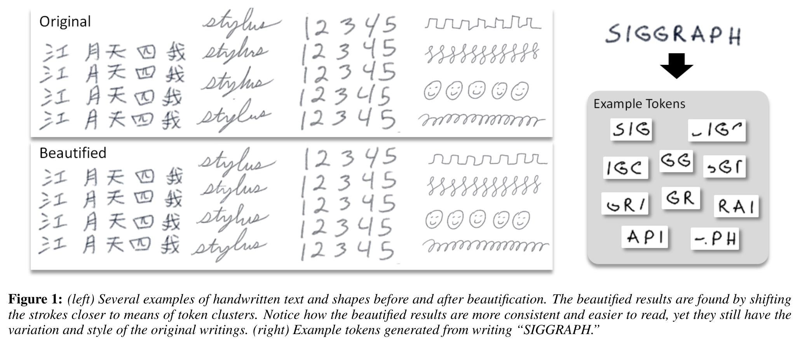
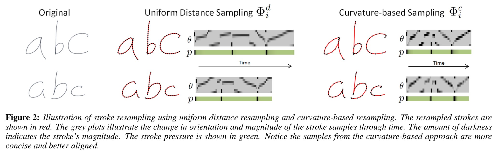
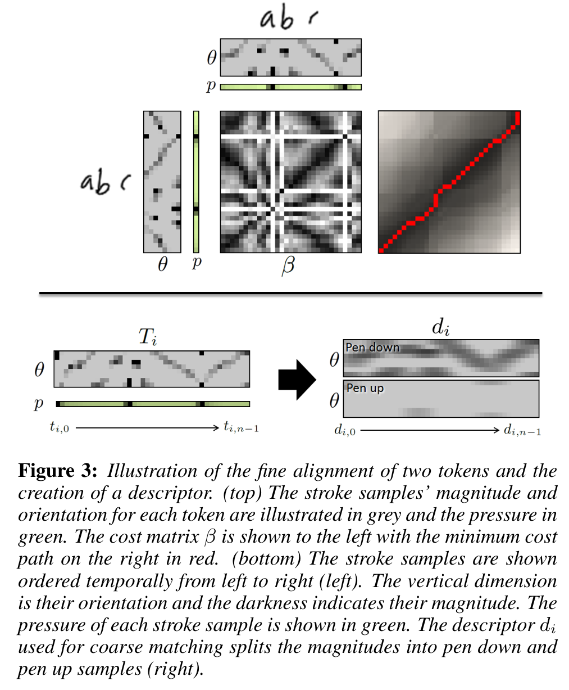
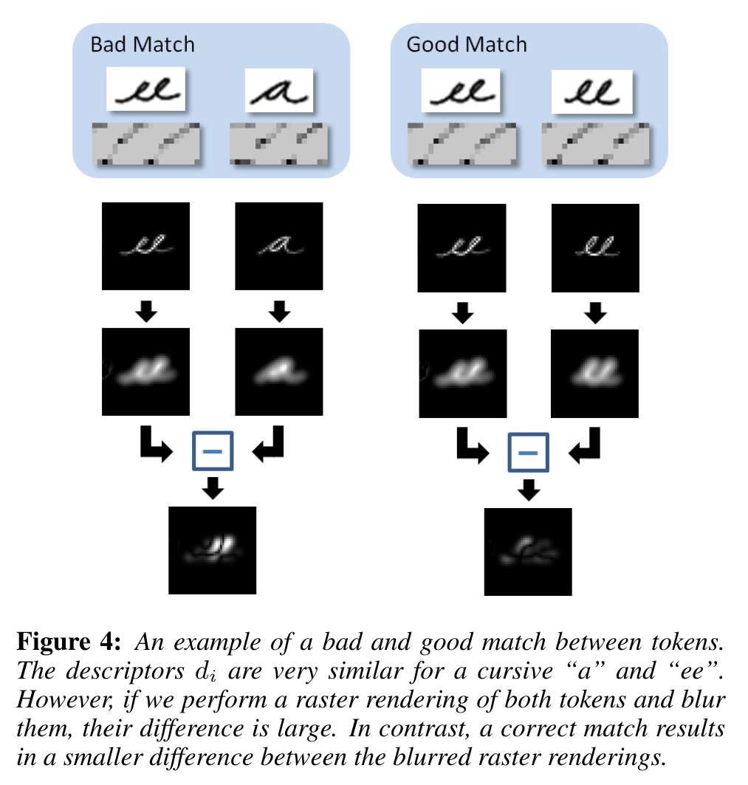

[](./fig_1.png "Figure 1: beautification")

Figure 1: beautification

## TL;DR

In ([Zitnick 2013](#ref-Zitnick2013Beautification)) the author shows how we can use a model for beautifying handwriting. The problem raised is that there is lots of variation in handwriting for a single individual and come up this a method to reduce this by a clever form of avaraging.

The data is captured from a tablet and thus had a three dimensional structure. Central to this paper is are two ideas:

1.  How to effectively average similar tokens to get a suitable mean token.
    - they use a moving window
    - the sample using a curvature based sampling
      - ([Whitney 1937](#ref-Whitney1937Regular))
      - ([Mokhtarian and Mackworth 1992](#ref-mokhtarian1992theory))
      - ([Dudek and Tsotsos 1997](#ref-dudek1997shape))
    - they use a fine alignment using
      - affinity matrix
      - dynamic programming to find the best warping between two sequences.
    - they also use a visual similarity metric to make the model more **robust** to graphemes with similar strokes but different shapes.
2.  How to decide which tokens are similar.

Once these are solved, it becomes a matter of clustering tokens by similarity and then averaging the tokens in each cluster to get a mean token.

The mean token are then used to replace the original token in the handwriting data. The authors show that this method can be used to improve the quality of handwriting data.

Q. As time goes by there is more data and the replacements pool towards the cluster avarage. It seems that replacement might be more uniform if the earlier replacements were updated as their cluster avarage drifts…

This naturally leads to a kind of time series.

Perhaps the key idea is how the authors convert the text to a sequence of vectors use a token mean to represent the data. This is a simple idea but

## 3. The approach

We represent the stylus’s samples by storing the difference vectors between the stylus positions

i.e. \Phi = \\\phi_1, \ldots , \phi_a\\ with

\phi_i = \\x_i, y_i, p_i\\

where (x_i, y_i) is the difference in the stylus’s pixel position between samples i − 1 and i.

p_i is the stylus’s pressure.

## 3.1 Stroke resampling

As I understand it data is captured uniformly from a tablet and thus had a three dimensional structure. The authors then to resample the data to more faithfully represent the the curvature that is the building block of strokes within the handwriting.

[](./fig_2.png "Figure 2: stroke resampling - uniform v.s. curvature based")

Figure 2: stroke resampling - uniform v.s. curvature based

They represent samples taken at regular distance intervals using \Phi^d = \\ \phi^d \_1 , \ldots, \phi^d_n \\ where the sample magnitude r_i is constant for all samples. c.f. [Figure 2](#fig-2)

Curvature based sampling:

We compute a stroke representation Φ^c = \\\phi^c_1, \ldots , \phi^c_n\\ with the same parameterization as Φ, i.e. φ^c_i =\\x_i, y_i, p_i \\

z_i=z\_{i-1}+min(1, \frac{\alpha \Delta\_\theta \beta_j}{2\pi}) \qquad \tag{1}

where:

- z_i is the point on the curve.
- z\_{i-1} is the previous point on the curve.
- \alpha is the sampling density parameter (minimum value = 24)
- \Delta\_\theta \in (0,\pi\] is the angle between samples φ\_{i−1} and φ_i
- r_j is the stroke magnitude.
- \beta_j = max(0, min(1, r_j − \sqrt{2})). is a parameter that controls for discretization of the stylus.

## 3.2 Refining strokes

When a user writes they generate a large set of stroke samples, denoted Φ (for the rest of the paper we assume a curvature-based sampling and drop the superscript c.) From Φ we create overlapping fixed length sequences of stroke samples called tokens c.f. [Figure 1](#fig-1). Each token contains n stroke samples.

> **NOTE:**
>
> Using matrix profiles math behind stumpy might be usefull in making this work faster and better, not sure about real time.

### Fine-scale alignment

[](./fig_3.png "Figure 3: fine alignment")

Figure 3: fine alignment

The **match cost** \beta\_{k,l} is found using a linear combination of three features,

\beta\_{k,l} = \Delta\_{\hat r} + \Delta\_\theta + \delta_p \qquad

computed from:

- t\_{i,k} and t\_{j,l}.
- \Delta \hat r is the absolute difference between \hat r_k and \hat r_l.
- \Delta\_\theta is the absolute angular distance between θ_k and θ_l.
- \delta_p measures if both strokes have consistent visibility. That is, \delta_p = 1 if p_k = 0 and p_l = 0, or p_k \> 0 and p_l \> 0, and \delta_p = 0 otherwise.

### Merging stroke sets

> Once two or more tokens are aligned, we can merge them by averaging the stroke samples.

[](./fig_4.png "Figure 4: matches")

Figure 4: matches

## The paper

paper

## See also

- http://larryzitnick.org/

Dudek, Gregory, and John K Tsotsos. 1997. “Shape Representation and Recognition from Multiscale Curvature.” *Computer Vision and Image Understanding* 68 (2): 170–89.

Mokhtarian, Farzin, and Alan K Mackworth. 1992. “A Theory of Multiscale, Curvature-Based Shape Representation for Planar Curves.” *IEEE Transactions on Pattern Analysis and Machine Intelligence* 14 (8): 789–805.

Whitney, Hassler. 1937. “On Regular Closed Curves in the Plane.” *Compositio Mathematica* 4: 276–84. <http://www.numdam.org/item/CM_1937__4__276_0/>.

Zitnick, C. Lawrence. 2013. “Handwriting Beautification Using Token Means.” *ACM Trans. Graph.* (New York, NY, USA) 32 (4). <https://doi.org/10.1145/2461912.2461985>.

## Citation

BibTeX citation:

``` quarto-appendix-bibtex
@online{bochman2013,
  author = {Bochman, Oren},
  title = {Handwriting Beautification Using Token Means},
  date = {2013-12-20},
  url = {https://orenbochman.github.io/reviews/2013/HandwritingBeautification/},
  langid = {en}
}
```

For attribution, please cite this work as:

Bochman, Oren. 2013. “Handwriting Beautification Using Token Means.” December 20. <https://orenbochman.github.io/reviews/2013/HandwritingBeautification/>.
