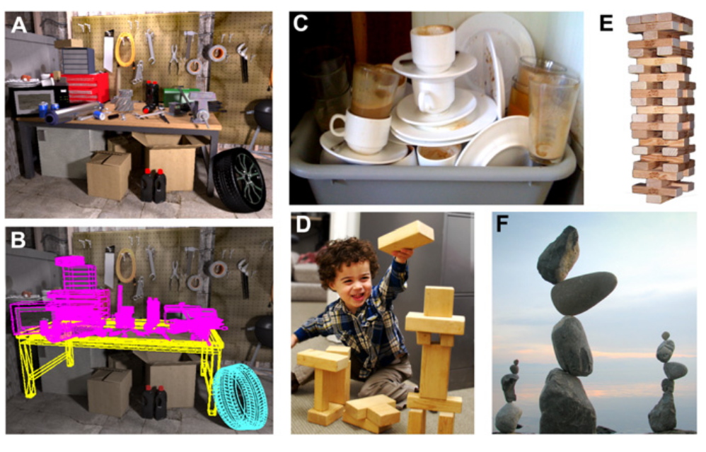
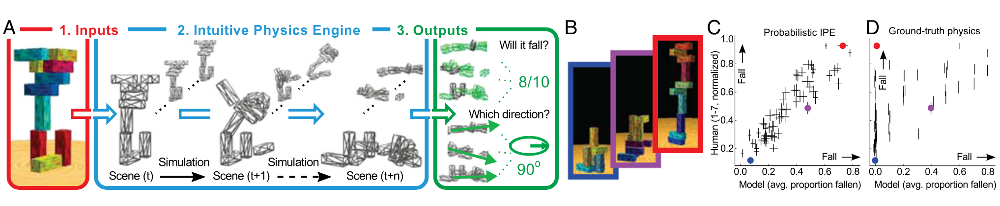
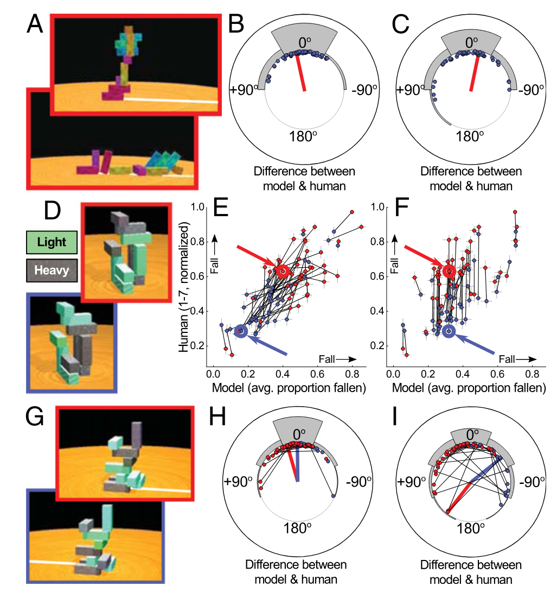
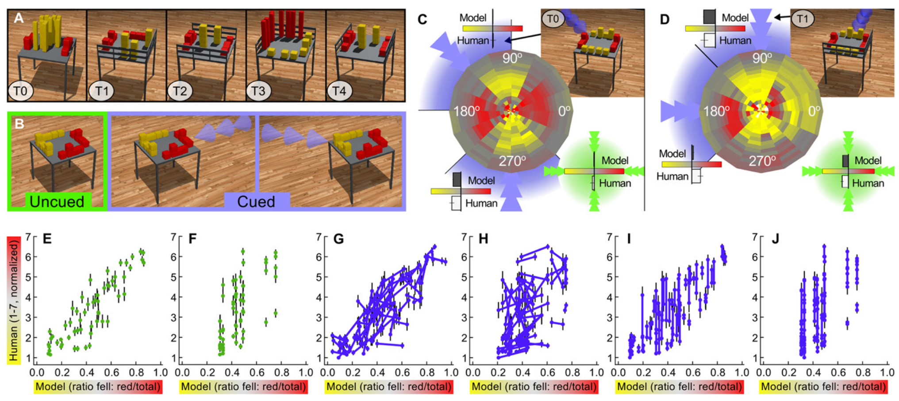

cover

[](mindmap.png "mindmap")

mindmap

# An error occurred.

Unable to execute JavaScript.

Josh Tenenbaum, MIT BMM Summer Course 2018 Computational Models of Cognition: Part 1

# An error occurred.

Unable to execute JavaScript.

Josh Tenenbaum, MIT BMM Summer Course 2018 Computational Models of Cognition: Part 2

# An error occurred.

Unable to execute JavaScript.

Josh Tenenbaum, MIT BMM Summer Course 2018 Computational Models of Cognition: Part 3

I considered adding a step in `pretraining` of RL agents to capture semantics of Newtonian Physics so they could learn to interpret a sentence like “the egg hit the wall and then it broke.” as a sequence of events that are related by a causal relation some physics and some common knowledge. This paper suggest that this might be a good idea and goes further to suggest that the agent might be equipped with a elementary physics engine that would allow it to simulate the physical world and learn from its interactions with it. We see that language models can help agents plan complex task much better and faster than by learning from pixel data alone. So giving access to a physics engine might be a good idea, particularly as this paper suggest that using few shot interactions with the engine approximates how we humans intuit the physical world.

The experiment in this paper seem to be a great addition to the curriculum I had in mind for the agent (block world and sokoban which are 2d worlds). However [Figure 3](#fig-3) and [Figure 4](#fig-4) suggest using MDPs with 3D objects and more complex interactions.

> **NOTE:**
>
> [](../../../images/in_the_nut_shell_gemeni.png "intuitive physics in a nutshell")
>
> intuitive physics in a nutshell
>
> Here’s an outline summarizing the research paper:
>
> 1.  **Research Questions:**
>     - What are the **computational underpinnings of rapid physical inferences** that allow people to understand and interact with the physical world?
>     - More specifically, the research aims to develop and test a **computational framework for intuitive physical inference** suitable for everyday scene understanding, focusing on reasoning about multiple incompletely observed objects interacting in complex ways and making coarse, approximate, short-term predictions.
>     - The authors investigate whether a model based on an “**intuitive physics engine**” (IPE), using approximate, probabilistic simulations, can explain human physical scene understanding.
> 2.  **Main Findings:**
>     - The IPE model **fits data from five distinct psychophysical tasks**, including judging whether a tower will fall, predicting the direction of a fall, and determining which colored blocks are more likely to fall off a bumped table with obstacles.
>     - The model **captures several illusions and biases** in human physical judgments, such as the perception of delicately balanced objects as unstable, which a deterministic ground truth physics model cannot explain.
>     - **Simpler, non-simulation-based accounts** relying on geometric features alone consistently fared worse at predicting people’s judgments than the IPE model.
>     - People’s judgments appear to be consistent with having been based on a **relatively small number of stochastic simulation samples** (roughly three to seven).
> 3.  **In historical context why was this important?**
>     - Early studies of intuitive physics suggested that human intuitions are **fundamentally incompatible with Newtonian mechanics** based on errors in explicit reasoning about simple systems. However, later work revised this interpretation, showing that intuitions are often accurate in concrete dynamic contexts.
>     - While the idea of the brain building “**mental models**” to support inference through mental simulations had been proposed, these systems **had not attempted to engage with physical scene understanding** in a quantitative and probabilistic way, focusing more on qualitative or propositional representations suited for symbolic reasoning.
>     - The work challenged purely **model-free, data-driven approaches** in computer vision as a complete explanation for physical scene understanding, suggesting that simulation-based reasoning plays a crucial role.

Here is a lighthearted Deep Dive into the paper:

### Abstract

> In a glance, we can perceive whether a stack of dishes will topple, a branch will support a child’s weight, a grocery bag is poorly packed and liable to tear or crush its contents, or a tool is firmly attached to a table or free to be lifted. Such rapid physical inferences are central to how people interact with the world and with each other, yet their computational underpinnings are poorly understood. We propose a model based on an “intuitive physics engine,” a cognitive mechanism similar to computer engines that simulate rich physics in video games and graphics, but that uses approximate, probabilistic simulations to make robust and fast inferences in complex natural scenes where crucial information is unobserved. This single model fits data from five distinct psychophysical tasks, captures several illusions and biases, and explains core aspects of human mental models and common-sense reasoning that are instrumental to how humans understand their everyday world
>
> — ([Battaglia et al. 2013](#ref-battaglia2013simulation))

## Glossary

This paper uses lots of big terms so let’s break them down so we can understand them better

Algorithm  
A step-by-step procedure for solving a problem or accomplishing a task. In this context, referring to the computational process of the IPE.

Analytic Solutions  
Exact, closed-form mathematical solutions to a problem, often derived through symbolic manipulation of equations. The IPE avoids these in favor of simulation.

Artifact  
A human-made object. Understanding the physics of artifacts is a key aspect of physical scene understanding.

Cognitive Mechanism  
A process or system within the mind responsible for a particular aspect of cognition. The IPE is proposed as one such mechanism.

Computational Underpinnings  
The algorithms, data structures, and principles that underlie a cognitive ability or process. The paper seeks to understand the computational underpinnings of physical scene understanding.

Deterministic  
A process or model where the outcome is uniquely determined by the initial conditions, without any element of randomness or uncertainty. Ground truth physics simulations in the paper are treated as deterministic.

Heuristics  
Simple, efficient rules or strategies used to make decisions or solve problems quickly, often by sacrificing optimality for speed. The paper considers whether people might rely on non-simulation-based heuristics.

Illusions  
Perceptions or judgments that systematically deviate from reality. The IPE’s probabilistic nature helps explain certain physical illusions.

Inference  
The process of drawing conclusions or making predictions based on evidence and reasoning. Physical scene understanding involves rapid physical inferences.

Latent Forces  
Unseen or hidden forces that might be acting on objects in a scene (e.g., a subtle breeze). The IPE incorporates uncertainty about these.

Monte Carlo Simulation  
A computational technique that relies on repeated random sampling to obtain numerical results. The IPE uses Monte Carlo simulations to represent and propagate uncertainty.

Newtonian Mechanics  
The classical laws of motion and gravitation formulated by Isaac Newton. The paper discusses how human intuitions relate to Newtonian standards.

Object-Based Representation  
A way of representing a scene by identifying and characterizing the individual objects within it, including their properties and relationships. The IPE uses an object-based representation.

Perceptuomotor Systems  
Sensory and motor systems and their integration, involved in perceiving the environment and acting upon it. The IPE is proposed to interface with these systems.

Posterior Distribution  
In Bayesian statistics, the probability distribution of a parameter after observing data, reflecting updated beliefs. The IPE aims to form an approximate posterior distribution over future states.

Prior Knowledge  
Pre-existing knowledge or beliefs that influence how new information is interpreted. Simplified geometric priors are mentioned in the context of mass distribution estimation.

Psychophysical Tasks  
Experiments designed to study the relationship between physical stimuli and sensory experiences and perceptions. The paper describes several psychophysical tasks used to test the IPE model.

Qualitative Reasoning  
Reasoning about the general properties and relationships of a system without necessarily using precise quantitative values. Earlier AI systems focused on qualitative physical reasoning.

Quantitative Approach  
An approach that emphasizes precise measurement and numerical analysis. The IPE model takes a more quantitative approach to mental models.

Robust  
Able to function effectively despite noise, errors, or variations in input. The IPE’s probabilistic nature is intended to make it robust to noisy perception.

Sensorimotor Outputs  
Actions or behaviors generated by the motor system in response to sensory input and cognitive processing. Experiment 5 included sensorimotor outputs.

Stochastic  
Involving randomness or probability. The IPE runs stochastic simulations.

Veridicality  
The quality of being truthful or accurate in representing reality. The IPE intentionally trades some veridicality for speed and generality.

## Outline

[](./fig_01.png "Figure 1: Everyday scenes, activities, and art that evoke strong physical intuitions. (A) A cluttered workshop that exhibits many nuanced physical properties. (B) A 3D object-based representation of the scene in A that can support physical inferences based on simulation. (C) A precarious stack of dishes looks like an accident waiting to happen. (D) A child exercises his physical reasoning by stacking blocks. (E) Jenga puts players’ physical intuitions to the test. (F) “Stone balancing” exploits our powerful physical expectations (Photo and stone balance by Heiko Brinkmann).")

Figure 1: Everyday scenes, activities, and art that evoke strong physical intuitions. (A) A cluttered workshop that exhibits many nuanced physical properties. (B) A 3D object-based representation of the scene in A that can support physical inferences based on simulation. (C) A precarious stack of dishes looks like an accident waiting to happen. (D) A child exercises his physical reasoning by stacking blocks. (E) Jenga puts players’ physical intuitions to the test. (F) “Stone balancing” exploits our powerful physical expectations (Photo and stone balance by Heiko Brinkmann).

[](./fig_02.png "Figure 2: (A) The IPE model takes inputs (e.g., perception, language, memory, imagery, etc.) that instantiate a distribution over scenes (1), then simulates the effects of physics on the distribution (2), and then aggregates the results for output to other sensorimotor and cognitive faculties (3). (B) Exp. 1 (Will it fall?) tower stimuli. The tower with the red border is actually delicately balanced, and the other two are the same height, but the blue-bordered one is judged much less likely to fall by the model and people. (C) Probabilistic IPE model (x axis) vs. human judgment averages (y axis) in Exp. 1. See Fig. S3 for correlations for other values of σ and φ. Each point represents one tower (with SEM), and the three colored circles correspond to the three towers in B. (D) Ground truth (nonprobabilistic) vs. human judgments (Exp. 1). Because it does not represent uncertainty, it cannot capture people’s judgments for a number of our stimuli, such as the red-bordered tower in B. (Note that these cases may be rare in natural scenes, where configurations tend to be more clearly stable or unstable and the IPE would be expected to correlate better with ground truth than it does on our stimuli.)")

Figure 2: (A) The IPE model takes inputs (e.g., perception, language, memory, imagery, etc.) that instantiate a distribution over scenes (1), then simulates the effects of physics on the distribution (2), and then aggregates the results for output to other sensorimotor and cognitive faculties (3). (B) Exp. 1 (Will it fall?) tower stimuli. The tower with the red border is actually delicately balanced, and the other two are the same height, but the blue-bordered one is judged much less likely to fall by the model and people. (C) Probabilistic IPE model (x axis) vs. human judgment averages (y axis) in Exp. 1. See Fig. S3 for correlations for other values of σ and φ. Each point represents one tower (with SEM), and the three colored circles correspond to the three towers in B. (D) Ground truth (nonprobabilistic) vs. human judgments (Exp. 1). Because it does not represent uncertainty, it cannot capture people’s judgments for a number of our stimuli, such as the red-bordered tower in B. (Note that these cases may be rare in natural scenes, where configurations tend to be more clearly stable or unstable and the IPE would be expected to correlate better with ground truth than it does on our stimuli.)

[](./fig_03.png "Figure 3: (A) Exp. 2 (In which direction?). Subjects viewed the tower (Upper), predicted the direction in which it would fall by adjusting the white line with the mouse, and received feedback (Lower). (B) Exp. 2: Angular differences between the probabilistic IPE model’s and subjects’ circular mean judgments for each tower (blue points), where 0 indicates a perfect match. The gray bars are circular histograms of the differences. The red line indicates the tower in A. (C) The same as B, but for the ground truth model. (D) Exp. 3 (Will it fall?: mass): State pair stimuli (main text). Light blocks are green, and heavy ones are dark. (E) Exp. 3: The mass-sensitive IPE model’s vs. people’s judgments, as in Fig. 2C. The black lines connect state pairs. Both model and people vary their judgments similarly within each state pair (lines’ slopes near 1). (F) Exp. 4: The mass-insensitive model vs. people. Here the model cannot vary its judgments within state pairs (lines are near vertical). (G) Exp. 4 (In which direction?: mass): State pair stimuli. (H) Exp. 4: The mass-sensitive IPE model’s vs. people’s judgments, as in B. The black lines connect state pairs. The model’s and people’s judgments are closely matched within state pairs (short black lines). (I) Exp. 4: The mass-insensitive IPE model vs. people. Here again, the model cannot vary its judgments per state pair (longer black lines)")

Figure 3: (A) Exp. 2 (In which direction?). Subjects viewed the tower (Upper), predicted the direction in which it would fall by adjusting the white line with the mouse, and received feedback (Lower). (B) Exp. 2: Angular differences between the probabilistic IPE model’s and subjects’ circular mean judgments for each tower (blue points), where 0 indicates a perfect match. The gray bars are circular histograms of the differences. The red line indicates the tower in A. (C) The same as B, but for the ground truth model. (D) Exp. 3 (Will it fall?: mass): State pair stimuli (main text). Light blocks are green, and heavy ones are dark. (E) Exp. 3: The mass-sensitive IPE model’s vs. people’s judgments, as in Fig. 2C. The black lines connect state pairs. Both model and people vary their judgments similarly within each state pair (lines’ slopes near 1). (F) Exp. 4: The mass-insensitive model vs. people. Here the model cannot vary its judgments within state pairs (lines are near vertical). (G) Exp. 4 (In which direction?: mass): State pair stimuli. (H) Exp. 4: The mass-sensitive IPE model’s vs. people’s judgments, as in B. The black lines connect state pairs. The model’s and people’s judgments are closely matched within state pairs (short black lines). (I) Exp. 4: The mass-insensitive IPE model vs. people. Here again, the model cannot vary its judgments per state pair (longer black lines)

[](./fig_04.png "Figure 4: Exp. 5 (Bump?). (A) Scene stimuli, whose tables have different obstacles (T0–T4). (B) In the uncued bump condition, subjects were not informed about the direction from which the bump would strike the scene; in the cued bump conditions, a blue arrowhead indicated the bump’s direction. (C) The disk plot shows IPE model predictions per bump direction (angle) and φ (radius) for the stimulus in the image; the blue arrowheads/arcs indicate the range of bump angles simulated per bump cue, and the green circle and arrowheads represent the uncued condition. Inset bar graphs show the model’s and people’s responses, per cue/condition. (D) The same block configuration as in C, with different obstacles (T1). (E–J) IPE model’s (x axis) vs. people’s (y axis) mean judgments (each point is one scene, with SEM). The lines in G–J indicate cue-wise pairs. Each subplot show one cue condition and IPE model variant (correlations in parentheses, with P value of difference from full IPE): (E) Uncued, full IPE. (F) Uncued, obstacle insensitive (model assumes T0). (G) Cued, full IPE. (H) Cued, obstacle insensitive. (I) Cued, cue insensitive (model averages over all bump angles). (J) Cued, obstacle and cue insensitive.")

Figure 4: Exp. 5 (Bump?). (A) Scene stimuli, whose tables have different obstacles (T0–T4). (B) In the uncued bump condition, subjects were not informed about the direction from which the bump would strike the scene; in the cued bump conditions, a blue arrowhead indicated the bump’s direction. (C) The disk plot shows IPE model predictions per bump direction (angle) and φ (radius) for the stimulus in the image; the blue arrowheads/arcs indicate the range of bump angles simulated per bump cue, and the green circle and arrowheads represent the uncued condition. Inset bar graphs show the model’s and people’s responses, per cue/condition. (D) The same block configuration as in C, with different obstacles (T1). (E–J) IPE model’s (x axis) vs. people’s (y axis) mean judgments (each point is one scene, with SEM). The lines in G–J indicate cue-wise pairs. Each subplot show one cue condition and IPE model variant (correlations in parentheses, with P value of difference from full IPE): (E) Uncued, full IPE. (F) Uncued, obstacle insensitive (model assumes T0). (G) Cued, full IPE. (H) Cued, obstacle insensitive. (I) Cued, cue insensitive (model averages over all bump angles). (J) Cued, obstacle and cue insensitive.

- Introduction
  - Describes the ability of humans to make quick and robust physical inferences in complex natural scenes.
  - Presents a model based on an “intuitive physics engine” (IPE), a cognitive mechanism that uses approximate, probabilistic simulations to make fast inferences in situations where crucial information is unobserved.
  - Highlights the importance of physical inferences in everyday activities and higher cognitive functions.
  - Mentions the limitations of previous research on intuitive physics, which focused on simple, idealized cases.
- Architecture of the IPE
  - Describes the architecture of the IPE, which includes an object-based representation of a 3D scene and the physical forces governing the scene’s dynamics.
  - Presents three key design elements that distinguish the IPE from an ideal physicist’s approach: simulation-based, probabilistic, and approximate.
  - Discusses the use of the Open Dynamics Engine (ODE) for approximate rigid-body dynamics simulations and the Monte Carlo approach for representing and propagating probabilities.
  - Notes the potential for the IPE to dramatically simplify object geometry, mass distributions, and physical interactions for speed and generality.
- Psychophysical Experiments
  - Describes five psychophysical experiments designed to test the IPE model in increasingly complex scenarios.
  - Presents the “Will it fall?” task (Exp. 1), where subjects judge the stability of randomly stacked block towers.
  - Discusses the manipulation of task instructions, object properties, and scene complexity across experiments.
  - Highlights the use of input parameters (σ, ϕ, μ) to capture uncertainty in scene geometry, latent forces, and object masses.
- Results
  - Presents the results of Exp. 1, showing a strong correlation between the IPE model’s predictions and human judgments.
  - Discusses the importance of incorporating uncertainty in the model, as demonstrated by the lower correlation of a deterministic ground truth model with human judgments.
  - Presents the results of Exp. 2 (“In which direction?”), showing that the IPE model can account for different judgments in different modalities.
  - Highlights the findings of Exps. 3 and 4, demonstrating the sensitivity of human predictions to object masses and the IPE model’s ability to capture this sensitivity.
  - Presents the results of Exp. 5, showing that the IPE model can explain human judgments in complex scenes with varying object shapes, physical obstacles, and applied forces.
- Approximations
  - Discusses the potential for the human IPE to adopt even coarser approximations than the model tested.
  - Presents evidence suggesting that people may base their predictions on a small number of stochastic simulation samples.
  - Notes the possibility of people falling back on non-simulation-based heuristics in certain situations.
  - Highlights the ability of the IPE model to explain biases in human predictions of nonconvex object motions using simplified geometric priors.
- Discussion
  - Summarizes the key findings of the study, emphasizing the support for a simulation-based, probabilistic IPE model of human physical scene understanding.
  - Discusses the limitations of model-free accounts of physical scene understanding.
  - Presents the potential for extending the IPE model to incorporate more realistic visual input, working memory constraints, and other physical phenomena.
  - Highlights the broader implications of the IPE framework for understanding the connections between physical scene understanding and other aspects of cognition, such as perception, action planning, causal inference, and language.

## Reflections

### Bibliography

To start these sources cited in this paper by Josh Tenenbaum and his group that I seem to warrant some attention:

11. Sanborn AN, Mansinghka VK, Griffiths TL (2013) Reconciling intuitive physics and Newtonian mechanics for colliding objects. Psychol Rev 120(2):411–437.

12. Gerstenberg T, Goodman N, Lagnado D, Tenenbaum J (2012) Noisy newtons: Unifying process and dependency accounts of causal attribution. Proceedings of the 34th Conference of the Cognitive Science Society, eds Miyake N, Peebles D, Cooper RP (Cognitive Science Society, Austin, TX), pp 378–383.

13. Smith KA, Vul E (2013) Sources of uncertainty in intuitive physics. Top Cogn Sci 5(1):185–199.

14. Smith K, Battaglia P, Vul E (2013) Consistent physics underlying ballistic motion prediction. Proceedings of the 35th Conference of the Cognitive Science Society, eds Knauff M, Pauen M, Sebanz N, Wachsmuth I (Cognitive Science Society, Austin, TX), pp 3426–3431.

15. Tenenbaum JB, Kemp C, Griffiths TL, Goodman ND (2011) How to grow a mind: Statistics, structure, and abstraction. Science 331(6022):1279–1285.

16. Vul E, Goodman N, Griffiths T, Tenenbaum J (2009) One and done? Optimal decisions from very few samples. Proceedings of the 31st Conference of the Cognitive Science Society, eds Taatgen N, van Rijn H (Cognitive Science Society, Austin, TX), pp 66–72.

17. Vul E, Frank M, Alvarez G, Tenenbaum J (2009) Explaining human multiple object tracking as resource-constrained approximate inference in a dynamic probabilistic model. Adv NIPS 22:1955–1963.

The paper also has some further sources on **child development** and **language** that may be wroth a quick scan:

1.  Marr D (1982) Vision (Freeman, San Francisco).

2.  Baillargeon R (2002) The acquisition of physical knowledge in infancy: A summary in eight lessons. Blackwell Handbook of Childhood Cognitive Development (Blackwell, Oxford), Vol 1, pp 46–83.

3.  Talmy L (1988) Force dynamics in language and cognition. Cogn Sci 12(1):49–100.

4.  Craik K (1943) The Nature of Explanation (Cambridge Univ Press, Cambridge, UK).

5.  Gentner D, Stevens A (1983) Mental Models (Lawrence Erlbaum, Hillsdale, NJ).

6.  Hegarty M (2004) Mechanical reasoning by mental simulation. Trends Cogn Sci 8(6):280–285.

7.  Johnson-Laird P (1983) Mental Models: Towards a Cognitive Science of Language, Inference, and Consciousness (Cambridge Univ Press, Cambridge, UK), Vol 6.

8.  De Kleer J, Brown J (1984) A qualitative physics based on confluences. Artif Intell 24(1):7–83.

9.  Téglás E, et al. (2011) Pure reasoning in 12-month-old infants as probabilistic inference. Science 332(6033):1054–1059

### Ontology

So my own thought based on a course on Cognitive A.I. that followed Winston’s Classic textbook on Artificial Intelligence, were that to empower an agent that could learn a signaling system, to acquire a more general purpose language, it would be necessary to expose it to multiple MDP in which it would learn man different things and be able to generalize across them. The immediate ideas seemed to be a variant of “Blocksworld” where the agent would be tasked to manipulate blocks and other objects in a 2D world. This would be a good scenario in which it would learn to develop preposition or at least to represent the spatial relations between objects. A second idea was to follow up with games like “Sokoban”. In which it would benefit from symbolic representation of the objects and their relations and might also learn more about physical constraints.

All this suggested that that such agents might benefit from a curriculum consisting of:

- “Logic Structure” - for logic, sets, relations.
- “Narrative Structure” - events, turning points, exposition, point of view, dialogue, description, and action. This would allow it to tell stories and explain plans that are grounded in a symbolic/linguistic representation of the MDP.
- “Physics” - relations and common sense reasoning about the physical world. e.g. “the egg hit the wall and then it broke.”
- “Causation”
- “Probability and Uncertainty”
- “Game Theory” - strategic reasoning about other agents, and the ability to represent the MDP in terms of a game. Note that there is an interpretation of probability in terms of game theory. So perhaps this module might subsume the Probability and Uncertainty as well as the Causation module. Making agents play in game theory scenarios would be very easy and quick part of the curriculum to implement and also a relatively simple to integrate with language. The module can be used to develop a symbolic representation.
  - Personal pronouns, Social dynamics, Interests, Incentives, Coalitions, Alliances, Trust, Reputation, Deception, Manipulation, and Exploitation, Cooperation, Coordination, Competition, Conflict, Cheap talk, are all semantics that might arise in these modules.
  - Utility and welfare functions.
  - Micro-Economics can also be built using game theory.

One of the problems I had been considering was how to facilitate transfer learning between these different domains. Mapping state space to symbolic representation seems to be too much a hit or miss approach. Using a reductionist language approach seems to be key. I had thought of mechanisms like temporal abstractions, like the options framework, and generalized values functions, from RL but also Hierarchical Bayesian models for things like logic.

The big problem seems to be that I was thinking about the agent learning just one complex signaling system using a linear function approximator with many features drawn from all the above curriculum.

Another approach seems to be to use an abstraction that I have called at one time lobe formation. This is a process in which the agent learns to group together similar features and to iteratively learn more abstract representations of the MDP in terms of symbols, relations and constraints.

### Reincarnation and Metamorphosis

I realized another interesting point though. In different incarnation of this kind of agent it would need to handle different states and action spaces for different MDPs. So it should be able to learn many models from previous MDPs and then be able to generate Hypothesis by instantiating different models based on the different model it has. Lobe formation suggest that initially very simple models might appear more useful, but as experiences accumulates in a new MDP it might be able to use more sophisticated model. Ideally it should be able to use distributional semantics and a grounding procedure to match the new MDP to what it knows from previous MDPs. e.g. features for approximation, temporal and spatial abstractions, strategic reasoning, and augmenting the linguistic representation with a good symbolic representation for the new MDP. In fact it seems that the agent might perhaps assemble a hierarchical model for the MDP based on building blocks with established semantics (symbolic and distributional)

There are likely many different ways to do this reincarnation. But it seems that organisms undergoing metamorphosis seem to be able to make use of previous experiences despite a radical change in their body and brain.

One idea is that we have a encoder that can be used to bootstrap a more sophisticated decoder. Another idea is that we can use evidence to handle model selection and switch to better models.

Another based on sugarscape agents is that we might want to incorporate these models into the agent’s DNA, i.e. the agent would have access to the different models, thier priors, semantics, and mappings to states and actions. This would all be arranged using a forrest structure. The agent might then use a tree, multiple trees or create a random forest based on its older models to match the current MDP to the many different inductive biases it has learned.

## The paper

paper

Battaglia, Peter W, Jessica B Hamrick, and Joshua B Tenenbaum. 2013. “Simulation as an Engine of Physical Scene Understanding.” *Proceedings of the National Academy of Sciences* 110 (45): 18327–32.

## Citation

BibTeX citation:

``` quarto-appendix-bibtex
@online{bochman2025,
  author = {Bochman, Oren},
  title = {Simulation as an Engine of Physical Scene Understanding},
  date = {2025-03-31},
  url = {https://orenbochman.github.io/reviews/2013/Intuitive-physics/},
  langid = {en}
}
```

For attribution, please cite this work as:

Bochman, Oren. 2025. “Simulation as an Engine of Physical Scene Understanding.” March 31. <https://orenbochman.github.io/reviews/2013/Intuitive-physics/>.
