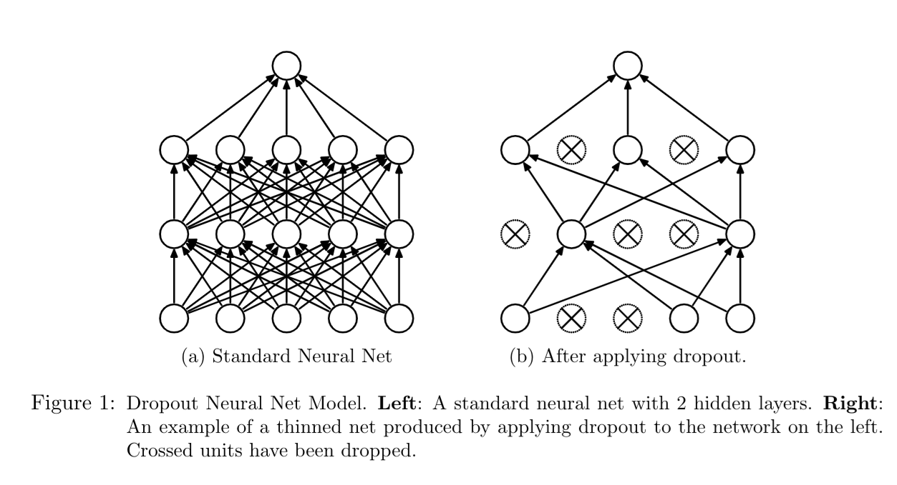
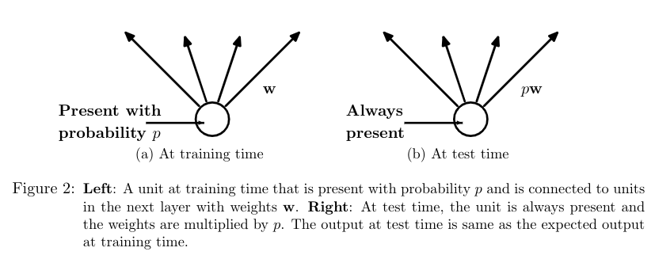
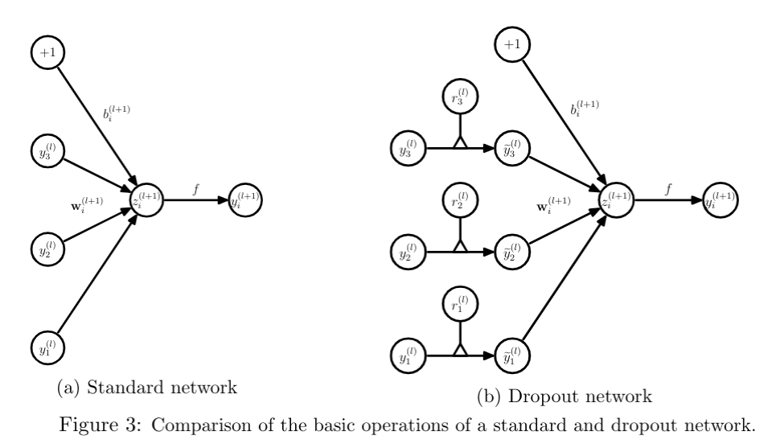
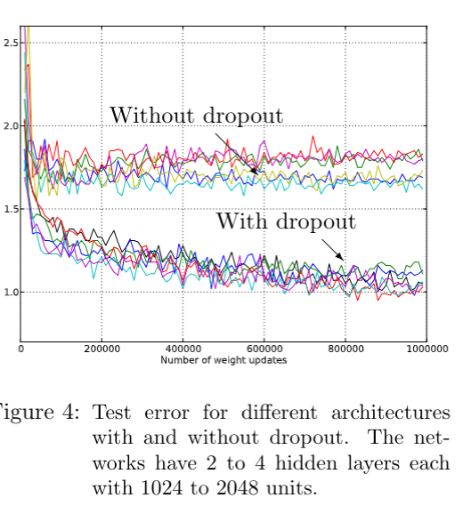
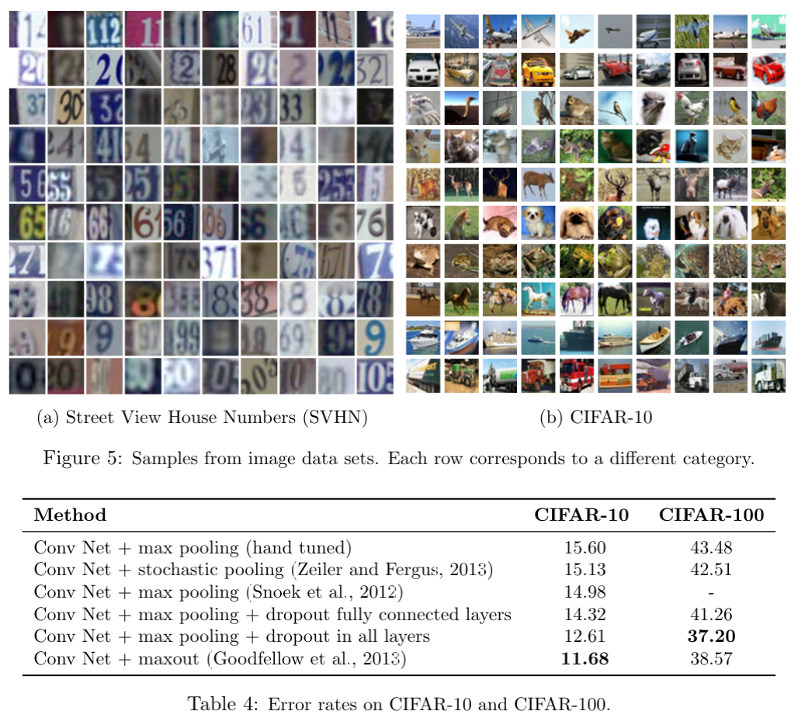

> **NOTE:**
>
> [](../../../images/in_the_nut_shell_gemeni.png "Dropout in a nutshell")
>
> Dropout in a nutshell
>
> In ([Srivastava et al. 2014](#ref-JMLR:v15:srivastava14a)) the authors, present a novel regularization technique for deep neural networks called “dropout.” The key idea behind dropout is to randomly drop units (along with their connections) from the neural network during training. This prevents units from co-adapting too much and significantly reduces overfitting. The authors show that dropout improves the performance of neural networks on supervised learning tasks in vision, speech recognition, document classification, and computational biology, obtaining state-of-the-art results on many benchmark data sets.
>
> The technique had been in use in some earlier works, but this paper popularized it and showed its effectiveness on a wide range of tasks. The idea behind drop out is pretty simple and people have since come up with many variations of it. It has become a standard technique in the deep learning toolbox.

## Abstract

> Deep neural nets with a large number of parameters are very powerful machine learning systems. However, overfitting is a serious problem in such networks. Large networks are also slow to use, making it difficult to deal with overfitting by combining the predictions of many different large neural nets at test time. Dropout is a technique for addressing this problem. The key idea is to randomly drop units (along with their connections) from the neural network during training. This prevents units from co-adapting too much. During training, dropout samples from an exponential number of different thinned networks. At test time, it is easy to approximate the effect of averaging the predictions of all these thinned networks by simply using a single unthinned network that has smaller weights. This significantly reduces overfitting and gives major improvements over other regularization methods. We show that dropout improves the performance of neural networks on supervised learning tasks in vision, speech recognition, document classification and computational biology, obtaining state-of-the-art results on many benchmark data sets.
>
> – ([Srivastava et al. 2014](#ref-JMLR:v15:srivastava14a))

## Review

In ([Srivastava et al. 2014](#ref-JMLR:v15:srivastava14a)) the authors presents a regularization technique called Dropout, aimed at addressing the critical problem of overfitting in deep neural networks (DNNs). Dropout randomly drops units (neurons) during training to prevent co-adaptation of units, which can lead to overfitting. This novel technique is demonstrated to significantly improve the performance of neural networks across a wide range of tasks, including computer vision, speech recognition, and natural language processing.

## Core Idea

[](./fig1.png "Figure 1: the effect of dropout")

Figure 1: the effect of dropout

Dropout works by randomly removing units from the network during each training iteration. This prevents the network from becoming overly reliant on specific units, thus reducing overfitting. During testing, all units are used, but their weights are scaled to account for the dropout during training. This approximates the averaging of an exponential number of thinned networks that would otherwise be computationally infeasible.

[](./fig2.png "Figure 2: Training vs Test")

Figure 2: Training vs Test

## Methodology and Theoretical Motivation

Dropout’s theoretical foundation stems from biological principles, specifically the idea of genetic robustness in sexual reproduction. In the analogy, a network’s hidden units act like genes that must learn to function independently of one another, preventing complex co-adaptations that may not generalize well to unseen data. The stochastic nature of dropout introduces noise during training, which acts as a form of model averaging and regularization.

[](./fig3.png "Figure 3: figure 3")

Figure 3: figure 3

## Key Contributions

- Model Averaging: Dropout enables the training of many subnetworks (thinned networks) simultaneously, which leads to a more robust model.
- Regularization Effect: Dropout reduces overfitting more effectively than other methods such as L1/L2 regularization or early stopping.
- Efficiency: Dropout provides a computationally feasible approximation of model averaging by scaling weights at test time, as opposed to maintaining an ensemble of networks.

## Experimental Results

The authors demonstrate the efficacy of dropout across several benchmark datasets:

[](./fig4.png "Figure 4: figure 4")

Figure 4: figure 4

- MNIST: Error rates are reduced from 1.60% (standard neural network) to 0.95% using dropout with additional max-norm regularization.
- CIFAR-10 and CIFAR-100: Dropout networks outperform previous methods, with an error reduction to 12.6% on CIFAR-10 and 37.2% on CIFAR-100.
- TIMIT (Speech Data): Dropout reduces the phone error rate from 23.4% to 21.8%, showing significant improvements over non-dropout models.
- ImageNet: Dropout helps achieve state-of-the-art results in image classification tasks, significantly lowering the top-5 error rate.

[](./fig5.png "Figure 5: image samples")

Figure 5: image samples

## Advantages of Dropout

- Generality: Dropout works across a variety of architectures, including fully connected, convolutional, and recurrent neural networks.
- Ease of Use: Dropout is simple to implement, requiring only one additional hyperparameter (the dropout rate, typically 0.5 for hidden layers).
- Compatibility with Other Methods: Dropout can be combined with techniques like unsupervised pretraining, max-norm regularization, and momentum, further improving model performance.

## Limitations

- Increased Training Time: Dropout can significantly slow down training, typically requiring 2-3 times more iterations to converge.
- Tuning of Hyperparameters: While simple, the dropout rate must be carefully selected, and higher learning rates and momentum are generally required for optimal performance.
- Application-Specific Benefits: Although dropout improves performance in vision and speech recognition tasks, the improvements in certain domains like text classification (e.g., Reuters RCV1 dataset) are less pronounced. [^1]

## Conclusion

The paper introduces dropout as a powerful and simple regularization technique that significantly reduces overfitting in deep neural networks. Dropout provides a computationally efficient method to approximate model averaging and works across a range of architectures and tasks, achieving state-of-the-art results on several benchmarks. However, it comes at the cost of increased training time, and some tuning is required for optimal performance.

Dropout represents a substantial advancement in neural network training, and its adoption has since become widespread in the deep learning community.

## The Paper

[link to the paper](https://jmlr.org/papers/volume15/srivastava14a/srivastava14a.pdf)

embeded paper

Srivastava, Nitish, Geoffrey Hinton, Alex Krizhevsky, Ilya Sutskever, and Ruslan Salakhutdinov. 2014. “Dropout: A Simple Way to Prevent Neural Networks from Overfitting.” *Journal of Machine Learning Research* 15 (56): 1929–58. <http://jmlr.org/papers/v15/srivastava14a.html>.

## Citation

BibTeX citation:

``` quarto-appendix-bibtex
@online{bochman2016,
  author = {Bochman, Oren},
  title = {Dropout: {A} {Simple} {Way} to {Prevent} {Neural} {Networks}
    from {Overfitting}},
  date = {2016-06-15},
  url = {https://orenbochman.github.io/reviews/2014/Dropout/},
  langid = {en}
}
```

For attribution, please cite this work as:

Bochman, Oren. 2016. “Dropout: A Simple Way to Prevent Neural Networks from Overfitting.” June 15. <https://orenbochman.github.io/reviews/2014/Dropout/>.

[^1]: I think this is because if we drop a few words from a sentence a reader can often guess them from the context and redundancy in natural languages.
