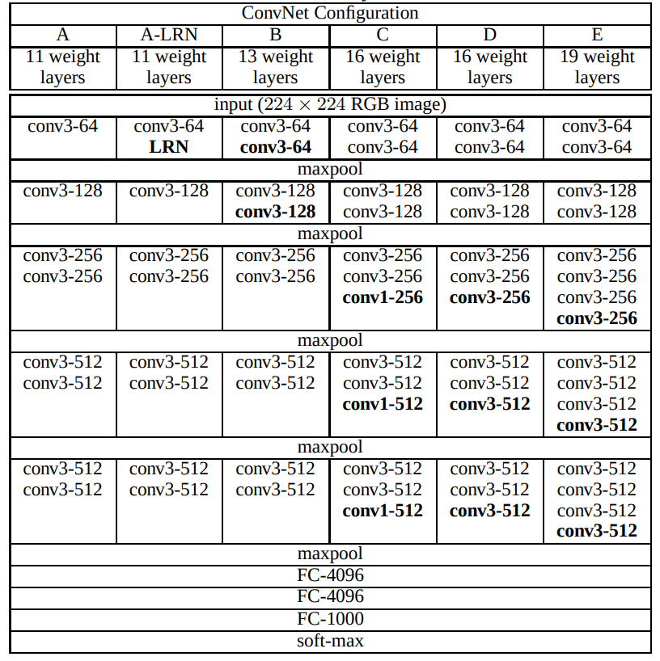
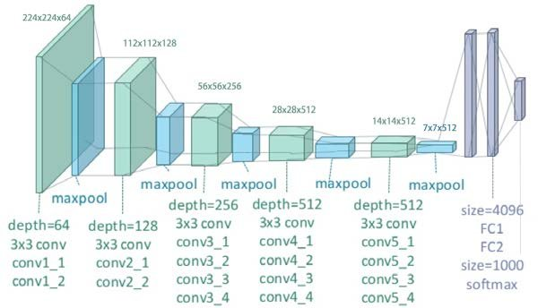

> **TIP:**
>
> In this paper ([Simonyan and Zisserman 2015](#ref-simonyan2015deepconvolutionalnetworkslargescale)) the authors, Karen Simonyan and Andrew Zisserman of the Visual Geometry Group at Oxford, investigated the effect of increasing the convolutional network depth on the accuracy in the large-scale image recognition setting. The authors show that a significant improvement on the prior-art configurations can be achieved by pushing the depth to 16-19 weight layers.
>
> - By using 3x3 convolution filters with stride of 1 instead of larger ones like 5x5 or 7x7 the authors were able to reduce the number of parameters in the network which allowed them to use deeper networks (16-19) layers with a similar capacity to earlier networks. This is possible as stack of three 3x3 convolutional layers has an effective receptive field of 7x7 with 81% fewer parameters than a single 7x7 convolutional layer. Once this was understood 3x3 became the standard convolutional filter size in modern CNN architectures.
>
> - The authors introduced a data augmentation method called ‘image jittering’ which varying image scales.
>
> - The authors later tweaked their model further including using 1x1 convolutional layers and Local Response Normalization (LRN) which improved the performance of the model as well as **Xaiver initialization**. And they were able to achieve state-of-the-art results on the ImageNet dataset.
>
> - The authors released weights for **VGG16** and **VGG19** Called D and E in the table below which were the basis of their ImageNet Challenge 2014 submission. And it is is these two models that are most commonly used in practice as thier weight are available in the Keras library ([Chollet et al. 2015](#ref-chollet2015keras)).

## The abstract

> In this work we investigate the effect of the convolutional network depth on its accuracy in the large-scale image recognition setting. Our main contribution is a thorough evaluation of networks of increasing depth using an architecture with very small (3x3) convolution filters, which shows that a significant improvement on the prior-art configurations can be achieved by pushing the depth to 16-19 weight layers. These findings were the basis of our ImageNet Challenge 2014 submission, where our team secured the first and the second places in the localisation and classification tracks respectively. We also show that our representations generalise well to other datasets, where they achieve state-of-the-art results. We have made our two best-performing ConvNet models publicly available to facilitate further research on the use of deep visual representations in computer vision. — ([Simonyan and Zisserman 2015](#ref-simonyan2015deepconvolutionalnetworkslargescale))

## Review

The paper has a table with some network architectures and their performance on the ImageNet dataset. In many cases data scientist etc. like to copy the architectures of well known models and use them in their own work. So this paper is a good reference for giving a few more options for architectures to use.

The paper uses 3x3 convolution filters which is a common practice in modern CNN architectures.

> We use very small 3 × 3 receptive fields throughout the whole net, which are convolved with the input at every pixel (with stride 1). It is easy to see that a stack of two 3 × 3 conv. layers (without spatial pooling in between) has an effective receptive field of 5 × 5; three such layers have a 7 × 7 effective receptive field. So what have we gained by using, for instance, a stack of three 3 × 3 conv. layers instead of a single 7 × 7 layer? First, we incorporate three non-linear rectification layers instead of a single one, which makes the decision function more discriminative. Second, we decrease the number of parameters: assuming that both the input and the output of a three-layer 3 × 3 convolution stack has C channels, the stack is parametrised by 3 (32C2) = 27C^2 weights; at the same time, a single 7 × 7 conv. layer would require 72C2 = 49C2 parameters, i.e. 81% more. This can be seen as imposing a regularisation on the 7 × 7 conv. filters, forcing them to have a decomposition through the 3 × 3 filters (with non-linearity injected in between).

The authors also reference 1 × 1 convolutions from \[NiN\] paper which also have large FC layers at the end.

[](./table1.png "architecture")

architecture

Where: - A is 11 layered. - A-LRN is 11 layered but have Local Response Normalization. - B is 13 layered. - C is 16 layered but has 1x1 convolutional layers. - D is 16 layered but 1x1 convolutional layers in C are replaced with 3x3 convolutional layers. - E is 19 layered

Training

The result were state of the art but by 2018 ([Goyal et al. 2017](#ref-DBLP:journals/corr/GoyalDGNWKTJH17)) it would be possible to train a ResNet-50 imagenet classifier in under an hour of compute with just using 256 GPUs. There is little novelty in the methods. The authors simply increased the depth of the network and increase the umber of parameters.(but they also used them more efficiently).

At ([Appalapuri 2016](#ref-BibEntry2024Sep)) I found a Pytorch implementation of this paper.

Many People ask what is the difference between VGG16 and VGG19. The difference is that VGG19 has 3 more convolutional layers than VGG16. Since these extra convolutional layers are stacked after two other layers, the receptive field of VGG19 is larger than that of VGG16. Also the CNN also have a RELU so that the network also has increased discriminative power. This means that VGG19 can capture more complex patterns in the input image than VGG16. However, this comes at the cost of more parameters and more computation. In practice, VGG16 is often used because it is simpler and faster to train than VGG19.

[](./vgg16.png "VGG16")

VGG16

[](./vgg19.png "VGG19")

VGG19

## Limitations

- The authors did not use any data augmentation methods like random cropping, flipping, etc. which are common in modern CNN architectures. They also did not use any regularization methods like dropout, L2 regularization, etc. which are also common in modern CNN architectures.
- The networks are pretty massive and require a lot of GPU memory in inference.

## The paper

paper

## Resources

- [Home page](https://www.robots.ox.ac.uk/~vgg/research/very_deep/)
- [VGG Net Architecture Explained](https://medium.com/@siddheshb008/vgg-net-architecture-explained-71179310050f)
- [Paper Summary: Very Deep Convolutional Networks for Large-Scale Image Recognition](https://karan3-zoh.medium.com/paper-summary-very-deep-convolutional-networks-for-large-scale-image-recognition-e7437959d856)
- [Summary of VGGNet](https://safakkbilici.github.io/summary-vggnet/)
- [VGG16: A Deep Convolutional Neural Network](https://www.cs.toronto.edu/~frossard/post/vgg16/)

Appalapuri, Prabhu. 2016. *Very-Deep-Convolutional-Networks-for-Large-Scale-Image-Recognition*. [Https://github.com/Prabhu204/Very-Deep-Convolutional-Networks-for-Large-Scale-Image-Recognition](https://github.com/Prabhu204/Very-Deep-Convolutional-Networks-for-Large-Scale-Image-Recognition); GitHub.

Chollet, François et al. 2015. *Keras*. [Https://keras.io](https://keras.io).

Goyal, Priya, Piotr Dollár, Ross B. Girshick, et al. 2017. “Accurate, Large Minibatch SGD: Training ImageNet in 1 Hour.” *CoRR* abs/1706.02677. <http://arxiv.org/abs/1706.02677>.

Simonyan, Karen, and Andrew Zisserman. 2015. *Very Deep Convolutional Networks for Large-Scale Image Recognition*. <https://arxiv.org/abs/1409.1556>.

## Citation

BibTeX citation:

``` quarto-appendix-bibtex
@online{bochman2015,
  author = {Bochman, Oren},
  title = {VGGNet: {Very} {Deep} {Convolutional} {Networks} for
    {Large-Scale} {Image} {Recognition}},
  date = {2015-12-10},
  url = {https://orenbochman.github.io/reviews/2014/VGGNet/},
  langid = {en}
}
```

For attribution, please cite this work as:

Bochman, Oren. 2015. “VGGNet: Very Deep Convolutional Networks for Large-Scale Image Recognition.” December 10. <https://orenbochman.github.io/reviews/2014/VGGNet/>.
