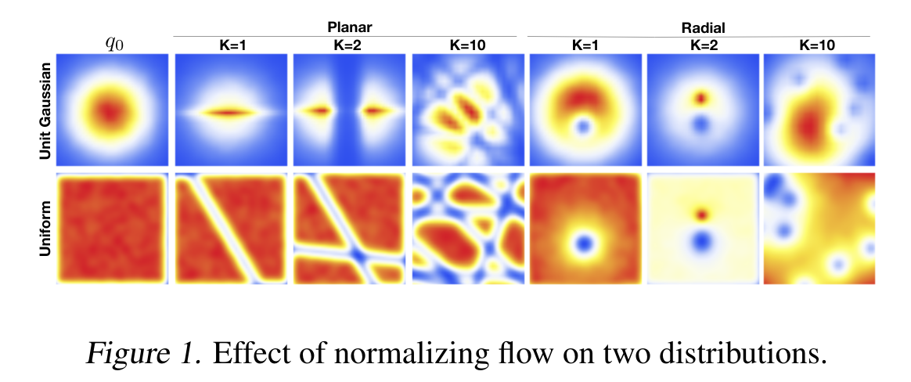
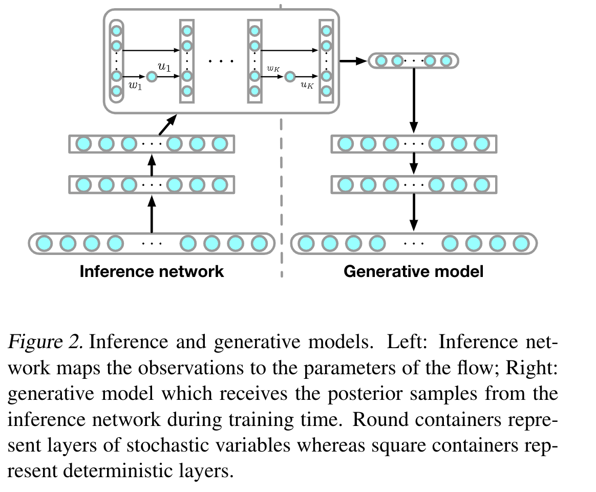
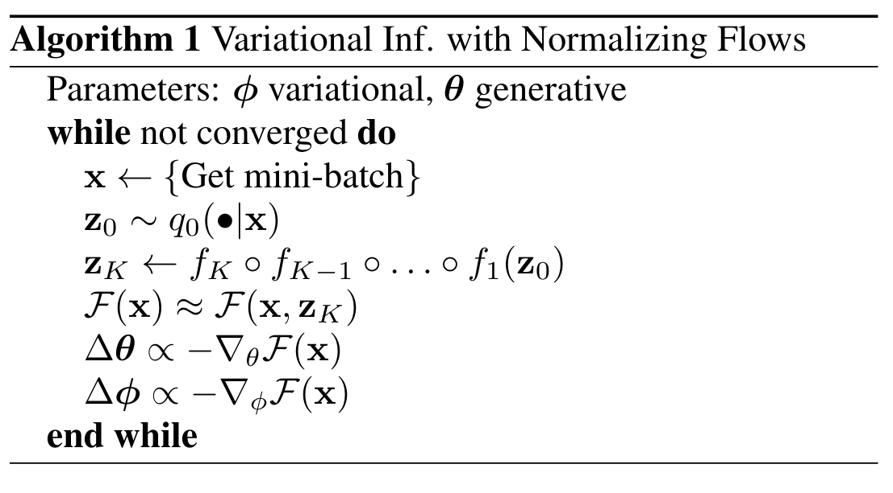
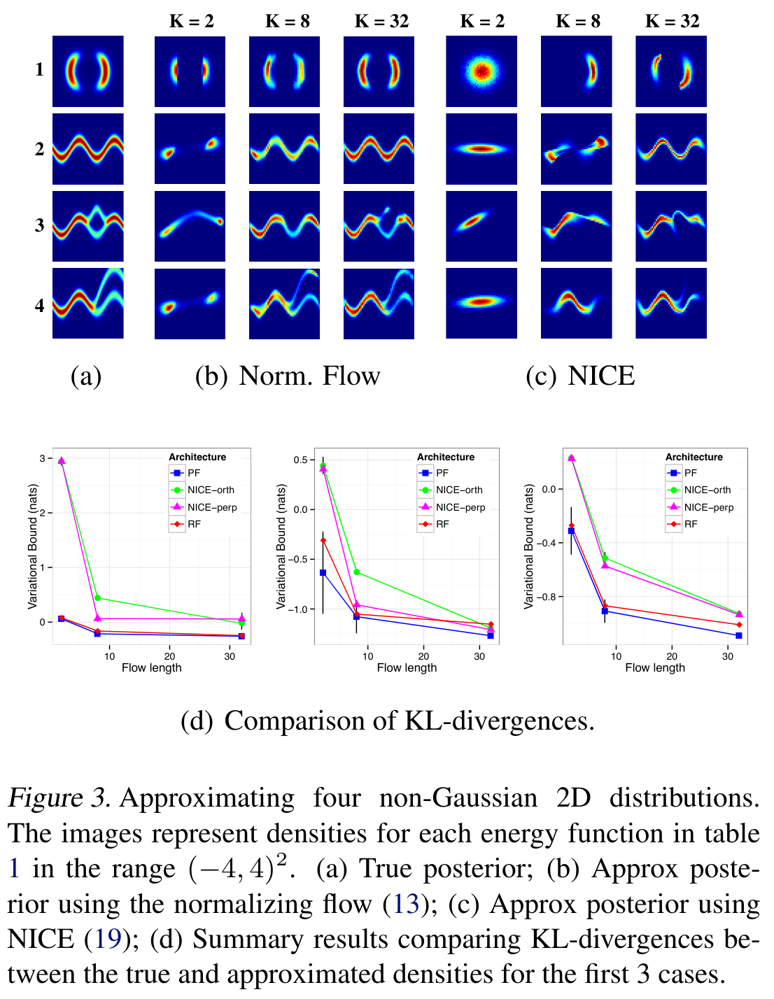
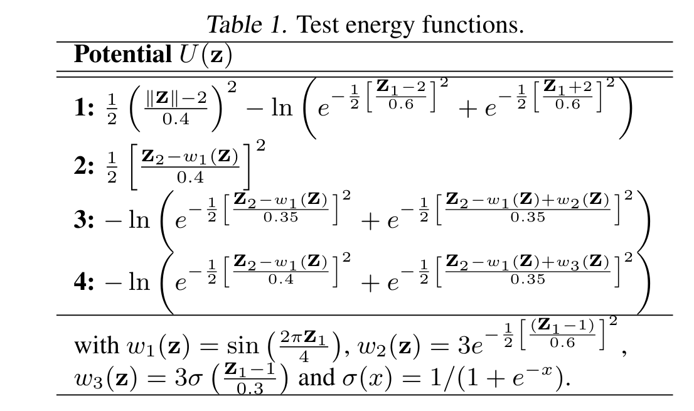

[](./fig_1.png "figure 1")

figure 1

## Abstract

> The choice of approximate posterior distribution is one of the core problems in variational inference. Most applications of variational inference employ simple families of posterior approximations in order to allow for efficient inference, focusing on mean-field or other simple structured approximations. This restriction has a significant impact on the quality of inferences made using variational methods. We introduce a new approach for specifying flexible, arbitrarily complex and scalable approximate posterior distributions. Our approximations are distributions constructed through a normalizing flow, whereby a simple initial density is transformed into a more complex one by applying a sequence of invertible transformations until a desired level of complexity is attained. We use this view of normalizing flows to develop categories of finite and infinitesimal flows and provide a unified view of approaches for constructing rich posterior approximations. We demonstrate that the theoretical advantages of having posteriors that better match the true posterior, combined with the scalability of amortized variational approaches, provides a clear improvement in performance and applicability of variational inference.
>
> — ([Rezende and Mohamed 2016](#ref-rezende2016vinflows))

[](./fig_2.png "figure 2")

figure 2

[](./alg_1.png "algorithm 1")

algorithm 1

[](./fig_3.png "figure 3")

figure 3

[](./table_1.png "table 1")

table 1

## The Paper

paper

Rezende, Danilo Jimenez, and Shakir Mohamed. 2016. *Variational Inference with Normalizing Flows*. <https://arxiv.org/abs/1505.05770>.

## Citation

BibTeX citation:

``` quarto-appendix-bibtex
@online{bochman2022,
  author = {Bochman, Oren},
  title = {Variational {Inference} with {Normalizing} {Flows}},
  date = {2022-06-26},
  url = {https://orenbochman.github.io/reviews/2015/vi-with-normalizing-flows/},
  langid = {en}
}
```

For attribution, please cite this work as:

Bochman, Oren. 2022. “Variational Inference with Normalizing Flows.” June 26. <https://orenbochman.github.io/reviews/2015/vi-with-normalizing-flows/>.
