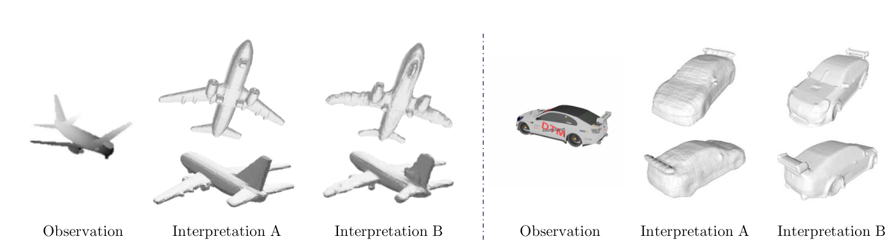
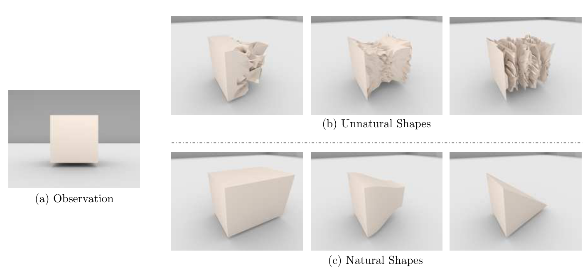
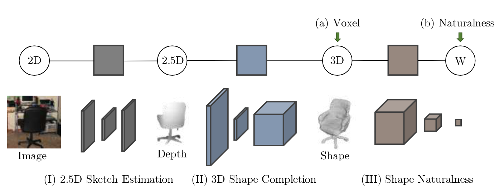
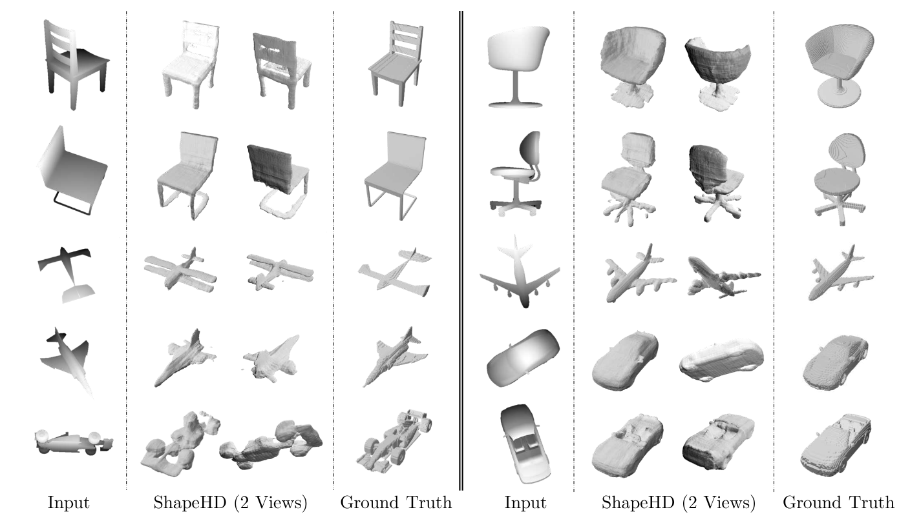
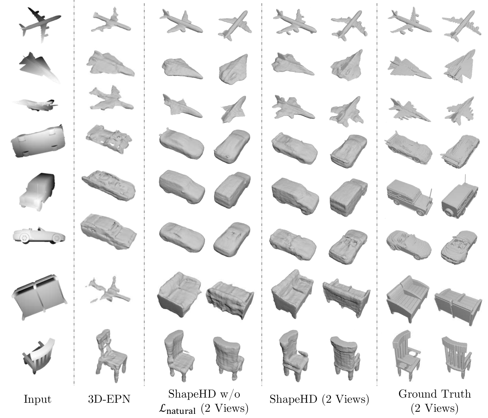
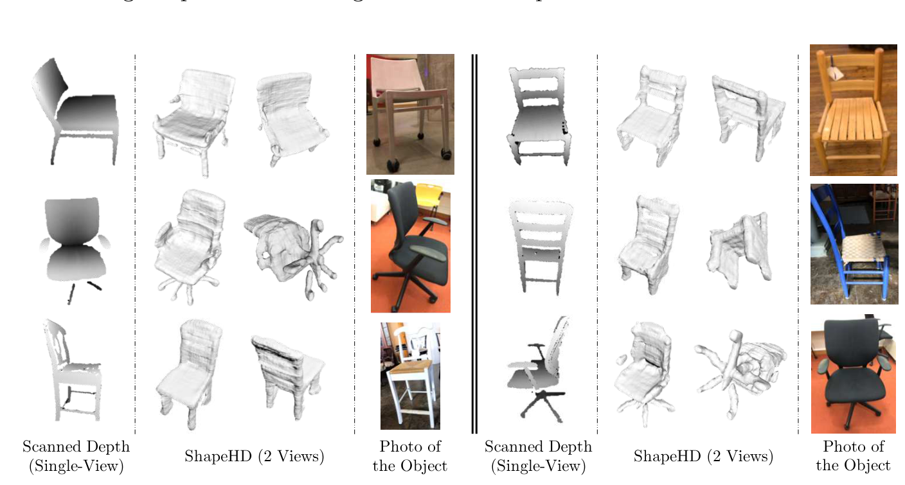

cover

[](mindmap.png "mindmap")

mindmap

# An error occurred.

Unable to execute JavaScript.

Josh Tenenbaum, MIT BMM Summer Course 2018 Computational Models of Cognition: Part 1

# An error occurred.

Unable to execute JavaScript.

Josh Tenenbaum, MIT BMM Summer Course 2018 Computational Models of Cognition: Part 2

# An error occurred.

Unable to execute JavaScript.

Josh Tenenbaum, MIT BMM Summer Course 2018 Computational Models of Cognition: Part 3

> “The ideal market completely disregards those spikes—but a realistic model cannot.” Mandelbrot highlights the inadequacy of models ignoring extreme price movements, emphasizing the need for a framework that can accommodate them.

For many years now I’ve been considering how to take Bayesian modeling and inference to the next level. One of the perennial question for me has been how to define a prior and a distribution over something more complex than a list of number.

When stuck I would often turn to Urn Models and try to build a prior from that. However, since I become interested in Complex signaling systems I have been looking for more and more challenging problems like - boolean functions, trees, recursive functions, trees, graphs and even type of neural networks. Unfortunately, the courses I took on Bayesian modeling and inference did not cover these kind of problems.

However once I came across some talks by Jeshua Tenenbaum I realized that he and his group have been compiling and extending the kind of models I had been at odds to define. This paper is one of the papers he mentions in the BMM Summer Course of 2018 in his summer school on Mind

> **NOTE:**
>
> [](../../../images/in_the_nut_shell_coach_retouched.jpg "ShapeHD in a nutshell")
>
> ShapeHD in a nutshell
>
> 1.  **The research question**
>     - **How can we effectively learn and integrate shape priors into a deep learning framework to overcome the inherent ambiguity in single-view 3D shape completion and reconstruction, particularly the issue that multiple plausible 3D shapes can explain a single 2D observation, in order to generate high-quality, detailed, and realistic 3D models?**
> 2.  **What are the main findings?**
>     - **Adversarially learned shape priors as a naturalness loss effectively handle ambiguity and generate realistic shapes.**
> 3.  **In historical context why was this important?**
>     - ShapeHD was important because it addressed the overlooked ambiguity of multiple plausible 3D shapes for a single view, a limitation of previous deep learning methods that produced blurry results. It innovatively used adversarially learned shape priors to generate realistic and detailed shapes, shifting from strict ground truth replication to learning the distribution of natural shapes. Its efficiency also marked progress towards practical applications.

Here is a lighthearted Deep Dive into the paper:

### Abstract

> The problem of single-view 3D shape completion or reconstruction is challenging, because among the many possible shapes that explain an observation, most are implausible and do not correspond to natural objects. Recent research in the field has tackled this problem by exploiting the expressiveness of deep convolutional networks. In fact, there is another level of ambiguity that is often overlooked: among plausible shapes, there are still multiple shapes that fit the 2D image equally well; i.e., the ground truth shape is non-deterministic given a single-view input. Existing fully supervised approaches fail to address this issue, and often produce blurry mean shapes with smooth surfaces but no fine details. In this paper, we propose ShapeHD, pushing the limit of single-view shape completion and reconstruction by integrating deep generative models with adversarially learned shape priors. The learned priors serve as a regularizer, penalizing the model only if its output is unrealistic, not if it deviates from the ground truth. Our design thus overcomes both levels of ambiguity aforementioned. Experiments demonstrate that ShapeHD outperforms state of the art by a large margin in both shape completion and shape reconstruction on multiple real datasets.
>
> — ([Wu et al. 2018](#ref-wu2018learning))

## Glossary

This paper uses lots of big terms so let’s break them down so we can understand them better

Single-View 3D Completion  
The task of predicting the complete 3D shape of an object given only a partial observation from a single viewpoint (e.g., a depth image).

Single-View 3D Reconstruction  
The task of inferring the 3D shape of an object from a single 2D image (e.g., an RGB image).

Shape Priors  
Prior knowledge or assumptions about the likely shapes of objects, often learned from data. In ShapeHD, these are learned through an adversarial process to represent the distribution of realistic 3D shapes.

Deep Generative Models  
Neural network models that learn the underlying probability distribution of a dataset, allowing them to generate new samples that resemble the training data (e.g., Generative Adversarial Networks (GANs)).

Adversarial Learning  
A training paradigm where two neural networks (a generator and a discriminator) compete against each other. The generator tries to produce realistic data, while the discriminator tries to distinguish between real and generated data.

Voxel  
A volumetric pixel, representing a value on a regular grid in 3D space. Often used to represent 3D shapes in deep learning.

2.5D Sketch  
An intermediate representation of a scene or object that captures some 3D information (like depth and surface normals) but is still view-dependent, typically represented as 2D images.

ShapeNet  
A large-scale database of 3D CAD models categorized into semantic classes, commonly used for training and evaluating 3D shape analysis algorithms.

Naturalness Loss  
A loss function in ShapeHD, derived from the adversarial discriminator, that penalizes generated 3D shapes that are deemed unrealistic or not belonging to the learned distribution of natural shapes.

Wasserstein GAN (WGAN)  
A variant of the Generative Adversarial Network that uses a different loss function (Wasserstein distance) and gradient penalty to improve training stability and address issues like mode collapse.

Intersection over Union (IoU)  
A common evaluation metric for tasks like object detection and segmentation, measuring the overlap between the predicted and ground truth regions (or volumes in 3D).

Chamfer Distance (CD)  
A metric used to measure the distance between two point sets (or shapes represented as point samples). It calculates the average nearest neighbor distance between the points in the two sets.

Encoder-Decoder Structure  
A common neural network architecture where an encoder network maps the input to a lower-dimensional representation (latent vector), and a decoder network reconstructs the output from this latent vector.

ResNet: Residual Network, a type of deep convolutional neural network architecture that uses “skip connections” to help train very deep networks effectively.

Transposed Convolutional Layers  
Also known as deconvolutional layers or fractionally strided convolutions, these layers perform the inverse operation of a standard convolution, often used in the decoder part of generative models to upsample feature maps.

Binary Cross-Entropy Loss  
A loss function commonly used in binary classification tasks, measuring the difference between predicted probabilities and binary target labels (e.g., for voxel occupancy).

Gradient Penalty  
A regularization term added to the WGAN loss to enforce a Lipschitz constraint on the discriminator, further stabilizing training.

Ablation Study  
An experiment where parts of a model or training process are removed or modified to assess their contribution to the overall performance.

## Outline

[](./fig01.png "Figure 1: Our model completes or reconstructs the object’s full 3D shape with fine details from a single depth or RGB image. In this figure, we show two examples, each consisting of an input image, two views of its ground truth shape, and two views of our results. Our reconstructions are of high quality with fine details, and are preferred by humans 41% and 35% of the time in behavioral studies, respectively. Our model takes a single feed-forward pass without any post-processing during testing, and is thus highly efficient (< 100 ms) and practically useful.")

Figure 1: Our model completes or reconstructs the object’s full 3D shape with fine details from a single depth or RGB image. In this figure, we show two examples, each consisting of an input image, two views of its ground truth shape, and two views of our results. Our reconstructions are of high quality with fine details, and are preferred by humans 41% and 35% of the time in behavioral studies, respectively. Our model takes a single feed-forward pass without any post-processing during testing, and is thus highly efficient (\< 100 ms) and practically useful.

[](./fig02.png "Figure 2: Two levels of ambiguity in single-view 3D shape perception. For each 2D observation (a), there exist many possible 3D shapes that explain this observation equally well (b, c), but only a small fraction of them correspond to real, daily shapes (c). Methods that exploit deep networks for recognition reduce, to a certain extent, ambiguity on this level. By using an adversarially learned naturalness model, our ShapeHD aims to model ambiguity on the next level: even among the realistic shapes, there are still multiple shapes explaining the observation well (c)")

Figure 2: Two levels of ambiguity in single-view 3D shape perception. For each 2D observation (a), there exist many possible 3D shapes that explain this observation equally well (b, c), but only a small fraction of them correspond to real, daily shapes (c). Methods that exploit deep networks for recognition reduce, to a certain extent, ambiguity on this level. By using an adversarially learned naturalness model, our ShapeHD aims to model ambiguity on the next level: even among the realistic shapes, there are still multiple shapes explaining the observation well (c)

[](./fig03.png "Figure 3: For single-view shape reconstruction, ShapeHD contains three components: (I) a 2.5D sketch estimator that predicts depth, surface normal and silhouette images from a single image; (II) a 3D shape completion module that regresses 3D shapes from silhouette-masked depth and surface normal images; (III) an adversarially pretrained convolutional net that serves as the naturalness loss function. While fine-tuning the 3D shape completion net, we use two losses:a supervised loss on the output shape, and a naturalness loss offered by the pretrained discriminator")

Figure 3: For single-view shape reconstruction, ShapeHD contains three components: (I) a 2.5D sketch estimator that predicts depth, surface normal and silhouette images from a single image; (II) a 3D shape completion module that regresses 3D shapes from silhouette-masked depth and surface normal images; (III) an adversarially pretrained convolutional net that serves as the naturalness loss function. While fine-tuning the 3D shape completion net, we use two losses:a supervised loss on the output shape, and a naturalness loss offered by the pretrained discriminator

[](./fig04.png "Figure 4: Results on 3D shape completion from single-view depth. From left to right: input depth maps, shapes reconstructed by ShapeHD in the canonical view and a novel view, and ground truth shapes in the canonical view. Assisted by the adversarially learned naturalness losses, ShapeHD recovers highly accurate 3D shapes with fine details. Sometimes the reconstructed shape deviates from the ground truth, but can be viewed as another plausible explanation of the input (e.g., the airplane on the left, third row)")

Figure 4: Results on 3D shape completion from single-view depth. From left to right: input depth maps, shapes reconstructed by ShapeHD in the canonical view and a novel view, and ground truth shapes in the canonical view. Assisted by the adversarially learned naturalness losses, ShapeHD recovers highly accurate 3D shapes with fine details. Sometimes the reconstructed shape deviates from the ground truth, but can be viewed as another plausible explanation of the input (e.g., the airplane on the left, third row)

[](./fig05.png "Figure 5: Our results on 3D shape completion, compared with the state of the art, 3D-EPN [8], and our model but without naturalness losses. Our results contain more details than 3D-EPN. We observe that the adversarially trained naturalness losses help fix errors, add details (e.g., the plane wings in row 3, car seats in row 6, and chair arms in row 8), and smooth planar surfaces (e.g., the sofa back in row 7)")

Figure 5: Our results on 3D shape completion, compared with the state of the art, 3D-EPN \[8\], and our model but without naturalness losses. Our results contain more details than 3D-EPN. We observe that the adversarially trained naturalness losses help fix errors, add details (e.g., the plane wings in row 3, car seats in row 6, and chair arms in row 8), and smooth planar surfaces (e.g., the sofa back in row 7)

[](./fig06.png "Figure 6: Results of 3D shape completion on depth data from a physical scanner. Our model is able to reconstruct the shape well from just a single view. From left to right: input depth, two views of our result, and a color image of the object")

Figure 6: Results of 3D shape completion on depth data from a physical scanner. Our model is able to reconstruct the shape well from just a single view. From left to right: input depth, two views of our result, and a color image of the object

- 1 Introduction
  - Introduces the challenge of single-view 3D shape completion and reconstruction, highlighting the ambiguity of the task.
  - Notes the limitations of existing deep learning methods in capturing the full range of plausible shapes.
  - Briefly mentions the use of adversarially learned shape priors in ShapeHD to address this ambiguity.
- 2 Related Work
  - Discusses traditional and recent methods for 3D shape completion, including those using deep learning.
  - Reviews single-image 3D reconstruction techniques, including those based on voxels, point clouds, and 2.5D sketches.
  - Covers the use of perceptual losses and adversarial learning in computer vision, particularly in the context of 3D shape synthesis and reconstruction.
- 3 Approach
  - Presents the three components of ShapeHD: a 2.5D sketch estimator, a 3D shape estimator, and a deep naturalness model.
  - Describes the architecture and training process of the 2.5D sketch estimation network.
  - Explains the encoder-decoder structure and supervised loss used in the 3D shape completion network.
- 3.1 Shape Naturalness Network
  - Explains the role of the shape naturalness network in addressing the ambiguity of single-view reconstruction.
  - Describes the adversarial training process of the naturalness network using a 3D generative adversarial network (GAN).
  - Presents the Wasserstein GAN loss with a gradient penalty used to stabilize GAN training.
- 3.2 Training Paradigm
  - Outlines the two-stage training process of ShapeHD, including pre-training and fine-tuning.
  - Discusses the separate training of the 2.5D sketch estimator, 3D shape estimator, and naturalness network.
  - Explains the fine-tuning process of the completion network using both voxel loss and naturalness losses.
- 4 Single-View Shape Completion
  - Focuses on the application of ShapeHD to 3D shape completion from single depth images.
- 4.1 Setup
  - Describes the data preparation process using ShapeNet Core55 objects, including rendering depth and surface normal images.
  - Mentions the baselines used for comparison, specifically 3D-EPN.
  - Lists the quantitative metrics used for evaluation: Intersection over Union (IoU) and Chamfer Distance (CD).
- 4.2 Results on ShapeNet
  - Presents qualitative results of ShapeHD on ShapeNet, highlighting its ability to recover fine details and handle occlusions.
  - Discusses an ablation study comparing ShapeHD with and without naturalness loss, demonstrating the benefits of the latter.
  - Provides quantitative results showing ShapeHD’s superior performance over 3D-EPN in both IoU and CD.
- 4.3 Results on Real Depth Scans
  - Shows results of ShapeHD on real depth scans captured using a Structure sensor.
  - Highlights the flexibility of ShapeHD in handling real-world data without requiring camera parameters.
- 5 3D Shape Reconstruction
  - Evaluates ShapeHD on 3D shape reconstruction from single color images.
- 5.1 Setup
  - Describes the rendering process for RGB images, including the use of various backgrounds for realism.
  - Lists the baselines used for comparison, including 3D-R2N2, PSGN, DRC, OGN, and AtlasNet.
  - Mentions the use of Chamfer Distance (CD) as the primary evaluation metric.
- 5.2 Results
  - Presents qualitative and quantitative results of ShapeHD on ShapeNet, demonstrating its ability to reconstruct detailed shapes.
  - Discusses the generalization ability of ShapeHD on novel object categories, showing its superior performance over DRC.
  - Shows results on real datasets (PASCAL 3D+ and Pix3D), highlighting ShapeHD’s ability to handle real-world images.
  - Includes a user study comparing ShapeHD with OGN, indicating a preference for ShapeHD’s reconstructions.
- 6 Analyses
  - Provides insights into the learned representations and behavior of ShapeHD.
  - Visualizes the network’s learned object and part detectors, demonstrating its ability to attend to meaningful shape features.
  - Analyzes the effect of naturalness loss over time, showing how it contributes to the emergence of fine details.
  - Discusses common failure modes of ShapeHD, such as difficulties with deformable parts and thin structures.
- 7 Conclusion
  - Summarizes the key contributions of the paper, emphasizing the use of learned shape priors to address ambiguity.
  - Highlights the state-of-the-art performance of ShapeHD in 3D shape completion and reconstruction.
  - Suggests future research directions in 3D shape modeling, particularly in understanding and modeling ambiguity.

## Reflections

Lorem ipsum dolor sit amet, consectetur adipiscing elit. Duis sagittis posuere ligula sit amet lacinia. Duis dignissim pellentesque magna, rhoncus congue sapien finibus mollis. Ut eu sem laoreet, vehicula ipsum in, convallis erat. Vestibulum magna sem, blandit pulvinar augue sit amet, auctor malesuada sapien. Nullam faucibus leo eget eros hendrerit, non laoreet ipsum lacinia. Curabitur cursus diam elit, non tempus ante volutpat a. Quisque hendrerit blandit purus non fringilla. Integer sit amet elit viverra ante dapibus semper. Vestibulum viverra rutrum enim, at luctus enim posuere eu. Orci varius natoque penatibus et magnis dis parturient montes, nascetur ridiculus mus.

Nunc ac dignissim magna. Vestibulum vitae egestas elit. Proin feugiat leo quis ante condimentum, eu ornare mauris feugiat. Pellentesque habitant morbi tristique senectus et netus et malesuada fames ac turpis egestas. Mauris cursus laoreet ex, dignissim bibendum est posuere iaculis. Suspendisse et maximus elit. In fringilla gravida ornare. Aenean id lectus pulvinar, sagittis felis nec, rutrum risus. Nam vel neque eu arcu blandit fringilla et in quam. Aliquam luctus est sit amet vestibulum eleifend. Phasellus elementum sagittis molestie. Proin tempor lorem arcu, at condimentum purus volutpat eu. Fusce et pellentesque ligula. Pellentesque id tellus at erat luctus fringilla. Suspendisse potenti.

## The paper

paper

Wu, Jiajun, Chengkai Zhang, Xiuming Zhang, Zhoutong Zhang, William T Freeman, and Joshua B Tenenbaum. 2018. “Learning Shape Priors for Single-View 3d Completion and Reconstruction.” *Proceedings of the European Conference on Computer Vision (ECCV)*, 646–62.

## Citation

BibTeX citation:

``` quarto-appendix-bibtex
@online{bochman2025,
  author = {Bochman, Oren},
  title = {Learning {Shape} {Priors} for {Single-View} {3D} {Completion}
    and {Reconstruction}},
  date = {2025-03-29},
  url = {https://orenbochman.github.io/reviews/2018/ShapeHD/},
  langid = {en}
}
```

For attribution, please cite this work as:

Bochman, Oren. 2025. “Learning Shape Priors for Single-View 3D Completion and Reconstruction.” March 29. <https://orenbochman.github.io/reviews/2018/ShapeHD/>.
