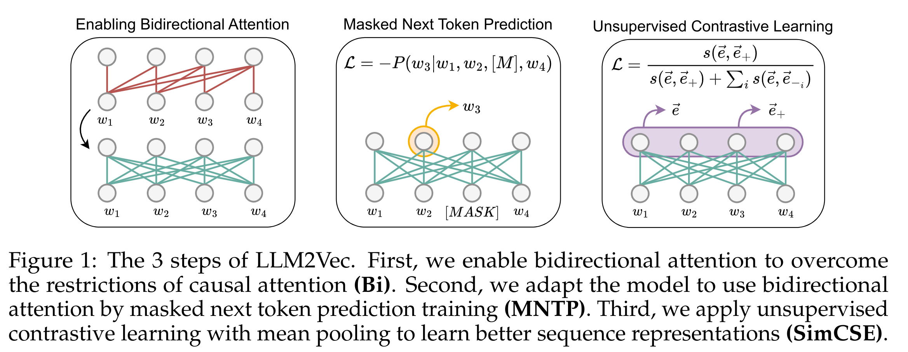
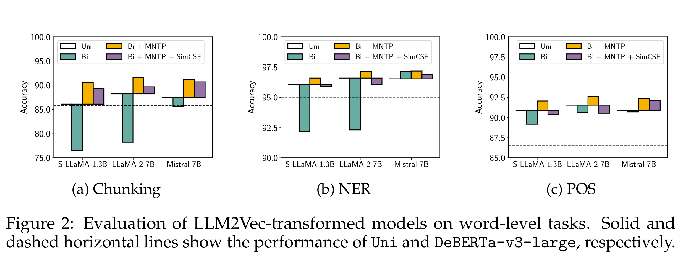
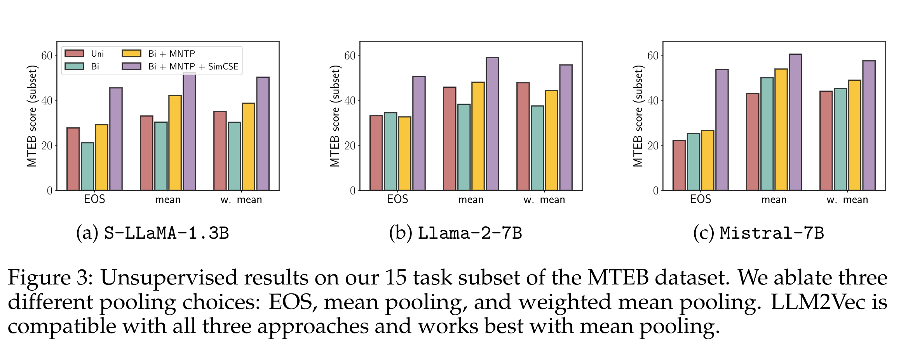

# An error occurred.

Unable to execute JavaScript.

AI - narration of this paper.

## TL;DR

In ([BehnamGhader et al. 2024](#ref-behnamghader2024llm2veclargelanguagemodels)) the authors consider using LLMs which are mostly decoder only transformers as text encoders. This allows them to use the LLMs for NLP tasks like chunking, NEW and POS. Recall that T5 ([Raffel et al. 2020](#ref-raffel2020exploring)) can do this is a decoder encode model.

## Tricks

1.  enabling bidirectional attention,
2.  masked next token prediction, and
3.  unsupervised contrastive learning.

## Abstract

> Large decoder-only language models (LLMs) are the state-of-the-art models on most of today’s NLP tasks and benchmarks. Yet, the community is only slowly adopting these models for text embedding tasks, which require rich contextualized representations. In this work, we introduce LLM2Vec, a simple unsupervised approach that can transform any decoder-only LLM into a strong text encoder. LLM2Vec consists of three simple steps: 1) enabling bidirectional attention, 2) masked next token prediction, and 3) unsupervised contrastive learning. We demonstrate the effectiveness of LLM2Vec by applying it to 4 popular LLMs ranging from 1.3B to 8B parameters and evaluate the transformed models on English word- and sequence-level tasks. We outperform encoder-only models by a large margin on word-level tasks and reach a new unsupervised state-of-the-art performance on the Massive Text Embeddings Benchmark (MTEB). Moreover, when combining LLM2Vec with supervised contrastive learning, we achieve state-of-the-art performance on MTEB among models that train only on publicly available data (as of May 24, 2024). Our strong empirical results and extensive analysis demonstrate that LLMs can be effectively transformed into universal text encoders in a parameter-efficient manner without the need for expensive adaptation or synthetic GPT-4 generated data.

[](fig1.png "The 3 steps of LLM2Vec")

The 3 steps of LLM2Vec

[](fig2.png "Evaluation on word level tasks")

Evaluation on word level tasks

[](fig3.png "Unsupervised results")

Unsupervised results

## The paper

paper

## Resources

- [code](https://github.com/McGill-NLP/llm2vec)

BehnamGhader, Parishad, Vaibhav Adlakha, Marius Mosbach, Dzmitry Bahdanau, Nicolas Chapados, and Siva Reddy. 2024. *LLM2Vec: Large Language Models Are Secretly Powerful Text Encoders*. <https://arxiv.org/abs/2404.05961>.

Raffel, Colin, Noam Shazeer, Adam Roberts, et al. 2020. “Exploring the Limits of Transfer Learning with a Unified Text-to-Text Transformer.” *Journal of Machine Learning Research* 21 (140): 1–67.

## Citation

BibTeX citation:

``` quarto-appendix-bibtex
@online{bochman2025,
  author = {Bochman, Oren},
  title = {LLM2Vec: {Large} {Language} {Models} {Are} {Secretly}
    {Powerful} {Text} {Encoders}},
  date = {2025-02-15},
  url = {https://orenbochman.github.io/reviews/2024/LLM2Vec/},
  langid = {en}
}
```

For attribution, please cite this work as:

Bochman, Oren. 2025. “LLM2Vec: Large Language Models Are Secretly Powerful Text Encoders.” February 15. <https://orenbochman.github.io/reviews/2024/LLM2Vec/>.
