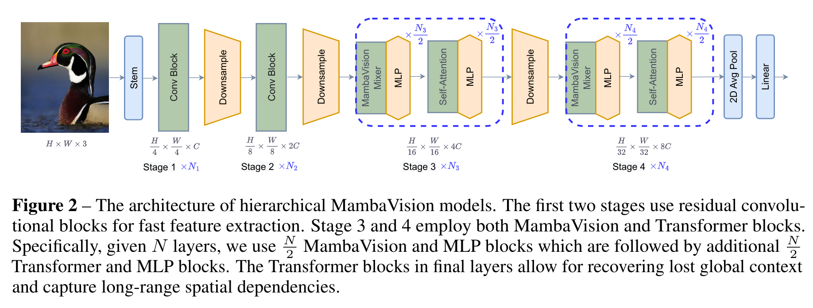
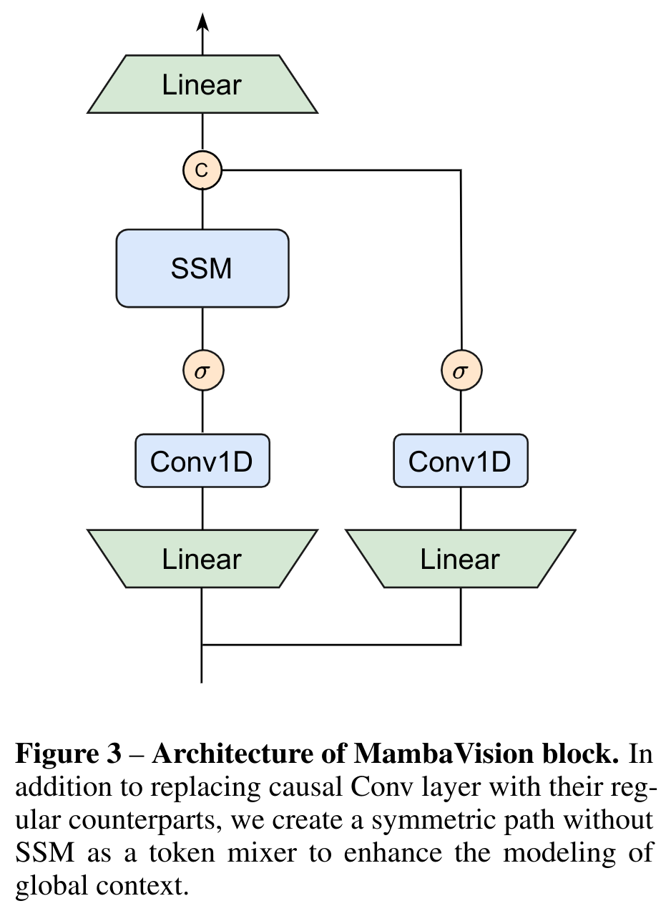

## Introduction

In ([Hatamizadeh and Kautz 2024](#ref-hatamizadeh2024mambavision)), the authors apply the State Space Model (SSM) inherent in recently introduced Mamba architecture, ([Gu and Dao 2023](#ref-gu2023mamba)), for vision tasks. They point out that prior work on using the Mamba architecture for vision was ill-suited these tasks and propose a remedy in the form of a hybrid Mamba-Transformer architecture which they call MambaVision. Thier experiment show that MambaVision outperforms other vision architectures on ImageNet-1K, MS COCO and ADE20K datasets.

The paper’s main innovation is more self-attention blocks in the final layers of the transformer which improves the models ability to capture long-range spatial dependencies.

## The problems with Mamba for vision tasks

A *dilettante reader* like myself might be interested in the author’s outline of the shortcomings of the Mamba architecture for vision tasks and earlier attempt in ([Zhu et al. 2024](#ref-zhu2024vision)) *vision mamba* model which directed thier efforts the right direction.

> … the Mamba’s autoregressive formulation, while effective for tasks requiring sequential data processing, faces limitations in computer vision tasks that benefit from a **full receptive field**[^1]:
>
> 1.  Unlike sequences where order matters, image pixels do not have a sequential dependency in the same way. Instead, spatial relationships are often local and need to be considered in a more parallel and integrated manner. Hence, this results in inefficiency for processing spatial data
>
> 2.  an autoregressive model like Mamba processes data step-by-step, limiting its ability to capture and utilize global context in one forward pass. In contrast, vision tasks often require understanding the global context to make accurate predictions about local regions

> Vision Mamba (Vim) and others have proposed modifications such as bidirectional SSMs to address lack of global context and spatial understanding. While bidirectional SSMs have the potential to capture more comprehensive context, they introduce significant latency due to the need to process the entire sequence before making predictions. Additionally, the increased complexity can lead to challenges in training, risk of overfitting, and may not always result in better accuracy. Due to these pitfalls, backbones with Vision Transformer (ViT) and Convolutional Neural Network (CNN) architectures still outperform best Mamba-based vision models on different vision tasks. — ([Hatamizadeh and Kautz 2024, 2](#ref-hatamizadeh2024mambavision))

To sum all this up - Mamba’s auto regressive nature is well suited to temporal and sequential data like text and speech but is ill suited to handle spatial data like images where order manifests as a hierarchy of spatial neighborhoods which should be processed in parallel. Thus for vision, mamba suffer a loss in the efficiency of the flow of information both locally and globally. As such pre mamba vision models fare better.

The next section outlines the ideas espoused in prior work both pre and post mamba. This section summarizes both the earlier work on computer vision models since the introduction of Transformers and some results since the introduction of the Mamba architecture.

- Vision Transformer (ViT) ([Dosovitskiy et al. 2021](#ref-dosovitskiy2021imageworth16x16words)) showed that CNNs can be replaced with self-attention, but wasn’t data efficient.
- Data-efficient Image Transformer (DeiT) ([Touvron et al. 2021](#ref-touvron2021training)) used distillation to train ViT more efficient.
- LeViT model ([Graham et al. 2021](#ref-graham2021levit)) introduced a redesign for MLP and self-attention with a Lenet like pyramid pooling structure.
- Cross-covariance Image Transformer (XCiT) ([Ali et al. 2021](#ref-ali2021xcit)) introduced transposed self-attention mechanism more effectively modeling interactions between feature channels.
- The Pyramid Vision Transformer (PVT) ([Wang et al. 2021](#ref-wang2021pyramid)) improving efficiency by adopting a hierarchical structure with patch embedding at the start of each stage and spatial dimension reduction.
- Swin Transformer ([Liu et al. 2021](#ref-liu2021swin)) used shifted windows to improve the efficiency of self-attention computation.
- Twins Transformer ([Chu et al. 2021](#ref-chu2021twins)) featured spatially separable self-attention that significantly enhanced efficiency.
- Focal Transformer ([Yang et al. 2021](#ref-yang2021focal)) used a focal mechanism to improve the efficiency of self-attention computation for capturing long-range interactions.

## 3.1 The MambaVision Architecture - Macro

MambaVision has a hierarchical architecture consisting of 4 different stages. The first two stages consist of CNN-based layers for fast feature extraction at higher input resolutions, while stage 3 and 4 include the proposed MambaVision and Transformer blocks.

[](fig2.png "Architecture of hierarchical MambaVision")

Architecture of hierarchical MambaVision

The first two blocks in stages 1 and 2

\hat z = GELU(BN(Conv\_{3×3}(z)))

z = BN(Conv\_{3×3}(\hat z)) + z

Where GELU is the Gaussian Error Linear Unit activation function, a modern alternative to the rectified linear unit (ReLU) function, and BN is good old batch normalization layer which transforms the inputs to have zero mean and unit variance which speeds up training.

## 3.2 The MambaVision Architecture - Micro

[](fig3.png "Figure 1: Architecture of MambaVision block")

Figure 1: Architecture of MambaVision block

The authors redesigned the original Mamba mixer to make it more suitable for vision tasks.

1.  regular convolution replaces causal convolution
2.  added a symmetric branch without SSM , consisting of an additional convolution and SiLU activation, to compensate for any content lost due to the sequential constraints of SSMs.
3.  These branches are concatenated and project via a final linear layer.

This combination ensures that the final feature representation incorporates both the sequential and spatial information, leveraging the strengths of both branches.

\begin{align\*} X_1 &= Scan(σ(Conv(Linear(C, \frac{C}{2} )(X\_{in})))) \\ X_2 &= σ(Conv(Linear(C, \frac{C}{2} )(X\_{in}))) \\ X\_{out} &= Linear( \frac{C}{2} , C)(Concat(X_1, X_2)) \\ \end{align\*}

## Ablation Studies

Section 4 the experiment looks at MambaVision’s performance in image classification as well as other downstream tasks like, object detection, instance segmentation and semantic segmentation tasks. The authors note that the model was equipped with the model with specialized heads for different tasks and required fine tuning the original model. I am a somewhat critical of calling this the performance on downstream tasks when we are talking about models with different layers that were fine tuned using different optimizers on task specific datasets.

The results section outline an **ablation study**[^2] used to identify the optimal way to integrate the Vision Transformer (ViT) with the Mamba architecture.

As usual, the authors provide a family of models with different sizes to gauge the performance characteristics for scaling the model.

The various models

## Resources

- [paper](https://arxiv.org/pdf/2407.08083)
- [code](https://github.com/NVlabs/MambaVision)

Ali, Alaaeldin, Hugo Touvron, Mathilde Caron, et al. 2021. “Xcit: Cross-Covariance Image Transformers.” *Advances in Neural Information Processing Systems* 34: 20014–27.

Chu, Xiangxiang, Zhi Tian, Yuqing Wang, et al. 2021. “Twins: Revisiting the Design of Spatial Attention in Vision Transformers.” *Advances in Neural Information Processing Systems* 34: 9355–66.

Dosovitskiy, Alexey, Lucas Beyer, Alexander Kolesnikov, et al. 2021. *An Image Is Worth 16x16 Words: Transformers for Image Recognition at Scale*. <https://arxiv.org/abs/2010.11929>.

Graham, Benjamin, Alaaeldin El-Nouby, Hugo Touvron, et al. 2021. “Levit: A Vision Transformer in Convnet’s Clothing for Faster Inference.” *Proceedings of the IEEE/CVF International Conference on Computer Vision*, 12259–69.

Gu, Albert, and Tri Dao. 2023. “Mamba: Linear-Time Sequence Modeling with Selective State Spaces.” *arXiv Preprint arXiv:2312.00752*.

Hatamizadeh, Ali, and Jan Kautz. 2024. “MambaVision: A Hybrid Mamba-Transformer Vision Backbone.” *arXiv Preprint arXiv:2407.08083*.

Liu, Ze, Yutong Lin, Yue Cao, et al. 2021. “Swin Transformer: Hierarchical Vision Transformer Using Shifted Windows.” *Proceedings of the IEEE/CVF International Conference on Computer Vision*, 10012–22.

Touvron, Hugo, Matthieu Cord, Matthijs Douze, Francisco Massa, Alexandre Sablayrolles, and Hervé Jégou. 2021. “Training Data-Efficient Image Transformers & Distillation Through Attention.” *International Conference on Machine Learning*, 10347–57.

Wang, Wenhai, Enze Xie, Xiang Li, et al. 2021. “Pyramid Vision Transformer: A Versatile Backbone for Dense Prediction Without Convolutions.” *Proceedings of the IEEE/CVF International Conference on Computer Vision*, 568–78.

Yang, Jianwei, Chunyuan Li, Pengchuan Zhang, et al. 2021. “Focal Attention for Long-Range Interactions in Vision Transformers.” *Advances in Neural Information Processing Systems* 34: 30008–22.

Zhu, Lianghui, Bencheng Liao, Qian Zhang, Xinlong Wang, Wenyu Liu, and Xinggang Wang. 2024. “Vision Mamba: Efficient Visual Representation Learning with Bidirectional State Space Model.” *arXiv Preprint arXiv:2401.09417*.

## Citation

BibTeX citation:

``` quarto-appendix-bibtex
@online{bochman2025,
  author = {Bochman, Oren},
  title = {MambaVision {A} {Hybrid} {Mamba-Transformer} {Vision}
    {Backbone}},
  date = {2025-02-15},
  url = {https://orenbochman.github.io/reviews/2024/mamba-vision/},
  langid = {en}
}
```

For attribution, please cite this work as:

Bochman, Oren. 2025. “MambaVision A Hybrid Mamba-Transformer Vision Backbone.” February 15. <https://orenbochman.github.io/reviews/2024/mamba-vision/>.

[^1]: seeing the full picture or at least big parts of it

[^2]: investigating the effects of removing parts of a model
