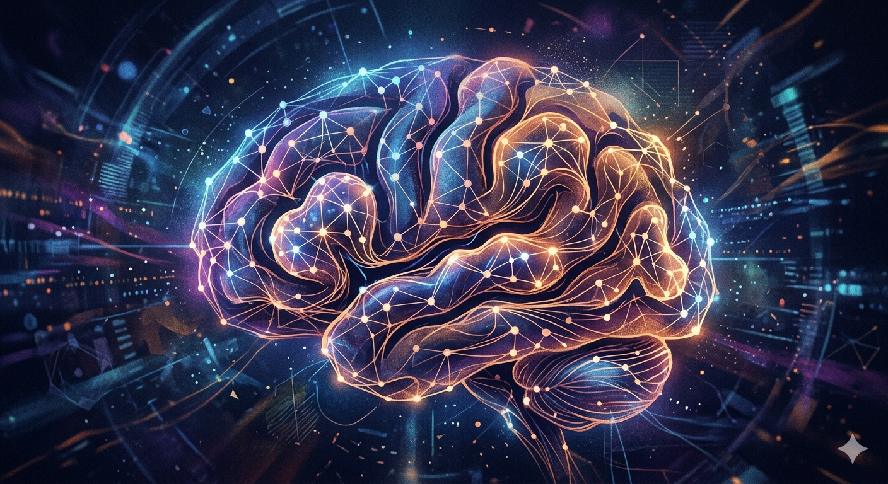

::: {.column-margin}
{width=100%}
:::

::: {.callout-note}

## TLDR; What is Lobeformation?

Standard models easily learn high-frequency "main effects," but sparse signals (the long tail) are often overwhelmed by chance-driven noise. **Lobeformation** partitions a model into sub-topologies—**lobes**—and uses a router to direct *related* signals into them. By isolating sparse signals from the global noise floor, we increase the local SNR and enable faster, more robust learning.
:::

## The Signal and the Noise

**Alice:** "What is the reason that models overfit?"

**Bob:** "One reason is that they are [unable to discriminate between the signal and the noise]{.marked} during training, so they fit to both."

**Alice:** "Why is overfitting so common?"

**Bob:** "Effect size. For a model to learn a pattern, it needs enough evidence to be confident the effect is real and not due to chance. Imagine a store: we might have three effects—price, unique inventory, and a specific promotion."

**Alice:** "What do you mean by chance?"

**Bob:** "Say we collect data for a week to see who likes our store. If an event was happening across the street that week, the model might predict that 'asking for directions' is a trait of a loyal customer. Those aren't clients; that's just a coincidence of that specific time and place."

**Alice:** "Ok, and why are these effects so hard to track?"

**Bob:** "The model is easily fooled by randomness. If you run a great promotion but the weather is poor or a nearby bus stop is closed, the data will suggest the promotion failed. Unless we explicitly control for those hidden 'confounders,' the signal is lost."

**Alice:** "So what does one do?"

**Bob:** "We usually increase sampling—collect more data, at different times and locations. But if an effect has low power—like sales to a specific niche—only a massive amount of data will work because those signals are sparse."

## The Problem: The Power-Law of Signal

Most real-world datasets follow a power-law distribution. A model learns the "Main Effects" quickly, but the more interesting, nuanced patterns are sparse. As the model attempts to move beyond the main effects, the noise floor begins to overtake the signal.

We can formalize this using binary sequences. In a stream of data, a **Signal** is a consistent, adaptive pattern, whereas **Noise** is random.

| Pattern | Frequency | Type |
| --- | --- | --- |
| `0` | High | Main Effect |
| `10` | Medium | Secondary Effect |
| `1100` | Low | Sparse Signal |
| `1101` | Low | Random Noise |

### More Data vs. More Capacity

The simplest remedy is more data; with enough volume, random noise averages out while the signal persists. However, a model has a finite **capacity**. A long, sparse signal must compete with shorter, more frequent noise patterns. To avoid fitting noise aggressively, we need an architecture that doesn't just increase in size, but increases in **organized capacity**.

## Lobeformation: Topological Specialization

My proposal is to treat the model as a **topology** of "Neural Paths" (NPs) connecting inputs to outputs. By partitioning the model into **lobes**, we increase the SNR within specific sub-structures.

### Key Concepts:

1. **Neural Path (NP):** A specific route from input to output.
2. **The Router:** A mechanism that maps input batches to specific NPs.
3. **Lobe:** A cluster of related NPs that preferentially share nodes.

### The Routing Hierarchy:

* **First-Order Router:** Picks a sub-topology with one "Core NP." It allows for "path damage" (dropout) on peripheral nodes to force the core to stabilize.
* **Second-Order Router:** Handles complex batches. It picks a union of two NPs. If they don't naturally intersect, it selects a "Crossover NP" to learn the interaction between the two signals.

### Challenges to Address:

* Finding an initial topology that supports multiple sub-partitions.
* Encouraging lobes to specialize without becoming redundant.
* Co-training the **Router** and the **Main Model** simultaneously.

---

## Interlude: Random Processes and Symmetry Breaking

The basis of this discrimination must be statistical. We can view the data-generating process as a mixture of two components:

1. **Signal Process:** A distribution over bit strings using a structured subset of possible patterns.
2. **Noise Process:** A random distribution over all possible bit strings.

### Synthesis: The "Bottom-Up" Growth Model

In recent discussions, we have expanded this into an **Adaptive Map-Reduce BNP Filter**. Rather than a static top-down hierarchy, the model should grow bottom-up:

* **Theory Stability:** The model first develops a "Theory of Unigrams" (Main Effects). Once this theory is robust to noise, the model identifies the **Residual**—the unexplained signal.
* **Symmetry Breaking:** When the residual signal shows consistent structure (e.g., N-gram dependencies), the model triggers a "spontaneous symmetry break."
* **Lobe Birth:** This trigger birthed a new lobe. The router learns to send these structured residuals to the new sub-topology, allowing "Bigram" or "Trigram" theories to win out against random chance.

By partitioning the error gradients into these virtual sub-networks, we reduce the noise each gradient "sees," leading to faster convergence and a higher immunity to overfitting.

---