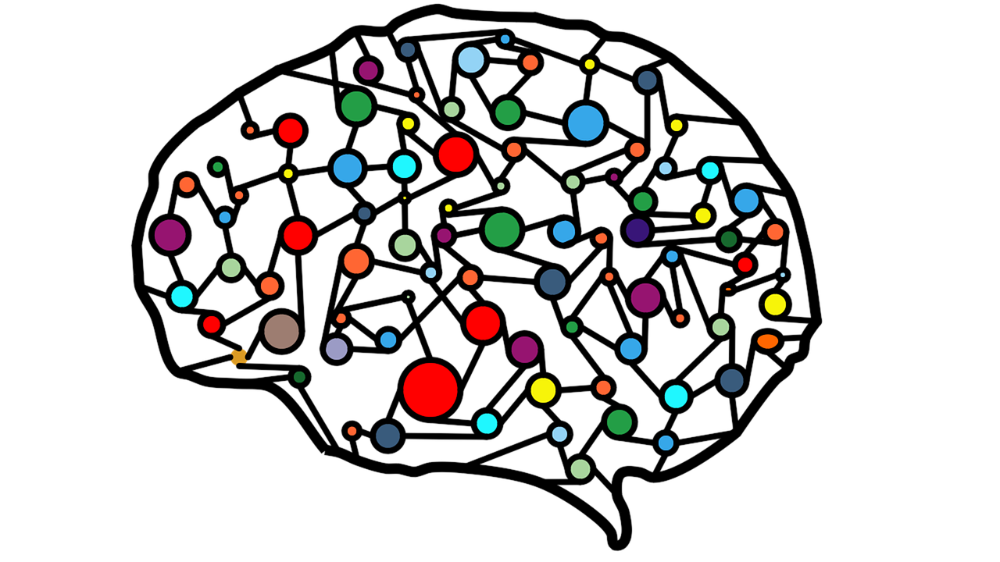

[](artificial-neural-network.png "Transfer learning in NLP")

Transfer learning in NLP

Transfer learning is the ability to reuse knowledge learned in one domain to another.

# Convergence

If we got a LEC (large enough corpus) say we got all the english transcription of the data collected by the NSA for a year. That should give a fairly comprehensive view the language.

Supposing we have a smaller data sets could we use statistical methods to predict how well the semantics or grammar etc in that corpus converge to the LEC.

I call this notion the convergence to an ideal language models. And I recon that these datasets will converge fairly well as most language speakers should be able to understand them almost perfectly.

# Divergence

On the other hand there is also a second related notion of divergence. This is something we notice in NLP when we use a dataset from a different domain for an unrelated task and it fails abysmally.

This divergence is due to there being difference in how the language is being used even if it is still easy to understand. For most people spoken language AKA Sassure’s ‘Parole’ is a much smaller subset of the vocabulary and other construct they can understand collectively which might understand AKA ‘Langue’. and while the two may be convergent they have a quantifiable divergence. Quantifiable in the sense that the probabilities or perplexities of a sentence form a different corpus would be somewhat different for a word model approximating each corpus.

# A Transfer Function

Suppose we had a good langue models for different substrates of a language than one would suppose it should be possible to generate a function to translate from one to the the other. This function would take an utterance from one, capture its meaning and find the most likely form it should take under the second model.

In deep learning one might create such a function by

- pre-training on one corpus and then freezing most of the layers and training on the second corpus.
- creating a encoder decoder pair for each and using one to model to encode and the other decode.

The idea of there being a convergent

1.  How can we qualify and quantify the difference between different datasets/language models drawn from a newspaper/encyclopedic/technical papers/novels/tweets/forums/transcribed radio shows/ conversational language.
    1.  different words
    2.  word probabilities
    3.  similar words (replaceable words)
    4.  related words (word affinity)
    5.  semantics
        1.  top word sense per lexeme
        2.  word sense distribution per lexeme
    6.  n-gram probabilities.
    7.  difference in the grammar.
        1.  mean length of sentence.
        2.  mean complexity of vocabulary.
        3.  co-reference frequency.
        4.  use of pronouns and wh-words.
        5.  other constructs
        6.  questions
        7.  use of affect, sarcasm
    8.  etc
2.  Suppose we had could characterize all these moderately well using a number of covariance matrices and distributions or even HMM.
3.  Could we use a KL distribution to simulate one from the other.
4.  Could we build a transformer to translate one into the other.
5.  How would we test/evaluate these.

Test case:

Hebrew/English movie subtitles

## Citation

BibTeX citation:

``` quarto-appendix-bibtex
@online{bochman2021,
  author = {Bochman, Oren},
  title = {Transfer Learning in {NLP}},
  date = {2021-08-12},
  url = {https://orenbochman.github.io/posts/2021/2021-08-18-transfer-learning-nlp/},
  langid = {en}
}
```

For attribution, please cite this work as:

Bochman, Oren. 2021. “Transfer Learning in NLP.” August 12. <https://orenbochman.github.io/posts/2021/2021-08-18-transfer-learning-nlp/>.
