::: column-margin

:::

::: callout-tip
## Lecture Overview

I presented two powerful open-source packages:

- [PyMC-Marketing](https://github.com/your-repo/pymc-marketing)
- [CausalPy](https://github.com/your-repo/causalpy)

These tools provide robust estimation of customer acquisition costs, customer lifetime value, and the causal impact of marketing campaigns, all while making optimal budget decisions in complex scenarios.
:::

- slides
  - 🔗 [Bayesian Marketing Science](https://docs.google.com/presentation/d/1GceAGz83AdcNRETg2sm7TTIMo_tfFWVf0VGisWLR7t8/edit?slide=id.p1#slide=id.p1)

## Outline

In the opening, the speaker Thomas Wiecki sets the scene for Bayesian marketing science by framing marketing as a complex, high-stakes problem where teams need fast, transparent, and deployable solutions. He introduces Amy, a data science leader under pressure to deliver measurable customer acquisition costs, lifetime value, and campaign impact while working with diverse data sources and limited marketing expertise.

---

:::: {.sl}
::: {.sl-text}
Introducing Amy. 

She is the VP of data science at an e-commerce company.

She is of course not an island but embedded in the whole organization and has certain requirements and people that provide inputs and certain resources.

I wanted to map out that and see what challenge she has. 
:::
::: {.sl-fig}

:::
::::

:::: {.sl}
::: {.sl-text}
**Amy's organization map**: 

- CFO constraints, 
- marketing budget pressure, 
- CMO needs, 
- diverse marketing datasets, 
- customer acquisition cost, 
- customer lifetime value, 
- campaign impact, 
- pressure on the data science team, 
- lack of statistical modeling expertise, 
- lack of marketing-domain expertise, 
- deployment requirements from data engineering.
:::
::: {.sl-fig}
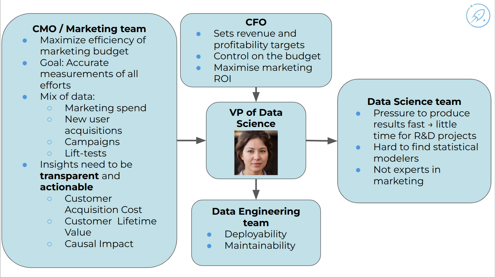
:::
::::

:::: {.sl}
::: {.sl-text}
- **the solution begins:**
- PyMC Labs’ open-source marketing stack, currently *CausalPy* and *PyMC-Marketing*
- Bayesian transparency; interpretable model parameters; 
- open-source advantages over expensive software-as-a-service media mix tools; modifiability; 
- integration with the *PyData stack*
- deployability; the problem that every customer is different; 
- the Unix-principle / Tidyverse-style ecosystem idea
- and collaboration with domain experts.
:::
::: {.sl-fig}
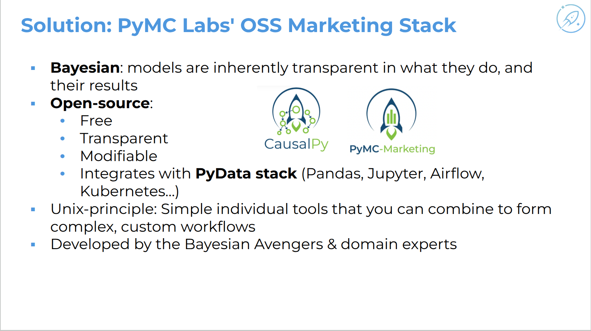
:::
::::

:::: {.sl}
::: {.sl-text}
This introduces PyMC-Marketing: Bayesian, built on PyMC, Apache 2.0 licensed, high-level user-friendly application programming interface, media mix models, customer lifetime value models, successor to the Lifetimes library, and credits to the domain experts and contributors.
:::

::: {.sl-fig}
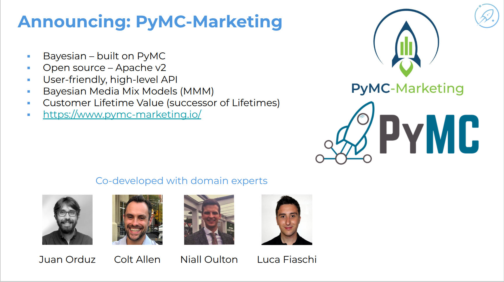
:::
::::

:::: {.sl}
::: {.sl-text}
**The Bayesian-advantages**: priors encode stakeholder knowledge, domain expertise is not discarded, lift tests and other evidence can be incorporated, complex models are easier to fit in PyMC, and generative models support forecasting, posterior predictive validation, and scenario analysis.
:::
::: {.sl-fig}
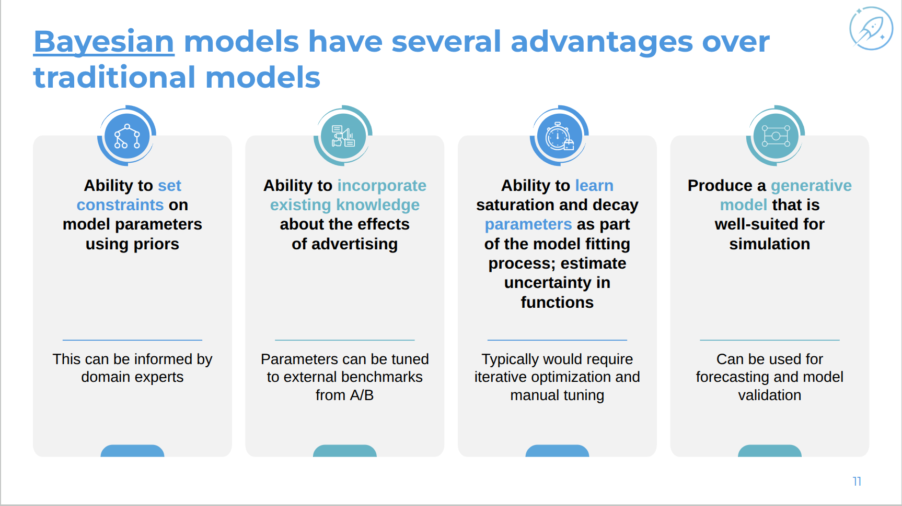
:::
::::

::::: {.sl}
::: {.sl-text}
**media mix models**: allocate a media budget across channels, estimate how effective each channel is, connect budget to activations or signups, and infer customer acquisition cost, with transfer functions as additional nuance.
:::

::: {.sl-fig}
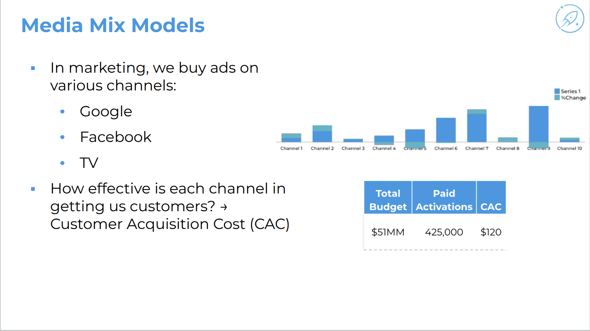
:::
:::::

::::: {.sl}
::: {.sl-text}
**An example dataset**: two marketing channels, normalized spend over time, sales as the output, and the question of how marketing efforts drive sales.
:::

::: {.sl-fig}
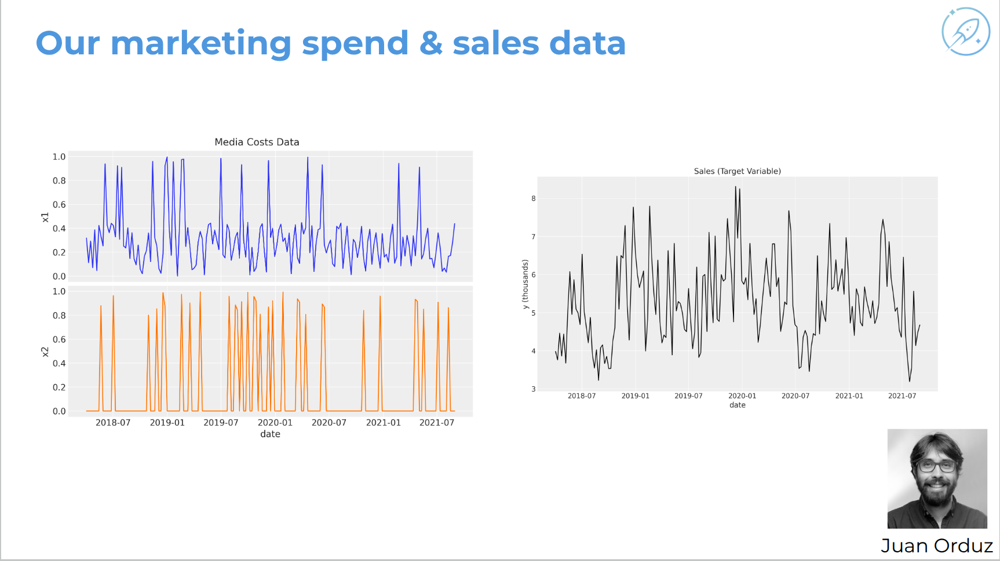
:::
:::::

::::: {.sl}
::: {.sl-text}
**PyMC-Marketing usage example**: instantiate the delayed-saturated media mix model, specify target, date, channel, control columns, Fourier seasonality terms, events such as Christmas, and transfer-function parameters.
:::

::: {.sl-fig}
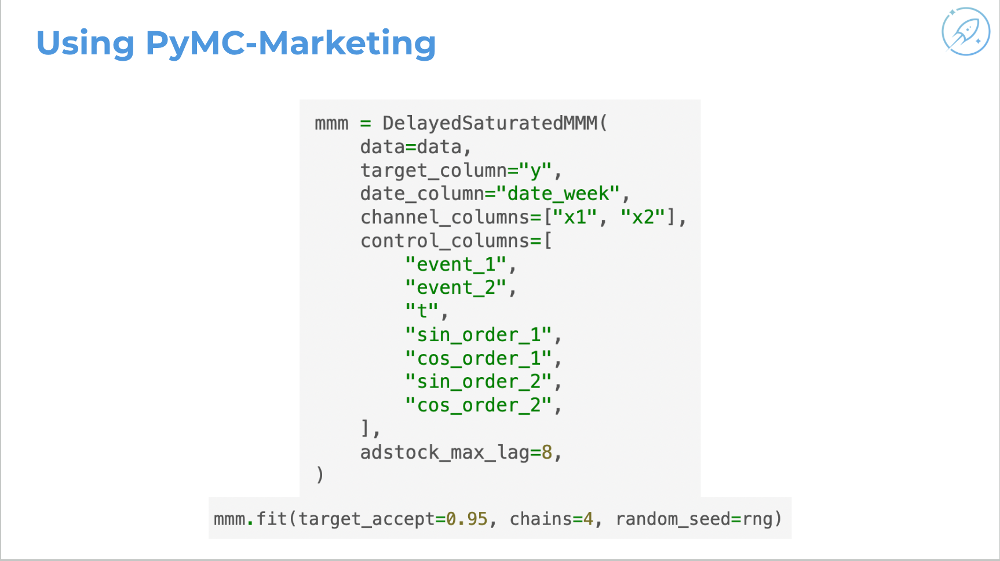
:::
:::::

::::: {.sl}
::: {.sl-text}
**Generated model**: call `.fit`, get a fairly complex model with likelihood, inputs, transfer-function parameters, and media mix model components that would otherwise require substantial hand-written PyMC code.
:::

::: {.sl-fig}
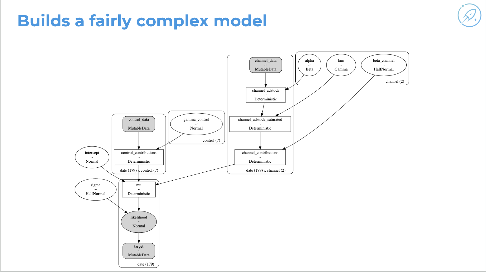
:::
:::::

::::: {.sl}
::: {.sl-text}
**Posterior predictive check**: compare model predictions with observed data; the model’s predicted series tracks the actual sales data fairly well.
:::

::: {.sl-fig}
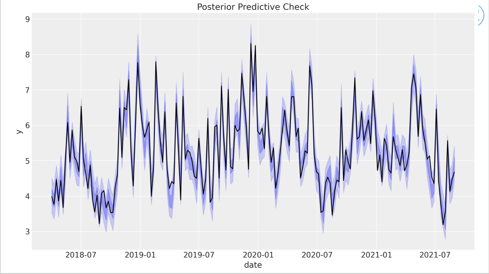
:::
:::::

::::: {.sl}
::: {.sl-text}
**Posterior predictive model components**: decompose sales into seasonality, events, channel contribution, intercept, and the combined sales signal.
:::

::: {.sl-fig}
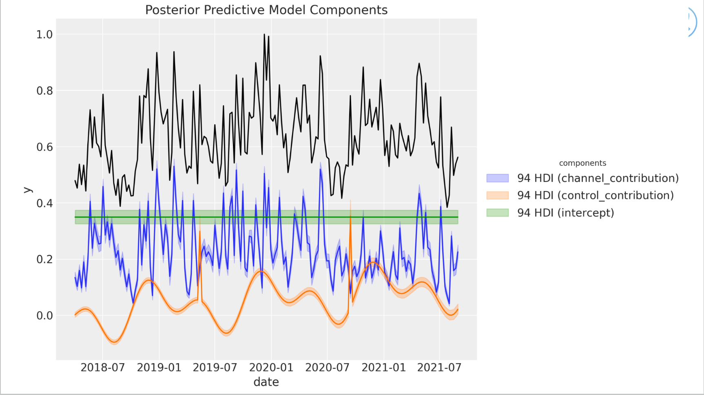
:::
:::::

::::: {.sl}
::: {.sl-text}
**Open-source contribution note**: the plot came from a pull request by a user who tried the package, illustrating that people are already contributing improvements back.
:::

::: {.sl-fig}
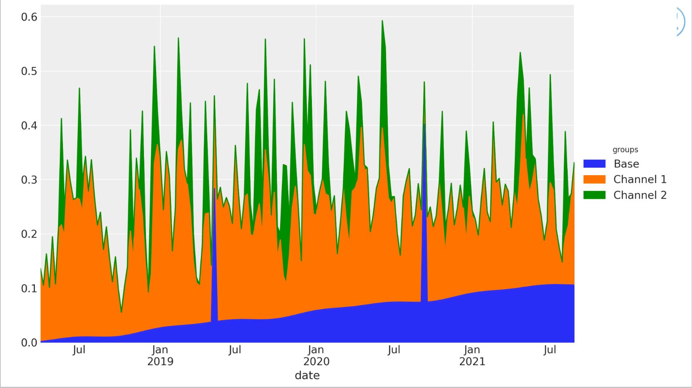
:::
:::::

::::: {.sl}
::: {.sl-text}
**Contribution plots**: as spend increases, response does not grow linearly forever; it levels off due to saturation. In the Bayesian framework, the result is a posterior distribution rather than a point estimate, which helps quantify uncertainty and supports optimization.
:::

::: {.sl-fig}
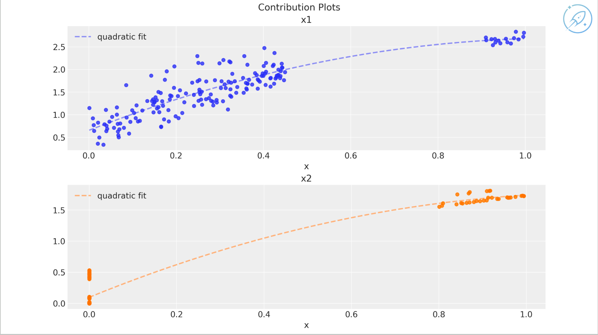
:::
:::::

::::: {.sl}
::: {.sl-text}
**Posterior return on ad spend**: because this is a simulation study, the inferred return on ad spend can be compared with the true underlying parameters, and the model recovers them reasonably well.
:::

::: {.sl-fig}
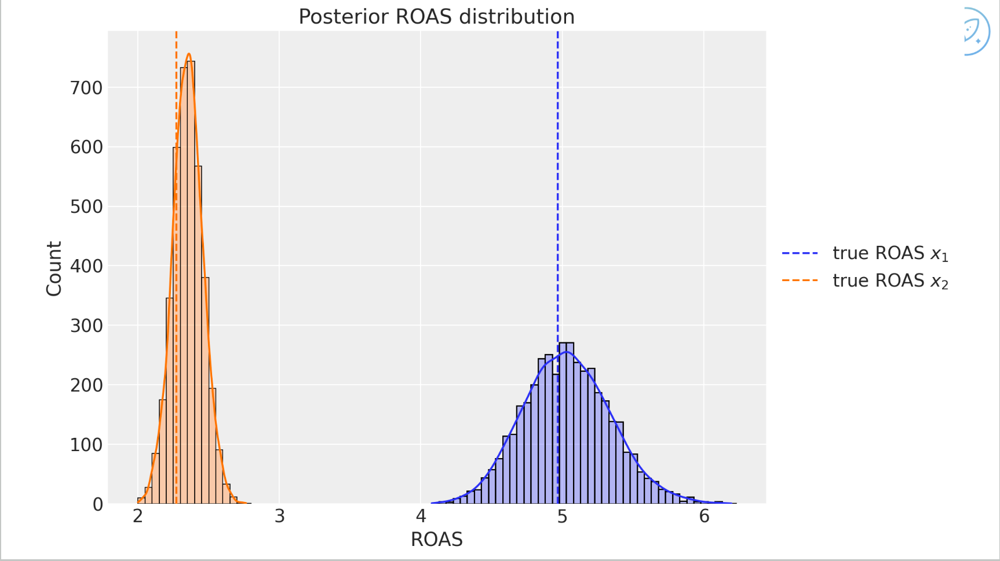
:::
:::::

### Analyzing Effectiveness of a Marketing Campaign

::::: {.sl}
::: {.sl-text}
**Campaign effectiveness example**: Amy’s next task is to evaluate whether a February 2023 marketing campaign increased sales. Visually, sales rose, but the variance may also have changed, so the causal question is not trivial. A proper experiment would have a control group, but here there is no untreated control.
:::
::: {.sl-fig}
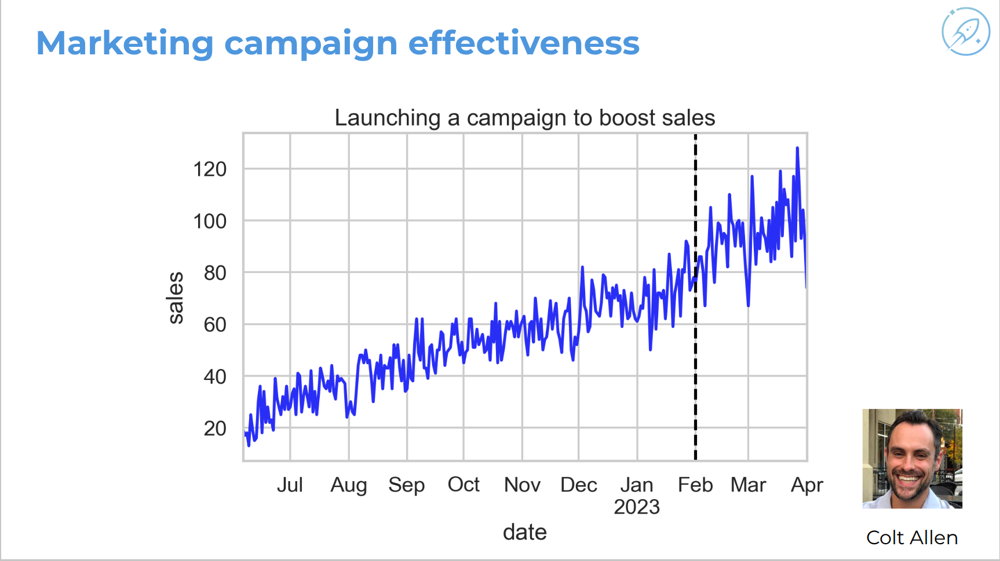
:::
:::::

::::: {.sl}
::: {.sl-text}
**CausalPy and Bayesian quasi-experiments**: fit a model to pre-intervention sales, predict the counterfactual path without intervention, compare observed post-campaign sales to the synthetic control, inspect residual and cumulative effects, and support flexible models including covariates, `scikit-learn` forecasters, synthetic controls, and difference-in-differences variants.
:::
::: {.sl-fig}
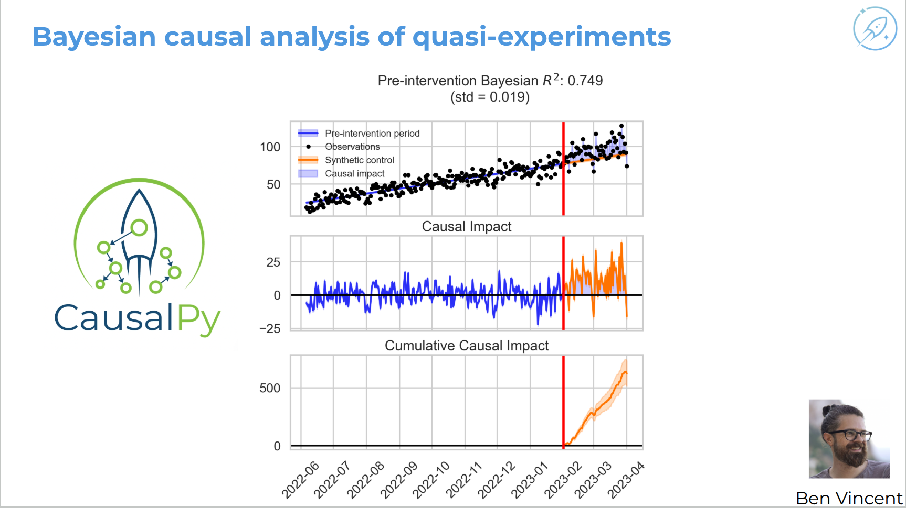
:::
:::::

### Estimating Customer Lifetime Value

:::: {.sl}
::: {.sl-text}
**Customer lifetime value**: sales come from individual customers, some of whom are repeat buyers. Use a beta-geometric model from the customer-lifetime-value submodule of PyMC-Marketing with frequency, recency, and customer age.
:::
::: {.sl-fig}
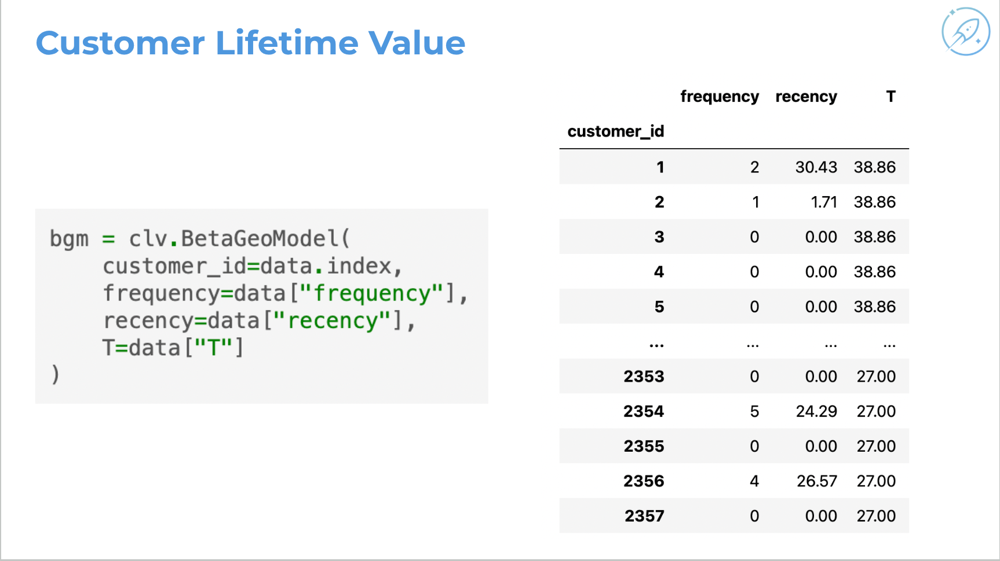
:::
::::

:::: {.sl}
::: {.sl-text}
**Probability of repeat purchase**: after a purchase on day 31, estimate the probability that the customer will buy again. As time passes without another purchase, confidence declines because customers churn.
:::
::: {.sl-fig}
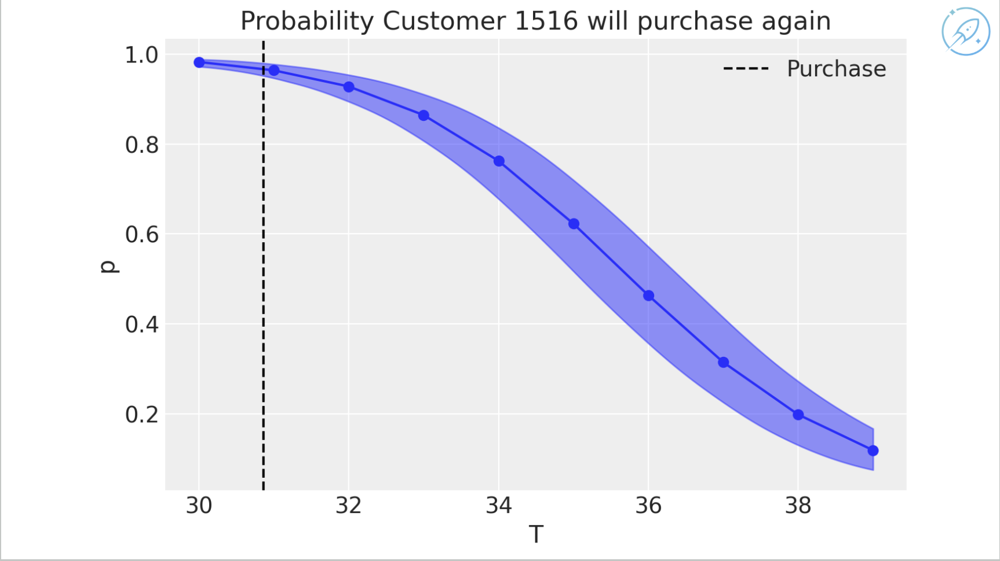
:::
::::

:::: {.sl}
::: {.sl-text}
If the customer buys again, confidence that the customer is still active rises, and the model expects additional future purchases.
:::
::: {.sl-fig}
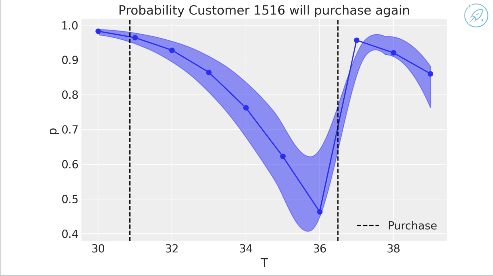
:::
::::

:::: {.sl}
::: {.sl-text}
**Combining models**: the goal is not merely minimizing customer acquisition cost or maximizing customer lifetime value, but maximizing revenue or profitability. Different channels bring different customer value, so combine media mix model estimates, customer lifetime value estimates, and causal impact analysis. The value comes from triangulating across datasets and models.
:::
::: {.sl-fig}
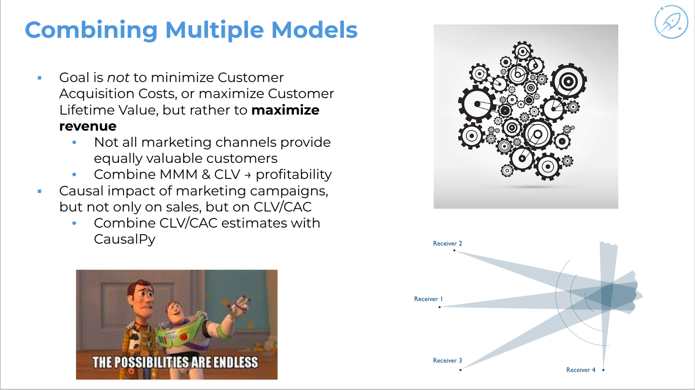
:::
::::

:::: {.sl}
::: {.sl-text}
**Vision**: the toolbox is just getting started; planned additions include hierarchical models across channels and locations, time-varying parameters, Bayesian optimization, dashboards, and more community contributions.
:::
::: {.sl-fig}
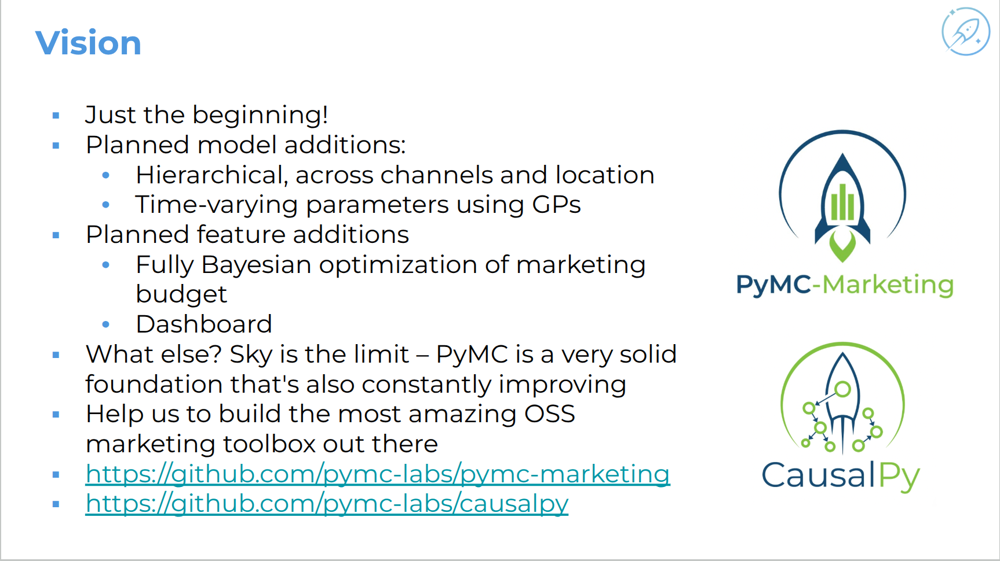
:::
::::

## Q&A Transcript 

The audience submitted questions on Slido; the most popular asked how PyMC scales with growing data and whether there's a distributed mode. 

The speaker explained that while older Bayesian tooling struggled to scale, recent advances have helped: PyMC supports a JAX backend for CPU/GPU execution (useful for very large datasets), and new samplers (e.g., NUTS implementations with Rust + NumPy backends) provide significant CPU speedups.

On CLTV projections for ad-based businesses (e.g., mobile apps), the speaker said you can extract projections from the tools but a dedicated function may not yet exist — contributions are welcome.

Comparing PyMC and Stan: historically similar, but PyMC's JAX/GPU path and new sampler implementations have shown notable speed improvements in some benchmarks.

Validation and recalibration: use posterior predictive checks as part of the Bayesian workflow (simulate, check, iterate, refine) to diagnose and improve model fit.

Model visualization: PyMC can produce model graphs (e.g., via Graphviz) with a single call; these visualizations help explain structure, though extremely large graphs remain challenging to present to stakeholders.

Great — that's all for the session; thanks and applause.

## Resources

- [PyMC Labs: www.pymc-labs.io](https://www.pymc-labs.io)
- [Bayesian newsletter: www.pymc-labs.io/newsletter](https://www.pymc-labs.io/newsletter)
- [PyMC-Marketing: www.pymc-marketing.io](https://www.pymc-marketing.io)
- [CausalPy: causalpy.readthedocs.io](https://causalpy.readthedocs.io)
- [PyMC: www.pymc.io](https://www.pymc.io)
- [Intuitive Bayes: www.intuitive-bayes.com](https://www.intuitive-bayes.com)
- [Twitter for twiecki](https://twitter.com/twiecki) [Twitter for PyMC Labs](https://twitter.com/pymc_labs)

## Reflection

When I worked for an advertising agency I noted a few things about our clients.

1. They wanted reports that compared the current/recent performance to last quarters and last years.
2. They didn't have teams of data scientist. One got a a data analyst because it was cheaper and less embarrassing to have someone in-house to talk to.
3. Only at the end of my tenure did one of the clients have a Data scientist and he was not working on marketing.

There isn't a slide that makes marketing's three biggest problems explicit. But I think they are:

1. **Customer acquisition cost**: how much marketing spend is needed to acquire one customer.
2. **Customer lifetime value**: how much revenue or profit a customer is expected to generate after acquisition.
3. **Causal impact of marketing actions**: whether campaigns or other interventions actually changed sales, revenue, or profitability

Let's start with third one - I saw a version of this question in ISL book. I never heard anyone ask it in the real world. 

Are people in marketing really so dumb ? Didn't [John Wannamaker](https://en.wikipedia.org/wiki/John_Wanamaker) say "that half of his advertising budget was wasted but he didn't know which half ?" 
Actually marketers and advertisers invest in measurement, AKA analytics, a lot. This ate up a big chunk of every marketing budget. But even analytics struggled to provide data for solving the problems of attribution. A big hurdle is to close the online-offline loop. This is very challenging because of the many touch points and channels that customers interact with, and the fact that many purchases still happen offline. And causal models can't handle a causal graph that is not fully observed. Yes this is at best a POMDP - a partially observable Markov decision process.
You only get to see what happens if the purchase succeeds and even then you only see the version of marketing choices that were actually made - not a neat random sample of all possible marketing multiverses. 

Further more even if we could close the loop, there are many confounders and sources of bias that make attribution difficult. Foe example does a person even know which ads they saw in the last six months most contributed to thier decision to put an item in their shopping cart? This is a question we are trying to answer. But even if we had all the online and offline ads mapped to the customer how can we assign the credit for the sale to the different ads ? Which ones deserve more credit ? The first one ? The last one ? The one that was most memorable ?

So we use a model which makes has an inductive bias and assumptions. And we hope at the end of the day to find one which beats Wannamaker's 50% guess.

So that covers the last question and its proposed solution.

Now lets talk about CLV. To get to CLV we need to model churn. That is usually done with survival models. Survival models are great but soft churn is often hard to measure because many clients churn without telling you. Many businesses also sell to a client once a decade (cars, houses, home appliances). You can send them more marketing material and keep in touch but will they actually buy again, who can say? 
This again is solved by a model which allows us to make some assumptions about the known unknowns. And while people aren't like electrons, in large cohorts they do tend to follow patterns.

The leaves us with the first question - customer acquisition cost. This is not so hard to measure. You can just divide the marketing spend by the number of customers acquired. Right ? Actually much of the spend goes to brand building and awareness which you want to exclude from the calculation. You also have overhead like the cost of the analytics team, the commission of the advertising agency.

So now that we broke down the three problems and their challenges, lets put things back together. 

1. Does marketing/advertising work? Wrong question - the right question is how well does action X work and how should we try to make it work better or pic action Y or Z instead. 
2. How much do we need to spend to acquire a customer -  The first part easier in a world that is increasingly digital and we can track more and more of the customer journey. We can use bluetooth beacons and apps to track customers in the physical world.
3. How much is that customer worth over their lifetime ? Good one for insurance salesmen who sales the client an insurance policy for the rest of their life. And even these guys need to fiddle with the price once the first 15 years of the policy are over and the clients is still alive but not as healthy as he was when he bought the policy. Most marketers just wanted to know when the clients would return or better yet when they would buy again.

Working in an agency - you encounter many many question from very smart people in the field. Each business is different but many of the questions are very similar once you measure things in some uniform way. There is lots of room for models and scientific thinking but in reality the clients are not interested. Their main problem is the cognitive overload of all the decisions they must make before a campaign goes live. They never seems to come up with answer fast enough. 

A final point to end with is that the most accomplished marketing people were the ones who could work at rates that were much faster than the data science  team of the IT could respond to. This is what got them noticed by the C-level executives and a seat at the table where they could influence the strategy of the company. 

