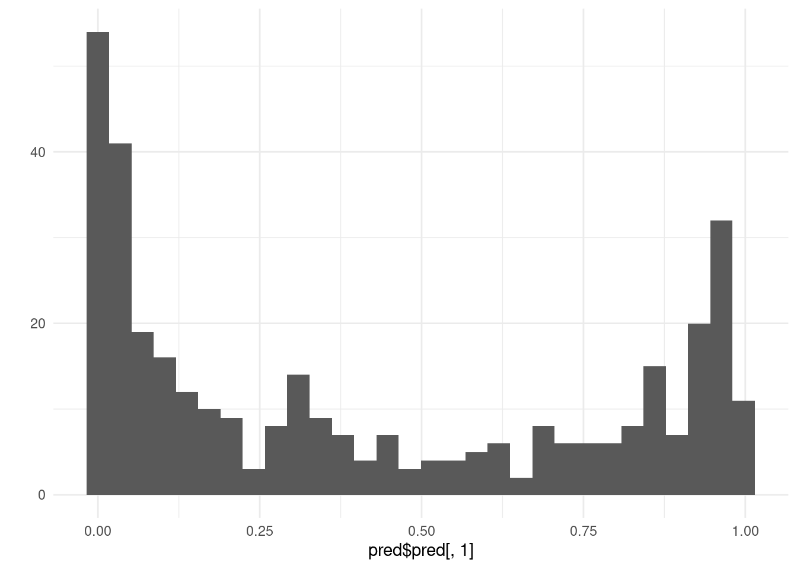
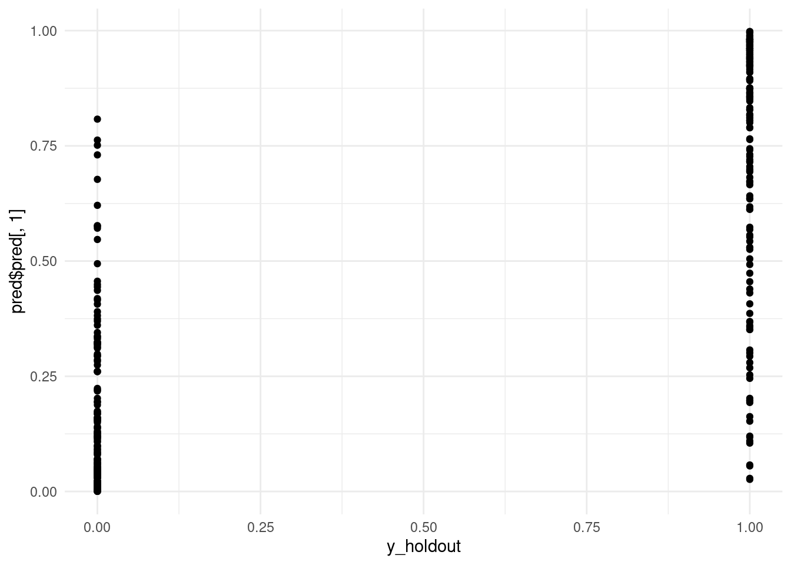
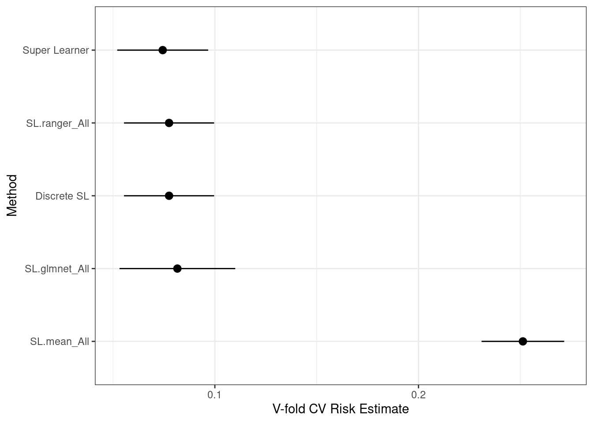
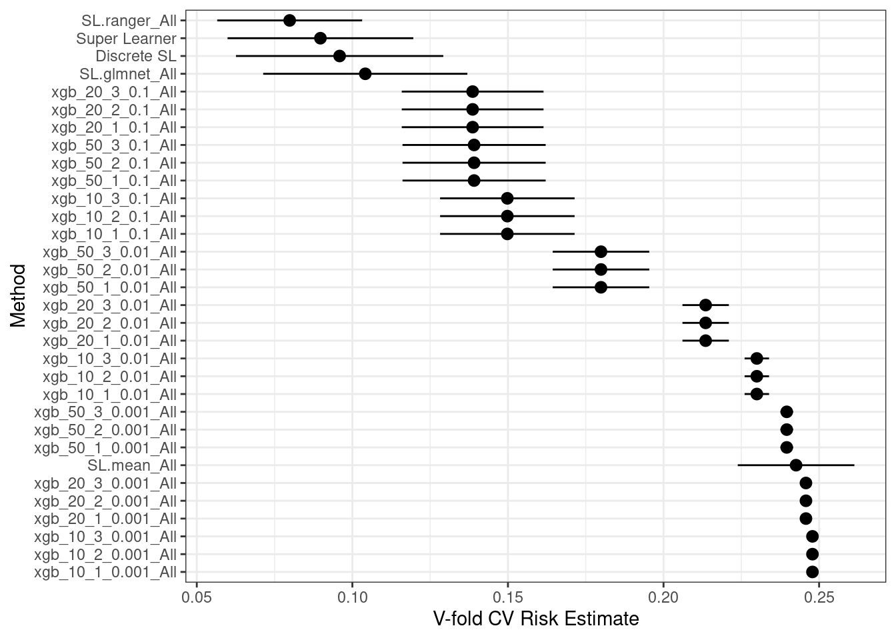

This is a SuperLearner demo.

SuperLearner is an ensambeleing library.

This page is taken out of the documentation

## Setup dataset

``` r
#install.packages(c("SuperLearner","caret", "glmnet", "randomForest", "ggplot2", "RhpcBLASctl","xgboost","ranger"))
data(Boston, package = "MASS")

?MASS::Boston  # Review info on the Boston dataset.>

colSums(is.na(Boston)) # Check for any missing data - looks like we don't have any.
```

Listing 1: dataset setup

       crim      zn   indus    chas     nox      rm     age     dis     rad     tax 
          0       0       0       0       0       0       0       0       0       0 
    ptratio   black   lstat    medv 
          0       0       0       0 

``` r
outcome = Boston$medv #Extract our outcome variable from the dataframe.

data = subset(Boston, select = -medv) # Create a dataframe to contain our explanatory variables.
head(data)
```

Listing 2: dataset setup

|    crim |  zn | indus | chas |   nox |    rm |  age |    dis | rad | tax | ptratio |  black | lstat |
|--------:|----:|------:|-----:|------:|------:|-----:|-------:|----:|----:|--------:|-------:|------:|
| 0.00632 |  18 |  2.31 |    0 | 0.538 | 6.575 | 65.2 | 4.0900 |   1 | 296 |    15.3 | 396.90 |  4.98 |
| 0.02731 |   0 |  7.07 |    0 | 0.469 | 6.421 | 78.9 | 4.9671 |   2 | 242 |    17.8 | 396.90 |  9.14 |
| 0.02729 |   0 |  7.07 |    0 | 0.469 | 7.185 | 61.1 | 4.9671 |   2 | 242 |    17.8 | 392.83 |  4.03 |
| 0.03237 |   0 |  2.18 |    0 | 0.458 | 6.998 | 45.8 | 6.0622 |   3 | 222 |    18.7 | 394.63 |  2.94 |
| 0.06905 |   0 |  2.18 |    0 | 0.458 | 7.147 | 54.2 | 6.0622 |   3 | 222 |    18.7 | 396.90 |  5.33 |
| 0.02985 |   0 |  2.18 |    0 | 0.458 | 6.430 | 58.7 | 6.0622 |   3 | 222 |    18.7 | 394.12 |  5.21 |

``` r
str(data) # Check structure of our dataframe.
```

Listing 3: dataset setup

    'data.frame':   506 obs. of  13 variables:
     $ crim   : num  0.00632 0.02731 0.02729 0.03237 0.06905 ...
     $ zn     : num  18 0 0 0 0 0 12.5 12.5 12.5 12.5 ...
     $ indus  : num  2.31 7.07 7.07 2.18 2.18 2.18 7.87 7.87 7.87 7.87 ...
     $ chas   : int  0 0 0 0 0 0 0 0 0 0 ...
     $ nox    : num  0.538 0.469 0.469 0.458 0.458 0.458 0.524 0.524 0.524 0.524 ...
     $ rm     : num  6.58 6.42 7.18 7 7.15 ...
     $ age    : num  65.2 78.9 61.1 45.8 54.2 58.7 66.6 96.1 100 85.9 ...
     $ dis    : num  4.09 4.97 4.97 6.06 6.06 ...
     $ rad    : int  1 2 2 3 3 3 5 5 5 5 ...
     $ tax    : num  296 242 242 222 222 222 311 311 311 311 ...
     $ ptratio: num  15.3 17.8 17.8 18.7 18.7 18.7 15.2 15.2 15.2 15.2 ...
     $ black  : num  397 397 393 395 397 ...
     $ lstat  : num  4.98 9.14 4.03 2.94 5.33 ...

``` r
dim(data) # Review our dimensions.
```

Listing 4: dataset setup

    [1] 506  13

``` r
set.seed(1)# Set a seed for reproducibility in this random sampling.

train_obs = sample(nrow(data), 150) # Reduce to a dataset of 150 observations to speed up model fitting.

x_train = data[train_obs, ] # X is our training sample.


x_holdout = data[-train_obs, ] # Create a holdout set for evaluating model performance.
# Note: cross-validation is even better than a single holdout sample.

outcome_bin = as.numeric(outcome > 22) # Create a binary outcome variable: towns in which median home value is > 22,000.

y_train = outcome_bin[train_obs]
y_holdout = outcome_bin[-train_obs]


table(y_train, useNA = "ifany") # Review the outcome variable distribution.
```

Listing 5: dataset setup

    y_train
     0  1 
    92 58 

## Review available models

``` r
library(SuperLearner)

listWrappers() # Review available models.
```

Listing 6: model review

    All prediction algorithm wrappers in SuperLearner:

     [1] "SL.bartMachine"      "SL.bayesglm"         "SL.biglasso"        
     [4] "SL.caret"            "SL.caret.rpart"      "SL.cforest"         
     [7] "SL.earth"            "SL.gam"              "SL.gbm"             
    [10] "SL.glm"              "SL.glm.interaction"  "SL.glmnet"          
    [13] "SL.ipredbagg"        "SL.kernelKnn"        "SL.knn"             
    [16] "SL.ksvm"             "SL.lda"              "SL.leekasso"        
    [19] "SL.lm"               "SL.loess"            "SL.logreg"          
    [22] "SL.mean"             "SL.nnet"             "SL.nnls"            
    [25] "SL.polymars"         "SL.qda"              "SL.randomForest"    
    [28] "SL.ranger"           "SL.ridge"            "SL.rpart"           
    [31] "SL.rpartPrune"       "SL.speedglm"         "SL.speedlm"         
    [34] "SL.step"             "SL.step.forward"     "SL.step.interaction"
    [37] "SL.stepAIC"          "SL.svm"              "SL.template"        
    [40] "SL.xgboost"         

    All screening algorithm wrappers in SuperLearner:

    [1] "All"
    [1] "screen.corP"           "screen.corRank"        "screen.glmnet"        
    [4] "screen.randomForest"   "screen.SIS"            "screen.template"      
    [7] "screen.ttest"          "write.screen.template"

``` r
SL.glmnet
```

Listing 7: model review

    function (Y, X, newX, family, obsWeights, id, alpha = 1, nfolds = 10, 
        nlambda = 100, useMin = TRUE, loss = "deviance", ...) 
    {
        .SL.require("glmnet")
        if (!is.matrix(X)) {
            X <- model.matrix(~-1 + ., X)
            newX <- model.matrix(~-1 + ., newX)
        }
        fitCV <- glmnet::cv.glmnet(x = X, y = Y, weights = obsWeights, 
            lambda = NULL, type.measure = loss, nfolds = nfolds, 
            family = family$family, alpha = alpha, nlambda = nlambda, 
            ...)
        pred <- predict(fitCV, newx = newX, type = "response", s = ifelse(useMin, 
            "lambda.min", "lambda.1se"))
        fit <- list(object = fitCV, useMin = useMin)
        class(fit) <- "SL.glmnet"
        out <- list(pred = pred, fit = fit)
        return(out)
    }
    <bytecode: 0x648245d66b50>
    <environment: namespace:SuperLearner>

## Fit individual models

Let’s fit 2 separate models: lasso (sparse, penalized OLS) and random forest. We specify family = binomial() because we are predicting a binary outcome, aka classification. With a continuous outcome we would specify family = gaussian().

``` r
set.seed(1) # Set the seed for reproducibility.

sl_lasso = SuperLearner(Y = y_train, X = x_train, family = binomial(),
                        SL.library = "SL.glmnet") # Fit lasso model.
```

Listing 8: fit lasso

    Loading required namespace: glmnet

``` r
sl_lasso
```

Listing 9: fit lasso

    Call:  
    SuperLearner(Y = y_train, X = x_train, family = binomial(), SL.library = "SL.glmnet") 

                        Risk Coef
    SL.glmnet_All 0.08484849    1

``` r
names(sl_lasso)
```

Listing 10: fit lasso

     [1] "call"              "libraryNames"      "SL.library"       
     [4] "SL.predict"        "coef"              "library.predict"  
     [7] "Z"                 "cvRisk"            "family"           
    [10] "fitLibrary"        "cvFitLibrary"      "varNames"         
    [13] "validRows"         "method"            "whichScreen"      
    [16] "control"           "cvControl"         "errorsInCVLibrary"
    [19] "errorsInLibrary"   "metaOptimizer"     "env"              
    [22] "times"            

``` r
sl_lasso$cvRisk[which.min(sl_lasso$cvRisk)]
```

Listing 11: fit lasso

    SL.glmnet_All 
       0.08484849 

``` r
str(sl_lasso$fitLibrary$SL.glmnet_All$object, max.level = 1)
```

Listing 12: fit lasso

    List of 12
     $ lambda    : num [1:90] 0.317 0.289 0.263 0.24 0.218 ...
     $ cvm       : num [1:90] 1.34 1.28 1.21 1.16 1.1 ...
     $ cvsd      : num [1:90] 0.0359 0.033 0.0304 0.0292 0.0291 ...
     $ cvup      : num [1:90] 1.38 1.31 1.24 1.18 1.13 ...
     $ cvlo      : num [1:90] 1.31 1.24 1.18 1.13 1.08 ...
     $ nzero     : Named int [1:90] 0 1 1 1 1 1 2 2 2 2 ...
      ..- attr(*, "names")= chr [1:90] "s0" "s1" "s2" "s3" ...
     $ call      : language glmnet::cv.glmnet(x = X, y = Y, weights = obsWeights, lambda = NULL, type.measure = loss,      nfolds = nfolds, f| __truncated__
     $ name      : Named chr "Binomial Deviance"
      ..- attr(*, "names")= chr "deviance"
     $ glmnet.fit:List of 13
      ..- attr(*, "class")= chr [1:2] "lognet" "glmnet"
     $ lambda.min: num 0.0161
     $ lambda.1se: num 0.0652
     $ index     : int [1:2, 1] 33 18
      ..- attr(*, "dimnames")=List of 2
     - attr(*, "class")= chr "cv.glmnet"

``` r
sl_rf = SuperLearner(Y = y_train, X = x_train, family = binomial(),
                     SL.library = "SL.ranger")
```

Listing 13: fit lasso

    Loading required namespace: ranger

``` r
names(sl_lasso)
```

Listing 14: fit lasso

     [1] "call"              "libraryNames"      "SL.library"       
     [4] "SL.predict"        "coef"              "library.predict"  
     [7] "Z"                 "cvRisk"            "family"           
    [10] "fitLibrary"        "cvFitLibrary"      "varNames"         
    [13] "validRows"         "method"            "whichScreen"      
    [16] "control"           "cvControl"         "errorsInCVLibrary"
    [19] "errorsInLibrary"   "metaOptimizer"     "env"              
    [22] "times"            

``` r
sl_lasso$cvRisk[which.min(sl_lasso$cvRisk)]
```

Listing 15: fit lasso

    SL.glmnet_All 
       0.08484849 

``` r
# Here is the raw glmnet result object:
str(sl_lasso$fitLibrary$SL.glmnet_All$object, max.level = 1)
```

Listing 16: fit lasso

    List of 12
     $ lambda    : num [1:90] 0.317 0.289 0.263 0.24 0.218 ...
     $ cvm       : num [1:90] 1.34 1.28 1.21 1.16 1.1 ...
     $ cvsd      : num [1:90] 0.0359 0.033 0.0304 0.0292 0.0291 ...
     $ cvup      : num [1:90] 1.38 1.31 1.24 1.18 1.13 ...
     $ cvlo      : num [1:90] 1.31 1.24 1.18 1.13 1.08 ...
     $ nzero     : Named int [1:90] 0 1 1 1 1 1 2 2 2 2 ...
      ..- attr(*, "names")= chr [1:90] "s0" "s1" "s2" "s3" ...
     $ call      : language glmnet::cv.glmnet(x = X, y = Y, weights = obsWeights, lambda = NULL, type.measure = loss,      nfolds = nfolds, f| __truncated__
     $ name      : Named chr "Binomial Deviance"
      ..- attr(*, "names")= chr "deviance"
     $ glmnet.fit:List of 13
      ..- attr(*, "class")= chr [1:2] "lognet" "glmnet"
     $ lambda.min: num 0.0161
     $ lambda.1se: num 0.0652
     $ index     : int [1:2, 1] 33 18
      ..- attr(*, "dimnames")=List of 2
     - attr(*, "class")= chr "cv.glmnet"

``` r
# Fit random forest.
sl_rf = SuperLearner(Y = y_train, X = x_train, family = binomial(), SL.library = "SL.ranger")
```

    Loading required namespace: ranger

``` r
sl_rf
```

    Call:  
    SuperLearner(Y = y_train, X = x_train, family = binomial(), SL.library = "SL.ranger") 

                        Risk Coef
    SL.ranger_All 0.07620479    1

## Fit multiple models

``` r
set.seed(1)
sl = SuperLearner(Y = y_train, X = x_train, family = binomial(),
  SL.library = c("SL.mean", "SL.glmnet", "SL.ranger"))

sl
```

Listing 17: lst fit multiple models

    Call:  
    SuperLearner(Y = y_train, X = x_train, family = binomial(), SL.library = c("SL.mean",  
        "SL.glmnet", "SL.ranger")) 

                        Risk       Coef
    SL.mean_All   0.23773937 0.00000000
    SL.glmnet_All 0.08847869 0.02212495
    SL.ranger_All 0.07053788 0.97787505

``` r
sl$times$everything
```

Listing 18: lst fit multiple models

       user  system elapsed 
      1.324   0.016   1.346 

Again, the coefficient is how much weight SuperLearner puts on that model in the weighted-average. So if coefficient = 0 it means that model is not used at all. Here we see that random forest is given the most weight, following by lasso.

So we have an automatic ensemble of multiple learners based on the cross-validated performance of those learners, nice!

# Predict on new data

Now that we have an ensemble let’s predict back on our holdout dataset and review the results.

``` r
# onlySL is set to TRUE so we don't fit algorithms that had weight = 0, saving computation.
pred = predict(sl, x_holdout, onlySL = TRUE)
```

Listing 19: predict

    Loading required namespace: glmnet

    Loading required namespace: ranger

``` r
# Check the structure of this prediction object.
str(pred)
```

Listing 20: predict

    List of 2
     $ pred           : num [1:356, 1] 0.577 0.891 0.939 0.943 0.853 ...
     $ library.predict: num [1:356, 1:3] 0 0 0 0 0 0 0 0 0 0 ...

``` r
# Review the columns of $library.predict.
summary(pred$library.predict)
```

Listing 21: predict

           V1          V2                 V3           
     Min.   :0   Min.   :0.000008   Min.   :0.0002625  
     1st Qu.:0   1st Qu.:0.026812   1st Qu.:0.0484115  
     Median :0   Median :0.310300   Median :0.3057313  
     Mean   :0   Mean   :0.404139   Mean   :0.4124046  
     3rd Qu.:0   3rd Qu.:0.782474   3rd Qu.:0.8181667  
     Max.   :0   Max.   :0.998259   Max.   :0.9980000  

``` r
library(ggplot2)
qplot(pred$pred[, 1]) + theme_minimal()
```

Listing 22: predict

    Warning: `qplot()` was deprecated in ggplot2 3.4.0.

    `stat_bin()` using `bins = 30`. Pick better value with `binwidth`.

[](index_files/figure-html/lst-predict-1.png)

``` r
## `stat_bin()` using `bins = 30`. Pick better value with `binwidth`.

# Scatterplot of original values (0, 1) and predicted values.
# Ideally we would use jitter or slight transparency to deal with overlap.
qplot(y_holdout, pred$pred[, 1]) + theme_minimal()
```

Listing 23: predict

[](index_files/figure-html/lst-predict-2.png)

``` r
# Review AUC - Area Under Curve
pred_rocr = ROCR::prediction(pred$pred, y_holdout)
auc = ROCR::performance(pred_rocr, measure = "auc", x.measure = "cutoff")@y.values[[1]]
auc
```

Listing 24: predict

    [1] 0.9443598

# Fit ensemble with external cross-validation

What we don’t have yet is an estimate of the performance of the ensemble itself. Right now we are just hopeful that the ensemble weights are successful in improving over the best single algorithm.

In order to estimate the performance of the SuperLearner ensemble we need an “external” layer of cross-validation, also called **nested cross-validation**. We generate a separate holdout sample that we don’t use to fit the SuperLearner, which allows it to be a good estimate of the SuperLearner’s performance on unseen data. Typically we would run 10 or 20-fold external cross-validation, but even 5-fold is reasonable.

Another nice result is that we get standard errors on the performance of the individual algorithms and can compare them to the SuperLearner.

``` r
set.seed(1)

# Don't have timing info for the CV.SuperLearner unfortunately.
# So we need to time it manually.

system.time({
  # This will take about 2x as long as the previous SuperLearner.
  cv_sl = CV.SuperLearner(Y = y_train, X = x_train, family = binomial(),
                          # For a real analysis we would use V = 10.
                          V = 3,
                          SL.library = c("SL.mean", "SL.glmnet", "SL.ranger"))
})
```

    Loading required namespace: glmnet

    Loading required namespace: ranger

       user  system elapsed 
      6.433   0.101   6.510 

``` r
# We run summary on the cv_sl object rather than simply printing the object.
summary(cv_sl)
```

    Call:  
    CV.SuperLearner(Y = y_train, X = x_train, V = 3, family = binomial(), SL.library = c("SL.mean",  
        "SL.glmnet", "SL.ranger")) 

    Risk is based on: Mean Squared Error

    All risk estimates are based on V =  3 

         Algorithm      Ave       se      Min      Max
     Super Learner 0.074388 0.011392 0.064595 0.084275
       Discrete SL 0.077512 0.011293 0.067146 0.086532
       SL.mean_All 0.251267 0.010352 0.228500 0.289600
     SL.glmnet_All 0.081595 0.014502 0.072729 0.095522
     SL.ranger_All 0.077512 0.011293 0.067146 0.086532

``` r
# Review the distribution of the best single learner as external CV folds.
table(simplify2array(cv_sl$whichDiscreteSL))
```

    SL.ranger_All 
                3 

``` r
# Plot the performance with 95% CIs (use a better ggplot theme).
plot(cv_sl) + theme_bw()
```

[](index_files/figure-html/unnamed-chunk-2-1.png)

``` r
ggsave("SuperLearner.png")
```

    Saving 7 x 5 in image

## Customize a model hyperparameter

Hyperparameters are the configuration settings for an algorithm. OLS has no hyperparameters but essentially every other algorithm does.

There are two ways to customize a hyperparameter: make a new learner function, or use create.Learner().

Let’s make a variant of random forest that fits more trees, which may increase our accuracy and can’t hurt it (outside of small random variation).

``` r
# Review the function argument defaults at the top.
SL.ranger
```

    function(Y, X, newX, family,
               obsWeights,
               num.trees = 500,
               mtry = floor(sqrt(ncol(X))),
               write.forest = TRUE,
               probability = family$family == "binomial",
               min.node.size = ifelse(family$family == "gaussian", 5, 1),
               replace = TRUE,
               sample.fraction = ifelse(replace, 1, 0.632),
               num.threads = 1,
               verbose = T,
               ...) {
      # need write.forest = TRUE for predict method
      .SL.require("ranger")

      if (family$family == "binomial") {
        Y = as.factor(Y)
      }

      # Ranger does not seem to work with X as a matrix, so we explicitly convert to
      # data.frame rather than cbind. newX can remain as-is though.
      if (is.matrix(X)) {
        X = data.frame(X)
      }

      # Use _Y as our outcome variable name to avoid a possible conflict with a
      # variable in X named "Y".
      fit <- ranger::ranger(`_Y` ~ ., data = cbind("_Y" = Y, X),
                            num.trees = num.trees,
                            mtry = mtry,
                            min.node.size = min.node.size,
                            replace = replace,
                            sample.fraction = sample.fraction,
                            case.weights = obsWeights,
                            write.forest = write.forest,
                            probability = probability,
                            num.threads = num.threads,
                            verbose = verbose)

      pred <- predict(fit, data = newX)$predictions

      # For binomial family $predictions is a two-column matrix.
      if (family$family == "binomial") {
        # P(Y = 1 | X) for binomial.
        pred = pred[, "1"]
      }

      fit <- list(object = fit, verbose = verbose)
      class(fit) <- c("SL.ranger")
      out <- list(pred = pred, fit = fit)
      return(out)
    }
    <bytecode: 0x5da5817c4750>
    <environment: namespace:SuperLearner>

``` r
# Create a new function that changes just the ntree argument.
# (We could do this in a single line.)
# "..." means "all other arguments that were sent to the function"
SL.rf.better = function(...) {
  SL.randomForest(..., num.trees = 1000)
}

set.seed(1)

# Fit the CV.SuperLearner.
# We use V = 3 to save computation time; for a real analysis use V = 10 or 20.
cv_sl = CV.SuperLearner(Y = y_train, X = x_train, family = binomial(), V = 3,
                        SL.library = c("SL.mean", "SL.glmnet", "SL.rf.better", "SL.ranger"))
```

    Loading required namespace: randomForest

    Error : loading required package (randomForest) failed

    Warning in FUN(X[[i]], ...): Error in algorithm SL.rf.better 
      The Algorithm will be removed from the Super Learner (i.e. given weight 0) 

    Loading required namespace: randomForest

    Error : loading required package (randomForest) failed

    Warning in FUN(X[[i]], ...): Error in algorithm SL.rf.better 
      The Algorithm will be removed from the Super Learner (i.e. given weight 0) 

    Loading required namespace: randomForest

    Error : loading required package (randomForest) failed

    Warning in FUN(X[[i]], ...): Error in algorithm SL.rf.better 
      The Algorithm will be removed from the Super Learner (i.e. given weight 0) 

    Loading required namespace: randomForest

    Error : loading required package (randomForest) failed

    Warning in FUN(X[[i]], ...): Error in algorithm SL.rf.better 
      The Algorithm will be removed from the Super Learner (i.e. given weight 0) 

    Loading required namespace: randomForest

    Error : loading required package (randomForest) failed

    Warning in FUN(X[[i]], ...): Error in algorithm SL.rf.better 
      The Algorithm will be removed from the Super Learner (i.e. given weight 0) 

    Loading required namespace: randomForest

    Error : loading required package (randomForest) failed

    Warning in FUN(X[[i]], ...): Error in algorithm SL.rf.better 
      The Algorithm will be removed from the Super Learner (i.e. given weight 0) 

    Loading required namespace: randomForest

    Error : loading required package (randomForest) failed

    Warning in FUN(X[[i]], ...): Error in algorithm SL.rf.better 
      The Algorithm will be removed from the Super Learner (i.e. given weight 0) 

    Loading required namespace: randomForest

    Error : loading required package (randomForest) failed

    Warning in FUN(X[[i]], ...): Error in algorithm SL.rf.better 
      The Algorithm will be removed from the Super Learner (i.e. given weight 0) 

    Loading required namespace: randomForest

    Error : loading required package (randomForest) failed

    Warning in FUN(X[[i]], ...): Error in algorithm SL.rf.better 
      The Algorithm will be removed from the Super Learner (i.e. given weight 0) 

    Loading required namespace: randomForest

    Error : loading required package (randomForest) failed

    Warning in FUN(X[[i]], ...): Error in algorithm SL.rf.better 
      The Algorithm will be removed from the Super Learner (i.e. given weight 0) 

    Loading required namespace: randomForest

    Error : loading required package (randomForest) failed

    Warning in FUN(X[[i]], ...): Error in algorithm SL.rf.better  on full data 
      The Algorithm will be removed from the Super Learner (i.e. given weight 0) 

    Warning in SuperLearner(Y = cvOutcome, X = cvLearn, newX = cvValid, family =
    family, : Coefficients already 0 for all failed algorithm(s)

    Loading required namespace: randomForest

    Error : loading required package (randomForest) failed

    Warning in FUN(X[[i]], ...): Error in algorithm SL.rf.better 
      The Algorithm will be removed from the Super Learner (i.e. given weight 0) 

    Loading required namespace: randomForest

    Error : loading required package (randomForest) failed

    Warning in FUN(X[[i]], ...): Error in algorithm SL.rf.better 
      The Algorithm will be removed from the Super Learner (i.e. given weight 0) 

    Loading required namespace: randomForest

    Error : loading required package (randomForest) failed

    Warning in FUN(X[[i]], ...): Error in algorithm SL.rf.better 
      The Algorithm will be removed from the Super Learner (i.e. given weight 0) 

    Loading required namespace: randomForest

    Error : loading required package (randomForest) failed

    Warning in FUN(X[[i]], ...): Error in algorithm SL.rf.better 
      The Algorithm will be removed from the Super Learner (i.e. given weight 0) 

    Loading required namespace: randomForest

    Error : loading required package (randomForest) failed

    Warning in FUN(X[[i]], ...): Error in algorithm SL.rf.better 
      The Algorithm will be removed from the Super Learner (i.e. given weight 0) 

    Loading required namespace: randomForest

    Error : loading required package (randomForest) failed

    Warning in FUN(X[[i]], ...): Error in algorithm SL.rf.better 
      The Algorithm will be removed from the Super Learner (i.e. given weight 0) 

    Loading required namespace: randomForest

    Error : loading required package (randomForest) failed

    Warning in FUN(X[[i]], ...): Error in algorithm SL.rf.better 
      The Algorithm will be removed from the Super Learner (i.e. given weight 0) 

    Loading required namespace: randomForest

    Error : loading required package (randomForest) failed

    Warning in FUN(X[[i]], ...): Error in algorithm SL.rf.better 
      The Algorithm will be removed from the Super Learner (i.e. given weight 0) 

    Loading required namespace: randomForest

    Error : loading required package (randomForest) failed

    Warning in FUN(X[[i]], ...): Error in algorithm SL.rf.better 
      The Algorithm will be removed from the Super Learner (i.e. given weight 0) 

    Loading required namespace: randomForest

    Error : loading required package (randomForest) failed

    Warning in FUN(X[[i]], ...): Error in algorithm SL.rf.better 
      The Algorithm will be removed from the Super Learner (i.e. given weight 0) 

    Loading required namespace: randomForest

    Error : loading required package (randomForest) failed

    Warning in FUN(X[[i]], ...): Error in algorithm SL.rf.better  on full data 
      The Algorithm will be removed from the Super Learner (i.e. given weight 0) 
    Warning in FUN(X[[i]], ...): Coefficients already 0 for all failed algorithm(s)

    Loading required namespace: randomForest

    Error : loading required package (randomForest) failed

    Warning in FUN(X[[i]], ...): Error in algorithm SL.rf.better 
      The Algorithm will be removed from the Super Learner (i.e. given weight 0) 

    Loading required namespace: randomForest

    Error : loading required package (randomForest) failed

    Warning in FUN(X[[i]], ...): Error in algorithm SL.rf.better 
      The Algorithm will be removed from the Super Learner (i.e. given weight 0) 

    Loading required namespace: randomForest

    Error : loading required package (randomForest) failed

    Warning in FUN(X[[i]], ...): Error in algorithm SL.rf.better 
      The Algorithm will be removed from the Super Learner (i.e. given weight 0) 

    Loading required namespace: randomForest

    Error : loading required package (randomForest) failed

    Warning in FUN(X[[i]], ...): Error in algorithm SL.rf.better 
      The Algorithm will be removed from the Super Learner (i.e. given weight 0) 

    Loading required namespace: randomForest

    Error : loading required package (randomForest) failed

    Warning in FUN(X[[i]], ...): Error in algorithm SL.rf.better 
      The Algorithm will be removed from the Super Learner (i.e. given weight 0) 

    Loading required namespace: randomForest

    Error : loading required package (randomForest) failed

    Warning in FUN(X[[i]], ...): Error in algorithm SL.rf.better 
      The Algorithm will be removed from the Super Learner (i.e. given weight 0) 

    Loading required namespace: randomForest

    Error : loading required package (randomForest) failed

    Warning in FUN(X[[i]], ...): Error in algorithm SL.rf.better 
      The Algorithm will be removed from the Super Learner (i.e. given weight 0) 

    Loading required namespace: randomForest

    Error : loading required package (randomForest) failed

    Warning in FUN(X[[i]], ...): Error in algorithm SL.rf.better 
      The Algorithm will be removed from the Super Learner (i.e. given weight 0) 

    Loading required namespace: randomForest

    Error : loading required package (randomForest) failed

    Warning in FUN(X[[i]], ...): Error in algorithm SL.rf.better 
      The Algorithm will be removed from the Super Learner (i.e. given weight 0) 

    Loading required namespace: randomForest

    Error : loading required package (randomForest) failed

    Warning in FUN(X[[i]], ...): Error in algorithm SL.rf.better 
      The Algorithm will be removed from the Super Learner (i.e. given weight 0) 

    Loading required namespace: randomForest

    Error : loading required package (randomForest) failed

    Warning in FUN(X[[i]], ...): Error in algorithm SL.rf.better  on full data 
      The Algorithm will be removed from the Super Learner (i.e. given weight 0) 
    Warning in FUN(X[[i]], ...): Coefficients already 0 for all failed algorithm(s)

``` r
# Review results.
summary(cv_sl)
```

    Call:  
    CV.SuperLearner(Y = y_train, X = x_train, V = 3, family = binomial(), SL.library = c("SL.mean",  
        "SL.glmnet", "SL.rf.better", "SL.ranger")) 

    Risk is based on: Mean Squared Error

    All risk estimates are based on V =  3 

            Algorithm      Ave       se      Min      Max
        Super Learner 0.074388 0.011392 0.064595 0.084275
          Discrete SL 0.077512 0.011293 0.067146 0.086532
          SL.mean_All 0.251267 0.010352 0.228500 0.289600
        SL.glmnet_All 0.081595 0.014502 0.072729 0.095522
     SL.rf.better_All       NA       NA       NA       NA
        SL.ranger_All 0.077512 0.011293 0.067146 0.086532

``` r
# Customize the defaults for random forest.
learners = create.Learner("SL.ranger", params = list(num.trees = 1000))

# Look at the object.
learners
```

    $grid
    NULL

    $names
    [1] "SL.ranger_1"

    $base_learner
    [1] "SL.ranger"

    $params
    $params$num.trees
    [1] 1000

``` r
# List the functions that were created
learners$names
```

    [1] "SL.ranger_1"

``` r
# Review the code that was automatically generated for the function.
# Notice that it's exactly the same as the function we made manually.
SL.ranger_1
```

    function (...) 
    SL.ranger(..., num.trees = 1000)

``` r
set.seed(1)

# Fit the CV.SuperLearner.
# We use V = 3 to save computation time; for a real analysis use V = 10 or 20.
cv_sl = CV.SuperLearner(Y = y_train, X = x_train, family = binomial(),
                        V = 3,
                        SL.library = c("SL.mean", "SL.glmnet", learners$names, "SL.ranger"))

# Review results.
summary(cv_sl)
```

    Call:  
    CV.SuperLearner(Y = y_train, X = x_train, V = 3, family = binomial(), SL.library = c("SL.mean",  
        "SL.glmnet", learners$names, "SL.ranger")) 

    Risk is based on: Mean Squared Error

    All risk estimates are based on V =  3 

           Algorithm      Ave       se      Min      Max
       Super Learner 0.073994 0.010872 0.065059 0.083029
         Discrete SL 0.077243 0.011034 0.065593 0.089188
         SL.mean_All 0.251267 0.010352 0.228500 0.289600
       SL.glmnet_All 0.080148 0.013766 0.076383 0.087422
     SL.ranger_1_All 0.077687 0.011077 0.065593 0.089188
       SL.ranger_All 0.077231 0.011078 0.065675 0.089071

## Test algorithm with multiple hyperparameter settings

The performance of an algorithm varies based on its hyperparamters, which again are its configuration settings. Some algorithms may not vary much, and others might have far better or worse performance for certain settings. Often we focus our attention on 1 or 2 hyperparameters for a given algorithm because they are the most important ones.

For random forest there are two particularly important hyperparameters: mtry and maximum leaf nodes. Mtry is how many features are randomly chosen within each decision tree node - in other words, each time the tree considers making a split. Maximum leaf nodes controls how complex each tree can get.

Let’s try 3 different mtry options.

``` r
# sqrt(p) is the default value of mtry for classification.
floor(sqrt(ncol(x_train)))
```

    [1] 3

``` r
## [1] 3
# Let's try 3 multiplies of this default: 0.5, 1, and 2.
(mtry_seq = floor(sqrt(ncol(x_train)) * c(0.5, 1, 2)))
```

    [1] 1 3 7

``` r
## [1] 1 3 7
learners = create.Learner("SL.ranger", tune = list(mtry = mtry_seq))

# Review the resulting object
learners
```

    $grid
      mtry
    1    1
    2    3
    3    7

    $names
    [1] "SL.ranger_1" "SL.ranger_2" "SL.ranger_3"

    $base_learner
    [1] "SL.ranger"

    $params
    list()

``` r
SL.ranger_1
```

    function (...) 
    SL.ranger(..., mtry = 1)

``` r
SL.ranger_2
```

    function (...) 
    SL.ranger(..., mtry = 3)

``` r
SL.ranger_3
```

    function (...) 
    SL.ranger(..., mtry = 7)

``` r
set.seed(1)

# Fit the CV.SuperLearner.
# We use V = 3 to save computation time; for a real analysis use V = 10 or 20.
cv_sl = CV.SuperLearner(Y = y_train, X = x_train, 
                        family = binomial(), V = 3, 
                        SL.library = c("SL.mean", "SL.glmnet", learners$names, "SL.ranger"))

# Review results.
summary(cv_sl)
```

    Call:  
    CV.SuperLearner(Y = y_train, X = x_train, V = 3, family = binomial(), SL.library = c("SL.mean",  
        "SL.glmnet", learners$names, "SL.ranger")) 

    Risk is based on: Mean Squared Error

    All risk estimates are based on V =  3 

           Algorithm      Ave       se      Min      Max
       Super Learner 0.067516 0.011105 0.056210 0.081632
         Discrete SL 0.071761 0.011897 0.057843 0.092998
         SL.mean_All 0.251267 0.010352 0.228500 0.289600
       SL.glmnet_All 0.078227 0.015002 0.070147 0.087422
     SL.ranger_1_All 0.102194 0.011360 0.089415 0.111369
     SL.ranger_2_All 0.078006 0.011196 0.064298 0.093298
     SL.ranger_3_All 0.071761 0.011897 0.057843 0.092998
       SL.ranger_All 0.078469 0.011270 0.065888 0.089501

We see here that mtry = 7 performed a little bit better than mtry = 1 or mtry = 3, although the difference is not significant. If we used more data and more cross-validation folds we might see more drastic differences. A higher mtry does better when a small percentage of variables are predictive of the outcome, because it gives each tree a better chance of finding a useful variable.

Note that SL.ranger and SL.ranger_2 have the same settings, and their performance is very similar - statistically a tie. It’s not exactly equivalent due to random variation in the two forests.

A key difference with SuperLearner over caret or other frameworks is that we are not trying to choose the single best hyperparameter or model. Instead, we usually want the best weighted average. So we are including all of the different settings in our SuperLearner, and we may choose a weighted average that includes the same model multiple times but with different settings. That can give us better performance than choosing only the single best settings for a given algorithm, which has some random noise in any case.

Multicore parallelization SuperLearner makes it easy to use multiple CPU cores on your computer to speed up the calculations. We first need to setup R for multiple cores, then tell CV.SuperLearner to divide its computations across those cores.

There are two ways to use multiple cores in R: the “multicore” system and the “snow” system. Windows only supports the “snow” system, which is more difficult to use, whereas macOS and Linux can use either one.

First we show the “multicore” system version:

``` r
# Setup parallel computation - use all cores on our computer.
(num_cores = RhpcBLASctl::get_num_cores())
```

    [1] 8

``` r
# Use 2 of those cores for parallel SuperLearner.
# Replace "2" with "num_cores" (without quotes) to use all cores.
options(mc.cores = 2)

# Check how many parallel workers we are using (on macOS/Linux).
getOption("mc.cores")
```

    [1] 2

``` r
# We need to set a different type of seed that works across cores.
# Otherwise the other cores will go rogue and we won't get repeatable results.
# This version is for the "multicore" parallel system in R.
set.seed(1, "L'Ecuyer-CMRG")

# While this is running check CPU using in Activity Monitor / Task Manager.
system.time({
  cv_sl = CV.SuperLearner(Y = y_train, X = x_train, family = binomial(),
                          # For a real analysis we would use V = 10.
                          V = 3,
                          parallel = "multicore",
                          SL.library = c("SL.mean", "SL.glmnet", learners$names, "SL.ranger"))
})
```

    Loading required namespace: parallel

       user  system elapsed 
      2.237   0.242   4.889 

``` r
# Review results.
summary(cv_sl)
```

    Call:  
    CV.SuperLearner(Y = y_train, X = x_train, V = 3, family = binomial(), SL.library = c("SL.mean",  
        "SL.glmnet", learners$names, "SL.ranger"), parallel = "multicore") 

    Risk is based on: Mean Squared Error

    All risk estimates are based on V =  3 

           Algorithm      Ave        se      Min      Max
       Super Learner 0.089148 0.0149989 0.053080 0.107932
         Discrete SL 0.097739 0.0174582 0.059888 0.125348
         SL.mean_All 0.242600 0.0095617 0.226900 0.260500
       SL.glmnet_All 0.103421 0.0164995 0.059888 0.125348
     SL.ranger_1_All 0.093995 0.0107773 0.070773 0.106005
     SL.ranger_2_All 0.080877 0.0120526 0.053931 0.099784
     SL.ranger_3_All 0.084269 0.0142342 0.044643 0.107982
       SL.ranger_All 0.081619 0.0120937 0.052445 0.101650

Here is the “snow” equivalent:

``` r
# Make a snow cluster
# Again, replace 2 with num_cores to use all available cores.
cluster = parallel::makeCluster(2)

# Check the cluster object.
cluster
```

    socket cluster with 2 nodes on host 'localhost'

``` r
# Load the SuperLearner package on all workers so they can find
# SuperLearner::All(), the default screening function which keeps all variables.
parallel::clusterEvalQ(cluster, library(SuperLearner))
```

    [[1]]
     [1] "SuperLearner" "gam"          "foreach"      "splines"      "nnls"        
     [6] "stats"        "graphics"     "grDevices"    "utils"        "datasets"    
    [11] "methods"      "base"        

    [[2]]
     [1] "SuperLearner" "gam"          "foreach"      "splines"      "nnls"        
     [6] "stats"        "graphics"     "grDevices"    "utils"        "datasets"    
    [11] "methods"      "base"        

``` r
# We need to explictly export our custom learner functions to the workers.
parallel::clusterExport(cluster, learners$names)

# We need to set a different type of seed that works across cores.
# This version is for SNOW parallelization.
# Otherwise the other cores will go rogue and we won't get repeatable results.
parallel::clusterSetRNGStream(cluster, 1)

# While this is running check CPU using in Activity Monitor / Task Manager.
system.time({
  cv_sl = CV.SuperLearner(Y = y_train, X = x_train, family = binomial(),
                          # For a real analysis we would use V = 10.
                          V = 3,
                          parallel = cluster,
                          SL.library = c("SL.mean", "SL.glmnet", learners$names, "SL.ranger"))
})
```

       user  system elapsed 
      0.011   0.000   5.540 

``` r
# Review results.
summary(cv_sl)
```

    Call:  
    CV.SuperLearner(Y = y_train, X = x_train, V = 3, family = binomial(), SL.library = c("SL.mean",  
        "SL.glmnet", learners$names, "SL.ranger"), parallel = cluster) 

    Risk is based on: Mean Squared Error

    All risk estimates are based on V =  3 

           Algorithm      Ave        se      Min      Max
       Super Learner 0.074781 0.0141069 0.063216 0.091040
         Discrete SL 0.070968 0.0132823 0.063216 0.079742
         SL.mean_All 0.238600 0.0091846 0.229300 0.246100
       SL.glmnet_All 0.097299 0.0185871 0.072560 0.120085
     SL.ranger_1_All 0.097233 0.0113360 0.093720 0.101704
     SL.ranger_2_All 0.076001 0.0119746 0.068762 0.082897
     SL.ranger_3_All 0.070968 0.0132823 0.063216 0.079742
       SL.ranger_All 0.076301 0.0118938 0.069590 0.082703

``` r
# Stop the cluster workers now that we're done.
parallel::stopCluster(cluster)
```

If we want to use multiple cores for normal SuperLearner, not CV.SuperLearner (i.e. external cross-validation to estimate performance), we need to change the function name to mcSuperLearner (“multicore” version) or snowSuperLearner (“snow” version).

First the “multicore” version (won’t be parallel on Windows):

``` r
# Set multicore compatible seed.
set.seed(1, "L'Ecuyer-CMRG")

# Fit the SuperLearner.
(sl = mcSuperLearner(Y = y_train, X = x_train, family = binomial(),
                    SL.library = c("SL.mean", "SL.glmnet", learners$names, "SL.ranger")))
```

    Call:  
    mcSuperLearner(Y = y_train, X = x_train, family = binomial(), SL.library = c("SL.mean",  
        "SL.glmnet", learners$names, "SL.ranger")) 

                          Risk       Coef
    SL.mean_All     0.24253498 0.00000000
    SL.glmnet_All   0.09181320 0.02471622
    SL.ranger_1_All 0.09498042 0.00000000
    SL.ranger_2_All 0.07428239 0.00000000
    SL.ranger_3_All 0.07102085 0.92627825
    SL.ranger_All   0.07388773 0.04900552

``` r
# We see the time is reduced over our initial single-core superlearner.
sl$times$everything
```

       user  system elapsed 
      2.862   0.423   2.008 

Now the “snow” version, which should be parallel on all operating systems.

``` r
# Make a snow cluster
# Reminder: change "2" to "num_cores" (without quotes) to use all available cores.
(cluster = parallel::makeCluster(2))
```

    socket cluster with 2 nodes on host 'localhost'

``` r
## socket cluster with 2 nodes on host 'localhost'
# Load the SuperLearner package on all workers so they can find
# SuperLearner::All(), the default screening function which keeps all variables.
parallel::clusterEvalQ(cluster, library(SuperLearner))
```

    [[1]]
     [1] "SuperLearner" "gam"          "foreach"      "splines"      "nnls"        
     [6] "stats"        "graphics"     "grDevices"    "utils"        "datasets"    
    [11] "methods"      "base"        

    [[2]]
     [1] "SuperLearner" "gam"          "foreach"      "splines"      "nnls"        
     [6] "stats"        "graphics"     "grDevices"    "utils"        "datasets"    
    [11] "methods"      "base"        

``` r
# We need to explictly export our custom learner functions to the workers.
parallel::clusterExport(cluster, learners$names)

# We need to set a different type of seed that works across cores.
# This version is for SNOW parallelization.
# Otherwise the other cores will go rogue and we won't get repeatable results.
parallel::clusterSetRNGStream(cluster, 1)

# Fit the SuperLearner.
(sl = snowSuperLearner(Y = y_train, X = x_train, family = binomial(),
                      cluster = cluster,
                      SL.library = c("SL.mean", "SL.glmnet", learners$names, "SL.ranger")))
```

    Call:  
    snowSuperLearner(cluster = cluster, Y = y_train, X = x_train, family = binomial(),  
        SL.library = c("SL.mean", "SL.glmnet", learners$names, "SL.ranger")) 

                          Risk       Coef
    SL.mean_All     0.23878189 0.00000000
    SL.glmnet_All   0.08486885 0.13188912
    SL.ranger_1_All 0.09253551 0.00000000
    SL.ranger_2_All 0.07253553 0.01627661
    SL.ranger_3_All 0.06974784 0.85183427
    SL.ranger_All   0.07397735 0.00000000

``` r
# We see the time is reduced over our initial single-core superlearner.
sl$times$everything
```

       user  system elapsed 
      0.461   0.040   2.999 

SuperLearner also supports running across multiple computers at a time, called “multi-node” or “cluster” computing. We will skip that for now.

## Weight distribution for SuperLearner

The weights or coefficients of the SuperLearner are stochastic - they will change as the data changes. So we don’t necessarily trust a given set of weights as being the “true” weights, but when we use CV.SuperLearner we at least have multiple samples from the distribution of the weights.

We can write a little function to extract the weights at each CV.SuperLearner iteration and summarize the distribution of those weights. This may be added to the SuperLearner package sometime in the future.

``` r
# Review meta-weights (coefficients) from a CV.SuperLearner object
review_weights = function(cv_sl) {
  meta_weights = coef(cv_sl)
  means = colMeans(meta_weights)
  sds = apply(meta_weights, MARGIN = 2,  FUN = sd)
  mins = apply(meta_weights, MARGIN = 2, FUN = min)
  maxs = apply(meta_weights, MARGIN = 2, FUN = max)
  # Combine the stats into a single matrix.
  sl_stats = cbind("mean(weight)" = means, "sd" = sds, "min" = mins, "max" = maxs)
  # Sort by decreasing mean weight.
  sl_stats[order(sl_stats[, 1], decreasing = TRUE), ]
}

print(review_weights(cv_sl), digits = 3)
```

                    mean(weight)     sd   min   max
    SL.ranger_3_All       0.6907 0.2955 0.411 1.000
    SL.glmnet_All         0.2588 0.2295 0.000 0.437
    SL.ranger_2_All       0.0504 0.0874 0.000 0.151
    SL.mean_All           0.0000 0.0000 0.000 0.000
    SL.ranger_1_All       0.0000 0.0000 0.000 0.000
    SL.ranger_All         0.0000 0.0000 0.000 0.000

Notice that in this case the ensemble never uses the mean nor the randomForest with mtry = 1. Also the LASSO (glmnet) was only used on a subset of the folds. Adding multiple configurations of randomForest was helpful because mtry = 7 was used. However, based on the minimum column we can see that no algorithm was used every single time.

We recommend reviewing the weight distribution for any SuperLearner project to better understand which algorithms are chosen for the ensemble.

## Feature selection (screening)

When datasets have many covariates our algorithms may benefit from first choosing a subset of available covariates, a step called feature selection. Then we pass only those variables to the modeling algorithm, and it may be less likely to overfit to variables that are not related to the outcome.

Let’s revisit listWrappers() and check out the bottom section.

``` r
listWrappers()
```

    All prediction algorithm wrappers in SuperLearner:

     [1] "SL.bartMachine"      "SL.bayesglm"         "SL.biglasso"        
     [4] "SL.caret"            "SL.caret.rpart"      "SL.cforest"         
     [7] "SL.earth"            "SL.gam"              "SL.gbm"             
    [10] "SL.glm"              "SL.glm.interaction"  "SL.glmnet"          
    [13] "SL.ipredbagg"        "SL.kernelKnn"        "SL.knn"             
    [16] "SL.ksvm"             "SL.lda"              "SL.leekasso"        
    [19] "SL.lm"               "SL.loess"            "SL.logreg"          
    [22] "SL.mean"             "SL.nnet"             "SL.nnls"            
    [25] "SL.polymars"         "SL.qda"              "SL.randomForest"    
    [28] "SL.ranger"           "SL.ridge"            "SL.rpart"           
    [31] "SL.rpartPrune"       "SL.speedglm"         "SL.speedlm"         
    [34] "SL.step"             "SL.step.forward"     "SL.step.interaction"
    [37] "SL.stepAIC"          "SL.svm"              "SL.template"        
    [40] "SL.xgboost"         

    All screening algorithm wrappers in SuperLearner:

    [1] "All"
    [1] "screen.corP"           "screen.corRank"        "screen.glmnet"        
    [4] "screen.randomForest"   "screen.SIS"            "screen.template"      
    [7] "screen.ttest"          "write.screen.template"

``` r
# Review code for corP, which is based on univariate correlation.
screen.corP
```

    function(Y, X, family, obsWeights, id, method = 'pearson', minPvalue = 0.1, minscreen = 2, ...) {
        listp <- apply(X, 2, function(x, Y, method) { 
            ifelse(var(x) <= 0, 1, cor.test(x, y = Y, method = method)$p.value)
        }, Y = Y, method = method)
        whichVariable <- (listp <= minPvalue)
        if (sum(whichVariable) < minscreen) {
          warning('number of variables with p value less than minPvalue is less than minscreen')
            whichVariable[rank(listp) <= minscreen] <- TRUE
        }
        return(whichVariable)
    }
    <bytecode: 0x5da58078ad40>
    <environment: namespace:SuperLearner>

``` r
set.seed(1)

# Fit the SuperLearner.
# We need to use list() instead of c().
cv_sl = CV.SuperLearner(Y = y_train, X = x_train, family = binomial(),
                        # For a real analysis we would use V = 10.
                        V = 3,
                        parallel = "multicore",
                        SL.library = list("SL.mean", "SL.glmnet", c("SL.glmnet", "screen.corP")))
summary(cv_sl)
```

    Call:  
    CV.SuperLearner(Y = y_train, X = x_train, V = 3, family = binomial(), SL.library = list("SL.mean",  
        "SL.glmnet", c("SL.glmnet", "screen.corP")), parallel = "multicore") 

    Risk is based on: Mean Squared Error

    All risk estimates are based on V =  3 

                 Algorithm     Ave        se      Min     Max
             Super Learner 0.10463 0.0168593 0.065549 0.12602
               Discrete SL 0.10492 0.0170909 0.066405 0.12602
               SL.mean_All 0.24260 0.0095617 0.226900 0.26050
             SL.glmnet_All 0.10492 0.0170909 0.066405 0.12602
     SL.glmnet_screen.corP 0.10392 0.0163746 0.066405 0.12303

We see a small performance boost by first screening by univarate correlation with our outcome, and only keeping variables with a p-value less than 0.10. Try using some of the other screening algorithms as they may do even better for a particular dataset.

## Optimize for AUC

For binary prediction we are typically trying to maximize AUC, which can be the best performance metric when our outcome variable has some imbalance. In other words, we don’t have exactly 50% 1s and 50% 0s in our outcome. Our SuperLearner is not targeting AUC by default, but it can if we tell it to by specifying our method.

``` r
set.seed(1)

cv_sl = CV.SuperLearner(Y = y_train, X = x_train, family = binomial(),
                        # For a real analysis we would use V = 10.
                        V = 3,
                        method = "method.AUC",
                        SL.library = list("SL.mean", "SL.glmnet", c("SL.glmnet", "screen.corP")))
## Loading required package: cvAUC
summary(cv_sl)
```

    Call:  
    CV.SuperLearner(Y = y_train, X = x_train, V = 3, family = binomial(), SL.library = list("SL.mean",  
        "SL.glmnet", c("SL.glmnet", "screen.corP")), method = "method.AUC") 

    Risk is based on: Area under ROC curve (AUC)

    All risk estimates are based on V =  3 

                 Algorithm     Ave se     Min     Max
             Super Learner 0.92045 NA 0.89372 0.95429
               Discrete SL 0.91989 NA 0.89372 0.95429
               SL.mean_All 0.50000 NA 0.50000 0.50000
             SL.glmnet_All 0.92322 NA 0.89372 0.95429
     SL.glmnet_screen.corP 0.91989 NA 0.89372 0.95429

This conveniently shows us the AUC for each algorithm without us having to calculate it manually. But we aren’t getting SEs sadly.

Another important optimizer to consider is negative log likelihood, which is intended for binary outcomes and will often work better than NNLS (the default). This is specified by method = “NNloglik”.

## XGBoost hyperparameter exploration

XGBoost is a version of GBM that is even faster and has some extra settings. GBM’s adaptivity is determined by its configuration, so we want to thoroughly test a wide range of configurations for any given problem. Let’s do 27 now. This will take a good amount of time (~7 minutes on my computer) so we need to at least use multiple cores, if not multiple computers.

``` r
# 3 * 3 * 3 = 27 different configurations.
# For a real analysis we would do 100, 500, or 1000 trees - this is just a demo.
tune = list(ntrees = c(10, 20, 50),
            max_depth = 1:3,
            shrinkage = c(0.001, 0.01, 0.1))

# Set detailed names = T so we can see the configuration for each function.
# Also shorten the name prefix.
learners = create.Learner("SL.xgboost", tune = tune, detailed_names = TRUE, name_prefix = "xgb")

# 27 configurations - not too shabby.
length(learners$names)
```

    [1] 27

``` r
learners$names
```

     [1] "xgb_10_1_0.001" "xgb_20_1_0.001" "xgb_50_1_0.001" "xgb_10_2_0.001"
     [5] "xgb_20_2_0.001" "xgb_50_2_0.001" "xgb_10_3_0.001" "xgb_20_3_0.001"
     [9] "xgb_50_3_0.001" "xgb_10_1_0.01"  "xgb_20_1_0.01"  "xgb_50_1_0.01" 
    [13] "xgb_10_2_0.01"  "xgb_20_2_0.01"  "xgb_50_2_0.01"  "xgb_10_3_0.01" 
    [17] "xgb_20_3_0.01"  "xgb_50_3_0.01"  "xgb_10_1_0.1"   "xgb_20_1_0.1"  
    [21] "xgb_50_1_0.1"   "xgb_10_2_0.1"   "xgb_20_2_0.1"   "xgb_50_2_0.1"  
    [25] "xgb_10_3_0.1"   "xgb_20_3_0.1"   "xgb_50_3_0.1"  

``` r
# Confirm we have multiple cores configured. This should be > 1.
getOption("mc.cores")
```

    NULL

``` r
# Remember to set multicore-compatible seed.
set.seed(1, "L'Ecuyer-CMRG")

# Fit the CV.SuperLearner.
system.time({
  cv_sl = CV.SuperLearner(Y = y_train, X = x_train, family = binomial(),
                          # For a real analysis we would use V = 10.
                          V = 3,
                          parallel = "multicore",
                          SL.library = c("SL.mean", "SL.glmnet", learners$names, "SL.ranger"))
})
```

    Loading required namespace: parallel

       user  system elapsed 
    273.028   0.368  39.877 

``` r
# Review results.
summary(cv_sl)
```

    Call:  
    CV.SuperLearner(Y = y_train, X = x_train, V = 3, family = binomial(), SL.library = c("SL.mean",  
        "SL.glmnet", learners$names, "SL.ranger"), parallel = "multicore") 

    Risk is based on: Mean Squared Error

    All risk estimates are based on V =  3 

              Algorithm      Ave         se      Min     Max
          Super Learner 0.089735 0.01523004 0.052813 0.11879
            Discrete SL 0.095907 0.01699764 0.064775 0.12535
            SL.mean_All 0.242600 0.00956173 0.226900 0.26050
          SL.glmnet_All 0.104150 0.01673952 0.064775 0.12535
     xgb_10_1_0.001_All 0.247864 0.00022090 0.247406 0.24828
     xgb_20_1_0.001_All 0.245773 0.00043925 0.244861 0.24661
     xgb_50_1_0.001_All 0.239599 0.00103601 0.237065 0.24182
     xgb_10_2_0.001_All 0.247864 0.00022090 0.247406 0.24828
     xgb_20_2_0.001_All 0.245773 0.00043925 0.244861 0.24661
     xgb_50_2_0.001_All 0.239599 0.00103601 0.237065 0.24182
     xgb_10_3_0.001_All 0.247864 0.00022090 0.247406 0.24828
     xgb_20_3_0.001_All 0.245773 0.00043925 0.244861 0.24661
     xgb_50_3_0.001_All 0.239599 0.00103601 0.237065 0.24182
      xgb_10_1_0.01_All 0.229984 0.00200462 0.224800 0.23455
      xgb_20_1_0.01_All 0.213539 0.00380533 0.203477 0.22257
      xgb_50_1_0.01_All 0.179899 0.00791583 0.154434 0.20141
      xgb_10_2_0.01_All 0.229984 0.00200462 0.224800 0.23455
      xgb_20_2_0.01_All 0.213539 0.00380533 0.203477 0.22257
      xgb_50_2_0.01_All 0.179899 0.00791583 0.154434 0.20141
      xgb_10_3_0.01_All 0.229984 0.00200462 0.224800 0.23455
      xgb_20_3_0.01_All 0.213539 0.00380533 0.203477 0.22257
      xgb_50_3_0.01_All 0.179899 0.00791583 0.154434 0.20141
       xgb_10_1_0.1_All 0.149806 0.01102873 0.113512 0.18562
       xgb_20_1_0.1_All 0.138650 0.01162345 0.093478 0.18195
       xgb_50_1_0.1_All 0.139119 0.01173685 0.092681 0.18077
       xgb_10_2_0.1_All 0.149806 0.01102873 0.113512 0.18562
       xgb_20_2_0.1_All 0.138650 0.01162345 0.093478 0.18195
       xgb_50_2_0.1_All 0.139119 0.01173685 0.092681 0.18077
       xgb_10_3_0.1_All 0.149806 0.01102873 0.113512 0.18562
       xgb_20_3_0.1_All 0.138650 0.01162345 0.093478 0.18195
       xgb_50_3_0.1_All 0.139119 0.01173685 0.092681 0.18077
          SL.ranger_All 0.079853 0.01187862 0.049206 0.09760

``` r
review_weights(cv_sl)
```

                       mean(weight)        sd       min       max
    SL.ranger_All         0.5323384 0.4480376 0.1069165 1.0000000
    SL.glmnet_All         0.4676616 0.4480376 0.0000000 0.8930835
    SL.mean_All           0.0000000 0.0000000 0.0000000 0.0000000
    xgb_10_1_0.001_All    0.0000000 0.0000000 0.0000000 0.0000000
    xgb_20_1_0.001_All    0.0000000 0.0000000 0.0000000 0.0000000
    xgb_50_1_0.001_All    0.0000000 0.0000000 0.0000000 0.0000000
    xgb_10_2_0.001_All    0.0000000 0.0000000 0.0000000 0.0000000
    xgb_20_2_0.001_All    0.0000000 0.0000000 0.0000000 0.0000000
    xgb_50_2_0.001_All    0.0000000 0.0000000 0.0000000 0.0000000
    xgb_10_3_0.001_All    0.0000000 0.0000000 0.0000000 0.0000000
    xgb_20_3_0.001_All    0.0000000 0.0000000 0.0000000 0.0000000
    xgb_50_3_0.001_All    0.0000000 0.0000000 0.0000000 0.0000000
    xgb_10_1_0.01_All     0.0000000 0.0000000 0.0000000 0.0000000
    xgb_20_1_0.01_All     0.0000000 0.0000000 0.0000000 0.0000000
    xgb_50_1_0.01_All     0.0000000 0.0000000 0.0000000 0.0000000
    xgb_10_2_0.01_All     0.0000000 0.0000000 0.0000000 0.0000000
    xgb_20_2_0.01_All     0.0000000 0.0000000 0.0000000 0.0000000
    xgb_50_2_0.01_All     0.0000000 0.0000000 0.0000000 0.0000000
    xgb_10_3_0.01_All     0.0000000 0.0000000 0.0000000 0.0000000
    xgb_20_3_0.01_All     0.0000000 0.0000000 0.0000000 0.0000000
    xgb_50_3_0.01_All     0.0000000 0.0000000 0.0000000 0.0000000
    xgb_10_1_0.1_All      0.0000000 0.0000000 0.0000000 0.0000000
    xgb_20_1_0.1_All      0.0000000 0.0000000 0.0000000 0.0000000
    xgb_50_1_0.1_All      0.0000000 0.0000000 0.0000000 0.0000000
    xgb_10_2_0.1_All      0.0000000 0.0000000 0.0000000 0.0000000
    xgb_20_2_0.1_All      0.0000000 0.0000000 0.0000000 0.0000000
    xgb_50_2_0.1_All      0.0000000 0.0000000 0.0000000 0.0000000
    xgb_10_3_0.1_All      0.0000000 0.0000000 0.0000000 0.0000000
    xgb_20_3_0.1_All      0.0000000 0.0000000 0.0000000 0.0000000
    xgb_50_3_0.1_All      0.0000000 0.0000000 0.0000000 0.0000000

We can see how stochastic the weights are for each individual execution of SuperLearner.

Finally, plot the performance for the different settings.

``` r
plot(cv_sl) + theme_bw()
```

[](index_files/figure-html/unnamed-chunk-13-1.png)

## Troubleshooting

If you get an error about predict for xgb.Booster, you probably need to install the latest version of XGBoost from github.

## Citation

BibTeX citation:

``` quarto-appendix-bibtex
@online{bochman2024,
  author = {Bochman, Oren},
  title = {SuperLearner},
  date = {2024-01-10},
  url = {https://orenbochman.github.io/posts/2024/2024-01-10-superlearner/},
  langid = {en}
}
```

For attribution, please cite this work as:

Bochman, Oren. 2024. “SuperLearner.” January 10. <https://orenbochman.github.io/posts/2024/2024-01-10-superlearner/>.
