{.column-margin}

::: {.callout-tip}
## Lecture Overview

TIFF, HDF5, and Zarr represent a few choices to store large n-dimensional arrays which represent scientific and machine learning data. Trade-offs have to be considered when selecting one of these formats. While TIFF files are recognized by many applications particularly for imaging, they are limited in the number of dimensions, two, traditionally, or three in the case of GeoTIFF. HDF5 was created to support hierarchical scientific data with arrays up to 32 dimensions, but are mainly readable by scientific applications. Neither TIFF nor HDF5 were designed with the cloud in mind. Meanwhile, Zarr reimagined HDF5 in the era of cloud computing and key-value object stores. In retrospect, these disparate formats have many similarities. I will demonstrate how to take advantage of these similarities to combine the formats and make data accessible to a wide range of local and cloud-based application without duplicating the data itself.

:::

Choosing a standard format for high dimensional (N >= 2) array data is challenging in that one must consider trade-offs between compatible software packages, cloud optimization, and complexity, yet the need for such data has increased with recent advances in machine learning and volumetric imaging in the earth and biological sciences. The 927th installment of the XKCD comic series illustrates how standards proliferate: the existence of many prior and imperfect standards portends the creation of yet another standard to supplant the ones that came before often without considering similarities or compatability with prior standard formats. For n-dimensional data, TIFF, HDF5, and Zarr are now common formats in use across various fields and scientific domains. While TIFF and HDF5 were designed decades ago with flexible metadata structures, cloud optimization of these formats have helped to consolidate metadata in these formats and narrow the differences with the cloud-native file format Zarr. While Zarr has traditionally used individual keys for each compressed chunk, version 3 of the format introduces a sharding codec allowing multiple chunks to exist in the same file under a single key. The consolidation of chunks is reminiscent of tiles in TIFF files or chunked datasets in HDF5. Essentially each of these file formats have the capability to describe the location and sizes of individual blocks of data contained within. By taking advantage of metadata consolidation to achieve modularity, we can tailor and combine these formats to point to the same data blocks, avoiding duplication. The result is a hybrid file format that is simultaneously a TIFF, HDF5, and Zarr v3 shard. Readers of any of these formats can be used to read the same data blocks contained within this format.

To illustrate the concept of a combined Zarr, HDF5, and TIFF format, I have created an example Jupyter notebook demonstrating a small Python library that can write data in this hybrid format. I then show how data can be read using libtiff, h5py, or tensorstore, manipulated by h5py, and then have the changes read using the same libraries.

<!--

::: {.callout-tip}
## What You'll Learn:

- 🔍 A walkthrough of key components: attention, positional encoding, encoder/decoder stack
- 🧠 Visual explanations of attention masks, shapes, and residuals
- ⚠️ Common bugs and debugging strategies (like handling shape mismatches and masking errors)
- ✅ Real-world implementation tips and tricks that demystify the architecture

By the end of the talk, attendees will:

- Understand the full forward pass of a transformer
- Know how each component connects to the original paper
- Feel more confident reading or writing custom model architectures
:::

::: {.callout-tip}
## Prerequisites:

- Basic Python and PyTorch
- Some familiarity with neural networks (e.g., feedforward, softmax)
- No need for prior experience in building models from scratch
:::

::: {.callout-important}
## Tools and Frameworks:

We will introduce you to certain modern frameworks in the workshop but the emphasis be on first principles and using vanilla Python and LLM calls to build AI-powered systems.
:::
-->

:::: {.callout-tip}
## Speakers: 

### Mark Kittisopikul, Ph.D.

Mark Kittisopikul is a Software Engineer III at the Janelia Research Campus of the Howard Hughes Medical Institute. 

He specialize in working with data from light microscopy drawing upon my experience as a postdoctoral cell biologist.
:::

- [talk repo](https://github.com/mkitti/simple_image_formats)
- [slide deck](https://github.com/hugobowne/AI-for-SWEs)

## Outline

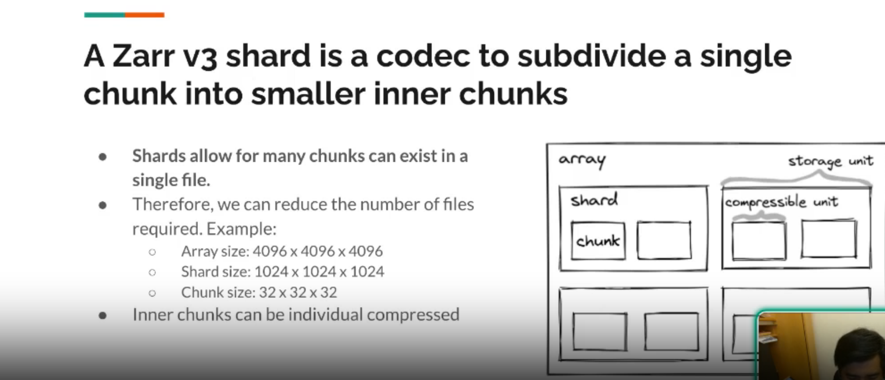

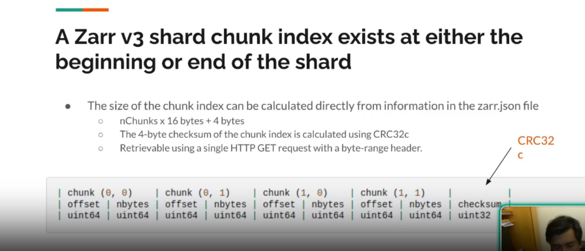

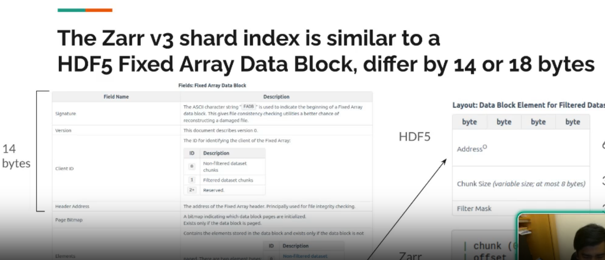

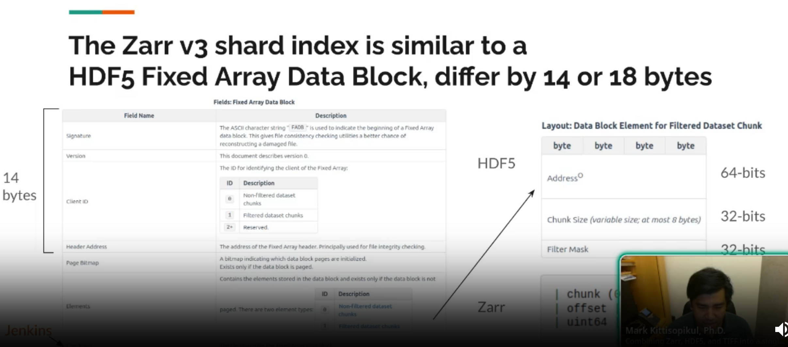

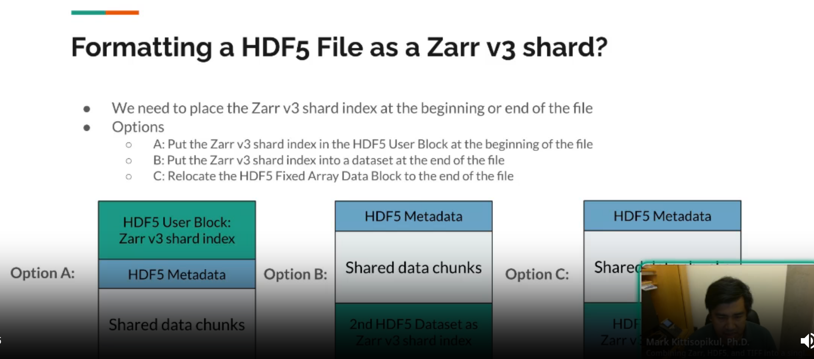

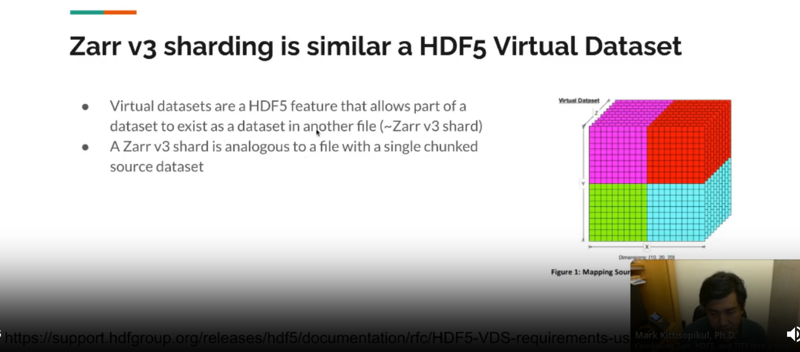

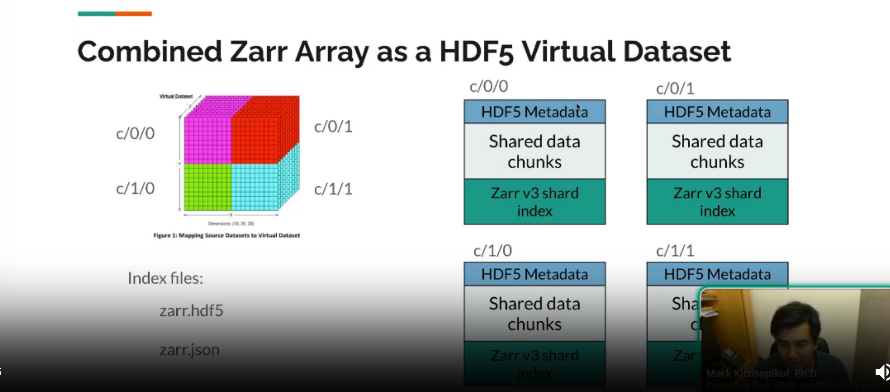

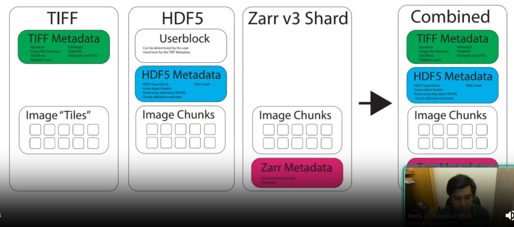

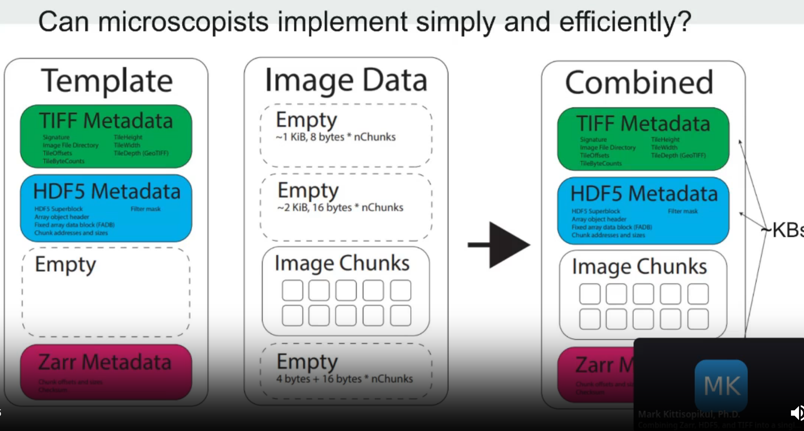

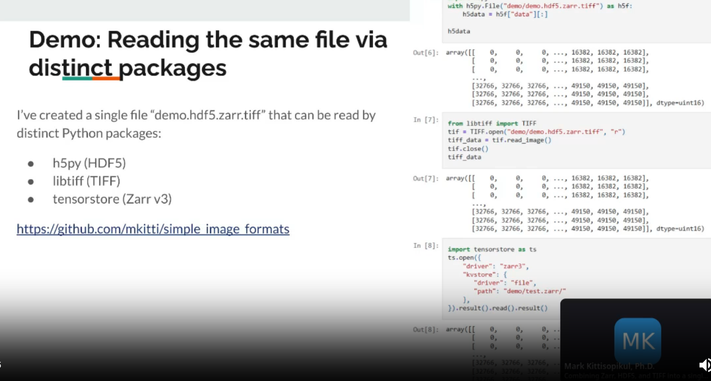

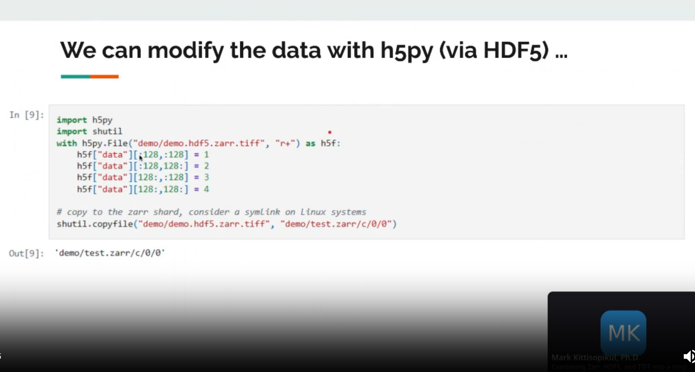

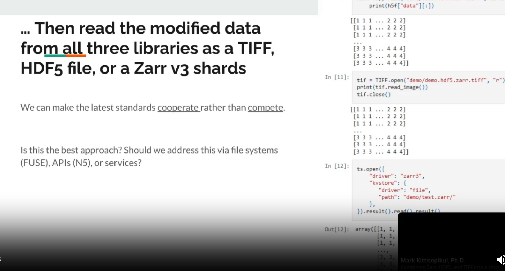

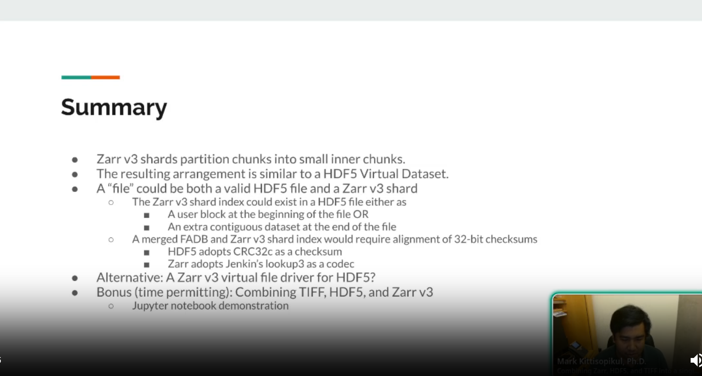

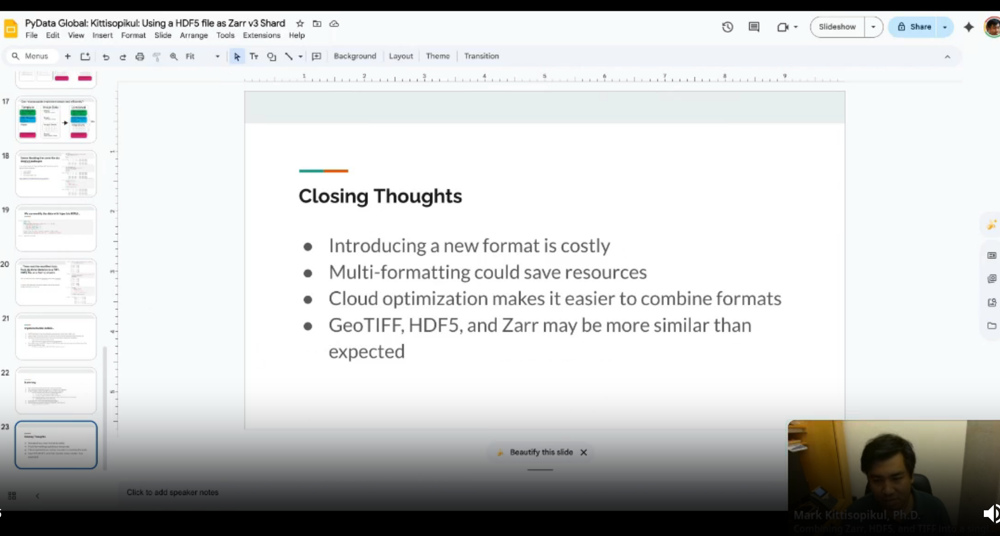

## Reflections

Fascinating that all three formats can be combined to point to the same data blocks. This opens up new possibilities for data sharing and interoperability across different software ecosystems. The ability to read and manipulate the same data using different libraries without duplication is a significant advantage, especially in collaborative environments where different teams may have preferences for specific formats.