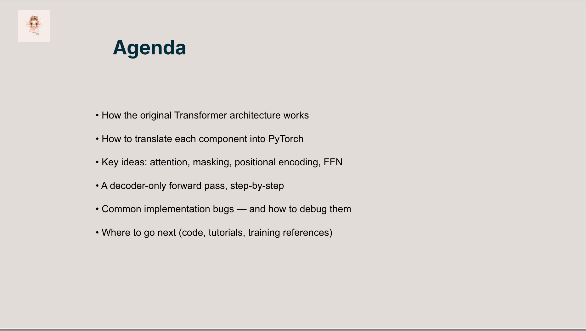
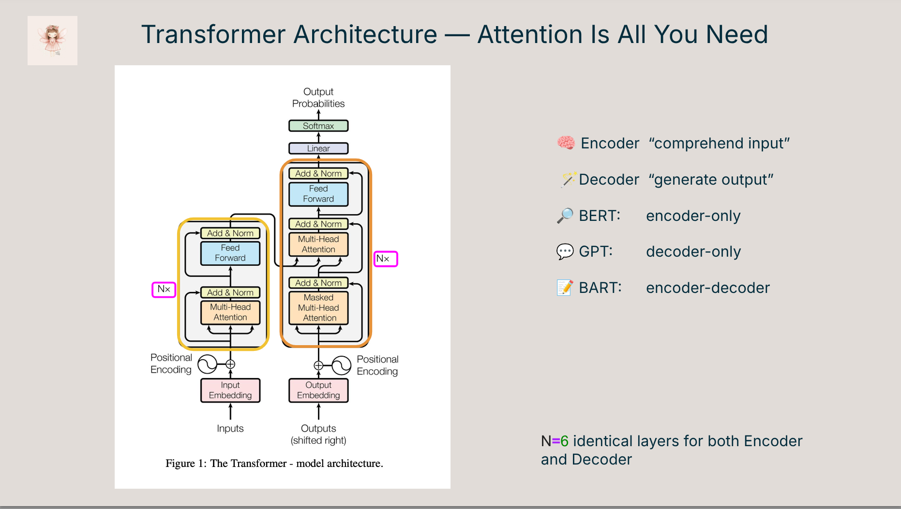
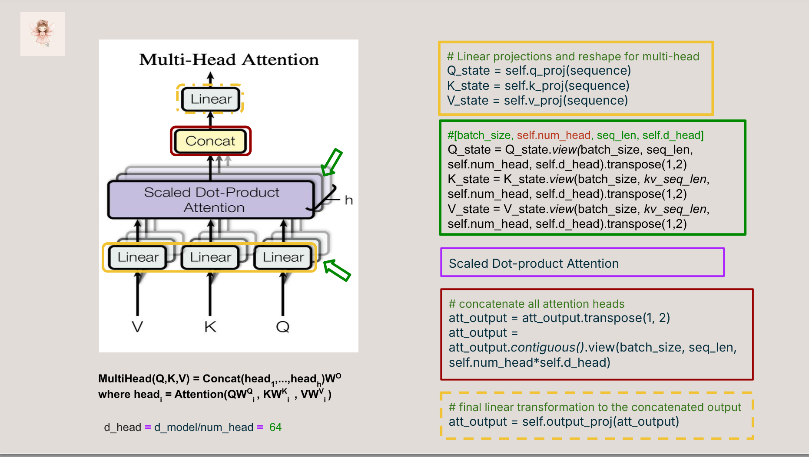
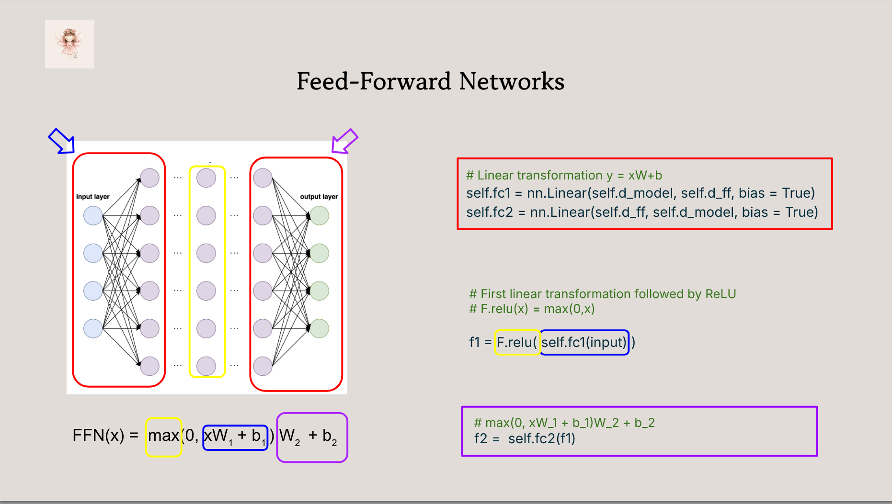
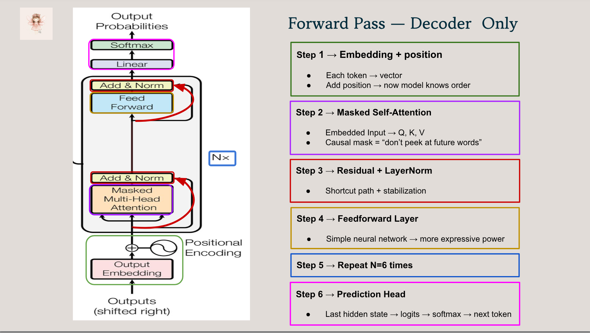
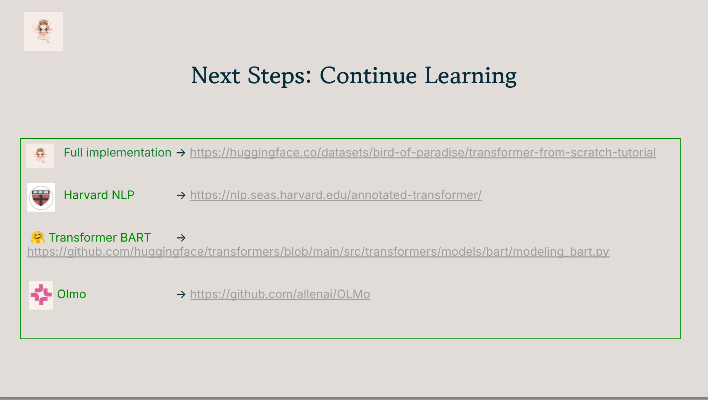
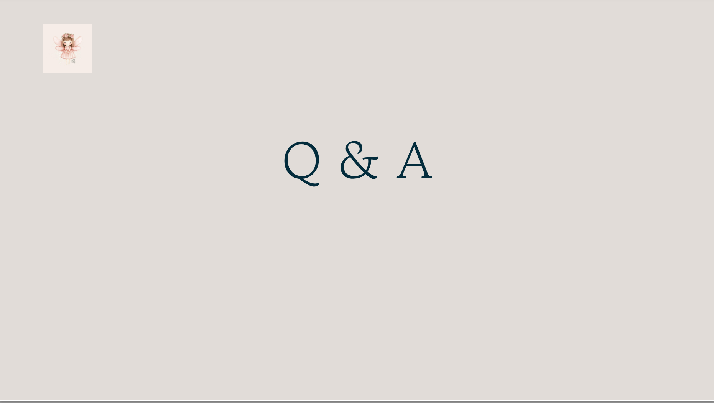
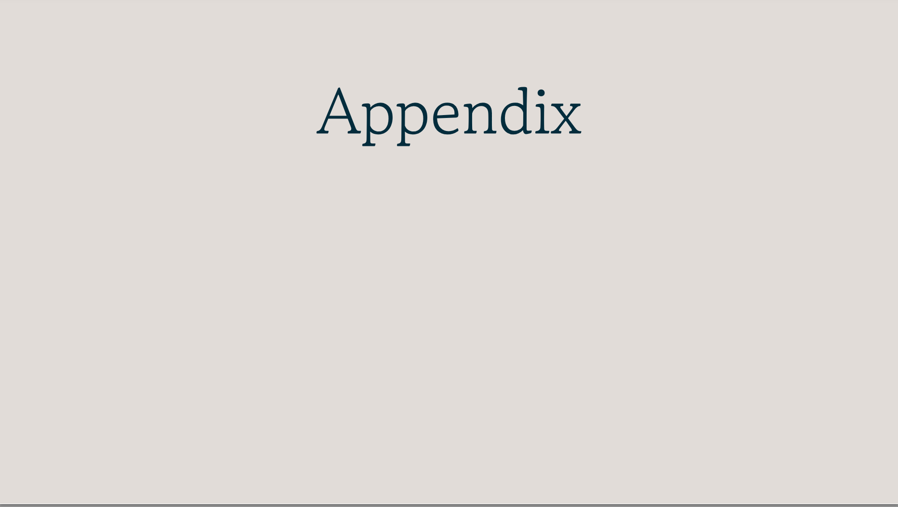
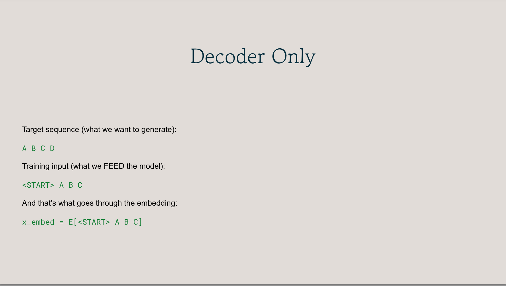

{.column-margin}

::: {.column-margin}

:::

::: {.callout-tip}
## Lecture Overview

Want to understand how transformers actually work without wading through 10,000 lines of framework code or drowning in tensor shapes?

This talk walks you through building a transformer model from scratch — no pre-trained shortcuts, no black-box abstractions — just clean PyTorch code and good old-fashioned curiosity. 
 
You'll walk away with a clearer mental model of how attention, encoders, decoders, and masking really work.
:::

Transformers power modern large language models, but their inner workings are often buried under complex libraries and unreadable abstractions. In this talk, we’ll peel back the layers and build the original Transformer architecture (Vaswani et al., 2017) step by step in PyTorch, from input embeddings to attention masks to the full encoder-decoder stack.

This talk is designed for attendees with a basic understanding of deep learning and [PyTorch](https://pytorch.org/) who want to go beyond surface-level blog posts and get a hands-on, conceptual grasp of what happens under the hood. You'll see how each part of the transformer connects back to the equations in the original paper, how to debug common implementation pitfalls, and how to avoid getting lost in tensor dimension hell.

::: {.callout-tip}
## What You'll Learn:

- 🔍 A walkthrough of key components: attention, positional encoding, encoder/decoder stack
- 🧠 Visual explanations of attention masks, shapes, and residuals
- ⚠️ Common bugs and debugging strategies (like handling shape mismatches and masking errors)
- ✅ Real-world implementation tips and tricks that demystify the architecture

By the end of the talk, attendees will:

- Understand the full forward pass of a transformer
- Know how each component connects to the original paper
- Feel more confident reading or writing custom model architectures
:::

::: {.callout-tip}
## Prerequisites:

- Basic Python and PyTorch
- Some familiarity with neural networks (e.g., feedforward, softmax)
- No need for prior experience in building models from scratch
:::

## Tools and Frameworks:

We will introduce you to certain modern frameworks in the workshop but the emphasis be on first principles and using vanilla Python and LLM calls to build AI-powered systems.

[workshop repo](https://huggingface.co/datasets/bird-of-paradise/transformer-from-scratch-tutorial)

:::: {.callout-tip}
## Speaker: 

### Jen Wei

Jen Wei is an independent AI research engineer with a PhD in applied mathematics and a love for building things from scratch — especially when she probably shouldn’t. She’s reverse-engineered transformer architectures, implemented modern techniques like mixture-of-experts and Multi-head latent attention, and still enjoys writing clean PyTorch code at 2am for fun (and maybe for revenge). Jen currently works in the GenAI space and shares her work openly on Hugging Face. Her favorite research topics include efficient LLM architecture, post-training techniques, and the existential crises of over parameterized models.

- Contact:
    - [🌸 Personal Website](https://birdofparadise.ai/experience/)
    - [🤗 repo](https://huggingface.co/bird-of-paradise)
    - [𝐗](https://x.com/JenniferWe17599)
    - [Medium](https://medium.com/@jenwei0312)
    - [💼 LinkedIn profile](https://www.linkedin.com/in/jenweiprofile)
:::

## Outline

<!--

-->
