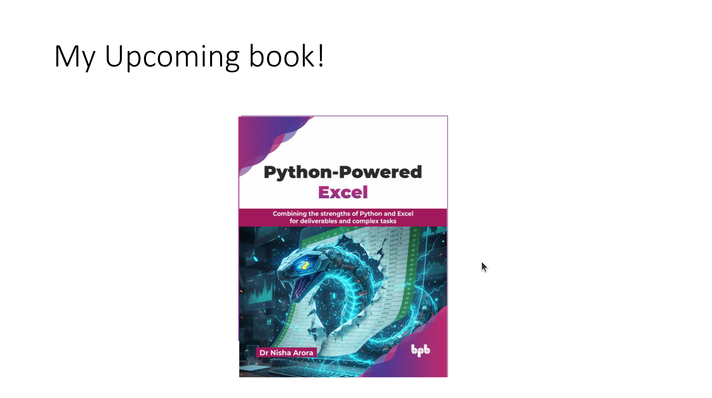
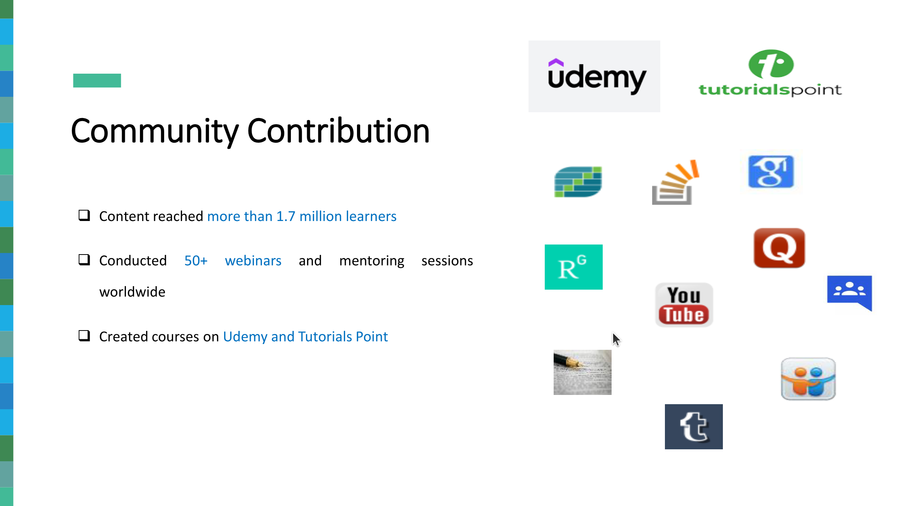
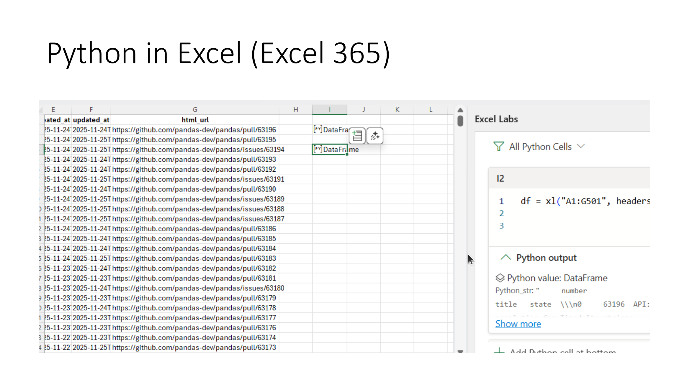
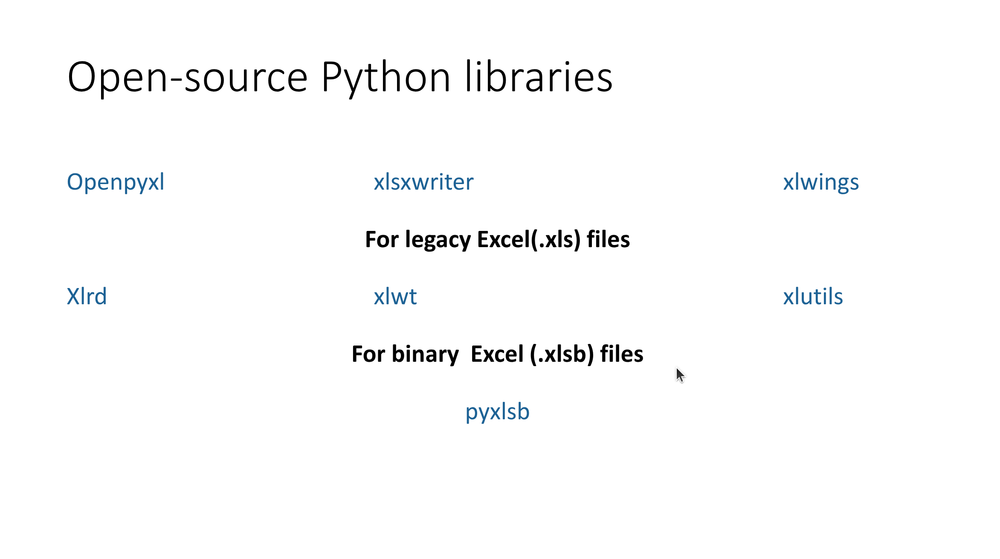
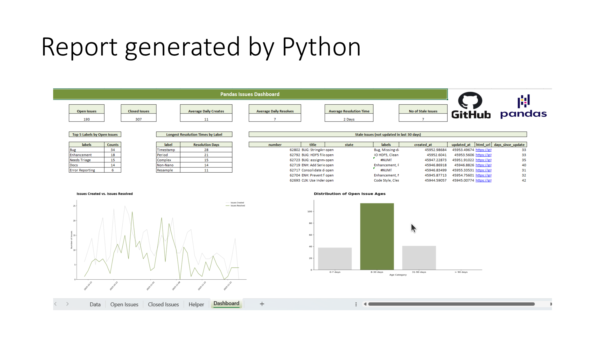
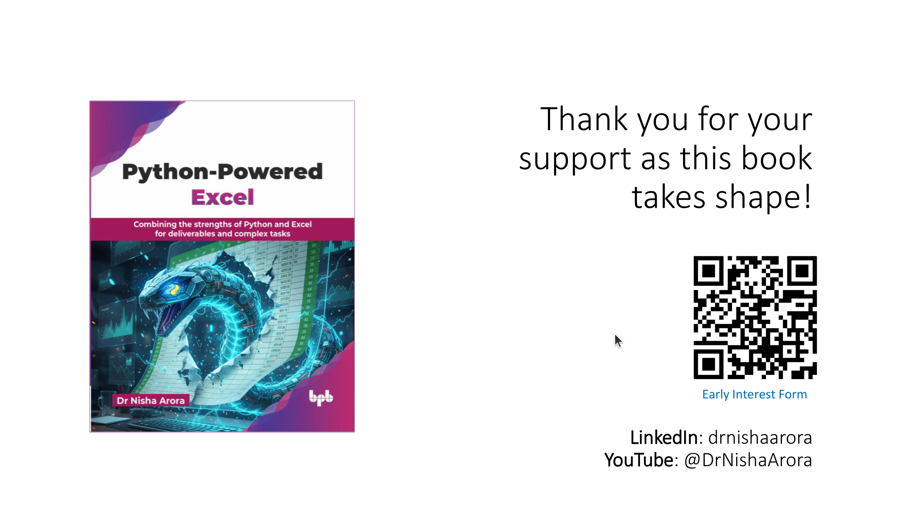
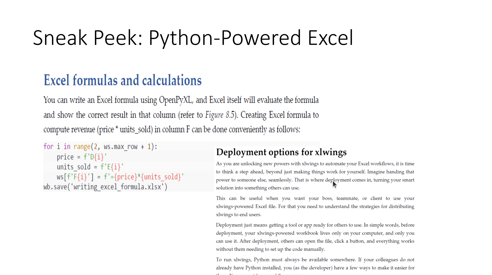

::: {.column-margin}

:::

::: {.callout-tip}
## Lecture Overview

- Python drives modern data workflows, yet Excel remains the lingua franca of business. Many Python-based data teams struggle when the “last mile” of delivery still involves exporting results to Excel for business users. This talk explores practical ways for Python users to automate, scale, and enhance Excel-heavy processes using open-source libraries.
- This talk will help you bridge the gap between code and the business-facing spreadsheet world.
- We will discuss real-world use cases for report generation, batch processing, and dashboard templating, all from a Python-first perspective.
:::

- This talk is designed for Python developers, analysts, and data scientists who routinely interact with Excel-based deliverables in their organization. It focuses on practical workflows that enhance productivity and reproducibility without requiring the audience to write or understand VBA or Excel formulas.
- The session begins by outlining common challenges Python users face when integrating with Excel, then introduces powerful Python tools that offer users seamless Excel file manipulation, specifically pandas, `xlsxwriter`, and `xlwings`.
- We will discuss some real-world use cases, such as generating reports, automating dashboards, creating custom functions in Excel and batch processing Excel files at scale.
- The talk concludes with a summary of tools, limitations, and best practices for integrating Python into Excel-centric workflows. This is a conceptual and strategic talk aimed at helping Python professionals work more effectively with Excel natives in the business ecosystem

[workshop repo](https://github.com/hugobowne/AI-for-SWEs)

:::: {.callout-tip}
## Speakers: 

- Nisha Arora
    - Dr. Nisha Arora is a data professional with experience across analytics, data science, reporting automation, storytelling, and applied statistical methods using Python, R, and Excel.
    - With a background spanning technical writing, reviewing, and corporate trainings, she focuses on making advanced tools accessible to analysts and non-technical users.
    - Her work bridges business-facing tools like Excel with scalable, reproducible workflows in Python. She creates accessible, practical learning content and actively contributes to the data community through her trainings, talks, and YouTube channel.
    - She is currently working on a book project aimed at helping professionals modernize spreadsheet-based processes through Python.
:::

## Outline

:::: {.sl}
::: {.sl-text}
Hello everyone and welcome to PyData 2025. I'm excited to kick off the general track today with "Python Meets Excel: Smarter Workflows for Analysts and Data Teams" with Dr. Nisha Aurora. Please interact in the chat and drop questions in the Q&A.
:::
::: {.sl-fig}

:::
::::

:::: {.sl}
::: {.sl-text}
Welcome to the talk "Python Meets Excel: Smarter Workflows for Analysts and Data Teams." I'm Dr. Nisha Aurora, a trainer and educator passionate about simplifying complex concepts for analysts and business users.
:::
::: {.sl-fig}

:::
::::

:::: {.sl}
::: {.sl-text}
I have a PhD in Mathematics and have taught engineers, MBAs, and corporate teams. I love to speak at tech events and contribute to the community through blogs, forums, and YouTube.
:::
::: {.sl-fig}

:::
::::

:::: {.sl}
::: {.sl-text}
This talk is inspired by my upcoming book, "Python-Powered Excel," which explores how Python and Excel can be integrated to create smarter workflows for analysts and data teams.
:::
::: {.sl-fig}

:::
::::

:::: {.sl}
::: {.sl-text}
I love contributing to the community by writing blogs, answering questions on forums, and creating courses. My content has reached over 1.7 million users worldwide.
:::
::: {.sl-fig}

:::
::::

:::: {.sl}
::: {.sl-text}
Today's agenda:
- Why Python and Excel?
- Tools for Python-Excel integration.
- Case studies: Real-world examples.
- Best practices and limitations.
:::
::: {.sl-fig}

:::
::::

:::: {.sl}
::: {.sl-text}
Why drag cells when Python can drive? Python is better for analytics, data science, and machine learning. But Excel is still the language of business and widely used by stakeholders.
:::
::: {.sl-fig}

:::
::::

:::: {.sl}
::: {.sl-text}
Excel is everywhere. Business people understand and prefer Excel for its familiarity and flexibility. Deliverables are often expected in Excel format.
:::
::: {.sl-fig}

:::
::::

:::: {.sl}
::: {.sl-text}
Pandas is a powerful library for data analytics. It allows you to analyze data and export results to Excel, but formatting and customization require additional tools.
:::
::: {.sl-fig}

:::
::::

:::: {.sl}
::: {.sl-text}
The ExcelWriter class in pandas enables customization. You can write multiple datasets to the same sheet and format headers, numbers, and dates.
:::
::: {.sl-fig}

:::
::::

:::: {.sl}
::: {.sl-text}
Python meets Excel through various tools. Excel 365 introduced Python integration, but it has limitations like requiring an internet connection and limited library access.
:::
::: {.sl-fig}

:::
::::

:::: {.sl}
::: {.sl-text}
Python in Excel is a good start for Excel users learning Python. However, it has limitations, such as restricted library access and reliance on Microsoft servers.
:::
::: {.sl-fig}

:::
::::

:::: {.sl}
::: {.sl-text}
Core Python libraries like pandas, NumPy, and Matplotlib are available in Excel 365. These libraries are essential for analytics and data visualization.
:::
::: {.sl-fig}

:::
::::

:::: {.sl}
::: {.sl-text}
Python tools for Excel include openpyxl, xlsxwriter, and xlwings. These libraries enable advanced Excel file manipulation and automation.
:::
::: {.sl-fig}

:::
::::

:::: {.sl}
::: {.sl-text}
Open-source Python libraries allow you to create charts, format data, and automate workflows in Excel, making it easier to deliver polished reports.
:::
::: {.sl-fig}

:::
::::

:::: {.sl}
::: {.sl-text}
With xlwings, you can use Excel as a user interface and Python as the backend engine, enabling seamless integration and automation.
:::
::: {.sl-fig}

:::
::::

:::: {.sl}
::: {.sl-text}
Excel can serve as a user interface while Python acts as the engine. This approach combines the best of both tools for business and technical users.
:::
::: {.sl-fig}

:::
::::

:::: {.sl}
::: {.sl-text}
Python can generate reports directly in Excel. This allows for automated, scalable, and reproducible workflows for analysts and data teams.
:::
::: {.sl-fig}

:::
::::

:::: {.sl}
::: {.sl-text}
Python-generated reports can include advanced formatting, charts, and dashboards, making them ready for business use.
:::
::: {.sl-fig}

:::
::::

:::: {.sl}
::: {.sl-text}
Let's see Python and Excel integration in action. We'll explore how to create automated workflows and dashboards.
:::
::: {.sl-fig}

:::
::::

:::: {.sl}
::: {.sl-text}
Python and Excel can connect seamlessly to create powerful, automated workflows for data analysis and reporting.
:::
::: {.sl-fig}

:::
::::

:::: {.sl}
::: {.sl-text}
Thank you for attending "Python Meets Excel." I hope this talk inspires you to explore Python-Excel integration for smarter workflows.
:::
::: {.sl-fig}

:::
::::

:::: {.sl}
::: {.sl-text}
Sneak peek: Python-powered Excel workflows can transform how analysts and data teams work, making processes more efficient and scalable.
:::
::: {.sl-fig}

:::
::::

:::: {.sl}
::: {.sl-text}
Python-powered Excel workflows enable analysts to automate repetitive tasks, create dynamic dashboards, and scale their processes.
:::
::: {.sl-fig}

:::
::::
