{.column-margin}

::: {.column-margin}

Making decisions under uncertainty with applications in Bayesian optimization (PoI/EI) and Bayesian experimental design
:::

::: {.callout-tip}
## Lecture Overview

We often must make decisions under uncertainty—should you carry an umbrella if there's a 30 % chance of rain? Bayesian decision theory provides a principled, probabilistic framework to answer such questions by combining beliefs (probabilities), utilities (what matters to us), and actions to maximize expected gain.
:::

This talk:

- Introduces key decision‑theoretic concepts in intuitive terms.
- Uses a toy umbrella example to ground ideas in relatable context.
- Demonstrates applications in Bayesian optimization (PoI/EI) and Bayesian experimental design.
- Is hands‑on—with Python code and practical tools—so participants leave ready to apply these ideas to real‑world problems.

::: {.callout-tip}
## What You'll Learn:

- This talk bridges everyday decision-making (umbrella example) with advanced techniques like 
- Bayesian optimization and 
- Experimental design, and equips attendees with conceptual clarity and immediate code they can adapt to their data-driven workflows.
:::

::: {.callout-tip}
## Audience:

Primarily data scientists, ML practitioners, and statisticians who:

- Have applied Bayesian models but want a broader decision-theory perspective.
- Want actionable insight into uncertainty-aware decision frameworks.
- Seek practical demos in Python.
:::

::: {.callout-important}
## Tools and Frameworks:

- [GPyTorch](https://gpytorch.ai/) for Gaussian processes
- [OptBayesExpt](https://github.com/usnistgov/optbayesexpt) for Bayesian experimental design
:::

[workshop repo](github.com/KrisNguen135/Talks)

:::: {.callout-tip}
## Speakers: 

### Quan Nguyen
 
Post doc researcher at Bayesian machine learning, decision making under uncertainty.

Author of books 
    - Bayesian optimization 
    - Grokking Bayes

- website: https://krisnguyen.github.io/
- twitter: https://twitter.com/the_subtrahend
- talks repo: github.com/KrisNguen135/Talks
:::

## Outline

This video provides a hands-on guide to Bayesian decision theory, explaining how to make decisions under uncertainty by combining beliefs (probabilities), utilities (what matters), and actions to maximize expected gain.

**Understanding Uncertainty**: Nguyen illustrates how daily scenarios, like deciding whether to carry an umbrella, or technical challenges, like tuning machine learning model parameters, involve decision-making under uncertainty. This is challenging due to unpredictable future events and varying costs/utilities in different outcomes.

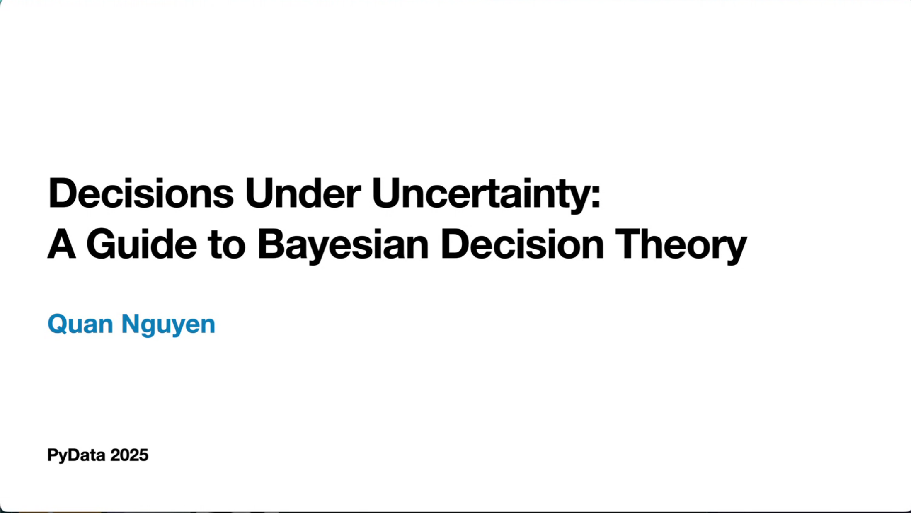{#fig-decision-under-uncertainty}

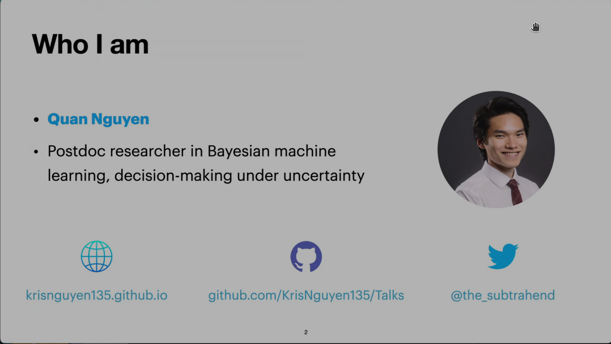{#fig-slide-02}

{#fig-slide-03}

### Motivation & Core Concepts (5 min)

Quantifying Decisions: Bayesian decision theory involves quantifying uncertainties and costs. The "umbrella example" is used to demonstrate how to create a probability and associated cost table, assigning probabilities to scenarios (e.g., rain or no rain) and costs to actions (e.g., bringing an umbrella or not).

- Frame real-world decision problems: rain or shine, clinical trials, A/B testing.
- Introduce Bayesian decision theory: beliefs $\times$ utilities $\to$ action via expected utility maximization.

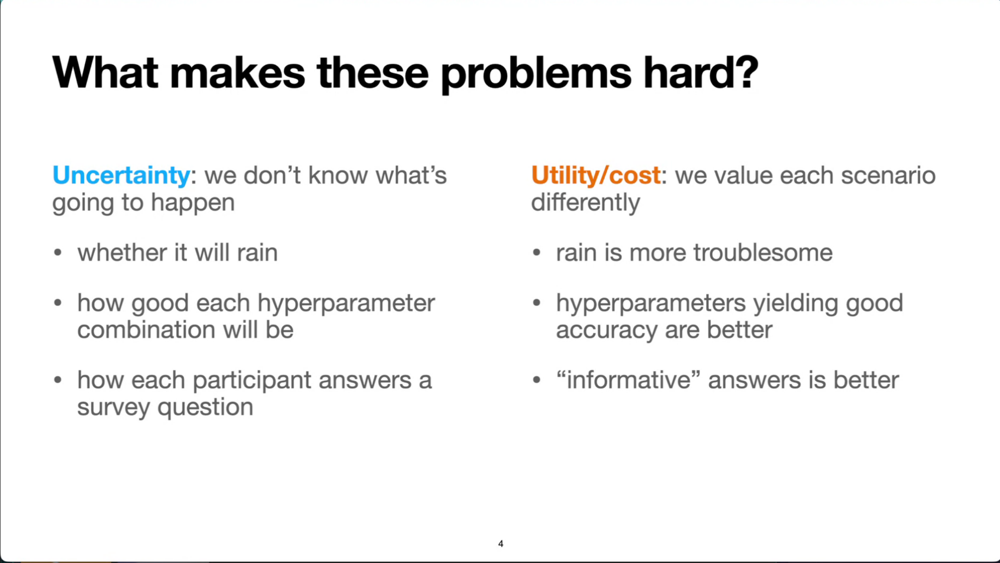{#fig-what-makes-these-problems-hard}

:::: {.columns}

::: {.column width="50%"}

- **Uncertainty**: we don't know the future (e.g., ? ).
    - will it rain
    - how good each hyperparameter combination will be?
    - how each participant will respond to a question?
:::

::: {.column width="50%"}
- **Utility/cost**: we value each scenario differently
    - rain is more troublesome
    - hyperparameter yields good accuracy are better
    - "informative" answers is better
:::

::::

## Toy Example: Should I Bring an Umbrella? (8 min)

**Optimizing Expected Utility/Cost**: The core principle is to choose actions that lead to the lowest expected cost or highest expected utility. This involves calculating a weighted average of costs or utilities based on their probabilities. For instance, in the umbrella example, bringing an umbrella is the optimal action if it results in a lower expected cost.

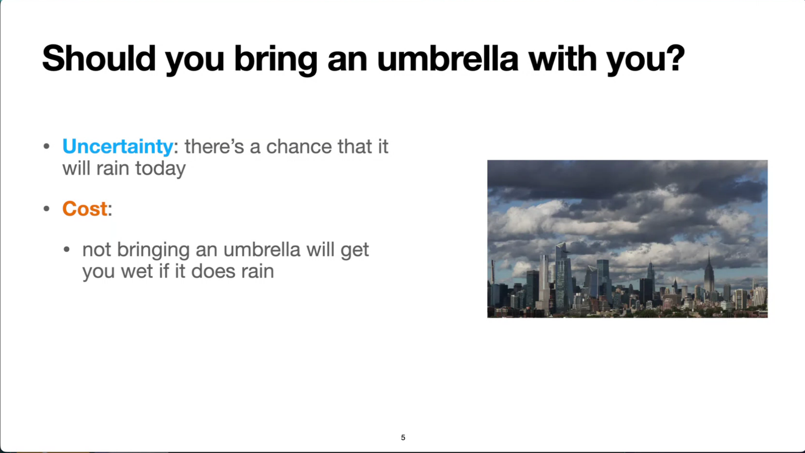{#fig-should-i-bring-an-umbrella}

- Define: Probability $p$ of rain; utility/loss matrix

|Action   	|Rain  |No Rain
|-----------|------|-------|
|Umbrella   | –1 (weight)|	–1 (inconvenience)
|No Umbrella|–10 (soaked)|	0

- Derive expected utility:

`EU_umbrella = -1`
`EU_no_umbrella = -10p`

So bring umbrella if $p > 0.1$

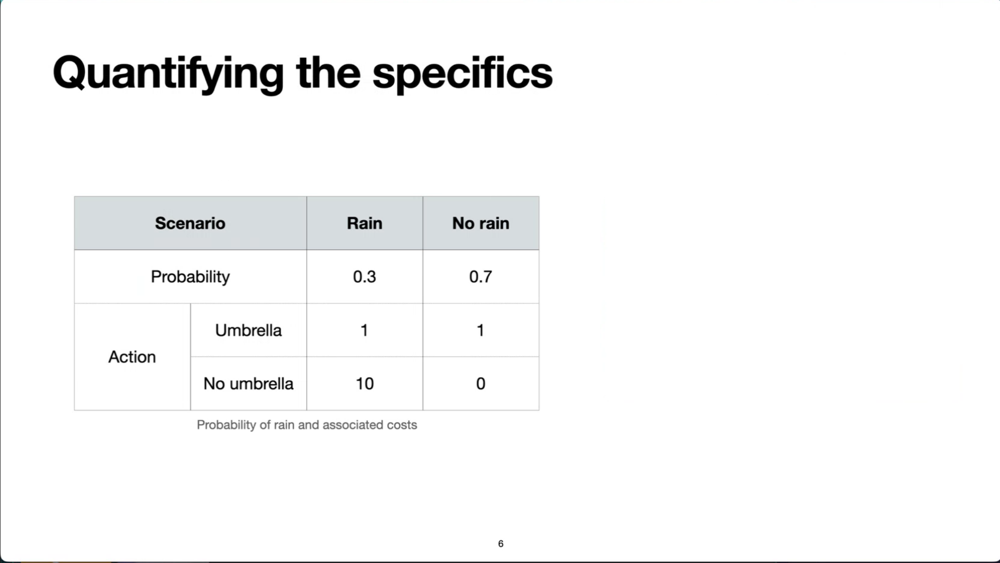{#fig-quantifying-the-specifics}

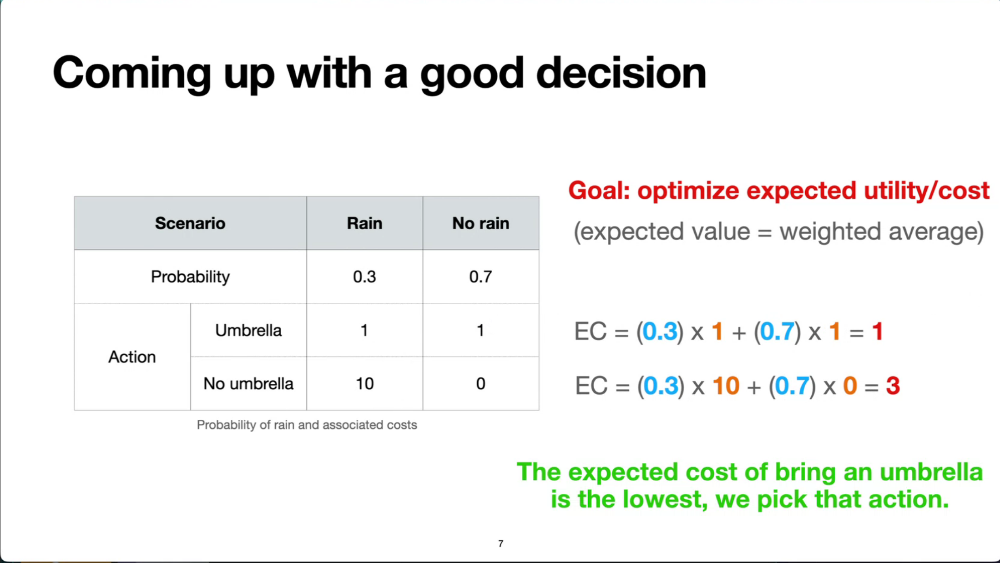{#fig-coming-up-with-a-good-decision}

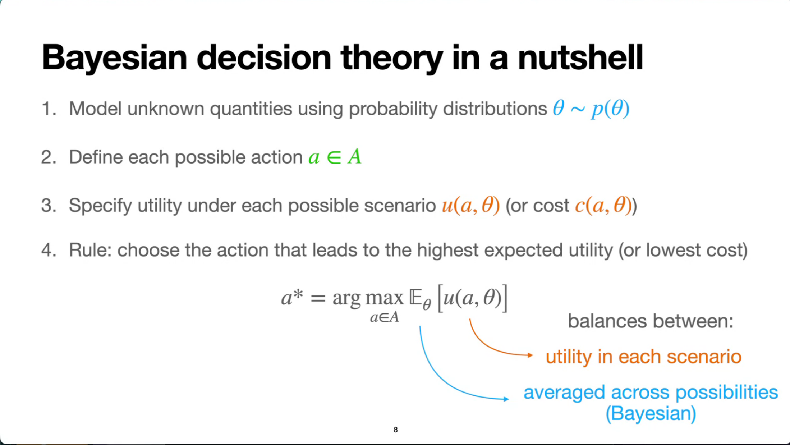{#fig-interactive-demo}

- Interactive Python demo: explore how $p$ and utility values shift the decision point.

### Bayesian Optimization: PoI & EI (8 min)

- Introduce Gaussian-process-based optimization and the need to trade off exploration vs. exploitation.
- Define Probability of Improvement (PoI) and Expected Improvement (EI)
- Show how they're derived from decision theory: choosing the next point to maximize expected gain.

**Personalization of Bayesian Decision Theory**: The theory is highly personalizable, as the optimal decision depends on an individual's beliefs about the world and their personal preferences regarding costs and utilities. This is demonstrated by showing how varying the probability of rain or the perceived cost of getting wet can alter the optimal decision.

{#fig-personalization-of-bayesian-decision-theory}

{#fig-personalization-of-bayesian-decision-theory-2}

{#fig-bayesian-optimization}

**Applications in Bayesian Optimization**: The theory is applied to Bayesian optimization, which aims to find the optimal inputs for "black-box" functions that are expensive to evaluate. Examples include hyperparameter tuning in machine learning and scientific discovery, where minimizing the number of evaluations is crucial.

- Python demo using GPyTorch: fit GP, compute PoI/EI acquisition functions, visualize decision boundary—why one chooses a high-uncertainty point vs. one near known good values.

{#fig-decision-theoretic-optimization}

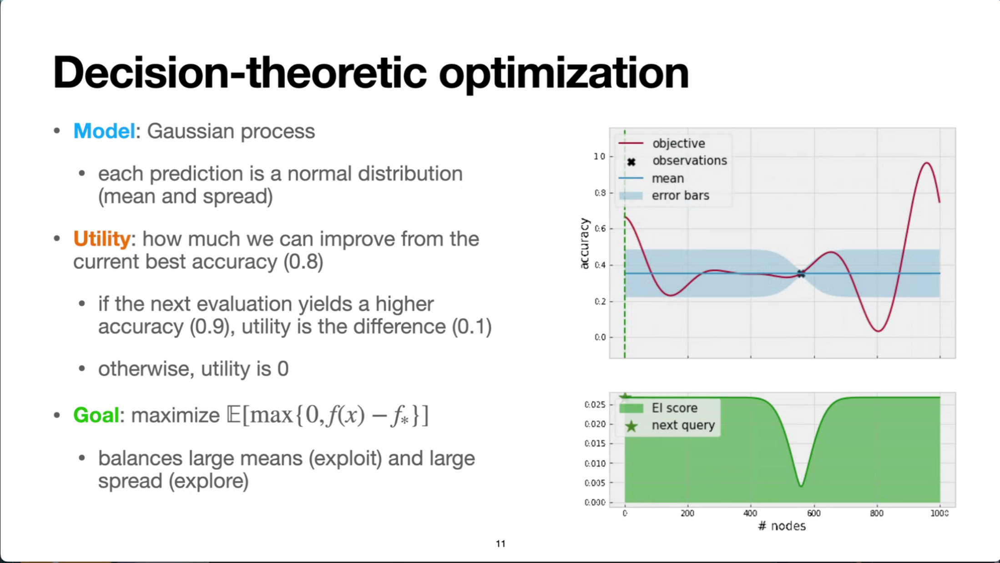{#fig-decision-theoretic-optimization-3}

###  Bayesian Experimental Design (BED): Minimizing Uncertainty (8 min)

**Applications in Experimental Design**: Bayesian decision theory can also be used in experimental design to efficiently learn about unknown functions or quantities. By strategically choosing experiments, one can minimize uncertainty (e.g., using Shannon entropy as a cost function) and gather information as quickly as possible.

- Motivation: cost-sensitive data collection (labeling, surveys, medical tests).
- Define an information-based utility (e.g., expected reduction in entropy).
- Show how decision theory prescribes choosing the next experiment to maximize this expected utility.

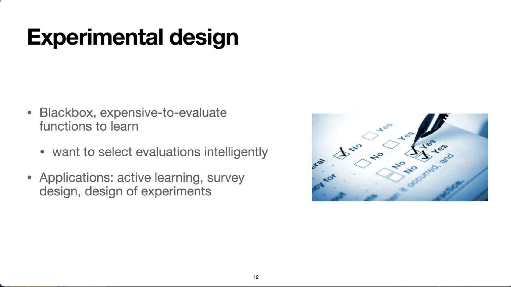{#fig-experimental-design}   

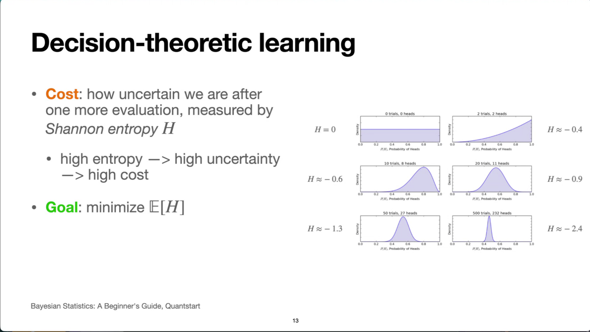{#fig-decision-theoretic-learning-2}

- Python demo using [OptBayesExpt](https://github.com/usnistgov/optbayesexpt).

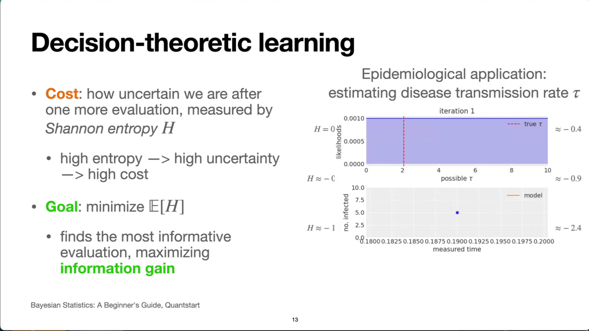{#fig-decision-theoretic-learning}

{#fig-decision-theoretic-learning-3}

- Thanks for the free e-book !

### Summary & Takeaways (1 min)

- Reiterate the decision-theoretic arc: belief → utility → action.
- Emphasize the unifying framework across umbrella example, optimization, and experimental design.
- Share resources & practical tips: GPyTorch / scikit-optimize, OptBayesExpt

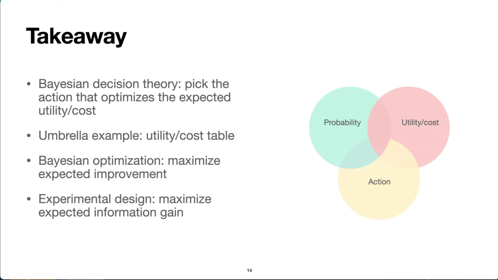{#fig-takeaway}

{#fig-what-can-go-wrong}

{#fig-more-resources}

## Reflection

- TODO
    - replace the static slides with shinylive demos based on the interactive notebooks in the talk repo. This will make the content more engaging and allow readers to experiment with the concepts in real time.
    - cover previous talks by Quan Nguyen
    - summary of the Bayesian optimization book or integration into Bayesian optimization as a continuation of the Bayesian stats serialization in my notes.