::: {.column-margin}

:::


::: {.callout-tip}
## Lecture Overview

- Pandas is a popular library for data scientists but it struggles with large datasets; programs either become too slow or run out of memory. 
- [In this talk, we introduce [Bodo DataFrames](https://github.com/bodo-ai/Bodo) as a drop-in replacement for the Pandas library that uses high performance computing (HPC) based techniques such as Message Passing Interface (MPI) and JIT compilation for acceleration and scaling.]{.mark} 
- We give an overview of its architecture and explain how it avoids the problems of Pandas (while keeping user code the same), go over concrete examples, and finally discuss current limitations. 
- This talk is for Pandas users who would like to run their code on larger data while avoiding frustrating code rewrites to other APIs. 
- Basic knowledge of Pandas and Python is recommended.
:::

Despite its popularity for data manipulation tasks, Pandas struggles at scale due to its single threaded execution and significant Python-based overheads. In this talk, we introduce Bodo DataFrames as a solution to scaling Pandas with a single line of code change; simply replace import pandas as pd with import bodo.pandas as pd.

Bodo DataFrames transforms Pandas code into lazily evaluated plans, enabling database-quality query optimizations, and runs on a streaming, parallel backend using the Message Passing Interface (MPI) for fast worker-to-worker communication. This design avoids out-of-memory errors and is easily scalable from laptop to large cloud cluster. Unlike other data processing engines, Bodo DataFrames combine powerful techniques from high performance computing (HPC) and databases while remaining fully Pandas compatible.

We will present multiple examples and benchmarks demonstrating how to use Bodo DataFrames. The first example will show how to scale a simple program covering functions like reading/writing Parquet files, Series-datetime, merge, and groupby-agg. The next example will demonstrate how to accelerate user defined functions (i.e. map and apply) using Bodo DataFrames builtin support for Just-In-Time (JIT) compilation. The final example will demonstrate how to use Bodo DataFrames support for the Apache Iceberg format, which provides schema evolution and time travel for ever-changing datasets. We will also discuss how Bodo DataFrames falls back to Pandas when it doesn't support all operations of a workload, and planned future work.

This talk is designed for users of Pandas; data scientists, data engineers and AI/ML practitioners, who are interested in accelerating and scaling their workloads easily. In addition to a new tool under their belt, attendees will walk away with an understanding of techniques from HPC and databases, unlocking deeper insights into aspects of performance and memory utilization.


::: {.callout-important}
## Tools and Frameworks:
- [Bodo DataFrames](https://github.com/bodo-ai/Bodo)
:::

:::: {.callout-tip}
## Speakers: 

- Scott Routledge
    - Scott is a Software Engineer at [Bodo.ai](https://bodo.ai), where he has worked on the performance and reliability of the `BodoSQL` engine, contributed to the Bodo Just-In-Time Python Compiler, and is currently working on Bodo DataFrames. 
    - He earned his undergraduate in computer science from Carnegie Mellon University.
    - [talk repo](https://github.com/bodo-ai/Bodo)
    - [slide deck](./slides.pdf)
:::

## Outline


:::: {.sl}
::: {.sl-text}
## Bodo DataFrames: a fast and scalable HPC-based drop-in replacement for Pandas

- **Core problem:**
    - `pandas` is easy and familiar, but often fails or becomes slow on large real-world datasets, especially when data lives in cloud storage such as `S3`. 
    - Other scalable tools often require code rewrites, tuning, or different APIs.
:::
::: {.sl-fig}
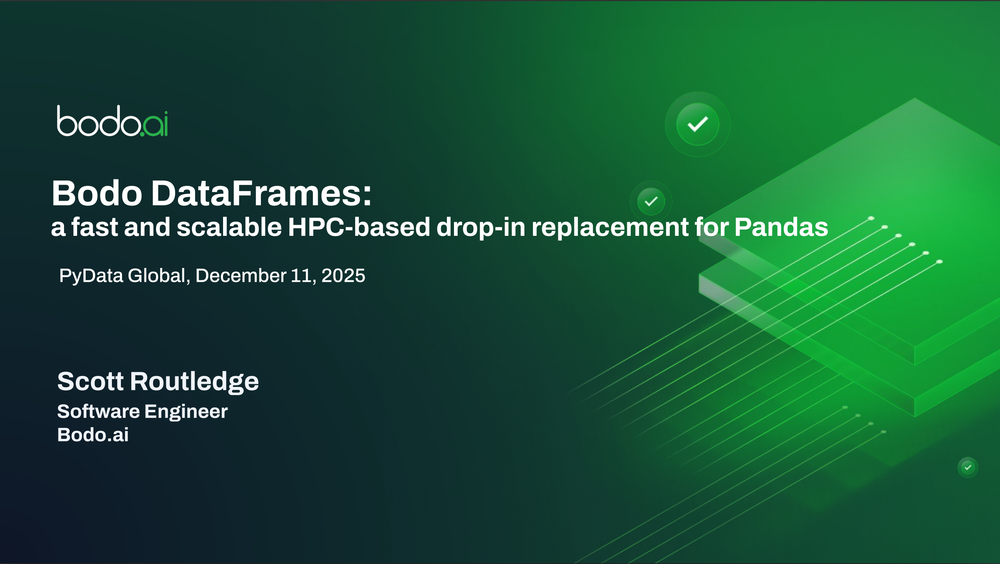
:::
::::

:::: {.sl}
::: {.sl-text}
## About Me

- Software Engineer at Bodo.ai
- B.S. in CS and ML @ Carnegie Mellon 
- Worked on Python Compiler & BodoSQL
- Currently working on Bodo DataFrames

:::
::: {.sl-fig}
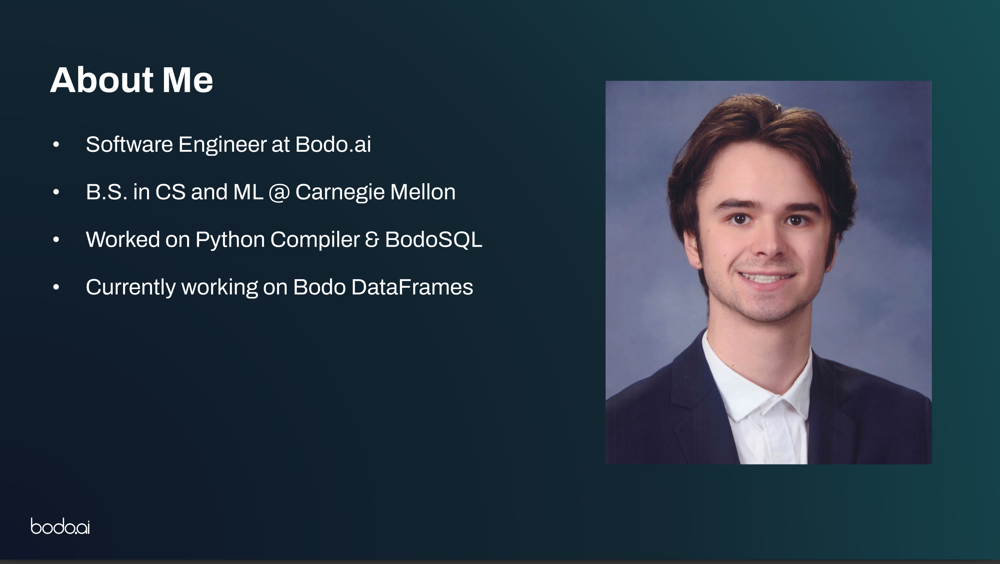
:::
::::

:::: {.sl}
::: {.sl-text}
- Open source: 
    - `pip install bodo`
    - `conda install bodo -c conda-forge`
    - `import bodo.pandas as pd`
- Parallel computing with MPI
- JIT compilation & query optimization
- SQL engine (`pip install bodosql`)


* **Main claim:** Bodo DataFrames lets users replace:

  `import pandas as pd`

  with:

  `import bodo.pandas as pd`

  and keep mostly ordinary pandas-style code while gaining parallel execution, query optimization, streaming, and just-in-time compilation.
:::
::: {.sl-fig}
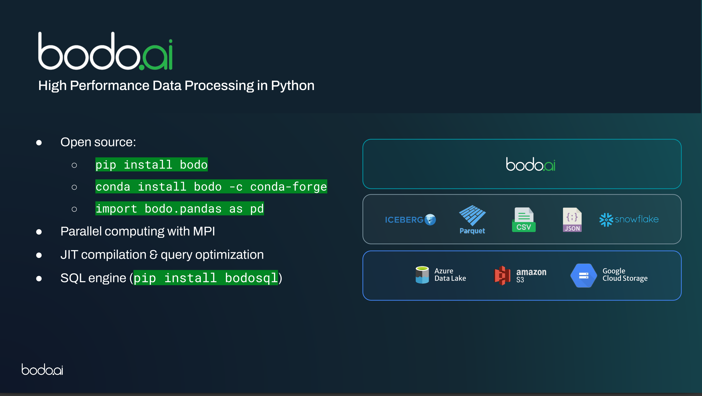
:::
::::

:::: {.sl}
::: {.sl-text}
## Agenda
- The Challenge: Simple, Scalable Data Infrastructure
- Bodo DataFrames Overview and Demo
- JIT Compiler for Custom Code
- Integration with *Iceberg Table Format*
:::
::: {.sl-fig}
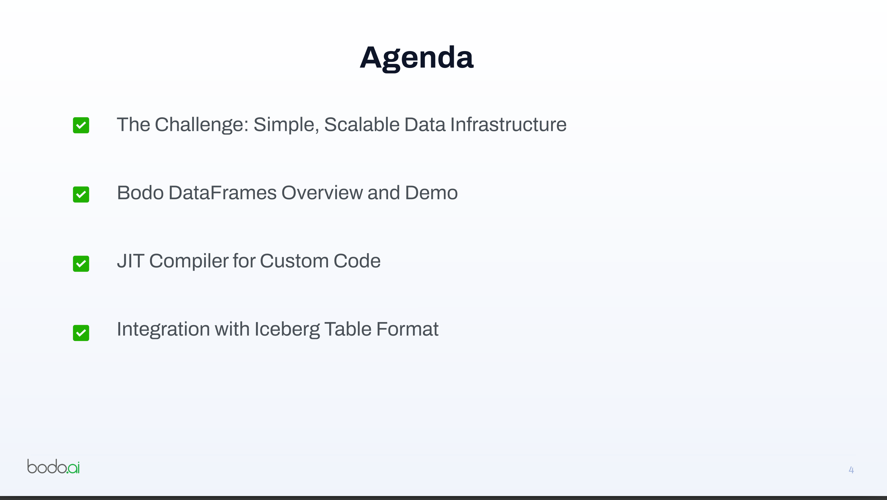
:::
::::

:::: {.sl}
::: {.sl-text}

## The Challenge: Simple, Scalable Data Infrastructure
::::: {.columns}
:::::: {.column width="50%"}

### Challenges:

- Frequent code rewrites and performance tuning
- Complexity in managing large cloud  datasets
- Fragmentation of tools for different use  cases

::::::
:::::: {.column width="50%"}
### Requirements:

- Fast and scalable for data size without code changes
- Easy to use and understand
- Flexibility: ETL, analytics, preprocessing, AI workloads (inference, training)
::::::
:::::
:::
::: {.sl-fig}
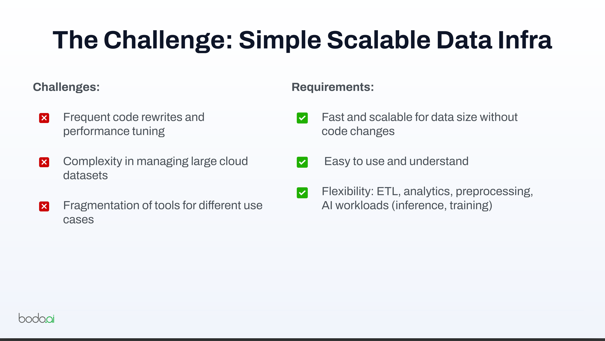
:::
::::

:::: {.sl}
::: {.sl-text}
- Database-grade query optimizer & JIT 
compiler
- MPI backend with streaming execution
- Spill to disk to prevent Out of Memory  (OOM) Errors
- Fallback to Pandas for unsupported operations

```python
import bodo.pandas as pd
df = pd.read_parquet(path)
df["month"] = df.F.dt.month
df["year"] = df.F.dt.year
df = df[df.B == "gamma"]
df.to_parquet("result.pq")
```
:::
::: {.sl-fig}
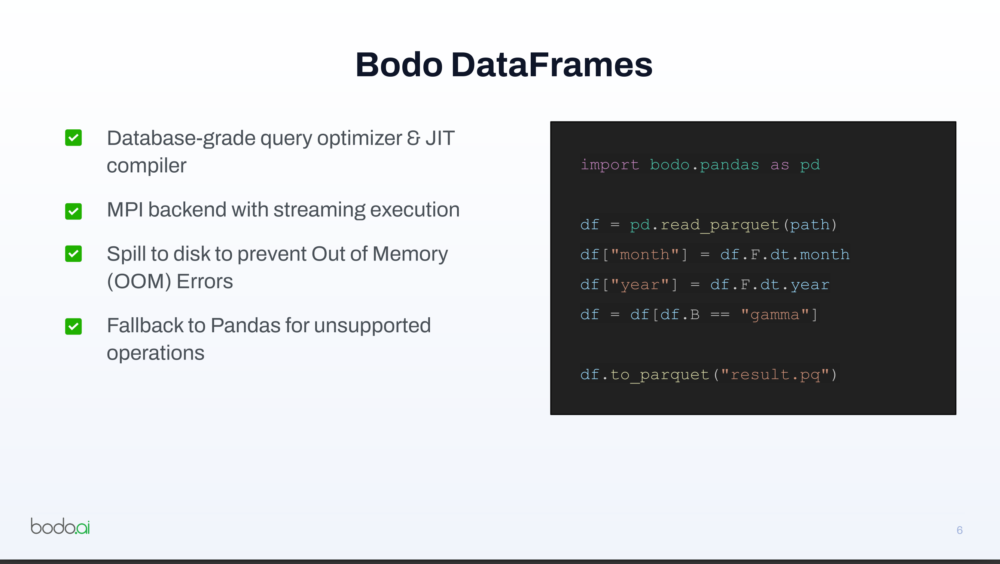 
:::
::::

:::: {.sl}
::: {.sl-text}
- NYC Taxi ETL

* **Demo result:** 
    - On a New York City taxi and rideshare ETL workload with about **44 million rows**, regular pandas took roughly **60–70 seconds**, 
    - while Bodo DataFrames ran in about **7 seconds** on four Mac cores, giving around a **10× speedup**.

:::
::: {.sl-fig}

:::
::::

:::: {.sl}
::: {.sl-text}
### Bodo Scales Pandas Efficiently

**Could use Spark, Dask, etc.**

-  Implementation complexity
-  Task-based model creates high  overheads

**Or... Use Bodo!**

-  Drop-in Pandas replacement
-  HPC execution scales from laptop to large cluster
-  JIT compilation & query optimization
:::
::: {.sl-fig}
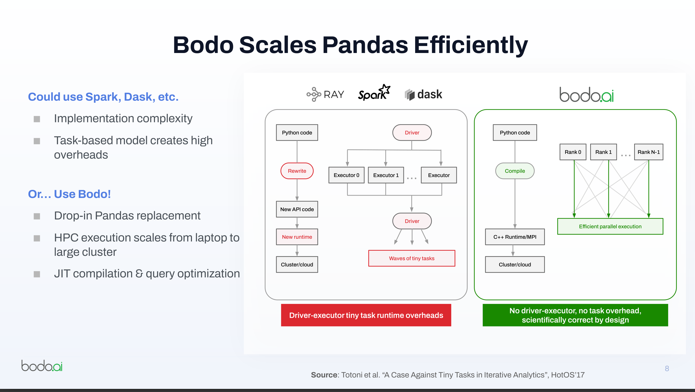
:::
::::

:::: {.sl}
::: {.sl-text}

* **Execution model:** 
    - Bodo uses **single program, multiple data (SPMD)** execution rather than the usual driver-executor model used by systems like Spark or Dask.
    - Workers run the same program on different data chunks and communicate directly using **message passing interface (MPI)**, which reduces driver bottlenecks.
:::
::: {.sl-fig}
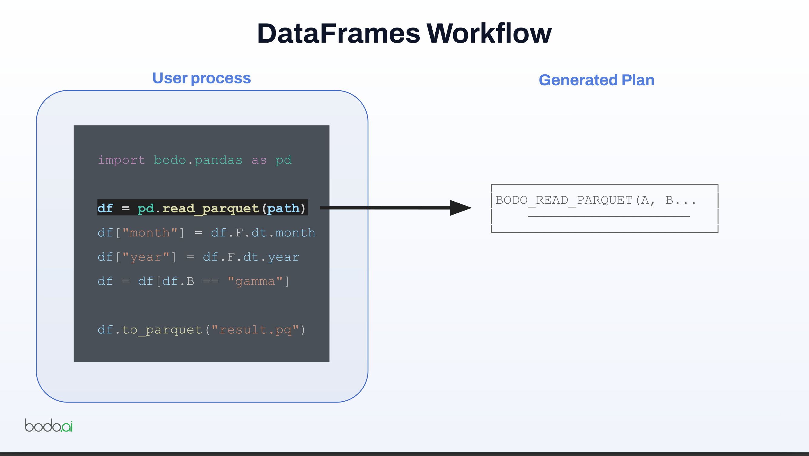
:::
::::

:::: {.sl}
::: {.sl-text}
* **Lazy evaluation and optimization:**
-  Bodo does not immediately execute each pandas operation. 
:::
::: {.sl-fig}
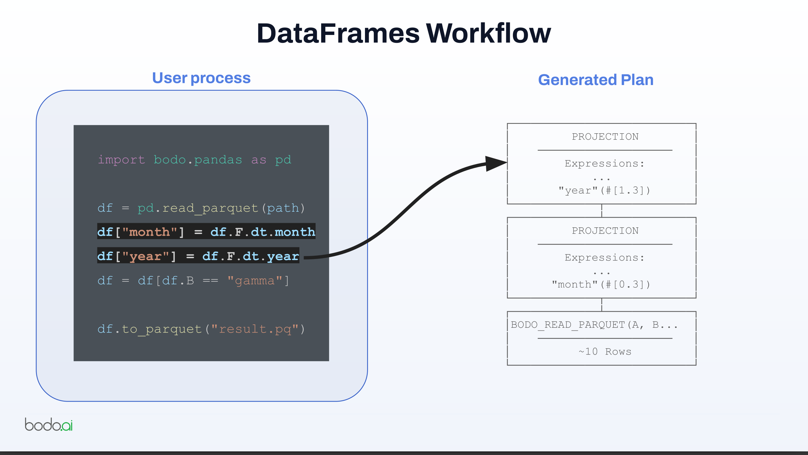
:::
::::

:::: {.sl}
::: {.sl-text}
- It builds a query plan, optimizes it, and then executes it. 
:::
::: {.sl-fig}
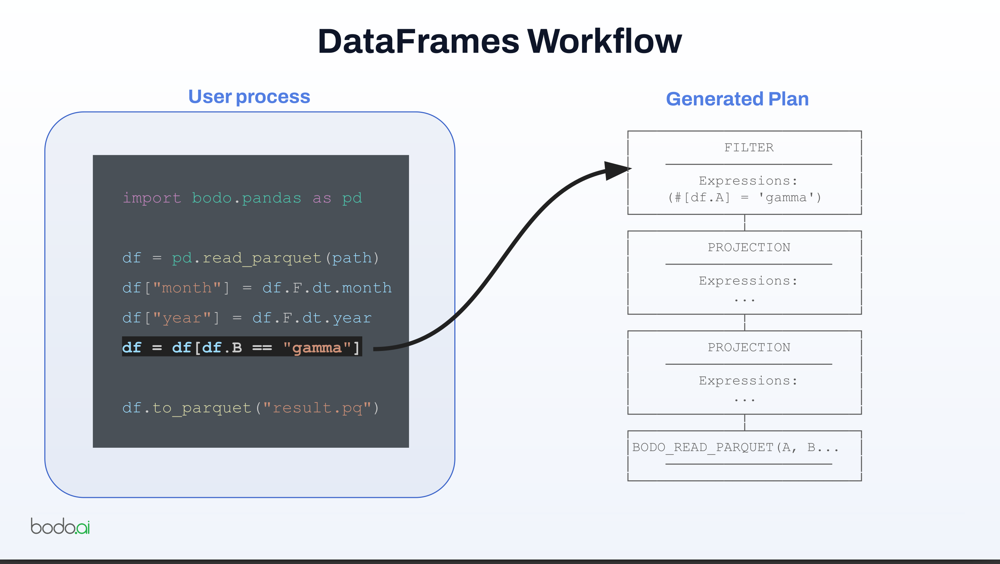
:::
::::

:::: {.sl}
::: {.sl-text}
:::
::: {.sl-fig}
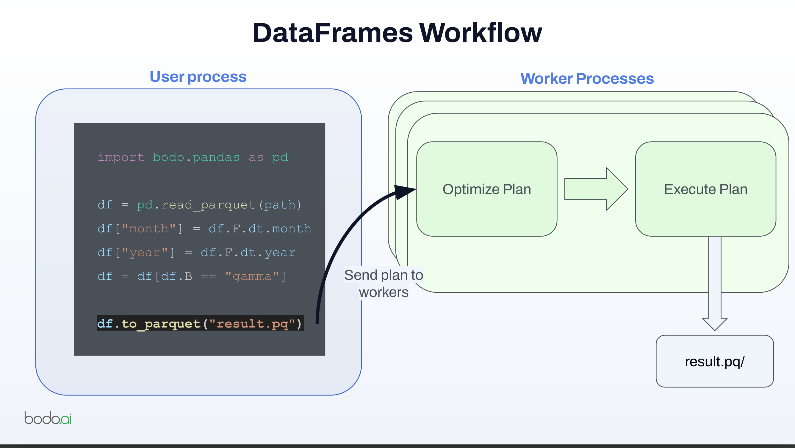
:::
::::

:::: {.sl}
::: {.sl-text}
- This enables database-style optimizations such as **filter pushdown**, where filters are applied as early as possible to reduce later work.
:::
::: {.sl-fig}
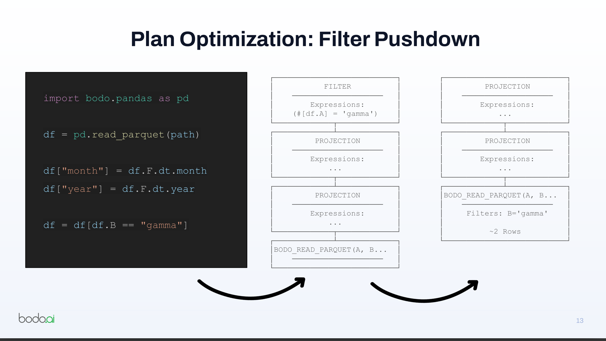
:::
::::

:::: {.sl}
::: {.sl-text}
* **Streaming and spilling:** Data is processed in batches, allowing workloads larger than memory. For operations requiring global data, such as sorting or aggregation, Bodo can spill intermediate data to disk.
:::
::: {.sl-fig}
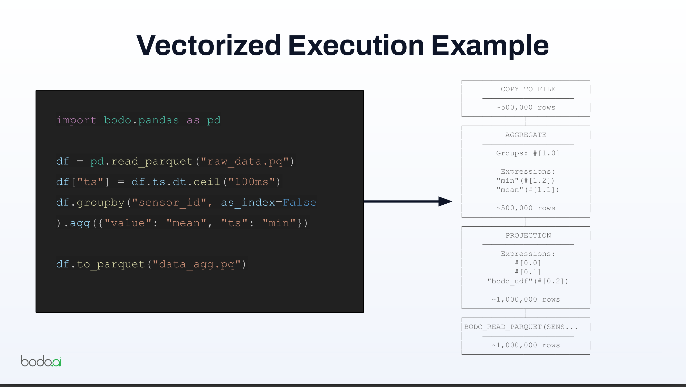
:::
::::

:::: {.sl}
::: {.sl-text}
:::
::: {.sl-fig}
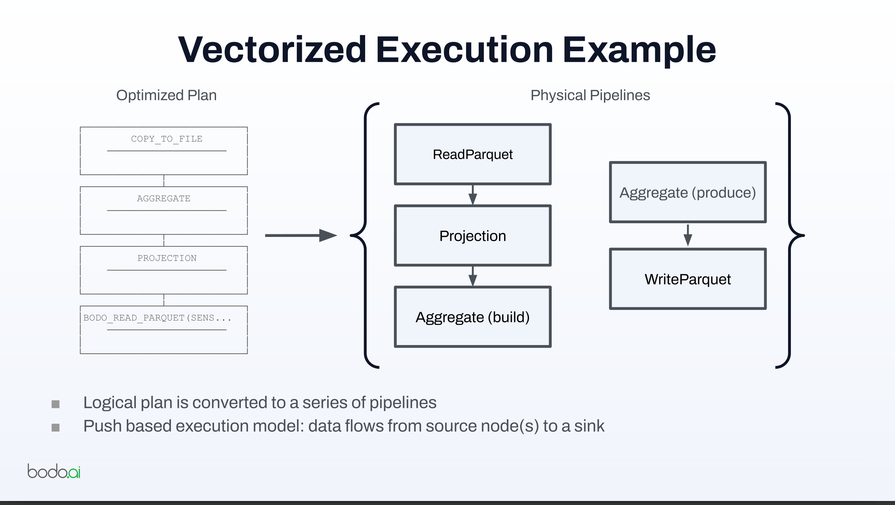
:::
::::

:::: {.sl}
::: {.sl-text}
- Logical plan is converted to a series of pipelines
- Push based execution model: data flows from source node(s) to a sink
:::
::: {.sl-fig}

:::
::::

:::: {.sl}
::: {.sl-text}
### Async Messaging in Pipelines
- Workers process pipelines independently
- Async MPI communication can overlap with compute
- Workers sync only at pipeline boundaries
:::
::: {.sl-fig}
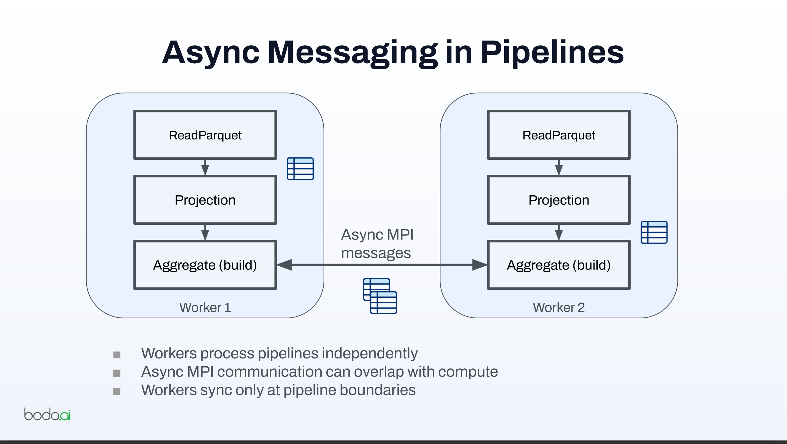
:::
::::

:::: {.sl}
::: {.sl-text}
### DataFrame Libraries Comparison

|Library|Ease of Use|Query Optimizer|Execution|
|-----|-----------------|----------|----------|
|Bodo DataFrames | Full `pandas` compatibility with fallback| Database-grade optimizer| HPC/MPI and database-based backend|
|Pandas on  Spark| `pandas` compatible; JVM complexity| Spark Catalyst (database-grade)| Task scheduling on JVM|
|Dask| Mostly `pandas` compatible; explicit “.compute()” and code changes| Basic compute graph optimization| Task scheduling in Python|
|Modin/Ray| `pandas`-compatible with fallbacks| No optimizer| Slow task scheduling (Ray-based)|
|Polars| SQL-like API, not `pandas`-compatible| Simple heuristic rules| Single-node threaded task scheduling|
|Daft| SQL-like API, not Pandas-compatible| Simple heuristic rules| Ray-based task scheduling (non-vectorized)|

* **Comparison with alternatives:** The speaker contrasted Bodo with Spark, Dask, Ray, Polars, and other pandas-like systems. The key differentiators claimed were stronger pandas compatibility, database-grade optimization, and the SPMD/MPI execution backend.
:::
::: {.sl-fig}
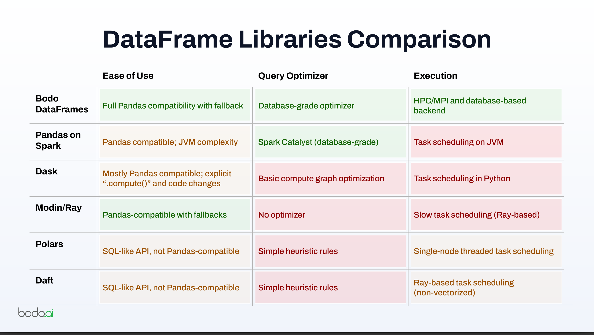
:::
::::


:::: {.sl}
::: {.sl-text}
* **Custom Python code:** For operations like `Series.map` and `DataFrame.apply`, Bodo tries to compile user-defined functions into optimized binaries. If compilation fails, it falls back to Python execution, but still keeps parallel and streaming execution where possible.


:::
::: {.sl-fig}
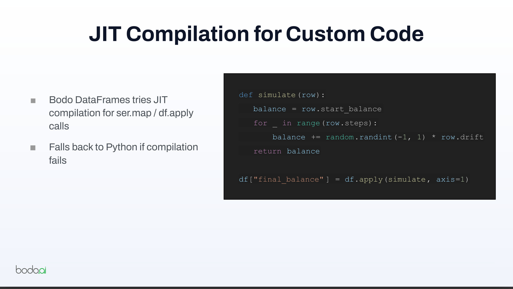
:::
::::


:::: {.sl}
::: {.sl-text}
:::
::: {.sl-fig}
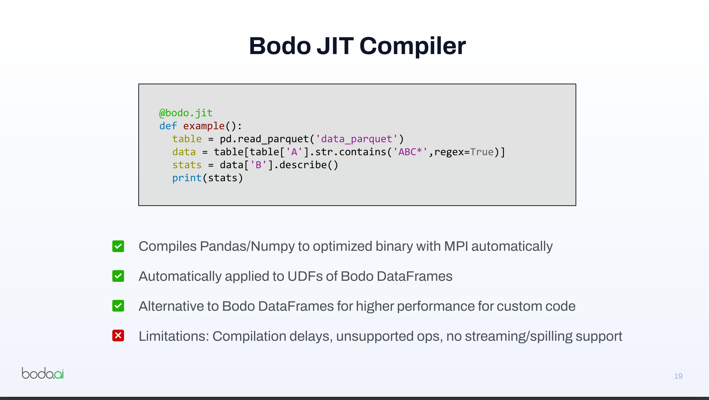
:::
::::

:::: {.sl}
::: {.sl-text}
* **Pandas API coverage:** `Bodo` supports many common `pandas` operations, including string functions, datetime operations, joins, `groupby` aggregations, `apply`, `map`, arithmetic, and user-defined functions. It does not yet support everything; unsupported operations may fall back to `pandas`.
:::
::: {.sl-fig}
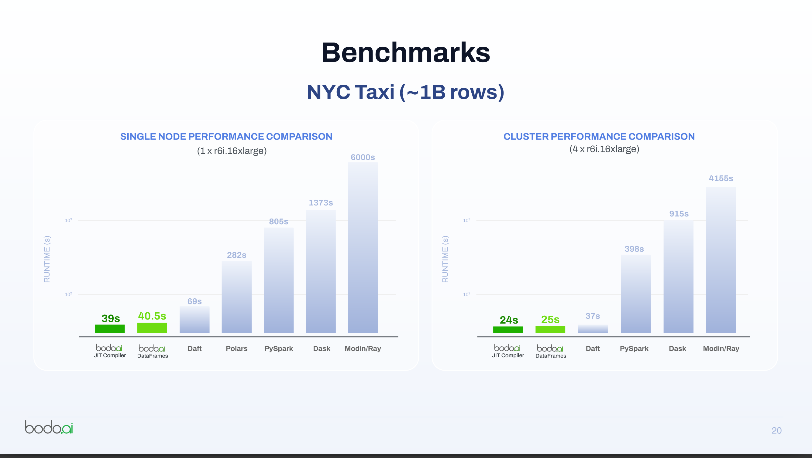
:::
::::

:::: {.sl}
::: {.sl-text}
- **Iceberg support:** 
    - `Bodo` supports reading from **Apache Iceberg**, an open table format for data lakes. 
    - Iceberg metadata allows `Bodo` to skip irrelevant files using partition summaries and snapshot metadata.
    - This makes filtered queries more efficient than scanning plain Parquet files.
:::
::: {.sl-fig}
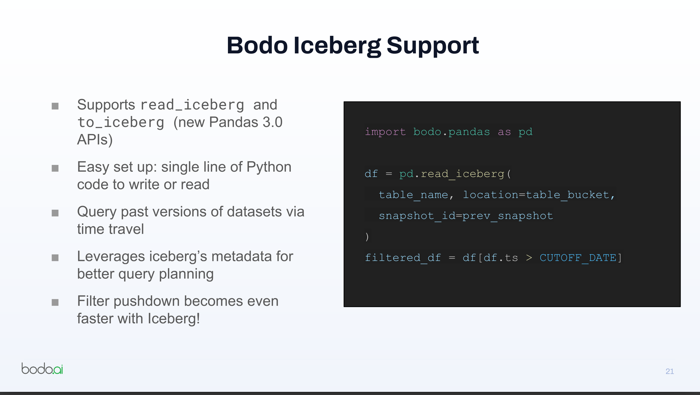
:::
::::
:::: {.sl}
::: {.sl-text}
### Summary

`Bodo` provides high-performance data processing in native Python

- True parallel computing with powerful MPI backend  
- `pandas` drop-in replacement
- JIT compiler & query optimizer Azure 

- **Bottom line:** `Bodo` DataFrames is positioned as a way to preserve the `pandas` programming model while adding parallel high-performance execution, query planning, and large-scale data processing capabilities.
:::
::: {.sl-fig}
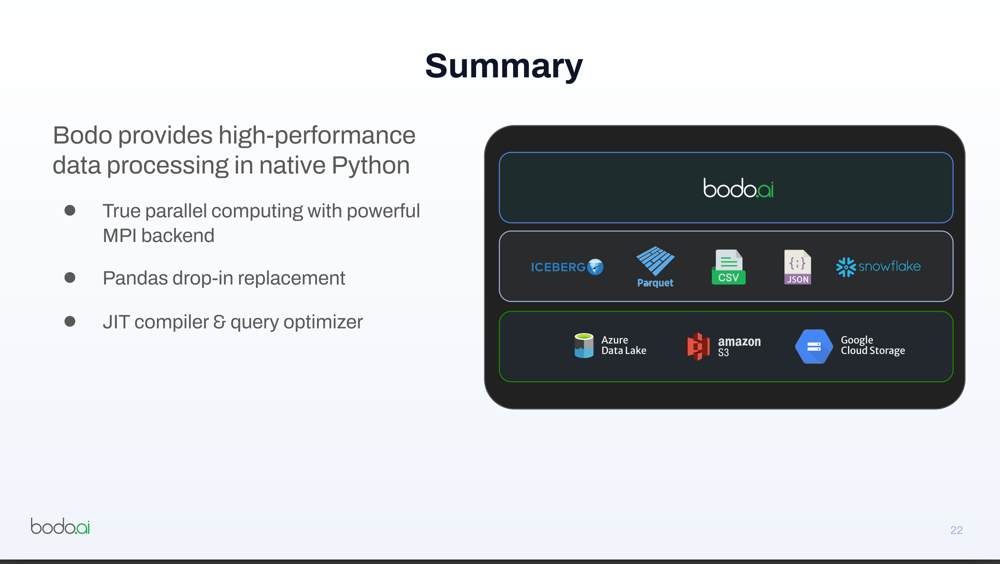
:::
::::

:::: {.sl}
::: {.sl-text}
* **Limitations mentioned:** Full pandas coverage is not complete. Some APIs such as `df.pipe` appear unsupported. Just-in-time compilation can introduce compile-time overhead and does not yet support every operation, streaming, or spilling in all modes.
:::
::: {.sl-fig}
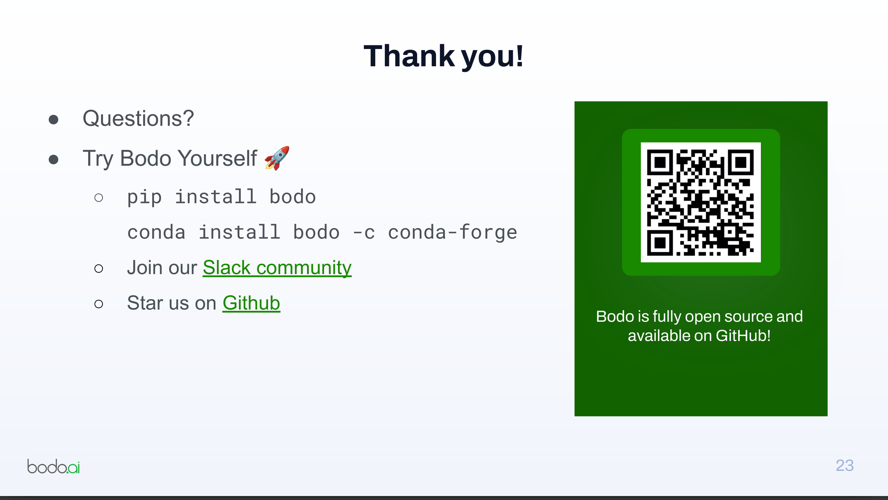
:::
::::

### Supplemental Slides

:::: {.sl}
::: {.sl-text}
:::
::: {.sl-fig}
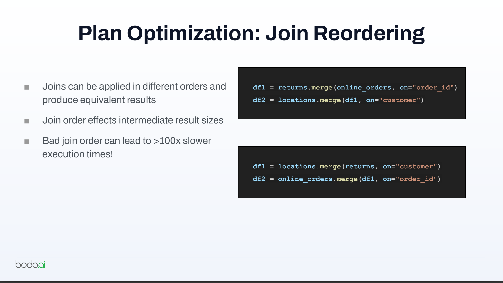
:::
::::

:::: {.sl}
::: {.sl-text}
:::
::: {.sl-fig}
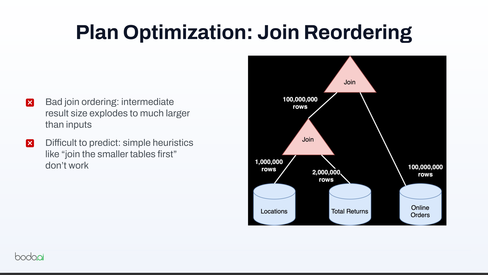
:::
::::

:::: {.sl}
::: {.sl-text}
:::
::: {.sl-fig}
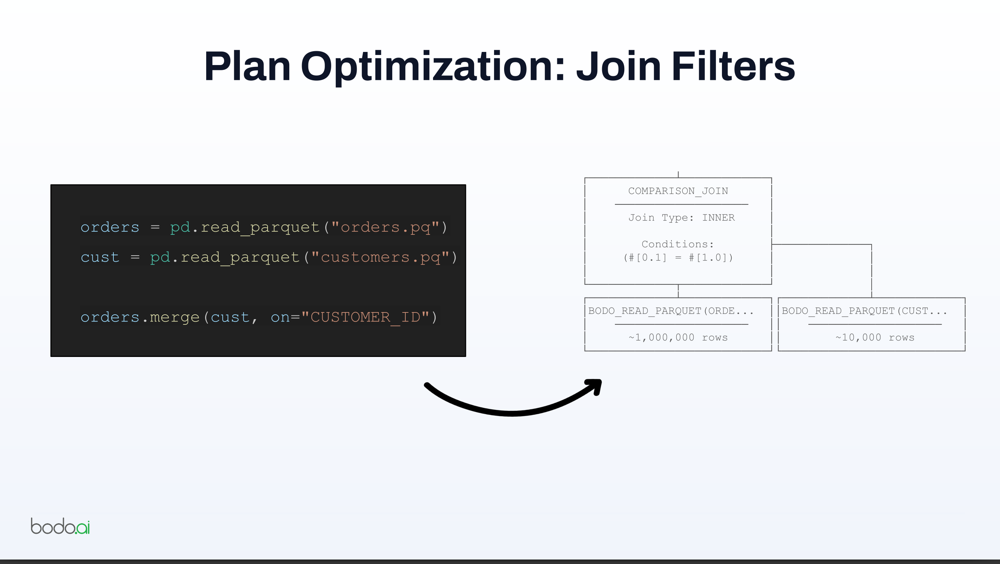
:::
::::

:::: {.sl}
::: {.sl-text}
:::
::: {.sl-fig}
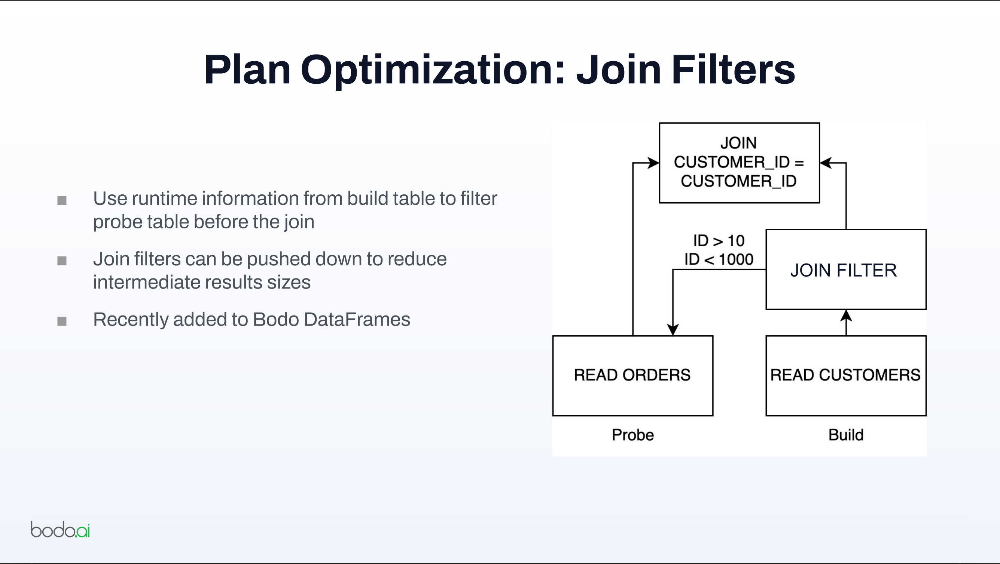
:::
::::

## Q&A 

- Highlights
  * On API coverage: no exact percentage was given, but many common performance-critical pandas APIs are supported.
  * On Polars: Polars also has optimizations like filter pushdown, but Bodo emphasizes cost-based database-style optimization, especially for join ordering.
  * On Oracle: Bodo SQL/Bodo JIT may support Oracle through pandas-style SQL table reading, and broader storage support is an area of interest.

## Reflections

- Isn't this what `Polars`, `dask`, `cuDF`, do ?
    - There is a chart now explaining the differences
- Don't these other libraries also promise to be drop in replacements for `pandas` ? 
    - Yes but they have some gotchas and often require code changes. 
    - Bodo is more focused on compatibility and fallback to `pandas` when it doesn't support something. 
