::: {.column-margin}

:::

::: {.callout-tip}
## Lecture Overview

This session shows how Bayesian statistical modeling helps determine when you have collected enough data about new products, so that they are ready for competition. 

We'll explore: how this approach enables efficient decision-making with minimal data why we chose Bayesian over machine learning models how we covered for the required assumptions how this enables a risk-management approach while providing interpretable results that business stakeholders can understand and trust.

You will learn how to identify a Bayesian problem at your company and how to navigate the modelling with real-world data!
:::

In this session, we will explore the application of Bayesian methodology to address the cold start problem in a recommendation system: determining if there is enough data for a new product in a marketplace to be accurately ranked, or if the product should get further exposure to reach that stage.

The target audience of this talk is data analysts of all levels, data practitioners interested in modelling, and professionals working in recommendation systems.

Unlike traditional machine learning models, Bayesian statistical modelling offers a robust framework for updating probabilities with new evidence, making it particularly suited for dynamic environments like online marketplaces.

That way, one can update the learnings on the performance of a new product daily, allowing for efficient decision-making around “should I keep on exploring this new product or not?” while minimising the traffic investment and enabling a risk-management-based approach. 
We will also cover how we control for the assumptions that Bayesian requires.

::: {.callout-tip}
## What You'll Learn:

- Understanding Bayesian Methods: Learn how Bayesian statistics can be applied to real-world business problems, offering a flexible and interpretable approach to decision-making.
- Benefits Over Machine Learning: Discover why statistical modelling can be more advantageous than machine learning in certain business contexts, particularly when managing risk, handling sparse data and providing interpretable results to the business.
- Practical Application: Learn about the challenges of applying bayesian models in a real marketplace.
:::

::: {.callout-tip}
## Prerequisites:

- [Learn what the cold start problem in a recommender system is](https://en.wikipedia.org/wiki/Cold_start_(recommender_systems)).
- [Get familiar with Bayesian thinking](https://www.countbayesie.com/blog/2022/2/19/how-to-read-the-news-like-a-bayesian).
- [BAYESCNS: A Unified Bayesian Approach to Address Cold Start and Non-Stationarity in Search Systems at Scale](https://arxiv.org/pdf/2410.02126)

:::

## Tools and Frameworks:

[workshop repo](https://github.com/...)

:::: {.callout-tip}
## Speakers: 

- Agustin Figueroa Nazar
    - He is a Senior Data Analyst at GetYourGuide, where he specializes in using data to identify customer and marketplace needs that could be solved at scale with data products. 
    - His work encompasses identifying customer problems, designing experimentation frameworks to measure progress, developing analytical solutions, and translating business requirements into data science projects. 
    - Beyond his core responsibilities, Agus is passionate about storytelling, teaching, singing, and almost anything on stage.
:::

## Outline

:::: {.sl}
::: {.sl-text}
text from transcript 
:::
::: {.sl-fig}
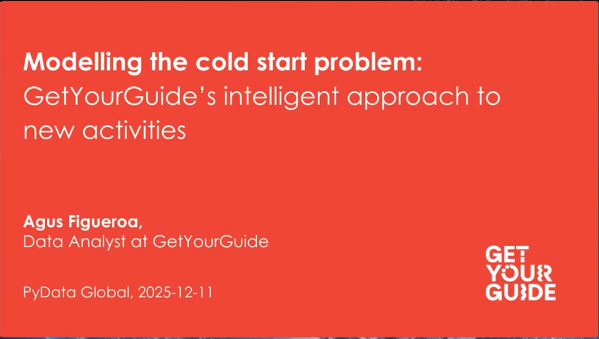
:::
::::

## Introduction to the cold-start problem (2 min)

:::: {.sl}
::: {.sl-text}
text from transcript 
:::
::: {.sl-fig}

:::
::::

## How we rank incoming activities at GetYourGuide and how modelling could make us more efficient (5 min)
:::: {.sl}
::: {.sl-text}
text from transcript 
:::
::: {.sl-fig}
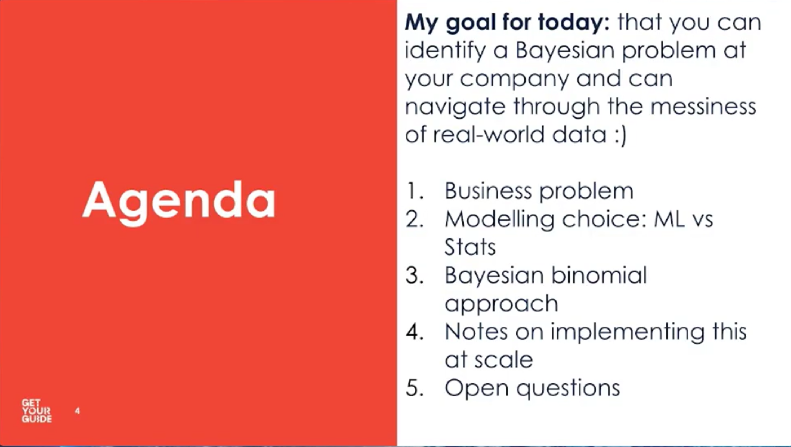
:::
::::

:::: {.sl}
::: {.sl-text}
text from transcript 
:::
::: {.sl-fig}
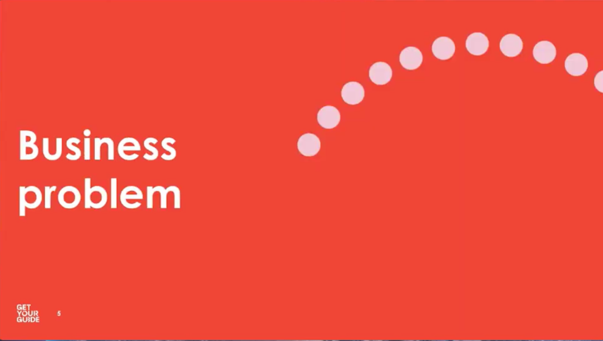
:::
::::

:::: {.sl}
::: {.sl-text}
text from transcript 
:::
::: {.sl-fig}

:::
::::

:::: {.sl}
::: {.sl-text}
text from transcript 
:::
::: {.sl-fig}
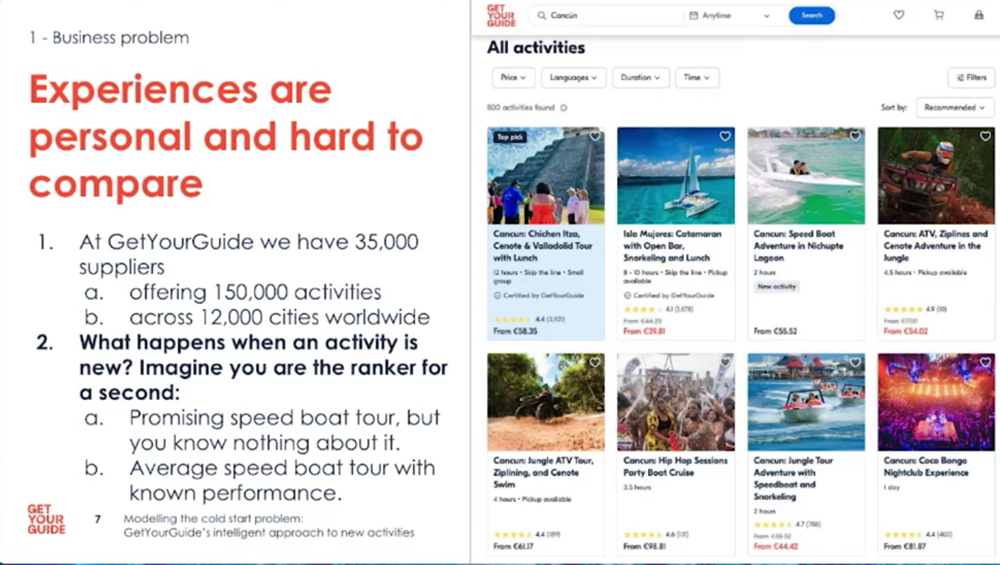
:::
::::

:::: {.sl}
::: {.sl-text}

text from transcript 
:::
::: {.sl-fig}

:::
::::

:::: {.sl}
::: {.sl-text}
text from transcript 
:::
::: {.sl-fig}
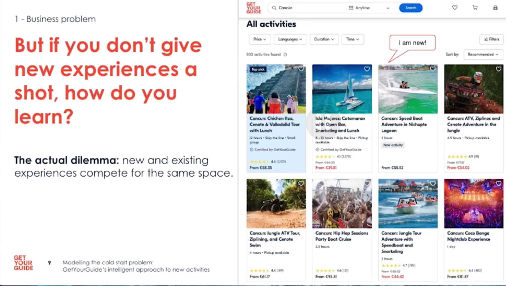
:::
::::

:::: {.sl}
::: {.sl-text}
text from transcript 
:::
::: {.sl-fig}

:::
::::

:::: {.sl}
::: {.sl-text}
text from transcript 
:::
::: {.sl-fig}

:::
::::

:::: {.sl}
::: {.sl-text}
text from transcript 
:::
::: {.sl-fig}

:::
::::

:::: {.sl}
::: {.sl-text}
text from transcript 
:::
::: {.sl-fig}

:::
::::

## Explaining the model (15 min)

:::: {.sl}
::: {.sl-text}
text from transcript 
:::
::: {.sl-fig}
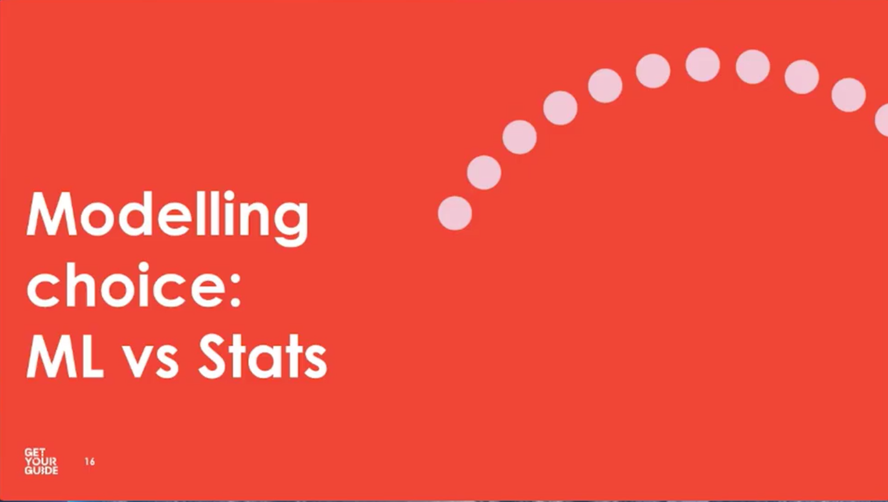
:::
::::

:::: {.sl}
::: {.sl-text}
text from transcript 
:::
::: {.sl-fig}
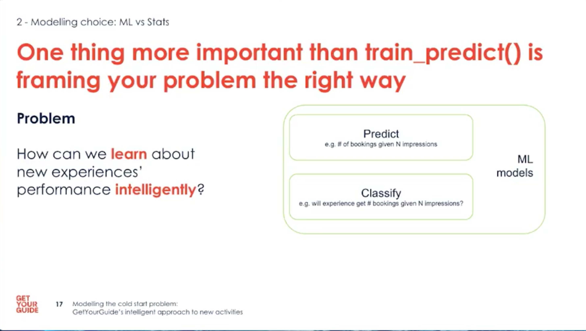
:::
::::

:::: {.sl}
::: {.sl-text}
text from transcript 
:::
::: {.sl-fig}
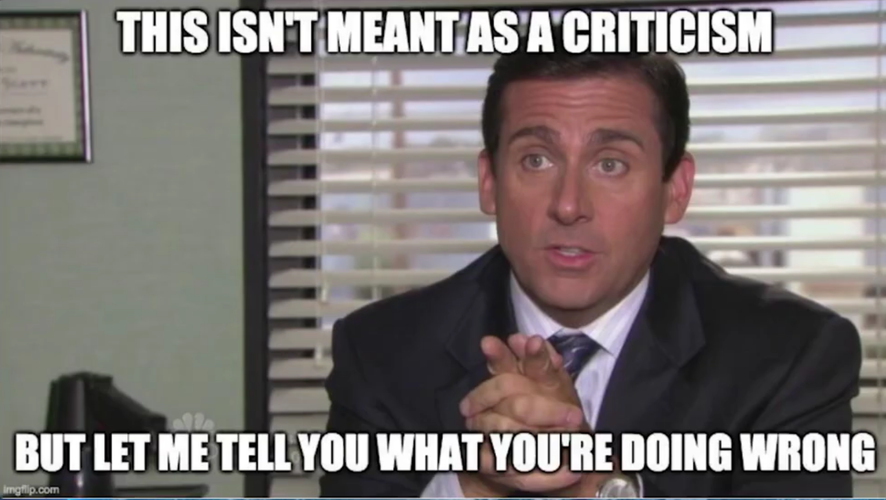
:::
::::

:::: {.sl}
::: {.sl-text}
text from transcript 
:::
::: {.sl-fig}
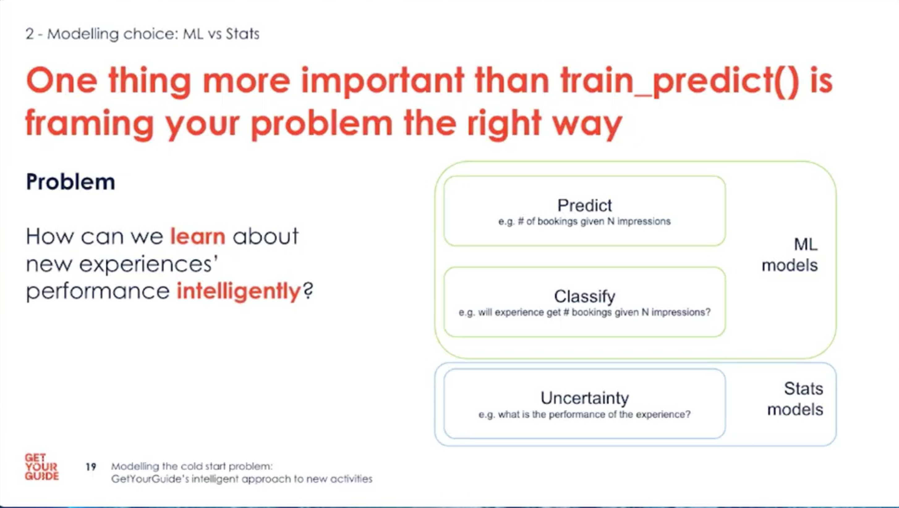

:::
::::

:::: {.sl}
::: {.sl-text}
text from transcript 
:::
::: {.sl-fig}
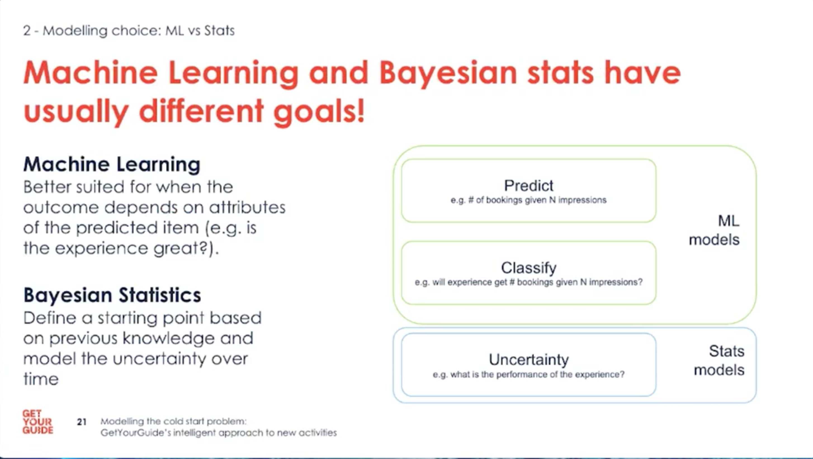

:::
::::

:::: {.sl}
::: {.sl-text}
text from transcript 
:::
::: {.sl-fig}

:::
::::

:::: {.sl}
::: {.sl-text}
text from transcript 
:::
::: {.sl-fig}

:::
::::

## Intro to a Bayesian binomial model (3 min)
<!-- ## Controlling for independence among trials (3 min)
## Defining the prior (3 min)
## Designing a stop criteria (6 min)
## Risk-management: why Bayesian modelling over Machine Learning (5 min) -->

:::: {.sl}
::: {.sl-text}
text from transcript 
:::
::: {.sl-fig}

:::
::::

:::: {.sl}
::: {.sl-text}
text from transcript 
:::
::: {.sl-fig}

:::
::::

:::: {.sl}
::: {.sl-text}
text from transcript 
:::
::: {.sl-fig}
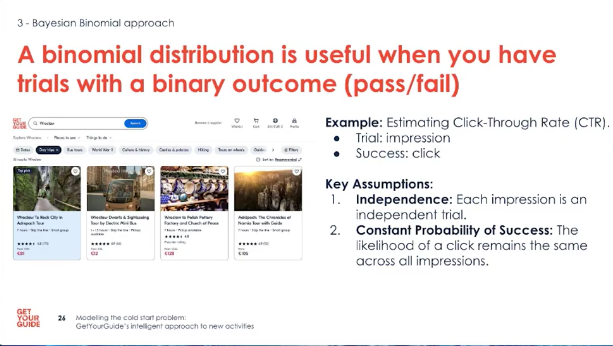
:::
::::

:::: {.sl}
::: {.sl-text}
text from transcript 
:::
::: {.sl-fig}

:::
::::

:::: {.sl}
::: {.sl-text}
text from transcript 
:::
::: {.sl-fig}
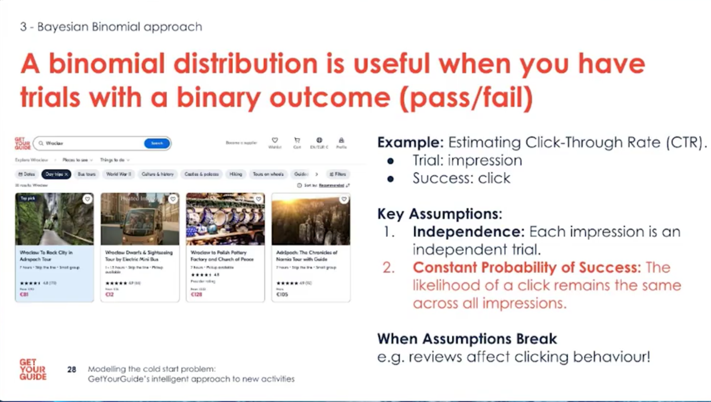
:::
::::

:::: {.sl}
::: {.sl-text}
text from transcript 
:::
::: {.sl-fig}
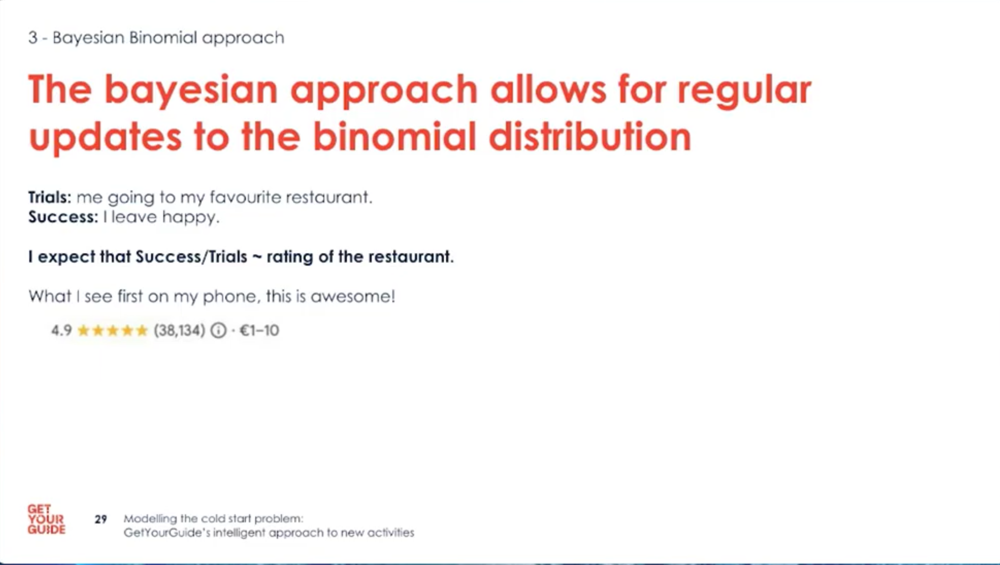
:::
::::

:::: {.sl}
::: {.sl-text}
text from transcript 
:::
::: {.sl-fig}

:::
::::

:::: {.sl}
::: {.sl-text}
text from transcript 
:::
::: {.sl-fig}
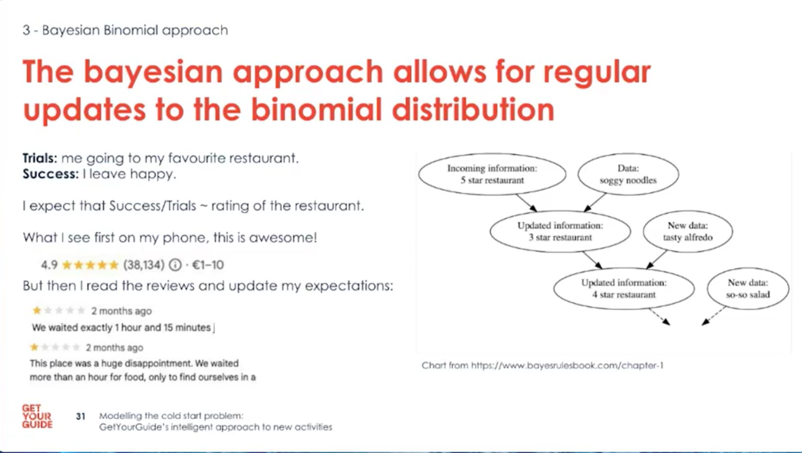
:::
::::

:::: {.sl}
::: {.sl-text}
text from transcript 
:::
::: {.sl-fig}
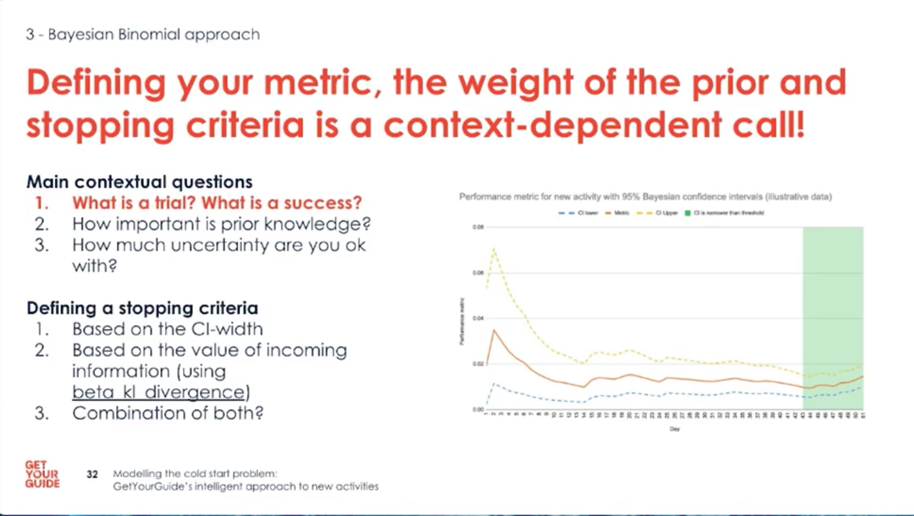
:::
::::

:::: {.sl}
::: {.sl-text}
text from transcript 
:::
::: {.sl-fig}
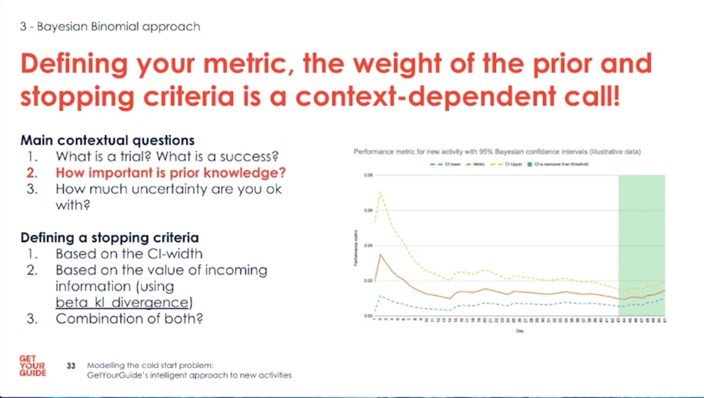
:::
::::

:::: {.sl}
::: {.sl-text}
text from transcript 
:::
::: {.sl-fig}
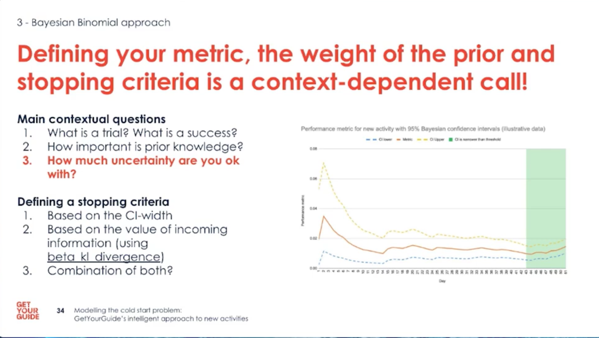
:::
::::

:::: {.sl}
::: {.sl-text}
text from transcript 
:::
::: {.sl-fig}

:::
::::

:::: {.sl}
::: {.sl-text}
text from transcript 
:::
::: {.sl-fig}
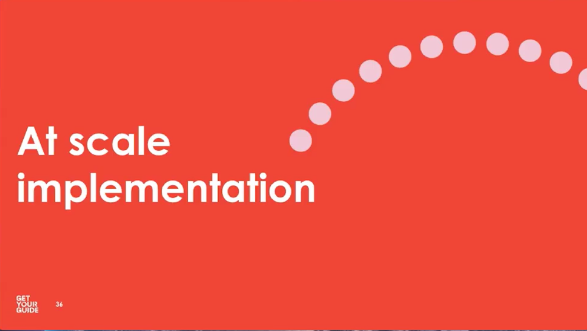
:::
::::

::: {.sl}
::: {.sl-text}
text from transcript 
:::
::: {.sl-fig}
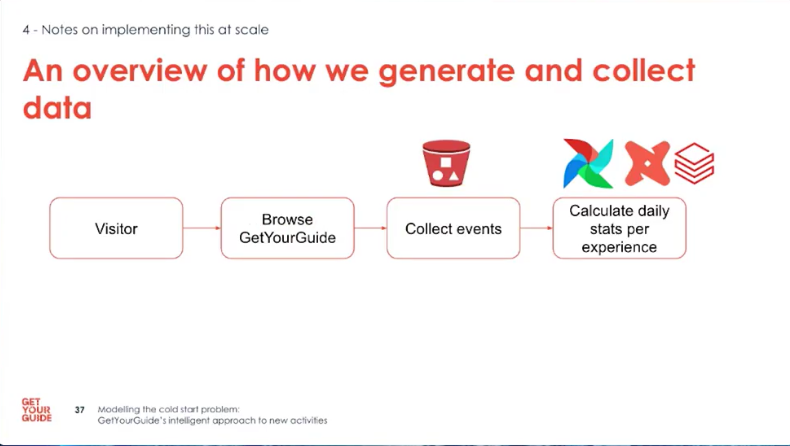
:::
::::

::: {.sl}
::: {.sl-text}
text from transcript 
:::
::: {.sl-fig}

:::
::::

::: {.sl}
::: {.sl-text}
text from transcript 
:::
::: {.sl-fig}
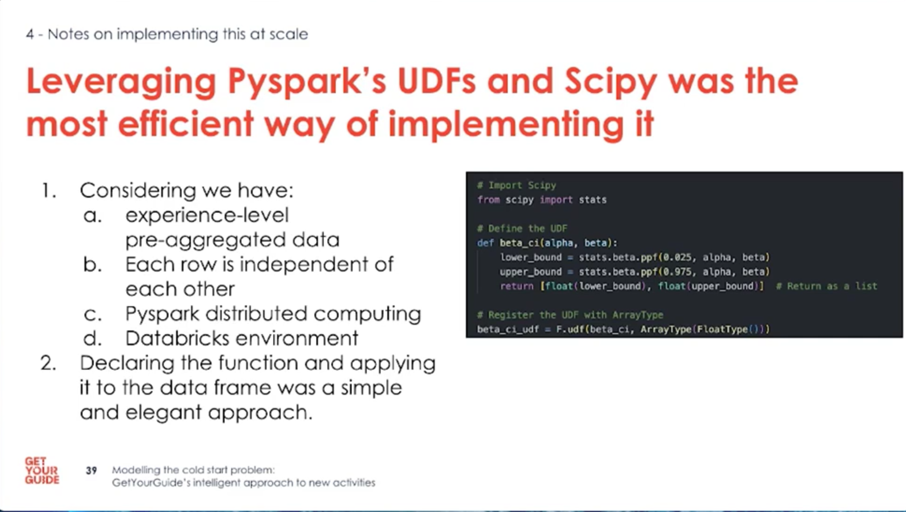
:::
::::

::: {.sl}
::: {.sl-text}
text from transcript 
:::
::: {.sl-fig}

:::
::::

::: {.sl}
::: {.sl-text}
text from transcript 
:::
::: {.sl-fig}
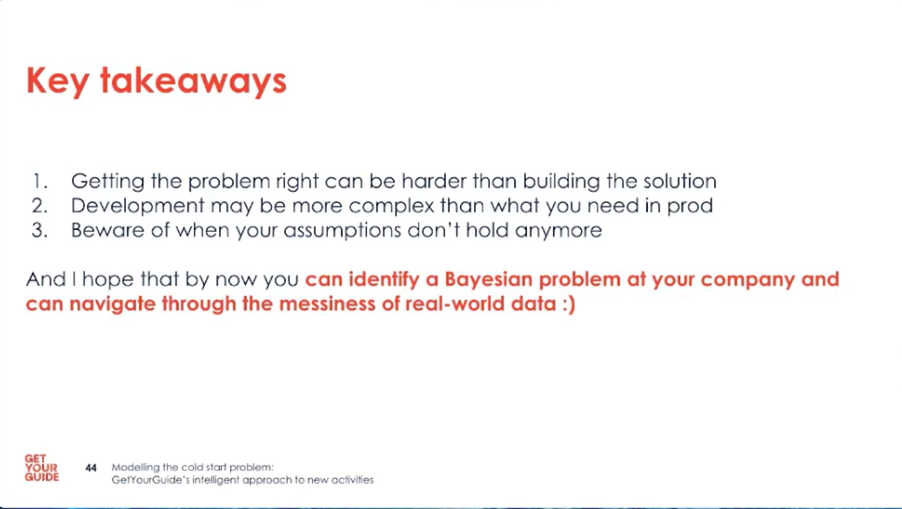
:::
::::

## Questions

::: {.sl}
::: {.sl-text}
text from transcript 
:::
::: {.sl-fig}
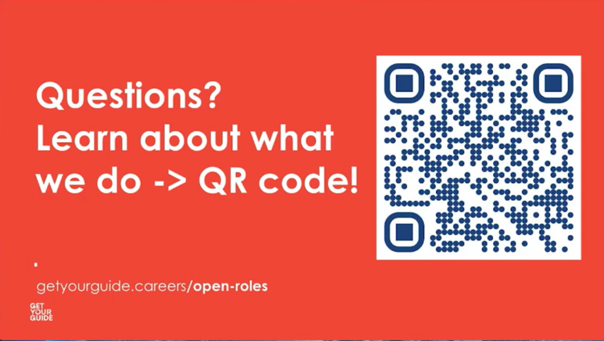
:::
::::

## Reflections