::: {.column-margin}

:::

**Speaker:** [Itai Gilo](https://www.linkedin.com/in/itai-gilo/), software engineer working on lakeFS. The talk frames compliance as an engineering problem: not a matter of filling out paperwork after a model ships, but of making the data layer reproducible, traceable, and policy-aware from the start.

::: {.callout-tip}
## TL;DR — a defensible model needs defensible data

Your model might pass every benchmark and still fail the only test that matters during an audit: can you prove exactly which data produced it? Code versioning, dependency pinning, and model registries are not enough if the training data is mutable. The core prescription is simple: version the data, enforce policy before merge, train from immutable commits, and log those commits with every experiment.
:::

## The subpoena test


<slide-text>
The talk opens with a deliberately uncomfortable scenario. On November 3, a team deploys an alpha credit-risk model. 
It performs beautifully in an A/B test, revenue rises, the business is pleased, and the launch is treated as a success.

::: {.column-margin}
{style="height: 7em; width: auto; vertical-align: middle;" group="slides"}
:::


Three months later, regulators ask for the exact training data used on November 3, because the model is suspected of discriminating against particular zip codes. The team has the model weights and the code, but the original data in object storage has been overwritten by a later extract-transform-load job. The model may or may not have been biased; the immediate problem is worse. The team can no longer prove what happened.

::: {.column-margin}
{style="height: 7em; width: auto; vertical-align: middle;" group="slides"}
:::

That is the central failure mode of many production machine learning systems: they version the code and sometimes the model artifact, but not the data state that made the model possible.




::: {.column-margin}
{style="height: 7em; width: auto; vertical-align: middle;" group="slides"}
:::


## Compliance is now part of the production interface

::: column-margin
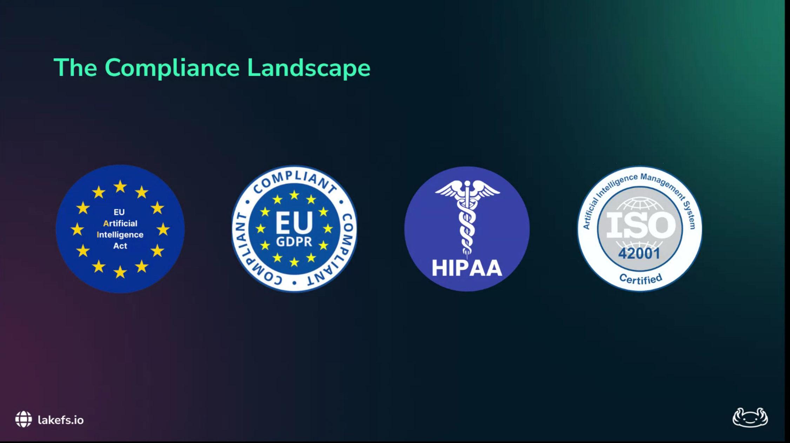{height="7em" group="slides"}

{height="7em" group="slides"}
:::

For engineering teams, regulation shows up as a reproducibility and traceability requirement. The European Union Artificial Intelligence Act pushes high-risk systems toward rigorous record keeping. General Data Protection Regulation obligations make it necessary to explain consequential automated decisions. Healthcare and financial workflows add additional auditability requirements. Business-to-business customers also increasingly ask whether every model decision can be traced back to the source data.

The practical implication is not merely “keep better notes.” It is stronger:

::: callout-important
A model is not reproducible unless the training code, environment, model artifact, and exact data snapshot can be recovered together.
:::

Without that snapshot, a team is left reconstructing history from folder names, stale feature definitions, and informal memory. That is not an audit trail; it is archaeology.


## Alice's bad week: three ways ML pipelines fail

::: column-margin
{height="7em" group="slides"}

{height="7em" group="slides"}

{height="7em" group="slides"}

{height="7em" group="slides"}
:::

The talk uses Alice, a data engineer, to make the problem concrete.

First, Alice faces **personally identifiable information (PII) leakage**. She ingests a new dataset, the model improves, and the team ships it. Later, someone discovers that the dataset contained data that should never have entered training. Because there is no reliable link between model versions and data versions, the team cannot easily determine which model artifacts are contaminated.

Second, she faces **the reproducibility trap**. An auditor asks her to rerun training for a model decision made six months earlier. The code still runs, but the result is different because the underlying database changed: records were updated, deleted, or overwritten.

Third, she faces **the traceability gap**. Legal asks whether a copyrighted dataset was used in the model shipped on Tuesday. The storage bucket contains folders named `v1`, `v2`, `v2-final`, and `v2-final-real`, but there is no automated link from the production model back to the precise files used for training.

In all three cases, Alice has modern tooling around the model, but the data remains mutable and under-versioned.

## Why the standard stack breaks lineage

::: {.column-margin}
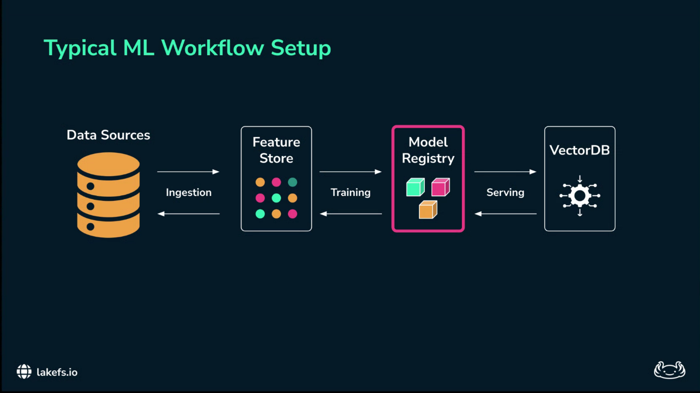{height="7em" group="slides"}

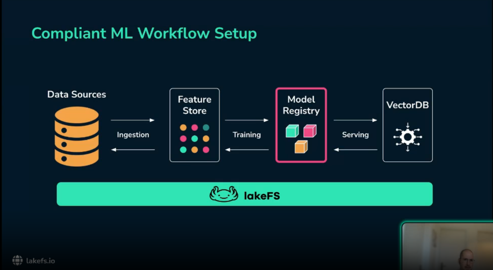{height="7em" group="slides"}
:::

A typical machine learning workflow has specialized tools at every stage: ingestion pipelines, feature stores, training jobs, model registries, deployment infrastructure, and sometimes vector databases for embedding retrieval. This looks mature, but it often leaves a gap at the storage layer.

The model registry versions the model binary. The feature store versions feature definitions. But the actual files — Parquet, images, text corpora, embeddings, or reindexed vector database states — often live in mutable object storage. If the data changes, the pipeline may retain metadata about the model while losing the material state that produced it.

That is the broken link: the model artifact is preserved, but the data state is not.

## Git semantics for data

::: {.column-margin}
{height="7em" group="slides"}

{height="7em" group="slides"}

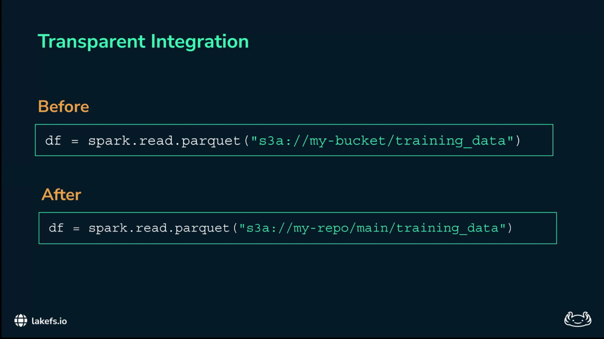{height="7em" group="slides"}
:::

The proposed solution is to apply the same discipline to data that software teams already apply to code. A data lake needs Git-like semantics:

- **Branches** for isolated ingestion, cleaning, and experimentation.
- **Commits** for immutable snapshots of the data lake at a particular point in time.
- **Merges** guarded by validation checks.
- **Reverts** when a bad data change enters the system.
- **History** that records who changed what and when.

lakeFS provides this layer over object storage such as Amazon S3, Azure Blob Storage, or Google Cloud Storage. The key scaling idea is that a branch is a metadata operation, not a copy of the entire data lake. lakeFS manages pointers to objects and uses copy-on-write behavior, so teams can create branches without duplicating petabytes of data.

The usability point is equally important: Spark, Pandas, Databricks, and ordinary Python scripts can still read from object-storage-like paths. The path changes from “a bucket and folder” to “a repository and branch or commit,” but the compute stack does not have to be rewritten.

## A compliant workflow

::: {.column-margin}
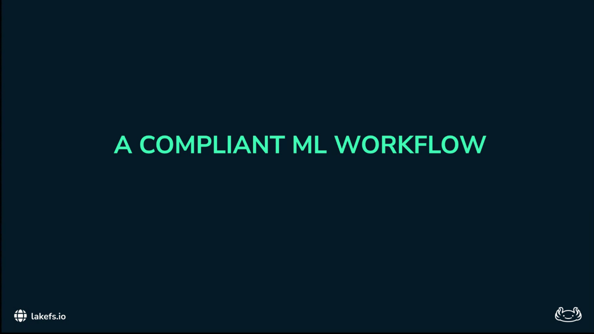{height="7em", group="slides"}

{height="7em", group="slides"}

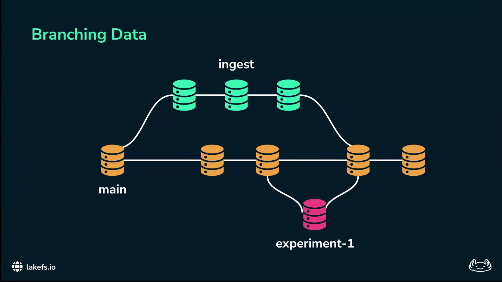{height="7em", group="slides"}
:::

The workflow mirrors software engineering practice. The `main` branch is the production data system of record. No ingestion job writes directly to `main`. New data lands on an ingest branch. Experiments happen on experiment branches. Data is merged into `main` only after passing quality and policy gates.

| Failure mode | Pipeline control | Evidence produced |
|------------------------|------------------------|------------------------|
| PII leakage | Pre-merge policy hook scans data before it reaches `main` | Blocked merge, validation log, isolated offending branch |
| Irreproducible model | Training reads from an immutable data commit | Commit identifier tied to model run |
| Missing lineage | lakeFS commit history records data changes | Auditable history of files added, changed, or deleted |

The shift is from retrospective compliance to enforced workflow. The data platform prevents some classes of non-compliant state from reaching production in the first place.

## Blocking PII before production

::: {.column-margin}
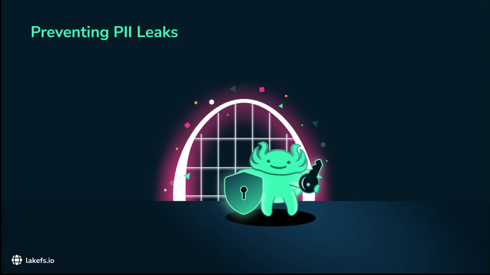{height="7em", group="slides"}

{height="7em", group="slides"}

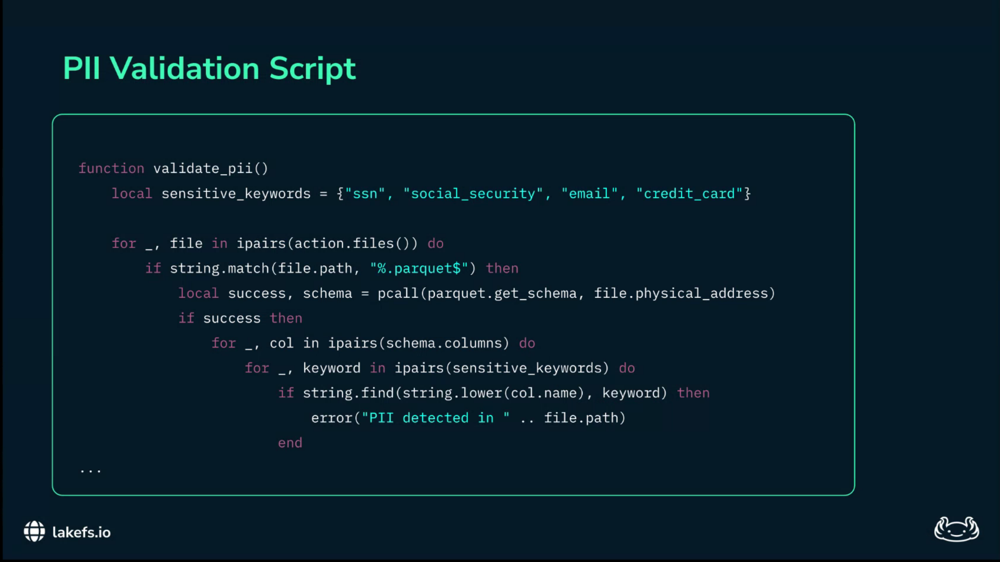{height="7em", group="slides"}
:::

The first concrete mechanism is a pre-merge hook. In ordinary software engineering, a pull request should not merge if the tests fail. The talk applies the same principle to data: an ingest branch should not merge into `main` if it contains data that violates policy.

For PII, the hook can scan changed files for patterns such as social security numbers, credit-card-like strings, email addresses, or other organization-specific identifiers. If the validation script returns a non-zero exit code, the merge fails. The sensitive data remains isolated on the ingest branch and never reaches the training pipeline.

This is “shift-left” compliance: detect the violation immediately after ingestion, not six months later during an audit.

## Training from commits, not folders

::: column-margin
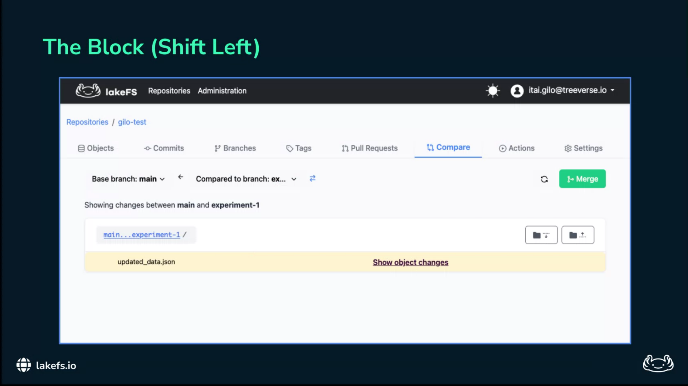


:::

The second mechanism is to change how training data is named. Instead of saying, “this model was trained on the Q3 dataset,” or “this model was trained on the files in this folder,” the pipeline should say:

> This model was trained on lakeFS commit `A1B2C3D...`.

That commit is an immutable data snapshot. It is a cryptographic handle for the state of the data lake at training time. The model run should then log the repository, branch, and commit identifier with the experiment metadata.

``` python
# Sketch: bind a model run to an immutable data version.
# Use the exact lakeFS and MLflow APIs configured in your stack.

with mlflow.start_run():
    mlflow.log_input(training_dataset)
    mlflow.set_tag("lakefs.repo", repo_id)
    mlflow.set_tag("lakefs.branch", branch_id)
    mlflow.set_tag("lakefs.commit", commit_id)
```

The important move is not the syntax. It is the invariant: every model artifact must point back to an immutable data commit. Six months later, the team can recover the same data state, rerun the training code, and answer an auditor from evidence rather than memory.

## Audit trails as a byproduct

::: column-margin


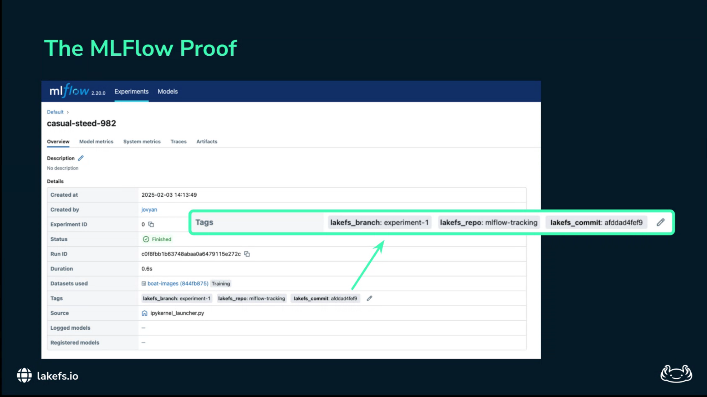


:::

Once data changes are committed, the audit trail becomes a byproduct of normal engineering work. The lakeFS history shows who changed the data, when the change happened, and which files were added, modified, or deleted. The model registry or experiment tracker points to the relevant commit. Together they establish lineage from production model back to training run and from training run back to source data.

This is what solves Alice’s legal question. If legal asks whether a copyrighted dataset was present in the model shipped on Tuesday, Alice can inspect the model’s logged lakeFS commit and check whether the disputed file appears in that snapshot. The answer becomes a query over recorded lineage, not a manual investigation through ambiguous folder names.

## What I take from the talk

::: column-margin


:::

This is not the first data-versioning approach I have encountered; [DVC](https://dvc.org/) and [Pachyderm](https://www.pachyderm.com/) address related problems. The distinctive point in this talk is the framing of data versioning as a compliance control plane. The value is not only that old datasets can be recovered. The stronger claim is that production data changes should pass through branch isolation, automated policy gates, immutable commits, and experiment metadata before they become part of a model’s lineage.

That distinction matters for modern ML and generative AI pipelines. Reproducibility now needs to cover raw data, curated features, embeddings, retrieval indexes, model artifacts, and sometimes post-training datasets. A model registry alone is too late in the pipeline to provide that guarantee.

The hard open questions are organizational as much as technical: which validation hooks are trusted, who owns the policies, how are privacy deletion requests reconciled with immutable history, and how do we snapshot external systems such as vector databases? But the architectural principle is sound: compliance should be built into the data path, not appended as a document after deployment.

<!--
## Slide map

The images below preserve the original talk outline and make the recap easier to cross-reference with the video.

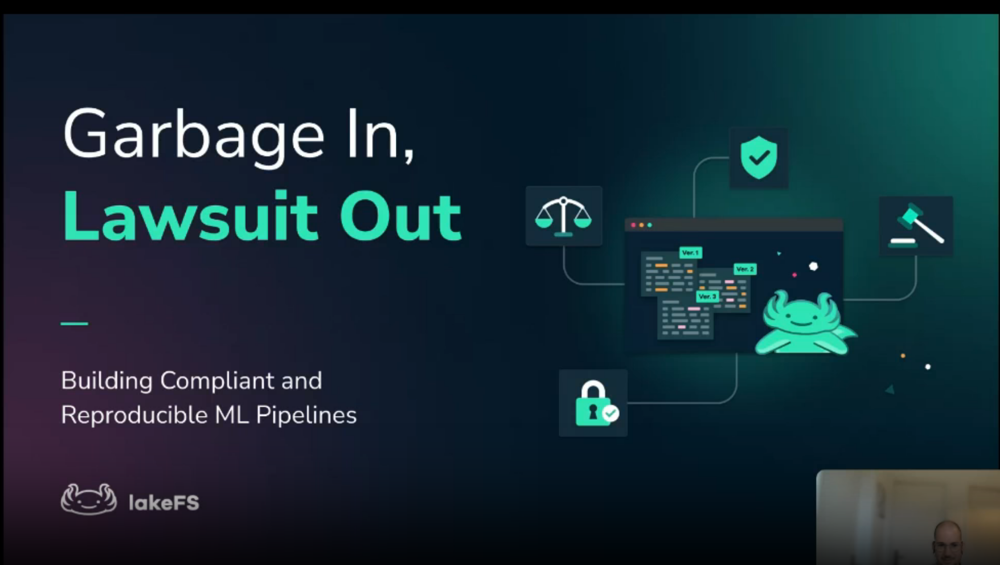


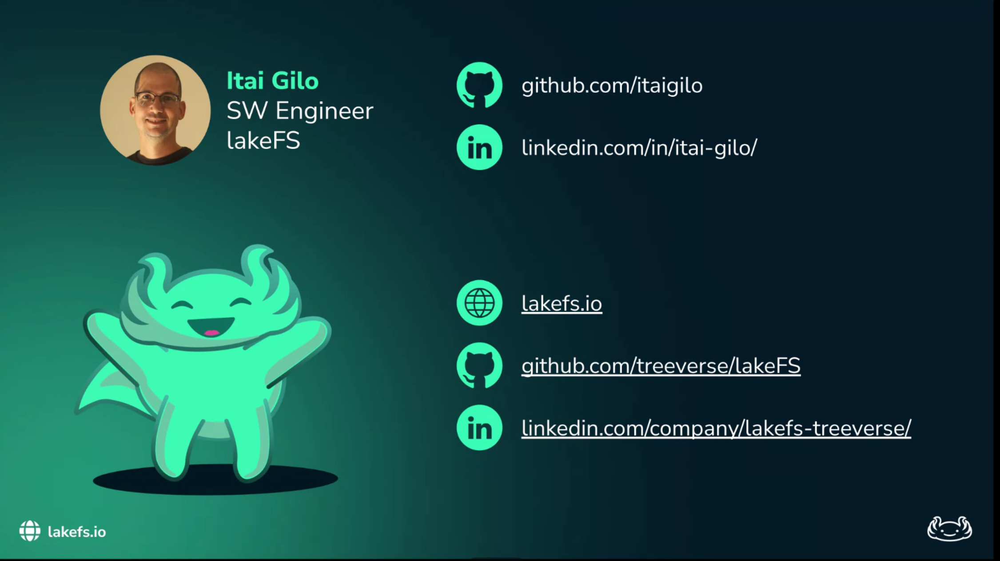


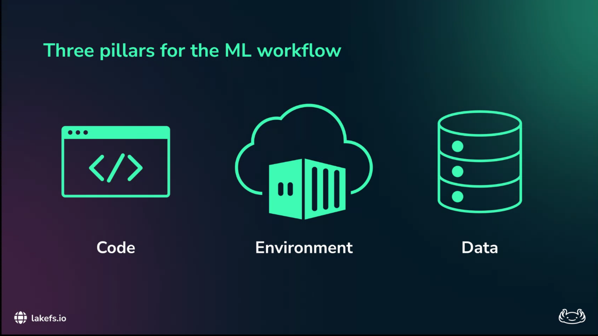


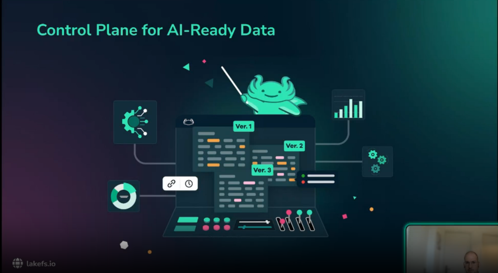


-->