{.column-margin}

::: {.column-margin}

:::

- Itai Gilo
    - [LinkedIn](https://www.linkedin.com/in/itai-gilo/)
    - Itai is a seasoned software engineer, passionate about clean code and design, and about simplifying what is complex. Doing what’s needed, whether it’s backend, full-stack, or mobile development, and enjoys creating well-crafted products.

::: {.callout-tip}
## TLDR; - Your model might pass all the benchmarks—but can it survive a subpoena?

Your model might pass all the benchmarks—but can it survive a subpoena? In the race to ship AI, most teams are building workflows that look great in dashboards but fall apart under legal, regulatory, or ethical pressure. Because the real liability doesn’t live in your model weights—it’s buried in your data.
:::

This session is a reality check for anyone shipping machine learning in production. We'll walk through the dark corners of modern ML pipelines: mutable datasets with no history, mystery data sources with missing labels, and a forgotten column of PII that's just been shipped to production. Then we’ll show how to fix it—without turning your data team into compliance officers.

You’ll learn how to embed reproducibility, traceability, and policy enforcement into your pipeline without slowing it to a crawl: track every dataset change, version every experiment, validate against policy gates, and generate audit trails that actually mean something. Whether you’re dealing with GDPR, HIPAA, or just not wanting to get roasted by internal audit, this talk gives you the blueprint for ML you can defend in court—and still ship on time.

## Outline

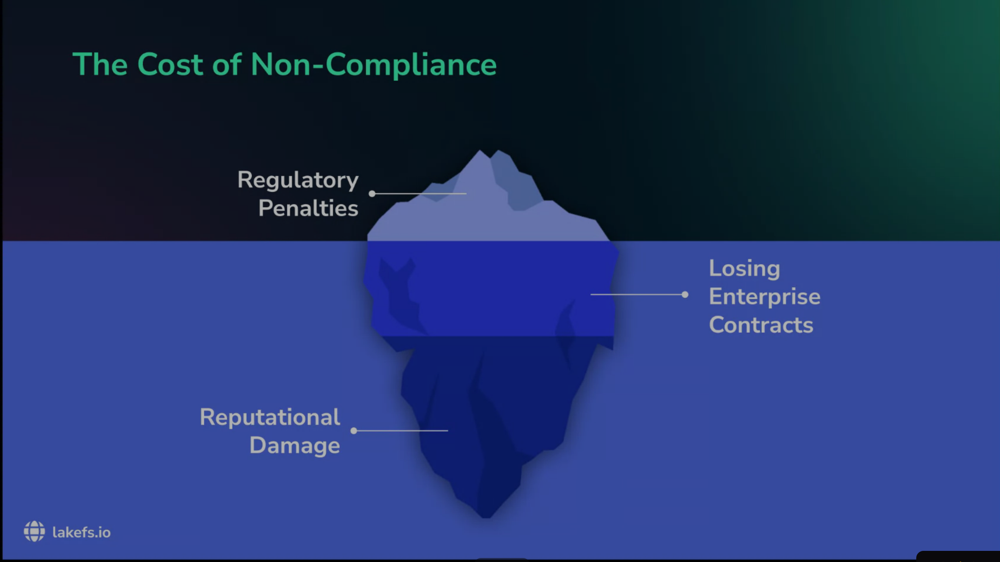

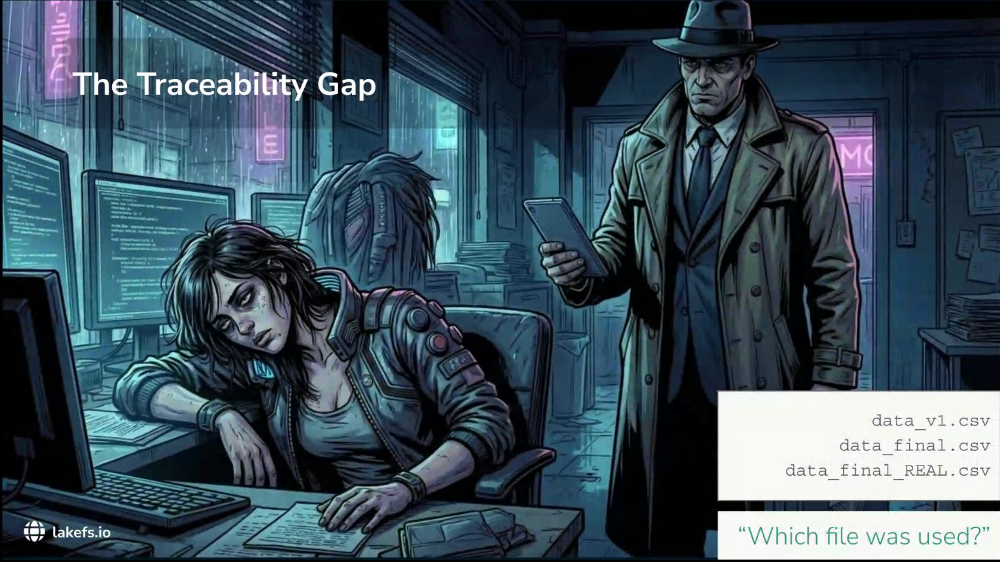

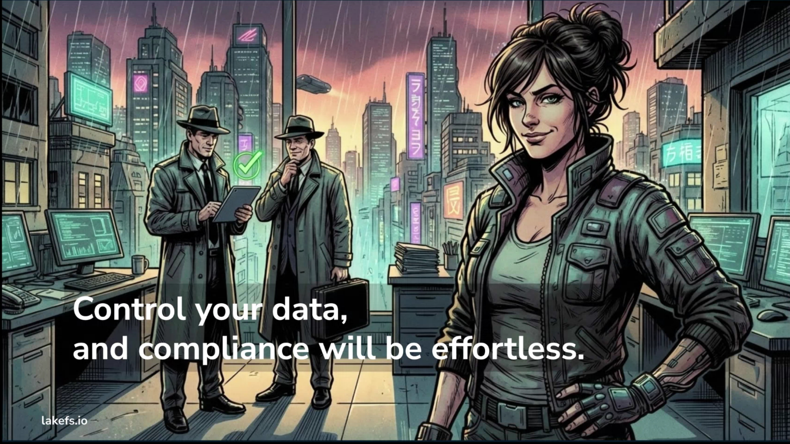

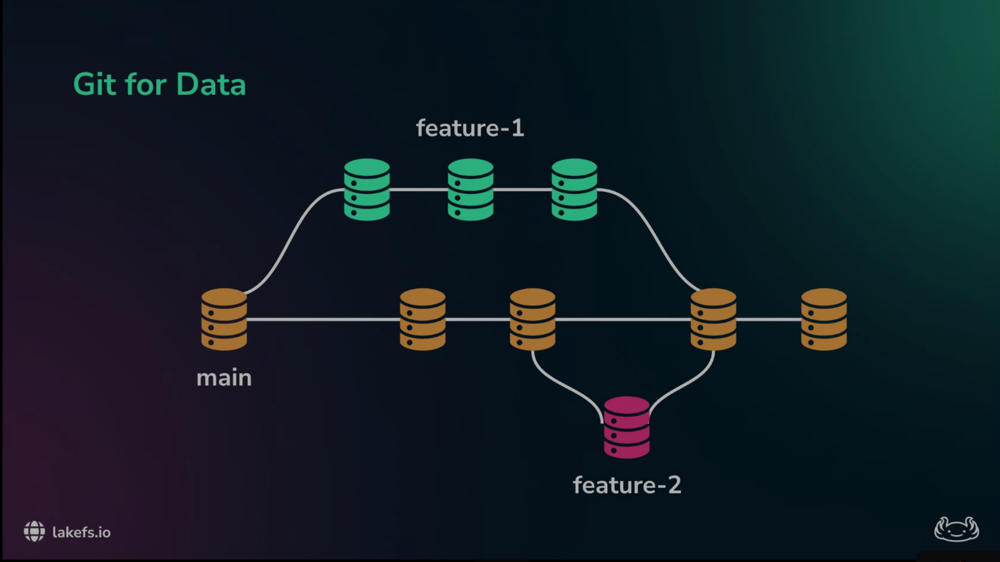

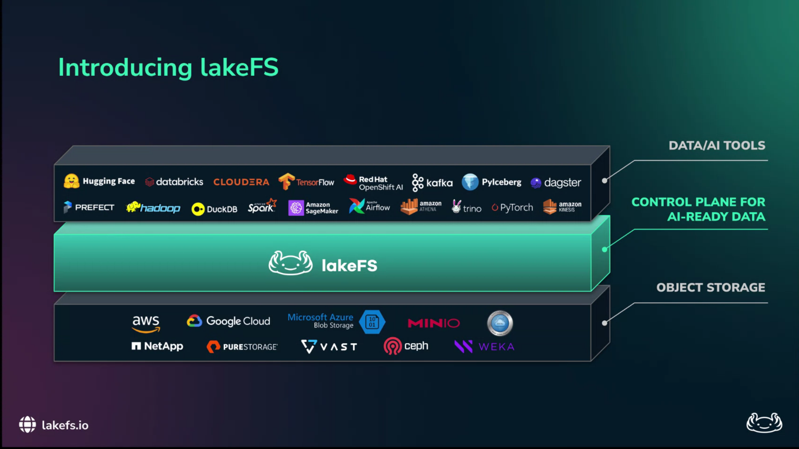

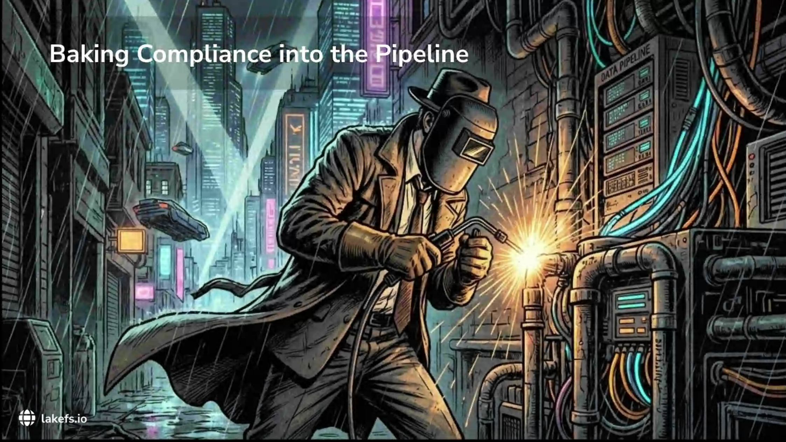

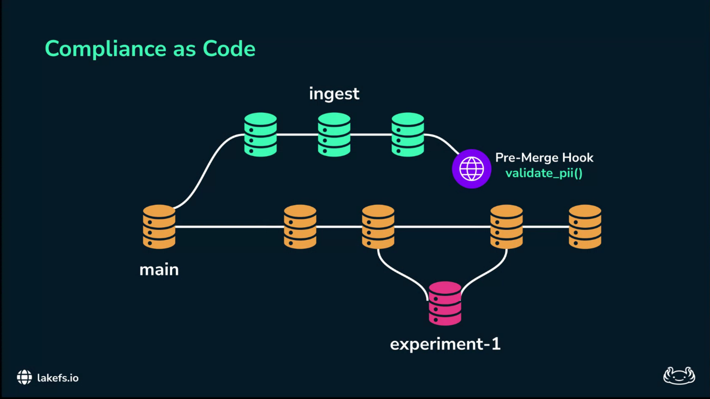

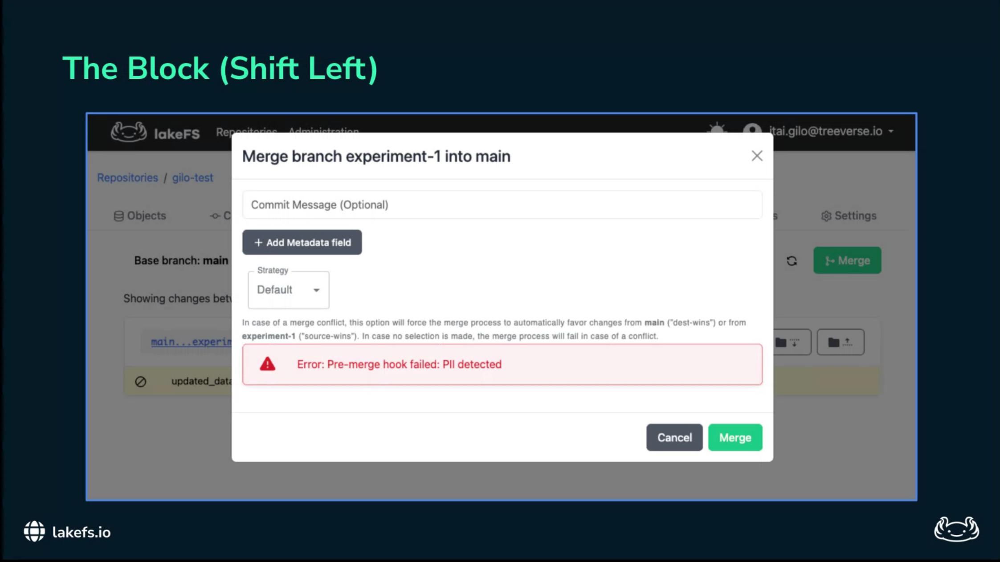

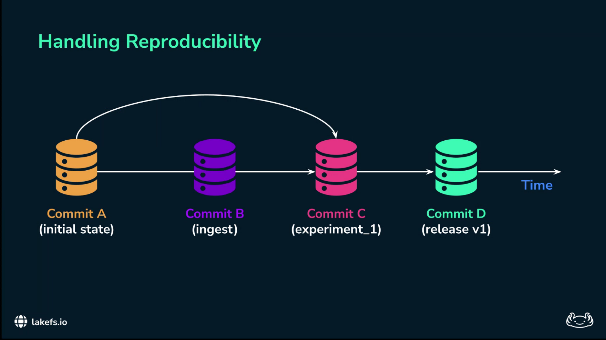

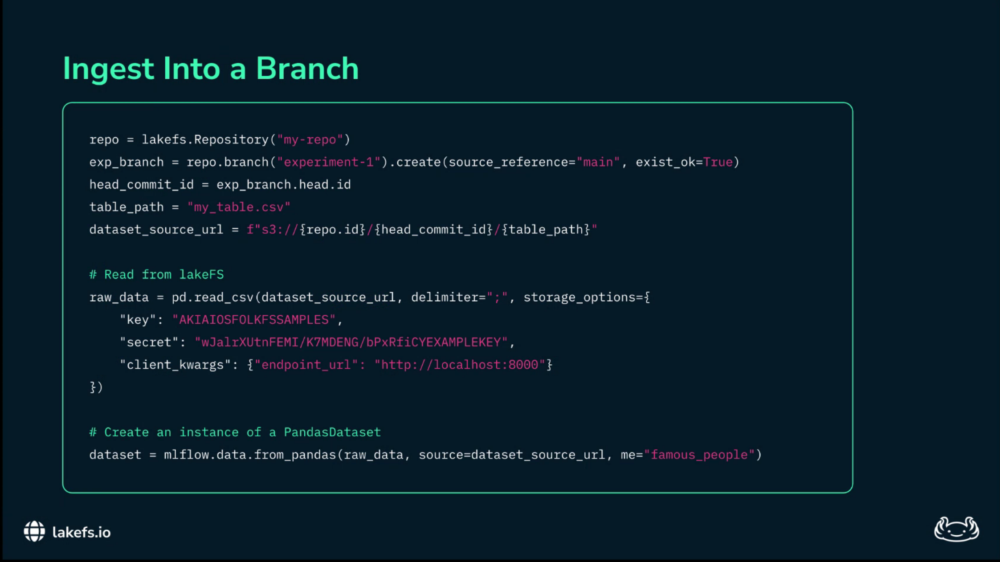

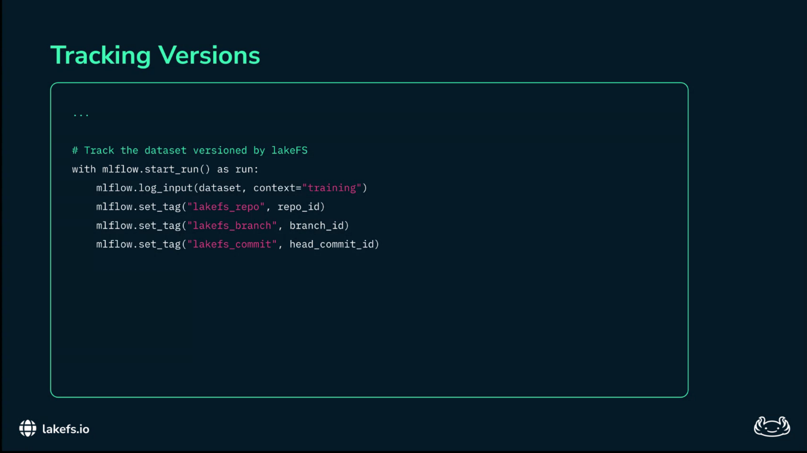

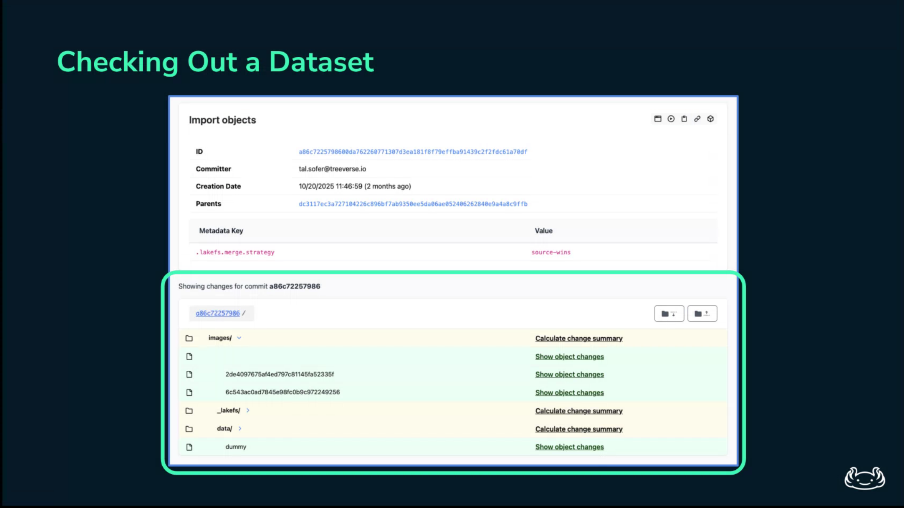

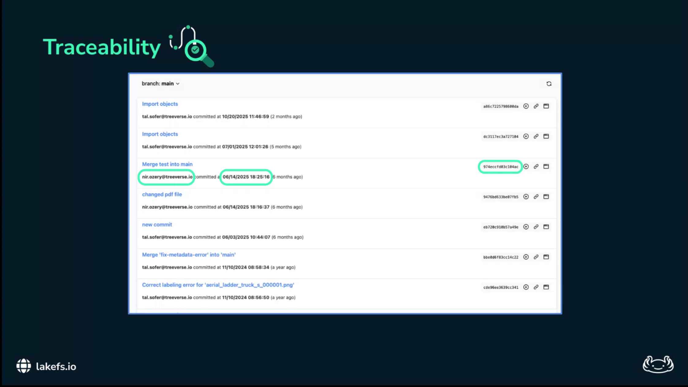

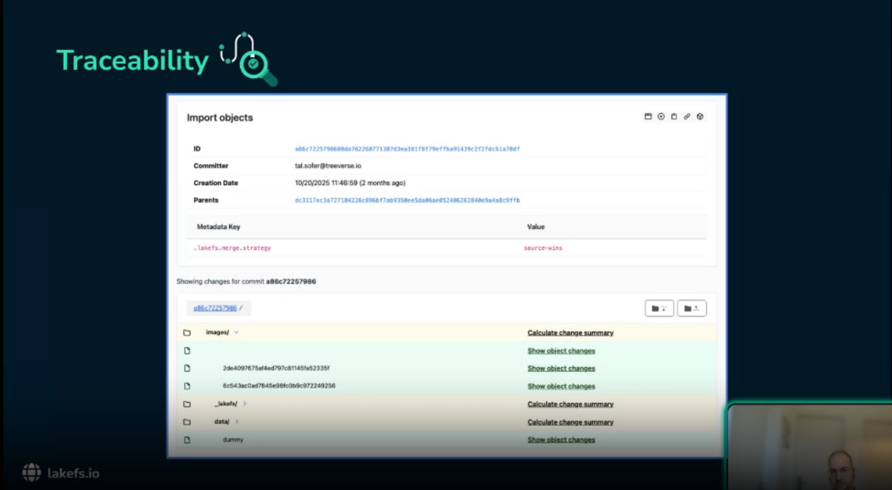

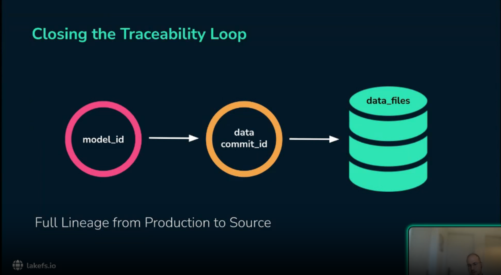

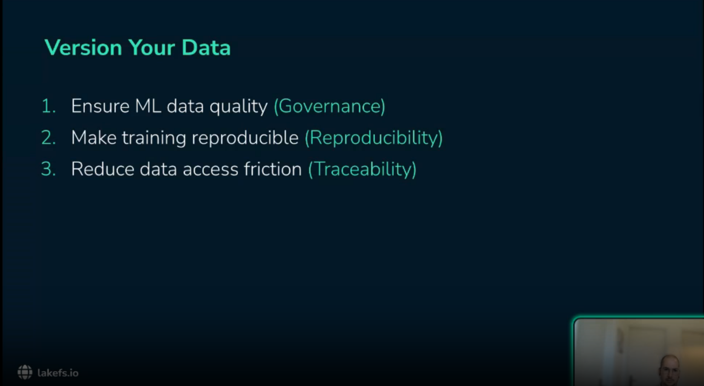

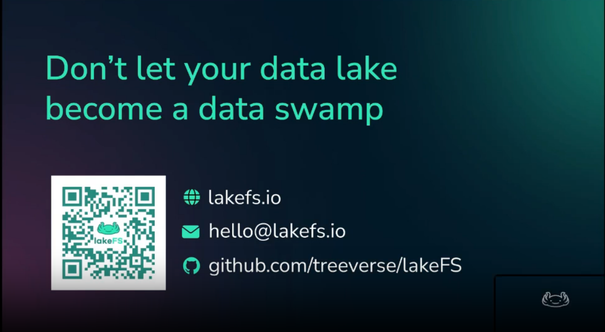

## Reflections

This is not the first time I see the concept of data version cotrol c.f. [DVC](https://dvc.org/) and [Pachyderm](https://www.pachyderm.com/).

However here we see a more comprehensive approach that includes not only data versioning but also experiment tracking, policy validation, and audit trail generation. This holistic view is crucial for building robust ML pipelines that can withstand legal and regulatory scrutiny.