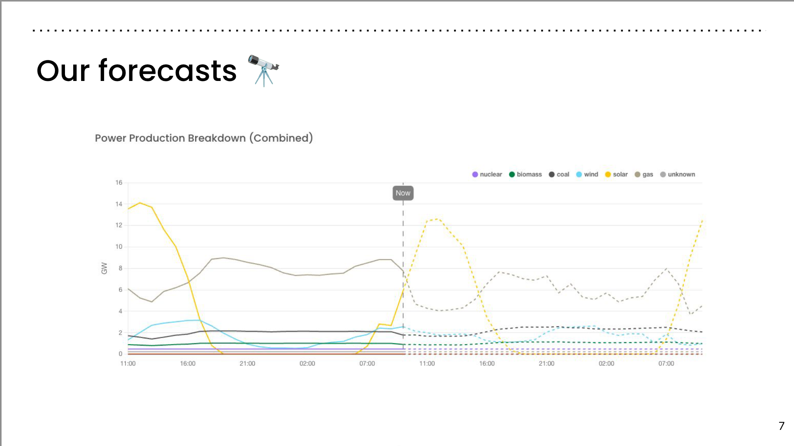
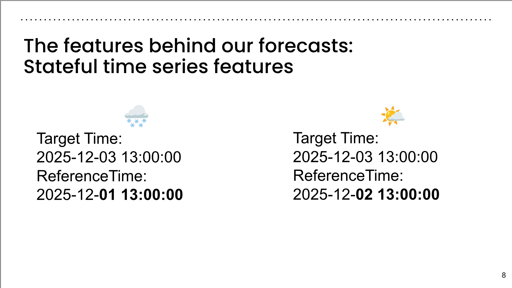
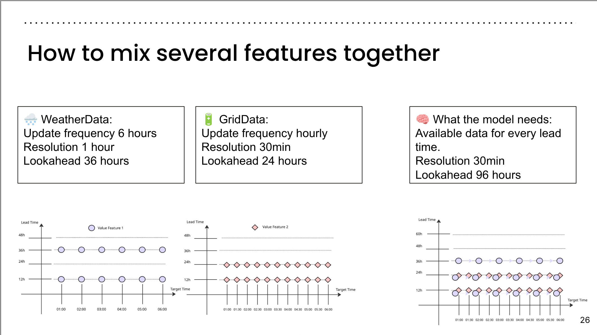
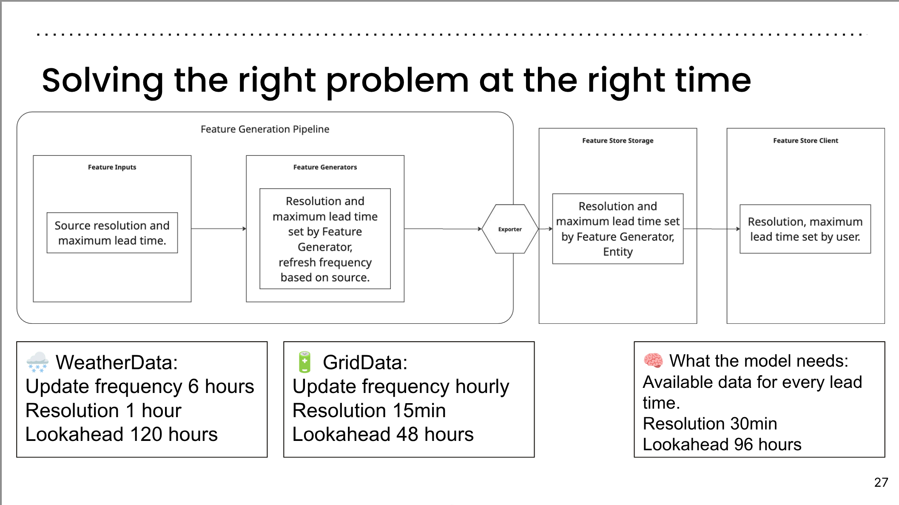
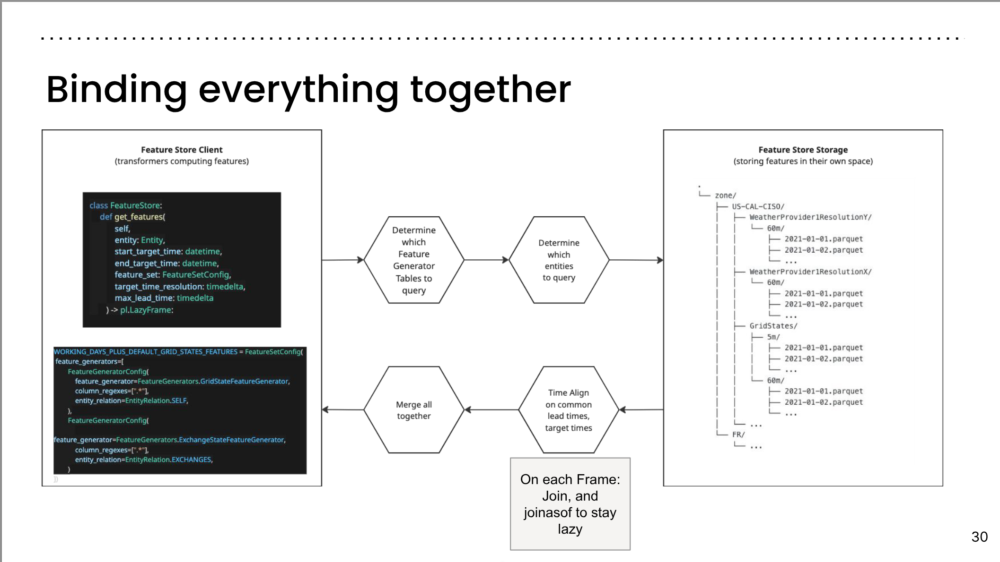
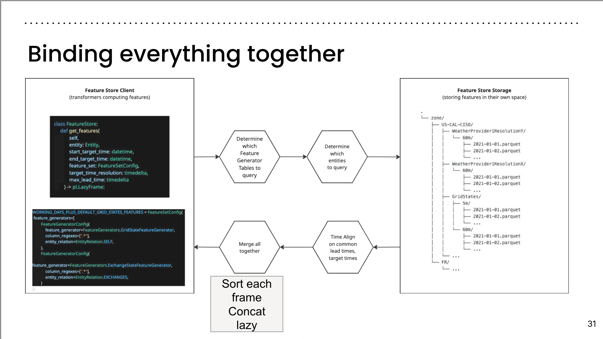
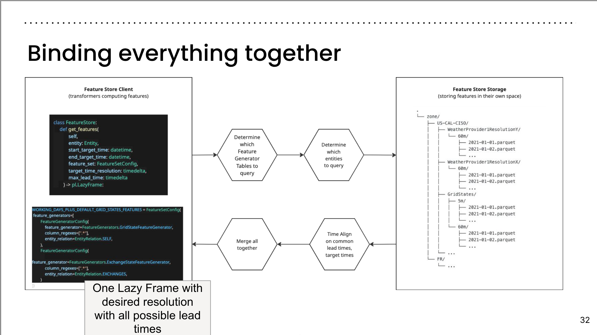
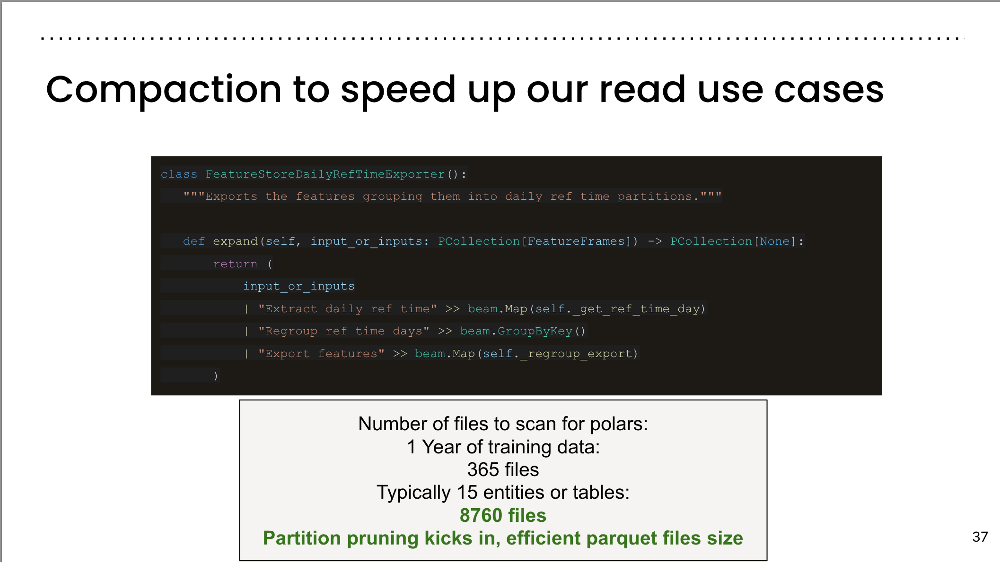
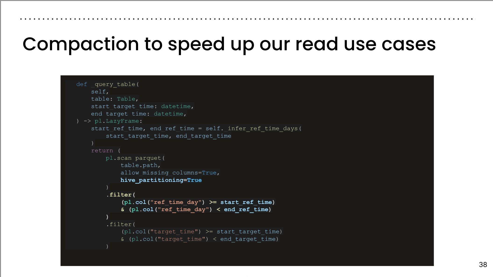

::: {.column-margin}

:::

::: {.callout-tip}
## Lecture Overview

Get a firsthand look at how we built a lightweight feature store to accelerate electricity grid forecasting. We’ll cover our decision process, design choices, and implementation using Polars and Google Cloud Storage. Expect lessons learned, real-world bumps, and a clear view of the costs, trade-offs and benefits of our solution.

:::

In this talk, we’ll share how we built a lightweight, production-ready feature store to support electricity grid forecasting. You'll hear a firsthand account of our journey—from identifying the need to accelerating model prototyping through feature standardization and flexibility.

We’ll start with a high-level overview of our decision-making process: why we chose to build rather than buy, and the trade-offs we considered. Then, we’ll dive into the architecture of our custom feature store, detailing how we leveraged Polars for fast processing and Google Cloud Storage as a scalable backend.

Expect an honest look at the challenges we faced, the benefits we gained, and the costs we encountered along the way. Whether you're considering building your own feature store or just curious about scaling ML for time series problems, this session will offer practical insights and real-world lessons.

:::: {.callout-tip}
## Speakers: 

### Robin Troesch

Data Engineer trying to reduce the impact of computing on the climate and helping the energy transition.

Working at Electricity Maps in Copenhagen (DK) since 2022 first in the data platform team responsible for acquiring grid data. 

Joined the grid forecast team in 2023.

:::

## Outline

:::: {.sl}
::: {.sl-text}
Building a Lightweight Feature Store
For Electricity Grid Forecasts with `Polars`

:::
::: {.sl-fig}
{alt="Building a Lightweight Feature Store" }
:::
::::

:::: {.sl}
::: {.sl-text}
Who's talking?

- Hey, I’m Robin!
- Joined Electricity Maps in 2022 as a data engineer. Originally in the Data Platform team, now in the Grid Forecasts team.
- My mission: making sure our models get all the features they need to produce forecasts and distributing forecasts to customers.
:::

::: {.sl-fig}
{alt="Who's Talking" }
:::
::::

:::: {.sl}
::: {.sl-text}
Today’s agenda:

- Forecasting at Electricity Maps
- Why we needed a feature store
- Breaking down our feature store
- A few learnings
:::

::: {.sl-fig}
{alt="Slide caption" }
:::
::::

:::: {.sl}
::: {.sl-text}
Forecasting at Electricity Maps
:::
::: {.sl-fig}
{alt="Forecasting at Electricity Maps" }
:::
::::

:::: {.sl}
::: {.sl-text}
Electricity Maps centralises, standardizes and forecasts global electricity data in real-time
:::
::: {.sl-fig}
{alt="Electricity Maps centralises, standardizes and forecasts global electricity data in real-time" }
:::
::::

:::: {.sl}
::: {.sl-text}
### Our forecasts 

Taking a look at the **problem setting** ✏️

- Entities to model:
  - 190+ consumption zones
  - 250+ interconnectors
- All available production modes:
  - Wind
  - Solar
  - Nuclear
  - Gas
  - Coal
  - And more (12 in total)
- Let’s not forget the **interconnections**
- Let’s provide **day-ahead prices**
- And also **load**
- And **carbon intensity**
- And finally, **renewable energy %**
:::
::: {.sl-fig}
{alt="Our forecasts" }
:::
::::

---

:::: {.sl}
::: {.sl-text}
### Our forecasts 
:::
::: {.sl-fig}
{alt="Slide 07" }
:::
::::

---

:::: {.sl}
::: {.sl-text}
The features behind our forecasts:
Stateful time series features

- Target Time: 2025-12-03 13:00:00
- Reference Time: 2025-12-01 13:00:00

- Target Time: 2025-12-03 13:00:00
- Reference Time: 2025-12-02 13:00:00
:::

::: {.sl-fig}
{alt="The features behind our forecasts: Stateful time series features" }
:::
::::

----

:::: {.sl}
::: {.sl-text}
## Why we need a feature store
:::
::: {.sl-fig}
{alt="Why we need a feature store" }
:::
::::

---

:::: {.sl}
::: {.sl-text}
## Before the feature store  I

- pay every time they run a forecast
- wait every time they want to run a forecast
- doesn't scale with the number of features.
- no shared features across users.
:::
::: {.sl-fig}
{alt="Costs and Speed" }
:::
::::

:::: {.sl}
::: {.sl-text}
## Before the feature store II

- combos of features are tightly coupled 
- combining features from different scales is very hard
- combinatorial class number explosion ...
:::
::: {.sl-fig}
{alt="Combining features" }
:::
::::

---

:::: {.sl}
::: {.sl-text}
## Before the feature store III

- 🐢 Experimentation is slow: building a new combination of features + computing ~days.
- 🔥 Cloud costs are exploding the more we scale our forecast systems to train on longer horizons and on longer training sets (yearly).
- 😡 A lot of frustration with memory errors due to memory spikes and large parquet files that can’t load (30GB for a single zone).
:::
::: {.sl-fig}
{alt="Reasons for the feature store" }
:::
::::

---

:::: {.sl}
::: {.sl-text}
## Powering the Feature Store: GCS and Polars
:::
::: {.sl-fig}
{alt="Behind our Feature Store: GCS and Polars"}
:::
::::

---

:::: {.sl}
::: {.sl-text}
## General Overview 
:::
::: {.sl-fig}
{alt="General Overview" }
:::
::::

:::: {.sl}
::: {.sl-text}
## Lazy Queries
:::

::: {.sl-fig}
{alt="Slide 18" }
:::
::::

:::: {.sl}
::: {.sl-text}
## The Querying process
:::
::: {.sl-fig}
{alt="the Querying process" }
:::
::::

:::: {.sl}
::: {.sl-text}
## Lazy read query
:::
::: {.sl-fig}
{alt="Slide 20" }
:::
::::

:::: {.sl}
::: {.sl-text}
## Aligning time dimensions
:::
::: {.sl-fig}
{alt="Aligning time dimensions" }
:::
::::

:::: {.sl}
::: {.sl-text}
## How to mix several features together?

- 🌧️ WeatherData:
  - Update frequency 6 hours
  - Resolution 1 hour
  - Lookahead 36 hours

- 🔋 GridData:
  - Update frequency hourly
  - Resolution 30min
  - Lookahead 24 hours

- 🧠 What the model needs:
  - Available data for every lead time
  - Resolution 30min
  - Lookahead 96 hours
:::

::: {.sl-fig}
{alt="How to mix several features together"}
:::
::::

:::: {.sl}
::: {.sl-text}
## Solving the right problem at the right time

Feature Generation Pipeline:

- **Feature Inputs**: Source resolution and maximum lead time.
- **Feature Generators**: Resolution and maximum lead time set by Feature Generator, refresh frequency based on source.
- **Feature Store Storage**: Resolution and maximum lead time set by Feature Generator, Entity.
- **Feature Store Client**: Resolution, maximum lead time set by user.

### Examples:

- 🌧️ **WeatherData**:
  - Update frequency: 6 hours
  - Resolution: 1 hour
  - Lookahead: 120 hours

- 🔋 **GridData**:
  - Update frequency: Hourly
  - Resolution: 15 minutes
  - Lookahead: 48 hours

- 🧠 **What the model needs**:
  - Available data for every lead time
  - Resolution: 30 minutes
  - Lookahead: 96 hours
:::
::: {.sl-fig}
{alt="Solving the right problem at the right time" }
:::
::::

:::: {.sl}
::: {.sl-text}
## Solving the right problem at the right time II

:::
::: {.sl-fig}
{alt="Solving the right problem at the right time II" }
:::
::::

:::: {.sl}
::: {.sl-text}
## Binding everything together
:::
::: {.sl-fig}
{alt="Binding everything together" }
:::
::::

:::: {.sl}
::: {.sl-text}
## Binding everything together II
:::
::: {.sl-fig}
{alt="Binding everything together II" }
:::
::::

:::: {.sl}
::: {.sl-text}
## Binding everything together III
:::
::: {.sl-fig}
{alt="Binding everything together III" }
:::
::::

:::: {.sl}
::: {.sl-text}
Slide 28
:::
::: {.sl-fig}
{alt="Slide 28" }
:::
::::

:::: {.sl}
::: {.sl-text}
Slide 29
:::
::: {.sl-fig}
{alt="Slide 29" }
:::
::::

:::: {.sl}
::: {.sl-text}
Slide 30
:::
::: {.sl-fig}
{alt="Slide 30" }
:::
::::

:::: {.sl}
::: {.sl-text}
Slide 31
:::
::: {.sl-fig}
{alt="Slide 31" }
:::
::::

:::: {.sl}
::: {.sl-text}
Slide 32
:::
::: {.sl-fig}
{alt="Slide 32" }
:::
::::

:::: {.sl}
::: {.sl-text}
Slide 33
:::
::: {.sl-fig}
{alt="Slide 33" }
:::
::::

:::: {.sl}
::: {.sl-text}
Slide 34
:::
::: {.sl-fig}
{alt="Slide 34" }
:::
::::

:::: {.sl}
::: {.sl-text}
Slide 35
:::
::: {.sl-fig}
{alt="Slide 35" }
:::
::::

:::: {.sl}
::: {.sl-text}
THank You + Contact
:::
::: {.sl-fig}
{alt="Slide 36" }
:::
::::

## Reflections

- People often say that data science is 90% data cleaning and 10% modeling. 

- This war story is a great example of this. 
The only time we heard about data science was when we talked about the feature aggregation. P.s. this should be a one liner.

- However for the one liner to actually work they had to iterate and do some data engineering work. The data engineering is trivial from a data science perspective however it takes a lot of time and effort to get it right. And data scientist are not dev ops. So there are often a few iterations. 

- Another well known secret is even when it comes together the client etc will change thier api, data scheme or requirements and you have to iterate again.

