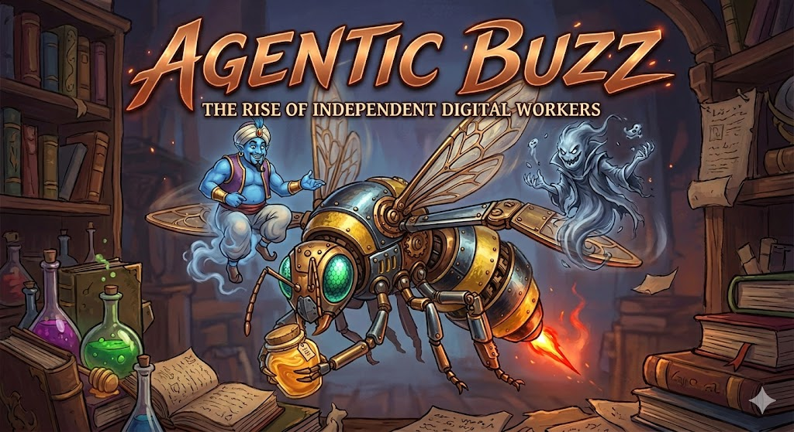
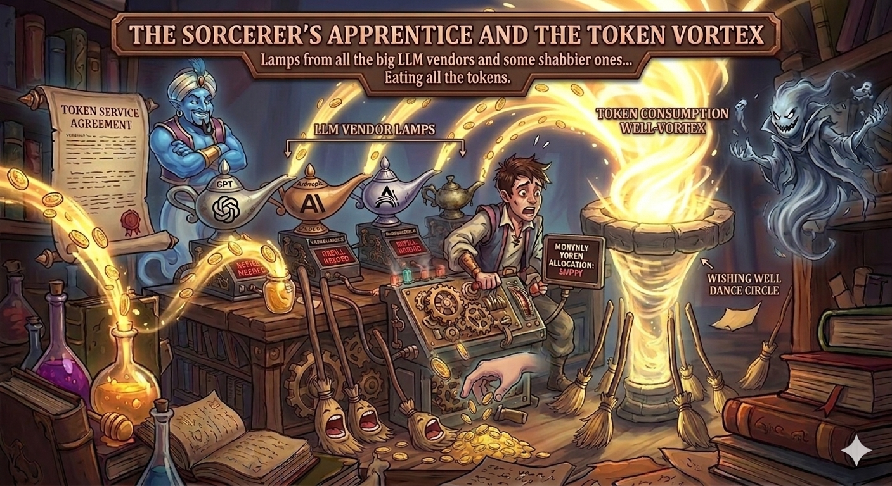

- [ ] The is so much buzz and buzzwords surrounding AI agents - this is my guide for sorting it out the fluff from the substance.
- [ ] Here I want to track what people are most excited about so I can join in the fun
- [X] Should become a blogpost
- [ ] Add a hype meter.
- [x] Has been updated on June 3rd

1. **LLMs** power agentic projects. Last year we talked about "Tool using LLMs" before that "Chain of thought or Reasoning LLMs", and the years before that we it was  "Chatbots". LLMs are sometimes superhumanly bright but when it comes to consistency and we look at thier performance over multiple interactions they frequently do very poorly. In the age of agents we call them poltergeists and genies.  A *genie* should fulfill our wishes. A *poltergeist* is the agent's other face that explains why we should do the coding, or why it shouldn't follow the instructions. [The first lesson of agentic coding is how to get the genie and not the hallucinating poltergeist]{.mark}
1. *Human in the loop* - this is a project where the org/coder/etc are too scared to let the make decisions on thier behalf. A very sensible approach which does not scale. **Not Production**
1. **Agentic Production Projects** - 80% of companies are doing agentic projects, but only 5% have brought them to production. Level. Every meetup discuses the 5%. Everyone is talking about thier production projects. But it is all buzz and no production.

4. **Harness** - this is a loop for keeping the Genie on the task and the poltergeists at bay. Some people call it the Genies Lamp. If we are folkish about the loop the agent can eat all out token budgets.
1. **Token** - the currency of the realm. We have to pay for work by the token. And if you think tokens are just encoded words - there are tokens for pictures, videos, audio, and even code. [The lamps you get from the LLM vendors are setup to to stop after only a few tokens and ask for more instructions, so that eventually the sorcerer's apprentice will put all the broomstick on autopilot only to see them eating all the tokens for the month.] Also lots of tokens fill the context window.
1. **Context Window** - the amount of tokens that can be used in a single interaction with the LLM. This is a hard limit and it is important to keep track of how many tokens are being used in the prompt, the response, and any additional context that is being used. If you exceed the context window, you will get an error and your agent will not be able to complete its task.
1. **Guard rails** (think GH actions to run before commits and or command line or tool invocation also after calling an LLM)
1. **Specs** - organizing project interaction via markdown spec documents that can be shared with agents
1. **Checklists** - agents love checklists and they are also a powerful paradigm for mission and workflow consistency
1. **VS Code Custom agent** - "The built-in agents provide general-purpose configurations for chat in VS Code. For a more tailored chat experience, you can create your own custom agents." c.f. https://code.visualstudio.com/docs/copilot/customization/custom-agents
1. VS Code Background agent - run with a local branch - should be checked wrt pull requests
1. VS Code Cloud agent - think git hub actions - agents that can be run on GH. Can run longer slower - [Tasks should have high success probability.] [Q. how do we monitor progress/cost/outcomes] ? c.f. https://code.visualstudio.com/docs/copilot/agents/cloud-agents
1. VS Code Custom agents - Vs Code has three types of agents 
    - Planning agent - to plan before coding
    - Agent agent - for coding
    - Ask agent - to get explanation
   It is also possible to create your own custom agents using a single markdown file that is like the agents "system prompt".
   Agent can also be asked to run as github actions which means they run longer.
1. Copilot Coding agents cf https://docs.github.com/en/copilot/how-tos/use-copilot-agents/manage-agents
1. **Agent Skills** - c.f. https://code.visualstudio.com/docs/copilot/customization/agent-skills 
1. *MCP* - and training for tool use! 
1. **Procreate** - python library used to verify json complies with spec
1. **Playwright** - python library used to automate the browser, now used to capture screenshots and videos of agent interactions and send them to a multimodal LLM for analysis and feedback on UI/UX.
1. **Prompt Chaining** - the practice of breaking down a complex task into smaller, more manageable prompts that can be processed by the LLM. This can help to improve the performance of the agent and reduce the likelihood of hallucinations. Prompt chaining uses multiple calls to the LLM to complete a task. Each step enriches the context for the subsequent steps.
    There are a number of different approaches to prompt chaining, but roughly we can use pure python + pydantic for simple workflows or a framework that lets us construct a graph of prompts and responses.    
    1. **LangSmith** - python library used to trace and monitor agent performance
    1. **LangGraph** - python library used to visualize agent interactions and workflows
    1. **LangChain** - python library used to build agent workflows
1. **Mixture of Experts** and other voting schemes 
    - Originally an ensemble architecture for ML that improves performance of a model by training it multiple times with some objective that makes each one specialize (using a router element) then at inference time the router element decides which experts to use for each input and how to weight their outputs. 
    - Models that use all the parameters for each input are called "dense" models and models that use a subset of the parameters for each input are called "sparse" models. Mixture of Experts is a type of sparse model.
    - This is the main paradigms for LLMs, the parameters are split across multiple "experts" and the model only activates a subset of the experts for each input. This allows the model to scale to billions while using only a tiny fraction of the parameters during inference so that it can be run on a single GPU with memory that is much smaller than the total number of parameters. There are however a number of technical engineering challenges involved.
1. Custom workflows - this can mean a couple of thins
    1. originally a github action.
    1. an agent running in the cloud using a github action 
1. Perf Monitoring GPU and up - KV cache optimization
1. tracing
1. Hooks (e.g. commit + gen comments for rollback)
1. Steering - 
    1. Instructions given to a (long running) agent that can be used to steer it back on track if it goes off the rails. 
       This is a bit like the "guard rails" above but is more about course correction than prevention. 
    1. Also steering can be used in chat to provide additional context after the initial prompt but before it completes its response.     
    1. LLMs are getting better pretty at following instructions, however how does  steering work when LLM have been stateless from the very beginning?
       The steering instructions are processed to vectors and this is injected into the transformer's middle layers to steer the response in a particular direction.
1. **Detect Hallucinations** - a big topic since there are apparently a number of reasons why hallucinations happen:
    - Two abstractions
        - define hallucination as a random answer that is not based on the prompt/history/training data
        - Most Transformers are either explicitly state based models or equivalent to state based models. Hallucinations can be defined as entering a "defective" regime. The main issue being that once we enter the defective regime we are unlikely to get back to the "normal" regime.
        - Probabilities are represented as log likelihoods and these numbers get smaller the longer the prompt/history. The smaller they are the more negative they become.
            - The *happy path* in QA is when everything works fine. Say the response is 500 words and each word has a probability of .99. The log likelihood for the response is 500*log(.99) = -5. This is a massive log likelihood.
            - The *unhappy path* might be when the best answer has small probabilities... 500*log(.0001) = 500* -9.21 =  -4605.
          If the answer is "very likely" i.e. all the words a probability of being generated  in the response  AKA as the "happy path" in QA, then the log likelihood will be tiny. If there are some contradictions in the prompt/history/memory the log likelihood can overflow and we can enter a "defective" regime where we are likely to get random answers.
    - *Poisoned tokens* - we know that certain tokens can `jailbreak` the model and cause it to produce random answers. These are artefact of the tokenization and are likely to be highly unlikely to arise in normal testing of the model unless the "lookup table" is reversed engineered and the "poisoned tokens" are identified and included in the prompt. This is just one of many ideas used to jailbreak a model, and any of these can lead to hallucinations, so just fixing the tokenizer isn't the fix for this class of hallucinations.
    - "May the odds be ever in your favor" FAIL - the probability for the right answer is lower than the other answers. 
        - small e.g.  POS fail due to  $p(N|man) >> p(V|man)$  in "the old man the boat" 
        - big e.g. Bias against Robert Moses, 
    - **Personality drift** c.f. [paper](https://www.anthropic.com/research/assistant-axis) [YT video](https://www.youtube.com/watch?v=eGpIXJ0C4ds) 
    - **Probabilistic contradictions** - let's suppose that the LLM is smart enough that having a contradiction in the prompt/history results in a high chance of hallucination (random) answer. Unfortunately LLM represent probabilities as Log Likelihoods and these numbers get smaller the longer the prompt/history. If the answer is very likely for all words in the response  AKA as the "happy path" in QA, then the log likelihood will be tiny. If there are some contradictions in the prompt/history/memory the log likelihood can underflow
    - **Out of distribution** (the model never learned the answer)
    - **Attention defect** - your answer requires the attention mechanism to attend to many locations that are too far apart to effectively return a signal. Hard to come up with examples. Attention is pretty amazing at learning relations. GRU and Transformers are pretty amazing at operating over a long context. However, all the stuff above can mess them up and even if one is on the happy path.
1. **[chat participant api](https://code.visualstudio.com/api/extension-guides/ai/chat)** 
        - a vs code extension that allows you to create a "chat participant" that can be used in the chat window. This is a bit like a custom agent but is more focused on providing a specific interface for interacting with the model in the chat window. For example, you could create a "chat participant" that provides a specific set of commands or functions that can be used in the chat window. This could be used to create a more interactive and engaging chat experience.
        - VS Code has several built-in chat participants like `@vscode`, `@terminal`, or `@workspace`. They are optimized to answer questions about their respective domains.
1. **Shadow AI** - use of gen ai at work that is not monitored or controlled by the organization. 
1. **Ralph Wiggum Loop** - A primitive harness based on a simple loop that runs an agent many times and stores any insights from earlier runs so that the harness is considered self-improving. However since the LLM is doesn't actually learn, if the agent keeps failing it is likely that Mr. Wiggum will just eat up your token budget and not actually do something worthwhile if it can't get the genie to do the work after a few tries.