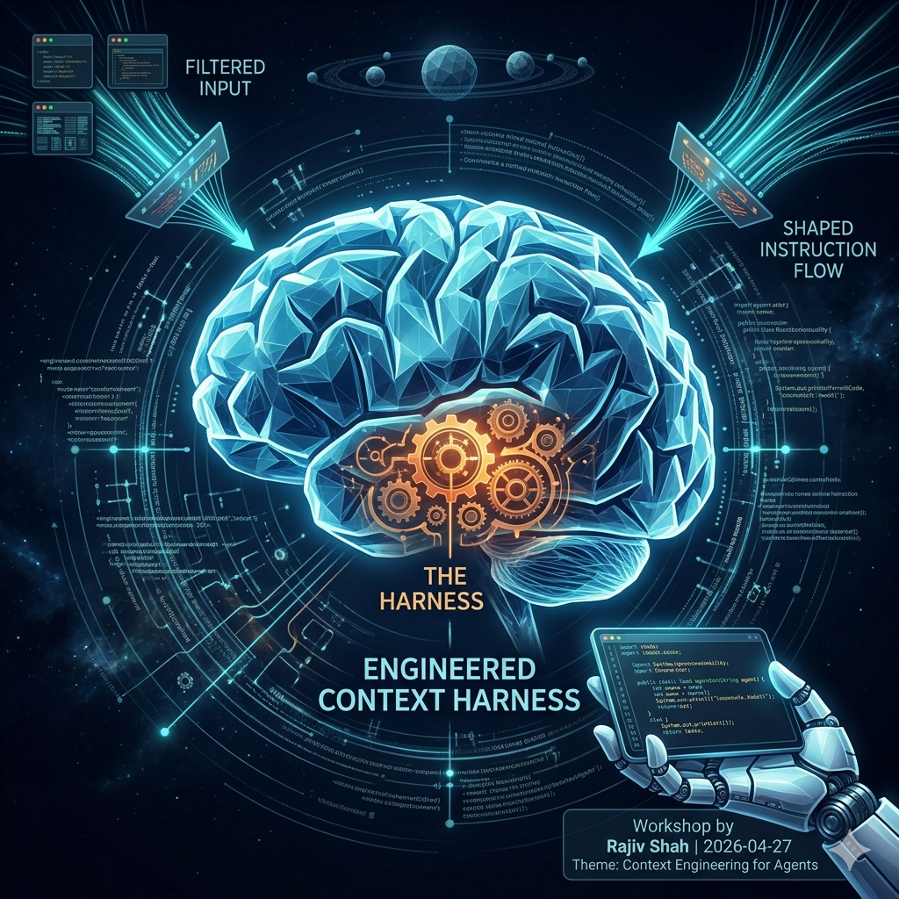

::: {.column-margin}

:::

## Engineering the Harness: A Practical Workshop on Context Engineering for Generative AI {#sec-harness-engineering}

::: {.column-margin}
  

I couldn't find a recording of this workshop from the conference but here is a recording of a similar workshop that Rajiv Shah has provided on YouTube.
:::

- Rajiv Shah
  - [linkedin](https://www.linkedin.com/in/rajistics/) 
  - [website](https://rajivshah.com/)
  - [blog](https://rajivshah.com/blog/harness-engineering.html)
  - [slides](https://docs.google.com/presentation/d/1onY5e2wFiiExIPm1X16bJ23F3Zv9fwph) 
  - [workshop](https://github.com/rajshah4/harness-engineering)

::: {.callout-note collapse="false"}
### Notes

- In this deep dive into harness engineering, Rajiv Shah explores why coding harnesses—the systems surrounding AI models—are essential for the performance, flexibility, and control of coding agents. While models have evolved from fine-tuning to context engineering, [harnesses are now the crucial layer for managing agentic workflows]{.marked}.
- Key Takeaways:
  - **Why Coding Harnesses Matters?**: Harnesses allow for the same base model to achieve drastically different results. A well-engineered harness can optimize performance, manage costs, and provide necessary control over agentic loops.
- **Five Levers of Harness Engineering**:
  1. **Model**: We all know how to swap the model.
  2. **Retrieval**: Beyond simple RAG, agents should utilize *tools* like [grep](https://en.wikipedia.org/wiki/Grep), [BM25](https://en.wikipedia.org/wiki/Okapi_BM25), and [semantic search](https://en.wikipedia.org/wiki/Semantic_search) to interact with codebases effectively (6:52).
  3. **Memory**: Effective memory management includes three layers: 
    - the active context window (managing token limits), 
    - working state (using files/markdown for plans), and 
    - durable memory (using `agents.md` files or specialized skills).
      - **Skills**: Externalizing expertise into reusable processes (“skills”) can significantly reduce the need for excessive orchestration code (17:02).
  4. **Loops, Tools, and Feedback**: Harnesses should facilitate efficient loops (e.g., planning, test-driven development, and verification) while providing sandboxed environments to handle security and friction (21:29).
  5. **Architecture**: 
- **Orchestration**: While multi-agent systems are popular, the video cautions that they introduce significant coordination costs. Single-agent setups with reflective critique often outperform complex swarms (27:37).
- **Long-Term Outlook**: While some technical details (like specific compaction strategies) may be commoditized, the focus on domain-specific tools, security posture, and the ability to define reusable skills will remain critical for building high-performing, reliable coding agents (31:08).
:::

### Reflection

- Wow what a polished talk. 
- Rajiv Shah references the other harness engineering talk by Ryan Lopopolo from OpenAI, covered in 
