Robert Osazuwa Ness

-  a senior researcher at Microsoft Research, Professor at Northeastern University, and Founder of Altdeep.ai
- Spoke in a [BP](https://www.linkedin.com/posts/venheads_my-colleagues-and-i-are-hosting-a-free-virtual-activity-7103287781941993474-iwP6/) conference on CI which made a strong impression.
- Suggested there : "LLM are good for on causual modeling". 
- In [Paper: Causal Reasoning and Large Language Models: Opening a New Frontier for Causality](https://arxiv.org/abs/2305.00050) seems to have shited to the opposite POV.
-  Benchmarking causal discovery using ChatGPT: The cause-effect pairs challenge [GH repo](https://github.com/amit-sharma/chatgpt-causality-pairs) 
-  Still thinks that may be better than many non-experts and as support.
- My POV aids in "Warm start" but eventually slows you down.
- Wrote the book [Causal AI](https://www.manning.com/books/causal-ai) and has an extensive [Book Summary](https://www.robertosazuwaness.com/causal-ai-book/).
- Papers that might be worth looking.

## Are LLMs Good at Causal Reasoning?

::: {.column-margin}


Are LLMs Good at Causal Reasoning?
:::

- Causal analysis in LLM 
- Do GPT-3.5 and GPT-4 excel in causal inference?
- LLMs show potential in tackling causal problems
- Benchmarking causal tasks in LLMs
- GPT models struggle with causal generalization
- Constructing causal graphs using variable relationships
- Large language models for causal inference are useful but flawed
- Unlocking Causal Reasoning in GPT-4
- Current projects and future directions

AI summary

Ness, discusses whether large language models (LLMs) like GPT-3, 3.5, and 4 are effective at causal reasoning. Highlighting the challenges of achieving generalized AI and the importance of causal analysis in machine learning 

Key points:

- **LLMs' Performance on Causal Benchmarks** show promising results on causal inference benchmarks, surpassing previous baselines. However, there are concerns about the models potentially memorizing benchmark answers rather than truly understanding causal relationships.
- **Challenges in Causal Generalization** Models *struggle* with generalizing causal relationships to new, related scenarios. e.g., a model correctly identified that the age of an abalone causes its length but failed when "length" was replaced with "diameter," suggesting a lack of true causal understanding.
- **Constructing Causal Graphs** [LLMs can construct causal graphs from variable names, performing comparably to state-of-the-art causal discovery algorithms.]{.mark}. This is more useful when variable names are informative.
- **LLMs as Causal Co-Pilots** Despite their flaws, LLMs can be valuable "causal co-pilots," assisting human experts in bridging the gap between domain knowledge and statistical analysis. They can help in generating initial hypotheses but require oversight due to  brittleness and sensitivity to prompt wording.^[A possible mitigation could be to use a harness that generate multiple prompts instead of relying on a single prompt, and then aggregate the results.]
- **Unlocking Causal Reasoning in GPT-4** explores the potential of using RLHF (Reinforcement Learning from Human Feedback) to align LLMs with specific causal reasoning "recipes" rather than just mimicking human language. This could improve their ability to make accurate causal judgments.
- Ness also recommends [interleaved intervention training](https://github.com/atticusgeiger/interleaved-intervention-training) by [Atticus Geiger](https://atticusg.github.io/) and the [Guidance](https://github.com/microsoft/guidance) repository by Microsoft Research as tools for aligning and controlling LLMs for specific tasks.

#### interleaved intervention training

[Faithful, Interpretable Model Explanations via Causal Abstraction](https://ai.stanford.edu/blog/causal-abstraction/) at the The Stanford AI Lab Blog

[Interchange Interventions on GH](https://github.com/atticusg/InterchangeInterventions)

papers:

- @geiger2020neural [Neural natural language inference models partially embed theories of lexical entailment and negation](https://arxiv.org/pdf/2004.14623)Neural natural language inference models partially embed theories of lexical entailment and negation

- @geiger2021causal [Causal abstractions of neural networks](https://proceedings.neurips.cc/paper_files/paper/2021/file/4f5c422f4d49a5a807eda27434231040-Paper.pdf)Causal abstractions of neural networks

::: {.column-margin}

Atticus Geiger on Uncovering and Inducing Interpretable Causal Structure in Deep Learning Models with interleaved intervention training
:::

::: {.column-margin}
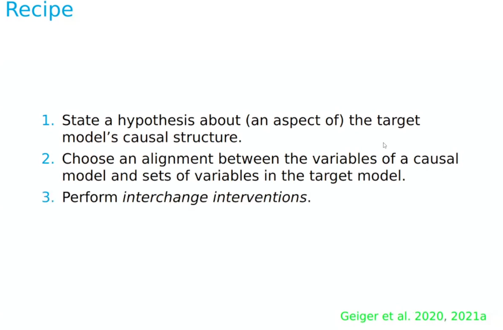
:::

interchange intervention example:

we are adding x,y,z. We have a neural network that takes in x,y,z and outputs some number. We want to test a hypothesis that it adds the first two, copies the third, and then adds them together. We may test this by testing if the internal representation of the network.

The interchange intervention is to take the intermediate representation of a network on one input, and then feed it into the rest of the network with a different input and see if the output is what we expect. If the network is doing what we think it is doing, then the intervention should result in a predictable output. (we may have swapped z mid way through the network and gotten the corresponding output etc.) Alternatively we our hypothesis may be wrong and we may have to try many different interventions untill we can uncover the true (causal) structure of the network

::: {.column-margin}
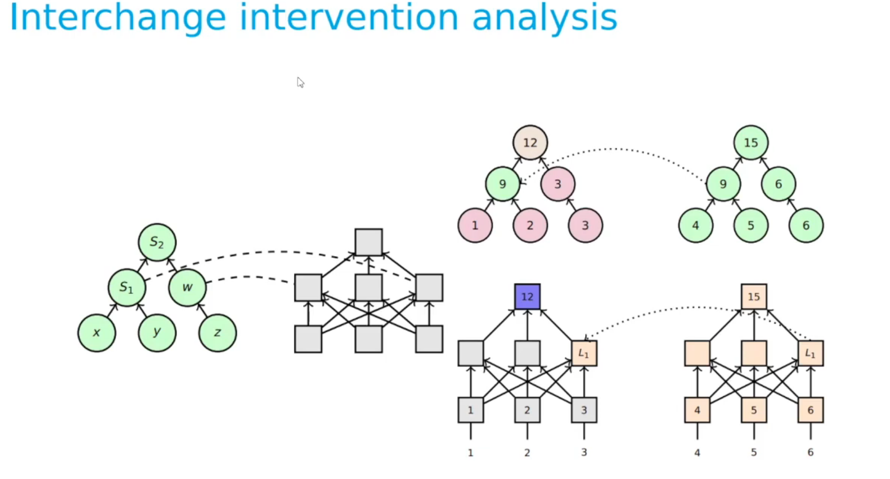
:::

So to sum up this is a realy simple idea for using trial and error in a principled way so as to to uncover the true causal structure of a network. 

We can also use this idea to train a network to have a particular causal structure by interleaving the interventions during training. This is what Atticus Geiger calls interleaved intervention training.

::: {.column-margin}
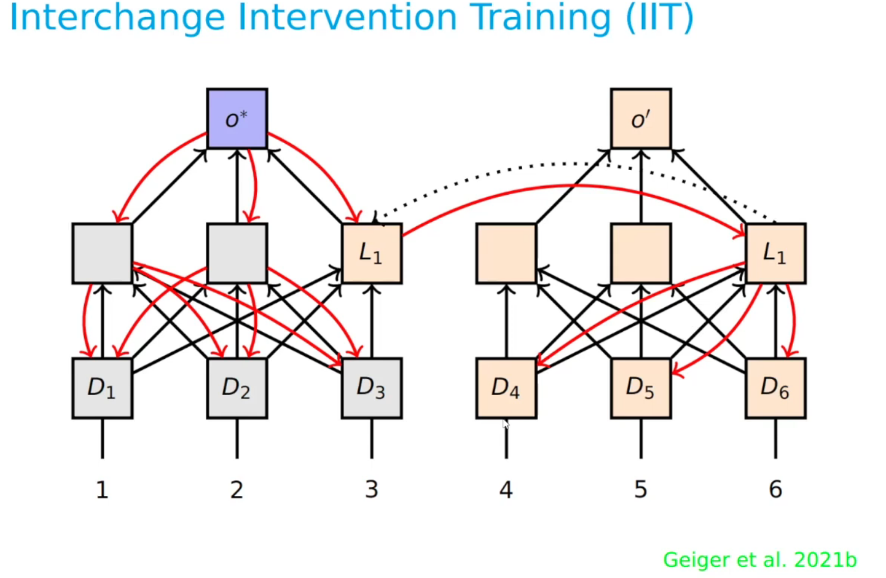
Interchange intervention training c.f.
@pmlr-v162-geiger22a and @wu2022causalproxymodelsconceptbased
:::

In this case we are taking the idea to the training phase. where we are using the gradient update step of learning based on this hypothesis we tested. The idea is we start on the left and we use it to update the network so that it has the structure we want. We then test the hypothesis again and we keep doing this until we have a network that has the structure we want.


In the talk though he shows how they used this on batch of 4 mnist images to get much more training from the same dataset. (The top lest digit decides which of the other 3 digits is the label)


summary:

Atticus Geiger explains that understanding complex systems like AI models can be approached by viewing them as implementing algorithms (5:57).

Key concepts and techniques:

- **Causal Abstraction** This involves simplifying a system with many micro-variables into a simpler one with fewer macro-variables. Geiger highlights that modern AI models offer an ideal scientific setting for these experiments due to perfect access to states and interventions (9:19).
- **Interchange Interventions** This method tests a hypothesis about a neural network's causal structure by replacing a representation with a value it takes on a different run. If the network's output matches the counterfactual output of the high-level model, it supports the hypothesis (12:30). He provides an example of this with a simple addition task.
- **Inducing Causal Structure** This involves using high-level hypotheses as a source of supervision during network training, allowing for the update of the neural network to have a specific modular, high-level structure (24:31).
- **Distributed Alignment Search** (DAS) This method addresses the challenge of finding where concepts are located in a neural network by learning a rotation matrix using gradient descent. This allows for targeting quantities distributed across several variables at once, not just individual neurons (36:01).


#### Guidance

A Pythonic interface for language models

```python
# Get a new copy of the Model
lm = phi_lm

with system():
    lm += "You are a helpful assistant"

with user():
    lm += "Hello. What is your name?"

with assistant():
    lm += gen(name="lm_response", max_tokens=20)

print(f"{lm['lm_response']=}")
```

> lm['lm_response']='I am Phi, an AI developed by Microsoft. How can I help you today?'

``` python
from guidance import select

lm = phi_lm

with system():
    lm += "You are a geography expert"

with user():
    lm += """What is the capital of Sweden? Answer with the correct letter.

    A) Helsinki
    B) Reykjavík 
    C) Stockholm
    D) Oslo
    """

with assistant():
    lm += select(["A", "B", "C", "D"], name="model_selection")

print(f"The model selected {lm['model_selection']}")
```
> The model selected C


---

The podcast mentions several causal frameworks and concepts:

- **Pairwise Causal Discovery** (5:39): This involves determining which of two variables causes the other, often by analyzing data or simply asking the LLM. An example given is whether temperature causes altitude or vice-versa (6:09).
- **Full Graph Causal Discovery** (6:24): This aims to learn an entire causal graph showing relationships between multiple variables.
- **Average Treatment Effect (ATE) / Conditional Average Treatment Effect** (7:25): This framework is used in econometrics, epidemiology, and statistics to determine if something causes another, often compared to randomized clinical trials. An example is whether an ad caused a spike in sales (7:07).
- **Actual Causality** (Token Causality)  This framework focuses on specific events and determining which prior events caused a particular outcome, rather than general causal relationships between variables.
- **Causal Judgments**  This framework, often evaluated using benchmarks like the "causal judgments" dataset in Big Bench, assesses how well models align with human reasoning about what causes what, especially in contexts where there isn't a single objective truth.
- **Causal Graphs** (DAGs - Directed Acyclic Graphs) These are formal representations of causal relationships, used to drive downstream statistical analyses. LLMs are discussed for their ability to help construct these from domain knowledge.
- **Structural Causal Model** (SCM)  A more statistical framework for causal assumptions.
- **Occam's Razor**  Discussed as an inductive bias that LLMs can use when evaluating causal arguments, preferring simpler explanations

---

## [AI Trends 2023: Causality and the Impact on Large Language Models with Robert Osazuwa Ness](https://youtu.be/9c8Ln_ECmbA)

::: {.column-margin}

AI Trends 2023: Causality and the Impact on Large Language Models with Robert Osazuwa Ness
:::


---

## Learning Bayesian Statistics podcast [Causal AI & Generative Models, with Robert Ness](https://www.youtube.com/watch?v=lUJnasFnrZo&pp=ygUTUm9iZXJ0IE9zYXp1d2EgTmVzcw%3D%3D)

::: {.column-margin}

Causal AI & Generative Models, with Robert Ness
:::


---

## [Towards causal inference with latent variable models and programs](https://youtu.be/xXa8oKuWEag) from [ProbProg2020](https://probprog.cc/2020/program/)

@mohammadtaheri2022docalculusenablesestimationcausal [Do-calculus enables estimation of causal effects in partially observed biomolecular pathways](https://arxiv.org/abs/2102.06626)

::: {.column-margin}

Towards causal inference with latent variable models and programs
:::

questions:

- Can we use our probabilistic programming  models to make causal inferences? 
- How can we  construct our models so that we can apply  formal methods from causal inference?  
- Can we use the native abstractions of our models  in causal reasoning, or do we have to explicitly  model something called a potential outcome? 
- Can  we use the generative explanatory nature of our  models or are we limited to doing Bayesian  inference on potential outcomes as if it  were a missing data problem? 
- How can  we do causal inference from data when many of  the variables in our model are not observed  in the data? 

The content of this presentation going forward is rather technical and suitable to an audience trained in probabilistic programming and causal inference. I recommend Statistical Rethinking by Richard McElreath as a good introduction to causal inference and probabilistic programming. 


::: {.column-margin}
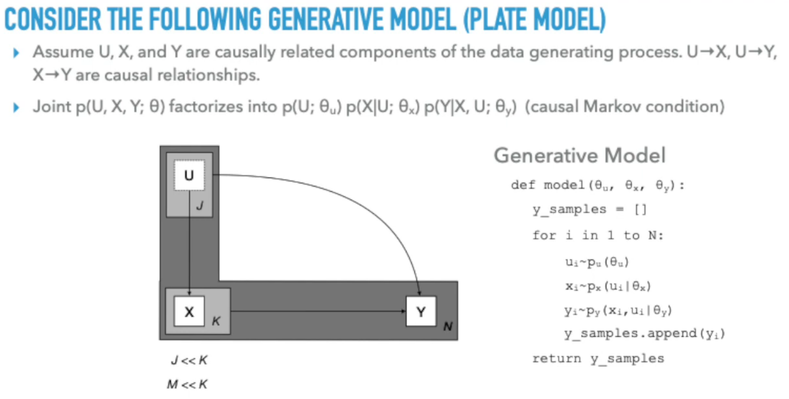   
:::

::: {.column-margin}
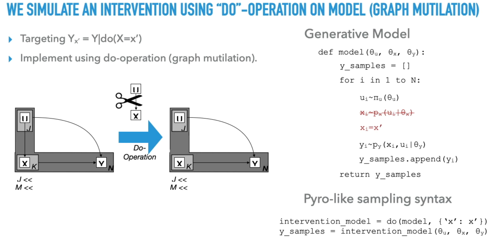   
:::

::: {.column-margin}    
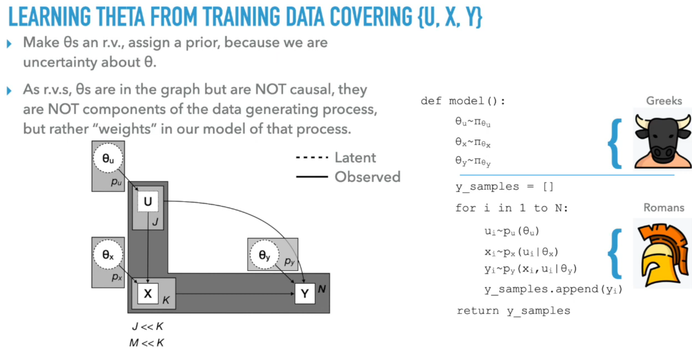   
:::

::: {.column-margin}
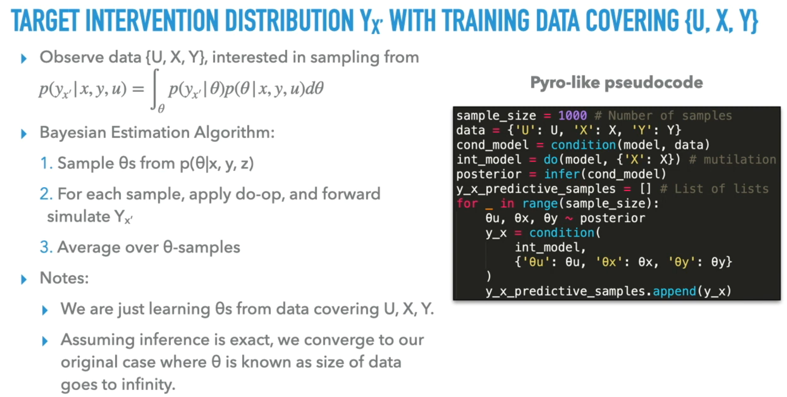   
:::

::: {.column-margin}
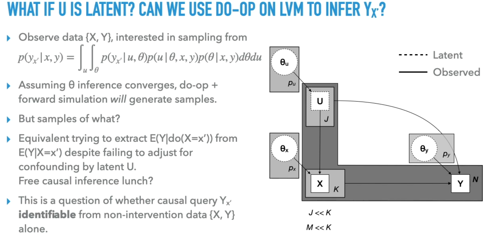  
:::

We are often more interested in models where the causal structure manifests through hidden AKA latent variables. 

::: {.column-margin}
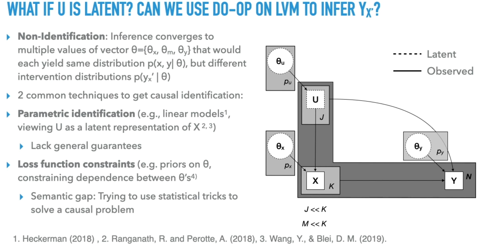
:::

::: {.column-margin}
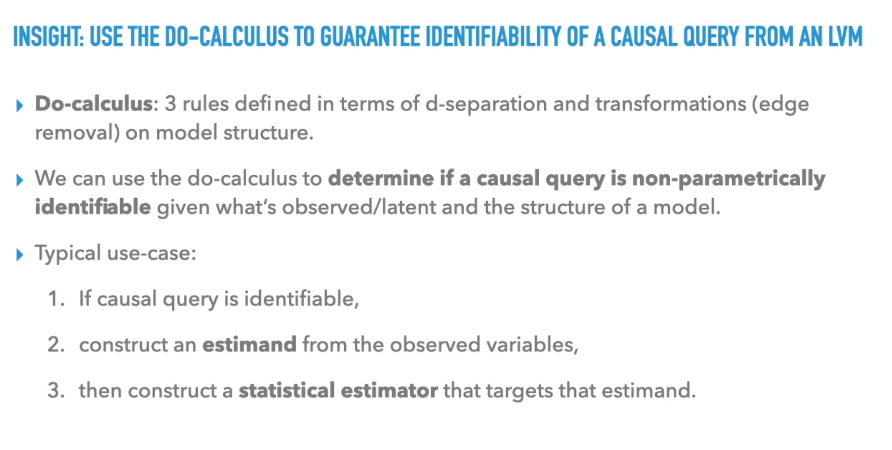
:::

::: {.column-margin}
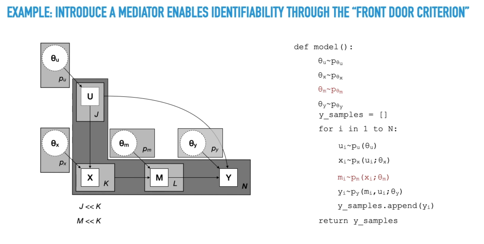
:::

::: {.column-margin}
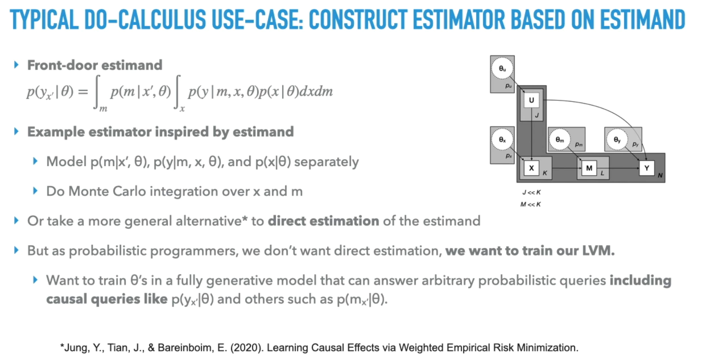
:::


This video explores the strong connections between probabilistic programming and causality. Ness discusses how probabilistic programming, which models abstractions in the data-generating process and their relationships, is well-suited for causal inference.

Key points covered include:

- Causal Inference with Probabilistic Programming: The video explores whether probabilistic programming models can be used to make causal inferences and how to construct models for applying formal methods from causal inference.
- Graph Mutilation and Program Transformation: The concept of "graph mutilation" is introduced as a tool for simulating interventions in causal directed graphical models, which can be viewed as a program transformation in probabilistic programming . This involves replacing an expression that samples a variable with one that assigns a constant value, breaking its dependence on prior expressions .
- Handling Unknown Parameters and Latent Variables: The presentation addresses how to handle cases where parameters of conditional distributions are unknown, treating them as random variables. It also discusses the challenges of causal inference when latent variables are present, particularly regarding identifiability .
- Do-Calculus for Identifiability: The speaker proposes using the do-calculus to guarantee the identifiability of causal queries in latent variable models . The do-calculus provides rules based on d-separation and model structure transformations to determine if a causal query is non-parametrically identifiable .
- Front-Door Criterion Example: A concrete example is provided using the "front-door criterion," where adding an intermediate variable (mediator) between two variables makes the model identifiable according to the do-calculus.
- Estimator for Causal Query: The video concludes by arguing that if a model correctly represents the joint probability of observed variables and has do-calculus identifiability for a given causal query, then the trained theta, do-operation, transformation, and simulation procedure can serve as an estimator for that causal query.

---

Though the content of this presentation is technical, the main takeaway is that we can use the do-calculus to guarantee the identifiability of causal queries in latent variable models.

---


## [How to Build Causal AI Models in PyTorch](https://www.youtube.com/watch?v=rtxfYAppmtc)


::: {.column-margin}

How to Build Causal AI Models in PyTorch
:::

## Causal Machine Learning 60-Minute Blitz

::: {.column-margin}

A 60-minute blitz on causal modeling and its role within machine learning.

:::