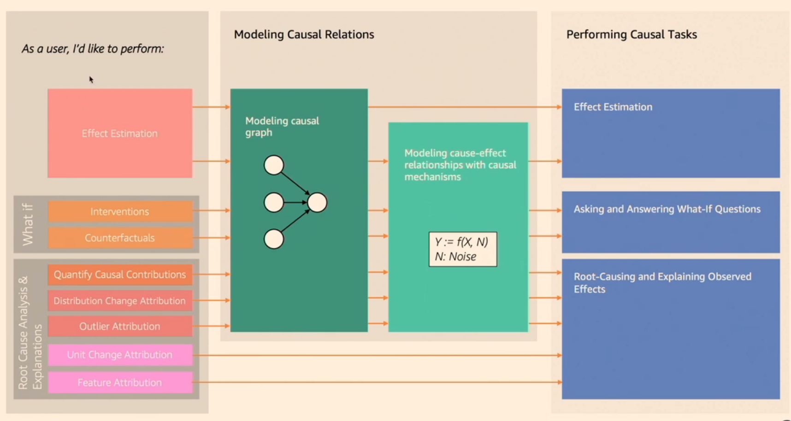
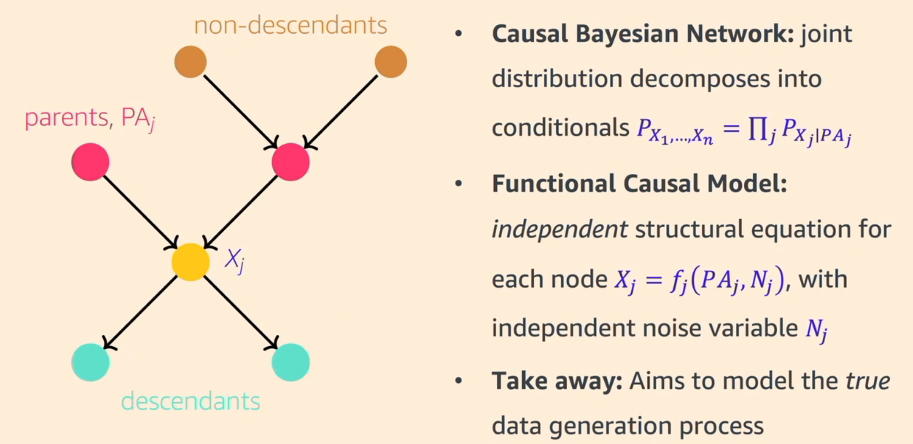
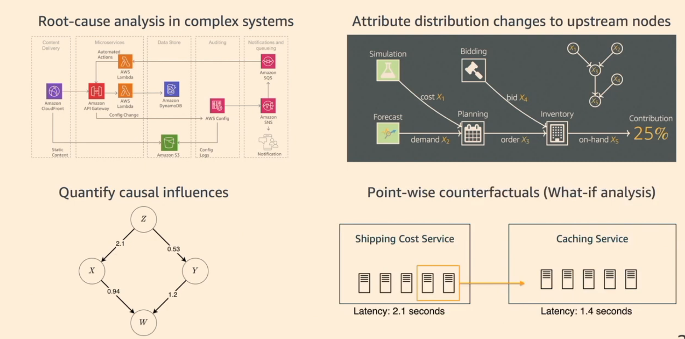

The leading Python repositories for causal inference include:

::: {.column-margin}

Patrick Blöbaum: Performing **Root Cause Analysis** with DoWhy, a Causal Machine-Learning Library
:::

- **DoWhy**: *Effect Estimation*, DoWhy provides a unified interface for various causal inference methods and is based on a language that combines graphical models and potential outcomes frameworks. It focuses on explicitly modeling and testing causal assumptions.
    - [GH](https://github.com/py-why/dowhy) 
    - [Docs](https://www.pywhy.org/dowhy/v0.14/)

::: {#fig-do-why-problems}

Three Use cases of DoWhy: (1) Estimating the effect of a treatment on an outcome, (2) Identifying the causal graph from data, and (3) Testing the robustness of causal conclusions to violations of assumptions.
:::

::: {#fig-what-are-GCMs}

Joint Causal Models that decompose into conditionals.
:::

::: {#fig-GCM-use-cases}

Use cases of GCMs: (1) Root cause analysis, (2) Attribution distribution changes to upstream causes (3) Quantifying causal influences, and (4) Pointwise Counterfactuals (What if scenarios).
:::

- **EconML**: Also a Microsoft Research project, EconML (Automated Learning and Intelligence for Causation and Economics) is a library designed for estimating heterogeneous treatment effects using machine learning techniques. It is particularly useful in economics and other data-driven fields.
- **CausalNex**: Developed by McKinsey, CausalNex is a toolkit for causal reasoning with Bayesian networks. It simplifies the process of learning causal structures, incorporating domain expertise, and estimating intervention effects.
- **causal-learn**: This library, part of the PyWhy ecosystem along with DoWhy, focuses on causal discovery, offering various algorithms for learning causality from data.
- **CImpact**: A modular library for causal impact analysis, CImpact is designed for time-series data and supports multiple time series models, including TensorFlow and Prophet, to estimate the effect of a specific intervention over time.
- **bnlearn**: This Python package is used for causal discovery by learning the structure of Bayesian networks from data, as well as for parameter estimation and inference. 