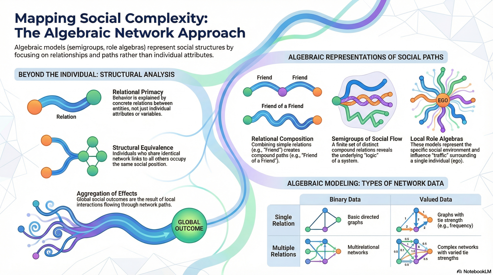

::: {#fig-cover}
{.column-margin .nolightbox}  
:::

::: {#fig-author}
{.column-margin .nolightbox}

[source](https://en.wikipedia.org/wiki/Pip_Pattison#/media/File:Pip_Pattison.jpg) for more information read wikipedia article [Pip Pattison](https://en.wikipedia.org/wiki/Pip_Pattison)
:::

> How much of your life is under your control, and how much is shaped by the invisible web of social ties around you? 

"Algebraic Models for Social Networks" by [Philippa Pattison](https://en.wikipedia.org/wiki/Pip_Pattison) offers a mathematical lens to decode the complex architecture of human interactions.

::: {.callout-note}
## TL;DR - Too Long; Didn't Read about Algebraic Models for Social Networks 

"Algebraic Models for Social Networks" by Philippa Pattison, @pattison1993algebraic is a comprehensive exploration of how **algebraic structures** can be applied to understand and analyze social networks.

This book explores the mathematical foundations of social network analysis, providing readers with the tools and concepts necessary to model complex social interactions.

Compared to later developments in network science, this work is foundational, laying the groundwork for understanding how algebraic methods can be used to represent and analyze social structures. 
The approach is more theoretical and mathematical, focusing on the formal properties of networks rather than empirical applications. However, it provides a framework that has influenced subsequent research in the field.
:::

Here is a lighthearted Deep Dive into the paper|book:

<audio controls="1">
  <source src="podcast.mp3" data-external="1" type="audio/mpeg">
  </source>
</audio>

## Glossary

This book is dense with terminology from mathematics and social network analysis, so let's unpack some of the key terms which can make the content more approachable.

::: {.column-margin #vid-hasse-diagram}

Hasse Diagram
:::

Adjacency Matrix
: A square binary matrix where the i,j cell is 1 if a relation exists from individual i to individual j, and 0 otherwise.

Axiom of Quality
: The rule stating that two relations are equal if they link precisely the same pairs of individuals.

Binary Relation
: A set of ordered pairs of elements representing a specific type of connection (e.g., "friendship").

Blockmodel
: A simplified representation of a network that assigns individuals to positions (blocks) and specifies the relations between those blocks.

Boolean Product
: A matrix operation using "and" and "inclusive or" logic to find the composition of two binary relations.

Cayley Graph
: A visual representation of a semigroup where vertices are distinct relations and edges represent the result of multiplying by a generator. See [Cayley Graph](https://en.wikipedia.org/wiki/Cayley_graph).

Composition
: Also called concatenation; the process of joining two relations to form a compound relation (e.g., "friend of a friend").

Density
: The ratio of existing network links to the total number of possible links.

Ego
: The focal individual in a local or ego-centred network analysis.

Free Semigroup
: The set of all possible finite strings of relations (paths) before any equations (Axiom of Quality) are applied.

Hasse Diagram
: A visual representation of a partial order that shows which elements "cover" others, omitting redundant transitive links. See [Hasse Diagram](https://en.wikipedia.org/wiki/Hasse_diagram).

Isomorphism
: A one-to-one mapping between two algebraic structures (like semigroups) that preserves their multiplication and ordering properties.

Multiplex Relation
: A social tie characterized by multiple types of relationships (e.g., two people who are both co-workers and kin).

Relation Plane
: A matrix whose rows are relation vectors (paths from ego) and whose columns are individuals in the local network.

Role-Set
: The collection of distinct "role-relations" (columns of the relation plane) associated with an individual.

Skeleton
: The simplest form of a network, achieved by replacing all structurally equivalent individuals with a single representative block.

Structural Equivalence
: A condition where two individuals have the exact same relations to and from all other members of the network. See also [Similarity (network science)](https://en.wikipedia.org/wiki/Similarity_(network_science))

Valued Network
: A network where links are measured on a numerical scale (e.g., frequency of contact) rather than just presence/absence.

## Concept Explainer

Mapping the Social Web: An Introduction to Network Paths and Compound Relations

To understand why a viral trend explodes, how a job market functions, or how a virus navigates a continent, we must look beyond the traits of single individuals. We must look at the network. By shifting our focus from the "atoms" (individuals) to the "bonds" (interactions), we reveal the hidden architecture of human society.

### The Shift from Individuals to Interactions

Traditional sociology often relies on reductionism—the belief that we can explain a group by summing up the characteristics of its members (like age, income, or personal values). However, Structural Analysis argues that the most powerful driver of behavior is not who you are, but where you are positioned in the social web.

The "so what?" is transformative: social behavior is dictated by the space between people. These gaps are not empty; they are the conduits for power, information, and influence.

Traditional vs. Structural Perspectives

| Feature | Traditional Perspective (Reductionism)|	Structural Perspective (Network Science)|
|---|------|-------|
| Primary  Focus |	The Individual (Attributes and traits) |	The Relation (Interactions and ties)|
| Causal Explanation | Internal values, ideas, or cognitive maps | The arrangement of concrete social entities |
| Unit of Analysis|	The "Atomized" person|	The "Interaction" between nodes|
 

Once we accept that the "space between" is the engine of social life, we need a rigorous way to track how these interactions connect across a group.

### The Anatomy of a Network Path

A network is more than a list of friends; it is a system of "invisible highways." In network science, we define a Path as a sequence of nodes $x_0, x_1 \dots x_k$. Here, $x_0$ is the Source (the starting point) and $x_k$ is the Target (the destination). Each consecutive pair must be connected by a social tie.

To navigate this web, we track three fundamental properties:

1. **Reachability**: A simple binary check. Is it possible for Person A to reach Person D through any sequence of links? If yes, a social process can flow between them.
2. **Geodesics (Shortest Paths)**: The most efficient route. In a complex web, there are many ways to get from A to D; the "Geodesic" is the path with the fewest steps.
3. **Distance**: We don't measure social distance in miles, but in steps. The distance d(x, y) is the length of the shortest path between two people.

::: {.callout-note}
## Example Scenario: 

Imagine you want to reach a CEO (Target). 
You (Source) know a Manager, who knows a Director, who knows the CEO. 
Your "distance" is 3 steps. 
If you find a different connection—say, a neighbor who knows the CEO directly—the distance drops to 1. In social algebra, distance is defined by the length of the jump, not physical proximity.
:::

These paths are rarely composed of just one type of tie; they are often a "social recipe" of different relationship types.

### Compound Relations: The "Logic of Interlock"

Think of social ties like ingredients in a recipe. A Compound Relation is what happens when you combine different ties, such as "the Friend of my Boss."

Analogy: The Social Circuit Board Just as a circuit board requires specific paths to trigger an output, social networks rely on the order of ties. A Friend $\to$ Boss relation might mean you have an informal "in" at the office, whereas a Boss $\to$ Friend relation suggests your employer has a personal life you aren't part of. The order matters.

We can view these compound relations through three lenses:

* **A Labelled Path**: A specific string of ties (e.g., Friend $\to$ Helper).
* **A Binary Matrix**: A table of 1s and 0s showing exactly who is connected via this specific compound.
* **A Directed Graph**: A visual map using arrows to show the "flow" of the compound tie.

**Logic Box**: The Boolean Product To see if a compound relation exists between Person A and Person C, we perform a "middle-man check" using Boolean logic:

* AND (\wedge): Is there an intermediary "B" such that (A knows B) AND (B knows C)?
* Inclusive OR (\vee): If there are any such middle-men, the relation is "True" (1). If no middle-man exists, the relation is "False" (0).

**The Axiom of Quality**: In theory, you could string together an infinite number of paths (Friend, Friend $\to$ Friend, Friend $\to$ Friend $\to$ Friend $\dots$). However, in any finite group, you eventually run out of new people to connect. The Axiom of Quality is the rule that identifies when two different paths connect the exact same sets of people.

This allows us to collapse a messy, infinite social universe into a clean, solvable Semigroup (a finite set of distinct relational patterns). It is the bridge that turns social chaos into predictable algebra.

### The Aggregation Problem: From Micro to Macro

The ultimate goal of network science is to solve the Aggregation Problem: How do local, one-on-one interactions (Micro) create massive, global patterns (Macro)?

Synthesis: Micro Interactions vs. Macro Effects

|Level|	Focus|	Primary Mechanism|
|---|---|-------|
|Micro-Level|	Local Interaction|	Individual choices, personal ties, and direct contact.|
|Macro-Level|	Global Diffusion|	Topology: The arrangement and "transmission potential" of link types.|

Key Insight: Why the "Average" Fails In traditional statistics, we rely on the "Law of Large Numbers," assuming that individual differences "average out" in a large group. But social networks are not "well-mixed" like chemicals in a vat. They are biased.

As researchers like [Granovetter](https://en.wikipedia.org/wiki/Mark_Granovetter) and [Skog](https://no.wikipedia.org/wiki/Ole-J%C3%B8rgen_Skog) have shown, social processes are driven by topology—the specific shape of the links. A single "weak tie" (an acquaintance) that bridges two different social circles can change the global outcome more than a thousand "strong ties" (close friends) within a single circle. In networks, the arrangement is the engine; a "biased" link can trigger a global cascade that an "average" person never could.

### Summary: Navigating the Social Algebra

To master the social web, we use Algebraic Models (Semigroups). 
These models act as the GPS for human interaction, allowing us to calculate the structure of entire societies without getting lost in the "noise" of individual biographies.

Top 3 Takeaways:

1. Predictive Power: By mastering compound relations, we can predict the speed of a viral trend or the effectiveness of a job-search strategy. Benefit: Maximizing information flow.
2. Structural Clarity: Algebraic models reveal the "bones" of a group, identifying who holds the real "bridge" positions and who is structurally isolated. Benefit: Identifying hidden influence.
3. Diffusion Mapping: We can map the "reach" of a social process, such as how quickly a virus or an idea will spread, based on the reachability and distance of the network. Benefit: Strategic intervention and containment.

These compound paths are the invisible highways of human society; they determine what we hear, how we act, and ultimately, who we become.

---

## Review Questions

:::{#exr-01}
## aggregation problem
What is the "aggregation problem" in social science, and how do social networks help address it?
:::

:::{.callout-tip}
## Solution

**The aggregation problem** is the process of inferring global, structural implications (macro-level) from local, personal interactions (micro-level). Social networks provide a vehicle for this by helping researchers understand how the topology of local ties distributes resources or information across an entire population.
:::

:::{#exr-02}
## Realist vs Nominalist
Distinguish between the "realist" and "nominalist" perspectives regarding network boundaries.
:::

:::{.callout-tip}
## Solution

The **realist perspective** identifies network boundaries based on the subjective awareness of the members who perceive the network as a social entity. 

In contrast, **the nominalist perspective** defines boundaries based on the researcher’s specific analytic purposes, regardless of whether the members recognize the network’s existence.
:::

:::{#exr-03}
## Representation of Network Relations
What are the three common ways to represent a single network relation?
:::

:::{.callout-tip}
## Solution

A single network relation is typically represented as:

1. a *directed graph* (where individuals are *vertices* and relations are *edges*), 
2. a relational form (a set of ordered pairs), or 
3. a *binary matrix* (where cells record the presence or absence of a tie).
:::

::: {#exr-04}
## Structural Equivalence
How is "structural equivalence" defined in a multiple network?
:::

:::{.callout-tip}
## Solution

**Structural equivalence** occurs when two individuals have identical network links to and from all other network members across all relation types. If person A is related to person C by a specific relation, a structurally equivalent person B must also be related to C by that same relation.
:::

:::{#exr-05}
## Blockmodel
What is a "blockmodel," and what two specific features does it specify?
:::

:::{.callout-tip}
## Solution

**A blockmodel** is a hypothesis that specifies the assignment of individuals into "blocks" (positions) based on *structural equivalence* and the specific binary relations that exist between those blocks (roles). 

It serves to simplify and order the diversity of concrete social structures into an idealised representation.

**Blockmodel Fit Types**

Blockmodels represent relations among "blocks" of equivalent individuals. The quality of fit between data and a blockmodel is categorized:

|Fit Type | Requirement|
|---|-------|
|Fat Fit |Every member of Block A has the relation to every member of Block B.|
|Lean Fit |At least one member of Block A has the relation to at least one member of Block B.|
|α-blockmodel |The density of ties between Block A and Block B meets a specified threshold α.|

:::

::: {#exr-06}
## Axiom of Quality
Explain the "Axiom of Quality" in the context of network relations.
:::

:::{.callout-tip}
## Solution

The **Axiom of Quality** states that two relations (whether primitive or compound) are to be equated if they define exactly the same set of connections among persons. This identifies structural redundancy, allowing an infinite number of possible paths to be reduced to a finite set of distinct relational outcomes.
:::

:::{#exr-07}
## Partially Ordered Semigroup
What is a "partially ordered semigroup," and what does it represent in social network analysis?
:::

:::{.callout-tip}
## Solution

A ^^partially ordered semigroup^^ is an algebraic structure consisting of a set of distinct relations, a composition operation (concatenation), and a partial ordering (<). It represents the "relational structure" of a network by encoding the specific interrelations and paths between different types of social ties.
:::

:::{#exr-08}
## Kth-Order Zone
What is a "kth-order zone" in a local network, and how is it generated?
:::

:::{.callout-tip}
## Solution

**A kth-order zone** comprises the focal individual (ego), their direct associates, and all individuals reachable within k steps, along with all their interrelations. It is typically generated through a snowball sampling procedure where each stage adds the associates of the individuals identified in the previous stage.
:::

:::{#exr-09}
## Local Role Algebra vs Partially Ordered Semigroup
How does a "local role algebra" differ from a "partially ordered semigroup"?
:::

:::{.callout-tip}
## Solution

**A local role algebra** is a "local" representation that focuses exclusively on paths emanating from a single identified individual (ego).

**A partially ordered semigroup** is a "global" representation that accounts for path orderings starting from any individual in the entire network.
:::

:::{#exr-10}
## Inflation of a Network
Explain the concept of an "inflation" of a network and its effect on the network's algebraic representation.
:::

:::{.callout-tip}
## Solution

**Inflation** involves replacing an individual in a network with a set of individuals who are all structurally equivalent to the original. According to the text, the partially ordered semigroup of an inflated network is isomorphic to the original, meaning the underlying relational structure remains unchanged.
:::

{#fig-slidedeck}